ORNL TM-2213

Contract No. W-7405-eng-26

# CHEMICAL TECHNOLOGY DIVISION

# Process Design Section

# LEGAL NOTICE

This report was prepared as an account of Government sponsored work. Neither the United States, nor the Commission, nor any person acting on behalf of the Commission:

A. Makes any warranty or representation, expressed or implied, with respect to the accuracy, completeness, or usefulness of the information contained in this report, or that the use of any information, apparatus, method, or process disclosed in this report may not infringe privately owned rights; or

B. Assumes any liabilities with respect to the use of, or for damages resulting from the use of any information, apparatus, method, or process disclosed in this report.

As used in the above, "person acting on behalf of the Commission" includes any employee or contractor of the Commission, or employee of such contractor, to the extent that such employee or contractor of the Commission, or employee of such contractor prepares, disseminates, or provides access to, any information pursuant to his employment or contract with the Commission, or his employment with such contractor.

# DESIGN OF AN ENGINEERING-SCALE, VACUUM DISTILLATION EXPERIMENT FOR MOLTEN-SALT REACTOR FUEL

W. L. Carter

R. B. Lindauer

L. E. McNeese

NOVEMBER 1968

OAK RIDGE NATIONAL LABORATORY

Oak Ridge, Tennessee

operated by

UNION CARBIDE CORPORATION

for the

U.S. ATOMIC ENERGY COMMISSION

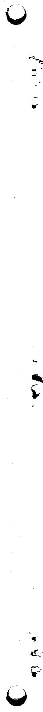

# 111

# CONTENTS

Page

ABSTRACT

INTRODUCTION 2

DESIGN CRITERIA AND FEATURES 6

Basic Design Requirements 6

Material of Construction 7

EXPERIMENTAL PROGRAM 8

Nonradioactive Operation 8

Radioactive Operation 10

METHODS OF OPERATION 10

Semicontinuous Operation 11

Batch Operation 11

DESIGN OF EQUIPMENT 14

FeedTank 14

Condensate Receiver 16

Still and Condenser 19

Cold Trap 27

Vacuum Pump 27

30

Heaters 30

Thermal Insulation 33

METALLURGICAL CHARACTERIZATION OF HASTELLOY N 33

Creep-Rupture Properties 34

Ductility 34

Metallographic Examination 38

STRESS ANALYSIS 38

Vacuum Still and Condenser 38

Feed Tank and Condensate Receiver 39

INSTRUMENTATION 39

Temperature Measurement 40

Temperature Control 40

Temperature Annunciators 48

Pressure Measurement 48

Pressure Control 49

49

PREOPERATIONAL INSPECTION 51

# iv

# CONTENTS (continued)

# EQUIPMENT INSTALLATION 52

Unitized Construction 52   
Hood Installation 52   
Cell Installation 52

# FINAL DISPOSITION 55

# ACKNOWLEDGEMENTS 55

# REFERENCES 57

# APPENDICES 59

Appendix A Physical Properties of Hastelloy N 61   
Appendix B Physical Properties of LiF, $\mathsf{BeF}_2$ , $\mathsf{ZrF}_4$ , and Their Mixtures and MSRE Salt A 66   
Appendix C Estimation of Pressure Drop for Salt Vapor in the Still-Condenser System 72   
Appendix D Estimation of Time to Heat Condensate Receiver and Feed Tank to Operating Temperature 79   
Appendix E Estimation of Heat Rejection Rate By Condenser 90   
Appendix F Stress Analysis of Vacuum Still and Condenser 95   
Appendix G Specifications for Heaters for Vacuum Distillation 111   
Appendix H Equipment Drawings 116

# DESIGN OF AN ENGINEERING-SCALE, VACUUM DISTILLATION

# EXPERIMENT FOR MOLTEN-SALT REACTOR FUEL

W. L. Carter

R. B. Lindauer

L. E. McNeese

# ABSTRACT

Experimental equipment has been designed for an engineering-scale demonstration of vacuum distillation of molten-salt reactor fuel. The distillation is carried out at about $1000^{\circ}\mathrm{C}$ and $1\mathrm{mmHg}$ to separate $\mathrm{LiF - BeF_2}$ carrier salt from less volatile fission products, primarily the rare earths. Uranium tetrafluoride is not present during the distillation. The experiment is designed for continuously feeding a molten-salt-fission-product mixture into a still at the same rate that distillate is being removed, thereby concentrating fission products in the still. Also, the still may be operated batchwise to give large concentration factors. Frequent sampling of the distillate furnishes data on the separation between carrier and fission products as a function of concentration in the still bottoms.

The equipment consists of a 48-liter feed tank, a 12-liter still, a 10-in. diam × 51-in. condenser, a 48-liter condensate receiver, plus associated temperature, pressure and level control instrumentation. All vessels and parts contacted by molten salt are made of Hastelloy N. The unit is electrically heated by shell-type, ceramic heaters.

About $90\%$ of the experimental program will be devoted to nonradioactive operation using mixtures of $\mathsf{LiF}_3$ , $\mathsf{BeF}_2$ , $\mathsf{ZrF}_4$ , and selected rare earth fluorides. The experiment will be concluded by distilling a 48-liter batch of uranium-free spent fuel from the Molten-Salt Reactor Experiment.

# 2 INTRODUCTION

This report describes the design and proposed use of experimental equipment to demonstrate vacuum distillation of fuel carrier salt from a molten-salt reactor. The purpose of this experiment is to demonstrate the feasibility of distilling a large portion of the carrier from contained fission product fluorides. Vacuum distillation is the key step in one method of processing a molten-salt breeder (see Fig. 1) because it separates the bulk of the valuable LiF-BeF $_2$ carrier from less volatile fission products, primarily the rare earths, and recovers this carrier salt for recycle to the reactor. Feasibility of distilling fluoride salts was established in batch, laboratory experiments by Kelly; this design is of an experiment that will demonstrate the operation on an engineering scale.

In the interest of simplicity, fabrication time, and economy, no attempt was made in this experiment to reproduce the actual operating conditions, such as high internal heat generation rate in the molten salt, or to use a still design of the type to be used in a processing plant for a breeder. Such advances are the next logical step after an engineering-scale demonstration. However, it is the purpose of this experiment to show that molten salt, containing fission products, can be fed continuously to the still at the rate at which it is being distilled, with the simultaneous accumulation of fission products in the bottoms. Furthermore, the still can be operated batchwise to concentrate fission products in some small fraction of the salt volume. In this way the still meets a requirement of a still for processing breeder fuel since large fission product concentration factors are necessary to minimize the amount of carrier salt discarded as waste.

The experiment is designed to obtain throughput data and relative volatility data between rare earth fluorides and the carrier components of molten salt fuel, which are LiF, $\mathsf{BeF}_2$ , and $\mathsf{ZrF}_4$ . Zirconium fluoride will not be a component of breeder reactor fuel, but it is included here because the still will be operated with salt of the composition of the Molten-Salt Reactor Experiment (MSRE), which is 65 mole % LiF, 30 mole % $\mathsf{BeF}_2$ , and 5 mole % $\mathsf{ZrF}_4$ . Progress of distillation is followed by sampling the flowing condensate at several times during the course of an experiment. Samples can be removed under vacuum without interrupting the run and will be analyzed to determine the amount of separation being obtained between components being fed to the still. It is also possible to sample the contents of the still, but this necessitates interrupting the run during the time a sample is being removed.

The experimental program is in two parts: About $90\%$ of the time will be devoted to nonradioactive operation, and the remaining $10\%$ to radioactive operation in distilling a small quantity of fuel carrier salt from the MSRE. The first phase is expected to log about 500 hr of operation. The same equipment will be used in the radioactive experiment after being thoroughly inspected at the conclusion of nonradioactive operation. Radioactive runs will be carried out in an MSRE cell

ORNL DWG. 66-82 R2

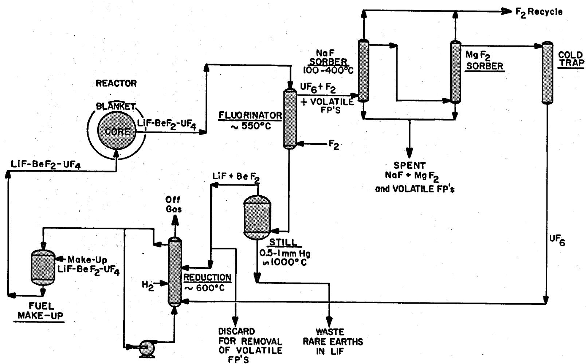  
Fig. 1. Principal Steps in Processing Irradiated Fuel from a Molten Salt Reactor.

on a 48-liter batch of uranium-free MSRE fuel that has been decayed at least two months.

Components of the experiment are a feed tank (48 liters), still (12 liters), condenser, condensate receiver (48 liters), associated temperature and pressure instrumentation, and a vacuum system. The still, condenser, and receiver are fabricated as a unit. The vessels are mounted in an angle-iron frame, which is $3 \times 6 \times 7$ ft high, allowing transport of the entire facility as a unit once instrumentation, power, and service lines have been disconnected. The equipment is heated by shell-type electric heaters which are enclosed in 4 to 8 in. of thermal insulation.

An experimental run is carried out by charging a molten mixture of carrier salt and fission product fluorides into the feed tank, which is held at a temperature slightly above the salt liquidus, which is $450^{\circ}\mathrm{C}$ for MSRE carrier salt. Concurrently the still, condenser, and condensate receiver are heated and evacuated, and the space above the liquid in the feed tank is evacuated. The final pressure is adjusted to about 0.5 atm in the feed tank and 0.2 to $5\mathrm{mmHg}$ in the rest of the equipment, depending upon the desired operating pressure. When the still temperature reaches $900^{\circ}\mathrm{C}$ , a 12 liter charge is forced into the still through a heated line, and the temperature is raised to the operating temperature range of 950 to $1000^{\circ}\mathrm{C}$ .

The still pot is the highest point of the system and is an annular volume surrounding the top of the condenser (see Fig. 2). Salt vapors flow into the top of the condenser and condense along its length by losing heat to the surroundings. Freezing is prevented by supplying the necessary external heat to keep the condenser surface above the liquidus temperature. In leaving the condenser the distillate passes through a small cup from which samples can be removed for analyses. Sampling can be done under vacuum without interrupting an experiment.

Liquid-level instrumentation in the still allows control of feed rate to correspond to the distillation rate, which is estimated to be 400 to $500\mathrm{cm}^3$ distillate per hour. Determining the actual distillation rate for molten-salt systems is an important part of this experiment.

All vessels and lines that contact molten salt are fabricated of Hastelloy N. In the region of the still and upper section of the condenser, the normal use temperature for this alloy may be exceeded by as much as $200^{\circ}\mathrm{C}$ . Consequently, the vessels are to be examined thoroughly by dimensional, radiographic, and ultrasonic methods before and after nonradioactive operation.

Provision is made for hanging test specimens of candidate metals of construction in the still. The materials that will be tested are:

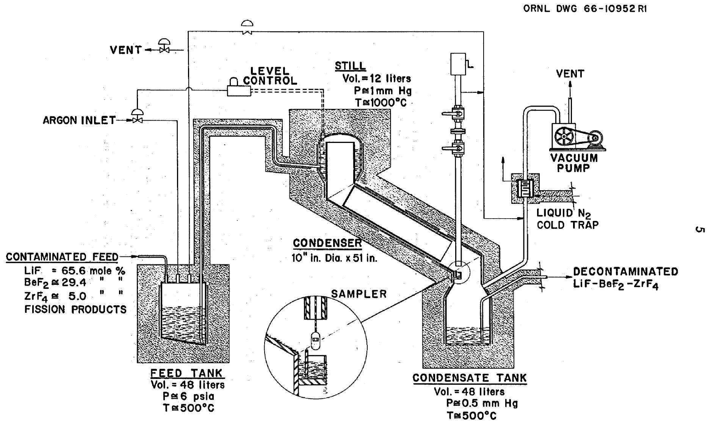  
Fig. 2. Vacuum Distillation of LiF-BeF $_2$ -ZrF $_4$ .

1. Hastelloy N (referee sample of still composition)   
2. Moly TZM (a Ti-Zr-Mo alloy)   
3. Haynes Stellite No. 25   
4. Graphite (grade AXF-SQBG, isotropic)   
5. Ni-18 Mo-0.2 Mn-0.05 Cr

Samples will be removed and inspected at the end of nonradioactive operation.

# DESIGN CRITERIA AND FEATURES

# Basic Design Requirements

Factors which influenced equipment design included the following:

1. The total operating time and the total volume of salt distilled during operation with irradiated material should be sufficient to conclusively demonstrate the feasibility of molten-salt distillation.   
2. Operation with irradiated material should be preceded by successful operation with unirradiated material.   
3. The same equipment should be used for work with irradiated and unirradiated materials.   
4. The equipment size should be compatible with space suitable for containment of $\mathsf{BeF}_2$ during nonradioactive operation.

Other factors of importance included:

1. Either semicontinuous or batch operation should be possible.   
2. Condensate samples should be taken during an experiment without upsetting operating conditions.   
3. The latent heat of condensation of the molten-salt vapor should be removed from the condenser by loss of heat to the surroundings.   
4. The pressure drop in the passage connecting the vaporization and condensation surfaces should be low.

The experimental program will consist of both nonradioactive and radioactive operation, with the former being about $90\%$ of the program. Nonradioactive operation will be carried out over a period of three to six months in the

Unit Operations Section, and then the equipment will be moved in to to the MSRE site to demonstrate vacuum distillation of irradiated MSRE carrier salt. Equipment size was governed by the space in an available hood, and the overall installation is limited to about $6 \times 3 \times 8$ ft in length, width, and height respectively. Unitized installation of all components within a supporting framework was designated to facilitate transport between sites. Radioactive operation will be carried out in the spare cell of the MSRE.

The duration of the radioactive experiment is an important factor because of the technological significance that can be associated with a conclusive demonstration using recently irradiated fuel. For this purpose, an operating period of 10 to 14 days was considered adequate, and, during this time, 48 liters of the fuel carrier salt will be distilled.

Another design feature is that provision be made for sampling the condensate stream at any time during the course of a distillation experiment. This requirement is made so that the composition of the still vapor can be measured as a function of still composition and/or temperature. Condensed vapors flow continuously through a cup at the condenser outlet (see drawing M-12173-CD-011D in the Appendix) from which a 10-g sample can be taken by lowering a thimble into the cup. The sampling operation is carried out at the operating pressure, causing no interruption or upset in the run.

Simplicity of design and ease of operation were primary considerations in planning this experiment. The only auxiliary systems are the necessary heaters, instruments, and vacuum equipment. Vapor condensation is brought about by radiative and convective heat loss to the surroundings, obviating the need for an auxiliary, high-temperature cooling system. This somewhat limits the maximum distillation rate, the calculated range being 350 to $500\mathrm{cm}^3/\mathrm{hr}$ with 3.5 to 4-in. insulation around the condenser.

# Material of Construction

All major pieces of equipment and connecting lines are built of Hastelloy N. This material has excellent resistance to corrosion by molten $\mathrm{LiF - BeF_2 - ZrF_4}$ mixture at the lower temperatures (500 to $700^{\circ}\mathrm{C}$ ) of the experiment. A limited amount of data at the higher operating temperatures (900 to $1000^{\circ}\mathrm{C}$ ) indicate that the corrosion resistance is probably quite good at these temperatures. This characteristic of Hastelloy N will be evaluated in the distillation experiment.

The still and condenser, which will be exposed to the higher temperatures, are constructed of 3/8-in.-thick plate to allow for uncertainty in the strength of Hastelloy N in the neighborhood of $1000^{\circ}$ C. The ASME Unfired Boiler and Pressure Vessel Code makes no provision for the use of this alloy for service above $700^{\circ}$ C. This

design is based on the creep data of McCoy* and the stress analysis of Hahs and Pickel,\* which substantiate the use of this equipment for an operating time up to 1000-hr duration. At no time will the unit be exposed to a positive internal pressure, the largest $\Delta P$ being 1 atm external pressure.

Use was made of on-hand material from the MSRE stockpile of Hastelloy N plate, sheet, tubing, rod, and pipe. Design and fabrication changes were made to conform to the available material. For example, cylindrical vessels are made of rolled and welded plate instead of the more obvious choice of using standard pipe if it were available; directional changes are made with mitered joints because pipe fittings were not available; some nozzles are made of tubing or drilled rod when a more conventional choice would have been standard pipe.

# EXPERIMENTAL PROGRAM

The vacuum distillation experiment will be carried out in two phases. The first phase will consist of a large number of nonradioactive experiments to thoroughly evaluate the still, obtain operating experience, and gather data that are pertinent to the distillation process. The second phase will be a 10 to 14 day demonstration in which irradiated carrier salt of the Molten Salt Reactor Experiment will be distilled in a cell at the MSRE site.

# Nonradioactive Operation

The experiment is described by the simplified flow diagram presented in Fig. 2; a detailed flowsheet is given in Appendix H, Drawing No. E-12173-CD-012D. The system consists of a feed tank, still, condenser, condensate receiver, cold trap, vacuum pump, and auxiliary instrumentation for controlling pressures, temperatures, and liquid level. All vessels and lines are heated with ceramic, clam-shell-type heaters or Calrod-type elements.

Initially the system is purged and filled with argon to remove oxygen, and all vessels are heated to about $500^{\circ}\mathrm{C}$ . A 48-liter charge of molten $\mathrm{LiF - BeF_2 - ZrF_4}$ of MSRE carrier salt composition containing a fission product fluoride is then put into the feed tank, and the entire system is evacuated. Pressure above the salt in the feed tank is adjusted to about 5 psia, sufficiently low to prevent salt from being pulled into the still when the still is at full vacuum. The evacuation is continued

until the still, condenser, and condensate receiver are at the desired operating pressure of 0.2 to $2\mathrm{mmHg}$ . Concurrently with the evacuation, the still temperature is raised to about $850^{\circ}\mathrm{C}$ , the temperature at which the salt charge has a vapor pressure of around $1\mathrm{mmHg}$ . The condenser temperature is adjusted 100 to $200^{\circ}\mathrm{C}$ lower than the still temperature to facilitate condensation of the salt vapor without solidification. Condenser heat is applied in four zones so that a high-to-low temperature gradient can be maintained down its length. The condensate receiver is heated to 500 to $550^{\circ}\mathrm{C}$ , a temperature that will keep the condensate molten but not cause undesired vaporization into the vacuum system.

When all parts of the system have reached the desired temperature and pressure, 12 liters of the feed salt are transferred through a heated line into the annular section of the still by pressurizing the feed tank with argon. The gas is added slowly through a capillary, and a liquid-level device, which senses the upper level in the still, stops the argon addition when this level is reached. The still temperature is controlled so that the vapor pressure of the salt is near $1\mathrm{mmHg}$ ; and, as distillation progresses, changing the salt composition, this temperature is allowed to increase to keep the vapor pressure at about $1\mathrm{mmHg}$ . Pressure at the condenser exit is held at about $0.5\mathrm{mmHg}$ . The calculated distillation rate is about $350\mathrm{ml/hr}$ .

The liquid-level instrument in the still is set to detect a low level that corresponds to vaporization of 2 liters and to begin argon flow into the feed tank to push more salt into the still. The upper-level setting stops the addition, and this cyclic operation is repeated throughout the run. Smoother, more continuous operation can be obtained by regulating the argon flow to the feed tank to be very near the predicted vaporization rate so that salt flows into the still at about the same rate that it is being vaporized.

In leaving the condenser, the condensate flows through a small cup that is centered beneath a sample tube. A $4\text{-cm}^3$ sample is obtained by lowering a 1-1/2-in. by 3/4-in.-diameter thimble into the cup. Sampling is done under operating conditions with no interruption in the experiment; a double-valve arrangement (shown schematically in Fig. 2) permits removal of a sample from the system without upsetting the still pressure. The sample cup is continuously flushed with fresh condensate, giving a sample that is representative of the still vapor at the time the sample is taken.

Finally, the condensate collects in a receiver from which it might be recycled for subsequent experiments. Level-detecting instrumentation allows an independent check of distillation rate. The condensate receiver can be sampled for a cumulative analysis only if the run is terminated because the tank must be pressurized to force the salt out the drain line. The vacuum line passes through a baffled trap cooled by liquid nitrogen to remove particulates or vapors that might clog the vacuum pump.

The still residue cannot be withdrawn during the course of an experiment. A dip tube is provided for draining all but about $154\mathrm{cm}^3$ from the conical bottom

section when a positive pressure is applied above the liquid surface. However, if desired, all liquid fed into the still may be evaporated. The maximum still temperature $(1000^{\circ}\mathrm{C})$ is high enough to vaporize the least volatile component (LiF) of the carrier but considerably below the point at which rare earth fluorides have a significant vapor pressure. Fission product fluorides, which the carrier salt contains during some runs, are allowed to accumulate in the still. A flush salt can be used to purge the still between different types of experiments.

Because of the toxic nature of beryllium, nonradioactive experiments are carried out in a hood, and all work areas are monitored for beryllium contamination. Containment is based on maintaining adequate air velocities at all hood openings.

# Radioactive Operation

At the conclusion of the nonradioactive experiments, the equipment will be moved intact to the spare cell at the MSRE site for a similar experiment using irradiated salt. Distillation is carried out in the same way as described above; however, all operations must be remote. A 48-liter batch of LiF-BeF $_2$ -ZrF $_4$ MSRE carrier salt, which has been fluorinated to remove uranium and volatile fission products, will be transferred from the chemical processing cell through an existing pipe line into the feed tank. The salt will then be distilled over a period of 10 to 14 days. Frequent samples will be withdrawn for analysis. It is anticipated that the extensive operating experience with nonradioactive experiments will allow specifying operating conditions to obtain maximum decontamination and trouble-free operation.

The cell ventilation system is used for disposal of gases from the experiment. This system contains the necessary filters for removing activity from the gas before exhausting it to the atmosphere.

# METHODS OF OPERATION

The distillation system can be operated in either of two modes: semicontinuous operation followed by batch operation or batch operation with heel retention. These methods are not necessarily the best for MSBR processing; they are, however, well suited for demonstration of molten salt distillation at the MSRE site.

Instrumentation for measuring liquid level in the still includes a liquid-level probe which operates when the still inventory is between 10 and 12 liters and a level probe which operates when the still inventory is between 0.78 and 6 liters. Salt can be fed to the system continuously or intermittently; however, no provision is made for removing liquid from the vaporizer during the operation. During a given

run, the total salt volume which will be distilled by either method of operation is approximately 48 liters.

# Semicontinuous Operation

For semicontinuous operation, the still will be charged with 12 liters of MSRE fuel salt (65 mole % LiF-30 mole % BeF $_2$ -5 mole % ZrF $_4$ ) containing rare earth fluorides. An additional 36 liters of fuel salt will then be fed to the still at a rate equal to the desired distillation rate. The liquid volume in the still will be maintained between 10 and 12 liters during this period. After feeding 36 liters of salt, the salt feed will be stopped and vaporization will be continued until the salt liquid volume is 0.78 liter.

The variation of $\mathsf{BeF}_2$ concentration in the condensate and the fraction of rare earth fluoride vaporized are shown in Fig. 3 for this mode of operation. The liquid volume in the still was assumed to be perfectly mixed and the relative volatilities of $\mathsf{BeF}_2$ and rare earth fluoride were assumed to be 4.0 and $5 \times 10^{-4}$ , respectively. The $\mathsf{BeF}_2$ concentration in the condensate is observed to decrease from an initial value of 67 mole % to 35 mole % at the end of semicontinuous operation and then to drop sharply to essentially zero during batch operation. The fraction of rare earth vaporized is seen to continuously increase to a value of 0.0018 at the end of operation. Approximately 98.5% of the salt fed to the still will be vaporized.

# Batch Operation

For batch operation with heel retention, the still is charged initially with 12 liters of MSRE fuel salt containing rare earth fluorides. Vaporization is then carried out until the liquid volume in the still is 0.78 liter. Fuel salt (11.22 liters) will be fed to the still to yield a total liquid volume of 12 liters and the above sequence repeated. Four cycles of batch operation with heel retention can be carried out with 48 liters of salt.

The variation of $\mathsf{BeF}_2$ concentration in the condensate and the fraction of rare earth fluoride vaporized is shown in Fig. 4. The liquid volume in the still was assumed to be uniform in concentration and the relative volatilities of $\mathsf{BeF}_2$ and rare earth fluoride referred to LiF are assumed to be 4.0 and $5 \times 10^{-4}$ , respectively. The fraction of rare earth fluoride vaporized is based on the total quantity of rare earth fluoride which has been fed to the still during a given cycle. The $\mathsf{BeF}_2$ concentration is observed to decrease from an initial value of 67 mole % to essentially zero during each cycle. The fraction of the rare earth fluoride vaporized after four cycles is 0.0027. Approximately 98.2% of the salt fed to the still will be vaporized..

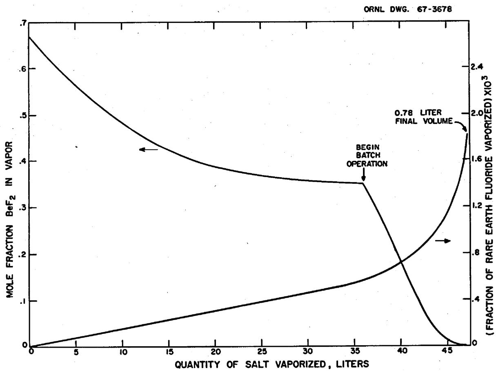  
Fig. 3. Semicontinuous Vaporization of Fluoride Salts.

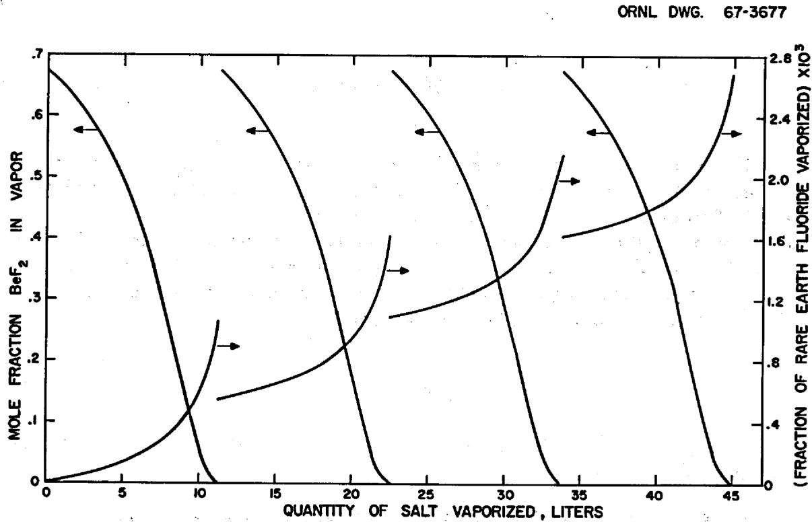  
Fig. 4. Batch Vaporization of Fluoride Salts.

The distillation experiment will be operated with unirradiated fuel salt for approximately 500 hr prior to operation with MSRE fuel salt which will require approximately 150 hr. Experimental work using nonirradiated fuel salt will provide general information on optimum operating conditions for the subsequent work using irradiated salt as well as specific data such as relative volatilities of rare earth fluorides and fuel salt components, vaporization rates and factors affecting rate, and concentration polarization at the vapor-liquid interface. Experimental work using irradiated fuel salt will provide additional information on relative volatilities of rare earth fluorides and other fission product fluorides and will point out problems associated with the remote operation of a distillation system with irradiated material.

# DESIGN OF EQUIPMENT

The major pieces of equipment for this experiment are designed for semicontinuous or batch operation to conclusively demonstrate vacuum distillation of molten-salt reactor fuel on an engineering scale. The vessels are sized so that batch runs of 30 to 36 hr duration can be made. A batch operation can consist of distilling up to 12 liters of salt, whereas a semicontinuous experiment can distill up to 48 liters and operate for more than one week. The following paragraphs discuss the pertinent design characteristics of each piece of equipment.

Feed Tank

# Design Features

The feed tank is described in Fig. 5, and the following values characterize the vessel and its operation:

<table><tr><td>Total volume</td><td>58.6 liters</td></tr><tr><td>Operating volume (full)</td><td>48.0 liters</td></tr><tr><td>Operating pressure</td><td>5.0 to 6.7 psia</td></tr><tr><td>Operating temperature</td><td>500 to 550°C</td></tr><tr><td>Heater capacity</td><td>20 kw</td></tr><tr><td>Material</td><td>Hastelloy N</td></tr><tr><td>Material thickness (sides, top, and bottom)</td><td>1/4 in.</td></tr></table>

Detailed design of the feed tank is shown on Drawing No. M-12173-CD-013-D in Appendix H.

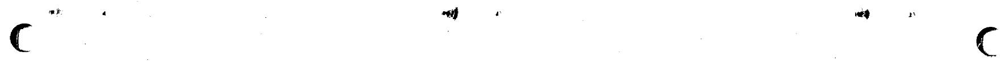

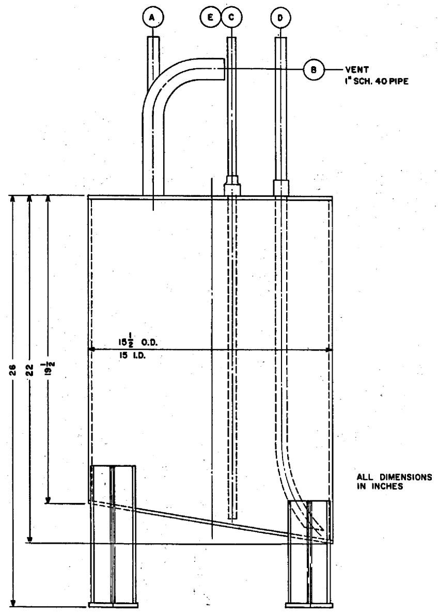

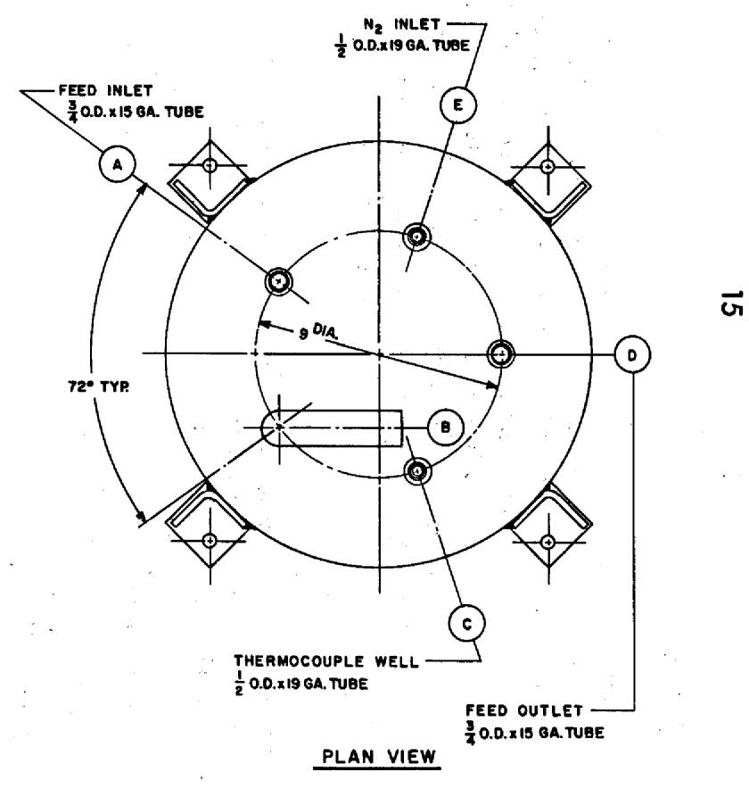  
Fig. 5. Molten Salt Distillation Experiment. Schematic diagram of the feed tank.

# Thermal Design

The thermal design of the feed tank was concerned only with determining the required heat input rate to give a tolerable heat-up time from room temperature to operating temperature ( $\sim 500^{\circ}$ C). After the vessel and contents have been heated to $500^{\circ}$ C, the only heat required is that needed to balance the heat loss to the surroundings. The heat-up time was calculated for several heat input rates, and these are plotted in Fig. 6. An arbitrary upper limit of about 2 hr was chosen for the heat-up period, and on this basis a 20-kw heat input is specified. The calculations are based on the tank's being full (48 liters) of $\mathsf{LiF - BeF}_2\mathsf{-ZrF}_4$ (65-30-5.0 mole %) mixture.

At operating temperature, the calculated heat loss from the feed tank is $1.2\mathrm{kw}$ through the 6-in.-thick insulation. Heaters are arranged so that about 6 kw are applied to the tank bottom, 4 kw to the top, and 10 kw to the sides.

A more complete treatment of the thermal analysis is given in Appendix D.

# Operating Pressure

The feed tank is connected to the still via an open line that rises to a point higher than the still and loops down to the still. When the feed tank is filled, molten salt must be raised 5.25 ft to the top of the loop; when near empty, salt must be raised 7 ft (Drawing No. M-12173-CD-010-D in Appendix H). Since the still operates at a pressure of about 1 mm Hg, the salt (sp gr = 2.22 at $500^{\circ}\mathrm{C}$ ) will be drawn into the still unless the feed tank is partially evacuated. Feed tank pressure must be kept in the range 5.0 to 6.7 psia, depending on the salt level in the tank.

Condensate Receiver

# Design Features

The condensate receiver is described in Fig. 7, and the following values characterize the vessel and its operation:

<table><tr><td>Total volume</td><td>57.5 liters</td></tr><tr><td>Operating volume (full)</td><td>48 liters</td></tr><tr><td>Operating pressure</td><td>0.5 mm Hg</td></tr><tr><td>Operating temperature</td><td>500 to 550°C</td></tr><tr><td>Heater capacity</td><td>20 kw</td></tr><tr><td>Material</td><td>Hastelloy N</td></tr><tr><td>Material thickness (sides and neck)</td><td>1/4 in.</td></tr><tr><td>(bottom)</td><td>3/8 in.</td></tr></table>

ORNL-DWG-68-797

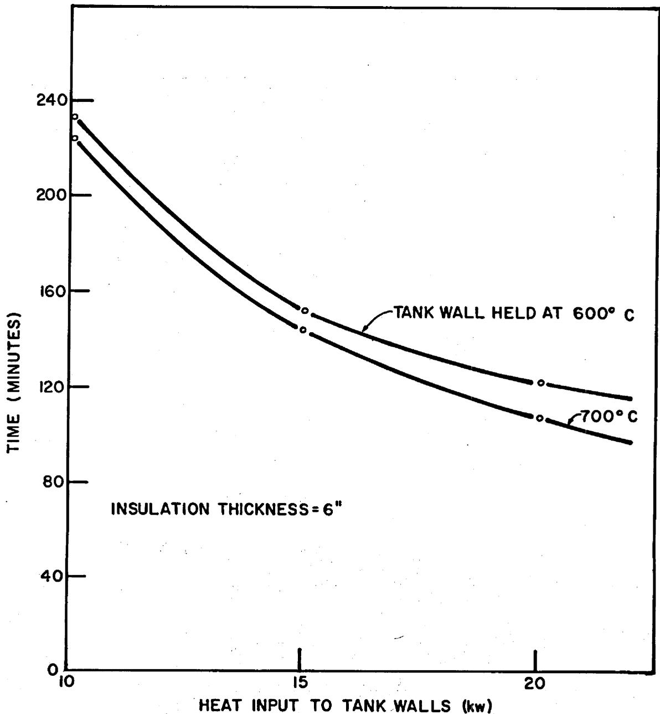  
Fig. 6. Calculated Time Required to Heat the Feed Tank or Condensate Receiver from Room Temperature to $500^{\circ}$ C When Tank Contains 48 liters of $\mathsf{LiF - BeF}_2\mathsf{-ZrF}_4$ Salt.

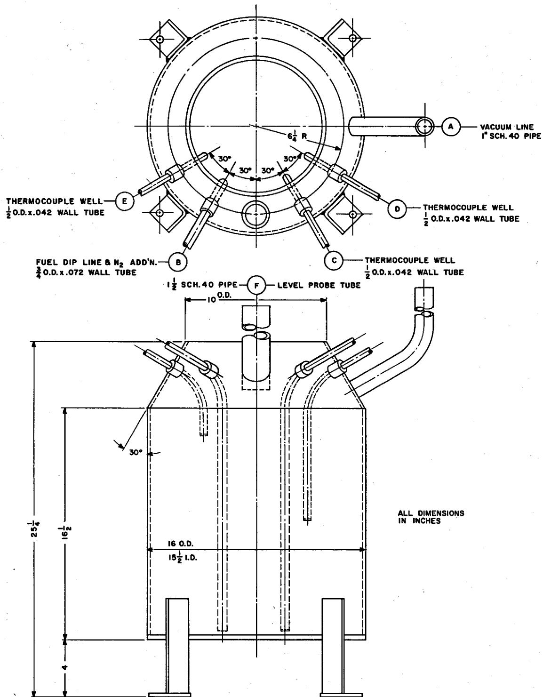  
Fig. 7. Molten Salt DistillationExperiment.Schematic diagram of the condensate receiver.

Detailed design of the condensate receiver is shown on Drawing No. M-12173-CD-009-D in Appendix H.

# Thermal Design

The same thermal design was used for the condensate receiver and the feed tank because the dimensions and use of the two vessels are almost identical. The receiver is surrounded on the sides and bottom by heaters rated at 20 kw, capable of heating a full charge of salt from room temperature to $500^{\circ}\mathrm{C}$ in about 2 hr. At operating temperature, heat loss to the surroundings through 6-in. insulation is about 1.1 kw.

The heaters are arranged so that about $6\mathrm{kw}$ are applied to the tank bottom and $14\mathrm{kw}$ to the sides.

The temperature of the condensate tank is kept just slightly above the liquidus of the contained salt so that the salt vapor pressure is negligible. A high temperature at this point would cause salt vapors to flow into the vacuum system.

# Operating Pressure

Pressure in the condensate receiver must be kept lower than the vapor pressure of the salt in the still so that these vapors will flow from the still into the condenser. The receiver is kept at a pressure in the range 0.2 to $0.5 \, \text{mmHg}$ , allowing a pressure difference of at least $0.5 \, \text{mmHg}$ between the still and receiver.

# Still and Condenser

The still and condenser are designed as a unit with the condenser's vapor inlet actually extending into the still. The still reservoir is the annular space between the vapor line and the outer wall. No provision is made for removing still bottoms from the annulus during the course of an experiment; however, a dip-tube is provided to allow removal of liquid between experiments. As shown in Fig. 8, the still and condenser are joined in an angular configuration; this was necessitated by the limited headroom in the operational area.

# Design Features

The data given in Table 1 characterize the still-condenser unit and its operation. Detailed design of the unit is shown on Drawing M-12173-CD-011-D and M-12173-CD-014-D in Appendix H.

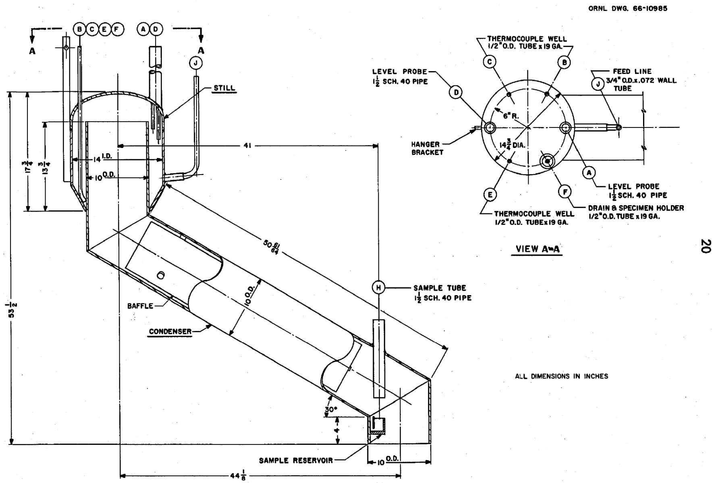  
Fig. 8. Molten Salt Distillation Experiment. Schematic diagram of the vacuum still and condenser.

Table 1. Design Data for the Vacuum Still and Condenser   

<table><tr><td colspan="2">Still</td></tr><tr><td>Material</td><td>Hastelloy N</td></tr><tr><td>Dimensions</td><td>14 in. diam x 16 in. high</td></tr><tr><td>Wall thickness</td><td>3/8 in.</td></tr><tr><td>Insulation thickness</td><td>8 in.</td></tr><tr><td>Thermal conductivity of insulation</td><td>0.1 Btu hr-1 ft-1 °F-1</td></tr><tr><td>Operating volume in annulus</td><td>12 liters</td></tr><tr><td>Depth of salt for 12-liter volume</td><td>8.08 in. (measured from top of conical bottom)</td></tr><tr><td>Height between high- and low-level control points</td><td>1.62 in.</td></tr><tr><td>Volume of salt between high- and low-level control points</td><td>2 liters</td></tr><tr><td>Operating temperature</td><td>900 to 1000°C</td></tr><tr><td>Operating pressure</td><td>0.5 to 1 mm Hg</td></tr><tr><td>Surface wetted by 12 liters of salt (excluding vapor line)</td><td>2.64 ft2</td></tr><tr><td>Surface area of salt</td><td>0.52 ft2</td></tr><tr><td>Heat flux during distillation</td><td>~1615 Btu hr-1 ft-2</td></tr><tr><td>Distillation rate (calculated)</td><td>~5.24 x 10-4 g/cm2 sec</td></tr><tr><td>Time required to evaporate 12 liters of salt</td><td>~30 hr</td></tr><tr><td>Heater rating</td><td>15 kw</td></tr><tr><td colspan="2">Condenser</td></tr><tr><td>Material</td><td>Hastelloy N</td></tr><tr><td>Dimensions</td><td>10 in. OD x 51 in. long</td></tr><tr><td>Wall thickness</td><td>3/8 in.</td></tr><tr><td>Surface area (outside)</td><td>11.3 ft2</td></tr><tr><td>Insulation thickness</td><td>4 in.</td></tr><tr><td>Thermal conductivity of insulation</td><td>0.1 Btu hr-1 ft-1 °F-1</td></tr><tr><td>(continued)</td><td></td></tr><tr><td>Operating pressure</td><td>0.5 to 1 mm Hg</td></tr><tr><td>Operating temperature</td><td>550 to 875°C</td></tr><tr><td>Cooling method</td><td>Conduction through insulation to surroundings</td></tr><tr><td>Condenser duty</td><td>4000 to 5000 Btu/hr</td></tr><tr><td>Heater rating (equally divided in four zones over length)</td><td>20 kw</td></tr></table>

The still annulus is about 13 in. deep by 2 in. thick and, when charged with 12 liters of salt, will be filled within about 1.43 in. of the top. Heat for distilling the fluoride mixture is supplied by electric heaters surrounding the sides and top. The heat flux is small, being only about 1615 Btu hr $^{-1}$ ft $^{-2}$ at a distillation rate of 420 cm $^{3}$ /hr. The top of the still is kept a few degrees hotter than the still liquid to preclude condensation.

In designing the still, care was used to avoid junctions that would produce large stresses in the metal parts when the unit is heated from room temperature to $1000^{\circ}\mathrm{C}$ . The still-condenser unit elongates about 1 in. when heated over this temperature range. The unit is supported by a cable and counterweight attached to the still so that movement is not restricted.

The condenser is made relatively large (10 in. OD) to facilitate heat loss by the greater surface area, thereby increasing the attainable distillation rate. A cylindrical core is placed inside the condenser to channel salt vapor into the annulus adjacent to the outside wall where it is condensed and cooled. Three radiation shields are placed inside this core at the high-temperature end to decrease the amount of heat received by the condenser from the $1000^{\circ}\mathrm{C}$ zone of the still.

# Temperature Measurement

Temperature measurements are made at a number of points on the outside surfaces of the still and condenser by attaching thermocouples to these surfaces. These exterior readings should be very close to the temperatures inside the vessel because of the very low heat flux ( $\sim 1615 \, \text{Btu} \, \text{hr}^{-1} \, \text{ft}^{-2}$ ); the calculated temperature drop across the wall is only $1.5^{\circ} \text{C}$ . However, interior temperature measurements are made in the still liquid at three different elevations by introducing thermocouples into wells extending through the vessel head. The temperature of either a surface or interior thermocouple can be selected as the reference temperature at which the still is operated.

As to the condenser, only outside-surface thermocouples are installed and selected ones are used to control the wall temperature. There will be a temperature gradient along the length of the condenser to allow the condensed vapor to cool to a temperature of only 25 to $30^{\circ}\mathrm{C}$ above the liquidus as it drops into the condensate receiver. When the condensate composition is that of the MSRE carrier salt, $\mathrm{LiF - BeF_2 - ZrF_4}$ (65-30-5.0 mole %), the condenser temperature can be as low as $500^{\circ}\mathrm{C}$ ; but for experiments in which nearly 100 mole % LiF is distilled, the condenser surface needs to have a minimum temperature of about $875^{\circ}\mathrm{C}$ .

# Operating Pressure and Distillation Rate

The upper limit of $1000^{\circ}\mathrm{C}$ on the operating temperature requires that the still pressure be no greater than $1\mathrm{mmHg}$ during most of a distillation experiment if

vaporization is to occur. The initial salt composition has a vapor pressure of perhaps $10\mathrm{mmHg}$ at $1000^{\circ}C$ , but the more volatile $\mathsf{BeF}_2$ quickly boils out, leaving an equilibrium mixture whose vapor pressure is about $1\mathrm{mmHg}$ . A pressure gradient is maintained through the condenser by evacuating the condensate receiver to $0.5\mathrm{mmHg}$ or less. The volumetric flow rate of vapor from the still to the condenser depends upon the pressure differential. The graph in Fig. 9 is a plot of the calculated flow rate of condensate as a function of the pressure at the condenser outlet. The pressure at the liquid surface in the still was taken to be $1\mathrm{mmHg}$ , and the vapor composition was assumed to be that of MSRE carrier salt, namely, $\mathsf{LiF - BeF_2 - ZrF_4}$ (65-30-5 mole%). The calculations indicate that the still will have a capacity of about $400\mathrm{cm}^3 /\mathrm{hr}$ when 4-in. insulation surrounds the condenser.

The same plot also shows the calculated distillation rate as a function of the temperature of the condensing surface for insulation thicknesses of 3 in. and 4 in. Satisfactory operation of the still is realized in the area to the left of these temperature curves. Although the pressure curve was calculated for vapor of MSRE carrier composition, it may be used with little error for vapors richer in LiF. For pure LiF vapor the pressure at the condenser outlet needs to be about $3.5\%$ lower than that of MSRE carrier for comparable flow rates. However, the condensation temperature must be considerably higher ( $>855^{\circ}\mathrm{C}$ ) to preclude freezing.

# Heat Rejection by Condenser

As stated above, the condenser rejects the latent heat of condensation of the salt vapor by conduction through the thermal insulation to the surrounding atmosphere. For this purpose the insulation is purposely made thinner (4 in.) than on other parts of the equipment. The temperature of the condenser is maintained above the salt liquidus by providing adequate heat input to the condenser. The rate of heat rejection is directly dependent on the temperature difference between the condenser wall and the surroundings, and the curves of Fig. 10 show this relationship over the temperature range of interest in this experiment. The temperature at which the wall is held depends on the vapor composition; that is, the wall temperature must be above the liquidus yet low enough so that the vapor pressure of the condensate is small in comparison with the total pressure in the condenser. Salt of MSRE carrier composition can be condensed in the temperature range 550 to $700^{\circ}$ C; whereas, compositions containing greater than 90 mole % LiF require condenser temperatures of $800^{\circ}$ to $900^{\circ}$ C.

The dashed curves in the figure give the condensation rates for a vapor of MSRE carrier composition and of pure LiF for values of the heat rejection rate. The volumetric rate for the carrier salt was calculated for condensate at a reference temperature of $600^{\circ}\mathrm{C}$ ; for LiF the condensate temperature was taken as $875^{\circ}\mathrm{C}$ .

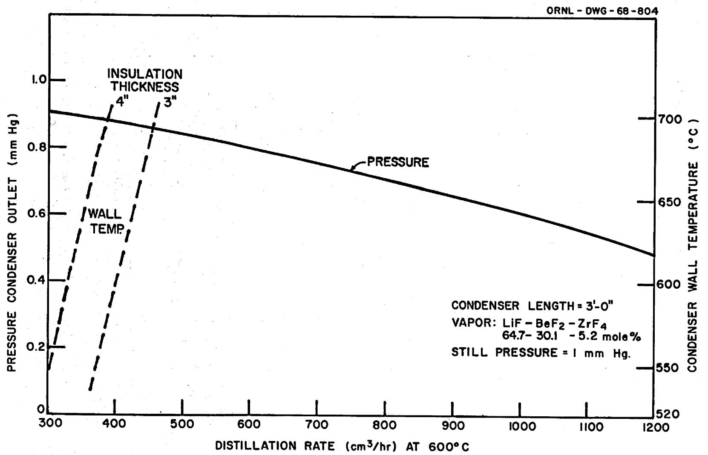  
Fig. 9. Distillation Rate as a Function of Pressure at Condenser Outlet and Condenser Wall Temperature.

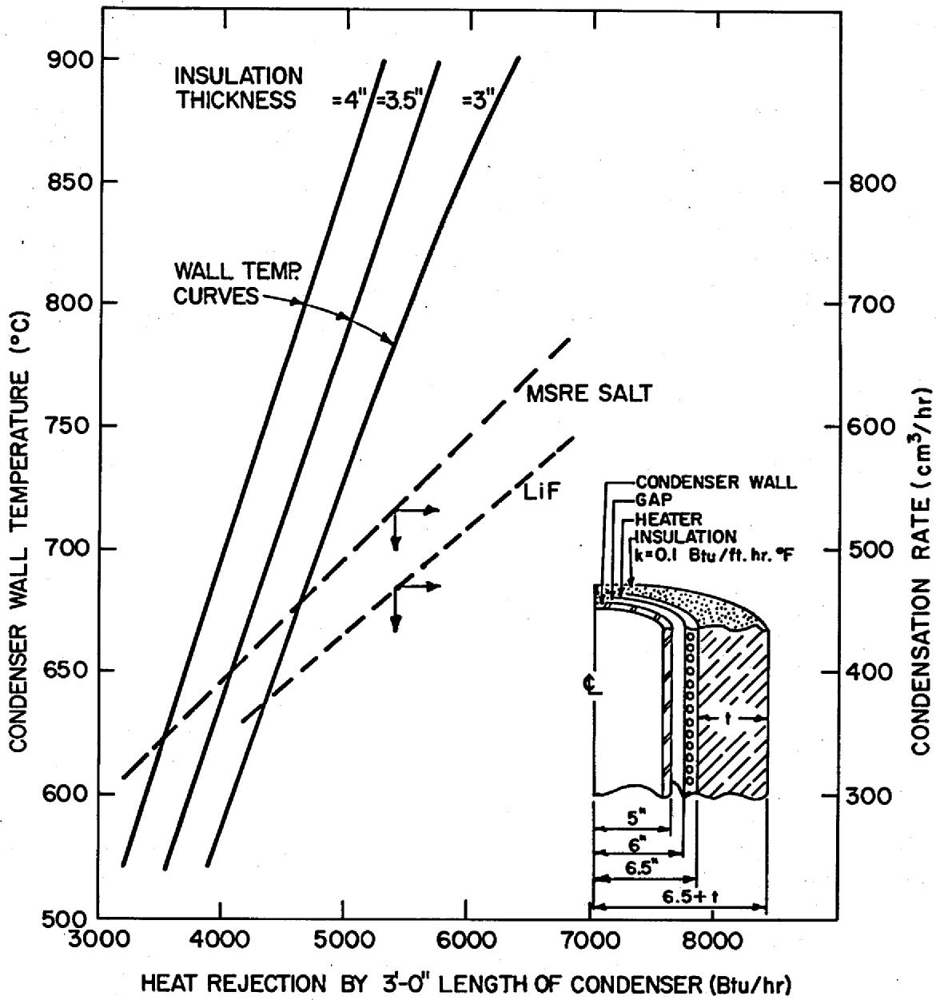  
Fig. 10. Condensation Rate of MSRE Carrier Salt as a Function of Wall Temperature and Insulation Thickness.

The curves of Fig. 10 are based on an effective condenser length of 36 in.; the actual length is 51 in. The diagram on the figure depicts the wall configuration used in the calculations.

# Thermal Design

The governing requirement in determining the amount of heat that should be supplied to the still and condenser is the time that can be tolerated in heating from room temperature to operating temperature. Independent calculations were made for the still section and condenser section for this transient period to find the relation between time and installed heater capacity. This relation is shown on Fig. 11. From these data arbitrary choices of $15\mathrm{kw}$ for the still and $20\mathrm{kw}$ for the condenser were made. These heat input rates will permit heating the unit to $1000^{\circ}\mathrm{C}$ in about $1.5\mathrm{hr}$ if desired; however, a heat-up time of 2 to 4 hr will probably be employed. The 20-kw capacity on the condenser is adequate to allow using a thinner insulation than the specified 4 in. if it is desirable to increase the distillation rate (see Figs. 9 and 10.)

In steady-state operation the heat demand by the still is only a small part of the installed capacity. For example, the vaporization of $500\mathrm{cm}^3/\mathrm{hr}$ of MSRE carrier salt requires about $1.5\mathrm{kw}$ , adding a calculated heat loss from the still of $1.1\mathrm{kw}$ , there obtains a steady state requirement of $2.6\mathrm{kw}$ . Similarly for the condenser liquefying MSRE salt at $700^{\circ}\mathrm{C}$ , the calculated heat loss to the surroundings is $2.1\mathrm{kw}$ . Subtracting the latent heat of vaporization of the salt ( $1.5\mathrm{kw}$ ) gives a steady-state demand on the heaters of only $0.6\mathrm{kw}$ .

Heaters are arranged on the still so that about 11 kw are applied to the vertical sides and 4 kw to the top. Separate controls are provided so that the top can be held at a slightly higher temperature than the boiling salt to preclude condensation and refluxing. The 20 kw on the condenser are divided into four approximately equal parts covering the entire length. Each section has separate temperature control.

# Cold Trap

The cold trap is inserted in the vacuum line upstream of the vacuum pump to remove mists and vapors that could impair operation of the pump. The unit is shown in Fig. 12. It is cooled by liquid $\mathsf{N}_2$ in the jacket surrounding the baffled vapor chamber. Liquid $\mathsf{N}_2$ additions are made manually upon a signal from a level device in the jacket. Nitrogen vapor is vented to the surroundings.

# Vacuum Pump

The vacuum pump is a Cenco Hi-Vac capable of evacuating the system from atmospheric pressure to $0.5 \, \text{mmHg}$ in about 3 hr. This time corresponds with the

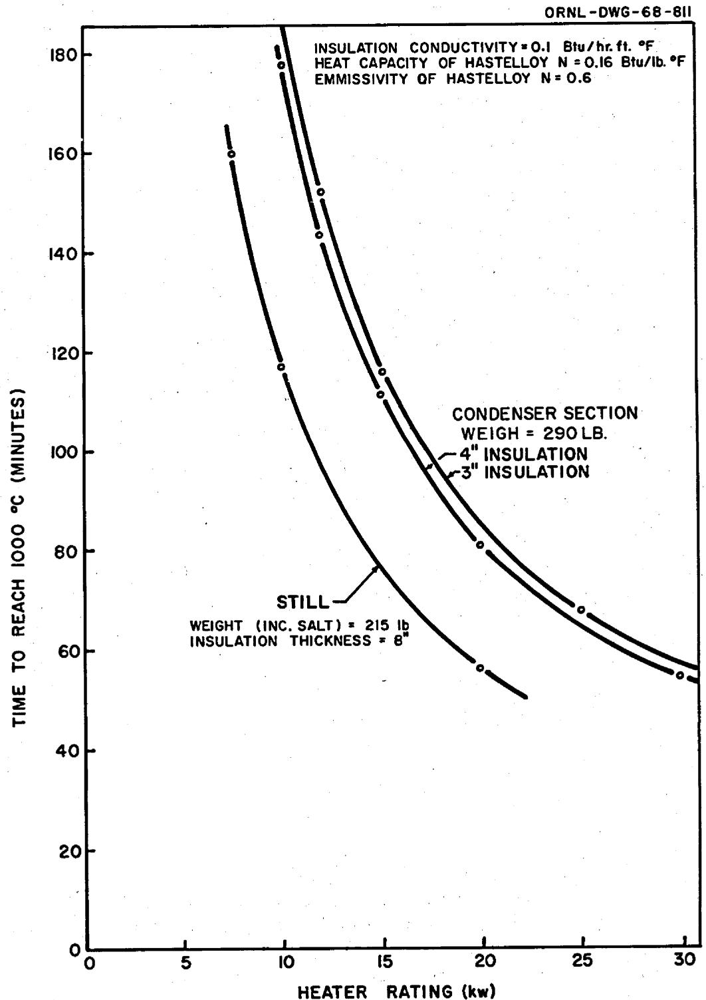  
Fig. 11. Time Required to Heat Vacuum Still and Condenser from Room Temperature to $1000^{\circ}$ C.

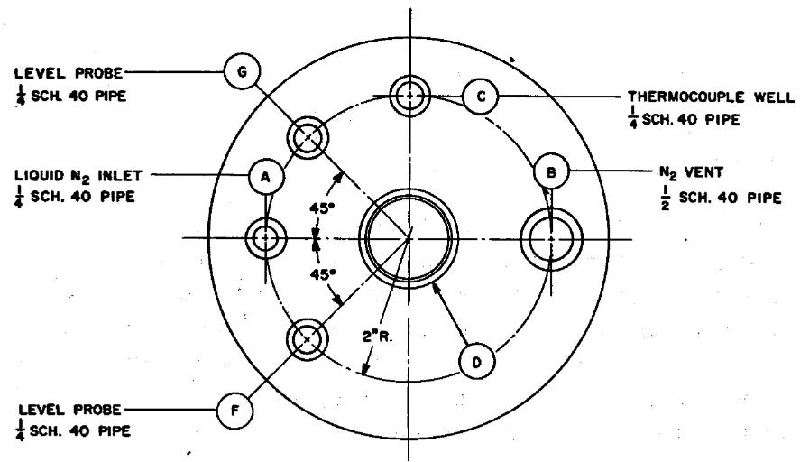

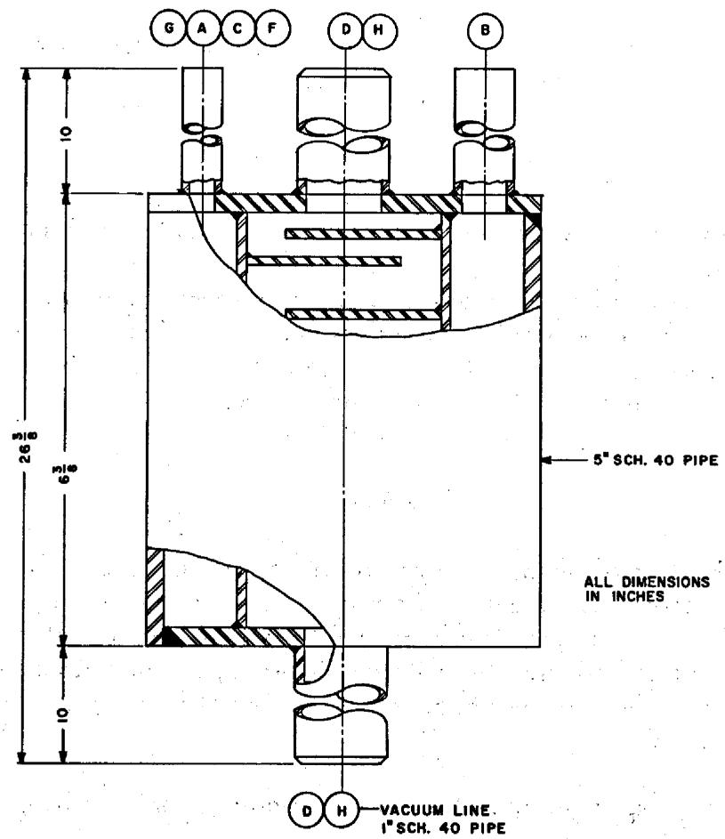  
Fig. 12. Molten Salt Distillation Experiment. Schematic diagram of the liquid $\mathsf{N}_2$ cold trap.

transient heat-up time for the system. Heating and evacuating would be carried out simultaneously.

# Sampler

# Nonradioactive Operation

The two photographs of Figs. 13 and 14 show the sampler. The unit is installed directly above the sample cup at the condenser outlet (see Fig. 8). The small line above the top valve is used to evacuate the chamber just prior to sampling; the $3/4$ -in.-diam by $1-3/4$ -in.-long capsule is then lowered by means of the crane into the sample cup, filled with molten salt, and retracted to a position above the flange. After freezing, the sample is removed for analysis by closing the lower valve and opening the flange. The frequency of sampling is limited by the time required for these operations.

This sampler was designed for use in molten salt test loop experiments and is being reactivated for this experiment.

# Radioactive Operation

The same sampling device will be used to sample radioactive salt at the MSRE site when irradiated fuel is distilled. The 1-1/2-in. pipe, through which the sample capsule is lowered, will be lengthened to extend through the cell roof plugs, and shielding will be installed around the valves and flange that are above the roof plugs. A sample of condensate will be obtained as described above. The sample is then put into a shielded container for transport to the hot analytical laboratory.

# Heaters

Electric heating elements are used on all vessels and lines. For the vessels, the heaters are fabricated of ceramic, refractory material in which the elements are totally embedded. The heaters were molded by the manufacturer* to fit the geometry of the vessels and to be removable without disturbing any nozzles or other connections to the equipment. All ceramic heaters are capable of holding the vessel that they surround at $1000^{\circ}$ C.

A copy of the specifications to which the heaters were purchased is included in Appendix G.

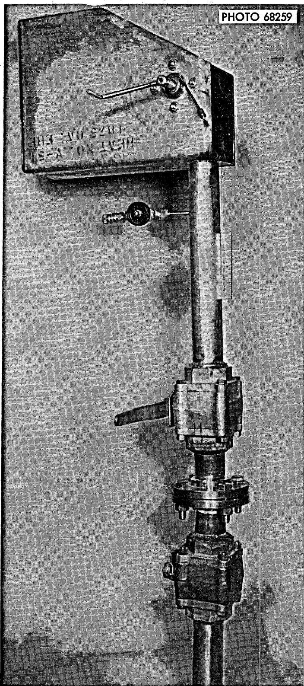  
Fig. 13. Sampler for Vacuum Distillation Experiment.

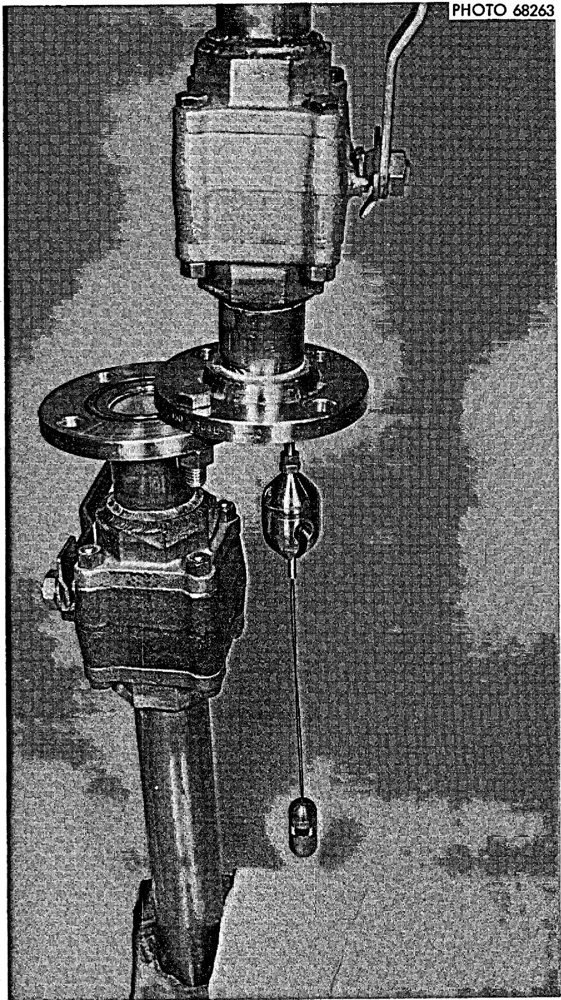  
Fig. 14. View of Sampler Showing Sampling Capsule.

Wherever heat was needed on pipes or vent lines, the lines were traced with tubular electric elements.

# Thermal Insulation

Two types of thermal insulation are used. Adjacent to the heaters where the temperature might be as high as $1200^{\circ}\mathrm{C}$ , a 2-in.-thick blanket of Fiberfrax* is used; outside this layer, Careytemp $1600^{**}$ is applied to the desired total thickness. The Fiberfrax used here is Type 970-JH, having the composition $50.9\%$ $\mathrm{Al}_{2}\mathrm{O}_{3}$ , $46.8\%$ $\mathrm{SiO}_{2}$ , $1.2\%$ $\mathrm{B}_{2}\mathrm{O}_{3}$ , $0.8\%$ $\mathrm{Na}_{2}\mathrm{O}$ , and $0.3\%$ inorganics by weight. It contains no organic binders and is recommended for temperatures to $2300^{\circ}\mathrm{F}$ . Careytemp 1600 is an expanded silica insulation reinforced with inorganic fibers and is recommended for use to temperatures of $1600^{\circ}\mathrm{F}$ . Molded, segmented, cylindrical shapes are used to cover the equipment. The outside surface is finished with asbestos cement and glass cloth plus a bonding adhesive to give a glazed appearance.

The following tabulation 2 lists the thermal conductivity of these insulating materials:

<table><tr><td rowspan="2"></td><td rowspan="2">Density (lb/ft3)</td><td colspan="5">Thermal Conductivity at Indicated Mean Temperature (Btu-in. hr-1 ft-2 °F-1)</td></tr><tr><td>600°F</td><td>1000°F</td><td>1200°F</td><td>1400°F</td><td>1600°F</td></tr><tr><td>Fiberfrax</td><td></td><td></td><td></td><td></td><td></td><td></td></tr><tr><td>Blanket form</td><td>6</td><td>0.58</td><td>0.86</td><td>1.09</td><td>1.34</td><td>1.62</td></tr><tr><td>Paper form</td><td>12</td><td>0.48</td><td>0.69</td><td>0.83</td><td>1.0</td><td>1.27</td></tr><tr><td>Careytemp 1600</td><td></td><td></td><td>0.76</td><td></td><td></td><td></td></tr></table>

# METALLURGICAL CHARACTERIZATION OF HASTELOY N

The metallurgical properties $^{3,4}$ of Hastelloy N at elevated temperatures are well documented in the temperature range 600 to $800^{\circ} \mathrm{C}$ where it is commonly used. However, data in the neighborhood of $1000^{\circ} \mathrm{C}$ are nonexistent since there have been no previous occasions to consider the alloy for use at such a high temperature. In this experiment the still will be at about $1000^{\circ} \mathrm{C}$ during most of its operation, and the upper portion of the condenser will be at $800^{\circ} \mathrm{C}$ or higher a large part of the time. However, in light of the initial distillation work of Kelly using small stills made of Hastelloy N, this alloy appeared suitable for the engineering-scale unit. Furthermore,

a time-consuming alloy developmental program would have been necessary to identify a more suitable material.

The results of an abbreviated testing program indicated that Hastelloy N should be satisfactory for a short-term experiment and gave the data that were needed to ensure a safe design. In addition, these tests revealed characteristics of Hastelloy N, which, although not of serious consequence in this short experiment, would make this alloy unsuitable for use at $1000^{\circ}\mathrm{C}$ in a reactor processing plant. Three such properties are the oxidation resistance, intergranular cracking, and the effect of thermal cycling on high- and low-temperature ductility.

# Creep-Rupture Properties

A brief, creep-rupture program was undertaken by McCoy* to determine data at $982^{\circ}$ C (1800°F), and the results are given in Table 2. These data were obtained on test specimens of a typical heat of air-melted Hastelloy N (Heat 5065). The specimens were small rods having a gage section 1 in. long by 0.125 in. diam.

The cumulative time that the vacuum still would be at $1000^{\circ}\mathrm{C}$ during the lifetime of the experiment was estimated to be 1000 hr, and it was agreed that a satisfactory design point would be one that limited the still to $1\%$ creep over this length of time. The data of Table 2 were plotted as shown in Fig. 15 to extend the creep-rupture characteristics over the expected lifetime. The curves show that the stresses producing rupture and $5\%$ creep over the 1000-hr period are reasonably well defined; whereas, the $1\%$ and $2\%$ curves, in particular, are not defined sufficiently by the experimental data. More data are needed for times greater than 100 hr. Nevertheless, the allowable design stress was chosen by extrapolating the $1\%$ curve to 1000 hr to obtain a value of about 780 psi; this figure was rounded off on the lower side to 700 psi which was used in the design calculations.

# Ductility

The ductility of Hastelloy N at $982^{\circ}C$ (Fig. 16) exhibits a minimum for test specimens having rupture lives in the approximate range of 50 to 200 hr. The minimum ductility is slightly greater than $20\%$ . The reduction in area decreases rapidly with increasing rupture life to a value of about $15\%$ . The increase in the elongation for long rupture lives is thought to be associated with the extensive intergranular cracking that was observed.

Table 2. Creep Properties of Hastelloy N at ${982}^{ \circ  }{\mathrm{C}}^{\mathrm{a}}$   

<table><tr><td rowspan="2">Test No.</td><td rowspan="2">σ (psi)</td><td colspan="5">Time to Indicated Strain (hr)</td><td rowspan="2">ε (%/hr)</td><td rowspan="2">ε (%)</td><td rowspan="2">% Reduction in Area</td><td rowspan="2">Remarks</td></tr><tr><td>1%</td><td>2%</td><td>5%</td><td>20%</td><td>Rupture</td></tr><tr><td>5768</td><td>2000</td><td>35</td><td>73</td><td>185</td><td>495</td><td>644.9</td><td>0.0276</td><td>41.50</td><td>16.22</td><td>- - - -</td></tr><tr><td>5765</td><td>3000</td><td>1</td><td>7.6</td><td>33</td><td>117</td><td>123.9</td><td>0.123</td><td>22.36</td><td>13.4</td><td>Temperature control not adequate at start of test.</td></tr><tr><td>5762</td><td>4000</td><td>0.7</td><td>2.0</td><td>11</td><td>47</td><td>51.5</td><td>0.282</td><td>21.88</td><td>15.47</td><td>Temperature control not adequate at start of test.</td></tr><tr><td>5761</td><td>6000</td><td>0.75</td><td>1.3</td><td>3.2</td><td>10.5</td><td>16.15</td><td>1.65</td><td>48.44</td><td>36.57</td><td>- - - -</td></tr><tr><td>5763</td><td>10000</td><td>&lt;0.1</td><td>0.2</td><td>0.5</td><td>1.9</td><td>2.95</td><td>9.0</td><td>50.0</td><td>37.86</td><td>- - - -</td></tr><tr><td>5867</td><td>1880</td><td>35</td><td>72</td><td>165</td><td>407</td><td>520.8</td><td>0.026</td><td>52.0</td><td>15.6</td><td>- - - -</td></tr><tr><td>5868</td><td>3000</td><td>12</td><td>25</td><td>60</td><td>154</td><td>157.9</td><td>0.081</td><td>22.22</td><td>15.6</td><td>- - - -</td></tr></table>

Heat 5065 tested in the as-received condition (1/2 hr at $1176^{\circ}\mathrm{C}$ mill anneal).

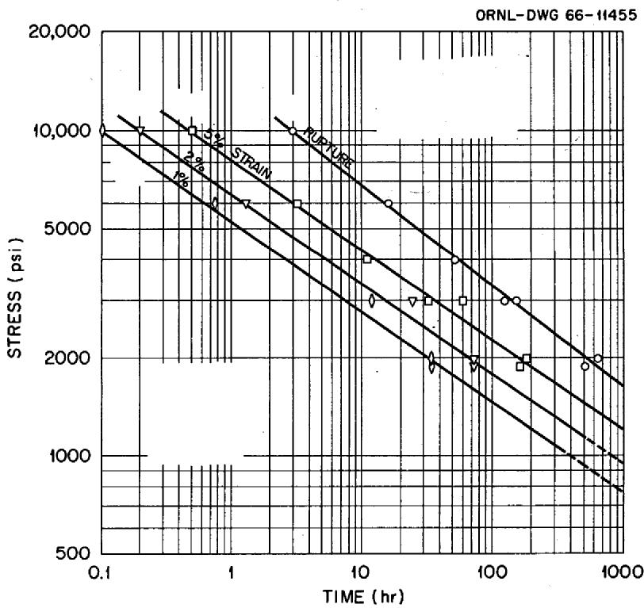  
Fig. 15. Creep-Rupture Properties of Hastelloy N at $982^{\circ}C$ Test Specimens from Heat No. 5065.

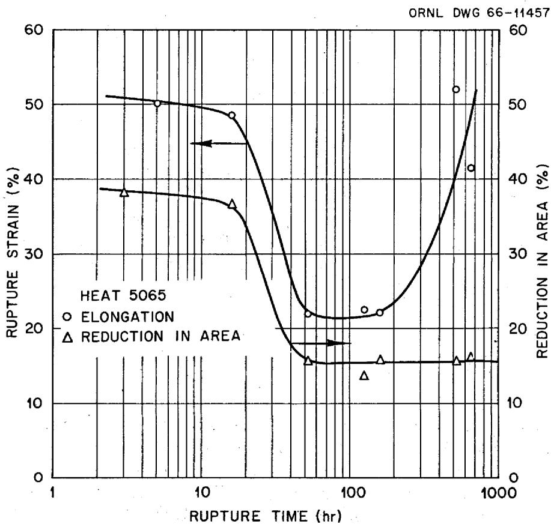  
Fig. 16. Ductility of Hastelloy N at $982^{\circ}$ C.

# Metallographic Examination

Metallographic examination revealed that the quantity of precipitate after testing at $982^{\circ}\mathrm{C}$ and 2000 psi was much greater than that present before testing. The tested material contained larger particles of precipitate, which are thought to be induced by the thermal and mechanical history; also the smaller precipitate in the as-received metal appeared to be a different composition than that found in the tested sample. The precipitate apparently does not impair the ductility at $982^{\circ}\mathrm{C}$ , but its effect on low-temperature ductility was not established. This effect could be important in a vessel that undergoes a number of thermal cycles.

# STRESS ANALYSIS

This experiment requires the use of Hastelloy N considerably above its usual upper temperature (600 to $700^{\circ}\mathrm{C}$ ) in molten-salt service. To ensure the adequacy of the design, a thorough stress analysis* was made using the data of McCoy discussed in the preceding section. The principal concern was with the still-condenser unit which experiences temperature as high as $1000^{\circ}\mathrm{C}$ in some areas. For the feed tank and condensate receiver, which are not expected to be above $600^{\circ}\mathrm{C}$ , the stress analysis was confined to calculating the resistance of the flat heads to external pressure for full vacuum operation.

# Vacuum Still and Condenser

This analysis was based on the $1\%$ creep property of 700 psi allowable stress at $1000^{\circ}\mathrm{C}$ and the rupture property of 1650 psi at this temperature (see Fig. 15). In addition, it was assumed that the unit would undergo 50 to 100 thermal cycles during its 1000-hr lifetime. The analysis considered the stresses induced on the walls, head, and nozzle penetrations by full vacuum operation; the stresses imposed by the dead weight of the system and the method of support; and thermal stresses due to heat flux through the wall and expansion-contraction from thermal cycling.

The conclusions of this study are that:

1. the vessel be limited to a total operating life of 1000 hr and to processing nonradioactive salts;

2. the vessel be observed after the nonradioactive experiments to determine the effects of external oxidation and internal corrosion, and that the effects be evaluated to determine if protective measures are required;   
3. before use the vessel be given a thorough inspection (ultrasonic, dimensional, photographic, visual, or other nondestructive tests) and that the initial inspection be compared with a similar inspection after the nonradioactive operation.

An inspection of the still-condenser unit will be conducted before use and compared with an inspection after the nonradioactive tests. This precaution is being taken because of the lack of experience in using Hastelloy N at these elevated temperatures, and, before use with radioactive salt, the integrity of the vessel must be ensured. Even though conclusion 1 above states that the still not be used for distilling radioactive salts, it was thought that this portion of the program was important and should not be abandoned. Consequently, the vessel will be thoroughly inspected after nonradioactive operation, and, if further integrity of the vessel is ensured, radioactive operation will proceed as planned.

The ASME Boiler and Pressure Vessel Code Sections III and VIII does not include the operating conditions specified for this equipment; the analysis was made on the basis of meeting the intent of the Code, specifically Section VIII. The final design meets the intent of the Code, and the calculated stresses are below the 700 psi allowable stress. No fatigue analysis of the vessel was made because the data for such an analysis were not available. However, the vessel will undergo a number of thermal cycles, and fatigue may be an important factor in the design. This useful information will be obtained from the experiment.

# Feed Tank and Condensate Receiver

Stress calculations for these vessels were made for the flat heads only since these were the weakest areas of the two tanks. The feed tank is 15.5 in. OD by 16.5 in. high. The physical data of Appendix A, Table A-4, were used to confirm the use of 3/8-in.-thick plate for these heads in the 500 to $600^{\circ}$ C temperature range.

# INSTRUMENTATION

The vacuum distillation experiment is operated primarily from temperature and pressure measurements; to a lesser degree, level measurements are also used. There are two distinct zones over which temperature must be measured and controlled: a 500 to $600^{\circ}\mathrm{C}$ range for feed and condensate and an 800 to $1000^{\circ}\mathrm{C}$ range for the

salt in the still. Pressure is controlled at about 0.5 atm in the feed tank and in the 0.3- to $1\mathrm{-mm - Hg}$ range in the rest of the system. Thermocouples are liberally employed on vessel surfaces and internally to the vessels for monitoring all areas of the equipment. Identifications and descriptions of all instruments are given in Table 3.

# Temperature Measurement

For the high temperature part of the system (still and condenser) where exact temperature measurement is most important, platinum-rhodium thermocouples are used because of their high stability. Throughout the system standard Chromel-Alumel thermocouples are used for signals to the temperature controllers in order to standardize on readily available Chromel-Alumel controllers. For control in the high-temperature zones, the control points will be changed to make the Chromel-Alumel thermocouple agree with the Pt-Rh thermocouple in that zone if any temperature shift is observed. The less expensive Chromel-Alumel thermocouples are the primary units on the feed tank, condensate receiver, and salt lines; however two Pt-Rh thermocouples are installed on each tank to indicate any drift. All thermocouples are enclosed in a 1/8-in.-diam Inconel sheath, and insulated junctions are used.

Most of the thermocouples are attached to the outer surface of the vessel or pipe by inserting the junction into a tab welded to the vessel. Before installation each thermocouple is tested to ensure that its function has not been impaired. In addition to the surface thermocouples, there is one thermowell in the feed tank, four in the still, and three in the condensate receiver. These are made of 1/2-in.-OD by 0.042-in.-wall Hastelloy N tube. There is also a thermowell drilled into the base of the sample cup below the condenser for monitoring condensate temperature, since it is desirable to keep this temperature as low as practicable to avoid excessive salt vapors leaving via receiver vent.

For readout there is one 24-point recorder for the Pt-Rh thermocouples and one 24-point recorder for the Chromel-Alumel thermocouples.

The other required temperature indication is of the liquid $\mathsf{N}_2$ cold trap in the condensate receiver off-gas line. There is also a liquid $\mathsf{N}_2$ pressure bulb in the jacket of the cold trap to actuate an alarm at low $\mathsf{N}_2$ level. Upon manual addition of liquid $\mathsf{N}_2$ , a high-level signal from a similar bulb actuates another alarm. A Chromel-Alumel thermocouple is used as an alternative level indication at both points.

# Temperature Control

There are nine individually heated zones on the feed tank, still, condenser, and receiver. Heaters on each of these zones are controlled separately by a Pyrovane

Table 3. Identification and Description of Instrumentation   

<table><tr><td>Panel Board Number</td><td>Application Number</td><td>Input Range</td><td>Output Range</td><td>Location</td><td>Scale</td><td>Function</td><td>Type of Device</td></tr><tr><td>1</td><td>PI-5</td><td>3-15 psig</td><td></td><td>Panel</td><td>0-20 psia</td><td>Monitor still pressure above range of PE-1</td><td>3-15 psig receiver goge</td></tr><tr><td>2</td><td>LI-5</td><td>3-15 psig</td><td></td><td>Panel</td><td>0-40 in. H2O</td><td>Monitor condensate receiver level</td><td>3-15 psig receiver goge</td></tr><tr><td>3</td><td>PI-7</td><td>3-15 psig</td><td></td><td>Panel</td><td>0-10 mm Hg</td><td>Monitor sampler pressure</td><td>3-15 psig receiver goge</td></tr><tr><td>4</td><td>PI-2</td><td>3-15 psig</td><td></td><td>Panel</td><td>0-10 psia</td><td>Monitor Ar pressure in feed tank</td><td>3-15 psig receiver goge</td></tr><tr><td>5</td><td>Pdl-1</td><td>3-15 psig</td><td></td><td>Panel</td><td>0-2 psia</td><td>Monitor level in feed tank by reading ΔP</td><td>3-15 psig receiver goge</td></tr><tr><td>6</td><td>LR-1</td><td>3-15 psig</td><td></td><td>Panel</td><td>0-40 in. H2O</td><td>Monitor salt level in feed tank</td><td>Foxboro 2-Pen Pneu.-Recorder</td></tr><tr><td>6</td><td>LR-5</td><td>3-15 psig</td><td></td><td>Panel</td><td>0-40 in. H2O</td><td>Monitor condensate level in condensate receiver</td><td>Foxboro 2-Pen Pneu.-Recorder</td></tr><tr><td>7</td><td>PR-1</td><td>0-14 mv</td><td></td><td>Panel</td><td>0-2 in. Hg</td><td>Monitor, record and control still vacuum</td><td>Foxboro Electric-Recorder</td></tr><tr><td>8</td><td>PR-2</td><td>3-15 psig</td><td></td><td>Panel</td><td>0-10 psia</td><td>Monitor and record Ar pressure in feed tank</td><td>Foxboro 2-Pen Pneu.-Recorder</td></tr><tr><td>8</td><td>PR-5</td><td>3-15 psig</td><td></td><td>Panel</td><td>0-20 psia</td><td>Monitor and record still pressure above range of PE-1</td><td>Foxboro 2-Pen Pneu.-Recorder</td></tr><tr><td>9</td><td>TR-1</td><td>0-44,9 mv</td><td></td><td>Panel</td><td>0-2000°F</td><td>Monitor various temperatures in system (Ch/Al thermocouples)</td><td>Brown 24-Pt. Recorder</td></tr><tr><td>10</td><td>LR-2</td><td>0-50 mv AC</td><td></td><td>Panel</td><td>8-10 in. H2O</td><td>Control salt level in still</td><td>Fox. Resistance Dynalog Rec.</td></tr><tr><td>11</td><td>PC-1</td><td>0.2-2 in. Hg</td><td></td><td>Panel</td><td>Multirange</td><td>Monitor and transmit to PR-1 signal proportional to still vacuum</td><td>NRC Alpatron Vacuum Gauge</td></tr><tr><td>13</td><td>TIC-9</td><td>0-44,9 mv</td><td></td><td>Panel</td><td>0-2000°F</td><td>Control temperature of salt in feed tank</td><td>Honeywell Pyrovane</td></tr><tr><td>14</td><td>TR-2</td><td>0-10,7 mv</td><td></td><td>Panel</td><td>0-2000°F</td><td>Monitor various temperatures in system (Pt/Rh thermocouples)</td><td>Brown 24-Pt. Recorder</td></tr><tr><td>15</td><td>LR-3</td><td>0-50 mv AC</td><td></td><td>Panel</td><td>0-8 in. H2O</td><td>Monitor and record low level of salt in still</td><td>Fox. Resistance Dynalog Rec.</td></tr><tr><td>16</td><td>LR-4</td><td>0-50 mv AC</td><td></td><td>Panel</td><td>0-20 in. H2O</td><td>Monitor and record condensate level in receiver</td><td>Fox. Resistance Dynalog Rec.</td></tr><tr><td>17</td><td>TIC-2</td><td>0-44,9 mv</td><td></td><td>Panel</td><td>0-2000°F</td><td>Control temperature along condenser</td><td>Honeywell Pyrovane</td></tr><tr><td>18</td><td>TIC-3</td><td>0-44,9 mv</td><td></td><td>Panel</td><td>0-2000°F</td><td>Control temperature along condenser</td><td>Honeywell Pyrovane</td></tr><tr><td>19</td><td>TIC-4</td><td>0-44,9 mv</td><td></td><td>Panel</td><td>0-2000°F</td><td>Control temperature along condenser</td><td>Honeywell Pyrovane</td></tr><tr><td>20</td><td>TIC-6</td><td>0-44,9 mv</td><td></td><td>Panel</td><td>0-2000°F</td><td>Control temperature of condensate receiver</td><td>Honeywell Pyrovane</td></tr><tr><td>21</td><td>TIC-7</td><td>0-44,9 mv</td><td></td><td>Panel</td><td>0-2000°F</td><td>Control temperature of top of still</td><td>Honeywell Pyrovane</td></tr><tr><td>22</td><td>TIC-8</td><td>0-44,9 mv</td><td></td><td>Panel</td><td>0-2000°F</td><td>Control temperature of salt in still</td><td>Honeywell Pyrovane</td></tr><tr><td>23</td><td>HCO-11</td><td>0-208 VAC</td><td>0-208 VAC</td><td>Panel</td><td></td><td>Provide line heat for condensate receiver outlet line</td><td>Variac Unit</td></tr><tr><td>24</td><td>HCO-12</td><td>0-208 VAC</td><td>0-208 VAC</td><td>Panel</td><td></td><td>Provide line heat for line between condensate receiver and cold trap</td><td>Variac Unit</td></tr><tr><td>25</td><td>HCO-13</td><td>0-208 VAC</td><td>0-208 VAC</td><td>Panel</td><td></td><td>Provide line heat for line between feed tank and still</td><td>Variac Unit</td></tr><tr><td>26</td><td>TCO-2</td><td>0-208 VAC</td><td>0-208 VAC</td><td>Panel</td><td></td><td>Control temperature along condenser</td><td>Powerstat</td></tr><tr><td>27</td><td>HCO-16</td><td>0-208 VAC</td><td>0-208 VAC</td><td>Panel</td><td></td><td>Provide line heat for salt feed line into feed tank</td><td>Variac Unit</td></tr><tr><td>28</td><td>HCO-17</td><td>0-208 VAC</td><td>0-208 VAC</td><td>Panel</td><td></td><td>Provide heat for top of feed tank</td><td>Variac Unit</td></tr><tr><td>29</td><td>HCO-18</td><td>0-208 VAC</td><td>0-208 VAC</td><td>Panel</td><td></td><td>Provide heat for bottom of feed tank</td><td>Variac Unit</td></tr><tr><td>30</td><td>HCO-19</td><td>0-208 VAC</td><td>0-208 VAC</td><td>Panel</td><td></td><td>Provide heat for bottom of condensate receiver</td><td>Variac Unit</td></tr><tr><td>32</td><td>TCO-3</td><td>0-208 VAC</td><td>0-208 VAC</td><td>Panel</td><td></td><td>Control temperature along condenser line</td><td>Powerstat</td></tr><tr><td>33</td><td>HCO-10</td><td>0-208 VAC</td><td>0-208 VAC</td><td>Panel</td><td></td><td>Provide line heat for sampler line</td><td>Variac Unit</td></tr><tr><td>34</td><td>TCO-4</td><td>0-208 VAC</td><td>0-208 VAC</td><td>Panel</td><td></td><td>Control temperature along condenser line</td><td>Powerstat</td></tr><tr><td>36</td><td>TCO-6</td><td>0-208 VAC</td><td>0-208 VAC</td><td>Panel</td><td></td><td>Control temperature of condensate receiver</td><td>Powerstat</td></tr><tr><td>37</td><td>HCO-14</td><td>0-208 VAC</td><td>0-208 VAC</td><td>Panel</td><td></td><td>Provide line heat for transmitter LT-1</td><td>Variac Unit</td></tr><tr><td>38</td><td>TCO-7</td><td>0-208 VAC</td><td>0-208 VAC</td><td>Panel</td><td></td><td>Control heat input to top of still</td><td></td></tr><tr><td>39</td><td>HCO-15</td><td>0-208 VAC</td><td>0-208 VAC</td><td>Panel</td><td></td><td>Provide line heat for transmitter LT-1</td><td>Variac Unit</td></tr><tr><td>40</td><td>TCO-8</td><td>0-208 VAC</td><td>0-208 VAC</td><td>Panel</td><td></td><td>Control temperature of still</td><td>Powerstat</td></tr><tr><td>41</td><td>TCO-8</td><td>0-208 VAC</td><td>0-208 VAC</td><td>Panel</td><td></td><td>Control temperature of still</td><td>Powerstat</td></tr><tr><td>42</td><td>TCO-9</td><td>0-208 VAC</td><td>0-208 VAC</td><td>Panel</td><td></td><td>Control temperature of feed tank</td><td>Powerstat</td></tr><tr><td>43</td><td>TCO-9</td><td>0-208 VAC</td><td>0-208 VAC</td><td>Panel</td><td></td><td>Control temperature of feed tank</td><td>Powerstat</td></tr><tr><td></td><td>HCV-1</td><td></td><td></td><td>Containment Cubicle</td><td></td><td>Sponge feed tank</td><td></td></tr><tr><td></td><td>HCV-2</td><td></td><td></td><td>Containment Cubicle</td><td></td><td>Vent feed tank</td><td></td></tr><tr><td></td><td>HCV-3</td><td></td><td></td><td>Containment Cubicle</td><td></td><td>Purge feed tank vent line and equalize LT-1</td><td></td></tr><tr><td></td><td>HCV-4</td><td></td><td></td><td>Containment Cubicle</td><td></td><td>Evacuate between sampler line valves</td><td></td></tr><tr><td></td><td>HCV-5</td><td></td><td></td><td>Containment Cubicle</td><td></td><td>Sponge condensate receiver</td><td></td></tr><tr><td></td><td>HCV-8</td><td></td><td></td><td>Containment Cubicle</td><td></td><td>By-pass vacuum pump</td><td></td></tr><tr><td></td><td>HCV-9</td><td></td><td></td><td>Containment Cubicle</td><td></td><td>Vacuum pump suction valve</td><td></td></tr><tr><td></td><td>HCV-10</td><td></td><td></td><td>Containment Cubicle</td><td></td><td>Vacuum pump discharge valve</td><td></td></tr><tr><td></td><td>HCV-20</td><td></td><td></td><td></td><td></td><td></td><td></td></tr><tr><td></td><td>HCV-21</td><td></td><td></td><td></td><td></td><td></td><td></td></tr><tr><td></td><td>PS-1A</td><td></td><td></td><td>Panel</td><td></td><td>Provide alarm on low vacuum</td><td>Microswitch</td></tr><tr><td></td><td>PS-1B</td><td></td><td></td><td>Panel</td><td></td><td>Control vacuum pump</td><td>Microswitch</td></tr><tr><td></td><td>PS-2</td><td>3-15 psig</td><td></td><td>Panel</td><td></td><td>Provide alarm on high Ar pressure in feed tank</td><td>Barksdale pressure switch</td></tr><tr><td></td><td>PS-5A</td><td>3-15 psig</td><td></td><td>Panel</td><td></td><td>Close FSV-1 on loss of vacuum</td><td>Barksdale pressure switch</td></tr><tr><td></td><td>PS-5B</td><td>3-15 psig</td><td></td><td>Panel</td><td></td><td>Provide alarm on loss of vacuum</td><td>Barksdale pressure switcl.</td></tr><tr><td></td><td>PT-2</td><td></td><td>3-15 psig</td><td>Containment Cubicle</td><td></td><td>Monitor Ar pressure in feed tank</td><td>Foxboro d/p cell</td></tr><tr><td></td><td>PT-5</td><td></td><td>3-15 psig</td><td>Containment Cubicle</td><td></td><td>Monitor still pressure outside range of PE-1</td><td>Foxboro d/p cell</td></tr><tr><td></td><td>PT-7</td><td></td><td>3-15 psig</td><td>Containment Cubicle</td><td></td><td>Monitor sampler tube pressure</td><td>Foxboro d/p cell</td></tr><tr><td></td><td>LE-2</td><td></td><td>0-50 mv AC</td><td>Still</td><td></td><td>Sense salt level at upper section of still</td><td>Special level probe</td></tr><tr><td></td><td>LE-3</td><td></td><td>0-50 mv AC</td><td>Still</td><td></td><td>Sense salt level at lower section of still</td><td>Special level probe</td></tr><tr><td></td><td>LE-4</td><td></td><td>0-50 mv AC</td><td>Condensate receiver</td><td></td><td>Sense level in condensate receiver</td><td>Special level probe</td></tr><tr><td></td><td>XwM-2 ) XwM-3 ) XwM-4 )</td><td></td><td></td><td>Panel</td><td></td><td>Supply low voltage, high frequency current (1000 cycles/sec) to LE-2, LE-3, LE-4</td><td>Hewlett-Packard Power Supply</td></tr><tr><td></td><td>LS-136</td><td></td><td>Contact closure</td><td>Cold Trap</td><td></td><td>Sense N2level in trap and actuate hi-level alarm</td><td>Special level switch</td></tr><tr><td></td><td>LS-138</td><td></td><td>Contact closure</td><td>Cold Trap</td><td></td><td>Sense N2level in trap and actuate low-level alarm</td><td>Special level switch</td></tr><tr><td></td><td>PI-1</td><td></td><td></td><td>Field</td><td>0-15 psig</td><td>Indicate Ar supply pressure</td><td>Pressure indicator</td></tr><tr><td></td><td>PI-3</td><td></td><td></td><td>Field</td><td>0-30 psig</td><td>Indicate control valves header pressure</td><td>Pressure indicator</td></tr><tr><td></td><td>PI-6</td><td></td><td></td><td>Field</td><td>0-30 psig</td><td>Indicate Ar pressure to feed tank</td><td>Pressure indicator</td></tr><tr><td></td><td>PI-7</td><td>3-15 psig</td><td></td><td>Panel</td><td>0-10 mm Hg</td><td>Indicate pressure in sampler tube</td><td>Receiver gage</td></tr><tr><td></td><td>PI-9</td><td>0.2-2 in. Hg</td><td></td><td>Field</td><td>Multirange</td><td>Used for calibration check on PC-1</td><td>McLeod vacuum gage</td></tr><tr><td></td><td>FC-1</td><td></td><td></td><td>Containment Cubicle</td><td></td><td>Limit Ar flow rate</td><td>Capillary</td></tr><tr><td></td><td>LCV-2A</td><td></td><td></td><td>Panel</td><td></td><td>Actuate LCV-2B</td><td>3-way solenoid valve</td></tr><tr><td></td><td>LCV-2B</td><td></td><td></td><td>Containment Cubicle</td><td></td><td>Control level of salt in still</td><td>Pneumatic control valve</td></tr><tr><td></td><td>HV-1</td><td></td><td></td><td>Panel</td><td></td><td>Argon to feed tank</td><td>Manual valve</td></tr><tr><td></td><td>HV-2</td><td></td><td></td><td>Panel</td><td></td><td>Argon to condensate receiver</td><td>Manual valve</td></tr><tr><td></td><td>HV-3</td><td></td><td></td><td>Field</td><td></td><td>Liquid N2addition</td><td>Manual valve</td></tr><tr><td></td><td>FI-1</td><td></td><td></td><td>Panel</td><td>0-10 l/min</td><td>Indicate Ar flow into feed tank</td><td>Rotameter</td></tr><tr><td></td><td>FI-2</td><td></td><td></td><td>Panel</td><td>0-10 l/min</td><td>Indicate Ar flow into condensate receiver during agitation or condensate removal</td><td>Rotameter</td></tr><tr><td></td><td>FSV-1</td><td></td><td></td><td>Panel</td><td></td><td>Shut off Ar supply to feed tank on loss of vacuum</td><td>Pneumatic control valve</td></tr><tr><td></td><td>FSV-2</td><td></td><td></td><td>Containment Cubicle</td><td></td><td>Prevents backflow into system from off-gas system</td><td>Check valve</td></tr><tr><td></td><td>FSV-3</td><td></td><td></td><td>Panel</td><td></td><td>Control FSV-1. Operates on loss of vacuum detected by PS-5A</td><td>Solenoid valve</td></tr><tr><td></td><td>PV-1</td><td></td><td></td><td>Panel</td><td></td><td>Regulates Ar pressure to feed tank</td><td>Pneumatic regulator</td></tr><tr><td></td><td>PV-3</td><td></td><td></td><td>Panel</td><td></td><td>Regulates air supply pressure for all pneumatic control valves</td><td>Pneumatic regulator</td></tr><tr><td></td><td>LT-1</td><td>0-40 in. H2O</td><td>3-15 psig</td><td>Containment Cubicle</td><td></td><td>Monitors feed tank salt level</td><td>Foxboro d/p cell</td></tr><tr><td></td><td>LT-5</td><td>0-40 in. H2O</td><td>3-15 psig</td><td>Containment Cubicle</td><td></td><td>Monitors condensate receiver level</td><td>Foxboro d/p cell</td></tr><tr><td>1-1</td><td>TA-102</td><td>Contact closure</td><td>Contact closure</td><td>Panel</td><td></td><td>Alarms on low feed tank temperature</td><td>Annunciator</td></tr><tr><td>1-2</td><td>TA-110</td><td>Contact closure</td><td>Contact closure</td><td>Panel</td><td></td><td>Alarms on low still feed line temperature</td><td>Annunciator</td></tr><tr><td>1-3</td><td>TA-134</td><td>Contact closure</td><td>Contact closure</td><td>Panel</td><td></td><td>Alarms on low condensate receiver temperature</td><td>Annunciator</td></tr><tr><td>1-4</td><td></td><td>Contact closure</td><td>Contact closure</td><td>Panel</td><td></td><td></td><td>Annunciator</td></tr><tr><td>1-5</td><td></td><td>Contact closure</td><td>Contact closure</td><td>Panel</td><td></td><td></td><td>Annunciator</td></tr><tr><td>1-6</td><td></td><td>Contact closure</td><td>Contact closure</td><td>Panel</td><td></td><td></td><td>Annunciator</td></tr><tr><td>2-1</td><td>TA-112</td><td>Contact closure</td><td>Contact closure</td><td>Panel</td><td></td><td>Alarms on low still temperature</td><td>Annunciator</td></tr><tr><td>2-2</td><td>TA-18</td><td>Contact closure</td><td>Contact closure</td><td>Panel</td><td></td><td>Alarms on low condenser temperature</td><td>Annunciator</td></tr><tr><td>2-3</td><td>TA-28</td><td>Contact closure</td><td>Contact closure</td><td>Panel</td><td></td><td>Alarms on low condenser temperature</td><td>Annunciator</td></tr><tr><td>2-4</td><td>TA-38</td><td>Contact closure</td><td>Contact closure</td><td>Panel</td><td></td><td>Alarms on low condenser temperature</td><td>Annunciator</td></tr><tr><td>2-5</td><td>TA-48</td><td>Contact closure</td><td>Contact closure</td><td>Panel</td><td></td><td>Alarms on low condenser temperature</td><td>Annunciator</td></tr><tr><td>2-6</td><td>TA-78</td><td>Contact closure</td><td>Contact closure</td><td>Panel</td><td></td><td>Alarms on low still temperature</td><td>Annunciator</td></tr><tr><td>3-1</td><td>PA-1</td><td>Contact closure</td><td>Contact closure</td><td>Panel</td><td></td><td>Alarms on low vacuum in still</td><td>Annunciator</td></tr><tr><td>3-2</td><td>PA-2</td><td>Contact closure</td><td>Contact closure</td><td>Panel</td><td></td><td>Alarms on high Air pressure in feed tank</td><td>Annunciator</td></tr><tr><td>3-3</td><td>TA-5</td><td>Contact closure</td><td>Contact closure</td><td>Panel</td><td></td><td></td><td>Annunciator</td></tr><tr><td>3-4</td><td>LA-136</td><td>Contact closure</td><td>Contact closure</td><td>Panel</td><td></td><td>Alarms when liquid N₂ trap is filled</td><td>Annunciator</td></tr><tr><td>3-5</td><td>LA-138</td><td>Contact closure</td><td>Contact closure</td><td>Panel</td><td></td><td>Alarms on low liquid N₂ level in cold trap</td><td>Annunciator</td></tr><tr><td>3-6</td><td></td><td>Contact closure</td><td>Contact closure</td><td>Panel</td><td></td><td></td><td>Annunciator</td></tr><tr><td>4-1</td><td></td><td>Contact closure</td><td>Contact closure</td><td>Panel</td><td></td><td></td><td>Annunciator</td></tr><tr><td>4-2</td><td></td><td>Contact closure</td><td>Contact closure</td><td>Panel</td><td></td><td></td><td>Annunciator</td></tr><tr><td>4-3</td><td></td><td>Contact closure</td><td>Contact closure</td><td>Panel</td><td></td><td></td><td>Annunciator</td></tr><tr><td>4-4</td><td></td><td>Contact closure</td><td>Contact closure</td><td>Panel</td><td></td><td></td><td>Annunciator</td></tr><tr><td>4-5</td><td></td><td>Contact closure</td><td>Contact closure</td><td>Panel</td><td></td><td></td><td>Annunciator</td></tr><tr><td>4-6</td><td></td><td>Contact closure</td><td>Contact closure</td><td>Panel</td><td></td><td></td><td>Annunciator</td></tr><tr><td></td><td>TE-131</td><td>0-2000°F</td><td></td><td>Condensate receiver</td><td></td><td>Monitor temperature</td><td>Ch/Al</td></tr><tr><td></td><td>TE-132</td><td>0-2000°F</td><td>0-10.7 mv</td><td>Condensate receiver</td><td></td><td>Monitor temperature</td><td>Pt/Rh</td></tr><tr><td></td><td>TE-133</td><td>0-2000°F</td><td>0-10.7 mv</td><td>Condensate receiver</td><td></td><td>Monitor temperature</td><td>Pt/Rh</td></tr><tr><td></td><td>TE-134</td><td>0-2000°F</td><td>0-44.9 mv</td><td>Condensate receiver</td><td></td><td>Monitor temperature</td><td>Ch/Al</td></tr><tr><td></td><td>TE-136</td><td>0-2000°F</td><td>0-44.9 mv</td><td>Cold Trap</td><td></td><td>Alarm on high liquid N2level in cold trap</td><td>Ch/Al</td></tr><tr><td></td><td>TE-138</td><td>0-2000°F</td><td>0-44.9 mv</td><td>Cold Trap</td><td></td><td>Alarm on low liquid N2level in cold trap</td><td>Ch/Al</td></tr><tr><td></td><td>TE-141</td><td>0-2000°F</td><td>0-10.7 mv</td><td>Condenser</td><td></td><td>Monitor temperature</td><td>Pt/Rh</td></tr><tr><td></td><td>TE-140</td><td>0-2000°F</td><td>0-44.9 mv</td><td>Condensate receiver Exit line</td><td></td><td>Monitor temperature</td><td>Ch/Al</td></tr><tr><td></td><td>TE-1A</td><td>0-2000°F</td><td>0-44.9 mv</td><td>Condenser</td><td></td><td>Monitor temperature</td><td>Ch/Al</td></tr><tr><td></td><td>TE-1B</td><td>0-2000°F</td><td>0-10.7 mv</td><td>Condenser</td><td></td><td>Monitor temperature</td><td>Pt/Rh</td></tr><tr><td></td><td>TE-2A</td><td>0-2000°F</td><td>0-10.7 mv</td><td>Condenser</td><td></td><td>Control</td><td>Ch/Al</td></tr><tr><td></td><td>TE-2B</td><td>0-2000°F</td><td>0-10.7 mv</td><td>Condenser</td><td></td><td>Monitor</td><td>Pt/Rh</td></tr><tr><td></td><td>TE-3A</td><td>0-2000°F</td><td>0-44.9 mv</td><td>Condenser</td><td></td><td>Control</td><td>Ch/Al</td></tr><tr><td></td><td>TE-3B</td><td>0-2000°F</td><td>0-10.7 mv</td><td>Condenser</td><td></td><td>Monitor</td><td>Pt/Rh</td></tr><tr><td></td><td>TE-4A</td><td>0-2000°F</td><td>0-44.9 mv</td><td>Condenser</td><td></td><td>Control</td><td>Ch/Al</td></tr><tr><td></td><td>TE-4B</td><td>0-2000°F</td><td>0-10.7 mv</td><td>Condenser</td><td></td><td>Monitor</td><td>Pt/Rh</td></tr><tr><td></td><td>TE-7A</td><td>0-2000°F</td><td>0-44.9 mv</td><td>Still</td><td></td><td>Control</td><td>Ch/Al</td></tr><tr><td></td><td>TE-7B</td><td>0-2000°F</td><td>0-10.7 mv</td><td>Still</td><td></td><td>Monitor</td><td>Pt/Rh</td></tr><tr><td></td><td>TE-8A</td><td>0-2000°F</td><td>0-44.9 mv</td><td>Still</td><td></td><td>Control</td><td>Ch/Al</td></tr><tr><td></td><td>TE-8B</td><td>0-2000°F</td><td>0-10.7 mv</td><td>Still</td><td></td><td>Monitor</td><td>Pt/Rh</td></tr><tr><td></td><td>TE-9A</td><td>0-2000°F</td><td>0-44.9 mv</td><td>Feed tank</td><td></td><td>Control</td><td>Ch/Al</td></tr><tr><td></td><td>TE-9B</td><td>0-2000°F</td><td>0-44.9 mv</td><td>Feed tank</td><td></td><td>Monitor</td><td>Ch/Al</td></tr><tr><td></td><td>TE-5B</td><td>0-2000°F</td><td>0-44.9 mv</td><td></td><td></td><td>Monitor</td><td>Ch/Al</td></tr><tr><td></td><td>TE-6B</td><td>0-2000°F</td><td>0-44.9 mv</td><td></td><td></td><td>Monitor</td><td>Ch/Al</td></tr><tr><td></td><td>TE-139</td><td>0-2000°F</td><td>0-44.9 mv</td><td></td><td></td><td>Monitor</td><td>Ch/Al</td></tr><tr><td></td><td>TE-6A</td><td>0-2000°F</td><td>0-44.9 mv</td><td></td><td></td><td>Monitor</td><td>Pt/Rh</td></tr><tr><td></td><td>TE-100</td><td>0-2000°F</td><td>0-44.9 mv</td><td>Feed tank</td><td></td><td>Monitor temperature</td><td>Ch/A1</td></tr><tr><td></td><td>TE-101</td><td>0-2000°F</td><td>0-10.7 mv</td><td>Feed tank</td><td></td><td>Monitor temperature</td><td>Pt/Rh</td></tr><tr><td></td><td>TE-102</td><td>0-2000°F</td><td>0-44.9 mv</td><td>Feed tank</td><td></td><td>Monitor temperature</td><td>Ch/A1</td></tr><tr><td></td><td>TE-103</td><td>0-2000°F</td><td>0-44.9 mv</td><td>Feed tank</td><td></td><td>Monitor temperature</td><td>Ch/A1</td></tr><tr><td></td><td>TE-104</td><td>0-2000°F</td><td>0-44.9 mv</td><td>Feed tank</td><td></td><td>Monitor temperature</td><td>Ch/A1</td></tr><tr><td></td><td>TE-105</td><td>0-2000°F</td><td>0-10.7 mv</td><td>Feed tank</td><td></td><td>Monitor temperature</td><td>Pt/Rh</td></tr><tr><td></td><td>TE-106</td><td>0-2000°F</td><td>0-44.9 mv</td><td>LT-1 line</td><td></td><td>Monitor temperature</td><td>Ch/A1</td></tr><tr><td></td><td>TE-107</td><td>0-2000°F</td><td>0-44.9 mv</td><td>LT-1 line</td><td></td><td>Monitor temperature</td><td>Ch/A1</td></tr><tr><td></td><td>TE-108</td><td>0-2000°F</td><td>0-44.9 mv</td><td>Still input line</td><td></td><td>Monitor temperature</td><td>Ch/A1</td></tr><tr><td></td><td>TE-109</td><td>0-2000°F</td><td>0-44.9 mv</td><td>Still input line</td><td></td><td>Monitor temperature</td><td>Ch/A1</td></tr><tr><td></td><td>TE-110</td><td>0-2000°F</td><td>0-44.9 mv</td><td>Still input line</td><td></td><td>Monitor temperature</td><td>Ch/A1</td></tr><tr><td></td><td>TE-111</td><td>0-2000°F</td><td>0-10.7 mv</td><td>Still</td><td></td><td>Monitor temperature</td><td>Pt/Rh</td></tr><tr><td></td><td>TE-112</td><td>0-2000°F</td><td>0-10.7 mv</td><td>Still</td><td></td><td>Monitor temperature</td><td>Pt/Rh</td></tr><tr><td></td><td>TE-113</td><td>0-2000°F</td><td>0-10.7 mv</td><td>Still</td><td></td><td>Monitor temperature</td><td>Pt/Rh</td></tr><tr><td></td><td>TE-114</td><td>0-2000°F</td><td>0-10.7 mv</td><td>Still</td><td></td><td>Monitor temperature</td><td>Pt/Rh</td></tr><tr><td></td><td>TE-115</td><td>0-2000°F</td><td>0-10.7 mv</td><td>Still</td><td></td><td>Monitor temperature</td><td>Pt/Rh</td></tr><tr><td></td><td>TE-116</td><td>0-2000°F</td><td>0-10.7 mv</td><td>Still</td><td></td><td>Monitor temperature</td><td>Pt/Rh</td></tr><tr><td></td><td>TE-117</td><td>0-2000°F</td><td>0-10.7 mv</td><td>Still</td><td></td><td>Monitor temperature</td><td>Pt/Rh</td></tr><tr><td></td><td>TE-118</td><td>0-2000°F</td><td>0-10.7 mv</td><td>Still</td><td></td><td>Monitor temperature</td><td>Pt/Rh</td></tr><tr><td></td><td>TE-120</td><td>0-2000°F</td><td>0-10.7 mv</td><td>Still</td><td></td><td>Monitor temperature</td><td>Pt/Rh</td></tr><tr><td></td><td>TE-122</td><td>0-2000°F</td><td>0-44.9 mv</td><td>Still</td><td></td><td>Monitor temperature</td><td>Ch/A1</td></tr><tr><td></td><td>TE-123</td><td>0-2000°F</td><td>0-10.7 mv</td><td>Condenser</td><td></td><td>Monitor temperature</td><td>Pt/Rh</td></tr><tr><td></td><td>TE-124</td><td>0-2000°F</td><td>0-10.7 mv</td><td>Condenser</td><td></td><td>Monitor temperature</td><td>Pt/Rh</td></tr><tr><td></td><td>TE-125</td><td>0-2000°F</td><td>0-10.7 mv</td><td>Condenser</td><td></td><td>Monitor temperature</td><td>Pt/Rh</td></tr><tr><td></td><td>TE-126</td><td>0-2000°F</td><td>0-44.9 mv</td><td>Condenser</td><td></td><td>Monitor temperature</td><td>Ch/A1</td></tr><tr><td></td><td>TE-127</td><td>0-2000°F</td><td>0-44.9 mv</td><td>Sampler line</td><td></td><td>Monitor temperature</td><td>Ch/A1</td></tr><tr><td></td><td>TE-128</td><td>0-2000°F</td><td>0-10.7 mv</td><td>Condenser</td><td></td><td>Monitor temperature</td><td>Pt/Rh</td></tr><tr><td></td><td>TE-129</td><td>0-2000°F</td><td>0-44.9 mv</td><td>Condensate receiver</td><td></td><td>Monitor temperature</td><td>Ch/A1</td></tr><tr><td></td><td>TE-130</td><td>0-2000°F</td><td>0-44.9 mv</td><td>Condensate receiver</td><td></td><td>Monitor temperature</td><td>Ch/A1</td></tr></table>

on-off controller. The voltage to heaters in each zone is controlled by Variacs. There are seven heated lines on which heaters are controlled by on-off, manual switches and Variacs. All heater controls are mounted on four 24-in. standard instrument racks which adjoin two additional racks containing the temperature recorders plus pressure and level instruments.

# Temperature Annunciators

Each of the nine heated zones on the equipment and the salt feed line to the still are provided with low-temperature annunciators. The alarm points are set to provide indication of instrument or heater failure before the temperature falls low enough to freeze the salt.

# Pressure Measurement

# Feed Tank

An absolute pressure D/P cell connected to the feed tank vent line in the containment cubicle measures the pressure in the feed tank. This pressure will vary between 5 and 7 psia as the salt is pressurized into the still, the increase in pressure being caused by the decreasing level in the feed tank. Pressure in excess of 7 psia probably indicates a restriction in the still feed line.

# Condensate Receiver

The pressure in the condensate receiver is used as an indication of the pressure in the still after adding the calculated $\Delta P$ through the condenser. Measurement of the pressure in the still itself was felt to be impractical because of the high temperature and because introduction of an inert purge into the still would make control of vacuum more difficult. The pressure tap for this measurement is on the 1-in. vacuum line very near the condensate receiver. Two pressure instruments are used: (1) an MKS Baratron pressure measuring device with ranges of 0 to .003, 0 to 0.01, 0 to 0.03, 0 to 0.1, 0 to 0.3, 0 to 1, 0 to 3, and 0 to 10 mm Hg; and (2) an absolute pressure D/P cell covering the range from 0 to 15 psia.

# Sample Line

A pressure transmitter measures the pressure between the two valves in the 1-1/2-in. salt sample line. During operation at vacuum these valves may not seal tightly enough, and it may be necessary to maintain this pressure near the operating pressure.

# Pressure Control

The system pressure is controlled by feeding argon to the inlet of the vacuum pump. The Baratron pressure instrument is used to regulate the flow.

In order to protect the still against excessive internal pressure (at high temperature, pressures in excess of 2 atm could be unsafe), the argon supply to the system will be cut off if the system pressure exceeds 1 atm. The absolute pressure transmitter in the condensate receiver off-gas line is used for this purpose.

Liquid Level Measurement and Control

# Feed Tank

The pressure differential between the outlet of a dip tube extending to the bottom of the tank and the gas space above the salt is used to measure the salt level. Difference in level provides a check on the salt distillation rate. The dip-tube purge is provided by the argon which displaces the salt being fed to the still. The feed tank and condensate receiver liquid levels are transmitted to a two-pen recorder.

# Still

A conductivity-type level probe (see Fig. 17) is used in the still for measuring and controlling the liquid level. This probe is similar to the single-point level probes being used in the MSRE drain tanks but with two concentric tubes instead of one for the excitation length because of the limited head room in the still. Tests have shown that a variable output is obtained over at least one-third the length of the sensing probe. A 6-in. sensing probe is therefore used to control the liquid level between 1 in. and 3 in. below the top of the annulus. The bottom joint of the two concentric tubes in the excitation length is located at this upper control point. When the salt is below this point, the control valve in the argon line to the feed tank is open and argon flows through a capillary restrictor to the feed tank. The restrictor is sized so that the gas displaces salt to the still at a rate slightly in excess of the desired distillation rate. A recorder shows the rising liquid level. When the bottom joint of the excitation length is reached, the valve closes and the level falls for about 2 hr until it reaches the bottom of the sensing probe. At this point a signal causes the valve to open to start charging salt to the still again.

A second conductivity probe with a straight excitation length extends as close as possible to the tapered bottom of the still pot. This provides salt level measurement during the final boildown.

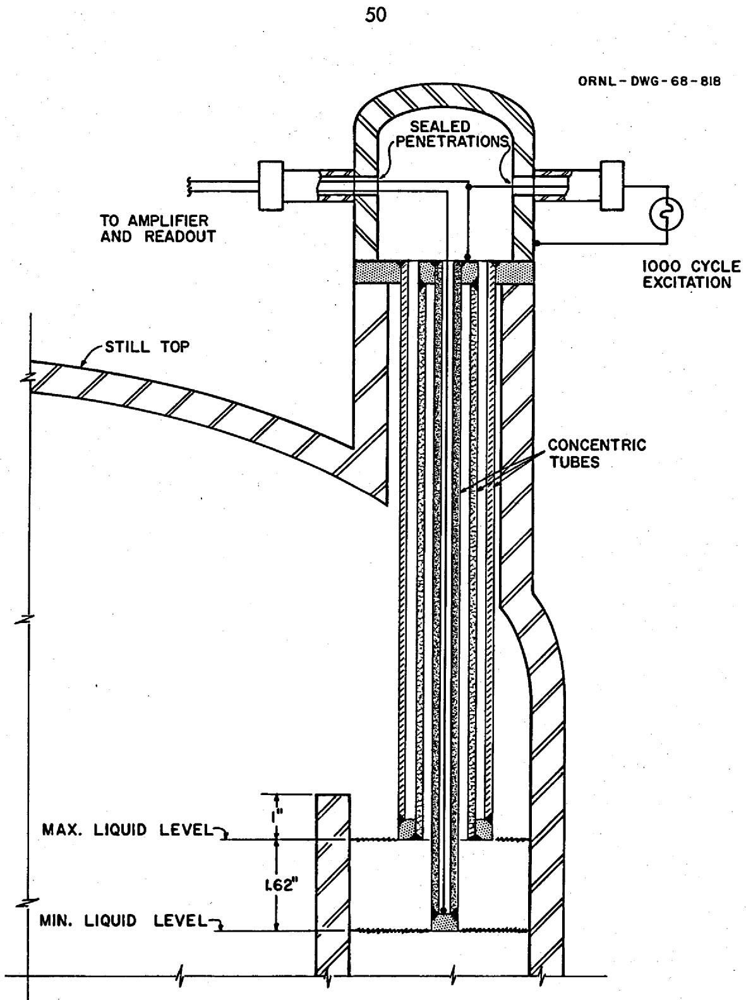  
Fig. 17. Liquid Level Probe.

A third conductivity probe is installed in the condensate receiver to permit following the distillation rate. The probe is long enough to provide continuous measurement for the entire volume of the tank. It was felt that the alternate choice of a continuous bubbler-type instrument would require too much purge gas, causing excessive pressure drop in the line to the vacuum pump. A bubbler-type instrument, however, is installed for periodic checks and calibration of the conductivity probe.

# PREOPERATIONAL INSPECTION

The use of Hastelloy N at temperatures of 800 to $1000^{\circ}\mathrm{C}$ is not well enough known to predict the condition of the vacuum distillation equipment after extended periods of operation. Since the second phase of the experiment involves the use of radioactive materials, it will be necessary to thoroughly inspect the vessel after nonradioactive operation. The basis or reference for this inspection is a set of radiographic observations plus direct and ultrasonic dimensional measurements made on the assembled equipment before initial operation.*

An inspection program was planned that completely described the still, condenser and condensate receiver assembly. As shown on drawings No. M-12173-CD-019D, M-12173-CD-020D, and M-12173-CD-021D of Appendix H, a mapping of 247 points for radiographic and ultrasonic measurements of wall thickness is specified on the vessel surfaces. In addition, locations in the form of center-punched tabs are provided for 55 length and diameter measurements. Data points are concentrated in regions where highest material stresses are expected.

The referenced drawings contain a record of the initial measurements, showing that thicknesses were measured to the nearest 0.001 in, and linear measurements to the nearest 1/32 in. Because of equipment and geometrical limitations, it was not possible to check every ultrasonic measurement with a direct measurement. Length and diameter measurements were made after the unit had been installed in supporting framework at the location where it was to be operated. This precaution precluded a measurement bias due to handling and transport.

After nonradioactive operation, insulation and heaters will be removed, and all measurements and observations will be repeated. The new data will be recorded on the referenced drawing for easy comparison with initial values. At that time the suitability of the equipment for further experiments will be decided.

# EQUIPMENT INSTALLATION

# Unitized Construction

The entire distillation unit consisting of the feed tank, still, condenser, condensate receiver, and cold trap with the associated heaters, insulation, and thermocouples is installed in a 3 ft x 6 ft 4 in. x 8 ft-high angle-iron frame designed to be moved as a unit. The base supports for the feed tank and condensate receiver are bolted to the bottom of the frame. The still is supported by a counter weight on a pulley to allow for thermal expansion during operation but will be rigidly supported while in transit. The cold trap, being small, is supported by the 1-in. vent line from the condensate receiver. An electrical junction box and two thermocouple junction boxes are provided on the frame.

# Hood Installation

The distillation unit will be installed in a walk-in hood, 4 ft 4 in. x 8 ft x 9 ft high, located in Building 3541, for nonradioactive operation. The 12-ft-long instrument and heater control panel, the containment cubicle for D/P cells, remote valves, and the vacuum pump are mounted near the hood. The vacuum pump discharges through absolute filters. The directly operated sampler, described above, is located inside the hood. Nonradioactive operation will test all of the equipment to be used in the radioactive demonstration.

# Cell Installation

At the completion of nonradioactive testing, the unit will be thoroughly inspected to determine its suitability for radioactive operation. If this inspection is affirmative, all electrical, instrumentation, and piping connections will be broken and the unit moved to Building 7503. The unit will be installed in the spare cell to the east of the fuel processing cell, as shown in Figs. 18 and 19. Electrical and thermocouple leads will be brought through penetrations in a roof plug to the high-bay area over the cell where control panels are located. These panels contain heater controls, temperature recorders, and pressure and level readout instruments.

Salt is charged to the feed tank through line No. 112, which is connected to the fuel storage tank and contains a freeze valve. All other piping connections including the sample line passes through a roof plug to the high-bay area where the sampler, vacuum pump, liquid $\mathsf{N}_2$ supply, and instrumentation are located.

Additional concrete shielding will be provided in the cell surrounding the unit to prevent excessive radiation in the operating areas to the east and south of the cell.

Fig. 18. Layout of MSRE Spare Cell.   
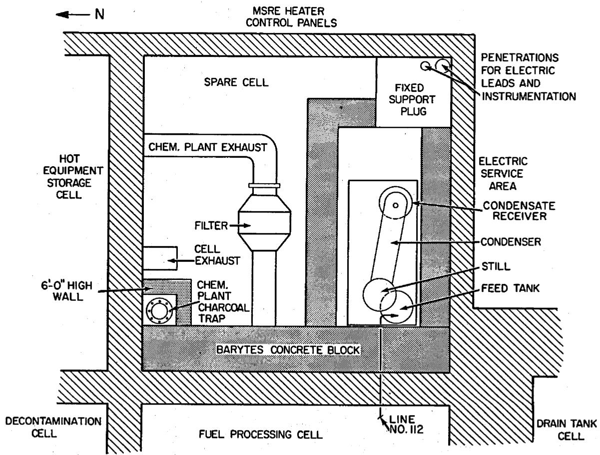  
ORNL DWG 67-3653 R1

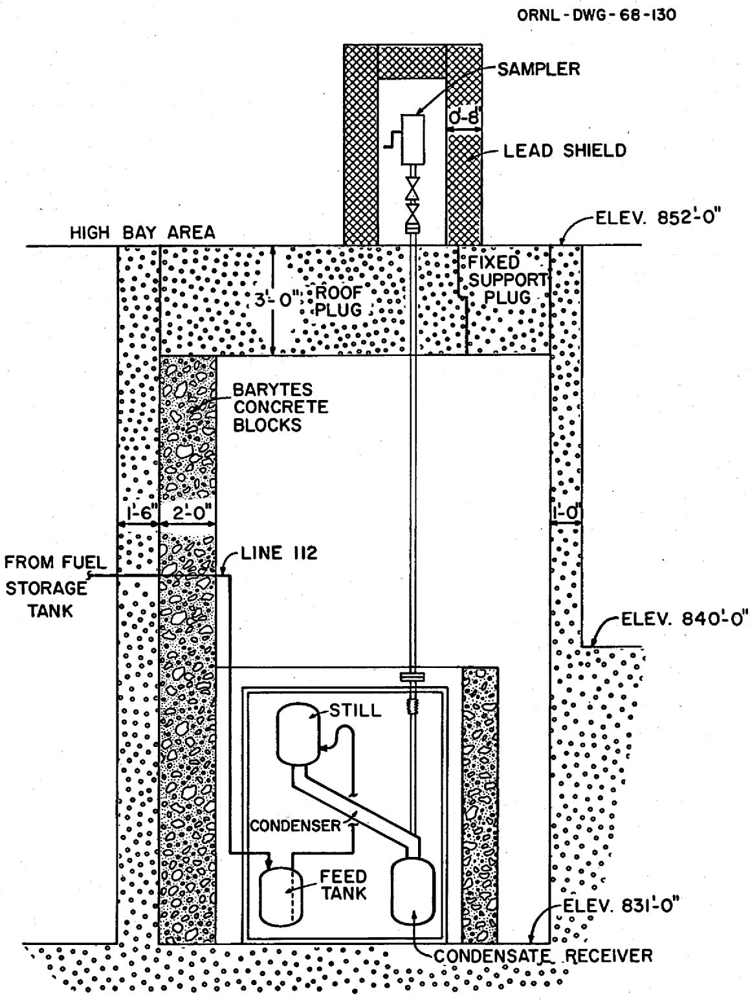  
Fig. 19. South Elevation of MSRE Spare Cell Showing Distillation Unit and Sampler Locations.

Since the salt will have been fluorinated before distillation, no volatile activities are expected to pass through the liquid $\mathsf{N}_2$ trap. The vent from this trap and the three instrument lines for pressure measurements in the feed tank and receiver are routed to a sealed, monitored cubicle in the high-bay area. This cubicle contains all equipment and instruments that are connected directly to the process equipment (vacuum pump, control valves, and instrument transmitters) as shown in Fig. 20. In case of activity backup in the lines, a radiation alarm will indicate the difficulty and the lines or cubicle can be purged. The top and one side of the cubicle is sealed with a gasketed, removable cover to facilitate maintenance.

# FINAL DISPOSITION

At the end of the radioactive salt distillation, the salt will be distilled until the level is just below the low-level probe. All heat will then be turned off the equipment and the salt allowed to freeze. In the still and the receiver. The feed tank will have been emptied as much as possible. The vacuum pump will be turned off and the system allowed to reach atmospheric pressure and temperature under an argon blanket.

The level probe line to the receiver is heated and insulated and can be used to remove a composite sample (or the entire amount of condensate). In that case a shielded, sample-transport cask will be connected to the line in the high-bay area and the salt pressurized from the receiver.

After the system is cool, all electrical and thermocouple leads will be severed as close to the unit as possible. The flanged lines will be disconnected and blanked; tubing lines will be cut and crimped. The entire unit will be removed from the cell using remote maintenance techniques and taken to a burial ground for storage.

# ACKNOWLEDGEMENTS

The authors gratefully acknowledge the assistance of the following individuals who were interested in this experiment and contributed to its design: R. E. Whitt and B. C. Duggins for the design and selection of instrumentation; C. A. Hahs, T. W. Pickel, and W. R. Gall for stress analysis on the assembled equipment; H. E. McCoy for essential, high-temperature data on Hastelloy N; J. W. Krewson for special instrumentation for liquid-level measurement; and members of the Chemical Technology Division MSR committee for helpful criticism during design reviews.

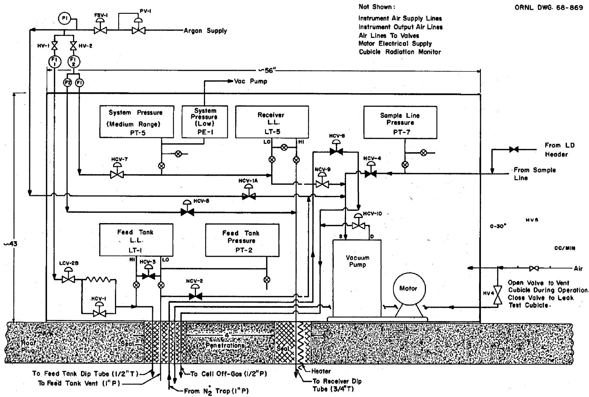  
Fig. 20. Diagram of Sealed Cubicle.

1. M. J. Kelly, "Removal of Rare Earth Fission Products from Molten Salt Reactor Fuels by Distillation," a talk presented at the 11th Annual Meeting of the American Nuclear Society, Gatlinburg, Tennessee, June 21-24, 1965.   
2. R. C. Robertson, MSRE Design and Operations Report, Part I, Description of Reactor Design, ORNL-TM-728, pp. 217-18 (January 1965).   
3. J. T. Venard, Tensile and Creep Properties of INOR-8 for the Molten Salt Reactor Experiment, ORNL-TM-1017 (February 1965).   
4. R. W. Swindeman, The Mechanical Properties of INOR-8, ORNL-2780 (January 10, 1961).   
5. R. B. Briggs, Molten Salt Reactor Program Semiannual Progress Report for Period Ending August 31, 1966, ORNL-4037, pp. 125-30 (January 1967).   
6. K. A. Sense, M. J. Snyder, and R. B. Filbert, Jr., "The Vapor Pressure of Beryllium Fluoride," J. Phy. Chem. 58, 995-6 (1954).   
7. W. R. Grimes, Reactor Chemistry Division Annual Progress Report for Period Ending December 31, 1965, ORNL-3913, pp. 24-33 (March 1966).   
8. R. B. Briggs, Molten-Salt Reactor Program Semiannual Progress Report for Period Ending August 31, 1965, ORNL-3872, p. 126 (December 1965).   
9. W. R. Grimes, Reactor Chemistry Division Annual Progress Report for Period Ending January 31, 1963, ORNL-3262 (May 4, 1962).   
10. J. H. Perry (ed.), Chemical Engineer's Handbook, 4th ed., McGraw-Hill, New York, 1963.   
11. R. B. Lindauer, Revisions to MSRE Design Data Sheets, Issue No. 9, ORNL-CF-64-6-43, p. 9 (June 24, 1964).   
12. ASME Boiler and Pressure Vessel Code, Section VIII, Rules for Construction of Unfired Pressure Vessels, 1965 ed., published by the American Society of Mechanical Engineers, United Engineering Center, 345 E. 47th St., New York.   
13. R. J. Roark, Formulas for Stress and Strain, 3rd ed., McGraw-Hill, New York, 1954.   
14. L. E. Brownell and E. H. Young, Process Equipment Design, John Wiley & Sons, Inc., New York, 1959.

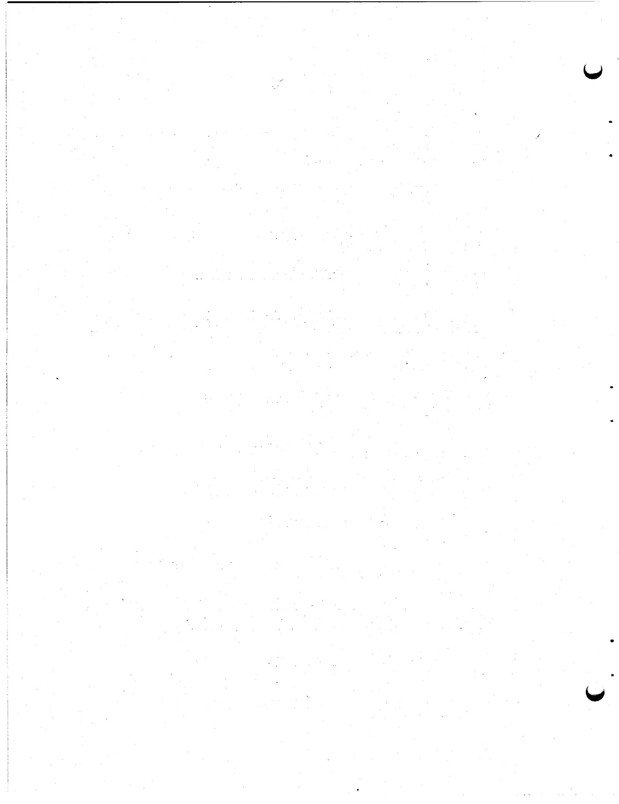

APPENDICES

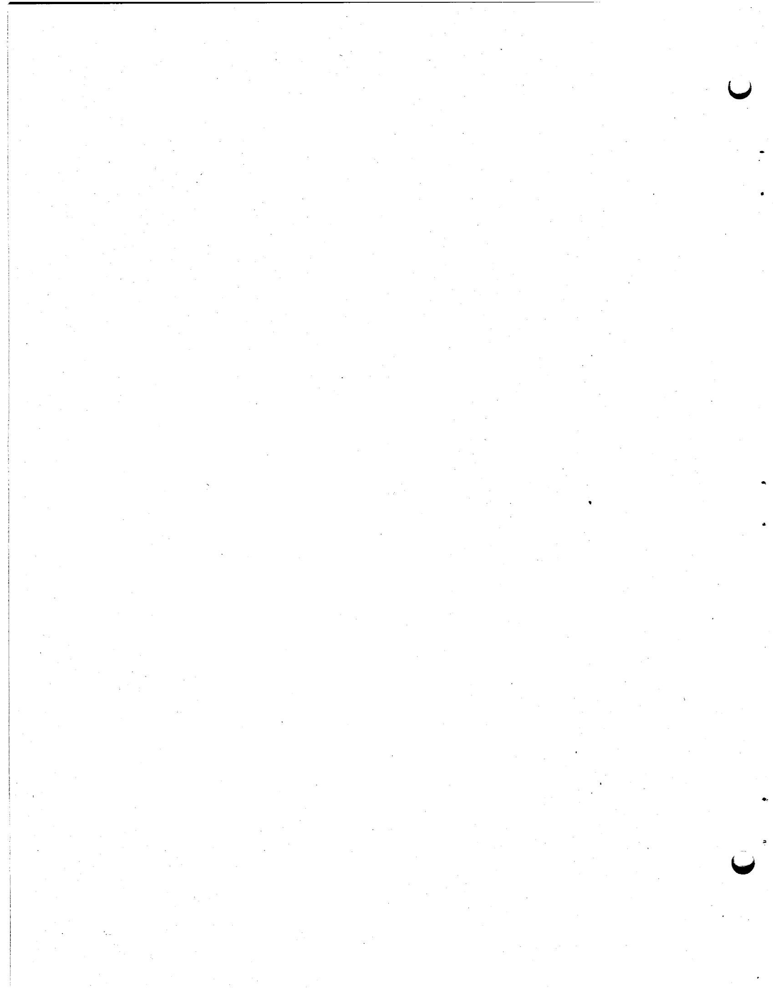

# Physical Properties of Hastelloy N

<table><tr><td>Table A-1</td><td>Chemical Composition</td></tr><tr><td>Table A-2</td><td>Density and Melting Range</td></tr><tr><td>Table A-3</td><td>Thermal Conductivity</td></tr><tr><td>Table A-4</td><td>Modulus of Elasticity</td></tr><tr><td>Table A-5</td><td>Specific Heat</td></tr><tr><td>Table A-6</td><td>Mean Coefficient of Thermal Expansion</td></tr><tr><td>Table A-7</td><td>Mechanical Properties</td></tr></table>

Table A-1. Chemical Composition   

<table><tr><td></td><td>Weight %</td></tr><tr><td>Nickel</td><td>Balance (~66-71)</td></tr><tr><td>Molybdenum</td><td>15.0 to 18.0</td></tr><tr><td>Chromium</td><td>6.0 to 8.0</td></tr><tr><td>Iron, max.</td><td>5.0</td></tr><tr><td>Titanium plus Aluminum, max.</td><td>0.50</td></tr><tr><td>Sulfur, max.</td><td>0.02</td></tr><tr><td>Manganese, max.</td><td>1.0</td></tr><tr><td>Silicon, max.</td><td>1.0</td></tr><tr><td>Copper, max.</td><td>0.35</td></tr><tr><td>Boron, max.</td><td>0.010</td></tr><tr><td>Tungsten, max.</td><td>0.50</td></tr><tr><td>Phosphorus, max.</td><td>0.015</td></tr><tr><td>Cobalt, max.</td><td>0.20</td></tr><tr><td>Vanadium, max.</td><td>0.5</td></tr><tr><td>Carbon</td><td>0.04 to 0.08</td></tr></table>

Table A-2. Density and Melting Range   

<table><tr><td>Density at 25°C, g/cm3</td><td>8.79</td></tr><tr><td>lb/in.3</td><td>0.317</td></tr><tr><td>Melting range, °F</td><td>2470 to 2555</td></tr><tr><td>°C</td><td>1353 to 1400</td></tr></table>

Table A-3. Thermal Conductivity   

<table><tr><td>Temperature (°F)</td><td>Btu ft hr-1 ft-2 °F</td></tr><tr><td>212</td><td>6.600</td></tr><tr><td>400</td><td>7.409</td></tr><tr><td>600</td><td>8.293</td></tr><tr><td>·800</td><td>9.160</td></tr><tr><td>1000</td><td>10.37</td></tr><tr><td>1050</td><td>10.81</td></tr><tr><td>1100</td><td>11.10</td></tr><tr><td>1150</td><td>11.41</td></tr><tr><td>1200</td><td>11.71</td></tr><tr><td>1250</td><td>12.02</td></tr><tr><td>1300</td><td>12.68</td></tr><tr><td>1350</td><td>13.26</td></tr><tr><td>1400</td><td>13.55</td></tr></table>

Table A-4. Modulus of Elasticity   

<table><tr><td>Temperature (°F)</td><td>psi x 10-6</td></tr><tr><td>57</td><td>31.7</td></tr><tr><td>430</td><td>29.3</td></tr><tr><td>770</td><td>27.8</td></tr><tr><td>930</td><td>27.1</td></tr><tr><td>1070</td><td>26.3</td></tr><tr><td>1170</td><td>26.2</td></tr><tr><td>1290</td><td>24.8</td></tr><tr><td>1470</td><td>23.7</td></tr><tr><td>1570</td><td>22.7</td></tr><tr><td>1660</td><td>21.9</td></tr><tr><td>1750</td><td>20.7</td></tr><tr><td>1800</td><td>19.7</td></tr><tr><td>1830</td><td>19.1</td></tr><tr><td>1920</td><td>17.7</td></tr></table>

Table A-5. Specific Heat   

<table><tr><td>Temperature (°F)</td><td>Btu Ib-1·F-1</td></tr><tr><td>140</td><td>0.0977</td></tr><tr><td>212</td><td>0.1005</td></tr><tr><td>392</td><td>0.1052</td></tr><tr><td>572</td><td>0.1091</td></tr><tr><td>752</td><td>0.1120</td></tr><tr><td>896</td><td>0.1139</td></tr><tr><td>1004</td><td>0.1155</td></tr><tr><td>1058</td><td>0.1248</td></tr><tr><td>1094</td><td>0.1347</td></tr><tr><td>1148</td><td>0.1397</td></tr><tr><td>1220</td><td>0.1387</td></tr><tr><td>1256</td><td>0.1384</td></tr><tr><td>1292</td><td>0.1380</td></tr></table>

Table A-6. Mean Coefficient of Thermal Expansion   

<table><tr><td>Temperature (°F)</td><td>in./in. - °F</td><td>ΔT (°F)</td><td>ΔL/L (in./in.)</td></tr><tr><td>70-400</td><td>6.45 × 10-6</td><td>330</td><td>2.13 × 10-3</td></tr><tr><td>70-600</td><td>6.76 × 10-6</td><td>530</td><td>3.58 × 10-3</td></tr><tr><td>70-800</td><td>7.09 × 10-6</td><td>730</td><td>5.18 × 10-3</td></tr><tr><td>70-1000</td><td>7.43 × 10-6</td><td>930</td><td>6.81 × 10-3</td></tr><tr><td>70-1200</td><td>7.81 × 10-6</td><td>1130</td><td>8.83 × 10-3</td></tr><tr><td>70-1400</td><td>8.16 × 10-6</td><td>1330</td><td>10.85 × 10-3</td></tr><tr><td>70-1600</td><td>8.51 × 10-6</td><td>1530</td><td>13.02 × 10-3</td></tr><tr><td>70-1800</td><td>8.85 × 10-6</td><td>1730</td><td>15.31 × 10-3</td></tr></table>

Table A-7. Mechanical Properties   

<table><tr><td>Temp. (°F)</td><td>1/4 Min. Spec. Tensile Strength (psi)</td><td>2/3 Min. Spec. Yield Strength (psi)</td><td>4/5 Rup. Str. for 105 hr (psi)</td><td>Stress for 0.1 CRU (psi)</td><td>Max. Allow. Stress (psi)</td></tr><tr><td>0 - 100</td><td>25,000</td><td>26,700</td><td>-</td><td>14,500</td><td>25,000</td></tr><tr><td>200</td><td>24,400</td><td>24,100</td><td>-</td><td>-</td><td>24,000</td></tr><tr><td>300</td><td>23,900</td><td>22,800</td><td>-</td><td>-</td><td>23,000</td></tr><tr><td>400</td><td>23,500</td><td>21,700</td><td>-</td><td>-</td><td>21,000</td></tr><tr><td>500</td><td>23,100</td><td>20,800</td><td>-</td><td>-</td><td>20,000</td></tr><tr><td>600</td><td>22,700</td><td>20,000</td><td>-</td><td>-</td><td>20,000</td></tr><tr><td>700</td><td>22,250</td><td>19,300</td><td>-</td><td>-</td><td>19,000</td></tr><tr><td>800</td><td>21,800</td><td>18,700</td><td>-</td><td>-</td><td>18,000</td></tr><tr><td>900</td><td>21,200</td><td>18,150</td><td>18,150</td><td>-</td><td>18,000</td></tr><tr><td>1000</td><td>20,500</td><td>17,650</td><td>16,000</td><td>-</td><td>17,000</td></tr><tr><td>1050</td><td>19,900</td><td>17,400</td><td>14,500</td><td>-</td><td>-</td></tr><tr><td>1100</td><td>19,100</td><td>17,200</td><td>12,400</td><td>14,500</td><td>13,000</td></tr><tr><td>1150</td><td>18,100</td><td>17,000</td><td>10,400</td><td>10,200</td><td>-</td></tr><tr><td>1200</td><td>17,100</td><td>16,800</td><td>8,300</td><td>7,400</td><td>6,000</td></tr><tr><td>1250</td><td>16,100</td><td>16,600</td><td>6,200</td><td>5,400</td><td>-</td></tr><tr><td>1300</td><td>15,000</td><td>16,400</td><td>4,800</td><td>4,100</td><td>3,500</td></tr><tr><td>1350</td><td>13,800</td><td>16,300</td><td>3,600</td><td>3,100</td><td>-</td></tr><tr><td>1400</td><td>12,700</td><td>16,200</td><td>2,900</td><td>2,400</td><td>1,900</td></tr></table>

# APPENDIX B

Physical Properties of LiF, $\mathsf{BeF}_2$ , $\mathsf{ZrF}_4$ and Their Mixtures

Fig. B-1 Calculated Densities of Molten LiF, $\mathsf{BeF}_2$ , and $\mathsf{ZrF}_4$

Fig. B-2 Density-Temperature Curves for LiF-BeF $_2$ -ZrF $_4$ Mixtures

Fig. B-3 Vapor Pressure-Temperature Relationships for LiF, $\mathsf{BeF}_2$ , $\mathsf{ZrF}_4$ , and Their Mixtures

Fig. B-4 Calculated Viscosity of LiF-BeF $_2$ -ZrF $_4$ Vapor

Table B-1 Latent Heat of Vaporization of LiF, $\mathsf{BeF}_2,$ ZrF4, and Their Mixtures

Table B-2 Thermal Properties of MSRE Salt A

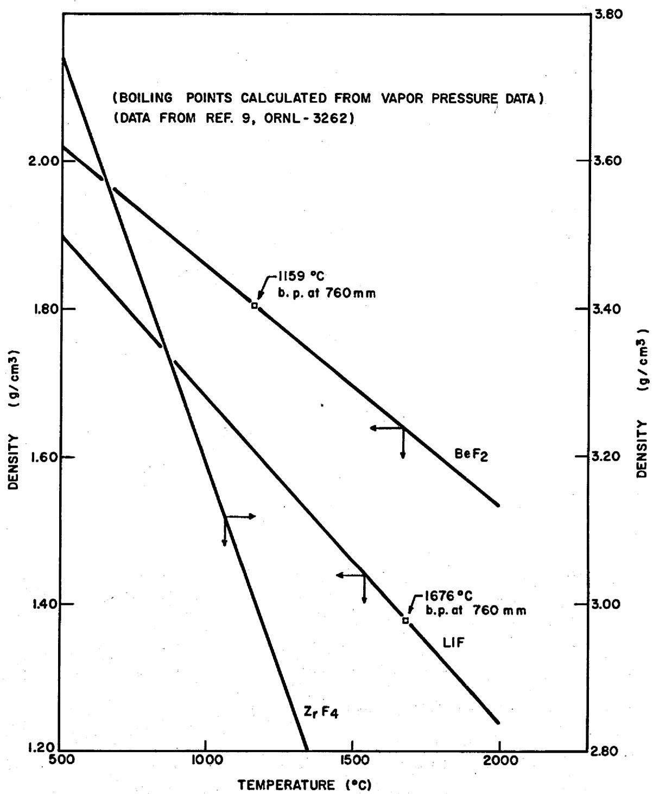  
Fig. B-1. Calculated Densities of Molten LiF, BeF, and ZrF4.

ORNL-DWG-68-825

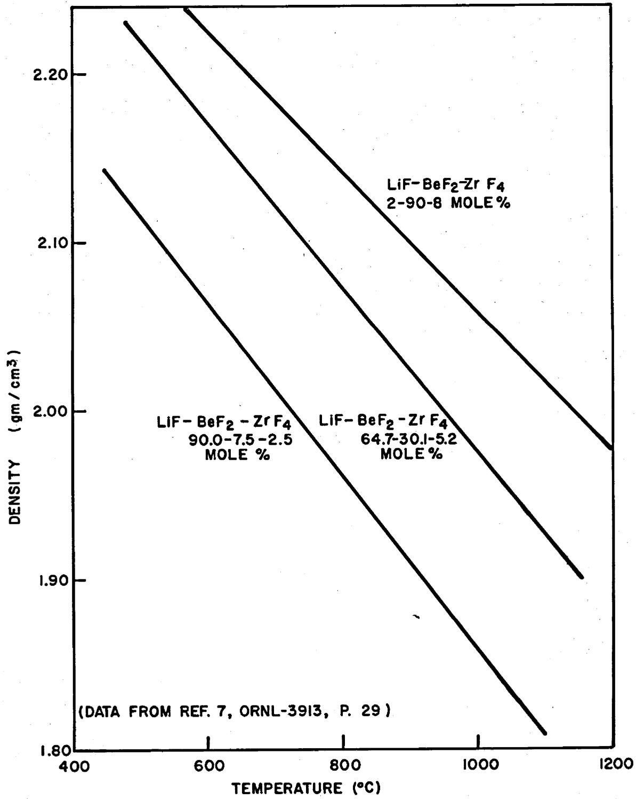  
Fig. B-2. Density-Temperature Curves for $\mathsf{LiF - BeF}_2\mathsf{-ZrF}_4$ .

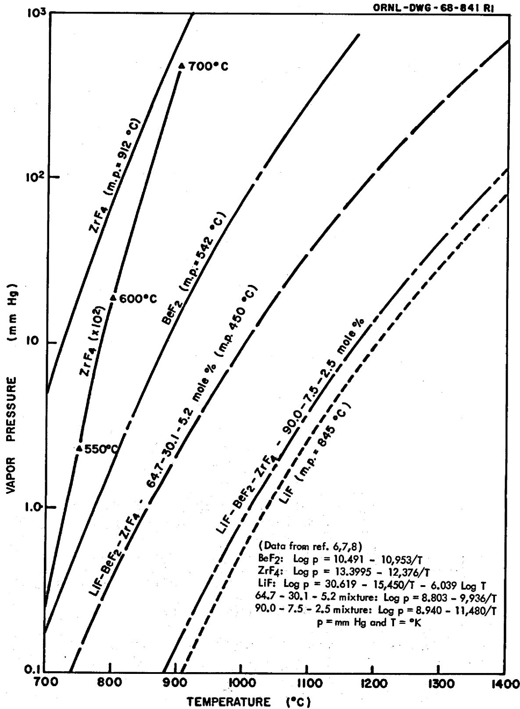  
Fig. B-3. Vapor Pressure-Temperature Relationships for LiF, BeF $_{2'}$ , ZrF $_{4'}$ and their Mixtures.

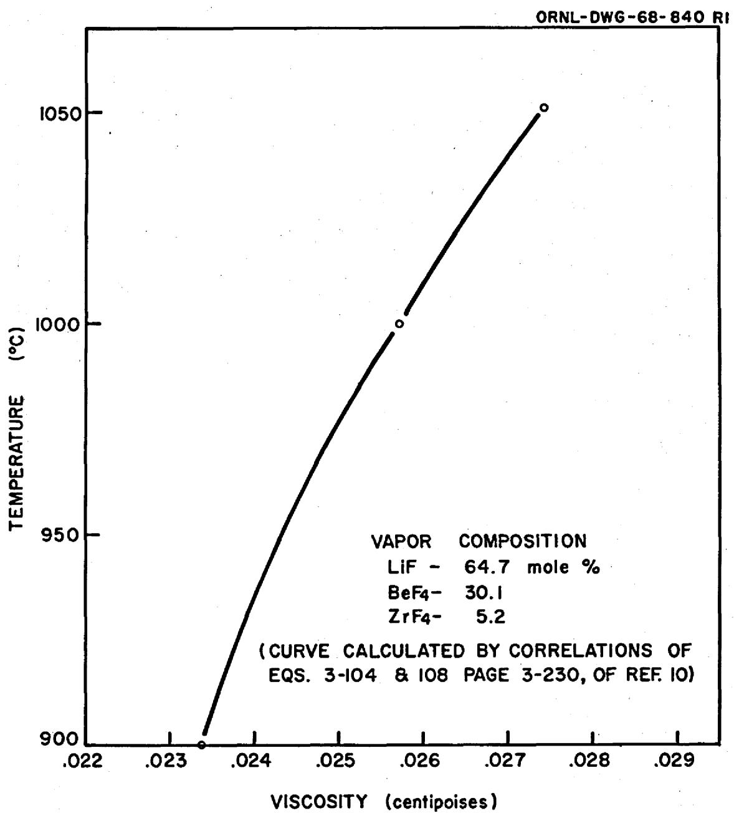  
Fig. B-4. Calculated Viscosity of LiF-BeF $_2$ -ZrF $_4$ Vapor.

(Values estimated from vapor pressure data)

Table B-1. Latent Heat of Vaporization of LiF, $\mathsf{BeF}_2$ , $\mathsf{ZrF}_4$ and Their Mixtures   

<table><tr><td>Composition</td><td>cal/g-mole</td></tr><tr><td>LiF</td><td>44,000</td></tr><tr><td>BeF2</td><td>50,400</td></tr><tr><td>ZrF4</td><td>50,000</td></tr><tr><td>LiF-BeF2-ZrF4(64.7-30.1-5.2 mole%)</td><td>46,200a</td></tr><tr><td>LiF-BeF2-ZrF4(90.0-7.5-2.5 mole%)</td><td>44,600a</td></tr></table>

$^\mathrm{a}$ Calculated by assuming that the latent heat of each component in the mixture is proportional to its molar composition.

(data from Ref. 11)

Table B-2. Thermal Properties of MSRE Salt A   

<table><tr><td>Composition of Salt A</td><td>Mole %</td></tr><tr><td>LiF</td><td>70</td></tr><tr><td>BeF2</td><td>23.6</td></tr><tr><td>ZrF4</td><td>5</td></tr><tr><td>ThF4</td><td>1</td></tr><tr><td>UF4</td><td>0.4</td></tr><tr><td>Melting point</td><td>840°F</td></tr><tr><td>Latent heat of fusion at 840°F</td><td>139 Btu/lb</td></tr><tr><td>Heat capacity of solid (212° to 806°F)</td><td>0.132 + 0.000433 † (°F)</td></tr><tr><td>Heat capacity of liquid (887° to 1472°F)</td><td>0.575 - 0.0000999 † (°F)</td></tr></table>

# Estimation of Pressure Drop for Salt Vapor

# in the Still-Condenser System

The highest pressure in the still-condenser system during distillation is about $1\mathrm{mmHg}$ which occurs just over the surface of the liquid in the still. A vacuum pump connected to the condensate receiver develops a lower pressure in this vessel to induce vapor flow through the condenser. Because the average pressure in the condenser is low and the diameter is relatively large (9.25 in. ID), the possibility was foreseen that vapor could channel, resulting in incomplete condensation. It was not desirable to make the condenser smaller in diameter because the larger surface is needed for heat rejection; therefore, to avoid channeling, a core was placed in the condenser (Fig. C-1) to route vapor to the condenser wall.

The calculations that follow were made on the system shown schematically in Fig. C-1. They consider pressure drops for various flow rates beginning at the vapor line opening in the still to the neck of the condensate receiver. The objective of the calculations is to determine the annulus width that easily passes the amount of vapor that can be condensed. In other words, the condenser is to be made non-channeling but with sufficient annular area that pressure drop is not the controlling characteristic. The results indicate that a 3/4-in. annulus very nicely fulfills these requirements, whereas a 1/2-in. annulus limits the distillation rate to about $500\mathrm{cm}^3/\mathrm{hr}$ .

# Properties of the System

In addition to the dimensional properties of the system, the following data are tabulated:

Vapor composition, mole %

LiF 64.7

BeF2 30.1

$\mathbf{Z}_{\mathrm{r}}\mathbf{F}_{4}$ 5.2

Molecular weight of vapor, g/mole 39.66

Vapor temperature, $^\circ \mathrm{C}$ 1000

Pressure in still, mm Hg 1.0

Vapor density at $1000^{\circ}\mathrm{C},\mathrm{lb / ft}^{3}$ 3.12 x

Vapor viscosity at $1000^{\circ}\mathrm{C}$ , centipoises 0.0257

Condensate temperature, $^\circ \mathrm{C}$ 600

Condensate density at $600^{\circ}\mathrm{C},\mathrm{g / cm}^{3}$ 2.17

ORNL DWG. 68-852 RI

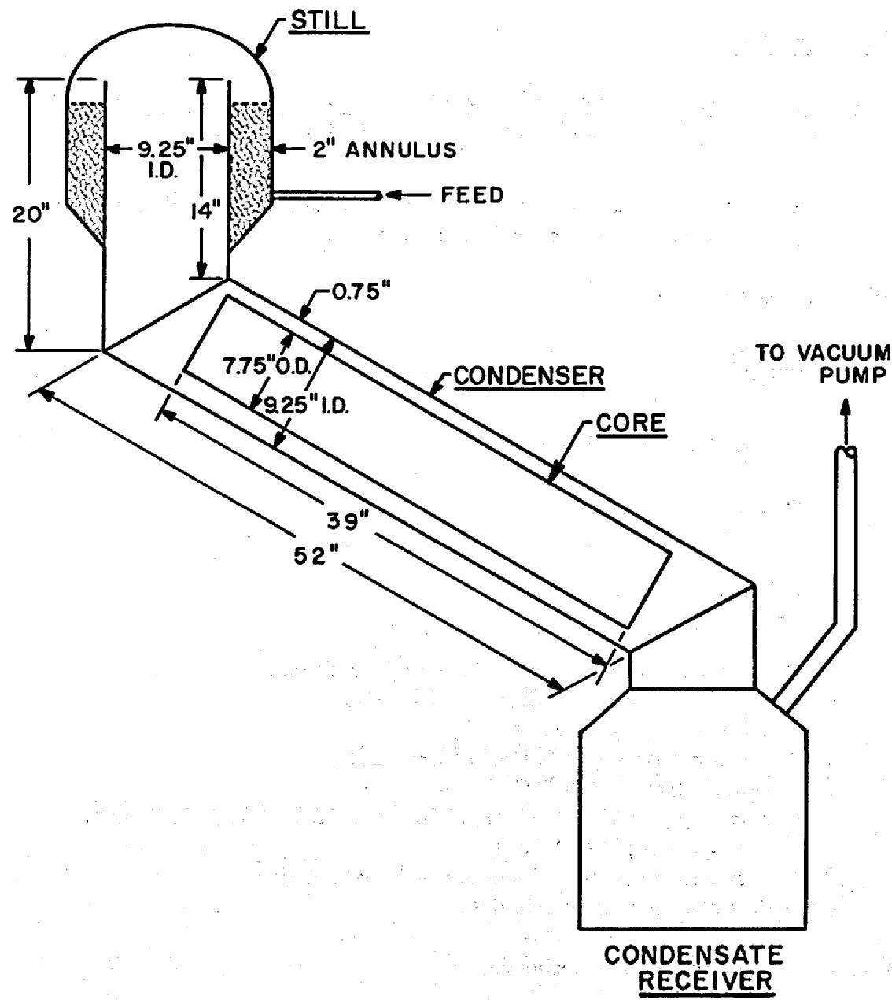  
Fig. C-1. Diagram of Still-Condenser System Showing Dimensions Used in Pressure Drop Calculation.

The pressure drop is calculated in three steps: (1) the $\Delta P$ in the vapor line from its entrance to the beginning of the core, (2) entrance loss into the annulus, and (3) $\Delta P$ in the annulus. It was chosen to find the pressure drop for a condensation rate of $800\mathrm{cm}^3$ liquid per hour for a sample calculation.

# $\Delta P$ in Vapor Line

$$
V a p o r \text {f l o w} \mathrm {r a t e}, \mathrm {w} = \frac {8 0 0 \mathrm {c m} ^ {3}}{3 6 0 0 \mathrm {s e c}} \times \frac {2 . 1 7 \mathrm {g}}{\mathrm {c m} ^ {3}} \times \frac {\mathrm {l b}}{4 5 3 \mathrm {g}} = 0. 0 0 1 0 6 3 \mathrm {l b / s e c}
$$

The vapor is in laminar flow so use the correlations of Perry10, Table 5-11, page 5-21, to find the pressure drop in the vapor line.

The weight rate of flow is

$$
w = \frac {\pi D ^ {4} N}{1 2 8},
$$

where $D =$ diameter $= 0.771$ ft.

N is defined by

$$
N = \frac {g _ {c} M}{2 z R T \mu} \left(\frac {P _ {1} ^ {2} - P _ {2} ^ {2}}{L}\right),
$$

where $g_{C} =$ conversion factor $= 32 / 17$ ft-lb/lb force-sec²,

$M =$ molecular weight $= 39.66\mathrm{lb / lb}$ mole,

$z =$ compressibility factor $= 1.0,$

R = gas constant = 1,543 ft-lb/°R-lb mole,

T = temperature = 2292°R,

$\mu = \text{viscosity} = (0.0257)(6.72 \times 10^{-4}) = 1.73 \times 10^{-5} \, \text{lb/ft sec},$

L = average length = 1.42 ft,

P1 = upstream pressure = 1 mm Hg = 2.7845 lb/ft²,

P2 = downstream pressure, Ib/ft².

Using the above values, it is found that

$$
N = 7. 3 7 2 \left(P _ {1} ^ {2} - P _ {2} ^ {2}\right) \tag {3}
$$

From Eq. 1,

$$
N = \frac {1 2 8 w}{\pi D ^ {4}} = \frac {(1 2 8) (0 . 0 0 1 0 6 3)}{(\pi) (0 . 7 7 1) ^ {4}}. \tag {4}
$$

Using Eqs. 3 and 4, the downstream pressure is found to be

$$
P _ {2} = 2. 7 8 1 5 \mathrm {I b} / \mathrm {f t} ^ {2} \approx 0. 9 9 8 9 \mathrm {m m H g}. \tag {5}
$$

# Contraction Loss Entering Annulus

The correlation given in Perry 10, Fig. 5-34, page 5-31, was used to estimate this effect. The hydraulic diameter $D_{H}$ of the annulus is 0.125 ft; the "equivalent" length $L_{e}$ of the annular entrance is taken as one-half this value or 0.0625 ft. The correlation term for Fig. 5-34 is

$$
\frac {L _ {e} \mu}{D _ {H} ^ {2} G},
$$

where $G =$ mass flow rate in annulus $= \frac{w}{\text{area of annulus}} = 0.00764 \, \text{lb/sec} - ft^2$ .

Other terms have been previously defined.

The value of the correlation term is

$$
\frac {L _ {\mathrm {e}} \mu}{D _ {\mathrm {H}} ^ {2} G} = 0. 0 0 9 0 4,
$$

which is used in Fig. 5-34 to determine that

$$
\frac {P _ {2} - P _ {3}}{\rho v ^ {2} / 2 g _ {c}} - 1 = 1. 5, \tag {6}
$$

where $\rho =$ vapor density $= 3.12\times 10^{-5}$ lb/ft3,

V = vapor velocity in entrance = 245 ft/sec,

P2 = pressure just upstream of entrance = 2,7815 lb/ft²

$P_{3} =$ pressure after entrance losses, $\mathsf{lb / ft^2}$

From Eq. 6, the pressure after entrance losses is

$$
P _ {3} = 2. 7 0 8 7 \mathrm {I b} / \mathrm {f t} ^ {2} \approx 0. 9 7 2 8 \mathrm {m m H g}. \tag {7}
$$

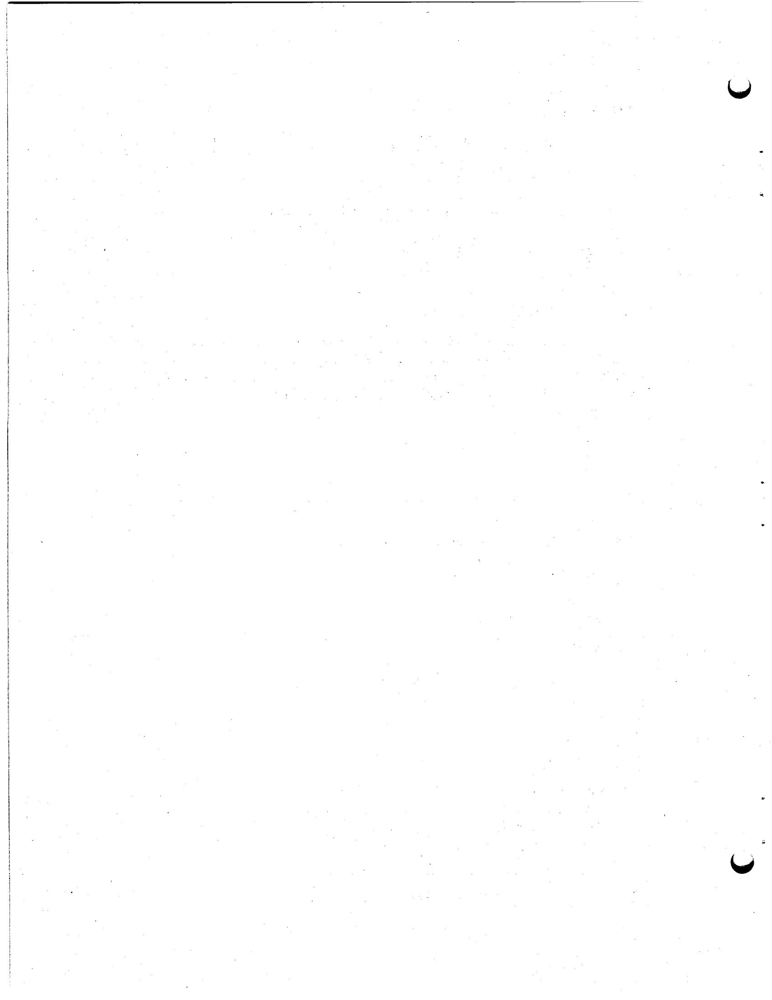

flow rates above and below this range, and the results are plotted in Fig. C-2. Also included in the figure is a curve showing the pressure drop for an annulus width equal to $1/2$ in. For an annulus this narrow, the pressure drop in the 400 to $600 \, \text{cm}^3/\text{hr}$ operating range is significantly greater than for the $3/4$ -in. annulus. In fact, it appears that in a $1/2$ -in. annulus the distillation rate might be limited to about $550 \, \text{cm}^3/\text{hr}$ . The $3/4$ -in. spacing was chosen for the condenser design because this eliminates pressure drop as a factor in controlling distillation rate.

ORNL DWG. 68-864 RI

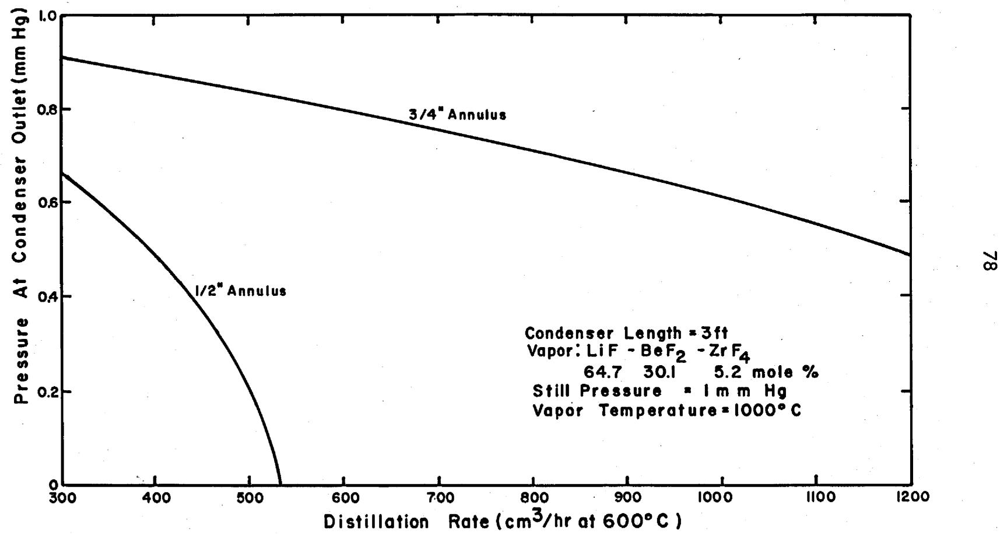  
Fig. C-2. Distillation Rate as a Function of Pressure at Condenser Outlet.

# Estimation of Time to Heat Condensate Receiver and Feed Tank to Operating Temperature

The condensate receiver and feed tank are so nearly the same size and geometry that one calculation of time-temperature characteristics is assumed to apply to both vessels. The purpose of the calculation is to find the proper rating for heaters attached to the outside of the vessel that permit heating from room temperature to $500^{\circ}\mathrm{C}$ in about 2 hr. The results of the calculation, presented above in Fig. 6, page 17, show that a heat input of about 20 kw is required; the following discussion illustrates the computational procedure.

# Data and Computational Model

The condensate receiver, shown schematically in Fig. 7, page 18, and detailed in Dwg. M-12173-CD-009 of Appendix H, was chosen as the model for the calculation. Elements of the model are shown in Fig. D-1. The vessel as installed is covered with ceramic heaters that provide a uniform heat source to the vertical sides and bottom; however, for calculational convenience it is assumed that all heat enters through the vertical sides, the sides being made longer to include the heated area that would be on the bottom. It is assumed that the vessel contains a full charge (48 liters) of salt having the properties of MSRE Salt A (see Table B-2, Appendix B). This salt was chosen because heat capacity and heat of fusion data are available and its composition very closely approximates that of MSRE carrier salt.

The following data are pertinent properties of the vessel and its contents:

<table><tr><td>Vessel material</td><td>Hastelloy N</td></tr><tr><td>Vessel weight, lbs</td><td>125</td></tr><tr><td>Vessel surface area, ft2</td><td>6.89</td></tr><tr><td>Average specific heat of metal, Btu lb-1oF-1</td><td>0.11</td></tr><tr><td>Average thermal conductivity of metal, Btu hr-1oF-1</td><td>10.3</td></tr><tr><td>Emissivity of metal</td><td>0.5</td></tr><tr><td>Weight of salt (48 liters), lbs</td><td>235</td></tr><tr><td>Melting point of salt, oC</td><td>450</td></tr><tr><td>Heat of fusion, Btu/lb</td><td>139</td></tr><tr><td>Average specific heat of solid salt (70 to 842oF), Btu lb-1oF-1</td><td>0.316</td></tr><tr><td>Average specific heat of liquid salt (842 to 932oF), Btu lb-1oF-1</td><td>0.486</td></tr><tr><td>Thermal conductivity of insulation, Btu hr ft-1oF-1</td><td>0.1</td></tr></table>

ORNL DWG. 68-855

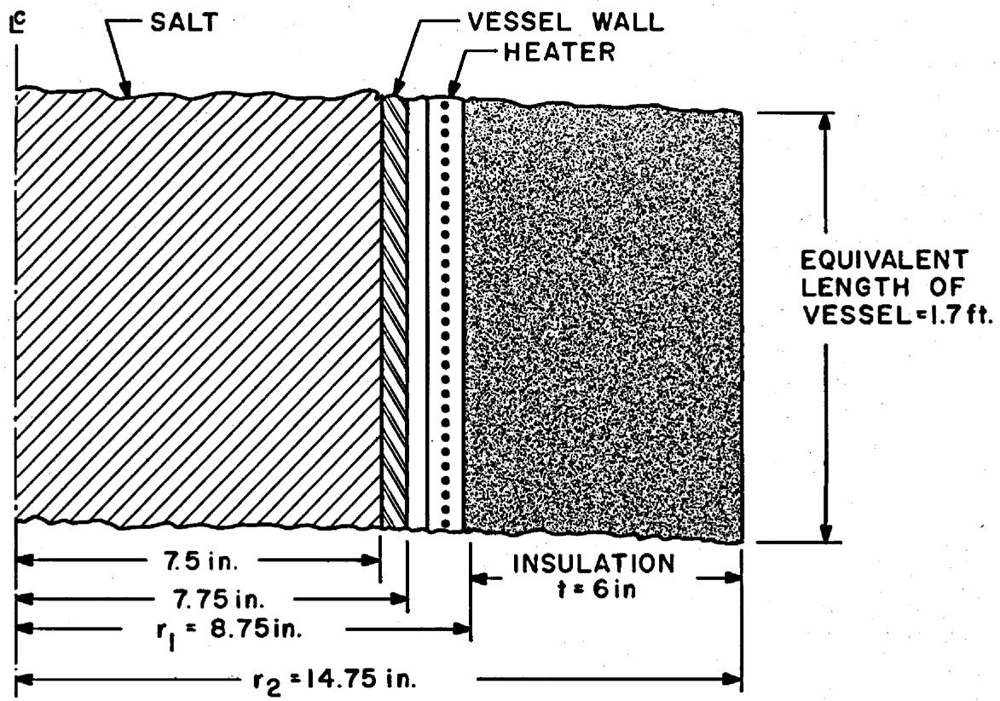  
Fig. D-1. Model for Calculating Time to Heat Condensate Receiver to Operating Temperature.

# Definitions

$$
\begin{array}{l} q _ {h} = \text {h e a t e r o u t p u t}, B t u / h r \\ A _ {m} = \text {h e a t t r a n s f e r a r e a ,} f t ^ {2} \\ e = \text {e m i s s i v i t y} \\ L = \text {l e n g t h o f v e s s e l}, f t \\ r 1 = \text {r a d i u s} \\ ^ {r 2} = \text {r a d i u s t o o t s i d e o f i n s u l a t i o n , f t} \\ k = \text {t h e r m a l c o n d u c t i v i t y o f i n s u l a t i o n , B t u h r ^ {- 1} f t ^ {- 1} o F - 1} \\ T _ {h} = \text {h e a t e r} ^ {\circ} R \\ T _ {s} = \text {s a l t} ^ {\circ} R \\ T _ {m} = \text {m e t a l} ^ {\prime} \text {t e m p e r a t u r e}, ^ {\circ} R \\ T _ {a} = \text {t e m p e r a t u r e} \\ \theta = \text {t i m e}, \mathrm {h r} \\ C _ {s} = \text {s p e c i f i c h e a t o f s a l t , B t u} 1 b ^ {- 1} \circ F - 1 \\ C _ {m} = \text {s p e c i f i c h e a t o f m e t a l}, B t u \mid b ^ {- 1} \circ F ^ {- 1} \\ W _ {s} = \text {w e i g h t o f s a l t}, \mathrm {l b} \\ W _ {m} = \text {w e i g h t o f m e t a l}, \mathrm {l b} \\ k _ {m} = \text {t h e r m a l c o n d u c t i v i t y o f m e t a l}, B t u h r ^ {- 1} f t ^ {- 1} \circ F ^ {- 1} \\ h _ {c} = \text {c o e f f i c i e n t o f h e a t t r a n s f e r f s a l t f i l m , B t u h r - 1 f t - 2} \\ x = \text {t h i c k n e s s o f m e t a l w a l l}, \\ \end{array}
$$

# Heat Balance

The output of the heaters is radiated to the vessel or is lost by conduction through the insulation.

$$
q _ {h} = 0. 1 7 3 \times 1 0 ^ {- 8} A _ {m} \epsilon \left(T _ {h} ^ {4} - T _ {m} ^ {4}\right) + \frac {2 \pi k L \left(T _ {h} - T _ {a}\right)}{\ln \left\{r _ {2} / r _ {1} \right\}}. \tag {1}
$$

The energy received by the vessel wall is partially used to heat the metal and partially to heat the salt inside the vessel. In a small time increment $d\theta$ there would be a small rise in temperature of the vessel and the salt, and we can write

$$
q _ {h} d \theta = W _ {s} C _ {s} d T _ {s} + W _ {m} C _ {m} d T _ {m} + \frac {2 \pi k L \left(T _ {h} - T _ {a}\right)}{\ln \left(r _ {2} / r _ {1}\right)} d \theta . \tag {2}
$$

Both $T_{s}$ and $T_{m}$ are variables in this equation, and one must be eliminated before integration. If we make the simplifying assumption that the amount of heat going into the salt is proportional to the amount of heat going into the metal, the proportionality constant is probably the ratio of the relative conductances of the metal and the salt film adjacent to the wall. In this case the proportionality constant becomes

$$
\frac {k _ {m} / x}{h _ {c}} = \frac {1 0 . 3 / 0 . 0 2 0 8}{2 0} = 2 4. 7 2. \tag {3}
$$

The value of $h_c$ (= 20 Btu hr-1 ft-2 °F-1) is estimated from physical properties.

Using the value 24.72 as the proportionality between the first two terms to the right of the equality sign in Eq. 2, we write

$$
q _ {h} d \theta = \frac {W _ {m} C _ {m} d T _ {m}}{2 4 . 7 2} + W _ {m} C _ {m} d T _ {m} + \frac {2 \pi k L \left(T _ {h} - T _ {a}\right)}{\ln \left(r _ {2} / r _ {1}\right)}. \tag {4}
$$

Upon rearrangement and integration this becomes

$$
\int_ {T _ {0}} ^ {T _ {m} ^ {\prime}} \frac {d T _ {m}}{q _ {h} - \frac {2 \pi k L \left(T _ {h} - T _ {a}\right)}{\ln \left(r _ {2} / r _ {1}\right)}} = \int_ {0} ^ {\theta^ {\prime}} \frac {d \theta}{1 . 0 4 W _ {m} C _ {m}} \tag {5}
$$

The initial conditions are $T_{0}$ equals room temperature at time equals zero; final conditions are $T_{m}^{\prime}$ , a predetermined upper limit for the temperature of the vessel wall, and $\theta^{\prime}$ , the time required for the vessel wall to reach temperature $T_{m}^{\prime}$ .

Since the metal temperature rises much faster than the bulk or "mixed" temperature of the salt, it is necessary during this transient period to limit the metal temperature to some reasonable value, for example, 600 to $700^{\circ}\mathrm{C}$ , and hold the temperature at this value until the salt melts and heats to operating temperature, which is taken to be $500^{\circ}\mathrm{C}$ . While the metal is being heated, the relationship between metal and bulk salt temperatures can be found from the assumption used to get the proportionality factor of Eq. 3.

$$
\frac {T _ {s} - T _ {o}}{T _ {m} - T _ {o}} = \frac {W _ {m} C _ {m}}{2 4 . 7 2 W _ {s} C _ {s}} = \frac {(1 2 5) (0 . 1 1)}{(2 4 . 7 2) (2 3 5) (0 . 4 9 5)} = 0. 0 0 4 7 7 \tag {6}
$$

$$
T _ {s} = 0. 0 0 4 7 7 \left(T _ {m} - T _ {o}\right) + T _ {o}. \tag {7}
$$

The value of $C_s$ ( $= 0.495 \, \text{Btu} \, \text{lb}^{-1} \, \text{oF}^{-1}$ ) used in Eq. 6 is a weighted specific heat which includes in one number the effect of heating the solid, of the heat of fusion, and of heating the liquid to $500^{\circ} \text{C}$ .

The left member of Eq. 5 contains the variables $T_{m}$ and $T_{h'}$ which are related through Eq. 1 for any chosen heater capacity $q_{h'}$ ; other quantities in Eq. 1 are defined in Fig. D-1 and the paragraph titled Definitions. If we choose a heater of 15 kw (51,195 Btu/hr) capacity and a surface temperature for the insulation of $530^{\circ} \mathrm{R}$ , we obtain for Eq. 1:

$$
5 1, 1 9 5 = (0. 1 7 3 \times 1 0 ^ {- 8}) (6. 8 9) (0. 5) \left(T _ {h} ^ {4} - T _ {m} ^ {4}\right) + \frac {(2 \pi) (0 . 1) (1 . 7) \left(T _ {h} - 5 3 0\right)}{\ln (1 4 . 7 5 / 8 . 7 5)}
$$

$$
5 1, 1 9 5 = 0. 5 9 6 \times 1 0 ^ {- 8} \left(T _ {h} ^ {4} - T _ {m} ^ {4}\right) + 2. 0 4 6 \left(T _ {h} - 5 3 0\right) \tag {8}
$$

We need to use Eq. 8 to eliminate either $T_{h}$ or $T_{m}$ from Eq. 5 and then integrate Eq. 5; however, the fourth-power relationship in Eq. 8 makes integration of Eq. 5 difficult unless graphical methods are used. Equation 8 is plotted in Fig. D-2; the "mixed" temperature of the salt, computed by Eq. 7, is shown on the same plot. When values are substituted into Eq. 5, we obtain

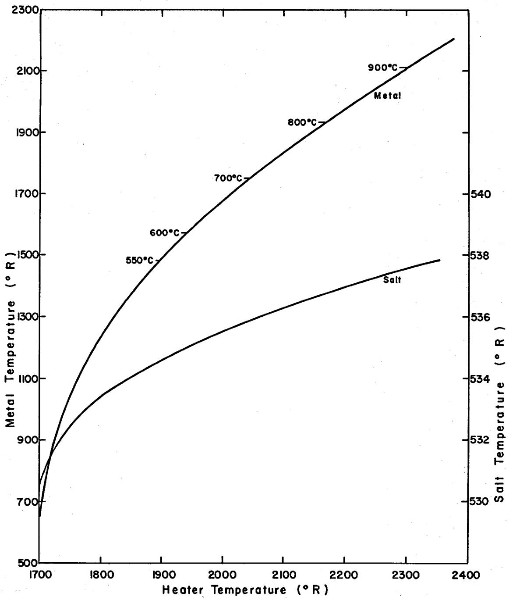  
Fig. D-2. Temperature of Vessel Wall and Salt as a Function of Heater Temperature (15-kw Heater).

$$
\int_ {5 3 0 ^ {\circ} R} ^ {T _ {m} ^ {\prime}} = 1 5 7 1 ^ {\circ} R \quad \frac {d T _ {m}}{5 1 , 1 9 5 - 2 . 0 4 6 \left(T _ {h} - 5 3 0\right)} = \int_ {0} ^ {\theta^ {\prime}} = \frac {d \theta}{(1 . 0 4) (1 2 5) (0 . 1 1)} = \int_ {0} ^ {\theta^ {\prime}} = \frac {d \theta}{1 4 . 3 ^ {\prime}} \tag {9}
$$

which, when integrated graphically with the aid of Fig. D-2, gives a value of $\theta^{\prime} = 18.5$ minutes. This is the time for heating the vessel to $600^{\circ}\mathsf{C}$ (1571 $^{\circ}$ R). During this transient period, the "mixed" temperature of the salt has risen only about $5^{\circ}\mathsf{R}$ to $535^{\circ}\mathsf{R}$ ( $\sim 25^{\circ}\mathsf{C}$ ).

Heating Salt to $500^{\circ}\mathrm{C}$ While Holding Vessel Walls at $600^{\circ}\mathrm{C}$

Choosing at this point to hold the vessel walls at $600^{\circ}\mathrm{C}$ by on-off control of the heaters, we examine the mechanism for transferring heat from the heaters through the walls and then into the salt. The rate at which heat is received by the walls, assumed to be by radiation only, is

$$
0. 1 7 3 \times 1 0 ^ {- 8} A _ {m} \in \left(T _ {h} ^ {4} - T _ {m} ^ {4}\right).
$$

The rate of heat transfer into the salt depends upon convection which is

$$
h _ {c} A _ {m} \left(T _ {m} - T _ {s}\right).
$$

These two expressions must be equal since the wall temperature is held constant. Therefore,

$$
h _ {c} A _ {m} \left(T _ {m} - T _ {s}\right) = 0. 1 7 3 \times 1 0 ^ {- 8} A _ {m} \epsilon \left(T _ {h} ^ {4} - T _ {m} ^ {4}\right). \tag {10}
$$

In Eq. 10, $T_{s}$ increases with time, and the heat transfer rate into the salt drops off because of the decreasing value of $(T_{m} - T_{s})$ . At the outset this temperature difference is large enough to permit all radiated energy to be conducted into the salt. However, eventually $(T_{m} - T_{s})$ becomes small enough that the heater output must be curtailed (through the on-off control that holds wall temperature constant). During the time that the large value of $(T_{m} - T_{s})$ prevails, the energy balance is

$$
0. 1 7 3 \times 1 0 ^ {- 8} A _ {m} \epsilon \left(T _ {h} ^ {4} - T _ {m} ^ {4}\right) d \theta = W _ {s} C _ {s} d T _ {s}.
$$

Integrating from the lower limits $\theta^{\prime}$ and $T_{s^{\prime}}^{1}$ , respectively, the time (18.5 minutes) and temperature $(535^{\circ}R)$ at which the metal reaches $600^{\circ}C$ , to the upper limits $\theta''$ and $T_{s^{\prime}}^{1}$ , we have

$$
\begin{array}{l} \theta^ {\prime \prime} - \frac {1 8 . 5}{6 0} = \frac {W _ {s} C _ {s} \left(T _ {s} ^ {\prime \prime} - T _ {s} ^ {\prime}\right)}{0 . 1 7 3 \times 1 0 ^ {- 8} A _ {m} \epsilon \left(T _ {h} ^ {4} - T _ {m} ^ {4}\right)} \\ = \frac {(2 3 5) (0 . 4 9 5) \left. \left(T _ {s} ^ {\prime \prime} - 5 3 5\right) \right.}{0 . 1 7 3 \times 1 0 ^ {- 8} (6 . 8 9) (0 . 5) \left[ (1 9 4 0) ^ {4} - (1 5 7 1) ^ {4} \right]} \\ = 0. 0 0 2 4 2 \left(\mathrm {T} _ {\mathrm {s}} ^ {\prime \prime} - 5 3 5\right). \tag {11} \\ \end{array}
$$

The linear relation of Eq. 11 holds until the magnitude of $(T_{m} - T_{s})$ decreases to the point at which convection transfer controls. The salt temperature at which this occurs is found by equating the radiation heat transfer rate to the convection transfer rate as was done in Eq. 10. We define this temperature to be $T_{s}^{\prime \prime}$ and obtain it by solving Eq. 10.

$$
T _ {m} - T _ {s} ^ {\prime \prime} = \frac {0 . 1 7 3 \times 1 0 ^ {- 8} \epsilon \left(T _ {h} ^ {4} - T _ {m} ^ {4}\right)}{h _ {c}} \tag {12}
$$

The value of $\mathbf{T}_{\mathbf{s}}^{\prime \prime}$ is

$$
\begin{array}{l} 1 5 7 1 - T _ {s} ^ {\prime \prime} = \frac {0 . 1 7 3 \times 1 0 ^ {- 8} (0 . 5) \left[ (1 9 4 0) ^ {4} - (1 5 7 1) ^ {4} \right]}{2 0}; \\ T _ {s} ^ {\prime \prime} = 1 2 2 2 ^ {\circ} R (4 0 6 ^ {\circ} C) \tag {13} \\ \end{array}
$$

The elapsed time for the salt to reach $406^{\circ} \mathrm{C}$ is found from Eq. 11 to be $\theta'' = 118$ minutes.

Above a salt temperature of $406^{\circ}\mathrm{C}$ the heat transfer rate decreases with time, and the time-temperature relationship is found by equating the energy passing through the salt film to energy absorbed in the salt.

$$
h _ {c} A _ {m} \left(T _ {m} - T _ {s}\right) d \theta = W _ {s} C _ {s} d T _ {s} \tag {14}
$$

Integration from initial conditions $\theta''$ and $T_{s}''$ to the desired final temperature $T_{sf}$ gives

$$
\ln \frac {T _ {m} - T _ {s} ^ {\prime \prime}}{T _ {m} - T _ {s f}} = \frac {h _ {c} A}{W _ {s} C _ {s}} \left(\theta_ {f} - \theta^ {\prime \prime}\right) \tag {15}
$$

Upon substitution of numerical values Eq. 15 becomes

$$
\begin{array}{l} \ln \frac {1 5 7 1 - 1 2 2 2}{1 5 7 1 - T _ {s f}} = \frac {(2 0)}{(2 3 5)} \frac {(6 . 8 9)}{(0 . 4 9 5)} \left(\theta_ {f} - \frac {1 1 8}{6 0}\right) \\ = 1. 1 8 5 \left(\theta_ {f} - \frac {1 1 8}{6 0}\right). \tag {16} \\ \end{array}
$$

Using Eq. 16, the time $(\theta_{f})$ required to heat the salt to $500^{\circ}C$ is 152 minutes.

The relationships between time and temperatures of the heater, vessel wall, and salt were calculated from Eqs. 8, 11, 12, and 16 and are plotted on Fig. D-3. Two curves are presented for the salt temperature, one for the vessel wall at a constant temperature of $600^{\circ}\mathrm{C}$ and a second for a constant temperature of $700^{\circ}\mathrm{C}$ . The difference in time between the two cases is insignificant.

# Choosing the Heater Sizes for the Condensate Receiver, Feed Tank, Still, and Condenser

Condensate Receiver and Feed Tank. - The calculations discussed above were repeated for heating jackets of 10 kw and 20 kw capacity around the sides and bottom of the condensate receiver. These data, presented previously in Fig. 6, page 17, were used to fix the heater capacity for the condensate receiver and feed tank. It was chosen to heat each tank with 20-kw heaters, having the distribution over the vessel surfaces specified in Paragraphs 4.6.2 and 4.6.3 of Appendix G. Since some heat is applied to upper surfaces that are not contacted by salt, the heater effectiveness for heating the salt is not the total 20 kw but perhaps about 16 kw. The required time (Fig. 6) for bringing the vessels to temperature is then about 140 minutes.

Still and Condenser. - An analysis similar to that described in this Appendix was made for the still and condenser, giving the time versus heater rating curves shown in Fig. 11, page 28. A 20-kw heater was chosen for the condenser and a 15-kw heater for the still giving a heat-up time of about 1.5 hr.

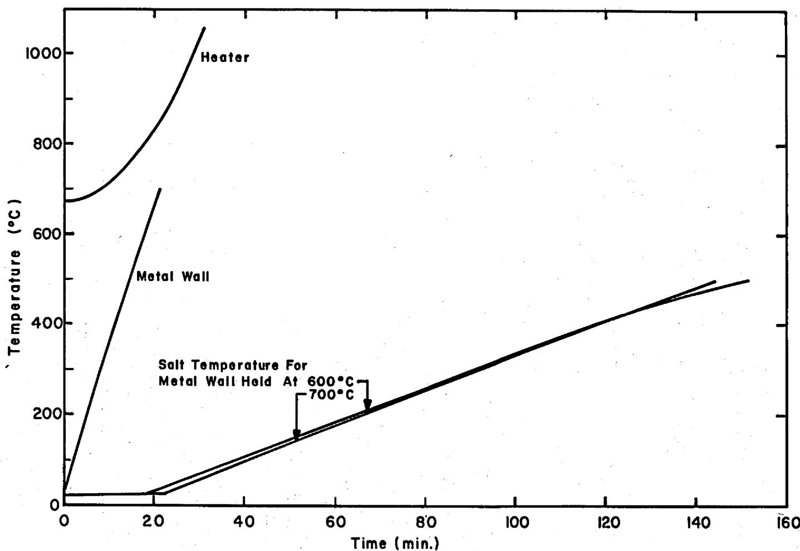  
Fig. D-3. Temperature-Time Curves for Heating Up the Condensate Receiver with a 15-kw Heater.

Calculations for the still-condenser system were straightforward since it was not necessary to consider heating and melting a mass of salt. The small volume (12 liters) of salt that might be in the still was included in the weight of the metal thus simplifying the calculations.

# 90 APPENDIX E

Estimation of Heat Rejection Rate by Condenser

The condenser is designed to reject heat by conduction through the insulation and convection to the atmosphere. This characteristic was chosen for the design since it offers the simplest and most economical cooling method. More efficient methods, such as forced circulation of an inert gas or liquid metal, were evaluated and found to require a significant investment in circulating plus auxiliary heating and cooling equipment.

The following calculations illustrate the straightforward approach to finding the heat rejection capability of the condenser. A 3-ft length was chosen for the calculations since this was estimated to be the effective length of a unit that would fit the available space; the actual condenser length of the completed design is 51 in. Independent variables in the condenser wall temperature and insulation thickness. The object of the computations is to find the most suitable combination of these variables for the desired distillation rate; results for condensing MSRE carrier salt and pure LiF are presented in Fig. 10, page 26. For 4-in.-thick insulation and wall temperatures between 600 and $850^{\circ}\mathrm{C}$ , the 3-ft length of 10-in.-OD condenser can dissipate 5000 to 7000 Btu/hr; this is equivalent to condensing 500 to $600\mathrm{cm}^3/\mathrm{hr}$ of MSRE carrier salt. A 4-in. thickness is specified for the insulation on the installed unit; this may be increased or decreased with little inconvenience if operating experience does not agree closely enough with calculations.

# Model for the Calculation

Heat given up by condensing salt inside the condenser must pass across an air gap to the heater, through the heater, and then through the insulation to the surroundings as diagrammed in Fig. E-1. The heater is used to heat the condenser from room temperature to the desired condensation temperature. Once thermal equilibrium is established, the heat of condensation maintains the unit on temperature. For this calculation it is assumed that heat is radiated from the condenser to the heater and then passes by conduction through the heater and surrounding insulation before being dissipated to the atmosphere by convection and radiation.

# Definitions

In addition to the dimensions shown on Fig. E-1, the following terms are defined:

q = heat transfer rate, Btu/hr

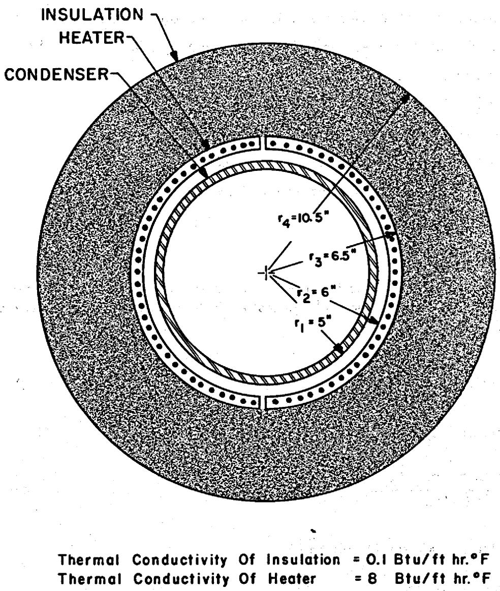  
Fig. E-1. Cross Section of Condenser, Heater and Insulation.

A = area normal to heat flow, ft²

T = temperature, °R

k = thermal conductivity, Btu ft $^{-1}$ hr $^{-1}$ oR $^{-1}$

$\epsilon =$ emissivity

L = length, ft

r = radius, ft

$h_c =$ convective heat transfer coefficient to surroundings, Btu hr-1 ft-2 $\circ F^{-1}$

$h_{r}^{c} =$ radiative heat transfer coefficient to surroundings, Btu hr $-1\text{ft}^{-2}\circ F^{-1}$

Subscript 1 refers to conditions at condenser surface

Subscript 2 refers to conditions in heater

Subscript 3 refers to conditions in insulation

Subscript 4 refers to conditions at outer surface of insulation

Subscript 5 refers to conditions of surroundings

# Heat Balance

In the closed confines of the insulated system heat transfer from the condenser surface to the ceramic heater should be almost entirely by radiation. For this the rate is given by

$$
q _ {1} = 0. 1 7 3 \times 1 0 ^ {- 8} A _ {1} \epsilon \left(T _ {1} ^ {4} - T _ {2} ^ {4}\right). \tag {1}
$$

Conduction through the heater is

$$
q _ {2} = \frac {2 \pi k _ {2} L \left(T _ {2} - T _ {3 j}\right)}{\ln \left(r _ {3} / r _ {2}\right)}. \tag {2}
$$

Conduction through the insulation is

$$
q _ {3} = \frac {2 \pi k _ {3} L \left(T _ {3} - T _ {4}\right)}{\ln \left(r _ {4} / r _ {3}\right)} \tag {3}
$$

Radiation plus convection from the outer surface of the insulation is

$$
q _ {4} = 2 \pi r _ {4} L \left\{h _ {c} + h _ {r} \right\} \left\{T _ {4} - T _ {5} \right\}. \tag {4}
$$

# Solutions to Equations

Equations 2,3, and 4 are linear in temperature and are conveniently handled by determinants. To simplify the writing we define constants $a_{ij}$ and express Eqs. 2,3, and 4 as follows:

$$
a _ {1 1} T _ {2} - a _ {1 2} T _ {3} + a _ {1 3} T _ {4} = q _ {2}, \tag {5}
$$

$$
a _ {2 1} T _ {2} + a _ {2 2} T _ {3} - a _ {2 3} T _ {4} = q _ {3}, \tag {6}
$$

$$
a _ {3 1} T _ {2} + a _ {3 2} T _ {3} + a _ {3 3} T _ {4} = q _ {4} + a _ {3 3} T _ {5}. \tag {7}
$$

In these equations

$$
a _ {1 1} = a _ {1 2} = \frac {2 \pi k _ {2} L}{\ln \left(r _ {3} / r _ {2}\right)}, \tag {8}
$$

$$
a _ {2 2} = a _ {2 3} = \frac {2 \pi k _ {3} L}{\ln \left(r _ {4} / r _ {3}\right)}, \tag {9}
$$

$$
a _ {3 3} = 2 \pi r _ {4} L \left(h _ {c} + h _ {r}\right), \tag {10}
$$

$$
\alpha_ {1 3} = \alpha_ {2 1} = \alpha_ {3 1} = \alpha_ {3 2} = 0 \tag {11}
$$

When thermal equilibrium is established, $q_1 = q_2 = q_3 = q_{4'}$ and Eqs. 5, 6, and 7 can be solved simultaneously. The convenient quantity to obtain is $T_{2'}$ , since this temperature is needed to find the radiation rate from the condenser. The solution is

$$
T _ {2} = \frac {q _ {2} a _ {2 2} a _ {3 3} + q _ {3} a _ {1 2} a _ {3 3} + \left(q _ {4} + a _ {3 3} T _ {5}\right) a _ {1 2} a _ {2 3}}{a _ {1 1} a _ {2 2} a _ {3 3}}
$$

94

$$
= \frac {q _ {2}}{a _ {1 1}} + \frac {q _ {3}}{a _ {2 2}} + \frac {q _ {4}}{a _ {3 3}} + T _ {5}. \tag {12}
$$

Since each of the q's is equal to q,

$$
T _ {2} = q _ {1} \left(\frac {1}{a _ {1 1}} + \frac {1}{a _ {2 2}} + \frac {1}{a _ {3 3}}\right) + T _ {5}. \tag {13}
$$

In Eq. 13 the desired quantity is $q_1$ , the heat that can be rejected by the condenser. Therefore Eq. 13 can be used to eliminate $T_2$ from Eq. 1 to obtain an expression in which $q_1$ is the dependent variable. This gives

$$
\left[ \left(\frac {1}{a _ {1 1}} + \frac {1}{a _ {2 2}} + \frac {1}{a _ {3 3}}\right) q _ {1} + T _ {s} \right] ^ {4} + \frac {q _ {1}}{0 . 1 7 3 \times 1 0 ^ {- 8} A _ {1} \epsilon} = T _ {1} ^ {4}. \tag {14}
$$

In this equation, $T_{1}$ , the temperature of the condenser wall, is the independent variable; $T_{5}$ is the temperature of the atmosphere surrounding the unit.

# Presentation of Results

Equation 14 was used to calculate the rate of heat loss from the condenser for several values of the wall temperature; these results are given in Fig. 10, page 26. Insulation thickness, which affects the constants $a_{22}$ and $a_{33}$ , was treated as a parameter over the range 3 to 4 in. to completely cover the range of interest for this experiment. The rate of condensation is greater at the higher condenser temperatures because the larger temperature drop between condenser and surroundings causes more heat to flow. On the other hand, a higher condensate temperature implies a higher vapor pressure, which is undesirable from the viewpoint of salt mist migrating into the vacuum system.

# Stress Analysis of Vacuum Still and Condenser*

The stress analysis was made to comply with the intent of the ASME Boiler and Pressure Vessel Code, 12 Section VIII. This analysis examines all areas of anticipated stress concentration due to external pressure (internal pressure $\cong 0.5\mathrm{mmHg}$ ), nozzle penetrations, weight of vessel plus contents, and thermal effects.

Allowable External Pressure for Elliptical Head

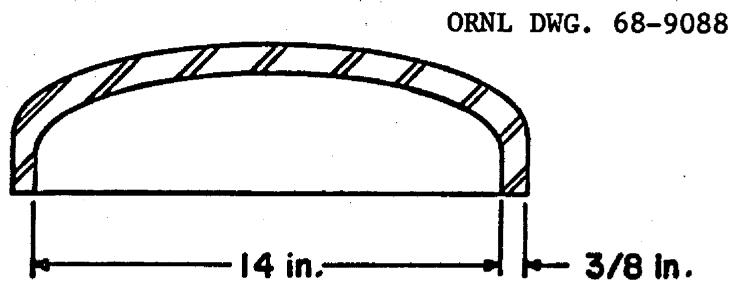

Design data reference: Paragraph UA 4, Section VIII of ASME Pressure Vessel Code, 1965 edition.

The design pressure for elliptical heads shall be $1.67 \times$ operating pressure. Design Pressure $= (1.67)(15) = 25$ psi. See paragraph UG-33, (1).

Required thickness of elliptical head (t):

$$
t = \frac {P D K}{2 S E - 0 . 2 P} \text {w h e r e} K = (1 / 6) \left[ 2 + \left(\frac {D}{2 h}\right) ^ {2} \right],
$$

where $h = \frac{ID}{4}$ ,

$$
h = \frac {I D}{4} = \frac {1 4}{4} i n. = 3. 5 i n.,
$$

$$
\begin{array}{l} K = (1 / 6) \left[ 2 + \left(\frac {D}{2 h}\right) ^ {2} \right] = (1 / 6) \left[ 2 + \left(\frac {1 4}{2 (3 . 5)}\right) ^ {2} \right] = 1. 0 0, \\ t = \frac {P D K}{2 S E - 0 . 2 P} = \frac {2 5 (1 4) (1)}{2 (7 0 0) (1) - 0 . 2 (2 5)} = \frac {0 . 2 5 1 \text {i n . M a x i m u m}}{2}. \\ \end{array}
$$

Actual thickness $(t_{1}) = 0.375$ in.

Theoretical Stress $(S_{\mathrm{th}})$

$$
S _ {t h} = \frac {P D K + 0 . 2 P t}{2 E t} = \frac {2 5 (1 4) (1 . 0) + 0 . 2 (2 5) (0 . 3 7 5)}{2 (1) (0 . 3 7 5)} = 4 7 0 p s i.
$$

Allowable internal pressure $(\mathsf{P}_{\mathsf{u}})$

$$
P _ {U} = \frac {2 S E t}{K D + 0 . 2 t} = \frac {2 (7 0 0) (1) (. 3 7 5)}{1 . 0 (1 4) + 0 . 2 (0 . 3 7 5)} = 3 7. 3 p s i.
$$

Allowable external pressure $= \frac{37.3}{1.67} = 22.4$ psi.

Actual maximum external pressure $= 15$ psi.

Thickness of head is satisfactory.

Allowable External Pressure and Reinforcement for 1 1/2-in. Sched. 40 Pipe Nozzle

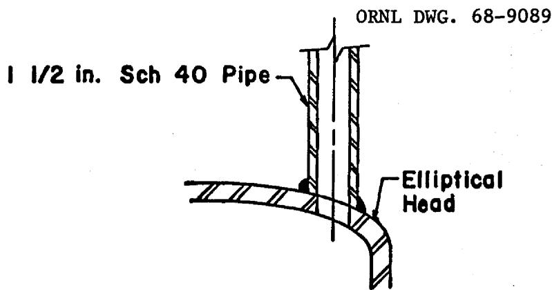

$$
P _ {a l l} = 0. 5 5 E \left(\frac {t}{d}\right) ^ {3} = 0. 5 5 \times 1 9. 7 \times 1 0 ^ {6} \left(\frac {0 . 1 4 5}{1 . 9 2 0}\right) ^ {3} = 4 5 8 0 p s i.
$$

For value of E, see Appendix A, Table A-4.

Required thickness of elliptical head $t_{\mathrm{r}} = 0.251$ in. (See page 96).

Required thickness of nozzle rn

$$
t _ {r n} = \frac {P R}{S E - 0 . 6 P} = \frac {1 5 \left(\frac {1 . 5 9 0}{2}\right)}{7 0 0 (1) - 0 . 6 (1 5)} = \frac {1 5 (0 . 7 9 5)}{7 0 0 - 9} = \frac {1 1 . 9 2}{6 . 9 1} \approx . 0 1 7 2 5 i n.
$$

Area reinforcement required = (d) $(t_{\mathrm{r}}) = (1.590)(0.251) = 0.399$ in.²

Area reinforcement available $= A_{1} = \left(E_{1} + t_{r}\right)$ (d) = [(1) (0.375) - 0.251] (1.880)

$$
= (0. 1 2 4) (1. 8 8 0) = 0. 2 3 3 \text {i n .} ^ {2}
$$

$$
\begin{array}{l} A _ {2} = \left(t _ {n} - t _ {r n}\right) (5 t) \\ = (0. 1 4 5 - 0. 0 1 7 2 5) (5) (0. 3 7 5) \\ = (0. 1 2 7 7) (5) (0. 3 7 5) = 0. 2 3 8 \text {i n .} ^ {2} \\ \end{array}
$$

Total reinforcement available $= A_{1} + A_{2} = 0.471$ in.2

Reinforcement is adequate.

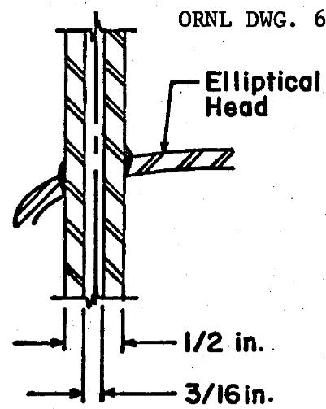

$$
\begin{array}{l} P a l l o w a b l e = 0. 5 5 E \left(\frac {t}{d}\right) ^ {3} = 0. 5 5 \times 1 9. 7 \times 1 0 ^ {6} \left(\frac {0 . 1 4 7}{0 . 5 0 0}\right) ^ {3} \\ = 1 0. 8 \times 1 0 ^ {6} (0. 2 9 4) ^ {3} \\ = 1 0. 8 \times 1 0 ^ {6} (0. 0 2 5 4) = 0. 2 7 5 \times 1 0 ^ {6} p s i. \\ \end{array}
$$

Required thickness of elliptical head $= t_{\mathrm{r}} = 0.251$ in. (See page 96).

Required thickness of nozzle $(t_{\mathfrak{rn}})$

$$
t _ {r n} = \frac {P R}{S E - 0 . 6 P} = \frac {1 5 (0 . 1 0 3)}{7 0 0 (1) - 0 . 6 (1 5)} = \frac {1 . 5 4 5}{6 9 1} = 0. 0 0 2 2 i n.
$$

Area of reinforcement required $= A = (d)(t_{r})$

$$
= (0. 2 0 7) (0. 2 5 1) = 0. 0 5 2 \text {i n .} ^ {2}
$$

Area Available $\left(\mathsf{A}_1^1\right)$

$$
A _ {1} ^ {1} = \left(E _ {1} + - t _ {r}\right) \left(t _ {n} + t\right) \tag {2}
$$

99

$$
\begin{array}{l} = (1 \times 0. 3 7 5 - 0. 2 5 1) (0. 1 4 6 + 0. 3 7 5) \tag {2} \\ = (0. 1 2 4) (0. 5 2 1) (2) = 0. 1 2 9 \text {i n .} ^ {2} \\ \end{array}
$$

Therefore, reinforcement is adequate.

Stresses and Collapsing Pressure for Sides of Still

ORNL DWG. 68-9091

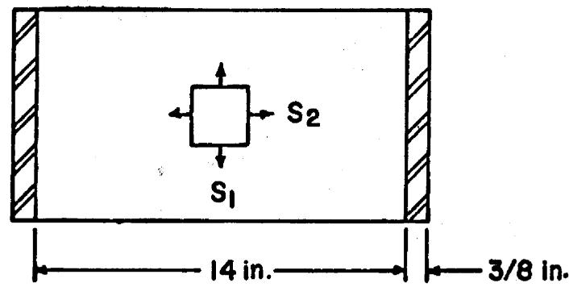

Stresses $S_{1}$ and $S_{2}$ were calculated by the method of Case 1, Page 268 of Roark 13

$$
\begin{array}{l} S _ {2} = \frac {\text {P R}}{t} = \frac {1 5 (7 . 1 8 7)}{0 . 3 6 5} = 2 9 5 \mathrm {p s i} \\ S _ {1} = \frac {P R}{2 t} = 1 4 7. 5 p s i \\ \end{array}
$$

The collapsing pressure may be evaluated from Eq. 8.26, page 144, of the text by Brownell and Young. This equation is developed for design of long, thin cylindrical vessels operating under external pressure. A factor of safety of 4 may be applied to the theoretical value. Equation 8.26 includes this safety factor of 4.

$$
P a l l o w a b l e = 0. 5 5 E (t / d) ^ {3} = 0. 5 5 \times 1 9. 7 \times 1 0 ^ {6} \frac {0 . 3 7 5}{1 4 . 3 7 5} ^ {3} = 1 9 2 p s i.
$$

Note that this value provides a factor of safety against collapse of 12.8 based on an external design pressure of 15 psi.

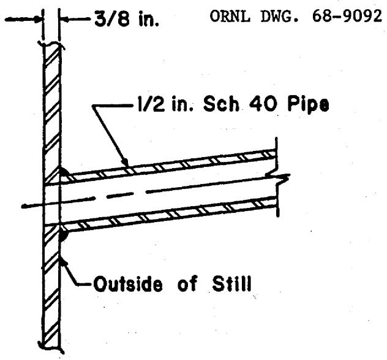

Shell thickness required $(t_{\mathbf{r}})$ :

$$
t _ {r} = \frac {P R}{S E - 0 . 6 P} = \frac {1 5 (7 . 0 1 0)}{7 0 0 (1) - 0 . 6 (1 5)} = \frac {1 0 5 . 1}{6 9 1} = 0. 1 5 2 i n.
$$

Actual thickness $= 0.375$ in.

Nozzle thickness required $(t_{\mathfrak{rn}})$ ..

$$
t _ {r n} = \frac {P R _ {n}}{S E - 0 . 6 P} = \frac {1 5 (0 . 3 1 1 + 0 . 0 1 0)}{7 0 0 (1) - 0 . 6 (1 5)} = 0. 0 0 6 9 7 i n.
$$

Actual thickness $= 0.109$ in.

Area of reinforcement required (A):

$$
A = (d) \left(t _ {r}\right) = (0. 6 4 2) (0. 1 5 2) = 0. 0 9 7 6 i n. ^ {2}
$$

Area reinforcement available:

$$
\begin{array}{l} A _ {1} = \left(E _ {1} t - t _ {r}\right) d = [ (1) (0. 3 6 5) - 0. 1 5 2 ] (0. 6 4 2) \\ = 0. 2 1 3 (0. 6 4 2) = 0. 1 3 6 6 \mathrm {i n}. ^ {2} \\ \end{array}
$$

Reinforcement is adequate.

Author's note:

Since Mr. Hahs made this calculation, a design change made the feed nozzle 1 in. OD x 3/4 in. ID.

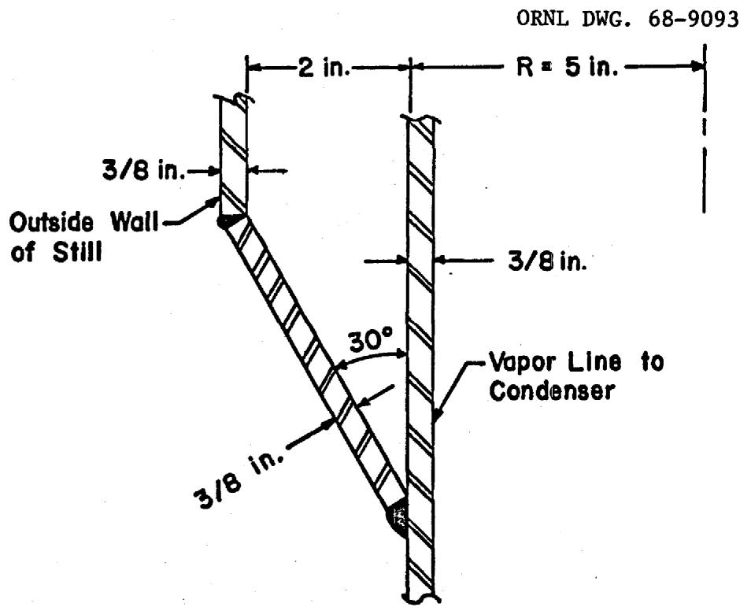  
Thickness of Conical Bottom of Annulus

Required thickness of head (See Par. UG 32-9, Section 8, of ASME Boiler and Pressure Vessel Code):

Assume half apex angle is $30^{\circ}$

$$
t = \frac {P D}{2 \cos 3 0 ^ {\circ} (\mathrm {S E} - 0 . 6 P)} = \frac {1 5 (1 4)}{2 \cos 3 0 ^ {\circ} (7 0 0 - 0 . 6 (1 5)} = \frac {2 1 0}{2 (0 . 8 6 6) (7 0 0 - 9)} = 0. 1 7 5 \text {i n}.
$$

$$
\text {A s s u m e} = (1. 6 7) \text {(d e s i g n p r e s s u r e)} = (1. 6 7) (1 5) = 2 5 \text {p s i},
$$

$$
t = \frac {P D}{2 \cos 3 0 ^ {\circ} (\mathrm {S E} - 0 . 6 \mathrm {P})} = \frac {2 5 (1 4)}{2 \cos 3 0 ^ {\circ} (7 0 0 - 0 . 6 (2 5)} = \frac {3 5 0}{2 (0 . 8 6 6) (6 8 5)} = 0. 2 9 5 \text {i n}.
$$

Actual thickness $= 0.375$ in.

Allowable External Pressure on Condenser

ORNL DWG. 68-9094

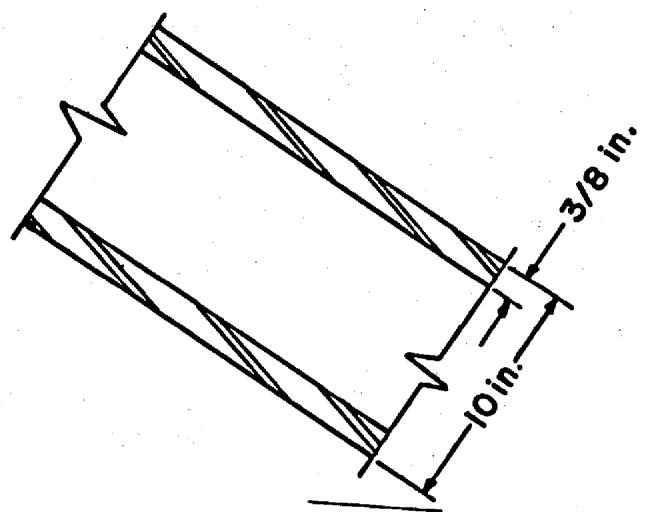

Reference: Process Equipment Design, p. 142, by Brownell & Young.14

Allowable pressure P for long cylindrical vessels operating under external pressure may be calculated with a factor of safety of 4 applied to Eq. 8.25 giving the following:

$$
\begin{array}{l} P a l l o w a b l e = 0. 5 5 E \left(\frac {\dagger}{D}\right) ^ {3} \\ = 0. 5 5 (1 9. 7 \times 1 0 ^ {6}) \left(\frac {0 . 3 7 5}{9 . 6 2 5}\right) ^ {3} = 6 4 2 p s i. \\ \end{array}
$$

Note: The maximum external operating pressure is 15 psi.

$$
\text {M a x i m u m h o o p s t r e s s} = \frac {\mathrm {P R}}{\dagger} = \frac {1 5 (4 . 6 3 5)}{0 . 3 7 5} = 1 8 5. 4 \mathrm {p s i}
$$

Thickness of condenser shell is therefore adequate.

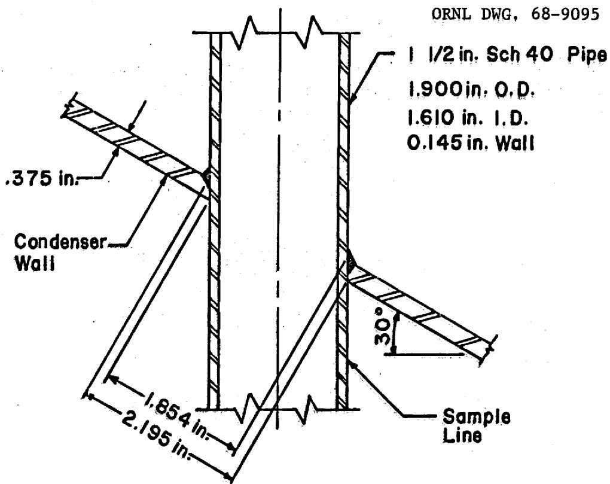

Dimensions normal to condenser surface:

$$
\text {M a x i m u m o p e n i n g} = \frac {1 . 9 0 0}{\cos 3 0 ^ {\circ}} = 2. 1 9 5 \mathrm {i n}.
$$

$$
\text {M i n i m u m o p e n i n g} = \frac {1 . 6 1 0}{\cos 3 0 ^ {\circ}} = 1. 8 5 4 \text {i n}.
$$

Allowable external pressure $P_{\text{all}}$ :

$$
\begin{array}{l} P _ {a l l} = 0. 5 5 E \left(\frac {t}{d}\right) ^ {3} = 0. 5 5 \times 1 0. 7 \times 1 0 ^ {6} \left(\frac {0 . 1 4 5}{1 . 9 0}\right) ^ {3} \\ = 0. 5 5 \times 1 9. 7 \times 1 0 ^ {6} (0. 0 7 5 5) ^ {3} \\ \end{array}
$$

104

$$
= 0. 5 5 \times 1 9. 7 \times 1 0 ^ {6} (0. 0 0 4 2 3) = 4 6 6 0 p s i
$$

Nozzle Reinforcement Requirements:

Reinforcement calculations will be made assuming the nozzle passes through the shell at right angles. The nozzle wall thickness remains 0.145 in.; however, an OD of 2.195 in. and ID of 1.854 in. is used in the calculations.

$$
\text {S h e l l} _ {\mathrm {r}} = \frac {\mathrm {P R}}{\mathrm {S E} - 0 . 6 \mathrm {P}} = \frac {1 5 \left(\frac {9 . 2 5 0}{2}\right)}{7 0 0 (1) - 0 . 6 (1 5)} = \frac {6 9 . 4}{6 9 1} = 0. 1 0 0 \mathrm {i n}.
$$

$$
\text {N o z z l e} \mathrm {t} _ {\mathrm {r n}} = \frac {\mathrm {P R} _ {\mathrm {n}}}{\mathrm {S E} - 0 . 6 \mathrm {P}} = \frac {1 5 (1 . 8 5 4 / 2)}{7 0 0 - 0 . 6 (1 5)} = \frac {1 5 (0 . 9 2 7)}{6 9 1} = 0. 0 2 0 1 \mathrm {i n}.
$$

Area of reinforcement required $= \mathsf{dt}_{\mathbf{r}} = 1.854(0.100) = 0.1854$ in.²

$$
\begin{array}{l} A _ {1} = \text {a r e a a v a i l a b l e} \\ = \left(E _ {1} + f _ {r}\right) d = (0. 3 7 5 - 0. 1 0) 1. 6 1 0 = 0. 2 7 5 (1. 6 1 0) = 0. 4 4 3 i n. ^ {2} \\ \end{array}
$$

No additional area calculation is shown since $A_{1}$ is sufficient.

Stress Imposed by Dead Weight of Vessel

The following calculations are made to ensure that the structural design of the vessel is sufficient to allow it to be supported as shown on page 107.

Weight Calculations of Still Components:

Area 8-1/4 in. diam = π (8.25)²/4 = 53.456 in.²  
Area 8 in. diam = π (64)/4 = 50.265  
Difference = 3.191 in.²

Weight of 8-1/4 in. OD x 8 in. ID CyI. = 3.191 in.2 x .317 lb/in.3 = 1.01 lb/in.

Area of 10 in. OD Cyl. = π (10)²/4 = 78.54 in.²  
Area of 9-1/4 in. ID Cyl. = π (9.25)²/4 = 67.20  
Difference = 11.34 in.²

Weight of 10 in. $OD \times 9 - 1 / 4$ in. $ID C y I_{\cdot} = 11.34 \text{in.}^{2} \times .317 \text{lb/in.}^{3} = 3.595 \text{lb/in.}$ Weight of heaters on condenser wall $= 75 \text{lb}$ .

105

Weight of insulation on condenser wall $= 45$ lb.

Combined weight of heaters and insulation $= \frac{(75 + 45)lb}{47in.} = 2.56lb/in.$

Assume salt deposit on condenser wall $= 0.335\mathrm{lb / in}$

Total combined weight of condenser shell, inner shell, heater, and insulation

$$
= 7. 5 \mathrm {l b} / \mathrm {i n}.
$$

Blank from which elliptical head is made may be 22.25 in. ID.

Weight of top cylindrical section 14 in. ID x 14.75 in. OD x 7.5 in. long:

Area 14.75 in. diam. = 170.874 in.²

Area 14 in. diam = 153.938

Net Area = 16.936 in.²

Weight = 16.936 in.² x 7.5 in. x 0.317 lb/in.³ = 40.3 lb.

Weight of conical section:

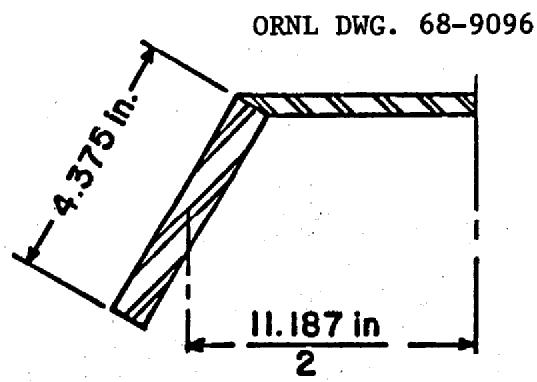

Volume of conical section $= \pi (11.187)(4.375)(0.375) = 57.65$ in.³

Weight = 57.65 in.³ × .317 lb/in.³ = 18.55 lb.

Weight of vapor line:

ORNL DWG. 68-9097

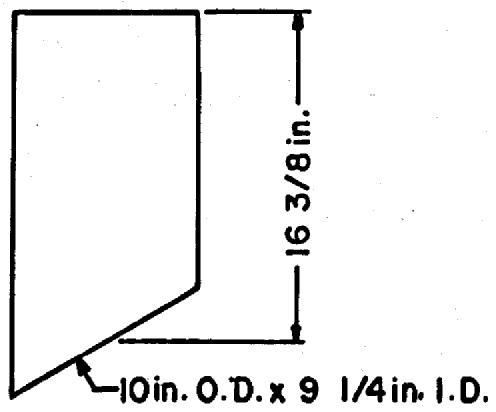

Area 10 in. diam = 78.540 in.²

Area 9-1/4 in. diam = 67.200 in.² 11.340 in.²

Weight = 11.34 × 16.375 × 0.317 = 58.8 lb

Additional weight:

Weight of heater equipment $= 50$ lb

Weight of insulation $= 90\mathrm{lb}$

Weight of salt $= \frac{18\mathrm{lb}}{158\mathrm{lb}}$

Total weight of top section of still:

Weight total $= 46.2 + 40.3 + 57.65 + 58.8 + 158.0$

$= 360.95$ lb

Method of Support for Still and Forces Active on the Still:

ORNL DWG. 68-9098

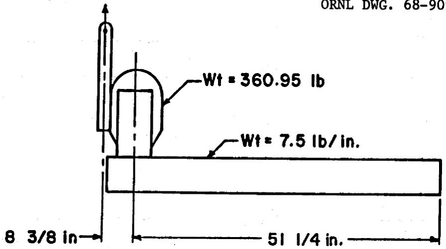

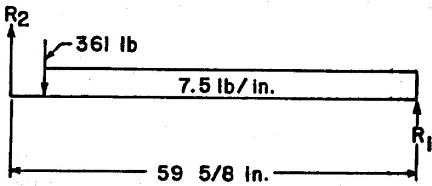

$$
\begin{array}{l} \sum F _ {4} = 0 \\ R _ {1} + R _ {2} = 3 6 1 \mathrm {I b} + 5 1. 2 5 (7. 5) \\ = 3 6 1 + 3 8 4. 5 = 7 4 5. 5 \mathrm {l b} \\ \end{array}
$$

$$
\sum M _ {R _ {1}} = 0
$$

$$
5 9. 6 2 5 R _ {2} = 5 1. 2 5 0 (3 6 1) + \left(\frac {5 1 . 2 5}{2}\right) (3 8 4. 5)
$$

$$
\begin{array}{l} 5 9. 6 2 5 R _ {2} = 1 8 5 0 0 + 9, 8 5 0 \\ R _ {2} = \frac {2 8 , 3 5 0}{5 9 . 6 2 5} = 4 7 5 \mathrm {l b} \\ \end{array}
$$

$$
R _ {1} = 7 4 5. 5 - 4 7 5 = 2 7 0. 5 \mathrm {l b}
$$

108

Stresses and Moments in Condenser Shell:

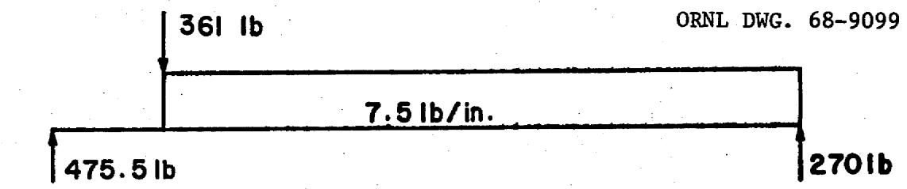

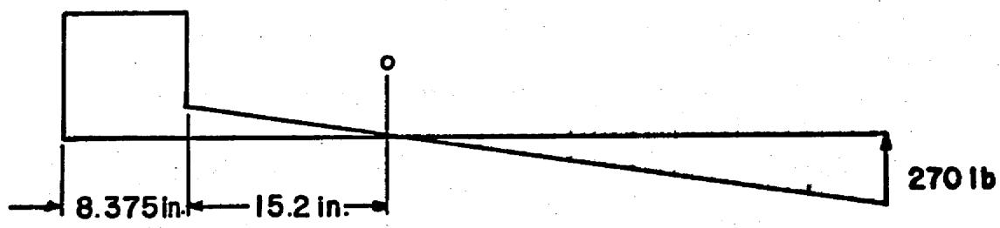

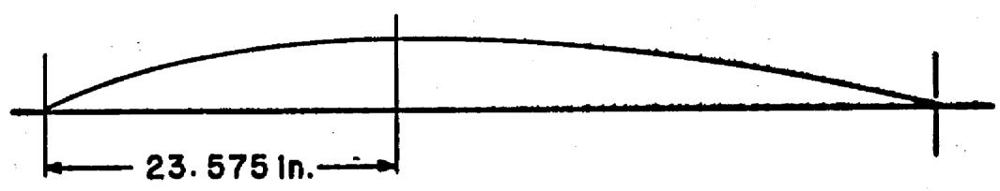

$$
\begin{array}{l} \sum M _ {\circ} = - (7. 5) (1 5. 2) (7. 6) - (3 6 1) (1 5) + (4 7 5) (2 3. 5 7 5) \\ = - 8 6 6 - 5 4 2 0 + 1 1, 1 6 0 \\ = 4 8 7 4 \text {i n . - l b} \\ \end{array}
$$

$I =$ moment of inertia for 10 in. $\mathrm{OD} \times 9.25$ in. ID condenser

$$
\begin{array}{l} = \frac {\pi}{4} (R ^ {4} - R _ {o} ^ {4}) = \frac {\pi}{4} [ (5) ^ {4} - (4. 6 2 5) ^ {4} ] \\ = \frac {\pi}{4} (6 2 5 - 4 5 5) = \frac {\pi}{4} (1 7 0) = 1 3 3. 5 \mathrm {i n}. ^ {4} \\ \end{array}
$$

Stress $S_{b} = \frac{MC}{I} = \frac{4874(5)}{133.5} = 182.5$ psi

109

Hoop Stress $= 185.4$ psi (See page 102)

Method of support is satisfactory.

# Thermal Stress Calculation

$\Delta t$ across wall of still $= 5^{\circ}C$

$\Delta t$ of $5^{\circ}C \sim 10^{\circ}F$

Still temperature $= 1832^{\circ}F$

Coefficient of thermal expansion at $1832^{\circ}$ F = 8.85 x $10^{-6}$ in./in. $^{-\circ}$ F (See Appendix A, Table A-6).

Modulus of elasticity at $1832^{\circ}\mathrm{F} = 19.7 \times 10^{6} \mathrm{lb/in.}^{2}$

$$
S _ {t} = \frac {\Delta t a E}{2 (1 - v)} = \frac {1 0 \times 8 . 8 5 \times 1 0 ^ {- 6} \times 1 9 . 7 \times 1 0 ^ {6}}{2 (1 - 0 . 3 3)} = 1 3 2 0 p s i.
$$

The maximum principal stress of 367.9 psi is the combined bending stress, 182.5 psi, as shown on page 108 and the hoop stress, 185.4 psi, as shown on page 102.

It should be noted here that the sum of the principal stress, 367.9 psi, and the maximum thermal stress, 1320 psi, is 1688 psi, which is 38 psi more than the stress rupture value of 1650 psi shown on Fig. 15. Since the thermal stress is self-relieving, these values are sufficient.

Additional test data will be obtained in the nonradioactive experiments, and the "used" physical condition of the still will be studied before this equipment is used for a radioactive salt experiment.

# Minimum Thickness of Flat Head on Feed Tank

Reference: Paragraph 34-C-2, page 19, Section VIII of ASME Boiler and Pressure Vessel Code.12

Minimum thickness of flat heads (t):

Operating temperature of vessel $= 500^{\circ}\mathrm{C}$ or $923^{\circ}\mathrm{F}$

$$
t = d \sqrt {C P / S}
$$

$C := 0.4$ See (e) page 21, Section 8 of the above reference

$$
d = I D o f s h e l l
$$

110

$$
\begin{array}{l} S = \text {m a x i m u m} \\ = 1 7, 0 0 0 \text {p s i} a t 1 0 0 0 ^ {\circ} F \\ \end{array}
$$

$$
\begin{array}{l} t = 1 5 \sqrt {\frac {0 . 4 (1 5)}{1 7 , 0 0 0}} = 1 5 \sqrt {\frac {6}{1 7 , 0 0 0}} = 1 5 \sqrt {3 . 5 3 \times 1 0 ^ {- 4}} \\ = 1 5 (0. 0 1 8 7 6) = 0. 2 8 2 \text {i n .} \\ \end{array}
$$

Actual thickness $= 0.375$ in.

Thickness of head is satisfactory.

# SPECIFICATIONS FOR HEATERS FOR VACUUM DISTILLATION EXPERIMENT FOR FLUORIDE SALTS

# 1.0 Scope

# 1.1 General

These specifications (identified as Specification No. CT-63, October 31, 1966) state the requirements for several electric heaters to be mounted on vessels described by the following drawings. These drawings are component parts of these specifications:

1.2 References (see Appendix H for first four drawings listed).

Drawing Number

M-12173-CD-009-D Condensate Receiver - Assembly and Details

M-12173-CD-011-D Vacuum Still and Condenser Assembly

M-12173-CD-013-D Feed Tank for Vacuum Still

M-12173-CD-014-D Sample Reservoir and Thermocouple Well Details

ORNL DWG. 68-866 Coil Location Within Heating Element

# 2.0 Codes and Standards

The latest revisions of the following Codes and Standards shall apply to these specifications: ASA, NEMA, and ASTM.

# 3.0 Type of Service

# 3.1 Temperature and Operation

The vessels on which the heaters are placed will be required to operate at temperatures as high as $1000^{\circ}\mathrm{C}$ for extended periods of time. Also during the course of the experimental program the heaters will undergo cyclic operation between room temperature to $1000^{\circ}\mathrm{C}$ at a frequency of one cycle per day. The heater shall be designed for a lifetime of at least 5,000 hr.

# 3.2 Vessels

All vessels will be fabricated of Hastelloy N for which the mean coefficient of thermal expansion may be taken as $8.85 \times 10^{-6}$ in./in. $-^{\circ} \mathrm{F}$ between

ORNL DWG.68-866

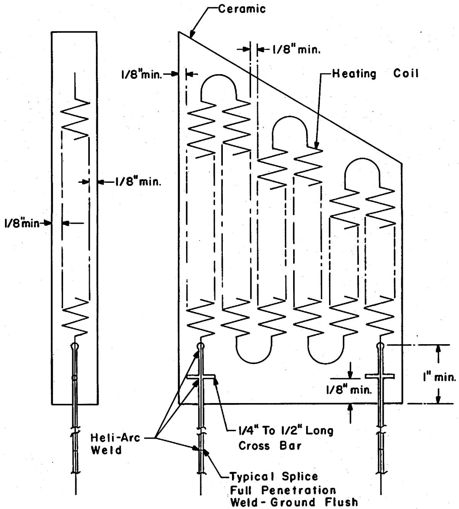  
Fig. G-1. Coil Location within Heating Element.

70 and $1800^{\circ}F$

# 3.3 Radiation

The heaters will not be used in service that will cause radiation damage.

# 4.0 Specifications

# 4.1 Mechanical Features

(a) The heating elements shall be imbedded (totally enclosed) in a thermally conductive refractory material. In general, the total number of heaters should be kept as low as practicable.   
(b) The heaters will be supported by and on the vessels by the Company (UCNC) and shall be of the type that can be removed and replaced without disturbing the vessel or any nozzles on the vessel. Direct access to the vessels may be assumed for removal and replacement of heaters. Heaters shall be designed for $1/4 \pm 1/8$ in. clearance of vessel walls and surfaces to allow space for thermocouple leads and to supply heat uniformly over these surfaces within the limitations allowed by nozzles and supports.   
(c) The vessels are equipped with various nozzles which will be maintained at temperature as required by heaters supplied by the Company.

# 4.2 Heat Capacity

Heat capacity of the heaters shall not be greater than $1\mathrm{cal} / \mathrm{g}^{\circ}\mathrm{C}$

# 4.3 Electrical Accessories

The manufacturer is not required to furnish any power supply or control equipment. These will be furnished by the Company.

# 4.4 Thermal Insulation

The manufacturer is not required to furnish thermal insulation.

# 4.5 Electrical Requirements

(a) Available power is 230 v, single-phase, 60-cycle alternating current.   
(b) The manufacturer shall specify the power rating of each heater.

# 4.6 Geometrical Considerations

# 4.6.1 Still and Considerations

(a) The markings on this drawing indicate the zonal heat requirements. Total heat input to the still section is 15 kw; this rating may be increased for manufacturing convenience by as much as 15% but no decrease will be allowed. The top of the still shall have a heat input of 4 kw; the remaining 11 kw shall be applied to the sides. Heaters for the top section shall conform to the geometry of the dome-shaped top. When the still is operating at a temperature of $1000^{\circ}\mathrm{C}$ the maximum loss rate to the surroundings of 1.5 kw may be assumed.   
(b) Total heat input to the condenser section is $20\mathrm{kw}$ with a $15\%$ increase being allowed if needed for manufacturing convenience. This total requirement is to be divided into three approximately equal zones as shown on the drawing. When the condenser temperature is $1000^{\circ}C,$ the maximum heat requirement including losses to the surroundings will be $10\mathrm{kw}$ .

# 4.6.2 Condensate Receiver, Drawing No. M-12173-CD-009-D.

This vessel will be heated along its bottom, vertical sides, and top. A total heat input of 20 kw is required with a 15% overage being allowed. The heat input is to be distributed over the vessel as follows: approximately 30% on the bottom, 50% on the sides, and 20% on the top. When the vessel is at a temperature of $1000^{\circ}\mathrm{C}$ , the maximum heat requirement including losses to the surroundings will be 3 kw.

# 4.6.3 Feed Tank, Drawing No. M-12173-CD-013-D.

This vessel will be heated along its bottom, vertical sides, and top. A total heat input of 20 kw is required with a $15\%$ overage being allowed. The heat input is to be distributed over the vessel as follows: approximately $30\%$ on the bottom, $50\%$ on the sides, and $20\%$ on the top. When the vessel is at a temperature of $1000^{\circ}\mathrm{C}$ , the maximum heat requirement including losses to the surroundings will be 3 kw.

# 4.7 Special Features

(a) Terminal leads shall be at least 3 ft long and shall have a cross-sectional area more than twice that of the heater element and shall not be less than No. 14 AWG.

(b) Terminal lead wires shall be imbedded a minimum length of 1 in. into the ceramic refractory and shall have a cross bar as shown on the accompanying Fig. G-1.

(c) All weld joints shall be heli-arc welded including splices in the terminal lead wires.

# 5.0 Inspection and Test

# 5.1 Visual

Visual inspection shall be made to determine that

(a) the ceramic is not cracked or broken,   
(b) the ceramic is not swelled or warped, and   
(c) the terminal lead wires do not move or rotate in the ceramic.

# 5.2 Liquid Penetrant

Liquid penetrant (dye check) inspect all terminal lead splice welds and remove or repair all dye indications.

# 5.3 Radiography

Each completed unit shall be $100\%$ radiographed to establish that:

(a) the heating element has a minimum spacing of $1/8$ in.   
(b) a minimum clearance of $1/8$ in. is maintained between the heating element and surface of the refractory;   
(c) the terminal leads are imbedded a minimum length of 1 in. in the refractory;   
(d) Exposed radiographs shall be shipped with the heating elements.

# 5.4 Electrical Test

The electrical resistance of each heating element shall be measured, recorded, and compared with the design resistance. The resistance shall be measured at room temperature.

# 5.5 Observation of Tests

The tests described in this section shall be performed by the manufacturer at the manufacturer's plant prior to shipment. The manufacturer shall notify the Company at least five working days prior to start of tests so that a representative may be present to witness the tests.

# Equipment Drawings

The following equipment drawings are included in this Appendix. Each drawing bears the primary title MSRE Distillation Experiment; drawing numbers and subtitles are as follows:

M-12173-CD-009-D Condensate Receiver Assembly and details.

M-12173-CD-010-D Installation of equipment and piping in Supporting Frame.

M-12173-CD-011-D Vacuum Still and Condenser Assembly.

F-12173-CD-012-D Flowsheet for Vacuum Distillation of Molten Salt Reactor Fuel (Hood Experiment)

M-12173-CD-013-D Feed Tank for Vacuum Still.

M-12173-CD-014-D Sample Reservoir and Thermocouple Well Details.

M-12173-CD-015-D Liquid $\mathbf{N}_2$ Cold Trap for Vacuum Line.

M-12173-CD-016-D Equipment Support Frame.

M-12173-CD-017-D Temporary Vessel Support (for Transporting).

F-12173-CD-018-D Flowsheet for Vacuum Distillation MSRE Fuel Salt (Radioactive Experiment).

M-12173-CD-019-D Location of Points for Dimensional and Radiographic Measurements on Still and Condenser Assembly.

M-12173-CD-020-D Tabulation of Data from Dimensional and Radiographic Measurements on Still and Condenser Assembly.

M-12173-CD-021-D Location of Points for Linear Measurements and Tabulation of Data for Still - Condenser - Assembly.

Drawings M-12173-CD-020-D and M-12173-CD-021-D as presented herein contain a complete tabulation of the data recorded immediately after construction of the still assembly. These data are to be compared with similar measurements made after the still has been operated at temperatures up to $1000^{\circ}\mathrm{C}$ for extended periods of time. This second set of data will not be available before publication of this report and cannot be included herein. However, when the measurements and observations are made, the results will be recorded on a revision of these drawings for a permanent record.

The following drawings are referenced but are not included in this Appendix. Each drawing bears the primary title MSRE Distillation Experiment; drawing numbers and subtitles are as follows:

S-20794-EB-137-D High-Density Concrete Shield Plug Plan and Sections.

S-20794-EB-138-D High-Density Concrete Shield Plug Enlarged Plan and Sections.

S-20794-EB-139-D High-Density Concrete Shield Plug Lifting Hook Details and Sections.

E-20794-ED-155-D Electrical-Vacuum Distillation Experiment.

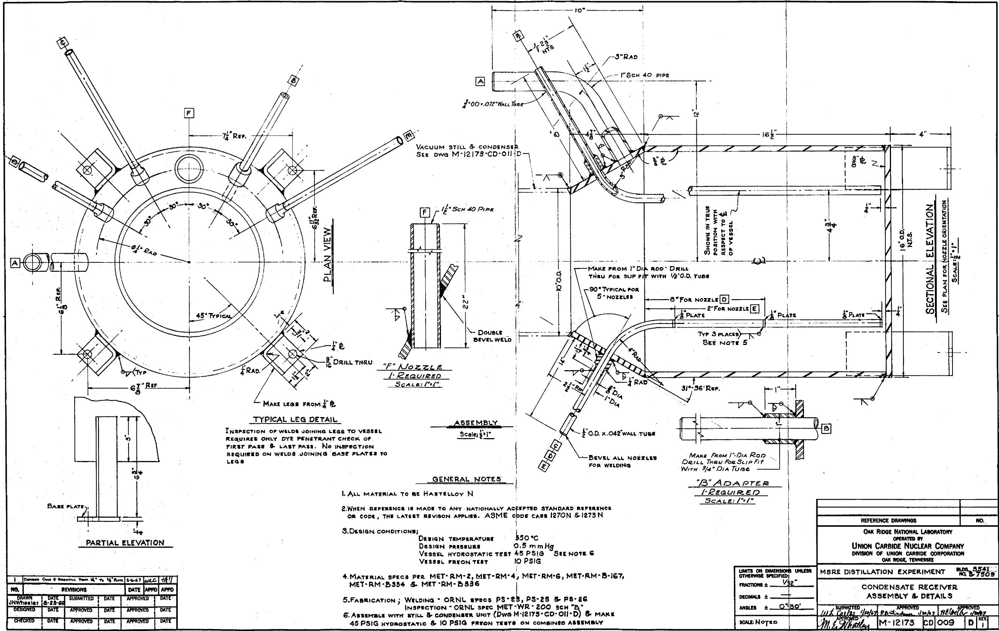  
27

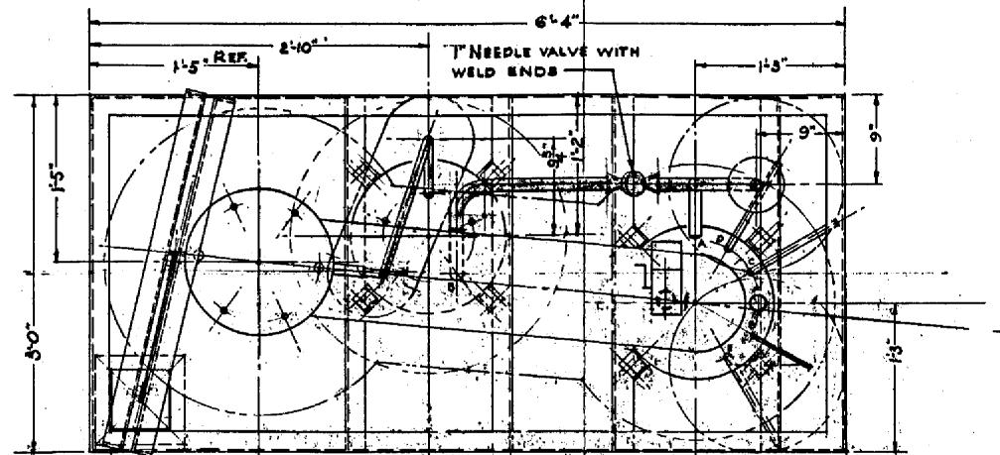

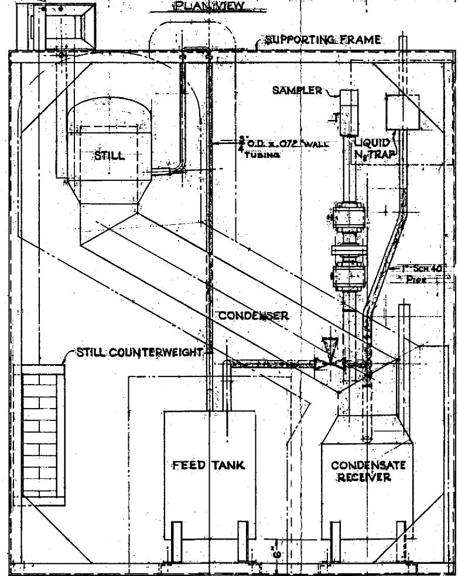  
FRONT ELEVATION

END ELEVATION   
GENERAL NOTES   
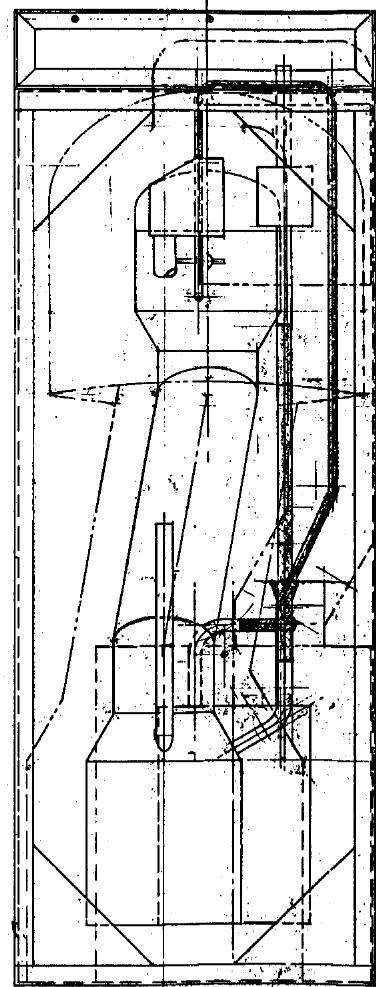  
I FIT, WELD & INSECT SHADCD POINTOES OF MING. B. VALVE IN 'SHOP. See NOTE S DWG M12173-CD- 110-D FOR SPECIFICATIONS.

<table><tr><td colspan="2">SAMPLE RESERVOIN &amp; THEHMCOUPLE WELL DLT.</td><td>014-D</td></tr><tr><td colspan="2">SUPPORT PLANS</td><td>015-D</td></tr><tr><td colspan="2">LIQUID Na-TRAP</td><td>015-D</td></tr><tr><td colspan="2">FED-TANK</td><td>015-D</td></tr><tr><td colspan="2">CONDENSE RECEIVING</td><td>008-D</td></tr><tr><td colspan="2">VACUUM STILL &amp; CONDENSE</td><td>017-D</td></tr><tr><td colspan="2">FLOWHEET</td><td>012-D</td></tr><tr><td colspan="2">REFERENCE DRAWINGS</td><td>NO.</td></tr><tr><td colspan="3">OAK RIDGE NATIONAL LABORATORY
OPERATED BY
UNION CARBIDE NUCLEAR COMPANY
DIVISION OF UNION CARBIDE CORPORATION
OAK RIDGE, TENNESSEE</td></tr><tr><td colspan="3">MSRE DISTIETATION EXPERIMENTS B-101
&amp; Piping IN SUPPORTING FRAME
NO.07009</td></tr><tr><td colspan="3">INSTALLATION OF EQUIPMENT
&amp; Piping IN SUPPORTING FRAME</td></tr><tr><td>SUPPLIED
WUE COULTY 13/2018</td><td>M-1217A</td><td>RG 2018-0006</td></tr><tr><td>WUE ATTACHED
WUE 13/2018</td><td>CD</td><td>OIO B</td></tr></table>

<table><tr><td>NO.</td><td colspan="3">REVISIONS</td><td>DATE</td><td>APPD</td><td>APPD</td></tr><tr><td>DRAWN
J.M.Wheeler</td><td>DATE
9-14-GG</td><td>SUBMITTED</td><td>DATE</td><td colspan="2">APPROVED</td><td>DATE&#x27;</td></tr><tr><td>DESIGNED</td><td>DATE</td><td>APPROVED</td><td>DATE</td><td colspan="2">APPROVED</td><td>DATE</td></tr><tr><td>CHECKED</td><td>DATE</td><td>APPROVED</td><td>DATE</td><td colspan="2">APPROVED</td><td>DATE</td></tr></table>

<table><tr><td>LIMITS ON DIMENSIONS UNLESS
OTHERMISE SPECIFIED.</td><td colspan="4">MSRE DISTILLATION EXPERIMENT SLD - 2015
NO. 3-189</td></tr><tr><td>FRACTIONS ± _Vas</td><td colspan="4">INSTALLATION OF EQUIPMENT
B-PIPING IN SUPPORTING,FRAME</td></tr><tr><td>DECIMALS ± _</td><td>SUBMITTED
WNT CABLE NOLAY</td><td>APPROVED
PG TUBE LOMY</td><td>APPROVED
WATE LOMY</td><td></td></tr><tr><td>ANGLES ± _</td><td>M-12178</td><td>CD</td><td>OIO</td><td>D</td></tr><tr><td>SCALE: 1°=1°&#x27;0&quot;</td><td>MM ETHELLOL</td><td>M-12178</td><td>CD</td><td>OIO</td></tr></table>

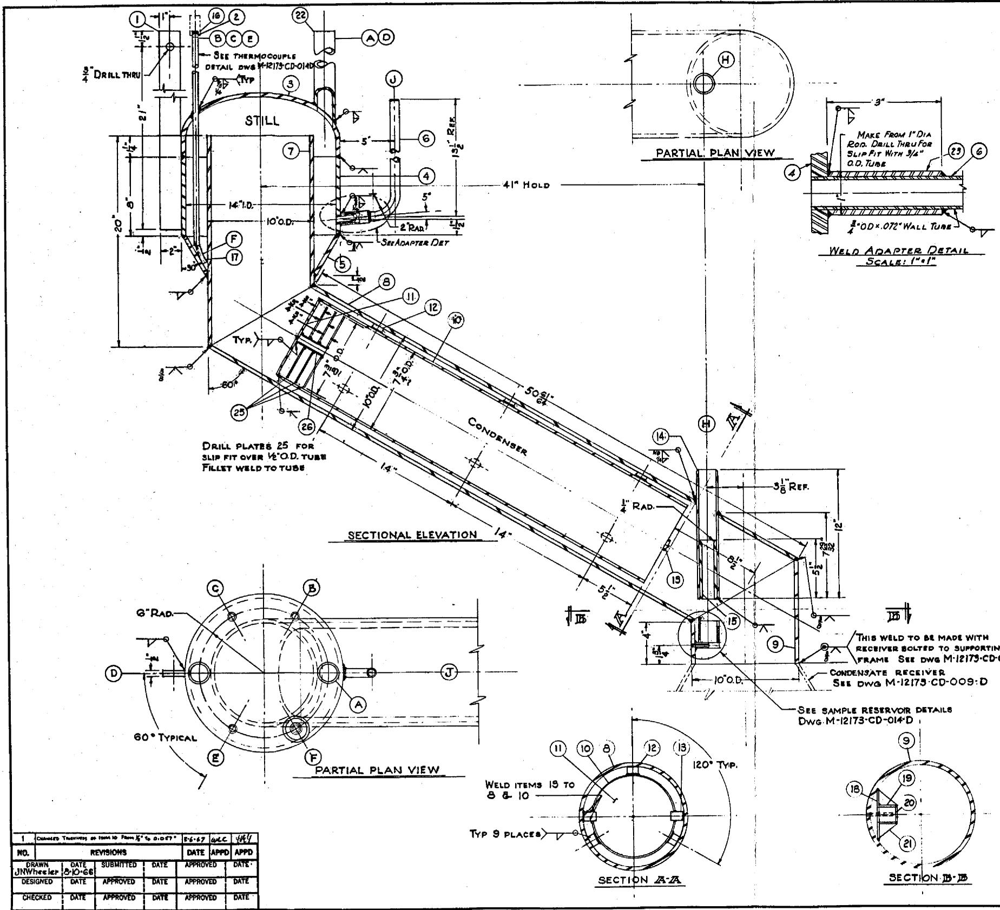

<table><tr><td colspan="6">PARTS LIST</td></tr><tr><td>ITEM</td><td>DWG No.</td><td>QTY</td><td>DESCRIPTION</td><td colspan="2">MATERIAL</td></tr><tr><td>1</td><td>THIS DWG</td><td>1</td><td>STAP V2&quot;X2&quot;× 22 1/2&quot;</td><td colspan="2">HASTELLOYN</td></tr><tr><td>2</td><td>014-D</td><td>45IN</td><td>Rod I&quot; O.D.</td><td></td><td></td></tr><tr><td>3</td><td>THIS DWG</td><td>1</td><td>ELLiptical HEAD 14&quot; I.D. x 3/8&quot;THK (22&quot; O.D. BLANK)</td><td></td><td></td></tr><tr><td>4</td><td></td><td>1</td><td>SHELL 14/4&quot; O.D. x 9/8&quot;WALL X 8&quot;</td><td></td><td></td></tr><tr><td>5</td><td></td><td>1</td><td>CONS 14/6&quot; O.D. LARGE END 10&quot; I.D. SMALL END @ 50° or 90°</td><td></td><td></td></tr><tr><td>6</td><td></td><td>1</td><td>TUBING 3/4&quot; O.D. x .072 WALL x 20&quot;</td><td></td><td></td></tr><tr><td>7</td><td></td><td>1</td><td>PIE 10&quot; O.D. x 3/8&quot; WALL x 20&quot;</td><td></td><td></td></tr><tr><td>8</td><td></td><td>1</td><td>10&quot; O.D. x 3/8&quot; x 56 7/8&quot;</td><td></td><td></td></tr><tr><td>9</td><td></td><td>1</td><td>10&quot; O.D. x 3/8&quot; x 5/12&quot;</td><td></td><td></td></tr><tr><td>10</td><td></td><td>1</td><td>7 9/8&quot; O.D. x 0.057&quot; x 39&quot;</td><td></td><td></td></tr><tr><td>11</td><td></td><td>1</td><td>PLATE 7 3/4&quot; O.D. x 1/6&quot;</td><td></td><td></td></tr><tr><td>12</td><td></td><td>9</td><td>Rod I&quot; O.D. x 28/32&quot;</td><td></td><td></td></tr><tr><td>13</td><td></td><td>2</td><td>PLATE 1/4&quot; x 1/2&quot; x 4/4&quot;</td><td></td><td></td></tr><tr><td>14</td><td></td><td>1</td><td>PIPE 1/2&quot; SCH. 40 x 12&quot;</td><td></td><td></td></tr><tr><td>15</td><td></td><td>1</td><td>INSERT 13/9/4&quot; O.D. x 1/6&quot; I.D. x 5/12&quot;</td><td></td><td></td></tr><tr><td>16</td><td></td><td>3</td><td>CDUPLING 1/8&quot; SCH. 40 SCRWD</td><td rowspan="2" colspan="2">INCONEL HASTELLOYN</td></tr><tr><td>17</td><td></td><td>1</td><td>TUBE 1/2&quot; O.D. x .042&quot; WALL x 29/12&quot;</td></tr><tr><td>18</td><td></td><td>1</td><td>PLATE 1/6&quot; x 4/8&quot; x 2 1/2&quot;</td><td></td><td></td></tr><tr><td>19</td><td></td><td>2</td><td>1/6&quot; x 1/5/8&quot; x 2&quot;</td><td></td><td></td></tr><tr><td>20</td><td></td><td>1</td><td>1/6&quot; x 1/12&quot; x 2&quot;</td><td></td><td></td></tr><tr><td>21</td><td></td><td>1</td><td>1/2&quot; x 45/4&quot; x 28/8&quot;</td><td></td><td></td></tr><tr><td>22</td><td></td><td>2</td><td>PIPE 1/2&quot; SCH 40 x 17&quot;</td><td></td><td></td></tr><tr><td>23</td><td></td><td>1</td><td>R&amp;D I&quot; O.D. x 3&quot;</td><td></td><td></td></tr><tr><td>24</td><td>014-D</td><td>3</td><td>PIPE 1/6&quot; SCH 40 x 12&quot; LONG V6&quot;NPT I-END</td><td colspan="2">INCONEL HASTELLOYN</td></tr><tr><td>25</td><td>THIS DWG</td><td>3</td><td>PLATE V6&quot; x 7 3/8&quot; O.D. (RADIATION Shield)</td><td></td><td></td></tr><tr><td>26</td><td></td><td>1</td><td>TUBE 1/2&quot; O.D. x .042&quot; WALL x 2 5/8&quot;</td><td></td><td></td></tr><tr><td>27</td><td>014-D</td><td>1</td><td>PIPE I&quot; SCH 40 x 3/4&quot;</td><td></td><td></td></tr><tr><td>28</td><td></td><td>1</td><td>FLANGE 23/8&quot; O.D. x 3/8&quot; PLATE</td><td></td><td></td></tr><tr><td>29</td><td></td><td>1</td><td>1</td><td></td><td></td></tr></table>

# GENERAL NOTES

1. IEMs 4-7-8-9&10 TO BE ROLLED FROM PLATE & WELDED FULL PENETRATION See PAR.UG-BI,SECT 8,ASME BoILER & PRESS.VESSEL CODE FOR REGO FABRICATION TOLERANCES 2.WHEN REFERENCE IS MADE TO ANY NATIONALLY ACCEPTED STANDARD REFERENCE ON CODE, THE LATEST REVISION APPLIES. ASME CODE CASE 1270N & 1275N.

# 3. DESIGN CONDITIONS

DESIGN TEMPERATURE 1000°C

DESIGN PRESSURE

1000c

VESSEL HYDROSTATIC TEST 805 PSIG SEE NOTE-7

VESSEL FREON TEST TO PSIG

4.MATERIAL SPECES PER MET·RM·2, MET·RM·4, MET-RM·6, MET-RM·B167, MET·RM·B334 & MET-RM·B356

# 5. FABRICATION

WELDING ORNL 50CS PS-23,PS-25 &PS-26

INSPECTION ORNL SPECS MET-WR-200 SCH"8"

G.No INSPECTION REQUIRED OF WELDE JOINING PART 10 TO PARTS II,12,8-13;PART 6 TO PART 13;AND PART 26 TO PARTS II & 25

7.AFTER MAKING 805 PSIG HYDROSTATIC TEST ON STILL & CONDENSER ASSEMBLY, ASSEMBLE UNIT WITH CONDENSET RECEIVER(DWG M-12173-CD-009-D) & MAKE 45 PSIG HYDROSTATIC TEST & IO PSIG FRON TEST ON COMBINED ASSEMBLY

<table><tr><td></td><td></td></tr><tr><td>DETAILS</td><td>014 -D</td></tr><tr><td>REFERENCE DRAWINGS</td><td>NO.</td></tr><tr><td colspan="2">OAK RIDGE NATIONAL LABORATORY OPERATED BY
UNION CARBIDE NUCLEAR COMPANY
DIVISION OF UNION CARBIDE CORPORATION
OAK RIDGE, TENNESSEE</td></tr></table>

<table><tr><td colspan="2">LIMITS ON DIMENSIONS
OTHERWISE SPECIFIED: UNLESS</td></tr><tr><td colspan="2">FRACTIONS ± 1/32</td></tr><tr><td colspan="2">DECIMALS ± .005°</td></tr><tr><td colspan="2">ANGLES ± 1°</td></tr></table>

,

A5

1

4

STI

1.4

C

ASSEMBLY

#

图1

MITT

0

#

$\therefore m = \frac{3}{11}$

A

Web

${4x}$

#

图

#

#

eff

#

${13}/{14}$

#

#

+

1

$\bot$

1

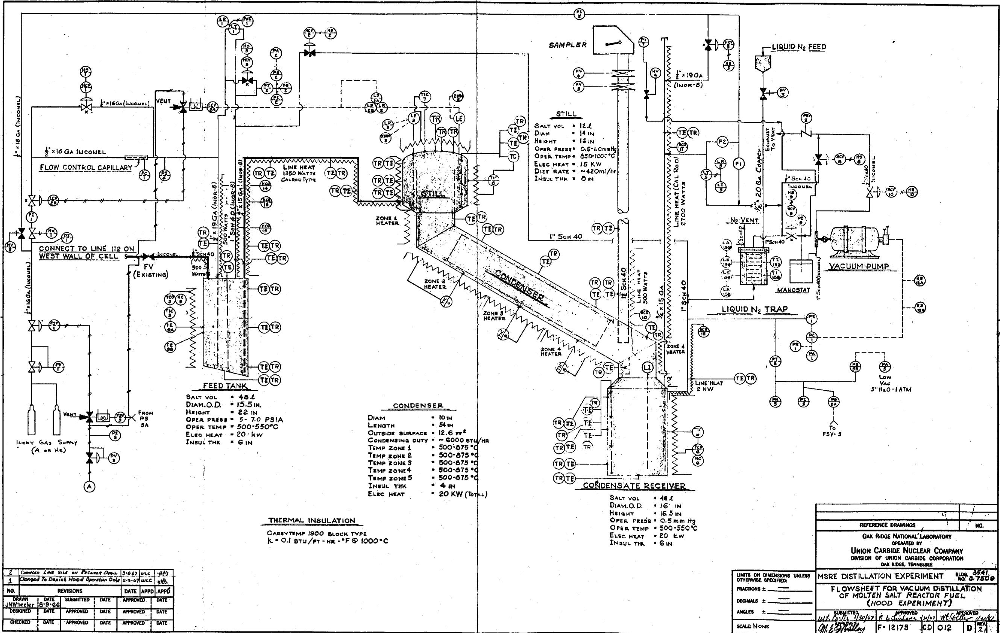

）

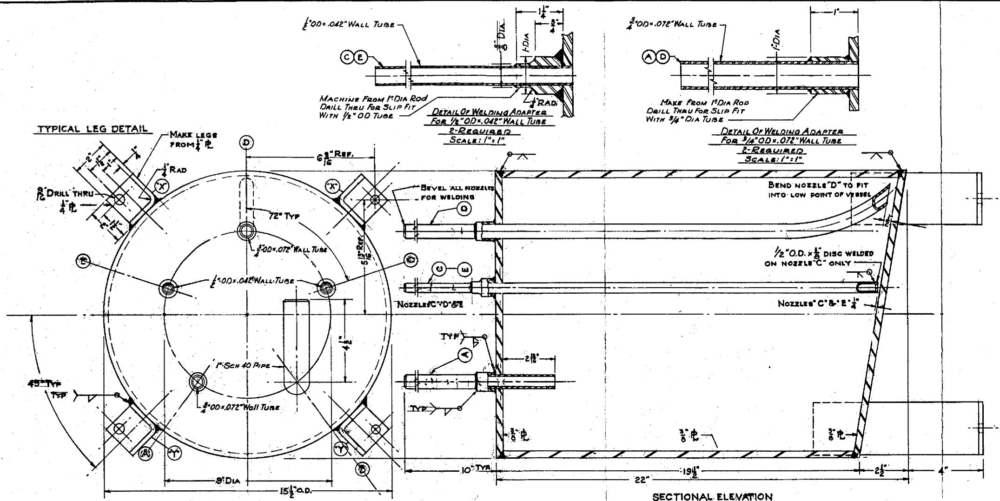

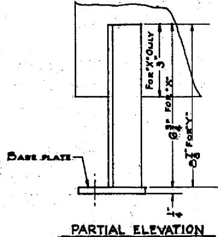  
PLAN

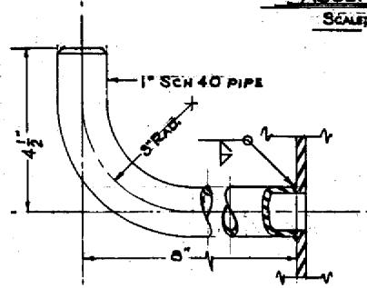  
Nozzle "B" I-REQUERD SCALE:

<table><tr><td>2.</td><td colspan="4">CHANGES LENGTH OF USE A
(From 3% to 8.5%)</td><td>2-4-40</td><td>WDC</td><td>WEC</td></tr><tr><td>1</td><td colspan="4">SneuHed 16&quot; R, for Top, Bottom,
AND wAHL WADAT or &quot;R&quot;</td><td>3-6-67</td><td>WEC</td><td>WEC</td></tr><tr><td>NO.</td><td colspan="4">REVISIONS</td><td>DATE</td><td>APPD</td><td>APPD</td></tr><tr><td>DRAWN
UNWEITER</td><td>DATE
9-2-68</td><td>SUBMITTED</td><td>DATE</td><td>APPROVED</td><td>DATE</td><td></td><td></td></tr><tr><td>DESIGNED</td><td>DATE</td><td>APPROVED</td><td>DATE</td><td>APPROVED</td><td>DATE</td><td></td><td></td></tr><tr><td>CHECKED</td><td>DATE</td><td>APPROVED</td><td>DATE</td><td>APPROVED</td><td>DATE</td><td></td><td></td></tr></table>

# GENERAL NOTES

WHEN REFERENCE IS MADE TO ANY NATIONALLY ACCEPTED STANDARD REFERENCE OR CODE, THE LATEST REVISION APPLIES. ASME CODE CASE 1270N & 1275N.

2. DESIGN CONDITIONS:DESIGN TIMPERSATURS

DESIGN PLEASURE

VESSEL HYDROSTATIC

Vissel PRoM Test

550°C

0.5mm Ha

45PSIG

TO PSIG

fa

$\therefore m = \frac{3}{11}$

3:MATERIAL SPEC FOR MET-RM-2, MET-RM-4, MET-RM-6, MET-RM-DIG7, MET-RM-B334 & MET-RM-B336. ALL MATERIAL TO BE HASTELLOY N

4. FABRICATION; WELING - ORNL SPEC PS-23,PS-25 & PS-26 INSPECTION - ORNL SPEC MET-WR-200 BCHB

5.INSPECTION OF WELDS JOINING LGE TO VEGSEL REQUIREST ONLY DYE PENETRANT CHECKS OF FIRST PASS & LAST PASS.

6.No INSPECTION OF WELDS JOINING LEAD TO BASS PLATTER

<table><tr><td></td><td></td></tr><tr><td></td><td></td></tr><tr><td>REFERENCE DRAWINGS</td><td>NO.</td></tr><tr><td colspan="2">OAK RIDGE NATIONAL LABORATORY OPERATED BY
UNION CARBIDE NUCLEAR COMPANY
DIVISION OF UNION CARBIDE CORPORATION
OAK MIDDLE, TENNESSEE</td></tr></table>

<table><tr><td colspan="2">LIMITS ON DIMENSIONS
OTHERWISE SPECIFIED:
FRACTIONS ± 1/32&quot;
DECIMALS ± .005&quot;
ANGLES ± 1°</td></tr><tr><td>SCALE:Noted</td><td></td></tr></table>

<table><tr><td colspan="6">MSRE DISTILLATION EXPERIMENT NO. &amp; 75CS</td></tr><tr><td colspan="6">FEED TANK FOR
VACUUM STILL</td></tr><tr><td>SUBMITTED
w#e#es w/62</td><td>APPROVED
R# S##m</td><td>14</td><td>APPROVED
w#e#es w/62</td><td>14</td><td></td></tr><tr><td>M.S.P.H.Lu</td><td>M-72175</td><td>CD</td><td>OIS</td><td>B</td><td>C</td></tr></table>

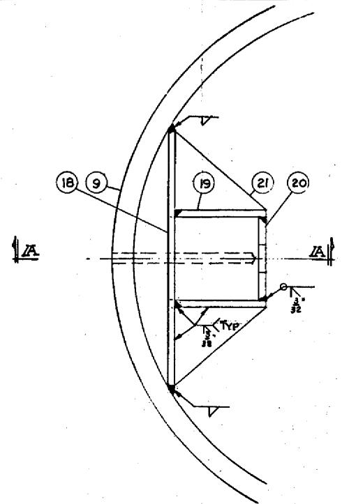  
PLAN

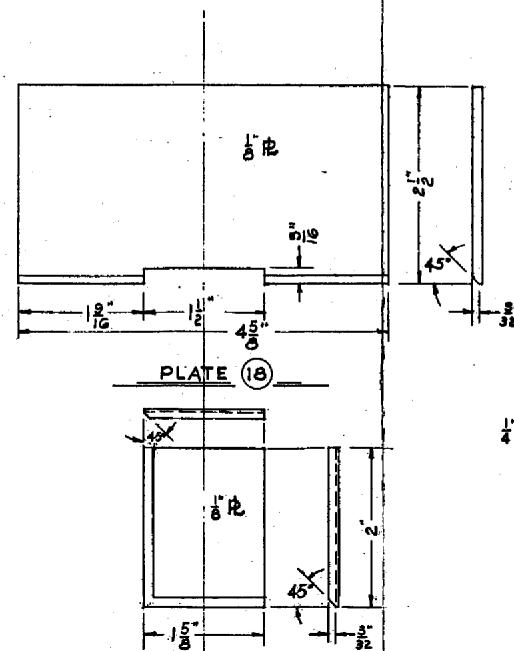  
PLATE (19)   
1:REQAS:SHOWN 1:REQOPPOSITE HAND

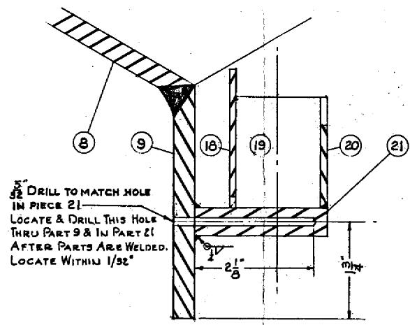  
SECTION A-A   
SAMPLE RESERVOIR DETAILS SCALE;|"a1"

<table><tr><td>NO.</td><td colspan="3">REVISIONS</td><td>DATE</td><td>APPD</td><td>APPD</td></tr><tr><td>DRAWN
UNHEATER</td><td>DATE
1-9-66</td><td>SUBMITTED</td><td>DATE</td><td>APPROVED</td><td>DATE</td><td></td></tr><tr><td>DESIGNED</td><td>DATE</td><td>APPROVED</td><td>DATE</td><td>APPROVED</td><td>DATE</td><td></td></tr><tr><td>CHECKED</td><td>DATE</td><td>APPROVED</td><td>DATE</td><td>APPROVED</td><td>DATE</td><td></td></tr></table>

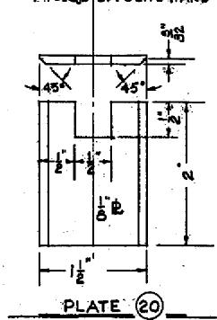

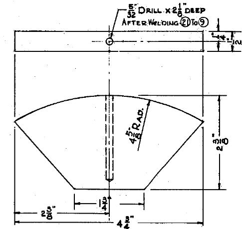  
PLATE (21)

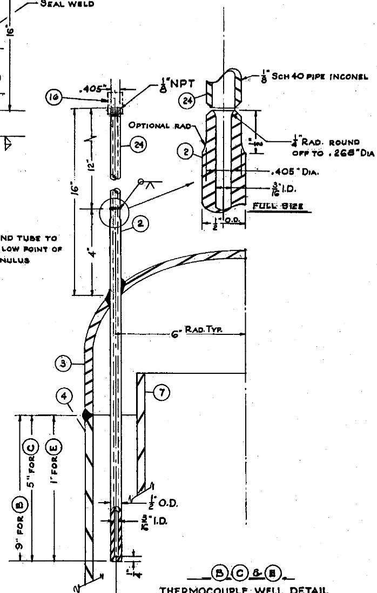  
THERMOCOUPLE WELL DETAIL   
MACHINE FROM 1-DIA ROAD:NOVE" DIA HASTELLOY N ROAD AVAILABLE

# GENERAL NOTES

1.DYE PENETRANT CHECK ONLY REQUIRED OF WELD JOINING PART 2I TO PART 9   
2.NO INSPECTION REQUIRED OF WELDS JOINING PART 8 TO PARTS 19 & 21; PART 19 TO PARTS 20 & 21j PART 20 TO PART 21.

<table><tr><td></td><td></td></tr><tr><td>ASSEMBLY</td><td>OII -D</td></tr><tr><td>REFERENCE DRAWINGS</td><td>NO.</td></tr><tr><td colspan="2">OAK RIDGE NATIONAL LABORATORY
OPERATED BY
UNION CARBIDE NUCLEAR COMPANY
DIVISION OF UNION CARBIDE CORPORATION
OAK RIDGE, TENNESSEE</td></tr></table>

<table><tr><td>LIMITS ON DIMENSIONS UNLESS
OTHERWISE SPECIFIED</td></tr><tr><td>FRACTIONS ± 1/32</td></tr><tr><td>DECIMALS ± .005&quot;</td></tr><tr><td>ANGLES ± 1°</td></tr><tr><td>SCALE: NOTED</td></tr></table>

<table><tr><td colspan="6">MSRE DISTILLATION EXPERIMENT BLOG-3841
NO.67509</td></tr><tr><td colspan="6">SAMPLE RESERVOIR AND
THERMOCOUPLE WELL DETAILS</td></tr><tr><td>SUBMITTED
W.E.L.C.H.L.D.S.H.</td><td>APPROVED
R.S.TUDY</td><td colspan="4">APPROVED
W.E.L.C.H.L.D.S.H.</td></tr><tr><td>APPROVED
M.E.L.P.H.L.L.</td><td>M-12178</td><td>CD</td><td>O14</td><td>D</td><td>REV.</td></tr></table>

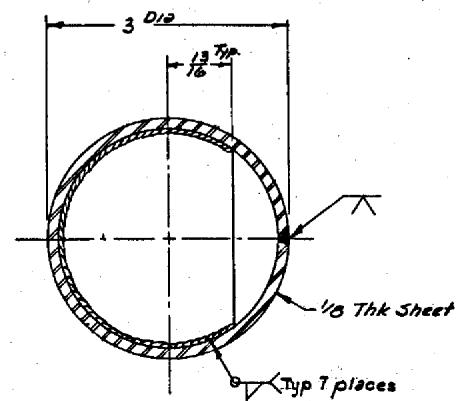  
Type Section A-A

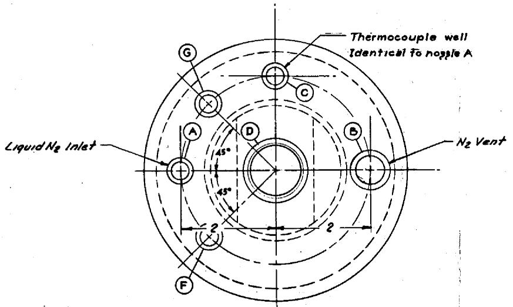

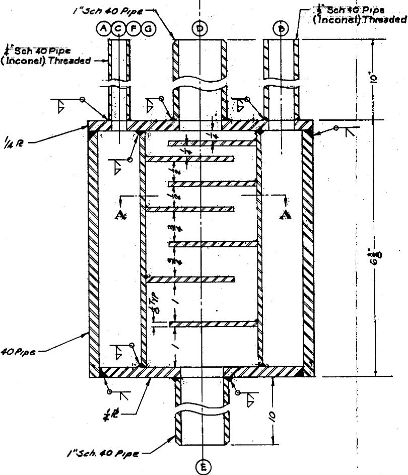

Note:

All Material To Be   
Hosteloy N. except 88   
noted for poss/s AB.F.G.

<table><tr><td>1</td><td colspan="3">Added &quot;F&quot; &amp; &quot;G&quot; To Note</td><td>3-6-67MLC</td><td>N/8</td></tr><tr><td>NO.</td><td colspan="3">REVISIONS</td><td>DATE APPD</td><td>APPD</td></tr><tr><td>DRAWN
R.P.O./WAL</td><td>DATE
9/4/2018</td><td>SUBMITTED</td><td>DATE</td><td>APPROVED</td><td>DATE</td></tr><tr><td>DESIGNED</td><td>DATE</td><td>APPROVED</td><td>DATE</td><td>APPROVED</td><td>DATE</td></tr><tr><td>CHECKED</td><td>DATE</td><td>APPROVED</td><td>DATE</td><td>APPROVED</td><td>DATE</td></tr></table>

<table><tr><td></td><td></td></tr><tr><td></td><td></td></tr><tr><td>REFERENCE DRAWINGS</td><td>NO.</td></tr><tr><td colspan="2">OAK RIDGE NATIONAL LABORATORY OPERATED BY
UNION CARBIDE NUCLEAR COMPANY
DIVISION OF UNION CARBIDE CORPORATION
OAK RIOOL, TENNESSEE</td></tr></table>

<table><tr><td>LIMITS ON DIMENSIONS UNLESS
OTHERWISE SPECIFIED:</td></tr><tr><td>PRACTICES ±</td></tr><tr><td>DECIMALS ±</td></tr><tr><td>ANGLES ±</td></tr><tr><td>SCALE: /&quot;/&quot;</td></tr></table>

<table><tr><td colspan="7">MSRE DISTILLATION EXPERIMENT 5061
NO.27308</td></tr><tr><td colspan="7">LIQUID N2Cold Trap For VACUUM LINE</td></tr><tr><td>SUBMITTED
(1)</td><td>APPROVED
(2)</td><td>RB STAN#L</td><td>1267</td><td rowspan="2">HOLLITER</td><td rowspan="2">D</td><td rowspan="2">REV</td></tr><tr><td>M#</td><td>M-12/173</td><td>CD</td><td>O15</td></tr></table>

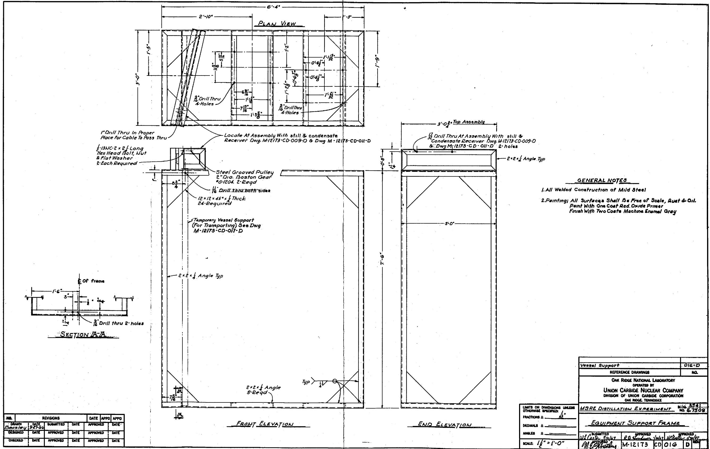  
GENERAL NOTES

I. All Welded Construction of Mild Steel

2. Painting: All Surfaces Shall Be Free of Scale, Ruest & Oil.

Paint With One Coat Red Oxide Prime

Finish With Two Coats Machine Enamel Grey

<table><tr><td>Vessel Support</td><td>OIE-D</td></tr><tr><td>REFERENCE DRAWINGS</td><td>NO.</td></tr><tr><td colspan="2">OAK RIDGE NATIONAL LABORATORY OPERATED BY
UNION CARBIDE NUCLEAR COMPANY
DIVISION OF UNION CARBIDE CORPORATION
OAK RIDGE, TENNESSEE</td></tr></table>

<table><tr><td>LIMITS ON DIMENSIONS UNLESS
OTHERWISE SPECIFIED: 1.</td></tr><tr><td>FRACTIONS ± 52</td></tr><tr><td>DECIMALS ± _</td></tr><tr><td>ANGLES ± _</td></tr><tr><td>SCALE: 1/2&quot; = 1&#x27;-0&quot;</td></tr></table>

MSRE DISTILLATION EXPERIMENT

<table><tr><td>SUPPLIED
WG CATE 9/16/2017</td><td>APPROVED
RG SUTLAM</td><td>V167</td><td>APPROVED
WG CATE 10/16/2017</td><td></td><td></td></tr><tr><td>M. CATE 9/16/2017</td><td>M-12173</td><td>CD</td><td>O1G</td><td>D</td><td>###</td></tr></table>

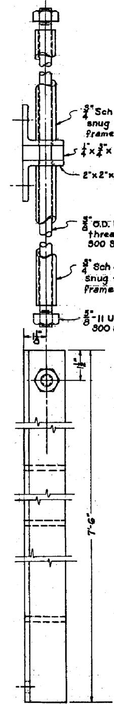

Sch 40 pipe Mild steel I-Reg'd Cut for snug fit between vertical support and frame (~153/6-long)   
4x32"Gusae8Regd.Mild steel

$2^{\circ}x^{2}x_{1}^{4}$ Anglex7-6-long 2-Regd Mild steel

"O.D.Rod x 57"long I"of thread each end I-Reg'd 500 Ser +Stl   
4 Sch 40 pipe Mild steel I-Reg'd Cut for snug fit between vertical support and frame $(\sim 1876^{\prime \prime}long)$   
5-11 UNC Hex head nut 2-Reg'd 300 Ser 8+ StI

# GENERAL NOTES

1. Painting; All mild steel parts shall be free of scale, rust, & oil. Paint with one coat red oxide primer & finish with two coats machine enamel gray.   
2. During transport, support Still Condenser (Dwg M-12173-CD-OII-D) & Condensate Receiver (Dwg M-12173-CD-008 D) assembly by passing 5/6 "O.D. x 57" long rod (this dwg) thru 34" hole in part of dwg M-12173-CD-OII D & /46" holes in frame of dwg M-12173-CD-OIG D

ASSEMBLY & DETAILS

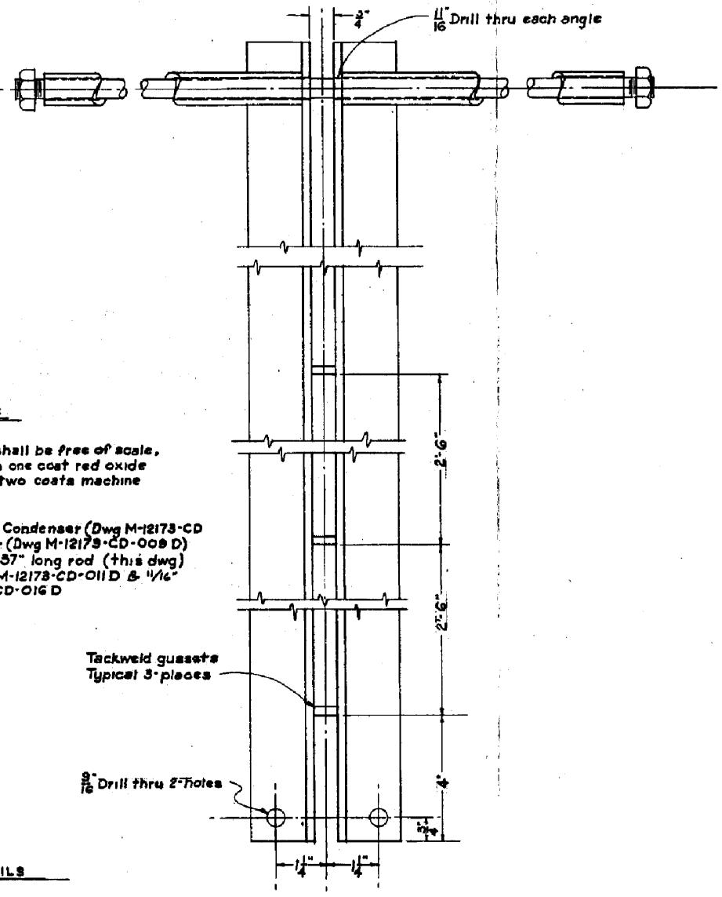

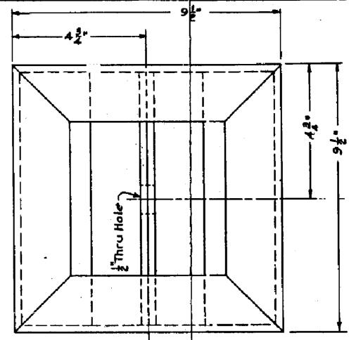

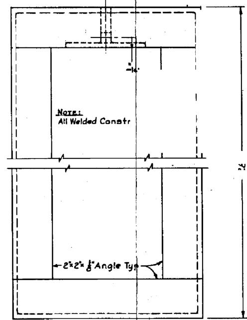

STILL COUNTERWEIGHT  
MATL: MILD STEEL   

<table><tr><td colspan="3"></td><td></td></tr><tr><td colspan="3">SUPPORT FRAME</td><td>CD-OIG-D</td></tr><tr><td colspan="3">REFERENCE DRAWINGS</td><td>NO.</td></tr><tr><td colspan="4">OAK RIDGE NATIONAL LABORATORY
OPERATED BY
UNION CARBIDE NUCLEAR COMPANY
DIVISION OF UNION CARBIDE CORPORATION
OAK RIOOL TEMNESSEI</td></tr><tr><td colspan="4">MSRE DISTILLATION EXPERIMENT NO.3541
NO. &amp;730#</td></tr><tr><td colspan="4">TEMPORARY VESSEL SUPPORT
(FOR TRANSPORTING)
ASSEMBLY &amp; DETAILS</td></tr><tr><td>SUBMITTED</td><td colspan="2">APPROVED</td><td>APPROVED</td></tr><tr><td rowspan="2">APPROVED</td><td rowspan="2">M·12173</td><td rowspan="2">CD</td><td>O17</td></tr><tr><td>D</td></tr></table>

<table><tr><td colspan="4">REVISIONS</td><td>DATE</td><td>APPD</td><td>APPD</td></tr><tr><td>DRAWN N.Wheeler</td><td>DATE 11-25-66</td><td>SUBMITTED</td><td>DATE</td><td colspan="2">APPROVED</td><td>DATE</td></tr><tr><td>DESIGNED</td><td>DATE</td><td>APPROVED</td><td>DATE</td><td colspan="2">APPROVED</td><td>DATE</td></tr><tr><td>CHECKED</td><td>DATE</td><td>APPROVED</td><td>DATE</td><td colspan="2">APPROVED</td><td>DATE</td></tr></table>

<table><tr><td colspan="2">LIMITS ON DIMENSIONS
OTHERWISE SPECIFIED: UNLESS</td></tr><tr><td colspan="2">FRACTIONS ± _/s2</td></tr><tr><td colspan="2">DECIMALS ± _</td></tr><tr><td colspan="2">ANGLES ± _</td></tr><tr><td colspan="2">SCALE: 1/2&quot; /&quot;</td></tr></table>

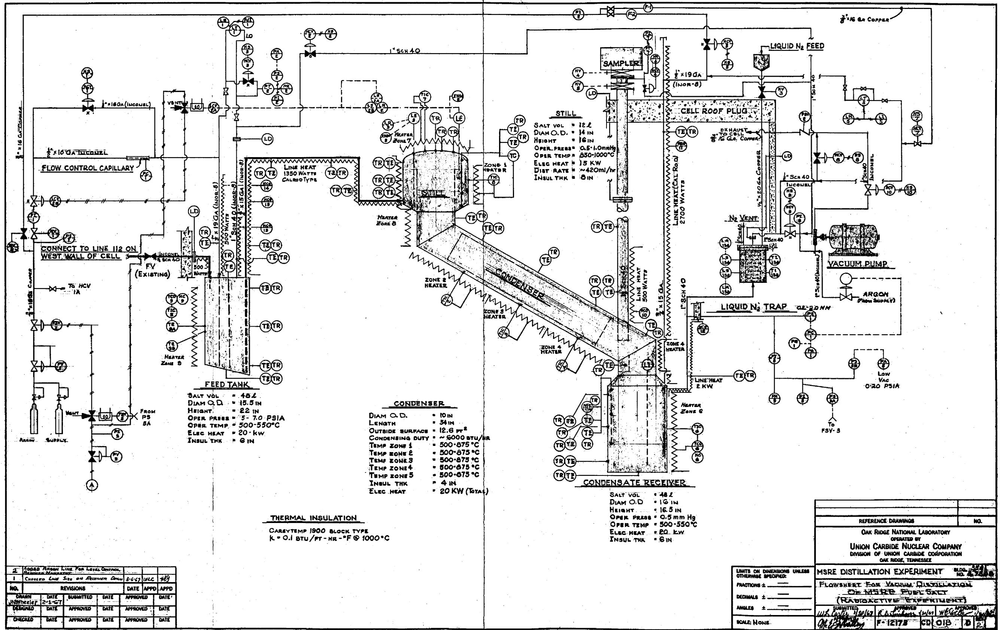

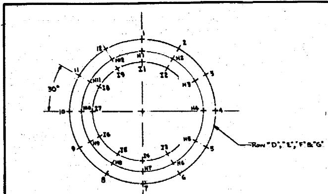  
PLAN ROWS "I", "H", "D", "E", "F" & "G".

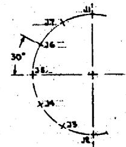  
PLAN Row "J"

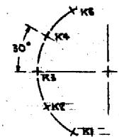  
PLANROW

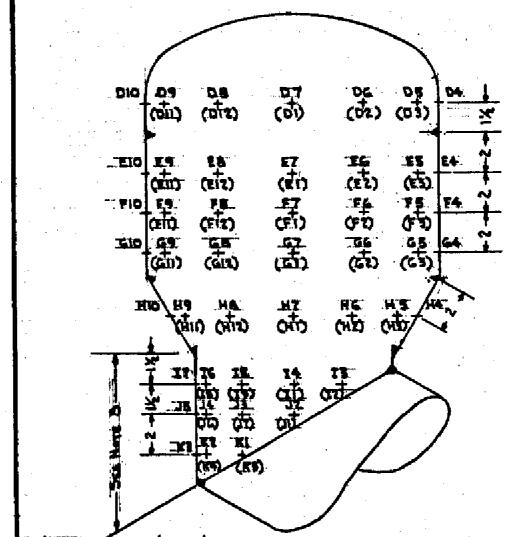

<table><tr><td>NO.</td><td colspan="4">REVISIONS</td><td>DATE</td><td>APPD</td><td>APPD</td></tr><tr><td>DRAWN</td><td>DATE</td><td rowspan="2">SUBMITTED</td><td rowspan="2">DATE</td><td rowspan="2">APPROVED</td><td rowspan="2">DATE</td><td></td><td></td></tr><tr><td>H.W.F.</td><td>X-2-8-67</td><td></td><td></td></tr><tr><td>DESIGNED</td><td>DATE</td><td rowspan="2">APPROVED</td><td rowspan="2">DATE</td><td rowspan="2">APPROVED</td><td rowspan="2">DATE</td><td></td><td></td></tr><tr><td>W.L.Carrying</td><td>X-2-1-67</td><td></td><td></td></tr><tr><td>CHECKED</td><td>DATE</td><td>APPROVED</td><td>DATE</td><td>APPROVED</td><td>DATE</td><td></td><td></td></tr></table>

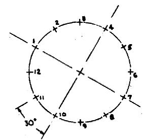  
PLAN ROWS " ${N}_{1}{}^{\prime \prime }{P}_{1}{}^{\prime \prime }{Q}_{1}{}^{\prime \prime }{R}_{1}{}^{\prime \prime }S{}^{\prime \prime }B{}^{\prime \prime }L$

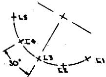  
PLAN BOW.

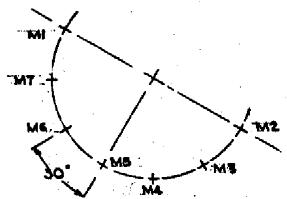  
PLAN

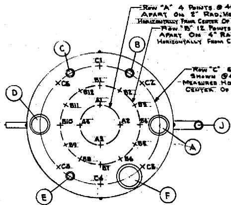  
PLAN OF STILL HEAD

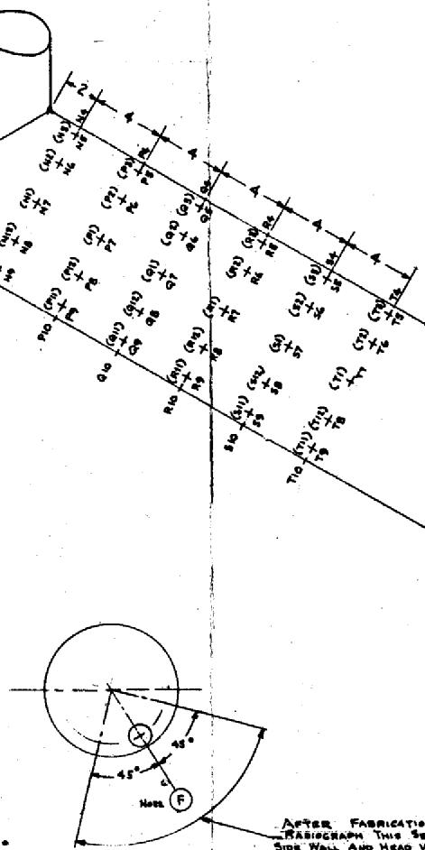  
AFTER FABRICATION IS COMPLETE  
RADIOGRAPH THIS SEGMENT OF STEEL  
SIDE WALL AND HEAD WIRE SUPPLY  
EXPOSURES TO ADAPTATE MAP SURTIERS  
SURFACES BETWEEN HAWE AUSE BOTHER  
CONNECTIONS WITH THE HAIYING TUBE  
ADDITIONAL SOURCE COULD BE MADE THEM NUTTLY AT END OR NARROWADIOACTIVE EXPERIMENTS REPEAT THE RADIOGRAPH DESCRIBED ASSE.  
NOTES:   
1. DURING FABRICATION MANS DIRECT TKEENCESS MEMARRIEDS At Panto's Denominated By "In Upper Left corner Of   
2. DURING PRODUCTION NAME MEASUREMENTS UTOXANLY AT Points Designated in The TAUMATIONS ON DMS, M16173-CD-020D AND M16173-CD-021D EMPIE THOSE MARKED "No MEASUREMENTS" -Receives REsuLTs IN APPROPRIATE COLUMN   
3. POwTe AT WICH MEANUMBREs ARE MADE ARIIOTED By A LETTER (A,B,…,2) To IcHcLATE The Row An And A Numbei 1,2…12 to Show Position On The Kow.   
4. IDENTIFICATIONS IN PARENTHESES [e.g. (F12), (G9), Eqs.] INDicate THAT POINT IS DEGREE OPPOSITE THE DISPLINED POINT.   
5 DEVELOP ULTRAWEIGHT THICKNESS MEASUREMENT PROCEDURE ONGH FAMIFICATION WHiM WILL PRODUVE THE SAME THICKNESS MEASUREMENTS AS Those Found Directly AT POINTEDesignated,Note I ANOVA. REAR PRACTICE PRECESSLY.  
6. APPEX NONADDITIONAL EXPERIMENTS, MAKE OUTREACH THE MEASUREMENTS AS IN NOTE 2 Above AND RECRID RECTS IN   
7. STATE THICKNESS MEASUREMENTS IN DEGREE, STATE ALL OTHER MEASUREMENTS IN IUCHE AND FRACTIONS.   
AFTER PAPERS, RAPORNA. WAH SUPFERT EXPENDITS TO COMpletely MAP VEGEL WALL BETWEEN WELD LINE AT OITDM OF CONC. SECTON OF TILL AND ROW "N" ON CODBENDER. AFTER NONRADACTIVE EXPERIMENTS, REPEAT THE RADIOGRAPHY.

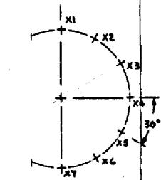  
PLAN AOD "X"

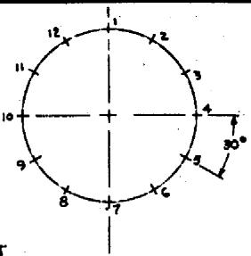  
PLAN.ROWS "Y" B. Z"

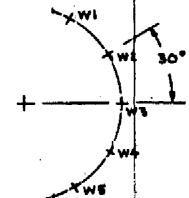  
PLAN 1ow "W"

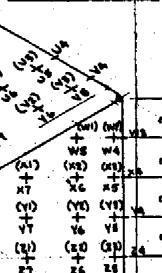

PLAN. ROWS "U" B.V   
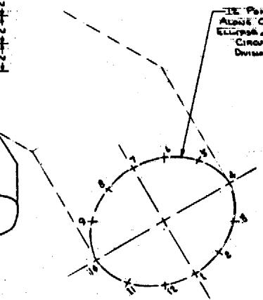  
IE POINTS EMANCY S#DIED ALONG CIRCUMFURANCE OF ELLIPSES A CIRCUUM 33.913 W. DUMMNS 2.8278 W.

<table><tr><td>TERMSION - DIMENSIONS, E. TALE (CERAMICS), MEASUREMENTS</td><td>WRT-PRO: 100</td></tr><tr><td>LOCATION - LINEAR MEASUREMENTS, T. TEMPERATURE DATE</td><td># - 01</td></tr><tr><td>REFERENCE DRAWINGS</td><td>NO.</td></tr><tr><td colspan="2">OAK RIDGE NATIONAL LABORATORY
OPERATED BY
UNION CARBIDE NUCLEAR COMPANY
DIVISION OF UNION CARBIDE CORPORATION
OAK RIDGE, TENNESSEE</td></tr></table>

SCALE-Non   

<table><tr><td>LIMITS ON DIMENSIONS
OTHERWISE SPECIFIED:</td><td>UNLESS</td></tr><tr><td>FRACTIONS ± _</td><td></td></tr><tr><td>DECIMALS ± _</td><td></td></tr><tr><td>ANGLES ± _</td><td></td></tr></table>

<table><tr><td>SUBMITTED
(1)</td><td>APPROVED
RB.</td><td></td><td>APPROVED
(2)</td><td></td></tr><tr><td>AGREEED
(3)</td><td>M2173</td><td>CD</td><td>O19</td><td>D</td></tr></table>

<table><tr><td colspan="6">WALL THICKNESS MEASUREMENTS AND OBSERVATIONS</td><td colspan="6">WALL THICKNESS MEASUREMENTS AND OBSERVATIONS</td><td colspan="6">WALL THICKNESS MEASUREMENTS AND OBSERVATIONS</td></tr><tr><td>LOCATION OF MEASUREMENT</td><td>DIRECT INITIAL CHANGE</td><td>ULTRASONIC POST OPERATIONS (change)</td><td>DIMENSIONAL CHANGE (change)</td><td>RADIOGRAPHY, OBSERVATIONS, AND REMARKS</td><td>LOCATION OF MEASUREMENT</td><td>DIRECT INITIAL CHANGE</td><td>ULTRASONIC POST OPERATIONS (change)</td><td>DIMENSIONAL CHANGE (change)</td><td>RADIOGRAPHY, OBSERVATIONS, AND REMARKS</td><td>LOCATION OF MEASUREMENT</td><td>DIRECT INITIAL CHANGE</td><td>ULTRASONIC POST OPERATIONS (change)</td><td>DIMENSIONAL CHANGE (change)</td><td>RADIOGRAPHY, OBSERVATIONS, AND REMARKS</td><td>DIMENSIONAL CHANGE (change)</td><td>RADIOGRAPHY, OBSERVATIONS, AND REMARKS</td><td></td></tr><tr><td>A1</td><td>.383</td><td>.378</td><td>.376</td><td>-.005</td><td></td><td>G4</td><td></td><td>.380</td><td>-.002</td><td></td><td></td><td>NIE</td><td>.393</td><td>-.003</td><td></td><td></td><td></td></tr><tr><td>A2</td><td></td><td>.378</td><td>.382</td><td>.005</td><td></td><td>G7</td><td>.379</td><td>.380</td><td>0</td><td></td><td></td><td>P1</td><td>.397</td><td>.394</td><td>-.003</td><td></td><td></td></tr><tr><td>A3</td><td>.383</td><td>.383</td><td>.383</td><td>.005</td><td></td><td>G8</td><td></td><td>.381</td><td>.001</td><td></td><td></td><td>P2</td><td>.396</td><td>.395</td><td>-.001</td><td></td><td></td></tr><tr><td>A4</td><td></td><td>.379</td><td>.381</td><td>.002</td><td></td><td>G9</td><td></td><td>.383</td><td>-.002</td><td></td><td></td><td>P3</td><td>.396</td><td>.394</td><td>0</td><td></td><td></td></tr><tr><td>B1</td><td>.4</td><td>M10</td><td>RENEW</td><td>.005</td><td></td><td>G10</td><td>.379</td><td>.380</td><td>-</td><td>-</td><td></td><td>P4</td><td>.396</td><td>0</td><td></td><td></td><td></td></tr><tr><td>B2</td><td></td><td></td><td></td><td></td><td></td><td>G11</td><td></td><td>.379</td><td>.001</td><td></td><td></td><td>P5</td><td>.397</td><td>.394</td><td>-.001</td><td></td><td></td></tr><tr><td>B3</td><td></td><td></td><td></td><td></td><td></td><td>G12</td><td></td><td>.381</td><td>.001</td><td></td><td></td><td>P6</td><td>.397</td><td>.397</td><td>-.001</td><td></td><td></td></tr><tr><td>B4</td><td></td><td></td><td></td><td></td><td></td><td>H1</td><td>.395</td><td>.396</td><td>-.007</td><td></td><td></td><td>P7</td><td>.397</td><td>.395</td><td>-.002</td><td></td><td></td></tr><tr><td>B5</td><td></td><td>.385</td><td></td><td></td><td></td><td>H2</td><td></td><td>.387</td><td>-.007</td><td></td><td></td><td>P8</td><td>.395</td><td>.392</td><td>-.003</td><td></td><td></td></tr><tr><td>B6</td><td>.383</td><td>.383</td><td>.384</td><td>-.001</td><td></td><td>H3</td><td></td><td>.386</td><td>-.008</td><td></td><td></td><td>P9</td><td>.397</td><td>.392</td><td>0</td><td></td><td></td></tr><tr><td>B7</td><td>.46</td><td>M14</td><td>RENEW</td><td>.005</td><td></td><td>H4</td><td>.393</td><td>.393</td><td>0</td><td></td><td></td><td>P10</td><td>.392</td><td>.393</td><td>-.005</td><td></td><td></td></tr><tr><td>B8</td><td></td><td></td><td></td><td></td><td></td><td>H5</td><td></td><td>.393</td><td>-.001</td><td></td><td></td><td>P11</td><td>.395</td><td>.397</td><td>-.003</td><td></td><td></td></tr><tr><td>B9</td><td></td><td></td><td></td><td></td><td></td><td>H6</td><td></td><td>.396</td><td>-.001</td><td></td><td></td><td>P12</td><td>.396</td><td>.393</td><td>-.003</td><td></td><td></td></tr><tr><td>B10</td><td></td><td></td><td></td><td></td><td></td><td>H7</td><td>.397</td><td>.396</td><td>-.002</td><td></td><td></td><td>P13</td><td>.397</td><td>.396</td><td>-.001</td><td></td><td></td></tr><tr><td>B11</td><td></td><td></td><td></td><td></td><td></td><td>H8</td><td></td><td>.398</td><td>-.001</td><td></td><td></td><td>Q8</td><td>.395</td><td>.394</td><td>-.002</td><td></td><td></td></tr><tr><td>B12</td><td></td><td></td><td></td><td></td><td></td><td>H9</td><td></td><td>.400</td><td>.399</td><td>-.001</td><td></td><td></td><td>Q9</td><td>.397</td><td>.393</td><td>-.001</td><td></td></tr><tr><td>C17</td><td></td><td></td><td></td><td></td><td></td><td>H10</td><td>.400</td><td>.400</td><td>.000</td><td></td><td></td><td>Q10</td><td>.398</td><td>.395</td><td>-.003</td><td></td><td></td></tr><tr><td>C2</td><td>.389</td><td>.388</td><td>.386</td><td>.002</td><td></td><td>H11</td><td></td><td>.398</td><td>-.006</td><td></td><td></td><td>Q11</td><td>.397</td><td>.397</td><td>-.001</td><td></td><td></td></tr><tr><td>C3</td><td>.387</td><td>.387</td><td>.387</td><td>.002</td><td></td><td>H12</td><td></td><td>.398</td><td>-.006</td><td></td><td></td><td>Q12</td><td>.396</td><td>.394</td><td>-.001</td><td></td><td></td></tr><tr><td>C4</td><td></td><td>.389</td><td>.389</td><td>.003</td><td></td><td>I1</td><td></td><td>.397</td><td>-.005</td><td></td><td></td><td>Q13</td><td>.397</td><td>.396</td><td>-.002</td><td></td><td></td></tr><tr><td>C5</td><td>.390</td><td>.387</td><td>.388</td><td>.002</td><td></td><td>I2</td><td></td><td>.400</td><td>-.002</td><td></td><td></td><td>Q14</td><td>.396</td><td>.394</td><td>-.001</td><td></td><td></td></tr><tr><td>C6</td><td>.383</td><td>.386</td><td>.386</td><td>.002</td><td></td><td>I3</td><td></td><td>.400</td><td>-.002</td><td></td><td></td><td>Q15</td><td>.396</td><td>.394</td><td>-.002</td><td></td><td></td></tr><tr><td>D1</td><td>.406</td><td>.406</td><td>.410</td><td>.005</td><td></td><td>I4</td><td></td><td>.400</td><td>-.002</td><td></td><td></td><td>Q16</td><td>.395</td><td>.392</td><td>-.003</td><td></td><td></td></tr><tr><td>D2</td><td></td><td>.410</td><td>.407</td><td>.003</td><td></td><td>I5</td><td></td><td>.400</td><td>-.002</td><td></td><td></td><td>Q17</td><td>.396</td><td>.392</td><td>-.004</td><td></td><td></td></tr><tr><td>D3</td><td></td><td>.415</td><td>.416</td><td>.001</td><td></td><td>I6</td><td></td><td>.400</td><td>-.002</td><td></td><td></td><td>Q18</td><td>.397</td><td>.395</td><td>-.002</td><td></td><td></td></tr><tr><td>D4</td><td>.417</td><td>.418</td><td>.421</td><td>.003</td><td></td><td>I7</td><td>.400</td><td>.400</td><td>-.002</td><td></td><td></td><td>R1</td><td>.396</td><td>.396</td><td>-.003</td><td></td><td></td></tr><tr><td>D5</td><td></td><td>.418</td><td>.422</td><td>.001</td><td></td><td>I8</td><td></td><td>.400</td><td>-.002</td><td></td><td></td><td>R2</td><td>.396</td><td>.394</td><td>-.004</td><td></td><td></td></tr><tr><td>D6</td><td></td><td>.419</td><td>.424</td><td>.001</td><td></td><td>I9</td><td></td><td>.400</td><td>-.002</td><td></td><td></td><td>R3</td><td>.396</td><td>.394</td><td>-.004</td><td></td><td></td></tr><tr><td>D7</td><td>.416</td><td>.416</td><td>.423</td><td>.007</td><td></td><td>J1</td><td></td><td>.400</td><td>-.001</td><td></td><td></td><td>R4</td><td>.396</td><td>.396</td><td>-.002</td><td></td><td></td></tr><tr><td>D8</td><td></td><td>.420</td><td>.426</td><td>.006</td><td></td><td>J2</td><td></td><td>.400</td><td>-.002</td><td></td><td></td><td>R5</td><td>.396</td><td>.397</td><td>-.003</td><td></td><td></td></tr><tr><td>D9</td><td></td><td>.424</td><td>.432</td><td>.008</td><td></td><td>J3</td><td></td><td>.400</td><td>-.001</td><td></td><td></td><td>R6</td><td>.396</td><td>.397</td><td>-.001</td><td></td><td></td></tr><tr><td>D10</td><td>.417</td><td>.415</td><td>-</td><td>-</td><td></td><td>J4</td><td></td><td>.400</td><td>-.001</td><td></td><td></td><td>R7</td><td>.396</td><td>.395</td><td>-.005</td><td></td><td></td></tr><tr><td>D11</td><td></td><td>.426</td><td>.426</td><td>.00</td><td></td><td>J5</td><td></td><td>.400</td><td>-.002</td><td></td><td></td><td>R8</td><td>.397</td><td>.394</td><td>-.001</td><td></td><td></td></tr><tr><td>D12</td><td></td><td>.427</td><td>.428</td><td>.007</td><td></td><td>J6</td><td></td><td>.400</td><td>-.004</td><td></td><td></td><td>R9</td><td>.396</td><td>.394</td><td>-.002</td><td></td><td></td></tr><tr><td>E1</td><td></td><td>.427</td><td>.428</td><td>.005</td><td></td><td>J7</td><td></td><td>.400</td><td>-.004</td><td></td><td></td><td>R10</td><td>.396</td><td>.391</td><td>-.003</td><td></td><td></td></tr><tr><td>E2</td><td></td><td>.427</td><td>.428</td><td>.002</td><td></td><td>K1</td><td>.399</td><td>.399</td><td>0</td><td></td><td></td><td>R11</td><td>.396</td><td>.397</td><td>-.005</td><td></td><td></td></tr><tr><td>E3</td><td></td><td>.427</td><td>.428</td><td>.004</td><td></td><td>K2</td><td></td><td>.400</td><td>-.002</td><td></td><td></td><td>R12</td><td>.397</td><td>.394</td><td>-.003</td><td></td><td></td></tr><tr><td>E4</td><td></td><td>.427</td><td>.428</td><td>.004</td><td></td><td>K3</td><td>.399</td><td>.399</td><td>-.001</td><td></td><td></td><td>R13</td><td>.396</td><td>.394</td><td>-.002</td><td></td><td></td></tr><tr><td>E5</td><td></td><td>.427</td><td>.428</td><td>.004</td><td></td><td>K4</td><td></td><td>.400</td><td>-.002</td><td></td><td></td><td>R14</td><td>.396</td><td>.396</td><td>-.002</td><td></td><td></td></tr><tr><td>E6</td><td></td><td>.427</td><td>.428</td><td>.001</td><td></td><td>K5</td><td>.397</td><td>.397</td><td>-.003</td><td></td><td></td><td>R15</td><td>.396</td><td>.396</td><td>-.001</td><td></td><td></td></tr><tr><td>E7</td><td></td><td>.427</td><td>.428</td><td>.002</td><td></td><td>L1</td><td></td><td>.398</td><td>-.001</td><td></td><td></td><td>R16</td><td>.396</td><td>.397</td><td>-.001</td><td></td><td></td></tr><tr><td>E8</td><td></td><td>.427</td><td>.428</td><td>.002</td><td></td><td>L2</td><td></td><td>.396</td><td>-.001</td><td></td><td></td><td>R17</td><td>.396</td><td>.396</td><td>-.003</td><td></td><td></td></tr><tr><td>E9</td><td></td><td>.427</td><td>.428</td><td>.003</td><td></td><td>L3</td><td></td><td>.397</td><td>-.002</td><td></td><td></td><td>R18</td><td>.396</td><td>.396</td><td>-.002</td><td></td><td></td></tr><tr><td>E10</td><td></td><td>.427</td><td>-</td><td>-</td><td></td><td>L4</td><td></td><td>.396</td><td>-.001</td><td></td><td></td><td>R19</td><td>.396</td><td>.395</td><td>-.005</td><td></td><td></td></tr><tr><td>E11</td><td></td><td>.427</td><td>.428</td><td>.007</td><td></td><td>L5</td><td></td><td>.396</td><td>-.003</td><td></td><td></td><td>R20</td><td>.396</td><td>.393</td><td>-.001</td><td></td><td></td></tr><tr><td>E12</td><td></td><td>.427</td><td>.428</td><td>.004</td><td></td><td>M1</td><td></td><td>.397</td><td>-.001</td><td></td><td></td><td>R21</td><td>.395</td><td>.393</td><td>-.002</td><td></td><td></td></tr><tr><td>F1</td><td></td><td>.427</td><td>.428</td><td>.002</td><td></td><td>M2</td><td></td><td>.398</td><td>-.001</td><td></td><td></td><td>R22</td><td>.395</td><td>.394</td><td>-.002</td><td></td><td></td></tr><tr><td>F2</td><td></td><td>.427</td><td>.428</td><td>.001</td><td></td><td>M3</td><td></td><td>.398</td><td>-.001</td><td></td><td></td><td>R23</td><td>.395</td><td>.394</td><td>-.001</td><td></td><td></td></tr><tr><td>F3</td><td></td><td>.427</td><td>.428</td><td>.002</td><td></td><td>M4</td><td></td><td>.398</td><td>-.001</td><td></td><td></td><td>R24</td><td>.395</td><td>.394</td><td>-.001</td><td></td><td></td></tr><tr><td>F4</td><td></td><td>.427</td><td>.428</td><td>.004</td><td></td><td>M5</td><td></td><td>.398</td><td>-.001</td><td></td><td></td><td>R25</td><td>.395</td><td>.396</td><td>-.003</td><td></td><td></td></tr><tr><td>F5</td><td></td><td>.427</td><td>.428</td><td>.001</td><td></td><td>M6</td><td></td><td>.398</td><td>-.001</td><td></td><td></td><td>R26</td><td>.395</td><td>.396</td><td>-.002</td><td></td><td></td></tr><tr><td>F6</td><td></td><td>.427</td><td>.428</td><td>.001</td><td></td><td>M7</td><td></td><td>.398</td><td>-.002</td><td></td><td></td><td>R27</td><td>.395</td><td>.395</td><td>-.005</td><td></td><td></td></tr><tr><td>F7</td><td></td><td>.427</td><td>.428</td><td>.003</td><td></td><td>N1</td><td></td><td>.397</td><td>-.001</td><td></td><td></td><td></td><td></td><td></td><td></td><td></td><td></td></tr><tr><td>F8</td><td></td><td>.427</td><td>.428</td><td>.002</td><td></td><td>N2</td><td></td><td>.397</td><td>-.001</td><td></td><td></td><td></td><td></td><td></td><td></td><td></td><td></td></tr><tr><td>F9</td><td></td><td>.427</td><td>.428</td><td>.002</td><td></td><td>N3</td><td></td><td>.397</td><td>-.002</td><td></td><td></td><td></td><td></td><td></td><td></td><td></td><td></td></tr><tr><td>F10</td><td></td><td>.427</td><td>-</td><td>-</td><td></td><td>N4</td><td></td><td>.398</td><td>-.002</td><td></td><td></td><td></td><td></td><td></td><td></td><td></td><td></td></tr><tr><td>F11</td><td></td><td>.427</td><td>.428</td><td>.003</td><td></td><td>N5</td><td></td><td>.398</td><td>-.002</td><td></td><td></td><td></td><td></td><td></td><td></td><td></td><td></td></tr><tr><td>F12</td><td></td><td>.427</td><td>.428</td><td>.001</td><td></td><td>N6</td><td></td><td>.398</td><td>-.002</td><td></td><td></td><td></td><td></td><td></td><td></td><td></td><td></td></tr><tr><td>F13</td><td></td><td>.427</td><td>.428</td><td>.002</td><td></td><td>N7</td><td></td><td>.398</td><td>-.001</td><td></td><td></td><td></td><td></td><td></td><td></td><td></td><td></td></tr><tr><td>F14</td><td></td><td>.427</td><td>.428</td><td>.005</td><td></td><td>N8</td><td></td><td>.398</td><td>-.002</td><td></td><td></td><td></td><td></td><td></td><td></td><td></td><td></td></tr><tr><td>F15</td><td></td><td>.427</td><td>-</td><td>-</td><td></td><td>N9</td><td></td><td>.398</td><td>-.002</td><td></td><td></td><td></td><td></td><td></td><td></td><td></td><td></td></tr><tr><td colspan="6">WALL THICKENESS MEASUREMENTS AND OBSERVATIONS</td><td colspan="6">WALL THICKNESS MEASUREMENTS AND OBSERVATIONS</td><td colspan="6">LENGTH AND DIAMETER MEASUREMENTS</td></tr><tr><td>LOCATION OF MEASUREMENT</td><td>DIRECT INITIAL (Date)</td><td>ADDITIONAL CHANGE (Date)</td><td>DIMENSIONAL CHANGE (Date)</td><td>RADIOGRAPHY, OBSERVATIONS, AND REMARKS</td><td>LOCATION OF MEASUREMENT</td><td>DIRECT INITIAL (Date)</td><td>ADDITIONAL CHANGE (Date)</td><td>DIMENSIONAL CHANGE (Date)</td><td>RADIOGRAPHY, OBSERVATIONS, AND REMARKS</td><td>LOCATION OF MEASUREMENT</td><td>DIRECT INITIAL (Date)</td><td>ADDITIONAL CHANGE (Date)</td><td>DIMENSIONAL CHANGE (Date)</td><td>RADIOGRAPHY, OBSERVATIONS, AND REMARKS</td><td>DIMENSIONAL CHANGE (Date)</td><td>REMARKS</td><td></td></tr><tr><td>T3</td><td></td><td>.401</td><td>.398</td><td>-.002</td><td>Y12</td><td></td><td>.400</td><td>.396</td><td>-.004</td><td></td><td></td><td></td><td></td><td></td><td></td><td></td><td></td></tr><tr><td>T9</td><td></td><td>.400</td><td>.397</td><td>-.003</td><td>Z1</td><td></td><td>.396</td><td>.397</td><td>-.005</td><td></td><td></td><td></td><td></td><td></td><td></td><td></td><td></td></tr><tr><td>T5</td><td></td><td>.401</td><td>.399</td><td>-.002</td><td>Z2</td><td></td><td>.394</td><td>.399</td><td>-.006</td><td></td><td></td><td></td><td></td><td></td><td></td><td></td><td></td></tr><tr><td>T6</td><td></td><td>.401</td><td>.398</td><td>-.003</td><td>Z3</td><td></td><td>.395</td><td>.397</td><td>-.007</td><td></td><td></td><td></td><td></td><td></td><td></td><td></td><td></td></tr><tr><td>T7</td><td></td><td>.400</td><td>.397</td><td>-.003</td><td>Z4</td><td>.396</td><td>.394</td><td>-</td><td>-</td><td></td><td></td><td></td><td></td><td></td><td></td><td></td><td></td></tr><tr><td>T8</td><td></td><td>.392</td><td>.397</td><td>-.003</td><td>Z5</td><td></td><td>.397</td><td>.399</td><td>-.008</td><td></td><td></td><td></td><td></td><td></td><td></td><td></td><td></td></tr><tr><td>T9</td><td></td><td>.396</td><td>.396</td><td>-.003</td><td>Z6</td><td></td><td>.398</td><td>.395</td><td>-.003</td><td></td><td></td><td></td><td></td><td></td><td></td><td></td><td></td></tr><tr><td>T10</td><td></td><td>.396</td><td>.390</td><td>-.006</td><td>Z7</td><td></td><td>.398</td><td>.393</td><td>-.005</td><td></td><td></td><td></td><td></td><td></td><td></td><td></td><td></td></tr><tr><td>T11</td><td></td><td>.396</td><td>.394</td><td>-.003</td><td>Z8</td><td></td><td>.399</td><td>.395</td><td>-.004</td><td></td><td></td><td></td><td></td><td></td><td></td><td></td><td></td></tr><tr><td>T12</td><td></td><td>.399</td><td>.396</td><td>-.003</td><td>Z9</td><td>.400</td><td>Mean±SD</td><td>.397</td><td>-</td><td></td><td></td><td></td><td></td><td></td><td></td><td></td><td></td></tr><tr><td>U1</td><td>.400</td><td>.401</td><td>.398</td><td>-.004</td><td>Z10</td><td>.398</td><td>.400</td><td>.395</td><td>-.005</td><td></td><td></td><td></td><td></td><td></td><td></td><td></td><td></td></tr><tr><td>U2</td><td></td><td>.401</td><td>.398</td><td>-.005</td><td>Z11</td><td>.400</td><td>Mean±SD</td><td>.396</td><td>-</td><td></td><td></td><td></td><td></td><td></td><td></td><td></td><td></td></tr><tr><td>U3</td><td></td><td>.399</td><td>.396</td><td>-.003</td><td>Z12</td><td>.399</td><td>.394</td><td>.394</td><td>-.004</td><td></td><td></td><td></td><td></td><td></td><td></td><td></td><td></td></tr><tr><td>U4</td><td>.407</td><td>.396</td><td>.392</td><td>-.001</td><td>-</td><td></td><td></td><td></td><td></td><td></td><td></td><td></td><td></td><td></td><td></td><td></td><td></td></tr><tr><td>U5</td><td></td><td>.394</td><td>.398</td><td>-.004</td><td>-</td><td></td><td></td><td></td><td></td><td></td><td></td><td></td><td></td><td></td><td></td><td></td><td></td></tr><tr><td>U6</td><td></td><td>.394</td><td>.398</td><td>-.004</td><td>-</td><td></td><td></td><td></td><td></td><td></td><td></td><td></td><td></td><td></td><td></td><td></td><td></td></tr><tr><td>U7</td><td>.398</td><td>.398</td><td>.396</td><td>-.003</td><td>-</td><td></td><td></td><td></td><td></td><td></td><td></td><td></td><td></td><td></td><td></td><td></td><td></td></tr><tr><td>U8</td><td></td><td>.399</td><td>.396</td><td>-.002</td><td>-</td><td></td><td></td><td></td><td></td><td></td><td></td><td></td><td></td><td></td><td></td><td></td><td></td></tr><tr><td>U9</td><td></td><td>.401</td><td>.397</td><td>-.004</td><td>-</td><td></td><td></td><td></td><td></td><td></td><td></td><td></td><td></td><td></td><td></td><td></td><td></td></tr><tr><td>U10</td><td>.400</td><td>.401</td><td>.398</td><td>-.006</td><td>-</td><td></td><td></td><td></td><td></td><td></td><td></td><td></td><td></td><td></td><td></td><td></td><td></td></tr><tr><td>U11</td><td></td><td>.401</td><td>.399</td><td>-.004</td><td>-</td><td></td><td></td><td></td><td></td><td></td><td></td><td></td><td></td><td></td><td></td><td></td><td></td></tr><tr><td>U12</td><td></td><td>.399</td><td>.398</td><td>-.001</td><td>-</td><td></td><td></td><td></td><td></td><td></td><td></td><td></td><td></td><td></td><td></td><td></td><td></td></tr><tr><td>U13</td><td></td><td>.400</td><td>.396</td><td>-.004</td><td>-</td><td></td><td></td><td></td><td></td><td></td><td></td><td></td><td></td><td></td><td></td><td></td><td></td></tr><tr><td>U14</td><td></td><td>.399</td><td>.397</td><td>-.003</td><td>-</td><td></td><td></td><td></td><td></td><td></td><td></td><td></td><td></td><td></td><td></td><td></td><td></td></tr><tr><td>U15</td><td></td><td>.398</td><td>.397</td><td>-.001</td><td>-</td><td></td><td></td><td></td><td></td><td></td><td></td><td></td><td></td><td></td><td></td><td></td><td></td></tr><tr><td>V4</td><td>.396</td><td>.397</td><td>.393</td><td>-.004</td><td>-</td><td></td><td></td><td></td><td></td><td></td><td></td><td></td><td></td><td></td><td></td><td></td><td></td></tr><tr><td>V5</td><td></td><td>.394</td><td>.391</td><td>-.003</td><td>-</td><td></td><td></td><td></td><td></td><td></td><td></td><td></td><td></td><td></td><td></td><td></td><td></td></tr><tr><td>V6</td><td></td><td>.397</td><td>.394</td><td>-.003</td><td>-</td><td></td><td></td><td></td><td></td><td></td><td></td><td></td><td></td><td></td><td></td><td></td><td></td></tr><tr><td>V7</td><td>.398</td><td>.397</td><td>.396</td><td>-.003</td><td>-</td><td></td><td></td><td></td><td></td><td></td><td></td><td></td><td></td><td></td><td></td><td></td><td></td></tr><tr><td>V8</td><td></td><td>.400</td><td>.396</td><td>-.004</td><td>-</td><td></td><td></td><td></td><td></td><td></td><td></td><td></td><td></td><td></td><td></td><td></td><td></td></tr><tr><td>V9</td><td></td><td>.400</td><td>.397</td><td>-.005</td><td>-</td><td></td><td></td><td></td><td></td><td></td><td></td><td></td><td></td><td></td><td></td><td></td><td></td></tr><tr><td>X10</td><td>.399</td><td>.400</td><td>.399</td><td>-.001</td><td>-</td><td></td><td></td><td></td><td></td><td></td><td></td><td></td><td></td><td></td><td></td><td></td><td></td></tr><tr><td>V11</td><td></td><td>.400</td><td>.398</td><td>-.002</td><td>-</td><td></td><td></td><td></td><td></td><td></td><td></td><td></td><td></td><td></td><td></td><td></td><td></td></tr><tr><td>V12</td><td></td><td>.401</td><td>.398</td><td>-.002</td><td>-</td><td></td><td></td><td></td><td></td><td></td><td></td><td></td><td></td><td></td><td></td><td></td><td></td></tr><tr><td>W1</td><td></td><td>.394</td><td>.394</td><td>-.002</td><td>-</td><td></td><td></td><td></td><td></td><td></td><td></td><td></td><td></td><td></td><td></td><td></td><td></td></tr><tr><td>W2</td><td></td><td>.395</td><td>.392</td><td>-.005</td><td>-</td><td></td><td></td><td></td><td></td><td></td><td></td><td></td><td></td><td></td><td></td><td></td><td></td></tr><tr><td>W3</td><td>.394</td><td>.394</td><td>.392</td><td>-.005</td><td>-</td><td></td><td></td><td></td><td></td><td></td><td></td><td></td><td></td><td></td><td></td><td></td><td></td></tr><tr><td>W4</td><td></td><td>.397</td><td>.392</td><td>-.004</td><td>-</td><td></td><td></td><td></td><td></td><td></td><td></td><td></td><td></td><td></td><td></td><td></td><td></td></tr><tr><td>X5</td><td></td><td>.397</td><td>.394</td><td>-.003</td><td>-</td><td></td><td></td><td></td><td></td><td></td><td></td><td></td><td></td><td></td><td></td><td></td><td></td></tr><tr><td>X6</td><td></td><td>.398</td><td>.394</td><td>-.003</td><td>-</td><td></td><td></td><td></td><td></td><td></td><td></td><td></td><td></td><td></td><td></td><td></td><td></td></tr><tr><td>X7</td><td></td><td>.398</td><td>.394</td><td>-.004</td><td>-</td><td></td><td></td><td></td><td></td><td></td><td></td><td></td><td></td><td></td><td></td><td></td><td></td></tr><tr><td>X8</td><td></td><td>.396</td><td>.392</td><td>-.005</td><td>-</td><td></td><td></td><td></td><td></td><td></td><td></td><td></td><td></td><td></td><td></td><td></td><td></td></tr><tr><td>Y1</td><td></td><td>.397</td><td>.395</td><td>-.002</td><td>-</td><td></td><td></td><td></td><td></td><td></td><td></td><td></td><td></td><td></td><td></td><td></td><td></td></tr><tr><td>Y2</td><td></td><td>.396</td><td>.392</td><td>-.003</td><td>-</td><td></td><td></td><td></td><td></td><td></td><td></td><td></td><td></td><td></td><td></td><td></td><td></td></tr><tr><td>Y3</td><td></td><td>.396</td><td>.391</td><td>-.005</td><td>-</td><td></td><td></td><td></td><td></td><td></td><td></td><td></td><td></td><td></td><td></td><td></td><td></td></tr><tr><td>Y4</td><td></td><td>.396</td><td>-</td><td>-</td><td>-</td><td></td><td></td><td></td><td></td><td></td><td></td><td></td><td></td><td></td><td></td><td></td><td></td></tr><tr><td>Y5</td><td></td><td>.397</td><td>.392</td><td>-.004</td><td>-</td><td></td><td></td><td></td><td></td><td></td><td></td><td></td><td></td><td></td><td></td><td></td><td></td></tr><tr><td>Y6</td><td></td><td>.396</td><td>.394</td><td>-.003</td><td>-</td><td></td><td></td><td></td><td></td><td></td><td></td><td></td><td></td><td></td><td></td><td></td><td></td></tr><tr><td>Y7</td><td></td><td>.398</td><td>.394</td><td>-.004</td><td>-</td><td></td><td></td><td></td><td></td><td></td><td></td><td></td><td></td><td></td><td></td><td></td><td></td></tr><tr><td>Y8</td><td></td><td>.398</td><td>.396</td><td>-.003</td><td>-</td><td></td><td></td><td></td><td></td><td></td><td></td><td></td><td></td><td></td><td></td><td></td><td></td></tr><tr><td>Y9</td><td></td><td>.398</td><td>.392</td><td>-</td><td>-</td><td></td><td></td><td></td><td></td><td></td><td></td><td></td><td></td><td></td><td></td><td></td><td></td></tr><tr><td>Y10</td><td>.399</td><td>.400</td><td>.396</td><td>-.004</td><td>-</td><td></td><td></td><td></td><td></td><td></td><td></td><td></td><td></td><td></td><td></td><td></td><td></td></tr><tr><td>Y11</td><td></td><td>.400</td><td>.397</td><td>-.003</td><td>-</td><td></td><td></td><td></td><td></td><td></td><td></td><td></td><td></td><td></td><td></td><td></td><td></td></tr></table>

D-KKC-55179-D One-line Diagram Sheet-5 Motor Control Centers G3 and G4.

E-FFB-49040 Plan at Elevation 852 Ft-Elevation AA.

49041 Installation of Equipment Between Elevations 831 ft and 852 ft.

49042 Containment Cubicle for Instruments.

49043 Containment Cubicle for Instruments, Piping Details Sheet 1.

49044 Containment Cubicle for Instruments, Piping Details Sheet 2.

49045 Containment Cubicle for Instruments, Piping Details Sheet 3.

The first four drawings in the above list are concerned with modifications to the roof plugs of the spare cell in the MSRE building (Building 7503). These modifications were necessary before distillation of irradiated salt. The remaining six drawings are details of the equipment installation.

Drawings listed below are referenced but are not included in this Appendix. These drawings cover design and installation of instruments. Each drawing bears the principal title MSRE Distillation Experiment with the following numbers and subtitles:

I-12173-QE-001-D Instrument Application Diagram.   
I-12173-QE-002-D Front of Panel Board Layout.   
I-12173-QE-003-D Rear of Panelboard.   
I-12173-QE-004-D Bill of Materials Panel Construction Nameplate and Annunciator Tag Tabulation.   
I-12173-QE-005-D Panel Cutouts.   
I-12173-QE-006-D Elementary Wiring Diagrams.   
I-12173-QE-007-D Panelboard Wiring Details - Sheet 1 of 2.   
I-12173-QE-008-D Panelboard Wiring Details - Sheet 1 of 2.   
I-12173-QE-009-D Heater Control Schematic.   
I-12173-QE-010-D Relay Box Wiring Diagram.   
I-12173-QE-011-D Load Distribution Panel Wiring and Construction Details.   
I-12173-QE-012-D Pnuematic Tubing Schematics.   
I-12173-QE-013-D Thermocouple Patch Panel Box Details.   
I-12173-QE-014-D Relay Box and Door Details.   
I-12173-QE-015-D Relay Box Assembly and Details.   
I-12173-QE-016-D Dolly for Six Frames-Details.   
I-12173-QE-017-D Miscellaneous Details.   
I-12173-QE-018-D Back Frame Cover Details.   
I-12173-QE-019-D Level Probe Insulation Assemblies.   
I-12173-QE-020-D Level Probe Assembly and Details.   
I-12173-QE-021-D Level Probe Miscellaneous Details.   
I-12173-QE-022-D Level Probe Junction Box and Details.   
I-12173-QE-023-D Level Probe Interconnection Wiring.   
I-12173-QE-024-D Level Probe Junction Box Terminations.   
I-12173-QE-025-D Level Probe Exciter Junction Box.

1-12173-QE-026-D

I-12173-QE-027-D

1-12173-QE-028-D

1-12173-QE-029-D

I-12173-QE-030-D

1-12173-QE-031-D

1-12173-QE-032-D

1-12173-QE-033-D

1-12173-QE-034-D

I-12173-QE-035-D

1-12173-QE-036-D

1-12173-QE-037-D

Valve Position Indicators and Schematic Diagram.

Temporary Layout Building 3541.

Valve Box Schematics.

Field Wiring.

Panelboard T/C Junction Boxes.

Metalphoto Name Tags for Panel.

Metalphoto Name Tags for Panel.

Metalphoto Name Tags for Panel.

Heater Schematic.

Schematic Wiring for Multipoint Spdx. Instr./Commutator Control or Alarm Special Circuit Arrangement-TR-1.

Schematic Wiring for Multipoint Spdx, Instr./Commutator Control or Alarm Special Circuit Arrangement-TR-2.

Valve Piping Schematic.

# DISTRIBUTION

1. C. F. Baes   
2. H. F. Bauman   
3. S. E. Beall   
4. M. Bender   
5. C. E. Bettis   
6. E. S. Bettis   
7. R.E.Blanco   
8. R. Blumberg   
9. E. G. Bohlmann   
10. G. E. Boyd   
11. R. B. Briggs   
12. R. E. Brooksbank   
13. K. B. Brown   
14. S. Cantor   
15. W. L. Carter   
16. C. I. Cathers   
17. C. W. Collins   
18. E. L. Compere   
19. W. H. Cook

20-21. D. F. Cope, AEC-ORO

22. F. L. Culler   
23. C. B. Deering, AEC-ORO   
24. S. J. Ditto   
25. W. P. Eatherly   
26. J. R, Engel   
27. D. E. Ferguson   
28. L. M. Ferris   
29. C. H. Gabbard   
30. H. E. Goeller   
31. W. R. Grimes   
32. A. G. Grindell   
33. R. H. Guyman   
34. C. A. Hahs   
35. B. A. Hannaford   
36. P. N. Haubenreich   
37. J. R. Hightower   
38. W. H. Jordan   
39. P. R. Kasten   
40. R. J. Kedl   
41. M. J. Kelly   
42. H. T. Kerr

43. S. S. Kirslis   
44. J. W. Krewson   
45. J. A. Lane   
46. B. Lieberman   
47. R. B. Lindauer   
48. M. I. Lundin   
49. H. G. MacPherson   
50. R. E. MacPherson   
51. H. McClain   
52. H. E. McCoy   
53. H. F. McDuffie   
54. L. E. McNeese   
55. J. R. McWherter   
56. R. L. Moore   
57. H. A. Nelms   
58. E. L. Nicholson   
59. L. C. Oakes   
60. A. M. Perry   
61. T. W. Pickel   
62. J. T. Roberts   
63. R. C. Robertson

64-65. M. W. Rosenthal

66. Dunlap Scott   
67. C. E. Sessions   
68. J. H. Shaffer   
69. W. F. Shaffer   
70. A. N. Smith   
71. J. R. Tallackson   
72. R. E. Thoma   
73. W. E. Unger   
74. J. R. Weir   
75. M. E. Whatley   
76. J. C. White   
77. R. G. Wymer   
78. E. L. Youngblood

79-80. Central Research Library   
81-82. Document Reference Section   
83-85. Laboratory Records   
86. Laboratory Recrods, RC

87-101. DTIE

102. Nuclear Safety Information   
Center, Y-12   
103. Lab. and Univ. Div., ORO