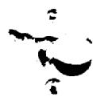

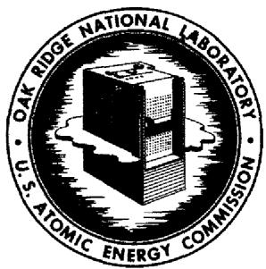

# OAK RIDGE NATIONAL LABORATORY

operated by

UNION CARBIDE CORPORATION

NUCLEAR DIVISION

for the

U.S. ATOMIC ENERGY COMMISSION

ORNL-TM-2238

1

MASTER

PROTON REACTION ANALYSIS FOR LITHIUM AND FLUORINE IN GRAPHITE,

USING A SLIT SCANNING TECHNIQUE

R. L. Macklin, J. H. Gibbons, and T. H. Handley

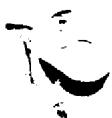

NOTICE This document contains information of a preliminary nature and was prepared primarily for internal use at the Oak Ridge National Laboratory. It is subject to revision or correction and therefore does not represent a final report.

# LEGAL NOTICE

This report was prepared as an account of Government sponsored work. Neither the United States, nor the Commission, nor any person acting on behalf of the Commission:

A. Makes any warranty or representation, expressed or implied, with respect to the accuracy, completeness, or usefulness of the information contained in this report, or that the use of any information, apparatus, method, or process disclosed in this report may not infringe privately owned rights; or   
B. Assumes any liabilities with respect to the use of, or for damages resulting from the use of any information, apparatus, method, or process disclosed in this report.

As used in the above, "person acting on behalf of the Commission" includes any employee or contractor of the Commission, or employee of such contractor, to the extent that such employee or contractor of the Commission, or employee of such contractor prepares, disseminates, or provides access to, any information pursuant to his employment or contract with the Commission, or his employment with such contractor.

Contract No. W-7405-eng-26

Physics Division

PROTON REACTION ANALYSIS FOR LITHIUM AND FLOURINE IN GRAPHITE,

USING A SLIT SCANNING TECHNIQUE

R. L. Macklin, J. H. Gibbons, and T. H. Handley

JULY 1968

OAK RIDGE NATIONAL LABORATORY

Oak Ridge, Tennessee

Operated by

UNION CARBIDE CORPORATION

for the

U.S. ATOMIC ENERGY COMMISSION

# LEGAL NOTICE

This report was prepared as an account of Government sponsored work. Neither the United States, nor the Commission, nor any person acting on behalf of the Commission:   
A. Makes any warranty or representation, expressed or implied, with respect to the accuracy, completeness, or usefulness of the information contained in this report, or that the use of any information, apparatus, method, or process disclosed in this report may not infringe privately owned rights; or   
B. Assume any liabilities with respect to the use of, or for damages resulting from the use of any information, apparatus, method, or process disclosed in this report.   
As used in the above, "person acting on behalf of the Commission" includes any employee or contractor of the Commission, or employee of such contractor, to the extent that such employee or contractor of the Commission, or employee of such contractor prepares, disseminates, or provides access to, any information pursuant to his employment or contract with the Commission, or his employment with such contractor.

#

#

# CONTENTS

Page

Abstract 1

Introduction 1

Method and Apparatus 2

Standards 3

Sample 3

Results and Discussion 3

Microscopic Examination of Sample 4

References 6

.

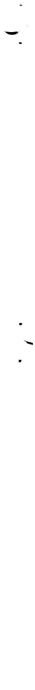

# PROTON REACTION ANALYSIS FOR LITHIUM AND FLUORINE IN GRAPHITE, USING A SLIT SCANNING TECHNIQUE

R. L. Macklin, J. H. Gibbons, and T. H. Handley

# ABSTRACT

Protons from the ORNL 3 MV Van de Graaff accelerator were brought to a line focus and collimated thru slits of either 0.025 or 0.0075 cm. Cross sectional cuts of graphite samples were moved across the beam to study the distribution of Li and F with depth by measuring the yields of neutrons and of gamma rays from the reactions $7\mathrm{Li}(\mathfrak{p},\mathfrak{n})$ and $19_{\mathrm{F}}(\mathfrak{p},\alpha \gamma)$ . A graphite sample exposed to molten fluorides in a loop experiment at the Oak Ridge Research Reactor showed about 20 and 100 ppm (by weight) Li and F respectively, 2 mm below the exposed surface. The observed ratio of Li to F was close to that characteristic of the molten salt down to 3 mm below the exposed surface.

# INTRODUCTION

The proton induced reactions $^{7}\mathrm{Li}(\mathfrak{p},\mathfrak{n})$ and $^{19}\mathrm{F}(\mathfrak{p},\alpha \gamma)$ have been used to measure the concentration of the target nuclides in graphite. This can be done in the presence of considerable radioactivity from fission products, making the method attractive for studies of penetration in graphite moderated molten salt reactors. In the previous work, the exposed surface of a sample was ground away a layer at a time and the concentrations near each freshly exposed surface measured with a 0.32 cm diameter, 0.1-1 microampere proton beam. This process required special handling for the radioactive material ground off and introduced considerable delay in the measurements.

# METHOD AND APPARATUS

The ORNL 3 MV Van de Graaff accelerator proton beam is normally focussed to a $\sim$ 1 mm diameter spot at the target with a magnetic quadrupole strong focus lens. By deliberately detuning this lens the beam can be brought to a horizontal (or vertical) line focus about 1.0 x 0.08 cm. By using several microamperes of current and a metal slit, sufficient beam could be passed through to a sample to perform the analysis over an area 0.0075 cm x 0.60 cm, or with better sensitivity (compared with background from F impurities in the slit collimator material) 0.025 cm x 0.60 cm. With this arrangement, a sample exposed in a reactor can be sectioned, cutting perpendicular to an exposed face and the distribution of $^7\mathrm{Li}$ and $^{19}_{\mathrm{F}}$ with depth studied by simply moving the sample across the proton beam. The apparatus we used for this is indicated schematically in Fig. l. The graphite sample was mounted on a micrometer head and moved in to intercept the beam. The proton beam passing the sample induced a blue fluorescence in the quartz viewing plate at the left so the point at which the edge of the sample just intercepted all of the protons could be easily noted. The profile of the beam passing through the slit was measured with a 0.005 cm Al foil glued to the end of the graphite blank. Figures 2 and 3 show the $^{27}\mathrm{Al}(\mathfrak{p},\gamma)$ yield from this foil using 0.025 cm and 0.0075 cm gold slits respectively. Slits of tantalum showed too much contamination with fluorine. The slight asymmetry of the scans is probably due to a few protons striking the exposed face of the Al foil rather than the edge as the blank sample was pulled up out of the beam.

Gamma rays were detected by a 12.5 cm dia. x 17.5 cm long NaI(Tl) crystal through a 1.25 cm lead filter at the side of the sample housing. Neutrons were detected in the straight ahead position as in reference (1). As the graphite blank sample could readily be brought into the beam to check the background without dismounting the sample, we used 2.06 MeV protons (just below the $^{9}\mathrm{Be}(\mathfrak{p},\mathfrak{n})$ threshold) throughout, rather than dropping the energy below the $^{7}\mathrm{Li}(\mathfrak{p},\mathfrak{n})$ threshold (1.88 MeV) to check background.

# STANDARDS

Pressed samples of graphite powder containing weighed quantities of $7_{\mathrm{LiF}}$ were used as standards.

# SAMPLE

The sample studied was taken from a molten salt convection loop exposed in the Oak Ridge Research Reactor (ORR) last year. The piece available for study is shown in Fig. 4 (ORNL Slide No. 74245). The straightest side shown is the wall of a molten salt exit channel sectioned axially after exposure. The proton beam was centered along this surface, as nearly parallel to it as its irregularities would permit. The reactor exposure history of the sample included over $10^{19}$ fast neutrons per square centimeter (79% of it with $^{235}\mathrm{U}$ bearing molten salt) and a cracked outlet pipe with consequent air contamination.

# RESULTS AND DISCUSSION

The homogeneity of the standards was disappointing. Scans of original and freshly cut surfaces showed considerable variability. The standard deviation at a single proton beam position appeared to be about

$35\%$ . An uncertainty of that size is indicated for the absolute scales of concentration. The standardization was, however, based on the grand average of all our measurements on the 200 ppm ( $^7$ LiF by weight) standard. Until more uniform standards are available or the cause of the observed nonuniformity is better understood, we hesitate to claim greater accuracy for the concentration scale.

The fluorine and lithium concentrations in the sample as a function of distance from the flow channel surface are shown in Figs. 5 and 6. The rapid decrease in concentration in the first ten mils or so (0.025 cm) is expected. The persistence of moderate concentrations to much greater depths is puzzling. Figure 7 shows the ratio of F to Li concentration. The ratio is persistently near the ratio characteristic of the molten salt mixture rather than that for the LiF molecule or the progressively lower values expected for free ionic diffusion. It has been suggested4 that the bulk of the material seen at depth may represent liquid phase intrusion via a slant crack. It should be noted that the promotion of graphite wetting by the air contamination experienced in the ORR Loop should make smaller cracks than usual effective in this regard.

# MICROSCOPIC EXAMINATION OF SAMPLE

The graphite sample was viewed (x 10 and x 20 magnification) with a binocular microscope. The surface is relatively quite rough, with saw markings a few thousandths of an inch deep and pock-marked with many voids several thousandths of an inch in diameter. There is evidence of at least one long groove or crack in the sample at about $20^{\circ}$ inclination to the exposed surface. The surface is also irregularly

discolored, reminiscent of differential heating effects. When wetted with acetone numerous bubbles rose to the surface, clearly implying penetration of the liquid into sub-surface voids. In short, this sample shows gross irregularities and imperfections compared to the sample taken from the MSRE that we studied earlier.1

# REFERENCES

1. R. L. Macklin, J. H. Gibbons, E. Ricci, T. Handley, and D. Cuneo, to be published in Nuclear Applications.   
2. H. G. MacPherson, Power Engineering, January, 1967, p. 2-8.   
3. Molten-Salt Reactor Program Semiannual Progress Report for Period Ending August 31, 1967. ORNL-4191, Part 15.   
4. E. G. Bohrmann, private communication.

# FIGURE CAPTIONS

Fig. 1 - Schematic side view of the scanning system. The graphite sample (from a specimen exposed to molten salts containing ${}^{7}\mathrm{Li}$ and ${}^{19}\mathrm{F}$ ) is cut so that the exposed surface is uppermost in the figure. The ${}^{7}\mathrm{Li}(\mathrm{p},\mathrm{n})$ and ${}^{19}\mathrm{F}(\mathrm{p},\alpha \gamma)$ yields indicate concentration as a function of depth as the sample is moved up across the collimated proton beam.

Fig. 2 - Proton beam profile using the .025 cm slit-collimator as measured by the $^{27}\mathrm{Al}(\mathfrak{p},\gamma)$ reaction yield from a .005 cm Al foil seen edge-on. The small random deviation of the points from the curve is largely an indication of mechanical precision and reproducibility in the experiment (about 0.0003 cm).

Fig. 3 - Proton beam profile for the .0075 cm slit-collimator measured using the .005 cm Al foil. At the left the beam is hitting clean graphite, whereas at the right it can graze tangentially the flat face of the Al foil (see Fig. 1) producing a slight tail in the composite resolution function shown.

Fig. 4 - Location and orientation of the sample cut from the 1967 ORR Loop Specimen. The molten salt flow was largely upwards through the drilled holes and channels shown in the photograph.

Fig. 5 - Fluorine concentration as a function of depth in the ORR Loop graphite sample. The data taken at two slit widths are self-consistent. The results cannot be accounted for by simple ionic diffusion and may reflect non-homogeneous structure of the graphite.

Fig. 6 - Lithium concentration as a function of depth in the ORR Loop graphite sample. The data obtained with the two slit-collimators

are self-consistent. The lithium concentration beyond 100 mils depth decreases more rapidly than expected.

Fig. 7 - Mass concentration ratio, F/Li, versus depth. The closeness of the ratio observed to that typical of the bulk salt suggests that most of the material found (at depths down to 30 mils) may represent a liquid intrusion.

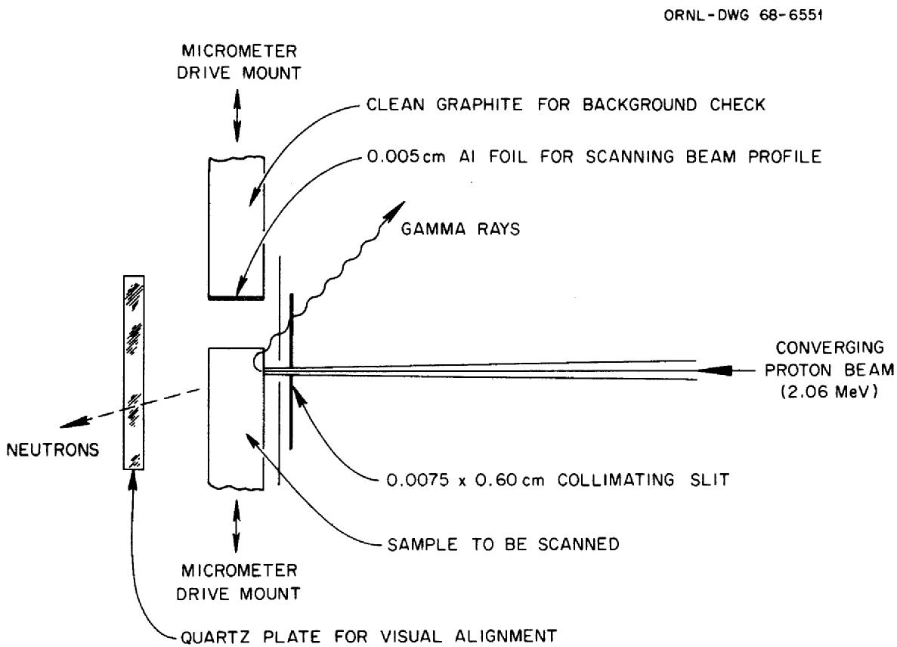  
Fig. 1

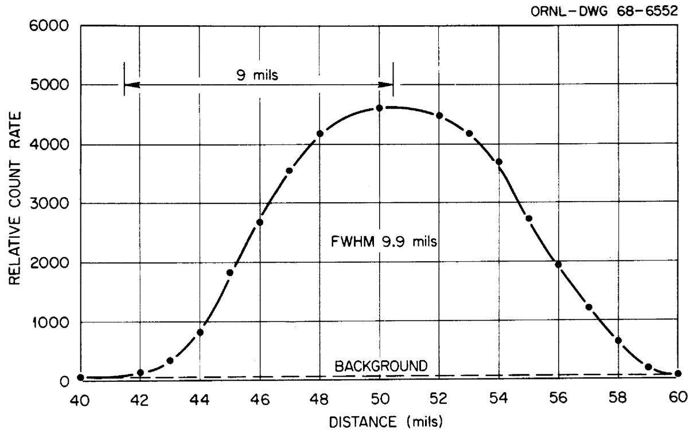  
Fig. 2

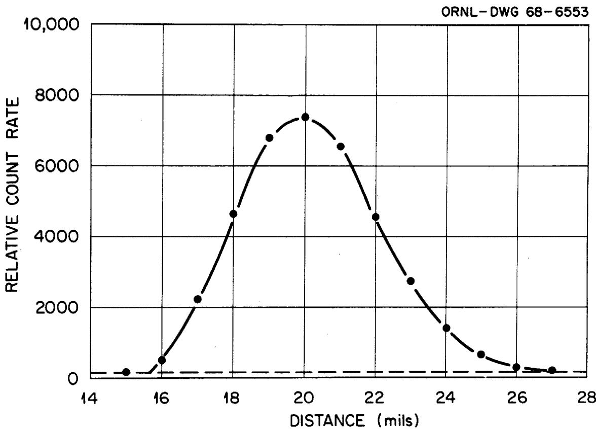  
Fig. 3

ORNL-DWG 68-6736

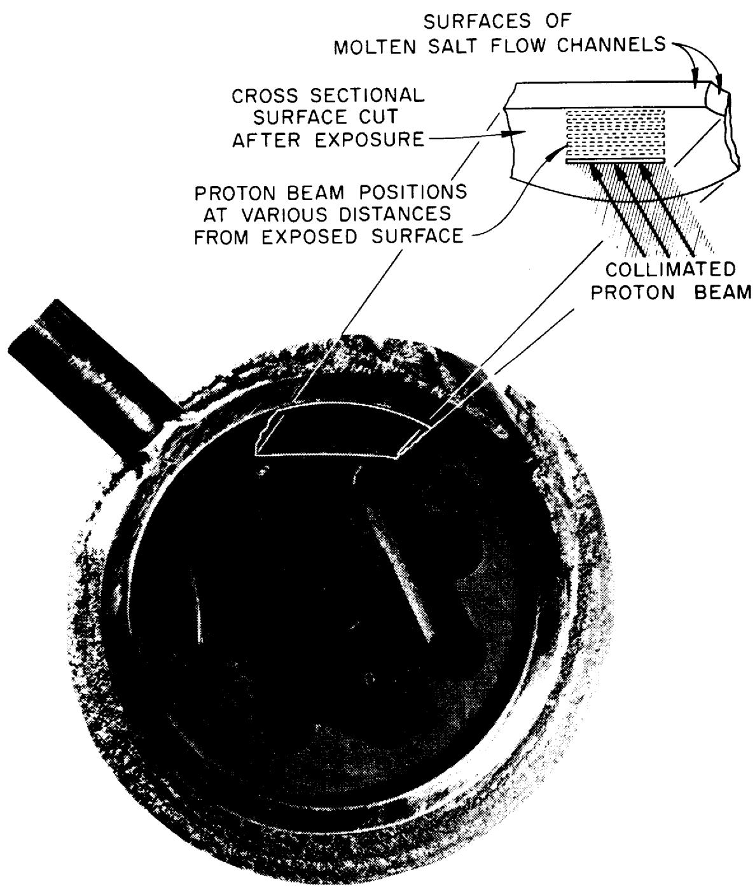  
Fig. 4

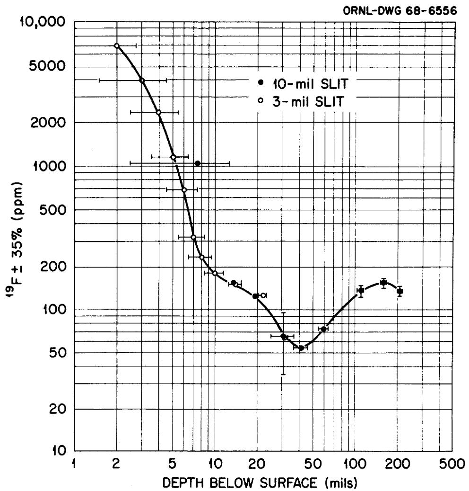  
Fig. 5

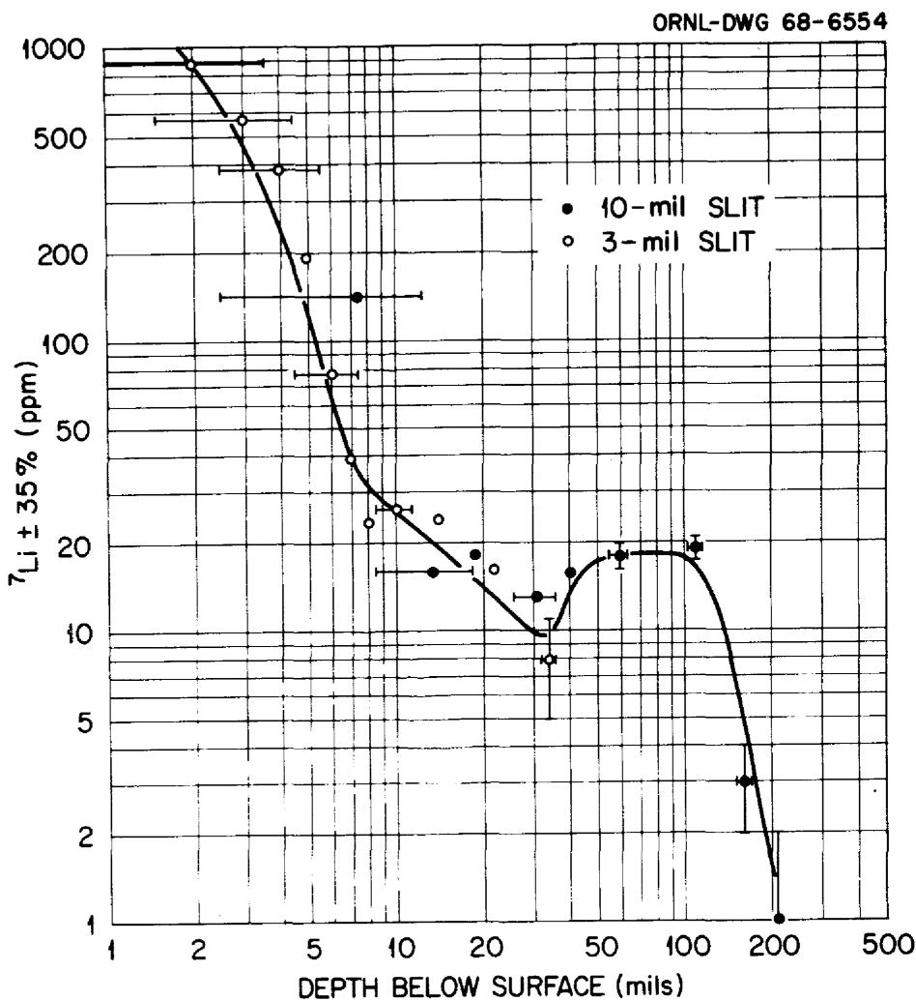  
Fig. 6

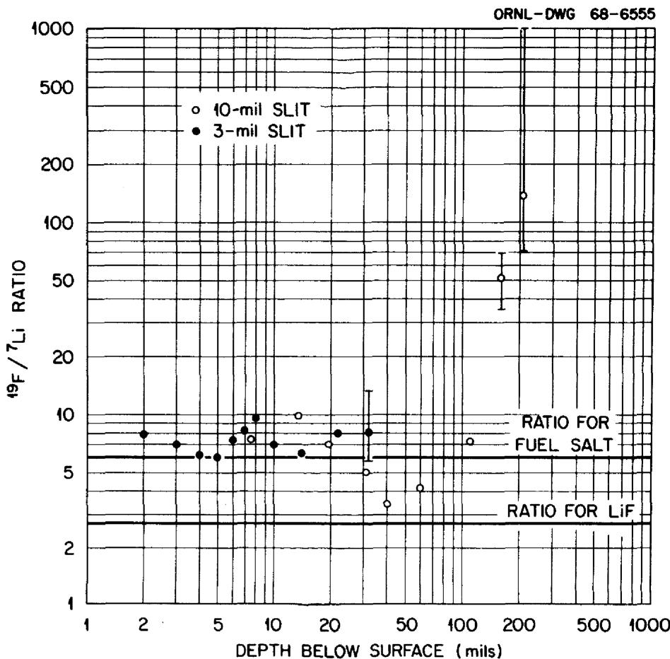  
Fig. 7

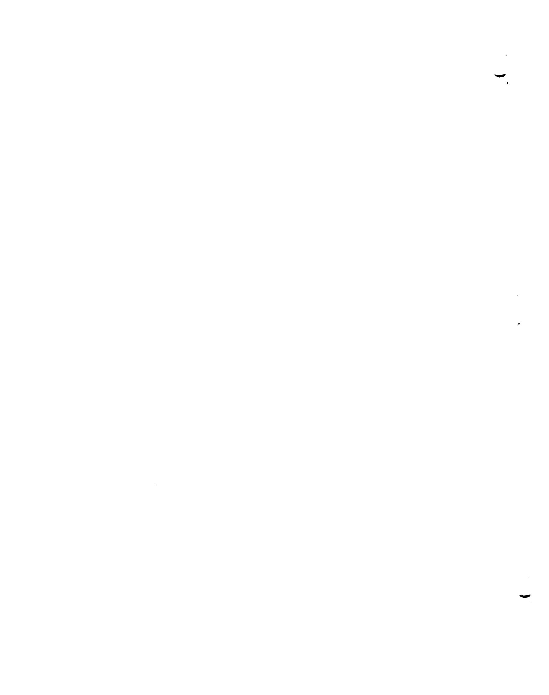

# DISTRIBUTION

1. A. M. Weinberg   
2. H. G. MacPherson   
3. E.P.Wigner   
4. G. E. Boyd   
5. J. L. Fowler   
6. E. L. Compere   
7. F. Culler   
8. L. Dresner   
9. R. B. Evans, III   
10. M. S. Wechsler   
ll. D. K. Holmes   
12. S. S. Kirslis   
13. D. R. Cuneo   
14. F. F. Blankenship   
15. W.H.Cook   
16. W. S. Lyon   
17. M. T. Kelley   
18. E. Ricci   
19. T. H. Handley   
20. E. S. Bettis   
21. E. G. Bohlmann   
22. R. B. Briggs   
23. S.J.Ditto   
24. W.P.Eatherly   
25. D. E. Ferguson   
26. W. R. Grimes   
27. A. G. Grindell   
28. P. N. Haubenreich   
29. P.R.Kasten   
30. R. E. MacPherson   
31. H. F. McDuffie   
32. H. E. McCoy   
33. R. L. Moore   
34. E. L. Nicholson   
35. L. C. Oakes   
36. A. M. Perry   
39. M. W. Rosenthal   
40. Dunlap Scott   
41. M. J. Skinner   
42. R.E.Thoma   
43. J. R. Weir   
44. M. E. Whatley   
45. J.C. White   
46. D. S. Billington

47-48. Central Research Library   
49. Document Reference Section   
50-52. Laboratory Records Department   
53. Laboratory Records, ORNL R.C.   
54. ORNL Patent Office   
55-69. DTIE   
70. Laboratory and University   
Division, ORO   
71-90. R. L. Macklin