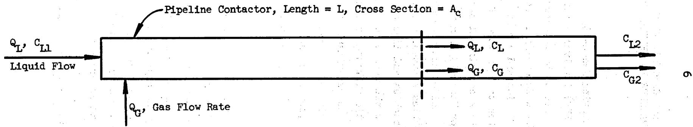
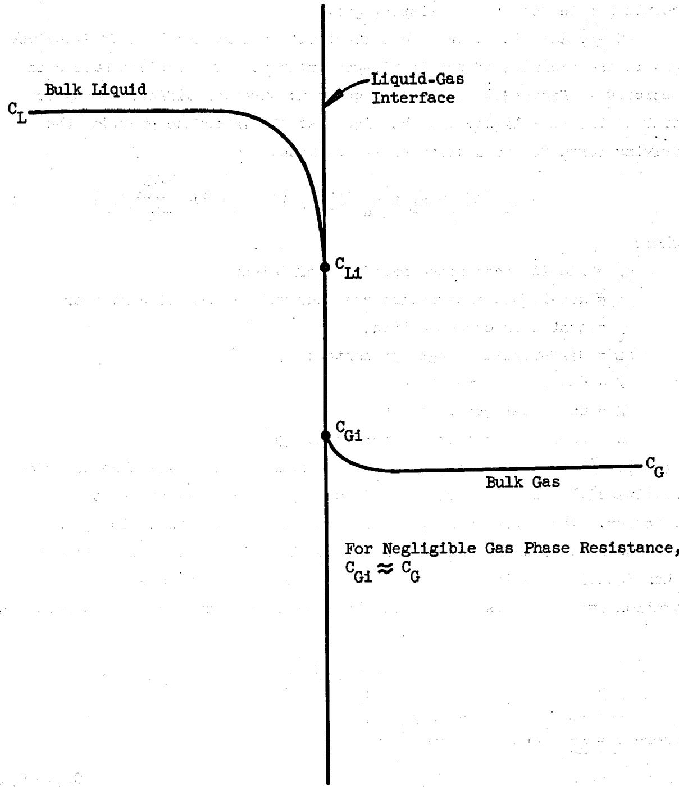
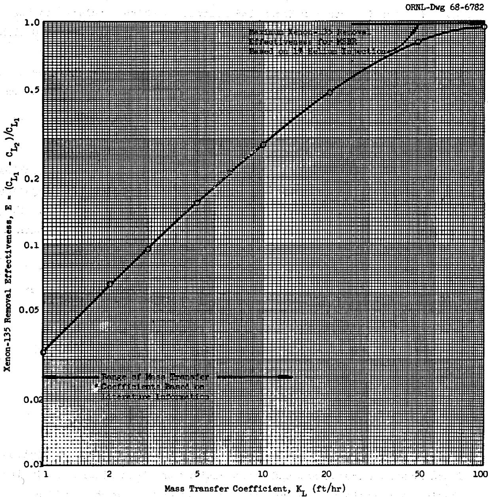
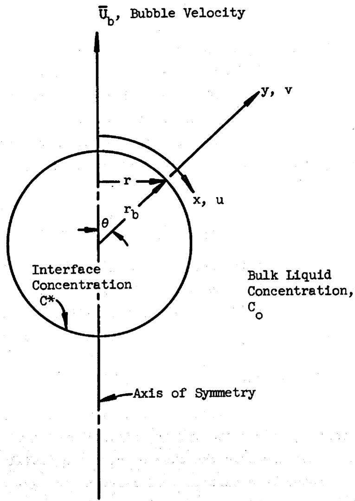
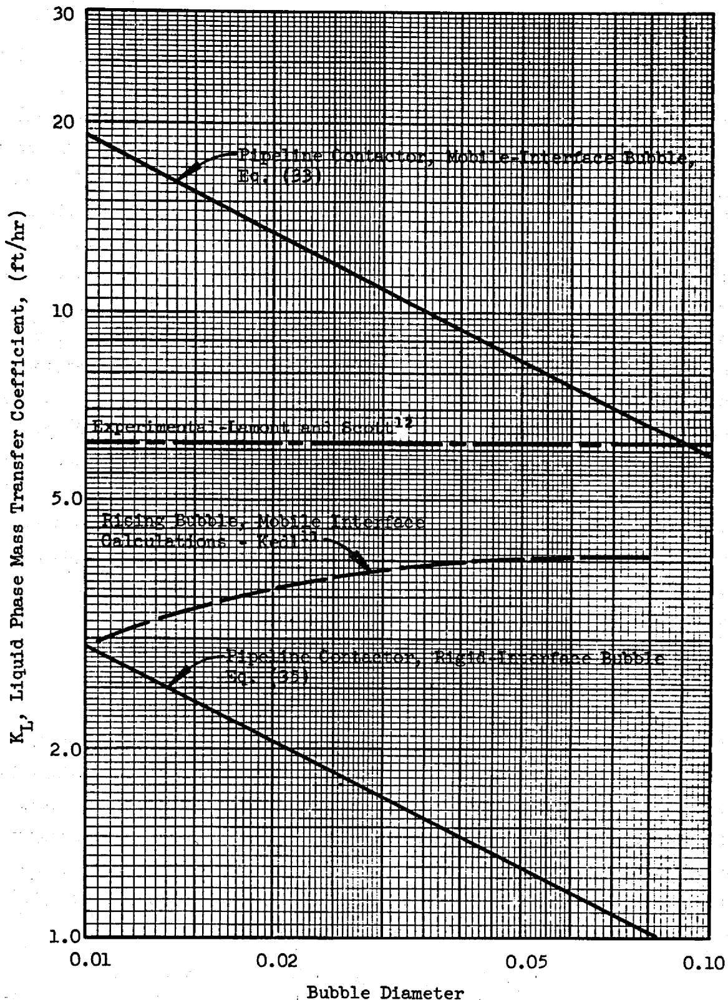
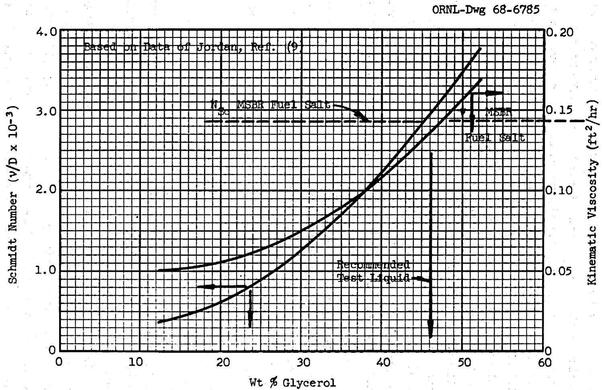
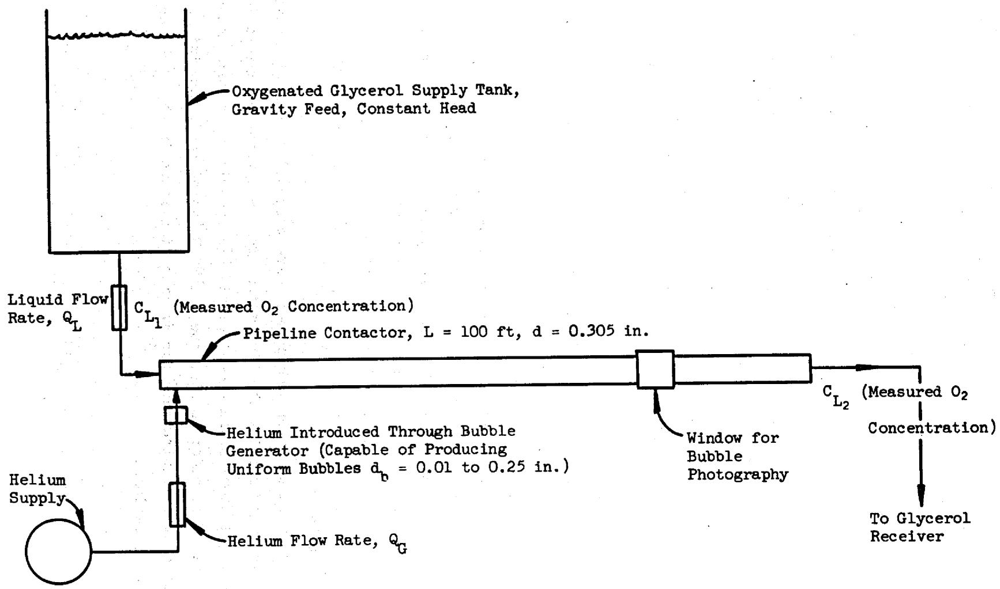
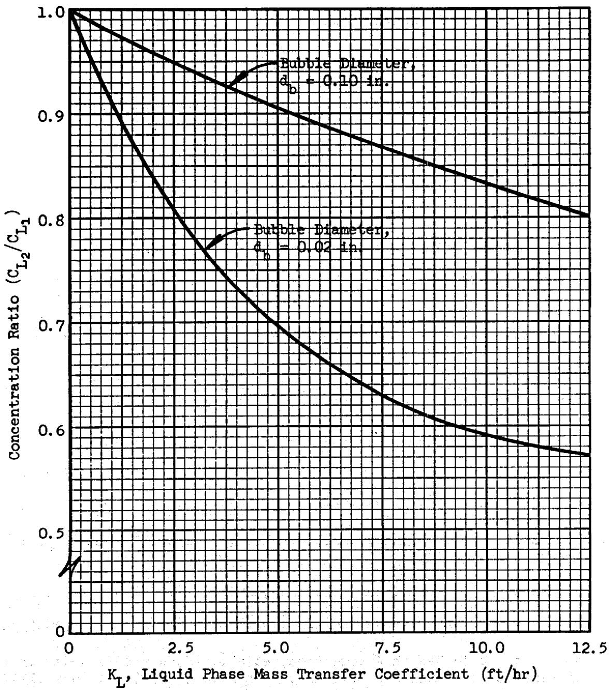

ORNL-TM-2245

COPY NO. - 86

DATE - July 23, 1968

REMOVAL OF XENON-135 FROM CIRCULATING FUEL SALT OF THE MSER BY MASS TRANSFER TO HELIUM BUBBLES

F. N. Peebles

# ABSTRACT

Removal of dissolved Xenon-135 by mass transfer to helium bubbles offers an attractive means of controlling the Xenon-135 poison level in molten salt breeder reactors (MSBR's). In order to provide necessary engineering information for evaluation of the proposed method, the existing data on rates of mass transfer to gas bubbles have been reviewed.

Rather extensive literature references point to reliable equations for prediction of mass transfer rates to single bubbles rising in stationary liquids under the two extreme cases of a rigid bubble interface and of a perfectly mobile bubble interface. In general, experimental data are available which support these predictions. No reliable criterion for predicting the transition from one type behavior to another is available.

An elementary analysis of the rates of mass transfer to bubbles carried along by turbulent liquid in a pipe is presented. The results indicate that the bubble mass transfer coefficient for 0.02 in. diameter bubbles will be approximately 13 ft/hr for mobile-interface bubbles, and approximately 2 ft/hr for rigid-interface bubbles. An experiment is suggested to provide specific data on the mass transfer rates to bubbles carried along by turbulent liquid in a pipe for hydrodynamic conditions which simulate the MSBR.

# LEGAL NOTICE

This report was prepared as an account of Government sponsored work. Neither the United States, nor the Commission, nor any person acting on behalf of the Commission:

A. Makes any warranty or representation, expressed or implied, with respect to the accuracy, completeness, or usefulness of the information contained in this report, or that the use of any information, apparatus, method, or process disclosed in this report may not infringe privately owned rights; or   
B. Assumes any liabilities with respect to the use of, or for damages resulting from the use of any information, apparatus, method, or process disclosed in this report.

As used in the above, "person acting on behalf of the Commission" includes any employee or contractor of the Commission, or employee of such contractor, to the extent that such employee or contractor of the Commission, or employee of such contractor prepares, disseminates, or provides access to, any information pursuant to his employment or contract with the Commission, or his employment with such contractor.

# CONTENTS

# Abstract 1

1.0 Introduction 5   
2.0 Mass Transfer Theory 5

2.1 Mass Transfer Coefficients for Spherical Bubbles 9

Rigid Interface Case 13

Mobile Interface Case 14

2.2 Experimental Data on Mass Transfer Coefficients 17 to Single Bubbles   
2.3 Mass Transfer Coefficients for Bubbles Carried Along by Turbulent Liquid 20

3.0 Proposed Mass Transfer Experiment to Simulate MSBR 25 Contact Conditions   
4.0 Conclusions 301

# References Cited 32

# LEGAL NOTICE

This report was prepared as an account of Government sponsored work. Neither the United States, nor the Commission, nor any person acting on behalf of the Commission:   
A. Makes any warranty or representation, expressed or implied, with respect to the accuracy, completeness, or usefulness of the information contained in this report, or that the use of any information, apparatus, method, or process disclosed in this report may not infringe privately owned rights; or   
B. Assumes any liabilities with respect to the use of, or for damages resulting from the use of any information, apparatus, method, or process disclosed in this report.   
As used in the above, "person acting on behalf of the Commission" includes any employee or contractor of the Commission, or employee of such contractor, to the extent that such employee or contractor of the Commission, or employee of such contractor prepares, disseminates, or provides access to, any information pursuant to his employment or contract with the Commission, or his employment with such contractor.

1 24   
1 1 1   
1 1 1   
1 1 1

i

（）

a

，

$\therefore {a}_{n} = \frac{1}{2} + \frac{1}{3} + \cdots  + \frac{1}{n + 1} + \frac{1}{n + 2} + \cdots  + \frac{1}{n + 1}$

十、请在“同意”栏下划“√”，选择“同意”投票。

，

1. $\left( {x - 2}\right) \left( {x + 3}\right)  = 0$

1

# REMOVAL OF XENON-135 FROM CIRCULATING FUEL SALT OF THE MSBR BY MASS TRANSFER TO HELIUM BUBBLES

# 1.0 Introduction

A proposed method10 of removing Xenon-135 from the fuel salt in the Molten Salt Breeder Reactor (MSBR) involves circulation of helium bubbles with the liquid fuel. Bubbles are to be injected into the flowing stream near the pump, and then dissolved Xenon-135 is removed from the liquid by mass transfer (combined diffusion and convection) into the bubbles. The circulating bubbles are then to be removed from the liquid at the outlet of the heat exchanger by a centrifugal separator.

Although the potential for Xenon-135 removal by mass transfer to helium bubbles is high, the actual effectiveness of removal is controlled by the surface area of the bubbles exposed to the liquid and the mass transfer coefficient between bubbles and liquid flowing cocurrently in a pipe. This report deals with the bubble mass transfer rate expected under the MSBR operating conditions, based on the information available in the literature, and a proposed experiment to provide additional data. The experiment involves simulation of the reactor flow and mass transfer conditions through use of a glycerine solution as the liquid, oxygen as the solute gas, and helium as the stripping medium.

# 2.0 Mass Transfer Theory

The essential features of the mass transfer situation of interest is shown in Figure 1. Liquid flowing along a pipe at the rate $Q_{L}$ enters the system with dissolved concentration, $C_{L1}$ , and the inlet stripping gas at a flow rate, $Q_{G}$ , is injected into the liquid. As the liquid and gas streams move cocurrently along the pipe the dissolved gas content of the liquid is reduced to the exit concentration, $C_{L2}$ .

For a steady state system, conservation of the dissolved gas requires that the concentration change in accord with

$$
\mathrm {q} _ {\mathrm {L}} \left(\mathrm {c} _ {\mathrm {L} 1} - \mathrm {c} _ {\mathrm {L}}\right) = \mathrm {q} _ {\mathrm {G}} \mathrm {c} _ {\mathrm {G}}, \tag {1}
$$

ORNL-Dwg 68-6780

  
Fig. 1. Flow Diagram for Pipeline Contactor.

where $C_G$ represents the local concentration of the solute gas in the bulk bubble stream. Equation (1) is based on the case of negligible solute gas in the inlet stripping gas.

At any location along the contactor, the concentration of dissolved gas in the vicinity of the liquid-gas interface of a typical bubble is depicted in Figure 2. The solute gas concentration difference between that of the bulk liquid and the liquid at the interface provides the driving force for mass transfer at the rate,

$$
- Q _ {L} \quad d c _ {L} = K _ {L} a A _ {C} d L \left[ c _ {L} \left(1 + \frac {R T Q _ {L}}{H Q _ {G}}\right) - \frac {R T Q _ {L}}{H Q _ {G}} c _ {L l} \right] \tag {2}
$$

where

$$
\begin{array}{l} K _ {L} = \text {l i q u i d p h a s e m a s s t r a n s f e r c o e f f i c i e n t}, \\ a = \text {g a s - l i q u i d} \\ \end{array}
$$

$$
\begin{array}{l} A _ {C} = \text {c o n t a c t o r} \\ d L = d i f f e r e n t i a l \quad l e n g t h o f c o n t a c t o r, \\ T = \text {a b s o l u t e} \\ R = \text {u n i v e r s a l} \\ H = H e n r y ^ {\prime} s \text {l a w c o n s t a n t f o r s o l u t e g a s}. \\ \end{array}
$$

Equation (2) results from the classic assumption of negligible interfacial resistance, and the assumption of small gas-phase resistance to mass transfer. The latter assumption is an approximation which is appropriate for the case of a gas having a low solubility in the liquid of interest. When Equation (2) is integrated to give the change in solute gas concentration over the total length of the liquid-gas contactor, it is found that

$$
\frac {C _ {L 2}}{C _ {L l}} = \frac {\alpha + e ^ {- \beta}}{1 + \alpha} \tag {3}
$$

where $\alpha = \frac{\mathrm{RTQ_L}}{\mathrm{HQ_G}}$ and $\beta = \frac{\mathrm{K_L a A_C^L(1 + \alpha)}}{\mathrm{Q_L}}$ .

If the effectiveness for solute gas removal is expressed as $E = \frac{C_{L1} - C_{L2}}{C_{L1}}$ , then for a given mass transfer system the effectiveness for solute removal is given by

$$
E = \frac {1 - e ^ {- \beta}}{1 + \alpha}. \tag {4}
$$

ORNL-Dwg 68-6781

  
Fig. 2. Concentration Profiles Near Interface.

The maximum value of $E$ is for a liquid-gas contactor of infinite volume, or infinite mass transfer coefficient, and is $E_{\text{Max}} = \frac{l}{1 + \alpha}$ .

Figure 3 shows a plot of the Xenon-135 removal effectiveness as a function of liquid phase mass transfer coefficient for the MSBR operating conditions and helium bubbles 0.02 in. diameter. The plot illustrates that the effectiveness for Xenon-135 removal is sharply related to the liquid phase mass transfer coefficient in the range of $1 < \mathrm{K}_{\mathrm{L}} < 100 \, \mathrm{ft/hr}$ . Kedl11 has shown that the Xenon-135 poison fraction in the MSBR is influenced in an important way by the bubble stripping effectiveness, and hence successful reactor analysis and design for the MSBR depends on rather accurate knowledge of the bubble mass transfer coefficient.

# 2.1 Mass Transfer Coefficients for Spherical Bubbles

Previous studies on mass transfer to and from spherical gas bubbles have been extensive, including analytical and experimental investigations. A brief summary of the important results is given in this section. First, a description of the pertinent analytical model is presented and then a summary of the most recent experimental findings is given.

Figure 4 shows the model situation of a spherical bubble of radius, $\mathbf{r_b}$ , imbedded in a stationary liquid. The bubble moves with a velocity $\overline{\mathbf{U}}_{\mathrm{b}}$ relative to the liquid. For the case of an inert gas bubble removing a solute gas from a liquid, the appropriate diffusion equation is:

$$
u \frac {\partial C}{\partial x} + v \frac {\partial C}{\partial y} = D \frac {\partial^ {2} C}{\partial y ^ {2}}, \tag {5}
$$

where $u, v =$ velocity components in the $x$ and $y$ directions.

$C =$ local concentration of solute gas in the liquid,

D = mass diffusivity for the solute gas in the liquid.

The velocity components $u$ and $v$ are generally available from a solution of the momentum equations, and would satisfy the bulk liquid continuity relation for points in the immediate vicinity of the bubble surface

$$
\frac {\partial (\mathrm {u r})}{\partial \mathrm {x}} + \frac {\partial (\mathrm {v r})}{\partial \mathrm {y}} = 0, \tag {6}
$$

where $r$ is the radial distance from a point on the bubble surface to the axis of symmetry. Emphasis is placed on the immediate vicinity of the

  
Fig. 3. Xenon-135 Removal Effectiveness as a Function of Liquid Phase Mass Transfer Coefficient.

ORNL-Dwg 68-6783

  
Fig. 4. Coordinates for Thin Region Near Spherical Bubble Surface.

bubble surface because the region of important concentration variation is expected to be thin, and even thinner than the region of significant velocity variations. Thus for such a situation it is reasonable to represent the velocity in the immediate vicinity of the bubble surface as

$$
u = u _ {s} + u _ {s} ^ {\prime} y. \tag {7}
$$

The term $u_{s}$ is the velocity component in the $x$ -direction at the surface of the sphere, possibly non-zero since the sphere is fluid, and $u_{s}'$ is the derivative of the $x$ -component of the velocity with respect to the normal coordinate, $y$ , and evaluated at the bubble surface.

The tangential velocity component can be determined by integrating the continuity equation after making use of Equation (7). Thus it is found that

$$
v = - \frac {1}{r} \frac {\partial}{\partial x} \left[ r \left(u _ {s} y + u ^ {\prime} _ {s} y ^ {2} / 2\right) \right]. \tag {8}
$$

In this formulation, it is recognized that $u_{s}$ and $u_{s}'$ are functions of the position along the bubble surface in the $x$ -direction.

Upon use of Equations (7) and (8) in the diffusion equation, we find that the solute gas concentration must satisfy the relation:

$$
\left(u _ {s} + u ^ {\prime} _ {s} y\right) \frac {\partial C}{\partial x} - \frac {1}{r} \frac {\partial}{\partial x} \left[ r \left(u _ {s} y + u ^ {\prime} _ {s} y ^ {2} / 2\right) \right] \frac {\partial C}{\partial y} = D \frac {\partial^ {2} C}{\partial y ^ {2}}. \tag {9}
$$

Rather than proceeding with a general discussion of this equation, we now consider two limiting cases; namely, the situation of a rigid interface with $u_{s}$ equal to zero, and secondly the case of zero tangential stress at the interface. The latter case certainly is relevant for gas bubbles in a liquid such that the liquid viscosity is many times that of the gas viscosity. That the rigid interface situation is also relevant constitutes somewhat of a paradox, but it is known that small gas bubbles do behave to some extent as rigid spheres.

# Rigid Interface Case.

The appropriate modification of Equation (9) expressed in non-dimensional variables is:

$$
u ^ {\prime} _ {s 1} y _ {1} \frac {\partial C _ {1}}{\partial x _ {1}} - \frac {1}{r _ {1}} \frac {\partial}{\partial x _ {1}} \left[ \frac {r _ {1} u ^ {\prime} _ {s 1} y _ {1} ^ {2}}{2} \right] \frac {\partial C _ {1}}{\partial y _ {1}} = \frac {2}{N _ {P e}} \frac {\partial^ {2} C _ {1}}{\partial y _ {1} ^ {2}}, \tag {10}
$$

where

$$
x _ {1} = \frac {x}{r _ {b}}, y _ {1} = \frac {y}{r _ {b}}, u _ {s 1} ^ {\prime} = \frac {u _ {s} ^ {\prime}}{\overline {{U}} _ {b} / r _ {b}},
$$

$$
r _ {1} = \frac {r}{r _ {b}}, c _ {1} = \frac {c - c _ {o}}{c ^ {*} - c _ {o}}, N _ {P e} = \frac {2 r _ {b} \bar {U} _ {b}}{D},
$$

$C_{0} =$ solute gas concentration in bulk liquid,

$C^{\#} =$ solute gas concentration in interface liquid.

If we now define new position variables and restrict our attention to the bubble interface region, Equation (10) reduces to

$$
n \frac {\partial C _ {1}}{\partial \phi} = \frac {\partial^ {2} C _ {1}}{\partial n ^ {2}}, \tag {11}
$$

where $\eta = (r_{1}u_{s1}')^{1 / 2}y_{1},$

$$
d \phi = \frac {2 \left(u _ {s 1} ^ {\prime} r _ {1}\right) ^ {3 / 2}}{N _ {P e} u _ {s 1} ^ {\prime}} d x _ {1}.
$$

Equation (11) can be expressed as an ordinary differential equation in terms of a similarity variable, $\zeta = n / (9\phi)^{1/3}$ ; thus

$$
\frac {d ^ {2} c _ {1}}{d \zeta^ {2}} + 3 \zeta^ {2} \frac {d c _ {1}}{d \zeta} = 0 \tag {12}
$$

with $C_1 = 1$ at $\zeta = 0$ , $C_1 = 0$ at $\zeta = \infty$ .

The integration of Equation (12) can be carried out in a straightforward way and then the result used to obtain the mass transfer rate expressed in terms of the Sherwood number, $\frac{2r_bK_L}{D}$ :

$$
N _ {S h} = 0. 6 4 1 N _ {P e} ^ {1 / 3} \left[ \int_ {o} ^ {\pi} \left(u _ {s 1} ^ {\prime} r _ {1}\right) ^ {1 / 2} r _ {1} d x _ {1} \right] ^ {2 / 3} \tag {13}
$$

as reported by Baird and Hamilec, $^{1}$ and Lochiel and Calderbank. $^{13}$

It should be noted that the result given by Equation (13) is general. The specific value of the mass transfer number depends on the nature of the relative motion between the bubble and the surrounding liquid. Table I gives results for $u_{sl}^{\prime}$ at very low and large Reynolds number flow regimes and the final expressions for the Sherwood number for these regimes, based on the use of Equation (13).

# Mobile Interface Case

At least for bubbles having diameters greater than a few millimeters, the surface condition is more reasonably expressed as being one of negligible tangential stress and having a non-zero tangential velocity; a mobile interface. Thus for this situation the appropriate diffusion equation, as obtained from Equation (9), is:

$$
u _ {s 1} \frac {\partial c _ {1}}{\partial x _ {1}} - \frac {1}{r _ {1}} [ u _ {s 1} r _ {1} y _ {1} ] \frac {\partial c _ {1}}{\partial y _ {1}} = \frac {2}{N _ {P e}} \frac {\partial^ {2} c _ {1}}{\partial y _ {1} ^ {2}} \tag {14}
$$

where $u_{sl}$ is the non-dimensional tangential velocity at the bubble interface $(u_{sl} = \frac{u_s}{\overline{U_b} / r_b})$ . Again, when new position variables are used and we restrict attention to the immediate vicinity of the bubble interface, Equation (14) is reduced to a simpler expression:

$$
\frac {\partial C _ {1}}{\partial \beta} = \frac {\partial^ {2} C _ {1}}{\partial \sigma^ {2}}, \tag {15}
$$

where $\sigma = u_{s1}r_1y_1,$

$$
d \beta = \frac {2 \left(u _ {s l} r _ {l}\right) ^ {2}}{N _ {P e} u _ {s l}} d x _ {1}.
$$

TABLEI   
ANALYTICAL RESULTS FOR MASS TRANSFER RATES TO SINGLE GAS BUBBLES   

<table><tr><td>Flow Regime</td><td>Interface Condition</td><td>Sherwood Number</td><td>References</td></tr><tr><td colspan="4">Case I: Rigid Interface</td></tr><tr><td>Creeping Flow
NRe&lt;1</td><td>u sl=0&gt;
u&#x27;sl=3/2sin θ</td><td>NSh=0.99 N1/3Pe</td><td>1,13</td></tr><tr><td>Laminar Boundary Layer
NRe&gt;&gt;1</td><td>u sl=0
u&#x27;sl=(6a sin θ)/δ
δ = boundary layer thickness</td><td>NSh=0.84 N1/6 Re NPe 1/3</td><td>13</td></tr><tr><td colspan="4">Case II: Mobile Interface</td></tr><tr><td>Creeping Flow
NRe&lt;1</td><td>u sl=sin θ/2
u&#x27;sl=0</td><td>NSh=0.65 N1/2Pe</td><td>1,13</td></tr><tr><td>Potential Flow
NRe&gt;&gt;1</td><td>u sl=3/2sin θ
u&#x27;sl=0</td><td>NSh=1.13 N1/2Pe</td><td>3,13</td></tr></table>

Equation (15) has a similarity solution in terms of the variable $\xi = \sigma / 2\beta^{1/2}$ which satisfies the ordinary differential equation

$$
\frac {d ^ {2} C _ {1}}{d \xi^ {2}} + 2 \xi \frac {d C _ {1}}{d \xi} = 0 \tag {16}
$$

with $C_1 = 1$ at $\xi = 0$ and $C_1 = 0$ at $\xi = \infty$ . Lochiel and Calderbank give the solution for the concentration function as:

$$
c _ {1} = 1 - \frac {2}{\sqrt {\pi}} \int_ {0} ^ {\xi} e ^ {- \xi^ {2}} d \xi . \tag {17}
$$

The concentration gradient at the bubble interface can be obtained from Equation (17) and the average mass transfer rate to the bubble can be evaluated. The result in terms of the Sherwood mass transfer number,

$$
N _ {S h} = 2 r _ {b} K _ {L} / D i s:
$$

$$
N _ {S h} = \frac {2}{\sqrt {\pi}} \left[ \int_ {0} ^ {\pi} u _ {s 1} r _ {1} ^ {2} d x _ {1} \right] ^ {1 / 2} N _ {P e} ^ {1 / 2}. \tag {18}
$$

Table I also includes results from the literature which deal with the mobile interface situation. It is important to note that the mobile interface results show that the mass transfer coefficient, expressed as the non-dimensional Sherwood number $(\mathrm{K_Ld_b / D})$ , varies with the Peclet number $(\mathrm{d_b}\overline{\mathrm{U}}_{\mathrm{b}} / \mathrm{D})$ raised to the one-half power. In the case of the rigid interface bubble the Sherwood number varies with the Peclet number raised to the one-third power. The higher power on the Peclet number gives rise to significantly higher mass transfer coefficients for the xenon-135, fuel salt system if the mobile interface bubble case is applicable.

The analytical results given in Table I agree in general with those obtained by other investigators. In 1935 Higbie7 made an important contribution to the mass transfer literature in his analysis of the rate of gas absorption from bubbles rising in liquids. The analysis was based on a mobile interface model and the assumption that the liquid surrounding a bubble is continuously replenished with fresh liquid as it rises through a liquid pool. A solution of the time dependent diffusion equation

was obtained which can be expressed as:

$$
N _ {S h} = \frac {2}{\pi^ {1 / 2}} \left[ \frac {d _ {b} ^ {2}}{D t _ {e}} \right] ^ {1 / 2} \tag {19}
$$

where $t_e$ is the exposure time of the bubble to a given liquid envelope. Then on the assumption that the liquid exposed to the liquis is renewed each time that the bubble moves through a height equal to the bubble diameter, equation (19) is equivalent to:

$$
N _ {S h} = 1. 1 3 N _ {P e} ^ {1 / 2} \tag {20}
$$

Thus Higbie's result is identical to the mobile-interface equation of Boussinesq.3

Ruckenstein16 has also considered mass transfer between spherical bubbles and liquids by solving the mass convection equations for various hydrodynamic situations. In essence his development follows that presented here and the results for the extreme cases of the rigid interface and the mobile interface agree rather well with the equations given in Table I. In particular Ruckenstein found

$$
N _ {S h} = 1. 0 4 N _ {P e} ^ {1 / 3}, \text {r i g i d i n t e r f a c e ,} N _ {R e} <   1, \tag {21}
$$

and

$$
N _ {S h} = 1. 1 0 N _ {P e} ^ {1 / 2}, \text {m o b i l e i n t e r f a c e ,} N _ {R e} <   1. \tag {22}
$$

The constant in Equation (22) for the mobile-interface bubble at low Reynolds numbers differs significantly from the corresponding equation of Lochiel and Calderbank.[13]

# 2.2 Experimental Data on Mass Transfer Coefficients to Single Bubbles

Rather comprehensive surveys of the experimental data on mass transfer coefficients for gas bubbles have been reported in the literature4,5,13,14. No attempt will be made to give detailed results, however, data from these references indicate that gas bubbles of diameter less than 2 millimeters behave as rigid interface particles, and that gas bubbles of diameter greater than 2 to 3 millimeters seem to behave as mobile-

interface particles, as shown by their fluid drag and mass transfer characteristics.

Scott and Hayduk17 carried out pipeline contactor experiments with various liquids using carbon dioxide and helium as solute gases. The experimental variables covered in the mass transfer tests were:

Liquid superficial velocity 0.5 to 3.6 ft/sec

Liquid phase diffusivity 0.14 x 10-5 to 4.8 x 10-5 cm²/sec

Gas-liquid interfacial tension 23.4 to 73.5 dynes/cm

Liquid viscosity 0.6 to 26.5 centipoise

Tube diameter 1.23 to 2.50 cm

An empirical correlation equation which described their results is:

$$
K _ {L} a = \frac {0.0068 \bar {V} _ {\ell} \phi^ {0.744} \sigma^ {0.511} \mu 0.088 D ^ {0.390}}{d ^ {1.88}} \pm 15 \% \tag{23}
$$

where

$$
\begin{array}{l} K _ {L} a = \text {m a s s t r a n s f e r c o e f f i c i e n t (f t / s e c)} \frac {\mathrm {f t} ^ {2} \text {b u b b l e s u r f a c e}}{\mathrm {f t} ^ {3} \text {c o n t a c t o r c o l u m e}} \\ \overline {{v}} _ {l} = \text {l i q u i d v e l o c i t y i n p i l e n e i n c o n t a c t o r , f t / s e c .} \\ \sigma = \text {l i q u i d} \\ \mu = \text {l i q u i d} \\ D = \text {l i q u i d p h a s e} \quad \mathrm {c m} ^ {2} / \sec x 1 0 ^ {5}, \\ d = \text {p i p e} \\ \phi = \text {v o l u m e} \\ \end{array}
$$

Use of the MSBR heat exchanger flow data and physical properties of the MSBR fuel salt in Equation (23) gives $\underline{\mathrm{K}}_{\mathrm{f}} \mathrm{e} = 2 / 7 \, \mathrm{hr}^{-1}$ . If one assumes a bubble surface area of 3000 ft² (0.02 in diameter bubbles) dispersed over the 83 ft³ of fuel system, this result is equivalent to a mass transfer coefficient of 7.7 ft/hr.

Lamont and Scott $^{12}$ also reported experimental studies on the pipeline contacting of carbon dioxide bubbles and water under cocurrent flow conditions. Experimental variables covered in the mass transfer tests were:

LiquidReynoldsnumbers 1800-22,400

Bubble diameter 0.22 - 0.55 cm

Tube diameter 0.793 cm.

An empirical correlation equation which fits their data is:

$$
\mathrm {K} _ {\mathrm {L}} = 0.030 \mathrm {N} _ {\mathrm {Re}} ^ {0.49} (\pm 18 \%) \tag{24}
$$

where

$$
K _ {L} = \text {m a s s t r a n s f e r c o e f f i c i e n t (c m / m i n)},
$$

$$
N _ {R e} = l i q u i d p h a s e R e y n o l d s n u m b e r, d V \rho / \mu
$$

If one assumes a reasonable non-dimensional form consistent with Equation (24) and makes use of the physical properties of the carbon dioxide-water system, the reported correlation equation may more properly be written as:

$$
\frac {K _ {L} d}{D} = 1. 0 2 N _ {R e} ^ {0. 4 9} N _ {S c} ^ {0. 5}, \tag {25}
$$

where

$$
N _ {S c} = \text {S c h m i d t n u m b e r}, (\mu / \rho_ {1} D)
$$

$$
\frac {K _ {L} d}{D} = \text {P i l e n i n e S h e r w o o d n u m b e r}.
$$

It is then found that for the MSBR fuel salt Equation (25) gives a mass transfer coefficient $\underline{\mathrm{K}} = 6.1\mathrm{ft / hr}$ .

Various authors19,20 have cited the influence of surfactants, which accumulate in the gas bubble interface, on the motion of gas bubbles. In particular, it is found that such interface contamination brings about "solidification" or "rigidity" of the gas-liquid interface. Under the conditions of a rigid interface due to presence of surfactants in the interface bubbles, follow the well-known Stokes drag relation

$$
C _ {D} = \frac {2 4}{N _ {R e}}
$$

at low Reynolds numbers, while under conditions of a clean interface the bubbles show a drag behavior represented by

$$
C _ {D} = \frac {1 6}{N _ {R e}}
$$

at low Reynolds numbers.

As pointed out earlier in this paper the "solidification" of the gas bubble interface would bring about a reduction in the rate of mass transfer to a gas bubble interface. Griffith19 has shown specific evidence of this effect in citing the results on the reduction in solution rates of oxygen bubbles as surface active matter is adsorbed at the bubble interface.

Haberman and Morton $^{21}$ also found that surface contamination of gas bubbles can influence the motion of gas bubbles at larger Reynolds numbers, i.e., $\mathbb{N}_{\mathrm{Re}} \approx 100$ to 500. Their observed increase in gas bubble drag coefficient under conditions of interface "solidification," considering the theoretical mass transfer results presented previously, suggests that low mass transfer rates to bubble interfaces should prevail under these conditions.

2.3 Mass Transfer Coefficients for Bubbles Carried Along by Turbulent Liquid

The previous discussion of the mass transfer theory for gas bubbles moving in a stationary liquid dealt with steady flows, and the results are most appropriately applied to the cases of freely rising bubbles or uniform flow of liquid past a bubble. In the MSBR injected helium bubbles would be carried along by fuel salt flowing in a state of turbulent motion. The Reynolds number based on the heat exchanger tube diameter and bulk velocity is expected to be about 8000. The following discussion of the mass transfer for bubbles carried along by a turbulent liquid indicates the approximate magnitudes of mass transfer coefficients for this situation.

Hinze has treated the case of relative motion between a small gas bubble and a turbulent liquid, and for the limiting case of large inertia forces in comparison to viscous forces he found that the bubble velocity fluctuates with a larger amplitude than the surrounding turbulent liquid; namely

$$
\sqrt {v _ {b} ^ {\prime 2}} = \sqrt {v _ {l} ^ {\prime 2}} \tag {26}
$$

where $\sqrt{V_{b}^{'2}}$ and $\sqrt{V_{\ell}^{'}2}$ are r.m.s. values of the instantaneous bubble and liquid velocities, respectively, for the turbulent motion. Equation (26) in essence results from integration of the equation for the fluctuating motion of the gas bubble:

$$
\overline {{V _ {b}}} \left(\rho_ {b} + k \rho_ {\ell}\right) \frac {d V _ {b} ^ {\prime}}{d t} = \overline {{V}} _ {b} \rho_ {\ell} (1 + k) \frac {d V _ {\ell} ^ {\prime}}{d t} \tag {27}
$$

where $\overline{V_{\mathbf{b}}} =$ bubble volume

$$
\rho_ {b}, \rho_ {l} = \text {b u b b l e d e n s i t y , l i q u i d d e n s i t y}
$$

$$
\begin{array}{l} \textbf {k} = \text {a d d e d m a s s c o e f f i c i e n t f o r a c c e l e r a t i n g s p h e r i c a l} \\ \text {b u b b l e} \end{array}
$$

$$
t = \text {t i m e}.
$$

Thus, it is noted that since $\rho \ll \rho_{\ell}$ and $\pmb{k}$ is $1 / 2,^{15}$ the bubble acceleration is about three times the liquid acceleration. Upon use of Equation (26), it is found that the velocity of the gas bubble relative to the turbulent liquid motion on the average is:

$$
\overline {{\mathrm {V}}} _ {\text {r e l a t i v e}} = 2 \sqrt {\mathrm {V} _ {\ell} ^ {\prime 2}}. \tag {28}
$$

For pipe flows $\sqrt{\frac{1}{V^{\prime 2}}}$ varies across the radius and an approximate value representative of the pipe cross section is:

$$
\sqrt {\overline {{v}} _ {l} ^ {2}} \approx \overline {{v}} _ {l} \sqrt {f / 2}, \tag {29}
$$

where $\overline{\mathbf{V}}_{\ell} =$ average liquid velocity,

$\mathbf{f} =$ pipe flow friction factor.

Thus combination of Equations (28) and (29) indicates that an estimate of the time average velocity of gas bubbles relative to liquid moving under turbulent conditions is

$$
\bar {V} _ {b _ {\text {r e l a t i v e}}} \approx 2 \bar {V} _ {l} \sqrt {f / 2}. \tag {30}
$$

Since $f = 0.046 \, \text{N}_{\text{Re}}^{-1/5}$ , as obtained from experimental measurements, a more useful form of the result is:

$$
\bar {V} _ {b _ {\text {r e l a t i v e}}} = 0. 3 0 3 \bar {V} _ {\ell} N _ {R e} ^ {- 1 / 1 0}, \tag {31}
$$

where $\mathbb{N}_{\mathrm{Re}} = \frac{\mathrm{d}\overline{V}_\ell}{\nu}$ , pipe Reynolds number.

It seems reasonable to use the result given by Equation (31) in the mass transfer equations for spherical particles to obtain the desired relation for the mass transfer coefficient. The results obtained are given for the two cases: (a) mobile gas-liquid interface and (b) rigid gas-liquid interface.

# Mobile Interface:

The mobile-interface theory for mass transfer to a single bubble yields an explicit formula for the mass transfer coefficient applicable to turbulent conditions; namely

$$
\mathrm {K} _ {\mathrm {L}} = 1. 1 3 \left[ \frac {\mathrm {D} \bar {\mathrm {V}}}{\mathrm {b} _ {\text {r e l a t i v e}}} / \mathrm {d} _ {\mathrm {b}} \right] ^ {1 / 2}, \tag {32}
$$

where $\mathbf{K}_{\mathrm{L}} =$ liquid phase mass transfer coefficient,

$D =$ liquid phase diffusivity,

$d_{b} =$ bubble diameter.

Use of Equation (31) in Equation (32) fives the result:

$$
K _ {L} = 0. 6 2 \left(\frac {D \bar {V} _ {\ell}}{d _ {b}}\right) ^ {1 / 2} R _ {N e} ^ {- 1 / 2 0}, o r
$$

$$
\frac {\mathrm {K} _ {\mathrm {L}} \mathrm {d}}{\mathrm {D}} = 0. 6 2 \mathrm {N} _ {\text {R e}} ^ {0. 4 5} \quad \mathrm {N} _ {\mathrm {S c}} ^ {0. 5} \left(\frac {\mathrm {d}}{\mathrm {d} _ {\mathrm {b}}}\right) ^ {1 / 2} \tag {33}
$$

The parameter $(\mathtt{K_Ld_b / D})$ is the Sherwood number and $\mathbb{N}_{\mathrm{Sc}} = \nu /D$ is the ratio of the liquid kinematic viscosity to the liquid phase diffusivity, or Schmidt number.

# Rigid Interface:

The equation of Griffith5 is representative of the mass transfer equations for rigid, spherical particles;

$$
\frac {\mathrm {K} _ {\mathrm {L}} \mathrm {d} _ {\mathrm {b}}}{\mathrm {D}} = 2 + 0. 5 7 \left(\mathrm {d} _ {\mathrm {b}} \bar {\mathrm {V}} _ {\mathrm {b}} / \mathrm {v}\right) ^ {0. 5} \mathrm {N} _ {\mathrm {S C}} ^ {0. 3 5}. \tag {34}
$$

Combination of Equations (31) and (34) yields:

$$
\frac {K _ {L} d}{D} = 2 \left(\frac {d}{d _ {b}}\right) + 0. 3 1 N _ {R e} ^ {0. 4 5} N _ {S c} ^ {0. 3 5} \left(\frac {d}{d _ {b}}\right) ^ {1 / 2} \tag {35}
$$

Figure 5 shows a plot of values of $\mathbf{K}_{\mathbf{L}}$ predicted by Equations (33) and (35), along with other values from the literature, for the MSBR heat exchanger flow conditions. Shown also are calculations by Kedl11 based on the mobile interface equations for "free-rise" velocity conditions.

The analysis presented must be regarded as an approximation. Random migration of bubbles in a turbulent liquid is certainly affected by viscous drag. This effect was not considered. Other important assumptions implicit in the analysis are that the bubble is small compared to the scale of turbulent motion and that the bubble moves in the same liquid envelope during the course of each turbulent "event." These effects which cause departure of the actual turbulent bubble motion from the assumed model probably give rise to some attenuation of the bubble's fluctuation-velocity amplitude, and, hence, the results given by Equations (33) and (35) are likely optimistic. That is, the bubble's turbulent fluctuation velocity may be less than three times that of the liquid's fluctuation velocity. In spite of the speculative nature of the assumptions made in the analysis, the final equations give results which agree reasonably well with the available experimental data.

A rather important point of the preceding analysis is that the relative motion between bubbles and turbulent liquid gives rise to mass transfer coefficients which are appreciably greater than the mass transfer coefficients for "free-rise" (or "free-fall") flow conditions. This indication is supported by the experimental results of Harriott6 for mass transfer coefficients between small rigid particles carried along by turbulent liquid in a pipe. The experimental mass transfer results, expressed as the pipeline Sherwood number $(\mathrm{K_Ld / D})$ , were correlated with Reynolds number and Schmidt number by the equation

$$
\mathrm {N} _ {\text {S h} (\text {p i p e})} = 0. 0 0 9 6 \mathrm {N} _ {\text {R e}} ^ {0. 9 1 3} \mathrm {N} _ {\text {S c}} ^ {0. 3 4 6}. \tag {36}
$$

ORNL-Dwg 68-6784

  
Fig. 5. Liquid Phase Mass Transfer Coefficient Versus Bubble Diameter Liquid: MSBR Fuel Salt, $N_{\text{Re}} = 7200$ , $N_{\text{Sc}} = 2880$ , $d = 0.305$ in.

If one uses appropriate MSBR data $\left(\mathrm{N}_{\mathrm{Re}} = 10^{4}, \mathrm{N}_{\mathrm{Sc}} = 2880, \mathrm{D} = 5 \times 10^{-5} \mathrm{ft}^{2} / \mathrm{hr}, \mathrm{d} = 0.305 \text{ in.}\right)$ , Equation (36) gives $\mathrm{K}_{\mathrm{L}} = 1.3 \mathrm{ft} / \mathrm{hr}$ . Now if one uses the rigid-interface mass transfer relation for a bubble with diameter equal to 0.02 in. and rising in MSBR fuel salt, it is found that the mass transfer coefficient for these conditions is 0.38 ft/hr. Thus, the pipeline mass transfer coefficient may be 3 to 4 times the value predicted for the "free-rise" condition. Further, if an 0.02 in. diameter bubble behaves as a mobile-interface particle, it is noted that the pipeline mass transfer coefficient as predicted by Equation (33) is again about 3.6 times the "free-rise" bubble mass transfer coefficient.

3.0 Proposed Mass Transfer Experiment to Simulate MSBR Contact Conditions

The literature information on mass transfer to gas bubbles discussed in the previous section does not yield a firm estimate of the liquid phase mass transfer coefficient expected for the MSBR flow conditions. Two points need further clarification; namely identification of the precise criteria for rigid-interface and mobile-interface bubble behavior, and determination of the mass transfer coefficients for bubbles carried by turbulent liquid at the hydrodynamic conditions expected to prevail in the MSBR. It seems that this information should be obtained by experimental measurements, in contrast to depending on further analytical investigation.

An experimental study of mass transfer rates in the detail to furnish values of the liquid phase mass transfer coefficients carried out using MSBR fuel salt would be a formidable and expensive undertaking. In considering these factors a more attractive alternative is to attempt determination of the needed data using a suitable fluid which simulates the MSBR situation and which would not require tests at elevated temperatures. Following is a brief description of a proposed experiment involving the use of $46\%$ glycerol, oxygen as the solute gas, and helium as the stripping medium in order to simulate the MSBR hydrodynamic conditions.

The choice of the glycerol solution recommended for the mass transfer tests is based on the requirements for dynamic similitude in the test and MSBR situations. Table II gives the important factors that should be maintained dynamically similar in the model and prototype systems. Consideration of these factors leads to the conclusion that the model experiment should be carried out at the same Reynolds number $(\overline{\mathrm{dV}}_{\ell} / \nu)$ , bubble

TABLE II   
IMPORTANT VARIABLES FOR DYNAMIC SIMILITUDE   

<table><tr><td>PHENOMENON</td><td>IMPORTANT VARIABLES</td><td>NON-DIMENSIONAL PARAMETERS</td></tr><tr><td>Convective diffusion</td><td>db, D, Ub</td><td>NRe, NSc (or NPe)</td></tr><tr><td>Bulk stream turbulence</td><td>d, Vl, μ, ρL, ε, L</td><td>NRe, ε/d, L/d</td></tr><tr><td>Bubble migration relative to turbulent liquid</td><td>Ub, μ, ρL, db, d, γVl2</td><td>NRe, NFr, db/d</td></tr><tr><td>Bubble stability (coalescence or rupture)</td><td>Vl, ρL, db σ, d</td><td>NWe, RRe, db/d</td></tr><tr><td>Bubble interface mobility</td><td>Ub, ρL, σ, μ, db, d</td><td>σ/gcμUb, ρLdb2g/cσ</td></tr></table>

$$
N _ {R e} = d \bar {V} _ {\ell} / v (o r d _ {b} \bar {U} _ {b} / v), N _ {S c} = v / D, N _ {P e} = d _ {b} \bar {U} _ {b} / D, N _ {F r} = \bar {V} _ {\ell} ^ {2} / g _ {d _ {b}}, N _ {W e} = \bar {V} _ {\ell} ^ {2} d _ {b} \rho_ {L} / g _ {c} \sigma
$$

ratio $(\mathtt{d}_{\mathtt{b}} / \mathtt{d})$ , Froude number $(\overline{\mathbf{V}}_{\ell} / \mathbf{d}_{\mathbf{b}}\mathbf{g})$ , Schmidt number $(v / D)$ , Weber Number $(\overline{\mathbf{V}}_{\ell}^{2}\mathbf{d}_{\mathbf{b}}\rho /\mathbf{g}_{\mathbf{c}}\sigma)$ , pipe roughness ratio $(\varepsilon /d)$ , and pipe length-to-diameter ratio $(L / d)$ as those values for the MSBR. It one decides to use the same bubble diameter in the model and prototype situations, the similtude requirements are satisfied if the model experiment has the same pipe roughness, pipe length, pipe diameter, kinematic viscosity, Schmidt number, and kinematic surface tension as the MSBR. The physical property requirements of equal kinematic viscosity and Schmidt number can be met approximately by using $46\%$ by weight glycerol. Figure 6 shows a plot of these physical properties as a function of glycerol concentration. It should be noted that this test liquid will not meet the kinematic surface tension requirement. In fact the MSBR Weber number will be about 1.8 times that for the $46\%$ glycerol.

Oxygen seems to be an appropriate solute gas to be used in the proposed mass transfer tests. The concentration of oxygen in glycerol can be determined using the Winkler $^{18}$ method and assay accuracies of $\pm 1$ per cent are expected, based on the research of Jordan $^{9}$ et al.

Other physical properties needed in the evaluation of mass transfer coefficients from the experimental data are available.9 These include the solubility data, oxygen diffusivity in glycerol solutions, glycerol viscosity and density data.

Helium is recommended as a satisfactory stripping medium because of its low solubility in glycerol and chemical inertness.

The mass transfer experiment proposed involves setting up the experimental system diagrammed in Figure 7. Tests would be carried out by establishing the MSBR liquid flow rate in the test section. Helium bubbles would be injected at a flow rate corresponding to that of the MSBR. Oxygen concentrations in the inlet and effluent liquids would be determined by chemical analysis of liquid samples.

In order to evaluate the mass transfer coefficients, it would be necessary to determine the bubble diameters produced in the experimental bubble generator. This probably can be done by photographic methods.

The experimental data on liquid oxygen concentrations at the inlet and outlet points, gas and liquid flow rates, bubble diameter, test section length, test temperature, and Henry's law coefficient would be used with Equation (3) to determine the liquid phase mass transfer

  
Fig. 6. Schmidt Number and Kinematic Viscosity of Glycerol Solutions.

ORNL-Dwg 68-6786

  
Fig. 7. Flow Diagram for Mass Transfer Test System.

coefficient. Figure 8 shows calculated data on the oxygen concentration ratio as a function of the mass transfer coefficient for L = 100 ft, $d_{b} = 0.02$ in. and 0.10 in.

# 4.0 Conclusions

The study of existing literature on mass transfer between bubbles and liquids and the analysis presented in the previous sections permits the following conclusions:

1. The effectiveness for Xenon-l35 removal from the circulating fuel salt in the MSBR may range from about 3 to 33 per cent depending on the value of liquid phase mass transfer coefficient. The estimated Xenon-l35 removal effectiveness is based on the range of mass transfer coefficients, 1 to 13.5 ft/hr., obtained from available literature information.   
2. Available literature information provides a good basis for estimating mass transfer coefficients for bubbles moving at a steady velocity relative to liquid under conditions of a rigid interface and a completely mobile interface.   
3. There does not exist a reliable criterion for specifying the type of bubble interface condition expected for a given condition.   
4. The available literature does not provide a good basis of estimating the mass transfer coefficient for bubbles carried along by turbulent liquid. Analysis of this situation in approximate terms provided new relationships which are in approximate agreement with the data that are available.   
5. New mass transfer measurements are proposed to provide additional data needed in overcoming the limitations for mass transfer predictions cited in Conclusions 3 and 4. Glycerol (46% by weight) is recommended as the test fluid in order to simulate the MSBR hydrodynamic conditions and meet most of the requirements for dynamic similitude in the model and prototype situations.

ORNL-Dwg 68-6787

  
Fig. 8. Oxygen Concentration Ratio as a Function of the Mass Transfer Coefficient.

# References Cited

1. Baird, M.H.I. and A. E. Hamilec, Canad. Journ. Chem. Engr., 40, 119 (1962)   
2. Bird, R. B., W. E. Steward and E. N. Lightfoot "Transport Phenomena," p. 522, John Wiley, New York, 1960.   
3. Boussinesq, J., Journ. Math., 6, 285 (1905).   
4. Calderbank, P. H., Trans. Inst. Chem. Engr., 37, 173 (1959).   
5. Griffith, R. M., Chem. Engr. Science, 12, 198 (1960).   
6. Harriott, P. and R. M. Hamilton, Chem. Engr. Science, 20, 1073 (1965).   
7. Higbie, R., Trans. Am. Inst. Chem. Engrs., 31, 365 (1935).   
8. Hinze, J. O., "Turbulence," p. 360, McGraw-Hill, New York, 1960.   
9. Jordan, J., E. Ackerman and R. L. Berger, Journ. Am. Chem. Soc., 78, 2979 (1956).   
10. Kasten, P. R., et al., "Design Studies of 1000 MWe Molten Salt Breeder Reactors," ORNL-3996, August 1966.   
11. Kedl, R. J., "Xenon-135 Poisoning in the MSBR," MSR-67-45, Oak Ridge National Laboratory (internal distribution only), June 28, 1967.   
12. Lamont, J. C. and D. S. Scott, Canad. Journ. Chem. Engr., 44, 201 (1966).   
13. Lochiel, A. C. and P. H. Calderbank, Chem. Engr. Science, 19, 471 (1964).   
14. Redfield, J. A. and G. Houghton, Chem. Engr. Science, 20, 131 (1965).   
15. Robertson, J. M., "Hydrodynamics in Theory and Application," p. 204, Prentice-Hall, 1965.   
16. Ruckenstein, E., Chem. Engr. Science, 19, 131 (1964).   
17. Scott, D. S. and W. Hayduk, Canad. Journ. Them. Engr., 44, 130 (1966).   
18. American Public Health Association, et al., "Standard Methods for the Examination of Water and Sewerage," 9th Ed., p. 135, New York, 1947.   
19. Griffith, R. M., Chem. Engr. Science, 17, 1057 (1962).   
20. Davis, R. E. and A. Acivos, Chem. Engr. Science, 21, 681 (1966)   
21. Haberman, W. L. and Morton, R. K., David Taylor, Model Basin Report No. 802, NS 715-102 (1953).

# Internal Distribution

1. L. G. Alexander   
2. S. E. Beall   
3. M. Bender   
4. E. S. Bettis   
5. E. G. Bohlmann   
6. C. J. Borkowski   
7. G. E. Boyd   
8. R.B. Briggs

9-10. D.F.Cope,AEC

ll. W.B.Cottrell   
12. F. L. Culler   
13. S.J.Ditto   
14. W. P. Eatherly   
15. D. E. Ferguson   
16. A. P. Fraas   
17. J.H.Frye   
18. W.R.Grimes   
19. A. G. Grindell   
20. P. N. Haubenreich   
21. H. W. Hoffman   
22. W.H. Jordan   
23. P. R. Kasten

24-31. R.J.Kedl

32. M. T. Kelley   
33. J. J. Keyes   
34. T. S. Kress   
35. M. I. Lundin   
36. R.N. Lyon   
37. H. G. MacPherson

38. R. E. MacPherson   
39. H.F. McDuffie   
40. H. E. McCoy   
41. H.C. McCurdy   
42. A. J. Miller   
43. R. L. Moore   
44. E. L. Nicholson   
45. L.C.Oakes

46-48. F. N. Peebles   
49. A. M. Perry   
51. M. W. Rosenthal   
52. A. W. Savolainen

53-57. Dunlap Scott

58.. M. J. Skinner   
59. A. N. Smith   
60. I. Spiewak   
61. D. A. Sundberg   
62. R.E.Thoma   
63. D. B. Trauger   
64. A. M. Weinberg   
65. J.R.Weir   
66. M. E. Whatley   
67. J.C. White   
68. G. D. Whitman   
69. G. Young

70-71. Central Research Library   
72-73. Document Reference Section   
74-76. Laboratory Records Department   
77. Laboratory Records, RC

# External Distribution

78. C. B. Deering, AEC, ORO   
79. A. Giambusso, AEC, Washington, D.C.   
80. W. J. Larkin, AEC, ORO

81-82. T. W. McIntosh, AEC, Washington, D.C.

83. H. M. Roth, AEC, ORO   
84. M. Shaw, AEC, Washington, D.C.   
85.. W. L. Smalley, AEC, ORO

86-100. Division of Technical Information Extension