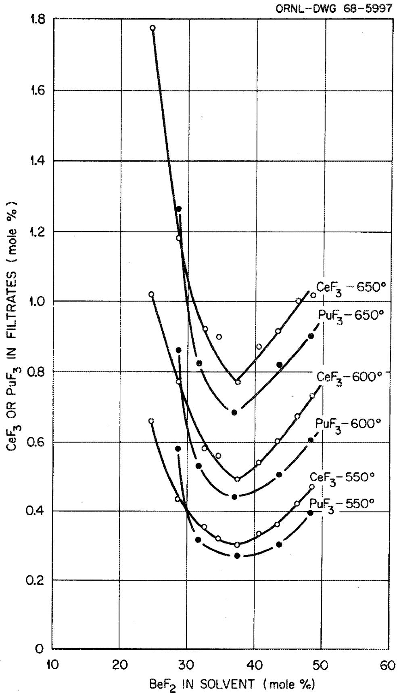
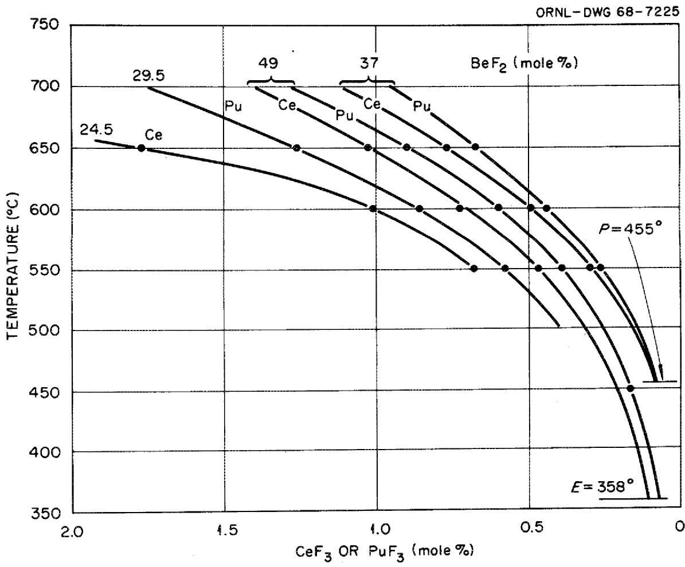
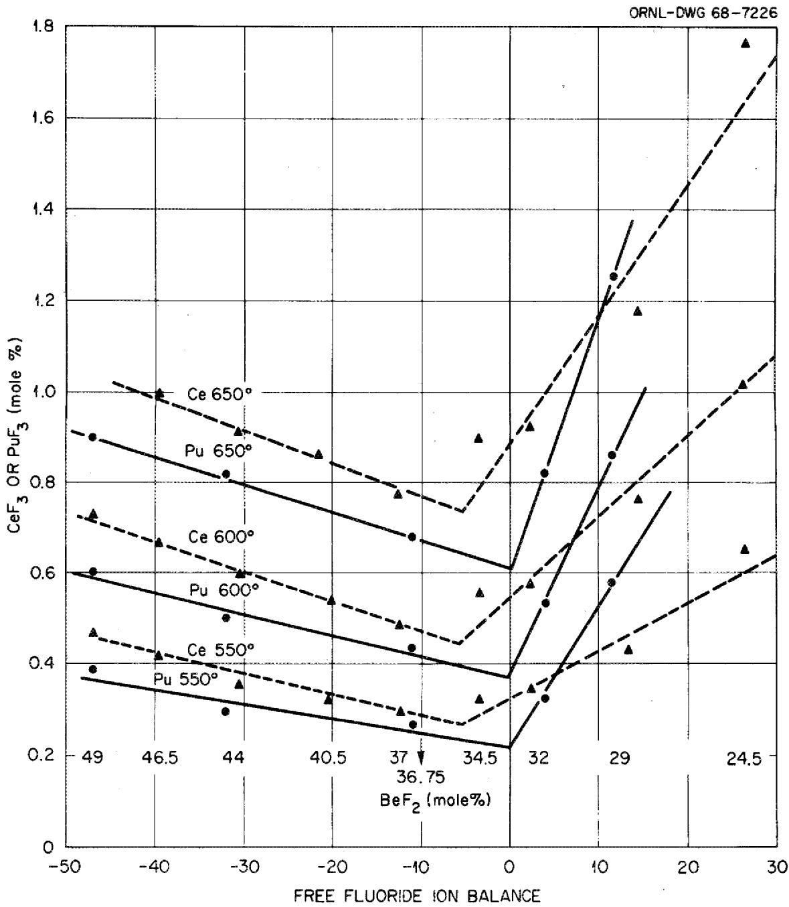
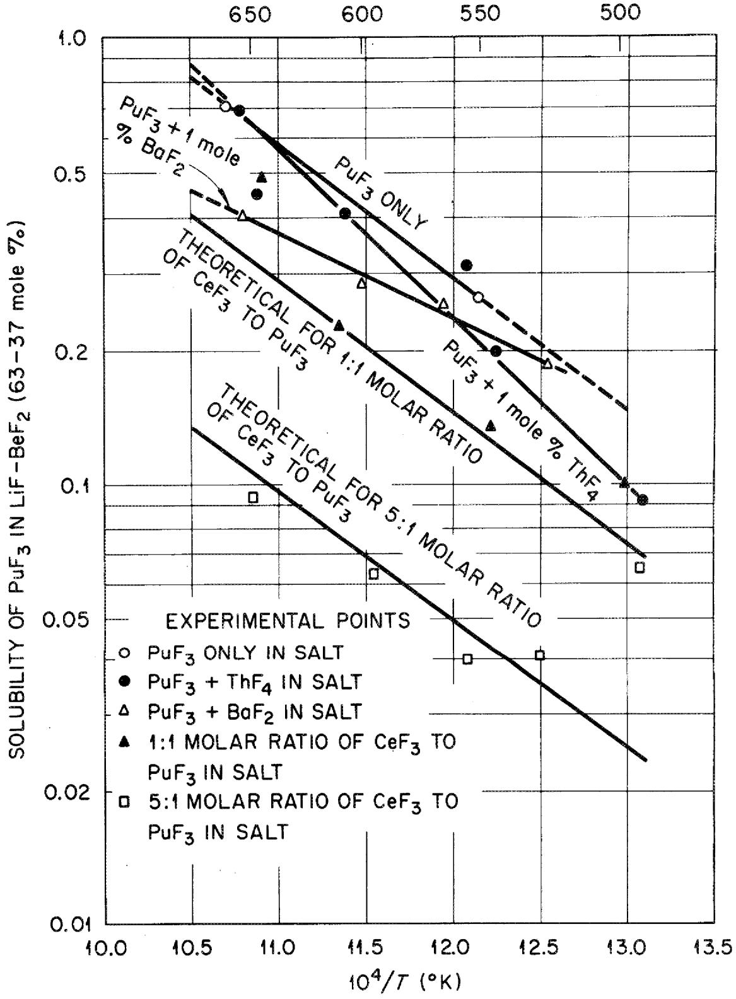
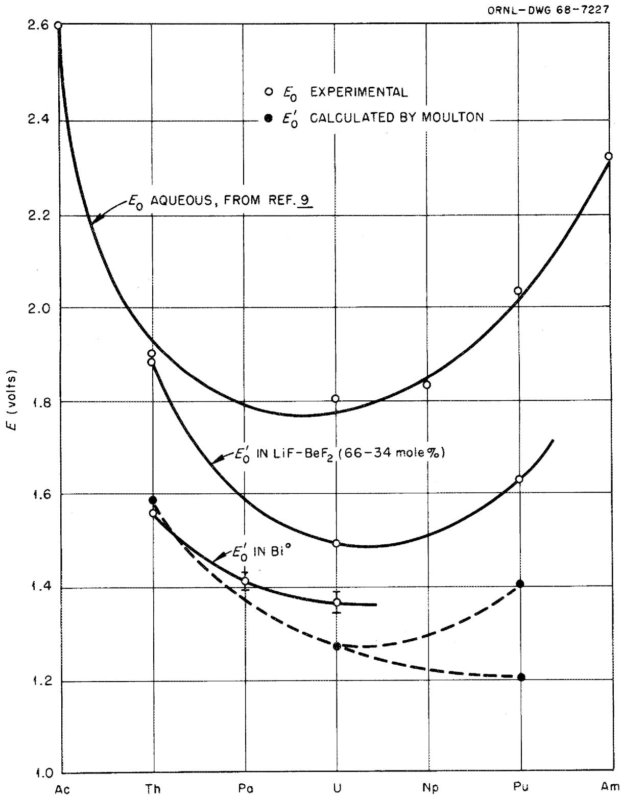

ORNL-TM-2256

COPY NO. -

DATE - June 20, 1968

CHEMICAL FEASIBILITY OF FUELING MOLTEN SALT REACTORS WITH $\mathsf{PuF}_3$

R.E.Thoma

# LEGAL NOTICE

This report was prepared as an account of Government sponsored work. Neither the United States, nor the Commission, nor any person acting on behalf of the Commission:

A. Makes any warranty or representation, expressed or implied, with respect to the accuracy, completeness, or usefulness of the information contained in this report, or that the use of any information, apparatus, method, or process disclosed in this report may not infringe privately owned rights; or   
B. Assumes any liabilities with respect to the use of, or for damages resulting from the use of any information, apparatus, method, or process disclosed in this report.

As used in the above, "person acting on behalf of the Commission" includes any employee or contractor of the Commission, or employee of such contractor, to the extent that such employee or contractor of the Commission, or employee of such contractor prepares, disseminates, or provides access to, any information pursuant to his employment or contract with the Commission, or his employment with such contractor.

ORNL-TM-2256

Contract No. W-7405-eng-26

REACTOR CHEMISTRY DIVISION

CHEMICAL FEASIBILITY OF FUELING MOLTEN SALT REACTORS WITH $\mathbf{PuF}_3$

R. E. Thoma

LEGAL NOTICE

This report was prepared as an account of Government sponsored work. Neither the United States nor the U.S. were involved in the work.

States, nor the Commission, nor any person acting on behalf of A. Makes any warranty or representation, expressed or implied, with respect to the accuracy, completeness, or usefulness of the information contained in this report, or that the use of any information, apparatus, method, or process disclosed in this report may not infringe privately owned rights; or

5. Assumed any information, apparatus, method, or process disclosed in this report. use of any information, apparatus, method, or process disclosed in this report. As used in the above, "person acting on behalf of the Commission" includes any em ployee or contractor of the Commission, or employee of such contractor, to the extent that employee or contractor of the Commission, or employee of such contractor prepares, such employee or contractor of the Commission, or employee of such contractor prepares, such employee or contractor of the Commission, or employee of such contractor prepares, such employee or contractor of the Commission, or employee of such contractor prepares, such employee or contractor of the Commission, or employee of such contractor

OCTOBER 1968

OAK RIDGE NATIONAL LABORATORY

Oak Ridge, Tennessee

operated by

UNION CARBIDE CORPORATION

for the

U.S. ATOMIC ENERGY COMMISSION

#

# CONTENTS

page

Abstract 1

Incentives for Fueling Molten Salt Reactors with Plutonium Fluoride 2

Previous Evaluations of Plutonium Fluoride Fueled Reactors 4

Chemical Properties of Plutonium Fluoride 5

Solubility of $\mathbf{PuF}_3$ in Fluoride Solvent Mixtures 7 Segregation of $\mathbf{PuF}_3$ on Crystallization of Fuel Salts. 16 Chemical Compatibility with Fuel Circuit Materials. 16 Solubility of $\mathbf{Pu}_2\mathbf{O}_3$ in Fluoride Mixtures 19

Estimation of Effects of Chemical Reprocessing 20

Fission Products 25

Use of the MSRE to Demonstrate Feasibility of Operation of MSR's with $\mathbf{PuF}_3$ 26

Chemical Development Requirements 29

Summary 31

# CHEMICAL FEASIBILITY OF FUELING MOLTEN SALT REACTORS WITH $\mathsf{PuF}_3$

R. E. Thoma

# ABSTRACT

The feasibility of starting molten salt reactors with plutonium trifluoride was evaluated with respect to chemical compatibility within fuel systems and to removal of plutonium from the fuel by chemical reprocessing after $^{239}\mathrm{Pu}$ burnout. Compatibility within reactor containment systems is moderately well-assured but requires confirmation of $\mathrm{PuF}_3$ solubility and oxide tolerance before tests can be made using the MSRE. Although separation of plutonium and protactinium in the chemical reprocessing plant, as would be desirable in a large breeder reactor, has not yet been demonstrated, conceptual designs of processes for effecting such separations are available for development.

# INCENTIVES FOR FUELING MOLTEN SALT REACTORS WITH PLUTONIUM FLUORIDE

In a recent report, P. R. Kasten described the economic advantages of using plutonium as a startup fuel in molten salt reactors.1 The following discussion summarizes his appraisal of the incentives which are derived from the use of plutonium in this manner. It is anticipated that large quantities of plutonium will be produced during the following decades by light water reactors fueled with slightly enriched uranium. Sale of the plutonium produced from these reactors at $10/g of fissile material is an important consideration in the power cost of these systems. Recycle of plutonium in light water reactors does not lead to a fuel value of $10/g for fissile material over many recycles.2 Further, during the first few years when the fuel reprocessing industry associated with the light water reactors is developing, the costs of fabricating plutonium-fueled elements will be disproportionately high in comparison with cost for uranium fueled elements, and this will also tend to discourage recycle of plutonium. Thus, it appears that within the next several decades the net value of fissile Pu relative to its use in light water reactors will be less than $10/g, probably about $6/g.

In molten salt reactors the penalty of preparing plutonium fuels rather than uranium fuels does not appear to be economically significant. Also as shown1 the value of plutonium in MSBR systems is about $12/g. Thus, there is a differential of approximately $6/g between the value of plutonium recycled

in light water reactors versus its value in MSBR's. A 1000 MW(e) MSBR requires about 1000 kg fissile plutonium during the startup period. At a differential of $6/g, this corresponds to $6 million. Presumably this $6 million advantage for a 1000 MW(e) reactor would not be credited completely to MSBR's but would be split with light water reactors by using an intermediate Pu value.

One of the reasons for developing fast breeder reactors is that they can advantageously utilize plutonium as a fuel. If MSBR's are to serve as an alternative breeder system, it is desirable that they also utilize plutonium advantageously as a startup fuel. As indicated above, this appears to be possible if the technology is favorable. Further, the low specific inventory in MSBR's permits molten salt reactors to be built in relatively large numbers using plutonium product fuel from light water reactors. This feature permits MSBR's to contribute to improved fuel utilization since their operation would not be limited by the availability of uraniferous fuels.

The advantage of starting up on plutonium rather than $^{235}\mathrm{U}$ arises from the fact that a lower concentration of Pu is required for criticality in the fuel, and also because after Pu burnout, the higher plutonium isotopes (neutron poisons) presumably can be separated from the uranium. This operation leads to slightly better nuclear performance over a 30-year reactor life when plutonium is the startup fuel than when

$^{235}\mathrm{U}$ is the startup fuel and the higher isotopes cannot be discarded (increase of about 0.01 in the breeding ratio).

The incentives described above form the basis for or justify evaluations of the feasibility of incorporating plutonium in molten salt reactors. An assessment was made of current information on chemical properties of $\mathrm{PuF}_3$ in order to judge the feasibility of its incorporation in MSR fuel salts, and to estimate the character and extent of information which may be required to demonstrate chemical compatibility of $\mathrm{PuF}_3$ in the multicomponent environment of fuel-fertile salt systems.

# PREVIOUS EVALUATIONS OF PLUTONIUM-FLUORIDE FUELED REACTORS

During the early stages of the Molten Salt Reactor Program, the fluorides of plutonium were considered for application in advanced versions of molten salt reactors. The results of one study3 showed that a $\mathrm{PuF_3}$ fueled two-region homogeneous fluoride salt reactor was operable, although its performance was poor. Further development was not pursued for neither its chemical feasibility nor methods for improving performance was obvious. Although the thermochemical properties of the plutonium fluorides were not well established at that time, it was clear that the most soluble fluoride, $\mathrm{PuF_4}$ , would be too strong an oxidant for use with available structural alloys. The solubility of $\mathrm{PuF_3}$ , while sufficient for criticality even in the presence of fission fragments and non-fissionable isotopes of $\mathrm{Pu}$ , was

estimated to limit the amount of $\mathrm{ThF_4}$ which could be added to the fuel salt. $^4$ This limitation, coupled with the condition that the continuous use of $^{239}\mathrm{Pu}$ as a fuel would result in poor neutron economy in comparison with that of $^{233}\mathrm{U}$ -fueled reactors vitiated further efforts to exploit the plutonium fluorides for MSBR applications. Recent developments in fuel reprocessing chemistry and in reactor design have established the feasibility of a single-fluid MSBR. Consequently, it now appears that it will be possible to operate a LiF-BeF $_2$ -ThF $_4$ -PuF $_3$ single-fluid MSR with lower concentrations of thorium and plutonium than earlier considerations required, e.g., with thorium fluoride concentrations of 8 to 12 mole % and with a plutonium fluoride concentration of approximately 25% less than required for $^{233}\mathrm{U}$ loading, $^5$ i.e., ≈ 0.2 mole %. Since the incentive to use $^{239}\mathrm{PuF_3}$ in molten salt reactors applies exclusively to its temporary inclusion in the fuel stream, prior limitations concerning saturation of the fuel with respect to $^{241}\mathrm{PuF_3}$ and $^{242}\mathrm{PuF_3}$ do not seem to be relevant. If the chemical properties of plutonium trifluoride prove that its inclusion in molten salt reactor fuels is economically and technically feasible, its exploitation in this connection should be regarded as of significant advantage to the development of the United States AEC breeder reactor program.

# CHEMICAL PROPERTIES OF PLUTONIUM FLUORIDE

One characteristic of the actinide elements is that

increasing instability of the higher oxidation states is observed with increasing atomic number. This property is evident among the compounds of plutonium, particularly the halides. Three stable fluorides of plutonium are known, whereas among the other halides, only the trivalent oxidation state is commonly exhibited. Since $\mathrm{PuF_6}$ is a gas, only $\mathrm{PuF_4}$ and $\mathrm{PuF_3}$ can be considered for use in molten salt fuel mixtures. Plutonium tetrafluoride would exhibit higher solubility than $\mathrm{PuF_3}$ in fluoride solvents, but would probably prove to be too strongly oxidizing to be compatible with Hastelloy-N. The free energy for the following corrosion reaction strongly favors oxidation of chromium containing alloys:

$$
\mathrm {C r} ^ {0} (\mathrm {s}) + 2 \mathrm {P u F} _ {4} (\mathrm {s}) \rightarrow \mathrm {C r F} _ {2} (\mathrm {s}) + 2 \mathrm {P u F} _ {3} (\mathrm {s})
$$

$$
\begin{array}{l} \begin{array}{l} \Delta F _ {1 0 0 0 ^ {\circ} K}: \quad - 6 8 8 k c a l = \underbrace {- 1 4 8 k c a l - 6 2 5 . 8 k c a l} _ {- 6 8 8 k c a l} \\ \quad - 7 3 3. 8 k c a l \end{array} \\ = - 8 5. 8 \mathrm {k c a l} \\ \end{array}
$$

The above reaction also shows that it would not be possible to increase the concentration of plutonium in a fuel salt which was already saturated with respect to $\mathrm{PuF_3}$ by addition of $\mathrm{PuF_4}$ , since the corrosion reaction would proceed steadily and produce additional amounts of $\mathrm{PuF_3}$ . Plutonium trifluoride is, therefore, regarded as the only suitable fluoride of Pu for application as a molten salt reactor fuel constituent. Current values of the thermochemical properties of $\mathrm{PuF_3}$ and $\mathrm{PuF_4}$ are compared with their uranium analogs and with thorium tetrafluoride and cerium trifluoride in Table 1. The values

listed here show that $\mathbf{PuF}_3$ is more stable than $\mathbf{UF}_3$ , and suggest as well that the solubilities of $\mathbf{PuF}_3$ , $\mathbf{UF}_3$ , and $\mathbf{CeF}_3$ in fluoride solvents might be similar.

# A. Solubility of $\mathbf{PuF}_3$ in Fluoride Solvent Mixtures

1. $\mathrm{LiF - BeF_2}$ : The solubility of $\mathrm{PuF_3}$ in $\mathrm{LiF - BeF_2}$ solvents was measured by Barton $^6$ for compositions ranging in $\mathrm{BeF_2}$ from 28.7 to 48.3 mole $\%$ and from 450 to $650^{\circ}\mathrm{C}$ . Solubilities of $\mathrm{PuF_3}$ in $\mathrm{LiF - BeF_2}$ solvents are compared with those for $\mathrm{CeF_3}$ in the same composition range in Figure 1. These results imply that the solubility of $\mathrm{PuF_3}$ in $\mathrm{LiF - BeF_2}$ solvents is markedly temperature- and composition-dependent. Extrapolation of these data to temperatures which are reasonable for the peritectic invariant point involving LiF, $\mathrm{Li_2BeF_4}$ , and $\mathrm{PuF_3}$ (Figure 2) indicates that the composition of the mixtures at this invariant point is $\mathrm{LiF - BeF_2 - PuF_3}$ (63-37-0.008 mole $\%$ ), $\mathrm{T} = 455^{\circ}\mathrm{C}$ , and that the $\mathrm{Li_2BeF_4 - BeF_2 - PuF_3}$ eutectic occurs at the composition $\mathrm{LiF - BeF_2 - PuF_3}$ (48-52-0.01 mole $\%$ ), $\mathrm{T} = 358^{\circ}\mathrm{C}$ . The composition dependence of solubility appears to be related to the acid-base balance of the solvent, as is evident when the data are expressed as a function of the estimated fraction of "free" fluorides as contrasted to "bridging" fluorides. While $\mathrm{PuF_3}$ solubility seems to be minimal in the "neutral" melt, $\mathrm{LiF - BeF_2}$ (66.7-33.3 mole $\%$ ) the minimum in the $\mathrm{CeF_3}$ solubility curves seems to occur in mixtures which are slightly richer in $\mathrm{BeF_2}$ (see Figure 3).

Barton investigated the effect of additional solutes on

Table 1. Comparison of the Properties of $\mathbf{PuF}_3$ with $\mathrm{ThF_4}$ , $\mathrm{UF_4}$ , $\mathrm{UF_3}$ , and $\mathrm{CeF_3}$ .   

<table><tr><td></td><td>ThF4(s)</td><td>UF4(s)</td><td>PuF4(s)</td><td>UF3(s)</td><td>PuF3(s)</td><td>CeF3(s)</td></tr><tr><td>Free energy of formation at 10000K (kcal/F atom)</td><td>-101a</td><td>-95.3b</td><td>-86.0c</td><td>-99.9b</td><td>-104.3c</td><td>~118a</td></tr><tr><td>m.p. (°C)</td><td>1111</td><td>1035</td><td>1037</td><td>1495</td><td>1425</td><td>1437</td></tr><tr><td>Crystal Structure</td><td>Md</td><td>Md</td><td>Md</td><td>He</td><td>He</td><td>He</td></tr><tr><td>Density (g/cm3)</td><td>5.71</td><td>6.72</td><td>7.0</td><td>8.97</td><td>9.32</td><td>6.16</td></tr></table>

$^{a}$ L. Brewer, "The Chemistry and Metallurgy of Miscellaneous Materials: Thermodynamics," L. L. Quill, ed., McGraw-Hill, New York, 1950, 76-192.   
bC. F. Baes, Jr., "Thermodynamics," Vol. I, IAEA, Vienna, 1966, p. 409; and G. Long, ORNL-3789, January 31, 1965.   
$\mathbf{c}_{\mathbf{F}}$ L. Oetting, Chem. Rev., 67, 61 (1967).   
$\mathbf{d}_{\mathrm{Monoclinic}}$ , space group C2/c.   
$\mathbf{e}_{\mathrm{Hexagonal}}$ , space group $\mathbb{P}6 / \mathbb{m}\mathbb{c}\mathbb{m}$

  
Fig. 1. Comparison of $\mathsf{CeF}_3$ and $\mathsf{PuF}_3$ Solubility in LiF-BeF $_2$ Solvent.

  
Fig. 2. Solubility of $\mathrm{CeF}_3$ and $\mathrm{PuF}_3$ in LiF-BeF $_2$ Solvents Extrapolated to LiF-BeF $_2$ -MF $_3$ Invariant Equilibrium Points. $455^\circ =$ the peritectic, LiF-Li $_2$ BeF $_4$ -MF, $358^\circ =$ the eutectic, $\mathrm{Li}_2\mathrm{BeF}_4$ -BeF $_2$ -MF $_3$ .

the solubility of $\mathsf{PuF}_3$ in LiF-BeF $_2$ mixtures, using low (≈ 1 mole %) concentrations of ThF $_4$ , BaF $_2$ , and CeF $_3$ , and high concentrations (20 mole %) of UF $_4$ . His results showed that at 1 mole %, ThF $_4$ had very little effect on the solubility of $\mathsf{PuF}_3$ in this solvent. The same amount of BaF $_2$ diminished the solubility of $\mathsf{PuF}_3$ in a manner not clearly understood. Barton speculated that the saturating phase in these experiments was quite possibly not pure $\mathsf{PuF}_3$ , but rather was a solid solution of BaF $_2$ and $\mathsf{PuF}_3$ . As the molar ratios of BaF $_2$ and $\mathsf{PuF}_3$ were varied in these experiments the optical properties of the precipitating phase also varied, such as to indicate that the solid phase in equilibrium with liquid was a BaF $_2$ - $\mathsf{PuF}_3$ solid solution. The magnitude of the effect indicated that the concentration of divalent fission products anticipated in reactor operation would probably not significantly affect the solubility of $\mathsf{PuF}_3$ .

Data obtained with $\mathrm{CeF}_3$ - $\mathrm{PuF}_3$ solute mixtures in the solvent LiF- $\mathrm{BeF}_2$ (63-37 mole %) are shown in Figure 4. The theoretical curves for $\mathrm{CeF}_3$ - $\mathrm{PuF}_3$ mixtures shown in Figure 4 were calculated from the equation $\mathrm{N}_{\mathrm{PuF}_3}(\mathrm{d}) = \mathrm{S}_{\mathrm{PuF}_3}^0\mathrm{N}_{\mathrm{PuF}_3}(\mathrm{ss})$ , where $\mathrm{N}_{\mathrm{PuF}_3}(\mathrm{d})$ , is the mole fraction of $\mathrm{PuF}_3$ in solution $\mathrm{S}_{\mathrm{PuF}_3}^0$ , the mole fraction (solubility) of $\mathrm{PuF}_3$ in the solvent at a specified temperature (shown labeled "PuF_3 only" in Figure 4) while $\mathrm{N}_{\mathrm{PuF}_3}(\mathrm{ss})$ is the mole fraction of $\mathrm{PuF}_3$ in solid solution. Agreement between experimental and calculated solubility values indicates that $\mathrm{PuF}_3$ and $\mathrm{CeF}_3$ form solid solutions.

  
Fig. 3. Effect of LiF-BeF $_2$ Solvent Composition on the Solubility of CeF $_3$ and PuF $_3$ .

  
TEMPERATURE (°C)   
Fig. 4.

The solutes were found combined in single-phase materials with optical properties intermediate between those of $\mathrm{CeF}_3$ and $\mathrm{PuF}_3$ .

2. LiF-BeF $_2$ -UF $_4$ : Barton6 measured the solubility of PuF $_3$ in a LiF-BeF $_2$ -UF $_4$ melt of the composition 70-20-10 mole%. The results which he obtained comprise the only available information on the solubility of PuF $_3$ in melts which contain more than 1 mole% of metal tetrafluorides. The values for the solubility of PuF $_3$ in the LiF-BeF $_2$ -UF $_4$ solvent fall on a straight line when plotted as logarithm of concentration vs. reciprocal temperature. Considered in terms of "free fluoride" ions availablve, the ion balance in the solvent may vary from -10 to -30 depending on whether one assumes the predominant anionic association of uranium ions to be UF $_5$ " or UF $_3$ $^{3-}$ in the melt. Tetravalent uranium does not form stable phases of the stoichiometries Li $_2$ UF $_6$ , Li $_3$ UF $_7$ , or Li $_4$ UF $_8$ . Of these, only Li $_4$ UF $_8$ exists as an equilibrium crystalline phase, and its temperature range of stability extends only over $30^{\circ}\mathrm{C}$ . It seems most probable that the uranium ions in the solvent exist principally as UF $_5$ ^{-}. If so, the solubility data from Table 2 fit closely with those shown in Figure 3. Since $^{7}\mathrm{LiF}-\mathrm{BeF}_{2}-\mathrm{ThF}_{4}-$ UF $_4$ single fluid fuels are likely to be more neutral on the negative side, we must presume that the solubility will be near the lowest values. The results of all the measurements which have been made suggest however that the solubility of PuF $_3$ in MSR solvent systems will not be lower than 0.25 mole% at temperatures of $550^{\circ}\mathrm{C}$ or higher.

Table 2. Solubility of $\mathbf{PuF}_3$ in LiF-BeF $_2$ -UF $_4$ (70-10-20 mole %)   

<table><tr><td rowspan="2">Filtration Temperature (℃)</td><td colspan="2">Concentration of Pu in Filtrate</td></tr><tr><td>(wt. %)</td><td>(mole %)</td></tr><tr><td>558</td><td>3.43</td><td>1.27</td></tr><tr><td>600</td><td>4.57</td><td>1.70</td></tr><tr><td>658</td><td>6.50</td><td>2.48</td></tr></table>

The data in Figure 3 indicate that if the "free fluoride" ion balance is negative, the differences in solubilities of $\mathrm{CeF}_3$ and $\mathrm{PuF}_3$ are essentially constant. Therefore, the solubility of $\mathrm{PuF}_3$ in solvents similar in composition to the MSBR carrier and MSRE fertile carrier salt mixtures can be deduced from the results of $\mathrm{CeF}_3$ solubility measurements, which in respect to those for $\mathrm{PuF}_3$ , can be accomplished with comparative ease.

B. Segregation of $\mathrm{PuF}_3$ on Crystallization of Fuel Salts

The principal components of MSR fuel mixtures do not form intermediate compounds with $\mathrm{PuF}_3$ . From the solubility data cited above, it can be inferred that if it is employed in fuel mixtures at concentrations of a few tenths mole percent, $\mathrm{PuF}_3$ will tend to crystallize from such mixtures as the primary phase and in solid solution with $\mathrm{UF}_3$ and/or the rare earth trifluorides. The $^7\mathrm{LiF} / \mathrm{BeF}_2$ ratio in $^7\mathrm{LiF - BeF}_2 - \mathrm{ThF}_4 - \mathrm{PuF}_3$ fuel mixtures could be adjusted to insure that at saturation other fluorides, such as $^7\mathrm{Li}_3(\mathrm{Th},\mathrm{U})\mathrm{F}_7$ would coprecipitate with $\mathrm{PuF}_3$ at the liquidus. It is anticipated therefore that in the concentrations at which $\mathrm{PuF}_3$ would probably be employed, it would not be deposited preferentially from the bulk salt during the inadvertent freezing, nor at locations such as in freeze valves where repeated thawing and freezing would take place.

C. Chemical Compatibility with Fuel Circuit Materials

A considerable amount of theoretical and experimental

evidence exists which indicates that as a component of fluoride fuel mixtures $\mathsf{PuF}_3$ will be chemically compatible with container alloys and graphite. Of the actinide fluorides which may be used to constitute molten salt reactor fuel mixtures, plutonium trifluoride is the most chemically stable. Unlike $\mathsf{UF}_3$ , it shows no tendency to disproportionate to the tetrafluoride and metal.

Fluoride melts containing $\mathrm{PuF}_3$ were contained in nickel vessels in many of the experiments conducted by C. J. Barton and co-workers. Nickel proved to be an entirely satisfactory container material for this use. In the nickel based alloy, Hastelloy-N, the corrosion reaction which is intrinsic to uraniferous fluoride salt systems is $\mathrm{Cr}^0 + 2\mathrm{UF}_4 \rightleftharpoons 2\mathrm{UF}_3 + \mathrm{CrF}_2$ , a reaction which has no analog in $\mathrm{PuF}_3$ fuel systems. The role of $\mathrm{PuF}_3$ in corrosion of Hastelloy-N container vessels may therefore be nil. The possibility that some unidentified reaction might cause mass transfer in a temperature gradient cannot be ruled out. Since such corrosion is limited by the diffusion of chromium in Hastelloy-N to liquid-solid boundaries, the rate of mass transfer could only be extremely low.

The compatibility of $\mathrm{PuF}_3$ with MSR fuel circuit environment has, to an extent, already been demonstrated in the MSRE, where some 100 ppm of plutonium was generated and remained entirely in the fuel salt. Its stability there was established by the results of routine chemical analysis which were in good agreement with the anticipated values during $^{235}\mathrm{U}$ operations.

It appears highly unlikely that the carbides of plutonium can form in molten salt reactors which employ $\mathrm{PuF}_3$ in the fuel stream. The free energy of formation of the plutonium carbides is quite low, $\sim 20\mathrm{kcal / mole}$ at $1000^{0}\mathrm{K}$ . While the uranium carbides have comparably low free energies of formation, the possibility of carbide formation with moderator graphite exists only if the activity of $\mathbf{U}^0$ , formed in disproportionation, is permitted to rise $\geq 5\times 10^{-7}$ . Since disproportionation of $\mathrm{PuF}_3$ does not occur, the driving force for the formation of plutonium carbides is entirely absent.

Thermodynamic data suggest that if graphite were to react with MSR fuel mixtures containing $\mathrm{UF}_3$ , the most likely reaction would be $4\mathrm{UF}_4 + \mathrm{C} \rightleftharpoons \mathrm{CF}_4 + 4\mathrm{UF}_3$ , which should come to equilibrium at $\mathrm{CF}_4$ pressures of or below $10^{-8}$ atm. It has been shown by mass spectrometric analysis that the concentrations of $\mathrm{CF}_4$ over graphite systems which were maintained for long periods at elevated temperatures did not exceed the lower detection limits (<1 ppm) for this compound. Reduction of $\mathrm{PuF}_3$ by a similar reaction appears to be very improbable.

From consideration of the thermochemical properties of $\mathrm{PuF}_3$ and from its chemical behavior in the MSRE as described above, we can anticipate that the compatibility of $\mathrm{PuF}_3$ with MSR graphite moderator and containment alloys will be excellent.

# D. Solubility of $\mathrm{Pu}_{2} \mathrm{O}_{3}$ in Fluoride Mixtures

Initial demonstration of the application of $\mathrm{PuF_3}$ in molten salt reactors would come appropriately from its inclusion in MSRE fuel salt. Before embarking on such a demonstration, it would be necessary to have accurate information about the solubility of $\mathrm{Pu_2O_3}$ in the MSRE fuel and flush salts. C. F. Baes appraised the thermochemical data for $\mathrm{PuF_3}$ and $\mathrm{Pu_2O_3}$ recently10 and concluded that there is a distinct possibility of precipitating $\mathrm{Pu_2O_3}$ if $\mathrm{PuF_3}$ is introduced into the MSRE fuel salt at a concentration of as high as 0.2 mole % and if the oxide level should approach the value for $\mathrm{ZrO_2}$ saturation ( $\sim$ 500 ppm). In our previous experience with the MSRE, the total concentration of oxide in the fuel salt has remained less than 100 ppm. Although it seems improbable that saturation of the MSRE fuel salt with $\mathrm{Pu_2O_3}$ could occur at such low oxide concentrations, the oxide tolerance of such mixtures is currently inestimable because of the uncertainties which may be present in the thermochemical data. Laboratory experience with $\mathrm{PuF_3}$ melts has not suggested that $\mathrm{Pu_2O_3}$ exhibits unusually low solubility in fluoride mixtures, i.e., that its solubility is lower than $\mathrm{ZrO_2}$ or $\mathrm{UO_2}$ . However, since the possibility exists that $\mathrm{Pu_2O_3}$ precipitation might occur, the oxide chemistry of $\mathrm{Pu}^{3+}$ in molten fluorides should be determined experimentally if the MSRE were to be used to demonstrate the potential application of $\mathrm{PuF_3}$ -based fuels.

# ESTIMATION OF EFFECTS OF CHEMICAL REPROCESSING

One of the anticipated advantage of starting molten salt reactors on plutonium rather than on $^{235}\mathrm{U}$ is that slightly improved nuclear performance (increase of about 0.01 in the breeding ratio) over a 30-year reactor life would result from its temporary presence in the reactor. The maximum economic advantage would result from removal of the higher isotopes of plutonium (neutron poisons) after plutonium burnout. The incentives for using $\mathrm{PuF}_3$ to start up molten salt reactors are to some extent enhanced or diminished relative to the simplicity (economy) of the fuel reprocessing methods which are employed in conjunction with its use. For the economic advantage of employing plutonium in the fuel-fertile salt to be very significant, the reprocessing costs associated with removal of $^{241}\mathrm{Pu}$ and $^{242}\mathrm{Pu}$ should not add appreciably to the fuel cycle costs. In order to achieve such economy, it will probably be necessary to remove plutonium via the same chemical processes which are to be employed for the $^{233}\mathrm{U}-\mathrm{Th}$ fuel-fertile stream. At the current stage of MSBR fuel reprocessing development, it is anticipated that reductive extraction methods would be employed. As is shown below, the available electrochemical data for plutonium and protactinium compounds do not permit us to deduce whether protactinium is separable from plutonium on a short cycle, ~3 days, when plutonium is the fuel. Further, removal of $^{241}\mathrm{Pu}$ and $^{242}\mathrm{Pu}$ after $^{239}\mathrm{Pu}$ burnout involves separation of plutonium from thorium. This separation appears to

be more tractable than the former, but also cannot be assured at this point. If separation coefficients for plutonium are found to lie between those for protactinium and the rare earths, little or no plutonium would be removed concurrent with protactinium.

Unlike the lanthanides, the actinides exhibit trends in chemical properties which reach minimum or maximum values among the first members of the series. Such a trend is shown in Cunningham and Wallman's values11 of the formal potentials for the reaction $\mathbf{M}(\mathbf{s}) \rightarrow \mathbf{M}^{3+}$ in aqueous solution. (See Figure 5)

A similar trend is suggested in the reduction potentials for $\mathrm{Th}^{4+}$ , $\mathrm{U}^{3+}$ , and $\mathrm{Pu}^{3+}$ in the fluoride solvent, LiF-BeF $_2$ (66-34 mole %) (Figure 5). These trends might imply that the $\epsilon_0'$ for the reduction of plutonium into a bismuth alloy will be nearly identical to that for protactinium. We have no means available at present for estimating $\epsilon_0'$ for plutonium reduction with the accuracy required to indicate its position in the reduction sequence of the actinides Th to Pu.

Moulton12 has recently evaluated the possibilities of removing Pu from molten salt reactor fuels by reductive extraction into bismuth. His conclusions are summarized as follows. The stability of Pu-Bi intermetallic phases is not predictable quantitatively. The similarities of the Th-Bi, U-Bi, and Pu-Bi phase diagrams indicate that the activity of plutonium will be substantially lower in bismuth.

The activity of a metal in bimsuth can be referred to the pure metal by the use of an activity coefficient $\gamma_{\mathrm{M}}$ which is $<<1$ and more or less constant at this value from infinite dilution up to saturation where the saturating phase is the solid intermetallic. Then $\epsilon = \epsilon_0'$ - $\frac{\mathrm{RT}}{\mathrm{nF}}\ln \gamma_{\mathrm{M}} / \gamma_{\mathrm{S}}$ . ( $\gamma_{\mathrm{S}}$ , the ion activity coefficient, goes to 1 at infinite dilution and can be considered as 1 to a first approximation.) Literature values of $\gamma_{\mathrm{Th}}$ and $\gamma_{\mathrm{U}}$ are $5.7\times 10^{-8}$ and $1.3\times 10^{-4}(13,14)$ which would give $\epsilon_0'_{\mathrm{Th}} = -1.58$ and $\epsilon_0'_{\mathrm{U}} = -1.27$ with respect to the $\mathrm{H}_{2}$ -HF electrode at $\epsilon_0 = 0$ . The results of experiments conducted by Moulton and Shaffer show that $\epsilon_0'$ for Pu is about 0.05V more negative than $\epsilon_0'$ for U. If $\gamma_{\mathrm{Pu}} = \gamma_{\mathrm{Th}}$ , then $\epsilon_0' = -1.20$ , while if $\gamma_{\mathrm{Pu}} = \gamma_{\mathrm{U}}$ , $\epsilon_0'_{\mathrm{Pu}} = -1.40$ . One can be reasonably sure that $\epsilon_0'_{\mathrm{Pu}}$ will fall somewhere within these limits. Since $\epsilon_0'$ for the rare earths lie about -1.50, it is likely that Pu can be separated from them and from thorium. Its position relative to U and Pa is not so clear.

An argument can be made that $\gamma_{\mathrm{Pu}}$ will be nearly the same as $\gamma_{\mathrm{M}}$ for either U or th. The solubility of $\mathrm{PuBi}_{2}$ in Bi is greater at any temperature than that of $\mathrm{UBi}_{2}$ or $\mathrm{ThBi}_{2}$ , and its congruent melting point is lower (830 vs. 1010 and $1230^{\circ}\mathrm{C}$ ) which suggests that $\gamma_{\mathrm{Pu}}$ is not very small. On the other hand, the metal itself melts lower (640 vs. 1132 and $1750^{\circ}\mathrm{C}$ ) so that of the three systems only $\mathrm{PuBi}_{2}$ melts higher than the metal. There is some correlation between electronegativity and stability of actinide intermetallic compounds

with bismuth. Plutonium and thorium both have a value of 1.3 (Pauling scale) while uranium is 1.7. The Pu intermetallic will therefore probably exhibit comparable stability.

If plutonium comes out before or with uranium in the reduction extraction process, it can be concluded that the utilization of $\mathrm{PuF}_3$ in molten salt reactors would have little or no effect on fuel reprocessing costs. It would be necessary to separate the uranium and plutonium, probably by fluorination, but this step should not increase overall fuel processing costs appreciably.

If it is found that the separation coefficients for plutonium in reductive extraction processes are unfavorable, alternative methods for its removal could be devised. One possible method would involve fluorination of the fuel first at $550^{\circ}\mathrm{C}$ to remove uranium as $\mathrm{UF}_6$ , then at higher temperatures, $\geq 700^{\circ}\mathrm{C}$ to remove plutonium as $\mathrm{PuF}_6$ , leaving any undecayed protactinium with the carrier salt. This procedure would utilize the increase in stability of $\mathrm{PuF}_6$ with increasing temperature15 and the fact that protactinium does not form volatile fluorides. Such a method would, of course, not be applicable during operation of a reactor with $\mathrm{PuF}_3$ fuel, but rather is a possible means of final removal of plutonium.

The chemical feasibility of incorporating $\mathsf{PuF}_3$ in molten salt reactor fuels, as demonstrated by operating the MSRE with a $\mathsf{PuF}_3$ fuel, would not be impaired by the incomplete development of a chemical process for its separation from

  
Fig. 5. Standard Reduction Potentials for Some Actinides in Aqueous, Molten Salt, and Metallic Solvents.

protactinium. It should be inferred therefore that while a flowsheet for its separation cannot now be devised, the research and development efforts are readily identifiable and are experimentally tractable.

# FISSION PRODUCTS

In one of the important continuing investigations within the MSRP, we are attempting to establish experimentally the chemical identities and modes by which a number of the fission products, notably those of the near noble metals, are distributed, partly as a means for predicting the behavior of spent fuel in the chemical reprocessing plant and partly to establish its corrosion potential accurately with increasing burnup. No significant differences are believed to exist in the yields or chemistry of the principal species of fission products which would result from incorporation of $\mathrm{PuF_3}$ in MSR fuels. The feasibility of using $\mathrm{PuF_3}$ in startup operations of an MSR does not therefore appear to require a separate research program relative to fission products from plutonium.

With $^{235}\mathrm{UF}_4$ fuel, the fission reaction is mildly oxidizing, resulting in the oxidation of $\sim 0.8$ equivalent of $\mathrm{UF}_3$ per gram atom of fissioned uranium. The oxidation potential results from the anion-cation imbalance which develops as the fission products reach thermodynamic equilibrium. With $\mathrm{UF}_4$ as the fissile solute, a slight excess of

fluoride ions develops. Use of a trifluoride solute, however, should result in a cation excess, and should cause the fuel solution to generate a mild reducing potential.

The yield of $^{135}\mathrm{Xe}$ from plutonium fission is somewhat greater than from $^{235}\mathrm{U}$ , and in turn, is less than from $^{233}\mathrm{U}$ . The relative poison fraction of $^{135}\mathrm{Xe}$ in the fuel would be at a minimum at initiation of power operations with $\mathrm{PuF}_3$ fuel and would increase as $^{233}\mathrm{U}$ was generated within the system.

USE OF THE MSRE TO DEMONSTRATE FEASIBILITY OF OPERATION OF MSR'S WITH $\mathbf{PuF}_3$

Consideration of several developments in molten salt reactor chemistry within recent years suggests that the most appropriate and earliest demonstration of the applicability of $\mathsf{PuF}_3$ in molten salt reactors would come from its use in the MSRE. Sufficient basic chemical information exists to conclude that it is neither necessary nor important to demonstrate chemical compatibility with metal alloys in engineering laboratory scale tests. Laboratory scale tests with plutonium should be restricted to the minimum number necessary to establish stabilities because of the inhalation hazard of plutonium-239. Plutonium-239 is, in fact, regarded as one of the most toxic substances known to the experimentalist.

The fact that plutonium-beryllium mixtures are neutron

sources also complicates laboratory and engineering scale experiments in which $^{7}\mathrm{LiF - BeF}_2 - \mathrm{PuF}_3$ mixtures are used. Some typical values $^{16-18}$ of the neutron energies produced from actinide-beryllium $\alpha, n$ reactions are listed in Table 3.

Tate and Coffinberry $^{19}$ have computed theoretical neutron yields of plutonium-beryllium alloys employing calculations which include a term from the experimental stopping power of the matrix elements for alpha particles. The available data suggest that in a dilute $\mathrm{Be}^{2+}$ solution, such as in a MSRE fuel mixture, e.g., $^7\mathrm{LiF - BeF}_2 - \mathrm{ZrF}_4 - \mathrm{ThF}_4 - \mathrm{PuF}_3$ (64-28-5-3-0.2 mole %) the neutron yield would not be so great as to require special shielding of salt lines, drain tanks, or fuel sample transport containers.

The possible criticality problems associated with storage of $\mathrm{PuF}_3$ -bearing fuel salt have been considered qualitatively and do not seem to be ominous. Whereas fission multiplication factors hold for $^{233}\mathrm{U}$ into the epithermal neutron range, they do not do so in the case of plutonium. Further, more energetic $\alpha$ ,n reactions will accompany $^{233}\mathrm{U}$ operation of the $\mathrm{MSRE}^{20}$ than are likely with $\mathrm{PuF}_3$ , primarily because of the presence of $^{232}\mathrm{U}$ in the charge which is to be used. Accordingly, the potential radiation problems associated with $\alpha$ ,n reactions in fuel salt will have been faced before $\mathrm{PuF}_3$ is used in the MSRE. Although radiation from fuel-fertile salt in storage tanks does not seem to be serious, detailed scrutiny of the possible problems which

Table 3. Typical Values of Neutron Energies Produced From Actinide-Beryllium $\alpha$ ,n Reactions   

<table><tr><td>α Source</td><td>t1/2</td><td>Q(Mev)</td><td>Neutron Energy (Mev)</td><td>Neutron yield/106 disintegrations</td></tr><tr><td>210Pu</td><td>138.4d</td><td>5.3</td><td>≤11, av. 4</td><td>80</td></tr><tr><td>222Rn</td><td>3.83d</td><td>5.48</td><td>≤11</td><td>460</td></tr><tr><td>226Ra</td><td>1.62x103y</td><td>5.65</td><td>≤13</td><td>460</td></tr><tr><td>233U</td><td>1.63x105y</td><td>4.82</td><td></td><td></td></tr><tr><td>235U</td><td>7.07x108y</td><td>4.80</td><td></td><td></td></tr><tr><td>239Pu</td><td>2.43x104</td><td>5.15</td><td>≤10, av. 4</td><td></td></tr></table>

might arise from $\alpha, n$ reactions would be necessary before the $\mathbf{PuF}_3$ were to be used in the MSRE.

Except for a few data on solubility of the fluorides and oxides, which are obtainable in laboratory measurements, chemical compatibility in reactor containment systems is reasonably assured. If the solubilities of $\mathrm{Pu}_{2}\mathrm{O}_{3}$ and $\mathrm{PuF}_{3}$ in $\mathrm{LiF - BeF}_{2} - \mathrm{ZrF}_{4}$ melts are found to be in excess of 300-400 ppm and 0.2 mole $\%$ , respectively, a test in the MSRE would be virtually assured of success with respect to the chemical behavior of the plutonium-bearing salt.

# CHEMICAL DEVELOPMENT REQUIREMENTS

It appears that the chemical feasibility of employing $\mathrm{PuF_3}$ in molten salt reactors will be assured if two general properties, solubility of the oxides and fluorides in LiF-BeF $_2$ -ZrF $_4$ -ThF $_4$ solvents are suitably high, and the extractability of Pu metal from fluoride melts into bismuth amalgams is sufficiently discrete to be economic. As noted above, only the absence of solubility data obviates the conclusion that $\mathrm{PuF_3}$ could be incorporated in the MSRE fuel salt at our earliest convenience.

In order to establish that it is chemically feasible to fuel molten salt reactors with $\mathbf{PuF}_3$ , a program of chemical development should include the following items:

a. Determination of the solubility of $\mathrm{PuF_3}$ in $\mathrm{LiF - BeF_2 - ZrF_4}$ and $\mathrm{LiF - BeF_2 - ZrF_4 - ThF_4}$ solvents. It should be adequate to carry out most of the necessary measurements with $\mathrm{CeF_3}$ as a proxy for $\mathrm{PuF_3}$ . Thereafter, only a few experiments with $\mathrm{PuF_3}$ would be required to confirm the conclusions based on $\mathrm{CeF_3}$ solubilities.   
b. Determination of the solubility of $\mathrm{Pu}_{2}\mathrm{O}_{3}$ in LiF-BeF $_2$ -ZrF $_4$ -ThF $_4$ -UF $_4$ solvents. The lanthanide oxides do not serve adequately as proxies for estimation of actinide oxide solubilities. It will be necessary therefore to determine the oxide tolerance of fuel salts directly with plutonium oxide in alpha-laboratory facilities.   
c. Establishment of the standard reduction potentials and separation coefficients for plutonium in Bi-Th alloys.   
d. Solubility of Pu in Bi-Th alloys.

Items c. and d. should become a part of the existing programs in chemical and chemical engineering development. It may be unnecessary to initiate experimental work in this part of the program until it is first demonstrated that $\mathrm{PuF}_3$ fuels perform satisfactorily in a molten salt reactor.

It is likely that some 15 to 20 years will pass before plutonium trifluoride is incorporated in a full scale power reactor. If a demonstration that molten salt reactors are operable with $\mathrm{PuF}_3$ fuels is regarded as desirable, it can probably be realized with the MSRE. Since molten salt fuel processing technology will require a period of years to evolve,

the ambiguous fate of plutonium in fuel reprocessing should not at this point be considered a deterrent to a continuing evaluation of the chemical feasibility of employing $\mathrm{PuF}_3$ as an MSR fuel.

# SUMMARY

A definite economic advantage is associated with startup of molten salt breeder reactors with $\mathrm{PuF_3}$ -based fuel. If the solubilities of plutonium oxide and plutonium trifluoride are confirmed as exceeding a few hundred ppm and $\sim 0.2$ mol $\%$ , respectively, the chemical feasibility of fueling molten salt reactors with $\mathrm{PuF_3}$ will be essentially assured. Separation of protactinium and plutonium during operation of a $\mathrm{PuF_3}$ -fueled reactor, and removal of $^{241}\mathrm{Pu}$ and $^{242}\mathrm{Pu}$ after two years of operation, as would be desirable in a large breeder reactor from an economic standpoint, has not yet been demonstrated, although conceptual designs of processes for effecting such separations are available for development.

# REFERENCES

1. P. R. Kasten, Reactor Division - ORNL, personal communication, 1968.   
2. P. R. Kasten, J. A. Lane, and L. L. Bennett, "Fuel Value Studies of Plutonium and U-233," unpublished work, 1962.   
3. D. B. Grimes, Molten Salt Reactor Program Quarterly Progress Report for Period Ending June 30, 1958, ORNL-2551, p. 13.   
4. J. A. Lane, H. G. MacPherson, and F. Maslan, *Fluid Fuel Reactors*, (Addison-Wesley Publishing Co., Inc., Reading, Mass.), p. 656.   
5. O. L. Smith, Reactor Division - ORNL, personal communication.   
6. C. J. Barton, J. Phys. Chem., 64, 306 (1960).   
7. J. H. Devan and R. B. Evans, III, "Corrosion Behavior of Reactor Materials in Fluoride Salt Mixtures," ORNL-TM-328, September 19, 1962.   
8. W. M. Olson and N. R. Mulford, Proceedings of Symposium on Thermodynamics of Nuclear Materials, IAEA, September 1967, Paper No. SM-98-40.   
9. W. R. Grimes, "Radiation Chemistry of the MSRE System," ORNL-TM-500, March 31, 1963.   
10. C. F. Baes, Jr., Reactor Chemistry Division - ORNL, personal communication, 1968.

11. B. B. Cunningham and J. C. Wallman, in The Chemistry of the Actinide Elements, J. J. Katz and G. T. Seaborg, ed., (John Wiley, New York, 1957), p. 412.   
12. D. M. Moulton, Reactor Chemistry Division - ORNL, personal communication, 1968.   
13. R. H. Wiswall and J. J. Egan, Proceedings of Symposium on Thermodynamics of Nuclear Materials, IAEA, May 1962, Vienna, p. 345.   
14. L. C. Tien et al., "Thermodynamics," Vol. 1, International Atomic Energy Agency, Vienna, 1966, pp. 501-514.   
15. B. Weinstock, Rec. Chem. Prog., 23, 23 (1962).   
16. National Bureau of Standards Handbook 72, "Measurement of Neutron Flux and Spectra for Physical and Biological Applications," 1960.   
17. G. E. Darwin and J. H. Buddery, Beryllium, (Butterworths, London, 1960), p. 362.   
18. G. Friedlander and J. W. Kennedy, Nuclear and Radiochemistry, (John Wiley, New York, 1955).   
19. R. E. Tate and A. S. Coffinberry, Proceedings of Second United Nations Conference on the Peaceful Uses of Atomic Energy, Geneva, 1958, Paper 700.   
20. R. C. Steffy, "Inherent Neutron Source in MSRE with Clean $^{23}3$ U Fuel Salt Mixture," ORNL-Technical Memorandum (In preparation).

#

# INTERNAL DISTRIBUTION

1. R. K. Adams

2. G. M. Adamson

3. R.G.Affel

4. L. G. Alexander

5. J. L. Anderson

6. R. F. Apple

7. C. F. Baes

8. J.M.Baker

9. S. J. Ball

10. C. E. Bamberger

11. C. J. Barton

12. H. F. Bauman

13. S. E. Beall

14. R. L. Beatty

15. M. J. Bell

16. M. Bender

17. C. E. Bettis

18. E. S. Bettis

19. D. S. Billington

20. R.E.Blanco

21. F. F. Blankenship

22. J. O. Blomeke

23. R. Blumberg

24. E. G. Bohlfann

25. C. J. Borkowski

26. G. E. Boyd

27. C. A. Brandon

28. M. A. Bredig

29. R. B. Briggs

30. H. R. Bronstein

31. G. D. Brunton

32. D.A.Canonico

33. S. Cantor

34. W. L. Carter

35. G. I. Cathers

36. O. B. Cavin

37. A. Cepolino

38. W. R. Cobb

39. C. W. Collins

40. E. L. Compere

41. K. V. Cook

42. W. H. Cook

43. L. T. Corbin

44. B. Cox

45. J. L. Crowley

46. F. L. Culler

47. D. R. Cuneo

48. J. M. Dale

49. D. G. Davis

50. R. J. DeBakker

51. J. H. Devan

52. S. J. Ditto

53．A．S．Dworkin

54. I. T. Dudley

55. D. A. Dyslin

56. W. P. Eatherly

57. J. R. Engel

58. E. P. Epler

59. D. E. Ferguson

60. L. M. Ferris

61. A. P. Fraas

62. H. A. Friedman

63. J. H. Frye, Jr.

64. C. H. Gabbard

65. R. B. Gallaher

66. R. E. Gelbach

67. J. H. Gibbons

68. L. O. Gilpatrick

69. H. E. Goeller

70. W. R. Grimes

71. A. G. Grindell

72. R.W.Gunkel

73. E. D. Gupton

74. R. H. Guymon

75. J. P. Hammond

76. B. A. Hannaford

77. P. H. Harley

78. D. G. Harman

79. W. O. Harms

80. C. S. Harrill

81. P. N. Haubenreich

82. R.E.Helms

83. P. G. Herndon

84. D. N. Hess

85. J. R. Hightower

86. M. R. Hill

87. H. W. Hoffman

88. D. K. Holmes

89. P. P. Holz

90. R. W. Horton

91. T. L. Hudson

92. H. Inouye

93. W. H. Jordan

94. P. R. Kasten

95. R. J. Kedl

96. O. L Keller

97. M. T. Kelley

98. M. J. Kelly

99. C. R. Kennedy

100. T. W. Berlin

101. H. T. Kerr

102. S. S. Kirslis

103. J. W. Koger

104. A. I. Krakoviak

105. T. S. Kress

106. J. W. Krewson

107. C. E. Lamb

108. J. A. Lane

109. J. J. Lawrence

110. M. S. Lin

111. R. B. Lindauer

112. A. P. Litman

113. G. H. Llewellyn

114. E. L. Long

115. M. I. Lundin

116. R.N. Lyon

117. R. L. Macklin

118. H. G. MacPherson

119. R.E. MacPerson

120. J.C.Mailen

121. D. L. Manning

122. C. D. Martin

123. T. H. Mauney

124. H. McClain

125. R. W. McClung

126. H. E. McCoy

127. H. F. McDuffie

128. C. K. McGlothlan

129. C. J. McHargue

130. L. E. McNeese

131. J. R. McWherter

132. H. J. Metz

133. A. S. Meyer

134. R. L. Moore

135. D. M. Moulton

136. T. R. Mueller

137. H. A. Nelms

138. J. P. Nichols

139. E. L. Nicholson

140. E. D. Nogueira

141. L. C. Oakes

142. P. Patriarca

143. A. M. Perry

144. T. W. Pickel

145. H. B. Piper

146. B. E. Prince

147. G. L. Ragan

148. J. L. Redford

149. M. Richardson

150. G. D. Robbins

151. R. C. Robertson

152. W. C. Robinson

153. H. C. Roller

154. K. A. Romberger

155. M. W. Rosenthal

156. R. G. Ross

157. H. C. Savage

158. W. F. Schaffer

159. C. E. Shilling

160. Dunlap Scott

161. J. L. Scott

162. H. E. Seagren

163. C. E. Sessions

164. J. H. Shaffer

165. W.H.Sides

166. M. J. Skinner

167. G. M. Slaughter

168. A. N. Smith

169. F. J. Smith

170. G. P. Smith

171. O. L. Smith

172. P. G. Smith

173. I. Spiewak

174. R.C.Steffy

175. W.C. Stoddard

176. H. H. Stone

177. R. A. Strehlow

178. J. R. Tallackson

179. E. H. Taylor

180. W. Terry

181-190. R.E.Thoma

191. P. F. Thomason

192. L. M. Toth

193. D. B. Trauger

194. J. S. Watson

195. H. L. Watts

196. C. F. Weaver

197. B. H. Webster

198. A. M. Weinberg

199. J. R. Weir

200. W. J. Werner

201. K. W. West

202. M. E. Whatley

203. J. C. White

204. L. V. Wilson

205. Gale Young

206. H. C. Young

207. J. P. Young

208. E. L. Youngblood

209. F. C. Zapp

210-211. Central Research Library

212-213. Document Reference Section

214-238. Laboratory Records (LRD)

239. Laboratory Records - Record Copy (LRD-RC)

# EXTERNAL DISTRIBUTION

240-241. D. F. Cope, AEC-ORNL R.D.T. Site Office

242. J. W. Crawford, AEC-RDT, Washington

243. C. B. Deering, AEC-ORO

244. A. Giambusso, AEC-Washington

245. W. J. Larkin, AEC-ORO

246. C. L. Matthews, AEC-ORO

247-248. T. W. McIntosh, AEC, Washington

249. C. E. Miller, Jr., AEC, Washington

250. B. T. Resnich, AEC, Washington

251. H. M. Roth, AEC-ORO

252. Milton Shaw, AEC, Washington

253. W. L. Smalley, AEC-ORO

254. R. F. Sweek, AEC-Washington

255-269. Division of Technical Information Extension (DTIE)