IRRADIATION BEHAVIOR OF CLADDING AND STRUCTURAL MATERIALS

J. R. Weir, J. O. Stiegler, and E. E. Bloom

# LEGAL NOTICE

This report was prepared as an account of Government sponsored work. Neither the United States, nor the Commission, nor any person acting on behalf of the Commission:

A. Makes any warranty or representation, expressed or implied, with respect to the accuracy, completeness, or usefulness of the information contained in this report, or that the use of any information, apparatus, method, or process disclosed in this report may not infringe privately owned rights; or   
B. Assumes any liabilities with respect to the use of, or for damages resulting from the use of any information, apparatus, method, or process disclosed in this report.

As used in the above, "person acting on behalf of the Commission" includes any employee or contractor of the Commission, or employee of such contractor, to the extent that such employee or contractor of the Commission, or employee of such contractor prepares, disseminates, or provides access to, any information pursuant to his employment or contract with the Commission, or his employment with such contractor.

Contract No. W-7405-eng-26

# METALS AND CERAMICS DIVISION

# LEGAL NOTICE

This report was prepared as an account of Government sponsored work. Neither the United States, nor the Commission, nor any person acting on behalf of the Commission:

A. Makes any warranty or representation, expressed or implied, with respect to the accuracy, completeness, or usefulness of the information contained in this report, or that the use of any information, apparatus, method, or process disclosed in this report may not infringe privately owned rights; or

B. Assumes any liabilities with respect to the use of, or for damages resulting from the use of any information, apparatus, method, or process disclosed in this report.

As used in the above, "person acting on behalf of the Commission" includes any employee or contractor of the Commission, or employee of such contractor, to the extent that such employee or contractor of the Commission, or employee of such contractor prepares, disseminates, or provides access to, any information pursuant to his employment or contract with the Commission, or his employment with such contractor.

IRRADIATION BEHAVIOR OF CLADDING AND STRUCTURAL MATERIALS

J. R. Weir, J. O. Stiegler, and E. E. Bloom

Paper presented at the American Nuclear Society, National Topical Meeting, Cincinnati, Ohio, April 2-4, 1968. To be published in the proceedings.

SEPTEMBER 1968

OAK RIDGE NATIONAL LABORATORY

Oak Ridge, Tennessee

operated by

UNION CARBIDE CORPORATION

for the

U.S. ATOMIC ENERGY COMMISSION

# CONTENTS

Page

Abstract 1

Introduction 2

Production of Defects 3

Effects of Irradiation on Mechanical Properties 7

Low Temperatures 8

Intermediate Temperatures 18

High Temperatures 29

Summary 38

Acknowledgments 40

References 41

J. R. Weir, J. O. Stiegler, and E. E. Bloom

# ABSTRACT

The effects of irradiation on the mechanical and physical properties of materials to be used as cladding and structural components in fast reactors are of great interest to the reactor designer. In this paper the general aspects of the problem are discussed in terms of the observed changes in properties and microstructure and the possible mechanisms that might explain the observed effects. The discussion is concerned primarily with the austenitic stainless steels and with changes in mechanical properties which occur at test temperatures near the irradiation temperatures. For convenience the problem is divided into three ranges of irradiation temperature: low temperatures, $T < 0.40$ $T_{\mathrm{m}}$ ; intermediate temperatures, $0.40$ $T_{\mathrm{m}} < T < 0.55$ $T_{\mathrm{m}}$ ; and high temperatures, $T > 0.55$ $T_{\mathrm{m}}$ . ( $T_{\mathrm{m}}$ is the melting point on the absolute temperature scale.) On the basis of data presently available the damage appears to be significantly different for each temperature range. In the low-temperature range there is an increase in yield strength and reduction of work-hardening coefficient and uniform strain. These effects result primarily from the interaction of dislocations with irradiation-produced defects. At intermediate temperatures irradiation-produced changes in the precipitation process become important. In this same temperature range the formation of voids and dislocation loops after irradiation to high fast neutron fluences cause large increases in yield strength and large reductions in ductility parameters. At high-irradiation temperatures strength properties are not affected; however, ductility is severely reduced. These effects result from helium produced by various $(n,\alpha)$ reactions.

# INTRODUCTION

Changes in mechanical and physical properties of fuel cladding and reactor structural components which occur as a result of neutron irradiation are of major importance to the reactor designer. For example, large reductions in either the strength or ductility of the material used as a fuel cladding would severely limit its ability to withstand the imposed stresses without excessive deformation or fracture. Materials used in a fast reactor system must retain adequate strength properties under rather severe operating conditions. The fuel cladding will operate at temperatures between 400 and $700^{\circ}\mathrm{C}$ , will be exposed to fast neutron fluxes of $1 \times 10^{15}$ to $1 \times 10^{16}$ neutrons $\mathrm{cm}^{-2} \sec^{-1}$ and during its lifetime in the reactor will receive fast neutron fluences in excess of $10^{23}$ neutrons/ $\mathrm{cm}^{2}$ . Other structural components may operate at somewhat lower temperatures and neutron fluxes but because of their longer residence time in the reactor they may receive significantly higher neutron fluences.

Data describing the effects of such irradiation conditions on the mechanical and physical properties of materials are very limited. It is thus necessary to combine the relevant data obtained from irradiations conducted in thermal reactors with the data from fast reactor irradiations in order to evaluate the expected changes in mechanical and physical properties.

We shall restrict our discussion mainly to the behavior of austenitic stainless steels and include results from other alloy systems only to demonstrate general conclusions. This limitation is imposed because the first liquid metal fast breeder reactors will be constructed

of these alloys and because the effects of irradiation on mechanical and physical properties are best understood in these alloy systems.

# PRODUCTION OF DEFECTS

Neutron irradiation of a crystal has two basic effects. First, neutrons collide with lattice atoms and may displace some atoms. A single displacement leaves one lattice site vacant, a vacancy, and locates one atom in an off-lattice position, an interstitial atom. The second effect, transmutation, is initiated by a neutron capture and results in a changed mass number of the capturing atom.

Vacancies and interstitials are produced primarily as a result of collisions between moving particles (neutrons or displaced atoms) and lattice atoms. Assuming that such collisions can be treated as elastic collisions between hard spheres, the maximum energy transferred when a particle of mass $m_1$ and energy $E$ strikes a particle of mass $m_2$ at rest is

$$
E _ {\max } = \frac {4 m _ {1} m _ {2}}{(m _ {1} + m _ {2}) ^ {2}} E _ {1}. \tag {1}
$$

Since the neutron has a mass number of 1, this becomes

$$
\mathrm {E} _ {\max } \approx 4 \mathrm {E} _ {1} / \mathrm {A} _ {2}, \tag {2}
$$

where $A_2$ is the mass number of the struck particle. The average energy transfer is half the maximum amount. Now, if the energy transfer to the struck atom exceeds some threshold value, usually estimated to be about 25 ev, the atom will be displaced from its lattice site. Such an atom, termed a primary knock-on, will interact with lattice atoms in its vicinity, possibly displace some of them, and gradually come to rest. If the struck atom receives a large amount of energy, its more loosely bound

electrons will be stripped from it, leaving it highly ionized. Under these conditions it will initially lose energy primarily through electronic interactions, but as it slows down it will make frequent collisions with lattice atoms, the frequency increasing as the energy of the knock-on decreases.

Calculation of the total number of displaced atoms produced is obviously a complex problem. To illustrate the order of magnitude of the number we will follow the treatment of Kinchin and Pease.1 They assume that the knock-on loses energy entirely by ionization above some cutoff energy approximately equal to the mass number of the struck atom in thousands of electron volts and entirely by elastic collisions with lattice atoms below this cutoff energy.

The number of additional displaced atoms produced per primary knock-on atom is approximately

$$
\mathrm {N} _ {\mathrm {d}} = \frac {\mathrm {E}}{2 \mathrm {E} _ {\mathrm {d}}} \quad \text {f o r} 2 \mathrm {E} _ {\mathrm {d}} <   \mathrm {E} <   \mathrm {E} _ {\mathrm {i}}, \tag {3}
$$

and

$$
N _ {d} = \frac {E _ {i}}{2 E _ {d}} \text {f o r} E > E _ {i}, \tag {4}
$$

where

$$
\mathbf {E} = \text {t h e}
$$

$$
\begin{array}{l} \mathbb {E} _ {\mathrm {d}} = \text {t h e t h r e s h o l d d i s p l a c e m e n t e n e r g y , a p p r o x i m a t e l y 2 5 e v} \\ \text {f o r m e t a l s ,} \end{array}
$$

$$
E _ {i} = \text {t h e e n e r g y o f t h e p r i m a r y a b o v e w h i c h i t i s a s s u m e d t h a t}
$$

For example, if an iron atom $(\mathbf{M} = 56)$ is struck by a 1-Mev neutron the maximum energy transmitted to the primary is [by Eq. (2)]

$$
E _ {\max } = \frac {4 \times 1}{5 6} \approx 0. 0 7 \mathrm {M e v}.
$$

This is above the ionization energy, so the number of displacements per primary is [by Eq. (4)]

$$
N _ {d} = \frac {5 6 , 0 0 0}{2 \times 2 5} \approx 1 0 ^ {3} \text {d i s p l a c e m e n t s}.
$$

It is important to realize that the displaced atoms are not produced homogeneously throughout the material. For an individual collision the defects reside in a small volume around the track of the primary knock-on, which typically extends a few tens or perhaps hundreds of angstroms. This volume is termed a displacement cascade, but in reality it may be composed of subcapsades produced by secondary knock-ons. Note too that the distribution of vacancies and interstitial atoms within a cascade is not uniform. In general, the interstitials are displaced outward, leaving a vacancy-rich core in the center of the cascade.

Such regions are generally unstable and some dynamic recovery occurs. The amount of recovery and the final configuration of the defects depend critically on the irradiation temperature. At temperatures of interest for normal reactor operation, both the interstitials and vacancies have sufficient thermal energy to migrate through the lattice. Many of the original defects are destroyed by recombination, trapping at impurities, or absorption by dislocations and grain boundaries. Those which survive cluster together to form stable configurations. At temperatures in excess of approximately one-half the absolute melting point

$(0.5 \, \text{T}_{\text{m}})$ vacancies have sufficient thermal energy to overcome the binding energy of clusters and to migrate freely through the lattice. Thus at sufficiently high irradiation temperatures defects are annihilated continuously without cluster formation.

Transmutation reactions, in particular those which produce gaseous species, may also have important effects on properties. Table 1 lists the reactions and their approximate cross sections for a number of important cases. We see that helium and hydrogen may be produced in metals through neutron reactions both with impurities in the metals and with the major alloying elements. Alter and Weber2 have made calculations of the amounts of hydrogen and helium produced in various materials and concluded that for the iron- or nickel-base alloys used as fuel cladding, approximately 100 ppm He and a few thousand parts-per-million hydrogen would be produced in a fast reactor in a few years'

Table 1. Transmutation Reactions in Metals   

<table><tr><td>Nucleus</td><td>Reaction</td><td>Cross Section (barns)a</td><td>Neutron Energy Associated with Cross Section</td></tr><tr><td>14N</td><td>(n,α)</td><td>41</td><td>Fission</td></tr><tr><td>10B</td><td>(n,α)</td><td>3800</td><td>Thermal</td></tr><tr><td></td><td>(n,α)</td><td>635</td><td>Fission</td></tr><tr><td>56Fe</td><td>(n,α)</td><td>0.35</td><td>Fission</td></tr><tr><td></td><td>(n,p)</td><td>0.87</td><td>Fission</td></tr><tr><td>58Ni</td><td>(n,α)</td><td>0.5</td><td>Fission</td></tr><tr><td></td><td>(n,p)</td><td>111</td><td>Fission</td></tr></table>

a1 barn = 10-24 cm².

operation. In addition to these transmutation reactions producing gaseous products, other possibilities exist in which solid impurities are produced.

# EFFECTS OF IRRADIATION ON MECHANICAL PROPERTIES

Changes in mechanical properties produced by neutron irradiation are a sensitive function of both irradiation and test variables. Important irradiation variables include irradiation temperature, thermal neutron fluence, fast neutron fluence, and possibly fast neutron flux.

Important test variables include test temperature and strain rate.

Other factors such as preirradiation heat treatment (in order to control grain size, dislocation structure, and precipitate distribution) and time at temperature (thermal aging) either before or following irradiation have been shown to be important. Because of the large number of variables and the vast amount of information which has been published in this area we will not attempt a complete literature review. Rather we will restrict our discussion to a general class of metals and alloys (those having a face-centered cubic crystal structure) and will be concerned primarily with the mechanical properties at test temperatures near the irradiation temperature. For convenience we define the following temperature ranges: low temperatures, $\mathrm{T} < 0.40 \, \mathrm{T}_{\mathrm{m}}$ (where $\mathrm{T}_{\mathrm{m}}$ is the melting point of the alloy in degrees absolute); intermediate temperatures, $0.40 \, \mathrm{T}_{\mathrm{m}} < \mathrm{T} < 0.55 \, \mathrm{T}_{\mathrm{m}}$ ; and high temperatures, $\mathrm{T} > 0.55 \, \mathrm{T}_{\mathrm{m}}$ . Our approach to the subject will be to summarize the observed changes in properties, point out the important variables, illustrate changes in microstructure and where possible correlate these changes with specific mechanisms.

# Low Temperatures

Tensile deformation of face-centered cubic metals at low temperatures is usually terminated by a plastic instability, termed necking, which leads to the development of a local reduced diameter region followed by a shear fracture in this necked region. This local necking limits the elongation of the material. The conditions under which this instability occurs can be represented analytically.3 Assuming constant volume and a power-law relationship between true stress $(\overline{\sigma})$ and true strain $(\overline{\epsilon})$ of the form

$$
\overline {{\sigma}} = k \overline {{\epsilon}} ^ {n}, \tag {5}
$$

where $k$ is a constant, it can be shown that the plastic instability occurs when the work-hardening exponent

$$
n = \frac {d \ell n}{d \ell n} \frac {\bar {\sigma}}{\epsilon} = \frac {\bar {\epsilon}}{\sigma} \frac {d \bar {\sigma}}{d \epsilon} \tag {6}
$$

equals the true strain,

$$
n = \bar {\epsilon}. \tag {7}
$$

Figure 1 shows that Eq. (7) is reasonably well obeyed for type 304 stainless steel, but that $n$ is not constant over the entire test.

When austenitic stainless steels are irradiated and tensile tested in this low-temperature range, there is a large increase in yield stress and large decreases in true uniform strain and work-hardening exponent. $^{4,5}$ Figure 2 shows the room-temperature yield stress of type 304 stainless steel after irradiation to $7 \times 10^{20}$ neutrons/ $\mathrm{cm}^2$ ( $\mathbf{E} > 1$ Mev) and $9 \times 10^{20}$ neutrons/ $\mathrm{cm}^2$ (thermal) at various temperatures. For irradiation at temperatures between 93 and $300^{\circ}\mathrm{C}$ (approximately $0.35\mathrm{T}_{\mathrm{m}}$ ) the yield

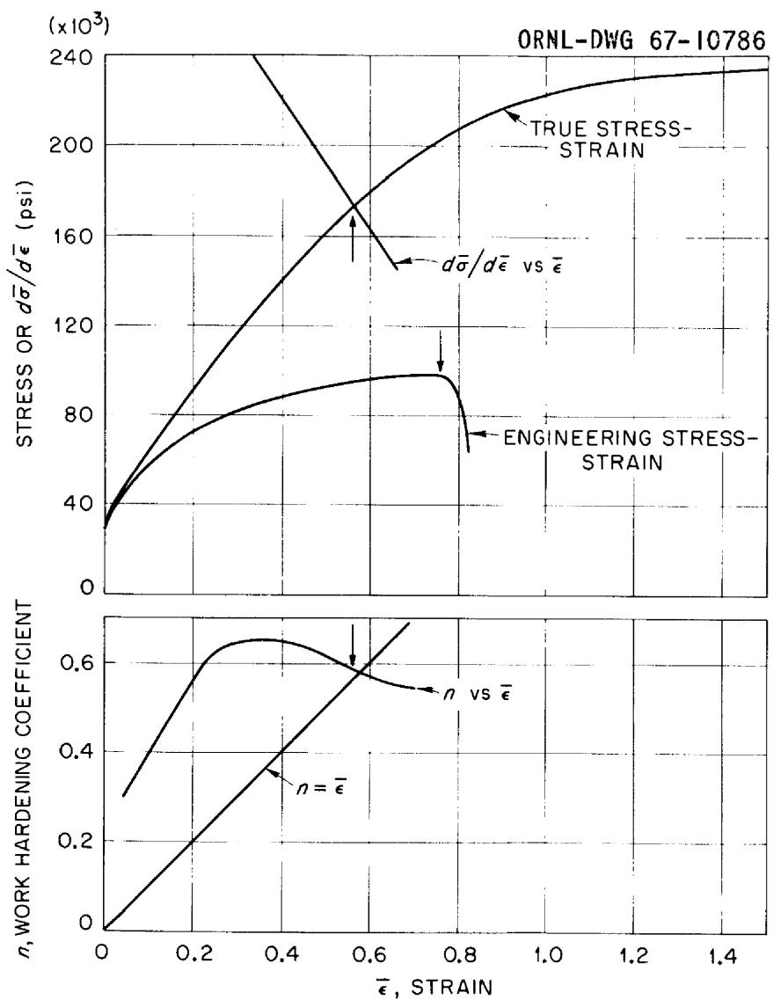  
Fig. 1. The Stress-Strain Characteristics of Type 304 Stainless Steel at Room Temperature. The arrows indicate the strain at which the plastic instability was observed to develop.

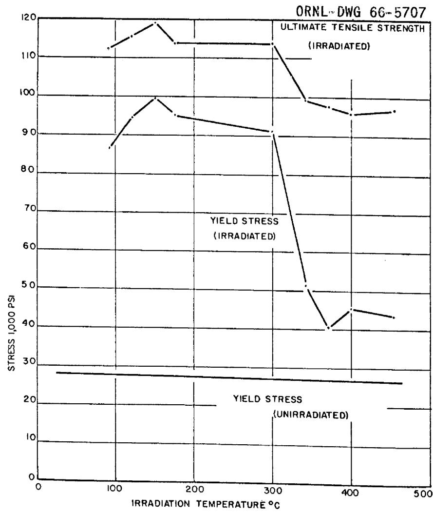  
Fig. 2. Room-Temperature Tensile Properties of Irradiated Type 304 Stainless Steel.

stress was increased by approximately a factor of 3. Typical stress-strain curves from this investigation are replotted in Fig. 3. For irradiation temperatures of 93 and $300^{\circ}\mathrm{C}$ the true fracture stresses and true strains were approximately the same as the unirradiated specimen. Values of engineering elongation were somewhat less for the irradiated specimens. After irradiation at $454^{\circ}\mathrm{C}$ the elongation has increased again, but the fracture stress and strain were somewhat lower than in the other tests, indicating that a different mechanism is operating at $454^{\circ}\mathrm{C}$ than at the lower temperatures. Figure 4 shows that the work-hardening exponents in the plastic range are consistent with the uniform and total elongation values as predicted by Eqs. (5) through (7).

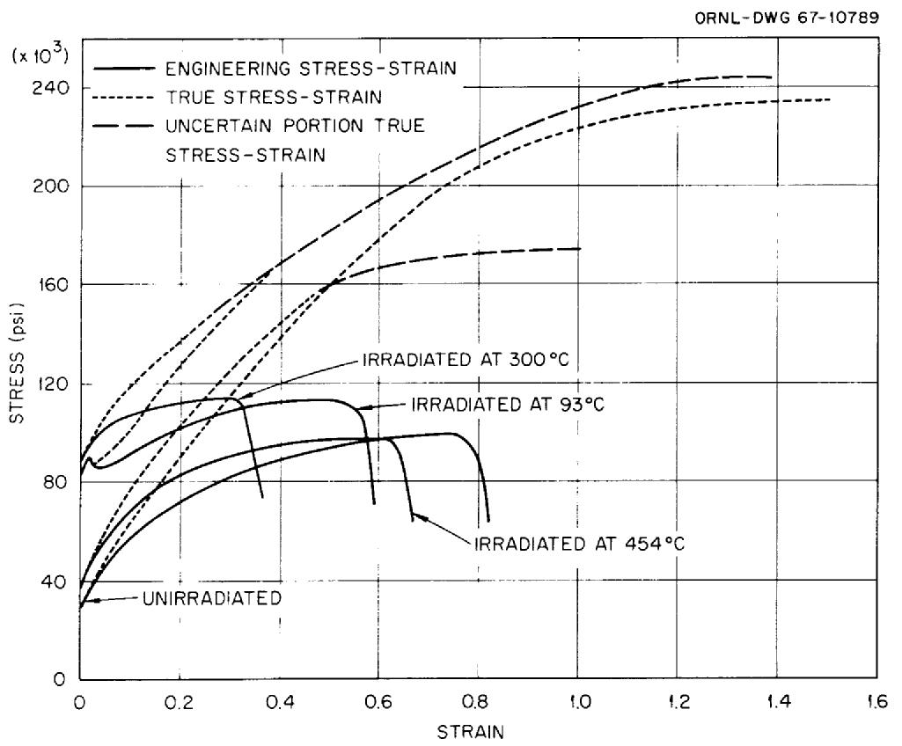  
Fig. 3. The Engineering and True Stress-Strain Curves for Type 304 Stainless Steel at Room Temperature, Tested in the Unirradiated Condition and after Irradiation at Various Temperatures.

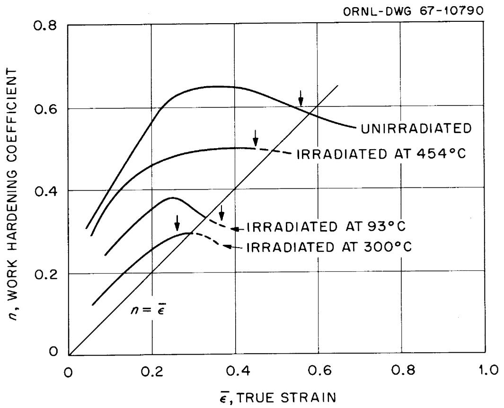  
Fig. 4. The Work-Hardening Characteristics Associated with the Stress-Strain Curves Shown in Fig. 3. The arrows indicate uniform strain as determined by point of maximum load.

Before examining the effects of neutron fluence, test temperature et cetera, we should first consider the behavior in terms of microstructural changes and the interaction of dislocations with the irradiation-produced defect clusters. At irradiation temperatures of approximately $350^{\circ}\mathrm{C}$ and lower "black spots" on the order of a few tens of angstroms in diameter are observed in the microstructure of irradiated specimens. An example of this type of damage for irradiation at $93^{\circ}\mathrm{C}$ is shown in Fig. 5. At higher irradiation temperatures the spots have a larger size and decreased density, as shown in Fig. 6. After irradiation at $371^{\circ}\mathrm{C}$ both the spot density and yield stress (see Fig. 2) are decreased markedly.

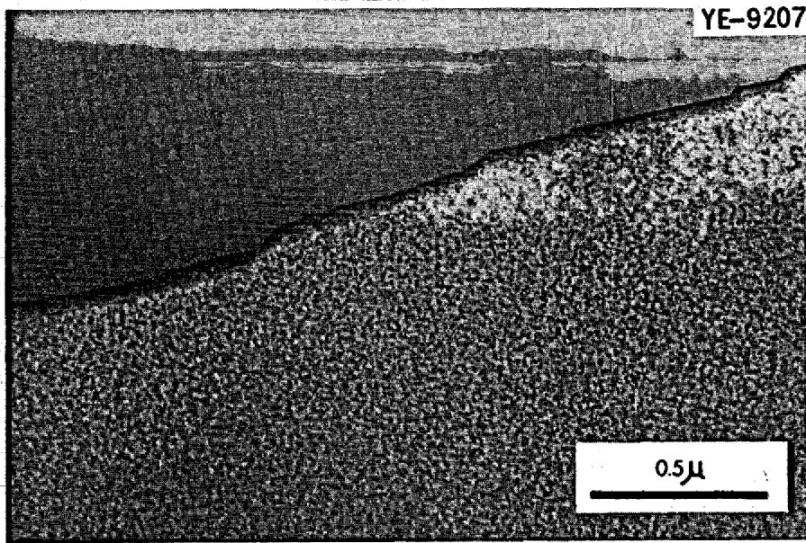  
Fig. 5. Transmission Electron Micrograph of Type 304 Stainless Steel Irradiated at $93^{\circ}\mathrm{C}$ . The black spots are defect clusters produced by the irradiation.

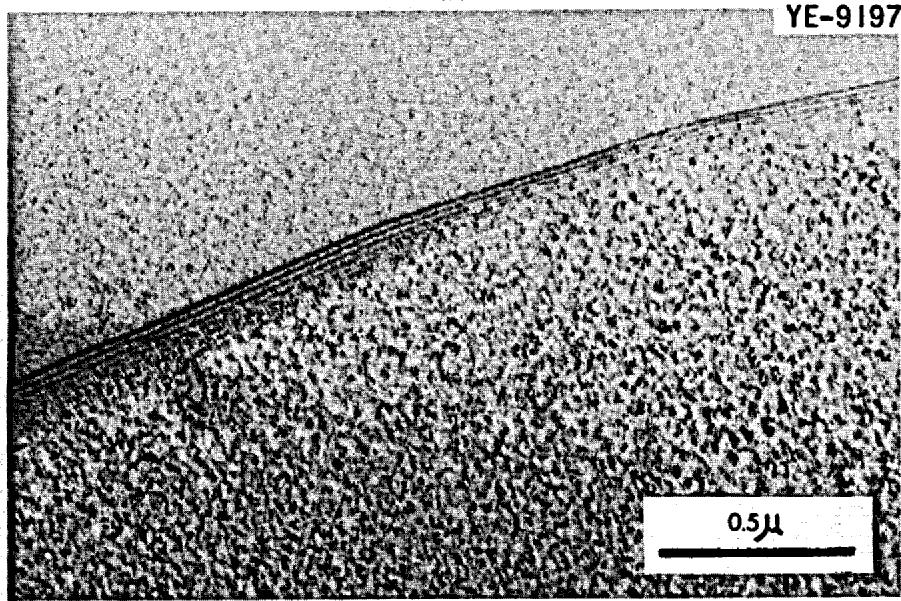  
Fig. 6. Transmission Electron Micrograph of Type 304 Stainless Steel Irradiated at $177^{\circ}\mathrm{C}$ . The spots are larger and more widely distributed than those in the specimen irradiated at $93^{\circ}\mathrm{C}$ (Fig. 4).

Irregularly shaped planar defects, probably precipitates, developed, but these were widely enough spaced that they did not affect the yield stress. At an irradiation temperature of $454^{\circ}\mathrm{C}$ the dot-like defect clusters were completely absent. As shown in Fig. 7, there was extensive precipitation at this temperature, including a heavy precipitate layer and an associated denuded zone at the grain boundaries.

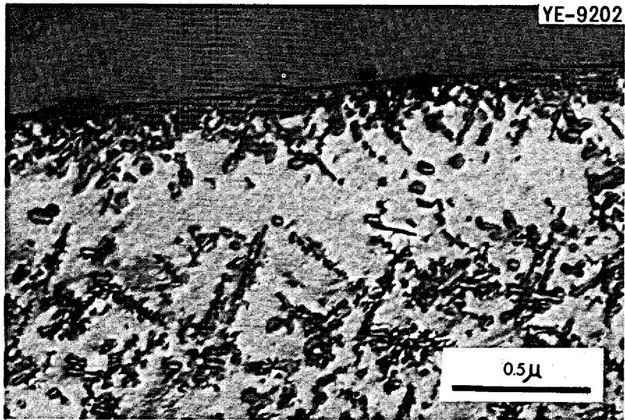  
Fig. 7. Transmission Electron Micrograph Showing Precipitate Particles Formed in Type 304 Stainless Steel During Irradiation at $454^{\circ}\mathrm{C}$ . Note the denuded zone adjacent to the boundary and the extensive precipitation on the boundary.

These observations are in good agreement with those of Armijo et al. who detected a dot-like damaged structure in the same material irradiated at 43 and $343^{\circ}\mathrm{C}$ to fast neutron fluences of $10^{20}$ and $10^{21}$ neutrons/ $\mathrm{cm}^2$ , respectively. These authors report that the defects were considerably larger in the specimen irradiated to the higher fluence at the higher temperature.

Recent quantitative electron microscopy studies of irradiated face-centered cubic metals have at various times claimed the dot defects to be exclusively vacancy clusters and loops, $^{7,8}$ interstitial clusters and loops, $^{9,10}$ or mixtures composed of small vacancy clusters and larger, resolvable interstitial loops. $^{11,12}$ As these differences still have not been resolved, we must at this point conclude that all can probably be formed but that experimental circumstances (irradiation temperature, flux, and fluence) determine the proportions in which each occur.

Transmission electron microscopy $^{13-16}$ of postirradiation deformed single crystals of copper and molybdenum has shown channels in which the radiation-induced defect structure has been eliminated. The interpretation is that glide dislocations sweep out or in some manner remove the radiation-induced defects. The channels are generally clean except for deformation-induced tangles and dipoles. The radiation defects are completely eliminated from the channels $^{16}$ and not simply pushed to the edge of the channel, as was originally suggested. $^{13}$ Sharp $^{16}$ examined annealed specimens containing channels and found no development of structure within the channels, as would be expected if they contained a high density of point defects or point-defect clusters below the resolution limit of the microscope. The mechanism by which the moving dislocations destroy the radiation-produced defects has not been determined. The slip associated with the channels, determined by measuring the slip line offsets, corresponds to the passage of two or three dislocations on each plane within the channel, so ample opportunity exists for dislocations to remove all the defects present.

The channels gradually fill with tangles and deformation-induced debris, through normal work-hardening processes, and this ultimately halts deformation in the channels. Sharp16 observed a higher density of debris existing on a smaller scale in the channels than in unirradiated material, but attributed this to the higher stress at which the slip band developed. During the latter stages of deformation the slip line pattern of irradiated crystals appears similar to that of unirradiated materials.

Seeger17 suggested that the defect clusters harden the lattice by providing obstacles which moving dislocations must cut with the combined aid of the applied stress and thermal fluctuations. As a result of this chopping, the defects are gradually reduced in strength and ultimately destroyed or eliminated by the dislocations, leading to the channels that are observed.

Makin and Sharp18 pointed out that in irradiated materials relatively few slip lines are observed, indicating that few sources are activated, that full-grown slip lines form dynamically in times of the order of a millisecond, and that partially formed slip lines are not observed. They proposed on the basis of elimination of the defects by moving dislocations that the critical stress to form a slip band is the stress required to operate a source in the environment of the defect structure. Subsequent loops can be formed more easily, since the first one clears a path for them. A pileup then forms and expands, creating the cleared channel very rapidly at the high stress levels necessary to generate the first dislocation. The result is creation of a soft zone in a hardened material in which extensive localized shear occurs in a short time until work hardening halts the deformation.

These observations provide a qualitative explanation for the reduced work-hardening coefficients, increased yield stress, and low uniform elongations in irradiated materials. The channeling produces a soft zone in a very hard material, zones in which extensive slip occurs. Because of the limited number of sources or slip systems the dislocation tangling and interactions which normally lead to work hardening occur more slowly and result in a reduced rate of hardening. Figure 8 illustrates the narrow regions to which slip is confined in stainless steel irradiated at $121^{\circ}\mathrm{C}$ and deformed $10\%$ by rolling at room temperature. The defect structure is still clearly visible in the regions between slip bands. The magnification is not high enough to reveal defect-free slip channels.

Within the low-temperature range changes in mechanical properties are a function of fast neutron fluence and irradiation temperature. $^{4,19-20}$ Figure 9 shows the effects of fast neutron fluence on the yield stress and elongation for various irradiation temperatures. Note that the increase in yield stress and reduction in elongation are greatest for irradiation temperatures in the range of 160 to $290^{\circ}\mathrm{C}$ , but that differences do not develop until the material has received fast neutron fluences of approximately $1 \times 10^{20}$ neutrons/ $\mathrm{cm}^2$ . This suggests that the defect clusters grow more complex with increasing neutron fluence. Without further direct evidence one can only state in qualitative terms that the importance of irradiation temperature stems from its influence on the mobility of various defects. At the lowest temperatures vacancy mobility is insufficient to allow the formation of vacancy clusters. This is supported by the observations of Wilsdorf and Kuhlmann-Wilsdorf $^{21}$

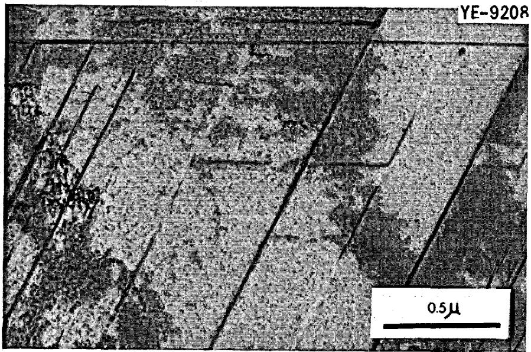  
Fig. 8. Transmission Electron Micrograph of Type 304 Stainless Steel Irradiated at $121^{\circ}\mathrm{C}$ and Deformed $10\%$ by Rolling at Room Temperature. All the deformation has been confined to the dark bands; the radiation-induced defect clusters can still be seen between the bands.

that no detectable defect clusters formed in type 304 stainless steel irradiated at ambient reactor temperature to $10^{19}$ neutrons/cm² and by the observations of Bloom et al. that for irradiation at $93^{\circ}C$ the defect clusters were small and showed extremely weak contrast while at $121^{\circ}C$ their size and contrast had increased significantly.

The nature of the damage in the low-temperature range is apparently unchanged at very high fast neutron fluences. Cawthorne and Fulton22 report that for an austenitic stainless steel irradiated to fast neutron fluences of up to $5 \times 10^{22}$ neutrons/cm2 at temperatures between 270 and approximately $350^{\circ}\mathrm{C}$ "black spot" defects are present in the microstructure. On postirradiation annealing the defects grow into dislocation loops. These loops finally disappear on annealing at about $700^{\circ}\mathrm{C}$ .

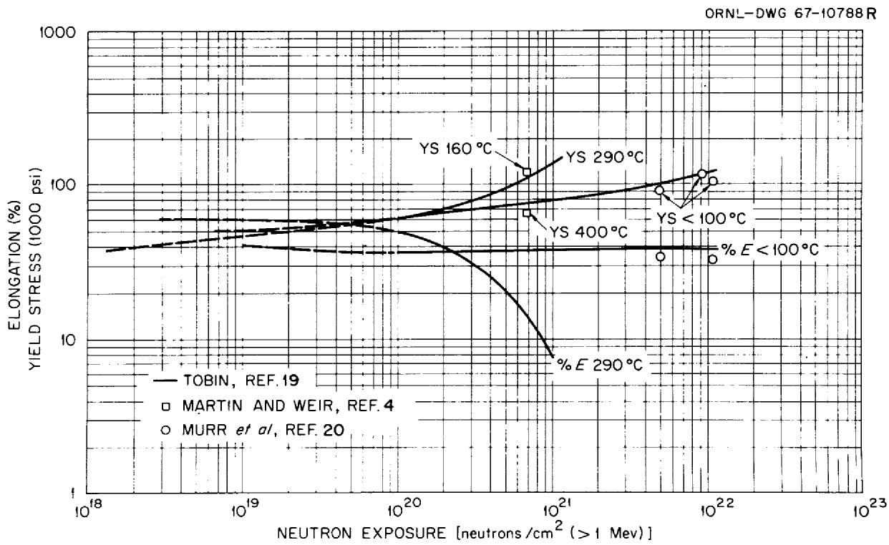  
Fig. 9. Room Temperature Properties of Annealed Stainless Steel after Irradiation at Various Temperatures.

# Intermediate Temperatures

Temperatures in the range of approximately 0.40 to $0.55\mathrm{T}_{\mathrm{m}}$ (380 to $550^{\circ}\mathrm{C}$ for austenitic stainless steels) are particularly important to the first generation fast breeder reactors. It is also in this temperature range that radiation-damage phenomena are least understood. Two separate effects have been observed. The first involves precipitation and thus will be dependent on the alloy system. The second effect is related to displacement processes and appears to be important at high fast neutron fluences.

As discussed in the previous section, irradiation of type 304 stainless steel at $454^{\circ}\mathrm{C}$ to $7 \times 10^{20}$ neutrons/cm $^2$ ( $E > 1$ MeV) resulted in an increase of the room-temperature yield stress from approximately

30,000 to approximately 43,000 psi and small reductions in the fracture stress and strain. Examination of the microstructure of this specimen revealed extensive precipitation, including a heavy layer along grain boundaries. Unlike the defect clusters formed at lower temperatures, such precipitates are not removed by dislocations but rather provide permanent obstacles and sites for tangling. Deformation thus leads to the tangled dislocation configurations shown in Fig. 10.

Arkell and Pfeil $^{23}$ showed that precipitate structures in a niobium-stabilized stainless steel irradiated at temperatures between 450 and $750^{\circ}\mathrm{C}$ were significantly different than those present in unirradiated samples with identical thermal histories. Irradiated samples exhibited enhanced precipitation within the grains.

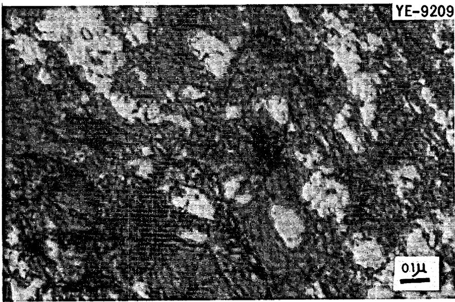  
Fig. 10. Transmission-Electron Micrograph of Type 304 Stainless Steel Irradiated at $454^{\circ}\mathrm{C}$ and Deformed $10\%$ by Rolling at Room Temperature. Compare the uniform distribution of tangled dislocations with the localized slip bands produced in specimens irradiated at a lower temperature (Fig. 8).

Martin and Weir4 reported the effects of irradiation temperature on the postirradiation stress-strain behavior of types 304 and 347 stainless steel irradiated to $7 \times 10^{20}$ neutrons/cm2 (E > l Mev) and $9 \times 10^{20}$ neutrons/cm2 (thermal). For an irradiation temperature of $400^{\circ}\mathrm{C}$ an increased yield stress was observed for test temperatures up to approximately $600^{\circ}\mathrm{C}$ . The strength increase for type 347 stainless steel which contains approximately $1\%$ Nb was significantly larger than that which occurred in type 304 stainless steel (unstabilized). Since niobium is a strong carbide former, it might be postulated that precipitation processes are involved in the hardening mechanisms.

More recently it has been observed $^{22,24-27}$ that irradiation of austenitic stainless steels at temperatures between 350 and $600^{\circ}\mathrm{C}$ to high fast neutron fluences ( $>10^{22}$ neutrons/ $\mathrm{cm}^2$ ) results in large changes in both properties and microstructures. Cawthorne and Fulton $^{22,25}$ used transmission electron microscopy to examine the fuel cladding from experimental fuel pins and tensile specimens irradiated in the Dounreay fast reactor to neutron fluences up to $6\times 10^{22}$ neutrons/ $\mathrm{cm}^2$ at temperatures between 270 and $600^{\circ}\mathrm{C}$ . At irradiation temperatures above approximately $350^{\circ}\mathrm{C}$ voids which varied in size from the smallest resolvable to approximately 500 A were present. Voids constituted 1 to $2\%$ of the volume of the material and could be eliminated by annealing at $900^{\circ}\mathrm{C}$ .

Data obtained by Murphy and Strohm $^{26}$ and Holmes et al. $^{24}$ have demonstrated that this type of damage causes large increases in the yield strength and large reductions in ductility parameters. Holmes et al. $^{24}$ have correlated the changes in yield strength of

type 304 stainless steel irradiated at approximately $530^{\circ}\mathrm{C}$ to $1.4 \times 10^{22}$ neutrons/ $\mathrm{cm}^2$ ( $\mathrm{E} > 0.18\mathrm{MeV}$ ) with the irradiation-produced defect structure. The as-irradiated structure consisted of Frank sessile dislocation loops, about 400 A in diameter and with a density of $3.7 \times 10^{15}$ loops/ $\mathrm{cm}^3$ , and polyhedral cavities approximately 150 A in diameter and about $2 \times 10^{14}$ cavities/ $\mathrm{cm}^3$ in number. Figure 11 is a plot of the yield stress (corrected for temperature dependence of the shear modulus) as a function of test temperature. At test temperatures less than $380^{\circ}\mathrm{C}$ the yield stress shows a thermally activated temperature dependence. The athermal yield stress component is attributed to the strengthening expected from the Frank sessile loops. Above approximately $538^{\circ}\mathrm{C}$ the sessile Frank loops transform to glissile perfect loops which interact to form a dislocation network upon annealing at $593^{\circ}\mathrm{C}$ . Above $648^{\circ}\mathrm{C}$ the cavities or a combination of cavities and dislocation network account for the athermal strength increases that persist to $760^{\circ}\mathrm{C}$ . Full recovery of the yield strength was observed at $816^{\circ}\mathrm{C}$ where neither the cavities nor the dislocation network was detected.

Murphy and Strohm²⁶ have conducted tube burst tests on irradiated EBR-II type 304L stainless steel fuel cladding following irradiation to approximately $1 \times 10^{22}$ neutrons/cm² (fast). Over the length of the cladding tube there is a temperature gradient such that the temperature ranges from $370^{\circ}\mathrm{C}$ at the bottom to $500^{\circ}\mathrm{C}$ at the top. In addition, there is a gradient in the neutron flux that ranges from about $1 \times 10^{15}$ neutrons cm⁻² sec⁻¹ at the top and bottom to $2.5 \times 10^{15}$ neutrons cm⁻² sec⁻¹ at the midplane. In tests at $500^{\circ}\mathrm{C}$ the irradiated tubes exhibited a large increase in burst strength and large

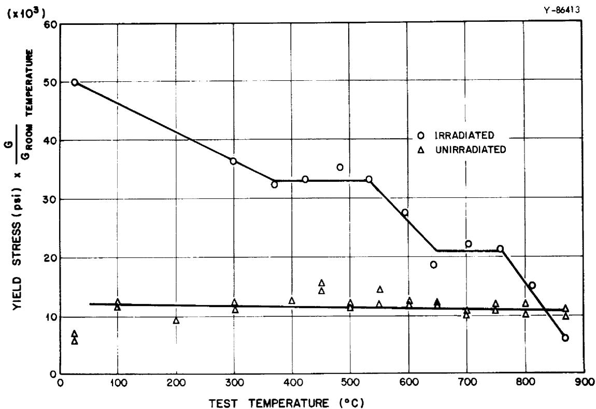  
Fig. 11. Yield Strength (Proportional Elastic Limit) of AISI Type 304 Stainless Steel after Irradiation in EBR-II to $1.7 \times 10^{22}$ neutrons/cm² at 0.49 Tm. (Ref. J. J. Holmes, R. E. Robins, J. L. Brimhall, and B. Mastel, "Elevated Temperature Irradiation Hardening in Austenitic Stainless Steels," accepted for publication in Acta Metallurgica.)

reduction in ductility as measured by diameter increase at the edge of the fracture. Figure 12 is a plot of ductility as a function of test temperature. Between room temperature and approximately $600^{\circ}\mathrm{C}$ the ductility is reduced to extremely low values, on the order of 1 to $2\%$ . At $700^{\circ}\mathrm{C}$ and above there is some recovery of ductility but the values remain much lower than the unirradiated values. Irradiated specimens which were given a pretest anneal at $900^{\circ}\mathrm{C}$ and then tested at $500^{\circ}\mathrm{C}$ recovered all the preirradiation ductility and the strength was reduced to that of the unirradiated tubes.

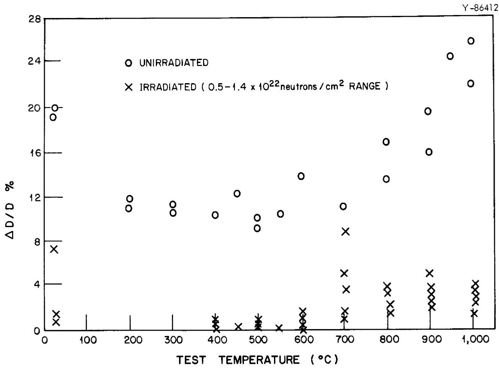  
Fig. 12. Ductility of EBR-II Type 304L Stainless Steel Fuel Cladding after Irradiation at Temperatures Between 375 and $500^{\circ}\mathrm{C}$ . (Ref. W. F. Murphy and H. E. Strohm, "Tube Burst Tests on Irradiated EBR-II Type 304L Stainless Steel Fuel Cladding," to be published in Nuclear Applications, April 1968.)

Stiegler et al.27 have examined the type 304L stainless steel cladding from a similar EBR-II fuel element. Two structural features, namely voids and dislocation loops, were present in all specimens. Table 2 lists the approximate irradiation temperatures, neutron fluences, and void densities for each section examined. A comparison of the results for sections 1 and 5 and 2 and 4 indicates that for the conditions examined the void density decreases with increasing irradiation temperature for a constant fluence.

Table 2. Irradiation Conditions and Void Density Measurements for EBR-II Fuel Cladding   

<table><tr><td>Section Number</td><td>Irradiation Temperature (°C)</td><td>Fast Neutron Fluence (neutrons/cm2)</td><td>Voids per Cubic Centimeter</td></tr><tr><td></td><td></td><td>×1022</td><td>×1015</td></tr><tr><td>1</td><td>370</td><td>0.8</td><td>1.4</td></tr><tr><td>2</td><td>398</td><td>1.2</td><td>1.3</td></tr><tr><td>3</td><td>438</td><td>1.4</td><td>1.3</td></tr><tr><td>4</td><td>465</td><td>1.3</td><td>0.9</td></tr><tr><td>5</td><td>472</td><td>0.9</td><td>0.4</td></tr></table>

Figure 13 shows a histogram of the void sizes observed in section 3. On the basis of this void size distribution and the number of voids per unit volume listed in Table 2, it was calculated that the cladding density was decreased $0.17\%$ by irradiation. Figure 14 shows examples of voids observed for three different irradiation conditions. It is readily apparent that void size increases with increasing irradiation temperature.

The distribution of the voids was remarkably homogeneous. Variations observed between different micrographs probably reflect differences in foil thickness. It is significant, however, that no voids were present in the grain boundaries. In fact, the void density within about 0.1 μ of the boundary was reduced, probably by annihilation of voids contacting the boundary or the influence of the boundary on the void-formation process.

A very complex dislocation substructure was present in each of the five sections. At the lower irradiation temperatures the structure was

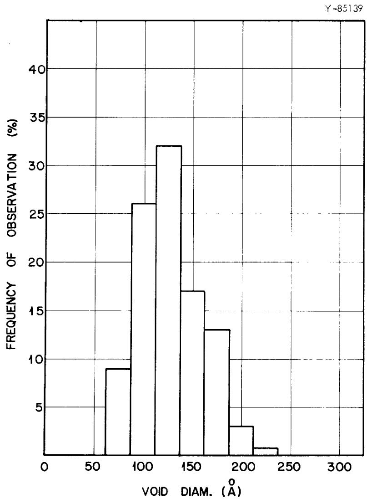  
Fig. 13. Void Size Distributions in EBR-II Cladding Irradiated at $438^{\circ}\mathrm{C}$ to $1.4 \times 10^{22}$ neutrons/cm $^2$ .

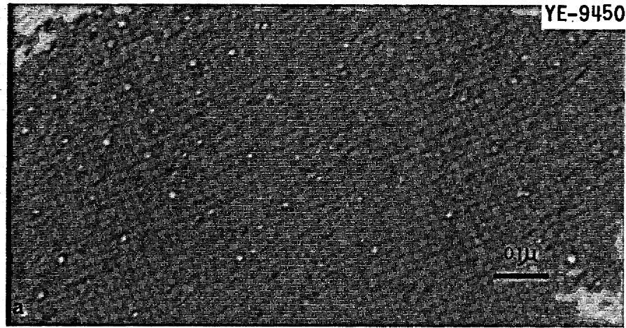

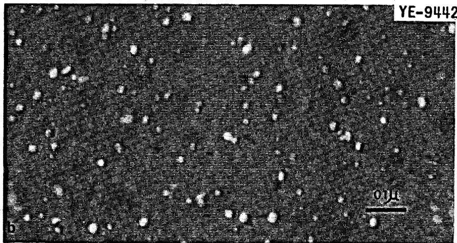

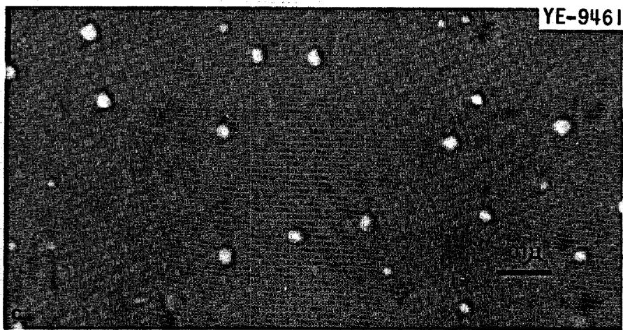  
Fig. 14. Void Formation in Type 304L Stainless Steel Fuel Cladding from EBR-II. (a) $0.8 \times 10^{22}$ neutrons/cm² at $370^{\circ}C$ , $1.4 \times 10^{15}$ voids/cm³.

(b) $1.4 \times 10^{22}$ neutrons/cm $^2$ at $438^{\circ}C$ , $1.3 \times 10^{15}$ voids/cm $^3$ .   
(c) $0.9 \times 10^{22}$ neutrons/cm $^2$ at $472^{\circ}C$ , $0.4 \times 10^{15}$ voids/cm $^3$ .

so complicated that individual loops could not be observed. At $472^{\circ}\mathrm{C}$ , however, well-defined loops were resolved as shown in Fig. 15. These loops lie on {111} and appear faulted, suggesting that they are Frank sessile loops formed by the precipitation of interstitial atoms. The loops ranged in diameter from 200 to 900 A and were present to a density of about $2 \times 10^{15} / \mathrm{cm}^3$ .

Changes in microstructure as a result of postirradiation annealing were examined for specimen 3. After $1\mathrm{hr}$ at $600^{\circ}\mathrm{C}$ the dislocation loops disappeared and were replaced by a dislocation network. At progressively higher annealing temperatures, the dislocation density decreased. After $1\mathrm{hr}$ at $900^{\circ}\mathrm{C}$ the dislocation density was comparable to that of an unirradiated annealed specimen. Concurrent with changes in loop and dislocation structure, the void density decreased. Measurements of

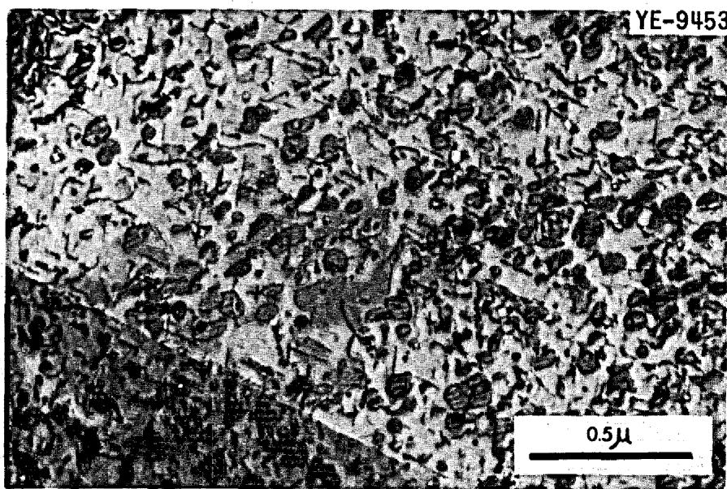  
Fig. 15. Dislocation Loops Produced by Irradiation at $472^{\circ}\mathrm{C}$ .

void size distribution after annealing indicated that the smaller voids annealed more rapidly. All voids were removed after annealing for 1 hr at $900^{\circ}\mathrm{C}$ .

These observations allow a qualitative interpretation of the data of Murphy and Strohm.[26] The as-irradiated tubing contained voids and dislocation loops which cause an increase in strength, possibly through the mechanism as discussed by Holmes et al.[24] The recovery of properties at $500^{\circ}\mathrm{C}$ as a result of postirradiation annealing at $900^{\circ}\mathrm{C}$ is a result of the complete recovery of the damage. At $700^{\circ}\mathrm{C}$ and above the as-irradiated structure recovers very rapidly; thus a partial return of strength and ductility to unirradiated values is observed. It is important to note that ductility is not completely recovered at test temperatures in the range of 700 to $1000^{\circ}\mathrm{C}$ . The reasons for this will be discussed in the next section.

The formation of voids and dislocation loops as a result of irradiation to high fast neutron fluences not only causes large effects on mechanical properties but also leads to swelling or a decrease in the density of the material. Figure 16 shows the correlation between the density decrease and the fast neutron fluence for austenitic stainless steels irradiated at temperatures between 370 and $560^{\circ}\mathrm{C}$ . It should be noted that some of these data were obtained by direct density measurements and some by calculations from void density and size measurements. Several of the results were obtained from specimens removed from actual fuel cladding and thus the material was subjected to stress during irradiation and there can be little doubt that this will influence void

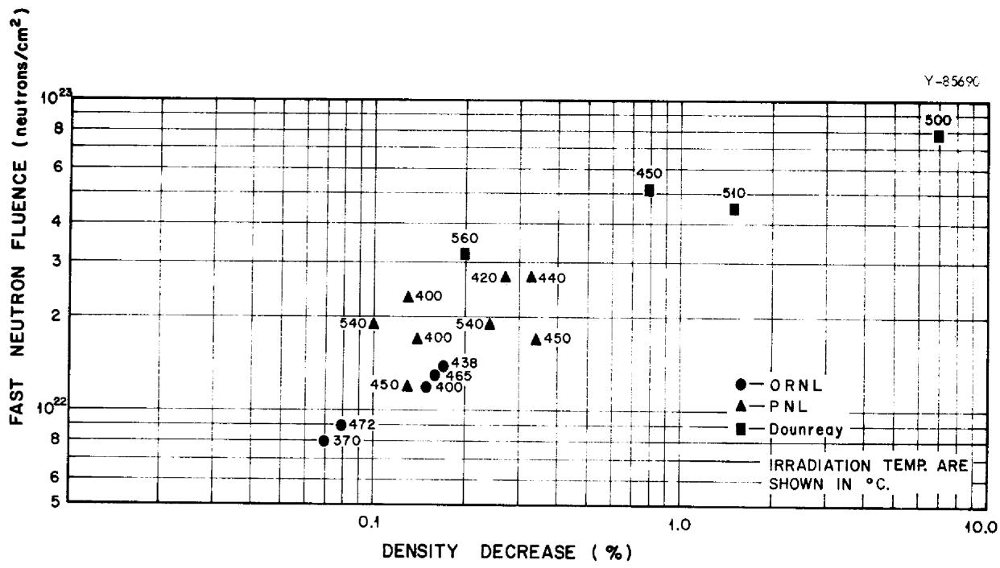  
Fig. 16. Summary of Stainless Steel Density Data.

growth. Interpretation of the data in terms of mechanisms is thus difficult. Figure 16, which is a summary of the available swelling data, $^{22,25,27-28}$ does illustrate, however, that for some combination of temperature, stress, and fluences in excess of $10^{23}$ neutrons/cm $^2$ volume increases greater than $10\%$ may occur.

# High Temperatures

At temperatures above 0.55 to $0.60\mathrm{T}_{\mathrm{m}}$ , the irradiation-produced vacancies and interstitials are sufficiently mobile to allow continuous recovery of defects during irradiation. It is still observed, however, that when the iron- and nickel-base alloys are irradiated and then tested at these high temperatures, there are severe changes in mechanical properties. These changes are characteristically different from those observed at lower temperatures. In tensile tests the stress necessary to produce a given amount of strain is unchanged; but irradiated specimens fail at

a strain much smaller than that at which an unirradiated specimen fails. In creep tests the strain-time relationship is approximately the same for irradiated and unirradiated specimens. Because of the reduced ductility, however, the rupture life is significantly reduced. Examples of the reduction in ductility and rupture life $^{29}$ in type 304 stainless steel are shown in Figs. 17 and 18, respectively.

There are several important experimental observations which indicate the nature and cause of the damage. Since neither the yield nor ultimate tensile strengths are affected $^{5,30}$ and the ductility cannot be recovered by high-temperature postirradiation annealing, $^{31}$ it can be concluded that neither displacement damage nor precipitation reactions are the primary cause. Secondly, the loss of ductility is associated with the grain-boundary fracture process and becomes more severe as the test temperature is increased and the strain rate decreased. For thermal reactor irradiations the postirradiation ductility is related to the initial $^{10}\mathrm{B}$ content of the alloy and the thermal neutron fluence. $^{32,33}$ Boron-10 has a large cross section (3800 barns) for the $^{10}\mathrm{B}(n,\alpha)^{7}\mathrm{Li}$ reaction with thermal neutrons - each reaction producing a helium and lithium atom. By cyclotron injection of helium and lithium ions into an austenitic alloy Higgins and Roberts $^{34}$ demonstrated that of these two transmutation-produced isotopes, only helium had a large deleterious effect on elevated-temperature ductility.

The most widely accepted model for the loss of elevated-temperature ductility stems primarily from the work of Hyam and Sumner, $^{35}$ Rimmer and Cottrell, $^{36}$ Cottrell, $^{37}$ and Barnes $^{38}$ and is summarized as follows. The helium, which is produced from $^{10}\mathrm{B}(n,\alpha)^{7}\mathrm{Li}$ reactions with thermal

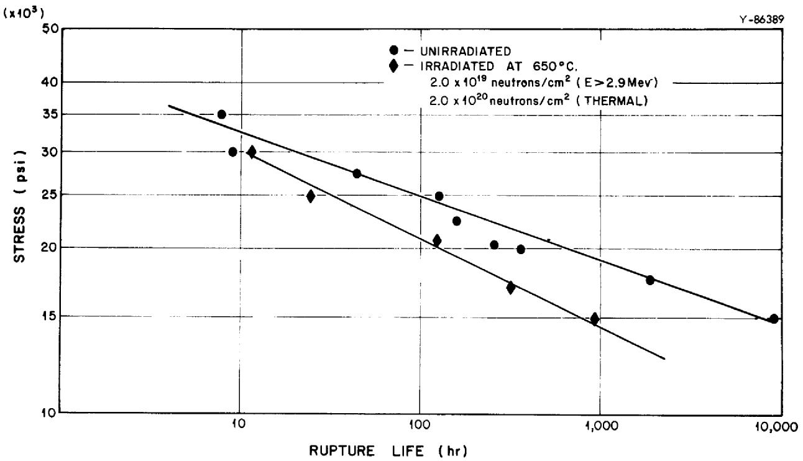  
Fig. 17. Effect of Neutron Irradiation on the Rupture Life of Type 304 Stainless Steel at $650^{\circ}\mathrm{C}$ . [Ref. E. E. Bloom, In-Reactor and Postirradiation Creep-Rupture Properties of Type 304 Stainless Steel at $650^{\circ}\mathrm{C}$ , ORNL-TM-2130 (March 1968).]

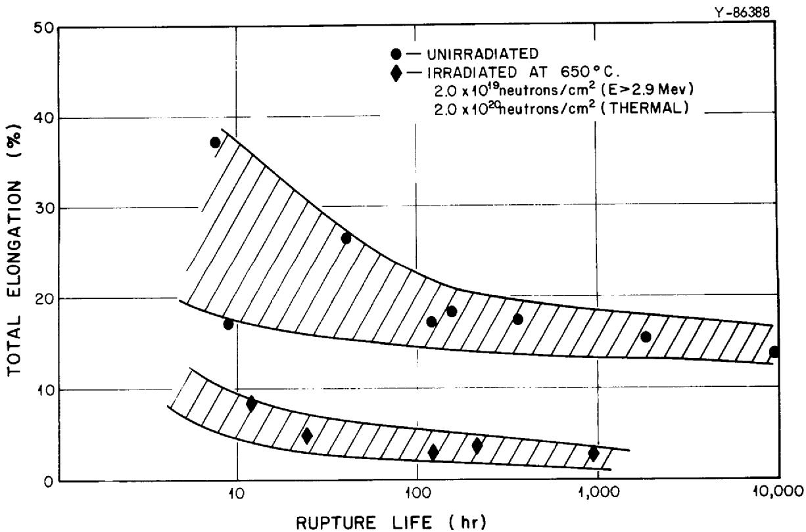  
Fig. 18. Effect of Neutron Irradiation on the Total Elongation at Fracture of Type 304 Stainless Steel at $650^{\circ}\mathrm{C}$ . [Ref. E. E. Bloom, In-Reactor and Postirradiation Creep-Rupture Properties of Type 304 Stainless Steel at $650^{\circ}\mathrm{C}$ , ORNL-TM-2130 (March 1968).]

neutrons and $(n,\alpha)$ reactions between fast neutrons and most alloy constituents, has a very low solubility in the matrix and precipitates to form bubbles. When a normal stress $(\sigma)$ is applied to a bubble having an initial radius $(\gamma)$ larger than a critical radius $(r_{c})$ given by

$$
r _ {c} = 0. 7 6 \gamma / \sigma \tag {8}
$$

where $\gamma$ is the surface energy, the bubble will become unstable and expand indefinitely. Those bubbles which are located at grain boundaries can lead to fracture initiation for several reasons:

1. Due to higher grain boundary diffusivities helium is supplied to these bubbles and they can grow much faster than bubbles located in the matrix.   
2. As a result of grain boundary sliding, stresses may be concentrated at grain boundary jogs and triple grain junctions; thus, a bubble located in such a region will be subjected to a normal stress several times the applied stress.   
3. Once a grain boundary crack is formed, its rate of propagation may be increased by the presence of grain boundary bubbles.

Figure 19 shows that the elevated-temperature tensile ductility of type 304 stainless steel is a sensitive function of the total helium concentration.[32] These data were obtained from alloys containing various amounts of boron and irradiated to various neutron fluences.

Helium bubbles have been observed $^{39,40}$ in both the matrix and the grain boundaries after high-temperature irradiation. Figure 20 shows helium bubbles in type 304L stainless steel irradiated at $700^{\circ}C$ and containing approximately $35 \times 10^{-6}$ atom fraction helium. Rowcliffe et al. $^{38}$

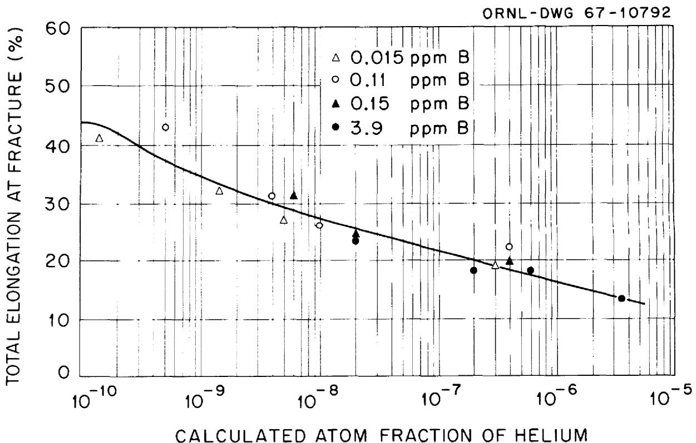  
Fig. 19. The Elongation at Fracture of Type 304 Stainless Steel Containing Various Amounts of Boron and Exposed to Four Radiation Doses, Ranging from $1 \times 10^{18}$ to $5 \times 10^{20}$ neutrons/cm $^2$ . The elongation is shown to be a function of total concentration of helium produced by both high-energy and thermal neutrons. The specimens were tested at $700^{\circ}\mathrm{C}$ after irradiation at $50^{\circ}\mathrm{C}$ in the Oak Ridge Research Reactor. Boron concentrations (in parts per million): open triangle, 0.015; open circle, 0.11; solid triangle, 0.15; solid circle, 3.9.

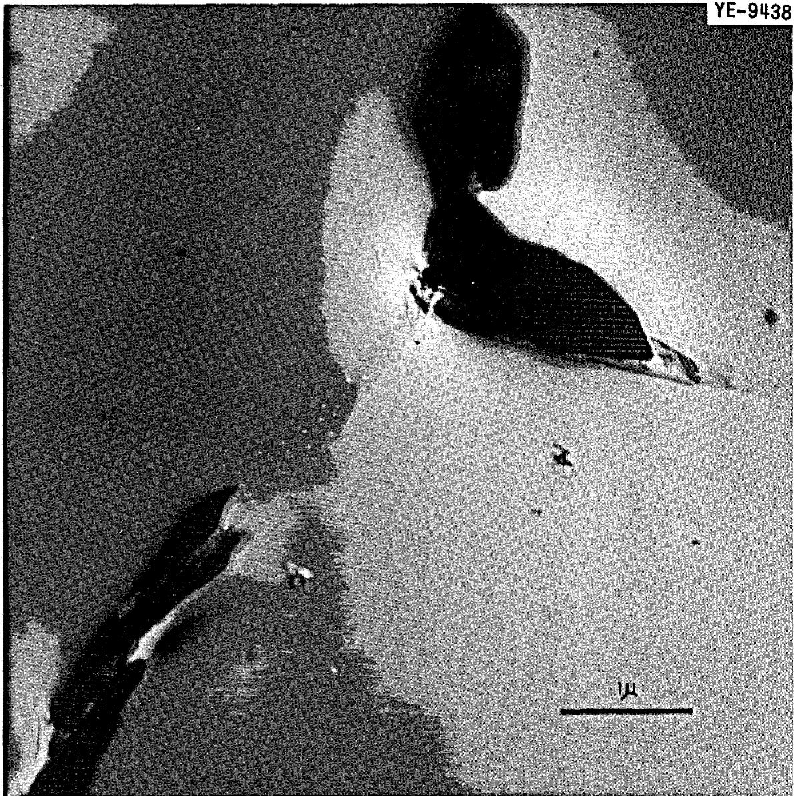  
Fig. 20. Helium Bubbles in Type 304L Stainless Steel Irradiated at $700^{\circ}\mathrm{C}$ Containing Approximately $35 \times 10^{-6}$ Atom Fraction Helium.

have observed the growth of helium bubbles under stress at $750^{\circ}\mathrm{C}$ as would be predicted by Eq. (8).

For material irradiated in thermal reactors, the distribution of helium bubbles is controlled primarily by the initial boron distribution. Woodford et al.41 have observed halos of bubbles around precipitate particles in a precipitation-hardening austenitic stainless steel, indicating that boron is contained within these precipitates. In this case there was a reduction in both ductility and creep rate. The reduced creep rate resulted from the pinning of dislocations by bubbles. The same effect could also be responsible for the reduced ductility.

It is important to note that for irradiations conducted in fast reactors in which the thermal flux is essentially zero most of the helium will be produced as a result of $(n, \alpha)$ reactions between fast neutrons and nearly all alloy constituents. Under these conditions the initial helium distribution will be nearly homogeneous. It has been shown by King and Weir $^{42}$ and Kramer et al. $^{43}$ that homogeneous helium distributions produced by injecting $\alpha$ particles into type 304 stainless steel cause reductions in elevated-temperature ductility similar to those observed after irradiation in thermal reactors.

The observations by Murphy and Strohm²⁶ that even at high test temperatures the ductility of irradiated EBR-II fuel cladding is not recovered suggests that helium is responsible. This is consistent with the fact that strength properties are essentially the same as those of unirradiated tubing.

The elevated-temperature embrittlement problem has been found to be a function of structural and compositional variations. Decreasing the

grain size or producing grain boundary precipitates by preirradiation aging treatments give significant improvements in the postirradiation tensile and creep-rupture ductility of type 304 stainless steel. $^{30}$

These effects are believed to be due to the decreased tendency for intergranular fracture as a result of the increased stress necessary to nucleate and propagate grain boundary cracks.

Roberts and Harries $^{44}$ found that the postirradiation tensile ductility of a $20\%$ Cr- $20\%$ Ni niobium-stabilized austenitic stainless steel was significantly improved by aging 100 hr at $750^{\circ}\mathrm{C}$ before irradiation. Again, the results were interpreted in terms of the effects of grain boundary precipitates on the formation of "wedge" type cracks during testing. It was also shown in this investigation that the magnitudes of the postirradiation ductility in a $18\%$ Cr- $10\%$ Ni niobium-stabilized alloy decreased with increasing boron content up to 50 to 70 ppm (weight) and are then partially recovered in alloys containing higher boron contents.

Titanium additions of approximately 0.2 wt $\%$ give significant improvement in the postirradiation tensile and creep-rupture ductility of types 304 and 304L stainless steel.

Figure 21 compares the postirradiation creep-rupture ductility of types 304, 304L, and 304L + $0.2\%$ Ti stainless steels at test temperatures of 650 and $700^{\circ}\mathrm{C}$ . This effect is believed to be a result of (1) the decreased tendency of the titanium-modified alloy to fracture intergranularly, possibly as a result of the redistribution of elements such as nitrogen, oxygen, et cetera, (2) the segregation of boron into

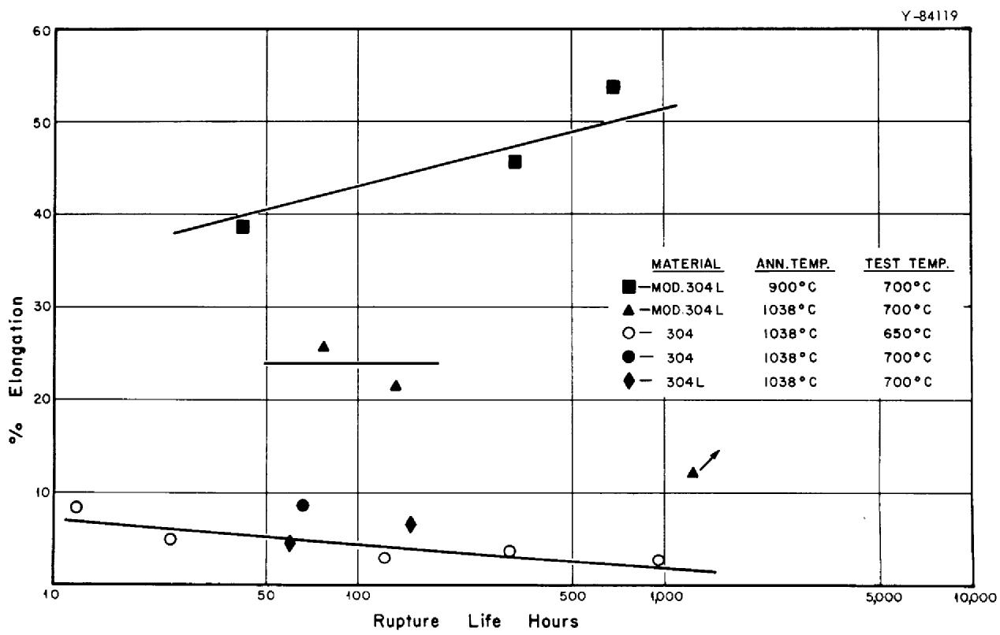  
Fig. 21. Comparison of the Postirradiation Creep-Rupture Ductility of Types 304, 304L and 304L + 0.2% Ti Stainless Steels. All specimens were irradiated at $650^{\circ}\mathrm{C}$ to $10^{20}$ to $10^{21}$ neutrons/cm $^2$ (thermal).

precipitates, thus reducing the amount of helium produced in the grain boundaries, and (3) a refinement in grain size.

# SUMMARY

Materials selected for use as cladding and structural components in a fast reactor system will operate over a wide range of temperature, neutron flux, and stress conditions. The changes in mechanical and physical properties which occur as a result of neutron irradiation are a function of many variables, the most important of which appear to be irradiation temperature and neutron fluence. With regard to the austenitic stainless steels it appears that all known forms of damage

may occur. In components which operate at the lower end of the temperature range (below approximately $380^{\circ}\mathrm{C}$ ) the work-hardening coefficients and uniform elongations will be reduced. How severe these effects will be at fast neutron fluences in excess of $10^{22}$ neutrons/cm $^2$ is unknown.

Damage may take on several forms in the temperature range 380 to approximately $600^{\circ}\mathrm{C}$ . Changes in the precipitate distribution and morphology have been observed. The ways in which these changes affect mechanical properties are not entirely understood. Very recently the formation of voids and dislocation loops as a result of irradiation in this temperature range to fast neutron fluences in excess of approximately $10^{22}$ neutrons/cm² has been observed. This damage causes drastic reductions in ductility parameters and a density decrease or swelling of the material. Available data suggest that this form of damage is most severe at temperatures near $550^{\circ}\mathrm{C}$ and that for fast neutron fluences of $1 \times 10^{23}$ neutrons/cm² density decreases as large as $10\%$ may occur.

At temperatures above $600^{\circ}\mathrm{C}$ one would expect displacement damage to be unstable and to recover in short times after it is created. Under these conditions changes in strength properties are small. Reductions in ductility which become more severe at higher temperatures and lower strain rates are, however, observed. These effects are a result of helium which is produced by various $(n,\alpha)$ transmutation reactions during irradiation.

# ACKNOWLEDGMENTS

The authors are happy to acknowledge the assistance of several members of the Metals and Ceramics Division in the preparation of this document: F. W. Wiffen and C. J. McHargue for technical review of the manuscript, C.K.H. DuBose for the electron photomicrographs, K. W. Boling for the graphic work, and M. R. Hill for preparation of the manuscript.

# REFERENCES

1. G. H. Kinchin and R. S. Pease, "The Displacement of Atoms in Solids by Radiation," Rept. Progr. Phys. 18, 1 (1955).   
2. H. Alter and C. E. Weber, "The Production of Hydrogen and Helium in Metals During Reactor Irradiation," J. Nucl. Mater. 16, 68 (1965).   
3. E. W. Hart, "Theory of the Tensile Test," Acta Met. 15, 351 (1967).   
4. W. R. Martin and J. R. Weir, "Effect of Irradiation Temperature on the Post-Irradiation Stress-Strain Behavior of Stainless Steel," p. 251 in Flow and Fracture of Metals and Alloys in Nuclear Environments Spec. Tech. Publ. No. 380, American Society for Testing and Materials, Philadelphia, Pa., 1965.   
5. E. E. Bloom, W. R. Martin, J. O. Stiegler, and J. R. Weir, "The Effect of Irradiation Temperature on the Strength and Microstructure of Stainless Steel," J. Nucl. Mater. 22, 68 (1967).   
6. J. S. Armijo, J. R. Low, Jr., and V. E. Wolff, Radiation Effects on the Mechanical Properties and Microstructure of Type 304 Stainless Steel, USAEC Report APED-4542, General Electric Company, Vallecitos Atomic Laboratory (April 13, 1964).   
7. M. Wilkens and M. Ruhle, "Observations of Point Defect Agglomerations in Copper by Means of Electron Microscopy," The Nature of Small Defect Clusters, AERE-R 5269, p. 365 (1966).   
8. M. Ruhle, "Electronemikros kopie kleiner fehlstellenagglomerate in bestrahlten metallen," Phys. Status Solidi 19, 279 (1967).   
9. K. G. McIntyre and L. M. Brown, "Diffraction Contrast from Small Defect Clusters in Irradiated Copper," The Nature of Small Defect Clusters, AERE-R 5269, p. 351 (1966).

10. K. G. McIntyre, "Interstitial Loops in Neutron Irradiated Copper," Phil. Mag. 15, 205 (1967).   
ll. M. J. Makin, F. J. Minter, and S. A. Manthorpe, "The Correlation Between Critical Resolved Shear Stress of Neutron Irradiated Copper Single Crystals and the Density of Defect Clusters," Phil. Mag. 13, 729 (1966).   
12. G. P. Scheidler, M. J. Makin, F. J. Minter, and W. F. Schilling, "The Effect of Irradiation Temperature on the Formation of Clusters in Neutron Irradiated Copper," The Nature of Small Defect Clusters, AERE-R 5269, p. 405 (1966).   
13. I. G. Greenfield and H.G.F. Wilsdorf, "Effect of Neutron Irradiation on the Plastic Deformation of Copper Single Crystals," J. Appl. Phys. 32, 827 (1961).   
14. B. Mastel, H. E. Kissinger, J. J. Laidler, and T. K. Bierlein, "Dislocation Channeling in Neutron Irradiated Molybdenum," J. Appl. Phys. 34, 3637 (1963).   
15. J. L. Brimhall, "The Effect of Neutron Irradiation on Slip Lines in Molybdenum," Trans. Met. Soc. AIME 233, 1737 (1965).   
16. J. V. Sharp, "Deformation of Neutron Irradiated Copper Single Crystals," Phil. Mag. 16, 77 (1967).   
17. A. Seeger, "On the Theory of Radiation Damage and Radiation Hardening," Proc. U.N. Intern. Conf. Peaceful Uses At. Energy, 2nd, Geneva 1958 6, 250 (1958).   
18. M. J. Makin and J. V. Sharp, "A Model of 'Lattice Hardening' in Irradiated Copper Crystals with the External Characteristics of 'Source' Hardening," Phys. Status Solidi 9, 109 (1965).

19. J. C. Tobin, M. S. Wechsler, and A. D. Rossin, "Radiation Induced Changes in the Properties of Non-Fuel Reactor Materials," Proc. U.N. Intern. Conf. Peaceful Uses At. Energy, 3rd, Geneva 1964 9, 23 (1965).   
20. W. E. Murr, F. R. Shober, R. Lieberman, and R. F. Dickerson, Effects of Large Neutron Doses and Elevated Temperature on Type 347 Stainless, Battelle Memorial Institute, BMI-1609 (Jan. 23, 1963); also F. R. Shober and W. E. Murr, "Radiation-Induced Property Changes in AISI Type 347 Stainless," p. 325 in Symposium on Radiation Effects on Metals and Neutron Dosimetry Spec. Tech. Publ. No. 341, American Society for Testing and Materials, Philadelphia, Pa., 1963.   
21. H.G.F. Wilsdorf and D. Kuhlmann-Wilsdorf, "Dislocation Behavior in Quenched and Neutron Irradiated Stainless Steel," J. Nucl. Mater. 5, 178 (1962).   
22. C. Cawthorne and E. J. Fulton, "The Influence of Irradiation Temperature on the Defect Structure in Stainless Steel," The Nature of Small Defect Clusters, AERE-R 5269, p. 446 (1966).   
23. D. R. Arkell and P.C.L. Pfeil, "Transmission Electron Microscopical Examination of Irradiated Austenitic Steel Tensile Specimens," J. Nucl. Mater. 12, 145 (1964).   
24. J. J. Holmes, R. E. Robins, J. L. Brimhall, and B. Mastel, "Elevated Temperature Irradiation Hardening in Austenitic Stainless Steels," accepted for publication in Acta Metallurgica.   
25. C. Cawthorne and E. J. Fulton, "Voids in Irradiated Stainless Steel," Nature 216, 575 (1967).

26. W. F. Murphy and H. E. Strohm, "Tube Burst Tests on Irradiated EBR-II Type 304L Stainless Steel Fuel Cladding," to be published in Nuclear Applications, April 1968.   
27. J. O. Stiegler, E. E. Bloom, and J. R. Weir, "Electron Microscopy of Irradiated EBR-II Fuel Cladding," to be published.   
28. J. J. Holmes, Battelle Northwest Laboratories, personal communication (1968).   
29. E. E. Bloom, In-Reactor and Postirradiation Creep-Rupture Properties of Type 304 Stainless Steel at $650^{\circ}\mathrm{C}$ , Oak Ridge National Laboratory, ORNL-TM-2130 (March 1968).   
30. W. R. Martin and J. R. Weir, "Solutions to the Problems of High-Temperature Irradiation Embrittlement," Spec. Tech. Publ. No. 426, American Society for Testing and Materials, Philadelphia, Pa.   
31. W. R. Martin and J. R. Weir, "Effect of Post-Irradiation Heat Treatment on the Elevated Temperature Embrittlement of Irradiated Stainless Steel," Nature 202, 997 (1964).   
32. A. C. Roberts and D. R. Harries, "Elevated Temperature Embrittlement Induced in a 20 per cent Chromium: 25 per cent Nickel: Niobium Stabilized Austenitic Steel by Irradiation with Thermal Neutrons," Nature 200, 772 (1963).   
33. W. R. Martin, J. R. Weir, R. E. McDonald, and J. C. Franklin, "Irradiation Embrittlement of Low-Boron Type 304 Stainless Steel," Nature 208, 73 (1965).   
34. P.R.B. Higgins and A. C. Roberts, "Reduction in Ductility of Austenitic Stainless Steel after Irradiation," Nature 206, 1249 (1965).

35. E. D. Hyam and G. Sumner, "Irradiation Damage to Beryllium," Symposium held in Venice May 7-11, 1962, International Atomic Energy Agency, Vienna, 1962, p. 321.   
36. D. E. Rimmer and A. H. Cottrell, "The Solution of Inert Gas Atoms in Metals," Phil. Mag. 2, 1345 (1957).   
37. A. H. Cottrell, "Effects of Neutron Irradiation on Metals and Alloys," Met. Revs. 1, 479 (1956).   
38. R. S. Barnes, "Embrittlement of Stainless Steels and Nickel-Based Alloys at High Temperature Induced by Neutron Irradiation," Nature 206, 1307 (1965).   
39. A. F. Rowcliffe, G.J.C. Carpenter, H. F. Merrick, and R. B. Nicholson, "An Electron Microscope Investigation of the High Temperature Embrittlement of Irradiated Stainless Steels," Spec. Tech. Publ. No. 426, American Society for Testing and Materials, Philadelphia, Pa.   
40. D. R. Harries, "Neutron Irradiation Embrittlement of Austenitic Stainless Steels and Nickel Base Alloys," J. Brit. Nucl. Energy Soc. 5, 74 (1966).   
41. D. A. Woodford, J. D. Smith, and J. Moteff, "Distribution of Boron in an Austenitic Steel Inferred from the Observation of Helium Gas Bubbles after Neutron Irradiation," J. Nucl. Mater. 24, 118 (1967).   
42. R. T. King and J. R. Weir, "Effects of Cyclotron-Injected Helium on the Mechanical Properties of Stainless Steel," paper presented at the 13th Annual Meeting of the American Nuclear Society, San Diego, California, June 11-15, 1966.

43. D. Kramer, H. R. Brager, C. G. Rhodes, and A. G. Dard, Helium Embrittlement in Type 304 Stainless Steel, Atomics International Report, NAA-SR-12601.   
44. A. C. Roberts and D. R. Harries, "Effects of Irradiation and Heat Treatment on the High Temperature Tensile Properties of Austenitic Stainless Steels," Spec. Tech. Publ. No. 426, American Society for Testing and Materials, Philadelphia, Pa.

# INTERNAL DISTRIBUTION

1-3. Central Research Library   
4-5. ORNL - Y-12 Technical Library Document Reference Section

6-15. Laboratory Records Department

16. Laboratory Records, ORNL RC   
17. ORNL Patent Office

18. G. M. Adamson, Jr.   
19. T. E. Banks   
20. J.H.Barrett   
21. S. E. Beall   
22. R. J. Beaver   
23. M. Bender   
24. R. G. Berggren   
25. D. S. Billington

26-30. E.E.Bloom

31. A. L. Boch   
32. E. S. Bomar   
33. B. S. Borie   
34. G. E. Boyd   
35. R. A. Bradley   
36. R. B. Briggs   
37. R. E. Brooksbank   
38. W. E. Brundage   
39. D. A. Canonico   
40. R. M. Carroll   
41. J.V. Cathcart   
42. A. K. Chakraborty   
43. Ji Young Chang   
44. G.W.Clark   
45. K. V. Cook   
46. G. L. Copeland   
47. W. B. Cottrell   
48. C. M. Cox   
49. F. L. Culler   
50. J. E. Cunningham   
51. H. L. Davis   
52. V. A. DeCarlo   
53. J. H. DeVan   
54. C. V. Dodd   
55. R.G.Donnelly   
56. J.H. Erwin   
57. K. Farrell   
58. J. S. Faulkner   
59. J. I. Federer   
60. D. E. Ferguson   
61. R.B.Fitts   
52. B. E. Foster   
53. A.P.Fraas   
54. J. H Frye, Jr.

65. W. Fulkerson   
66. T. G. Godfrey, Jr.   
67. R. J. Gray   
68. W. R. Grimes   
69. H. D. Guberman   
70. D. G. Harman   
71. W. O. Harms

72-74. M.R.Hill   
75. N. E. Hinkle   
76. D. O. Hobson   
77. H. W. Hoffman   
78. R. W. Horton   
79. W.R.Huntley   
80. H. Inouye   
81. G.W. Keilholtz   
82. B. C. Kelley   
83. R. T. King   
84. J. Komatsu   
85. J. A. Lane   
86. J. M. Leitnaker   
87. T. B. Lindemer   
88. A. P. Litman   
89. H. R. Livesey   
90. A. L. Lotts   
91. R. N. Lyon   
92. H. G. MacPherson   
93. R. E. MacPherson   
94. M. M. Martin   
95. W.R. Martin   
96. R. W. McClung   
97. H. E. McCoy, Jr.   
98. H.C.McCurdy   
99. R.E.McDonald   
OO. W. T. McDuffee   
D. L. McElroy   
D2. C.J. McHargue   
D3. F.R. McQuilkin   
D4. A. J. Miller   
05. E.C.Miller   
06. J. P. Moore   
07. W. L. Moore   
08. J. G. Morgan   
D9. F.H. Neill   
10. G. T. Newman   
11. T. M. Nilsson   
12. T. A. Nolan (K-25)   
13. S. M. Ohr   
L4. A. R. Olsen   
L5. P. Patriarca

16. W.H.Pechin   
117. A. M. Perry   
118. S. Peterson   
119. R. A. Potter   
120. R.B. Pratt   
121. M. K. Preston   
122. R. E. Reed   
123. D. K. Reimann   
124. A. E. Richt   
125. P. L. Rittenhouse   
126. W.C.Robinson   
127. M. W. Rosenthal   
128. C. F. Sanders   
129. G. Samuels   
130. A. W. Savolainen   
131. J. L. Scott   
132. J. D. Sease   
133. 0. Sisman   
134. G. M. Slaughter   
135. S. D. Snyder   
136. K. E. Spear

137. I. Spiewak   
138. J. T. Stanley   
139. W.J. Stelzman

140-144. J. O. Stiegler

145-264. D. B. Trauger

265. R.P.Tucker   
266. G. M. Watson   
267. M. S. Wechsler   
268. A. M. Weinberg

269-288. J.R.Weir, Jr.

289. W.J.Werner   
290. H. L. Whaley   
291. G. D. Whitman   
292. J. M. Williams   
293. R. K. Williams   
294. R.O. Williams   
295. J. C. Wilson   
296. R. G. Wymer   
297. F. W. Young, Jr.   
298. C. S. Yust   
299. A. F. Zulliger

# EXTERNAL DISTRIBUTION

300-303. F.W.Albaugh,Battelle,PNL   
304-306. R. J. Allio, Westinghouse Atomic Power Division

307. A. Amorosi, Argonne National Laboratory   
308. R. D. Baker, Los Alamos Scientific Laboratory   
309. C. Baroch, Babcock and Wilcox   
310. V. P. Calkins, General Electric NMPO   
311. S. Christopher, Combustion Engineering, Inc.   
3.2. D. B. Coburn, Gulf General Atomic, Inc.   
313. D. F. Cope, RDT, SSR, AEC, Oak Ridge National Laboratory   
314. G. W. Cunningham, AEC, Washington   
315. G. K. Dicker, Division of Reactor Development and Technology, AEC, Washington   
316. D. E. Erb, Division of Reactor Development and Technology, AEC, Washington   
317. E. A. Evans, General Electric, Vallecitos   
318. W. C. Francis, Idaho Nuclear Corporation   
319. A. J. Goodjohn, Gulf General Atomic, Inc.   
320. S.P.Grant,Babcock and Wilcox   
321. J. F. Griffin, Division of Space Nuclear Systems, AEC, Washington   
322. R. G. Grove, Mound Laboratory   
323. D. H. Gurinsky, Brookhaven National Laboratory   
324. A. N. Holden, General Electric, APED

325-327. J. S. Kane, Lawrence Radiation Laboratory, Livermore

328. Haruo Kato, Albany Metallurgy Research Center, P.O. Box 70, Albany, Oregon 97321

329. L. Kelman, LMFBR Program Office, Argonne National Laboratory   
330. E. E. Kintner, AEC, Washington   
331. J. H. Kittel, Argonne National Laboratory   
332. E. J. Kreih, Westinghouse, Bettis Atomic Power Laboratory   
333. W. J. Larkin, AEC, Oak Ridge Operations   
334. W. L. Larsen, Iowa State University, Ames Laboratory   
335. C. F. Leitten, Jr., Linde Division, Union Carbide Corp.   
336. P. J. Levine, Westinghouse Advanced Reactor Division, Waltz Mill Site, Box 158, Madison, Pa. 15663   
337. J. J. Lombardo, NASA, Lewis Research Center   
338. J. H. MacMillan, Babcock and Wilcox   
339. C. L. Matthews, RDT, OSR, AEC, Oak Ridge National Laboratory   
340. M. McGurty, General Electric, NMPO   
341. A. Mullunzi, Division of Reactor Development and Technology, AEC, Washington   
342. M. Nevitt, Argonne National Laboratory   
343. R. E. Pahler, Division of Reactor Development and Technology, AEC, Washington   
344. S. Paprocki, Battelle Memorial Institute   
345. W. E. Ray, Westinghouse Advanced Reactor Division, Waltz Mill Site, Box 158, Madison, Pa. 15663   
346. W.L.R. Rice, AGMR, AEC, Washington   
347. B. Rubin, Lawrence Radiation Laboratory, Livermore   
348. F. C. Schwenk, Division of Reactor Development and Technology, AEC, Washington   
349. W. F. Sheely, Division of Research, AEC, Washington   
350. P. G. Shewmon, Argonne National Laboratory   
351-353. J. M. Simmons, Division of Reactor Development and Technology, AEC, Washington   
354. L. E. Steele, Naval Research Laboratory   
355. R. H. Steele, Division of Reactor Development and Technology, AEC, Washington   
356-358. D. K. Stevens, Division of Research, AEC, Washington   
359. A. Strasser, United Nuclear Corporation   
360. A. Taboada, Division of Reactor Development and Technology, AEC, Washington   
361. A. Van Echo, Division of Reactor Development and Technology, AEC, Washington   
362. James Watson, Gulf General Atomic, Inc.   
363. C. E. Weber, AEC, Washington   
364. J. F. Weissenberg, RDT, OSR, General Electric, NMPO   
365. G. W. Wensch, Division of Reactor Development and Technology, AEC, Washington   
366. G. A. Whitlow, Westinghouse Advanced Reactor Division, Waltz Mill Site, Box 158, Madison, Pa. 15663   
367. E. A. Wright, AEC, Washington   
368. Laboratory and University Division, AEC, Oak Ridge Operations   
369-383. Division of Technical Information Extension