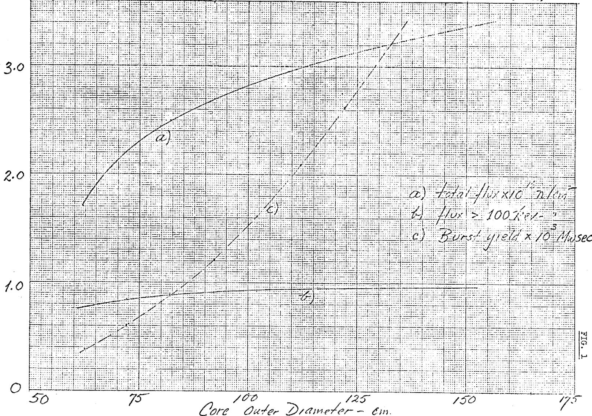
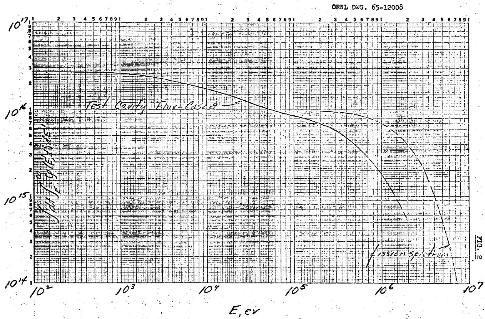

ORNL-TM-2282

COPY NO. -

DATE-July 10,1968

MASTER

PRELIMINARY STUDY OF A MOLTEN-SALT BURST REACTOR

A.M.Perry

H. F. Bauman

W. B. McDonald

J. T. Mihalczo

# Distribution

1. Dr. Victor Raievski, ISPRA   
2. M.J.Skinner   
3.-5. DTIE

# PRELIMINARY STUDY OF A MOLTEN-SALT BURST REACTOR

A.M.Perry W.B.McDonald   
H. F. Bauman J. T. Mihalczo

The question has been posed whether one could pulse a molten-salt reactor so as to achieve an integrated flux of $10^{16}$ neutrons/cm² per burst in a test cavity at the center of the reactor, and, if so, what energy yield would be required and what would be the shape of the pulse? The nominal objectives appear to be:

1) $1 - 2 \times 10^{16}$ neutrons/cm $^2$ per burst, without a tight specification on the neutron spectrum,   
2) a burst width in the neighborhood of 10 msec or less. Since it appears that the second objective should be easy to satisfy, we have looked at the possibility of achieving the first without much regard for factors which might influence the burst shape, and have subsequently estimated the burst width for one of several reactor configurations one might contemplate using.

# 1. Selection of Salt

The calculations were based on use of the salt LiF (73 mole %) $\mathrm{UF_4}$ (27 mole %), and for each reactor considered, the critical enrichment of the uranium was determined. Separated Li would of course be used.

Relevant properties of the salt are:

Melting point, $^\circ \mathrm{C}$ 490

Specific heat of the melt, cal/gm °C 0.217

Density of the melt, $\mathrm{gm/cm^3}$ 5.26 - 9.3 × 10 $^{-4}$ T(°C)

# 2. Allowable Energy Input

We postulate that the temperature of the salt could be allowed to rise $1000^{\circ}\mathrm{C}$ , i.e., nominally from $500^{\circ}\mathrm{C}$ to $1500^{\circ}\mathrm{C}$ . The properties given above yield the following values at $1000^{\circ}\mathrm{C}$ (average temperature):

4

Density 4.33 gm/cm³  
Specific heat 4 wsec/cm³ °C

Thus, the integrated flux that can be obtained in the test cavity corresponds to a maximum energy density of $\frac{4}{\mathrm{kmsec/cm^3}}$ per burst.

# 3. Geometry

For the purposes of this preliminary exploration, we postulate spherical geometry, with concentric regions and dimensions as follows:

Test cavity (void) 15 cm radius  
Ni shell 1 cm thick  
Fueled salt 15 to 60 cm thick  
Ni shell 5 cm thick  
Graphite shell 25 cm thick

An additional case was examined with the thickness of the outer Ni container increased to 15 cm, and the graphite shell omitted; this was done for a 60-cm-thick salt region.

# 4. Results

The integrated fluxes obtainable in the test cavity are shown for each case in Table 1, along with geometrical specifications and other derived results. Some of these results are also plotted in Fig. 1.

The neutron spectrum for case #8, with 92-cm-OD core (3 ft) is shown in Fig. 2, as the integral above energy E, as a function of E, i.e.,

$$
\int d t \int_ {E} ^ {\infty} \phi (E ^ {\prime}, t) d E ^ {\prime},
$$

where the time integration is taken over the duration of the burst. For comparison, the fission spectrum is also given, normalized to $1 \times 10^{16}$ neutrons.

In case #3, which was the same as case #1, except that the 5-cm Ni and 25-cm graphite shells were replaced by a single 15-cm Ni shell, both the peak-to-average power density ratio and the integrated flux in the test cavity were the same as in case #1.

Table 1. Burst Characteristics vs Core Size   

<table><tr><td rowspan="2">Case Number</td><td rowspan="2">\(Fuel^a\)\(Outside Diameter (cm)\)</td><td rowspan="2">Fuel Volume (liters)</td><td rowspan="2">Critical Enrichment (%)</td><td rowspan="2">235U Mass (kg)</td><td rowspan="2">Pmax/Pavg</td><td colspan="2">Integrated Flux in Test Cavity</td><td rowspan="2">Burst Yield (Mw sec)</td></tr><tr><td>Total (neutrons/cm2×10-16)</td><td>&gt;100 kev</td></tr><tr><td>4</td><td>152</td><td>1821</td><td>17.5</td><td>854</td><td>1.545</td><td>3.4</td><td>0.97</td><td>4714</td></tr><tr><td>1</td><td>122</td><td>934</td><td>19.7</td><td>493</td><td>1.423</td><td>3.1</td><td>0.95</td><td>2625</td></tr><tr><td>6</td><td>112</td><td>718</td><td>21.1</td><td>398</td><td>1.378</td><td>3.0</td><td>0.94</td><td>2084</td></tr><tr><td>7</td><td>102</td><td>538</td><td>22.2</td><td>320</td><td>1.331</td><td>2.8</td><td>0.92</td><td>1615</td></tr><tr><td>8</td><td>92</td><td>, 391</td><td>24.2</td><td>253</td><td>1.282</td><td>2.7</td><td>0.91</td><td>1214</td></tr><tr><td>9</td><td>82</td><td>272</td><td>27.3</td><td>200</td><td>1.231</td><td>2.5</td><td>0.88</td><td>883</td></tr><tr><td>10</td><td>72</td><td>178</td><td>32.1</td><td>153</td><td>1.178</td><td>2.2</td><td>0.84</td><td>605</td></tr><tr><td>11</td><td>62</td><td>108</td><td>41.4</td><td>120</td><td>1.125</td><td>1.7</td><td>0.77</td><td>382</td></tr></table>

aFor all cases shown, cavity outside diameter $= 30$ cm, inner shell thickness $= 1$ cm, outer shell thickness $= 5$ cm, graphite shell thickness $= 25$ cm.

ORNL DwG. 65-12009

  
Burst yield os. Core Size

An estimate of the burst width was made for case #2 (not listed in Table 1) which was the same as case #1 except that the graphite shell thickness was 10 cm. The Rossi $\alpha$ at delayed critical, $\alpha_{\mathrm{d}}$ , was calculated, by use of the DTF transport code, and found to be $9 \times 10^{3} \sec^{-1}$ . The burst width was estimated approximately from the expression1

$$
\Delta t = 3. 5 / \alpha ,
$$

where $\alpha = \alpha_{\mathrm{d}}$ ( $\rho - 1$ ) and $\rho$ is the reactivity in dollars. Thus, for $\rho = 2$ dollars, the burst width at half maximum is estimated to be 0.4 msec. The reactors smaller than case #2 would have narrower bursts.

# 5. Discussion

Several interesting features are apparent from these results.

a) The reactors are all fast, i.e., from 25 to $40\%$ of the total integrated flux is above 100 kev, and essentially all of the flux is above 1 kev.   
b) The flux of neutrons above 100 kev is quite insensitive to reactor size, when the normalization is for a given maximum energy density (e.g., $4\mathrm{kwsec/cm}^3$ ). This is so because the peak-to-average power density ratio rises with increasing core size (see Table 1). The total flux falls off fairly sharply with decreasing core size below perhaps 30 in. diam.   
c) A single nickel container shell, perhaps 6 in. thick, appears to be a satisfactory reflector, yielding quite flat power distributions, at least for the case studied. It is possible that some gains could be realized by optimizing the container-reflector regions of the assembly.   
d) Burst widths. While the burst widths have not been calculated with great care, the results obtained for one of the largest cores studied appear to confirm the expectation that the pulses of the desired magnitude will be less than 1 msec in width.

Very little attention has so far been given to engineering aspects of a practical burst reactor. The quenching mechanism, depending on expansion of the liquid fuel, can be significantly affected by details of the geometrical arrangement, such as the shape of the core (e.g., spherical or cylindrical), and the location of the free liquid surface.

The range of temperatures that can be permitted may be extended somewhat by pressurizing the cover gas, and in any event the core vessel will have to be capable of withstanding substantial mechanical shocks. A thick vessel will therefore probably be required.

Details of the control mechanisms, and in particular of the devices for introducing reactivity very rapidly, will require considerable thought.

# 6. Summary

A first look at the possibility of using a molten-salt reactor to produce intense, sharp bursts of neutrons indicates that fluxes of $2 - 3 \times 10^{16}$ neutrons/cm² per burst can be achieved in a central test cavity. This can be accomplished with a core perhaps 30 in. in outer diameter, having a volume of about 200 liters, and with a burst yield of about 700 Mw sec. The neutrons are essentially all above 1 kev, and a third of the flux is above 100 kev. The estimated burst width is less than 1 msec.

# Appendix

One of the above reactors, operating in burst mode with a maximum energy density of 4 Mw sec/liter, may be compared with a similar reactor operating at constant power with a maximum power density of 4 Mw/liter and with a coolant temperature rise, $\Delta T$ , equal to $1000^{\circ}C$ times the residence time of the fuel in the core, in seconds. The implication is of course that a reactor like case #10, for example, at a power level of 600 Mw, would produce a total (fast) flux in the test cavity of $2\times 10^{16}$ neutrons/cm²sec.

The power density of $4\mathrm{Mw}/\mathrm{liter}$ is probably attainable. One is led to speculate that such a reactor, with cooling adequate for 600-Mw operation, could be operated in pulsed mode with a pulse repetition rate of $1/\mathrm{sec}$ . Since the pulses could then not be initiated from a very low neutron level, it is doubtful that pulses as short as those cited above could be achieved. We have not yet estimated what pulse shape might be obtained at such a high repetition rate, but there appear to be some interesting possibilities here worth further investigation.