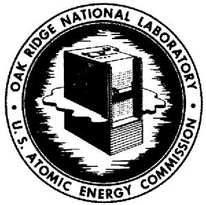
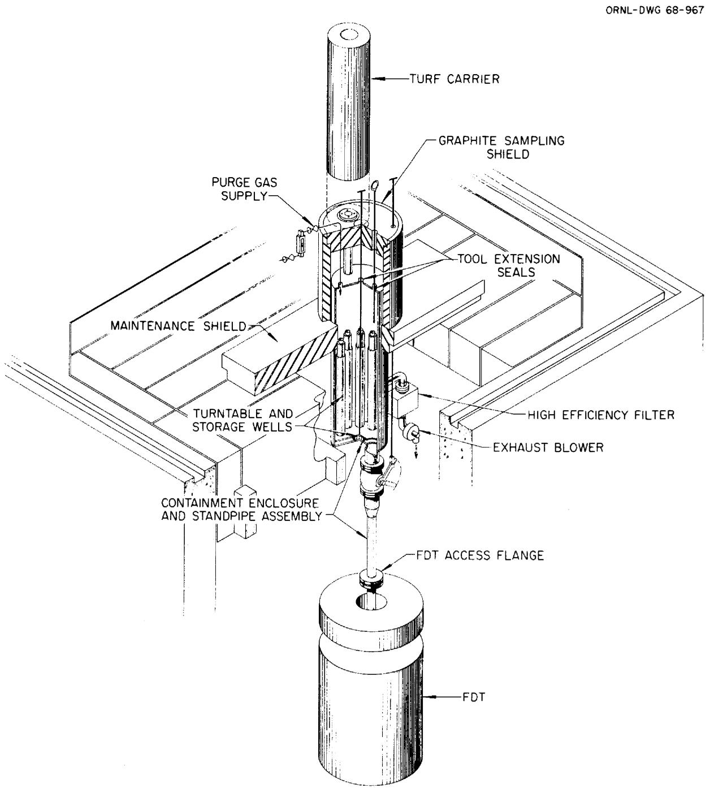

# OAK RIDGE NATIONAL LABORATORY

operated by

UNION CARBIDE CORPORATION

NUCLEAR DIVISION

for the

U.S. ATOMIC ENERGY COMMISSION

ORNL-TM-2304

UNION CARBIDE

MASTER

MSRE DESIGN AND OPERATIONS REPORT

Part XI-A

Test Program for 233U Operation

J. R. Engel

# LEGAL NOTICE

This report was prepared as an account of Government sponsored work. Neither the United States, nor the Commission, nor any person acting on behalf of the Commission:

A. Makes any warranty or representation, expressed or implied, with respect to the accuracy, completeness, or usefulness of the information contained in this report, or that the use of any information, apparatus, method, or process disclosed in this report may not infringe privately owned rights; or   
B. Assumes any liabilities with respect to the use of, or for damages resulting from the use of any information, apparatus, method, or process disclosed in this report.

As used in the above, "person acting on behalf of the Commission" includes any employee or contractor of the Commission, or employee of such contractor, to the extent that such employee or contractor of the Commission, or employee of such contractor prepares, disseminates, or provides access to, any information pursuant to his employment or contract with the Commission, or his employment with such contractor.

Reactor Division

MSRE DESIGN AND OPERATIONS REPORT

Part XI-A

Test Program for $^{233}\mathrm{U}$ Operation

J.R.Engel

# SEPTEMBER 1968

# LEGAL NOTICE

This report was prepared as an account of Government sponsored work. Neither the United States, nor the Commission, nor any person acting on behalf of the Commission:

A. Makes any warranty or representation, expressed or implied, with respect to the accuracy, completeness, or usefulness of the information contained in this report, or that the use of any information, apparatus, method, or process disclosed in this report may not infringe privately owned rights; or

B. Assumes any liabilities with respect to the use of, or for damages resulting from the use of any information, apparatus, method, or process disclosed in this report.

As used in the above, "person acting on behalf of the Commission" includes any employee or contractor of the Commission, or employee of such contractor, to the extent that such employee or contractor of the Commission, or employee of such contractor prepares, disseminates, or provides access to, any information pursuant to his employment or contract with the Commission, or his employment with such contractor.

OAK RIDGE NATIONAL LABORATORY

Oak Ridge, Tennessee

Operated by

UNION CARBIDE CORPORATION

for the

U. S. ATOMIC ENERGY COMMISSION

#

# CONTENTS

Page

PREFACE V

INTRODUCTION. 1

OBJECTIVES. 1

BASIC NUCLEAR TESTS 2

233U Critical Experiment 3

Preparations for Fuel Loading 3

233U Loading Sequence 6

Control-Rod Calibration 8

Other Basic Nuclear Parameters 9

233U Concentration Coefficient of Reactivity. 9

Isothermal Temperature Coefficient of Reactivity. 9

Power Coefficient of Reactivity 10

REACTOR OPERATION WITH $^{233}\mathrm{U}$ FUEL. 10

Power Calibration. 10

Control Systems Tests. 11

Reactor Dynamics 12

Reactivity Balance 12

Application of Noise Analysis. 13

Measurement of $^{233}\mathrm{U}$ Capture to Fission Ratio 13

CHEMICAL AND MATERIAL STUDIES IN THE FUEL LOOP. 14

Surveillance of Corrosion and Salt Contamination 14

Surveillance of Uranium Inventory. 15

Fission-Product Behavior 15

Graphite and Hastelloy Surveillance. 16

#

# PREFACE

This report is one of a series that describes the design and operation of the Molten Salt Reactor Experiment. All the reports have been issued with the exceptions noted.

<table><tr><td>ORNL-TM-728</td><td>MSRE Design and Operations Report, Part I, Description of Reactor Design by R. C. Robertson</td></tr><tr><td>ORNL-TM-729*</td><td>MSRE Design and Operations Report, Part II, Nuclear and Process Instrumentation, by J. R. Tallackson</td></tr><tr><td>ORNL-TM-730</td><td>MSRE Design and Operations Report, Part III, Nuclear Analysis, by P. N. Haubenreich, J. R. Engel, B. E. Prince, and H. C. Claiborne</td></tr><tr><td>ORNL-TM-731**</td><td>MSRE Design and Operations Report, Part IV, Chemistry and Materials, by F. F. Blankenship and A. Taboada</td></tr><tr><td>ORNL-TM-732</td><td>MSRE Design and Operations Report, Part V, Reactor Safety Analysis Report, by S. E. Beall, P. N. Haubenreich, R. B. Lindauer, and J. R. Tallackson</td></tr><tr><td>ORNL-TM-2111</td><td>MSRE Design and Operations Report, Part V-A, Safety Analysis of Operation with 233U, by P. N. Haubenreich, J. R. Engel, C. H. Gabbard, R. H. Guymon, and B. E. Prince</td></tr><tr><td>ORNL-TM-733</td><td>MSRE Design and Operations Report, Part VI, Operating Limits, by S. E. Beall and R. H. Guymon</td></tr><tr><td>ORNL-TM-907</td><td>MSRE Design and Operations Report, Part VII, Fuel Handling and Processing Plant, by R. B. Lindauer</td></tr></table>

ORNL-TM-908

MSRE Design and Operations Report, Part VIII, Operating Procedures, by R. H. Guymon

ORNL-TM-909

MSRE Design and Operations Report, Part IX, Safety Procedures and Emergency Plans, by A. N. Smith

ORNL-TM-910

MSRE Design and Operations Report, Part X, Maintenance Equipment and Procedures, by E. C. Hise and R. Blumberg

ORNL-TM-911

MSRE Design and Operations Report, Part XI, Test Program, by R. H. Guymon, P. N. Haubenreich, and J. R. Engel

ORNL-TM-2304

MSRE Design and Operations Report, Part XI-A, Test Program for $^{233}\mathrm{U}$ Operation, by J. R. Engel

\*\*

MSRE Design and Operations Report, Part XII, Lists: Drawings, Specifications, Line Schedules, Instrument Tabulations (Vol. 1 and 2)

# INTRODUCTION

The initial critical operation of the MSRE with $^{235}\mathrm{U}$ occurred on June 1, 1965. The reactor was subsequently operated at various powers up to 8 Mw for sustained periods and accumulated a total of 9005 equivalent full-power hours with that fuel. The reactor loop was drained on March 29, 1968 and preparations were started to replace the $^{235}\mathrm{U}-^{238}\mathrm{U}$ mixture in the fuel salt with $^{233}\mathrm{U}$ . The test program that was conducted with the $^{235}\mathrm{U}$ is described in Reference 1. The purpose of this memo is to outline the program that is to be followed with the $^{233}\mathrm{U}$ loading.

# OBJECTIVES

Since the MSRE will be the first reactor to be fuelled completely with $^{233}\mathrm{U}$ , there will be considerable interest in the initial critical experiment. This experiment will provide additional data on the adequacy of the calculational techniques used to predict the critical uranium concentration in the MSRE. Comparison of the results with those of the $^{235}\mathrm{U}$ critical experiment will also provide some indirect evidence about the quality of the input nuclear data used for $^{233}\mathrm{U}$ . In addition to the initial critical concentration, we will measure other basic nuclear parameters of the system with $^{233}\mathrm{U}$ fuel — temperature and uranium-concentration coefficients of reactivity, reactivity effects of fuel circulation, and control-rod reactivity worth. In each case comparisons will be made with the predicted values.

After the zero-power experiments, we will continue our studies of the overall nuclear performance of the MSRE. Some changes, due to the $^{233}\mathrm{U}$ , are expected in the long-term reactivity behavior and in the dynamic response of the reactor. Extensive investigations will be carried out in both these areas to compare the predicted and observed behavior.

In addition, we plan to use neutron fluctuation spectra as an operational diagnostic aid. Some useful correlations were developed during the $^{235}\mathrm{U}$ operation and it may be practical to use similar correlations to monitor reactor performance. Of particular interest in the area of performance tests will be a special experiment to measure the effective neutron yield for $^{233}\mathrm{U}$ in a molten salt reactor neutron spectrum.

Studies of reactor chemistry and materials behavior will be continued throughout the operation of the reactor system. Data will be gathered on our ability to accurately monitor uranium inventory at low concentrations as well as on the behavior of fission and corrosion products. The studies of the effects of exposing graphite and metal to fuel salt, fission products, and radiation will also be continued.

The $^{23}\mathrm{U}$ fuel mixture will probably be used for all the remaining operation of the MSRE. However, consideration is currently being given to an interruption of that operation to permit substitution of a less expensive secondary salt (sodium fluoroborate) for the $\mathrm{LiF - BeF_2}$ mixture in the system to demonstrate its operating characteristics. Since this change is still being studied, the test program for that phase of operation will be defined later.

# BASIC NUCLEAR TESTS

In addition to providing a check on the calculational techniques used to predict the properties of the MSRE with $^{233}\mathrm{U}$ fuel, measurements of these basic properties will supply much of the data that is required for monitoring the subsequent behavior of the reactor. The on-line reactivity-balance calculation requires, as input information, data on control-rod worth, and various coefficients of reactivity. Where possible, results of direct measurements of these properties will be used. In other cases, (e.g. fission-product effects) calculated values will be employed. Direct comparisons of calculated and observed values will be useful in establishing confidence in quantities that cannot be measured.

# 233U Critical Experiment

Essentially all of the original uranium will be removed from that portion of the fuel salt that is fluorinated. However, a small heel of fuel salt (containing about $1.2\mathrm{kg}$ of the total U) will be left in a fuel drain tank when the salt is transferred to the fuel storage tank for processing. This uranium will be mixed with the fuel carrier salt before the ${}^{233}\mathrm{U}$ critical experiment is started. Most of the plutonium and many of the non-volatile fission products (notably samarium) that were produced in the ${}^{235}\mathrm{U}$ operation will remain in the salt for the ${}^{233}\mathrm{U}$ operation. Thus, the ${}^{233}\mathrm{U}$ critical experiment will not be "clean" and corrections for the effects of these contaminants will have to be made when the results are evaluated.

Except for a practice addition of about $0.8\mathrm{kg}$ of ${}^{238}\mathrm{U},^*$ all of the uranium that is added in the critical experiment will have the isotopic composition listed in Table 1. This uranium is available as the eutectic salt mixture LiF-UF4 (73 - 27 mole %) in special cans containing up to 7 kg of total U. As in the initial ${}^{235}\mathrm{U}$ critical experiment, most of the uranium will be added to the fuel salt in a drain tank (FD-2). At appropriate intervals the reactor will be filled with the salt mixture to follow the subcritical multiplication as the uranium concentration is increased. After the fourth fill, the concentration will be close to the critical value and subsequent uranium additions will be made with capsules through the sampler-enricher to make the reactor critical.

# Preparations for Fuel Loading

Since the $^{233}\mathrm{U}$ mixture is heavily contaminated with $^{232}\mathrm{U}$ and the last chemical purification of the uranium occurred some 4 years ago, the enriching salt contains substantial amounts of the daughter products of $^{232}\mathrm{U}$ decay. Several of these daughters are strong emitters of both alphas

Table 1   
Isotopic Composition of $^{233}$ Feed Material   

<table><tr><td>U Isotope</td><td>Abundance (atom %)</td></tr><tr><td>232</td><td>0.022</td></tr><tr><td>233</td><td>91.49</td></tr><tr><td>234</td><td>7.6</td></tr><tr><td>235</td><td>0.7</td></tr><tr><td>236</td><td>0.05</td></tr><tr><td>238</td><td>0.14</td></tr></table>

and gammas, making the cans of salt strong neutron (from $\alpha$ ,n reactions in fluorine and lithium) and gamma radiation sources. In addition, the carrier salt, to which the uranium must be added, is highly radioactive, although it will contain essentially no volatile fission products. These considerations require that shielded equipment be used for the uranium additions to the drain tanks. Special charging equipment, using shielded, remote-maintenance components, has been built and installed above fuel-drain-tank No. 2 (FD-2), as shown in Fig. 1. This equipment permits the transfer of single cans of enriching salt (containing no more than $7\mathrm{kg}$ of U) from the shielded transport cask into the drain tank under shielded, controlled-ventilation conditions. The empty cans are stored on a turntable within the equipment for removal as a group at the end of the drain-tank loading operations.

The nuclear reactivity of a drain tank containing $^{233}\mathrm{U}$ fuel will be somewhat higher than the same drain tank containing the $^{235}\mathrm{U}-^{238}\mathrm{U}$ mixture. Although the drain tank is expected to be far subcritical under all normal storage conditions, careful observations will be made during the fuel additions to ensure that criticality is not approached in the tank. To accomplish this, two neutron-sensitive chambers — a sensitive $\mathrm{BF}_3$ chamber and an insensitive fission chamber to cover a wide range of counting rates — will be installed just outside the drain tank for the loading

  
Fig. 1. Arrangement for Adding $^{23}$ U Enriching Salt to Fuel Drain Tank.

operations. Since the fuel itself is an intense ( $\alpha$ -n) neutron source, no external source will be required for neutron monitoring.

Neutron counting to observe the progress of subcritical multiplication with the fuel in the reactor will be accomplished with the normal reactor instrumentation in the nuclear-instrument penetration. For the subcritical conditions we will use the high-sensitivity $\mathrm{BF}_3$ chamber and the two movable fission chambers. Since the reactor cell will be covered during the entire experiment, it will not be possible to install extra chambers around the core. For the same reason the external neutron source will remain fixed in the thermal shield throughout the experiment. However, the intense internal neutron source will completely overshadow the external source so that a movable source is of little value in this experiment.

# 233U Loading Sequence

The bulk of the $^{233}\mathrm{U}$ enriching salt will be added to the fuel carrier salt through the special equipment attached to FD-2. We anticipate adding about $34\mathrm{kg}$ of total U in 4 major steps. The first two rounds of additions will consist of 21 and $7\mathrm{kg}\mathrm{U}$ , respectively, and the subsequent additions will be based on extrapolations of count-rate ratios obtained from the preceding additions with the salt in the reactor. The objective is to bring the uranium loading to within $1/2\mathrm{kg}$ of critical in this manner. The enriching salt is available in cans of various sizes so that arbitrary amounts can be added in $1/2\mathrm{-kg}$ increments. The final uranium additions will be made to the circulating loop in 98-gram increments through the sampler-enricher.

The initial charging operation will require the addition of three 7-kg cans of uranium to FD-2. These cans will be delivered to the reactor site individually, in a shielded cask and inserted into the charging equipment. The cans are designed to be remotely suspended in the gas space of FD-2 above the liquid carrier salt. In this position the enriching salt will slowly melt and drip into the carrier salt below it. During this time the can will be suspended from a weighing device so that progress of the melting can be followed. (Gross and tare weights of each

can of salt will be available in advance.) At the same time we will observe the increase in neutron count rate as the neutron source and subcritical multiplication increase. If the count rate increases too rapidly, the can can be withdrawn to slow or stop the uranium addition. After the addition, the empty can will be weighed more accurately, to ensure that it is empty, and stored on the turntable for later disposal.

Prior to the addition of each can of enriching salt, one-half of the carrier salt will be transferred to the adjacent fuel drain tank (FD-1) to provide room for suspending the cans without contacting the salt. After the addition of each can, the remaining salt will be returned to FD-2 for mixing and to provide neutron count-rate data on the full tank. Extrapolations of ratios of these count rates will be used in conjunction with observations during additions to ensure that the drain tank remains sub-critical. After the addition of the first can of U, the transfers to FD-1 will also remove some uranium to keep $\mathrm{k_{eff}}$ very low during subsequent additions.

After three cans of enriching salt (21-kg U) have been added in this manner, the mixed fuel salt will be loaded into the reactor. Neutron count rates will be measured with the salt at several levels in the reactor vessel to ensure that criticality is not attained before the vessel is full. (During salt additions, as in all filling operations, the three control rods will be partly withdrawn so that they can suppress any premature criticality and initiate a salt drain.) Additional count-rate data will be obtained before, during, and after circulation of the salt in the loop. These data will be used for extrapolations to the projected critical loading.

Since the $^{233}\mathrm{U}$ mixture provides such an intense internal neutron source, count rates with the external source and no fuel are of little value in this critical experiment. Therefore, the data obtained from the first loop fill with uranium-bearing salt will be used as a basis for the usual inverse-count-rate plots. Thus two loadings of predetermined size (21-kg and 7-kg) are required before extrapolations can be made to establish the size of subsequent loadings.

The procedures described above will be carried out three more times (with different numbers and sizes of $^{233}\mathrm{U}$ -salt cans) to bring the reactor system within $1/2$ -kg of the critical loading. After the fourth loop fill, the salt will remain in the loop and 98-gram additions of uranium will be made through the sampler-enricher to make the reactor just critical at $1200^{\circ}\mathrm{F}$ with the fuel stationary and all control rods fully withdrawn. The fuel salt will then be left in the loop for the remainder of the zero-power and low-power tests.

# Control-Rod Calibration

Although there will be no change in the basic configuration of the reactor, the control rods in the MSRE will have about $30\%$ more reactivity worth with $^{23}U$ fuel than with the original loading. Therefore, a complete recalibration of the rods will be required before the reactor can be returned to full operation. The basic approach to be used for this work will be the same as that used for the original calibration. $^{2,3}$

The fundamental measurements to be made are the differential worth of one rod as a function of position with the other two rods withdrawn to their upper limits. These measurements will use the rod-bump period technique with the fuel salt stationary. The various critical positions of the control rod in question will be obtained by adding uranium to the salt to increase the amount of rod insertion. Since uranium can only be added in increments of 98 grams, each capsule will increase the fuel reactivity by about $0.12\%$ $\delta \mathrm{k} / \mathrm{k}$ , so about 24 capsules will be needed to produce full insertion of one rod. As a consequence, rod sensitivity measurements will be made after at least every second capsule addition.

Measurements may be made after each addition in regions where the rod worth is changing rapidly. Integration of the differential-worth data will then provide a curve of reactivity as a function of position for one control rod.

The basic data will be supplemented by differential-worth measurements with the fuel circulating, rod-shadowing measurements, and rod-drop experiments to provide information on the reactivity worth of all three rods as a function of configuration. All of the data will be used to evaluate coefficients in a theoretically derived expression of rod worth that is amenable to evaluation by a digital computer. This expression will then be used (as it was during the $^{235}\mathrm{U}$ operation) by the on-line computer to calculate control-rod poisoning from the positions of the three rods.

Other Basic Nuclear Parameters

233U Concentration Coefficient of Reactivity

As excess $^{233}\mathrm{U}$ is added to the loop to bring the concentration to the operating value and calibrate the control rods, data will be collected to evaluate the reactivity effect of the excess uranium. These data will be reduced to a uranium-concentration coefficient of reactivity to be used in evaluating the effects of burnup and subsequent fuel additions.

Isothermal Temperature Coefficient of Reactivity

When the initial set of fuel additions has been completed, an experiment will be performed to measure the isothermal temperature coefficient of reactivity of the reactor. In this experiment the fuel loop temperature will be slowly varied between about $1150^{\circ}\mathrm{F}$ and $1225^{\circ}\mathrm{F}$ while the control-rod configuration required to keep the reactor just critical is recorded. The observed reactivity change will be corrected for any effects due to changes in the circulating void fraction with temperature to obtain the total (fuel + graphite) temperature coefficient of reactivity.

# Power Coefficient of Reactivity

In the MSRE, a power coefficient of reactivity is used to describe the reactivity effect of the change in steady-state temperature distribution in the core that accompanies a change in power level. The value of this coefficient depends on the mode of temperature control (the reactor outlet temperature is held constant on this reactor) and the magnitudes of the separate fuel and graphite temperature coefficients of reactivity. Since the detailed temperature distribution in the core cannot be measured directly, the power coefficient will be inferred from the observed change in control-rod configuration with power after steady-state temperatures are achieved and before there has been a significant change in fission-product poisons. Observations will be made at several levels during the approach to full power to obtain a best value.

# REACTOR OPERATION WITH $^{233}\mathrm{U}$ FUEL

After the initial tests to investigate the physics of the MSRE with $^{233}\mathrm{U}$ , the reactor will be operated at power to continue the studies of its long-term behavior. Some special tests will be required to prepare for extended operation and others will be used to demonstrate the continuing satisfactory performance.

# Power Calibration

The instantaneous indication of reactor power for the servo control and safety instruments is derived from neutron-sensitive chambers in the nuclear instrument penetration. Since the ratio of power level to neutron flux in the penetration may change with the new fuel, all the chambers will be repositioned as required to eliminate any inconsistencies. The reference standard for repositioning the chambers will be the heat-power of the reactor calculated by the on-line computer from overall system heat balances. Each of the compensated and uncompensated ion chambers will be individually positioned to give a direct readout of reactor thermal power. In the case of the wide-range counting channels it may be necessary to modify the function generators that operate on

chamber position to obtain consistency over the entire power range.

After all the chambers have been shifted, they will be rechecked to eliminate any mutual shadowing effects.

Special precautions will be observed in moving the uncompensated chambers that serve as inputs to the flux safety system. Only one chamber at a time will be moved under strict administrative control and the other two chambers will be watched carefully to ensure that they are not adversely affected by the one that is moved.

# Control Systems Tests

The reactor control systems (flux, temperature, and load) were tested under a variety of conditions with $^{235}\mathrm{U}$ fuel to demonstrate their adequacy. A similar series of tests will be performed with the $^{233}\mathrm{U}$ fuel. However, this time the main emphasis will be on the reactor servo controller, flux servo at low power and temperature servo at powers above 1 Mw. (The load-control system will not be affected by the change in fuel.) Both the steady-state behavior and the response to perturbations will be examined. Calculations, analog-simulator studies, and measurements on the MSRE indicated that, at most, the high-frequency gain of the flux servo may have to be adjusted slightly for satisfactory performance with $^{233}\mathrm{U}$ . (Reference 5) If such changes are made, the pertinent tests will be repeated to demonstrate the adequacy of the final system.

4R. H. Guymon, P. N. Haubenreich, J. R. Engel, MSRE Design and Operations Report, Part XI, Test Program, USAEC Report ORNL-TM-911, Oak Ridge National Laboratory, November 1966, pp. 5-2 to 5-3.

5Oak Ridge National Laboratory, MSRP Semiann. Progr. Rept. February 1968, USAEC Report ORNL-4254, in preparation.

# Reactor Dynamics

The dynamic behavior of the MSRE with $^{235}\mathrm{U}$ fuel was the subject of extensive theoretical and experimental investigation. A comparable theoretical analysis of the dynamics with $^{233}\mathrm{U}$ has been performed and the results indicate that the reactor will be inherently stable at all powers. The purpose of the dynamics tests is to provide another verification of the calculational techniques.

As with the $^{235}\mathrm{U}$ operation, various dynamic tests will be performed at zero power and during the approach to full power. Follow-up tests at power will be performed periodically to prove the persistence of proper behavior. In general, the tests will include pulse and step reactivity perturbations with a control rod as well as pseudorandom binary and ternary perturbations of control-rod position and flux demand.

# Reactivity Balance

Reactor operation with $^{235}\mathrm{U}$ demonstrated the utility of an on-line reactivity balance as an operating guide. The same type of calculation, with appropriate changes in coefficients, will be used during the $^{233}\mathrm{U}$ operation.

Detailed experiments during the last operation with $^{235}\mathrm{U}$ showed that the current calculation does not adequately treat the xenon poisoning. Variations in system temperature and pressure induce changes in xenon poisoning by affecting the effectiveness of the gas stripper.

These changes are of secondary interest in the MSRE because most of the reactor operation is at a fixed temperature and pressure. However, since a detailed understanding of the xenon behavior is important to the breeder programs, an attempt will be made during the $^{233}\mathrm{U}$ operation to modify the mathematical model to incorporate temperature and pressure effects. It may be necessary to conduct additional experiments to supplement the available data in order to accomplish this improvement.

# Application of Noise Analysis

In the course of operating the MSRE with $^{235}\mathrm{U}$ , a large amount of data was collected on the spectral density of the inherent neutron-level fluctuations in the reactor. Evaluation of these data indicates that changes in the flux "noise" spectrum are a good qualitative indication of changes in the circulating void fraction in the fluid fuel. Neutron noise data will be collected routinely to monitor this aspect of reactor operation and to look for any other changes in system performance. Attempts will also be made to make the void indication more quantitative.

Techniques have been developed to use the BR-340 computer at the reactor site to collect neutron-noise data (with all other computer functions inhibited) and process it immediately thereafter (with all other functions active). Thus, spectral-density results can be made available with very little delay for use as an operating guide if satisfactory correlations are developed. The same techniques may be used to monitor the vibration spectra from mechanical components if adequate data samples can be obtained.

# Measurement of $^{233}\mathrm{U}$ Capture to Fission Ratio

An important factor in the breeding performance of molten salt reactors is the ratio of parasitic neutron captures to fissions ("alpha") in $^{233}\mathrm{U}$ in the reactor neutron spectrum. In current reactor design calculations, this ratio is obtained, in effect, by integrating differential cross sections over the neutron-energy spectrum. A precise measurement of the integral value of "alpha" in a neutron spectrum typical of molten-salt reactors could reduce the uncertainty in the breeding

performance of new core designs. Since the neutron spectrum in the MSRE with $^{233}\mathrm{U}$ fuel is very similar to that in the proposed breeders, a precise measurement of "alpha" will be made during the $^{233}\mathrm{U}$ operation. The measurement consists of precise uranium isotopic assays before and after substantial $^{233}\mathrm{U}$ burnup. The value of "alpha" is derived from the buildup of $^{234}\mathrm{U}$ relative to the depletion of $^{233}\mathrm{U}$ .

# CHEMICAL AND MATERIAL STUDIES IN THE FUEL LOOP

A major objective in the operation of the MSRE is to study the behavior of the basic materials — molten salt, graphite, and Hastelloy-N — in combination in a radiation environment. These studies are accomplished primarily through the examination of samples of the appropriate materials. A high level of effort will be maintained in this area throughout the operation of the reactor.

# Surveillance of Corrosion and Salt Contamination

The most direct monitor of Hastelloy-N corrosion that is readily available in the MSRE is the level of chromium in the fuel salt. Chromium, leached from the surface of the metal remains in solution in the salt where its concentration can be measured in samples. In the first three years of reactor operation, the chromium in the fuel salt increased from $\sim 38$ ppm to $\sim 80$ ppm. If this is interpreted in terms of uniform attack on the fuel loop the increase represents leaching from less than 0.3 mil of metal. This low rate of attack is expected to continue but salt samples will be analyzed regularly to detect any changes.

The processing of the fuel salt to remove the $^{235}\mathrm{U}$ will require the establishment of a new baseline of chromium concentration. Fluorination of the salt in the fuel storage tank will substantially increase the Cr (also Fe and Ni) level. However, most of this will be reduced to free metal and filtered out in subsequent steps before the processed fuel is returned to the drain tanks. The resultant chromium concentration will be measured in samples taken at the start of the $^{233}\mathrm{U}$ operation.

Another salt contaminant that is carefully monitored is oxygen. The oxide tolerance of the MSRE fuel mixture is $\sim 700$ parts per million but observed concentrations have been around $50 - 60~\mathrm{ppm}$ . Samples will be analyzed regularly to ensure that oxygen intrusion remains at a low level.

# Surveillance of Uranium Inventory

The chemical concentration of uranium in the fuel salt for the $^{235}\mathrm{U}$ operation was about $4.6\%$ by weight. At this level the standard deviation of all the uranium chemical analyses was 0.02 wt.%.* The average analytical concentration at the end of that operation was such that the apparent uranium inventory was within 200 gm (out of 222 kg) of the book inventory derived from known additions and depletions.

In the $^{233}\mathrm{U}$ operation, the chemical uranium concentration will be only about $0.7\mathrm{wt\%}$ . It appears that average values of analytical results will provide the necessary data for precise, long-term comparisons of "book" and observed uranium inventory. However, improvements in precision are under development and will be required to permit short-term comparisons using individual results. In general, reactivity-balance results will be used in conjunction with the uranium analytical results to monitor the short-term behavior of the system.

# Fission-Product Behavior

Several aspects of fission-product behavior are of particular interest in the MSRE. These include the deposition of noble-metal species on graphite and Hastelloy surfaces, the escape of some noble metals as "smoke" or "dust" in the reactor offgas, and the escape of other volatile species (Xe, Kr, Te, etc.).

Much information has been collected about the behavior of fission products in this system but more is required for a thorough understanding and evaluation. Therefore, considerable effort will be expended during

the remaining operation of the reactor in analyzing the fuel salt and reactor offgas to elucidate the fission product behavior. To aid in this effort special samples of salt and cover gas will be withdrawn through the fuel sampler. In addition, use will be made of the offgas sampler and of special instrumentation and collection devices installed in the reactor offgas line at the fuel pump. Selected specimens of metal and graphite that are exposed in the reactor core will be examined to provide more data on fission-product plateout on surfaces and intrusion into graphite.

The circumstances under which various samples must be obtained will, to some extent, influence the power operation of the reactor. For example, it may be desirable to take some samples while the fuel salt is stationary, in which case the reactor must be at zero power. In other cases, prolonged operation at power will be required to reach steady-state conditions with regard to particular fission products. A complete shutdown will be required to remove specimens from the core or the off-gas line.

# Graphite and Hastelloy Surveillance

Graphite and Hastelloy surveillance specimens are exposed to fuel salt in the MSRE core and other Hastelloy specimens are suspended just outside the reactor vessel. The primary purpose of these specimens is to study radiation and salt-exposure effects under reactor conditions; however, they have also been used in connection with some of the fission-product studies. Selected specimens are removed for examination at approximately six-month intervals and replaced with new ones. Since such changes are major operations, they are normally scheduled to coincide with other major reactor shutdowns.

The first sets of samples installed in the MSRE were representative of materials actually used in the construction of the reactor system. Since that time continued development effort has led to other graphites of interest and to minor changes in the composition of Hastelloy-N. Consequently, subsequent arrays have included samples of some of these materials. This surveillance program is expected to continue for the operating life of the reactor.

# Internal Distribution

1. R. K. Adams   
2. R.G.Affel   
3. R.F.Apple   
4. D. S. Asquith   
5. C.F.Baes   
6. S.J.Ball   
7. S.E.Beall   
8. M. Bender   
9. E. S. Bettis   
10. F. F. Blankenship   
11. R. Blumberg   
12. E. G. Bohlfann   
13. C. J. Borkowski   
14. G.E. Boyd   
15. R. B. Briggs   
16. R.H.Bryan   
17. J. M. Chandler   
18. R.H.Chapman   
19. F. H. Clark   
20. C. E. Clifford   
21. W.H.Cook   
22. L. T. Corbin   
23. W. B. Cottrell   
24. J. L. Crowley   
25. F. L. Culler, Jr.   
26. D. G. Davis   
27. S.J.Ditto   
28. F.A.Doss   
29. W. P. Eatherly   
30. J.R. Engel   
31. E. P. Epler   
32. D. E. Ferguson   
33. A. P. Fraas   
34. D. N. Fry   
35. J.H.Frye, Jr.   
36. H.A. Friedman   
37. C. H. Gabbard   
38. R. B. Gallaher   
39. W. R. Grimes   
40. A. G. Grindell

41. E. D. Gupton   
42. R. H. Guymon   
43. P.H.Harley   
48. P. N. Haubenreich   
49. P. G. Herndon   
50. A. Houtzeel   
51. T. L. Hudson   
52. E. B. Johnson   
53. W. H. Jordan   
54. S. I. Kaplan   
55. P. R. Kasten   
56. R.J.Kedl   
57. T. W. Kerlin   
58. G. Kern   
59. S. S. Kirslis   
60. A. I. Krakoviak   
61. J. W. Krewson   
62. R.C. Kryter   
63. J.A. Lane   
64. R.B. Lindauer   
65. M. I. Lundin   
66. R. N. Lyon   
67. H. G. MacPherson   
68. R.E. MacPherson   
69. C. D. Martin   
70. T. H. Mauney   
71. H.E.McCoy   
72. H.C.McCurdy   
73. H.F. McDuffie   
74. C. K. McGlothlan   
75. A. J. Miller   
76. R. L. Moore   
77. E. L. Nicholson   
78. L.C.Oakes   
79. A.M.Perry   
80. H.B.Piper   
81. B. E. Prince   
82. G. L. Ragan   
83. J. L. Redford   
84. M. Richardson

# Internal Distribution (continued)

85. R.C. Robertson   
86. J C. Robinson

87-91. M. W. Rosenthal

92. A. W. Savolainen   
93. Dunlap Scott   
94. J.H.Shaffer   
95. E.G.Silver   
96. M.J. Skinner   
97. A. N. Smith   
98. O. L. Smith   
99. P.G. Smith

100. I. Spiewak

101. D. A. Sundberg

102. R.C.Steffy   
103. H. H. Stone   
104. J.R.Tallackson   
105. R.E.Thoma   
106. D. G. Trauger   
107. C. S. Walker   
108. B.H.Webster   
109. A.M. Weinberg   
110. J. R. Weir   
111. K.W. West   
112. M. E. Whatley   
113. J. C. White   
114. G. D. Whitman   
115. Gale Young

116-117. Central Research Library (CRL)

118-119. Y-12 Document Reference Section (DRS)

120-149. Laboratory Records Department (LRD)

150. Laboratory Records, (LRD-RC)

# External Distribution

151-152. T. W. McIntosh, AEC, RDT, Washington, D. C. 20545

153. H. M. Roth, Laboratory and University Division, ORO

154. T. G. Schleiter, AEC, RDT, Washington, D. C. 20545

155. Milton Shaw, AEC, RDT, Washington, D. C. 20545

156-170. Division of Technical Information Extension, (DTIE)