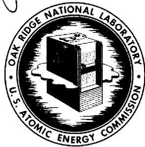

# OAK RIDGE NATIONAL LABORATORY

operated by

# UNION CARBIDE CORPORATION

NUCLEAR DIVISION

for the

U.S. ATOMIC ENERGY COMMISSION

ORNL-TM-2305

MASTER

POSTIRRADIATION TENSILE AND CREEP-RUPTURE PROPERTIES OF SEVERAL

EXPERIMENTAL HEATS OF INCOLOY 800 AT 700 AND $760^{\circ}C$

NOTICE This document contains information of a preliminary nature and was prepared primarily for internal use at the Oak Ridge National Laboratory. It is subject to revision or correction and therefore does not represent a final report.

# LEGAL NOTICE

This report was prepared as an account of Government sponsored work. Neither the United States, nor the Commission, nor any person acting on behalf of the Commission;

A. Makes any warranty or representation, expressed or implied, with respect to the accuracy, completeness, or usefulness of the information contained in this report, or that the use of any information, apparatus, method, or process disclosed in this report may not infringe privately owned rights; or   
B. Assumes any liabilities with respect to the use of, or for damages resulting from the use of any information, apparatus, method, or process disclosed in this report.

As used in the above, "person acting on behalf of the Commission" includes any employee or contractor of the Commission, or employee of such contractor, to the extent that such employee or contractor of the Commission, or employee of such contractor prepares, disseminates, or provides access to, any information pursuant to his employment or contract with the Commission, or his employment with such contractor.

Contract No. W-7405-eng-26

METALS AND CERAMICS DIVISION

POSTIRRADIATION TENSILE AND CREEP-RUPTURE PROPERTIES OF SEVERAL EXPERIMENTAL HEATS OF INCOLOY 800 AT 700 AND $760^{\circ}\mathrm{C}$

D. G. Harman

# LEGAL NOTICE

This report was prepared as an account of Government sponsored work. Neither the United States, nor the Commission, nor any person acting on behalf of the Commission:

A. Makes any warranty or representation, expressed or implied, with respect to the accuracy, completeness, or usefulness of the information contained in this report, or that the use of any information, apparatus, method, or process disclosed in this report may not infringe privately owned rights; or

B. Assumes any liabilities with respect to the use of, or for damages resulting from the use of any information, apparatus, method, or process disclosed in this report.

As used in the above, "person acting on behalf of the Commission" includes any employee or contractor of the Commission, or employee of such contractor, to the extent that such employee or contractor of the Commission, or employee of such contractor prepares, disseminates, or provides access to, any information pursuant to his employment or contract with the Commission, or his employment with such contractor.

DECEMBER 1968

OAK RIDGE NATIONAL LABORATORY

Oak Ridge, Tennessee

operated by

UNION CARBIDE CORPORATION

for the

U.S. ATOMIC ENERGY COMMISSION

# CONTENTS

# Page

Abstract. 1

Introduction 1

Experimental Procedure 3

Results and Discussion 5

Effects on Ductility 13

Alloy Composition 13

Strain Rate 17

Grain Size 18

Preirradiation Aging 21

Strength Considerations 21

Conclusions 25

Acknowledgment 27

D. G. Harman

# ABSTRACT

Tensile and creep-rupture data have been obtained at 700 and $760^{\circ}\mathrm{C}$ for several experimental heats of Incoloy 800 that were irradiated in the ORR at elevated temperatures. Effects of composition, grain size, and carbide morphology were investigated.

Enhanced postirradiation ductility was achieved for Incoloy 800 containing about $0.1\%$ Ti in creep-rupture tests. The maximum ductility for this composition was obtained for the smaller grain sizes and at the lower creep stress levels and appeared to be independent of carbon content. Significant variations in properties (both control and postirradiation tests) were noted for alloys within the commercial Incoloy 800 composition specifications.

The ductility peak at about $0.1\%$ Ti is not fully understood; it might be best explained by two independent mechanisms, one accounting for the increasing ductility with increasing titanium at levels less than $0.1\%$ and the other explaining the decreasing ductility at higher titanium levels. The grain size effect is thought to be due to differences in either helium distribution or stresses necessary for grain boundary fracture propagation.

# INTRODUCTION

The elevated-temperature properties of Incoloy 800 make it an attractive material for nuclear reactor application. The alloy has been a backup material for fuel cladding for the BONUS (Boiling Nuclear Superheat) Reactor1 and is a prime candidate for various other reactor systems. For example, Incoloy 800 is being considered for the LMFBR (Liquid Metal Fast Breeder Reactor) fuel cladding, and Sweden is

investigating vacuum-melted varieties for steam-cooled fast reactor application.²

Incoloy 800 is nominally a $46\%$ Fe- $21\%$ Cr- $32\%$ Ni ternary solid solution alloy, but with important additions of carbon, aluminum, and titanium. The commercial compositional specifications as listed in Table 1 allow significant variations in the concentrations of these added elements. Vendor recommendations for specific compositions depend upon the application being considered.

2M. Groundes, "Review of Swedish Work on Irradiation Effects in Canning and Core Support Materials," pp. 200-223 in Effects of Radiation on Structural Metals, Spec. Tech. Publ. 426, American Society for Testing and Materials, Philadelphia, December 1967.

Table 1. Composition of Commercial Incoloy 800   

<table><tr><td rowspan="2">Element</td><td colspan="2">Content, wt %</td></tr><tr><td>Limiting</td><td>Nominal</td></tr><tr><td>Iron</td><td>Balance</td><td>46.0</td></tr><tr><td>Nickel</td><td>30-35</td><td>32.0</td></tr><tr><td>Chromium</td><td>19-23</td><td>20.5</td></tr><tr><td>Carbon</td><td>0.10 max</td><td>0.04</td></tr><tr><td>Manganese</td><td>1.50 max</td><td>0.75</td></tr><tr><td>Sulfur</td><td>0.015 max</td><td>0.007</td></tr><tr><td>Silicon</td><td>1.00 max</td><td>0.35</td></tr><tr><td>Copper</td><td>0.75 max</td><td>0.30</td></tr><tr><td>Aluminum</td><td>0.15-0.60</td><td>0.30</td></tr><tr><td>Titanium</td><td>0.15-0.60</td><td>0.30</td></tr></table>

Other investigators $^{3,4}$ have studied effects of high-temperature neutron irradiation on the properties of Incoloy 800. Various titanium, aluminum, and carbon levels were studied, but no comprehensive study of compositional effects was undertaken. Also, postirradiation studies included only short-time tensile testing. Little or no creep-rupture data have been formally reported for irradiated Incoloy 800. Limited preliminary creep data are currently available, however, from studies at Studsvik, Sweden. $^{5}$ The present report shows that obtaining postirradiation creep-rupture properties is essential to the evaluation of the Incoloy 800 alloy system.

# EXPERIMENTAL PROCEDURE

We tested several experimental 100-lb heats of Incoloy 800 as listed in Table 2. Titanium contents range from less than 0.02 to $0.4\%$ , and two carbon levels are being studied - low carbon with 0.02 to $0.04\%$ and high carbon with 0.10 to $0.14\%$ .

Control and irradiated specimens of the buttonhead design (see Fig. 1.) used in previous ORNL experiments were tested at 700 and $760^{\circ}\mathrm{C}$ under tensile and creep conditions. The tensile tests for both control and irradiated specimens were conducted on a floor-model Instron testing machine at crosshead speeds of 0.05 and 0.002 in./min. (Strain rates were 5 and $0.2\% / \mathrm{min}$ .) The creep-rupture tests for the control specimens were conducted in air on dead-load and lever-arm creep frames. Irradiated

Table 2. Chemical Composition of Experimental 100-lb Vacuum-Melted Heats of Incoloy 800a   

<table><tr><td rowspan="2">Heat</td><td colspan="6">Element Content, wt %</td><td rowspan="2">Boron Content (ppm)</td></tr><tr><td>Ni</td><td>Cr</td><td>C</td><td>Ti</td><td>Al</td><td>Mn</td></tr><tr><td>22A</td><td>31</td><td>21</td><td>0.03</td><td>0.10</td><td>0.21</td><td>0.6</td><td>4</td></tr><tr><td>25B</td><td>30</td><td>20</td><td>0.03</td><td>0.21</td><td>0.22</td><td>0.4</td><td>2</td></tr><tr><td>29C</td><td>29</td><td>19</td><td>0.03</td><td>0.28</td><td>0.28</td><td>0.5</td><td>2</td></tr><tr><td>33D</td><td>29</td><td>18</td><td>0.02</td><td>0.31</td><td>0.21</td><td>0.4</td><td>5</td></tr><tr><td>45G</td><td>32</td><td>19</td><td>0.10</td><td>&lt; 0.02</td><td>0.21</td><td>0.8</td><td>3</td></tr><tr><td>93H</td><td>30</td><td>21</td><td>0.12</td><td>0.10</td><td>0.24</td><td>0.8</td><td>6</td></tr><tr><td>41L</td><td>28</td><td>19</td><td>0.14</td><td>0.17</td><td>0.28</td><td>0.6</td><td>7</td></tr><tr><td>54J</td><td>30</td><td>20</td><td>0.12</td><td>0.26</td><td>0.21</td><td>0.7</td><td>4</td></tr><tr><td>61K</td><td>32</td><td>21</td><td>0.12</td><td>0.38</td><td>0.21</td><td>0.6</td><td>6</td></tr></table>

a Not listed: Si, 0.2%; V, Co, Nb, and Cu, ≤ 0.05%; Fe, balance.

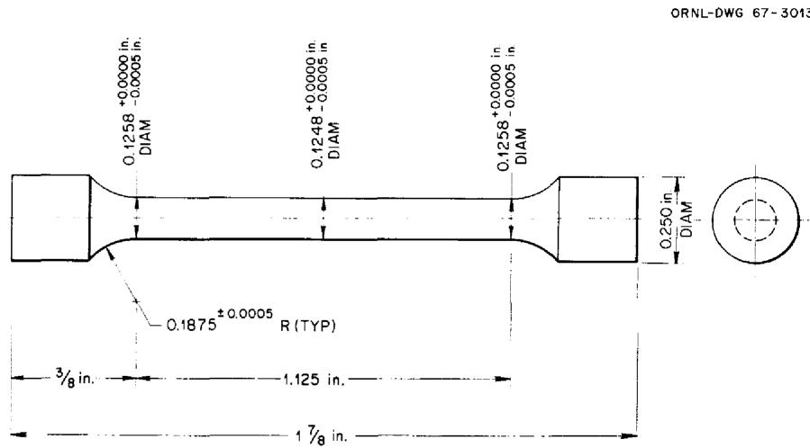  
Fig. 1. Tensile Specimen.

specimens were creep-rupture tested in air on lever-arm creep machines specially designed for hot-cell operation. The cell during operation is shown in Fig. 2.

Specimens tested at $760^{\circ}\mathrm{C}$ were irradiated in a poolside facility of the ORR for one cycle (approx 1100 hr) at $760^{\circ}\mathrm{C}$ to a total fluence of 2 to $3 \times 10^{20}$ neutron/cm $^2$ thermal and 1 to $2 \times 10^{20}$ neutrons/cm $^2$ fast. From each of six compositions, eight specimens were irradiated - four having been annealed at $1150^{\circ}\mathrm{C}$ for 10 min and four annealed and then aged 100 hr at $800^{\circ}\mathrm{C}$ . This aging treatment was designed to agglomerate the grain boundary carbides. To study the effect of strain rate, two tensile tests and two creep-rupture tests were conducted for each of these two metal-lurgical conditions for each composition.

Specimens tested at $700^{\circ}\mathrm{C}$ were irradiated at 650 or $700^{\circ}\mathrm{C}$ for two cycles in a core position of the ORR to an average thermal and fast fluence of about $8 \times 10^{20}$ neutrons/cm $^2$ . Various metallurgical conditions were investigated at this temperature. Grain diameters of 15 and $30\mu$ for the low-carbon alloys and 10 and $40\mu$ for the high-carbon alloys were included. The effect of the "carbide agglomeration" aging treatment on cold worked and annealed specimens and the irradiation of cold worked material were studied for both carbon levels. This aging treatment actually recrystallized the cold worked material to a grain diameter of about $8\mu$ . These specimens were primarily creep-rupture tested, but a limited amount of tensile testing was also conducted. Tests on control specimens for this experiment are in progress and will be reported later.

# RESULTS AND DISCUSSION

The results of the tensile and creep tests at $760^{\circ}\mathrm{C}$ are listed in Tables 3 and 4. The tensile test results showed the expected loss inductility due to irradiation for all titanium levels for both the high- and low-carbon alloys. Total tensile elongations of 40 to $70\%$ were reduced to 5.5 to $13.5\%$ by irradiation.

With one exception similar ductility losses were noted for the creep-rupture tests. Total creep elongations of 22 to $75\%$ for the control tests

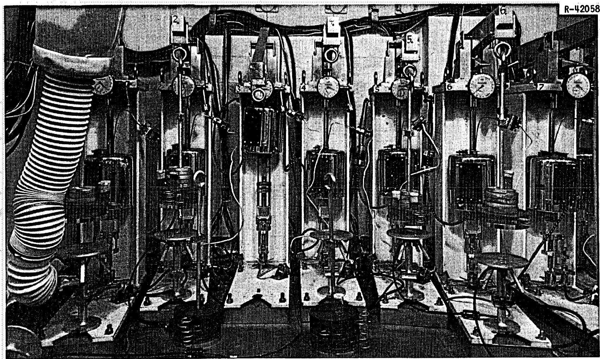  
Fig. 2. Postirradiation Creep-Rupture Testing Facility. Twelve lever-arm creep machines within this hot cell provide for remote long-time testing of irradiated materials. Creep strain is monitored manually from the dial gages and automatically with the LVDT transducers located at the lower end of the stringer assembly.

Table 3. Tensile Properties of Experimental Incoloy 800 at ${760}^{ \circ  }{\mathrm{C}}^{\mathrm{a}}$   

<table><tr><td rowspan="2">Preirradiation Condition</td><td rowspan="2">Strain Rate (min-1)</td><td colspan="2">Strength, psi</td><td colspan="2">Strain, %</td></tr><tr><td>0.2% Yield</td><td>Ultimate Tensile</td><td>Uniform</td><td>Total</td></tr><tr><td></td><td></td><td>× 103</td><td>× 103</td><td></td><td></td></tr><tr><td></td><td></td><td colspan="2">Heat 25B, 0.21% Ti, 0.03% C</td><td></td><td></td></tr><tr><td>Annealed</td><td>0.05</td><td>12.50 (17.52)</td><td>35.65 (34.71)</td><td>10.1 (16.7)</td><td>11.5 (52.1)</td></tr><tr><td>Annealed</td><td>0.002</td><td>12.80 (20.97)</td><td>22.49 (22.28)</td><td>5.2 (6.2)</td><td>8.2 (57.7)</td></tr><tr><td>Aged</td><td>0.05</td><td>12.56 (24.73)</td><td>32.00 (36.24)</td><td>7.4 (11.9)</td><td>7.9 (51.0)</td></tr><tr><td>Aged</td><td>0.002</td><td>13.65 (13.15)</td><td>21.91 (22.19)</td><td>2.1 (8.6)</td><td>5.8 (71.0)</td></tr><tr><td></td><td></td><td colspan="2">Heat 33D, 0.31% Ti, 0.02% C</td><td></td><td></td></tr><tr><td>Annealed</td><td>0.05</td><td>8.02 (18.64)</td><td>38.02 (37.61)</td><td>9.7 (13.0)</td><td>11.5 (51.5)</td></tr><tr><td>Annealed</td><td>0.002</td><td>13.49 (17.25)</td><td>23.71 (22.24)</td><td>6.2 (6.9)</td><td>13.5 (61.0)</td></tr><tr><td>Aged</td><td>0.05</td><td>13.30 (16.82)</td><td>35.41 (37.22)</td><td>10.0 (12.7)</td><td>11.4 (54.8)</td></tr><tr><td>Aged</td><td>0.002</td><td>8.76 (12.55)</td><td>25.12 (21.49)</td><td>6.9 (7.3)</td><td>10.5 (57.8)</td></tr><tr><td></td><td></td><td colspan="2">Heat 45G, &lt;0.02% Ti, 0.10% C</td><td></td><td></td></tr><tr><td>Annealed</td><td>0.05</td><td>17.66 (18.93)</td><td>37.40 (39.51)</td><td>8.3 (13.4)</td><td>11.6 (38.9)</td></tr><tr><td>Annealed</td><td>0.002</td><td>18.44 (18.90)</td><td>23.03 (24.65)</td><td>8.0 (6.5)</td><td>10.2 (41.7)</td></tr><tr><td>Aged</td><td>0.05</td><td>22.10 (28.70)</td><td>36.85 (39.17)</td><td>7.7 (9.2)</td><td>11.1 (34.7)</td></tr><tr><td>Aged</td><td>0.002</td><td>18.52 (15.34)</td><td>23.34 (23.54)</td><td>6.5 (7.1)</td><td>9.5 (37.5)</td></tr><tr><td></td><td></td><td colspan="2">Heat 93H, 0.10% Ti, 0.12% C</td><td></td><td></td></tr><tr><td>Annealed</td><td>0.05</td><td>19.60 (18.02)</td><td>35.50 (36.94)</td><td>9.9 (14.2)</td><td>12.8 (45.2)</td></tr><tr><td>Annealed</td><td>0.002</td><td>17.38 (17.88)</td><td>23.11 (24.94)</td><td>7.4 (7.6)</td><td>11.6 (55.9)</td></tr><tr><td>Aged</td><td>0.05</td><td>21.75 (18.27)</td><td>35.60 (38.44)</td><td>7.0 (10.8)</td><td>8.7 (47.7)</td></tr><tr><td>Aged</td><td>0.002</td><td>17.17 (17.84)</td><td>22.08 (24.53)</td><td>8.4 (10.0)</td><td>12.8 (~53)</td></tr><tr><td></td><td></td><td colspan="2">Heat 41L, 0.17% Ti, 0.14% C</td><td></td><td></td></tr><tr><td>Annealed</td><td>0.05</td><td>17.59 (14.83)</td><td>37.30 (36.67)</td><td>8.1 (13.5)</td><td>10.3 (50.2)</td></tr><tr><td>Annealed</td><td>0.002</td><td>21.76 (25.59)</td><td>23.48 (25.84)</td><td>5.0 (2.3)</td><td>9.9 (50.4)</td></tr><tr><td>Aged</td><td>0.05</td><td>15.80 (16.35)</td><td>35.95 (39.25)</td><td>7.8 (7.0)</td><td>9.3 (50.0)</td></tr><tr><td>Aged</td><td>0.002</td><td>19.07 (21.75)</td><td>23.00 (23.71)</td><td>5.2 (6.5)</td><td>9.3 (41.7)</td></tr><tr><td></td><td></td><td colspan="2">Heat 54J, 0.26% Ti, 0.12% C</td><td></td><td></td></tr><tr><td>Annealed</td><td>0.05</td><td>19.60 (14:91)</td><td>35.95 (34.64)</td><td>8.9 (12.1)</td><td>13.2 (54.1)</td></tr><tr><td>Annealed</td><td>0.002</td><td>17.51 (17.26)</td><td>23.32 (23.42)</td><td>6.9 (8.3)</td><td>11.2 (62.9)</td></tr><tr><td>Aged</td><td>0.05</td><td>16.89 (20.08)</td><td>35.95 (37.61)</td><td>7.7 (13.2)</td><td>10.2 (50.7)</td></tr><tr><td>Aged</td><td>0.002</td><td>19.75 (14.87)</td><td>23.11 (21.69)</td><td>5.7 (6.4)</td><td>9.2 (61.2)</td></tr></table>

aIrradiated one cycle in ORR poolside. Values in parentheses are for unirradiated control specimens.

Table 4. Creep Properties of Experimental Incoloy 800 at ${760}^{ \circ  }{\mathrm{C}}^{\mathrm{a}}$   

<table><tr><td rowspan="2">Heat</td><td colspan="2">Contents, %</td><td rowspan="2">Stress (psi)</td><td rowspan="2">Time to Rupture (hr)</td><td rowspan="2">Total Strain (%)</td><td rowspan="2">Preirradiation Condition</td></tr><tr><td>Ti</td><td>C</td></tr><tr><td></td><td></td><td></td><td>×103</td><td></td><td></td><td></td></tr><tr><td>25B</td><td>0.21</td><td>0.03</td><td>10.0</td><td>91</td><td>16.0</td><td>Annealed</td></tr><tr><td></td><td></td><td></td><td>8.5</td><td>481</td><td>17.0</td><td>Annealed</td></tr><tr><td></td><td></td><td></td><td>10.0</td><td>119</td><td>14.8</td><td>Aged</td></tr><tr><td></td><td></td><td></td><td>8.5</td><td>307</td><td>18.6</td><td>Aged</td></tr><tr><td>33D</td><td>0.31</td><td>0.02</td><td>10.0</td><td>179</td><td>14.8</td><td>Annealed</td></tr><tr><td></td><td></td><td></td><td>12.5</td><td>33 (113)</td><td>13.9 (63.9)</td><td>Annealed</td></tr><tr><td></td><td></td><td></td><td>12.4</td><td>37</td><td>17.0</td><td>Aged</td></tr><tr><td></td><td></td><td></td><td>12.5</td><td>24 (101)</td><td>14.5 (39.2)</td><td>Aged</td></tr><tr><td>45G</td><td>&lt;0.02</td><td>0.10</td><td>10.0</td><td>189</td><td>12.9</td><td>Annealed</td></tr><tr><td></td><td></td><td></td><td>10.0</td><td>260</td><td>15.2</td><td>Aged</td></tr><tr><td>93H</td><td>0.10</td><td>0.12</td><td>10.0</td><td>401</td><td>45.4</td><td>Annealed</td></tr><tr><td></td><td></td><td></td><td>12.5</td><td>42 (132)</td><td>34.2 (41.3)</td><td>Annealed</td></tr><tr><td></td><td></td><td></td><td>10.0</td><td>300</td><td>37</td><td>Aged</td></tr><tr><td></td><td></td><td></td><td>12.5</td><td>79 (199)</td><td>37 (60)</td><td>Aged</td></tr><tr><td>41L</td><td>0.17</td><td>0.14</td><td>12.5</td><td>50 (200)</td><td>16.1 (69.8)</td><td>Annealed</td></tr><tr><td></td><td></td><td></td><td>10.0</td><td>184</td><td>13.2</td><td>Annealed</td></tr><tr><td></td><td></td><td></td><td>12.5</td><td>32 (188)</td><td>8.7 (52.3)</td><td>Aged</td></tr><tr><td></td><td></td><td></td><td>10.0</td><td>191</td><td>17.5</td><td>Aged</td></tr><tr><td>54J</td><td>0.26</td><td>0.12</td><td>12.5</td><td>53.1 (181)</td><td>19.5 (55.7)</td><td>Annealed</td></tr><tr><td></td><td></td><td></td><td>10.0</td><td>141</td><td>18.5</td><td>Annealed</td></tr><tr><td></td><td></td><td></td><td>12.5</td><td>46 (223)</td><td>13.6 (57.2)</td><td>Aged</td></tr><tr><td></td><td></td><td></td><td>10.0</td><td>120</td><td>17.1</td><td>Aged</td></tr></table>

aIrradiated one cycle in ORR poolside. Values in parentheses are for unirradiated control specimens.

were reduced to 9 to $20\%$ by irradiation except for one heat of material (heat 93H with $0.1\%$ Ti), which showed only slight losses in creep ductility.

Some loss in ultimate tensile strengths and an appreciable loss in the rupture times were observed; these were commensurate with the ductility losses. Tensile yield strengths were relatively unaffected

by irradiation at this temperature. The results of both the control tests and the postirradiation tests showed an insignificant effect of the 100-hr aging treatment.

The results of tensile and creep tests at $700^{\circ}\mathrm{C}$ are listed in Tables 5 and 6. Again, irradiation caused severe losses in ductility. The control tests are still in progress and are expected to show ductilities similar to those in the $760^{\circ}\mathrm{C}$ control tests.

Table 5. Postirradiation Tensile Properties of Experimental Incoloy 800 at $700^{\circ}\mathrm{Ca}$   

<table><tr><td rowspan="2">Material Condition</td><td rowspan="2">Carbon Level</td><td rowspan="2">Titanium Content (%)</td><td colspan="2">Strength, psi</td><td rowspan="2">Total Elongation (%)</td></tr><tr><td>0.2% Yield</td><td>Ultimate</td></tr><tr><td></td><td></td><td></td><td>×103</td><td>×103</td><td></td></tr><tr><td>Cold worked &gt;50%</td><td>Low</td><td>0.21</td><td>24.28</td><td>29.28</td><td>8.5</td></tr><tr><td>Cold worked, aged 100 hr at 800°C</td><td>Low</td><td>0.21</td><td>22.02</td><td>25.64</td><td>11.3</td></tr><tr><td>Cold worked, recrys-tallized; 15-μ grain diameter</td><td>Low</td><td>0.21</td><td>15.26</td><td>32.24</td><td>6.7</td></tr><tr><td>Cold worked, recrys-tallized; 30-μ grain diameter</td><td>Low</td><td>0.21</td><td>13.49</td><td>33.61</td><td>8.4</td></tr><tr><td rowspan="4">Cold worked, recrys-tallized, aged 100 hr at 800°C; 30-μ grain diameter</td><td rowspan="4">Low</td><td>0.10</td><td>20.69</td><td>28.54</td><td>10.2</td></tr><tr><td>0.21</td><td>15.59</td><td>29.55</td><td>6.7</td></tr><tr><td>0.28</td><td>16.35</td><td>31.56</td><td>6.7</td></tr><tr><td>0.31</td><td>16.08</td><td>33.88</td><td>7.1</td></tr><tr><td rowspan="5">Cold worked, recrys-tallized, aged 100 hr at 800°C; 40-μ grain diameter</td><td rowspan="5">High</td><td>&lt;0.02</td><td>25.47</td><td>32.29</td><td>7.1</td></tr><tr><td>0.10</td><td>20.93</td><td>31.48</td><td>11.2</td></tr><tr><td>0.17</td><td>19.22</td><td>30.99</td><td>11.1</td></tr><tr><td>0.26</td><td>25.88</td><td>33.66</td><td>10.5</td></tr><tr><td>0.38</td><td>26.91</td><td>37.49</td><td>6.6</td></tr></table>

aIrradiated two cycles in the ORR core; strain rate 0.002/min.

Table 6. Postirradiation Creep Properties of Experimental Incoloy 800 at $700^{\circ}\mathrm{C}^{a}$   

<table><tr><td>Material Condition</td><td>Carbon Level</td><td>Titanium Content (%)</td><td>Stress (psi)</td><td>Rupture Time (hr)</td><td>Total Elongation (%)</td></tr><tr><td></td><td></td><td></td><td>×103</td><td></td><td></td></tr><tr><td rowspan="7">Cold worked &gt;50%</td><td rowspan="3">Low</td><td>0.10</td><td>11.0</td><td>139</td><td>50.2</td></tr><tr><td>0.21</td><td>20.0</td><td>4</td><td>15.5</td></tr><tr><td>0.31</td><td>11.0</td><td>106</td><td>17.8</td></tr><tr><td rowspan="4">High</td><td>&lt;0.02</td><td>12.0</td><td>43</td><td>28.3</td></tr><tr><td>0.17</td><td>12.0</td><td>28</td><td>36.0</td></tr><tr><td>0.26</td><td>12.0</td><td>50</td><td>28.2</td></tr><tr><td>0.38</td><td>11.0</td><td>41</td><td>20.7</td></tr><tr><td rowspan="7">Cold worked, aged 100 hr at 800°C</td><td rowspan="3">Low</td><td>0.10</td><td>12.0</td><td>70</td><td>50.7</td></tr><tr><td>0.21</td><td>15.0</td><td>17</td><td>26.2</td></tr><tr><td>0.31</td><td>12.0</td><td>48</td><td>11.5</td></tr><tr><td rowspan="4">High</td><td>&lt;0.02</td><td>15.0</td><td>12</td><td>17.7</td></tr><tr><td>0.10</td><td>12.0</td><td>24</td><td>49.0</td></tr><tr><td>0.17</td><td>15.0</td><td>11</td><td>23.7</td></tr><tr><td>0.38</td><td>15.0</td><td>14</td><td>14.3</td></tr><tr><td rowspan="3">Cold worked, recrysts-tallized; 15-μ grain diameter</td><td rowspan="3">Low</td><td>0.10</td><td>12.0</td><td>153</td><td>37.3</td></tr><tr><td>0.21</td><td>15.0</td><td>32</td><td>11.9</td></tr><tr><td>0.31</td><td>12.0</td><td>300</td><td>4.8</td></tr><tr><td rowspan="5">Cold worked, recrysts-tallized; 10-μ grain diameter</td><td rowspan="5">High</td><td>&lt;0.02</td><td>12.0</td><td>90</td><td>19.0</td></tr><tr><td>0.10</td><td>12.0</td><td>88</td><td>55.0</td></tr><tr><td>0.17</td><td>12.0</td><td>108</td><td>21.2</td></tr><tr><td>0.26</td><td>12.0</td><td>102</td><td>19.1</td></tr><tr><td>0.38</td><td>12.0</td><td>172</td><td>12.6</td></tr><tr><td rowspan="3">Cold worked, recrysts-tallized, aged 100 hr at 800°C; 15-μ grain diameter</td><td rowspan="3">Low</td><td>0.10</td><td>12.0</td><td>117</td><td>33.7</td></tr><tr><td>0.21</td><td>15.0</td><td>29</td><td>12.0</td></tr><tr><td>0.31</td><td>12.0</td><td>148</td><td>8.1</td></tr><tr><td rowspan="5">Cold worked, recrysts-tallized, aged 100 hr at 800°C; 10-μ grain diameter</td><td rowspan="5">High</td><td>&lt;0.02</td><td>12.0</td><td>57</td><td>22.6</td></tr><tr><td>0.10</td><td>12.0</td><td>45</td><td>39.8</td></tr><tr><td>0.17</td><td>11.0</td><td>63</td><td>23.9</td></tr><tr><td>0.26</td><td>12.0</td><td>61</td><td>25.2</td></tr><tr><td>0.38</td><td>12.0</td><td>21</td><td>18.1</td></tr><tr><td rowspan="3">Cold worked, recrysts-tallized; 30-μ grain diameter</td><td rowspan="3">Low</td><td>0.10</td><td>15.0</td><td>44</td><td>32.9</td></tr><tr><td>0.21</td><td>15.0</td><td>99</td><td>15.3</td></tr><tr><td>0.31</td><td>15.0</td><td>123</td><td>9.2</td></tr><tr><td rowspan="5">Cold worked, recrys-tallized; 40-μ grain diameter</td><td rowspan="5">High</td><td>&lt;0.02</td><td>15.0</td><td>422</td><td>5.5</td></tr><tr><td>0.10</td><td>15.0</td><td>167</td><td>22.7</td></tr><tr><td>0.17</td><td>15.0</td><td>67</td><td>10.1</td></tr><tr><td>0.26</td><td>15.0</td><td>326</td><td>5.4</td></tr><tr><td>0.38</td><td>15.0</td><td>696</td><td>5.5</td></tr><tr><td>Cold worked, recrys-tallized, aged 100 hr at 800°C; 30-μ grain diameter</td><td>Low</td><td>0.21</td><td>20.0</td><td>13</td><td>12.0</td></tr></table>

aIrradiated two cycles in the ORR core.

Tables 5 and 6 show that the postirradiation ductility is significantly influenced by the grain size and composition of the material. Increased ductility was noted for decreasing grain size. Enhanced postirradiation ductility was observed for those heats having $0.1\%$ Ti (low-carbon heat 22A and high-carbon heat 93H). For example, the high-carbon material with the $10 - \mu$ grain diameter showed $54\%$ postirradiation creep elongation for $0.1\%$ Ti but only $12\%$ for $0.38\%$ Ti heat. Similar behavior was noted for the low-carbon heats. The preirradiation aging treatment increased ductility except for the $0.1\%$ Ti heats.

The results obtained so far illustrate the wide range in elevated-temperature mechanical properties that can be obtained for material within the Incoloy 800 specification. Significant differences were noted in strength and ductility as measured in both irradiated and unirradiated conditions. Also the preirradiation metallurgical condition and the testing procedures (tensile or creep rupture) used may be important considerations.

Although only a limited number of materials and testing conditions have been investigated, some of the more important test results are appropriate for discussion. The postirradiation ductility will be treated first with the more important variables being discussed separately

as much as possible. The strength observations will then be discussed, but to limited extent because of the scope of the report and the present lack of $700^{\circ}\mathrm{C}$ control data.

# Effects on Ductility

# Alloy Composition

The test data collected on these 100-lb heats should indicate desirable compositions for commercial large-scale heats of Incoloy 800 for nuclear applications. A similar scale-up approach has been used for type 304 stainless steel6 and is under way for type 316 stainless steel7 and the nickel-base Hastelloy N,8 all modified by titanium additions.

As has been the case for the other alloy systems, the specific level of titanium has a significant effect on postirradiation properties at elevated temperatures. The most dramatic effect is seen in the ductility as measured in the creep-rupture test. The total elongations are plotted against the titanium content in Figs. 3 and 4 for test temperatures of 700 and $760^{\circ}\mathrm{C}$ , respectively. A decisive peak in creep ductility is noted for both test temperatures at around $0.1\%$ Ti, and the position of this peak is not affected by the carbon level over the range of 0.03 to $0.13\%$ at $700^{\circ}\mathrm{C}$ .

A similar ductility peak was found by Weir and Martin9 for experimental heats of type 304 stainless steel alloyed with titanium, as is shown in Fig. 5. Since the formation of TiC is thermodynamically favorable (the free energy of formation is $-41,000$ cal/mole at $1000^{\circ}\mathrm{K}$ ),

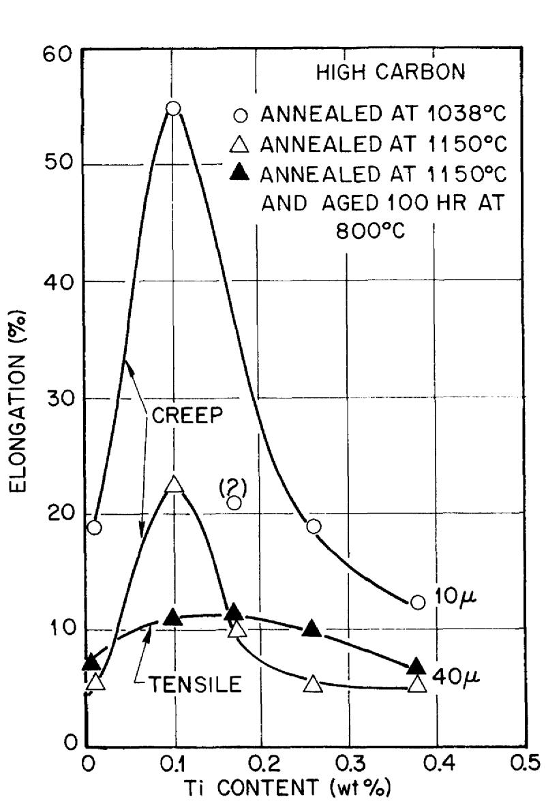

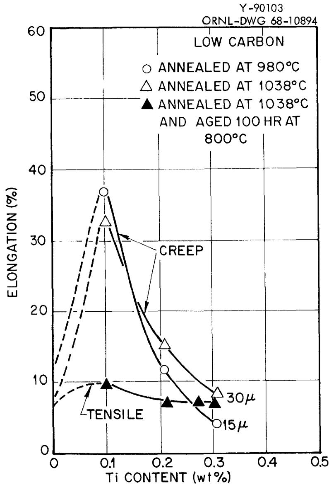  
Fig. 3. Postirradiation Ductility of Experimental Heats of Incoloy 800 Irradiated in the ORR at 650 and $700^{\circ}\mathrm{C}$ to About $0.8 \times 10^{21}$ neutrons/cm $^2$ (Thermal) and Tested at $700^{\circ}\mathrm{C}$ .

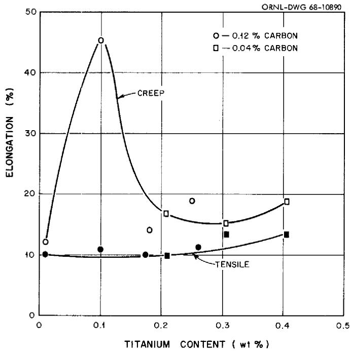  
Fig. 4. Postirradiation Ductility of Experimental Incoloy 800 at $760^{\circ}\mathrm{C}$ . Alloys were annealed at $1150^{\circ}\mathrm{C}$ , then irradiated at $760^{\circ}\mathrm{C}$ to 3 to $4 \times 10^{20}$ neutrons/cm $^2$ thermal.

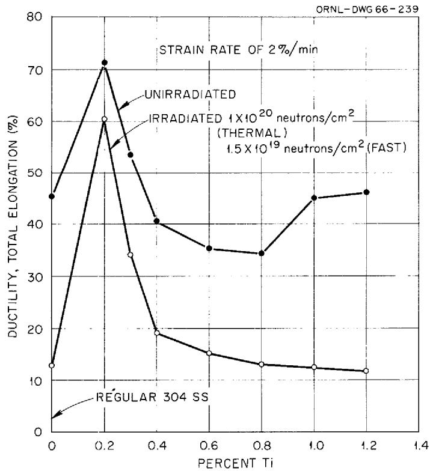  
Fig. 5. Ductility at $842^{\circ}\mathrm{C}$ of Irradiated Austenitic Stainless Steels as a Function of Titanium Content.

it has been argued $^{10}$ that the ductility maximum occurs at the l:l atom ratio of titanium and carbon (4:l weight ratio). The argument is that the formation of TiC utilizes all of the available carbon and prevents the formation of the grain boundary embrittling $\mathrm{M}_{23}\mathrm{C}_6$ . However, carbides other than titanium carbide (e.g., $\mathrm{M}_{23}\mathrm{C}_6$ ) have been seen $^{11}$ in the structure for all titanium levels. Indeed, the present study shows that for Incoloy 800 the position of the ductility peak is independent of carbon content over the range studied.

The radiation embrittlement of high-temperature alloys has been attributed to the generation of helium by the $10\mathrm{B}(\mathsf{n},\alpha)$ reaction.6 Titanium is a strong boride former - the free energy of formation of TiB is $-38,400$ cal/mole at $1000^{\circ}\mathrm{K}$ - and therefore may distribute the boron and subsequent helium throughout the matrix (and away from the grain boundaries) by the formation of TiB. This may account for the rise in ductility with increasing titanium content at the lower titanium levels but does not readily explain the decreasing ductility as the titanium exceeds $0.1\%$ .

Many compounds appear in the microstructure of Incoloy 800, as is the case for most engineering alloys. Two competing processes could be taking place. On one hand, the formation of TiB could result in increased ductility with increasing titanium; on the other hand, at higher titanium levels the formation of other compounds could enhance grain boundary embrittlement and decrease ductility. These could be titanium compounds or other compounds whose formation is enhanced by the presence of titanium.

This argument might account for the absence of a ductility peak for Hastelloy N modified with titanium. A continuous increase in ductility was noted up to about $1.2\%$ Ti. The thermodynamics of the Hastelloy N alloy system might be such that at low titanium levels the grain boundary

embrittling reaction described above would not occur. However, the post-irradiation ductility of Hastelloy N seems to be insensitive to the initial boron content up to 50 ppm, which questions the above effect of TiB for this alloy.

# Strain Rate

The enhanced postirradiation ductility at the $0.1\%$ Ti level is shown in the creep tests but not in the tensile tests, as can be seen in Figs. 3 and 4. Little or no compositional effect is shown for the tensile results, whereas the creep-rupture data show a sizable effect on postirradiation ductility.

Other studies $^{12,13}$ on the postirradiation ductility of both experimental and commercial Incoloy 800, which used only tensile testing, did not reveal any significant effects of composition. Our results show that the reason for this was an unfortunate choice of postirradiation testing conditions.

A model based on the stress-induced growth of helium bubbles that are present in irradiated metals has been offered14 as an explanation for the increasing postirradiation ductility at decreasing strain rates (i.e., decreasing stress levels). A certain critical stress, given as $0.76 \frac{\gamma}{r}$ , is required to cause the helium bubble present at a grain boundary to grow and subsequently link with others to cause premature intergranular fracture. In this expression $r$ is the radius of the helium bubble, which is assumed to be spherical, and $\gamma$ is the effective surface energy. According to this model, the irradiated material would show the same ductility as that unirradiated at sufficiently low stresses.

Figure 6 shows this to be the case for the $0.1\%$ Ti material at $760^{\circ}\mathrm{C}$ (data from Tables 3 and 4). However, this does not explain why the other heats of Incoloy 800 included in the figure responded only weakly to decreasing stress levels. It could be that the surface energy term in the critical stress relationship is less for these alloys than for those with $0.1\%$ Ti. Some very complex grain boundary reactions have been found for Incoloy 800 and may be indicative of surface energy variability. Recent findings by Snyder15 on some of the alloys included in this report show that these reactions are sensitive to titanium content. However, Gehlbach16 found no titanium present in the grain boundary precipitates of the one experimental alloy that he analyzed using the microprobe.

# Grain Size

Grain size has been reported17 to be important to the postirradiation ductility of type 304 stainless steel, with the finer grained material more ductile. Figure 3 verified this for the experimental Incoloy 800 at $700^{\circ}\mathrm{C}$ . The same data are plotted as a function of grain diameter in Fig. 7 for titanium levels of 0.1 and $0.2\%$ . Under these testing conditions the postirradiation creep ductility of Incoloy 800 with a given titanium level is governed almost entirely by the grain size and seems to be independent of carbon level. This is particularly important for Incoloy 800, as laboratory tests show that the grain size can be controlled over a wide size range for all compositions. Figures 8 and 9 show resulting grain sizes for representative heats of both low and high carbon content annealed at various temperatures.

Martin and Weir17 suggested that the effect of grain size on post-irradiation ductility might result from differences in helium concentration

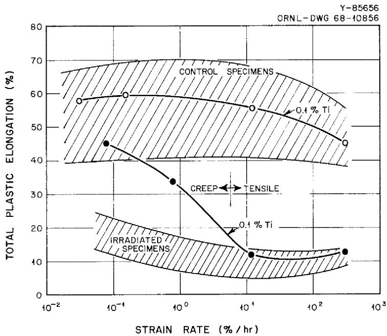  
Fig. 6. Tensile and Creep Ductility of Experimental Incoloy 800 at $760^{\circ}\mathrm{C}$ . Alloys were solution annealed at $1150^{\circ}\mathrm{C}$ . Irradiation was conducted at $760^{\circ}\mathrm{C}$ to 2 to $3 \times 10^{20}$ neutrons/cm², while the control specimens were soaked at $760^{\circ}\mathrm{C}$ for the duration of the irradiation.

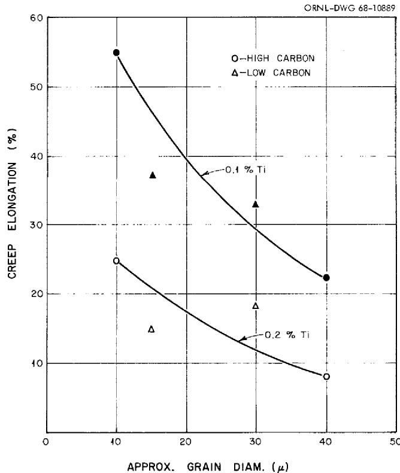  
Fig. 7. Postirradiation Creep Ductility of Experimental Incoloy 800 at $700^{\circ}\mathrm{C}$ . Alloys were annealed to obtain the indicated grain sizes and irradiated at 650 and $700^{\circ}\mathrm{C}$ to about $8 \times 10^{20}$ neutrons/cm $^2$ . Creep tests were conducted in air at 12,000 psi.

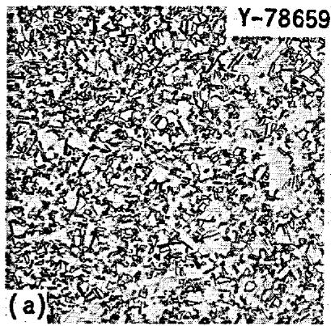

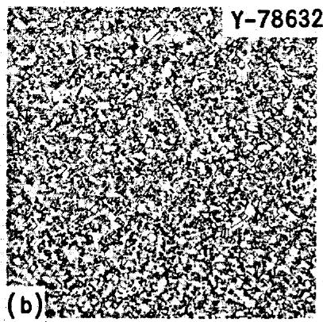

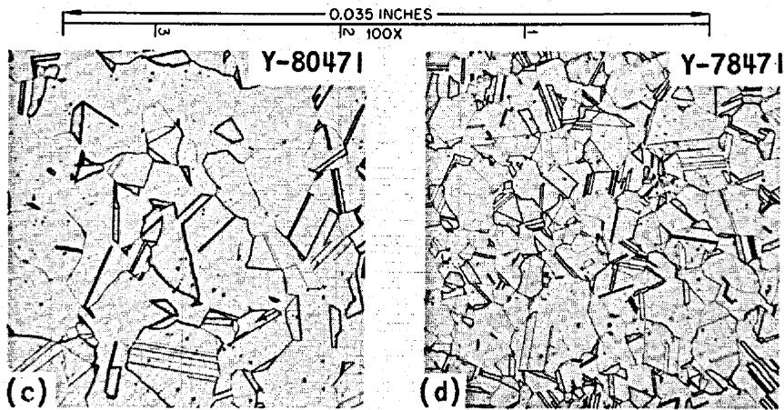  
Fig. 8. Grain Size of Experimental Incoloy 800. (a) Low-carbon material annealed at $980^{\circ}\mathrm{C}$ . (b) High-carbon material annealed at $1040^{\circ}\mathrm{C}$ . (c) Low-carbon material annealed at $1040^{\circ}\mathrm{C}$ . (d) High-carbon material annealed at $1150^{\circ}\mathrm{C}$ .

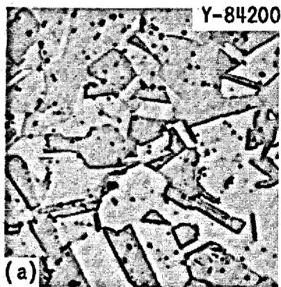

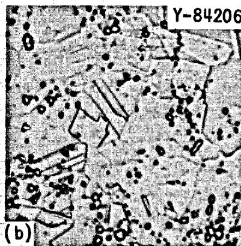

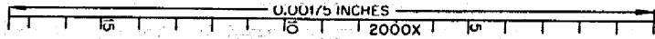  
Fig. 9. Grain Size of Experimental Incoloy 800 Annealed at $800^{\circ}\mathrm{C}$ . (a) Low-carbon material. (b) High-carbon material.

on grain boundaries or from changes in grain boundary shear stresses that cause fracture. Since a given amount of helium is produced from boron burnup and if this helium is present as bubbles in the grain boundaries, a lower concentration at the boundaries would be expected if the total available grain boundary area were increased (i.e., grain size decreased). The lower helium bubble concentration would be expected to be less embrittling to the grain boundary and thus improve overall ductility. Even though not all of the helium may reach the grain boundaries the overall conclusion of increasing ductility with decreasing grain size would probably remain valid.

# Preirradiation Aging

Some of the specimens received a heat treatment designed to agglomerate the carbide that is present in these alloys. Carbide in this form spaced along the grain boundary surface should be less detrimental to grain boundary ductility than the nearly continuous carbide films that frequently result from conventional annealing treatments. Figures 10 and 11 show the carbide agglomeration. Comparison of the test results for aged and unaged specimens as listed in Tables 3 and 4 shows little difference in postirradiation properties for the $760^{\circ}\mathrm{C}$ irradiation and test temperatures. Evidently the 1100 hr at $760^{\circ}\mathrm{C}$ during the irradiation also provided sufficient carbide agglomeration. This was also true for the control specimens, which also experienced the 1100 hr at $760^{\circ}\mathrm{C}$ before testing.

Tables 5 and 6 list the $700^{\circ}\mathrm{C}$ test results, showing some effect of preirradiation aging. The postirradiation ductility of the high-carbon material was slightly lowered for the heat containing $0.1\%$ Ti but was increased for all other titanium levels. In effect this broadens the ductility peak. The results were not conclusive for the low-carbon heats.

# Strength Considerations

In general, the effects of irradiation on the strength of the experimental Incoloy 800 were about those expected from data collected at ORNL on similar materials and are in agreement with the Incoloy 800 findings

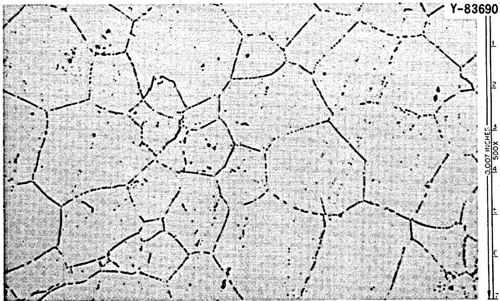  
Fig. 10. Low-Carbon Incoloy 800 Annealed at $1040^{\circ}\mathrm{C}$ and Aged 100 hr at $800^{\circ}\mathrm{C}$ .

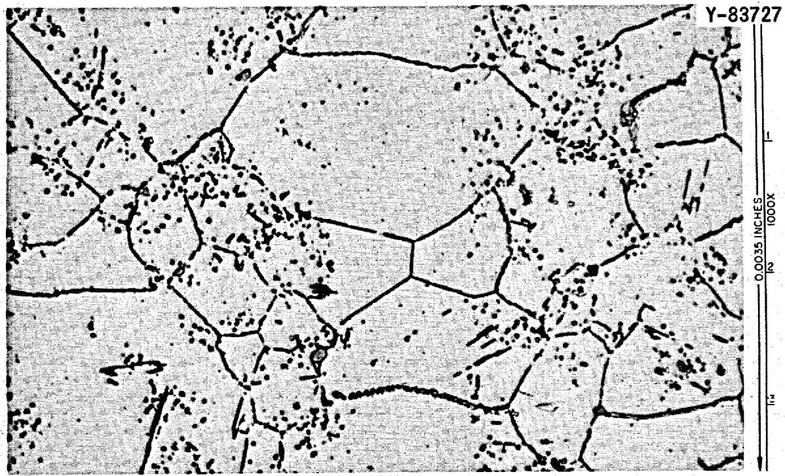  
Fig. 11. High-Carbon Incoloy 800 Annealed at $1150^{\circ}\mathrm{C}$ and Aged 100 hr at $800^{\circ}\mathrm{C}$ .

reported in the literature. That is, the strength properties were affected only through a curtailment of total ductility. Tables 3 and 4 list data for both the irradiated and the control specimens at $760^{\circ}\mathrm{C}$ .

Examination of the tensile results in Table 3 shows that the $0.2\%$ yield strength, the ultimate tensile strength, and the uniform elongation are unaffected by irradiation. The stress-strain curve is affected by the irradiation only in that portion beyond the peak load, where nonuniform deformation and grain boundary fracturing are occurring. These occur with less overall elongation for the irradiated specimens. Typical tensile curves comparing the unirradiated and irradiated material at $760^{\circ}\mathrm{C}$ are shown in Fig. 12.

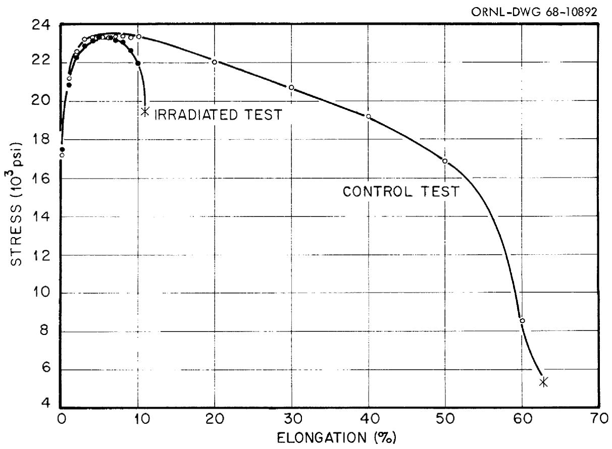  
Fig. 12. Tensile Stress-Strain Curves from Irradiated and Control Samples of Incoloy 800 containing $0.12\%$ C and $0.26\%$ Ti at $760^{\circ}\mathrm{C}$ and $0.002 / \min$ . After an $1150^{\circ}\mathrm{C}$ anneal, material was irradiated to $2 - 3 \times 10^{20}$ neutrons/cm² at $760^{\circ}\mathrm{C}$ or soaked at $760^{\circ}\mathrm{C}$ (control).

Similarly, the initial stages of the creep curve are very nearly the same for both irradiated and control specimens, as shown in Fig. 13. Minimum creep rates were generally slightly higher for the irradiated material. Bloom18 has attributed this to an early onset of third-stage creep before a true minimum creep rate was established. However, the second stage of creep lasted much longer for the unirradiated material and more elongation occurred during third-stage creep.

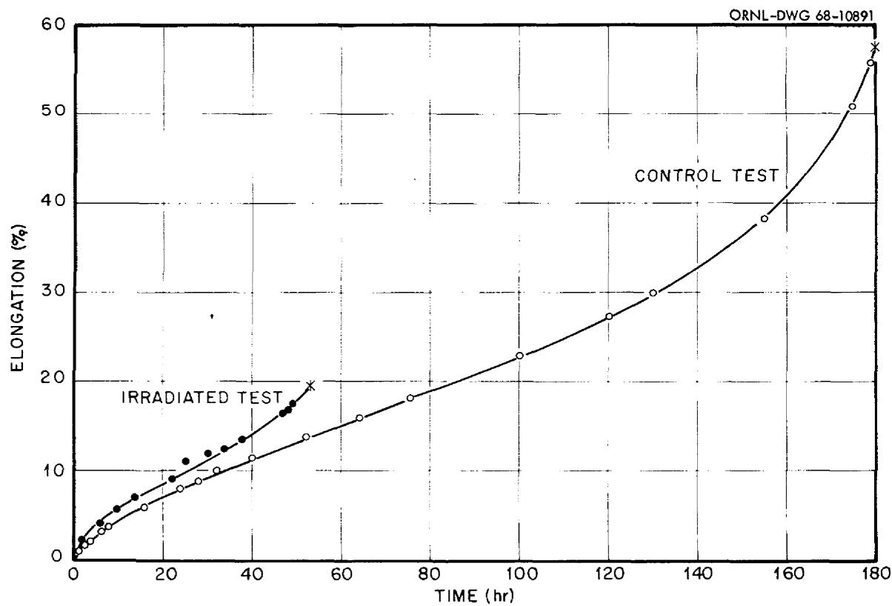  
Fig. 13. Creep Curves from Control and Irradiated Samples of Incoloy 800 containing $0.12\%$ C and $0.26\%$ Ti at $760^{\circ}\mathrm{C}$ and 12,500 psi. After an $1150^{\circ}\mathrm{C}$ anneal, material was irradiated to $2 - 3 \times 10^{20}$ neutrons/cm² at $760^{\circ}\mathrm{C}$ or soaked at $760^{\circ}\mathrm{C}$ (controls).

The curtailment of creep ductility seriously affected the creep-rupture life of Incoloy 800. Figure 14 illustrates the shorter rupture times at $760^{\circ}\mathrm{C}$ for the irradiated material for the high-carbon heats with 0.17 and $0.10\%$ Ti. Included in these plots is the ultimate tensile strength at two strain rates plotted against the total test time. The higher titanium heat shows the nearly parallel rupture curves typical of high-temperature alloys. However, the more ductile $0.1\%$ Ti heat shows the rupture curves converging at the lower stresses. This is expected since the ductility curves for this heat also converge at these stresses (see Fig. 6). It is also evident from the stress-rupture curves that aging 100 hr at $800^{\circ}\mathrm{C}$ before irradiation had no effect on the $760^{\circ}\mathrm{C}$ rupture life.

Any conclusions regarding rupture strength based on the $700^{\circ}\mathrm{C}$ data must await the testing of the control specimens. However, we note that the postirradiation rupture strength increases with grain size, as would be expected at this temperature for unirradiated material. For example, for the 0.1 and $0.2\%$ Ti alloys stressed at 12,000 psi, increasing the grain diameter from 10 to $40\mu$ increased the rupture time from 100 to 500 hr, and this increase seemed to be independent of carbon content. Aging the high-carbon alloys for 100 hr at $800^{\circ}\mathrm{C}$ before irradiation reduced the rupture life at $700^{\circ}\mathrm{C}$ about in half. Also, the higher titanium heats had longer rupture times, which could be due to an aging effect.

# CONCLUSIONS

The conclusions below are based on the test results contained in this report and correlation with reported results on similar materials. More meaningful conclusions regarding Incoloy 800 will undoubtedly be forthcoming as additional material, irradiation, and testing variables are investigated.

1. Enhanced postirradiation ductility can be achieved for Incoloy 800. Maximum ductility is obtained for a concentration of $0.1\%$ Ti, and this optimum titanium level is independent of carbon content over the range of 0.03 to $0.12\%$ .

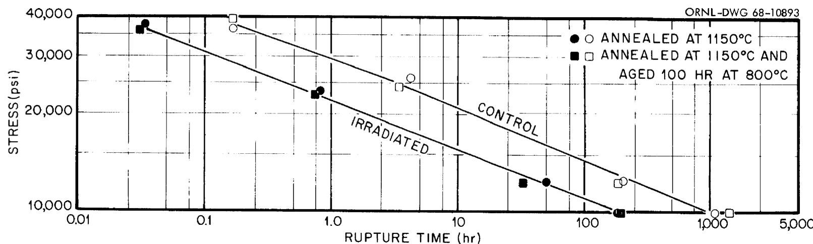

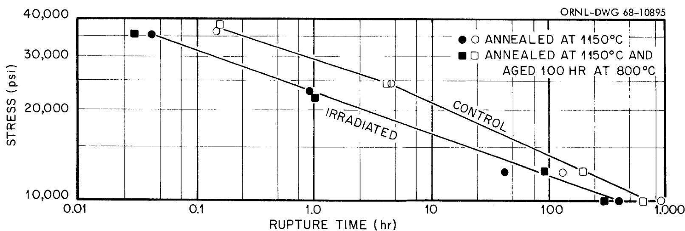  
Fig. 14. Creep Rupture of Experimental Incoloy 800 Containing $0.13\%$ C and (a) $0.17\%$ or (b) $0.10\%$ Ti. Specimens were irradiated or soaked (controls) at $760^{\circ}\mathrm{C}$ and tested in air at $760^{\circ}\mathrm{C}$ . Both tensile and creep data are plotted.

2. The ratio of titanium to carbon content is unimportant to the postirradiation ductility of Incoloy 800.   
3. Grain size markedly affects the postirradiation strength and ductility of Incoloy 800 at $700^{\circ}\mathrm{C}$ . Decreasing grain size improves ductility and reduces strength. The increased ductility may be explained by helium distribution or grain boundary fracture considerations.   
4. Aging Incoloy 800 before irradiation to agglomerate grain boundary carbide has no effect on the properties at $760^{\circ}\mathrm{C}$ but broadens the ductility vs titanium concentration peak at $700^{\circ}\mathrm{C}$ . This might allow a wider titanium specification for desired material behavior at this temperature.   
5. Creep-rupture testing after irradiation is essential to the evaluation of Incoloy 800 for nuclear applications. Postirradiation ductility of certain compositions increases with decreasing strain rates (stress levels). All levels of titanium produce essentially the same postirradiation tensile ductility.   
6. Widely varying creep-rupture properties both before and after irradiation are obtained for alloys within the Incoloy 800 composition specification. A close control of titanium content and grain size is imperative for elevated-temperature properties that are both desirable and predictable.

# ACKNOWLEDGMENT

I would like to express my appreciation to those of the Metals and Ceramics Division responsible for conducting the experiments contained in this report; J. W. Woods, V. R. Bullington, and C. K. Thomas for construction and supervision of the ORR irradiation experiments; B. C. Williams, C. W. Walker, L. G. Rardon, and T. T. Brightwell for the mechanical testing; and H. R. Finch for the metallography.

I thank G. T. Newman, C. E. Sessions, and S. Peterson for their review of the manuscript, Sharon Woods for the typing and preparation of the report for reproduction and J. R. Weir, Jr. and C. R. Kennedy for their helpful suggestions throughout the studies.

I am also pleased to acknowledge the support of the Division of Space Nuclear Systems of the AEC for a portion of the work.

# INTERNAL DISTRIBUTION

1-3. Central Research Library   
4-5. ORNL - Y-l2 Technical Library Document Reference Section

6-15. Laboratory Records Department   
16. Laboratory Records, ORNL RC   
17. ORNL Patent Office   
18. G. M. Adamson, Jr.   
19. T. E. Banks   
20. J.H.Barrett   
21. S. E. Beall   
22. R.J.Beaver   
23. M. Bender   
24. R. G. Berggren   
25. J. O. Betterton, Jr.   
26. D. S. Billington   
27. E. E. Bloom   
28. A. L. Boch   
29. E. S. Bomar   
30. B. S. Borie   
31. G. E. Boyd   
32. R. A. Bradley   
33. R. B. Briggs   
34. R. E. Brooksbank   
35. W. E. Brundage   
36. D. A. Canonico   
37. R.M.Carroll   
38. J.V.Cathcart   
39. A. K. Chakraborty   
40. Ji Young Chang   
41. G.W.Clark   
42. K.V.Cook   
43. G. L. Copeland   
44. C.M.Cox   
45. F. L. Culler   
46. J. E. Cunningham   
47. H. L. Davis   
48. V. A. DeCarlo   
49. J.H.DeVan   
50. C.V.Dodd   
51. R. G. Donnelly   
52. K. Farrell   
53. J. S. Faulkner   
54. J. I. Federer   
55. D. E. Ferguson   
56. R. B. Fitts   
57. B. E. Foster   
58. A. P. Fraas

59. J. H Frye, Jr.   
60. W. Fulkerson   
61. T. G. Godfrey, Jr.   
62. R. J. Gray   
63. W. R. Grimes   
64. H. D. Guberman   
65. R. L. Hammer   
-85. D. G. Harman   
86. W. O. Harms   
89. M.R.Hill   
90. N. E. Hinkle   
91. D. O. Hobson   
92. H. W. Hoffman   
93. R.W.Horton   
94. W.R.Huntley   
95. H. Inouye   
96. G.W. Keilholtz   
97. J. Komatsu   
98. J. A. Lane   
99. J.M.Leitnaker   
OO. T. B. Lindemer   
01. A. P. Litman   
102. R.H.Livesey   
.03.A.L.Lotts   
.04.R.N.Lyon   
105. H. G. MacPherson   
06. R.E. MacPherson   
07. M. M. Martin   
08. W. R. Martin   
09. R.W. McClung   
10. H. E. McCoy, Jr.   
11. H. C. McCurdy   
12. R.E.McDonald   
13. W. T. McDuffie   
14. D. L. McElroy   
15. C. J. McHargue   
16. F. R. McQuilkin   
17. A. J. Miller   
18. E. C. Miller   
19. J.P.Moore   
20. J. G. Morgan   
21. F. H. Neill   
22. G. T. Newman   
23. T. M. Nilsson   
24. T. A. Nolan (K-25)   
25. S.M.Ohr   
26. A. R. Olsen

127. P. Patriarca   
128. W. H. Pechin   
129. A.M.Perry   
130. S. Peterson   
131. R.A.Potter   
132. R. B. Pratt   
133. M. K. Preston   
134. R.E. Reed   
135. D. K. Reimann   
136. P. L. Rittenhouse   
137. W. C. Robinson   
138. M. W. Rosenthal   
139. C. F. Sanders   
140. G. Samuels   
141. A. W. Savolainen   
142. J. L. Scott   
143. J. D. Sease   
144. 0. Sisman   
145. G.M.Slaughter   
146. S. D. Snyder   
147. K. E. Spear

148. I. Spiewak   
149. W.J.Stelzman   
150. J. O. Stiegler   
151. D. B. Trauger   
152. R.P. Tucker   
153. G.M. Watson   
154. M. S. Wechsler   
155. A.M. Weinberg   
175. J. R. Weir, Jr.   
176. W. J. Werner   
177. H. L. Whaley   
178. G. D. Whitman   
179. J. M. Williams   
180. R. K. Williams   
181. R. O. Williams   
182. J. C. Wilson   
183. R. G. Wymer   
184. F. W. Young, Jr.   
185. C. S. Yust   
186. A. F. Zulliger

# EXTERNAL DISTRIBUTION

187-190. F.W.Albaugh,Battelle,PNL   
191-193. R. J. Allio, Westinghouse Atomic Power Division   
194. R. D. Baker, Los Alamos Scientific Laboratory   
195. C. Baroch, Babcock and Wilcox   
196. V. P. Calkins, General Electric, NMPO   
197. S. Christopher, Combustion Engineering, Inc.   
198. D. B. Coburn, Gulf, General Atomic   
199. D. F. Cope, RDT, SSR, AEC, Oak Ridge National Laboratory   
200. G. K. Dicker, Division of Reactor Development and Technology, AEC, Washington   
201. D. E. Erb, Division of Reactor Development and Technology, AEC, Washington   
202. E. A. Evans, General Electric, Vallecitos   
203. W. C. Francis, Idaho Nuclear Corporation   
204. A. J. Goodjohn, Gulf, General Atomic   
205. S.P.Grant,Babcock and Wilcox   
206. J. F. Griffo, Division of Space Nuclear Systems, AEC, Washington   
207. R. G. Grove, Mound Laboratory   
208. D. H. Gurinsky, Brookhaven National Laboratory   
209-211. J. S. Kane, Lawrence Radiation Laboratory, Livermore   
212. Haruo Kato, Albany Metallurgy Research Center, P.O. Box 70, Albany, Oregon 97321   
213. E. E. Kintner, Fuel Fabrication Branch, AEC, Washington   
214. J. H. Kittel, Argonne National Laboratory

215. E. J. Kreih, Westinghouse, Bettis Atomic Power Laboratory   
216. W. J. Larkin, AEC, Oak Ridge Operations   
217. W. L. Larsen, Iowa State University, Ames Laboratory   
218. C. F. Leitten, Jr., Linde Division, Union Carbide Corp.   
219. P. J. Levine, Westinghouse Advanced Reactor Division, Waltz Mill Site, Box 158, Madison, Pa. 15663   
220. J. J. Lombardo, NASA, Lewis Research Center   
221. J. H. MacMillan, Babcock and Wilcox   
222. C. L. Matthews, RDT, SR, AEC, Oak Ridge National Laboratory   
223. A. Mullunzi, Division of Reactor Development and Technology, AEC, Washington   
224. M. Nevitt, Argonne National Laboratory   
225. R. E. Pahler, Division of Reactor Development and Technology, AEC, Washington   
226. S. Paprocki, Battelle Memorial Institute   
227. W. E. Ray, Westinghouse Advanced Reactor Division, Waltz Mill Site, Box 158, Madison, Pa. 15663   
228. B. Rubin, Lawrence Radiation Laboratory, Livermore   
229. F. C. Schwenk, Division of Reactor Development and Technology, AEC, Washington   
230. W. F. Sheely, Division of Research, AEC, Washington   
231. P. G. Shewmon, Argonne National Laboratory   
232-234. J. M. Simmons, Division of Reactor Development and Technology, AEC, Washington   
235. L. E. Steele, Naval Research Laboratory   
236. R. H. Steele, Division of Reactor Development and Technology, AEC, Washington   
237-239. D. K. Stevens, Division of Research, AEC, Washington   
240. A. Strasser, United Nuclear Corporation   
241. A. Taboada, Division of Reactor Development and Technology, AEC, Washington   
242. A. Van Echo, Division of Reactor Development and Technology, AEC, Washington   
243. James Watson, Gulf, General Atomic   
244. C. E. Weber, Atomics International   
245. J. F. Weissenberg, RDT, OSR, General Electric, NMPO   
246. G. W. Wensch, Division of Reactor Development and Technology, AEC, Washington   
247. G. A. Whitlow, Westinghouse Advanced Reactor Division, Waltz Mill Site, Box 158, Madison, Pa. 15663   
248. E. A. Wright, AEC, Washington   
249. Laboratory and University Division, AEC, Oak Ridge Operations   
250-264. Division of Technical Information Extension