# OAK RIDGE NATIONAL LABORATORY

operated by

UNION CARBIDE CORPORATION

for the

U.S. ATOMIC ENERGY COMMISSION

ORNL-TM-2315

COPY NO. -105

DATE - 8/27/68

Instrumentation and Controls Division

MEASUREMENT OF HELIUM Void FRACTION IN THE MSRE

FUEL SALT USING NEUTRON-NOISE ANALYSIS

D. N. Fry

R. C. Kryter

J. C. Robinson

# ABSTRACT

Investigations were made at the MSRE to determine if the amount of helium gas in the fuel salt could be measured using neutron noise analysis. The neutron power spectral density (NPSD) was measured at different reactor operating conditions and compared with analytical model predictions of the NPSD for the same conditions.

The results of experimental tests and analytical studies have shown that the principal source of small neutron density fluctuation observed in the MSRE is helium bubbles circulating in the fuel salt. The NPSD was most sensitive to changes in fuel temperature: the NPSD in the region of 1 cps increased by a factor of almost 50 when the average core outlet fuel temperature was decreased from 1225 to $1180^{\circ}\mathrm{F}$ . The measurements showed that NPSD in the frequency range from 0.5 to 2 cps varies as the square of helium void fraction as predicted by the model, and that the minimum void fraction is more nearly zero than the previously accepted value of $0.1\%$ .

It is concluded that changes in the circulating void fraction can be inferred with good sensitivity directly from neutron noise measurements, and, consequently, NPSD can complement and enhance the value of the MSRE reactivity balance calculations.

# LEGAL NOTICE

This report was prepared as an account of Government sponsored work. Neither the United States, nor the Commission, nor any person acting on behalf of the Commission:

A. Makes any warranty or representation, expressed or implied, with respect to the accuracy, completeness, or usefulness of the information contained in this report, or that the use of any information, apparatus, method, or process disclosed in this report may not infringe privately owned rights; or   
B. Assumes any liabilities with respect to the use of, or for damages resulting from the use of any information, apparatus, method, or process disclosed in this report.

As used in the above, "person acting on behalf of the Commission" includes any employee or contractor of the Commission, or employee of such contractor, to the extent that such employee or contractor of the Commission, or employee of such contractor prepares, disseminates, or provides access to, any information pursuant to his employment or contract with the Commission, or his employment with such contractor.

# CONTENTS

1. INTRODUCTION 4   
2. DATA ACQUISITION AND REDUCTION 5

2.1 Data Acquisition 6   
2.2 Data Reduction 7

3. THEORETICAL CALCULATIONS AND MODELING 8

3.1 Introduction 8   
3.2 Development of the Model 9   
3.3 Consideration of Possible Driving Functions 12

4. MEASUREMENTS AND RESULTS 13

4.1 Establishment of Measurement Reproducibility and Method of Spectrum Interpretation 13   
4.2 Results of Tests at 7 Mw Reactor Power 14

4.3 Results of Tests at 5 Mw Reactor Power 14

4.3.1 Neutron Noise Level vs Pump Bowl Level 14   
4.3.2 Neutron Noise Level vs Cover Gas Pressure 15   
4.3.3 Neutron Noise Level vs Average Reactor 15   
4.3.4 Neutron Noise vs Net Reactivity 15

4.4 Dominant Source of Observed Neutron Noise 16

5. CONCLUSIONS 18   
6. FUTURE INVESTIGATIONS 18

# LEGAL NOTICE

This report was prepared as an account of Government sponsored work. Neither the United States, nor the Commission, nor any person acting on behalf of the Commission:

A. Makes any warranty or representation, expressed or Implied, with respect to the accuracy, completeness, or usefulness of the information contained in this report, or that the use of any information, apparatus, method, or process disclosed in this report may not infringe privately owned rights; or

B. Assumes any liabilities with respect to the use of, or for damages resulting from the use of any information, apparatus, method, or process disclosed in this report.

As used in the above, "person acting on behalf of the Commission" includes any employee or contractor of the Commission, or employee of such contractor, to the extent that such employee or contractor of the Commission, or employee of such contractor prepares, disseminates, or provides access to, any information pursuant to his employment or contract with the Commission, or his employment with such contractor.

# 1. INTRODUCTION

Investigations were made at the MSRE to determine if the amount of helium gas in the fuel salt can be measured using neutron noise analysis. In calculations of reactivity balances that have been made by an on-line digital computer at the Molten-Salt Reactor Experiment (MSRE) since the start of power operation, there has been an uncertainty concerning the concentration of $^{135}\mathrm{Xe}$ in the circulating fuel salt and, thus, an uncertainty in the reactivity balance computations. According to Engel and Prince, this uncertainty arises because an unknown and changing amount of circulating voids (bubbles of undissolved helium gas believed to be introduced by the xenon-stripping spray ring in the fuel pump tank) affects the amount of $^{135}\mathrm{Xe}$ in the system. Besides this uncertainty, these bubbles also introduce a reactivity effect of $-0.18\% (\Delta \mathrm{k} / \mathrm{k})$ for 1 vol % of gas, since such voids affect the neutron leakage and fuel inventory within the core.

Although measurements at zero power $^{3,4}$ had indicated that no circulating voids were present, pressure release tests $^{3}$ performed later after operation at power showed a small circulating void fraction at normal salt levels in the pump tank. By comparing calculated and observed transient buildup of $^{135}\mathrm{Xe}$ poisoning after step changes in reactor power, Engel and Prince estimated the void fraction to be between 0.1 and 0.15 vol $\%$ and the bubble stripping efficiency to be between 50 and $100\%$ . Later experience indicated that the circulating void fraction is dependent upon other reactor operating conditions, such as fuel pump tank level for one. $^{2}$ Transient tests were performed to infer the void fraction and bubble stripping efficiency, but because such tests interrupted the normal operation of the MSRE, it seemed desirable to seek a nondisturbing method for determining the helium void fraction and stripping efficiency.

Neutron noise analysis has been applied extensively as a nondisturbing method for measuring reactor parameters at zero power and also for monitoring the dynamic behavior of reactors operating at power. In an early application of this technique,

Hirota5 concluded that gas effects were influencing the hydraulic behavior of the Homogeneous Reactor Test (HRT) core; he compared calculated transfer functions with the Fourier amplitudes of measured small $(\pm 3\%)$ power deviations that occurred during steady-state HRT operation. We therefore conjectured that neutron noise analysis might be used to measure the amount of circulating void in the MSRE fuel salt without disturbing the reactor operation in any way.

To determine the feasibility of using noise analysis to measure the void fraction, three questions must be answered. First, do the helium bubbles, in passing through the core, produce reactivity fluctuations that, in turn, cause neutron noise? Second, if noise is generated by bubbles, is the frequency spectrum of the noise in a range that is applicable to noise analysis and is the amplitude great enough to be detected above background noise? Finally, is it possible to develop a quantitative relationship between neutron power spectral density (NPSD) and the circulating void fraction? The results of our investigation of these questions are presented in this report.

To assure the maximum sensitivity of the measurement of neutron noise, special data acquisition and reduction techniques were developed. After installation and checkout of the equipment and analysis techniques, the neutron noise was measured and analyzed at different reactor operating conditions, such as fuel-tank salt level, average fuel outlet temperature, helium cover-gas pressure, etc., to determine the effects of these variables on the NPSD. Concurrently with these measurements a detailed theoretical model of the system was developed, and attempts were made to understand what physical mechanisms could conceivably produce neutron density fluctuations in the MSRE. These theoretical predictions were then compared with the measured NPSD to infer that the most likely source of observed neutron noise in the MSRE is the circulating helium bubbles. Finally, an attempt was made to quantitatively relate the NSPD to the amount of void in the circulating fuel salt, with some success.

The authors are grateful to C. B. Stokes for his assistance in performing the measurements and to G. C. Guerrant for designing the ionization chamber assembly. We also express our appreciation to the MSRE personnel for their help in performing the tests, and especially to J. R. Engel for his many helpful discussions and suggestions throughout the investigation.

# 2. DATA ACQUISITION AND REDUCTION

Figure 1 shows the essential elements that were used to obtain the power spectral density of the neutron density fluctuations in the MSRE. The following two

sections explain how the neutron ionization chamber signal was recorded and analyzed to obtain the NPSD, or mean-squared noise per unit frequency.

# 2.1 Data Acquisition

To obtain an electrical signal proportional to the neutron density fluctuations, a neutron-sensitive ionization chamber was placed in spare guide tube 7 of the MSRE instrument penetration. This is a boron-coated, RSN-76A chamber filled with a special gas mixture (1500 mm $^4$ He and 50 mm $\mathsf{CH}_4$ ) to optimize it for neutron noise analysis. $^6$ The chamber has a relatively high neutron sensitivity which is deemed essential for noise analysis.

A two-conductor, low-capacitance, low-noise balanced cable carries the current signal from the chamber and also the common-mode noise signal to the auxiliary control room. The total capacitance to ground of the $\sim 160$ ft of signal cable plus the chamber is 1880 pf. This capacitance, in parallel with the input resistance of the noise amplifier, limits the highest frequency noise that can be analyzed with this system. (This limitation is discussed further below.) The common-mode line is terminated at the chamber with a capacitance to ground equal to that of the chamber.

The low-noise ac amplifier, having a variable voltage gain from 200 to 10,000 and a bandwidth of 0.013 to 3500 cps, was used to amplify the fluctuating portion of the chamber signal. It is a differential-input amplifier with a common-mode rejection capability of 50 db for the elimination of unwanted electrical noise picked up along the 160 ft of cable. Since the amplifier operates on voltage signals, the current signal from the chamber must be converted to a voltage signal at the amplifier input by using either a 2- or a 20-kilohm resistor to ground. Due to the 20-kilohm resistor in parallel with the 1880-pf capacitance of the combined cable and chamber, the practical upper frequency limit of the noise analysis technique is 4240 cps, which is well beyond the range of interest for the MSRE; this will be discussed in Section 2.2. The amplifier limits the lower frequency to 0.01 cps (-3 db), which is also consistent with the practical limitations on the lower frequency imposed by statistical sampling laws.

The amplified ionization-chamber signal $(\sim 2 \mathrm{v} \mathrm{p}-\mathrm{p})$ at the amplifier output is transmitted through shielded cable to the Bunker-Ramo 340 on-line digital

ORNL-DWG 68-8415

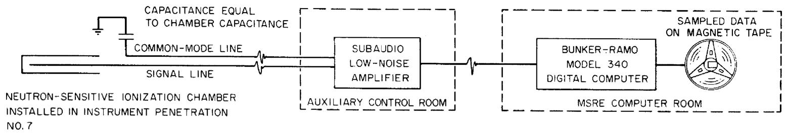

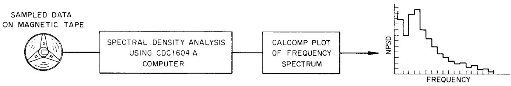  
(σ) DATA ACQUISITION AT MSRE   
(b) OFF-LINE DATA REDUCTION   
Fig. 1. MSRE Neutron Noise Analysis.

computer, where the signal is sampled at a rate of 60 samples/sec and the digitized data are recorded on magnetic tape for off-line analysis. The analog-to-digital converter accepts signals in the range from $-2\textbf{v}$ to $+2\textbf{v}$ . For each test, data were taken for 30 min, yielding 108,000 digitized values of the fluctuating neutron density.

# 2.2 Data Reduction

The frequency spectrum of the noise was determined by an off-line CDC 1604-A computer at the ORNL Computing Center, using a fast Fourier transform algorithm. This method of analysis was chosen for its accuracy, speed, and good frequency-resolution properties. However, because the Bunker-Ramo computer had a fixed sampling rate of 60 samples/sec, the upper limit of the frequency that could be analyzed was about 15 cps. As will be seen, this limit did not restrict neutron noise analysis at the MSRE, because there is little useful information in the neutron signal above 10 cps, but the 60 sample/sec rate did make it necessary to filter the noise signal so that there would be negligible signal power at frequencies greater than half the sampling rate (30 cps). This filtering was necessary to prevent aliasing, or "folding," of noise above 30 cps back into the frequency range of interest (0 to 15 cps) which would have caused distortion of the frequency spectrum of the neutron-induced current fluctuations in the ionization chamber. Therefore, the bandwidth of the ionization-chamber-signal amplifier was changed from 0.013 - 3500 cps to 0.013 - 35 cps (-6 db at 0.013 and 35 cps). Calibration tests of the filtered signal showed that the amount of spectrum contamination caused by aliasing was negligible. The bandwidth of the individual digital filters (frequency spectrum resolution) chosen for the analysis was 0.117 cps. In the analysis the frequency range from 0 to 15 cps was divided into 128 intervals of 0.117 cps each. This fine-frequency resolution was necessary to give an accurate picture of the resonance structure of the NPSD curves. The standard deviation of the spectral density determined for each of the 128 intervals for a 30 min sampling time was ±4%.

The data reduction program was coded to correct the NPSD for the amplifier gain and to divide it by the square of the dc ionization chamber current $(\mathrm{IDC}^2)$ . (Earlier theoretical work9 had pointed out that when the noise from reactors operating at power is analyzed, variations are most easily interpreted when the NPSD is normalized to the square of the dc component of the chamber current.) The normalized NPSD functions were plotted using a CALCOMP plotter. A typical MSRE

spectrum (computed in about 4 min on the 1604-A computer) is shown in Fig. 2. The NPSD is plotted in absolute units of fractional mean-square reactor power fluctuation per unit frequency interval in cycles/sec. Since in the frequency analysis it is assumed that the spectral density is constant over the bandwidth of the effective digital filter, we plotted the results in histogram form. The interpretation of the spectra will be discussed in the next section.

# 3. THEORETICAL CALCULATIONS AND MODELING

# 3.1 Introduction

For a linear system driven by a single input, the output PSD, $\Phi_{\infty}(\omega)$ , is related to the input PSD, $\Phi_{ii}(\omega)$ , by

$$
\Phi_ {\circ \circ} (\omega) = | G (j \omega) | ^ {2} \Phi_ {i i} (\omega), \tag {1}
$$

where $|G(j\omega)|$ is the modulus of the system frequency response function. Such an output PSD, obtained from a neutron-sensitive ionization chamber at the MSRE (operating at power), was presented in Fig. 2. To efficiently utilize the PSD measurements in gaining insight into the dynamic properties of the reactor system, it is necessary to understand the nature of the predominant input (driving function) to the system. There are two possible approaches to the identification of this driving function:

1. Postulate a driving function and then attempt an experimental verification, e.g., cross-correlation measurements or PSD measurements for a range of known reactor conditions where various quantities are purposely modified, etc.   
2. Postulate a driving function, calculate analytically the appropriate system transfer function, and then employ Eq. (1) to produce an expected output PSD which can be compared to experimental results to validate or reject the postulate.

In principle, the cross-correlation techniques could lead to the unique identification of the driving function; however, in practice most cross-correlation measurements are difficult. Therefore we adopted the combined approach of an analytic model for the calculation of the frequency response function, coupled with PSD measurements under controlled (as much as possible) reactor conditions.

Before a specific model was selected, the potential driving functions were considered. In addition to potential driving functions commonly encountered, such as coolant temperature fluctuations and rod vibrations, it was known that helium gas could be entrained in the fuel salt. Therefore, in addition to commonly encountered

potential driving functions, the possibility of fluctuations in the void fraction, which could be induced by pressure or velocity fluctuations, was also considered.

A model had been developed by Ball and Kerlin10 for the calculation of the power-to-reactivity frequency response function in the MSRE. Their model, basically a multinode (fixed number of nodes) model becomes less valid as the frequency of the disturbance increases.9 Therefore, we decided that a distributed parameter model would be necessary for the cases of interest to us. Furthermore, the Ball-Kerlin model treated a reactivity driving function only, whereas we wished to consider several driving functions.

In the next section, the basic concepts of our model will be presented along with the method of solution, and this will be followed by a section concerned with the elimination of some potential driving functions and the identification of the more probable driving functions.

# 3.2 Development of the Model

At the beginning of this study, we recognized that a model would be required that would couple the neutronic and hydraulic states of the system; therefore, the basic equations would be those of continuity of mass, momentum, and energy for the fluid, along with the conservation of neutrons. If gas were present in the fluid fuel (which was assumed to be the case), the fluid-gas system must be treated as a compressible system, and, therefore, the conservation equations would contain the dependent variables of pressure, velocity of the fuel salt, velocity of the gas, temperature, void fraction of gas, density of the gas (we assumed that the density of the salt would be constant), neutron flux, and precursor concentrations. Since several dependent variables were involved, the following assumptions were made in regard to fluctuations about the mean:

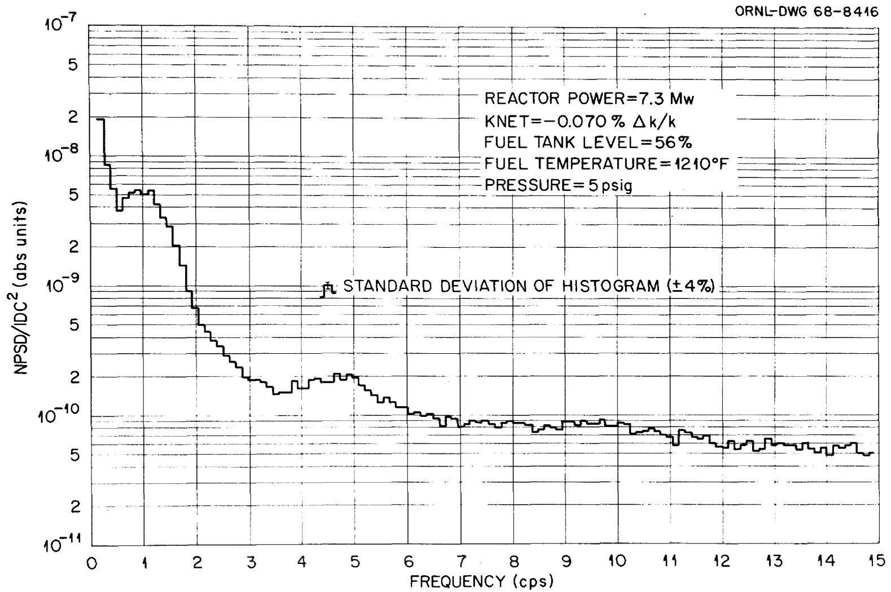  
Fig. 2. Typical Neutron Noise Spectrum of the MSRE.

6. A one-dimensional, one-velocity neutron diffusion equation, which explicitly accounts for delayed neutrons, would be adequate.   
7. The fluctuations in the fluid velocity could not significantly affect the precursor balance equations.

With these assumptions, we decided the problem into two parts: a hydraulic model which involves the momentum, mass of the gas, and mass of the fluid conservation equations, and a neutronic model which involves the energy, neutrons, and precursor conservation equations. The hydraulic model will be discussed first, followed by the neutronic model.

The governing equations of the hydraulic model were reduced to a set of three linear, coupled partial differential equations in space and time, with space-varying coefficients. The time variable was removed by use of the Laplace transform, thus obtaining a complex, coupled set of ordinary differential equations in space whose coefficients are complex as well as space dependent. In matrix form the hydraulic model can be written as

$$
\frac {d}{d z} \chi (z, s) = A (z, s) \chi (z, s), \tag {2}
$$

where $\chi(z, s)$ is a column matrix (vector) whose elements are velocity fluctuations, void fraction fluctuations, and pressure fluctuations; $A(z, s)$ is a square matrix whose elements depend on the system properties, steady-state distributions, etc; $z$ is the spatial variable; and $s$ is the Laplace transform parameter.

The frequency range of primary interest was about 0.1 to 20 cps. Since the total loop time for the fuel salt is about 25 sec, we concluded that the details of the salt loop external to the core would not be important; therefore, a simplified physical system was chosen to present the more complex actual system (Fig. 3). In particular, six regions (identified as $L_{1}$ through $L_{6}$ in Fig. 3) were chosen:

1. the region from the primary pump to the inlet of the downcomer including the heat exchanger, $\mathsf{L}_1$ ;   
2. the downcomer, L2;   
3. the lower plenum, $\mathsf{L}_{3}$   
4. a large number of identical parallel fuel channels1, L4;

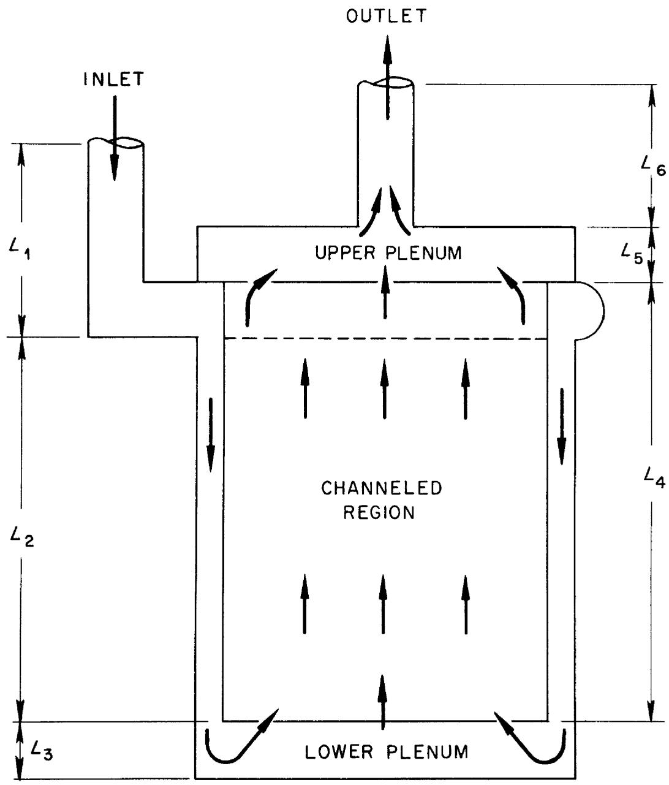  
Fig. 3. Model Used to Approximate the MSRE Fuel Salt Loop.

5. the upper plenum, L5;   
6. the region from the reactor vessel to the primary pump, L6.

The solution of Eq. 1 can be written for each region as

$$
x _ {o, i} (s) = \Lambda_ {i} (s) x _ {i, j} (s), \tag {3}
$$

where the subscripts o and i refer to the output and input respectively, subscript j is for the $j^{th}$ region, and $\Lambda_{i}(s)$ , given by

$$
\Lambda_ {i} (s) = \exp \left[ \int_ {0} ^ {L _ {i}} A _ {i} (z, s) d z \right], \tag {4}
$$

is referred to as the transport kernel for the $j^{\text{th}}$ region. The transport kernel is evaluated for each region using matrix exponential techniques. Then coupling equations are applied between each region; this permits the evaluation of the overall system transport kernel, $\Lambda_{6}(s)$ , then

$$
x _ {0, 1 - 6} (s) = \Lambda_ {6} (s) x _ {i, 1} (s). \tag {5}
$$

The boundary conditions are then applied which (a) closes the loop and (b) inserts a driving function, e.g., pressure fluctuations, between regions 6 and 1. The void-fraction fluctuation, velocity fluctuation, and pressure fluctuation spatial distributions through the core are now obtained.

In the neutronic model the equations of interest are the conservation of energy, the diffusion equation for neutrons, and the precursor balance equations.

The basic assumptions in addition to those previously stated were:

1. The flux introduced would be separate in space and time.   
2. Reactivity introduced into the system from temperature and void fluctuations could be accounted for by using the appropriate coefficients of reactivity.   
3. The importance of the spatial insertion of reactivity would be properly accounted for by using the variational principle.

Since the method of solution was similar to that presented in Ref. 9, it will not be described here.

# 3.3 Consideration of Possible Driving Functions

The potential driving functions that have been considered are fluctuations in

1. the salt temperature at the entrance to the core region,   
2. the void fraction induced by salt velocity fluctuations at the pump,   
3. the void fraction induced by fluctuations in the mass flow rate of gas entering the salt at the pump bowl,   
4. the void fraction induced by pressure fluctuations introduced at the primary pump or pump bowl.   
5. the reactivity caused by control rod vibrations.

The first three of these driving functions were eliminated because a comparison of observed (experimental) PSD with the calculated (theoretical) PSD showed that experimental PSD decreased about one decade in magnitude in the frequency range of 0.2 to 1 cps, but the analytical PSD (for an assumed white driving function) decreased about three decades in the same frequency range for each of these functions. If any one of them had been primarily responsible for the observed PSD, the magnitude of that particular function would have had to increase with frequency in this frequency range. Physically, this behavior would be unreasonable.

The possibility of rod vibrations could not be eliminated analytically. Likewise, the fourth driving function could not be eliminated, because calculation shows that a pressure fluctuation of 0.01 to 0.05 psi (which is physically realizable) would be sufficient to produce the observed noise. The calculated PSD for an assumed pressure driving function of unity magnitude in the frequency domain is presented in Fig. 4 for two different mean steady-state void fractions. Although the shapes of these calculated PSD curves are not precisely the same as the observed PSD curves, we still regard pressure fluctuations as a highly probably driving function for the following reasons:

1. The required magnitude of the pressure fluctuations is not unreasonable.   
2. The analytical model developed is not expected to have sufficient detail to predict exactly the observed frequency dependence.

As a further point of interest (see Fig. 4), the magnitude of the analytic PSD (due to the fourth driving function possibility listed) is proportional to the square of the steady-state void fraction existing in the core for frequencies below 4 cps (this observation will be applied in Section 4.4).

# 4. MEASUREMENTS AND RESULTS

# 4.1 Establishment of Measurement Reproducibility and Method of Spectrum Interpretation

The theoretical studies described in Sect. 3 suggested several possible driving functions for neutron noise. However, before studying the effects of particular parameter changes, such as control rod position, etc., we observed the MSRE neutron noise daily for several weeks to determine the reproducibility of the measurements and how the shape and magnitude of the noise spectrum changed under normal operating conditions. The results of these tests show that the measurements were reproducible to within the anticipated $\pm 5\%$ . However, we did observe small consistent changes in the spectrum, which indicated that the driving function (reactivity fluctuation) was varying slightly from day to day. This variation was most pronounced as an amplitude change in the vicinity of the 1-cps peak (see Fig. 2).

Because of this localized sensitivity of the spectrum, in addition to observing the detailed shape and magnitude of the entire 0.1- to 15-cps spectrum, we also computed the noise level NPSD/(IDC) $^2$ averaged over the interval 0.5 to 2.0 cps. (This averaged noise is defined as NPSD.) As a result of this averaging, changes in the noise level were enhanced and the precision of the measurements increased to $\pm 1\%$ .

Following these tests to establish confidence in this method of data acquisition and reduction by using known test signals, a series of special tests was performed at nominal reactor powers of 5 and $7\mathrm{Mw}$ to determine the effect of selected system parameters on the neutron noise spectrum, the NPSD, and reactivity balance. (These special tests were performed to better understand the origin of small reactivity changes which had previously been indicated by the reactivity balance.[12] The parameters studied were: control rod position,[135]xe poisoning, average fuel-outlet temperature, helium cover-gas pressure and the fuel-salt level in the pump tank. The $^{135}\mathrm{Xe}$ poisoning was inferred from reactivity balance calculations.[2] The helium cover-gas pressure in the fuel pump bowl was measured by a pressure transmitter in a helium supply line outside the main secondary containment shell, approximately 15 ft from the fuel pump bowl. The average fuel salt temperature at the reactor outlet was calculated by the BR-340 computer from temperature readings from three thermocouples in the salt loop. Since significant changes in some of the parameters produced transient effects, the system was allowed to reach equilibrium ( $\sim 48$ hr) following a change before noise measurements were made. The results of these tests are presented in the following sections.

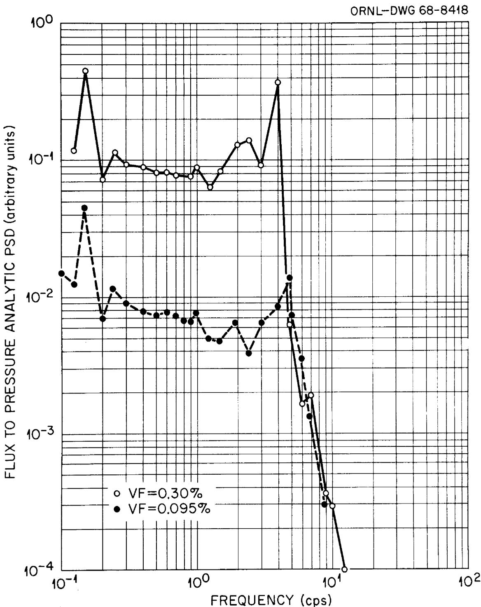  
Fig. 4. Calculated PSD for Void Fractions of 0.095 and 0.30 Vol %,

Assuming a White Pressure Driving Function.

# 4.2 Results of Tests at 7 Mw Reactor Power

Because of previous experience at the HFIR and ORR9, where we concluded that a major portion of the neutron noise was caused by control rod vibration, we speculated that the reactivity fluctuations in the MSRE might also be dependent on the position of the rods. However, we found that NPSD varied only about $2\%$ for three regulating rod positions of 32.3, 36.4, and 38.6 in. This change borders on significance because the statistical error of the NPSD is only $\pm 1\%$ , but in practice, other uncertainties either in equipment calibration or small changes in the reactor system probably limit the reproducibility to more like $\pm 5\%$ . Therefore, we conclude that control rod vibration is not a significant source of neutron noise at the MSRE in the frequency range of 0.1 to 15 cps.

Another series of tests was conducted to study the effects of equilibrium $^{135}\mathrm{Xe}$ concentration on the NPSD. Following a period of operation at zero power during which $^{135}\mathrm{Xe}$ was stripped out, the power was increased to 7 Mw and noise measurements were taken at $^{135}\mathrm{Xe}$ poisoning levels of $-0.012$ and $-0.261\% \Delta k / k$ . The NPSD increased by $15\%$ , indicating some xenon dependence. However, because the system was still in a transient condition due to the increase in power and because of unavoidable changes in other parameters such as fuel tank salt level and helium pressure, one cannot validly conclude that a cause and effect relationship exists. We therefore suggest there might be some xenon dependence, but conclude that it is not a significant contributor to neutron noise in the MSRE.

# 4.3 Results of Tests at 5 Mw Reactor Power

The results of tests performed at 5 Mw (to allow a wider range of outlet temperature variation than would have been possible at 7 Mw) show the changes in the NPSD as a function of changes in the operating conditions of the MSRE. To illustrate the behavior of the noise as a function of each parameter varied, the same data are presented in several figures. This is necessary because, in general, we did not have exclusive control of only one variable at a time since the variables such as fuel temperature, pump bowl level, pressure, etc., were related interdependently.

# 4.3.1 Neutron Noise Level vs Pump Bowl Level

Most of the time when the MSRE has been operated at power there has been a small but continuous transfer of salt from the primary loop to the overflow tank, which produced a change in salt level in the fuel pump bowl. Also, as the salt level in the pump bowl was decreased below a certain level, considerably more helium bubbles were apparently introduced into the circulating salt. Therefore noise measurements

were performed at different pump bowl levels in the normal range of operation (5.2 - 6.0 in.) to determine the effect of salt level on noise amplitude. Figure 5 shows that as the salt level in the bowl decreased the noise level at about 1.0 cps (NPSD) increased. Although this effect was small at the normal operating temperature and pressure (1210°F and 5 psig), it was reproduced in many measurements over a long time span. However, this effect almost vanished when the fuel outlet temperature was increased to 1225°F, but Fig. 5 shows that when the temperature was decreased to 1180°F the effect was much greater.

# 4.3.2 Neutron Noise Level vs Cover Gas Pressure

Since the helium pressure in the fuel pump bowl is also a variable parameter, the effect of the pressure on the NPSD is presented (Fig. 6). There was no change in the NPSD for pressures between 3 and 9 psig at an operating temperature of $1225^{\circ}\mathrm{F}$ . At the normal operating temperature of $1210^{\circ}\mathrm{F}$ , the NPSD increased with increasing pressure. At the subnormal temperature of $1180^{\circ}\mathrm{F}$ , the NPSD increased markedly at all pressures from 3 to 9 psig, with the highest noise occurring at the highest pressure (9 psig).

# 4.3.3 Neutron Noise Level vs Average Reactor Outlet Temperature

The averaged neutron noise showed the most sensitivity to changes in the reactor outlet temperature (Fig. 7). The largest effect was at the highest pressure of 9 psig, where the NPSD increased by a factor of almost 50 when the temperature was decreased from 1225 to $1180^{\circ}\mathrm{F}$ . At the normal operating pressure of 5 psig, the noise increased by a factor of 15 for this same change in temperature. Although data were taken only at 1225 and $1180^{\circ}\mathrm{F}$ at 3 psig, the trend of increasing noise with decreasing temperature is seen to be consistent with the results at 5 and 9 psig. As a further illustration, Fig. 8 shows the change in the entire 0.1- to 15-cps noise spectrum in passing from a minimum to a maximum noise condition.

# 4.3.4 Neutron Noise vs Net Reactivity

The residual system reactivity $^2$ is determined by requiring a reactivity balance between the calculated reactivity and the reactivity inserted by a calibrated control rod. The net reactivity is computed only as a steady-state quantity, although it does, of course, change slowly as system parameters are varied. As mentioned earlier, the largest uncertainty in the reactivity calculations is believed to be the lack of a measure of the circulating void fraction and its effect on $^{135}\mathrm{Xe}$ poisoning. Therefore the residual reactivity (KNET) is dependent, among other things, on the void fraction.

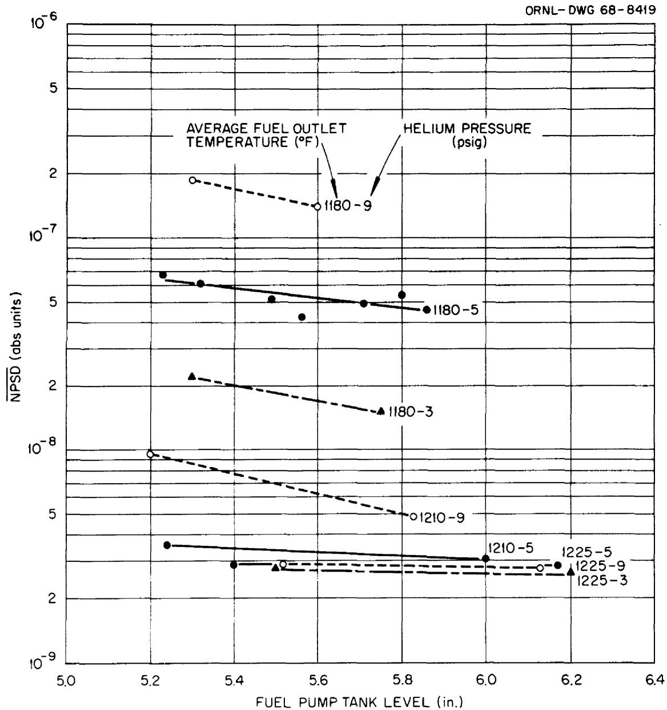  
Fig. 5. Neutron Noise Level vs Fuel Pump Tank Salt Level for the MSRE at 5 Mw.

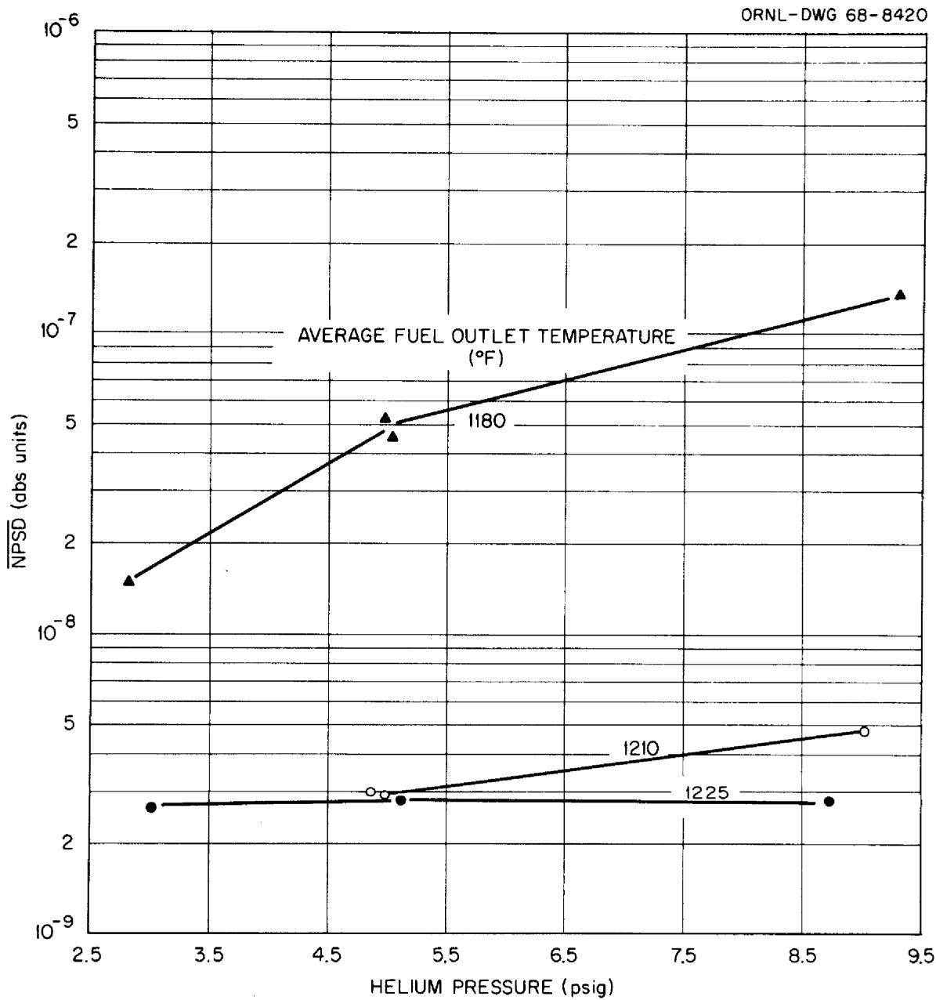  
Fig. 6. Neutron Noise Level vs Helium Cover Gas Pressure at 5 Mw.

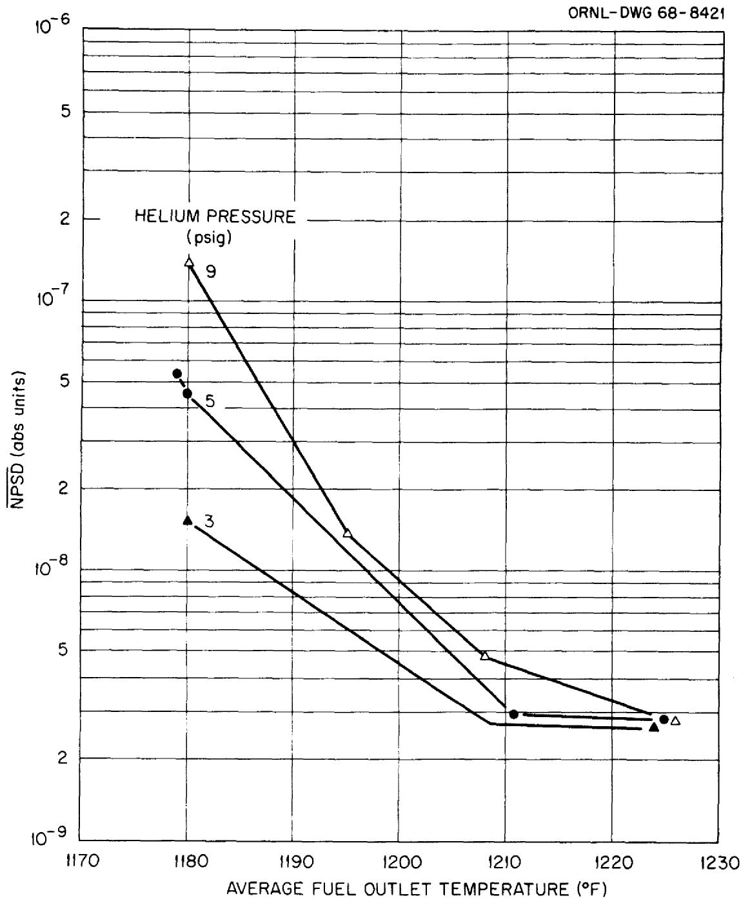  
Fig. 7. Neutron Noise Level vs Average Fuel Temperature at Core Outlet for the MSRE at 5 Mw.

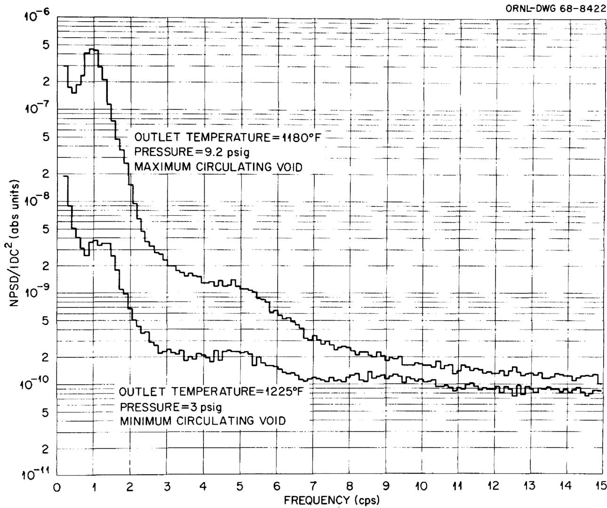  
Fig. 8. Neutron Noise Spectra of the MSRE at 5 Mw with Minimum and

with Maximum Circulating Void Fractions.

In contrast to the static nature of net reactivity, neutron noise is a measure of small fluctuations in reactivity; i.e., it is a dynamic quantity. However, if we postulate that the neutron noise, like KNET, is also dependent on the volume fraction of circulating helium bubbles, then there may conceivably be some consistent relationship between KNET and NPSD. The measurements show a variation of NPSD with changes in KNET (Fig. 9). The data presented in Fig. 9 cover the complete range of temperatures, pressures, and fuel pump bowl salt levels described in the previous three sections of the tests conducted at 5 Mw. Although we connected the data points with a smooth line, we ascribe very little significance to the shape of the curve at this time. However, we can conclude that there is a consistent, monotonic increase in the neutron noise in the range 0.5 to 2 cps for a larger amount of poison in the reactor (as indicated by KNET).

These changes in KNET cannot be attributed to the reactivity effect of voids alone, because this would require an unreasonably large void fraction: about 1.5 vol %, based on the -0.18% Δk/k per vol % reactivity associated with gas in the fuel. This conclusion is substantiated by fuel volume inventory balances and zero-power reactivity balance calculations maintained at the MSRE, which show the maximum amount of fuel salt displaced by gas to be about 0.3 vol %. Therefore, it is now believed that the changes in KNET are predominantly due to increased $^{135}\mathrm{Xe}$ poisoning as the amount of gas in the fuel is increased. This conclusion appears to contradict the previously accepted belief that an increased amount of circulating bubbles enhances the stripping of $^{135}\mathrm{Xe}$ from the fuel salt and, thus, decreases the amount of xenon in the system. However, the original view failed to recognize the interdependence of circulating void fraction with other system variables that can also lead to higher xenon poisoning at higher void fractions.

# 4.4 Dominant Source of Observed Neutron Noise

The comparison of theoretical model predictions with experimental spectra in Sect. 3 showed that the most likely sources of reactivity fluctuation in the MSRE are control rod vibration and pressure fluctuation of circulating voids. Special tests in which the rod position was varied provided a basis for concluding that rod vibration is not the cause of significant neutron noise. However, further tests showed that the magnitude of the noise is sensitive to pump bowl level, cover gas pressure, and fuel outlet temperature, and it is known that changes in parameters alter the amount of circulating void. Therefore, it seems plausible that the fluctuating helium bubbles cause small reactivity fluctuation, which in turn causes reactor power fluctuations and, hence, the observed neutron noise.

As noted in Sect. 3.3, our theoretical studies showed that, if the observed neutron noise is due to pressure fluctuation of voids, the NPSD should be proportional

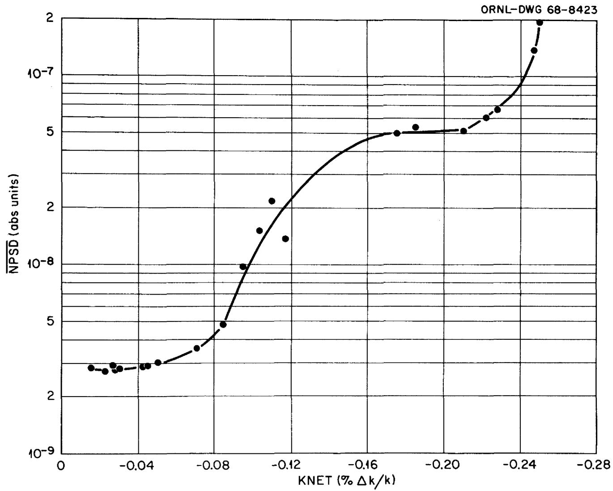  
Fig. 9. Neutron Noise Level vs Net Reactivity for the MSRE at $5\mathrm{Mw}$ .

to the void fraction squared. Therefore, we attempted to compare the measured NPSD (actually $\overline{\mathsf{NPSD}}$ ) with the estimated circulating void fraction at the time of the measurement.[14]

To make this comparison, we assume an expression of the form

$$
\overline {{\mathrm {N P S D}}} - \gamma = \alpha V ^ {2}, \tag {6}
$$

where $\overline{\text{NPSD}}$ is $\text{NPSD} / (\text{IDC})^2$ , averaged over the frequency range 0.5 to 2 cycles/sec; $\gamma$ is the unavoidable background noise produced by the random neutron detection process; $V$ is the vol % of circulating void; and $\alpha$ is a proportionality constant. Since the available experimental information is the $\overline{\text{NPSD}}$ data and the change in void fraction $(\delta V \equiv V - V_0)$ relative to some minimal condition $V_0$ , we recast Eq. 6 in the form

$$
\delta V = \left[ \frac {\overline {{N P S D}} - \gamma}{\alpha} \right] ^ {1 / 2} - V _ {0}. \tag {7}
$$

In Eq. 7, we must estimate $\gamma, \alpha,$ and $V_0$ , but we have only six estimates of $\delta V$ . Therefore, some of these parameters must be estimated by other means.

Since $\gamma$ is very small relative to $\overline{\text{NPSD}}$ , we neglect $\gamma$ , leaving only the two parameters $\alpha$ and $V_{0}$ . In principle, these can be obtained with a fit of Eq. 7 to the data; however, the $\delta V$ data is estimated15 to be accurate to approximately $\pm 50\%$ only (this is to be compared with a statistical precision of the $\overline{\text{NPSD}}$ data of $1 - 5\%$ ). Because of this large uncertainty in $\delta V$ , we did not perform the two-parameter fit but instead we assumed values for $V_{0}$ which probably bracket the real value, and used the experimental data only for the evaluation of $\alpha$ . Figure 10 shows the results for an assumed $V_{0}$ of 0.1 and zero vol %. About all we can conclude from Fig. 10 is (a) the minimal void fraction $V_{0}$ appears to be more nearly zero; and (b) more importantly, the $\overline{\text{NPSD}}$ does appear to have the predicted squared dependence on $V$ , thus giving additional support to our conclusion that the neutron noise in the MSRE is caused mainly by pressure-induced variations of the helium volume in the reactor core. Although we have now established with some confidence that a causal relationship exists, we do not attempt to explain how the helium bubbles are introduced into the fuel salt or why the amount of void in the salt is so strongly dependent on the fuel pump bowl level, helium cover gas pressure, or fuel salt temperature.

Fig. 10. Circulating Void Fraction vs NPSD for Assumed Minimum Void   
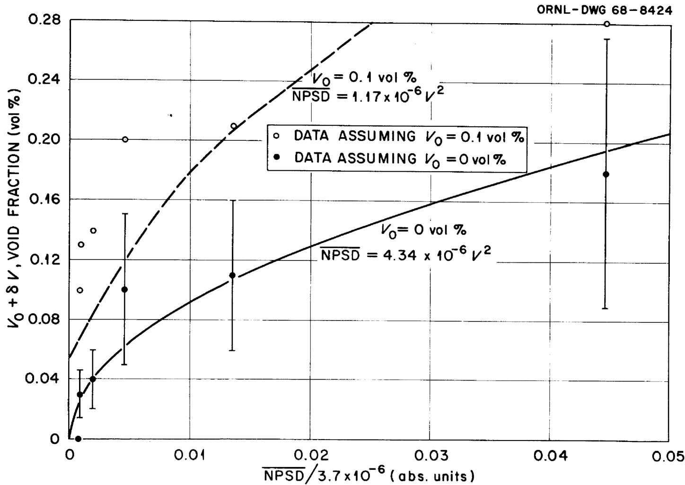  
Fractions of 0.1 and 0 Vol%.

# 5. CONCLUSIONS

The results of experimental tests and analytical studies have shown that the principal source of small neutron-density fluctuation observed in the MSRE is helium bubbles circulating in the fuel salt.

We conclude from the limited amount of data that the neutron noise (NPSD) in the frequency range from 0.5 to 2 cps varies as the square of the helium void fraction; furthermore, the absolute void fraction corresponding to the minimum noise condition observed is more nearly zero than the previously accepted value of $0.1\%$ . These observations further substantiate that the neutron noise is extremely sensitive to the helium void in the core. We therefore conclude that changes in the circulating void fraction can be inferred with good sensitivity directly from neutron noise measurements in the MSRE. Consequently, NPSD measurements can complement and enhance the value of reactivity balance calculations in diagnosing residual reactivity in the reactor by eliminating some of the reactivity uncertainty associated with an unknown amount of circulating void.

Finally, we believe that these results have indicated the usefulness of neutron noise analysis for on-line reactor diagnosis at the MSRE, but further work needs to be done before the method can be fully implemented for measurement of voids.

# 6. FUTURE INVESTIGATIONS

Although all spectra reported here were computed off-line, the NPSD can be computed on-line by the BR-340 computer and a program similar to that written for the CDC 1604-A computer is currently being tested. The estimated execution time is approximately 8 min following acquisition of the ionization chamber data. This on-line data reduction system will be used to repeat the tests described in this report when the $^{233}\mathrm{U}$ -fueled MSRE reaches full-power operation.

Theoretical studies show that the absolute void fraction could be measured by crosscorrelating the neutron noise signal with a pressure noise signal obtained from a transducer placed in the primary loop of the MSRE. The existing pressure sensor, as pointed out earlier, is located $\sim 15$ ft from the pump bowl in a helium supply line. This location could make it insensitive to the small pressure fluctuations that we believe are causing the bubble volume to fluctuate in the core. It is probably not feasible at this late date to place a pressure sensor in the primary loop of the MSRE, but such a sensor should be seriously considered when instruments are designed for a scaled-up version of this type reactor.

However, lacking the proper pressure signal, there may still be a way to establish a calibration between the neutron noise level and the absolute void fraction. A deterministic pressure fluctuation experiment is capable of measuring quantitatively the absolute void fraction. A preliminary experiment of this type has been performed already in which a sawtooth pressure fluctuation was purposely introduced and its effect on neutron level was investigated.[17] If the relationship between neutron noise and absolute void fraction can be calibrated using such a pressure test, then the NPSD should provide a relatively easy, on-line, non-disturbing measurement of the absolute void fraction.

17J. C. Robinson and D. N. Fry, Determination of the Void Fraction in the MSRE Using Small Induced Pressure Perturbations, ORNL-TM-2318 (to be published).

# INTERNAL DISTRIBUTION

1. R.K.Adams   
2. J. L. Anderson   
3. S.J.Ball   
4. A.E.G. Bates   
5. H.F.Bauman   
6. S.E.Beall   
7. M. Bender   
8. E. S. Bettis   
9. D. S. Billington   
10. F. T. Binford   
11. E. G. Bohlmann   
12. C. J. Borkowski   
13. G.E. Boyd   
14. R. B. Briggs   
15. J. B. Bullock   
16. T. E. Cole   
17. J. A. Cox   
18. J. L. Crowley   
19. F. L. Culler, Jr.   
20. R.A.Dandl   
21. H.P.Danforth   
22. S. J. Ditto   
23. W.P.Eatherly   
24. J.R.Engel   
25. D. E. Ferguson   
26. A. P. Fraas   
27-36. D.N.Fry   
37. J.H.Frye, Jr.   
38. C. H. Gabbard   
39. R. B. Gallaher   
40. W.R.Grimes   
41. A. G. Grindell   
42. G.C.Guerrant   
43. R. H. Guymon   
44. P.H.Harley   
45. C. S. Harrill   
46. P. N. Haubenreich   
47. A. Houtzeel   
48. T. L. Hudson   
49. W. H. Jordan   
50. P.R.Kasten   
51. R.J.Kedl   
52. M. T. Kelley

53. A. I. Krakoviak   
54-63. R.C.Kryter   
64. H. G. MacPherson   
65. R.E. MacPherson   
66. C. D. Martin   
67. H.E.McCoy   
68. R. L. Moore   
69. E. L. Nicholson   
70. L.C.Oakes   
71. H. G. O'Brien   
72. G.R.Owens   
73. R.W.Peelle   
74. A.M.Perry   
75. R.B.Perez   
76. H.P.Piper   
77. B. E. Prince   
78. J. L. Redford

79-80. M.W.Rosenthal

81. D. P. Roux   
82. G. S. Sadowski   
83. Dunlap Scott   
84. M.J.Skinner   
85. R.C.Steffy   
86. C. B. Stokes   
87. J.R.Tallackson   
88. R.E.Thoma   
89. D. B. Trauger   
90. C. S. Walker   
91. J.R.Weir   
92. K.W.West   
93. A. M. Weinberg   
94. M.E.Whatley   
95. J.C. White   
96. Gale Young

97-98. Central Research Library   
99. Document Reference Section

100-102. Laboratory Records Department

103. Laboratory Records, ORNL R.C.   
104. ORNL Patent Office

105-119. Division of Technical Information Extension

120. Laboratory and University Division, ORO   
121. Nuclear Safety Information Center

# EXTERNAL DISTRIBUTION

122. N. J. Ackermann, University of Tennessee, Knoxville, Tennessee   
123. A. Z. Akcasu, University of Michigan, Ann Arbor, Michigan,   
124. C. B. Deering, AEC-OSR   
125. C. E. Cohn, Argonne National Laboratory, Argonne, Illinois   
126. E. P. Epler, Oak Ridge, Tennessee   
127. A. Giambusso, AEC-Washington   
128. S. H. Hanauer, University of Tennessee, Knoxville, Tennessee   
129. T. W. Kerlin, University of Tennessee, Knoxville, Tennessee   
130. A. E. Klickman, Atomic Power Development Association, Detroit, Michigan   
131. B. R. Lawrence, Australian AEC (UKAEA, Risley, England)   
132. F. C. Legler, Atomic Energy Commission, Washington, D. C.   
133. G. H. McCright, Black and Veatch, Kansas City, Missouri   
134-135. T. W. McIntosh, AEC-Washington   
136. M. N. Moore, San Fernando Valley State College, Northridge, California   
137. R. K. Osborne, University of Michigan, Ann Arbor, Michigan   
138. C. L. Partain, University of Missouri, Columbia, Missouri   
139. J. R. Penland, University of Tennessee, Knoxville, Tennessee   
140. Joseph Pidkowicz, USAEC, Oak Ridge, Tennessee   
141. C. A. Preskitt, Gulf General Atomic, San Diego, California   
142. V. Rajagopal, Westinghouse Atomic Power Division, Pittsburgh, Pennsylvania   
143. R. L. Randall, Atomics International, Canoga Park, California   
144. C. W. Ricker, Albion College, Albion, Michigan   
145-154. J. C. Robinson, University of Tennessee, Knoxville, Tennessee   
155. H. M. Roth, AEC-ORO   
156. R. F. Saxe, North Carolina State University, Raleigh, North Carolina   
157. M. A. Schultz, Pennsylvania State University, University Park, Pennsylvania   
158. K. J. Serdula, Atomic Energy of Canada, Ltd, Chalk River, Ontario   
159. J. R. Sheff, Battelle-Pacific Northwest Laboratory, Richland, Washington   
160. W. L. Smalley, AEC-ORO   
161. J. A. Thie, Consultant, Chicago, Illinois   
162. J. R. Trinko, Jr., EBR-II Argonne National Laboratory, Idaho Falls, Idaho   
163. C. O. Thomas, University of Tennessee, Knoxville, Tennessee   
164. R. E. Uhrig, University of Florida, Gainesville, Florida   
165. P. J. Wood, MIT Practice School