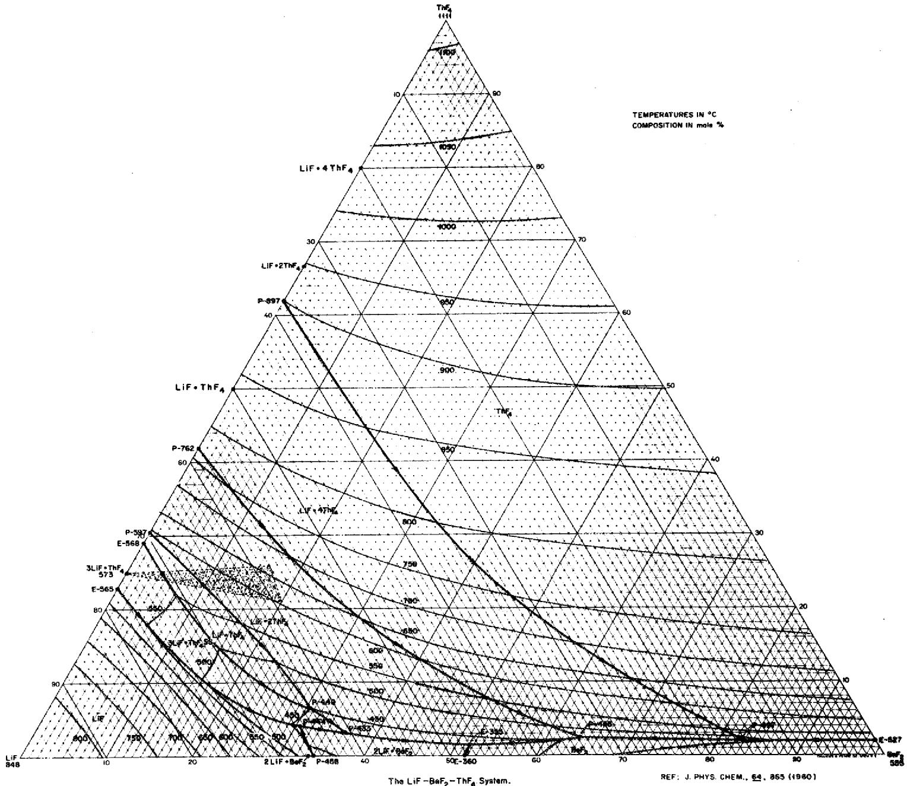
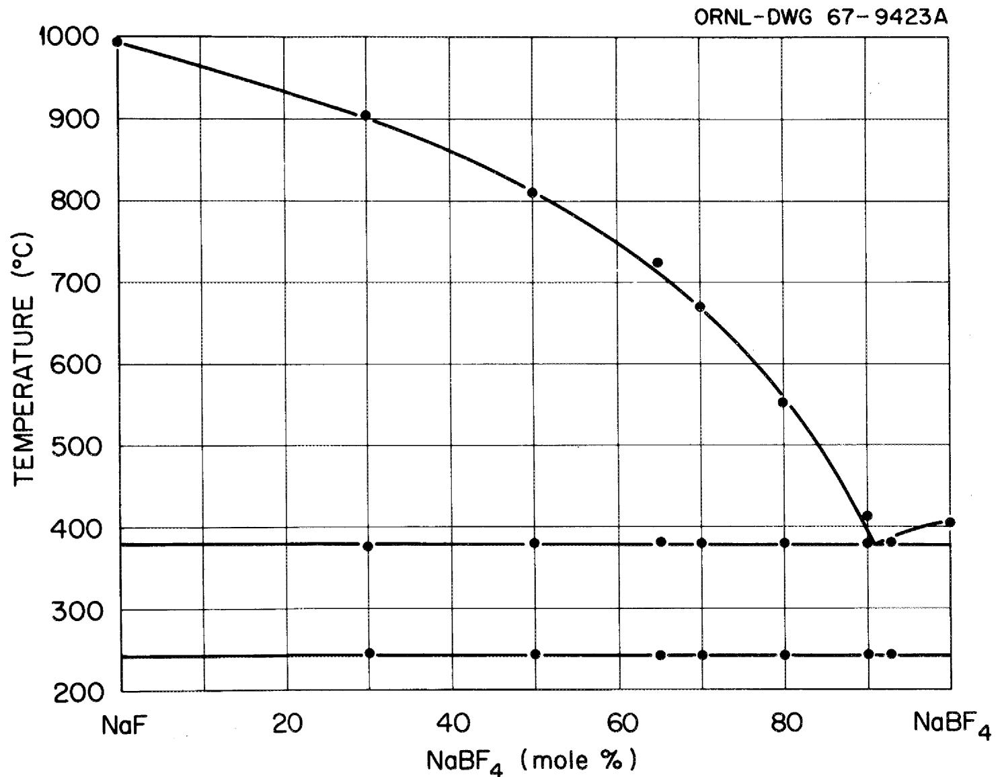

ORNL-TM-2316

MASTER

PHYSICAL PROPERTIES OF MOLTEN-SALT REACTOR FUEL, COOLANT, AND FLUSH SALTS

Edited by S. Cantor

Contributors:

S. Cantor

J. W. Cooke

A. S. Dworkin   
G. D. Robbins   
R. E. Thoma   
G.M.Watson

# LEGAL NOTICE

This report was prepared as an account of Government sponsored work. Neither the United States, nor the Commission, nor any person acting on behalf of the Commission:

A. Makes any warranty or representation, expressed or implied, with respect to the accuracy, completeness, or usefulness of the information contained in this report, or that the use of any information, apparatus, method, or process disclosed in this report may not infringe privately owned rights; or   
B. Assumes any liabilities with respect to the use of, or for damages resulting from the use of any information, apparatus, method, or process disclosed in this report. As used in the above, "person acting on behalf of the Commission" includes any employee or contractor of the Commission, or employee of such contractor, to the extent that such employee or contractor of the Commission, or employee of such contractor prepares, disseminates, or provides access to, any information pursuant to his employment or contract with the Commission, or his employment with such contractor.

ORNL-TM-2316

Contract No. W-7405-eng-26

REACTOR CHEMISTRY DIVISION

PHYSICAL PROPERTIES OF MOLTEN-SALT REACTOR FUEL, COOLANT, AND FLUSH SALTS

Edited by S. Cantor

Contributors:

S. Cantor   
J. W. Cooke   
A. S. Dworkin   
G. D. Robbins   
R.E.Thoma   
G.M.Watson

AUGUST 1968

OAK RIDGE NATIONAL LABORATORY

Oak Ridge, Tennessee

operated by

UNION CARBIDE CORPORATION

for the

U.S. ATOMIC ENERGY COMMISSION

#

# CONTENTS

Page

Abstract 1

Composition of Salt Mixtures 2

Introduction 3

Basis for Selecting the Salts 3

Uncertainties Listed with the Physical Properties Values 6

For Further Information 7

Viscosity 8

Thermal Conductivity 11

Electrical Conductivity 14

Phase Transition Behavior 18

Phase Diagram of LiF-BeF2-ThF4 20

Phase Diagram of $\mathrm{NaBF}_4$ -NaF 21

Heat Capacity (at constant pressure) 22

Heat of Fusion 25

Density of Liquid 28

Expansivity (Volume Coefficient of Thermal Expansion) 30

Compressibility 32

Vapor Pressure 33

Surface Tension 36

Solubility of Helium, Krypton, and Xenon 38

Solubility of $\mathbf{BF}_3$ Gas 41

# Appendix

A. Isochoric Heat Capacity $(C_{\mathrm{v}})$ , $C_{\mathrm{p}} / C_{\mathrm{v}}$ , and Sonic Velocity 43   
B. Thermal Diffusivity, Kinematic Viscosity, and Prandtl Number. 41   
C. Conversion Factors 45

Composition of Salt Mixtures 46

#

# ABSTRACT

For seven molten salt mixtures:

four fuel mixtures, each containing LiF, $\mathrm{BeF}_2$ , $\mathrm{ThF}_4$ , $\mathrm{UF}_4$

one flush salt, LiF-BeF $_2$ (66-34 mole %)

two coolant salts, $\mathrm{NaBF}_4$ -NaF (92-8 mole %) and single-

component $\mathbf{NaBF}_4$

estimates and/or experimental values are given for the following properties:

viscosity,

thermal conductivity,

electrical conductivity,

phase transition behavior,

heat capacity,

heat of fusion,

density,

expansivity,

compressibility,

vapor pressure,

surface tension,

solubility of the gases, He,Kr,Xe,BF3.

From the foregoing properties, the following have also been calculated and appended:

isochoric heat capacity $(C_{\mathrm{v}})$

sonic velocity

thermal diffusivity

kinematic viscosity

Prandtl number.

Composition of Salt Mixtures   

<table><tr><td rowspan="2"></td><td rowspan="2">Symbol</td><td colspan="4">Mole %</td><td rowspan="2">Liquidus Temp. (°C)</td></tr><tr><td>LiF</td><td>BeF2</td><td>ThF4</td><td>UF4</td></tr><tr><td></td><td>F1</td><td>73</td><td>16</td><td>10.7</td><td>0.3</td><td>500° ± 5°</td></tr><tr><td rowspan="3">Fuel-Breeder Mixtures</td><td>F2</td><td>72</td><td>21</td><td>6.7</td><td>0.3</td><td>500° ± 5°</td></tr><tr><td>F3</td><td>68</td><td>20</td><td>11.7</td><td>0.3</td><td>480° ± 5°</td></tr><tr><td>F4</td><td>63</td><td>25</td><td>11.7</td><td>0.3</td><td>500° ± 5°</td></tr><tr><td>Flush Salt (present MSRE coolant)</td><td>L2B</td><td>66</td><td>34</td><td>--</td><td>--</td><td>458° ± 1° (peritectic)</td></tr></table>

<table><tr><td></td><td></td><td>NaBF4</td><td>NaF</td><td></td></tr><tr><td rowspan="2">Coolants</td><td>C1</td><td>92</td><td>8</td><td>385° ± 1° (eutectic)</td></tr><tr><td>C2</td><td>100</td><td>-</td><td>407° ± 1° (melting point)</td></tr></table>

# INTRODUCTION

In this document we have compiled physical property information, either measured or estimated, on seven salt mixtures that are presently of importance in the design of advanced molten salt reactors. The primary user of this compilation will, no doubt, be the nuclear reactor engineer who requires these data for the design and development of molten salt reactors. Specialists in the chemistry of molten salts may be another audience interested in this report. We earnestly hope that all who critically examine or otherwise use these data will give us the benefit of their advice so that future versions of this document can be greatly improved.

# Basis for Selecting the Salts

The choice of salt mixtures has been primarily governed by recent changes in the Molten Salt Reactor Program: (a) the combining of fissile and fertile material within the same circuit (the "single-region" concept), and (b) the testing of coolant salts which are mainly $\mathrm{NaBF}_4$ .

Four mixtures have been selected for possible use as single-region fuel melts. These are:

<table><tr><td rowspan="2">Salt Mixture</td><td colspan="4">Composition (mole %)</td></tr><tr><td>LiF</td><td>BeF2</td><td>ThF4</td><td>UF4</td></tr><tr><td>F1</td><td>73</td><td>16</td><td>10.7</td><td>0.3</td></tr><tr><td>F2</td><td>72</td><td>21</td><td>6.7</td><td>0.3</td></tr><tr><td>F3</td><td>68</td><td>20</td><td>11.7</td><td>0.3</td></tr><tr><td>F4</td><td>63</td><td>25</td><td>11.7</td><td>0.3</td></tr></table>

Salts $\mathbf{F}_1$ and $\mathbf{F}_3$ are fuel mixtures appropriate to a prismatic configuration of the graphite moderator; the lesser concentrations of $\mathrm{BeF}_2$ and $\mathrm{ThF}_4$ in $\mathbf{F}_1$ may be more favorable with respect to rare-earth fission product removal by reductive extraction.

Salt $\mathbf{F}_2$ , containing a relatively low concentration of thorium, might be used in a reactor (e.g., with random-packed graphite spheres) where good breeding performance is not a prime consideration. Mixture $\mathbf{F}_4$ , on the other hand, could contribute to improved breeder performance mainly because the higher the beryllium concentration, the greater the opportunity to increase neutrons by the (n, 2n) reaction.

It is worthwhile noting that for the purposes of estimating physical properties of salts $\mathbf{F}_1 - \mathbf{F}_4$ , the effects of the small concentration of $\mathbf{U}\mathbf{F}_4$ was almost always assumed to be the same as for the corresponding increase in the $\mathbf{ThF}_4$ concentration.

Although no firm decision has been reached as to the exact composition of the fuel salt for the next molten salt reactor, it is highly probable that the concentrations of LiF, $\mathrm{BeF}_2$ and $\mathrm{ThF}_4$ will be within the limits given for these components by the above four mixtures.

Physical property information is also provided for:

LiF-BeF $_2$ (66-34 mole %) symbolized as L $_2$ B.

This mixture has been used in the MSRE as the coolant and as the flush salt for the fuel circuit. The inclusion of $\mathbf{L}_2\mathbf{B}$

in this report is justified by the good possibility that it will be a flush salt (and perhaps a coolant) in future molten salt reactors.

As intermediate coolant (in this case the fluid which transports heat from the fuel salt to the steam generators) the salts which presently appear attractive contain mostly $\mathrm{NaBF}_4$ . Two such salts are considered:

<table><tr><td rowspan="2">Coolant</td><td colspan="2">Composition (mole %)</td></tr><tr><td>NaBF4</td><td>NaF</td></tr><tr><td>C1</td><td>92</td><td>8</td></tr><tr><td>C2</td><td>100</td><td></td></tr></table>

The salt symbolized as $C_1$ is a eutectic composition which melts at $385^{\circ}C$ ( $725^{\circ}F$ ). Although a lower melting fluoroborate mixture would be desirable, it is not presently clear how much and which additive will substantially depress the melting temperature. Moreover, it seems likely that lower melting fluoroborate mixtures will not be very different from $C_1$ ; hence mixture $C_{1i}$ seems, at present, the leading candidate for the next coolant to be tried in a molten salt reactor.

Another salt for which estimates are tabulated in this report is "pure" $\mathrm{NaBF}_4$ , symbolized as $C_2$ . Since stoichiometric $\mathrm{NaBF}_4$ does not exist in the molten state without a very high partial pressure of $\mathrm{BF}_3$ gas, $C_2$ cannot be considered a practical coolant. However, estimations of the physical properties of hypothetically pure molten $\mathrm{NaBF}_4$ are useful for evaluating the contributions of $\mathrm{NaBF}_4$ as a component in

a salt mixture. In solution, $\left[\mathrm{BF}_4\right]^{-}$ ion may be imagined to behave like a halide ion, slightly larger and more polarizable than iodide ion. By applying this analogy, several properties of $C_2$ were estimated from the measured properties of molten NaI.

For convenience, a list of salt compositions and their corresponding liquidus temperatures are given after the abstract (page 2) and at the end of this report (page 46).

Uncertainties Listed with the Physical Property Values

Each contributor has stated what he believes is the error associated with the experimental result or with the estimated quantity. For most cases, the uncertainty represents considerably more than either "goodness of fit" of an interpolation or internal consistency available from thermodynamics. Instead, the uncertainty may be considered as the largest probable combination of systematic and random errors associated with the value given for the property. Where the listing is a property-temperature equation, the uncertainty is for the property calculated at the temperature substituted in the equation. In properties where the number of significant figures are not justified by the specified uncertainties, the extra significant figures are given to aid the reader in judging whether a particular salt is "less than" or "greater than" another salt for the property in question.

Although the magnitudes of the uncertainties are highly intuitive and often disappointingly large, they should be

taken seriously. Each contributor, while not necessarily qualifying as "expert" in the physical property, either possesses long experience in measuring the property or has carefully (and usually critically) reviewed the literature for that property. In other words, for each property the person whose name is given is at least a very interested observer and may also be an active participant.

# For Further Information ---

It is best to contact the person (or persons) listed under the property heading. The editor hopes to provide addenda to this report as newer, more reliable, data become available.

# VISCOSITY

# S. Cantor

Viscosity-Temperature Equation   

<table><tr><td>Salt</td><td>η in Centipoise, T in 0K</td><td>Uncertainty</td></tr><tr><td>F1</td><td>η = 0.084 exp (4340/T)</td><td>25%</td></tr><tr><td>F2</td><td>η = 0.072 exp (4370/T)</td><td>25%</td></tr><tr><td>F3</td><td>η = 0.077 exp (4430/T)</td><td>25%</td></tr><tr><td>F4</td><td>η = 0.0444 exp (5030/T)</td><td>25%</td></tr><tr><td>L2B</td><td>η = 0.116 exp (3755/T)</td><td>15%</td></tr><tr><td>C1</td><td rowspan="2">η = 0.04 exp (3000/T)</td><td rowspan="2">50%</td></tr><tr><td>C2</td></tr></table>

# Sources of Data and Methods of Estimation

Salts $\mathbf{F}_1 - \mathbf{F}_4$ : Estimated empirically from viscosities in the system LiF-BeF $_2$ -UF $_4$ (ref. 1) and also from measurements of LiF-BeF $_2$ -ThF $_4$ (7l-16-13 mole%).2 It was assumed that the effect of ThF $_4$ concentration on viscosity was the same as that observed for UF $_4$ .

$\mathbf{L}_2\mathbf{B}$ : Measured

$C_1$ and $C_2$ : The equation was derived from (a) preliminary measurements of $\mathrm{NaBF}_4$ ,4 and (b) assuming that the temperature variation of viscosity for $\mathrm{NaBF}_4$ is equal to that of NaI.5 Given the rather large uncertainty, the contribution of NaF (in $C_1$ ) to the viscosity may be considered negligible.

# Discussion

Viscosities of Reactor Fuel Mixtures

From the reported viscosity measurements1 of the system $\mathrm{LiF - BeF_2 - UF_4}$ , two trends can be observed:

(a) for LiF concentrations of 60 mole $\%$ or greater, substitution of $\mathrm{UF_4}$ for $\mathrm{BeF_2}$ (at const. temp.) causes an increase in viscosity,   
(b) increasing LiF from 60 to 70 mole $\%$ , at const. temp. and at const. $\mathrm{UF_4}$ concentration, decreases the viscosity by, at most, a factor of $1/2$ ; for most compositions the factor is closer to $3/4$ .

The data and trends observed for the system $\mathrm{LiF - BeF_2 - UF_4}$ can serve to predict reliably (i.e., to within $25\%$ ) the viscosities in the slightly different system, $\mathrm{LiF - BeF_2 - MF_4}$ (M is Th and/or U). Assuming that all single-region fuel mixtures will be restricted to the following ranges of component composition:

62 - 73 mole % LiF

15 - 30 mole $\%$ BeF $_2$

6 - 16 mole $\% \mathrm{MF}_4$

then one may conclude that the predicted viscosities have a rather narrow range of values, e.g.,

at $600^{\mathrm{OC}}$ , 9 - 16 Centipoise

at $700^{\mathrm{OC}}$ 5-9 Centipoise

# References

1. B. C. Blanke et al., "Density and Viscosity of Fused Mixtures of Lithium, Beryllium, and Uranium Fluorides," MLM-1086, Dec. 1956.   
2. Molten Salt Reactor Program Quar. Progr. Rept. Oct. 31, 1959, ORNL-2890, p. 21.   
3. S. Cantor and W. T. Ward, Oak Ridge National Laboratory, unpublished measurements.   
4. L. J. Wittenberg, Mound Laboratory, Miamisburg, Ohio. Oscillating-cup viscometry.   
5. G. J. Janz et al., "Molten Salt Data. Electrical Conductance, Density and Viscosity," Technical Bulletin Series Rensselaer Polytechnic Institute, Troy, N. Y., July 1964, p. 79.

# THERMAL CONDUCTIVITY

J. W. Cooke

<table><tr><td>Salt</td><td>Thermal Conductivitya in watt/(cm-°C)</td><td>Uncertainty</td></tr><tr><td>F1</td><td>0.010b</td><td>≥ ± 25%</td></tr><tr><td>F2</td><td>0.011b</td><td>≥ ± 25%</td></tr><tr><td>F3</td><td>0.0083b</td><td>≥ ± 25%</td></tr><tr><td>F4</td><td>0.0070b</td><td>≥ ± 25%</td></tr><tr><td>L2B</td><td>0.010</td><td>± 10%</td></tr><tr><td>C1</td><td>0.0052</td><td>± 50%</td></tr><tr><td>C2</td><td>0.0051</td><td>± 50%</td></tr></table>

a As a first approximation, the temperature dependence of thermal conductivity may be neglected. Although the thermal conductivity of molten salts does vary somewhat with temperature, uncertainties in measurements at a given temperature are usually greater than the temperature dependence over the whole range of temperature (usually an interval of $200^{\circ}\mathrm{C}$ ).

b Before assuming anything about the relative values of the four fuel melts, please read the caveat in the Discussion.

# Sources of Data and Methods of Estimation

Salts $\mathbf{F}_1 - \mathbf{F}_4$ : Estimated by means of a theoretical expression derived by Rao1 and adapted to molten salts by Turnbull.2 The expression is

$$
k (i n w c m ^ {- 1} \quad o C ^ {- 1}) = 1 1. 9 x 1 0 ^ {- 3} \frac {T _ {m} ^ {1 / 2} \rho_ {m} ^ {2 / 3}}{(M / n) ^ {7 / 6}}
$$

where $\mathbf{T}_{\mathfrak{m}} =$ melting point $(^{\mathrm{O}}\mathbf{K})$ $\rho_{\mathrm{m}} =$ liquid density in g cm-3 at $\mathbf{T}_{\mathfrak{m}}$ , M = average molar weight and n = average number of discrete

ions per molecule. Part of the expression,

$$
1 1. 9 x 1 0 ^ {- 3} T _ {m} ^ {1 / 2} \rho^ {1 / 3} / (M / n) ^ {5 / 6},
$$

is a good approximation to the average maximum Debye lattice frequency for single ionic salts. $^{2}$ It was found for eleven molten mixtures (nitrates or chlorides) that the above expression agreed with experimental results, on the average, to within $15\%$ . For two fluoride melts, one $\mathrm{L}_{2} \mathrm{~B}$ , $^{3}$ the other, $\mathrm{LiF}-\mathrm{BeF}_{2}-\mathrm{ThF}_{4}-\mathrm{UF}_{4}$ (71.2-23-5-.8 mole $\%$ ), $^{3}$ the theoretical expression yielded values approximately $25\%$ less than experimental. Note that the latter is very similar in composition to $\mathbf{F}_{2}$ .

In applying the theoretical expression the liquidus temperature was substituted for $\mathbf{T}_{\mathfrak{m}}$ ; in computing $\mathfrak{n}$ , the following ions were assumed: $\mathrm{Li}^{+}$ , $\mathbf{F}^{-}$ , $(\mathrm{BeF}_4)^{2-}$ , $(\mathrm{ThF}_5)^{-1}$ , $(\mathrm{UF}_5)^{-1}$ . Assumption of the more plausible ions, $(\mathrm{ThF}_7)^{-3}$ and $(\mathrm{UF}_7)^{-3}$ leads to a lower and less reliable estimated thermal conductivity. Also, $15\%$ was added to the estimated value because of the previously noted discrepancy for the cases of the two similar fluoride mixtures.

$\mathbf{L}_2\mathbf{B}$ : Measured

$C_1, C_2$ : Very preliminary measurement3 on $C_2$ agrees with the theoretical expression.

# Discussion

The relative conductivities of the four fuel mixtures, $\mathbf{F}_1 - \mathbf{F}_4$ , are not more reliable than the absolute values. The tabulated conductivities were obtained from a theoretical

equation that was greatly extended to apply to these mixtures. The dearth of accurate experimental data prevents adequate testing of the extended theoretical expression either absolutely or relatively.

# References

1. M. Rama Rao, Indian Journal of Physics 16, 30 (1942).   
2. A. G. Turnbull, Australian Journal of Applied Science 12, 324 (1961).   
3. J. W. Cooke, Oak Ridge National Laboratory, unpublished experimental results. The method of measurement is given on p. 15 in Proceedings of the Sixth Conference on Thermal Conductivity, Dayton, Ohio, Oct. 19-21, 1966.

# ELECTRICAL CONDUCTIVITY

G. D. Robbins   

<table><tr><td rowspan="2">Salt</td><td colspan="7">Specific Conductivity - Temperature Equation</td><td rowspan="2">Uncertainty</td></tr><tr><td>K</td><td>in (ohm-cm)-1,</td><td colspan="5">t in °C</td></tr><tr><td>F1</td><td>K</td><td colspan="6">= 1.72 + 8.0 x 10-3(t-500)</td><td>± 20%</td></tr><tr><td>F2</td><td></td><td colspan="6">= 1.63 + 7.3 x 10-3(t-500)</td><td>± 20%</td></tr><tr><td>F3</td><td></td><td colspan="6">= 1.66 + 6.4 x 10-3(t-500)</td><td>± 20%</td></tr><tr><td>F4</td><td></td><td colspan="6">= 1.94 + 7.1 x 10-3(t-500)</td><td>± 20%</td></tr><tr><td>L2B</td><td></td><td colspan="6">= 1.54 + 6.0 x 10-3(t-500)</td><td>± 10%</td></tr><tr><td>C1</td><td></td><td colspan="6">= 2.7 + 13 x 10-3(t-500)</td><td>± 50%</td></tr><tr><td>C2</td><td></td><td colspan="6">= 1.92 + 2.6 x 10-3(t-500)</td><td>± 20%</td></tr></table>

# Sources of Data and Method of Estimation

For 6 salts $\kappa$ was estimated empirically from data on related or analogous salt melts. Often the assumptions employed were not those which seemed physically most reasonable, but those which resulted in the most self-consistent correlation of the data. Therefore, estimated $\kappa$ 's are believed to have relatively large uncertainties. The number of significant figures in the equations for $\kappa$ vs. $t$ are not meant to contradict the listed uncertainties, but rather are intended to show differences between salt mixtures whose conductivities are predicted to be very similar.

Salts $\mathbf{F}_1 - \mathbf{F}_4$ : The following equations were employed in these estimates:

$$
\Lambda_ {\Theta} = \kappa_ {\Theta} \cdot \frac {M _ {e}}{P _ {\Theta}}
$$

$$
\Theta = \frac {T _ {\Theta} (^ {o} K)}{T _ {\text {l i q u i d u s}} (^ {o} K)}
$$

$$
M _ {e} = X _ {L i F} M _ {L i F} + \frac {1}{4} X _ {T h F _ {4}} M _ {T h F _ {4}} + \frac {1}{2} X _ {B e F _ {2}} M _ {B e F _ {2}}
$$

$\Lambda_{\Theta} =$ equivalent conductivity at a corresponding temperature $\Theta$

$\kappa_{\Theta} =$ specific conductivity at $\Theta$

$\rho_{\Theta} =$ density at $\Theta$

$\mathbf{M}_{\mathrm{e}} =$ equivalent weight of a mixture

M = formula weight of a component

X = mole fraction

X' = equivalent fraction

At several values of $\Theta$ smoothed curves of $\Lambda_{\Theta}$ vs $X_{ThF_4}^{\prime}$ were obtained from conductivities of the system LiF-ThF4 measured by Brown and Porter. Liquidus temperatures reported in references 2 and 3 were used in calculating $\Theta$ . Similar curves for LiF-BeF2 were derived by plotting the experimental results for a single composition (66 mole % LiF) $^{4}$ and assuming that the variation of $\Lambda_{\Theta}$ with X' in the LiF-BeF2 system was equal to that in LiF-ThF4. (For these estimates UF4 was treated as indistinguishable from ThF4.) The equations of $\kappa$ vs. t given above were then derived by assuming that $\Lambda_{\Theta}$ is additive in $X_{ThF_4}^{\prime}$ and $X_{BeF_2}^{\prime}$ for a given concentration of LiF.

$\underline{\mathbf{L}}_2\mathbf{B}$ : Preliminary measurements.4

$\underline{\mathbf{C}_2}$ : The ratio $\Lambda_{\text{NaI}} / \Lambda_{\text{KI}}$ appeared relatively constant in the range $\Theta = 1.05 - 1.20$ (data for NaI and KI from ref. 5). Assuming that $\Lambda_{\text{NaBF}_4} / \Lambda_{\text{KBF}_4} = \Lambda_{\text{NaI}} / \Lambda_{\text{KI}}$ , specific conductance data of Winterhager and Werner for $\text{KBF}_4$ were combined with density estimates for $\text{KBF}_4$ and $\text{NaBF}_4$ 7 to obtain values of $\Lambda_{\text{NaBF}_4}$ vs. $\Theta$ (liquidus temperatures, from reference 8).

$\underline{\mathbf{C_1}}$ : Specific conductivity data in the range 47 to 77 mole $\%$ NaBF $_4$ in the NaF-NaBF $_4$ system were combined with those calculated for pure NaBF $_4$ (see $C_2$ ) to interpolate $\kappa$ for the composition NaBF $_4$ -NaF (92-8 mole $\%$ ). The large uncertainty listed reflects a lack of confidence in the data reported in reference 9.

# Discussion

Specific conductivity is determined from resistance measurements according to the relation

$$
\kappa = \frac {1}{R _ {\infty}} (\ell / a)
$$

where $(\ell /a)$ is the cell constant. For a given apparatus and set of experimental conditions, the measured value of resistance can vary with the frequency of the applied potential wave form. $^{10}$ The values of $\kappa$ listed above are valid for resistance extrapolated to infinite frequency (denoted as $R_{\infty}$ ). Thus predicting the resistance of the melt which will be measured in a particular experimental arrangement not only requires a value for conductivity $\kappa$ , but also presupposes a knowledge of the frequency dispersion characteristics of the measuring device.

# REFERENCES

1. Brown, E.A. and B. Porter, U.S. Bureau of Mines Report of Investigations 6500 (1964).   
2. Thoma, R.E., H. Insley, B. S. Landau, H. A. Friedman, and W. R. Grimes, J. Phys. Chem. 63, 1266 (1959).   
3. Thoma, R. E., et al, ibid., 64, 865 (1960).   
4. Robbins, G. D. and J. Braunstein, Molten Salt Reactor Program Semiannual Progress Report for Period Ending February 29, 1968, ORNL-4254.   
5. Yaffe, I. S. and E. R. Van Artsdalen, J. Phys. Chem., 60, 1125 (1956).   
6. Winterhager, H. and L. Werner, "Forschungsber. des Witschafts u. Verkehrsministeriums Nordrhein - Westfalen, No. 438, 1956.   
7. Cantor, S., this report.   
8. Barton, C. J., L. O. Gilpatrick, J. A. Bornmann, H. Insley, and T. N. McVay, Molten Salt Reactor Program Semiannual Progress Report for Period Ending August 31, 1967, ORNL-4191, p. 158.   
9. Selivanov, V. G. and V. V. Stender, Russian J. Inorg. Chem., 4, 934 (1959).   
10. Robbins, G. D., "Electrical Conductivity of Molten Fluorides. A Review," ORNL-TM-2180, March 26, 1968.

# PHASE TRANSITION BEHAVIOR

R. E. Thoma   

<table><tr><td>Salt</td><td>Type of Transition</td><td>Temp. (°C)</td><td>Crystallization Sequence at Equilibrium</td></tr><tr><td rowspan="2">F1</td><td>Liquidus</td><td>500±5</td><td rowspan="2">Liq = LiF + L3Ta + Liq Btwn 500-444: LiF+L3T+Liq LiF+L3T+Liq = LiF+L3T+Li2BeF4</td></tr><tr><td>Solidus</td><td>444±5</td></tr><tr><td rowspan="2">F2</td><td>Liquidus</td><td>500±5</td><td rowspan="2">Liq = LiF + Liq Btwn 500-495: LiF + Liq Btwn 495-444: LiF+L3T+Liq Same as for F1</td></tr><tr><td>Solidus</td><td>444±5</td></tr><tr><td rowspan="2">F3</td><td>Liquidus</td><td>480±5</td><td rowspan="2">Liq = L3T + LTb + Liq Btwn 480-448: L3T+LT+Liq Btwn 448-440: L3T + Liq L3T + Liq = L3T + L2B</td></tr><tr><td>Solidus</td><td>440c</td></tr><tr><td rowspan="2">F4</td><td>Liquidus</td><td>500±5</td><td rowspan="2">Liq = LT2d + Liq Btwn 500-495: LT2 + Liq Btwn 495-490: LT2+LT+Liq 490: LT2+LT+Liq = L3T+Liq Btwn 490-448: L3T + Liq Liq + L3T = Li2BeF4 + L3T</td></tr><tr><td>Solidus</td><td>448±5</td></tr><tr><td rowspan="2">L2B</td><td>Peritectic</td><td>458±1</td><td rowspan="2">Liq = Li2BeF4 + Liq Btwn 458-360: Li2BeF4+Liq Li2BeF4+Liq = Li2BeF4+BeF2</td></tr><tr><td>Solidus</td><td>360±3</td></tr><tr><td rowspan="2">C1</td><td>Eutectic</td><td>385±1</td><td>Liq = NaBF4(cubic) + NaF</td></tr><tr><td>Solid-Solid</td><td>245±1</td><td>NaBF4(cubic) + NaF = NaBF4(or-thorhombic) + NaF</td></tr><tr><td rowspan="2">C2</td><td>Melting Point</td><td>407±1</td><td>Liq = NaBF4(cubic)</td></tr><tr><td>Solid-Solid</td><td>245±1</td><td>NaBF4(cubic) = NaBF4(ortho-rhombic)</td></tr></table>

a. $\mathbf{L}_3\mathbf{T}$ is an abbreviation for the solid solution, $\mathbf{Li}_3(\mathbf{Th},\mathbf{Be})\mathbf{F}_7$ , shown as the peppered triangle in the accompanying phase diagram of LiF-BeF $_2$ -ThF $_4$ system.   
b. LT is the abbreviation for $\mathsf{LiThF}_5$ .   
c. No precision has been assigned because this temperature has not been experimentally established.   
d. $\mathbf{LT}_2$ is the abbreviation for $\mathbf{LiTh}_2\mathbf{F}_9$ .

# Sources of Data

Phase equilibria in the system, $\mathbf{LiF - BeF_2 - ThF_4}$ - see next page.   
Phase equilibria in the system, LiF-BeF $_2$ - R. E. Thoma, H. Insley, H. A. Friedman, and G. M. Hebert, Journal of Nuclear Materials 27, in press 1968.   
Phase equilibria in the system, $\mathrm{NaBF}_4$ -NaF - C. J. Barton, L. O. Gilpatrick, et al., MSRP Semiann. Progr. Rept. Feb. 29, 1968, USAEC Report ORNL-4254. The phase diagram is given on page 21.

  
The System NaF - NaBF $_4$ .

# HEAT CAPACITY (at constant pressure)

A. S. Dworkin   

<table><tr><td colspan="2">Salt</td><td colspan="2">Cp in cal. g-1OC-1; t in OC</td><td>Uncertainty</td></tr><tr><td rowspan="2">F1liquid solid</td><td></td><td>0.34</td><td></td><td>± 4%</td></tr><tr><td></td><td>0.22 + 12.7 x 10-5t</td><td></td><td>± 10</td></tr><tr><td rowspan="2">F2liquid solid</td><td></td><td>0.39</td><td></td><td>± 4</td></tr><tr><td></td><td>0.27 + 12.7 x 10-5t</td><td></td><td>± 10</td></tr><tr><td rowspan="2">F3liquid solid</td><td></td><td>0.33</td><td></td><td>± 4</td></tr><tr><td></td><td>0.21 + 12.7 x 10-5t</td><td></td><td>± 10</td></tr><tr><td rowspan="2">F4liquid solid</td><td></td><td>0.33</td><td></td><td>± 4</td></tr><tr><td></td><td>0.21 + 12.7 x 10-5t</td><td></td><td>± 10</td></tr><tr><td rowspan="2">L2B liquid solid</td><td></td><td>0.57</td><td></td><td>± 3</td></tr><tr><td></td><td>0.317 + 3.61 x 10-4t</td><td></td><td>± 3</td></tr><tr><td rowspan="2">C1liquid solid (243-381OC)</td><td></td><td>0.360</td><td></td><td>± 2</td></tr><tr><td></td><td>0.34</td><td></td><td>± 3</td></tr><tr><td>solid (25-243OC)</td><td></td><td>0.23 + 5.8 x 10-4t</td><td></td><td>± 6</td></tr><tr><td rowspan="2">C2liquid solid (243-406OC)</td><td></td><td>0.36</td><td></td><td>± 2</td></tr><tr><td></td><td>0.33</td><td></td><td>± 3</td></tr><tr><td>solid (25-243OC)</td><td></td><td>0.23 + 6.0 x 10-4t</td><td></td><td>± 6</td></tr></table>

# Sources of Data and Methods of Estimation

Salts $\mathbf{F}_1 - \mathbf{F}_4$ : Liquid heat capacities were estimated by assuming mole-fraction additivity and assigning 16, 24, and 44 cal mole $^{-1}$ ${}^{\mathrm{OC}}$ -1 for the respective contributions of LiF, BeF $_2$ , and ThF $_4$ . The heat capacities for the solids were estimated by assuming that (a) temperature coefficient and (b) difference in Cp between liquid and solid are the same as that measured for LiF-BeF $_2$ -ThF $_4$ (72-16-12 mole $\%$ ).1

$\underline{\mathbf{L}}_{2}\underline{\mathbf{B}}$ : Liquid $\mathbf{C_p}$ is the average of two independent sets of measurements. Hoffman² obtained 0.577 cal. $\mathbf{g}^{-1}{}^{\mathrm{OC}^{-1}}$ ; Douglas and Payne³ obtained 0.56 cal $\mathbf{g}^{-1}{}^{\mathrm{OC}^{-1}}$ . The solid heat capacity

is that of Douglas and Payne.

$\underline{\mathbf{C}_1}$ : Measured

$\underline{\mathbf{C}}_{2}$ : Measured1. Agrees within experimental error with that derived from $\mathbf{C}_{1}$ by subtracting enthalpy contribution of $\mathrm{NaF}^4$ assuming negligible heat of mixing between $\mathrm{NaBF}_4$ and $\mathrm{NaF}$ .

# Discussion

The values of 16 and 24 cal mole $^{-1}$ ${}^{\mathrm{OC}}$ were chosen for the respective Cp contributions of LiF and $\mathsf{BeF}_2$ because 8 cal (g-atom) $^{-1}$ ${}^{\mathrm{OC}}$ is the average observed for alkali and alkaline earth halides. The Cp of 44 cal mole $^{-1}$ ${}^{\mathrm{OC}}$ for the contribution of ThF $_4$ was assumed from the average value of 8.8 cal (g-atom) $^{-1}$ ${}^{\mathrm{OC}}$ for lanthanide halides.

The validity of using the indicated additive contributions for estimating liquid heat capacities was checked by comparing with measured values of three related salts:

<table><tr><td>Salt Mixture</td><td colspan="2">Estimated Cp</td><td>Measured Cp</td><td>References</td></tr><tr><td>L2B</td><td>0.57</td><td>cal g-1OC-1</td><td>0.57</td><td>2,3</td></tr><tr><td>LiF-BeF2-ThF4</td><td>72 - 16 - 12 m %</td><td>0.326</td><td>0.324</td><td>1</td></tr><tr><td>LiF-ThF4</td><td>75 - 25 m %</td><td>0.24</td><td>0.25</td><td>7</td></tr></table>

# References

1. A. S. Dworkin, Oak Ridge National Laboratory, unpublished measurements.   
2. H. W. Hoffman and J. W. Cooke, Oak Ridge National Laboratory, unpublished measurements.   
3. T. B. Douglas and W. H. Payne, Natl. Bur. Std. Report No. 8186, Washington, D. C., pp. 75-82.   
4. K. K. Kelley, U. S. Bureau of Mines Bulletin 584, (1960) p. 171.   
5. S. Cantor, Reactor Chem. Div. Ann. Progr. Rept. Dec. 31, 1965, ORNL-3913, pp. 29-32.   
6. A. S. Dworkin and M. A. Bredig, J. Phys. Chem. 67, 697 (1963); 67, 2499 (1963).   
7. R. A. Gilbert, Oak Ridge National Laboratory, unpublished measurements.

# HEAT OF FUSION

A. S. Dworkin

<table><tr><td>Salt</td><td>ΔHfusion(cal g-1)</td><td>Uncertainty</td></tr><tr><td>F1</td><td>62</td><td>± 10%</td></tr><tr><td>F2</td><td>67</td><td>± 15</td></tr><tr><td>F3</td><td>58</td><td>± 15</td></tr><tr><td>F4</td><td>63</td><td>± 15</td></tr><tr><td>L2B</td><td>107</td><td>± 3</td></tr><tr><td>C1</td><td>31</td><td>± 2</td></tr><tr><td>C2</td><td>29</td><td>± 2</td></tr><tr><td></td><td>ΔH of solid transition (cal g-1)</td><td></td></tr><tr><td>C1</td><td>14.5 (at 243°C)</td><td>± 2%</td></tr><tr><td>C2</td><td>14.7 (at 243°C)</td><td>± 2</td></tr></table>

# Sources of Data and Methods of Estimation

Salts $\mathbf{F}_1 - \mathbf{F}_4$ : Although there is no isothermal heat of fusion, estimations were made as if all the melting (or freezing) occurred at $500^{\circ}\mathrm{C}$ . The salts were treated as additive mixtures of the components, $\mathsf{Li}_2\mathsf{BeF}_4$ , $\mathsf{Li}_3\mathsf{ThF}_7$ , and LiF or $\mathsf{ThF}_4$ . $\mathsf{Li}_2\mathsf{BeF}_4$ was considered to be "formed" first from the $\mathsf{BeF}_2$ present and the appropriate quantity of LiF. The remainder of the mixture was then considered to consist of $\mathsf{Li}_3\mathsf{ThF}_7$ and either LiF or $\mathsf{ThF}_4$ , whichever was "in excess." For example, for 1 mole of salt $\mathbf{F}_1$ , .16 moles of $\mathsf{BeF}_2$ and .32 moles of LiF form .16 moles of $\mathsf{Li}_2\mathsf{BeF}_4$ while .11 moles of $\mathsf{ThF}_4$ and the remaining .41 moles of LiF give .11 moles of $\mathsf{Li}_3\mathsf{ThF}_7$ and .08 moles of LiF. The estimation is then made on the basis of .16 moles $\mathsf{Li}_2\mathsf{BeF}_4$ , .11 moles $\mathsf{ThF}_4$ and .08 moles LiF.

The following heats of fusion were used in making the estimations:

$\mathbf{Li}_2\mathbf{BeF}_4$ 10,600 cal mole-1 (ref. 1)

Li3ThF7 13,960 cal mole-1 (ref.2)

LiF 6,470 cal mole-1 (ref. 3)

ThF4 11,000 cal mole-1 estimated by

assuming the entropy of fusion

is the same as that of $\mathbf{U}\mathbf{F}_4$ (ref. 4)

$\underline{\mathbf{L}}_{2}\mathbf{B}$ : Measured.

$C_1$ and $C_2$ : Measured. $C_2$ agrees within experimental error with that calculated by subtracting the contribution of the heat of fusion of $\mathsf{NaF}^6$ from $C_1$ .

# Discussion

Although the assumptions used in estimating $\Delta H_{\text{fusion}}$ for salts $F_1 - F_4$ are highly intuitive, it is encouraging to note that the estimated and measured $\Delta H_{\text{fusion}}$ are respectively 57.5 and 59 cal g $^{-1}$ for the salt mixture LiF-BeF $_2$ -ThF $_4$ (72-16-12 mole%).

For salts $\mathbf{F}_1 - \mathbf{F}_4$ , to obtain the heat necessary to convert the solid at the solidus temperature to the melt at the liquidus temperature, an additional 10 to 15 cal g $^{-1}$ should be added to the above listed heats of fusion. For convenience in calculating the quantity of heat necessary to raise the salt from room temperature to any desired temperature, the following heat content equations (based on measurements) are included:

$$
\begin{array}{l} \mathrm{LiF - BeF_{2} - ThF_{4}} (72 - 16 - 12 \text{mole}\%) - \text{ref.5} \\ \text {S o l i d :} \mathrm {H} _ {\mathrm {t}} - \mathrm {H} _ {2 5} (\text {c a l g} ^ {- 1}) = - 5. 2 8 +. 2 0 7 \mathrm {t} + 6. 3 3 \times 1 0 ^ {- 5} \mathrm {t} ^ {2}; \\ (2 5 - 4 4 0 ^ {\mathrm {O}} \mathrm {C}) \\ \end{array}
$$

$$
\text {L i q u i d :} \mathrm {H} _ {\mathrm {t}} - \mathrm {H} _ {2 5} (\text {c a l g} ^ {- 1}) = 1 1. 3 4 +. 3 2 4 \mathrm {t} (5 0 0 - 7 5 0 ^ {\mathrm {O}} \mathrm {C})
$$

$$
\mathrm{LiF - BeF_2} \quad (66 - 34 \text{mole}\%)
$$

$$
\begin{array}{l} \text {S o l i d :} \mathrm {H} _ {\mathrm {t}} - \mathrm {H} _ {0 \mathrm {o C}} (\text {c a l g} ^ {- 1}) = 0. 3 1 7 9 \mathrm {t} - 1. 8 0 6 \mathrm {x} 1 0 ^ {- 4} \mathrm {t} ^ {2}; \\ (0 - 4 7 2 ^ {\circ} \mathrm {C}) - \text {r e f .} 1 \\ \end{array}
$$

$$
\begin{array}{l} \text {L i q u i d :} \mathrm {H} _ {\mathrm {t}} - \mathrm {H} _ {0} \mathrm {O} _ {\mathrm {C}} (\text {c a l g} ^ {- 1}) = 3 2. 6 3 2 + 0. 5 6 1 t; (4 7 2 - 6 0 0 ^ {\circ} \mathrm {C}) - \\ \mathbf {r e f .} \quad \mathbf {l} \\ \end{array}
$$

$$
\mathrm {H} _ {\mathrm {t}} - \mathrm {H} _ {3 0} (\text {c a l g} ^ {- 1}) = 3 3. 6 2 + 0. 5 7 7 (\mathrm {t} - 3 0); \text {r e f .} 7
$$

$$
\mathrm {NaBF} _ {4} - \mathrm {NaF} (92 - 8 \text {mole}
$$

$$
\begin{array}{l} \text {S o l i d :} \mathrm {H} _ {\mathrm {t}} - \mathrm {H} _ {2 5} (\text {c a l g} ^ {- 1}) = - 5. 9 0 +. 2 3 0 \mathrm {t} + 2. 9 0 \mathrm {x} 1 0 ^ {- 4} \mathrm {t} ^ {2}; \\ (2 5 - 2 4 3 ^ {\circ} \mathrm {C}) \\ \end{array}
$$

$$
\mathrm {H} _ {t} - \mathrm {H} _ {2 5} (\text {c a l g} ^ {- 1}) = 0. 4 0 +. 3 3 7 t; (2 4 3 - 3 8 1 ^ {\mathrm {O}} \mathrm {C})
$$

$$
\text {L i q u i d}: \mathrm {H} _ {\mathrm {t}} - \mathrm {H} _ {2 5} (\operatorname {c a l} \mathrm {g} ^ {- 1}) = 2 2. 1 +. 3 6 0 \mathrm {t}; (3 8 1 - 6 0 0 ^ {\mathrm {O}} \mathrm {C})
$$

# References

1. T. B. Douglas and W. H. Payne, Natl. Bur. Std. Report No. 8186, Washington, D. C., pp. 75-82.   
2. R. A. Gilbert, J. Chem. Eng. Data, 7, 388 (1962).   
3. T. B. Douglas and J. L. Dever, J. Am. Chem. Soc. 76, 4826 (1954).   
4. E. G. King and A. U. Christensen, U. S. Bureau of Mines Report of Investigations 5709, 1961.   
5. A. S. Dworkin, Oak Ridge National Laboratory, unpublished measurements.   
6. K. K. Kelley, U. S. Bureau of Mines Bulletin 584, (1960) p. 171.   
7. H. W. Hoffman and J. W. Cooke, Oak Ridge National Laboratory, unpublished measurements.

# DENSITY OF LIQUID

# (S. Cantor)

<table><tr><td>Salt</td><td colspan="6">Density-Temperature Equation ρ (in g/cm3) t (in °C)</td><td>Uncertainty</td></tr><tr><td>F1</td><td colspan="6">ρ = 3.628 - 6.6 x 10-4t</td><td>3%</td></tr><tr><td>F2</td><td colspan="6">= 3.153 - 5.8 x 10-4t</td><td>3</td></tr><tr><td>F3</td><td colspan="6">= 3.687 - 6.5 x 10-4t</td><td>3</td></tr><tr><td>F4</td><td colspan="6">= 3.644 - 6.3 x 10-4t</td><td>3</td></tr><tr><td>L2B</td><td colspan="6">= 2.214 - 4.2 x 10-4t</td><td>2</td></tr><tr><td>C1</td><td colspan="6">= 2.27 - 7.4 x 10-4t</td><td>5</td></tr><tr><td>C2</td><td colspan="6">= 2.26 - 7.4 x 10-4t</td><td>5</td></tr></table>

# Sources of Data and Methods of Estimation

Salts $\mathbf{F}_1 - \mathbf{F}_4$ - Estimated by additivity of molar volumes (see Ref. 1). The following molar volumes were used:

<table><tr><td></td><td>600°C</td><td>800°C</td><td>Ref.</td></tr><tr><td>LiF</td><td>13.411 cm3</td><td>14.142 cm3</td><td>2</td></tr><tr><td>BeF2</td><td>23.6</td><td>24.4</td><td>1,3</td></tr><tr><td>ThF4and UF4</td><td>46.43</td><td>47.59</td><td>2</td></tr></table>

Salt $\mathbf{L}_2\mathbf{B}$ - Three experimental determinations have been reported; refs. 5 and 6 were over a wide temperature range with the densities of ref. 6 averaging $3 \%$ higher than ref. 5. Reference 4 reports densities at $649^{\circ}C$ which vary from 1.87 to $2.02\mathrm{gcm}^{-3}$ . The density-temperature equation given above

was derived from additive molar volumes; this equation yields densities that are approximately the average of the densities of refs. 5 and 6.

Salt C1 - Preliminary pyknometric measurements.7

Salt $C_2$ - The relatively small concentration of NaF in $C_1$ would be expected to increase the density slightly over that for "pure" $NaBF_4$ . The density-temperature equation was calculated by subtracting the contribution of NaF (ref. 1) from the molar volume of $C_1$ .

# References

1. S. Cantor, Reactor Chem. Div. Ann. Progr. Rept. Dec. 31, 1965, USAEC Report ORNL-3913, pp. 27-29.   
2. D. G. Hill, S. Cantor, and W. T. Ward, J. Inorg. Nucl. Chem. 29, 241 (1967).   
3. C. T. Moynihan, S. Cantor, unpublished measurements at Oak Ridge National Laboratory, 1966.   
4. MSR Program Semiann. Progr. Rept. Aug. 31, 1965, USAEC Report ORNL-3872, p. 31.   
5. B. C. Blanke et al., "Density and Viscosity of Fused Mixtures of Lithium, Beryllium and Uranium Fluorides," USAEC Report MLM-1086, Dec. 1956, p. 18.   
6. B. J. Sturm and R. E. Thoma, Reactor Chem. Div. Ann. Progr. Rept. Dec. 31, 1965, USAEC Report ORNL-3913, pp. 50-51.   
7. S. Cantor and J. Bornmann, unpublished measurements at Oak Ridge National Laboratory, 1968.

# EXPANSIVITY (VOLUME COEFFICIENT OF THERMAL EXPANSION)

# S. Cantor

<table><tr><td>Salt</td><td colspan="2">Estimated Value at 600°Ca</td><td>Uncertainty</td></tr><tr><td>F1</td><td colspan="2">2.04 x 10-4/°C</td><td>25%</td></tr><tr><td>F2</td><td colspan="2">2.07</td><td>25</td></tr><tr><td>F3</td><td colspan="2">1.97</td><td>25</td></tr><tr><td>F4</td><td colspan="2">1.93</td><td>25</td></tr><tr><td>L2B</td><td colspan="2">2.14</td><td>20</td></tr><tr><td>C1</td><td colspan="2">4.0</td><td>40</td></tr><tr><td>C2</td><td colspan="2">4.0</td><td>40</td></tr></table>

For estimating the expansivity at other temperatures, please substitute in the appropriate density-temperature equation (see discussion below).

# Sources of Data and Methods of Estimation

The expansivity is defined as

$$
\alpha \quad = \quad \frac {1}{V} \left(\frac {\partial V}{\partial T}\right) _ {P}
$$

where $V$ , $T$ and $P$ are volume, temperature and pressure. Since density is inversely proportional to volume, the expansivity is usually derived from density-temperature data:

$$
\alpha = - \frac {1}{\rho} \frac {\mathrm {d} \rho}{\mathrm {d} T} (\text {P o r d i n a r i l y o n e a t m .})
$$

Most density data for liquids are linear with and decrease with temperature, i.e.,

$$
\rho = \rho_ {O} - a t \tag {1}
$$

$\rho_0$ and a are constants; t is usually in degrees Celsius. Thus,

expansivity is very simply

$$
\alpha = \frac {a}{p} \tag {2}
$$

The tabulated expansivities are consistent with the corresponding density-temperature equations in the "Density of Liquid" section of this report. To calculate the expansivity for any temperature, substitute in equations (1) and (2). As a rough approximation, the expansivity is one half to one third of the temperature coefficient of density as given by the constant $a$ in eqn. (1).

# References

Same as for the "Density of Liquid" section, page 29.

# COMPRESSIBILITY (ISOTHERMAL) a

# S. Cantor

Salt

Compressibility-Temperature Equation

$\beta_{\mathbf{T}}$ in $\mathbf{cm}^2\mathbf{dyne}^{-1}$ , T in $^0\mathbf{K}$

F1

F2

F3

F4

L2B

C

C

$$
\beta_ {\mathbf {T}} = 2. 3 \times 1 0 ^ {- 1} ^ {2} \exp (1. 0 \times 1 0 ^ {- 3} \mathrm {T})
$$

$$
\beta_ {T} = 9. 0 x 1 0 ^ {- 1 2} \exp (1. 6 x 1 0 ^ {- 3} T)
$$

The compressibilities pertain to the liquid and are all estimated; the uncertainty is a factor of 3.

aIsothermal compressibility is a function of pressure as well as temperature. The tabulated equations are less reliable at higher pressures (>50 atm).

# Methods of Estimation

Salts $\mathbf{F}_1 - \mathbf{F}_4$ , $\mathbf{L}_2\mathbf{B}$ : Estimated empirically from the compressibility-temp. equations of LiF and $\mathbf{Li}_2\mathbf{SO}_4$ (see ref. 1).

$C_1$ and $C_2$ : Assumed to be slightly more compressible than NaI (see ref. 1).

Reasonable values derived for $\mathbf{C_p} / \mathbf{C_v}$ and for sonic velocities (see Appendix A of this report) lend support to these estimated compressibilities.

# References

1. S. Cantor, Reactor Chem. Div. Ann. Progr. Rept. Dec. 31, 1966, ORNL-4076, pp. 24-25.

# VAPOR PRESSURE

# S. Cantor

Salta

Pressure-Temperature Equation (P in torr, T in ${}^{\mathrm{O}}\mathbf{K}$ )

Uncertainty in Pressure

F1 F2 F3 F4

$$
\log P = 8. 0 - \frac {1 0 , 0 0 0}{T}
$$

A factor of fifty from $500 - 700^{\mathrm{OC}}$

L2B

$$
\log \mathrm {P} = 9. 0 4 - \frac {1 0 , 5 0 0}{\mathrm {T}}
$$

A factor of ten from 500- $700^{\circ}C$

C1

$$
\begin{array}{r l} \log P (\text {o f} \mathrm {B F} _ {3} \text {v a p o r}) ^ {\mathrm {b}} & = \\ 9. 0 2 4 - \frac {5 , 9 2 0}{\mathrm {T}} \end{array}
$$

+ 10% from $400 - 700^{\circ}C$

C2

Pressure of $\mathbf{BF}_3$ depends on amount of salt and on vapor volume (see Discussion below)

a In no case is the composition of the vapor congruent with the composition of the melt.

bThe pressures given by the equation are those in equilibrium with a melt whose composition is fixed at $\mathrm{NaBF}_4$ -NaF (92-8 mole%).

# Sources of Data and Methods of Estimation

Salts $\mathbf{F}_1 - \mathbf{F}_4$ : Estimated empirically from vapor pressure data of the LiF-BeF $_2$ system1 and of LiF-UF $_4$ (73-27 mole%).2 Although the uncertainty is relatively large, please note that the vapor pressures for the 500 - 700°C temperature range are quite low (between $10^{-2}$ and $10^{-5}$ torr).

$\mathbf{L}_2\mathbf{B}$ : Estimated from data in the LiF-BeF $_2$ system. $^2$

$C_1$ : Experimentally determined.

Discussion - The Dissociation Pressure of $\mathrm{NaBF}_4$

When $\mathrm{NaBF}_4$ is thermally equilibrated at a temperature above its melting point the following dissociation occurs:

$$
\mathrm {N a B F} _ {4} (\ell) = \mathrm {N a F} (\ell) + \mathrm {B F} _ {3} (\mathrm {g}) \tag {1}
$$

The dissociation product, NaF, dissolves in the $\mathrm{NaBF}_4$ . The system described by the above equation is bivariant; thus, a constant partial pressure of $\mathrm{BF}_3$ above the melt requires that the temperature and the melt composition both be constant. For reaction (1) the $\mathrm{BF}_3$ pressure is related to the composition of the melt by the equation:

$$
P _ {B F _ {3}} = K \frac {a _ {N a B F _ {4}}}{a _ {N a F}} \tag {2}
$$

where $\mathbf{K}$ is the equilibrium constant and $a_{i}$ is activity. The temperature dependence of $\mathbf{K}$ has been derived from experimental data3 and is given by

$$
\ln K (\text {i n a t m}) = \frac {- 2 9 , 8 0 0}{R T (\text {i n} ^ {o} K)} + \frac {2 6 . 4 1}{R} \tag {3}
$$

[29,800 cal and 26.41 cal ( $^{0}\mathbf{K}$ )^{-1} are the enthalpy and entropy of the reaction; R, the gas constant, is 1.98717 cal ( $^{0}\mathbf{K}$ )^{-1} (g-mole)^{-1}]

A consequence of the bivariate of the $\mathrm{NaBF}_4$ -NaF system is that the equilibrium $\mathrm{BF}_3$ vapor pressure is difficult to predict for melts in which the concentration of $\mathrm{NaBF}_4$ is very large ( $>98$ mole $\%$ ). For these concentrations, $a_{\mathrm{NaBF}_4}$ is virtually unity, but $a_{\mathrm{NaF}}$ is very small ( $<0.1$ ); hence, by

equation (2), $\mathbf{P}_{\mathbf{BF}_3}$ tends to be quite high. Thus for any experiment in which crystalline $\mathrm{NaBF_4}$ is encapsulated, the temperature of the sample should be kept as low as necessary or else sufficient vapor space should be included so as to permit the dissociation reaction (l) to occur.

# References

1. S. Cantor, D. S. Hsu, and W. T. Ward, Reactor Chem. Div. Ann. Progr. Rept. Dec. 31, 1965, ORNL-3913, pp. 24-6.   
2. S. Cantor, Reactor Chem. Div. Ann. Progr. Rept. Dec. 31, 1966, ORNL-4076, p. 26.   
3. S. Cantor, C. E. Roberts, and H. F. McDuffie, Reactor Chem. Div. Ann. Progr. Rept. Dec. 31, 1967, ORNL-4229, pp. 55-57.

# SURFACE TENSION

J. W. Cooke, S. Cantor

Salt

Surface Tension-Temperature Equation $\gamma$ in dynes/cm, t in $^\circ C$

Uncertainty

$$
\left. \begin{array}{l} F _ {1} \\ F _ {2} \\ F _ {3} \\ F _ {4} \\ L _ {2} B \end{array} \right\}
$$

$$
\gamma = 2 6 0 - 0. 1 2 \mathrm {t}
$$

$$
+ 30, - 10 \%
$$

$$
\mathbf {C} _ {1}
$$

$$
\gamma = 1 3 0 - 0. 0 7 5 t
$$

$$
\pm 30 \%
$$

$$
\mathrm {C} _ {2}
$$

$$
\gamma = 1 2 0 - 0. 0 7 5 t
$$

$$
\pm 25 \%
$$

# Sources of Data and Methods of Estimation

Salts $\mathbf{F}_1 - \mathbf{F}_4$ , $\mathbf{L}_2\mathbf{B}$ : Estimated primarily from maximum bubble pressure measurements on NaF-BeF $_2$ , LiF-BeF $_2$ -ThF $_4$ -UF $_4$ , LiF, and ThF $_4$ melts. Measurements at one temp. (480°C) of LiF-BeF $_2$ (63-37 mole %) $^4$ by the ring method tends to support bubble pressure values. Sessile drop measurements on L $_2$ B, on LiF-BeF $_2$ -ZrF $_4$ -ThF $_4$ -UF $_4$ (70-23-5-1-1), and on other fluoride melts would have led to higher predicted values. The higher uncertainty in the positive direction expresses the possibility that the sessile drop investigations might have yielded more accurate surface tensions.

Salt $C_1$ and $C_2$ : Assumed that $NaBF_4$ ( $C_2$ ) and $NaI^6$ exhibit (a) equal surface tensions at their melting points, (b) equal temperature coefficients of surface tension. Then

it was assumed that NaF in $\mathbf{C_1}$ increased the surface tension over that of $\mathbf{C_2}$ by $10\%$ .

# References

1. MSRP Quar. Progr. Rept. July 31, 1960, ORNL-3014, p. 83.   
2. MSRP Quar. Progr. Rept. April 30, 1959, ORNL-2723, p. 42.   
3. G. J. Janz and J. Wong, "Molten Salts: Surface Tension Data," Troy, N. Y., Nov. 1967. Preprint of critical review of surface tension data of single-salt melts for the Standard Reference Data Project of the National Bureau of Standards.   
4. B. J. Sturm, MSRP Quar. Progr. Rept. Oct. 31, 1958, ORNL-2626, p. 94.   
5. P. J. Kreyger, S. S. Kirslis, F. F. Blankenship, Reactor Chem. Div. Ann. Progr. Rept. Jan. 31, 1964, ORNL-3591, pp. 38-42.   
6. R. B. Ellis, "Surface Tension, Viscosity, and Raman Spectra of Fused Salts," U. S. Atomic Energy Commission Report ORO-2073-12, April 14, 1967, p. 3.

# SOLUBILITY OF HELIUM, KRYPTON, AND XENON

# G. M. Watson

Unit of solubility - $10^{-8}$ moles of inert gas per $(\mathrm{cm}^3$ melt-atm).

<table><tr><td>Salt</td><td>Temperature (°C)</td><td>He</td><td>Kr</td><td>Xe</td></tr><tr><td>F1</td><td>500</td><td>6.6</td><td>0.13</td><td>0.03</td></tr><tr><td>F2</td><td>600</td><td>10.6</td><td>0.55</td><td>0.17</td></tr><tr><td>F3</td><td>700</td><td>15.1</td><td>1.7</td><td>0.67</td></tr><tr><td>F4</td><td>800</td><td>20.1</td><td>4.4</td><td>2.0</td></tr><tr><td>L2B</td><td></td><td></td><td></td><td></td></tr><tr><td rowspan="4">C1</td><td>500</td><td>44</td><td>20</td><td>12</td></tr><tr><td>600</td><td>52</td><td>40</td><td>28</td></tr><tr><td>700</td><td>60</td><td>69</td><td>54</td></tr><tr><td>800</td><td>66</td><td>106</td><td>91</td></tr><tr><td rowspan="4">C2</td><td>500</td><td>52</td><td>32</td><td>21</td></tr><tr><td>600</td><td>61</td><td>61</td><td>46</td></tr><tr><td>700</td><td>69</td><td>100</td><td>84</td></tr><tr><td>800</td><td>75</td><td>148</td><td>136</td></tr></table>

All solubilities are estimated; the uncertainty is a factor of ten or greater.

# Sources of Data and Methods of Estimation

Solubilities of noble gases were estimated by a method originally proposed by Blander et al. The expression used in estimating the values given above is:

$$
K _ {p} = \frac {1}{R T} (\text {p o l a r i z a t i o n c o r r e c t i o n}) \exp \left(\frac {- 1 8 . 0 8 r ^ {2} \gamma}{R T}\right)
$$

where

$$
\mathrm {K} _ {\mathrm {p}} = \text {m o l e s o f g a s} / (\mathrm {c m} ^ {3} \text {m e l t - a t m})
$$

$r$ is the radius of the noble gas in Angstroms

$\gamma$ is the surface tension of the liquid in dyne $\mathbf{cm}^{-1}$

R in the pre-exponential term = 82.0561 cm $^3$ -atm (°K) $^{-1}$

$(\mathbf{g}\text{-mole})^{-1}$ ; in the exponential term $\mathbf{R} = 1.98717$ cal

$$
\left(^ {o} K\right) ^ {- 1} (g - m o l e) ^ {- 1}
$$

T is the absolute temperature in ${}^0\mathbf{K}$ .

The numerical values for the radii and for the "polarization corrections" are:

<table><tr><td></td><td>He</td><td>Kr</td><td>Xe</td></tr><tr><td>Radius (Angstroms)</td><td>1.22</td><td>2.0</td><td>2.18</td></tr><tr><td>Polarization correction</td><td>0.14</td><td>1.0</td><td>1.34</td></tr></table>

The polarization corrections were determined empirically by comparison of experimental and calculated noble gas solubilities in NaF-ZrF $_4$ (53-47 mole %),² NaF-KF-LiF eutectic, $^{1,3}$ and LiF-BeF $_2$ (64-36 mole %).³ The surface tensions used appear in this report on page 36.

The rather large uncertainty in the gas solubilities can be rationalized from the following considerations:

a. Experimental $^{1-3}$ and calculated (using the equation given in the previous paragraph) solubilities agreed to within a factor of three,   
b. Calculated solubilities depend exponentially on the assumed value of the surface tension; for the salts of this report the surface tension, in each case estimated, has a large uncertainty.

# References

1. M. Blander, W. R. Grimes, N. V. Smith, and G. M. Watson, J. Phys. Chem. 63, 1164 (1959).   
2. W. R. Grimes, N. V. Smith, and G. M. Watson, J. Phys. Chem. 62, 862 (1958).   
3. G. M. Watson, R. B. Evans III, W. R. Grimes, and N. V. Smith, J. Chem. Eng. Data 7, 285 (1962).

# SOLUBILITY OF $\mathbf{BF}_3$ GAS

S. Cantor, G. M. Watson

Unit of Solubility - $10^{-4}$ moles $\mathbf{BF}_3$ per (cm $^3$ melt-atom)

Temperature (°C)   

<table><tr><td>Salt</td><td>500</td><td>600</td><td>700</td><td>800</td></tr><tr><td>F1</td><td>3.4</td><td>1.1</td><td>0.44</td><td>0.19</td></tr><tr><td>F2</td><td>3.4</td><td>1.1</td><td>0.44</td><td>0.19</td></tr><tr><td>F3</td><td>2.8</td><td>0.95</td><td>0.39</td><td>0.20</td></tr><tr><td>F4</td><td>2.4</td><td>0.83</td><td>0.35</td><td>0.18</td></tr><tr><td>L2B</td><td>3.2</td><td>1.0</td><td>0.38</td><td>0.18</td></tr><tr><td>C1</td><td rowspan="2" colspan="4">See section on Vapor Pressures, page 33.</td></tr><tr><td>C2</td></tr></table>

All solubilities are estimated; the uncertainty is a factor of ten or greater.

# Sources of Data and Methods of Estimation

Solubilities of $\mathbf{BF}_3$ were assumed to be analogous to solubilities of HF. For LiF-BeF $_2$ -ZrF $_4$ -ThF $_4$ -UF $_4$ (65-28-5-1-1 mole %) the measured $\mathbf{BF}_3^1$ and $\mathbf{HF}^2$ solubilities both exhibited negative temperature dependence (inert-gas solubilities in fluoride melts are much smaller and show positive temperature dependence). The ratio of $\mathbf{BF}_3$ to HF solubility in the range $500 - 800^{\circ}\mathrm{C}$ for this melt was the multiple used to estimate the

$\mathbf{BF}_3$ solubility in $\mathbf{L}_2\mathbf{B}$ from the measured values of HF solubility.   
Solubility of HF in $\mathbf{F}_1 - \mathbf{F}_4$ was estimated by assuming the same "free fluoride" concentration dependence as had been observed for LiF-BeF $_2$ mixtures. $^4$ (For $\mathbf{F}_1 - \mathbf{F}_4$ , free fluoride is defined as $\mathbf{X}_{\mathbf{LiF}}$ minus $(2\mathbf{X}_{\mathbf{BeF}_2} + 3\mathbf{X}_{\mathbf{MF}_4})$ , where $\mathbf{X}$ is mole percent; for LiF-BeF $_2$ mixtures, free fluoride equals $\mathbf{X}_{\mathbf{LiF}}$ minus $2\mathbf{X}_{\mathbf{BeF}_2}$ ). The $\mathbf{BF}_3$ solubilities were then calculated by multiplying the estimated HF solubilities by the same ratios that were derived from the melt where both gas solubilities had been measured.

# References

1. J. H. Shaffer, W. R. Grimes and G. M. Watson, Nucl. Sci. Eng. 12, 337 (1962).   
2. J. H. Shaffer and G. M. Watson, Reactor Chem. Div. Ann. Prog. Rept. Jan. 31, 1961, ORNL-3127, pp. 13-14.   
3. P. E. Field and J. H. Shaffer, J. Phys. Chem. 71, 3218 (1967).   
4. J. H. Shaffer and G. M. Watson, Reactor Chem. Div. Ann. Prog. Rept. Jan. 31, 1960, ORNL-2931, pp. 31-32.

ISOCHORIC HEAT CAPACITY $(\mathbf{C}_{\mathrm{V}})$ , $c_{p} / c_{v}$ AND SONIC VELOCITY

APPENDIX A   

<table><tr><td rowspan="2">Salt</td><td rowspan="2">Temp. °C</td><td rowspan="2">Cal gK</td><td colspan="2">CVa</td><td rowspan="2">Cp/CV</td><td rowspan="2">μb (m sec-1)</td></tr><tr><td>cal (g-mole)O-K</td><td>cal (g-atom)O-K</td></tr><tr><td rowspan="3">F1</td><td>500</td><td>0.295</td><td>17.8</td><td>7.15</td><td>1.15</td><td>2650</td></tr><tr><td>600</td><td>0.292</td><td>17.6</td><td>7.08</td><td>1.16</td><td>2560</td></tr><tr><td>700</td><td>0.288</td><td>17.3</td><td>6.97</td><td>1.18</td><td>2480</td></tr><tr><td rowspan="3">F2</td><td>500</td><td>0.337</td><td>16.9</td><td>6.98</td><td>1.16</td><td>2850</td></tr><tr><td>600</td><td>0.332</td><td>16.6</td><td>6.88</td><td>1.17</td><td>2760</td></tr><tr><td>700</td><td>0.328</td><td>16.4</td><td>6.79</td><td>1.19</td><td>2670</td></tr><tr><td rowspan="3">F3</td><td>500</td><td>0.289</td><td>18.5</td><td>7.22</td><td>1.14</td><td>2610</td></tr><tr><td>600</td><td>0.285</td><td>18.3</td><td>7.13</td><td>1.16</td><td>2520</td></tr><tr><td>700</td><td>0.282</td><td>18.1</td><td>7.06</td><td>1.17</td><td>2440</td></tr><tr><td rowspan="3">F4</td><td>500</td><td>0.290</td><td>18.9</td><td>7.23</td><td>1.14</td><td>2620</td></tr><tr><td>600</td><td>0.287</td><td>18.7</td><td>7.15</td><td>1.15</td><td>2530</td></tr><tr><td>700</td><td>0.284</td><td>18.5</td><td>7.08</td><td>1.16</td><td>2440</td></tr><tr><td rowspan="3">L2B</td><td>500</td><td>0.489</td><td>16.2</td><td>6.91</td><td>1.17</td><td>3420</td></tr><tr><td>600</td><td>0.482</td><td>15.9</td><td>6.81</td><td>1.18</td><td>3310</td></tr><tr><td>700</td><td>0.475</td><td>15.7</td><td>6.72</td><td>1.20</td><td>3200</td></tr><tr><td rowspan="3">C1</td><td>500</td><td>0.312</td><td>32.6</td><td>5.74</td><td>1.15</td><td>1400</td></tr><tr><td>600</td><td>0.308</td><td>32.2</td><td>5.67</td><td>1.17</td><td>1330</td></tr><tr><td>700</td><td>0.305</td><td>31.8</td><td>5.60</td><td>1.18</td><td>1260</td></tr><tr><td></td><td></td><td></td><td></td><td colspan="2">Theoretical CV cal mole-1(OK)-1</td><td></td></tr><tr><td rowspan="3">C2</td><td>500</td><td>0.312</td><td>34.2</td><td>30.47</td><td>1.16</td><td>1400</td></tr><tr><td>600</td><td>0.308</td><td>33.8</td><td>30.92</td><td>1.17</td><td>1330</td></tr><tr><td>700</td><td>0.304</td><td>33.3</td><td>31.46</td><td>1.19</td><td>1260</td></tr></table>

a. Calculated from the equation,

$$
C _ {V} = C _ {p} - \frac {\alpha^ {2} T}{\rho \beta_ {T}} \quad \text {w h e r e} \alpha \text {i s e x p a n s i v i t y ;} \rho , \text {d e n s i t y ;} \beta_ {T} \text {i s o t h e r m a l c o m p r e s s i b i l i t y .}
$$

b. Calculated from the equation,

$$
\begin{array}{l} \text {c a l c u l a t e d f r o m t h e e q u a t i o n ,} \\ \mu = (\frac {\mathrm {C} _ {\mathrm {p}}}{\mathrm {C} _ {\mathrm {V}} \beta_ {\mathrm {T}} ^ {\rho}}) ^ {1 / 2} \qquad \text {w h e r e} \mu \text {i s s o n i c v e l o c i t y .} \end{array}
$$

c. Calculated by assuming

$$
\begin{array}{l} C _ {V} = 6. R \text {(h a r m o n i c o s c i l l a t i o n o f 2 i o n s)} + 1. 5 R \text {(f r e e r o t a t i o n o f} \\ B F _ {4} ^ {-} \text {i o n)} + V i b r a t i o n a l * h e a t c a p a c i t y o f B F _ {4} ^ {-}. \end{array}
$$

* Vibrational frequencies obtained from K. Nakamoto, Infrared Spectra of Inorganic and Coordination Compounds, John Wiley and Sons, N. Y., 1963, p. 106.

APPENDIX B   
THERMAL DIFFUSIVITY, a KINEMATIC VISCOSITY, b AND PRANDTL NUMBER   

<table><tr><td>Salt</td><td>Temp. (°C)</td><td>Therm. Diffy. (cm2 sec-1)</td><td>Kin. Visc. (cm2 sec-1)</td><td>Prandtl Number</td></tr><tr><td rowspan="3">F1</td><td>500</td><td>2.13 x 10-3</td><td>6.98 x 10-2</td><td>32.8</td></tr><tr><td>600</td><td>2.17</td><td>3.75</td><td>17.2</td></tr><tr><td>700</td><td>2.22</td><td>2.29</td><td>10.3</td></tr><tr><td rowspan="3">F2</td><td>500</td><td>2.35 x 10-3</td><td>7.17 x 10-2</td><td>30.4</td></tr><tr><td>600</td><td>2.40</td><td>3.83</td><td>15.9</td></tr><tr><td>700</td><td>2.45</td><td>2.34</td><td>9.5</td></tr><tr><td rowspan="3">F3</td><td>500</td><td>1.79 x 10-3</td><td>7.05 x 10-2</td><td>39.4</td></tr><tr><td>600</td><td>1.82</td><td>3.73</td><td>20.5</td></tr><tr><td>700</td><td>1.86</td><td>2.26</td><td>12.1</td></tr><tr><td rowspan="3">F4</td><td>500</td><td>1.52 x 10-3</td><td>8.92 x 10-2</td><td>58.6</td></tr><tr><td>600</td><td>1.55</td><td>4.32</td><td>27.8</td></tr><tr><td>700</td><td>1.58</td><td>2.44</td><td>15.4</td></tr><tr><td rowspan="3">L2B</td><td>500</td><td>2.09 x 10-3</td><td>7.44 x 10-2</td><td>35.6</td></tr><tr><td>600</td><td>2.14</td><td>4.36</td><td>20.4</td></tr><tr><td>700</td><td>2.18</td><td>2.86</td><td>13.1</td></tr><tr><td rowspan="3">C1</td><td>500</td><td>1.82 x 10-3</td><td>1.02 x 10-2</td><td>5.6</td></tr><tr><td>600</td><td>1.89</td><td>0.68</td><td>3.6</td></tr><tr><td>700</td><td>1.97</td><td>0.50</td><td>2.5</td></tr><tr><td rowspan="3">C2</td><td>500</td><td>1.79 x 10-3</td><td>1.02 x 10-2</td><td>5.7</td></tr><tr><td>600</td><td>1.86</td><td>0.68</td><td>3.7</td></tr><tr><td>700</td><td>1.93</td><td>0.50</td><td>2.6</td></tr></table>

Calculated from the equations:

a. $X = \frac{k}{\rho C_p}$ where $k$ is thermal conductivity; $\rho$ , density; $C_p$ , specific heat.   
b. $\nu = \frac{\eta}{\rho}$ where $\eta$ is viscosity in poise (g cm-1 sec-1).   
c. $\mathrm{Pr} = \frac{\nu}{\mathrm{X}} = \frac{\eta C_{\mathrm{p}}}{k}$

# APPENDIX C

# CONVERSION FACTORS

<table><tr><td></td><td>Multiply</td><td>By</td><td>To Obtain</td></tr><tr><td>Viscosity</td><td>centipoise</td><td>2.419</td><td>\( 1b_m/hr·ft \)</td></tr><tr><td>Thermal Conductivity</td><td>watts/°C·cm</td><td>57.8</td><td>Btu/hr·ft·°F</td></tr><tr><td>Heat Capacity</td><td>cal/gm·°C</td><td>1.0</td><td>Btu/1b_m·°F</td></tr><tr><td>Heat of Fusion</td><td>cal/gm</td><td>1.8</td><td>Btu/1b_m</td></tr><tr><td>Density</td><td>gm/cm3</td><td>62.43</td><td>\( 1b_m/ft^3 \)</td></tr><tr><td>Compressibility</td><td>cm2/dyne</td><td>\( 6.894x10^4 \)</td><td>in \( ^2/1b_f \)</td></tr><tr><td>Pressure</td><td>torr</td><td>0.019337</td><td>\( 1b_f/in^2 \)(psia)</td></tr><tr><td rowspan="2">Surface Tension</td><td>dyne/cm</td><td>\( 6.85×10^{-5} \)</td><td>1bf/ft</td></tr><tr><td>dyne/cm</td><td>\( 2.203×10^{-3} \)</td><td>\( 1b_m/sec^2 \)</td></tr></table>

Composition of Salt Mixtures   

<table><tr><td rowspan="2"></td><td rowspan="2">Symbol</td><td colspan="4">Mole %</td><td rowspan="2">Liquidus Temp. (°C)</td></tr><tr><td>LiF</td><td>BeF2</td><td>ThF4</td><td>UF4</td></tr><tr><td></td><td>F1</td><td>73</td><td>16</td><td>10.7</td><td>0.3</td><td>500° ± 5°</td></tr><tr><td rowspan="3">Fuel-Breeder Mixtures</td><td>F2</td><td>72</td><td>21</td><td>6.7</td><td>0.3</td><td>500° ± 5°</td></tr><tr><td>F3</td><td>68</td><td>20</td><td>11.7</td><td>0.3</td><td>480° ± 5°</td></tr><tr><td>F4</td><td>63</td><td>25</td><td>11.7</td><td>0.3</td><td>500° ± 5°</td></tr><tr><td rowspan="3">Flush Salt (present MSRE coolant)</td><td rowspan="3">L2B</td><td rowspan="3">66</td><td rowspan="2">34</td><td rowspan="2">--</td><td rowspan="3">--</td><td rowspan="3">458° ± 1° (peritectic)</td></tr><tr></tr><tr><td>NaBF4</td><td>NaF</td></tr><tr><td rowspan="2">Coolants</td><td>C1</td><td></td><td>92</td><td>8</td><td></td><td>385° ± 1° (eutectic)</td></tr><tr><td>C2</td><td></td><td>100</td><td>-</td><td></td><td>407° ± 1° (melting point)</td></tr></table>

ORNL-TM- 2316

# INTERNAL DISTRIBUTION

<table><tr><td>1.</td><td>R. K. Adams</td><td>78.</td><td>L. T. Corbin</td></tr><tr><td>2.</td><td>G. M. Adamson</td><td>79.</td><td>B. Cox</td></tr><tr><td>3.</td><td>R. G. Affel</td><td>80.</td><td>J. L. Crowley</td></tr><tr><td>4.</td><td>L. G. Alexander</td><td>81.</td><td>F. L. Culler</td></tr><tr><td>5.</td><td>J. L. Anderson</td><td>82.</td><td>D. R. Cuneo</td></tr><tr><td>6.</td><td>R. F. Apple</td><td>83.</td><td>J. M. Dale</td></tr><tr><td>7.</td><td>C. F. Baes</td><td>84.</td><td>D. G. Davis</td></tr><tr><td>8.</td><td>J. M. Baker</td><td>85.</td><td>R. J. DeBakker</td></tr><tr><td>9.</td><td>S. J. Ball</td><td>86.</td><td>J. H. DeVan</td></tr><tr><td>10.</td><td>C. E. Bamberger</td><td>87.</td><td>S. J. Ditto</td></tr><tr><td>11.</td><td>C. J. Barton</td><td>88-92.</td><td>A. S. Dworkin</td></tr><tr><td>12.</td><td>H. F. Bauman</td><td>93.</td><td>I. T. Dudley</td></tr><tr><td>13.</td><td>S. E. Beall</td><td>94.</td><td>D. A. Dyslin</td></tr><tr><td>14.</td><td>R. L. Beatty</td><td>95.</td><td>W. P. Eatherly</td></tr><tr><td>15.</td><td>M. J. Bell</td><td>96.</td><td>J. R. Engel</td></tr><tr><td>16.</td><td>M. Bender</td><td>97.</td><td>E. P. Epler</td></tr><tr><td>17.</td><td>C. E. Bettis</td><td>98.</td><td>D. E. Ferguson</td></tr><tr><td>18.</td><td>E. S. Bettis</td><td>99.</td><td>L. M. Ferris</td></tr><tr><td>19.</td><td>D. S. Billington</td><td>100.</td><td>A. P. Fraas</td></tr><tr><td>20.</td><td>R. E. Blanco</td><td>101.</td><td>H. A. Friedman</td></tr><tr><td>21.</td><td>F. F. Blankenship</td><td>102.</td><td>J. H. Frye, Jr.</td></tr><tr><td>22.</td><td>J. O. Blomeke</td><td>103.</td><td>C. H. Gabbard</td></tr><tr><td>23.</td><td>R. Blumberg</td><td>104.</td><td>R. B. Gallaher</td></tr><tr><td>24.</td><td>E. G. Bohlmann</td><td>105.</td><td>R. E. Gelbach</td></tr><tr><td>25.</td><td>C. J. Borkowski</td><td>106.</td><td>J. H. Gibbons</td></tr><tr><td>26.</td><td>G. E. Boyd</td><td>107.</td><td>L. O. Gilpatrick</td></tr><tr><td>27.</td><td>C. A. Brandon</td><td>108.</td><td>H. E. Goeller</td></tr><tr><td>28.</td><td>M. A. Bredig</td><td>109.</td><td>W. R. Grimes</td></tr><tr><td>29.</td><td>R. B. Briggs</td><td>110.</td><td>A. G. Grindell</td></tr><tr><td>30.</td><td>H. R. Bronstein</td><td>111.</td><td>R. W. Gunkel</td></tr><tr><td>31.</td><td>G. D. Brunton</td><td>112.</td><td>E. D. Gupton</td></tr><tr><td>32.</td><td>D. A. Canonico</td><td>113.</td><td>R. H. Guymon</td></tr><tr><td>33-62.</td><td>S. Cantor</td><td>114.</td><td>J. P. Hammond</td></tr><tr><td>63.</td><td>W. L. Carter</td><td>115.</td><td>B. A. Hannaford</td></tr><tr><td>64.</td><td>G. I. Cathers</td><td>116.</td><td>P. H. Harley</td></tr><tr><td>65.</td><td>O. B. Cavin</td><td>117.</td><td>D. G. Harman</td></tr><tr><td>66.</td><td>A. Cepolino</td><td>118.</td><td>W. O. Harms</td></tr><tr><td>67.</td><td>F. H. Clark</td><td>119.</td><td>C. S. Harrill</td></tr><tr><td>68.</td><td>W. R. Cobb</td><td>120.</td><td>P. N. Haubenreich</td></tr><tr><td>69.</td><td>C. W. Collins</td><td>121.</td><td>R. E. Helms</td></tr><tr><td>70.</td><td>E. L. Compere</td><td>122.</td><td>P. G. Herndon</td></tr><tr><td>71.</td><td>K. V. Cook</td><td>123.</td><td>D. N. Hess</td></tr><tr><td>72.</td><td>W. H. Cook</td><td>124.</td><td>J. R. Hightower</td></tr><tr><td>73-77.</td><td>J. W. Cooke</td><td>125.</td><td>M. R. Hill</td></tr></table>

126. B. F. Hitch

127. H. W. Hoffman

128. D. K. Holmes

129. P. P. Holz

130. R. W. Horton

131. T. L. Hudson

132. H. Inouye

133. W. H. Jordon

134. P. R. Kasten

135. R. J. Kedl

136. O. L. Keller

137. M. T. Kelley

138. M. J. Kelly

139. C. R. Kennedy

140. T. W. Kerlin

141. H. T. Kerr

142. S. S. Kirslis

143. J. W. Koger

144. A. I. Krakoviak

145. T. S. Kress

146. J. W. Krewson

147. C. E. Lamb

148. J. A. Lane

149. J. J. Lawrence

150. M. S. Lin

151. R. B. Lindauer

152. A. P. Litman

153. G. H. Llewellyn

154. E. L. Long

155. M. I. Lundin

156. R. N. Lyon

157. R. L. Macklin

158. H. G. MacPherson

159. R. E. MacPherson

160. J. C. Mailen

161. D. L. Manning

162. C. D. Martin

163. T. H. Mauney

164. H. McClain

165. R. W. McClung

166. H. E. McCoy

167. H. F. McDuffie

168. C. K. McGlothlan

169. C. J. McHargue

170. L. E. McNeese

171. J. R. McWherter

172. H. J. Metz

173. A. S. Meyer

174. R. L. Moore

175. D. M. Moulton

176. T. R. Mueller

177. H. A. Nelms

178. J. P. Nichols

179. E. L. Nicholson

180. E. D. Nogueira

181. L. C. Oakes

182. P. Patriarca

183. A. M. Perry

184. T. W. Pickel

185. H. B. Piper

186. B. E. Prince

187. G. L. Ragan

188. J. L. Redford

189. M. Richardson

190-194. G. D. Robbins

195. R. C. Robertson

196. W. C. Robinson

197. H. C. Roller

198. K. A. Romberger

199. M. W. Rosenthal

200. R. G. Ross

201. H. C Savage

202. W. F. Schaffer

203. C. E. Shilling

204. Dunlap Scott

205. J. L. Scott

206. H. E. Seagren

207. C. E. Sessions

208. J. H. Shaffer

209. W. H. Sides

210. M. J. Skinner

211. G. M. Slaughter

212. A. N. Smith

213. F. J. Smith

214. G. P. Smith

215. O. L. Smith

216. P. G. Smith

217. I. Spiewak

218. R. C. Steffy

219. W. C. Stoddard

220. H. H. Stone

221. R. A. Strehlow

223. J. R. Tallackson

224. E. H. Taylor

225. W. Terry

226-230. R. E. Thoma

231. P. F. Thomason

232. L. M. Toth

234. D. B. Trauger

235. J. S. Watson

236-240. G. M. Watson

241. H. L. Watts

242. C. F. Weaver   
243. B. H. Webster   
244. A. M. Weinberg   
245. J. R. Weir   
246. W. J. Werner   
247. K. W. West   
248. M. E. Whatley   
249. J. C. White   
250. L. V. Wilson

251. Gale Young   
252. H. C. Young   
253. J. P. Young   
254. E. L. Youngblood   
255. F. C. Zapp

256-257. Central Research Library   
258-259. Document Reference Section   
260-285. Laboratory Records (LRD)   
286. Laboratory Records -

Record Copy (LRD-RC)

# EXTERNAL DISTRIBUTION

287-288. D. F. Cope, AEC-ORNL, R.D.T. Site Office

289. J. W. Crawford, AEC-RDT, Washington   
290. C. B. Deering, AEC-ORO   
291. A. Giambusso, AEC., Washington   
292. W. J. Larkin, AEC-ORO   
293. C. L. Matthews, AEC-ORO

294-295. T. W. McIntosh, AEC, Washington

296. C. E. Miller, Jr., AEC, Washington   
297. B. T. Resnich, AEC, Washington   
298. H. M. Roth, AEC-ORO   
299. Milton Shaw, AEC, Washington   
300. W. L. Smalley, AEC-ORO   
301. R. F. Sweek, AEC, Washington

302-317. Division of Technical Information Extension (DTIE)