Instrumentation and Controls Division

DETERMINATION OF THE VOID FRACTION IN THE MSRE

USING SMALL INDUCED PRESSURE PERTURBATIONS

J. C. Robinson*

D. N. Fry

# ABSTRACT

With the Molten-Salt Reactor Experiment (MSRE) operating at 5 Mw, sawtooth pressure perturbations were introduced into the fuel-pump bowl to determine the amount of helium gas entrained in the circulating fuel. The pressure and neutron flux signals were simultaneously amplified and recorded on magnetic tape. Then the signals were analyzed using auto-power spectral density, cross-power spectral density, cross-correlation, and direct Fourier transform techniques to obtain the neutron-flux-to-pressure frequency-response function.

An analytical model, developed previously to aid in the interpretation of the fluctuations of the neutron flux in an unperturbed system, was used to infer from the experimental data the amount of helium void (interpreted as a void fraction) entrained in the fuel salt. A description of the analytical model and its experimental verification are included in this report.

The void fraction was determined to be between 0.023 and $0.045\%$ . The uncertainty of this inference is attributed to assumptions made in the model.

# LEGAL NOTICE

This report was prepared as an account of Government sponsored work. Neither the United States, nor the Commission, nor any person acting on behalf of the Commission:

A. Makes any warranty or representation, expressed or implied, with respect to the accuracy, completeness, or usefulness of the information contained in this report, or that the use of any information, apparatus, method, or process disclosed in this report may not infringe privately owned rights; or   
B. Assumes any liabilities with respect to the use of, or for damages resulting from the use of any information, apparatus, method, or process disclosed in this report.

As used in the above, "person acting on behalf of the Commission" includes any employee or contractor of the Commission, or employee of such contractor, to the extent that such employee or contractor of the Commission, or employee of such contractor prepares, disseminates, or provides access to, any information pursuant to his employment or contract with the Commission, or his employment with such contractor.

# CONTENTS

1. Introduction 4   
2. Theoretical Considerations. 5

2.1 Introduction 5   
2.2 Development of the Analytical Model 6   
2.3 Verification of the Analytical Model 17

3. Experimental Method 22   
4. Data Acquisition and Reduction. 23

4.1 Data Acquisition and its Relationship to the Physically Significant Quantities 23   
4.2 Data Reduction 27

5. Results 30

5.1 Introduction 30   
5.2 Results from Analog Analysis 30   
5.3 Results from FFT Analysis 33   
5.4 Results from Digital Cross-Correlation Analysis 34   
5.5 The Void Fraction from Experimental and Analytical Results 37

6. Conclusions 41   
7. Recommendations for Future Investigations 42   
8. Appendix 43

8.1 Interpretation of the APSD of Deterministic Signals in the Presence of Noise 43

# LEGAL NOTICE

This report was prepared as an account of Government sponsored work. Neither the United States nor the Commission, nor any person acting on behalf of the Commission:   
A. Makes any warranty or representation, expressed or implied, with respect to the accuracy, completeness, or usefulness of the information contained in this report, or that the use of any information, apparatus, method, or process disclosed in this report may not infringe privately owned rights; or   
B. Assumes any liabilities with respect to the use of, or for damages resulting from the use of any information, apparatus, method, or process disclosed in this report.   
As used in the above, "person acting on behalf of the Commission" includes any employee or contractor of the Commission, or employee of such contractor, to the extent that such employee or contractor of the Commission, or employee of such contractor prepares, disseminates, or provides access to, any information pursuant to his employment or contract with the Commission, or his employment with such contractor.

# INTRODUCTION

A technique for determining the amount of helium gas entrained in a nuclear reactor, circulating fuel-salt system was developed and applied to the Molten-Salt Reactor Experiment (MSRE) to determine the amount of entrained gas in the system at any time. This information is useful for calculation of the overall reactivity balance, since the amount of gas varies and consequently has a varying effect on the overall reactivity balance. The technique is accomplished by introducing small pressure perturbations in the fuel-pump bowl and then cross correlating the resulting neutron-flux fluctuations with the pressure perturbations. Since the perturbations are small, the technique can be carried out at full reactor power. The technique is very sensitive; even with a poor signal-to-noise ratio, meaningful data can still be extracted.

It has been demonstrated1 that the amount of helium gas entrained in the MSRE fuel salt is a function of the system pressure, temperature, and fuel-pump bowl level. The amount of gas in the system has been estimated from experimental data from slow power transient tests,2 pressure release tests,3 mass inventory and zero-power reactivity balance calculations,4 and analysis of the fluctuations (noise analysis) in neutron density levels.1 The noise analysis technique is nonperturbing; however, it allows determination only of the relative changes in the void fraction. The other techniques are performed at special reactor conditions; hence, they are not directly applicable at arbitrary reactor conditions.

$^{1}$ D. N. Fry, R. C. Kryter, and J. C. Robinson, Measurement of Helium Void Fraction in the MSRE Fuel Salt Using Neutron Noise Analysis, ORNL-TM-2315 (Aug. 1968).   
2J. R. Engel and B. E. Prince, The Reactivity Balance in the MSRE, ORNL-TM-1796 (March 1967).   
$^{3}$ MSRP Semiann. Progr. Rept. Aug. 31, 1966, ORNL-4037, pp. 29-35.   
4MSRP Semiann. Progr. Rept. Feb. 29, 1968, ORNL-4254, pp. 3-7.

The manner in which the amount of void is determined from the technique developed here is

1. The neutron-flux-to-pressure frequency-response is obtained from the analysis of the varying neutron flux and pressure signals.   
2. The neutron-flux-to-pressure frequency-response is obtained from an analytical model, with the amount of void in the system as an unknown.   
3. The moduli of the experimentally and analytically determined frequency response are forced to be the same through the specification of the amount of void in the system.

The model is described, and, due to the complexity of the model, experimental results are presented and compared with predictions from the model for the purpose of developing confidence in the model.

As stated previously, there is a small amount of void in the system, and we propose a small pressure perturbation on the system. One would immediately question the feasibility of the technique. Hence, data were collected and analyzed for the conditions with and without pressure perturbations. From these tests, we believe that it is established that the method is feasible. Then the experimental data were analyzed by several different techniques and compared with predictions from the model, from which the amount of void was determined.

The authors are grateful to C. B. Stokes for his assistance in performing the measurements and to J. R. Engel and especially to R. C. Steffy for their assistance in designing and implementing the experiment.

# 2. THEORETICAL CONSIDERATIONS

# 2.1 Introduction

In this section the theoretical model will be described briefly with emphasis on the basic assumptions. This description will be followed by a comparison of model predictions with experimental data for the purpose of developing confidence in the model.

# 2.2 Development of the Analytical Model

Since the technique described herein for determining the helium void consists of analyzing those fluctuations in the neutron flux signal that are caused by induced pressure fluctuations in the fuel pump-bowl, a model was required to relate the neutron flux to pressure. In the development of this model, the compressibility of the entrained helium gas was postulated as the mechanism having the greatest effect on that reactivity induced by pressure perturbations. The primary governing equations are, therefore, the equations of state, conservation of the mass of the gas, of mass of the fuel salt, of momentum, of energy, of neutrons, and of delayed neutron precursors. In particular, with the assumption of one-dimensional flow, the governing equations are:5

Equation of state for gas,

$$
\rho_ {g} = P / R T. \tag {1}
$$

Conservation of mass for the gas,

$$
\frac {\partial}{\partial t} \left[ \rho_ {g} \alpha_ {j} ^ {\prime} + \frac {\partial}{\partial z} \left[ \rho_ {g} V _ {g} \alpha_ {j} ^ {\prime} = 0. \right. \right. \tag {2}
$$

Conservation of mass for the fuel salt,

$$
\frac {\partial}{\partial t} \left[ o _ {f} (1 - \alpha) \right] + \frac {\partial}{\partial z} \left[ o _ {f} V _ {f} (1 - \alpha) \right] = 0. \tag {3}
$$

Conservation of momentum for the gas-salt mixture,

$$
\begin{array}{l} \frac {\partial}{\partial t} \left[ \rho_ {f} V _ {f} (1 - \alpha) + \rho_ {g} V _ {g} \alpha \right] + \frac {\partial}{\partial z} \left[ \rho_ {f} V _ {f} ^ {2} (1 - \alpha) + \rho_ {g} V _ {g} ^ {2} \alpha \right] \\ = g _ {c} \frac {\partial P}{\partial z} - \tau_ {W} \frac {\rho_ {W}}{A _ {F}} - \left[ \rho_ {f} (1 - \alpha) + \rho_ {g} \alpha \right] g. \tag {4} \\ \end{array}
$$

The assumed relationship between $V_{f}$ and $V_{g}$ is

$$
V _ {g} = S V _ {f}, \tag {5}
$$

where $S$ , the slip relationship, is given by

$$
S = \frac {1 - \alpha}{K - \alpha}. \tag {6}
$$

Conservation of energy in salt-gas mixture,

$$
\frac {\partial}{\partial t} \left[ \rho_ {f} u _ {f} (1 - \alpha) + \rho_ {g} u _ {g} \alpha \right] + \frac {\partial}{\partial z} \left[ \rho_ {f} V _ {f} h _ {f} (1 - \alpha) + \rho_ {g} V _ {g} h _ {g} \alpha \right] = \frac {q p _ {h}}{A _ {F}} + \gamma Q, \tag {7}
$$

where $\gamma$ is the fraction of the "unit cell" power density generated in the liquid.

Conservation of energy in the graphite moderator,

$$
\rho_ {M} C _ {p M} \frac {\partial T _ {M}}{\partial t} = (1 - \gamma) \ddot {Q} + k _ {M} \frac {\partial^ {2} T _ {M}}{\partial y ^ {2}}. \tag {8}
$$

Coulomb's law of cooling,

$$
q = h \left(T _ {W} - T _ {F}\right). \tag {9}
$$

Power density,

$$
Q = C _ {K} \Sigma_ {f} \phi , \tag {10}
$$

where $C_K$ is the conversion constant from fission rate to the desired units for power density.

Conservation of neutrons (one-group diffusion model),

$$
V _ {n} ^ {- 1} \frac {\partial \phi}{\partial t} = \nabla \cdot D \nabla \phi + \left[ v (1 - \beta) f _ {p} \Sigma_ {f} - \Sigma_ {a} \right] \phi + \sum_ {i = 1} ^ {6} \lambda_ {i} f _ {D i} C _ {i}. \tag {11}
$$

Precursor balance equations,

$$
\frac {\partial C _ {i}}{\partial t} = \beta_ {i} v \Sigma_ {f} \phi - \lambda_ {i} C _ {i} - \frac {\partial}{\partial z} (V C _ {i}), \tag {12}
$$

for $i = 1,2,\ldots 6$

Since the interest is in small deviations about steady state, it was assumed that a linearized representation of Eqs. (1) through (12) would adequately describe the system. Furthermore, it was assumed (a) that the velocity fluctuations would not significantly affect the precursor balance, and (b) that the fluctuations in the density of the gas are proportional to fluctuations in the pressure. This latter assumption is based on the linearized version of Eq. (1), i.e.,

$$
\Delta \rho_ {g} = \rho_ {g 0} \left[ \frac {\Delta P}{P _ {0}} - \frac {\Delta T}{T _ {0}} \right], \tag {13}
$$

where $\rho_{\mathrm{g0}}$ is the mean density of gas, and the $\triangle$ quantities represent deviations about the mean. The ratio of the mean temperature $T_0$ to the mean pressure $P_0$ is in the range of 40; therefore, the last term in Eq. (13) was ignored.

With the assumptions set forth above, the linearized equations generated from Eqs. (1) through (6) can be solved independently of those obtained from Eqs. (7) through (12). The former set of equations is referred to as the hydraulic model and the latter set as the neutronic model.

The dependent variables in Eqs. (1) through (6) are $V_{f'}V_{g'}$ , $\alpha$ , $\rho$ , and $P$ . This set can be reduced to a set of three coupled differential equations with three dependent variables in their linearized version. The dependent variables retained in this study were $\Delta V_{f}$ , $\Delta \alpha$ , and $\Delta P$ . Therefore, the equations defining the hydraulic model were transformed to the frequency domain and written as

$$
A (z, s) \frac {d X (z , s)}{d z} + B (z, s) X (z, s) = 0, \tag {14}
$$

where $X(z,s)$ is the column matrix

$$
X (z, s) = \left[ \begin{array}{c} \Delta V (z, s) \\ \Delta \alpha (z, s) \\ \Delta P (z, s) \end{array} \right], \tag {15}
$$

and $A(z, s)$ and $B(z, s)$ are $3 \times 3$ square matrices.

The solution to Eq. (14) is

$$
X (z, s) = \exp \left[ \int_ {z _ {i}} ^ {z} Z \left(z ^ {\prime}, s\right) d z ^ {\prime} \right] X \left(z _ {i}, s\right), \tag {15}
$$

where

$$
Q (z, s) = A ^ {- 1} (z, s) B (z, s), \tag {16}
$$

and the matrix $\exp \left[\int_{z_i}^{z} Q(z', s'dz')\right]$ can be evaluated using matrix exponential techniques similar to those described in ref. 6. Before the solution can be completed, the boundary conditions appropriate to the system must be specified.

To assign boundary conditions, a physical description (model) of the actual system must be considered. The model chosen to represent the more complex actual system is presented in Fig. 1. In particular, six regions (identified as $L_{1}$ through $L_{6}$ in Fig. 1) were chosen:

1. the region from the primary pump to the inlet of the downcomer, $L_{1}$ ;   
2. the downcomer, L2;   
3. the lower plenum, L3;   
4. a large number of identical parallel fuel channels, $^7\mathsf{L}_4;$   
5. the upper plenum, L5;   
6. the region from the reactor vessel to the primary pump, L6.

The, perhaps, significant features left out of the physical model are the heat exchanger and details of the pump bowl. The omission of the heat exchanger will certainly restrict the lower frequency of applicability of the neutronic model, but we do not believe that this would affect the hydraulic model. The effects of the pump bowl on the system were approximated by the boundary conditions between regions 1 and 6.

The matrix represented by the exponential term of Eq. (15) was generated for each region. Then, continuity equations were applied between each region, along with the pressure fluctuations inserted at the pump bowl, to permit the solution to the closed loop system; i.e., the output of region 6 was the input to region 1. This permitted the evaluation of the void fraction distribution up through the MSRE core, which will be required for the solution of the equations describing the neutronic model.

For the neutronic model, the equations of interest are Eqs. (7) through (12). The solution to this set of equations could be generated using techniques analogous

ORNL-DWG 68-8417

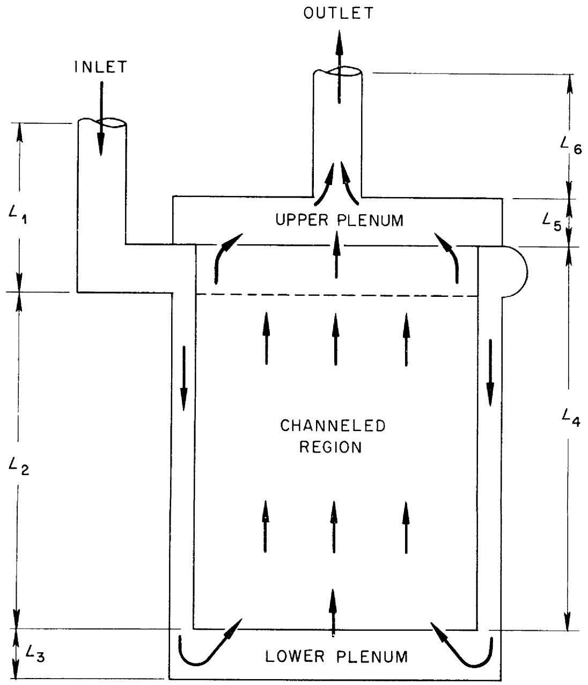  
Fig. 1. Model Used to Approximate the MSRE Fuel Salt Loop.

to those used in the hydraulic model, but a simpler scheme has been pursued here. To demonstrate, consider Eq. (12) after it has been linearized and transformed into the frequency domain,

$$
V _ {o} \frac {d}{d z} \Delta C _ {i} (z, s) + (\lambda_ {i} + s) \Delta C _ {i} (z, s) = \beta_ {i} v \Sigma_ {f} \Delta \phi (z, s). \tag {17}
$$

The assumption is made that the flux is separable in space and time, i.e.,

$$
\phi (z, t) = H (z) N (t), \tag {18}
$$

and fluctuations occur only in the time-dependent coefficient $N(t)$ ; therefore, $\Delta \phi(z, s)$ is given by

$$
\Delta \phi (z, s) = H (z) \Delta N (s). \tag {19}
$$

By use of Eq. (19) and since the precursors leaving the upper plenum return at a later time (determined by external loop transport time) to the lower plenum, Eq. (17) was solved for $\Delta C_{i}(z,s)$ as a function of $z$ and $\Delta N(s)$ .

A scheme similar to that used for the precursor equations was applied to the energy conservation Eqs. (7) and (8) to obtain a solution to $\Delta T_F(z, s)$ and $\Delta T_M(z, y, s)$ as a function of axial position $z$ and $\Delta N(s)$ .

Now, attention is given to the neutron balance Eq. (11), and a series of operations is performed: substitute Eq. (18) into Eq. (11); multiply through by $H^{*}(z)N^{*}(t)$ , where $H^{*}(z)$ is a weighting function taken to be the steady-state adjoint and $N^{*}(t)$ is the assumed adjoint time dependence; integrate over the volume; and require variations of the resultant with $N^{*}(t)$ to be zero (the restricted variational principle). This series of operations leads to:

$$
\begin{array}{l} <   - \nabla H ^ {*} \cdot D \nabla H - H ^ {*} \sum_ {a} H + \bar {f} H ^ {*} v \sum_ {f} H > N (t) \\ - \sum_ {i = 1} ^ {6} \beta_ {i} f _ {D i} <   H ^ {*} v \Sigma_ {f} H > N (t) \\ + \sum_ {i = 1} <   H ^ {*} \lambda_ {i} f _ {D i} C _ {i} (\vec {r}, t) > = <   H ^ {*} V ^ {- 1} H > \frac {d N}{d t}, \tag {20} \\ \end{array}
$$

where

$$
\bar {f} \equiv (1 - \beta) f _ {P} + \sum_ {i = 1} ^ {6} \beta_ {i} f _ {D i}, \tag {21}
$$

and $<$ indicates integrals over the reactor volume. The reason for introducing $f$ will be clarified below.

The static reactivity is defined as

$$
\rho_ {s} = \frac {v - v}{v}, \tag {22}
$$

which is the algebraically largest eigenvalue of the equation

$$
[ \nabla \cdot D \nabla - \Sigma_ {a} ] \psi_ {s} + (1 - \rho_ {s}) \bar {f} v \Sigma_ {f} \psi_ {s} = 0. \tag {23}
$$

We furthermore consider the solution to the equation

$$
\left[ \nabla \cdot D \nabla - \Sigma_ {a} \right] ^ {*} \psi_ {s} ^ {*} + (1 - \rho_ {s}) \left(\bar {f} _ {v} \Sigma_ {f}\right) ^ {*} \psi_ {s} ^ {*} = 0; \tag {24}
$$

this equation is defined to be the adjoint to Eq. (23). Then Eq. (23) is multiplied through by $\psi_{5}^{*}$ and integrated over the volume to obtain

9B. E. Prince, Period Measurements on the Molten-Salt Reactor Experiment During Fuel Circulation: Theory and Experiment, ORNL-TM-1626 (Oct. 1966).

$$
\rho_ {s} = \frac {\left. <   - \nabla \psi_ {s} ^ {*} \cdot D \nabla \psi_ {s} - \psi_ {s} ^ {*} \sum_ {a} \psi_ {s} + \psi_ {s} ^ {*} \bar {F} v \sum_ {f} \psi_ {s} > \right.}{<   \psi_ {s} ^ {*} \bar {F} v \sum_ {f} \psi_ {s} >} \tag {25}
$$

In Eq. (20), by choice

$$
H (\vec {r}) = \psi_ {s} (\vec {r}), \tag {26a}
$$

and $\mathsf{H}^{\star}(\vec{\mathbf{r}}) = \psi_{\mathsf{s}}^{\star}(\vec{\mathbf{r}})$ (26b)

At this point it is possible to calculate the value of $\rho_{s}$ which is required for a critical system. This is the procedure that is normally pursued in criticality calculations; therefore, the quantity $\widetilde{f}$ was introduced in Eq. (20) so that the formulism could be reduced easily to conventional static formulation. Accordingly, we introduce the definition

$$
\rho (t) \equiv \frac {<   - \nabla H ^ {*} \cdot D \nabla H - H ^ {*} \Sigma_ {a} H + H ^ {*} \bar {f} v \Sigma_ {f} H >}{<   H ^ {*} \bar {f} v \Sigma_ {f} H >}, \tag {27}
$$

where the reactivity $\rho(t)$ is, in general, a function of time, since the nuclear parameters will be changing in time due to feedback, rod motion, etc. It follows from Eq. (27) that $\rho(o)$ is the static reactivity if the reactor were "just" critical at $t = 0$ . We now introduce the definitions

$$
<   - \nabla H ^ {*} \cdot D \nabla H > \equiv <   - H ^ {*} D B ^ {2} H >, \tag {28}
$$

$$
\Lambda \equiv <   H ^ {*} V ^ {- 1} H > / <   H ^ {*} \bar {f} _ {v} \Sigma_ {f} H >, \tag {29}
$$

and write Eq. (20) as

$$
\rho (t) N (t) - \sum_ {i = 1} ^ {6} (\beta_ {i} f _ {D i} / \overline {{f}}) N (t)
$$

$$
+ \sum_ {i = 1} ^ {6} \left(<   H ^ {*} \lambda_ {i} f _ {D i} C _ {i} (\vec {r}, t) >\right) / <   H ^ {*} \bar {f} v \Sigma_ {f} H > = \Lambda \frac {d N}{d t}. \tag {30}
$$

Since the spatial mode $H(\vec{r})$ was chosen to be the flux distribution at critical [eigenfunction of Eq. (23)], $N(0)$ is unity. Then $\rho(0)$ from Eq. (30) is

$$
\rho (0) = \sum_ {i = 1} ^ {6} \frac {\beta_ {i} f _ {D i}}{\overline {{f}}} - \frac {\left. <   H ^ {*} \lambda_ {i} f _ {D i} C _ {i} (\vec {r} , 0) > \right.}{<   H ^ {*} \overline {{f}} v \Sigma_ {f} H >}. \tag {31}
$$

At this point, Eq. (30) is linearized by introduction of

$$
N (t) = 1 + N ^ {\prime} (t), \tag {32a}
$$

$$
\rho (t) = \rho (0) + \rho^ {\prime} (t), \tag {32b}
$$

and

$$
C _ {i} (\vec {r}, t) = C _ {i} (\vec {r}, 0) + C _ {i} ^ {\prime} (\vec {r}, t), \tag {32c}
$$

where the primed quantities will be assumed to be small deviations about the mean. Equation (32) is introduced into Eq. (30) and the products of small quantities are ignored to obtain

$$
\rho^ {\prime} (t) - \sum_ {i = 1} ^ {6} \frac {<   H ^ {*} \lambda_ {i} f _ {D i} C _ {i} (\vec {r} , 0) >}{<   H ^ {*} \bar {f} v \Sigma_ {f} H >} N ^ {\prime} + \sum_ {i = 1} ^ {6} \frac {<   H ^ {*} \lambda_ {i} f _ {D i} C _ {i} ^ {\prime} (\vec {r} , t) >}{<   H ^ {*} \bar {f} v \Sigma_ {f} H >} = \Lambda \frac {d N ^ {\prime}}{d t}. \tag {33}
$$

To reduce Eq. (33) to a more useful form, we define

$$
\rho_ {L} (\vec {r}, t) \equiv \delta \left\{\frac {- D B ^ {2} - \Sigma_ {a} + \bar {F} v \Sigma_ {f}}{<   H ^ {*} \bar {F} v \Sigma_ {f} H > / <   H ^ {*} H >} \right\}, \tag {34}
$$

where the $\delta$ represents deviations about the mean. Then $\rho^{\prime}(t)$ becomes

$$
\rho^ {\prime} (t) = \frac {<   H ^ {*} \rho_ {L} (\vec {r} , t) H >}{<   H ^ {*} H >}, \tag {35}
$$

and Eq. (33) can be written as (dropping primes and transforming)

$$
\begin{array}{l} s \wedge N (s) + \sum_ {i = 1} ^ {6} \frac {\left. <   H ^ {*} \lambda_ {i} f _ {D i} C _ {i} (\vec {r} , 0) > \right.}{<   H ^ {*} \overline {{f}} v \Sigma_ {f} H >} N (s) \\ - \sum_ {i = 1} ^ {6} \frac {\left. <   H ^ {*} \lambda_ {i} f _ {D i} C _ {i} (\vec {r} , s) > \right.}{<   H ^ {*} \overline {{f}} v \Sigma_ {f} H >} = \frac {\left. <   H ^ {*} \rho_ {L} (\vec {r} , s) H > \right.}{<   H ^ {*} H >}. \tag {36} \\ \end{array}
$$

Although $\rho_{\mathsf{L}}(\vec{\mathbf{r}}, s)$ could be evaluated directly from Eq. (34), a somewhat simpler approach is to expand in a Taylor series, as

$$
\mathrm {p} _ {\mathrm {L}} (\vec {\mathrm {r}}, \mathrm {s}) = \frac {\partial \circ \mathrm {L}}{\partial \mathrm {T} _ {\mathrm {f}}} \Delta \mathrm {T} _ {\mathrm {f}} (\vec {\mathrm {r}}, \mathrm {s}) + \frac {\partial \rho}{\partial \mathrm {T} _ {\mathrm {M}}} \Delta \mathrm {T} _ {\mathrm {M}} (\vec {\mathrm {r}}, \mathrm {s}) + \frac {\partial \rho_ {\mathrm {L}}}{\partial \alpha} \Delta \alpha (\vec {\mathrm {r}}, \mathrm {s}) + \dots , \tag {37}
$$

where $\Delta T_{i}(\vec{r}, s)$ is the local fluctuation in the temperature of the fuel ( $i = f$ ) or moderator ( $j = m$ ), $\Delta \alpha(\vec{r}, s)$ is the local fluctuation in the void fraction of gas, and the "etc." are assumed to be a deterministic input reactivity that can be grouped as $\rho_{\text{ext}}(s)$ .

Equations (36) and (37) make up the neutronic model. The solution of these equations and Eq. (15), the hydraulic model, leads to the desired transfer function, e.g., the neutron-flux-to-pressure transfer function.

# 2.3 Verification of the Analytical Model

As noted in Sect. 2.2, several assumptions were made in the development of the model; therefore, we believed that confidence could best be established in the analytical predictions by direct comparisons with experimental data. In this section comparisons are presented of analytical results with available experimental data.

The experimental frequency-response function obtained at zero power by Kerlin and Ball10 is presented in Fig. 2. Since their data extends to about 0.2 cps, other data obtained by noise analysis by Fry et al.11 is included in Fig. 2a. The data obtained from noise analysis extends from 0.14 to 15 cps, but no phase information is readily available from the noise data, since an autopower spectral density (APSD) analysis was formed. Along with the experimental data, the results obtained from the neutronic model are also presented. We conclude from Fig. 2 that the analytical model describing the system is satisfactory at zero power. The "hump" in the calculated frequency response function at about 0.04 cps is attributed to the assumption of plug flow for the fuel salt around the loop; i.e., there must be mixing of the delayed precursors, which the model ignores. To check the analytical model further, the calculated effective delayed neutron fraction $\beta_{\text{eff}}$ , which is used in conjunction with the in-hour equation for rod calibration, is compared with the measured $\beta_{\text{eff}}$ . Experimentally, the decrease in reactivity due to circulating fuel relative to static fuel was 0.212 - 0.004% sk/k.9 An assumed static $\beta_{\text{eff}}$ of 0.00666

$^{10}$ T. W. Kerlin and S. J. Ball, Experimental Dynamic Analysis of the Molten-Salt Reactor Experiment, ORNL-TM-1647 (Oct. 1966).   
D. N. Fry, et al., "Neutron-Fluctuation Measurements at Oak Ridge National Laboratory," pp. 463-74, in Neutron Noise, Waves, and Pulse Propagation, Proc. 9th AEC Symp. Ser., Gainesville, Fla., February 1966, CONF-660206 (May 1967).

would lead to a circulating $\mathfrak{B}_{\text {eff }}$ of 0.00454. The circulating $\mathfrak{B}_{\text {eff }}$ calculated from the model was 0.00443. Prince9 had calculated a circulating $\mathfrak{B}_{\text {eff }}$ of 0.00444.

The experimental data10 for the neutron-flux-to-reactivity frequency-response function for the reactor operating at 5 Mw are presented in Fig. 3 along with the calculated power-to-reactivity frequency-response function for the same conditions.

In Fig. 3a there is a difference between the calculated and the observed modulus of the power-to-reactivity frequency-response function below 0.008 cps because the model ignored the heat exchanger; i.e., fluctuations in the fuel-salt outlet temperature were transported around the loop and back to the inlet of the core where they affected reactivity directly. As in Fig. 2, the discrepancy in the 0.04 cps region is attributed to the plug flow model.

The difference between the experimental and calculated phase information in Fig. 3b at the lower frequencies is attributed to the heat exchanger assumption. We do not understand the difference at the higher frequencies.

We conclude from Fig. 3 that the analytical prediction of the power-to-reactivity frequency-response function is acceptable for frequencies above 0.008 cps at a power level of 5 Mw.

The calculated modulus of the reactivity-to-pressure frequency-response function and the available experimental data12 are presented in Fig. 4. The calculated magnitude of the modulus of the frequency-response function is proportional to the void fraction for each model.

It was stated in Sect. 2.2 that the pump bowl was not explicitly accounted for in the model, but an attempt was made to account for its effect on the system by the use of boundary conditions between regions 1 and 6 (see Fig. 1). The difference in the calculated modulus of the frequency-response function between curves labeled Model A and Model B in Fig. 4 is attributed to the assumed boundary conditions between regions 1 and 6. There must be two boundary conditions. The first boundary

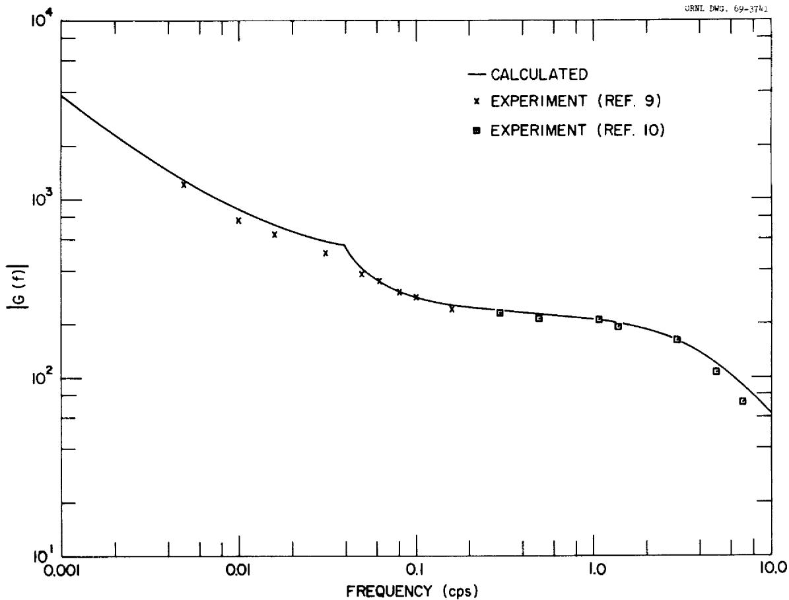

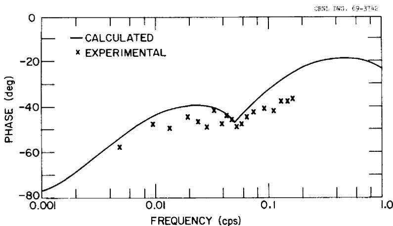  
Fig. 2. Modulus and Phase of the Neutron-Flux-to-Reactivity Frequency-Response Function for the MSRE at Zero Power. (a) Modulus and (b) Phase.

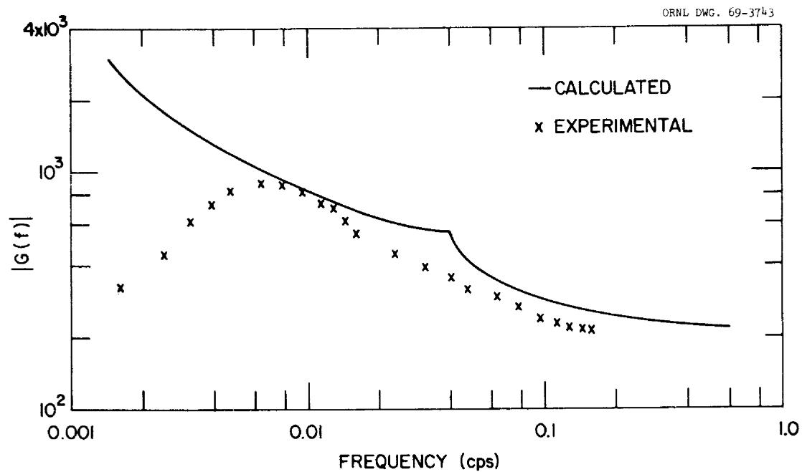

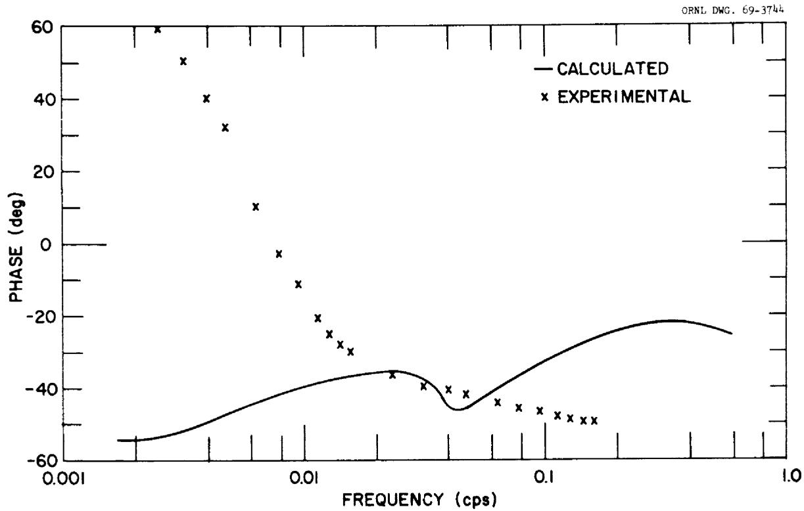  
Fig. 3. Modulus and Phase of the Neutron-Flux-to-Reactivity Frequency-Response Function for the MSRE at 5 Mw. (a) Modulus and (b) Phase.

condition was that the pressure fluctuations at the exit of region 6 are the same as the inlet pressure fluctuations to region 1. This condition seems physically reasonable; therefore, it was used for both Model A and Model B. For the second boundary condition, we assumed for Model A that the void-fraction fluctuation at the exit of region 6 was equal to the void-fraction fluctuation at the inlet of region 1. For Model B, the second boundary condition was that the fluctuation in the total mass velocity to region 1 was zero.

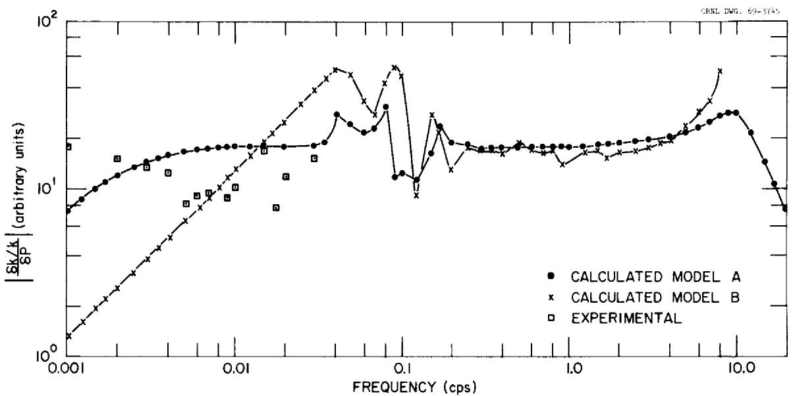  
Fig. 4. Modulus of the Reactivity-to-Pressure Frequency-Response Function for the MSRE.

The experimental data in Fig. 4 was obtained by suddenly releasing the pressure of helium cover gas in the primary pump from 9 to 5 psi and analyzing the resulting control rod motion required for constant power. The amount of void present at the time of the experiment was estimated to be from 2 to $3\%$ by volume.[12] From a comparison of Model A predictions with the experimental data, we concluded that there was a $2.5\%$ void fraction, whereas from a similar comparison of Model B predictions, we concluded $1.6\%$ void fraction.

It appears that the analytical predictions are nominally correct, but we do not have enough experimental evidence to definitely select either model (from the

shape of the predicted frequency-response function it appears that Model A is more nearly correct). Hence, the analytical results from each model were used in the reduction of the experimental data.

# 3. EXPERIMENTAL METHOD

As discussed previously, it had been anticipated that the signal-to-noise ratio for this test would be poor; therefore, a test signal was desired which had its maximum power concentrated in a small increment of frequencies (in a narrow band) about the frequency being analyzed. For this purpose the ideal test signal would have been a pressure "sine wave." The problem was that we could not, without excessive difficulty, generate a pressure sine wave because of the limitations of the system; i.e., the required manipulation of the valves would have been very difficult.

Due to practical considerations, a train of sawtooth pulses, with a period of 40 sec for each pulse, was chosen as the test signal. The scheme employed for the generation of this signal is explained as follows (see Fig. 5). After valves HV-522B, HCV-544, and HVC-545 were closed and FCV-516 was fully opened, the pressure in the pump bowl increased about 0.3 psi over a period of about 40 sec. At this point, equalizing valve HCV-544 was opened momentarily to bleed off helium, with a pressure decrease of approximately 0.3 psi. The mean pressure perturbation was held to approximately zero throughout the duration of the test. The time required to release the pressure was insignificant relative to the time required for the pressure to rise.

Equalizing valve HCV-544 was controlled by use of the circuit13 shown in Fig. 6, which is a one-shot multivibrator that caused the valve to open when the pressure exceeded a preset value and controlled the amount of time the valve remained open. The period of the sawtooth waves was reproducible to within $\pm 2\%$ throughout the test.

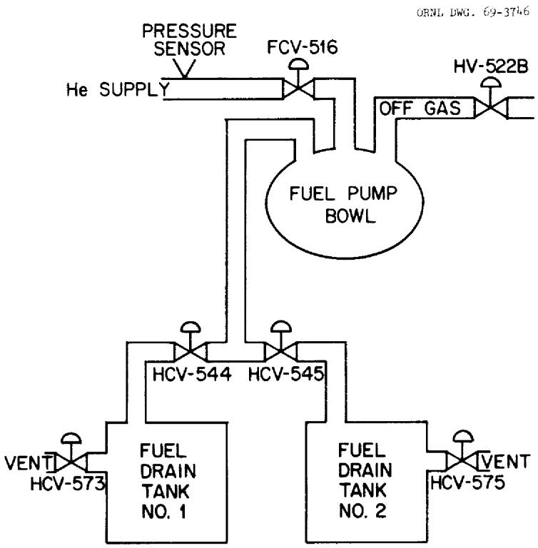  
Fig. 5. The Portion of the MSRE System Used in the Generation of the Pressure Sawtooth Test Signal.

# 4. DATA ACQUISITION AND REDUCTION

4.1 Data Acquisition and Its Relationship to the Physically Significant Quantities

The continuous signals obtained from a neutron-sensitive ionization chamber and a pressure transmitter (located $\sim 15$ ft from the pump bowl in a helium-supply line) were amplified and recorded on magnetic tape (Fig. 7) for a period of $\sim 1$ hr. The schemes used for the reduction of the data will be discussed below, but first it will be instructive to relate the electrical signals $V_{1}$ and $V_{2}$ , which were recorded on magnetic tape, to the actual fluctuations in the system flux and pressure.

The instantaneous current $I_{1}(t)$ from the neutron-sensitive ionization chamber can be written as

$$
I _ {1} ^ {(t)} = \overline {{I}} _ {D C, 1} + I _ {A C, 1} ^ {(t)}, \tag {38}
$$

where $I_{AC,1}(t)$ represents deviation about the mean current, $\overline{I}_{DC,1}$ . The subaudio amplifier rejects the mean, or DC, voltage; therefore the output of the amplifier $V_{1}$ with gain $G_{1}$ is

$$
V _ {1} (t) = R _ {1} G _ {1} I _ {A C, 1} (t), \tag {39}
$$

where $R_{1}$ is the input resistor. The fluctuating current $I_{AC,1}(t)$ from the neutron-sensitive ionization chamber is related to neutron flux fluctuations by

$$
I _ {A C, 1} (t) = \bar {I} _ {D C, 1} \delta N (t) / N _ {0}, \tag {40}
$$

where $\delta N(t)$ is the instantaneous deviation of the flux about the mean, and $N_0$ is the mean flux level. Now Eq. (39) can be written as

$$
V _ {1} (t) = \left(R _ {1} G _ {1} \bar {T} _ {D C, 1}\right) \delta N (t) / N _ {0}, \tag {41}
$$

where all the terms in the bracket can be determined experimentally.

The output of the pressure sensor is a voltage that is proportional to the pressure, i.e.,

$$
V _ {P} (t) = \alpha P (t) = \alpha \left[ P _ {0} + \delta P (t) \right], \tag {42}
$$

where $\alpha$ is a proportionality constant and $\delta P(t)$ represents the deviations of the pressure about the mean pressure $P_0$ . As before, the output voltage $V_2(t)$ is related to the input current $I_2(t)$ by

$$
V _ {2} (t) = R _ {3} G _ {2} I _ {A C}, 2 ^ {(t)}. \tag {43}
$$

ORNL DWG. 69-3747

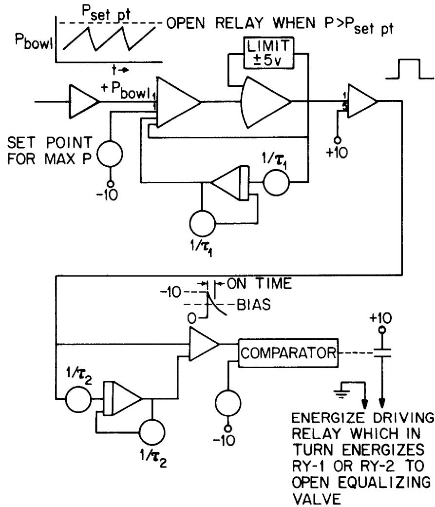  
Fig. 6. Circuit Used for the Generation and Control of the Desired Test Signal.

But

$$
I _ {A C, 2} (t) = \frac {V _ {P} (t)}{R _ {3} + R _ {2}}; \tag {44}
$$

therefore, $V_{2}(t)$ can be written

$$
V _ {2} (t) = \alpha \left(\frac {R _ {3}}{R _ {3} + R _ {2}} G _ {2}\right) \delta P (t). \tag {45}
$$

Equations (41) and (45) relate the physical quantities of interest $\delta N(t) / N_0$ and $\delta P(t)$ to the observed quantities $V_{1}(t)$ and $V_{2}(t)$ .

ORNL DWG. 69-3748

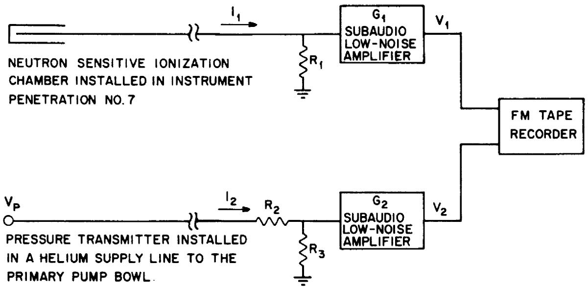  
Fig. 7. Representation of the System Used for the Accumulation and Storage of the Experimental Data.

# 4.2 Data Reduction

The signals $V_{1}(t)$ and $V_{2}(t)$ were analyzed by use of five different techniques. We will not describe the details of these various schemes; however, a brief discussion of each technique follows.

# 4.2.1 Analog Analysis

Data were recorded on analog tape (Fig. 8) at a tape speed of 3.75 in./sec. For analysis of the data using the 10-channel analog power spectral density analyzer, the tape was played back at a speed of 30.0 in./sec (a tape speedup factor of 8). This increased speed was necessary so that the fundamental frequency of the pressure sawtooth wave, 0.025 cps, would appear to be at a frequency of 2.0 cps, which corresponded to a center frequency of one of the available pretuned filters. The effective frequency range covered by the 10-channel analyzer was from 0.017 to 6.3 cps with a bandwidth of 0.0125 cps. Only one of the 10 channels was useful for data reduction, because the center frequency of 9 of the 10 filters did not correspond with a harmonic of the test signal. (In the Appendix, Sect. 8.1, it is shown that the center frequency of the filter must closely coincide with a harmonic of the test signal for a meaningful interpretation of a periodic test signal.) The primary reason for the use of the analog analyzer was that we wanted to obtain an absolute value of the pressure power spectral density (PPSD) which could be compared with theoretical predictions as well as with the absolute neutron power spectral density (NPSD).

# 4.2.2 BR-340 FFT Analysis

A Bunker-Ramo, model 340 digital computer at the MSRE and a program which had been developed previously for NPSD calculations of noise signals obtained from a neutron-sensitive ionization chamber were used for FFT analysis. The basic procedures involved in this calculation were to (a) Fourier transform the time signal

ORNL DWG. 69-3749

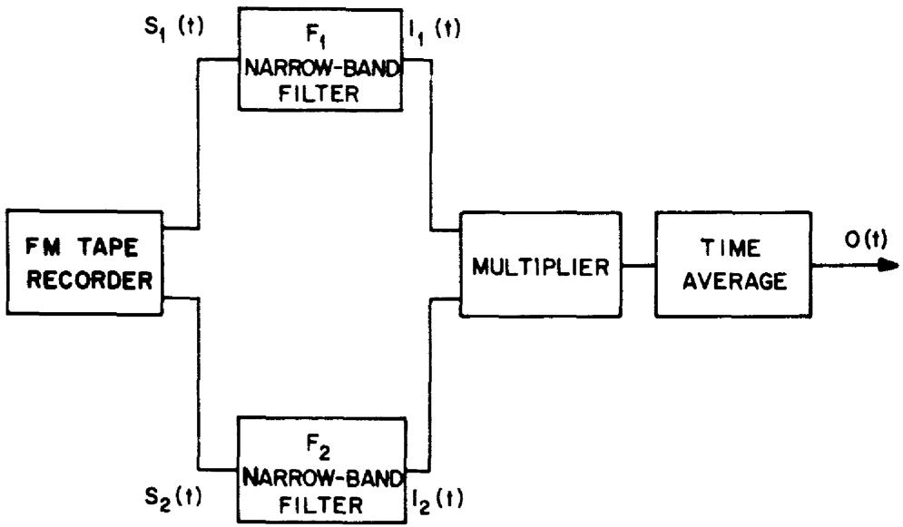  
Fig. 8. Representation of the System Used for Analog Analysis of the Data.

and (b) construct the NPSD from the transformed signal. $^{16}$ This is a very fast technique, made so because the Fourier transform is obtained by an algorithm proposed by Tukey, $^{17}$ which has become identified as the FFT (fast Fourier transform) technique.

Samples taken from the tape-recorded analog signals from the experiment had to be digitized before digital analysis was possible. The convenient sampling rate was 60 samples/sec, but, since this was much higher than necessary, the tape was played back at 60 in./sec which gave an effective sampling rate of 3.75 samples/sec. Then the power spectral densities of the pressure (PPSD) and neutron signals (NPSD) were obtained for the frequency range of 0.00366 to 0.937 cps with a bandwidth of 0.00366 cps.

# 4.2.3 Digital CPSD Analysis

The tape was played back at a speedup factor of 4 and the analog signals were digitized using an analog-to-digital converter which gave an effective sampling rate of 5 samples/sec. These digitized data were analyzed using a digital computer simulation of an analog filtering technique to obtain the cross-power spectral density (CPSD) function.[18] The calculated results of interest were (a) the ratios of the CPSD of flux to pressure to the PSD of the pressure at various frequencies, and (b) the coherence function. The frequencies selected for analysis were the harmonics determined by the period of the input pressure wave.

# 4.2.4 FOURCO Analysis

The ratio of the CPSD of the flux to pressure to the PSD of the pressure is, in theory, the frequency response function of the flux to pressure. The classical definition of the frequency-response function is that it is the ratio of the Fourier transform of the output to the Fourier transform of the input. Therefore, the code FOURCO, $^{19}$ which calculates the ratio of the Fourier transforms, was used to reduce the data.

# 4.2.5 CABS Analysis

Another way to obtain the system frequency response function is to (a) calculate the cross-correlation function of the output to the input and the auto-correlation function of the input, and (b) calculate the Fourier transform of the

auto-correlation function. The ratio of the transformed functions (cross-to auto-correlated) is the frequency response function. This analysis scheme was carried out using CABS.[20]

# 5. RESULTS

# 5.1 Introduction

The flux and pressure signals were recorded on magnetic tape simultaneously for a period of approximately 1 hr for the conditions of (a) no perturbations to the system (for noise background calibration purposes) and (b) pressure perturbations introduced as a train of continuous sawtooth pulses with a 40-sec period and a magnitude of 0.3 psi for each pulse. The results obtained from these tests are discussed in the following sections for each analysis scheme.

# 5.2 Results From Analog Analysis

The auto-power spectral density of the neutron flux $\left[\mathrm{NPSD}(f)\right]$ is related to the auto-power spectral density of the pressure $\left[\mathrm{PPSD}(f)\right]$ by

$$
\operatorname {N P S D} (f) = | G (f) | ^ {2} \operatorname {P P S D} (f), \tag {46}
$$

where $|G(f)|^2$ is the square modulus of the frequency-response function of the neutron flux to the pump bowl pressure. The implicit assumption for the validity of Eq. (46) is that the NPSD is due to pressure perturbations only, i.e., that the observed NPSD(f) has been corrected for background noise. Furthermore, the NPSD(f)

and $\mathsf{PPSD}(\mathsf{f})$ must be absolute quantities (or at least proportional to the absolute quantities with the same proportionality constant). Then Eq. (46) can be written as

$$
| G (f) | = \left[ N P S D (f) / P P S D (f) \right] ^ {1 / 2}. \tag {47}
$$

In Sect. 4.2 we stated that only 1 of the available 10 filters had a center frequency that corresponded to a harmonic frequency of the input signal and that particular filter was centered at an effective frequency of 0.025 cps, which is the fundamental frequency of the 40-sec-period pressure wave. Therefore, we were able to evaluate $|G(f)|$ from Eq. (47) only at a frequency of 0.025 cps.

From Eq. (102) of Sect. 8 we note that, if the noise is insignificant in the pressure signal (which was the case for this experiment in the vicinity of 0.025 cps), the observed $\mathsf{PPSD}(\mathsf{f}_0)$ , which is $O(T, f_0)$ of Eq. (102), should be given by

$$
\operatorname {P P S D} \left(f _ {0}\right) = \frac {1}{2} \left(a _ {0} ^ {2} + b _ {0} ^ {2}\right). \tag {48}
$$

After expansion of the sawtooth wave in a Fourier series and evaluation of the right side of Eq. (48), the calculated $\mathrm{PPSD(f_0)}$ was 0.0045. The value of $\mathrm{PPSD(f_0)}$ obtained from the calibrated analog spectral density analyzer was 0.0050. A $10\%$ deviation in the PPSD is well within experimental uncertainties.

Although the noise was insignificant for the pressure signal, this was not the case for the neutron signal, as can be seen in Fig. 9 by comparing curve A (NPSD obtained from the neutron flux signal recorded during the pressure test) with curve B (NPSD obtained from the neutron flux signal recorded immediately following the pressure test). The ordinate in Fig. 9 is the output of the analyzer, corrected for system gains and the square of the mean neutron ionization chamber current and normalized to the filter area $A_{F}$ , i.e., the ordinate is $\mathsf{O}(\mathsf{T},\mathsf{f}_0) / \mathsf{A}_{\mathsf{F}}$ of Eq. (95). Therefore, the desired NPSD $(f_0)$ is obtained from

$$
N P S D \left(f _ {0}\right) = \left\{\left[ \frac {O (T , f _ {0})}{A _ {F}} \right] _ {A} - \left[ \frac {O (T , f _ {0})}{A _ {F}} \right] _ {B} \right\} A _ {F} \tag {49}
$$

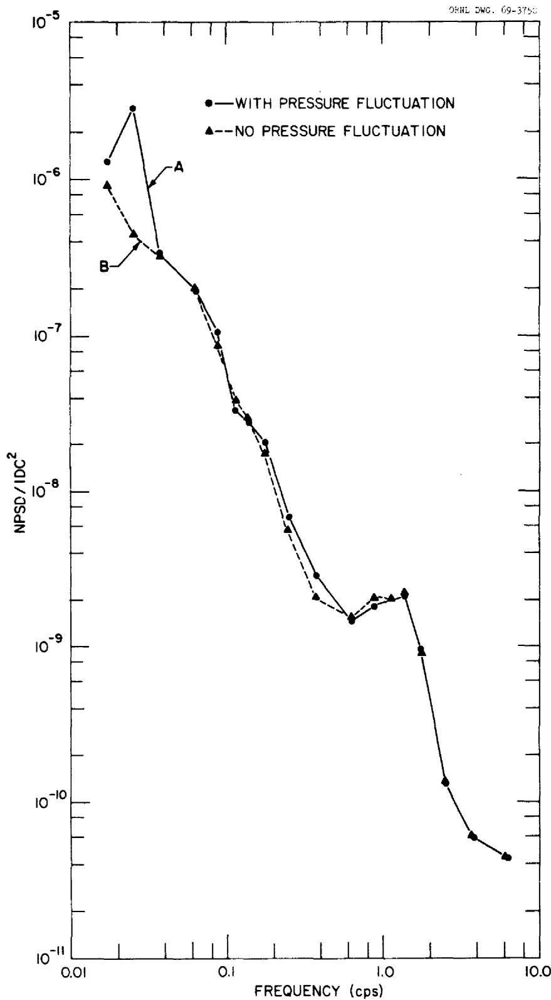  
Fig. 9. The Neutron-Flux Auto-Spectral Density (NPSD) from the Analog Analysis.

at $f_{0} = 0.025$ cps, where subscripts A and B refer to the similarly identified curves in Fig. 9. By use of Eq. (49), the value of NPSD (0.025) is calculated to be $1.652 \times 10^{-8}$ . From Eq. (47), the modulus of the frequency-response function of the fractional change in neutron flux to the change in pressure (units of psi) is

$$
| G (0. 0 2 5) | = \left[ \frac {8 . 2 6 \times 1 0 ^ {- 9}}{5 . 0 \times 1 0 ^ {- 3}} \right] ^ {- 1 / 2} = 0. 0 0 1 2 8 p s i ^ {- 1}.
$$

This value for the modulus is compared in Sect. 5.5 with results obtained from other techniques. Furthermore, the procedure used to infer the void fraction from $|G|$ is also presented in Sect. 5.5.

# 5.3 Results from FFT Analysis

We concluded from the analog spectral density analysis (see Fig. 9) that the neutron flux signal did contain information at a frequency of 0.025 cps which was related to the pressure driving function. However, we could not determine if information was present in the neutron flux signals at other harmonics of the fundamental of the pressure signal. This was because no filters were available with the proper center frequency. In principle, there is an infinite number of harmonics present in the input sawtooth, but it is known that the power associated with the nth harmonic $P_{n}$ is related to the power associated with the fundamental $P_{0}$ by

$$
\frac {P _ {n}}{P _ {0}} = \frac {1}{n ^ {2}}, \tag {50}
$$

where $n = 1, 2, 3, \ldots$ . Therefore, we expected that there would be, at most, a few harmonics from which we could extract useful information. To determine the number of harmonics that we could analyze with confidence, the NPSD(f) and PPSD(f) were obtained using the BR-340. From these results (Fig. 10) we concluded that we could analyze the fundamental and its first three harmonics. No attempt

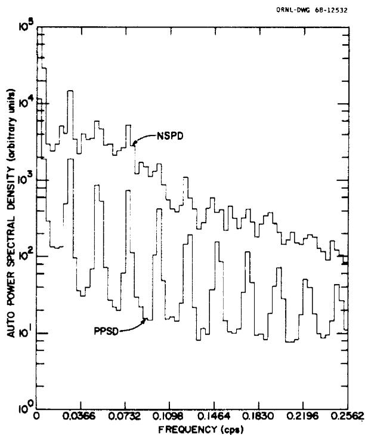  
Fig. 10. The Neutron-Flux Auto-Spectral Density (NPSD) and the Pressure Auto-Spectral Density (PPSD) from the BR-340 FFT Analysis.

was made to obtain the modulus $|G(f)|$ of Eq. (47), from Fig. 10, since these results were not presented in absolute units; i.e., this spectral density analyzer has not been calibrated.

# 5.4 Results from Digital Cross-Correlation Analysis

Three different digital techniques were applied to obtain the modulus of the neutron-flux-to-pressure-frequency response function directly: (1) the cross-power spectrum, (2) the Fourier transform of the input and output signals, and (3) the Fourier transform of the cross- and auto-correlation functions. Each of these techniques will be discussed briefly and the results tabulated. In each case, the voltage signals $V_{1}(t)$ and $V_{2}(t)$ (Fig. 7) were related to the fractional change in neutron flux $\delta N(t)/N_{0}$ and the change in pressure $\delta P(t)$ as dictated by Eqs. (41) and (45).

# 5.4.1 CPSD Analysis

With this technique the objective was to calculate the CPSD of the output to the input signals, the PPSD of the input signal, and the NPSD of the output signal. Then $G(f)$ was obtained from22

$$
G (f) = \frac {C P S D (f)}{P P S D (f)}, \tag {51}
$$

and the coherence function $\gamma^2 (f)$ was obtained from

$$
\gamma^ {2} (f) = \frac {\left| C P S D (f) \right| ^ {2}}{N P S D (f) P P S D (f)} \tag {52}
$$

The coherence function, which has numerical values between zero and unity, is used as a quantitative indication of the signal-to-noise ratio;22 i.e., its value approaches unity for a high signal-to-noise ratio.

Since the scheme used for this analysis was a digital simulation of analog techniques (see Sect. 4.2), we will refer to this scheme as the D-analog CPSD analysis. The results are tabulated in Table 1.

We had concluded in Sect. 5.3 that we could accept results up through the third harmonic, but since examination of the coherence in Table 1 indicates that the fourth harmonic is equally acceptable, we included this harmonic in our analysis of the void fraction (see Sect. 5.5).

# 5.4.2 Fourier Transform Analysis

With this technique the procedure was to obtain the ratio of the Fourier transform of the output signal $\delta N(t) / N_0$ to the Fourier transform of the input $\delta P(t)$ signal. Then we stated

$$
G (f) = \mathfrak {F} \left\{\frac {\delta N (t)}{N _ {0}} \right\} / \mathfrak {F} \left\{\delta P (t) \right\}, \tag {53}
$$

where the operator indicates the Fourier transform.

Inasmuch as the code used for the data analysis scheme is called "FOURCO", we refer to this analysis scheme as the FOURCO analysis. The results are tabulated in Table 2.

# 5.4.3 Cross-Correlation Techniques

The cross correlation function $\psi_{1}, 2^{(\tau)}$ between two continuous signals can be defined by

$$
\psi_ {1, 2} = \lim  _ {T \rightarrow \infty} \frac {1}{T} \int_ {- T / 2} ^ {+ T / 2} S _ {1} (t) S _ {2} (t + T) d t, \tag {54}
$$

where $S_{1}(t)$ and $S_{2}(t)$ represent the continuous functions. If $S_{1}(t)$ and $S_{2}(t)$ are the same, $\psi$ is identified as the auto-correlation function. A program (CABS²⁰) was available which computed the cross-correlation function, the auto-correlation function of each signal, and their Fourier transforms. Since the desired information for this study was the frequency-response function, we were interested in the Fourier transforms of the cross-correlation and auto-correlation functions, because G(f) is given by

$$
G (f) = \mathfrak {F} \left\{\psi_ {1, 2} (\tau) \right\} / \mathfrak {F} \left\{\psi_ {1, 1} (\tau) \right\}, \tag {55}
$$

where subscript 1 refers to the pressure signal and subscript 2 refers to the neutron flux signal. We obtained the coherence function from

$$
\gamma^ {2} (f) = \frac {\left| \mathfrak {F} \left\{\psi_ {1 , 2} (\tau) \right\} \right| ^ {2}}{\mathfrak {F} \left\{\psi_ {1 , 1} (\tau) \right\} \mathfrak {F} \left\{\psi_ {2 , 2} (\tau) \right\}}. \tag {56}
$$

As stated previously, the code used for the data reduction is identified as CABS; hence, this analysis is identified as the CABS analysis.

From the results of this analysis (Table 3), we note that the coherence begins to increase for the fourth and fifth harmonic, but this is physically unreal since the signal-to-noise ratio decreases with increasing harmonic number (see Fig. 10). Therefore, we accept the results obtained from the fundamental and the first two harmonics by the CABS analysis.

# 5.5 The Void Fraction from Experimental and Analytical Results

The modulus of the fractional change in the neutron-flux-to-pressure frequency-response function as obtained from the experiment was discussed in Sect. 5.4. The objective of this experiment was to determine the amount of circulating void (the void fraction, VF) in the fuel salt. At present, there are no experimental data available that relate the modulus of the frequency-response function $|G(f)|$ to the amount of void present; therefore, we calculated $a \mid G(f)$ to the amount of void present; therefore, we calculated $a \mid G(f)$ using the model discussed in Sect. 2 (the calculated $|G(f)|$ is a function of the assumed void fraction in the model). Analytically, we determine that (a) in the frequency range of interest there was no frequency dependence of $|G(f)|$ on VF, and (b) the magnitude of $|G(f)|$ was directly proportional to VF. Therefore, the actual void fraction $V_{\text{act}}$ was obtained from

$$
V F _ {\text {a c t}} = \left[ \frac {\left| G (f) \right| _ {\exp}}{\left| G (f) \right| _ {\operatorname {c a l c}}} \right] V F _ {\text {r e f}}, \tag {57}
$$

where the subscripts exp and calc refer to the $|G(f)|$ 's obtained experimentally and analytically respectively, and $VF_{\text{ref}}$ is the value of the void fraction used in the analytical model for generation of $|G(f)|_{\text{calc}}$ .

Table 1. Results from D-Analog CPSD Analysis   

<table><tr><td>Frequency (cps)</td><td>|G(f)|</td><td>Coherence</td></tr><tr><td>0.025</td><td>0.00121</td><td>0.944</td></tr><tr><td>0.050</td><td>0.00088</td><td>0.522</td></tr><tr><td>0.075</td><td>0.00128</td><td>0.484</td></tr><tr><td>0.100</td><td>0.00085</td><td>0.340</td></tr><tr><td>0.125</td><td>0.00112</td><td>0.340</td></tr><tr><td>0.150</td><td>0.00013</td><td>0.002</td></tr></table>

Table 2. Results from FOURCO Analysis   

<table><tr><td>Frequency (cps)</td><td>|G(f)|</td></tr><tr><td>0.025</td><td>0.00126</td></tr><tr><td>0.050</td><td>0.00080</td></tr><tr><td>0.075</td><td>0.00220</td></tr><tr><td>0.100</td><td>0.00104</td></tr></table>

Table 3. Results from CABS Analysis   

<table><tr><td>Frequency (cps)</td><td>|G(f)|</td><td>Coherence</td></tr><tr><td>0.025</td><td>0.00117</td><td>0.61</td></tr><tr><td>0.050</td><td>0.00103</td><td>0.31</td></tr><tr><td>0.075</td><td>0.00130</td><td>0.27</td></tr><tr><td>0.100</td><td>0.00105</td><td>0.10</td></tr><tr><td>0.125</td><td>0.00102</td><td>0.12</td></tr><tr><td>0.150</td><td>0.00099</td><td>0.13</td></tr></table>

Two different assumptions were used in the calculation of the pressure-to-reactivity transfer function, referred to as Models A and B in Sect. 2.3. The values of $\left| G(f) \right|_{\text{calc}}$ from each model are presented in Table 4 for a $VF_{\text{ref}}$ of $0.064\%$ .

The objective now is to infer the actual void fraction from Eq. (57). This was done by using the data in Sect. 5.4 and Table 4. The results obtained from each analysis scheme (Table 5) show that the fundamental is consistent for all data reduction schemes. Furthermore, the scatter, which increases with increasing frequency, is attributed to two factors: (1) that the power in each harmonic of the experimental test signal was proportional to the inverse harmonic number squared [see Eq. (50)]; and (2) that the total loop time of the fuel salt was about 25 sec, which corresponds to a frequency of 0.05 cps. The analytical model used to determine $\left| G(f) \right|_{calc}$ of Eq. (57) was based on one-dimensional flow. This caused some humps in the calculated frequency-response function at frequencies of 0.05 cps and above (Fig. 4). Examination of $\left| G(f) \right|_{exp}$ (Sect. 5.4 and Fig. 11) indicates that $G(f)$ varies smoothly in this frequency range; hence one is led to suspect that mixing occurs which the model does not account for.

Based on the results obtained at the fundamental (0.025 cps) a mean void fraction of $0.045\%$ was obtained for Model A and $0.023\%$ for Model B. It is interesting to note that calculation of a weighted average void fraction of all the data presented in Table 5 gave the same results. This weighted average was obtained by assigning a weighting factor, a confidence factor, to each harmonic equal to the fraction of the total input signal power associated with that harmonic, i.e., an inverse square of the harmonic number.

The problem now is to determine which model more nearly represents the actual physical system. Since we do not have enough experimental evidence to do this with greater precision, we can only state that the void fraction is between 0.023 and $0.045\%$ .

Table 4. Calculated Values of $\left| {G\left( f\right) }\right|$ for a $V{F}_{\text{ref }} = {0.064}\%$   

<table><tr><td rowspan="2">Frequency (cps)</td><td></td><td>G(f)</td><td></td></tr><tr><td colspan="2">Model A</td><td>Model B</td></tr><tr><td>0.025</td><td colspan="2">0.00176</td><td>0.00343</td></tr><tr><td>0.050</td><td colspan="2">0.00163</td><td>0.00530</td></tr><tr><td>0.075</td><td colspan="2">0.00146</td><td>0.00185</td></tr><tr><td>0.100</td><td colspan="2">0.000596</td><td>0.00406</td></tr><tr><td>0.125</td><td colspan="2">0.000496</td><td>0.00503</td></tr><tr><td>0.150</td><td colspan="2">0.000710</td><td>0.00279</td></tr></table>

Table 5. Calculated Values of the Actual Void Fraction   

<table><tr><td rowspan="3">Frequency (cps)</td><td colspan="8">Vact(%) for each Analysis Scheme and Models A and B</td></tr><tr><td colspan="2">Analog</td><td>D-Analog</td><td>CPSD</td><td colspan="2">FOURCO</td><td colspan="2">CABS</td></tr><tr><td>A</td><td>B</td><td>A</td><td>B</td><td>A</td><td>B</td><td>A</td><td>B</td></tr><tr><td>0.025</td><td>0.045</td><td>0.024</td><td>0.044</td><td>0.023</td><td>0.046</td><td>0.024</td><td>0.042</td><td>0.022</td></tr><tr><td>0.050</td><td>-</td><td>-</td><td>0.035</td><td>0.011</td><td>0.031</td><td>0.010</td><td>0.040</td><td>0.012</td></tr><tr><td>0.075</td><td>-</td><td>-</td><td>0.056</td><td>0.044</td><td>0.096</td><td>0.076</td><td>0.057</td><td>0.045</td></tr><tr><td>0.100</td><td>-</td><td>-</td><td>0.091</td><td>0.013</td><td>0.111</td><td>0.016</td><td>-</td><td>-</td></tr><tr><td>0.125</td><td>-</td><td>-</td><td>0.144</td><td>0.014</td><td>-</td><td>-</td><td>-</td><td>-</td></tr></table>

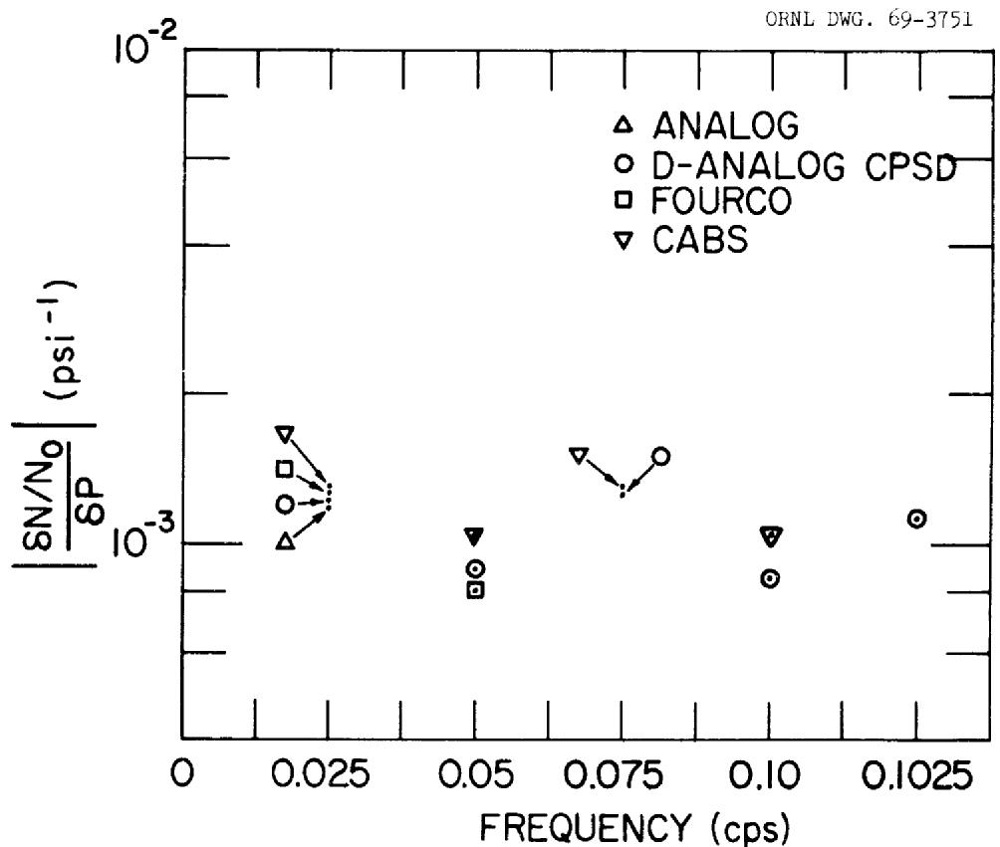  
Fig. 11. The Experimentally Determined Modulus of the Neutron-Flux-to-Pressure Frequency-Response Function from the Various Analysis Schemes.

# 6. CONCLUSIONS

The primary objective of this experiment was to determine the amount of helium void entrained in the MSRE fuel salt for the condition of the reactor operating at power. This was accomplished by forcing the modulus of the power-to-pressure frequency-response function obtained experimentally and analytically to be the same. Therefore, considerable study was made to verify the analytical results. We conclude that the analytical prediction of the power-to-reactivity frequency-response function was adequate, but the analytical prediction of the reactivity-to-pressure frequency-response function was only nominally correct.

The response of neutron flux to small induced pressure perturbations was significantly larger than the nominal background response; therefore, a meaningful frequency-response function of the neutron flux to pressure signals can be experimentally obtained.

At the fundamental frequency of the input pressure wave, the signal-to-noise ratio of the neutron flux signal was approximately 10; this ratio decreased with increasing harmonic number. At larger signal-to-noise ratios, the modulus of the frequency-response function can be obtained by either APSD, CPSD, cross-correlation, or direct Fourier transform techniques. As the signal-to-noise ratio decreases, the APSD technique becomes unsatisfactory. The direct Fourier transform technique becomes less desirable than the CPSD or cross-correlation techniques as the signal-to-noise ratio decreases.

The void fraction, at the time of the experiment, was determined to be between 0.023 and $0.045\%$ . This large spread is attributed to assumptions made in the modeling of the fuel pump bowl.

# 7. RECOMMENDATIONS FOR FUTURE INVESTIGATIONS

Since the major cause of the uncertainty in the void fraction reported herein is the model, we recommend that an experiment, analogous to that which we performed, be performed at zero power. The on-line reactivity balance could be used to determine the void fraction, which in turn would yield a reference point to permit the selection of either Model A or B, or to indicate that additional work is required to devise a model.

We further recommend that the experiment described in this report be repeated for different void conditions during operation of the MSRE fueled with $^{233}\mathrm{U}$ . The results could be combined with the results obtained from noise analysis.

Finally, we recommend that the CPSD analysis technique be pursued for extraction of information from neutron fluctuations and background pressure fluctuations that usually occur in an unperturbed reactor.

# 8. APPENDIX

# 8.1 Interpretation of the APSD of Deterministic Signals

in the Presence of Noise

The direct method, $^{9}$ filtering and time averaging, for APSD analysis will be considered for the purpose of aiding in the interpretation of noisy periodic signals with poor signal-to-noise ratios. Consider the output signal from two detectors $S_{1}(t)$ and $S_{2}(t)$ which are filtered, multiplied together, and time averaged, and start with the data analysis scheme shown in Fig. 8. In particular, start at the output $O(t)$ , and move backwards to the inputs $S_{1}(t)$ and $S_{2}(t)$ . With the multiplier and time averager considered, $O(t)$ can be written as

$$
\bigcirc (t) = \overline {{I _ {1} (t) I _ {2} (t)}}, \tag {58}
$$

where the bar represents a time average. Assume that the time averaging is carried out using a unity weighting function and write

$$
O (t) = \frac {1}{t} \int_ {0} ^ {t} I _ {1} (y) I _ {2} (y) d y. \tag {59}
$$

Now the problem is to relate $I_1(y)$ and $I_2(y)$ in Eq. (59) to $S_1(t)$ and $S_2(t)$ . Assume that the filters are linear and write

$$
I _ {1} (y) = \int_ {0} ^ {y} F _ {1} (y - x) S _ {1} (x) d x, \tag {60a}
$$

and

$$
I _ {2} (y) = \int_ {0} ^ {y} F _ {2} (y - x) S _ {2} (x) d x. \tag {60b}
$$

Further, assume that $F_1$ and $F_2$ are very narrow-band filters so that $I_1$ and $I_2$ will be a narrow-band-limited signal; i.e., the Fourier transform of these signals will be nonzero only for a narrow band of frequencies about the filter center frequency, even though $S_1(t)$ and $S_2(t)$ may have been unlimited in the frequency domain.

Before substituting Eq. (60) into Eq. (59), it will be advantageous to examine Parseval's theorem in the form23

$$
+ \infty + \infty \int_ {- \infty} ^ {+ \infty} G _ {1} (f) G _ {2} (f) d f = \int_ {- \infty} ^ {+ \infty} g _ {1} (t) g _ {2} (- t) d t, \tag {61}
$$

where $G_{i}(f)$ is the Fourier transform of $g_{i}(t)$ . Consider $g_{i}(t)$ to be nonzero only in the interval $0 \leq t \leq T$ ; then Eq. (49) can be reduced to (see Ref. 23)

$$
\int_ {0} ^ {\infty} g _ {1} (t) g _ {2} (t + \tau) d t = \int_ {- \infty} ^ {\infty} G _ {1} ^ {*} (f) G _ {2} (f) \exp \left[ - 2 \pi f \tau j \right] d f, \tag {62}
$$

where the asterisk denotes conjugate complex. For $\tau = 0$ , zero lag time, Eq. (62) reduces to

$$
\int_ {0} ^ {T} g _ {1} (t) g _ {2} (t) d t = \int_ {- \infty} ^ {\infty} G _ {1} ^ {*} (f) G _ {2} (f) d f, \tag {63}
$$

where the integrand on the left is analogous to the integrand of Eq. (59).

Let $I_{\bullet}(f)$ be the Fourier transform of $I_{\bullet}(t)$ , then

$$
O (t) = \frac {1}{T} \int_ {0} ^ {T} I _ {1} (y) I _ {2} (y) d y = \frac {1}{T} \int_ {- \infty} ^ {+ \infty} I _ {1} ^ {*} (f) I _ {2} (f) d f. \tag {64}
$$

From Eq. (60),

$$
I _ {1} (f) = F _ {1} (f) S _ {1} (f), \tag {65a}
$$

and

$$
\mathrm {I} _ {2} (\mathrm {f}) = \mathrm {F} _ {2} (\mathrm {f}) \mathrm {S} _ {2} (\mathrm {f}); \tag {65b}
$$

therefore, $\mathsf{O}(t)$ can be written as

$$
O (T) = \frac {1}{T} \int_ {- \infty} ^ {+ \infty} F _ {1} ^ {*} (f) F _ {2} (f) S _ {1} ^ {*} (f) S _ {2} (f) d f. \tag {66}
$$

Since $F_{1}(f)$ and $F_{2}(f)$ are narrow-band filters, $S_{1}(f)$ and $S_{2}(f)$ can be taken outside the integrand of Eq. (66) if they are smoothly varying functions over the filter widths, e.g., if $S_{1}(f)$ and $S_{2}(f)$ are near-white noise signals. It will now be shown that $S_{1}(f)$ and $S_{2}(f)$ are not smoothly varying if $S_{1}(t)$ and $S_{2}(t)$ contain a periodic signal. Let

$$
S _ {i} (t) = S _ {i N} ^ {(t)} + S _ {i p} (t), \tag {67}
$$

where $i = 1$ or 2, subscript $N$ refers to a nonperiodic component (assumed to be a smoothly varying function in the frequency domain), and subscript $p$ refers to a periodic signal of period $T_0$ . Then $S_{ip}(t)$ can be expanded in a Fourier series as

$$
S _ {i p} (t) = \frac {a _ {0 i}}{2} + \sum_ {n = 1} ^ {\infty} \left(a _ {n i} \cos \frac {2 \pi n}{T _ {0}} t + b _ {n i} \sin \frac {2 \pi n}{T _ {0}} t\right), \tag {68}
$$

where $a_{n}$ and $b_{n}$ are the Fourier coefficients, i.e.,

$$
a _ {n i} = \frac {2}{T _ {0}} \int_ {0} ^ {T _ {0}} S _ {i p} (t) \cos \frac {2 \pi n}{T _ {0}} t d t, \tag {69a}
$$

and

$$
b _ {n i} = \frac {2}{T _ {0}} \int_ {0} ^ {T _ {0}} S _ {i p} (t) \sin \frac {2 \pi n}{T _ {0}} t d t. \tag {69b}
$$

Substitute Eq. (55) into Eq. (66) to obtain

$$
\begin{array}{l} O (T) = \frac {1}{T} \int_ {- \infty} ^ {+ \infty} F _ {1} ^ {*} (f) F _ {2} (f) \left\{S _ {1 N} ^ {*} (f) S _ {2 N} (f) + S _ {1 N} ^ {*} (f) S _ {2 p} (f) \right. \tag {70} \\ \left. \left. + S _ {1 p} ^ {*} (f) S _ {2 N} (f) + S _ {1 p} ^ {* *} (f) S _ {2 p} (f) \right\} d f \right.. \\ \end{array}
$$

An alternative, but useful, form of Eq. (70) is

$$
\begin{array}{l} O (T) = \int_ {- \infty} ^ {+ \infty} F _ {1} ^ {*} (f) F _ {2} (f) \frac {S _ {1 N} ^ {*} (f) S _ {2 N} (f)}{T} d f \\ + \int_ {- \infty} ^ {+ \infty} F _ {1} ^ {*} (f) F _ {2} (f) \frac {S _ {1 N} ^ {*} (f) S _ {2 p} (f)}{T} d f + \int_ {- \infty} ^ {+ \infty} F _ {1} ^ {*} (f) F _ {2} (f) \frac {S _ {1 p} ^ {*} (f) S _ {2 N} (f)}{T} d f \\ + \int_ {0} ^ {\infty} F _ {1} ^ {*} (f) F _ {2} (f) d \left\{ \begin{array}{l} \int_ {0} ^ {f} \frac {S _ {1 p} ^ {*} (g) S _ {2 p} (g)}{T} d g \end{array} \right\} \\ + \int_ {0} ^ {\infty} F _ {1} ^ {*} (- f) F _ {2} (- f) d \left\{\int_ {- f} ^ {0} \frac {S _ {1 p} ^ {*} (g) S _ {2 p} (g)}{T} d g \right\}, \tag {71} \\ \end{array}
$$

where the last two integrals are to be regarded as Stieltjes' integrals.

To simplify Eq. (71) further, consider the cross-correlation function, defined as

$$
\psi_ {1 2} (g) \equiv \underset {T \rightarrow \infty} {\text {L i m i t}} \frac {1}{T} \int_ {- T / 2} ^ {+ T / 2} g _ {1} (t) g _ {2} (t + \tau) d t, \tag {72}
$$

where the limit is assumed to exist. Then the cross power spectral density $\mathsf{P}_{12}(\mathsf{f})$ and the correlation function are related by

$$
P _ {1 2} (f) = \int_ {- \infty} ^ {+ \infty} \psi_ {1 2} (\tau) \exp \left[ - 2 \pi i f _ {\tau} \right] d \tau , \tag {73a}
$$

and

$$
\psi_ {1 2} (\tau) = \int_ {- \infty} ^ {+ \infty} P _ {1 2} (f) \exp [ 2 \pi i f \tau ] d f, \tag {73b}
$$

where

$$
P (f) = \underset {T \rightarrow \infty} {\text {L i m i t}} \left[ \frac {g _ {1} ^ {*} (f) g _ {2} (t)}{T} \right]. \tag {74}
$$

Returning to Eq. (71) assume that the observation, or averaging, time $T$ is of sufficient length so that $O(T)$ has reached its limiting value. Then, Eq. (71) can be written as

$$
\begin{array}{l} O (T) = \int_ {- \infty} ^ {+ \infty} F _ {1} ^ {*} (f) F (f) P _ {1 N, 2 N} (f) d f \\ + \int_ {- \infty} ^ {+ \infty} F _ {1} ^ {*} (f) F _ {2} (f) P _ {1 N, 2 p} (f) d f + \int_ {- \infty} ^ {+ \infty} F _ {1} ^ {*} (f) F _ {2} (f) P _ {1 p, 2 N} (f) d f \\ + \int_ {0} ^ {\infty} F _ {1} ^ {*} (f) F _ {2} (f) d \left\{ \begin{array}{l} f \\ \int P _ {1 p} 2 p (g) d g \\ 0 \end{array} \right\} + \int_ {0} ^ {\infty} F ^ {*} (- f) F (- f) d \left\{ \begin{array}{l} 0 \\ \int_ {- f} ^ {0} P _ {1 p, 2 p} (g) d g \end{array} \right\}. \tag {75} \\ \end{array}
$$

In general, the noise and periodic components of the signal will be uncorrelated; therefore, from Eq. (73), the second and third terms in Eq. (75) will be zero (the first term would be zero in some cases, but it is retained for generality) and Eq. (75) becomes

$$
\begin{array}{l} O (T) = \int_ {\infty} ^ {+ \infty} F _ {1} ^ {*} (f) F _ {2} (f) P _ {1 N, 2 N} (f) d f \\ + \int_ {0} ^ {\infty} F _ {1} ^ {*} (f) F _ {2} (f) d \left\{\int_ {0} ^ {f} P _ {1 p, 2 p} (g) d g \right\} + \int_ {0} ^ {\infty} F _ {1} ^ {*} (- f) F _ {2} (- f) d \left\{\int_ {- f} ^ {0} P _ {1 p, 2 p} (g) d g \right\}. \tag {76} \\ \end{array}
$$

We define

$$
\bar {P} _ {1 N, 2 N} \left(f _ {0}\right) \equiv \frac {\int_ {- \infty} ^ {+ \infty} F _ {1} ^ {*} (f) F _ {2} (f) P _ {1 N , 2 N} (f) d f}{\int_ {- \infty} ^ {+ \infty} F _ {1} ^ {*} (f) F _ {2} (f) d f}, \tag {77}
$$

where $f_{0}$ is the center frequency of the filters $F_{1}$ and $F_{2}$ , and write

$$
\begin{array}{l} O (T) = \bar {P} _ {1 N, 2 N} \left(f _ {0}\right) \int_ {- \infty} ^ {+ \infty} F _ {1} ^ {*} (f) F _ {2} (f) d f \\ + \int_ {0} ^ {\infty} F _ {1} ^ {*} (f) F _ {2} (f) d \left\{ \begin{array}{l} \int_ {0} ^ {f} P _ {1 p, 2 p} (g) d g \end{array} \right\} \\ + \int_ {0} ^ {\infty} F _ {1} ^ {*} (- f) F _ {2} (- f) d \left\{\int_ {- f} ^ {0} P _ {1 p, 2 p} (g) d g \right\}. \\ \end{array}
$$

To reduce Eq. (78) further, the following terms are examined:

$$
\begin{array}{l} f, 0 \\ \int_ {0, - f} P _ {1 p, 2 p} (g) d g. \end{array} \tag {78}
$$

Equation (72) is used to obtain the correlation function for periodic signals and then Eq. (73a) is applied for $\int P_{1p,2p}(g) \, dg$ . Write Eq. (68) explicitly for $S_{1p}(t)$ and $S_{2p}(t + \tau)$ , i.e.,

$$
S _ {1 p} (t) = \frac {a _ {0 1}}{2} + \sum_ {n = 1} ^ {\infty} \left(a _ {n 1} \cos \frac {2 \pi n}{T _ {0}} t + b _ {n 1} \sin \frac {2 \pi n}{T _ {0}} t\right), \tag {79a}
$$

and

$$
S _ {2 p} (t + \tau) = \frac {a _ {0 2}}{2} = \sum_ {n = 1} ^ {\infty} \left[ a _ {n 2} \cos \frac {2 \pi n}{T _ {0}} (t + \tau) + b _ {n 2} \sin \frac {2 \pi n}{T _ {0}} (t + \tau) \right], \tag {79b}
$$

Multiply the series in Eqs. (79a) and (79b) together and integrate over $t$ to obtain

$$
\begin{array}{l} \frac {1}{T} \int_ {0} ^ {T} S _ {1 p} (t) S _ {2 p} (t + \tau) = \frac {a _ {0 1} a _ {0 2}}{4} \\ + \sum_ {n = 1} ^ {\infty} \frac {1}{2} \left(a _ {n 1} a _ {n 2} + b _ {n 1} b _ {n 2}\right) \cos \frac {2 \pi n}{T _ {0}} \tau \\ + \sum_ {n = 1} ^ {\infty} \frac {1}{2} \left(a _ {n 1} b _ {n 2} - a _ {n 2} b _ {n 1}\right) \sin \frac {2 \pi n}{T _ {0}} \tau + \varepsilon , \tag {80} \\ \end{array}
$$

where $\varepsilon$ is an error term that approaches zero as $T \to \infty$ . The error term is also dependent on the ratio of the integration time $T$ to the period of the periodic signal $T_0$ ; e.g. the error term will be a minimum when $T / T_0$ is an integer for finite $T$ . By taking the limit of Eq. (80) as $T \to \infty$ , the correlation function $\psi(\tau)$ is obtained for periodic signal of period $T_0$ , i.e.,

$$
\begin{array}{l} \psi_ {1 p, 2 p} (\tau) = \frac {a _ {0 1} a _ {0 2}}{4} + \sum_ {n = 1} ^ {\infty} \frac {1}{2} \left(a _ {n 1} a _ {n 2} + b _ {n 1} b _ {n 2}\right) \cos \frac {2 \pi n}{T _ {0}} \tau \\ + \sum_ {n = 1} ^ {\infty} \frac {1}{2} \left(a _ {n 1} b _ {n 2} - a _ {n 2} b _ {n 1}\right) \sin \frac {2 \pi n}{T _ {0}} \tau , \tag {81} \\ \end{array}
$$

where the error term $\epsilon$ of Eq. (80) goes to zero in the limit.

Integrate Eq. (73a) over frequencies $f'$ from 0 to $f$ to obtain

$$
\begin{array}{l} \int_ {0} ^ {f} P _ {1 p, 2 p} (f ^ {\prime}) d f ^ {\prime} = \frac {1}{2 \pi} \int_ {- \infty} ^ {+ \infty} \psi_ {1 2} (\tau) \frac {\sin 2 \pi f \tau}{\tau} d \tau \\ - \frac {i}{2 \pi} \int_ {- \infty} ^ {+ \infty} \psi_ {1 2} (\tau) \frac {1 - \cos 2 \pi f \tau}{\tau} d \tau . \tag {82} \\ \end{array}
$$

Substitute Eq. (81) into Eq. (82) and integrate to obtain24

$$
\begin{array}{l} \int_ {0} ^ {f} P _ {1 p, 2 p} (f ^ {\prime}) d f ^ {\prime} = \frac {a _ {0 1} a _ {0 2}}{8} \\ + \sum_ {n = 1} ^ {\infty} \frac {a _ {n 1} a _ {n 2} + b _ {n 1} b _ {n 2}}{4} U _ {n} \left(f - \frac {2 \pi n}{T _ {0}}\right) \\ + i \sum_ {n = 1} ^ {\infty} \frac {\left(a _ {n} b _ {n 2} - a _ {n} 2 ^ {b _ {n 1}}\right)}{4} \left[ U _ {n} \left(f - \frac {2 \pi n}{T _ {0}}\right) - 1 \right], \tag {83} \\ \end{array}
$$

where $\bigcup_{n} (f - \frac{2\pi n}{T_0})$ is the unit step function which is zero for $f < \frac{2\pi n}{T_0}$ and unity for $f > \frac{2\pi n}{T_0}$ . Also integrate Eq. (73a) over frequencies from 0 to -f, i.e.,

$$
\begin{array}{l} - \int_ {f} ^ {0} P _ {1 p, 2 p} (f ^ {\prime}) d f ^ {\prime} = \frac {1}{2 \pi} \int_ {- \infty} ^ {+ \infty} \psi_ {1 2} (\tau) \frac {\sin 2 \pi f \tau}{\tau} d \tau \\ + \frac {1}{2 \pi} \int_ {- \infty} ^ {+ \infty} \psi_ {1 2} (\tau) \frac {[ 1 - \cos 2 \pi f \tau ]}{\tau} d \tau . \tag {84} \\ \end{array}
$$

A development analogous to that leading to Eq. (83) yields

$$
\begin{array}{l} - \int_ {f} ^ {0} P _ {1 p, 2 p} (f ^ {\prime}) d f ^ {\prime} = \frac {a _ {0 1} a _ {0 2}}{8} \\ + \sum_ {n = 1} ^ {\infty} \frac {a _ {n 1} a _ {n 2} + b _ {n 1} b _ {n 2}}{4} U _ {n} \left(f - \frac {2 \pi n}{T _ {0}}\right) \\ - i \sum_ {n = 1} ^ {\infty} \frac {a _ {n 1} b _ {n 2} - a _ {n 2} b _ {n 1}}{4} \left[ U _ {n} \left(f - \frac {2 \pi n}{T _ {0}}\right) - 1 \right]. \tag {85} \\ \end{array}
$$

We define

$$
X _ {R} (f) = \frac {1}{2} \left\{\frac {a _ {0 1} a _ {0 2}}{4} + \sum_ {n = 1} ^ {\infty} \frac {a _ {n 1} a _ {n 2} + b _ {n 1} b _ {n 2}}{2} U _ {n} \left(f - \frac {2 \pi n}{T _ {0}}\right) \right\}, \tag {86a}
$$

and

$$
X _ {1} (f) \equiv \frac {1}{2} \sum \frac {a _ {n 1} b _ {n 1} - a _ {n 2} b _ {n 2}}{2} \left[ U _ {n} \left(f - \frac {2 \pi n}{T _ {0}}\right) - 1 \right], \tag {86b}
$$

Write Eq. (78) as

$$
\begin{array}{l} O (T) = \bar {P} _ {1 N, 2 N} \left(f _ {0}\right) \int_ {- \infty} ^ {+ \infty} F _ {1} ^ {*} (f) F _ {2} (f) d f \\ + \int_ {0} ^ {\infty} F _ {1} ^ {*} (f) F _ {2} (f) d \left\{X _ {R} (f) + j X _ {1} (f) \right\} \\ + \int_ {0} ^ {\infty} F _ {1} ^ {*} (- f) F _ {2} (- f) d \left\{X _ {R} (f) - i X _ {1} (f) \right\}. \tag {87} \\ \end{array}
$$

The input and output signals to the filters are real; therefore,

$$
F _ {1} ^ {*} (- f) F _ {2} (- f) = F _ {1} ^ {*} (f) F _ {2} (f), \tag {88}
$$

which is the condition of reality. By use of Eq. (88), Eq. 87 is reduced to

$$
\begin{array}{l} O (T) = \bar {P} _ {1 N, 2 N} (f _ {0}) \int_ {- \infty} ^ {+ \infty} F _ {1} ^ {*} (f) F _ {2} (f) d f \\ + 2 \int_ {0} ^ {\infty} F _ {1} ^ {*} (f) F _ {2} (f) d X _ {R} (f). \tag {89} \\ \end{array}
$$

The term $X_{R}(f)$ is a step function which is discontinuous at frequencies $f_{n}$ , where

$$
f _ {n} = 2 \pi n / T _ {0} \tag {90}
$$

for $n = 0, 1, 2, \cdots$ . Assume that $F_1^*(f)F_2(f)$ is a continuous function and let the step changes in $X_R(f)$ at $f = f_n$ be denoted by $h_n$ (where $h_n > 0$ ), then Eq. (89) can be written

$$
\begin{array}{l} O (T) = \bar {P} _ {1 N, 2 N} (f _ {0}) \int_ {- \infty} ^ {+ \infty} F _ {1} ^ {*} (f) F _ {2} (f) d f \\ + 2 \sum_ {n = 0} ^ {\infty} F _ {1} ^ {*} (f _ {n}) F _ {2} (f _ {n}) h _ {n}, \tag {91} \\ \end{array}
$$

where the last summation is the value of Stieltjes integral.24 From Eq. (74a), we determine that $2h_n$ is given by

$$
2 h _ {0} = \frac {a _ {0 1} a _ {0 2}}{4}, \tag {92a}
$$

and

$$
2 h _ {n} = \frac {a _ {n 1} a _ {n 2} + b _ {n 1} b _ {n 2}}{2}, \tag {92b}
$$

for $n = 1,2,3,\dots$

At this point, we introduce the nomenclature that the area of the filter $A_{F}$ is defined as

$$
A _ {F} \equiv \int_ {- \infty} ^ {+ \infty} F _ {1} ^ {*} (f) F _ {2} (f) d f. \tag {93}
$$

Furthermore, we assume (a) that the signals $S_{1}(t)$ and $S_{2}(t)$ are the same and (b) that if the center frequency of the filter $f_{0}$ is near a periodic signal's harmonic frequency $f_{n}$ , the filter's response at all other harmonics will be zero. Then the output signal $O(T)$ for this filter setting of $f_{0}$ [denote the output by $O(T, f_{0})$ ] will be given by

$$
O \left(T, f _ {0}\right) = \bar {P} _ {1 N, 2 N} \left(f _ {0}\right) A _ {F} + \left| F \left(f _ {0}\right) \right| ^ {2} \frac {a _ {n} ^ {2} + b _ {n} ^ {2}}{2}, \tag {94}
$$

and, in particular, for filters which have unity gain at their center frequencies,

$$
O \left(T, f _ {0}\right) = \bar {P} _ {1 N, 2 N} \left(f _ {0}\right) A _ {F} + \frac {a ^ {2} + b ^ {2}}{2}. \tag {95}
$$

Consider the evaluation of the area of the filter $A_{F}$ as defined by Eq. (93). This area is usually determined by the analysis of a noiseless sine wave at several frequencies (constant amplitude) about the filter center frequency, which permits the evaluation of the integrand of Eq. (93). Then a straightforward integration permits the evaluation of the integral

$$
\int_ {0} ^ {\infty} F _ {1} ^ {*} (f) F _ {2} (f) d f. \tag {96}
$$

Now Eq. (88) permits evaluation of the area, i.e.,

$$
A _ {F} = 2 \int_ {0} ^ {\infty} F _ {1} ^ {*} (f) F _ {2} (f) d f. \tag {97}
$$

Actually, the area $A_F$ is not directly observable since we cannot generate signals with negative frequencies; therefore, another area term $A_R$ is introduced which will be referred to as the physically realizable area. This area will be defined by

$$
A _ {R} = \int_ {0} ^ {\infty} F _ {1} ^ {*} (f) F _ {2} (f) d f, \tag {98}
$$

which is a directly observable quantity. Equation (95) is written as

$$
O (T, f _ {0}) = 2 \bar {P} _ {1 N, 2 N} \left(f _ {0}\right) A _ {R} + \frac {1}{2} \left(a _ {n} ^ {2} + b _ {n} ^ {2}\right). \tag {99}
$$

Although Eq. (99) is consistent with the definitions presented in Eqs. (73a) and (73b), there is an alternative form which is generally used when working with the auto-power spectral density. Since this alternative form was used by Ricker, we will proceed to develop it here. We define $Y_{11}(f)$ by

$$
Y _ {1 1} (f) = 2 P _ {1 1} (f) \tag {100}
$$

for $0 < f < \infty$ and zero otherwise. From Eq. (73a),

$$
Y _ {1 1} (f) = 2 \int_ {- \infty} ^ {+ \infty} \psi_ {1 1} (\tau) \exp \left(- 2 \pi i f \tau\right) d \tau , \tag {101a}
$$

and, conversely,

$$
\psi_ {1 1} (\tau) = \int_ {0} ^ {\infty} Y _ {1 1} (f) \exp \left(2 \pi i f \tau\right) d f. \tag {101b}
$$

Use of Eqs. (101a) and (101b) instead of Eqs. (73a) and (73b) leads to

$$
O \left(T, f _ {0}\right) = Y _ {1 1} \left(f _ {0}\right) A _ {R} + \frac {1}{2} \left(a _ {n} ^ {2} + b _ {n} ^ {2}\right), \tag {102}
$$

which is the desired result for this study.

# INTERNAL DISTRIBUTION

1. N. J. Ackermann   
2. R.K.Adams   
3. J. L. Anderson   
4. S.J.Ball   
5. A.E.G.Bates   
6. H.F.Bauman   
7. S.E.Beall   
8. M. Bender   
9. E. S. Bettis   
10. D. S. Billington   
11. F. T. Binford   
12. E. G. Bohlmann   
13. C. J. Borkowski   
14. G.E. Boyd   
15. R.B.Briggs   
16. J. B. Bullock   
17. T.E.Cole   
18. J.A.Cox   
19. J. L. Crowley   
20. F. L. Culler, Jr.   
21. R.A.Dandl   
22. H.P.Danforth   
23. S.J.Ditto   
24. W.P.Eatherly   
25. J.R. Engel   
26. D. E. Ferguson   
27. A.P.Fraas   
37. D. N. Fry   
38. J.H.Frye, Jr.   
39. C. H. Gabbard   
40. R.B.Gallaher   
41. W.R. Grimes   
42. A. G. Grindell   
43. G.C.Guerrant   
44. R.H.Guymon   
45. P. H. Arley   
46. C. S. Harrill   
47. P. N. Haubenreich   
48. A. Houtzeel   
49. T. L. Hudson   
50. W.H.Jordan   
51. P.R.Kasten   
52. R.J.Kedl   
53. M. T. Kelley

54. A. I. Krakoviak

55-64. R. C. Kryter

65. H. G. MacPherson

66. R. E. MacPherson

67. C. D. Martin

68. H. E. McCoy

69. R. L. Moore

70. E. L. Nicholson

71. L. C. Oakes

72. H. G. O'Brien

73. G.R. Owens

74. R. W. Peelle

75. A. M. Perry

76. R. B. Perez

77. H. P. Piper

78. B. E. Prince

79. J. L. Redford

80-81. M. W. Rosenthal

82. D. P. Roux

83. G. S. Sadowski

84. Dunlap Scott

85. M. J. Skinner

86. R. C. Steffy

87. C. B. Stokes

88. J. R. Tallackson

89. R. E. Thoma

90. D. B. Trauger

91. C. S. Walker

92. J. R. Weir

93. K. W. West

94. A. M. Weinberg

95. M. E. Whatley

96. J. C. White

97. Gale Young

98-99. Central Research Library

100. Document Reference Section

101-103. Laboratory Records Department   
104. Laboratory Records, ORNL R.C.   
105. ORNL Patent Office   
106-120. Division of Technical Information Extension   
121. Laboratory and University Division, ORO   
122. Nuclear Safety Information Center

# EXTERNAL DISTRIBUTION

123. C.B.Deering,AEC-OSR   
124. E.P.Epler, Oak Ridge, Tennessee   
125. A. Giambusso, AEC, Washington, D. C.   
126. S. H. Hanauer, Nuclear Eng. Dept., Univ. Tenn., Knoxville   
127. T. W. Kerlin, Nuclear Eng. Dept., Univ. Tenn., Knoxville   
128. F.C.Legler,AEC,Washington,D.C.   
129-130. T.W.McIntosh,AEC,Washington,D.C.   
131. M. N. Moore, Physics Dept., San Fernando Valley State College, Northridge, California   
132. J. R. Penland, Nuclear Eng. Dept., Univ. Tenn., Knoxville   
133. J.R.Pidkowicz,AEC,CakRidge,Tennessee   
134. C. A. Preskitt, Gulf General Atomic, San Diego, California   
135-144. J. C. Robinson, Nuclear Eng. Dept., Univ. Tenn., Knoxville   
145. H. M. Roth, AEC-ORO, Oak Ridge, Tennessee   
146. C. O. Thomas, Nuclear Eng. Dept., Univ. Tenn., Knoxville