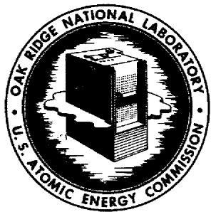
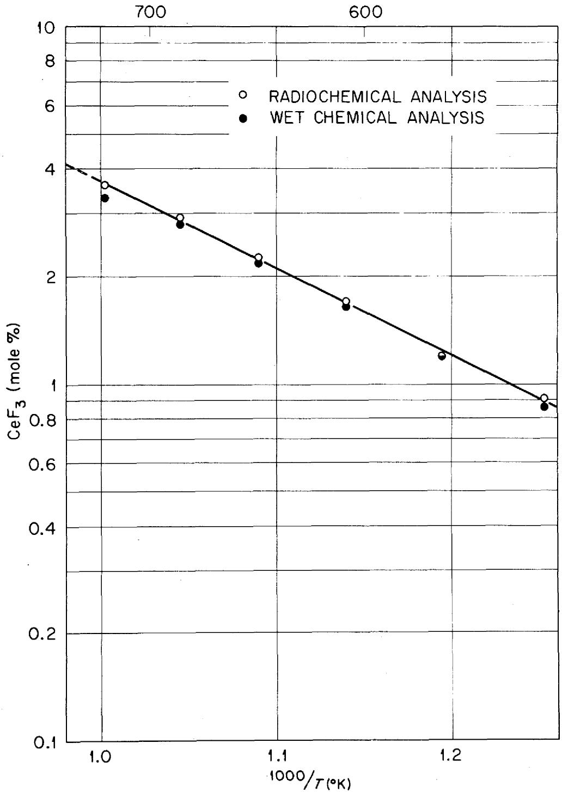
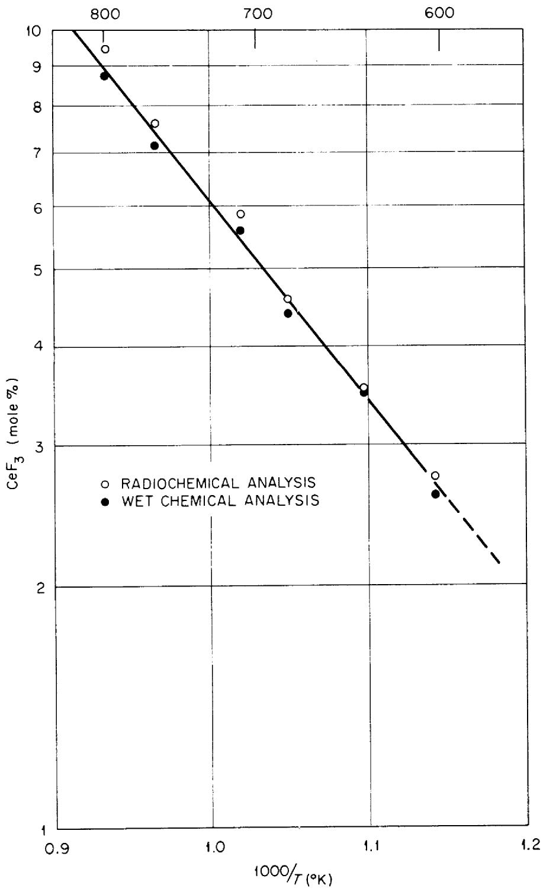
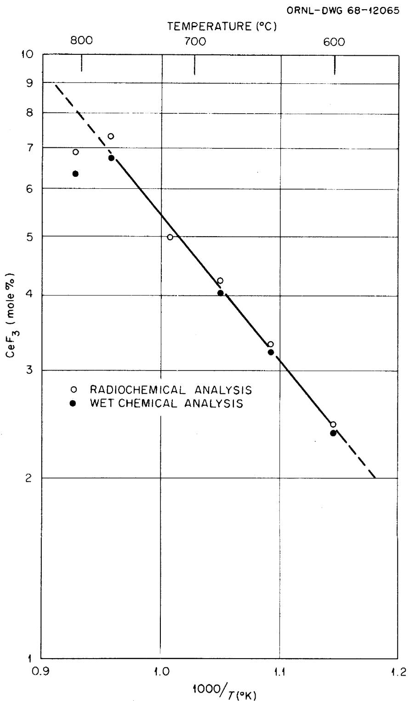
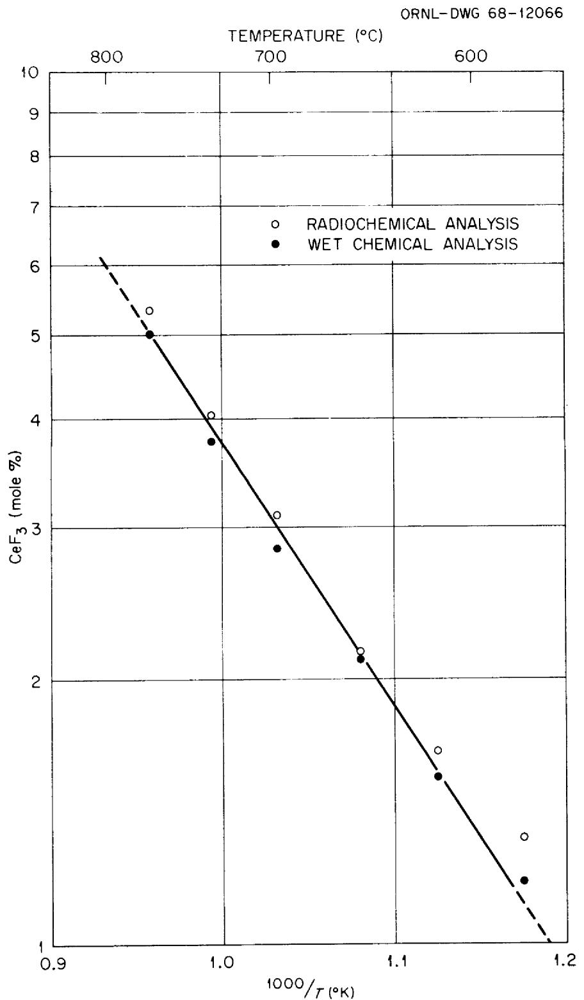
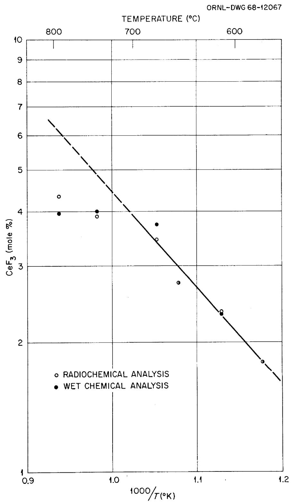
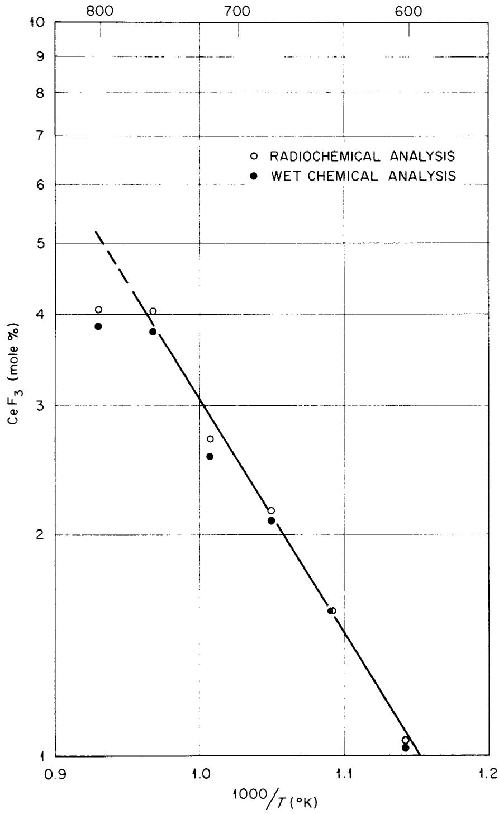
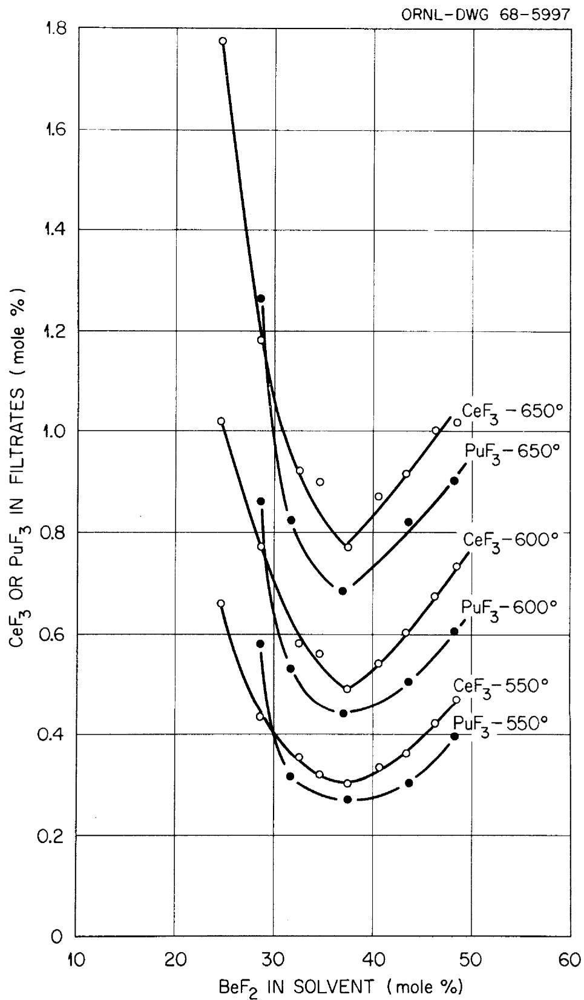
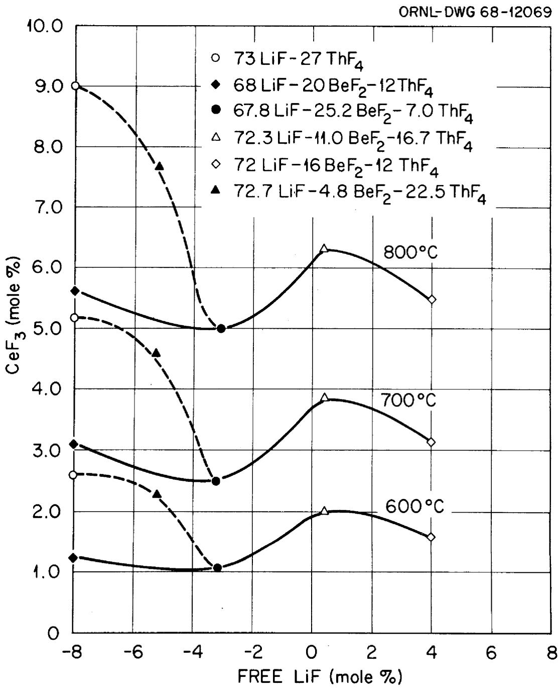
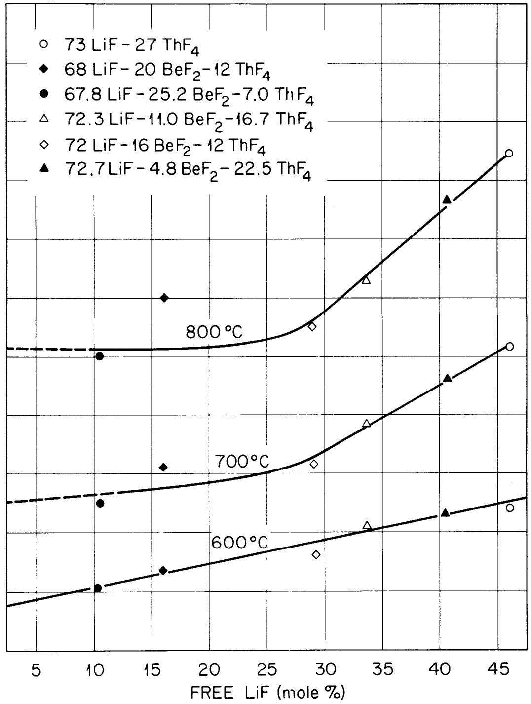

# OAK RIDGE NATIONAL LABORATORY operated by

# UNION CARBIDE CORPORATION

NUCLEAR DIVISION

for the

U.S. ATOMIC ENERGY COMMISSION

ORNL-TM-2335

SOLUBILITY OF CERIUM TRIFLUORIDE IN MOLTEN MIXTURES OF

LiF, BeF $_2$ , AND ThF $_4$

# LEGAL NOTICE

This report was prepared as an account of Government sponsored work. Neither the United States, nor the Commission, nor any person acting on behalf of the Commission:

A. Makes any warranty or representation, expressed or implied, with respect to the accuracy, completeness, or usefulness of the information contained in this report, or that the use of any information, apparatus, method, or process disclosed in this report may not infringe privately owned rights; or   
B. Assumes any liabilities with respect to the use of, or for damages resulting from the use of any information, apparatus, method, or process disclosed in this report.

As used in the above, "person acting on behalf of the Commission" includes any employee or contractor of the Commission, or employee of such contractor, to the extent that such employee or contractor of the Commission, or employee of such contractor prepares, disseminates, or provides access to, any information pursuant to his employment or contract with the Commission, or his employment with such contractor.

Contract No. W-7405-eng-26

REACTOR CHEMISTRY DIVISION

SOLUBILITY OF CERIUM TRIFLUORIDE IN MOLTEN MIXTURES OF LiF, $\mathsf{BeF}_2$ , AND $\mathsf{ThF}_4$

Judy A. Fredricksen*, L. O. Gilpatrick, C. J. Barton

JANUARY 1969

*Summer ORAU Participant from St. Cloud State College, St. Cloud, Minnesota

OAK RIDGE NATIONAL LABORATORY

Oak Ridge, Tennessee

operated by

UNION CARBIDE CORPORATION

for the

U.S. ATOMIC ENERGY COMMISSION

# LEGAL NOTICE

This report was prepared as an account of Government sponsored work. Neither the United States, nor the Commission, nor any person acting on behalf of the Commission:   
A. Makes any warranty or representation, expressed or implied, with respect to the accuracy, completeness, or usefulness of the information contained in this report, or that the use of any information, apparatus, method, or process disclosed in this report may not infringe privately owned rights; or   
B. Assumes any liabilities with respect to the use of, or for damages resulting from the use of any information, apparatus, method, or process disclosed in this report.   
As said in the above, "person acting on behalf of the Commission" includes any employee or contractor of the Commission, or employee of such contractor, to the extent that such employee or contractor of the Commission, or employee of such contractor prepares, disseminates, or provides access to, any information pursuant to his employment or contract with the Commission, or his employment with such contractor.

.

#

.

# CONTENTS

Page

Abstract 1

Introduction 1

Equipment. 2

Materials. 4

Procedure. 5

Results and Discussion 8

References. 21

#

#

Judy A. Fredricksen,\* L. O. Gilpatrick,

C. J. Barton

# ABSTRACT

The solubility of $\mathrm{CeF}_3$ was determined at various temperatures in six mixtures of LiF, $\mathrm{BeF}_2$ , $\mathrm{ThF}_4$ of the type that may be used to fuel a molten salt breeder reactor. Comparison of earlier data on the solubility of $\mathrm{PuF}_3$ and $\mathrm{CeF}_3$ in fluoride solvents makes it possible to predict that the solubility of $\mathrm{PuF}_3$ in single-region fuel compositions at reactor operating temperatures will be more than adequate. The solubility data as a function of solvent composition were best correlated by a model that assumes $\mathrm{BeF}_2$ to be complexed as the $\mathrm{BeF}_4^{2-}$ ion and $\mathrm{ThF}_4$ as the $\mathrm{ThF}_5^{1-}$ ion.

# INTRODUCTION

Studies performed earlier at the Oak Ridge National Laboratory demonstrated the solubility of $\mathrm{PuF}_3$ in certain molten fluoride solvents, $^1$ but no data are available on the solubility of $\mathrm{PuF}_3$ in single-fluid reactor fuel containing a high concentration of $\mathrm{ThF}_4$ . Previous data indicated that the solubility would probably be adequate at proposed reactor

operating temperatures. To verify this belief, the most obvious approach would be direct measurement of $\mathrm{PuF}_3$ solubility in molten fluoride salts of interest, but we have chosen to study the solubility of another trivalent fluoride, $\mathrm{CeF}_3$ , because of its similar behavior and simpler handling. There is evidence indicating that $\mathrm{PuF}_3$ and $\mathrm{CeF}_3$ are quite similar in their solubility behavior in fluoride melts. $^{2,3}$ A thorough study of the effect on the solubility of $\mathrm{CeF}_3$ of varying the concentrations of LiF, $\mathrm{BeF}_2$ and $\mathrm{ThF}_4$ in melts will indicate the probable solubility of $\mathrm{PuF}_3$ in such melts. This investigation may be followed by limited determinations of $\mathrm{PuF}_3$ solubility to confirm predictions based on the $\mathrm{CeF}_3$ investigation. The chemical feasibility of fueling molten salt reactors with $\mathrm{PuF}_3$ has been considered in another report. $^{4}$

This report gives the results obtained to date in an investigation on the solubility of $\mathrm{CeF}_3$ in mixed LiF, $\mathrm{BeF}_2$ and $\mathrm{ThF}_4$ molten fluoride solvents.

# EQUIPMENT

The reaction vessel in which the solubility measurements were made was a welded cylindrical nickel container with an internal diameter of $1\frac{1}{2}$ in., a depth of $6\frac{1}{2}$ in., and a wall thickness of $1/8$ in. A seven-inch section of $\frac{1}{2}$ -in. I.D. nickel pipe was welded to the lid and was closed at the top with a stainless steel ball valve having an internal clearance of $\frac{1}{2}$ in. This cooling and loading stem was also equipped with a $1/4$ -in. gas discharge port welded near its upper end. An

additional opening in the lid accommodated a thermocouple well of 1/4-in. thin wall (10 mil) nickel tubing closed at the lower end, which extended to within 1/8 in. of the bottom. The remaining lid opening held a 1/4-in. nickel dip leg of heavy wall (35 mil) nickel tubing extending to within 1/4 in. of the vessel bottom to facilitate agitation and purification of the melt by admitting gases beneath the melt surface.

The vessel was mounted vertically in a 3-in., 1400-watt electric tube furnace whose temperature was regulated by means of a chromel-alumel thermocouple placed between the furnace wall and the vessel and a high-sensitivity bucking circuit controller.

Melt temperatures were determined by a second chromel-alumel thermocouple located in the thermocouple well surrounded by the melt. An ice bath, a standard cell, and a Leeds and Northrup type K-2 potentiometer were used to measure the E.M.F. in this measuring circuit. Temperatures were deduced from standard tables of temperature versus E.M.F.

Copper filter sticks were constructed from 3/8-in. diameter sintered disk fritts 1/8-in. thick with a nominal pore size of 0.0004 in. These were welded into sections of 3/8-in. O.D. tubing 1/2-in. long. At the opposite end, this tube was reduced in diameter and welded to a 20-in. length of 1/8-in. O.D. tubing. These tubes were slipped through a Teflon gland made to fit a 1/2-in. Swagelok tubing connector and compressed by a standard connector collar. This gland formed a vacuum tight

seal around the 1/8-in. filter tube but it allowed movement of the filter through the gland which was fitted to the top end of the ball valve. Sufficient space was provided between the closed ball of the valve and the gland to accommodate the filter unit for evacuation and flushing with helium prior to admitting it to the clean (oxide free) melt. A piece of soft rubber tubing which fitted over the free end of the filter stick could be connected to either a vacuum pump or a helium source. A manifold system consisting of valves, pressure gages, and flow meters controlled admission of helium, hydrogen, HF or application of vacuum to the apparatus.

Samples containing $^{144}$ Ce tracer were analyzed using a 256-channel or 400-channel analyzer at fixed geometry with a $3 \times 3$ in. NaI, thallium activated crystal. Sample preparation and weighing was done in a hood equipped with a dust containment glove box.

# MATERIALS

Some of the compositions used in these studies were supplied by J. H. Shaffer and F. A. Doss of ORNL. Mixtures of LiF, $\mathrm{BeF}_2$ , and $\mathrm{ThF}_4$ (72-16-12 and 68-20-12 mole %) were used as received as was a mixture of LiF and $\mathrm{ThF}_4$ (73-27 mole %). The (72.7-4.8-22.5) mixture was prepared by adding 53 g of (72-16-12) to 198 g of the 73-27 residue left in the vessel after previous solubility determinations. Likewise a mixture calculated to have the composition (72.3-11.0-16.7) was prepared by adding 195.5 g of (72-16-12) to 225.1 g of (73.1-4.8-22.4) remaining

at the end of a series of measurements. A mixture having the composition (67.8-25.2-7.0) was prepared by mixing 94.7 g of 66 LiF - 34 BeF $_2$ with 102.1 g of the 73-27 preparation.

Ten millicuries of $^{144}\mathrm{Ce}$ in the form of an aqueous HCl solution was secured from the Isotopes Division at ORNL. This was mixed with a solution containing 308 g of CeCl₃ x H₂O.* The resulting solution was heated to 90°C and digested with 214 g of NH₄F·HF** dissolved in 1000 ml of H₂O, which yielded a homogeneous precipitate of CeF₃ containing the radioisotope. This precipitate was washed with distilled water four times and centrifuged before drying at 110°C for 24 hours.

Commercial hydrogen was purified by passage through a Deoxo unit, a magnesium perchlorate drying tube, and a liquid $\mathbf{N}_2$ trap. Anhydrous HF (99.9%), was used from the cylinder as received without purification. Commercial helium was purified by passage through an Ascarite trap, a magnesium perchlorate trap, and a charcoal trap at liquid $\mathbf{N}_2$ temperature.

# PROCEDURE

Helium leak testing was done at room temperature prior to loading the unit until a vacuum of at least 74 microns was secured. A weighed amount of fuel salt, usually about 250 grams, and more than the amount of $\mathrm{CeF}_3$ expected to dissolve at the maximum temperature were added to the vessel through

the open ball valve by means of a long-necked funnel. The apparatus was then connected to the manifold system. A heated sodium fluoride trap was placed at the outlet to prevent HF from escaping into the hood. This was followed by a bubbler to indicate when gas was flowing through the system.

Purification was carried out at about $625^{\circ}\mathrm{C}$ by treating the melt with gaseous HF (20 ml/min), $\mathbf{H}_2$ (100 ml/min), and helium (100 ml/min) for at least three hours. Hydrogen fluoride eliminated any products of hydrolysis resulting from adsorbed water on the surface of the fuel salt by converting them to fluorides. The hydrogen helped to minimize the corrosiveness of the HF by reducing any $\mathrm{NiF}_2$ produced to Ni while the helium served as a carrier gas. Next, the melt was subjected to two hours of hydrogen (100 ml/min) -- helium (100 ml/min) treatment to complete the reduction of any $\mathrm{NiF}_2$ formed.

Hydrogen and helium flow rates were measured by rotameters calibrated with a "Bubble-O-Meter." The hydrogen fluoride flow rate was measured by passing the gas mixture through a measured volume of 0.1 M KOH solution using phenolphthalein as an indicator and a stop watch to determine the time necessary for neutralization.

The mixture in the apparatus was allowed to equilibrate for one hour starting at the highest sampling temperature while agitation was maintained by a slow helium flow of $30\mathrm{ml}$ per minute. Each melt, with an excess of $\mathrm{CeF}_3$ , formed a

saturated solution at the selected temperature which was then sampled to determine the concentration of $\mathrm{CeF}_3$ in the filtered melt. Sampling was performed by assembling the filter stick, after polishing with steel wool to remove the oxide coating, and the gland above the closed ball valve. This area was sealed by tightening the threaded collar around the Teflon gland, and a vacuum was applied followed by flushing with helium to remove air. This flush was repeated before the ball valve was opened and the filter was inserted to within 1/2-in. of the vessel bottom. A small flow of helium was maintained through the filter stick while it was being inserted and submerged. Five or ten minutes was allowed for the filter to reach the melt temperature before the helium flow was stopped and a vacuum was applied to the stem. The salt froze in the 1/8-in. diameter cold stem of the filter stick. Samples were withdrawn slowly to protect the Teflon gland from over heating. After closing the ball valve, the filter stick was removed by disassembling the gland and compression collar. It was then cut open and emptied in the glove box where the melt samples were ground and $50\mathrm{mg}\pm 3\mathrm{mg}$ was weighed from each filter for counting and one gram for wet chemical analysis.

The $50\mathrm{mg}$ portions of ground salt were weighed and placed in plastic vials 1-in. in diameter and 2-in. high. Six samples were drawn at $40^{\mathrm{OC}}$ intervals ending at about $20^{\mathrm{OC}}$ above the melting point of the salt compositions. Seven channels centering around the most energetic $\gamma$ disintegration at

0.124 M.E.V. were integrated during the counting which was done mostly for one minute intervals.

Analyzing the samples radiochemically involved preparing standard samples made for each molten salt mixture consisting of $50\mathrm{mg}$ of solvent $(\pm 5\%)$ plus varying amounts of accurately weighed $\mathrm{CeF}_3$ tracer salt. A blank was also prepared which contained only the solvent which was used to determine the value to be subtracted from the total count to correct for the gamma activity of thorium daughter products. The net counting rate obtained for each standard was plotted on a linear scale against milligrams of labeled cerium fluoride. These calibration data made it possible to determine the number of milligrams of $\mathrm{CeF}_3$ present in each sample from the count rate. From these values we calculated the mole percent of cerium fluoride present in each molten salt mixture at the various temperatures. No adjustment was made for radioactive decay since the half life of $^{144}\mathrm{Ce}$ is 285 days and all counting for a given set of samples, including calibrations, was performed in sequence on a single day.

# RESULTS AND DISCUSSION

The data obtained are plotted in Figs. 1-6, inclusive. Both radiochemical and wet chemical analysis are shown in these plots. In general, the agreement between the two methods of analysis is considered quite satisfactory. In some cases, comparison of the data required rechecking the wet chemical analyses and, in others, re-examination of the radiochemical

ORNL-DWG 68-12064

# TEMPERATURE (°C)

  
Fig. 1. Solubility of $\mathrm{CeF}_3$ in LiF-BeF $_2$ -ThF $_4$ (72-16-12 mole %).

ORNL-DWG 68-12063

  
TEMPERATURE $(^{\circ}C)$   
Fig. 2. Solubility of $\mathrm{CeF}_3$ in LiF-ThF $_4$ (73-27 mole%).

  
Fig. 3. Solubility of $\mathrm{CeF}_3$ in LiF-BeF $_2$ -ThF $_4$ (72.7-4.8-22.5 mole%).

  
Fig. 4. Solubility of $\mathrm{CeF}_3$ in LiF-BeF $_2$ -ThF $_4$ (68-20-12 mole%).

  
Fig. 5. Solubility of $\mathrm{CeF}_3$ in LiF-BeF $_2$ -ThF $_4$ (72.3-11.0-16.7 mole%).

ORNL-DWG 68-12068

TEMPERATURE (°C)

  
Fig. 6. Solubility of $\mathrm{CeF}_3$ in LiF-BeF $_2$ -ThF $_4$ (67.8-25.2-7.0 mole%).

calibration values. It is apparent in Figs. 3, 5, and 6 that insufficient $\mathrm{CeF}_3$ was present in the system to saturate the melts at the highest temperatures. The data are summarized in Table 1 together with heats of solution calculated from the relation

$$
\log \frac {\mathrm {S} _ {2}}{\mathrm {S} _ {1}} = \frac {\Delta \mathrm {H} (\mathrm {T} _ {2} - \mathrm {T} _ {1})}{2 . 3 0 3 \mathrm {R T} _ {1} \mathrm {T} _ {2}}
$$

where $S_2$ is the solubility (in mole %) at the higher temperature and $S_1$ is the corresponding value at the lower temperature. The heats of solution are in approximately the same range as those reported for solutions of $\mathrm{PuF}_3$ in various fluoride solvents (12,000 to 16,800 cal per mole).

The solubility data obtained in this investigation are very reassuring in respect to the potential use of $\mathsf{PuF}_3$ as the fissionable species in single-region fuel compositions. The lowest solubility observed at $600^{\circ}\mathrm{C}$ was 1.05 mole%. A comparison of $\mathsf{PuF}_3$ solubility data with similar values reported for $\mathsf{CeF}_3$ in Fig. 7 indicates that the solubility of $\mathsf{PuF}_3$ at $600^{\circ}\mathrm{C}$ may be less than 1.0 mole% but will almost certainly exceed the few tenths mole% value required to fuel a single region breeder reactor.

Bredig has suggested5 that the "free fluoride" content of liquid mixtures of LiF, $\mathrm{BeF}_2$ , and $\mathrm{ThF}_4$ can be calculated from the following relation in terms of mole %.

$$
\text {F r e e f l u o r i d e} = \operatorname {L i F} - 2 \left(\operatorname {B e F} _ {2}\right) - 3 \left(\operatorname {T h F} _ {4}\right)
$$

This relation is based on the assumption that LiF is complexed

in Mixtures of LiF, $\mathrm{BeF}_2$ , and $\mathrm{ThF}_4$

Table 1. Solubility and Heat of Solution of ${\mathrm{{CeF}}}_{3}$   

<table><tr><td colspan="3">Salt Composition (mole %)</td><td colspan="2">CeF3Solubility (mole %)</td><td>Heat of Solution (cal per mole)</td></tr><tr><td>LiF</td><td>BeF2</td><td>ThF4</td><td>600°C</td><td>800°C</td><td></td></tr><tr><td>72</td><td>16</td><td>12</td><td>1.6</td><td>5.5</td><td>11,500</td></tr><tr><td>73</td><td>0</td><td>27</td><td>2.6</td><td>9.0</td><td>11,560</td></tr><tr><td>72.7</td><td>4.8</td><td>22.5</td><td>2.4</td><td>7.9</td><td>11,100</td></tr><tr><td>68</td><td>20</td><td>12</td><td>1.35</td><td>6.0</td><td>13,890</td></tr><tr><td>72.3</td><td>11.0</td><td>16.7</td><td>2.1</td><td>6.3</td><td>10,230</td></tr><tr><td>67.8</td><td>25.2</td><td>7.0</td><td>1.05</td><td>5.0</td><td>14,530</td></tr></table>

  
Fig. 7. Comparison of $\mathrm{CeF}_3$ and $\mathrm{PuF}_3$ Solubility in LiF-BeF $_2$ Solvents.

as $\mathrm{Li}_2\mathrm{BeF}_4$ and $\mathrm{Li}_3\mathrm{ThF}_7$ in the liquid state. It is interesting to test this concept with the $\mathrm{CeF}_3$ solubility data reported here. The resulting graph (Fig. 8) shows a rather poor correlation based on this relationship. A somewhat better correlation, shown in Fig. 9, results from the assumption that $\mathrm{BeF}_2$ is complexed in the liquid state as $\mathrm{Li}_2\mathrm{BeF}_4$ and $\mathrm{ThF}_4$ as $\mathrm{LiThF}_5$ . The latter assumption has a rather shaky basis since the published phase diagram for the system $\mathrm{LiF}-\mathrm{ThF}_4$ indicates that the 1:1 compound (as it is now known to be7) melts incongruently. The only defense for this assumption is that five of the six compositions tested to date show solubility data that correlate on this basis.

# REFERENCES

1. C. J. Barton, J. Phys. Chem. 64, 306 (1960).   
2. W. T. Ward, R. A. Strehlow, W. R. Grimes, and G. M. Watson, J. Chem. Eng. Data 5, 2 (1960).   
3. C. J. Barton, Memo to P. R. Kasten, June 4, 1968, MSR 68-88.   
4. R. E. Thoma, Chemical Feasibility of Fueling Molten Salt Reactors with $\mathsf{PuF}_3$ , ORNL-TM-2256, June 20, 1968.   
5. M. A. Bredig, Memo to W. R. Grimes, April 26, 1968, MSR 68-75.   
6. R. E. Thoma et al, J. Phys. Chem. 63, 1267 (1959).   
7. G. Brunton, Acta Cryst. 21(5), 814 (1966).

  
Fig. 8. Solubility of $\mathrm{CeF}_3$ As A Function of Free LiF Assuming $\mathrm{Li}_2\mathrm{BeF}_4$ and $\mathrm{Li}_3\mathrm{ThF}_7$ In Liquid.

ORNL-DWG 68-12070

  
Fig. 9. Solubility of $\mathbf{CeF}_3$ As A Function of Free LiF Assuming $\mathrm{Li}_2\mathrm{BeF}_4$ and $\mathrm{LiThF}_5$ in Liquid.

# REFERENCES

1. C. J. Barton, J. Phys. Chem. 64, 306 (1960).   
2. W. T. Ward, R. A. Strehlow, W. R. Grimes, and G. W. Watson, J. Chem. Eng. Data 5, 2 (1960).   
3. C. J. Barton, Memo to P. R. Kasten, June 4, 1968, MSR 68-88.   
4. R. E. Thoma, Chemical Feasibility of Fueling Molten Salt Reactors with $\mathsf{PuF}_3$ , ORNL-TM-2256, June 20, 1968.   
5. M. A. Bredig, Memo to W. R. Grimes, April 26, 1968, MSR 68-75.   
6. R. E. Thoma et al, J. Phys. Chem. 63, 1267 (1959).   
7. G. D. Brunton, Acta Cryst. 21(5), 814 (1966).

#

# INTERNAL DISTRIBUTION

1. R. K. Adams

2. G. M. Adamson

3. R.G.Affel

4. L. G. Alexander

5. J. L. Anderson

6. R.F.Apple

7. C. F. Baes

8. J.M.Baker

9. S. J. Ball

10. C. E. Bamberger

11-21. C.J.Barton

22. H. F. Bauman

23. S. E. Beall

24. R. L. Beatty

25. M. J. Bell

26. M. Bender

27. C. E. Bettis

28. E. S. Bettis

29. D. S. Billington

30. R.E.Blanco

31. F. F. Blankenship

32. J. O. Blomeke

33. R. Blumberg

34. E. G. Bohlfann

35. C. J. Borkowski

36. G. E. Boyd

37. C. A. Brandon

38. M. A. Bredig

39. R. B. Briggs

40. H. R. Bronstein

41. G. D. Brunton

42. D. A. Canonico

43. S. Cantor

44. W. L. Carter

45. G. I. Cathers

46. O. B. Cavin

47. A. Cepolino

48. W. R. Cobb

49. C. W. Collins

50. E. L. Compere

51. K. V. Cook

52. W. H. Cook

53. L. T. Corbin

54. B. Cox

55. J. L. Crowley

56. F. L. Culler

57. D. R. Cuneo

58. J.M.Dale

59. D. G. Davis

60. R.J. DeBakker

61. J. H. Devan

62. S.J.Ditto

63. A. S. Dworkin

64. I. T. Dudley

65. D. A. Dyslin

66. W. P. Eatherly

67. J. R. Engel

68. E. P. Epler

69. D. E. Ferguson

70. L. M. Ferris

71. A. P. Fraas

72-81. Judy Fredricksen

82. H. A. Friedman

83. J.H.Frye, Jr.

84. C. H. Gabbard

85. R.B.Gallaher

86. R.E.Gelbach

87. J. H. Gibbons

88. L. O. Gilpatrick

89. H. E. Goeller

90. W. R. Grimes

91. A. G. Grindell

92. R.W.Gunkel

93. E. D. Gupton

94. R. H. Guymon

95. J. P. Hammond

96. B. A. Hannaford

97. P. H. Harley

98. D. G. Harman

99. W. O. Harms

100. C. S. Harrill

101. P. N. Haubenreich

102. R.E.Helms

103. P. G. Herndon

104. D. N. Hess

105. J. R. Hightower

106. M.R.Hill

107. H.W.Hoffman

108. D. K. Holmes

109. P.P.Holz

110. R.W.Horton

111. T. L. Hudson

112. H. Inouye

113. W. H. Jordan

114. P. R. Kasten

115. R. J. Kedl

116. O. L. Keller

117. M. T. Kelley

118. M. J. Kelly

119. C. R. Kennedy

120. T. W. Kerlin

121. H. T. Kerr

122. S. S. Kirslis

123. J. W. Koger

124. A. I. Krakoviak

125. T. S. Kress

126. J. W. Krewson

127. C. E. Lamb

128. J. A. Lane

129. J. J. Lawrence

130. M. S. Lin

131. R. B. Lindauer

132. A. P. Litman

133. G. H. Llewellyn

134. E. L. Long

135. M. I. Lundin

136. R. N. Lyon

137. R. L. Macklin

138. H. G. MacPherson

139. R. E. MacPherson

140. J. C. Mailen

141. D. L. Manning

142. C. D. Martin

143. T. H. Mauney

144. H. McClain

145. R. W. McClung

146. H. E. McCoy

147. H. F. McDuffie

148. C. K. McGlothlan

149. C. J. McHargue

150. L. E. McNeese

151. J. R. McWherter

152. H. J. Metz

153. A. S. Meyer

154. R. L. Moore

155. D. M. Moulton

156. T. R. Mueller

157. H. A. Nelms

158. J. P. Nichols

159. E. L. Nicholson

160. E. D. Nogueira

161. L. C. Oakes

162. P. Patriarca

163. A. M. Perry

164. T. W. Pickel

165. H. B. Piper

166. B. E. Prince

167. G. L. Ragan

168. J. L. Redford

169. M. Richardson

170. G. D. Robbins

171. R. C. Robertson

172. W. C. Robinson

173. H. C. Roller

174. K. A. Romberger

175. M. W. Rosenthal

176. R. G. Ross

177. H. C. Savage

178. W. F. Schaffer

179. C. E. Schilling

180. Dunlap Scott

181. J. L. Scott

182. H. E. Seagren

183. C. E. Sessions

184. J. H. Shaffer

185. W. H. Sides

186. M. J. Skinner

187. G. M. Slaughter

188. A. N. Smith

189. F. J. Smith

190. G. P. Smith

191. O. L. Smith

192. P. G. Smith

193. I. Spiewak

194. R. C. Steffy

195. W. C. Stoddard

196. H. H. Stone

197. R. A. Strehlow

198. J. R. Tallackson

199. E. H. Taylor

200. W. Terry

201. R. E. Thoma

202. P. F. Thomason

203. L. M. Toth

204. D. B. Trauger

205. J. S. Watson

206. H. L. Watts

207. C. F. Weaver

208. B. H. Webster

209. A. M. Weinberg

210. J. R. Weir

211. W. J. Werner

212. K. W. West

213. M. E. Whatley

214. J. C. White

215. L. V. Wilson

216. Gale Young

217. H. C. Young

218. J. P. Young

219. E. L. Youngblood

220. F. C. Zapp

221-222. Central Research Library

223-224. Document Reference Section

225-239. Laboratory Records (LRD)

240. Laboratory Records - Record Copy (LRD-RC)

# EXTERNAL DISTRIBUTION

241-242. D. F. Cope, AEC-ORNL R.D.T. Site Office

243. J. W. Crawford, AEC-RDT, Washington

244. C. B. Deering, AEC-ORO

245. A. Giambusso; AEC-Washington

246. W. J. Larkin, AEC-ORO

247. C. L. Matthews, AEC-ORO

248-249. T. W. McIntosh, AEC, Washington

250. C. E. Miller, Jr., AEC, Washington

251. B. T. Resnich, AEC, Washington

252. H. M. Roth, Laboratory and University Division

253. Milton Shaw, AEC, Washington

254. W. L. Smalley, AEC-ORO

255. R. F. Sweek, AEC, Washington

256-270. Division of Technical Information Extension (DTIE)