ORNL-TM-2359

Contract No. W-7405-eng-26

METALS AND CERAMICS DIVISION

AN EVALUATION OF THE MOLTEN-SALT REACTOR EXPERIMENT HASTELLOY N SURVEILLANCE SPECIMENS - SECOND GROUP

H. E. McCoy, Jr.

# LEGAL NOTICE

This report was prepared as an account of Government sponsored work. Neither the United States, nor the Commission, nor any person acting on behalf of the Commission:   
A. Makes any warranty or representation, expressed or implied, with respect to the accuracy, completeness, or usefulness of the information contained in this report, or that the use of any information, apparatus, method, or process disclosed in this report may not infringe privately owned rights; or   
3. Assumes any liabilities with respect to the use of, or for damages resulting from the use of any information, apparatus, method, or process disclosed in this report.   
As used in the above, "person acting on behalf of the Commission" includes any employee or contractor of the Commission, or employee of such contractor, to the extent that such employee or contractor of the Commission, or employee of such contractor prepares, disseminates, or provides access to, any information pursuant to his employment or contract with the Commission, or his employment with such contractor.

FEBRUARY 1969

OAK RIDGE NATIONAL LABORATORY

Oak Ridge, Tennessee

operated by

UNION CARBIDE CORPORATION

for the

U.S. ATOMIC ENERGY COMMISSION

# CONTENTS

Abstract 1

Introduction 1

Experimental Details 3

Surveillance Assembly 3

Materials 4

Test Specimens 8

Irradiation Conditions 9

Testing Techniques 9

Experimental Results 11

Visual and Metallographic Examination 11

Mechanical Property Data - Standard Hastelloy N 18

Mechanical Property Data - Modified Hastelloy N 29

Metallographic Examination of Mechanical Property Specimens 43

Discussion of Results 62

Summary and Conclusions 64

Acknowledgments 65

#

H. E. McCoy, Jr.

# ABSTRACT

We have examined the second group of Hastelloy N surveillance samples removed from the Molten-Salt Reactor Experiment. Two rods of standard Hastelloy N were removed from the surveillance position outside the core vessel and were exposed to the nitrogen plus 2 to $5\%$ $\mathsf{O}_2$ cell environment for 11,000 hr. Metallographic examination showed that the alloy was compatible with this environment, showing only superficial oxidation and no evidence of nitriding. These samples were exposed to a thermal fluence of $1.3\times 10^{19}$ neutrons/cm², and the mechanical properties were altered appreciably. Both tensile and creep tests were run that showed significant changes in the mechanical properties, particularly the strain at fracture. These changes are in good agreement with those observed for materials irradiated in a helium environment in the Oak Ridge Research Reactor.

Two rods of modified Hastelloy N containing small additions of titanium and zirconium were removed from the core surveillance facility with a thermal fluence of $4.1 \times 10^{20}$ neutrons/cm². These materials had not been annealed properly to put them in their most radiation-resistant condition, but tests on these materials indicated that they have slightly improved postirradiation mechanical properties and that their corrosion resistance is acceptable.

# INTRODUCTION

The Molten-Salt Reactor Experiment is a single-region reactor that is fueled by a molten fluoride salt (65 LiF-29.1 BeF $_2$ -5 ZrF $_4$ -0.9 UF $_4$ , mole %), moderated by unclad graphite, and contained by Hastelloy N (Ni-16 Mo-7 Cr-4 Fe-0.05 C, wt %). The details of the reactor design

and construction can be found elsewhere. $^{1}$ We knew that the neutron environment would produce some changes in the two structural materials - graphite and Hastelloy N, and we were very confident of the compatibility of these materials with the fluoride salt. However, we needed to keep abreast of the possible development of problems within the reactor itself. For these reasons, we developed a surveillance program that would allow us to follow any changes in properties of graphite and Hastelloy N specimens as the reactor operated.

The reactor went critical on June 1, 1965, and assumed normal operation in May 1966. The first group of surveillance specimens was in the reactor from September 8, 1965, to July 28, 1966, and was removed after 8682 Mwhr of operation (designated "first group"). The results of our tests on the Hastelloy N specimens were reported previously. A second set of specimens was removed from the core on May 9, 1967, after an additional 27,600 Mwhr of operation (total reactor operation was 36,247 Mwhr). These specimens were two modified alloys containing nominal $0.5\%$ additions of titanium and zirconium. These were inserted on September 13, 1966, after the first group was removed to determine the mechanical property changes of these alloys due to irradiation and to evaluate the compatibility of these alloys with the MSRE environment. Two rods of standard Hastelloy N located outside the core and 5 in. from the vessel were removed on June 5, 1967. These specimens had been in place since the reactor began operation and were examined to determine the compatibility of the material with the MSRE cell environment $(\mathsf{N}_2 + 2 - 5\% \mathsf{O}_2)$ and the changes in the mechanical properties due to irradiation.

This report will describe the results of tests on the Hastelloy N surveillance specimens removed during May and June 1967 (designated "second group"), which includes two rods of modified (zirconium and titanium) alloys removed from the core and two rods of standard Hastelloy N removed from outside the core vessel.

# EXPERIMENTAL DETAILS

# Surveillance Assembly

The core surveillance assembly was designed by W. H. Cook and others, and the details have been reported.3 The facility is shown pictorially and schematically in Fig. 1. The specimens are arranged in three stringers. Each stringer is about 62 in. long and consists of two Hastelloy N rods and a graphite section made up of various pieces that are joined by pinning and tongue-and-groove joints. The Hastelloy N rod is periodically reduced to 0.125 in. in diameter and can be cut into small tensile specimens after it is removed from the reactor. Three stringers are joined together so that they can be separated in a hot cell and reassembled with one or more new stringers for reinsertion into the reactor. The assembled stringers fit into a perforated Hastelloy N basket that is inserted into an axial position about 2.8 in. from the core center line.

When the basket was removed on July 28, 1966, some of the specimens were bent, and the entire assembly had to be replaced.4 Slight modifications in the design were made, and the assembly was removed recently and found to be in excellent condition.5

A control facility is associated with the surveillance program. It utilizes a "fuel salt" containing depleted uranium in a static pot that is heated electrically. The temperature is controlled by the MSRE computer so that the temperature matches that of the reactor. Thus, these specimens are exposed to conditions the same as those in the reactor except for the static salt and the absence of a neutron flux.

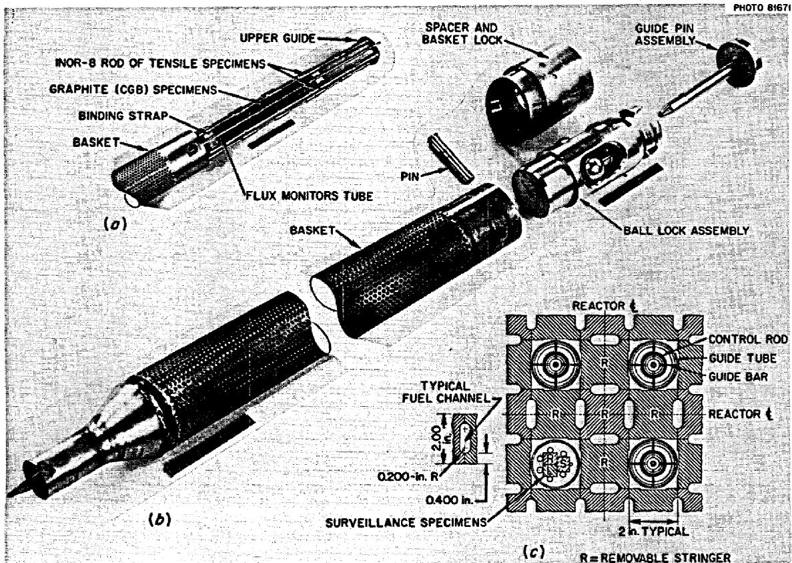  
Fig. 1. Molten-Salt Reactor Experiment Core Surveillance Fixture.

There is another surveillance facility for Hastelloy N located outside the core in a vertical position about 5 in. from the vessel (Fig. 2). These specimens are exposed to the cell environment $(\mathsf{N}_2 + 2 - 5\% \mathsf{O}_2)$ .

# Materials

The compositions of the two heats of standard Hastelloy N are given in Table 1. These heats were air melted by Materials Systems Division of Union Carbide Corporation. Heat 5085 was used for making the cylindrical portion, and heat 5065 was used for the top and bottom heads of the MSRE vessel. These materials were given a mill anneal of 1 hr at $1177^{\circ}\mathrm{C}$ and a final anneal of 2 hr at $900^{\circ}\mathrm{C}$ at ORNL after fabrication.

The chemical compositions of the two modified alloys are given in Table 1. The modifications in composition were made principally to improve the alloy's resistance to radiation damage and to bring about

ORNL-DWG 68-8298

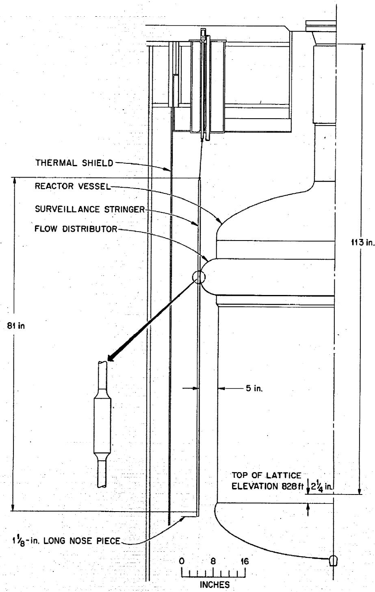  
Fig. 2. Molten-Salt Reactor Experiment Surveillance Facility Outside the Reactor Vessel.

Table 1. Chemical Composition of Surveillance Heats   

<table><tr><td rowspan="2">Element</td><td colspan="4">Analysis, wt %</td></tr><tr><td>Heat 5065</td><td>Heat 5085</td><td>Heat 21545</td><td>Heat 21554</td></tr><tr><td>Cr</td><td>7.2</td><td>7.3</td><td>7.18</td><td>7.39</td></tr><tr><td>Fe</td><td>3.9</td><td>3.5</td><td>0.034</td><td>0.097</td></tr><tr><td>Mo</td><td>16.5</td><td>16.7</td><td>12.0</td><td>12.4</td></tr><tr><td>C</td><td>0.065</td><td>0.052</td><td>0.05</td><td>0.065</td></tr><tr><td>Si</td><td>0.60</td><td>0.58</td><td>0.015</td><td>0.010</td></tr><tr><td>Co</td><td>0.08</td><td>0.15</td><td></td><td></td></tr><tr><td>W</td><td>0.04</td><td>0.07</td><td></td><td></td></tr><tr><td>Mn</td><td>0.55</td><td>0.67</td><td>0.29</td><td>0.16</td></tr><tr><td>V</td><td>0.22</td><td>0.20</td><td></td><td></td></tr><tr><td>P</td><td>0.004</td><td>0.0043</td><td>0.001</td><td>0.004</td></tr><tr><td>S</td><td>0.007</td><td>0.004</td><td>&lt; 0.002</td><td>&lt; 0.002</td></tr><tr><td>Al</td><td>0.01</td><td>0.02</td><td>0.02</td><td>0.03</td></tr><tr><td>Ti</td><td>0.01</td><td>&lt; 0.01</td><td>0.49</td><td>0.003</td></tr><tr><td>Cu</td><td>0.01</td><td>0.01</td><td></td><td></td></tr><tr><td>O</td><td>0.0016</td><td>0.0093</td><td>0.0002</td><td>&lt; 0.0001</td></tr><tr><td>N</td><td>0.011</td><td>0.013</td><td>&lt; 0.0001</td><td>0.0005</td></tr><tr><td>Zr</td><td></td><td></td><td></td><td>0.35</td></tr><tr><td></td><td colspan="4">Analysis, ppm</td></tr><tr><td>B</td><td>24, 37, 20, 10</td><td>38</td><td>2</td><td>2</td></tr></table>

general improvements in the fabricability, weldability, and ductility. These alloys were small 100-lb heats made by vacuum melting by Special Metals Corporation. They were finished to 1/2-in. plate containing $40\%$ cold work. We used slightly different procedures for obtaining the 1/4-in.-diam $\times$ 62-in.-long rods required for the surveillance assembly as indicated by their fabrication history:

# Heats 5065 and 5085

1. Materials available as 1 l/8- and 9/16-in. plate, respectively. Mill annealed 1 hr at $1177^{\circ}\mathrm{C}$ .   
2. Segments of 1/4-in.-diam rod machined.   
3. Reduced sections turned in rods.   
4. Segments welded together to make 62-in.-long rods.   
5. Annealed 2 hr at $900^{\circ}\mathrm{C}$ .

# Heat 21545

1. Material available as plates 1/2 in. thick × 3 in. wide × 12 in. long. Fabricated with 40% residual cold work.   
2. Strips $1/2 \times 1/2 \times 12$ in. cut from plate.   
3. Strips machined to 1/4-in.-diam rods.   
4. Rods were annealed 100 hr at $871^{\circ}C$   
5. Rods welded together.   
6. Specimens machined.

# Heat 21554

1. Material available as plates 1/2 in. thick × 3 in. wide × 12 in. long. Fabricated with 40% residual cold work.   
2. Plate worked at $871^{\circ}C$ to 0.3 in. thickness.   
3. Strips $0.3 \times 0.3 \times 20$ in. cut.   
4. Strips machined to 1/4 in.-diam rods.   
5. Rods were annealed 100 hr at $871^{\circ}C$   
6. Rods were straightened.   
7. Rods reannealed 100 hr at $871^{\circ}C$   
8. Rods welded together.   
9. Specimens machined.

Both procedures resulted in a very fine grain size (ASTM grain size 7 to 9).

# Test Specimens

The surveillance rods inside the core are 62 in. long and those outside the vessel are 81 in. long. They both are $\frac{1}{4}$ in. in diameter with reduced sections $\frac{1}{8}$ in. in diameter by $\frac{1}{8}$ in. long. After removal from the reactor, the rods are sawed into small mechanical property specimens having a gage section $\frac{1}{8}$ in. in diameter by $\frac{1}{8}$ in. long.

The first rods were machined in small segments (approx 11 l/2 in. long) and welded together. An improvement in this technique has been made that allows the entire rod to be machined as a unit (see Fig. 3).

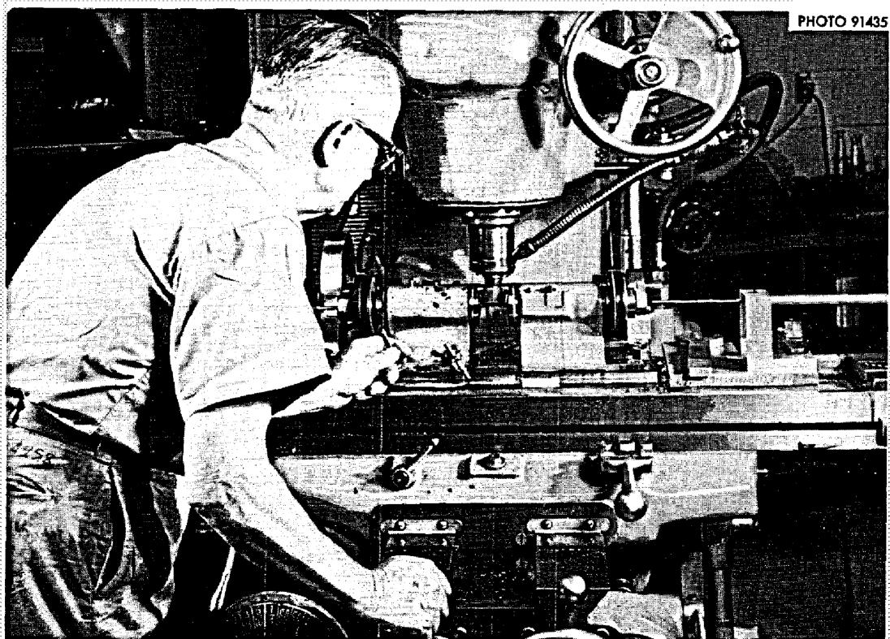  
Fig. 3. Fabrication of Hastelloy N Surveillance Rods.

A milling machine is used with a cutter ground to the shape of the gage length, including the radius where the gage length blends into the full $1/4$ in. diameter of the rod. The rod is held in position and rotated while being fed into the milling cutter. The rod then requires only a light hand polishing of the gage sections to obtain the desired surface finish. This procedure is quicker, cheaper, and requires less handling of the relatively fragile rods than the previous method of making the rods from segments.

# Irradiation Conditions

The irradiation conditions in the core were described in detail previously. These measurements were repeated for the second group of core specimens and found to be in excellent agreement. The specimens outside the core are exposed to the cell environment of $\mathbf{N}_2 + 2 - 5\% \mathbf{O}_2$ . The pertinent temperature and flux data are summarized in Table 2.

# Testing Techniques

The laboratory creep-rupture tests were run in conventional creep machines of the dead-load and lever-arm types. The strain was measured by a dial indicator that showed the total movement of the specimen and part of the load train. The zero strain measurement was taken immediately after the load was applied. The temperature accuracy was $\pm 0.75\%$ , the guaranteed accuracy of the Chromel-P-Alumel thermocouples used.

The postirradiation creep-rupture tests were run in lever-arm machines that were located in hot cells. The strain was measured by an extensometer with rods attached to the upper and lower specimen grips. The relative movement of these two rods was measured by a linear differential transformer, and the transformer signal was recorded. The accuracy of the strain measurements is difficult to determine. The

Table 2. Surveillance Program of the MSRE   

<table><tr><td rowspan="2"></td><td colspan="2">Group 1a</td><td colspan="2">Group 2</td></tr><tr><td>Core Standard Hastelloy N</td><td>Core Modified Hastelloy N</td><td colspan="2">Vessel Standard Hastelloy N</td></tr><tr><td>Date inserted</td><td>9/8/65</td><td>9/13/66</td><td colspan="2">8/24/65</td></tr><tr><td>Date removed</td><td>7/28/66</td><td>5/9/67</td><td colspan="2">6/5/67</td></tr><tr><td>Mwhr on MSRE at time of insertion</td><td>0.0066</td><td>8682</td><td colspan="2">0</td></tr><tr><td>Mwhr on MSRE at time of removal</td><td>8682</td><td>36,247</td><td colspan="2">36,247</td></tr><tr><td>Temperature, °C</td><td>650 ± 10</td><td>650 ± 10</td><td colspan="2">650 ± 10</td></tr><tr><td>Time at temperature, hr</td><td>4800</td><td>5500</td><td colspan="2">11,000</td></tr><tr><td>Peak fluence, neutrons/cm2</td><td></td><td></td><td></td><td></td></tr><tr><td>Thermal (&lt;0.876 ev)</td><td>1.3 × 1020</td><td>4.1 × 1020</td><td colspan="2">1.3 × 1019</td></tr><tr><td>Epithermal (&gt;0.876 ev)</td><td>3.8 × 1020</td><td>1.2 × 1021</td><td colspan="2">2.5 × 1019</td></tr><tr><td>(&gt;50 kev)</td><td>1.2 × 1020</td><td>3.7 × 1020</td><td colspan="2">2.1 × 1019</td></tr><tr><td>(&gt;1.22 Mev)</td><td>3.1 × 1019</td><td>1.0 × 1020</td><td colspan="2">5.5 × 1018</td></tr><tr><td>(&gt;2.02 Mev)</td><td>1.6 × 1019</td><td>0.5 × 1020</td><td colspan="2">3.0 × 1018</td></tr><tr><td>Peak flux, neutrons cm-2sec-1mw-1</td><td></td><td></td><td></td><td></td></tr><tr><td>Thermal (&lt;0.876 ev)</td><td>4.1 × 1012(b,c)</td><td>4.1 × 1012(b,c)</td><td colspan="2">1.0 × 1011(b)</td></tr><tr><td>Epithermal (&gt;0.876 ev)</td><td>1.2 × 1013(c)</td><td>1.2 × 1013(c)</td><td colspan="2">1.9 × 1011(b,c)</td></tr><tr><td>(&gt;50 kev)</td><td>3.7 × 1012(c)</td><td>3.7 × 1012(c)</td><td colspan="2">1.6 × 1011(c)</td></tr><tr><td>(&gt;1.22 Mev)</td><td>1.0 × 1012(b,c)</td><td>1.0 × 1012(b,c)</td><td colspan="2">4.2 × 1010(b)</td></tr><tr><td>(&gt;2.02 Mev)</td><td>0.5 × 1012(b,c)</td><td>0.5 × 1012(b,c)</td><td colspan="2">2.3 × 1010(b)</td></tr></table>

aRevised for full power operation at 8 Mw.   
bExperimentally determined.   
$\mathbf{c}_{\mathrm{calculated}}$

extensometer (mechanical and electrical portions) produced measurements that could be read to about $\pm 0.02\%$ strain; however, other factors (temperature changes in the cell, mechanical vibrations, etc.) probably combined to give an overall accuracy of $\pm 0.1\%$ strain. This is considerably better than the specimen-to-specimen reproducibility that one would expect for relatively brittle materials. The temperature measuring and control system was the same as that used in the laboratory with only one exception. In the laboratory, the control system was stabilized at the desired temperature by use of a recorder with an expanded scale. In the tests in the hot cells, the control point was established by setting the controller without the aid of the expanded-scale recorder. This error and the thermocouple accuracy combine to give a temperature uncertainty of about $\pm 1\%$ .

The tensile tests were run on Instron Universal Testing Machines. The strain measurements were taken from the crosshead travel.

The test environment was air in all cases. Metallographic examination showed that the depth of oxidation was small, and we feel that the environment did not appreciably influence the test results.

# EXPERIMENTAL RESULTS

# Visual and Metallographic Examination

W. H. Cook was in charge of the disassembly of the surveillance fixture. Although some difficulties were encountered previously,[8] the design modifications were successful and the assembly was in excellent mechanical condition when removed. The graphite and Hastelloy N surfaces were very clean with markings such as numbers and tool marks very clear. The Hastelloy N was discolored very slightly. Representative photographs are shown in Fig. 4.

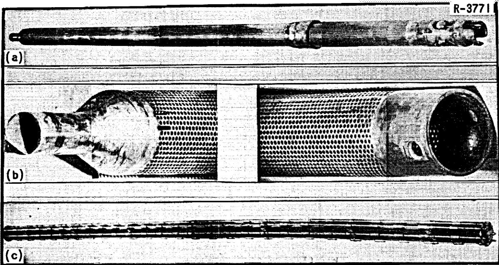

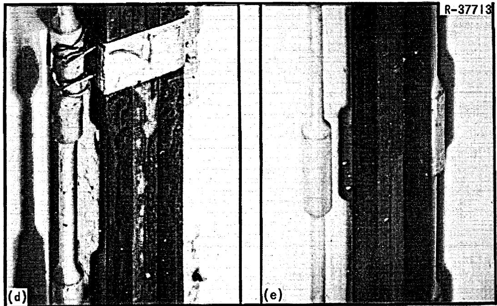  
Fig. 4. Core Surveillance Specimens Removed on May 9, 1967. (a) Outside of protective Hastelloy N basket. (b) Close-ups of the top and bottom of the basket. (c) Surveillance stringer after removal from the basket (curvature due to optical system in the hot cell). (d and e) Close-ups of the surveillance specimens showing the high reflectivity of the metal and graphite specimens. A few beads of salt remain on the graphite.

Small pieces of the modified alloys removed from the core were examined metallographically. Photomicrographs of heat 21554 (zirconium modified) are shown in Fig. 5. The bulk material is characterized by a very fine grain size and small inhomogeneous areas that were found to be essentially pure molybdenum (probably a result of poor melting practice). The as-polished sample shows some very slight microstructural changes near the surface to a depth of 1 to 2 mils. Similar micrographs are shown in Fig. 6 for heat 21545 (titanium modified). The grain size of this material is slightly smaller, but the other features are quite similar to those observed for heat 21554.

A small piece of the basket that contained the surveillance assembly was examined metallographically. The basket was made from perforated Hastelloy N sheet. The entire surface exposed to the salt is characterized by the photomicrographs shown in Fig. 7. Small grains appeared to be almost dislodged from the surface [Fig. 7(a)]. After etching, a fine precipitate was revealed near the surface to a depth of 1 to 2 mils. We examined the material used in fabricating the basket; the microstructure is shown in Fig. 8. There is some precipitate near the surface, but not in the quantities observed in Fig. 7. We aged a piece of the material for 1000 hr at $650^{\circ}\mathrm{C}$ (basket in MSRE was exposed 5500 hr) and found that the quantity of precipitate increased (Fig. 9). However, we were not able to dislodge any grains near the surface even after a very sharp cold bend.

A sample from the basket was sent to N. R. Stalica, Argonne National Laboratory, for microprobe studies. This investigator found that the precipitates contained silicon and oxygen in large concentrations and suggested that they were $\mathrm{SiO}_2$ . Our studies on the unirradiated specimens showed that the precipitates are metal-silicon compounds. We are continuing to investigate this point, but presently feel that the precipitates are probably related to surface contamination of the basket during fabrication. The silicon-rich contaminant should be dissolved during the post-fabrication anneal (approx $1177^{\circ}\mathrm{C}$ ) given the basket and subsequently precipitate while in service at $650^{\circ}\mathrm{C}$ .

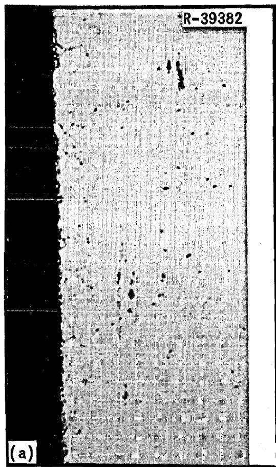

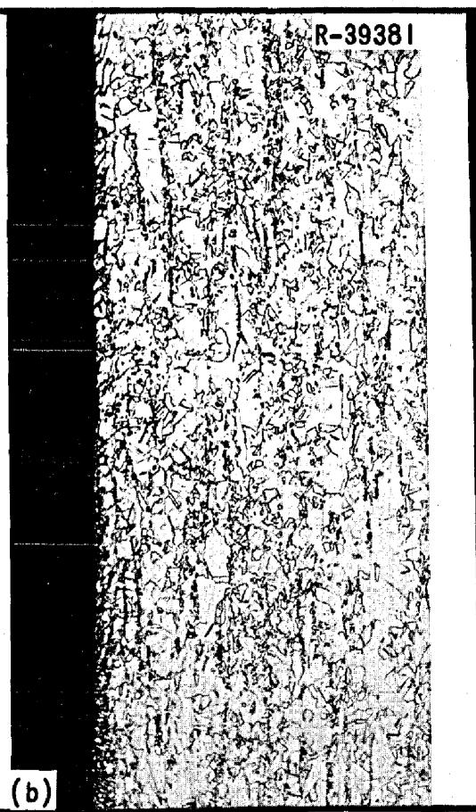

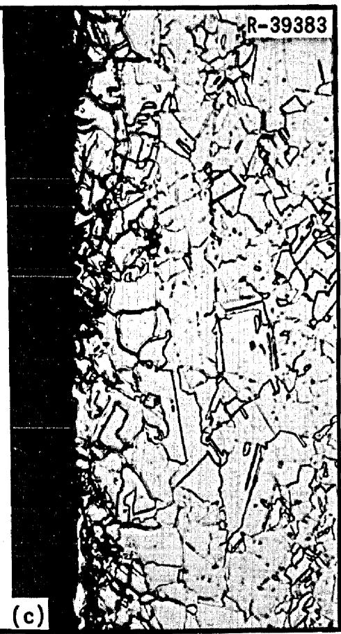  
Fig. 5. Photomicrographs of Zirconium-Modified Hastelloy N (Heat 21554) Removed from the MSRE after 5500 hr at $650^{\circ}\mathrm{C}$ . Edge exposed to flowing salt. (a) As polished. $500\times$ . (b) Etchant: Aqua regia. $100\times$ . (c) Etchant: Aqua regia. $500\times$ .

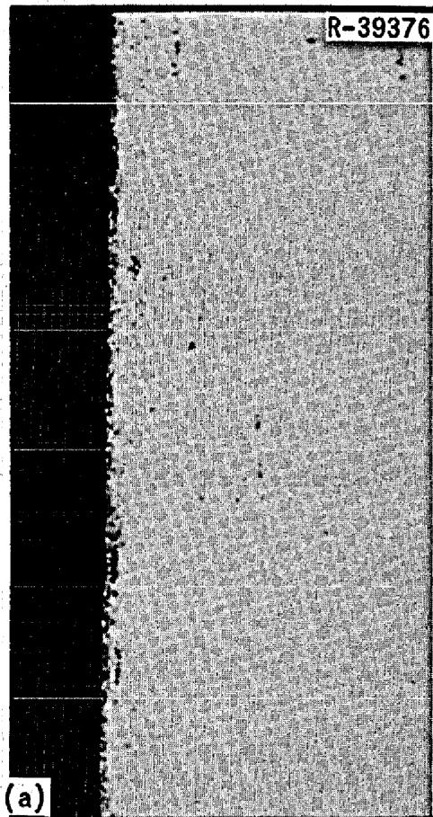

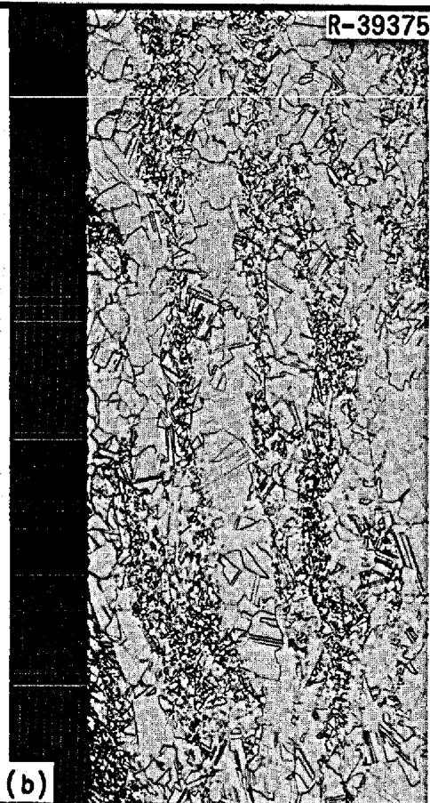

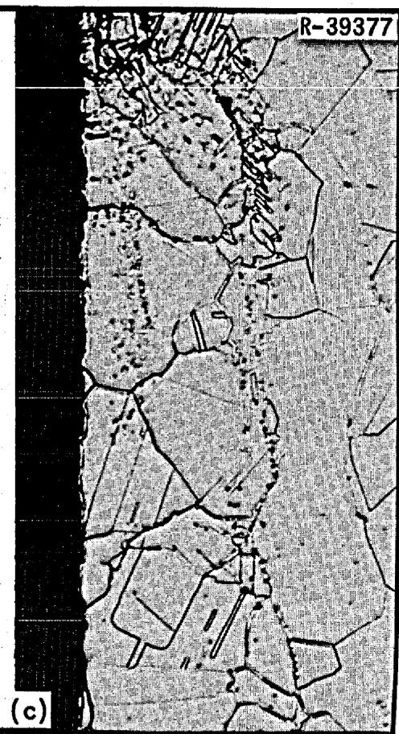  
Fig. 6. Photomicrographs of Titanium-Modified Hastelloy N (Heat 21545) Removed from the MSRE after 5500 hr at $650^{\circ}\mathrm{C}$ . Edge exposed to flowing salt. (a) As polished. $500\times$ . (b) Etchant: Aqua regia. $100\times$ . (c) Etchant: Aqua regia. $500\times$ .

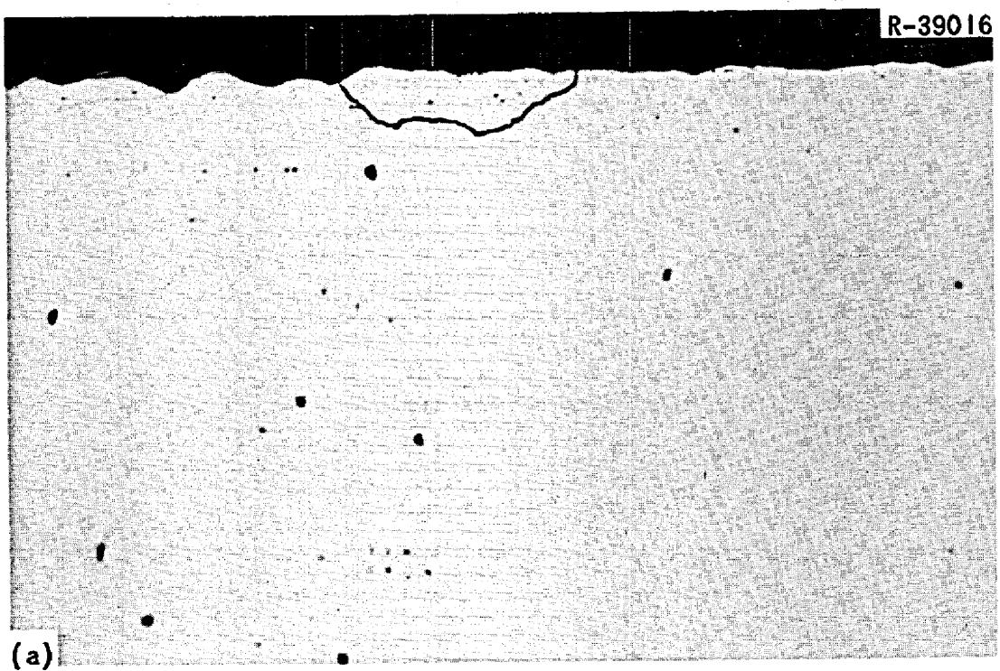

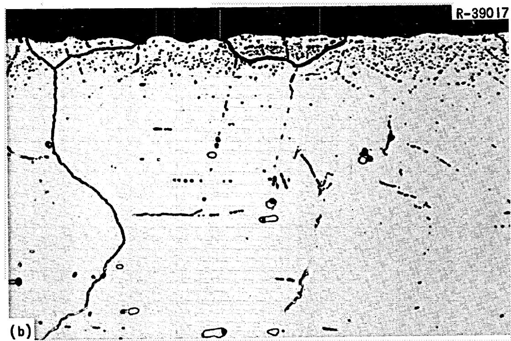  
Fig. 7. Photomicrographs of the Edge of the Surveillance Basket Removed from the MSRE after 5500 hr at $650^{\circ}\mathrm{C}$ . $500 \times$ (a) As polished. Note the grain near the surface that seems almost dislodged. (b) Etchant: Aqua regia. Same area as shown in (a). Note the fine precipitate near the surface.

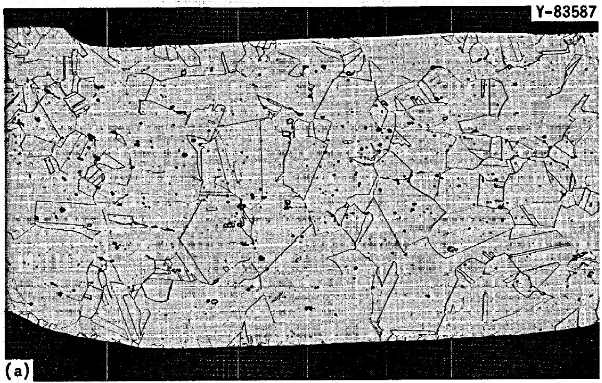

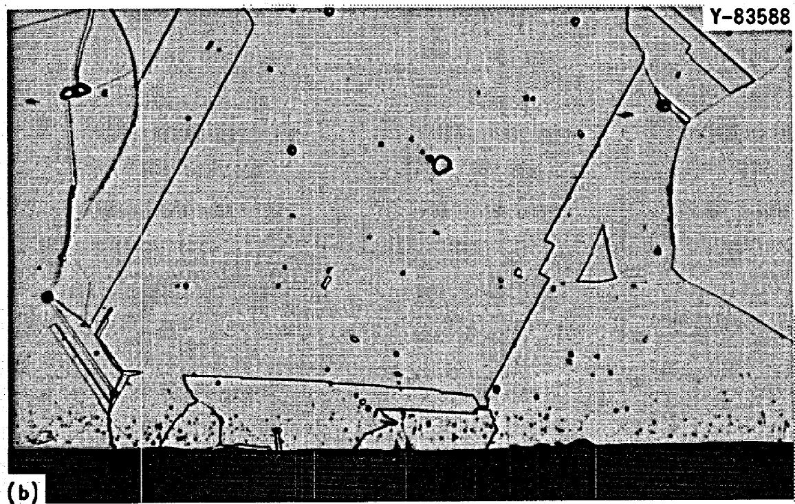  
Fig. 8. Photomicrographs of the Material Used in Making the Surveillance Basket. The final processing step was a 1-hr anneal at $1177^{\circ}\mathrm{C}$ . Etchant: Glyceria regia. (a) $100 \times$ . (b) $500 \times$ .

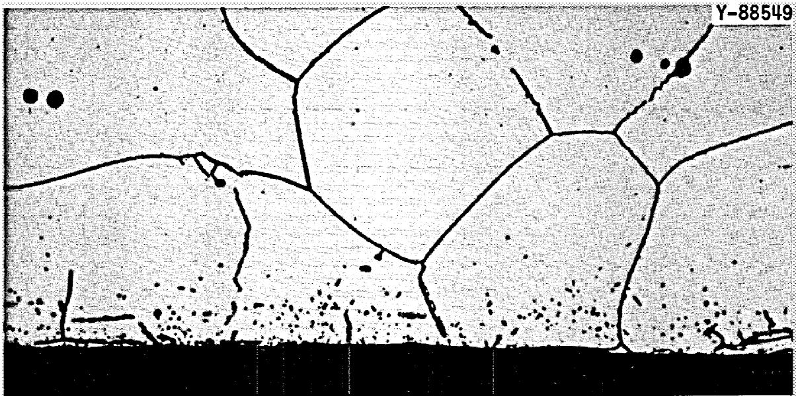  
Fig. 9. Photomicrograph of the Material Used to Make the Surveillance Basket after a l-hr Anneal at $1177^{\circ}\mathrm{C}$ and Aging for 1000 hr at $650^{\circ}\mathrm{C}$ . 750×. Etchant: Glyceria regia.

Small pieces of the standard Hastelloy N specimens that had been exposed to the MSRE cell environment for 11,000 hr were examined. Microstructures of heat 5085 are shown in Fig. 10. A thin oxide is present on the surface and some changes in microstructures occur to a depth of about 3 mils. The sample examined from heat 5085 was from a welded region. As shown in Fig. 11, the depth of attack seemed to be somewhat greater, but the reaction layer is very shallow. Neither specimen showed any evidence of nitrogen absorption from the cell environment.

# Mechanical Property Data - Standard Hastelloy N

The postirradiation tensile properties of heat 5065 are summarized in Table 3. The fracture strains are plotted as a function of test temperature in Fig. 12. There are significant reductions in the fracture strain at $25^{\circ}\mathrm{C}$ and above $500^{\circ}\mathrm{C}$ . The properties of heat 5085 are given in Table 4. The fracture strains are plotted in Fig. 13 and are very similar to those noted for heat 5065. The strain at fracture for both heats is reduced above about $400^{\circ}\mathrm{C}$ by reducing the strain rate.

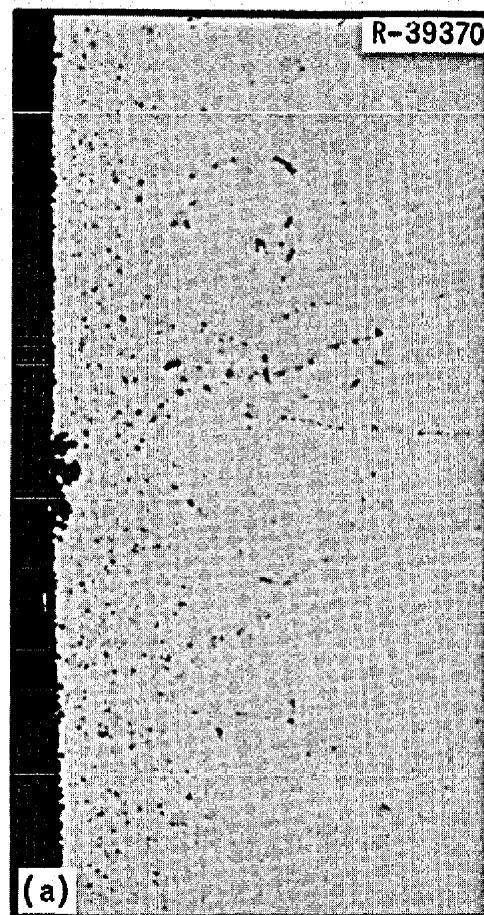

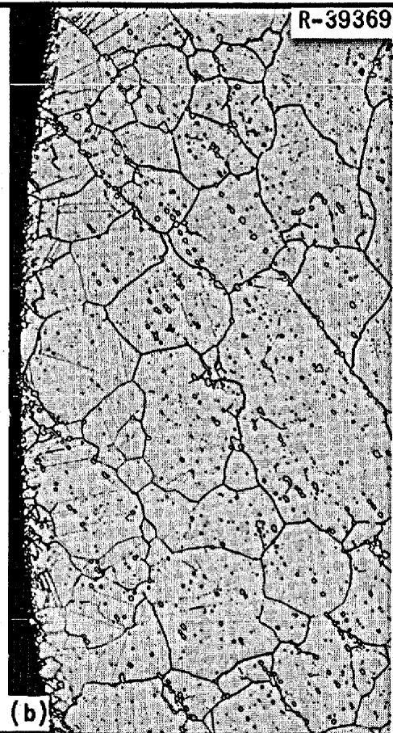

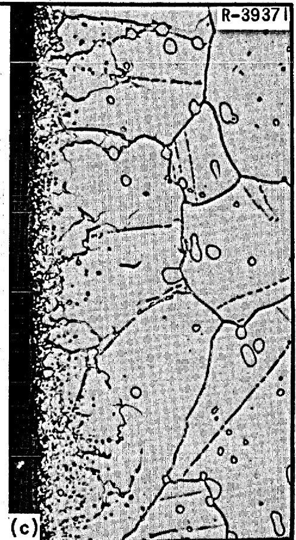  
Fig. 10. Photomicrographs of a $\frac{1}{4}$ -in.-diam Rod of Standard Hastelloy N (Heat 5085) Exposed to the MSRE Cell Environment of $\mathbf{N}_2 + 2 - 5\% \mathbf{O}_2$ for 11,000 hr at $650^{\circ}\mathrm{C}$ . (a) As polished. $500\times$ . (b) Etchant: Aqua regia. $100\times$ . (c) Etchant: Aqua regia. $500\times$ .

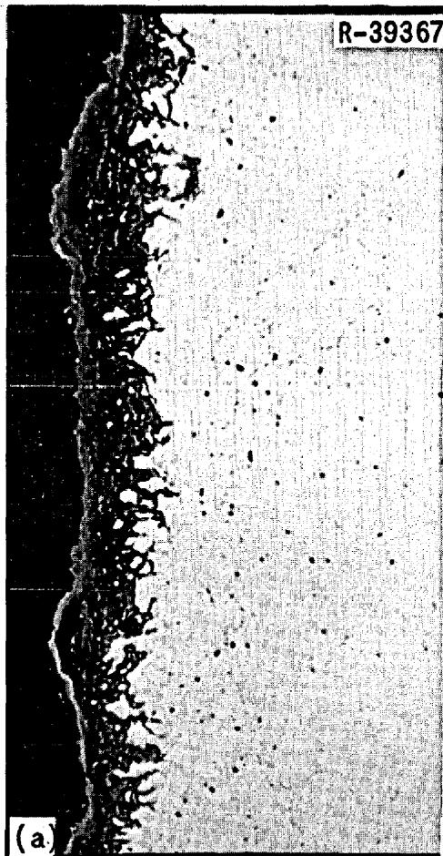

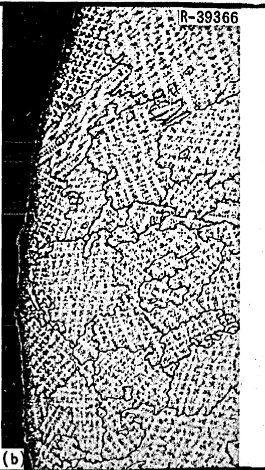

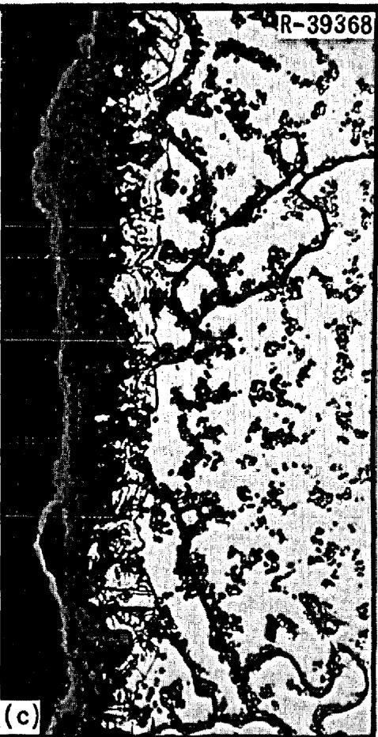  
Fig. 11. Photomicrographs of a $1/4$ -in.-diam Rod of Standard Hastelloy N (Heat 5065) Exposed to the MSRE Cell Environment of $\mathbf{N}_2 + 2 - 5\%$ $\mathbf{O}_2$ for 11,000 hr at $650^{\circ}\mathrm{C}$ . The cross section viewed is a weld made in joining small segments to make the single surveillance rod. (a) As polished. $500\times$ . (b) Etchant: Aqua regia. $100\times$ . (c) Etchant: Aqua regia. $500\times$ .

Table 3. Results of Tensile Tests on MSRE Surveillance Specimens - Heat 5065   

<table><tr><td rowspan="2">Specimen Number</td><td rowspan="2">Test Temperature (°C)</td><td rowspan="2">Strain Rate (min-1)</td><td colspan="2">Stress, psi</td><td colspan="2">Elongation, %</td><td rowspan="2">Reduction in Area (%)</td><td rowspan="2">True Fracture Strain (%)</td></tr><tr><td>Yield</td><td>Ultimate</td><td>Uniform</td><td>Total</td></tr><tr><td>9011</td><td>25</td><td>0.050</td><td>58,500</td><td>110,500</td><td>34.1</td><td>34.6</td><td>26.93</td><td>31</td></tr><tr><td>9012</td><td>200</td><td>0.050</td><td>43,100</td><td>111,000</td><td>61.2</td><td>63.2</td><td>46.14</td><td>62</td></tr><tr><td>9014</td><td>400</td><td>0.050</td><td>38,900</td><td>102,300</td><td>59.0</td><td>63.0</td><td>43.75</td><td>58</td></tr><tr><td>9033</td><td>400</td><td>0.002</td><td>39,100</td><td>106,000</td><td>56.6</td><td>57.7</td><td>43.75</td><td>58</td></tr><tr><td>9015</td><td>450</td><td>0.050</td><td>38,200</td><td>100,200</td><td>56.5</td><td>58.8</td><td>35.48</td><td>44</td></tr><tr><td>9032</td><td>450</td><td>0.002</td><td>38,100</td><td>102,700</td><td>52.0</td><td>56.0</td><td>38.53</td><td>49</td></tr><tr><td>9016</td><td>500</td><td>0.050</td><td>40,200</td><td>104,300</td><td>55.5</td><td>57.7</td><td>31.66</td><td>38</td></tr><tr><td>9013</td><td>500</td><td>0.002</td><td>39,500</td><td>98,900</td><td>48.6</td><td>50.0</td><td>39.58</td><td>50</td></tr><tr><td>9017</td><td>550</td><td>0.050</td><td>39,800</td><td>100,900</td><td>51.5</td><td>52.9</td><td>34.40</td><td>42</td></tr><tr><td>9022</td><td>550</td><td>0.002</td><td>36,600</td><td>83,000</td><td>27.3</td><td>28.0</td><td>24.75</td><td>28</td></tr><tr><td>9018</td><td>600</td><td>0.050</td><td>38,100</td><td>92,000</td><td>34.8</td><td>35.8</td><td>25.93</td><td>30</td></tr><tr><td>9023</td><td>600</td><td>0.002</td><td>36,200</td><td>72,900</td><td>22.7</td><td>23.0</td><td>22.02</td><td>25</td></tr><tr><td>9019</td><td>650</td><td>0.050</td><td>40,700</td><td>99,200</td><td>25.3</td><td>25.8</td><td>22.73</td><td>26</td></tr><tr><td>9024</td><td>650</td><td>0.002</td><td>33,600</td><td>54,200</td><td>11.1</td><td>11.4</td><td>10.89</td><td>12</td></tr><tr><td>9020</td><td>760</td><td>0.050</td><td>31,100</td><td>56,800</td><td>6.8</td><td>7.3</td><td>14.79</td><td>16</td></tr><tr><td>9025</td><td>760</td><td>0.002</td><td>30,600</td><td>31,400</td><td>1.3</td><td>3.6</td><td>4.74</td><td>5</td></tr><tr><td>9021</td><td>850</td><td>0.050</td><td>29,500</td><td>43,400</td><td>6.2</td><td>7.5</td><td>4.78</td><td>5</td></tr><tr><td>9026</td><td>850</td><td>0.002</td><td>25,300</td><td>25,400</td><td>1.0</td><td>2.8</td><td>3.21</td><td>3</td></tr></table>

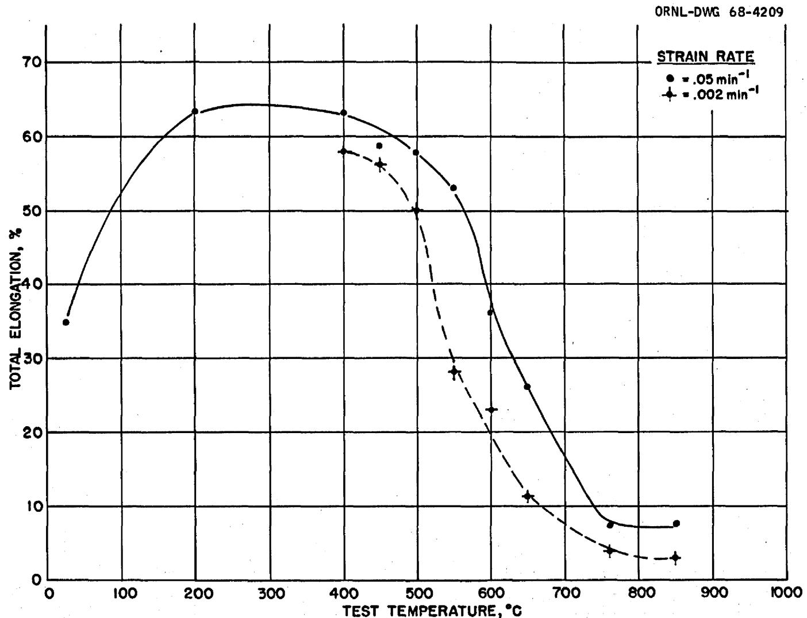  
Fig. 12. Variation of Ductility with Temperature for MSRE Surveillance Specimens. Heat 5065. Thermal fluence was $1.3 \times 10^{19}$ neutrons/cm $^2$ .

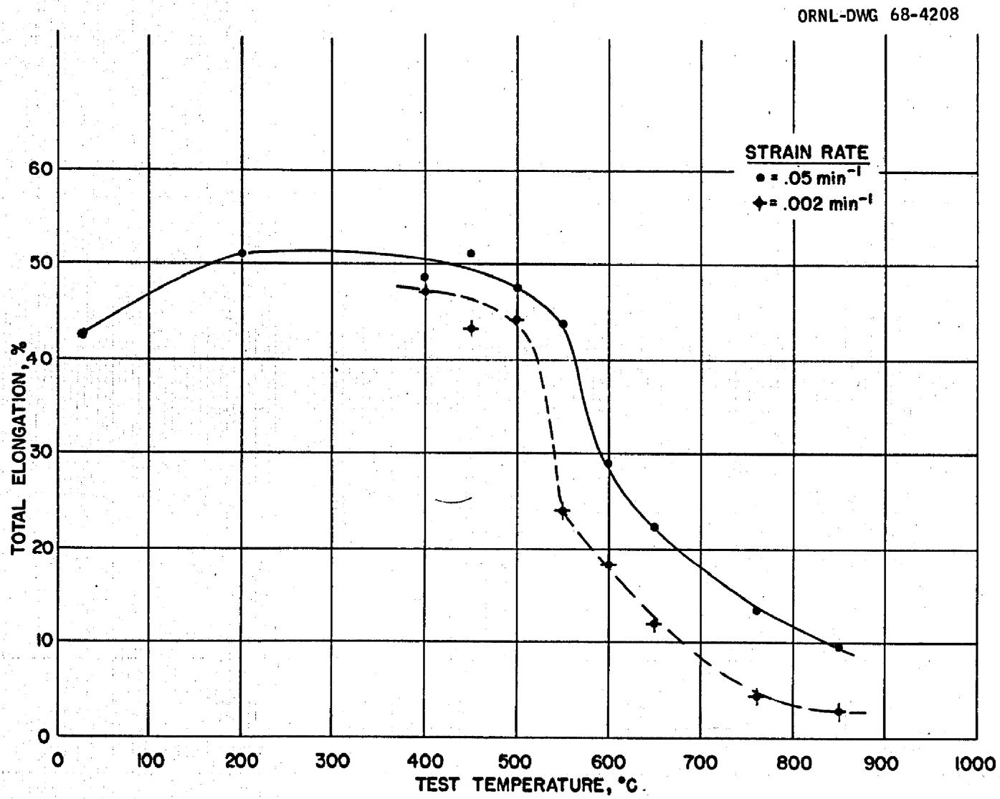  
Fig. 13. Variation of Ductility with Temperature for MSRE Surveillance Specimens. Heat 5085. Thermal fluence was $1.3 \times 10^{19}$ neutrons/cm $^2$ .

Table 4. Results of Tensile Tests on MSRE Surveillance Specimens - Heat 5085   

<table><tr><td rowspan="2">Specimen Number</td><td rowspan="2">Test Temperature (°C)</td><td rowspan="2">Strain Rate (min-1)</td><td colspan="2">Stress, psi</td><td colspan="2">Elongation, %</td><td rowspan="2">Reduction in Area (%)</td><td rowspan="2">True Fracture Strain (%)</td></tr><tr><td>Yield</td><td>Ultimate</td><td>Uniform</td><td>Total</td></tr><tr><td>9047a</td><td>25</td><td>0.050</td><td>64,000</td><td>114,900</td><td>42.5</td><td>42.5</td><td>24.14</td><td>28</td></tr><tr><td>9049</td><td>200</td><td>0.050</td><td>39,000</td><td>102,700</td><td>49.8</td><td>51.0</td><td>39.30</td><td>50</td></tr><tr><td>9050</td><td>400</td><td>0.050</td><td>37,600</td><td>96,800</td><td>47.9</td><td>48.7</td><td>37.03</td><td>46</td></tr><tr><td>9069</td><td>400</td><td>0.002</td><td>36,600</td><td>95,300</td><td>46.3</td><td>46.9</td><td>32.88</td><td>40</td></tr><tr><td>9052</td><td>450</td><td>0.050</td><td>36,300</td><td>95,200</td><td>50.7</td><td>51.2</td><td>33.78</td><td>41</td></tr><tr><td>9070</td><td>450</td><td>0.002</td><td>36,400</td><td>92,700</td><td>42.5</td><td>43.1</td><td>26.93</td><td>31</td></tr><tr><td>9053</td><td>500</td><td>0.050</td><td>36,100</td><td>92,600</td><td>47.5</td><td>47.5</td><td>33.48</td><td>41</td></tr><tr><td>9058</td><td>500</td><td>0.002</td><td>38,100</td><td>78,700</td><td>23.3</td><td>24.4</td><td>21.31</td><td>24</td></tr><tr><td>9054</td><td>550</td><td>0.050</td><td>35,500</td><td>89,800</td><td>42.8</td><td>43.8</td><td>25.93</td><td>30</td></tr><tr><td>9060</td><td>550</td><td>0.002</td><td>34,800</td><td>75,200</td><td>23.4</td><td>24.1</td><td>21.31</td><td>24</td></tr><tr><td>9055</td><td>600</td><td>0.050</td><td>34,800</td><td>77,700</td><td>28.5</td><td>29.0</td><td>26.93</td><td>31</td></tr><tr><td>9061</td><td>600</td><td>0.002</td><td>33,700</td><td>64,600</td><td>17.5</td><td>18.2</td><td>23.35</td><td>27</td></tr><tr><td>9056</td><td>650</td><td>0.050</td><td>35,400</td><td>70,600</td><td>20.9</td><td>22.4</td><td>22.02</td><td>25</td></tr><tr><td>9062</td><td>650</td><td>0.002</td><td>32,200</td><td>43,500</td><td>11.2</td><td>12.0</td><td>5.54</td><td>6</td></tr><tr><td>9057</td><td>760</td><td>0.050</td><td>29,000</td><td>49,700</td><td>12.6</td><td>13.5</td><td>12.49</td><td>13</td></tr><tr><td>9071</td><td>760</td><td>0.002</td><td>29,000</td><td>32,400</td><td>1.9</td><td>4.3</td><td>1.62</td><td>2</td></tr><tr><td>9059</td><td>850</td><td>0.050</td><td>27,800</td><td>37,900</td><td>6.3</td><td>9.7</td><td>7.84</td><td>8</td></tr><tr><td>9068</td><td>850</td><td>0.002</td><td>28,800</td><td>28,900</td><td>1.1</td><td>2.7</td><td>2.41</td><td>2</td></tr></table>

Failure occurred in a weld in the gage section of this specimen.

Some idea of the rate of property deterioration with fluence can be obtained by comparing the results for heat 5085 obtained this time on specimens irradiated outside the vessel to a thermal fluence of $1.3 \times 10^{19}$ neutrons/cm² with those obtained previously⁹ for specimens removed from the core with a fluence of $1.3 \times 10^{20}$ neutrons/cm². The unknown effects on the properties due to different times at temperature must be recognized; the core specimens for 4800 hr and the vessel specimens for 11,000 hr. The results are compared in Fig. 14.

$^{9}$ H. E. McCoy, Jr., An Evaluation of the Molten-Salt Reactor Experiment Hastelloy N Surveillance Specimen - First Group, ORNL-TM-1997 (November 1967).

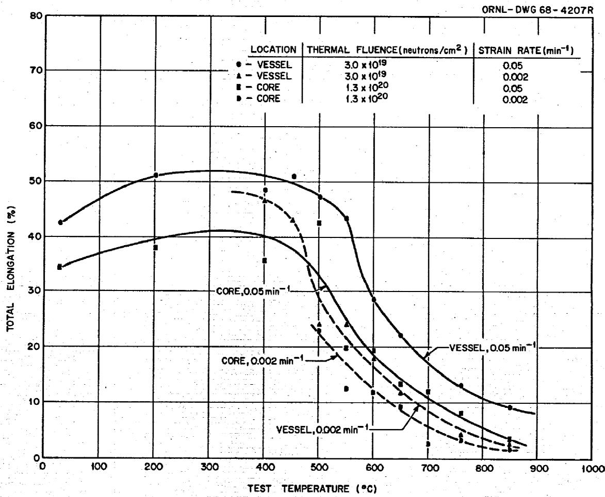  
Fig. 14. A Comparison of the Ductility of Surveillance Specimens of Heat 5085 Exposed in the Core and Outside the Core Vessel.

At a strain rate of $0.05 \, \text{min}^{-1}$ , the fracture strain is decreased appreciably as the thermal fluence increased from $1.3 \times 10^{19}$ to $1.3 \times 10^{20}$ neutrons/cm $^2$ . At a slower strain rate of $0.002 \, \text{min}^{-1}$ , the same trend holds, but the change is much smaller. If this same trend persists to lower strain rates, the fracture strain in creep tests may not be influenced significantly by fluence over the small range studied.

Our previous studies showed that the tensile properties of materials irradiated in the MSRE and those irradiated in the ORR and ETR in a helium environment were similar, the only significant difference being the reduction in fracture strain observed at $25^{\circ}\mathrm{C}$ . The present results are in good agreement with this conclusion. Our present studies also support previous observations that the yield stress was unaffected by irradiation and that the ultimate tensile stress was reduced about $10\%$ at low temperatures and progressively reduced further above $500^{\circ}\mathrm{C}$ to a maximum of $30\%$ at $850^{\circ}\mathrm{C}$ .

The results of several creep-rupture tests on the standard Hastelloy N surveillance specimens from the second group are given in Table 5. The stress-rupture properties are compared in Fig. 15 with

Table 5. Creep-Rupture Properties of Surveillance Specimens of Standard Hastelloy N   

<table><tr><td>Test Number</td><td>Specimen Number</td><td>Stress Level (psi)</td><td>Rupture Life (hr)</td><td>Rupture Strain (%)</td><td>Minimum Creep Rate (%/hr)</td></tr><tr><td colspan="6">Heat 5065</td></tr><tr><td>R-320</td><td>9030</td><td>47,000</td><td>23.0</td><td>2.10</td><td>0.081</td></tr><tr><td>R-313</td><td>9027</td><td>40,000</td><td>39.7</td><td>2.12</td><td>0.034</td></tr><tr><td>R-315</td><td>9029</td><td>32,400</td><td>122.3</td><td>2.06</td><td>0.0078</td></tr><tr><td>R-326</td><td>9031</td><td>27,000</td><td>290.2</td><td>1.47</td><td>0.0035</td></tr><tr><td colspan="6">Heat 5085</td></tr><tr><td>R-321</td><td>9066</td><td>47,000</td><td>23.2</td><td>2.39</td><td>0.061</td></tr><tr><td>R-312</td><td>9063</td><td>40,000</td><td>61.7</td><td>2.28</td><td>0.029</td></tr><tr><td>R-327</td><td>9067</td><td>32,400</td><td>336.6</td><td>2.25</td><td>0.0032</td></tr><tr><td>R-418</td><td>9072</td><td>30,000</td><td>323.4</td><td>2.4</td><td>0.0063</td></tr></table>

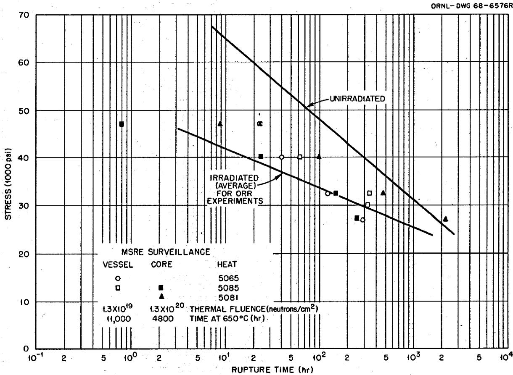  
Fig. 15. Postirradiation Creep-Rupture Properties of MSRE Surveillance Specimens at $650^{\circ}\mathrm{C}$ . Standard Hastelloy N.

those obtained previously on surveillance specimens from the core. The results on heat 5085 show clearly that the rupture life is less for the specimens from the core than for those from outside the vessel. This is probably due to the thermal fluence of the material from the core being higher by a factor of about 10. Heat 5085 seems to have the poorest rupture life and heat 5081 the best; there is no apparent explanation for this behavior. The minimum creep rates for these same materials are compared in Fig. 16. This parameter is not significantly different for the three heats of material involved and is not influenced appreciably by irradiation.

The fracture strains are shown as a function of strain rate in Fig. 17. The scatterband in this figure was determined from results obtained on these same materials irradiated to a thermal fluence of about $2 \times 10^{20}$ neutrons/cm² in the ORR. The fracture strains are significantly

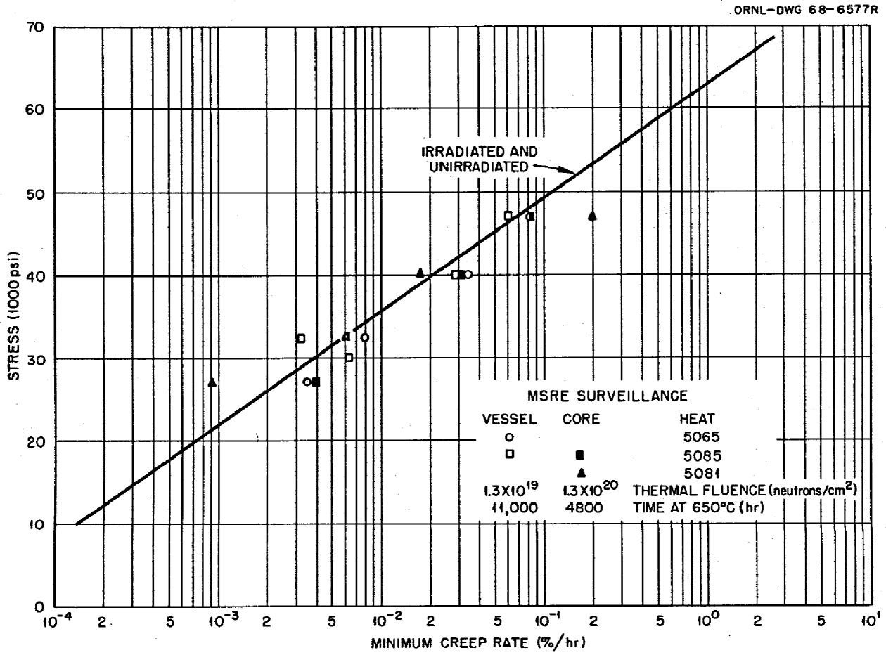  
Fig. 16. Variation of Minimum Creep Rate of Hastelloy N MSRE Surveillance Samples in Postirradiation Creep Tests at $650^{\circ}\mathrm{C}$ .

higher for the specimens irradiated outside the vessel to a thermal fluence of $1.3 \times 10^{19}$ neutrons/cm² when tested at high strain rates (12 to 300%/hr). At lower strain rates most of the fracture strains are in the range of 1.5 to 2.5%. Comparison of the results for the two sets of specimens shows the fracture strains to be slightly lower for the specimens exposed to the higher fluence in the core. These results do not indicate the very pronounced ductility minimum at a strain rate of about 0.1%/hr that is noted for these same materials when irradiated in the ORR. The very long thermal exposures involved may be responsible for this behavior; that is, about 5000 hr in the MSRE compared with only 1000 hr in the ORR. Heat 5081 shows unusually high strains and exhibits the trend of increasing strain with decreasing strain rate.

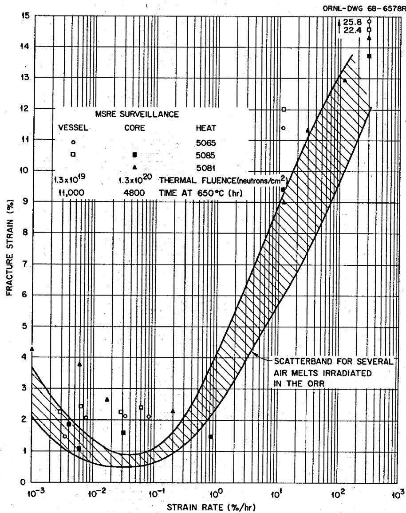  
Fig. 17. Variation of Fracture Strain with Strain Rate for MSRE Surveillance Specimen at $650^{\circ}\mathrm{C}$ . Scatterband is for samples irradiated to a thermal fluence of $3 \times 10^{20}$ neutrons/cm² in the ORR.

# Mechanical Property Data - Modified Hastelloy N

Specimens of two modified Hastelloy N alloys were removed from the core surveillance assembly for examination and mechanical testing. Control specimens of these same alloys were exposed to a static vessel of barren salt to duplicate the thermal history of the specimens in the reactor. The tensile properties of the control specimens of heat 21554 (zirconium modified) are given in Table 6; the total strain to fracture is shown in Fig. 18. The behavior is similar to that observed for standard

Table 6. Results of Tensile Tests on MSRE Surveillance Control Specimens - Heat 21554   

<table><tr><td rowspan="2">Specimen Number</td><td rowspan="2">Test Temperature (°C)</td><td rowspan="2">Strain Rate (min-1)</td><td colspan="2">Stress, psi</td><td colspan="2">Elongation, %</td><td rowspan="2">Reduction in Area (%)</td><td rowspan="2">True Fracture Strain (%)</td></tr><tr><td>Yield</td><td>Ultimate</td><td>Uniform</td><td>Total</td></tr><tr><td>5543</td><td>25</td><td>0.050</td><td>67,700</td><td>128,700</td><td>42.3</td><td>47.0</td><td>56.33</td><td>83</td></tr><tr><td>5544</td><td>200</td><td>0.050</td><td>60,000</td><td>115,900</td><td>39.9</td><td>42.9</td><td>59.80</td><td>91</td></tr><tr><td>5545</td><td>400</td><td>0.050</td><td>54,700</td><td>109,200</td><td>40.7</td><td>44.4</td><td>46.82</td><td>63</td></tr><tr><td>5553</td><td>400</td><td>0.002</td><td>54,200</td><td>111,800</td><td>45.8</td><td>48.3</td><td>53.59</td><td>77</td></tr><tr><td>5546</td><td>450</td><td>0.050</td><td>53,000</td><td>107,200</td><td>41.3</td><td>44.3</td><td>54.56</td><td>79</td></tr><tr><td>5554</td><td>450</td><td>0.002</td><td>55,900</td><td>110,500</td><td>42.7</td><td>48.1</td><td>48.26</td><td>66</td></tr><tr><td>5547</td><td>500</td><td>0.050</td><td>51,400</td><td>106,900</td><td>42.5</td><td>44.8</td><td>49.79</td><td>69</td></tr><tr><td>5555</td><td>500</td><td>0.002</td><td>58,600</td><td>111,400</td><td>39.9</td><td>45.3</td><td>43.69</td><td>57</td></tr><tr><td>5548</td><td>550</td><td>0.050</td><td>58,700</td><td>106,900</td><td>38.7</td><td>43.2</td><td>42.73</td><td>56</td></tr><tr><td>5556</td><td>550</td><td>0.002</td><td>59,800</td><td>101,300</td><td>26.4</td><td>28.0</td><td>24.70</td><td>28</td></tr><tr><td>5549</td><td>600</td><td>0.050</td><td>53,400</td><td>102,000</td><td>37.0</td><td>30.3</td><td>31.44</td><td>38</td></tr><tr><td>5557</td><td>600</td><td>0.002</td><td>56,800</td><td>91,000</td><td>22.7</td><td>25.0</td><td>24.18</td><td>28</td></tr><tr><td>5550</td><td>650</td><td>0.050</td><td>46,400</td><td>87,500</td><td>27.6</td><td>30.4</td><td>31.88</td><td>38</td></tr><tr><td>5558</td><td>650</td><td>0.002</td><td>55,800</td><td>75,500</td><td>13.3</td><td>46.6</td><td>63.15</td><td>100</td></tr><tr><td>5551</td><td>760</td><td>0.050</td><td>43,700</td><td>59,000</td><td>4.0</td><td>8.1</td><td>64.27</td><td>103</td></tr><tr><td>5559</td><td>760</td><td>0.002</td><td>37,900</td><td>37,900</td><td>1.6</td><td>47.4</td><td>69.45</td><td>119</td></tr><tr><td>5552</td><td>850</td><td>0.050</td><td>36,900</td><td>37,700</td><td>7.5</td><td>56.5</td><td>69.70</td><td>119</td></tr><tr><td>5560</td><td>850</td><td>0.002</td><td>22,000</td><td>22,000</td><td>100.0</td><td>46.9</td><td>60.94</td><td>94</td></tr></table>

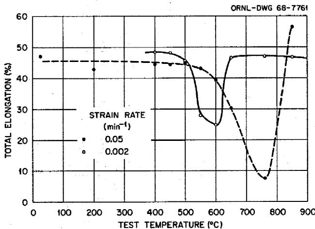  
Fig. 18. Variation of the Ductility with Temperature for Control Specimens of Zirconium-Modified Hastelloy N (Heat 21554).

Hastelloy N, but the ductility of the zirconium-modified alloy at $760^{\circ}\mathrm{C}$ is considerably lower. The strong dependence of fracture strain on strain rate at $760^{\circ}\mathrm{C}$ is also quite unusual where the strain is higher at the lower strain rate. The properties of this material after irradiation are given in Table 7. The total elongation of the irradiated material is shown in Fig. 19 as a function of test temperatures. The behavior is very similar to that shown in Fig. 14, p. 25, for the standard Hastelloy N exposed under similar conditions; however, the fracture strain at 600 to $700^{\circ}\mathrm{C}$ is higher for the modified alloy. The ratios of the various properties in the irradiated and unirradiated conditions are shown in Fig. 20. The yield and ultimate strengths were not affected appreciably by irradiation. The ratio for the elongation at fracture drops precipitously above about $600^{\circ}\mathrm{C}$ for standard Hastelloy N (ref. 10), but the very low elongation observed for the unirradiated zirconium-modified material at $760^{\circ}\mathrm{C}$ causes the ratio to be very high at this temperature. The behavior of the ratio for the reduction in area is quite normal with the exception of the reduction of this parameter by about $25\%$ at low temperature.

Table 7. Results of Tensile Tests on MSRE Surveillance Specimens - Heat 21554   

<table><tr><td rowspan="2">Specimen Number</td><td rowspan="2">Test Temperature (°C)</td><td rowspan="2">Strain Rate (min-1)</td><td colspan="2">Stress, psi</td><td colspan="2">Elongation, %</td><td rowspan="2">Reduction in Area (%)</td><td rowspan="2">True Fracture Strain (%)</td></tr><tr><td>Yield</td><td>Ultimate</td><td>Uniform</td><td>Total</td></tr><tr><td>9110</td><td>25</td><td>0.050</td><td>64,200</td><td>122,100</td><td>44.1</td><td>47.5</td><td>39.08</td><td>50</td></tr><tr><td>9111</td><td>200</td><td>0.050</td><td>61,000</td><td>116,100</td><td>43.7</td><td>46.0</td><td>51.90</td><td>73</td></tr><tr><td>9112</td><td>400</td><td>0.050</td><td>52,700</td><td>109,100</td><td>42.5</td><td>46.2</td><td>34.96</td><td>43</td></tr><tr><td>9131</td><td>400</td><td>0.002</td><td>64,600</td><td>112,600</td><td>39.5</td><td>45.2</td><td>36.26</td><td>45</td></tr><tr><td>9114</td><td>450</td><td>0.050</td><td>56,000</td><td>110,200</td><td>39.8</td><td>42.3</td><td>33.24</td><td>40</td></tr><tr><td>9132</td><td>450</td><td>0.002</td><td>57,400</td><td>107,900</td><td>41.8</td><td>45.7</td><td>33.94</td><td>41</td></tr><tr><td>9115</td><td>500</td><td>0.050</td><td>56,900</td><td>109,900</td><td>40.4</td><td>43.4</td><td>33.48</td><td>41</td></tr><tr><td>9113</td><td>500</td><td>0.002</td><td>50,500</td><td>119,700</td><td>43.4</td><td>45.6</td><td>25.54</td><td>29</td></tr><tr><td>9116</td><td>550</td><td>0.050</td><td>60,200</td><td>107,700</td><td>44.5</td><td>47.5</td><td>36.52</td><td>45</td></tr><tr><td>9121</td><td>550</td><td>0.002</td><td>43,600</td><td>91,700</td><td>22.5</td><td>23.0</td><td>21.15</td><td>24</td></tr><tr><td>9117</td><td>600</td><td>0.050</td><td>52,700</td><td>94,100</td><td>31.0</td><td>32.0</td><td>28.09</td><td>33</td></tr><tr><td>9122</td><td>600</td><td>0.002</td><td>50,300</td><td>80,300</td><td>15.7</td><td>16.8</td><td>18.42</td><td>20</td></tr><tr><td>9118</td><td>650</td><td>0.050</td><td></td><td></td><td></td><td></td><td>25.54</td><td>29</td></tr><tr><td>9123</td><td>650</td><td>0.002</td><td>48,100</td><td>65,600</td><td>10.9</td><td>11.2</td><td>12.39</td><td>13</td></tr><tr><td>9119</td><td>760</td><td>0.050</td><td>42,400</td><td>55,400</td><td>6.6</td><td>6.8</td><td>10.89</td><td>12</td></tr><tr><td>9124</td><td>760</td><td>0.002</td><td>37,600</td><td>37,900</td><td>1.7</td><td>5.4</td><td>4.74</td><td>5</td></tr><tr><td>9120</td><td>850</td><td>0.050</td><td>34,800</td><td>38,600</td><td>3.1</td><td>6.4</td><td>6.27</td><td>6</td></tr><tr><td>9125</td><td>850</td><td>0.002</td><td>3,800</td><td>12,100</td><td>5.1</td><td>10.4</td><td>13.88</td><td>15</td></tr></table>

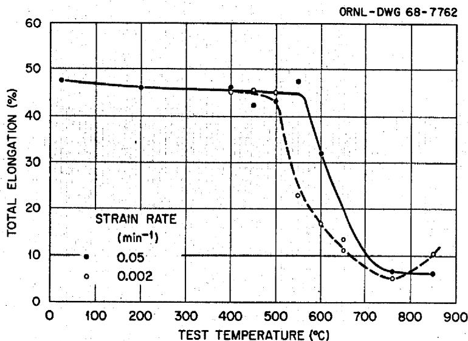  
Fig. 19. Variation of the Ductility with Temperature for MSRE Surveillance Specimens of Zirconium-Modified Hastelloy N (Heat 21554). Thermal fluence was $4.1 \times 10^{20}$ neutrons/cm².

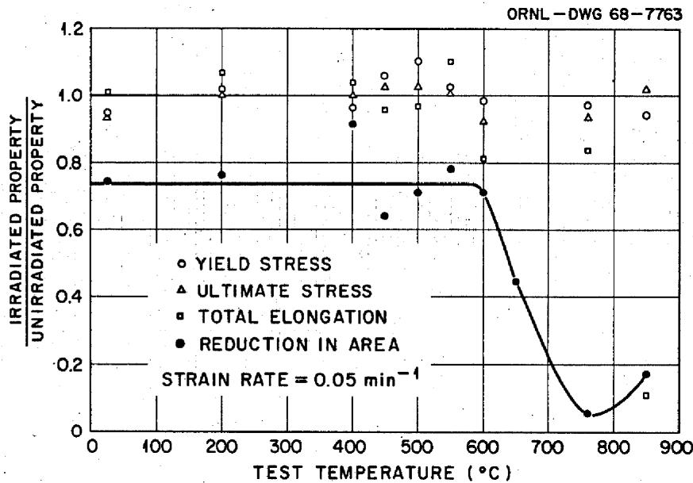  
Fig. 20. Comparison of the Tensile Properties of Irradiated and Unirradiated Zirconium-Modified Hastelloy N (Heat 21554). Thermal fluence was $4.1 \times 10^{20}$ neutrons/cm $^2$ .

The tensile properties of the control specimens of heat 21545 (titanium modified) are given in Table 8. The total elongation is shown in Fig. 21 as a function of the test temperature. The properties are quite similar to those observed for heat 21554 (Fig. 18, p. 31, and Table 6, p. 30). The properties of the surveillance specimens are given in Table 9, and the total elongation at fracture is shown graphically in Fig. 22. The fracture elongations for this material are quite similar to those shown in Fig. 19 for heat 21554. The ratio of the irradiated to the unirradiated property is shown in Fig. 23. Generally the yield strength is increased slightly by irradiation, and the tensile stress is decreased. The elongation at fracture is generally decreased, but decreases precipitously above $600^{\circ}\mathrm{C}$ . However, the ratio at $760^{\circ}\mathrm{C}$ is again high due to the extremely low elongation of the unirradiated material. The ratio for the reduction in area is reduced about $30\%$ at low temperatures and decreases rapidly above $600^{\circ}\mathrm{C}$ .

Several creep-rupture tests have been run on both irradiated and unirradiated specimens of heats 21554 and 21545. The results of tests on these materials are given in Table 10 (annealed 100 hr at $871^{\circ}\mathrm{C}$ ), Table 11 (annealed 100 hr at $871^{\circ}\mathrm{C}$ and exposed to barren salt for 5500 hr at $650 \pm 10^{\circ}\mathrm{C}$ ), and Table 12 (annealed 100 hr at $871^{\circ}\mathrm{C}$ and exposed to MSRE environment for 5500 hr at $650 \pm 10^{\circ}\mathrm{C}$ ). The stress-rupture properties of heat 21554 are compared in Fig. 24 for the various conditions studied. The strength is reduced slightly by the long thermal exposure to barren salt. Exposure to the MSRE environment reduces the rupture life at a given stress by about a factor of 10. The creep rates of heat 21554 are compared in Fig. 25. The minimum creep rate is increased slightly by the 5500 hr soak at about $650^{\circ}\mathrm{C}$ in the barren salt; the same change is noted for the specimens removed from the MSRE.

The creep-rupture properties of heat 21545 are shown in Fig. 26 for the various conditions studied. Just as noted for the zirconium-modified alloy in Fig. 24, the rupture life of the titanium-modified alloy is reduced slightly by the long soak in the barren salt and the rupture life is reduced by a factor of 10 by exposure to the MSRE environment. The minimum creep rate was not affected significantly by any of the variables investigated, Fig. 27.

Table 8. Results of Tensile Tests on MSRE Surveillance Control Specimens - Heat 21545   

<table><tr><td rowspan="2">Specimen Number</td><td rowspan="2">Test Temperature (°C)</td><td rowspan="2">Strain Rate (min-1)</td><td colspan="2">Stress, psi</td><td colspan="2">Elongation, %</td><td rowspan="2">Reduction in Area (%)</td><td rowspan="2">True Fracture Strain (%)</td></tr><tr><td>Yield</td><td>Ultimate</td><td>Uniform</td><td>Total</td></tr><tr><td>5531</td><td>25</td><td>0.050</td><td>95,700</td><td>127,100</td><td>38.1</td><td>42.3</td><td>61.05</td><td>94</td></tr><tr><td>5530</td><td>200</td><td>0.050</td><td>49,300</td><td>112,800</td><td>46.9</td><td>50.9</td><td>55.45</td><td>81</td></tr><tr><td>5529</td><td>400</td><td>0.050</td><td>46,000</td><td>107,600</td><td>46.4</td><td>51.1</td><td>43.75</td><td>58</td></tr><tr><td>5521</td><td>400</td><td>0.002</td><td>51,800</td><td>111,700</td><td>44.5</td><td>50.1</td><td>59.30</td><td>90</td></tr><tr><td>5528</td><td>450</td><td>0.050</td><td>50,000</td><td>108,700</td><td>45.3</td><td>48.8</td><td>58.14</td><td>87</td></tr><tr><td>5520</td><td>450</td><td>0.002</td><td>51,100</td><td>109,200</td><td>45.6</td><td>47.7</td><td>43.69</td><td>57</td></tr><tr><td>5527</td><td>500</td><td>0.050</td><td>50,400</td><td>104,900</td><td>43.7</td><td>47.9</td><td>51.69</td><td>73</td></tr><tr><td>5519</td><td>500</td><td>0.002</td><td>47,900</td><td>106,900</td><td>41.8</td><td>45.2</td><td>42.06</td><td>55</td></tr><tr><td>5526</td><td>550</td><td>0.050</td><td>49,500</td><td>102,800</td><td>42.7</td><td>48.0</td><td>51.36</td><td>72</td></tr><tr><td>5518</td><td>550</td><td>0.002</td><td>47,800</td><td>93,500</td><td>24.9</td><td>26.5</td><td>31.51</td><td>38</td></tr><tr><td>5525</td><td>600</td><td>0.050</td><td>43,100</td><td>93,300</td><td>32.7</td><td>34.6</td><td>37.67</td><td>47</td></tr><tr><td>5517</td><td>600</td><td>0.002</td><td>48,000</td><td>84,600</td><td>23.5</td><td>24.6</td><td>21.27</td><td>24</td></tr><tr><td>5524</td><td>650</td><td>0.050</td><td>44,400</td><td>84,600</td><td>31.0</td><td>33.8</td><td>28.64</td><td>34</td></tr><tr><td>5516</td><td>650</td><td>0.002</td><td>45,200</td><td>68,500</td><td>16.5</td><td>40.8</td><td>43.84</td><td>58</td></tr><tr><td>5523</td><td>760</td><td>0.050</td><td>45,900</td><td>56,400</td><td>3.4</td><td>7.3</td><td>63.00</td><td>99</td></tr><tr><td>5515</td><td>760</td><td>0.002</td><td>37,900</td><td>37,900</td><td>1.3</td><td>43.8</td><td>63.94</td><td>102</td></tr><tr><td>5522</td><td>850</td><td>0.050</td><td>33,900</td><td>34,200</td><td>6.1</td><td>53.4</td><td>71.83</td><td>127</td></tr><tr><td>5514</td><td>850</td><td>0.002</td><td>20,100</td><td>20,300</td><td>0.9</td><td>44.0</td><td>55.77</td><td>82</td></tr></table>

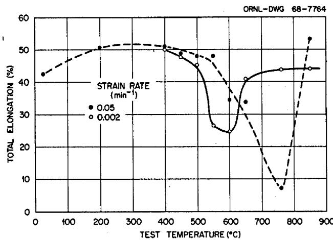  
Fig. 21. Variation of the Ductility with Temperature for Control Specimens of Titanium-Modified Hastelloy N (Heat 21545).

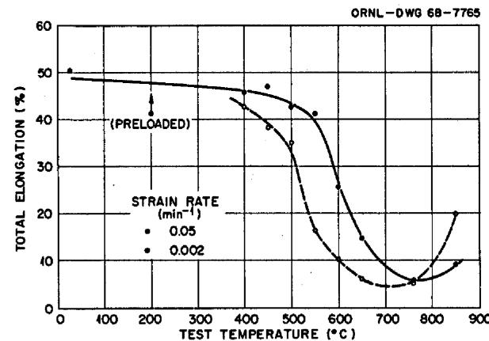  
Fig. 22. Variation of the Ductility with Temperature for MSRE Surveillance Specimens of Titanium-Modified Hastelloy N (Heat 21545). Thermal fluence was $4.1 \times 10^{20}$ neutrons/cm².

Table 9. Results of Tensile Tests on MSRE Surveillance Specimens - Heat 21545   

<table><tr><td rowspan="2">Specimen Number</td><td rowspan="2">Test Temperature (°C)</td><td rowspan="2">Strain Rate (min-1)</td><td colspan="2">Stress, psi</td><td colspan="2">Elongation, %</td><td rowspan="2">Reduction in Area (%)</td><td rowspan="2">True Fracture Strain (%)</td></tr><tr><td>Yield</td><td>Ultimate</td><td>Uniform</td><td>Total</td></tr><tr><td>9083a</td><td>25</td><td>0.050</td><td>61,900</td><td>145,600</td><td>46.3</td><td>50.3</td><td>45.71</td><td>61</td></tr><tr><td>9084a</td><td>200</td><td>0.050</td><td>80,300</td><td>111,200</td><td>38.9</td><td>41.1</td><td>42.53</td><td>55</td></tr><tr><td>9085</td><td>400</td><td>0.050</td><td>56,100</td><td>104,300</td><td>42.7</td><td>45.7</td><td>40.06</td><td>51</td></tr><tr><td>9105</td><td>400</td><td>0.002</td><td>57,000</td><td>107,200</td><td>37.5</td><td>42.6</td><td>47.58</td><td>65</td></tr><tr><td>9086</td><td>450</td><td>0.050</td><td>54,200</td><td>104,300</td><td>44.5</td><td>47.0</td><td>37.54</td><td>47</td></tr><tr><td>9106</td><td>450</td><td>0.002</td><td>57,000</td><td>102,700</td><td>35.8</td><td>38.2</td><td>32.10</td><td>39</td></tr><tr><td>9088</td><td>500</td><td>0.050</td><td>54,700</td><td>102,700</td><td>41.1</td><td>42.7</td><td>36.78</td><td>46</td></tr><tr><td>9089</td><td>500</td><td>0.002</td><td>53,000</td><td>86,700</td><td>32.2</td><td>35.2</td><td>29.88</td><td>35</td></tr><tr><td>9090</td><td>550</td><td>0.050</td><td>46,900</td><td>95,800</td><td>38.7</td><td>41.2</td><td>40.12</td><td>51</td></tr><tr><td>9094</td><td>550</td><td>0.002</td><td>57,100</td><td>91,600</td><td>15.3</td><td>16.5</td><td>23.35</td><td>27</td></tr><tr><td>9091</td><td>600</td><td>0.050</td><td>44,500</td><td>83,600</td><td>25.2</td><td>25.7</td><td>26.93</td><td>31</td></tr><tr><td>9096</td><td>600</td><td>0.002</td><td>46,900</td><td>66,200</td><td>9.6</td><td>10.4</td><td>16.83</td><td>18</td></tr><tr><td>9092</td><td>650</td><td>0.050</td><td>45,200</td><td>73,700</td><td>13.4</td><td>14.6</td><td>12.79</td><td>14</td></tr><tr><td>9097</td><td>650</td><td>0.002</td><td>48,900</td><td>58,900</td><td>5.4</td><td>6.2</td><td>4.74</td><td>5</td></tr><tr><td>9093</td><td>760</td><td>0.050</td><td>39,000</td><td>46,800</td><td>5.4</td><td>5.8</td><td>3.98</td><td>4</td></tr><tr><td>9098</td><td>760</td><td>0.002</td><td>31,200</td><td>31,200</td><td>1.3</td><td>5.7</td><td>5.54</td><td>6</td></tr><tr><td>9095</td><td>850</td><td>0.050</td><td>33,500</td><td>33,600</td><td>1.7</td><td>9.2</td><td>12.39</td><td>13</td></tr><tr><td>9104</td><td>850</td><td>0.002</td><td>8,100</td><td>10,600</td><td>1.1</td><td>20.2</td><td>19.07</td><td>21</td></tr></table>

${}^{a}$ Test preloaded; therefore measured yield stress higher than normal and elongation lower.

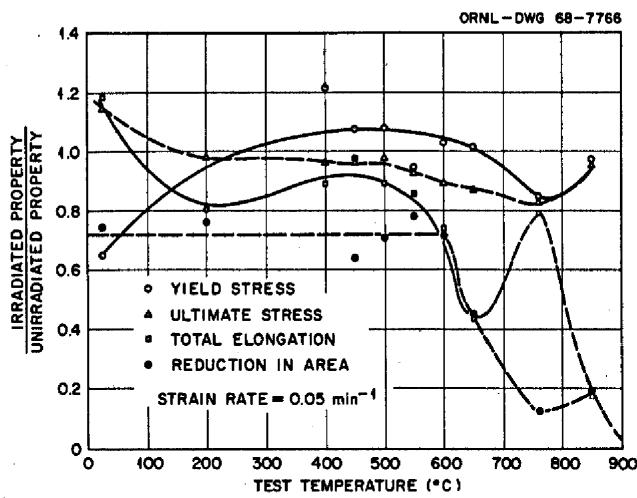  
Fig. 23. Comparison of the Tensile Properties of Irradiated and Unirradiated Titanium-Modified Hastelloy N (Heat 21545). Thermal fluence was $4.1 \times 10^{20}$ neutrons/cm $^2$ .

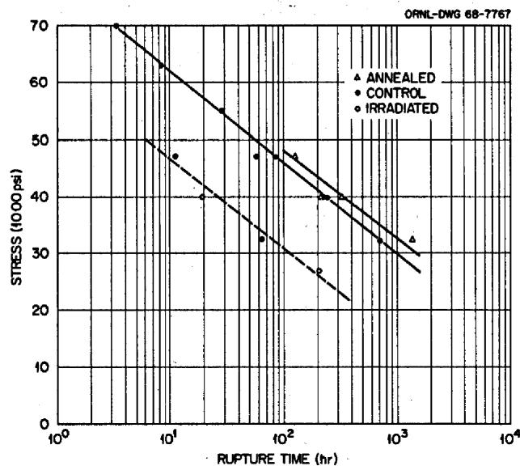  
Fig. 24. Creep-Rupture Properties of Zirconium-Modified Hastelloy N (Heat 21554) at $650^{\circ}\mathrm{C}$ in Several Conditions; Annealed at $871^{\circ}\mathrm{C}$ (see p. 7); Annealed at $871^{\circ}\mathrm{C}$ and Aged for 5500 hr at $650^{\circ}\mathrm{C}$ in Static Fluoride Salt; and Irradiated to a Thermal Fluence of $4.1 \times 10^{20}$ neutrons/cm $^2$ .

Table 10. Creep-Rupture Properties of Heats 21545 and 21554 at $650^{\circ}\mathrm{C}$ After Annealing 100 hr at $871^{\circ}\mathrm{C}$   

<table><tr><td>Test Number</td><td>Specimen Number</td><td>Stress (psi)</td><td>Rupture Life (hr)</td><td>Rupture Strain (%)</td><td>Reduction in Area (%)</td><td>Minimum Creep Rate (%/hr)</td><td>True Fracture Strain (%)</td></tr><tr><td colspan="8">Heat 21554</td></tr><tr><td>5862</td><td>2435</td><td>47,000</td><td>128.3</td><td>63.0</td><td>50.6</td><td>0.203</td><td>71</td></tr><tr><td>5857</td><td>2434</td><td>40,000</td><td>324.2</td><td>35.5</td><td>51.9</td><td>0.056</td><td>73</td></tr><tr><td>5858</td><td>2491</td><td>40,000</td><td>226.3</td><td>60.8</td><td>50.9</td><td>0.128</td><td>71</td></tr><tr><td>6168</td><td>2433</td><td>32,400</td><td>1390.9</td><td>55.1</td><td>42.4</td><td>0.0176</td><td>55</td></tr><tr><td colspan="8">Heat 21545</td></tr><tr><td>5409</td><td>1771</td><td>55,000</td><td>20.1</td><td>52.5</td><td>47.3</td><td>1.37</td><td>64</td></tr><tr><td>5564</td><td>1822</td><td>40,000</td><td>248.1</td><td>34.4</td><td>20.5</td><td>0.0688</td><td>23</td></tr><tr><td>5580</td><td>1773</td><td>40,000</td><td>242.6</td><td>59.4</td><td>56.6</td><td>0.120</td><td>84</td></tr><tr><td>5449</td><td>1768</td><td>30,000</td><td>1171.5</td><td>56.7</td><td>51.5</td><td>0.0174</td><td>72</td></tr></table>

Table 11. Creep-Rupture Properties of MSRE   
Surveillance Control Specimens at $650^{\circ}\mathrm{C}$   

<table><tr><td>Test Number</td><td>Specimen Number</td><td>Stress (psi)</td><td>Rupture Life (hr)</td><td>Rupture Strain (%)</td><td>Reduction in Area (%)</td><td>Minimum Creep Rate (%/hr)</td><td>True Fracture Strain (%)</td></tr><tr><td colspan="8">Heat 21554</td></tr><tr><td>6399</td><td>5535</td><td>70,000</td><td>3.3</td><td>60.6</td><td>48.3</td><td>8.375</td><td>67</td></tr><tr><td>6398</td><td>5536</td><td>63,000</td><td>8.3</td><td>50.0</td><td>50.1</td><td>3.20</td><td>70</td></tr><tr><td>6397</td><td>5537</td><td>55,000</td><td>28.2</td><td>55.8</td><td>45.0</td><td>1.01</td><td>60</td></tr><tr><td>6389</td><td>5538</td><td>47,000</td><td>58.1</td><td>38.3</td><td>58.3</td><td>0.365</td><td>88</td></tr><tr><td>6425</td><td>5540</td><td>47,000</td><td>84.1</td><td>75.1</td><td>56.0</td><td>0.363</td><td>82</td></tr><tr><td>6390</td><td>5539</td><td>40,000</td><td>228.7</td><td>69.5</td><td>56.6</td><td>0.120</td><td>84</td></tr><tr><td>6426</td><td>5541</td><td>40,000</td><td>244.0</td><td>63.1</td><td>49.6</td><td>0.113</td><td>69</td></tr><tr><td>6427</td><td>5542</td><td>32,400</td><td>709.8</td><td>56.1</td><td>49.7</td><td>0.032</td><td>69</td></tr><tr><td colspan="8">Heat 21545</td></tr><tr><td>6384</td><td>5508</td><td>70,000</td><td>1.9</td><td>39.2</td><td>30.6</td><td></td><td>36</td></tr><tr><td>6385</td><td>5509</td><td>63,000</td><td>5.5</td><td>46.1</td><td>32.7</td><td>4.50</td><td>40</td></tr><tr><td>6386</td><td>5510</td><td>55,000</td><td>15.7</td><td>47.4</td><td>34.3</td><td>2.50</td><td>42</td></tr><tr><td>6387</td><td>5511</td><td>47,000</td><td>50.8</td><td>43.9</td><td>44.4</td><td>0.50</td><td>59</td></tr><tr><td>6388</td><td>5512</td><td>40,000</td><td>177.2</td><td>55.3</td><td>45.1</td><td>0.165</td><td>60</td></tr><tr><td>6428</td><td>5513</td><td>32,400</td><td>438.8</td><td>40.1</td><td>49.8</td><td>0.0398</td><td>69</td></tr></table>

Table 12. Creep-Rupture Properties of Surveillance Specimens of Modified Hastelloy N at $650^{\circ}\mathrm{C}$   

<table><tr><td>Test Number</td><td>Specimen Number</td><td>Stress Level (psi)</td><td>Rupture Life (hr)</td><td>Rupture Strain (%)</td><td>Minimum Creep Rate (%/hr)</td></tr><tr><td></td><td></td><td colspan="4">Heat 21554</td></tr><tr><td>R-316</td><td>9127</td><td>47,000</td><td>11.1</td><td>4.57</td><td>0.343</td></tr><tr><td>R-311</td><td>9126</td><td>40,000</td><td>19.3</td><td>3.99</td><td>0.138</td></tr><tr><td>R-318</td><td>9128</td><td>32,400</td><td>65.4</td><td>2.36</td><td>0.013</td></tr><tr><td>R-322</td><td>9129</td><td>27,000</td><td>204.9</td><td>3.45</td><td>0.0088</td></tr><tr><td></td><td></td><td colspan="4">Heat 21545</td></tr><tr><td>R-317</td><td>9100</td><td>47,000</td><td>2.8</td><td>1.59</td><td>0.455</td></tr><tr><td>R-314</td><td>9099</td><td>40,000</td><td>13.1</td><td>2.68</td><td>0.085</td></tr><tr><td>R-319</td><td>9102</td><td>32,400</td><td>51.1</td><td>3.39</td><td>0.0180</td></tr><tr><td>R-323</td><td>9103</td><td>27,000</td><td>124.1</td><td>3.69</td><td>0.0089</td></tr></table>

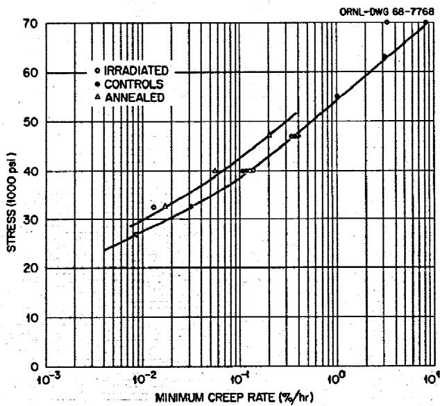  
Fig. 25. Variation of the Minimum Creep Rate with Stress for Zirconium-Modified Hastelloy N (Heat 21554) at $650^{\circ}\mathrm{C}$ . Tested after annealing at $871^{\circ}\mathrm{C}$ (see p. 7), annealing followed by 5500 hr at $650^{\circ}\mathrm{C}$ in static fluoride salt, and irradiated to a thermal fluence of $4.1 \times 10^{20}$ neutrons/cm $^2$ .

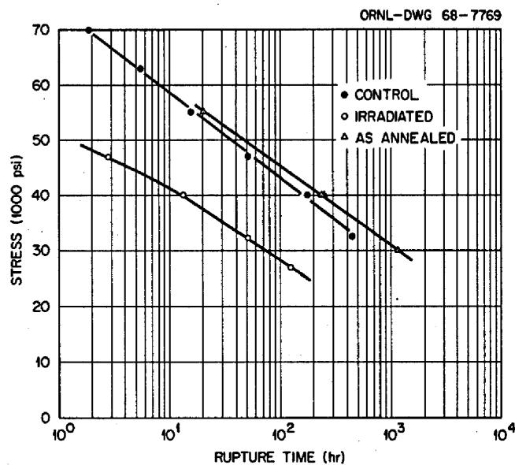  
Fig. 26. Creep-Rupture Properties of Titanium-Modified Hastelloy N (Heat 21545) at $650^{\circ}\mathrm{C}$ in Several Conditions: Annealed at $871^{\circ}\mathrm{C}$ (see p. 7), Annealed at $871^{\circ}\mathrm{C}$ and Aged for 5500 hr at $650^{\circ}\mathrm{C}$ in Static Fluoride Salt, and Irradiated to a Thermal Fluence of $4.1 \times 10^{20}$ neutrons/cm $^2$ .

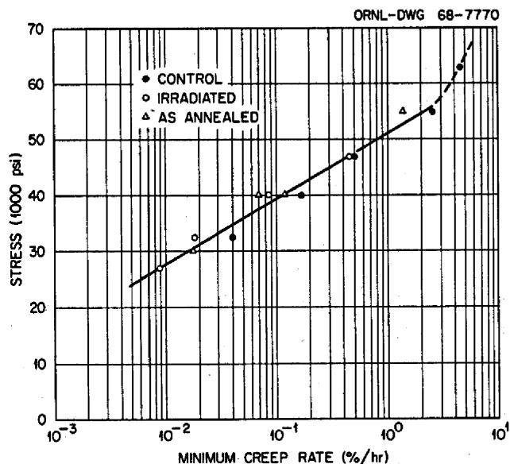  
Fig. 27. Variation of the Minimum Creep Rate with Stress for Titanium-Modified Hastelloy N (Heat 21545) at $650^{\circ}\mathrm{C}$ . Tested after annealing at $871^{\circ}\mathrm{C}$ (see p. 7), annealing followed by 5500 hr at $650^{\circ}\mathrm{C}$ in static fluoride salt, and irradiated to a thermal fluence of $4.1 \times 10^{20}$ neutrons/cm $^2$ .

The fracture strains of these materials in the unirradiated state under creep conditions are excellent, ranging from 30 to $60\%$ (Tables 10 and 11). However, the fracture strains after irradiation are appreciably less ranging from 1.5 to $4.5\%$ (Table 12). These strains are generally higher than those obtained from standard Hastelloy N (Fig. 17, p. 29).

# Metallographic Examination of Mechanical Property Specimens

Several of the fractured test specimens were examined metallographically. Typical micrographs from a specimen of heat 5065 exposed to the cell environment for 11,000 hr and tested at room temperature are shown in Fig. 28. Figure 28(a) shows the fracture region and demonstrates the mixed intergranular-transgranular nature of the fracture. The edge of the gage section is shown in Fig. 28(b). There is very little edge-cracking or other indications of deleterious reactions with the MSRE cell environment. Large quantities of fine precipitate that formed during the long thermal history are also obvious. A higher magnification photomicrograph made near the surface is shown in Fig. 28(c). Significant features are the limited surface reaction and the copious quantities of fine precipitates.

Photomicrographs of a specimen from heat 5065 tested at $650^{\circ}\mathrm{C}$ are shown in Fig. 29. The fracture shown in Fig. 29(a) is completely intergranular and typical of materials exhibiting low fracture strains.

The microstructure of a specimen from heat 5065 that was tested in creep at $650^{\circ}\mathrm{C}$ and 27,000 psi is illustrated in Fig. 30. Figure 30(a) shows that the fracture is entirely intergranular with some cracking near the fracture. Figure 30(b) and (c) shows the thin reaction layer at the surface and the large amount of fine precipitate that formed.

Several photomicrographs of the specimen of heat 5085 tested at $25^{\circ}\mathrm{C}$ are shown in Fig. 31. The gage portion of this specimen contained a weld and the failure occurred in this region [Fig. 3l(a)]. There is a very thin region near the surface that shows some modification of microstructure [Fig. 3l(b) and (c)]. This layer is quite similar in

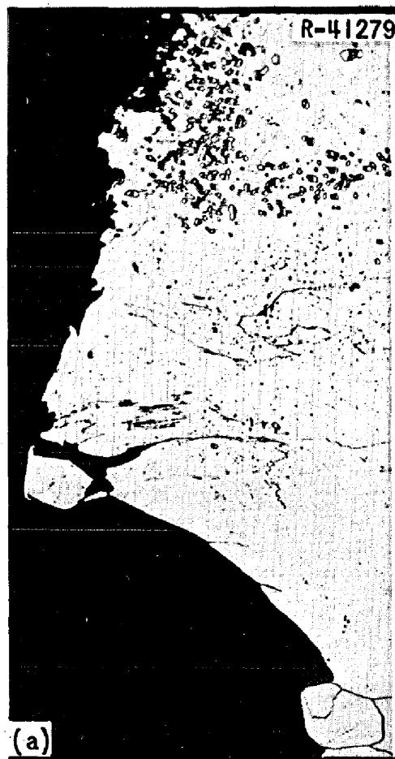

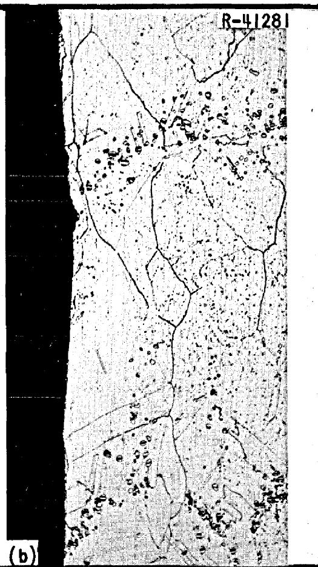

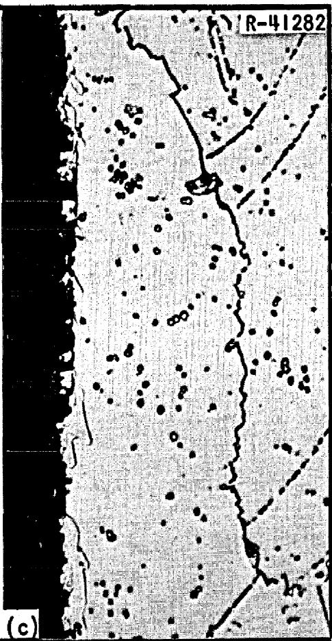  
Fig. 28. Photomicrographs of a Hastelloy N Surveillance Sample (Heat 5065) Tested at $25^{\circ}\mathrm{C}$ at a Strain Rate of $0.05\mathrm{min}^{-1}$ . Exposed outside the core for 11,000 hr at $650^{\circ}\mathrm{C}$ to a thermal fluence of $1.3 \times 10^{19}$ neutrons/cm². Etchant: Aqua regia. (a) Fracture - note the mixed transgranular and intergranular fracture. $100\times$ . (b) Edge of sample about 1/2 in. from fracture. Note the fractured precipitates. $100\times$ . (c) Edge of sample showing shallow surface oxidation and extensive precipitation. $500\times$ .

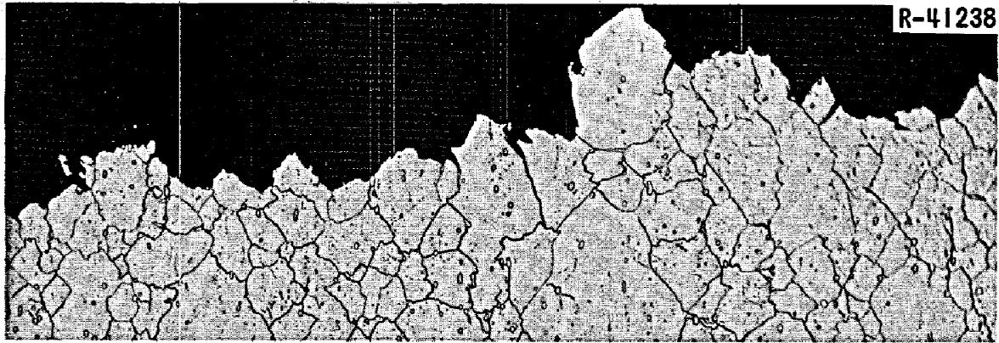  
Fig. 29. Photomicrograph of the Fracture of a Standard Hastelloy N Surveillance Sample (Heat 5065) Tested at $650^{\circ}\mathrm{C}$ at a Strain Rate of $0.002\mathrm{min}^{-1}$ . Exposed outside the core for 11,000 hr at $650^{\circ}\mathrm{C}$ to a thermal fluence of $1.3 \times 10^{19}$ neutrons/cm². 100x. Etchant: Aqua regia.

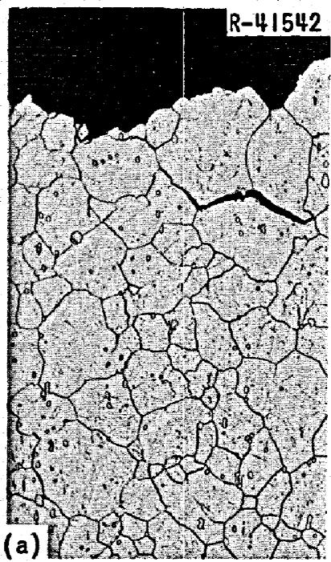

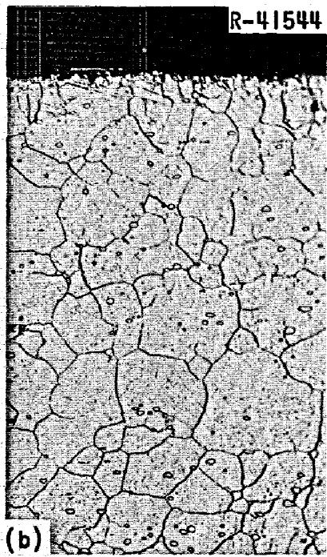

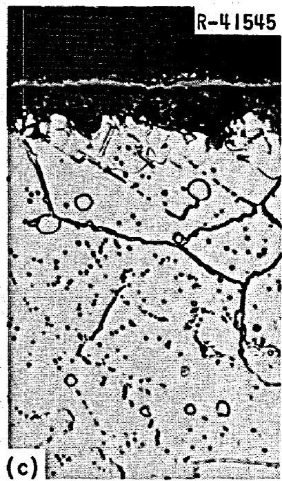  
Fig. 30. Photomicrographs of a Standard Hastelloy N Surveillance Sample (Heat 5065) Tested at $650^{\circ}\mathrm{C}$ and 27,000 psi. Failed in 290 hr after straining $1.47\%$ . Prior to testing, the sample was exposed outside the MSRE core for 11,000 hr at $650^{\circ}\mathrm{C}$ to a thermal fluence of $1.3 \times 10^{19}$ neutrons/ $\mathrm{cm}^2$ . Etchant: Aqua regia. (a) Fracture - note the predominately intergranular fracture. $100\times$ . (b) Edge of sample about $1/2$ in. from fracture. $100\times$ . (c) Edge of sample showing shallow oxidation and extensive precipitation. $500\times$ .

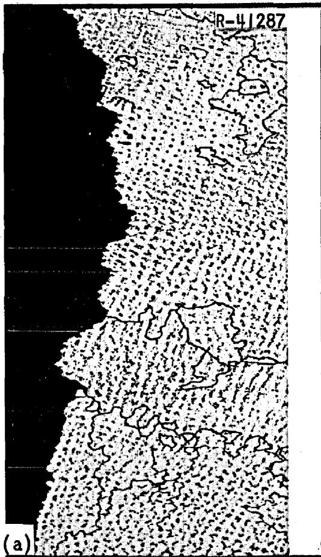

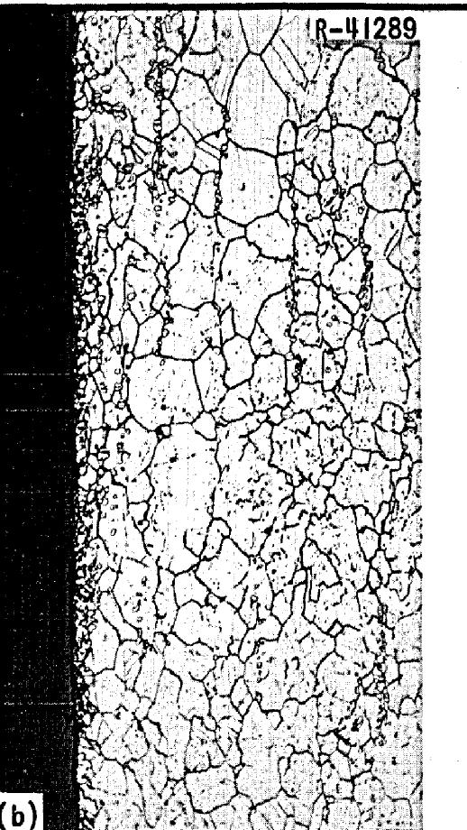

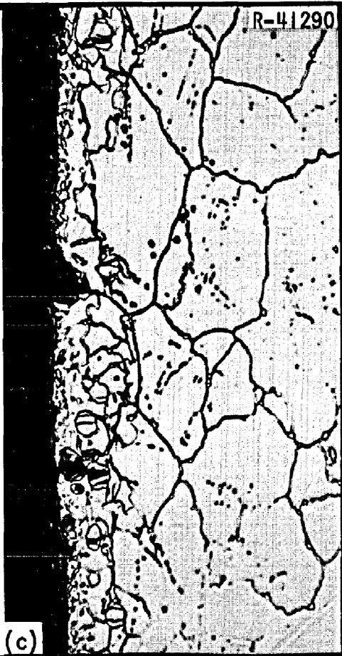  
Fig. 31. Photomicrographs of a Standard Hastelloy N Surveillance Sample (Heat 5085) Tested at $25^{\circ}\mathrm{C}$ at a Strain Rate of $0.05\mathrm{min}^{-1}$ . Exposed outside the core for 11,000 hr at $650^{\circ}\mathrm{C}$ to a thermal fluence of $1.3 \times 10^{19}$ neutrons/cm². Etchant: Aqua regia. (a) Fracture in a weld that was made in the gage length in fabricating the rod. $100\times$ . (b) Edge of sample about 1/2 in. from fracture. $100\times$ . (c) Edge of sample showing shallow surface reaction, grain boundary precipitates, and fractured precipitates. $500\times$ .

appearance to that noted previously11 for this material when exposed to the core environment. However, this layer seems to have only minor effects on the deformation as evidenced by the very limited surface cracking shown in Fig. 31(c).

The fracture of a specimen from heat 5085 that was tested at $650^{\circ}\mathrm{C}$ is shown in Fig. 32. The fracture is completely intergranular and shows little evidence of plastic deformation. A comparison of Figs. 32 and 31(b) gives an indication of the wide variation in the grain size of this material.

$^{11}$ H. E. McCoy, Jr., An Evaluation of the Molten-Salt Reactor Experiment Hastelloy N Surveillance Specimen - First Group, ORNL-TM-1997 (November 1967).

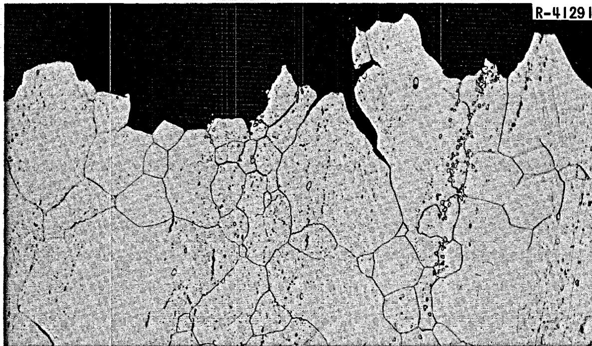  
Fig. 32. Photomicrograph of the Fracture of a Standard Hastelloy N Surveillance Sample (Heat 5085) Tested at $650^{\circ}\mathrm{C}$ at a Strain Rate of $0.002\mathrm{min}^{-1}$ . Exposed outside the core for 11,000 hr at $650^{\circ}\mathrm{C}$ to a thermal fluence of $1.3 \times 10^{19}$ neutrons/cm². 100x. Etchant: Aqua regia.

Photomicrographs of a specimen of heat 5085 that was tested in creep at $650^{\circ}\mathrm{C}$ are shown in Fig. 33. The fracture is entirely intergranular with a few cracks near the fracture. The thin reaction layer near the surface is apparent in Fig. 33(b) and (c).

Both the control and the irradiated specimens from heats 21554 and 21545 were exposed to salt for 5500 hr. The microstructures of these alloys before stressing were shown in Figs. 5 and 6, pp. 14 and 15. The microstructure of a specimen from heat 21554 that was tested at $25^{\circ}\mathrm{C}$ is shown in Fig. 34. The fracture was predominately transgranular. There was a layer near the surface of the specimen that showed extensive intergranular cracking [Fig. 34(b) and (c)]. A typical photomicrograph of the control sample is shown in Fig. 35. The fracture is a typical ductile shear type and there is no appreciable edge cracking.

The microstructure of a specimen of heat 21554 tested at $650^{\circ}\mathrm{C}$ is illustrated in Fig. 36. The fracture is intergranular and relatively brittle in appearance [Fig. 36(a)]. The edge cracking is quite extensive at this temperature also. The fracture of the control specimen (Fig. 37) is mixed intergranular-transgranular. There is some edge cracking, but not at the frequency noted for the irradiated sample [Fig. 36(b)].

At a test temperature of $850^{\circ}\mathrm{C}$ , the fracture strain for heat 21554 after irradiation was higher than at $650^{\circ}\mathrm{C}$ . The microstructures shown in Fig. 38 for the specimen tested at $850^{\circ}\mathrm{C}$ support this observation. The fracture is entirely intergranular with extensive intergranular cracking throughout the sample. The edge cracking is not quite as severe at this temperature [Fig. 38(b) and (c)]. The fracture of the control sample is shown in Fig. 39. The original grain structure has been fragmented completely because of the very high mobility of the grain boundaries at this temperature.

The microstructural features of heat 21545 were quite similar to those for heat 21554. Typical photomicrographs for heat 21545 are shown in Figs. 40 through 45 for tensile test temperatures of 25, 650, and $850^{\circ}\mathrm{C}$ . Significant features are the shear fracture at $25^{\circ}\mathrm{C}$ in the irradiated and unirradiated conditions, the extensive edge cracking in the

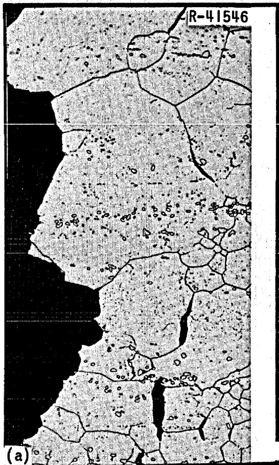

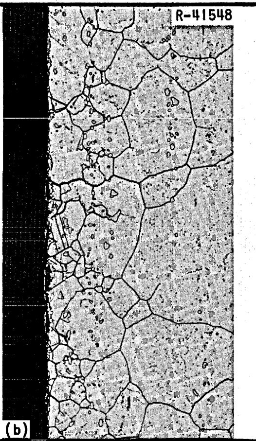

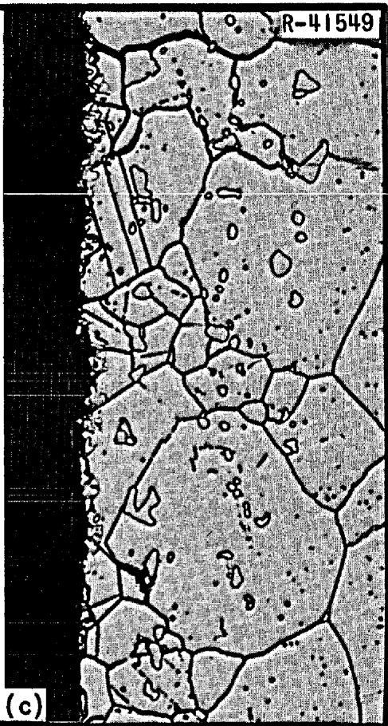  
Fig. 33. Photomicrographs of a Standard Hastelloy N Surveillance Sample (Heat 5085) Tested at $650^{\circ}\mathrm{C}$ and 30,000 psi. Failed in 323.4 hr after straining $2.4\%$ . Prior to testing, the sample was exposed outside the MSRE core for 11,000 hr at $650^{\circ}\mathrm{C}$ to a thermal fluence of $1.3 \times 10^{19}$ neutrons/ $\mathrm{cm}^2$ . Etchant: Aqua regia. (a) Fracture. $100\times$ . (b) Edge of sample about $1/2$ in. from fracture. $100\times$ . (c) Edge of sample showing shallow surface oxidation and extensive precipitation. $500\times$ .

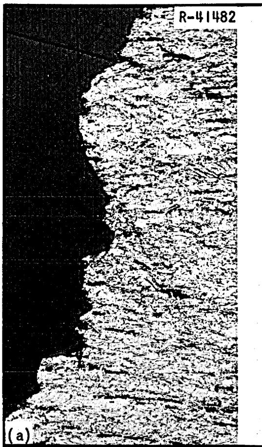

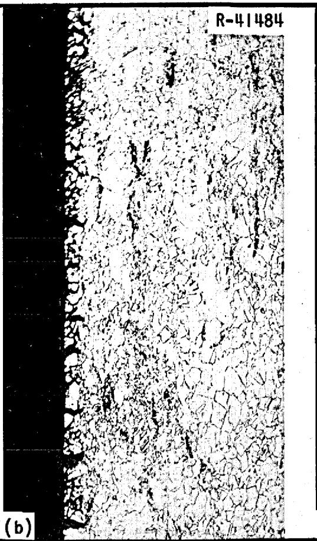

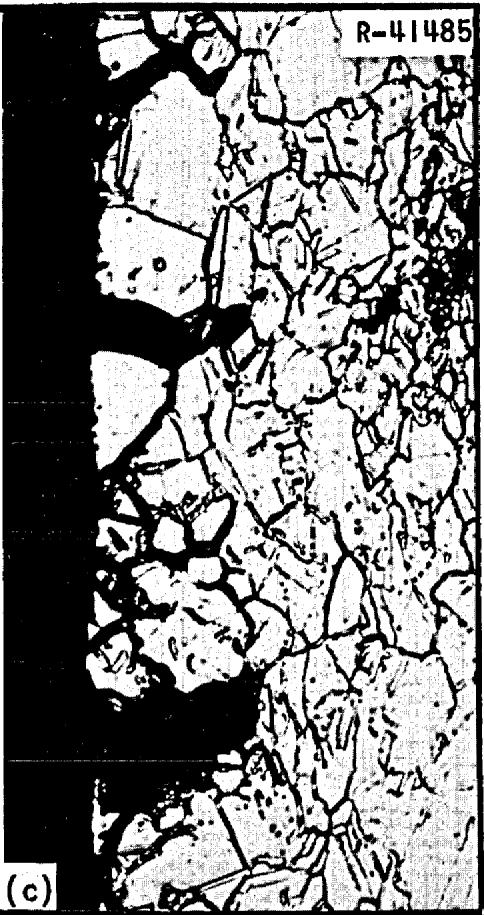  
Fig. 34. Photomicrographs of a Zirconium-Modified Hastelloy N Surveillance Sample (Heat 21554) Tested at $25^{\circ}\mathrm{C}$ at a Strain Rate of $0.05\mathrm{min}^{-1}$ . Exposed in the MSRE core for 5500 hr at $650^{\circ}\mathrm{C}$ to a thermal fluence of $4.1 \times 10^{20}$ neutrons/cm². Etchant: Aqua regia. (a) Fracture. 100×. (b) Edge of sample about 1/2 in. from fracture. 100×. (c) Edge of sample showing edge cracking. 500×.

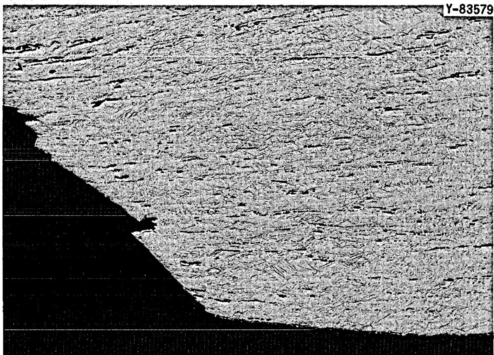  
Fig. 35. Photomicrograph of the Fracture of a Zirconium-Modified Hastelloy N Sample (Heat 21554) Tested at $25^{\circ}\mathrm{C}$ at a Strain Rate of $0.05\mathrm{min}^{-1}$ . Exposed to a static fluoride salt for 5500 hr at $650^{\circ}\mathrm{C}$ before testing. Note the shear fracture and the absence of edge cracking. $100\times$ . Etchant: Glyceria regia.

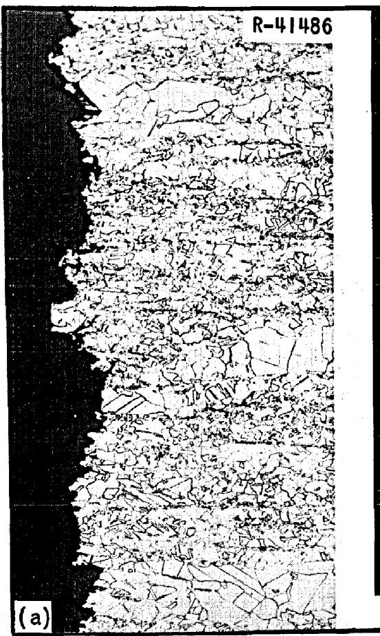

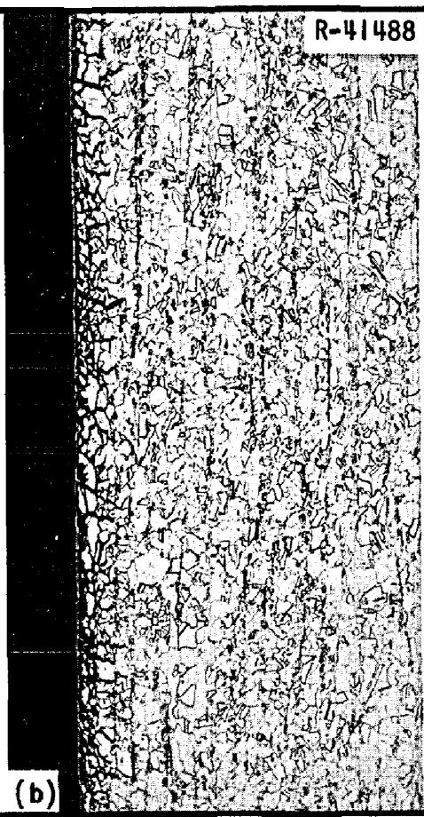

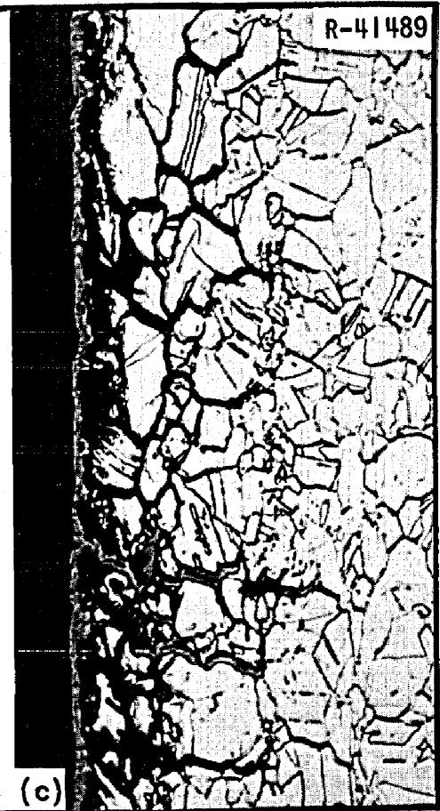  
Fig. 36. Photomicrographs of a Zirconium-Modified Hastelloy N Surveillance Sample (Heat 21554) Tested at $650^{\circ}\mathrm{C}$ at a Strain Rate of $0.002\mathrm{min}^{-1}$ . Exposed in the MSRE core for 5500 hr at $650^{\circ}\mathrm{C}$ to a thermal fluence of $4.1 \times 10^{20}$ neutrons/cm². Etchant: Aqua regia. (a) Fracture. 100×. (b) Edge of sample about 1/2 in. from fracture. 100×. (c) Edge of sample showing edge cracking. Oxide formed during the tensile test. 500×.

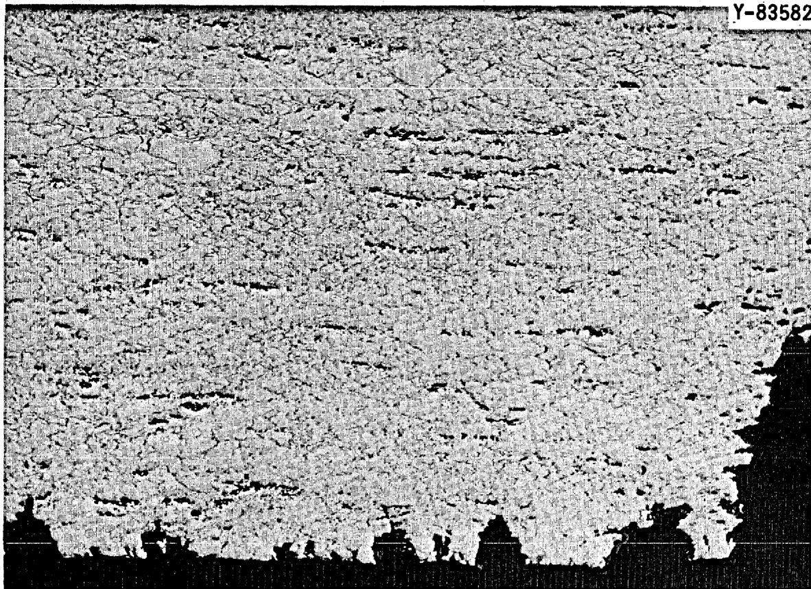  
Fig. 37. Photomicrograph Showing a Portion of the Fracture of a Zirconium-Modified Hastelloy N Sample (Heat 21554) Tested at $650^{\circ}\mathrm{C}$ at a Strain Rate of $0.002\mathrm{min}^{-1}$ . Exposed to static fluoride salt for 5500 hr at $650^{\circ}\mathrm{C}$ before testing. $100\times$ . Etchant: Glyceria regia.

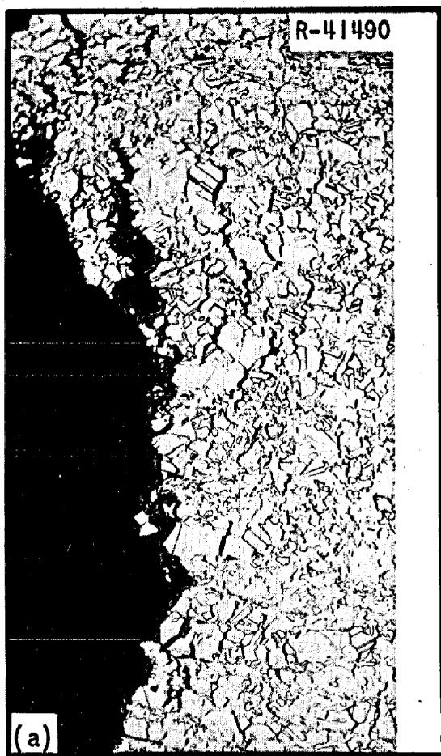

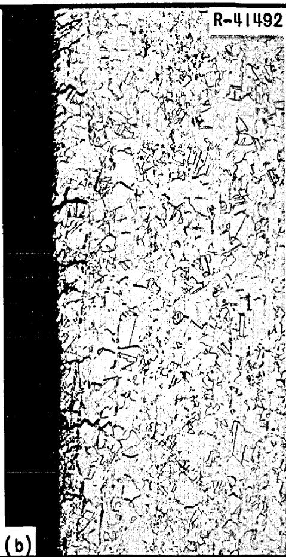

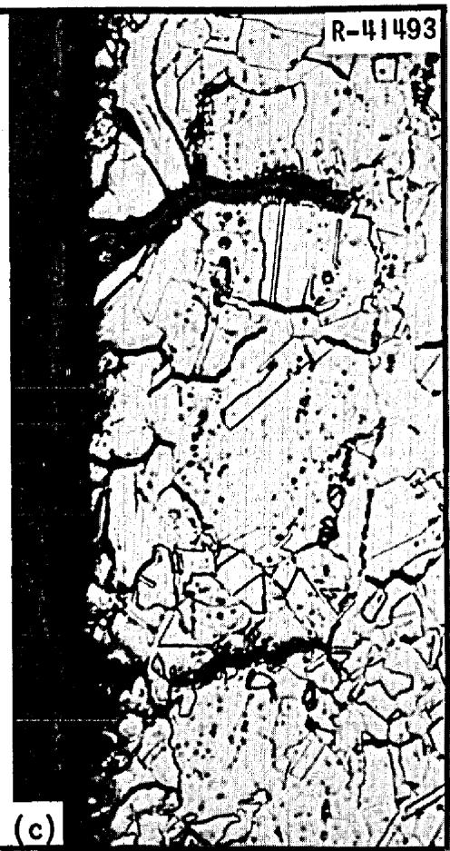  
Fig. 38. Photomicrographs of a Zirconium-Modified Hastelloy N Surveillance Sample (Heat 21554) Tested at $850^{\circ}\mathrm{C}$ at a Strain Rate of $0.002\mathrm{min}^{-1}$ . Exposed in the MSRE core for 5500 hr at $650^{\circ}\mathrm{C}$ to a thermal fluence of $4.1 \times 10^{20}$ neutrons/cm². Etchant: Aqua regia. (a) Fracture. 100×. (b) Edge of sample about 1/2 in. from fracture. 100×. (c) Edge of sample showing edge cracking. Oxide formed during the tensile test. 500×.

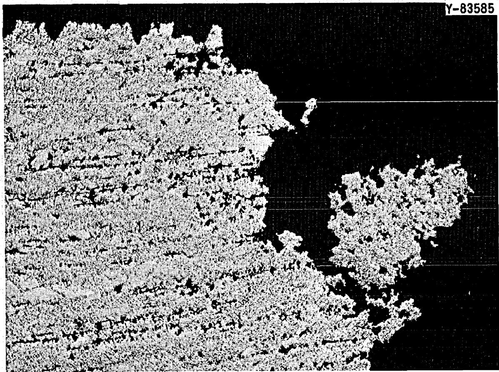  
Fig. 39. Photomicrograph Showing the Fracture of a Zirconium-Modified Hastelloy N Sample (Heat 21554) Tested at $850^{\circ}\mathrm{C}$ at a Strain Rate of $0.002\mathrm{min}^{-1}$ . Exposed to static fluoride salt for 5500 hr at $650^{\circ}\mathrm{C}$ before testing. Note the extensive grain boundary migration. 100x. Etchant: Glyceria regia.

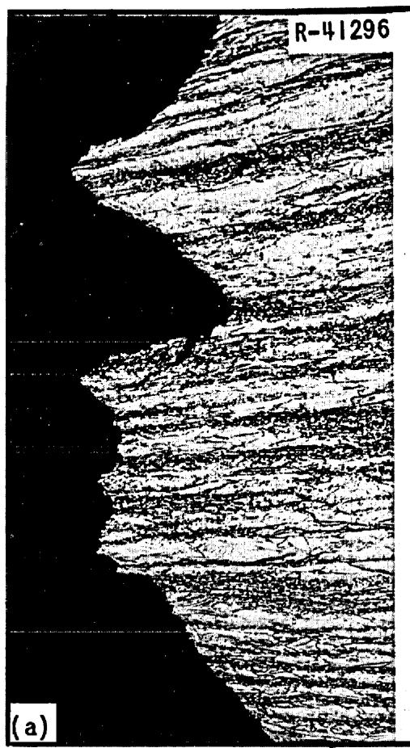

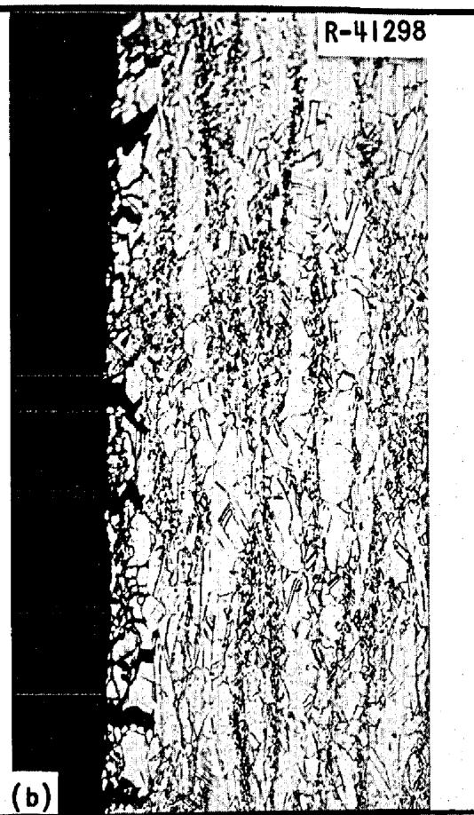

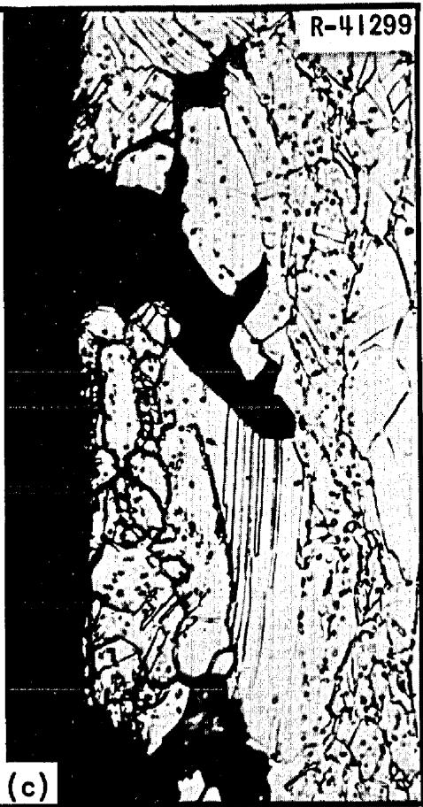  
Fig. 40. Photomicrographs of a Titanium-Modified Hastelloy N Surveillance Sample (Heat 21545) Tested at $25^{\circ}\mathrm{C}$ at a Strain Rate of $0.05\mathrm{min}^{-1}$ . Exposed in the MSRE core for 5500 hr at $650^{\circ}\mathrm{C}$ to a thermal fluence of $4.1 \times 10^{20}$ neutrons/cm $^2$ . Etchant: Aqua regia. (a) Fracture. 100×. (b) Edge of sample about 1/2 in. from fracture. 100×. (c) Edge of sample showing edge cracking. 500×.

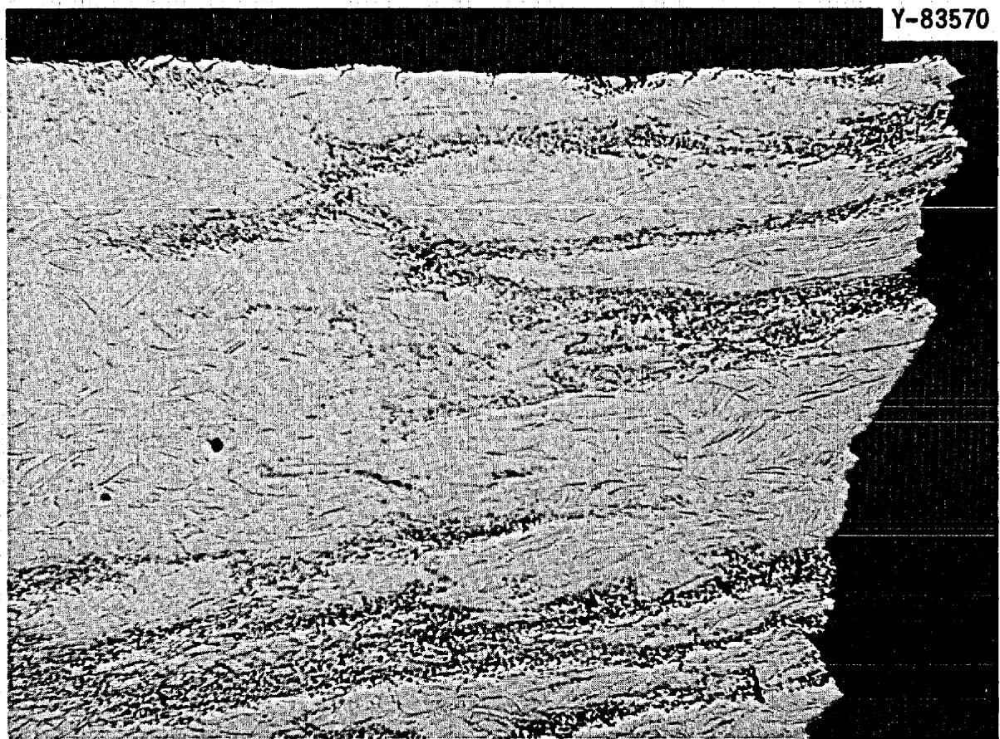  
Fig. 41. Photomicrograph of the Fracture of a Titanium-Modified Hastelloy N Surveillance Sample (Heat 21545) Tested at $25^{\circ}\mathrm{C}$ at a Strain Rate of $0.05\mathrm{min}^{-1}$ . Exposed to a static fluoride salt for 5500 hr at $650^{\circ}\mathrm{C}$ before testing. Note the shear fracture and the absence of edge cracking. $100\times$ . Etchant: Glyceria regia.

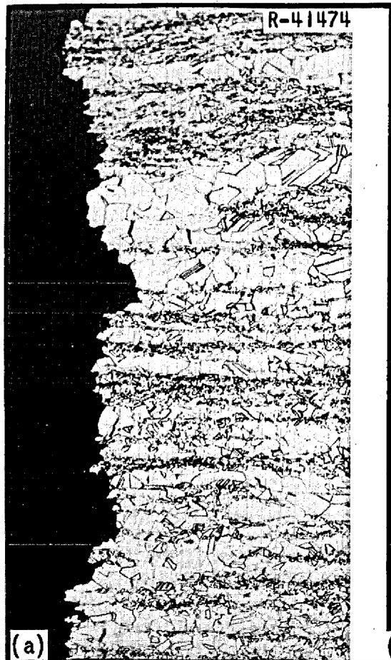

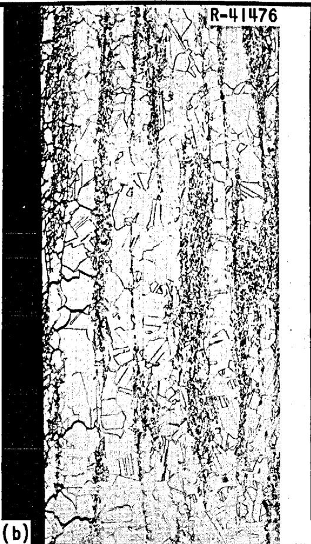

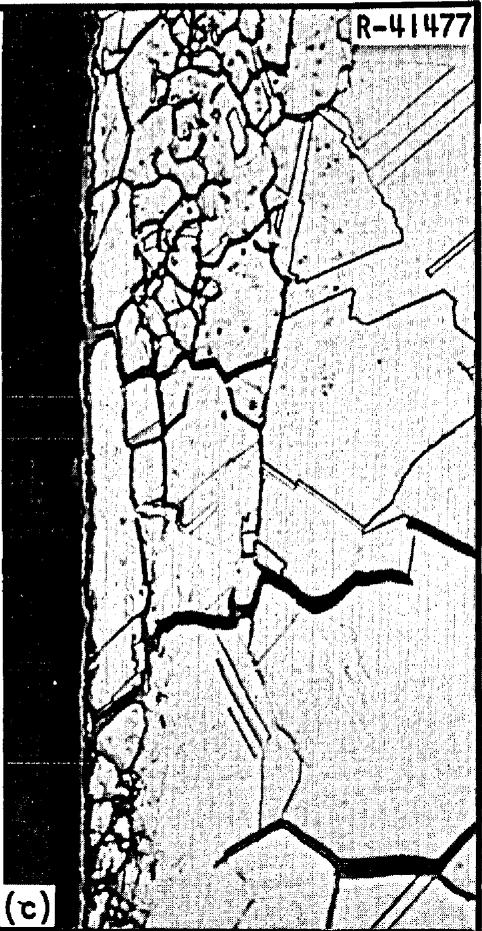  
Fig. 42. Photomicrographs of a Titanium-Modified Hastelloy N Surveillance Sample (Heat 21545) Tested at $650^{\circ}\mathrm{C}$ at a Strain Rate of $0.002\mathrm{min}^{-1}$ . Exposed in the MSRE core for 5500 hr at $650^{\circ}\mathrm{C}$ to a thermal fluence of $4.1 \times 10^{20}$ neutrons/cm². Etchant: Aqua regia. (a) Fracture. 100×. (b) Edge of sample about 1/2 in. from fracture. 100×. (c) Edge of sample showing edge cracking. Oxide formed during the tensile test. 500×.

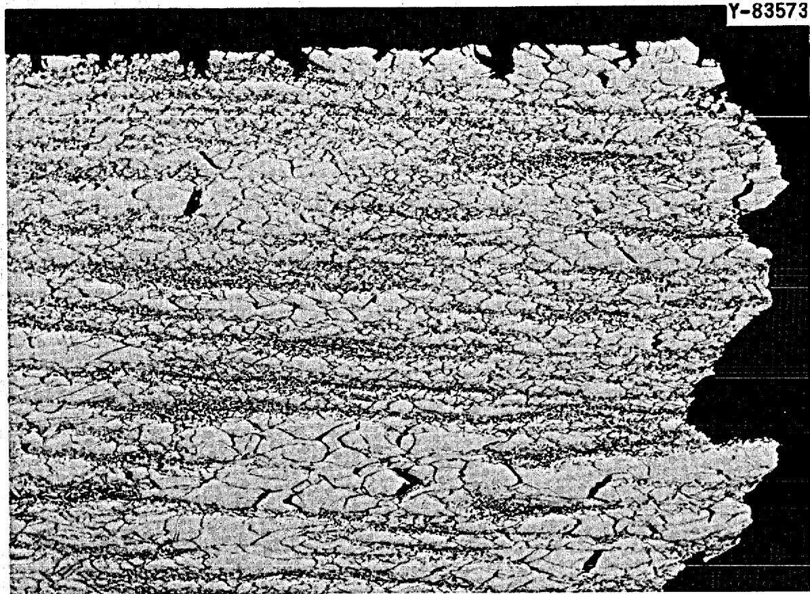  
Fig. 43. Photomicrograph Showing a Portion of the Fracture of a Titanium-Modified Hastelloy N Surveillance Sample (Heat 21545) Tested at $650^{\circ}\mathrm{C}$ at a Strain Rate of $0.002\mathrm{min}^{-1}$ . Exposed to static fluoride salt for 5500 hr at $650^{\circ}\mathrm{C}$ before testing. $100\times$ . Etchant: Glyceria regia.

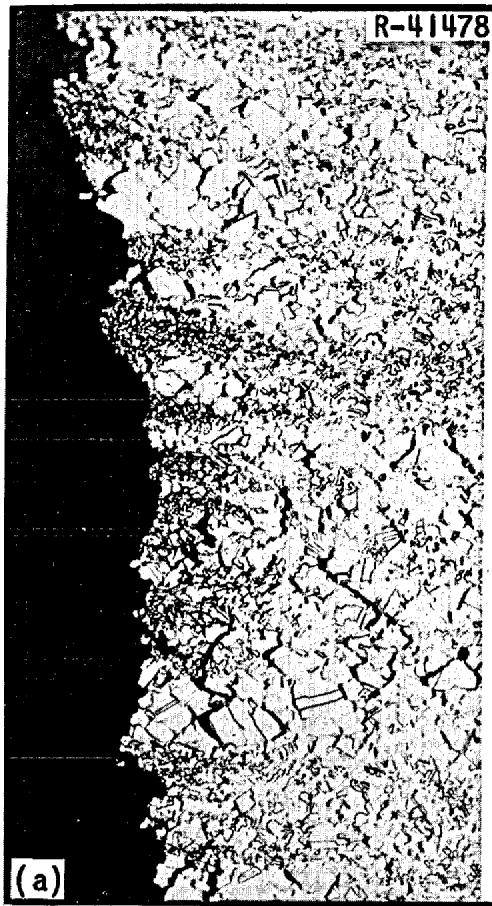

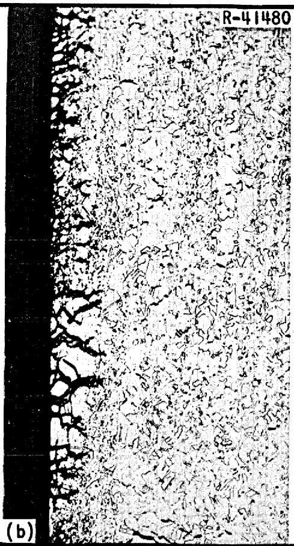

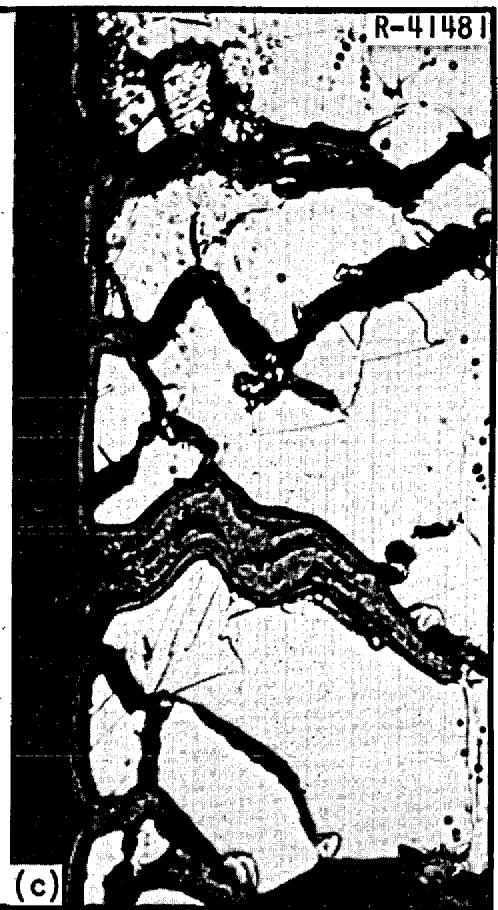  
Fig. 44. Photomicrographs of a Titanium-Modified Hastelloy N Surveillance Sample (Heat 21545) Tested at $850^{\circ}\mathrm{C}$ at a Strain Rate of $0.002\mathrm{min}^{-1}$ . Exposed in the MSRE core for 5500 hr at $650^{\circ}\mathrm{C}$ to a thermal fluence of $4.1 \times 10^{20}$ neutrons/cm². Etchant: Aqua regia. (a) Fracture. 100×. (b) Edge of sample about 1/2 in. from fracture. 100×. (c) Edge of sample showing edge cracking. Oxide formed during the tensile test. 500×.

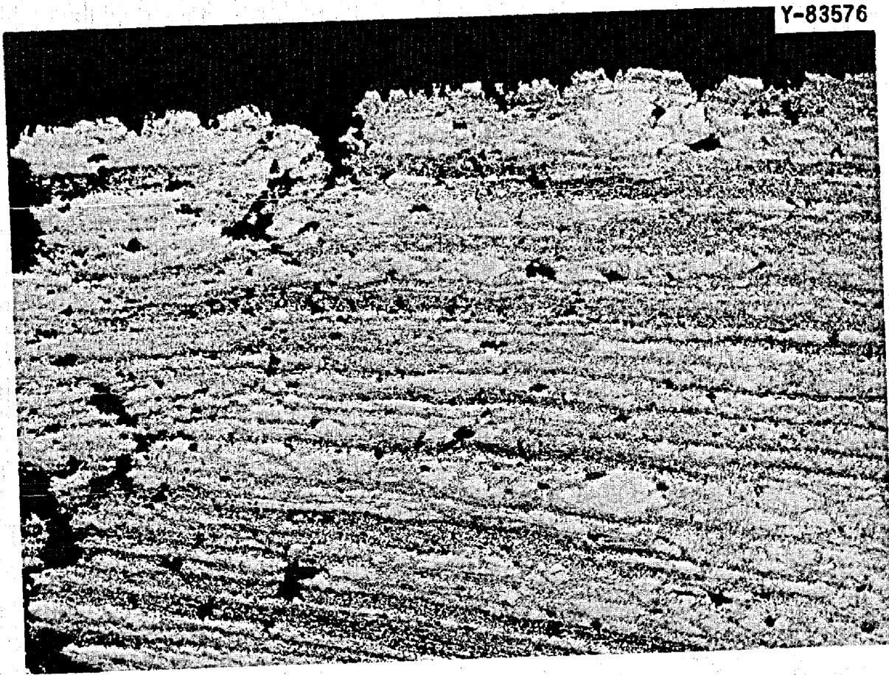  
Fig. 45. Photomicrograph of the Fracture of a Titanium-Modified Hastelloy N Surveillance Sample (Heat 21545) Tested at $25^{\circ}\mathrm{C}$ at a Strain Rate of $0.05\mathrm{min}^{-1}$ . Exposed to a static fluoride salt for 5500 hr at $650^{\circ}\mathrm{C}$ before testing. Note the shear fracture and the absence of edge cracking. $100\times$ . Etchant: Glyceria regia.

irradiated material, a completely intergranular fracture of the irradiated material at $650^{\circ}\mathrm{C}$ compared with a mixed transgranular and intergranular fracture in the unirradiated material, and grain boundary migration at a test temperature of $850^{\circ}\mathrm{C}$ .

# DISCUSSION OF RESULTS

The standard Hastelloy N used in constructing the MSRE continues to show excellent compatibility with the fluoride salt environment and the cell environment consisting of $\mathbb{N}_2 - 2$ to $5\% 0_2$ . There was no evidence of nitriding, and the depth of oxidation in 11,000 hr was only a few mils. We knew from previous studies that the mechanical properties of Hastelloy N would deteriorate due to irradiation damage.[12-17] Our examination of the first group of surveillance specimens[18] showed that the property changes were as-predicted, the only exception being a reduction in the ductility at $25^{\circ}\mathrm{C}$ . Extraction replicas showed that extensive carbide precipitation occurred along the grain boundaries during irradiation at $650^{\circ}\mathrm{C}$ , and this probably accounts for the reduction in ductility at $25^{\circ}\mathrm{C}$ .

Our primary purpose in this program is to continually assess the condition of the MSRE core vessel. The surveillance facility in the core

receives a thermal flux about a factor of 40 higher than that received by the vessel. The first surveillance specimens removed from the core received a thermal fluence of $1.3 \times 10^{20}$ neutrons/cm² while being heated for 4800 hr. The surveillance specimens of standard Hastelloy N removed with the second group were located outside the core and received a thermal fluence of $1.3 \times 10^{19}$ neutrons/cm² while being heated for 11,000 hr. The latter group should indicate more closely the properties of the vessel, but a comparison of the properties of both groups is important in trying to estimate the future properties. The fracture strain in tensile tests (Fig. 14, p. 25) is reduced even more by the higher fluence. In creep-rupture tests at $650^{\circ}\mathrm{C}$ (Fig. 15, p. 27), the rupture life is also slightly shorter and the strain at fracture (Fig. 17, p. 29) slightly less for the specimen irradiated to the higher fluence. In the unirradiated condition, heat 5085 exhibited fracture strains of 20 to $40\%$ in creep-rupture tests compared with fracture strains of about 2.2 and $1.5\%$ after irradiation to thermal fluences of $1.3 \times 10^{19}$ neutrons/cm² and $1.3 \times 10^{20}$ neutrons/cm², respectively. Thus, even though the properties continue to change slightly with increasing fluence, the rate of change has decreased markedly.

Another encouraging observation is that the MSRE materials do not seem to have as low minimum fracture strains after irradiation as we have noted for the same materials after irradiation to the same fluences in the ORR (Fig. 17, p. 29). This may be due to the more extensive carbide precipitation in the materials irradiated in the MSRE for long periods of time.

The modified alloys, heats 21554 (zirconium modified) and 21545 (titanium modified), were annealed to produce a small grain size. Since these samples were placed in the MSRE, we have found that material annealed to produce a coarser grain size has better properties after irradiation.[19] Thus, we were not surprised that the postirradiation

properties of the modified alloys were not much better than those observed for the standard Hastelloy N. However, two encouraging observations were made that demonstrate the absence of embrittling aging reactions: (1) the mechanical properties of the control specimens exposed to salt for 5500 hr were only slightly different from those of the as-annealed material (Figs. 24 and 25, pp. 38 and 41) and (2) the strain at fracture in tensile tests at $25^{\circ}\mathrm{C}$ was not reduced by irradiation. The most disturbing observation is the intergranular cracking near the surface of specimens that were removed from the reactor. Our measurements $^{20}$ of the lattice diffusion of titanium in the modified alloy indicate that the gradients in these samples should extend to a depth of only about 0.15 mil (based on a lattice diffusion coefficient of $1 \times 10^{-15} \, \text{cm}^2/\text{sec}$ and 5500 hr exposure at $650^{\circ}\mathrm{C}$ ). However, titanium can diffuse more rapidly along the grain boundaries and we can approximate this depth of removal by the Fisher model. $^{21}$ Assuming that the grain boundary diffusion rate is $10^6$ times that for the lattice, $^{22}$ significant depletion of the titanium should occur along the grain boundaries to depths of about 4 mils. This is in reasonable agreement with the depth of the surface cracks observed in the surveillance specimens (Figs. 34 and 40, pp. 50 and 56). However, the control specimens (Figs. 35 and 41, pp. 51 and 57) were exposed to static salt but did exhibit edge cracking when tested. It is possible that corrosion in the static vessel proceeds more slowly than in the flowing reactor circuit or that the grain boundary cracking may be a result of the loss or ingress of some element besides titanium.

# SUMMARY AND CONCLUSIONS

We have examined the second group of surveillance samples removed from the MSRE. Two rods of standard Hastelloy N were removed from the

surveillance position outside the core after $11,000\mathrm{hr}$ at temperature with a thermal fluence of $1.3\times 10^{19}$ neutrons/cm². The compatibility of the material with the cell environment of nitrogen plus 2 to $5\%$ $\mathsf{O}_2$ seems excellent with no evidence of nitriding and only superficial oxidation. Mechanical property tests show that the fracture strain at $25^{\circ}\mathrm{C}$ and above $500^{\circ}\mathrm{C}$ was reduced markedly by irradiation. Creep-rupture tests at $650^{\circ}\mathrm{C}$ show a reduction in rupture life and ductility. A comparison with results from the first group of surveillance specimens exposed to the core environment to a fluence of $1.3\times 10^{20}$ neutrons/cm² indicated that the mechanical properties deteriorated only slightly with increasing fluence.

Two heats of modified Hastelloy N containing $0.5\%$ Ti and $0.5\%$ Zr were removed from the core with a thermal fluence of $4.1 \times 10^{20}$ neutrons/cm². They had not been annealed to obtain the optimum properties and their postirradiation mechanical properties were only slightly better than those observed for the standard alloy. However, these alloys did not seem to age and their corrosion resistance seems acceptable.

# ACKNOWLEDGMENTS

The author is indebted to numerous persons for assistance in this study.

W. H. Cook and A. Taboada - Design of surveillance assembly and insertion of specimens.

W. H. Cook and R. C. Steffy - Flux measurements.

J. R. Weir, Jr., and W. H. Cook - Review of the manuscript.

E. J. Lawrence and J. L. Griffith - Assembled surveillance and control specimens in fixture.

P. Haubenreich and MSRE Operation Staff - Exercised extreme care in inserting and removing the surveillance specimens.

E. M. King and Hot Cell Operation Staff - Developed techniques for cutting long rods into individual specimens, determined specimen straightness, and offered assistance in running creep and tensile tests.

B. C. Williams, B. McNabb, N. O. Pleasant - Ran tensile and creep tests on surveillance and control specimens.

E. M. Thomas and J. Feltner - Processed test data.

J. A. Snyder and R. H. Jones - Developed technique for making Hastelloy N surveillance rods.

H. R. Tinch and E. Lee - Metallography on control and surveillance specimens. W. C. Colwell, Jr., and Graphite Arts - Preparation of drawings. Thelma Reedy and Meredith Hill, Metals and Ceramics Division Reports Office - Preparation of report.

# INTERNAL DISTRIBUTION

1-3. Central Research Library   
4-5. ORNL Y-12 Technical Library   
Document Reference Section   
6-25. Laboratory Records   
26. Laboratory Records, ORNL-RC   
27. ORNL Patent Office   
28. R. K. Adams   
29. G. M. Adamson   
30. R. G. Affel   
31. J. L. Anderson   
32. R.F.Apple   
33. C. F. Baes   
34. J. M. Baker   
35. S.J.Ball   
36. C. E. Bamberger   
37. C. J. Barton   
38. H. F. Bauman   
39. S. E. Beall   
40. R. L. Beatty   
41. M. J. Bell   
42. M. Bender   
43. C. E. Bettis   
44. E. S. Bettis   
45. D. S. Billington   
46. R. E. Blanco   
47. F. F. Blankenship   
48. J. O. Blomeke   
49. R. Blumberg   
50. E. G. Bohlmann   
51. C. J. Borkowski   
52. G. E. Boyd   
53. J. Braunstein   
54. M. A. Bredig   
55. R. B. Briggs   
56. H. R. Bronstein   
57. G. D. Brunton   
58. D. A. Canonico   
59. S. Cantor   
60. W. L. Carter   
61. G. I. Cathers   
52. O. B. Cavin   
63. A. Cepolina   
54. J. M. Chandler   
55. F. H. Clark   
56. W. R. Cobb   
57. H. D. Cochran

68. C. W. Collins   
69. E. L. Compere   
70. K. V. Cook   
71. W.H.Cook   
72. L. T. Corbin   
73. B. Cox   
74. J. L. Crowley   
75. F. L. Culler   
76. D. R. Cuneo   
77. J. E. Cunningham   
78. J. M. Dale   
79. D. G. Davis   
80. R. J. DeBakker   
81. J. H. Devan   
82. S. J. Ditto   
83. A. S. Dworkin   
84. I. T. Dudley   
85. D. A. Dyslin   
86. W. P. Eatherly   
87. J. R. Engel   
88. E.P.Epler   
89. D. E. Ferguson   
90. L. M. Ferris   
91. A. P. Fraas   
92. H. A. Friedman   
93. J. H Frye, Jr.   
94. W. K. Furlong   
95. C. H. Gabbard   
96. R. B. Gallaher   
97. R. E. Gehlbach   
98. J.H.Gibbons   
99. L. O. Gilpatrick   
OO. W. R. Grimes   
O1. A. G. Grindell   
02. R.W.Gunkel   
03. R.H.Guymon   
04. J. P. Hammond   
05. B. A. Hennaford   
06. P. H. Harley   
C7. D. G. Harman   
08. W. O. Harms   
09. C. S. Harrill   
10. P. N. Haubenreich   
11. R. E. Helms   
12. P. G. Herndon   
13. D. N. Hess

114. J. R. Hightower 115-117. M. R. Hill   
113. H.W.Hoffman   
119. D. K. Holmes   
120. P.P.Holz   
121. R.W.Horton   
122. A. Houtzeel   
123. T. L. Hudson   
124. W. R. Huntley   
125. H. Inouye   
126. W. H. Jordan   
127. P. R. Kasten   
128. R. J. Kedl   
129. M. T. Kelley   
130. M. J. Kelly   
131. C. R. Kennedy   
132. T. W. Kerlin   
133. H. T. Kerr   
134. J. J. Keyes   
135. D. V. Kiplinger   
136. S. S. Kirslis   
137. J. W. Koger   
138. R. B. Korsmeyer   
139. A. I. Krakoviak   
140. T. S. Kress   
141. J. W. Krewson   
142. C. E. Lamb   
143. J. A. Lane   
144. C. E. Larson   
145. J. J. Lawrence   
146. M. S. Lin   
147. R. B. Lindauer   
143. A. P. Litman   
149. G. H. Llewellyn   
150. E. L. Long, Jr.   
151. A. L. Lotts   
152. M. I. Lundin   
153. R.N. Lyon   
154. R. L. Macklin   
155. H. G. MacPherson   
156. R.E.MacPherson   
157. J.C.Mailen   
158. D. L. Manning   
159. C. D. Martin   
160. W. R. Martin   
161. H. V. Mateer   
162. T. H. Mauney   
163. H. McClain   
164. R. W. McClung   
165. H. E. McCoy   
166. D. L. McElroy   
167. C. K. McGlothlan

168. C. J. McHargue   
169. L. E. McNeese   
170. J.R.McWherter   
171. H. J. Metz   
172. A. S. Meyer   
173. R. L. Moore   
174. D. M. Moulton   
175. T. W. Mueller   
176. H. A. Nelms   
177. H.H.Nichol   
178. J. P. Nichols   
179. E. L. Nicholson   
180. E. D. Nogueira   
181. L.C.Oakes   
182. P. Patriarca   
183. A. M. Perry   
184. T. W. Pickel   
185. H. B. Piper   
186. B. E. Prince   
187. G. L. Ragan   
188. J. L. Redford   
189. M. Richardson   
190. G. D. Robbins   
191. R. C. Robertson   
192. W. C. Robinson   
193. K. A. Romberger   
194. R. G. Ross   
195. H. C. Savage   
196. W. F. Schaffer   
197. C. E. Schilling   
198. Dunlap Scott   
199. J. L. Scott   
200. H. E. Seagren   
201. C. E. Sessions   
202. J. H. Shaffer   
203. W. H. Sides   
204. G. M. Slaughter   
205. A. N. Smith   
206. F.J. Smith   
207. G.P. Smith   
208. O. L. Smith   
209. P. G. Smith   
210. I. Spiewak   
211. R.C. Steffy   
212. W.C. Stoddart   
213. H. H. Stone   
214. R.A. Strehlow   
215. D. A. Sundberg   
216. J. R. Talleackson   
217. E. H. Taylor   
218. W. Terry   
219. R.E.Thoma

220. P. F. Thomason   
221. L. M. Toth   
222. D. B. Trauger   
223. W. E. Unger   
224. G. M. Watson   
225. J. S. Watson   
226. H. L. Watts   
227. C. F. Weaver   
228. B. H. Webster   
229. A. M. Weinberg   
230. J.R.Weir

231. W. J. Werner   
232. K.W. West   
233. M. E. Whatley   
234. J. C. White   
235. R.P.Wichner   
236. L. V. Wilson   
237. Gale Young   
238. H.C.Young   
239. J.P.Young   
240. E. L. Youngblood   
241. F. C. Zapp

# EXTERNAL DISTRIBUTION

242. G. G. Allaria, Atomics International   
243. J. G. Asquith, Atomics International   
244. D. F. Cope, RDT, SSR, AEC, Oak Ridge National Laboratory   
245. C. B. Deering, AEC, OSR, Oak Ridge National Laboratory   
246. H. M. Dieckamp, Atomics International   
247. A. Giambusso, AEC, Washington   
248. F. D. Haines, AEC, Washington   
249. C. E. Johnson, AEC, Washington   
250. W. L. Kitterman, AEC, Washington   
251. W. J. Larkin, AEC, Oak Ridge Operations

252-253. T. W. McIntosh, AEC, Washington

254. A. B. Martin, Atomics International

255. D. G. Mason, Atomics International

256. G. W. Meyers, Atomics International

257. D. E. Reardon, AEC, Canoga Park Area Office

258. H. M. Roth, AEC, Oak Ridge Operations

259. M. Shaw, AEC, Washington

260. J. M. Simmons, AEC, Washington

261. W. L. Smalley, AEC, Washington

262. S. R. Stamp, AEC, Canoga Park Area Office

263. E. E. Stansbury, the University of Tennessee

264. D. K. Stevens, AEC, Washington

265. R. F. Sweek, AEC, Washington

266. A. Taboada, AEC, Washington

267. R. F. Wilson, Atomics International

268. Laboratory and University Division, AEC, Oak Ridge Operations

269-283. Division of Technical Information Extension