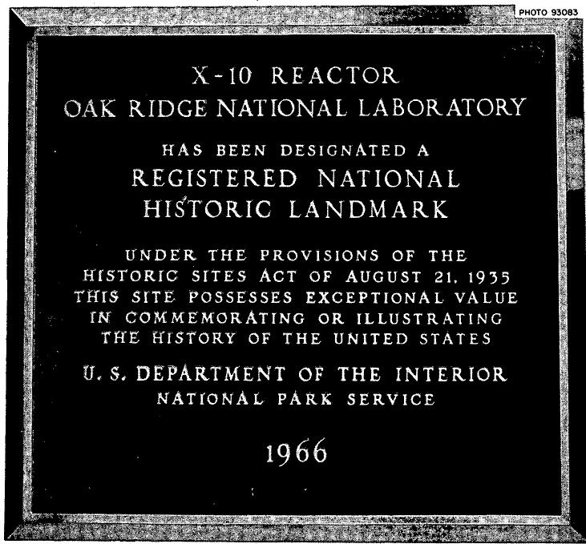
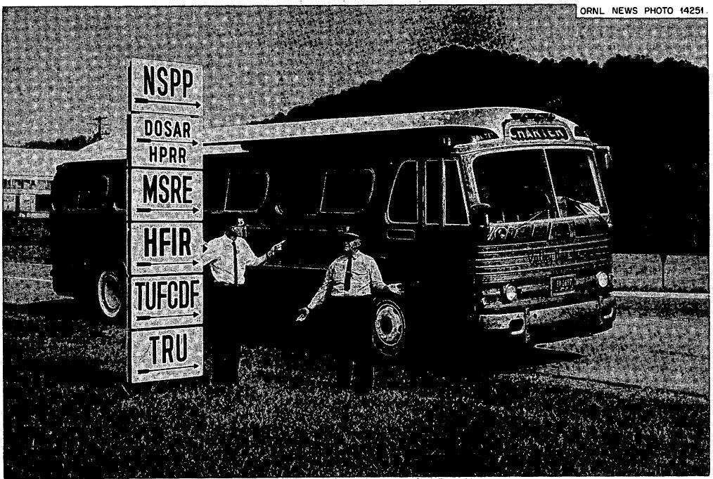

# U.S. ATOMIC ENERGY COMMISSION

LOCKHEED MARTIN ENERGY RESEARCH LIBRARIES

3445605131559

ORNL-TM-2367

COPY NO. - 93

DATE-September17,1968

# THE LANGUAGE OF NUCLEAR SCIENCE

# Francois Kertesz

The wartime codes and the more recent special terms used in the nuclear literature and engineering trade jargon are reviewed. Study of these expressions revealed that in spite of the requirements of secrecy, there is a definite correlation between the terms and the objects or concepts involved. In contradiction to other scientific fields, words of Latin and Greek origin are not preferred by nuclear scientists.

OAK RIDGE NATIONAL LABORATORY

CENTRAL RESEARCH LIBRARY

DOCUMENT COLLECTION

LIBRARY LOAN COPY

DO NOT TRANSFER TO ANOTHER PERSON

If you wish someone else to see this

document, send in name with document

and the library will arrange a loan.

UCN·7969

3-67

# LEGAL NOTICE

This report was prepared as an account of Government sponsored work. Neither the United States, nor the Commission, nor any person acting on behalf of the Commission:

A. Makes any warranty or representation, expressed or implied, with respect to the accuracy, completeness, or usefulness of the information contained in this report, or that the use of any information, apparatus, method, or process disclosed in this report may not infringe privately owned rights; or   
B. Assumes any liabilities with respect to the use of, or for damages resulting from the use of any information, apparatus, method, or process disclosed in this report.

As used in the above, "person acting on behalf of the Commission" includes any employee or contractor of the Commission, or employee of such contractor, to the extent that such employee or contractor of the Commission, or employee of such contractor prepares, disseminates, or provides access to, any information pursuant to his employment or contract with the Commission, or his employment with such contractor.

# THE LANGUAGE OF NUCLEAR SCIENCE

"The publications of scientists concerning their individual work have been so copious -- and so unreadable for anyone but their fellow specialists. This has been a great handicap to science itself, for basic advances in scientific knowledge often spring from the cross-fertilization of knowledge from different specialists. What is even more ominous is that science has increasingly lost touch with non-scientists. Under such circumstances scientists come to be regarded as magicians -- feared rather than admired. And the impression that science is incomprehensible magic, to be understood only by a chosen few who are suspiciously different from ordinary mankind, is bound to turn many youngsters away from science."

The Intelligent Man's Guide to Science  
Isaac Asimov; Basic Books, Inc.  
New York, 1960

"At that point I killed the dead man."

I looked at the verbatim transcript of a technical session devoted to reactor operations safety. I read the words; understood every one of them, and still failed to get the message. Only after careful consideration did I realize that the speaker was referring to the so-called "dead man's button", -- a safety device installed in subway trains and electric locomotives. The engineer must keep this button depressed, otherwise, the train stops, protecting the passengers against the consequences of a heart attack. In this particular case, it was necessary to eliminate temporarily this safety device by means of a bypass circuit; thus, the speaker could state quite naturally that he "killed the dead man".

Insiders understand the special meaning of common words and get unerringly the correct significance of coined terms. When show-business people read the headline in "Variety" POP OP FLOP, they know without consulting a slang dictionary that the attempt to popularize opera was not successful.

Modern life has become very complicated and our language reflects this. In an isolated, homogeneous community everybody speaks the same language,

but 20th Century man lives in a society which produces and uses tools of ever-increasing complexity; therefore, new terms must be invented or new meanings must be given to old words, in order to identify a specialized concept. The great variety of these specialized terms used in various professions may be glimpsed by browsing through an interesting compilation, edited by the well-known linguist, Mario Pei1. Turning the pages of this book, we encounter the jargon of anthropology, architecture, ... linguistics, literature, and of the theatre. We may thus learn that in the speech of actors, "darling" means "a casual acquaintance whose name I do not remember". On the other hand, the meaning of colorful electronics engineering terms, such as "negative feedback" and "white noise", is also hidden from the uninitiated. The editor points out that of the about one million words in the English language, the average cultivated person probably uses only about 30,000 words and is able to recognize and understand only an additional 60,000.

I would like to examine briefly another highly specialized language, -- that of the nuclear engineer and scientist. This relatively new field needed many new words to convey a specialized meaning or to designate new machines and facilities. Some of the terms were taken from the basic sciences involved in nuclear research; many entries in nuclear glossaries, and terminology books are simple engineering and scientific terms as used in nuclear applications.

The purely scientific terms represent an important source of the nuclear language. The concepts must be carefully defined to ensure that the reader will understand exactly what the author means. They usually are issued by national and international committees and are made available in form of official glossaries2. As a member of such a "work group", I had an opportunity to observe how much critical thought is needed to define a seemingly innocuous term. Committee members must represent the various fields involved in nuclear science to ensure that the health physicist, the metallurgist or the design engineer indeed mean the same thing when they use the same word.

Although the reader of a technical paper is not a layman, he must be advised what is meant by expressions such as decontamination factor, migration area, multiplication factor, et al. Modern science deals with

exact quantities, and any reference to concentration, weight or volume must be clear and unequivocal. Committee members who usually are both generators of new scientific information and avid readers of the technical literature, must decide whether a twice enriched uranium contains twice the original $0.7\%$ of 235U, or $1.4\%$ added to the original 0.7, resulting in $2.1\%$ of 235U.*

In addition to such assistance to professionals by means of these official glossaries, the requirements of general readers and students have not been forgotten3. Technical societies and government agencies provide assistance to science writers by providing compilations and simplified definitions of terms, including many of interest to the nuclear field. These collections are of educational character; the terms are explained, rather than defined.

As the nuclear field continued to grow and assumed an increasing importance in the economy and political life throughout the world, more ambitious cyclopiedias and lexicons were published in various languages. They cater to a variety of people, - the specialist, the interested citizen or the newspaperman is able to find answers to his questions4.

When we examine the origins of "nuclear language", we must keep in mind that the field grew up in secrecy; it was born under conditions of wartime urgency, followed by a period of mutual suspicion which divided the scientific countries of the world into opposite camps. When the first truly world-wide meeting was held in Geneva in August 1955, many nations discovered that their language did not have the terms suitable to express the new concepts. Because of its rich nuclear literature, English became the predominant language and ever since has exerted a great influence on the terminology throughout the world. One of the first acts of the organizers of the 1955 Geneva Conference on the Peaceful Uses of Atomic Energy was to commission the compilation of a dictionary

covering the official languages of the United Nations. A new improved edition was published in time for the Second Geneva Conference5. Within a short time, a number of bilingual and multilingual nuclear dictionaries appeared on the market6.

The plethora of these definitions, explanations and equivalents in other languages was helpful in clarifying the meaning of terms. However, it should be kept in mind that language is a living organism; words, expressions, and specialized meanings are born, are used and ultimately die. We may define correct usage and coin suitable expressions, but they remain without effect if the technical men do not use them and editors do not insist on their correct meaning. One well-known scientific lexicographer stated it very aptly in an international meeting on nuclear terminology, when he cautioned the participants against excessive zeal: "We are only recording angels and not God Almighty".7 It is indeed useless to devise logical definitions, if authors and editors refuse to use them.

In this short review I propose to leave the serious examination of technical terms to the learned committees, and will examine primarily the more ephemeral and colorful expressions of the nuclear language which enrich the field and give it a special flavor.

There are many expressions, such as the first sentence of this paper, which are used primarily orally and are seldom written down. I heard a nuclear incident described as a felt-hat incident. This concept postulates that a worker near a swimming-pool reactor will sometimes wear a felt hat which will drop into the pool and will be sucked to the fuel elements where it will prevent the flow of cooling water, resulting in a meltdown of the element. Such accidents have indeed occurred, although with shoe covers, loose pieces of metal, etc. instead of felt hats. They are usually referred to as "felt-hat accidents" although not in formal reports.

Such expressions were coined because they satisfy a communication need and perhaps, also to keep the subject matter from the uninitiated. This often resulted in a compromise, as if technical discussions were a guessing game, in which the subject is disguised but some helpful hints are given. The language of specialists may be analyzed from different points of view. We could examine the origin of the words

used, studying the influence of specific cultures. Another approach is that used by a psychologist who analyzed "space speak", the engineering jargon of space technologists8. He found that specific, new meanings of space terms, such as count down, pad, abort, umbilical, made those words more widely used in general speech. However, his main approach was linguistic analysis; he found that space engineers make abundant use of nominal compounds.

I do not intend to make such a complete grammatical analysis of technical texts and in the following pages will concentrate my attention on individual terms and code names used by nuclear specialists, trying to decipher how and why they were chosen.

It is important to keep in mind that words not only have intellectual meanings, but may also carry an emotional impact. Some of them hit us and arouse strong feelings. We may react with fear, disgust, enthusiasm, pride, etc. to words such as pink, yellow, scab, our country. This power of words is well known and is skillfully used by such different people as orators, politicians, demagogues and preachers.

The emotional impact of words is of great importance for the nuclear field because its public acceptance is still affected by the legacy of its first application, the atomic bomb. The term, atomic or nuclear has an ambivalent effect: it may induce fear or arouse admiration. If one wanted to describe a very bright, highly skilled individual, he probably would have stated, until recently, a brain surgeon or a nuclear physicist. Today he probably would cite a heart-transplant surgeon or an astronaut. Well, -- sic transit gloria mundi!

I shall return later to the question of "loaded" terms in connection with the impact of the nuclear field or society. Let me state that use of certain expressions indicates that the user belongs to a "special interest group". It is of interest to note that in addition to the spelling of a word, its pronunciation classifies the user. Thus, an audience of space engineers will consider as an outsider a speaker who pronounces their agency, NASA, as Naysa, just as chemists prefer to pronounce the element iodine with a short "i"; the usual pronunciation iodine indicates that the speaker is a layman.

As our goal is the examination of individual terms in the nuclear field, we must be struck by the fact that this area of endeavor is

based on the linguistically incompatible term atomic fission. Atomic means indivisible; fission indicates division. Thus, progress of science overtook the old definition, whose original meaning has been forgotten by now.

When new words are coined, there is always a tendency to avoid disagreeable images and to arouse pleasant thoughts. In a well-known weekly magazine it was brought up that physicians are starting to call pep pills activity boosters and garage mechanics call themselves automotive internists. In the same article, a Jules Feiffer cartoon character is cited as follows: "First I was poor. Then I became needy. Then I was underprivileged. Now I am disadvantaged. I still don't have a penny to my name - but I have a great vocabulary."

The requirements of secrecy, ego boosting as expressed by belonging to a select group, and euphemistic tendencies are thus the chief factors affecting the language of the new science. Let us see how they have shaped the language of nuclear science.

At the beginning of the Manhattan Project, steps were taken to avoid mentioning the element uranium. In all the reports it was referred to as Tuballoy and designated by the symbol T. The enriched material was called Oralloy, and 235U was designated as element 25 (from its atomic number 92 and atomic weight 235). On the same basis, plutonium was designated as 49, since it was element 94 with an atomic weight of 239. Uranium and plutonium were referred to in many of the early reports as source material and product, respectively.

The problem of naming the new element was an important precaution during the early days. I found an interesting document representing the minutes of a meeting held on April 22-23, 1942 in Chicago10. A portion of the session was devoted to a review of the various code names.

The participants sound like a Who's Who of the project: Spedding, Thiele, Seaborg, Kennedy, Urey, Wigner, Hilberry, Boyd, Johns, Wilhelm, Perlman, Wahl and Wheeler. Among other subjects, a suitable terminology for the heaviest elements was discussed. One of the possibilities considered was to name Element 93 neptunium and Element 94 plutonium. It was agreed, however, that these designations might eventually be the actual names for these elements and therefore should not be used as

code names. Up to that time the terms copper and silver were used to designate the new elements. This method was not specific concerning the isotopes and caused considerable confusion with the actual elements named, if they were involved in the same analytical process. It was often necessary to use the term honest to God silver to distinguish "silver" from other elements. Therefore it was suggested to use a terminology based on the last digit in the atomic number and atomic weight characterizing the given substance:

Element 94, Atomic weight 239 - 49

Element 93, Atomic weight 239 - 39

Element 92, Atomic weight 238 - 28

Element 92, Atomic weight 235 - 25

Element 92, Atomic weight 234 - 24

Element 94 (generic) 40 or 4

Element 92 (generic) 20 or 2

According to a recent article by a prominent participant, it was McMillan who named Element 93 neptunium because Neptune is the next planet after Uranus, and proposed that Element 94 should be named after Pluto. A discussion developed whether its symbol should be P1 or Pu. The author wrote: "we liked the symbol 'Pu'" better for the reason that you might suspect". The expected great reaction to the symbol, after it was declassified, never materialized.

The above coding system was probably responsible for the naming of the K-25 Plant, the vast, gaseous diffusion plant designed and built by a subsidiary of the Kellog Corporation to separate the fissionable isotope 235U.

Research on transuranium elements continued. Unfortunately, there were no more planets to supply names for further elements, and the next two elements were at first tentatively called *pandemonium* and *delirium* by the workers. These names never reached the public.

The story of naming the following heavy elements has been described wittily by the man who had so much to do with them, AEC Chairman Glenn T. Seaborg12.

Element 97 was called berkelium after the city of Berkeley, California, and Element 98 was named california after the university and the state where the work was done. However, this latter name does not

reflect the observed chemical analogy of Element 98 to Element 66, dysprosium, as the names of americium, curium and berkelium signified that these elements are chemical analogs of europium, gadolinium and terbium, named after a continent, a scientist and a city, respectively. In announcing their discovery in the Physical Review, the authors commented "the best we can do is to point out, in recognition of the fact that dysprosium is named on the basis of a Greek work meaning difficult to get at, that the searchers for another element a century ago found it 'difficult to get to California'". The naming of these elements was commented on in an unexpected place, the Talk of the Town section of the New Yorker magazine. The writer remarked that "the busy scientists in California will come up with another element or two one of these days and the University has lost forever a chance of immortalizing itself in the atomic tables with some such sequence as univ- versitium (97), ofium (98), californium (99), berkelium (100). In rebuttal, the discoverers stated that "by using these names first, we have forestalled the appalling possibility that some New Yorker might follow with the discovery of 99 and 100 and apply the name newium and yorkium. The New Yorker staff rejoined that they are already working in their office laboratories on these two elements but "so far we just have the names".

Many ORNL staff members had an opportunity to hear Chairman Seaborg himself tell this story when he presented in Oak Ridge, in November 1966, a reminiscence entitled "Voices from the Past", containing original tape recordings of great historical interest.

Wartime codes had to be primarily innocuous words, unrelated to the concept, although we have seen that this was not always true. Thus, by an interesting coincidence, all buildings in which the actual electromagnetic separation process was carried out at the Y-12 Plant, were designated by numbers starting with 92 ... It is difficult to give a better hint to a secret product.

The Manhattan District of the U. S. Army Engineers camouflaged well the giant wartime operation. The name of the town of Oak Ridge itself is a cover name. After the location was found to satisfy the requirements, (fairly remote but conveniently near to centers of transportation, with large electrical and water supply available), it was

tried to chose a name which would not arouse suspicion. One of the ridges in this hilly area was called Blackoak Ridge, and therefore the term Oak Ridge was chosen, as being sufficiently bucolic and general to be used as a cover name for the residential area. The plant operations were called Clinton Engineer Works, after the nearby town of Clinton.

The original hotel of the town still stands among other wartime buildings; the oldtimers keep calling it the Guest House, disregarding the change of its name to the Alexander Hotel. During the early days the place had the distinction that everybody who checked in was given an honorary doctor title by the desk clerk. The headquarters which today house the Atomic Energy Commission's Oak Ridge Operations Office, were located in a barrack-like structure; in view of the insigna of the U. S. Army Engineers, a medieval battlement, it was natural to call it Castle-on-the-Hill, or, because it consisted of seven barracks, the Seven Gables. This survivor from the heroic days of the town is about to be replaced by a modern office building.

The Metallurgical Laboratory of the University of Chicago was another innocuous cover name; of course, its scope greatly exceeded the field of metallurgy. It was the precursor of the present Argonne National Laboratory. It is of interest to recall how this institution acquired its name after the war. After the facilities of the Metallurgical Laboratory were found to be insufficient, additional space was provided in a wooded area belonging to the Cook County Forest Preserve District. These preserves were named after famous battles of the First World War in which Americans participated; the site in question was called the Argonne Forest. After the war, the newly created national laboratory was transferred to a different site near Chicago but for sentimental reasons, it carried its name to the new location, even though it was pretty far from the original "Argonne Forest".

A metallurgical term was used also as a cover name for the project's activities at Columbia University: SAM stood for Substitute Alloy Materials. The Union Carbide Corporation assumed responsibility for this activity.

For people interested in the lore of names, browsing through the otherwise dry reading matter contained in lists of index headings, abbreviations, nicknames and acronyms can be quite rewarding13.

One may learn that Mighty Mouse represented a proposal for a heterogeneous enriched-uranium heavy-water-cooled and moderated research reactor, related to the Argonne Advanced Research Reactor or $A^{2}R^{2}$ and that Juggernaut is the Argonne Low Power Research Reactor. Acronyms with special meanings were created, with much work expended to coin terms with a special meaning, as in case of an early high-speed computer at ORNL, the ORACLE (Oak Ridge Automatic Computer Logical Engine).

Attempts were made to systematize code designations. For example, the underground nuclear tests at Los Alamos were designated first by burrowing mammals such as Bandicoot, Bobac, Aardvark, etc., a seemingly appropriate category. When they ran out of such names they were forced to use some "burrowing" mammals which may have dug only an occasional hole in the ground14. Subsequent series of tests were named after fish, birds, colors and alcoholic drinks. This was found to be of special "human" interest to a magazine writer who described an imaginary scene of a handful of scientists gathering around a table, as follows15:

"Bourbon, Scotch and Sazerac," says a crew-cut nuclear physicist. "Daiquiri, my wife likes those," chimes in a computer expert. "How about Martini and Grasshopper and Screwdriver?"

Names were never assigned in such a manner, although codes to designate actual sites of the large projects were carefully selected. Oak Ridge, Hanford and Los Alamos were designated as Sites X, W and Y. At Berkeley, the Oak Ridge Y-12 Plant was known as Shangri-La. The DuPont group, which was in charge of the X-10 Site where the Oak Ridge National Laboratory is now located, was part of the Explosives Department of the company, and was called TNX Division although this had nothing to do with the explosive trinitroxylene.

Sometimes, new terms have been introduced into the language because somebody deliberately tried to be funny. Thus, an Oak Ridge

waste tank concentration plant carried a sign for a while after the war Lower Slobovian Distillery, after the "country" popularized by the cartoonist Al Capp; however, this was too much and a superintendent with a faint heart removed it. At Los Alamos, at the Kappa site there were installations called Eenie, Meeny, Miney and Lower Slobovia, the latter apparently for its isolation.

Reactors are the most impressive and exciting devices of the nuclear age. Let us examine reactor name compilations to see how they were acquired.

Many of the names given to the reactors during the last two decades were quite prosaic; they were simply acronyms of rather unimaginative identifying terms. The first one was the historic CP-1 (Chicago Pile-1); only eleven months later, the first true reactor, with a sizeable power level, was in operation. This was the X-10 Reactor, now a registered national historic landmark (Figure 1). Going through the series as listed in various compilations, we encounter names which do not stir the blood of the reader: MTR (Materials Testing Reactor, BWR (Boiling Water Reactor), PWR (Pressurized Water Reactor), -- or to use local examples, ORR (ORNL Research Reactor), TSR (Tower Shielding Reactor), HFIR (High Flux Isotope Reactor), LITR (Low Intensity Testing Reactor) and so forth. These groups of letters are easily forgotten by all except persons who use them constantly. Figure 2 illustrates how this alphabet soup of initials confuses a hapless bus driver.

As mentioned before, the way these names are pronounced (à la "Monkey Ward" for Montgomery Ward of the stockmarket expert) identifies the "insiders". LITR is called liter, the metric unit of volume, HFIR became hifur; the Organic Moderated Reactor Experiment (OMRE) is pronounced Oh Marie. The many problems related to the handling of the molten salt fuel were probably responsible for the nickname of the Molten Salt Reactor Experiment (MSRE) -- Misery. Luckily, most of the problems have been solved.

More imagination was used in the early days. Let us take the plutonium-fueled reactor, which was under construction in one of the canyons at Los Alamos. One of the scientists who was transferred kept wondering about the progress of the project but for reasons of

security, could not ask about it openly. The location of the project and the material they worked with (49) suddenly recalled to him the old prospector's song:

"In a cavern, in a canyon, excavating for a mine,

Lived a miner, forty-niner and his daughter, Clementine."

He sent a telegram: "How is my darling Clementine?" The message was understood and the reactor became known as Clementine17.

There are other colorful examples of Los Alamos names: Jemima consisted of stacked flat plates, which evoked the well-known advertisement of hot cakes; Jezabel was "mean and hard to handle" and Topsy, the character from Uncle Tom's cabin; "she just grew".

One of the best-known among the Los Alamos reactors is the one, built without reflectors, which operated with fast neutrons, -- the bare and fast Godiva. More recently, a highly descriptive name was employed to designate a reactor prototype of the nuclear rocket project, used for so-called "captive firing" tests: the KIWI, a reactor designed to propel a rocket but held on the ground, was very aptly named after the flightless New Zealand bird.

The first reactor in Belgium, which followed the main lines of the design of the X-10 Reactor, was called BR-1 (Belgian Reactor 1); it was followed by BR-2 and BR-3. There is nothing specifically "Belgian" in this name. On the other hand, the acronym of the South African Fundamental Atomic Reactor Installation, SAFARI, gives us the flavor of that mysterious continent.

From the very beginning the Europeans used more imaginative names for their reactors. Although the acronyms were sometimes forced, the resulting word usually had a specific meaning. The British have Dido (named because it was heavy-water moderated DDO or D2O) and Zephyr (Zero Energy Fast Reactor); the French reactor, Mélusine, was named after a fairy. One needed some knowledge of mythology to recognize the reason for calling a plutonium-fueled reactor experiment Proserpine, -- the wife of Pluto. The first French zero power reactor was called ZOE after "zero (power), oxide (of uranium) and eau lourde (heavy water). The French sodium-cooled, fast reactor is called Rapsodie, from the first letters of the official descriptive terms rapide and sodium; it

evokes an ecstatic feeling. The breeder reactor mockup at the Cadarache Nuclear Center is known as Masura, a compression of its formal name Maquette Surregénératrice Cadarache which recalls the Polish dance.

Knowledge of mythology is also helpful in understanding special hints. The international collaboration in Europe was emphasized by the name of the Cadarache fast reactor, -- Harmonie; in Greek mythology Harmonia was Europa's sister-in-law18.

The name Aquarium was an obvious one for the Los Alamos critical facility, immersed in water; it also designated the design, construction and operation of a swimming-pool type reactor for the First Geneva Conference in 1955. The term swimming pool reactor was used at ORNL for its own reactor prior to this conference; it was a logical expression to designate reactors placed in a water-filled rectangular hole which looked like a swimming pool. It was feared that this less-than-serious term would be disliked by the powers-that-be and therefore the official name of the reactor at ORNL was the Bulk Shielding Reactor (BSR), a correct but colorless expression. Although the term swimming pool was removed from the official papers submitted to the Geneva Conference, the newsmen got hold of it and no censorship could prevent references in various languages to the swimming pool reactor, e.g., reacteur piscine, Schwimm-badreactor, etc.[19]. Today, pool-type reactor is a generic term.

The Argonne National Laboratory's family of reactors presents another interesting example of mythological references. These reactors are called Argonaut for Argonne Naught Power Reactor, recalling the legendary Argonauts who sailed with Jason on the ship Argo in quest of the Golden Fleece; the term now designates an educational tool in the field of nuclear power engineering, the golden fleece of the 20th Century. It is of interest to note that the modern Argonauts also crossed the sea and established a colony of such reactors in Europe; there are Jason reactors in England and Holland.

Most of the Soviet reactors also carry alphabetic designations, but there are examples of more colorful names. The organic-cooled Arbuz has a name close to the Russian word for melon (arbuz). The Romashka reactor of the Kurchatov Institute in Moscow is named for the Russian word for daisy; indeed, the design of its fuel elements recall the petals of that flower.

The first Soviet power reactor at Obninsk has been called The First Atomic Power Reactor of the USSR $^{20}$ in the English and Russian literature, but more recently it has been referred to occasionally as Pervii v Mire or Atom Mir 1, indicating "The World's First" Atomic Power Station.

Colorful terms are still being invented. The Tennessee Valley Authority announced recently that containment structures of its new Sequoyah Nuclear power plant near Chattanooga will be lined with five million pounds of ice cubes. It was unavoidable that the press would call it Reactor on the Rocks $^{21}$ .

The thermonuclear researchers, coming after reactor men, seemed to lean toward humor and mythology when naming their facilities. Again, even though I am a loyal ORNL'er, I must admit that the name of our DCX machine, standing for Direct Current Experiment, is not as colorful as that of the Los Alamos toroidal pinch experiment Perhapsatron or the magnetic mirror experiment, Scylla. Fusion research is fraught with dangers similar to those encountered by Ulysses and his seafaring companions; we can expect sooner or later the appearance of a machine called Charybdis.

As the thermonuclear fusion tries to imitate what's happening in the Sun and other stars, it is natural that we have devices named Stellarator or Astron.

There are several (apocryphal) stories about the origin of the code for the project aimed to generate energy by thermonuclear fusion. According to one version, a scientist said to another: "It would be good to make the fusion energy of the Sun available to mankind". The other agreed: "It sure would". Thereupon the whole undertaking was dubbed Project Sherwood22. The other explanation attributes the code to the name of the man in charge, James Tuck, -- who quite naturally recalls Friar Tuck and Sherwood Forest of Robin Hood.

The peaceful use of thermonuclear explosions was emphasized by the name given to the underground excavation: Plowshare, recalling the Biblical admonition of the Prophet Isaiah "... and they shall beat their swords into plowshares and their spears into pruning hooks".

In view of the underground nature of the activity, the term Gnome is well suited as a name for an "experiment to study the production

and recovery of heat and isotopes produced in a contained (underground) nuclear explosion"; according to the dictionary, it stands for "an ageless dwarf creature of folklore, conceived as living in the earth and usually guarding precious ores or treasure".

A number of the accelerators, known to the lay public as atom smashers, have names ending in "...tron", recalling the generic term cyclotron or magnetic resonance accelerator. The linear accelerators are called linac (always pronounced with a short i).

The French cyclotron at Saclay has a large ring, -- therefore, it was logical to call it Saturne. The name of Nimrod ar Harwell, England, indicates that it is used for hunting or searching. The machine at Danesbury, England, is called Nina; intimate knowledge of the American television field is revealed by the names of a German and a Swedish accelerator Desy and Lusy; they stand for Deutsches Elektron Synchrotron and Lund Synchrotron, respectively. Other acronyms of these interesting devices include ORIC (Oak Ridge Isochronous Cyclotron), ORELA (Oak Ridge Electron Linear Accelerator, under construction), LAMPF (Los Alamos Meson-Proton Facility) and TRIUMF (Tri-University Meson Meson Facility) in Vancouver, Canada. A fourth university joined the original sponsors, but I do not believe that the symbolic acronym will be changed. The names of Bevatron at Berkeley and Cosmotron at the Brookhaven National Laboratory emphasize the tremendous size of these machines[23].

The energy level, of course, is a very important feature of accelerators; nowadays, it is given in terms of billion electron volts or Bev. However, billion is a "false friend" which confuses the trusting reader: it means thousand million in the United States and million million in most of the rest of the world. Therefore, the prefix, Giga, abbreviated as $G$ has been adopted for the factor of 1012, and Bev became Gev. In this connection, it has been reported that Professor Victor Weisskopf of MIT, a former director of the European high-energy research center CERN, in Geneva, Switzerland started to say in a speech "Gev, - oh, I'm sorry; over here, I have to remember to use Brookhaven electron volts"24. He thus gave an excellent mnemonic rule: Geneva electron volts and Brookhaven electron volts, for use in Europe and the U. S., respectively, to indicate 1012 electron volts.

Many of the wartime terms used in the various plans of the Manhattan Project were simple, arbitrarily chosen codes. In addition to the previously mentioned Tuballoy and Oralloy, there was also, by analogy, MyrnaIloy for thorium, based on the name of the motion-picture actress. Hex was uranium hexafluoride (usually enriched) while D-38 indicated uranium depleted in the 235 isotope. The term derby indicated an ingot of depleted uranium received from the metal reduction plant. Fissionable materials were shipped in containers held in a birdcage to prevent stacking them and unwittingly creating a critical mass. This highly descriptive term is still used.

Codes in use at the Gaseous Diffusion (K-25) plant included $L - 28$ for liquid nitrogen and $H - 24$ for helium (based again on the atomic number and weight).

The production of the plant was reported in units of kegs of eggs standing for kilograms of X (or 235U). The center of the K-33 cell floor was called 5th Avenue and 42nd Street, while the K-29 complex was referred to as the Ponderosa.

Many of these terms outlived their usefulness, but the expressions of green salt and orange oxide are still used for uranium tetrafluoride and trioxide, respectively.

At the Electromagnetic Separation (Y-12) Plant, the letter $F$ designated calutron ion beam; calutron itself was a contraction of the words California University and cyclotron. In that plant, the $238\mathrm{U}$ isotope was indicated by the letter $Q$ , and $235\mathrm{U}$ by $R$ ; $M$ designated the calutron source and $E$ the calutron receiver, while $Z$ was the system's magnetic field. The track was the complete magnetic system containing many calutrons, and cubiele referred to the power supply and control center of an individual calutron. The term, alpha separation indicated a first pass in the separation process on the 48-inch radius machine, while the beta separation referred to the second pass on a 24-inch radius device.

Today, most of these buildings have been stripped of their original tracks and are used for other purposes but oldtimers still refer to them as Alpha-1 or Beta-3. As has been mentioned before, all the buildings in which the separation process was carried out were designated by a number starting with 92...!

A dee, because of its shape like the letter D, indicated the alpha 1 calutron source, receiver and liner assembly; the term bin referred to the calutron's vacuum chamber and the Mae West was its electron drain system component. In that plant the liquid nitrogen (atomic number 7, atomic weight 14) was designated by 714. Cooling was very important; there was a special code (753) for the condensation trap using carbon dioxide and a solvent. The sump was a calutron receiver for decelerating and collecting the ion beam and slug* indicated a one-unit mass separation in the electromagnetic process. *Crud* (supposedly originally standing for Chalk River Unidentified Deposit) was a secret word at the Y-12 Plant.

Let us turn our attention to another new field which has also started with the atomic age. The health physicists invented many colorful terms to designate their specialized instruments. The first light-weight meter was named cutie pie after his wife by a romantic engineer. Even though some laboratories do not stand for such nonsense and insist calling the instrument "CP meter", cutie pie is a more pleasing term than CP-meter to designate "... a small, light weight, portable, gamma-measuring, beta-indicating, survey instrument with an ionization chamber coupled to a balanced bridge circuit ..."25. A portable detection instrument operated as if it were sniffing the alpha emitters; it was quite natural to paste on its side a decal of the famous Disney dog, Pluto, sniffing the ground. Unfortunately, a security-minded supervisor became disturbed by this name which was very close to that of the still-classified plutonium and issued an order forbidding its use. It was suggested to rechristen the instrument Sandy, Little Orphan Annie's dog, but this recommendation was not followed.

Another instrument consisted of two units, a boron-coated ionization chamber which measured both neutron and gamma rays and a similar, uncoated chamber which measured the gamma rays alone; from the difference of the two readings the neutron flux could be determined. The instruments always traveled together and therefore the unit was named Chang and Eng for the original Siamese twins.

The field of instrumentation also made use of mythology. A portable survey instrument Zeus was followed by another one named Juno. A European modular instrument unit was called Janus. On the other hand, several instruments were named after the noise they make. These devices included Walkie Talkie, the output of which was fed to a pair of headphones, Walkie Squawkie which utilized a loudspeaker, and Walkie Poppy which made a "popping" noise. The modern PRM (Personnel Radiation Monitor) is popularly called the chirper after its audible signal.

The many new concepts in the field of nuclear physics made it necessary for the scientists to invent new terms. In cross section measurements the expression barn was introduced. This small surface, $10^{-24} \mathrm{~cm}^2$ is "as big as a barn" for nuclear processes $^{26}$ . During the study of the neutrino, a much smaller surface was used in theoretical studies and the area 10-44 cm $^2$ was quite logically named the shed; however, this latter name did not receive general acceptance. An effort to change barn to square fermi (1 fermi being 10-12 cm) was also unsuccessful. The well-known neutron cross section compilation, BNL-325, has the picture of a barn on its cover and is popularly known as The Barn Book.

Barn is a rather unusual name for a scientific unit although today it sounds quite natural to us. The usual (milli, micro, etc.) prefixes were used with it and thus it is not surprising that a suspicious wife who did not like at all being left out of discussions, asked her friend "Who is this Millie Barn, about whom the men always talk?!"

The first studies of nuclear chain reaction were made with uranium and graphite blocks that were stacked or piled, whence the term pile, recalling the voltaic pile, the original primary battery, which consisted of a series of alternating copper and zinc disks, with disks of cloth moistened with an electrolyte between them. Later it was decided to use the more euphonius term reactor. This was not a perfect and unambiguous name; it has been used to designate "a piece of equipment in which a chemical reaction is carried out especially on an industrial scale", according to one authority[27] which lists the "nuclear" meaning in the second place. The term caused occasional confusion. When the ORNL standard pile, a graphite assembly without any uranium, was restandardized, it could not be called properly a reactor, but, an

editor, instructed to watch out and eliminate the term "pile", unthinkingly changed the name to reactor.

Another, still widely used term became part of the technical language at the birth of the atomic age. During the experiment that culminated on December 2, 1942 in the accomplishment of the first controlled nuclear chain reaction, a safety rod was held by a rope running through the pile and weighted on the opposite end. The young physicist in charge was told to watch the indicator; if it exceeded a certain value, he was to cut the rope and scram. Since then the term scram is used to designate the emergency shutdown of a reactor. Today the urgency is lost and the word scram indicates simply a fast-shutdown operation. A few years ago the meeting of the international committee on nuclear terminology, a member of the British delegation expressed a strong dislike for this word, calling it "an inegant American slang term" and wanted to substitute emergency shutdown*; however, his face was red when during a subsequent visit of the committee members to British reactors revealed that the emergency shutdown buttons carry a big SCRAM even in England; the word is more expressive and as it is shorter, it is easier to print on the control panel.

A cursory glance at the new terms applied to nuclear concepts, -- both in pure science and in engineering, reveals a definite tendency to use ordinary words, avoiding words of Greek-Latin origin, commonly used in science. Let us look at a few examples.

The term cross section was mentioned above. In its new meaning, it is "a measure of probability of a specified interaction between an incident radiation and a target particle"; it has the dimensions of area. The words dollar and cent have nothing to do with money; they represent a unit of reactivity equal to the difference between the prompt critical and delayed critical conditions of the reactor. The term rabbit designates a device to move radioactive samples from the reactor to the laboratory or to send specimens for short periods of

time through the reactor core; the opening through which it entered the reactor was naturally called the rabbit hole. After having been the exclusive property of nuclear engineers, the new meaning of this word has been listed by dictionary editors, but one must be careful when translating it into other languages.

Milking has nothing to do with cows and dairy science but refers to the continued removal of a daughter radioactive decay product from the parent. Breeding has no biological implication for the nuclear engineer; it indicates conversion when the conversion ratio is greater than unity. When the reactor man speaks of sandwich and states the thickness of the meat, he does not refer to his luncheon but to the uranium-aluminum alloy fuel, covered with a sheet of aluminum; the meat in the central fissionable portion. Decladding has nothing to do with strip tease; it implies the removal of the protective coating from the fuel element, usually by chemical means. If the operation is carried out mechanically, we talk about dejacketing.

Chemical processing has also developed its special expressions. A direct strike referred to the addition of a phosphate anion to form bismuth phosphate which carried the plutonium; in the reverse strike the phosphate was added to a uranium solution containing plutonium, after which the bismuth carrier was added. The plutonium concentration was designated $x$ -level and $w$ -level depending on the plant or site, while the difficulty arising from handling plutonium was called the alpha problem.

There were a number of extractive separation processes with names ending in "ex", e.g., Thorex, Flex, Purex, etc.; otherwise, the chemists and chemical engineers used mostly the terms of their own field. Handling radioactive materials brought into the language the term hot and, as with "honest-to-God" silver, occasionally care had to be taken to emphasize that the solution was thermally hot. Today hot means "highly radioactive", but hot atom indicates "an atom in an excited state or having kinetic energy above the thermal level of the surroundings, usually as a result of nuclear processes".

Let us look at the nuclear language from another viewpoint. Earlier I pointed to the emotional impact of certain words. It is surprising

how many such "loaded" words are used in the nuclear field. People were afraid of anything atomic to start with because of the awesome origin of the field and the terminology developed by the practitioners did not alleviate this feeling. No wonder that the public becomes suspicious and confused when reading about mean life, dead time, excited state, burnup, burnout, even though these terms are used to designate "innocent" technical concepts. Further unpleasant imagery is conjured up by expressions such as neutron capture and master-slave manipulators.

William E. Shoupp, a former president of the American Nuclear Society, feels that the nuclear industry bears a great portion of the responsibility for the fact that the public misunderstands its true nature, its promise of a brighter future; he squarely attributes this to the unfortunate choice of terms used by practitioners of nuclear engineering and science[21]. In his widely-acclaimed speech as outgoing president, he eloquently described the misinformation, ignorance and confusion of the public. He cited a public-opinion survey of teenagers who, even though they have not been born when the atomic bomb was dropped, associated atomic energy with war and not peace. In spite of the excellent safety record at the national laboratories and major research centers, people are afraid of reactors, as shown by citizens' protests whenever new projects are planned. This reaction is reinforced by words conveying an unpleasant connotation. He decried the use of terms such as maximum credible accident and asked why should reactor engineers talk about a hazards report instead of a safeguards report. He pointed out, as did others before him, that the nuclear jargon is filled with gloomy, funereal terms: fuel elements are transported in coffins and reactors are poisoned to control them. It is indeed unfortunate that we use expressions as a reactor going critical and carrying out critical experiments in a critical facility. To the layman the word "critical" means that the patient is about to die, but for some reason, it is associated with the "birth" of reactors. Contaminated items are disposed by taking them to cemeteries or burial grounds. The previously mentioned scram does not help either, as it implies "Run like hell!".

A more pleasing expression is hot garden, an underground storage for radioactive materials, consisting of a series of wells; the material is "planted" in the garden.

There are beauty and history in these names and coined words; they deserve the same attention of scholars as inscriptions on old tombstones and parchments. Some such scholarly studies have already been started in the field of nuclear terminology. Dr. H. Kowalski, a nuclear scientist who is currently devoting his attention to problems of terminology examined the problem of creation of new words at a conference on linguistics; he listed several factors which influence the development of scientific and engineering jargon $^{29}$ .

The linguist, the psychologist or the information specialist might find in the nuclear language a rich field for investigation. Geographers and historians try to reconstitute the way of life and social organization of early inhabitants of a region by studying the toponymy of historical and geographic designations; in the same manner, editors and indexers of nuclear publications should scrutinize the habits of authors; they should examine, for example, whether their systematic and technically correct terms are actually used by authors, speakers and working engineers.

The atomic age is still with us; many of us still remember its birth, but it is fast becoming history. We should not lose this opportunity to examine carefully the linguistic residue of a giant national and international effort while many persons who can shed light on certain facets of the problem are still alive. Such an effort could usefully complement the work of the Historical Advisory Committee of the Atomic Energy Commission30.

Specialized terms should be coordinated and defined, but I want to repeat that committee reports and authority lists are ex post facto products; the living language does not wait for definitions. The language, as it is spoken, often does not follow the rules of grammar and logic. The fast breeder reactor has a blanket and a fertile zone but it does not breed fast; it uses fast neutrons for breeding. Even the fundamental concepts are often misused: we should talk about nuclear and not atomic energy, but the term is used in the names of

official bodies (Atomic Energy Commission; Commissariat à l'Energie Atomique*) and it cannot be eradicated easily. There are excellent linguistic arguments why we should not use the term nuclear safety for problems of contamination by $\alpha$ -active particles; that term should be reserved to the field described by the adjective critical, as we discussed above.

Old or quaint expressions have a certain charm and add a special feeling to the cold, businesslike language of scientist and engineer, they should be carefully considered instead of automatically rejecting them in favor of systematic terms. The old names of European streets and alleys retain the flavor of the history of the area, -- as for instance the Parisian names of "Rue du Chat qui Pêche" or "Rue des Mauvais Garcons", -- the Street of the Fishing Cat or the Street of Bad Boys. These names are not as precise as "Fifth Avenue and 42nd Street" to help find your place in a city but are more colorful and add character to the city. People get attached to names to which they are accustomed and even the cold, numerical system may acquire a sentimental value. Hardly any New Yorker talks about "Avenue of the Americas"; it remains Sixth Avenue for them, although the name was changed two decades ago. Therefore, in spite of the above "critical" remarks about "scram" and "critical", we obtain a certain emotional satisfaction from their use: they recall the "heroic" days of the nuclear field when the researcher started his workday with the thought that he might have to "scram"; when the scientist armed with only a screwdriver pushed "subcritical" masses of fissionable materials in an experiment called twisting the dragon's tail, instead of watching from the outside as they are driven together in shielded cells by remote machinery. Clinically sterile, logically correct terms are needed but let us not get rid of our emotional heritage!

I cannot claim that I have done justice to the language of nuclear science; it is impossible to cover all facets and ramifications of the trade jargon of this highly specialized field. I have tried to point out the impact of the vocabulary on our feelings, -- the same words

* But more correctly, Junta de Energia Nuclear in Spain.

being able to arouse fear and suspicion among the public, -- pride and nostalgia among the practitioners.

Wartime secrecy gave birth to cover names but perhaps as a result of some feeling of "fair play", there was always some connection between the object and the verbal cloak. Ordinary words assumed new meanings, whimsical acronyms were created, while the time-honored Greek and Latin roots were neglected.

A new "language" has been developed in the relatively short time of a quarter of a century. The field is not the youngest any more; the space and computer sciences now have that distinction. But it still dominates international politics and people who plan the future of mankind count on its resources. What the politicians, the planners and, especially, the scientists and engineers have to say must be clearly understood by everybody.

In the portion of his book quoted at the start of this paper, Isaac Asimov, the well-known scientist, science writer and author of science-fiction stories, underlines the obligation of scientists to society and to their colleagues to make themselves understood. They must make sure that they will not lose touch with non-scientists, that science will not appear as "incomprehensible magic".

They owe it to their fellow scientists not to use terms which are all-defined or cannot be understood by a majority of their audience or readers; otherwise, only words are transmitted, instead of knowledge. They must resist the temptation to coin fancy words to cover up hazy and unclear concepts.

I would like to close by citing the now famous telephone message given by Arthur Compton from Chicago, after the first self-sustaining chain reaction was achieved, to James B. Conant at Harvard. It heralded the beginning of a new age for mankind, and it was instantly understood although the code was not prearranged31.

"The Italian navigator has landed in the new world", said Compton.

"How were the natives?," asked Conant.

"Very friendly".

# Acknowledgements

In addition to sources listed in the bibliography, I relied on material supplied by colleagues, -- oldtimers at ORNL and at the other local plants. While I cannot possibly list every person who kindly supplied terms to me, I would like to express my thanks for the assistance of H. S. Pomerance, G. M. Banic, Jr., J. H. Junkins, D. B. Woodbridge, W. H. Jordan, S. J. Rimshaw, R. W. Stoughton, F. T. Howard, C. E. Larson, A. H. Snell, J. Lewin, M. G. Gerrard and D. D. Davis (USAEC).

  
Figure 1. The bronze plaque marking the X-10 Reactor as a Registered National Historic Landmark.

  
Figure 2. The "alphabet soup" sign which seems to confuse the bus driver, points to the following facilities: NSPP - Nuclear Safety Pilot Plant; DOSAR/HRPP - Dosimetry Applications and Research/Health Physics Research Reactor; MSRE - Molten Salt Reactor Experiment; HFIR - High Flux Isotope Reactor; TUFCDF - Thorium-Uranium Fuel Cycle Development Facility; TRU - Transuranium Processing Plant.

# Bibliography

1. Mario Pei (Editor), Language of the Specialist, -- A Communications Guide to Twenty Different Fields, Funck & Wagnalls, 1966.   
2. A few examples of official glossaries of various countries are given below:

USA Standard Glossary of Terms in Nuclear Science and Technology, USAS N 1.1-1967, Lawrence Dresner, Subcommittee Chairman.   
Glossary of Terms used in Nuclear Science, British Standards Institution, 1962.   
Dictionnaire des Sciences et Techniques Nucleaires, CEA, Presses Universitaires de France, 1966.   
Kärnteknisk ord Liga (Glossary of Terms in Nuclear Science and Technology, Swedish Centre of Technical Terminology Publications, No. 36.   
Begrippenlist Kernwetenschappen (Glossary of Nuclear Science and Technology) Nederlands Normalisatie Instituut, NEN 3297, October 1967.   
3. Nuclear Terms, a Brief Glossary, "Understanding the Atom" series, USAEC, Division of Technical Information.   
Glossary of Terms Frequently Used in Nuclear Physics; Plasma Physics; High-Energy Physics, American Institute of Physics, New York.   
4. A sampling of special nuclear encyclopedias of the world:   
V. S. Emelyanov, Editor, Atomnaya Energiya, Kratkaya   
Entsiklopediya, Bol'shaya, Sovetskaya Entsiklopediya, 1950.   
Encyclopedia della Civiltà Atomica (10 Vols.), I. L. Saggiatore, Milano, 1959.   
Concise Encyclopedia of Nuclear Energy, Newnes, London, 1962.   
Lajos Jánossy, (editor), Atommag Lexikon, Akadémai Kiadó, Budapest, 1963.   
Lexikon der Kern und Reaktorentechnik, K. H. Glockner and K. Weimer, Franck'sche Verlaghandlung, Stuttgart, 1959.   
5. Atomic Energy, Glossary of Technical Terms, United Nations, 1955 and 1958.

6. W. E. Clason, Elsevier's Dictionary of Nuclear Science and Technology in Six Languages, Elsevier Publishing Company, 1958. D. I. Voskoboinik, Semiyazychnyi Yadernyi Slovar', Fizmatgiz, Moscow, 1961 (extending the above to Russian). Lotte Lettenmeyer, Dictionary of Atomic Terminology (in four languages), Philosophical Library, N. Y. Russko-Angliiskii Yadernyi Slovar, D. I. Voskoboinik and M. G. Zimmerman, Fizmatgiz, 1960. Ralph Sube, Technik Worterbuch, Nuclear Science and Engineering, VEB Verlag Technik, Berlin, 1960.   
7. J. Tewlis, UK delegate to the Paris 1962 meeting of ISO Work Group 85 on nuclear terminology (also editor of Encyclopedia of Physics), cited in Foreign Travel Trip Report, ORNL-CF-62-7-71 by Francois Kertesz, July 17, 1962.   
8. David McNeill, "Speaking of Space", Science, May 13, 1966, Vol. 152, pp. 875-80.   
9. New Peak for Newspeak, Newsweek, May 6, 1968, pp. 104-5.   
10. Report No. CC-111, Conference on Chemistry, Chicago.   
11. Glenn T. Seaborg: Plutonium - Its Beginning, Nuclear News, September 1967, p. 34.   
12. Glenn T. Seaborg, Man Made Transuranium Elements, Prentice-Hall, Inc., New Jersey, 1963, p. 21.   
13. Charles B. Yulish (Editor), A Handbook of Abbreviations and Nicknames Concerned with Atomic Energy, May 1964, TID-7031. Robert E. Upchurch (Editor), Subject Headings used by the USAEC, Division of Technical Information, TID-5001. R. C. Thomas, J. M. Ethridge and F. G. Ruffner, Jr., Acronyms and Initialisms Dictionary, Gale Research Company, Detroit, Michigan, 1965.   
14. Kent H. Bulloch, Code Names and Nicknames of the Nuclear Age, Los Alamos Scientific Laboratory, August 1968.   
15. How Scientists Play Games with Names, Business Week, December 30, 1967, p. 66.   
16. Directory of Nuclear Reactors, International Atomic Energy Agency, Vienna, First Volume published 1959.

17. Chemical and Engineering News.   
18. Heinrich Kowalski, Nuclear Slang and Nuclear Terminology, EUBU-4-16.   
19. Francois Kertesz, "The Story of Project Aquarium", Oak Ridge National Laboratory Review, Winter 1968, pp. 24-33.   
20. Proceedings of the International Conference on the Peaceful Uses of Atomic Energy, Geneva, 1955, Vol. 3, p. 35. Atomnaya Energiya, Vol. 1, No. 1 (1956), p. 3.   
21. The Oak Ridger, August 23, 1968, p. 1.   
22. Alvin M. Weinberg, "State of the Laboratory Address", December 1955.   
23. F. T. Howard, High-Energy Accelerators, ORNL-AIC-1.   
24. "Phimsy", Physics Today, December 1967, p. 15.   
25. D. M. Davis, Health Physics Division Instrument Manual, ORNL-332.   
26. Samuel Glasstone, Sourcebook on Atomic Energy, Third Edition, 1967, D. Van Nostrand Co., p. 371 (citing LAMS 523).   
27. Webster's Third New International Dictionary (Unabridged).   
28. William E. Shoupp: The Atom, The Public and You, Nuclear News, August 1965, pp. 13-17.   
29. H. Kowalski: Der Übersetzer im Dschungel Technisch-Wissenschaftlicher Wortschopfungen (The Translator in the Jungle of Technical and Scientific Neologisms) EUR/C/1466/68; Appendix to BTB/30. (Lecture presented at the International Conference on General and Applied Linguistics, Antwerpen, April 22-24, 1968).   
30. A well-known and valuable result of the activity of this commission is the authoritative book by Richard G. Hewlett and Oscar E. Anderson, Jr., The New World, 1939/1946, the Pennsylvania University Press, 1962.   
31. Laura Fermi, Atoms in the Family, University of Chicago Press, 1954, p. 198.  
Corbin Allardice and Edward Trapnell, The First Reactor, Understanding the Atom Series, p. 24.

INDEX OF TERMS   

<table><tr><td>Term</td><td>Page</td></tr><tr><td>Aardvark</td><td>12</td></tr><tr><td>A2R2</td><td>12</td></tr><tr><td>Abort</td><td>7</td></tr><tr><td>Alpha problem</td><td>22</td></tr><tr><td>Alpha separation</td><td>18</td></tr><tr><td>Aquarium</td><td>15</td></tr><tr><td>Arbus</td><td>15</td></tr><tr><td>Argonaut</td><td>15</td></tr><tr><td>Argonne National Laboratory</td><td>11</td></tr><tr><td>Astron</td><td>16</td></tr><tr><td>Atomic</td><td>24</td></tr><tr><td>Atomic fission</td><td>8</td></tr><tr><td>Atom smasher</td><td>17</td></tr><tr><td>Bandicost</td><td>12</td></tr><tr><td>Barn</td><td>20</td></tr><tr><td>Barn Book</td><td>20</td></tr><tr><td>Berkelium</td><td>9,10</td></tr><tr><td>Beta separation</td><td>18</td></tr><tr><td>Bev</td><td>17</td></tr><tr><td>Bevatron</td><td>17</td></tr><tr><td>Bin</td><td>19</td></tr><tr><td>Birdcage</td><td>18</td></tr><tr><td>Blanket</td><td>24</td></tr><tr><td>Bobae</td><td>12</td></tr><tr><td>BR-1</td><td>14</td></tr><tr><td>Bulk Shielding Reactor</td><td>15</td></tr><tr><td>Burial ground</td><td>23</td></tr><tr><td>Burnout</td><td>23</td></tr><tr><td>Burnup</td><td>23</td></tr><tr><td>BWR</td><td>13</td></tr><tr><td>Californium</td><td>9,10</td></tr><tr><td>Calutron</td><td>18</td></tr><tr><td>Castle-on-the-Hill</td><td>11</td></tr><tr><td>Cent</td><td>21</td></tr><tr><td>Chang and Eng</td><td>19</td></tr><tr><td>Chirper</td><td>20</td></tr><tr><td>Clementine</td><td>14</td></tr><tr><td>Clinton Engineering Works</td><td>11</td></tr><tr><td>Coffin</td><td>23</td></tr><tr><td>Copper</td><td>9</td></tr><tr><td>Cosmotron</td><td>17</td></tr><tr><td>Countdown</td><td>7</td></tr><tr><td>CP-1</td><td>13</td></tr><tr><td>CP meter</td><td>19</td></tr><tr><td>Critical experiments facility</td><td>23,25</td></tr></table>

<table><tr><td>Term</td><td>Page</td></tr><tr><td>Cross section</td><td>21</td></tr><tr><td>Cubicle</td><td>18</td></tr><tr><td>Cutie pie</td><td>19</td></tr><tr><td>Cyclotron</td><td>17</td></tr><tr><td>DCX</td><td>16</td></tr><tr><td>Dead man&#x27;s button</td><td>2</td></tr><tr><td>Deadtime</td><td>23</td></tr><tr><td>Decladding</td><td>22</td></tr><tr><td>Decontamination factor</td><td>4</td></tr><tr><td>Dejacking</td><td>22</td></tr><tr><td>Delirium</td><td>9</td></tr><tr><td>Derby</td><td>18</td></tr><tr><td>Desy</td><td>17</td></tr><tr><td>Dido</td><td>14</td></tr><tr><td>Direct strike</td><td>22</td></tr><tr><td>Dollar</td><td>21</td></tr><tr><td>D-38</td><td>18</td></tr><tr><td>Dysprosium</td><td>10</td></tr><tr><td>E</td><td>18</td></tr><tr><td>Eeny</td><td>13</td></tr><tr><td>Flex</td><td>22</td></tr><tr><td>Emergency shutdown</td><td>21</td></tr><tr><td>Enrichment</td><td>5</td></tr><tr><td>Enrichment factor</td><td>5</td></tr><tr><td>Excited state</td><td>23</td></tr><tr><td>Fast breeder</td><td>24</td></tr><tr><td>Felt-hat incident</td><td>6</td></tr><tr><td>Fertile zone</td><td>24</td></tr><tr><td>Fifth Avenue and 42nd Street</td><td>18</td></tr><tr><td>First Atomic Power Reactor</td><td>16</td></tr><tr><td>Fission (Element) 4</td><td>9</td></tr><tr><td>(Element) 40 (Element) 49</td><td>9 8,9</td></tr><tr><td>Gev</td><td>17</td></tr><tr><td>Giga</td><td>17</td></tr><tr><td>Gnome</td><td>16</td></tr><tr><td>Godiva</td><td>14</td></tr><tr><td>Green Salt</td><td>18</td></tr><tr><td>Guest House</td><td>11</td></tr><tr><td>Harmonie</td><td>15</td></tr><tr><td>Hazards report</td><td>23</td></tr><tr><td>Hex</td><td>18</td></tr></table>

<table><tr><td>Term</td><td>Page</td><td>Term</td><td>Page</td></tr><tr><td>HFIR</td><td>13</td><td>Newium</td><td>10</td></tr><tr><td>Honest-to-God-Copper</td><td>9</td><td>Nimrod</td><td>17</td></tr><tr><td rowspan="3">Honest-to-God-Silver</td><td rowspan="3">9</td><td>Nina</td><td>17</td></tr><tr><td>Nuclear</td><td>24</td></tr><tr><td>Nuclear safety</td><td>25</td></tr><tr><td>Hot</td><td>22</td><td></td><td></td></tr><tr><td>Hot atom</td><td>22</td><td>Oak Ridge</td><td>10</td></tr><tr><td>Hot garden</td><td>24</td><td>Ofium</td><td>10</td></tr><tr><td rowspan="2">H-24</td><td rowspan="2">18</td><td>OMRE</td><td>13</td></tr><tr><td>ORACLE</td><td>12</td></tr><tr><td>Jason</td><td>15</td><td>Oralloy</td><td>8</td></tr><tr><td>Jemima</td><td>14</td><td>Orange oxide</td><td>18</td></tr><tr><td>Jezabel</td><td>14</td><td>ORELA</td><td>17</td></tr><tr><td>Juggernant</td><td>12</td><td>ORIC</td><td>17</td></tr><tr><td>Juno</td><td>20</td><td>ORR</td><td>13</td></tr><tr><td>Kegs of eggs</td><td>18</td><td>Pad</td><td>7</td></tr><tr><td>KIWI</td><td>14</td><td>Pandemonium</td><td>9</td></tr><tr><td rowspan="2">K-25</td><td rowspan="2">9</td><td>Perhapsatron</td><td>16</td></tr><tr><td>Pile</td><td>20</td></tr><tr><td>LAMPF</td><td>17</td><td>Flowshare</td><td>16</td></tr><tr><td>Linac</td><td>17</td><td>Plutonium</td><td>8</td></tr><tr><td>Lower Slobovia</td><td>13</td><td>Poison</td><td>23</td></tr><tr><td rowspan="2">Lower Slobovian Distillery</td><td rowspan="2">13</td><td>Ponderosa</td><td>18</td></tr><tr><td>Pool-type reactor</td><td>15</td></tr><tr><td>Lusy</td><td>17</td><td>PRM</td><td>20</td></tr><tr><td rowspan="2">L-28</td><td rowspan="2">18</td><td>Proserpine</td><td>14</td></tr><tr><td>Purex</td><td>22</td></tr><tr><td>M</td><td>18</td><td>PWR</td><td>13</td></tr><tr><td>Mae West</td><td>19</td><td></td><td></td></tr><tr><td>Manhattan District</td><td>10</td><td>Q</td><td>18</td></tr><tr><td>Masurca</td><td>15</td><td></td><td></td></tr><tr><td>Master-slave Manipulator</td><td>23</td><td>Rabbit</td><td>18</td></tr><tr><td rowspan="2">Maximum credible accident</td><td rowspan="2">23</td><td>Rabbit hole</td><td>22</td></tr><tr><td>Rapsodie</td><td></td></tr><tr><td>Mean life</td><td>23</td><td>Réacteur piscine</td><td>15</td></tr><tr><td>Meat</td><td>22</td><td>Reactor</td><td>20</td></tr><tr><td>Meeny</td><td>13</td><td>Reactor on the rocks</td><td>16</td></tr><tr><td>Mélusine</td><td>14</td><td>Reverse strike</td><td>22</td></tr><tr><td>Metallurgical labora-tory</td><td>11</td><td>Romashka</td><td>15</td></tr><tr><td>Mighty Mouse</td><td>12</td><td></td><td></td></tr><tr><td>Migration area</td><td>4</td><td>SAFARI</td><td>14</td></tr><tr><td>Miney</td><td>13</td><td>Safeguards report</td><td>23</td></tr><tr><td>MSRE</td><td>13</td><td>SAM</td><td>11</td></tr><tr><td>MTR</td><td>13</td><td>Sandwich</td><td>22</td></tr><tr><td>Multiplication factor</td><td>4</td><td>Saturne</td><td>17</td></tr><tr><td rowspan="3">Mymalloy</td><td rowspan="3">18</td><td>Schwimmbad reactor</td><td>15</td></tr><tr><td>Scaram</td><td>22</td></tr><tr><td>Scylla</td><td>16</td></tr><tr><td>Neptunium</td><td>8</td><td>Separation factor</td><td>5</td></tr><tr><td>Neutron capture</td><td>23</td><td>Seven gables</td><td>11</td></tr></table>

# Term

Shed 20

Sherwood 16

Shangri-La 12

Silver 9

Slug 19

Square fermi 20

Stellarator 16

Sump 19

Swimming pool 15

Thermally hot 22

(Element) 39 9

Thorex 22

Topsy 14

Track 18

TRIUMF 17

TNX 12

TSR 13

(Element) 20 9

(El element) 25 8,9

(Element) 28 9

(Element) 24 9

(El element) 2 9

Twice enriched 5

Twisting the dragon's tail 15

Umbilical 7

Universitium 10

Walkie Poppy 20

Walkie Squawkie 20

Walkie Talkie 20

W level 22

X 12

X level 22

X-10 12

X-10 Reactor 13

Y 12

Y-12 12

Yorkium 10

Z 18

Zephyr 14

Zeus 20

ZOE 14

# DISTRIBUTION:

93-94. Laboratory Records

95. Laboratory Records-RC

96. Central Research Library

97. Document Reference Section

1. P. S. Baker   
2. G.M. Banic, Jr.   
3. S. R. Bernard   
4. N. T. Bray   
5. W.H.Bridges   
6. M. A. Broders   
7. F. R. Bruce   
8. E. J. Brunenkant, DTI, Wash.   
9. C. A. Burchsted   
10. C. F. Barnett   
11. Dixon Callihan   
12. T. E. Cole   
13. T. F. Connolly   
14. W. B. Cottrell   
15. D. D. Davis, DTIE   
16. L. Dresner   
17. J. L. English   
18. W.B.Ewbank

19-20. Martha Gerrard

21. J. D. Hoeschele   
22. F. T. Howard   
23. F. C. Hutton   
24. K. O. Johnsson   
25. W.H.Jordan   
26. J. H. Junkins

27-77. F. Kertesz

78. C. E. Larson   
79. Joanne Levey   
80. Barbara Lyons   
81. H. F. McDuffie   
82. F. K. McGowan   
83. Jerry Olson   
84. H. S. Pomerance   
85. S. J. Rimshaw   
86. R. L. Shannon, DTIE   
87. A. H. Snell   
88. R.W. Stoughton   
89. D. A. Sundberg   
90. D. K. Trubey   
91. A. M. Weinberg   
92. D. B. Woodbridge

