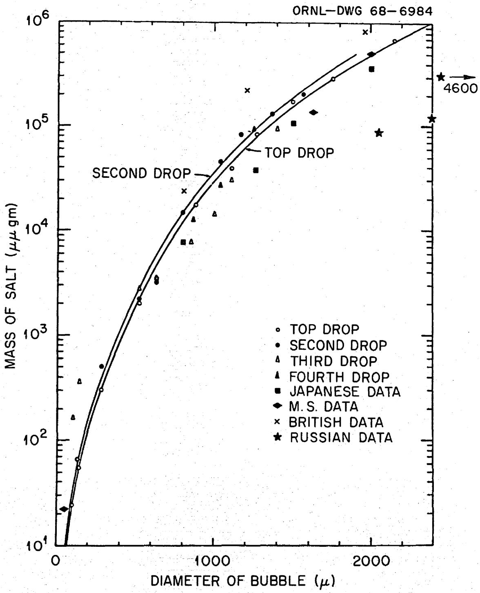
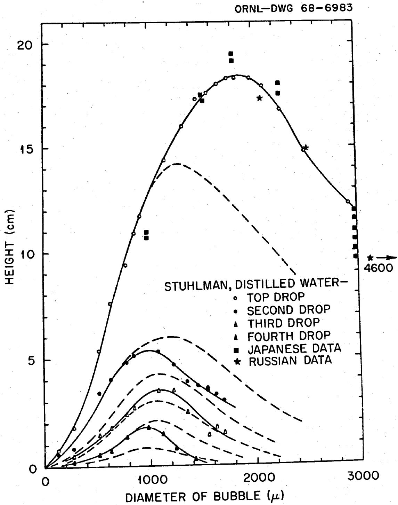
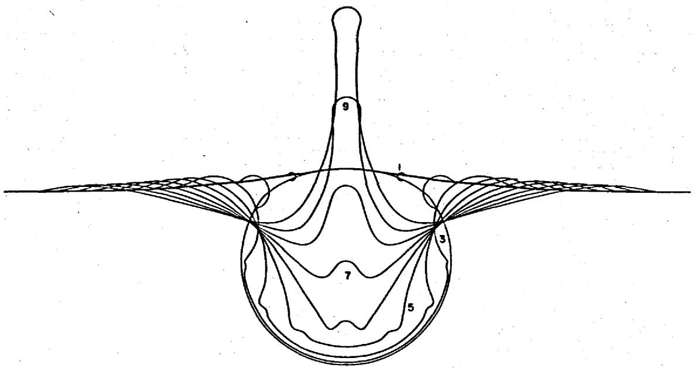
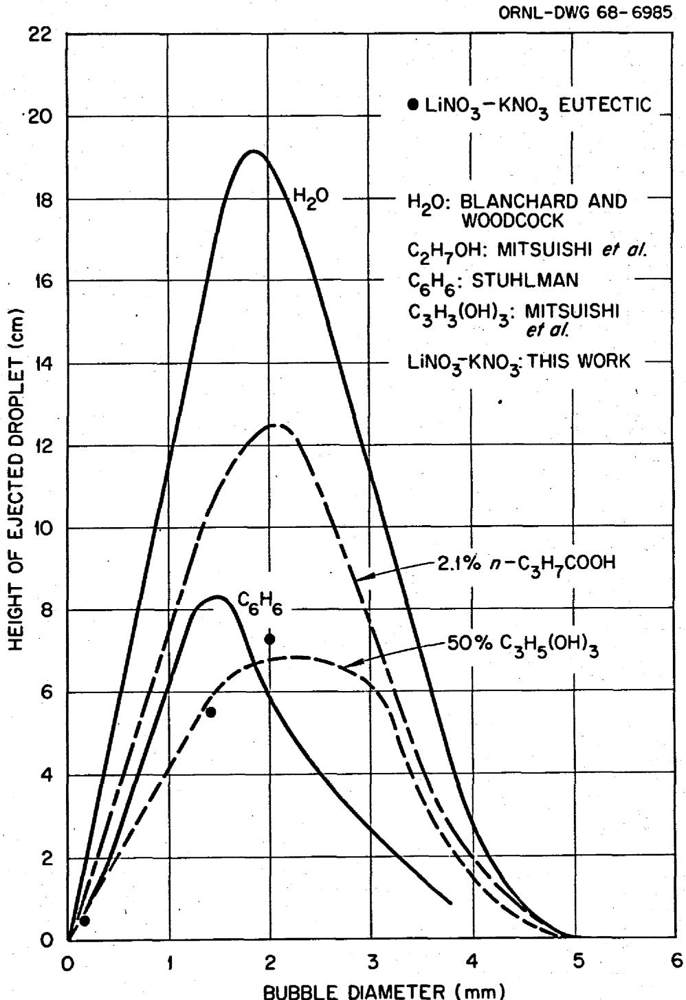
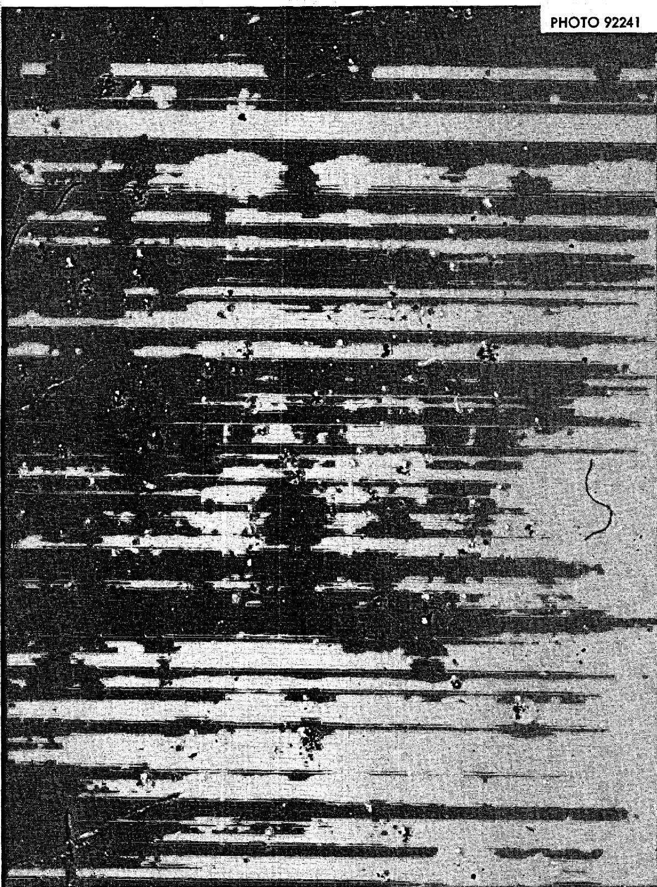

ORNL-TM-2373

REACTOR CHEMISTRY DIVISION

Bubbles, Drops, and Entrainment in Molten Salts

H. W. Kohn

DECEMBER 1968

OAK RIDGE NATIONAL LABORATORY

Oak Ridge, Tennessee

operated by

UNION CARBIDE CORPORATION

for the

U. S. ATOMIC ENERGY COMMISSION

# LEGAL NOTICE

This report

States, nor the Commission, nor any person acting on behalf of the Commission: A. Makes any warranty or representation, expressed or implied, with respect to the accu- racy, completeness, or usefulness of the information contained in this report, or that the use privately owned rights; or

B. Assumes any liabilities with respect to the use of, or for damages resulting from the As used in the above, "person acting on behalf of the Commission" includes any em-such employee or contractor of the Commission, or employee of such contractor, to the extent that disseminates, or provides access to, any information pursuant to his employment or contract with the Commission, or his employment with such contractor.

Bubbles, Drops, and Entrainment in Molten Salts

Harold W. Kohn*

Reactor Chemistry Division  
Oak Ridge National Laboratory  
Oak Ridge, Tennessee 37830

To entrain1 is defined as follows, "to carry along or over (especially mechanically) as fine drops of liquid during distillation". One can thus envision many entrainment systems, some of which are pertinent to studies being done here (viz. entrainment of process salt by liquid bismuth). The discussion in this report however will be confined to studies of the entrainment of solid and of liquid particles by gases.

Molten salt processes associated with the MSRE usually use an inert cover gas. This gas is often moving along the surface and, in some processes, is even swept through the molten salt. Hence we can expect some form of gas-particle entrainment to play a part in most molten salt experiments. The situation is particularly aggravated in the MSRE pump bowl where a considerable (4 $\ell$ /min. corresponding to a minimum L.S.V. of 0.35 cm./min.) flow of helium is used to sparge xenon from the reactor fuel2.

In order to have entrainment, some mechanism for the production of fine particles is also required. Our literature search has shown that bubbles and splashes are the principal sources of fine droplets and sprays. Again let us direct our attention to the MSRE pump bowl. This bowl is a lentil shaped reservoir containing about one hundred liters of molten salt. One inch above the surface of this salt pool is a spray ring from which salt and helium are sprayed at a lively rate (sixty-five gallons per minute). This leads to entrainment of one to two percent of the helium by the fuel. It can give rise not only to some directly formed aerosol, but also secondary droplets from splashes. Since the fuel now also contains up to two percent by volume of helium bubbles, on reaching the (pump bowl) surface, these may give rise to jet droplets when they burst.

These phenomena may bear on the ultimate fate of the MSRE fission products in the following way: there are reasons, derived from chemical thermodynamics for believing that many of these fission products, specifically Nb, Mo and Ru, are present in the fuel as metal. As metals, their vapor pressure would be vanishingly small, yet they appear to favor the gas phase over the liquid. Since the MSRE fuel does not wet the metal the spray from the spray ring could be dispersing a metal fog directly, i.e., there is no reason to expect a droplet of salt

plus metal to adhere. This non-wetting characteristic also creates a possibility for flotation of the metal particles in the fuel6. There is evidence, as discussed later, that such an interface scum would be preferentially removed (ejected into the gas phase) by jet droplets from bursting bubbles. The pump bowl liquid is quite agitated which argues against this mechanism. Without a detailed study of flow patterns, however, one cannot say for sure that areas amenable to the existence of stable scum do not exist in the pump bowl. It is much more likely that a stable scum exists within the sampling area since this area is protected from the turbulence by a cylindrical mist shield which extends from the top of the gas space nearly to the bottom of the liquid. Therefore consideration of the entrainment process not only points the way to an explanation of the peculiar disposition of the fission products, it indicates that the samples, since they are taken within the mist shield, may not be representative of the processes going on within the reactor pump bowl.

# Summary of Previous Work

A literature search was completed using "drops", "entrainment", and "bubbles" as key words. Discussions with laboratory staff members supplied additional references.

An actual measurement of entrainment of $\mathbf{C}\mathbf{s}^{137}$ in a boiling water reactor was made by Shor and co-workers. They pointed out the many

complexities of the problem including free or forced convection conditions, contamination of heat transfer surfaces, suspended and dissolved impurities at the interface, power level, power density, and operating pressure. Even so they obtained good linear plots of the logarithm of the decontamination factor and the power input, and of $\log D_{\mathrm{f}}$ vs. steam velocity.

A great deal of the definitive work on jet droplets was done by D. C. Blanchard and his associates in connection with oceanographic studies. Most of the information is contained in Figs. 1 and 2 of this report and concerns bursting bubbles in sea water. One may convert from mass of salt to droplet size by remembering the sea water contains from 3.15 to $3.5\%$ salt. The other data has been added to the graph using the $3.15\%$ figure. The results of a bubble bursting at a surface can be both spectacular and surprising. If we limit ourselves, as Blanchard and associates did, to bubbles two millimeters and less in

8 Woods Hole Oceanographic Institute, now at the State College of New York at Albany.   
9D. C. Blanchard, "Progress in Oceanography," Vol. I. M. Sears, Ed., Pergamon Press, Inc., New York, 1963, p. 71-202.   
10 D. C. Blanchard, "From Raindrops to Volcanoes," Doubleday and Co., Garden City, N. Y., 1967.   
11 D. C. Blanchard, Nature, 175, 334 (1955).   
12 C. F. Keintzler, A. B. Arons, D. C. Blanchard and A. H. Woodcock, Tellus, 6, 1 (1954).   
$^{13}$ D. C. Blanchard and A. H. Woodcock, Tellus, 2, 145 (1957).   
$^{14}$ D. C. Blanchard, Nature, 173, 1048 (1954).

  
Figure 1. Size of jet droplet as a function of bubble size. After Blanchard and Woodcock (Ref. 13). Other data has been added by considering sea water to be $3.15\%$ salt. Molten salt data referred to equivalent mass of a water droplet.

  
Figure 2. Rise height of jet droplets vs. bubble diameter. Data from Refs. 13, 29, 31, 36.

diameter, we see that from five to seven jet droplets can be ejected per bubble burst, and that these drops may be up to nearly 0.2 mm. in diameter, and all the drops might contain close to one milligram of material. The topmost drop is flung nearly twenty centimeters into the air; the others do not perform so spectacularly.

The high speed photographs shown in Refs. 12 and 15 delineate quite clearly and remarkably the history of the bursting bubble which is also shown pictorially in Fig. 3. If the surface is clean, the bubbles will burst almost immediately. No agglomeration (growth of large bubbles at the expense of small ones) was observed for sea water. Liquid from the film at the top of the bubble drains until it ruptures; a flow of liquid down the side of the liquid cavity then ensues. This leads to the formation of the jet drop, (Fig. 3). A vortex ring is also formed and ejected downwards, shown quite clearly by using India ink as a tracer16. However the formation and behavior of this vortex ring is not at all clear. Recent studies17-20 have led to the conclusion that it is formed by the Rayleigh jet and the drops which subsequently re-enter the liquid. Jet droplets can also be formed by splashes in one

15A. M. Worthington and R. S. Cole, Phil. Trans. Roy. Soc. (London) A, 189, 137 (1897); A, 194, 175 (1900).   
16F. MacIntyre, J. Phys. Chem., 72, 590 (1968).   
17P. V. Hobbs and A. J. Kezweeny, Science, 155, 1112 (1967).   
18 P. V. Hobbs and T. Osheroff, Science, 158, 1164 (1967).   
19W. Hall C. Maxwell, Science, 160, 907 (1968).   
20P.V.Hobbs,Science,160,907(1968).

ORNL-DWG 68-6982

  
Figure 3. Time sequence diagram of a bursting bubble, deduced from high speed photographs 12 and theoretical calculations $^{24}$ . After MacIntyre $^{16}$ .

of two manners. A drop hitting the surface invariably punches a clear cylindrical hole which may or may not have a sheer cylindrical wall rising from it $^{14,17,18}$ . This wall either closes over, or forms a crown which breaks up into a fine spray. If the hole does close, it soon reopens, and a long jet which breaks into jet droplets appears.

Blanchard and associates considered also the formation of bubbles from splash drops and the equilibrium between small bubbles and dissolved gas. The splash drops produce very tiny (fifty micron) bubbles. A rather discouraging feature of this mechanism for material transport is that unless there is adequate supersaturation most of these bubbles will go back into solution. However, in so doing they will raise the supersaturation until a point is reached where such bubbles will grow.

Blanchard also found that the jet droplets from bursting bubbles carry a positive charge $^{9,10,14}$ . A greater charge may be induced by applying a local field; by using a positive field the charge sign on the drops can be reversed. Hobbs and Kezweeny $^{17}$ on the other hand found that the droplets formed from splashes carried a negative charge and cited two observations $^{21,22}$ in support of their measurements. This difference in charge sign seems most unusual since the mechanism of formation of the large droplets from the Rayleigh jet seems identical with its formation from bubbles. The larger droplets, those from the jet rather than from the crown, carry the higher charge per unit mass, thus accentuating the difference. Hobbs has also observed a linear

relationship between the number of splash droplets and the distance of fall. He has also observed a peaking in the maximum rise height at a particular liquid depth, about 8 mm. for water.

An important consideration from our standpoint is that the jet droplets can also remove surface contaminants. This had been shown experimentally by Blanchard $^{23}$ (see also ref. 8, p. 107); the mechanism of this removal and the use of bubbles as a surface microtome has also been discussed by MacIntyre $^{16}$ .

A great deal of this work has also been discussed by Toba $^{24-28}$ but these publications were not available at the time of this report. (They are listed so that the bibliography will be complete.) The jet drop experiment was also performed in Russia using photographic techniques by Gleim and associates $^{29,30}$ ; some of their data are included in Figs. 1 and 2.

23D.C.Blanchard,Science,146,396 (1964).   
24S. Hayami and Y. Toba, J. Oceanog. Soc. Japan, 14, 145 (1958).   
25. Toba, J. Oceanog. Soc. Japan, 14, 151 (1958).   
26Y. Toba, J. Oceanog. Soc. Japan, 15, 1 (1959).   
27. Toba, J. Oceanog. Soc. Japan, 15, 121 (1959).   
28. Toba, Meterological Soc. Japan, 40, 63 (1962).   
29V. G. Gleim, Trudy Novocherkassk Politekh. Inst., 25, 173 (1955).   
30 V. G. Gleim, I. K. Shelomov, and B. R. Shidlovskii, Zhur. Priklad. Khim., 32, 218 (1959).

The oceanographers were interested primarily in bubbles less than two millimeters in diameter and this led them into a mild controversy with a rival group of engineers (Imperial College, London) who were more interested in the bursting of larger (2-5 mm.) bubbles. The 2-3 mm. size range is critical since it is generally accepted31 that in water, bubbles greater than 3 mm. in diameter are inherently unstable31. The Imperial College group has shown at least for large bubbles that in addition to the jet droplets that accompany bubble breakup, there is a fine spray resulting from the breakup of the bubble dome33,34. For bubbles greater than 5 mm. diameter, all the droplets came from rupture of the bubble dome. They also discovered that a temperature increase caused a marked decrease in the number of jet droplets. The question was pretty much resolved by another group of engineers (Birmingham)35 who showed that most of the mass of the droplets from bubbles 2 mm. and less in size came from the jet droplets, whereas for large bubbles most of the mass comes from breakup of the bubble dome. They also demonstrated that entrainment decreased rapidly with bubble size.

310. Stuhlman, Physics, 2, 455 (1932).   
320. Miyagi, Phil. Mag., 50, 112 (1925).   
33 D. M. Meritt, N. Dombrowski, and F. H. Knelman, Trans. Inst. Chem. Engr., 32, 244 (1954).   
34 F. H. Knelman, N. Dombrowski, and D. M. Meritt, Nature, 173, 261 (1954).   
35F. H. Garner, S. K. M. Ellis and J. A. Lacey, Trans. Inst. Chem. Engr., 32, 222 (1954).

Two groups of Japanese investigators have also studied entrainment due to jet drops. One group studied jet drop formation in water at $20^{\circ}\mathrm{C}$ , $2.1\%$ n-butylic acid (a pronunciational misprint no doubt) and in $50\%$ glycerin solution36. Contrary to the results of Garner et al. glycerol and n-butyric acid solutions gave curves similar in form to those from water, but the maximum rise height of the droplet was lower than it was for water. The second group investigated the relationships between bubble size, droplet sizes, and physical properties of the liquid, particularly viscosity and surface tension37. These data are presented as graphs and equations in their publication. As they point out, however, it is nearly impossible to vary only a single parameter (e.g. surface tension) without simultaneously changing another (e.g. viscosity).

All these investigations have followed the formulation of Davies $^{38}$ in equating the vertical force $\mathbf{P}$ ( $2\gamma \pi r$ ) with the force on the mass of liquid set in motion ( $mg$ ). This leaves no room for the effect of viscosity even though such an effect has been observed repeatedly $^{35,36}$ . (A viscosity effect might find its way into the constant in the empirical equation in ref. 36.) It was recently pointed out $^{16}$ that the impulse force arising from the rupture of the bubble can be divided into two parts involving inertial and viscous forces and for water those are approximately equal. The equations involved, however, are not particularly amenable to direct solution, especially for a molten salt system.

One other possibility for entrainment, "volumetric evaporation", must be mentioned $^{39,40}$ . This phenomenon, involving the entrainment of very fine (submicroscopic) particles by rapidly evaporating liquids has recently been demonstrated experimentally $^{39}$ by measuring the loss of a non-volatile material, potassium dichromate, during evaporation of a solution of this material from a porous Celite sphere. Previous conjectures about this mechanism of entrainment were based on changes of the heat transfer coefficient. Although the physical arrangement in a liquid-gas system is quite different from that described by Gauvin, the constant loss of helium in the MSRE supplies a volatile - non-volatile relationship which could lead to "volumetric evaporation".

# Discussion

Table 1 lists physical constants for the systems investigated in these publications and also the best values for the molten salt systems we are interested in. The last two columns and three lines show the effect of changing the temperature in water systems. This is seen to have a large effect on the jet drops; the effect on film drops (at distances greater than $1\mathrm{cm}$ from the surface of the liquid) is much less marked. Raising the temperature by $20^{\circ}\mathrm{C}$ lowers the viscosity by $33\%$ , which one would expect to enhance jet drop formation, yet it does not seem to have as big an effect as simultaneously lowering the surface tension by only $4 - 1 / 2\%$ . Nevertheless, since this lowers the number of

# Table I

# Physical Properties of Several Liquids

(Molten salt data is from S. Cantor et. al, ORNL-TM-2316 (1968))

<table><tr><td>Substance</td><td>(gm./ml.)</td><td>γ dynes/cm.</td><td>ν centipoise</td><td>N14.65a</td><td>N13.11a</td><td>Ref. No.</td></tr><tr><td>Water 25°</td><td>0.997</td><td>71.97</td><td>0.89</td><td>8.25</td><td>43.0</td><td>35</td></tr><tr><td>35°</td><td>0.994</td><td>70.38</td><td>0.72</td><td>3.50</td><td>27.5</td><td>35</td></tr><tr><td>45°</td><td>0.990</td><td>68.74</td><td>0.60</td><td>2.04</td><td>18.3</td><td>35</td></tr><tr><td>50% glycerin</td><td>1.1263</td><td>69.9</td><td>6.05</td><td></td><td></td><td>36</td></tr><tr><td>2.1% Bu. Acid</td><td>~1.0</td><td>54</td><td>0.92</td><td></td><td></td><td>36</td></tr><tr><td>Benzene</td><td>0.879</td><td>28.9</td><td>0.65</td><td></td><td></td><td>31</td></tr><tr><td>LiNO₃-KNO₃</td><td>1.93</td><td>120</td><td>~4b</td><td></td><td></td><td></td></tr><tr><td>LiF-BeF₂ 1000°K</td><td>2.45</td><td>180-195</td><td>5</td><td></td><td></td><td></td></tr></table>

aRefers to the number of jet drops intercepted by a sensitized microscope slide 4.44 cm. above the bubbling solution. The subscripts are the size in mm. of the bursting bubbles. See references for more complete data.

bMeasured here crudely. Extrapolation from individual melt data gives $\sim 12.3$ c.p. which is obviously incorrect.

jet drops, it is not at all apparent, due to the high viscosity, that bubbles in a molten salt will eject jet drops. We performed a few crude experiments, catching jet drops on a glass microscope slide at varying heights from a molten salt (KNO₃-LiNO₃ eutectic at 170-180°C) solution; and using a vibrating capillary to produce the bubbles41. Bubble sizes were measured by combining photographic and microscopic techniques. This solution behaves much like glycerin (see Fig. 4) and the relation between bubble size, jet drop size, and rise height, is not sufficiently different from the relation in water to make us suspicious of the results.

It has been observed previously42 that cover glasses over nitrate melt become clouded with salt. It was postulated that this was due to the ejection of microscopic droplets of salt ejected from bubbles of oxygen generated by the reaction:

$$
N O _ {3} ^ {-} \rightarrow N O _ {2} ^ {-} + \frac {1}{2} O _ {2}.
$$

We undertook to repeat this work using a physical arrangement which would avoid the condensation of volatile impurities as a mechanism of deposition. Five 2 ml beakers containing molten $\mathrm{LiNO}_3$ - $\mathrm{KNO}_3$ eutectic were placed on a glass platform in a $400~\mathrm{ml}$ . beaker sustained at $185^{\circ}\mathrm{C}$ . The nitrate melts contained, respectively: nothing else, $\mathrm{NaNO}_2$ , $\mathrm{H}_2\mathrm{O}$ , $\mathrm{HNO}_3$ , and $\mathrm{NaHCO}_3$ . All slides showed a fog; the slides covering the $\mathrm{H}_2\mathrm{O}$ and $\mathrm{HNO}_3$ impurity melts showed a weight gain of $1\mathrm{mg}$ , the one covering the $\mathrm{NaNO}_2$ impurity result gained only $0.2\mathrm{mg}$ . The other two were chipped in handling and hence showed weight losses.

  
Figure 4. Droplet height vs. bubble diameter. Data from references 13, 31, 36 and this laboratory.

This phenomenon appeared to be analogous to the volumetric evaporation mentioned earlier $^{39,40}$ . We undertook to repeat the experiment, this time using five beakers containing, respectively: no additive, gold colloid, silver, a surface coating of talc, and a surface coating of graphite. The same sort of results were obtained. The particles were visible in the microscope, and were barely resolvable, thus measuring about $0.4\mu$ in diameter. None of the added materials seemed to interfere with the deposit which was easily visible after a day. The deposit over the carbon was not gray, chemical analysis showed no entrainment of the surface or colloidal materials. Using the Japanese data as a guide, such droplets should arise from bubbles less than $5\mu$ in diameter. Such bubbles, however, should be subjected to an extremely high pressure $(\gamma / \mathbf{r}) = 6 \times 10^{5} \mathrm{dynes/cm}^{2}$ and should thus all go back into the solution until the supersaturation becomes indeed very high. The question was resolved by an analysis of the main matrix material which proved to be almost exclusively $\mathrm{NH}_4\mathrm{NO}_3$ . The very slow volatilization of this minor impurity should not be confused with the rapid volatilization required for volumetric evaporation.

One experiment was tried to see if the jet drops from bursting bubbles could remove surface material as previously discussed $^{12,16}$ . A MacIntyre bubbler (bubbles $2\mathrm{mm}$ in diameter) was set $1\mathrm{cm}$ . below the surface of a $\mathrm{LiNO}_3$ - $\mathrm{KNO}_3$ eutectic melt, the surface was sprinkled with fine ( $<0.3\mu$ ) carbon and several jet drops were collected. After exposure to the air, the eutectic had absorbed enough water to turn to a liquid. Many, but not all, of the drops were then seen to contain carbon (Fig. 5). A small area of the melt surface where the bubbles

  
Figure 5. Jet droplet artifacts showing entrained carbon.

had been bursting was observed to be free of carbon.

# Conclusions

The production and behavior of drops from splashes and bubbles has been reviewed and described. Possible application of these phenomena to the MSRE pump bowl has been considered.

There are three sorts of drops which can contribute to entrainment in the MSRE, jet drops from splashes and from small recirculated bubbles, film drops from the breakup of the film cap of larger bubbles and crown drops from the breakup of the crown from splash drops. In addition, there might be a considerable direct aerosol formation due to spray from the spray ring, but we have, at present, no way of evaluating this. The amount of salt available for entrainment from these sources is much larger than that actually lost from the reactor, hence most of the droplets must be returned somehow to the liquid stream.

It has also been shown that jet drops can preferentially remove a surface film from a molten salt surface. This surface microtome effect may well be contributing to the apparent loss of fission products to the gas stream.

# Acknowledgement

The author wishes to thank Drs. S. S. Kirslis and F. F. Blankenship for helpful discussion, and his wife for assistance with the literature search.

# INTERNAL DISTRIBUTION

1. Biology Library

2-4. Central Research Library

5. Laboratory Shift Supervisor

6-7. ORNL Y-12 Technical Library (Document Reference Section)

8-58. Laboratory Records Department

59. Laboratory Records, ORNL R.C.

60. H.G. MacPherson

61-65. G.E. Boyd

66. F.R.Bruce

67. F. L. Culler

68. A. F. Rupp

69. R. B. Briggs

70. M. W. Rosenthal

71. K. Z. Morgan

72. E. H. Taylor

73. E. S. Bettis

74. M. A. Bredig

75. P. N. Haubenreich

76. P.R.Kasten

77-87. W.R.Grimes

88. E.G. Bohlmann

89. H.F. McDuffie

90. G.M. Watson

91. F. F. Blankenship

92. R. D. Ackley

93. R.E.Adams

94. S. I. Auerbach

95. C.F.Baes

96. C. E. Bamberger

97. C. J. Barton

98. R. L. Bennett

99. W. D. Bond

100. J. Braunstein

101. R.E.Brooksbank

102. W.E.Browning, Jr.

103. G. D. Brunton

104. T. H. J. Burnett

105. H. M. Butler

106. S. Cantor

107. R.M.Carroll

108. G.I.Cathers

109. J. M. Chandler

110. C. F. Coleman

111. E. L. Compere

112. K. E. Cowser

113. W. M. Culkowski (AEC)

114. D.R.Cuneo

115. R.J.Davis

116. W. de Laguna

117. R.B.Evans,III

118. L. L. Fairchild

119. Birney Fish

120. H.A.Friedman

121. F. Gifford (AEC)

122. P.A.Haas

123. R.G.Haire

124. A.R.Irvine

125. G.H.Jenks

126. G.W. Keilholtz

127. S. S. Kirslis

128-168. H.W.Kohn

169. R.E.Leuze

170. A. L. Lotts

171. A. P. Malinauskas

172. W. L. Marshall, Jr.

173. J.P. McBride

174. L. E. Morse

175. J.G.Morgan

176. G.W. Parker

177. L.M.Parsley

178. G. D. Robbins

179. T.H. Row

180. K. A. Romberger

181. A. D. Ryon

182. Dunlap Scott

183. J.H.Shaffer

184. A. J. Shor

185. M.D. Silverman

186. J.W.Snider

187. B. A. Soldano

188. R.A. Strehlow

189. E. G. Struxness

190. F.H. Sweeton

191. T. Tamura

192. R.E.Thoma, Jr.

193. L. M. Toth

194. J. Truitt

195. C. D. Watson

196. C.F.Weaver

197. P. H. Emmett (consultant)

198. E.A.Mason (consultant)

199. R.F. Newton (consultant)

200. Howard Reiss (consultant)

201-215. DTIE, OR

216. Lab. and Univ. Div., ORO