ORNL-TM-2405

Contract No. W-7405-eng-26

INSTRUMENTATION AND CONTROLS DIVISION

DYNAMIC ANALYSIS OF A SALT

SUPERCRITICAL WATER HEAT EXCHANGER

AND THROTTLE USED WITH MSBR

Francis H.Clark O.W.Burke

LEGAL NOTICE

LEGAL NO. 1

This report was prepared as an account of Government. The Commission, nor any person acting on behalf of the Commission, nor the Commission, nor any person acting on behalf of the Commission, or that the Commission, nor the Commission, nor any person acting on behalf of the Commission, or that the Commission, nor the Commission, nor any person acting on behalf of the Commission, or that the Commission, nor any person acting on behalf of the Commission, or that the Commission, nor any person acting on behalf of the Commission, or that the Commission, nor any person acting on behalf of the Commission, or that the Commission, nor any person acting on behalf of the Commission, or that the Commission, nor any person acting on behalf of the Commission, or that the Commission, nor any person acting on behalf of the Commission, or that the Commission, nor any person acting on behalf

B. Assumes any liabilities with respect to the Commission's use of any information, apparatus, method, or process disclosed in this report are attributable to the Commission. As used in the above, "person acting on behalf of the Commission" includes any other use of any information, apparatus, method, or process of such contractor, to the extent that the contractor or contractor of the Commission, or employee of such contractor prepares such employees or contractor of the Commission, or employee of such contractor prepares such employees or contractor of the Commission, or employee of such contractor prepares such employees or contractor of the Commission, or employee of such contractor prepares such employees or contractor of the Commission, or employee of such contractor prepares such employees or contractor of the Commission, or employee of such contractor, with the Commission, or his employment with such contractor.

JANUARY 1969

OAK RIDGE NATIONAL LABORATORY

Oak Ridge, Tennessee

operated by

UNION CARBIDE CORPORATION

for the

U.S. ATOMIC ENERGY COMMISSION

# CONTENTS

Page

Abstract 1   
Introduction 1   
Steam Generator Design and Model 2   
Partial Differential Equations of the System 4   
Reduction to Ordinary Differential Equations and Linearization 7   
Parameters of the Problem 12   
A Positive Feedback Problem 16   
Limitations of the Model 18   
Boundaries and Controls 22   
Results of Simulation 23

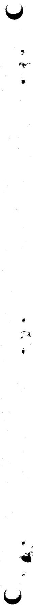

# DYNAMIC ANALYSIS OF A SALT-SUPERCRITICAL WATER HEAT EXCHANGER AND THROTTLE USED WITH MSBR

Francis H. Clark O.W. Burke

# ABSTRACT

A linearized, coarse space mesh model of a salt-supercritical water heat exchanger and the downstream throttle was simulated on analog computers. The effects on certain output quantities of changes in certain input quantities were noted. The output quantities were heat-exchanger water outlet temperature and pressure, salt outlet temperature, and enthalpy output. The input quantities were heat-exchanger water inlet temperature and pressure, salt inlet temperature, salt velocity, and throttle setting. Changes were studied only around design steady state.

Sufficient input-output data were acquired to permit a greatly simplified representation of these components for further system studies in the neighborhood of design steady state. A tentative scheme of heat exchanger-throttle control was devised to hold water outlet temperature within a $1^{\circ}\mathrm{F}$ range, and water outlet pressure within a few pounds of design while enthalpy output follows demand.

# INTRODUCTION

To design a control system suitable for an electrical power generation system with a Molten-Salt Breeder Reactor as a thermal source or simply to determine the control requirements of the reactor alone in such a system, it is essential to understand the dynamic responses of the major system components. It is economical and therefore customary to maintain a constant inlet temperature and pressure to the high pressure turbine and to vary mass flow with load. The turbine inlet temperature and pressure and the heat rate are, in fact, the variables in the power generation section which are most closely controlled: the temperature and pressure

to be near constant, and the heat rate to follow the load. The steam generator* and turbine are the components at which these variables are sensed and where the control loops make their action felt. The dynamic behavior of the steam generator-throttle complex is therefore crucial to determining control requirements in more remote parts of the system. We have, consequently, simulated and studied these components. The study was carried out on the Oak Ridge National Laboratory analog computing equipment, consisting of one EAI 221R and two EAI 16-31R computers.

# STEAM GENERATOR DESIGN AND MODEL

The steam generator design which was studied may be described roughly as follows. It is a vertical U-shaped heat exchanger, total length about 70 feet. It is a one shell pass (salt) and one tube pass (water) unit. There are 349 parallel water tubes. The tubes are of Hastelloy N, OD 0.50 in., thickness 0.077 in. The shell ID is 18.25 in. The mass flow rate of water is $6.33 \times 10^{5} \mathrm{lb/hr}$ , and of salt is $3.66 \times 10^{6} \mathrm{lb/hr}$ . The entrance and exit temperatures of the salt were, respectively, $1125^{\circ} \mathrm{F}$ and $850^{\circ} \mathrm{F}$ , and of the water, $700^{\circ} \mathrm{F}$ and $1000^{\circ} \mathrm{F}$ . The inlet and outlet

*Although this is a supercritical system which, strictly, does not have a liquid, a boiling, and a steam section, we shall nonetheless use such terminology to describe the high density, the rapidly changing density, and the low density regions and shall refer to the component as a steam generator.

water pressures used were 3800 psi and 3600 psi respectively.\* Further details related to the design of this component are given in ref 1, p. 46 ff, case A.

The system modeled has been vastly simplified from the design system. It is believed, however, that the properties essential to the study of steady state control have been preserved.

The model is a single, water tubular channel surrounded by a salt annular channel. The cross-sectional area of each channel is taken equal to the total cross-sectional areas of flow of water and salt, respectively, in the design system. Heat transfer coefficients were computed to be consistent with the steady state, local heat transfer and temperature profiles. The water-film heat transfer coefficient was taken to vary as the 0.6 power of the water velocity, and the corresponding salt-film coefficient as the 0.8 power of the salt velocity.

Compressibility effects in the water were dealt with explicitly. The salt was treated as an incompressible fluid.

*The reference design gives 3766 psi as the inlet water pressure, and 3600 psi as the outlet. The static design, however, neglected important compressibility effects and failed to achieve a system enthalpy balance. Both these effects, which are, in fact, probably not separate, are allowed for if one increases the inlet pressure to 3800 psi.

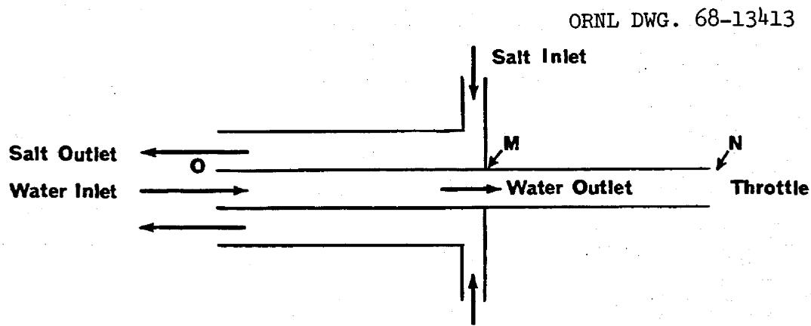  
Figure 1 is a schematic representation of the modeled system.   
Fig. 1. Model of Heat Exchanger.

Station 0 is the water inlet (salt outlet) end of the steam generator. Station M is the water outlet, salt inlet end. Station N is the throttle. MN is the pipe section connecting the steam generator to throttle.

# PARTIAL DIFFERENTIAL EQUATIONS OF THE SYSTEM

The following set of partial differential equations was taken to describe the system:

$$
\frac {\partial \rho}{\partial t} + \frac {\partial R}{\partial X} = 0 \tag {1}
$$

$$
\frac {\partial R}{\partial t} + \frac {\partial R V}{\partial X} = - \frac {K \partial P}{\partial X} - C V ^ {2} \tag {2}
$$

$$
\frac {\partial S}{\partial t} + \frac {\partial S V}{\partial X} = (\alpha - T) \frac {\partial (H A) _ {1 2}}{\partial v} \tag {3}
$$

$$
\rho_ {m} C _ {p m} \frac {\partial \alpha}{\partial t} = (T - \alpha) \frac {\partial (H A) _ {1 2}}{\partial v} + (\theta - \alpha) \frac {\partial (H A) _ {2 3}}{\partial v} \tag {4}
$$

$$
\rho_ {s} C _ {p s} \frac {\partial \theta}{\partial t} = (\alpha - \theta) \frac {\partial (H A) _ {2 3}}{\partial v} + \rho_ {s} C _ {p s} \frac {W \partial \theta}{\partial X} \tag {5}
$$

$$
R = \rho V \tag {6}
$$

$$
S = \rho h \tag {7}
$$

$$
P = P (p, h) \tag {8}
$$

$$
T = T (\rho , h) \tag {9}
$$

where

$$
\rho = \text {w a t e r d e n s i t y} (\mathrm {l b / f t} ^ {3}),
$$

$$
V = \text {w a t e r v e l o c i t y (f t / s e c)}, \text {p o s i t i v e f o r m o i n} \text {l o w t o h i g h X},
$$

$$
P = \text {w a t e r p r e s s u r e (p s i)},
$$

$$
K = \text {u n i t c o n v e r s i o n f a c t o r (s l u g s p e r l b) x (s q i n . p e r s q f t)},
$$

$$
C = \text {f r i c t i o n}
$$

$$
\alpha = \text {t e m p e r a t u r e} \text {H a s t e l l o y N w a l l (° F)},
$$

$$
T = \text {t e m p e r a t u r e i n w a t e r} (^ {\circ} F),
$$

$$
\theta = \text {t e m p e r a t u r e i n s a l t} (^ {\circ} F),
$$

$$
(H A) = \text {h e a t} (B T U / \sec^ {-} ^ {\circ} F), \text {t a k e n}
$$

$$
1 2 \text {f o r} \quad \text {m e t a l} \quad \text {t o} \quad \text {w a t e r} \quad \text {a n d} \quad 2 3 \text {f o r} \quad \text {s a l t} \quad \text {t o} \quad \text {m e t a l},
$$

$$
d v = d i f f e r e n t i a l v o l u m e i n s y s t e m,
$$

$$
\rho_ {m} = \text {m e t a l d e n s i t y} (\mathrm {l b / f r ^ {3}}),
$$

$$
\rho_ {s} = \text {s a l t d e n s i t y (l b / f t ^ {3})},
$$

$$
C _ {p m} = \text {s p e c i f i c h e a t a t c o n s t a n t p r e s s u r e f o r m e l t a l},
$$

$$
C _ {p s} = \text {s p e c i f i c h e a t a t c o n s t a n t p r e s s u r e f o r s a l t},
$$

$$
W = \text {s a l t v e l o c i t y (f t / s e c)}, \text {p o s i t i v e f o r m o i n}
$$

Equations (1), (2), and (3) are the conservation equations in water for mass, momentum, and energy, respectively. Equations (4) and (5) are energy

conservation equations in the metal and the salt; (6) and (7) are definitions of R and S; (8) and (9) are two different aspects of the equation of state.

At the throttle, which terminates the system at the downstream end, we write

$$
R = \frac {m \left(\frac {A}{A}\right) P}{1 + b T}, \tag {10}
$$

where

$$
\frac {A _ {T}}{A} = \text {t h r o t t l e f l o w a r e a a s f r a c t i o n o f s t e a d y s t a t e ,}
$$

$$
T ^ {\prime} = \text {n u m b e r o f d e g r e e s a b o v e s o m e r e f e r e n c e t e m p e r a t u r e (r e f e r e n c e} \quad \text {a b o u t} 7 5 0 ^ {\circ} F),
$$

$$
m, b = \text {e m p i r i c a l}
$$

Equation (10) is, of course, a boundary condition.

Representation of the friction term in (2) as $CV^2$ is a simplification. The kinetic energy and the potential energy, both of which are small compared with the enthalpy, have been omitted from the X derivative operand in Eq. (5). In Eq. (5) the kinetic and potential energy terms are again omitted from the space derivative. The space derivative of the kinetic energy term in (5) is zero by reason of the assumption that the salt is incompressible. Neglect of the potential energy terms is equivalent to an assumption that the system is horizontal. Both terms are small in any event.

All variables are known at all values of $X$ at $t = 0$ . Further, at all values of $t, P(0), T(0), \theta(M)$ are arbitrary functions of time (0 represents water inlet location and $M$ represents water outlet or salt inlet as in Fig. 1).

# REDUCTION TO ORDINARY DIFFERENTIAL

# EQUATIONS AND LINEARIZATION

The analog computer can deal continuously with only one independent variable. Hence, to solve partial differential equations, we must apply a mesh or differencing scheme to all but one of the independent variables-- in our case, to the X variable.

After differencing, the equations are

$$
\frac {\partial \rho_ {n}}{\partial t} = \frac {1}{L _ {n - 1 , n}} \left(\bar {R} _ {n - 1} - \bar {R} _ {n}\right) \tag {1a}
$$

$$
\frac {\partial \overline {{R}} _ {n - 1}}{\partial t} = \frac {1}{L _ {n - 1 , n}} \left\{\bar {R} _ {n - 1} \bar {V} _ {n - 1} - \bar {R} _ {n} \bar {V} _ {n} + K (\bar {P} _ {n - 1} - \bar {P} _ {n}) \right\} - C _ {n} \bar {V} _ {n - 1} \tag {2a}
$$

$$
\frac {\partial S _ {n}}{\partial t} = \frac {1}{L _ {n - 1 , n}} \left\{\bar {S} _ {n - 1} \bar {V} _ {n - 1} - \bar {S} _ {n} \bar {V} _ {n} \right\} + \frac {(\overline {{H A}})}{v _ {k}} k, 1 2 (\bar {\alpha_ {k}} - \bar {T _ {k}}) \tag {3a}
$$

$$
\frac {\partial \bar {a} _ {k}}{\partial t} = \frac {(\overline {{H A}}) _ {k , 1 2}}{M _ {m k} C _ {p m}} (\bar {T} _ {k} - \bar {a} _ {k}) + \frac {(\overline {{H A}}) _ {k , 2 3}}{M _ {m k} C _ {p m}} (\bar {e} _ {k} - \bar {a} _ {k}) \tag {4a}
$$

$$
\frac {\partial \bar {\theta} _ {n - 1}}{\partial t} = \frac {(\overline {{H A}}) _ {k , 2 3}}{M _ {s n} C _ {p s}} \left(\bar {\alpha} _ {k} - \bar {\theta} _ {k}\right) + \frac {\bar {W}}{M _ {s n}} \left(\bar {\theta} _ {n} - \bar {\theta} _ {n - 1}\right) \tag {5a}
$$

where

$$
M _ {s n} = s a l t m a s s b e t w e e n n a n d n - 1,
$$

$$
\begin{array}{l} M _ {m k} = \text {t o t a l m a s s b e t w e e n k a n d k - 1}, \\ \bar {R} _ {n} = \bar {\rho} _ {n} \bar {V} _ {n} (6a) \\ \bar {S} _ {n} = \bar {\rho} _ {n} \bar {h} _ {n} (7a) \\ \bar {P} _ {n} = \bar {P} \left(\bar {\rho} _ {n}, \bar {h} _ {n}\right) (8a) \\ \bar {T} _ {n} = \bar {T} \left(\bar {\rho} _ {n}, \bar {h} _ {n}\right) (9a) \\ \bar {R} _ {N} = \frac {\left(m \frac {\overline {{a _ {T}}}}{a}\right) \bar {P} _ {n}}{1 + b \bar {T} _ {n}} \\ \end{array}
$$

$k = n$ if $n$ odd and $n - 1$ if $n$ is even.

Each time-dependent variable has the symbol $-$ above it.

$$
\overline {{f}} _ {n} = f _ {n, 0} + f _ {n} \tag {11}
$$

where

$$
\overline {{f}} _ {n} (t) = \text {t h e v a r i a b l e a t t i m e t}
$$

$$
f _ {n, 0} = \text {t h e v a r i a b l e a t t i m e t} = 0
$$

$$
f _ {n} (t) = \text {i n c r e m e n t i n t h e v a r i a b l e s i n c e} t = 0
$$

We shall neglect all terms involving products of increments. Our set of linearized equations thus becomes

$$
\frac {\partial \rho_ {n}}{\partial t} = \frac {1}{L _ {n - 1 , n}} \left(R _ {n - 1} - R _ {n}\right) \tag {1b}
$$

$$
\begin{array}{l} \frac {\partial R _ {n - 1}}{\partial t} = \frac {1}{L _ {n - 1 , n}} \left\{R _ {n - 1, 0} V _ {n - 1} + V _ {n - 1, 0} R _ {n - 1} - R _ {n, 0} V _ {n} - V _ {n, 0} R _ {n} \right. \\ \left. + K \left(P _ {n - 1} - P _ {n}\right) \right\} - 2 C _ {n} V _ {n - 1, 0} V _ {n - 1} \tag {2b} \\ \end{array}
$$

$$
\begin{array}{l} \frac {\partial S _ {n}}{\partial t} = \frac {1}{L _ {n - 1 , n}} \left\{S _ {n - 1, 0} V _ {n - 1} + V _ {n - 1, 0} S _ {n - 1} - S _ {n, 0} V _ {n} - V _ {n, 0} S _ {n} \right\} \\ + \frac {\left(\mathrm {H A}\right) _ {\mathrm {k}} 1 2 , 0}{v _ {\mathrm {k}}} \left(\alpha_ {\mathrm {k}} - T _ {\mathrm {k}}\right) + \frac {\left(\alpha_ {\mathrm {k}} , 0 - T _ {\mathrm {k}} , 0\right)}{v _ {\mathrm {k}}} \frac {\partial (\mathrm {H A}) _ {\mathrm {k}} , 1 2}{\partial V} V _ {\mathrm {k}} \tag {3b} \\ \end{array}
$$

$$
\begin{array}{l} \frac {\partial \alpha_ {k}}{\partial t} = \frac {(H A) _ {k , 1 2 , 0}}{M _ {m k} C _ {p m}} \left(T _ {k} - \alpha_ {k}\right) + \frac {(H A) _ {k , 2 3 , 0}}{M _ {m k} C _ {p m}} \left(\theta_ {k} - \alpha_ {k}\right) \\ + \frac {\left(T _ {k , 0} - \alpha_ {k , 0}\right)}{M _ {m k} C _ {p m}} \frac {\partial (H A) _ {k , 1 2}}{\partial V} V _ {k} + \frac {\left(\theta_ {k , 0} - \alpha_ {k , 0}\right)}{M _ {m k} C _ {p m}} \frac {\partial (H A) _ {k , 2 3}}{\partial W} W \tag {4b} \\ \end{array}
$$

$$
\begin{array}{l} \frac {\partial \theta_ {n - 1}}{\partial t} = \frac {(H A) _ {k , 2 3 , 0}}{M _ {s k} C _ {p s}} (\alpha_ {k} - \theta_ {k}) + \frac {(\alpha_ {k , 0} - \theta_ {k , 0})}{M _ {s k} C _ {p s}} \frac {\theta (H A) _ {k , 2 3}}{\partial W} W \\ + \frac {W _ {0}}{M _ {\mathrm {s k}}} \left(\theta_ {n} - \theta_ {n - 1}\right) + \frac {\left(\theta_ {n , 0} - \theta_ {n - 1 , 0}\right)}{M _ {\mathrm {s k}}} W \tag {5b} \\ \end{array}
$$

$$
R _ {n} = \rho_ {n, 0} V _ {n} + V _ {n, 0} \rho_ {n} \tag {6b}
$$

$$
S _ {n} = \rho_ {n, 0 ^ {h}} n + h _ {n, 0 ^ {\rho}} n \tag {7b}
$$

$$
P _ {n} = \left(\frac {d P}{d \rho}\right) _ {h, n} \rho_ {n} + \left(\frac {d P}{d h}\right) _ {\rho , n} h _ {n} \tag {8b}
$$

$$
T _ {n} = \left(\frac {d T}{d \rho}\right) _ {h, n} \rho_ {n} + \left(\frac {d T}{d h}\right) _ {\rho , n} h _ {n} \tag {9b}
$$

$$
R _ {N} = R _ {N, 0} \left\{\frac {P _ {N}}{P _ {N , 0}} \frac {A _ {T / A}}{\left(^ {A _ {T / A}}\right) _ {0}} - b T _ {N} \right\} \tag {10b}
$$

Additionally, we compute a fractional change in the flow of enthalpy from a region bounded by nodes $r$ and $s$ as

$$
\left(\frac {\Delta H}{H}\right) _ {r, s} = \frac {\bar {S} _ {s} \bar {V} _ {s} - S _ {s , 0} V _ {s , 0} - \bar {S} _ {r} \bar {V} _ {r} + S _ {r , 0} V _ {r , 0}}{S _ {s , 0} V _ {s , 0} - S _ {r , 0} V _ {r , 0}} \tag {12}
$$

Linearized, this equation becomes

$$
\left(\frac {\Delta H}{H}\right) _ {r, s} = \frac {S _ {s , 0} V _ {s} + V _ {s , 0} S _ {s} - S _ {r , 0} V _ {r} - V _ {r , 0} S _ {r}}{S _ {s , 0} V _ {s , 0} - S _ {r , 0} V _ {r , 0}} \tag {12b}
$$

Figure 2 is an analog computer diagram of the system described by Eqs.

(1b) through (10b) and (12b). The subscripts r and s in (12b) are, respectively, 3 and 7 in Fig. 2. The subscript n runs through the values

$$
n = 3, 4 \dots N
$$

$$
N = 8 (\text {t h r o t t l e}).
$$

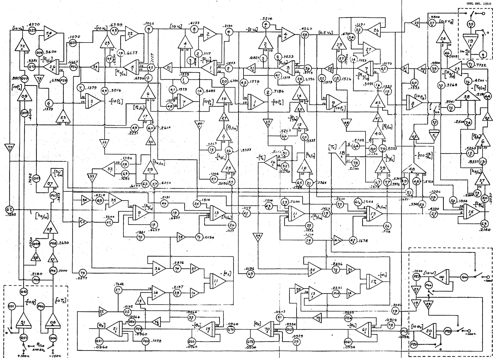  
Fig. 2. Analog Circuit Diagram.

There are a few optional connections in Fig. 2 beyond those indicated by the above equations. These optional connections are feedback control loops which were developed in the study and which will be dealt with in the section entitled Boundaries and Controls, p. 22.

# PARAMETERS OF THE PROBLEM

Initially, the system was cut into eight spatial nodes whose location in the laboratory reference frame was held fixed. With so few nodes it would have been better to permit at least some of them, those associated with the "boiling" region, to float. The problem was already of such complexity, however, that we could not possibly meet the equipment demands of such an approach, and the nodes were assigned fixed coordinates.

Steady state design values of the system variables are given in Table 1. Table 2 gives the derived parameters and constants at various nodes. Table 3 gives the sets of parameters used to represent the equation of state of water. Other parameters used in the study include

Cross-sectional area of water flow $= 0.2277\mathrm{ft}^2$

Cross-sectional area of salt flow $= 1.34\mathrm{ft}^2$

$$
\begin{array}{l} b = 0. 0 0 0 6 5 \left(^ {\circ} F ^ {- 1}\right) ^ {3} \\ 1 + b T _ {0} ^ {\prime} \approx 1 \\ \frac {m \left(\frac {a _ {T}}{a}\right) _ {0} P _ {0}}{1 + b T _ {0} ^ {\prime}} = 7 7 2. 2 2 \\ W _ {0} = 6. 1 \mathrm {f t / s e c .} \\ \end{array}
$$

#

Table 1. Steady State Design Value of Variables   

<table><tr><td>Node</td><td>Water Pressure (psi)</td><td>Water Temperature (°F)</td><td>Water Density (lb/ft3)</td><td>Water Enthalpy (Btu/lb)</td><td>Water Velocity (ft/sec)</td><td>Salt Temperature (°F)</td><td>Mean Metal Temperature (°F)</td><td>Heat Transfer per Node (Btu/sec)</td></tr><tr><td>1</td><td>3800</td><td>700</td><td>34.13</td><td>769.2</td><td>22.63</td><td>850</td><td>775</td><td>-</td></tr><tr><td>2</td><td>3797</td><td>708.9</td><td>32.16</td><td>797.7</td><td>24.01</td><td>862</td><td>782</td><td>5012.5</td></tr><tr><td>3</td><td>3794</td><td>717.8</td><td>29.58</td><td>826.2</td><td>26.11</td><td>874</td><td>791</td><td>5012.5</td></tr><tr><td>4</td><td>3771</td><td>737</td><td>16.00</td><td>988.35</td><td>48.26</td><td>942.5</td><td>826</td><td>28517.5</td></tr><tr><td>5</td><td>3740</td><td>773.7</td><td>9.54</td><td>1150.5</td><td>80.95</td><td>1011</td><td>883</td><td>28517.5</td></tr><tr><td>6</td><td>3688</td><td>887.9</td><td>7.33</td><td>1285.75</td><td>105.35</td><td>1068</td><td>974</td><td>23786.4</td></tr><tr><td>7</td><td>3600</td><td>1000</td><td>5.03</td><td>1421</td><td>153.52</td><td>1125</td><td>1062.5</td><td>23786.4</td></tr><tr><td>8</td><td>3525</td><td>997</td><td>4.91</td><td>1416</td><td>160.48</td><td>-</td><td>-</td><td>-</td></tr></table>

Table 2. Nodal Constants and Derived Parameters   

<table><tr><td rowspan="2">Node</td><td rowspan="2">Node Length (ft)</td><td rowspan="2">Friction Coefficient (lb/ft4)</td><td colspan="2">Nodal Heat Transfer Coefficient</td><td colspan="2">Metal</td><td colspan="2">Salt</td></tr><tr><td>Metal to Water (Btu/°F-sec)</td><td>Salt to Metal (Btu/°F-sec)</td><td>Specific Heat (Btu/°F-lb)</td><td>Density (lb/ft3)</td><td>Specific Heat (Btu/°F-lb)</td><td>Density (lb/ft3)</td></tr><tr><td>1</td><td></td><td></td><td></td><td></td><td></td><td></td><td></td><td></td></tr><tr><td>2</td><td>2.90</td><td>8.64</td><td>34.29</td><td>31.33</td><td>0.112</td><td>548</td><td>0.36</td><td>124</td></tr><tr><td>3</td><td>2.90</td><td>7.37</td><td>34.29</td><td>31.33</td><td></td><td></td><td></td><td></td></tr><tr><td>4</td><td>14.50</td><td>9.05</td><td>160.2</td><td>122.4</td><td>0.113</td><td>548</td><td>0.36</td><td>124</td></tr><tr><td>5</td><td>14.50</td><td>3.59</td><td>160.2</td><td>122.4</td><td></td><td></td><td></td><td></td></tr><tr><td>6</td><td>14.50</td><td>2.36</td><td>138.1</td><td>126.5</td><td>0.115</td><td>548</td><td>0.36</td><td>124</td></tr><tr><td>7</td><td>14.50</td><td>2.31</td><td>138.1</td><td>126.5</td><td></td><td></td><td></td><td></td></tr><tr><td>8</td><td>150</td><td>0.049</td><td></td><td></td><td></td><td></td><td></td><td></td></tr></table>

Table 3. Parameters Representing Equation of State by Nodes   

<table><tr><td>Node</td><td>(dP/dh)ρ</td><td>(dP/dρ)h</td><td>(dT/dh)ρ</td><td>(dT/dρ)h</td><td>(dρ/dP)T</td><td>(dρ/dT)P</td><td>(dh/dP)T</td><td>(dh/dT)P</td></tr><tr><td>3</td><td></td><td></td><td></td><td></td><td>0.0046</td><td>-0.218</td><td>-0.032</td><td>2.63</td></tr><tr><td>4</td><td>1.309</td><td>223</td><td>0.1386</td><td>8.824</td><td></td><td></td><td></td><td></td></tr><tr><td>5</td><td>8.333</td><td>526.3</td><td>1.25</td><td>29.41</td><td></td><td></td><td></td><td></td></tr><tr><td>6</td><td>8.333</td><td>526.3</td><td>1.25</td><td>29.41</td><td></td><td></td><td></td><td></td></tr><tr><td>7</td><td>8.333</td><td>526.3</td><td>1.25</td><td>29.41</td><td></td><td></td><td></td><td></td></tr><tr><td>8</td><td>8.333</td><td>526.3</td><td>1.25</td><td>29.41</td><td></td><td></td><td></td><td></td></tr></table>

# A POSITIVE FEEDBACK PROBLEM

Consider the equation

$$
\frac {\mathrm {d f} \left(X _ {t} t\right)}{\mathrm {d t}} = g (t) \tag {13}
$$

If $f(X, t)$ represents a quantity having a net motion in the space coordinate frame, then

$$
\frac {d f (X , t)}{d t} = \frac {\partial f (X , t)}{\partial t} + \frac {d X _ {f}}{d t} \frac {\partial f (X , t)}{\partial X}, \tag {13a}
$$

where

$X_{f} = X$ coordinate of f. Then, writing

$$
V = \frac {d X _ {f}}{d t}, \tag {14}
$$

we have

$$
\frac {\partial f (X , t)}{\partial t} + \mathrm {V} \frac {\partial f (X , t)}{\partial X} = g (t). \tag {13b}
$$

For the purposes of a numerical integration in $X$ , we shall define

$$
\mathrm {h} _ {\mathrm {n}} ^ {*} = \mathrm {a h} _ {\mathrm {n} - 1} + \mathrm {b h} _ {\mathrm {n}}, \tag {15}
$$

and

$$
h _ {n - 1} = h \left(X _ {n - 1}\right)
$$

$$
h _ {n} = h \left(X _ {n}\right)
$$

$$
h _ {n} ^ {*} = \text {m e a n v a l u e o f h o n t h e i n t e r v a l (X _ {n - 1}, X _ {n})}.
$$

We will assume both $\underline{a}$ positive and $\underline{b}$ non-negative (as they are in any reasonable rule that occurs to us). Further, for definiteness, let us assume that $X_{n} > X_{n-1}$ and that $V > 0$ ; that is, that motion is from low to high values of $X$ . Let us also assume that the boundary condition on $f$ is applied at high values of $X$ , so that, in a marching numerical integration, the value at $X_{n}$ will be known and the value at $X_{n-1}$ will be solved for. Let us now integrate Eq. (13b) over $X$ to yield

$$
\begin{array}{l} \left(X _ {n} - X _ {n - 1}\right) \frac {\partial f _ {n} ^ {*} (t)}{\partial t} = \left(X _ {n} - X _ {n - 1}\right) g _ {n} ^ {*} (t) - V \left(f _ {n} (t) - f _ {n - 1} (t)\right) (16) \\ \left(X _ {n} - X _ {n - 1}\right) a \frac {\partial f _ {n - 1}}{\partial t} = V f _ {n - 1} (t) + \left\{\left(X _ {n} - X _ {n - 1}\right) g _ {n} ^ {*} (t) \right. (16a) \\ - V f _ {n} (t) - \left(X _ {n} - X _ {n - 1}\right) b \frac {\partial f _ {n}}{\partial t} \} \\ \end{array}
$$

We have, for simplicity, assumed that $\mathbf{V}$ is not a function of $\mathbf{X}$ . Note that the terms in the brackets in (16a) are all known at the time one is solving for $f_{n-1}$ . Hence, the equation is of the form

$$
\begin{array}{l} \frac {\mathrm {d} F (t)}{\mathrm {d} t} = \lambda F (t) + G (t) (17) \\ \lambda > 0 (18) \\ \end{array}
$$

Condition (18) is the condition of positive feedback, which implies instability of $F$ unless $G$ satisfies some rigorous condition. For example, if

$$
\begin{array}{l} \lambda F (t) + G (t) <   \frac {M}{t ^ {1 + \alpha}} \tag {19a} \\ \alpha > 0 \\ \end{array}
$$

as $t \to \infty$ , $M$ a constant, then $F(t)$ approaches a limit. Or if

$$
\frac {\lambda F (t) + G (t)}{F (t)} \leq 0 \tag {19b}
$$

for $F(t) \neq 0$ as $t \to \infty$ ; then $F(t)$ is bounded and approaching zero or is constant.

If either (19a) or (19b) is satisfied, it implies, of course, that $G(t)$ contains implicitly some negative feedback that compensates for the explicit positive feedback $\lambda F(t)$ in (17) and (18).

Note that the positive feedback in (17) and (18) was due entirely to two circumstances:

1. That $\mathfrak{a}$ in (15) was taken positive.   
2. That the direction of integration was upstream; that is, that the boundary condition was applied at the high-value end of $X$ , while the velocity $V$ was positive.

It is clear that when these two conditions for positive feedback are met, and if there is an overall implicit negative feedback contained in $G$ by reason of the satisfaction of (19a) or (19b), one must be careful in what one does with $G$ not to destroy the sometimes delicate balance. This problem and these considerations will be found to be very relevant to the problem at hand.

# LIMITATIONS OF THE MODEL

In checking out the problem on the analog computer it was found that there were instabilities generated in the first two nodes. We have not made a complete analysis of these instabilities, but we did arrive at a partial understanding of them, at least.

First, we note that the explicit positive feedback of (17) and (18) is present. [Boundary condition (10b) is applied at high $X$ , and $V$ is positive; hence, both conditions for this kind of feedback are met.] There is a negative feedback due to friction which, in all nodes except one and two, overcomes the positive feedback. Other terms which contribute to the implicit negative feedback are less tightly coupled to the flow integrators. It is believed that the spatial nodes form such a coarse mesh that this implicit feedback does not arrive with the gain and phase necessary to insure stability.

The first two nodes, as can be seen in Tables 1 and 2, comprise about $10\%$ of the length and heat transfer capability of the system. They further are confined to the "water" section, that is, the region where the water density is high and is changing reasonably slowly. The "boiling" region lies beyond them.

In order to rid the system of the instability, the first two nodes were arbitrarily excluded and the water entrance boundary was placed at node three. Such drastic action was taken only with great reluctance. In extenuation it is argued

1. that only about $10\%$ of the system is excluded;   
2. that from the viewpoint of dynamics the water region, which was excluded, has the least changeable characteristic on account of its near incompressibility;   
3. that the instability excluded was almost surely introduced by the numerical scheme employed and would not therefore be a physical instability;   
4. that correction of the instability would probably require numerical methods which imply far more computing equipment than the amount available.

In any event, the first important limitation of the model is the truncation of the water section.

As indicated in earlier sections, the actual system is a bundle of 349 parallel water tubes. The system as modeled is a single water tube. Parallel channel systems, by reason of interactions and oscillations possible between channels, are almost always subject to certain kinds of instabilities which simply do not exist in a one-channel system. The restriction to one channel was dictated by the limited amount of computing machinery available. The second important limitation is, therefore, the single water channel.

Reference to Table 1 will show that from node 3 to node 7 the water density changed by a factor of about 6. Clearly, that indicates too broad a range of physical variation to be treated at all adequately with only five nodes. Again equipment limitations dictated the restriction. A faithful spatial representation would have demanded many additional nodes. The third important limitation is the coarseness of the spatial mesh.

We have already described the procedures by which the problem was linearized and higher order terms neglected. In view of the linearization, one should place no faith in the validity of the description of any system disturbance which leads to a change of more than $10\%$ in any system variable. Small changes about design point are sufficient to permit studies related to design of a steady state control system. In this the linearized model is sufficient. It is insufficient, however, to study an automatic control system as it makes large changes in load demand, for

example. Essentially all instabilities which will be of interest in a real system are non-linear. So are all accident events. The linearized model is of little help in the study of such non-linear events.

It would have been possible with available equipment to have simulated some of the non-linear aspects of the system. This was not done for the following reasons:

1. It was believed, and subsequent experience showed it to be so, that the problem would place very severe demands upon machine performance. Linear components are generally less troublesome in operation than non-linear. Hence, linearization increases the success probability of the problem.   
2. The very coarse space mesh demanded that dynamic changes be restricted to fairly small changes from steady state. For any large amplitude, spatial effects would be badly distorted on the coarse space mesh. This amplitude limitation, in effect, confines the problem to the region of linearity in time.   
3. Not all non-linear effects could be handled with the equipment available.

The fourth major limitation of the model is, therefore, the neglect of nonlinear effects.

It is evident in each of these important restrictions on the model that the limited amount of computing equipment available causes the restriction on the model. This ought not to be surprising. The dynamic behavior of a once-through boiler is known to be tremendously complicated.

Such systems have been successfully studied on hybrid computers, but not on machines of lesser capability, digital or analog. Hence, to attempt the study

on an analog machine, or on anything less than a hybrid, was to insure that something less then a full study be made.

As has been previously indicated this abbreviated model should answer some important questions about control in the neighborhood of design steady state. It should not be adequate to handle questions of control following large load changes, of non-linear stability, or of accidents.

# BOUNDARIES AND CONTROLS

We have already indicated that the specification of the water pressure and temperature at boundary $0$ , in Fig. 1, and the salt temperature at boundary $M$ are left available to the user as boundary conditions. We have noted that $R$ , $P$ , and $T$ are connected by Equation (10b) at the eighth node, and this relation serves as a boundary condition on $R$ . In this relation $\left(\frac{A T}{A}\right)$ , the throttle setting, can be varied as an additional control at the disposal of the user. The final available control is "W", the change in the salt velocity.

All of the above controls can at the user's option, be set to a value selected by the user. (With a linearized model, of course, change of any system variable by more than $10\%$ from design steady state would probably be unjustified.) Provision has also been made to operate some of these controls, at the user's option, with a feedback error signal. After some experimentation with the system it was determined that the following feedback signals should be optionally incorporated for investigation.

Table 4 identifies the amplifier symbol in Fig. 2 corresponding to each of the above variables.   

<table><tr><td>Feedback Signal</td><td>Variable Changed</td></tr><tr><td>Heat Output</td><td>Throttle Setting</td></tr><tr><td>Outlet Water Temperature</td><td>Salt Velocity</td></tr><tr><td>Salt Velocity</td><td>Inlet Salt Temperature</td></tr><tr><td>Outlet Water Pressure</td><td>Inlet Water Pressure</td></tr></table>

Table 4. Variable Coding on Circuit Diagram   

<table><tr><td>Variable</td><td>Amplifier Code No.</td></tr><tr><td>Heat Output</td><td>482</td></tr><tr><td>Outlet Water Temperature</td><td>182</td></tr><tr><td>Salt Velocity</td><td>003</td></tr><tr><td>Outlet Water Pressure</td><td>402</td></tr><tr><td>Throttle Setting</td><td>192</td></tr><tr><td>Inlet Salt Temperature</td><td>203</td></tr><tr><td>Inlet Water Pressure</td><td>513</td></tr><tr><td>Inlet Water Temperature</td><td>063</td></tr><tr><td>Water Mass Flow Rate</td><td>72</td></tr></table>

# RESULTS OF SIMULATION

Five variables have been reserved to be driven by feedback signals if desired. They are inlet water temperature $T_{3}$ ( $06_{3}$ ), inlet water pressure $P_{3}$ ( $51_{3}$ ), inlet

salt temperature $\theta_{7}$ ( $20_{3}$ ), salt velocity $W$ ( $00_{3}$ ), and fractional throttle setting $A_{T} / A$ ( $19_{2}$ ), It can be seen in Fig. 2 that each of the above variables is an integrator output. Each of these integrators is provided with first-order lag circuitry. All of them except ( $06_{3}$ ), the inlet water temperature, are provided with an option to switch them out of the first-order-lag arbitrary input circuitry into an error-signal-feedback circuitry. These feedbacks will be dealt with shortly. Not shown in Fig. 2 but available with minor patching changes is the capability of changing each of these variables by an arbitrary amount in step fashion.

The variables which we wish to observe most carefully with a view to their control are outlet water temperature $T_7$ ( $18_2$ ), outlet water pressure $P_7$ ( $40_2$ ), heat output $\Delta H / H$ ( $48_2$ ), salt velocity $W$ ( $00_3$ ), and water mass flow rate ( $7_2$ ).

A set of eight diagnostic runs was performed. Each run started from design steady state, and in each run a single variable was changed in a first-order lag or a step. Table 5 summarizes what was done in each of these runs. Figures 3 through 10 are time traces of these runs showing the effects on important variables. From these results, rough gain-lag information can be estimated by examining steady states before and after excitation. This information is summarized in Table 6. Use of such information will permit a much abbreviated description of the steam generator for incorporation in a system analysis.

Attension is next fixed on feedback control schemes. No attempt was made to find anything like optimum control. There would be no point to such an attempt at this stage of design. Accordingly, only simple integrating feedbacks were used.

Table 5. Summary of Diagnostic Runs   

<table><tr><td>Run No.</td><td>Variable Changed</td><td>Nature of Change</td><td>Fig. No.</td></tr><tr><td>27</td><td>Throttle (AT/A)</td><td>Increased Setting 5% on 1 sec first-order lag</td><td>3</td></tr><tr><td>28</td><td>Inlet Water Pressure, P3</td><td>Increased 5 psi on l-sec first-order lag</td><td>4</td></tr><tr><td>29</td><td>Inlet Water Pressure, P3</td><td>Increased 5 psi in step</td><td>5</td></tr><tr><td>30</td><td>Inlet Water Temperature, T3</td><td>Increased 5°F on l-sec first-order lag</td><td>6</td></tr><tr><td>31</td><td>Inlet Water Temperature, T3</td><td>Decreased 5°F in step</td><td>7</td></tr><tr><td>32</td><td>Inlet Salt Temperature, θ7</td><td>Increased 5°F in step</td><td>8</td></tr><tr><td>33</td><td>Inlet Salt Temperature, θ7</td><td>Increased 5°F on l-sec first-order lag</td><td>9</td></tr><tr><td>34</td><td>Salt Velocity, W</td><td>Increased 10% (0.61 ft/sec) on l-sec first-order lag</td><td>10</td></tr></table>

Table 6. Gains and Lags from Diagnostic Runs   

<table><tr><td>Inlet Quantity</td><td>Run</td><td>Water Outlet Temperature, T7 Gain</td><td>Salt Outlet Temperature, θ3 Gain</td><td>Change in Heat Rate, ΔH/H Lag (sec)</td><td>Water Outlet Pressure, P7 Gain</td><td>Water Outlet Mass Flow Rate, R7 Gain</td><td>Water Outlet Rate, R7 Lag (sec)</td></tr><tr><td>Inlet Water Pressure, P3</td><td>29</td><td>0.1°F/psi</td><td>&lt;0.1</td><td>-0.6°F/psi</td><td>8</td><td>+0.26%/psi</td><td>&lt;0.1</td></tr><tr><td>Throttle AT/A</td><td>27</td><td>3.4°F/%</td><td>4</td><td>-1.2°F/%</td><td>1</td><td>0.52%/%</td><td>1</td></tr><tr><td>Inlet Water Temperature, T3</td><td>30</td><td>1.6°F/°F</td><td>4</td><td>0.92°F/°F</td><td>10.5</td><td>-0.24%/°F</td><td>2</td></tr><tr><td>Inlet Salt Temperature, θ7</td><td>33</td><td>1.2°F/°F</td><td>6</td><td>0.6°F/°F</td><td>12</td><td>0.08%/°F</td><td>8</td></tr><tr><td>Salt Velocity, W</td><td>34</td><td>1.4°F/%</td><td>6</td><td>0.75°F/%</td><td>12</td><td>0.1%/%</td><td>8</td></tr></table>

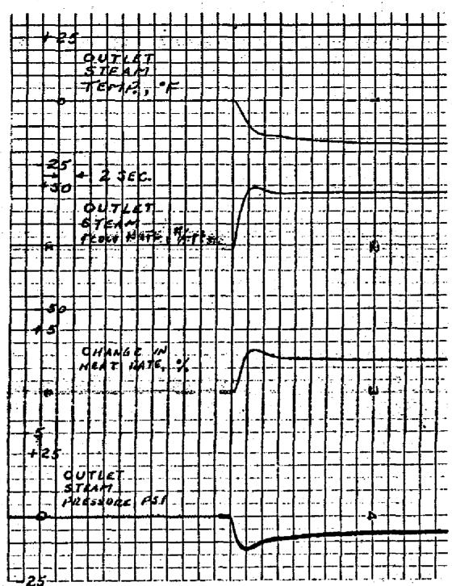

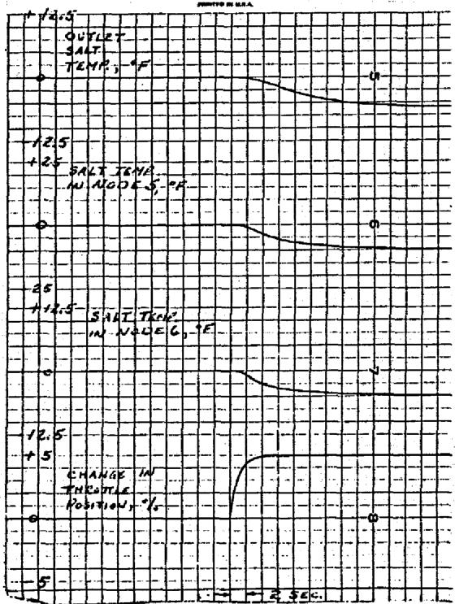  
Fig. 3. First-Order Change in Throttle.

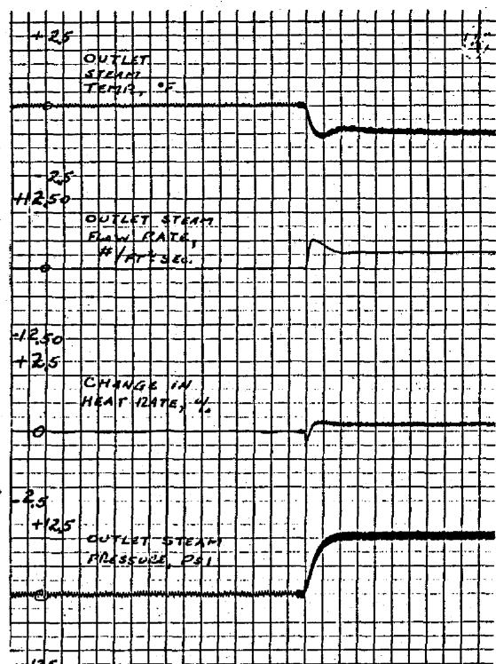

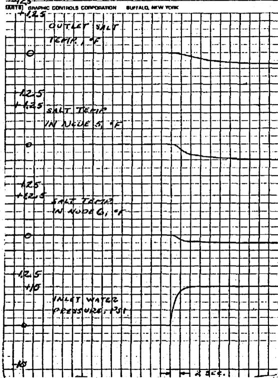  
Fig. 4. First-Order Increase in Inlet Water Pressure.

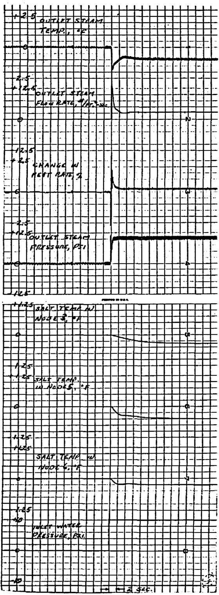  
Fig. 5. Step Increase in Inlet Water Pressure.

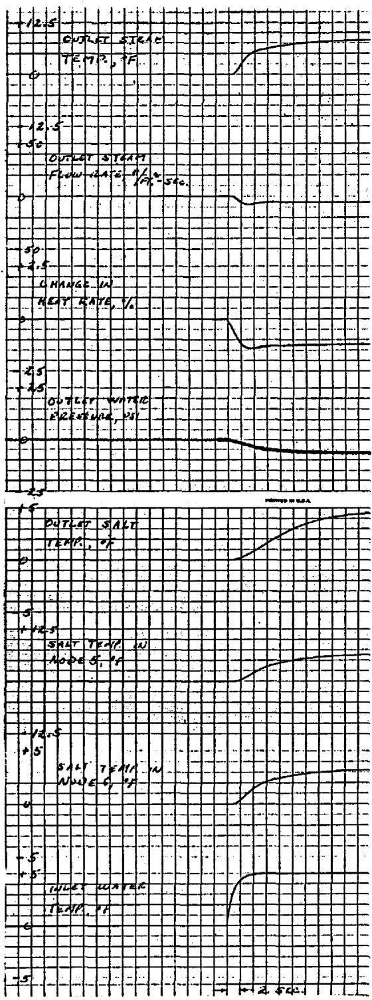  
Fig. 6. First-Order Increase in Inlet Water Temperature.

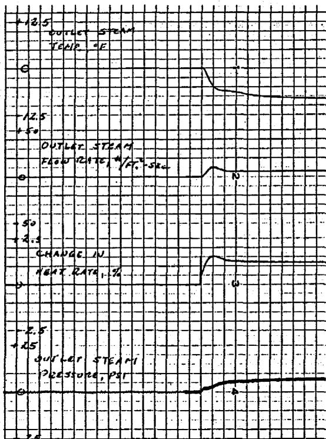

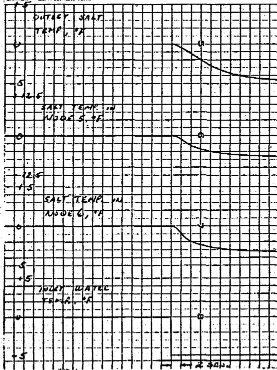  
BOPAUTH   
Fig. 7. Step Decrease in Inlet Water Temperature.

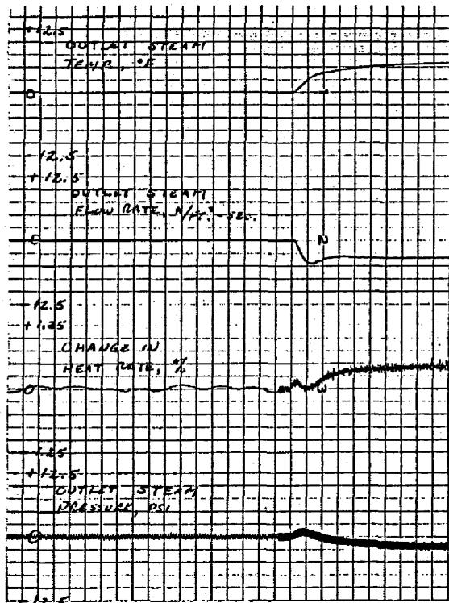

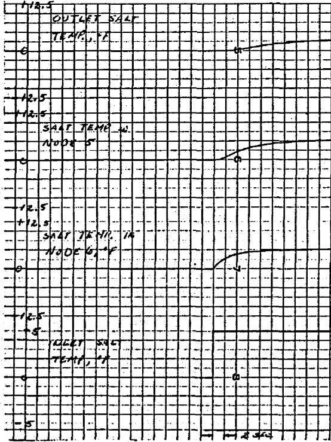  
XRDATION, BUNFALD, NEW YORK  
Fig. 8. Step Increase in Inlet Salt Temperature.

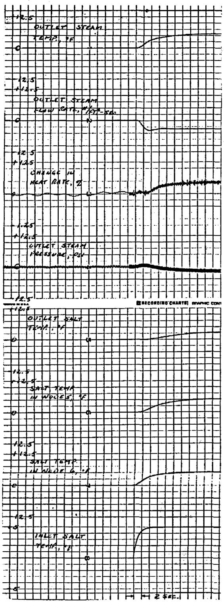  
Fig. 9. First-Order Increase in Inlet Salt Temperature.

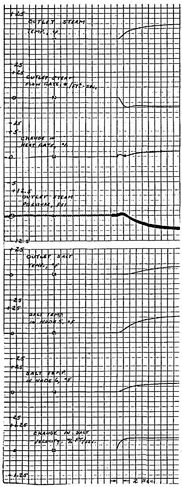  
Fig. 10. First-Order Increase in Salt Velocity.

The question to which an answer was sought was whether a scheme of control could be found which would

1. be generally consistent with the expected dynamic response of the reactor-heat exchanger;   
2. provide a heat rate which closely followed load demand;   
3. hold water outlet temperature within a $1^{\circ}\mathrm{F}$ band of variation;   
4. hold water outlet pressure within a small (but unspecified) band of variation.

To regulate outlet water pressure, a feedback connection from outlet water pressure to inlet water pressure was constructed as shown in Fig. 11. Run 35 was made with the connections and gains as shown in Fig. 11. The system was excited by a $10\%$ increase in salt velocity on a 1-sec first-order lag. Figure 12 shows the results of this run. With other variables ignored the outlet pressure is very satisfactorily held within a range of 2 lb of steady state, and these small fluctuations damped out within 12 sec.

Figure 13 shows the circuitry for sending a feedback signal from the heat rate amplifier $(48_{2})$ to the throttle integrator $(19_{2})$ . Also shown on that figure is the circuitry for inserting heat demand by way of integrator $(5_{2})$ .

Runs 36, 37A, 37B, and 37C were conducted to find an appropriate feedback from heat rate to throttle in order to hold the heat rate stably on a selected value. [The value selected is determined by the output of (52). This output was held at

ORNL DWG. 68-13415

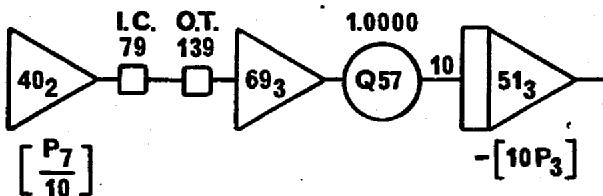  
Fig. 11. Pressure Feedback Circuitry.   
Fig. 12. Salt Velocity Change with Pressure Feedback (Run 35).

ORNL DWG. 68-13416

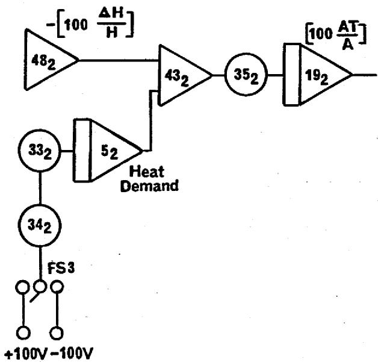  
Fig. 13. Circuitry for Heat Rate, Heat Demand, and Throttle Feedback.

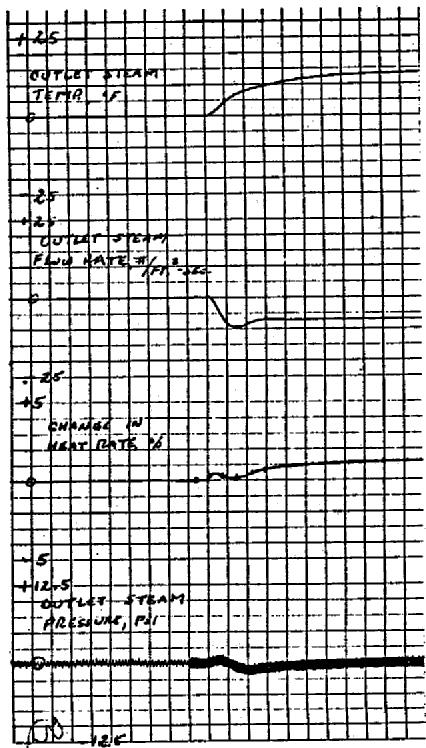

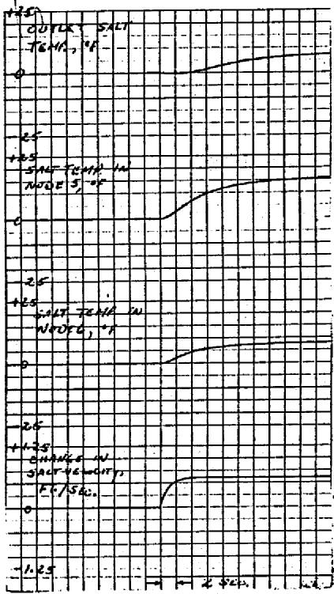

zero with FS3 open during these runs.] In these runs the gain in the feedback lags was varied as follows:

<table><tr><td>Run No.</td><td>Setting-Pot 352</td><td>Gain Pot 352 to (192)</td></tr><tr><td>36</td><td>0.05</td><td>10</td></tr><tr><td>37A</td><td>0.2</td><td>1</td></tr><tr><td>37B</td><td>0.05</td><td>1</td></tr><tr><td>37C</td><td>0.1</td><td>1</td></tr></table>

In each of these runs the system was excited when in steady state by increasing salt velocity by $10\%$ on a 1-sec first-order lag. Figures 14, 15, 16, and 17 are the time tracer of Runs 36, 37A, 37B, and 37C respectively. Figure 14 shows a classical divergent oscillation caused by too much gain. Figures 15, 16, 17 are all fairly comparable showing reasonable stability over a broad range of gain. The pressure controller (Fig. 11) is still in the system, but there is a more lively variation in outlet pressure with the throttle control also present. Configuration 37C (Fig. 16) was chosen as a satisfactory compromise between heat rate and pressure control.

With pressure and heat-rate controls in, attention was turned to water outlet temperature. Figure 18 shows a feedback path connecting water outlet temperature $T_7$ (182) to salt inlet temperature $\theta_7$ (203). Runs 38A and 38B were conducted with the following values set on the components in Fig. 18:

<table><tr><td>Run</td><td>P29</td><td>P13</td><td>K</td><td>Gain P29 to (203)</td></tr><tr><td>38A</td><td>0.1</td><td>0.0099</td><td>10</td><td>1</td></tr><tr><td>38B</td><td>0.1</td><td>0.0990</td><td>1</td><td>1</td></tr></table>

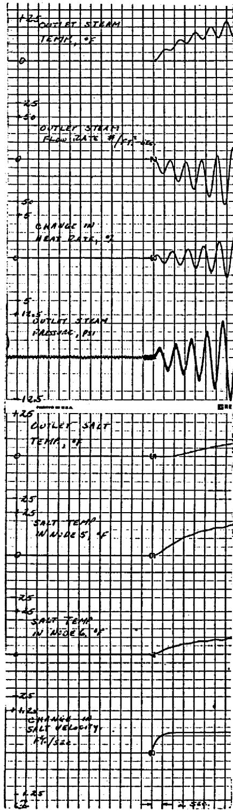  
Fig. 14. Salt Velocity Change with Pressure and Throttle Feedback (Run 36).

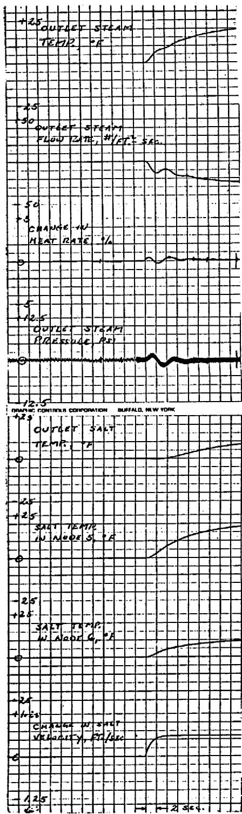  
Fig. 15. Salt Velocity Change with Pressure and Throttle Feedback (Run 37A).

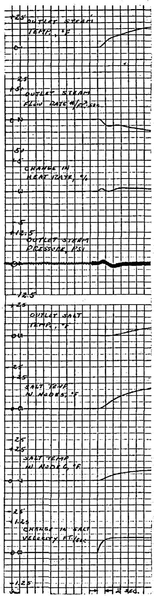  
Fig. 16. Salt Velocity Change with Pressure and Throttle Feedback (Run 37B).

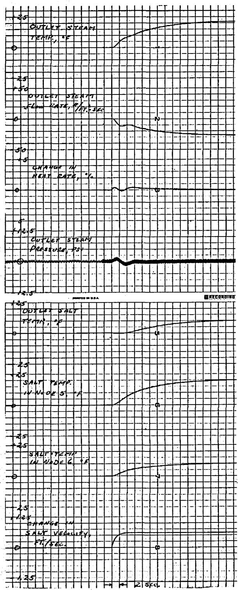  
Fig. 17. Salt Velocity Change with Pressure and Throttle Feedback (Run 37C).

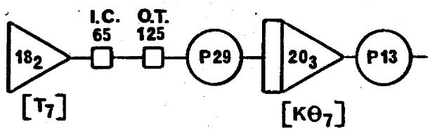  
Fig. 18. Circuitry for Feedback from Water Outlet Temperature to Salt Inlet Temperature.

The system was excited from design steady state in each of these runs with a $5\%$ increase in heat demand (see Fig. 13) inserted at a ramp rate of $5\%/\min$ .

Figures 19 and 20 are the time traces of Runs 38A and 38B respectively. Figure 19 shows an $8^{\circ}\mathrm{F}$ variation in water outlet temperature, completely unacceptable. Figure 20 shows a variation $\alpha$ shade over $1^{\circ}\mathrm{F}$ . This would be very nearly acceptable. However, the feedback circuitry does not reflect the very considerable time delay to the salt inlet temperature $\theta_7$ that would be caused by the presence of the reactor and the primary heat exchanger. (The pressure and throttle controls were present in these runs.)

Run 39A was like 38B except that the inlet salt temperature $\theta_7$ was inserted through a 10-sec first-order lag. Figure 21, which is the time trace, is oscillatory and diverging. Run 39B is like 39A but with feedback gain reduced to 1/10 its value in 39A. Further, the excitation was limited to a $3\%$ heat demand increase. Figure 22 shows the system now convergent but with an unacceptable oscillation.

In order to avoid the oscillation introduced by the time lag on $\theta_7$ , it was determined to control the water outlet temperature by varying salt velocity. This makes possible a much quicker response. The salt velocity could then be returned to

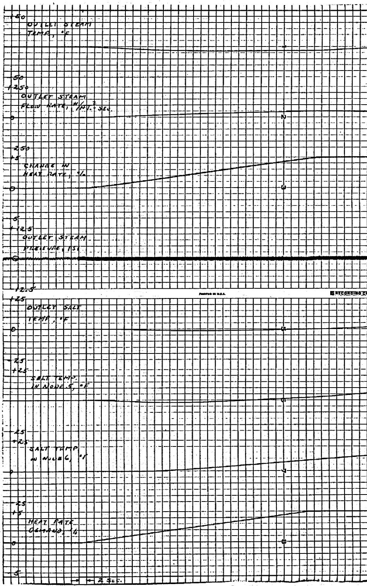  
Fig. 19. Heat Demand Change with Water Outlet Temperature to Salt Inlet Temperature Feedback (Run 38A).

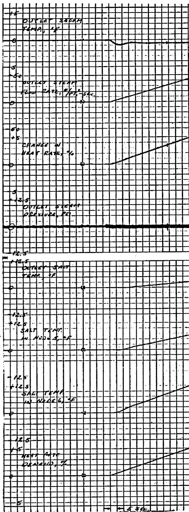  
Fig. 20. Heat Demand Change with Water Outlet Temperature to Salt Inlet Temperature Feedback (Run 38B).

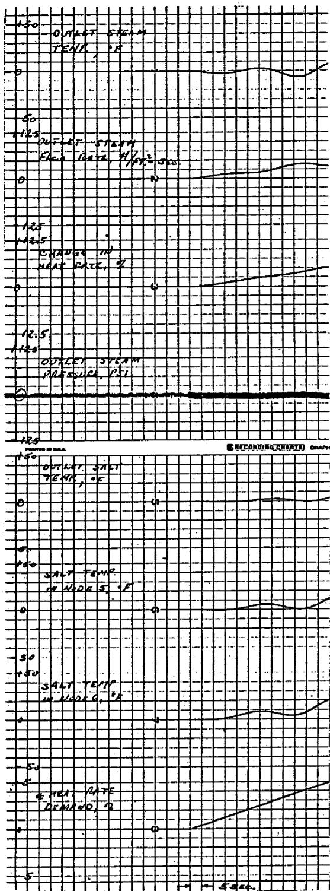  
Fig. 21. Heat Demand Change with Water Outlet Temperature to Salt Inlet Temperature Lagged Feedback (Run 39A).

its normal value by the slower responding salt inlet temperature. Figure 23 shows the feedback circuitry used. In Run 40 this circuitry, along with the pressure and throttle controls of Figs. 11 and 13, was employed. Figure 24 is a trace of the run.

# REFERENCES

1. ORNL General Engineering and Construction Division, Design Study of a Heat Exchange System for One MSBR Concept, ORNL-TM-1545 (Sept. 1967).   
2. J. Kenneth Salisbury, Steam Turbines and their Cycles, Wiley, New York, 1950.   
3. Steam, Its Generation and Use, 37th ed., Babcock and Wilcox Co., New York, 1955.

ORNL DWG. 68-13418

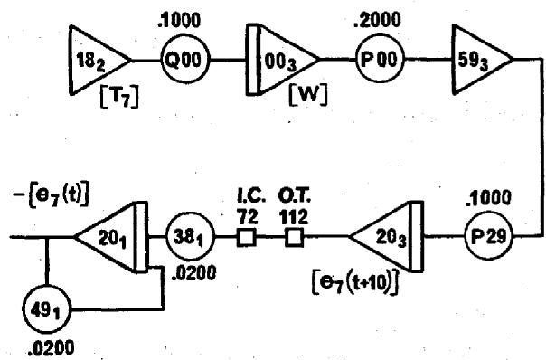  
Fig. 23. Two-Stage Water Outlet Temperature Control Circuitry.

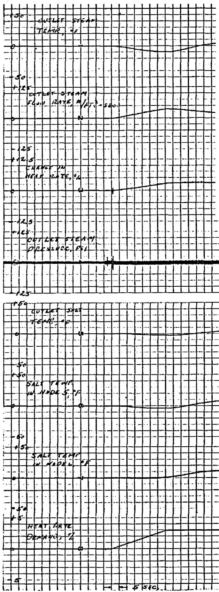  
Fig. 22. Heat Demand Change with Water Outlet Temperature to Salt Inlet Temperature Lagged Feedback (Run 39B).

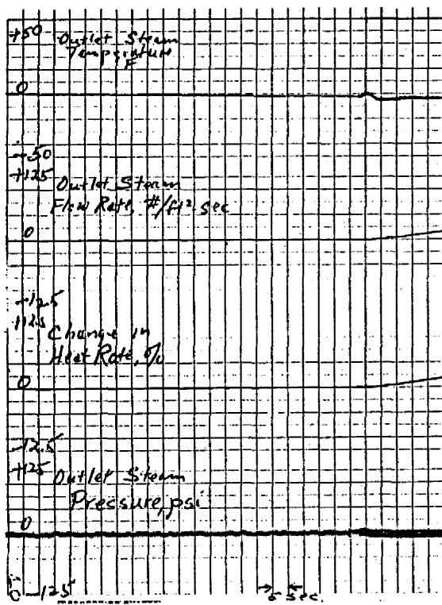  
Fig. 24. Heat Demand Change with Two-Stage Water Outlet Temper=ature and Control.

# INTERNAL DISTRIBUTION

I. J. L. Anderson   
2. S.J.Ball   
3. H.F.Bauman   
4. S.E.Beall   
5. M. Bender   
6. C. E. Bettis   
7. E. S. Bettis   
8. D. S. Billington   
9. E. G. Bohlmann   
10. C. J. Borkowski   
11. G.E. Boyd   
12. R. B. Briggs   
13-17. O.W.Burke   
18. N. E. Clapp   
19-33. F. H. Clark   
34. F. L. Culler, Jr.   
35. S. J. Ditto   
36. W. P. Eatherly   
37. J.R. Engel   
38. D. E. Ferguson   
39. J. H. Frye, Jr.   
40. W.R.Grimes   
41. A. G. Grindell   
42. P. H. Haubenreich   
43. R.E. Helms   
44. W. H. Jordan   
45. P. R. Kasten   
46. M. T. Kelley   
47. T. W. Kerlin   
48. H. T. Kerr   
49. H. G. MacPherson

50. R.E. MacPherson   
51. H.E.McCoy   
52. H. F. McDuffie   
53. J. R. McWherter   
54. R. L. Moore   
55. E. L. Nicholson   
56. L. C. Oakes   
57. R.W. Peelle   
58. A.M.Perry   
59. B. E. Prince

60-62. M. W. Rosenthal

63. Dunlap Scott   
64. W. H. Sides   
65. Moshe Siman-Tov   
66. R.C.Steffy   
67. R. S. Stone   
68. J. R. Tallackson   
69. R.E.Thoma   
70. D. B. Trauger   
71. A. M. Weinberg   
72. J.R.Weir   
73. M.E.Whatley   
74. J. C. White   
75. Gale Young

76-77. Central Research Library

78. Document Reference Section

79-81. Laboratory Records Department

82. Laboratory Records, ORNL R. C.   
83. ORNL Patent Office

84-98. Division of Technical Information Extension

99. Laboratory and University Division, ORO

# EXTERNAL DISTRIBUTION

100. T. W. Pickel, P.O. Box 2384, Station A, Champaign, III. 61820   
101. C. K. Sanathanan, U. of III., Dept. Information Eng., Chicago, III. 60680

102. R. Vichnevetsky, Electronic Associates, Inc., P. O. Box 582, Princeton, N. J. 08541   
103. Paul Wade, TVA, Bull Run Steam Plant, P. O. Box 2000, Clinton, Tenn. 37716