ORNL-TM-2478

DESIGN. CONSTRUCTION, AND TESTING OF A LARGE MOLTEN SALT FILTER

R. B. Lindauer and C. K. McGlothlan

# LEGAL NOTICE

This report was prepared as an account of Government sponsored work. Neither the United States, nor the Commission, nor any person acting on behalf of the Commission:

A. Makes any warranty or representation, expressed or implied, with respect to the accuracy, completeness, or usefulness of the information contained in this report, or that the use of any information, apparatus, method, or process disclosed in this report may not infringe privately owned rights; or

B. Assumes any liabilities with respect to the use of, or for damages resulting from the use of any Information, apparatus, method, or process disclosed in this report.

As used in the above, "person acting on behalf of the Commission" includes any employee or contractor of the Commission, or employee of such contractor, to the extent that such employee or contractor of the Commission, or employee of such contractor prepares, disseminates, or provides access to, any information pursuant to his employment or contract with the Commission, or his employment with such contractor.

MARCH 1969

OAK RIDGE NATIONAL LABORATORY

Oak Ridge, Tennessee

operated by

UNION CARBIDE CORPORATION

for the

U. S. ATOMIC ENERGY COMMISSION

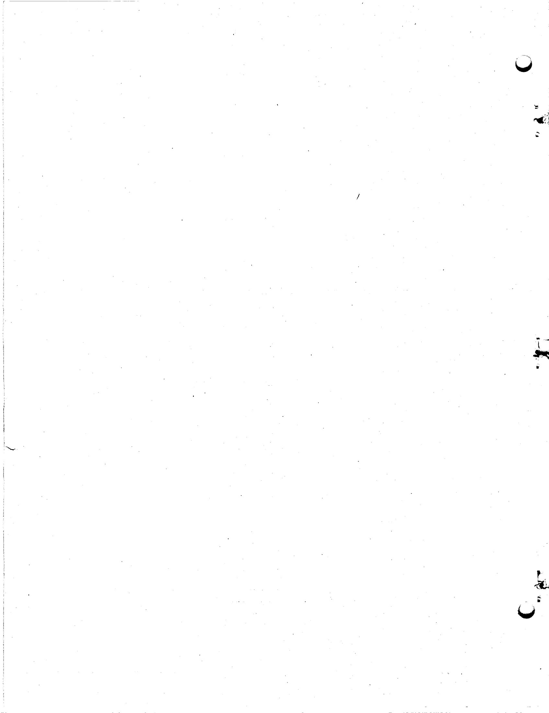

# CONTENTS

# Page

ABSTRACT 1

INTRODUCTION 1

DESIGN CRITERIA. 2

Physical Layout of the System 2

Sequence of Operations. 2

Quantities of Corrosion Products to be Handled. 4

Pressure Drop 5

Temperature 5

Pressure. 5

Maintenance 5

EXPERIMENTAL PROGRAM 5

Reduction of Corrosion Products Fluorides 6

Salt Filtration Studies 6

FINALDESIGN 8

Analysis of MSRE Fuel Cell Salt Filter Pressure Vessel. 8

Filter Element Design 13

Electric Heater Design 17

Instrumentation Design 18

FABRICATION 20

Procurement of Materials. 20

Shop Fabrication. 20

Quality Assurance 21

Schedule and Cost 22

INSTALLATION 22

PLANT PERFORMANCE. 24

ACKNOWLEDGMENT 27

REFERENCES 28

APPENDIX (Fabrication Drawings) 29

DESIGN, CONSTRUCTION, AND TESTING OF A LARGE MOLTEN SALT FILTER

R. B. Lindauer and C. K. McGlothlan

# ABSTRACT

The Molten Salt Reactor Experiment uses mixtures of fluoride salts as fuel. Routine on-site processing of these molten salts results in formation of corrosion products. This report describes development, design, construction, installation, and testing of a large salt filter to remove these corrosion products. The filter is designed to remove approximately 15 kilograms of corrosion products from 9000 kilograms of flush and fuel salt at a temperature of $1200^{\circ}\mathrm{F}$ .

# INTRODUCTION

The fuel in the Molten-Salt Reactor Experiment (MSRE) is a molten mixture of fluoride salts (LiF, BeF\(_2\), ZrF\(_4\), and UF\(_4\)). The UF\(_4\) required for criticality is less than one mole percent of the mixture. The MSRE, a forerunner of breeders operating in the thorium-\( ^{233}\mathrm{U} \) cycle, started up with \( ^{235}\mathrm{U} \). Sufficient \( ^{233}\mathrm{U} \) later became available and the experimental program of the reactor was expanded to include operation with this fissile material.\(^{1,2}\) The changeover involved stripping the original UF\(_4\) from the other fluorides (carrier salt) by the fluoride volatility process, in an on-site processing plant,\(^{3}\) then adding \( ^{233}\mathrm{UF}\(_4 \)-LiF as required.

The fluorination of the salt is accompanied by formation of corrosion-product fluorides which, if left in the carrier salt, would interfere with the routine monitoring of corrosion during reactor operation. In principle, the corrosion products could be removed simply by reducing them to insoluble metallic form, then filtering the molten salt. A problem was the filter. Small sintered-metal filters had been used extensively to filter

molten salts at temperatures to $1200^{\circ}\mathrm{F}$ , but the design of a filter for this high temperature and large enough to handle around $15\mathrm{kg}$ of corrosion products in $9000\mathrm{kg}$ of salt was a different order of magnitude. This report tells how such a filter was successfully developed and used. It describes the concept, development tests, final design, construction, installation, and operation.

# DESIGN CRITERIA

# Physical Layout of the System

Figure 1 shows the piping layout of the filter, storage and processing tanks. The salt inlet line of the filter is about 6 ft higher in elevation than the maximum salt level in the processing tank. From the bottom of the filter the molten salt drains by gravity to the storage tanks, about 20 ft below in another cell.

# Sequence of Operations

Two $70\text{-ft}^3$ batches of salt were to be processed — the flush salt and the fuel salt. Salt properties are given in Table 1. The operation was to begin with transfer of an entire salt batch, by helium gas pressure from one of the storage tanks, through the filter to the processing tank. At this time the salt should contain essentially no solids and should back-flow through the clean filter element with very little pressure drop.

The salt was to be sparged with gaseous fluorine to convert the $\mathbf{U}\mathbf{F}_4$ to volatile $\mathbf{U}\mathbf{F}_6$ which leaves the salt to be collected on NaF. During this fluorination corrosion of the Hastelloy- $\mathbf{N}^{(a)}$ vessel would produce NiF $_2$ , FeF $_2$ , and CrF $_2$ , all of which are soluble in the salt. Since these

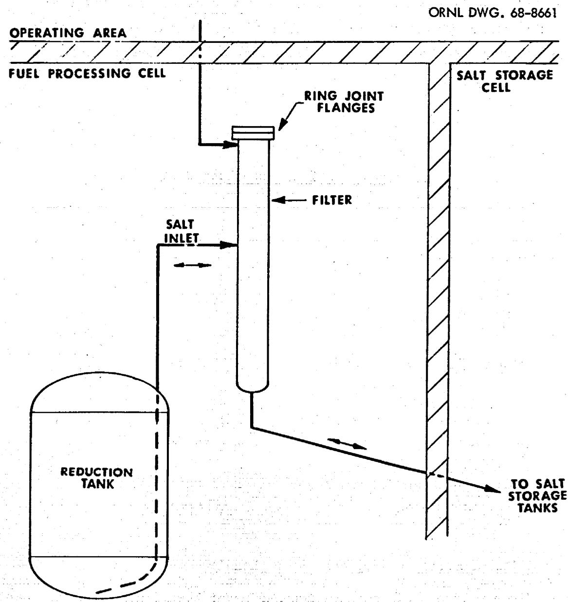  
Fig. 1. Physical Layout of the System.

soluble fluorides would interfere with corrosion monitoring during reactor operation, they would have to be removed from the salt. The $\mathrm{NiF}_2$ would be reduced by hydrogen sparging to metallic nickel and the $\mathrm{FeF}_2$ and $\mathrm{CrF}_2$ would be reduced with pressed zirconium metal shavings to Fe and Cr metal. The salt batch would then be filtered to remove these precipitated metals before being sent to the salt storage tanks.

Table 1 Properties of Fuel and Flush Salts   

<table><tr><td></td><td>Fuel Salta</td><td>Flush Salta</td></tr><tr><td colspan="3">Composition, mole %:</td></tr><tr><td>LiF</td><td>65</td><td>66</td></tr><tr><td>BeF2</td><td>29.2</td><td>34</td></tr><tr><td>ZrF4</td><td>5</td><td></td></tr><tr><td>UF4</td><td>~0.82</td><td>~0.03</td></tr><tr><td>Average Physical Properties:</td><td>@ 1200°F</td><td>@ 1065°F</td></tr><tr><td>Viscosity, lb/ft-hr</td><td>18</td><td>20</td></tr><tr><td>Density, lb/ft3</td><td>147</td><td>126</td></tr><tr><td>Liquidus Temperature, °F</td><td>813</td><td>856</td></tr></table>

<sup>a</sup>After 15,000 hours of fuel salt circulation in the reactor piping system and before fluorination of the salt.

# Quantities of Corrosion Products to be Handled

Since salt of this composition had never been fluorinated in plant-scale equipment the exact corrosion rate was not known. However, because of the smaller surface/volume ratio it was expected that corrosion would be less than the 0.5 mil/hr experienced in small scale work.

Assuming a corrosion rate of 0.1 mil/hr and a total fluorine sparge time (flush + fuel salt) of 70 hours, it was estimated that 15 kg of

corrosion products as metal would be produced. One filter element should have sufficient volume on the upstream side of the filter media for this weight of metal if the bulk density is not lower than $50\%$ of the solid metal density. A large safety factor in the filter capacity was the large amount of metals remaining as sediment in the feed tank during small scale filter tests.

# Pressure Drop

The filter element must withstand a pressure differential of 18 psig tending to collapse the filter during filtration. This is $150\%$ of the minimum pressure at the end of the filtration when the transfer gas pressure releases through the loaded filter.

The filter element must also withstand a pressure differential of 30 psig tending to burst the filter media during transfer to the processing tank. This is $150\%$ of the salt head from the bottom of the storage tank to the filter element.

# Temperature

The filter element must have the required strength at $1200^{\circ}\mathrm{F}$ , which is the maximum expected temperature during salt transfer.

# Pressure

The maximum pressure on the filter housing will be 30 psig.

# Maintenance

The filter element must be replaceable by remote maintenance in case of plugging.

# EXPERIMENTAL PROGRAM

The selection of a high-temperature filter media for molten salt is limited to materials that have high-temperature strength, corrosion resistance in molten salt, and adequate filtration efficiency. The temperature and corrosion requirements limit the material selection to high-nickel alloys such as Inconel and Hastelloy-N. Inconel was chosen because of

availability. To select the type and size of filter media that would satisfactorily remove the corrosion products expected in fluorination of the MSRE fuel and flush salts required an experimental program. $^4$ The experimental program was composed of two parts. In the first part, molten salt was prepared to simulate the conditions expected after fluorination of the MSRE fuel salt. The second part consisted of salt-filtration tests of two types of filter media under conditions which approximated those anticipated in the reactor application.

# Reduction of Corrosion Products Fluorides

The experimental program was carried out with a $104$ -kg batch of the fluoride mixture, $\mathrm{LiF - BeF_2 - ZrF_4}$ (65 - 30 - 5 mole %) which was prepared from the component fluoride salts by routine production procedures. After treatment to remove oxygen and sulphur impurities, $\mathrm{CrF_2}$ , $\mathrm{FeF_2}$ , and $\mathrm{NiF_2}$ were added to the salt mixture to simulate the conditions expected after fluorination of the MSRE fuel salt. The salt mixture was hydrofluorinated to insure complete dissolution of the corrosion product fluorides. Analysis of a filtered sample of the salt taken after dissolution is compared with expected concentrations in Table 2.

The $\mathrm{NiF}_2$ in the salt mixture was reduced with a hydrogen sparge and the gas effluent periodically analyzed for HF. Since equilibrium data produced very low hydrogen utilization during reduction of $\mathrm{FeF}_2$ and $\mathrm{CrF}_2$ , data were obtained on reduction of these fluorides with pressed zirconium metal turnings added to the salt mixture. Analysis of filtered samples taken near the conclusion of the zirconium addition period are also shown in Table 2.

# Salt Filtration Studies

Filtration tests were conducted using $40 - \mu$ pore size sintered porous nickel (Micro Metallics Corp.) and two grades (20 and $41 - \mu$ pore size) of sintered fiber metal (Huyck Metals Co.). Each filter was fabricated as a 2-5/8-in. diameter plate so that geometric surface areas of all filters would be identical.

The experimental assembly used for the filtration tests was essentially that used for the routine production of fluoride mixtures. Tests were

Table 2   
Corrosion Product Fluorides in Batch of Salt for Filter Media Test   

<table><tr><td rowspan="2">Material</td><td rowspan="2">Quantity Added (g)</td><td rowspan="2">Estimated * Concentration* (ppm)</td><td colspan="3">Results of Analysis of Filtered Samples* (ppm)</td></tr><tr><td>After Hydro-fluorination</td><td>After Addition of 253 g Zr</td><td>After Addition of 327 g Zr</td></tr><tr><td>CrF2</td><td>80</td><td>445</td><td>470</td><td>9</td><td>26</td></tr><tr><td>FeF2</td><td>50</td><td>286</td><td>620</td><td>60</td><td>44</td></tr><tr><td>NiF2</td><td>800</td><td>4680</td><td>3700</td><td>&lt;30</td><td>36</td></tr></table>

*Concentrations reported on a metal basis.

made under static conditions by allowing the melt to remain quiescent for a minimum time of 4 hours prior to transfer, and also made by rapidly sparging the melt with helium just prior to salt transfer at $650^{\circ}\mathrm{C}$ . The pressure drop across the filter varied from 22.5 to 20.8 psi as the level of salt in the treatment vessel decreased. A summary of the filtration tests is shown in Table 3.

The fiber metal media (designed FM-250 by the manufacturer) which had a porosity of $78\%$ and a stated removal efficiency of $98\%$ for particles larger than 10 microns in diameter was recommended for the MSRE. Filtration times for this material were about 1.19 and 1.36 hours per cubic foot of salt mixture (Runs 7 and 4). The occasional plugging of the filter in Tests 4 and 5 suggests that the loading capacity of the 40-micron filters may be about 50 to 75 grams of metal particles or about 9 to 14 grams per square inch of filter surface.

Samples of the salt mixture were taken before the first filtration experiment and downstream from the filter plate after Tests 4, 6, and 7. Analysis of these samples are given in Table 4. Only 1.8 to $3.4\%$ of metals reduced from solution passed through the FV-250 fiber metal media.

It was concluded that the FM-250 fiber metal media would filter as well as the porous metal media that had been used successfully to filter small batches of the original salt loadings for the MSRE and was less susceptible to plugging.

# FINAL DESIGN

Analysis of MSRE Fuel Cell Salt Filter Pressure Vessel

Calculations were made to determine that stresses in the pressure vessel for the filter would be within the allowable stresses for Class-C vessels of Section III of the ASME Boiler and Pressure Vessel Code. Design data are given in Table 5 and construction details are shown on Drawings E-NN-D-49036 and E-NN-D-49037.

Table 3   
Summary of Filtration Tests   

<table><tr><td>Salt Composition:</td><td>LiF-BeF2-ZrF4(65-30-5 mole %)</td></tr><tr><td>Wt of Salt Mixture:</td><td>104.1 kg</td></tr><tr><td>Volume of Salt at 650°C:</td><td>1.7 ft3</td></tr><tr><td>Indicated Pressure Differential:</td><td>11 psig forepressure vs vacuum</td></tr></table>

<table><tr><td>Test No.</td><td>Filter Material</td><td>Pore Diameter Microns</td><td>Salt Conditions</td><td>Transfer Time Hours</td><td>Weight Gain Grams</td><td>Remarks</td></tr><tr><td>1</td><td>Monel fiber metal</td><td>20</td><td>Static</td><td></td><td>22</td><td>Test terminated after 2 hrs. Essentially no salt transfer.</td></tr><tr><td>2</td><td>Porous Nickel</td><td>40</td><td>Static</td><td>0.5</td><td>7</td><td>No visible material on filter or evidence of failure.</td></tr><tr><td>3</td><td>Porous Nickel</td><td>40</td><td>Agitated</td><td>1.75</td><td>44</td><td></td></tr><tr><td>4</td><td>347 SS fiber metal</td><td>41</td><td>Static</td><td>2.0</td><td>77</td><td>Test stopped after 90 kg transfer.</td></tr><tr><td>5</td><td>Porous Nickel</td><td>40</td><td>Static</td><td>2.17</td><td>63</td><td>Filter plugged after 40 kg transfer. Material on filter predominantly salt.</td></tr><tr><td>6</td><td>Porous Nickel</td><td>40</td><td>static</td><td>1.84</td><td>19</td><td>Balance of salt transferred filter ruptured.</td></tr><tr><td>7</td><td>347 SS fiber metal</td><td>41</td><td>Agitated</td><td>2.0</td><td>67</td><td></td></tr><tr><td>8</td><td>Porous Nickel</td><td>40</td><td>Static</td><td>1.75</td><td>22</td><td>80 kg back transfer of salt from receiver to treatment vessel. Filter plugged.</td></tr></table>

# Table 4

# Summary of Analytical Results

# During Filtration Tests

<table><tr><td rowspan="2">Sample Interval Filtered Sample</td><td colspan="4">Impurity Concentration (ppm)</td></tr><tr><td>Cr</td><td>Ni</td><td>Fe</td><td>Total</td></tr><tr><td>Before Test 1</td><td>26</td><td>36</td><td>44</td><td>106</td></tr><tr><td>After Test 4</td><td>15</td><td>84</td><td>66</td><td>165</td></tr><tr><td>After Test 6</td><td>16</td><td>256</td><td>132</td><td>404</td></tr><tr><td>After Test 7</td><td>17</td><td>19</td><td>49</td><td>85</td></tr></table>

Table 5   
Design Data for Large Salt Filter   

<table><tr><td colspan="2">GENERAL</td></tr><tr><td>Construction Material</td><td>Inconel 600</td></tr><tr><td>Pneumatic Pressure Test</td><td></td></tr><tr><td>Pressure Vessel without Filter Element, psig</td><td>625.</td></tr><tr><td>Filter Element Inner Core Can, psig</td><td>100</td></tr><tr><td>Helium Vacuum Leak Rate to Inside</td><td></td></tr><tr><td>Pressure Vessel (without filter element), cc/sec of helium</td><td>&lt;1 x 10-8</td></tr><tr><td>Filter Element Inner Core Can, cc/sec of helium</td><td>&lt;1 x 10-8</td></tr><tr><td>Design Temperature</td><td></td></tr><tr><td>Pressure Vessel, °F</td><td>1200</td></tr><tr><td>Filter Element, °F</td><td>1200</td></tr><tr><td>Design Pressure, psig</td><td>35</td></tr><tr><td>Operating Temperature, °F Maximum</td><td>1200</td></tr><tr><td>Operating Pressure, psig Maximum</td><td>35</td></tr><tr><td colspan="2">FILTER PRESSURE VESSEL</td></tr><tr><td>Size</td><td>6 inch, Sch. 40, pipe</td></tr><tr><td>Length</td><td>7 feet-10 inches</td></tr><tr><td>Salt Inlet and Outlet Size</td><td>1/2 inch, Sch. 40, pipe</td></tr><tr><td>Access for Filter Element</td><td>6 inch, 300 lb, ring joint flange (special)</td></tr><tr><td>Flange Seal</td><td>R-45, O-ring, Copper, Leak-detected (special)</td></tr><tr><td colspan="2">FILTER ELEMENT</td></tr><tr><td>Filter Media</td><td>FM-250 Feltmetal</td></tr><tr><td>Porosity, %</td><td>84</td></tr><tr><td>Mean Pore Size (Microns)</td><td>59</td></tr><tr><td>Filteration Rating when Filtering Liquids</td><td></td></tr><tr><td>Nominal (98%), microns</td><td>10</td></tr><tr><td colspan="2">FILTER ELEMENT (continued)</td></tr><tr><td>Tensile Strength @ 100°F, psi</td><td>800</td></tr><tr><td>@ 1200°F, psi</td><td>571</td></tr><tr><td>Modulus of Elasticity @ 1200°F, psi</td><td>3.5 x 10-5</td></tr><tr><td>Thickness, inch</td><td>0.096</td></tr><tr><td>Pressure Drop for Clean Water @ 10 gpm/ft2 in psi</td><td>0.1</td></tr><tr><td>@ 100 gpm/ft2 in psi</td><td>0.85</td></tr><tr><td>Total Filtering Area, ft2</td><td>8.65</td></tr><tr><td>Filter Media-Perforated Metal Support Thickness, inch</td><td>0.078</td></tr><tr><td>Open Area, %</td><td>32</td></tr><tr><td>Quantity of Salt to be Filter, kg</td><td>9,000</td></tr></table>

Stresses in the vessel are due to the 35-psig internal pressure and the axial temperature gradient along the vessel from the heated section at $1200^{\circ}\mathrm{F}$ through a 25-in. insulated section and a 7-1/2-in. bare metal section at $200^{\circ}\mathrm{F}$ on the end. The axial temperature gradient causes discontinuity stresses because of the resulting differential radial expansion of the vessel.

The temperature gradient was determined through the use of the "Astra Heating" computer program at approximately 1-in. increments for the 32.5-in. on length outside the heated zone. The maximum temperature differential of $56^{\circ}\mathrm{F}$ per linear inch is near the heated zone at the highest temperature and lowest allowable stress. There is no temperature gradient across the wall of the pipe so there are no radial thermal stresses.

The sum of the stresses due to pressure and the temperature gradient are less than three times the Code allowable stress for primary stresses, so the design is therefore satisfactory.

# Filter Element Design

In small scale batch operations, sintered porous nickel filters have been used successfully as reported earlier. However, it was decided to investigate the use of fiber metal filter media for possible improvement in capacity. Although experimental tests did not show any significant improvement in performance, it was decided to use the fiber metal because of its adaptability and availability to fabrication requirements. (A cylindrical porous filter would have to be fabricated by the manufacturer.) Inconel was chosen as the material of construction not only because of its strength at elevated temperature, but also because of its corrosion resistance to molten salt.

Both the burst (from internal pressure) and the collapse strength of the inner and outer filter elements were considered in the design of the filter element. Design data are given in Table 5. The burst strength is important only during back flow when transferring salt to the processing tank. The formula<sup>6</sup>

$$
\mathrm {p} = \frac {\text {2 s t}}{\bar {a} 1 \mathrm {a}}
$$

was used in the calculation where $s$ is the tensile strength of the fiber metal at $1200^{\circ}\mathrm{F}$ .

$$
s = \frac {s (\text {I n c o n e l} @ 1 2 0 0 ^ {\circ})}{s (\text {I n c o n e l} @ 1 0 0 ^ {\circ})} x s (\text {f i b e r m e t a l} @ 1 0 0 ^ {\circ}) = \frac {5 2 , 5 0 0}{7 3 , 0 0 0} x 8 0 0 = 5 7 1 p s i.
$$

The outer filter element was calculated to have a burst strength of 25 psi and the inner filter $34$ psi with no safety factor. The worst conceivable case would be if the filter element were almost completely restricted from the flush salt filtration and the fuel salt was then transferred to the processing tank. Since the burst strength of the outer element is less than the 30 psig specified in the design criteria, the buoyancy of the filter in the salt on transfer to the processing tank is necessary for the filter to meet the burst strength requirement. The filter element has a weight of 57 lbs and a horizontal area of 25 in. $^{2}$ . Construction details are shown on Drawing E-NN-D-49038 and Figures 2 and 3. A pressure of only 2.3 psi will therefore cause flotation of the element and by-passing of salt through the seat. This pressure is further reduced by the buoyancy of the element so there is no danger of rupture of the element if the filter is above the melting point of the salt.

To prevent collapse of the filter element it was necessary to provide a perforated back-up plate against the inner filter surface. The maximum external pressure is applied to the filter at the end of filtration when the transfer gas pressure blows into the gas space above the filter element. At this time there will also be the maximum restriction of the filter from collected solids. In calculating the collapse strength, the formula<sup>7</sup> ps = $\frac{2\textbf{E}t^3}{(1 - m^2)\textbf{D}^3}$ was used where $\mathbf{E}$ is the modulus of elasticity, t and D are the thickness and diameter of the element and m is Poisson's

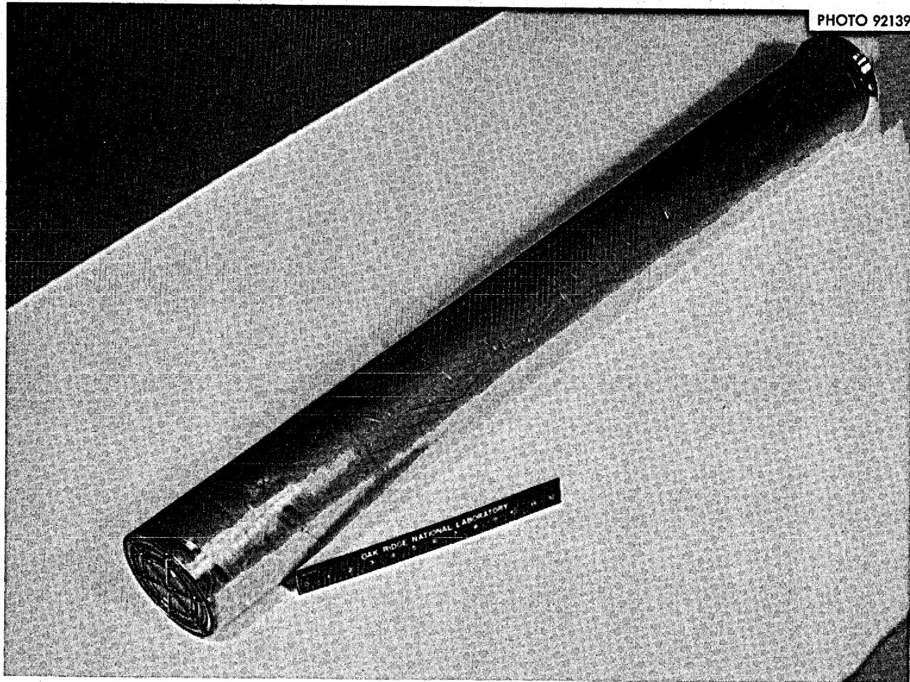  
Fig. 2. Filter Element, Top and Side View.

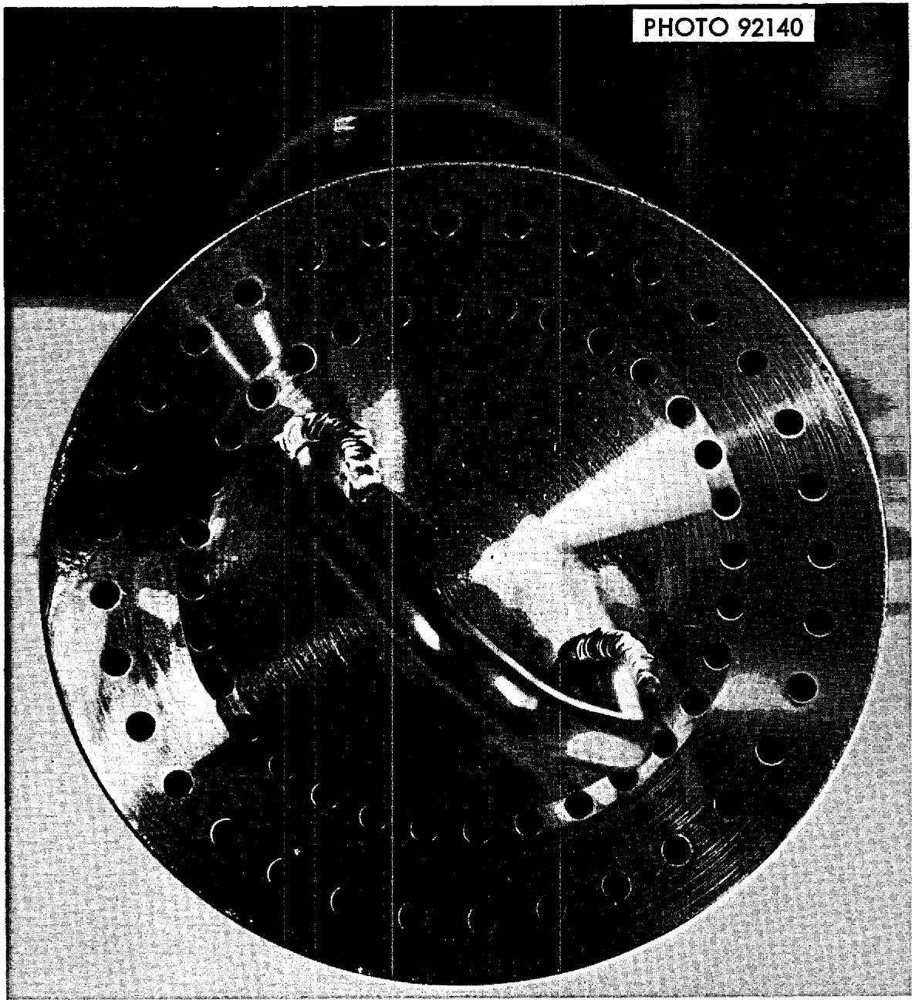  
Fig. 3. Filter Element, Bottom View.

ratio (0.3). E for the fiber metal is $1.75\%$ of solid Inconel and is $3.5 \times 10^{5} \, \text{psi} @ 1200^{\circ}\text{F}$ . Considering the fiber metal without the backup, the outer element has a collapse strength of only 6.5 psi and the inner element 16.3 psi without a safety factor. Since the minimum final transfer pressure is 12 psi for the fuel salt (without any flow $\Delta P$ ), it is evident that a backup is required. An 0.078-in. thick Inconel perforated sheet with $32\%$ open area was used as a backup because of availability. This plate alone has a collapse strength (for the larger element) of 131 psi. To provide a safety factor of 4 the operating procedure specifies a maximum transfer plus gas space pressure of 35 psi.

The filter element can move upward during salt back-flowing and by-pass salt through the seat, but it has to reseal after flotation to minimize leakage in the main direction of salt flow. Mating spherical seating surfaces are provided between the filter element and pressure vessel for ease in self-sealing.

# Electric Heater Design

Electric heaters are provided to permit preheating of the filter and to maintain the temperature of the salt during a transfer. Maintenance requirements are minimized by designing the heaters with excess capacity so they can be operated at reduced voltage to promote longer life. Also duplicate spare heaters are installed and connected ready for use with only minor, out-of-cell wiring changes. The tubular heaters are 0.315-in. OD Inconel sheath with nichrome elements rated 500 watts per foot of heater. A layer of stainless steel shim stock is installed between the heaters and the thermal insulation to prevent the heaters from being in direct contact with the insulation.

The controls that are used limit the available installed capacity to 3500 watts; 2400 watts in the lower control (FSF-1) and 1000 watts in the upper control (FSF-2). (See Drawing E-NN-D-49036.) Control of the electrical input to the heaters is from manual powerstats. The voltage setting required was determined during startup testing, and manual stops were set to limit the controls to hold the temperature to $1300^{\circ}\mathrm{F}$ or below. During startup testing, 1600 watts for the lower section and 500 watts for

the upper section were required to preheat the filter. Only the heaters on the lower section are required for normal transfer of salt. If salt freezes in the upper section of the filter because of unforeseen difficulties, heaters on the upper control will be used to preheat this section.

# Instrumentation Design

A helium supply is provided and instrumented to assure the presence of a gas cushion in the filter at all times and to purge the connecting lines with helium before filtration. Temperature instruments are provided both to indicate that the equipment is above the salt melting point and as an indication of salt level.

Figure 4 shows the helium supply to the filter. The solenoid valve is interlocked with the salt freeze valves to prevent the accidental pressuring of molten salt from a salt storage tank to the reactor by helium through the filter. Accidental filling of the reactor is further prevented by the pressure control valve limiting the pressure to 15 psig — sufficient to fill the reactor only 1/2 full — and the flow restrictor which would limit the salt transfer rate to 5 liters per minute — only $30\%$ of the normal reactor fill rate. The check valves prevent back-flow of radioactive gases to the operating area. PI-B indicates the pressure in the gas space above the filter element. This pressure is transmitted to the operating area by a transmitter contained in a cubicle vented to the processing cell.

Temperatures are monitored by eleven thermocouples attached to the outer wall of the filter housing. Nine of these are read out on a 0 - 2000°F recorder. The other two (at the same elevation as Points 7 and 9) are connected to temperature switches which actuate annunciators and provide interlock contacts in the pressurization and vent valve control circuits. Since the upper heater will be normally off, temperature points 5, 6, 7, 8, and 9 will be heated only by conduction unless the salt level rises higher than normal. If this occurs there will be an alarm and the pressurization valve will close when point 7 reaches 1000°F. When point 9 reaches 350°F there will be an alarm, the pressurization valve

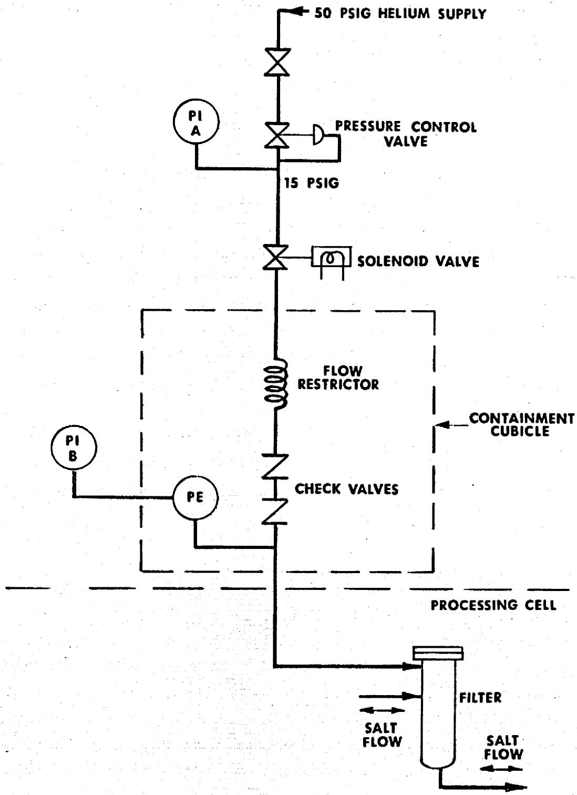  
Fig. 4. Helium Supply Instrumentation.

will close and the salt-tank vent valve will open. Rise in salt level could be caused by a restricted filter element, leaking ring-joint flange and/or leaking check valves.

# FABRICATION

# Procurement of Materials

All salt-containing parts are fabricated from Inconel-600 material. Pipe, fitting, and plate were purchased from vendors according to applicable American Society for Testing and Materials Specifications with certified chemical and physical properties. After receipt in ORNL, the material received addition liquid penetrant and ultrasonic inspection. This inspection is routinely given material used to fabricate MSRE equipment that will contain high-temperature radioactive gases and fluids. This additional inspection is considered partial insurance against equipment failure and the need for expensive and time-consuming remote maintenance.

The filter media (sintered Inconel fibers) was purchased in 18 x 20-inch sheets from Huyck Metals Company. This special material was selected and purchased after numerous consultations with the vendor about its unique design properties.

# Shop Fabrication

The filter housing and element were fabricated in Oak Ridge National Laboratory shops from Drawings E-NN-D-49036, E-NN-D-49037, and E-NN-D-49038. High quality nuclear fabrication specifications and techniques that met or exceeded the requirements for Class "C" vessels of Section III of the ASME "Pressure Vessel Code" were used to fabricate the filter. Forming and welding of the fibrous Inconel filter-media metal required the development of special fabrication techniques. Special procedures were also utilized to prevent the filter-media from becoming contaminated with foreign material during fabrication.

Welds<sup>11</sup> of all Inconel pressure-containing parts were liquid-penetrant inspected<sup>9</sup> and radiographed.<sup>12</sup> Other Inconel welds received liquid-penetrant

inspection. Welds of the fibrous metal filter-media were visually inspected. All welding was performed by welders qualified in the weld procedures specified on the drawings.

A pneumatic test was performed on the pressure vessel, without the filter element, as specified in ASME Code. The inner core can of the filter element was pneumatically tested at 100 psig to insure against failure at operating pressure and temperature.

After pneumatic tests, the pressure vessel and inner core can of the filter element were separately leak-tested by evacuating the inside and flooding the outside with helium. Helium leakage to the inside was less than $1 \times 10^{8} \, \text{cc/sec}$ of both subassemblies.

A polydispersed aerosol, dioctylphthalate (DOP) was forced through the fibrous metal filter element at various stages of fabrication and monitored to determine if any large cracks had developed during fabrication.

# Quality Assurance

The salt filter is designed to operate at $1200^{\circ}\mathrm{F}$ temperature and 35-psig pressure and contain highly radioactive fluids and gases. Since remote maintenance of radioactive equipment is difficult and time-consuming, every effort, within practical limits, was made to obtain the necessary quality level to minimize maintenance on the filter during the life of the experiment.

Once the adequate quality level was established, necessary material requirements, fabrication specifications, and test procedures were selected and placed on fabrication drawings. These drawings, special instructions, and inspected material were delivered to the shop for fabrication. Discussions between shop management, inspectors, and MSRE representatives were arranged to discuss the quality of fabrication desired, possible problem areas, and completion schedule. This was done to reduce the possibility of misunderstanding and the possible reduction in quality and/or additional cost and additional time to rebuild the filter. One of the most important factors for good quality assurance is the establishment of a strong, working relationship between project management,

shop management, and inspection personnel to make sure the requirements on the drawings are followed and the results reported.

# Schedule and Cost

Conceptual design and development tests began in late November 1967. They progressed concurrently until completion in late January 1968. Procurement began in mid-January 1968 and materials were received and inspected in time to begin fabrication in late February. Fabrication of one filter assembly and one spare filter element was completed and tested by late March 1968.

Fabrication costs of one filter housing and two filter elements consists of $4800 for material, $1300 for material inspection, and $5200 for shop labor.

# INSTALLATION

The filter assembly was installed in the fuel-processing system after all other piping was completed (see Fig. 5). Since the fuel-processing cell is comparatively small and crowded, some difficulty was encountered in locating the assembly. One of the prime requirements in locating the filter was to provide direct access from above so that filter elements could be replaced by remote maintenance techniques. Close coordination between the installers and the remote maintenance group in locating the filter assembly resulted in the filter assembly being installed in a location which is accessible for element replacement with minimum difficulty.

Welding caused some problems since part of the piping system was contaminated with small quantities of non-radioactive salt from a previous test run. This salt had to be completely removed from the immediate weld area to prevent contamination of the connecting welds. Valuable assistance was given by the welding inspection group on the best methods to follow in cleaning and welding in this contaminated piping system. As a result of close cooperation, all welding passed the necessary inspection and test specifications.

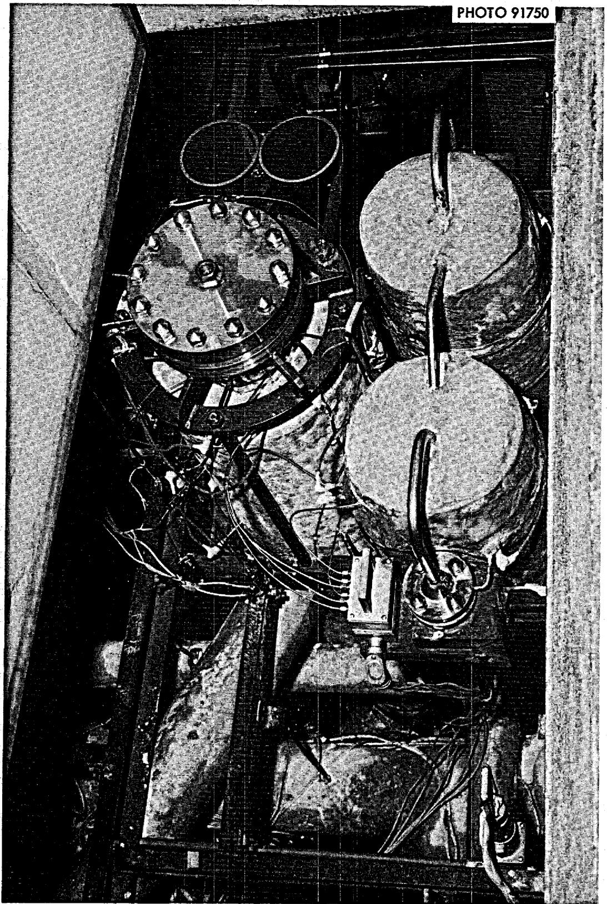  
Fig. 5. Filter Assembly Installed in Fuel Processing Cell.

# PLANT PERFORMANCE

On May 6, 1968 an opportunity was provided for determining the temperature distribution prior to radioactive operation. To compensate for past and anticipated removals of salt from the reactor fuel system, $3 - 1 / 2\mathrm{ft}^3$ of clean carrier salt (67 mol $\%$ LiF, $33\%$ BeF $_2$ ) was passed through the filter. Figure 6 shows the temperature distribution over the upper half (gas space) of the filter. Also shown are the temperatures obtained later with the flush and fuel salt filtrations which correspond closely. From these temperatures, the temperature switches at points 7 and 9 were set to alarm and stop salt transfer at $1000^{\circ}\mathrm{F}$ and $350^{\circ}\mathrm{F}$ respectively. The temperature 2 inches below the ring joint (Pt. 9) was only $250^{\circ}\mathrm{F}$ indicating that the uninsulated flange joint was probably below $200^{\circ}\mathrm{F}$ . The remote leak detection on the flange indicated no leakage during the heat-up, transfer, or subsequent cool-down.

During August 1968, both flush and fuel salt batches were transferred to the processing tank through the filter, fluorinated, the structural metal fluorides reduced and the salt filtered as it was returned to the reactor drain tanks. In each of these operations there was no detectable pressure drop across the filter and the filtration was accomplished in about two hours. The amount of metals removed from the salt is shown in Table 6. The total of both batches is $10\mathrm{kg}$ . Since visual inspection of the processing tank after filtration was not possible it is not known how much of the reduced metals remained in the tank and how much is on the filter element.

ORNL DWG. 68-8662

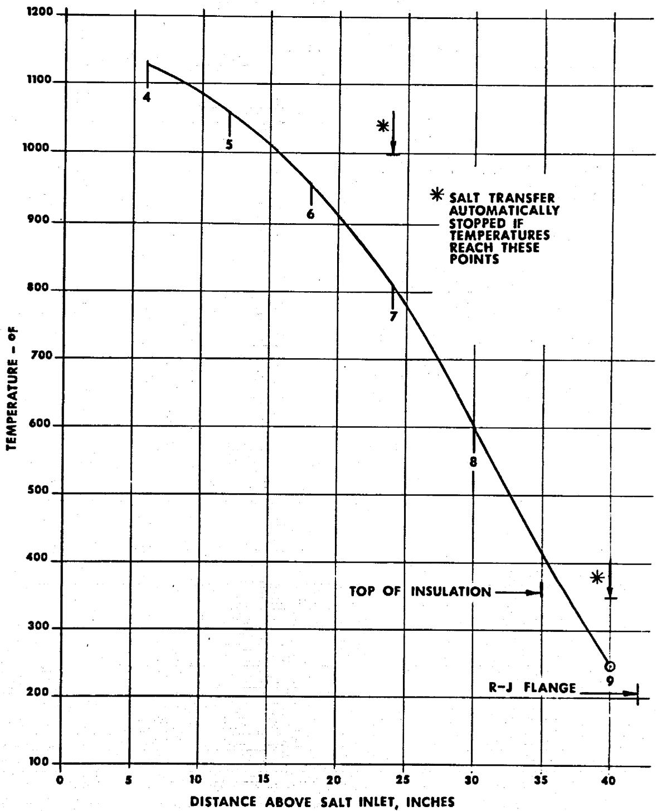  
Fig. 6. Salt Filter Temperatures.

Table 6   
Radioactive Salt Filtration   
Changes in Concentration   

<table><tr><td rowspan="2"></td><td colspan="4">ppm</td></tr><tr><td>Ni</td><td>Fe</td><td>Cr</td><td>Total</td></tr><tr><td colspan="5">Flush Salt</td></tr><tr><td>Before Reduction</td><td>516</td><td>210</td><td>133</td><td>859</td></tr><tr><td>After Reduction and Filtration</td><td>26</td><td>141</td><td>76</td><td>243</td></tr><tr><td>Removed by Filter</td><td>490</td><td>69</td><td>57</td><td>616</td></tr><tr><td colspan="5">Fuel Salt</td></tr><tr><td>Before Reduction</td><td>840</td><td>400</td><td>420</td><td>1660</td></tr><tr><td>After Reduction and Filtration</td><td>60</td><td>110</td><td>34</td><td>204</td></tr><tr><td>Removed by Filter</td><td>780</td><td>290</td><td>386</td><td>1456</td></tr></table>

Weights Removed, Grams   

<table><tr><td></td><td>Ni</td><td>Fe</td><td>Cr</td><td>Total</td></tr><tr><td>From Flush Salt</td><td>2110</td><td>297</td><td>245</td><td>2652</td></tr><tr><td>From Fuel Salt</td><td>3900</td><td>1450</td><td>1930</td><td>7280</td></tr></table>

# ACKNOWLEDGMENT

We gratefully acknowledge the contributions of the following Reactor Division personnel:

C. W. Collins for assistance in preparing the section on Pressure Vessel Design.   
P. N. Haubenreich for assistance in preparing the Introduction and report content.   
T. L. Hudson for assistance in preparing the section on Electric Heating Design.   
B. H. Webster for assistance in preparing the section on Installation.   
J. H. Shaffer and L. E. McNeese of Reactor Chemistry Division for performing and reporting the developmental work. Information contained in their CF Report has been condensed and included in this report.

# REFERENCES

1. J. R. Engel, MSRE Design and Operations Report, Part XI-A, Test Program for $^{235}\mathrm{U}$ Operation, USAEC Report ORNL-TM-2304, Oak Ridge National Laboratory, September 1968.   
2. P. N. Haubenreich et al., MSRE Design and Operations Report, Part V-A, Safety Analysis of Operation with $^{233}\mathrm{U}$ , USAEC Report ORNL-TM-2111, Oak Ridge National Laboratory, February 1968.   
3. R. B. Lindauer, MSRE Design and Operations Report, Part VII, Fuel Handling and Processing Plant, USAEC Reports ORNL-TM-907 and 907 Revised, Oak Ridge National Laboratory, May 1965 and December 1967.   
4. J. H. Schaffer and L. E. McNeese, Removal of Ni, Fe, and Cr Fluorides from Simulated MSRE Fuel Carrier Salt, ORNL-CF-68-4-41, April 16, 1968 (for internal distribution only).   
5. Nuclear Vessels, Section III, ASME Boiler and Pressure Vessel Code, American Society of Mechanical Engineers, New York, 1963.   
6. V. M. Faires, Design of Machine Elements, MacMillan, New York, 1948, p. 91.   
7. Ibid, p. 463.   
8. Nonferrous Metal Specifications, Part 2, ASTM Standards, American Society for Testing Materials, Philadelphia, Pa., 1961.   
9. Tentative Methods for Liquid-Pentrant Inspection, MET-NDT-4, Inspection Specifications, Metals and Ceramics Division, Oak Ridge National Laboratory, Oak Ridge, Tennessee, August 8, 1963 (for internal distribution only).   
10. Tentative Methods for Ultrasonic Inspection of Metal Plate and Sheet, MET-NDT-1; Metal Rod and Bar, MET-NDT-2; Metal Pipe and Tubing, MET-NDT-3, Inspection Specifications, Metals and Ceramics Division, Oak Ridge National Laboratory, Oak Ridge, Tennessee, 1962 and 1963 (for internal distribution only).   
11. Procedure Specifications for Direct Current Inert Arc Welding of Inconel Pipe and Plate, PS-1, Inconel Tubes, PS-2, Inconel to Stell, PS-46, Oak Ridge National Laboratory, Oak Ridge, Tennessee (for internal distribution only).   
12. Tentative Method of Controlling Quality of Radiographite Testing, MET-NDT-5, Inspection Specifications, Metals and Ceramics Division, Oak Ridge National Laboratory, Oak Ridge, Tennessee, 1962 (for internal distribution only).

# APPENDIX

```txt
Fabrication Drawings — Salt Filter  
E-NN-D-49036 — Assembly  
E-NN-D-49037 — Details  
E-NN-D-49038 — Filter Element Subassembly — Details 
```

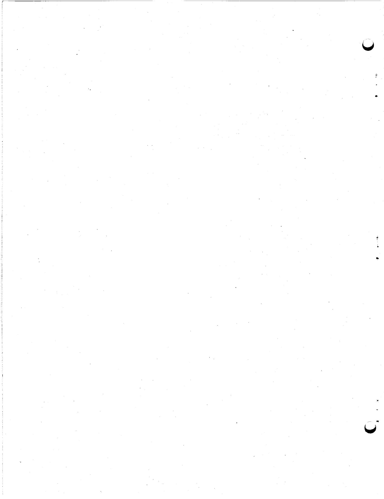

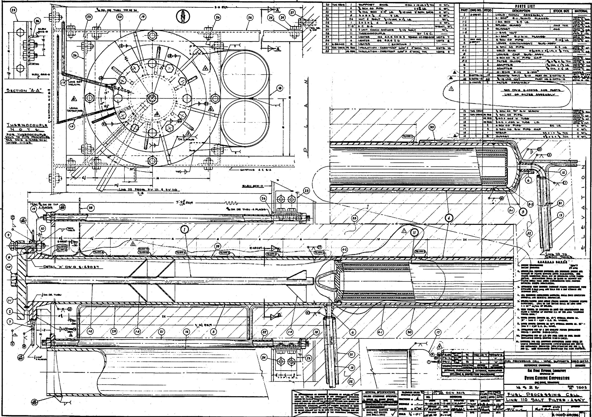  
M0794RNO5E

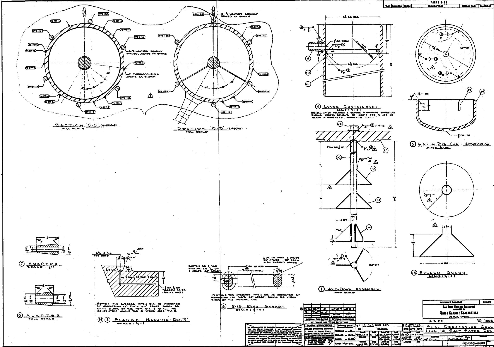  
M20794RNO57E1

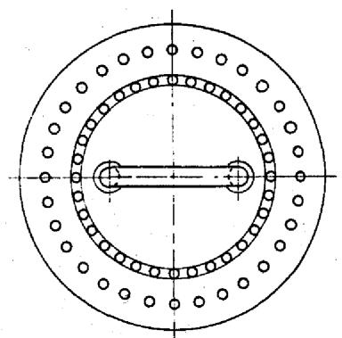

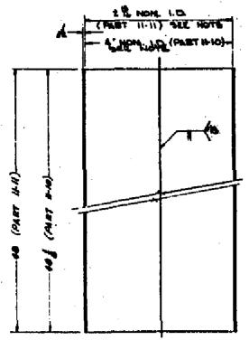

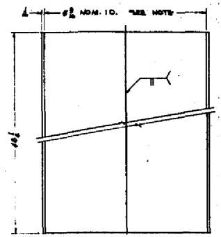

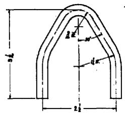  
H LIFTING BAIL FULL SCALE

<table><tr><td>PART</td><td>DWG NO.</td><td>REOD</td><td>DESCRIPTION</td><td>STOCK SIZE</td><td>MATERIAL</td></tr><tr><td>11</td><td>THIS ONE</td><td>2</td><td>FILTER ASSEMBLY</td><td></td><td></td></tr><tr><td>11-1</td><td></td><td>1</td><td>LIFTING BAIL</td><td>#OM x 7 LS</td><td>INCOINS</td></tr><tr><td>11-2</td><td></td><td>1</td><td>TOP CLOSURES PLATE</td><td>#OA x 19#</td><td>INCOINS</td></tr><tr><td>11-3</td><td></td><td>1</td><td>OUTER CYLINDRE</td><td>#OA x 48#</td><td>INCOINS</td></tr><tr><td>11-4</td><td></td><td>1</td><td>OUTER FILTER, INCONEL</td><td>4#LO x 20</td><td>INCOINS</td></tr><tr><td>11-5</td><td></td><td>1</td><td>OUTER FILTER, INCONEL</td><td>4#LO x 6</td><td>INCONEL</td></tr><tr><td>11-6</td><td></td><td>2</td><td>INNERS FILTER, INCONEL</td><td>5#LO x 20</td><td>FETMONI</td></tr><tr><td>11-7</td><td></td><td>1</td><td>INNERS FILTER, INCONEL</td><td>5#LO x 7 #</td><td>FETMONI</td></tr><tr><td>11-8</td><td></td><td>1</td><td>VOLD BING</td><td>4#OA x 4#</td><td>ARTN DINGS</td></tr><tr><td>11-9</td><td></td><td>1</td><td>VOLD BING</td><td>4#OA x 4#</td><td>INCONEL</td></tr><tr><td>11-10</td><td></td><td>1</td><td>INNERS CYL.</td><td>4#OA x 48#</td><td>INCONEL</td></tr><tr><td>11-11</td><td></td><td>1</td><td>INNERS CYL.</td><td>2#OA x 48</td><td>INCONEL</td></tr><tr><td>11-12</td><td></td><td>1</td><td>CLOSURES PLATE</td><td>2#OA x 9#</td><td>ARTN DINGS</td></tr><tr><td>11-13</td><td></td><td>1</td><td>CLOSURES BING</td><td>6#OA x 9#</td><td>INCONEL</td></tr><tr><td>11-14</td><td></td><td>1</td><td>CLOSURES BING</td><td>4#OA x 4#</td><td>INCONEL</td></tr><tr><td>11-15</td><td></td><td>1</td><td>VOLD BING</td><td>4#OA x 7#</td><td>INCONEL</td></tr><tr><td>11-16</td><td></td><td>1</td><td>#OOD X OOG WALL TUBE</td><td>6#LG</td><td>SET SEL</td></tr></table>

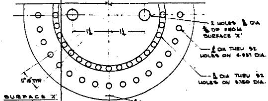  
#

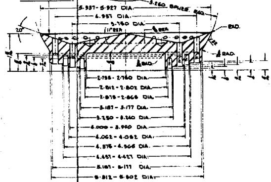  
。  
17 TOP CLOSURE PLATE

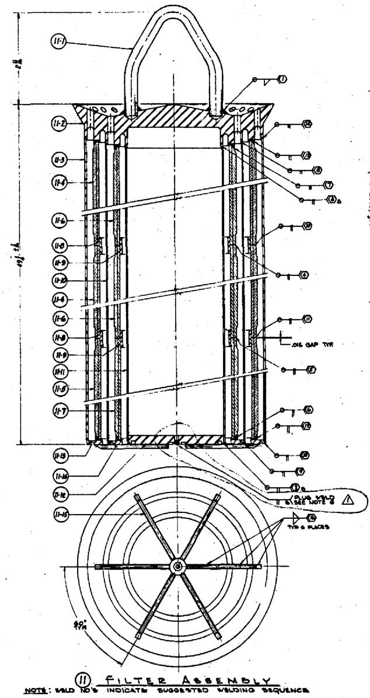

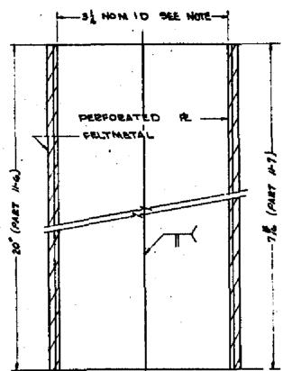

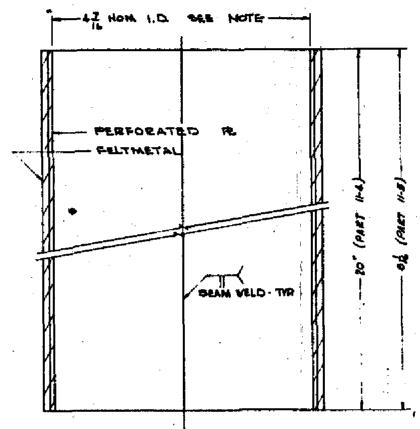

INNER FILTER   
OUTER FILTER   
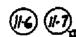  
NOTES: ENOIS DE PARTS II-4, IV-5, VI-6, VII-7 TO BE SLIP FIT WITH MAKING PART AS SHOWN ON ASSEMBLY. 2AN VIELDS OF PARTIALI E PERSOBATED PLATIe To be LOCATED I00 AMPT, BOLL ALL EDGES OF PARTIAL TO A THICKENSS OF .006 COG 1

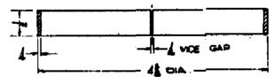  
100

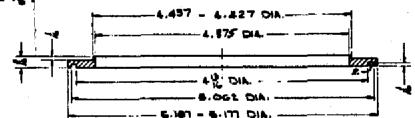  
18 CLOSURE RING

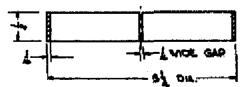  
19 VEER BING

四四四  
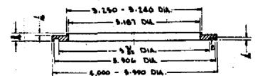  
N O T E S : 1: PABTEM DOWD (DIOCYL, POWAMLY) EFFICIENCY TEST AMENDY WOOPPOVSPESSE AERDSOL. EFFICIENCY TEST 95% DE REPECTS THE AVERAGE OF THE STAGE OF DISCREPcies. 2: RODOROON TEST OF HIGH EFFICIENCY FILL 4 FILTER INSTALLATIONS AT OEN!   
2. FILTER ELEMENT MAY BE HANDLLED ONLY IF ELEMENT IS PROTECTED AGAINST MOISTURE, OIL, LAND, STC.   
3: AFTER WELD NO PARTS II-6, II-6, II-6, II-6, II-6, II-6, II-7, II-9
1-11-14 UNITS TO BE GIVEN OOP TEST BEFORE PROCESSING
M PR NOTES 1.   
4: PHANMATIC TEST INHANCE CYL (PARTS II.1) 1111111111111111111111111111111111111111   
8: LEUUM- VACUUM LEAM CHECK INNRES CYL. LEAK TO THE INWIDE BULLS DE LESS THAN 1100-2 COV/PE OF LEUUM.   
6: ATERLEAN CHECK CUT OFF TUBE (PART 110) & PLUG VOLD.   
7: DVE CHECK VILIDS OF INVER CR, AFTER PESALER'LEAK. CHECK

<table><tr><td colspan="3">LINE 10 SALT FILTER AMENDY</td><td>E-48056</td></tr><tr><td colspan="2">REFERENCE DOWNSWEEP</td><td colspan="2">NUMBER</td></tr><tr><td colspan="4">THE RAY DEPT MATHEM. LEWISNETT
OPINOED BY
UNIVAR CARGILE CORPORATION
GIRLS, TOWNHOCK</td></tr><tr><td>M SEE</td><td colspan="3">SRL 7505</td></tr><tr><td colspan="4">FULL PROCESSING CELL
FILTER ASSY &amp; DETAILS</td></tr><tr><td></td><td></td><td></td><td></td></tr><tr><td></td><td>###</td><td></td><td></td></tr><tr><td></td><td></td><td>E-NN-D-49058</td><td>REV</td></tr></table>

M80794RNO58E1

<table><tr><td>GENERAL SPECIFICATIONS
UNLESS OTHERWISE SPECIFIED
1. BREAK ALL SHAPED CREDITS
2. 100% MAXIMUM SHAPE SIZE
3. 100% MAXIMUM SHAPE LENGTH
4. 100% MAXIMUM SHAPE LENGTH
5. 100% MAXIMUM SHAPE LENGTH
6. 100% MAXIMUM SHAPE LENGTH
7. 100% MAXIMUM SHAPE LENGTH
8. 100% MAXIMUM SHAPE LENGTH
9. 100% MAXIMUM SHAPE LENGTH
10. 100% MAXIMUM SHAPE LENGTH
11. 100% MAXIMUM SHAPE LENGTH
12. 100% MAXIMUM SHAPE LENGTH
13. 100% MAXIMUM SHAPE LENGTH
14. 100% MAXIMUM SHAPE LENGTH
15. 100% MAXIMUM SHAPE LENGTH
16. 100% MAXIMUM SHAPE LENGTH
17. 100% MAXIMUM SHAPE LENGTH
18. 100% MAXIMUM SHAPE LENGTH
19. 100% MAXIMUM SHAPE LENGTH
20. 100% MAXIMUM SHAPE LENGTH
21. 100% MAXIMUM SHAPE LENGTH
22. 100% MAXIMUM SHAPE LENGTH
23. 100% MAXIMUM SHAPE LENGTH
24. 100% MAXIMUM SHAPE LENGTH
25. 100% MAXIMUM SHAPE LENGTH
26. 100% MAXIMUM SHAPE LENGTH
27. 100% MAXIMUM SHAPE LENGTH
28. 100% MAXIMUM SHAPE LENGTH
29. 100% MAXIMUM SHAPE LENGTH
30. 100% MAXIMUM SHAPE LENGTH
31. 100% MAXIMUM SHAPE LENGTH
32. 100% MAXIMUM SHAPE LENGTH
33. 100% MAXIMUM SHAPE LENGTH
34. 100% MAXIMUM SHAPE LENGTH
35. 100% MAXIMUM SHAPE LENGTH
36. 100% MAXIMUM SHAPE LENGTH
37. 100% MAXIMUM SHAPE LENGTH
38. 100% MAXIMUM SHAPE LENGTH
39. 100% MAXIMUM SHAPE LENGTH
40. 100% MAXIMUM SHAPE LENGTH
41. 100% MAXIMUM SHAPE LENGTH
42. 100% MAXIMUM SHAPE LENGTH
43. 100% MAXIMUM SHAPE LENGTH
44. 100% MAXIMUM SHAPE LENGTH
45. 100% MAXIMUM SHAPE LENGTH
46. 100% MAXIMUM SHAPE LENGTH
47. 100% MAXIMUM SHAPE LENGTH
48. 100% MAXIMUM SHAPE LENGTH
49. 100% MAXIMUM SHAPE LENGTH
50. 100% MAXIMUM SHAPE LENGTH
51. 100% MAXIMUM SHAPE LENGTH
52. 100% MAXIMUM SHAPE LENGTH
53. 100% MAXIMUM SHAPE LENGTH
54. 100% MAXIMUM SHAPE LENGTH
55. 100% MAXIMUM SHAPE LENGTH
56. 100% MAXIMUM SHAPE LENGTH
57. 100% MAXIMUM SHAPE LENGTH
58. 100% MAXIMUM SHAPE LENGTH
59. 100% MAXIMUM SHAPE LENGTH
60. 100% MAXIMUM SHAPE LENGTH
61. 100% MAXIMUM SHAPE LENGTH
62. 100% MAXIMUM SHAPE LENGTH
63. 100% MAXIMUM SHAPE LENGTH
64. 100% MAXIMUM SHAPE LENGTH
65. 100% MAXIMUM SHAPE LENGTH
66. 100% MAXIMUM SHAPE LENGTH
67. 100% MAXIMUM SHAPE LENGTH
68. 100% MAXIMUM SHAPE LENGTH
69. 100% MAXIMUM SHAPE LENGTH
70. 100% MAXIMUM SHAPE LENGTH
71. 100% MAXIMUM SHAPE LENGTH
72. 100% MAXIMUM SHAPE LENGTH
73. 100% MAXIMUM SHAPE LENGTH
74. 100% MAXIMUM SHAPE LENGTH
75. 100% MAXIMUM SHAPE LENGTH
76. 100% MAXIMUM SHAPE LENGTH
77. 100% MAXIMUM SHAPE LENGTH
78. 100% MAXIMUM SHAPE LENGTH
79. 100% MAXIMUM SHAPE LENGTH
80. 100% MAXIMUM SHAPE LENGTH
81. 100% MAXIMUM SHAPE LENGTH
82. 100% MAXIMUM SHAPE LENGTH
83. 100% MAXIMUM SHAPE LENGTH
84. 100% MAXIMUM SHAPE LENGTH
85. 100% MAXIMUM SHAPE LENGTH
86. 100% MAXIMUM SHAPE LENGTH
87. 100% MAXIMUM SHAPE LENGTH
88. 100% MAXIMUM SHAPE LENGTH
89. 100% MAXIMUM SHAPE LENGTH
90. 100% MAXIMUM SHAPE LENGTH
91. 100% MAXIMUM SHAPE LENGTH
92. 100% MAXIMUM SHAPE LENGTH
93. 100% MAXIMUM SHAPE LENGTH
94. 100% MAXIMUM SHAPE LENGTH
95. 100% MAXIMUM SHAPE LENGTH
96. 100% MAXIMUM SHAPE LENGTH
97. 100% MAXIMUM SHAPE LENGTH
98. 100% MAXIMUM SHAPE LENGTH
99. 100% MAXIMUM SHAPE LENGTH
100. 100% MAXIMUM SHAPE LENGTH
101. 100% MAXIMUM SHAPE LENGTH
102. 100% MAXIMUM SHAPE LENGTH
103. 100% MAXIMUM SHAPE LENGTH
104. 100% MAXIMUM SHAPE LENGTH
105. 100% MAXIMUM SHAPE LENGTH
106. 100% MAXIMUM SHAPE LENGTH
107. 100% MAXIMUM SHAPE LENGTH
108. 100% MAXIMUM SHAPE LENGTH
109. 100% MAXIMUM SHAPE LENGTH
110. 100% MAXIMUM SHAPE LENGTH
111. 100% MAXIMUM SHAPE LENGTH
112. 100% MAXIMUM SHAPE LENGTH
113. 100% MAXIMUM SHAPE LENGTH
114. 100% MAXIMUM SHAPE LENGTH
115. 100% MAXIMUM SHAPE LENGTH
116. 100% MAXIMUM SHAPE LENGTH
117. 100% MAXIMUM SHAPE LENGTH
118. 100% MAXIMUM SHAPE LENGTH
119. 100% MAXIMUM SHAPE LENGTH
120. 100% MAXIMUM SHAPE LENGTH
121. 100% MAXIMUM SHAPE LENGTH
122. 100% MAXIMUM SHAPE LENGTH
123. 100% MAXIMUM SHAPE LENGTH
124. 100% MAXIMUM SHAPE LENGTH
125. 100% MAXIMUM SHAPE LENGTH
126. 100% MAXIMUM SHAPE LENGTH
127. 100% MAXIMUM SHAPE LENGTH
128. 100% MAXIMUM SHAPE LENGTH
129. 100% MAXIMUM SHAPE LENGTH
130. 100% MAXIMUM SHAPE LENGTH
131. 100% MAXIMUM SHAPE LENGTH
132. 100% MAXIMUM SHAPE LENGTH
133. 100% MAXIMUM SHAPE LENGTH
134. 100% MAXIMUM SHAPE LENGTH
135. 100% MAXIMUM SHAPE LENGTH
136. 100% MAXIMUM SHAPE LENGTH
137. 100% MAXIMUM SHAPE LENGTH
138. 100% MAXIMUM SHAPE LENGTH
139. 100% MAXIMUM SHAPE LENGTH
140. 100% MAXIMUM SHAPE LENGTH
141. 100% MAXIMUM SHAPE LENGTH
142. 100% MAXIMUM SHAPE LENGTH
143. 100% MAXIMUM SHAPE LENGTH
144. 100% MAXIMUM SHAPE LENGTH
145. 100% MAXIMUM SHAPE LENGTH
146. 100% MAXIMUM SHAPE LENGTH
147. 100% MAXIMUM SHAPE LENGTH
148. 100% MAXIMUM SHAPE LENGTH
149. 100% MAXIMUM SHAPE LENGTH
150. 100% MAXIMUM SHAPE LENGTH
151. 100% MAXIMUM SHAPE LENGTH
152. 100% MAXIMUM SHAPE LENGTH
153. 100% MAXIMUM SHAPE LENGTH
154. 100% MAXIMUM SHAPE LENGTH
155. 100% MAXIMUM SHAPE LENGTH
156. 100% MAXIMUM SHAPE LENGTH
157. 100% MAXIMUM SHAPE LENGTH
158. 100% MAXIMUM SHAPE LENGTH
159. 100% MAXIMUM SHAPE LENGTH
160. 100% MAXIMUM SHAPE LENGTH
161. 100% MAXIMUM SHAPE LENGTH
162. 100% MAXIMUM SHAPE LENGTH
163. 100% MAXIMUM SHAPE LENGTH
164. 100% MAXIMUM SHAPE LENGTH
165. 100% MAXIMUM SHAPE LENGTH
166. 100% MAXIMUM SHAPE LENGTH
167. 100% MAXIMUM SHAPE LENGTH
168. 100% MAXIMUM SHAPE LENGTH
169. 100% MAXIMUM SHAPE LENGTH
170. 100% MAXIMUM SHAPE LENGTH
171. 100% MAXIMUM SHAPE LENGTH
172. 100% MAXIMUM SHAPE LENGTH
173. 100% MAXIMUM SHAPE LENGTH
174. 100% MAXIMUM SHAPE LENGTH
175. 100% MAXIMUM SHAPE LENGTH
176. 100% MAXIMUM SHAPE LENGTH
177. 100% MAXIMUM SHAPE LENGTH
178. 100% MAXIMUM SHAPE LENGTH
179. 100% MAXIMUM SHAPE LENGTH
180. 100% MAXIMUM SHAPE LENGTH
181. 100% MAXIMUM SHAPE LENGTH
182. 100% MAXIMUM SHAPE LENGTH
183. 100% MAXIMUM SHAPE LENGTH
184. 100% MAXIMUM SHAPE LENGTH
185. 100% MAXIMUM SHAPE LENGTH
186. 100% MAXIMUM SHAPE LENGTH
187. 100% MAXIMUM SHAPE LENGTH
188. 100% MAXIMUM SHAPE LENGTH
189. 100% MAXIMUM SHAPE LENGTH
190. 100% MAXIMUM SHAPE LENGTH
191. 100% MAXIMUM SHAPE LENGTH
192. 100% MAXIMUM SHAPE LENGTH
193. 100% MAXIMUM SHAPE LENGTH
194. 100% MAXIMUM SHAPE LENGTH
195. 100% MAXIMUM SHAPE LENGTH
196. 100% MAXIMUM SHAPE LENGTH
197. 100% MAXIMUM SHAPE LENGTH
198. 100% MAXIMUM SHAPE LENGTH
199. 100% MAXIMUM SHAPE LENGTH
200. 100% MAXIMUM SHAPE LENGTH
201. 100% MAXIMUM SHAPE LENGTH
202. 100% MAXIMUM SHAPE LENGTH
203. 100% MAXIMUM SHAPE LENGTH
204. 100% MAXIMUM SHAPE LENGTH
205. 100% MAXIMUM SHAPE LENGTH
206. 100% MAXIMUM SHAPE LENGTH
207. 100% MAXIMUM SHAPE LENGTH
208. 100% MAXIMUM SHAPE LENGTH
209. 100% MAXIMUM SHAPE LENGTH
210. 100% MAXIMUM SHAPE LENGTH
211. 100% MAXIMUM SHAPE LENGTH
212. 100% MAXIMUM SHAPE LENGTH
213. 100% MAXIMUM SHAPE LENGTH
214. 100% MAXIMUM SHAPE LENGTH
215. 100% MAXIMUM SHAPE LENGTH
216. 100% MAXIMUM SHAPE LENGTH
217. 100% MAXIMUM SHAPE LENGTH
218. 100% MAXIMUM SHAPE LENGTH
219. 100% MAXIMUM SHAPE LENGTH
220. 100% MAXIMUM SHAPE LENGTH
221. 100% MAXIMUM SHAPE LENGTH
222. 100% MAXIMUM SHAPE LENGTH
223. 100% MAXIMUM SHAPE LENGTH
224. 100% MAXIMUM SHAPE LENGTH
225. 100% MAXIMUM SHAPE LENGTH
226. 100% MAXIMUM SHAPE LENGTH
227. 100% MAXIMUM SHAPE LENGTH
228. 100% MAXIMUM SHAPE LENGTH
229. 100% MAXIMUM SHAPE LENGTH
230. 100% MAXIMUM SHAPE LENGTH
231. 100% MAXIMUM SHAPE LENGTH
232. 100% MAXIMUM SHAPE LENGTH
233. 100% MAXIMUM SHAPE LENGTH
234. 100% MAXIMUM SHAPE LENGTH
235. 100% MAXIMUM SHAPE LENGTH
236. 100% MAXIMUM SHAPE LENGTH
237. 100% MAXIMUM SHAPE LENGTH
238. 100% MAXIMUM SHAPE LENGTH
239. 100% MAXIMUM SHAPE LENGTH
240. 100% MAXIMUM SHAPE LENGTH
241. 100% MAXIMUM SHAPE LENGTH
242. 100% MAXIMUM SHAPE LENGTH
243. 100% MAXIMUM SHAPE LENGTH
244. 100% MAXIMUM SHAPE LENGTH
245. 100% MAXIMUM SHAPE LENGTH
246. 100% MAXIMUM SHAPE LENGTH
247. 100% MAXIMUM SHAPE LENGTH
248. 100% MAXIMUM SHAPE LENGTH
249. 100% MAXIMUM SHAPE LENGTH
250. 100% MAXIMUM SHAPE LENGTH
251. 100% MAXIMUM SHAPE LENGTH
252. 100% MAXIMUM SHAPE LENGTH
253. 100% MAXIMUM SHAPE LENGTH
254. 100% MAXIMUM SHAPE LENGTH
255. 100% MAXIMUM SHAPE LENGTH
256. 100% MAXIMUM SHAPE LENGTH
257. 100% MAXIMUM SHAPE LENGTH
258. 100% MAXIMUM SHAPE LENGTH
259. 100% MAXIMUM SHAPE LENGTH
260. 100% MAXIMUM SHAPE LENGTH
261. 100% MAXIMUM SHAPE LENGTH
262. 100% MAXIMUM SHAPE LENGTH
263. 100% MAXIMUM SHAPE LENGTH
264. 100% MAXIMUM SHAPE LENGTH
265. 100% MAXIMUM SHAPE LENGTH
266. 100% MAXIMUM SHAPE LENGTH
267. 100% MAXIMUM SHAPE LENGTH
268. 100% MAXIMUM SHAPE LENGTH
269. 100% MAXIMUM SHAPE LENGTH
270. 100% MAXIMUM SHAPE LENGTH
271. 100% MAXIMUM SHAPE LENGTH
272. 100% MAXIMUM SHAPE LENGTH
273. 100% MAXIMUM SHAPE LENGTH
274. 100% MAXIMUM SHAPE LENGTH
275. 100% MAXIMUM SHAPE LENGTH
276. 100% MAXIMUM SHAPE LENGTH
277. 100% MAXIMUM SHAPE LENGTH
278. 100% MAXIMUM SHAPE LENGTH
279. 100% MAXIMUM SHAPE LENGTH
280. 100% MAXIMUM SHAPE LENGTH
281. 100% MAXIMUM SHAPE LENGTH
282. 100% MAXIMUM SHAPE LENGTH
283. 100% MAXIMUM SHAPE LENGTH
284. 100% MAXIMUM SHAPE LENGTH
285. 100% MAXIMUM SHAPE LENGTH
286. 100% MAXIMUM SHAPE LENGTH
287. 100% MAXIMUM SHAPE LENGTH
288. 100% MAXIMUM SHAPE LENGTH
289. 100% MAXIMUM SHAPE LENGTH
290. 100% MAXIMUM SHAPE LENGTH
291. 100% MAXIMUM SHAPE LENGTH
292. 100% MAXIMUM SHAPE LENGTH
293. 100% MAXIMUM SHAPE LENGTH
294. 100% MAXIMUM SHAPE LENGTH
295. 100% MAXIMUM SHAPE LENGTH
296. 100% MAXIMUM SHAPE LENGTH
297. 100% MAXIMUM SHAPE LENGTH
298. 100% MAXIMUM SHAPE LENGTH
299. 100% MAXIMUM SHAPE LENGTH
300. 100% MAXIMUM SHAPE LENGTH
301. 100% MAXIMUM SHAPE LENGTH
302. 100% MAXIMUM SHAPE LENGTH
303. 100% MAXIMUM SHAPE LENGTH
304. 100% MAXIMUM SHAPE LENGTH
305. 100% MAXIMUM SHAPE LENGTH
306. 100% MAXIMUM SHAPE LENGTH
307. 100% MAXIMUM SHAPE LENGTH
308. 100% MAXIMUM SHAPE LENGTH
309. 100% MAXIMUM SHAPE LENGTH
310. 100% MAXIMUM SHAPE LENGTH
311. 100% MAXIMUM SHAPE LENGTH
312. 100% MAXIMUM SHAPE LENGTH
313. 100% MAXIMUM SHAPE LENGTH
314. 100% MAXIMUM SHAPE LENGTH
315. 100% MAXIMUM SHAPE LENGTH
316. 100% MAXIMUM SHAPE LENGTH
317. 100% MAXIMUM SHAPE LENGTH
318. 100% MAXIMUM SHAPE LENGTH
319. 100% MAXIMUM SHAPE LENGTH
320. 100% MAXIMUM SHAPE LENGTH
321. 100% MAXIMUM SHAPE LENGTH
322. 100% MAXIMUM SHAPE LENGTH
323. 100% MAXIMUM SHAPE LENGTH
324. 100% MAXIMUM SHAPE LENGTH
325. 100% MAXIMUM SHAPE LENGTH
326. 100% MAXIMUM SHAPE LENGTH
327. 100% MAXIMUM SHAPE LENGTH
328. 100% MAXIMUM SHAPE LENGTH
329. 100% MAXIMUM SHAPE LENGTH
330. 100% MAXIMUM SHAPE LENGTH
331. 100% MAXIMUM SHAPE LENGTH
332. 100% MAXIMUM SHAPE LENGTH
333. 100% MAXIMUM SHAPE LENGTH
334. 100% MAXIMUM SHAPE LENGTH
335. 100% MAXIMUM SHAPE LENGTH
336. 100% MAXIMUM SHAPE LENGTH
337. 100% MAXIMUM SHAPE LENGTH
338. 100% MAXIMUM SHAPE LENGTH
339. 100% MAXIMUM SHAPE LENGTH
340. 100% MAXIMUM SHAPE LENGTH
341. 100% MAXIMUM SHAPE LENGTH
342. 100% MAXIMUM SHAPE LENGTH
343. 100% MAXIMUM SHAPE LENGTH
344. 100% MAXIMUM SHAPE LENGTH
345. 100% MAXIMUM SHAPE LENGTH
346. 100% MAXIMUM SHAPE LENGTH
347. 100% MAXIMUM SHAPE LENGTH
348. 100% MAXIMUM SHAPE LENGTH
349. 100% MAXIMUM SHAPE LENGTH
350. 100% MAXIMUM SHAPE LENGTH
351. 100% MAXIMUM SHAPE LENGTH
352. 100% MAXIMUM SHAPE LENGTH
353. 100% MAXIMUM SHAPE LENGTH
354. 100% MAXIMUM SHAPE LENGTH
355. 100% MAXIMUM SHAPE LENGTH
356. 100% MAXIMUM SHAPE LENGTH
357. 100% MAXIMUM SHAPE LENGTH
358. 100% MAXIMUM SHAPE LENGTH
359. 100% MAXIMUM SHAPE LENGTH
360. 100% MAXIMUM SHAPE LENGTH
361. 100% MAXIMUM SHAPE LENGTH
362. 100% MAXIMUM SHAPE LENGTH
363. 100% MAXIMUM SHAPE LENGTH
364. 100% MAXIMUM SHAPE LENGTH
365. 100% MAXIMUM SHAPE LENGTH
366. 100% MAXIMUM SHAPE LENGTH
367. 100% MAXIMUM SHAPE LENGTH
368. 100% MAXIMUM SHAPE LENGTH
369. 100% MAXIMUM SHAPE LENGTH
370. 100% MAXIMUM SHAPE LENGTH
371. 100% MAXIMUM SHAPE LENGTH
372. 100% MAXIMUM SHAPE LENGTH
373. 100% MAXIMUM SHAPE LENGTH
374. 100% MAXIMUM SHAPE LENGTH
375. 100% MAXIMUM SHAPE LENGTH
376. 100% MAXIMUM SHAPE LENGTH
377. 100% MAXIMUM SHAPE LENGTH
378. 100% MAXIMUM SHAPE LENGTH
379. 100% MAXIMUM SHAPE LENGTH
380. 100% MAXIMUM SHAPE LENGTH
381. 100% MAXIMUM SHAPE LENGTH
382. 100% MAXIMUM SHAPE LENGTH
383. 100% MAXIMUM SHAPE LENGTH
384. 100% MAXIMUM SHAPE LENGTH
385. 100% MAXIMUM SHAPE LENGTH
386. 100% MAXIMUM SHAPE LENGTH
387. 100% MAXIMUM SHAPE LENGTH
388. 100% MAXIMUM SHAPE LENGTH
389. 100% MAXIMUM SHAPE LENGTH
390. 100% MAXIMUM SHAPE LENGTH
391. 100% MAXIMUM SHAPE LENGTH
392. 100% MAXIMUM SHAPE LENGTH
393. 100% MAXIMUM SHAPE LENGTH
394. 100% MAXIMUM SHAPE LENGTH
395. 100% MAXIMUM SHAPE LENGTH
396. 100% MAXIMUM SHAPE LENGTH
397. 100% MAXIMUM SHAPE LENGTH
398. 100% MAXIMUM SHAPE LENGTH
399. 100% MAXIMUM SHAPE LENGTH
400. 100% MAXIMUM SHAPE LENGTH
401. 100% MAXIMUM SHAPE LENGTH
402. 100% MAXIMUM SHAPE LENGTH
403. 100% MAXIMUM SHAPE LENGTH
404. 100% MAXIMUM SHAPE LENGTH
405. 100% MAXIMUM SHAPE LENGTH
406. 100% MAXIMUM SHAPE LENGTH
407. 100% MAXIMUM SHAPE LENGTH
408. 100% MAXIMUM SHAPE LENGTH
409. 100% MAXIMUM SHAPE LENGTH
410. 100% MAXIMUM SHAPE LENGTH
411. 100% MAXIMUM SHAPE LENGTH
412. 100% MAXIMUM SHAPE LENGTH
413. 100% MAXIMUM SHAPE LENGTH
414. 100% MAXIMUM SHAPE LENGTH
415. 100% MAXIMUM SHAPE LENGTH
416. 100% MAXIMUM SHAPE LENGTH
417. 100% MAXIMUM SHAPE LENGTH
418. 100% MAXIMUM SHAPE LENGTH
419. 100% MAXIMUM SHAPE LENGTH
420. 100% MAXIMUM SHAPE LENGTH
421. 100% MAXIMUM SHAPE LENGTH
422. 100% MAXIMUM SHAPE LENGTH
423. 100% MAXIMUM SHAPE LENGTH
424. 100% MAXIMUM SHAPE LENGTH
425. 100% MAXIMUM SHAPE LENGTH
426. 100% MAXIMUM SHAPE LENGTH
427. 100% MAXIMUM SHAPE LENGTH
428. 100% MAXIMUM SHAPE LENGTH
429. 100% MAXIMUM SHAPE LENGTH
430. 100% MAXIMUM SHAPE LENGTH
431. 100% MAXIMUM SHAPE LENGTH
432. 100% MAXIMUM SHAPE LENGTH
433. 100% MAXIMUM SHAPE LENGTH
434. 100% MAXIMUM SHAPE LENGTH
435. 100% MAXIMUM SHAPE LENGTH
436. 100% MAXIMUM SHAPE LENGTH
437. 100% MAXIMUM SHAPE LENGTH
438. 100% MAXIMUM SHAPE LENGTH
439. 100% MAXIMUM SHAPE LENGTH
440. 100% MAXIMUM SHAPE LENGTH
441. 100% MAXIMUM SHAPE LENGTH
442. 100% MAXIMUM SHAPE LENGTH
443. 100% MAXIMUM SHAPE LENGTH
444. 100% MAXIMUM SHAPE LENGTH
445. 100% MAXIMUM SHAPE LENGTH
446. 100% MAXIMUM SHAPE LENGTH
447. 100% MAXIMUM SHAPE LENGTH
448. 100% MAXIMUM SHAPE LENGTH
449. 100% MAXIMUM SHAPE LENGTH
450. 100% MAXIMUM SHAPE LENGTH
451. 100% MAXIMUM SHAPE LENGTH
452. 100% MAXIMUM SHAPE LENGTH
453. 100% MAXIMUM SHAPE LENGTH
454. 100% MAXIMUM SHAPE LENGTH
455. 100% MAXIMUM SHAPE LENGTH
456. 100% MAXIMUM SHAPE LENGTH
457. 100% MAXIMUM SHAPE LENGTH
458. 100% MAXIMUM SHAPE LENGTH
459. 100% MAXIMUM SHAPE LENGTH
460. 100% MAXIMUM SHAPE LENGTH
461. 100% MAXIMUM SHAPE LENGTH
462. 100% MAXIMUM SHAPE LENGTH
463. 100% MAXIMUM SHAPE LENGTH
464. 100% MAXIMUM SHAPE LENGTH
465. 100% MAXIMUM SHAPE LENGTH
466. 100% MAXIMUM SHAPE LENGTH
467. 100% MAXIMUM SHAPE LENGTH
468. 100% MAXIMUM SHAPE LENGTH
469. 100% MAXIMUM SHAPE LENGTH
470. 100% MAXIMUM SHAPE LENGTH
471. 100% MAXIMUM SHAPE LENGTH
472. 100% MAXIMUM SHAPE LENGTH
473. 100% MAXIMUM SHAPE LENGTH
474. 100% MAXIMUM SHAPE LENGTH
475. 100% MAXIMUM SHAPE LENGTH
476. 100% MAXIMUM SHAPE LENGTH
477. 100% MAXIMUM SHAPE LENGTH
478. 100% MAXIMUM SHAPE LENGTH
479. 100% MAXIMUM SHAPE LENGTH
480. 100% MAXIMUM SHAPE LENGTH
481. 100% MAXIMUM SHAPE LENGTH
482. 100% MAXIMUM SHAPE LENGTH
483. 100% MAXIMUM SHAPE LENGTH
484. 100% MAXIMUM SHAPE LENGTH
485. 100% MAXIMUM SHAPE LENGTH
486. 100% MAXIMUM SHAPE LENGTH
487. 100% MAXIMUM SHAPE LENGTH
488. 100% MAXIMUM SHAPE LENGTH
489. 100% MAXIMUM SHAPE LENGTH
490. 100% MAXIMUM SHAPE LENGTH
491. 100% MAXIMUM SHAPE LENGTH
492. 100% MAXIMUM SHAPE LENGTH
493. 100% MAXIMUM SHAPE LENGTH
494. 100% MAXIMUM SHAPE LENGTH
495. 100% MAXIMUM SHAPE LENGTH
496. 100% MAXIMUM SHAPE LENGTH
497. 100% MAXIMUM SHAPE LENGTH
498. 100% MAXIMUM SHAPE LENGTH
499. 100% MAXIMUM SHAPE LENGTH
500. 100% MAXIMUM SHAPE LENGTH
501. 100% MAXIMUM SHAPE LENGTH
502. 100% MAXIMUM SHAPE LENGTH
503. 100% MAXIMUM SHAPE LENGTH
504. 100% MAXIMUM SHAPE LENGTH
505. 100% MAXIMUM SHAPE LENGTH
506. 100% MAXIMUM SHAPE LENGTH
507. 100% MAXIMUM SHAPE LENGTH
508. 100% MAXIMUM SHAPE LENGTH
509. 100% MAXIMUM SHAPE LENGTH
510. 100% MAXIMUM SHAPE LENGTH
511. 100% MAXIMUM SHAPE LENGTH
512. 100% MAXIMUM SHAPE LENGTH
513. 100% MAXIMUM SHAPE LENGTH
514. 100% MAXIMUM SHAPE LENGTH
515. 100% MAXIMUM SHAPE LENGTH
516. 100% MAXIMUM SHAPE LENGTH
517. 100% MAXIMUM SHAPE LENGTH
518. 100% MAXIMUM SHAPE LENGTH
519. 100% MAXIMUM SHAPE LENGTH
520. 100% MAXIMUM SHAPE LENGTH
521. 100% MAXIMUM SHAPE LENGTH
522. 100% MAXIMUM SHAPE LENGTH
523. 100% MAXIMUM SHAPE LENGTH
524. 100% MAXIMUM SHAPE LENGTH
525. 100% MAXIMUM SHAPE LENGTH
526. 100% MAXIMUM SHAPE LENGTH
527. 100% MAXIMUM SHAPE LENGTH
528. 100% MAXIMUM SHAPE LENGTH
529. 100% MAXIMUM SHAPE LENGTH
530. 100% MAXIMUM SHAPE LENGTH
531. 100% MAXIMUM SHAPE LENGTH
532. 100% MAXIMUM SHAPE LENGTH
533. 100% MAXIMUM SHAPE LENGTH
534. 100% MAXIMUM SHAPE LENGTH
535. 100% MAXIMUM SHAPE LENGTH
536. 100% MAXIMUM SHAPE LENGTH
537. 100% MAXIMUM SHAPE LENGTH
538. 100% MAXIMUM SHAPE LENGTH
539. 100% MAXIMUM SHAPE LENGTH
540. 100% MAXIMUM SHAPE LENGTH
541. 100% MAXIMUM SHAPE LENGTH
542. 100% MAXIMUM SHAPE LENGTH
543. 100% MAXIMUM SHAPE LENGTH
544. 100% MAXIMUM SHAPE LENGTH
545. 100% MAXIMUM SHAPE LENGTH
546. 100% MAXIMUM SHAPE LENGTH
547. 100% MAXIMUM SHAPE LENGTH
548. 100% MAXIMUM SHAPE LENGTH
549. 100% MAXIMUM SHAPE LENGTH
550. 100% MAXIMUM SHAPE LENGTH
551. 100% MAXIMUM SHAPE LENGTH
552. 100% MAXIMUM SHAPE LENGTH
553. 100% MAXIMUM SHAPE LENGTH
554. 100% MAXIMUM SHAPE LENGTH
555. 100% MAXIMUM SHAPE LENGTH
556. 100% MAXIMUM SHAPE LENGTH
557. 100% MAXIMUM SHAPE LENGTH
558. 100% MAXIMUM SHAPE LENGTH
559. 100% MAXIMUM SHAPE LENGTH
560. 100% MAXIMUM SHAPE LENGTH
561. 100% MAXIMUM SHAPE LENGTH
562. 100% MAXIMUM SHAPE LENGTH
563. 100% MAXIMUM SHAPE LENGTH
564. 100% MAXIMUM SHAPE LENGTH
565. 100% MAXIMUM SHAPE LENGTH
566. 100% MAXIMUM SHAPE LENGTH
567. 100% MAXIMUM SHAPE LENGTH
568. 100% MAXIMUM SHAPE LENGTH
569. 100% MAXIMUM SHAPE LENGTH
570. 100% MAXIMUM SHAPE LENGTH
571. 100% MAXIMUM SHAPE LENGTH
572. 100% MAXIMUM SHAPE LENGTH
573. 100% MAXIMUM SHAPE LENGTH
574. 100% MAXIMUM SHAPE LENGTH
575. 100% MAXIMUM SHAPE LENGTH
576. 100% MAXIMUM SHAPE LENGTH
577. 100% MAXIMUM SHAPE LENGTH
578. 100% MAXIMUM SHAPE LENGTH
579. 100% MAXIMUM SHAPE LENGTH
580. 100% MAXIMUM SHAPE LENGTH
581. 100% MAXIMUM SHAPE LENGTH
582. 100% MAXIMUM SHAPE LENGTH
583. 100% MAXIMUM SHAPE LENGTH
584. 100% MAXIMUM SHAPE LENGTH
585. 100% MAXIMUM SHAPE LENGTH
586. 100% MAXIMUM SHAPE LENGTH
587. 100% MAXIMUM SHAPE LENGTH
588. 100% MAXIMUM SHAPE LENGTH
589. 100% MAXIMUM SHAPE LENGTH
590. 100% MAXIMUM SHAPE LENGTH
591. 100% MAXIMUM SHAPE LENGTH
592. 100% MAXIMUM SHAPE LENGTH
593. 100% MAXIMUM SHAPE LENGTH
594. 100% MAXIMUM SHAPE LENGTH
595. 100% MAXIMUM SHAPE LENGTH
596. 100% MAXIMUM SHAPE LENGTH
597. 100% MAXIMUM SHAPE LENGTH
598. 100% MAXIMUM SHAPE LENGTH
599. 100% MAXIMUM SHAPE LENGTH
600. 100% MAXIMUM SHAPE LENGTH
601. 100% MAXIMUM SHAPE LENGTH
602. 100% MAXIMUM SHAPE LENGTH
603. 100% MAXIMUM SHAPE LENGTH
604. 100% MAXIMUM SHAPE LENGTH
605. 100% MAXIMUM SHAPE LENGTH
606. 100% MAXIMUM SHAPE LENGTH
607. 100% MAXIMUM SHAPE LENGTH
608. 100% MAXIMUM SHAPE LENGTH
609. 100% MAXIMUM SHAPE LENGTH
610. 100% MAXIMUM SHAPE LENGTH
611. 100% MAXIMUM SHAPE LENGTH
612. 100% MAXIMUM SHAPE LENGTH
613. 100% MAXIMUM SHAPE LENGTH
614. 100% MAXIMUM SHAPE LENGTH
615. 100% MAXIMUM SHAPE LENGTH
616. 100% MAXIMUM SHAPE LENGTH
617. 100% MAXIMUM SHAPE LENGTH
618. 100% MAXIMUM SHAPE LENGTH
619. 100% MAXIMUM SHAPE LENGTH
620. 100% MAXIMUM SHAPE LENGTH
621. 100% MAXIMUM SHAPE LENGTH
622. 100% MAXIMUM SHAPE LENGTH
623. 100% MAXIMUM SHAPE LENGTH
624. 100% MAXIMUM SHAPE LENGTH
625. 100% MAXIMUM SHAPE LENGTH
626. 100% MAXIMUM SHAPE LENGTH
627. 100% MAXIMUM SHAPE LENGTH
628. 100% MAXIMUM SHAPE LENGTH
629. 100% MAXIMUM SHAPE LENGTH
630. 100% MAXIMUM SHAPE LENGTH
631. 100% MAXIMUM SHAPE LENGTH
632. 100% MAXIMUM SHAPE LENGTH
633. 100% MAXIMUM SHAPE LENGTH
634. 100% MAXIMUM SHAPE LENGTH
635. 100% MAXIMUM SHAPE LENGTH
636. 100% MAXIMUM SHAPE LENGTH
637. 100% MAXIMUM SHAPE LENGTH
638. 100% MAXIMUM SHAPE LENGTH
639. 100% MAXIMUM SHAPE LENGTH
640. 100% MAXIMUM SHAPE LENGTH
641. 100% MAXIMUM SHAPE LENGTH
642. 100% MAXIMUM SHAPE LENGTH
643. 100% MAXIMUM SHAPE LENGTH
644. 100% MAXIMUM SHAPE LENGTH
645. 100% MAXIMUM SHAPE LENGTH
646. 100% MAXIMUM SHAPE LENGTH
647. 100% MAXIMUM SHAPE LENGTH
648. 100% MAXIMUM SHAPE LENGTH
649. 100% MAXIMUM SHAPE LENGTH
650. 100% MAXIMUM SHAPE LENGTH
651. 100% MAXIMUM SHAPE LENGTH
652. 100% MAXIMUM SHAPE LENGTH
653. 100% MAXIMUM SHAPE LENGTH
654. 100% MAXIMUM SHAPE LENGTH
655. 100% MAXIMUM SHAPE LENGTH
656. 100% MAXIMUM SHAPE LENGTH
657. 100% MAXIMUM SHAPE LENGTH
658. 100% MAXIMUM SHAPE LENGTH
659. 100% MAXIMUM SHAPE LENGTH
660. 100% MAXIMUM SHAPE LENGTH
661. 100% MAXIMUM SHAPE LENGTH
662. 100% MAXIMUM SHAPE LENGTH
663. 100% MAXIMUM SHAPE LENGTH
664. 100% MAXIMUM SHAPE LENGTH
665. 100% MAXIMUM SHAPE LENGTH
666. 100% MAXIMUM SHAPE LENGTH
667. 100% MAXIMUM SHAPE LENGTH
668. 100% MAXIMUM SHAPE LENGTH
669. 100% MAXIMUM SHAPE LENGTH
670. 100% MAXIMUM SHAPE LENGTH
671. 100% MAXIMUM SHAPE LENGTH
672. 100% MAXIMUM SHAPE LENGTH
673. 100% MAXIMUM SHAPE LENGTH
674. 100% MAXIMUM SHAPE LENGTH
675. 100% MAXIMUM SHAPE LENGTH
676. 100% MAXIMUM SHAPE LENGTH
677. 100% MAXIMUM SHAPE LENGTH
678. 100% MAXIMUM SHAPE LENGTH
679. 100% MAXIMUM SHAPE LENGTH
680. 100% MAXIMUM SHAPE LENGTH
681. 100% MAXIMUM SHAPE LENGTH
682. 100% MAXIMUM SHAPE LENGTH
683. 100% MAXIMUM SHAPE LENGTH
684. 100% MAXIMUM SHAPE LENGTH
685. 100% MAXIMUM SHAPE LENGTH
686. 100% MAXIMUM SHAPE LENGTH
687. 100% MAXIMUM SHAPE LENGTH
688. 100% MAXIMUM SHAPE LENGTH
689. 100% MAXIMUM SHAPE LENGTH
690. 100% MAXIMUM SHAPE LENGTH
691. 100% MAXIMUM SHAPE LENGTH
692. 100% MAXIMUM SHAPE LENGTH
693. 100% MAXIMUM SHAPE LENGTH
694. 100% MAXIMUM SHAPE LENGTH
695. 100% MAXIMUM SHAPE LENGTH
696. 100% MAXIMUM SHAPE LENGTH
697. 100% MAXIMUM SHAPE LENGTH
698. 100% MAXIMUM SHAPE LENGTH
699. 100% MAXIMUM SHAPE LENGTH
700. 100% MAXIMUM SHAPE LENGTH
701. 100% MAXIMUM SHAPE LENGTH
702. 100% MAXIMUM SHAPE LENGTH
703. 100% MAXIMUM SHAPE LENGTH
704. 100% MAXIMUM SHAPE LENGTH
705. 100% MAXIMUM SHAPE LENGTH
706. 100% MAXIMUM SHAPE LENGTH
707. 100% MAXIMUM SHAPE LENGTH
708. 100% MAXIMUM SHAPE LENGTH
709. 100% MAXIMUM SHAPE LENGTH
710. 100% MAXIMUM SHAPE LENGTH
711. 100% MAXIMUM SHAPE LENGTH
712. 100% MAXIMUM SHAPE LENGTH
713. 100% MAXIMUM SHAPE LENGTH
714. 100% MAXIMUM SHAPE LENGTH
715. 100% MAXIMUM SHAPE LENGTH
716. 100% MAXIMUM SHAPE LENGTH
717. 100% MAXIMUM SHAPE LENGTH
718. 100% MAXIMUM SHAPE LENGTH
719. 100% MAXIMUM SHAPE LENGTH
720. 100% MAXIMUM SHAPE LENGTH
721. 100% MAXIMUM SHAPE LENGTH
722. 100% MAXIMUM SHAPE LENGTH
723. 100% MAXIMUM SHAPE LENGTH
724. 100% MAXIMUM SHAPE LENGTH
725. 100% MAXIMUM SHAPE LENGTH
726. 100% MAXIMUM SHAPE LENGTH
727. 100% MAXIMUM SHAPE LENGTH
728. 100% MAXIMUM SHAPE LENGTH
729. 100% MAXIMUM SHAPE LENGTH
730. 100% MAXIMUM SHAPE LENGTH
731. 100% MAXIMUM SHAPE LENGTH
732. 100% MAXIMUM SHAPE LENGTH
733. 100% MAXIMUM SHAPE LENGTH
734. 100% MAXIMUM SHAPE LENGTH
735. 100% MAXIMUM SHAPE LENGTH
736. 100% MAXIMUM SHAPE LENGTH
737. 100% MAXIMUM SHAPE LENGTH
738. 100% MAXIMUM SHAPE LENGTH
739. 100% MAXIMUM SHAPE LENGTH
740. 100% MAXIMUM SHAPE LENGTH
741. 100% MAXIMUM SHAPE LENGTH
742. 100% MAXIMUM SHAPE LENGTH
743. 100% MAXIMUM SHAPE LENGTH
744. 100% MAXIMUM SHAPE LENGTH
745. 100% MAXIMUM SHAPE LENGTH
746. 100% MAXIMUM SHAPE LENGTH
747. 100% MAXIMUM SHAPE LENGTH
748. 100% MAXIMUM SHAPE LENGTH
749. 100% MAXIMUM SHAPE LENGTH
750. 100% MAXIMUM SHAPE LENGTH
751. 100% MAXIMUM SHAPE LENGTH
752. 100% MAXIMUM SHAPE LENGTH
753. 100% MAXIMUM SHAPE LENGTH
754. 100% MAXIMUM SHAPE LENGTH
755. 100% MAXIMUM SHAPE LENGTH
756. 100% MAXIMUM SHAPE LENGTH
757. 100% MAXIMUM SHAPE LENGTH
758. 100% MAXIMUM SHAPE LENGTH
759. 100% MAXIMUM SHAPE LENGTH
760. 100% MAXIMUM SHAPE LENGTH
761. 100% MAXIMUM SHAPE LENGTH
762. 100% MAXIMUM SHAPE LENGTH
763. 100% MAXIMUM SHAPE LENGTH
764. 100% MAXIMUM SHAPE LENGTH
765. 100% MAXIMUM SHAPE LENGTH
766. 100% MAXIMUM SHAPE LENGTH
767. 100% MAXIMUM SHAPE LENGTH
768. 100% MAXIMUM SHAPE LENGTH
769. 100% MAXIMUM SHAPE LENGTH
770. 100% MAXIMUM SHAPE LENGTH
771. 100% MAXIMUM SHAPE LENGTH
772. 100% MAXIMUM SHAPE LENGTH
773. 100% MAXIMUM SHAPE LENGTH
774. 100% MAXIMUM SHAPE LENGTH
775. 100% MAXIMUM SHAPE LENGTH
776. 100% MAXIMUM SHAPE LENGTH
777. 100% MAXIMUM SHAPE LENGTH
778. 100% MAXIMUM SHAPE LENGTH
779. 100% MAXIMUM SHAPE LENGTH
780. 100% MAXIMUM SHAPE LENGTH
781. 100% MAXIMUM SHAPE LENGTH
782. 100% MAXIMUM SHAPE LENGTH
783. 100% MAXIMUM SHAPE LENGTH
784. 100% MAXIMUM SHAPE LENGTH
785. 100% MAXIMUM SHAPE LENGTH
786. 100% MAXIMUM SHAPE LENGTH
787. 100% MAXIMUM SHAPE LENGTH
788. 100% MAXIMUM SHAPE LENGTH
789. 100% MAXIMUM SHAPE LENGTH
790. 100% MAXIMUM SHAPE LENGTH
791. 100% MAXIMUM SHAPE LENGTH
792. 100% MAXIMUM SHAPE LENGTH
793. 100% MAXIMUM SHAPE LENGTH
794. 100% MAXIMUM SHAPE LENGTH
795. 100% MAXIMUM SHAPE LENGTH
796. 100% MAXIMUM SHAPE LENGTH
797. 100% MAXIMUM SHAPE LENGTH
798. 100% MAXIMUM SHAPE LENGTH
799. 100% MAXIMUM SHAPE LENGTH
800. 100% MAXIMUM SHAPE LENGTH
801. 100% MAXIMUM SHAPE LENGTH
802. 100% MAXIMUM SHAPE LENGTH
803. 100% MAXIMUM SHAPE LENGTH
804. 100% MAXIMUM SHAPE LENGTH
805. 100% MAXIMUM SHAPE LENGTH
806. 100% MAXIMUM SHAPE LENGTH
807. 100% MAXIMUM SHAPE LENGTH
808. 100% MAXIMUM SHAPE LENGTH
809. 100% MAXIMUM SHAPE LENGTH
810. 100% MAXIMUM SHAPE LENGTH
811. 100% MAXIMUM SHAPE LENGTH
812. 100% MAXIMUM SHAPE LENGTH
813. 100% MAXIMUM SHAPE LENGTH
814. 100% MAXIMUM SHAPE LENGTH
815. 100% MAXIMUM SHAPE LENGTH
816. 100% MAXIMUM SHAPE LENGTH
817. 100% MAXIMUM SHAPE LENGTH
818. 100% MAXIMUM SHAPE LENGTH
819. 100% MAXIMUM SHAPE LENGTH
820. 100% MAXIMUM SHAPE LENGTH
821. 100% MAXIMUM SHAPE LENGTH
822. 100% MAXIMUM SHAPE LENGTH
823. 100% MAXIMUM SHAPE LENGTH
824. 100% MAXIMUM SHAPE LENGTH
825. 100% MAXIMUM SHAPE LENGTH
826. 100% MAXIMUM SHAPE LENGTH
827. 100% MAXIMUM SHAPE LENGTH
828. 100% MAXIMUM SHAPE LENGTH
829. 100% MAXIMUM SHAPE LENGTH
830. 100% MAXIMUM SHAPE LENGTH
831. 100% MAXIMUM SHAPE LENGTH
832. 100% MAXIMUM SHAPE LENGTH
833. 100% MAXIMUM SHAPE LENGTH
834. 100% MAXIMUM SHAPE LENGTH
835. 100% MAXIMUM SHAPE LENGTH
836. 100% MAXIMUM SHAPE LENGTH
837. 100% MAXIMUM SHAPE LENGTH
838. 100% MAXIMUM SHAPE LENGTH
839. 100% MAXIMUM SHAPE LENGTH
840. 100% MAXIMUM SHAPE LENGTH
841. 100% MAXIMUM SHAPE LENGTH
842. 100% MAXIMUM SHAPE LENGTH
843. 100% MAXIMUM SHAPE LENGTH
844. 100% MAXIMUM SHAPE LENGTH
845. 100% MAXIMUM SHAPE LENGTH
846. 100% MAXIMUM SHAPE LENGTH
847. 100% MAXIMUM SHAPE LENGTH
848. 100% MAXIMUM SHAPE LENGTH
849. 100% MAXIMUM SHAPE LENGTH
850. 100% MAXIMUM SHAPE LENGTH
851. 100% MAXIMUM SHAPE LENGTH
852. 100% MAXIMUM SHAPE LENGTH
853. 100% MAXIMUM SHAPE LENGTH
854. 100% MAXIMUM SHAPE LENGTH
855. 100% MAXIMUM SHAPE LENGTH
856. 100% MAXIMUM SHAPE LENGTH
857. 100% MAXIMUM SHAPE LENGTH
858. 100% MAXIMUM SHAPE LENGTH
859. 100% MAXIMUM SHAPE LENGTH
860. 100% MAXIMUM SHAPE LENGTH
861. 100% MAXIMUM SHAPE LENGTH
862. 100% MAXIMUM SHAPE LENGTH
863. 100% MAXIMUM SHAPE LENGTH
864. 100% MAXIMUM SHAPE LENGTH
865. 100% MAXIMUM SHAPE LENGTH
866. 100% MAXIMUM SHAPE LENGTH
867. 100% MAXIMUM SHAPE LENGTH
868. 100% MAXIMUM SHAPE LENGTH
869. 100% MAXIMUM SHAPE LENGTH
870. 100% MAXIMUM SHAPE LENGTH
871. 100% MAXIMUM SHAPE LENGTH
872. 100% MAXIMUM SHAPE LENGTH
873. 100% MAXIMUM SHAPE LENGTH
874. 100% MAXIMUM SHAPE LENGTH
875. 100% MAXIMUM SHAPE LENGTH
876. 100% MAXIMUM SHAPE LENGTH
877. 100% MAXIMUM SHAPE LENGTH
878. 100% MAXIMUM SHAPE LENGTH
879. 100% MAXIMUM SHAPE LENGTH
880. 100% MAXIMUM SHAPE LENGTH
881. 100% MAXIMUM SHAPE LENGTH
882. 100% MAXIMUM SHAPE LENGTH
883. 100% MAXIMUM SHAPE LENGTH
884. 100% MAXIMUM SHAPE LENGTH
885. 100% MAXIMUM SHAPE LENGTH
886. 100% MAXIMUM SHAPE LENGTH
887. 100% MAXIMUM SHAPE LENGTH
888. 100% MAXIMUM SHAPE LENGTH
889. 100% MAXIMUM SHAPE LENGTH
890. 100% MAXIMUM SHAPE LENGTH
891. 100% MAXIMUM SHAPE LENGTH
892. 100% MAXIMUM SHAPE LENGTH
893. 100% MAXIMUM SHAPE LENGTH
894. 100% MAXIMUM SHAPE LENGTH
895. 100% MAXIMUM SHAPE LENGTH
896. 100% MAXIMUM SHAPE LENGTH
897. 100% MAXIMUM SHAPE LENGTH
898. 100% MAXIMUM SHAPE LENGTH
899. 100% MAXIMUM SHAPE LENGTH
900. 100% MAXIMUM SHAPE LENGTH
901. 100% MAXIMUM SHAPE LENGTH
902. 100% MAXIMUM SHAPE LENGTH
903. 100% MAXIMUM SHAPE LENGTH
904. 100% MAXIMUM SHAPE LENGTH
905. 100% MAXIMUM SHAPE LENGTH
906. 100% MAXIMUM SHAPE LENGTH
907. 100% MAXIMUM SHAPE LENGTH
908. 100% MAXIMUM SHAPE LENGTH
909. 100% MAXIMUM SHAPE LENGTH
910. 100% MAXIMUM SHAPE LENGTH
911. 100% MAXIMUM SHAPE LENGTH
912. 100% MAXIMUM SHAPE LENGTH
913. 100% MAXIMUM SHAPE LENGTH
914. 100% MAXIMUM SHAPE LENGTH
915. 100% MAXIMUM SHAPE LENGTH
916. 100% MAXIMUM SHAPE LENGTH
917. 100% MAXIMUM SHAPE LENGTH
918. 100% MAXIMUM SHAPE LENGTH
919. 100% MAXIMUM SHAPE LENGTH
920. 100% MAXIMUM SHAPE LENGTH
921. 100% MAXIMUM SHAPE LENGTH
922. 100% MAXIMUM SHAPE LENGTH
923. 100% MAXIMUM SHAPE LENGTH
924. 100% MAXIMUM SHAPE LENGTH
925. 100% MAXIMUM SHAPE LENGTH
926. 100% MAXIMUM SHAPE LENGTH
927. 100% MAXIMUM SHAPE LENGTH
928. 100% MAXIMUM SHAPE LENGTH
929. 100% MAXIMUM SHAPE LENGTH
930. 100% MAXIMUM SHAPE LENGTH
931. 100% MAXIMUM SHAPE LENGTH
932. 100% MAXIMUM SHAPE LENGTH
933. 100% MAXIMUM SHAPE LENGTH
934. 100% MAXIMUM SHAPE LENGTH
935. 100% MAXIMUM SHAPE LENGTH
936. 100% MAXIMUM SHAPE LENGTH
937. 100% MAXIMUM SHAPE LENGTH
938. 100% MAXIMUM SHAPE LENGTH
939. 100% MAXIMUM SHAPE LENGTH
940. 100% MAXIMUM SHAPE LENGTH
941. 100% MAXIMUM SHAPE LENGTH
942. 100% MAXIMUM SHAPE LENGTH
943. 100% MAXIMUM SHAPE LENGTH
944. 100% MAXIMUM SHAPE LENGTH
945. 100% MAXIMUM SHAPE LENGTH
946. 100% MAXIMUM SHAPE LENGTH
947. 100% MAXIMUM SHAPE LENGTH
948. 100% MAXIMUM SHAPE LENGTH
949. 100% MAXIMUM SHAPE LENGTH
950. 100% MAXIMUM SHAPE LENGTH
951. 100% MAXIMUM SHAPE LENGTH
952. 100% MAXIMUM SHAPE LENGTH
953. 100% MAXIMUM SHAPE LENGTH
954. 100% MAXIMUM SHAPE LENGTH
955. 100% MAXIMUM SHAPE LENGTH
956. 100% MAXIMUM SHAPE LENGTH
957. 100% MAXIMUM SHAPE LENGTH
958. 100% MAXIMUM SHAPE LENGTH
959. 100% MAXIMUM SHAPE LENGTH
960. 100% MAXIMUM SHAPE LENGTH
961. 100% MAXIMUM SHAPE LENGTH
962. 100% MAXIMUM SHAPE LENGTH
963. 100% MAXIMUM SHAPE LENGTH
964. 100% MAXIMUM SHAPE LENGTH
965. 100% MAXIMUM SHAPE LENGTH
966. 100% MAXIMUM SHAPE LENGTH
967. 100% MAXIMUM SHAPE LENGTH
968. 100% MAXIMUM SHAPE LENGTH
969. 100% MAXIMUM SHAPE LENGTH
970. 100% MAXIMUM SHAPE LENGTH
971. 100% MAXIMUM SHAPE LENGTH
972. 100% MAXIMUM SHAPE LENGTH
973. 100% MAXIMUM SHAPE LENGTH
974. 100% MAXIMUM SHAPE LENGTH
975. 100% MAXIMUM SHAPE LENGTH
976. 100% MAXIMUM SHAPE LENGTH
977. 100% MAXIMUM SHAPE LENGTH
978. 100% MAXIMUM SHAPE LENGTH
979. 100% MAXIMUM SHAPE LENGTH
980. 100% MAXIMUM SHAPE LENGTH
981. 100% MAXIMUM SHAPE LENGTH
982. 100% MAXIMUM SHAPE LENGTH
983. 100% MAXIMUM SHAPE LENGTH
984. 100% MAXIMUM SHAPE LENGTH
985. 100% MAXIMUM SHAPE LENGTH
986. 100% MAXIMUM SHAPE LENGTH
987. 100% MAXIMUM SHAPE LENGTH
988. 100% MAXIMUM SHAPE LENGTH
989. 100% MAXIMUM SHAPE LENGTH
99O.
257.
258.
259.
262.
263.
264.
265.
266.
267.
268.
269.
272.
273.
274.
275.
276.
277.
278.
279.
282.
283.
284.
285.
286.
287.
288.
289.
292.
293.
294.
295.
296.
297.
298.
299.
322.
323.
324.
325.
326.
327.
328.
329.
332.
333.
334.
335.
336.
337.
338.
339.
342.
343.
344.
345.
346.
347.
348.
349.
352.
353.
354.
355.
356.
357.
358.
359.
362.
363.
364.
365.
366.
367.
368.
369.
372.
373.
374.
375.
376.
377.
378.
379.
382.
383.
384.
385.
386.
387.
388.
389.
392.
393.
394.
395.
396.
397.
398.
399.
422.
423.
424.
425.
426.
427.
428.
429.
432.
433.
434.
435.
436.
437.
438.
439.
442.
443.
444.
445.
446.
447.
448.
449.
452.
453.
454.
455.
456.
457.
458.
459.
462.
463.
464.
465.
466.
467.
468.
469.
472.
473.
474.
475.
476.
477.
478.
479.
482.
483.
484.
485.
486.
487.
488.
489.
492.
493.
494.
495.
496.
497.
498.
499.
522.
523.
524.
525.
526.
527.
528.
529.
532.
533.
534.
535.
536.
537.
538.
539.
542.
543.
544.
545.
546.
547.
548.
549.
552.
553.
554.
555.
556.
557.
558.
559.
562.
563.
564.
565.
566.
567.
568.
569.
572.
573.
574.
575.
576.
577.
578.
579.
582.
583.
584.
585.
586.
587.
588.
589.
592.
593.
594.
595.
596.
597.
598.
599.
622.
623.
624.
625.
626.
627.
628.
629.
632.
633.
634.
635.
636.
637.
638.
639.
642.
643.
644.
645.
646.
647.
648.
649.
652.
653.
654.
655.
656.
657.
658.
659.
662.
663.
664.
665.
666.
667.
668.
669.
672.
673.
674.
675.
676.
677.
678.
679.
682.
683.
684.
685.
686.
687.
688.
689.
692.
693.
694.
695.
696.
697.
698.
699.
722.
723.
724.
725.
726.
727.
728.
729.
732.
733.
734.
735.
736.
737.
738.
739.
742.
743.
744.
745.
746.
747.
748.
749.
752.
753.
754.
755.
756.
757.
758.
759.
762.
763.
764.
765.
766.
767.
768.
769.
772.
773.
774.
775.
776.
777.
778.
779.
782.
783.
784.
785.
786.
787.
788.
789.
792.
793.
794</td></tr></table>

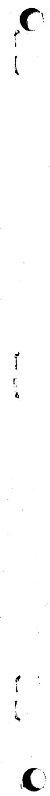

# Internal Distribution

<table><tr><td>1.</td><td>J. L. Anderson</td><td>41.</td><td>R. N. Lyon</td></tr><tr><td>2.</td><td>C. F. Baes</td><td>42.</td><td>H. G. MacPherson</td></tr><tr><td>3.</td><td>S. E. Beall</td><td>43.</td><td>R. E. MacPherson</td></tr><tr><td>4.</td><td>M. Bender</td><td>44.</td><td>H. E. McCoy</td></tr><tr><td>5.</td><td>E. S. Bettis</td><td>45.</td><td>H. C. McCurdy</td></tr><tr><td>6.</td><td>R. Blumberg</td><td>46-51.</td><td>C. K. McGlothlan</td></tr><tr><td>7.</td><td>E. G. Bohlmann</td><td>52.</td><td>L. E. McNeese</td></tr><tr><td>8.</td><td>R. B. Briggs</td><td>53.</td><td>J. R. McWherter</td></tr><tr><td>9.</td><td>C. W. Collins</td><td>54.</td><td>A. J. Miller</td></tr><tr><td>10.</td><td>W. B. Cottrell</td><td>55.</td><td>R. L. Moore</td></tr><tr><td>11.</td><td>J. L. Crowley</td><td>56.</td><td>E. L. Nicholson</td></tr><tr><td>12.</td><td>F. L. Culler</td><td>57.</td><td>A. M. Perry</td></tr><tr><td>13.</td><td>S. J. Ditto</td><td>58.</td><td>R. C. Robertson</td></tr><tr><td>14.</td><td>W. P. Eatherly</td><td>59.</td><td>M. W. Rosenthal</td></tr><tr><td>15.</td><td>J. R. Engel</td><td>60.</td><td>A. W. Savolainen</td></tr><tr><td>16.</td><td>D. E. Ferguson</td><td>61.</td><td>Dunlap Scott</td></tr><tr><td>17.</td><td>L. M. Ferris</td><td>62.</td><td>J. H. Shaffer</td></tr><tr><td>18.</td><td>J. K. Franzreb</td><td>63.</td><td>M. J. Skinner</td></tr><tr><td>19.</td><td>A. P. Fraas</td><td>64.</td><td>A. N. Smith</td></tr><tr><td>20.</td><td>C. H. Gabbard</td><td>65.</td><td>P. G. Smith</td></tr><tr><td>21.</td><td>R. B. Gallaher</td><td>66.</td><td>I. Spiewak</td></tr><tr><td>22.</td><td>W. R. Grimes</td><td>67.</td><td>D. A. Sundberg</td></tr><tr><td>23.</td><td>A. G. Grindell</td><td>68.</td><td>R. E. Thoma</td></tr><tr><td>24.</td><td>R. H. Guymon</td><td>69.</td><td>D. B. Trauger</td></tr><tr><td>25.</td><td>P. H. Harley</td><td>70.</td><td>J. R. Weir</td></tr><tr><td>26.</td><td>P. N. Haubenreich</td><td>71.</td><td>M. E. Whatley</td></tr><tr><td>27.</td><td>R. E. Helms</td><td>72.</td><td>J. C. White</td></tr><tr><td>28.</td><td>H. W. Hoffman</td><td>73.</td><td>G. D. Whitman</td></tr><tr><td>29.</td><td>T. L. Hudson</td><td>74.</td><td>L. V. Wilson</td></tr><tr><td>30.</td><td>P. R. Kasten</td><td>75.</td><td>Gale Young</td></tr><tr><td>31.</td><td>R. J. Kedl</td><td>76-77.</td><td>Central Research Library (CRL)</td></tr><tr><td>32.</td><td>S. S. Kirslis</td><td>78-79.</td><td>Document Reference Section (DRS)</td></tr><tr><td>33.</td><td>A. I. Krakoviak</td><td>80-82.</td><td>Laboratory Records (IRD)</td></tr><tr><td>34-39.</td><td>R. B. Lindauer</td><td>83.</td><td>Laboratory Records (IRD-RC)</td></tr><tr><td>40.</td><td>M. I. Lundin</td><td></td><td></td></tr></table>

# External Distribution

84. C. B. Deering, AEC-OSR

85-86. T. W. McIntosh, AEC Washington

87. H. M. Roth, AEC-ORO

88-102. Division of Technical Information Extension

103. Laboratory and University Division, ORO