ORNL-TM-2483

PREIRRADIATION AND POSTIRRADIATION MECHANICAL

PROPERTIES OF HASTELLOY N WELDS

H. E. McCoy   
D. A. Canonico

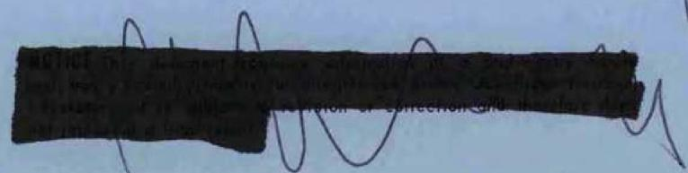

Full public release

$6/{28}/2$ 013

# LEGAL NOTICE

This report was prepared as an account of Government sponsored work. Neither the United States, nor the Commission, nor any person acting on behalf of the Commission:

A. Makes any warranty or representation, expressed or implied, with respect to the accuracy, completeness, or usefulness of the information contained in this report, or that the use of any information, apparatus, method, or process disclosed in this report may not infringe privately owned rights; or   
B. Assumes any liabilities with respect to the use of, or for damages resulting from the use of any information, apparatus, method, or process disclosed in this report.

As used in the above, "person acting on behalf of the Commission" includes any employee or contractor of the Commission, or employee of such contractor, to the extent that such employee or contractor of the Commission, or employee of such contractor prepares, disseminates, or provides access to, any information pursuant to his employment or contract with the Commission, or his employment with such contractor.

Contract No. W-7405-eng-26

METALS AND CERAMICS DIVISION

PREIRRADIATION AND POSTIRRADIATION MECHANICAL PROPERTIES OF HASTELLOY N WELDS

H. E. McCoy and D. A. Canonico

Submitted to the Welding Journal without the Appendix.

MARCH 1969

OAK RIDGE NATIONAL LABORATORY Oak Ridge, Tennessee operated by UNION CARBIDE CORPORATION for the U.S. ATOMIC ENERGY COMMISSION

# CONTENTS

<table><tr><td></td><td>Page</td></tr><tr><td>Abstract</td><td>1</td></tr><tr><td>Introduction</td><td>1</td></tr><tr><td>Experimental Details</td><td>3</td></tr><tr><td>Experimental Results</td><td>7</td></tr><tr><td>Tensile Properties</td><td>7</td></tr><tr><td>Creep-Rupture Properties</td><td>14</td></tr><tr><td>Postweld Heat Treatments</td><td>20</td></tr><tr><td>Metallography</td><td>23</td></tr><tr><td>Summary</td><td>25</td></tr><tr><td>Acknowledgments</td><td>29</td></tr><tr><td>References</td><td>30</td></tr><tr><td>Appendix</td><td>35</td></tr></table>

# PREIRRADIATION AND POSTIRRADIATION MECHANICAL PROPERTIES OF HASTELLOY N WELDS

H. E. McCoy and D. A. Canonico

# ABSTRACT

Welds were made by the TIG process in several heats of Hastelloy N. The mechanical properties of transverse weld samples and the base metal were compared in tensile tests over the range of 75 to $1600^{\circ}\mathrm{F}$ and in creep tests at $1200^{\circ}\mathrm{F}$ . The as-fabricated welds exhibited lower fracture strains than the base metal under all test conditions, but the properties of the welds were improved markedly by post-weld heat treatments. The postirradiation tensile and creep properties of the welds and base metal at elevated temperatures were about the same, although the properties were widely different before irradiation.

# INTRODUCTION

Hastelloy N is a trade name given the solid-solution-strengthened nickel-base alloy developed at the Oak Ridge National Laboratory specifically for use in molten fluoride salts up to $1500^{\circ}\mathrm{F}$ (ref. 1). The alloy was originally designated INOR-8 and has a nominal composition of Ni-17% Mo-7% Cr-5% Fe. This material is the primary metallic structural material in the Molten Salt Reactor Experiment (MSRE) which achieved criticality on June 1, 1965, at Oak Ridge, Tennessee.[2] This alloy has

been used for numerous other applications, and we anticipate that a slightly modified composition will be used in a future molten salt breeder reactor experiment.

The weldability of this material has received considerable attention in our program.3,4 We found it necessary to establish a weldability test to determine whether specific heats of material could be joined satisfactorily. Through this screening process, it was possible to select heats for use in fabricating the MSRE components.

During the past few years we have found that Hastelloy N as well as other nickel- and iron-base alloys are subject to a type of neutron irradiation damage that decreases the creep-rupture strength and fracture strain at elevated temperatures.[5,6] This damage is rather general for all austenitic iron- and nickel-base alloys and is attributed to the production of helium within the material due to the interaction of a neutron of thermal energy with $^{10}\mathrm{B}$ to produce $^{7}\mathrm{Li}$ and $^{4}\mathrm{He}$ (refs. 7-14). The property changes due to the helium must be evaluated for base metal and welds.

In the present paper, we shall show how the mechanical properties of transverse welds differ from those of the base metal and what types of annealing treatments can be used to improve the properties of welds. We shall also show how neutron irradiation alters the mechanical properties of the welds and the base metal. The mechanical properties measured in this study were tensile properties over the temperature range of 75 to $1600^{\circ}\mathrm{F}$ and creep properties at $1200^{\circ}\mathrm{F}$ .

# EXPERIMENTAL DETAILS

Several heats of Hastelloy N were used in this study and their chemical compositions and other pertinent details are given in Table 1. Heats 65-552 and 2477 were vacuum melted; all others were air melted. All base metal was annealed for 1 hr at $2150^{\circ}\mathrm{F}$ prior to testing unless otherwise specified.

Seven weldments were involved in this study and the details are given in Table 2. The welds were all highly restrained and made by the manual tungsten-arc welding process. A standard welding procedure was used on all the welds, although some deviation was necessary in welds 7 and 8 because of the type of filler metal being used. The joint configuration and pass sequence are shown in Fig. 1. The primary working direction in the plates was perpendicular to the weld axis.

We used small mechanical property samples throughout the study, since this geometry was required for the irradiation experiments (Fig. 1). The samples were cut perpendicular to the weld axis and parallel to the stringers. Three layers of specimens were cut from all the welds except No. 3; we could find no systematic variation in properties from top to bottom. However, the gage portions of the transverse weld specimens did contain different amounts of weld metal since the joint tapered (Fig. 1).

The tensile tests were run in an Instron Universal testing machine (10,000-lb capacity) at strain rates of 0.05 or $0.002\mathrm{min}^{-1}$ . The strain measurements were taken from the crosshead travel. A similar machine was located in a hot cell for testing the irradiated samples. The laboratory creep-rupture tests were run in standard lever-arm creep machines. The strain measurements were taken from the pull-rod displacement after

Table 1. Chemical Analysis of Test Materials   

<table><tr><td rowspan="2">Heat Designation</td><td rowspan="2">Melting Practice</td><td colspan="16">Composition</td><td colspan="3">(ppm)</td></tr><tr><td>Cr</td><td>Fe</td><td>Mo</td><td>C</td><td>Si</td><td>Co</td><td>W</td><td>Mn</td><td>V</td><td>P</td><td>S</td><td>Al</td><td>Ti</td><td>Cu</td><td>B</td><td>O</td><td>N</td><td></td><td></td></tr><tr><td>5065</td><td>Air</td><td>7.2</td><td>3.9</td><td>16.5</td><td>0.065</td><td>0.60</td><td>0.08</td><td>0.04</td><td>0.55</td><td>0.22</td><td>0.004</td><td>0.007</td><td>0.01</td><td>0.01</td><td>0.01</td><td>10-37</td><td>16</td><td>110</td><td></td><td></td></tr><tr><td>5067</td><td>Air</td><td>7.4</td><td>4.0</td><td>17.3</td><td>0.060</td><td>0.43</td><td>0.08</td><td>0.06</td><td>0.50</td><td>0.30</td><td>0.013</td><td>0.007</td><td>0.01</td><td>0.01</td><td>0.015</td><td>10-24</td><td>12</td><td>100</td><td></td><td></td></tr><tr><td>5101</td><td>Air</td><td>6.9</td><td>3.9</td><td>16.4</td><td>0.05</td><td>0.63</td><td></td><td>0.05</td><td>0.44</td><td>0.34</td><td>0.001</td><td>0.009</td><td>-0.02a-</td><td></td><td></td><td>3.5</td><td></td><td></td><td></td><td></td></tr><tr><td>5055</td><td>Air</td><td>7.9</td><td>3.8</td><td>16.2</td><td>0.06</td><td>0.61</td><td></td><td>0.03</td><td>0.69</td><td>0.21</td><td>0.006</td><td>0.008</td><td>0.06</td><td>0.02</td><td></td><td>50</td><td></td><td></td><td></td><td></td></tr><tr><td>2477</td><td>Vacuum</td><td>7.05</td><td>4.25</td><td>16.3</td><td>0.057</td><td>0.015</td><td>0.14</td><td>0.47</td><td>0.04</td><td></td><td>0.008</td><td>0.003</td><td>0.055</td><td>0.10</td><td>0.10</td><td>8</td><td></td><td>5</td><td>7</td><td></td></tr><tr><td>65-552</td><td>Vacuum</td><td>6.89</td><td>4.06</td><td>16.2</td><td>0.045</td><td>0.16</td><td>0.050</td><td>0.006</td><td>0.45</td><td>&lt;0.0005</td><td>0.002</td><td>0.006</td><td>0.25</td><td></td><td></td><td>0.5</td><td>1.3</td><td>9</td><td></td><td></td></tr></table>

aCombined amount of aluminum and titanium.

Table 2. Identification of Welds Made in This Study   

<table><tr><td>Weld Number</td><td>Base Metal</td><td>Filler Metal</td><td>Thickness of Weld (in.)</td></tr><tr><td>1</td><td>5065, 5067</td><td>5101</td><td>1</td></tr><tr><td>3</td><td>2477</td><td>2477</td><td>1/2</td></tr><tr><td>4</td><td>5065, 5067</td><td>5101</td><td>1</td></tr><tr><td>5</td><td>5065, 5067</td><td>5055</td><td>1</td></tr><tr><td>6</td><td>5065</td><td>65-552</td><td>1 1/8</td></tr><tr><td>7</td><td>5065</td><td>\( 5055 + \text{Al}_{2}\text{O}_{3}{}^{\text{a}} \)</td><td>1 1/8</td></tr><tr><td>8</td><td>5065</td><td>\( 5055 + \text{WC}^{\text{a}} \)</td><td>1 1/8</td></tr></table>

aFiller material was 1/8 in. wire of heat 5055 plasma sprayed with 0.002 in. of indicated material.

the load was applied. The postirradiation creep-rupture tests were run in lever-arm creep machines located in the ORNL hot cells. The strain was measured by an extensometer with rods attached to the upper and lower specimen grips. The relative movement of these two rods was measured by a linear differential transformer. All tests were run in an air environment. We used a standard equilibrating time of $1/2 \, \text{hr}$ for each test prior to loading.

The irradiations were conducted in two facilities: the ETR, Idaho Falls, Idaho, and the ORR, Oak Ridge, Tennessee. A core facility was used in the ETR where the thermal and fast (> 1 Mev) fluxes were each $3.2 \times 10^{14}$ neutrons $\mathrm{cm}^{-2} \sec^{-1}$ . The fluence obtained there was $5 \times 10^{20}$ neutrons/ $\mathrm{cm}^2$ . The ETR experiments were uninstrumented and the design temperatures were either less than $300^{\circ}\mathrm{F}$ or $1112 \pm 180^{\circ}\mathrm{F}$ . A core facility was also used in the ORR where the thermal flux was

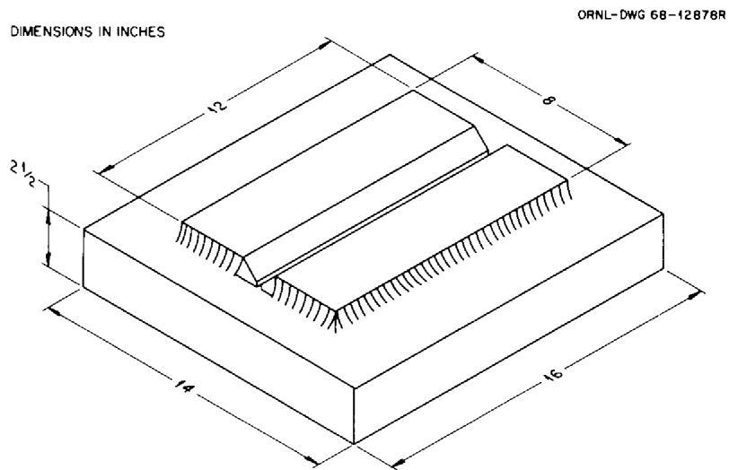  
FILLET WELDED TO STRONG BACK TO PRODUCE HIGH RESTRAINT WELD

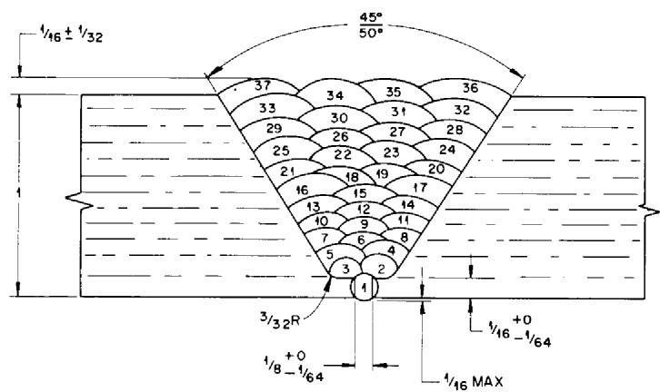  
JOINT DESIGN AND WELDING SEQUENCE

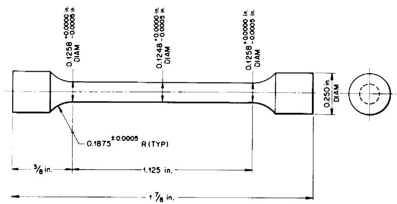  
MECHANICAL PROPERTIES SPECIMEN.  
Fig. 1. The INOR-8 High-Restraint Weldability Test Specimen Used to Provide Samples for the Mechanical Properties Study.

$2.5 \times 10^{14}$ neutrons $\mathrm{cm}^{-2} \sec^{-1}$ . The fluences obtained were $8.5 \times 10^{20}$ neutrons/ $\mathrm{cm}^2$ thermal and $7.0 \times 10^{20}$ neutrons/ $\mathrm{cm}^2$ fast ( $>1$ MeV). The temperature in this facility was $110^{\circ}\mathrm{F}$ . We could not observe any effect of fluence over the small range involved here, so the data are presented without reference to a particular experiment. Irradiation temperature was important in some cases and will be indicated.

# EXPERIMENTAL RESULTS

# Tensile Properties*

The variation of the fracture strain in a tensile test with test temperature is shown in Fig. 2 for both transverse welds and base metal. The behavior of this particular heat of base metal is typical for Hastelloy N. The decrease in fracture strain above $1100^{\circ}\mathrm{F}$ is due to

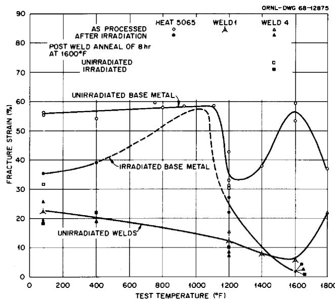  
Fig. 2. Ductility of Hastelloy N Welds and Base Metal in Tensile Tests at a Strain Rate of $0.05 \, \text{min}^{-1}$ .

the transition from transgranular to intergranular fracture. The recovery above $1400^{\circ}\mathrm{F}$ is associated with increasing grain boundary mobility. The fracture strain of the welds is much lower. Most of the welds fractured in the weld metal, but several samples tested at 75 and $392^{\circ}\mathrm{F}$ did fail in the base metal.

The fracture strain after irradiation is also shown in Fig. 2. Since these samples were irradiated at less than $300^{\circ}\mathrm{F}$ , there is some displacement damage in the base metal and the fracture strain is lower at test temperatures of 75 and $392^{\circ}\mathrm{F}$ . At test temperatures of 1200 and $1600^{\circ}\mathrm{F}$ , where intergranular fracture predominates, the fracture strain of the base metal is reduced dramatically. The postirradiation fracture ductility of the irradiated welds is also shown in Fig. 2. The strain at fracture of the welds is reduced slightly by irradiation, but the changes are much less than those observed for the base metal. Thus, although the ductility of the welds is much lower than that of the base metal before irradiation, the ductilities of welds and base metal at elevated temperatures are quite similar after irradiation.

The yield strengths of typical welds and base metal are compared in Fig. 3. The yield strengths of the transverse weld samples are consistently higher than those of the base metal. This same observation was also made by Gilliland and Venard.3 After a postweld anneal of 8 hr at $1600^{\circ}\mathrm{F}$ , the welded and base metal samples have very similar yield strengths.

Irradiation increases the yield strength of the base metal and welded samples at low temperatures. This damage anneals out as the test temperature is increased, and the welds and base metal show similar

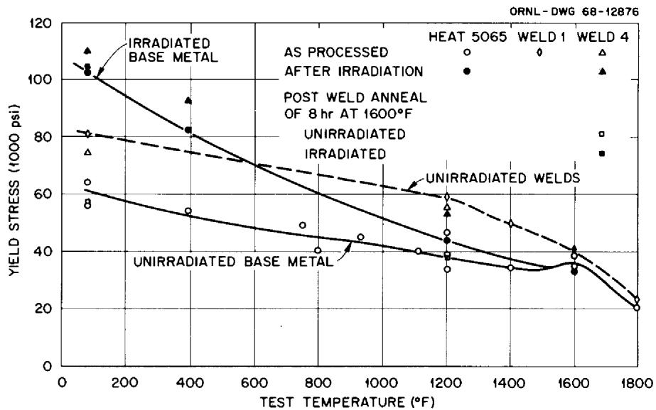  
Fig. 3. Yield Strength of Hastelloy N Welds and Base Metal in Tensile Tests at a Strain Rate of $0.05 \, \text{min}^{-1}$ .

recovery. Thus, above $1200^{\circ}\mathrm{F}$ the yield strengths of base metal and welds annealed for 8 hr at $1600^{\circ}\mathrm{F}$ are equivalent and are unaffected by irradiation.

Figure 4 shows that the ultimate tensile strength is about the same for welded samples and for base metal. This property is not affected significantly by postweld heat treatment at $1600^{\circ}\mathrm{F}$ . Irradiation causes a slight (approx $10\%$ ) increase in the ultimate tensile strength at the lower test temperatures and a decrease at test temperatures of $1200^{\circ}\mathrm{F}$ and greater. This reduction at higher temperatures is due to the reduced ability of the material to deform plastically after irradiation (i.e., fracture occurs before the stress increases to the higher values noted for unirradiated materials).

Thus, the effects of welding on the strength parameters measured by standard tensile tests are relatively small and the most significant factor is the reduction in the fracture strain. The fracture strains observed for the welds involved in this study are summarized in Fig. 5.

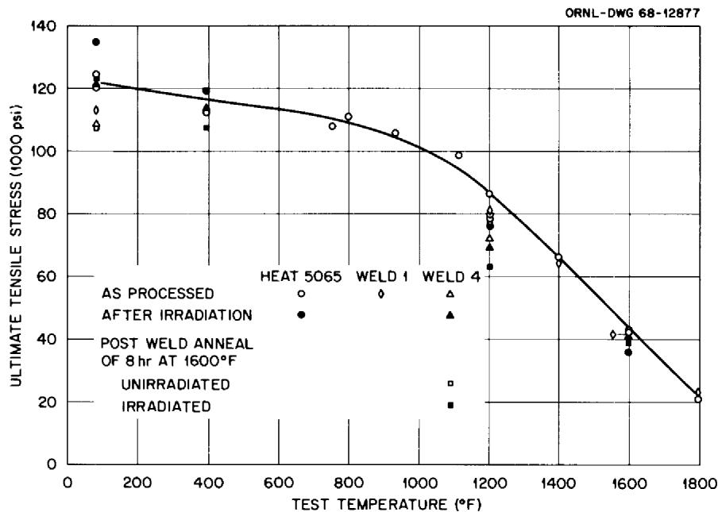  
Fig. 4. Ultimate Tensile Strength of Hastelloy N Welds and Base Metal in Tensile Tests at a Strain Rate of $0.05 \, \text{min}^{-1}$ .

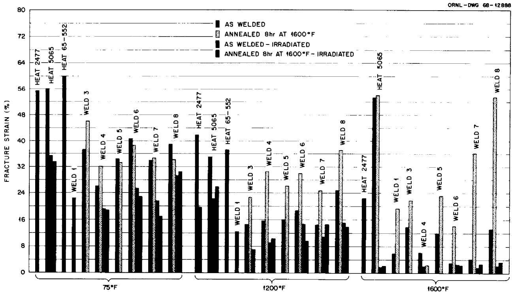  
Fig. 5. Comparison of the Fracture Strains of Welds and Base Metal in Tensile Tests at a Strain Rate of $0.05 \, \text{min}^{-1}$ .

Welds 1, 4, and 5 involve air-melted materials with relatively high boron levels. Heat 2477, a vacuum-melted heat containing 8 ppm B, was used as the base and filler metal in weld 3. Weld 6 utilized filler metal from heat 65-552, a vacuum-melted heat containing 1 ppm B, and base metal from heat 5065, an air-melted heat. Welds 7 and 8 utilized air-melted base and filler materials. The filler rod for weld 7 was plasma-spray-coated with $\mathrm{Al}_{2}\mathrm{O}_{3}$ in an effort to reduce the interdendritic spacing in the cast weld metal and to provide additional sites for helium collection. However, most of the $\mathrm{Al}_{2}\mathrm{O}_{3}$ floated on the weld and had to be removed mechanically before making the next pass; the aluminum content of the deposited weld metal was only $0.06\%$ compared with $0.84\%$ for a typical cross section from the filler metal before deposition. Weld 8 involved a filler material coated with WC. The deposited weld metal contained $2\%$ W and $0.1\%$ C, so the WC coating dissolved in the melt altered the properties of the weld appreciably.

The fracture strains shown in Fig. 5 are compared for

1. base metal given a standard solution anneal of 1 hr at $2150^{\circ}\mathrm{F}$ ,   
2. base metal given the 1 hr at $2150^{\circ}\mathrm{F}$ treatment followed by an anneal of 8 hr at $1600^{\circ}\mathrm{F}$ ,   
3. transverse weld samples in the as-welded condition, and   
4. transverse weld samples annealed for 8 hr at $1600^{\circ}\mathrm{F}$ .

These properties are considered for unirradiated and irradiated conditions where data are available.

At a test temperature of $75^{\circ}\mathrm{F}$ the following points are illustrated in Fig. 5.

1. The fracture strains of all welds are lower than those of the base metal.   
2. Welds 1, 4, and 5 all involved air-melted alloys and exhibited the lowest fracture strains.   
3. Welds 3 and 6 involved vacuum-melted weld metal and have the best properties.   
4. Welds 7 and 8, which involved air-melted alloys with the filler metal modified with $\mathrm{Al}_{2}\mathrm{O}_{3}$ and WC, exhibited intermediate properties.   
5. Postweld heat treatments generally improved the properties.   
6. Irradiation decreased the fracture strain of all welds and base metal. The welds had lower postirradiation ductilities than the base metals, but the welds were affected less by irradiation.   
7. The postirradiation ductilities of welds did not depend appreciably on whether they had received a postweld heat treatment prior to irradiation.   
8. The postirradiation properties of all welds except No. 8 were equivalent.

Figure 5 also illustrates several important points at a tensile test temperature of $1200^{\circ}\mathrm{F}$ .

1. The fracture strains of all welds were lower than those of the base metal.   
2. The as-welded ductilities of all welds except No. 8 were about equivalent, ranging from 12 to $18\%$ . Weld 8 had $25\%$ strain at fracture under these conditions.

3. A postweld heat treatment of 8 hr at $1600^{\circ}\mathrm{F}$ markedly improved the fracture strain, with values of 22 to $30\%$ being observed. Weld 8 again was better.   
4. After irradiation, all welds were less ductile than the base metal. There were some differences in the ductilities of the welds, but no consistent trends are apparent.   
5. Postweld annealing for 8 hr at $1600^{\circ}\mathrm{F}$ had little effect on the postirradiation properties.

At $1600^{\circ}\mathrm{F}$ , Fig. 5 shows the following trends.

1. The fracture strains were drastically lower for welds than for base metal. Welds 3 and 8 had properties superior to those of the other welds. Postweld heat treating had a beneficial effect on the ductility.   
2. Irradiation reduced the fracture strain to about $2\%$ independent of whether the test sample was base metal or a transverse weld.

All of the postirradiation results presented thus far have been for materials irradiated at less than $300^{\circ}\mathrm{F}$ . We have irradiated several samples of these heats and others at 1200 to $1400^{\circ}\mathrm{F}$ and find that there are at least two significant differences in the results obtained. The displacement damage anneals at these irradiation temperatures and the tensile properties up to about $1000^{\circ}\mathrm{F}$ are the same for irradiated and unirradiated materials. At higher test temperatures the fracture strain is reduced even further if the irradiation temperature is in the range of 1200 to $1400^{\circ}\mathrm{F}$ . For example, heat 5065 was found to have a fracture strain of $11.3\%$ (irradiated at $1200^{\circ}\mathrm{F}$ ) at $1200^{\circ}\mathrm{F}$ compared with the value of $22.2\%$ (irradiated at less than $300^{\circ}\mathrm{F}$ ) shown in Fig. 5. Weld 7 was observed to have fracture strains at $1200^{\circ}\mathrm{F}$ of 7.2 and $10.8\%$ after

irradiation at $1200^{\circ}\mathrm{F}$ and less than $300^{\circ}\mathrm{F}$ , respectively. Thus, the trends shown in Fig. 5 for samples irradiated at $300^{\circ}\mathrm{F}$ seem to hold for irradiation temperatures in the 1200 to $1400^{\circ}\mathrm{F}$ range, although the actual fracture strains may be lower for the higher irradiation temperature.

# Creep-Rupture Properties*

The stress-rupture properties at $1200^{\circ}\mathrm{F}$ of several heats of base metal are shown in Fig. 6. The data are described reasonably well by a single line, although both air- and vacuum-melted materials are involved. The line for the base materials is shown in Fig. 7 where a comparison is made between the stress-rupture properties of the base metal and the various welds involved in this study. All of the welds had lower creep-rupture strength in the as-welded condition than the base metal. Weld 3, which involved only vacuum-melted materials, had significantly higher strength than the other welds. Welds 7 and 8, which involved $\mathrm{Al}_{2}\mathrm{O}_{3}$ and WC additions, also showed notably better performance than welds 1, 4, and 6. The rupture lives of the welds approached those of the base metal as the stress level was reduced; this is likely due to thermal recovery of the weld metal during the long time at $1200^{\circ}\mathrm{F}$ . The strength was improved greatly by a postweld anneal of 8 hr at $1600^{\circ}\mathrm{F}$ .

The fracture strains of the welds and several heats of base metal are compared in Fig. 8. The fracture strain of the base metal was about $25\%$ for short rupture lives of a few hours and decreased to values of 10 to $15\%$ when the rupture life was 1000 hr. There is no appreciable difference between air- and vacuum-melted alloys. The welds had fracture

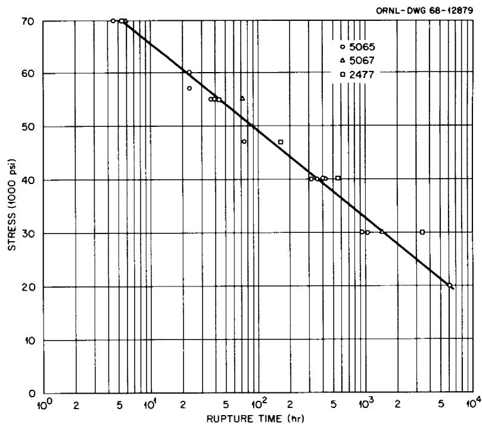  
Fig. 6. Stress-Rupture Properties of Hastelloy N Base Metal at $1200^{\circ}\mathrm{F}$ .

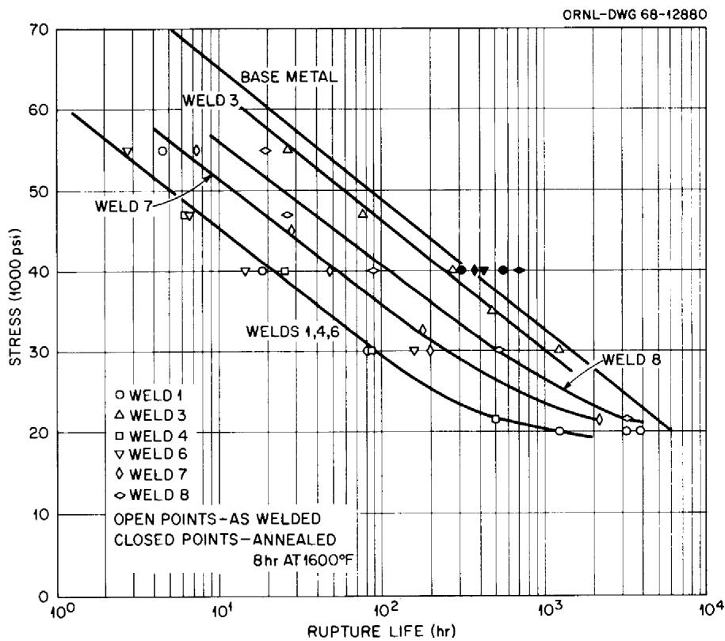  
Fig. 7. Stress-Rupture Properties of Several Hastelloy N Welds at $1200^{\circ}\mathrm{F}$ .

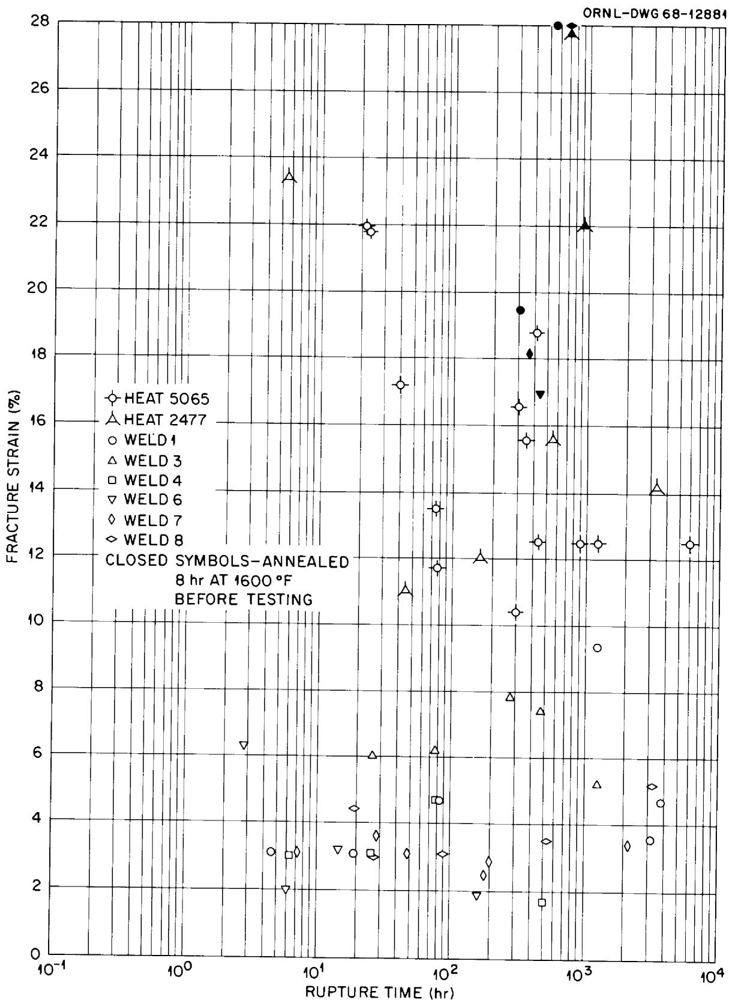  
Fig. 8. Variation of Fracture Strain with Rupture Life for Welds and Base Metal Tested at $1200^{\circ}\mathrm{F}$ .

strains of only about $3\%$ for rupture lives up to a few hundred hours. Samples having rupture lives over 1000 hr showed some improvement with strains in the range of 3 to $5\%$ . Weld 3 had much superior fracture strains of about $6\%$ for all test conditions. All welds and even the base metal exhibited much higher fracture strains after an anneal of 8 hr at $1600^{\circ}\mathrm{F}$ .

As shown in Fig. 9, irradiation produces some rather dramatic changes in the stress-rupture properties. The lines shown in Fig. 9 were obtained from Fig. 6 for the unirradiated base metal, Fig. 8 for the minimum strength of unirradiated welds, and from Ref. 6 for the strength of irradiated base metal. Several points are included for base metals irradiated under exactly the same conditions as the welds. The properties of heat 2477 (low boron, vacuum-melted) are superior to

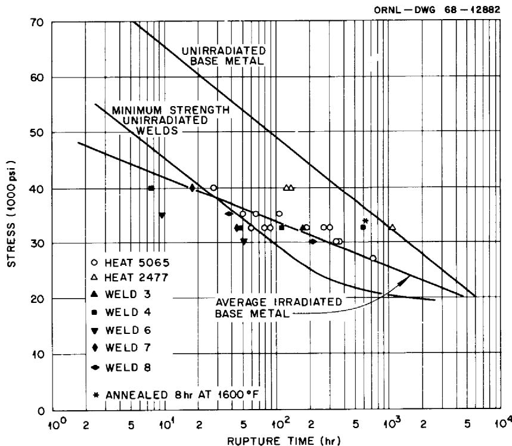  
Fig. 9. Influence of Irradiation on the Stress-Rupture Properties of Hastelloy N Welds and Base Metal at $1200^{\circ}\mathrm{F}$ . All welds in the as-welded condition unless otherwise indicated.

those of heat 5065 for the low irradiation temperature of less than $300^{\circ}\mathrm{F}$ , but further work has shown that these materials have comparable properties when irradiated at $1200^{\circ}\mathrm{F}$ or higher. $^{6}$ The rupture lives of the welds seem quite comparable with those of the base metals and all welds seem to have about the same properties. A single specimen was given a postweld heat treatment of 8 hr at $1600^{\circ}\mathrm{F}$ and had superior post-irradiation strength, but this observation should be repeated before concluding that this anneal is effective. Moteff and Smith $^{15}$ also found that the postirradiation creep properties of Hastelloy N base metal and welds were equivalent at $1200^{\circ}\mathrm{F}$ . They also found that a postweld anneal of 4 hr at $1600^{\circ}\mathrm{F}$ did not improve the postirradiation properties of welds.

The fracture strain is shown in Fig. 10 as a function of rupture life. The fracture strain of the base metal had a low value of about $0.5\%$ for rupture lives of only a few hours and increased to about $3\%$ for rupture lives of 1000 hr. The welds fall into this same pattern, but the strains were consistently slightly lower. Again the single test on a sample having a postweld anneal exhibited better properties.

We also compared the minimum creep rates for these same materials to obtain a measure of strength. The creep properties of several heats of base metal in the irradiated and unirradiated conditions are shown in Fig. 11. Most of the data are contained within the band in Fig. 11, with heat 5065 favoring the right side and heat 2477 the left side. This same band is transferred to Fig. 12, where the data for the welds are shown for comparison. The data do not deviate significantly from the band obtained for the base metal. Thus, the creep rate of Hastelloy N is not affected appreciably by welding or by irradiation.

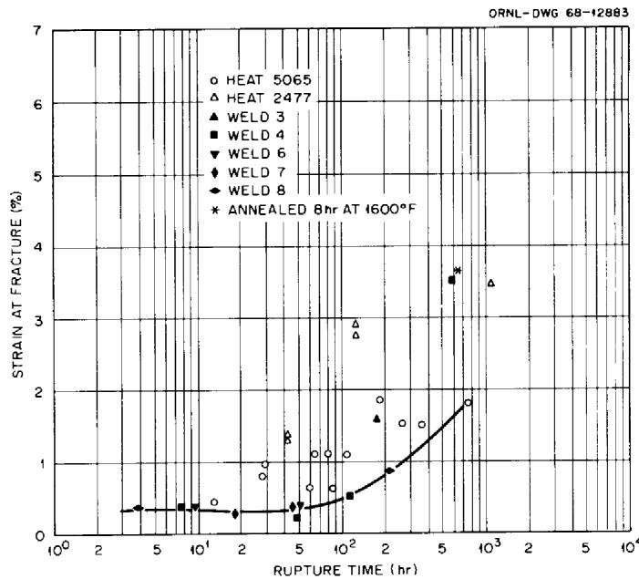  
Fig. 10. Influence of Irradiation on the Fracture Strain of Hastelloy N Welds and Base Metal in Creep at $1200^{\circ}\mathrm{F}$ . All welds in the as-welded condition unless otherwise indicated.

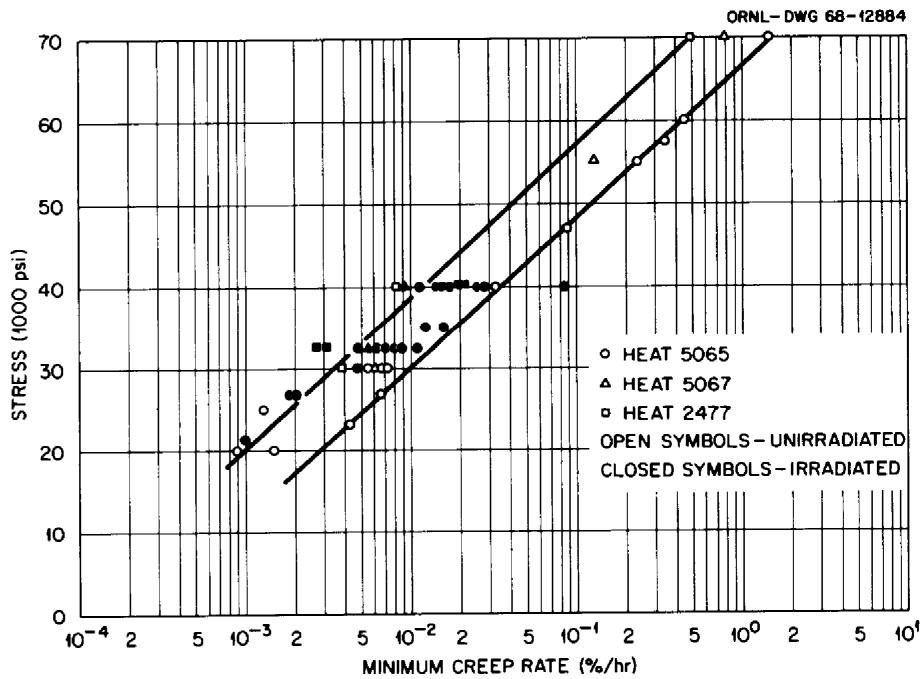  
Fig. 11. Influence of Irradiation on the Creep Rate of Hastelloy N Base Metal at $1200^{\circ}\mathrm{F}$ .

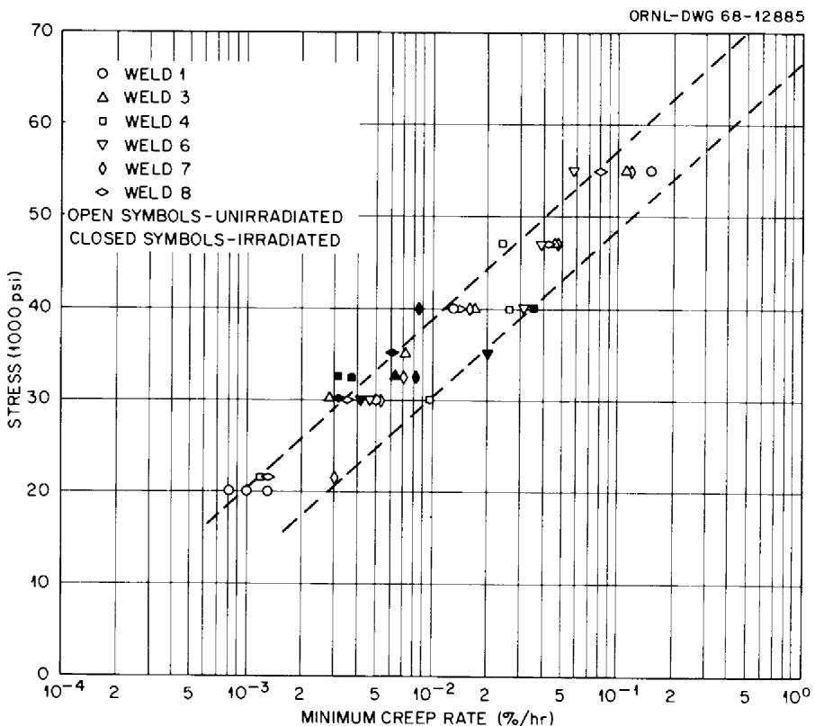  
Fig. 12. Influence of Irradiation on the Creep Rate of Hastelloy N Welds at $1200^{\circ}\mathrm{F}$ .

# Postweld Heat Treatments*

We have mentioned previously the improvement of the properties of welds by a postweld heat treatment of 8 hr at $1600^{\circ}\mathrm{F}$ . We chose this treatment on the basis of our work with weld 1 in which we tested samples at 40,000 psi and $1200^{\circ}\mathrm{F}$ after annealing samples for various periods of time at temperatures of 1200, 1400, and $1600^{\circ}\mathrm{F}$ . The influence of these treatments on the rupture life is shown in Fig. 13. The as-welded sample had a rupture life of only 19 hr compared with a rupture life of about 350 hr for the base metal (Fig. 6). Long annealing times at $1200^{\circ}\mathrm{F}$ were required to produce much improvement, and the rupture life was only 60 hr

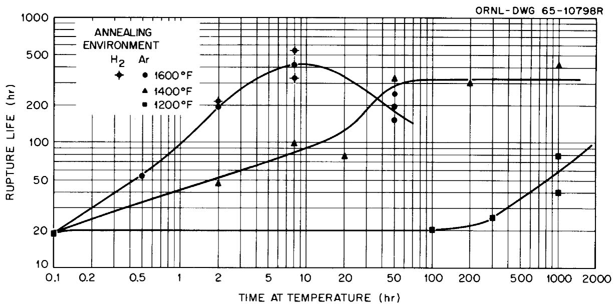  
Fig. 13. Influence of Postweld Heat Treatments on the Rupture Life of Weld 1 Tested at $1200^{\circ}\mathrm{F}$ and 40,000 psi.

after a 1000-hr postweld heat treatment at $1200^{\circ}\mathrm{F}$ . Annealing at $1400^{\circ}\mathrm{F}$ brought about more rapid recovery with the rupture life of the weld being comparable with that of the base metal after a 50-hr anneal. Only about 8 hr at $1600^{\circ}\mathrm{F}$ was required to restore the rupture life. We have no explanation for the apparent reduction in the rupture life due to a postweld anneal at $1600^{\circ}\mathrm{F}$ of 50 hr compared with anneals of 8- and 100-hr duration.

The change in the fracture strain with postweld heat treatment is shown in Fig. 14. The fracture strain is about $12\%$ for the base metal (Fig. 8) and the welds can be annealed to obtain equivalent or even better fracture strains. There is an apparent inversion in the recovery curve at $1600^{\circ}\mathrm{F}$ ; this corresponds to the conditions producing short rupture lives in Fig. 13.

The reduction in area for these same samples is shown in Fig. 15. Values for the welds as high as the $15\%$ obtained for base metal can be

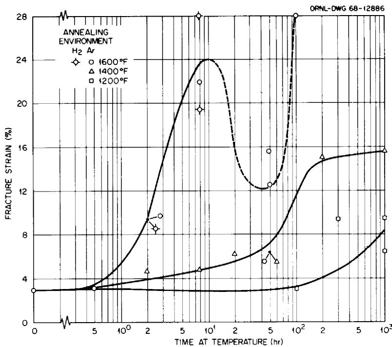  
Fig. 14. Influence of Postweld Heat Treatments on the Fracture Strain of Weld 1 Tested at $1200^{\circ}\mathrm{F}$ and 40,000 psi.

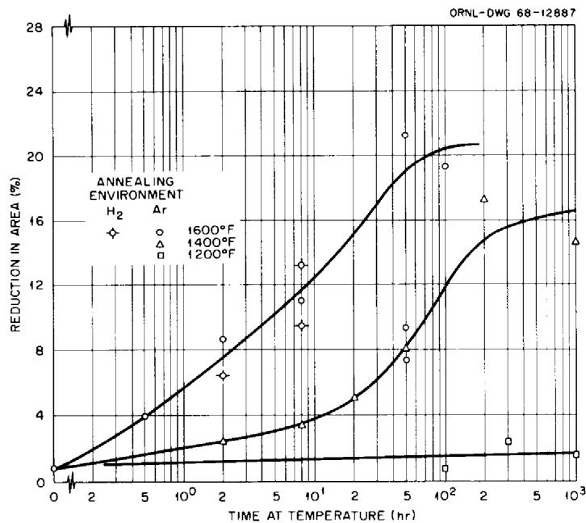  
Fig. 15. Influence of Postweld Heat Treatments on the Reduction in Area of Weld 1 Tested at $1200^{\circ}\mathrm{F}$ and $650^{\circ}\mathrm{C}$ .

obtained by postweld anneals at 1400 and $1600^{\circ}\mathrm{F}$ . The unusual behavior due to annealing for 50 hr at $1600^{\circ}\mathrm{F}$ again appears for two of the samples. The reduction in area is not affected appreciably by annealing at $1200^{\circ}\mathrm{F}$ , indicating that the improved elongation at fracture (Fig. 14) is due primarily to the formation of cracks during testing.

We examined the influence of whether the postweld annealing environment was argon or hydrogen at $1600^{\circ}\mathrm{F}$ , since Gilliland and Venard3 had reported better properties for samples annealed in hydrogen than for those annealed in argon. Comparative points are shown in Figs. 13, 14, and 15 for these annealing environments, and no appreciable differences are apparent.

# Metallography

Many of the samples were examined metallographically and a few typical microstructures will be presented. Figure 16 shows the fusion zone of weld 4. The structure of the base metal is characterized by stringers of $\mathrm{M}_{6}\mathrm{C}$ -type precipitates and a relatively fine grain size. The weld metal contains a fine cellular structure within coarse grains. The fusion line is quite sharp and the transition of some of the large $\mathrm{M}_{6}\mathrm{C}$ precipitates to a lamellar phase is apparent. The exact identification of the lamellar phase has eluded us for some time, but our evidence indicates that it is a Mo-Ni-Si compound.[16] Microprobe studies have shown that the precipitates are enriched in silicon and that the dark etching portions of the dendritic cast structure are also higher in silicon.

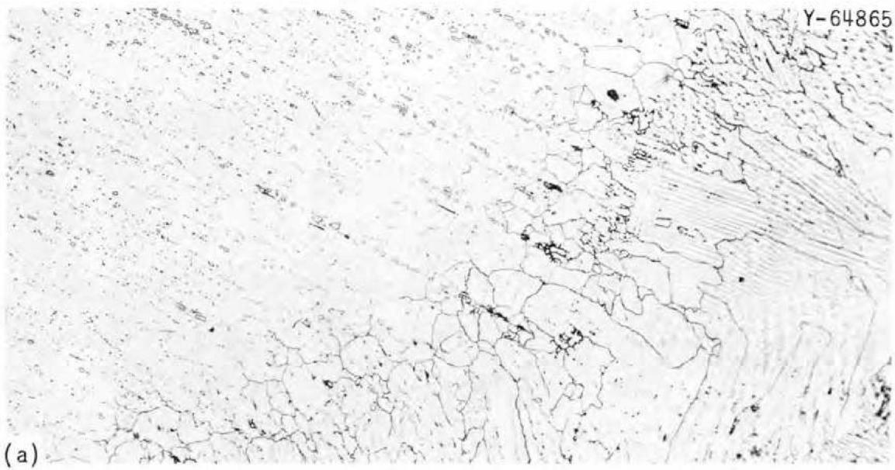

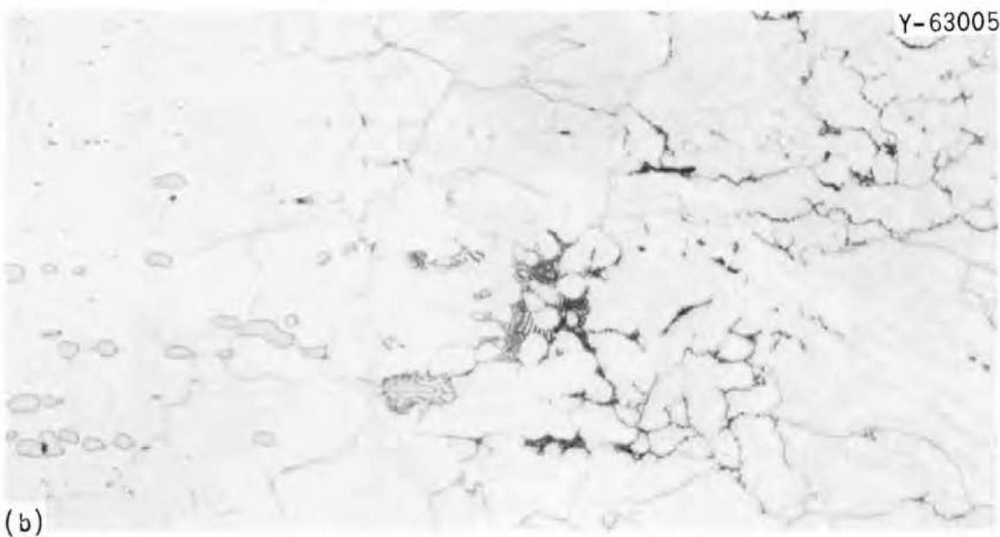  
Fig. 16. Photomicrographs of the Fusion Zone of Weld 4. (a) Base metal on left and weld metal on right. $100 \times$ . (b) Transformation of stringer precipitates to lamellar product at the fusion line. $500 \times$ . Etchant: glyceria regia.

This same general description applies to the fusion zones of the other welds except 3 and 8. The base metals used in weld 3 were vacuum-melted and the stringers are minimal. The bulk silicon content was low (0.015%) and the precipitates were primarily of the $\mathrm{Mo}_{2}\mathrm{C}$ type and were found to dissolve easily. Thus, not much of the lamellar transformation

product was present at the fusion line. Weld 8 involved the filler material that was coated with WC, and the structure of the deposited weld metal is much finer (Fig. 17).

A typical microstructure of a creep-rupture fracture in Hastelloy N base metal is shown in Fig. 18. This sample was tested at 40,000 psi and $1200^{\circ}\mathrm{F}$ and failed after 312 hr with $16.6\%$ strain. There is considerable grain boundary cracking and the fracture is predominantly intergranular.

Typical microstructures of a tested sample from weld 1 are shown in Fig. 19. This sample was tested at 40,000 psi and $1200^{\circ}\mathrm{F}$ in the as-welded condition; failure occurred in 18.7 hr with $3.1\%$ strain and only $0.77\%$ reduction in area. The fracture occurred in the weld metal and followed the grain boundaries; however, little grain boundary cracking adjacent to the fracture is evident.

Postweld heat treatments generally improved the tensile and creep properties. Figure 20 shows the fracture of a sample from weld 1 that was annealed for 2 hr at $1600^{\circ}\mathrm{F}$ and tested at 40,000 psi and $1200^{\circ}\mathrm{F}$ . This sample failed in 200 hr with $9.4\%$ strain and $6.4\%$ reduction in area. The failure still occurred in the weld metal; however, intergranular cracks did form throughout the weld zone, indicating that deformation occurred generally throughout this zone.

# SUMMARY

This study has shown that the mechanical properties of welds in Hastelloy N are generally inferior to those of the base metal. The strain at fracture is the property affected most severely, although appreciable reductions in the high-temperature creep-rupture strength

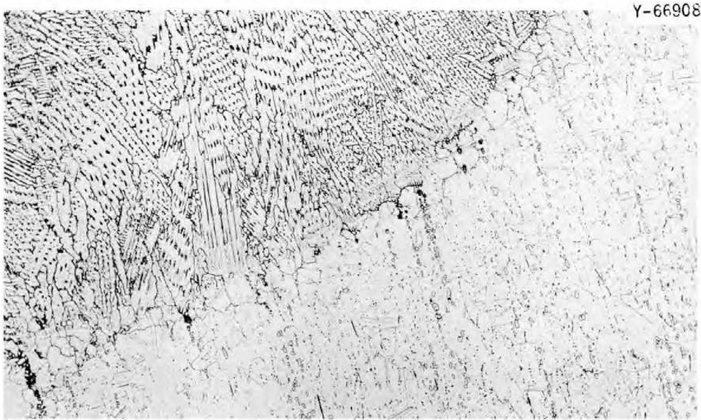  
Fig. 17. Photomicrograph of the Fusion Line of Weld 8. Weld metal in the upper left and base metal in the lower right. $100 \times$ Etchant: glyceria regia.

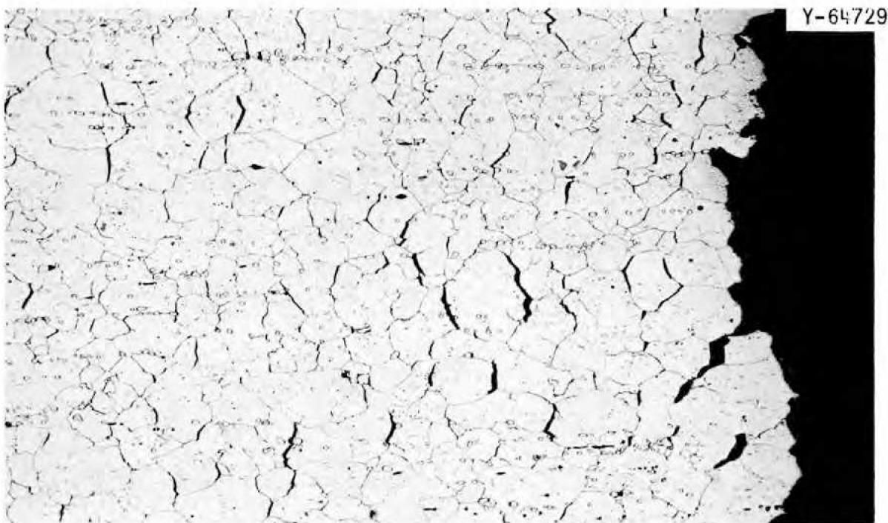  
Fig. 18. Photomicrograph of the Fracture of a Hastelloy N (Heat 5065) Sample Tested in Creep at 40,000 psi and $1200^{\circ}\mathrm{F}$ Following a Pretest Anneal of 1 hr at $2150^{\circ}\mathrm{F}$ . Failed in 312 hr with $16.6\%$ strain. $100\times$ . Etchant: glyceria regia.

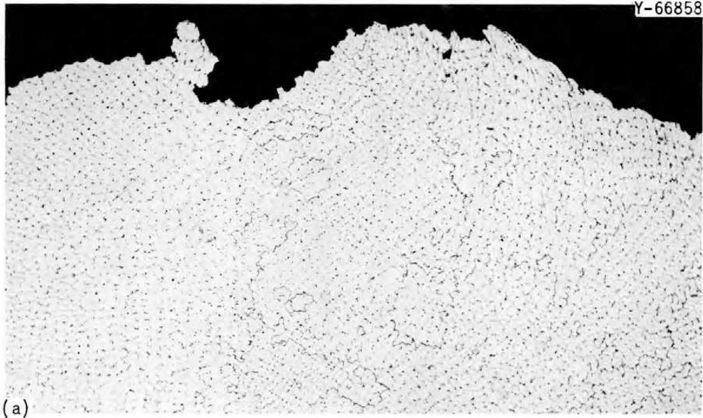

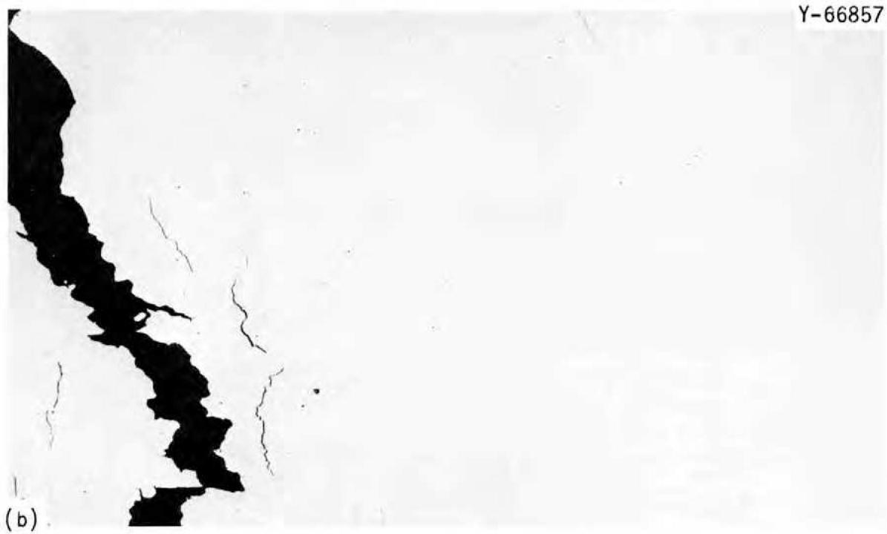  
Fig. 19. Photomicrographs of Sample from Weld 1 Tested at 40,000 psi and $1200^{\circ}\mathrm{F}$ in the As-Welded Condition. Failed in 18.7 hr with $3.1\%$ strain. $100\times$ . (a) Fracture in the weld metal. Etchant: glyceria regia. (b) An unetched photomicrograph of a cracked area away from the fracture.

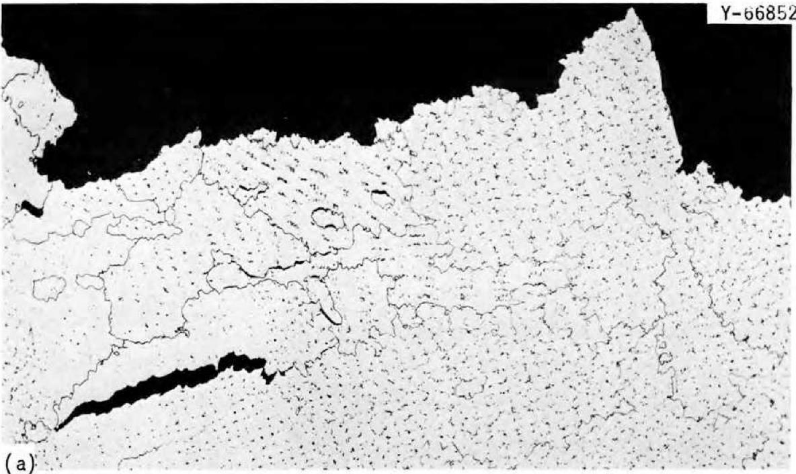

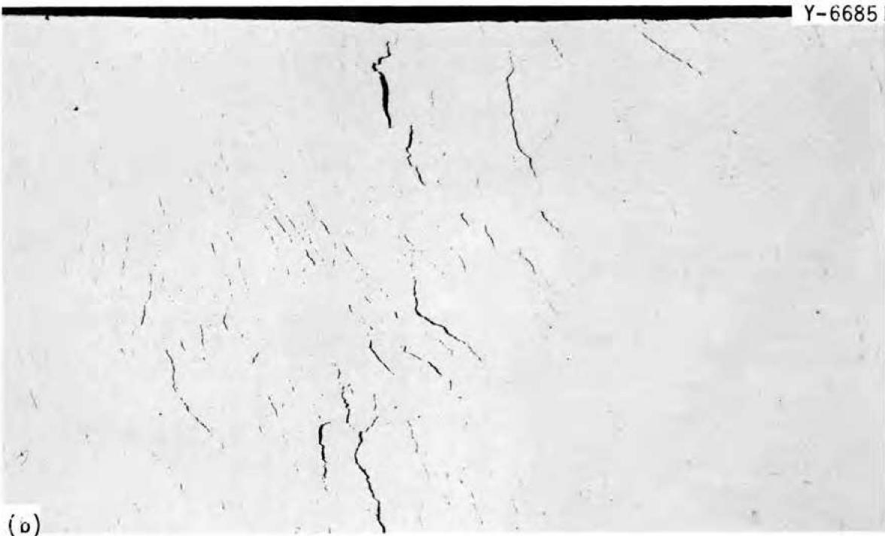  
Fig. 20. Photomicrographs of Tested Creep Sample from Weld 1. Sample given a postweld anneal of $2\mathrm{hr}$ at $1600^{\circ}\mathrm{F}$ in argon and tested at 40,000 psi and $1200^{\circ}\mathrm{F}$ . Failed in 200 hr with $9.4\%$ strain. $100\times$ . (a) Fracture. Etchant: glyceria regia. (b) An unetched photomicrograph of deformed area in the weld metal.

also occurred. The properties of welds can be improved by suitable post-weld heat treatments to almost equal those of the base metal.

Several welds were studied which involved air- and vacuum-melted materials. The weld involving vacuum-melted base and filler metal (weld 3) had superior creep-rupture properties in the as-welded condition. Weld 8 involved air-melted materials and the filler metal was coated with WC. The properties of this weld were generally superior to those of the other welds, but the fracture strain under creep conditions was not improved.

Neutron irradiation caused a decrease in the fracture strain of both welds and base metal. The postirradiation fracture strains in tensile tests of the welds and the base metal became closer as the test temperature was increased; they were identical at $1600^{\circ}\mathrm{F}$ . Although postweld heat treatments improved the fracture strain in preirradiation tensile tests, the postirradiation fracture strains of welds seemed independent of postweld anneal. The postirradiation creep-rupture properties at $1200^{\circ}\mathrm{F}$ were about the same for welds and base metal, even though the preirradiation properties differed greatly. Although some of the irradiated welds showed improved performance in tensile tests, they all had about the same creep-rupture properties.

# ACKNOWLEDGMENTS

The welds were made under the supervision of T. R. Housley and the mechanical property tests were run by B. C. Williams, E. Bolling, N. O. Pleasant, J. T. Feltner, and V. G. Lane. H. R. Tinch was responsible for the metallographic work. We are also indebted to

G. M. Slaughter and J. R. Weir for their interest in this work and for their careful review of the manuscript. The drawings were prepared by the Graphic Arts Department and the manuscript was prepared by the Metals and Ceramics Division Reports Office.

# REFERENCES

1. W. D. Manly et al., "Metallurgical Problems in Molten Fluoride Systems," Progr. Nucl. Energy Ser. IV 2, 164-179 (1960).   
2. H. G. MacPherson, "Molten Salt Reactor Shows Most Promise to Conserve Nuclear Fuels, Part 2," Power Eng. 71(2), 56-58 (1967).   
3. R. G. Gilliland and J. T. Venard, "Elevated Temperature Mechanical Properties of Welds in Ni-Mo-Cr-Fe Alloy," Welding J. (N.Y.) 45(3), 103-s-110-s (1966).   
4. R. G. Gilliland and G. M. Slaughter, private communication.   
5. W. R. Martin and J. R. Weir, "Postirradiation Creep and Stress Rupture of Hastelloy N," Nucl. Appl. 3, 167 (1967).   
6. H. E. McCoy, "Variation of the Mechanical Properties of Irradiated Hastelloy N with Strain Rate," submitted to Journal of Nuclear Materials.   
7. D. R. Harries, "Neutron Irradiation Embrittlement of Austenitic Stainless Steels and Nickel Base Alloys," J. Brit. Nucl. Energy Soc. 5, 74 (1966).   
8. G. H. Broomfield, D. R. Harries, and A. C. Roberts, "Neutron Irradiation Effects in Austenitic Stainless Steels and a Nimonic Alloy," J. Iron Steel Inst. (London) 203, 502 (1965).

9. F. C. Robertshaw et al., "Neutron Irradiation Effects in A-286  
Hastelloy Y and René 41 Alloys," Spec. Tech. Publ. No. 341, p. 372, American Society for Testing and Materials, Philadelphia, Pa., 1963.   
10. N. E. Hinkle, "Effect of Neutron Bombardment on Stress-Rupture Properties of Some Structural Alloys," Spec. Tech. Publ. No. 341, p. 344, American Society for Testing and Materials, Philadelphia, Pa., 1963.   
11. P.C.L. Pfeil and D. R. Harries, "Effects of Irradiation in Austenitic Steels and Other High-Temperature Alloys," p. 202 in _Flow and Fracture of Metals and Alloys in Nuclear Environments Spec._ Tech. Publ. No. 380, American Society for Testing and Materials, Philadelphia, Pa., 1965.   
12. J. T. Venard and J. R. Weir, "In-Reactor Stress-Rupture Properties of a 20 Cr-25 Ni Columbium-Stabilized Stainless Steel," p. 269 in Flow and Fracture of Metals and Alloys in Nuclear Environments Spec. Tech. Publ. No. 380, American Society for Testing and Materials, Philadelphia, Pa., 1965.   
13. P.C.L. Pfeil, P. J. Barton, and D. R. Arkell, "Effects of Irradiation on the Elevated Temperature Mechanical Properties of Austenitic Steels," Trans. Am. Nucl. Soc. 8, 120 (1965).   
14. P.R.B. Higgins and A. C. Roberts, "Reduction in Ductility of Austenitic Stainless Steel after Irradiation," Nature 206, 1249 (1965).   
15. J. Moteff and J. P. Smith, Sixth Annual Report of High Temperature Materials Program, Part A, March 31, 1967, GEMP-475A, p. 185 (1967).

16. R. E. Gehlbach and H. E. McCoy, "Phase Instability in Hastelloy N," paper presented at the International Symposium on Structural Stability in Superalloys, Seven Springs, Pa., Sept. 4-6, 1968; to be published in the proceedings.

APPENDIX

Table A-1. Tensile Properties of Welds in the Unirradiated Condition   

<table><tr><td rowspan="2">Specimen Number</td><td rowspan="2">Weld Number</td><td rowspan="2">Postweld Anneal</td><td rowspan="2">Strain Rate (min-1)</td><td rowspan="2">Test Temperature (°F)</td><td colspan="2">Stress, psi</td><td colspan="2">Elongation, %</td><td rowspan="2">Reduction in Area (%)</td></tr><tr><td>Yield</td><td>Ultimate</td><td>Uniform</td><td>Total</td></tr><tr><td>13</td><td>1</td><td>None</td><td>0.05</td><td>75</td><td>81,100</td><td>113,100</td><td>22.0</td><td>22.3</td><td>37.7</td></tr><tr><td>14</td><td>1</td><td>None</td><td>0.05</td><td>390</td><td>59,100</td><td>81,200</td><td>11.3</td><td>12.3</td><td>24.4</td></tr><tr><td>15</td><td>1</td><td>None</td><td>0.05</td><td>1200</td><td>50,000</td><td>64,800</td><td>6.0</td><td>7.8</td><td>13.1</td></tr><tr><td>16</td><td>1</td><td>None</td><td>0.05</td><td>1200</td><td>40,800</td><td>42,000</td><td>3.0</td><td>5.8</td><td>6.9</td></tr><tr><td>17</td><td>1</td><td>None</td><td>0.05</td><td>1600</td><td>23,200</td><td>23,400</td><td>1.8</td><td>21.8</td><td>25.5</td></tr><tr><td>18</td><td>1</td><td>a</td><td>0.05</td><td>1600</td><td>41,600</td><td>42,100</td><td>3.9</td><td>19.2</td><td>18.6</td></tr><tr><td>3000</td><td>1</td><td>None</td><td>0.05</td><td>75</td><td>76,300</td><td>111,900</td><td>27.1</td><td>28.3</td><td>29.5</td></tr><tr><td>3001</td><td>1</td><td>None</td><td>0.05</td><td>1200</td><td>59,300</td><td>79,800</td><td>10.2</td><td>11.7</td><td>26.5</td></tr><tr><td>3005</td><td>3</td><td>None</td><td>0.05</td><td>75</td><td>71,700</td><td>122,800</td><td>35.2</td><td>37.2</td><td>42.4</td></tr><tr><td>3006</td><td>3</td><td>None</td><td>0.05</td><td>1200</td><td>53,200</td><td>77,300</td><td>12.6</td><td>14.4</td><td>23.6</td></tr><tr><td>10285</td><td>3</td><td>None</td><td>0.05</td><td>1600</td><td>41,300</td><td>44,900</td><td>4.4</td><td>13.8</td><td>14.8</td></tr><tr><td>10287</td><td>3</td><td>a</td><td>0.05</td><td>75</td><td>61,000</td><td>123,700</td><td>44.0</td><td>46.1</td><td>41.02</td></tr><tr><td>10286</td><td>3</td><td>a</td><td>0.05</td><td>1200</td><td>43,700</td><td>82,400</td><td>21.4</td><td>22.5</td><td>26.93</td></tr><tr><td>10300</td><td>3</td><td>a</td><td>0.05</td><td>1600</td><td>40,900</td><td>44,200</td><td>5.3</td><td>21.7</td><td>18.15</td></tr><tr><td>3007</td><td>4</td><td>None</td><td>0.05</td><td>75</td><td>74,300</td><td>108,900</td><td>24.9</td><td>25.9</td><td>47.8</td></tr><tr><td>3008</td><td>4</td><td>None</td><td>0.05</td><td>1200</td><td>55,300</td><td>72,300</td><td>13.5</td><td>15.3</td><td>31.7</td></tr><tr><td>10288</td><td>4</td><td>None</td><td>0.05</td><td>1600</td><td>40,900</td><td>44,700</td><td>3.1</td><td>5.9</td><td>7.66</td></tr><tr><td>10289</td><td>4</td><td>a</td><td>0.05</td><td>75</td><td>57,700</td><td>107,500</td><td>31.4</td><td>31.9</td><td>38.4</td></tr><tr><td>10290</td><td>4</td><td>a</td><td>0.05</td><td>1200</td><td>39,300</td><td>76,900</td><td>29.6</td><td>30.4</td><td>35.4</td></tr><tr><td></td><td>5</td><td>None</td><td>0.05</td><td>75</td><td>73,300</td><td>119,800</td><td>33.0</td><td>34.2</td><td>45.1</td></tr><tr><td></td><td>5</td><td>None</td><td>0.05</td><td>1200</td><td>51,100</td><td>70,100</td><td>14.2</td><td>15.9</td><td>42.8</td></tr><tr><td>10299</td><td>5</td><td>None</td><td>0.05</td><td>1600</td><td>43,300</td><td>45,400</td><td>1.7</td><td>11.7</td><td>18.0</td></tr><tr><td>10296</td><td>5</td><td>a</td><td>0.05</td><td>75</td><td>63,800</td><td>119,500</td><td>32.7</td><td>33.1</td><td>41.1</td></tr><tr><td>10297</td><td>5</td><td>a</td><td>0.05</td><td>1200</td><td>49,200</td><td>91,300</td><td>25.6</td><td>25.9</td><td>38.8</td></tr><tr><td>10295</td><td>5</td><td>a</td><td>0.05</td><td>1600</td><td>39,000</td><td>39,400</td><td>1.4</td><td>36.1</td><td>62.6</td></tr><tr><td>1144</td><td>6</td><td>None</td><td>0.05</td><td>75</td><td>68,200</td><td>120,900</td><td>38.7</td><td>40.7</td><td>38.3</td></tr><tr><td>1145</td><td>6</td><td>None</td><td>0.05</td><td>1200</td><td>49,800</td><td>81,300</td><td>16.6</td><td>18.6</td><td>20.9</td></tr><tr><td>1147</td><td>6</td><td>None</td><td>0.05</td><td>1600</td><td>39,000</td><td>44,400</td><td>2.2</td><td>2.9</td><td>3.04</td></tr><tr><td>1140</td><td>6</td><td>a</td><td>0.05</td><td>75</td><td>63,100</td><td>119,100</td><td>37.0</td><td>38.5</td><td>47.3</td></tr><tr><td>1141</td><td>6</td><td>a</td><td>0.05</td><td>1200</td><td>44,400</td><td>85,400</td><td>29.0</td><td>29.9</td><td>36.8</td></tr><tr><td>1142</td><td>6</td><td>a</td><td>0.05</td><td>1600</td><td>39,900</td><td>44,500</td><td>4.5</td><td>13.9</td><td>16.7</td></tr><tr><td>1164</td><td>7</td><td>None</td><td>0.05</td><td>75</td><td>71,900</td><td>125,700</td><td>32.3</td><td>33.8</td><td>45.0</td></tr><tr><td>1165</td><td>7</td><td>None</td><td>0.05</td><td>1200</td><td>52,000</td><td>79,100</td><td>13.7</td><td>14.4</td><td>11.9</td></tr><tr><td>777</td><td>7</td><td>None</td><td>0.002</td><td></td><td>46,900</td><td>65,700</td><td>7.3</td><td>8.6</td><td>18.7</td></tr><tr><td>1166</td><td>7</td><td>None</td><td>0.05</td><td>1600</td><td>41,500</td><td>45,100</td><td>2.0</td><td>3.9</td><td>7.8</td></tr><tr><td>10284</td><td>7</td><td>a</td><td>0.05</td><td>75</td><td>64,100</td><td>119,400</td><td>33.8</td><td>34.5</td><td>34.9</td></tr><tr><td>10283</td><td>7</td><td>a</td><td>0.05</td><td>1200</td><td>45,100</td><td>86,100</td><td>24.0</td><td>24.6</td><td>37.6</td></tr><tr><td>10295</td><td>7</td><td>a</td><td>0.05</td><td>1600</td><td>39,000</td><td>39,400</td><td>1.4</td><td>36.1</td><td>62.6</td></tr><tr><td>3011</td><td>8</td><td>None</td><td>0.05</td><td>75</td><td>72,300</td><td>124,900</td><td>35.8</td><td>38.8</td><td>49.4</td></tr><tr><td></td><td>8</td><td>None</td><td>0.05</td><td>1200</td><td>54,000</td><td>91,300</td><td>22.9</td><td>24.9</td><td>29.1</td></tr><tr><td>778</td><td>8</td><td>None</td><td>0.002</td><td>1200</td><td>39,000</td><td>66,600</td><td>11.8</td><td>16.7</td><td>28.2</td></tr><tr><td>10280</td><td>8</td><td>None</td><td>0.05</td><td>1600</td><td>38,400</td><td>44,600</td><td>4.5</td><td>13.0</td><td>8.1</td></tr><tr><td>10282</td><td>8</td><td>a</td><td>0.05</td><td>75</td><td>58,900</td><td>120,100</td><td>33.9</td><td>34.0</td><td>28.4</td></tr><tr><td>10281</td><td>8</td><td>a</td><td>0.05</td><td>1200</td><td>41,700</td><td>91,200</td><td>35.7</td><td>37.0</td><td>37.7</td></tr><tr><td>10294</td><td>8</td><td>a</td><td>0.05</td><td>1600</td><td>39,800</td><td>43,800</td><td>4.3</td><td>53.5</td><td>64.4</td></tr></table>

a8 hr at 1600°F.

Table A-2. Tensile Properties of Welds in the Irradiated Condition   

<table><tr><td rowspan="2">Specimen Number</td><td rowspan="2">Weld Number</td><td rowspan="2">Postweld Anneal</td><td rowspan="2">Experiment Number</td><td rowspan="2">Strain Rate (min-1)</td><td rowspan="2">Test Temperature (°F)</td><td colspan="2">Stress, psi</td><td colspan="2">Elongation, %</td><td rowspan="2">Reduction in Area (%)</td></tr><tr><td>Yield</td><td>Ultimate</td><td>Uniform</td><td>Total</td></tr><tr><td>469</td><td>3</td><td>None</td><td>ETR-41-30</td><td>0.05</td><td>1200</td><td>57,600</td><td>70,800</td><td>5.9</td><td>6.8</td><td>18.6</td></tr><tr><td>470</td><td>3</td><td>None</td><td>ETR-41-30</td><td>0.002</td><td>1200</td><td>56,400</td><td>62,200</td><td>3.0</td><td>3.6</td><td>12.6</td></tr><tr><td>699</td><td>4</td><td>None</td><td>ORR-149</td><td>0.05</td><td>75</td><td>109,900</td><td>120,500</td><td>16.8</td><td>19.2</td><td>48.7</td></tr><tr><td>700</td><td>4</td><td>None</td><td>ORR-149</td><td>0.05</td><td>392</td><td>92,900</td><td>113,300</td><td>18.9</td><td>19.1</td><td>25.3</td></tr><tr><td>701</td><td>4</td><td>None</td><td>ORR-149</td><td>0.05</td><td>1200</td><td>53,300</td><td>69,300</td><td>8.6</td><td>8.7</td><td>12.0</td></tr><tr><td>703</td><td>4</td><td>None</td><td>ORR-149</td><td>0.002</td><td>1200</td><td>51,900</td><td>63,400</td><td>4.7</td><td>5.2</td><td>12.8</td></tr><tr><td>702</td><td>4</td><td>None</td><td>ORR-149</td><td>0.05</td><td>1600</td><td>41,200</td><td>41,600</td><td>1.4</td><td>2.0</td><td>1.3</td></tr><tr><td>704</td><td>4</td><td>None</td><td>ORR-149</td><td>0.002</td><td>1600</td><td>26,000</td><td>26,000</td><td>0.9</td><td>2.0</td><td>9.2</td></tr><tr><td>708</td><td>4</td><td>a</td><td>ORR-149</td><td>0.05</td><td>75</td><td>104,500</td><td>122,800</td><td>17.2</td><td>18.7</td><td>14.5</td></tr><tr><td>709</td><td>4</td><td>a</td><td>ORR-149</td><td>0.05</td><td>392</td><td>82,700</td><td>107,600</td><td>21.0</td><td>22.2</td><td>27.3</td></tr><tr><td>710</td><td>4</td><td>a</td><td>ORR-149</td><td>0.05</td><td>1200</td><td>42,200</td><td>63,300</td><td>9.8</td><td>10.3</td><td>21.9</td></tr><tr><td>712</td><td>4</td><td>a</td><td>ORR-149</td><td>0.002</td><td>1200</td><td>45,400</td><td>58,300</td><td>5.6</td><td>6.6</td><td>28.1</td></tr><tr><td>711</td><td>4</td><td>a</td><td>ORR-149</td><td>0.05</td><td>1600</td><td>38,700</td><td>39,600</td><td>1.4</td><td>2.1</td><td>1.8</td></tr><tr><td>713</td><td>4</td><td>a</td><td>ORR-149</td><td>0.002</td><td>1600</td><td>25,300</td><td>25,300</td><td>1.0</td><td>2.0</td><td>5.9</td></tr><tr><td>457</td><td>4</td><td>None</td><td>ETR-41-30</td><td>0.05</td><td>1200</td><td>57,200</td><td>69,800</td><td>5.9</td><td>7.3</td><td>20.1</td></tr><tr><td>458</td><td>4</td><td>None</td><td>ETR-41-30</td><td>0.002</td><td>1200</td><td>57,900</td><td>64,900</td><td>2.5</td><td>3.3</td><td>11.3</td></tr><tr><td>461</td><td>4</td><td>a</td><td>ETR-41-30</td><td>0.05</td><td>1200</td><td>44,600</td><td>70,400</td><td>16.2</td><td>16.6</td><td>32.6</td></tr><tr><td>462</td><td>4</td><td>a</td><td>ETR-41-30</td><td>0.002</td><td>1200</td><td>43,200</td><td>59,700</td><td>8.9</td><td>11.0</td><td>15.6</td></tr><tr><td>714</td><td>6</td><td>None</td><td>ORR-149</td><td>0.05</td><td>75</td><td>111,000</td><td>130,700</td><td>22.6</td><td>25.4</td><td>47.0</td></tr><tr><td>715</td><td>6</td><td>None</td><td>ORR-149</td><td>0.05</td><td>392</td><td>88,800</td><td>112,100</td><td>20.4</td><td>22.4</td><td>27.4</td></tr><tr><td>716</td><td>6</td><td>None</td><td>ORR-149</td><td>0.05</td><td>1200</td><td>45,100</td><td>72,000</td><td>14.2</td><td>14.6</td><td>13.2</td></tr><tr><td>718</td><td>6</td><td>None</td><td>ORR-149</td><td>0.002</td><td>1200</td><td>51,700</td><td>63,300</td><td>6.1</td><td>7.0</td><td>30.4</td></tr><tr><td>717</td><td>6</td><td>None</td><td>ORR-149</td><td>0.05</td><td>1600</td><td>38,900</td><td>40,500</td><td>1.4</td><td>2.5</td><td>3.2</td></tr><tr><td>719</td><td>6</td><td>None</td><td>ORR-149</td><td>0.002</td><td>1600</td><td>24,900</td><td>24,900</td><td>0.8</td><td>1.4</td><td>6.0</td></tr><tr><td>723</td><td>6</td><td>a</td><td>ORR-149</td><td>0.05</td><td>75</td><td>106,500</td><td>127,100</td><td>21.1</td><td>22.7</td><td>33.4</td></tr><tr><td>724</td><td>6</td><td>a</td><td>ORR-149</td><td>0.05</td><td>392</td><td>83,900</td><td>111,200</td><td>25.0</td><td>25.9</td><td>34.9</td></tr><tr><td>725</td><td>6</td><td>a</td><td>ORR-149</td><td>0.05</td><td>1200</td><td>44,700</td><td>60,300</td><td>8.8</td><td>9.5</td><td>16.1</td></tr><tr><td>727</td><td>6</td><td>a</td><td>ORR-149</td><td>0.002</td><td>1200</td><td>43,500</td><td>53,600</td><td>4.6</td><td>5.4</td><td>9.2</td></tr><tr><td>726</td><td>6</td><td>a</td><td>ORR-149</td><td>0.05</td><td>1600</td><td>36,400</td><td>40,100</td><td>2.0</td><td>5.3</td><td>11.9</td></tr><tr><td>728</td><td>6</td><td>a</td><td>ORR-149</td><td>0.002</td><td>1600</td><td>18,600</td><td>18,900</td><td>0.9</td><td>1.1</td><td>5.1</td></tr><tr><td>529</td><td>7</td><td>None</td><td>ORR-149</td><td>0.05</td><td>75</td><td>112,400</td><td>135,100</td><td>18.4</td><td>21.4</td><td>25.7</td></tr><tr><td>530</td><td>7</td><td>None</td><td>ORR-149</td><td>0.05</td><td>392</td><td>89,700</td><td>114,000</td><td>18.8</td><td>20.1</td><td>34.0</td></tr><tr><td>531</td><td>7</td><td>None</td><td>ORR-149</td><td>0.05</td><td>1200</td><td>45,900</td><td>75,000</td><td>10.6</td><td>10.8</td><td>5.6</td></tr><tr><td>533</td><td>7</td><td>None</td><td>ORR-149</td><td>0.002</td><td>1200</td><td>53,400</td><td>65,200</td><td>5.0</td><td>6.4</td><td>5.6</td></tr><tr><td>532</td><td>7</td><td>None</td><td>ORR-149</td><td>0.05</td><td>1600</td><td>40,300</td><td>41,300</td><td>1.5</td><td>1.5</td><td>5.6</td></tr><tr><td>534</td><td>7</td><td>None</td><td>ORR-149</td><td>0.002</td><td>1600</td><td>25,100</td><td>25,100</td><td>1.0</td><td>1.6</td><td>5.9</td></tr><tr><td>538</td><td>7</td><td>a</td><td>ORR-149</td><td>0.05</td><td>75</td><td>107,700</td><td>122,900</td><td>14.6</td><td>16.7</td><td>54.2</td></tr><tr><td>539</td><td>7</td><td>a</td><td>ORR-149</td><td>0.05</td><td>392</td><td>88,100</td><td>110,500</td><td>19.1</td><td>20.3</td><td>31.8</td></tr><tr><td>540</td><td>7</td><td>a</td><td>ORR-149</td><td>0.05</td><td>1200</td><td>44,300</td><td>66,400</td><td>10.2</td><td>15.2</td><td>7.4</td></tr><tr><td>542</td><td>7</td><td>a</td><td>ORR-149</td><td>0.002</td><td>1200</td><td>45,100</td><td>56,600</td><td>4.2</td><td>4.6</td><td>10.4</td></tr><tr><td>541</td><td>7</td><td>a</td><td>ORR-149</td><td>0.05</td><td>1600</td><td>39,500</td><td>40,200</td><td>1.3</td><td>2.4</td><td>10.5</td></tr><tr><td>543</td><td>7</td><td>a</td><td>ORR-149</td><td>0.002</td><td>1600</td><td>24,800</td><td>24,800</td><td>1.0</td><td>1.4</td><td>2.4</td></tr><tr><td>1162</td><td>7</td><td>None</td><td>ETR-41-31</td><td>0.05</td><td>1200</td><td>50,000</td><td>65,600</td><td>7.2</td><td>7.2</td><td></td></tr><tr><td>1163</td><td>7</td><td>None</td><td>ETR-41-31</td><td>0.002</td><td>1200</td><td>48,300</td><td>56,300</td><td>3.4</td><td>3.5</td><td></td></tr><tr><td>729</td><td>8</td><td>None</td><td>ORR-149</td><td>0.05</td><td>75</td><td>110,300</td><td>137,100</td><td>25.0</td><td>29.0</td><td>48.91</td></tr><tr><td>730</td><td>8</td><td>None</td><td>ORR-149</td><td>0.05</td><td>392</td><td>86,700</td><td>121,200</td><td>30.0</td><td>33.8</td><td>47.7</td></tr><tr><td>731</td><td>8</td><td>None</td><td>ORR-149</td><td>0.05</td><td>1200</td><td>45,900</td><td>75,000</td><td>14.6</td><td>14.9</td><td>16.7</td></tr><tr><td>733</td><td>8</td><td>None</td><td>ORR-149</td><td>0.002</td><td>1200</td><td>48,200</td><td>64,100</td><td>6.6</td><td>6.8</td><td>11.3</td></tr><tr><td>732</td><td>8</td><td>None</td><td>ORR-149</td><td>0.05</td><td>1562</td><td>38,700</td><td>41,400</td><td>1.7</td><td>2.0</td><td>2.7</td></tr><tr><td>734</td><td>8</td><td>None</td><td>ORR-149</td><td>0.002</td><td>1562</td><td>27,500</td><td>27,500</td><td>1.0</td><td>1.3</td><td>8.9</td></tr><tr><td>738</td><td>8</td><td>a</td><td>ORR-149</td><td>0.05</td><td>75</td><td>108,900</td><td>134,800</td><td>27.5</td><td>30.5</td><td>11.7</td></tr><tr><td>739</td><td>8</td><td>a</td><td>ORR-149</td><td>0.05</td><td>392</td><td>88,400</td><td>117,900</td><td>25.4</td><td>26.4</td><td>31.9</td></tr><tr><td>740</td><td>8</td><td>a</td><td>ORR-149</td><td>0.05</td><td>1200</td><td>41,800</td><td>70,500</td><td>13.5</td><td>13.8</td><td>14.5</td></tr><tr><td>742</td><td>8</td><td>a</td><td>ORR-149</td><td>0.002</td><td>1200</td><td>42,700</td><td>61,400</td><td>9.0</td><td>9.2</td><td>9.2</td></tr><tr><td>741</td><td>8</td><td>a</td><td>ORR-149</td><td>0.05</td><td>1562</td><td></td><td></td><td>2.8</td><td>3.0</td><td>20.4</td></tr><tr><td>743</td><td>8</td><td>a</td><td>ORR-149</td><td>0.002</td><td>1562</td><td>27,900</td><td>28,000</td><td>1.1</td><td>1.6</td><td>6.0</td></tr></table>

8 hr at 1600°F.

Table A-3. Creep-Rupture Properties of Welds at $1200^{\circ}\mathrm{F}$ in the Unirradiated Condition   

<table><tr><td>Sample Number</td><td>Test Number</td><td>Weld Number</td><td>Postweld Anneal</td><td>Stress (psi)</td><td>Rupture Life (hr)</td><td>Minimum Creep Rate (%/hr)</td><td>Fracture Strain (%)</td><td>Reduction in Area (%)</td></tr><tr><td>35</td><td>3998</td><td>1</td><td>None</td><td>55,000</td><td>4.6</td><td>0.15</td><td>3.10</td><td>2.71</td></tr><tr><td>1</td><td>3780</td><td>1</td><td>None</td><td>40,000</td><td>18.7</td><td>0.013</td><td>13.1</td><td>0.77</td></tr><tr><td>33</td><td>5476</td><td>1</td><td>None</td><td>20,000</td><td>3864.6</td><td>0.0013</td><td>4.7</td><td>5.1</td></tr><tr><td>3</td><td>4080</td><td>1</td><td>None</td><td>20,000</td><td>1215.6</td><td>0.001</td><td>9.4</td><td>0.32</td></tr><tr><td>44</td><td>5583</td><td>1</td><td>None</td><td>20,000</td><td>3184.3</td><td>0.00080</td><td>3.6</td><td>1.9</td></tr><tr><td>2</td><td>3779</td><td>1</td><td>None</td><td>30,000</td><td>80.9</td><td>0.005</td><td>4.7</td><td>0.79</td></tr><tr><td>31</td><td>3996</td><td>1</td><td>a</td><td>40,000</td><td>308.8</td><td>0.029</td><td>19.4</td><td>13.2</td></tr><tr><td>30</td><td>5202</td><td>1</td><td>a</td><td>40,000</td><td>551.9</td><td>0.028</td><td>28.0</td><td>9.4</td></tr><tr><td>3345</td><td>5889</td><td>3</td><td>None</td><td>55,000</td><td>26.5</td><td>0.11</td><td>6.0</td><td>6.4</td></tr><tr><td>3345</td><td>5890</td><td>3</td><td>None</td><td>47,000</td><td>77.9</td><td>0.046</td><td>6.2</td><td>1.8</td></tr><tr><td>3346</td><td>5891</td><td>3</td><td>None</td><td>35,000</td><td>468.9</td><td>0.0072</td><td>7.4</td><td>1.8</td></tr><tr><td></td><td>4016</td><td>3</td><td>None</td><td>40,000</td><td>273.7</td><td>0.0163</td><td>7.8</td><td>8.2</td></tr><tr><td></td><td>5110</td><td>3</td><td>None</td><td>30,000</td><td>1228.0</td><td>0.0028</td><td>5.2</td><td>3.6</td></tr><tr><td>3395</td><td>5893</td><td>4</td><td>None</td><td>47,000</td><td>6.2</td><td>0.024</td><td>3.0</td><td>1.5</td></tr><tr><td>2</td><td>3997</td><td>4</td><td>None</td><td>40,000</td><td>25.2</td><td>0.0265</td><td>3.1</td><td>1.6</td></tr><tr><td>3</td><td>4013</td><td>4</td><td>None</td><td>30,000</td><td>80.2</td><td>0.0098</td><td>4.7</td><td>0</td></tr><tr><td></td><td>5894</td><td>4</td><td>None</td><td>21,500</td><td>495.9</td><td>0.0012</td><td>1.7</td><td>0.7</td></tr><tr><td>7060</td><td>5140</td><td>6</td><td>None</td><td>55,000</td><td>2.8</td><td>0.584</td><td>6.3</td><td>6.4</td></tr><tr><td></td><td>5881</td><td>6</td><td>None</td><td>47,000</td><td>6.3</td><td>0.0388</td><td>2.0</td><td>0.8</td></tr><tr><td>7061</td><td>5141</td><td>6</td><td>None</td><td>40,000</td><td>14.5</td><td>0.0326</td><td>3.2</td><td>3.2</td></tr><tr><td>1158</td><td>5882</td><td>6</td><td>None</td><td>30,000</td><td>158.2</td><td>0.0046</td><td>1.9</td><td>0.8</td></tr><tr><td>7127</td><td>5462</td><td>6</td><td>a</td><td>40,000</td><td>423.7</td><td>0.028</td><td>17.0</td><td>4.5</td></tr><tr><td>7071</td><td>5195</td><td>7</td><td>None</td><td>55,000</td><td>7.3</td><td>0.11</td><td>3.1</td><td>7.1</td></tr><tr><td>1168</td><td>5883</td><td>7</td><td>None</td><td>47,000</td><td>27.9</td><td>0.0406</td><td>3.6</td><td>1.0</td></tr><tr><td>7069</td><td>5192</td><td>7</td><td>None</td><td>40,000</td><td>47.8</td><td>0.016</td><td>3.1</td><td>0.8</td></tr><tr><td>7129</td><td>5464</td><td>7</td><td>None</td><td>32,400</td><td>179.0</td><td>0.070</td><td>2.5</td><td>0.6</td></tr><tr><td>7164</td><td>5312</td><td>7</td><td>None</td><td>30,000</td><td>194.8</td><td>0.0050</td><td>2.9</td><td>2.4</td></tr><tr><td>7135</td><td>5472</td><td>7</td><td>None</td><td>21,500</td><td>2173.2</td><td>0.0030</td><td>3.4</td><td>2.1</td></tr><tr><td>7126</td><td>5464</td><td>7</td><td>a</td><td>40,000</td><td>372.0</td><td>0.030</td><td>18.3</td><td>3.2</td></tr><tr><td>7073</td><td>5221</td><td>8</td><td>None</td><td>55,000</td><td>19.1</td><td>0.080</td><td>4.4</td><td>4.8</td></tr><tr><td>3340</td><td>5884</td><td>8</td><td>None</td><td>47,000</td><td>26.5</td><td>0.048</td><td>3.0</td><td>0.8</td></tr><tr><td>7070</td><td>5194</td><td>8</td><td>None</td><td>40,000</td><td>89.4</td><td>0.014</td><td>3.1</td><td>1.6</td></tr><tr><td>7125</td><td>5460</td><td>8</td><td>None</td><td>30,000</td><td>520.9</td><td>0.0035</td><td>3.5</td><td>4.0</td></tr><tr><td>7190</td><td>5576</td><td>8</td><td>None</td><td>21,500</td><td>3172.2</td><td>0.0012</td><td>5.2</td><td>4.0</td></tr><tr><td>7128</td><td>5463</td><td>8</td><td>a</td><td>40,000</td><td>692.9</td><td>0.026</td><td>29.9</td><td>23.1</td></tr></table>

a8 hr at $1600^{\circ}F$

Table A-4. Creep-Rupture Properties of Welds at ${1200}^{ \circ  }\mathrm{F}$ in the Irradiated Condition   

<table><tr><td>Sample Number</td><td>Test Number</td><td>Weld Number</td><td>Postweld Anneal</td><td>Experiment Number</td><td>Stress (psi)</td><td>Rupture Life (hr)</td><td>Minimum Creep Rate (%/hr)</td><td>Fracture Strain (%)</td><td>Reduction in Area (%)</td></tr><tr><td>471</td><td>R-90</td><td>3</td><td>None</td><td>ETR-41-30</td><td>32,400</td><td>175.5</td><td>0.0064</td><td>1.59</td><td></td></tr><tr><td>706</td><td>R-367</td><td>4</td><td>None</td><td>ORR-149</td><td>39,800</td><td>7.6</td><td>0.037</td><td>0.38</td><td>3.5</td></tr><tr><td>705</td><td>R-363</td><td>4</td><td>None</td><td>ORR-149</td><td>32,400</td><td>47.8</td><td>0.0037</td><td>0.20</td><td>4.3</td></tr><tr><td>459</td><td>R-83</td><td>4</td><td>None</td><td>ETR-41-30</td><td>32,400</td><td>111.3</td><td>0.0031</td><td>0.59</td><td></td></tr><tr><td>463</td><td>R-71</td><td>4</td><td>a</td><td>ETR-41-30</td><td>32,400</td><td>585.2</td><td>0.0056</td><td>3.52</td><td></td></tr><tr><td>720</td><td>R-107</td><td>6</td><td>None</td><td>ORR-149</td><td>35,000</td><td>9.6</td><td>0.020</td><td>0.37</td><td></td></tr><tr><td>721</td><td>R-370</td><td>6</td><td>None</td><td>ORR-149</td><td>30,000</td><td>51.4</td><td>0.0045</td><td>0.39</td><td>12.7</td></tr><tr><td>535</td><td>R-377</td><td>7</td><td>None</td><td>ORR-149</td><td>39,800</td><td>17.7</td><td>0.0085</td><td>0.29</td><td></td></tr><tr><td>536</td><td>R-116</td><td>7</td><td>None</td><td>ORR-149</td><td>32,400</td><td>45.1</td><td>0.0084</td><td>0.38</td><td></td></tr><tr><td>735</td><td>R-108</td><td>8</td><td>None</td><td>ORR-149</td><td>35,000</td><td>3.8</td><td>0.0605</td><td>0.37</td><td></td></tr><tr><td>736</td><td>R-365</td><td>8</td><td>None</td><td>ORR-149</td><td>30,000</td><td>210.8</td><td>0.0032</td><td>0.87</td><td>4.5</td></tr></table>

a8 hr at 1600°F.

Table A-5. Influence of Postweld Heat Treatment on the Creep Properties of Weld 1 at $1200^{\circ}\mathrm{F}$ and 40,000 psi   

<table><tr><td rowspan="2">Sample Number</td><td rowspan="2">Test Number</td><td colspan="3">Postweld Treatment</td><td rowspan="2">Rupture Life (hr)</td><td rowspan="2">Minimum Creep Rate (%/hr)</td><td rowspan="2">Fracture Strain (%)</td><td rowspan="2">Reduction in Area (%)</td></tr><tr><td>Temperature (°F)</td><td>Time (hr)</td><td>Environment</td></tr><tr><td>1</td><td>3780</td><td></td><td></td><td></td><td>18.7</td><td>0.0125</td><td>3.1</td><td>0.77</td></tr><tr><td>22</td><td>3979</td><td>1200</td><td>100</td><td>Ar</td><td>20.3</td><td>0.0265</td><td>3.1</td><td>0.78</td></tr><tr><td>24</td><td>3958</td><td>1200</td><td>300</td><td>Ar</td><td>25.3</td><td>0.0557</td><td>9.4</td><td>2.4</td></tr><tr><td>27</td><td>5028</td><td>1200</td><td>1000</td><td>Ar</td><td>79.7</td><td>0.027</td><td>6.3</td><td>1.6</td></tr><tr><td>26</td><td>5112</td><td>1200</td><td>1000</td><td>Ar</td><td>39.8</td><td>0.027</td><td>9.4</td><td>1.6</td></tr><tr><td>42</td><td>5111</td><td>1400</td><td>2</td><td>Ar</td><td>46.6</td><td>0.014</td><td>4.7</td><td>2.4</td></tr><tr><td>21</td><td>3984</td><td>1400</td><td>8</td><td>Ar</td><td>97.3</td><td>0.020</td><td>4.7</td><td>3.6</td></tr><tr><td>19</td><td>3976</td><td>1400</td><td>20</td><td>Ar</td><td>77.6</td><td>0.032</td><td>6.3</td><td>5.1</td></tr><tr><td>32</td><td>3972</td><td>1400</td><td>50</td><td>Ar</td><td>320.9</td><td>0.023</td><td>12.5</td><td>7.9</td></tr><tr><td>34</td><td>4024</td><td>1400</td><td>200</td><td>Ar</td><td>296.6</td><td>0.030</td><td>15.0</td><td>17.2</td></tr><tr><td>45</td><td>5315</td><td>1400</td><td>1000</td><td>Ar</td><td>434.3</td><td>0.024</td><td>15.6</td><td>14.6</td></tr><tr><td></td><td>3996</td><td>1600</td><td>0.5</td><td>Ar</td><td>54.5</td><td>0.023</td><td>3.1</td><td>4.0</td></tr><tr><td></td><td>3989</td><td>1600</td><td>2</td><td>H2</td><td>200.0</td><td>0.023</td><td>9.4</td><td>6.4</td></tr><tr><td>4</td><td>3793</td><td>1600</td><td>2</td><td>Ar</td><td>193.9</td><td>0.029</td><td>9.4</td><td>8.6</td></tr><tr><td>7</td><td>3817</td><td>1600</td><td>8</td><td>Ar</td><td>416.8</td><td>0.033</td><td>21.9</td><td>11.0</td></tr><tr><td>31</td><td>3966</td><td>1600</td><td>8</td><td>H2</td><td>308.8</td><td>0.029</td><td>19.4</td><td>13.2</td></tr><tr><td>30</td><td>5202</td><td>1600</td><td>8</td><td>H2</td><td>551.9</td><td>0.028</td><td>28.0</td><td>9.5</td></tr><tr><td>37</td><td>3995</td><td>1600</td><td>50</td><td>Ar</td><td>151.7</td><td>0.032</td><td>6.3</td><td>7.3</td></tr><tr><td>38</td><td>4065</td><td>1600</td><td>50</td><td>Ar</td><td>193.6</td><td>0.046</td><td>12.5</td><td>9.4</td></tr><tr><td>43</td><td>5249</td><td>1600</td><td>50</td><td>Ar</td><td>266.3</td><td>0.033</td><td>15.6</td><td>21.3</td></tr></table>

# INTERNAL DISTRIBUTION

1-3. Central Research Library   
4-5. ORNL - Y-12 Technical Library Document Reference Section   
6-15. Laboratory Records Department   
16. Laboratory Records, ORNL RC   
17. ORNL Patent Office   
18. R. K. Adams   
19. G. M. Adamson, Jr.   
20. R. G. Affel   
21. J. L. Anderson   
22. R.F.Apple   
23. C. F. Baes   
24. J. M. Baker   
25. S.J.Ball   
26. C. E. Bamberger   
27. C. J. Barton   
28. H. F. Bauman   
29. S. E. Beall   
30. R. L. Beatty   
31. M. J. Bell   
32. M. Bender   
33. C. E. Bettis   
34. E. S. Bettis   
35. D. S. Billington   
36. R. E. Blanco   
37. F. F. Blankenship   
38. J. O. Blomeke   
39. E. E. Bloom   
40. R. Blumberg   
41. E. G. Bohlmann   
42. C. J. Borkowski   
43. G. E. Boyd   
44. J. Braunstein   
45. M. A. Bredig   
46. R. B. Briggs   
47. H. R. Bronstein   
48. G. D. Brunton   
49-53. D. A. Canonico   
54. S. Cantor   
55. W. L. Carter   
56. G. I. Cathers   
57. O. B. Cavin   
58. J. M. Chandler   
59. F. H. Clark   
60. W.R.Cobb   
61. H. D. Cochran

62. C. W. Collins   
63. E. L. Compere   
64. K. V. Cook   
65. W.H.Cook   
66. L. T. Corbin   
67. B. Cox   
68. J. L. Crowley   
69. F. L. Culler   
70. D. R. Cuneo   
71. J. E. Cunningham   
72. J. M. Dale   
73. D. G. Davis   
74. W.W.Davis   
75. R. J. DeBakker   
76. J.H.DeVan   
77. S. J. Ditto   
78. A. S. Dworkin   
79. I. T. Dudley   
80. D. A. Dyslin   
81. W. P. Eatherly   
82. J. R. Engel   
83. E. P. Epler   
84. D. E. Ferguson   
85. L. M. Ferris   
86. A. P. Fraas   
87. H. A. Friedman   
88. J.H Frye, Jr.   
89. W. K. Furlong   
90. C. H. Gabbard   
91. R. B. Gallaher   
92. R. E. Gehlbach   
93. J.H.Gibbons   
94. L. O. Gilpatrick   
95. G. M. Goodwin   
96. W. R. Grimes   
97. A. G. Grindell   
98. R.W.Gunkel   
99. R. H. Guymon   
00. J.P.Hammond   
01. B. A. Hannaford   
L02. P.H.Harley   
L03. D. G. Harman   
O4. W. O. Harms   
105. C. S. Harrill   
106. P. N. Haubenreich   
07. R.E.Helms

108. P. G. Herndon

109. D. N. Hess

110. J. R. Hightower

111-113. M.R.Hill

114. H.W.Hoffman

115. D. K. Holmes

116. P. P. Holz

117. R.W.Horton

118. A. Houtzeel

119. T. L. Hudson

120. W. R. Huntley

121. H. Inouye

122. W. H. Jordan

123. P. R. Kasten

124. R. J. Kedl

125. M. T. Kelley

126. M. J. Kelly

127. C. R. Kennedy

128. T. W. Kerlin

129. H. T. Kerr

130. J. J. Keyes

131. D. V. Kiplinger

132. S. S. Kirslis

133. J. W. Koger

134. R. B. Korsmeyer

135. A. I. Krakoviak

136. T. S. Kress

137. J. W. Krewson

138. C.E.Lamb

139. J.A.Lane

140. C. E. Larson

141. J. J. Lawrence

142. M. S. Lin

143. R. B. Lindauer

144. A. P. Litman

145. G.H.Llewellyn

146. E. L. Long, Jr.

147. A. L. Lotts

148. M. I. Lundin

149. R. N. Lyon

150. R. L. Macklin

151. H. G. MacPherson

152. R.E. MacPherson

153. J. C. Mailen

154. D. L. Manning

155. C. D. Martin

156. W. R. Martin

157. H. V. Mateer

158. T. H. Mauney

159. H. McClain

160. R.W. McClung

161-165. H.E.McCoy

166. D. L. McElroy

167. C. K. McGlothlan

168. C. J. McHargue

169. L. E. McNeese

170. J. R. McWherter

171. H. J. Metz

172. A. S. Meyer

173. R. L. Moore

174. D. M. Moulton

175. T. W. Mueller

176. H. A. Nelms

177. H. H. Nichol

178. J.P.Nichols

179. E. L. Nicholson

180. E. D. Nogueira

181. L.C.Oakes

182. P. Patriarca

183. A. M. Perry

184. T. W. Pickel

185. H. B. Piper

186. B. E. Prince

187. G. L. Ragan

188. J. L. Redford

189. M. Richardson

190. G. D. Robbins

191. R. C. Robertson

192. W. C. Robinson

193. K. A. Romberger

194. R.G.Ross

195. H. C. Savage

196. W. F. Schaffer

197. C. E. Schilling

198. D. Scott

199. J. L. Scott

200. H. E. Seagren

201. C. E. Sessions

202. J.H.Shaffer

203. W. H. Sides

204. G. M. Slaughter

205. A. N. Smith

206. F. J. Smith

207. G.P.Smith

208. O. L. Smith

209. P. G. Smith

210. I. Spiewak

211. R.C.Steffy

212. W.C.Stoddart

213. H. H. Stone

214. R. A. Strehlow

215. D. A. Sundberg

216. J. R. Tallackson

217. E. H. Taylor

218. W. Terry

219. R.E.Thoma

220. P. F. Thomason

221. L. M. Toth

222. D. B. Trauger

223. W.E.Unger

224. R. D. Waddell

225. G. M. Watson

226. J. S. Watson

227. H. L. Watts

228. C. F. Weaver

229. B. H. Webster

230. A. M. Weinberg

231. J.R.Weir

232. W. J. Werner

233. K.M.West

234. M. E. Whatley

235. J. C. White

236. R.P.Wichner

237. F. W. Wiffen

238. L. V. Wilson

239. J.W.Woods

240. Gale Young

241. H. C. Young

242. J. P. Young

243. E. L. Youngblood

244. F. C. Zapp

# EXTERNAL DISTRIBUTION

245. G. G. Allaria, Atomics International

246. J. G. Asquith, Atomics International

247. D. F. Cope, RDT, SSR, AEC, Oak Ridge National Laboratory

248. G. W. Cunningham, AEC, Washington

249. C. B. Deering, AEC, OSR, Oak Ridge National Laboratory

250. H. M. Dieckamp, Atomics International

251. A. Giambusso, AEC, Washington

252. F. D. Haines, AEC, Washington

253. C. E. Johnson, AEC, Washington

254. W. L. Kitterman, AEC, Washington

255. W. J. Larkin, AEC, Oak Ridge Operations

256. T. W. McIntosh, AEC, Washington

257. A. B. Martin, Atomics International

258. D. G. Mason, Atomics International

259. C. L. Matthews, RDT, OSR, AEC, Oak Ridge National Laboratory

260. G. W. Meyers, Atomics International

261. J. Moteff, General Electric, Cincinnati

262. D. E. Reardon, AEC, Canoga Park Area Office

263. H. M. Roth, AEC, Oak Ridge Operations

264. M. Shaw, AEC, Washington

265. J. M. Simmons, Division of Reactor Development and Technology, AEC, Washington

266. W. L. Smalley, AEC, Washington

267. S. R. Stamp, AEC, Canoga Park Area Office

268. E. E. Stansbury, the University of Tennessee

269. D. K. Stevens, AEC, Washington

270. R.F.Sweek,AEC,Washington

271. A. Taboada, AEC, Washington

272. R. F. Wilson, Atomics International

273. Laboratory and University Division, AEC, Oak Ridge Operations

274-288. Division of Technical Information Extension