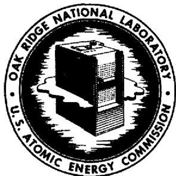

# OAK RIDGE NATIONAL LABORATORY

operated by

# UNION CARBIDE CORPORATION

NUCLEAR DIVISION

for the

U.S. ATOMIC ENERGY COMMISSION

ORNL-TM-2486

MASTER

SOME ASPECTS OF THE THERMODYNAMICS OF THE EXTRACTION OF URANIUM, THORIUM, AND RARE EARTH'S FROM MOLTEN LiF-BeF $_2$ INTO LIQUID Li-Bi SOLUTIONS

L. M. Ferris

NOTICE This document contains information of a preliminary nature and was prepared primarily for internal use at the Oak Ridge National Laboratory. It is subject to revision or correction and therefore does not represent a final report.

# LEGAL NOTICE

This report was prepared as an account of Government sponsored work. Neither the United States, nor the Commission, nor any person acting on behalf of the Commission:

A. Makes any warranty or representation, expressed or implied, with respect to the accuracy, completeness, or usefulness of the information contained in this report, or that the use of any information, apparatus, method, or process disclosed in this report may not infringe privately owned rights; or   
B. Assumes any liabilities with respect to the use of, or for damages resulting from the use of any information, apparatus, method, or process disclosed in this report.

As used in the above, "person acting on behalf of the Commission" includes any employee or contractor of the Commission, or employee of such contractor, to the extent that such employee or contractor of the Commission, or employee of such contractor prepares, disseminutes, or provides access to, any information pursuant to his employment or contract with the Commission, or his employment with such contractor.

Contract No. W-7405-eng-26

CHEMICAL TECHNOLOGY DIVISION

Chemical Development Section B

SOME ASPECTS OF THE THERMODYNAMICS OF THE EXTRACTION OF URANIUM, THORIUM, AND RARE EARTH'S FROM MOLTEN LiF-BeF $_2$ INTO LIQUID Li-Bi SOLUTIONS

L. M. Ferris

# LEGAL NOTICE

This report was prepared as an account of Government sponsored work. Neither the United States, nor the Commission, nor any person acting on behalf of the Commission:

A. Makes any warranty or representation, expressed or implied, with respect to the accuracy, completeness, or usefulness of the information contained in this report, or that the use of any information, apparatus, method, or process disclosed in this report may not infringe privately owned rights; or

B. Assumes any liabilities with respect to the use of, or for damages resulting from the use of any information, apparatus, method, or process disclosed in this report.

As used in the above, "person acting on behalf of the Commission" includes any employee or contractor of the Commission, or employee of such contractor, to the extent that such employee or contractor of the Commission, or employee of such contractor prepares, disseminates, or provides access to, any information pursuant to his employment or contract with the Commission, or his employment with such contractor.

MARCH 1969

OAK RIDGE NATIONAL LABORATORY Oak Ridge, Tennessee operated by UNION CARBIDE CORPORATION for the

U. S. ATOMIC ENERGY COMMISSION

#

#

# CONTENTS

Page

Abstract 1   
1. Introduction 1   
2. General Thermodynamic Treatment 2   
3. The Thermodynamics of Uranium Extraction 5   
4. The Thermodynamics of Thorium Extraction 7   
5. The Thermodynamics of Lanthanum Extraction 9   
6. The Thermodynamics of Sodium Extraction. 10   
7. The Thermodynamics of Europium Extraction 10   
8. Discussion 11   
9. References 12

#

#

# SOME ASPECTS OF THE THERMODYNAMICS OF THE EXTRACTION OF URANIUM, THORIUM, AND RARE EARTH'S FROM MOLTEN LiF-BeF₂ INTO LIQUID Li-Bi SOLUTIONS

L. M. Ferris

# ABSTRACT

Expressions for the equilibrium distribution of uranium, thorium, lanthanum, and other solutes between $\mathsf{LiF - BeF_2}$ solutions and lithium-bismuth solutions at 600 to $700^{\circ}C$ were calculated, using thermodynamic data from the literature. The results obtained experimentally for uranium were in reasonably good agreement with the calculated values. However, the results for thorium and lanthanum reflect the high degree of uncertainty that exists in the available thermodynamic data for these solutes. It is concluded, therefore, that an accurate measure of the relative extractability of the various solutes can be obtained only by experimental means.

# 1. INTRODUCTION

One method that has been considered for separating uranium and rare-earth fission products in the processing of the fuel carrier salt, $\mathsf{LiF - BeF}_2$ (66-34 mole %), from a two-fluid molten-salt breeder reactor is reductive extraction of the respective elements into liquid bismuth. During the course of process development, we measured the equilibrium distribution of uranium, thorium, sodium, and certain rare earths between $\mathsf{LiF - BeF}_2$ solutions and Li-Bi solutions at 600 to $700^{\circ}\mathsf{C}$ to determine the relative ease of extraction of the various elements. It was possible to predict the extraction behavior of several of the solutes by using the system of thermodynamics developed by Baes for $\mathsf{LiF - BeF}_2$ systems, and the activity coefficients reported for the various metals in liquid bismuth. In this report, these calculated results are compared with those obtained experimentally with two salts: $\mathsf{LiF - BeF}_2$ (66-34 mole %) and $\mathsf{LiF - BeF}_2$ (56.9-43.1 mole %). Activity coefficients for $\mathsf{ThF}_4$ and $\mathsf{LaF}_3$ in the latter salt at $600^{\circ}\mathsf{C}$ were also computed from the experimental data.

# 2. GENERAL THERMODYNAMIC TREATMENT

The extraction of a solute $MF_{n'}$ which is present in low concentration in molten LiF-BeF $_{2'}$ into liquid bismuth containing lithium can be expressed in terms of the general reaction

$$
M F _ {n (d)} + n L i _ {(B i)} = M _ {(B i)} + n L i F _ {(d)}, \tag {1}
$$

in which the subscripts (d) and (Bi) denote the salt and bismuth phases, respectively. This reaction is actually the sum of the two half-reactions

$$
M F _ {n (d)} + n \varepsilon^ {-} = M _ {(B i)} + n F ^ {-} (d) \tag {2}
$$

$$
n L i = n L i ^ {+} + n \epsilon^ {-}. \tag {3}
$$

Discontinuing the use of the subscripts, we can write the equilibrium constant for Eq. (1) as

$$
K = \frac {a _ {M} a _ {L i F} ^ {n}}{a _ {M F _ {n}} a _ {L i} ^ {n}} = e ^ {\frac {n F \Delta E _ {o}}{R T}}, \tag {4}
$$

in which $a$ is the activity, $F$ is the Faraday constant, $R$ is the gas constant, $T$ is the absolute temperature, and $\Delta E_{o} = E_{o,M} - E_{o,Li}$ . From Eq. (4), we obtain

$$
\frac {n F \Delta E _ {o}}{R T} = \ln \frac {a _ {M} a _ {L i F} ^ {n}}{a _ {M F _ {n}} a _ {L i} ^ {n}} = n \ln \frac {a _ {L i F}}{a _ {L i}} + \ln \frac {a _ {M}}{a _ {M F _ {n}}} \tag {5}
$$

Let $a = XY$ , where $X =$ mole fraction and $Y$ is the activity coefficient; then

$$
\Delta E _ {o} = \frac {R T}{F} \ln \frac {X _ {L i F}}{X _ {L i}} + \frac {R T}{F} \ln \frac {\gamma_ {L i F}}{\gamma_ {L i}} + \frac {R T}{n F} \ln \frac {X _ {M}}{X _ {M F n}} + \frac {R T}{n F} \ln \frac {\gamma_ {M}}{\gamma_ {M F n}}. \tag {6}
$$

If we define the distribution coefficient for component $M$ as

$$
D _ {M} = \frac {X _ {M}}{X _ {M F _ {n}}} \tag {7}
$$

Eq. (6) can be written as

$$
\Delta E _ {o} = - \frac {R T}{F} \ln D _ {L i} + \frac {R T}{n F} \ln D _ {M} - \frac {R T}{F} \ln \frac {\gamma_ {L i}}{\gamma_ {L i F}} + \frac {R T}{n F} \ln \frac {\gamma_ {M}}{\gamma_ {M F n}}. \tag {8}
$$

Moulton has defined the quantity $E_{0}^{\prime}$ for component M as

$$
E _ {o, M} ^ {\prime} = E _ {o, M} - \frac {R T}{n F} \ln \frac {Y _ {M}}{Y _ {M F _ {n}}} \tag {9}
$$

Rearranging Eq. (8), we get

$$
E _ {o, M} - \frac {R T}{n F} \ln \frac {Y _ {M}}{Y _ {M F _ {n}}} - \left(E _ {o, L i} - \frac {R T}{F} \ln \frac {Y _ {L i}}{Y _ {L i F}}\right) = \frac {R T}{n F} \ln D _ {M} - \frac {R T}{F} \ln D _ {L i}. \tag {10}
$$

If we define $\Delta E_{o,M}^{\prime} = E_{o,M}^{\prime} - E_{o,Li}^{\prime}$ , Eq. (10) becomes

$$
\Delta E _ {o, M} ^ {\prime} = \frac {R T}{n F} \ln D _ {M} - \frac {R T}{F} \ln D _ {L i}, \tag {11}
$$

or

$$
\Delta E _ {o, M} ^ {\prime} = E _ {o, M} - E _ {o, L i} - \frac {R T}{n F} \ln \frac {Y _ {M}}{Y _ {M F _ {n}}} + \frac {R T}{F} \ln \frac {Y _ {L i}}{Y _ {L i F}}. \tag {12}
$$

The experimental determination of distribution coefficients allows values of $\Delta E_{o,M}^{\prime}$ to be calculated from Eq. (11). The use of reported activity coefficients for metals in bismuth, and the activity coefficients and standard reduction potentials for the metal fluorides as given by Baes permits an independent calculation of $\Delta E_{o,M}^{\prime}$ using Eq. (12). In Baes' treatment, LiF-BeF $_2$ (66-34 mole %) was used as the reference salt, and partial molal free energies of formation in this salt were calculated

for various solutes from the available thermochemical and equilibrium data. Standard reduction potentials were then computed from the free energy data. The activity coefficient for each solute (at low concentration) was defined as unity in this salt; however, the activity coefficients for LiF and $\mathsf{BeF}_2$ were defined as 1.5 and 3, respectively. The changes in the values of these activity coefficients as the $\mathsf{LiF} / \mathsf{BeF}_2$ ratio in the salt varies were also estimated by Baes.

The standard states for the bismuth solutions are the pure metals; the activity coefficients, which are actually Henry's law constants, are practically constant when the solute is present in bismuth in low concentrations. The activity coefficient at infinite dilution is the one used throughout this report when referring to the metal phase.

Activity coefficients for solutes can be calculated for an LiF-BeF $_2$ composition other than 66-34 mole % if distribution coefficient data for the solute in both the new salt and the reference salt are obtained. Since activity coefficients for the metals in bismuth change only slightly with concentration, we get from Eq. (12) for LiF-BeF $_2$ compositions 1 and 2:

$$
\Delta E _ {o, M, 1} ^ {\prime} = E _ {o, M} - E _ {o, L i} - \frac {R T}{n F} \ln \frac {Y _ {M}}{Y _ {M F n , 1}} + \frac {R T}{F} \ln \frac {Y _ {L i}}{Y _ {L i F , 1}} \tag {13}
$$

$$
\Delta E _ {o, M, 2} ^ {\prime} = E _ {o, M} - E _ {o, L i} - \frac {R T}{n F} \ln \frac {Y _ {M}}{Y _ {M F _ {n , 2}}} + \frac {R T}{F} \ln \frac {Y _ {L i}}{Y _ {L i F , 2}}. \tag {14}
$$

Subtracting Eq. (14) from Eq. (13), we get

$$
\Delta \left(\Delta E _ {o} ^ {\prime}\right) = \Delta E _ {o, M, 1} ^ {\prime} - \Delta E _ {o, M, 2} ^ {\prime} = \frac {R T}{F} \ln \frac {Y _ {L i F , 2}}{Y _ {L i F , 1}} - \frac {R T}{n F} \ln \frac {Y _ {M i F n , 2}}{Y _ {M F n , 1}}. \tag {15}
$$

Let composition 1 be $\mathsf{LiF - BeF}_2$ (66-34 mole %), where $\gamma_{\mathsf{MF}_{\mathsf{n}}} = 1$ ; then, rearrangement of Eq. (15) yields

$$
\log \Upsilon_ {M F _ {n, 2}} = n \log \frac {\Upsilon_ {L i F , 2}}{\Upsilon_ {L i F , 1}} - \frac {n F \Delta \left(\Delta E _ {o} ^ {\prime}\right)}{2 . 3 0 3 R T}. \tag {16}
$$

# 3. THE THERMODYNAMICS OF URANIUM EXTRACTION

Early in the development of the reductive extraction process, uranium was believed to exist primarily as a tetravalent species in the salt. However, the results of recent experiments indicate that the uranium is actually, for the most part, in the trivalent state in the salt, especially when the distribution coefficient is greater than about 0.1. These experimental results can be compared with those calculated by using the standard potentials given by Baes and reported values for the activity coefficient for lithium in bismuth.

Consider the reaction

$$
\mathrm {U F} _ {4 (\mathrm {d})} + \mathrm {L i} _ {(\mathrm {B i})} = \mathrm {U F} _ {3 (\mathrm {d})} + \mathrm {L i F} _ {(\mathrm {d})},
$$

in which the subscripts (d) and (Bi) refer to LiF - BeF $_2$ (66-34 mole %) and bismuth solvents, respectively. From Baes' treatment of the system we get, at $600^{\circ}\mathrm{C}$ :

$$
U ^ {4 +} + \varepsilon^ {-} = U ^ {3 +}
$$

$$
E _ {o} = - 1. 1 4 6 5 v
$$

$$
\frac {\mathrm {L i} = \mathrm {L i} ^ {+} + \varepsilon^ {-}}{\mathrm {U} ^ {4 +} + \mathrm {L i} = \mathrm {L i} ^ {+} + \mathrm {U} ^ {3 +}}
$$

$$
\begin{array}{l} E _ {o} = + 2. 6 4 5 3 v \\ \hline E _ {o} = 1. 4 9 8 8 v \end{array}
$$

The equilibrium constant

$$
K = \frac {a _ {L i ^ {+} X _ {U} 3 + Y _ {U} 3 +}}{a _ {L i ^ {X} U ^ {4 + Y _ {U} 4 +}}}
$$

can be written as

$$
K = \left[ \frac {X _ {U} 3 ^ {+}}{X _ {U} 4 ^ {+}} \right] \cdot \left[ \frac {1}{D _ {L i}} \right] \cdot \left[ \frac {Y _ {L i ^ {+}}}Y _ {L i} \right]
$$

if we define $D_{\text{Li}} = \frac{X_{\text{Li}}}{X_{\text{Li}^{+}}}$ and use $\gamma_{\mathsf{UF}_4} = \gamma_{\mathsf{UF}_3} = 1$

Rearrangement gives

$$
\left[ \frac {X _ {U ^ {3 +}}}{X _ {U ^ {4 +}}} \right] = D _ {L i} K \left(\frac {Y _ {L i}}{Y _ {L i ^ {+}}}\right).
$$

From the standard potential of the reaction (given above), we find that $K = 4.51 \times 10^{8}$ . According to Baes' convention, $\gamma_{\mathrm{Li}^{+}} = 1.5$ ; and from data reported by Argonne National Laboratory, we get $\gamma_{\mathrm{Li}} = 5.9 \times 10^{-5}$ . Thus,

$$
\left[ \frac {X _ {U} ^ {3 +}}{X _ {U} ^ {4 +}} \right] = (4. 5 1 \times 1 0 ^ {8}) \left(\frac {5 . 9 \times 1 0 ^ {- 5}}{1 . 5}\right) D _ {L i}
$$

$$
\left[ \frac {X _ {U} 3 ^ {+}}{X _ {U} 4 ^ {+}} \right] = (1. 7 7 4 \times 1 0 ^ {4}) D _ {L i}.
$$

The average uranium valence in the salt is

$$
\overline {{n}} = \frac {3 \left(\frac {X _ {U} 3 ^ {+}}{X _ {U} 4 ^ {+}}\right) + 4}{\left(\frac {X _ {U} 3 ^ {+}}{X _ {U} 4 ^ {+}}\right) + 1}.
$$

Values of $\overline{n}$ at different values of $D_{\text{Li}}$ are shown in the following table.

<table><tr><td>Li Conc. 
in Bi 
(at. %)</td><td>Li Conc. 
in Bi 
(ppm)</td><td>D Li</td><td>[XU3+] / [XU4+]</td><td>n</td></tr><tr><td>0.0037</td><td>1.23</td><td>5.6 × 10-5</td><td>1.0</td><td>3.50</td></tr><tr><td>0.004</td><td>1.33</td><td>6.06 × 10-5</td><td>1.08</td><td>3.48</td></tr><tr><td>0.01</td><td>3.32</td><td>1.515 × 10-4</td><td>2.69</td><td>3.27</td></tr><tr><td>0.02</td><td>6.64</td><td>3.03 × 10-4</td><td>5.38</td><td>3.16</td></tr><tr><td>0.1</td><td>33.2</td><td>1.515 × 10-3</td><td>26.9</td><td>3.04</td></tr></table>

Using $\gamma_{\mathrm{Li}} = 9.8 \times 10^{-5}$ at $600^{\circ} \mathrm{C}$ , as determined at Oak Ridge National Laboratory, the calculated $\mathrm{U}^{3+} / \mathrm{U}^{4+}$ values are slightly lower than those shown in the table. However, over the range where we can experimentally determine distribution coefficients for uranium and lithium (lithium concentration in the bismuth of greater than $1 \mathrm{ppm}$ ), we would expect the uranium in the salt to be primarily trivalent.

The agreement between distribution coefficients that were obtained experimentally and those that were calculated from the available thermochemical and equilibrium data is easily seen by comparison of the respective $\Delta E_{\circ}^{\prime}$ values. In calculating $\Delta E_{\circ}^{\prime}$ for $U^{3+}$ , we used Baes' values for $\gamma_{LiF}$ and $\varepsilon_{o,Li'}$ the activity coefficient for uranium in bismuth as calculated from the expression

$$
\log \Upsilon_ {U} = 0. 7 1 0 7 - (3 9 9 5 / T),
$$

and either ANL or ORNL values for $\gamma_{\text{Li}}$ (the values from the ANL work10 at various temperatures, and the value at $600^{\circ}\text{C}$ reported by ORNL6). In the following table the calculated values are compared with those determined experimentally:

<table><tr><td rowspan="2">Temp. (°C)</td><td colspan="2">Calculated ΔEo(volt)</td><td rowspan="2">Experimental ΔEo(volt)</td></tr><tr><td>From ORNL YLi</td><td>From ANL YLi</td></tr><tr><td>600</td><td>0.66</td><td>0.62</td><td>0.66</td></tr><tr><td>675</td><td>-</td><td>0.60</td><td>0.66</td></tr></table>

The agreement is surprisingly good, considering the inherent inaccuracies involved and the variety of sources from which the data were obtained.

# 4. THE THERMODYNAMICS OF THORIUM EXTRACTION

Distribution coefficients for thorium have been measured at $600^{\circ}\mathrm{C}$ , using both $\mathrm{LiF - BeF}_2$ (66-34 mole %), where $\gamma_{\mathrm{ThF}_4} = 1$ , and $\mathrm{LiF - BeF}_2$ (56.9-43.1 mole %); these coefficients gave $\Delta E_0'$ values of 0.43 and 0.475 volt, respectively. Baes gives no value for the activity coefficient for $\mathrm{ThF}_4$ in the latter salt; however, it can be readily calculated from the measured $\Delta E_0'$ values, using Eq. (16):

$$
\log \Upsilon_ {\mathrm {T h F} _ {4}} = 4 \log (0. 8 6 6 / 1. 5) - (- 0. 0 4 5 / 0. 0 4 3 3) = 0. 0 8 4 9
$$

$$
\mathrm {Y} _ {\text {T h F} _ {4}} = 1. 2 2.
$$

It is interesting to note that the corresponding activity coefficient for $\mathsf{UF}_4$ (the only tetravalent species treated by Baes $^{4,5}$ ) is about 1.7.

Values of $\Delta E_{\circ}^{\prime}$ were also calculated for thorium for both salts given above. Data from Brookhaven National Laboratory yielded the following expression:

$$
\log \gamma_ {T h} = 1. 2 8 9 - 7 5 6 5 / T,
$$

from which $\gamma_{\text{Th}}$ is calculated to be about $4.3 \times 10^{-8}$ at $600^{\circ} \text{C}$ . The use of this activity coefficient, the value of $-1.77$ volts for $\mathsf{E}_{\mathsf{o}, \mathsf{Th}'}$ as originally given by Baes, and the ANL and the ORNL values for $\gamma_{\text{Li}}$ resulted in the following values for $\Delta \mathsf{E}_{\text{O}}'$ at $600^{\circ} \text{C}$ :

<table><tr><td colspan="2">Salt Composition (mole %)</td><td colspan="2">Calculated ΔE&#x27;o(volt)</td><td rowspan="2">Experimental ΔE&#x27;o(volt)</td></tr><tr><td>LiF</td><td>BeF2</td><td>From ANL YLi</td><td>From ORNL YLi</td></tr><tr><td>66</td><td>34</td><td>0.432</td><td>0.470</td><td>0.43</td></tr><tr><td>56.9</td><td>43.1</td><td>0.476</td><td>0.514</td><td>0.475</td></tr></table>

The agreement among the calculated and experimental values is quite good. However, Baes now reports $^{14}E_{o,Th}$ to be -1.89 volts at $600^{\circ}\mathrm{C}$ . The use of this new value, along with the activity coefficients given above, results in calculated $\Delta E_{o}'$ values that are about 0.12 volt lower than those determined experimentally. If the new value for $E_{o,Th}$ is really more accurate than the value reported originally, and if we assume that all the other quantities used are reasonably valid, then $Y_{Th}$ at $600^{\circ}\mathrm{C}$ would have to be in the range of $7 \times 10^{-11}$ to $5 \times 10^{-10}$ (instead of the value of $4.3 \times 10^{-8}$ , which was obtained from the BNL work).

# 5. THE THERMODYNAMICS OF LANTHANUM EXTRACTION

Distribution coefficients for lanthanum were determined at $600^{\circ}C$ with both $\mathsf{LiF - BeF}_2$ (66-34 mole %), where $\Upsilon_{\mathsf{LaF}_3} = 1,$ and $\mathsf{LiF - BeF}_2$ (56.9-43.1 mole %); these coefficients gave $\Delta E_0'$ values of 0.428 and 0.475 volt, respectively. Since Baes does not give a value for $\Upsilon_{\mathsf{LaF}_3}$ in the latter salt, it was calculated from the $\Delta E_0'$ values by using Eq. (16):

$$
\begin{array}{l} \log \Upsilon_ {\mathrm {L a F} _ {3}} = 3 \log (0. 8 6 6 / 1. 5) - (- 0. 0 4 7 / 0. 0 5 7 7 3) = 0. 0 9 8 \\ \gamma_ {L a F _ {3}} = 1. 2 5. \\ \end{array}
$$

This value is slightly higher than the value that was reported for $\mathsf{CeF}_3$ in the same salt.

Values of $\Delta E_{o,La}^{\prime}$ at $600^{\circ}C$ were calculated for both salts, using the original $E_{o,La}$ of -2.314 volts as given by Baes and the activity coefficient for lanthanum in bismuth as calculated from the expression

$$
\log \gamma_ {L a} = 0. 8 4 4 - (1 1 0 7 0 / T),
$$

which gives $\gamma_{\mathrm{La}} = 1.46 \times 10^{-12}$ at $600^{\circ}\mathrm{C}$ . The calculated $\Delta E_{\mathrm{o}}'$ values were lower than the experimentally determined values by about 0.2 volt. This rather poor agreement is probably the result of the large uncertainty in the value for $E_{\mathrm{o},\mathrm{La}}$ . Assuming this to be the case, a new value of $E_{\mathrm{o},\mathrm{La}} = -2.157$ volts at $600^{\circ}\mathrm{C}$ was calculated by using the measured $\Delta E_{\mathrm{o}}'$ for LiF-BeF₂ (66-34 mole %), the values of $\gamma_{\mathrm{LiF}}$ and $E_{\mathrm{o},\mathrm{Li}}$ as given by Baes, the value for $\gamma_{\mathrm{La}}$ as given by Kober et al., and an average of the ORNL and ANL values for $\gamma_{\mathrm{Li}}$ . If it is assumed that Baes' temperature coefficient for $E_{\mathrm{o},\mathrm{La}}$ (0.82 mv/°C) is valid, a value of -2.0955 volts is calculated for $E_{\mathrm{o},\mathrm{La}}$ at $675^{\circ}\mathrm{C}$ . The revised values for $E_{\mathrm{o},\mathrm{La}}$ lead to the following comparison of calculated and experimentally determined $\Delta E_{\mathrm{o}}'$ values:

<table><tr><td rowspan="2">Temp. (°C)</td><td colspan="2">Salt Composition (mole %)</td><td colspan="2">Calculated ΔE0′ (volt)</td><td rowspan="2">Experimental ΔE0′ (volt)</td></tr><tr><td>LiF</td><td>BeF2</td><td>From ANL YLi</td><td>From ORNL YLi</td></tr><tr><td>600</td><td>56.9</td><td>43.1</td><td>0.46</td><td>0.49</td><td>0.475</td></tr><tr><td>675</td><td>66</td><td>34</td><td>0.41</td><td>-</td><td>0.43</td></tr></table>

As seen, the use of the revised standard potentials for lanthanum, along with the activity coefficient data cited above, gives much better agreement between the calculated and the experimentally determined quantities than was obtained with the original standard potential.

# 6. THE THERMODYNAMICS OF SODIUM EXTRACTION

A $\Delta E_{o}^{\prime}$ value of 0.2 volt was determined experimentally at $600^{\circ}C$ for sodium with LiF-BeF $_2$ (66-34 mole %). Using this value, along with Baes' values for $E_{o,Li}$ and $Y_{LiF'}$ the activity coefficient for sodium in bismuth as determined from the expression

$$
\log \gamma_ {N a} = 0. 4 8 9 2 - (3 5 1 2 / T),
$$

and the activity coefficient for lithium in bismuth, yields a value of about -2.3 volts for $E_{o,Na}$ at $600^{\circ}C$ .

# 7. THE THERMODYNAMICS OF EUROPIUM EXTRACTION

A value of 0.33 volt has been determined at $600^{\circ}\mathrm{C}$ using $\mathsf{LiF - BeF}_2$ (66-34 mole%). No comparison with calculated values can be made because of the lack of activity coefficient and standard potential data.

# 8. DISCUSSION

The information presented in this report indicates that uranium in the salt exists primarily as $\mathsf{UF}_3$ during its extraction from LiF-BeF $_2$ solutions with Li-Bi solutions. This is in accordance with the available thermodynamic data. Actually, the calculated distribution coefficients are in reasonable agreement with those that have been determined experimentally. The results of other experiments with LiF-BeF $_2$ -ThF $_4$ solutions at 600 to $700^{\circ}\mathrm{C}$ strongly indicate that the potentials for the $\mathsf{U}^{4+} \rightarrow \mathsf{U}^{3+}$ and $\mathsf{U}^{3+} \rightarrow \mathsf{U}^{\circ}$ half-cell reactions are about the same as those in LiF-BeF $_2$ solutions.

A comparison of calculated and measured $\Delta E_{0}^{\prime}$ values for solutes such as $\mathsf{ThF}_4$ and $\mathsf{LaF}_3$ illustrates the high degree of uncertainty that exists in the standard potentials and/or the activity coefficients for these components in bismuth. As a result, the predicted relative extractability of these two elements is greatly influenced by the particular sets of data used in the calculations. In general, the use of the available thermodynamic data gives only a rough indication of the relative extractability of the solutes of interest in the processing of molten-salt breeder reactor fuels, particularly in the case of $\mathsf{LiF - BeF}_2\mathsf{-ThF}_4$ systems of high $\mathsf{ThF}_4$ concentration. Data for $\mathsf{LiF - BeF}_2$ systems are scarce and inaccurate; in addition, no reliable method for extrapolating these data to $\mathsf{LiF - BeF}_2\mathsf{-ThF}_4$ systems has been devised. It is concluded, therefore, that an accurate measure of the relative extractability of the various solutes can be obtained only by direct experimentation. At present, a program to determine distribution coefficients for uranium, protactinium, zirconium, rare earths, and other fission products in a variety of molten fluoride salts and several liquid metal systems is under way at ORNL. The results will be of great value, not only in defining the process chemistry but also in supplying additional data from which the thermodynamics of these systems can be refined and extended.

# 9. REFERENCES

I. M. W. Rosenthal, MSR Program Semiann. Progr. Rept. Aug. 31, 1967, ORNL-4191, p. 248.   
2. M. W. Rosenthal, MSR Program Semiann. Progr. Rept. Feb. 29, 1968, ORNL-4254, p. 241.   
3. D. E. Ferguson, Chem. Tech. Div. Ann. Progr. Rept. May 31, 1968, ORNL-4272, p. 10.   
4. C. F. Baes, Jr., "The Chemistry and Thermodynamics of Molten Salt Reactor Fluoride Solutions," in Thermodynamics, Vol. II, p. 409, IAEA, Vienna, 1966.   
5. W. R. Grimes, Reactor Chem. Div. Ann. Progr. Rept. Dec. 31, 1965, ORNL-3913, p. 21.   
6. M. W. Rosenthal, MSR Program Semiann. Progr. Rept. Feb. 28, 1967, ORNL-4119, p. 150.   
7. M. W. Rosenthal, ORNL-4254, op. cit., p. 152.   
8. D. M. Moulton and J. H. Shaffer, ORNL Reactor Chemistry Division, unpublished data.   
9. L. M. Ferris, J. C. Mailen, J. J. Lawrance, and F. J. Smith, ORNL Chemical Technology Division, unpublished data.   
10. R. C. Vogel, Chemical Engineering Division Semiann. Rept. July-December 1963, ANL-6800, p. 408.   
11. V. A. Lebedev, I. F. Nichkov, and S. P. Raspopin, Zh. Fiz. Khim. 42, 690 (1968).   
12. R. H. Wiswall, Jr., and J. J. Egan, Thermodynamics of Solutions of Actinides and Fission Products in Bismuth, BNL-6033 (1962).   
13. C. Williams, Progress Report Nuclear Engineering Department Jan. 1 - April 30, 1959, BNL-571.

14. C. F. Baes, ORNL Reactor Chemistry Division, personal communication, December 4, 1968.   
15. V. I. Kober, V. A. Lebedev, I. F. Nichkov, and S. P. Raspopin, Zh. Fiz. Khim. 42, 686 (1968).   
16. Progress Report Nuclear Engineering Department November 15, 1955 - February 15, 1956, BNL-418.   
17. J. J. Egan and R. H. Wiswall, Jr., Nucleonics 15(7), 104 (1957).   
18. A. K. Fischer, S. A. Johnson, and S. E. Wood, J. Phys. Chem. 71, 1465 (1967).

#

# INTERNAL DISTRIBUTION

1. MSRP Director's Office Bldg. 9201-3, Rm. 109   
2. R. K. Adams   
3. G.M.Adamson   
4. R.G.Affel   
5. J. L. Anderson   
6. R.F.Apple   
7. C.F.Baes   
8. J. M. Baker   
9. S.J.Ball   
10. C.E.Bamberger   
11. C.J.Barton   
12. H.F.Bauman   
13. S.E.Beall   
14. R. L. Beatty   
15. M.J.Bell   
16. M. Bender   
17. C.E.Bettis   
18. E. S. Bettis   
19. D. S. Billington   
20. R.E.Blanco   
21. F. F. Blankenship   
22. J.O.Blomeke   
23. R. Blumberg   
24. E.G.Bohlmann   
25. C. J. Borkowski   
26. G.E. Boyd   
27. J.Braunstein   
28. M.A.Bredig   
29. R. B. Briggs   
30. H.R.Bronstein   
31. G.D.Brunton   
32. D. A. Canonico   
33. S. Cantor   
34. W. L. Carter   
35. G.I. Cathers   
36. O. B. Cavin   
37. A. Cepolino   
38. J. M. Chandler   
39. F. H. Clark   
40. W.R.Cobb   
41. H.D.Cochran

42. C.W.Collins   
43. E. L. Compere   
44. K.V.Cook   
45. W.H.Cook   
46. L. T. Corbin   
47. B.Cox   
48. J. L. Crowley   
49. F. L. Culler   
50. D.R.Cuneo   
51. J.M.Dale   
52. D. G. Davis   
53. R.J.DeBakker   
54. J.H.DeVan   
55. S.J.Ditto   
56. A. S. Dworkin   
57. I. T. Dudley   
58. D. A. Dyslin   
59. W.P.Eatherly   
60. J.R.Engel   
61. E.P.Epler   
62. D. E. Ferguson   
63. L. M. Ferris   
64. A. P. Fraas   
65. H.A.Friedman   
66. J.H.Frye, Jr.   
67. W. K. Furlong   
68. C. H. Gabbard   
69. R. B. Gallaher   
70. R.E.Gehlbach   
71. J.H.Gibbons   
72. L. O. Gilpatrick   
73. W.R.Grimes   
74. A.G.Grindell   
75. R.W.Gunkel   
76. R.H.Guymon   
77. J.P.Hammond   
78. B.A.Hannaford   
79. P.H.Harley   
80. D. G. Harman   
81. W. O. Harms   
82. C. S. Harrill   
83. P. N. Haubenreich

84. R.E.Helms   
85. P. G. Herndon   
86. D. N. Hess   
87. J.R.Hightower   
88. M.R.Hill   
89. H.W.Hoffman   
90. D.K.Holmes   
91. P. P. Holz   
92. R.W.Horton   
93. A. Houtzeel   
94. T. L. Hudson   
95. W.R.Huntley   
96. H. Inouye   
97. W.H.Jordan   
98. P.R.Kasten   
99. R.J.Kedl   
100. M. T. Kelley   
101. C.R.Kennedy   
102. T.W.Kerlin   
103. H. T. Kerr   
104. J. J. Keyes   
105. D.V.Kiplinger   
106. S. S. Kirslis   
107. J.W.Koger   
108. R. B. Korsmeyer   
109. A. I. Krakoviak   
110. T. S. Kress   
111. J.W.Krewson   
112. C.E.Lamb   
113. J.A.Lane   
114. J. J. Lawrance   
115. M.S.Lin   
116. R. B. Lindauer   
117. A.P.Litman   
118. G.H.Llewellyn   
119. E. L. Long   
120. A.L.Lotts   
121. M.I.Lundin   
122. R.N.Lyon   
123. R. L. Macklin   
124. H.G.MacPherson   
125. R.E. MacPherson   
126. J.C.Mailen   
127. D. L. Manning   
128. C.D.Martin

129. W.R.Martin   
130. H.V.Mateer   
131. T. H. Mauney   
132. H. McClain   
133. R.W. McClung   
134. H. E. McCoy   
135. D. L. McElroy   
136. C. K. McGlothlan   
137. C. J. McHargue   
138. L.E.McNeese   
139. J.R.McWherter   
140. H. J. Metz   
141. A. S. Meyer   
142. R. L. Moore   
143. D. M. Moulton   
144. T. W. Mueller   
145. H. A. Nelms   
146. H. H. Nichol   
147. J. P. Nichols   
148. E. L. Nicholson   
149. L. C. Oakes   
150. P. Patriarca   
151. A. M. Perry   
152. T. W. Pickel   
153. H. B. Piper   
154. B.E. Prince   
155. G. L. Rogan   
156. J. L. Redford   
157. M. Richardson   
158. G. D. Robbins   
159. R.C.Robertson   
160. W. C. Robinson   
161. K. A. Romberger   
162. R.G.Ross   
163. H. C. Savage   
164. W. F. Schaffer   
165. C. E. Schilling   
166. Dunlap Scott   
167. J. L. Scott   
168. H. E. Seagren   
169. C. E. Sessions   
170. J. H. Shaffer   
171. W.H.Sides   
172. M. J. Skinner   
173. G. M. Slaughter

174. A.N. Smith   
175. F.J.Smith   
176. G.P.Smith   
177. O. L. Smith   
178. P.G.Smith   
179. I. Spiewak   
180. R.C.Steffy   
181. W.C. Stoddart   
182. H.H.Stone   
183. R.A.Strehlow   
184. J. R. Tallackson   
185. E.H.Taylor   
186. W. Terry   
187. R.E.Thoma   
188. P. F. Thomason   
189. L. M. Toth   
190. D. B. Trauger   
191. W.E.Unger   
192. G.M.Watson   
193. J. S. Watson   
194. H. L. Watts

195. C.F.Weaver   
196. B.H.Webster   
197. A.M.Weinberg   
198. J.R.Weir   
199. W.J.Werner   
200. K.W.West   
201. M.E.Whatley   
202. J.C. White   
203. R.P.Wichner   
204. L.V.Wilson   
205. Gale Young   
206. H.C.Young   
207. J.P.Young   
208. E. L. Youngblood   
209. F.C.Zapp

210-211. Central Research Library   
212-213. Document Reference Section   
214-216. Laboratory Records   
217. Laboratory Records-RC   
218-232. DTIE   
233. D.J.Crouse   
234. R.G.Wymer

# EXTERNAL DISTRIBUTION

235. C. B. Deering, AEC-OSR   
236. A. Giambusso, AEC, Washington

237-238. T. W. McIntosh, AEC, Washington

239. H. M. Roth, AEC-ORO   
240. M. Shaw, AEC, Washington   
241. W. L. Smalley, AEC-ORO   
242. W.H.McVey,AEC,Washington   
243. O.Roth,AEC,Washington   
244. H. Schneider, AEC, Washington   
245. W. H. Regan, AEC, Washington   
246. L.J.Colby, Jr., AEC, Washington