ORNL-TM-2489

85

COPY NO. -

DATE-June2,1969

Instrumentation and Controls Division

MSBR CONTROL STUDIES

W. H. Sides, Jr.

# ABSTRACT

A preliminary study was made of the dynamics and control of a 1000 Mw(e), single-fluid MSBR by an analog computer simulation. An abbreviated, lumped-parameter model was used. The control system included a steam temperature controller and a simplified version of the MSRE reactor temperature control system. The results of the study indicate a need for a variable speed, secondary-salt pump for close control of the steam temperature. During severe transients, considerable care must be taken in designing the control system if freezing or overheating of the salts is to be avoided.

# LEGAL NOTICE

This report was prepared as an account of Government sponsored work. Neither the United States, nor the Commission, nor any person acting on behalf of the Commission:

A. Makes any warranty or representation, expressed or implied, with respect to the accuracy, completeness, or usefulness of the information contained in this report, or that the use of any information, apparatus, method, or process disclosed in this report may not infringe privately owned rights; or   
B. Assumes any liabilities with respect to the use of, or for damages resulting from the use of any information, apparatus, method, or process disclosed in this report.

As used in the above, "person acting on behalf of the Commission" includes any employee or contractor of the Commission, or employee of such contractor, to the extent that such employee or contractor of the Commission, or employee of such contractor prepares, disseminates, or provides access to, any information pursuant to his employment or contract with the Commission, or his employment with such contractor.

# CONTENTS

Page 1. Introduction 4   
2. Formulation of the Control System 5

2.1 Investigation of Plant Conditions for Less than Full-Load Operation 5   
2.2 Transient Behavior of Control Method with Constant Secondary-Salt Flow Rate 6   
2.3 Study of Steam Temperature Control with Variable Secondary-Salt Flow Rate. 11

3. Results 14

3.1 Decrease in Load Demand 15   
3.2 Changes of Reactivity. 20   
3.3 Step Changes of Reactivity with Controller Disconnected. 23   
3.4 Ramp Changes of Reactivity with Controller Disconnected 23   
3.5 Step Loss of One Secondary-Salt Coolant Loop 26   
3.6 Measurement of System Transfer Function 27

4. Concluding Remarks 27

# LEGAL NOTICE

This report was prepared as an account of Government sponsored work. Neither the United States, nor the Commission, nor any person acting on behalf of the Commission: A. Makes any warranty or representation, expressed or implied, with respect to the accuracy, completeness, or usefulness of the information contained in this report, or that the use of any information, apparatus, method, or process disclosed in this report may not infringe privately owned rights; or

B. Assumes any liabilities with respect to the use of, or for damages resulting from the use of any information, apparatus, method, or process disclosed in this report. As used in the above (except as noted).

above, "person acting on behalf of the Commission" includes any employee or contractor of the Commission, or employee of such contractor, to the extent that such employee or contractor of the Commission, or employee of such contractor prepares, with the Commission, or his employment with such contractor.

# 1. INTRODUCTION

By means of an analog computer simulation, a preliminary investigation was made of the dynamics and possibilities for control of the proposed 1000-Mw(e) single-fluid Molten-Salt Breeder Reactor (MSBR). For the purposes of this analysis the MSBR plant consisted of a graphite-moderated, circulating-fuel (primary salt) reactor, a shell-and-tube heat exchanger for transferring the generated heat to a coolant (secondary) salt, and a shell-and-tube supercritical steam generator. The analog simulation of the plant consisted of a lumped-parameter heat transfer model for the core, primary heat exchanger, and steam generator; a six-group model of the circulating-fuel nuclear kinetics with temperature reactivity feedbacks; and an external control system. This investigation was concerned with the formulation of this control system and the integrated plant response; it was not concerned with a safety analysis of the system, although some of the transients introduced would be of an abnormal nature (e.g., step changes in the load demand on the plant). It was an initial probe into the response of the system initiated by such perturbations as changes in load demand, reactivity changes, and sudden loss of a secondary-salt coolant loop.

The simulation was carried out on the ORNL Reactor Controls Department analog computer. So that the model would have the maximum dynamic range, the system differential equations were not linearized, and, as a result, the requisite quantity of nonlinear equipment required the model to be severely limited spatially to minimize the number of equations. In addition, the pressure in the water side of the steam generator, as well as in the rest of the plant, and the physical properties of the salts and water were taken to be time invariant. The flow rate of the primary salt and the temperature of the feedwater to the steam generators were also held constant.

In this report, the path taken to arrive at the conceptual control system is outlined along with the equations and values of the system parameters used in the simulation. The results are given as summary curves and graphs of the variations encountered in the system variables (temperatures, flows, etc.).

# 2. FORMULATION OF THE CONTROL SYSTEM

# 2.1 Investigation of Plant Conditions for Less than Full-Load Operation

The primary objective of this study was to formulate a control system that would maintain the temperature of the steam delivered to the turbines at a design value of $1000^{\circ}\mathrm{F}$ during all steady-state conditions and to within a narrow band around this value during plant transients. To accomplish this objective, the first step was to investigate the plant conditions (temperature profile, flows, etc.) for less than full-load operation. (The full-load temperature profile is shown in Fig. 1. The steady-state heat transfer equations and the method used in calculating off-design conditions are given in the Appendix, Sect. 5.1.) Three basic methods of plant operation at less than full load were investigated:

1. The average reactor temperature was held at its $100\%$ power level value, and a secondary-salt bypass line was included in parallel with the steam generators. The salt flow in the bypass line was given by

$$
F _ {4} = F _ {2 0} \left(1 - \frac {P}{P _ {0}}\right), \tag {1}
$$

where $F_{20}$ is the secondary-salt flow rate at the 100% power level $P_0$ .

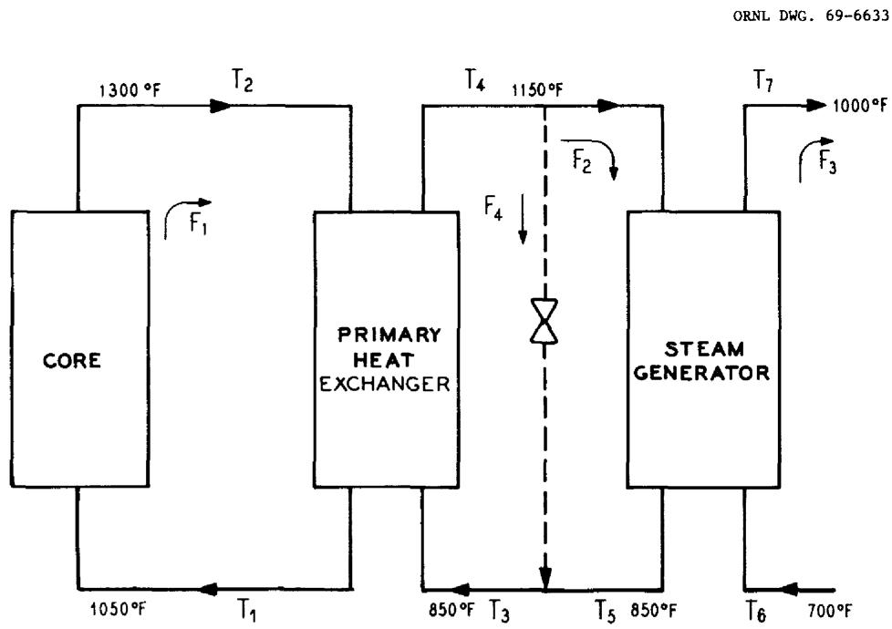  
Fig. 1. Model for Calculating Off-Design Steady-State System Temperature Profiles. Temperature Values are for $100\%$ Power Level.

2. The average reactor temperature was held fixed at its $100\%$ power-level value, and there was no secondary-salt bypass.   
3. The secondary-salt flow rate was held fixed at its $100\%$ power-level value, and there was no secondary-salt bypass.

With the first two methods of plant operation the temperature of the secondary salt approached its freezing point of $725^{\circ}\mathrm{F}$ at power levels $\geq 50\%$ of full power. With the third method, however, the secondary-salt temperatures remained well above the freezing point. With the second method, the $\Delta T$ from primary to secondary salt in the primary heat exchanger increased from 150 to $335^{\circ}\mathrm{F}$ at the primary-salt exit end of the exchanger at $50\%$ power, and the $\Delta T$ increased at the steam outlet end of the steam generator as well. The increases in these $\Delta T$ 's were reduced for the first method where a valved bypass line had been placed around the steam generator, but this also was more complex because a flow control valve and a variable speed pump were required. The simpler arrangement of the third method showed that the $\Delta T$ 's from primary to secondary salt and from secondary salt to steam decreased with decreasing power level except at the feedwater inlet end of the steam generator where it increased only $65^{\circ}\mathrm{F}$ at $30\%$ power (Fig. 2). This $\Delta T$ increase occurred in the coolest part of the system, however. Therefore, the third method of plant control, in which the secondary-salt flow rate was held constant, appeared to be the most promising from the viewpoint of simplicity and thermal stresses on the heat exchangers.

# 2.2 Transient Behavior of Control Method with Constant Secondary-Salt Flow Rate

A steam-temperature controller was devised to vary the plant temperature profile as shown in Fig. 2. The transient behavior of such a control scheme was investigated by use of the analog computer simulation model shown in Fig. 3. Each heat exchanger was divided into five lumps: two for each of the two fluids and one for the tube walls. The reactor heat transfer system was approximated by two lumps for the circulating primary salt and one for the graphite moderator. A two-group approximation of the circulating-fuel nuclear kinetics equations was used, and temperature reactivity feedbacks were included. (The system equations that describe the model are given in the Appendix, Sect. 5.2. The values of the physical constants and system parameters used as "given" information are shown in Table 1. The values for various system volumes, masses, etc., were calculated from these constants and are listed in Sect. 5.2.)

The steady-state partial-load calculations showed that a reasonable system-temperature profile could be obtained for off-design conditions by maintaining a constant secondary-salt flow rate and by allowing the reactor and secondary-salt temperatures to vary. The transient behavior of such a system was investigated, using at first only that part of the simulation model that included the primary heat exchanger and the steam generator. The secondary-salt flow rate was held constant, and the steam

ORNL DWG. 69-6634

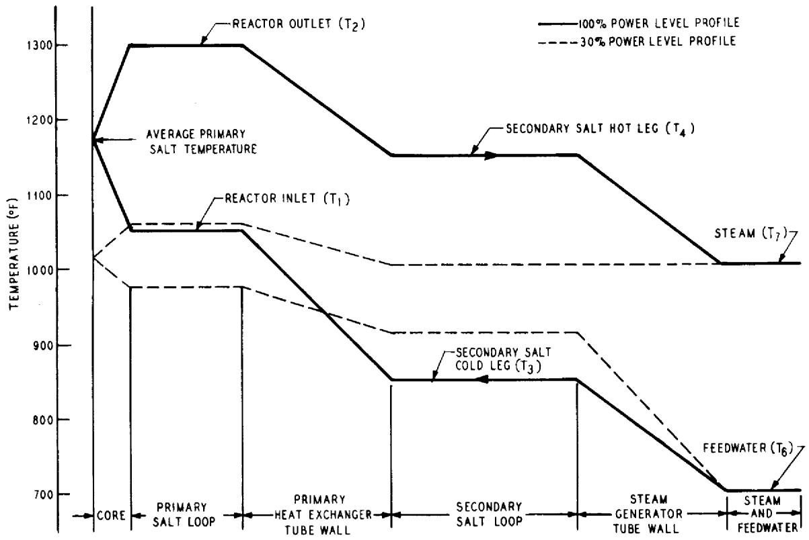  
Fig. 2. Steady-State System Temperature Profiles for 100 and $30\%$ Power Levels.

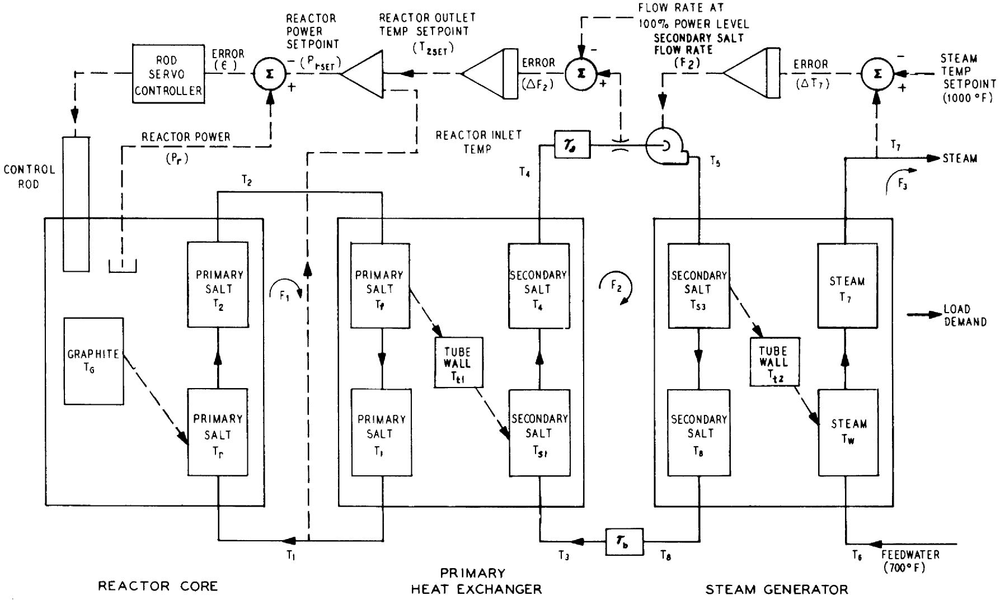  
Fig. 3. Lumped Model of MSBR for Plant Simulation.

Table 1. Physical Constants   

<table><tr><td>Parameter</td><td>Primary Salt</td><td>Secondary Salt</td><td>Steam</td><td>Hastelloy N</td><td>Graphite</td></tr><tr><td>Cp, Btu lb-1oF-1</td><td>0.324</td><td>0.36</td><td>2.17</td><td>0.126</td><td>0.409</td></tr><tr><td>c, lb/ft3</td><td>207.8 at 1175oF</td><td>117 at 1000oF</td><td>19.7, 7.01</td><td>548</td><td>117</td></tr><tr><td>k, Btu hr-1oF-1ft-1</td><td>—</td><td>—</td><td>—</td><td>11.0</td><td>41</td></tr><tr><td>Parameter</td><td>Primary Heat Exchanger</td><td>Steam Generator</td><td></td><td></td><td></td></tr><tr><td>Length, ft</td><td>19</td><td>63.8</td><td></td><td></td><td></td></tr><tr><td>Triangular tube pitch, in.</td><td>0.625</td><td>0.875</td><td></td><td></td><td></td></tr><tr><td>Tube OD, in.</td><td>0.375</td><td>0.5</td><td></td><td></td><td></td></tr><tr><td>Wall thickness, in.</td><td>0.035</td><td>0.077</td><td></td><td></td><td></td></tr><tr><td>Heat transfer coefficients, Btu hr-1ft-2oF-1:</td><td></td><td></td><td></td><td></td><td></td></tr><tr><td>tube side fluid to tube wall</td><td>2786</td><td>4000</td><td></td><td></td><td></td></tr><tr><td>tube wall conductance</td><td>3770</td><td>1715</td><td></td><td></td><td></td></tr><tr><td>shell side fluid to tube wall</td><td>1624</td><td>3745</td><td></td><td></td><td></td></tr><tr><td>Reactor Core</td><td></td><td></td><td></td><td></td><td></td></tr><tr><td>Octagon:</td><td>13 ft across flats.</td><td></td><td></td><td></td><td></td></tr><tr><td>Height:</td><td>13 ft.</td><td></td><td></td><td></td><td></td></tr><tr><td>Fuel:</td><td>233U.</td><td></td><td></td><td></td><td></td></tr><tr><td>Primary-salt volume fraction:</td><td>0.16.</td><td></td><td></td><td></td><td></td></tr><tr><td>Graphite to primary-salt heat transfer coefficient:</td><td>1700 Btu hr-1ft-2oF-1.</td><td></td><td></td><td></td><td></td></tr><tr><td>Temperature coefficient of reactivity</td><td></td><td></td><td></td><td></td><td></td></tr><tr><td>primary salt</td><td>-1.333 x 10-5/°F.</td><td></td><td></td><td></td><td></td></tr><tr><td>graphite</td><td>1.056 x 10-5/°F.</td><td></td><td></td><td></td><td></td></tr><tr><td>Thermal neutron lifetime:</td><td>3.6 x 10-4sec.</td><td></td><td></td><td></td><td></td></tr><tr><td>Delayed neutron constants for 233U:</td><td></td><td></td><td></td><td></td><td></td></tr><tr><td></td><td>i</td><td>βi x 104</td><td>λi sec-1</td><td></td><td></td></tr><tr><td></td><td>1</td><td>2.3</td><td>0.0126</td><td></td><td></td></tr><tr><td></td><td>2</td><td>7.9</td><td>0.0337</td><td></td><td></td></tr><tr><td></td><td>3</td><td>6.7</td><td>0.139</td><td></td><td></td></tr><tr><td></td><td>4</td><td>7.3</td><td>0.325</td><td></td><td></td></tr><tr><td></td><td>5</td><td>1.3</td><td>1.13</td><td></td><td></td></tr><tr><td></td><td>6</td><td>0.9</td><td>2.50</td><td></td><td></td></tr></table>

temperature was controlled by altering the temperature of the primary salt entering the primary heat exchanger. The rate of change of this primary-salt temperature was proportional to the steam temperature error, or

$$
\frac {d T _ {2}}{d t} = a \left(T _ {7} - T _ {7 0}\right), \tag {2}
$$

where $\alpha$ is the controller gain, and $T_{70}$ is the design value of the steam temperature $T_{7}$ .

A brief parameter study of a showed that with a gain of about $1^{\circ}\mathrm{F} / \mathrm{sec}$ change in $T_{2}$ per $10^{\circ}\mathrm{F}$ error in $T_{7}$ the steam temperature returned to its design value of $1000^{\circ}\mathrm{F}$ and remained stable. At higher gains the system became unstable. For a typical transient initiated by a $10\%$ step decrease in load demand from 100 to $90\%$ of full load (Fig.4), 100 sec was required for the steam temperature to return to within $1^{\circ}\mathrm{F}$ of its design value. One method of reducing the time required for the steam temperature to return to its design value would be to vary the secondary-salt flow rate during a transient. This would enable close control of the amount of heat delivered to the steam generator, resulting in more restrictive temperature control.

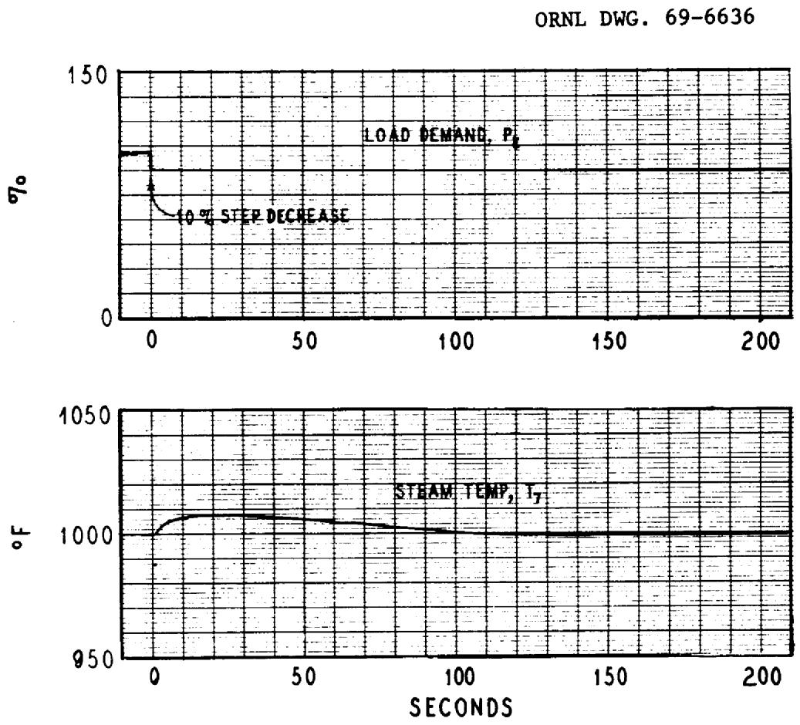  
Fig. 4. Transient for $10\%$ Step Decrease in Load Demand with Constant Secondary-Salt Flow Model.

2.3 Study of Steam Temperature Control with Variable Secondary-Salt Flow Rate

Restrictive temperature control was accomplished by the control system shown in Fig. 3. The steam-temperature error was allowed to control the rate of change of the secondary-salt flow rate by

$$
\frac {d F _ {2}}{d t} = - \alpha \left(T _ {7} - T _ {7 0}\right). \tag {3}
$$

Then, after the steam temperature transient, the flow rate was slowly adjusted to its original full-power value by allowing the flow rate error to change the temperature of the primary salt entering the primary heat exchanger by a second controller having a gain of $\beta$ :

$$
\frac {\mathrm {d} T _ {2}}{\mathrm {d} t} = - \beta \left(1 - \frac {F _ {2}}{F _ {2 0}}\right), \tag {4}
$$

where $F_{20}$ is the initial full-power value of the secondary-salt flow rate $F_{2}$ .

A brief parameter study of $\alpha$ and $\beta$ indicated that a reasonable steam-temperature response was obtained when a $1^{\circ}\mathrm{F}$ steam-temperature error produced a secondary-salt flow rate change of $10\%/\min$ and a $1\%$ error in flow rate produced a primary-salt temperature change of $1^{\circ}\mathrm{F}/\min$ .

With this control system, a $10\%$ step decrease in power demand from 100 to $90\%$ of full load produced the transient shown in Fig. 5. The steam temperature returned to within $1^{\circ}\mathrm{F}$ of the design value in about 30 sec, as compared with 100 sec described previously. The maximum change in the secondary-salt flow rate was about $20\%$ , i.e., from 100 to $80\%$ of the design value; the maximum rate of change was about $50\%/\min$ . The flow rate returned to within $3\%$ of its design value in approximately 250 sec (4.2 min).

With the addition of the reactor heat transfer and nuclear kinetics equations to the model, the temperature of the primary salt entering the primary heat exchanger (reactor outlet temperature) was controlled by inserting or withdrawing control rods to change the reactor power according to the error in the secondary-salt flow rate. Steam temperature control by means of the secondary-salt flow rate remained the same. The rate of change of the set point for the reactor outlet temperature $T_{2\text{set}}$ was obtained from the error in the secondary-salt flow rate, as follows:

$$
\frac {d T _ {2} s e t}{d t} = - \beta \left(1 - \frac {F _ {2}}{F _ {2 0}}\right), \tag {5}
$$

which is similar to Eq (4). This controller slowly adjusted the reactor outlet temperature set point in the proper direction until the secondary-salt flow rate returned to its $100\%$ power value.

The values for the controller gains $\alpha$ and $\beta$ were adjusted for the transient runs such that a $3^{\circ}\mathrm{F}$ error in steam temperature yielded a $10\%$ per min rate of change of the secondary-salt flow rate and a $1\%$ error in the secondary-salt flow rate yielded a $1.7^{\circ}\mathrm{F}$ per min rate of change of the reactor outlet temperature set point. These values were obtained after a brief parameter study in which a $10\%$ step decrease was initiated in the plant load demand and the gains were adjusted to yield the minimum steam temperature deviation.

The required set point for the reactor power level $P_{r\text{set}}$ is obtained from the reactor outlet temperature set point by

$$
P _ {r s e t} = A \left(T _ {2 s e t} - T _ {1}\right), \tag {6}
$$

where $A$ is the proportionality constant between reactor power and reactor $\Delta T$ . Thus, as the reactor outlet temperature set point is altered by the secondary-salt flow rate, the reactor power level set point will be altered as well. The error in the reactor power level is given by

$$
e = P _ {r} - P _ {r s e t}. \tag {7}
$$

This error signal is the input to a proportional servo rod controller which is described by the second-order transfer function

$$
T (s) = \frac {G \omega^ {2}}{s ^ {2} + 2 C \omega s + \omega^ {2}}, \tag {8}
$$

where $G$ is the controller gain, $\omega$ is the bandwidth, and $\zeta$ is the damping factor. In this simulation $\omega$ equaled 31.42 radians/sec (5 Hz) and $\zeta$ equaled 0.5. These values are typical of the kind and size of servo which may be used in this control-rod-drive service. The gain of the controller was such that for $\varepsilon_{\mathrm{c}} \geq 1\%$ of full reactor power the control reactivity addition or withdrawl rate was

$$
\frac {d _ {0} c}{d t} = 0.1 \% / \sec . \tag{9}
$$

For errors less than $1\%$ , the rate of change of reactivity was proportional to the error. For errors greater than $1\%$ , the reactivity rate was maintained constant at the $0.1\%/\mathrm{sec}$ value. Integration of Eq. (9) yields the term $\rho_{c}$ in the reactivity equation (see Sect. 5.2). This method of controlling the reactor outlet temperature is similar to that used in the MSRE control system.

To obtain more realistic transient results from the simulation, limits were imposed on several of the system variables, as follows:

1. The secondary-salt flow rate was limited to a range from 40 to $110\%$ of the full-power flow rate.   
2. The maximum steam flow rate was limited to $110\%$ of the full-power flow rate.   
3. The reactor outlet temperature set point was constrained to a range from 1000 to $1400^{\circ}\mathrm{F}$ ( $100^{\circ}\mathrm{F}$ over and $300^{\circ}\mathrm{F}$ under its full-power value of $1300^{\circ}\mathrm{F}$ ).   
4. A 5-sec first-order lag was introduced between the steam flow rate demand $F_{3}$ in Eq. (43) in Sect. 5.2 and the steam flow rate in the system $F_{3}$ in Eqs. (38) - (40) in order to better simulate the response of a turbine throttle valve.

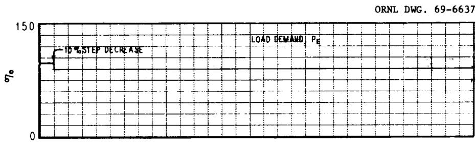

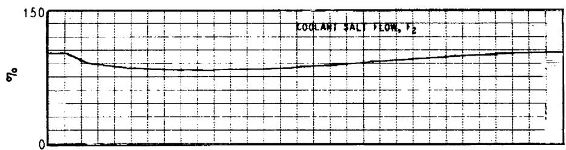

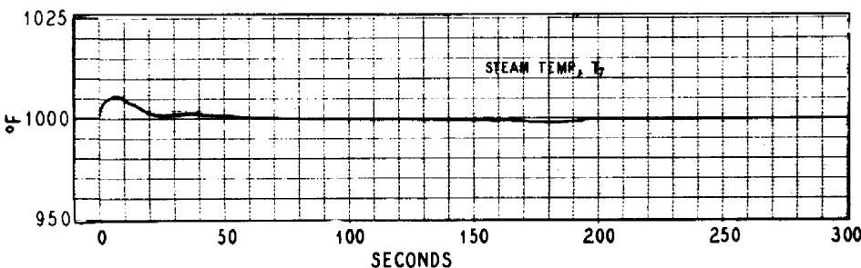  
Fig. 5. Transient for $10\%$ Step Decrease in Load Demand with Variable Secondary-Salt Flow Model.

# 3. RESULTS

Calculations of the temperature profiles with the system under partial load at steady state were made using the steady-state form of the analog simulation equations in Sect. 5.2. The variation of salt temperatures with various steady-state power levels is shown in Fig. 6. Figure 6 also shows the variation of the same salt temperatures obtained by use of another method of calculation described in Sect. 5.1. Divergence of the two sets of curves begins at about the $50\%$ power level. Thus, if it is assumed that the calculation method of Sect. 5.1 is more reliable for predicting system temperature profiles at steady state, the present analog simulation model is valid only at power levels greater than approximately $50\%$ .

Several transient cases were run which included (1) decreases in load demand $P_{\mathrm{r}}$ from 100% by steps of 10, 30, 50, and 60%; (2) ramp changes of 30 and 70% each at 5 and 10%/min; (3) changes in reactivity of steps of ±0.05, ±0.1, and -0.5%; and (4), with the reactivity controller disconnected, (a) reactivity steps of ±0.05, +0.01, and -0.1% and (b) ramp changes in reactivity of +0.05 and -0.1% at 0.1%/min. Also, the step loss of one secondary-salt coolant loop was simulated. The system transfer function $P_{\mathrm{r}}(s)/\rho(s)$ was also measured.

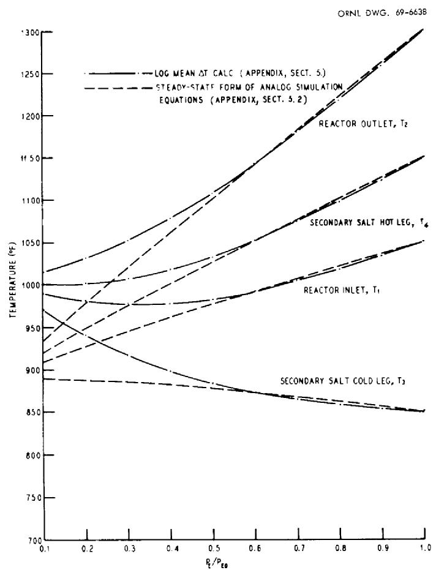  
Fig. 6. Variation of Steady-State Salt Temperatures with Power Level.

# 3.1 Decrease in Load Demand

The action of the system during a typical load demand transient was as follows. When the load demand $P_{e}$ was decreased, the steam flow rate decreased, transferring less heat out of the steam generators and decreasing the heat transfer coefficient between the steam generator tubes and the steam. This caused the steam temperature to begin to rise. The steam temperature controller sensed the steam temperature error and began to decrease the secondary-salt flow rate at a rate proportional to the temperature error in order to transfer less heat into the steam generator and to decrease the heat transfer coefficient between the secondary salt and the steam-generator tubes. The transfer of heat from the secondary salt at the reduced flow necessary for steam temperature control caused the temperature of the secondary salt leaving the steam generator to decrease. The reduction in flow rate also decreased the amount of heat transferred out of the primary heat exchanger as well as the heat transfer coefficient between the primary-heat-exchanger tubes and the secondary salt. The primary salt was, thus, returned to the reactor at a higher temperature, producing the reactor power error signal $e$ . As this error was sensed by the reactivity servo controller, the control rods were withdrawn (inserting negative reactivity) to reduce the reactor power commensurate with the decrease in load demand. The secondary-salt flow rate controller sensed the decrease in the flow rate and began to decrease the reactor outlet temperature set point at a rate proportional to the secondary-salt flow rate error. A new steady-state operation was achieved when the steam temperature reached its design value of $1000^{\circ}\mathrm{F}$ and the secondary-salt flow rate its full-power value.

The results of a $30\%$ decrease in load demand from $100\%$ as a step and at rates of 10 and $5\% / \min$ are shown in Figs. 7-9. The reduction of the temperature of the secondary-salt leaving the steam generator after a change in load demand is shown in these figures. For large, rapid changes in load demand, the temperature of the secondary-salt may approach its freezing point $(725^{\circ}\mathrm{F})$ . This possibility exists also when the load demand on the plant is increased. Under such conditions the steam temperature initially tends to decrease, causing the steam temperature controller to accelerate the flow of secondary salt, which will transfer more heat into the steam generator. Since this flow may increase only to $110\%$ of full flow, a sufficiently rapid load increase will cause the temperature of the secondary salt leaving the steam generator to decrease and, perhaps, approach the freezing point. However, increases in plant load will usually occur in a more orderly and controlled fashion than decreases since, under accident conditions, decreases will be more probable. Increases in load must be accomplished in a carefully controlled manner.

The data from Figs. 7-9 and the results of other runs made with changes in load demand are summarized in Table 2 which also lists the maximum steam temperature deviations from $1000^{\circ}\mathrm{F}$ , the maximum required rates of change of the secondary-salt flow rate and of the control reactivity, and the maximum magnitude of the control reactivity required. The highest reactivity rate was well below the $0.1\%/\mathrm{sec}$ maximum allowed by the controller.

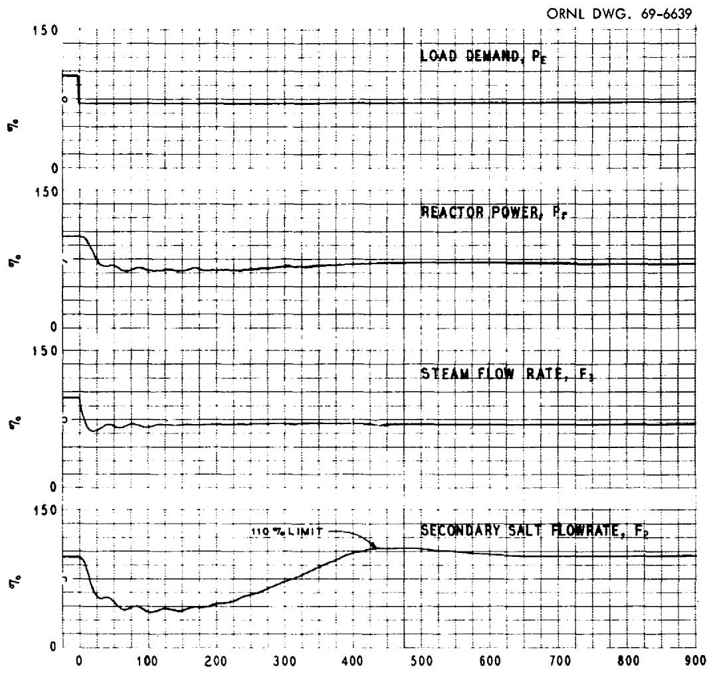

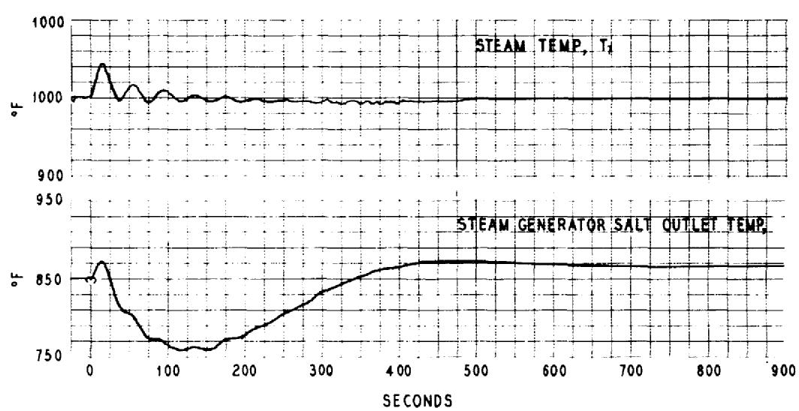  
Fig. 7. Transient for $30\%$ Step Decrease in Load Demand.

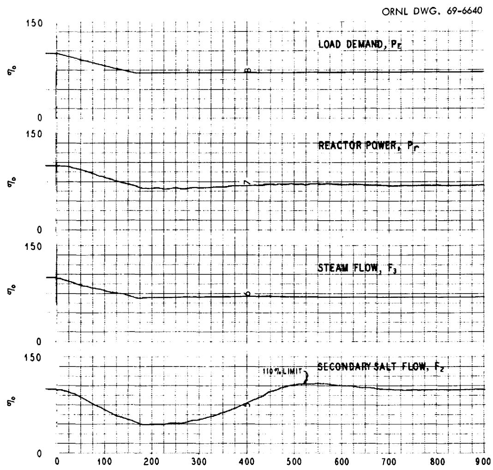

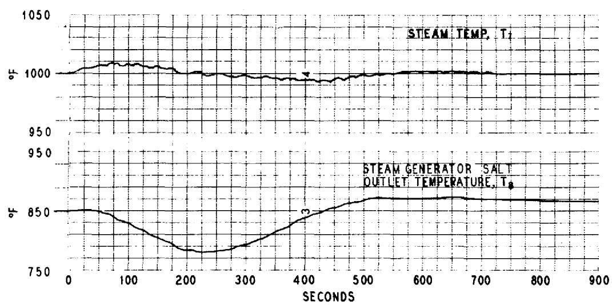  
Fig. 8. Transient for $30\%$ Ramp Decrease in Load Demand at $10\%/\min$ .

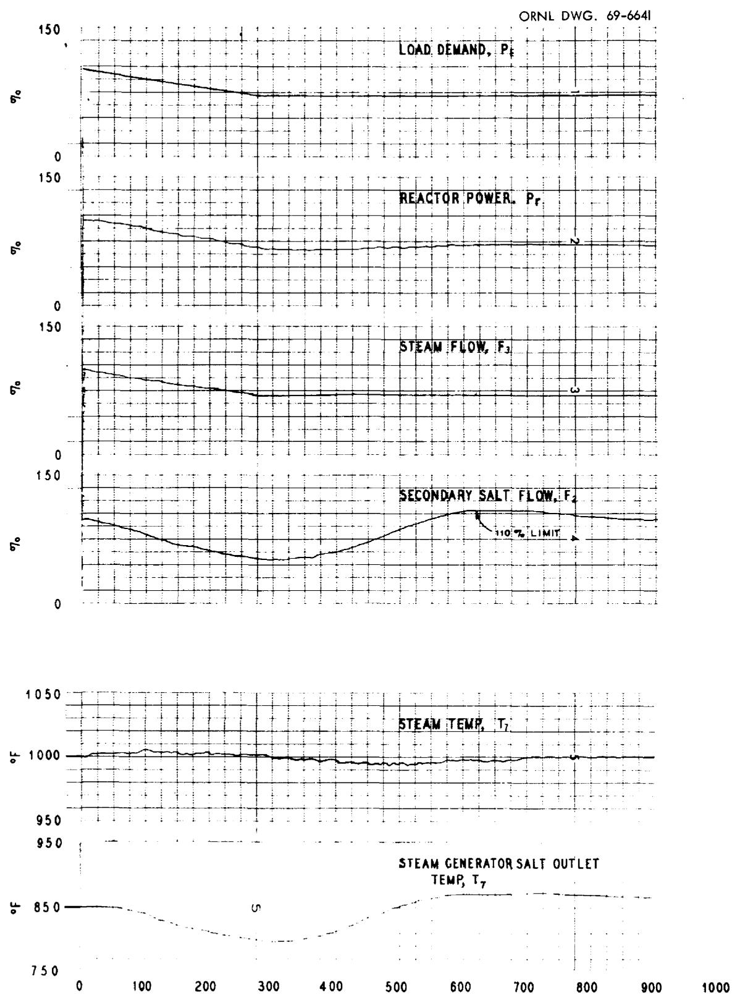  
Fig. 9. Transient for $30\%$ Ramp Decrease in Load Demand at $5\%/\min$ .

Table 2. Results of Load Demand Perturbations   
A. For Step Losses of Load Demand (from 100%)   

<table><tr><td></td><td colspan="3">Magnitude of Step (%)</td></tr><tr><td></td><td>10</td><td>30</td><td>50</td></tr><tr><td>Final steady-state temperatures, °F</td><td></td><td></td><td></td></tr><tr><td>T1</td><td>—</td><td>1009</td><td>976</td></tr><tr><td>T2</td><td>—</td><td>1183</td><td>1098</td></tr><tr><td>T3</td><td>—</td><td>867</td><td>875</td></tr><tr><td>T4</td><td>—</td><td>1077</td><td>1025</td></tr><tr><td>Max steam temperature error, °F</td><td>13</td><td>44</td><td>147</td></tr><tr><td>Max rate of change of secondary-salt flow rate, %/sec</td><td>-0.74</td><td>-2.3</td><td>-4.3</td></tr><tr><td>Max rate of change of reactivity,%/sec</td><td>-3.5 x 10-4</td><td>-1.06 x 10-3</td><td>-3.0 x 10-3</td></tr><tr><td>Max value of ρ, %</td><td>-0.014</td><td>-0.045</td><td>-0.075</td></tr></table>

B. For $30\%$ Ramp Loss of Load Demand from 100 to $70\%$   

<table><tr><td></td><td colspan="2">Ramp Rate (%/min)</td></tr><tr><td></td><td>10</td><td>5</td></tr><tr><td>Max steam temperature error, °F</td><td>9</td><td>5</td></tr><tr><td>Max rate of change of secondary-salt flow rate, %/sec</td><td>-0.41</td><td>-0.26</td></tr><tr><td>Max rate of change of reactivity,%/sec</td><td>\( -1.75 \times 10^{-4} \)</td><td>\( -1.5 \times 10^{-4} \)</td></tr><tr><td>Max value of control reactivityrequired, %</td><td>-0.045</td><td>-0.045</td></tr></table>

A plot was made of the maximum steam temperature variation from $1000^{\circ}\mathrm{F}$ as a function of change in load demand (Fig. 10). The plot shows, for example, that a step change of $30\%$ in load demand from 100 to $70\%$ of full power produced a maximum steam temperature deviation of about $+42^{\circ}\mathrm{F}$ at some point in the transient. The break upwards in the three curves for load changes greater than $30\%$ was caused by the $40\%$ lower limit imposed on the secondary-salt flow rate. Changes in load of more than $30\%$ required a change of greater than $60\%$ in the secondary-salt flow rate to maintain control of the steam temperature. When this lower limit was reached, control of the steam temperature was considerably reduced and higher deviations allowed to occur.

# 3.2 Changes of Reactivity

The results of reactivity steps of $\pm 0.1$ and $-0.5\%$ are shown in Figs. 11 and 12. A $+0.1\%$ step yielded a peak reactor power of about $155\%$ as a pulse with a fwhm (full-width, half maximum) of about 0.75 sec. This is an excess energy input of approximately 930 Mw-sec. The reactor outlet temperature peak deviation from $1300^{\circ}\mathrm{F}$ was about $25^{\circ}\mathrm{F}$ . The reactor inlet temperature and steam temperatures varied only a few degrees. The control reactivity changed at its maximum allowable speed in a direction to counter the reactivity step. A negative reactivity insertion of $-0.5\%$ decreased the reactor power sharply to about $18\%$ before the control reactivity returned it to its $100\%$ level after a $35\%$ overshoot (Fig. 12). The reactor outlet temperature peak change was about $-100^{\circ}\mathrm{F}$ , and the peak steam temperature variation was about $-15^{\circ}\mathrm{F}$ .

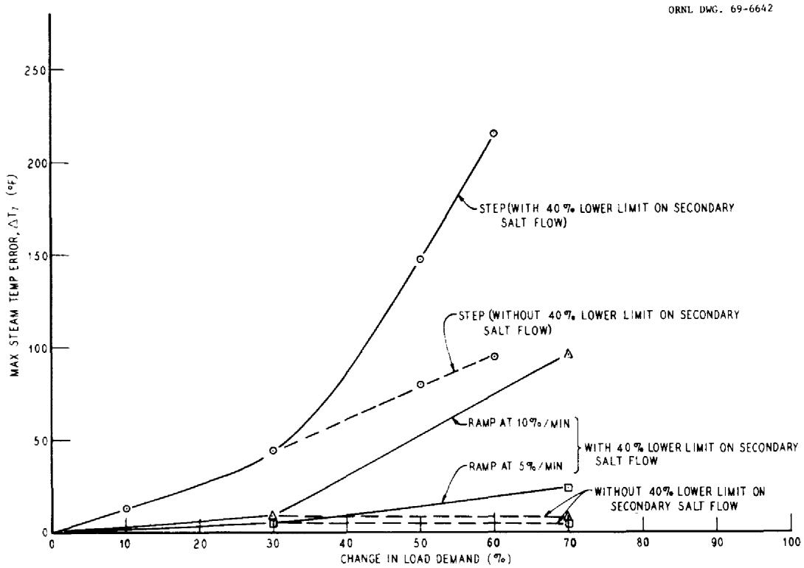  
Fig. 10. Maximum Steam Temperature Error for Changes in Load Demand from $100\%$ .

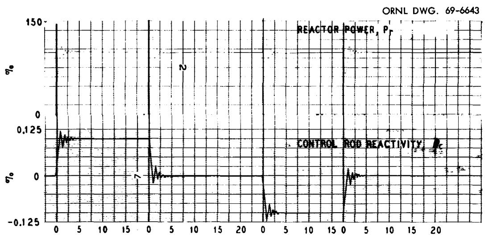

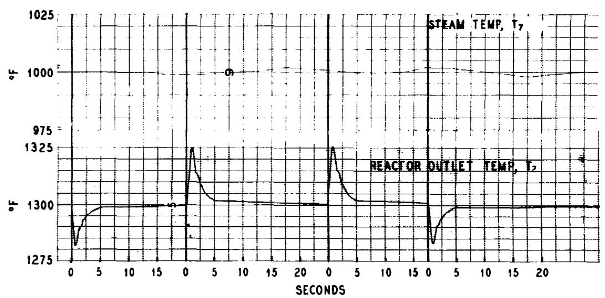  
Fig. 11. Transient for Steps in Reactivity of $\pm 0.1\%$ with Reactivity Controller Active.

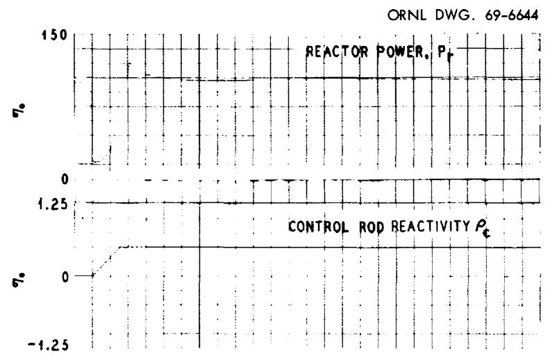

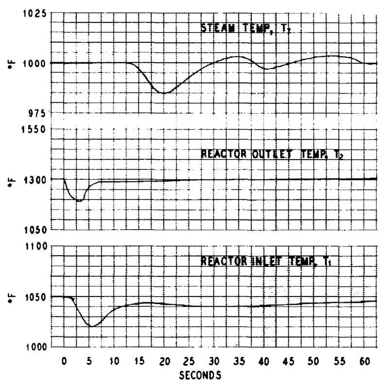  
Fig. 12. Transient for Step in Reactivity of $-0.5\%$ with Reactivity Controller Active.

# 3.3 Step Changes of Reactivity with Controller Disconnected

With the reactivity controller disconnected so that a reactor power-level error produced no response from the reactivity servo (i.e., no control-rod motion), step changes of $+0.05$ and $-0.1\%$ were studied (Figs. 13 and 14). The $+0.05\%$ step change produced a peak reactor power of about $147\%$ , and the reactor temperatures increased to a value commensurate with the negative temperature coefficient of reactivity. The secondary-salt flow rate decreased to its $40\%$ lower limit, after which steam temperature control was lost. The final steam temperature deviation was $+75^{\circ}\mathrm{F}$ . The decrease in secondary-salt flow rate caused a decrease in the temperature of the secondary-salt leaving the steam generator. This temperature decreased to as low as $690^{\circ}\mathrm{F}$ during the transient, returning to a steady-state value of approximately $735^{\circ}\mathrm{F}$ . (The secondary-salt freezing point is $725^{\circ}\mathrm{F}$ .) Similar reactivity transients in runs made without limiting the secondary-salt flow rate to a minimum of $40\%$ of full flow caused this temperature to decrease to well below its freezing point. Without the reactivity controller, control of the reactor outlet temperature set point was lost; the outlet temperature reached $1485^{\circ}\mathrm{F}$ as its steady-state value (Fig. 12). The steady-state temperature of the secondary-salt leaving the primary heat exchanger was $1470^{\circ}\mathrm{F}$ .

The negative reactivity step of $-0.1\%$ (Fig. 14) required a decrease to $50\%$ in the steady-state reactor power level to produce the compensating reactivity by means of the negative temperature coefficient. The primary-salt temperature at the reactor inlet decreased to approximately $865^{\circ}\mathrm{F}$ -- well below its freezing point of $930^{\circ}\mathrm{F}$ . The secondary-salt flow rate quickly increased to its $110\%$ limit, after which steam temperature control was lost. The final steam temperature was $840^{\circ}\mathrm{F}$ . At this low temperature, the steam flow rate increased in an attempt to meet the $100\%$ load demand on the plant, but it was also limited to $110\%$ of full flow rate. These conditions correspond to a plant output of $51\%$ of full power, which matches the observed steady-state reactor power.

# 3.4 Ramp Changes of Reactivity with Controller Disconnected

With the reactivity controller still disconnected, ramp changes in reactivity of $+0.05$ and $-0.1\%$ at $0.1\%/\min$ were inserted. The positive-ramp insertion produced a peak power of about $130\%$ . Again, the secondary-salt flow rate decreased to its $40\%$ lower limit, and steam temperature control was lost. Both of these ramp reactivity perturbations produced much the same response as the step insertions of the same amount except that the reactor power changed more slowly.

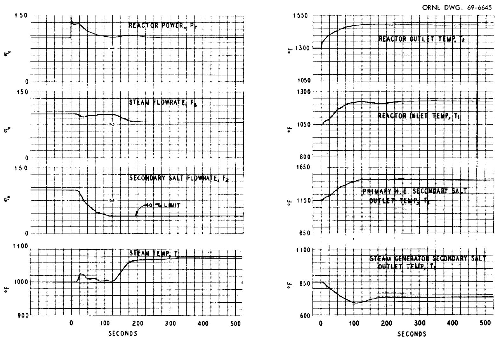  
Fig. 13. Transient for Step in Reactivity of $+0.05\%$ with Reactivity Controller Inactive.

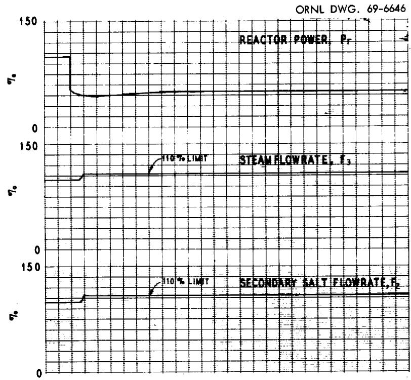

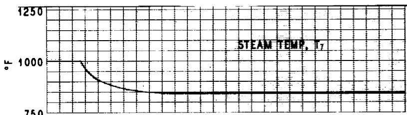

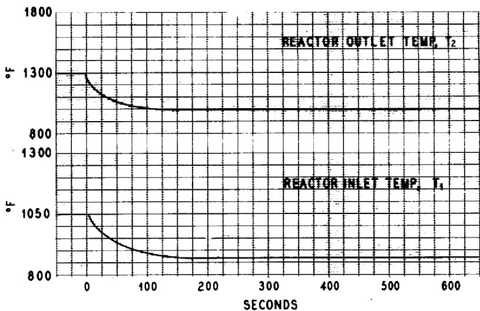  
Fig. 14. Transient for Step in Reactivity of $-0.1\%$ with Reactivity Controller Inactive.

# 3.5 Step Loss of One Secondary-Salt Coolant Loop

A simulation of the loss of one secondary-salt coolant loop was attempted as follows (see Fig. 3). In a four-loop system the temperature of the primary-salt entering the reactor core is the average of the temperatures of the primary-salt leaving the four primary heat exchangers. We call the reactor core inlet temperature $\hat{T}_{1}$ , and the primary-salt outlet temperatures from the four primary heat exchangers $T_{11}, T_{12}, T_{13}$ and $T_{14}$ ; then, with perfect mixing

$$
\hat {T} _ {1} = \frac {1}{4} \left(T _ {1 1} + T _ {1 2} + T _ {1 3} + T _ {1 4}\right). \tag {10}
$$

We now assume that if one of the primary heat exchangers, e.g., number 4, suddenly were to cease to remove heat from the primary salt, the reduction in heat removal would appear as a step increase in the primary-salt outlet temperature $T_{14}$ from 1050 to $1300^{\circ}\mathrm{F}$ . If the other heat exchangers were to remain unchanged, the reactor core inlet temperature would become

$$
\hat {T} _ {1} = \frac {1}{4} \left(T _ {1 1} + T _ {1 2} + T _ {1 3} + T _ {2}\right). \tag {11}
$$

Thus, the reactor core inlet temperature would be changed as a step at $t = 0$ from $T_{1}$ to $T_{1}$ .

Similarly, the steam temperature to the turbine is the average of the steam temperatures from the sixteen steam generators, four of which are supplied heat by each secondary-salt coolant loop. If we call the steam temperature at the turbine $\hat{T}_{7}$ and the steam generator steam temperatures $T_{7i'}$ then

$$
\hat {T} _ {7} = \frac {1}{1 6} \sum_ {i = 1} ^ {1 6} T _ {7 i}. \tag {12}
$$

If one secondary-salt loop were to be lost suddenly, four steam generators would be supplied heat no longer, say generators 13, 14, 15, and 16. We assume that this reduction would appear as a step decrease in the steam generator outlet temperatures $T_{7,13}$ , $T_{7,14}$ , $T_{7,15}$ and $T_{7,16}$ from 1000 to $700^{\circ}\mathrm{F}$ . The turbine steam temperature would become

$$
\hat {T} _ {7} = \frac {1}{1 6} \left(\sum_ {i = 1} ^ {1 2} T _ {7 i} + 4 T _ {6}\right). \tag {13}
$$

Thus, the turbine steam temperature would be changed as a step at $t = 0$ from $T_7$ to $T_7$ .

The results of such a run are shown in Fig. 15. The turbine steam temperature dropped as a step to $925^{\circ}\mathrm{F}$ , and the reactor inlet temperature rose to $1113^{\circ}\mathrm{F}$ . This increase in reactor inlet temperature was accompanied by a sudden decrease in the reactor power set point, producing an error signal that indicated high reactor power. The control rods were withdrawn (inserting negative reactivity) and, with the aid of the negative primary-salt reactivity temperature coefficient, the reactor power dropped sharply to $70\%$ . The steam flow rate increased to its $110\%$ limit in an attempt to meet the $100\%$ load demand at the reduced steam temperature. The secondary-salt flow rate increased to its $110\%$ limit in an attempt to maintain the steam temperature at $1000^{\circ}\mathrm{F}$ . With the loss of $25\%$ of the heat transfer capability in the secondary loop, the reactor temperatures began to rise to meet the $100\%$ load demand. However, when the reactor outlet temperature reached its $1400^{\circ}\mathrm{F}$ limit, the reactor power had increased to only $92\%$ of full load, and the steam temperature had increased to $956^{\circ}\mathrm{F}$ . Therefore, under this accident condition and with the temperature and flow limits placed on the system, the plant could not deliver $100\%$ of full load with one secondary-salt loop inoperable. Figure 15 also shows the result of decreasing the load demand to $75\%$ at a rate of $10\%/\mathrm{min}$ beginning 325 sec after the step loss of heat transfer capacity. The plant could meet this demand at design steam conditions.

# 3.6 Measurement of System Transfer Function

The full power system transfer function $\mathsf{P}_{\mathsf{r}}(\mathsf{s}) / \mathsf{D}(\mathsf{s})$ was measured with and without the reactivity servo controller (Fig. 16). The curve for the case with no controller is similar to previous data for the two-fluid MSBR,2 although the magnitude of the peak gain at about 3 radians/sec ( $\sim 0.5 \, \text{Hz}$ ) was greater by a factor of about 6 for the single-fluid case. Adding the servo controller greatly decreased the low-frequency gain, as expected; above the upper cutoff frequency of 5 Hz ( $\sim 30 \, \text{radians/sec}$ ) for the servo it had no effect.

# 4. CONCLUDING REMARKS

We have described a preliminary investigation of the control problems associated with the 1000-Mw(e) single-fluid MSBR. The control system was formulated in four basic steps: the first was an estimation of the system temperature profiles for partial load conditions, assuming various possible modes of plant control. Based on these results the most promising mode of plant control was investigated for its dynamic response, using only the primary heat exchanger and steam generator. The results indicated that a variable secondary-salt flow rate would give better steam temperature control during a transient, and this was investigated using the same model. The reactor was then added to the simulation, and the response of the entire plant to various perturbing conditions was studied.

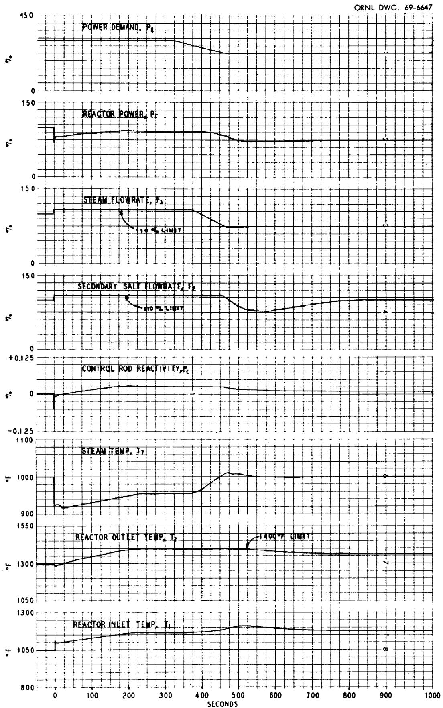  
Fig. 15. Transient for Step Loss of One Secondary-Salt Cooling Loop Followed by a $25\%$ Reduction in Load Demand.

The results indicate that careful control will be required to maintain the temperatures of the two salts within the rather narrow allowable limits. Such plant maneuvers as increasing and decreasing the load demand on the plant and certain reactivity excursions might allow these temperatures to decrease below freezing points. However, since the models used in these simulations and calculations were abbreviated, the results are regarded only as indicative of possible trends that might be elucidated in more detailed investigations. Such investigations were not possible with the analog equipment available to the author without either linearizing the simulation equations (reducing the dynamic range) or simulating only a part of the plant at a time, or both. Even then, the modeling of such a unit as a supercritical steam generator would be a difficult task on the analog computer. A more detailed simulation than was tried here should be attempted by employing more powerful simulation techniques, e.g., hybrid computation.

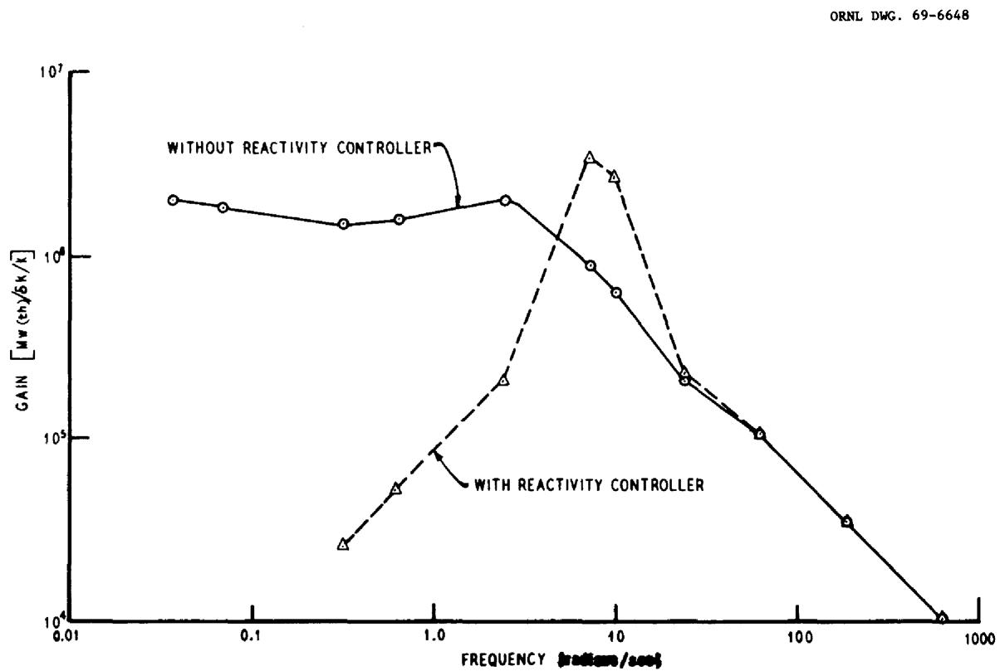  
Fig. 16. System Full-Power Transfer Function $\mathsf{P}_{\mathsf{r}}(s) / \mathsf{o}(s)$ .

# 5. APPENDIX

# 5.1 Calculation of Steady-State System Temperature Profiles

The model used in this calculation appears in Figure 1. The two basic equations used were

$$
Q = U A \left[ \frac {\Delta T a - \Delta T b}{\ln \left(\frac {\Delta T a}{\Delta T b}\right)} \right] \tag {14}
$$

$$
Q = F C _ {P} \Delta T \tag {15}
$$

where

$$
U = \left[ \frac {1}{h _ {i}} + \frac {\Delta r}{k} + \frac {1}{h _ {o}} \right] ^ {- 1} \tag {16}
$$

and

$$
\begin{array}{l} Q = \text {h e a t p o w e r} (B t u / h r), \\ U = \text {o v e r a l l} \quad \text {h e a t} \quad \text {t r a n s f e r} \quad \text {c o e f f i c i e n t} \left(\text {B t u h r} ^ {- 1} \text {f t} ^ {- 2} _ {\circ} F ^ {- 1}\right), \\ A = \text {h e a t} (f t ^ {2}), \\ T = t e m p e r a t u r e, \\ a, b = \text {e n d s o f h e a t e x c h a n g e r}, \\ F = \text {m a s s f l o w r a t e} (\mathrm {l b / h r}) _ {t} \\ C _ {D} = \text {s p e c i f i c h e a t} (\text {B t u I b} ^ {- 1} \circ F ^ {- 1}), \\ \begin{array}{l} \text {p - s p e c i f i c h e a r (b t u l b - f)}, \\ \text {h} _ {i} = \text {h e a t t r a n s f e r c o e f f i c i e n t i n s i d e t u b e s (B t u h r ^ {- 1} f t ^ {- 2} o F ^ {- 1})}, \\ \text {k = t u b e t h e r m a l c o n d u c t i v i t y (B t u h r ^ {- 1} f t ^ {- 2} o F ^ {- 1} / f t)}, \end{array} \\ \Delta r = \text {t u b e w a l l t h i c k n e s s} (f t), \\ \begin{array}{l} \Delta r = \text {t u b e w a l l t h i c k n e s s (f f)}, \\ h _ {o} = \text {h e a t t r a n s f e r c o e f f i c i e n t o u t s i d e t u b e s (B t u h r ^ {- 1} f t ^ {- 2} o F ^ {- 1})}. \end{array} \\ \end{array}
$$

The heat transfer coefficient inside the tubes $h_{i}$ was taken to be proportional to the 0.8 power of the flow rate through the tubes; the coefficient on the shell-side of the tubes was taken to be proportional to the 0.6 power of the shell-side flow rate, i.e.,

$$
h _ {i} = k _ {1} F _ {1} ^ {0. 8}, \tag {17}
$$

and

$$
h _ {0} = k _ {2} F _ {0} ^ {0. 6}, \tag {18}
$$

where $k$ is a proportionality constant.

The following equations were written based on given full-load plant conditions. [The subscript "o" denotes the full-load (100% power) value of all variables.]

In the primary heat exchanger:

$$
\frac {Q}{Q _ {0}} = \frac {T _ {2} - T _ {1}}{T _ {2 0} - T _ {1 0}}, \tag {19}
$$

$$
\frac {Q}{Q _ {0}} = \frac {U _ {p} [ \Delta T ] I _ {m}}{U _ {p 0} [ \Delta T ] I _ {m}}, \tag {20}
$$

$$
\frac {Q}{Q _ {0}} = \frac {F _ {4} + F _ {2}}{F _ {4 0} + F _ {2 0}} \frac {T _ {3} - T _ {4}}{T _ {3 0} - T _ {4 0}}, \tag {21}
$$

For the steam generator:

$$
\frac {Q}{Q _ {0}} = \frac {F _ {2}}{F _ {2 0}} \frac {T _ {4} - T _ {5}}{T _ {4 0} - T _ {5 0}}, \tag {22}
$$

$$
\frac {Q}{Q _ {0}} = \frac {U _ {s} [ \Delta T ] _ {l m}}{U _ {s 0} [ \Delta T _ {0} ] _ {l m}}, \tag {23}
$$

$$
\frac {Q}{Q _ {0}} = \frac {F _ {3}}{F _ {3 0}} \frac {T _ {7} - T _ {6}}{T _ {7 0} - T _ {6 0}}. \tag {24}
$$

In Eqs. (20) and (23)

$$
\Delta T _ {I m} = \frac {\Delta T _ {a} - \Delta T _ {b}}{\ln \left(\frac {\Delta T _ {a}}{\Delta T _ {b}}\right)} \tag {25}
$$

The $100\%$ plant-load temperature profile, used as given information in these calculations is shown in Fig. 1. In all calculations that follow, the temperature $T_{6}$ of the water entering the steam generator and the steam temperature $T_{7}$ were held fixed at their $100\%$ plant load values of 700 and $1000^{\circ}F$ , respectively. The values of the tube-side and shell-side heat transfer coefficients for the primary heat exchanger at $100\%$ power were respectively

$$
h _ {i o} = 2 7 8 6 B t u h r ^ {- 1} f t ^ {- 2} o F ^ {- 1}
$$

and

$$
h _ {0 0} = 1 6 2 4 B t u h r ^ {- 1} f t ^ {- 2} \circ F ^ {- 1}.
$$

For the steam generator the tube-side and shell-side heat transfer coefficients were

$$
h _ {i o} = 4 0 0 0 B t u h r ^ {- 1} f t ^ {- 2} o F ^ {- 1}
$$

and

$$
h _ {o o} = 3 7 4 5 B t u h r ^ {- 1} f t ^ {- 2} \circ F ^ {- 1}.
$$

The values of $k / \Delta r$ in Eq. (16) were 3770 Btu hr $^{-1}$ ft $^{-2}$ °F $^{-1}$ for the primary heat exchanger and 1715 Btu hr $^{-1}$ ft $^{-2}$ °F $^{-1}$ for the steam generator.

The overall heat transfer coefficient for the primary heat exchanger was calculated from Eq. (16):

$$
U _ {p} = \left[ \frac {1}{2 7 8 6} + \frac {1}{3 7 7 0} + \frac {1}{1 6 2 4} \left(\frac {F _ {4 0} + F _ {2 0}}{F _ {4} + F _ {2}}\right) ^ {0. 6} \right] ^ {- 1}. \tag {26}
$$

The overall heat transfer coefficient for the steam generator was

$$
\cup_ {s} = \left[ \frac {1}{3 7 4 5} \left(\frac {F _ {2 0}}{F _ {2}}\right) ^ {0. 6} + \frac {1}{1 7 1 5} + \frac {1}{4 0 0 0} \left(\frac {F _ {3 0}}{F _ {3}}\right) ^ {0. 8} \right] ^ {- 1}. \tag {27}
$$

Equations (19) through (23) form a set of five equations in eight unknowns. The unknowns are $\mathsf{Q} / \mathsf{Q}_0$ , $(\mathsf{F}_1 + \mathsf{F}_2) / (\mathsf{F}_{40} + \mathsf{F}_{20})$ , $\mathsf{F}_2 / \mathsf{F}_{20}$ , and $\mathsf{T}_1, \mathsf{T}_2, \mathsf{T}_3, \mathsf{T}_4$ , and $\mathsf{T}_5$ . Several variables must be specified in order to solve the set of equations. The variable $\mathsf{Q} / \mathsf{Q}_0$ , the relative power level, was used as a parameter. The remaining two variables were specified in three ways, forming the three case studies reported here.

Case 1: Average reactor temperature fixed at its $100\%$ power level value and the bypass flow given by

$$
F _ {4} = F _ {2 0} \left(1 - \frac {Q}{Q _ {0}}\right).
$$

Case 2: Average reactor temperature fixed at its $100\%$ power level value and no bypass line around the steam generator, i.e.,

$$
\frac {T _ {1} + T _ {2}}{2} = \frac {T _ {1 0} + T _ {2 0}}{2}
$$

and

$$
F _ {4} = 0.
$$

Case 3: Constant flow rate of the secondary-salt and no bypass line, i.e.,

$$
F _ {4} = 0
$$

and

$$
\frac {F _ {2}}{F _ {2 0}} = 1.
$$

# 5.2 Description of the Analog Simulator Model

The following equations describe the analog simulation model used in this study and shown in Fig. 3. The heat transfer driving force across the heat exchanger tubes and from the graphite to the primary salt is shown by the dotted lines in the figure. The mass of the primary salt and the primary-salt-to-tube-wall heat transfer area in the primary heat exchanger were equally divided between the two primary-salt lumps. Similar statements can be made about each of the remaining pairs of lumps except in the case of the two steam lumps.

For the two steam lumps $w_1$ and $w_2$ , the density of the steam varies by a factor of 7 in passing through the steam generator. The mass of the steam in lump 1 was determined by the average density of the steam in the half of the steam generator at the steam exit end. The mass was determined in a similar manner for lump 2. The steam pressure was assumed constant at all times.

For the reactor core (see Fig. 3):

$$
\begin{array}{l} M _ {G} C _ {p G} \frac {d T _ {G}}{d t} = h _ {f G} A _ {f G} \left(T _ {r} - T _ {G}\right) + k _ {G} P _ {r}, (28) \\ M _ {f r} C _ {p f} \frac {d T _ {r}}{d t} = F _ {1} C _ {p f} \left(T _ {1} - T _ {r}\right) + k _ {r} P _ {r} + 0. 5 h _ {f G} A _ {f G} \left(T _ {G} - T _ {r}\right), (29) \\ M _ {f 2} C _ {p f} \frac {d T _ {2}}{d t} = F _ {1} C _ {p f} \left(T _ {r} - T _ {2}\right) + k _ {2} P _ {r} + 0. 5 h _ {f G} A _ {f G} \left(T _ {G} - T _ {r}\right). (30) \\ \end{array}
$$

For the primary heat exchanger:

$$
M _ {f} C _ {p f} \frac {d T _ {f}}{d t} = F _ {1} C _ {p f} \left(T _ {2} - T _ {f}\right) - h _ {f} A _ {p} \left(T _ {f} - T _ {t 1}\right), \tag {31}
$$

$$
M _ {f} C _ {p f} \frac {d T _ {1}}{d} = F _ {1} C _ {p f} \left(T _ {f} - T _ {1}\right) - h _ {f} A _ {p} \left(T _ {f} - T _ {f 1}\right), \tag {32}
$$

$$
M _ {t 1} C _ {p t} \frac {d T _ {t 1}}{d t} = 2 h _ {f} A _ {p} \left(T _ {f} - T _ {t 1}\right) - 2 h _ {s p} A _ {p} \left(T _ {t 1} - T _ {s 1}\right), \tag {33}
$$

$$
M _ {s p} C _ {p s} \frac {d T _ {4}}{d t} = F _ {2} C _ {p s} \left(T _ {s 1} - T _ {4}\right) - h _ {s p} A _ {p} \left(T _ {s 1} - T _ {t 1}\right), \tag {34}
$$

$$
M _ {s p} C _ {p s} \frac {d T _ {s 1}}{d t} = F _ {2} C _ {p s} \left(T _ {3} - T _ {s 1}\right) - h _ {s p} A _ {p} \left(T _ {s 1} - T _ {t 1}\right). \tag {35}
$$

For the steam generator:

$$
M _ {s s} C _ {p s} \frac {d T _ {s 3}}{d t} = F _ {2} C _ {p s} \left(T _ {5} - T _ {s 3}\right) - h _ {s s} A _ {s} \left(T _ {s 3} - T _ {t 2}\right), \tag {36}
$$

$$
M _ {s s} C _ {p s} \frac {d T _ {8}}{d t} = F _ {2} C _ {p s} \left(T _ {s 3} - T _ {8}\right) - h _ {s s} A _ {s} \left(T _ {s 3} - T _ {t 2}\right), \tag {37}
$$

$$
M _ {t 2} C _ {p t} \frac {d T _ {t 2}}{d t} = 2 h _ {s s} A _ {s} \left(T _ {s 3} - T _ {t 2}\right) - 2 h _ {w} A _ {s} \left(T _ {t 2} - T _ {w}\right), \tag {38}
$$

$$
M _ {w 1} C _ {p s t} \frac {d T _ {7}}{d t} = F _ {3} C _ {p s t} \left(T _ {w} - T _ {7}\right) - h _ {w} A _ {s} \left(T _ {w} - T _ {t 2}\right), \tag {39}
$$

$$
M _ {w 2} C _ {p s t} \frac {d T _ {w}}{d t} = F _ {3} C _ {p s t} \left(T _ {6} - T _ {w}\right) - h _ {w} A _ {s} \left(T _ {w} - T _ {t 2}\right), \tag {40}
$$

$$
T _ {4} (t) = T _ {5} \left(t + t _ {1}\right), \tag {41}
$$

$$
T _ {8} (t) = T _ {3} \left(t + \tau_ {2}\right), \tag {42}
$$

$$
P _ {E} = F _ {3} C _ {p s t} \left(T _ {7} - T _ {6}\right), \tag {43}
$$

As in the steady-state off-design calculations in Sect. 5.1

$$
\frac {h _ {s p}}{h _ {s p o}} = \left(\frac {F _ {2}}{F _ {2 0}}\right) ^ {0. 6},
$$

$$
\frac {h _ {s s}}{h _ {s s o}} = \left(\frac {F _ {2}}{F _ {2 0}}\right) ^ {0. 6},
$$

$$
\frac {h _ {w}}{h _ {w o}} = \left(\frac {F _ {3}}{F _ {3 0}}\right) ^ {0. 8},
$$

where

$$
T = \text {t e m p e r a t u r e}
$$

$$
P _ {r} = \text {r e a c t o r p o w e r},
$$

$$
P _ {E} = \text {l o a d}
$$

$$
M _ {f} = \text {m a s s o f p r i m a r y - s a l t l u m p},
$$

$$
M _ {G} = \text {m a s s o f g r a p h i t e i n c o r e},
$$

$$
M _ {t} = \text {m a s s o f t u b e - w a l l l u m p},
$$

$$
M _ {s} = \text {m a s s o f s e c o n d a r y - s a l t l u m p},
$$

$$
M _ {w} = \text {m a s s o f s t e a m (w a t e r) l u m p},
$$

$$
C _ {p} = \text {s p e c i f i c h e a t o f l u m p},
$$

$$
k _ {G} = \text {f r a c t i o n o f p o w e r g e n e r a t e d i n g r a p h i t e},
$$

$$
k _ {r, 2} = \text {f r a c t i o n o f p o w e r g e n e r a t e d i n p r i m a r y - s a l t l u m p s},
$$

$$
A = \text {h e a t}
$$

$$
F = \text {s a l t}
$$

$$
h _ {f} = \text {p r i m a r y - s a l t - t o - t u b e h e a t t r a n s f e r c o e f f i c i e n t},
$$

$$
h _ {f G} = \text {g r a p h i t e - t o - p r i m a r y - s a l t h e a t t r a n s f e r c o e f f i c i e n t},
$$

$$
h _ {s p} = \text {t u b e - t o - s e c o n d a r y - s a l t h e a t t r a n s f e r c o e f f i c i e n t i n p r i m a r y}
$$

$$
h _ {s s} = \text {s e c o n d a r y - s a l t - t o - t u b e h e a t t r a n s f e r c o e f f i c i e n t i n s t e a m}
$$

$$
h _ {w} = \text {t u b e - t o - s t e a m h e a t t r a n s f e r c o e f f i c i e n t},
$$

$$
\tau = \text {t r a n s i t} \quad \text {t i m e o f s e c o n d a r y s a l t b e t w e e n t h e p r i m a r y h e a t e x - c h a n g e r a n d t h e s t a e m g e n e r a t o r (a s s u m e d t o b e 1 0 s e c)}.
$$

The reactor kinetics equations used in the simulation were

$$
\frac {d P _ {r}}{d t} = \frac {\rho - \beta}{I} P _ {r} + \sum_ {i} \lambda_ {i} C _ {i}, \tag {44}
$$

$$
\frac {d C _ {i}}{d t} = \frac {\beta_ {i}}{\tau} P _ {r} - \lambda_ {i} C _ {i} - \frac {1}{\tau_ {c}} C _ {i} + \frac {e ^ {- \lambda_ {i} \tau_ {L}}}{\tau_ {c}} C _ {i} (t - \tau_ {L}), \tag {45}
$$

also

$$
\rho = c _ {0} + \alpha_ {f} \Delta T _ {f} + \alpha_ {G} \Delta T _ {G} + \rho_ {c ^ {\prime}} \tag {46}
$$

where

$\beta =$ delayed neutron fraction,

$l =$ neutron generation time,

$\lambda_{i} = \text{ith delayed group decay constant}$

$\tau_{c} =$ transit time of primary salt through the core,

$\tau_{1} =$ transit time of primary salt through external loop,

$\rho_{0}^{L} =$ positive, net steady-state reactivity associated with the cir-culating fuel,

$a_{f} =$ temperature coefficient of reactivity for the primary salt,

$\alpha_{G} =$ temperature coefficient of reactivity for the graphite,

$\mathbb{O}_{\mathbf{C}} =$ control rod reactivity.

The simulation of $C_{i} \{t - \tau_{L}\}$ requires a transport lag device of which only two were available in the Reactor Controls Department analog computer. Both were employed in the simulation of Eqs. (41) and (42), the transport lag between heat ex-changers. Therefore, the term $C_{i} \{t - \tau_{L}\}$ was approximated by

$$
C _ {i} (t - \tau_ {L}) \approx C _ {i} (t) - \tau_ {L} \frac {d C _ {i} (t)}{d t}, \tag {47}
$$

With this approximation Eq. (45) became

$$
\frac {d C _ {i}}{d t} = \frac {\beta_ {i}}{I b _ {i}} P _ {r} - \frac {\lambda_ {i}}{a _ {i} b _ {i}} C _ {i}, \tag {48}
$$

where

$$
a _ {i} = \frac {\lambda_ {i} \tau_ {c}}{\lambda_ {i} \tau_ {c} + 1 - \exp (- \lambda_ {i} \tau_ {c})},
$$

and

$$
b _ {i} = 1 + \frac {\tau_ {L}}{\tau_ {c}} \exp \left(- \lambda_ {i} \tau_ {L}\right).
$$

The coefficients for these equations were calculated using the physical constants listed in Table 1. The resulting calculated values for the various system volumes, masses, etc., were as follows:

1. For the reactor core (active region only)  
Initial heat flux, $7.68 \times 10^{9}$ Btu/hr [2250 Mw (th)]  
Primary-salt flow rate, $9.48 \times 10^{7}$ lb/hr  
Active core volume, 1820 ft³ (primary salt plus graphite)  
Primary-salt volume, 291 ft³  
Graphite volume, 1529 ft³  
Primary-salt mass, 60,512 lb  
Graphite mass, 178,873 lb  
Number of graphite elements, 1223  
Heat transfer area, 22,121 ft²  
Primary-salt velocity, 5.66 ft/sec  
Core transit time of primary salt, 2.30 sec  
External loop transit time of primary salt, 6.5 sec  
Steady-state reactivity $\rho_0$ , 0.00161.

2. For the primary heat exchanger (total for four exchangers, tube region only)  
Secondary-salt flow rate, $7.11 \times 10^{7} \mathrm{lb/hr}$ Overall heat transfer coefficient, $806 \mathrm{Btu/hr}^{-1} \mathrm{ft}^{-2} \circ \mathrm{F}^{-1}$ Primary-salt heat transfer area, $55,000 \mathrm{ft}^2$ Number of tubes, $29,400$ Tube metal volume, $145 \mathrm{ft}^3$ Primary-salt volume, $283 \mathrm{ft}^3$ Secondary-salt volume, $883 \mathrm{ft}^3$ Volume of four primary heat exchangers, $1311 \mathrm{ft}^3$ Primary-salt mass, $58,800 \mathrm{lb}$ Tube mass, $79,400 \mathrm{lb}$ Secondary-salt mass, $103,300 \mathrm{lb}$ Transit time of primary salt, $2.23 \mathrm{sec}$ Transit time of secondary salt, $5.23 \mathrm{sec}$ Primary-salt velocity, $8.5 \mathrm{ft/sec}$ Secondary-salt velocity, $3.6 \mathrm{ft/sec}$ .

3. For the steam generator (total for 16 steam generators, tube region only)  
Steam flow rate, $1.18 \times 10^{7} \mathrm{lb/hr}$ Overall heat transfer coefficient, $909 \mathrm{Btu} \mathrm{hr}^{-1} \mathrm{ft}^{-2} \circ \mathrm{F}^{-1}$ Heat transfer area, $56,300 \mathrm{ft}^{2}$ Number of tubes, $6740$ Tube metal volume, $306 \mathrm{ft}^{3}$ Secondary-salt volume, $1394 \mathrm{ft}^{3}$ Steam volume, $281 \mathrm{ft}^{3}$ Volume of 16 steam generators, $1980 \mathrm{ft}^{3}$

Secondary-salt mass, 163,000 lb   
Tube mass, 168,000 lb   
Steam mass, 3750 lb   
Secondary-salt transit time, 8.26 sec   
Steam transit time, 1.15 sec   
Secondary-salt velocity, 7.72 ft/sec   
Average steam velocity in lump w1, 212 ft/sec   
Average steam velocity in lump w2' 76 ft/sec

The simulation equations coefficients were calculated from these values.

# REFERENCES

J. R. Tallackson, MSRE Design and Operations Report, Part IIA: Nuclear Access Instrumentation, ORNL-TM-729 (February 1968).   
2Private communication from T. W. Kerlin, ORNL.   
3 F. H. Clark and O. W. Burke, Dynamic Analysis of a Salt Supercritical Heat Exchanger and Throttle Used with MSBR, ORNL-TM-2405 (January 1969).   
4 C. O. Bennett and J. E. Myers, Momentum, Heat, and Mass Transfer, pp. McGraw-Hill, New York, 1962.   
5 Private communication from C. E. Bettis, ORNL.   
6 General Engineering Division Design Analysis Section, Design Study of a Heat-Exchange System for One MSBR Concept, ORNL-TM-1545 (September 1967).   
7J. MacPhee, "The Kinetics of Circulating Fuel Reactors," Nucl. Sci. Eng. 4, 588-97 (1958).

#

# ACKNOWLEDGMENTS

The author acknowledges the suggestions of S. J. Ditto and J. L. Anderson for the control system design and for improvement of the system and the model.

# INTERNAL DISTRIBUTION

I. J. L. Anderson   
2.C.F.Baes   
3. S. J. Ball   
4. H. F. Bauman   
5. S. E. Beall   
6. M. Bender   
7. E. S. Bettis   
9. E. G. Bohlmann   
10. C. J. Borkowski   
11. R. B. Briggs   
12. F. H. Clark   
13. C. W. Collins   
14. F. L. Culler   
15. S. J. Ditto   
16. W. P. Eatherly   
17. J. R. Engel   
18. D. E. Ferguson   
19. L. M. Ferris   
20. W. K. Furlong   
21. W. R. Grimes - G. M. Watson   
22. A. G. Grindell   
23. R. H. Guymon   
24. P. M. Haubenreich   
25. R. E. Helms   
26. P. P. Holz   
27. P. R. Kasten   
28. T. W. Kerlin   
29. R. B. Korsmeyer

30. M. I. Lundin   
31. R. E. MacPherson   
32. H. A. McLain   
33. H. E. McCoy   
34. J. R. McWherter   
35. R. L. Moore   
36. E. L. Nicholson

37-61. L. C. Oakes

62. R. W. Peele   
63. A. M. Perry

64-65. M. M. Rosenthal

66. Dunlap Scott

67-68.W.H.Sides

69. O. L. Smith   
70. J. R. Tallackson   
71. R. E. Thoma   
72. J. R. Weir   
73. M. E. Whatley   
74. J. C. White - A. S. Meyer   
75. L. V. Wilson   
76. Gayle Young

77-78. Central Research Library

79. Document Reference Section

80-82. Laboratory Records Department

83. Laboratory Records, ORNL R.C.   
84. ORNL Patent Office

85-99. Division of Technical Information Extension

100. Laboratory and University Division, ORO

# EXTERNAL DISTRIBUTION

101. C. B. Deering, AEC, Washington, D. C.   
102. A. Giambusso, AEC, Washington, D. C.   
103. George McCright, Black and Veatch Engineers, 1500 Meadowlake Parkway, Kansas City, Mo. 64