ORNL-TM-2490

Contract No. W-7405-eng-26

METALS AND CERAMICS DIVISION

COMPATIBILITY OF HASTELLOY N AND CROLOY 9M WITH NaBF₄-NaF-KBF₄ (90-4-6 mole %) FLUOROBORATE SALT

J. W. Koger and A. P. Litman

# LEGAL NOTICE

This report was prepared as an account of Government sponsored work. Neither the United States, nor the Commission, nor any person acting on behalf of the Commission:

A. Makes any warranty or representation, expressed or implied, with respect to the accuracy, completeness, or usefulness of the information contained in this report, or that the use of any information, apparatus, method, or process disclosed in this report may not infringe privately owned rights; or

B. Assumes any liabilities with respect to the use of, or for damages resulting from the use of any information, apparatus, method, or process disclosed in this report.

As used in the above, "person acting on behalf of the Commission" includes any employee or contractor of the Commission, or employee of such contractor, to the extent that such employee or contractor of the Commission, or employee of such contractor prepares, disseminates, or provides access to, any information pursuant to his employment or contract with the Commission, or his employment with such contractor.

APRIL 1969

OAK RIDGE NATIONAL LABORATORY

Oak Ridge, Tennessee

operated by

UNION CARBIDE CORPORATION

for the

U.S. ATOMIC ENERGY COMMISSION

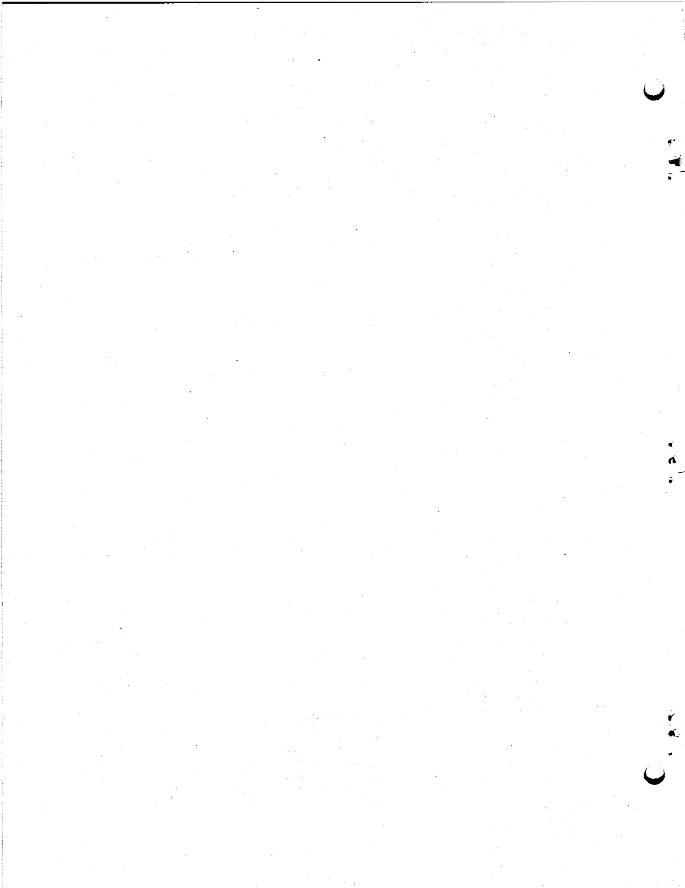

# CONTENTS

Abstract 1   
Introduction 1   
Experimental Procedure 3

Materials Section and Fabrication 5   
Salt Preparation 5

Operations 7   
Results 9

NCL-10 (Hastelloy N) 9   
NCL-12 (Croloy 9M) 19

Discussion 26

Thermodynamics of System Corrosion 31   
Kinetics of System Corrosion 33   
Salt Purification 36

Conclusions 37   
Recommendations 37   
Acknowledgments 38

J. W. Koger and A. P. Litman

# ABSTRACT

The compatibility of a relatively impure (> 3000 ppm impurities) fluoroborate salt, $\mathrm{NaBF}_4$ - $\mathrm{NaF}$ - $\mathrm{KBF}_4$ (90-4-6 mole %), with Hastelloy N and Croloy 9M was evaluated in natural circulation loops operating at a maximum temperature of $605^{\circ}\mathrm{C}$ with a temperature difference of $145^{\circ}\mathrm{C}$ . The Croloy 9M loop (NCL-12) was completely plugged after 1440 hr of operation and the Hastelloy N loop (NCL-10) was three-quarters plugged after 8760 hr (one year) of operation. All major alloying elements of the container materials mass transferred during operation as the result of nonselective attack by virtue of the initial oxygen and water contamination of the salt. Saturation concentrations of 700 ppm Fe and 470 ppm Cr were determined for the fluoroborate salt at $460^{\circ}\mathrm{C}$ . The mechanism of corrosion of the system is as follows. Initially, metal fluoride compounds that are soluble in the salt are formed in the hot leg. The reverse reaction occurs in the cold leg and causes the metal to deposit and to diffuse into the cold leg. This continues until (1) an equilibrium concentration of one or more metal fluorides is reached in the salt at the cold-leg temperature and these compounds start depositing (e.g., NCL-10) or, (2) the equilibrium constant of the reaction changes so much with temperature that the pure metal is deposited (e.g., NCL-12).

# INTRODUCTION

Nuclear reactors that use molten fluorides as fuels are under development for the dual purpose of power production and thorium conversion. Heat generated in the core region of such a molten-salt breeder reactor is transferred from the fuel-containing fluoride salt to a secondary coolant circuit of fluoride salt without fuel, that

then dissipates the heat to steam.² In the Molten-Salt Reactor Experiment (MSRE), the nickel-base alloy Hastelloy N has proved to be an effective container material for the fluoride salt that contains the fuel and for the LiF-BeF₂ diluent.

Many potential fissile $^2$ (containing $\mathrm{UF_4}$ ), fertile $^2$ (containing $\mathrm{ThF_4}$ ), or combination $^1$ (containing both $\mathrm{UF_4}$ and $\mathrm{ThF_4}$ ) salts proposed for the MSBR have been or are being tested for their compatibility with Hastelloy N and other container materials. The choice of a salt for the secondary coolant, however, remains open. Test programs have only considered coolant salts like NaF-ZrF $_4$ and, recently, LiF-BeF $_2$ . While these salts have demonstrated excellent compatibility with Hastelloy N, there is need for cheaper fluoride mixtures that melt at lower temperatures. On the basis of low cost (approximately $50\text{‰}/1\text{b}$ ) and a relatively low melting point (about $400^{\circ}\text{C}$ , necessary for transferring heat to supercritical steam), fluoroborate salts - especially NaBF $_4$ - with small additions of NaF and/or KBF $_4$ have recently become of interest as secondary coolants. Little is known, however, about the corrosion behavior of these salts.

The space diagram of the ternary $\mathrm{NaF - NaBF_4 - KBF_4}$ system (Fig. 1) shows that the salt mixture under consideration lies very near the $\mathrm{NaBF_4}$ corner and has a melting point close to $390^{\circ}\mathrm{C}$ . Note that oxygen impurities that form $\mathrm{BF}_3\mathrm{OH}$ -compounds significantly lower the melting point of the mixture below that shown by the diagram. The vapor pressure of fluoroborate salts, especially $\mathrm{NaBF_4}$ , is higher than that of other fluoride salts, because in the temperature range of interest the sodium fluoroborate maintains such an equilibrium with its components that a significant amount of boron trifluoride gas is present in the system:

$$
\mathrm {N a B F} _ {4} \rightleftharpoons \mathrm {N a F} + \mathrm {B F} _ {3} (\mathrm {g}). \tag {1}
$$

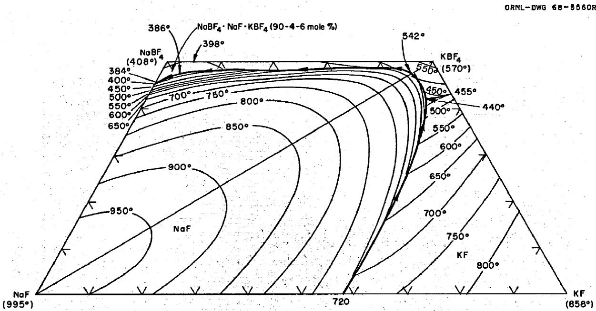  
Fig. 1. Space Diagram of the NaF-NaBF $_4$ -KBF $_4$ -KF System.

Little is known about the corrosion behavior of the $\mathrm{BF}_3$ gas. A few corrosion experiments have been run with very dry $\mathrm{BF}_3$ gas, $^4$ and little appreciable attack was found up to $200^{\circ}\mathrm{C}$ on metals such as brass, stainless steel, nickel, Monel, mild steel, and many others.

This report describes the first comprehensive study of the compatibility of a relatively impure fluoroborate salt with Hastelloy N and Croloy 9M alloys. The experiments were designed to yield information on temperature gradient mass transfer, the major form of corrosion in fluoride salt systems. Two loops were operated with $\mathrm{NaBF_4 - NaF - KBF_4}$ (90-4-6 mole %) salt at a maximum temperature of $605^{\circ}\mathrm{C}$ with a temperature difference of $145^{\circ}\mathrm{C}$ to obtain the data presented. These temperatures match those proposed for fluoroborate salts in a molten salt breeder reactor.

# EXPERIMENTAL PROCEDURE

The natural circulation loops for this program were of the type shown in Fig. 2. Flow results from the difference in density of the

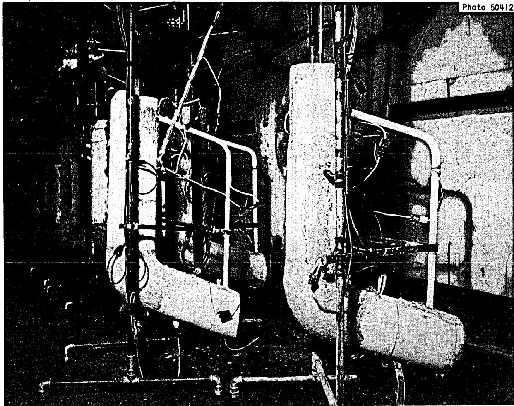  
Fig. 2. Natural Circulation Loops in Test Stands.

salt in the hot and cold portions of the loop. We estimated the velocity of salt flow in the test loops to be 7 ft/min.

# Materials Section and Fabrication

The Croloy 9M material was from Babcock & Wilcox Company heat 18760 and was vapor blasted before fabrication to remove oxides. The loop, NCL-12, was fabricated from 0.750-in.-OD tubing with a wall thickness of 0.109 in. The material was TIG welded and inspected to meet existing internal standards. The welded areas were torch annealed before and after welding.

The Hastelloy N material was from Union Carbide Corporation, Materials Systems Division heat 5096. The loop, NCL-10, was fabricated from 0.672-in.-OD tubing with a wall thickness of 0.062 in., TIG welded and inspected to meet the same standards as those required for the Croloy 9M material.

The compositions of both alloys are given in Table 1.

Table 1. Chemical Composition of Alloy Test Materials   

<table><tr><td rowspan="2">Alloy</td><td colspan="9">Composition (wt %)</td></tr><tr><td>Ni</td><td>Cr</td><td>Mo</td><td>. Fe</td><td>C</td><td>Mn</td><td>S</td><td>P</td><td>Si</td></tr><tr><td>Hastelloy N (NCL-10)</td><td>70.8</td><td>7.47</td><td>15.59</td><td>4.01</td><td>0.07</td><td>0.54</td><td>0.005</td><td></td><td>0.64</td></tr><tr><td>Croloy 9M (NCL-12)</td><td></td><td>8.87</td><td>0.98</td><td>89.00</td><td>0.09</td><td>0.48</td><td>0.012</td><td>0.010</td><td>0.47</td></tr></table>

# Salt Preparation

The salt was prepared by the Fluoride Processing Group of the Reactor Chemistry Division at ORNL. This was their first experience with a fluoroborate salt, and they prepared it by techniques established for other fluoride salts. The raw materials - relatively impure $\mathrm{NaBF}_4$ ,

NaF, and KBF $_4$ (90-4-6 mole %) (Table 2) - were loaded into a container lined with nickel, which was then evacuated and purged several times with helium. Then, the materials were melted and heated to $400^{\circ}\mathrm{C}$ under a helium atmosphere. Next, the liquid was sparged with helium. Since this caused a large increase in pressure, the reactor vessel was vented. Large quantities of BF $_3$ , which had caused the increase in pressure, were then released. Later steps included sparges with a mixture of hydrogen fluoride and hydrogen for several days at $550^{\circ}\mathrm{C}$ to remove oxides and a sparge with hydrogen to remove structural metal impurities. The salt was then transferred to a fill tank made of Hastelloy N in preparation for filling the loop.

The chemical analysis (Table 3) of the prepared salt disclosed two important compositional changes germane to this test series: (1) a significant loss of $\mathrm{BF}_3$ during preparation, and (2) a high content of oxygen and water. Since little was known about the corrosive behavior of this salt or the effect of impurities and because information on its compatibility with the container alloys was needed quickly, we decided to use it as prepared.

Table 2. Composition of Salt Mixture Before Purification   

<table><tr><td></td><td>Mole %</td><td>Wt %</td></tr><tr><td colspan="3">Quantities Loaded in Container</td></tr><tr><td>Compound</td><td></td><td></td></tr><tr><td>KBF4</td><td>5.88</td><td>6.85</td></tr><tr><td>NaBF4</td><td>90.20</td><td>91.61</td></tr><tr><td>NaF</td><td>3.92</td><td>1.53</td></tr><tr><td colspan="3">Chemical Analysis</td></tr><tr><td>Element</td><td></td><td></td></tr><tr><td>K</td><td></td><td>2.10</td></tr><tr><td>Na</td><td></td><td>20.00</td></tr><tr><td>B</td><td></td><td>9.60</td></tr><tr><td>F</td><td></td><td>68.30</td></tr></table>

Table 3. Chemical Analysis of Salt Before Fill   

<table><tr><td>Element</td><td>Content (wt %)</td></tr><tr><td>K</td><td>2.20</td></tr><tr><td>Na</td><td>25.80</td></tr><tr><td>B</td><td>9.65</td></tr><tr><td>F</td><td>60.40</td></tr><tr><td>Ni</td><td>&lt; 5a</td></tr><tr><td>Cr</td><td>54a</td></tr><tr><td>Fe</td><td>28a</td></tr><tr><td>S</td><td>6a</td></tr><tr><td>O2</td><td>3000a</td></tr><tr><td>H2O</td><td>900, 2100a</td></tr></table>

aParts per million.

# OPERATIONS

The hot portion of each loop was heated by sets of clamshell heaters, with the input power controlled by silicon controlled rectifiers (SCR units) and the temperature controlled by a Leeds and Northrup Speedomax H Series 60 type C.A.T. (current proportioning) controller. The loop temperatures were measured by Chromel-P vs Alumel thermocouples that were spot welded to the outside of the tubing, covered by a layer of quartz tape, and then covered with stainless steel shim stock.

Before each loop was filled with salt, it was degreased with acetone and heated to $150^{\circ}\mathrm{C}$ under vacuum to remove any moisture in the system.

We checked for leaks with a helium mass spectrometer leak detector while the interior of the loop was evacuated to $< 5 \times 10^{-3}$ torr. All lines from the fill tank to the loop that were exposed to the fluoroboratesalt were of the same material as the loop and were cleaned and tested in the same manner as the loop. All temporary line connections were made with stainless steel compression fittings.

The loops were filled by heating the loop, the salt pot, and all connecting lines to a minimum of $530^{\circ}\mathrm{C}$ and applying helium pressure to the salt pot to force the salt into the loop. Air was continuously blown on the freeze valves leading to the dump and flush tanks to provide a positive salt seal. Tubular electric heaters controlled by variable autotransformers furnished the heat to the cold-leg portions. Once the loop was filled the heaters were turned off and the insulation was removed to obtain the proper temperature difference by exposing portions of the cold leg to ambient air.

The first charge of salt was dumped after 24 hr in the loops at the maximum operating temperature with some circulation and little temperature gradient. This flush removed surface oxides and other impurities that could have been left in the loops. The loops were then refilled with new salt and put into operation. A helium cover gas under slight positive pressure (about 5 psig) was maintained over the salt in the loops during operation. Each loop was operated at a maximum temperature of $605^{\circ}\mathrm{C}$ and with a temperature difference of $145^{\circ}\mathrm{C}$ . A temperature profile around the loops is shown around the schematic of the loop in Fig. 3. During circulation each loop contained about $920\mathrm{g}$ of salt that contacted $1200\mathrm{cm}^2$ of surface and traveled $254\mathrm{cm}$ around the loop.

Temperature excursions indicated a flow stoppage in NCL-12 (Croloy 9M) after 1440 hr. Attempts to drain the loop were unsuccessful, and the loop was allowed to cool with the test salt in place. In NCL-10 (Hastelloy N), a significant increase of temperature in the hot leg accompanied by a simultaneous temperature decrease in the cold leg occurred after 8335 hr of operation. A perturbation of this type indicates a disruption in salt flow and can indicate plugging. This temperature cycle ceased after 1 hr, and no further incidents occurred

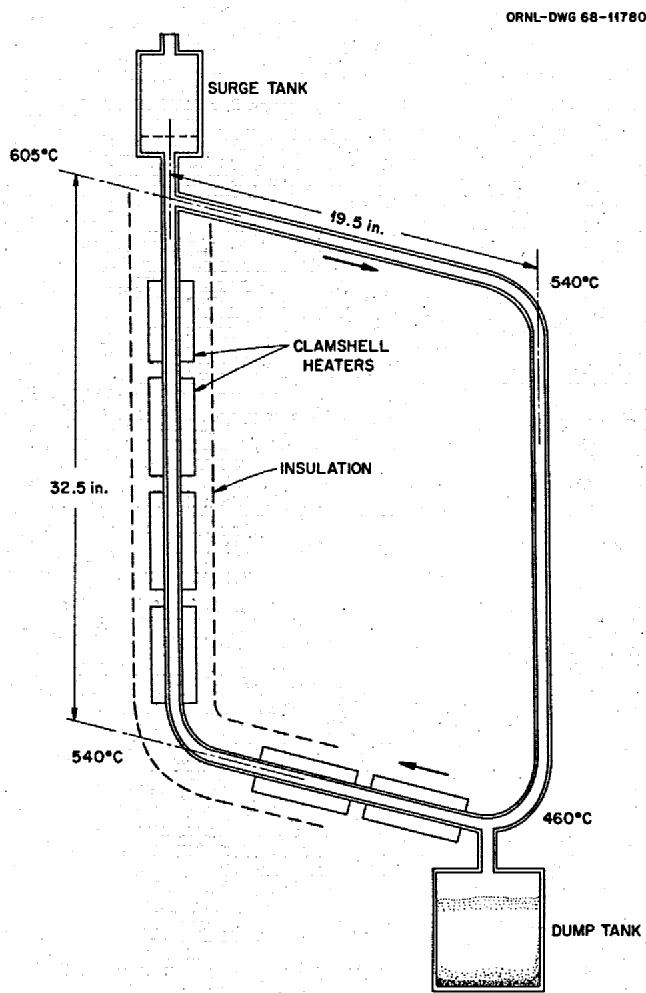  
Fig. 3. Schematic of MSRP Natural Circulation Loop.

during the life of the loop. The loop was shut down after 8760 hr (1 year), and the salt was drained into a dump tank in a normal manner.

# RESULTS

Analyses of loop components and salt were made by standard chemical analysis, metallographic examination, and electron microprobe analysis. The results are discussed below.

# NCL-10 (Hastelloy N)

Visual. - A partial plug in the lower part of the cold leg (Fig. 4) closed approximately $75\%$ of the cross-sectional area of the pipe. Analysis

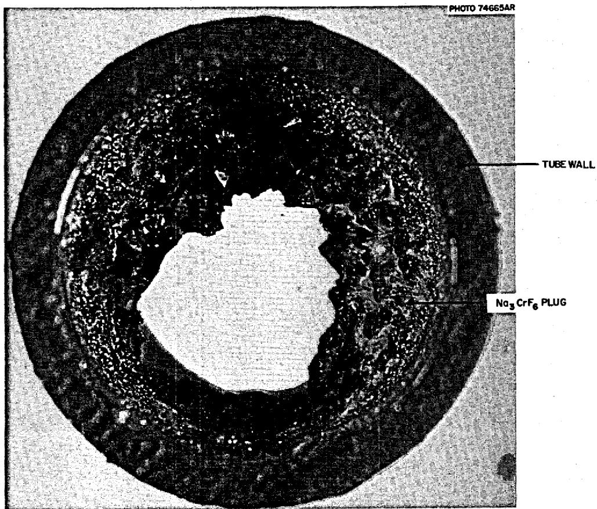  
Fig. 4. Plug Formed in NCL-10 (Hastelloy N) Containing $\mathrm{NaBF}_4$ - $\mathrm{NaF}$ - $\mathrm{KBF}_4$ (90-4-6 mole %) After 8760 hr at a Maximum Temperature of $605^{\circ}\mathrm{C}$ and Temperature Difference of $145^{\circ}\mathrm{C}$ . 8x. Reduced 40%.

showed this emerald-green plug to be single crystals of $\mathrm{Na}_3\mathrm{CrF}_6$ (ref. 6). Smaller amounts of two complex iron fluorides, $\mathrm{Na}_3\mathrm{FeF}_6$ and $\mathrm{NaFeF}_4$ , were also identified in the cold leg.

Chemical. - The analysis of the salt cake (Fig. 5) collected from the dump tank of NCL-10 is given in Table 4. The concentrations of nickel, molybdenum, iron, and chromium in this salt were higher than those of the salt before test. The average chromium concentration was $470~\mathrm{ppm}$ .

Due to cooling, nickel was segregated in the top and bottom portions of the cake, reaching 11.15 and $4.47 \text{wt}\%$ in these portions, respectively. The analysis indicated that the water content of the salt - 400 to 900 ppm

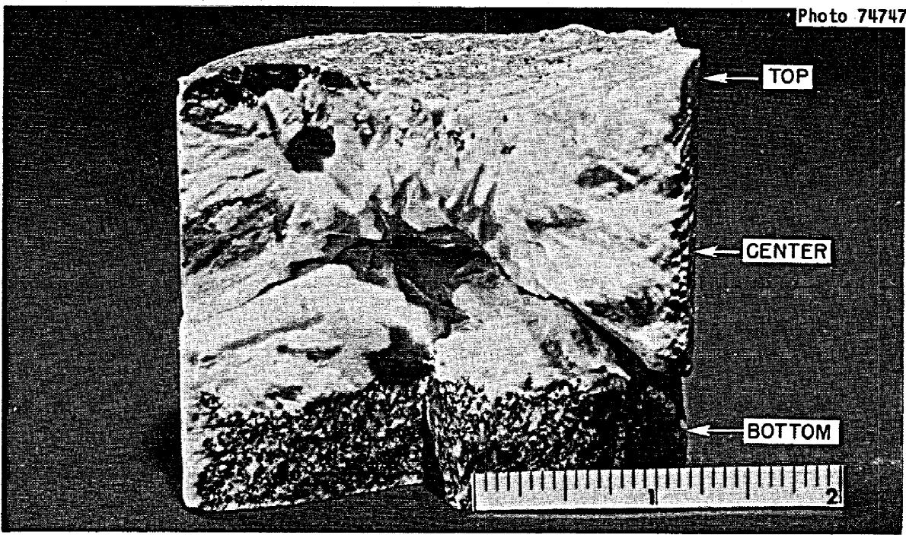  
Fig. 5. Drain Salt Cake From NCL-10 (Hastelloy N).

Table 4. Impurity Analysis: NaBF ${}_{4}$ -NaF-KBF ${}_{4}$ (90-4-6 mole %)   

<table><tr><td rowspan="2"></td><td colspan="7">Analysis (ppm)</td></tr><tr><td>Ni</td><td>Cr</td><td>Mo</td><td>Fe</td><td>O</td><td>H2O</td><td>S</td></tr><tr><td rowspan="3">Before test</td><td rowspan="3">87</td><td rowspan="3">83</td><td rowspan="3">7</td><td rowspan="3">146</td><td>1400</td><td>400</td><td rowspan="3">2,6</td></tr><tr><td>3000</td><td rowspan="2">900</td></tr><tr><td>4850</td></tr><tr><td>After test</td><td></td><td></td><td></td><td></td><td></td><td></td><td></td></tr><tr><td rowspan="2">Top slag</td><td rowspan="2">11.15a</td><td rowspan="2">1000</td><td rowspan="2">1.35a</td><td rowspan="2">4200</td><td>1200</td><td rowspan="2">1800</td><td rowspan="2">5</td></tr><tr><td>1750</td></tr><tr><td rowspan="2">Center layer</td><td rowspan="2">90</td><td rowspan="2">210</td><td rowspan="2">160</td><td rowspan="2">270</td><td>3540</td><td rowspan="2">1300</td><td rowspan="2">2,&lt;5</td></tr><tr><td>3120</td></tr><tr><td rowspan="2">Bottom layer</td><td rowspan="2">4.47a</td><td rowspan="2">1500</td><td rowspan="2">7300</td><td rowspan="2">1500</td><td>3550</td><td rowspan="2">2800</td><td rowspan="2">&lt;5,19</td></tr><tr><td>3660</td></tr></table>

Weight percent.

before test - increased to 1300 to 2800 ppm. The oxygen analyses showed much scatter, but we believe that the oxygen content also increased.

Presumably these increases are due not to air inleakage but to other factors discussed later in this report.

The crossover line to the cold leg, the cold leg, and the crossover line to the hot leg all showed slight increases in wall thickness due to deposition of complex surface layers (Fig. 6). Chemical analysis of the layers disclosed that they were primarily metallic nickel (60 to 90 wt %) and molybdenum. A small quantity of iron was present in proximity to the base metal, but chromium was conspicuously absent.

Metallurgical. - Micrometer measurements of the hot leg of the loop disclosed 1 to 2 mils of metal loss and slight surface roughening.

Metallographic examination of an area from the hottest section $(605^{\circ}\mathrm{C})$ , however, showed a smooth surface with an occasional penetration along a grain boundary (Fig. 7). Microprobe traces7 of this hottest section for all the alloying elements showed no compositional gradients. The chromium trace for this section is given in Fig. 8. These results indicate a general dissolutive attack in the hot-leg section.

An area at the entry of the cold leg (520°C) showed a duplex surface structure, and the areas numbered in Fig. 9 were analyzed with the microprobe for the various elements (Fig. 10). The outermost layer, area 1, is quite high in nickel - up to 87 wt %. We believe this is most likely a region where nickel deposited during the test. Area 2 is a region containing essentially only molybdenum and nickel. Close to the original metal surface there is an increase in nickel, a smaller increase in molybdenum, and little change in chromium and iron. Note that with an increase in nickel and molybdenum metal the concentration of chromium and iron would show a decrease even though there were no change in the actual amounts.

Figure 11, a photomicrograph of the coldest section NCL-10 (460°C) shows a spongy deposit on the surface and a loosely adherent corrosion product beyond this region. At higher magnifications, it was seen that the tightly attached spongy deposit varied in thickness from 0 to $6\mu \mathrm{m}$

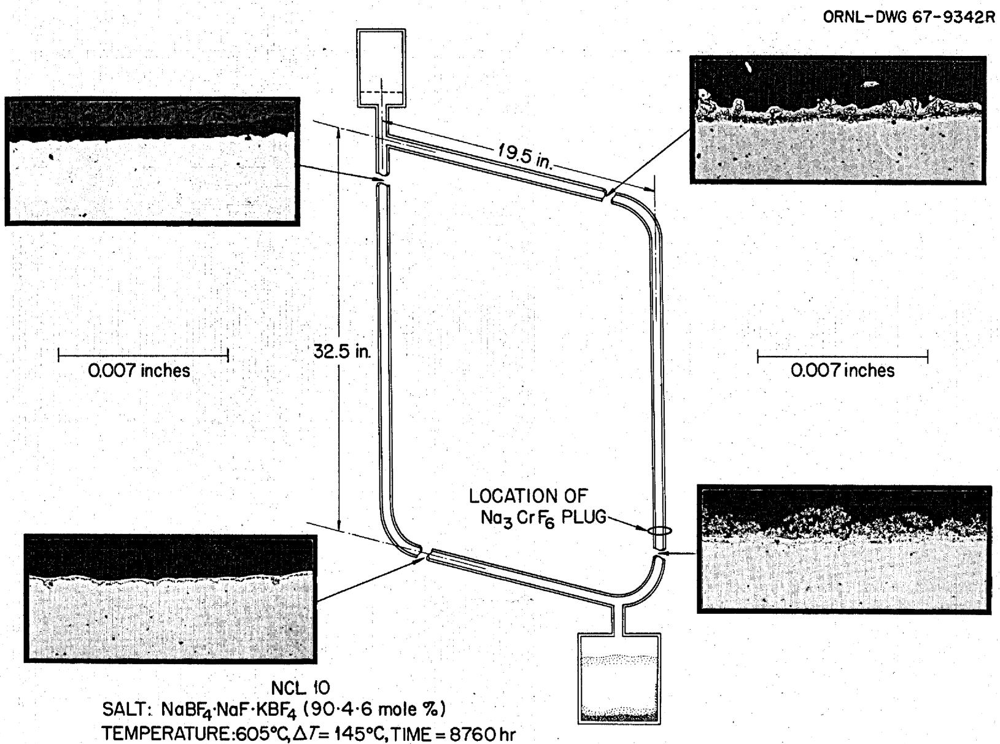  
Fig. 6. Surface Layers in NCL-10 (Hastelloy N) After 8760 hr Operation.

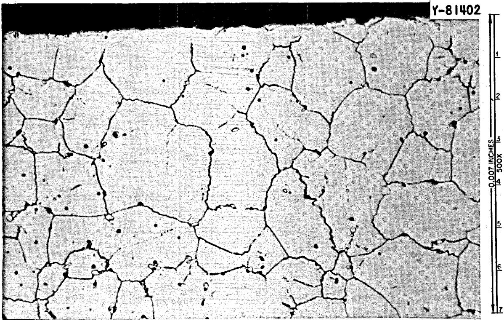

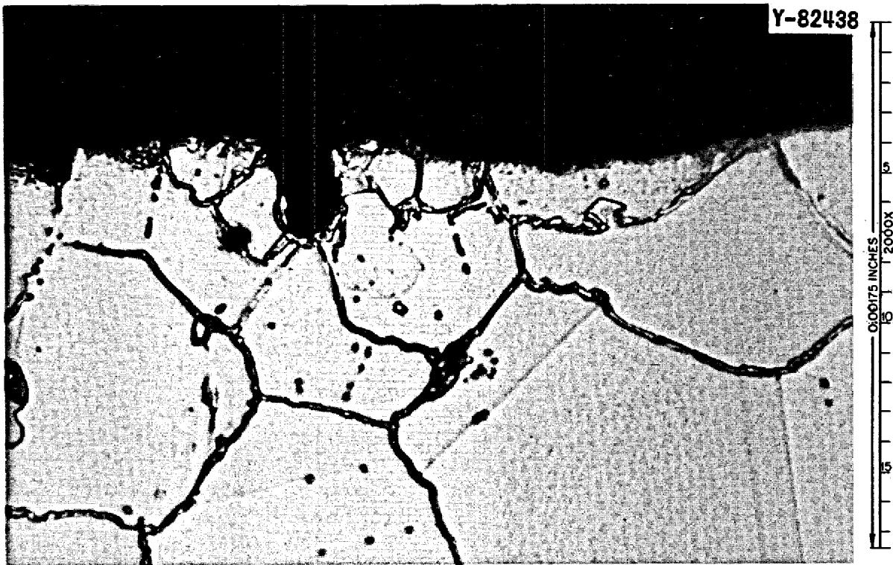  
Fig. 7. Hastelloy N Hot-Leg Section NCL-10 (605°C) Shown at Different Magnifications After 8760 hr in Fluoroborate Salt. Etchant: Glyceria Regia.

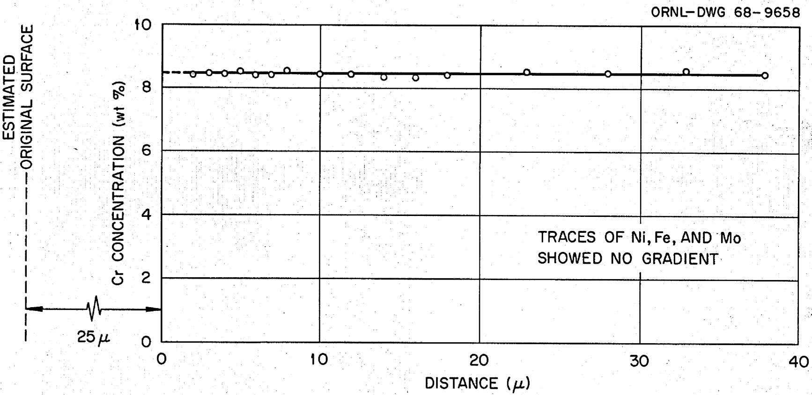  
Fig. 8. Penetration Curve of Chromium in Hot Leg $(605^{\circ}\mathrm{C})$ of NCL-10 (Hastelloy N) After 8760 hr in Fluoroborate Salt.

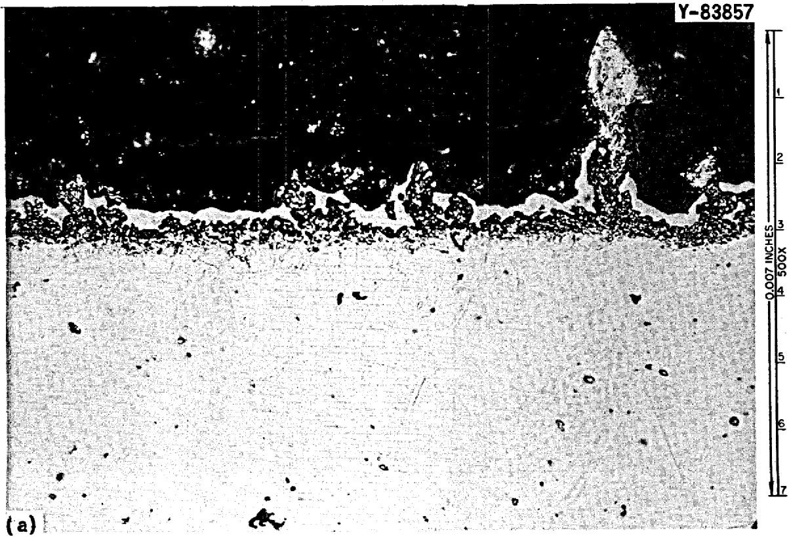

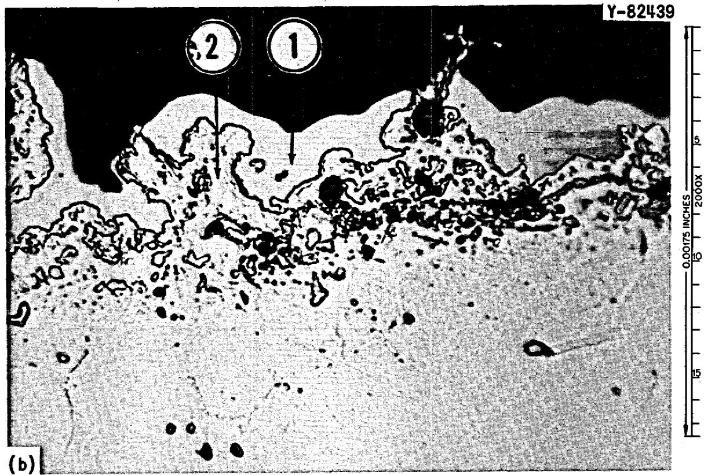  
Fig. 9. Entry to Cold Leg $(520^{\circ}\mathrm{C})$ of NCL-10 (Hastelloy N) Operated for 8760 hr in Fluoroborate Salt. Etchant: Glyceria Regia. (a) $500\times$ . (b) Numbered areas were analyzed by microprobe. $2000\times$ .

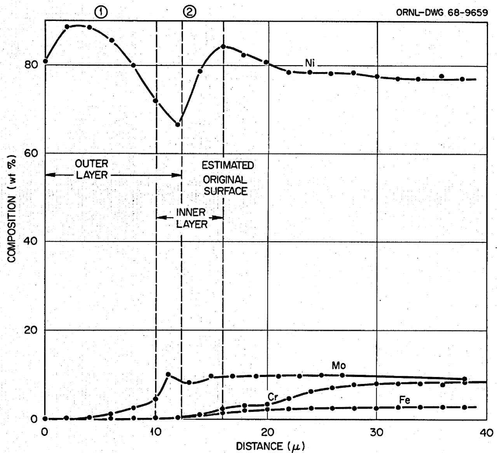  
Fig. 10. Penetration Curve of Constituents of Hastelloy N at Cold-Leg Entry (520°C) of NCL-10 Operated for 8760 hr in Fluoroborate Salt.

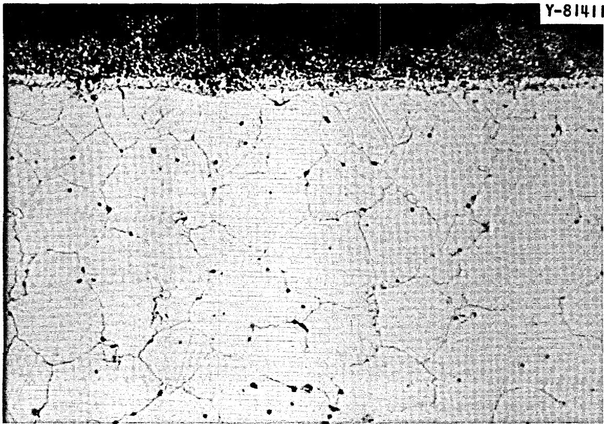  
0.007 INCHES 100 loo500x loo In

Y-81411

Fig. 11. Coldest Section (460°C) of NCL-10 (Hastelloy N) Shown at Different Magnifications After 8760 hr in Fluoroborate Salt. Etchant: Glyceria Regia.   
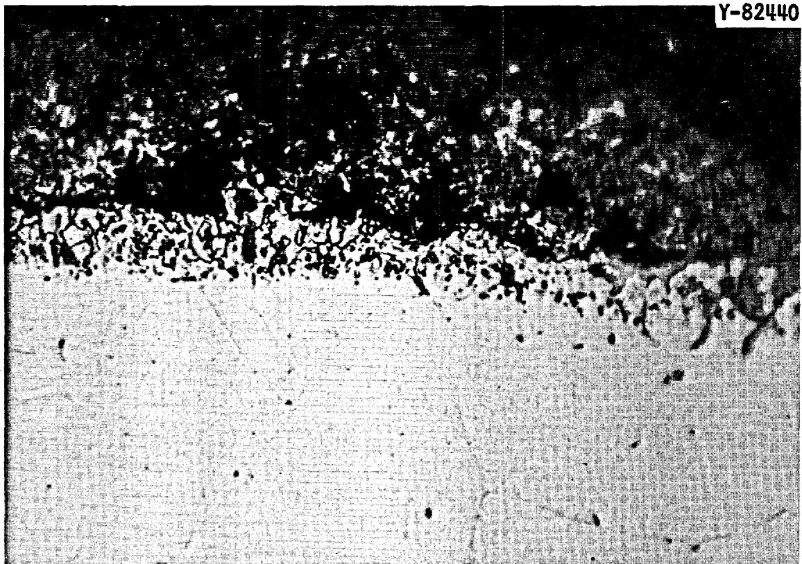  
0.00175 INCHES 1 | 1g | 1 | 1 | 1 | 1 | 1 | 1 | 1 | 1 | 1 |

and that it resembled the area seen in the entry to the cold leg, although much thinner. The spongy layer is high in nickel, with some molybdenum, and appears, like the area 1 of Fig. 9, to have resulted from nickel deposition (Fig. 12). There was only $63\%$ metal in this spongy layer; the balance was fluoride compounds. The original surface is high in nickel and molybdenum and low in chromium and iron and is an area where nickel and molybdenum have diffused into the matrix. No analysis of the loosely adherent material was possible.

The last section of the loop examined was an area at the entrance to the hot leg. Although the salt was being heated here, the temperature was still low enough $(< 530^{\circ}\mathrm{C})$ to make this an area where material was being deposited. Again, a duplex layer was seen (Fig. 13) and found to be predominantly nickel, 65 to $90\%$ metal and the balance fluoride compounds (Fig. 14). X-ray diffraction analysis of the fluoride compounds disclosed an unidentifiable crystal structure, probably a mixture of several fluoride compounds. The surface layer had somewhat more nickel and molybdenum than originally, and, thus, smaller concentrations of chromium and iron.

# NCL-12 (Croloy 9M)

Visual. - When this loop was sectioned for examination, a dark gray plug that completely filled the cross-sectional area for a vertical distance of 1 in. was found in the cold leg (Fig. 15). Also, small, green crystals were seen in the drain line, and a metallic layer was found against the inside of the tubing in the cold section and in the salt.

The thin metallic layer about 2.5 mils thick was deposited on the inside of the tubing in the entire cold-leg section (over one-half the loop). In some places, the material had become detached from the tubing and was found in the frozen salt (Fig. 16). The metallic layer represented about $4\%$ of the total mass of the material (mostly salt) removed (by mechanical means) from the loop. Chemical analysis revealed the layer to be 90 wt $\%$ Fe and 10 wt $\%$ Cr metal.

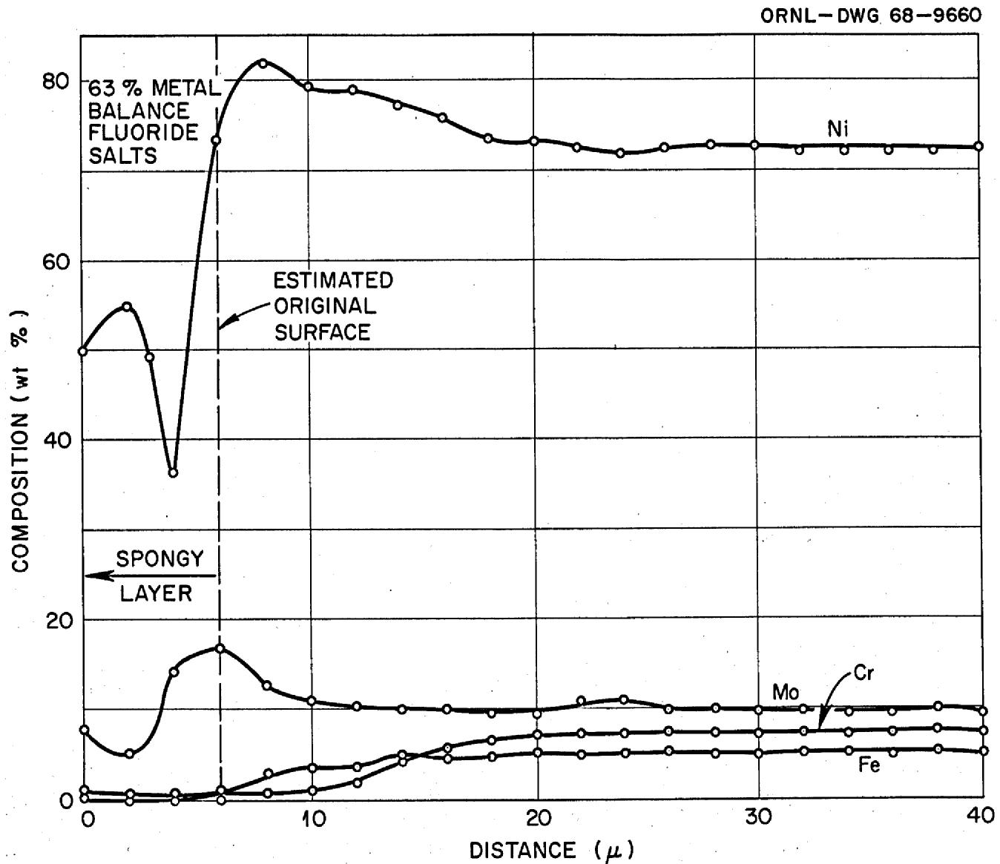  
Fig. 12. Penetration Curve of Constituents of Hastelloy N in Coldest Section $(460^{\circ}\mathrm{C})$ of NCL-10 Operated for 8760 hr in Fluoroborate Salt.

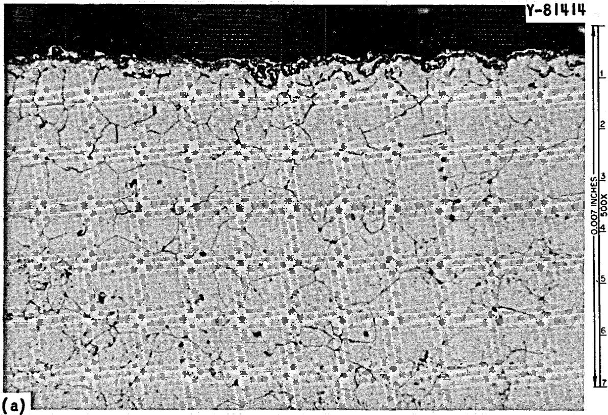

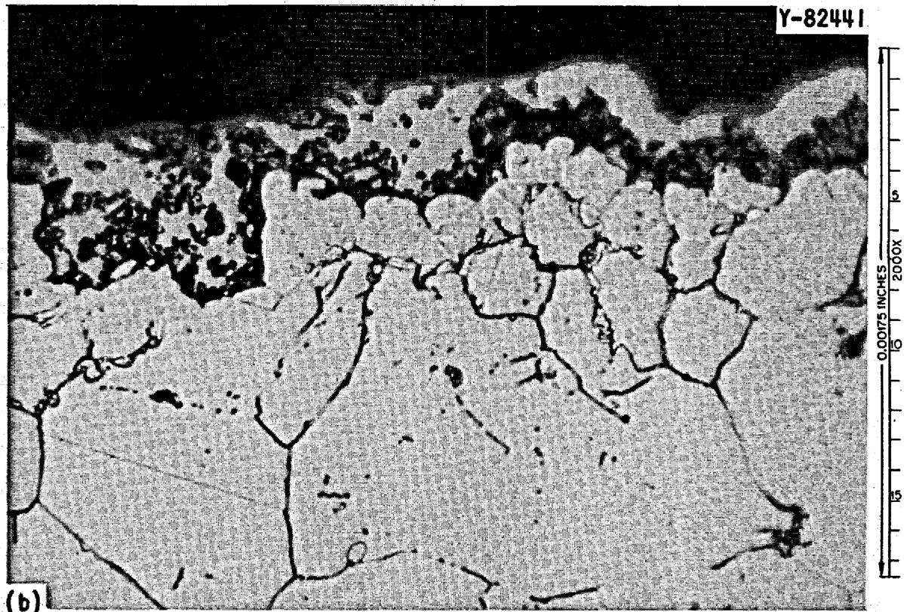  
Fig. 13. Entry to Hot Leg $(530^{\circ}\mathrm{C})$ of NCL-10 (Hastelloy N) Shown at Different Magnifications After 8760 hr in Fluoroborate Salt. Etchant: Glyceria Regia.

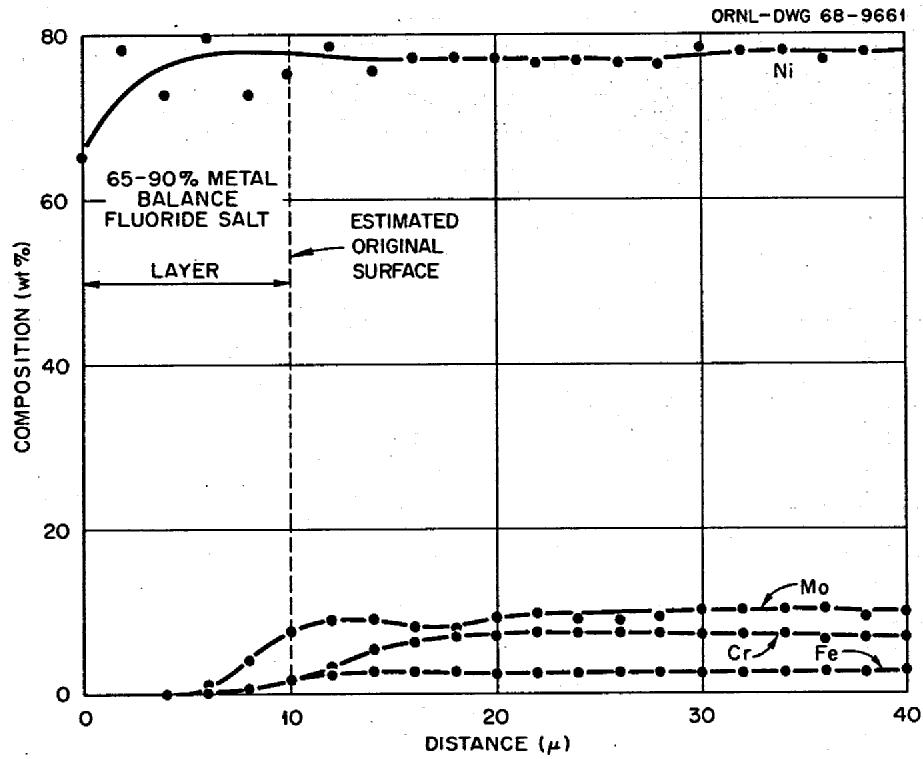  
Fig. 14. Penetration Curve of Constituents of Hastelloy N in Hot Leg Entry (530°C) of NCL-10 Operated for 8760 hr in Fluoroborate Salt.

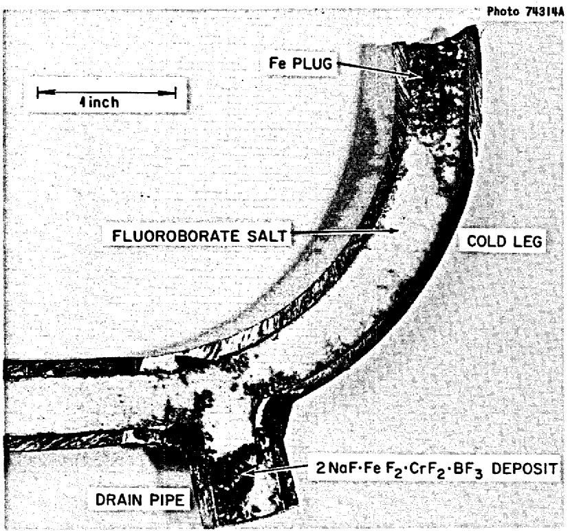  
Fig. 15. Iron Dendrite Plug in Coldest Section $(460^{\circ}\mathrm{C})$ of NCL-12 (Croloy 9M) Operated in Fluoroborate Salt for 1440 hr at a Maximum Temperature of $605^{\circ}\mathrm{C}$ and a Temperature Difference of $145^{\circ}\mathrm{C}$ .

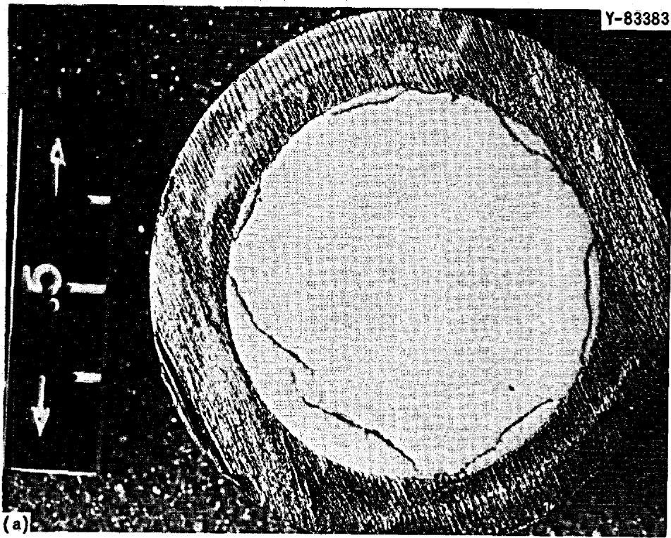

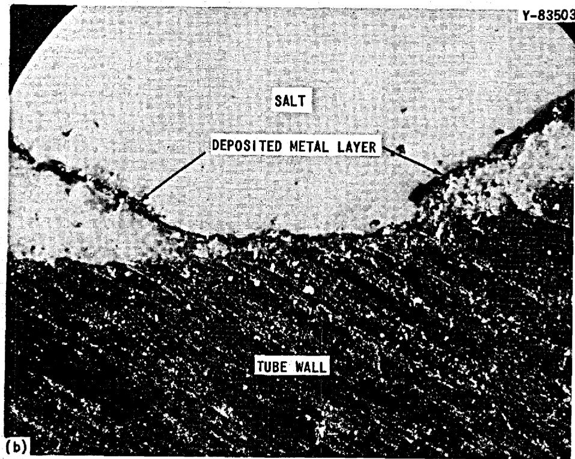  
Fig. 16. Cross Section of Tubing of NCL-12 (Croloy 9M) Showing Deposited Metal Layer. Loop operated for 1440 hr in fluoroborate salt at a maximum temperature of $605^{\circ}\mathrm{C}$ and a temperature difference of $145^{\circ}\mathrm{C}$ . Reduced $22\%$ . (a) Cross section of NCL-12 tubing. (b) Enlarged view of metal and salt interface. $30\times$

The dark-gray plug located in the coldest part of the loop was composed of dendritic crystals. We found similar crystals adhering to specimens in the hot leg (Fig. 17), but we assume that these crystals, growing and circulating in the salt stream, attached themselves to the specimens while the loop was cooling.

Chemical. - Chemical analysis showed that the dark-gray plug and the material on the specimens were essentially pure iron with less than $1\%$ of other elements (shown below).

<table><tr><td>Elements</td><td>Content (wt %)</td></tr><tr><td>Fe</td><td>99.00</td></tr><tr><td>B</td><td>0.03</td></tr><tr><td>Cr</td><td>&lt; 0.05</td></tr><tr><td>Mn</td><td>&lt; 0.01</td></tr><tr><td>Mg</td><td>0.05</td></tr><tr><td>Pb</td><td>&lt; 0.02</td></tr><tr><td>Si</td><td>0.02</td></tr><tr><td>Cu</td><td>0.05</td></tr><tr><td>Mo</td><td>0.02</td></tr></table>

The results of chemical analysis of the green crystals in the drain leg are given below.

<table><tr><td>Elements</td><td>wt %</td></tr><tr><td>Na</td><td>10-15</td></tr><tr><td>B</td><td>2-4</td></tr><tr><td>F</td><td>45.9</td></tr><tr><td>K</td><td>0.058</td></tr><tr><td>Fe</td><td>18</td></tr><tr><td>Cr</td><td>12</td></tr><tr><td>Mn</td><td>1.5</td></tr></table>

The stoichiometry of this green deposit, based on this analysis, color, and other factors, is roughly $2\mathrm{NaF - FeF_2 - CrF_3 - BF_3}$ , which corresponds to chromium and iron fluorides mixed with the salt.

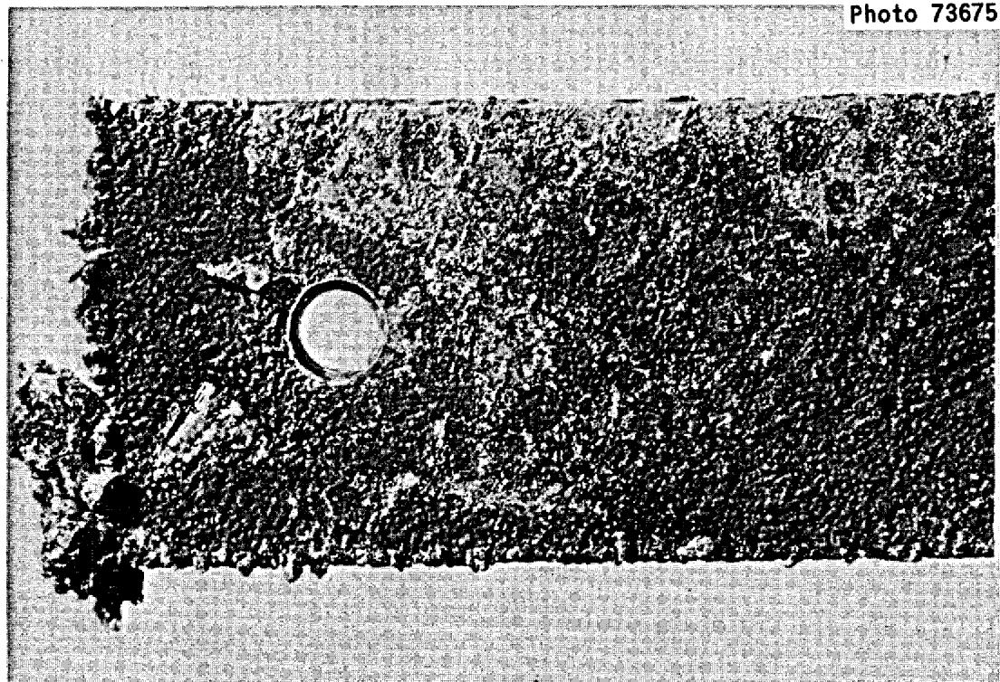  
(a)

Photo 73674

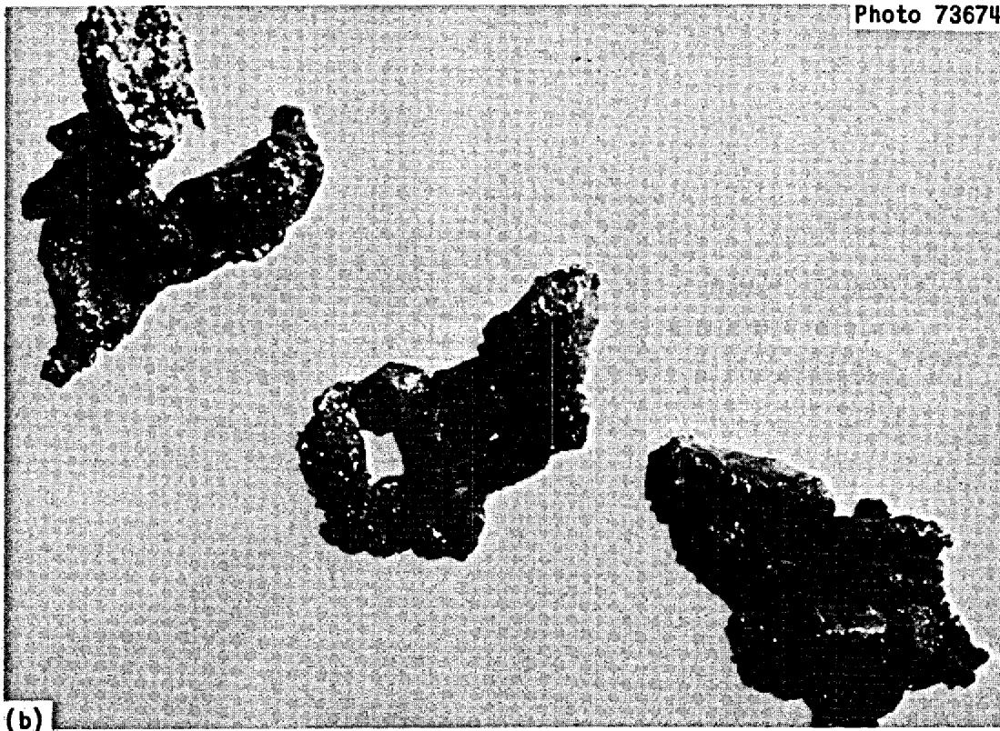  
Fig. 17. Pure Iron Crystals from NCL-l2, Which Operated for 1440 hr in Fluoroborate Salt at a Maximum Temperature of $605^{\circ}\mathrm{C}$ and a Temperature Difference of $145^{\circ}\mathrm{C}$ . $10 \times$ . Reduced $12\%$ . (a) Crystals adhering to specimen, and (b) crystals removed from specimen for photographing.

Table 5 gives the composite of the salt before and after operation. The significant changes in the salt chemistry due to test are the increases in the chromium and iron content from 54 to 255 and 28 to 700 ppm, respectively.

Table 5. Composition of Salt Before and After Operation in NCL-12   

<table><tr><td rowspan="2"></td><td colspan="4">Composition (wt %)</td><td colspan="6">Composition (ppm)</td></tr><tr><td>K</td><td>Na</td><td>B</td><td>F</td><td>Ni</td><td>Cr</td><td>Fe</td><td>Mo</td><td>S</td><td>O</td></tr><tr><td colspan="11">Before Test</td></tr><tr><td>Theoretical(calculated)</td><td>2.10</td><td>20.00</td><td>9.60</td><td>68.3</td><td></td><td></td><td></td><td></td><td></td><td></td></tr><tr><td>Before Fill</td><td>2.20</td><td>25.80</td><td>9.65</td><td>60.4</td><td>&lt; 5</td><td>54</td><td>28</td><td></td><td></td><td>3000</td></tr><tr><td>During Fill</td><td>1.98</td><td>18.83</td><td>9.38</td><td>66.2</td><td>87</td><td>83</td><td>146</td><td></td><td></td><td>1400</td></tr><tr><td colspan="11">After Test</td></tr><tr><td>Hot leg</td><td>1.55</td><td>19.72</td><td>9.29</td><td>67.1</td><td></td><td>265</td><td>700</td><td>&lt; 20</td><td>7</td><td>3000</td></tr><tr><td>Cold leg</td><td>1.89</td><td>20.71</td><td>9.27</td><td>67.3</td><td></td><td>255</td><td>700</td><td>&lt; 20</td><td>&lt; 2</td><td>3200</td></tr></table>

Metallurgical. - Metallographic examination of the hot-leg loop tubing (Fig. 18) disclosed a fairly smooth surface, and micrometer measurements showed an average 2.5 mil loss from a nominal pipe diameter.

Electron microprobe analyses were made on tubing from the hot- and cold-leg sections of NCL-12: the hot-leg analysis (Fig. 19), consistent with the metallographic results, showed no iron or chromium concentration gradients; the cold leg analysis (Fig. 20) showed an increase of about $4\mathrm{wt}\%$ in iron concentration and a decrease of about $4\mathrm{wt}\%$ in chromium concentration (i.e., an iron-rich surface layer).

# DISCUSSION

The tests described are the first study of the compatibility of a fluoroborate salt with container materials of interest to molten-salt reactors. Unfortunately, little was known at the time of the test about the purification of the salt or the characteristics of mass transfer in

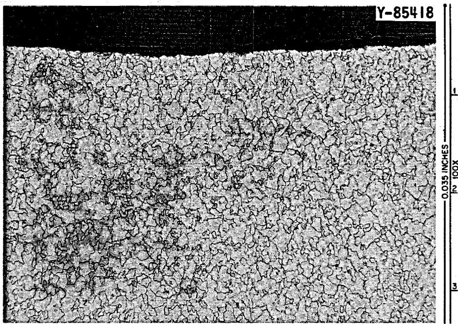  
Fig. 18. Hot Leg (605°C) of NCL-12 (Croloy 9M), Which Operated for 1440 hr in Fluoroborate Salt. Etchant: Picric acid, hydrochloric acid, and ethyl alcohol.

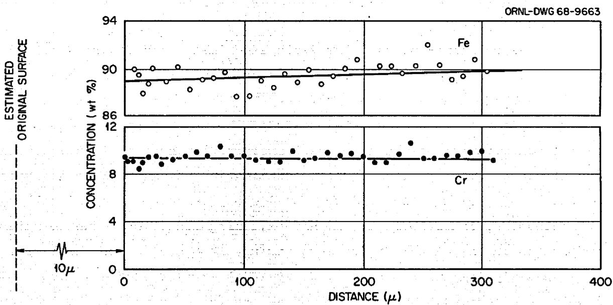  
Fig. 19. Penetration Curve for Iron and Chromium in the Hot Leg (605°C) of NCL-12 (Croloy 9M), Which Operated for 1440 hr in Fluoroborate Salt.

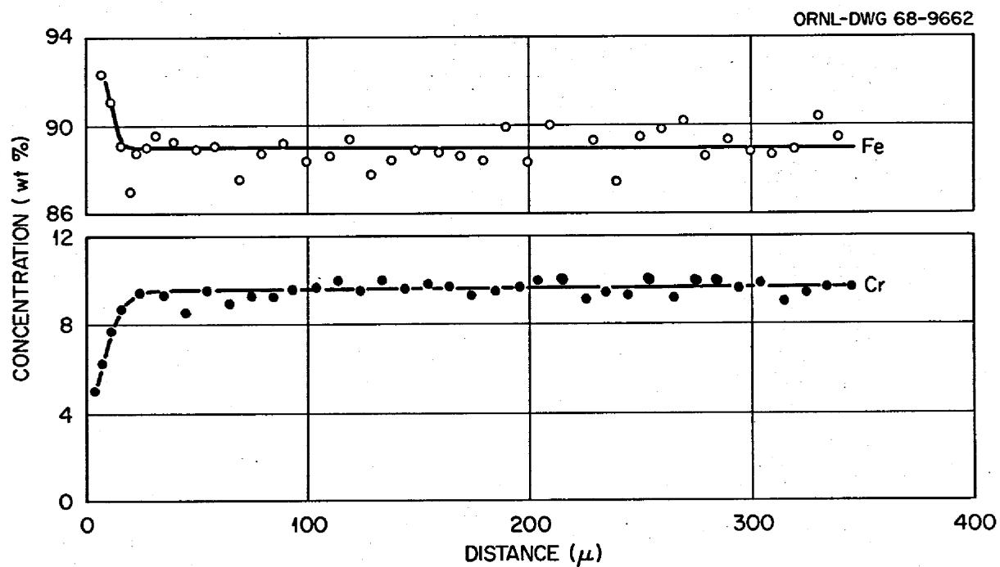  
Fig. 20. Penetration Curve for Iron and Chromium in the Cold Leg $(460^{\circ}\mathrm{C})$ of NCL-12 (Croloy 9M), Which Operated for $1440\mathrm{hr}$ in Fluoroborate Salt.

systems containing such salts. The use of loops of an old design prevented our having any removable specimens, but permanent hot-leg specimens were used in NCL-12.

Our expectation, based on previous experience with fluoride salts, was that temperature gradient mass transfer of the least noble constituent (i.e., chromium and iron) would be the limiting factor. But salt analyses after the test indicated that all the major alloying elements of the container materials had mass transferred. The nonselective attack was also confirmed by metallographic examination and microprobe analysis of the loop specimens and piping. In view of the movement of nickel and molybdenum, it is obvious that highly oxidizing conditions, due to water and oxygen in the salt, were present during the operation of the loops.

In analyzing NCL-10 and -12, we reviewed earlier studies (late 1950's) to single out the cases of mass transfer of nickel and molybdenum.

We found several instances where this had occurred in salts containing KF. One such loop, constructed of Hastelloy N, operated for a year with a NaF-LiF-KF salt (11.5-46.5-42 mole %) at a maximum temperature of $690^{\circ}\mathrm{C}$ with a temperature difference of $90^{\circ}\mathrm{C}$ . No analysis for oxygen or water was made before test. Examination after test disclosed green crystals embedded in the salt. Salt analyses showed significant increases in nickel, iron, molybdenum, and chromium content. X-ray analysis showed that the green crystals were mixtures of sodium and potassium chromium fluoride complex compounds and that most of the KF present in the salt was actually KF-2H $_2$ O.

Another loop, constructed of Inconel, (Ni-18% Cr-10% Fe) operated about one-half year with the same salt and at the same temperatures as above. After test, metallographic examination showed heavy attack in the hot-leg portion of the loop. After test only the chromium and iron contents of the salt were determined; the chromium content had increased significantly from 60 to 900 ppm. X-ray analysis of the salt disclosed that the salt was about $15\%$ $\mathrm{KF}\cdot 2\mathrm{H}_2\mathrm{O}$ . The relatively well-defined x-ray pattern of this hydrate suggested that it was not formed when the cold melt was exposed to air but was carried as a part of the salt mixture during operation.[8] The compound $\mathrm{KF}\cdot 2\mathrm{H}_2\mathrm{O}$ is known to be thermally stable. The literature states that KF easily forms a series of crystal hydrates, whereas LiF and NaF crystallize anhydrously.[9] It is also noted that it is easy to form $\mathrm{KBF}_3\mathrm{OH}$ and $\mathrm{NaBF}_3\mathrm{OH}$ and that they are quite stable.

Thus we have seen that during the molten-salt reactor corrosion program, salts containing KF have on occasion been very aggressive toward metals. We believe that the reason for this is the combined water associated with that alkali metal fluoride salt. We again stress that we found no leakage of air into any of the loops. This suggests that hydrated KF is not removed by the purification process. Paradoxically, it appears that combined water in the fluoroborate salt mixture can be released and will react to produce HF by

$$
\mathrm {H} _ {2} \mathrm {O} + \overline {{\mathrm {B F} _ {4}}} \rightleftharpoons \mathrm {H F} + \mathrm {B F} _ {3} \mathrm {O H} ^ {-}. \tag {2}
$$

The generation of HF in the system leads to the following reactions with the elements of the container material:

$$
2 \mathrm {H F} + \mathrm {N i} \rightleftharpoons \mathrm {N i F} _ {2} + \mathrm {H} _ {2}, \tag {3}
$$

$$
6 \mathrm {H F} + \mathrm {M o} \rightleftharpoons \mathrm {M o F} _ {6} + 3 \mathrm {H} _ {2}, \tag {4}
$$

$$
2 \mathrm {H F} + \mathrm {F e} \rightleftharpoons \mathrm {F e F} _ {2} + \mathrm {H} _ {2}, \tag {5}
$$

$$
2 \mathrm {H F} + \mathrm {C r} \rightleftharpoons \mathrm {C r F} _ {2} + \mathrm {H} _ {2}. \tag {6}
$$

Note that, in the temperature range of interest, changes in the standard free energy of formation are not favorable for all the reactions as written. However, studies on the Fluoride Volatility Processing scheme10 at ORNL showed that in a Hastelloy N hydrofluorinator containing fused fluoride salts and HF, chromium and iron were rapidly leached from the alloy at elevated temperatures (500 to $650^{\circ}\mathrm{C}$ ) even when the HF activity was quite low. The main reaction is the oxidation of the metal by the HF to form fluorides soluble in the melt. It was found that $\mathrm{NiF}_2$ is produced by driving the reaction through the continuous removal of hydrogen and reaction products, since the free energy of formation (above $490^{\circ}\mathrm{C}$ ) of the nickel fluoride reaction by Eq. (3) is not favorable. For the same reason, molybdenum can also be forced to react with HF even though a positive change in free energy is involved. Evidence of small but finite dissolution rates of molybdenum metal during hydrofluorination conditions have been reported.11,12

In light of the discussion above, we can now consider why two different types of products (i.e., metal and fluoride compounds) were mass transferred in these (NCL-10 and 12) thermal convection loops.

# Thermodynamics of System Corrosion

The cycle of mass transfer initiated by the corrosion of metals by fluoride salts is known to begin in the hotter regions of a loop system with the formation of structural metal fluorides that are soluble in the salt:

$$
\mathrm {M} + \mathrm {F} ^ {-} \rightleftharpoons \mathrm {M F} ^ {-}, \tag {7}
$$

where $M$ is the attacked metal of the container.

The equilibrium constant for Eq. (7) increases with increasing temperature; thus, in a multicomponent alloy the concentration of the attacked constituent, M, will decrease at loop surfaces at high temperature (weight loss) and increases at surfaces at lower temperatures (weight gains). At some intermediate temperature, the initial surface composition of the structural alloy will be in equilibrium with the fused salt (no weight change).

In the cooler regions of a closed system, the rate at which the metal is deposited (steady state condition before plugging) is generally equal to the rate at which it diffuses into the metal - a necessity to maintain its equilibrium activity on the surface. Thus the rate of diffusion of the metal in the alloy in the cooler regions usually controls the rate of corrosion in the hot zone. At this stage in the temperature-gradient mass-transfer process, weight gains would be found on specimens in the cold section but little if any surface change (deposits) would be seen. This generalization is valid only when the equilibrium concentration of a metal fluoride compound in the salt [produced by Eq. (7)] does not exceed the saturation concentration of a metal fluoride compound in the salt at the low temperature.

Early studies reported by Grimes $^{13}$ clearly illustrate these points. Table 6 shows the chromium concentrations for two salts as functions of the equilibrium between the salts and Inconel or pure chromium. Note that when the alkali-metal fluoride salt (NaF-KF-LiF-UF $_4$ ) is in contact with Inconel at $800^{\circ}\mathrm{C}$ it will support a higher concentration of chromium

Table 6. Equilibrium Concentrations of Chromium Fluorides With Two Salts   

<table><tr><td></td><td colspan="2">Chromium Concentration (ppm)</td></tr><tr><td></td><td>NaF-KF-LiF-UF4</td><td>NaF-ZrF4-UF4</td></tr><tr><td>Calculated salt equilib-rium with Inconel</td><td></td><td></td></tr><tr><td>NCr = 0.16 at 800°C (ref. a)</td><td>1660</td><td>1400</td></tr><tr><td>Experimental salt equilib-rium with pure chromium</td><td></td><td></td></tr><tr><td>NCr = 1.0 at 600°C (ref. a)</td><td>1100</td><td>2400</td></tr></table>

${}^{a}$ Concentration of chromium in mole fraction.

fluorides (1660 ppm Cr) than it will when it is in contact with pure chromium at $600^{\circ}\mathrm{C}$ (1100 ppm Cr). Accordingly, circulation of such a salt in an Inconel loop would result in the deposition of essentially pure chromium metal in the cold zone. In that case, the total rate of attack would be controlled simply by diffusion of chromium to the interface between metal and salt in the hot zone. We believe that the deposition of pure iron in NCL-12 (Croloy 9M) occurred this way. This is not a new phenomenon. Rapid plugging by deposition of metal dendrites occurred frequently in the late 1950's especially in iron-base alloy loops.[14,15]

Examination of the data for the other salt shown in Table 6 (NaF-ZrF $_4$ -UF $_4$ ) leads to the conclusion that chromium metal would not plate out in that system and that any product of mass transfer would be a fluoride compound. At $600^{\circ}\mathrm{C}$ this salt in equilibrium with pure chromium will support a higher concentration of chromium fluorides than it will

in contact with Inconel at $800^{\circ}\mathrm{C}$ . For gross deposition of compounds to occur, the concentration of the compound at the temperature of interest (cold zone) must exceed the saturation concentration of the metal fluoride corrosion product present in the system.

We believe that the mechanism in NCL-10 (Hastelloy N) is similar to the one discussed above for the NaF-ZrF $_4$ system and that in time the concentration of chromium - or more accurately the concentration of mixed metal chromium fluoride - in the fluoroborate salt at $605^{\circ}\mathrm{C}$ exceeded the saturation concentration at $460^{\circ}\mathrm{C}$ and allowed deposition of large quantities of complex compounds.

Both NCL-10 and NCL-12 operated with the same salt at the same temperature, yet they were plugged by different mechanisms at different rates. A chromium-rich plug was found in the Hastelloy N loop (containing $7\%$ Cr- $5\%$ Fe) and an iron plug was found in the Cróloy 9M loop (containing $9\%$ Cr-bal Fe). Thus, it appears that when these fluoroborate salts are contained in alloys with between 7 and 9 wt $\%$ Cr, the iron content of the alloy controls the composition of the temperature-gradient mass-transfer deposit.

# Kinetics of System Corrosion

With the foregoing data and evaluation, it is now possible to determine when plugging started in NCL-10 and -12 and the disposition of each element at various times.

We calculated the interim concentrations for chromium and iron in NCL-12 from knowledge of the amount of these elements after test, the weight of the iron plug, and an assumed reaction-rate constant and mode of chemical attack (from later experiments). The results of the calculations, presented in Table 7, show that the saturation value of iron in the cold section, $700\mathrm{ppm}$ or $1120\mathrm{mg}$ , was exceeded shortly after $130\mathrm{hr}$ ; at that time pure iron started depositing and eventually caused a complete plug.

Table 8 shows the same kind of calculations for the operation of NCL-10. In this case, it appears that the saturation value of chromium

Table 7. Calculated Concentration of Alloying Elements from NCL-12   
Present in the Salt at Various Times   

<table><tr><td rowspan="3">Time (hr)</td><td rowspan="3">Maximum Attacka(mg/cm2)</td><td rowspan="3">Average Attack (mg/cm2)</td><td rowspan="3">Area Attackedb(cm2)</td><td rowspan="3">Total Material Lost (mg)</td><td rowspan="3">Deposited in Ribbon Form (mg)</td><td colspan="4">Concentration in Salt</td><td rowspan="3">Deposited As Plug (mg)</td></tr><tr><td colspan="2">Fe</td><td colspan="2">Cr</td></tr><tr><td>(mg)</td><td>(ppm)</td><td>(mg)</td><td>(ppm)</td></tr><tr><td>14.4</td><td>2</td><td>1</td><td>650</td><td>650</td><td>250</td><td>360</td><td>225</td><td>40</td><td>25</td><td></td></tr><tr><td>57.6</td><td>4</td><td>2</td><td>650</td><td>1300</td><td>500</td><td>720</td><td>450</td><td>80</td><td>50</td><td></td></tr><tr><td>130</td><td>6</td><td>3</td><td>650</td><td>1950</td><td>750</td><td>1080</td><td>675</td><td>120</td><td>75</td><td></td></tr><tr><td>1440</td><td>20</td><td>10</td><td>650</td><td>6500</td><td>2450</td><td>1120</td><td>700c</td><td>400</td><td>250c</td><td>2530</td></tr></table>

aCalculated from $\Delta W = 2 / \sqrt{\pi}\rho c\sqrt{kt}$   
where $\mathrm{K} =$ rate constant, $10^{-12} \, \mathrm{cm}^2/\mathrm{sec}$ at $607^\circ \mathrm{C}$ ,   
$\Delta W =$ weight loss,   
$c =$ concentration of chromium and iron,   
$\rho =$ density of Croloy 9M, and   
$\mathbf{t} = \mathbf{\nabla}$ time.   
b Includes surge tank and lines and one-half of total area.   
c By chemical analysis.

Table 8. Calculated Concentration of Alloying Elements from NCL-10 Present in the Salt at Various Times   

<table><tr><td rowspan="3">Time (hr)</td><td rowspan="3">Maximum Attacka (mg/cm2)</td><td rowspan="3">Average Attack (mg/cm2)</td><td rowspan="3">Area Attackedb (cm2)</td><td rowspan="3">Total Material Lost (mg)</td><td rowspan="3">Deposited on Cold Surface</td><td colspan="8">Concentration in Salt</td><td rowspan="3">Deposited As Plug (mg)</td></tr><tr><td colspan="2">Fe</td><td colspan="2">Cr</td><td colspan="2">Ni</td><td colspan="2">Mo</td></tr><tr><td>(mg)</td><td>(ppm)</td><td>(mg)</td><td>(ppm)</td><td>(mg)</td><td>(ppm)</td><td>(mg)</td><td>(ppm)</td></tr><tr><td>4000</td><td>38</td><td>19</td><td>550</td><td>10,450</td><td>2100</td><td>350</td><td>383</td><td>420</td><td>459</td><td>6350</td><td>6950</td><td>1150</td><td>1260</td><td></td></tr><tr><td>8760</td><td>56</td><td>28</td><td>550</td><td>15,400</td><td>3300</td><td>509</td><td>555c</td><td>427</td><td>470c</td><td>9300</td><td>10,000c</td><td>1560</td><td>1700c</td><td>220</td></tr></table>

aCalculated from $\Delta W = 2 / \sqrt{\pi}$ oKt   
where $\mathrm{K} =$ rate constant, $10^{-12} \, \mathrm{cm}^2/\mathrm{sec}$ at $607^\circ \mathrm{C}$ ,   
$\Delta W =$ weight loss,   
c = concentration of chromium, iron, nickel, and molybdenum,   
$\rho =$ density of Hastelloy N, and   
$\mathbf{t} = \mathbf{\nabla}$ time.

bIncludes surge tank and lines and one-half total area.

cBy chemical analysis.

in the cold leg, 470 ppm, was reached after about 4000 hr of operation; at that time, the chromium, as $\mathrm{Na}_3\mathrm{CrF}_6$ , started depositing in large amounts.[17]

It is interesting to note that in both cases the amounts of the alloying elements in the salt and in the plug were in about the same ratio as they are in the base metal. Capsule tests and other loop tests have shown that when constituents of an alloy react with the liquid medium they will be found in the liquid and/or deposited in the ratio at which they existed in the alloy.[18] This behavior was found in both loops of this experiment.

Nickel and molybdenum mass transfer products, not normally found in relatively pure fluoride salt systems, also follow this pattern. As has been stressed here, the presence of gross quantities of nickel and molybdenum indicates strongly oxidizing conditions.

# Salt Purification

The salt used in these experiments contained many impurities that the old techniques, successful with other fluoride salts, did not remove. Since these experiments, improvements have been made in the fluoroborate salt preparation. Only very pure salt (99.9%) is now used as starting material. In fact, the salt has so few impurities that no steps are

taken during processing to remove the structural metals. Purification procedures for removing water and oxygen are now under study. A new procedure is also used in the melting and preparation of the fluoroboratesalt to prevent loss of $\mathsf{BF}_3$ vapor and the ensuing change of composition. In brief, the loaded salt is evacuated to about 380 torr and heated to $150^{\circ}\mathrm{C}$ in a vessel lined with nickel and is held for about 15 hr under these conditions. If the rise in vapor pressure is not excessive, (no volatile impurities) the salt is heated to $500^{\circ}\mathrm{C},$ while still undervacuum, and agitated with helium for a few hours. The salt is then ready for transfer to the fill vessel.

# CONCLUSIONS

1. Natural circulation loops, fabricated from Hastelloy N and Croloy 9M, that circulated impure (>3000 ppm impurities) $\mathrm{NaBF}_4$ - $\mathrm{NaF}$ - $\mathrm{KBF}_4$ (90-4-6 mole %) at a maximum temperature of $605^{\circ}\mathrm{C}$ with a temperature difference of $145^{\circ}\mathrm{C}$ evidenced serious temperature-gradient mass transfer. The mass transfer involved migration of all major constituents of the constituents of the container materials and resulted in restricting flow in the Hastelloy N loop by deposition of $\mathrm{Na}_3\mathrm{CrF}_6$ crystals and complete plugging of the Croloy 9M loop by iron dendrites.   
2. The nonselective corrosion observed was due to the presence of water, chemically bound to the fluoroborate salts, that reacted during heating to form HF.   
3. The driving force for mass transfer was the temperature dependence of the equilibrium constant between the container material constituents and the most stable fluoride compounds that can form in the system.   
4. The saturation concentrations for iron and chromium in the test salt at $460^{\circ}\mathrm{C}$ were found to be 700 and 470 ppm, respectively.

# RECOMMENDATIONS

1. Other, more highly purified fluoroborates should be extensively tested for corrosion before these coolants can be qualified for maltensalt reactor service.

2. Based on knowledge to data, iron-base and iron-containing alloys should be avoided in molten-salt reactor coolant circuits that use fluoroborate salts.

# ACKNOWLEDGMENTS

It is a pleasure to acknowledge that E. J. Lawrence supervised construction, operation, and disassembly of the test loops during the course of this program. We are also indebted to H. E. McCoy, Jr. and J. H. DeVan for constructive review of the manuscript.

Special thanks are extended to the Metallography Group, especially H. R. Gaddis, H. V. Mateer, and R. S. Crouse, and to the Analytical Chemistry Division, Graphic Arts Department, and the Metals and Ceramics Division Reports Office for invaluable assistance.

# INTERNAL DISTRIBUTION

1-3. Central Research Library

4-5. ORNL - Y-12 Technical Library Document Reference Section

6-15. Laboratory Records

16. Laboratory Records, ORNL RC

17. ORNL Patent Office

18. R. K. Adams

19. G. M. Adamson

20. R.G.Affel

21. J. L. Anderson

22. R.F.Apple

23. C. F. Baes

24. J. M. Baker

25. S.J.Ball

26. C. E. Bamberger

27. C. J. Barton

28. H. F. Bauman

29. S.E.Beall

30. R. L. Beatty

31. M. J. Bell

32. M. Bender

33. C. E. Bettis

34. E. S. Bettis

35. D. S. Billington

36. R. E. Blanco

37. F. F. Blankenship

38. J. O. Blomeke

39. R. Blumberg

40. E. G. Bohlmann

41. C. J. Borkowski

42. G. E. Boyd

43. J. Braunstein

44. M. A. Bredig

45. R. B. Briggs

46. H. R. Bronstein

47. G. D. Brunton

48. D. A. Canonico

49. S. Cantor

50. W. L. Carter

51. G. I. Cathers

52. O. B. Cavin

53. J. M. Chandler

54. F. H. Clark

55. W. R. Cobb

56. H. D. Cochran

57. C. W. Collins

58. E. L. Compere

59. K. V. Cook

60. W. H. Cook

61. L. T. Corbin

62. B. Cox

63. R. S. Crouse

64. J. L. Crowley

65. F. L. Culler

66. D. R. Cuneo

67. J. E. Cunningham

68. J. M. Dale

69. D. G. Davis

70. R. J. DeBakker

71. J. H. Devan

72. S. J. Ditto

73. A. S. Dworkin

74. I. T. Dudley

75. D. A. Dyslin

76. W. P. Eatherly

77. J. R. Engel

78. E.P.Epler

79. D. E. Ferguson

80. L. M. Ferris

81. B. Fleischer

82. A. P. Fraas

83. H. A. Friedman

84. J. H Frye, Jr.

85. W. K. Furlong

86. C. H. Gabbard

87. R. R. Gaddis

88. R. B. Gallaher

89. R.E.Gehlbach

90. J. H. Gibbons

91. L. O. Gilpatrick

92. P.A.Gnadt

93. R. J. Gray

94. W. R. Grimes

95. A. G. Grindell

96. R.W.Gunkel

97. R. H. Guymon

98. J.P.Hammond

99. B. A. Hannaford

OO. P. H. Harley

Ol. D. G. Harman

02. W. O. Harms

03. C. S. Harrill

104. P. N. Haubenreich   
105. R. E. Helms   
106. P. G. Herndon   
107. D. N. Hess   
108. J. R. Hightower

109-III. M.R.Hill   
112. H.W.Hoffman   
113. D. K. Holmes   
114. P. P. Holz   
115. R.W. Horton   
116. A. Houtzeel   
117. T. L. Hudson   
118. W. R. Huntley   
119. H. Inouye   
120. W. H. Jordan   
121. P. R. Kasten   
122. R. J. Kedl   
123. M. T. Kelley   
124. M. J. Kelley   
125. C. R. Kennedy   
126. T. W. Kerlin   
127. H. T. Kerr   
128. J. J. Keyes   
129. D. V. Kiplinger   
130. S. S. Kirslis

131-140. J.W. Koger

141. R. B. Korsmeyer   
142. A. I. Krakoviak   
143. T. S. Kress   
144. J. W. Krewson   
145. C. E. Lamb   
146. J. A. Lane   
147. C. E. Larson   
143. E. J. Lawrence   
149. J. J. Lawrence   
150. M. S. Lin   
151. R. B. Lindauer

152-161. A. P. Litman

162. G. H. Llewellyn   
163. E. L. Long, Jr.   
164. A. L. Lotts   
165. M. I. Lundin   
166. R.N.Lyon   
167. R. L. Macklin   
168. H. G. MacPherson   
169. R.E. MacPherson   
170. J.C.Mailen   
171. D. L. Mennial   
172. C. D. Martin   
173. W.R.Martin   
174. H. V. Mateer

175. T. H. Mauney   
176. H. McClain   
177. R.W.McClung   
178. H. E. McCoy   
179. D. L. McElroy   
180. C. K. McGlothlan   
181. C. J. McHargue   
182. L. E. McNeese   
183. J. R. McWherter   
184. H. J. Metz   
185. A. S. Meyer   
186. R.P.Milford   
187. R. L. Moore   
188. D. M. Moulton   
189. T. W. Mueller   
190. H.A.Nelms   
191. H. H. Nichol   
192. J. P. Nichols   
193. E. L. Nicholson   
194. E. D. Nogueira   
195. L.C.Oakes   
196. P. Patriarca   
197. A. M. Perry   
198. T.W. Pickel   
199. H. B. Piper   
200. B. E. Prince   
201. G. L. Ragan   
202. J. L. Redford   
203. M. Richardson   
204. G. D. Robbins   
205. R. C. Robertson   
206. W.C.Robinson   
207. K. A. Romberger   
208. R. G. Ross   
209. H. C. Savage   
210. W. F. Schaffer   
211. C. E. Schilling   
212. Dunlap Scott   
213. J. L. Scott   
214. H. E. Seagren   
215. C. E. Sessions   
216. J. H. Shaffer   
217. W.H.Sides   
218. G. M. Slaughter   
219. A. N. Smith   
220. F.J.Smith   
221. G.P. Smith   
222. O. L. Smith   
223. P. G. Smith   
224. I. Spiewak   
225. R.C.Steffy

226. W.C.Stoddart

227. H. H. Stone

228. R.A. Strehlow

229. D. A. Sundberg

230. J. R. Tallackson

231. E. H. Taylor

232. W. Terry

233. R.E.Thoma

234. P. F. Thomason

235. L. M. Toth

236. D. B. Trauger

237. W. E. Unger

238. G. M. Watson

239. J. S. Watson

240. H. L. Watts

241. C. F. Weaver

242. B. H. Webster

243. A. M. Weinberg

244. J. R. Weir

245. W. J. Werner

246. K.W. West

247. M. E. Whatley

248. J. C. White

249. R. P. Wichner

250. L. V. Wilson

251. Gale Young

252. H. C. Young

253. J. P. Young

254. E. L. Youngblood

255. F. C. Zapp

# EXTERNAL DISTRIBUTION

256. G. G. Allaria, Atomics International

257. J. G. Asquith, Atomics International

258. D. F. Cope, RDT, SSR, AEC, Oak Ridge National Laboratory

259. C. B. Deering, AEC, OSR, Oak Ridge National Laboratory

260. H. M. Dieckamp, Atomics International

261. A. Giambusso, AEC, Washington

262. F. D. Haines, AEC, Washington

263. C. E. Johnson, AEC, Washington

264. W. L. Kitterman, AEC, Washington

265. W. J. Larkin, AEC, Oak Ridge Operations

266-267. T. W. McIntosh, AEC, Washington

268. A. B. Martin, Atomics International

269. D. G. Mason, Atomics International

270. C. L. Matthews, RDT, OSR, AEC, Oak Ridge National Laboratory

271. G. W. Meyers, Atomics International

272. D. E. Reardon, AEC, Canoga Park Area Office

273. H. M. Roth, AEC, Oak Ridge Operations

274. M. Shaw, AEC, Washington

275. J. M. Simmons, AEC, Washington

276. W. L. Smalley, AEC, Washington

277. S. R. Stamp, AEC, Canoga Park Area Office

278. E. E. Stansburg, the University of Tennessee

279. D. K. Stevens, AEC, Washington

280. R. F. Sweek, AEC, Washington

281. A. Taboada, AEC, Washington

282. R. F. Wilson, Atomics International

283. Laboratory and University Division, AEC, Oak Ridge Operations

284-298. Division of Technical Information Extension