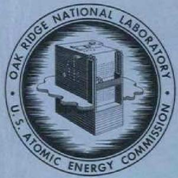

# OAK RIDGE NATIONAL LABORATORY

operated by

# UNION CARBIDE CORPORATION

NUCLEAR DIVISION

for the

U.S. ATOMIC ENERGY COMMISSION

LOCKHEED MARTIN ENERGY RESEARCH LIBRARIES

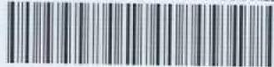

3445605136769

ORNL-TM-2511

1

# MATERIALS FOR MOLTEN-SALT REACTORS

H.E.McCoy

J.R.Weir, Jr.

R. L. Beatty

W.H.Cook

C. R. Kennedy

A.P.Litman

R.E.Gehlbach

C. E. Sessions

J.W.Koger

OAK RIDGE NATIONAL LABORATORY

CENTRAL RESEARCH LIBRARY

DOCUMENT COLLECTION

LIBRARY LOAN COPY

DO NOT TRANSFER TO ANOTHER PERSON

If you wish someone else to see this

document, send in name with document

and the library will arrange a loan.

1

13 3-67

# LEGAL NOTICE

This report was prepared as an account of Government sponsored work. Neither the United States, nor the Commission, nor any person acting on behalf of the Commission:

A. Makes any warranty or representation, expressed or implied, with respect to the accuracy, completeness, or usefulness of the information contained in this report, or that the use of any information, apparatus, method, or process disclosed in this report may not infringe privately owned rights; or   
B. Assumes any liabilities with respect to the use of, or for damages resulting from the use of any information, apparatus, method, or process disclosed in this report.

As used in the above, "person acting on behalf of the Commission" includes any employee or contractor of the Commission, or employee of such contractor, to the extent that such employee or contractor of the Commission, or employee of such contractor prepares, disseminates, or provides access to, any information pursuant to his employment or contract with the Commission, or his employment with such contractor.

Contract No. W-7405-eng-26

METALS AND CERAMICS DIVISION

MATERIALS FOR MOLTEN-SALT REACTORS

H. E. McCoy

W. H. Cook

R. E. Gehlbach

J.R.Weir, Jr.

C. R. Kennedy

C. E. Sessions

R. L. Beatty

A. P. Litman

J. W. Koger

Paper submitted to the Journal of Nuclear Applications

MAY 1969

OAK RIDGE NATIONAL LABORATORY Oak Ridge, Tennessee operated by UNION CARBIDE CORPORATION for the

U.S. ATOMIC ENERGY COMMISSION

# CONTENTS

Abstract 1   
Introduction 1   
Experience With The MSRE 3   
Development of A Modified Hastelloy N With Improved Resistance to Irradiation Damage 5   
Irradiation Damage in Graphite 14   
Summary 35   
References 36

H.E.McCoy

J.R.Weir, Jr.

R. L. Beatty

W. H. Cook

C. R. Kennedy

A. P. Litman

R. E. Gehlbach

C. E. Sessions

J.W.Koger

# ABSTRACT

Operating experience with the Molten-Salt Reactor Experiment (MSRE) has demonstrated the excellent compatibility of the graphite-Hastelloy N-fluoride salt system at $650^{\circ}\mathrm{C}$ . Several improvements in materials are needed for a molten-salt breeder reactor with a basic plant life of 30 years; specifically, (1) Hastelloy N with improved resistance to embrittlement by thermal neutrons, (2) graphite with better dimensional stability in a fast neutron flux, (3) graphite that is sealed to obtain a surface permeability of less than $10^{-8}\mathrm{cm}^2/\mathrm{sec}$ , and (4) a secondary coolant that is inexpensive and has a melting point of about $400^{\circ}\mathrm{C}$ . A brief description is given of the materials work in progress to satisfy each of these requirements. Our studies presently indicate that significant improvements can likely be accomplished in each area.

# INTRODUCTION

Our present concept of a molten-salt breeder reactor (described in detail by Bettis et al.) utilizes graphite as moderator and reflector, Hastelloy N for the containment vessel and other metallic parts of the system, and a liquid fluoride salt containing LiF, $\mathrm{BeF}_2$ , $\mathrm{UF}_4$ , and $\mathrm{ThF}_4$ as the fertile-fissile medium. The fertile-fissile salt will leave the reactor vessel at a temperature of about $700^{\circ}\mathrm{C}$ and energy will be transferred to a coolant salt which in turn is used to produce supercritical steam.

Our experience with the Molten-Salt Reactor Experiment (MSRE) has demonstrated the basic compatibility of the graphite-Hastelloy N-fluoride

salt (LiF-BeF $_2$ -ZrF $_4$ -UF $_4$ ) system at $650^{\circ}\mathrm{C}$ . However, a breeder reactor will impose more stringent material requirements; namely, (1) the design life of the basic plant of a breeder is 30 years at a maximum operating temperature of $700^{\circ}\mathrm{C}$ , (2) the power density will be higher in a breeder and will require the core graphite to sustain higher damaging neutron flux and fluence, and (3) neutron economy is of utmost importance in the breeder and the retention of fission products (particularly $^{135}\mathrm{Xe}$ ) by the core graphite must be minimized. Each of these factors requires a specific improvement in the behavior of materials.

We have found that the mechanical properties of Hastelloy N deteriorate as a result of thermal neutron exposure and must find a method of improving the mechanical properties of this material to ensure the desired 30-year plant life.

Similarly, we have found that graphite is damaged by irradiation. Although we can replace the core graphite, we find that the allowable fast neutron fluence for the graphite has an important influence on the economics of our reactor. Thus, we have undertaken a program to learn more about irradiation damage in graphite and to develop graphites with improved resistance to damage.

A big factor in neutron economy is reducing the quantity of $^{135}\mathrm{Xe}$ that resides in the core. We will remove this gas by continuously sparging the system with helium bubbles, but the transfer by this method probably will not be rapid enough to prevent excessive quantities of $^{135}\mathrm{Xe}$ from being absorbed by the graphite. This can be prevented by reducing the surface diffusivity to $< 10^{-8} \, \mathrm{cm}^2/\mathrm{sec}$ , and we feel that this is best accomplished by carbon impregnation by internal decomposition of a hydrocarbon.

We are also searching for a new secondary coolant that will allow us greater latitude in operating temperature. Sodium fluoroborate has reasonable physical properties for this application, and we are evaluating the compatibility of Hastelloy N with this salt.

We shall describe our work in each of these areas in some detail.

# EXPERIENCE WITH THE MSRE

Other papers in this series have elaborated on the information gained from the MSRE regarding operating experience, physics, chemistry, and fission-product behavior. Additionally, valuable information has been gained about the materials involved. $^{(1-3)}$

We have a surveillance facility exposed to the salt in the core of the reactor and one outside the reactor vessel, where the environment is nitrogen plus about $2\%$ $\mathrm{O}_2$ . Hastelloy N tensile rods and samples of the grade CGB graphite* used in the core of the MSRE are exposed in the core facility. The components are assembled so that portions can be removed in a hot cell, new samples added, and returned to the reactor. We have removed samples after 1100, 4400, and 9100 hr of full-power (8 Mw) operation at $650^{\circ}\mathrm{C}$ . As shown in Fig. 1, the physical condition of the graphite and metal samples was excellent; identification numbers and machining marks were clearly visible. The peak fast fluence received by the graphite has been $4.8 \times 10^{20}$ neutrons/cm² ( $>50$ keV) and the dimensional changes are less than $0.1\%$ . Pieces of graphite from the MSRE have been sectioned and most of the fission products were found to be located on the surface and within 10 mils below the surface.

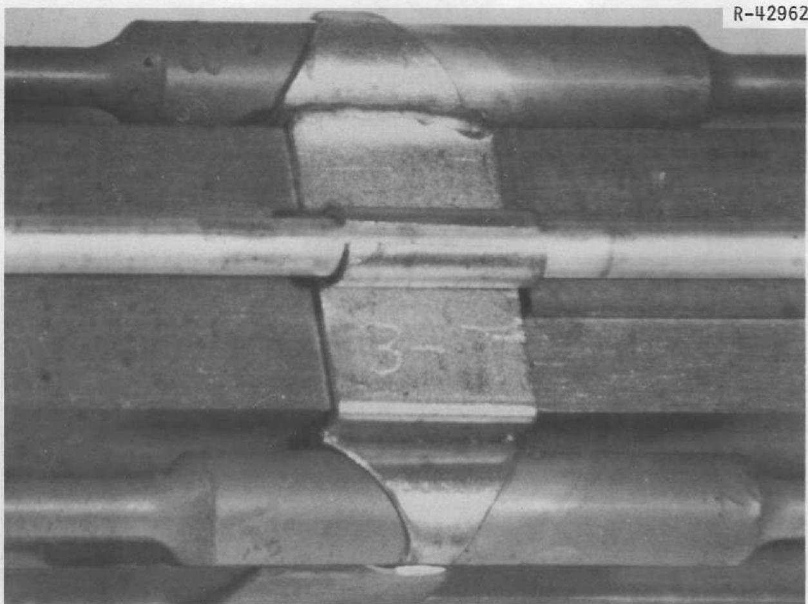  
Fig. 1. Graphite and Hastelloy N Surveillance Assembly Removed from the Core of the MSRE After 72,400 Mwhr of Operation. Exposed to flowing salt for 15,300 hr at $650^{\circ}\mathrm{C}$ .

However, a few of the fission products have gaseous precursors and penetrated the graphite to greater depths. The microstructure of the Hastelloy N near the surface was modified to a depth of about 0.001 in., but we found a similar modification in samples exposed to static nonfissioning salt for an equivalent time. We have not positively identified the near-surface modification, but find its presence of no consequence. The very small changes in the amounts of chromium and iron in the fuel salt also indicate very low corrosion rates and support our metallographic observations.

Hastelloy N samples were removed from the surveillance facility outside the reactor vessel after 4400 and 9100 hr of full-power operation. This environment is oxidizing, and we have found that an oxide film about 0.002 in. thick was formed on the surface after the longer exposure. There was no evidence of nitriding, and the mechanical properties of these samples were not affected adversely by the presence of the thin oxide film.

Thus, our experience with the MSRE has proven in service the excellent compatibility of the Hastelloy N-graphite-fluoride salt system.

# DEVELOPMENT OF A MODIFIED HASTELLOY N WITH IMPROVED RESISTANCE TO IRRADIATION DAMAGE

Since the MSRE was constructed, we have found that Hastelloy N, as well as most other iron- and nickel-base alloys, is subject to a type of high-temperature irradiation damage that reduces the creep-rupture strength and the fracture strain. $^{(4-9)}$ This effect is characterized in Figs. 2 and 3 for a test temperature of $650^{\circ}\mathrm{C}$ . The rupture lives for irradiated and unirradiated materials differ most at high stress levels

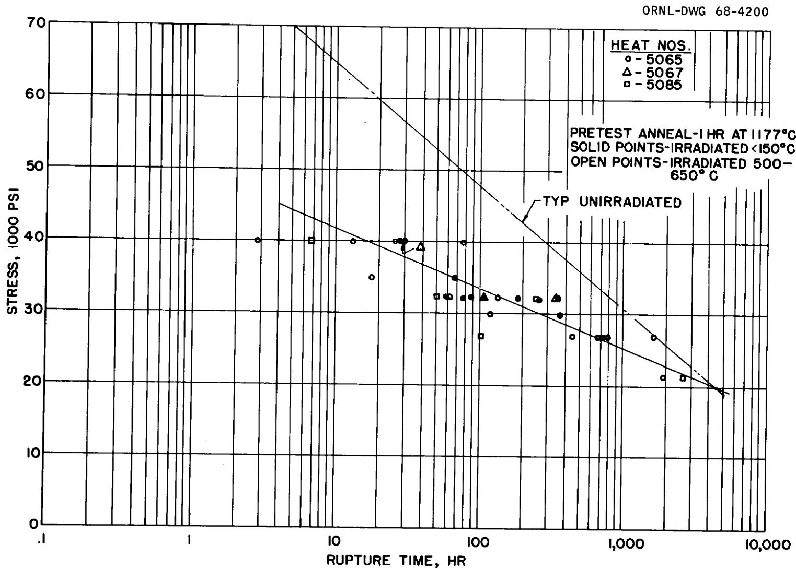  
Fig. 2. Creep-Rupture Properties of Hastelloy N at $650^{\circ}\mathrm{C}$ After Irradiation to a Thermal Fluence of About $5 \times 10^{20}$ neutrons/cm $^2$ .

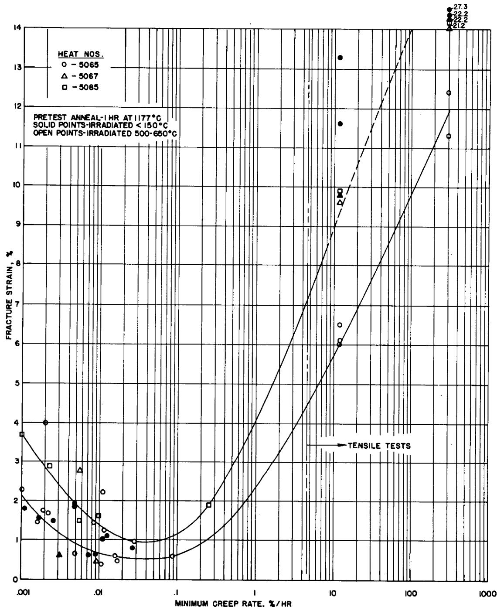  
Fig. 3. Fracture Strain of Hastelloy N at $650^{\circ}\mathrm{C}$ After Irradiation to a Thermal Fluence of About $5 \times 10^{20}$ neutrons/cm $^2$ .

and converge for stresses below 20,000 psi. The property change that concerns us most in reactor design and operation is the reduction in fracture strain. The postirradiation fracture strain is shown in Fig. 3 as a function of strain rate. In tensile tests the strain rate is a controlled parameter, and for the creep tests we have used the minimum creep rate. The data are characterized by a curve with a minimum at a strain rate of about $0.1\% / \mathrm{hr}$ , with rapidly increasing fracture strain as the strain rate is increased, and slowly increasing fracture strain as the strain rate is decreased. Thus, under normal operating conditions for a reactor where the stress levels (and the strain rates) are low, the rupture life will not be affected significantly (Fig. 2), but the fracture strain will be only 2 to $4\%$ (Fig. 3). However, transient conditions that would impose higher stresses or require that the material absorb thermally induced strains could cause failure of the material. Therefore, it is desirable that we have a material with improved properties in the irradiated condition and have embarked upon a program with this as our goal.*

The changes in high-temperature properties of iron- and nickel-base alloys during irradiation in thermal reactors have been shown

rather conclusively to be related to the thermal fluence and more specifically related to the quantity of helium produced in the metal from the thermal $^{10}\mathrm{B}(\mathfrak{n},\alpha)^{7}\mathrm{Li}$ transmutation. $^{(10-12)}$ The mechanical properties are only affected under test conditions that produce intergranular fracturing of the material. Under these conditions both creep and tensile curves for irradiated and unirradiated materials are identical up to some strain where the irradiated material fractures and the unirradiated material continues to deform. Thus, the main influence of irradiation is to enhance intergranular fracture.

A logical cure for this problem would be to remove the boron from the alloy. However, boron is present as an impurity in most refractories used for melting, and the lowest boron concentrations obtainable by commercial melting practice are in the range of 1 to 5 ppm. This approach seems even more hopeless when we look carefully at the low helium levels that have caused the creep-rupture properties to deteriorate in Hastelloy N. For example, we found in some in-reactor tube burst tests at $760^{\circ}\mathrm{C}$ that the rupture life was reduced by an order of magnitude and that the fracture strain was only a few tenths of a percent when the computed helium levels were in the parts-per-billion range.(9) Thus, we have concluded that the properties of Hastelloy N cannot be improved solely by reducing the boron level.

Another very important observation has been that the properties are altered by irradiation at elevated temperatures only when the test temperature is high enough for grain boundary deformation to occur

(above about half the absolute melting temperature for many materials). Thus, the role of helium must be to alter the properties of the grain boundaries so that they fracture more easily.

The size of boron lies intermediate between the sizes of small atoms such as carbon that occupy interstitial lattice positions and the larger metal atoms, such as nickel and iron, that occupy the normal lattice positions. For this reason boron concentrates in the grain boundary regions where the atomic disorder provides holes large enough to accommodate the boron atoms. Thus the transmuted helium will be generated near the grain boundaries where it will have its most devastating effects. We reasoned that the addition of an element that formed stable borides would result in the boron being concentrated in discrete precipitates rather than being distributed uniformly along the grain boundaries. The transmuted helium would likely remain associated with the precipitate and be less detrimental. Additionally, certain precipitate morphologies and alloying elements are beneficial in improving the resistance of alloys to intergranular fracture.

Following this reasoning we have made small additions of Ti, Hf, and Zr to Hastelloy N and have found the postirradiation properties to be improved markedly. $^{(13,14)}$ We have chosen the titanium-modified alloy for development as a structural material for a molten-salt breeder experiment (MSBE). A further modification made in the composition was reducing the molybdenum content from 16 to $12\%$ . This change was prompted by the observation that the additional molybdenum was used in forming large carbide particles that made it difficult to control the grain size. We also adopted the vacuum-melting practice to reduce the concentrations of other residual elements thought to be deleterious.

The stress-rupture properties at $650^{\circ}\mathrm{C}$ of several heats of the titanium-modified alloy (0.5% Ti) are summarized in Fig. 4. The properties in the absence of irradiation are improved over those of standard Hastelloy N and the rupture life of the modified alloy is not reduced more than about 10% by irradiation at $650^{\circ}\mathrm{C}$ to a thermal fluence of $5 \times 10^{20}$ neutrons/cm $^2$ . The postirradiation fracture strains of the titanium-modified alloy are also improved over those of the standard alloy (Fig. 5). The modified alloy has a very well-defined ductility minimum as a function of strain rate, but the minimum strain is about 3% compared with 0.5% for the standard alloy.

Electron microscopy has shown that the titanium-modified alloy forms very fine-grain boundary precipitates when annealed at $650^{\circ}\mathrm{C}$ . These precipitates are only a few tenths of a micron in size and are spaced along the grain boundaries at about $2 - \mu$ intervals. They have a face-centered cubic crystal structure with a lattice parameter of about $4.24\mathring{\mathrm{A}}$ and are likely complexes involving Mo, Cr, Ti, C, N, and B. This microstructure should lead to trapping of the helium as we proposed earlier and should also inhibit fracture along the grain boundaries. However, further studies have shown that the precipitates which form during long exposure at $760^{\circ}\mathrm{C}$ are relatively coarse $\mathrm{Mo}_{2}\mathrm{C}$ carbides and that the postirradiation properties of material irradiated at $760^{\circ}\mathrm{C}$ are very poor. Since we planned to operate the MSBR at about $700^{\circ}\mathrm{C}$ , this difference in precipitate morphology and subsequent deterioration of properties was of utmost concern to us. Further studies have shown that the desirable structure can be stabilized by the addition of Nb, Si, or Hf, and we are confident of having properties at least as good as those shown in Figs. 4 and 5.

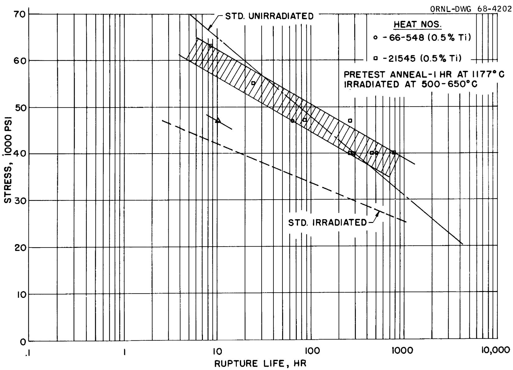  
Fig. 4. Creep-Rupture Properties of Several Heats of Modified Hastelloy N at $650^{\circ}\mathrm{C}$ . Samples irradiated to a thermal fluence of about $5 \times 10^{20}$ neutrons/cm $^2$ .

ORNL-DWG 68-4203

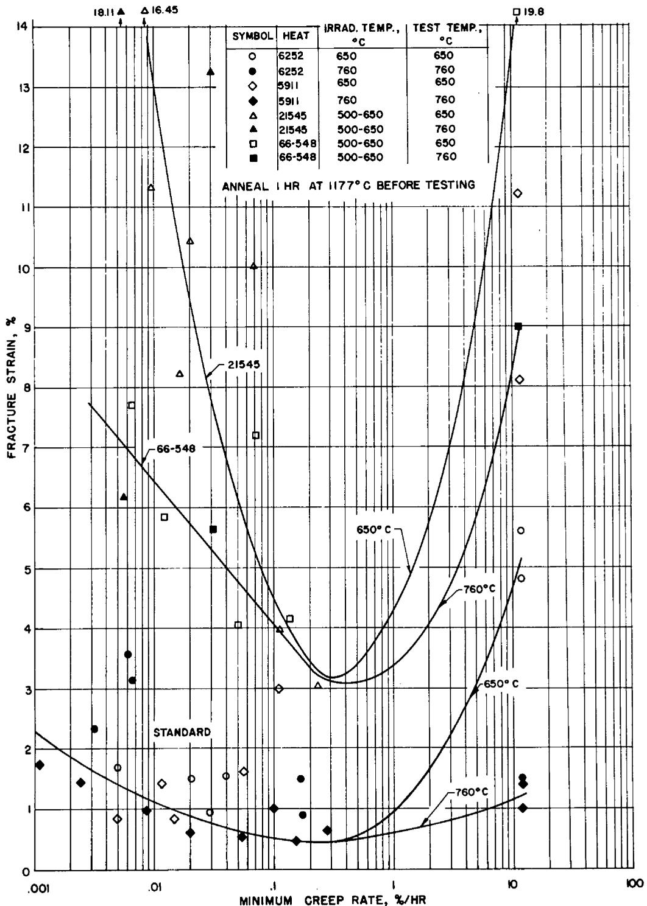  
Fig. 5. Variation of Fracture Strain with Strain Rate for Several Hastelloy N Type Alloys. Samples irradiated to a fluence of about $5 \times 10^{20}$ neutrons/cm² prior to testing.

# IRRADIATION DAMAGE IN GRAPHITE

Neutron irradiation alters the physical properties of graphite, but our major concerns arise because of the dimensional changes that occur. $^{(15,16)}$ These dimensional changes are illustrated in Fig. 6 where the data of Henson et al. $^{(17)}$ are presented for an isotropic graphite. With increasing fluence the graphite first contracts and then begins to expand at a very high rate. Several potential problems arise as a result of these dimensional changes. First, the initial contraction will change the volume occupied by fuel salt and change the nuclear characteristics of the reactor. These dimensional changes seem small enough for most isotropic graphites that the nuclear effects may be accommodated by design. A second problem is stress generation due to flux gradients across a piece of graphite. Graphite creeps under irradiation $^{(18)}$ and we have shown that this creep is large enough to reduce the stress intensities to quite acceptable values. The third and most serious problem is that the rapid growth rate represents a rapid decrease in density with potential crack and void formation. At some fluence this will cause the mechanical properties to deteriorate and the permeability to salt and fission products to increase. We feel that the properties will be acceptable, at least until the material returns to its original volume, and have defined this fluence as the lifetime. A fourth problem is that the dimensional changes are dependent on temperature and the curve in Fig. 6 is shifted up and to the left for increasing temperature. Thus, stresses develop in a part having a temperature gradient since segments of the part are seeking different dimensions. Again, this stress is relieved by the irradiation induced

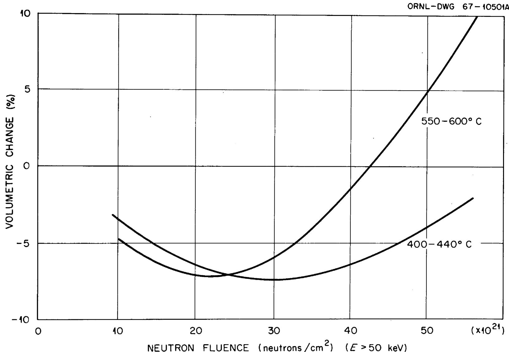  
Fig. 6. Volume Change in Isotropic Graphite Dounreay Fast Reactor Irradiations.

creep in graphite geometries of interest to us. Therefore, we consider the onset of rapid growth to be the primary problem and the initial dimensional changes of secondary importance.

We anticipate graphite temperatures between 550 and $750^{\circ}\mathrm{C}$ and would like to operate with a fast flux ( $>50\mathrm{keV}$ ) of about $1\times 10^{15}$ neutrons $\mathrm{cm}^{-2}$ sec $^{-1}$ . Data in Fig. 6 show that this flux will cause this particular graphite to expand rapidly after a fluence of approximately $3\times 10^{22}$ neutrons/ $\mathrm{cm}^2$ is reached (about 1 year of operation). We can reduce the flux by decreasing the power density, but this is done only with increases in the fuel inventory and doubling time. Hence, it is quite desirable that we use graphites with better resistance to irradiation damage than the graphite shown in Fig. 6. We examined the data available on current reactor graphites irradiated to high fluences and found that the results described a fairly consistent picture. The fluences required for graphite to reach its minimum volume were strongly temperature dependent (decreased with increasing temperature), but were not appreciably different for any of the graphites studied to date. Although this observation is discouraging, we have pressed the problem further and have found that better graphites already exist and that others can probably be developed with only small changes in present materials and processing. Let us look briefly at a simple description of the origin of the dimensional changes and then return to our specific observations.

Graphite, after being well graphitized at temperatures above $2000^{\circ}\mathrm{C}$ , has a hexagonal close-packed crystal structure consisting of close-packed layers (basal planes) of carbon atoms with very strong covalent bonds

within the basal planes (a-direction) and very weak van der Waals' forces between atoms in adjacent basal planes (c-direction). This anisotropy in atomic density and bond strength is reflected by very anisotropic properties.

The changes that take place in a single crystal of graphite during irradiation are shown schematically in Fig. 7. A neutron having an energy above about $0.18\mathrm{eV}$ can displace a carbon atom from a close-packed basal plane with a reasonable probability of creating a vacancy in a basal plane and an interstitial carbon atom between the basal planes. Repetition of this process and diffusion at elevated temperatures can result in the formation of defect clusters, specifically partial planes of atoms between the basal planes and vacancy clusters within the original planes. This leads to an expansion perpendicular to the basal planes (c-direction) and a contraction within the layer planes (a-direction) - see Fig. 7(b). This new configuration leads to a slight increase in volume [Fig. 7(c)].

Polycrystalline graphites are not initially of theoretical density. The voids present in the material are a result of shrinkage of the binder during graphitization and from separation or fracture of layer planes during cooling from the graphitization temperature. Initially, during irradiation the porosity within the material tends to be filled as the crystallites expand in the c-direction. This produces a densification illustrated by the bottom curve in Fig. 7(d). As the porosity fills, the shrinkage saturates and the dimensional behavior begins to be dominated by the volume expansion due to the growth of the crystallites in the c-direction. Thus, a minimum volume is obtained as shown in

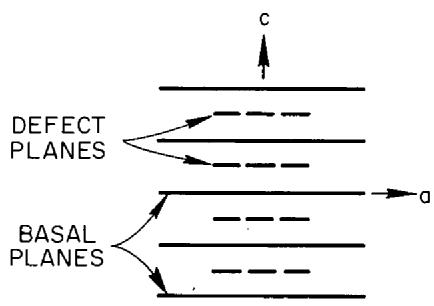  
（a）

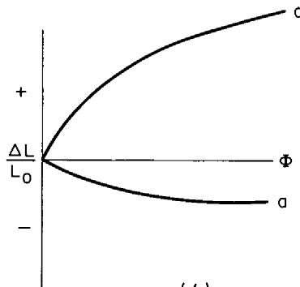  
PERFECT SINGLE CRYSTAL  
(b）

ORNL-DWG 68-12011A

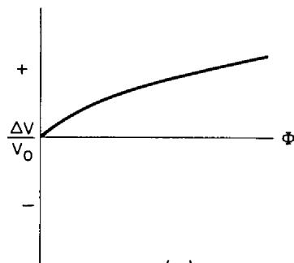  
（c）

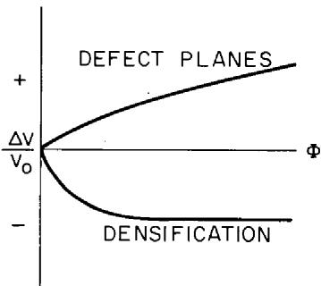  
POLYCRYSTAL   
（d）

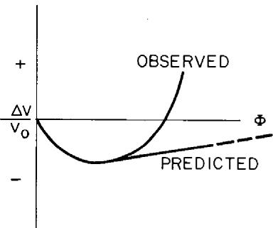  
(e)   
Fig. 7. Graphite Dimensional Changes Due to Irradiation.

Fig. 7(e). During the subsequent expansion, the material either remains internally contiguous, in which case the volume change rate of the polycrystalline material should be similar to the small rate of expansion exhibited by the crystallites themselves, or fractures internally due to the stresses generated between the crystallites of differing orientation (causing a higher rate of growth to occur). Observations to date indicate that most graphites increase in volume at a faster rate at high fluences than expected if the material remained internally contiguous.

One further consideration helps us to understand why the unpredicted rapid growth takes place. A schematic representation of several coke particles and binder after graphitization is shown in Fig. 8 (ref. 19). Each coke particle consists of several crystals with a very high degree of preferred orientation. Although we make a large piece of graphite in which the coke particles are arranged randomly, there are still interfaces between particles of widely different orientations. As each particle changes dimensions, these interfaces must be strong and able to shear large amounts without fracturing. The observation that graphites undergo large dimensional changes at high fluences indicates that these interfaces or boundaries are fracturing. As indicated by the sketch in Fig. 8, these boundaries are made up largely of the graphitized binder materials. Thus, the properties of these boundaries are influenced largely by the nature of the binder material and its interaction with the coke particles.

We have set about making graphites with known filler and binder materials, but our work in this area has not progressed very far. We are also studying the properties of several commercial graphites that we feel may be potentially useful for MSBR applications and others that

GRAPHITE   
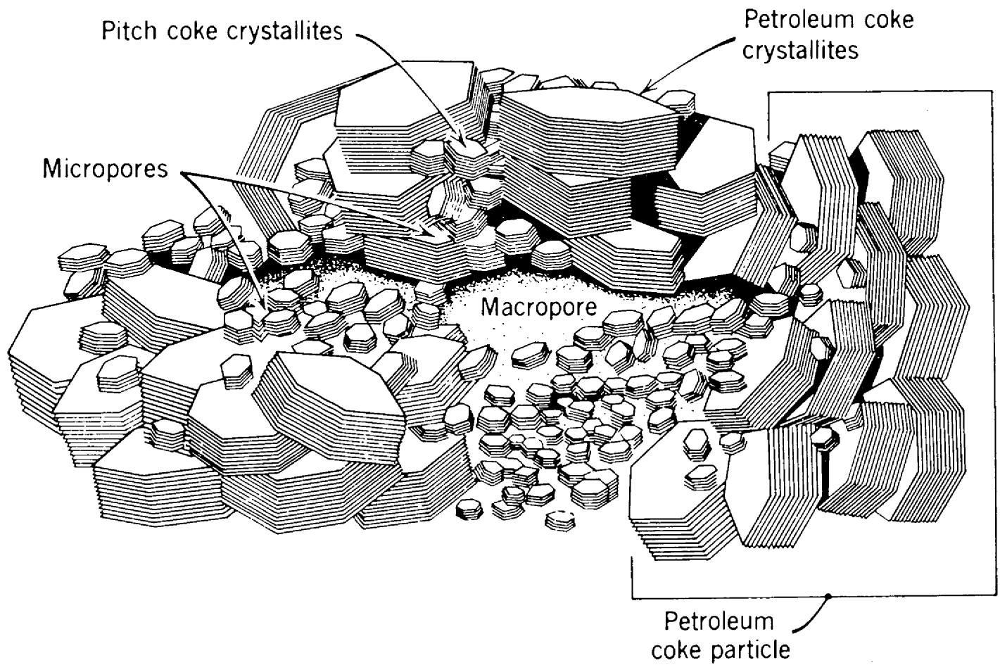  
Fig. 8. Proposed Arrangement of Crystallites in Graphitized Stock. (Reprinted from High-Temperature Materials and Technology, ed. by I. E. Campbell and E. M. Sherwood, Wiley, New York, 1967, p. 195).

should give us some basic information about irradiation damage in graphite. Our graphite irradiations have been done at $705 \pm 10^{\circ}\mathrm{C}$ in the High Flux Isotope Reactor (HFIR) where the peak flux ( $>50\mathrm{keV}$ ) is $1 \times 10^{15}$ neutrons $\mathrm{cm}^{-2}$ sec $^{-1}$ . Thus, samples can be irradiated to fluences of $1 \times 10^{22}$ neutrons/ $\mathrm{cm}^2$ in about 4 months.

A summary of our results to date is shown in Fig. 9. Several materials show a significant deviation from the "typical" behavior illustrated in Fig. 6. The POCO* graphites show excellent resistance to irradiation with very small positive dimensional changes out to fluences of $2.5 \times 10^{22}$ neutrons/cm². Thus, these data give us confidence that the "typical" behavior of graphite can be improved markedly, but our results have not been extended to fluences high enough to determine the exact magnitude of this improvement.

# SEALING GRAPHITE

Entry of fuel salt into graphite can be prevented by keeping the entrance diameter of the accessible porosity smaller than $1\mu$ . Although this does require some extra care during processing, it can be accomplished routinely on large shapes. In fact, the grade CGB graphite obtained 5 years ago for the MSRE satisfies this requirement.[20] However, the graphite structure must be much more restrictive to prevent gaseous fission products, particularly $^{135}\mathrm{Xe}$ , from diffusing into the graphite. We presently plan to strip $^{135}\mathrm{Xe}$ from the fuel salt by purging with helium. Helium bubbles will be injected and later removed in a gas-liquid separator. The efficiency of this purging depends very

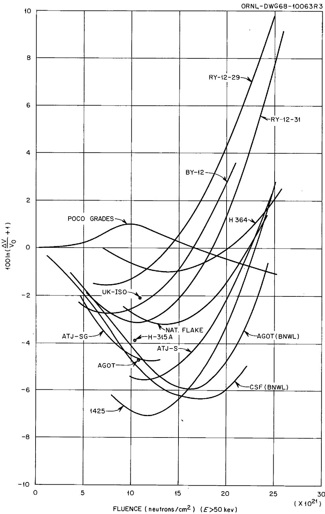  
Fig. 9. Volume Changes of Graphite Irradiated at $705^{\circ}\mathrm{C}$ .

heavily on the size of bubbles that can be injected and circulated and the mass transfer of $^{135}\mathrm{Xe}$ from the salt to the helium bubbles. Both of these factors are presently uncertain, and we must anticipate that large quantities of $^{135}\mathrm{Xe}$ will be available to the graphite surfaces and that excessive ( $>0.5\%$ ) retention of $^{135}\mathrm{Xe}$ will result if this gas can enter the graphite surface at a high rate. Our present calculations show that the accessibility of $^{135}\mathrm{Xe}$ to the graphite surfaces will be impeded by a laminar salt film and that the graphite offers an additional resistance to gas flow only when its surface diffusivity to $^{135}\mathrm{Xe}$ is less than $10^{-8} \, \mathrm{cm}^2/\mathrm{sec}$ .

The best grades of commercial graphites presently available have bulk diffusivities in the range of $10^{-1}$ to $10^{-4}$ cm $^2$ /sec, and we feel that it is unreasonable to expect that techniques can be developed for making massive shapes with such a restrictive structure. The techniques used for reducing the porosity of graphite involve multiple impregnations of the material with liquid hydrocarbons and then firing to graphitize this material. As the bulk diffusivity decreases, it becomes progressively more difficult for the gases released by the decomposing impregnants to diffuse out of the material and the times required to reach the graphitizing temperature become excessive. Thus, we presently feel that it is more reasonable to reduce the surface diffusivity by a post-fabrication surface-sealing process involving gaseous impregnation. Since the pyrolytic carbon that would be deposited and the graphite substrate will change dimensions differently under irradiation, it is imperative that the pyrolytic carbon be linked with the substrate structure and not deposited as a surface layer that can be sheared easily.

The task that we have in sealing the graphite is illustrated by the photomicrograph in Fig. 10. We must adjust our processing parameters so that the voids are filled internally in preference to closing the voids near the surface and forming a coating. This can be accomplished by using a flowing stream of hydrocarbon at low partial pressure and temperature appropriate to maintain very low deposition kinetics, but this requires long processing times. We have used a different method to accomplish penetration which involves pulsing the sample environment between a rich hydrocarbon environment and vacuum. The vacuum cycle removes the reaction products (primarily hydrogen) and allows more hydrocarbon gas to enter the void. Specifically, we have used 1,3 butadiene at 20 psig, deposition temperatures of 800 to $1000^{\circ}\mathrm{C}$ , and cycle times of about 1 min for the vacuum and a fraction of a second for the hydrocarbon. Butadiene was chosen because it is a gas at room temperature and because of its high carbon yield per molecule. The temperature range is restricted to 800 to $1000^{\circ}\mathrm{C}$ because higher temperatures result in a surface coating not penetrating the pore structure and lower temperatures yield intolerably low deposition rates. The lengths of the vacuum and pressure periods are very important because they not only influence the processing rate, but also the depth of penetration of the impregnant. The time required for the process will be very important in determining the cost.

We have worked with two commercial graphites - viz, AXF made by POCO and ATJ-SG made by UCC. These materials had widely different accessible pore spectra; nearly all the pores in the AXF material were less than $0.8\mu$ in diameter while the ATJ-SG grade had appreciable pores

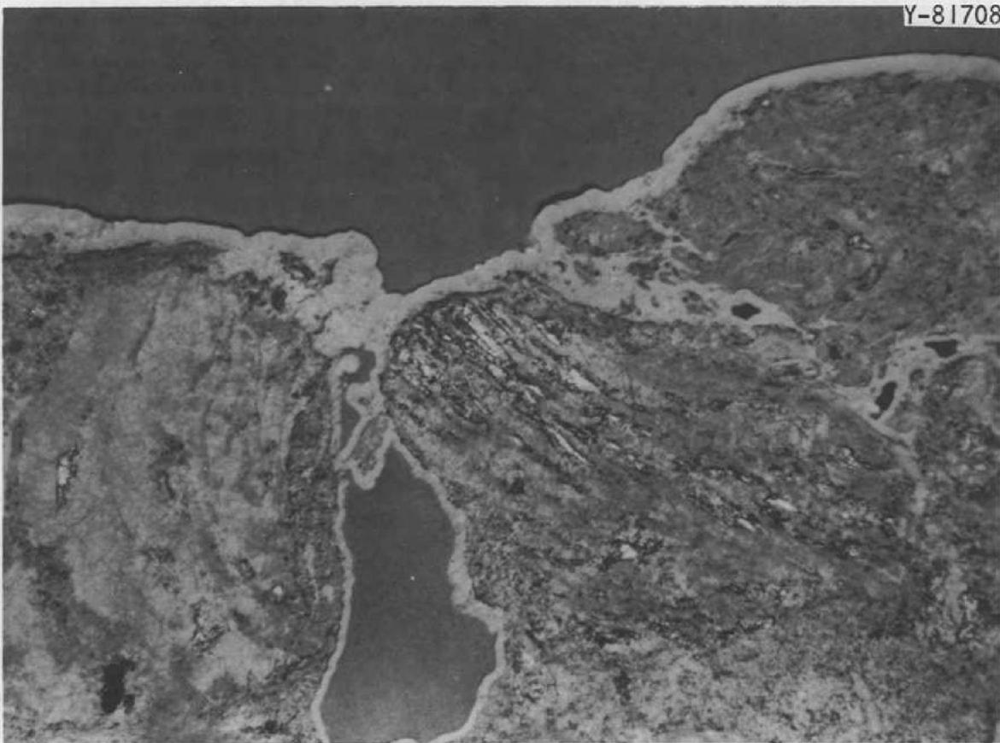  
Fig. 10. Photomicrograph of the Edge of Graphite Showing a Pore that has been Partially Coated and then Sealed over with Pyrocarbon.

in all size ranges up to $17\mu$ . Thus, the sealing characteristics of the two materials were widely different. The results of some of our parameter studies are shown in Fig. 11 where we have varied the vacuum-hydrocarbon cycle times at $850^{\circ}\mathrm{C}$ . The initial slopes are proportional to the surface area being coated and the slope is much steeper for the AXF graphite than for the ATJ-SG material. The sharp break in the curves for the AXF graphite indicates that the pores have been filled or closed off and that the surface area being coated is reduced. The sharpness of this break attests to the uniform pore size of the AXF graphite. The horizontal portions of the curves represent essentially surface coating, and the data suggest that some finite amount of surface coating is necessary to attain the MSBR permeability specification of less than $10^{-8}$ $\mathrm{cm}^2/\mathrm{sec}$ for $^{135}\mathrm{Xe}$ at $700^{\circ}\mathrm{C}$ . This is approximately equivalent to a helium permeability of $10^{-8}$ $\mathrm{cm}^2/\mathrm{sec}$ at ambient temperature. We have used the latter criterion in our studies (denoted on these curves by a "v" mark). The ATJ-SG graphite was not sealed to the desired level under the conditions shown in Fig. 11 and the slope changes very gradually due to the wide variation in the pore sizes.

The data indicate that the processing time could be reduced by shortening the length of the vacuum cycle. Another interesting feature of the process for the AXF graphite was that the final total weight of carbon deposited was increased by shortening the vacuum pulse. This indicates that the depth of penetration of carbon into the material was increased. Thus, shortening the vacuum pulse accelerated the process and improved the product, both very desirable characteristics.

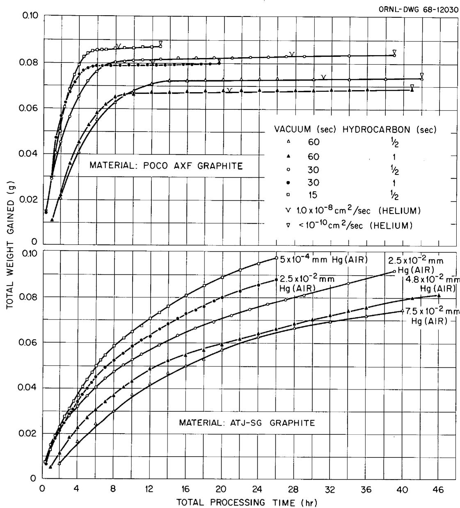  
Fig. 11. Impregnation Rate of Graphite Using 1,3 Butadiene at $850^{\circ}\mathrm{C}$ .

Our studies are not yet extensive enough to optimize the deposition conditions but are sufficient to make us optimistic about being able to reduce the surface diffusivity of graphite to the desired level. The remaining question of prime importance is the integrity of the seal after exposure to high neutron fluences.

# CORROSION IN FLUORIDE SALT SYSTEMS

Two decades of corrosion testing $^{(21-29)}$ and our experience with the $\mathsf{MSRE}^{(2,3)}$ have demonstrated the excellent compatibility of Hastelloy N and graphite with fluoride salts containing LiF, $\mathsf{BeF}_2$ , $\mathsf{ThF}_4$ , and $\mathsf{UF}_4$ . Our fertile-fissile salt will contain these same fluorides, so only proof-testing will be required for the primary reactor circuit. However, we desire a lower melting coolant salt in the secondary coolant circuit than the LiF- $\mathsf{BeF}_2$ salt presently used in the MSRE and have chosen a sodium fluoroborate salt ( $\mathsf{NaBF}_4$ -8 mole % NaF) for further study. This salt is inexpensive (< $0.50/lb) and has a low melting point of $380^{\circ}\mathsf{C}$ . A significant characteristic of this salt is that it has an appreciable equilibrium overpressure of $\mathsf{BF}_3$ gas (e.g., 180 mm at $600^{\circ}\mathsf{C}$ ).

Much of our present corrosion work is concerned with the compatibility of Hastelloy N with sodium fluoroborate. Some earlier thermal convection loop studies involving a relatively impure salt of composition $\mathrm{NaBF}_4$ -4 mole % NaF-6 mole % KBF₄ showed that a Croloy 9M loop plugged after 1440 hr at a maximum temperature of $607^{\circ}\mathrm{C}$ and a temperature difference of $145^{\circ}\mathrm{C}$ , and that a Hastelloy N loop was partially plugged after 8765 hr of operation under the same temperature conditions.(30) The plug in the Croloy loop was comprised primarily of pure iron

crystals and the partial plug in the Hastelloy N loop was made up of a compact mass of green single crystals of $\mathrm{Na}_3\mathrm{CrF}_6$ . The salt charge from the Hastelloy N loop contained large amounts of Cr, Fe, Ni, and Mo, all major alloying elements in Hastelloy N.

In our more recent tests we have used a fluoroborate salt of composition $\mathrm{NaBF}_4 - 8$ mole $\%$ NaF of a higher purity than the first salt that we worked with. $^{(31,32)}$ We are using a modified thermal convection loop from which we can remove salt samples for chemical analysis and metal samples for weighing without interrupting operation of the loop. The weight changes for the hottest and coldest samples are shown in Fig. 12 for the two loops presently in operation. The loops are constructed of identical materials, but the removable samples in one loop (NCL-13) are standard Hastelloy N and those in the other loop (NCL-14) are a modified Hastelloy N containing $0.5\%$ Ti and only $0.1\%$ Fe (standard Hastelloy N contains $4\%$ Fe). As shown in Fig. 12, the weight changes of the modified Hastelloy N are smaller, and this is later shown to be due primarily to the lower iron content of the modified material. The rate of weight change was steady except for a small perturbation after 1500 hr of operation and a large variation after 4200 hr of operation. These times corresponded to times when moist air inadvertently came in contact with the salt. The changes in chemistry shown in Fig. 13 also reflect the admission of air at these times since the oxygen and water levels in the salt increased. The iron and chromium concentrations have continued to increase at a rate proportional to (time) $^{\frac{1}{2}}$ , indicating that the process is controlled by diffusion in the metal. The nickel and molybdenum concentrations in the salt have remained very low except for times when

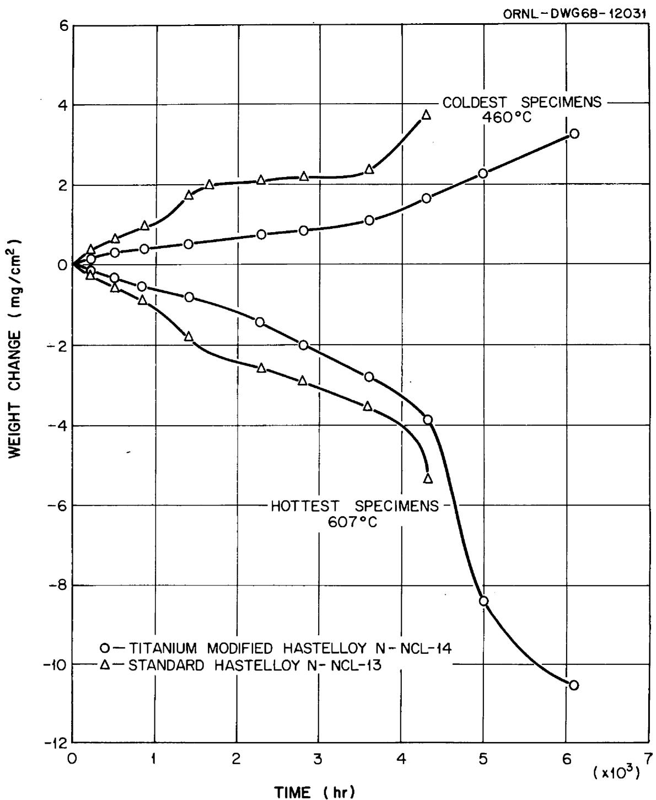  
Fig. 12. Comparison of the Weight Changes of Hastelloy N Specimens Inserted in $\mathrm{NaBF}_4$ -NaF (92-8 mole %) Thermal Convection Loops.

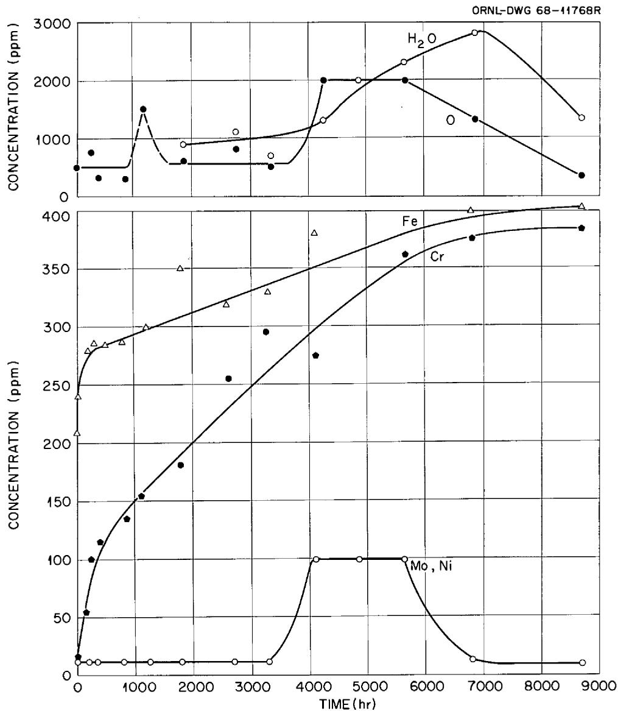  
Fig. 13. Variation of Impurities with Time in $\mathrm{NaBF}_4$ -NaF (92-8 mole %) Thermal Convection Loop NCL-14.

moist air was inadvertently contacted with the salt. These results show qualitatively that the corrosion rates increased when the oxygen and water levels increased. Capsule tests in which sodium fluoroborate containing 1400 ppm $\mathrm{O}_2$ and 400 ppm $\mathrm{H}_2\mathrm{O}$ was contacted with Hastelloy N for 6800 hr at $607^{\circ}\mathrm{C}$ exhibited very low corrosion rates. Future work will be directed toward defining the oxygen and water levels that result in acceptable corrosion rates.

The information that we obtained on the changes in salt composition and the weight changes of ten samples located at various points (and temperatures) around the loop enabled us to attempt a mass balance for the system. The weight of metal lost must equal the weight of metal deposited plus the weight of metal in the salt - i.e.,

$$
\Delta W _ {\text {l o s s}} = \Delta W _ {\text {d e p o s i t e d}} + \Delta W _ {\text {s a l t}}. \tag {1}
$$

We construct a weight change versus temperature profile based on the removable samples and assume that each segment of the loop wall follows this same curve. This procedure results in mass balances, Eq. (1), that close within $10\%$ .

Diffusion theory can be used for further analysis. As mentioned earlier, chemical analyses (Fig. 13) indicate that the iron and chromium concentrations in the salt are increasing, so it is assumed that the salt selectively removes these elements from the alloy. The modified Hastelloy N is relatively free of iron, so the weight loss of this sample should be due primarily to the removal of chromium. The quantity of material removed by diffusion under conditions where the surface concentration of the diffusing element is zero is given by:

$$
\Delta \mathrm {M} = \mathrm {C} _ {0} \sqrt {\mathrm {D t}} \text {,} \tag {2}
$$

where

$$
\begin{array}{l} \Delta \mathrm {M} = \text {m a t e r i a l} \quad \text {r e m o v e d}, \quad \mathrm {g / c m ^ {2}}, \\ C _ {0} = \text {b u l k c o n c e n t r a t i o n o f d i f f u s i n g s p e c i e s ,} \mathrm {g / c m ^ {3}}, \\ D = \text {d i f f u s i v i t y}, \mathrm {c m} ^ {2} / \sec \\ t = \text {t i m e}, \sec . \\ \end{array}
$$

Using the data of Grimes et al. (33) for diffusion of chromium in

Hastelloy N, we found by this analysis that the quantity of chromium

removed by diffusion cannot account for the total weight lost.

This discrepancy can be accounted for by short-circuit diffusion mechanisms enhancing the rate of chromium removal at these low temperatures or by impurities (likely HF formed by water ingestion) that lead to some general attack of the metal that is not diffusion controlled. Two observations argue against the latter possibility. First, we have not been able to see by microprobe analysis any transfer of nickel or molybdenum to the colder surfaces of the loop except during a brief period after 4200 hr of operation in which we knew that large amounts of impurities were present. A second and more convincing argument is based on the relative behavior of the standard and modified Hastelloy N during the first 4000 hr of operation. Rewriting of Eq. (2) in terms of a reaction rate constant, K, instead of the diffusion coefficient yields

$$
\Delta \mathrm {M} = \mathrm {C} _ {0} \sqrt {\mathrm {K t}}. \tag {3}
$$

We have already indicated that this equation predicts the material transported by diffusion to be too low for the modified alloy when K equals D, but let K take on a value so that the predicted and observed weight losses

for a given time of operation agree with $C_0$ equal to $7\%$ Cr. Now consider the standard alloy in which $C_0$ corresponds to $7\%$ Cr + $4\%$ Fe. We find that the same K chosen for the modified alloy predicts the observed weight change for the standard alloy. Thus, the difference in the weight losses between the modified and standard alloy is due principally to the iron content. Had much general corrosion occurred, this adjustment in $C_0$ should not have worked. In fact, we found this analytical procedure to be entirely unsatisfactory for the short time period after 4200 hr when the water and oxygen levels were high and nickel and molybdenum were being removed (Figs. 12 and 13). A further possible role of impurities is to provide the oxidizing potential necessary to keep the surface concentration of iron and chromium at zero. Thus, even though the process remains diffusion controlled, the rate can be increased by impurities.

Although some of the curves in Figs. 12 and 13 have quite large slopes, the corrosion rates are not very high. Using the rather inaccurate method of converting the weight losses to corrosion depths indicates that the average rate during 8000 hr of operation has been 0.7 mil/yr. The rate has decreased to about 0.3 mil/yr for long time periods in which operation was not disturbed. In scaled-up MSBR systems we probably will use a cold trapping technique to remove some of the corrosion products so that their solubilities are not exceeded. We presently feel that the sodium fluoroborate salt will provide a satisfactory and economical secondary coolant for molten salt reactors.

# SUMMARY

Our experience with the MSRE has proven the basic compatibility of the graphite-Hastelloy N-fluoride salt system at elevated temperatures. However, a molten-salt breeder reactor will impose more stringent operating conditions, and we need to make some improvements in the graphite and Hastelloy N for this system. The mechanical properties of Hastelloy N deteriorate under thermal neutron irradiation, and we have found that the addition of titanium in combination with strong carbide formers such as niobium and hafnium makes the alloy more resistant to this type of irradiation damage. Graphite undergoes dimensional changes due to exposure to fast neutrons, and the possible loss of structural integrity due to these dimensional changes presently limits the lifetime of the core graphite. Although we can replace the core graphite as often as necessary, these replacements influence the economics of our reactor, and we have embarked on a program to find a better graphite. Our studies to date indicate that graphites can be developed that have better resistance to irradiation damage than conventional nuclear graphites. We plan to seal the graphite used in the core with pyrocarbon to reduce the amount of $^{135}\mathrm{Xe}$ that is absorbed. Techniques have been developed for this sealing, and studies are in progress to determine whether the low permeability is retained after irradiation. Our corrosion studies are currently concentrated on evaluating the compatibility of Hastelloy N with a potential coolant salt, sodium fluoroborate. Our studies indicate that the corrosion rate is acceptable as long as the salt does not contain large amounts of impurities, such as HF and $\mathrm{H}_2\mathrm{O}$ .

# REFERENCES

1. W. H. Cook, Molten-Salt Reactor Program Semiann. Progr. Rept. August 31, 1965, ORNL-3872, Oak Ridge National Laboratory, pp. 87-92.   
2. H. E. McCoy, An Evaluation of the Molten-Salt Reactor Experiment  
Hastelloy N Surveillance Specimens - First Group, ORNL-TM-1997, Oak Ridge National Laboratory (November 1967).   
3. H. E. McCoy, An Evaluation of the Molten Salt Reactor Experiment
Hastelloy N Surveillance Specimens - Second Group, ORNL-TM-2359, Oak Ridge National Laboratory, in press.   
4. D. R. Harries, J. Brit. Nucl. Energy Soc. 5, 74 (1966).   
5. W. R. Martin and J. R. Weir, pp. 251-267 in Flow and Fracture of Metals and Alloys in Nuclear Environments Spec. Tech. Publ. 380, American Society for Testing and Materials, Philadelphia, 1965.   
6. J. T. Venard and J. R. Weir, p. 269 in Flow and Fracture of Metals and Alloys in Nuclear Environments Spec. Tech. Publ. 380, American Society for Testing and Materials, Philadelphia, 1965.   
7. W. R. Martin and J. R. Weir, Nucl. Appl. 1(2), 160-167 (1965).   
8. W. R. Martin and J. R. Weir, Nucl. Appl. 3, 167 (1967).   
9. H. E. McCoy and J. R. Weir, Nucl. Appl. 4, 96 (1968).   
10. P.C.L. Pfeil and D. R. Harries, p. 202 in Flow and Fracture of Metals and Alloys in Nuclear Environments Spec. Tech. Publ. 380, American Society for Testing and Materials, Philadelphia, 1965.   
11. P.C.L. Pfeil, P.J. Barton, and D.R. Arkell, Trans. Am. Nucl. Soc. 8, 120 (1965).

12. P.R.B. Higgins and A. C. Roberts, Nature 206, 1249 (1965).   
13. H. E. McCoy Jr., and J. R. Weir, Jr., Materials Development for Molten-Salt Breeder Reactors, ORNL-TM-1854, Oak Ridge National Laboratory (June 1967).   
14. H. E. McCoy, Jr., and J. R. Weir, Jr., "Development of a Titanium-Modified Hastelloy with Improved Resistance to Radiation Damage," Proceedings of a Symposium on the Effects of Radiation on Structural Metals, San Francisco, Calif., June 23-28, 1968, to be published.   
15. R. E. Nightingale, Nuclear Graphite, Academic Press, New York, 1962.   
16. J.H.W. Simmons, Radiation Damage in Graphite, Pergamon Press, New York, 1965.   
17. R. W. Henson, A. J. Perks, and J.H.W. Simmons, Lattice Parameter and Dimensional Changes in Graphite Irradiated Between 300 and $1350^{\circ}\mathrm{C}$ , AERE-R 5489, Atomic Energy Research Establishment, p. 33 (June 1967).   
18. C. R. Kennedy, Gas Cooled Reactor Program Semiann. Progr. Rept. Mar. 31, 1964, ORNL-3619, Oak Ridge National Laboratory, pp. 151-154.   
19. W. C. Riley, High-Temperature Materials and Technology, ed. by I. E. Campbell and E. M. Sherwood, Wiley, New York, 1967, p. 188.   
20. W. H. Cook, Molten-Salt Reactor Program Semiann. Progr. Rept. July 31, 1964, ORNL-3708, Oak Ridge National Laboratory, p. 377.   
21. L. S. Richardson, D. C. Vreeland, and W. D. Manly, Corrosion by Molten Fluorides, ORNL-1491, Oak Ridge National Laboratory (March 17, 1953).   
22. G. M. Adamson, R. S. Crouse, and W. D. Manly, Interim Report on Corrosion by Alkali-Metal Fluorides: Work to May 1, 1953, ORNL-2337, Oak Ridge National Laboratory.

23. G. M. Adamson, R. S. Crouse, and W. D. Manly, Interim Report on Corrosion by Zirconium-Base Fluorides, ORNL-2338, Oak Ridge National Laboratory (Jan. 3, 1961).   
24. W. B. Cottrell, T. E. Crabtree, A. L. Davis, and W. G. Piper, Dis-assembly and Postoperative Examination of the Aircraft Reactor Experiment, ORNL-1868, Oak Ridge National Laboratory (April 2, 1958).   
25. W. D. Manly, G. M. Adamson, Jr., J. H. Coobs, J. H. Devan, D. A. Douglas, E. E. Hoffman, and P. Patriarca, Aircraft Reactor Experiment - Metallurgical Aspects, ORNL-2349, Oak Ridge National Laboratory (Dec. 20, 1957), pp. 2-24.   
26. W. D. Manly, J. H. Coobs, J. H. Devan, D. A. Douglas, H. Inouye, P. Patriarca, T. K. Roche, and J. L. Scott, Progr. Nucl. Energy Ser. IV 2, 164-179 (1960).   
27. W. D. Manly, J. W. Allen, W. H. Cook, J. H. Devan, D. A. Douglas, H. Inouye, D. H. Jansen, P. Patriarca, T. K. Roche, G. M. Slaughter, A. Taboada, and G. M. Tolson, Fluid Fuel Reactors, ed. by James A. Lane, H. G. MacPherson, and Frank Maslan, Addison-Wesley, Reading, Pa., 1958, pp. 595-604.   
28. Molten-Salt Reactor Program Status Report, ORNL-CF-58-5-3, Oak Ridge National Laboratory (May 1, 1958), pp. 112-113.   
29. J. H. Devan and R. B. Evans III, pp. 557-579 in Conference on Corrosion of Reactor Materials, June 4-8, 1962, Proceedings Vol. II, International Atomic Energy Agency, Vienna, 1962.   
30. J. W. Koger and A. P. Litman, Compatibility of Hastelloy N and Croloy 9M with $\mathrm{NaBF}_4$ -NaF- $\mathrm{KBF}_4$ (90-4-6 mole %) Fluoroborate Salt, ORNL-TM-2490, Oak Ridge National Laboratory, in preparation.

31. J. W. Koger and A. P. Litman, Molten-Salt Reactor Program Semiann. Progr. Rept. Feb. 29, 1968, ORNL-4254, Oak Ridge National Laboratory, pp. 221-225.   
32. Molten-Salt Reactor Program Semiann. Progr. Rept. Aug. 31, 1968, ORNL-4344, Oak Ridge National Laboratory, in press.   
33. W. R. Grimes, G. M. Watson, J. H. Devan, and R. B. Evans, p. 559 in Conference on the Use of Radioisotopes in the Physical Sciences and Industry, Sept. 6-17, 1960, Proceedings Vol. III, International Atomic Energy Agency, Vienna, 1962.

# INTERNAL DISTRIBUTION

17. ORNL Patent Office   
18. R. K. Adams   
19. G. M. Adamson, Jr.   
20. R. G. Affel   
21. J. L. Anderson   
22. R.F.Apple   
23. C. F. Baes   
24. J. M. Baker   
25. S. J. Ball   
26. C. E. Bamberger   
27. C. J. Barton   
28. H. F. Bauman   
29. S. E. Beall

1-3. Central Research Library   
4-5. ORNL - Y-12 Technical Library Document Reference Section   
6-15. Laboratory Records Department   
16. Laboratory Records, ORNL RC   
30-34. R. L. Beatty   
35. M. J. Bell   
36. M. Bender   
37. C. E. Bettis   
38. E. S. Bettis   
39. D. S. Billington   
40. R. E. Blanco   
41. F. F. Blankenship   
42. J. O. Blomeke   
43. E. E. Bloom   
44. R. Blumberg   
45. E. G. Bohlmann   
46. C. J. Borkowski   
47. G. E. Boyd   
48. J. Braunstein   
49. M. A. Bredig   
50. R. B. Briggs   
51. H. R. Bronstein   
52. G. D. Brunton   
53. D. A. Canonico   
54. S. Cantor   
55. W. L. Carter   
56. G. I. Cathers   
57. O. B. Cavin   
58. J. M. Chandler   
59. F. H. Clark   
60. W. R. Cobb   
61. H. D. Cochran

62. C. W. Collins   
63. E. L. Compere   
64. K. V. Cook

65-69. W.H.Cook   
70. L. T. Corbin   
71. B.Cox   
72. J. L. Crowley   
73. F. L. Culler   
74. D. R. Cuneo   
75. J. E. Cunningham   
76. J. M. Dale   
77. D. G. Davis   
78. W.W.Davis   
79. R. J. DeBakker   
80. J. H. DeVan   
81. S. J. Ditto   
82. I. T. Dudley   
83. A. S. Dworkin   
84. D. A. Dyslin   
85. W. P. Eatherly   
86. J.R. Engel   
87. E.P.Epler   
88. D. E. Ferguson   
89. L. M. Ferris   
90. A. P. Fraas   
91. H. A. Friedman   
92. J. H Frye, Jr.   
93. W. K. Furlong   
94. C. H. Gabbard   
95. R. B. Gallaher   
96-100. R.E.Gehlbach   
101. J. H. Gibbons   
102. L. O. Gilpatrick   
103. G. M. Goodwin   
104. W. R. Grimes   
105. A. G. Grindell   
106. R.W.Gunkel   
107. R. H. Guymon   
108. J. P. Hammond   
109. B. A. Hannaford   
110. P.H.Harley   
111. D. G. Harman   
112. W. O. Harms   
113. C. S. Harrill   
114. P. N. Haubenreich   
115. R.E.Helms

116. P. G. Herndon

117. D. N. Hess

118. J. R. Hightower

119-121. M.R.Hill

122. H.W.Hoffman

123. D. K. Holmes

124. P. P. Holz

125. R.W.Horton

126. A. Houtzeel

127. T. L. Hudson

128. W. R. Huntley

129. H. Inouye

130. W. H. Jordan

131. P. R. Kasten

132. R.J.Kedl

133. M. T. Kelley

134. M. J. Kelly

135-139. C. R. Kennedy

140. T. W. Kerlin

141. H. T. Kerr

142. J. J. Keyes

143. D. V. Kiplinger

144. S. S. Kirslis

145-149. J.W.Koger

150. R. B. Korsmeyer

151. A. I. Krakoviak

152. T. S. Kress

153. J.W.Krewson

154. C. E. Lamb

155. J. A. Lane

156. C. E. Larson

157. J. J. Lawrence

158. M. S. Lin

159. R.B.Lindauer

160-164. A. P. Litman

165. G. H. Llewellyn

166. E. L. Long, Jr.

167. A. L. Lotts

168. M. I. Lundin

169. R. N. Lyon

170. R. L. Macklin

171. H. G. MacPherson

172. R.E.MacPherson

173. J.C.Mailen

174. D. L. Manning

175. C. D. Martin

176. W. R. Martin

177. H. V. Mateer

178. T. H. Mauney

179. H. McClain

180. R.W. McClung

181-185. H.E.McCoy

186. D. L. McElroy

187. C. K. McGlothlan

188. C.J.McHargue

189. L. E. McNeese

190. J.R.McWherter

191. H. J. Metz

192. A. S. Meyer

193. R. L. Moore

194. D. M. Moulton

195. T. W. Mueller

196. H. A. Nelms

197. H. H. Nichol

198. J. P. Nichols

199. E. L. Nicholson

200. L.C.Oakes

201. P. Patriarca

202. A. M. Perry

203. T.W.Pickel

204. H. B. Piper

205. B. E. Prince

206. G. L. Ragan

207. J. L. Redford

208. M. Richardson

209. G. D. Robbins

210. R. C. Robertson

211. W. C. Robinson

212. K. A. Romberger

213. R. G. Ross

214. H. C. Savage

215. W. F. Schaffer

216. C. E. Schilling

217. Dunlap Scott

218. J. L. Scott

219. H. E. Seagren

220-224. C.E. Sessions

225. J.H.Shaffer

226. W.H.Sides

227. G. M. Slaughter

228. A. N. Smith

229. F. J. Smith

230. G.P.Smith

231. O. L. Smith

232. P. G. Smith

233. I. Spiewak

234. R.C.Steffy

235. W.C. Stoddart

236. H. H. Stone

237. R.A. Strehlow

238. D. A. Sundberg

239. J. R. Tallackson

240. E. H. Taylor

241. W. Terry

242. R. E. Thoma

259. W. J. Werner

243. P. F. Thomason

260. K.W. West

244. L. M. Toth

261. M. E. Whatley

245. D. B. Trauger

262. J.C. White

246. W. E. Unger

263. R.P.Wichner

247. R. D. Waddell

264. F.W. Wiffen

248. G. M. Watson

265. L. V. Wilson

249. J. S. Watson

266. J. W. Woods

250. H. L. Watts

267. Gale Young

251. C. F. Weaver

268. H. C. Young

252. B. H. Webster

269. J. P. Young

253. A. M. Weinberg

270. E. L. Youngblood

254-258. J.R.Weir, Jr.

271. F. C. Zapp

# EXTERNAL DISTRIBUTION

272. G. G. Allaria, Atomics International

273. J. G. Asquith, Atomics International

274. D. F. Cope, RDT, SSR, AEC, Oak Ridge National Laboratory

275. G. W. Cunningham, AEC, Washington

276. C. B. Deering, AEC, OSR, Oak Ridge National Laboratory

277. H. M. Dieckamp, Atomics International

278. A. Giambusso, AEC, Washington

279. F. D. Haines, AEC, Washington

280. C. E. Johnson, AEC, Washington

281. W. L. Kitterman, AEC, Washington

282. W. J. Larkin, AEC, Oak Ridge Operations

283. T. W. McIntosh, AEC, Washington

284. A. B. Martin, Atomics International

285. D. G. Mason, Atomics International

286. C. L. Matthews, RDT, OSR, AEC, Oak Ridge National Laboratory

287. G. W. Meyers, Atomics International

288. J. Moteff, General Electric, Cincinnati

289. D. E. Reardon, AEC, Canoga Park Area Office

290. H. M. Roth, AEC, Oak Ridge Operations

291. M. Shaw, AEC, Washington

292. J. M. Simmons, Division of Reactor Development and Technology, AEC, Washington

293. W. L. Smalley, AEC, Washington

294. S. R. Stamp, AEC, Canoga Park Area Office

295. E. E. Stansbury, the University of Tennessee

296. D. K. Stevens, AEC, Washington

297. R. F. Sweek, AEC, Washington

298. A. Taboada, AEC, Washington

299. R. F. Wilson, Atomics International

300. Laboratory and University Division, AEC, Oak Ridge Operations

301-315. Division of Technical Information Extension