ORNL-TM-2571

Contract No. W-7405-eng-26

Reactor Division

THEORETICAL DYNAMIC ANALYSIS OF THE MSRE WITH $^{233}\mathrm{U}$ FUEL

R.C.Steffy,Jr. P.J.Wood

# LEGAL NOTICE

This report was prepared as an account of Government sponsored work. Neither the United States, nor the Commission, nor any person acting on behalf of the Commission:   
A. Makes any warranty or representation, expressed or implied, with respect to the accuracy, completeness, or usefulness of the information contained in this report, or that the use of any information, apparatus, method, or process disclosed in this report may not infringe privately owned rights; or   
B. Assumes any liabilities with respect to the use of, or for damages resulting from the use of any information, apparatus, method, or process disclosed in this report.   
As used in the above, "person acting on behalf of the Commission" includes any employee or contractor of the Commission, or employee of such contractor, to the extent that such employee or contractor of the Commission, or employee of such contractor prepares, disseminates, or provides access to, any information pursuant to his employment or contract with the Commission, or his employment with such contractor.

JULY 1969

OAK RIDGE NATIONAL LABORATORY

Oak Ridge, Tennessee

operated by

UNION CARBIDE CORPORATION

for the

U.S. ATOMIC ENERGY COMMISSION

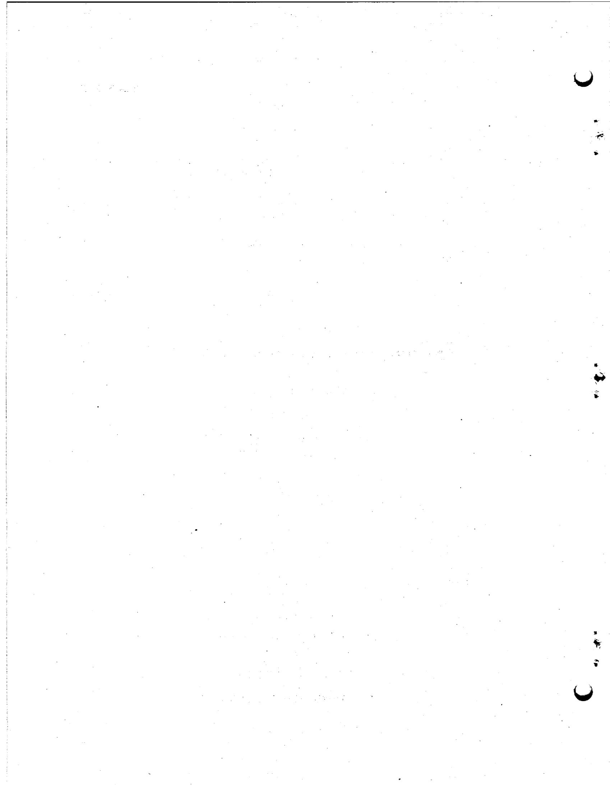

# CONTENTS

# Abstract 1

1. Introduction 1   
2. Model Description and Verification 4   
3. Transient-Response Analysis 6   
4. Frequency-Response Analysis 10

4.1 Calculated Frequency Response of Power to Reactivity ... 11

4.1.1 For Noncirculating Fuel 11   
4.1.2 For Circulating Fuel 11

4.2 Effect of Mixing in the Fuel Loop 14   
4.3 Sensitivity of $\delta n / n_0\cdot \delta k$ to Parameter Changes 16   
4.4 Frequency Response of Outlet Temperature to Power 18

# 5. Stability Analysis 19

5.1 Pole Configuration-Eigenvalues 19

5.1.1 Theoretical Discussions 19   
5.1.2 Eigenvalue Calculation Results 24

5.2 Modified Mikhailov Method 26

5.2.1 Theoretical Discussion 26   
5.2.2 Results of Applying the Mikhailov Stability Criterion 28

# 6. Concluding Discussion 34

# Acknowledgments 34

# References 35

# Appendix. Padé Approximations 37

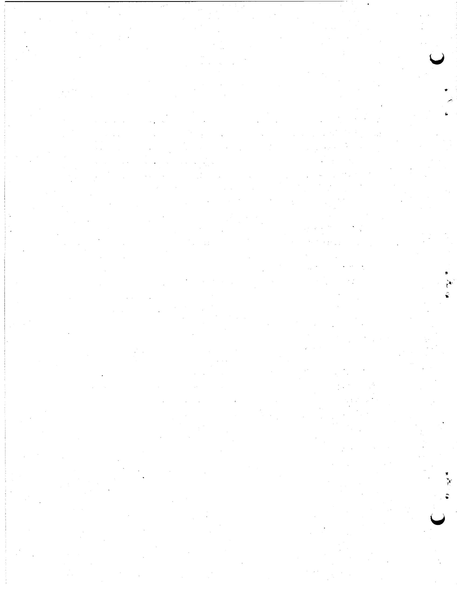

# THEORETICAL DYNAMIC ANALYSIS OF THE MSRE WITH $^{233}\mathrm{U}$ FUEL

R. C. Steffy, Jr. and P. J. Wood*

# Abstract

A study undertaken to characterize the dynamics of the $^{233}\mathrm{U}$ -fueled MSRE prior to operation revealed that the system is inherently asymptotically stable at all power levels above zero. The motivation for these studies was the expected difference between the MSRE dynamic response with $^{233}\mathrm{U}$ fuel and with $^{235}\mathrm{U}$ fuel because of the smaller delayed-neutron fraction of $^{233}\mathrm{U}$ . An existing system model, previously verified for $^{235}\mathrm{U}$ fuel, was modified for use in this work. The reactor system response to reactivity perturbations is rapid and nonoscillatory at high power, and it becomes sluggish and oscillatory at lower powers. These characteristics were determined by three methods: (1) transient-response analyses, including a check of the validity of the linear model, (2) a frequency-response and sensitivity study, (3) stability analyses, both by inspection of the system eigenvalues and by application of the recently developed, modified Mikhailov criterion.

Keywords: MSRE, $^{233}\mathrm{U}$ fuel, stability, eigenvalues, modified Mikhailov criteria, frequency response, sensitivity, time response, Padé approximations.

# 1. Introduction

As a preliminary step in the development of a molten-salt-fueled breeder reactor, the Molten Salt Reactor Experiment (MSRE) was fueled with $^{233}\mathrm{U}$ to perform the necessary physics and chemistry experiments on this first $^{233}\mathrm{U}$ -fueled nuclear power reactor. Before nuclear operation, it was important to anticipate the dynamic behavior and the inherent stability of the system in order to insure safe, orderly operation and to plan safe, definitive experiments.

The principal motivation for evaluating the operating characteristics of the $^{233}\mathrm{U}$ -fueled MSRE after more than 70,000 Mwhr of power operation with $^{235}\mathrm{U}$ fuel is that $^{233}\mathrm{U}$ has a much smaller delayed-neutron fraction

(β) than that of $^{235}\mathrm{U}$ . The $^{233}\mathrm{U}$ fuel was expected to have operating characteristics somewhat different from those of $^{235}\mathrm{U}$ and, in particular, a faster response to reactivity perturbations. Table 1 lists the predicted basic nuclear-kinetics properties of the MSRE with $^{233}\mathrm{U}$ fuel and compares them with those of the reactor with $^{235}\mathrm{U}$ fuel.

Several different techniques were used in analyzing the dynamics of the $^{233}\mathrm{U}$ -fueled MSRE, primarily because each technique either gave information unavailable from the others or used different approximate treatments to describe the system. In performing the dynamics analyses a model developed by Ball and Kerlin1 was modified slightly and used to describe the MSRE with $^{233}\mathrm{U}$ fuel. (This model did not include the effect of the reactor control system.) The time response of the reactor system to a reactivity perturbation at several power levels was calculated first. The computer code MATEXP,2 which calculates the time response of a multivariable nonlinear system with pure time delays, was used in this study. Next the system frequency response was determined by using the computer code SFR-3 (Ref. 3). This code was also used to determine amplitude ratio (or gain) sensitivity to changes in the system variables (i.e., the ratio of the change in amplitude ratio to the corresponding change in a system variable was determined as a function of frequency). Finally, the absolute stability of the system was investigated by two techniques. The system eigenvalues were calculated at several powers to determine whether oscillations induced in the system would increase or decrease in amplitude, and the Mikhailov stability criterion, as modified by Wright and Kerlin,4 was used to obtain this same information with fewer approximations in the mathematical model.

Linearized system equations were used in the frequency-response and sensitivity calculations and in both types of stability analysis. This was necessary because general calculational methods do not presently exist that would permit these types of analysis with a set of nonlinear system equations. The time-response calculations utilized the nonlinear equations. This was possible because they involved an iterative procedure that provided for updating the nonlinear terms after each iteration.

Table 1. Comparison of Nuclear Parameters Used in Dynamics Analyses of MSRE with $^{233}\mathrm{U}$ Fuel and with $^{235}\mathrm{U}$ Fuel   

<table><tr><td rowspan="3">Group</td><td colspan="3">233U Fuel</td><td colspan="2">235U Fuela</td></tr><tr><td rowspan="2">λi, Decay Constant (sec-1)</td><td colspan="2">βi, Delayed-Neutron Fraction</td><td rowspan="2">λi, Decay Constant (sec-1)</td><td>βi, Delayed-Neutron Fraction</td></tr><tr><td>Static</td><td>Circulating, Effective</td><td>Static</td></tr><tr><td></td><td></td><td>×10-4</td><td>×10-4</td><td></td><td>×10-4</td></tr><tr><td>1</td><td>0.0126</td><td>2.28</td><td>1.091</td><td>0.0124</td><td>2.23</td></tr><tr><td>2</td><td>0.0337</td><td>7.88</td><td>3.848</td><td>0.0305</td><td>14.57</td></tr><tr><td>3</td><td>0.139</td><td>6.64</td><td>4.036</td><td>0.111</td><td>13.07</td></tr><tr><td>4</td><td>0.325</td><td>7.36</td><td>5.962</td><td>0.301</td><td>26.28</td></tr><tr><td>5</td><td>1.13</td><td>1.36</td><td>1.330</td><td>1.14</td><td>7.66</td></tr><tr><td>6</td><td>2.50</td><td>0.88</td><td>0.876</td><td>3.01</td><td>2.80</td></tr><tr><td></td><td>Total β</td><td>26.40</td><td>17.14</td><td>Total β</td><td>66.61</td></tr><tr><td colspan="2">Prompt neutron generation time, sec</td><td colspan="2">4 × 10-4</td><td colspan="2">2.4 × 10-4</td></tr><tr><td colspan="2">Temperature coefficients of reactivity, °F</td><td colspan="2"></td><td colspan="2"></td></tr><tr><td colspan="2">Fuel salt</td><td colspan="2">-6.13 × 10-5</td><td colspan="2">-4.84 × 10-5</td></tr><tr><td colspan="2">Graphite</td><td colspan="2">-3.23 × 10-5</td><td colspan="2">-3.70 × 10-5</td></tr></table>

Data from Ref. 1.

# 2. Model Description and Verification

A mathematical model was required to describe the dynamic behavior of the $^{233}\mathrm{U}$ -fueled MSRE. The model chosen for this study was essentially that called the "complete model" in Ref. 1, which was developed to analyze the dynamics of the $^{235}\mathrm{U}$ -fueled MSRE. The justification for using this model was its good agreement with experimental results when applied to the $^{235}\mathrm{U}$ -fueled system.

Some changes were made in the model of Ref. 1, however, before it was applied to the $^{233}\mathrm{U}$ -fueled system. The experimental results of the previous testing program did not verify the dip in the calculated frequency response curve at approximately 0.25 radian/sec, which corresponds to a fuel circulation time of approximately 25 sec. This was attributed to insufficient mixing of fuel salt in the external loop of the theoretical model. To provide the model with more mixing, an additional 2-sec first-order time lag (mixing pot) was incorporated at the core outlet. This is a reasonable approximation for the mixing in the upper and lower reactor-vessel plenum.

The chief features of the 44th-order model, shown in Fig. 1, are the following:

1. The reactor core was divided into nine regions, each of which was split into two fuel lumps and one graphite lump. Consideration was given to the nuclear importance of thermal disturbances in each of the lumps. (The term "lump" as used in mathematical modeling refers to a segment of a physical system that is considered to have constant properties throughout and which interacts with its surroundings through only those properties.)   
2. A five-lump representation of the fuel-to-coolant heat exchanger was used, with heat being exchanged to a single metal lump at the temperature of the fuel leaving the first of two fuel lumps and heat being exchanged from the metal lump to the coolant at the outlet temperature of the first of two coolant lumps.   
3. A three-lump coolant-to-air radiator was used in which the coolant transferred heat to a single metal lump at the temperature of the coolant leaving the first of two coolant lumps.

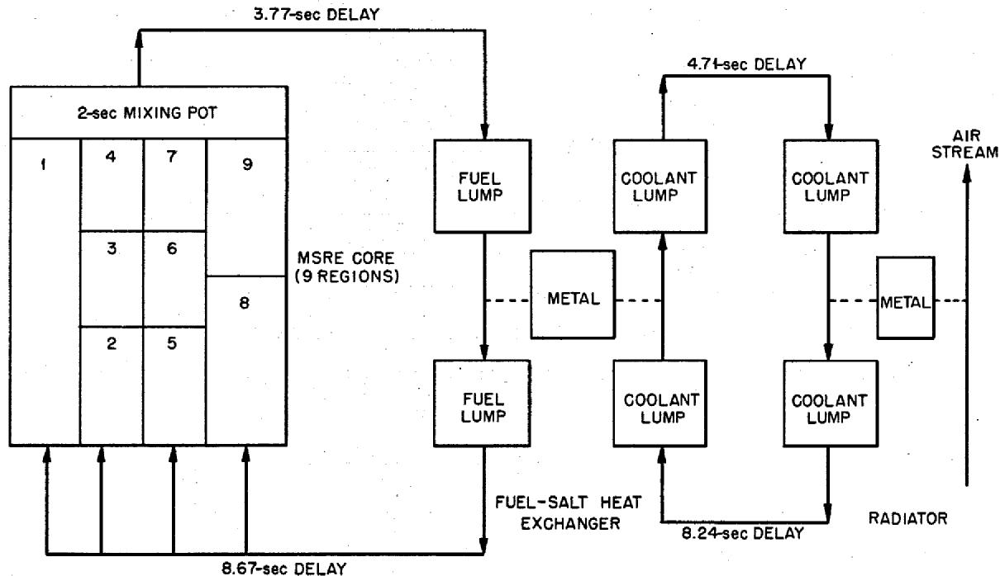  
Fig. 1. Schematic Drawing of MSRE Showing System Divisions Used in Mathematical Analysis.

4. A linear model of the reactor kinetics equations was used in all studies, except the time-response calculations, in which nonlinear kinetics effects were taken into account.   
5. The neutron kinetics equations were represented by a mathematical expression that accounted for the dynamic effect of circulating precursors (except for the eigenvalue calculation, which required the use of effective delayed-neutron fractions).   
6. Xenon poisoning was assumed to be at steady state and not influenced by small perturbations.

# 3. Transient-Response Analysis

Time responses were obtained at several power levels to provide a physical picture of the reactor response to reactivity perturbations such as control rod motions. The computer code MATEXP² applied in this analysis makes use of the matrix exponentiation technique of solving a system of nonlinear ordinary differential equations (with pure time delays) of the form

$$
\frac {\mathrm {d} \overline {{x}}}{\mathrm {d} t} = A \overline {{x}} + \Delta A (\overline {{x}}) \overline {{x}} + f (t), \tag {1}
$$

where

$$
\begin{array}{l} \overline {{x}} = \text {t h e s o l u t i o n v e c t o r (s y s t e m s t a t e v a r i a b l e s)}, \\ A = \text {s y s t e m} \\ \Delta A (\overline {{x}}) = a \text {m a t r i x} \text {w h o s e e l e m e n t s a r e d e v i a t i o n s f r o m t h e v a l u e s i n} A, [ \text {t h u s} \Delta A (\overline {{x}}) \overline {{x}} \text {i n c l u d e s a l l n o n l i n e a r e f f e c t s a n d t i m e d e l a y} \\ f (t) = \text {f o r c i n g} \\ \end{array}
$$

The predicted response of the reactor power to a step reactivity increase of $0.02\% \delta \mathrm{k} / \mathrm{k}$ is shown in Fig. 2 for various initial powers. These response curves point out several important characteristics of the MSRE. At 8 Mw the maximum power level is reached during the first second after the step reactivity input. The rapid increase in reactor power is accompanied by a rapid increase in fuel temperature in the core, which, coupled with the negative temperature coefficient of reactivity, more than

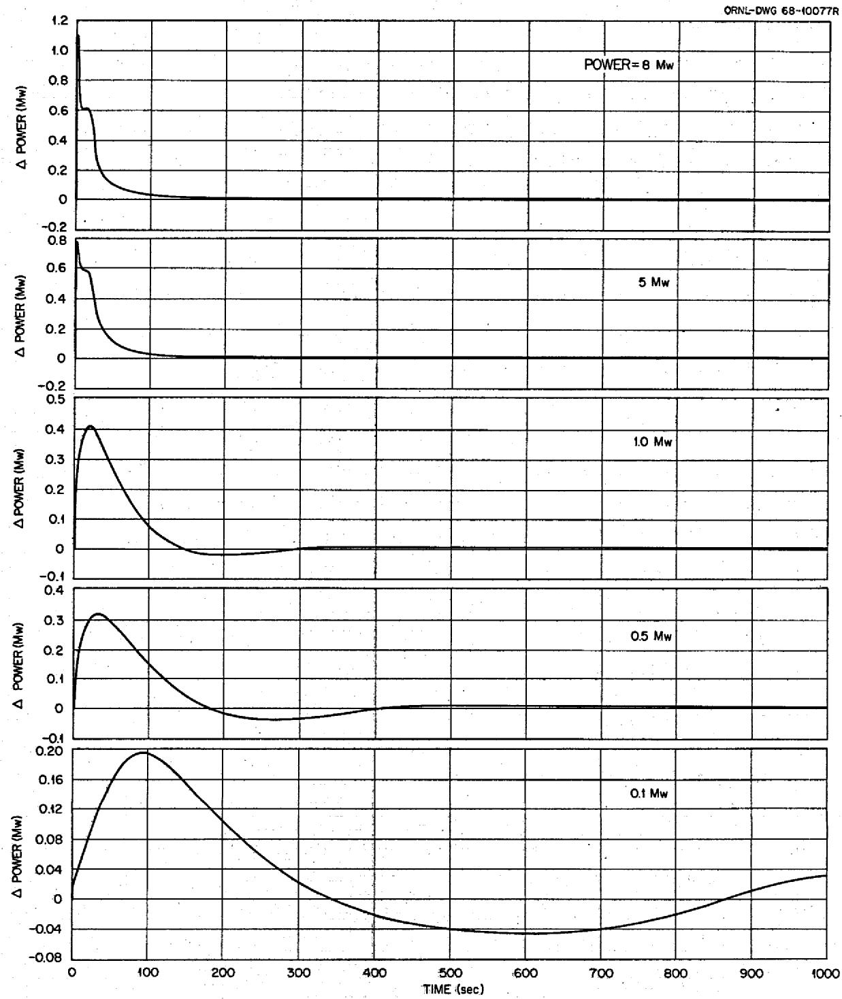  
Fig. 2. Calculated Power Response of the $^{233}\mathrm{U}$ -Fueled MSRE to a $0.02\%$ δk/k Step Reactivity Insertion at Various Power Levels.

counterbalances the step reactivity input, so the power level begins to decrease. The temperature of the salt entering the core is constant during this interval, and when the power has decreased enough for the reactivity associated with the increased nuclear average temperature to just cancel the step reactivity input, the power levels for a brief time (from $\sim 6$ to $\sim 17$ sec after the reactivity input). About 17 sec after the reactivity increase, the hot fluid generated in the initial power increase has completed its circuit of the loop external to the core, and the negative temperature coefficient of the salt again reduces the reactivity so that the power level starts down again. At large times the reactor power has returned to its initial level, and the step reactivity input has been counterbalanced by an increase in the nuclear average temperature in the core. The short plateau observed in the time-response curve at $8\mathrm{Mw}$ was also noted in the 5-Mw case. At lower powers, however, the slower system response prevents the reactor from reaching the peak of its first oscillation before the fuel has completed one circuit of the external fuel loop. The plateau therefore does not appear in the lower power cases.

An important characteristic of the MSRE dynamic response is that as the power is decreased the reactor becomes both sluggish (slower responding) and oscillatory; that is, at low powers the time required for oscillations to die out is much larger than at higher powers, and the fractional amplitude of the oscillations ( $\triangle$ power/power) is larger.

As part of the time-response analysis, the validity of the linear approximation for reactivity perturbations roughly equivalent to $1/2$ in. of control rod movement $(0.04\% \delta \mathrm{k} / \mathrm{k})$ was checked. The results of this analysis are shown in Figs. 3 and 4 for 8- and 0.1-Mw operation. At 8 Mw the linear approximation is fairly good, but at 0.1 Mw it is poor. This result can be understood by considering the general form of the neutron-kinetics equations:

$$
\frac {d \delta n}{d t} = \frac {\rho_ {0} - \beta_ {T}}{l} \delta n + \frac {n _ {0} \delta \rho}{l} + \sum_ {i = 1} ^ {6} \lambda_ {i} \delta C _ {i} + \frac {\delta \rho \delta n}{l}, \tag {2}
$$

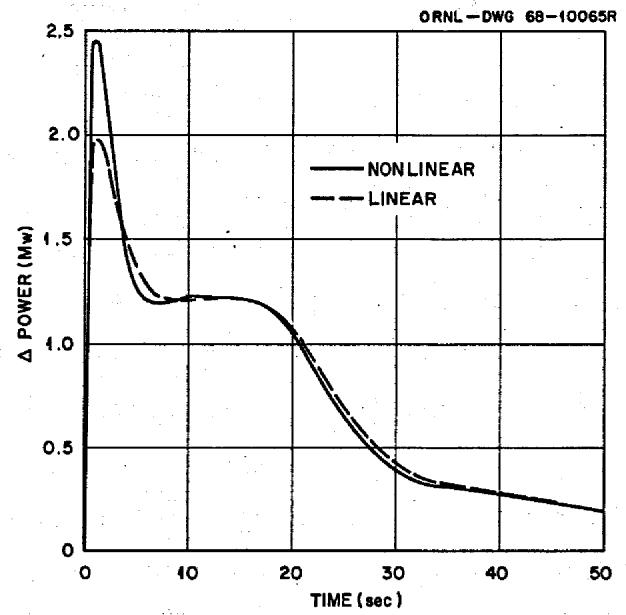  
Fig. 3. Power Response of the $^{233}\mathrm{U}$ -Fueled MSRE Initially Operating at 8 Mw to a $0.04\%$ Step Reactivity Insertion as Calculated with Nonlinear and Linearized Kinetics Equations.

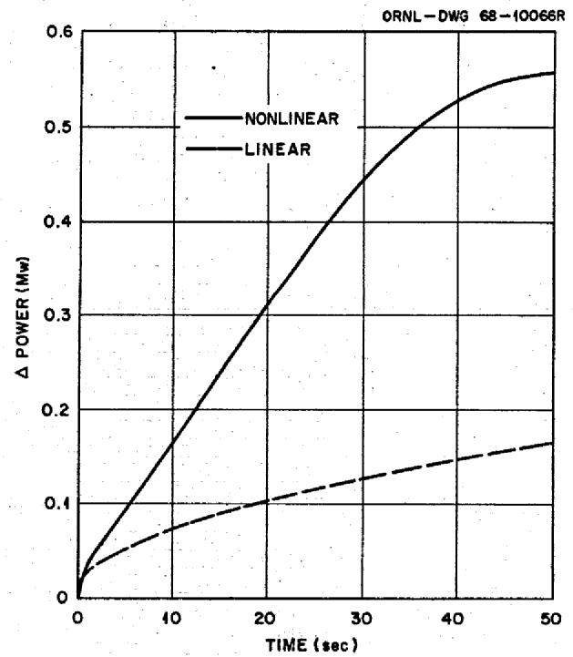  
Fig. 4. Power Response of the $^{233}\mathrm{U}$ -Fueled MSRE Initially Operating at 0.1 Mw to a Step Reactivity Insertion of $0.04\%$ as Calculated with Nonlinear and Linearized Kinetics Equations.

where

$\delta n =$ deviation of power from its initial value $(n_0)$

$\rho_0 =$ reactivity necessary to overcome effect of fuel circulation,

$\beta_{\mathrm{T}} =$ total delayed-neutron fraction,

$l =$ neutron generation time in system,

$\delta \rho =$ deviation of reactivity from its initial value,

$\lambda_{j} =$ decay constant for ith delayed-neutron precursor,

$\delta C_{i} =$ concentration of ith delayed-neutron precursor.

The last term in Eq. (2), $\delta \rho \delta n / l$ , is the nonlinear term. In the 8-Mw case the maximum deviation of the power from the initial power is only about $30\%$ of the initial power, whereas in the 0.1-Mw case the maximum deviation is $560\%$ of the initial power and is still increasing after 50 sec. When the 8n term is this large with respect to the $\mathfrak{n}_0$ term, the nonlinear terms in the kinetics equation play a much larger role than the linear terms. Thus, neglecting the nonlinear terms may lead to significant error if the power deviates from its initial level by more than a few percent. For the time-response analysis, it was necessary to include the nonlinear terms to obtain realistic results; however, use of the linearized equations in the frequency-domain analysis (Section 4 of this report) is acceptable because the analysis is based on small reactivity and power perturbations that oscillate around their initial values.

# 4. Frequency-Response Analysis

Because a closed-loop frequency-response analysis provides information about relative system behavior, the linear MSRE model was studied at different power levels from this point of view. The linear system equations were first Laplace transformed and then solved for the ratio of an output variable (such as power or temperature) to an input variable (such as reactivity). This ratio, called a transfer function, is

$$
G (S) = \frac {o (s)}{I (s)},
$$

where

$G(S) =$ transfer function,

$O(S) =$ the output variable,

$\mathbf{I}(\mathbf{S}) = \mathbf{\nabla}$ input variable,

S = Laplace transform variable.

For a stable system, S may be replaced by $\mathbf{j}\omega$ , where $\mathbf{j} = \sqrt{-1}$ and $\omega$ is the frequency of an input sine wave. With this substitution, $G(j\omega)$ is a complex number; the magnitude of $G(j\omega)$ is called the gain or the magnitude ratio and is the ratio of the amplitude of an input sinusoid to that of an output sinusoid. The phase of $G(j\omega)$ is the phase difference between the input and the output sinusoids. A plot of $G(j\omega)$ and the phase of $G(j\omega)$ versus $\omega$ is referred to as a Bode diagram or a frequency-response plot. A Bode plot provides qualitative stability information in the peaks of the magnitude ratio curves. High, narrow peaks indicate lower stability than flatter, broader peaks.

There are two basic reasons for calculating the frequency response of a system. First, the frequency-response curves are good indicators of system performance, and second, the frequency response of a system may be experimentally determined. The latter consideration is important because it provides a means for checking the validity of a model. When the experimentally determined frequency response of the system is in agreement with that of the theoretical model, confidence is gained in the conclusions drawn from the stability analysis applied to the model.

# 4.1 Calculated Frequency Response of Power to Reactivity

4.1.1 For Noncirculating Fuel. The calculated frequency response of the MSRE for the noncirculating, zero-power, $^{233}$ U-fueled condition is shown in Fig. 5. These curves are very similar to those of the classic zero-power reactor, and reference curves may be found in most textbooks on reactor dynamics. $^{6,7}$ At zero power, temperature feedback effects are not important, so the calculated response is that of the neutron-kinetics equations.

4.1.2 For Circulating Fuel. A set of frequency-response curves for circulating $^{233}\mathrm{U}$ fuel is shown in Fig. 6. These curves show the effect

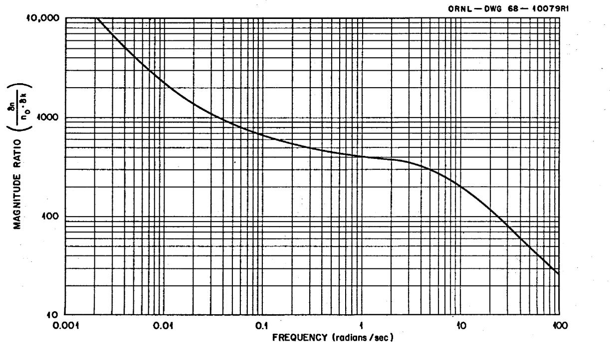

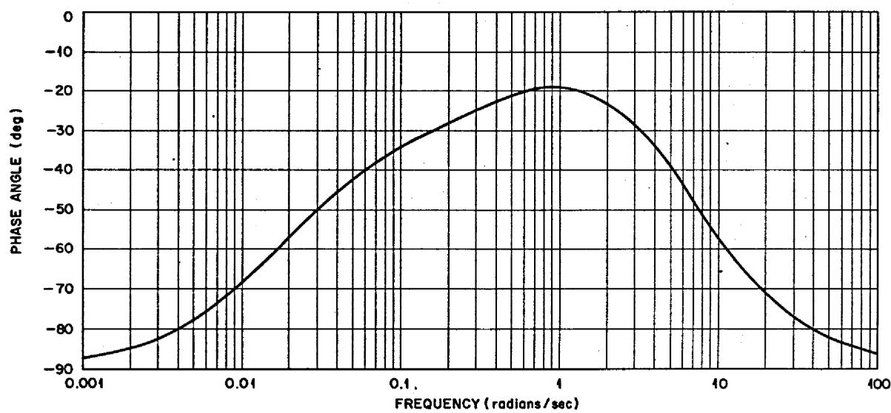  
Fig. 5. Theoretical Frequency-Response Plots of $\delta n / n_0\cdot \delta k$ for the $^{233}\mathrm{U}$ -Fueled MSRE at Zero-Power and with No Fuel Circulation.

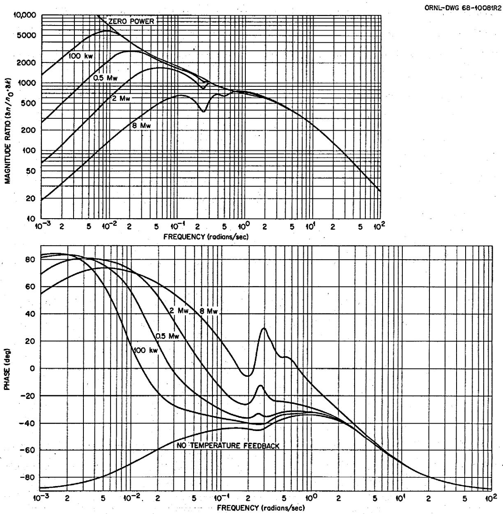  
Fig. 6. Theoretical Frequency-Response Plots of $\delta n / n_0\cdot \delta k$ for the $^{233}\mathrm{U}$ -Fueled MSRE at Various Power Levels with Fuel Circulation.

of power over the range from zero to 8 Mw. The primary reason for the change in curve shape as the power level is changed is the change in magnitude of the temperature-feedback effect. At higher power levels a smaller percentage change in power level causes a larger absolute temperature change which, in turn, affects reactivity through the negative temperature coefficient.

At higher power levels, the maximum peaks of the magnitude-ratio plots decrease, and these maximums are reached at higher frequencies. This implies that after a reactivity perturbation, the relative power response $\delta n / n_0$ will be of smaller magnitude and will tend to return to zero faster at high power levels than it will at lower power levels. (This observation was also made in the time-response calculations of the preceding section.)

The dip in the higher power curves at approximately 0.25 radian/sec (corresponding to the fuel loop transit time of $\sim 25$ sec) results from temperature feedback from the external loop. During a periodic reactivity perturbation at a frequency of about 0.25 radian/sec, the fuel in the core during one cycle would return to the core one period later and produce a reactivity feedback effect that would partially cancel the external perturbation. With the $^{235}\mathrm{U}$ fuel the amplitude ratio of the frequency-response curves was relatively low at this frequency, and the dip was not as pronounced. However, the amplitude ratio of the frequency-response curves for the $^{233}\mathrm{U}$ fuel loading are relatively high out to greater than 1 radian/sec, so the loop feedback is emphasized. The more negative temperature coefficient of reactivity for the $^{233}\mathrm{U}$ fuel also tends to emphasize the effect of loop feedback.

# 4.2 Effect of Mixing in the Fuel Loop

The curves in Fig. 6 were calculated with the model discussed in Section 2 of this report. The choice of a 2-sec mixing pot at the core outlet was based on the estimated mixing that occurs in the reactor vessel plenums but was somewhat arbitrary, and it was therefore desirable to explore the effect of different mixing approximations on the frequency-response curves. Figure 7 shows the effect on the 8-Mw frequency-response

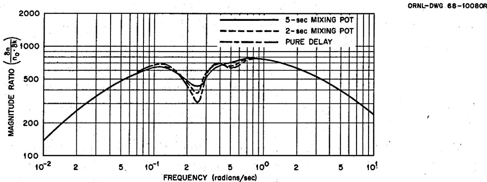

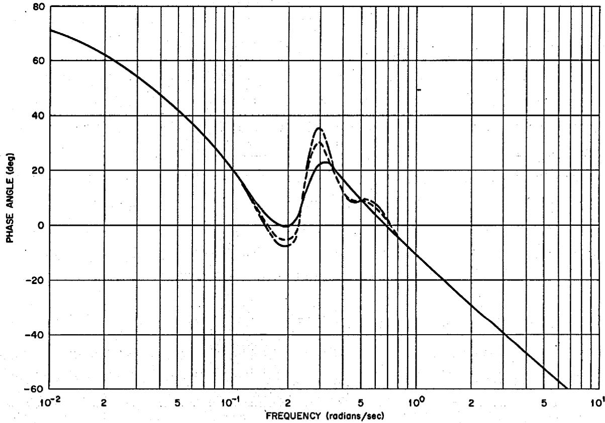  
Fig. 7. Theoretical Frequency-Response Plot of $\delta n / n_0\cdot \delta k$ for the $^{233}\mathrm{U}$ -Fueled MSRE Operating at 8 Mw for Various Amounts of Mixing in the Circulating Loop.

curve of varying the lag time of the mixing pot from 0 to 5 sec. (Note that mixing was still assumed to occur in each "lump" of the reactor and heat exchanger and that in this analysis the effect of additional mixing was considered.) The use of pure time delays (i.e., no mixing) to describe flow in lines external to the core gives a plot with sharp curves. As the time in the mixing pot increases, the curve becomes smoother. At low frequencies (<0.06 radian/sec) and at high frequencies (>1.0 radian/sec) the effect of mixing is negligible. At low frequencies the fuel temperature changes slowly enough for the effects of additional mixing in the lines to become insignificant, and at high frequencies the neutron-kinetics effects dominate and temperature feedback from the external loop is unimportant.

The amount of mixing in a circulating fuel, such as in the MSRE, is not easily determined analytically. The quantity of interest is not really the amount of salt "mixed" with other salt but, rather, the extent to which the temperature of a slug of salt is affected by its surroundings during its journey around the loop. Physical mixing of the salt, conductive heat transfer with adjoining slugs of salt, convective heat transfer to the pipe wall, and heat transfer in the heat exchanger all result in "mixing" the salt temperature. The experimental results of the $^{233}\mathrm{U}$ testing program may permit a determination of the size of the mixing pot that best describes the actual physical situation in the MSRE.

# 4.3 Sensitivity of $\delta n / n_0\cdot \delta k$ to Parameter Changes

The equations used to model the MSRE contain many independent parameters. Most of these are well known, but conditions may be postulated under which their values might change. The effects on the magnitude ratio of changes in each individual parameter were determined by performing a sensitivity analysis.3 The results of this analysis for selected variables are shown in Fig. 8.

The frequency range in which each variable is most important is apparent from the curves. In principle the theoretical frequency response could be compared with the response determined experimentally and the parameter that might be changing could be selected, or it could be determined

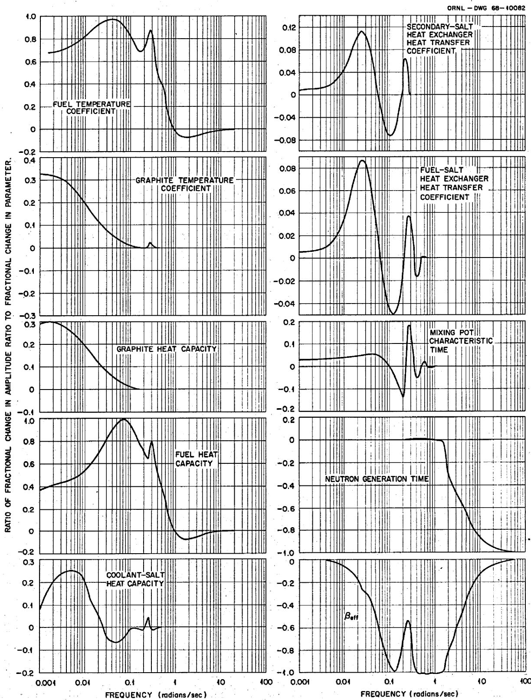  
Fig. 8. Curves Showing the Sensitivity of the Amplitude Ratio to Change in Various System Parameters.

that the value of a certain parameter was estimated incorrectly in the theoretical model. In practice, it is more likely that an actual change in system performance would affect more than one parameter. For example, a change in fuel-salt flow rate would affect the temperature feedback, effective delayed-neutron concentration, prompt temperature effects in the core, and heat transfer in the heat exchanger. The frequency response would be expected to change in the region where each of these variables was important. Certainly any appreciable change in fuel-salt flow rate could be detected by an experimental frequency-response determination, but to pinpoint the exact cause might be difficult. There are changes other than fuel-salt flow rate that might have an effect on only one or two parameters. For these changes, it might be possible to determine the exact cause of the anomalous behavior. Under any conditions, the sensitivity analysis gives valuable information as to the frequency range in which each parameter affects the system response and the relative importance of each parameter.

# 4.4 Frequency Response of Outlet Temperature to Power

Analyses of experimental data taken at the end of operation with $^{235}\mathrm{U}$ fuel showed that temperature perturbations were being introduced into the core as a result of heat transfer fluctuations at the radiator. These were significant enough in some cases to appreciably affect the experimental frequency-response determination. This, together with the mixing problem, led to a calculation of the frequency response of the reactor outlet temperature with respect to power ( $\delta T / \delta n$ ) to provide a means of determining the effect of extraneous temperature disturbances.

From a theoretical standpoint, many temperature-to-power frequency responses may be calculated. However, only those that may be experimentally verified are of use in comparing a theoretical model with a physical system or in determining the effect of outside influences (such as wind velocity affecting the radiator heat transfer) during an actual test. The model discussed previously was modified to include a term that represented the fuel-salt temperature, as recorded by a thermocouple, 2.5 sec downstream of the outlet of the 2-sec mixing pot. This position was chosen because it corresponds to the location of a particular thermocouple

with a convenient output. The response of a thermocouple located on the outside of a fuel-salt pipe to a change in fuel-salt temperature was found8 to be adequately approximated by a 1-sec pure time delay plus a 5-sec first-order lag. A schematic diagram of the model that incorporates these changes is shown in Fig. 9.

Figure 10 gives the frequency response of the salt temperature to power changes and the thermocouple response to power changes. At low frequencies these are the same, but at high frequencies there is an increasing difference between the frequency response of salt temperature to power changes and that of the indicated temperature to power changes because of the finite time required to transfer heat through the pipe wall.

The effect of fuel mixing on the $\delta T / \delta n$ frequency response may also be seen in Fig. 10. In addition to the 2-sec mixing pot at the reactor outlet, a 5-sec mixing pot was included between the heat exchanger and the core. This caused the frequency-response plot to be smoothed between 0.1 and 0.3 radians/sec but had no noticeable effect at other frequencies.

The differences in magnitude of the $\delta T / \delta n$ curves at low frequencies for different power levels is caused by heat transfer changes at the radiator. The tube-to-air heat transfer coefficient was assumed to vary with the air flow rate to the 0.6 power. The air flow rate was assumed to vary linearly with the power level.

# 5. Stability Analysis

# 5.1 Pole Configuration - Eigenvalues

5.1.1 Theoretical Discussions. In general, if a reactor system can be represented by the block diagram shown in Fig. 11, its closed-loop power-to-reactivity transfer function can be written as

$$
\frac {\delta n}{\delta k} = \frac {G}{1 + G H}. \tag {3}
$$

In this application, G is the transfer function of the reactor kinetics and H is the transfer function for the system feedback, which includes the effect of prompt temperature changes in the core, as well as delayed temperature effects caused by the salt circulation. The denominator of this

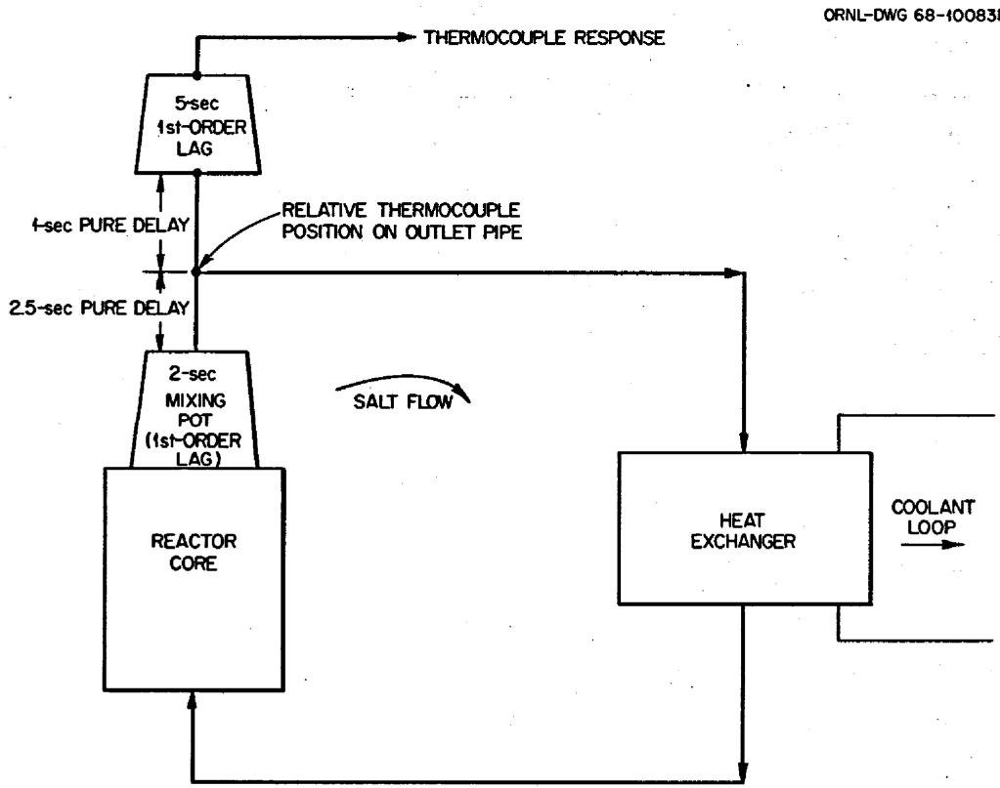  
Fig. 9. Schematic Diagram of MSRE Model Including the Model Representation of a Thermocouple's Response to a Change in Salt Temperature.

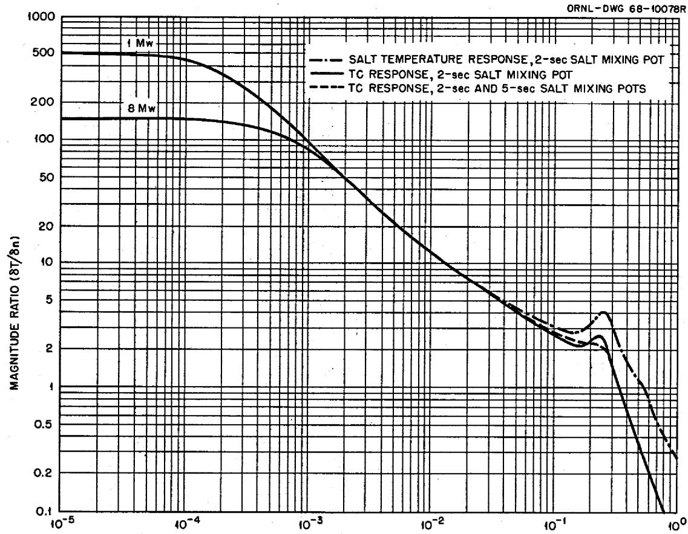

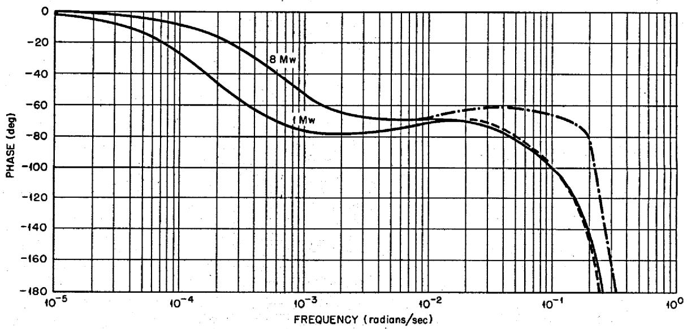  
Fig. 10. Frequency-Response Plots of Salt Temperature (in the Outlet Pipe) to Power Changes and Thermocouple (on the Outlet Pipe) Response to Power Changes for Various Amounts of Salt Mixing at Power Levels of 1 Mw and 8 Mw.

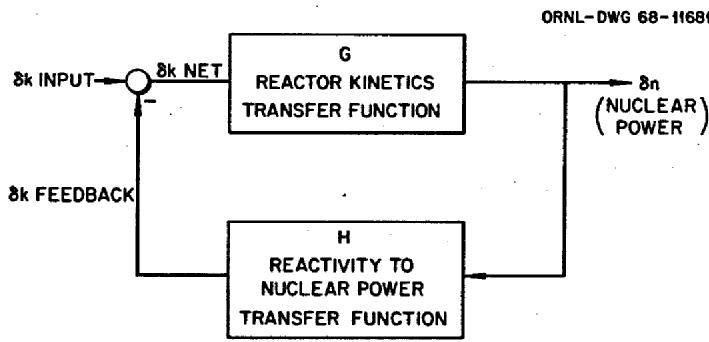  
Fig. 11. General Block Diagram of a Nuclear Reactor.

transfer function, $1 + \mathrm{GH}$ , is a polynomial (called the characteristic polynomial) in the Laplace transform variable S. The roots of this polynomial are the poles of the system transfer function. These roots are equal to the eigenvalues of the system coefficient matrix, A. A necessary and sufficient condition for linear asymptotic stability is that the system poles (and therefore the eigenvalues of A) have negative real parts. This criterion gives a definite answer to the question of linear stability. If the physical system has an N × N coefficient matrix (N linear equations in N system state variables), it will have N eigenvalues. The dominant eigenvalues of a stable system are the complex eigenvalues nearest to the imaginary axis. These eigenvalues dominate the time response of a system if the other eigenvalues are relatively far removed from the imaginary axis. Two things can be learned about the behavior of a system from the location in the complex plane of the dominant eigenvalues. First, after a stable system has been perturbed, the amplitude of the oscillations in a system variable decreases exponentially with a time constant equal to the inverse of the distance of the dominant eigenvalue from the imaginary axis. Second, the transient overshoot of the system is determined by the effective damping ratio, $\xi$ (Ref. 9). This damping ratio is determined by the angle $\beta$ a vector from the origin of the complex plane to the dominant eigenvalue makes with the imaginary axis:

$$
\xi = \frac {\tan \beta}{\sqrt {1 + \tan^ {2} \beta}}. \tag {4}
$$

As tan $\beta$ increases from 0 to $\infty$ , $\xi$ increases from 0 to 1. The value of $\xi$ determines how large the overshoot of the system is during a transient. Small values of $\xi$ indicate larger overshoot than large values.

One characteristic of a zero-power reactor is a pole of the system transfer function at the intersection of the real and imaginary axes. Since the system eigenvalues correspond to the system poles, this also implies an eigenvalue at the origin. The output (for a reactor, the power) of a system of this type will increase as long as there is a positive input (reactivity) but will level out when there is no input.

The computer code of Imad and Van Ness $^{10}$ was used to determine the eigenvalues of the system matrix, but before the eigenvalues of the system could be determined, an approximate treatment of the pure time delays in the system model was necessary. An eighth-order Padé approximation (see Appendix) was used for all time delays except the one representing the circulation of the delayed-neutron precursors around the external loop. To account for the fact that the fuel was circulating, a set of effective delayed-neutron fractions $(\beta_{\mathrm{eff}})$ was used in the eigenvalue calculation.

5.1.2 Eigenvalue Calculation Results. Figure 12 shows several of the dominant eigenvalues plotted for various power levels. The real part of each calculated eigenvalue is negative, with the general trend being toward smaller absolute values with decreasing power level. The negative real parts insure linear asymptotic stability, and the trend toward smaller absolute values with decreasing power level again points to a higher degree of stability at higher power levels. The eigenvalues that lie relatively far removed from the real axis (those with positive imaginary components between 0.20 and 0.30) are a result of the coupled energy-balance equations and are relatively independent of nuclear power. They do, however, exhibit some power dependence, primarily because of the variation in heat transfer coefficient at the radiator with power level. The physical implication of these eigenvalues is that any temperature disturbance in the system would tend to cause slight temperature oscillations around the system, even if the nuclear power were zero. The eigenvalues for the nuclear kinetics equations were all on the real axis for the zero-power condition.

The calculation for zero power resulted in a dominant eigenvalue with a real part equal to $-0.36 \times 10^{-7} \sec^{-1}$ and an imaginary part equal to 0.0. By proper manipulation of one coefficient in the system equations in the fifth significant digit (the coefficients are generally not known to better than four places) the value of the real part of the dominant eigenvalue could be changed from a small negative value to a small positive value. While from a mathematical standpoint the positive sign would imply instability, it must be realized that within the accuracy of the calculation, both these values are zero. A calculated value of identically zero

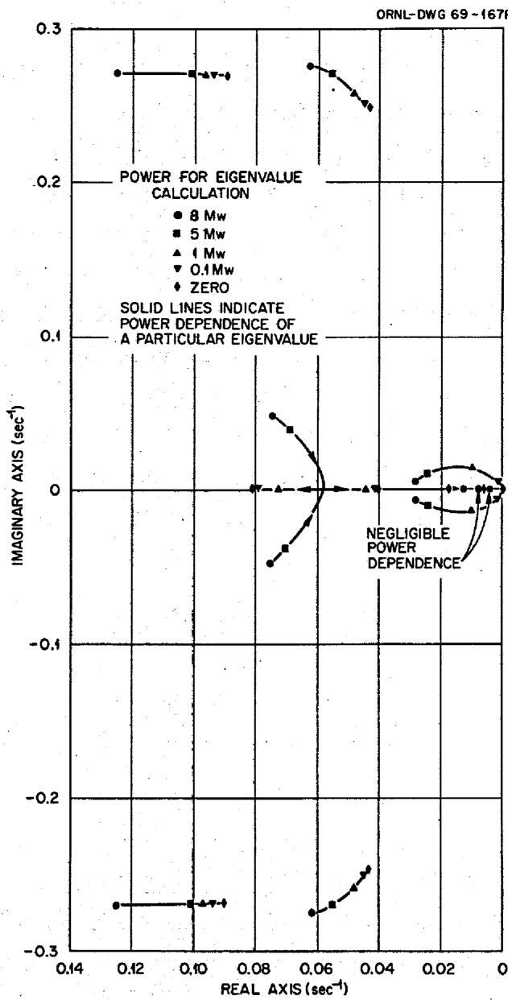  
Fig. 12. Plots of Several of the More Dominant Eigenvalues of the $^{233}\mathrm{U}$ -Fueled MSRE for Various Power Levels.

(the expected value at zero power) would have resulted only if absolute precision had been maintained throughout the calculation.

As a point of general interest, a set of system equations with an eigenvalue with real part equal to $-1 \times 10^{-6} \sec^{-1}$ implies that a perturbed system, after the input perturbations has vanished, spontaneously returns to its original state with a time constant of $10^{6} \sec$ (11.5 days); similarly, an eigenvalue with real part equal to $+1 \times 10^{-6} \sec^{-1}$ would spontaneously deviate away from its original state with an 11.5-day time constant. While the difference in stability between these two cases is obvious, neither would represent a difficult problem to the control system designer, and either case would represent acceptable system behavior; or, conversely, for a particular application, if one of these was unacceptable, both would probably be unacceptable.

The eigenvalues that form the curve which goes to the origin at zero power (see Fig. 12) were used to calculate the damping ratio, $\xi$ . Results of this calculation are listed below:

<table><tr><td>Power (Mw)</td><td>ξ, Damping Ratio</td></tr><tr><td>0.1</td><td>0.16</td></tr><tr><td>1.0</td><td>0.37</td></tr><tr><td>5.0</td><td>0.96</td></tr><tr><td>8.0</td><td>0.99</td></tr></table>

Since there are eigenvalues on the real axis that have real parts of about the same magnitude as those used in the calculation, the system damping ratio cannot alone be used to determine the system oscillatory behavior; however, it is useful as a relative indicator. The damping ratio again emphasizes the MSRE characteristic of being less oscillatory at high power levels than at low power.

# 5.2 Modified Mikhailov Method

5.2.1 Theoretical Discussion. An alternate technique for determining absolute stability of a linear system was recently developed by Wright and Kerlin4 along the lines of the method of Mikhailov. The chief advantage of this method over the eigenvalue technique is that no approximations

are necessary to treat pure time delays. The technique of Wright and Kerlin is based on a linear constant-parameter system of order $N$ , which can be written as a set of coupled, first-order differential equations with constant coefficients:

$$
\frac {\mathrm {d} \bar {x} (t)}{\mathrm {d} t} = A \bar {x} (t) + R (t, \tau) + \bar {B} f (t), \tag {5}
$$

where

$$
\begin{array}{l} \overline {{x}} (t) = \text {c o l u m n v e c t o r o f s y s t e m s t a t e v a r i a b l e s}, \\ A = \text {c o n s t a n t} N \times N \text {c o e f f i c i e n t m a t r i x ,} \\ \end{array}
$$

$$
f (t) = \text {f o r c i n g}
$$

$$
\overline {{\mathbf {B}}} = \text {c o l u n n v e c t o r o f c o e f f i c i e n t s o f} \mathbf {f} (t),
$$

$$
R (t, \tau) = \text {m a t r i x}
$$

$$
\mathrm {r} _ {\mathbf {i j}} \mathrm {x} _ {\mathbf {j}} (\mathrm {t} - \tau_ {\mathbf {i j}}).
$$

A Laplace transform of Eq. (5) yields

$$
S \bar {x} (S) = A \bar {x} (S) + R (S, \tau) + \bar {B} f (S), \tag {6}
$$

where S is the Laplace transform variable. The transform of one of the time-lagged elements,

$$
\mathbf {r} _ {i j} \mathbf {x} _ {j} (t - \tau_ {i j}),
$$

is

$$
r _ {i j} x _ {j} (s) e ^ {- S \tau_ {i j}},
$$

so $R(S, \tau)$ may be written

$$
R (S, \tau) = L (S) \bar {x} (S), \tag {7}
$$

where $L(S)$ is a matrix composed of the $r_{ij} e^{-S\tau_{ij}}$ terms. Substitution into Eq. (5) and manipulation yields

$$
\frac {\overline {{x}} (s)}{r (s)} = - [ A - S I + L ] ^ {- 1} \overline {{B}}, \tag {8}
$$

where I is the identity matrix, and super -1 indicates the inverse matrix.

The absolute stability of the system is determined by the location of the roots of the equation

$$
\det  (A - S I + L) = 0.
$$

The values of S for which the above equation is satisfied are the system eigenvalues or characteristic roots.

In their development of the modified Mikhailov stability criterion, Wright and Kerlin defined a quantity $M(S)$ as

$$
\mathrm {M} (\mathrm {S}) = \frac {\mathrm {D} (\mathrm {S})}{\mathrm {P} (\mathrm {S})}, \tag {9}
$$

where

$$
D (S) = \det . (A - S I + L), \tag {10}
$$

$$
P (S) = \det (T - S I), \tag {11}
$$

and $\mathbf{T}$ is an $\mathbf{N} \times \mathbf{N}$ diagonal matrix, each element of which is the negative of the absolute value of the corresponding elements of the A matrix. The quantity $\mathbf{P}(\mathbf{S})$ can be considered to be a factor that normalizes $\mathbf{D}(\mathbf{S})$ in both magnitude and phase. The stability criterion associated with $\mathbf{M}(\mathbf{S})$ is that "the number of zeros of the system determinant det $(\mathbf{A} - \mathbf{S}\mathbf{I} + \mathbf{L})$ in the right half plane equals the negative of the number of counterclockwise encirclements of the origin by the vector $\mathbf{M}(\mathbf{j}\omega)$ as $\omega$ goes from $-\infty$ to $+\infty$ ."4 While not explicitly stated in this quotation the important parameter is the net number of encirclements of the origin, with clockwise encirclements counting negative and counterclockwise encirclements counting positive. Because of symmetry about the real axis it is necessary only to plot $\mathbf{M}(\mathbf{j}\omega)$ for $\omega$ running from 0 to $+\infty$ . It can also be shown that $\mathbf{M}(\mathbf{j}\omega)$ approaches 1.0 as $\omega$ becomes large, so a finite number of $\omega$ values can completely describe the motion of $\mathbf{M}(\mathbf{j}\omega)$ .

5.2.2 Results of Applying the Mikhailov Stability Criterion. By using a computer program developed by Wright and Kerlin, plots were generated of $M(j\omega)$ for $\omega$ running from 0 to $+\infty$ . Figures 13 through 17 show these plots for several power levels. As shown, at significant power levels there are no encirclements of the origin as $\omega$ goes from $-\infty$ to $\infty$ . As

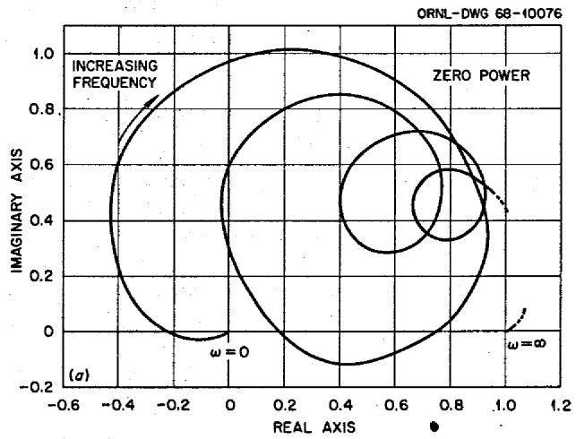

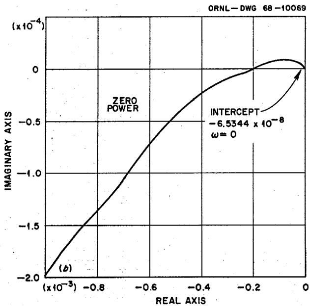  
Fig. 13. Modified Mikhailov Plot for MSRE Operating with $^{233}\mathrm{U}$ Fuel at Zero Power. (a) Complete plot. (b) Near origin.

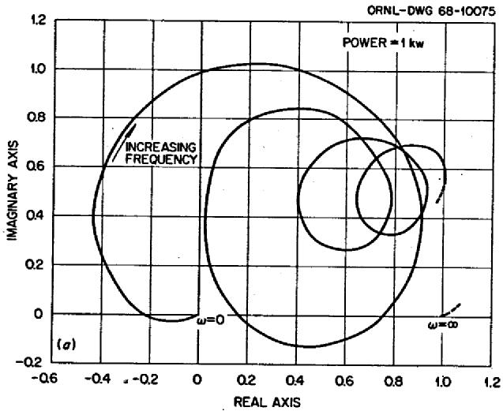

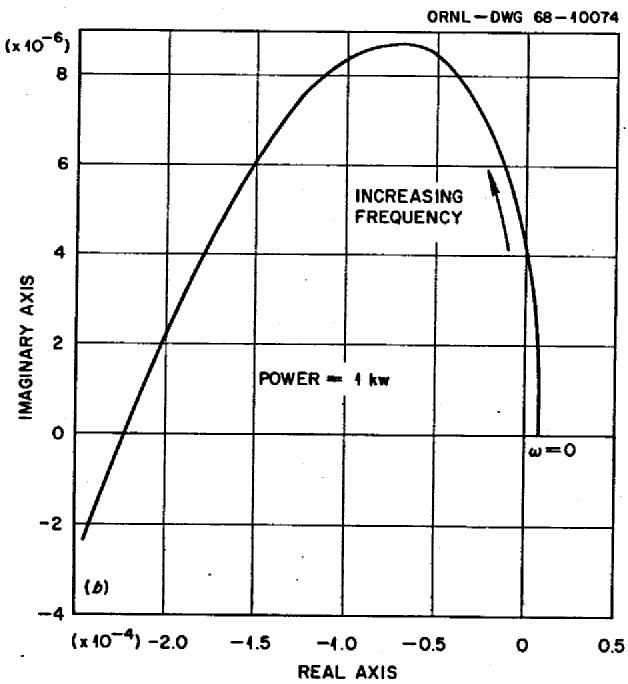  
Fig. 14. Modified Mikhailov Plot for MSRE Operating with $^{233}\mathrm{U}$ Fuel at 1 kw. (a) Complete plot. (b) Near origin.

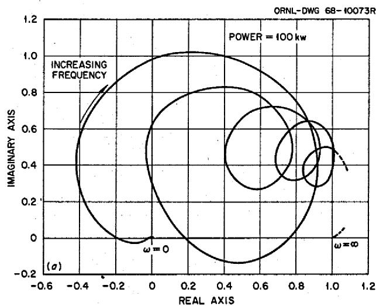

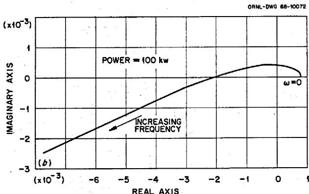  
Fig. 15. Modified Mikhailov Plot for MSRE Operating with $^{233}\mathrm{U}$ Fuel at 100 kw. (a) Complete plot. (b) Near origin.

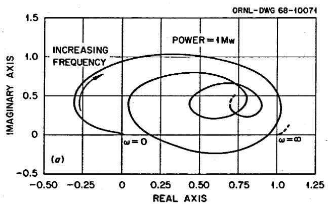

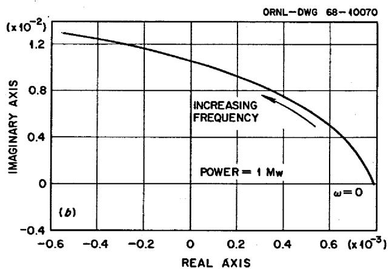  
Fig. 16. Modified Mikhailov Plot for MSRE Operating with $^{233}\mathrm{U}$ Fuel at 1 Mw. (a) Complete plot. (b) Near origin.

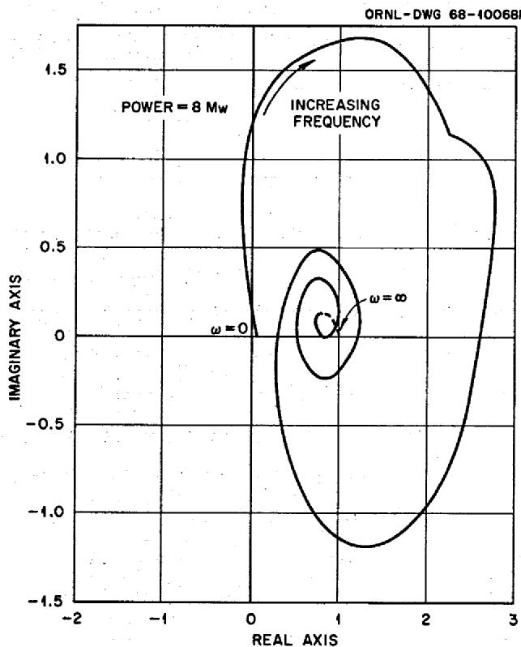  
Fig. 17. Modified Mikhailov Plot for MSRE Operating with $^{233}\mathrm{U}$ Fuel at 8 Mw.

in the eigenvalue calculation, the results of zero-power calculations were highly sensitive to small changes in coefficients in the system matrix. While the zero-power plots actually show an encirclement of the origin when the total plot from $-\infty$ to $+\infty$ is considered, the intercept at $-6.5 \times 10^{-8}$ should, of course, be interpreted as passing through the origin. This is typical for a zero-power reactor.

Application of the modified Mikhailov stability criterion to the set of system equations that describe the MSRE verifies that the MSRE is inherently stable at all power levels.

# 6. Concluding Discussion

The overall result of this study is a determination that the MSRE fueled with $^{233}\mathrm{U}$ is an inherently stable system at all power levels of interest. The response of the uncontrolled system at powers above zero power, as seen in the transient analysis and corroborated by the eigenvalues, is rapid and nonoscillatory at high powers and becomes sluggish and oscillatory at low powers. It is recommended that the $^{233}\mathrm{U}$ -fueled MSRE be subjected to a testing program at powers from zero to full power to experimentally verify the predicted response. These experiments should be performed in such a way that both the $\delta n / \delta k$ and $\delta T / \delta n$ transfer functions can be determined, since both can now be compared with theoretical predictions.

# Acknowledgments

The authors are grateful to T. W. Kerlin of the University of Tennessee and S. J. Ball for their assistance and advice. The help of J. L. Lucius in assisting with programming difficulties is also acknowledged.

# References

1. S. J. Ball and T. W. Kerlin, Stability Analysis of the Molten-Salt Reactor Experiment, USAEC Report ORNL-TM-1070, Oak Ridge National Laboratory, December 1965.   
2. S. J. Ball and R. K. Adams, MATEXP, A General Purpose Digital Computer Program for Solving Ordinary Differential Equations by the Matrix Exponential Method, USAEC Report ORNL-TM-1933, Oak Ridge National Laboratory, Aug. 30, 1967.   
3. T. W. Kerlin and J. L. Lucius, The SFR-3 Code - A Fortran Program for Calculating the Frequency Response of a Multivariable System and Its Sensitivity to Parameter Changes, USAEC Report ORNL-TM-1575, Oak Ridge National Laboratory, June 1966.   
4. W. C. Wright and T. W. Kerlin, An Efficient, Computer-Oriented Method for Stability Analysis of Large Multivariable Systems, Report NEUT 2806-3, Nuclear Engineering Department, University of Tennessee, July 1968.   
5. T. W. Kerlin and S. J. Ball, Experimental Dynamic Analysis of the Molten-Salt Reactor Experiment, USAEC Report ORNL-TM-1647, Oak Ridge National Laboratory, October 1966.   
6. M. A. Schultz, Control of Nuclear Reactors and Power Plants, p. 116, McGraw-Hill, New York, 1961.   
7. G. Robert Keepin, Physics of Nuclear Kinetics, pp. 328-329, Addison-Wesley, Reading, Mass., 1965.   
8. S. J. Ball, Oak Ridge National Laboratory, personal communication to R. D. Steffy, Jr., July 24, 1968.   
9. D. R. Coughanowr and L. B. Koppel, Process Systems Analysis and Control, pp. 86, 187, McGraw-Hill, New York, 1965.   
10. F. P. Imad and J. E. Van Ness, Eigenvalues by the QR Transform, Share-1578, Share Distribution Agency, IBM Program Distribution, White Plains, N. Y., October 1963.   
11. G. S. Stubbs and C. H. Single, Transport Delay Simulation Circuits, USAEC Report WAPD-T-38 and Supplement, Westinghouse Atomic Power Division, 1954.

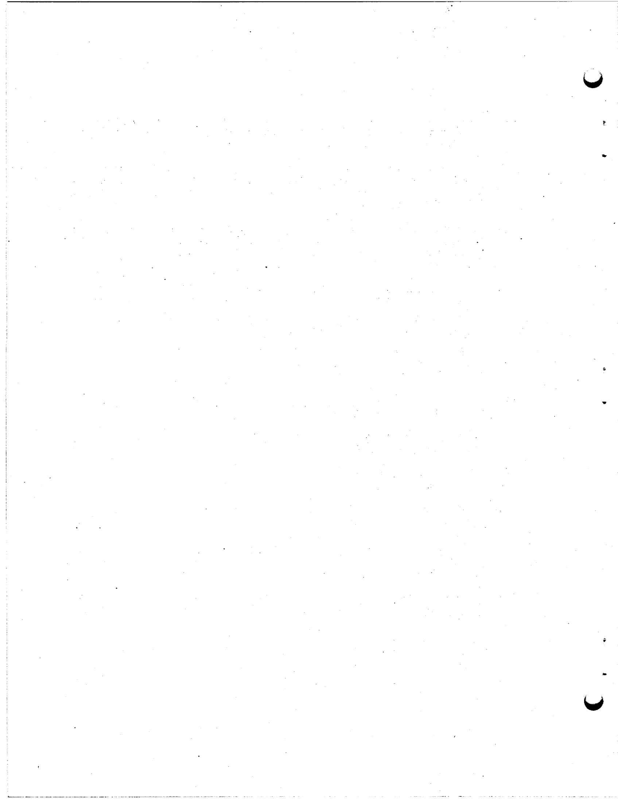

# Appendix PADE APPROXIMATIONS

In the analysis of physical systems it frequently becomes necessary to mathematically approximate pure time delays. Such a treatment, for instance, would be necessary to relate the outlet temperature to the inlet temperature of a fluid flowing in plug flow through an adiabatic pipe if the axial heat conduction were negligible. If the inlet temperature is $x(t)$ and the delay time is $T$ , the outlet temperature will be $x(t - T)$ . The Laplace transform of a delayed variable $x(t - T)$ is $x(S) e^{-TS}$ , and if a system containing time delays is to be analyzed simply, a linear approximation must be substituted for $e^{-TS}$ . One technique for approximating $e^{-TS}$ is as an infinite series:

$$
e ^ {- T S} = 1 - T S + \frac {T ^ {2} S ^ {2}}{2 !} - \frac {T ^ {3} S ^ {3}}{3 !} + \frac {T ^ {4} S ^ {4}}{4 !} - \dots . \tag {1}
$$

An approximation to this expansion is

$$
e ^ {- T S} \cong - \frac {S - \frac {2}{T}}{S + \frac {2}{T}} = 1 - T S + \frac {T ^ {2} S ^ {2}}{2} - \frac {T ^ {3} S ^ {3}}{4} + \dots . \tag {2}
$$

Unfortunately this approximation does not converge rapidly for large values of TS. A better approximate treatment is the Padé approximation:

$$
e ^ {- T S} \cong \prod_ {r = 1} ^ {n} \frac {1 - 2 \Gamma_ {r} \tau_ {r} S + \tau_ {r} ^ {2} S ^ {2}}{1 + 2 \Gamma_ {r} \tau_ {r} S + \tau_ {r} ^ {2} S ^ {2}}, \tag {3}
$$

where

$$
T = \text {D e l a y} = \sum_ {\mathbf {r} = 1} ^ {\mathrm {n}} 4 \Gamma_ {\mathbf {r}} \tau_ {\mathbf {r}}. \tag {4}
$$

The order of this approximation is 2n. Stubbs and Single11 have suggested that the criterion for selection of $\Gamma_{\mathbf{r}}$ and $\tau_{\mathbf{r}}$ be such that the actual phase-shift,

$$
\phi = 2 \tan^ {- 1} \left(\frac {2 \Gamma \tau \omega}{1 - \tau^ {2} \omega^ {2}}\right),
$$

is as close as possible to the ideal phase shift for a pure time delay,

$$
\phi_ {0} = 4 \Gamma \tau \omega .
$$

To meet this criterion, they have suggested (for an eighth-order Padé approximation) that the following values be used:

$$
\Gamma_ {1} = \sqrt {3 / 2}
$$

$$
\Gamma_ {2} = 0. 4 0
$$

$$
\Gamma_ {3} = 1. 0
$$

$$
\Gamma_ {4} = 0. 5
$$

$$
\tau_ {1} / \tau_ {2} = 1. 6 8
$$

$$
\tau_ {3} / \tau_ {4} = 1. 1 4
$$

For this choice of constants the phase error $(\phi - \phi_0)$ in the Padé approximation is less than one degree at $\omega T = 13.5$ radians. At higher frequencies this error increases, and at lower frequencies it decreases.

The following linear equations have been developed for the eighth-order Padé approximation, where $x_{j}$ is the variable input to the time delay, $x_{0}$ is the delayed variable output of the time delay, $T$ is the delay time, and $y_{1}$ through $y_{8}$ are Padé variables:

$$
\frac {\mathrm {d y} _ {1}}{\mathrm {d t}} = - 3. 9 1 7 1 5 \mathrm {x} _ {\mathrm {i}} + 3. 9 1 7 1 5 \mathrm {x} _ {0} \tag {5}
$$

$$
\frac {\mathrm {d y} _ {2}}{\mathrm {d t}} = - 1 9. 5 8 5 8 \mathrm {x} _ {\mathrm {i}} - \frac {1 0}{\mathrm {T}} \mathrm {y} _ {1} - 1 9. 5 8 5 8 \mathrm {x} _ {0} \tag {6}
$$

$$
\frac {\mathrm {d} y _ {3}}{\mathrm {d} t} = - 4 5. 8 4 4 \mathrm {l x} _ {\mathrm {i}} - \frac {1 0}{\mathrm {T}} \mathrm {y} _ {2} + 4 5. 8 4 4 \mathrm {l x} _ {0} \tag {7}
$$

$$
\frac {\mathrm {d} y _ {4}}{\mathrm {d} t} = - 6 5. 8 0 8 3 x _ {i} - \frac {1 0}{T} y _ {3} - 6 5. 8 0 8 3 x _ {0} \tag {8}
$$

$$
\frac {\mathrm {d} y _ {5}}{\mathrm {d} t} = - 6 4. 1 1 3 5 x _ {i} - \frac {1 0}{T} y _ {4} + 6 4. 1 1 3 5 x _ {0} \tag {9}
$$

$$
\frac {\mathrm {d} y _ {6}}{\mathrm {d} t} = - 4 3. 8 1 6 9 x _ {i} - \frac {1 0}{T} y _ {5} - 4 3. 8 1 6 9 x _ {0} \tag {10}
$$

$$
\frac {\mathrm {d} \mathbf {y} _ {7}}{\mathrm {d t}} = - 2 0. 6 8 3 1 \mathbf {x} _ {i} - \frac {1 0}{T} \mathbf {y} _ {6} + 2 0. 6 8 3 1 \mathbf {x} _ {0} \tag {11}
$$

$$
\frac {\mathrm {d y} _ {8}}{\mathrm {d t}} = - 6. 3 3 0 8 \mathrm {x} _ {1} - \frac {1 0}{\mathrm {T}} \mathrm {y} _ {7} - 6. 3 3 0 8 \mathrm {x} _ {0} \tag {12}
$$

$$
x _ {0} = x _ {i} + \frac {1 0}{T} y _ {8}. \tag {13}
$$

For a further discussion of this method see Stubbs and Single.11

#

# Internal Distribution

1. J. L. Anderson   
2. R. K. Adams   
3. C.F.Baes   
4. S. J. Ball   
5. H. F. Bauman   
6. S. E. Beall   
7. E. S. Bettis   
8. R. Blumberg   
9. E. G. Bohlmann   
10. C. J. Borkowski   
11. R. B. Briggs   
12. W. R. Cobb   
13. E. L. Compere   
14. W. B. Cottrell   
15. J. L. Crowley   
16. F. L. Culler   
17. S. J. Ditto   
18. W.P.Eatherly   
19. J. R. Engel   
20. E.P.Epler   
21. D.E.Ferguson   
22. L. M. Ferris   
23. A. P. Fraas   
24. J. K. Franzreb   
25. D. N. Fry   
26. C. H. Gabbard   
27. R.B.Gallaher   
28. W. R. Grimes   
29. A. G. Grindell   
30. R. H. Guymon   
31. P. H. Harley   
32. P. N. Haubenreich   
33. A. Houtzeel   
34. T. L. Hudson   
35. P. R. Kasten   
36. R. J. Kedl   
37. T. W. Kerlin   
38. H. T. Kerr   
39. A. I. Krakoviak

40. T. S. Kress   
41. R. C. Kryter   
42. M. I. Lundin   
43. R.N.Lyon   
44. R. E. MacPherson   
45. H. McClain   
46. H. E. McCoy   
47. H. C. McCurdy   
48. A. J. Miller   
49. R. L. Moore   
50. E. L. Nicholson   
51. L. C. Oakes   
52. A. M. Perry   
53. H. B. Piper   
54. B. E. Prince   
55. G. L. Ragan   
56. J. L. Redford   
57. M. Richardson   
58. J. C. Robinson

59-60. M. W. Rosenthal

61. A. W. Savolainen   
62. Dunlap Scott   
63. M. J. Skinner   
64. A. N. Smith   
65. I. Spiewak

66-75. R.C.Steffy

76. D. A. Sundberg   
77. J. R. Tallackson   
78. R.E.Thoma   
79. D. B. Trauger   
80. J. R. Weir   
81. M. E. Whatley   
82. J. C. White   
83. G. D. Whitman

84-93. P. J. Wood   
94. Gale Young   
95-96. Central Research Library   
97-98. Y-12 Document Reference Section

99-101. Laboratory Records Department

102. Laboratory Records (IRD-RC)

# External Distribution

103. C.B. Deering, AEC-OSR   
104-105. T. W. McIntosh, AEC, Washington, D.C.   
106-120. Division of Technical Information Extension (DTIE)   
121. Laboratory and University Division, ORO