CRNL-TM-2578

Contract No. W-7405-eng-26

Chemical Technology Division

PROCESSING OF THE MSRE FLUSH AND FUEL SALTS

R. B. Lindauer

AUGUST 1969

OAK RIDGE NATIONAL LABORATORY

Oak Ridge, Tennessee

operated by

UNION CARBIDE CORPORATION

for the

U.S. ATOMIC ENERGY COMMISSION

# CONTENTS

# Abstract 1

1. Introduction 1   
2. Summary 2   
3. Process Description 2

3.1 Fluorination 2   
3.2 Reduction 6

4. Equipment Description and Performance 6

4.1 Plant Layout 6   
4.2 Shielding 8   
4.3 Fuel Storage Tank 9   
4.4 NaF Trap 13   
4.5 Caustic Scrubber 15   
4.6 Mist Filter 17   
4.7 Soda-Lime Trap 17   
4.8 Charcoal Traps 17   
4.9 Off-Gas Filter 20   
4.10 Gas Supply System 21   
4.11 UF6 Absorbers 22   
4.12 Salt Sampler 22   
4.13 Salt Filter 25   
4.14 Special Instrumentation 27

5. Operating History 30

5.1 Fluorine Reactor Tests 30   
5.2 Caustic Scrubber Tests 39   
5.3 Fluorination of the Flush Salt 41   
5.4 Reduction of the Flush Salt 43   
5.5 Fluorination of the Fuel Salt 44   
5.6 Reduction of the Fuel Salt 47

# Page

6. Discussion of Data 50

6.1 Fluorine Utilization 50   
6.2 Corrosion 53   
6.3 Molybdenum 56   
6.4 Plutonium 57   
6.5 Niobium 57   
6.6Iodine and Tellurium 62   
6.7 Uranium Absorption 64   
6.8 Uranium Product Purity 66   
6.9 Reduction of Metal Fluorides 70

7. Acknowledgments 72   
8. References 74

R. B. Lindauer

# ABSTRACT

The MSRE Fuel Processing Plant, shakedown tests of equipment and procedures, and the uranium recovery operation are described. The MSRE flush and fuel salt batches were fluorinated to recover 6.5 and $216\mathrm{kg}$ of uranium, respectively. Known losses during processing were less than $0.1\%$ . Gross beta and gamma decontamination factors of $1.2 \times 10^{9}$ and $8.6 \times 10^{8}$ were obtained. Corrosion averaged about $0.1\mathrm{mil/hr}$ . The corrosion product fluorides were reduced and filtered to provide a carrier salt having a lower concentration of metallic contaminants than the original carrier salt.

# 1. INTRODUCTION

The Molten Salt Reactor Experiment (MSRE) is an 8-Mw circulating liquid fuel reactor operating at $1200^{\circ}\mathrm{F}$ . The original fuel contained 65 mole $\%$ $\mathrm{LiF_4}$ , 30 mole $\%$ $\mathrm{BeF_2}$ , 5 mole $\%$ $\mathrm{ZrF_4}$ and 0.9 mole $\%$ $^{238-235}\mathrm{UF_4}$ . The reactor first went critical on June 1, 1965, and began full-power operation in May 1966. Prior to shutdown on March 26, 1968, the reactor had operated for slightly more than one equivalent full-power year, or 72,400 Mwhr.

The MSRE Fuel Processing Facility was constructed in a small cell in the reactor building for two purposes: (1) to remove any accumulated oxides in the fuel or flush salt by $\mathrm{H}_{2}$ -HF sparging, and (2) to recover the original uranium charge from the salt to permit the addition of the $^{233}\mathrm{U}$ fuel charge for the second phase of reactor operation. The plant had been operated once before, in 1965, to remove oxide (115 ppm) from the flush salt before the reactor went critical. Since that time the oxide contents of both the flush salt and the fuel salt have remained constant; therefore, it appears unlikely that such an operation will be required in the future.

A design and operations report describing the MSRE Fuel Processing Plant2 was written before the initial test run; it was revised in

December 1967 to reflect the modifications being made to permit handling of short-decayed fuel salt. The present report covers the modifications made to the plant during the final plant testing operations and describes the results of these tests and of the flush and fuel salt processing.

# 2. SUMMARY

The uranium recovery process consists of fluorine sparging to volatilize the uranium, followed by decontamination of the gas stream with a $750^{\circ}\mathrm{F}$ NaF bed and absorption of the $\mathrm{UF}_6$ on the $200^{\circ}\mathrm{F}$ NaF beds. The excess fluorine is removed by an aqueous scrubber. The corrosion product fluorides are reduced to the metals, which are filtered from the salt before the salt is returned to the reactor system.

After four months of testing and modifications, during which the fluorine disposal system was changed from the gas-phase reaction with $\mathrm{SO}_2$ to the aqueous KI-KOH scrubber, processing of the MSRE flush salt (66 mole % LiF - 34 mole % $\mathrm{BeF}_2$ ) began. The flush salt was fluorinated to recover $6.5\mathrm{kg}$ of uranium. About $216\mathrm{kg}$ of uranium was recovered from the MSRE fuel salt. Corrosion of the fuel processing tank during fluorination of the fuel salt averaged about $0.1\mathrm{mil/hr}$ . The most accurate calculations were based on the corrosion of nickel $(0.04\mathrm{mil/hr})$ and chromium $(0.14\mathrm{mil/hr})$ . Fluorine utilization averaged $7.7\%$ during fluorination of the flush salt (and $39\%$ during fluorination of the flush salt) and $39\%$ during fluorination of the fuel salt. Reduction and filtration produced carriers salt containing less impurities than the original salt. The recovered uranium was decontaminated from fission products by gross gamma and gross beta decontamination factors of $8.6\times 10^{8}$ and $1.2\times 10^{9}$ , respectively. Identifiable uranium losses were less than $0.1\%$ .

# 3. PROCESS DESCRIPTION

# 3.1 Fluorination

The flowsheet used is shown in Fig. 1. The molten salt was forced from the drain tank under pressure, through a freeze valve in the drain

ORNL-DWG 68-8994

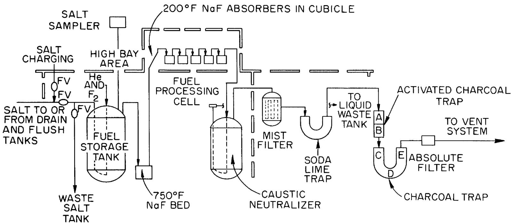  
Fig. 1. MSRE Fuel Processing System.

tank cell, through a metallic filter (back-flow) and another freeze valve in the processing cell to the fuel storage tank. The transfer was made at 1000 to $1100^{\circ}\mathrm{F}$ , a temperature that is well above the freezing point of the salt but not hot enough to reduce the strength of the metallic filter element below a safe limit. The transfer was made with the lowest possible pressure in order to minimize stress on the filter element as the gas blew through at the end of the transfer and also to minimize entrainment of salt or activity from the fuel storage tank.

The salt was then cooled to within $50^{\circ}\mathrm{F}$ of the liquidus temperature to minimize corrosion and fission product volatilization during fluorination. The sample line was purged with helium to prevent condensation of $\mathrm{UF_6}$ at the cold upper end. The salt was sparged with either pure fluorine or a fluorine-helium mixture at a relatively high flow rate ( $\sim 40$ liters/min) to convert the $\mathrm{UF_4}$ to $\mathrm{UF_5}$ . Fluorine utilization was high during this period. When all the $\mathrm{UF_4}$ had been converted to $\mathrm{UF_5}$ , $\mathrm{UF_6}$ began to form and volatilize, as indicated by a temperature rise in the first absorber and by a rise on the inlet mass flowmeter (see Sect. 4.14). When this occurred, the fluorine flow was reduced to 15 or 25 liters/min to increase the absorber residence time for more efficient absorption and to increase the fluorine utilization.

The gas leaving the fuel storage tank consisted of $\mathrm{UF}_6$ , excess fluorine, helium, $\mathrm{MoF}_6$ and some $\mathrm{CrF}_4$ or $\mathrm{CrF}_5$ from corrosion, $\mathrm{IF}_7$ , and the fluorides of some other fission products such as tellurium, niobium, ruthenium, and antimony. The gas passed through a $750^{\circ}\mathrm{F}$ sodium fluoride trap where the chromium fluoride and most of the volatilized fission products, except iodine and tellurium, were retained. A small fluorine flow was introduced upstream of this bed to ensure an excess of fluorine and to prevent any nonvolatile $\mathrm{UF}_6$ from forming and remaining on the heated NaF in the event that the fluorine utilization was near $100\%$ . Although the fluorine utilization was not high enough to require this additional fluorine stream, a small flow was maintained to prevent diffusion and condensation of $\mathrm{UF}_6$ in the line.

The gas stream, which now consisted of $\mathsf{UF}_6$ , fluorine, helium, $\mathsf{MoF}_6$ , $\mathsf{IF}_7$ , $\mathsf{TeF}_6$ , and a trace of other fission products, left the shielded cell

and passed through five NaF absorbers in a sealed cubicle in the operating area. These absorbers were heated to 200 to $250^{\circ}\mathrm{F}$ to increase the reaction rate and to minimize $\mathrm{MoF_6}$ absorption. The $\mathrm{UF_6}$ piping was heated to at least $140^{\circ}\mathrm{F}$ to prevent condensation of $\mathrm{UF_6}$ . As the $\mathrm{UF_6}$ began to load on a given absorber and the temperature started to rise, the cooling air was turned on that particular absorber to limit the temperature to a maximum of $350^{\circ}\mathrm{F}$ . High temperature reduced the uranium loading by promoting surface absorption and reducing penetration of the $\mathrm{UF_6}$ to the inside of the pellets. The final absorber was operated below $250^{\circ}\mathrm{F}$ , where the partial pressure of $\mathrm{UF_6}$ over the $\mathrm{UF_6} \cdot 2$ NaF complex allowed only a negligible amount of uranium to reach the caustic scrubber.

If the gas stream leaving the absorbers contained greater than $50\%$ fluorine, it was diluted with helium before reaching the caustic scrubber. This allowed a smooth reaction in the scrubber without the production of a flame or pressure oscillations. The caustic scrubber was charged with 1300 liters of $2 \underline{\underline{M}}$ KOH -- $0.33 \underline{\underline{M}}$ KI containing $0.2 \underline{\underline{M}}$ $\mathrm{K}_2\mathrm{B}_4\mathrm{O}_7$ , which was added as a soluble neutron poison. The reaction that occurred in the scrubber is:

$$
6 \mathrm {F} _ {2} + 1 2 \mathrm {K O H} + \mathrm {K I} \rightarrow 1 2 \mathrm {K F} + 6 \mathrm {H} _ {2} \mathrm {O} + 3 / 2 \mathrm {O} _ {2} + \mathrm {K I O} _ {3}.
$$

The scrubber solution was replaced before one-half of the KOH had been consumed, as determined by fluorine flow and calculated utilization, because dip tube corrosion was increased when the OH $^-$ concentration was less than 1 M. Besides fluorine, most of the molybdenum and iodine were removed in the scrubber.

A high-surface-area filter located downstream of the scrubber removed any particulate matter from the scrubber. During test runs, hydrated oxides of molybdenum collected at sharp bends in the line from the scrubber. A soda-lime trap (a mixture of sodium and calcium hydrates) provided a means for detecting fluorine and a means for removing traces of fluorine from the scrubber off-gas before it reached the charcoal absorbers. The trap was operated at room temperature, and the temperatures were monitored.

Activated impregnated charcoal traps sorbed any iodine that was not removed in the caustic scrubber. The gas leaving the charcoal traps consisted of only helium and oxygen that was produced in the caustic

scrubber; the oxygen amounted to about $25\%$ of the fluorine flow to the scrubber. This gas flowed through a flame arrester and then through an absolute filter before being routed to the cell exhaust. It was monitored for gamma activity and iodine before being mixed with the rest of the building exhaust gas, which passed through additional filters and was finally discharged from a 100-ft-tall stack.

When there was no longer any evidence of absorber heating, the fluoro-rine flow was stopped and the salt was sampled and analyzed. The uranium concentration in the salt was expected to be less than 50 ppm at this time.

# 3.2 Reduction

Before the salt could be returned to the reactor system, the $\mathrm{NiF}_2$ , $\mathrm{FeF}_2$ , and $\mathrm{CrF}_2$ produced by corrosion of the Hastelloy-N fuel storage tank had to be removed from the salt ( $\mathrm{MoF}_6$ is volatile). Because the concentration of nickel in Hastelloy-N is higher than that of chromium or iron, the concentration of $\mathrm{NiF}_2$ was higher than that of $\mathrm{CrF}_2$ or $\mathrm{FeF}_2$ in the fuel salt. Since nickel is more noble than iron or chromium, it was reduced by hydrogen sparging at $1225^{\circ}\mathrm{F}$ . After the reduction of $\mathrm{NiF}_2$ was complete, as indicated by filtered salt samples, pressed zirconium metal shavings were added to the salt and hydrogen sparging was continued to reduce the $\mathrm{FeF}_2$ and $\mathrm{CrF}_2$ . In this operation, the $\mathrm{ZrF}_4$ concentration of the salt was increased by a negligible amount ( $< 1\%$ ). The reduced metals were removed by a fibrous metal filter, and the efficiency of the filtration was verified by sampling the filtered salt.

# 4. EQUIPMENT DESCRIPTION AND PERFORMANCE

This section describes the performance of equipment not included in the discussion in Sect. 6.

# 4.1 Plant Layout

Most of the processing equipment is located in the fuel processing cell (Fig. 2), which is $13 \times 13 \times 17$ ft deep and is situated just north of the reactor drain tank cell. This processing cell contains the fuel

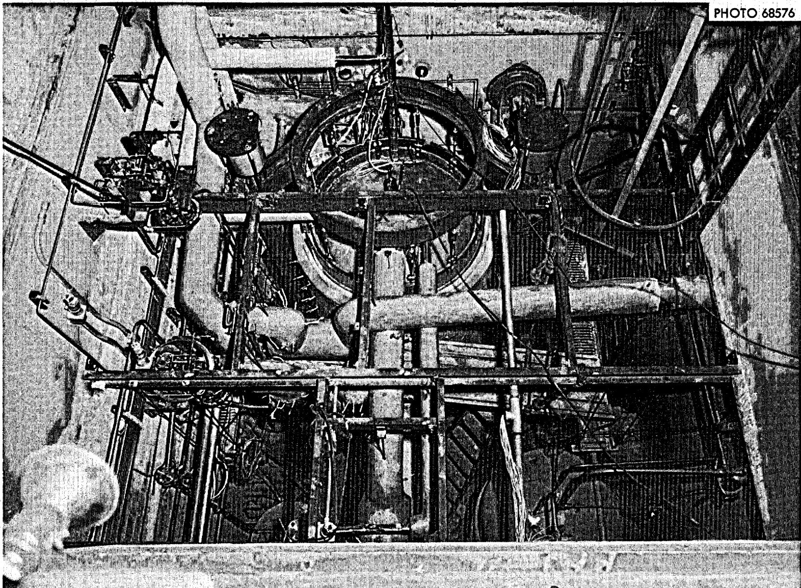  
Fig. 2. Photograph of Fuel Processing Cell.

storage tank (fluorinator), the $750^{\circ}\mathrm{F}$ NaF trap, the caustic scrubber, two remotely-operated air valves, three salt freeze valves, and the blower for the absorber cubicle.

The cell to the east ("spare cell") is also $13 \times 13 \times 17$ ft and contains the off-gas equipment -- mist filter, soda-lime trap, charcoal traps, and off-gas filter -- which is located downstream of the caustic scrubber.

The plant is operated from the high-bay area over these two cells. This area contains the absorber cubicle, instrument cubicle, instrument panelboard, sampler and sampler panelboard, hydrogen and oxygen monitors, and radiation detection instruments.

The gas supply station, which contains the fluorine manifold (where two 15,000-liter fluorine tanks mounted on trailers can be connected), the hydrogen manifold, and the pressure and flow instrumentation associated with these two gases, is situated outside the building, to the southwest of the building. The helium for purging and sparging comes from the reactor system supply.

# 4.2 Shielding

The shielding around the fuel processing cell was designed to limit the radiation level to 5 mrad/hr when a fully irradiated, 3-day-decayed fuel batch was in the fuel storage tank. To meet this requirement, new roof plugs were installed, and the east and west walls of the cell were backed up by an additional 2 ft of stacked barytes block.

Additional shielding was designed for 30-day-decayed fuel, but was not installed because the plant testing required more time than expected. This shielding consisted of:

(1) charcoal beds in the spare cell — to permit limited entry for maintenance;   
(2) $\mathrm{UF}_6$ absorbers in the operating area — to reduce the background activity from iodine and tellurium in the gas stream;   
(3) an NaF trap in the fuel processing cell — to shield the electrical insulation and valve diaphragms for absorbed $^{95}\mathrm{Nb}$ .

The shielding used is summarized in Table 1.

Table 1. Shielding for the Fuel Processing System   

<table><tr><td>Location</td><td>Thickness (in.)</td><td>Material</td></tr><tr><td>Fuel processing cell</td><td></td><td></td></tr><tr><td rowspan="2">East wall</td><td>18</td><td>Normal concrete</td></tr><tr><td>24</td><td>High-D concrete</td></tr><tr><td rowspan="2">South wall</td><td>36</td><td>Normal concrete</td></tr><tr><td>12</td><td>High-D concrete</td></tr><tr><td rowspan="2">West wall</td><td>12</td><td>Normal concrete</td></tr><tr><td>24</td><td>High-D concrete</td></tr><tr><td>North wall</td><td>18</td><td>Normal concrete</td></tr><tr><td>Roof</td><td>48</td><td>High-D concrete</td></tr><tr><td>Salt sampler</td><td>4</td><td>Lead</td></tr></table>

# 4.3 Fuel Storage Tank

The construction of the fuel storage tank, or fluorinator (see Fig. 3) is similar to that of the reactor drain tanks, except that the fluorinator is 30 in. taller to provide about $38\%$ freeboard above the normal liquid level. This extra height minimized salt carryover during gas sparging. The tank is suspended inside the heater and insulation assembly to minimize the weigh cell tare weight. There is no provision for cooling since the heat loss limits the temperature to less than $1200^{\circ}\mathrm{F}$ after two weeks' decay (Figs. 4 and 5).

The fuel storage tank is heated by four sets of heaters, which provide $5.8\mathrm{kw}$ on the bottom, $11.6\mathrm{kw}$ on the lower sides, $5.8\mathrm{kw}$ on the upper sides, and $2\mathrm{kw}$ on the top. Each group of heaters is controlled by a separate powerstat. During the period in which $\mathrm{UF}_4$ was converted to $\mathrm{UF}_5$ (when the fluorine utilization was high), the heat of reaction, plus the afterheat, provided sufficient heat to maintain the salt at $850^{\circ}\mathrm{F}$ . About $12\mathrm{kw}$ of electrical heat was required during the reduction operation at $1225^{\circ}\mathrm{F}$ .

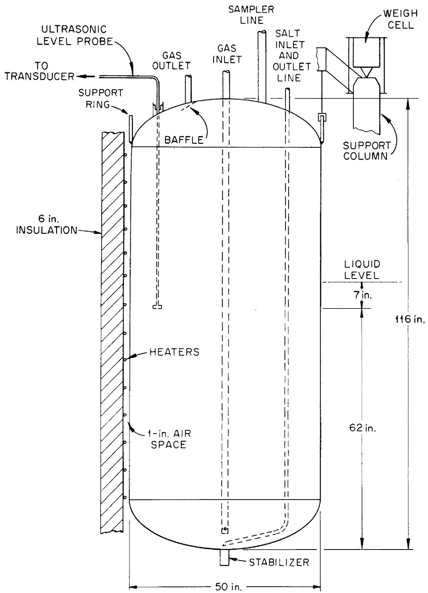  
Fig. 3. Fuel Storage Tank.

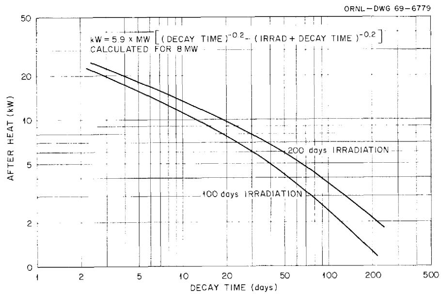  
Fig. 4. MSRE After Heat.

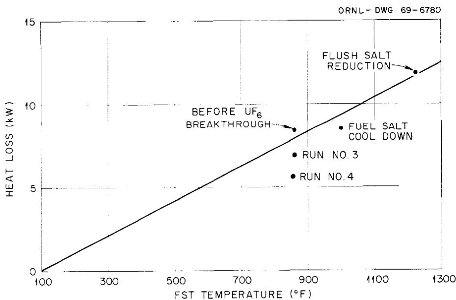  
Fig. 5. Fuel Storage Tank Heat Loss.

The gas inlet line for the fuel storage tank has a normal submergence of 64 in., and the differential pressure between this line and the gas space provides an indication of liquid level. The tank is equipped with an ultrasonic probe (Sect. 4.14) to check the weigh cell calibration during the filling and emptying operations.

Several safety interlocks are provided on the fuel storage tank:

1. The gas sparge line is automatically vented if the pressure in this line decreases to that of the gas space. This prevents accidental backup of molten salt in the cold gas inlet line.   
2. An automatic valve will open in the tank off-gas line if the tank pressure reaches 50 psig. An alarm sounds at 5 psig, which is a pressure higher than that normally found during operation.   
3. Fluorine flow to the tank is stopped if the helium purge flow down the sampler line stops. This minimizes the amount of fluorine, $\mathrm{UF}_6$ , or radioactive gases which could diffuse into lines leaving the cell in the event that the helium supply is lost.   
4. The fluorine supply valve is designed so that it must be closed before the salt sampler valve can be opened.

# 4.4 NaF Trap

The NaF trap, shown in Fig. 6 is operated at 750 to $800^{\circ}\mathrm{F}$ . In this temperature range, volatile ruthenium, niobium, antimony, and chromium fluorides are absorbed, while uranium and molybdenum hexafluorides pass through. The slightly oversized line from the fuel storage tank is also heated to $750^{\circ}\mathrm{F}$ to prevent the absorption of uranium at the trap inlet. The trap has two sets of heaters that are separately controlled, 2.25 kw in the center pipe and 9 kw on the sides. There are three thermocouples located in wells at the inlet, center, and outlet of the trap, respectively, which are maintained at temperatures within $10^{\circ}\mathrm{F}$ of each other. With 4 in. of insulation, the heat loss is about 1270 w at $775^{\circ}\mathrm{F}$ .

Before we had determined that most of the niobium left the salt during reactor operation, we were concerned that the $3 \times 10^{5}$ curies of $^{95}\mathrm{Nb}$ in the fuel salt would cause overheating of the trap. With the extended decay time, we calculated that $1 \times 10^{5}$ curies of $^{95}\mathrm{Nb}$ would be

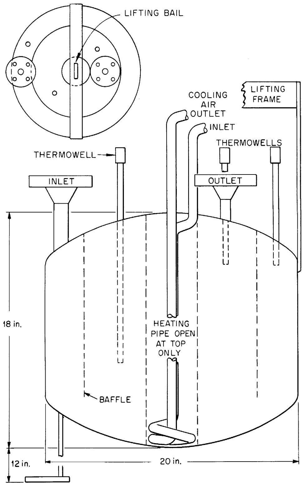  
Fig. 6. Sodium Fluoride Trap.

in the salt at the time of processing. Apparently, however, most of the niobium either plated out or was carried out in the reactor off-gas stream since no detectable heating of the trap was detected during fluorination and the center pipe air cooling system was not required.

We were also concerned that the trap might become plugged with volatilized chromium fluorides. For this reason, the trap was designed to be replaceable. The piping associated with the trap is flanged, with provision for remote leak detection, and the heater and thermocouple leads are provided with disconnects. Because of the anticipated high radiation level, a defective trap would be disconnected and moved to an empty space within the cell instead of being removed from the cell. However, we did not detect any increase in pressure drop between the fuel storage tank and the absorber inlet. Chromium fluoride volatilization was expected as the uranium concentration in the salt decreased; but such volatilization was apparently almost insignificant until the concentration became as low as 20 ppm.

# 4.5 Caustic Scrubber

The caustic scrubber shown in Fig. 7 was used for disposal of excess fluorine and of the HF produced during $\mathrm{NiF}_2$ reduction. The Monel spray ring distributor originally installed in the tank was replaced with two dip lines, each with three 3/8-in. holes, as shown in the figure. The dip lines have shutoff valves with extension handles to permit alternating the lines when plugging occurs. The new dip lines are made of Inconel, which has a higher corrosion resistance (than Monel) to the KOH-KI- $\mathbf{F}_2$ reaction. The scrubber and other internal piping were originally constructed of Inconel. The cooling water to the coil is not metered; however, only a fraction of the full flow was required to control the temperature during fluorination. On one occasion, in which the temperature was allowed to increase from less than $80^{\circ}\mathrm{F}$ to greater than $100^{\circ}\mathrm{F}$ , no decrease in plugging was noted.

The caustic scrubber was equipped with a contact microphone similar to the one used for the fuel storage tank. It was used intermittently as a check on the gas flow rate through the dip lines. During a 2-hr period in run 6, unusually loud, rapid noises, accompanied by rapid but small

ORNL-DWG65-2513R

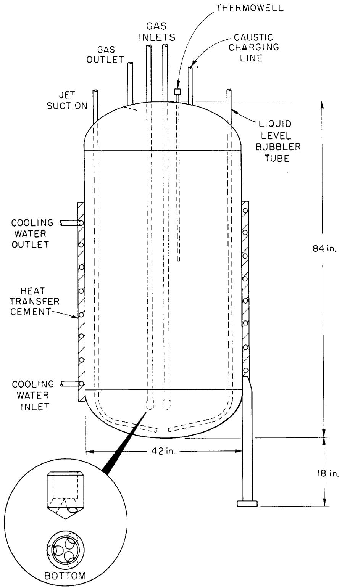  
Fig. 7. Caustic Scrubber.

pressure fluctuations in the line to the scrubber, were heard. Switching dip tubes restored the normal bubble flow sound.

# 4.6 Mist Filter

The mist filter is a high-efficiency Fiberglas air filter consisting of fifty-five 9-1/2-in.-diam by 28-in.-long bags hanging vertically in a 30-in.-diam by 4-ft-high stainless steel vessel. The total filter area is about $50\text{ft}^2$ . The filter, which is mounted in an opening in a horizontal support plate near the top of the vessel, was caulked to prevent bypassing. The tank is heated with steam coils that are wrapped around the tank to prevent condensation of the moisture that is carried over from the caustic scrubber. A thermowell installed in the gas space above the filter was used to adjust the amount of insulation in order to prevent overheating and damage to the filter binder.

# 4.7 Soda-Lime Trap

The soda-lime trap, shown in Fig. 8, was charged with activated alumina when it was used as the fluorine disposal backup trap for the $\mathrm{SO}_2$ system. When this disposal method was abandoned in favor of the aqueous scrubber, the trap was recharged with soda-lime, which is very effective for the removal of fluorine at room temperature but cannot be used with $\mathrm{SO}_2$ . To prevent excessive pressure drop with a gas having a high fluorine content, the soda-lime was mixed with an equal volume of 4- to 8-mesh alumina, which has a very slow reaction rate at low temperatures. To prevent condensation of water vapor in the gas from the scrubber, the soda-lime trap was insulated and traced with low-temperature steam tubing.

Thermocouples were installed near the inlet and near the outlet. During the processing of the flush and fuel salts, no temperature rise was observed. Thus it appears that no unreacted fluorine escaped from the caustic scrubber.

# 4.8 Charcoal Traps

The charcoal traps shown in Fig. 9 were considerably overdesigned to permit the handling of the large amount of iodine that is present in 30-day-decayed fuel, and to allow for the uncertainties associated with a gas

ORNL-DWG 68-2730A

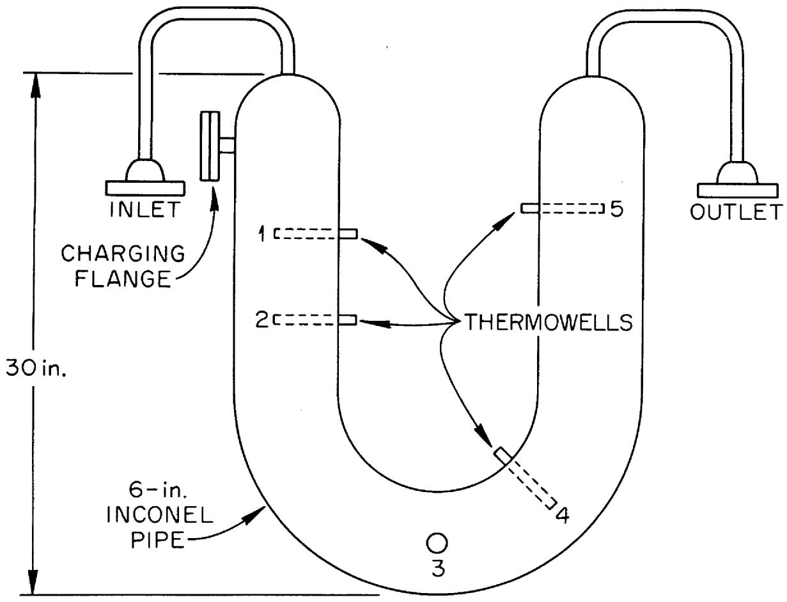  
Fig. 8. Soda-Lime Trap.

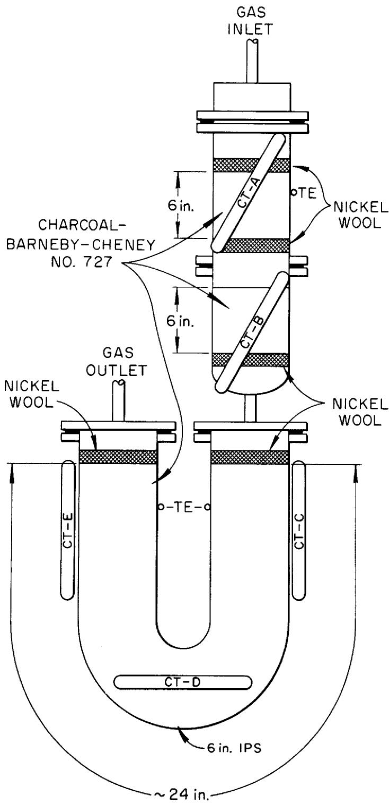  
Fig. 9. Charcoal Traps.

stream containing $\mathrm{SO}_2$ and $\mathrm{SO}_2\mathrm{F}_2$ . The original trap (inlet) was initially charged with replaceable cannisters, each of which had a total bed depth of 1-1/2 in. The final capacities and residence times are shown in Table 2.

Table 2. Charcoal Traps   

<table><tr><td>Trap</td><td>Diameter (in.)</td><td>Length (in.)</td><td>Volume (liters)</td><td>Residence of 16 std liters/min (sec)</td><td>Time at Average Flow</td></tr><tr><td>Inlet</td><td>6</td><td>12</td><td>5.84</td><td>22</td><td></td></tr><tr><td>Backup</td><td>6</td><td>22</td><td>3.17</td><td>12</td><td></td></tr><tr><td>Total</td><td></td><td>34</td><td>9.01</td><td>34</td><td></td></tr></table>

The traps are steam-traced in the same manner as the soda-lime trap. Surface thermocouples (TE) are located at the inlet of the first trap and at the inlet and the outlet of the backup trap. Temperatures were maintained between 175 and $205^{\circ}\mathrm{F}$ during processing, and no additional heating was detected at any time.

Four ion chambers, located at the inlet and the outlet of each trap were used to detect the accumulation of iodine; however, because the fuel had been allowed to decay for such a lengthy period, none of the readings increased during processing. Five chambers (CT-A-E) as shown in Fig. 9, were used during the fluorine reactor tests described in Sect. 5.1.

# 4.9 Off-Gas Filter

The fuel processing cell ventilation air and the gas stream from the charcoal traps pass through a 2-in.-deep, 24- by 24-in. Fiberglas prefilter and a 11-1/2-in.-deep, 24- by 24-in. Fiberglas absolute filter before passing through the reactor system containment filters and the containment stack. There are three 2-in.-diam butterfly valves for isolation and for bypassing the filters during replacement of the latter.

Since these valves do not have soft seats, it was necessary to blank the bypass valve in order to obtain a satisfactory DOP test.

A locally mounted differential-pressure transmitter indicates the pressure drop across the filters on the fuel-processing system panelboard. During the processing described in this report, the differential pressure varied between 1/2 and 1 in. $\mathrm{H}_2\mathrm{O}$ . This variation was probably the result of variable flow rates rather than a buildup of solids on the filter.

# 4.10 Gas Supply System

The fluorine and hydrogen manifolds and associated instrumentation are located outside the building. Space and piping are available to connect two 15,000-liter fluorine tanks mounted on trailers simultaneously. Each tank holds sufficient fluorine to volatilize the uranium that would normally be loaded on one group of absorbers; piping is provided for purging the connecting piping before and after a tank is used. The tanks can be initially loaded with fluorine under a pressure of 70 psig. This pressure is reduced to 18 psig by a throttling valve that is controlled automatically from the operating panelboard. The fluorine then passes through a NaF trap for removal of HF before being metered through an orifice. Another throttling valve regulates the flow rate of fluorine to the fuel storage tank. The fluorine flow downstream of the fuel storage tank is regulated by a manual throttling valve and measured by an integral-orifice flowmeter.

The hydrogen manifold consists of two banks of two cylinders each. The manifold has a two-stage pressure regulator containing an interstage pressure relief valve. This pressure regulator is set to provide a constant 15-psig pressure upstream of the flow control valve (which is controlled from the panelboard). The flow is measured by an orifice meter. High-purity hydrogen was used to prevent oxide contamination of the salt during the reduction step. Spark-proof tools were used for changing the cylinders, and joints were leak-tested after each change.

Helium is obtained from the reactor system helium supply, which consists of a 39,000-ft³ tank mounted on a trailer. The 2400 psig pressure is reduced to 20 psig at the fuel processing system panelboard. The helium is analyzed for moisture and oxygen before and during usage.

# 4.11 UF 6 Absorbers

Five absorbers (see Fig. 10), connected in series, are located in a 9 ft 4 in. x 2 ft 4 in. x 2 ft 2 in. sealed cubicle located in the operating area above the processing cell. The cubicle is vented to the cell, where a blower is located for providing additional negative pressure (below the -0.3 in. $\mathrm{H}_2\mathrm{O}$ in the cell) when air is being used to cool the absorbers. This blower failed during fuel salt run 1 (Sect. 5.5). When loaded to within 1/2 in. of the top, each absorber holds about $25\mathrm{kg}$ of NaF. The minimum cross-sectional area (outlet side) is $0.46\mathrm{ft}^2$ . The inlet and the outlet Hastings mass flowmeters (Sect. 4.14) are also located in the cubicle.

Each absorber is mounted in an insulated can with a removable insulated cover. An air cooling coil and an electric heater are positioned below each absorber. A separate thermocouple on the bottom plate of each heater indicates overheating or burnout of a heating element. Each heater was used to heat each absorber to about $200^{\circ}\mathrm{F}$ before the start of $\mathrm{UF}_6$ absorption. When absorption began, the heat was turned off and air was turned on.

All absorber piping located upstream of the final absorber is heated and insulated to prevent condensation of $\mathrm{UF}_6$ . The absorbers are connected with removable jumpers having ring-joint flanges. The flanges are leak-tested before the absorber cubicle is sealed. Copper rings are used, and a torque wrench is employed to ensure that the pressure on the rings is uniform.

# 4.12 Salt Sampler

The fuel storage tank is provided with a salt sampler similar to the sampler-enricher used with the reactor fuel pump (see Fig. 11). The sampler, which is mounted on a semipermanent roof plug near the instrument panelboard, is connected to the tank by a vertical 1-1/2-in. pipe. A separate instrument panelboard for the sampler is located in the same area. During processing, the sampler line was purged by a minimum of 5 std liters of helium per minute, mainly to prevent the condensation of $\mathrm{UF}_6$ on the cold surfaces. Two thermocouples on the sampler line showed

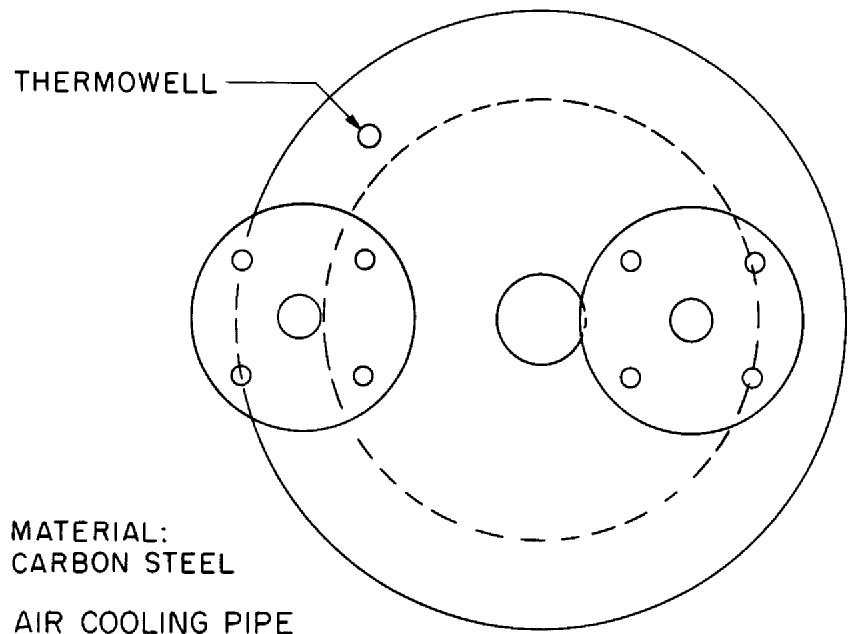

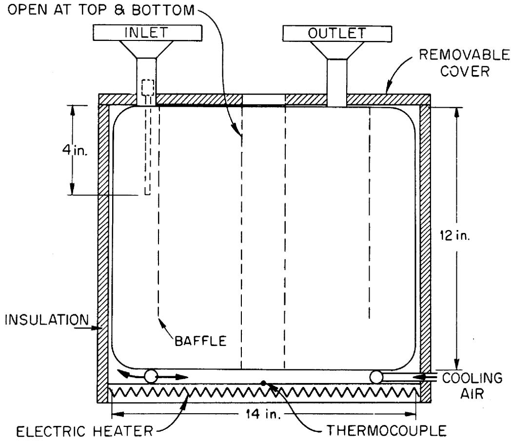  
Fig. 10. $\mathbf{U}\mathbf{F}_{6}$ Absorbers.

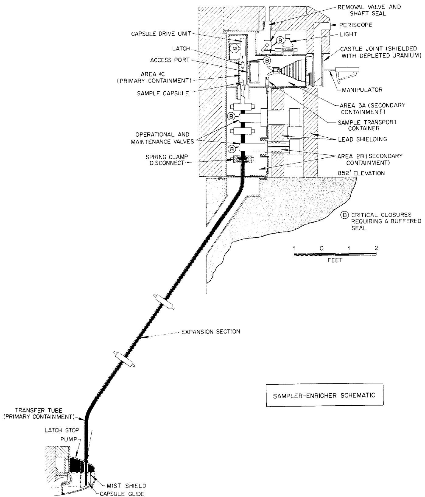  
Fig. 11. MSRE Sampler-Enricher.

temperatures of $550^{\circ}\mathrm{F}$ and $130^{\circ}\mathrm{F}$ , respectively, at positions 3 ft above the tank and 6 ft above the tank (near the bottom of the roof plugs). Under the conditions prevalent during the processing of the fuel salt, condensation of $\mathrm{UF}_6$ would not occur above a temperature of $115^{\circ}\mathrm{F}$ , which would probably be near the temperature of the isolation valve in the operating area.

The sampler was used for 33 sampling operations and for charging zirconium capsules for the structural metal fluoride reduction. The only difficulties experienced involved the filter capsules; the standard "dip" samples were taken reliably. On some occasions, the vacuum in the filter capsules was lost due to premature melting of the frozen salt plugs which were designed to retain the vacuum. When the temperature differential between the salt and the freezing point was too low, the capsules failed to provide sufficient filtered salt.

A radiation detector was mounted on the sample line near the isolation valve below the sampler. It was set to alarm when the radiation level reached 100 mr/hr.

# 4.13 Salt Filter

The salt filter is installed in the fuel processing cell between the cell wall and the freeze valve for the fuel storage tank. The replaceable filter element, which rests on a spherical seal, is mounted in a heated, insulated 6-in.-diam, 7-ft-long pipe. The 4-ft-long filter consists of two concentric fibrous metal cylinders with a total filter area of 8.65 ft². The salt enters the side of the filter housing, just above the filter element and leaves through a bottom outlet (see Fig. 12). The upper 3 ft of the filter housing is normally unheated and provides a transition zone from the molten salt to the cool ring joint seal flange, which contains a continuously pressured leak monitor. A helium purge connection at the top is normally used to purge the filter of air; however, it can also be used for blowing out restrictions in the connecting piping if necessary. Baffles are included in the gas space to prevent salt from splattering on the ring joint seal.

The center of the filter element is a sealed can to limit the volume of salt runback that is unavailable for processing (0.56 ft³) on transfer

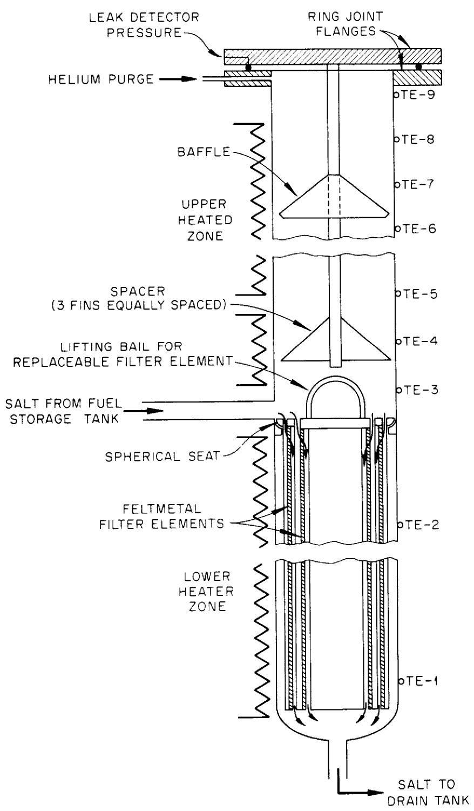  
Fig. 12. Salt Filter.

to the fuel storage tank. This volume also reduces the weight of the element when it is submerged in salt and prevents the filter from bursting when salt is transferred from the drain tank through a restricted filter element. The element will lift off the seat when a salt pressure of about 1 psi (depending on salt density) is applied under the seat. The outer element has a burst strength of 25 psi at $1200^{\circ}\mathrm{F}$ . A possible filter collapse when the full gas pressure is applied to the filter at the end of a transfer is prevented by a perforated Inconel backup plate placed on the inside of each filter cylinder. This plate provides a collapse strength of 131 psi, which is well above the maximum transfer pressure of about 30 psi. More details on the filter design can be found in ref. 3.

During filtration of the flush and fuel salts, no pressure drop across the filter was detected, even though salts containing about $10\mathrm{kg}$ of reduced metals were filtered. Filtration time was about 2 hr for each batch. Later, $2\mathrm{ft}^3$ of fuel salt was returned to the processing tank to be used for a salt distillation experiment. A sample of this salt, after sparging, revealed that much of the reduced metals had remained in the tank.

# 4.14 Special Instrumentation

In addition to the standard orifice flowmeters and temperature, pressure, liquid level, and radiation instruments, several special instruments were used during the processing of the flush and fuel salt. These instruments are described below.

Hastings Mass Flowmeters. - These instruments, which indicate the product of heat capacity and mass flow rate of the gas stream, were installed upstream and downstream of the absorber chain in order to provide a sensitive indication of the $\mathrm{UF}_6$ (which has a high heat capacity) concentration in the gas stream. Two detectors (0 to 2 and 0 to 10 equivalent cfm of air) were required upstream to obtain both range and sensitivity, while one 0- to 2-cfm detector was required downstream. To prevent plugging of the 0.03-in. capillaries by NaF particles, the primary elements are protected by $36-\mu$ Feltmetal filters. The two inlet meters are heated by a heating tape (that is controlled separately from the rest of the gas line heaters) to prevent the temperature on the electrical insulation from exceeding $200^{\circ}\mathrm{F}$ . The readings are not affected by temperature changes.

These flow meters agreed within $\pm 4\%$ of the helium rotameters when only helium was present. However, unaccountably high readings were obtained in the last three runs, especially on the exit meter from the absorbers. At the end of run 6, the exit meter indicated a $\mathrm{MoF}_6$ (which also has a high heat capacity) rate corresponding to a molybdenum corrosion rate of almost 1 mil/hr, while the inlet meter throughout the run indicated a corrosion rate only slightly greater than the 0.2 mil/hr rate assumed for molybdenum. Soon after the fluorine flow was stopped, both meters agreed closely with the helium purge flow.

These meters also provided a sensitive indication of incipient plug-ging in the caustic scrubber dip lines.

The $\mathrm{UF}_6$ flow at a given time could be calculated from the following formula, assuming a $\mathrm{MoF}_6$ flow rate equivalent to a molybdenum corrosion rate of 0.2 mil/hr:

$$
\begin{array}{l} \mathrm {U F} _ {6} \text {f l o w x A = A b s o r b e r I n l e t M e t e r R e a d i n g - (F} _ {2} \text {f e e d r a t e x B -} \\ 1 / 2 \mathrm {U F} _ {6} \text {f l o w)} \end{array}
$$

or

$$
\mathrm {U F} _ {6} \text {f l o w} = \frac {\text {I n l e t M e t e r R e a d i n g} - 0 . 0 3 6 2 \times \mathrm {F} _ {2} \text {f e e d r a t e}}{0 . 1 5 2 5},
$$

$$
\begin{array}{l} \text {w h e r e} A = \frac {\text {M e t e r r e d i n g}}{\text {s t d l i t e r s o f U F} _ {6} / \min } = 0. 1 7 0 6, \\ B = \frac {\text {M e t e r r e a d i n g}}{\text {s t d l i t e r s o f F} _ {2} / \min } = 0. 0 3 6 2, \text {a n d t h e} \\ \end{array}
$$

inlet meter is corrected for helium, nitrogen, $\mathrm{MoF}_6$ , and fluorine introduced downstream of the fluorinator. Fluorine utilizations calculated from these $\mathrm{UF}_6$ flows near the end of each run were higher than those calculated from absorber weight increase because of the buildup of dense $\mathrm{UF}_6$ in the fuel storage tank gas space.

Hydrogen Monitor. - To verify that the system has been completely purged after hydrogen reduction, a hydrogen monitor was installed to analyze a sample of the gas downstream of the charcoal beds. A commercial instrument, which determines the partial pressure of hydrogen by measuring the pressure inside a palladium-silver alloy membrane, was used. The sample line consists of about 50 ft of 1/4-in. tubing, which provides a

flow of about 100 cc/min through the instrument with the differential pressure available from the charcoal traps to the ventilation header in the operating area. Because of the long line and low flow rate, the overall response time is several minutes.

Oxygen Monitor. - The oxygen monitor, a commercial instrument based on the paramagnetism of oxygen, was valved into the same sample line on which the hydrogen monitor was located. This instrument was installed, primarily to determine that oxygen was completely purged from the system before the salt was treated with $\mathrm{H}_2$ -HF to effect oxide removal. In the flush and fuel salt processing operations described in this report, the hydrogen reduction step immediately followed the fluorination step; therefore there was little danger of forming an explosive gas mixture.

Since oxygen was produced in the fluorine disposal reaction (equivalent to about one-fourth of the reacted fluorine), it was hoped that the oxygen monitor could provide an indirect measure of fluorine utilization. However, during the fluorination of the flush salt, the relatively low fluorine utilization caused the oxygen that was produced to exceed the range of the instrument $(10\%)$ . A malfunction of the instrument prevented its use during fuel processing.

Ultrasonic Level Probe. - The fuel storage tank contains an ultrasonic level probe to provide a single point check on the weigh cell calibration. This probe has a 1/2-in.-diam sensing element, which is better suited to the corrosive conditions during fluorination than the thin-walled conductivity-type probes used in the reactor drain tanks. The ultrasonic energy is transmitted through two force-insensitive mounts, one on the tank and another at the cell wall penetration, to the ultrasonic generator, transmitter, and receiver located just west of the fuel processing cell. The generator produces a signal in resonance with the system. When the salt contacted the probe, it caused a decrease in the reflected signal, thus operating a relay switch.

Difficulty was experienced with the drifting of the signal frequency away from the resonant peak; this resulted in a signal even though contact with salt had not been made. A similar difficulty had been experienced in 1965 during the flush salt treatment; in that instance, a satisfactory

signal was obtained when the salt was transferred to the tank but not when it left the tank. In 1966, the stability of the generator was improved by rewiring the unit with high-stability components. During the recent processing operation, a signal was again obtained when the flush salt was transferred to the fuel storage tank, but not when the salt left the tank. No signals were obtained for the fuel salt. For proper operation, the generator would probably require a constant temperature environment or a much broader signal output.

The salt weights obtained at probe contact are compared in Table 3.

Table 3. Performance of the Ultrasonic Level Probe   

<table><tr><td rowspan="2">Year</td><td colspan="2">Salt Weight at Probe Contact (1b)</td></tr><tr><td>Weigh Cell</td><td>Bubbler Instrument</td></tr><tr><td>1965</td><td>7880</td><td>Readings not taken</td></tr><tr><td>1968</td><td>6550a</td><td>7950</td></tr></table>

aThe weigh cell readings taken in 1968 were unreliable. They were consistently 5 to $10\%$ lower than the bubbler instrument readings and also the comparable readings in the reactor drain tanks.

# 5. OPERATING HISTORY

# 5.1 Fluorine Reactor Tests

In April 1968 (about two weeks after the reactor shutdown), the fluorine supply and excess fluorine disposal systems, which had not previously been operated, were tested. According to the original design of the disposal system, the excess fluorine was expected to react with sulfur dioxide in a fluorine reactor (Fig. 13) at temperatures above $400^{\circ}\mathrm{F}$ to form sulfuryl fluoride, $\mathrm{SO}_2\mathrm{F}_2$ , a relatively inert gas that could be safely passed through Fiberglas filters and discharged to the atmosphere. A backup alumina bed, originally unheated, had been installed between the fluorine reactor and the charcoal traps to detect and to remove traces of unreacted fluorine.

ORNL-DWG 65-2515R

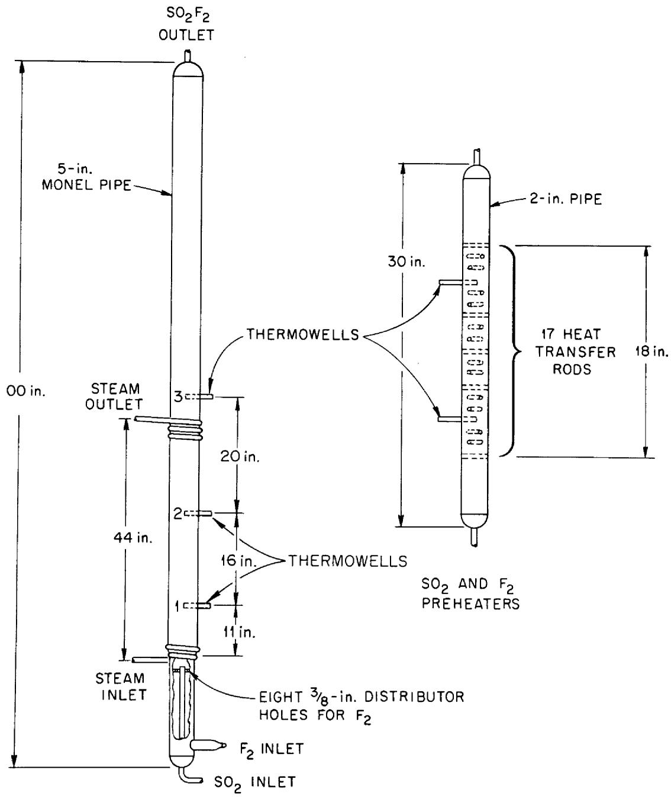  
F2 REACTOR   
Fig. 13. Fluorine Reactor and Preheaters.

Results of four fluorine disposal test runs are summarized in Table 4 and Fig. 14. The first run was started on April 2, but was interrupted after about $1 - 1 / 2$ hr by fluorine ignition of two Teflon plug valves. A total of 900 liters of fluorine had been used; however, the flow rate was very erratic because of the difficulty encountered in blending a low fluorine flow rate ( $\sim 7.5$ std liters/min) with a high helium flow rate ( $\sim 85$ std liters/min) to obtain dilute fluorine for conditioning the system. During the time that the fluorine was flowing, there was no evidence of a reaction in the fluorine reactor although the alumina bed was heated higher than $250^{\circ}\mathrm{F}$ . We believe that $\mathrm{SO}_2$ had condensed in the supply line because of excessive back pressure from check valves. After the flow of $\mathrm{SO}_2$ and fluorine was stopped, the temperature of the fluorine reactor rose to $520^{\circ}\mathrm{F}$ . This temperature rise was probably caused by the evaporation of $\mathrm{SO}_2$ , and its subsequent flow through the leaky check valves and reaction with fluorine being purged from the fuel storage tank.

The test was resumed three days later, after the plug valves had been replaced. When the helium purge was started, the temperature of the alumina trap again rose as the result of residual fluorine in the system. A reaction was also observed in the fluorine reactor, probably from a small amount of $\mathrm{SO}_2$ remaining in the system. When the $\mathrm{SO}_2$ and fluorine flows were started, the reactor temperature reading went off scale ( $>1000^{\circ}\mathrm{F}$ ) because of insufficient cooling from low-pressure steam. The alumina trap temperatures decreased, probably because the bed was exhausted and because some of the fluroine had reacted with the charcoal traps, causing an increase in pressure drop in the system.

The first test indicated the need for the following:

(1) Finer-mesh alumina and a heated alumina bed to increase the capacity and the reaction rate; additional thermocouples to permit the consumption of fluorine in the bed to be followed.   
(2) An $\mathrm{SO}_2$ flow until all fluorine has been purged from the system.   
(3) A greater excess of $\mathrm{SO}_2$ to compensate for poor flow control   
(4) Increased steam pressure on the fluorine reactor cooling coil for greater cooling capacity.   
(5) Check valves with lower pressure differential in the $\mathrm{SO}_2$ supply line.

Table 4. Summary of Fluorine Reactor Test Runs   

<table><tr><td rowspan="2">Run</td><td rowspan="2">Date</td><td colspan="3">Fluorine Flow</td><td colspan="2">Fluorine Reactor</td><td colspan="3">Alumina Trap</td><td rowspan="2">Remarks and Modifications Made After Run</td></tr><tr><td>Time (min)</td><td>Liters</td><td>Aver. Liters per (min)</td><td>Max. Temp. (°F)</td><td>Steam Pressure (psi)</td><td>Max. Temp. (°F)</td><td>Bed Pene- tration</td><td>Material</td></tr><tr><td>1A</td><td>4/2</td><td>100</td><td>900</td><td>9</td><td>520</td><td>10</td><td>&gt;250</td><td>~1/2</td><td>1/4-in. balls</td><td>Run interrupted by ignition of two Teflon plug valves.</td></tr><tr><td>1B</td><td>4/5</td><td>210</td><td>5100</td><td>24</td><td>&gt;1000</td><td>10</td><td>&gt;250</td><td>To CTa</td><td>1/4-in. balls</td><td>AATb reaction too slow; replaced AATb with finer AA and installed heaters and more thermocouples. Increased steam pressure for better FLR cooling. Improved insulation installed on SO2and F2preheaters and lines. Replaced SO2check valves.</td></tr><tr><td>2</td><td>5/1</td><td>130</td><td>2650</td><td>20</td><td>~1000</td><td>50 35 40 50</td><td>&gt;1000</td><td>~2/3</td><td>Inlet 2/3, 8-14 mesh; outlet 1/3; 60-100 mesh.</td><td>System performed sufficiently well to permit testing of iodine retention on charcoal in next run. Improved SO2Cylinder heating.</td></tr><tr><td>3</td><td>5/3</td><td>160</td><td>3900</td><td>24</td><td>&gt;1000</td><td>35 or 50</td><td>&gt;1000</td><td>To CTa</td><td>Inlet 2/3, 8-14 mesh; outlet 1/3, 60-100 mesh.</td><td>Iodine retention satisfactory. AATb heating major problem; preheaters added to AATb and FLRCinlets. FLRCsteam coil bonding damaged; added Thermond bypassed FST for next run.</td></tr><tr><td>4A</td><td>5/20</td><td>102</td><td>?</td><td>?</td><td>&gt;1000</td><td>50-30 -10</td><td>&gt;1500</td><td>~1/2</td><td>Inlet 2/3, 8-14 mesh; outlet 1/3, 60-100 mesh.</td><td>Run suspended when AAT temperature exceeded 1500°F, near end of fluorine conditioning, to allow cooling and readjustment of all temperatures.</td></tr><tr><td>4B</td><td>5/21</td><td>202</td><td>4400</td><td>20</td><td>1440</td><td>0-25</td><td>1480</td><td>To CTa</td><td>Inlet 2/3, 8-14 mesh; outlet 1/3, 60-100 mesh.</td><td>Fluorine reactor operation good, but alumi-na trap heating continued. Piping to be temporary modified for caustic scrubber test.</td></tr></table>

aCT = charcoal traps.   
bAAT = activated alumina trap.

cFLR $=$ fluorine reactor.

Heat transfer cement.

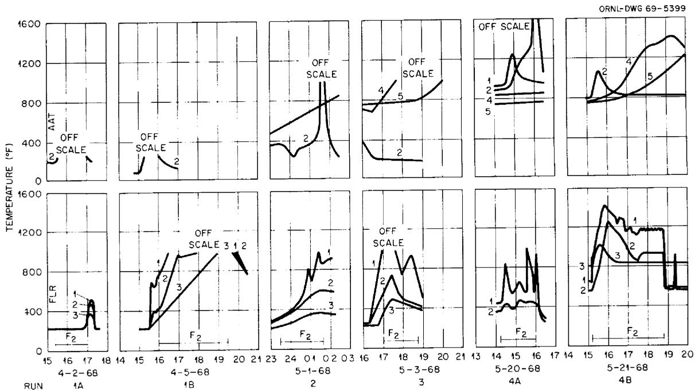  
Fig. 14. Temperatures During Fluorine Reactor Tests.

The above equipment and procedural changes were effected, and the charcoal cannisters (in the inlet charcoal bed), which had reacted with fluorine, were replaced. Test run 2 was then started on May 1, 1968. About $1/2$ hr after the start of fluorine flow, the reactor inlet temperature started to rise, indicating a reaction; however, temperature points 16 in. and 32 in. downstream but still in the reaction zone) showed practically no heating. It is believed that the increased flow of steam overcooled the reaction zone, thereby causing the reaction rate to decrease and allowing unreacted fluorine to reach the alumina trap. The alumina trap was being heated at the rate of about $80^{\circ}\mathrm{F/hr}$ , but the temperature at a point 8 in. down the bed rose sharply, from $400^{\circ}\mathrm{F}$ to $>1000^{\circ}\mathrm{F}$ in less than 15 min, about 2 hr after the start of fluorine flow. The fluorine flow was then stopped, but the $\mathrm{SO}_2$ flow was continued while the system was being purged with helium. Two hours later, the temperature measured at points farther down the alumina bed rose from about $800^{\circ}\mathrm{F}$ to $>1000^{\circ}\mathrm{F}$ . Since the fluorine flow rate to the reactor should have been low at this time, it appears that the second temperature rise was due to an $\mathrm{SO}_2\mathrm{F}_2$ reaction. (Later, such a reaction was shown to occur above $800^{\circ}\mathrm{F}$ .) However, because at this time we were unaware of the $\mathrm{SO}_2\mathrm{F}_2$ -alumina reaction, efforts were directed to improving $\mathrm{SO}_2$ and $\mathrm{F}_2$ flow control.

One of the main objectives of the fluorine disposal tests was to demonstrate that iodine could be retained on charcoal when $\mathrm{SO}_2$ and $\mathrm{SO}_2\mathrm{F}_2$ were flowing through the beds. In the event that this could not be demonstrated, an alternative fluorine disposal method would have to be found. Therefore, although operation of the system was still not satisfactory, as shown by the tests described above, it was felt that the alumina trap had sufficient residual capacity to remove any unreacted fluorine and that iodine would be retained on the charcoal traps.

In the third run, a satisfactory heat of reaction was obtained in the fluorine reactor; this indicated the production of $\mathrm{SO}_2\mathrm{F}_2$ . Since heating was observed at the center of the alumina bed, but not at the exit, it appeared that no fluorine was leaving the bed. About 100 min after the start of fluorine flow, $30\mathrm{mc}$ of $\mathrm{CH}_3^{13}\mathrm{I}$ was injected into the gas stream upstream of the charcoal traps. The loading of the iodide was followed

by determination of the radiation levels with radiation monitors (see Fig. 15). Although fluorine flow was stopped $1\mathrm{hr}$ after the start of iodide injection, the fluorine reactor temperature remained above $400^{\circ}\mathrm{F}$ for 4 additional hours (from purged fluorine). After the first 72 min of the 2-hr iodide injection period, the summation of the levels indicated by the five radiation monitors on the charcoal traps reached a maximum and leveled off, indicating all the iodide had been loaded. During the third and fourth hour, there was a very slight increase in radiation at points CT-D and CT-E (see Fig. 9) and a corresponding reduction at CT-C. During this time, the temperature at the outlet of the alumina exceeded $1000^{\circ}\mathrm{F}$ , and there was some heating of the charcoal, indicating a reaction with fluorine (probably from $\mathrm{SO}_2\mathrm{F}_2$ decomposition). The slight shift in the location of the iodide could have been caused by fluorine rather than $\mathrm{SO}_2\mathrm{F}_2$ . The almost immediate penetration of some of the iodide through the first 12 in. of charcoal was not unexpected, as this type of behavior has been noted previously for organic iodides.

After the third run, the insulation was removed from the fluorine reactor to allow the cooling coils to be examined. [The copper coils were bonded to the Monel reactor with E-Z flow solder (flow point, $1328^{\circ}\mathrm{F}$ ) containing cadmium. At temperatures above $1300^{\circ}\mathrm{F}$ , alloying, along with the formation of cracks and weakening of the metal, can occur.] In runs 1 and 3, the thermowell temperatures exceeded $1000^{\circ}\mathrm{F}$ (maximum recorder temperature) for 3-1/2 hr and for 40 min, respectively. Examination revealed that the solder had melted, leaving the middle third of the 44-in. coil unbonded. Dye-checking revealed some cracks in the Monel. However, a pressure test showed that the reactor still had adequate strength to permit the remaining test runs to be made. A high-temperature heat transfer cement was applied around the coils, and the reactor was reinsulated.

Run 4A was started on May 20, 1968. A preheater had been installed on the fluorine reactor inlet to provide inlet temperatures above $400^{\circ}\mathrm{F}$ to ensure a reaction at low fluorine flows as well as at the start of fluorine flow. A preheater had also been installed at the alumina trap inlet to obtain more satisfactory temperature distribution and to improve the efficiency at the bed inlet (in run 3 no reaction occurred in the

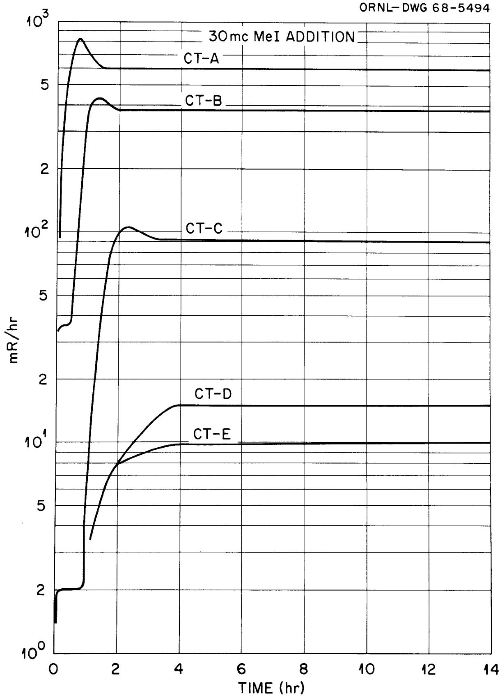  
Fig. 15. Charcoal Trap Radiation Levels During Addition of $\mathrm{CH}_3^{131}\mathrm{I}$ .

inlet half of the bed). The ranges on the two temperature recorders were increased from 0 - 1000 to 0 - 1500 and 0 - $2000^{\circ}\mathrm{F}$ . A temporary bypass line was installed around the fuel storage tank to eliminate its $120\text{-ft}^3$ volume between the fluorine supply and the fluorine reactor. This line had to be conditioned with dilute fluorine, which involved manual flow control. Control was erratic; however, the fluorine reaction started immediately and, soon thereafter, the alumina trap inlet began to heat up. The heated zone proceeded to the second thermowell, and the fluorine flow was stopped when an off-scale reading of $1500^{\circ}\mathrm{F}$ was obtained at this point. We decided to allow the alumina bed to cool and to resume the run the next day. The system was conditioned so that automatic flow control of $100\%$ fluorine could then be used.

The fourth test was resumed on May 21; our efforts were centered on trying to determine the cause of the alumina trap heating. To ensure a complete reaction of the fluorine with $\mathrm{SO}_2$ , the fluorine reactor inlet was preheated so that the temperature of the reaction zone was about $600^{\circ}\mathrm{F}$ ; steam cooling was delayed until the reactor temperature reached $1000^{\circ}\mathrm{F}$ . Then the steam pressure was carefully adjusted to maintain all temperatures above $400^{\circ}\mathrm{F}$ . A maximum fluorine flow of 25 std liter/min was used, with a minimum of $50\%$ excess $\mathrm{SO}_2$ . The flow control was good. In spite of satisfactory operation in the reactor, the alumina trap temperatures again increased as soon as the reaction started. We concluded that these increases could only have been caused by $\mathrm{SO}_2\mathrm{F}_2$ decomposition. When the exit of the alumina trap reached about $1000^{\circ}\mathrm{F}$ , iodide began to move down the charcoal bed. Most of the iodine left the first 12 in. of bed and accumulated at the inlet of the backup trap. Fluorine flow was stopped 20 min after this migration began, and thus no iodine left the trap. About 5 mc of iodide still remained at this time.

Laboratory tests $^{4}$ were made by W. S. Pappas* to verify the decomposition of $\mathrm{SO}_2\mathrm{F}_2$ . While these tests showed no gaseous decomposition products leaving the alumina bed, the laboratory bed was not completely exhausted as was the case at the MSRE. The cause of the iodine movement in the last run could, therefore, have resulted either from unreacted

fluorine passing through the exhausted alumina bed or from $\mathrm{SO}_2\mathrm{F}_2$ decomposition products leaving the exhausted bed. The movement was probably not due to $\mathrm{SO}_2\mathrm{F}_2$ since Pappas' work showed only partial trapping of $\mathrm{SO}_2\mathrm{F}_2$ below $1200^{\circ}\mathrm{F}$ . Also, $\mathrm{SO}_2\mathrm{F}_2$ was produced for 2 hr before the alumina bed temperature reached $1200^{\circ}\mathrm{F}$ , and no iodine movement was observed during this time.

With steam cooling of the fluorine reactor, it was not possible to maintain the reactor walls above $400^{\circ}\mathrm{F}$ . Thus the complete reaction of traces of fluorine could not be ensured. If work had been continued on the $\mathrm{SO}_2$ system, we would have installed controlled electric heat over the entire 8 ft of the reactor instead of steam heat over the first 3-2/3 ft. Future work would also have involved decreasing activated alumina trap temperatures (to 700 to $750^{\circ}\mathrm{F}$ ) to prevent the $\mathrm{SO}_2\mathrm{F}_2$ reaction. Some means of cooling would probably have been required to prevent a small fluorine reaction from heating the bed above the $\mathrm{SO}_2\mathrm{F}_2$ reaction temperature.

After this last fluorine reactor test, it was thought that the reactor could be operated at high efficiency; however, this could not be readily demonstrated. Since no highly efficient backup trap was available for the detection and removal of traces of fluorine in the presence of $\mathrm{SO}_2$ and $\mathrm{SO}_2\mathrm{F}_2$ , we decided to make a test run with KOH-KI solution in the caustic scrubber. Temporary piping changes were, therefore, made to place the backup alumina trap downstream of the caustic scrubber tank.

# 5.2 Caustic Scrubber Tests

Two weeks after the last fluorine reactor test was completed, the piping was modified to test disposal, using the scrubber. The scrubber was charged with a 2 M KOH -- 0.33 M KI solution, and 30 mc of $\mathrm{CH}_3^{13}\mathrm{I}$ was again loaded on the charcoal traps. The backup alumina trap material was replaced, and the trap was heated to $700 - 800^{\circ}\mathrm{F}$ . Fluorine diluted to less than $50\%$ with helium was used to condition the scrubber -- an operation requiring several hours. After about 50 min of conditioning the new or recently exposed piping with dilute fluorine the fluorine flow rate was stabilized at 35 std liters/min and diluted with an equal flow of helium upstream of the scrubber.

As soon as the fluorine flow began, the temperature near the exit of the alumina trap (containing 5-mesh alumina) began to increase slowly. There was no iodine movement; the other alumina bed temperatures were steady; and a gas sample downstream of the scrubber showed only a faint trace of fluorine. The temperature rise, was therefore, attributed to the increased gas flow due to oxygen formation in the scrubber. This was verified two days later by injection of 6 std liters of oxygen per minute into the system, using a helium flow equal to that used during the test run. The temperature rise was duplicated. Further confirmation was obtained by repeating the fluorine flow test; no additional temperature rise was obtained.

Following the successful test at the MSRE, the Fuel Processing Plant was converted from the $\mathrm{SO}_2$ system to the scrubber method of fluoro-rine disposal. The fluroine reactor, gas preheaters, and associated piping were removed from the cell. The Monel inlet distributor ring in the caustic scrubber was blanked and replaced by an Inconel dip tube. (Laboratory tests had shown that Inconel had much greater corrosion resistance than Monel.) Since dip tube plugging (by corrosion products) had occurred in laboratory tests, a spare dip tube was installed. Extension handle valves were supplied to permit dip tubes to be switched from the operating area. A contact microphone was installed on the scrubber tank to detect any abnormal reaction such as that which occurred in laboratory tests when a fluorine concentration of greater than $50\%$ was used.

A second scrubber test was made on July 4, 1968. The fuel storage tank bypass line was removed, and the tank was heated to $1100^{\circ}\mathrm{F}$ for a pressure test. The tank was maintained at this temperature during the scrubber test. After 70 min of fluorine flow, the pressure upstream of the scrubber started to increase. The flow was, at first, reduced from 35 to 25 std liters/min and, then, had to be stopped completely 15 min later to prevent the solution from leaving the scrubber tank. After the system had been purged overnight with helium at a low flow rate, the gas line from the scrubber was removed and found to be almost completely restricted by a white solid containing a high percentage of molybdenum.

Laboratory tests using $\mathrm{MoF_6}$ and KOH-KI solution produced a heavy mist that could be removed from the gas stream by a Fiberglas filter. A $50\text{-ft}^2$ filter was, therefore, installed downstream of the scrubber to remove such material. To prevent plugging of the connecting line, the size of the line was increased from 3/4-in. to 1-1/2 in., and all sharp bends were eliminated. The alumina backup trap was relocated downstream of the Fiberglas filter, and the alumina was replaced with soda-lime, which removes fluorine effectively at low temperatures. Both the filter and the soda-lime trap were steam heated to prevent condensation of the saturated gas stream from the scrubber.

Another equipment change resulting from the experience of the second scrubber test was the addition of means for heating the $\mathrm{UF_6}$ absorbers. The $\mathrm{MoF_6}$ was expected to be retained on these absorbers, which were at room temperature, instead of passing through to the scrubber. Follow-up laboratory tests showed a much slower reaction rate for both $\mathrm{MoF_6}$ and $\mathrm{UF_6}$ with low-surface-area NaF than with the high-surface-area material used in previous volatility processing. Heating and insulating the absorbers provided two advantages: (1) the amount of $\mathrm{UF_6}$ leaving a particular absorber before that absorber is fully loaded was reduced, and (2) the amount of coabsorbed molybdenum was minimized.

# 5.3 Fluorination of the Flush Salt

On August 1, the flush salt was transferred by gas pressure, from the fuel flush tank in the drain cell to the fuel storage tank in the fuel processing cell. The transfer required about $11 - 1 / 2$ hr. Following this transfer, the isolation freeze valves were frozen and leak-tested, and the flush salt was sampled. Analyses showed that fuel salt had been retained by the flush salt during the seven flushes of the reactor system. Each of these flushing operations contributed about $200~\mathrm{ppm}$ (or $1\mathrm{kg}$ ) of uranium to the flush salt, for a total of about $6 - 1 / 2\mathrm{kg}$ of uranium. Pertinent irradiation and decay data are shown in Table 5.

Fluorination of the flush salt was started on August 2. The salt was sparged with 25 std liters of fluorine per minute diluted with 20 std liters of helium per minute. An additional 15 std liters of helium per minute was used to purge the sample line. The reading on the inlet mass

Table 5. Fuel System Flushes   

<table><tr><td>Flush No.</td><td>Decay at Time of Fluorination (months)</td><td>Fuel Irradiation at Time of Flush (Mwhr)</td></tr><tr><td>1</td><td>37</td><td>&lt;1</td></tr><tr><td>2</td><td>25</td><td>7,800</td></tr><tr><td>3</td><td>21</td><td>~9,500</td></tr><tr><td>4</td><td>20-1/2</td><td>~10,000</td></tr><tr><td>5</td><td>14-3/4</td><td>33,000</td></tr><tr><td>6</td><td>12</td><td>~40,000</td></tr><tr><td>7</td><td>4-1/4</td><td>72,400</td></tr></table>

flowmeter rose rapidly and reached a maximum after 48 min of fluorine sparging. The peak reading corresponded to a fluorine utilization of about $15\%$ . The readings of the thermocouples on the No. 1 and No. 2 absorbers rose, but lagged the initial rise in the mass flowmeter reading by 20 to 30 min. The reading on the exit mass flowmeter rose as expected as the fluorine utilization decreased from its peak, but attained a much higher reading than expected. When the reading for this meter went off-scale, we decided to bypass the fluorine around the salt while we investigated the reason for this high reading. There was some concern that a uranium breakthrough had occurred; however, no temperature rise had been observed on any of the last three absorbers. It was finally concluded that $\mathrm{MoF_6}$ was the cause of the high reading; therefore, fluorine sparging was resumed after 95 min. After a total of 5 hr of fluorine sparging, the fluorine supply was exhausted. Since the reading on the inlet flowmeter had almost become constant, we decided to sample the salt while the fluorine trailer and the caustic scrubber solution were being replaced. Fluorination was resumed after the caustic solution was replenished; it was then terminated when a uranium analysis of 24 ppm was obtained for the flush salt, since fluorine sparging had been carried out for an additional 109 min and the reading of the inlet mass flowmeter had become constant. Analysis of a second salt sample, taken at this time indicated a uranium concentration of only 7 ppm (desired <10 ppm).

The absorbers were loaded with low-surface-area NaF for the flush salt processing and were heated to 200 - $250^{\circ}\mathrm{F}$ to increase the reaction rate (see Sect. 6.7). Since the amount of uranium in the flush salt was only about half the capacity of one absorber, very little uranium was expected to be deposited on the last four absorbers. However, almost $30\%$ was collected on the second absorber and possibly $3\%$ on the third, although no temperature rise was detected on the last three absorbers. For the fuel salt runs, it was, therefore, decided to use only high-surface-area material in the final three absorbers to permit operation with only one backup absorber. The temperature rise on the first absorber was only $39^{\circ}\mathrm{F}$ ; thus cooling air was not required.

Although some plugging of the caustic scrubber dip lines occurred, switching to the spare line for several minutes always cleared the line.

# 5.4 Reduction of the Flush Salt

After the analysis of the first fluorination salt sample (uranium, 24 ppm) was obtained, heatup of the salt for hydrogen reduction was started. During the heatup, the caustic scrubber dip lines were checked and found to be free of plugs. The caustic solution was left in the tank to neutralize the HF formed during $\mathrm{NiF_2}$ reduction. A period of 43 hr at maximum wattage was required to raise the salt temperature from 860 to $1220^{\circ}\mathrm{F}$ . August 5, 1968, hydrogen sparging was started. A mixture of hydrogen (30 std liters/min) and helium (20 std liters/min) was used in conjunction with a 10-standard-liter/min helium sample line purge. The hydrogen monitor in the off-gas line downstream of the charcoal beds was observed in order to determine the time at which hydrogen consumption by $\mathrm{NiF_2}$ ceased. After 2 hr, the rate of increase of the monitor was essentially zero, which indicated a nickel reduction rate of less than 3 ppm/hr. Hydrogen sparging was continued for a total of 10.8 hr.

Zirconium was then added through the salt sampler to reduce the $\mathrm{FeF_2}$ and $\mathrm{CrF_2}$ , as well as the remainder of the $\mathrm{NiF_2}$ . Three l-in.-diam cylinders of pressed zirconium shavings, weighing $604\mathrm{g}$ total, were dropped through the sample line with the manipulator. The contact microphone on the fuel storage tank provided an audible verification of the passage of the cylinder down the length of the sample line. Although there was some

concern that the cylinders would be held up by the valve or the bellows, this did not occur. The salt was then sparged with a mixture of hydrogen (30 std liters/min) and helium (10 std liters/min). An additional flow of helium (20 std liters/min) was used to purge the sample line. After 9 hr of sparging, the hydrogen flow was stopped; then the system was purged with (75 std liters/min) for 85 min before the salt was sampled. Two samples were obtained: a standard dip sample, and a filtered sample, using a capsule sealed with lithium-beryllium fluoride salt ("freeze-valve capsule"). Analyses of the samples indicated that, although the nickel concentration had been reduced to less than 50 ppm, there had only been a slight reduction in the iron and chromium concentrations. An additional $470\mathrm{g}$ of zirconium was added, and the salt was sparged with the same hydrogen-helium mixture (see above) for an additional 16 hr. After failure to obtain a sample with the freeze-valve capsule, the salt was transferred through the filter to the drain tank. In the drain tank, the salt was successfully sampled by using a new type of capsule, designed by A. I. Krakoviak,\* that relies on the vacuum produced by the cooling capsule to pull the salt sample through the filter. This eliminates the danger of losing vacuum by the melting of the frozen salt seal in the freeze-valve capsule. Analysis of the filtered portion of the salt showed that reduction was adequate and that the filter had removed the reduced metals.

# 5.5 Fluorination of the Fuel Salt

Results obtained during the processing of the flush salt pointed out the need for several equipment and procedural changes before the much more radioactive fuel salt was processed. These changes, which required about two weeks, consisted of the following:

(1) Enough high-surface-area NaF (1400 lb) was procured from ORGDP to load the last three absorbers in each run, and the first two absorbers in three of the six runs, to obtain a comparison between the performance of the two types of NaF.   
(2) Piping was installed to permit the helium diluent (required to limit the fluorine concentration to the caustic scrubber to less than $50\%$ ) to be introduced downstream of the absorbers instead of into the

fuel storage tank. This change increased the residence time in the absorbers, thus permitting more efficient absorption.

(3) The flow rate of the sample line purge gas was reduced from 15 to 10 std liters/min in run 1 and to 5 std liters/min thereafter to further increase the absorber residence time.   
(4) For more efficient absorber purging, a connection was provided at the absorber inlet to permit purging with pure helium instead of purging through the fuel storage tank.   
(5) A small soda-lime trap was installed in the absorber cubicle to allow the absorbers to be vented to atmospheric pressure instead of the scrubber liquid head.   
(6) Purge flow rates following fluorination were kept low to allow more efficient absorption of $\mathrm{UF}_6$ , which was being purged from the gas space.

While the above changes were in progress, the flush salt was returned to the reactor system and circulated to test the fuel pump sampler. The transfer of the fuel salt to the processing cell was started on August 17, 1968, after a difficulty with a restriction in the line at the cell wall penetration was resolved. The spare heaters at the penetration were energized, thereby raising the temperature from $1108^{\circ}\mathrm{C}$ to $1255^{\circ}\mathrm{C}$ , but the restriction persisted. However, when the drain tank was pressurized, the hot salt evidently thawed the plug, and transfer was started. This operation required about 11 hr at an average rate of 15 lb/min. After the transfer, a radiation level of about 2 r/hr was detected at the filter located upstream of the inlet mass flowmeter in the absorber cubicle. This radioactivity was caused by carryover of metallic ${}^{95}\mathrm{Nb}$ during the gas blowthrough at the end of the salt transfer. The filter was decontaminated to approximately 100 mr/hr to minimize contamination of the uranium product during fluorination. Analysis of the decontamination solutions confirmed that the principal activity present was ${}^{95}\mathrm{Nb}$ .

The caustic scrubber was emptied, rinsed, and recharged; then several salt samples were taken. The low-surface-area NaF in the trap for removing HF from the fluorine supply was replaced with high-surface-area material since agglomeration of pellets in the first flush salt absorber

indicated the presence of considerable HF in the gas stream. This HF could have resulted from the reaction of fluorine with the $\mathrm{Be(OH)_2}$ remaining in the flush salt after the previous $\mathrm{H}_2$ -HF treatment.

Because the fluorine supply system had been opened, it seemed advisable to condition this equipment with dilute fluorine (this was started on August 23). Conditioning and a period of steady flow to check the Hastings mass flowmeter readings were completed, and then salt sparging was started. After 30 min at a flow rate of 20 std liters/min, the fluorine flow was increased to 40 std liters/min for the conversion of $\mathrm{UF_4}$ to $\mathrm{UF_5}$ . Fluorine utilization was very high ( $\sim 70\%$ ) during this period. For almost 6 hr, the absorber inlet and outlet meters read the same, indicating that no absorbable compounds were volatilized. For the next 100 min, the readings on both meters rose (the inlet meter at the faster rate), but no absorber heating was noted. This was interpreted to indicate $\mathrm{MoF_6}$ (from Hastelloy-N by corrosion) volatilization and either decreasing fluorine utilization or incomplete absorption of the $\mathrm{MoF_6}$ on the NaF. After 7-1/2 hr, $\mathrm{UF_6}$ absorption was indicated by a temperature rise on the first absorber. Fluorine flow was decreased to increase fluorine utilization and absorber residence time. Twenty minutes before $\mathrm{UF_6}$ absorption began, the pressure in the absorber cubicle rose above the alarm point (-1 in. $\mathrm{H}_2\mathrm{O}$ ). It was found that the blower which normally maintains a negative pressure in the cubicle was inoperable, apparently because of a mechanical rather than an electrical malfunction. However, since the blower was located in the fuel processing cell, it could not be repaired. By careful adjustment of the cooling air, the pressure in the cubicle was kept from exceeding atmospheric pressure.

To ensure that essentially no uranium was lost to the caustic scrubber, we decided to use the fifth absorber only as backup and not for collecting uranium. Consequently, the first run was terminated when uranium broke through to the third absorber. Since no temperature rise was observed for the fourth absorber during purging, the second run was continued until uranium broke through to the fourth absorber. The third, fourth, and fifth runs were terminated after 60, 75, and 95 min, respectively, of loading on the fourth absorber without any temperature rise being observed on the fifth absorber. The sixth run completed the

operation; no uranium was found on the fourth or fifth absorber. Fluorine flow was stopped when the inlet mass flowmeter showed no further decrease for an hour (see Fig. 16). End point determination was somewhat difficult because of the almost continuous buildup of restrictions in the scrubber dip tubes, accompanied by an increase in system pressure and a decrease in fluorine flow. The increase in the reading of the exit meter at the end of the run was probably due to $\mathrm{MoF_6}$ being desorbed since the reading was too high to be accounted for by helium and fluorine. The neutron counter near the fuel storage tank provided another sensitive indication of the end point. The neutron count rate fell rapidly during the last few hours of fluorination but had become constant by the time the fluorine flow was stopped.

After run 6, analysis of a fuel salt sample indicated 26 ppm, or about $130\mathrm{g}$ , of uranium remaining in the salt. This is a very acceptable loss. The salt was, therefore, heated to $1225^{\circ}\mathrm{C}$ to reduce the structural metal fluorides.

# 5.6 Reduction of the Fuel Salt

The temperature of the fuel salt reached $1225^{\circ}\mathrm{C}$ on August 31, 1968 and a 30-standard-liter/min hydrogen sparge was started at this time. A low-flow hydrogen sparge had been used during the previous 15-hr heatup. A high radiation reading noted a few hours later at the absorber cubicle appeared to be centered at the metallic filter upstream of the inlet mass flowmeter. The unshielded radiation level at the cubicle wall was about 80 r/hr. The source of this radiation was later identified as ${}^{95}\mathrm{Nb}$ (Sect. 6.5).

It is known that niobium exited in the metal form during reactor operation and that, in this form, most of it plated out or left in the gas stream. After reactor shutdown, the $^{95}\mathrm{Nb}$ grew back in from $^{95}\mathrm{Zr}$ decay. After a decay period of five months, less than $0.1\%$ of this $^{95}\mathrm{Nb}$ would be required to produce the observed radiation level. The rest of the niobium probably plated out on the drain tank or on processing equipment surfaces, or was volatilized during fluorination. About $60\%$ of the $\mathrm{NbF}_5$ formed during fluorination would be carried from the salt by 60,000 liters of gas flow.

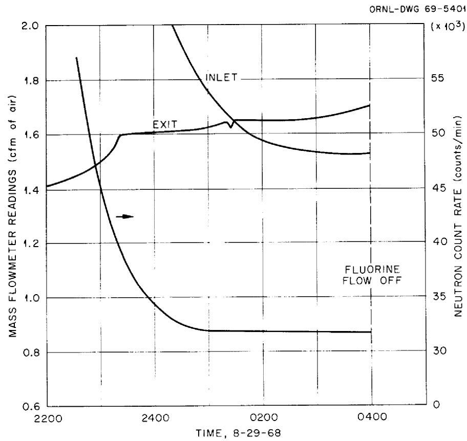  
Fig. 16. End of Run No. 6.

Because of the higher concentration of corrosion products in the fuel salt (than in the flush salt), a 24-hr hydrogen sparge was specified; however, frequent scrubber dip line plugging caused the sparge to be stopped after 17 hr. At this time, the scrubber solution that had been used during the last fluorination run was replaced with a KOH solution containing no KI or $\mathrm{K}_2\mathrm{B}_4\mathrm{O}_7$ . Because of frequent plugging of the lines, the flow rates were reduced below the planned 30 std liters/min for about $70\%$ of the time. A filtered salt sample was taken and analyzed while the scrubber solution was being replaced. As expected, there was no evidence of reduction of chromium or iron; however, the analysis showed that the nickel concentration had increased from 840 ppm to 1540 ppm. This increase in nickel concentration was thought to be the result of contamination by nickel oxide, originating from poorly purged welding of the nickel filter element in the freeze-valve capsule. After another 17 hr of sparging, the nickel concentration had only decreased to 520 ppm; again no chromium or iron was reduced. A third period of sparging for 17-1/2 hr decreased the nickel concentration further to 180 ppm. The remaining reduction was accomplished with zirconium metal.

Twenty-seven zirconium slugs, weighing an average of $180\mathrm{g}$ each, were charged through the sampler; two others rolled beyond the reach of the manipulator and could not be charged to the salt at this time. Approximately $5\mathrm{kg}$ of zirconium was added, and the salt was sparged for 24 hr with hydrogen at the rate of 10 std liters/min. Analysis of a filtered sample of salt taken at this time showed the nickel to be completely reduced and the chromium and iron reduced to about $100~\mathrm{ppm}$ . The salt had been agitated with helium prior to the sample analysis and then was sparged for 8 additional hr with hydrogen. Difficulties again prevented sampling before filtration.

The fuel salt was filtered without difficulty. A dip sample from the drain tank showed the chromium concentration to be 34 ppm; a second filtered sample showed only 29 ppm of chromium in solution. More details on the reduction are given in Sect. 6.

# 6. DISCUSSION OF DATA

# 6.1 Fluorine Utilization

The efficiency of the fluorination reaction is measured by the percentage of the fluorine (after subtracting the fluorine consumed by corrosion) that is used in the reaction with the uranium. The fluorine consumed by corrosion is assumed to be constant at 2.5 std liters/min. Correction is also made for the inert gases present (assumed to be nitrogen) in the fluorine supply and the effect of the reduced gas density on the orifice flowmeter. Fluorine utilization is a function of melt temperature, fluorine flow rate, uranium concentration, and dip tube submergence. Laboratory tests had shown a decrease in utilization from 8.0 to $3.8\%$ as the temperature was reduced from $930^{\circ}\mathrm{F}$ to $840^{\circ}\mathrm{F}$ . The higher utilization (average, $39\%$ ) during the fuel salt processing was probably due both to lower gas velocities by a factor of 5 and greater dip tube submergence (by a factor of 15) than used in laboratory tests. Utilization was very high before the start of $\mathrm{UF}_6$ volatilization (average, $71\%$ ) and, after that, seemed to be relatively insensitive to uranium concentration until nearly all the uranium was volatilized (see Figs. 17 and 18). The highest average utilization during $\mathrm{UF}_6$ volatilization occurred in the fifth run (see Table 6).

Until 90 min before the start of $\mathrm{UF_6}$ volatilization, the readings of the absorber inlet and outlet mass flowmeters were equal, indicating the absence of any absorbable constituents in the gas stream. These flow-meters were used to calculate the fluorine utilization, as shown in Fig. 18. The utilization decreased when the fluorine flow rate was increased and also when $\mathrm{MoF_6}$ and $\mathrm{UF_6}$ began to be vaporized. It is thus assumed that the fluorine utilization does not change, when the fluorine flow is steady, until volatilization begins. During the $\mathrm{MoF_6}$ volatilization period (before $\mathrm{UF_6}$ volatilization began), the utilization was calculated by difference, using the utilizations in the two previous periods and assuming that all the $\mathrm{UF_4}$ was converted to $\mathrm{UF_5}$ prior to uranium volatilization. The fluorine flow rates are adjusted for the fluorine that was consumed by corrosion. During the volatilization of $\mathrm{UF_6}$ , the fluorine utilization was calculated from the increase in absorber weights. The inlet mass

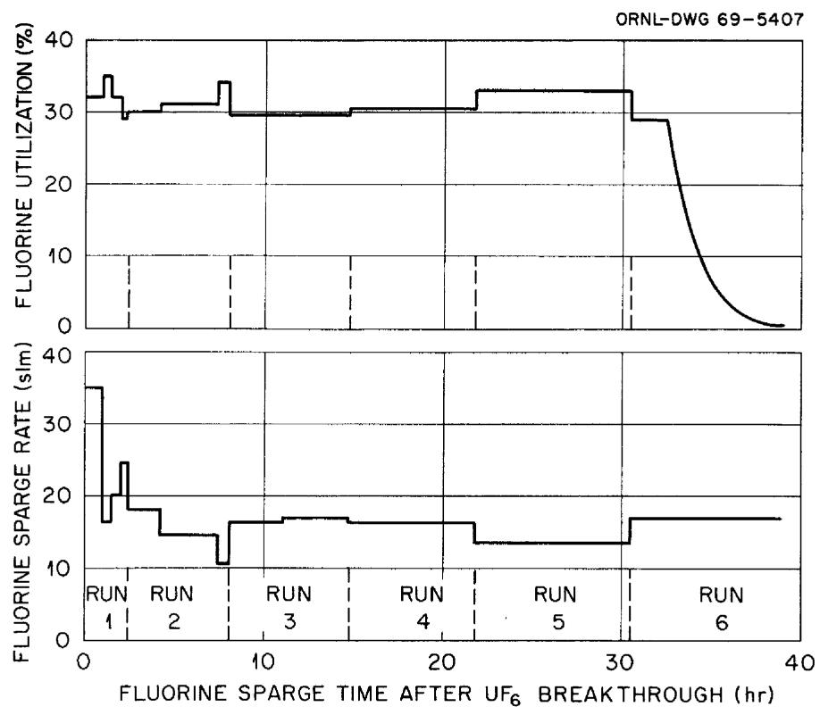  
Fig. 17. Fluorine Flow Rate vs Utilization.

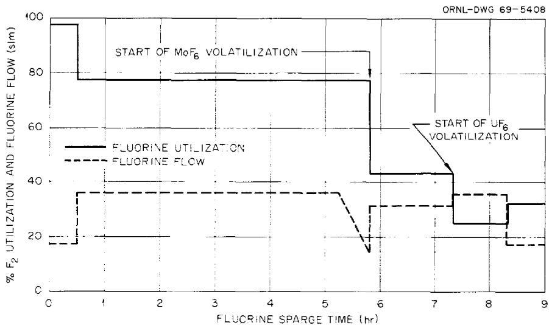  
Fig. 18. Fluorine Utilization at the Start of Run 1.

Table 6. Fluorine Utilization   

<table><tr><td></td><td>Corrected F2 Flow (std liters/min)</td><td>Percentage F2 Utilization</td></tr><tr><td>Flush salt</td><td>19.8</td><td>7.7</td></tr><tr><td>Fuel salt, overall</td><td>18.8</td><td>39</td></tr><tr><td>Run 1 - Before MoF6 Volatilization</td><td>17.1</td><td>98</td></tr><tr><td>- Before MoF6 Volatilization</td><td>36.0</td><td>77</td></tr><tr><td>- During MoF6 Volatilization</td><td>31.5</td><td>43</td></tr><tr><td>- During UF6 Volatilization</td><td>26.2</td><td>32</td></tr><tr><td>Run 2 - During UF6 Volatilization</td><td>15.3</td><td>31</td></tr><tr><td>Run 3 - During UF6 Volatilization</td><td>16.7</td><td>29</td></tr><tr><td>Run 4 - During UF6 Volatilization</td><td>16.2</td><td>31</td></tr><tr><td>Run 5 - During UF6 Volatilization</td><td>13.5</td><td>33</td></tr><tr><td>Run 6 - During UF6 Volatilization</td><td>16.9</td><td>13</td></tr></table>

flowmeter indicated a high utilization toward the end of each run because of the stratification of the dense $\mathrm{UF}_6$ in the fuel-storage-tank gas space.

The fluorine flow rates calculated from the decrease in pressure in the fluorine trailers agree reasonably well with the results obtained with the orifice flowmeter except in runs 2 and 5. In run 2 a fluorine flow of $90\%$ of the rate indicated by the flowmeter was used since this produces: (1) utilizations in reasonable agreement with those observed in the other runs, (2) an integrated $\mathrm{UF}_6$ flow from the inlet meter that is in agreement with the absorber weight increase, and (3) a reasonable amount of $\mathrm{MoF}_6$ leaving the absorbers as calculated from the outlet meter. In run 5 a fluorine flow of $110\%$ of the rate indicated by the flowmeter was used.

# 6.2 Corrosion

One of the major problems encountered during processing was the corrosion of the fuel storage tank. Coupon testing in the Volatility Pilot Plant6 and at Battelle Memorial Institute7 had shown Hastelloy-N to be

superior, as a material of construction, to nickel (mainly because of the absence of intergranular corrosion) and as resistant to corrosion as any of the other materials tested; however, the corrosion rate was still much higher than desired. The corrosion rates shown in Table 7 were calculated from the increase in Cr, Fe, and Ni contents of the salt and from the amount of $\mathrm{MoF_6}$ volatilized.

Table 7. Corrosion During Fluorination   

<table><tr><td rowspan="2"></td><td colspan="4">Corrosion (mils/hr), Based on:</td><td rowspan="2">Aver.a</td></tr><tr><td>Mo</td><td>Ni</td><td>Fe</td><td>Cr</td></tr><tr><td>Flush Salt</td><td></td><td>0.10</td><td>0.2</td><td>0.15</td><td>0.11</td></tr><tr><td>Fuel Salt</td><td>~0.2</td><td>0.04</td><td>0.2</td><td>0.14</td><td>0.09</td></tr></table>

${}^{a}$ Weighted for concentration in Hastelloy-N.

The corrosion rates calculated during flush salt processing may be high since they include a 2-hr conditioning period at $1125^{\circ}\mathrm{F}$ with fluorine. All other fluorine exposures were at 850 to $860^{\circ}\mathrm{F}$ . The corrosion rate, based on molybdenum, was calculated from the rise of the reading of the inlet mass flowmeter prior to the temperature rise in the first absorber (Fig. 19). It is believed that this rise was due to the presence of $\mathrm{MoF}_6$ , which is more volatile than $\mathrm{UF}_6$ and has almost as large a heat capacity. The corrosion due to molybdenum in the flush salt could not be calculated directly because of the short time interval (20 min) between the two indications. The equivalent time interval for the fuel salt was 90 min; thus the calculation in this case should be reasonably accurate. A 15-min time lag in the temperature response was assumed in the calculations. With the fuel salt there was a simultaneous, but smaller, rise on the exit flow-meter reading. This is believed to be caused mainly by the increasing amount of unreacted fluorine due to reduced utilization. The average exit meter reading agreed reasonably well with the calculated reading for $43\%$ fluorine utilization (see Table 6). The higher corrosion rate, based on molybdenum, is probably due to surface leaching and rapid volatilization of the highly volatile $\mathrm{MoF}_6$ .

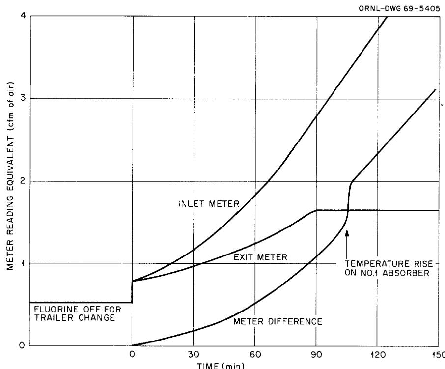  
Fig. 19. Mass Flowmeter Readings Before Start of Volatilization of $\mathbf{U}\mathbf{F}_{6}$ from Fuel Salt.

# 6.3 Molybdenum

During reactor operation, corrosion product and fission product molybdenum exists as finely divided metal. In this form, most of it leaves the salt, either in the gas stream or by deposition on the graphite and metal surfaces. During fluorination, the molybdenum in the Hastelloy-N fuel storage tank is attacked and converted to $\mathsf{MoF}_6$ . Molybdenum is the only major constituent of the fuel storage tank forming a highly volatile fluoride. (Chromium fluoride is not volatilized until essentially all of the $\mathsf{UF}_6$ has been volatilized.) As seen in Table 8, $\mathsf{MoF}_6$ is somewhat more volatile than $\mathsf{UF}_6$ . The molybdenum complex, $\mathsf{MoF}_6\cdot 3\mathsf{NaF}$ , is much less stable than the uranium complex, $\mathsf{UF}_6\cdot 3\mathsf{NaF}$ .

Table 8. Comparison Between ${\mathrm{{MoF}}}_{6}$ and ${\mathrm{{UF}}}_{6}$   

<table><tr><td></td><td>UF6</td><td>MoF6</td></tr><tr><td>Boiling point at 760 mm, °F</td><td>147</td><td>95</td></tr><tr><td>Partial pressure over NaF at 200°F, mm</td><td>0.001</td><td>2</td></tr></table>

At the start of fuel salt fluorination, it is likely that non-volatile $\mathrm{MoF}_3$ is formed and is not converted to $\mathrm{MoF}_6$ until most of the $\mathrm{UF}_4$ is converted to $\mathrm{UF}_5$ . Because of the higher volatility of $\mathrm{MoF}_6$ , volatilization would be expected to begin before $\mathrm{UF}_6$ begins to volatilize. This was verified by the increase in the reading on the absorber inlet mass flowmeter about 1-1/2 hr before an absorber temperature rise was noted (see Fig. 19). During this period of $\mathrm{MoF}_6$ volatilization, the reading on the absorber outlet meter indicated that no $\mathrm{MoF}_6$ was present in the exit gas stream until near the start of $\mathrm{UF}_6$ absorption.

After $\mathrm{UF}_6$ began to volatilize, the absorber outlet mass flowmeter was used to calculate the amount of $\mathrm{MoF}_6$ leaving the absorbers. The molybdenum in the absorber outlet stream was also calculated by two other methods: from the gas flow and the $\mathrm{MoF}_6$ vapor pressure, and by subtracting the amount of $\mathrm{MoF}_6$ retained on the absorbers from the amount of $\mathrm{MoF}_6$

produced by corrosion. A good correlation of the data, except in run 6, was obtained, showing that the amount of absorbed $\mathrm{MoF_6}$ increases as the amount of $\mathrm{UF_6}$ passed through the NaF increases. The data, which are only approximations, are compared in Table 9. This table also shows the amount of molybdenum found in the caustic scrubber solutions. The reason for the excessive amount of $\mathrm{MoF_6}$ leaving the absorbers in run 6 is not clear. The amount of molybdenum that passed through the scrubber is not known. There was no accumulation of solids in the line from the scrubber as was experienced during the second scrubber test run (Sect. 5.2); however, the mist filter was not examined.

From the random samples of NaF analyzed for molybdenum, the following observations have been made concerning the absorption of $\mathrm{MoF}_6$ :

(1) Absorption is higher on high-surface-area NaF than on low-surface-area NaF.   
(2) Absorption is higher on pellets than powder, probably because $\mathsf{MoF}_6$ is trapped inside the pellets.   
(3) Absorption is higher on NaF that has been exposed to $\mathrm{UF}_6$ , and increases with the $\mathrm{UF}_6$ concentration in the gas stream. Run 6 appears to be an exception in this respect.

# 6.4 Plutonium

Since the MSRE fuel salt contained 66 wt $\%$ $^{238}\mathrm{U}$ , a significant amount of $^{239}\mathrm{Pu}$ was produced. At the time of reactor shutdown, the plutonium concentration in the fuel salt was calculated to be $112\mathrm{ppm}$ ( $560\mathrm{g}$ ). Five salt samples withdrawn after fluorination, after reduction, and after return of the salt batch to the reactor drain tank showed an average concentration of $110\mathrm{ppm}$ . This confirms the expectation that plutonium would not be volatilized under the relatively mild conditions required for uranium volatilization.

# 6.5 Niobium

Figure 20 shows the amounts of fission product fluorides calculated to be volatilized during fluorination of the fuel salt. The iodine and tellurium fluorides (Sect. 6.6) pass through both NaF beds to the caustic

Table 9. Disposition of Volatilized Molybdenum   

<table><tr><td rowspan="4"></td><td colspan="6">Molybdenum (g)</td></tr><tr><td rowspan="3">Produced by Corrosiona</td><td rowspan="3">Absorbed on NaFb</td><td colspan="3">In Absorber Outlet Stream</td><td rowspan="3">In Caustic Scrubber</td></tr><tr><td colspan="3">Amount Produced</td></tr><tr><td>Minus Amount Absorbed</td><td>From Flow and Vapor Pressure</td><td>From Mass Flowmeter</td></tr><tr><td>Flush Salt</td><td>990</td><td>28</td><td>962</td><td>940</td><td>c</td><td>260</td></tr><tr><td>Fuel Salt</td><td></td><td></td><td></td><td></td><td></td><td></td></tr><tr><td>Run 1</td><td>1270</td><td>130</td><td>1140</td><td>246</td><td>670</td><td>107</td></tr><tr><td>Run 2</td><td>739</td><td>210</td><td>519</td><td>427</td><td>364</td><td>72</td></tr><tr><td>Run 3</td><td>868</td><td>330</td><td>538</td><td>257</td><td>267</td><td>86</td></tr><tr><td>Run 4</td><td>914</td><td>375</td><td>539</td><td>132</td><td>870</td><td>24</td></tr><tr><td>Run 5</td><td>1131</td><td>425</td><td>706</td><td>271</td><td>663</td><td>17</td></tr><tr><td>Run 6</td><td>1114</td><td>112</td><td>1002</td><td>399</td><td>3120</td><td>67</td></tr><tr><td>Total Fuel</td><td>6036</td><td>1582</td><td>4444</td><td>1732</td><td>5954</td><td>373</td></tr><tr><td>Total</td><td>7026</td><td>1610</td><td>5406</td><td>2672</td><td>c</td><td>633</td></tr></table>

${}^{a}$ At a constant corrosion rate of 0.2 mils/hr.   
bFrom a correlation of absorbed Mo vs $\mathrm{UF}_6$ through NaF.   
c Unable to calculate.

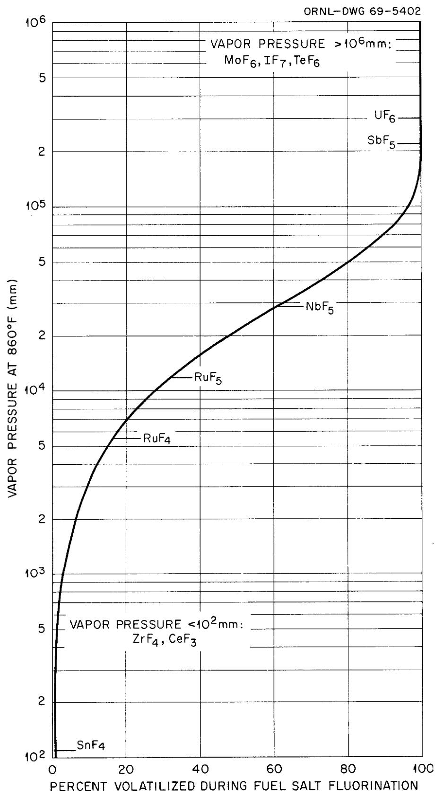  
Fig. 20. Calculated Fission Product Volatilization During Fuel Salt Fluorination.

scrubber and charcoal traps. Because of the five-month decay time, $^{99}\mathrm{Mo}$ was not present in detectable amounts. Ruthenium, niobium, and antimony exist as metals during reactor operation and, as such, are continuously removed by deposition or by the off-gas stream. Since ruthenium is formed directly by fission and since radioactive antimony has no long-lived precursors, the amounts of these isotopes in the processed salt were small as compared with niobium, which grows in from nonvolatile $^{95}\mathrm{Zr}$ .

Figure 21 shows the buildup of $^{95}\mathrm{Nb}$ after reactor shutdown and the buildup after fluorination, assuming complete volatilization. Also shown is a comparison between the amount of niobium found in salt samples taken before and after fluorination and the amount of niobium which should have been present from zirconium decay (assuming no niobium present at sample time) when the sample was analyzed several months after processing. Since the sample prior to fluorination showed less niobium than would have grown in from zirconium decay, it is impossible to say whether there was any appreciable amount of niobium in the salt before fluorination. At least $60\%$ of the grown-in niobium must have been lost during sample preparation (before analysis). This loss did not occur in the post-fluorination samples, as seen in Fig. 21, when the salt was in an oxidized state. The close agreement between the calculated amount and the sample analysis probably indicates that there was very little niobium left in the salt after fluorination.

Figure 20 indicates that approximately $60\%$ of the niobium in the fuel salt volatilized during fluorination. It is not known, however, how much niobium was present in the salt at that time. From the lack of heat generation in the NaF trap, the volatilized niobium is believed to constitute less than $10\%$ of the $9 \times 10^{4}$ curies which would have grown in after reactor shutdown. (A temperature rise of $20^{\circ}\mathrm{F}$ would have been observed from the heat generation from 9000 curies of $^{95}\mathrm{Nb}$ .) The temperature of the trap, remained constant; that is, no heater adjustment was required through-out the six runs. Apparently, most of the niobium was removed from the salt by deposition in the drain tank or in back-flowing through the salt filter during salt transfer. At the end of this transfer, the transfer gas blowthrough carried a small amount of metallic niobium to the absorber filter (see Sect. 5.5). Although this filter was decontaminated prior to

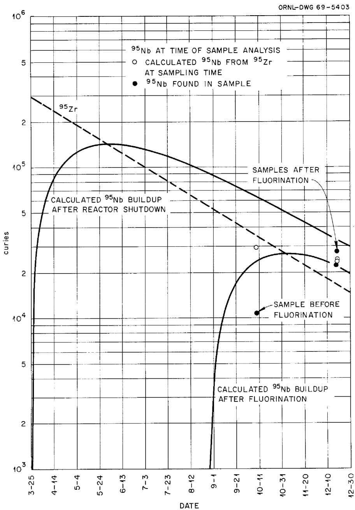  
Fig. 21. Buildup of $^{95}\mathrm{Nb}$ from $^{95}\mathrm{Zr}$ Decay.

fluorination, undoubtedly some of the niobium was deposited on the upstream piping. During fluorination, this niobium would be converted to volatile $\mathrm{NbF}_5$ and collect on the $\mathrm{UF}_6$ absorbers (any niobium upstream of the NaF trap should be absorbed on the trap). This is probably the source of the niobium on the absorbers (Sect. 6.8) rather than niobium that was volatilized from the salt passing through the NaF trap.

Two days after the end of fluorination, at the beginning of hydrogen reduction, a large amount of niobium (estimated to be 15 to 20 curies) was found on the absorber filter. Since $^{95}\mathrm{Nb}$ should have grown in at the rate of about 1000 curies per day, apparently less than $1\%$ of the niobium in the salt was carried to the absorber cubicle. A gamma scan, made of the filter on March 10, 1969, is shown in Fig. 22. The only definite peak is that of $^{95}\mathrm{Nb}$ at 0.77 Mev. Very small amounts of $^{125}\mathrm{Sb}$ , $^{103}\mathrm{Ru}$ , and $^{106}\mathrm{Rh}$ could be the cause of the bulge in the curve between 0.4 and 0.55 Mev.

# 6.6 Iodine and Tellurium

During fluorination, volatile $\mathrm{IF}_7$ is formed and passes through both NaF beds; it is removed by the caustic scrubber by reaction with the KOH and by exchange with the KI. A total of 404 mc of $^{131}\mathrm{I}$ was calculated to be in the fuel salt at the start of processing. Analyses of the caustic scrubber solutions showed that 288 mc was collected during run 1 and 10 mc was collected during run 2 for a $74\%$ accountability. This is in reasonable agreement with the results of iodine analyses of fuel salt (during reactor operation), which showed about $65\%$ of the calculated amount. The discrepancy between the calculated amount and the analyzed amount is caused by the loss of metallic $^{131}\mathrm{Te}$ before decay. There was no indication that any iodine collected on the charcoal beds downstream of the scrubber.

Tellurium exists primarily in the metallic state during reactor operation and, as such, is removed from the salt by deposition and by the off-gas stream. Freeze-valve samples showed less than $1\%$ remaining in the salt. Since $^{129}\mathrm{Te}$ has no long-lived precursor, the activity will not grow back in after reactor shutdown. Any tellurium remaining in the salt will be converted to the volatile $\mathrm{TeF_6}$ during fluorination. Because of the low MPC for $^{129}\mathrm{mTe}$ $(10^{-8} \mu \mathrm{c} / \mathrm{cc})$ , at least $94\%$ of the remaining $1\%$ would have

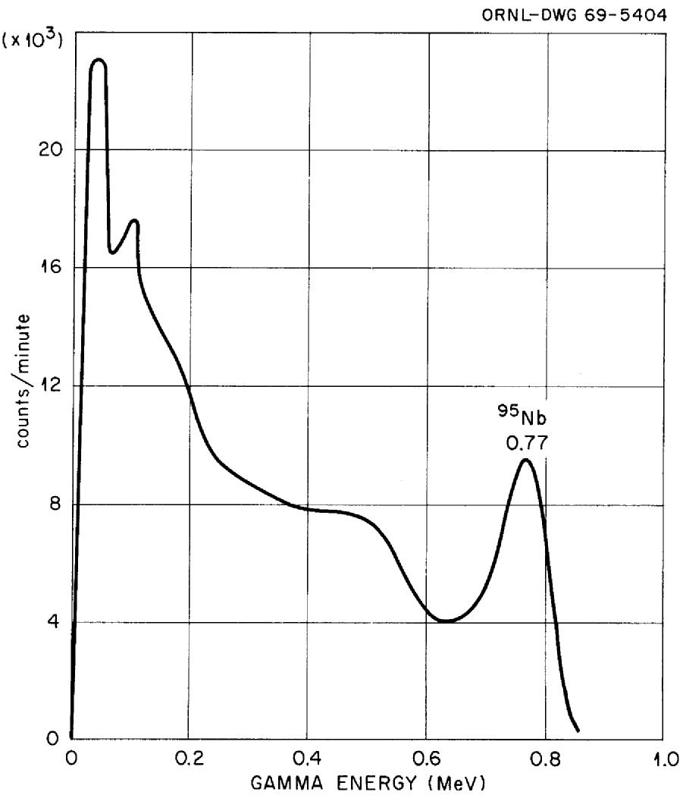  
Fig. 22. Gamma Scan of Absorber Cubicle Filter.

to be removed from the gas stream before the stream is discharged from the stack. Tellurium hexafluoride is not absorbed on NaF at any temperature and removal in the caustic scrubber is not very efficient. However, since analyses of the scrubber solutions showed tellurium to be below the limit of detection, it is probable that less than $1\%$ was present in the salt at reactor shutdown. Any tellurium passing through the scrubber would have been removed by the activated alumina9 in the soda-lime trap.

# 6.7 Uranium Absorption

As mentioned in Sect. 5.5, two types of NaF were used: a high-surface-area (HSA) material $(1\mathrm{m}^2 /\mathrm{g})$ , prepared at ORGDP by heating $\mathrm{NaHF}_2$ pellets, and a low-surface-area (LSA) material $(0.063\mathrm{m}^2 /\mathrm{g}$ , prepared at the UCNC Paducah Plant, from NaF powder and water and sintered at $700^{\circ}\mathrm{C}$ . The LSA material was originally specified for the MSRE Fuel Processing Plant because of its higher capacity for both $\mathrm{CrF}_5$ (on the $750^{\circ}\mathrm{F}$ NaF trap) and for $\mathrm{UF}_6$ . (This high capacity is due to the slower surface reaction and greater penetration to the inside of the pellets.) When the fluoride disposal method was changed from the $\mathrm{SO}_2$ gas-phase reaction to the aqueous scrubber, a more conservative approach toward possible uranium breakthrough from the absorbers became necessary. The low $\mathrm{MoF}_6$ retention observed during the final fluorine disposal test (Sect. 5.2) suggested that the reaction rate with $\mathrm{UF}_6$ might be too slow for complete uranium absorption under the planned operating conditions. Subsequent laboratory tests10 confirmed the much slower reaction rate with the LSA material. The absorbers were, therefore, heated to increase the reaction rate, and the LSA NaF was restricted to the No. 1 and No. 2 positions of the group of five absorbers.

A comparison of the results obtained with the two types of NaF is shown in Fig. 23. Three absorbers loaded with each type of material were used in the first position, and three were used in the second position, during the six runs. In the first position, the NaF was exposed to a higher $\mathrm{UF_6}$ concentration; this resulted in a lower loading than in the second position where the slower reaction rate permitted deeper penetration of the pellets. Except in one case, higher loadings were obtained

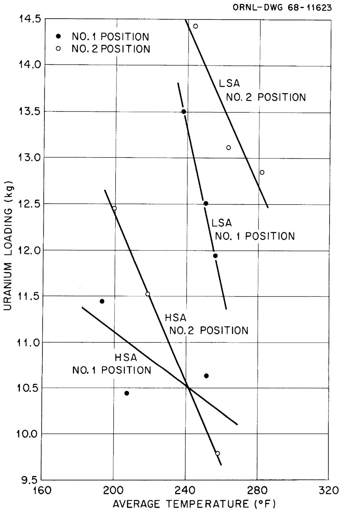  
Fig. 23. Comparison of LSA and HSA NaF Loading.

at lower temperatures; in that particular case, the absorber had been used in a previous run where a small amount of uranium was absorbed.

In spite of the fact that the LSA NaF absorbers were operated at higher temperatures (to compensate for the slower reaction rate), the total loading was 13 to $14\%$ higher. The maximum uranium loading obtained was $0.56\mathrm{g}$ per g of NaF, as compared with $0.49\mathrm{g}$ per g of NaF for the HSA material. Both of these absorbers were in the second position. The three lowest loadings shown in Fig. 23 for the LSA NaF contained from 11 to $18\%$ HSA (added later to more fully charge the absorbers), which undoubtedly reduced the loading on these absorbers.

The time required for a breakthrough of $\mathrm{UF}_6$ from a given absorber to the subsequent absorber varies directly with the residence time of the gas stream in the absorber, as shown in Fig. 24. The first absorber in run 1 had an unusually short breakthrough time (25 sec), which was possibly caused by absorption of $\mathrm{MoF}_6$ that had been volatilized before the start of $\mathrm{UF}_6$ volatilization (Sect. 6.3).

The conditions and loadings are summarized in Table 10. These loadings are high since no allowance was made for absorbed $\mathrm{MoF}_6$ .

# 6.8 Uranium Product Purity

The inlet of the first absorber in each run was analyzed for gross beta and gamma activity about 12 days after fluorination; the results are shown in Fig. 25. The activity associated with uranium daughters at the same time is also shown. At the time of the analyses, the $^{235}\mathrm{U}$ daughters had reached equilibrium, while the $^{238}\mathrm{U}$ daughters had attained only about $30\%$ of equilibrium. The only activities appreciably above background were the gamma activity in the first run and the gamma activity on the first absorber of the second run. (The activity in the feed salt before fluorination, counted at the same time, was $2.66 \times 10^{13}$ gross gamma and $3.8 \times 10^{13}$ gross beta counts per minute per gram of uranium.) The average gross beta and gamma decontamination factors (DF) for the six absorbers analyzed, after correction for uranium daughter activity, were $1.2 \times 10^{9}$ and $8.6 \times 10^{8}$ respectively.

The only activity collected in any measurable amount on the NaF absorbers with the UF $_6$ was $^{95}\mathrm{Nb}$ . Most of this activity was probably carried

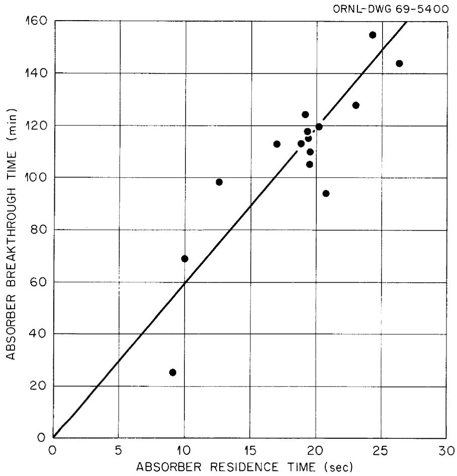  
Fig. 24. Absorber Residence Time vs $\mathbf{U}\mathbf{F}_{6}$ Breakthrough Time.

Table 10. Summary of UF ${}_{6}$ Absorption Data   

<table><tr><td rowspan="2">Run</td><td rowspan="2">Absorber</td><td rowspan="2">Type NaF</td><td rowspan="2">Aver. Temp. (°F)</td><td colspan="2">Flow Through Absorber Minus N2He and Unreacted F2</td><td rowspan="2">Average Gas Residence Time (Excluding UF6) (sec)</td><td rowspan="2">Uranium Absorbeda(kg)</td></tr><tr><td>Corrected Flow Rate (std liters/min)</td><td>Superficial Gas Velocity (fps)</td></tr><tr><td rowspan="4">Flush</td><td>1</td><td>LSA</td><td>244</td><td>20.0</td><td>0.038</td><td>18.3</td><td>4.65</td></tr><tr><td>2</td><td>LSA</td><td>226</td><td>20.0</td><td>0.037</td><td>18.7</td><td>1.83</td></tr><tr><td>3</td><td>LSA</td><td>210</td><td>20.0</td><td>0.036</td><td>19.2</td><td>0.15</td></tr><tr><td>Aver</td><td></td><td>227</td><td>20.0</td><td>0.037</td><td>18.7</td><td>6.63</td></tr><tr><td rowspan="3">Fuel-1</td><td>1</td><td>LSA</td><td>261</td><td>39.4</td><td>0.077</td><td>9.1</td><td>12.53</td></tr><tr><td>2</td><td>HSA</td><td>258</td><td>28.5</td><td>0.055</td><td>12.6</td><td>9.80</td></tr><tr><td>3</td><td>HSA</td><td>258</td><td>28.5</td><td>0.055</td><td>12.6</td><td>3.49</td></tr><tr><td rowspan="4">2</td><td>1</td><td>LSA</td><td>255</td><td>21.2</td><td>0.041</td><td>17.0</td><td>11.98</td></tr><tr><td>2</td><td>LSA</td><td>282</td><td>17.9</td><td>0.036</td><td>19.3</td><td>12.86</td></tr><tr><td>3</td><td>HSA</td><td>265</td><td>17.0</td><td>0.033</td><td>20.8</td><td>8.36</td></tr><tr><td>4</td><td>HSA</td><td>253</td><td>17.0</td><td>0.033</td><td>21.2</td><td>0.61</td></tr><tr><td rowspan="4">3</td><td>1</td><td>HSA</td><td>252</td><td>18.7</td><td>0.036</td><td>19.3</td><td>10.66</td></tr><tr><td>2</td><td>LSA</td><td>263</td><td>18.8</td><td>0.037</td><td>18.9</td><td>13.14</td></tr><tr><td>3</td><td>HSA</td><td>258</td><td>18.8</td><td>0.037</td><td>19.1</td><td>11.91</td></tr><tr><td>4</td><td>HSA</td><td>274</td><td>18.9</td><td>0.038</td><td>18.6</td><td>5.73</td></tr><tr><td rowspan="4">4</td><td>1</td><td>HSA</td><td>193</td><td>19.5</td><td>0.034</td><td>20.2</td><td>11.42</td></tr><tr><td>2</td><td>HSA</td><td>218</td><td>19.5</td><td>0.036</td><td>19.5</td><td>11.55</td></tr><tr><td>3</td><td>HSA</td><td>217</td><td>19.5</td><td>0.036</td><td>19.5</td><td>11.24</td></tr><tr><td>4</td><td>HSA</td><td>220</td><td>19.5</td><td>0.036</td><td>19.4</td><td>9.83</td></tr><tr><td rowspan="4">5</td><td>1</td><td>LSA</td><td>238</td><td>16.0</td><td>0.030</td><td>23.0</td><td>13.51</td></tr><tr><td>2</td><td>LSA</td><td>243</td><td>15.1</td><td>0.029</td><td>24.2</td><td>14.45</td></tr><tr><td>3</td><td>HSA</td><td>188</td><td>15.1</td><td>0.026</td><td>26.3</td><td>12.37</td></tr><tr><td>4</td><td>HSA</td><td>207</td><td>15.1</td><td>0.027</td><td>25.5</td><td>8.94</td></tr><tr><td rowspan="4">6</td><td>1</td><td>HSA</td><td>207</td><td>38.7</td><td>0.070</td><td>10.0</td><td>10.45</td></tr><tr><td>2</td><td>HSA</td><td>200</td><td>38.7</td><td>0.069</td><td>10.1</td><td>12.47</td></tr><tr><td>3</td><td>HSA</td><td>179</td><td>38.7</td><td>0.067</td><td>10.4</td><td>0.55</td></tr><tr><td>Aver</td><td></td><td>236</td><td>22.7</td><td>0.043</td><td>18.0</td><td>217.85</td></tr></table>

aThese weights include absorbed $\mathrm{MoF_6}$   
bTotal weights.

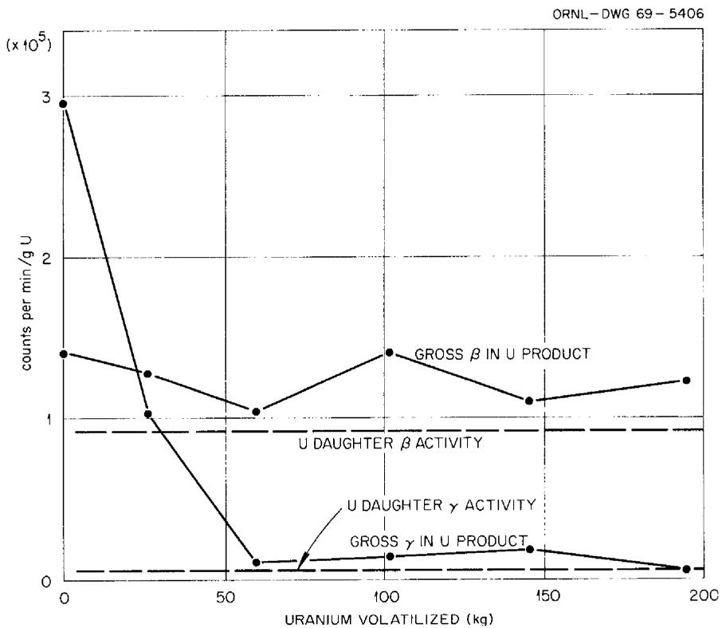  
Fig. 25. Gross Activity in Uranium Product.

from the salt into the piping and equipment between the fuel storage tank and the metallic filter upstream of the absorbers at the end of the salt transfer when the pressure of the transfer gas was released (Sects. 5.5 and 6.5). Because of this contamination, the decontamination factor for $^{95}\mathrm{Nb}$ $\left(\frac{\mathrm{dpm per gram of U in salt}}{\mathrm{dpm per gram of U on absorber}}\right)$ was lower than the actual DF from niobium volatilized during fluorination and collected on the absorbers. The DF was lower at the start of run 1 when most of the niobium between the NaF trap and the absorbers was fluorinated and collected on the first absorber. The DF's varied from $5 \times 10^6$ at the start to $1 \times 10^{10}$ at the end of fluorination. Therefore, notwithstanding the piping contamination, a considerably higher niobium DF was obtained in these runs than in the Volatility Pilot Plant ( $5 \times 10^7$ ) for 30-day-decayed uranium.

The activity of the uranium product, in excess of the uranium daughter activity, would be expected to be negligible after desorption of the $\mathrm{UF}_6$ from the NaF. Laboratory-scale runs have shown decontamination factors of 10 to $10^{3}$ for this operation.[11]

The only nonradioactive contaminant of any consequence expected to be found with the absorbed uranium was molybdenum (from corrosion of the Hastelloy-N during fluorination). The actual amount on the absorbers could not be determined until the $\mathrm{UF_6}$ was desorbed. The behavior of molybdenum during the processing is discussed in Sect. 6.3.

# 6.9 Reduction of Metal Fluorides

The concentrations of the structural metal fluorides in the flush and fuel salts during various stages of processing are shown in Table 11.

Calculations of the hydrogen and zirconium utilizations were only approximate for the following reasons:

(1) Difficulties in obtaining filtered samples.   
(2) Large standard deviation in iron analyses.   
(3) Unreliable nickel analyses using filter capsules with nickel filters. Oxidation of the filter during fabrication caused a high nickel analysis for at least one sample.

Since the flush salt was not sampled after reduction of $\mathrm{NiF}_2$ , the hydrogen utilization during reduction could not be calculated. The

Table 11. Structural Metal Fluoride Concentrations   

<table><tr><td></td><td colspan="3">Concentration (ppm)</td></tr><tr><td></td><td>Cr ± 10</td><td>Fe ± 40</td><td>Ni ± 15</td></tr><tr><td colspan="4">Flush salta</td></tr><tr><td>In reactor system</td><td>76</td><td>150</td><td>52</td></tr><tr><td>Before fluorination</td><td>104</td><td>—</td><td>—</td></tr><tr><td>After fluorination</td><td>133</td><td>210</td><td>516</td></tr><tr><td>After 10.8 hr of H2 sparging</td><td></td><td>No sample taken</td><td></td></tr><tr><td>After 604 g of Zr and 9 hr of H2 sparging</td><td>100b</td><td>174b</td><td>50b</td></tr><tr><td>After 1074 g of Zr and 25 hr of H2 sparging</td><td></td><td>No sample taken</td><td></td></tr><tr><td>After filtration</td><td>76b</td><td>141b</td><td>26</td></tr><tr><td colspan="4">Fuel salta</td></tr><tr><td>In reactor system</td><td>85</td><td>130</td><td>60</td></tr><tr><td>Before fluorination</td><td>170</td><td>131</td><td>36</td></tr><tr><td>After fluorination</td><td>420</td><td>400</td><td>840</td></tr><tr><td>After 17.1 hr of H2 sparging</td><td>420b</td><td>430b</td><td>c</td></tr><tr><td>After 33.5 hr of H2 sparging</td><td>420b</td><td>400b</td><td>520b</td></tr><tr><td>After 51.1 hr of H2 sparging</td><td>460b</td><td>380b</td><td>180b</td></tr><tr><td>After 5000 g of Zr and 24 hr of H2 sparging</td><td>100b</td><td>110b</td><td>&lt;10b</td></tr><tr><td>After 5100 g of Zr and 32 hr of H2 sparging</td><td></td><td>No sample taken</td><td></td></tr><tr><td>After filtration</td><td>34</td><td>110</td><td>60</td></tr></table>

${}^{\mathrm{a}}\mathrm{H}_{2}$ sparging times are cumulative.   
bFiltered sample.   
Contaminated sample.

hydrogen utilization during fuel salt reduction, however, was calculated to be $1.9\%$ overall, as shown in Table 12. This is somewhat higher than the utilization experienced in test runs with a 48-liter batch of salt.[12]

In the test runs, the utilization was less than $1\%$ when the nickel fluoride concentration in the salt was less than 500 ppm. The higher utilization during fuel salt reduction is probably due to greater dip tube submergence (64 in. vs 26 in.). Apparently, a high hydrogen concentration is more important for efficient reduction than a high gas sparge rate. The minimum hydrogen utilization during flush salt reduction was calculated by assuming complete reaction of the zirconium and an iron reduction equal to the chromium reduction. The maximum utilization assumes complete $\mathrm{NiF}_2$ reduction by the hydrogen. Table 12 summarizes the nickel reduction step.

Since the $\mathrm{NiF}_2$ reduction of the fuel salt (and probably also in the case of the flush salt) was incomplete after hydrogen sparging, the remainder of the $\mathrm{NiF}_2$ was reduced by addition of zirconium. The reduction step after zirconium was added to the salt is summarized below in Table 13. A zirconium utilization of only $40\%$ during the flush salt processing would have been required if all the $\mathrm{NiF}_2$ had been reduced during the hydrogen sparge.

# 7. ACKNOWLEDGMENTS

Much of the credit for the successful processing of the MSRE fuel belongs to the following: G. I. Cathers for laboratory-scale work in support of the fluorination, absorption, and fluorine disposal operations; E. L. Nicholson for assistance in design of final modifications to the plant; W. H. Carr, G. I. Cathers, and E. L. Nicholson for around-the-clock technical assistance during the fuel salt fluorination; R. H. Guymon, T. L. Hudson, and A. I. Krakoviak for supervision of operations; and W. S. Pappas, ORGDP, for specification of special instrumentation and assistance during testing and final operation.

Table 12. Reduction of Nickel Fluoride   

<table><tr><td rowspan="2">Salt</td><td colspan="4">Hydrogen Sparge</td><td rowspan="2">% Hydrogen Utilization</td></tr><tr><td>Sparge Time (hr)</td><td>Aver. H2Flow Rate (std liters/min)</td><td>% H2</td><td>Total H2Flow (liters)</td></tr><tr><td>Flush</td><td>10.8</td><td>36.2</td><td>64</td><td>23,500</td><td>2.2 - 3.6</td></tr><tr><td rowspan="3">Fuel</td><td>17.1</td><td>21.4</td><td>76</td><td>21,860</td><td>1.1</td></tr><tr><td>16.4</td><td>34.0</td><td>77</td><td>33,470</td><td></td></tr><tr><td>17.6</td><td>10.8</td><td>92</td><td>11,420</td><td>5.7</td></tr><tr><td>Fuel Aver.</td><td></td><td>21.8</td><td>79</td><td></td><td>1.9</td></tr></table>

Table 13. Reduction of Chromium and   
Iron Fluorides After Addition of Zirconium   

<table><tr><td rowspan="2">Salt</td><td rowspan="2">Zirconium Added (g)</td><td rowspan="2">Spare Time (hr)</td><td colspan="2">Sparge Gas</td><td rowspan="2">% Zr Utilization</td></tr><tr><td>Flow Rate (std liters/min)</td><td>% H2</td></tr><tr><td rowspan="2">Flush</td><td>604</td><td>9</td><td>44</td><td>77</td><td></td></tr><tr><td>470</td><td>16</td><td>45</td><td>78</td><td>&gt;40</td></tr><tr><td>Aver.</td><td></td><td></td><td>45</td><td>78</td><td></td></tr><tr><td rowspan="3">Fuel</td><td>5000</td><td>24</td><td>11.5</td><td>91</td><td></td></tr><tr><td>—</td><td>18.5</td><td>20</td><td>0 (He)</td><td>79.5</td></tr><tr><td>100</td><td>8</td><td>13.2</td><td>92</td><td></td></tr><tr><td>Aver.</td><td></td><td></td><td>15</td><td>58</td><td></td></tr></table>

# 8. REFERENCES

1. R. B. Lindauer, MSR Program Semiann. Progr. Rept., Aug. 31, 1965, ORNL-3872, p. 152.   
2. R. B. Lindauer, MSRE Design and Operations Report, Part VII, Fuel Handling and Processing Plant, ORNL-TM-907 (Revised) (Dec. 28, 1967).   
3. R. B. Lindauer and C. K. McGlothlan, Design, Construction and Testing of a Large Molten Salt Filter, ORNL-TM-2478 (March 1969).   
4. W. S. Pappas, Reaction of Sulfuryl Fluoride with Activated Alumina, K-L-3062 (Sept. 4, 1968).   
5. ORNL Molten Salt Reactor Program, Monthly Report for February 1968, MSR-68-42 (Mar. 1, 1968).   
6. A. P. Litman and A. E. Goldman, Corrosion Associated with Fluorination in the ORNL Fluoride Volatility Process, ORNL-2832 (June 5, 1961).   
7. P. D. Miller et al., The Corrosion of an INOR-8 Single-Vessel Hydrofluorinator-Fluorinator, BMI-X-234 (May 27, 1963).   
8. R. C. Steffy, Oak Ridge National Laboratory, personal communication.   
9. D. R. Vissers and M. J. Steindler, Laboratory Investigations in Support of the Fluid-bed Volatility Processes, Part XX. Fission-product Tellurium Off-gas Disposal in the Fluid-bed Fluoride Volatility Process, ANL-7464 (August 1968).   
10. G. I. Cathers et al., MSR Program Semiann. Progr. Rept., Aug. 31, 1968, ORNL-4344, p. 324.   
11. G. I. Cathers, et al., Use of Fused Salt-Fluoride Volatility Process with Irradiated Uranium Decayed 15 - 30 Days, ORNL-3280 (September 1962).   
12. J. H. Shaffer, L. E. McNeese, F. A. Doss, MSR Program Semiann. Progr. Rept., Feb. 29, 1968, ORNL-4254, p. 155.

# Internal Distribution

1. J. L. Anderson

2. C. F. Baes

3. S. E. Beal1

4. M. Bender

5. E. S. Bettis

6. F. F. Blankenship

7. R. Blumberg

8. E. G. Bohlmann

9. R. E. Brooksbank

10. R. B. Briggs

11. W. H. Carr

12. G. I. Cathers

13. C. W. Collins

14. W. B. Cottrell

15. J. L. Crowley

16. F. L. Culler

17. S. J. Ditto

18. W. P. Eatherly

19. J. R. Engel

20. D. E. Ferguson

21. L. M. Ferris

22. J. K. Franzreb

23. A. P. Fraas

24. C. H. Gabbard

25. R. B. Gallaher

26. W. R. Grimes

27. A. G. Grindell

28. R. H. Guymon

29. P. H. Harley

30. P. N. Haubenreich

31. R.E.Helms

32. H. W. Hoffman

33. T. L. Hudson

34. P. R. Kasten

35. R.J.Kedl

36. S. S. Kirslis

37. A. I. Krakoviak

38-43. R.B.Lindauer

44. M. I. Lundin

45. R. N. Lyon

46. H. G. MacPherson

47. R. E. MacPherson

48. H. E. McCoy

49. H. C. McCurdy

50. C. K. McGlothlan

51. L. E. McNeese

52. J. R. McWherter

53. A. J. Miller

54. R. L. Moore

55. E. L. Nicholson

56. W. S. Pappas

57. A. M. Perry

58. R. C. Robertson

59-60. M. W. Rosenthal

61. A. W. Savolainen

62. Dunlap Scott

63. J. H. Shaffer

64. M. J. Skinner

65. A. N. Smith

66. P. G. Smith

67. I. Spiewak

68. D. A. Sundberg

69. R.E.Thoma

70. D. B. Trauger

71. A. M. Weinberg

72. J. R. Weir

73. M. E. Whatley

74. J. C. White

75. G. D. Whitman

76. L. V. Wilson

77. Gale Young

78-79. Central Research Library (CRL)

80-81. Document Reference Section (DRS)

82-84. Laboratory Records (LRD)

85. Laboratory Records (LRD-RC)

# External Distribution

86. C. B. Derring, AEC-ORNL

87-88. T.W. McIntosh, AEC Washington

89. H. M. Roth, AEC-ORO

90-104. Division of Technical Information Extension

105. Laboratory and University Division, ORO