FRACTIONAL CRYSTALLIZATION REACTIONS IN THE SYSTEM LiF-BeF $_2$ -ThF $_4$

R. E. Thoma and J. E. Ricci

# ABSTRACT

Equilibrium and non-equilibrium crystallization reactions in the system $\mathrm{LiF - BeF_2 - ThF_4}$ are analyzed in relation to their potential application to molten salt reactor fuel reprocessing. Heterogeneous equilibria in the temperature range from the liquidus at $590^{\circ}C$ to the solidus at $350^{\circ}C$ are described quantitatively and in detail by means of ten typical isothermal sections and by three temperature-composition sections. The implications of metastable fractionation-in this temperature interval are discussed as a possible feed control step in reductive extraction reprocessing of molten salt breeder reactor fuels.

# LEGAL NOTICE

This report was prepared as an account of Government sponsored work. Neither the United States, nor the Commission, nor any person acting on behalf of the Commission:

A. Makes any warranty or representation, expressed or implied, with respect to the accuracy, completeness, or usefulness of the information contained in this report, or that the use of any information, apparatus, method, or process disclosed in this report may not infringe privately owned rights; or   
B. Assumes any liabilities with respect to the use of, or for damages resulting from the use of any information, apparatus, method, or process disclosed in this report.

As used in the above, "person acting on behalf of the Commission" includes any employee or contractor of the Commission, or employee of such contractor, to the extent that such employee or contractor of the Commission, or employee of such contractor prepares, disseminates, or provides access to, any information pursuant to his employment or contract with the Commission, or his employment with such contractor.

# CONTENTS

1

Introduction 4

Liquid-Solid Phase Reactions In The System LiF-BeF2-ThF4. 5

Potential Application of Fractional Crystallization In Chemical

Reprocessing 24

# LEGAL NOTICE

This report was prepared as an account of Government sponsored work. Neither the United States, nor the Commission, nor any person acting on behalf of the Commission: A. Makes any warranty or representation, expressed or implied, with respect to the accuracy, completeness, or usefulness of the information contained in this report, or that the use of any information, apparatus, method, or process disclosed in this report may not infringe any rights; or

1. Assume any liabilities with respect to the Commission are of the form of a liability under Title 3 of the Federal Aviation Act, as amended, and shall be subject to the following provisions:  
1A. Assume any liabilities with respect to the Commission are of the form of a liability under Title 4 of the Federal Aviation Act, as amended, and shall be subject to the following provisions:  
1B. Assume any liabilities with respect to the Commission are of the form of a liability under Title 5 of the Federal Aviation Act, as amended, and shall be subject to the following provisions:  
1C. Assume any liabilities with respect to the Commission are of the form of a liability under Title 6 of the Federal Aviation Act, as amended, and shall be subject to the following provisions:  
1D. Assume any liabilities with respect to the Commission are of the form of a liability under Title 7 of the Federal Aviation Act, as amended, and shall be subject to the following provisions:  
1E. Assume any liabilities with respect to the Commission are of the form of a liability under Title 8 of the Federal Aviation Act, as amended, and shall be subject to the following provisions:  
1F. Assume any liabilities with respect to the Commission are of the form of a liability under Title 9 of the Federal Aviation Act, as amended, and shall be subject to the following provisions:  
1G. Assume any liabilities with respect to the Commission are of the form of a liability under Title 10 of the Federal Aviation Act, as amended, and shall be subject to the following provisions:  
1H. Assume any liabilities with respect to the Commission are of the form of a liability under Title 11 of the Federal Aviation Act, as amended, and shall be subject to the following provisions:  
1I. Assume any liabilities with respect to the Commission are of the form of a liability under Title 12 of the Federal Aviation Act, as amended, and shall be subject to the following provisions:  
1J. Assume any liabilities with respect to the Commission are of the form of a liability under Title 13 of the Federal Aviation Act, as amended, and shall be subject to the following provisions:  
1K. Assume any liabilities with respect to the Commission are of the form of a liability under Title 15 of the Federal Aviation Act, as amended, and shall be subject to the following provisions:  
1L. Assume any liabilities with respect to the Commission are of the form of a liability under Title 16 of the Federal Aviation Act, as amended, and shall be subject to the following provisions:  
1M. Assume any liabilities with respect to the Commission are of the form of a liability under Title 17 of the Federal Aviation Act, as amended, and shall be subject to the following provisions:  
1N. Assume any liabilities with respect to the Commission are of the form of a liability under Title 1O of the Federal Aviation Act, as amended, and shall be subject to the following provisions:  
1O. Assume any liabilities with respect to the Commission are of the form of a liability under Title 11 of the Federal Aviation Act, as amended, and shall be subject to the following provisions:  
1P. Assume any liabilities with respect to the Commission are of the form of a liability under Title 1Q of the Federal Aviation Act, as amended, and shall be subject to the following provisions:  
1R. Assume any liabilities with respect to the Commission are of the form of a liability under Title 1S of the Federal Aviation Act, as amended, and shall be subject to the following provisions:  
1T. Assume any liabilities with respect to the Commission are of the form of a liability under Title 1U of the Federal Aviation Act, as amended, and shall be subject to the following provisions:  
1U. Assume any liabilities with respect to the Commission are of the form of a liability under Title 1V of the Federal Aviation Act, as amended, and shall be subject to the following provisions:  
1V. Assume any liabilities with respect to the Commission are of the form of a liability under Title 1W of the Federal Aviation Act, as amended, and shall be subject to

# INTRODUCTION

The ORNL Molten Salt Reactor Program is devoted to the development of molten salt breeder reactors which employ mixtures of molten fluorides as core fluids. Until recently, the most promising approach to the development of molten salt breeder reactors appeared to be a two-region reactor with fissile and fertile materials in separate fuel and blanket streams. Thorium would be carried in the blanket salt, in a salt stream which would consist of a $^7\mathrm{LiF - BeF}_2$ - $\mathrm{ThF}_4$ mixture. Advances in chemical reprocessing have provided evidence recently that $^{233}\mathrm{Pa}$ and possibly the rare earth fission products can be separated from mixed thorium-uranium salt by reductive extraction methods employing liquid bismuth. This development, along with other design developments, makes possible a single-fluid breeder reactor, one which has greater simplicity and reliability than the two-fluid reactor. The fuel for the single fluid reactor would be composed of $^7\mathrm{LiF}$ , $\mathrm{BeF}_2$ , $\mathrm{ThF}_4$ , and $^{233}\mathrm{UF}_4$ , and might be expected to contain $\sim 12$ mole $\%$ $\mathrm{ThF}_4$ . Optimization of the $^7\mathrm{LiF}$ and $\mathrm{BeF}_2$ concentrations is not complete, because the trade-off values of several significant factors have not yet been established. These include selection limitations imposed by the equilibrium phase behavior of the LiF- $\mathrm{BeF}_2$ - $\mathrm{ThF}_4$ system ( $^{233}\mathrm{UF}_4$ concentration will be only 0.2 mole $\%$ , and is therefore of little consequence in this connection), physical properties such as viscosity, vapor pressure, thermal conductivity, and the relations of LiF- $\mathrm{BeF}_2$ - $\mathrm{ThF}_4$ composition to the development of chemical processes for removal of protactinium and the lanthanides.

Effective separation of the rare earth fission products from fluoride salt streams which contain thorium fluoride is the keystone to development of semi-continuous reprocessing in single-fluid molten salt reactors. Several methods for reprocessing spent LiF-BeF $_2$ -ThF $_4$ -UF $_4$ fuels are currently under investigation. The method which is regarded as most tractable for engineering development involves the selective chemical reduction of the various components into liquid bismuth solutions at about $600^{\circ}\mathrm{C}$ , utilizing multistage countercurrent extraction operations. The current status of engineering development of this process has been described by Whatley et al. $^2$ The initial steps remove uranium and protactinium by reductive extraction. $^3$ A strong incentive then exists to remove the rare-earth fission products from the remaining salt. The most nearly feasible approach to this separation seems to be their extraction

into bismuth alloy, $^3$ even though the recycle volumes of extractant are marginally acceptable. The efficiency of this separation step would be greatly enhanced if the concentration of the rare earths in the salt mixture were increased by at least tenfold, and if the residual salt solutions were of a much lower concentration of thorium fluoride. That the $\mathrm{LiF - BeF_2 - ThF_4}$ phase diagram $^4$ shows the occurrence of low melting mixtures of low thorium fluoride content which are producible from MSBR single-core fluids by metastable crystallization has suggested the possibility that non-equilibrium fractionation reactions might be exploited as a feed control step in the reductive extraction process.

Because of its relative complexity, the unpublished version of the LiF-BeF $_2$ -ThF $_4$ phase diagram may experience less frequent or less effective application in molten salt reactor technology than is warranted by the developments cited above. We therefore describe in this report further detailed aspects of equilibrium and non-equilibrium behavior in the system.

# LIQUID-SOLID PHASE REACTIONS IN THE SYSTEM LiF-BeF2-ThF4

Methods for interpreting polythermal and isothermal phase diagrams are described extensively in an earlier report5 where the phase relationships in a number of fluoride systems were analyzed in detail. Interpretation of the equilibrium behavior in the system $\mathrm{LiF - BeF_2 - ThF_4}$ (Figure 1) is somewhat more complex than for the systems analyzed because of the occurrence of an unusual solid solution which is produced as the compound 3LiF·ThF4 crystallizes from LiF-BeF2-ThF4 melts. The crystal phase of nominal composition, 3LiF·ThF4, precipitates as a ternary solid solution which, at its maximum in composition variability (near the solidus), is described by a composition triangle with apices at LiF-ThF4 (75-25 mole %), LiF-BeF2-ThF4 (58-16-26 mole %), and LiF-BeF2-ThF4 (59-20-21 mole %). Two substitution models may provide an explanation for the single phase solid solution area: (1) a substitution of one $\mathrm{Be}^{2+}$ ion for a $\mathrm{Li}^+$ ion with the simultaneous formation of a $\mathrm{Th}^{4+}$ vacancy for every four $\mathrm{Be}^{2+}$ ions substituted for $\mathrm{Li}^+$ ions to provide electroneutrality and (2) substitution of a single $\mathrm{Be}^{2+}$ ion for a $\mathrm{Li}^+$ ion with the simultaneous formation of a $\mathrm{Li}^+$ vacancy. Model (1) would afford a solid solution

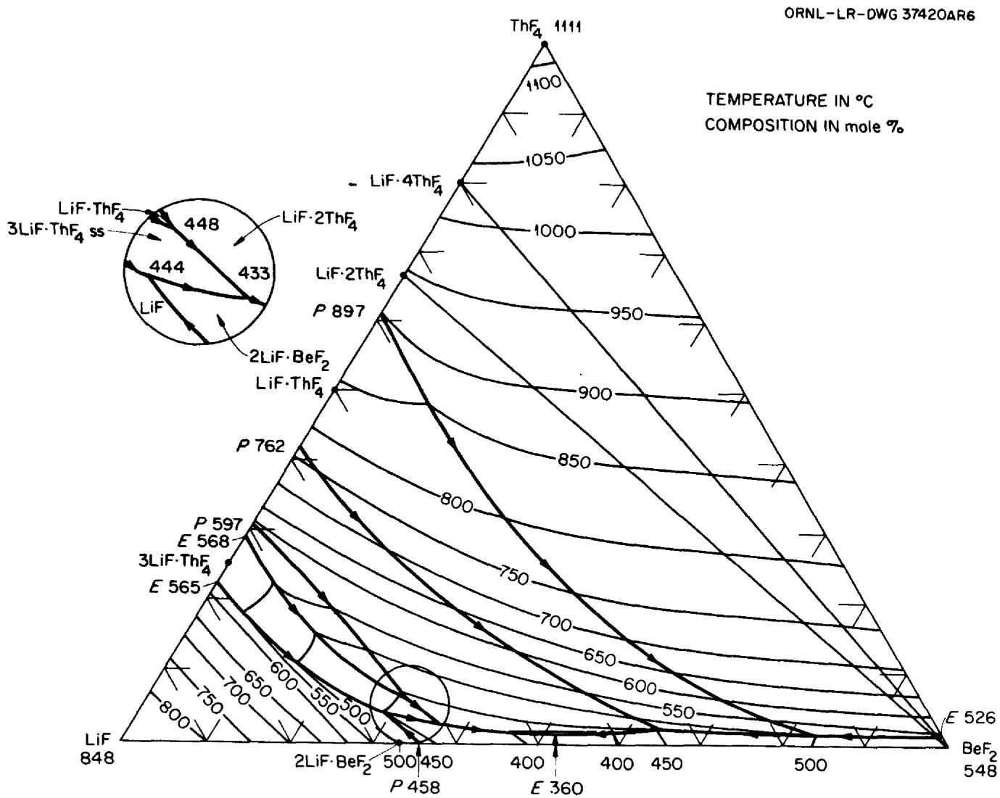  
Fig. 1. Polythermal Projection of the LiF-BeF $_2$ -ThF $_4$ Equilibrium Phase Diagram.

limit in good agreement with the leg of the triangular area with the lesser $\mathrm{ThF_4}$ content whereas model (2) would give a line extending from 3LiF·ThF $_4$ toward $\mathrm{BeF_2 - ThF_4}$ (60-40 mole %). This is a limiting line which permits considerably higher $\mathrm{ThF_4}$ content than that found experimentally. Accordingly, it appears that both models are simultaneously applicable for the crystallization behavior of 3LiF·ThF $_4$ as it crystallizes from LiF-BeF $_2$ -ThF $_4$ melts. Once the crystal structure of 3LiF·ThF $_4$ has been established (a study of the structure is currently in progress6) it will be possible to appraise the validity of these models.

Application of ternary phase diagrams to technology often requires a knowledge of the identities and compositions of the various phases in equilibrium at specific temperatures. Such information is represented by equilibrium phase diagrams. Typically, phase diagrams of ternary systems are presented as projections of temperature-composition prisms on their basal planes. When such schematic representation includes liquidus temperatures, equilibrium crystallization and melting reactions can be described in a quantitative manner. Here, the use of isothermal sections is often valuable, particularly if the phase diagram is complex. The chief feature of the isothermal section is that it provides information both about the identity and relative masses of coexisting phases.

The crystallization behavior of the 3LiF·ThF₄ ternary solid solution determines the composition sequence as LiF-BeF₂-ThF₄ melts are cooled. A series of equilibrium isotherms is shown in Figs. 2 to 11, which describe all the equilibrium reactions in the temperature interval from 590°C to 350°C, i.e., the liquidus-solidus interval of chief relevance to the compositions which are likely to have application in molten salt reactor technology, and in which all 3LiF·ThF₄ solid solution melting-freezing reactions occur. Within this interval all the solid phases of the system are involved. The equilibrium behavior of chief importance to us is described further by the temperature-composition sections, 3LiF·ThF₄-2LiF·BeF₂, LiF·ThF₄-2LiF·BeF₂, and LiF·2ThF₄-2LiF·BeF₂, shown in Figs. 12-14 (schematic, not to scale).

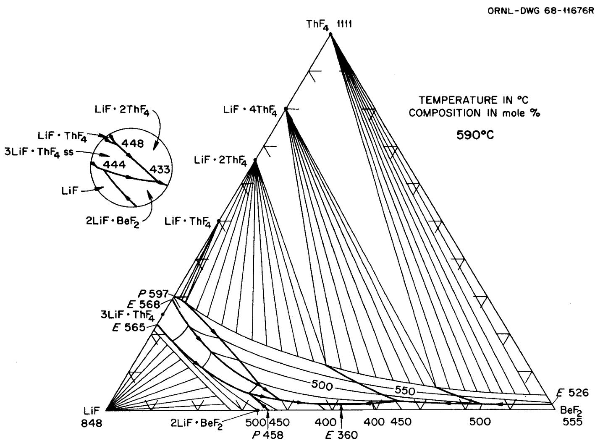  
Fig. 2. Isothermal Section of the System LiF-BeF $_2$ -ThF $_4$ at $590^{\circ}\mathrm{C}$ .

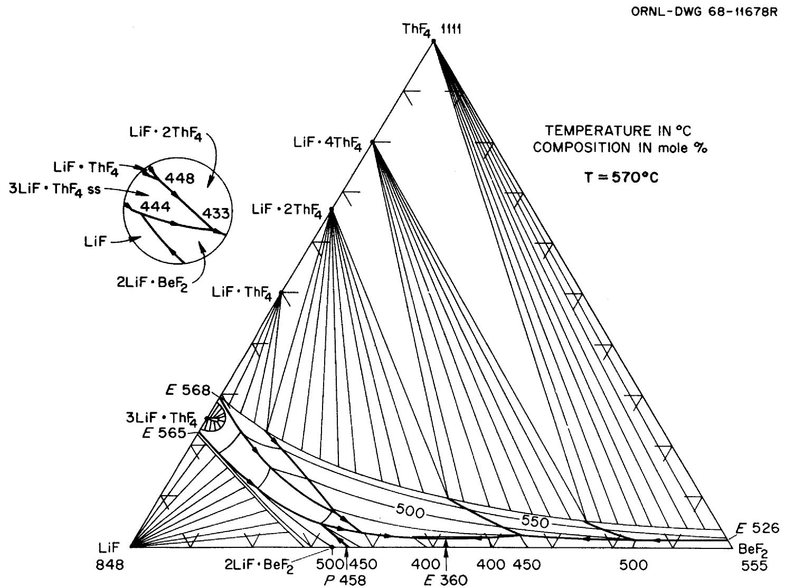  
Fig. 3. Isothermal Section of the System LiF-BeF $_2$ -ThF $_4$ at $570^{\circ}\mathrm{C}$ .

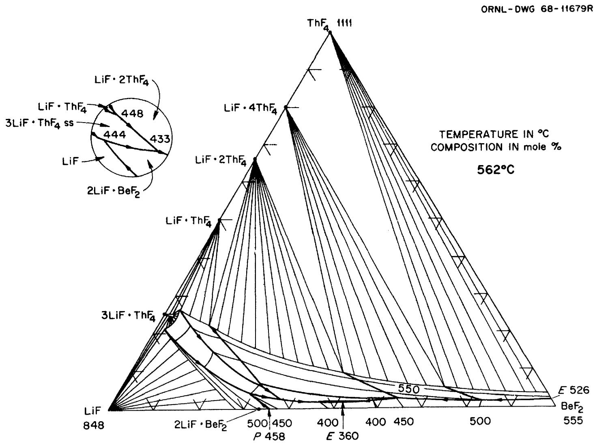  
Fig. 4. Isothermal Section of the System LiF-BeF $_2$ -ThF $_4$ at $562^{\circ}\mathrm{C}$ .

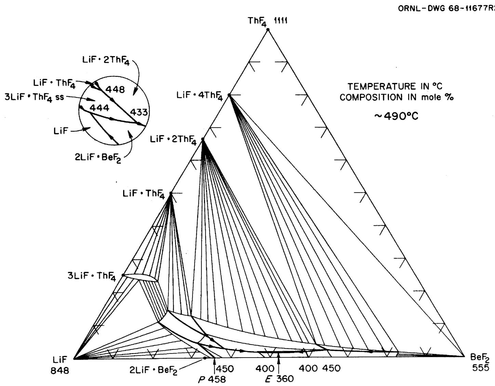  
Fig. 5. Isothermal Section of the System LiF-BeF $_2$ -ThF $_4$ at $490^{\circ}\mathrm{C}$ .

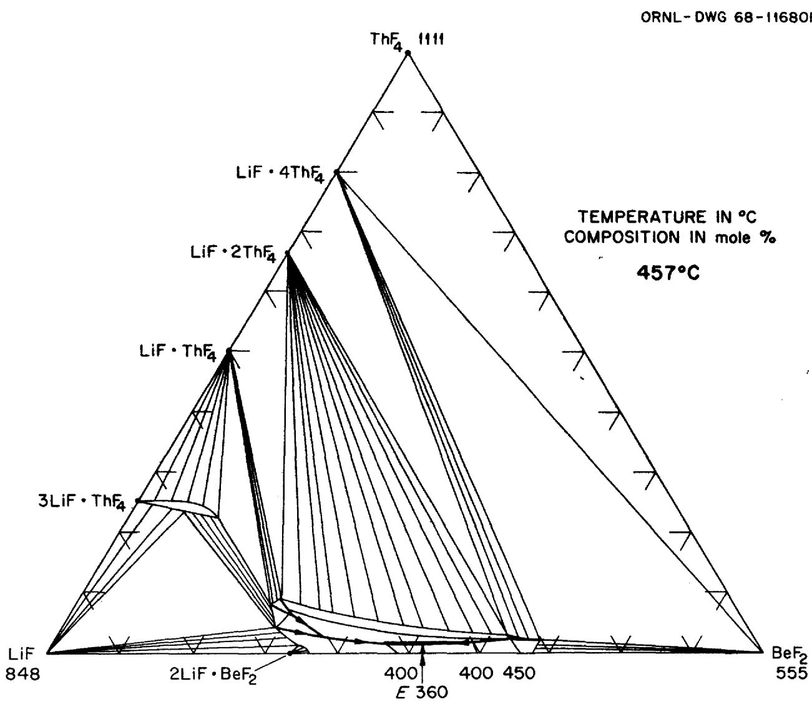  
Fig. 6. Isothermal Section of the System LiF-BeF $_2$ -ThF $_4$ at $457^{\circ}\mathrm{C}$ .

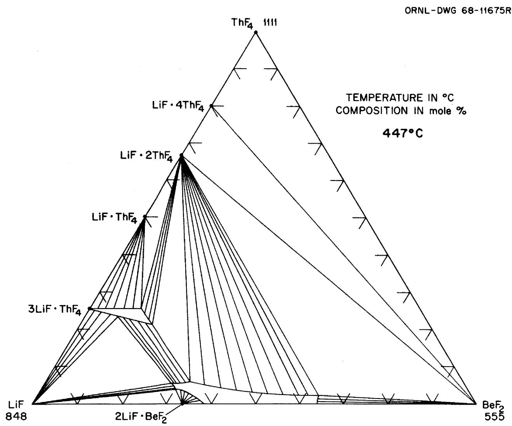  
Fig. 7. Isothermal Section of the System LiF-BeF $_2$ -ThF $_4$ at $447^{\circ}\mathrm{C}$ .

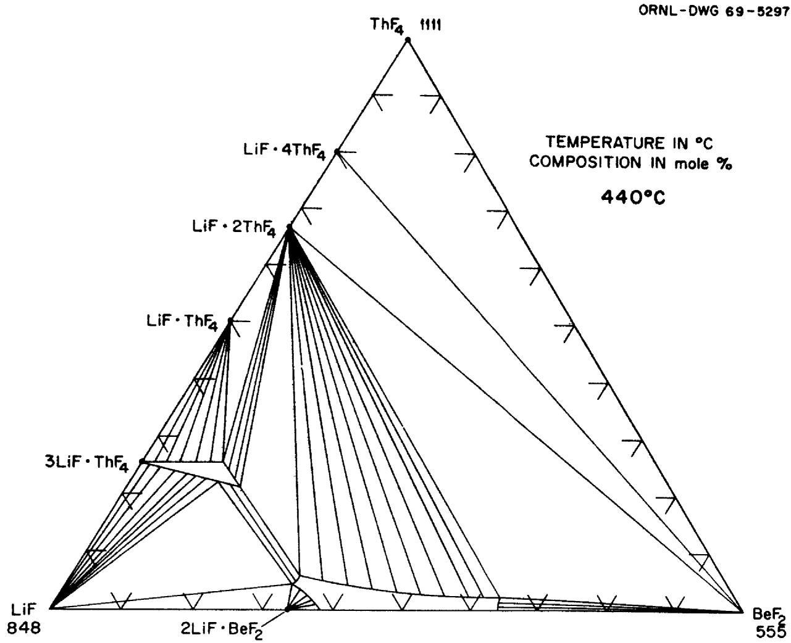  
Fig. 8. Isothermal Section of the System LiF-BeF $_2$ -ThF $_4$ at $440^{\circ}\mathrm{C}$ .

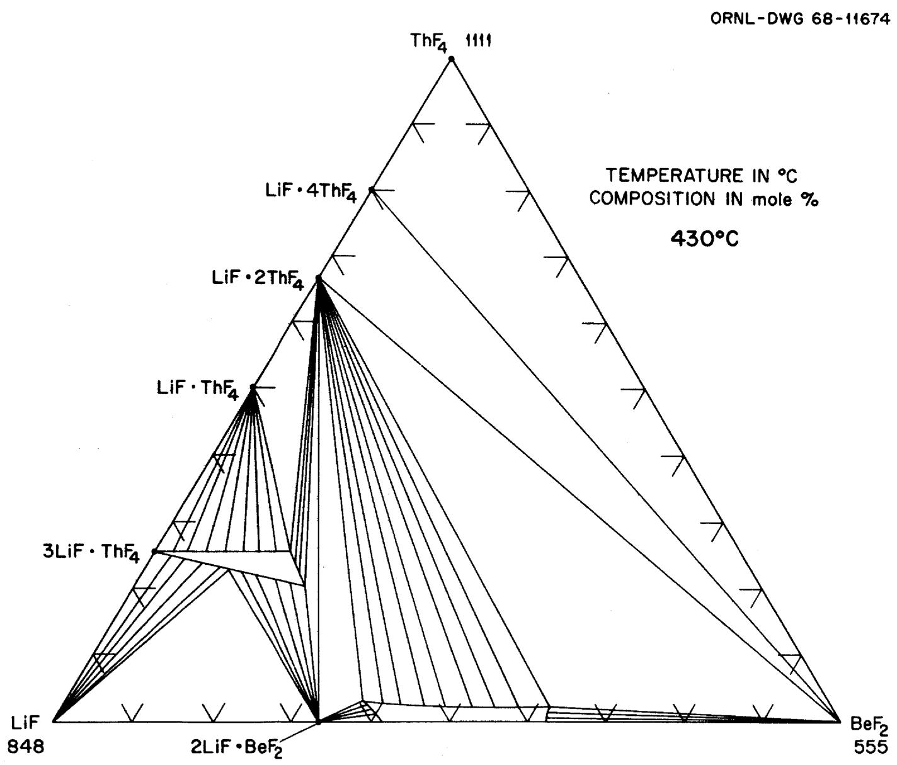  
Fig. 9. Isothermal Section of the System LiF-BeF $_2$ -ThF $_4$ at $430^{\circ}\mathrm{C}$ .

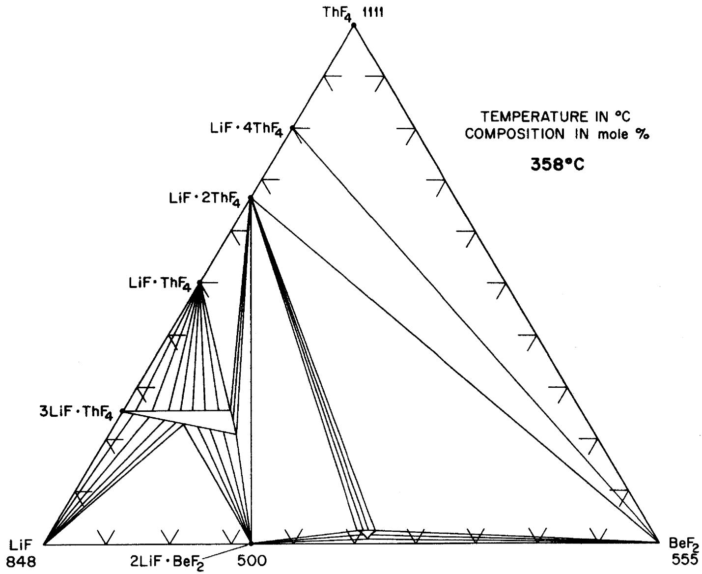  
Fig. 10. Isothermal Section of the System LiF-BeF $_2$ -ThF $_4$ at $430^{\circ}\mathrm{C}$ .

ORNL-DWG 68-11672

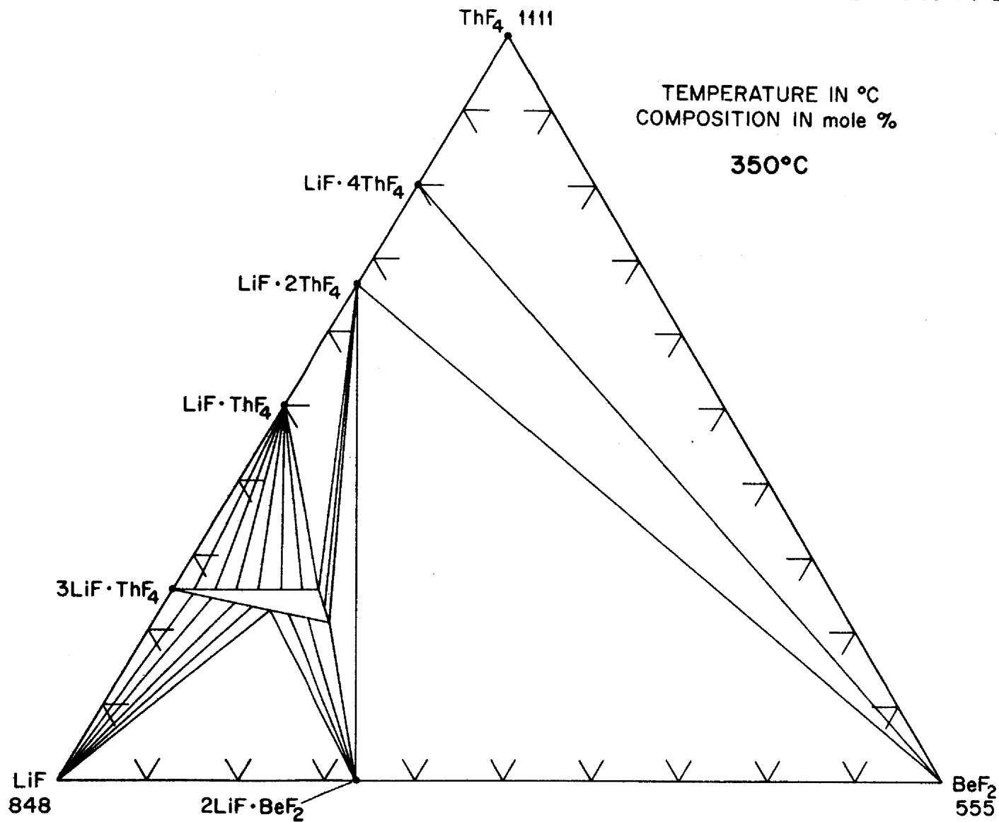  
Fig. 11. Isothermal Section of the System LiF-BeF $_2$ -ThF $_4$ at $350^{\circ}\mathrm{C}$ .

The isothermal sections included in Figs. 2 to ll are drawn to scale and represent the experimental results which were the basis of the previously published phase diagram. Composition-temperature relations in the LiF-BeF $_2$ -ThF $_4$ system for LiF concentrations greater than 50 mole % are shown in detail in Fig. 15.

The straight lines appearing in Figs. 2 to 11 are tie-lines (or "conodes") connecting two phases which are in equilibrium. In Fig. 16, point P, as a point on such a tie-line joining points b and z, represents a mixture of the phases (or compositions) b and z with the mole fraction of b equal to the ratio of line lengths $\frac{zP}{zb}$ .

In the case of a mixture of three phases, such as the points $a$ , $b$ , $c$ making up the total composition at point $P$ (Fig. 16), the relative amounts of the phases $a$ , $b$ , $c$ making up $P$ may be determined as follows, with the three fractions defined as $x$ of $a$ , $y$ of $b$ , $l-x-y$ of $c$ . Then:

(1) Graphically: extend the line $\mathbf{bP}$ to fix the point $\mathbf{z}$ on the line $\mathbf{ac}$ . Then $\mathbf{y} = \mathbf{zP} / \mathbf{zb}$ , and $\mathbf{x} = (\mathbf{zc} / \mathbf{ac})(\mathbf{l - y})$ .   
(2) Analytically: let the fractions of the components $A$ and $B$ at each of the four points $(a, b, c, P)$ be

$$
\begin{array}{c c c c c} A _ {a} & A _ {b} & A _ {c} & A _ {p}, \end{array}
$$

$$
\mathrm {B} _ {\mathrm {a}} \mathrm {B} _ {\mathrm {b}} \mathrm {B} _ {\mathrm {c}} \mathrm {B} _ {\mathrm {p}}.
$$

Then by similar triangles, we have

$$
\frac {\mathrm {B} _ {\mathrm {a}} - \mathrm {B} _ {\mathrm {z}}}{\mathrm {A} _ {\mathrm {a}} - \mathrm {A} _ {\mathrm {z}}} = \frac {\mathrm {B} _ {\mathrm {a}} - \mathrm {B} _ {\mathrm {c}}}{\mathrm {A} _ {\mathrm {a}} - \mathrm {A} _ {\mathrm {c}}} = \alpha
$$

$$
\frac {B _ {b} - B _ {z}}{A _ {b} - A _ {z}} = \frac {B _ {b} - B _ {p}}{A _ {b} - A _ {p}} = \beta
$$

Then $B_{z} = B_{b} - \beta A_{b} + \beta A_{z} = B_{a} - \alpha A_{a} + \alpha A_{z}$

Hence $A_{z} = \frac{(B_{a} - B_{b}) + \beta A_{b} - \alpha A_{a}}{\beta - \alpha}$

$$
B _ {z} = B _ {b} - \beta A _ {b} + \beta (A _ {z}).
$$

Then $y = \frac{B_p - B_z}{B_b - B_z}$

$$
\text {a n d} x = \frac {A _ {z} - A _ {c}}{A _ {a} - A _ {c}} (1 - y).
$$

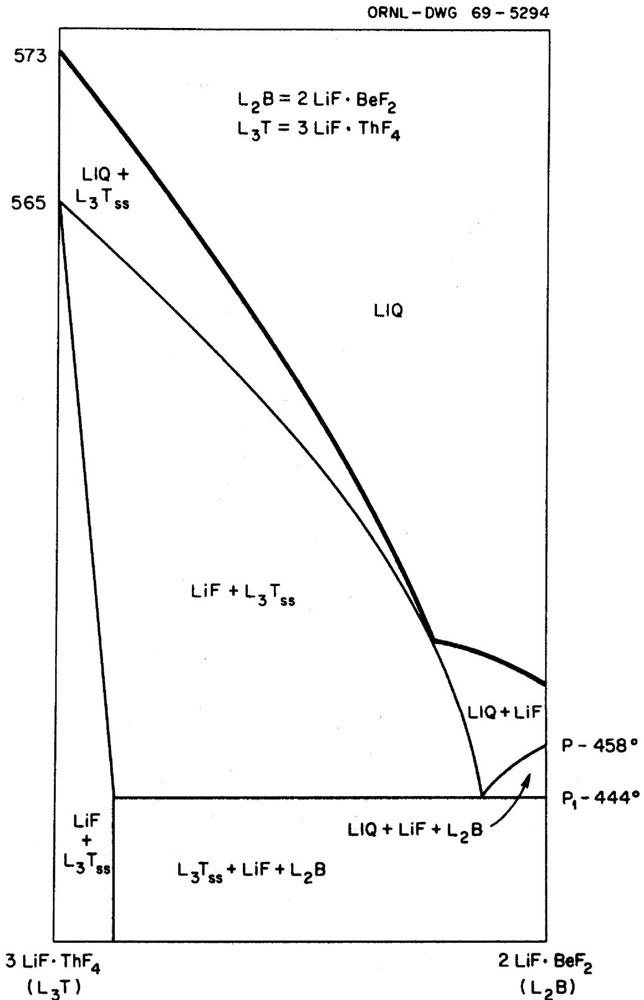  
Fig. 12. The Section 3LiF·ThF₄-2LiF·BeF₂

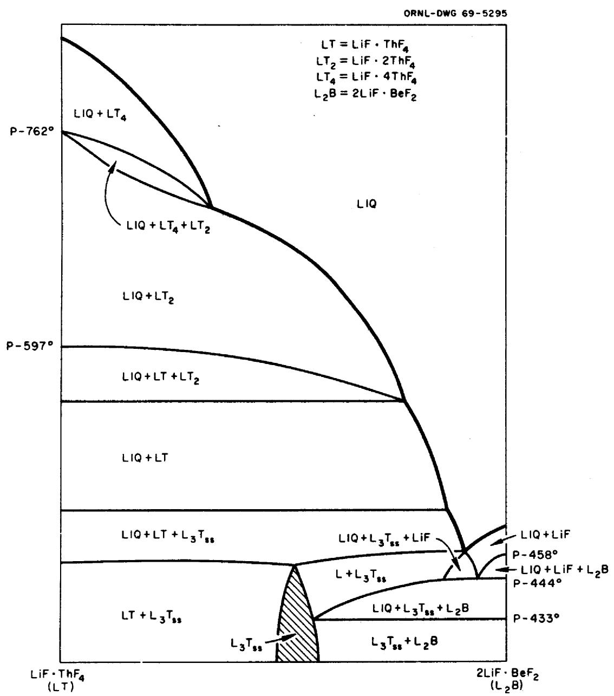  
Fig. 13. The Section LiF·ThF₄-2LiF·BeF₂

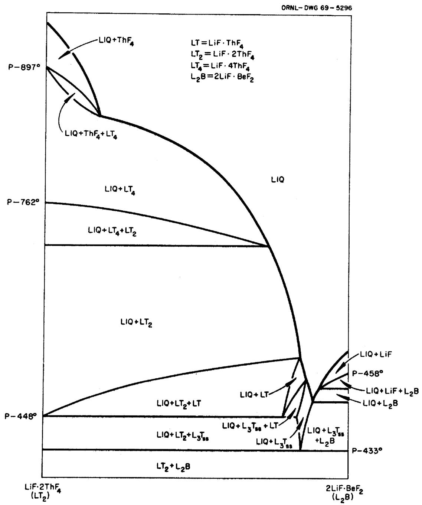  
Fig. 14. The Section LiF-2ThF $_4$ -2LiF-BeF $_2$

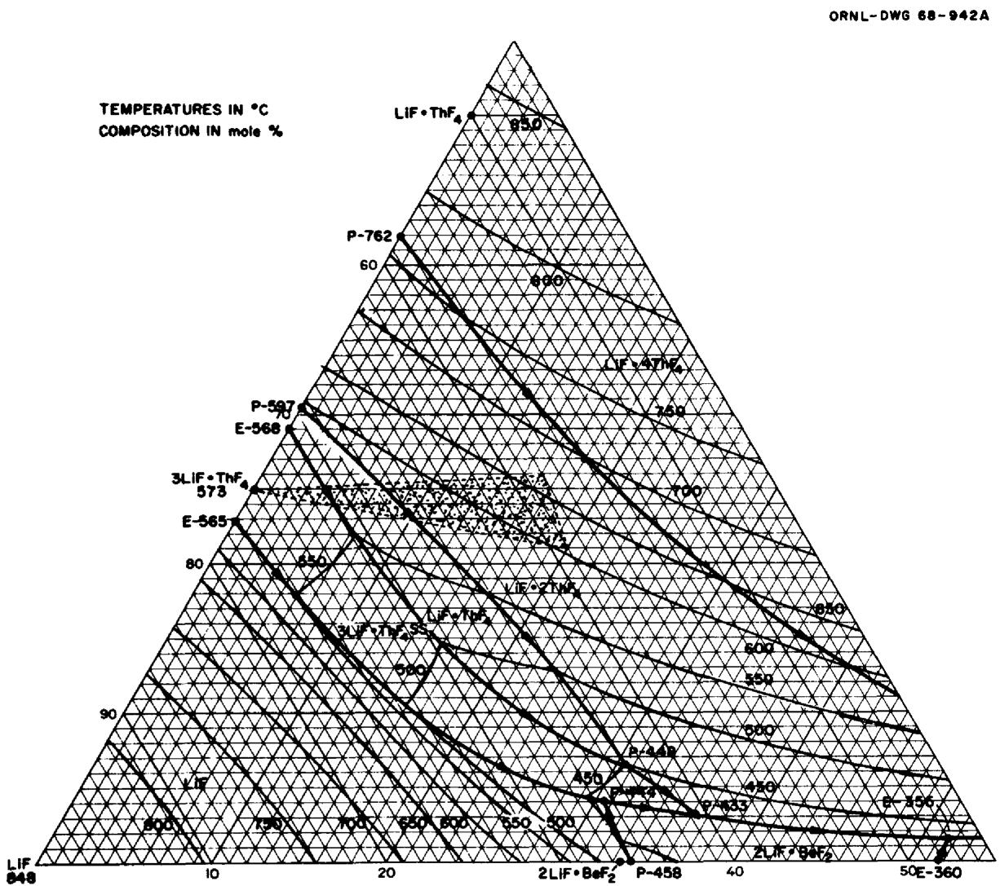  
Fig. 15. Phase Diagram of the LiF-BeF $_2$ -ThF $_4$ System for Compositions 50 - 100 mole % LiF.

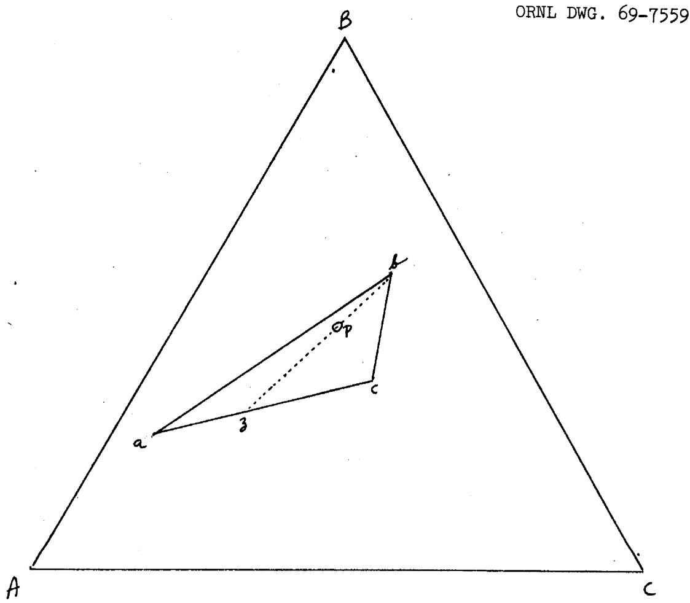  
Fig. 16. Schematic Drawing for Use in Calculating Relative Fractions of Coexisting Phases at Point P.

# POTENTIAL APPLICATION OF FRACTIONAL CRYSTALLIZATION

# IN CHEMICAL REPROCESSING

Under equilibrium conditions, the crystallization end-point in three component systems such as in the LiF-BeF $_2$ -ThF $_4$ system, depends on the "compatibility" or three solid phase triangles of the equilibrium diagram. As an example, compositions in the triangle LiF - 3LiF·ThF $_4$ -2LiF·BeF $_2$ have their crystallization end-point at the $444^{\circ}\mathrm{C}$ peritectic reaction point. As noted previously, dynamic crystallization of LiF-BeF $_2$ -ThF $_4$ mixtures does not follow the equilibrium crystallization diagram exactly; instead, non-equilibrium crystallization proceeds characteristically by sub-cooling (i.e., delayed crystallization under dynamic cooling), and by incomplete recombination of liquid and solid phases at the peritectic reaction points. Thus, liquids are produced from mixtures which are of interest to us, primarily those containing high concentrations of LiF, which are richer in BeF $_2$ than their equilibrium counterparts, and which crystallize as described by the lower melting areas of the phase diagram. The consequence of nonequilibrium fractionation is thus to produce liquid residues which are lower in ThF $_4$ content than at equilibrium.

Let us examine the difference between equilibrium and non-equilibrium crystallization behavior of a liquid composition that would partially typify the reactions of MSBR salts. Suppose the composition c, LiF-BeF $_2$ -ThF $_4$ (63-32-5 mole %), undergoes equilibrium crystallization. On complete solidification, the frozen salt will consist of the three crystalline phases, 3LiF·ThF $_4$ ss, 2LiF·BeF $_2$ and LiF·2ThF $_4$ in proportions given by the position of point c in the corresponding triangle of Figs. 9, 10, and 11.

For non-equilibrium crystallization this triangle has no significance. The non-equilibrium process consists of four consecutive steps, seen on the basis of the following diagram:

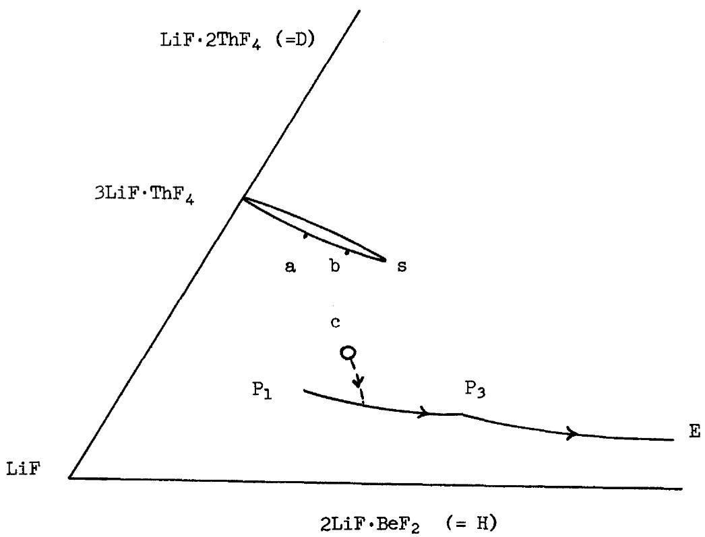

Step (l): freezing starts at $\sim 446^{\circ}\mathrm{C}$ for composition c, and the liquid travels on the solid solution liquidus surface to reach curve $P_{1} - P_{3}$ at some point $\ell$ (at $\sim 440^{\circ}\mathrm{C}$ ), while precipitating some solid solution of composition between a and b, say a' as average.

Step (2): liquid travels on curve $\mathbf{P}_1 - \mathbf{P}_3$ , to reach $\mathbf{P}_3$ ( $433^{\circ} \mathsf{C}$ ), while precipitating a mixture of solid solution (of composition between b and s, say b' as average) and 2LiF·BeF $_2$ .

Step (3): liquid travels on curve $\mathbb{P}_3 - \mathbb{E}$ , to reach $\mathbb{E}(356^0)$ while precipitating mixture of $\mathrm{LiF\cdot 2ThF_4} + 2\mathrm{LiF\cdot BeF_2}$ .

Step (4): liquid at E(356°) freezes to mixture of LiF·2ThF₄ + 2LiF·BeF₂ + BeF₂.

Quantities involved for 1 mole of starting composition c:

Step (1): draw straight line a'c and extend it to curve $\mathbf{P}_1 - \mathbf{P}_3$ , to fix point $\ell$ :

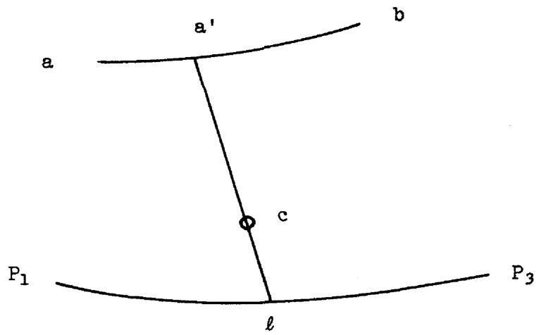

Moles of liquid reaching $\ell = \frac{\mathbf{a}'\mathbf{c}}{\mathbf{a}'\ell} = \mathbf{m}_1;$

Moles of $\mathrm{ThF_4}$ precipitated (in step 1, or between 446 and $440^{0}$ )

$$
= x _ {a}, (1 - m _ {1}) = p _ {1},
$$

in which $x_{a'} =$ mole fraction of $\mathrm{ThF}_4$ at $a'$ , etc.

Step (2): draw straight line $b' - H$ , and extend straight line $\ell P_3$ back to fix point $y$ on line $b' - H$ :

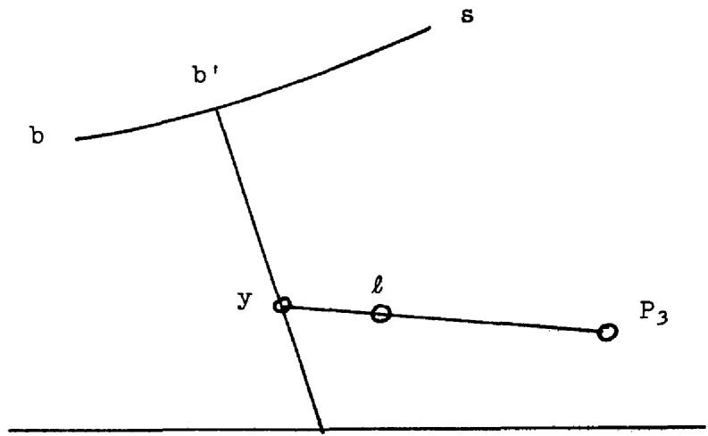  
2L1F·BeF2（=H）

Moles of liquid reaching $P_{3} = \frac{y\ell}{yP_{3}}$ ( $m_{1}$ ) = $m_{2}$ ;

Moles of $\mathrm{ThF_4}$ precipitated (in step 2, or between $440^{\circ}$ and $433^{\circ}$ )

$$
= x _ {b}, \frac {y H}{b ^ {\prime} H} (m _ {1} - m _ {2}) = p _ {2}.
$$

Step (3): draw straight line DH and extend straight line $\mathbf{P}_3\mathbf{E}$ back to fix point $\mathbf{z}$ on the line DH:

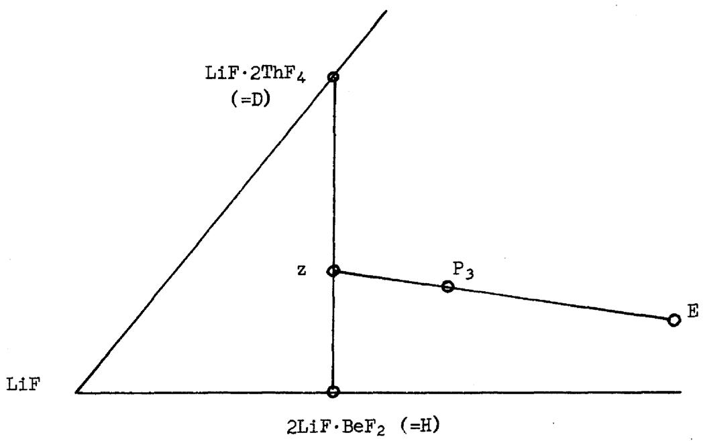

Moles of liquid reaching E = $\frac{zP_3}{zE} (m_2) = m_3$ ;

Moles $\mathrm{ThF}_4$ precipitated (in step 3, or between $433^0$ and $356^{0}$ )

$$
= \frac {2}{3} \left(\frac {\mathrm {z H}}{\mathrm {D H}}\right) (\mathrm {m} _ {2} - \mathrm {m} _ {3}) = \mathrm {p} _ {3},
$$

since $x_{D} = 2 / 3$ .

Step (4): moles $\mathrm{ThF}_4$ precipitated in this step (at $356^0$ )

$$
= x _ {c} - \left(p _ {1} + p _ {2} + p _ {3}\right).
$$

Thus, given the original composition $c$ on the phase diagram as we have it, one can make estimates regarding what happens in steps (1) and (2), and these estimates fix what happens in steps (3) and (4), for the

limit of non-equilibrium behavior. This means a process in which there is never any interaction between precipitated solid and solution. Actual behavior will of course be somewhere between this and the equilibrium process.

Since non-equilibrium fractionation of $\mathsf{LiF - BeF_2 - ThF_4}$ melts produces final liquids which are low in thorium, and since the concentrations of rare earths in the solutions are expected to be about 20 ppm at the time when fuel processing is economically mandatory, one might anticipate that a semi-zone refining step might well produce and transport liquids of low thorium concentration and containing a relatively high concentration of rare earths (the solubility of the lanthanide trifluorides in any of the melts one might encounter is almost certainly to be at least 200 ppm at the low temperatures which would be present in this part of the feeder apparatus). The efficiency of this concentration step could possibly be impaired seriously if the rare earth trifluorides either formed intermediate compounds (such compounds are formed only for the lanthanides of $\geq 63$ ) which interacted with the crystallizing phases or otherwise formed solid solutions with any of the crystallizing phases. The structure of $2\mathsf{LiF} \cdot \mathsf{BeF}_2^8$ and $\mathsf{LiF} \cdot \mathsf{ThF}_4^9$ are known and believed to be incapable of serving as solid state hosts for the rare earth fluorides. The $3\mathsf{LiF} \cdot \mathsf{ThF}_4$ solid solution is an unknown factor in this consideration and could conceivably act as a solvent for lanthanide ions. This possibility as well as the possibility that $\mathsf{LiF} \cdot 2\mathsf{ThF}_4$ might also serve as a solid state solvent for lanthanide ions could be examined easily through a small scale laboratory program.

1. Consultant, Department of Chemistry, New York University, University Heights, New York.   
2. M. E. Whatley et al., Nuclear Applications, (in press).   
3. J. H. Shaffer and D. M. Moulton, Reductive Extraction Processing of MSBR Fuels, in Reactor Chemistry Division Annual Report for Period Ending February 28, 1968, ORNL-4396.   
4. R. E. Thoma, H. Insley, H. A. Friedman, and C. F. Weaver, J. Phys. Chem. 64, 865 (1960).   
5. J. E. Ricci, Guide to the Phase Diagrams of the Fluoride Systems, ORNL-2396, 1958.   
6. G. D. Brunton, ORNL, Unpublished work, 1969.   
7. C. F. Weaver, R. E. Thoma, H. Insley, and H. A. Friedman, Phase Equilibria in Molten Salt Breeder Reactor Fuels, I. The System LiF-BeF $_2$ -UF $_4$ -ThF $_4$ , ORNL-2896, December, 1960.   
8. J. H. Burns and E. K. Gordon, Acta Cryst. 20, 135 (1966).   
9. G. D. Brunton, 21, 814 (1964).

# DISTRIBUTION

1. R. K. Adams

2. G. M. Adamson

3. R.G. Affel

4. J. L. Anderson

5. R.F.Apple

6. C. F. Baes

7. J.M.Baker

8. S.J.Ball

9. C. E. Bamberger

10. C. J. Barton

11. H. F. Bauman

12. S.E.Beall

13. R. L. Beatty

14. M. J. Bell

15. M. Bender

16. C. E. Bettis

17. E. S. Bettis

18. D. S. Billington

19. R. E. Blanco

20. F. F. Blankenship

21. J. O. Blomeke

22. R. Blumberg

23. E. G. Bohlmann

24. C. J. Borkowski

25. G. E. Boyd

26. J. Braunstein

27. M. A. Bredig

28. R. B. Briggs

29. H. R. Bronstein

30. G. D. Brunton

31. D. A. Canonico

32. S. Cantor

33. D. W. Cardwell

34. W. L. Carter

35. G. I. Cathers

36. J. E. Caton

37. O. B. Cavin

38. J. M. Chandler

39. F. H. Clark

40. W. R. Cobb

41. H. E. Cochran

42. C. W. Collins

43. E. L. Compere

44. K. V. Cook

45. W.H.Cook

46. J. W. Cooke

47. L. T. Corbin

48. B. Cox

49. J. L. Crowley

50. F. L. Culler

51. D. R. Cuneo

52. J.M.Dale

53. D. G. Davis

54. R. J. DeBakker

55. J.H.DeVan

56. S.J.Ditto

57. A. S. Dworkin

58. I. T. Dudley

59. W. P. Eatherly

60. J. R. Engel

61. E. P. Epler

62. D. E. Ferguson

63. L. M. Ferris

64. A. P. Fraas

65. J. K. Franzreb

66. H. A. Friedman

67. D. N. Fry

68. J. H. Frye, Jr.

69. W. K. Furlong

70. C. H. Gabbard

71. R. B. Gallaher

72. R. E. Gehlbach

73. J. H. Gibbons

74. L. O. Gilpatrick

75. W. R. Grimes

76. A. G. Grindell

77. R. W. Gunkel

78. R. H. Guymon

79. J. P. Hammond

80. B. A. Hannaford

81. P. H. Harley

82. D. G. Harman

83. W. O. Harms

84. C. S. Harrill

85. P. N. Haubenreich

86. G. M. Hebert

87. R.E.Helms

88. P. G. Herndon

89. D. N. Hess

90. J. R. Hightower

91. M. R. Hill

92. H. W. Hoffman

93. D. K. Holmes

94. P. P. Holz

95. R. W. Horton

96. A. Houtzeel

97. T. L. Hudson

98. W.R.Huntley

# DISTRIBUTION

99. H. Inouye   
100. W.H.Jordan   
101. P. R. Kasten   
102. R.J.Kedl   
103. M. T. Kelley   
104. M. J. Kelley   
105. C. R. Kennedy   
106. T. W. Kerlin   
107. H. T. Kerr   
108. J.J. Keyes   
109. D. V. Kiplinger   
110. S. S. Kirslis   
111. J. W. Koger   
112. R. B. Korsmeyer   
113. A. I. Krakoviak   
114. T. S. Kress   
115. J. W. Krewson   
116. C. E. Lamb   
117. J. A. Lane   
118. J. J. Lawrence   
119. M. S. Lin   
120. R.B.Lindauer   
121. A. P. Litman   
122. E. L. Long   
123. A. L. Lotts   
124. M. I. Lundin   
125. R.N.Lyon   
126. R. L. Macklin   
127. H.G. MacPherson   
128. R.E. MacPherson   
129. J. C. Mailen   
130. D. L. Manning   
131. C. D. Martin   
132. W.R.Martin   
133. H. V. Mateer   
134. C. Matthews   
135. T. H. Mauney   
136. R.W.McClung   
137. H.E.McCoy   
138. D. L. McElroy   
139. C. K. McGlothlan   
140. C.J.McHargue   
141. H. A. McLain   
142. L. E. McNeese   
143. J. R. McWherter   
144. H. J. Metz   
145. A. S. Meyer   
146. R. L. Moore   
147. D.M. Moulton

148. T. R. Mueller   
149. H. H. Nichol   
150. J. P. Nichols   
151. E. L. Nicholson   
152. L.C.Oakes   
153. P. Patriarca   
154. A.M.Perry   
155. T. W. Pickel   
156. H. B. Piper   
157. B. E. Prince   
158. G. L. Ragan   
159. J. L. Redford   
160. M. Richardson   
161. G. D. Robbins   
162. R. C. Robertson   
163. W. C. Robinson   
164. K. A. Romberger

165-167. M. W. Rosenthal   
168. R. G. Ross   
169. H. C. Savage   
170. W.F. Schaffer   
171. C. E. Schilling   
172. Dunlap Scott   
173. J. L. Scott   
174. H. E. Seagren   
175. C. E. Sessions   
176. J.H.Shaffer   
177. W.H. Sides   
178. M. J. Skinner   
179. G.M.Slaughter   
180. A. N. Smith   
181. F.J. Smith   
182. G.P. Smith   
183. O.L. Smith   
184. P. G. Smith   
185. I. Spiewak   
186. R.C.Steffy   
187. H. H. Stone   
188. R. A. Strehlow   
189. J. R. Tallackson   
190. E. H. Taylor   
191. W. Terry   
192-201. R.E.Thoma   
202. P. F. Thomason   
203. L. M. Toth   
204. D. B. Trauger   
205. W.E.Unger   
206. G.M. Watson   
207. J. S. Watson

# DISTRIBUTION

208. H. L. Watts

209. C. F. Weaver

210. B. H. Webster

211. A. M. Weinberg

212. J. R. Weir

213. W.J.Werner

214. K. W. West

215. M. E. Whatley

216. J. C. White

217. R. P. Wichner

218. L. V. Wilson

219. Gale Young

220. H. C. Young

221. J. P. Young

222. E. L. Youngblood

223. F. C. Zapp

224-225. Central Research Library

226-227. Document Reference Section

228-230. Laboratory Records

231. Laboratory Records (LRD-RC)

# EXTERNAL DISTRIBUTION

232. C. B. Deering, AEC-OSR

233. A. Giambusso, AEC-Washington

234-235. T. W. McIntosh, AEC-Washington

236. H.M.Roth, AEC-ORO

237. M. Shaw, AEC-Washington

238. W. L. Smalley, AEC-ORO

239-253. Division of Technical Information Extension (DTIE)