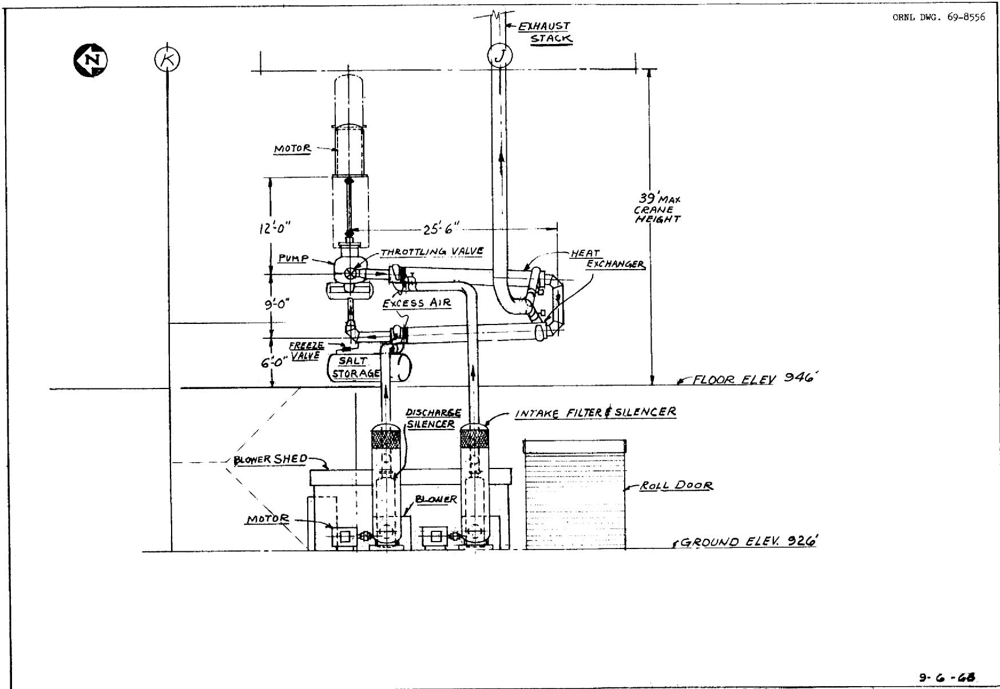
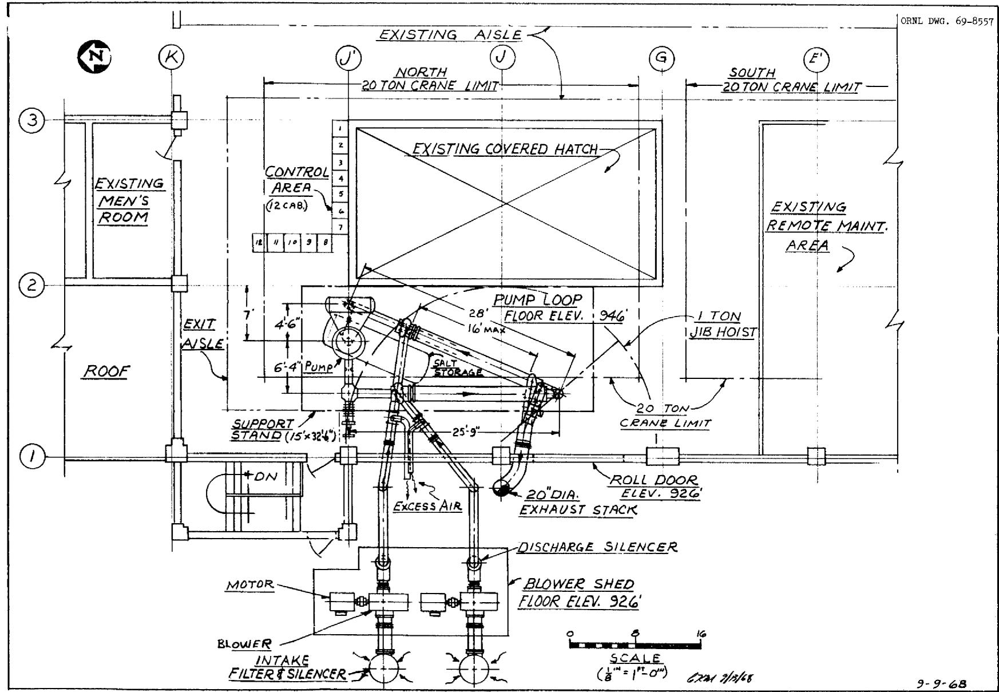
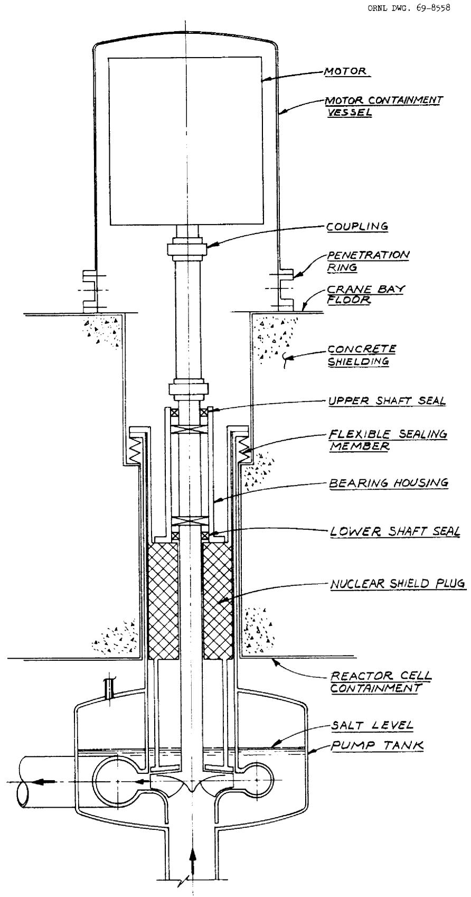
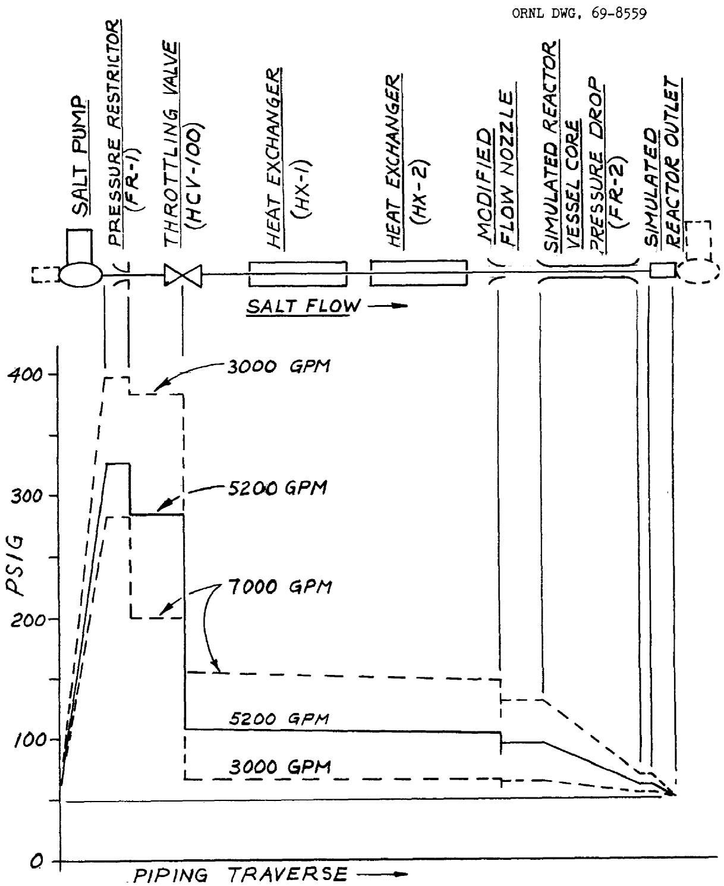
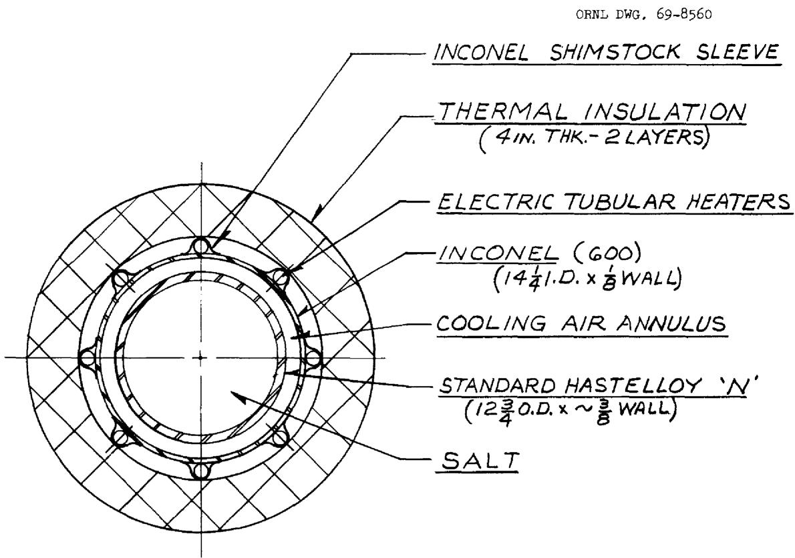
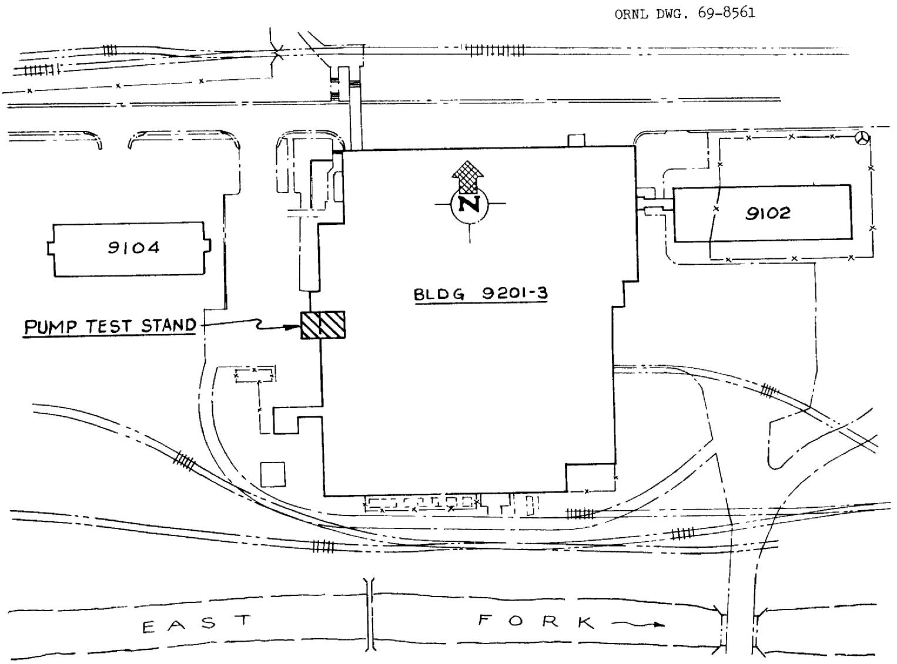
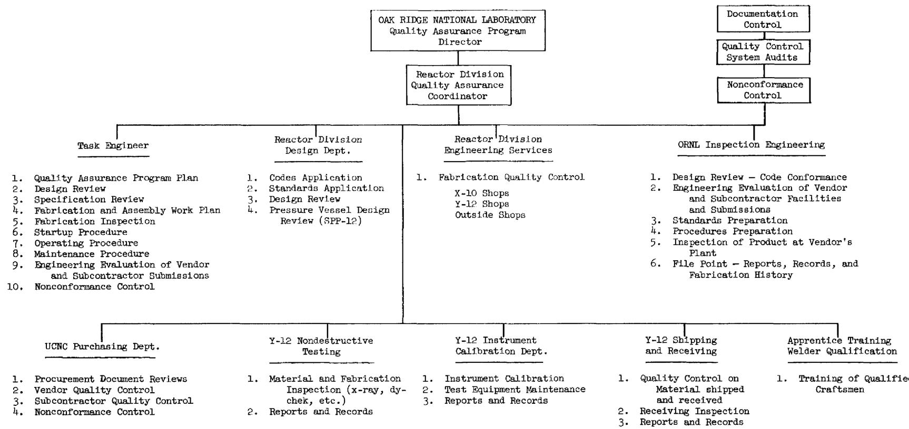
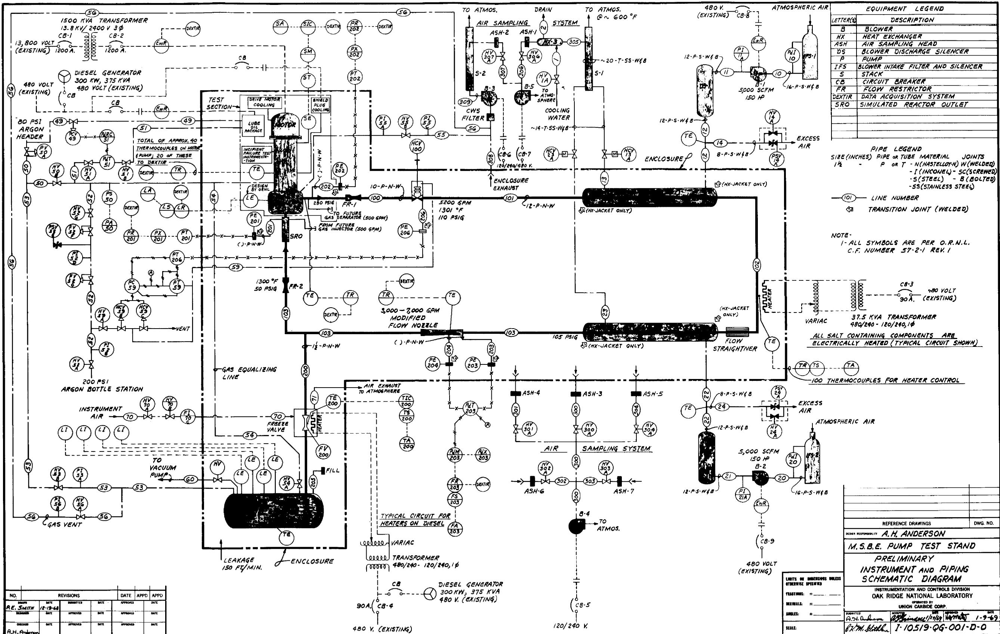

# LEGAL NOTICE

This report was prepared as an account of Government sponsored work. Neither the United States, nor the Commission, nor any person acting on behalf of the Commission:

The use of any information, apparatus, method, or process disclosed in this report may not infringe  
privately owned rights; or

B. Assumes any liabilities with respect to the use of, or for damages resulting from the use of any information, apparatus, method, or process disclosed in this report. As used in the above, "person acting on behalf of the

employee or contractor of the Commission, or an employee of such contractor, to the extent that a disseminating, or provides access to, any information pursuant to his employment or contract with the Commission, or his employment with such contractor.

ORNL-TM-2643

Contract No. W-7405-eng-26

REACTOR DIVISION

CONCEPTUAL SYSTEM DESIGN DESCRIPTION

of the

SALT PUMP TEST STAND

for the

Molten Salt Breeder Experiment

A. G. Grindell

C. K. McGlothlan

AUGUST 1969

OAK RIDGE NATIONAL LABORATORY

Oak Ridge, Tennessee

Operated by

UNION CARBIDE CORPORATION

for the

U.S. ATOMIC ENERGY COMMISSION

# Contents

# Page

List of Figures vii

List of Tables viii

List of Contributors ix

Abstract X

1.0 Introduction 1

1.1 System Function 1

1.2 Summary Description of the System 5

1.2.1 Salt Circulating System 5

1.2.2 Heat Removal System 6

1.2.3 Utility Systems 6

1.2.4 Instrumentation and Controls 6

1.2.5 Safety Features 7

1.3 System Design Requirements 7

1.3.1 Function 7

1.3.2 Pump Size 7

1.3.3 Allowable Stress for Ni-Mo-Cr Alloy 8

1.3.4 Instrumentation and Controls 8

1.3.5 Engineered Safety Features 8

1.3.6 Control of Effluents 9

1.3.7 Quality Standards and Assurance 9

1.3.8 Test Stand Parameters 9

1.3.9 Thermal Transients 10

1.3.l0 Codes and Standards 11

2.0 Detailed Description of System 11

2.1 Test Section 11

2.2 Salt System 12

2.2.1 Function 12

2.2.2 Description 12

2.2.2.1 Salt Piping 12

2.2.2.2 Salt Storage Tank and Transfer Line 14

2.2.2.3 Salt Selection 15

2.2.2.4 Material for Construction 15

2.2.2.5 Electric Heaters 15

2.3 Heat Removal System 18

2.3.1 Function 18   
2.3.2 Description 18   
2.3.2.1 Heat Exchangers 18   
2.3.2.2 Blowers 21

2.4 Utility Systems 22

2.4.1 Inert Gas 22   
2.4.2 Instrument Air 22   
2.4.3 Electrical 22

2.4.3.1 2400 Volt System 22   
2.4.3.2 480/240/120 Volt System 23

2.5 Site Location 23   
2.6 Instrumentation and Controls 25

2.6.1 Temperature Measurement and Control 25   
2.6.2 Pressure Measurement and Control 25   
2.6.3 Flow Measurement 26   
2.6.4 Level Measurement 26   
2.6.5 Alarms and Interlocks 26   
2.6.6 Data Acquisition Computer System 27

3.0 Principles of Operation 28

3.1 Startup 28   
3.2 Test Operation 29

3.2.1 Prototype Pump 29   
3.2.2 ETU and MSBE Pumps 30

3.3 Shutdown 30   
3.4 Special or Infrequent Operation 31   
3.5 Equipment Safety 31

4.0 Saftey Precautions 33

4.1 Lost of Normal Electrical Power 33   
4.2 Incorrect Operating Procedure 33   
4.3 Leak or Rupture in Salt Containing Piping and Equipment 34

5.0 Maintenance 35

5.1 Maintenance Philosophy 35   
5.2 Preventive Maintenance 35

6.0 Standards and Quality Assurance 36

6.1 Codes and Standards 36

6.1.1 Design 36   
6.1.2 Materials 36   
6.1.3 Fabrication and Installation 36   
6.1.4 Operations 36

6.2 Quality Assurance 37   
6.3 Quality Assurance Program 37   
6.4 Quality Assurance Organization 39   
6.5 Quality Assurance Planning 39

6.5.1 Fabrication and Assembly Work Plan 39   
6.5.2 Quality Assurance Program Plan 39   
6.5.3 Evaluation of Updating of Plans 40

6.6 Quality Assurance Requirements 40

6.6.1 Document Understanding 40   
6.6.2 Document Control 41   
6.6.3 Records 41   
6.6.4 Audit 42

6.7 Quality Control Requirements 42

6.7.1 Off-Site Inspection Procedures 42   
6.7.2 Nonconformance Control 43   
6.7.3 Interface Control 43   
6.7.4 Inspection and Test Equipment 43   
6.7.5 Special Precautions 43   
6.7.6 Corrective Action and Feedback 44   
6.7.7 Procedures Relating to System Operation 44

# APPENDICES

A Applicable Specifications, Standards, and Other Publications 46   
B Pipe Line Schedule 48

Page

C Valve List 50   
D Instrument and Piping Schematic Diagram 51

# List of Figures

# Figure

1 Pump Test Stand, Elevation View 2   
2 Pump Test Stand, Plan View 3   
3 MSBE Primary Salt Pump, Conceptual Configuration 4   
4 Pump Test Stand Salt Piping, Pressure Profile 13   
5 Pump Test Stand, Typical Section of Heat Exchanger 20   
6 Pump Test Stand, Site Location 24   
7 Quality Assurance Program Organization 38

# List of Tables

# Table

# Page

1 MSBE Pump Design Requirements 8   
2 MSBE Reactor Design Parameters Pertinent to Salt Pumps 9   
3 Salt Pump Test Stand Design Requirements 10   
4 Composition and Properties of Tentative MSBE Primary Salt 16   
5 Composition and Properties of Tentative MSBE Secondary Salt 16   
6 Composition and Properties of Ni-Cr-Mo Alloy 17   
7 Parameters and Variables for Pump Test Stand Heat Removal 19 System   
8 Data for Main Blowers, Heat Removal System 21   
9 Alarms, Emergencies, and Safety Actions for Salt Pump Test 32 Stand

# List of Contributors

The Oak Ridge National Laboratory contributors to this report include:

A. H. Anderson   
A. G. Grindell   
R. F. Hyland   
R. E. MacPherson   
C. K. McGlothlan   
H. J. Metz   
P. G. Smith   
R. D. Stulting

# Abstract

A stand is required to test the salt pumps for the Molten Salt Breeder Experiment (MSBE). It will be designed to accommodate pumps having capacities ranging from 3000 to 7000 gpm and operating with salt of specific gravities to 3.5 at discharge pressures to 400 psig and temperatures to $1300^{\circ}\mathrm{F}$ normally and to $1400^{\circ}\mathrm{F}$ for short periods of time. Both the drive motor electrical supply and the heat removal system for the loop will be designed for 1500 hp. Preventive measures to protect personnel and equipment from the deleterious effects of a salt leak will be taken.

The primary and secondary salt pumps for the MSBE will be operated in the stand using a depleted uranium, natural lithium fluoride salt to simulate the MSBE primary salt. A prototype salt pump, procured from the U.S. pump industry, will be subjected at representative operating conditions to performance and endurance testing of its hydraulic, mechanical, and electrical design features. The MSBE salt pump rotary elements will be subjected to hot shakedown testing in the stand to provide final confirmation of performance prior to installation in the reactor system. The Xenon-removal device and molten salt instrumentation to measure pressure, flow, liquid level, etc. will be tested at design conditions in molten salt as they become available, and the stand will be modified, as required, to accommodate these tests.

The conceptual design of the test stand is presented. The description, function, and design requirements for components and subsystems are provided. The principles of operation of the test stand and the safety precautions are discussed. The maintenance philosophy is described and the quality assurance program is outlined.

Keywords: pump, molten salt pump, high temperature pump, pump test stand, component development, molten salt reactor, nuclear reactor, prototype pump, primary salt pump, coolant salt pump.

# 1.1 System Function

Reliable salt pumps are necessary to the satisfactory operation of the Molten Salt Breeder Experiment (MSBE), and efforts to obtain them will include operating the salt pump with molten salt in a test stand to prove performance and endurance characteristics.

The salt pump test stand, shown schematically in Figs. 1 and 2, will be utilized to provide design evaluation and endurance testing in moltensalt at essentially isothermal test conditions of a prototype primary fuel salt pump for the MSBE and to prooftest the primary and secondary salt pumps for the Engineering Test Unit (ETU) and the MSBE. The salt circulating system will be designed to contain the maximum pump discharge pressure of 400 psig at $1300^{\circ}\mathrm{F}$ and for short periods of time at $1400^{\circ}\mathrm{F}$ . The salt flow can be varied from 3000 to 7000 gpm. This document discusses the salt pump test stand.

Figure 3 presents a practical configuration for the MSBE primary salt pump. We presently envision that the hydraulic designs of the primary and secondary salt pumps will be very similar if not identical. The similarities in thermal transport properties of the two salts and in the hydraulic requirements of the primary and secondary salt systems support this approach. The use of similar hydraulic designs permits the developmental testing of both salt pumps in this single test stand with one test salt. The salt pumps, described briefly in Sect. 2.1, Test Section, will be obtained from the United States pump industry and installed into the test stand in sequence. The design and procurement of these pumps, and their drive motors and auxiliary equipment, are not parts of this salt pump test stand activity, but all these activities will be coordinated.

The primary salt pump is expected to be located at the reactor core outlet in the MSBE and thus will operate in the highest temperature salt, approximately $1300^{\circ}\mathrm{F}$ , in the primary salt system. The secondary salt pump will be located at the outlet of the intermediate heat exchanger and thus will operate in the highest temperature salt, approximately $1150^{\circ}\mathrm{F}$ ,

  
Fig. 1. Pump Test Stand, Elevation View.

  
Fig. 2. Pump Test Stand, Plan View.

  
Fig. 3. MSBE Primary Salt Pump, Conceptual Configuration.

in the secondary salt system. The primary salt pump tank will be located in an oven, which will enclose the primary system, and portions of the pump will be subjected to a high ambient temperature, estimated to be $1100^{\circ}\mathrm{F}$ . In addition, it will be subjected to intense nuclear radiation from components in the primary system, the circulating fuel in the pump tank, and from gas-borne fission products in the pump tank gas space.

The prototype MSBE primary salt pump will be operated in the test stand in molten salt over the full range of MSBE conditions of temperature, pressure, flow, and speed to prove the mechanical, structural, and hydraulic designs of the pump and to provide cavitation inception characteristics at design and off-design operating conditions. However, no attempt will be made to simulate all features of the high-temperature oven or to impose nuclear radiation on components in the test stand.

Rotary elements of the primary and secondary salt pumps of the ETU and the MSBE will be subjected to a high temperature, non-nuclear proof-test in the test stand in molten salt prior to installation into their respective systems. At other times the stand will be used to subject the prototype pump to endurance operation in molten salt. It is important to the economy of the MSBE program to demonstrate that the pump has the capability for uninterrupted operation in molten salt for periods of one year and longer. Subsequently, the stand will be used to study unanticipated problems that may arise during the operation of the ETU and the MSBE. The proposed test program is discussed in Sect. 3.2.

# 1.2 Summary Description of the System

# 1.2.1 Salt Circulating System

Figure 1 presents the approximate configurational relationship of the principal components of the test stand. The stand will be located in Building 9201-3, Y-12 Area of Oak Ridge Operations.

The salt circulating system consists of the circulating pump (test section), a throttling valve, two salt-to-air heat exchangers, and the connecting piping. It provides a closed piping loop for the molten salt from the pump discharge to the pump suction. A salt storage tank is provided to contain the quantity of salt necessary to fill the circulating

system. It is connected to the circulating system by a pipe containing a freeze valve. All salt containing components will be constructed of nickel-molybdenum-chromium (Ni-Mo-Cr) alloy. Electric heaters capable of heating the salt system to $1300^{\circ}\mathrm{F}$ will be provided. Thermal insulation will be installed on the system as appropriate.

# 1.2.2 Heat Removal System

The heat removal system consists of two salt to air concentric pipe heat exchangers, two positive displacement air blowers, an exhaust stack, connecting ducting, controls and noise abatement equipment. The function of this system is to remove the pump power that is dissipated as heat in the circulating salt.

# 1.2.3 Utility Systems

Necessary utility systems will be installed. An inert cover gas system is provided to protect the salt from contact with moisture and oxidizing atmospheres and, if needed, to suppress pump cavitation. Instrument air from an existing system will be used to cool the freeze valve and to operate instruments.

A 2400 volt electrical distribution system will be installed to connect the existing electrical supply in the building to the salt pump drive motor. The existing 480 volt system will be used to supply power to the heater, blower motors, and auxiliary equipment. An existing building emergency diesel generator will be used to supply certain functions when normal power is lost.

# 1.2.4 Instrumentation and Controls

The instrumentation and controls required to monitor and regulate such test parameters as salt pump flow, salt temperature, pressure, and level will be supplied. Salt flow will be regulated with a throttling valve and measured with a modified flow nozzle. Temperature will be measured with stainless steel sheathed Chromel-Alumel thermocouples. NaK-sealed high-temperature transmitters will be used to measure circulating salt pressures. Salt level in the storage tank will be determined by four on-off probes inserted at different levels in the tank.

An existing Beckman DEXTIR data acquisition system will be used to log the more important salt temperatures and pressures and the pump salt flow, power, and speed.

Other test stand temperatures and pressures will be monitored and controlled with conventional equipment.

# 1.2.5 Safety Features

The test stand will be enclosed in a sheetmetal structure which will cover the top and sides and will have pans to catch salt spills and leaks. The enclosure will be provided with a ventilation system.

# 1.3 System Design Requirements

Criteria have been established to obtain a test stand that will provide maximum performance and endurance information for the MSBE salt pumps in a safe and economical manner. The criteria include:

# 1.3.1 Function

The pump test stand will be designed to (1) accommodate full-size salt pumps for the MSBE primary or secondary systems, (2) provide a non-nuclear test environment, and (3) yield performance and endurance data to assure maximum capability and reliability of the pumps in the MSBE.

# 1.3.2 Pump Size

The design of the test stand is centered on the pump sizes required for a 200 Mw(t) MSBE, as shown in Table 1. However, with minor modifications, it will be capable of accommodating pumps ranging in flow capacity from $50\%$ smaller to $50\%$ larger than the MSBE pumps. The heat removal, salt flow, and electric power capabilities will be oversized to provide this flexibility. Adequate structural allowances will also be provided to obtain this flexibility.

Table 1. MSBE Pump Design Requirements   

<table><tr><td></td><td>Operating Temp. (°F)</td><td>Flow (gpm)</td><td>Head (ft)</td><td>Pumping Efficiency (%)</td><td>Motor Size (hp)</td><td>Cover Gas Pressure (psig)</td></tr><tr><td>Primary Salt Pump</td><td>1300</td><td>5700*</td><td>150</td><td>80</td><td>1000</td><td>~50</td></tr><tr><td>Secondary Salt Pump</td><td>1150</td><td>7000</td><td>300</td><td>80</td><td>900</td><td>~150</td></tr></table>

*Includes 500 gpm bypass flow through gas separator.

# 1.3.3 Allowable Stress for Ni-Mo-Cr Alloy

The allowable design stress for high temperature operation of the alloy will be based on the creep rate criterion, $0.1\%$ elongation in 10,000 hr, at the design temperature. See Table 6.

# 1.3.4 Instrumentation and Controls

Instrumentation and controls will be provided to monitor test stand operation, to maintain test parameters within prescribed ranges, and to obtain required pump test data. A control area will be provided from which safe operation of the test stand can be maintained.

# 1.3.5 Engineered Safety Features

Engineered safety features will be provided. As a minimum, they will be designed to cope with any size pressure boundary break, up to and including the circumferential rupture of any pipe in the test stand with unobstructed discharge from both ends.

An independent emergency power system will be provided, designed with adequate capacity and testability to insure the functioning of all engineered safety features.

The containment design basis is to contain the pressure and temperature resulting from the largest credible energy release following an accident without exceeding the design salt vapor leakage rate. Appropriate features will be provided to protect personnel in case of an accidental rupture.

# 1.3.6 Control of Effluents

The design of the test stand will provide the means necessary to maintain control over toxic and radioactive effluents, whether gaseous, liquid, or solid, to protect personnel. The low level radioactivity is associated with $^{236}\mathrm{U}$ and $^{232}\mathrm{Th}$ components in the test salt. Control will be maintained during normal operation and accident conditions to preclude the release of unsafe amounts of these effluents.

# 1.3.7 Quality Standards and Assurance

A quality assurance program will be written and implemented to enhance the certainty of achieving the pump test operation objectives. Systems and components that are essential to prevent accidents that could affect personnel safety or to mitigate their consequences will be identified and designed, fabricated, and erected to quality standards that reflect their safety importance. Where generally recognized codes or standards on design, materials, fabrication, and inspection are used, they will be identified. Where adherence to such codes or standards does not assure a quality level necessary to the safety function, they will be supplemented or modified, as necessary.

# 1.3.8 Test Stand Parameters

Table 2 presents the MSBE design parameters which affect salt pump design. The principal hydraulic and thermal design requirements for the salt pumps, based on these MSBE design parameters, have been shown in Table 1. The principal design requirements for the salt pump test stand, as deduced from the MSBE requirements, are shown in Table 3.

Table 2. MSBE Reactor Design Parameters Pertinent to Salt Pumps   

<table><tr><td>Reactor size, Mw(t)</td><td>200</td></tr><tr><td>Quantity of primary salt pumps, ea</td><td>1</td></tr><tr><td>Quantity of secondary salt pumps, ea</td><td>1</td></tr><tr><td>Primary salt circuit ΔT, °F</td><td>250</td></tr><tr><td>Secondary salt circuit ΔT, °F</td><td>300</td></tr><tr><td>Reactor pressure drop (estimated), psi</td><td>34</td></tr><tr><td>Heat exchanger pressure drop (estimated), psi</td><td>135</td></tr></table>

Table 3. Salt Pump Test Stand Design Requirements   

<table><tr><td colspan="2">Salt piping</td></tr><tr><td>Operating temperature</td><td>1300°F for 5 years</td></tr><tr><td>Operating temperature (maximum)</td><td>1400°F for 1000 hr</td></tr><tr><td>Pressure</td><td>See Fig. 4</td></tr><tr><td>Primary salt flow, gpm</td><td>3000-7000</td></tr><tr><td>Heat removal capability (maximum)</td><td>1.12 Mw</td></tr><tr><td>Pump motor capacity (maximum)</td><td>1500 hp</td></tr></table>

# 1.3.9 Thermal Transients

The test stand has a limited capability for performing thermal transient tests. A cooling transient in the salt circulating through the pump of 8 to $10^{\circ}\mathrm{F}$ per minute for a 20 minute period can be obtained utilizing maximum salt system cooling and reducing pump speed to give approximately $10\%$ design flow. A similar heating transient can be obtained during operation at design pump speed with the salt cooling system off.

A large cooling thermal shock also can be applied to the pump in the test loop as follows: with the pump motor stopped, the temperature of the pump impeller and casing and salt in the pump tank can, for instance, be maintained at approximately $1300^{\circ}\mathrm{F}$ , while the salt in the loop piping is lowered to about $1000^{\circ}\mathrm{F}$ . The salt pump would be brought up to design speed within 2 to 3 seconds, and the cool salt from the piping would displace the hot salt in the fully loaded pump impeller and casing.

Preliminary analysis of the MSBE systems indicates that the plant can be designed to operate without large fast temperature transients. If analysis of the detailed design indicates that transients outside the capability of the test stand are likely to be experienced, the test stand can be modified. Additional equipment would be provided to change the temperature of the circulating salt through the pump by mixing with a stream of salt at a substantially different temperature.

# 1.3.10 Codes and Standards

Section 6.0 outlines the codes, standards, specifications, procedures, reviews and inspections, and the quality assurance program that will be used to design, construct, and operate the test stand. The design of the salt containing system will be based on Section III, Nuclear Vessels, for Class C Vessels of the ASME Boiler and Pressure Vessel Code and on the Pressure Piping Code, USAS B31.1. Approved RDT Standards will be used for all systems and subsystems as applicable and available.

# 2.0 Detailed Description of System

The test stand consists principally of piping, a pump heat removal system, utility systems, and instrumentation and controls which are described below. The salt pump is described also. The safety features of the stand are described in Section 4.

# 2.1 Test Section

The test section will consist of a salt pump with its drive motor and controls and the auxiliary lubricating and cooling systems. In the conceptual configuration, Fig. 3, the salt pump is a vertical, single stage, centrifugal sump pump with an in-line electric drive motor. This vertical pump configuration has been used satisfactorily to pump molten salt in many component test stands, the Aircraft Reactor Experiment (ARE), and the MSRE. It is expected that the MSBE pumps will have a similar configuration and will be larger in size. The primary salt pump will be designed for service with highly radioactive, high temperature, fissionable and fertile, molten salt. The secondary salt pump will be designed for service at high temperature with a molten heat transfer salt. The tentative design conditions for the MSBE primary and secondary salt pumps are given in Table 1.

The design and procurement of the salt pumps and associated variable speed drive motors are not part of this pump test stand activity. Their procurement from the U. S. pump industry is directed and funded in another portion of the MSBE program. This procurement activity will be

closely coordinated with the design, fabrication, and operation of the test stand.

# 2.2 Salt System

# 2.2.1 Function

The salt circulating system provides a closed piping loop for the molten salt from the pump discharge to the pump suction. A tank to store salt while the pump is inoperative and equipment to transfer salt between the storage tank and the circulating system will be provided.

# 2.2.2 Description

2.2.2.1 Salt Piping. The pumped salt leaves the discharge nozzle of the pump and enters the piping which contains fixed restrictors to simulate the pressure drop in the MSBE primary heat exchanger (FR-1) and the reactor vessel (FR-2), and a variable restrictor (throttling valve, HCV 100). (Component designations, e.g., FR-1, are presented in the Schematic Diagram, Appendix D.) The salt passes through these restraintsors, two concentric pipe salt-to-air heat exchangers (HX-1 and 2), a flow straightener, a nozzle for measuring flow, and a simulated reactor outlet before returning to the pump at the suction nozzle.

The pressure levels in the salt circulating system are established by the head developed by the salt pump and the cover gas pressure required to suppress cavitation in the pump. Relatively small friction pressure drops will occur in the salt flow-measuring nozzle and the piping loop, and relatively large pressure drops in the salt throttling valve and the fixed restrictors. The piping pressure profile for three primary salt flow rates is given in Fig. 4. The throttling valve is used to vary salt flows from 3000 to 7000 gpm, the latter flow rate at the wide-open position. The salt pump will be operated from the high to the low limits of flow to obtain pump data at design and off-design conditions. Approximately $10\%$ , or 500 gpm, of the primary pump design flow of 5700 gpm is bypassed through a gas stripper and gas injector system and returned to the pump suction. This flow does not traverse the main salt circulating system.

A pipe diameter of 12 in. was selected for the circulating salt loop as the result of studies requiring (1) a specified maximum salt velocity

  
Fig. 4. Pump Test Stand Salt Piping, Pressure Profile.

in the pipe of 30 ft/sec, (2) minimization of salt inventory, and (3) satisfactory heat transfer in the salt-to-air heat removal system. The design pressure for the piping is 200 psig. A short section of 10-in.-diam pipe, containing the flow restrictor (FR-1) which simulates the primary heat exchanger, connects the pump discharge to the throttling valve. The design pressure for this section of piping is 340 psig which will accommodate pressures up to 400 psig for short periods of time. Location of this fixed restrictor and throttling valve close to the pump discharge provides a lower pressure downstream of the valve to permit the use of thinner wall pipe for the major portion of the salt piping. A preliminary stress analysis indicates that the wall thickness of 0.500 in. for the 10-in. pipe and 0.375 in. for the 12-in. pipe will be adequate.

The throttling valve will be a manually operated valve very similar to one that was developed several years ago for molten salt use at Oak Ridge National Laboratory (ORNL). One of these valves (3 1/2 in. in size) is presently in use in a molten salt test stand at ORNL, and it has been operated more than 40,000 hr. Four other valves have operated from 10,000 to 25,000 hr. This valve design will be "scaled up" in size (probably to 10 in.) for use in the test stand. The design pressure of 300 psig for the valve body will be based on the allowable stress values for long term creep, Section 1.3.3, however, this pressure can safely be exceeded for short periods of time to obtain the required range of pump head vs flow data.

2.2.2.2 Salt Storage Tank and Transfer Line. The salt storage tank will be designed to contain the quantity of salt required to fill the pump tank, all the piping in the circulating system, and the transfer line. The salt in the tank can be in liquid or solid form. The tank will be equipped with electric heaters capable of heating the tank and contents to $1200^{\circ}\mathrm{F}$ . The tank, which is tentatively sized 4 ft in diameter by 12 ft long, will contain the estimated system salt volume of 100 cu ft and provide for a gas space, the thermally expanded salt, and a heel in the tank. A preliminary analysis indicates that for a design temperature of $1200^{\circ}\mathrm{F}$ and design pressure of 75 psig, a tank wall thickness of 3/8 in. will suffice.

The salt transfer line connecting the salt storage tank to the circulating salt piping loop will be 1 l/2 in. sched 40 piping. A 1 l/2-in. air-cooled freeze valve, identical to freeze valves used in the MSRE, will be used to establish a plug of solid salt in the drain line and thus maintain the appropriate salt inventory in the salt piping. Auxiliary heating will be applied, when required, to melt the frozen salt plug and permit molten salt to flow through the transfer line from the salt piping into the storage tank.

Based on experience at the MSRE, it is estimated that the freeze valve can be frozen or thawed in less than 15 minutes, and the piping loop can be drained by gravity in 45 to 70 minutes.

2.2.2.3 Salt Selection. Presently, the hydraulic designs for the primary and secondary salt pump are practically identical; therefore, it is planned to operate the rotary elements of both the primary and coolant salt pumps in the test stand using a single salt identical to the reactor primary (fuel) salt, except that depleted $^{238}\mathrm{U}$ instead of enriched $^{235}\mathrm{U}$ and natural lithium instead of lithium-7 will be used. The cost of the test salt is significantly less than that of the reactor primary salt, and the chemical and physical properties of both salts are identical.

Chemical composition and physical properties of the primary salt and secondary salts are given in Tables 4 and 5.

2.2.2.4 Material for Construction. The material chosen for the salt-containing piping and all salt wetted parts is the Ni-Cr-Mo alloy used to construct the salt system in the MSRE and selected for the MSBE. The composition and properties of this alloy are given in Table 6.

2.2.2.5 Electric Heaters. Electric heaters, capable of heating all salt-containing piping and equipment to $1200^{\circ}\mathrm{F}$ , will be provided. The heaters will be 230 v tubular type, and ceramic heaters, in which the heating element is totally enclosed in ceramic. In general, the heaters will be derated by applying a maximum of 140 v.

Manually operated variable voltage circuits will be provided for control of the heater power. Ammeters will be provided for supervision of each heater circuit. Operation of the heaters will be monitored by

Table 4. Composition and Properties of Tentative MSBE Primary Salt   

<table><tr><td rowspan="5">Composition:</td><td>Salt</td><td>Mole %</td></tr><tr><td>LiF</td><td>71.7</td></tr><tr><td>BeF2</td><td>16</td></tr><tr><td>ThF4</td><td>12</td></tr><tr><td>UF4</td><td>0.3</td></tr><tr><td rowspan="3">Density:</td><td colspan="2">o(lb/ft3) = 235.11 - 0.02328 t (°F)</td></tr><tr><td colspan="2">204.9 lb/ft3 at 1300°F</td></tr><tr><td colspan="2">210.7 lb/ft3 at 1050°F</td></tr><tr><td rowspan="2">Viscosity:</td><td colspan="2">n(centipoise) = 0.080 exp 4340/T (°K) ±25%</td></tr><tr><td colspan="2">16.4 lb/ft/hr at 1300°F, 34.18 lb/ft/hr at 1050°F</td></tr><tr><td>Heat Capacity:</td><td colspan="2">0.324 Btu/lb °F, ±0.006</td></tr><tr><td>Thermal Conductivity:</td><td colspan="2">0.58 to 0.75 Btu/hr °F ft</td></tr><tr><td>Melting Point:</td><td colspan="2">930°F</td></tr></table>

Table 5. Composition and Properties of Tentative MSBE Secondary Salt   

<table><tr><td>Composition:</td><td>Salt</td><td>Mole %</td></tr><tr><td></td><td>NaBF4</td><td>92</td></tr><tr><td></td><td>NaF</td><td>8</td></tr><tr><td>Density:</td><td colspan="2">o(lb/ft3) = 62.43[2.27 - 7.4 xt-4(°C)]</td></tr><tr><td></td><td colspan="2">116 lb/ft3 at 1050°F</td></tr><tr><td>Viscosity:</td><td colspan="2">(centipoise) = 0.04 exp 3000/T (°K), ±50%</td></tr><tr><td></td><td colspan="2">11.4 lb/ft/hr at 1050°F</td></tr><tr><td>Heat Capacity:</td><td colspan="2">0.360 Btu/lb °F, ±2%</td></tr><tr><td>Thermal Conductivity:</td><td colspan="2">0.289 Btu/hr/ft °F, ±50%</td></tr><tr><td>Melting Point:</td><td colspan="2">725°F</td></tr></table>

Table 6. Composition and Properties of Ni-Cr-Mo Alloya   

<table><tr><td colspan="4">Chemical Properties:</td></tr><tr><td>Ni</td><td>66-71%</td><td>Mn, max</td><td>1.0%</td></tr><tr><td>Mo</td><td>15-18</td><td>Si, max</td><td>1.0</td></tr><tr><td>Cr</td><td>6-8</td><td>Cu, max</td><td>0.35</td></tr><tr><td>Fe, max</td><td>5</td><td>B, max</td><td>0.010</td></tr><tr><td>C</td><td>0.04-0.08</td><td>W, max</td><td>0.50</td></tr><tr><td>Ti + Al, max</td><td>0.50</td><td>P, max</td><td>0.015</td></tr><tr><td>S, max</td><td>0.02</td><td>Co, max</td><td>0.20</td></tr><tr><td colspan="4">Physical Properties:</td></tr><tr><td>Density, lb/in.3</td><td></td><td></td><td>0.317</td></tr><tr><td>Melting Point, °F</td><td></td><td></td><td>2470-2555</td></tr><tr><td>Thermal conductivity, Btu/hr-ft2-°F/ft at 1300°F</td><td></td><td></td><td>12.7</td></tr><tr><td>Modulus of elasticity at ~1300°F, psi</td><td></td><td></td><td>24.8 × 106</td></tr><tr><td>Specific heat, Btu/lb-°F at 1300°F</td><td></td><td></td><td>0.135</td></tr><tr><td>Mean coefficient of thermal expansion, 70-1300°F range, in./in.-°F</td><td></td><td></td><td>8.0 × 10-6</td></tr><tr><td colspan="4">Mechanical Properties:</td></tr><tr><td>Maximum allowable stress, b psi: at</td><td>1000°F</td><td></td><td>17,000</td></tr><tr><td></td><td>1100°F</td><td></td><td>13,000</td></tr><tr><td></td><td>1200°F</td><td></td><td>6,000</td></tr><tr><td></td><td>1300°F</td><td></td><td>3,500</td></tr></table>

aCommercially available as "Hastelloy N" from Haynes Stellarite Company, and from International Nickel Company, and All Vac Metals Company.   
b ASME Boiler and Pressure Vessel Code, Case 1315-3.

temperatures obtained from thermocouples mounted on the surface of all heated components.

# 2.3 Heat Removal System

# 2.3.1 Function

The power supplied by the pump to the circulating salt is dissipated in heating the salt. The function of the heat removal system is to remove this heat from the circulating salt, and thus prevent the salt piping from reaching excessively high temperatures.

# 2.3.2 Description

Without heat removal the anticipated pumping power of 1000 hp for the primary salt pump would raise the temperature of the approximately 100 ft³ of circulating salt nearly $6^{\circ}\mathrm{F}$ per minute. A study was made of an open cycle system designed to remove $3.82 \times 10^{6}$ Btu/hr, that is, to accommodate 1500 hp pumping power.

Several different heat removal systems were investigated to provide a tolerable noise level, reasonable physical size, safety, economical and simple construction and operation, and minimum maintenance. Systems investigated included (1) thermal convection salt-to-air radiator, (2) forced circulation salt-to-air radiator, (3) salt-to-steam heat exchanger, and (4) salt-to-air heat exchanger with and without water mist. The most suitable heat removal method and the one adopted consists of two concentric air cooling jackets mounted one on each of two straight pipe runs in the loop and supplied with air by positive displacement blowers. (See Fig. 1 and the Schematic Diagram, Appendix D.)

2.3.2.1 Heat Exchangers. Table 7 presents important parameters and results of the study of the salt-to-air concentric pipe heat ex-changers. The salt is in the 12-in. pipe (OD 12.75 in.) and the blown air is in the concentric annular flow passage. A typical cross section through the heat exchanger is shown in Fig. 5. Two separate, identical heat exchangers (HX-1 and -2) are used to reduce the size of the air blowers and the resulting noise level, simplify heat exchanger design, and provide flexibility in the operation of the test stand.

Table 7. Parameters and Variables for Pump Test Stand Heat Removal System   

<table><tr><td colspan="2">The following parameters were used in the heat removal study:</td></tr><tr><td>Pump capacity, gpm</td><td>5200</td></tr><tr><td>Pump head, ft</td><td>150</td></tr><tr><td>Design heat load, hp</td><td>1500 hp = 3.82 × 106Btu/hr</td></tr><tr><td>Air inlet temperature, °F</td><td>200</td></tr><tr><td>Air outlet temperature, °F</td><td>600</td></tr><tr><td>Log mean ΔT, °F</td><td>885</td></tr><tr><td>Salt pipe OD</td><td>12.75-in. = annulus ID</td></tr><tr><td>Total air flow, scfm</td><td>8656</td></tr><tr><td>Salt temperature, °F</td><td>1300</td></tr></table>

The following variables are given for three cases using different outside annulus diameters:

Annulus OD (in.)   

<table><tr><td></td><td>14.25*</td><td>14.0</td><td>13.75</td></tr><tr><td>Overall HT coefficient, Btu/hr-ft2-°F</td><td>43.9</td><td>50.7</td><td>60.0</td></tr><tr><td>Air inlet velocity, ft/sec</td><td>407</td><td>493</td><td>622</td></tr><tr><td>Air outlet velocity, ft/sec</td><td>653</td><td>791</td><td>998</td></tr><tr><td>Air pressure drop thru annulus, psi</td><td>2.49</td><td>3.78</td><td>6.35</td></tr><tr><td>Required total pipe length, ft</td><td>29.5</td><td>25.5</td><td>21.5</td></tr><tr><td>Required length each** annulus, ft</td><td>14.7</td><td>12.7</td><td>10.8</td></tr></table>

\*Size selected for heat exchanger. \*\*Each of two.

  
NOT TO SCALE   
Fig. 5. Pump Test Stand, Typical Section of Heat Exchanger.

2.3.2.2 Blowers. Air is used as the cooling medium and is forced through appropriate ducting and the annulus of each of the two salt-to-air concentric pipe exchangers by a separate positive displacement blower. After the air leaves the heat-exchangers it is discharged through a stack into the atmosphere at approximately $600^{\circ}\mathrm{F}$ .

Positive displacement blowers were selected because of their reliability, economy, and capability to move large quantities of atmospheric air against a relatively high pressure drop. Blower data are shown in Table 8.

The blowers (B-1 and B-2) and drive motors will be installed outside the main test building (Bldg. 9201-3) to reduce the noise level in the area around the test stand. They will be housed in a sound-proof shed to reduce noise in the area adjacent to the test building. In addition, blower intake and discharge silencers will be installed to reduce the noise level.

Table 8. Data for Main Blowers, Heat Removal System   

<table><tr><td>Type</td><td>Positive displacement</td></tr><tr><td>Gas handled</td><td>Atmospheric air</td></tr><tr><td>Inlet volume, acfm</td><td>5300</td></tr><tr><td>Inlet temperature, °F</td><td>85</td></tr><tr><td>Discharge temperature, °F</td><td>145</td></tr><tr><td>Inlet pressure, psia</td><td>14.7</td></tr><tr><td>Pressure rise, psi</td><td>5</td></tr><tr><td>BHP required</td><td>138</td></tr><tr><td>Approximate weight, lb</td><td>11,000</td></tr><tr><td>Motor, hp</td><td>150</td></tr><tr><td>Motor speed, rpm</td><td>900</td></tr><tr><td>Sound level, db</td><td>80-90</td></tr></table>

# 2.4 Utility Systems

The test stand will be provided with the necessary inert gas, instrument air, and electricity for the operation of the stand and the salt pump. Argon, helium, and instrument air of appropriate quality and sufficient quantity are available in the test building. The electrical capacity available in the building is sufficient to supply all the test stand and salt pump requirements.

# 2.4.1 Inert Gas

An inert cover gas is used to protect the primary salt from contact with moisture and oxidizing atmospheres. It is used to pressurize the pump to prevent cavitation, to pressurize the salt storage tank and thereby transfer the salt into the salt circulating system, and to reduce the pressure differential across the bellows of the salt throttling valve. Inert gas from two sources will be used. An 80 psig supply will provide inert gas for most applications. A 200 psig supply station utilizing high-pressure cylinders of either argon or helium will be made available. Necessary piping, valves, and instrumentation will be provided to conduct inert gas to the appropriate locations.

# 2.4.2 Instrument Air

Dry instrument air will be used as a coolant for the freeze valve (FV-200) in the salt transfer line (line 200) and for operating instruments. This air will be obtained from the Y-12 instrument air supply.

# 2.4.3 Electrical

The principal electrical systems for the experiment are shown on the attached Instrument and Piping Schematic Diagram, Appendix D. Existing building facilities include a 13.8 kv bus of sufficient capacity to supply a 1500 hp drive motor, a 480 v bus duct available to supply the preheaters and all the auxiliary equipment, and a 480 v diesel-driven generator system available to provide emergency power during normal power outages.

2.4.3.1 2400 Volt System. A new 2400 volt electrical distribution system will be installed inside the building to connect the existing

power supply to the pump drive motor and will provide for a motor as large as 1500 hp. The new system will be connected to the existing 13.8 kv bus and will consist of (a) one 1200a, 13.8 kv oil circuit breaker, (b) 350 MCM, 15 kv cable, (c) 1500 kva, 13.8/2.4 kv 30 transformer, (d) 1200a, 2.4 kv reduced voltage starter equipment, and (e) 300 MCM, 5 kv cable connected to the pump motor.

The existing 13.8 kv bus is located in the southeast corner of the building. The transformer and starter equipment will be outdoor type and will be located at the west side of the building. Connecting cables will be run in conduit.

2.4.3.2 480/240/120 Volt System. All heaters and auxiliary equipment will be fed from the existing 480 v system. Transformers will be provided to supply 240 v and 120 v where necessary.

The heat exchanger blower motors (B-1 and B-2) and pump lube oil equipment will be supplied directly from the 480 v bus through combination motor starters. Five 480 v circuits feeding 380 - 120/240 v transformers will supply power to the salt piping and equipment heaters. Additional circuits will supply 120 v power to instrument circuits and miscellaneous equipment.

Supply power to the pump lube oil equipment, salt freeze valve (FV 200), and pump shield plug cooling system will be automatically switched to the building emergency diesel generator in the event normal power is lost. Return to normal power will be by manual operation.

# 2.5 Site Location

The test stand containing the salt circuit will be located at the west end of the second floor of Building 9201-3 in the Y-12 Plant, Oak Ridge, Tennessee. The cooling air blowers and auxiliaries are located on the ground level outside the west end of the building. See Figs. 1, 2, and 6 for elevation, plan, and plant locations, respectively. This location in the building was chosen because it (1) is suitable, (2) provides convenient access to existing pump maintenance facilities, (3) permits installation of large blowers (B-1 and 2) outside the test building, and (4) is available with minimum renovation and disturbance

  
Fig. 6. Location of Project (Y-12 Plant).

to existing test stands and shops.

An existing traveling bridge crane, with 20-ton and 5-ton hoists, serves the area. In addition a 1-ton jib hoist is available to provide additional hoisting capability, when needed.

Additional second floor support columns under the area of the test stand will be required to support the estimated test stand weight of approximately 80,000 lb.

# 2.6 Instrumentation and Controls

See Appendix D, Preliminary Instrument and Piping Schematic Diagram for a detailed presentation of instrumentation and controls.

# 2.6.1 Temperature Measurement and Control

Approximately 200 stainless steel sheathed, insulated junction, Chromel-Alumel thermocouples will be used to monitor temperatures on the pump test section, on heat exchangers, in air systems, and for loop heater control. The thermocouples will be connected to the reference junctions at the control cabinets by double shielded Chromel-Alumel extension lead wire, with the shield being grounded at the thermocouple end only. Temperatures will be read out on available multipoint strip chart recorders and indicating controllers. The more important temperatures will also be read out on the DEXTIR data logging system (described in Sect. 2.6.6), and on an existing 100 cycle per second oscillographic recording system.

# 2.6.2 Pressure Measurement and Control

NaK sealed high-temperature transmitters will be used to measure loop pressures at the pump inlet (PT-201), pump outlet (PT-2-2), and at the outlet of throttle valve HCV-100 (PT-206). Sensing heads PE-202 and PE-206, which will be rated at 400 psig, will have to be developed and will be long delivery items, possibly up to two years. PE-201 will see a pressure of less than 100 psig during loop operation, and transmitters are on hand of this rating; however, the transmitter would have to be isolated while the 400 psig units were being calibrated. This could possibly be done by freezing the NaK in the capillary. If this is not

feasible, then a differential pressure transmitter (with two sensing heads) will be used to get the desired accuracy at the lower pressure reading.

PT-201 and PT-202 will be read out on existing single-point strip chart recorders and on DEXTIR. Strain gauge power supplies PX-201 and PX-202 will be purchased. PT-206 feeds a pneumatic signal to PC-59 and PT-59, controlling the gas pressure to the bellows of throttle valve HCV-100.

Buffer gas pressure, lube oil pressure, and air pressures will be read on conventional gauges and controlled as required by pressure switches, solenoid valves, and hand valves. Differential pressure across IFS-1 and IFS-2 will be measured by locally mounted gauges PdI-10 and PdI-20.

# 2.6.3 Flow Measurement

Main loop flow in the range of 3000 to 7000 gpm will be determined by measuring the differential pressure across the modified flow nozzle. The O to 600 in. W.C. differential pressure transmitter (PdT-203) will be high-temperature NaK-seal with sensing heads PE-203 and PE-204 rated to withstand 400 psig. The transmitter pneumatic output will be converted and read out on an existing single-point strip chart recorder.

Instrument air flow to the freeze valve (FV-200) will be read on panel mounted rotameter FI-70C. The measurement of lube oil flow to the salt pump will be included in the lube oil package. Flow measurements are not planned for the enclosure exhaust air or the cooling air to the heat exchangers HX-1 and HX-2.

# 2.6.4 Level Measurements

Salt level in the storage tank (SST) will be determined by the insertion of four on-off probes at different levels in the tank. Tank level would be indicated by the on-off position of four indicating lights.

# 2.6.5 Alarms and Interlocks

The strip chart recorders, indicating controllers, and pressure switches will have low and high signal switch contacts for control and alarm (see Section 3.5) purposes. Alarms will be indicated by a bell and existing annunciator panels with lighted windows that show abnormal conditions before and after acknowledgment and normal conditions before

and after reset. Scram action will be provided as appropriate, either simultaneously with the alarm or at a desired increment above or below the alarm setting.

# 2.6.6 Data Acquisition Computer System

This system consists of a Beckman DEXTIR data acquisition system interfaced to a Digital Equipment Corporation PDP-8 computer which has a core memory of 4096 twelve-bit words. Engineering units conversion of the data is done on-line, and all data are digitized and recorded on magnetic tape for further processing by the ORNL IBM 360/75 computer. A large library of programs is available to process these tapes.

The data acquisition computer system can provide a listing of data in engineering units at the test stand. It has a capacity of 2500 analog and 2500 digital inputs and has a speed of 8 channels per second. Overall accuracy is $\pm 0.07\%$ of full scale, resolution is one part in 10,000, and the input signal range is 0-10 millivolts full scale to 0-1 volt full scale in three programmable steps.

Data gathering boxes, each with 25 analog and 25 digital channel capacity, can be plugged into the "party line" cable at any point in the network. Digital input capability is provided by both thumbwheel switch and contact input modules. The modules can accept decimal or binary coded decimal contact closures from counters, clocks, frequency meters, digital voltmeters, and other devices that have digital outputs. Thermocouple reference junction compensation is provided for all thermocouple inputs.

The PDP-8 computer software consists of a real time multiple task executive system, with four levels of priority interrupt. The highest priority level is assigned to protection of the operating system in case of power failure. The second priority is assigned to the processing of data, the third to keyboard input, and the fourth to printer output.

Another package of computer programs performs the engineering units conversion tasks and such utility functions as punching tape, reading tape, entering data into memory, listing the contents of specified memory locations, clearing specified memory locations, etc.

A disk file is on order which will provide an additional 32,000 words of bulk storage and will permit the individual experimenter to have his own program for on-line calculations and teletype plots.

# 3.0 Principles of Operation

All the salt pumps will be operated in a depleted uranium, natural lithium version of the MSBE primary salt. Operation of the secondary salt pump at its design head and flow conditions with the denser primary salt would overload the pump drive motor and overpressurize the salt system piping. Therefore, we plan to operate the secondary pump at its design speed and temperature, but with a slightly reduced diameter impeller (about $80\%$ design diameter) which will load its motor to rated power and will stress the pump casing, shaft, and impeller to their respective design levels without overstressing the salt piping system. This general philosophy was used to proof test the fuel and coolant salt pumps for the Molten Salt Reactor Experiment (MSRE). The hydraulic performance characteristics for the salt pumps will be obtained during water tests conducted by the pump manufacturer.

# 3.1 Startup

All the facility and test components, assemblies, and systems will be inspected individually and collectively prior to startup. These inspections will be made to check conformance to approved drawings, specifications, and standards.

While at room temperature the salt system will be purged with inert gas, evacuated to remove oxygen and moisture, and refilled with inert gas. The mechanical performance of the salt pump and drive motor will be observed during operation with inert gas. The salt system will be preheated to the desired temperature (normally $1200^{\circ}\mathrm{F}$ ). During preheating, the salt system will be evacuated to further reduce moisture and oxygen and then refilled with inert gas several times. The salt pump will again be rotated briefly to check the running clearances at temperature.

The salt storage tank, previously filled with molten salt, will be

slowly pressurized with inert gas to transfer salt into the salt system. The freeze valve will be frozen to hold the salt in the system. The required flow rates of the inert purge gas will be established and the appropriate pressure on the surface of the system salt will be obtained. Finally the salt pump will be started and functional checks will be made on all systems for proper performance.

# 3.2 Test Operation

When the salt pump and all test stand systems are performing satisfactorily, the following salt pump test program will be initiated:

# 3.2.1 Prototype Pump

1. The mechanical performance of the salt pump and drive motor will be observed.   
2. The design of the drive motor and cooling system and the drive motor support system will be proven.   
3. The lubrication system for the salt pump and the provisions for handling shaft seal oil leakage will be checked.   
4. The transient characteristics of pump speed and salt flow during startup and cooldown will be determined.   
5. The hydraulic performance and cavitation inception characteristics of the salt pump will be obtained over a range of pump speeds and salt flow rates and temperatures.   
6. The characteristics of the purge gas flow, which is introduced into an annulus around the pump shaft to control fission product diffusion up the shaft into the gas seal region, will be determined.   
7. The characteristics of the pump with the helium bubble ingester and removal devices, which will be used to remove Xenon 135 from circulating salt, will be verified in salt.   
8. The maximum salt void fraction that the pump will tolerate will be determined. Measurements will be made of the void fraction in the circulating salt due to gas entrained from the gas space by the salt bypass flows within the pump.

9. The production of aerosols of salt in the prototype pump tank during pump operation will be checked as will any aerosol removal device needed to protect the off-gas lines and components from plugging by aerosol deposition.

10. The effect of operating the pump with insufficient salt, to the point of the start of ingassing, will be studied.

11. The pump bowl cooling system will be evaluated.

12. Demonstration tests of Incipient Failure Detection (IFD) devices and systems will be made. Pump manufacturers will be requested to recommend IFD devices and systems to indicate a substantial change in a pump operating characteristic that might point to an impending failure of some pump component. Parameters that may yield significant reliability information include pump power and speed, shaft vibration and displacement, and noise signatures of the pump at various operating conditions.

13. After all specific short term tests have been completed, long term endurance test runs will be performed.

# 3.2.2 ETU and MSBE Pumps

Rotary elements of the primary and secondary salt pumps of the ETU and the MSBE will be subjected to a high temperature, non-nuclear proof-test prior to installation into their respective systems.

# 3.3 Shutdown

Shutdown of the system will be initiated by turning off the salt pump and the air blowers. The salt will be drained into its storage tank by thawing the freeze valve and equalizing the gas pressures in the pump and storage tanks. After the salt is drained from the system, the pump will be rotated for a short time to sling off any salt clinging to the impeller. The electric heaters will be turned off and the system permitted to cool to room temperature. The lubrication system will be turned off as pump temperature is reduced to near room temperature. An inert gas atmosphere will be maintained in the loop. When the system is cool it will be ready for maintenance of components or for removal of the salt pump.

# 3.4 Special or Infrequent Operation

In addition to the previously outlined pump test operation, the test stand will be operated to:

1. Obtain the characteristics of instrumentation for measuring salt flow and pressure as required.   
2. Study problems which may arise during the operating life of the ETU or MSBE.

# 3.5 Equipment Safety

To provide for the safety of the salt pump, test stand, and test personnel, several pump and test stand operating parameters will be monitored continuously. These parameters will include pump power, speed, and lubricant flow; salt temperature, flow, and liquid level; pump and test stand vibration; air blower power and oil pressure, and shield plug and drive motor coolant flow. Table 9 presents a listing of the emergency conditions and the actions to be taken.

Table 9. Alarms, Emergencies, Safety Actions for Salt Pump Test Stand   

<table><tr><td rowspan="2">Emergency and Alarm</td><td colspan="2">Action to be Taken</td></tr><tr><td>Automatic</td><td>Manual</td></tr><tr><td>Loss of normal electric power</td><td>Start emergency power</td><td>Drain salt to storage tank.</td></tr><tr><td>High pump power</td><td>Stop pump and blower</td><td>Schedule A.a</td></tr><tr><td>High liquid level in pump</td><td>Stop pump and blower</td><td>Drain salt to storage. Adjust preheaters.</td></tr><tr><td>Low liquid level in pump</td><td>Stop pump and blower</td><td>Schedule A.</td></tr><tr><td>Salt leak (lowest liquid level)</td><td></td><td>Stop pump and blower. Drain salt to storage. Schedule A.</td></tr><tr><td>Low salt piping temperature</td><td>Stop blower</td><td>Schedule A.</td></tr><tr><td>High salt piping temperature</td><td></td><td>Reduce preheater power. Increase cooling air flow.</td></tr><tr><td>High temperature at freeze valve</td><td></td><td>Reduce heat power. Increase cooling air flow</td></tr><tr><td>Low salt flow</td><td>Stop pump and blower</td><td>Schedule A.</td></tr><tr><td>High amplitude vibration</td><td>Stop pump and blower</td><td>Schedule A.</td></tr><tr><td>Pump motor stops</td><td>Stop blower</td><td>Schedule A.</td></tr><tr><td>Blower motor stops</td><td>Stop pump</td><td>Schedule A.</td></tr><tr><td>Enclosure exhaust blower stop</td><td></td><td>Stop pump.</td></tr><tr><td>Blower low oil pressure</td><td></td><td>Stop blower. Schedule A.</td></tr><tr><td>Loss of pump lubricant flow</td><td>Standby pump switched on</td><td></td></tr><tr><td>Loss of shield plug coolant flow</td><td>Standby pump switched on</td><td></td></tr><tr><td>Loss of drive motor coolant flow</td><td>Standby pump switched on</td><td></td></tr></table>

${}^{a}$ Schedule A: 1. Close the exhaust valves in the cooling air stack.   
2. Adjust system preheaters.

# 4.0 Safety Precautions

A preliminary safety analysis of the pump test stand was made to identify potential accidents and the consequences and to deduce methods to prevent accidents and minimize the consequences.

# 4.1 Loss of Normal Electrical Power

Loss of electrical power will cause the salt pump motor, cooling air blower motors, and preheaters on the salt piping and equipment to cease operation. Salt in the salt circulating system will become stagnant and will cool from the normal operating temperature of $1300^{\circ}\mathrm{F}$ . To prevent salt from freezing ( $\sim 930^{\circ}\mathrm{F}$ mp) in the piping and the pump, it must be drained into the salt storage tank. Since solid salt in the freeze valve can be thawed most quickly with electric heaters, a reliable, emergency source of electric power is required. The existing emergency power source consists of a diesel-driven $300\mathrm{kw}$ electric generator located in Building 9201-3, which has been in backup duty for 12 years. It is operated once each week to maintain readiness and it has never failed to start.

During power failure the emergency power supply will also be used to operate the salt pump lubrication and the shield plug cooling systems to protect pump shaft bearings and seals from overheating.

# 4.2 Incorrect Operating Procedure

Instrumentation, including alarms, interlocks, and other safety devices, will be installed to minimize operating errors that could affect personnel safety or result in damage to equipment. In order to further minimize such errors the operation of the test stand will be under the supervision of technical personnel experienced in the operation of molten salt systems. They will use step-by-step instructions contained in carefully written procedures to start up, operate, and shutdown the test stand. Assistance in test stand operation and in the execution of the salt pump test program is expected from engineers assigned by pump manufacturers who participate in the MSBE salt pump program.

4.3 Leak or Rupture in Salt Containing Piping and Equipment

# Consequences

a. Leak. High pressure could jet a small stream of molten salt a distance in excess of 10 ft.   
b. Rupture. Large quantities of molten salt could flow onto the floor in the immediate vicinity of the test stand.   
c. Salt vapors and particles could be picked up by cooling air and released from the exhaust stack, if the salt pipe ruptures inside the heat exchanger air cooling jacket.   
d. Cooling air could blow vapors and particles over a large area inside the building, if the salt pipe and the heat exchanger air cooling jacket are ruptured.

# Protection Required

a. Protect personnel from toxic effects of beryllium.   
b. Protect personnel in the vicinity of the test stand from high temperature burns.   
c. Prevent high-temperature molten salt from starting fire in combustible material and equipment in the surrounding area.

# Preventive Measures

a. Salt-containing equipment will be designed, procured, and fabricated according to applicable high-quality standards.   
b. The salt containing equipment will be enclosed within a sheet-metal structure having a top and sides to contain molten salt jets. All portions of the test stand enclosure in line with the direction of flow in the salt piping will be designed to withstand the momentum effects of a double-ended salt piping rupture.   
c. One or more metal pans will be placed under the salt piping loop to contain all molten salt spills.   
d. An exhaust system, operating continuously, will be provided to exhaust the test stand enclosure. The air will be filtered before it is discharged into the outside atmosphere.   
e. A minimum of 7 air sampling stations will be provided inside the enclosure, in the exhaust stacks, and in the immediate area around the test stand. The air sampling stations will be monitored daily for the

presence of beryllium by the Industrial Hygiene Department. Air in the Y-12 general area is also monitored for beryllium and other materials.

f. In the event of a molten salt leak, interlocks and alarms will be provided in the control system to shut off the circulating salt pump and the cooling air blowers. Salt will be drained from the system piping into the salt storage tank by manual control. The low liquid level indicator in the pump tank will be used to detect large salt leaks, and smaller leaks will be detected by air sampling, as indicated in Item e above.

g. The salt spill cleanup procedure, developed previously for use in Building 9201-3, will be followed in case of a salt leak.

# 5.0 Maintenance

# 5.1 Maintenance Philosophy

One of the major requirements of Molten Salt Reactors is that components, systems, and subsystems perform for long periods of time without malfunction or failure because of the difficulty and expense of maintaining highly radioactive equipment. As a result design, fabrication, equipment selection, and installation work will be directed toward the goal of obtaining maintenance-free equipment. Therefore, high quality equipment will be installed in the salt pump test stand with critical equipment monitored continuously and shut down for maintenance when failure is impending. Symptoms of impending failure can be detected by visual and audio observations and by pressure, temperature, flow, vibration, and other diagnostic instrumentation. Experience has indicated that symptoms of impending equipment failure usually develop sufficiently far in advance to permit the scheduling of maintenance activities without excessive outages or equipment damage.

# 5.2 Preventive Maintenance

Certain instruments, and in particular the ones with moving parts, will be checked and serviced on a routine basis. All instrumentation will be checked and recalibrated between test runs.

# 6.0 Standards and Quality Assurance

# 6.1 Codes and Standards

# 6.1.1 Design

Specific requirements have been determined for the salt pump test stand, as stated in Section 1.3. These requirements have been approved by the Molten Salt Reactor Project and Laboratory Management. Experienced and qualified designers will be assigned to the task, and when detail drawings are completed, they will be reviewed for function, safety, and construction. Engineering standards and procedures in the area of design have been established and are given in Appendix A. In general, the requirements specified in Section III for Class C vessels of the ASME Boiler and Pressure Vessel Code and in the Pressure Piping Code USAS B31.1 will be used in the design of the salt containing system. A complete piping stress and flexibility analysis will be made.

# 6.1.2 Materials

The Ni-Mo-Cr alloy selected for the salt containment will be purchased with existing ORNL MET materials specifications developed for the MSRE and with RDT standards as applicable. Other material will be purchased with ORNL MET, RDT, and ASTM standards and specifications, as applicable. The proposed material specifications are given in the Appendix.

# 6.1.3 Fabrication and Installation

High quality welding, quality control, inspection procedures, and a record system, as defined by MSRE Quality Assurance Standards, and modified where necessary, will be used to fabricate and install all the salt-containing equipment. Other fabrication and installation procedures developed by Oak Ridge National Laboratory will be used as required. The applicable procedures are given in the Appendix.

# 6.1.4 Operations

Step-by-step instructions contained in carefully planned procedures, developed by engineers experienced in molten salt pump operation at ORNL, will be used during startup, operation, and shutdown of the pump test stand.

# 6.2 Quality Assurance

A quality assurance program will be devised and enforced to provide confidence that the test stand will operate satisfactorily in service. It will provide assurance that the design is adequate to meet defined and agreed-upon requirements, that construction is carried out in accordance with the design through the use of written procedures to guide trained craft personnel, and that the stand will be operated and maintained according to written procedures to provide reliable performance.

The quality assurance program for the test stand will be essentially the program developed between 1961 and 1965 for the MSRE and modified as required. This integrated quality assurance program utilizing procedural documents for the procurement of materials, fabrication, installation, cleanliness, inspection and testing, and record keeping, was a pioneering successful effort in the field of quality assurance. These procedural documents were devised so that they would be enforceable and auditable. As a result, all of these MSRE quality assurance documents, complete in detail, are filed and available for auditing.

The MSRE quality assurance program is a proven program that produces high-quality components and systems for nuclear applications at a reasonable cost. It is a practical program where good judgment in the application of quality assurance eliminated many unneeded and costly requirements.

Since there is no other quality assurance program of proven value for molten salt systems, it appears prudent to utilize this available knowledge and experience for design and construction of the pump test stand.

# 6.3 Quality Assurance Program

A discussion of the various elements of the quality assurance program is presented, including system management, the requirements for quality assurance and control during design, fabrication, assembly, testing operation and maintenance, and the plans for quality assurance records and system audit. Figure 7 presents briefly the roles and responsibilities of the various groups who will provide the quality assurance program for the pump test stand.

  
Figure 7. Quality Assurance Program Organization for the MSBE Salt Pump Test Stand

# 6.4 Quality Assurance Organization

The personnel performing quality assurance functions will be independent of direct control of fabrication and assembly forces. The authority and responsibility of the personnel performing quality control functions will be clearly defined. The organizational freedom will be provided to permit examination of materials and workmanship; to identify and evaluate problems affecting quality; and to initiate, recommend, or provide solutions to these problems. Those in charge will have authority to prohibit the start of work when conditions prevent attaining the required quality and to stop work if it is not in accordance with approved plans, procedures, and requirements.

# 6.5 Quality Assurance Planning

Prior to purchasing material and beginning fabrication and assembly activities, program plans will be prepared to include the following items as a minimum.

# 6.5.1 Fabrication and Assembly Work Plan

This work plan will, in general, provide--through the use of charts, diagrams, or other appropriate presentations--the fabrication and assembly program in a systematic sequential progression of work activities. The work plan will identify and provide for the timely preparation of (1) material purchase, assembly and installation procedures necessary to perform the work required by the design drawings, and (2) procedures and instructions, as necessary, for such functions as inspecting; testing; repairing; reworking or modifying; cleaning; identifying and operating equipment, systems or facilities; and reporting.

# 6.5.2 Quality Assurance Program Plan

This program plan will provide for implementation of the quality assurance requirements in all phases of the fabrication and assembly work affecting quality. This plan will be developed to parallel the fabrication and assembly work plan and will clearly set forth the codes,

standards, procedures, and practices that are to be used in fulfilling the quality requirements of the design drawings and specifications.

This plan will provide information in the following areas as a minimum.

a. A description of the various elements of the quality assurance organization.   
b. The definition of quality levels to be employed in keeping with the overall levels of quality defined for the project. This includes itemized listing of equipment, systems, or fabrication and assembly activities to receive attention, along with check lists of applicable quality control activities.   
c. Control procedures necessary to implement the required surveillance of the fabrication and assembly.   
d. Control procedures to assure that only qualified personnel perform activities requiring special skills, that is, welding, nondestructive examination, etc.   
e. Procedures to maintain a current evaluation of the quality and status of the construction work.

# 6.5.3 Evaluation and Updating of Plans

The initial planning will recognize the need and provide the means to review and update the program plans along with their procedures, as necessary, to assure compatibility and effectiveness of all operations and services during the fabrication, assembly, and test program.

# 6.6 Quality Assurance Requirements

# 6.6.1 Document Understanding

Before the start of the fabrication and assembly program, a review of the drawings and specifications will be made. As necessary, participants in the review will be representatives of ORNL, the fabrication and assembly organization, the design organization, and the quality assurance system. This review is to assure that the fabrication and assembly organization is cognizant of the significant or critical requirements in a design and their portrayal within the drawings and specifications. The review will also serve to unify the understanding of the quality

control activities necessary to assure fabrication and assembly to the requirements of the design drawings.

# 6.6.2 Document Control

As necessary, written procedures shall be prepared and become a part of the quality assurance system to ensure control of all documents affecting the quality program and for the incorporation of authorized changes on a timely basis. These documents include the drawings and specifications, quality control procedures, inspection and testing procedures, and other similar documents. The system will provide for distribution to or removal from the proper points at the proper times, so that all work and all quality system requirements are accomplished in accordance with the latest applicable documents. Responsibility for implementation and control of this activity will be clearly defined.

Procedures will be established to provide for necessary review of procurement documents by appropriate personnel of the quality assurance system to assure that all pertinent requirements for quality materials and workmanship are passed on to the vendor or from a contractor to his subcontractors (suppliers, vendors, etc.).

Procedures will be established to provide for engineering evaluation of field- or supplier-issued drawings, specifications, instructions, etc., and for review by appropriate personnel of the quality assurance system to ensure that the quality of supplies or work performance is in keeping with the project requirements for quality. Responsibility for implementation and control of this activity will be clearly defined.

# 6.6.3 Records

A records system will be established to assemble and maintain the data generated throughout the fabrication and assembly program. These records will include such items as material certification, identification, application, and traceability; special process and personnel certifications and test reports; inspection and examination reports; test and analysis of resultant data generated; etc. The records will include the drawings, specifications, procedures, and reports including deviations and their resolutions. These records will correctly identify the as-built project

and furnish objective evidence of quality. The records will be indexed, filed, and maintained in a manner that will allow access for extraction and review of information. The system will provide for protection of all records from deterioration or damage. The record file will be assembled with the assistance of the quality assurance organization and maintained by the Reactor Division for the life of the project.

# 6.6.4 Audit

An audit of the quality assurance system will be performed from time-to-time to determine the adequacy of the quality assurance implementation. The audit will include examinations of quality operations and documentations, comparison with established requirements, notification of required corrective action, and follow-up to assess results of corrective action.

# 6.7 Quality Control Requirements

Quality control procedures will be established to insure that materials and equipment purchased from outside vendors or fabricators meet specified standards, to monitor work in progress in order to insure the quality of assemblies, to examine all instances where standards are not met and insure that appropriate action is taken, and to maintain necessary inspection and test equipment.

# 6.7.1 Off-Site Inspection Procedures

An inspection procedure will be established within the framework of a laboratory inspection system that will assure control of performance of work in accordance with the quality plans and procedures. This procedure shall have the following minimum requirements.

a. Source Inspection. The procedure will provide for a plan of inspection to be utilized at the source of materials and equipment. As necessary, this procedure will provide for the evaluation of the supplier's facilities and his production and quality control plans for conformance with the quality requirements for the job. Inspection will be made on a timely basis, as necessary, to assure the quality of materials and equipment required by the applicable codes, standards, and contract drawings and specifications.

b. Receiving Inspection. Definite procedures will be applied for inspection of materials and equipment upon arrival at the Laboratory. The procedures shall require a report of the inspection and indicate the quality status of the item being received.   
c. Assembly Inspection. The procedure shall provide for a plan of inspection at the assembly site with adequate personnel and clearly defined procedures and/or instructions to assure quality of materials, work in process, and completed fabrication and assembly. The inspection procedures or instructions will include criteria for acceptance or rejection of the item or effort to be inspected.

# 6.7.2 Nonconformance Control

Any and all items of materials and/or workmanship that are different from the specified requirements will be considered nonconforming. The procedure will provide for identifying, segregating, and resolving all nonconformance. These controls will be exercised to resolve items of nonconformance on a timely basis to reduce or prevent delays in the fabrication and assembly process.

# 6.7.3 Interface Control

As necessary, written procedures will be prepared to identify project interfaces to establish controls to avoid, and methods to resolve, conflicts and to assure compatibility at the interfaces.

# 6.7.4 Inspection and Test Equipment

Suitable inspection, and test equipment of measuring range and accuracy, and type necessary to ensure conformance of items to control document requirements will be provided. An equipment control system which includes provisions for calibration, usage, and maintenance of equipment, as well as a system for detection and disposition of items that may have been inspected with faulty equipment, will be maintained.

# 6.7.5 Special Precautions

Controls will be established to assure that special precautions to be exercised at installation and/or initial operation of equipment or systems are given due consideration. The attention of craft supervision

will be focused upon the following: (a) precautions identified on drawings and specifications; (b) precautions pointed out by manufacturers, suppliers, or vendors in their submittal data; (c) ultimate importance within the project objective of the activity to be performed.

# 6.7.6 Corrective Action and Feedback

The procedure will provide for the identification and evaluation of significant or recurring nonconformances and for implementing timely and positive corrective action. Corrective action will be reviewed by the appropriate representatives of the design or fabrication and assembly organization and by the quality assurance personnel for effectiveness and the need for further action.

a. Repair or Rework. The procedure will ensure that repair or rework of nonconforming items is by specific authorization and by the use of authorized and documented procedures.   
b. Deviations. A procedure will be maintained by which deviations from the prescribed design, materials, or workmanship may be evaluated and controlled. The procedures shall be applicable to all phases of fabrication and assembly and shall be initiated by the appropriate participant seeking the action.

# 6.7.7 Procedures Relating to System Operation

Procedures will be established to insure that operation and maintenance of the test system meet required quality control specifications.

a. Startup of Equipment and Systems. The quality assurance program plan will assure that, as a minimum, the following items are evaluated prior to startup operations.

1. Completeness of fabrication and assembly activities leading up to the point of startup as outlined by the work plan.   
2. Cleaning and the assurance of cleanliness control.   
3. Preparation and use of startup procedures.   
b. Testing. The testing procedures will be reviewed to ensure adherence to safety standards, prevention of self-damage or destruction of the item being tested, and to assure fulfillment of any special testing requirements.

c. Maintenance. All maintenance operations will be carried out according to specific prepared procedures detailing operations to be performed and standards to be maintained. Performance will be monitored by quality control personnel and technical personnel assigned to operation of the system.   
d. Housekeeping. Adequate standards of housekeeping and cleanliness will be imposed during operation to insure satisfactory completion of required tests, to protect test equipment, and to guarantee a safe environment for personnel.

# Appendix A

Applicable Specifications, Standards, and Other Publications

Design Standards (including all referenced standards)

ASME Boiler and Pressure Vessel Code: Section III, for Class C Vessels, plus Addenda and ASME Case Interpretations 1315-3

ORNL Standard Practice Procedures: SPP 16 (Safety Standards) and SPP-12 (Design and Inspection of Pressure Vessels)

USAS B31.1 - 1967 Code for Pressure Piping

Material Standards (including all referenced standards)

RDT M 2-11 (Draft) (4/69) Ni-Mo-Cr Alloy Forgings

RDT M 3-17 (Draft) (4/69) Ni-Mo-Cr Alloy Welded Pipe (Modified ASTM A358)

RDT M 2-12 (Draft) (4/69) Ni-Mo-Cr Alloy Factory-Made Wrought Welding Fittings (Modified ASTM B366)

RDT M 3-18 (Draft) (4/69) Ni-Mo-Cr Alloy Seamless Tubes (Modified ASTM B163)

RDT M 3-10 (Draft) (4/69) Ni-Mo-Cr Alloy Seamless Pipe and Tubes (Modified ASTM B167)

RDT M 1-15 (Draft) (4/69) Ni-Mo-Cr Alloy Bare Welding Filler Metal (Modified ASTM B304)

RDT M 5-8 (Draft) $(4 / 69)$ Ni-Mo-Cr Alloy Sheet and Plate (Modified ASTM B434)

RDT M 7-11 (Draft) (4/69) Ni-Mo-Cr Alloy Rod and Bar (Modified ASTM B366)

Fabrication and Installation Standards (including all referenced standards)

MSR-62-3, Rev. A - Fabrication Specifications, Procedures, and Records for MSRE Components

Note: This standard will be modified for use in constructing the pump test stand.

PQS-1402) - Welding of Nickel Molybdenum, Chromium Alloy WPS-1402)

MET-WR-200 - Procedure for Inspection of Welding of High Nickel Alloys

RDT F 2-2 T (6/69) Quality-Assurance Program Requirements

RDT F 3-6 T (3/69) Nondestructive Examination

RDT F 5-1 T (3/69) Cleaning and Cleanliness Requirements for Nuclear Reactor Components

RDT F 6-1 T (2/69) Welding - with Addendum for Welding Ni-Mo-Cr

# Appendix B

Pipe Line Schedule

<table><tr><td colspan="3">Line Designationa</td><td rowspan="2">Description</td><td colspan="3">Operating Conditions</td><td colspan="2">Extent of Line</td></tr><tr><td>No.</td><td>Size (in.)</td><td>Code</td><td>Pressure (psig) Max.</td><td>Temperature (°F) Max.</td><td>Fluid</td><td>Origin</td><td>Termination</td></tr><tr><td>100</td><td>10</td><td></td><td>Pump Outlet</td><td>400</td><td>1300b</td><td>Saltc</td><td>Pump Outlet (P)</td><td>Throttling Valve (HCV-100)</td></tr><tr><td>101</td><td>12</td><td></td><td>Heat Exchanger 1 Inlet</td><td>150</td><td>1300b</td><td>Saltc</td><td>Throttling Valve (HCV-100)</td><td>Heat Exchanger (HX-1)</td></tr><tr><td>102</td><td>12</td><td></td><td>Heat Exchanger 2 Inlet</td><td>150</td><td>1300b</td><td>Saltc</td><td>Heat Exchanger (HX-1)</td><td>Heat Exchanger (HX-2)</td></tr><tr><td>103</td><td>12</td><td></td><td>Pump Inlet</td><td>150</td><td>1300b</td><td>Saltc</td><td>Heat Exchanger (HX-2)</td><td>Pump Inlet (P)</td></tr><tr><td>200</td><td>1 1/2</td><td></td><td>Fill and Drain</td><td>150</td><td>1300b</td><td>Saltc</td><td>Salt Storage Tank (S ST)</td><td>Line No. 103</td></tr><tr><td>201</td><td></td><td></td><td>Pressure Measuring Tap</td><td>50</td><td>1300b</td><td>Saltc</td><td>Line No. 103</td><td>Pressure Detector (PE-201)</td></tr><tr><td>202</td><td></td><td></td><td>Pressure Measuring Tap</td><td>400</td><td>1300b</td><td>Saltc</td><td>Line No. 100</td><td>Pressure Detector (PE-202)</td></tr><tr><td>203</td><td></td><td></td><td>Flow Nozzle Tap</td><td>150</td><td>1300b</td><td>Saltc</td><td>Upstream Flow Nozzle Tap (line 103)</td><td>Pressure Detector (PE-203)</td></tr><tr><td>204</td><td></td><td></td><td>Flow Nozzle Tap</td><td>150</td><td>1300b</td><td>Saltc</td><td>Downstream Flow Nozzle Tap (line 103)</td><td>Pressure Detector (PE-204)</td></tr><tr><td>205</td><td></td><td></td><td>Storage Tank Fill</td><td>0</td><td>1300b</td><td>Saltc</td><td>Portable Salt Tank</td><td>Storage Tank (S ST)</td></tr><tr><td>206</td><td></td><td></td><td>Pressure Measuring Tap</td><td>200</td><td>1300b</td><td>Saltc</td><td>Throttling Valve (TV-100)</td><td>Pressure Detector (PE-206)</td></tr><tr><td>10</td><td>16</td><td></td><td>Cooling Air Blower No. 1 Inlet</td><td>0</td><td>85</td><td>Air</td><td>Blower Intake Filter &amp; Silencer (IPS-1)</td><td>Blower (B-1)</td></tr><tr><td>11</td><td>12</td><td></td><td>Blower Discharge Silencer No. 1 Inlet</td><td>5</td><td>200</td><td>Air</td><td>Blower (B-1)</td><td>Blower Discharge Silencer (DS-1)</td></tr><tr><td>12</td><td>12</td><td></td><td>Heat Exchanger No. 1 Inlet</td><td>5</td><td>200</td><td>Air</td><td>Blower Discharge Silencer (DS-1)</td><td>Heat Exchanger (HX-1) 1-1-t</td></tr><tr><td>13</td><td>~14</td><td></td><td>Heat Exchanger No. 1 Outlet</td><td>~2</td><td>600</td><td>Air</td><td>Heat Exchanger Outlet (HX-1)</td><td>Exhaust Stack (S-1)</td></tr><tr><td>14</td><td>8</td><td></td><td>Blower No. 1 Pressure Unloading &amp; Relief</td><td>5</td><td>200</td><td>Air</td><td>Line 12</td><td>Valves HV-14A and PSV-14A</td></tr><tr><td>20</td><td>16</td><td></td><td>Cooling Air Blower No. 2 Inlet</td><td>0</td><td>85</td><td>Air</td><td>Blower Intake Filter &amp; Silencer (IPS-2)</td><td>Blower (B-2)</td></tr><tr><td>21</td><td>12</td><td></td><td>Blower Discharge Silencer No. 2 Inlet</td><td>5</td><td>200</td><td>Air</td><td>Blower (B-2)</td><td>Blower Discharge Silencer (DS-2)</td></tr><tr><td>22</td><td>12</td><td></td><td>Heat Exchanger No. 2 Inlet</td><td>5</td><td>200</td><td>Air</td><td>Blower Discharge Silencer (DS-2)</td><td>Heat Exchanger (HX-2) Inlet</td></tr><tr><td>23</td><td>~14</td><td></td><td>Heat Exchanger No. 2 Outlet</td><td>~2</td><td>600</td><td>Air</td><td>Heat Exchanger Outlet (HX-2)</td><td>Exhaust Stack (S-1)</td></tr><tr><td>24</td><td>8</td><td></td><td>Blower No. 2 Pressure Unloading &amp; Relief</td><td>5</td><td>200</td><td>Air</td><td>Line 22</td><td>Valves HV-24A and PSV-24A</td></tr><tr><td>300</td><td></td><td></td><td>Area Air Sampler Header</td><td>Vacuum</td><td>~150</td><td>Air</td><td>Air Sampler Head (ASH-3)</td><td>Exhaust Blower (B-4)</td></tr><tr><td>301</td><td></td><td></td><td>Enclosure Air Sampler</td><td>Vacuum</td><td>~150</td><td>Air</td><td>Air Sampler Head (ASH-4)</td><td>Line 300</td></tr><tr><td>302</td><td></td><td></td><td>Area Air Sampler</td><td>Vacuum</td><td>85</td><td>Air</td><td>Air Sampler Head (ASH-6)</td><td>Line 300</td></tr><tr><td>303</td><td></td><td></td><td>Area Air Sampler</td><td>Vacuum</td><td>85</td><td>Air</td><td>Air Sampler Head (ASH-7)</td><td>Line 300</td></tr><tr><td>304</td><td></td><td></td><td>Enclosure Air Sampler</td><td>Vacuum</td><td>~150</td><td>Air</td><td>Air Sampler Head (ASH-5)</td><td>Line 300</td></tr><tr><td>305</td><td></td><td></td><td>Stack No. 1 Air Sampler (ASH-1)</td><td>Vacuum</td><td>~600</td><td>Air</td><td>Exhaust Stack No. 1</td><td>Heat Exchanger (HX-3)</td></tr><tr><td>306</td><td></td><td></td><td>Stack No. 1 Air Sampler (ASH-1)</td><td>Vacuum</td><td>~150</td><td>Air</td><td>Heat Exchanger (HX-3)</td><td>Exhaust Blower (B-5)</td></tr><tr><td>307</td><td></td><td></td><td>Stack No. 2 Air Sampler (ASH-2)</td><td>Vacuum</td><td>~150</td><td>Air</td><td>Exhaust Stack No. 2</td><td>Exhaust Blower (B-5)</td></tr><tr><td>308</td><td></td><td></td><td>Enclosure Exhaust</td><td>Vacuum</td><td>~150</td><td>Air</td><td>Test Stand Eclosure</td><td>Exhaust Blower (B-3)</td></tr><tr><td>309</td><td></td><td></td><td>Enclosure Exhaust</td><td>~1</td><td>~150</td><td>Air</td><td>Exhaust Blower (B-3)</td><td>CWS Filter and Exhaust Stack (S-2)</td></tr></table>

# Appendix B

Pipe Line Schedule

<table><tr><td colspan="3">Line Designationa</td><td rowspan="2">Description</td><td colspan="3">Operating Conditions</td><td colspan="2">Extent of Line</td></tr><tr><td>No.</td><td>Size (in.)</td><td>Code</td><td>Pressure (psig) Max.</td><td>Temperature (°F) Max.</td><td>Fluid</td><td>Origin</td><td>Termination</td></tr><tr><td>1</td><td></td><td></td><td>Air Sampler Heat Exchanger Inlet</td><td>~50</td><td>100</td><td>Water</td><td>Bldg. Cooling Water Header</td><td>Heat Exchanger HX-3</td></tr><tr><td>2</td><td></td><td></td><td>Air Sampler Heat Exchanger Outlet</td><td></td><td>200</td><td>Water</td><td>Heat Exchanger (HX-3)</td><td>Drain</td></tr><tr><td>50</td><td></td><td></td><td>Pump Cover Gas Supply</td><td>60</td><td>70</td><td>Argon</td><td>Bldg. Supply Header</td><td>Salt Pump (P)</td></tr><tr><td>51</td><td></td><td></td><td>Lube Oil System Cover Gas Supply</td><td>60</td><td>70</td><td>Argon</td><td>Line No. 50</td><td>Pump Lube Oil Package</td></tr><tr><td>52</td><td></td><td></td><td>Pump High Pressure Cover Gas Supply</td><td>200</td><td>70</td><td>Argon</td><td>Gas Cylinder Station</td><td>Line No. 50</td></tr><tr><td>53</td><td></td><td></td><td>Salt Storage Tank Gas Supply</td><td>60</td><td>70</td><td>Argon</td><td>Line No. 50</td><td>Salt Storage Tank (S ST)</td></tr><tr><td>54</td><td></td><td></td><td>Gas Equalizing Line</td><td>60</td><td>1300</td><td>Argon</td><td>Salt Storage Tank (S ST)</td><td>Line No. 50</td></tr><tr><td>55</td><td></td><td></td><td>Pump Vent</td><td>60/1</td><td>1300</td><td>Argon</td><td>Salt Pump (P)</td><td>Line 308</td></tr><tr><td>56</td><td></td><td></td><td>Salt Storage Tank Vent</td><td>60/1</td><td>1300</td><td>Argon</td><td>Line No. 53</td><td>Line 308</td></tr><tr><td>59</td><td></td><td></td><td>Valve HCV-100 Bellows Gas Control</td><td>200</td><td>70</td><td>Argon</td><td>Gas Cylinder Station</td><td>Valve HCV-100 Bellows Gas Control</td></tr><tr><td>70</td><td></td><td></td><td>Freeze Valve Cooling Inlet</td><td>8</td><td>70</td><td>Inst. Air</td><td>Instrument Air Bldg. Header</td><td>Freeze Valve (FV-200)</td></tr><tr><td>71</td><td></td><td></td><td>Freeze Valve Cooling Outlet</td><td>0</td><td>~200</td><td>Inst. Air</td><td>Freeze Valve (FV-200)</td><td>Atmosphere</td></tr><tr><td>60</td><td></td><td></td><td>Vacuum Line</td><td></td><td></td><td></td><td>Salt Storage Tank (S ST)</td><td>Vacuum Pump</td></tr></table>

aRefer to Instrument and Piping Schematic Diagram in Appendix.   
b Plus 1000 hr at $1400^{\circ}\mathrm{F}$   
cPrimary Salt.

Appendix C

Valve List

<table><tr><td rowspan="2">Valve</td><td rowspan="2">Size (in.)</td><td rowspan="2">Pressure Rating (psig)</td><td rowspan="2">Type</td><td rowspan="2">Body Material</td><td rowspan="2">End Connection</td><td colspan="2">Location</td><td rowspan="2">Equip. Spec.</td><td colspan="2">Manufacturer&#x27;s Date</td></tr><tr><td>Service</td><td>Drawing</td><td>Name and Cat. No.</td><td>Dwg. No.</td></tr><tr><td>HCV100</td><td>10</td><td>300</td><td>Throttling</td><td>Hastelloy N</td><td>Butt Weld</td><td>Salt</td><td></td><td></td><td>ORNL</td><td>Special</td></tr><tr><td>FV200</td><td>1 1/2</td><td>150</td><td>Freeze</td><td>Hastelloy N</td><td>Butt Weld</td><td>Salt</td><td></td><td></td><td>ORNL</td><td>D-GG-C-55509</td></tr><tr><td>EV70A</td><td></td><td></td><td></td><td></td><td></td><td>Inst Air</td><td></td><td></td><td></td><td></td></tr><tr><td>HV70B</td><td></td><td></td><td>Throttling</td><td></td><td></td><td>Inst. Air</td><td></td><td></td><td></td><td></td></tr><tr><td>RV14A</td><td>8</td><td>10</td><td>Throttling</td><td>Steel</td><td>Bolted</td><td>Air</td><td></td><td></td><td></td><td></td></tr><tr><td>PSV14A</td><td>8</td><td>10</td><td>Pressure Relief</td><td>Steel</td><td>Bolted</td><td>Air</td><td></td><td></td><td></td><td></td></tr><tr><td>HCV13A</td><td>14</td><td>10</td><td></td><td>Stainless</td><td></td><td>Air</td><td></td><td></td><td>ORNL</td><td>Special</td></tr><tr><td>HV24A</td><td>14</td><td>10</td><td>Throttling</td><td>Steel</td><td>Bolted</td><td>Air</td><td></td><td></td><td></td><td></td></tr><tr><td>PSV24A</td><td>8</td><td>10</td><td>Pressure Relief</td><td>Steel</td><td>Bolted</td><td>Air</td><td></td><td></td><td></td><td></td></tr><tr><td>HCV23A</td><td>8</td><td>10</td><td></td><td>Stainless</td><td></td><td>Air</td><td></td><td></td><td>ORNL</td><td>Special</td></tr><tr><td>HV1A</td><td></td><td>150</td><td>Throttling</td><td>Brass</td><td>Screwed</td><td>Water</td><td></td><td></td><td></td><td></td></tr><tr><td>PV50A</td><td></td><td>80</td><td></td><td></td><td></td><td>Argon</td><td></td><td></td><td></td><td></td></tr><tr><td>HV50B</td><td></td><td>60</td><td></td><td></td><td></td><td>Argon</td><td></td><td></td><td></td><td></td></tr><tr><td>HV51A</td><td></td><td>60</td><td>·</td><td></td><td></td><td>Argon</td><td></td><td></td><td></td><td></td></tr><tr><td>PSV52E</td><td></td><td></td><td></td><td></td><td></td><td>Argon</td><td></td><td></td><td></td><td></td></tr><tr><td>PV52C</td><td></td><td></td><td></td><td></td><td></td><td>Argon</td><td></td><td></td><td></td><td></td></tr><tr><td>PV52F</td><td></td><td></td><td></td><td></td><td></td><td>Argon</td><td></td><td></td><td></td><td></td></tr><tr><td>HV52G</td><td></td><td></td><td></td><td></td><td></td><td>Argon</td><td></td><td></td><td></td><td></td></tr><tr><td>HV52A</td><td></td><td></td><td></td><td></td><td></td><td>Argon</td><td></td><td></td><td></td><td></td></tr><tr><td>HV51B</td><td></td><td></td><td></td><td></td><td></td><td>Argon</td><td></td><td></td><td></td><td></td></tr><tr><td>HV53B</td><td></td><td></td><td></td><td></td><td></td><td>Argon</td><td></td><td></td><td></td><td></td></tr><tr><td>HV54A</td><td></td><td></td><td></td><td></td><td></td><td>Argon</td><td></td><td></td><td></td><td></td></tr><tr><td>HV55B</td><td></td><td></td><td></td><td></td><td></td><td>Argon</td><td></td><td></td><td></td><td></td></tr><tr><td>HV56A</td><td></td><td>75</td><td></td><td></td><td></td><td>Argon</td><td></td><td></td><td></td><td></td></tr><tr><td>HV59A</td><td></td><td>200</td><td></td><td></td><td></td><td>Argon</td><td></td><td></td><td></td><td></td></tr><tr><td>HCV59B</td><td></td><td>200</td><td></td><td></td><td></td><td>Argon</td><td></td><td></td><td></td><td></td></tr><tr><td>HCV59C</td><td></td><td></td><td></td><td></td><td></td><td>Argon</td><td></td><td></td><td></td><td></td></tr><tr><td>PCV49</td><td></td><td></td><td></td><td></td><td></td><td>Argon</td><td></td><td></td><td></td><td></td></tr><tr><td>HV60A</td><td></td><td></td><td></td><td></td><td></td><td>Argon</td><td></td><td></td><td></td><td></td></tr><tr><td>HV300A</td><td></td><td></td><td></td><td></td><td></td><td>Air</td><td></td><td></td><td></td><td></td></tr><tr><td>HV301A</td><td></td><td></td><td></td><td></td><td></td><td>Air</td><td></td><td></td><td></td><td></td></tr><tr><td>HV302A</td><td></td><td></td><td></td><td></td><td></td><td>Air</td><td></td><td></td><td></td><td></td></tr><tr><td>HV303A</td><td></td><td></td><td></td><td></td><td></td><td>Air</td><td></td><td></td><td></td><td></td></tr><tr><td>HV304A</td><td></td><td></td><td></td><td></td><td></td><td>Air</td><td></td><td></td><td></td><td></td></tr><tr><td>HV306A</td><td></td><td></td><td></td><td></td><td></td><td>Air</td><td></td><td></td><td></td><td></td></tr><tr><td>HV307A</td><td></td><td></td><td></td><td></td><td></td><td>Air</td><td></td><td></td><td></td><td></td></tr></table>

# Internal Distribution

ORNL-TM-2643

1. A. H. Anderson   
2. J. L. Anderson   
3. C. F. Baes   
4. S. E. Beall   
5. M. Bender   
6. E.S.Bettis   
7. R. Blumberg   
8. A. L. Boch   
9. E. G. Bohlmann   
10. R.B. Briggs   
ll. C.J.Claffey   
12. D. L. Clark   
13. C.W.Collins   
14. W.B.Cottrell   
15. F. L. Culler   
16. S.J.Ditto   
17. W. P. Eatherly   
18. D. E. Ferguson   
19. L. M. Ferris   
20. A. P. Fraas   
21. R.M.Fuller   
22. W. R. Grimes - G. M. Watson   
27. A. G. Grindell   
28. P. N. Haubenreich   
29. R.E.Helms   
30. P. R. Kasten   
31. R. B. Korsmeyer   
32. M. I. Lundin   
33. R. N. Lyon   
34. H. G. MacPherson   
35. R.E.MacPherson   
36. H. E. McCoy

37. H.C.McCurdy

38-42. C.K. McGlothlan

43. J.R. McWherter

44. H.J.Metz

45. A. J. Miller

46. E. C. Miller

47. R. L. Moore

48. J. F. Morehead

49. E. L. Nicholson

50. A.M.Perry

51-52. M. W. Rosenthal

53. Dunlap Scott

54. M. J. Skinner

55. P.G. Smith

56. I. Spiewak

57. R. D. Stulting

58. R.E.Thoma

59. D. B. Trauger

60. R.S.Ware (Y-12)

61. A. M. Weinberg

62. J.R.Weir

63. M. E. Whatley

64. J. C. White - A. S. Meyer

65. G. D. Whitman

66. L. V. Wilson

67. H.C.Young

68-69. Central Research Library (CRL)

70-71. Y-12 Document Reference Section (DRS)

72-74. Laboratory Records Department (LRD)

75. Laboratory Records Department - Record Copy (LRD-RC)

# External Distribution

76-90. Division of Technical Information Extension (DTIE)   
91. Laboratory and University Division, ORO   
92. C. B. Deering, RDT-OSR, ORNL   
93. D. F. Cope, RDT-OSR, ORNL   
94-95. T. W. McIntosh, USAEC, Washington, D.C.   
96. H. M. Roth, AEC, ORO   
97. M. Shaw, USAEC, Washington, D.C.   
98. M. A. Rosen, USAEC, Washington, D.C.