# OAK RIDGE NATIONAL LABORATORY

operated by

UNION CARBIDE CORPORATION

for the

U.S. ATOMIC ENERGY COMMISSION

ORNL-TM-2647

AN EVALUATION OF THE MOLTEN-SALT REACTOR EXPERIMENT

HASTELLOY N SURVEILLANCE SPECIMENS - THIRD GROUP

H. E. McCoy, Jr.

# LEGAL NOTICE

This report was prepared as an account of Government sponsored work. Neither the United States, nor the Commission, nor any person acting on behalf of the Commission:

A. Makes any warranty or representation, expressed or implied, with respect to the accuracy, completeness, or usefulness of the information contained in this report, or that the use of any information, apparatus, method, or process disclosed in this report may not infringe privately owned rights; or   
B. Assumes any liabilities with respect to the use of, or for damages resulting from the use of any information, apparatus, method, or process disclosed in this report.

As used in the above, "person acting on behalf of the Commission" includes any employee or contractor of the Commission, or employee of such contractor, to the extent that such employee or contractor of the Commission, or employee of such contractor prepares, disseminates, or provides access to, any information pursuant to his employment or contract with the Commission, or his employment with such contractor.

Contract No. W-7405-eng-26

METALS AND CERAMICS DIVISION

AN EVALUATION OF THE MOLTEN-SALT REACTOR EXPERIMENT HASTELLOY N SURVEILLANCE SPECIMENS - THIRD GROUP

H. E. McCoy, Jr.

# LEGAL NOTICE

This report was prepared as an account of Government sponsored work. Neither the United States, nor the Commission, nor any person acting on behalf of the Commission:

A. Makes any warranty or representation, expressed or implied, with respect to the accuracy, completeness, or usefulness of the information contained in this report, or that the use of any information, apparatus, method, or process disclosed in this report may not infringe privately owned rights; or

B. Assumes any liabilities with respect to the use of, or for damages resulting from the use of any information, apparatus, method, or process disclosed in this report.

As used in the above, "person acting on behalf of the Commission" includes any employee or contractor of the Commission, or employee of such contractor, to the extent that such employee or contractor of the Commission, or employee of such contractor prepares, disseminates, or provides access to, any information pursuant to his employment or contract with the Commission, or his employment with such contractor.

JANUARY 1970

OAK RIDGE NATIONAL LABORATORY

Oak Ridge, Tennessee

operated by

UNION CARBIDE CORPORATION

for the

U.S. ATOMIC ENERGY COMMISSION

# CONTENTS

Page

Abstract 1

Introduction 1

Experimental Details 3

Surveillance Assemblies 3

Materials 3

Test Specimens 5

Irradiation Conditions 5

Testing Techniques 5

Experimental Results 7

Visual and Metallographic Examination 7

Mechanical Property Data - Standard Hastelloy N 17

Tensile Properties 17

Creep-Rupture Properties 26

Mechanical Property Data - Modified Hastelloy N 34

Tensile Properties 34

Creep-Rupture Properties 36

Metallographic Examination of Mechanical Property

Specimens 36

Discussion of Results 62

Summary and Conclusions 66

Acknowledgments 67

Appendix 70

H. E. McCoy, Jr.

# ABSTRACT

We have examined the third group of Hastelloy N surveillance samples removed from the Molten-Salt Reactor Experiment. Standard Hastelloy N was removed from the core after exposure to a thermal fluence of $9.4 \times 10^{20}$ neutrons/cm² over a time period of 15,289 hr at $650^{\circ}\mathrm{C}$ and from outside the reactor vessel after exposure to a thermal fluence of $2.6 \times 10^{19}$ neutrons/cm² over a time period of 20,789 hr at $650^{\circ}\mathrm{C}$ . The former samples were exposed to the fuel salt and the later samples were exposed to nitrogen plus 2 to $5\%$ O₂. The material seemed quite compatible with both environments. Postirradiation tests showed that the fracture strain was reduced at $25^{\circ}\mathrm{C}$ and above $500^{\circ}\mathrm{C}$ . The reduction in ductility at $25^{\circ}\mathrm{C}$ is likely due to carbide precipitation and the reduction above $500^{\circ}\mathrm{C}$ is due to the presence of helium from the $^{10}\mathrm{B}(\mathrm{N},\alpha)^{7}\mathrm{Li}$ transmutation. The accumulated results in this series of experiments allow us to follow the changes in fracture strain over the thermal fluence range $1.3 \times 10^{19}$ to $9.4 \times 10^{20}$ neutrons/cm².

Two heats of modified Hastelloy N were removed from the core after irradiation to a thermal fluence of $5.3 \times 10^{20}$ neutrons/cm² over a time period of 9789 hr at $650^{\circ}\mathrm{C}$ . The postirradiation properties of these alloys were better than those of standard Hastelloy N.

# INTRODUCTION

The Molten-Salt Reactor Experiment (MSRE) is a single region reactor that is fueled by a molten fluoride salt (65 LiF-29.1 BeF $_2$ -5 ZrF $_4$ -0.9 UF $_4$ , mole %), moderated by unclad graphite, and contained by Hastelloy N (Ni-16 Mo-7 Cr-4 Fe-0.05 C, wt %). The details of the reactor design and construction can be found elsewhere.1 We knew that the neutron

environment would produce some changes in the two structural materials - graphite and Hastelloy N. Although we were very confident of the compatibility of these materials with the fluoride salt, we needed to keep abreast of the possible development of corrosion problems within the reactor itself. For these reasons, we developed a surveillance program that would allow us to follow the property changes of graphite and Hastelloy N specimens as the reactor operated.

The reactor went critical on June 1, 1965, and after numerous small problems were solved, assumed normal operation in May 1966. We have removed three groups of surveillance samples and the results of tests on the Hastelloy N specimens from the first and second groups $^{2,3}$ were reported previously. This report will deal primarily with the results of tests on the Hastelloy N samples removed with the third group of surveillance samples. The third group included two heats of standard Hastelloy N that had been used in fabricating the MSRE and two heats with modified chemistry that had better mechanical properties after irradiation and appear attractive for use in future molten-salt reactors. The respective history of each lot was (1) standard Hastelloy N, exposed in the MSRE cell to an environment of $\mathbf{N}_2 + 2$ to $5\% \mathrm{O}_2$ for 20,789 hr at $650^{\circ}\mathrm{C}$ to a thermal fluence of $2.6 \times 10^{19}$ neutrons/cm $^2$ , (2) standard Hastelloy N, exposed in the MSRE core to fluoride salt for 15,289 hr at $650^{\circ}\mathrm{C}$ to a thermal fluence of $9.4 \times 10^{20}$ neutrons/cm $^2$ , and (3) modified Hastelloy N, exposed in the MSRE core to fluoride salt for 9789 hr at $650^{\circ}\mathrm{C}$ to a thermal fluence of $5.3 \times 10^{20}$ neutrons/cm $^2$ . The results of tests on these materials will be presented in detail and some comparisons will be made with the data from the groups removed previously.

# EXPERIMENTAL DETAILS

# Surveillance Assemblies

The core surveillance assembly was designed by W. H. Cook and others, and the details have been reported previously. $^4$ The specimens are arranged in three stringers. Each stringer is about 62 in. long and consists of two Hastelloy N rods and a graphite section made up of various pieces that are joined by pinning and tongue-and-groove joints. The Hastelloy N rod has periodic-reduced sections 1 l/8 in. long by 1/8 in. in diameter and can be cut into small tensile specimens after it is removed from the reactor. Three stringers are joined together so that they can be separated in a hot cell and reassembled with one or more new stringers for reinsertion into the reactor. The assembled stringers fit into a perforated Hastelloy N basket that is inserted into an axial position about 3.6 in. from the core center line.

A control facility is associated with the surveillance program. It utilizes a "fuel salt" containing depleted uranium in a static pot that is heated electrically. The temperature is controlled by the MSRE computer so that the temperature matches that of the reactor. Thus, these specimens are exposed to conditions similar to those in the reactor except for the static salt and the absence of a neutron flux.

There is another surveillance facility for Hastelloy N located outside the core in a vertical position about 4.5 in. from the vessel. These specimens are exposed to the cell environment of $\mathbf{N}_2 + 2$ to $5\%$ $\mathbf{O}_2$ .

# Materials

The compositions of the two heats of standard Hastelloy N are given in Table 1. These heats were air melted by Stellite Division of Union Carbide Corporation. Heat 5085 was used for making the cylindrical portion of the reactor vessel and heat 5065 was used for forming the top

Table 1. Chemical Analysis of Surveillance Heats   

<table><tr><td rowspan="2">Element</td><td colspan="4">Content, wt %</td></tr><tr><td>Heat 5065</td><td>Heat 5085</td><td>Heat 67-502</td><td>Heat 67-504</td></tr><tr><td>Cr</td><td>7.2</td><td>7.3</td><td>7.18</td><td>6.94</td></tr><tr><td>Fe</td><td>3.9</td><td>3.5</td><td>0.034</td><td>0.05</td></tr><tr><td>Mo</td><td>16.5</td><td>16.7</td><td>12.0</td><td>12.4</td></tr><tr><td>C</td><td>0.065</td><td>0.052</td><td>0.05</td><td>0.07</td></tr><tr><td>Si</td><td>0.60</td><td>0.58</td><td>0.015</td><td>0.010</td></tr><tr><td>Co</td><td>0.08</td><td>0.15</td><td>0.02</td><td>0.02</td></tr><tr><td>W</td><td>0.04</td><td>0.07</td><td>2.15</td><td>0.03</td></tr><tr><td>Mn</td><td>0.55</td><td>0.67</td><td>0.14</td><td>0.12</td></tr><tr><td>V</td><td>0.22</td><td>0.20</td><td>0.06</td><td>0.01</td></tr><tr><td>P</td><td>0.004</td><td>0.0043</td><td>0.001</td><td>0.002</td></tr><tr><td>S</td><td>0.007</td><td>0.004</td><td>&lt; 0.002</td><td>0.003</td></tr><tr><td>Al</td><td>0.01</td><td>0.02</td><td>0.02</td><td>0.03</td></tr><tr><td>Ti</td><td>0.01</td><td>&lt; 0.01</td><td>0.49</td><td>&lt; 0.02</td></tr><tr><td>Cu</td><td>0.01</td><td>0.01</td><td>0.04</td><td>0.03</td></tr><tr><td>O</td><td>0.0016</td><td>0.0093</td><td>0.0002</td><td>&lt; 0.0001</td></tr><tr><td>N</td><td>0.011</td><td>0.013</td><td>&lt; 0.0001</td><td>0.0003</td></tr><tr><td>Zr</td><td></td><td>&lt; 0.002</td><td>&lt; 0.01</td><td>0.01</td></tr><tr><td>Hf</td><td></td><td></td><td>&lt; 0.01</td><td>0.50</td></tr><tr><td></td><td colspan="4">Analysis, ppm</td></tr><tr><td>B</td><td>24,37,20,10</td><td>38</td><td>1</td><td>0.3</td></tr></table>

and bottom heads. These materials were given a mill anneal of 1 hr at $1177^{\circ}\mathrm{C}$ and a final anneal of 2 hr at $900^{\circ}\mathrm{C}$ at ORNL after fabrication.

The chemical compositions of the two modified alloys are given in Table 1. The modifications in composition were made principally to improve the alloy's resistance to radiation damage and to bring about general improvements in the fabricability, weldability, and ductility.[5] These alloys were small 100-lb heats made by Stellite Division of Union Carbide Corporation by vacuum melting. They were finished to $1/2$ in. plate by working at $870^{\circ}\mathrm{C}$ . We cut strips $1/2$ in. by $1/2$ in. from the plates and swaged them to $1/4$ -in. diam. rod. Two sections of rod were

welded together to make 62-in.-long rods for fabricating the samples. The rods were annealed for $1\mathrm{hr}$ at $1177^{\circ}\mathrm{C}$ in argon and then the reduced sections were machined.

# Test Specimens

The surveillance rods inside the core are 62 in. long and those outside the vessel are 84 in. long. They both are $\frac{1}{4}$ in. in diameter with reduced sections $\frac{1}{8}$ in. in diameter by $\frac{1}{18}$ in. long. After removal from the reactor, the rods are sawed into small mechanical property specimens having a gage section $\frac{1}{8}$ in. in diameter by $\frac{1}{18}$ in. long.

The first rods were machined as segments and then welded together, but we described previously an improved technique in which we use a milling cutter to machine the reduced sections in the rod. This technique is quicker, cheaper, and requires less handling of the relatively fragile rods than the previous method of making the rods into segments.

# IRRADIATION CONDITIONS

The irradiation conditions for the three groups of surveillance specimens that have been removed are summarized in Table 2. The environment in the core facility is the molten-fluoride fuel salt. The specimens outside the core (designated "vessel" specimens) are exposed to the cell environment of $\mathbb{N}_2 + 2$ to $5\% \mathrm{O}_2$ .

# Testing Techniques

The laboratory creep-rupture tests of unirradiated control specimens were run in conventional creep machines of the dead-load and lever-arm types. The strain was measured by a dial indicator that showed the total movement of the specimen and part of the load train. The zero strain measurement was taken immediately after the load was applied. The temperature accuracy was $\pm 0.75\%$ , the guaranteed accuracy of the Chromel-P-Alumel thermocouples used.

Table 2. Summary of Exposure Conditions of Surveillance Samples ${}^{a}$   

<table><tr><td rowspan="2"></td><td colspan="2">Group 1</td><td colspan="2">Group 2</td><td colspan="3">Group 3</td></tr><tr><td>Core Standard Hastelloy N</td><td>Core Modified Hastelloy N</td><td>Vessel Standard Hastelloy N</td><td>Core Standard Hastelloy N</td><td>Core Modified Hastelloy N</td><td>Vessel Standard Hastelloy N</td><td></td></tr><tr><td>Date inserted</td><td>9/8/65</td><td>9/13/66</td><td>8/24/65</td><td>9/13/66</td><td>6/5/67</td><td>8/24/65</td><td></td></tr><tr><td>Date removed</td><td>7/28/66</td><td>5/9/67</td><td>6/5/67</td><td>4/3/68</td><td>4/3/68</td><td>5/7/68</td><td></td></tr><tr><td>Mwhr on MSRE at time of insertion</td><td>0.0066</td><td>8682</td><td>0</td><td>8682</td><td>36,247</td><td>0</td><td></td></tr><tr><td>Mwhr on MSRE at time of removal</td><td>8682</td><td>36,247</td><td>36,247</td><td>72,441</td><td>72,441</td><td>72,441</td><td></td></tr><tr><td>Temperature, °C</td><td>650 ± 10</td><td>650 ± 10</td><td>650 ± 10</td><td>650 ± 10</td><td>650 ± 10</td><td>650 ± 10</td><td></td></tr><tr><td>Time at temperature, hr</td><td>4800</td><td>5500</td><td>11,000</td><td>15,289</td><td>9789</td><td>20,789</td><td></td></tr><tr><td colspan="8">Peak fluence, neutrons/cm2</td></tr><tr><td>Thermal (&lt; 0.876 ev)</td><td>1.3 × 1020</td><td>4.1 × 1020</td><td>1.3 × 1019</td><td>9.4 × 1020</td><td>5.3 × 1020</td><td>2.6 × 1019</td><td></td></tr><tr><td>Epithermal (&gt; 0.876 ev)</td><td>3.8 × 1020</td><td>1.2 × 1021</td><td>2.5 × 1019</td><td>2.8 × 1021</td><td>1.6 × 1021</td><td>5.0 × 1019</td><td></td></tr><tr><td>(&gt; 50 kev)</td><td>1.2 × 1020</td><td>3.7 × 1020</td><td>2.1 × 1019</td><td>8.5 × 1020</td><td>4.8 × 1020</td><td>4.2 × 1019</td><td></td></tr><tr><td>(&gt; 1.22 Mev)</td><td>3.1 × 1019</td><td>1.0 × 1020</td><td>5.5 × 1018</td><td>2.3 × 1020</td><td>1.3 × 1020</td><td>1.1 × 1019</td><td></td></tr><tr><td>(&gt; 2.02 Mev)</td><td>1.6 × 1019</td><td>0.5 × 1020</td><td>3.0 × 1018</td><td>1.1 × 1020</td><td>0.7 × 1020</td><td>6.0 × 1018</td><td></td></tr><tr><td colspan="8">Peak flux, neutrons cm-2sec-1Mw-1</td></tr><tr><td>Thermal (&lt; 0.876 ev)</td><td>4.1 × 1012(b,c)</td><td>4.1 × 1012(b,c)</td><td>1.0 × 1011(b)</td><td>4.1 × 1012(b,c)</td><td>4.1 × 1012(b,c)</td><td>1.0 × 1011(b)</td><td></td></tr><tr><td>Epithermal (&gt; 0.876 ev)</td><td>1.2 × 1013(c)</td><td>1.2 × 1013(c)</td><td>1.9 × 1011(b,c)</td><td>1.2 × 1013(c)</td><td>1.2 × 1013(c)</td><td>1.9 × 1011(b,c)</td><td></td></tr><tr><td>(&gt; 50 kev)</td><td>3.7 × 1012(c)</td><td>3.7 × 1012(c)</td><td>1.6 × 1011(c)</td><td>3.7 × 1012(c)</td><td>3.7 × 1012(c)</td><td>1.6 × 1011(c)</td><td></td></tr><tr><td>(&gt; 1.22 Mev)</td><td>1.0 × 1012(b,c)</td><td>1.0 × 1012(b,c)</td><td>4.2 × 1010(b)</td><td>1.0 × 1012(b,c)</td><td>1.0 × 1012(b,c)</td><td>4.2 × 1010(b)</td><td></td></tr><tr><td>(&gt; 2.02 Mev)</td><td>0.5 × 1012(b,c)</td><td>0.5 × 1012(b,c)</td><td>2.3 × 1010(b)</td><td>0.5 × 1012(b,c)</td><td>0.5 × 1012(b,c)</td><td>2.3 × 1010(b)</td><td></td></tr></table>

a Information compiled by R. C. Steffy. Revised for full-power operation at 8 Mw.   
bExperimentally determined.   
cCalculated.

The postirradiation creep-rupture tests were run in lever-arm machines that were located in hot cells. The strain was measured by an extensometer with rods attached to the upper and lower specimen grips. The relative movement of these two rods was measured by a linear differential transformer, and the transformer signal was recorded. The accuracy of the strain measurement is difficult to determine. The extensometer (mechanical and electrical portions) produced measurements that could be read to about $\pm 0.02\%$ strain; however, other factors (temperature changes in the cell, mechanical vibrations, etc.) probably combined to give an overall accuracy of $\pm 0.1\%$ strain. This is considerably better than the specimen-to-specimen reproducibility that one would expect for relatively brittle materials. The temperature measuring and control system was the same as that used in the laboratory with only one exception. In the laboratory, the control system was stabilized at the desired temperature by use of a recorder with an expanded scale. In the tests in the hot cells, the control point was established by setting the controller without the aid of the expanded-scale recorder. This error and the thermocouple accuracy combine to give a temperature uncertainty of about $\pm 1\%$ .

The tensile tests were run on Instron Universal Testing Machines. The strain measurements were taken from the crosshead travel and generally are accurate to $\pm 2\%$ strain.

The test environment was air in all cases. Metallographic examination showed that the depth of oxidation was small and we feel that the environment did not appreciably influence the test results.

# EXPERIMENTAL RESULTS

# Visual and Metallographic Examination

W. H. Cook was in charge of the disassembly of the core surveillance fixture. As shown in Fig. 1 the assembly was in excellent mechanical condition when removed. The graphite and Hastelloy N surfaces were very clean with markings such as numbers and tool marks clearly visible. The

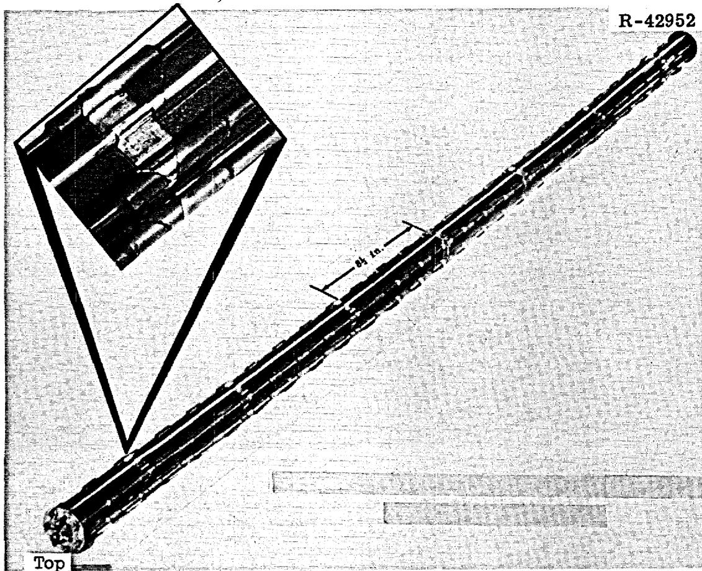  
Fig. 1. Molten-Salt Reactor Experiment Surveillance Specimens from Run 14 (Stringers RS3, RL2, and RR2).

Hastelloy N was discolored slightly. The Hastelloy N surveillance rods outside the reactor vessel were oxidized, but the oxide was tenacious.

We examined polished cross sections of segments from each of the surveillance rods. Typical micrographs of the rods of standard Hastelloy N that were located outside the reactor vessel are shown in Figs. 2 and 3. The cell environment of $\mathbf{N}_2 + 2$ to $5\%$ $\mathbf{O}_2$ is oxidizing to the alloy, but there is no evidence of nitriding. There is some internal oxidation to a depth of 1 to 2 mils and a very thin uniform surface oxide. The general microstructure is characterized by large $\mathbf{M}_6\mathbf{C}$ -type carbides that are distributed during the primary working and by finer $\mathbf{M}_6\mathbf{C}$ -type carbides that formed during the long thermal anneal of 20,789 hr at $650^{\circ}\mathbf{C}$ .

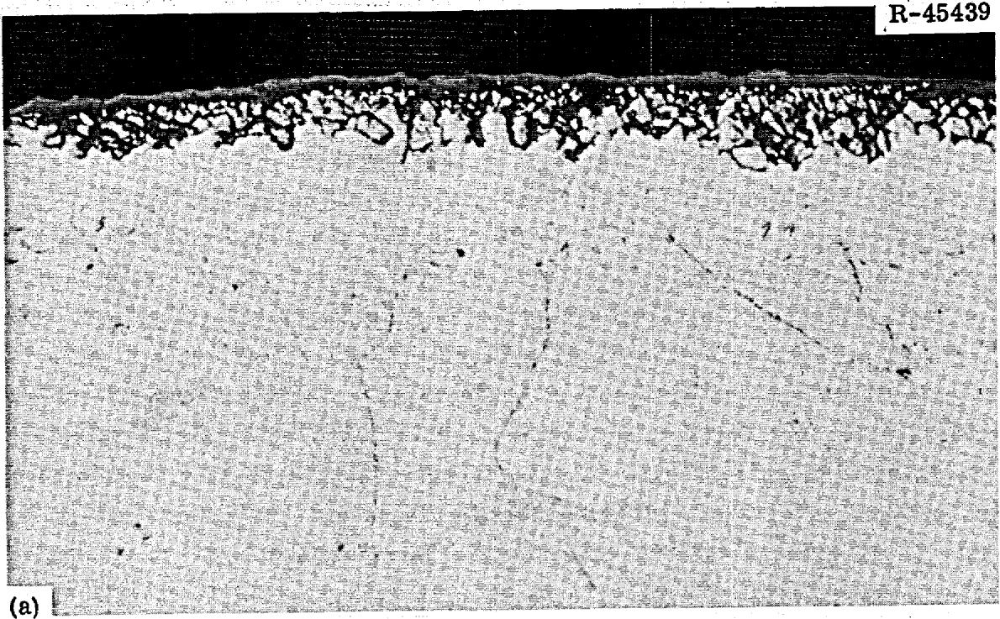

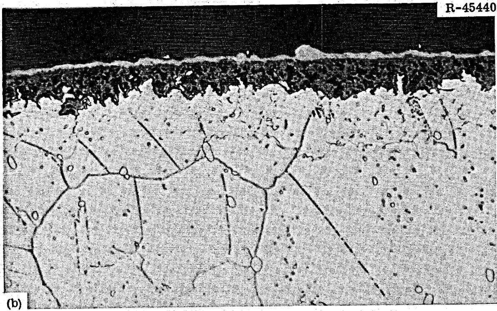  
Fig. 2. Photomicropgraphs of Hastelloy N (Heat 5085) Surveillance Specimens Exposed to the Cell Environment of $\mathbf{N}_2 + 2$ to $5\%$ $\mathbf{O}_2$ for 20,789 hr at $650^{\circ}\mathrm{C}$ . $500\times$ . (a) Unetched showing surface oxidation. (b) Etched (glyceria regia) showing shallow modification of microstructure due to reaction with cell environment.

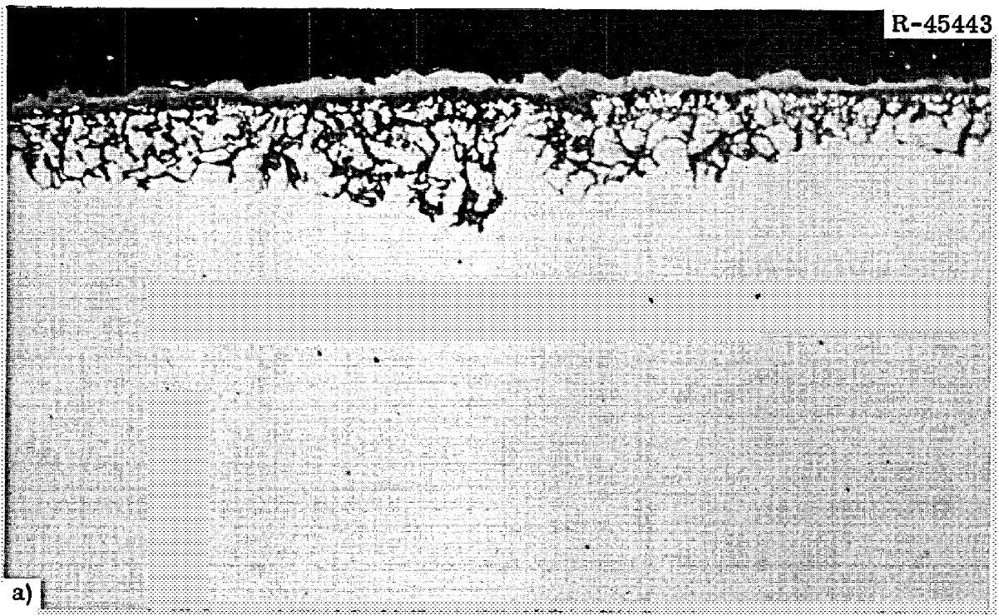

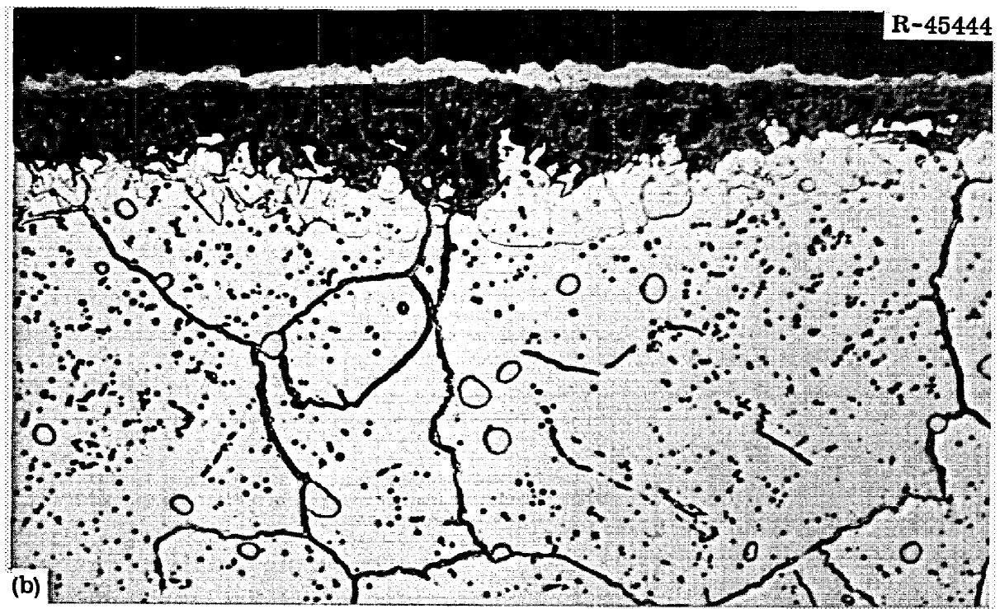  
Fig. 3. Photomicrographs of Hastelloy N (Heat 5065) Surveillance Specimens Exposed to the Cell Environment of $\mathbf{N}_2 + 2$ to $5\%$ $\mathbf{O}_2$ for 20,789 hr at $650^{\circ}\mathrm{C}$ . $500\times$ . (a) Unetched showing surface oxidation. (b) Etched (glyceria regia) showing shallow modification of microstructure due to reaction with cell environment.

Typical photomicrographs of the standard Hastelloy N samples exposed to the MSRE fuel salt for 15,289 hr at $650^{\circ}\mathrm{C}$ are shown in Figs. 4 and 5. There is a thin layer of modified structure less than 0.5 mil thick at the surface. This modified structure was noted previously.[6] As shown in Figs. 6 and 7, a similar product is formed on the surfaces of the control specimens. We originally suspected that this product formed only where the Hastelloy N was in intimate contact with graphite, but a closer examination shows that the modified structure exists around the complete circumference of the rod and not just where it makes tangential contact with graphite. From the practical standpoint, the modified layer has not changed detectably since we first observed the samples removed after 4800 hr of exposure and we feel that it will not influence the mechanical properties of the material.

The amount of fine $\mathrm{M}_{6}\mathrm{C}$ -type precipitates is not detectably different for the material aged while being irradiated (Figs. 4 and 5) and that aged in the absence of irradiation (Figs. 6 and 7). There does seem to be more precipitate present in heat 5065 than in heat 5085, an observation in keeping with the higher carbon content of heat 5065 (Table 1, p. 4). Extracted precipitates were found to be of the $\mathrm{M}_{6}\mathrm{C}$ type with a lattice parameter of 11.02 A. Some of the material exposed to the highest thermal fluence of $9.4 \times 10^{20}$ neutrons/cm $^2$ was examined in transmission. A typical electron photomicrograph is shown in Fig. 8 where helium bubbles are clearly visible along several of the grain boundaries. This sample had not been stressed and the rather large sizes of these bubbles attests to the initial inhomogeneous distribution of the boron. However, the observation of bubbles of this size only serves to support the formation of gas bubbles in metals during irradiation and really is not informative from a mechanistic standpoint. Deformation takes place on an atomistic scale (few angstroms) and our ability to see details in the grain boundaries of such specimens is limited to about 50 A, so we are not yet able to see details of the size involved in deformation.

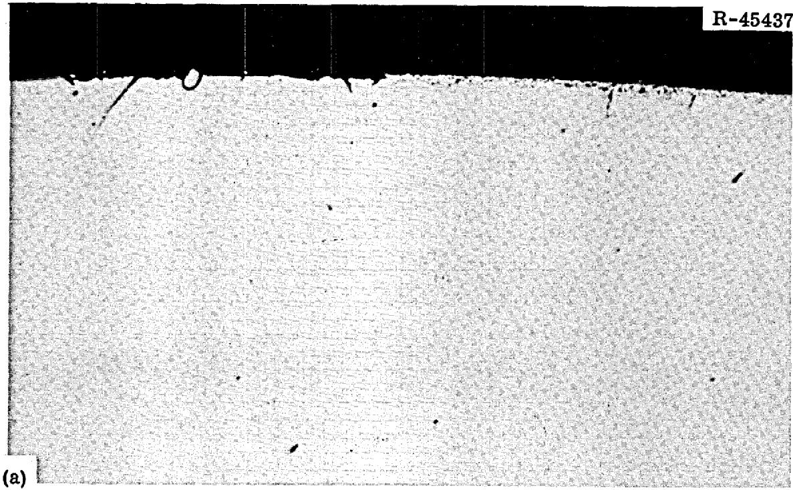

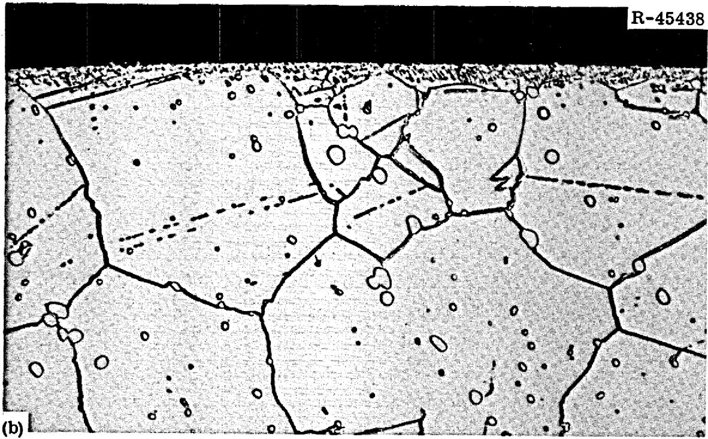  
Fig. 4. Photomicrographs of Hastelloy N (Heat 5085) Surveillance Specimens Exposed to Fuel Salt for 15,289 hr at $650^{\circ}\mathrm{C}$ . 500×. (a) Unetched. (b) Etched (glyceria regia) photomicrographs showing shallow reaction layer near surface.

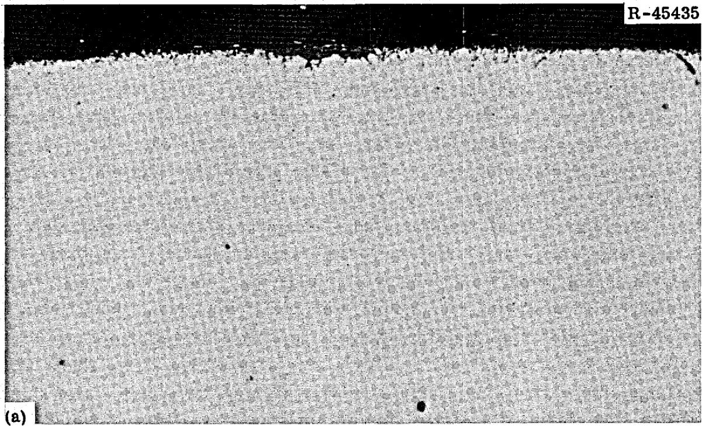

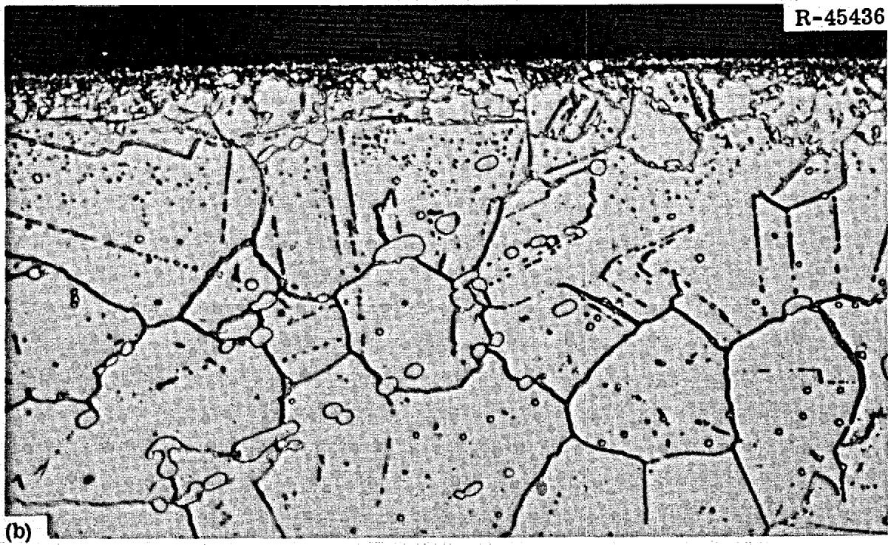  
Fig. 5. Photomicrographs of Hastelloy N (Heat 5065) Surveillance Specimens Exposed to Fuel Salt for 15,289 hr at $650^{\circ}\mathrm{C}$ . $500\times$ . (a) Unetched. (b) Etched (glyceria regia) photomicrographs showing shallow reaction layer near surface.

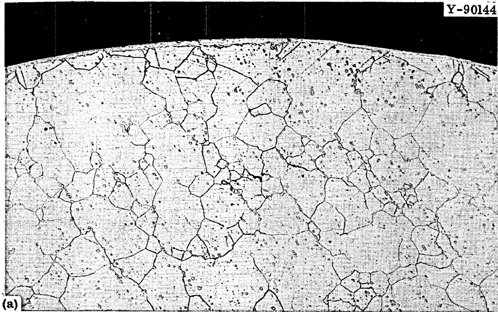

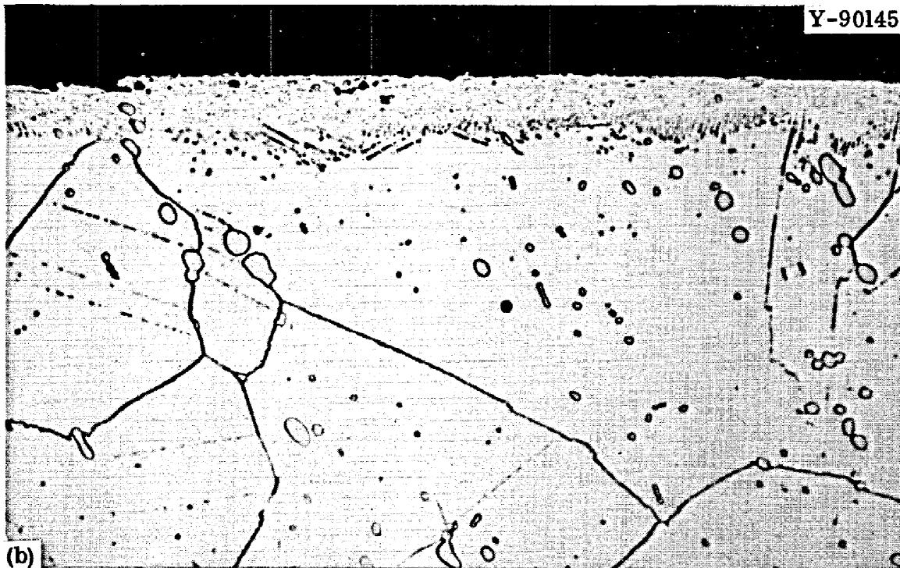  
Fig. 6. Photomicrographs of Hastelloy N (Heat 5085) Surveillance Control Specimens Exposed to Static Barren Fuel Salt for 15,289 hr at $650^{\circ}\mathrm{C}$ . Note the shallow reaction layer near the surface. (a) Etched, $100\times$ . (b) Etched, $500\times$ . Etchant: glyceria regia.

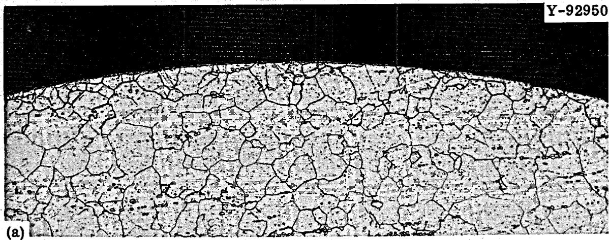

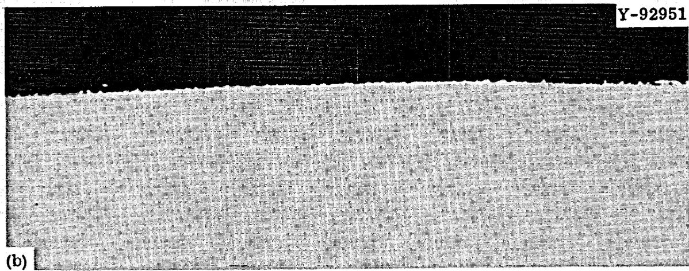

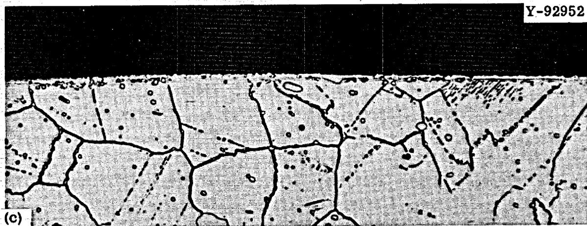  
Fig. 7. Photomicrographs of Hastelloy N (Heat 5065) Surveillance Control Specimens Exposed to Static Barren Fuel Salt for 15,289 hr at $650^{\circ}\mathrm{C}$ . Note the shallow reaction layer near the surface. (a) Etched. $100\times$ . (b) As polished. $500\times$ . (c) Etched. $500\times$ . Etchant: glyceria regia.

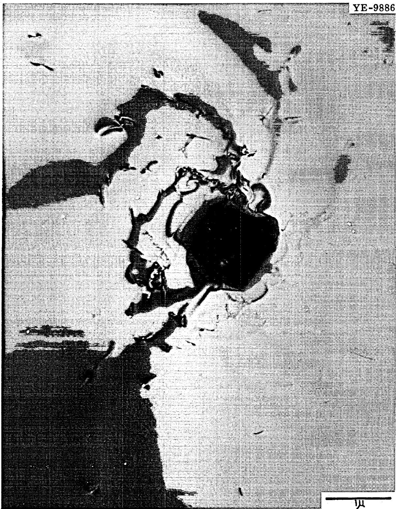  
Fig. 8. Transmission Electron Photomicrograph of Hastelloy N (Heat 5085) Exposed to the MSRE Core for 15,289 hr at $650^{\circ}\mathrm{C}$ . The thermal fluence was $9.4 \times 10^{20}$ neutrons/cm $^2$ , enough to transmute most of the $^{10}\mathrm{B}$ in this material to helium.

Typical photomicrographs of the modified Hastelloy N are shown in Figs. 9 and 10. The grain size in this material is rather large due to the high preirradiation anneal of 1 hr at $1177^{\circ}\mathrm{C}$ and the absence of the carbide stringers. There is a thin layer on the surface, which has the appearance of being a deposit rather than where material has been removed by corrosion. X-ray studies indicate the presence of iron. Since these alloys contain only trace quantities of iron compared with 4 to $5\%$ for the rest of the material in the MSRE and in the control facility, it is quite reasonable that iron should be deposited on the surfaces of the modified alloys. The general microstructure contains a finely dispersed precipitate with larger amounts along the grain boundaries.

# Mechanical Property Data - Standard Hastelloy N

# Tensile Properties

The postirradiation tensile properties of heat 5085 after exposure to the cell environment of $\mathbf{N}_2 + 2$ to $5\%$ $\mathbf{O}_2$ for 20,789 hr are given in Table A-1 (Appendix) and the fracture strain is plotted as a function of test temperature in Fig. 11. There are significant reductions in the fracture strain at $25^{\circ}\mathrm{C}$ and above $500^{\circ}\mathrm{C}$ . The fracture strain decreased with decreasing strain rate at the elevated temperatures. One particularly interesting observation was that the fracture strain at room temperature could be improved by a postirradiation anneal of 8 hr at $870^{\circ}\mathrm{C}$ . This anneal is quite often used as a postweld anneal and is sufficient to precipitate (or redissolve) carbides and to relieve residual stresses, but does not cause grain-boundary motion. Thus, the recovery of the room-temperature ductility by this anneal supports the supposition that the reduction in ductility at $25^{\circ}\mathrm{C}$ is due to carbide precipitation.

The results of tensile tests on heat 5065 after exposure to the MSRE cell environment for 20,789 hr at $650^{\circ}\mathrm{C}$ are given in Table A-2 (Appendix) and the fracture strain is shown as a function of test temperature in Fig. 12. This heat does not exhibit the reduction in ductility at $25^{\circ}\mathrm{C}$ , but does show a substantial loss in ductility above $500^{\circ}\mathrm{C}$ due to irradiation. The effect of strain rate is qualitatively the same as that shown in Fig. 11 for heat 5085, but the scatter in experimental results does not allow a quantitative comparison.

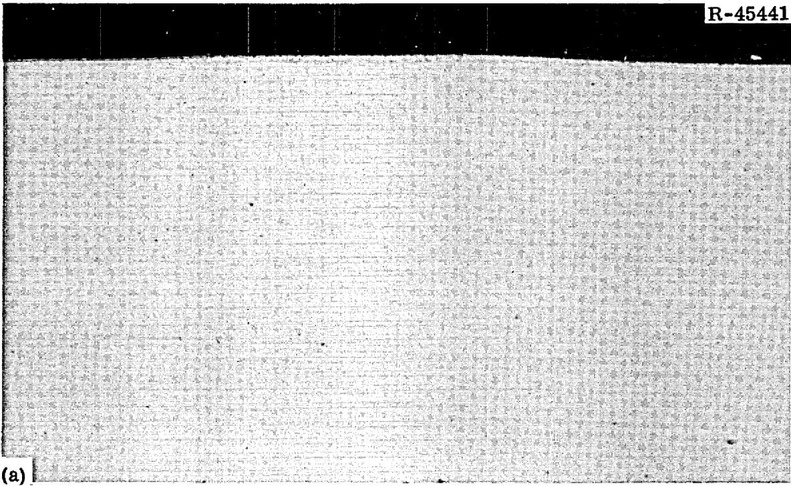

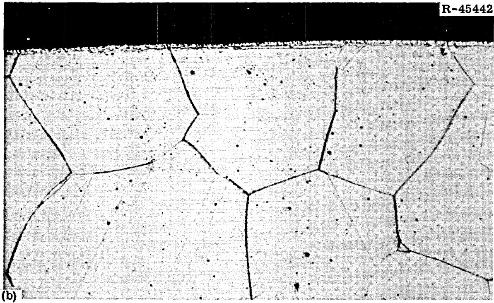  
Fig. 9. Photomicrographs of Modified Hastelloy N Containing $2\%$ W and $0.5\%$ Ti (Heat 67-502) After Exposure to the MSRE Core for 9789 hr at $650^{\circ}\mathrm{C}$ and a Thermal Fluence of $5.3 \times 10^{20}$ neutrons/cm². $500\times$ . (a) As polished. (b) Etchant: glyceria regia. This structure is also representative of that of a heat of material containing $0.5\%$ Hf (Heat 67-504) that had a similar exposure.

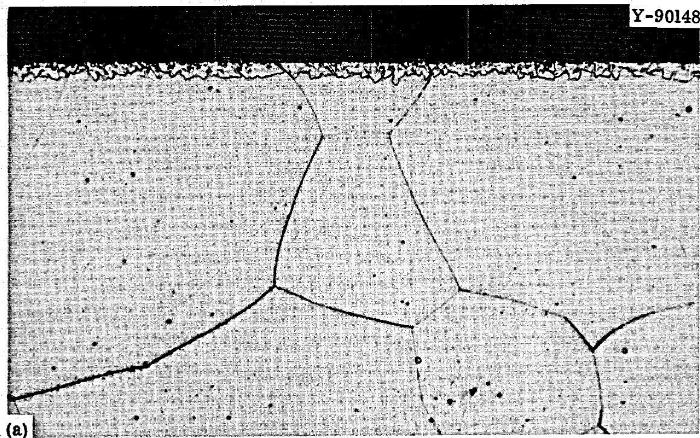

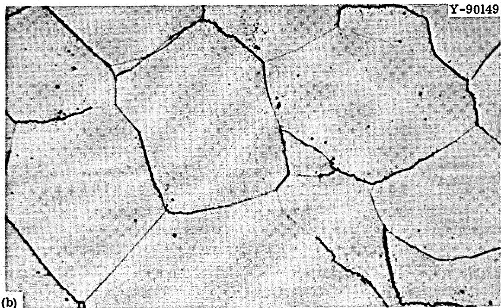  
Fig. 10. Photomicrographs of Modified Hastelloy N Containing $2\%$ W and $0.5\%$ Ti (Heat 67-502) After Exposure to Static Barren Fuel Salt for 9789 hr at $650^{\circ}\mathrm{C}$ . $500\times$ . (a) Edge and (b) typical matrix. Etchant: glyceria regia. This structure is also representative of that of a heat of material containing $0.5\%$ Hf (heat 67-504) that had a similar exposure.

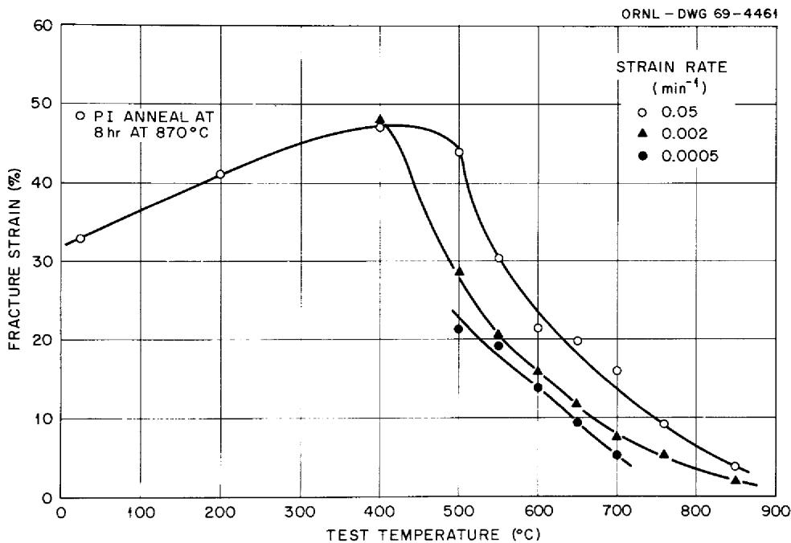  
Fig. 11. Postirradiation Tensile Properties of Hastelloy N (Heat 5085) After Irradiation to a Thermal Fluence of $2.6 \times 10^{19}$ neutrons/cm² Over 20,789 hr at $650^{\circ}\mathrm{C}$ .

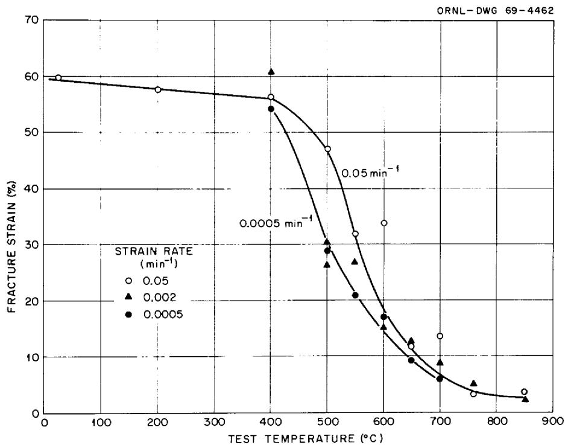  
Fig. 12. Postirradiation Tensile Properties of Hastelloy N (Heat 5065) After Irradiation to a Thermal Fluence of $2.6 \times 10^{19}$ neutrons/cm² Over 20,789 hr at $650^{\circ}\mathrm{C}$ .

Heats 5085 and 5065 were also removed from the core surveillance and control facilities after 15,289 hr of exposure. The detailed tensile data on these specimens are given in Tables A-3 through A-6 (Appendix). The variation of the fracture strain with test temperature is shown in Fig. 13 for heat 5085 after exposure in the core surveillance facility to a thermal fluence of $9.4 \times 10^{20}$ neutrons/cm² and in Fig. 14 for heat 5085 after exposure in the control facility. The irradiated samples (Fig. 13) showed reduced fracture strains compared with the control samples (Fig. 14) over the entire test temperature range studied. Similar plots of the variation of fracture strain with test temperature are shown for heat 5065 after removal from the core surveillance facility (Fig. 15) and the control facility (Fig. 16). There is a slight reduction in the fracture strain at $25^{\circ}\mathrm{C}$ due to irradiation, but the reduction is not nearly as great as noted for heat 5085 (Fig. 13). The fracture strain of heat 5065 is reduced above $500^{\circ}\mathrm{C}$ by irradiation, and the resulting strains are lower than those for heat 5085 (Fig. 13). For example, at a test temperature of $650^{\circ}\mathrm{C}$ and a strain rate of $0.002\,\mathrm{min}^{-1}$ heat 5085 (Fig. 13) fractures at a strain of $5\%$ and heat 5065 (Fig. 15) fractures at $3.5\%$ . The unirradiated samples from the control facility show a greater reduction in fracture strain for heat 5085 (Fig. 14) than for heat 5065 (Fig. 16) at $25^{\circ}\mathrm{C}$ , but the fracture strains at $650^{\circ}\mathrm{C}$ are not appreciably different for the two heats.

Heat 5085 has been carried throughout our surveillance program, so we now have accumulated enough data to see how the fracture strain is varying with neutron fluence. The fracture strain is shown as a function of test temperature in Fig. 17 for heat 5085. Generally, the fracture strain is decreased with increasing fluence. At low fluence the ductility reduction at low test temperatures is restricted to $25^{\circ}\mathrm{C}$ and recovers at higher test temperatures, but at higher fluences the fracture strain is reduced over a wider temperature range. We attribute this embrittlement to carbide precipitation and, as shown in Fig. 11, the ductility can be recovered by postirradiation annealing. The ductility reduction above $500^{\circ}\mathrm{C}$ is associated with the presence of helium and the increased tendency for intergranular fracture. The fracture strain at a given temperature above $500^{\circ}\mathrm{C}$ generally decreases with increasing thermal fluence.

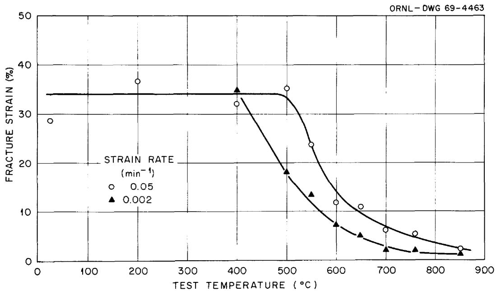  
Fig. 13. Postirradiation Tensile Properties of Hastelloy N (Heat 5085) After Irradiation to a Thermal Fluence of $9.4 \times 10^{20}$ neutrons/cm² Over 15,289 hr at $650^{\circ}\mathrm{C}$ .

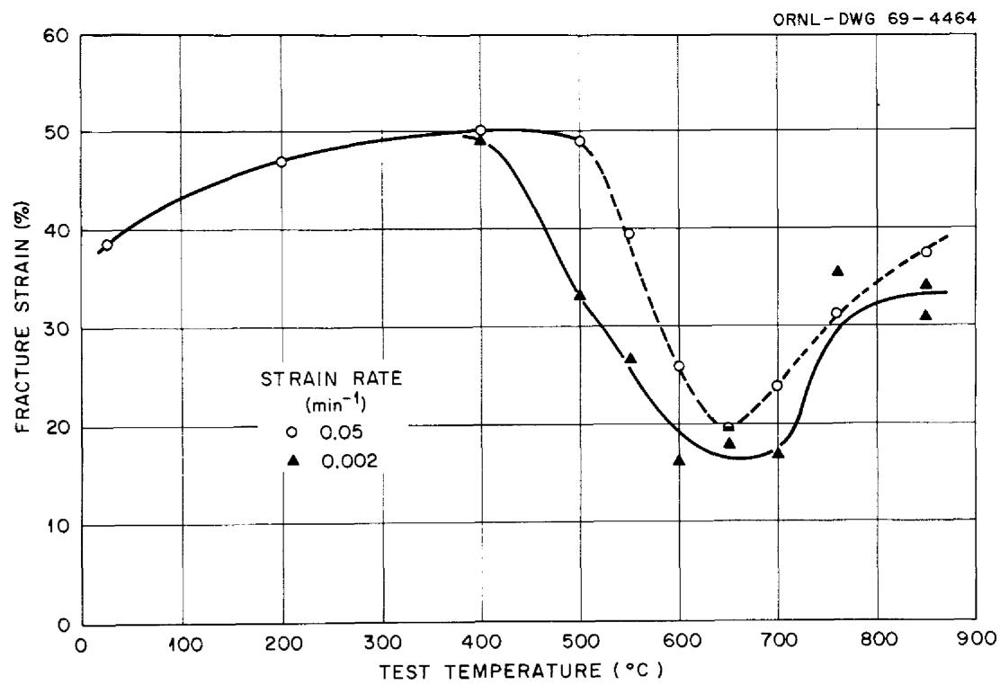  
Fig. 14. Tensile Properties of Hastelloy N (Heat 5085) After Aging for 15,289 hr at $650^{\circ}\mathrm{C}$ in Static Barren Fuel Salt.

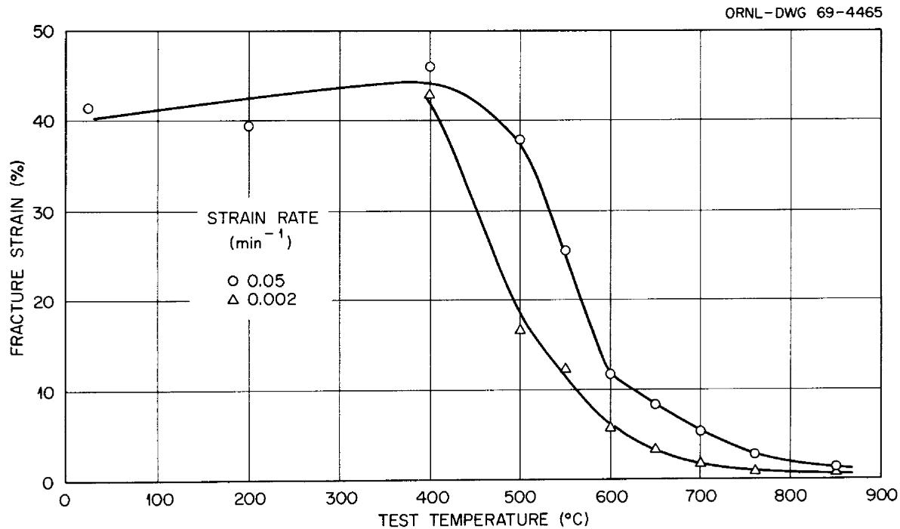  
Fig. 15. Postirradiation Tensile Properties of Hastelloy N (Heat 5065) After Irradiation to a Thermal Fluence of $9.4 \times 10^{20}$ neutrons/cm² Over 15,289 hr at $650^{\circ}C$ .

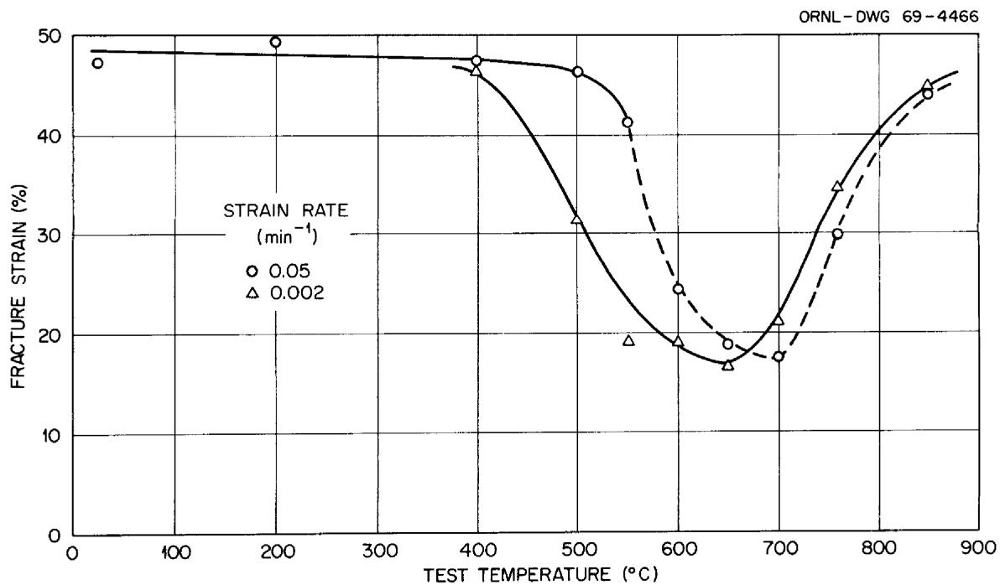  
Fig. 16. Tensile Properties of Hastelloy N (Heat 5065) After Aging for 15,289 hr at $650^{\circ}\mathrm{C}$ in Static Barren Fuel Salt.

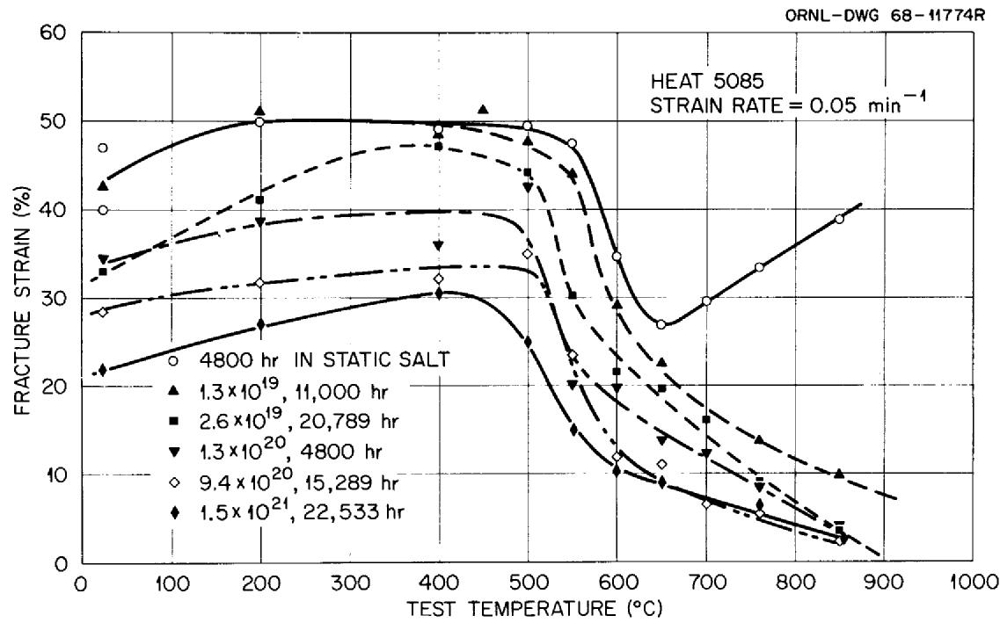  
Fig. 17. Postirradiation Tensile Properties of MSRE Surveillance Samples.

The fracture strains for heat 5085 at a slower strain rate, $0.002 \, \text{min}^{-1}$ , are shown in Fig. 18. The behavior as a function of fluence is similar to that shown in Fig. 17 at a higher strain rate. An important exception is the observation that as the test temperature is increased, the fracture strain depends on fluence to a lesser extent.

One very important question that arises is "How much of the reduction in fracture strain in Fig. 17 can be attributed to thermal aging?" Several of the tensile results obtained on samples from the control facility are shown in Fig. 19. The results show generally that the fracture strain is reduced at all test temperatures by aging at $650^{\circ}\mathrm{C}$ . However, the reductions in fracture strain due to aging do not account for nearly all the reduction noted for irradiated samples. For example, the fracture strains at test temperatures of 25 and $650^{\circ}\mathrm{C}$ are 53.0 and $33.6\%$ for as-annealed samples, 38.6 and $19.6\%$ after aging for 15,289 hr at $650^{\circ}\mathrm{C}$ (Fig. 19), and 28.5 and $11.0\%$ after irradiation to a fluence of $9.4 \times 10^{20}$ neutrons/cm² over a period of 15,289 hr at $650^{\circ}\mathrm{C}$ . We do not have as much data on the response of heat 5065 to aging, but a

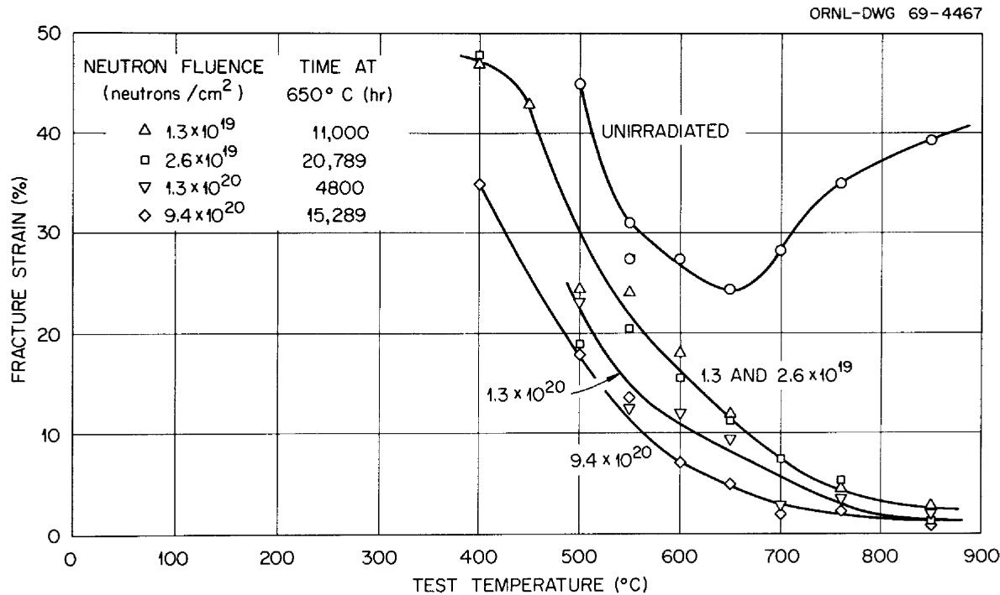  
Fig. 18. Postirradiation Tensile Properties (Strain Rate of $0.002\mathrm{min}^{-1}$ ) of Hastelloy N (Heat 5085) After Exposure to Various Neutron Fluences.

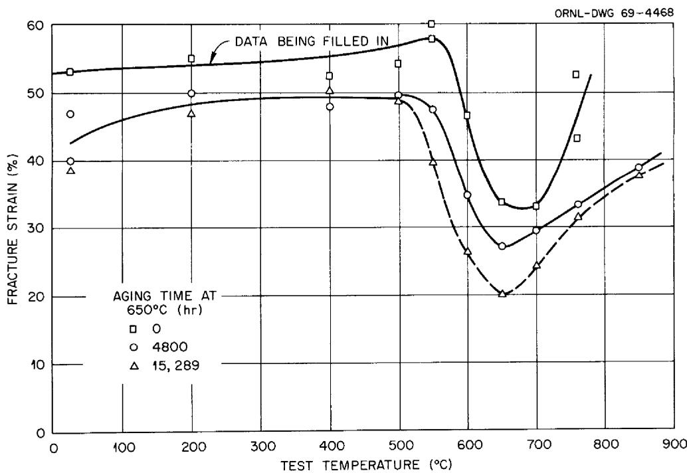  
Fig. 19. Variation of the Tensile Properties (Strain Rate of $0.5 \, \text{min}^{-1}$ ) of Hastelloy N (Heat 5085) with Aging Time in Barren Fuel Salt at $650^{\circ}\text{C}$ .

comparison of Figs. 14 and 16, pp. 22 and 23, of the fracture strain for heats 5065 and 5085 after aging for 15,289 hr at $650^{\circ}\mathrm{C}$ indicates very similar properties of the two heats at $650^{\circ}\mathrm{C}$ and higher fracture strain for heat 5065 at $25^{\circ}\mathrm{C}$ .

The combined observations on the change in the fracture strain at a test temperature of $25^{\circ}\mathrm{C}$ are shown in Fig. 20. The results are plotted as if aging time were the controlling variable, and the results on the unirradiated samples (open symbols) indicate that aging time is an important factor. However, for the cases where irradiated and unirradiated samples were tested after similar thermal histories, the irradiated samples showed the larger reduction in fracture strain. Thus, neutron fluence as well as time at temperature are important factors in the reduction of the fracture strain at low temperatures. The question of whether the role of irradiation is to produce defects that enhance the growth rates of precipitates or to produce transmutation products that aid in stabilizing a precipitate nucleus yet remains unanswered. The data shown for heat 5065 in Fig. 20 indicate that this material is less susceptible to this type of embrittlement than heat 5085.

# Creep-Rupture Properties

Some of the samples were tested under creep conditions at $650^{\circ}\mathrm{C}$ . The detailed results of these experiments are presented in Tables A-7 through A-9 (Appendix) and some correlations of these results with those obtained from previous surveillance samples7,3 will be presented.

A stress-rupture plot for heat 5085 is shown in Fig. 21. The results obtained on the unirradiated samples show that the rupture life is reduced slightly by prolonged aging at $650^{\circ}\mathrm{C}$ , the magnitude of the effect decreasing with decreasing stress level. The rupture life is decreased markedly by irradiation even at thermal fluences as low as

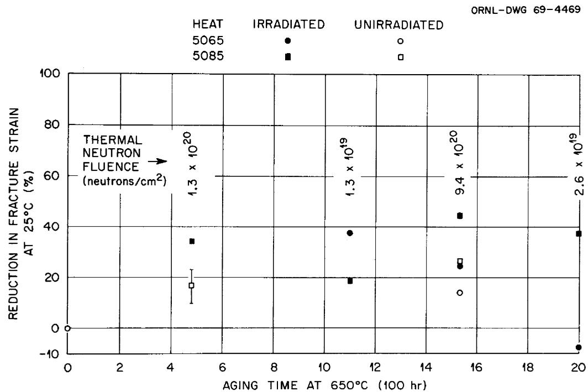  
Fig. 20. Variation of the Fracture Strain at $25^{\circ}\mathrm{C}$ with Aging and Irradiation.

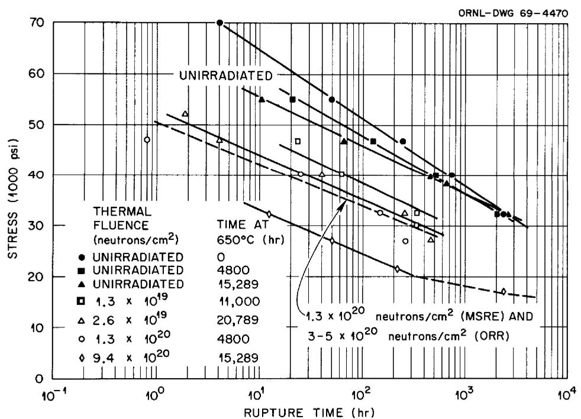  
Fig. 21. Postirradiation Stress Rupture Properties of MSRE Surveil-lance Specimens (Heat 5085) at $650^{\circ}\mathrm{C}$ .

$1.3 \times 10^{19}$ neutrons/cm $^2$ . The rupture life is reduced progressively by increasing fluence with a large step occurring between fluences of 1.3 and $9.4 \times 10^{20}$ neutrons/cm $^2$ .

The minimum creep rate is shown as a function of stress level in Fig. 22 for these same samples from heat 5085. The results on unirradiated samples show that the creep rate is increased slightly at high stress levels by prolonged aging at $650^{\circ}\mathrm{C}$ . A few irradiated samples tested at high stress levels and the samples irradiated to $9.4 \times 10^{20}$ neutrons/cm² have a higher minimum creep rate. This is likely due to the tests being so short and the fracture strains so low that the steady-state creep period (the period in which the minimum creep rate usually occurs) was not reached and the rate that we measured was too high. However, generally at lower stress levels irradiation and aging seem to have little effect on the minimum creep rate.

The fracture strains are shown as a function of minimum creep rate in Fig. 23 for the irradiated samples of heat 5085. The scatterband shown in this figure was determined from numerous tests on samples of these same heats of standard Hastelloy N that had been irradiated in the Oak Ridge Research Reactor (ORR) to thermal fluences of 2 to $5 \times 10^{20}$ neutrons/cm². In samples removed from the MSRE the fracture strain was decreased from about $20\%$ for unirradiated material to about $2.3\%$ by a thermal fluence of $1.3 \times 10^{19}$ neutrons/cm². Progressively higher fluences reduced the fracture strain even further. The limited number of data points for each lot of material do not give a very strong indication of the very distinct ductility minimum noted in our ORR irradiations. This may be associated with the much larger times involved in the MSRE irradiations (5000 to 20,000 hr) compared with those in the ORR (1000 hr).

The effects of aging in the absence of irradiation on the fracture strain of heat 5085 at $650^{\circ}\mathrm{C}$ are shown in Fig. 24. After annealing for 2 hr at $900^{\circ}\mathrm{C}$ the fracture strain is 30 to $40\%$ , almost independent of strain rate. After aging for 4800 hr at $650^{\circ}\mathrm{C}$ the fracture strains are now in the range of 20 to $30\%$ . Aging for 15,289 hr causes a small further reduction in the fracture strain at high strain rates, but no significant change in the fracture strain at low strain rates. Thus, the

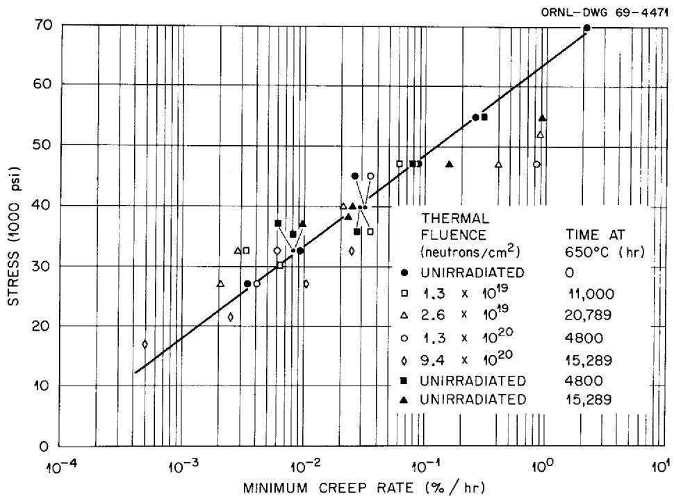  
Fig. 22. Minimum Creep Rate of Hastelloy N (Heat 5085) Surveillance Specimens from MSRE at $650^{\circ}\mathrm{C}$ .

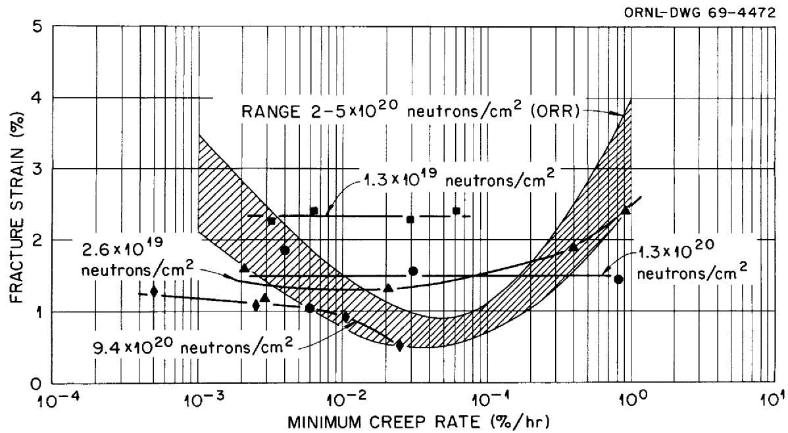  
Fig. 23. Variation of Fracture Strain with Strain Rate for Hastelloy N (Heat 5085) Surveillance Specimens at $650^{\circ}\mathrm{C}$ .

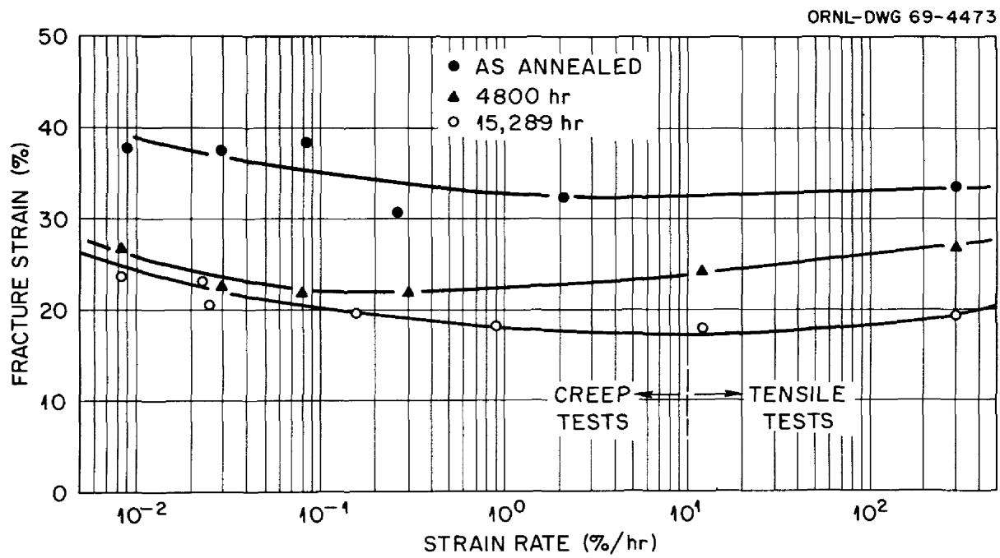  
Fig. 24. Influence of Aging at $650^{\circ}\mathrm{C}$ on the Fracture Strain of Hastelloy N (Heat 5085) When Tested at $650^{\circ}\mathrm{C}$ .

fracture strain in a sample strained at a rate of $0.1\%/\mathrm{hr}$ at $650^{\circ}\mathrm{C}$ is about $20\%$ for heat 5085 after aging 15,289 hr at $650^{\circ}\mathrm{C}$ (Fig. 24) and only $0.5\%$ (Fig. 23) after a thermal fluence of $9.4 \times 10^{20}$ neutrons/cm².

The results of our stress-rupture tests on heat 5065 are summarized in Fig. 25. Contrary to the behavior of heat 5085 (Fig. 21), thermal aging seems to have no effect on the creep-rupture properties of heat 5065. However, the rupture life is reduced appreciably by irradiation and the resulting lifetimes at a given stress are quite comparable for heats 5065 and 5085.

The minimum creep rate is shown as a function of stress level for heat 5065 in Fig. 26. The minimum creep rate is increased slightly by thermal aging at $650^{\circ}\mathrm{C}$ . The creep rates seem to be high for some of the irradiated samples, but this is likely associated with the fracture strain being so low that the minimum creep rate was not established.

The variation of fracture strain with minimum creep rate for the irradiated samples of heat 5065 is shown in Fig. 27. The ductility of this heat is about the same as that shown in Fig. 23 for heat 5085, except for the material irradiated to a thermal fluence of

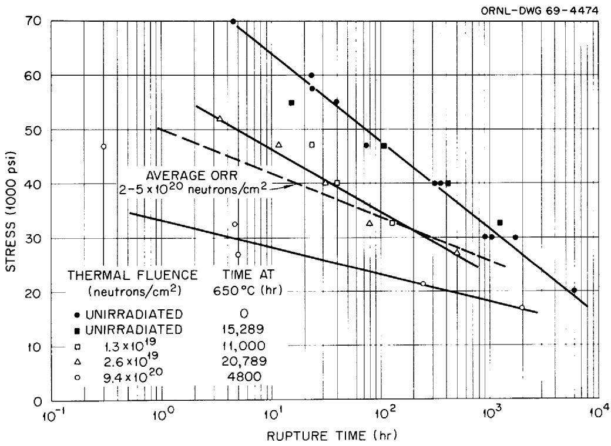  
Fig. 25. Stress Rupture Properties of MSRE Surveillance Specimens (Heat 5065) at $650^{\circ}\mathrm{C}$ .

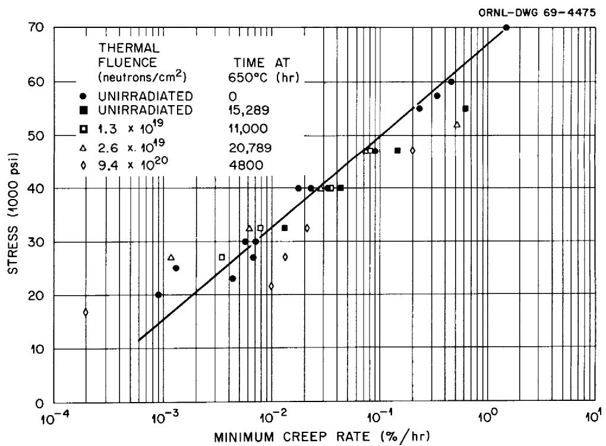  
Fig. 26. Minimum Creep Rate of Hastelloy N (Heat 5065) Surveillance Samples from MSRE at $650^{\circ}\mathrm{C}$ .

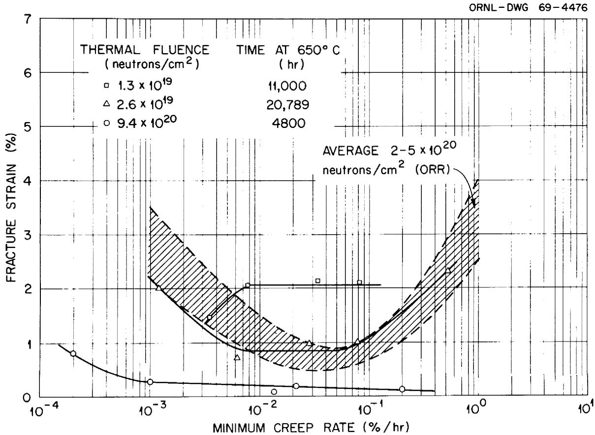  
Fig. 27. Variation of Fracture Strain with Strain Rate for Hastelloy N (Heat 5065) Surveillance Specimens at $650^{\circ}\mathrm{C}$ .

$9.4 \times 10^{20}$ neutrons/cm² for which heat 5065 has much lower fracture strains.

Our observations on the variation of fracture strain of surveillance specimens with strain rate are summarized in Fig. 28. Data are included in this figure for both tensile and creep tests. The scatterband based on our observations on samples irradiated in the ORR is also shown in Fig. 28 (ref. 9). The fracture strain varies widely with fluence at high strain rates and varies much less at low strain rates. At low strain rates, the fracture strains for the samples irradiated to $1.3 \times 10^{19}$ neutrons/cm² fall above the scatterband and those for samples irradiated to $9.4 \times 10^{20}$ neutrons/cm² fall below the scatterband.

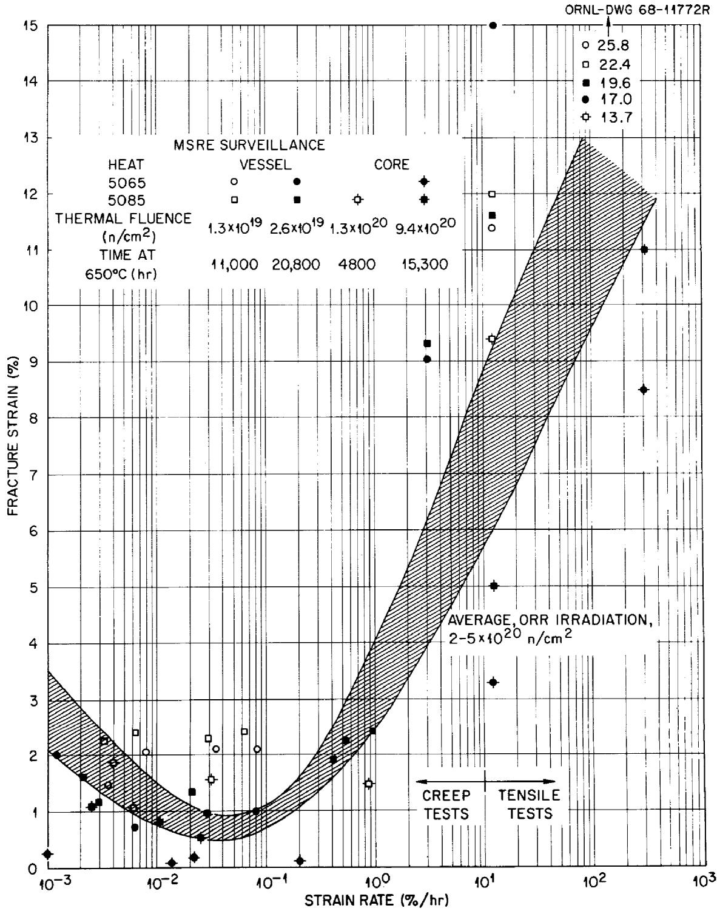  
Fig. 28. Variation of Fracture Strain with Strain Rate for Hastelloy N Surveillance Specimens at $650^{\circ}\mathrm{C}$ .

# Mechanical Property Data - Modified Hastelloy N

# Tensile Properties

Two heats of modified Hastelloy N (Table 1, p. 4) were included in both the core surveillance facility and the control facility. Heat 67-502 contained a nominal $0.5\%$ Ti and $2\%$ W and heat 67-504 contained a nominal addition of $0.5\%$ Hf. These samples were exposed to salt 9789 hr at $650^{\circ}\mathrm{C}$ and those in the MSRE received a thermal neutron fluence of $5.3 \times 10^{20}$ neutrons/cm². The detailed results of tensile tests on these materials are given in Tables A-10 through A-13 (Appendix).

The fracture strains at a strain rate of $0.05\mathrm{min}^{-1}$ are compared in Fig. 29 for the modified alloys. In the unirradiated condition, heat 67-502 had higher fracture strains than heat 67-504 up to about $600^{\circ}\mathrm{C}$ where the opposite trend was noted. The shapes of these curves are different from those shown in Figs. 14 and 16, pp. 22 and 23, for the standard alloy. The fracture strain of the standard alloy decreases rapidly with increasing temperature above about $500^{\circ}\mathrm{C}$ and a ductility minimum occurs at about $650^{\circ}\mathrm{C}$ . For the modified alloys, the fracture strain does not begin to decrease with temperature until about $600^{\circ}\mathrm{C}$ and the strain continues to decrease up to $850^{\circ}\mathrm{C}$ , the highest temperature investigated. The fracture strains of the modified alloys after irradiation, also shown in Fig. 29, are reduced at temperatures above about $500^{\circ}\mathrm{C}$ . Both alloys have about the same fracture strains, and a comparison with Fig. 17, p. 24, shows that the modified alloys irradiated to $5.3 \times 10^{20}$ neutrons/cm² have better fracture strains than those of the standard alloy irradiated to $1.3 \times 10^{19}$ neutrons/cm². One test indicates that the fracture strain of heat 67-504 at $25^{\circ}\mathrm{C}$ may be reduced by irradiation. This will have to be checked further.

The fracture strains observed in tensile tests at a strain rate of $0.002\mathrm{min}^{-1}$ for heat 67-502 and -504 are shown in Fig. 30. The postirradiation properties of the two heats are about the same and, although reduced considerably by irradiation, they are much better than those shown in Fig. 18, p. 25, for standard Hastelloy N.

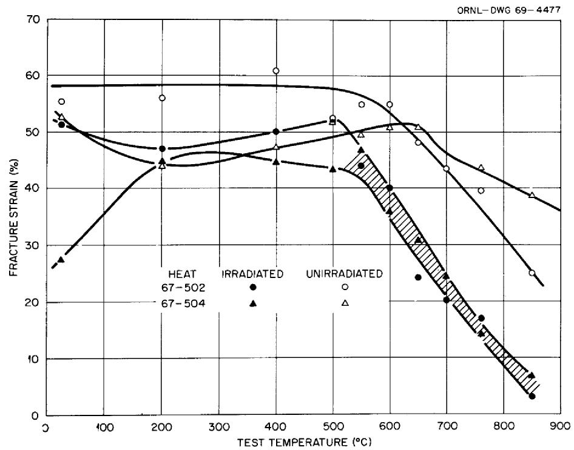

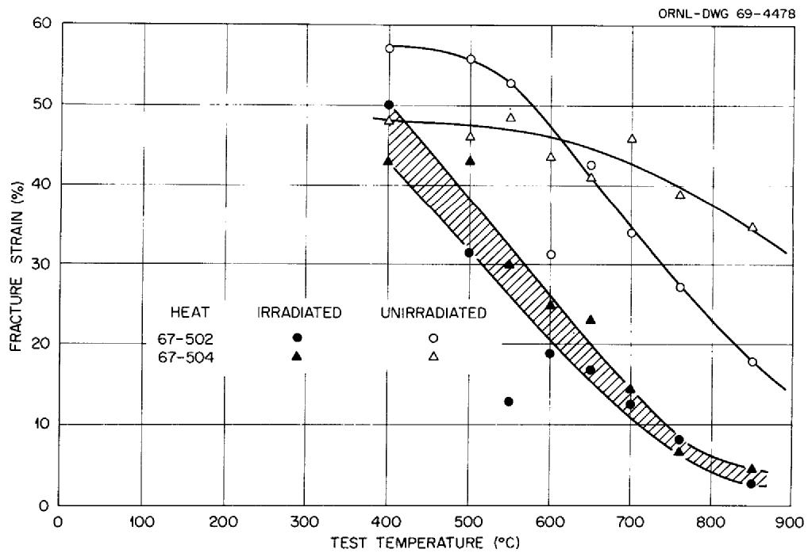  
Fig. 29. Tensile Properties (Strain Rate of $0.05 \, \text{min}^{-1}$ ) of Two Compositions of Modified Hastelloy N Following Irradiation (Thermal Fluence of $5.3 \times 10^{20}$ neutrons/cm $^2$ ) or Annealing (Control Samples) for 9789 hr at $650^{\circ}\text{C}$ .   
Fig. 30. Tensile Properties (Strain Rate of $0.002 \, \text{min}^{-1}$ ) of Two Compositions of Modified Hastelloy N Following Irradiation (Thermal Fluence of $5.3 \times 10^{20}$ neutrons/cm $^2$ ) or Annealing (Control Samples) for 9789 hr at $650^{\circ}\text{C}$ .

# Creep-Rupture Properties

The results of creep-rupture tests on heats 67-502 and -504 are given in Tables A-14 and A-15 (Appendix). The stress-rupture properties of heat 67-502 are shown in Fig. 31. Aging for 9789 hr at $650^{\circ}\mathrm{C}$ increased the rupture life by about $30\%$ and neutron irradiation to a fluence of $5.3 \times 10^{20}$ neutrons/cm $^2$ decreased the rupture life by about $30\%$ compared with the as-annealed material. The minimum creep rate, shown in Fig. 32, was increased by the aging treatment and the samples that were aged and irradiated simultaneously had the same minimum creep rates as the as-annealed material.

The creep-rupture strength of heat 67-504 (Fig. 33) was not altered appreciably by aging at $650^{\circ}\mathrm{C}$ . However, irradiation decreased the rupture life of the material by about $50\%$ . The minimum creep rate (Fig. 34) was increased by the combined irradiation and aging treatment, but was increased even more by just the aging treatment.

The fracture strains of heats 67-502 and -504 at $650^{\circ}\mathrm{C}$ are shown in Fig. 35 as a function of strain rate. In the unirradiated condition, both heats show a trend of decreasing fracture strain with decreasing strain rate. Aging improves the fracture strain of both heats and irradiation decreases the fracture strain. The irradiated material has a fracture strain of about $6\%$ under creep conditions.

Metallographic Examination of Mechanical Property Specimens

Several of the tested samples were examined metallographically. Photomicrographs are shown in Fig. 36 for a sample of heat 5085 that was tensile tested at $25^{\circ}\mathrm{C}$ after being exposed to the cell environment for 20,789 hr at $650^{\circ}\mathrm{C}$ . The fracture under these test conditions would normally be transgranular, but the fracture shown in Fig. 36 is primarily intergranular. This change in fracture mode probably accounts for the fracture strain of this sample being only $33\%$ (Fig. 11, p. 20) compared with about $55\%$ for unirradiated, unaged material. The photomicrographs shown in Fig. 37 were made on another sample of heat 5085 from outside the vessel that was tested at $650^{\circ}\mathrm{C}$ . The fracture is largely intergranular and there are very few cracks near the fracture.

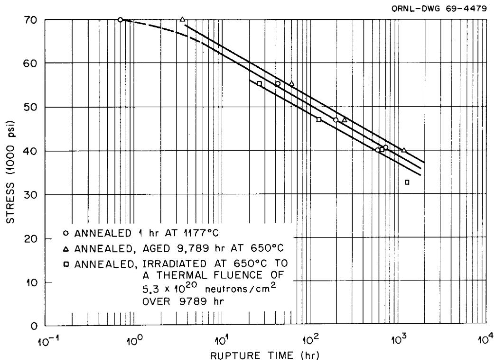  
Fig. 31. Stress-Rupture Properties of Heat 67-502 at $650^{\circ}\mathrm{C}$ .

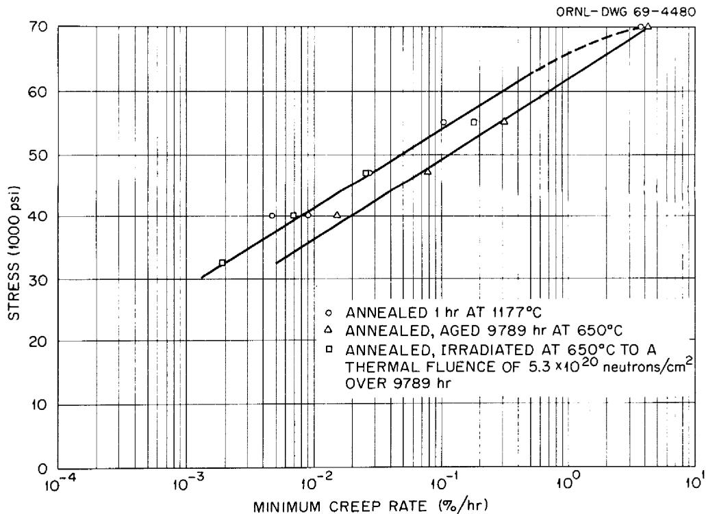  
Fig. 32. Variation of Minimum Creep Rate with Stress Level for Heat 67-502 at $650^{\circ}\mathrm{C}$ .

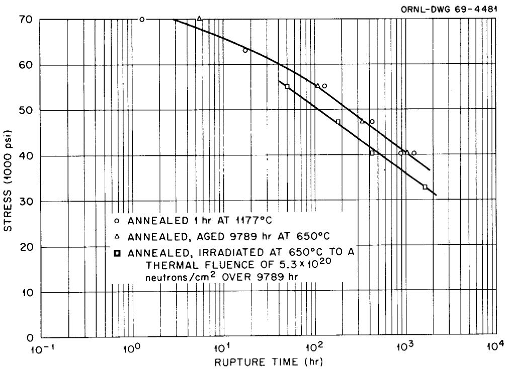  
Fig. 33. Stress-Rupture Properties of Heat 67-504 at $650^{\circ}\mathrm{C}$ .

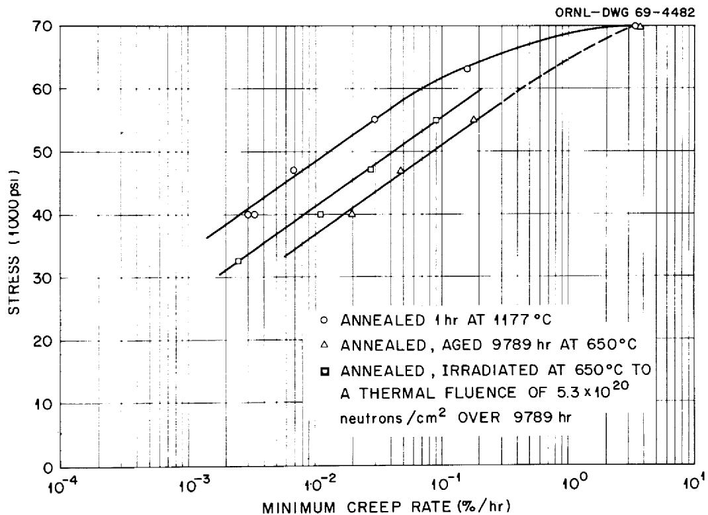  
Fig. 34. Variation of Minimum Creep Rate with Stress Level for Heat 67-504 at $650^{\circ}\mathrm{C}$ .

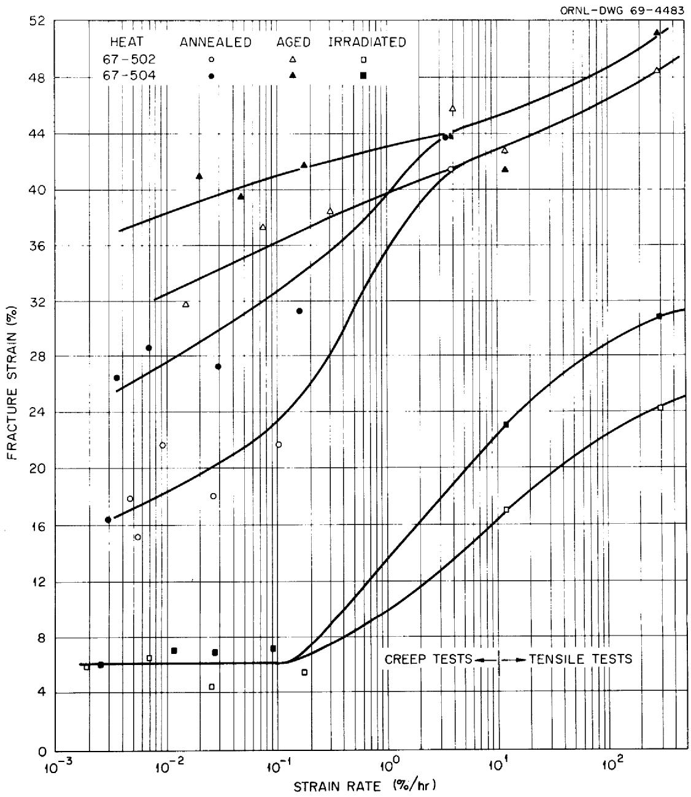  
Fig. 35. Comparison of the Fracture Strains of Two Heats of Modified Hastelloy N Tested at $650^{\circ}\mathrm{C}$ in Various Metallurgical Conditions.

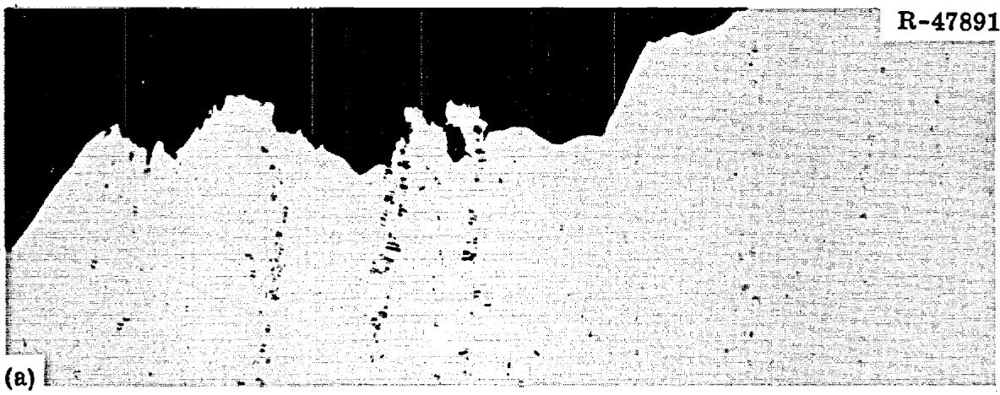

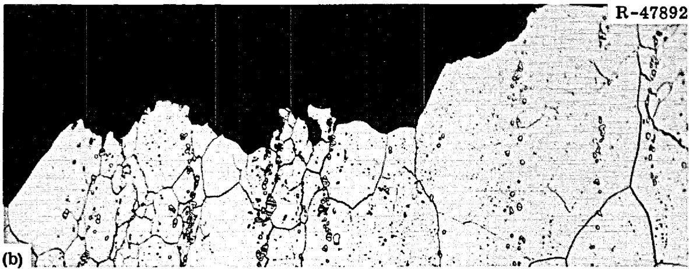

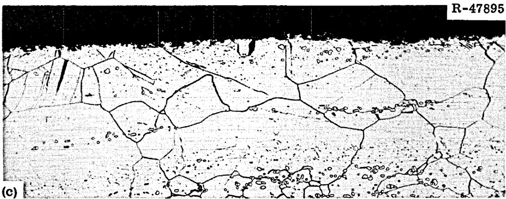  
Fig. 36. Photomicrographs of a Hastelloy N (Heat 5085) Sample Tested at $25^{\circ}\mathrm{C}$ at a Strain Rate of $0.05\mathrm{min}^{-1}$ . Sample had been irradiated to a thermal fluence of $2.6 \times 10^{19}$ neutrons/cm² while being exposed to the cell environment at $650^{\circ}\mathrm{C}$ for 20,789 hr. 100×. (a) Fracture, as polished. (b) Fracture, etched. (c) Edge of stressed portion. Etchant: aqua regia.

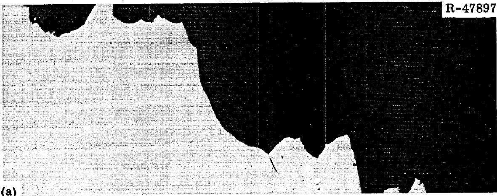

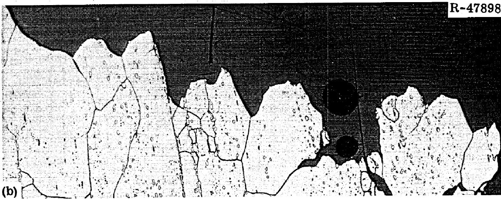

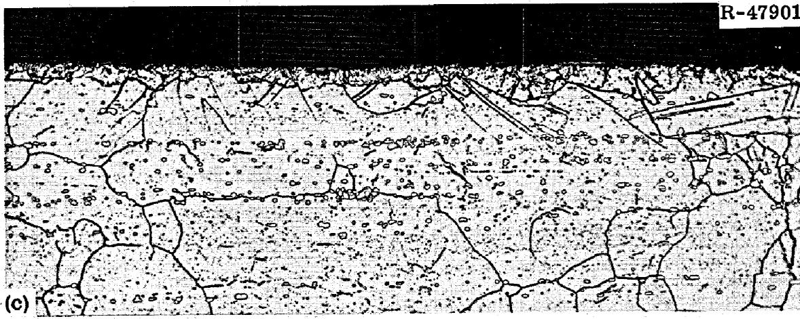  
Fig. 37. Photomicrographs of a Hastelloy N (Heat 5085) Sample Tested at $650^{\circ}\mathrm{C}$ at a Strain Rate of $0.002\mathrm{min}^{-1}$ . Sample had been irradiated to a thermal fluence of $2.6 \times 10^{19}$ neutrons/cm² while being exposed to the cell environment at $650^{\circ}\mathrm{C}$ for 20,789 hr. 100×. (a) Fracture, as polished. (b) Fracture, etched. (c) Edge of stressed portion, etched. Etchant: aqua regia.

A sample of heat 5065 that was removed from outside the vessel and tested at $25^{\circ}\mathrm{C}$ is shown in Fig. 38. The fracture is still partially intergranular, but the elongated grains indicate that the sample strained a large amount before failing. As shown in Fig. 12, p. 20, this sample had a fracture strain of $59.5\%$ . A sample of heat 5065 was tested at $600^{\circ}\mathrm{C}$ and typical photomicrographs are shown in Fig. 39. The fracture strain of this sample was only $15\%$ and the fracture is predominately intergranular.

The thin oxide surface layers do not seem to influence the deformation in the samples from outside the vessel. The amount of edge cracking noted in Figs. 36 through 39 is not unusual for Hastelloy N.

Typical photomicrographs of a sample of heat 5085 aged for 15,289 hr at $650^{\circ}\mathrm{C}$ in static barren fuel salt and tested at $200^{\circ}\mathrm{C}$ are shown in Fig. 40. The fracture strain of this sample was quite good (Fig. 14, p. 22) although the fracture is partially intergranular. A cross section from the stressed portion of this sample is shown in Fig. 40(b) and shows that the surface structural modification extends to a depth of about 3 mils. Figure 40(c) gives some further insight into the origin of the modified structure. The surface indentations are engraved identification numbers and would have involved heavy cold working. Note that the modified structure extends to a greater depth under these impressions. The fabrication sequence was (1) rods fabricated to approximate diameter, (2) rod segments welded together, (3) annealed for 2 hr at $900^{\circ}\mathrm{C}$ in argon, (4) sinterless ground to final diameter, (5) gage portions milled, (6) identification numbers engraved, and (7) samples put into surveillance facility. Thus, all surfaces were cold worked; the major diameter by grinding and the gage diameter by milling. The resulting microstructure likely results from carbide precipitation on the dislocations introduced by cold working.

Figure 41 shows several photomicrographs of a sample of heat 5085 that was irradiated in the MSRE core to a thermal fluence of $9.4 \times 10^{20}$ neutrons/cm² and tested at $200^{\circ}\mathrm{C}$ . The fracture is mixed transgranular and intergranular. The grain shapes attest to the lower elongation of the irradiated sample in Fig. 41(c) compared with that of the unirradiated sample shown in Fig. 40(a). The as-polished

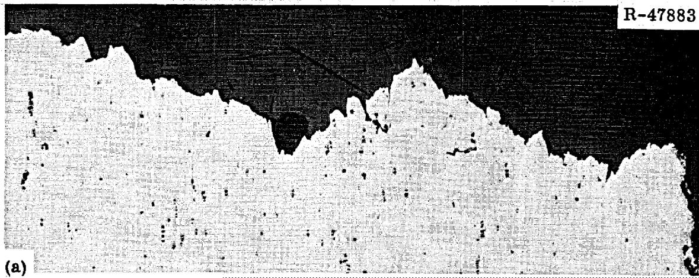

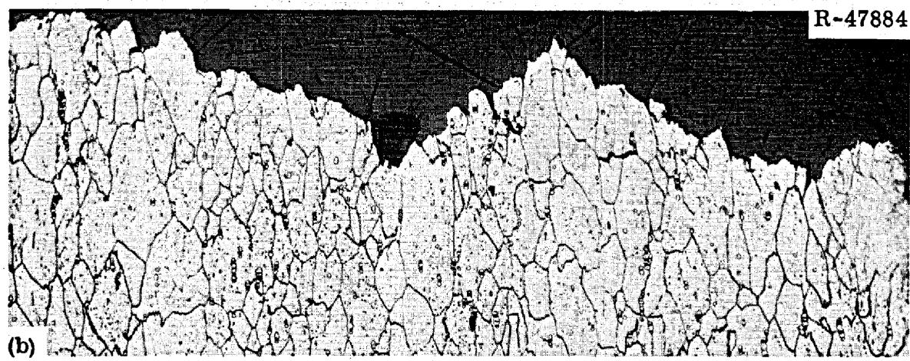

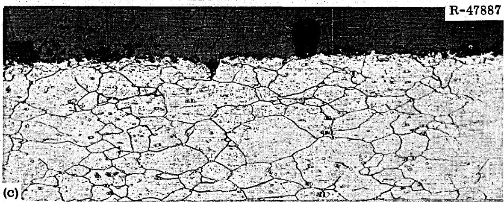  
Fig. 38. Photomicrographs of a Hastelloy N (Heat 5065) Sample Tested at $25^{\circ}\mathrm{C}$ at a Strain Rate of $0.05\mathrm{min}^{-1}$ . Sample had been irradiated to a thermal fluence of $2.6 \times 10^{19}$ neutrons/cm² while being exposed to the cell environment at $650^{\circ}\mathrm{C}$ for 20,789 hr. 100x. (a) Fracture, as polished. (b) Fracture, etched. (c) Edge of stressed portion. Etchant: aqua regia.

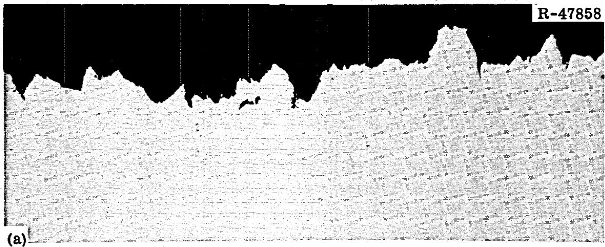

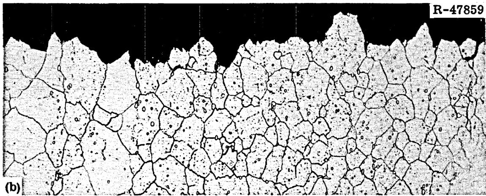

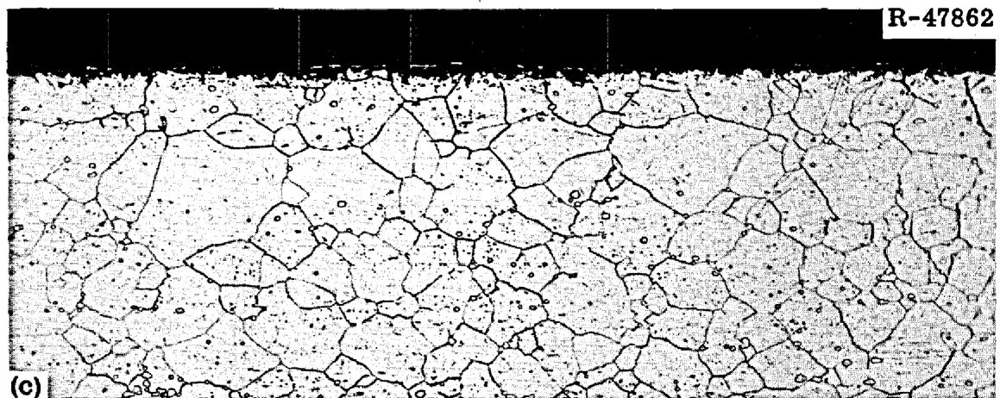  
Fig. 39. Photomicrographs of a Hastelloy N (Heat 5065) Sample Tested at $600^{\circ}\mathrm{C}$ at a Strain Rate of $0.002\mathrm{min}^{-1}$ . Sample had been irradiated to a thermal fluence of $2.6 \times 10^{19}$ neutrons/cm² while being exposed to the cell environment at $650^{\circ}\mathrm{C}$ for 20,789 hr. 100x. (a) Fracture, as polished. (b) Fracture, etched. (c) Edge of stressed portion, etched. Etchant: aqua regia.

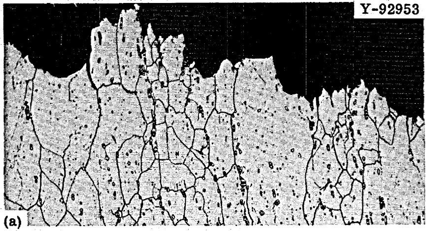

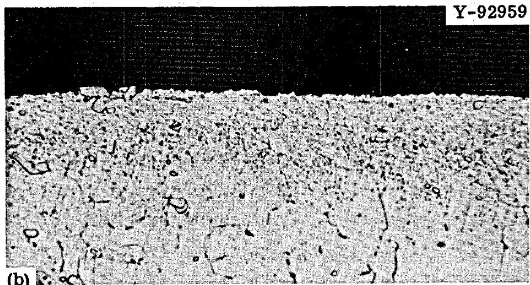

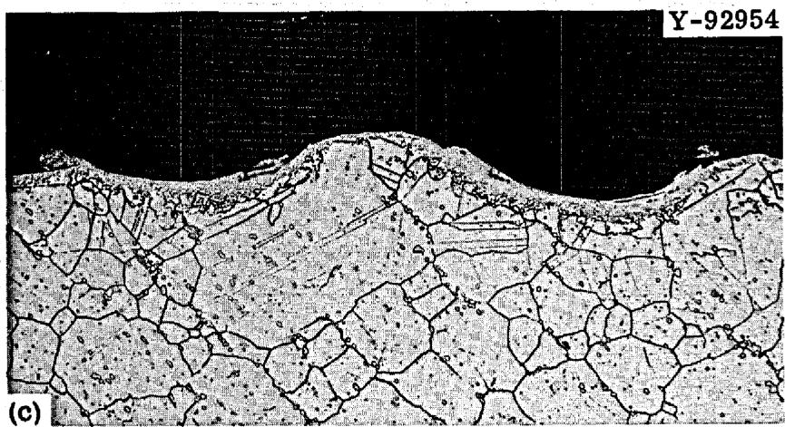  
Fig. 40. Photomicrographs of a Hastelloy N (Heat 5085) Sample Exposed to Static Barren Fuel Salt for 15,289 hr at $650^{\circ}\mathrm{C}$ and Then Tested at $200^{\circ}\mathrm{C}$ . (a) Fracture. $100 \times$ . (b) Edge of cross section from stressed portion. $500 \times$ . (c) Edge of cross section from shoulder showing impressions made by engraving numbers. $100 \times$ . Etchant: glyceria regia.

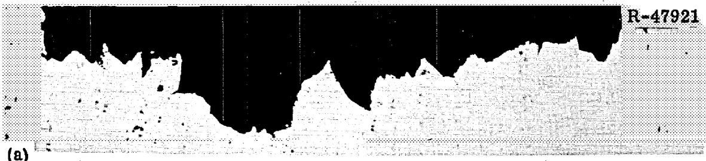

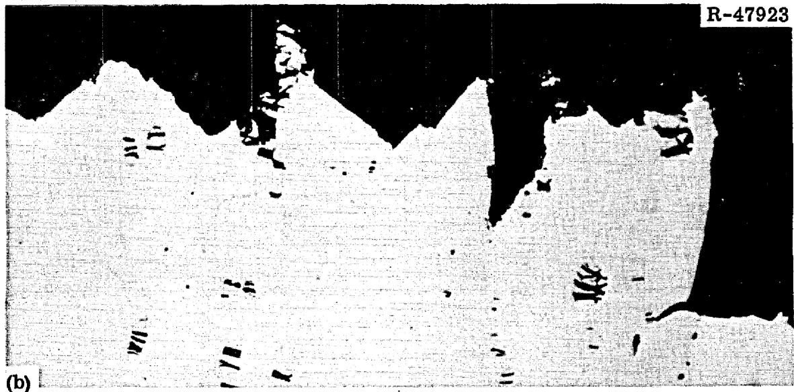

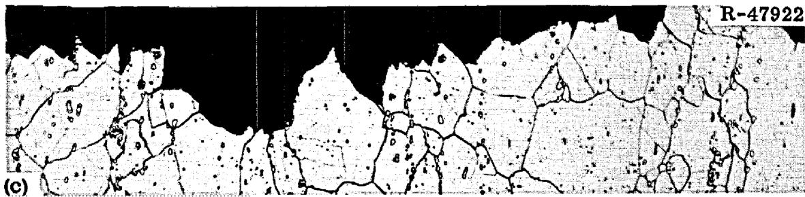

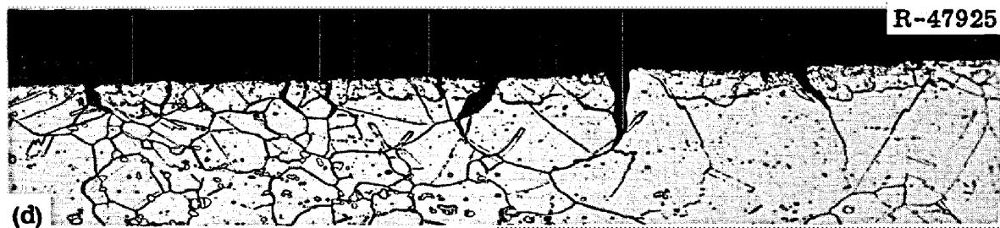  
Fig. 41. Photomicrographs of a Hastelloy N (Heat 5085) Sample Exposed to Fluoride Salt in the MSRE for 15,289 hr at $650^{\circ}\mathrm{C}$ and Then Tested at $25^{\circ}\mathrm{C}$ . Thermal Fluence was $9.4 \times 10^{20}$ neutrons/cm $^2$ . (a) Fracture, as polished. $100\times$ . (b) Fracture, as polished. $500\times$ . (c) Fracture, etched. $100\times$ . (d) Edge of stressed portion, etched. $100\times$ . Etchant: aqua regia.

photomicrographs [Fig. 41(a) and (b)] show that the large carbides actually fracture during testing. Some of these cracks may propagate and contribute to fracture. (This fracturing occurs in unirradiated and irradiated samples when tested at relatively low temperatures, e.g., Figs. 36, 38, and 40.) There is a very thin layer of the modified structure near the surface of the tested sample [Fig. 41(d)], but the amount of edge cracking is not unusually high for a sample that has strained $36\%$ (Fig. 13, p. 22).

The fracture of a sample of heat 5085 that was tested at $650^{\circ}\mathrm{C}$ after exposure to a static barren fuel salt for 15,289 hr at $650^{\circ}\mathrm{C}$ is shown in Fig. 42. The fracture is mixed transgranular and intergranular and there is considerable evidence of carbide fracturing. By contrast, the fracture shown in Fig. 43 is primarily intergranular. The sample in Fig. 43 was irradiated to a thermal fluence of $2.4 \times 10^{20}$ neutrons/cm² and tested at $650^{\circ}\mathrm{C}$ . At the low fracture strain of only $5\%$ (Fig. 13, p. 22) there is little evidence of plastic deformation with only a few fractured carbides and some separations at the carbide-metal interfaces [Fig. 43(b)].

Samples of heat 5065 that were irradiated to a thermal fluence of $2.4 \times 10^{20}$ neutrons/cm² and the thermal controls both had fracture strains of over $40\%$ when tested at $25^{\circ}C$ (Figs. 15 and 16, p. 23). The fractures of these samples appear quite similar (Figs. 44 and 45). The fractures are largely intergranular although the grains have deformed extensively. Some edge cracking occurred on both samples.

When tested at $650^{\circ}\mathrm{C}$ an unirradiated sample of heat 5065 had a fracture with transgranular and intergranular components (Fig. 46). This sample had a fracture strain of about $17\%$ (Fig. 16, p. 23) compared with $3.5\%$ (Fig. 15, p. 23) for a comparable sample irradiated to a thermal fluence of $9.4 \times 10^{20}$ neutrons/cm². The irradiated sample has an intergranular fracture with very limited intergranular and carbide cracking (Fig. 47). The modified layer near the surface has not deformed differently from the remaining sample. The fracture of a sample modified with titanium (heat 67-502) that was exposed to barren fuel salt for 9789 hr at $650^{\circ}\mathrm{C}$ and tested at $25^{\circ}\mathrm{C}$ is shown in Fig. 48. The grains have deformed extensively although the fracture is largely intergranular.

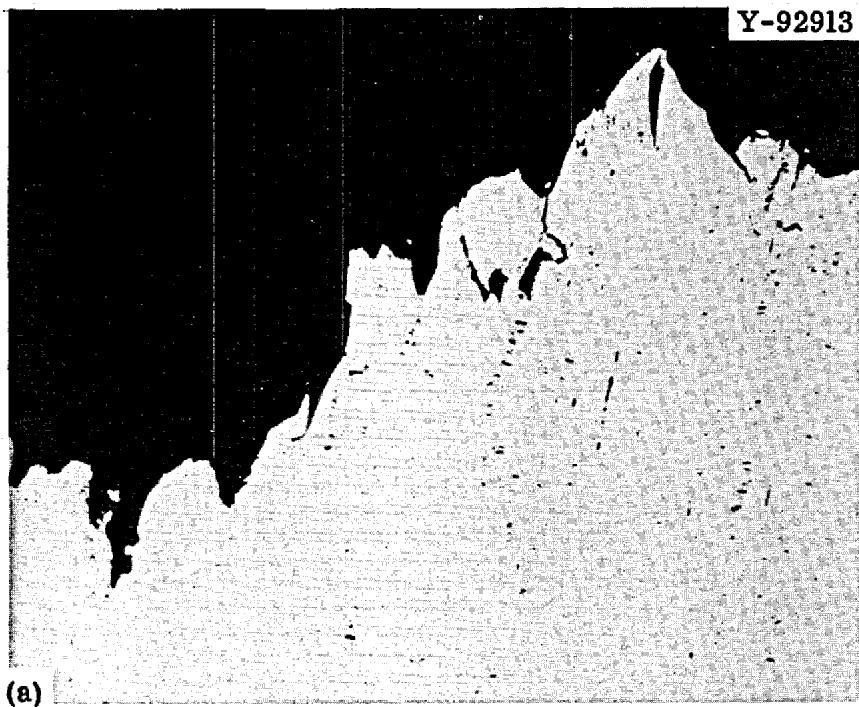

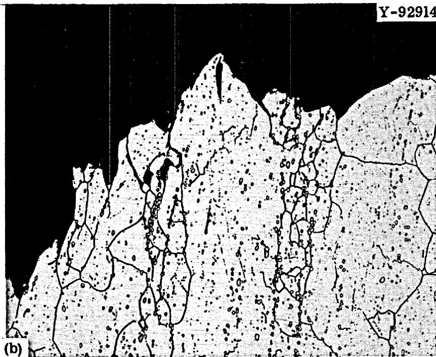  
Fig. 42. Photomicrographs of a Hastelloy N (Heat 5085) Sample Exposed to Static Barren Fuel Salt for 15,289 hr at $650^{\circ}\mathrm{C}$ and Then Tested at $650^{\circ}\mathrm{C}$ and a Strain Rate of 0.002 min $^{-1}$ . 100×. (a) Fracture, as polished. (b) Fracture, etched. Etchant: glyceria regia.

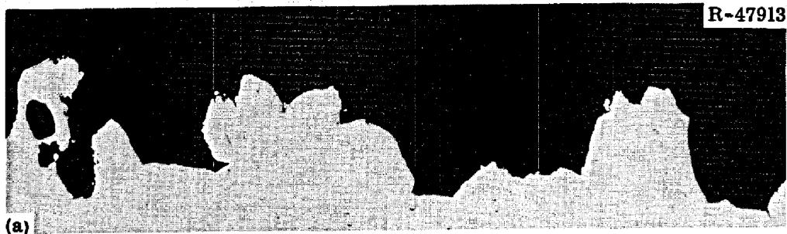

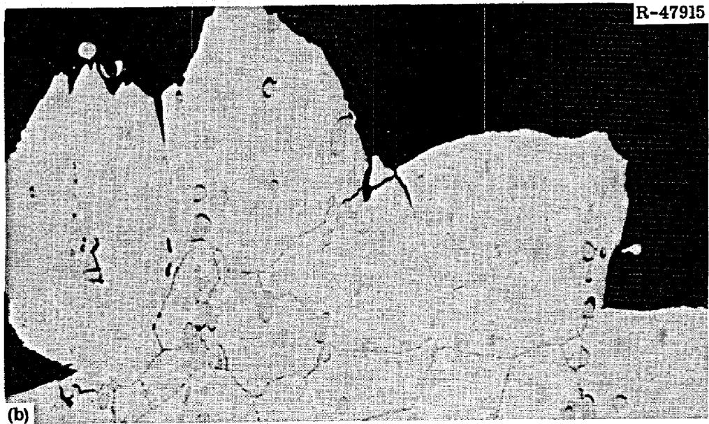

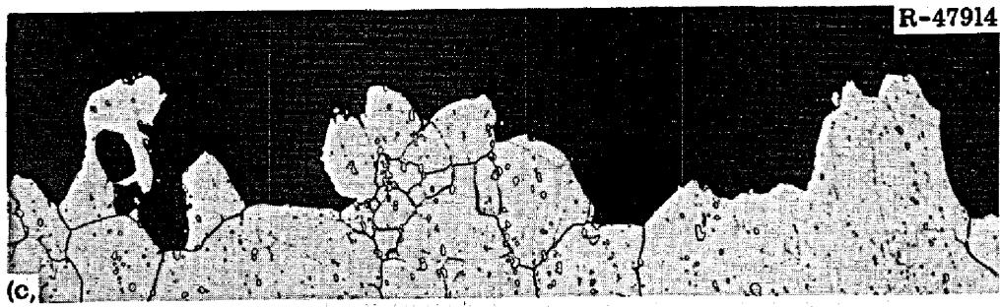

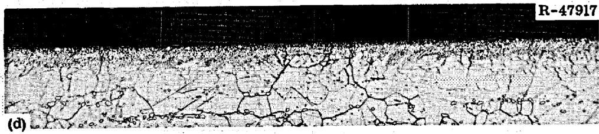  
Fig. 43. Photomicrographs of a Hastelloy N (Heat 5085) Sample Exposed to Fluoride Salt in the MSRE for 15,289 hr at $650^{\circ}\mathrm{C}$ and Then Tested at $650^{\circ}\mathrm{C}$ and a Strain Rate of $0.002\mathrm{min}^{-1}$ . Thermal fluence was $9.4 \times 10^{20}$ neutrons/cm $^2$ . (a) Fracture, as polished. $100\times$ . (b) Fracture, as polished. $500\times$ . (c) Fracture, etched. $100\times$ . (d) Edge of stressed portion, etched. $100\times$ . Etchant: aqua regia. Reduced $14.5\%$ .

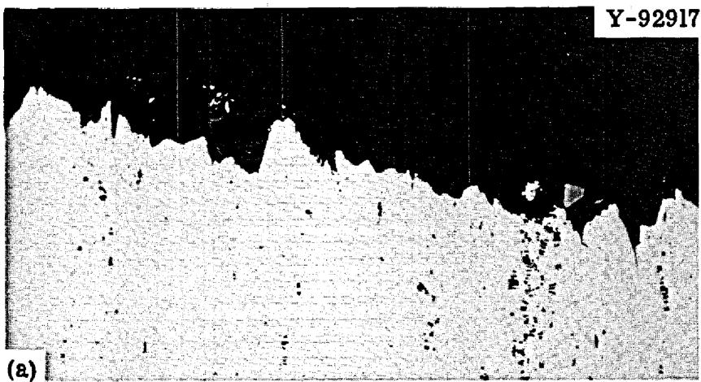

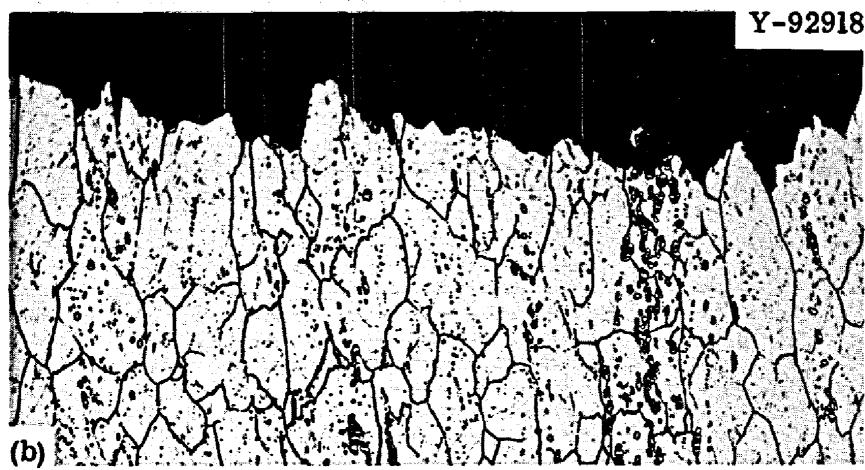

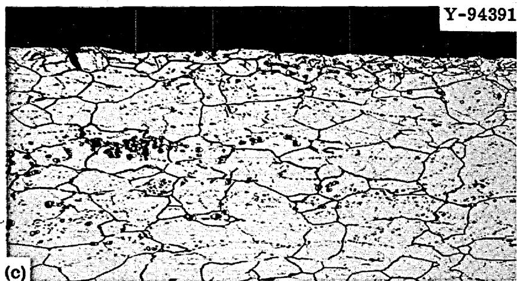  
Fig. 44. Photomicrographs of a Hastelloy N (Heat 5065) Sample Exposed to Static Barren Fuel Salt for 15,289 hr at $650^{\circ}\mathrm{C}$ and Then Tested at $25^{\circ}\mathrm{C}$ and a Strain Rate of $0.05\mathrm{min}^{-1}$ . 100×. (a) Fracture, as polished. (b) Fracture, etched. (c) Edge of stressed portion, etched. Etchant: glyceria regia.

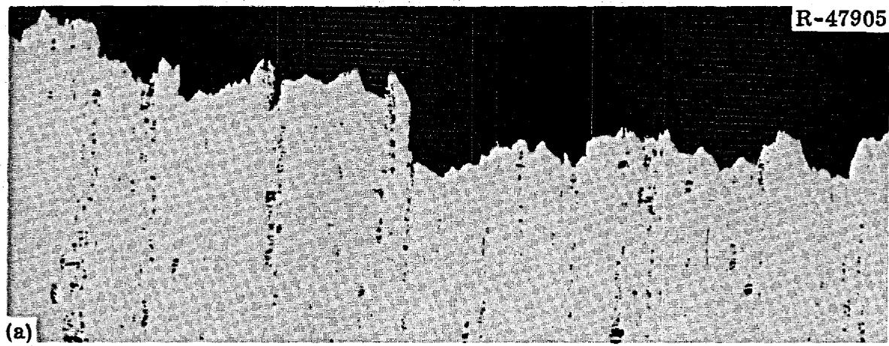

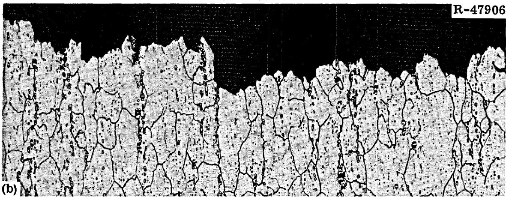

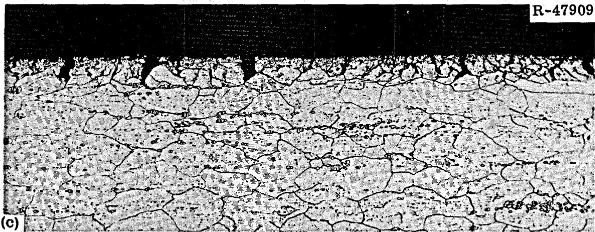  
Fig. 45. Photomicrographs of a Hastelloy N (Heat 5065) Sample Exposed to Fluoride Salt in the MSRE for 15,289 hr at $650^{\circ}\mathrm{C}$ and Then Tested at $25^{\circ}\mathrm{C}$ and a Strain Rate of $0.05\mathrm{min}^{-1}$ . Thermal fluence was $9.4 \times 10^{20}$ neutrons/cm². $100\times$ . (a) Fracture, as polished. (b) Fracture, etched. (c) Edge of stressed portion. Etchant: aqua regia.

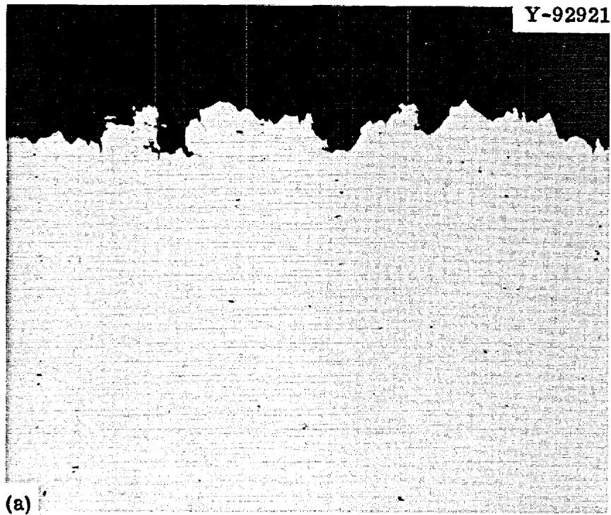

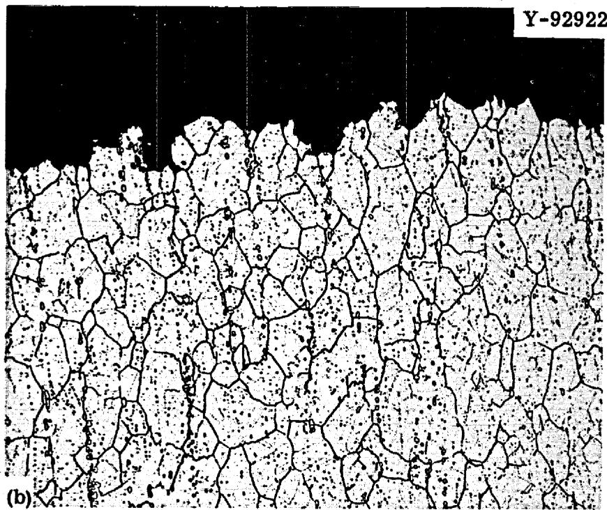  
Fig. 46. Photomicrographs of a Hastelloy N (Heat 5065) Sample Exposed to Static Barren Fuel Salt for 15,289 hr at $650^{\circ}\mathrm{C}$ and Then Tested at $650^{\circ}\mathrm{C}$ and a Strain Rate of $0.002\min^{-1}$ . 100×. (a) Fracture, as polished. (b) Fracture, etched. Etchant: glyceria regia.

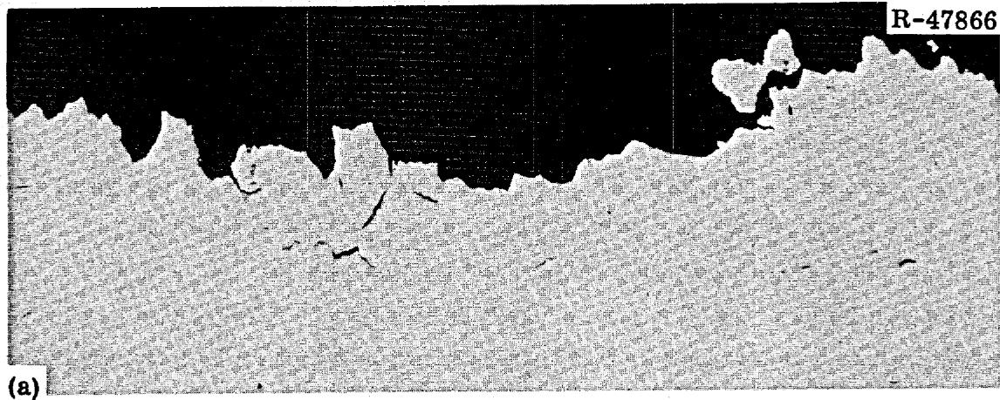

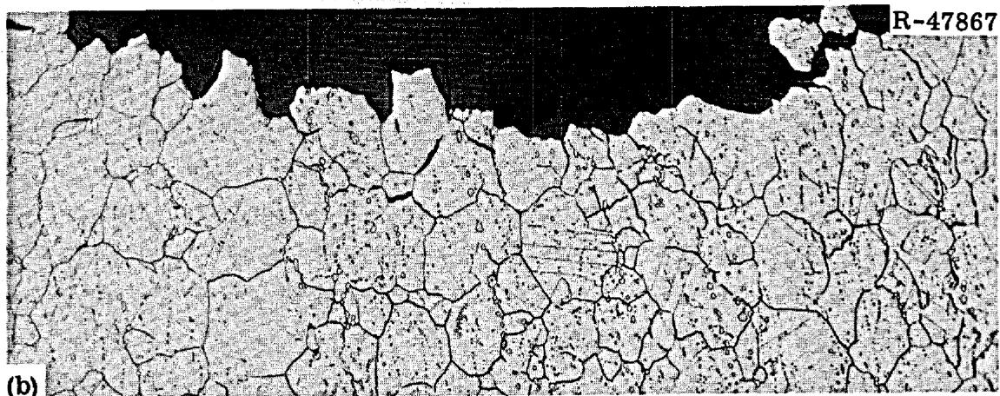

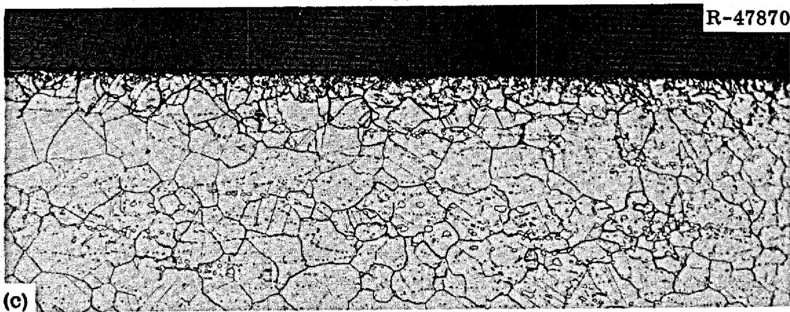  
Fig. 47. Photomicrographs of a Hastelloy N (Heat 5065) Sample Exposed to Fluoride Salt in the MSRE for 15,289 hr at $650^{\circ}\mathrm{C}$ and Then Tested at $650^{\circ}\mathrm{C}$ and a Strain Rate of $0.002\mathrm{min}^{-1}$ . Thermal fluence was $9.4 \times 10^{20}$ neutrons/cm $^2$ . $100\times$ . (a) Fracture, as polished. (b) Fracture, etched. (c) Edge of stressed portion, etched. Etchant: aqua regia.

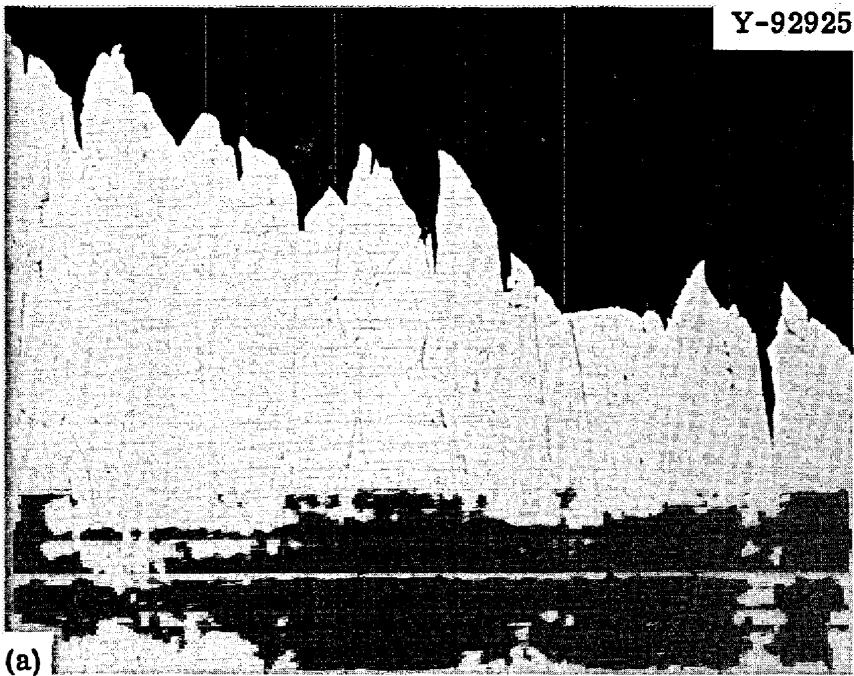

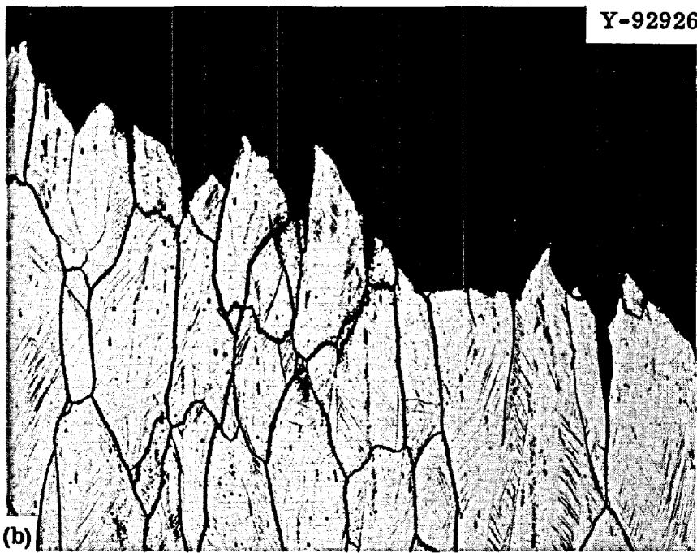  
Fig. 48. Photomicrographs of a Hastelloy N (Heat 67-502) Sample Exposed to Static Barren Fuel Salt for 9789 hr at $650^{\circ}\mathrm{C}$ and Then Tested at $25^{\circ}\mathrm{C}$ . 100×. (a) Fracture, as polished. (b) Fracture, etched. Etchant: glyceria regia.

Further photomicrographs of the unstressed portion of this same sample are shown in Fig. 49. There is a very fine carbide precipitate throughout this sample and our other studies indicate that these are likely carbides of the $\mathrm{M}_2\mathrm{C}$ or MC types. $^{10}$ The grain boundaries also etch quite heavily indicating the presence of heavy grain-boundary precipitation. The surface of the sample has a very thin layer that is rich in iron. This is likely a deposit since this alloy is very low in iron and the rest of the system is fabricated of material that contains 4 to $5\%$ Fe.

A sample of heat 67-502 that was irradiated and tested at $25^{\circ}\mathrm{C}$ is shown in Fig. 50. The fracture strain of this sample was about as high as that for the unirradiated sample (Fig. 29, p. 35), but the grains are not nearly as elongated in the irradiated sample (Fig. 50) as in the unirradiated sample (Fig. 48). There are considerably more grain-boundary cracks in the irradiated sample than in the unirradiated sample.

The fracture of a sample of heat 67-502 that was exposed to barren fuel salt for 9789 hr and tested at $650^{\circ}\mathrm{C}$ is shown in Fig. 51. The fracture is transgranular, an observation consistent with the extremely high fracture strain of this sample (Fig. 29, p. 35).

The fracture at $25^{\circ}\mathrm{C}$ of heat 67-504 (Fig. 52) is quite similar to that noted for heat 67-502 (Fig. 48). Heat 67-504 is modified with $0.5\%$ Hf and the photomicrographs in Fig. 53 indicate that there may be more precipitate in this alloy than in heat 67-502 that was modified with $0.5\%$ Ti and $2\%$ W. However, the apparent amount of precipitation is very dependent upon the etching procedure. This heat of material is also very low in iron and iron deposition was noted [Fig. 53(a)].

The fracture of an irradiated sample of heat 67-504 tested at $25^{\circ}\mathrm{C}$ is shown in Fig. 54. The grains have deformed and the fracture was transgranular. As shown in Fig. 29, p. 35, the fracture strain at $25^{\circ}\mathrm{C}$ of heat 67-504 was lower than that of 67-502. However, the fractures (Figs. 50 and 54) give the opposite impression.

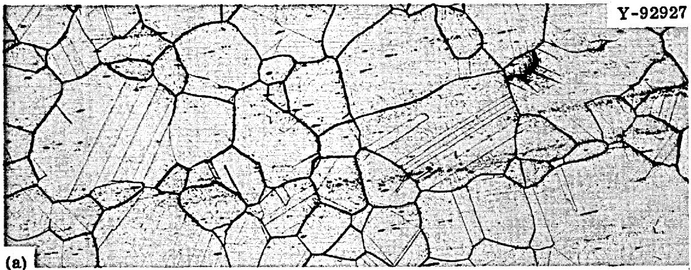

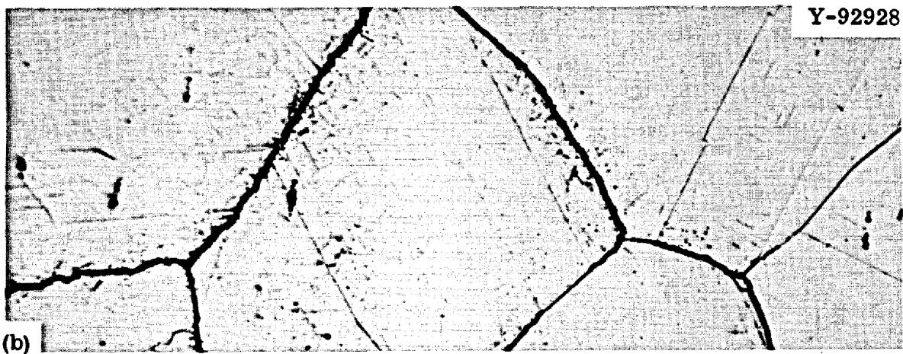

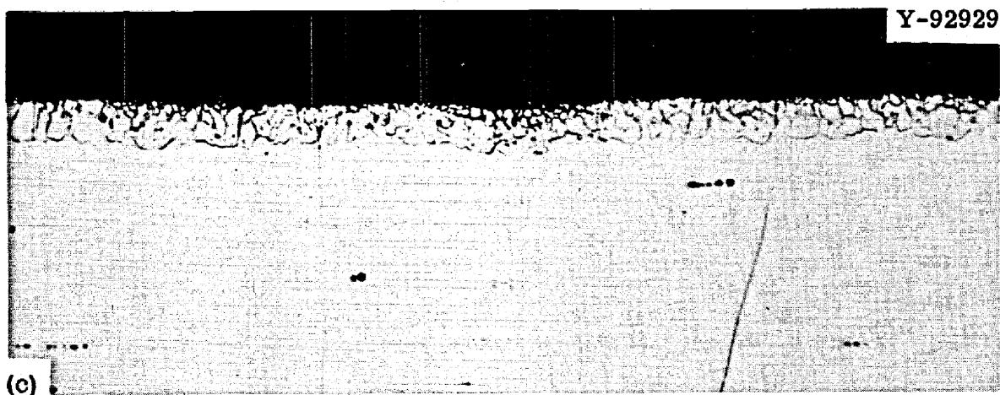  
Fig. 49. Photomicrographs of the Unstressed Portion of a Hastelloy N (Heat 67-502) Sample That Was Exposed to Static Barren Fuel Salt for 9789 hr at $650^{\circ}\mathrm{C}$ . (a) Typical. $100 \times$ . (b) Typical. $500 \times$ . (c) Edge. $500 \times$ . Etchant: glyceria regia.

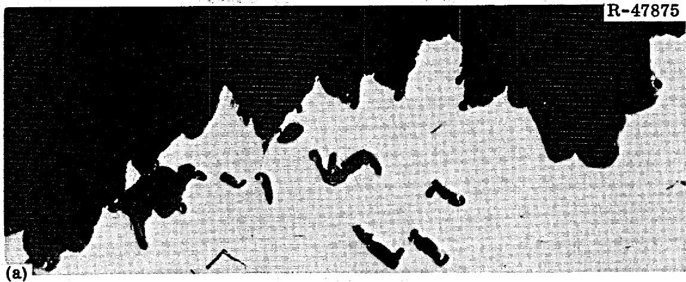

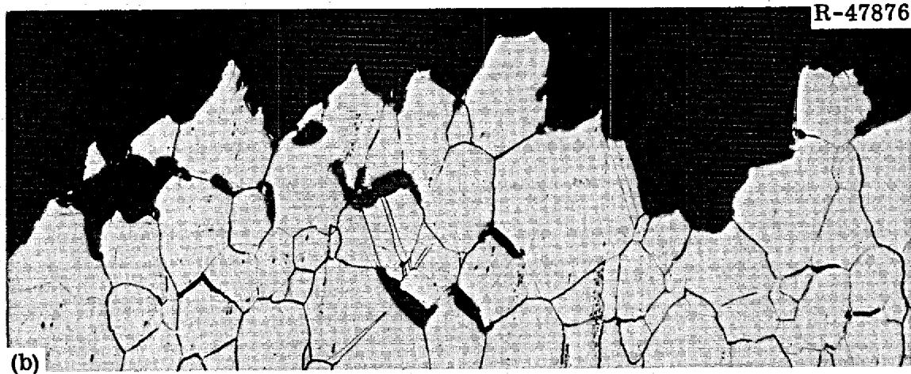

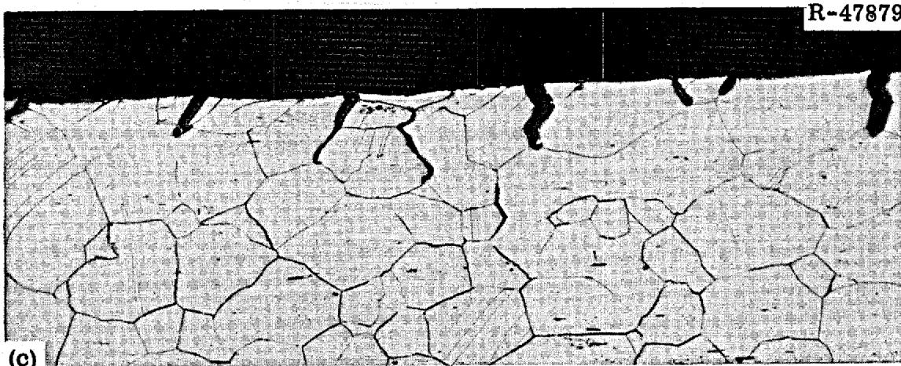  
Fig. 50. Photomicrographs of a Hastelloy N (Heat 67-502) Sample Exposed to Fluoride Salt in the MSRE for 9789 hr at $650^{\circ}\mathrm{C}$ and Then Tested at $25^{\circ}\mathrm{C}$ . 100×. (a) Fracture, as polished. (b) Fracture, etched. (c) Edge of stressed portion, etched. Etchant: aqua regia.

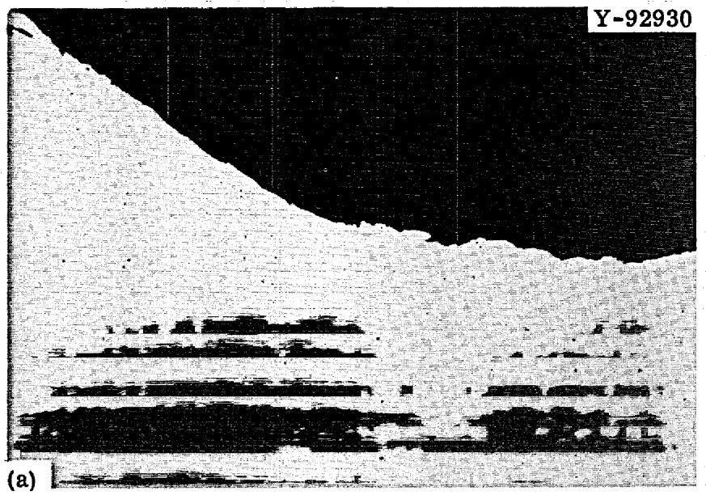

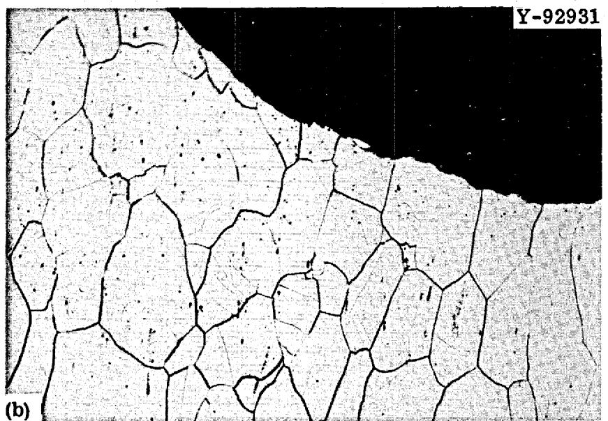  
Fig. 51. Photomicrographs of the Fracture of a Hastelloy N (Heat 67-502) Sample Exposed to Static Barren Fuel Salt for 9789 hr at $650^{\circ}\mathrm{C}$ and Then Tested at $650^{\circ}\mathrm{C}$ and a Strain Rate of $0.002\mathrm{min}^{-1}$ . 100x. (a) As polished. (b) Etched. Etchant: glyceria regia.

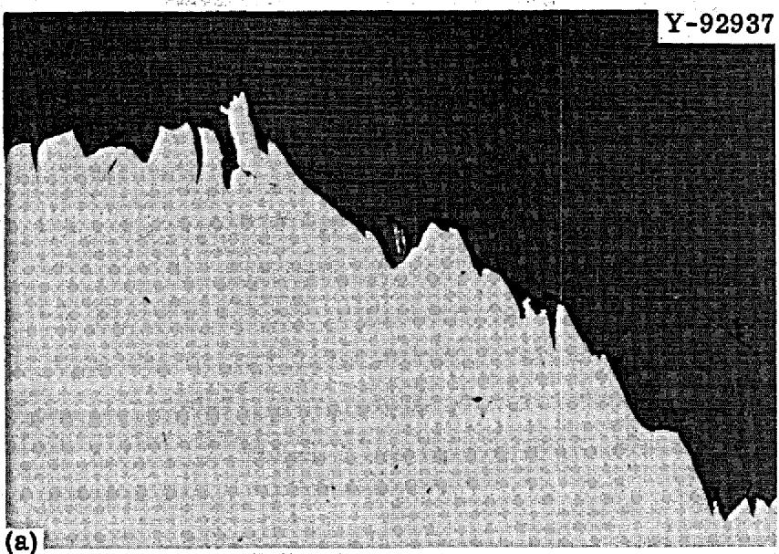

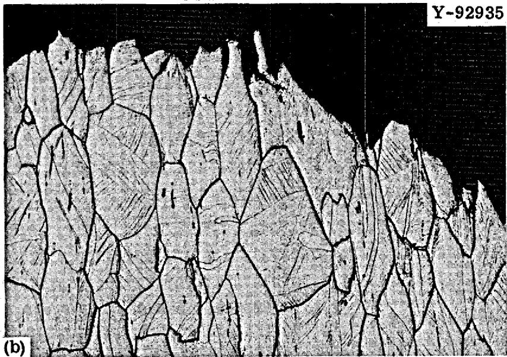  
Fig. 52. Photomicrographs of the Fracture of a Hastelloy N (Heat 67-504) Sample That Was Exposed to Barren Fuel Salt for 9789 hr at $650^{\circ}\mathrm{C}$ and Tested at $25^{\circ}\mathrm{C}$ . 100×. (a) As polished. (b) Etched. Etchant: glyceria regia.

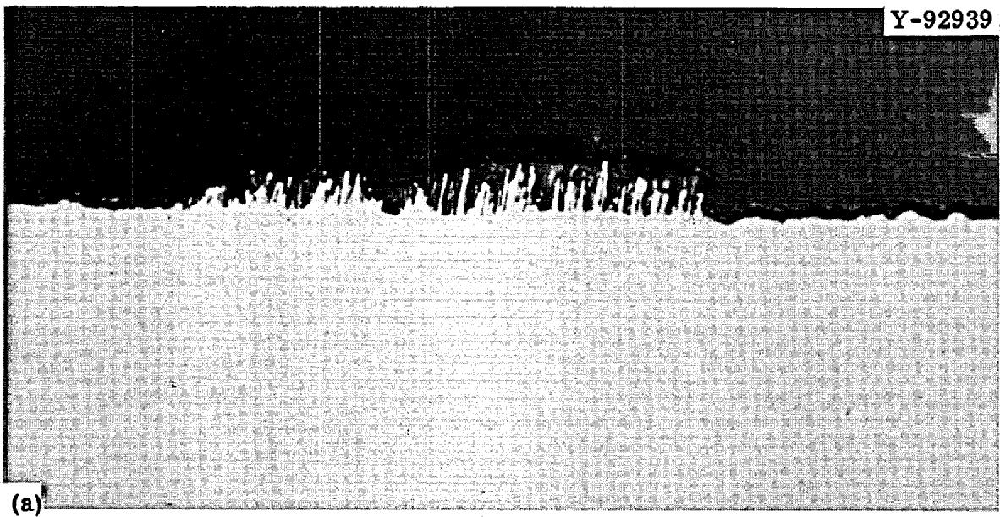

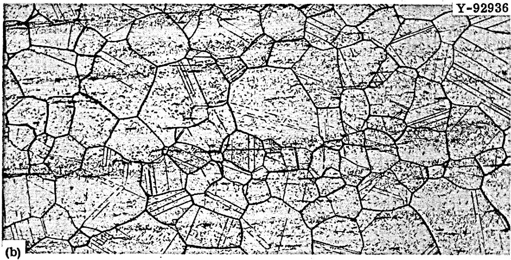  
Fig. 53. Photomicrographs of the Unstressed Portions of a Hastelloy N (Heat 67-504) Sample Exposed to Barren Fuel Salt for 9789 hr at $650^{\circ}\mathrm{C}$ . (a) Edge, as polished. $1000\times$ . (b) Typical microstructure, etched. $100\times$ . Etchant: glyceria regia.

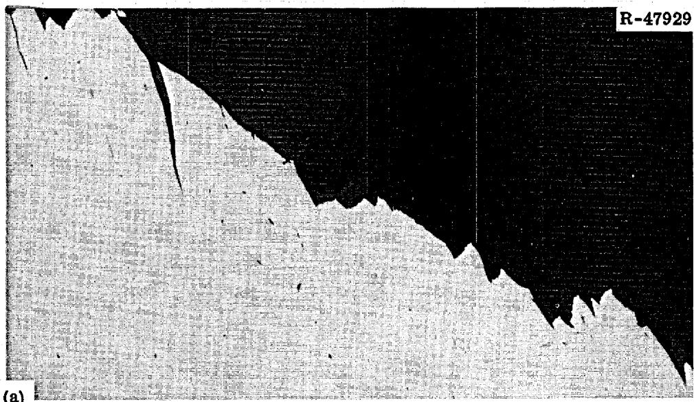

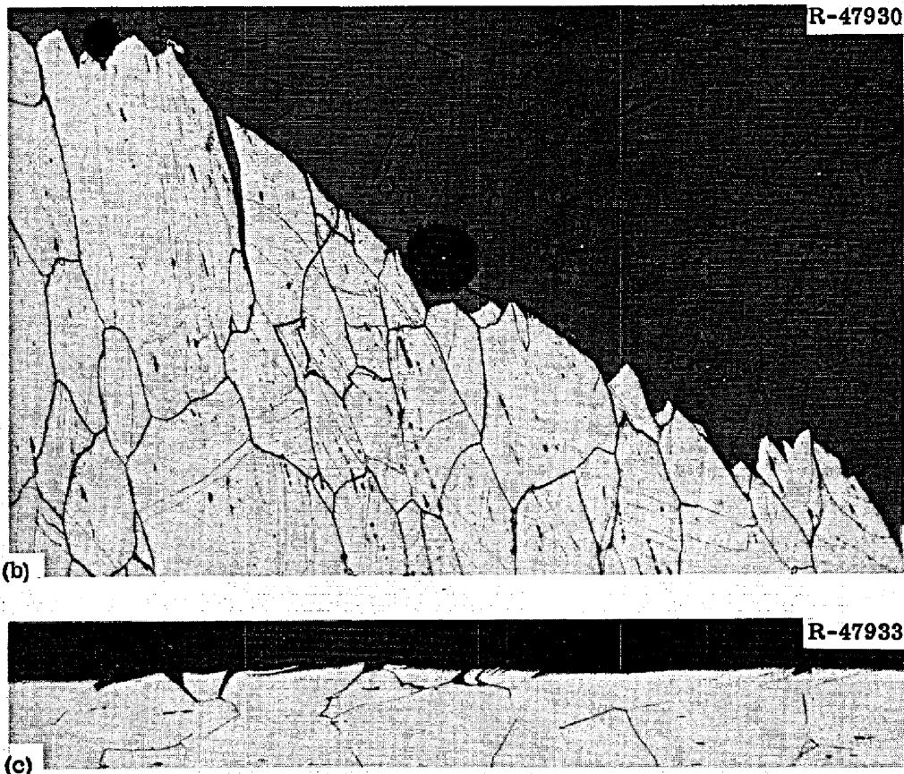  
Fig. 54. Photomicrographs of a Hastelloy N (Heat 67-504) Sample Exposed to Fluoride Salt in the MSRE for 9789 hr at $650^{\circ}\mathrm{C}$ and Tested at $25^{\circ}\mathrm{C}$ . $100 \times$ (a) Fracture, as polished. (b) Fracture, etched. (c) Edge of stressed portion, etched. Etchant: aqua regia. Reduced $10\%$ .

Heat 67-504 also failed by a predominately transgranular mode when tested at $650^{\circ}\mathrm{C}$ (Fig. 55). This observation correlates quite well with the high fracture strain of this sample (Fig. 29, p. 35).

# Discussion of Results

The samples of standard Hastelloy N removed from the surveillance facilities inside the MSRE core and outside the reactor vessel continue to show excellent compatibility with their respective environments of fuel salt and $\mathbf{N}_2 + 2$ to $5\% \mathrm{O}_2$ . We could not detect the diffusion of fission products into the samples from the core. The samples exposed to the cell environment showed no evidence of nitriding and only superficial oxidation.

We have removed several groups of samples from the MSRE (Table 2, p. 6) and some valuable observations have been made regarding the changes of mechanical properties with fluence and thermal exposure. The thermal flux in the center of the core is 40 times that at the vessel wall. Only the Hastelloy N thimbles for the control rods have been exposed to the peak flux and have accumulated a thermal neutron fluence of about $1 \times 10^{21}$ neutrons/cm². The tensile (Figs. 17 and 18, pp. 24 and 25) and the creep (Figs. 21, 23, 25, and 27, pp. 27, 29, 31, and 32) properties of Hastelloy N exposed to such a fluence are very poor; but the thimbles are stressed only slightly in compression and the observed property changes are not catastrophic.

The peak vessel thermal fluence is presently (May 1968) $2.6 \times 10^{19}$ neutrons/cm², but the properties have already been altered markedly. The results that we obtained at higher fluences can be used to estimate the future properties of the MSRE vessel. Figure 56 has been constructed for heat 5085 and shows how the fracture strain at different strain rates varies with thermal fluence at $650^{\circ}\mathrm{C}$ . The fraction of the strain remaining is based on the number shown in parenthesis which is the value measured in the unirradiated starting material after a 2-hr anneal at $900^{\circ}\mathrm{C}$ . The corresponding curve for the burnup of $^{10}\mathrm{B}$ is also

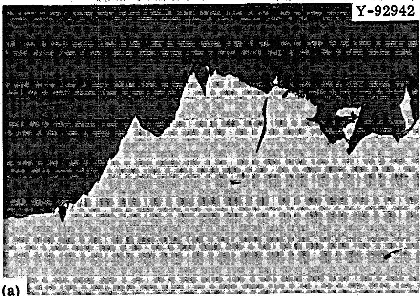

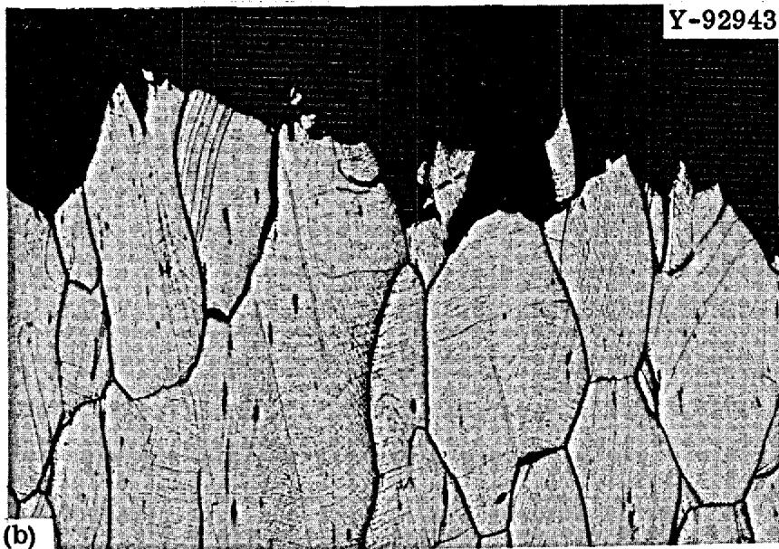  
Fig. 55. Photomicrographs of the Fracture of a Hastelloy N (Heat 67-504) Sample Exposed to Static Barren Fuel Salt for 9789 hr at $650^{\circ}\mathrm{C}$ and Tested at $650^{\circ}\mathrm{C}$ and a Strain rate of $0.002\mathrm{min}^{-1}$ . $100\times$ (a) As polished. (b) Etched. Etchant: glyceria regia.

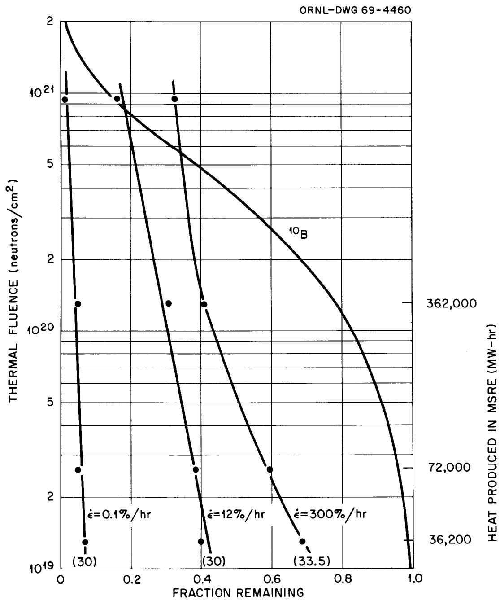  
Fig. 56. Change in the Fracture Strain of Hastelloy N (Heat 5085) with Thermal Fluence for Various Strain Rates.

shown for comparison (based on a cross section of 1930 barns for MSRE spectrum11).

The strain rate of $300\% / \mathrm{hr}$ ( $0.05 \, \mathrm{min}^{-1}$ ) is that normally used in tensile tests and the vessel heats presently, after 72,400 Mwhr of operation, will strain about $20\%$ at $650^{\circ}\mathrm{C}$ before failure. The fracture strain decreases with decreasing strain rate to a minimum value of $1.5\%$ at a strain rate of about $0.1\% / \mathrm{hr}$ . These property changes are quite large when we consider that only $4\%$ of the $^{10}\mathrm{B}$ has been converted to helium (accumulated thermal fluence $\simeq 2.6 \times 10^{19}$ neutrons/ $\mathrm{cm}^2$ ). However, the results from samples exposed to higher fluences in the core indicate that the property changes are not simply proportional to the quantity of $^{10}\mathrm{B}$ transmuted to helium. Although the intended operating time for the MSRE has not been established, it likely will not exceed 362,000 Mwhr (five times the energy already generated). Figure 56 indicates that the mechanical properties should not worsen drastically from those that prevail after 72,400 Mwhr of operation.

The main uncertainty associated with our estimate of the future properties of the MSRE vessel is that we have not taken into account the property changes due to thermal aging. As shown in Figs. 19 and 21, pp. 25 and 27, the tensile and creep properties of heat 5085 were changed just by annealing at $650^{\circ}\mathrm{C}$ . However, heat 5065 (Fig. 25, p. 31) seemed to be more resistant to aging. The noted changes in the fracture strain at lower temperatures could also conceivably become a problem. These changes also vary from heat to heat and depend on both fluence and aging time. Thus, the effects of aging cannot be taken into account adequately to improve on the property estimates made on the basis of Fig. 56.

The postirradiation properties of the two modified alloys (heats 67-502 and -504) were better than those of the standard alloys (compare Figs 28 and 35, pp. 33 and 39). We cannot explain the property changes that occurred as a result of aging these alloys in static barren salt, but our current aging studies should reveal the mechanism.

Metallographic examination showed that the standard Hastelloy N was very compatible with the fuel salt. The samples removed from outside the vessel were oxidized but there was no evidence of nitrogen absorption. The modified alloys were exposed to the fuel salt and an iron-rich layer was formed on the surface. This transfer occurred because the modified alloys contain less than $0.1\%$ Fe and the standard Hastelloy N used in the rest of the system contains 4 to $5\%$ Fe.

# SUMMARY AND CONCLUSIONS

We have examined the third group of surveillance samples removed from the MSRE. The materials involved were (1) standard Hastelloy N exposed in the MSRE cell to an environment of $\mathbf{N}_2 + 2$ to $5\%$ $\mathbf{O}_2$ for 20,789 hr at $650^{\circ}\mathrm{C}$ to a thermal fluence of $2.6 \times 10^{19}$ neutrons/cm², (2) standard Hastelloy N exposed in the MSRE core to fluoride salt for 15,289 hr at $650^{\circ}\mathrm{C}$ to a thermal fluence of $9.4 \times 10^{20}$ neutrons/cm², and (3) modified Hastelloy N exposed in the MSRE to fluoride salt for 9789 hr at $650^{\circ}\mathrm{C}$ to a thermal fluence of $5.3 \times 10^{20}$ neutrons/cm². Postirradiation creep and tensile tests were run to evaluate the influence of the respective exposures on the mechanical properties. The property change of most concern is the reduction in the fracture strain. The fracture strain at $25^{\circ}\mathrm{C}$ was reduced by an amount related to both the neutron fluence and the exposure time. The fracture strain could be restored by a postirradiation anneal of 8 hr at $870^{\circ}\mathrm{C}$ and we propose that the reduction in fracture strain at $25^{\circ}\mathrm{C}$ is due to carbide precipitation. The fracture strain in tensile tests above $500^{\circ}\mathrm{C}$ and in creep tests at $650^{\circ}\mathrm{C}$ was reduced by irradiation. This embrittlement is associated with the helium that is produced by the transmutation of $^{10}\mathrm{B}$ in the alloy and cannot be recovered by postirradiation annealing. We compared the results from samples irradiated to thermal fluences ranging from $1.3 \times 10^{19}$ to $9.4 \times 10^{20}$ neutrons/cm² and have an approximate picture of how the fracture strain varies with fluence. This picture is complicated by the fact that the properties of the unirradiated material change some with aging at $650^{\circ}\mathrm{C}$ , and we do not have sufficient data to separate the contributions of irradiation and aging to the observed embrittlement.

The modified alloys had better postirradiation properties than were measured for the standard Hastelloy N. Although the properties of these materials were affected appreciably by irradiation, the minimum fracture strain observed in postirradiation creep tests at $650^{\circ}\mathrm{C}$ was $6\%$ .

# ACKNOWLEDGMENTS

The author is indebted to numerous persons for assistance in this study.

W. H. Cook and A. Taboada - Design of surveillance assembly and insertion of specimens.

W. H. Cook and R. C. Steffy - Flux measurements.

J. R. Weir, Jr., R. E. Gehlbach, and C. E. Sessions - Review of manuscript.

E. J. Lawrence and J. L. Griffith - Assembled surveillance and control specimens in fixture.

P. Haubenreich and MSRE Operation Staff - Exercised extreme care in inserting and removing the surveillance specimens.

E. M. King and Hot Cell Operation Staff - Developed techniques for cutting long rods into individual specimens, determined specimen straightness, and offered assistance in running creep and tensile tests.

B. C. Williams, B. McNabb, and N. O. Pleasant - Ran tensile and creep tests on surveillance and control specimens.

E. M. Thomas and J. Feltner - Processed test data.

H. R. Tinch and E. Lee - Metallography on control and surveillance specimens.

Metals and Ceramics Reports Office - Preparation of manuscript.

Graphic Arts - Preparation of drawings.

APPENDIX

Table A-1. Postirradiation Tensile Properties of Samples of Heat $5085^{\mathrm{a}}$   

<table><tr><td rowspan="2">Specimen Number</td><td rowspan="2">Test Temperature (°C)</td><td rowspan="2">Strain Rate (min-1)</td><td colspan="2">Stress, psi</td><td colspan="2">Strain, %</td><td rowspan="2">Reduction in Area (%)</td><td rowspan="2">True Strain (%)</td></tr><tr><td>Yield</td><td>Ultimate</td><td>Uniform</td><td>Total</td></tr><tr><td>7976</td><td>25</td><td>0.05</td><td>46,500</td><td>99,100</td><td>32.8</td><td>32.8</td><td>24.51</td><td>28.0</td></tr><tr><td>7982b</td><td>25</td><td>0.05</td><td>46,700</td><td>111,900</td><td>48.2</td><td>48.3</td><td>34.19</td><td>42.0</td></tr><tr><td>7975</td><td>200</td><td>0.05</td><td>38,000</td><td>94,600</td><td>40.0</td><td>41.2</td><td>32.11</td><td>39.0</td></tr><tr><td>7974</td><td>400</td><td>0.05</td><td>34,700</td><td>90,800</td><td>46.8</td><td>47.2</td><td>36.46</td><td>45.0</td></tr><tr><td>7972</td><td>500</td><td>0.05</td><td>33,500</td><td>86,700</td><td>43.2</td><td>44.0</td><td>36.13</td><td>45.0</td></tr><tr><td>7970</td><td>550</td><td>0.05</td><td>32,000</td><td>76,000</td><td>29.5</td><td>30.2</td><td>30.89</td><td>37.0</td></tr><tr><td>7968</td><td>600</td><td>0.05</td><td>31,700</td><td>68,000</td><td>21.0</td><td>21.3</td><td>24.63</td><td>28.0</td></tr><tr><td>7966</td><td>650</td><td>0.05</td><td>30,400</td><td>60,900</td><td>18.8</td><td>19.7</td><td>14.82</td><td>16.0</td></tr><tr><td>7964</td><td>700</td><td>0.05</td><td>30,000</td><td>54,000</td><td>15.7</td><td>15.9</td><td>8.64</td><td>9.0</td></tr><tr><td>7962</td><td>760</td><td>0.05</td><td>30,200</td><td>43,800</td><td>8.3</td><td>8.9</td><td>12.30</td><td>13.0</td></tr><tr><td>7960</td><td>850</td><td>0.05</td><td>33,000</td><td>37,500</td><td>3.2</td><td>3.5</td><td>3.98</td><td>4.0</td></tr><tr><td>7973</td><td>400</td><td>0.002</td><td>35,000</td><td>91,500</td><td>47.3</td><td>47.8</td><td>37.20</td><td>47.0</td></tr><tr><td>7989</td><td>500</td><td>0.002</td><td>37,200</td><td>79,000</td><td>27.5</td><td>28.7</td><td>29.55</td><td>35.0</td></tr><tr><td>7969</td><td>550</td><td>0.002</td><td>33,500</td><td>67,400</td><td>19.5</td><td>20.6</td><td>18.94</td><td>21.0</td></tr><tr><td>7967</td><td>600</td><td>0.002</td><td>31,500</td><td>58,000</td><td>15.2</td><td>15.7</td><td>19.07</td><td>21.0</td></tr><tr><td>7965</td><td>650</td><td>0.002</td><td>31,300</td><td>49,900</td><td>11.1</td><td>11.6</td><td>18.61</td><td>21.0</td></tr><tr><td>7963</td><td>700</td><td>0.002</td><td>30,000</td><td>41,900</td><td>6.7</td><td>7.3</td><td>10.02</td><td>11.0</td></tr><tr><td>7961</td><td>760</td><td>0.002</td><td>28,600</td><td>37,000</td><td>4.4</td><td>5.0</td><td>8.31</td><td>9.0</td></tr><tr><td>7981</td><td>850</td><td>0.002</td><td>21,700</td><td>21,700</td><td>1.0</td><td>1.5</td><td>4.91</td><td>5.0</td></tr><tr><td>7988</td><td>500</td><td>0.0005</td><td>34,300</td><td>68,800</td><td>20.4</td><td>21.1</td><td>19.33</td><td>21.0</td></tr><tr><td>7987</td><td>550</td><td>0.0005</td><td>33,500</td><td>64,100</td><td>19.0</td><td>19.6</td><td>18.48</td><td>20.0</td></tr><tr><td>7986</td><td>600</td><td>0.0005</td><td>31,800</td><td>54,100</td><td>13.3</td><td>13.7</td><td>16.76</td><td>18.0</td></tr><tr><td>7985</td><td>650</td><td>0.0005</td><td>31,300</td><td>46,100</td><td>8.5</td><td>9.3</td><td>6.95</td><td>7.0</td></tr><tr><td>7984</td><td>700</td><td>0.0005</td><td>30,800</td><td>41,100</td><td>5.0</td><td>5.2</td><td>6.45</td><td>7.0</td></tr></table>

aLocated outside the MSRE vessel for 20,789 hr at $650^{\circ}\mathrm{C}$ . Thermal fluence was $2.6 \times 10^{19}$ neutrons/cm $^2$ .   
b Given a postirradiation anneal of 8 hr at $870^{\circ}\mathrm{C}$

Table A-2. Postirradiation Tensile Properties of Samples of Heat $5065^{\mathrm{a}}$   

<table><tr><td rowspan="2">Specimen Number</td><td rowspan="2">Test Temperature (°C)</td><td rowspan="2">Strain Rate (min-1)</td><td colspan="2">Stress, psi</td><td colspan="2">Strain, %</td><td rowspan="2">Reduction in Area (%)</td><td rowspan="2">True Strain (%)</td></tr><tr><td>Yield</td><td>Ultimate</td><td>Uniform</td><td>Total</td></tr><tr><td>7940</td><td>25</td><td>0.05</td><td>49,000</td><td>118,800</td><td>57.8</td><td>59.7</td><td>38.44</td><td>49.0</td></tr><tr><td>7939</td><td>200</td><td>0.05</td><td>40,500</td><td>105,200</td><td>55.1</td><td>57.6</td><td>40.54</td><td>52.0</td></tr><tr><td>7938</td><td>400</td><td>0.05</td><td>36,600</td><td>99,600</td><td>55.0</td><td>56.3</td><td>43.27</td><td>57.0</td></tr><tr><td>7936</td><td>500</td><td>0.05</td><td>45,400</td><td>94,800</td><td>46.6</td><td>47.2</td><td>40.83</td><td>52.0</td></tr><tr><td>7934</td><td>550</td><td>0.05</td><td>36,000</td><td>83,800</td><td>31.8</td><td>32.0</td><td>26.83</td><td>31.0</td></tr><tr><td>7946</td><td>600</td><td>0.05</td><td>33,100</td><td>79,800</td><td>33.3</td><td>33.9</td><td>31.33</td><td>38.0</td></tr><tr><td>7930</td><td>650</td><td>0.05</td><td>30,600</td><td>55,400</td><td>11.7</td><td>11.8</td><td>11.69</td><td>12.0</td></tr><tr><td>7928</td><td>700</td><td>0.05</td><td>31,100</td><td>57,200</td><td>13.5</td><td>13.6</td><td>16.83</td><td>18.0</td></tr><tr><td>7926</td><td>760</td><td>0.05</td><td>29,600</td><td>33,700</td><td>2.2</td><td>3.2</td><td>8.17</td><td>9.0</td></tr><tr><td>7924</td><td>850</td><td>0.05</td><td>32,700</td><td>36,800</td><td>3.2</td><td>3.4</td><td>3.99</td><td>4.0</td></tr><tr><td>7935</td><td>500</td><td>0.002</td><td>36,200</td><td>85,200</td><td>25.7</td><td>26.2</td><td>22.89</td><td>26.0</td></tr><tr><td>7956</td><td>500</td><td>0.002</td><td>38,100</td><td>86,900</td><td>29.5</td><td>30.2</td><td>24.14</td><td>28.0</td></tr><tr><td>7933</td><td>550</td><td>0.002</td><td>35,600</td><td>78,400</td><td>26.4</td><td>26.7</td><td>24.99</td><td>29.0</td></tr><tr><td>7931</td><td>600</td><td>0.002</td><td>34,600</td><td>63,400</td><td>14.9</td><td>15.1</td><td>8.49</td><td>9.0</td></tr><tr><td>7947</td><td>650</td><td>0.002</td><td>34,100</td><td>55,500</td><td>12.2</td><td>12.5</td><td>16.09</td><td>18.0</td></tr><tr><td>7948</td><td>700</td><td>0.002</td><td>33,500</td><td>49,900</td><td>8.6</td><td>8.7</td><td>8.31</td><td>9.0</td></tr><tr><td>7925</td><td>760</td><td>0.002</td><td>33,300</td><td>40,000</td><td>3.5</td><td>5.0</td><td>12.39</td><td>13.0</td></tr><tr><td>7945</td><td>850</td><td>0.002</td><td>22,600</td><td>23,100</td><td>1.0</td><td>2.0</td><td>2.86</td><td>3.0</td></tr><tr><td>7955</td><td>400</td><td>0.0005</td><td>38,200</td><td>100,700</td><td>52.8</td><td>54.2</td><td>37.37</td><td>47.0</td></tr><tr><td>7954</td><td>500</td><td>0.0005</td><td>36,400</td><td>80,100</td><td>28.3</td><td>28.9</td><td>25.11</td><td>29.0</td></tr><tr><td>7953</td><td>550</td><td>0.0005</td><td>37,500</td><td>70,200</td><td>20.3</td><td>20.9</td><td>19.59</td><td>22.0</td></tr><tr><td>7952</td><td>600</td><td>0.0005</td><td>27,800</td><td>61,100</td><td>16.7</td><td>17.0</td><td>18.74</td><td>21.0</td></tr><tr><td>7929</td><td>650</td><td>0.0005</td><td>33,700</td><td>52,700</td><td>8.8</td><td>9.1</td><td>16.02</td><td>17.0</td></tr><tr><td>7950</td><td>700</td><td>0.0005</td><td>32,800</td><td>46,300</td><td>4.8</td><td>6.2</td><td>5.69</td><td>6.0</td></tr></table>

${}^{a}$ Located outside the MSRE vessel for 20,789 hr at ${650}^{ \circ  }\mathrm{C}$ . Thermal fluence was ${2.6} \times  {10}^{19}$ neutrons $/{\mathrm{{cm}}}^{2}$ .

Table A-3. Tensile Properties of Samples of Heat $5085^{\mathrm{a}}$   

<table><tr><td rowspan="2">Specimen Number</td><td rowspan="2">Test Temperature (°C)</td><td rowspan="2">Strain Rate (min-1)</td><td colspan="2">Stress, psi</td><td colspan="2">Strain, %</td><td rowspan="2">Reduction in Area (%)</td><td rowspan="2">True Strain (%)</td></tr><tr><td>Yield</td><td>Ultimate</td><td>Uniform</td><td>Total</td></tr><tr><td>7888</td><td>25</td><td>0.05</td><td>52,300</td><td>95,000</td><td>28.7</td><td>28.9</td><td>19.95</td><td>22.0</td></tr><tr><td>7889</td><td>200</td><td>0.05</td><td>43,700</td><td>92,200</td><td>36.1</td><td>36.7</td><td>30.00</td><td>36.0</td></tr><tr><td>7890</td><td>400</td><td>0.05</td><td>42,800</td><td>84,300</td><td>31.9</td><td>32.1</td><td>31.11</td><td>37.0</td></tr><tr><td>7892</td><td>500</td><td>0.05</td><td>39,600</td><td>81,200</td><td>35.0</td><td>35.2</td><td>31.33</td><td>38.0</td></tr><tr><td>7894</td><td>550</td><td>0.05</td><td>38,900</td><td>71,500</td><td>22.5</td><td>23.6</td><td>27.64</td><td>32.0</td></tr><tr><td>7881</td><td>600</td><td>0.05</td><td>38,100</td><td>58,700</td><td>11.1</td><td>11.8</td><td>18.80</td><td>21.0</td></tr><tr><td>7887</td><td>650</td><td>0.05</td><td>34,400</td><td>51,600</td><td>10.4</td><td>11.0</td><td>14.16</td><td>15.0</td></tr><tr><td>7879</td><td>700</td><td>0.05</td><td>35,900</td><td>46,200</td><td>5.8</td><td>6.3</td><td>10.70</td><td>11.0</td></tr><tr><td>7877</td><td>760</td><td>0.05</td><td>29,700</td><td>36,200</td><td>4.7</td><td>5.4</td><td>11.74</td><td>12.0</td></tr><tr><td>7875</td><td>850</td><td>0.05</td><td>30,400</td><td>31,300</td><td>1.8</td><td>2.2</td><td>6.84</td><td>7.0</td></tr><tr><td>7891</td><td>400</td><td>0.002</td><td>42,000</td><td>86,400</td><td>34.6</td><td>34.8</td><td>30.11</td><td>36.0</td></tr><tr><td>7893</td><td>500</td><td>0.002</td><td>41,100</td><td>68,000</td><td>17.0</td><td>18.1</td><td>20.08</td><td>22.0</td></tr><tr><td>7895</td><td>550</td><td>0.002</td><td>44,300</td><td>64,900</td><td>12.4</td><td>13.3</td><td>16.02</td><td>17.0</td></tr><tr><td>7880</td><td>600</td><td>0.002</td><td>34,300</td><td>46,900</td><td>6.4</td><td>7.1</td><td>16.04</td><td>17.0</td></tr><tr><td>7886</td><td>650</td><td>0.002</td><td>35,000</td><td>42,400</td><td>4.5</td><td>5.0</td><td>13.14</td><td>14.0</td></tr><tr><td>7878</td><td>700</td><td>0.002</td><td>33,700</td><td>36,100</td><td>2.1</td><td>2.2</td><td>7.63</td><td>8.0</td></tr><tr><td>7876</td><td>760</td><td>0.002</td><td>31,000</td><td>31,900</td><td>1.8</td><td>2.2</td><td>4.69</td><td>5.0</td></tr><tr><td>7874</td><td>850</td><td>0.002</td><td>22,200</td><td>22,200</td><td>1.2</td><td>1.2</td><td>1.74</td><td>2.0</td></tr></table>

aAfter exposure in the MSRE core for 15,289 hr at $650^{\circ}\mathrm{C}$ . Thermal fluence was $9.4 \times 10^{20}$ neutrons/cm² and the fast fluence > 1.22 MeV was $2.3 \times 10^{20}$ neutrons/cm².

Table A4. Tensile Properties of Control Specimens of Heat $5085^{\mathrm{a}}$   

<table><tr><td rowspan="2">Specimen Number</td><td rowspan="2">Test Temperature (°C)</td><td rowspan="2">Strain Rate (min-1)</td><td colspan="2">Stress, psi</td><td colspan="2">Strain, %</td><td rowspan="2">Reduction in Area (%)</td><td rowspan="2">True Strain (%)</td></tr><tr><td>Yield</td><td>Ultimate</td><td>Uniform</td><td>Total</td></tr><tr><td>10166</td><td>25</td><td>0.05</td><td>53,900</td><td>115,900</td><td>38.4</td><td>38.6</td><td>29.66</td><td>35.0</td></tr><tr><td>10167</td><td>200</td><td>0.05</td><td>44,500</td><td>109,600</td><td>46.5</td><td>46.8</td><td>37.44</td><td>47.0</td></tr><tr><td>10165</td><td>400</td><td>0.05</td><td>39,600</td><td>102,700</td><td>49.7</td><td>50.2</td><td>39.08</td><td>50.0</td></tr><tr><td>10168</td><td>500</td><td>0.05</td><td>41,200</td><td>99,500</td><td>47.9</td><td>49.1</td><td>33.98</td><td>42.0</td></tr><tr><td>10169</td><td>550</td><td>0.05</td><td>38,600</td><td>91,400</td><td>39.3</td><td>39.5</td><td>33.20</td><td>40.0</td></tr><tr><td>10187</td><td>600</td><td>0.05</td><td>41,500</td><td>86,500</td><td>24.5</td><td>26.0</td><td>24.51</td><td>28.0</td></tr><tr><td>10170</td><td>650</td><td>0.05</td><td>38,000</td><td>70,500</td><td>18.8</td><td>19.6</td><td>20.89</td><td>23.0</td></tr><tr><td>10185</td><td>700</td><td>0.05</td><td>42,300</td><td>77,700</td><td>22.5</td><td>24.0</td><td>22.23</td><td>29.0</td></tr><tr><td>10172</td><td>760</td><td>0.05</td><td>35,800</td><td>68,600</td><td>24.8</td><td>31.3</td><td>22.23</td><td>29.0</td></tr><tr><td>10164</td><td>850</td><td>0.05</td><td>30,200</td><td>50,300</td><td>12.9</td><td>37.6</td><td>33.66</td><td>51.0</td></tr><tr><td>10183</td><td>400</td><td>0.002</td><td>41,700</td><td>107,300</td><td>48.8</td><td>49.3</td><td>36.46</td><td>45.0</td></tr><tr><td>10177</td><td>500</td><td>0.002</td><td>39,200</td><td>95,200</td><td>32.5</td><td>33.3</td><td>28.30</td><td>33.0</td></tr><tr><td>10184</td><td>550</td><td>0.002</td><td>39,600</td><td>83,500</td><td>25.6</td><td>26.6</td><td>19.20</td><td>21.0</td></tr><tr><td>10189</td><td>600</td><td>0.002</td><td>42,700</td><td>73,100</td><td>15.6</td><td>16.1</td><td>19.07</td><td>21.0</td></tr><tr><td>10190</td><td>650</td><td>0.002</td><td>37,700</td><td>64,700</td><td>17.4</td><td>18.0</td><td>19.74</td><td>22.0</td></tr><tr><td>10173</td><td>700</td><td>0.002</td><td>42,400</td><td>68,000</td><td>15.8</td><td>16.8</td><td>19.87</td><td>22.0</td></tr><tr><td>10182</td><td>760</td><td>0.002</td><td>35,500</td><td>53,100</td><td>8.6</td><td>35.5</td><td>32.55</td><td>39.0</td></tr><tr><td>10174</td><td>850</td><td>0.002</td><td>31,600</td><td>31,600</td><td>1.3</td><td>34.1</td><td>35.48</td><td>44.0</td></tr><tr><td>10175</td><td>850</td><td>0.002</td><td>29,900</td><td>29,900</td><td>1.5</td><td>31.0</td><td>32.88</td><td>40.0</td></tr></table>

aAfter exposure to static fluoride salt for 15,289 hr at $650^{\circ}C$

Table A-5. Tensile Properties of Samples of Heat ${5065}^{a}$   

<table><tr><td rowspan="2">Specimen Number</td><td rowspan="2">Test Temperature (°C)</td><td rowspan="2">Strain Rate (min-1)</td><td colspan="2">Stress, psi</td><td colspan="2">Strain, %</td><td rowspan="2">Reduction in Area (%)</td><td rowspan="2">True Strain (%)</td></tr><tr><td>Yield</td><td>Ultimate</td><td>Uniform</td><td>Total</td></tr><tr><td>7915</td><td>25</td><td>0.05</td><td>51,700</td><td>109,300</td><td>41.4</td><td>41.5</td><td>34.14</td><td>42.0</td></tr><tr><td>7916</td><td>200</td><td>0.05</td><td>62,300</td><td>102,400</td><td>38.9</td><td>39.6</td><td>35.87</td><td>44.0</td></tr><tr><td>7917</td><td>400</td><td>0.05</td><td>41,700</td><td>94,600</td><td>43.8</td><td>46.3</td><td>39.02</td><td>49.0</td></tr><tr><td>7919</td><td>500</td><td>0.05</td><td>44,100</td><td>90,600</td><td>37.0</td><td>38.0</td><td>34.63</td><td>43.0</td></tr><tr><td>7921</td><td>550</td><td>0.05</td><td>43,100</td><td>81,400</td><td>25.4</td><td>25.7</td><td>25.83</td><td>30.0</td></tr><tr><td>7908</td><td>600</td><td>0.05</td><td>38,600</td><td>62,100</td><td>11.7</td><td>11.9</td><td>13.28</td><td>14.0</td></tr><tr><td>7914</td><td>650</td><td>0.05</td><td>39,200</td><td>55,600</td><td>8.3</td><td>8.5</td><td>12.53</td><td>13.0</td></tr><tr><td>7906</td><td>700</td><td>0.05</td><td>36,200</td><td>46,800</td><td>5.4</td><td>5.5</td><td>6.75</td><td>7.0</td></tr><tr><td>7904</td><td>760</td><td>0.05</td><td>33,800</td><td>38,100</td><td>2.8</td><td>2.9</td><td>10.99</td><td>12.0</td></tr><tr><td>7900</td><td>850</td><td>0.05</td><td>34,000</td><td>34,000</td><td>1.4</td><td>1.5</td><td>5.18</td><td>5.0</td></tr><tr><td>7918</td><td>400</td><td>0.002</td><td>46,600</td><td>96,900</td><td>41.9</td><td>43.0</td><td>37.57</td><td>47.0</td></tr><tr><td>7920</td><td>500</td><td>0.002</td><td>44,300</td><td>76,800</td><td>16.3</td><td>16.6</td><td>19.46</td><td>22.0</td></tr><tr><td>7922</td><td>550</td><td>0.002</td><td>42,400</td><td>66,300</td><td>12.0</td><td>12.4</td><td>18.15</td><td>20.0</td></tr><tr><td>7907</td><td>600</td><td>0.002</td><td>37,200</td><td>49,500</td><td>5.8</td><td>5.9</td><td>12.95</td><td>14.0</td></tr><tr><td>7913</td><td>650</td><td>0.002</td><td>40,400</td><td>46,300</td><td>3.2</td><td>3.4</td><td>5.95</td><td>6.0</td></tr><tr><td>7905</td><td>700</td><td>0.002</td><td>37,400</td><td>38,200</td><td>1.7</td><td>1.8</td><td>6.10</td><td>6.0</td></tr><tr><td>7903</td><td>760</td><td>0.002</td><td>33,200</td><td>34,700</td><td>1.0</td><td>1.0</td><td>9.40</td><td>9.0</td></tr><tr><td>7901</td><td>850</td><td>0.002</td><td>20,500</td><td>20,500</td><td>1.0</td><td>1.0</td><td>4.38</td><td>4.0</td></tr></table>

aAfter exposure in MSRE core for 15,289 hr at $650^{\circ}\mathrm{C}$ . Thermal fluence was $9.4 \times 10^{20}$ neutrons/cm² and fast fluence > 1.22 MeV was $2.3 \times 10^{20}$ neutrons/cm².

Table A-6. Tensile Properties of Control Specimens of Heat $5065^{\mathrm{a}}$   

<table><tr><td rowspan="2">Specimen Number</td><td rowspan="2">Test Temperature (°C)</td><td rowspan="2">Strain Rate (min-1)</td><td colspan="2">Stress, psi</td><td colspan="2">Strain, %</td><td rowspan="2">Reduction in Area (%)</td><td rowspan="2">True Strain (%)</td></tr><tr><td>Yield</td><td>Ultimate</td><td>Uniform</td><td>Total</td></tr><tr><td>10215</td><td>25</td><td>0.05</td><td>60,900</td><td>126,700</td><td>46.5</td><td>47.4</td><td>39.30</td><td>50.0</td></tr><tr><td>10214</td><td>200</td><td>0.05</td><td>46,800</td><td>114,300</td><td>47.2</td><td>49.4</td><td>37.07</td><td>46.0</td></tr><tr><td>10210</td><td>400</td><td>0.05</td><td>46,700</td><td>110,300</td><td>44.4</td><td>47.4</td><td>39.30</td><td>50.0</td></tr><tr><td>10194</td><td>500</td><td>0.05</td><td>41,200</td><td>103,700</td><td>45.7</td><td>46.5</td><td>36.77</td><td>46.0</td></tr><tr><td>10213</td><td>550</td><td>0.05</td><td>42,800</td><td>98,400</td><td>41.2</td><td>41.4</td><td>35.59</td><td>44.0</td></tr><tr><td>10217</td><td>600</td><td>0.05</td><td>40,700</td><td>88,300</td><td>23.2</td><td>24.3</td><td>20.86</td><td>23.0</td></tr><tr><td>10211</td><td>650</td><td>0.05</td><td>43,400</td><td>78,200</td><td>18.4</td><td>18.8</td><td>16.56</td><td>18.0</td></tr><tr><td>10191</td><td>700</td><td>0.05</td><td>39,600</td><td>71,400</td><td>17.0</td><td>17.6</td><td>19.07</td><td>21.0</td></tr><tr><td>10195</td><td>760</td><td>0.05</td><td>36,900</td><td>69,500</td><td>20.3</td><td>29.9</td><td>21.94</td><td>25.0</td></tr><tr><td>10196</td><td>850</td><td>0.05</td><td>35,300</td><td>46,900</td><td>8.6</td><td>44.1</td><td>48.82</td><td>67.0</td></tr><tr><td>10208</td><td>400</td><td>0.002</td><td>50,700</td><td>118,500</td><td>43.4</td><td>46.5</td><td>38.34</td><td>48.0</td></tr><tr><td>10199</td><td>500</td><td>0.002</td><td>46,100</td><td>91,800</td><td>30.8</td><td>31.4</td><td>22.48</td><td>25.0</td></tr><tr><td>10200</td><td>550</td><td>0.002</td><td>46,500</td><td>84,100</td><td>18.6</td><td>19.1</td><td>17.75</td><td>20.0</td></tr><tr><td>10212</td><td>600</td><td>0.002</td><td>41,200</td><td>75,400</td><td>18.5</td><td>19.0</td><td>19.20</td><td>21.0</td></tr><tr><td>10216</td><td>650</td><td>0.002</td><td>44,200</td><td>73,300</td><td>16.0</td><td>16.5</td><td>16.83</td><td>18.0</td></tr><tr><td>10202</td><td>700</td><td>0.002</td><td>43,700</td><td>69,700</td><td>13.8</td><td>21.1</td><td>18.68</td><td>21.0</td></tr><tr><td>10198</td><td>760</td><td>0.002</td><td>41,700</td><td>50,400</td><td>7.5</td><td>34.8</td><td>36.87</td><td>46.0</td></tr><tr><td>10192</td><td>850</td><td>0.002</td><td>29,400</td><td>29,400</td><td>1.3</td><td>44.9</td><td>44.56</td><td>59.0</td></tr></table>

aAfter exposure to static fluoride salt for 15,289 hr at $650^{\circ}\mathrm{C}$ .

Table A-7. Postirradiation Creep-Rupture Properties at $650^{\circ}\mathrm{C}$ of Samples of Standard Hastelloy $\mathbf{N}^{\mathbf{a}}$   

<table><tr><td>Test Number</td><td>Specimen Number</td><td>Stress Level (psi)</td><td>Rupture Life (hr)</td><td>Rupture Strain (%)</td><td>Minimum Creep Rate (%/hr)</td></tr><tr><td colspan="6">Heat 5065</td></tr><tr><td>R-717</td><td>7941</td><td>52,000</td><td>3.4</td><td>2.3</td><td>0.525</td></tr><tr><td>R-736</td><td>7942</td><td>47,000</td><td>11.6</td><td>1.0</td><td>0.0792</td></tr><tr><td>R-725</td><td>7943</td><td>40,000</td><td>30.8</td><td>0.97</td><td>0.0283</td></tr><tr><td>R-728</td><td>7944</td><td>32,400</td><td>77.7</td><td>0.72</td><td>0.0062</td></tr><tr><td>R-780</td><td>7949</td><td>27,000</td><td>499.2</td><td>2.0</td><td>0.0012</td></tr><tr><td colspan="6">Heat 5085</td></tr><tr><td>R-718</td><td>7977</td><td>52,000</td><td>1.9</td><td>2.4</td><td>0.892</td></tr><tr><td>R-739</td><td>7978</td><td>47,000</td><td>4.1</td><td>1.9</td><td>0.400</td></tr><tr><td>R-724</td><td>7979</td><td>40,000</td><td>40.2</td><td>1.3</td><td>0.0209</td></tr><tr><td>R-729</td><td>7980</td><td>32,400</td><td>264.0</td><td>1.2</td><td>0.0029</td></tr><tr><td>R-781</td><td>7983</td><td>27,000</td><td>451.5</td><td>1.6</td><td>0.0021</td></tr></table>

aLocated outside the MSRE Vessel for 20,789 hr at $650^{\circ}\mathrm{C}$ . Thermal fluence was $2.6 \times 10^{19}$ neutrons/cm $^2$ .

Table A-8. Creep-Rupture Properties at $650^{\circ}\mathrm{C}$ of Samples of Standard Hastelloy $\mathbf{N}^{\mathrm{a}}$   

<table><tr><td>Test Number</td><td>Specimen Number</td><td>Stress Level (psi)</td><td>Rupture Life (hr)</td><td>Rupture Strain (%)</td><td>Minimum Creep Rate (%/hr)</td></tr><tr><td colspan="6">Heat 5065</td></tr><tr><td>R-719</td><td>7909</td><td>47,000</td><td>0.3</td><td>0.12</td><td>0.20</td></tr><tr><td>R-726</td><td>7912</td><td>32,400</td><td>4.7</td><td>0.18</td><td>0.0214</td></tr><tr><td>R-721</td><td>7911</td><td>27,000</td><td>5.1</td><td>0.09</td><td>0.0134</td></tr><tr><td>R-730</td><td>7910</td><td>21,500</td><td>246.3</td><td>0.28</td><td>0.0010</td></tr><tr><td>R-783</td><td>7923</td><td>17,000</td><td>1940.2</td><td>0.83</td><td>0.0002</td></tr><tr><td colspan="6">Heat 5085</td></tr><tr><td>R-720</td><td>7882</td><td>47,000</td><td>0</td><td></td><td></td></tr><tr><td>R-722</td><td>7884</td><td>32,400</td><td>12.6</td><td>0.52</td><td>0.0245</td></tr><tr><td>R-723</td><td>7885</td><td>27,000</td><td>50.6</td><td>0.81</td><td>0.0104</td></tr><tr><td>R-731</td><td>7883</td><td>21,500</td><td>217.8</td><td>1.1</td><td>0.0025</td></tr><tr><td>R-782</td><td>7873</td><td>17,000</td><td>2386.8</td><td>1.29</td><td>0.0005</td></tr></table>

aAfter exposure in the MSRE core for 15,289 hr at $650^{\circ}\mathrm{C}$ . Thermal fluence was $9.4 \times 10^{20}$ neutrons/cm² and the fast fluence $>1.22$ MeV was $2.3 \times 10^{20}$ neutrons/cm².

Table A-9. Creep-Rupture Properties at $650^{\circ}\mathrm{C}$ of Control Specimens of Standard Hastelloy $\mathbb{N}^{\text{a}}$   

<table><tr><td>Test Number</td><td>Specimen Number</td><td>Stress Level (psi)</td><td>Rupture Life (hr)</td><td>Rupture Strain (%)</td><td>Minimum Creep Rate (%/hr)</td><td>Reduction in Area (%)</td></tr><tr><td colspan="7">Heat 5065</td></tr><tr><td>7240</td><td>10205</td><td>55,000</td><td>14.9</td><td>15.5</td><td>0.620</td><td>16.2</td></tr><tr><td>7239</td><td>10206</td><td>47,000</td><td>107.5</td><td>23.3</td><td>0.145</td><td>20.5</td></tr><tr><td>7238</td><td>10193</td><td>40,000</td><td>416.6</td><td>28.9</td><td>0.0426</td><td>24.8</td></tr><tr><td>7237</td><td>10209</td><td>32,400</td><td>1234.2</td><td>27.8</td><td>0.0131</td><td>32.9</td></tr><tr><td colspan="7">Heat 5085</td></tr><tr><td>7236</td><td>10178</td><td>55,000</td><td>10.3</td><td>18.2</td><td>0.905</td><td>18.7</td></tr><tr><td>7235</td><td>10188</td><td>47,000</td><td>65.2</td><td>19.6</td><td>0.156</td><td>18.8</td></tr><tr><td>7355</td><td>10179</td><td>40,000</td><td>526.5</td><td>20.5</td><td>0.025</td><td>24.4</td></tr><tr><td>7233</td><td>10186</td><td>38,200</td><td>658.3</td><td>23.2</td><td>0.0230</td><td>27.5</td></tr><tr><td>7416</td><td>10176</td><td>32,400</td><td>1670.6</td><td>23.7</td><td>0.0083</td><td>29.9</td></tr></table>

a Exposed to static fluoride salt for 15,289 hr at $650^{\circ}\mathrm{C}$

Table A-10. Tensile Properties of Heat 67-502 Surveillance Samplesa   

<table><tr><td rowspan="2">Specimen Number</td><td rowspan="2">Test Temperature (°C)</td><td rowspan="2">Strain Rate (min-1)</td><td colspan="2">Stress, psi</td><td colspan="2">Strain, %</td><td rowspan="2">Reduction in Area (%)</td><td rowspan="2">True Strain (%)</td></tr><tr><td>Yield</td><td>Ultimate</td><td>Uniform</td><td>Total</td></tr><tr><td>5329</td><td>25</td><td>0.05</td><td>65,400</td><td>119,300</td><td>50.3</td><td>51.6</td><td>34.81</td><td>43.0</td></tr><tr><td>5330</td><td>200</td><td>0.05</td><td>51,300</td><td>104,500</td><td>47.0</td><td>49.3</td><td>42.83</td><td>56.0</td></tr><tr><td>5331</td><td>400</td><td>0.05</td><td>47,500</td><td>93,800</td><td>47.9</td><td>50.2</td><td>45.68</td><td>61.0</td></tr><tr><td>5333</td><td>500</td><td>0.05</td><td>47,800</td><td>109,000</td><td>48.0</td><td>51.8</td><td>42.39</td><td>55.0</td></tr><tr><td>5335</td><td>550</td><td>0.05</td><td>40,000</td><td>104,000</td><td>43.5</td><td>44.2</td><td>39.02</td><td>49.0</td></tr><tr><td>5322</td><td>600</td><td>0.05</td><td>41,100</td><td>82,800</td><td>38.1</td><td>40.2</td><td>31.46</td><td>38.0</td></tr><tr><td>5328</td><td>650</td><td>0.05</td><td>44,100</td><td>69,600</td><td>22.5</td><td>24.1</td><td>27.13</td><td>32.0</td></tr><tr><td>5320</td><td>700</td><td>0.05</td><td>36,700</td><td>61,600</td><td>19.0</td><td>20.2</td><td>23.35</td><td>27.0</td></tr><tr><td>5318</td><td>760</td><td>0.05</td><td>33,000</td><td>58,000</td><td>14.9</td><td>16.6</td><td>8.67</td><td>9.0</td></tr><tr><td>5316</td><td>850</td><td>0.05</td><td>31,100</td><td>35,300</td><td>2.4</td><td>3.0</td><td>13.29</td><td>14.0</td></tr><tr><td>5332</td><td>400</td><td>0.002</td><td>52,300</td><td>96,800</td><td>48.4</td><td>50.0</td><td>35.22</td><td>43.0</td></tr><tr><td>5334</td><td>500</td><td>0.002</td><td>52,600</td><td>82,400</td><td>29.3</td><td>31.4</td><td>26.03</td><td>30.0</td></tr><tr><td>5336</td><td>550</td><td>0.002</td><td>51,200</td><td>66,400</td><td>10.5</td><td>13.0</td><td>22.56</td><td>26.0</td></tr><tr><td>5321</td><td>600</td><td>0.002</td><td>40,900</td><td>62,700</td><td>17.1</td><td>19.0</td><td>19.07</td><td>21.0</td></tr><tr><td>5327</td><td>650</td><td>0.002</td><td>42,200</td><td>62,900</td><td>15.6</td><td>17.1</td><td>15.36</td><td>17.0</td></tr><tr><td>5319</td><td>700</td><td>0.002</td><td>35,500</td><td>55,500</td><td>10.2</td><td>12.7</td><td>13.29</td><td>14.0</td></tr><tr><td>5317</td><td>760</td><td>0.002</td><td>35,500</td><td>42,100</td><td>4.4</td><td>8.2</td><td>9.59</td><td>10.0</td></tr><tr><td>5315</td><td>850</td><td>0.002</td><td>24,900</td><td>25,100</td><td>1.1</td><td>3.0</td><td>9.44</td><td>10.0</td></tr></table>

$^{a}$ Exposed to core of MSRE for 9789 hr at $650^{\circ}\mathrm{C}$ . Thermal fluence was $5.3 \times 10^{20}$ neutrons/cm $^2$ .

Table A-ll. Tensile Properties of Heat 67-504 Surveillance Samples   

<table><tr><td rowspan="2">Specimen Number</td><td rowspan="2">Test Temperature (°C)</td><td rowspan="2">Strain Rate (min-1)</td><td colspan="2">Stress, psi</td><td colspan="2">Strain, %</td><td rowspan="2">Reduction in Area (%)</td><td rowspan="2">True Strain (%)</td></tr><tr><td>Yield</td><td>Ultimate</td><td>Uniform</td><td>Total</td></tr><tr><td>5086</td><td>25</td><td>0.05</td><td>102,300</td><td>119,300</td><td>26.0</td><td>27.0</td><td>33.46</td><td>41.0</td></tr><tr><td>5087</td><td>200</td><td>0.05</td><td>46,400</td><td>105,700</td><td>43.7</td><td>44.4</td><td>31.89</td><td>38.0</td></tr><tr><td>5088</td><td>400</td><td>0.05</td><td>41,000</td><td>97,700</td><td>44.0</td><td>44.5</td><td>37.20</td><td>47.0</td></tr><tr><td>5090</td><td>500</td><td>0.05</td><td>40,100</td><td>93,000</td><td>42.8</td><td>43.3</td><td>37.94</td><td>48.0</td></tr><tr><td>5092</td><td>550</td><td>0.05</td><td>39,600</td><td>112,000</td><td>46.0</td><td>46.7</td><td>36.46</td><td>45.0</td></tr><tr><td>5079</td><td>600</td><td>0.05</td><td>39,700</td><td>101,000</td><td>35.3</td><td>35.7</td><td>33.53</td><td>41.0</td></tr><tr><td>5085</td><td>650</td><td>0.05</td><td>32,900</td><td>70,000</td><td>30.0</td><td>30.7</td><td>31.45</td><td>38.0</td></tr><tr><td>5077</td><td>700</td><td>0.05</td><td>35,000</td><td>65,900</td><td>23.2</td><td>24.2</td><td>24.54</td><td>28.0</td></tr><tr><td>5075</td><td>760</td><td>0.05</td><td>34,900</td><td>57,600</td><td>12.8</td><td>13.8</td><td>18.02</td><td>20.0</td></tr><tr><td>5073</td><td>850</td><td>0.05</td><td>32,600</td><td>40,800</td><td>4.8</td><td>6.6</td><td>9.37</td><td>10.0</td></tr><tr><td>5089</td><td>400</td><td>0.002</td><td>41,700</td><td>99,000</td><td>41.8</td><td>42.9</td><td>36.36</td><td>45.0</td></tr><tr><td>5091</td><td>500</td><td>0.002</td><td>41,600</td><td>91,200</td><td>42.2</td><td>43.2</td><td>28.18</td><td>33.0</td></tr><tr><td>5093</td><td>550</td><td>0.002</td><td>38,000</td><td>78,100</td><td>28.2</td><td>29.9</td><td>21.18</td><td>24.0</td></tr><tr><td>5078</td><td>600</td><td>0.002</td><td>40,200</td><td>69,600</td><td>23.7</td><td>24.8</td><td>17.16</td><td>19.0</td></tr><tr><td>5084</td><td>650</td><td>0.002</td><td>34,700</td><td>63,900</td><td>21.9</td><td>23.1</td><td>16.96</td><td>19.0</td></tr><tr><td>5076</td><td>700</td><td>0.002</td><td>35,700</td><td>56,200</td><td>11.9</td><td>14.6</td><td>13.12</td><td>14.0</td></tr><tr><td>5074</td><td>760</td><td>0.002</td><td>37,000</td><td>42,300</td><td>4.3</td><td>6.7</td><td>11.92</td><td>13.0</td></tr><tr><td>5072</td><td>850</td><td>0.002</td><td>25,400</td><td>26,000</td><td>2.1</td><td>4.4</td><td>11.50</td><td>12.0</td></tr></table>

${}^{a}$ Exposed to core of MSRE for 9789 hr at ${650}^{ \circ  }\mathrm{C}$ . Thermal fluence was ${5.3} \times  {10}^{20}$ neutrons/cm2.

Table A-12. Tensile Properties of Control Specimens of Heat 67-502a   

<table><tr><td rowspan="2">Specimen Number</td><td rowspan="2">Test Temperature (°C)</td><td rowspan="2">Strain Rate (min-1)</td><td colspan="2">Stress, psi</td><td colspan="2">Strain, %</td><td rowspan="2">Reduction in Area (%)</td><td rowspan="2">True Strain (%)</td></tr><tr><td>Yield</td><td>Ultimate</td><td>Uniform</td><td>Total</td></tr><tr><td>5381</td><td>25</td><td>0.05</td><td>56,600</td><td>113,400</td><td>53.7</td><td>55.4</td><td>50.04</td><td>69.0</td></tr><tr><td>5390</td><td>200</td><td>0.05</td><td>54,400</td><td>111,700</td><td>54.4</td><td>56.2</td><td>51.17</td><td>72.0</td></tr><tr><td>5393</td><td>400</td><td>0.05</td><td>48,100</td><td>106,100</td><td>58.0</td><td>60.9</td><td>52.51</td><td>74.0</td></tr><tr><td>5391</td><td>500</td><td>0.05</td><td>42,900</td><td>95,600</td><td>50.6</td><td>52.6</td><td>45.31</td><td>60.0</td></tr><tr><td>5395</td><td>550</td><td>0.05</td><td>45,600</td><td>97,600</td><td>52.9</td><td>54.9</td><td>48.16</td><td>66.0</td></tr><tr><td>5397</td><td>600</td><td>0.05</td><td>44,000</td><td>93,500</td><td>52.8</td><td>55.1</td><td>43.09</td><td>56.0</td></tr><tr><td>5394</td><td>650</td><td>0.05</td><td>51,200</td><td>98,200</td><td>46.5</td><td>48.3</td><td>35.48</td><td>44.0</td></tr><tr><td>5389</td><td>700</td><td>0.05</td><td>41,700</td><td>83,600</td><td>41.3</td><td>43.6</td><td>34.19</td><td>42.0</td></tr><tr><td>5388</td><td>760</td><td>0.05</td><td>39,200</td><td>72,800</td><td>24.5</td><td>39.7</td><td>29.44</td><td>35.0</td></tr><tr><td>5382</td><td>850</td><td>0.05</td><td>35,200</td><td>47,300</td><td>8.0</td><td>25.0</td><td>23.35</td><td>27.0</td></tr><tr><td>5386</td><td>400</td><td>0.002</td><td>49,300</td><td>105,100</td><td>54.8</td><td>56.9</td><td>48.90</td><td>67.0</td></tr><tr><td>5384</td><td>500</td><td>0.002</td><td>45,000</td><td>89,700</td><td>51.7</td><td>55.7</td><td>45.39</td><td>61.0</td></tr><tr><td>5392</td><td>550</td><td>0.002</td><td>38,800</td><td>88,100</td><td>50.4</td><td>52.9</td><td>35.48</td><td>44.0</td></tr><tr><td>5379</td><td>600</td><td>0.002</td><td>52,400</td><td>88,900</td><td>29.6</td><td>31.2</td><td>28.87</td><td>34.0</td></tr><tr><td>5387</td><td>700</td><td>0.002</td><td>41,700</td><td>75,300</td><td>18.8</td><td>34.1</td><td>31.56</td><td>38.0</td></tr><tr><td>5383</td><td>760</td><td>0.002</td><td>44,800</td><td>50,800</td><td>6.4</td><td>27.3</td><td>24.75</td><td>28.0</td></tr><tr><td>5380</td><td>850</td><td>0.002</td><td>29,000</td><td>29,400</td><td>2.9</td><td>18.1</td><td>19.07</td><td>21.0</td></tr></table>

aAfter exposure to static fluoride salt for 9789 hr at $650^{\circ}C$

Table A-13. Tensile Properties of Control Specimens of Heat 67-504   

<table><tr><td rowspan="2">Specimen Number</td><td rowspan="2">Test Temperature (°C)</td><td rowspan="2">Strain Rate (min-1)</td><td colspan="2">Stress, psi</td><td colspan="2">Strain, %</td><td rowspan="2">Reduction in Area (%)</td><td rowspan="2">True Strain (%)</td></tr><tr><td>Yield</td><td>Ultimate</td><td>Uniform</td><td>Total</td></tr><tr><td>5058</td><td>25</td><td>0.05</td><td>67,500</td><td>132,800</td><td>50.2</td><td>52.3</td><td>43.72</td><td>57.0</td></tr><tr><td>5046</td><td>200</td><td>0.05</td><td>59,700</td><td>118,700</td><td>43.5</td><td>44.0</td><td>41.59</td><td>54.0</td></tr><tr><td>5057</td><td>400</td><td>0.05</td><td>45,500</td><td>105,100</td><td>46.2</td><td>47.2</td><td>36.41</td><td>45.0</td></tr><tr><td>5061</td><td>500</td><td>0.05</td><td>43,100</td><td>99,900</td><td>50.6</td><td>52.1</td><td>41.30</td><td>53.0</td></tr><tr><td>5045</td><td>550</td><td>0.05</td><td>45,300</td><td>101,500</td><td>47.9</td><td>49.4</td><td>36.87</td><td>46.0</td></tr><tr><td>5055</td><td>600</td><td>0.05</td><td>45,400</td><td>97,700</td><td>49.1</td><td>50.9</td><td>36.67</td><td>46.0</td></tr><tr><td>5065</td><td>650</td><td>0.05</td><td>43,300</td><td>94,300</td><td>48.8</td><td>50.9</td><td>37.37</td><td>47.0</td></tr><tr><td>5067</td><td>700</td><td>0.05</td><td>53,300</td><td>94,600</td><td>30.8</td><td>39.5</td><td>36.00</td><td>45.0</td></tr><tr><td>5066</td><td>760</td><td>0.05</td><td>44,200</td><td>75,400</td><td>20.3</td><td>43.5</td><td>38.44</td><td>49.0</td></tr><tr><td>5060</td><td>850</td><td>0.05</td><td>34,900</td><td>47,800</td><td>7.7</td><td>38.7</td><td>35.48</td><td>44.0</td></tr><tr><td>5064</td><td>400</td><td>0.002</td><td>53,400</td><td>122,800</td><td>46.2</td><td>47.9</td><td>34.19</td><td>42.0</td></tr><tr><td>5041</td><td>500</td><td>0.002</td><td>61,300</td><td>115,500</td><td>44.5</td><td>46.1</td><td>33.52</td><td>41.0</td></tr><tr><td>5053</td><td>550</td><td>0.002</td><td>49,200</td><td>99,700</td><td>47.2</td><td>48.5</td><td>39.59</td><td>50.0</td></tr><tr><td>5044</td><td>600</td><td>0.002</td><td>45,800</td><td>91,300</td><td>41.9</td><td>43.7</td><td>37.27</td><td>47.0</td></tr><tr><td>5042</td><td>650</td><td>0.002</td><td>44,900</td><td>80,200</td><td>30.0</td><td>41.2</td><td>38.14</td><td>48.0</td></tr><tr><td>5048</td><td>700</td><td>0.002</td><td>42,100</td><td>68,100</td><td>16.2</td><td>45.8</td><td>40.64</td><td>52.0</td></tr><tr><td>5047</td><td>760</td><td>0.002</td><td>42,700</td><td>50,800</td><td>6.0</td><td>38.9</td><td>41.78</td><td>54.0</td></tr><tr><td>5056</td><td>850</td><td>0.002</td><td>31,500</td><td>32,400</td><td>2.9</td><td>34.8</td><td>34.29</td><td>42.0</td></tr></table>

aAfter exposure to static fluoride salt for 9789 hr at $650^{\circ}\mathrm{C}$ .

Table A-14. Creep-Rupture Properties at $650^{\circ}\mathrm{C}$ of Surveillance Specimens of Modified Hastelloy $\mathbf{N}^{\text{a}}$   

<table><tr><td>Test Number</td><td>Specimen Number</td><td>Stress Level (psi)</td><td>Rupture Life (hr)</td><td>Rupture Strain (%)</td><td>Minimum Creep Rate (%/hr)</td></tr><tr><td colspan="6">Heat 67-502</td></tr><tr><td>R-735</td><td>729</td><td>55,000</td><td>26.0</td><td>5.8</td><td>0.178</td></tr><tr><td>R-716</td><td>711</td><td>47,000</td><td>126.4</td><td>4.3</td><td>0.0248</td></tr><tr><td>R-709</td><td>704</td><td>40,000</td><td>655.2</td><td>6.4</td><td>0.0068</td></tr><tr><td>R-735</td><td>730</td><td>32,400</td><td>1274.7</td><td>5.8</td><td>0.0019</td></tr><tr><td colspan="6">Heat 67-504</td></tr><tr><td>R-733</td><td>728</td><td>55,000</td><td>59.6</td><td>7.0</td><td>0.0905</td></tr><tr><td>R-715</td><td>710</td><td>47,000</td><td>181.7</td><td>6.8</td><td>0.0272</td></tr><tr><td>R-708</td><td>703</td><td>40,000</td><td>467.2</td><td>6.9</td><td>0.0113</td></tr><tr><td>R-732</td><td>727</td><td>32,400</td><td>1643.8</td><td>5.9</td><td>0.0025</td></tr></table>

a Exposed to the core of the MSRE for 9789 hr at $650^{\circ}\mathrm{C}$ . Thermal fluence was $5.3 \times 10^{20}$ neutrons/cm $^2$ .

Table A-15. Creep-Rupture Properties at $650^{\circ}\mathrm{C}$ of Control Specimens of Modified Hastelloy $\mathbf{N}^{\mathrm{a}}$   

<table><tr><td>Test Number</td><td>Specimen Number</td><td>Stress Level (psi)</td><td>Rupture Life (hr)</td><td>Rupture Strain (%)</td><td>Minimum Creep Rate (%/hr)</td><td>Reduction in Area (%)</td></tr><tr><td></td><td></td><td></td><td colspan="2">Heat 67-502</td><td></td><td></td></tr><tr><td>7232</td><td>5401</td><td>70,000</td><td>3.6</td><td>45.6</td><td>4.15</td><td>39.5</td></tr><tr><td>7231</td><td>5402</td><td>55,000</td><td>60.1</td><td>38.3</td><td>0.308</td><td>38.3</td></tr><tr><td>7230</td><td>5403</td><td>47,000</td><td>242.2</td><td>37.2</td><td>0.0775</td><td>34.7</td></tr><tr><td>7229</td><td>5404</td><td>40,000</td><td>1148.6</td><td>31.7</td><td>0.0148</td><td>29.2</td></tr><tr><td></td><td></td><td></td><td colspan="2">Heat 67-504</td><td></td><td></td></tr><tr><td>7228</td><td>5050</td><td>70,000</td><td>5.5</td><td>43.7</td><td>3.80</td><td>43.9</td></tr><tr><td>7227</td><td>5043</td><td>55,000</td><td>108.3</td><td>41.7</td><td>0.180</td><td>39.6</td></tr><tr><td>7226</td><td>5049</td><td>47,000</td><td>329.2</td><td>39.4</td><td>0.0485</td><td>43.3</td></tr><tr><td>7225</td><td>5062</td><td>40,000</td><td>1014.6</td><td>40.8</td><td>0.0200</td><td>48.0</td></tr></table>

$^{a}$ Exposed to static fluoride salt for 9789 hr at $650^{\circ} \mathrm{C}$ .

# INTERNAL DISTRIBUTION

1-3. Central Research Library   
4-5. ORNL Y-12 Technical Library Document Reference Section

6-25. Laboratory Records   
26. Laboratory Records, ORNL RC   
27. ORNL Patent Office   
28. R. K. Adams   
29. G. M. Adamson, Jr.   
30. R.G. Affel   
31. J. L. Anderson   
32. R.F.Apple   
33. W.E. Atkinson   
34. C.F.Baes   
35. J. M. Baker   
36. S.J.Ball   
37. C. E. Bamberger   
38. C. J. Barton   
39. H. F. Bauman   
40. M. S. Bautista   
41. S.E.Beall   
42. R. L. Beatty   
43. M. J. Bell   
44. M. Bender   
45. C. E. Bettis   
46. E. S. Bettis   
47. D. S. Billington   
48. R.E.Blanco   
49. F. F. Blankenship   
50. J. O. Blomeke   
51. E. E. Bloom   
52. R. Blumberg   
53. E. G. Bohlfann   
54. B. S. Borie   
55. C. J. Borkowski   
56. H. I. Bowers   
57. C.M. Boyd   
58. G.E. Boyd   
59. J. Braunstein   
60. M. A. Bredig   
61. R. B. Briggs   
62. H. R. Bronstein   
63. G. D. Brunton   
64. O.W.Burke   
65. S. Cantor   
66. D. W. Cardwell   
67. J. H. Carswell, Jr.

68. W. L. Carter   
69. G. I. Cathers   
70. J. E. Caton   
71. O. B. Cavin   
72. A. G. Cepolina   
73. J. M. Chandler   
74. C. J. Claffey   
75. F. H. Clark   
76. H. D. Cochran   
77. Nancy Cole   
78. C. W. Collins   
79. E. L. Compere   
80. K. V. Cook   
81. W. H. Cook   
82. J. W. Cooke   
83. L. T. Corbin   
84. B. Cox   
85. J. L. Crowley   
86. F. L. Culler   
87. D. R. Cuneo   
88. J. E. Cunningham   
89. J.M.Dale   
90. D. G. Davis   
91. R. J. DeBakker   
92. J. H. Devan   
93. J. R. DiStefano   
94. S. J. Ditto   
95. F. A. Doss   
96. A. S. Dworkin   
97. W. P. Eatherly   
98. J.R. Engel   
99. E.P.Epler   
OO. J. I. Federer   
D.E.Ferguson   
02. L. M. Ferris   
03. A. P. Fraas   
4. J. K. Franzreib   
05. H. A. Friedman   
06. D. N. Fry   
07. J. H Frye, Jr.   
08. L.C.Fuller   
09. W. K. Furlong   
10. C. H. Gabbard   
11. R. B. Gallaher   
12. R.E.Gehlbach   
L3. J.H.Gibbons

114. L. O. Gilpatrick

115. G. Goldberg

116. W.R.Grimes

117. A. G. Grindell

118. R.W.Gunkel

119. R.H.Guymon

120. J.P.Hammond

121. R. L. Hammer

122. T. H. Handley

123. B. A. Hannaford

124. P.H.Harley

125. D. G. Harman

126. W. O. Harms

127. C. S. Harrill

128. P. N. Haubenreich

129. F. K. Hecker

130. R.E.Helms

131. P. G. Herndon

132. D. N. Hess

133. J. R. Hightower

134-136. M.R.Hill

137. E. C. Hise

138. B.F.Hitch

139. H.W.Hoffman

140. D. K. Holmes

141. P.P.Holz

142. R. W. Horton

143. A. Houtzeel

144. T. L. Hudson

145. W.R.Huntley

146. H. Inouye

147. W. H. Jordan

148. P.R.Kasten

149. R. J. Kedl

150. C.W.Kee

151. M. T. Kelley

152. M. J. Kelly

153. C. R. Kennedy

154. T. W. Kerlin

155. H. T. Kerr

156. J. J. Keyes

157. R. T. King

158. S. S. Kirslis

159. L.R. Koffman

160. J. W. Koger

161. H. W. Kohn

162. R. B. Korsmeyer

163. A. I. Krakoviak

164. T. S. Kress

165. J. W. Krewson

166. C. E. Lamb

167. J.A. Lane

168. M. S. Lin

169. R.B. Lindauer

170. A. P. Litman

171. E. L. Long

172. A. L. Lotts

173. M. I. Lundin

174. R. N. Lyon

175. R. L. Macklin

176. H. G. MacPherson

177. R.E. MacPherson

178. J.C.Mailen

179. D. L. Manning

180. C. D. Martin

181. W.R.Martin

182. R. W. McClung

183-187. H.E.McCoy

188. D. L. McElroy

189. C. K. McGlothlan

190. C.J.McHargue

191. H. A. McLain

192. B. McNabb

193. L. E. McNeese

194. J. R. McWherter

195. H.J.Metz

196. A. S. Meyer

197. R. L. Moore

198. C. A. Mossman

199. D. M. Moulton

200. T. R. Mueller

201. M. L. Myers

202. H. H. Nichol

203. J.P.Nichols

204. E. L. Nicholson

205. T. S. Noggle

206. L.C.Oakes

207. S.M.Ohr

208. P. Patriarca

209. A.M.Perry

210. T. W. Pickel

211. H. B. Piper

212. C. B. Pollock

213. B. E. Prince

214. G. L. Ragan

215. J. L. Redford

216. J. D. Redman

217. D. M. Richardson

218. M. Richardson

219. G. D. Robbins

220. R.C.Robertson

221. K. A. Romberger

<table><tr><td>222.</td><td>M. W. Rosenthal</td><td>249.</td><td>E. H. Taylor</td><td></td></tr><tr><td>223.</td><td>R. G. Ross</td><td>250.</td><td>W. Terry</td><td></td></tr><tr><td>224.</td><td>J. Roth</td><td>251.</td><td>R. E. Thoma</td><td></td></tr><tr><td>225.</td><td>J. P. Sanders</td><td>252.</td><td>P. F. Thomason</td><td></td></tr><tr><td>226.</td><td>H. C. Savage</td><td>253.</td><td>L. M. Toth</td><td></td></tr><tr><td>227.</td><td>W. F. Schaffer</td><td>254.</td><td>A. L. Travaglini</td><td></td></tr><tr><td>228.</td><td>C. E. Schilling</td><td>255.</td><td>D. B. Trauger</td><td></td></tr><tr><td>229.</td><td>Dunlap Scott</td><td>256.</td><td>Chia-Pao Tung</td><td></td></tr><tr><td>230.</td><td>J. L. Scott</td><td>257.</td><td>W. E. Unger</td><td></td></tr><tr><td>231.</td><td>H. E. Seagren</td><td>258.</td><td>G. M. Watson</td><td></td></tr><tr><td>232.</td><td>C. E. Sessions</td><td>259.</td><td>J. S. Watson</td><td></td></tr><tr><td>233.</td><td>J. H. Shaffer</td><td>260.</td><td>H. L. Watts</td><td></td></tr><tr><td>234.</td><td>W. H. Sides</td><td>261.</td><td>C. F. Weaver</td><td></td></tr><tr><td>235.</td><td>M. J. Skinner</td><td>262.</td><td>B. H. Webster</td><td></td></tr><tr><td>236.</td><td>G. M. Slaughter</td><td>263.</td><td>A. M. Weinberg</td><td></td></tr><tr><td>237.</td><td>A. N. Smith</td><td>264.</td><td>J. R. Weir</td><td></td></tr><tr><td>238.</td><td>F. J. Smith</td><td>265.</td><td>K. W. West</td><td></td></tr><tr><td>239.</td><td>G. P. Smith</td><td>266.</td><td>H. L. Whaley</td><td></td></tr><tr><td>240.</td><td>O. L. Smith</td><td>1</td><td>267.</td><td>M. E. Whatley</td></tr><tr><td>241.</td><td>P. G. Smith</td><td></td><td>268.</td><td>J. C. White</td></tr><tr><td>242.</td><td>I. Spiewak</td><td></td><td>269.</td><td>R. P. Wichner</td></tr><tr><td>243.</td><td>R. C. Steffy</td><td></td><td>270.</td><td>L. V. Wilson</td></tr><tr><td>244.</td><td>H. H. Stone</td><td></td><td>271.</td><td>Gale Young</td></tr><tr><td>245.</td><td>R. A. Strehlow</td><td></td><td>272.</td><td>H. C. Young</td></tr><tr><td>246.</td><td>R. D. Stulting</td><td></td><td>273.</td><td>J. P. Young</td></tr><tr><td>247.</td><td>R. W. Swindeman</td><td></td><td>274.</td><td>E. L. Youngblood</td></tr><tr><td>248.</td><td>J. R. Tallackson</td><td></td><td>275.</td><td>F. C. Zapp</td></tr></table>

# EXTERNAL DISTRIBUTION

276. G. G. Allaria, Atomics International   
277. J. G. Asquith, Atomics International   
278. D. F. Cope, RDT, SSR, AEC, Oak Ridge National Laboratory   
279. C. B. Deering, AEC, OSR, Oak Ridge National Laboratory   
280. A. R. DeGrazia, AEC, Washington   
281. H. M. Dieckamp, Atomics International   
282. David Elias, AEC, Washington   
283. A. Giambusso, AEC, Washington   
284. J. E. Fox, AEC, Washington   
285. F. D. Haines, AEC, Washington   
286. C. E. Johnson, AEC, Washington   
287. W. L. Kitterman, AEC, Washington   
288. W. J. Larkin, AEC, Oak Ridge Operations   
289. Kermit Laughon, AEC, OSR, Oak Ridge National Laboratory   
290. C. L. Matthews. AEC, OSR, Oak Ridge National Laboratory

291-292. T. W. McIntosh, AEC, Washington

293. A. B. Martin, Atomics International   
294. D. G. Mason, Atomics International   
295. G. W. Meyers, Atomics International   
296. D. E. Reardon, AEC, Canoga Park Area Office

297. D. R. Riley, AEC, Washington  
298. H. M. Roth, AEC, Oak Ridge Operations  
299. M. Shaw, AEC, Washington  
300. J. M. Simmons, AEC, Washington  
301. T. G. Schleiter, AEC, Washington  
302. W. L. Smalley, AEC, Washington  
303. S. R. Stamp, AEC, Canoga Park Area Office  
304. E. E. Stansbury, the University of Tennessee  
305. D. K. Stevens, AEC, Washington  
306. R. F. Sweek, AEC, Washington  
307. A. Taboada, AEC, Washington  
308. M. J. Whitman, AEC, Washington  
309. R. F. Wilson, Atomics International  
310. Laboratory and University Division, AEC, Oak Ridge Operations  
311-325. Division of Technical Information Extension