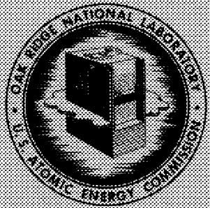
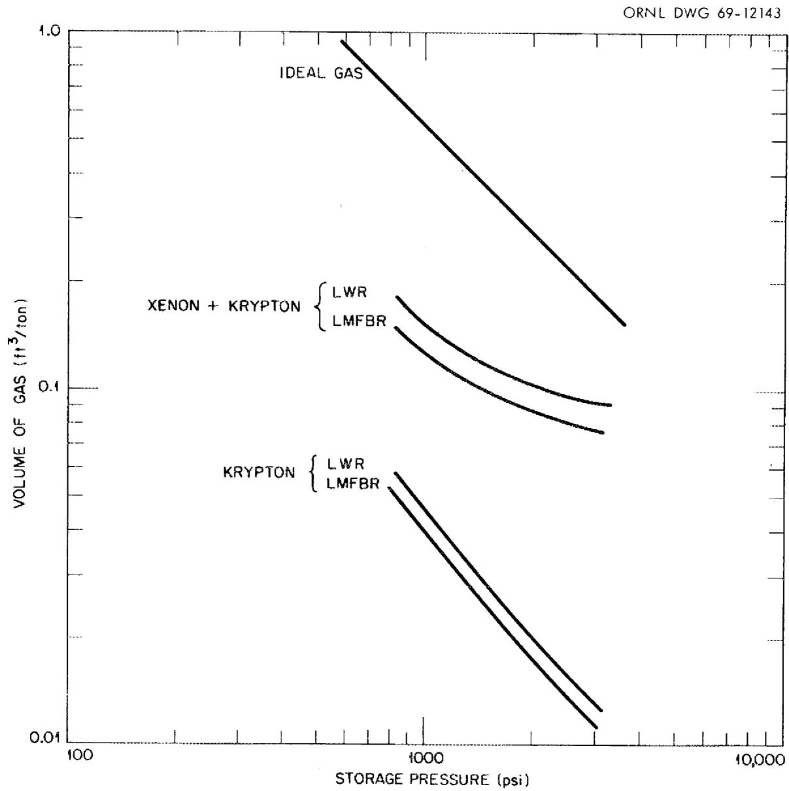
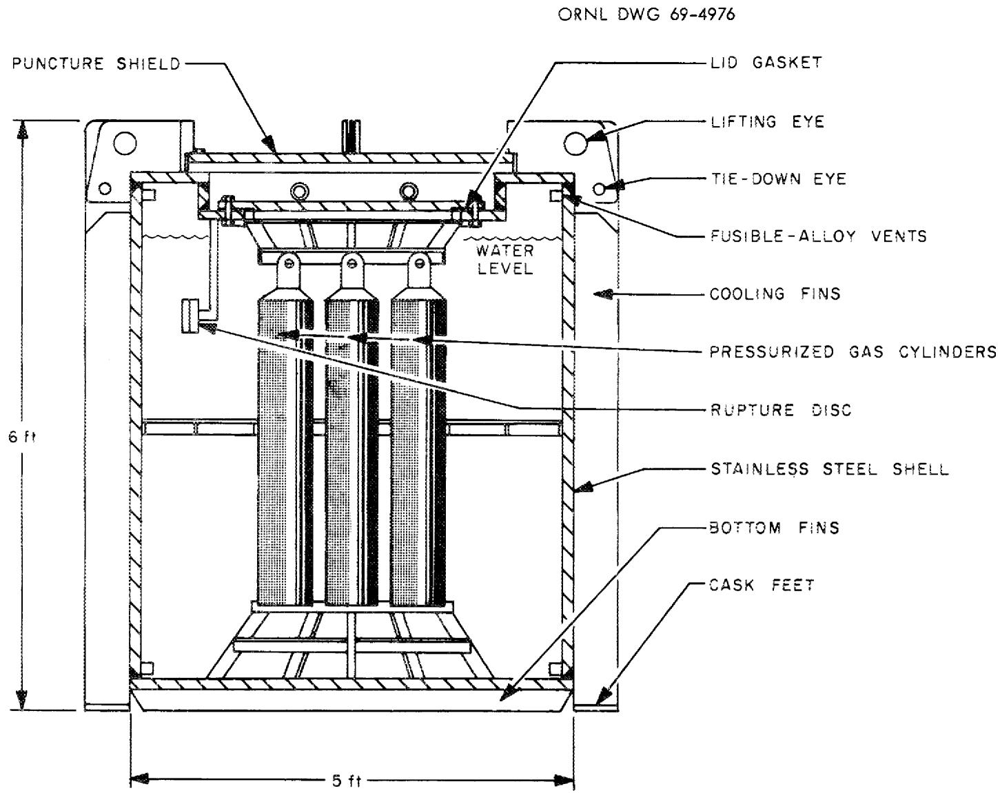
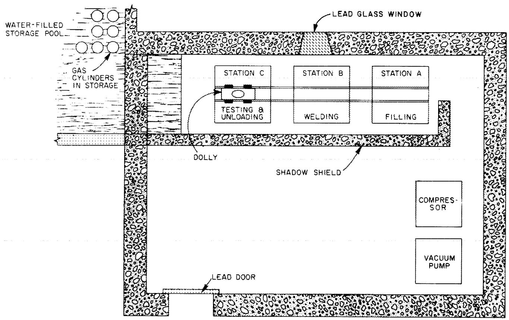
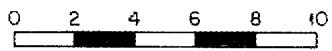

# OAK RIDGE NATIONAL LABORATORY

# operated by   UNION CARBIDE CORPORATION for the

# U.S. ATOMIC ENERGY COMMISSION

34456 05132200

ORNL-TM-2677

#

COPY NO. -

DATE - November 21, 1969

# MANAGEMENT OF NOBLE-GAS FIBRATION-PRODUCT WASTES FROM REPROCESSING SPENT FUELS

J. O. Blomeke

J. J. Perona

CAK NIDGE NATIONAL LABORATORY

（20

PROOFING COULTLECTION

#

NO NOT TRANSFER TO ANOTHER PERSON

If you want someone to join a club , please

document sent in one with document

one day you will learn to use

$\therefore m = \frac{3}{11}$ ;

* Consultant, University of Tennessee

# LEGAL NOTICE

This report was prepared as an account of Government sponsored work. Neither the United States, nor the Commission, nor any person acting on behalf of the Commission:

A. Makes any warranty or representation, expressed or implied, with respect to the accuracy, completeness, or usefulness of the information contained in this report, or that the use of any information, apparatus, method, or process disclosed in this report may not infringe privately owned rights; or   
8. Assumes any liabilities with respect to the use of, or for damages resulting from the use of any information, apparatus, method, or process disclosed in this report.

As used in the above, "person acting on behalf of the Commission" includes any employee or contractor of the Commission, or employee of such contractor, to the extent that such employee or contractor of the Commission, or employee of such contractor prepares, disseminates, or provides access to, any information pursuant to his employment or contract with the Commission, or his employment with such contractor.

ORNL-TM-2677

Contract No. W-7405-eng-26

CHEMICAL TECHNOLOGY DIVISION

MANAGEMENT OF NOBLE-GAS FISSION-PRODUCT WASTES FROM REPROCESSING SPENT FUELS

J. O. Blomeke   
J. J. Perona*

* Consultant, University of Tennessee

OAK RIDGE NATIONAL LABORATORY

Oak Ridge, Tennessee

operated by

UNION CARBIDE CORPORATION

for the

U.S. ATOMIC ENERGY COMMISSION

# MANAGEMENT OF NOBLE-GAS FISSION-PRODUCT WASTES FROM REPROCESSING SPENT FUELS

J. O. Blomeke

J.J.Perona

# ABSTRACT

In an expanding nuclear power economy, it may become desirable to remove noble-gas fission products from spent-fuel processing plant off-gases. Technology is presently available for removal of krypton and xenon, and after they have been separated, it is proposed that the krypton be compressed in standard gas cylinders (either mixed with xenon, or after having been separated from it), and shipped to a salt-mine repository for permanent storage.

A plant reprocessing 2800 tons/year of fuel would produce only 28 50-liter gas cylinders per year of krypton, each containing about a million curies of $^{85}\mathrm{Kr}$ and generating about 5800 Btu of heat per hour. If the krypton and xenon were not separated from each other, 160 cylinders/year would be produced, each containing 180,000 curies of $^{85}\mathrm{Kr}$ and generating heat at a rate of 1000 Btu/hr.

The pressurized gas cylinders could be stored temporarily at the plant in water-filled canals, and then shipped to a salt mine in specially-designed casks containing from one to five cylinders each. At the mine, the cylinders could be stored above the floor in rooms later sealed to isolate them from the remainder of the mine. Under these conditions, the carbon-steel cylinders should last many decades, and the mine space required would be only about 1-to-2 percent of that required for storage of solidified high-level wastes.

The cost of noble-gas management by this method, exclusive of the cost of separating the gases from the plant's process off-gas, is estimated to range from $190,000 to $220,000 per year. This corresponds to 0.0003 to 0.00035 mills/kwhr of electricity originally produced from the fuel. From the standpoint of the projected scale of operations, their estimated costs, and considerations of safety, the proposed method appears reasonable and manageable over the next several decades.

# 1. INTRODUCTION

In the processing of spent fuels, the noble-gas fission products are separated from the fuel during the cladding-removal and core-dissolution steps. At post-irradiation decay times of 150 days and longer, 10.8-y $^{85}\mathrm{Kr}$ contributes greater than $99.9\%$ of the total activity present in these gases, and in the case of plants processing only a few tons per day of 150-day-decayed fuel, they can generally be released through a stack to the atmosphere without exceeding current discharge limits. Recent studies have shown, however, that to avoid exceeding the current guidelines for radiation exposure of the public at a site boundary that is 2-to-3 km distant, removal of noble gases may be required if the plant capacity exceeds about 5 tons/day of 150-day-decayed fuel. $^{1}$ If the fuel is processed after only 30 days decay, as might be the case in a fast-breeder economy, removal may be required for plant capacities of only about 0.5 tons/day. Reprocessing costs scale so as to favor larger plants, and since the cost of rare-gas removal is expected to be less than that otherwise required to extend the site boundaries, their removal can probably be justified economically as well as from the standpoint of improved public relations.

There are a number of processes for separating the noble gases from process off-gas which are either presently available or under development.2 Of these, the most attractive appear to be a process based on absorption in a fluorocarbon solvent and the cryogenic distillation process currently in use at the Idaho Chemical Processing Plant.4 The absorption process has been tested extensively on a pilot-plant scale, while the cryogenic distillation process has been successfully applied in actual plant operations. Each has the potential for recovering greater than $99\%$ of the gases with only a percent, or less, of nitrogen and oxygen impurities in the final product.

Once the noble gases have been collected, however, there is less certainty how best to contain them for the scores of years that are required for decay of most of the $^{85}\mathrm{Kr}$ to stable $^{85}\mathrm{Rb}$ . One possibility might be to inject the gases into porous underground formations. $^{5,6,7}$ An acceptable formation for this purpose would have to be overlain with

a capping formation of very low permeability, be free of cracks or fractures, and be located in a zone of lowest seismic risk. These considerations appear to be too restrictive in determining fuel reprocessing plant siting requirements for this method to serve as a generally applicable solution to the problem.

Other possibilities which have been suggested, and in some cases investigated to limited extents, include dispersion of the gases in glasses or resins, and entrapment in molecular sieves, clathrates, or small pressurized steel bulbs which are in turn encased in epoxy resin. In our view, some of these methods may possibly have long-range applications, but their technical and economic practicality can not be established until they have received considerably more experimental development.

On the other hand, we believe that a valid and generally applicable method for management of these gases, requiring little or no additional experimental development, is to encapsulate them in high-pressure cylinders and then ship the cylinders to a salt-mine repository where they would be stored permanently with the solidified high-level wastes also generated at the reprocessing plants. This proposed schedule of management operations, including handling and temporary storage of the gases at the reprocessing plants, shipment of the pressurized cylinders in specially-designed casks of high integrity, and emplacement of the cylinders in rooms mined in a salt formation, is examined below.

The authors gratefully acknowledge the help of W. C. T. Stoddart in the conceptual design of a shipping cask for pressurized cylinders of noble gases, and of W. G. Stockdale in estimating the capital cost of the gas packaging facility.

# 2. HANDLING OF COMPRESSED GASES IN CYLINDERS

The characteristics of the noble-gas fission products present in a ton of spent fuel from a "typical" light-water reactor (LWR), decayed 150 days, and a liquid-metal-cooled fast-breeder reactor (IMFBR), decayed 30 days and 150 days, are given in Table 1. There are no significant differences in the characteristics of mixtures from fuels having equivalent exposures

Table 1. Characteristics of Noble Gases from One Metric Ton of Spent Fuel   

<table><tr><td rowspan="2"></td><td colspan="3">30 Days Decay</td><td colspan="3">150 Days Decay</td></tr><tr><td>Xe</td><td>Kr</td><td>Total</td><td>Xe</td><td>Kr</td><td>Total</td></tr><tr><td colspan="7">Light-water reactora</td></tr><tr><td>Gram-atoms</td><td></td><td></td><td></td><td>40.4</td><td>4.4</td><td>44.8</td></tr><tr><td>Curies</td><td></td><td></td><td></td><td>3.3</td><td>11,200</td><td>11,200</td></tr><tr><td>0.514-Mev gamma disintegrations/sec</td><td></td><td></td><td></td><td></td><td>1.7 x 1012</td><td>1.7 x 1012</td></tr><tr><td>Heat generation rate, watts</td><td></td><td></td><td></td><td>0.003</td><td>18.0</td><td>18.0</td></tr><tr><td>Number of cylinders requiredb</td><td></td><td></td><td></td><td>0.0516</td><td>0.0105</td><td>0.0621</td></tr><tr><td colspan="7">Fast breeder reactore</td></tr><tr><td>Gram-atoms</td><td>31.9</td><td>3.7</td><td>35.6</td><td>31.9</td><td>3.7</td><td>35.6</td></tr><tr><td>Curies</td><td>80,700</td><td>10,200</td><td>90,900</td><td>7.4</td><td>10,000</td><td>10,000</td></tr><tr><td>Gamma disintegrations/sec</td><td></td><td></td><td></td><td></td><td></td><td></td></tr><tr><td>0.514 Mev</td><td></td><td>1.5 x 1012</td><td>1.5 x 1012</td><td></td><td>1.5 x 1012</td><td>1.5 x 1012</td></tr><tr><td>0.081 Mev</td><td>3.0 x 1015</td><td></td><td>3.0 x 1015</td><td></td><td></td><td></td></tr><tr><td>Heat generation rate, watts</td><td>86.4</td><td>16.4</td><td>102.8</td><td>0.007</td><td>16.1</td><td>16.1</td></tr><tr><td>Number of cylinders requiredb</td><td>0.0415</td><td>0.0100</td><td>0.0515</td><td>0.0415</td><td>0.0100</td><td>0.0515</td></tr></table>

a LWR fuel exposed to 33,000 Mwd/ton at 30 Mw/ton.   
Gas contained in 50-liter cylinders, pressurized to 2200 psig at $70^{\circ}\mathrm{F}$ .   
cLMFBR mixed core and blankets with an average exposure of 33,000 Mw/ton at 58 Mw/ton.

and decay times. Although fast-breeder fuels may be processed with cooling times of only 30 days, as compared with 150 days for LWR fuels, the only radioisotope of consequence remaining after 150 days in either case is $^{85}\mathrm{Kr}$ . All subsequent considerations refer to mixtures of this age obtained from the fuels defined in Table 1.

The noble gases can be held in standard 50-liter cylinders, 9 in. in diameter by 52 in. high. Those conforming to ICC Specification $3AA^9$ have a wall thickness slightly less than $1/4$ in., weigh 135 lb, and are normally filled to 2200 psig in nitrogen service. Xenon and krypton are fairly compressible at ambient temperatures, with compressibility factors ( $Z = PV/nRT$ ) reaching minima of 0.21 for xenon at 880 psia, and of 0.72 for krypton at 2800 psia. Gas volumes per ton of fuel processed are shown in Fig. 1 as functions of storage pressure. At 2200 psia for LWR fuels, these values are 0.1 ft³/ton if both xenon and krypton are stored, or 0.018 ft³/ton if the xenon is separated from the krypton and released. Volumes for IMFBR fuel are about $10\%$ lower.

A 2600-ton/year (10 tons/day) plant processing LWR fuel would produce 160 cylinders per year if both xenon and krypton are encapsulated, or 28 cylinders per year if only krypton is stored. The krypton activity is 11,200 curies/ton, or about $10^6$ curies per cylinder if the krypton is stored alone. On the other hand, the activity of a cylinder containing both xenon and krypton is 180,000 curies.

# 3. ACCIDENTAL RELEASE

The consequences of an accidental release were studied using the Gaussian plume formula of Gifford to determine the noble gas concentration as a function of distance from the source, and time. Damage would occur by personnel exposure alone, since the gases would not remain as contamination to cause property damage. The xenon activity is negligible and the most important exposure would be the external whole-body beta dose from the krypton. Following the formulation of Binford, Barish, and Kam,11 the concentration is given by

  
Fig. 1. Volume of Noble Gases as a Function of Pressure in a Ton of Spent Fuel from Light-Water and Fast Breeder Reactors

$$
X = Q S _ {g}, \tag {1}
$$

where $X =$ concentration,curies/m3

$\mathbb{Q} =$ source strength,curies/min

$\mathrm{S}_{\mathrm{g}} = \text{stack factor, min/m}^{3}$ .

The dose rate, D, is directly proportional to the concentration.12

$$
D = \frac {X (\Sigma E)}{2 4 2 \rho_ {a} \left(P _ {a} / P _ {t}\right)}, \tag {2}
$$

where $D =$ dose rate, rem/min

$\Sigma \mathrm{E} =$ effective energy per $\beta$ disintegration, mev (0.23 for $^{85}\mathrm{Kr}$ )

$\rho_{a} =$ density of air $(0.0012\mathrm{g / cm^3})$

$\mathrm{Pa} / \mathrm{Pt} =$ stopping power of air relative to tissue (0.885 for $\beta$ particles).

The total dose is

$$
\int_ {0} ^ {\infty} \mathrm {D} \mathrm {d T} = 3. 8 9 (\Sigma \mathrm {E}) \int_ {0} ^ {\infty} \mathrm {X} \mathrm {d T} = 3. 8 9 (\Sigma \mathrm {E}) \mathrm {S} _ {\mathrm {g}} \int_ {0} ^ {\infty} \mathrm {Q} \mathrm {d T}. \tag {3}
$$

According to Binford et al.,

$$
\int_ {0} ^ {\infty} Q d T = \frac {\alpha}{\lambda + \alpha} q _ {p} ^ {o} e ^ {- \lambda x / u}, \tag {4}
$$

where $\alpha =$ fraction of activity released per min

$\lambda =$ decay constant, min

$q_{p}^{o} =$ total amount of release,curies

$u_{i} =$ wind velocity, meters/min

$x =$ distance in direction of wind, meters.

Assuming $\alpha >\lambda$ and $(\lambda x / u)\rightarrow 0$ Equation (4) reduces to $q_{p}^{0}$ .The stack factor is

$$
\mathrm {S} _ {\mathrm {g}} = \frac {\mathrm {e} ^ {- \mathrm {y} ^ {2} / 2 \left(\sigma_ {\mathrm {y}}\right) ^ {2}}}{2 \pi u \sigma_ {\mathrm {y}} \sigma_ {\mathrm {z}}} \left[ \mathrm {e} ^ {- \mathrm {z} ^ {2} / 2 \sigma_ {\mathrm {z}} ^ {2}} + \mathrm {e} ^ {- \left(2 h + z\right) ^ {2} / 2 \sigma_ {\mathrm {z}} ^ {2}} \right] \quad , \tag {5}
$$

where $y =$ horizontal distance perpendicular to wind direction, meters

z = vertical distance relative to release point, meters

$\sigma_{\mathrm{y}}, \sigma_{\mathrm{z}} =$ dispersion parameters, meters

$h =$ stack height, meters,

The concentration at ground level ( $z = -h$ ) in the direction of the wind ( $y = 0$ ) reduces to

$$
S _ {g} = \frac {e ^ {- h ^ {2} / 2 \sigma_ {z} ^ {2}}}{\pi u \sigma_ {y} \sigma_ {z}} = \frac {\theta}{\pi u}. \tag {6}
$$

The expression for the total dose (Eq. 3) can be written in the form

$$
\int_ {0} ^ {\infty} D d t = 0. 2 8 5 \frac {q _ {p} ^ {o} \theta}{u}, \tag {7}
$$

Values of $\theta$ as functions of distance, x, and weather conditions are plotted for a stack height, h, of 100 meters by Hilsmeyer and Gifford. $^{13}$ The maximum value of $\theta$ is $6.41 \times 10^{-5} \mathrm{~m}^{-2}$ and occurs at a distance of 400 meters with extremely unstable weather conditions (condition A). For a 1-million-curie release and a wind velocity of 100 meters/min, the maximum dose at ground level is about 200 mrem. At a site boundary $1 \mathrm{~km}$ distant, the highest value of $\theta$ occurs with slightly unstable conditions (condition C) and yields a total dose of 120 mrem. For a release at a height of 10 meters, the maximum dose with any weather conditions and a wind velocity of $100 \mathrm{~m/sec}$ is less than 15 rem. Present regulations (10 CFR 20 and 10 CFR 100) specify that chronic exposures of average population groups shall not exceed an annual whole-body dose of 170 mrem, and suggest that acute whole-body exposures resulting from accidents should not result in a dose greater than 25 rem.

# 4. ON-SITE INTERIM STORAGE

Although there is little incentive to keep the gases on-site for any time longer than necessary to fill a shipping cask, a storage facility for a 2600-ton/year plant would not be large or expensive, even if the gases were stored for 10-to-20 years. The cylinders could be stored safely in either air or water, provided they were securely anchored in compartments or enclosures that afforded protection against impact by an accidentally ruptured cylinder. However, the requirements for biological shielding and heat dissipation would tend to favor the use of water-filled canals for interim storage whether krypton was stored separately, or mixed with xenon.

If the cylinders are filled with krypton alone, and stored on 2-ft centers, a little more than $100\mathrm{ft}^2$ of floor area is required for one year's production of 28 cylinders. The heat-generation rate of a cylinder is 5820 Btu/hr, and if it is cooled in air by natural convection and radiation, the cylinder would reach a temperature of about $315^{\circ}\mathrm{F}$ . These cylinders would require about 2.6 inches of lead shielding for the dose rate to be reduced to 10 mrem/hr at 1 meter.

If krypton and xenon are not separated, the 160 cylinders produced in a year would require about $640\mathrm{ft}^2$ of storage floor area. In this case, the heat-generation rate per cylinder is 990 Btu/hr, and the shielding requirement is 0.8 in. of lead.

# 5. SHIPPING

The shipping cask is basically a tank filled with water (Fig. 2). It is a modification of one which has been shown to meet the impact, puncture, and fire resistance specifications of the AEC Manual, Chapter 0529, and which has been licensed for shipping capsules of curium oxide. $^{14}$ The cask is 5 ft in diameter, is made of l-in.-thick, type $30^{\text{山}}$ stainless steel, and is equipped with external fins to enhance heat dissipation. The water provides shielding, serves as a heat transfer medium, and provides the heat capacity needed to withstand a $1475^{\circ}\text{F}$ fire for 30 minutes. A 200 psig rupture disc is provided as a safety measure in addition to 16 fusible plugs, which are designed to allow steam to escape in case of a fire. In addition, a vapor space is provided sufficiently large to hold the contents of a leaky cylinder without causing the rupture disc to vent. In a cask of the dimensions shown, the cylinder temperature would be about $20^{\circ}\text{F}$ above the ambient, and the rate of heat dissipation would be sufficient for one cylinder of krypton, or about 5 cylinders of krypton- xenon mixture. A loaded cask would weigh about 7 tons and we estimate it would cost about $40,000. Standard railroad cars, 40 to 70 ft in length, could carry several casks.

  
Fig. 2. Conceptual Design of Shipping Cask for Cylinders of Compressed Fission-Product Gases.

# 6. PERMANENT STORAGE

The cylinders could be stored permanently in a salt mine operated for disposal of solidified high-level fuel-reprocessing wastes. Current plans for high-level wastes are to place them in holes in the floor of rooms mined in salt and, after filling, the rooms would be backfilled with crushed salt and sealed.[15] Disposal in the floor in this manner was conceived primarily because of the shielding requirements for personnel protection. Cylinders of compressed gases, requiring only light shielding, could be placed in racks above the mine floor and the rooms sealed without backfilling with salt. The carbon-steel containers, in contact only with dry air on the outside and noble gases on the inside, and isolated from short-term temperature fluctuations, should last many decades and perhaps centuries.

If the cylinders were stored in the immediate vicinity of the high-level wastes, they would eventually reach a temperature of $200^{\circ}\mathrm{C}$ and a pressure of 3500 psig. Therefore, it might be desirable to increase the cylinder wall thickness by 1/8 inch. The allowable heat-generation rate per unit area of mine floor would be about 15-to-20 Btu/hr-ft²; therefore, the space requirements for a 2600-ton/year plant are about 1/4 acre per year for the gases as opposed to about 16 acres per year for 6-year-old solidified high-level wastes.

# 7. PRELIMINARY COST ESTIMATE

The economic feasibility of the scheme under consideration is indicated by a cost estimate based on the requirements for a 2600-ton/year reprocessing plant. The sequence of operations is divided into three stages: (1) filling, testing, and temporary storage of cylinders; (2) shipment of the cylinders to a salt mine; and (3) permanent storage in the mine.

A cell equipped for filling and testing cylinders would be contiguous to the fuel reprocessing plant to facilitate the transfer of the noble gases after they have been separated from the process off-gas; therefore, the

same canal used to store spent fuel and/or cans of solidified high-level wastes can also be used to store the gas cylinders (Fig. 3). The cylinders are moved from one station to the next by a dolly equipped with a motor-driven chain drive, and they are unloaded and placed in a corner of the storage canal with a hand-operated chain hoist suspended from a monorail. A compressor transfers the noble gases from a gas holder (not shown in Fig. 3) and compresses them in the cylinders. After a cylinder is filled, a vacuum pump is used to evacuate the lines and return the residual gases to the holder. During the filling operation, the equipment is operated from outside the cell, and a lead-glass window is provided for viewing. The cell contains a shadow-shield, however, to enable many operations such as gas-line connections to the cylinders, removal of the filled cylinders from the dolly, and maintenance of the compressor and vacuum pump to be performed by personnel in the cell. The ventilation air in the cell is monitored continuously for $^{85}\mathrm{Kr}$ , and provisions are made to seal the cell automatically and contain the air if radioactivity is detected. In such a case, the air in the cell could be recycled to the noble-gas separation plant for decontamination. This facility is capable of packaging either the 160 cylinders/year of krypton-xenon mixtures, or the 28 cylinders/year that would be required if krypton, alone, were to be encapsulated.

The total capital cost of the facility is estimated to be $230,000 (Table 2). If the equipment is amortized over 10 years, and the structure over 20 years, at 5% interest, the equivalent annual capital cost is $24,000 (Table 3). The cost of the cylinders should not exceed $100 each, based on the cost of ordinary nitrogen cylinders of about $50. Therefore, the annual cylinder cost is $16,000 for krypton-xenon mixtures, or $2800 for krypton, alone. Annual operating costs, based on an estimated requirement of 1 man year for mixtures and 1/2 man year for krypton are $20,000 and $10,000, respectively.

Shipping costs consist of the cask capital costs, freight, and labor costs. For round-trip shipments of 1000, 2000, and 3000 miles, transit times (i.e., the times required between successive shipments in the same cask) are estimated at 7, 9, and 11 days. Therefore, even for the longest

  
ORNL DWG 69-1254

  
SCALE IN FEET   
Fig. 3. Plan View of Krypton Packaging Facility.

Table 2. Estimated Costs of a Krypton Packaging Facility   

<table><tr><td colspan="2">Equipment</td></tr><tr><td>Modified H2, 2000 psig, 4-stage compressor</td><td>$ 12,000</td></tr><tr><td>Remote welder</td><td>50,000</td></tr><tr><td>Chain hoist, monorail, hand-operated</td><td>500</td></tr><tr><td>Dolly, rails, motor-driven chain drive</td><td>1,000</td></tr><tr><td>Vacuum pump</td><td>1,000</td></tr><tr><td>Subtotal &quot;A&quot;</td><td>$ 64,500</td></tr><tr><td colspan="2">Containment structure</td></tr><tr><td>Concrete</td><td>$ 26,000</td></tr><tr><td>Door (lead and steel) and window</td><td>15,000</td></tr><tr><td>Ventilation system</td><td>4,000</td></tr><tr><td>Painting</td><td>2,000</td></tr><tr><td>Electrical, lighting</td><td>1,000</td></tr><tr><td>Floor drain and normal water piping</td><td>1,000</td></tr><tr><td>Subtotal &quot;B&quot;</td><td>$ 49,000</td></tr><tr><td>Piping, process</td><td>$ 3,000</td></tr><tr><td>Electrical, process</td><td>2,500</td></tr><tr><td>Subtotal &quot;C&quot;</td><td>$ 5,500</td></tr><tr><td>Radiation detection instruments (subtotal &quot;D&quot;)</td><td>$ 2,000</td></tr><tr><td>Construction overhead 35% of &quot;A, B, C, D&quot;</td><td>42,000</td></tr><tr><td>Subtotal &quot;E&quot;</td><td>$163,000</td></tr><tr><td>Architect engineer allocation, 12.5% of &quot;E&quot;</td><td>$ 20,000</td></tr><tr><td>Contingency, 25% of above</td><td>46,000</td></tr><tr><td>Preliminary budget estimate</td><td>$230,000</td></tr></table>

Table 3. Estimated Annual Costs of Noble Gas Waste Management for a 2600-ton/year Reprocessing Plant (Exclusive of Gas Separations Cost)   

<table><tr><td></td><td>Krypton and Xenon(160 cylinders/year)</td><td>Krypton(28 cylinders/year)</td></tr><tr><td colspan="3">Gas encapsulation</td></tr><tr><td>Capital cost</td><td>$ 24,000</td><td>$ 24,000</td></tr><tr><td>Cylinder cost</td><td>16,000</td><td>2,800</td></tr><tr><td>Operating cost</td><td>20,000</td><td>10,000</td></tr><tr><td>Subtotal</td><td>$ 60,000</td><td>$ 36,800</td></tr><tr><td colspan="3">Shipment</td></tr><tr><td>Cask</td><td>$ 10,400</td><td>$ 10,400</td></tr><tr><td>Freight</td><td>23,600</td><td>20,700</td></tr><tr><td>Labor</td><td>29,000</td><td>25,000</td></tr><tr><td>Subtotal</td><td>$ 63,000</td><td>$ 56,100</td></tr><tr><td>Salt mine storage</td><td>$ 95,300</td><td>$ 95,300</td></tr><tr><td>Total</td><td>$218,300</td><td>$188,200</td></tr></table>

distance considered, one cask could make the required 32 trips per year. A spare cask is supplied, however, at $40,000 per cask, and amortization over 10 years at \(5\%$ interest results in an equivalent annual capital cost of \)10,400.

Freight rates are estimated at 29, 53, and 78 dollars per ton for one-way shipments of 500, 1000, and 1500 miles, with rates 30% lower for return of empty casks. The casks weigh about 7 tons, loaded, and 3-1/2 tons with the cylinders and water removed; and the freight cost for 32 1500-mile shipments, with each shipment consisting of 5 cylinders filled with krypton and xenon, is $23,600. For 28 shipments per year, with each shipment consisting of one cylinder filled with krypton, the cost is $20,700. Labor requirements for loading, unloading, and maintaining the casks are estimated to be 9 man-days per trip, and at $100 per man-day (including overhead), labor costs of $29,000 per year are estimated for shipping krypton-xenon mixtures and $25,000 per year for shipping krypton alone.

A salt-mine repository for highly active solidified wastes has been estimated to cost $381,000 per acre of mine area, including all capital and operating expenses. As discussed previously, the noble gases, with an effective half-life of about 10 years, can be stored so that they release about 15 Btu/hr-ft² of mine floor. Therefore, about 0.25 acres/year of mine space are required for either the mixed noble gases or for krypton alone. The permanent storage cost is $95,300 per year.

The total cost of the packaging facility, freight, and permanent storage is about $218,000 per year for krypton-xenon mixtures, and about$ 188,000 per year for krypton. Considering that the 2600 tons of fuel represents the production of $6.6 \times 10^{11}$ kWh of electricity, these costs correspond to 0.0003 and 0.00035 mills/kwhr, respectively.

# 8. PROJECTED SCALE OF OPERATIONS FOR THE CIVILIAN NUCLEAR POWER PROGRAM

In Table 4, each aspect of this proposed management scheme is projected for a nuclear economy which rises from an installed capacity of 14,000 Mw in 1970, to 153,000 Mw in 1980, and to 735,000 Mw in 2000.

Table 4. Projected Noble Gas Management for Civilian Nuclear Power Program   

<table><tr><td></td><td></td><td colspan="4">Calendar Year</td></tr><tr><td></td><td></td><td>1970</td><td>1980</td><td>1990</td><td>2000</td></tr><tr><td>Installed nuclear capacity, 103Mw(e)</td><td></td><td>14</td><td>153</td><td>368</td><td>735</td></tr><tr><td>Spent-fuel processed,atons/year85Kr generated</td><td></td><td>52</td><td>2950</td><td>8160</td><td>14,000</td></tr><tr><td>Annually, megacuries</td><td></td><td>0.6</td><td>33</td><td>89</td><td>146</td></tr><tr><td>Accumulated, megacuries</td><td></td><td>0.56</td><td>124</td><td>567</td><td>1190</td></tr><tr><td>Accumulated power, megawatts</td><td></td><td></td><td>0.15</td><td>0.9</td><td>2.0</td></tr><tr><td>Number cylinders of gas</td><td></td><td></td><td></td><td></td><td></td></tr><tr><td>Kr, annually</td><td></td><td>0.5</td><td>32</td><td>84</td><td>142</td></tr><tr><td>Kr + Xe, annually</td><td></td><td>3</td><td>180</td><td>485</td><td>770</td></tr><tr><td>Kr, accumulated</td><td></td><td>0.5</td><td>140</td><td>752</td><td>1880</td></tr><tr><td>Kr + Xe, accumulated</td><td></td><td>3</td><td>830</td><td>4400</td><td>10,600</td></tr><tr><td>Number 1000-mi shipments per yearb</td><td></td><td></td><td></td><td></td><td></td></tr><tr><td>Kr (1 cylinder per cask)</td><td></td><td>0.5</td><td>7</td><td>17</td><td>29</td></tr><tr><td>Kr + Xe (5 cylinders per cask)</td><td></td><td>1</td><td>7</td><td>19</td><td>31</td></tr><tr><td>Salt-min area requiredc</td><td></td><td></td><td></td><td></td><td></td></tr><tr><td>Noble gases, acres/year</td><td></td><td>0.004</td><td>0.29</td><td>0.75</td><td>1.27</td></tr><tr><td>Noble gases, accumulated acres</td><td></td><td>0.004</td><td>1.25</td><td>6.7</td><td>16.8</td></tr><tr><td>Solidified wastes, acres/year</td><td></td><td></td><td>4.4</td><td>29</td><td>56</td></tr><tr><td>Solidified wastes, accumulated acres</td><td></td><td></td><td>10.3</td><td>175</td><td>619</td></tr></table>

${}^{a}$ Based on an average exposure of 33,000 Mwd/ton,and a delay of 2 years between power, generation and fuel processing.   
Assumes gases are shipped during the year fuel is processed, and that 5 casks per railroad car constitute 1 shipment.   
Assumes gases are buried during the year fuel is processed and that high-level solidified wastes are decayed 6 years before burial.

Reasonable numbers of pressurized cylinders, casks, and shipments per year can be anticipated. If a shipment consists of a single railroad car carrying 5 casks, only about 30 shipments per year would be required in the year 2000, and on the average, there will never be more than one loaded shipment in transit at the same time. Only 17 acres of salt mine area would be occupied by the gas cylinders, compared with more than 600 acres devoted to high-level solidified wastes. None of these considerations are of a magnitude as to cause concern with respect to their technical feasibility.

# 9. REFERENCES

1. Oak Ridge National Laboratory Staff, et al., Siting of Fuel Reprocessing Plants and Waste Management Facilities, ORNL-4451 (to be published).   
2. C. M. Slansky, H. K. Peterson, and Vernon G. Johnson, "Nuclear Power Growth Spurs Interest in Fuel Plant Wastes," Environ. Sci. Technol. 3, 446 (1969).   
3. J. R. Merriman, J. H. Pashley, K. E. Habiger, M. J. Stevenson, and L. W. Anderson, "Concentration and Collection of Krypton and Xenon by Selective Absorption in Fluorocarbon Solvents," Symposium on Operating and Developmental Experience in the Treatment of Airborne Radioactive Wastes, United Nations Headquarters, New York (August 26-30, 1968), SM-110.   
4. C. L. Bendixen and G. F. Offutt, Rare Gas Recovery Facility at the Idaho Chemical Processing Plant, IN-1221 (April 1969).   
5. P. C. Reist, "Disposal of Waste Radioactive Gases in Porous Underground Media," Nucl. Appl. 3, 475 (1967).   
6. J. Tadmor and K. E. Cowser, "Underground Disposal of Krypton-85 from Nuclear Fuel Reprocessing Plants," Nucl. Eng. Design 6, 243 (1967).   
7. J. B. Robertson, Behavior of Xenon-133 Gas After Injection Underground, ID0-22051 (July 1969).   
8. W. E. Clark and R. E. Blanco, Encapsulation of Noble Fission-Product Gases in Solid Media Prior to Transportation and Storage, ORNL-4473 (in press).   
9. Paragraph 78.37, "Specification 3AA," p. 187 in Agent T. C. George's Tariff No. 19: ICC Regulations for Transportation of Explosives and Other Dangerous Articles by Land and Water in Rail Freight Service and by Motor Vehicle (Highway) and Water, Including Specifications for Shipping Containers, New York, 1966.   
10. F. A. Gifford, The Problem of Forecasting Dispersion in the Lower Atmosphere, DTIE, USAEC, Oak Ridge, Tennessee, 1961.

11. F. T. Binford, J. Barish, and F. B. K. Kam, Estimation of Radiation Doses Following a Reactor Accident, ORNL-4086 (February 1968).   
12. International Commission on Radiological Protection, Recommendations of the International Commission on Radiological Protection (Report of Committee 2 on Permissible Dose for Internal Radiation), ICRP Publ. 2, Pergamon, London, 1959; Health Phys. 3 (June 1960).   
13. W. F. Hilsmeyer and F. A. Gifford, Graphs for Estimating Atmospheric Dispersion, ORO-545 (July 1962).   
14. G. A. Wilkins, R. D. Kelsch, F. R. D. King, D. H. Stoddard, J. P. Faraci, and J. W. Langhaar, "Design and Testing of Curium Shipping Capsule and Cask," Proceedings of the Second International Symposium on Packaging and Transportation of Radioactive Materials, October 14-18, 1968, CONF-681001.   
15. R. L. Bradshaw, J. J. Perona, J. O. Blomeke, and W. J. Boegly, Jr., Evaluation of Ultimate Disposal Methods for Liquid and Solid Radioactive Wastes. VI. Disposal of Solid Wastes in Salt Formations, ORNL-3358 (Rev.) (March 1969).   
16. R. L. Bradshaw and W. L. McClain, Oak Ridge National Laboratory, private communication, June 27, 1969.

# INTERNAL DISTRIBUTION

1-2. Central Research Library   
3. Document Reference Section

4-18. Laboratory Records

19. Laboratory Records - ORNL RC   
20. ORNL Patent Office

21. M.J. Bell   
22-45. J.O. Blomeke   
46. R.L. Bradshaw   
47. R.E. Brooksbank   
48. F.N. Browder   
49. K.B. Brown   
50. R.E. Bla   
51. W.E. Clark   
52. K.E. Cowser   
53. F.L. Culler, Jr.   
54. W. Davis, Jr.   
55. R.S. Dillon   
56. W. de Laguna   
57. F.M. Empson   
58. D.E. Ferguson   
59. C.L. Fitzgerald   
60. E.J. Frederick   
61. H.W. Godbee   
62. D.G. Jacobs   
63. H. Kubota   
64. J.L. Liverman   
65. T.F. Lomenick   
66. H.G. MacPherson   
67. W.C. McClain   
68. K.Z. Morgan   
69. J.P. Nichols   
70. J.J. Perc   
71. G.W. Renfro   
72. J.T. Roberts   
73. L.B. Shappert   
74. W.G. Stockdale   
75. W.C.T. Stoddart   
76. E.G. Strucness   
77. J.C. Suddath   
78. W.E. Unger   
79. M.E. Whatley

# EXTERNAL DISTRIBUTION

80. C.B. Bartlett, AEC, Washington   
81. W.G. Belter, ABC, Washington   
82. A.G. Blasewitz, PNL   
83. J.A. Buckham, Idaho Nuclear Corp., Idaho Falls, Idaho   
84. C.R. Cooley, PNL   
85. D.F. Cope, RDT Site Office, ORNL

86-100. Division of Technical Information Extension

101. Laboratory & University Division, ORO   
102. L.P. Hatch, BNL   
103. S. Lawroski, ANL   
104. E.A. Mason, MIT   
105. J.A. McBride, ABC, Washington   
106. A.F. Perge, AEC, Washington   
107. A.M. Platt, FNL   
108. W.H. Regan, AEC, Washington   
109. R.B. Richards, GE, San Jose, California   
110. B.L. Schmalz, AEC, Idaho Falls, Idaho   
111. K.E. Schneider, PNL   
112. C.M. Slansky, IAEA, Vienna   
113. E.J. Tuthill, BNL