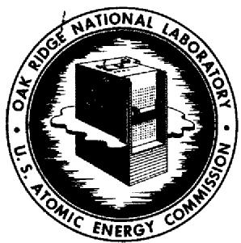
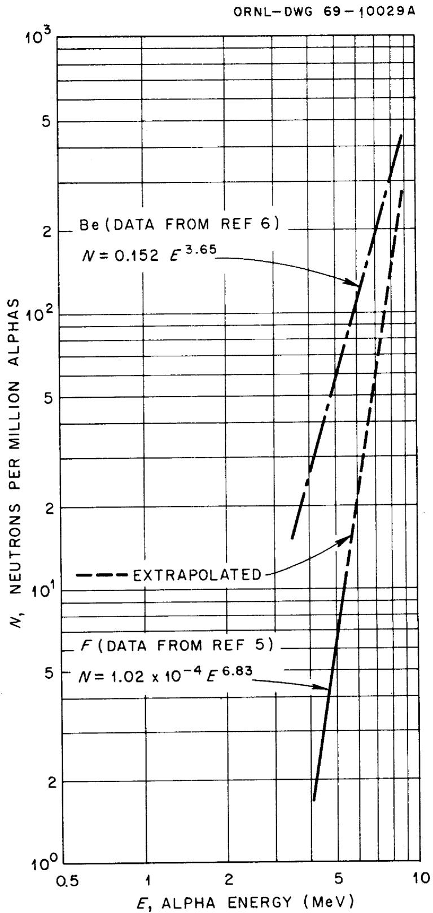
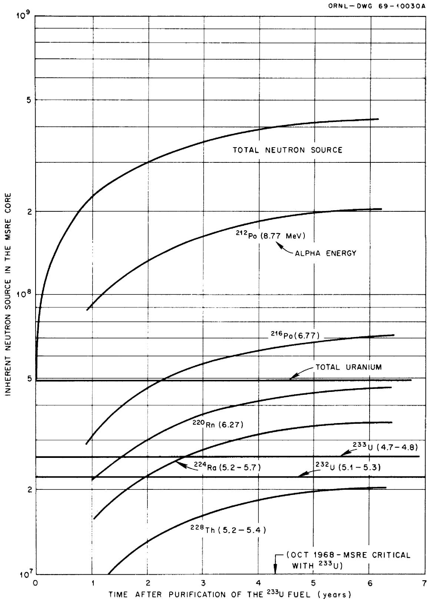

# OAK RIDGE NATIONAL LABORATORY operated by

# UNION CARBIDE CORPORATION

# NUCLEAR DIVISION

for the

U.S. ATOMIC ENERGY COMMISSION

ORNL-TM-2685

COPY NO. -

DATE - August 10, 1969

INHERENT NEUTRON SOURCE IN MSRE WITH CLEAN $^{233}$ U FUEL

R.C.Steffy,Jr.

# ABSTRACT

After about three years of nuclear operation, the MSRE fuel, enriched $^{235}\mathrm{U}$ , was replaced with a $^{233}\mathrm{U}$ fuel mixture. In this new mixture there are quantities of $^{232}\mathrm{U}$ , $^{233}\mathrm{U}$ , and $^{234}\mathrm{U}$ . Each of these, along with the $^{232}\mathrm{U}$ decay chain, is a strong alpha emitter and interacts with fluorine, beryllium, and lithium to produce neutrons. This neutron source is time-dependent because of the buildup of $^{232}\mathrm{U}$ daughters, and at the time of reaching criticality with the $^{233}\mathrm{U}$ fuel, the neutron source in the MSRE core was about $4 \times 10^{8}$ neutron/sec, primarily from the reactions $^9\mathrm{Be}(\alpha ,\mathrm{n})^{12}\mathrm{C}$ and $^{19}\mathrm{F}(\alpha ,\mathrm{n})^{22}\mathrm{Na}$ . Alpha-n reactions with lithium will produce $< 3 \times 10^{6}$ neutrons/sec. Spontaneous fission will produce $< 10^{2}$ neutrons/sec.

Keywords: Inherent neutron source, $^{233}\mathrm{U}$ fuel, $(\alpha, n)$ reactions, alpha particles, particle sources, $^{232}\mathrm{U}$ decay chain, fluorine, beryllium, lithium.

# LEGAL NOTICE

This report was prepared as an account of Government sponsored work. Neither the United States, nor the Commission, nor any person acting on behalf of the Commission:

A. Makes any warranty or representation, expressed or implied, with respect to the accuracy, completeness, or usefulness of the information contained in this report, or that the use of any information, apparatus, method, or process disclosed in this report may not infringe privately owned rights; or   
B. Assumes any liabilities with respect to the use of, or for damages resulting from the use of any information, apparatus, method, or process disclosed in this report.

As used in the above, "person acting on behalf of the Commission" includes any employee or contractor of the Commission, or employee of such contractor, to the extent that such employee or contractor of the Commission, or employee of such contractor prepares, disseminates, or provides access to, any information pursuant to his employment or contract with the Commission, or his employment with such contractor.

# CONTENTS

<table><tr><td></td><td>Page</td></tr><tr><td>Introduction</td><td>4</td></tr><tr><td>Fuel Composition</td><td>4</td></tr><tr><td>Alpha Source</td><td>6</td></tr><tr><td>Neutron Source</td><td>7</td></tr><tr><td>7Li(α,n)10B</td><td>7</td></tr><tr><td>Spontaneous Fissions</td><td>7</td></tr><tr><td>9Be(α,n)12C and 19F(αn)22Na</td><td>8</td></tr><tr><td>Discussion</td><td>8</td></tr><tr><td>Appendix</td><td>12</td></tr><tr><td>Calculation of Inherent Neutron Source in MSRE for 233U Fuel Mixture</td><td>12</td></tr><tr><td>Source from 9Be(α,n)12C and 19F(α,n)22Na</td><td>12</td></tr><tr><td>Source from 7Li(α,n)10B</td><td>17</td></tr></table>

# LEGAL NOTICE

This report was prepared as an account of Government sponsored work. Neither the United States, nor the Commission, nor any person acting on behalf of the Commission: A. Makes any warranty or representation, expressed or implied, with respect to the accuracy, completeness, or usefulness of the information contained in this report, or that the use of any information, apparatus, method, or process disclosed in this report may not infringe privately owned rights; or B. Assumes any liabilities with respect to the use of, or for damages resulting from the use of any information, apparatus, method, or process disclosed in this report. As used in the above, "person acting on behalf of the Commission" includes any employee or contractor of the Commission, or employee of such contractor, to the extent that such employee or contractor of the Commission, or employee of such contractor prepares, disseminates, or provides access to, any information pursuant to his employment or contract with the Commission, or his employment with such contractor.

# INTRODUCTION

In the MSRE fuel mixtures, alpha-emitters are dispersed in large quantities of fluorine, beryllium, and lithium. All three of these elements undergo alpha-n reactions to produce neutrons. Haubenreich1 calculated the inherent neutron source for the initial fuel loading ( $\sim 35\%$ $^{235}\mathrm{U}$ and $\sim 65\%$ $^{236}\mathrm{U}$ ), but the different concentrations of uranium isotopes for the $^{233}\mathrm{U}$ fuel loading, all of which are strong alpha emitters, required that another calculation be performed. The calculations reported herein were performed before the $^{233}\mathrm{U}$ was loaded into the reactor.

This memorandum is divided into two parts. The first part presents final results and general discussions; the second part (appendix), intermediate results and details of the calculations.

# FUEL COMPOSITION

The strength of the inherent neutron source is, of course, determined by the composition of the fuel salt. Except for the change in uranium, the major constituents of the fuel salt were essentially unchanged by the chemical processing which removed the $^{235}\mathrm{U}$ -rich uranium and replaced it with a $^{233}\mathrm{U}$ fuel load. Thus, changes in the strength of the inherent neutron source were basically a function of the change in the alpha production rate and the associated alpha energies. Table 1 lists the approximate weight percentages of the components in the $^{233}\mathrm{U}$ fuel loading. These were estimated based on the predicted critical uranium concentration of 15.8 grams of uranium per liter of salt ( $\sim 1\mathrm{lb / ft^3}$ ). It was assumed that all of the uranium in the fuel was loaded as part of the $^{233}\mathrm{U}$ fuel loading, and that the small amount present from other sources was negligible. The concentrations of the uranium isotopes which are present in the $^{233}\mathrm{U}$ fuel loading are listed in Table 2 with a comparable listing for the $^{235}\mathrm{U}$ fuel loading.

Table 1   
MSRE Fuel Salt Composition   

<table><tr><td>Element</td><td>Wt % in 233U Mixture</td></tr><tr><td>F</td><td>68.4</td></tr><tr><td>Li*</td><td>11.0</td></tr><tr><td>Be</td><td>8.8</td></tr><tr><td>Zr</td><td>11.0</td></tr><tr><td>U</td><td>0.73</td></tr></table>

* 99.99% 7Li

Table 2   
Uranium Isotopic Concentration in MSRE Fuels   

<table><tr><td>Nuclide</td><td>Atom % in a233U Mixturea</td><td>Atom % in bInitial Loadingb</td></tr><tr><td>232U</td><td>0.022</td><td>---</td></tr><tr><td>233U</td><td>91.49</td><td>---</td></tr><tr><td>234U</td><td>7.6</td><td>0.3</td></tr><tr><td>235U</td><td>0.7</td><td>35</td></tr><tr><td>236U</td><td>0.05</td><td>0.3</td></tr><tr><td>238U</td><td>0.14</td><td>64.4</td></tr></table>

Data from Reference 2.   
Data from Reference 1.

# ALPHA SOURCE

Each of the uranium isotopes in the $^{233}\mathrm{U}$ -fuel mixture decays by alpha emission. These all have long half-lives and emit alpha particles at essentially a constant rate for the lifetime of the MSRE. With one exception, the daughters of the uranium isotopes also have long half-lives for alpha emission and never reach high enough concentrations to emit alpha particles at a significant rate. The very important exception is $^{228}\mathrm{Th}$ , the daughter of $^{232}\mathrm{U}$ , which decays with a 1.91 year half-life by alpha emission. This is followed by an entire string of alpha emitters with very short half-lives; so short, in fact, that they are essentially in equilibrium with the $^{228}\mathrm{Th}$ . An alpha decay by $^{228}\mathrm{Th}$ is quickly followed by a cascade of alpha emissions until the parent has finally decayed to $^{208}\mathrm{Pb}$ , which is stable.

Immediately after the $^{233}\mathrm{U}$ was purified (~ June 1964), the only alpha emissions were from the decaying uranium atoms, but as the concentration of $^{228}\mathrm{Th}$ increased, the alpha activity obviously increased. So the alpha activity in the fuel salt is composed of a time-independent contribution from the decaying uranium atoms and a time-dependent contribution from the $^{232}\mathrm{U}$ decay chain. The time-dependent contribution is controlled by the $^{228}\mathrm{Th}$ half-life of 1.91 years and reaches $75\%$ of the saturation value about 4 years after the $^{233}\mathrm{U}$ purification.

The energies at which the alpha particles are emitted are also important. All of the significant alpha emissions from the uranium atoms are between 4.1 and 5.3 MeV. The alphas from the lower members of the $^{232}\mathrm{U}$ decay chain are emitted with energies between 5.2 and 8.77 MeV. Since the neutron yield increases sharply with incident alpha energy, the higher-energy alphas in the $^{232}\mathrm{U}$ decay chain add weight to the importance of the chain.

Tabulated information pertaining to the properties of the decay of the uranium isotopes and the $^{232}\mathrm{U}$ decay-chain are given in the appendix in addition to tables of the numbers of alphas/sec emitted by the various isotopes.

# NEUTRON SOURCE

Calculation of the neutron source is necessary primarily to insure that, even when subcritical, there are enough neutrons available to meet detection criteria and guard against a startup accident. From this standpoint, the graphite region in the core is the region of concern, for only in this region of the MSRE is criticality feasible. The calculations presented herein are for 25 ft³ of salt, the approximate volume of salt in the effective core, whereas the total volume of salt is about 75 ft³. So multiplication of the source strength in the core by ~ 3 will give the approximate source in a fuel drain tank when it contains the entire fuel loading.

# 7Li（α，n）10B

Haubenreich1 found lithium to be an insignificant neutron producer when compared to beryllium and fluorine in the $^{235}\mathrm{U}$ fuel mixture. A calculation (see appendix) of the neutron yield from the most energetic alpha (8.77 MeV) in the $^{233}\mathrm{U}$ fuel showed that lithium produced less than one neutron for every 110 produced by beryllium and fluorine. Alphas starting at lower energies produce proportionately fewer neutrons from lithium because of the rapid decrease with decreasing alpha energy in the cross section of lithium for $(\alpha, n)$ reactions.4 (Threshold energy for $^{7}\mathrm{Li}(\alpha, n)^{10}\mathrm{B}$ is $\sim 4.3$ MeV.) The total neutron source from all $(\alpha, n)$ reactions with lithium is $< 3 \times 10^6$ n/sec.

# Spontaneous Fissions

All of the uranium isotopes which are present in the $^{233}\mathrm{U}$ fuel loading undergo spontaneous fission, with half-lives for this process ranging from $8 \times 10^{13}$ yr for $^{232}\mathrm{U}$ to $3 \times 10^{17}$ yr for $^{233}\mathrm{U}$ . The total rate of spontaneous fissions in the MSRE is simply the sum of the products of the inventory of each isotope and its spontaneous fission time constant. Less than 100 n/sec will be produced in the MSRE core by spontaneous fission.

9Be(α,n) 12C and 19F(α,n) 22Na

High neutron production rates result from alpha reactions with beryllium and fluorine. For the alpha particles emitted from the uranium isotopes (energies between 4.l and 5.3 Mev) the neutron production rates from the beryllium and fluorine are approximately equal. The neutron yield of fluorine increases more rapidly with increasing alpha energy than does the yield of beryllium (see Fig. l);[6,7] therefore, for the higher-energy alpha particles produced by the $^{232}\mathrm{U}$ decay chain, most of the neutrons result from $(\alpha, n)$ reactions with fluorine.

Figure 2 shows the total calculated neutron source for the MSRE core region and the individual production rates for the most significant alpha-emitters. The $^{232}\mathrm{U}$ decay chain obviously dominates the neutron production with $^{212}\mathrm{Po}$ being the alpha emitter (alpha energy of 8.77 MeV) which causes the most prolific neutron production.

# DISCUSSION

When the $^{233}\mathrm{U}$ mixture was placed in the MSRE fuel salt, the reactor already had about three years of operating history. The long runs at high power insured that a large photoneutron source would be present for some time after shutdown of the reactor. However, if sufficient time were allowed to elapse, this source would weaken. More important as a reliable neutron source in the MSRE is the inherent neutron production from $(\alpha, n)$ reactions with the salt constituents. The $(\alpha, n)$ source is essentially independent of power history and actually increases asymptotically to a limiting value. At the time the MSRE achieved criticality with $^{233}\mathrm{U}$ as the fissile material (the $^{233}\mathrm{U}$ mixture was the equivalent of ~ 4 years old),[8] the inherent neutron source in the core region was $\sim 4 \times 10^{8}$ n/sec, about a factor of 1000 over the inherent source which was calculated for the $^{235}\mathrm{U}$ fuel mixture.[1]

The accuracy of these calculations is dependent on the accuracy to which the fuel isotopic composition and the various yield data are known. The fuel composition is thought to be known to well within $\pm 5\%$ and is

  
Fig. 1. Neutron Yield from Thick Beryllium and Fluorine Targets as a Function of Incident Alpha-Particle Energy.

  
Fig. 2. Total Inherent Neutron Source and the Neutron Source Resulting from Individual Alpha Emitters in the $^{233}\mathrm{U}$ -Fueled-MSRE Core.

probably not an appreciable source of error. The area of this calculation which contains the most possibility of error is the yield data for the reaction, $^{19}\mathrm{F}(\alpha ,\mathrm{n})^{22}\mathrm{Na}$ . Due to insufficient data, we had to extrapolate the known yield data (see Fig. 1), which only went to alpha energies of 5.3 Mev, to get the yield from the higher-energied alphas from the $^{232}\mathrm{U}$ decay chain. We made the assumption that the yield continued increasing with the same functional relationship to the higher energies. While it is reasonable to expect the neutron production rate to increase with alpha energy, it is not known whether the yield will increase according to the same power function which could be used to describe its behavior for lower energied alphas. Yield data for beryllium (which is known from experiment for alphas to $>6$ Mev and is extrapolated to $\sim 8$ Mev by the experimenters) is also shown in Fig. 1 and does indeed increase as a power function with increasing alpha energy. Since the data for beryllium increases uniformly to higher alpha energies, one would tend to expect the assumption about fluorine to be good, but even if the assumption were not good and the yield data for the 8.77-Mev alpha were lower by a factor of 2 than the extrapolated curve, the calculated total neutron source would be in error by only $\sim 25\%$ . We feel that it is fair to assign a probable error band of $\pm 25\%$ to these calculations with the expectation that the error is much smaller but with the realization that more experimental data on high-energy alpha interactions with fluorine is necessary before stronger confidence in the calculated neutron yield is warranted.

# APPENDIX

Calculation of Inherent Neutron Source in MSRE for

233 U Fuel Salt Mixture

Source from $^{9}\mathrm{Be}(\alpha ,\mathrm{n})^{12}\mathrm{C}$ and $^{19}\mathrm{F}(\alpha ,\mathrm{n})^{22}\mathrm{Na}$

For both reactions $^{9}\mathrm{Be}(\alpha ,\mathrm{n})^{12}\mathrm{C}$ and $^{19}\mathrm{F}(\alpha ,\mathrm{n})^{22}\mathrm{Na}$ , the general equation used to determine the neutron source was

$$
N = \left(A \alpha / 1 0 ^ {6}\right) \left(N _ {\max }\right) \left(N / N _ {\max }\right) \tag {1}
$$

where

$$
A \alpha = A l p h a \text {a c t i v i t y} (\alpha / \sec) \text {i n M S R E c o r e (2 5 f t} ^ {3} \text {o f s a l t)}
$$

$$
\mathbf {N} = \text {N e u t r o n s o u r c e (n / s e c)}
$$

$$
\mathrm {N} _ {\max } = \text {M a x i m u m n u m b e r o f n e u t r o n s p r o d u c e d i f t a g e t w e r e} \quad \text {c o m p o s e d c o m p l e t e l y o f n e u t r o n - p r o d u c i n g n u c l e i} \quad \left(^ {9} \text {B e o r} ^ {1 9} \mathrm {F} \text {a s t h e c a s e m a y b e}\right). \quad \mathrm {N} _ {\max } \text {i s g i v e n i n}
$$

$$
\left(\mathrm {N} / \mathrm {N} _ {\max }\right) = \text {F r a c t i o n a l y i e l d o f n e u t r o n s p r o d u c e d i n f u e l}
$$

Each of the three terms enclosed in parentheses in this equation is found independently. Each term is discussed in the following paragraphs.

For the life of the MSRE, each of the uranium isotopes present in the fuel will be a near-constant alpha source due to its long half-life (see Table 3). Each of the isotopes, except $^{23}\mathrm{U}$ , decays to a nuclide which also has a long decay half-life. The second, and subsequent nuclides in each of these decay chains are thus eliminated as significant alpha sources.

While $^{232}\mathrm{U}$ produces a constant supply of alphas, it also produces the same number of $^{228}\mathrm{Th}$ atoms. Thorium-228 has a 1.91 year half-life and starts a chain of short half-lived elements (see Table 4). Since the fuel mixture was about four years old when loaded into the reactor, we may assume that $^{228}\mathrm{Th}$ and its decay chain are in equilibrium (i.e., the activity (alphas/sec) from $^{228}\mathrm{Th}$ and each member of its decay chain will be the same).

Table 3   
Alpha Source in MSRE Core from Uranium Isotopes   

<table><tr><td>Isotope</td><td>DecayHalf Life(yr)</td><td>αEnergy(Mev)</td><td>EmissionPercentage</td><td>α Source(α/sec)</td></tr><tr><td rowspan="3">23aU</td><td rowspan="3">74</td><td>5.31</td><td>68</td><td>1.29 × 1012</td></tr><tr><td>5.26</td><td>31</td><td>0.59 × 1012</td></tr><tr><td>5.13</td><td>0.3</td><td>0.06 × 1012</td></tr><tr><td rowspan="3">233U</td><td rowspan="3">1.62 × 105</td><td>4.82</td><td>83</td><td>3.01 × 1012</td></tr><tr><td>4.78</td><td>15</td><td>0.54 × 1012</td></tr><tr><td>4.73</td><td>2</td><td>0.07 × 1012</td></tr><tr><td rowspan="3">234U</td><td rowspan="3">2.48 × 105</td><td>4.76</td><td>74</td><td>1.45 × 1011</td></tr><tr><td>4.70</td><td>23</td><td>0.45 × 1011</td></tr><tr><td>4.60</td><td>3</td><td>0.06 × 1011</td></tr><tr><td rowspan="3">235U</td><td rowspan="3">7.13 × 108</td><td>4.39</td><td>86</td><td>5.30 × 106</td></tr><tr><td>4.57</td><td>10</td><td>0.63 × 106</td></tr><tr><td>4.18</td><td>4</td><td>0.25 × 106</td></tr><tr><td rowspan="2">236U</td><td rowspan="2">2.39 × 107</td><td>4.50</td><td>73</td><td>9.80 × 106</td></tr><tr><td>4.45</td><td>27</td><td>3.61 × 106</td></tr><tr><td rowspan="2">238U</td><td rowspan="2">4.51 × 109</td><td>4.19</td><td>77</td><td>1.53 × 105</td></tr><tr><td>4.15</td><td>23</td><td>0.46 × 105</td></tr></table>

Table 4   
Information Related to Members of $\mathcal{C}^{\prime}$ U Chain   

<table><tr><td>Nuclide</td><td>Decay Mode</td><td>Decay Half-Life</td><td>Alpha Energy (Mev)</td><td>Emission Percentage</td></tr><tr><td rowspan="3">228Th</td><td rowspan="3">α</td><td rowspan="3">1.91 yr</td><td>5.42</td><td>71</td></tr><tr><td>5.33</td><td>28</td></tr><tr><td>5.20</td><td>0.6</td></tr><tr><td rowspan="3">224Ra</td><td rowspan="3">α</td><td rowspan="3">3.64 day</td><td>5.68</td><td>95</td></tr><tr><td>5.44</td><td>4.6</td></tr><tr><td>5.19</td><td>0.4</td></tr><tr><td>220Ru</td><td>α</td><td>52 sec</td><td>6.25</td><td>100</td></tr><tr><td>216Po</td><td>α</td><td>0.16 sec</td><td>6.77</td><td>100</td></tr><tr><td>212Pb</td><td>β-</td><td>10.64 h</td><td>none</td><td>0</td></tr><tr><td rowspan="3">212Bi</td><td>β-(66.3%)</td><td>60.5 min</td><td>none</td><td>0</td></tr><tr><td rowspan="2">α(33.7%)</td><td rowspan="2">60.5 min</td><td>6.09</td><td>27</td></tr><tr><td>6.05</td><td>70</td></tr><tr><td>218Po</td><td>α</td><td>0.304 μsec</td><td>8.77</td><td>100</td></tr></table>

Activity of each of the uranium nuclides is simply the product $\lambda N$ , where $\lambda$ is the decay constant and $N$ is the number of atoms of the particular isotope. Activity of $^{228}$ Th (and other members of decay chain) may be calculated using the relation

$$
(A \alpha) _ {2} = \lambda_ {2} N _ {2} = \frac {\lambda_ {2} \lambda_ {1} N _ {1}}{\lambda_ {2} - \lambda_ {1}} \left(e ^ {- \lambda_ {1} t} - e ^ {- \lambda_ {2} t}\right) \tag {2}
$$

where

$$
\begin{array}{l} (A \alpha) _ {2} = ^ {2 2 8} \text {T h a c t i v i t y} (\alpha / \sec) \\ \lambda_ {1} = ^ {2 3 2} U \text {d e c a y c o n s t a n t} \\ \lambda_ {2} = ^ {2 2 8} \mathrm {T h} \text {d e c a y c o n s t a n t} \\ N _ {1} = \text {N u m b e r o f} ^ {2 3 2} \mathrm {U a t o m s} \\ N _ {2} = \text {N u m b e r o f} ^ {2 2 8} \text {T h a t o m s} \\ \end{array}
$$

Results of this calculation are shown in Tables 3 and 5 and completes the calculation of the alpha activity.

Runnalls and Boucher6 give the neutron yield for alphas incident upon a beryllium target as a function of alpha energy, E (in Mev),

$$
N _ {\max } = 0. 1 5 2 E ^ {3. 6 5} \text {n e u t r o n s p e r m i l l i o n a l p h a s}. \tag {3}
$$

This relation is expected to be good over the range of alpha energies encountered in the MSRE fuel.

Apparently little work has been performed on the neutron source from $(\alpha, n)$ reactions with fluorine. The only neutron yield data we could locate was in an article by Segre and Wiegand.[5] The yield data was only given for alpha energies up to 5.3 MeV. Up to this energy, the yield was increasing as a power function of energy. Assuming that this held true up to 8.77 MeV (as was the apparent case with beryllium), the data was extrapolated. The analytic expression for the neutron production of fluorine as a function of alpha energy was found to be

$$
N _ {\max } = 1. 0 2 \times 1 0 ^ {- 4} E ^ {6. 8 3} \text {n e u t r o n s p e r m i l l i o n a l p h a s .} \tag {4}
$$

Equations (3) and (4) analytically define the expressions to be used for the $\mathbf{N}_{\max}$ term in Equation (1)

The term $(\mathbf{N} / \mathbf{N}_{\max})$ in the general equation converts the neutron yield from the yield in a pure medium to yield from a mixture. An expression, which agrees well with observed data, $^6$ for calculating this term is

$$
\left(\frac {\mathrm {N}}{\mathrm {N} _ {\max }}\right) = \frac {\mathrm {n S} _ {\mathrm {p p}}}{\sum_ {\mathrm {i}} \mathrm {n} _ {\mathrm {i}} \mathrm {S} _ {\mathrm {i}}} \tag {5}
$$

where $n_i$ is the number density of a nuclide and $S_i$ is the "relative atomic stopping power". Subscript "p" refers to the particular nuclide for which the calculation is being performed. Number values for "S" were obtained from an article by Livingstone and Bethe9 where data is given for a variety of elements as a function of incident alpha energy. Table 9 gives values for "S" for MSRE fuel salt, obtained by interpolation of the Livingstone-Bethe data.

Table 9   
Relative Atomic Stopping Powers, $\mathbf{S}_{\mathrm{i}}$   

<table><tr><td>α Energy (Mev) Element</td><td>4</td><td>5</td><td>6</td><td>9</td></tr><tr><td>Li</td><td>0.55</td><td>0.55</td><td>0.55</td><td>0.55</td></tr><tr><td>Be</td><td>0.63</td><td>0.63</td><td>0.63</td><td>0.63</td></tr><tr><td>F</td><td>1.1</td><td>1.1</td><td>1.1</td><td>1.2</td></tr><tr><td>Zr</td><td>2.8</td><td>2.9</td><td>3.1</td><td>3.2</td></tr><tr><td>U</td><td>4.0</td><td>4.5</td><td>4.8</td><td>5.0</td></tr></table>

Shown in Table 10 are the calculated values for the fractional yield for beryllium and fluorine as a function of incident alpha energy. In brief, to calculate the neutron source from a particular alpha emitter, Equation (1) is used. Alpha activity $(\mathsf{A}\alpha)$ may be obtained from Table 3 or 5 or calculated using Equation (2). Using Equations (3) and (4), $\mathsf{N}_{\mathsf{max}}$ may be calculated for both beryllium and fluorine. The appropriate $(\mathsf{N} / \mathsf{N}_{\mathsf{max}})$ may be found in Table 10. Multiplying these quantities, one gets the source from beryllium and fluorine. Addition of these two gives the total source from a particular alpha.

# Table 10

# Fractional Yield Data for Be and F

<table><tr><td colspan="5">(N/Nmax)</td></tr><tr><td>α Energy (Mev) Element</td><td>4</td><td>5</td><td>6</td><td>9</td></tr><tr><td>Be</td><td>0.079</td><td>0.079</td><td>0.078</td><td>0.074</td></tr><tr><td>F</td><td>0.695</td><td>0.692</td><td>0.688</td><td>0.647</td></tr></table>

# Source from $7\mathrm{Li}(\alpha ,\mathrm{n})^{10}\mathrm{B}$

Haubenreich1 found that for lower energy alphas (<5 Mev) lithium was not a significant neutron producer in the MSRE. To be sure that it did not become significant at higher alpha energies, the neutron source from the 8.77-Mev alphas was calculated.

Neutron yield from lithium may be calculated using the relation10

$$
N = A \alpha \int_ {4. 3} ^ {E _ {0}} N _ {p} \sigma (E) (- d x / d E) d E. \tag {6}
$$

Where

$$
\begin{array}{l} N = \text {N e u t r o n Y i e l d (n / s e c)} \\ A \alpha = a l p h a a c t i v i t y (a l p h a s / s e c o f e n e r g y E) \\ E _ {O} = \text {E n e r g y o f i n c i d e n t a l p h a (M e v)} \\ N _ {p} = \text {N u m b e r d e n s i t y o f l i t h i u m} \\ \sigma (E) = \text {C r o s s} (\alpha , n) \\ 4. 3 = \text {T h r e s h o l d} ^ {\prime} \text {L i} (\alpha , n) ^ {1 0} \text {B} \\ \end{array}
$$

The term $(-dx/dE)$ was obtained from an article by Harris $^{11}$ in which he plots $(-dx/dE)$ as a function of alpha energy for a number of elements. For the MSRE fuel mixture this was found by the relation

$$
\left(- \mathrm {d} x / \mathrm {d} E\right) _ {\text {m i x}} = \sum_ {i} w _ {i} (- \mathrm {d} x / \mathrm {d} E) _ {i} \tag {7}
$$

where $w_{i}$ corresponds to the weight fraction of component $i$ and $(-dx/dE)_i$ is the value taken from Harris for the $i^{th}$ component. Units on $(-dx/dE)$ are $gm \cdot cm^{-2} \cdot Mev^{-1}$ . Table 11 gives the values of $(-dx/dE)$ for the components of the MSRE fuel mixture.

Table 11   
(-dx/dE) for MSRE Fuel Components   

<table><tr><td rowspan="3">Element</td><td rowspan="3">w1(wt %)</td><td colspan="2">(-dx/dE) × 103</td><td colspan="2">(gm·cm-2·Mev-1)</td></tr><tr><td colspan="2">Incident Alpha</td><td colspan="2">Energy (Mev)</td></tr><tr><td>4</td><td>5</td><td>6</td><td>9</td></tr><tr><td>Li</td><td>11</td><td>1.1</td><td>1.3</td><td>1.4</td><td>1.9</td></tr><tr><td>Be</td><td>8.8</td><td>1.2</td><td>1.4</td><td>1.5</td><td>1.9</td></tr><tr><td>F</td><td>68.4</td><td>1.3</td><td>1.5</td><td>1.8</td><td>2.4</td></tr><tr><td>Zr</td><td>11</td><td>2.5</td><td>2.8</td><td>3.1</td><td>3.9</td></tr><tr><td>U</td><td>0.73</td><td>4.4</td><td>5.0</td><td>5.5</td><td>7.3</td></tr><tr><td colspan="6">(-dx/dE)mix =</td></tr><tr><td colspan="2">∑i w_i(-dx/dE)_i</td><td>1.4</td><td>1.6</td><td>1.9</td><td>2.5</td></tr></table>

Lithium's microscopic cross section for $(\alpha, n)$ reaction reaches a maximum of $\sim 250$ mb for 7.1-Mev alphas, and drops exponentially with decreasing energy. Between 7.5 and 8.8 Mev the cross section is constant at $\sim 150$ mb.

By approximating the cross section by straight lines and carrying out the integration, the neutron source from 8.77-Mev alpha reactions with lithium is found to be $<1.1 \times 10^{6} \mathrm{n/sec}$ . This is seen to be negligible when compared with the $\sim 10^{8} \mathrm{n/sec}$ from fluorine and beryllium. The lower energy alphas will produce proportionately less due to the exponential decay of the cross section at lower energies.

# REFERENCES

1. P. N. Haubenreich, Inherent Neutron Source in Clean MSRE Fuel Salt, USAEC Report ORNL-TM-611, Oak Ridge National Laboratory, August 27, 1963.   
2. Oak Ridge National Laboratory, MSRP Semiann. Progr. Rept. Aug. 31, 1967, USAEC Report ORNL-4191, p. 50.   
3. J. R. Engel, P. N. Haubenreich, and B. E. Prince, MSRE Neutron Source Requirements, USAEC Report ORNL-TM-935, Oak Ridge National Laboratory, September 11, 1964.   
4. J. H. Gibbons and R. L. Macklin, Charged Particle Cross Sections, Phys. Rev., 114, p. 571, 1959.   
5. E. Segre and C. Wiegand, Thick-Target Excitation Functions for Alpha Particles, USAEC Report LA-136, Los Alamos Scientific Laboratory, September 1944 (also issued as USAEC Report MDDC-185).   
6. O. J. C. Runnals and R. R. Boucher, Neutron Yields from Actinide-Beryllium Alloys, Can. J. Phys., 34:949 (1956).   
7. J. H. Gabbons and R. L. Macklin, Total Cross Section for $^9\mathrm{Be}(\alpha, n)$ , The Physical Review, 137, No. 6B. Bl508 - Bl509, 22 March 1965.   
8. J. M. Chandler, personal communication to P. N. Haubenreich, Oak Ridge National Laboratory, October 1967.   
9. M. S. Livingstone and H. A. Bethe, Nuclear Dynamics, Experimental, Revs. Mod. Phys., 9:272 (1937)   
10. W. N. Hess, Nuetrons from $(\alpha, n)$ Sources, Annals of Phys., 2: 115-133, (1959).   
ll. D. R. Harris, Calculation of the Background Neutron Source in New, Uranium-Fueled Reactors, USAEC Report WAPD-TM-220, Bettis Atomic Power Laboratory, March 1960.

# Internal Distribution

1. R.G.Affel   
2. J. L. Anderson   
3. C.F.Baes   
4. S.J.Ball   
5. H.F.Bauman   
6. S.E.Beall   
7. E.S.Bettis   
8. R. Blumberg   
9. E. G. Bohlmann   
10. G.E. Boyd   
11. R.B.Briggs   
12. J.M.Chandler   
13. E. L. Compere   
14. W.H.Cook   
15. W.B.Cottrell   
16. J. L. Crowley   
17. F. L. Culler   
18. S.J.Ditto   
19. W.P.Eatherly   
20. J.R.Engel   
21. D. E. Ferguson   
22. L.M.Ferris   
23. A.P.Fraas   
24. J. K. Franzreb   
25. D.N.Fry   
26. C. H. Gabbard   
27. R.B.Gallaher   
28. W.R.Grimes   
29. A.G.Grindell   
30. R.H.Guymon   
31. P.H.Harley   
32. P. N. Haubenreich   
33. J.R.Hightower   
34. A. Houtzeel   
35. T. L. Hudson   
36. P.R.Kasten   
37. R.J.Kedl   
38. T.W.Kerlin   
39. H. T. Kerr   
40. S. S. Kirlis

41. A.I. Krakoviak   
42. T.S.Kress   
43. R.B.Lindauer   
44. M. Lundin   
45. R.N.Lyon   
46. R.E. MacPherson   
47. H.E.McCoy   
48. H.C.McCurdy   
49. C. K. McGlothlan

50-51. T.W.McIntosh,AEC Wash.

52. H.A.McLain   
53. L.E.McNeese   
54. J.R.McWherter   
55. A.J.Miller   
56. R. L. Moore   
57. E. L. Nicholson   
58. A.M.Perry   
59. B.E.Prince   
60. G. L. Ragan   
61. J. L. Redford   
62. M. Richardson

63-65. M.W.Rosenthal

66. A.W.Savolainen   
67. Dunlap Scott   
68. M.J.Skinner   
69. A.N. Smith   
70. O. L. Smith   
71. I. Spiewak

72-80. R.C.Steffy, Jr.

81. D. A. Sundberg   
82. J.R.Tallackson   
83. R.E.Thoma   
84. D. B. Trauger   
85. K.W. West   
86. J.R.Weir   
87. M.E.Whatley   
88. G.D.Whitman   
89. J.C. White   
90. Gale Young

Internal Distribution (continued)

91-92. Central Research Library (CRL)   
93-94. Y-12 Document Reference Section (DRS)   
94-97. Laboratory Records Department (LRD)   
98. Laboratory Records Department -Record Copy (LRD-RC)   
99. ORNL Patent Office.   
100. Nuclear Safety Information Center (NSIC)

# External Distribution

101-115. Division of Technical Information Extension (DTIE)   
116. Laboratory and University Division, ORO