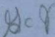
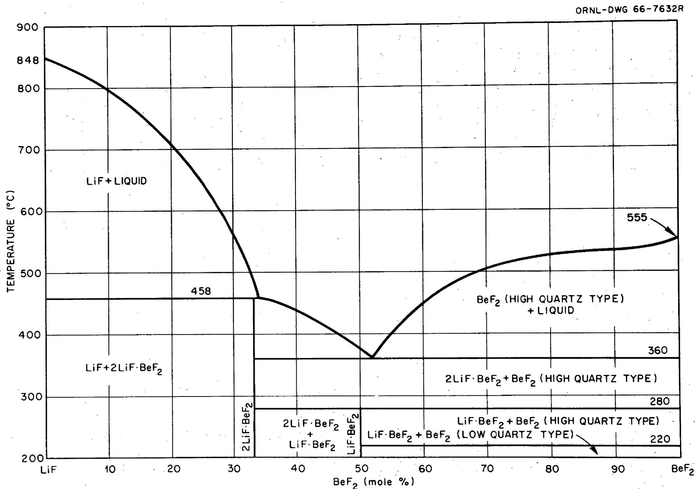
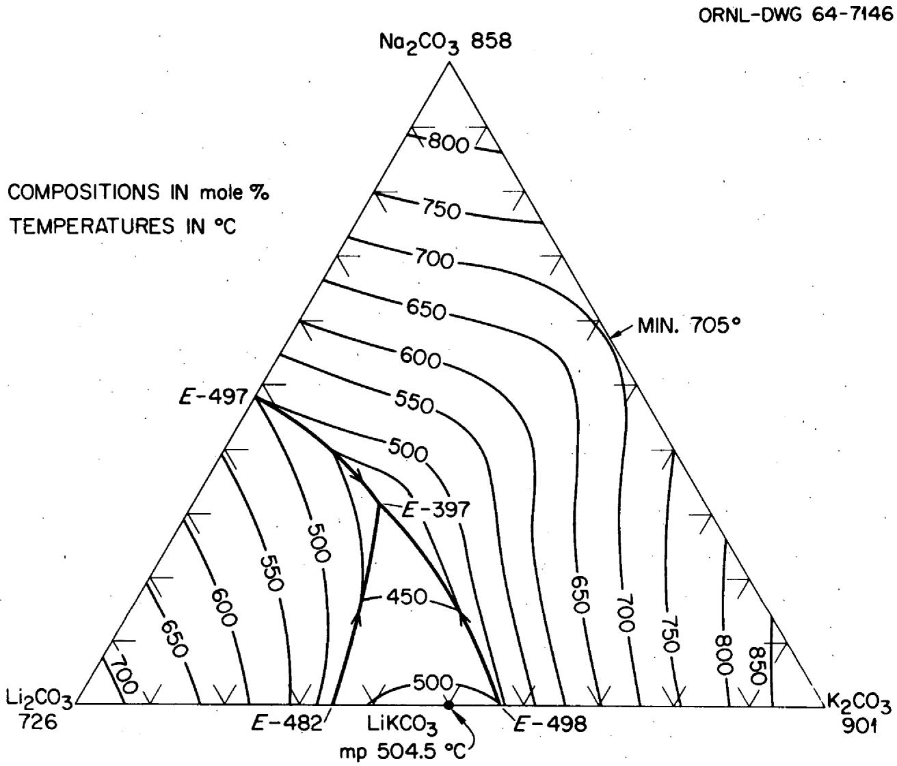
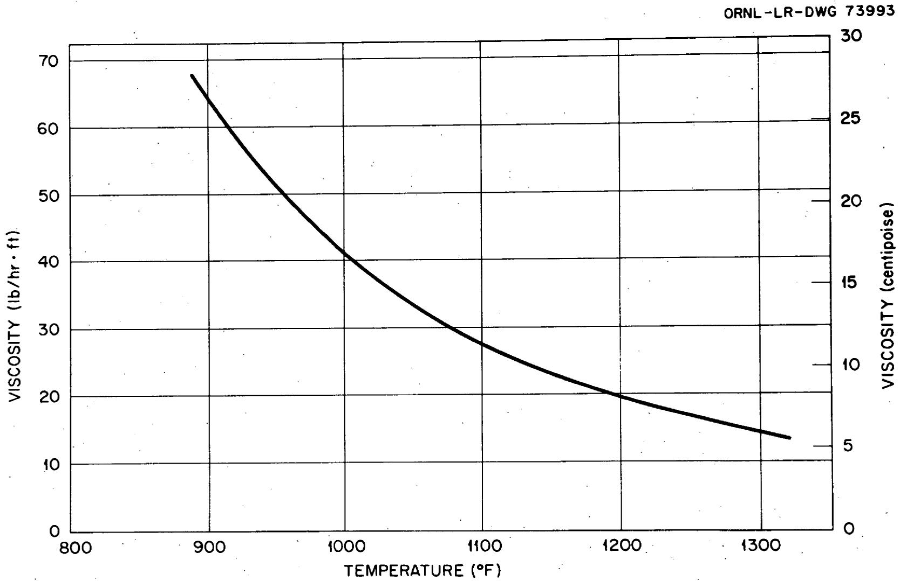
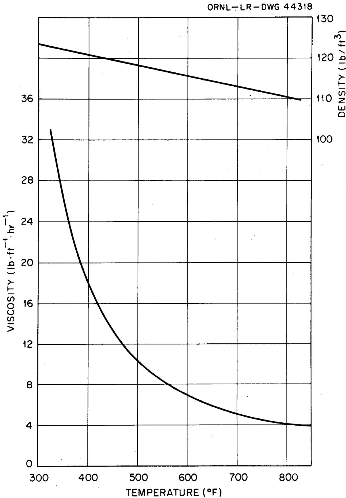
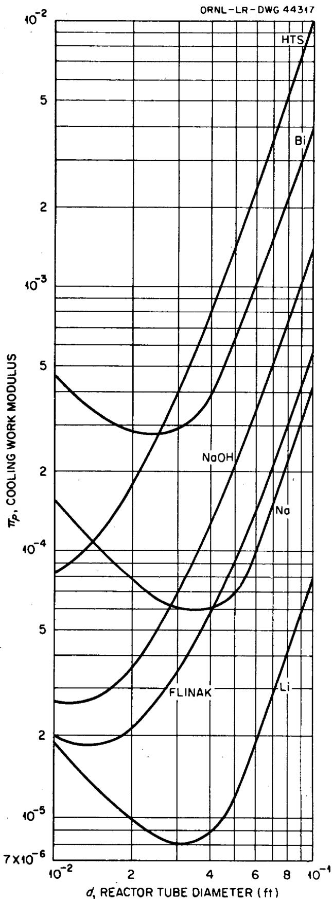
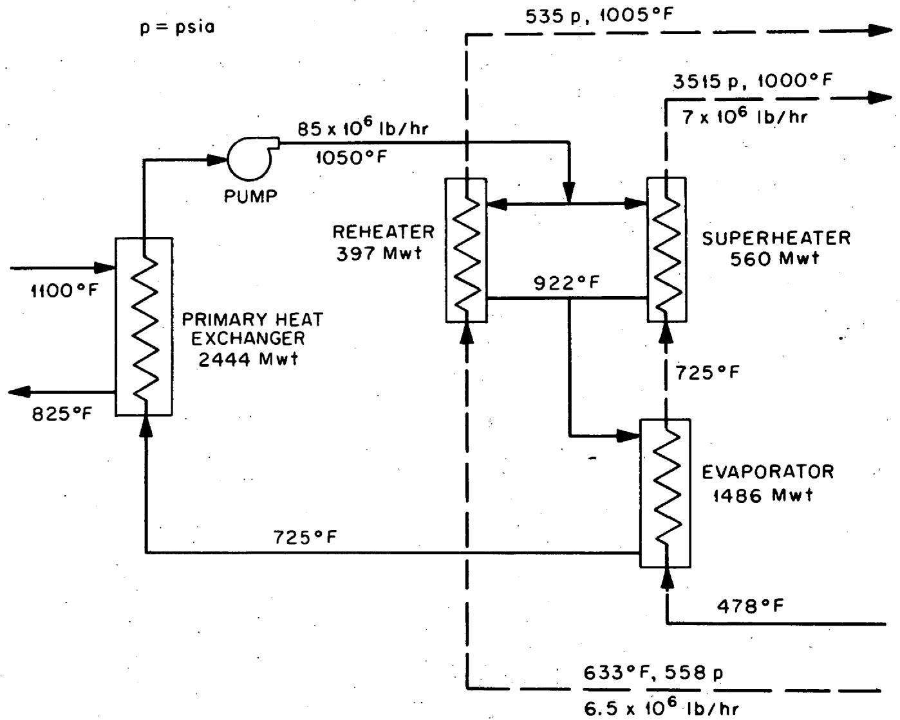
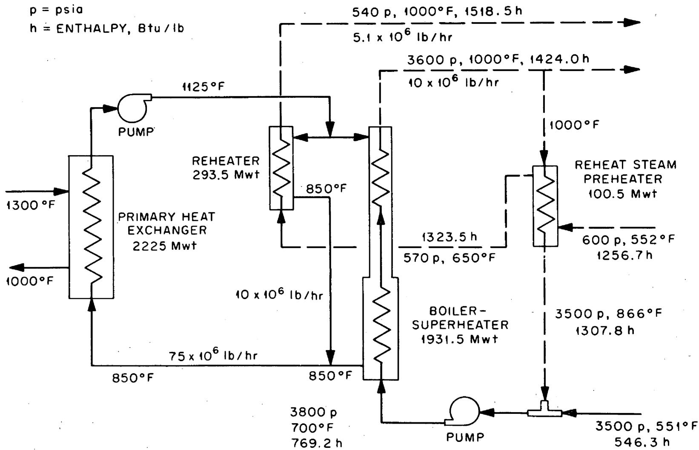

0C124569

COPY NO. 130

DATE-September 3,1969

BATE ISSUED:

ASSESSMENT OF MOLTEN SALTS AS INTERMEDIATE COOLANTS FOR LMFBR'S

H. F. McDuffie

H. E. McCoy

R.C.Robertson

Dunlap Scott

R. E. Thoma

# Abstract

Several molten salts were considered as intermediate coolants for LMFBR's. Included were fluoride, chloride, carbonate, nitrate-nitrite and fluoroborate salts. Chemical reactions that could occur between sodium and fluoroborates lead to the conclusion that carbonates might be a better choice for LMFBRs. Use of carbonates avoids the safety considerations and related costs that arise from the reactions of sodium with water if a steam generator fails and with air if a coolant pipe ruptures. In the absence of these safety considerations, sodium is clearly superior to the molten salts as an intermediate coolant for LMFBR's because the lower thermal conductivity and higher viscosity of the salts would result in higher equipment costs.

Keywords: coolants, fast-breeder reactor, liquid metals, fused salts, molten salts, fluoroborate, carbonate, sodium.

# LEGAL NOTICE

This report was prepared as an account of Government sponsored work. Neither the United States, nor the Commission, nor any person acting on behalf of the Commission:

A. Makes any warranty or representation, expressed or implied, with respect to the accuracy, completeness, or usefulness of the information contained in this report, or that the use of any information, apparatus, method, or process disclosed in this report may not infringe privately owned rights; or   
B. Assumes any liabilities with respect to the use of, or for damages resulting from the use of any information, apparatus, method, or process disclosed in this report.

As used in the above, "person acting on behalf of the Commission" includes any employee or contractor of the Commission, or employee of such contractor, to the extent that such employee or contractor of the Commission, or employee of such contractor prepares, disseminates, or provides access to, any information pursuant to his employment or contract with the Commission, or his employment with such contractor.

Table of Contents   

<table><tr><td>Introduction</td><td>5</td></tr><tr><td>Summary and Conclusions</td><td>5</td></tr><tr><td>Requirements for an LMFBR Intermediate Coolant</td><td>7</td></tr><tr><td>Absolute Requirements</td><td>7</td></tr><tr><td>Trade-Off Requirements</td><td>7</td></tr><tr><td>A Survey of Possible Molten-Salt Coolants</td><td>8</td></tr><tr><td>Fluorides</td><td>8</td></tr><tr><td>Chlorides</td><td>11</td></tr><tr><td>Carbonates</td><td>11</td></tr><tr><td>Nitrate-Nitrite Mixtures</td><td>16</td></tr><tr><td>Fluoroborates</td><td>19</td></tr><tr><td>Evaporation of Fluoroborates to Illustrate Use of Molten Salts for LMFBR&#x27;s</td><td>21</td></tr><tr><td>Suitability of Coolant Salt for Operating Conditions of LMFBR Cycle and Engineering Design Changes Required for Its Use</td><td>21</td></tr><tr><td>Compatibility with IMFBR Materials Including Effects of Radiation</td><td>30</td></tr><tr><td>Effects of Safety and Accident Conditions</td><td>31</td></tr><tr><td>Availability and Cost of Fluoroborate</td><td>32</td></tr><tr><td>Development Requirements for LMFBR Use on Molten Salts</td><td>33</td></tr><tr><td>Cycle Choice</td><td>33</td></tr><tr><td>Development Program for the MSBR</td><td>33</td></tr><tr><td>Evaluation of Carbonates for IMFBR Use</td><td>34</td></tr><tr><td>References</td><td>35</td></tr></table>

# ASSESSMENT OF MOLTEN SALTS AS INTERMEDIATE

# COOLANTS FOR IMFBR'S*

H. F. McDuffie

H. E. McCoy

R.C.Robertson

Dunlap Scott

R. E. Thoma

# Introduction

The Division of Reactor Development and Technology of the AEC asked ORNL to assess the use of molten salts as possible coolants for the intermediate loop of an LMFBR. Consequently, a group consisting of the authors of this report was constituted to prepare the assessment.

Initially we assumed that the fluoroborate-fluoride mixtures that appear to be of most interest for molten salt reactors would be good choices for LMFBR's, and most of the effort was directed towards evaluating the use of fluoroborates for fast reactors. Much of a report was prepared discussing fluoroborates and the status of the development program that will qualify them for use with molten salt reactors.

As the assessment proceeded, it became clear that salts other than fluoroborates might be more appropriate for LMFBR's. The report was revised accordingly, but some of the already prepared material on fluoroborates was left in because it illustrated the factors that must be considered in the design of a molten salt intermediate system and indicates the types of development activities that would be required for evaluation of any molten salt for LMFBR use.

# Summary and Conclusions

1. The use of molten salts as heat-transfer media is well-founded on long-standing technology.

2. The use of lithium-beryllium fluoride in the MSRE has been fully satisfactory, but it would be desirable for large reactors to have a coolant that has a lower liquidus temperature and a lower cost.   
3. The use of fluoroborate-fluoride salt mixtures appears attractive for large scale molten salt reactors on the basis of low liquidus temperatures, low cost, low vapor pressure, and good compatibility with Hastelloy N. Development is in progress in connection with the proposed demonstration of fluoroborates as suitable intermediate coolants for molten salt reactors.   
4. The use of fluoroborate-fluoride salt mixtures as intermediate coolants for an LMFBR would eliminate the possibility of a violent reaction of sodium with water due to a leak in the steam generator. However, an equally exothermic reaction (to give insoluble boron and soluble NaF) could occur if a leak in the primary heat exchanger allowed sodium to get into the fluoroborate salt. The implications of such a change in the location and nature of a potential hazard need to be considered.   
5. The use of molten carbonate salt mixtures for intermediate coolant in LMFBR's deserves serious consideration because of their combination of low cost, reasonably low liquidus temperatures, low vapor pressure, compatibility and probable freedom from violent reactions with either sodium or steam.   
6. Some consideration should be given to the possible use of nitrate-nitrite heat transfer fluids as intermediate coolants because of the good match of their physical properties to the temperature range of interest to IMFBR's and because of the extensive industrial experience with the acceptance of these fluids for heat transfer. Again, the probable exothermic reaction of metallic sodium with the melt represents the transfer of a hazard from the steam generator to the primary heat exchanger.   
7. The use of chloride or other fluoride mixtures does not appear attractive at the present time.   
8. An effective program to develop a molten-salt intermediate coolant system for LMFBR's could be performed by ORNL in conjunction with its present development of coolants for MSBR's.

# Requirements for an LMFBR Intermediate Coolant

In assessing intermediate heat transfer fluids it is possible to group the significant parameters roughly as follows.

# Absolute Requirements

1. The salt must be compatible with the container materials and adequately stable to the radiation which it will encounter.   
2. The melting point and vapor pressure of the salt must be such as to permit the system to be operated within the temperature limits desired.   
3. The viscosity and thermal properties must permit the use of acceptable heat exchangers, steam generators, and coolant pumps.   
4. The consequences of an accidental mixing of the salt with sodium or steam must be within the design capabilities and not imply catastrophic situations.   
5. The consequences of an accidental cooling of the system must be reversible.

# Trade-Off Requirements

1. The corrosion rate of the container should be low.   
2. The liquidus temperature of the coolant should be low.   
3. The vapor pressure of the system should be low and any condensed vapor should not be a solid with a high melting point.   
4. The viscosity and density of the coolant should be low.   
5. The thermal capacity and thermal conductivity of the coolant should be high.   
6. The price of the coolant should be low.   
7. Large amounts of the coolant should be available in high purity.   
8. It should be possible to separate the intermediate coolant from the primary sodium coolant if they are accidentally mixed, and the consequences should not be such as to leave neutron absorbing poisons or moderating elements in the primary coolant circuit.   
9. It should be possible to make up for coolant losses due to radiation decomposition.

10. The consequences of mixing the coolant with steam or water should be easily reversible.   
ll. A leak of intermediate coolant into the primary coolant circuit should be readily detectable.   
12. Engineering scale experience with the coolant should be available.

It is obvious that questions of economics, maintenance lifetime, operating inconveniences, etc., are trade-off items which must ultimately be balanced against the various technical items. There are many such trade-off items for every coolant considered; it is important not to exclude any candidate from further consideration until it is clear either that the absolute requirements cannot be met or that the trade-off items are overwhelmingly unfavorable.

A Survey of Possible Molten-Salt Coolants

# Fluorides

Many fluoride mixtures meet the absolute requirements stated earlier. The lithium-beryllium fluoride mixture used in the MSRE was selected because some of it leaking into the fuel would not contaminate the fuel salt with nuclides that make it unusable. It was also very satisfactory chemically, and most of its physical properties were acceptable as seen from inspection of the values in Table 1.

Table 1. Properties of ${\mathrm{{Li}}}_{2}{\mathrm{{BeF}}}_{4}$   

<table><tr><td>Melting temperature (peritectic)</td><td>857°F (458°C)</td></tr><tr><td>Liquid density (538°C)(1000°F)</td><td>124.1 lb/ft3</td></tr><tr><td>ρ(g/cm3)= 2.214-4.2 x 10-4t°C</td><td></td></tr><tr><td>Crystal density (X-ray)</td><td>2.168 g/cc</td></tr><tr><td>Coefficient of thermal expansion</td><td>2.1 x 10-4(°C)-1</td></tr><tr><td>Surface tension (857°F)(458°C)</td><td>250 dyne/cm</td></tr><tr><td>Vapor pressure (857-1200°F)</td><td>&lt;0.1 torr</td></tr><tr><td>Viscosity 1200°F (649°C)</td><td>6.8 centipoise</td></tr><tr><td>1000°F (538°C)</td><td>11.9 centipoise</td></tr><tr><td>Liquid thermal conductivity</td><td>0.011 watt (cm-°C)-1</td></tr><tr><td></td><td>0.64 Btu/hr-ft-°F</td></tr></table>

  
Fig. 1. Phase Diagram of the System LiF-BeF $_2$ .

Although the liquidus temperature can be lowered further by the addition of a higher percentage of beryllium fluoride (as seen from the phase diagram in Figure 1), this is at the expense of a rapidly increasing viscosity, which would impose severe economic penalties. The cost and the inconvenience of dealing with beryllium would handicap the use of lithium-beryllium fluoride as an intermediate coolant for an LMFBR, and there is no advantage to using only lithium and beryllium for fast reactor coolants.

Coolant compositions which have liquidus temperatures below $400^{\circ}\mathrm{C}$ ( $752^{\circ}\mathrm{F}$ ) can be found in the $\mathrm{NaF - BeF}_2$ system1 and in the $\mathrm{NaF - LiF - BeF}_2$ system.2 In the latter system, temperatures as low as $315^{\circ}\mathrm{C}$ ( $599^{\circ}\mathrm{F}$ ) have been reported. These materials are almost certainly compatible with Hastelloy-N and possess adequate specific heats and low vapor pressures. They should not undergo violent reactions on mixing with sodium or water; sodium should reduce the beryllium to metal and water would generate HF and precipitate BeO, but these consequences would be reversible by appropriate clean-up treatment except for the possibility of deposition of metallic beryllium in an inaccessible form. The viscosities of these fluoro-ride salts at low temperatures are certainly higher than are desirable. It is possible that substitution of $\mathrm{ZrF}_4$ or $\mathrm{AlF}_3$ for some of the $\mathrm{BeF}_2$ will provide liquids of lower viscosity at no real expense in liquidus temperature.

The eutectic composition of lithium-sodium-potassium fluoride (46.5-11.5-42.0 mole %) melting near $455^{\circ}\mathrm{C}$ ( $851^{\circ}\mathrm{F}$ ) is quite well known and should be relatively stable to mixing with metallic sodium or with water. Its liquidus temperature is probably too high for consideration.

Stannous (tin II) fluoride, $\mathrm{SnF}_2$ , which melts at $215^{\circ}\mathrm{C}$ ( $419^{\circ}\mathrm{F}$ ), has been suggested several times as a fuel solvent or coolant in molten salt technology. It is available in large quantities and in high purity, largely as a result of its use in toothpaste. We have excluded consideration of it, nevertheless, because of its ease of reduction or, alternatively, its high oxidizing and corrosive power; it is similar to $\mathrm{PbF}_2$ and $\mathrm{BiF}_3$ in this respect and could not be contained in nickel-based or iron-based alloys but would require something more noble such as molybdenum or graphite.

There are essentially no other fluoride mixtures melting below $400^{\circ}\mathrm{C}$ ( $752^{\circ}\mathrm{F}$ ) which do not contain either beryllium fluoride, hydrogen fluoride,

or ammonium fluoride as a component; consequently, it is believed that it would be unprofitable to concentrate a search in the field of fluorides beyond the limits already outlined.

# Chlorides

Chlorides have always been considered potentially useful heat transfer fluids.3 It would certainly be possible to find mixtures with low liquidus temperatures and low viscosities. The thermal properties should be competitive with those of fluorides. The vapor pressures are likely to be higher. The corrosion4 and radiation stability are likely to be less favorable.

Many chloride mixtures are known which melt below $200^{\circ}\mathrm{C}$ ( $392^{\circ}\mathrm{F}$ ); these usually contain a relatively volatile chloride, such as $\mathrm{ZrCl}_4$ , $\mathrm{NbCl}_5$ , and $\mathrm{AlCl}_3$ , or an easily reduced chloride such as $\mathrm{CdCl}_2$ , $\mathrm{PbCl}_2$ , or $\mathrm{GaCl}_3$ . Either of these factors makes the mixtures less attractive for use in an LMFBR. The consequences of accidental leakage of chlorides into fluoride fuels, sodium, or water are likely to be worse than those of a fluoride leak. The effect of chlorides on stress corrosion cracking in the steam generators would be a matter for considerable concern.

We believe that a satisfactory intermediate LMFBR coolant will not easily be found among the chloride mixtures and, if one were found, it would only be after a large development effort to demonstrate compatibility.

# Carbonates

Molten carbonate mixtures have been used extensively as heat transfer baths in metal working, and consideration has been given to their use as coolants for molten salt reactors. Due largely to the work of Janz and his associates at Renssaler Polytechnic Institute a number of properties of molten carbonates have been established. Figure 2 presents a phase diagram of the ternary system $\mathrm{Li}_{2}\mathrm{CO}_{3} - \mathrm{Na}_{2}\mathrm{CO}_{3} - \mathrm{K}_{2}\mathrm{CO}_{3}$ . The eutectic of the composition 43.5-31.5-25.0 mole % is reported to melt at $397^{\circ}\mathrm{C}$ (747°F) by Janz et al., but the composition 26.8-42.5-30.7 mole % is reported to melt at $393^{\circ}\mathrm{C}$ (739°F) by Rolin et al. Janz and Saegusa reported that the ternary composition, m.p. $397^{\circ}\mathrm{C}$ (747°F) was 40-30-30 mole %.

  
Fig. 2. The System $\mathrm{Li}_{2}\mathrm{CO}_{3}-\mathrm{Na}_{2}\mathrm{CO}_{3}-\mathrm{K}_{2}\mathrm{CO}_{3}$ ; Modified from Janz and Lorenz, J. Chem. and Eng. Data Vol. 6, No. 3, 321-323 (1961).

Subsequent studies by Janz have indicated that the dissociation pressures over carbonate melts should not exceed one atmosphere in the temperature range of interest (lithium carbonate has a pressure of 501 mm at $843^{\circ}\mathrm{C}$ ( $1550^{\circ}\mathrm{F}$ ).

The ternary carbonate mixture has been used for a number of years and is known to be noncorrosive to steel at $1400^{\circ}\mathrm{F}$ ( $760^{\circ}\mathrm{C}$ ) over many months of exposure; no obvious corrosion was observed after about 4000 hr of exposure at $1200^{\circ}\mathrm{F}$ ( $649^{\circ}\mathrm{C}$ ) to INOR-8. In tests at ORNL, Bettis reported that molten carbonate was apparently stable toward molten lead at temperatures of $900 - 1000^{\circ}\mathrm{F}$ ( $482 - 538^{\circ}\mathrm{C}$ ).

ORNL $^{10}$ has reported the enthalpy and the viscosity of a ternary carbonate mixture (Li-Na-K, 30-39-32 wt Q) (41-36-23 mole %) over the temperature range (887-1319°F) 475-715°C with the liquidus temperature indicated as being near 390°C (734°F). The derived heat capacity of the salt was 0.413 cal/g°C; the kinematic viscosity, based on efflux-cup measurements, was reported to be given by the expression

$$
v = 0. 0 2 4 \exp (4 8 1 8 / T ^ {\circ} K) \text {c e n t i s t o k e s}
$$

and the density was estimated, assuming ideal solution, to be

$$
\rho = 2. 2 1 2 - 0. 0 0 0 3 9 \mathrm {T} ^ {\circ} \mathrm {C} \text {g r a m s / c m} ^ {3}.
$$

From this, the viscosity was calculated to be 33.5 centipoise at $460^{\circ}\mathrm{C}$ $(860^{\circ}\mathrm{F})$ and 5.98 centipoise at $715^{\circ}\mathrm{C}$ $(1319^{\circ}\mathrm{F})$ . The mixture was proposed for use in out-of-pile development studies relating to the MSRE because of its similarity in properties to the fluoride salts and because it is essentially noncorrosive to stainless steel without a protective atmosphere. Figure 3 shows the viscosity of this mixture as a function of the temperature predicted by the early ORNL workers.

Janz and Saegusa8 have reported considerably lower values for the viscosity of the ternary eutectic mixture, $\mathrm{Li}_{2}\mathrm{CO}_{3} - \mathrm{Na}_{2}\mathrm{CO}_{3} - \mathrm{K}_{2}\mathrm{CO}_{3}$ (40-30-30 mole %), m.p. 397°C:

  
Fig. 3. Viscosity of $\mathrm{Li}_{2}\mathrm{CO}_{3} - \mathrm{Na}_{2}\mathrm{CO}_{3} - \mathrm{K}_{2}\mathrm{CO}_{3}$ (41-36-23 mole %).

<table><tr><td>T (°C)</td><td>η(poise)</td></tr><tr><td>483 (901°F)</td><td>0.0584</td></tr><tr><td>484 (903°F)</td><td>0.0547</td></tr><tr><td>539 (1000°F)</td><td>0.0323</td></tr><tr><td>598 (1110°F)</td><td>0.0237</td></tr><tr><td>600 (1112°F)</td><td>0.0207</td></tr></table>

These values were reported subsequent to the ORNL values and were measured with an intrinsically more accurate and precise technique in a laboratory devoted to measurements on many carbonates. They are much more favorable with respect to the use of carbonates as coolants.

We are not aware of any reported measurements of the thermal conductivity of molten carbonates, but it is expected that the values will be near to those for molten nitrates and fluoroborates.

The consequences of an accidental introduction of molten carbonate into molten fluoride fuel are believed to be intolerable; it is expected that the carbonate would dissociate, with the carbon dioxide being released and the residual oxide causing massive precipitation of insoluble oxides of uranium and thorium. It is likely also that the introduction of the foreign cations would be essentially irreversible. No direct tests have been performed to measure the results of mixing of carbonates and fluorides.

The possibility of using carbonates in proximity to metallic sodium raises less apprehension with respect to the consequences of a leak. Certainly it would be necessary to remove oxide from the sodium metal in order to control corrosion, but no dire consequences of a leak of sodium into the molten carbonate are foreseen. The possibility of a reaction of metallic sodium with sodium carbonate was examined briefly.[1] The reaction

$$
2 \mathrm {N a} + \mathrm {N a} _ {2} \mathrm {C O} _ {3} (1) = 2 \mathrm {N a} _ {2} \mathrm {O} (\mathrm {s}) + \mathrm {C O} (\mathrm {g})
$$

$$
\Delta F ^ {\circ} \quad - 2 0 3 \quad - 1 3 1 \quad - 4 7. 9
$$

is unfavorable in free energy at $1000^{\circ}\mathrm{K}$ by about 24 kcal. A leak of carbonate into the steam generator (although unlikely because of the pressure differences) would require that the generator be thoroughly

flushed; this seems feasible since the carbonates are quite soluble in water. A leak of steam into carbonates would probably be reversible by side stream treatment with carbon dioxide.

The effects of radiation on molten carbonates, particularly gamma radiation from a primary sodium coolant fluid, have not been determined. Since the effects of gamma radiation on molten fluorides and molten fluoroborates have been found to be negligible, and since carbonates are thermodynamically quite stable, it is not anticipated that radiation effects would be severe.

If the liquidus temperature as high as $750^{\circ}\mathrm{F}$ ( $399^{\circ}\mathrm{C}$ ) would be acceptable, carbonates would appear to merit serious additional consideration as intermediate coolants for LMFBR's.

# Nitrate-Nitrite Mixtures

Many inorganic nitrate-nitrite mixtures have been used as heat transfer agents for high temperature industrial processes. Mixtures of commercial interest are illustrated by HTS (Heat Transfer Salt - also DuPont Hitec), a eutectic mixture of $\mathrm{NaNO}_3$ - $\mathrm{KNO}_3$ - $\mathrm{NaNO}_2$ (7-53-40 wt %) which has a melting point of $288^{\circ}\mathrm{F}$ ( $142^{\circ}\mathrm{C}$ ).

HTS has been proposed for use in the temperature range 300 to $1000^{\circ}\mathrm{F}$ . Heat transfer and thermal property measurements with HTS were first reported in 1940.[12] The authors also investigated the corrosion, thermal stability, and handling of this salt mixture. Hoffman at ORNL has studied the heat transfer characteristics of HTS flowing by forced convection through circular tubes and reported his results in 1960.[13] The variations of density and viscosity of HTS with temperature are given by Figure 4. The heat capacity was reported as 0.373 Btu.lb $^{-1}$ (°F) $^{-1}$ for the liquid. The thermal conductivity was reported as 0.35 Btu hr $^{-1}$ ft $^{-1}$ (°F) $^{-1}$ . Comparison of the effectiveness of several coolants was provided by means of the "cooling-work modulus" (the flow work per unit heat removal) derived by Rosenthal, Poppendiek, and Burnett.[14] Hoffman has reported such a comparison of coolants in Figure 5, with the properties of HTS extrapolated to $1350^{\circ}\mathrm{F}$ for consistency. This comparison shows that HTS requires 10-20 times the pumping power required for sodium or FLINAK (NaF-LiF-KF eutectic).

  
Fig. 4. Density and Viscosity of HTS (nitrate-nitrite eutectic).

  
Fig. 5. Relative Heat Transfer Effectiveness of Reactor Coolants.

Irradiation of HTS to a dose of $3.3 \times 10^{18}$ thermal neutrons/cm $^2$ and an accompanying epithermal dose of somewhat less than half the thermal dose was reported by Hoffman to have been performed by O. Sisman of ORNL. The irradiated samples were said to have become more hygroscopic, and some breakdown to gaseous products was reported. As a consequence of high-temperature thermal breakdown or radiation-thermal breakdown it would seem appropriate to arrange treatment of a bypass stream with $\mathsf{N}_2\mathsf{O}_5$ or $\mathsf{N}_2\mathsf{O}_3$ to regenerate the desired composition, but this was considered to pose no more difficult engineering problems than those involved in the use of organic coolants.

A leak of sodium into an HTS salt mixture would cause an exothermic reaction to form sodium oxide and liberate nitrogen or nitrogen oxides. The heat liberated would be of the same order of magnitude of that involved in the sodium-water reaction. The chemical consequences in the salt would be reversible by treatment with nitrogen oxides. If salt leaked into the primary sodium system of an LMFBR, a similar reaction would occur and the resulting sodium oxide would have to be removed by appropriate traps.

The nitrate-nitrite salts appear to present no insurmountable difficulties, but their use would involve a number of disadvantages in the trade-off area. Whether their compatibility with structural materials and the large industrial use which they have enjoyed for heat transfer purposes is sufficient to offset these disadvantages is a question to be resolved by more detailed engineering evaluation.

# Fluoroborates

After a survey of the materials considered available, it appeared that fluoroborates, especially a mixture of sodium fluoroborate and sodium fluoride, offered the greatest promise for development as intermediate coolants for molten salt reactors. Liquidus temperatures as low as $380^{\circ}\mathrm{C}$ ( $716^{\circ}\mathrm{F}$ ) were available. The cost of materials is known to be very low (less than $\$0.50/\mathrm{lb}$ for material of high purity). The vapor pressure of $\mathrm{BF}_3$ above the melts has been found to be relatively low (less than one atmosphere). The corrosiveness of the material to Hastelloy-N appears to

be low. No violent exothermic reactions occur when fluoroborates are mixed with steam or with fluoride fuel salts. In fact, it has been discovered that fluoroborates are essentially immiscible with molten mixtures of lithium and beryllium fluorides. Uranium and other tri- and tetravalent elements were not extracted into fluoroborates, and no high-melting compounds were found when sodium fluoroborate was equilibrated with a fluoride salt mixture of $\mathrm{LiF - BeF_2 - UF_4 - ThF_4}$ . Operation of a test loop (containing residues of this fluoride salt) with a flushing charge of $\mathrm{NaF - NaBF_4}$ did, however, reveal the deposition of a green salt in the upper region of the pump bowl. The composition of the salt was essentially $7\mathrm{NaF} \cdot 6(\mathrm{Th}, \mathrm{U})\mathrm{F}_4$ , suggesting that either entrainment of the residue or solution-deposition of it had occurred, along with some replacement of Li by Na; although more study of the immiscibility phenomenon is indicated, there is no information available to cause alarm over the possibility of accidental mixing of fluoroborates with fluoride salts. For MSBR use, moreover, the accidental introduction of fluoroborates into the circulating fuel would cause a large reactivity decrease because of the boron, and thus even a small leak would be quickly detected. The boron could be easily removed from the fuel salt by treatment with HF.

For LMFBR use, a leak of sodium into the fluoroborate would be expected to result in immediate and complete reaction to produce sodium fluoride and elemental boron. $^{15}$ In early work, boron trifluoride was reported to have been passed over red-hot potassium in a gun barrel to produce boron and KF, and metallic sodium or potassium heated in boron trifluoride were reported to react with the production of fire to give boron and the metallic fluoride. Calculations suggest that the heat liberated when sodium metal reacts with sodium fluoroborate will be about 105 kcal per mole of sodium fluoroborate, or 1.5 kcal per gram of sodium introduced. Introduction of one gram of sodium into 100 grams of the NaF-NaBF $_4$ mixture would be expected to raise its temperature by $43^{\circ}\mathrm{C}$ ( $109^{\circ}\mathrm{F}$ ). The amount of heat involved in injecting sodium into sodium fluoroborate is almost the same as the amount involved in adding sodium to water ( $1.48$ kcal per gram of sodium); thus the magnitude of this problem would be about the same but the location would be shifted from the steam generator

to the intermediate heat exchanger; the consequences would not involve the liberation of hydrogen but would involve the addition of radioactive sodium to the intermediate coolant. The consequences of injecting sodium fluoroborate into the primary sodium stream would be similar to the reverse; the removal of the boron might be difficult if it were produced in a finely divided form and dispersed throughout the coolant.

# Evaluation of Fluoroborates to Illustrate use of Molten Salts for IMFBR's

As indicated in the introduction, the original plan for the assessment of molten salts as intermediate coolants for LMFBR use was based on the assumption that fluoroborates might be the most worthy candidates. Consequently, an attempt was made to evaluate fluoroborates from an engineering and design point of view. Although it now appears that carbonates may possibly prove to be more favorable than fluoroborates for LMFBR use, the evaluation of fluoroborates is presented to illustrate the type of problems which are sure to be encountered and the design and engineering factors which will have to be taken into account in using any molten salt for the intermediate coolant of an LMFBR.

# Suitability of Coolant Salt for Operating Conditions of LMFBR Cycle and Engineering Design Changes Required for Its Use

General - If all the components of an MSBR intermediate system using sodium fluoroborate as the circulated coolant were fully developed, this same secondary system would be applicable to an LMFBR power plant without significant changes in the operating conditions or without raising major new development problems in the fluid dynamics or heat transfer.

As will be explained below, substitution of the MSBR coolant salt for sodium as the secondary coolant for the LMFBR could narrow the freedom of choice of steam conditions and feedwater temperatures, and could affect the circulation rates in both the secondary and steam circuits, but these changes should not impose particular operating difficulties nor should they be detrimental to the overall plant thermal efficiency.

To judge the effects of using sodium fluoroborate rather than sodium, the performances of the two systems can be roughly compared. For the purposes of this survey, the properties of the two coolants were assumed to be as shown in Table 2. The values for the salt will need later adjustment as more physical property data become available, but it is believed that the values shown are sufficiently reliable for some generalized conclusions to be drawn.

Table 2. Physical Properties Assumed for this Study   

<table><tr><td></td><td>Sodium</td><td>Fluoroborate</td></tr><tr><td>Composition</td><td>Na</td><td>NaBF4-NaF (92-8 mole %)</td></tr><tr><td>Specific heat, Btu/lb-°F</td><td>0.3</td><td>0.36</td></tr><tr><td>Volumetric heat capacity, Btu/ft3-°F</td><td>15.6</td><td>42.1</td></tr><tr><td>Viscosity, lb/hr-ft</td><td>0.6</td><td>6* at 800-900°F</td></tr><tr><td>Density, lb/ft3</td><td>52</td><td>117 at 870°F</td></tr><tr><td>Thermal conductivity, Btu/hr-ft-°F</td><td>41</td><td>0.2</td></tr><tr><td>Liquidus temperature, °F</td><td>207</td><td>716</td></tr><tr><td>Vapor pressure, mm Hg</td><td>39 at 1160°F</td><td>270 at 1160°F</td></tr></table>

*Recent measurements of NaBF $_4$ viscosity by Mound Laboratory gave values of 2.4 to 4.8 lb/hr-ft in the temperature range of interest. The mixture with NaF should also be at least this low in viscosity.

Even though there is uncertainty in the properties of the sodium fluoroborate, it is nevertheless clear that the differences between the properties of the salt and those of sodium are sufficient to cause design optimization studies to yield different numbers of modules, arrangement of heat transfer surfaces, and circulation rates in both the secondary and steam systems. A numerical comparison of equipment costs and operating performances would therefore be dependent upon optimization studies which are beyond the scope of this survey. There are, however, some trends in the design aspects which can be briefly mentioned.

Operating Temperatures - The use of fluoroborate instead of sodium would not impose any limitation on the high temperature side of the secondary system; this temperature would only be limited by the allowable temperature in the primary system, which, in turn, might be set by the compatibility of the fuel element with the primary sodium. The properties of fluoroborate salt, however, affect the choice of the lower temperature limit and the temperatures of inlet steam and/or water in the steam generating part of the system. Figure 6 illustrates an assumed LMFBR flow-sheet based on sodium and Figure 7 illustrates an assumed MSBR secondary system.[16] The operating temperatures of these two flowsheets are not the same, but they are shown to illustrate the additional complexity which might be introduced by the use of salt.

A property of the salt which may impose lower temperature limitations is its liquidus temperature (716°F, 380°C). This is actually below the lowest sodium temperature shown in Figure 6 (725°F), but there would always be some risk of freezing salt in the tubes if the inlet water or inlet steam were much below the liquidus temperature. Figure 7 illustrates how this contingency could be avoided by degrading some of the 1000°F steam from the boiler-superheater to reheat steam in the preheater and to mix with entering water ahead of the pump; the entering water would thereby be raised to 700°F, and the entering steam to 650°F. These temperatures are less than 70°F below the liquidus temperature, and it is believed that the inevitable temperature gradient across the tube wall would prevent the occurrence of temperatures low enough to freeze any salt.

Accordingly, the cycle shown in Figure 7, perhaps with some reduction in the throttle temperature, could probably be used in an LMFBR plant, particularly since at least one preliminary study has indicated that supercritical pressure steam may be economically desirable for a high temperature LMFBR in any event.[17]

Additional study and testing will be required to decide just how low in temperature the inlet steam and water may be permitted to go without freezing salt in the tubes.

  
Fig. 6. Assumed LMFBR Secondary System Flowsheet Using Sodium as Coolant.

  
Fig. 7. Assumed MSBR Secondary System Flowsheet Using Salt as Coolant.

Primary Heat Exchanger - Even though the heat transfer properties of sodium fluoroborate are generally considered good as compared with many heat transport fluids, they are not so good as sodium, and the effect of the change on the heat transfer coefficients and area requirements could be marked.

A primary exchanger designed for sodium-to-salt heat transfer could require about $50\%$ more surface than a sodium-to-sodium unit, assuming that about the same velocity of 10 ft/sec were used inside the tubes in each case. To achieve essentially the same velocity requires a different design, however, in that the volumetric flow requirement of the salt is only about $37\%$ of that needed for sodium for the same heat transport capacity. In order to maintain the velocity with a smaller volumetric flow rate, fewer tubes or ones of a smaller diameter must be used, either of which would increase the pressure drop through the exchanger. For example, if 1/2-in. OD tubes were used instead of the 3/4-in. tubes used in the sodium system, the salt velocity would be about 10 ft/sec compared to 11 ft/sec for the sodium in the larger tubes, but the loss of head due to flow of the salt would be about 2.7 times that for sodium.

The above-mentioned effects of using sodium fluoroborate rather than sodium in the LMFBR primary heat exchanger would not be as pronounced if enhanced heat-transfer tubing were used. When using helically grooved type tubing, for example, the heat transfer film coefficient on the inside might be approximately doubled (enhanced heat transfer has been demonstrated with water but not yet with salt for such tubing), although for a given length of tubing the $\Delta p$ would also be about doubled. If this type of tubing were used, the primary heat exchanger surface area requirements might be about the same in both the sodium and salt systems. In this case the pressure drop of the salt system would be more than twice as great as that in the sodium loop. This situation represents a logical application of enhanced type of surfaces and would merit serious study and development.

If the primary heat exchanger is made appreciably larger due to the effects mentioned above, there would be some increase in the inventory of primary sodium.

Design of a sodium-to-fluoroborate LMFBR primary heat exchanger probably would require that surfaces in contact with the fluoroborate be fabricated of Hastelloy-N, some other high-nickel alloy, or nickel metal. The material cost of Hastelloy-N could be about twice as much as that of the stainless steel used in sodium-to-sodium exchangers, although labor and other fabrication costs would not be greatly different. If, as suggested above, the surface requirements for the sodium-to-salt exchanger are also significantly greater, then the cost difference between the two types of units would be accentuated.

It must be emphasized that all the above comments regarding the relative performances of the primary heat exchangers are based on assumed properties for the sodium fluoroborate salt. The viscosity of the sodium fluoroborate over the temperature range of interest is particularly uncertain and could have a major effect on the estimates. As noted above, our most recent information suggests that the viscosity of pure sodium fluoroborate may be between 1 and 2 centipoise (2.4 to 4.8 lb/hr-ft) in the temperature range of interest. Additional study will be required to confirm these results and to extend them to cover mixtures of sodium fluoride with sodium fluoroborate.

The overall result of the above-mentioned factors is that if salt rather than sodium is used as the secondary coolant, the cost of the primary salt exchangers could be greater, both through the need for more surface and from more expensive type of tubing and tubing material. Primary sodium inventory could be increased, and cell dimensions may need to be expanded to accommodate larger units. The pumping power requirements, but not the volumetric flow rate, might also be increased.

Steam Generator and Reheater - In the evaporator portion of a subcritical pressure steam generator the outside film coefficient of heat transfer when using sodium fluoroborate might be only about one-eighth of that which could be obtained by using sodium. The overall coefficient of heat transfer could be in the order of $60\%$ of that obtained in a sodium-to-water evaporator. While not investigated in this survey, it can be presumed that the same difference in performance would exist if the steam pressure were supercritical.

In the superheating region of the steam generator the outside film coefficient for sodium fluoroborate might be about one-seventh that in a sodium-to-steam exchanger, and the overall heat transfer coefficient again about $60\%$ of that in a sodium exchanger.

In the reheater, the salt film coefficient might be only about one-eighth the sodium film coefficient in a sodium-to-steam unit. In this case the steam-side film coefficient should be controlling and the effect on the overall heat transfer coefficient would not be as great. It was estimated that the overall coefficient of the salt unit would be about $75\%$ of that for sodium. In this case there would be little or no incentive for use of enhanced type of heat transfer tubing.

The temperature difference between the incoming feedwater to the evaporator section of the steam generator and the salt or sodium temperature on the shell side is important in the design of the equipment, from the standpoint of the thermal stress induced by the thermal gradient across the tube wall. This difference must also be controlled in order to avoid freezing the coolant salt but the allowable value has not been established. This problem has been briefly discussed above. The situation is not unique to the salt coolant, however, in that, as may be noted in the sodium system shown in Figure 6, the evaporator is supplied with $478^{\circ}\mathrm{F}$ feedwater and has an exit sodium temperature of $725^{\circ}\mathrm{F}$ , suggesting either that this particular set of conditions will not be satisfactory from a thermal stress standpoint in the present LMFBR design or that our MSBR designs are too conservative.

As with the primary heat exchangers, if it is determined that Hastelloy N is required for compatibility with the sodium fluoroborate, the manufacturing cost of the steam generators and reheaters could be significantly greater, both from the materials cost and the requirement for somewhat more heat transfer surface. On the other hand, there could be substantial savings in the complexity and cost of the units through elimination of the special arrangements to accommodate a sodium-water reaction. While some pressure-relief system is needed on the intermediate circulating system in any event to prevent pressures in the steam system from being transmitted to the primary heat exchanger, this system might be less elaborate for the salt loop since no chemical release of energy would be involved

and it would not be necessary to dispose of hydrogen gas. These cost effects are offsetting, and it is possible that the overall difference in equipment costs between the two coolant choices are not so important as other considerations in comparing the two.

Piping - The volumetric flow rate of the salt need be only $37\%$ of that of sodium to obtain the same heat transport capacity. If the same pipe sizes were used in both systems, the salt velocity would be correspondingly lower and the pumping effort would perhaps be about $43\%$ that in a sodium system. If the salt system were designed for about the same velocity as used in sodium piping, typically a 15-in. pipe would be used instead of a 24-in. sodium pipe, but in this case the loss of head due to friction in the piping might be about 1.3 times as great. The optimum design for a salt system would likely fall somewhere in between these extremes. These effects are probably not of great consequence in comparing the two coolants.

Circulating-Pump Power Requirements - If optimization studies were made of an LMFBR system using sodium fluoroborate in the intermediate system, it would probably be determined that the velocities of the salt should be as high or higher than those of sodium. If this is true, the total head requirements on the pump could be twice as great for the salt system. Even though the mass flow rate of the salt need be only $80\%$ of that required for sodium, the difference in the pumping effort is substantial. While this is undesirable, it is probably not of over-riding importance in considering the suitability of the salt as a coolant.

Heat Systems - Both the sodium and fluoroborate intermediate cooling systems would require provisions for maintaining the coolant above the freezing point. The melting temperature of about $200^{\circ}\mathrm{F}$ ( $93^{\circ}\mathrm{C}$ ) for sodium would be easier to maintain by electrically heated tracers than the $716^{\circ}\mathrm{F}$ ( $380^{\circ}\mathrm{C}$ ) needed for salt systems, but the difference is one of the amount of heat rather than the presence or absence of a tracer heat system. The heat loss from either system would be about the same. (In this connection, a heated cell has been considered in some MSBR design studies in contrast to the use of tracers on piping and equipment.)

# Compatibility with LMFBR Materials Including

# Effects of Radiation

The tests now in progress suggest that fluoroborates are compatible with Hastelloy-N. If Hastelloy-N were chosen as the material for the secondary coolant circuit of an IMFBR, two problems would be presented: it is compatible with steam and is it compatible with sodium? With respect to the first, compatibility with steam, a test program is underway in which ORNL and TVA are cooperating to test Hastelloy-N with supercritical steam in the Bull Run Steam Plant. One advantage of Hastelloy-N for steam service is that the alloy is not susceptible to stress-corrosion cracking under conditions where serious problems have resulted in stainless steel. With respect to compatibility with sodium, extensive studies were made in the early stages of the molten salt development program. The results were summarized in the MSBR Status Report of 1958 (Ref. 18) as follows:

"The effect of sodium on the structural materials of interest has also been extensively studied, since sodium is proposed for use as the intermediate heat transfer medium. Corrosion problems inherent in the utilization of sodium for heat transfer purposes do not involve so much the deterioration of the metal surfaces as the tendency for components of the container material to be transported from hot to cold regions and to form plugs of deposited material in the cold region. As in the case of the corrosion by the salt mixture, the mass transfer in sodium-containing systems is extremely dependent on the maximum system operating temperature. The results of numerous tests indicate that the nickel-base alloys such as Inconel and INOR-8, are satisfactory containers for sodium at temperatures below $1300^{\circ}\mathrm{F}$ and that above $1300^{\circ}\mathrm{F}$ the austenitic stainless steels are preferable."

*Recent experiments indicate that the specific corrosion rate depends upon the water content of the salt. For example, the corrosion rate in a thermal convection loop at a peak temperature of $1125^{\circ}\mathrm{F}$ ( $607^{\circ}\mathrm{C}$ ) was about 0.35 mpy when the salt contained 400 ppm water and 0.75 mpy when 1000 ppm water was present. Although these corrosion rates are not very high, they do indicate that a process will have to be developed for on-stream removal of moisture from the sodium fluoroborate coolant circuit. This process, which will likely consist of bubbling HF or $\mathbf{BF}_3$ through a side stream of the salt, is currently under development.

This early assessment of nickel-base alloy performance in sodium has now been confirmed in recent British $^{19}$ and Russian $^{20}$ studies. Also Atomics International and ORNL have completed extensive tests of Hastelloy-N in NaK9Na-K, 30-70 wt $\%$ ) extending to lower temperature which show that mass transfer rate of the alloy at $350^{\circ}\mathrm{F}$ is only slightly greater than that of type 316 stainless steel. $^{21}$ Thus, since the secondary coolant temperatures of the LMFBR are limited to a maximum of about $1100^{\circ}\mathrm{F}$ , it is likely that Inconel or Hastelloy-N would be compatible with sodium.

The effects of radiation in an LMFBR are likely to be much less serious than those in a molten salt reactor, since the fluoroborate would be exposed only to the gamma flux from the radioactive sodium in the primary circuit. Experiments at ORNL have exposed the eutectic $\mathrm{NaBF}_{4}$ -NaF mixture at $600^{\circ}\mathrm{C}$ to the gamma radiation from decaying HFIR fuel elements to a total dose of $7.7 \times 10^{10} \mathrm{r}$ with an average intensity of $0.15 \mathrm{~w/g}$ and a maximum intensity of $0.5 \mathrm{~w/g}$ . (The average intensity of absorbed gamma radiation estimated for the MSBR heat exchangers is around $0.25 \mathrm{~w/g}$ ). The salt was contained in a Hastelloy-N capsule. Examination following the irradiation revealed no evidence of radiation decomposition of fluoroborate and no incompatibility with the Hastelloy-N.[22]

# Effects of Safety and Accident Conditions

As noted earlier, sodium is expected to react quite exothermically with fluoroborates to produce boron, sodium fluoride, and approximately 1.5 kilocalories per gram of sodium. No gaseous products of the reaction are foreseen, but the liberated heat could cause the vapor pressure of $\mathbf{BF}_3$ to rise locally, the amount depending on the ratio of sodium to fluoroborate and the rate of the reaction. No experimental studies have yet been made of this reaction.

A leak of fluoroborate from the intermediate coolant system to the outisde would release some $\mathsf{BF}_3$ , a toxic gas which is essentially equivalent to HF in its properties. As the salt cooled it would solidify, trapping any contained radioactive impurities. The fluoroborate salts are very soluble in water and can easily be dissolved and flushed away from the area of a spill.

A leak of steam into the fluoroborate would cause some hydrolysis of the material with the release of HF. This reaction should be reversible by side-stream treatment with BF $_3$ or HF-BF $_3$ ; studies of this reaction will be part of the MSBE development program.

A leak of fluoroborate into the steam generator is unlikely because of the pressure differential which is expected. However, if one occurred, the solubility of the fluoroborate would permit its easy removal. The effect of fluoride on corrosion of the steam generator has not yet been assessed; fluorides do contribute to stress corrosion cracking, but their effect is much less serious than that of chlorides.

Leakage of fluoroborate into the primary system of an LMFBR would be expected to give rise to circulating, elemental boron which should result in detectable changes in reactivity. Boron is said not to dissolve in boiling sodium (b.p. $880^{\circ}\mathrm{C}$ ), but the reference is quite old.[23] It would be important to study the production of boron and its distribution within the primary system, and to develop techniques for preventing the reaction or for the removal of the boron. (The difference in density, 2.3 for crystalline or 1.73 for amorphous boron, vs 0.97 for sodium might facilitate separation or removal.)

# Availability and Cost of Fluoroborate

Fluoroborate production technology is sufficiently well-developed that incentives to assure its availability are not needed. Several producers of industrial chemicals can now supply sufficient quantities to fill foreseeable needs of the U.S. breeder reactor program. Sodium fluoroborate of high quality is currently available at low prices as a consequence of its use in industrial electroplating processes. We have recently obtained 2400 lb of NaBF₄, of greater than 99% purity at a cost of $0.50 per pound. That cost included a $0.05 per pound charge for a minor process modification which was introduced in order to obtain a product which contained <200 ppm oxygen. Chemical analysis of the material showed that it exceeded the following specifications:

<table><tr><td>NaBF4</td><td>99.08%</td></tr><tr><td>O2</td><td>0.025%</td></tr><tr><td>Pb</td><td>0.004%</td></tr><tr><td>Si</td><td>0.01%</td></tr><tr><td>Ca</td><td>0.01%</td></tr><tr><td>Fe</td><td>0.023%</td></tr><tr><td>H2O insol.</td><td>&lt;0.01%</td></tr><tr><td>H2O</td><td>0.01%</td></tr></table>

The compound was synthesized from borax and hydrogen fluoride as starting materials. As anhydrous technical grade chemicals, these materials cost $88 per ton and$ 0.18 per pound, respectively. Since these costs appear to be the principal variables in the final cost of the coolant cost, it is anticipated that the cost of coolant salt relative to overall reactor costs will remain very low and essentially constant in the future.

Development Requirements for LMFBR use on Molten Salts

# Cycle Choice

Additional study and development would be required to select the best steam cycle. Factors favoring the supercritical cycle include the higher thermal efficiency which may be achieved, the raising of the feed-water temperature which lowers the risk of freezing salt and reduces the thermal stresses on the tube wall, and the possibility that the steam generator could be designed with more confidence in the prediction of the internal operating conditions.

# Development Program for the MSBR

The work planned for the MSBR illustrates the type of study which would be necessary for the LMFBR. It includes study of the following items as noted.

Steam Generator Tests - To obtain information necessary to design equipment for generating superheated steam at subcritical and supercritical pressures and for reheating steam by use of molten salt coolants.

Heat Transfer Enhancement - To study the effects of changes in the tube shapes as a means for improving the efficiency of heat transfer and the predictability of heat transfer as well as lowering the capital cost and salt inventory.

Pressure Relief System - To determine how much simplification can be achieved as a result of the absence of the possibility of a sodium-steam reaction and the necessity of disposing of hydrogen.

Fundamental Molten Salt Heat Transfer - To improve and extend our knowledge of the technology, particularly with respect to engineering factors such as transfer coefficients, pressure drop, effects of possible corrosion and scale deposits on the tubes, and effects of wetting and interfacial deposits.

Chemical Factors - Including choice of composition for minimum liquidus temperature, procurement or purification of commercial material, study of steam and sodium reactions with fluoroborates, study of on-site repurification by batch or side-stream stream, and more precise determination of all relevant physical properties.

# Evaluation of Carbonates for LMFBR Use

Many of the questions which would need attention are the same as those now under study as part of the ORNL development of fluoroborates. The outstanding needs seem to be for an evaluation of the heat transfer and physical properties of carbonate mixtures, for a more accurate determination of the liquidus temperature in the three component system, lithium carbonate-sodium carbonate-potassium carbonate, which is of basic interest, and for study of the possibility of further lowering the liquidus temperatures by the addition of fourth components to the system. Of secondary importance would appear to be such chemical factors as purification, results of mixing with sodium or steam, reactions with container materials, and effects of gamma radiation.

# References

1. R. E. Thoma, Phase Diagrams of Nuclear Reactor Materials, USAEC Report ORNL-2548, November 6, 1959, p. 34.   
2. Loc.cit., p. 42.   
3. MSRP Quarterly Progress Report January 31, 1958, USAEC Report ORNL-2474, pp. 90-91.   
4. R. F. Newton, Thermodynamic Stability of Metals and Their Chlorides in the Presence of UCl₃ and PuCl₃, personal communication, October 31, 1963.   
5. H. F. Bauman and E. S. Bettis, private communication.   
6. G. J. Janz and M. R. Lorenz, J. Chem. Eng. Data 6(3): 321-23 (1961).   
7. Rolin, Maurice and Recapet, The Thermodynamic Properties of the Alkali Metal Carbonates, I. The Ternary Diagram $\mathrm{Na}_{2}\mathrm{CO}_{3} - \mathrm{K}_{2}\mathrm{CO}_{3} - \mathrm{Li}_{2}\mathrm{CO}_{3}$ , Bull. Soc. Chim France, 1964, No. 9, p. 2104.   
8. G. J. Janz and Saegusa, Molten Carbonates as Electrolytes: Viscosity and Transport Properties, J. Electrochem. Soc., pp. 452-56 (May 1963).   
9. E. S. Bettis, private communication.   
10. MSRP Semiannual Progress Report August 31, 1962, USAEC Report ORNL-3369, pp. 135-36.   
11. S. Cantor, personal communication.   
12. W. E. Kirst, W. M. Nagle, and J. B. Castner, Trans. Am. Inst. Chem. Eng., 36, 371 (1940).   
13. H. W. Hoffman, S. I. Cohen, Fused Salt Heat Transfer - Part III: Forced-Convection Heat Transfer in Circular Tubes Containing the Salt Mixture $\mathsf{NaNO}_2\cdot \mathsf{NaNO}_3\cdot \mathsf{-KNO}_3$ , USAEC Report ORNL-2433, March 1, 1960.   
14. M. W. Rosenthal, H. F. Poppendiek, and R. M. Burnett, A Method for Evaluating the Heat Transfer Effectiveness of Reactor Coolants, ORNL Report ORNL-CF-54-11-63, November 4, 1954.   
15. H. S. Booth and D. R. Martin, Boron Trifluoride and Its Derivatives, John Wiley and Sons, Inc., New York, 1949, pp. 31.   
16. P. R. Kasten, E. S. Bettis, and R. C. Robertson, Design Studies of a 1000 Mw(e) Molten-Salt Breeder Reactor, USAEC Report ORNL-3996, August 1966.   
17. H. B. Holz et al., 1000 Mwe FBR Parametric Study of Secondary Sodium-Steam System, NAA-SR-12060 (August 1966).

18. MSRP Status Report, ORNL-2634 (November 12, 1958) pp. 119-123.   
19. A. M. Thorley and C. Tyzack, Alkali Metal Coolants, IAEA, 97 (1967).   
20. B. A. Nevsorov et al., Procl Interim. Conf. Peaceful Uses Atomic Energy, Third Geneva, 1964, 9 (1965), pp. 561-69.   
21. H. W. Savage et al., SNAP-8 Corrosion Program Summary Report, USAEC Report ORNL-3898 (1965).   
22. E. L. Compere, H. C. Savage, and J. M. Baker, Gamma Irradiation of Fluoroborate, MSRP Semiannual Report for Period Ending Aug. 31, 1968, USAEC Report ORNL-4344.   
23. H. Moissan, Compt. Rend. 114, 319 (1892).

# Internal Distribution

1. J. L. Anderson   
2. C. F. Baes   
3. S.E.Beall   
4. M. Bender   
5. E. S. Bettis   
6. D. S. Billington   
7. E.G. Bohlmann   
8. C. J. Borkowski   
9. G. E. Boyd   
10. R. B. Briggs   
ll. S. Cantor   
12. W. B. Cottrell   
13. J. L. Crowley   
14. F. L. Culler   
15. S.J.Ditto   
16. W.P.Eatherly   
17. D. E. Ferguson   
18. L. M. Ferris   
19. A. P. Fraas   
20. J.H.Frye   
21. W. K. Furlong   
22. W.R.Grimes   
23. A. G. Grindell   
24. W. O. Harms   
25. R.E.Helms   
26. P. N. Haubenreich   
27. H.W.Hoffman   
28. W.R.Huntley   
29. W. H. Jordan   
30. P. R. Kasten   
31. R.J.Kedl   
32. M. T. Kelley   
33. J.W.Koger   
34. R. B. Korsmeyer   
35. T. S. Kress

36. J.A.Lane   
37. A. P. Litman   
38. M. I. Lundin   
39. H. G. MacPherson   
40. R.E. MacPherson   
41. H. E. McCoy   
42. H. F. McDuffie   
43. H. A. McLain   
44. L. E. McNeese   
45. J. R. McWherter   
46. A. S. Meyer   
47. R. L. Moore   
48. E. L. Nicholson   
49. A. M. Perry   
50. R. C. Robertson

51-100. M.W.Rosenthal   
101. J. Roth   
102. Dunlap Scott   
103. M. J. Skinner   
104. A. N. Smith   
105. I. Spiewak   
106. J.R.Tallackson   
107. R.E.Thoma   
108. D. B. Trauger   
109. G.M.Watson   
110. A. M. Weinberg   
111. J. R. Weir   
112. M. E. Whatley   
113. J.C. White   
114. L. V. Wilson   
115. Gale Young   
117. Central Research Library   
119. Document Reference Section   
129. Laboratory Records (LRD)   
130. Laboratory Records (LRD-RC)

# External Distribution

131. F. W. Albaugh, Pacific Northwest Laboratory, 703 Building Richland, Washington 99352   
132. A. Amorosi, IMFBR Program Office, Argonne National Laboratory, 9700 S. Cass Avenue, Argonne, Illinois 60439   
133. Arthur Bunke, Byron Jackson Pump Company, P. O. Box 2017, Terminal Annex, Los Angeles, California 90054   
134. Karl Cohen, Westinghouse Electric Co., P. O. Box 158, Madison, Pennsylvania 15663   
135. D. F. Cope, USAEC Site Representative, ORNL   
136. E. L. Damon, Foster Wheeler Co., 110 S. Orange, Livingston, N. Y. 07039

137. R. W. Dickinson, Liquid Metals Engineering Center, P. O. Box 1449, Canoga Park, California 91304   
138. Joseph Fitzgerald, Cambridge Nuclear Corp., 131 Portland Street, Cambridge, Mass. 02139   
139. A. Giambusso, DRDT, U. S. Atomic Energy Commission, Washington, D. C. 20545   
140. Nicholas Grossman, DRDT, U. S. Atomic Energy Commission, Washington, D. C. 20545   
141. D. B. Hall, LASL, P. O. Box 1663, Los Alamos, N. M. 87544   
142. R. E. Hoskins, TVA, 503 Power Building, Chattanooga, Tenn. 37401   
143. G. M. Kavanagh, USAEC, Washington, D. C. 20545   
144. J. C. R. Kelly, Jr., Westinghouse Electric Corporation, Atomic Power Division, P. O. Box 158, Madison, Pa. 15663   
145. B. W. Kinyon, Combustion Engineering, 9ll E. Main Street, Chattanooga, Tenn. 37401   
146. Stephen Lawroski, Argonne National Laboratory, 9700 S. Cass, Argonne, Illinois 60439   
147. George Lewis, Charles T. Main Co., 441 Stuart, Boston, Mass. 02116   
148. C. Rogers McCullough, Southern Nuclear Engineers, 5401 Westbard Ave., Bethesda, Maryland 20016   
149. W. B. McDonald, Pacific Northwest Laboratory, 703 Building, 700 Area, Richland, Washington 99352   
150-151. T. W. McIntosh, DRDT, U. S. Atomic Energy Commission, Washington, D. C. 20545   
152. F. T. Miles, Brookhaven National Laboratory, Associates Universities, Inc., Upton, L. I., New York 11973   
153. A. J. Pressesky, DRDT, U. S. Atomic Energy Commission, Washington, D. C. 20545   
154. P. B. Probert, Babcock and Wilcox, Power Generation Division, 20 S. Van Buren Avenue, Barberton, Ohio 44203   
155. C. J. Raseman, Brookhaven National Laboratory, Upton, L. I., New York 11973   
156. Leonard F. C. Reichle, Evasco Services, Inc., 2 Rector Street, New York, N. Y. 10006   
157. B. T. Resnick, DRDT, U. S. Atomic Energy Commission, Washington, D. C. 20545   
158. M. A. Rosen, DRDT, U. S. Atomic Energy Commission, Washington, D. C. 20545   
159. F. A. Ross, DRDT, U. S. Atomic Energy Commission, Washington, D. C. 20545   
160. M. Shaw, Director, DRDT, U. S. Atomic Energy Commission, Washington, D. C. 20545   
161. Sidney Siegel, Atomics International, P.O. Box 309, Canoga Park, California 93104   
162. E. E. Sinclair, DRDT, U. S. Atomic Energy Commission, Washington, D. C. 20545   
163. Bernard Singer, DRDT, U. S. Atomic Energy Commission, Washington, D. C. 20545   
164. Earl O. Smith, Black and Veatch, P. O. Box 8405, Kansas City, Missouri 64114   
165. A. N. Tardiff, DRDT, U. S. Atomic Energy Commission, Washington, D. C. 20545

166. Barry L. Tarmy, Esso Research and Engineering Co., Esso Engineering Technology Department, P. O. Box 101, Florham Park, N. J. 07932   
167. C. H. Waugaman, Power Research Staff, Tennessee Valley Authority, 303 Power Building, Chattanooga, Tennessee 37401   
168. Ralph A. Webb, Babcock and Wilcox, P. O. Box 1260, Lynchburg, Virginia 24505   
169. G. W. Wensch, DRDT, U. S. Atomic Energy Commission, Washington, D. C. 20545   
170. M. J. Whitman, DRDT, U. S. Atomic Energy Commission, Washington, D. C. 20545   
171. Warren Winsche, Brookhaven National Laboratory, Associated Universities, Inc., Upton, L. I., New York 11973   
172. Walter H. Zinn, Combustion Engineering, Nuclear Division, P. O. Box 500, Windsor, Conn. 06095   
173-187. Division of Technical Information Extension (DTIE)   
188. Laboratory and University Division (ORO)   
189-308. FREP Distribution.