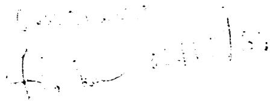
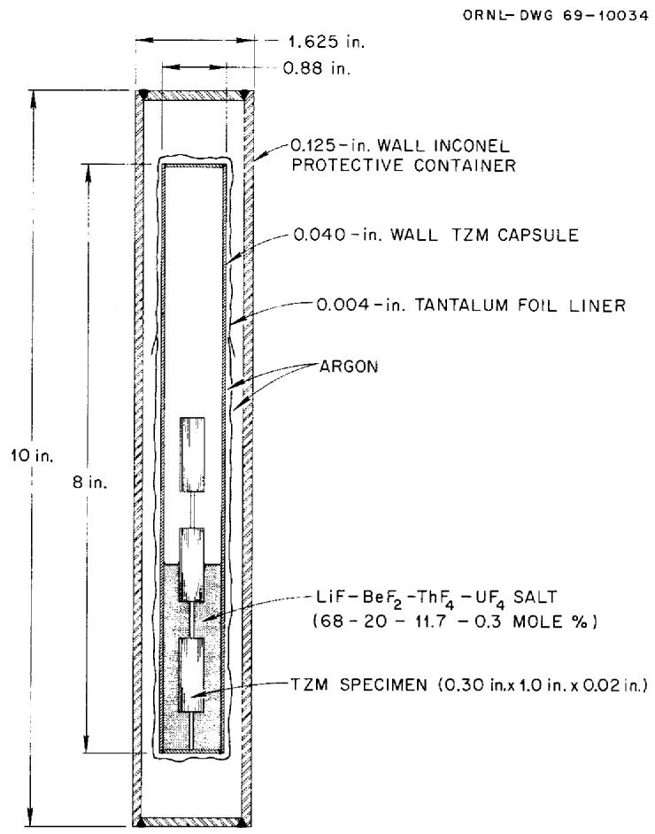
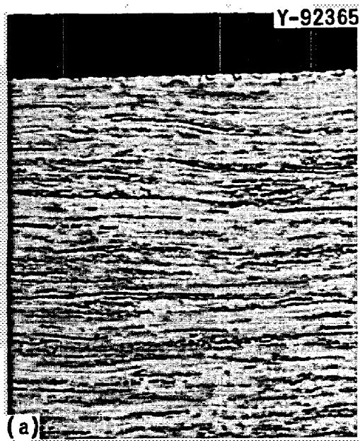
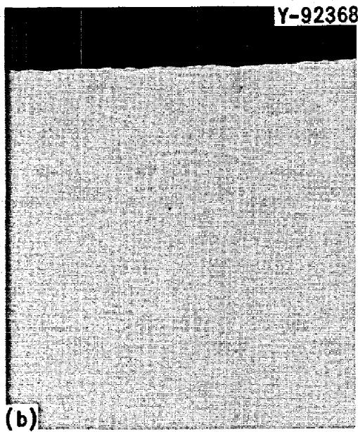
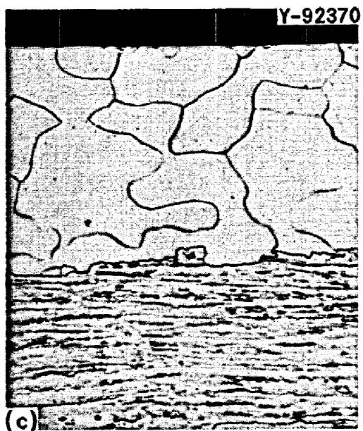
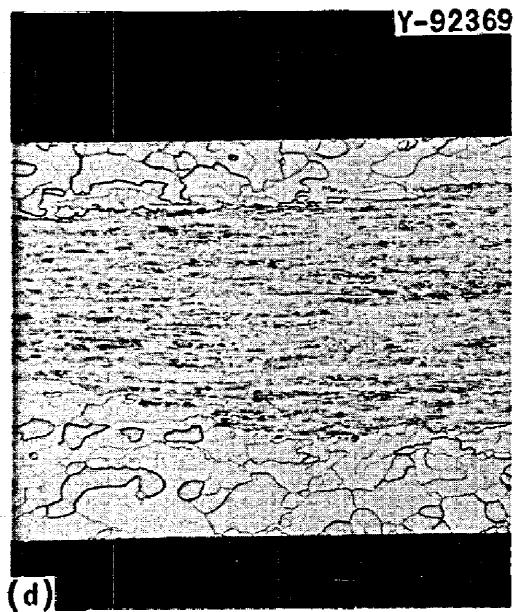

ORNL-TM-2724

MASTER

COMPATIBILITY OF MOLYBDENUM-BASE ALLOY TZM,WITH

LiF-BeF $_2$ -ThF $_4$ -UF $_4$ (68-20-11.7-0.3 mole %) at 1100°C

J.W.Koger and A.P.Litman

# LEGAL NOTICE

This report was prepared as an account of Government sponsored work. Neither the United States, nor the Commission, nor any person acting on behalf of the Commission;

A. Makes any warranty or representation, expressed or implied, with respect to the accuracy, completeness, or usefulness of the information contained in this report, or that the use of any information, apparatus, method, or process disclosed in this report may not infringe privately owned rights; or   
B. Assumes any liabilities with respect to the use of, or for damages resulting from the use of any information, apparatus, method, or process disclosed in this report.

As used in the above, "person acting on behalf of the Commission" includes any employee or contractor of the Commission, or employee of such contractor, to the extent that such employee or contractor of the Commission, or employee of such contractor prepares, disseminates, or provides access to, any information pursuant to his employment or contract with the Commission, or his employment with such contractor.

Contract No. W-7405-eng-26

METALS AND CERAMICS DIVISION

# LEGAL NOTICE

This report was prepared as an account of Government sponsored work. Neither the United States, nor the Commission, nor any person acting on behalf of the Commission:

A. Makes any warranty or representation, expressed or implied, with respect to the accuracy, completeness, or usefulness of the information contained in this report, or that the use of any information, apparatus, method, or process disclosed in this report may not infringe privately owned rights; or

B. Assumes any liabilities with respect to the use of, or for damages resulting from the use of any information, apparatus, method, or process disclosed in this report.

As used in the above, "person acting on behalf of the Commission" includes any employee or contractor of the Commission, or employee of such contractor, to the extent that such employee or contractor of the Commission, or employee of such contractor prepares, disseminates, or provides access to, any information pursuant to his employment or contract with the Commission, or his employment with such contractor.

COMPATIBILITY OF MOLYBDENUM-BASE ALLOY TZM WITH LiF-BeF $_2$ -ThF $_4$ -UF $_4$ (68-20-11.7-0.3 mole %) at 1100°C

J. W. Koger and A. P. Litman

DECEMBER 1969

OAK RIDGE NATIONAL LABORATORY

Oak Ridge, Tennessee

operated by

UNION CARBIDE CORPORATION

for the

U.S. ATOMIC ENERGY COMMISSION

# CONTENTS

# Page

Abstract 1

Introduction 1

Experimental Procedure 2

Results and Discussion 3

Salt Analysis 3

Weight Changes 3

X-Ray Fluorescence and Microprobe Analysis 4

Microstructural Changes 4

Recrystallization 5

Strength 8

Corrosion Reactions and Kinetics 9

Conclusions 11

Acknowledgments 12

J. W. Koger and A. P. Litman

# ABSTRACT

The TZM alloy (Mo-0.5% Ti-0.08% Zr-0.02% C) showed a very small amount of attack by the fused fluoride salt (LiF-BeF $_2$ -ThF $_4$ -UF $_4$ , 68-20-11.7-0.3 mole %) at $1100^{\circ}\mathrm{C}$ for 1011 hr. Corrosion manifested itself as leaching of titanium and possibly zirconium from the alloy. The TZM alloy exposed to the salt partially recrystallized, while that exposed to the vapor did not. This recrystallization was attributed to the removal of titanium and zirconium. On the basis of this single test the magnitude and mechanism of corrosion indicate no serious problems for long-term use of TZM in the vacuum distillation processing scheme for the Molten Salt Breeder Reactor. However, the strength properties of the TZM alloy would approach those of unalloyed molybdenum as salt exposure time increased; this is not considered a problem now.

# INTRODUCTION

The current success of the Molten Salt Reactor Experiment at ORNL has stimulated work on a thermal Molten Salt Breeder Reactor (MSBR).1 One of the requirements for a successful MSBR system will be the continuous reconditioning of the fuel salt to remove unwanted fission products. A possibility under study for one step of the salt reprocessing is vacuum distillation.2 Uranium would be stripped from the fuel salt, and the remaining salt would be distilled at $1000^{\circ}\mathrm{C}$ and 2 torr. The diluents of the fuel salt, lithium and beryllium fluorides, would distil readily and leave behind the rare-earth and alkaline-earth fission products. This process has been demonstrated in laboratory experiments and with some radioactive salt from the MSRE.2

The strength and corrosion resistance required of a container material for the high-temperature vacuum distillation step eliminate most conventional alloys from consideration. Our preliminary survey disclosed that certain refractory alloys, particularly molybdenum-base materials, may be suitable for this special service. The alloy TZM (Mo-0.5% Ti-0.08% Zr-0.02% C) was selected for an initial experiment because it is stronger and usually more fabricable than pure molybdenum. Accordingly, the experiment reported here provides a preliminary test of the compatibility of TZM alloy with a typical fertile-fissile salt (LiF-BeF $_2$ -ThF $_4$ -UF $_4$ , 68-20-11.7-0.3 mole %) at $1100^{\circ}\mathrm{C}$ . This salt is a strong candidate for the single-fluid MSBR now being designed. No tests were specifically conducted to determine the strength properties of TZM alloy, but conditions caused by the exposure to the salt that could affect the strength were noted.

# EXPERIMENTAL PROCEDURE

The experimental system used for this study consisted of a simple capsule fabricated of cold-worked TZM alloy, containing specimens of the same alloy, and shown in Fig. 1. Note that the specimens were located in the salt, at the salt-vapor interface, and in the vapor. The purified salt (60 g) was supplied by the Fluoride Processing Group of the Reactor Chemistry Division. Purification involved sparging with an HF- $\mathsf{H}_2$ mixture at $600^{\circ}\mathsf{C}$ to remove oxides and sulfides and stripping with $\mathsf{H}_2$ at $700^{\circ}\mathsf{C}$ to remove metallic impurities. The loading operation, which consists of introducing the fluoride salt into the capsule, welding the test capsule, and sealing the outer Inconel protective container, was carried out in an inert-gas atmosphere chamber containing argon purer than $99.995\%$ .

After being tested in the position shown in Fig. 1 for $10\mathrm{~l}1\mathrm{~h}r$ at $1100^{\circ}\mathrm{C}$ , the capsule was removed from the furnace, inverted to keep the specimens out of the salt, and quenched in liquid nitrogen to retain high-temperature corrosion products. After test, weight changes of the specimens were determined, the salt was analyzed for impurities, and the specimens and capsules were analyzed by x-ray fluorescence and examined metallographically.

  
Fig. 1. Schematic Drawing of Corrosion Test Capsule Used to Study Compatibility of TZM Alloy with a Fused Fluoride Salt.

RESULTS AND DISCUSSION

# Salt Analysis

Concentrations of the constituents of the salt and its impurities before and after test are given in Table 1. During the experiment titanium, zirconium, and chromium concentrations in the salt increased and that of iron decreased. The titanium and zirconium are intentional alloying additions, but chromium is an unwanted impurity.

# Weight Changes

The specimens exposed to the salt showed small $(0.5\mathrm{mg} / \mathrm{cm}^2)$ weight gains, and the one exposed to the vapor did not change weight measurably.

Table 1. Chemical Analysis of Fertile-Fissile Salt Exposed to TZM Alloy Capsule for l0ll hr at ${1100}^{ \circ  }\mathrm{C}\left( {{2010}^{ \circ  }\mathrm{F}}\right)$   

<table><tr><td rowspan="2">Constituent</td><td colspan="2">Content, ppm</td><td rowspan="2">Constituent</td><td colspan="2">Content, wt %</td></tr><tr><td>Before</td><td>After</td><td>Before</td><td>After</td></tr><tr><td>Mo</td><td>&lt; 5</td><td>&lt; 10</td><td>Li</td><td>6.71</td><td>7.01</td></tr><tr><td>Zr</td><td>37</td><td>134</td><td>Be</td><td>2.65</td><td>2.55</td></tr><tr><td>Ti</td><td>74</td><td>151</td><td>Th</td><td>43.1</td><td>42.6</td></tr><tr><td>Fe</td><td>80</td><td>38</td><td>U</td><td>1.75</td><td>1.93</td></tr><tr><td>Cr</td><td>20</td><td>97</td><td>F</td><td>45.5</td><td>45.7</td></tr><tr><td>O</td><td>58</td><td>&lt; 50</td><td></td><td></td><td></td></tr><tr><td>H2O</td><td>40</td><td>70</td><td></td><td></td><td></td></tr></table>

# X-Ray Fluorescence and Microprobe Analysis

Table 2 gives the concentrations of the major elements in the TZM alloy as determined by x-ray fluorescence before and after test. Iron was found on the surface and probably caused a major portion of the weight gains, but no quantitative value was obtained. Significantly, the quantitative analysis shows a decrease in titanium concentration, no significant change in zirconium concentration, and a corresponding increase in the concentration of molybdenum after exposure to the salt. Care must be taken in interpreting these results, since the sensitivity of the fluorescence analysis is questionable at these low concentrations and iron was deposited over the surface. The electron microprobe analysis showed $0.3\%$ Ti on the surface and $0.5\%$ Ti in the matrix. The zirconium content was about $0.1\%$ in all portions of the specimen. Any changes at the level of $0.1\%$ are beyond the limit of detection of the instrument. However, these results agree reasonably with the increase in concentration of certain alloying elements in the salt and are in accord with the proposed corrosion mechanism(s). (See Corrosion Reactions and Kinetics.)

# Microstructural Changes

Figure 2(a) shows the typical cold-worked structure of the specimens and capsule before test. This figure is also typical of the specimen

Table 2. Concentration of Alloying Elements in TZM Alloy Specimen Before and After Exposure to a Fertile-Fissile Salt at $1100^{\circ}\mathrm{C}$ for 1011 hr, as Determined by X-Ray Fluorescence Analysisa   

<table><tr><td rowspan="2">Sample Analyzed</td><td colspan="3">Content, wt %</td></tr><tr><td>Mo</td><td>Zr</td><td>Ti</td></tr><tr><td>Untested alloy</td><td>99.4</td><td>0.08</td><td>0.5</td></tr><tr><td>Exposed specimens</td><td></td><td></td><td></td></tr><tr><td>in vapor</td><td>99.8</td><td>0.08</td><td>0.1</td></tr><tr><td>at interface</td><td>99.87</td><td>0.09</td><td>0.04</td></tr><tr><td>in salt</td><td>99.90</td><td>0.08</td><td>0.013</td></tr></table>

aThe analysis disclosed substantial iron on the alloy surface after test, but iron was not considered in determining the quantities above.

exposed to the vapor, where no microstructural change occurred. An unetched specimen, Fig. 2(b), exposed to the salt shows no attack at the surface. The same specimen etched, Fig. 2(c), shows recrystallization for a maximum depth of about 0.004 in. Examination of this specimen at a lower magnification, Fig. 2(d), shows that both surfaces recrystallized as the result of test. The inside capsule wall also recrystallized in the same manner.

# Recrystallization

In view of the microstructural and chemical changes induced in the TZM alloy by this test, we compared reported recrystallization temperatures for molybdenum and TZM alloy (Table 3). It is clear from the above and from general metallurgical considerations that an increase in annealing time from $1\mathrm{hr}$ to several thousand hours should lower the recrystallization temperature of TZM alloy only $100$ to $200^{\circ}\mathrm{C}$ . Moreover the presence of as little as $0.01\%$ of a foreign element in solid solution can raise the recrystallization temperature as much as several hundred degrees.3 Conversely, the removal of alloying constituents would free

  
Fig. 2. TZM Alloy Exposed to Fertile-Fissile Salt, LiF-BeF $_2$ -ThF $_4$ -UF $_4$ (68-20-11.7-0.3 mole %) for 1011 hr at $1100^{\circ}\mathrm{C}$ . (a) Typical cold-worked structure of capsule and specimens before test; also the structure of the specimen exposed to the vapor during test. $500 \times$ . Etchant: H $_2$ O, H $_2$ O $_2$ , H $_2$ SO $_4$ . (b) As-polished capsule and specimen exposed to salt. $500 \times$ . Etchant: H $_2$ O, H $_2$ O $_2$ , H $_2$ SO $_4$ . (d) Specimen exposed to salt. $100 \times$ . Etchant: H $_2$ O, H $_2$ O $_2$ , H $_2$ SO $_4$ .

Table 3. Recrystallization Behavior of Wrought, Stress-Relieved, Unalloyed Molybdenum and TZM Alloy   

<table><tr><td>Alloy</td><td>Temperature (°C)</td><td>Time (hr)</td><td>Percent Recrystallization</td><td>Reference</td></tr><tr><td>Unalloyed Mo</td><td>1130</td><td>1</td><td>100</td><td>a</td></tr><tr><td>TZM</td><td>560</td><td>4400</td><td>0</td><td>b</td></tr><tr><td>TZM</td><td>1100</td><td>1</td><td>0</td><td>a</td></tr><tr><td>TZM</td><td>1160</td><td>4400</td><td>85</td><td>b</td></tr><tr><td>TZM</td><td>1250</td><td>4400</td><td>100</td><td>b</td></tr><tr><td>TZM</td><td>1390</td><td>1</td><td>100</td><td>a</td></tr></table>

$^{a}$ B. A. Wilcox, p. 26 in Refractory Metal Alloys, Metallurgy and Technology, ed. by I. Machlin, R. T. Begley, and E. D. Weisert, Plenum Press, New York, 1968.   
bD. H. Jansen, Fuels and Materials Development Program Quart. Progr. Rept. Sept. 30, 1968, ORNL-4350, pp. 107-111, and private communication.

the grain boundaries and allow them to move to form new grains. Thus, the enhanced recrystallization (lower recrystallization temperature) in the samples and capsule of this experiment is due primarily to the removal of the titanium and possibly zirconium from the molybdenum matrix. This is further substantiated by the lack of recrystallization in the samples exposed to the vapor, where the composition changed much less.

The addition of carbon and one or more group IV-A elements to molybdenum greatly increases the recrystallization temperature.4 Thus, carbon removal from the alloy should likewise change recrystallization behavior. However, carbon analyses show no difference (about $0.035\%$ C in each) between exposed and unexposed TZM samples, so this effect is very small or absent. Although carbon mass transport is common in liquid metal systems, especially alkali metals, it is not considered a problem in fused fluoride systems.

# Strength

The molybdenum-base TZM alloy is about the best documented refractory alloy in which base metal strength is improved by precipitation hardening. This alloy is strengthened by the formation of fine carbides of titanium and zirconium as well as by cold working, and its ultimate tensile strength is double or triple that of unalloyed molybdenum. The 100-hr rupture strength of TZM at $1100^{\circ}\mathrm{C}$ is also much greater than that of molybdenum.[5] Although TZM is much more difficult to fabricate than commercial alloys and many refractory alloys, it is usually much easier to work than unalloyed molybdenum. Thus, as an engineering material TZM has many advantages over molybdenum.

Comparing the strength and ductility of wrought, stress-relieved, and recrystallized TZM, Wilcox et al.6 noted a significant increase in yield and ultimate strengths due to working at test temperatures of 1200 to $1300^{\circ}\mathrm{C}$ . At $1550^{\circ}\mathrm{C}$ after recrystallization of the wrought sample there was relatively little difference in the materials. However, at $1100^{\circ}\mathrm{C}$ , the temperature of our capsule test, Wilcox's recrystallized alloy had much lower strength than the wrought alloy. Thus, the use of a stress-relieved TZM alloy for conditions given in this experiment should also be considered.

Although TZM would generally be favored over molybdenum for the previous reasons, through the loss of its alloying elements (titanium and zirconium) during exposure to the fused fluoride salt the composition and the strength properties of the cold-worked TZM approach those of unalloyed recrystallized molybdenum. Although unalloyed molybdenum or recrystallized TZM is weaker than the initial cold-worked material, the strength of the exposed material would probably be ample for the loads proposed in the MSBR vacuum distillation system. However, before the depleted TZM is used, it should be tested to more carefully define

the strength properties of the recrystallized material. An advantageous trade-off with these mechanical property changes is, of course, that pure molybdenum is more resistant than TZM to the fluoride salts of interest to the MSRP. Thus, several benefits come from fabricating the system with TZM while others accrue from the "conversion" of TZM to molybdenum during the fluoride salt exposure.

# Corrosion Reactions and Kinetics

In fluoride salt systems one of the major corrosion reactions is the oxidation of one of the constituents of the container alloy by the reduction of a less stable impurity metal fluoride initially in the salt, $^{7}$ for example

$$
\mathrm {C r} + \mathrm {F e F} _ {2} \rightarrow \mathrm {C r F} _ {2} + \mathrm {F e}. \tag {1}
$$

The reduced metal substitutes for the oxidized metal on the container material. This type of reaction apparently occurred in our experiment involving the strong reducing agents titanium and zirconium:

$$
\mathrm {T i} + \mathrm {F e F} _ {2} \rightarrow \mathrm {T i F} _ {2} + \mathrm {F e}, \tag {2}
$$

$$
Z r + 2 F e F _ {2} \rightarrow Z r F _ {4} + 2 F e. \tag {3}
$$

The reported8 free energy changes for the reactions shown by Eqs. (1), (2), and (3) are strongly negative, and Eqs. (2) and possibly (3) seem to be indicated by the results reported above. As noted earlier, the iron metal that formed in these reactions deposited in thin layers on the container and specimens.

Alternatively the fuel salt corrosion reactions in which $\mathrm{UF}_4$ is reduced to $\mathrm{UF}_3$ also may have occurred to remove titanium and zirconium from the alloy:

$$
\mathrm {T i} + 2 \mathrm {U F} _ {4} \rightarrow \mathrm {T i F} _ {2} + 2 \mathrm {U F} _ {3}, \tag {4}
$$

$$
Z r + 4 U F _ {4} \rightarrow Z r F _ {4} + 4 U F _ {3}. \tag {5}
$$

However, no data with which to determine the extent of these reactions are available.

Assuming that the removal of the elements from the TZM was controlled by solid-state diffusion, one can calculate from the increase of the titanium and zirconium in the salt the apparent diffusion coefficients of titanium and zirconium in the TZM alloy. From these one can estimate the amount of those materials that would be removed at different times and temperatures. In regard to the zirconium removal, we feel that the salt analysis is correct and that the instruments involved in the fluorescence and microprobe analyses are not sufficiently sensitive to measure the movement of the zirconium.

The total amount of material, $M_t$ , that diffuses from the alloy held under isothermal conditions with a zero surface concentration is given by9

$$
\mathrm {M} _ {\mathrm {t}} = 2 \mathrm {C} _ {0} \sqrt {\mathrm {D t} / \pi}, \tag {6}
$$

where

$C_0 =$ the concentration of the diffusing element,

$D =$ the diffusion coefficient, and

$t =$ the time.

We calculated $D = 1.2 \times 10^{-12} \, \text{cm}^2/\text{sec}$ for titanium in TZM and $2.9 \times 10^{-11} \, \text{cm}^2/\text{sec}$ for zirconium in TZM at $1100^\circ \text{C}$ . We did not calculate for chromium removal, as its concentration fluctuated from sample to sample and we could not assume that it was distributed homogeneously through the alloy.

The expression

$$
t \sim X ^ {2} / D, \tag {7}
$$

where $X$ is the distance of composition change, is very useful in calculating approximately whether the composition has changed appreciably by diffusion under a given set of circumstances. For example, we can calculate the time required for appreciable removal - concentration between the initial and ultimate concentrations - of the diffusing element at a certain distance from the surface.

From the calculated diffusion coefficients and the experimental time of 1011 hr, we find the depths of removal of titanium and zirconium, respectively, are 0.0008 and 0.0040 in. Since the microstructures show recrystallization for a distance of about 0.004 in., we may assume that the calculated diffusion coefficient for zirconium may be more accurate than that for titanium - that is, the salt analysis for the titanium may be somewhat in error. Extrapolation of the calculated values shows that it would require 4000 hr to recrystallize an additional 0.004 in. of material. This illustrates the decrease of the corrosion rate with time and the general usefulness of TZM alloy for MSR reprocessing service.

# CONCLUSIONS

1. This test showed negligible corrosion of the TZM alloy by the fused fluoride salt (LiF-BeF $_2$ -ThF $_4$ -UF $_4$ , 68-20-11.7-0.3 mole %) at $1100^{\circ}\mathrm{C}$ for over 1000 hr.   
2. Corrosion manifested itself as leaching of titanium and possibly zirconium from the alloy. $\mathrm{FeF_2}$ initially present in the salt oxidized the alloying elements to fluorides dissolved in the salt bath. The iron metal resulting from the reaction deposited in thin layers on the specimens and container. We found that $D_{\mathrm{Ti}}$ and $D_{\mathrm{Zr}}$ were $1.2 \times 10^{-12}$ and $2.9 \times 10^{-11} \, \mathrm{cm^2/sec}$ , respectively, at $1100^{\circ}\mathrm{C}$ in the alloy.   
3. The TZM alloy exposed to the salt partially recrystallized, while the TZM alloy simultaneously exposed to the vapor did not. This recrystallization was attributed to the removal of titanium and zirconium.

4. On the basis of this single test, the magnitude and mechanism of corrosion indicate no serious problems for long-term use of TZM alloy in the MSBR vacuum distillation processing scheme. However, the strength properties of the TZM alloy would approach those of unalloyed molybdenum as salt exposure time increased.

# ACKNOWLEDGMENTS

It is our pleasure to acknowledge the assistance of F. D. Harvey, E. J. Lawrence, and J. B. Phillips with these experiments. We are also indebted to J. R. DiStefano, W. O. Harms, and H. E. McCoy, Jr., for their constructive review of the manuscript.

Thanks also go to H. R. Gaddis of the Metallography Group, Harris Dunn and other members of the Analytical Chemistry Division, the Graphic Arts Department, and the Metals and Ceramics Division Reports Office for invaluable assistance.

# INTERNAL DISTRIBUTION

1-3. Central Research Library   
4-5. ORNL - Y-12 Technical Library Document Reference Section   
6-15. Laboratory Records Department   
16. Laboratory Records, ORNL RC   
17. ORNL Patent Office   
18. R. K. Adams   
19. G. M. Adamson, Jr.   
20. R.G.Affel   
21. L. G. Alexander   
22. J. L. Anderson   
23. R.F.Apple   
24. C. F. Baes   
25. J. M. Baker   
26. S. J. Ball   
27. C. E. Bamberger   
28. W. P. Barthold   
29. C. J. Barton   
30. H. F. Bauman   
31. S. E. Beall   
32. R. L. Beatty   
33. M. J. Bell   
34. M. Bender   
35. C. E. Bettis   
36. E. S. Bettis   
37. D. S. Billington   
38. R.E.Blanco   
39. F. F. Blankenship   
40. J. O. Blomeke   
41. R. Blumberg   
42. E. G. Bohlmann   
43. C. D. Bopp   
44. C. J. Borkowski   
45. G. E. Boyd   
46. J. Braunstein   
47. M. A. Bredig   
43. R. B. Briggs   
49. H. R. Bronstein   
50. G. D. Brunton   
51. D. A. Canonico   
52. S. Cantor   
53. W. L. Carter   
54. G. I. Cathers   
55. O.B.Cavin   
56. J. M. Chandler   
57. F. H. Clark

58. W. R. Cobb   
59. H. D. Cochran   
60. N. C. Cole   
61. C. W. Collins   
62. E. L. Compere   
63. K. V. Cook   
64. W. H. Cook   
65. L. T. Corbin   
66. B. Cox   
67. J. L. Crowley   
68. F. L. Culler   
69. D. R. Cuneo   
70. J. E. Cunningham   
71. J. M. Dale   
72. D. G. Davis   
73. R. J. DeBakker   
74. J. H. Devan   
75. S. J. Ditto   
76. A. S. Dworkin   
77. I. T. Dudley   
78. W. P. Eatherly   
79. J. R. Engel   
80. E. P. Epler   
81. R. B. Evans III   
82. J. I. Federer   
83. D. E. Ferguson   
84. L. M. Ferris   
85. B. Fleischer   
86. A. P. Fraas   
87. H. A. Friedman   
88. J. H Frye, Jr.   
89. W. K. Furlong   
90. C. H. Gabbard   
91. R. B. Gallaher   
92. R. E. Gehlbach   
93. J. H. Gibbons   
94. L. O. Gilpatrick   
95. H. E. Goeller   
96. W. R. Grimes   
97. A. G. Grindell   
98. R.W.Gunkel   
99. R.H.Guymon   
100. J.P.Hammond   
101. B. A. Hannaford   
102. P. H. Harley   
103. D. G. Harman

104. W. O. Harms   
105. C. S. Harrill   
106. F. D. Harvey   
107. P. N. Haubenreich   
108. F. A. Heddleston   
109. R.E.Helms   
110. P. G. Herndon   
111. D. N. Hess   
112. J. R. Hightower

113-115. M.R.Hill

116. H.W.Hoffman   
117. D. K. Holmes   
118. P. P. Holz   
119. R.W.Horton   
120. A. Houtzeel   
121. T. L. Hudson   
122. W. R. Huntley   
123. H. Inouye   
124. D. H. Jansen   
125. W. H. Jordan   
126. P. R. Kasten   
127. R.J.Kedl   
128. M. T. Kelley   
129. M. J. Kelly   
130. C. R. Kennedy   
131. T. W. Berlin   
132. H. T. Kerr   
133. J. J. Keyes   
134. D. V. Kiplinger   
135. S. S. Kirslis   
136. R. L. Klueh   
137. D. J. Knowles

138-147. J.W.Koger

148. R. B. Korsmeyer   
149. A. I. Krakoviak   
150. T. S. Kress   
151. J.W.Krewson   
152. C.E.Lamb   
153. J.A.Lane   
154. C. E. Larson   
155. E.J.Lawrence   
156. M. S. Lin   
157. R. B. Lindauer

158-167. A. P. Litman

168. G. H. Llewellyn   
169. E. L. Long, Jr.   
170. A. L. Lotts   
171. M. I. Lundin   
172. R.N.Lyon   
173. R. L. Macklin   
174. H. G. MacPherson

175. R.E. MacPherson   
176. J.C.Mailen   
177. D. L. Manning   
178. C. D. Martin   
179. W.R.Mart   
180. H. V. Mateer   
181. C. E. Mathews   
182. T. H. Mauney   
183. H. McClain   
184. R.W. McClung   
185. H. E. McCoy, Jr.   
186. H. F. McDuffie   
187. D. L. McElroy   
188. C. K. McGlothlan   
189. C. J. McHargue   
190. L. E. McNeese   
191. J.R.McWherter   
192. H. J. Metz   
193. A. S. Meyer   
194. R. L. Moore   
195. D. M. Moulton   
196. T.W. Mueller   
197. H. A. Nelms   
198. H. H. Nichol   
199. J.P.Nichols   
200. E. L. Nicholson   
201. L. C. Oakes   
202. P. Patriarca   
203. A.M.Perry   
204. J. B. Phillips   
205. T.W. Pickel   
206. H. B. Piper   
207. B. E. Prince   
208. G. L. Ragan   
209. J. L. Redford   
210. M. Richardson   
211. G. D. Robbins   
212. R. C. Robertson   
213. H. C. Roller   
214. R. A. Romberger   
-216. M. W. Rosenthal   
217. R. G. Ross   
218. H. C. Savage   
219. W. F. Schaffer   
220. A. C. Schaffhauser   
221. C. E. Schilling   
222. Dunlap Scott   
223. J. L. Scott   
224. H. E. Seagren   
225. C. E. Sessions   
226. J.H.Shaffer

227. W.H. Sides

249. W. E. Unger

228. G. M. Slaughter

250. R. L. Wagner

229. A. N. Smith

251. G. M. Watson

230. F. J. Smith

252. J. S. Watson

231. G. P. Smith

253. H. L. Watts

232. O. L. Smith

254. C. F. Weaver

233. P. G. Smith

255. B. H. Webster

234. W. F. Spencer

256. A. M. Weinberg

235. I. Spiewak

257. J.R.Weir, Jr.

236. R.C.Steffy

258. W. J. Werner

237. R. L. Stephenson

259. K.W. West

238. W.C.Stoddart

260. M. E. Whatley

239. H. H. Stone

261. J. C. White

240. R. A. Strehlow

262. R.P.Wichner

241. D. A. Sundberg

263. L. V. Wilson

242. J. R. Tallackson

264. Gale Young

243. E. H. Taylor

265. H. C. Young

244. W. Terry

266. J. P. Young

245. R.E.Thoma

267. E. L. Youngblood

246. P. F. Thomason

268. F. C. Zapp

247. L. M. Toth

269. MSRP Director's Office

248. D. B. Trauger

# EXTERNAL DISTRIBUTION

270. G. G. Allaria, Atomics International   
271. J. G. Asquith, Atomics International

272-273. D. F. Cope, RDT, SSR, AEC, Oak Ridge National Laboratory

274. C. B. Deering, OSR, AEC, Oak Ridge National Laboratory   
275. A. R. DeGrazia, RDT, AEC, Washington   
276. H. M. Dieckamp, Atomics International   
277. David Elias, RDT, AEC, Washington   
278. J. E. Fox, RDT, AEC, Washington   
279. A. Giambusso, AEC, Washington   
280. Norton Haberman, RDT, AEC, Washington   
281. F. D. Haines, AEC, Washington   
282. C. E. Johnson, AEC, Washington   
283. W. L. Kitterman, AEC, Washington   
284. W. J. Larkin, AEC, Oak Ridge Operations   
285. Kermit Laughon, RDT, OSR, AEC, Oak Ridge National Laboratory

286-287. T. W. McIntosh, AEC, Washington

288. A. B. Martin, Atomics International   
289. D. G. Mason, Atomics International   
290. C. L. Matthews, RDT, OSR, AEC, Oak Ridge National Laboratory   
291. G. W. Meyers, Atomics International   
292. D. E. Reardon, AEC, Canoga Park Area Office   
293. D. R. Riley, RDT, AEC, Washington   
294. H. M. Roth, AEC, Oak Ridge Operations   
295. M. Shaw, AEC, Washington   
296. J. M. Simmons, RDT, AEC, Washington

297. W. L. Smalley, AEC, Washington   
298. S. R. Stamp, AEC, Canoga Park Area Office   
299. E. E. Stansbury, The University of Tennessee   
300. R.F. Sweek, AEC, Washington   
301. A. Taboada, AEC, Washington   
302. R. F. Wilson, Atomics International   
303. Laboratory and University Division, AEC, Oak Ridge Operations 304-318. Division of Technical Information Extension