# OAK RIDGE NATIONAL LABORATORY

operated by

UNION CARBIDE CORPORATION

for the

U.S. ATOMIC ENERGY COMMISSION

ORNL-TM-2727

# THE MECHANICAL BEHAVIOR OF ARTIFICIAL GRAPHITES

AS PORTRAYED BY UNIAXIAL TESTS

W. L. Greenstreet

J. E. Smith

G. T. Yahr

R. S. Valachovic

OAK RIDGE NATIONAL LABORATORY

CENTRAL RESEARCH LIBRARY

DOCUMENT COLLECTION

LIBRARY:LOAN.COPY

DO NOT TRANSFER TO ANOTHER PERSON

If you wish someone else is for some time

document, send in home with docum

and the library will arrange a loan .

UGIN-7956

(3) ③⑤⑦

# LEGAL NOTICE

This report was prepared as an account of Government sponsored work. Neither the United States, nor the Commission, nor any person acting on behalf of the Commission:

A. Makes any warranty or representation, expressed or implied, with respect to the accuracy, completeness, or usefulness of the information contained in this report, or that the use of any information, apparatus, method, or process disclosed in this report may not infringe privately owned rights; or   
B. Assumes any liabilities with respect to the use of, or for damages resulting from the use of any information, apparatus, method, or process disclosed in this report.

As used in the above, "person acting on behalf of the Commission" includes any employee or contractor of the Commission, or employee of such contractor, to the extent that such employee or contractor of the Commission, or employee of such contractor prepares, disseminotes, or provides access to, any information pursuant to his employment or contract with the Commission, or his employment with such contractor.

Contract No. W-7405-eng-26

Reactor Division

THE MECHANICAL BEHAVIOR OF ARTIFICIAL GRAPHITES AS PORTRAYED BY UNIAXIAL TESTS

W. L. Greenstreet   
J. E. Smith   
G. T. Yahr   
R. S. Valachovic

DECEMBER 1969

OAK RIDGE NATIONAL LABORATORY

Oak Ridge, Tennessee

operated by

UNION CARBIDE CORPORATION

for the

U.S. ATOMIC ENERGY COMMISSION

# Contents

Page

Abstract 1

Introduction 1

Mechanical Behavior 2

Synopsis of Reported Results 2

Additional Investigations 14

Conclusions 41

Acknowledgements 42

References 43

# THE MECHANICAL BEHAVIOR OF ARTIFICIAL GRAPHITES AS PORTRAYED BY UNIAXIAL TESTS

W. L. Greenstreet   
J. E. Smith   
G. T. Yahr   
R. S. Valachovic

# Abstract

Stress-strain behaviors which are representative of nuclear-grade, or equivalent, graphites are described and discussed. Since cyclic loading test results provide important insight into the characteristics of graphite behavior, emphasis is placed on results of this type. Monotonic loading curves are also considered, and both stress versus longitudinal strain and stress versus lateral strain curves are given for monotonic and cyclic loading. The new results given in this report are combined with results published in the literature to provide a unified description of the observed behavior.

Keywords: graphite, materials testing, mechanical properties, compression, tensile properties, stresses, deformation, heat treatment.

# Introduction

Many of the mechanical behavior characteristics of graphite have been studied. This is especially true of nuclear-grade, or equivalent, graphites as a class of materials. These graphites are generally made from petroleum-coke and coal-tar pitch, but the same overall characteristics are exhibited by graphites made from other binder and filler combinations as well. It is the purpose of this report to bring out some of the salient features of observed mechanical behavior in a unified fashion.

Important behavioral characteristics are described in the literature. These have been identified from monotonic and cyclic loading tests, but there are certain aspects of cyclic loading behavior that either have not been studied or have not been studied in detail. Therefore, additional investigations were made to overcome this deficiency. Three types of cyclic loading were considered, including (1) cycling of specimens, which were preloaded in compression, between zero and a constant stress level less than the preload stress value, (2) cycling in compression wherein the

specimens were only partially unloaded, and (3) cycling alternately in compression and tension. Studies of the first two types have not been reported previously, and studies of the third were used to experimentally examine the validity of an often stated premise regarding reloading behavior. The results from these investigations when combined with available data provide important background information for constitutive equation development.

# Mechanical Behavior

Despite material variations from grade to grade, from block to block of a given grade, and from piece to piece within a given block, there are definite characteristics of mechanical behavior associated with artificial graphite as a class of materials. Most graphites are anisotropic, and stress-strain data generally show that there is rotational symmetry of the anisotropy in an element. That is, the material may be classified as transversely isotropic.

The anisotropy is a result of the preferred orientation of the coke particles used in the manufacture and the orientations of the crystallites within the particles. Although the forming method, that is, molding or extruding, governs the preferred orientations of the particles, this method influences the character of the anisotropy only in terms of actual measures of deformation resistance. Therefore, the characteristics to be discussed are independent of forming method.

# Synopsis of Reported Results*

It is common knowledge that, when a graphite specimen is loaded in simple tension or compression, nonlinear stress-strain behavior is exhibited from essentially zero stress to the failure stress. What is the characteristic of this nonlinearity? By loading to a stress level less than that at failure and unloading, one obtains a loading curve, OA, and an unloading curve, AB, as shown schematically in Fig. 1. Since the

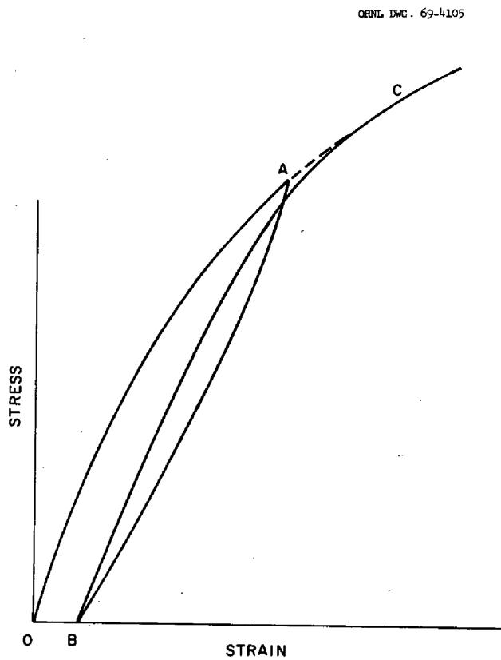  
Fig. 1. Schematic Drawing of a Stress-Strain Diagram for Graphite.

unloading curve does not retrace any part of the initial loading curve, the behavior cannot be classified as nonlinear elastic. The nonlinearity must be described in some other way.

It may be seen that the behavior exhibited is reminiscent of time-independent elastic-plastic behavior ascribed to metals. When the specimen is fully unloaded, there is a residual strain, OB, as for materials that undergo elastic and essentially time-independent plastic deformations. The unloading curve, AB, is also nonlinear. On loading the specimen a second time, the resulting curve is again nonlinear and a hysteresis loop is formed between the unloading and reloading curves. Loading beyond the stress corresponding to that at the unloading point, A, gives a curve which becomes asymptotic to the curve that would have existed had unloading never occurred.* There are no abrupt changes in the slopes of any of the segments of the entire curve.

The tensile strengths and the initial slopes of the stress-strain curves (elastic moduli) are generally greater in the with-grain direction than in the across-grain direction. There are pronounced differences between both stress and strain at fracture in tension and in compression. Complete stress-strain diagrams for simple tension and compression are plotted together in Fig. 2 (Ref. 2) to illustrate these differences in the tensile and compressive behavior. The material is EGCR-type AGOT graphite, $^{\dagger}$ and the data are for the with-grain (parallel to the extrusion axis) direction. Typically, fracture strains on the order of 0.1 to $0.2\%$ and 1.0 to $2.0\%$ are found in tension and compression, respectively, for nuclear-grade, or equivalent, graphites.

Arragon and Berthier3 performed compression test studies on 216 specimens made from extruded, petroleum-coke, industrial graphite. Three types of tests were used: (1) simple compression; (2) cyclic tests (loading-unloading-reloading) in which the cycles were made from increasing stress levels spaced at equal intervals; and (3) cyclic tests between zero stress

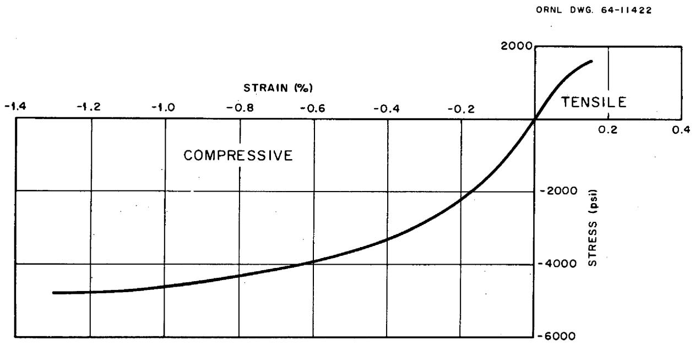  
Fig. 2. Complete Uniaxial Stress-Strain Curves Parallel to Extrusion Direction.

and a fixed maximum. The slopes of the stress-strain curves at the origin for continued loading (type 1) were the same order of magnitude as given by sonic measurements. Seldin4 also found good comparisons between sonic moduli and the slopes at zero stress as measured from tensile and compressive stress-strain curves for several grades of molded graphite.

Arragon and Berthier found that cyclic compressive tests of type 2 cause the apparent density to increase. The hysteresis loops, which are formed by loading, unloading, and reloading, increase in size with increased maximum stress, and the slopes of straight lines connecting the unloading and reloading points decrease with increased stress. (The slope of a line connecting the two points of one cycle is termed the "paraelastic modulus.")

A schematic diagram, which depicts the essential features of the behavior observed from a test of type 2, is shown in Fig. 3. The envelope curve corresponds to that for simple compression. Arragon and Berthier3 also discovered that straight lines drawn through the unloading point and the point of zero stress for each cycle converge at a single point as shown in the figure. The coordinates of this point are both negative (taking compression as positive), and it was reasoned that the existence of this point is a manifestation of the history of the virgin specimen.

In each case, the reloading curves asymptotically approach the envelope curve after each cycle of loading, unloading, and reloading. This and the other details of the behavior, as described above, are generally typical of the graphites being considered. Corroborations can be found by studying the results for extruded graphite reported by Losty and Orchard5 and for molded graphites by Seldin.4

In the case of test type 3, which was used in the study by Arragon and Berthier, $^{3}$ each specimen was subjected to 12 cycles. During the first cycles, the total deformations at the unloading and reloading points increased with increased cycle number, but, after the sixth cycle, these deformations were essentially constant, and the hysteresis loop was retracted on each subsequent cycle. The form of the hysteresis loop remained constant throughout the cyclic loading as did the paraelastic modulus. There was a slight increase in apparent density during cycling.

ORNL DWG. 67-2981

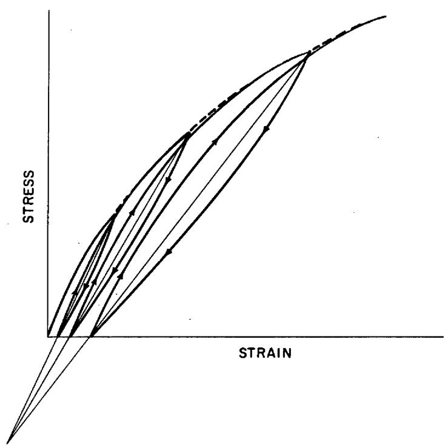  
Fig. 3. Schematic of Compressive Stress-Strain Diagram.

A schematic diagram of the type behavior observed during the first few cycles is shown in Fig. 4. Additional illustrations of this behavior, as obtained by the present study, are given in Figs. 5 and 6. The latter figures show results obtained from EGCR-type AGOT and from RVD* graphite, respectively.

The initial slopes of the stress-strain curves, or Young's moduli, for nuclear-grade, or equivalent, graphites are about the same in tension and in compression. This is generally true for both the with-grain direction and the across-grain direction. However, exceptions may be found by comparing across-grain data for some graphites. Close comparisons of tensile and compressive curves for a given direction also reveal that there is a tendency toward greater deformation resistance in compression than in tension. This especially is true for the across-grain direction.

The preceding discussion was limited to stress versus longitudinal strain behavior. Stress versus lateral strain curves for these graphites have different curvatures in tension and compression; the diagrams for tension are concave toward the stress axis, while those for compression are convex. These observations were first reported by Seldin.4 Schematic diagrams of the tensile and compressive behaviors are shown in Fig. 7.

In uniaxial compression tests, the transverse-to-longitudinal strain ratios are essentially independent of stress, yielding almost constant values. However, the ratios in tension are functions of stress, decreasing as the stress is increased. Figure 8, which shows the strain ratios for EGCR-type AGOT graphite as functions of longitudinal strain,[2] provides a clear illustration. In this figure, the subscript 3 refers to the parallel, or with-grain direction, while the subscripts 1 and 2 refer to two orthogonal (across-grain) directions in the plane of isotropy. (Transverse isotropy is assumed.) The first of the double subscripts indicates the direction of applied stress and the second indicates the direction of induced strain. The vertical bars in the figure represent standard deviations.

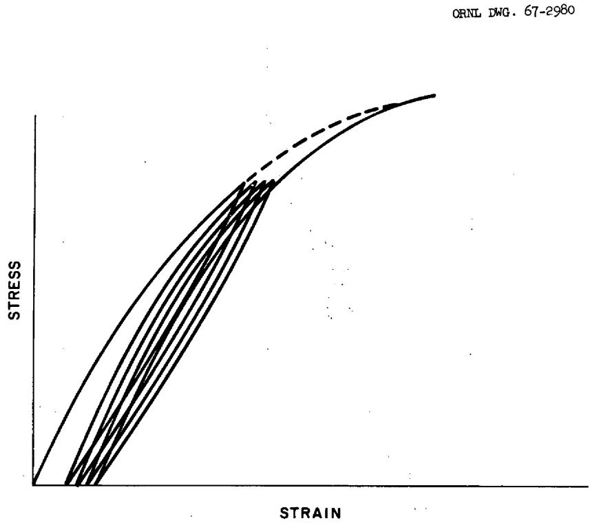  
Fig. 4. Schematic Diagram Showing Cyclic Behavior.

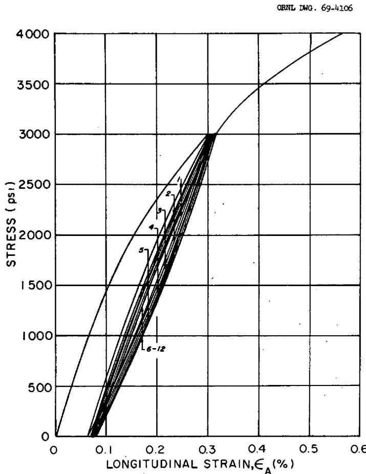  
Fig. 5. Cyclic Stress-Strain Curves for a With-Grain EGCR-Type AGOT Specimen (12 Cycles).

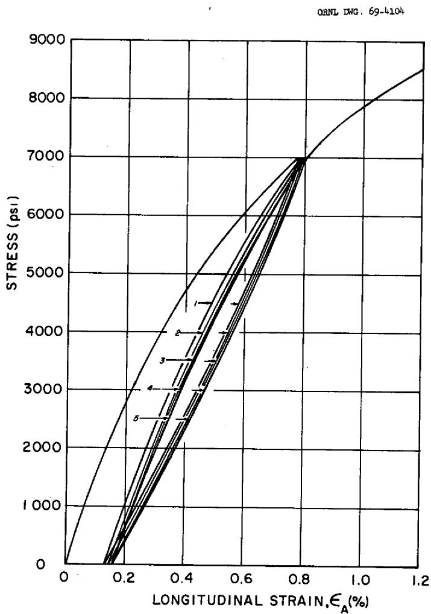  
Fig. 6. Cyclic Stress-Strain Curves for a With-Grain RVD Specimen (5 Cycles).

ORNL DWG. 67-3477

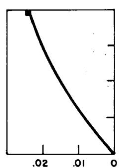  
TENSION   
LATERAL $\pmb{\epsilon}$

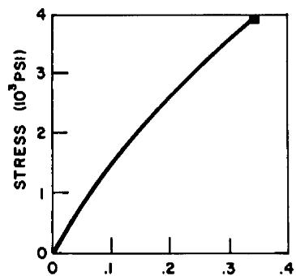  
LONGITUDINAL E   
STRAIN (PERCENT)

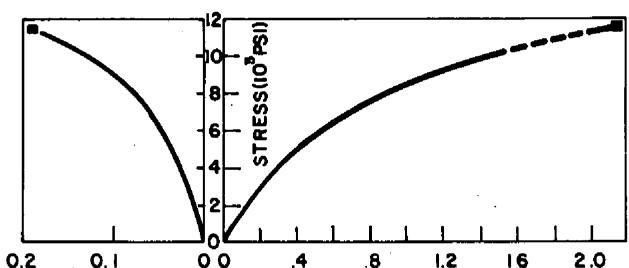  
COMPRESSION   
LATERAL   
LONGITUDINAL €   
STRAIN (PERCENT)   
Fig. 7. Schematic Drawings of Longitudinal and Lateral Stress-Strain Curves.

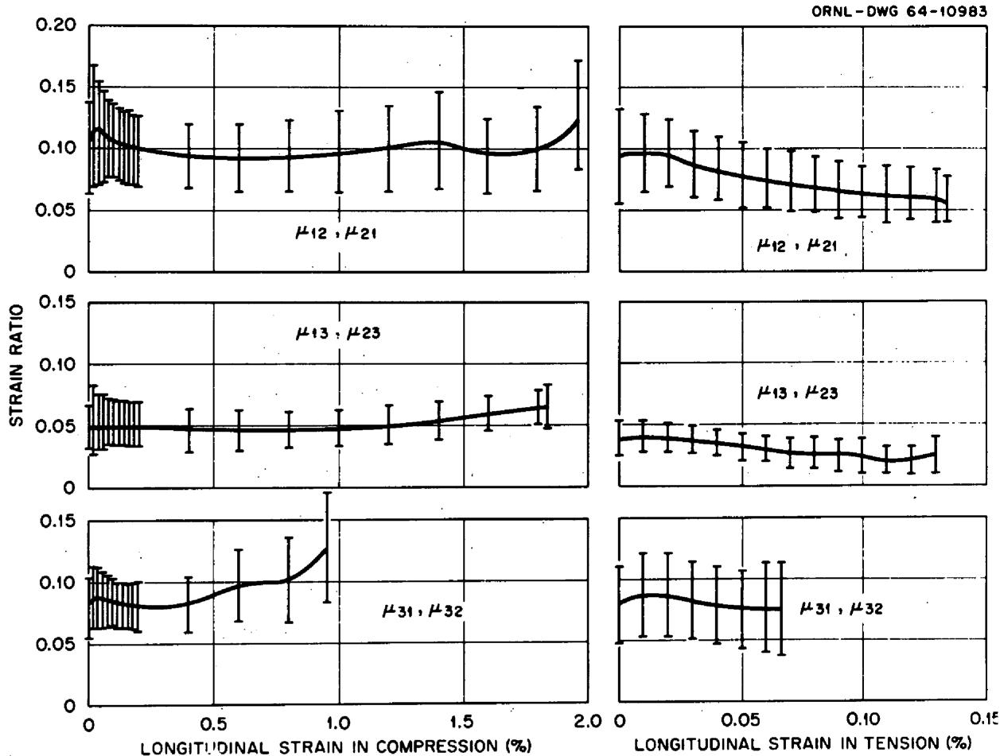  
Fig. 8. Strain-Ratio Curves from EGCR-Type AGOT Specimens.

When a specimen is loaded and released, the transverse residual strain is positive regardless of whether the load is a tensile or a compressive one. Thus, the volume of a specimen pulled in tension and released is increased since all linear dimensions are increased.

# Additional Investigations

The investigations reported in this section were made using specimens with the design shown in Fig. 9. This particular design was selected so that the specimens could be tested in either tension or compression. The 0.l00-in.-diam longitudinal hole was bored in each specimen to allow for making permeability measurements, and a smooth machine finish was used, without grinding or polishing.

Each specimen was marked for gage location using a HB grade drafting pencil to avoid scratching the surface and to provide indications that would not be removed by heat treating the specimen at $3000^{\circ}\mathrm{C}$ (to be discussed later). The latter aspect is important because the specimens were heat treated and reinstrumented twice in some cases, and it was necessary to mount the gages in the same location each time. They were instrumented on opposite sides at the midpoint of the gage length with strain gages oriented in the axial and circumferential directions. Budd Metalfilm, type C6-121-A, strain gages with a 0.125-in. gage length were used.

Tensile tests were performed using steel clam-shell fixtures attached to the ends and 0.20-in.-diam, stainless steel, stranded-wire cables for transmitting the load to the specimen. A specimen, ready for test, is shown in Fig. 10. The compressive tests were carried out using a subpress with a miniature load cell placed in the subpress below the specimen. By placing the load cell at this location, inaccuracies in readings due to plunger friction were eliminated. The test setup for compression testing is shown in Fig. 11.

For those cases in which the specimens were heat treated, a 100 kw, 3000 Hertz induction furnace was used for this purpose. The inside dimensions were a diameter of 9 in. and a length of 14 in., and the specimens were heated in Argon at atmospheric pressure. The time to reach the $3000^{\circ}\mathrm{C}$ temperature level was 45 minutes. The furnace was cooled from 3000 to

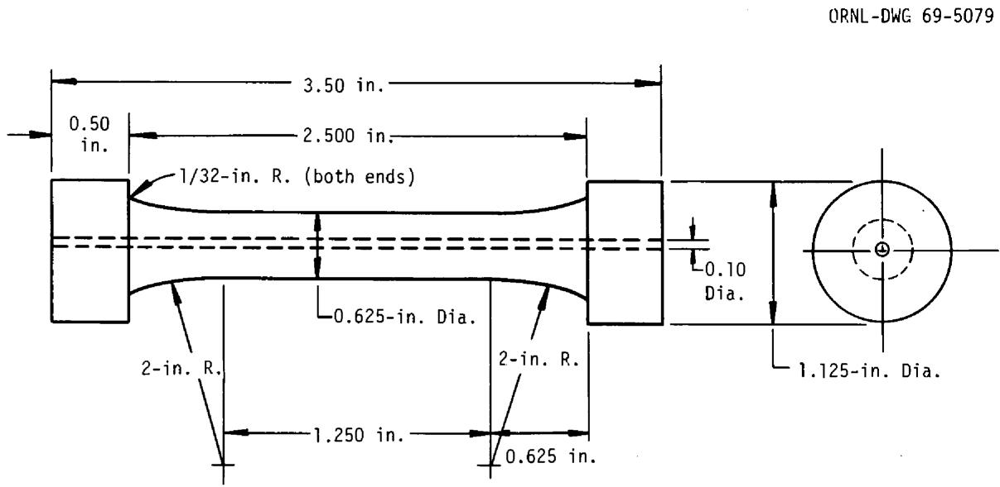  
Fig. 9. Drawing of Test Specimen.

PHOTO 76467

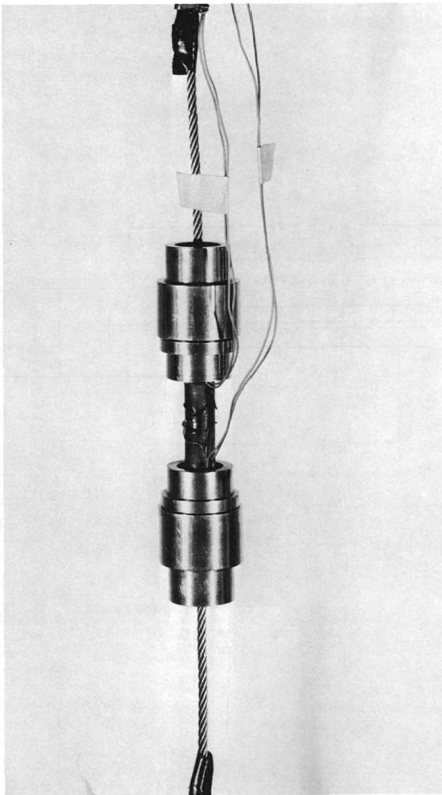  
Fig. 10. Specimen Prepared for Tensile Testing.

PHOTO 76468

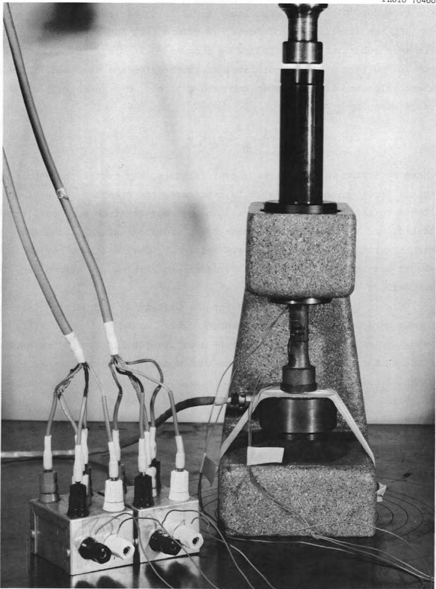  
Fig. 11. Specimen Prepared for Compressive Testing.

2500°C in approximately 15 minutes, from 2500 to 2000°C in about 1 hour, and from 2000°C to room temperature in 12 to 14 hours.

In the first series of tests, specimens from EGCR-type AGOT graphite were subjected to the following program of loading. Each specimen was loaded to a given stress level in compression and unloaded. It was then cycled ten times between zero and a stress, $\sigma_{0}$ , which was in the range given by

$$
\frac {1}{2} \sigma_ {\mathrm {m}} <   \sigma_ {\mathrm {o}} <   \sigma_ {\mathrm {m}},
$$

where $\sigma_{\mathrm{m}}$ is the maximum stress level, that is, the stress corresponding to the first unloading point. In each case, the specimen was subsequently loaded to failure. Two with-grain and two across-grain specimens were tested, and both lateral, or transverse, and longitudinal, or axial, strain versus stress diagrams were obtained. Compressive behavior was chosen because relatively large stresses and strains can be induced without failure.

Figure 12 shows the results for the with-grain direction. Here again it may be seen that, when the specimens were loaded to failure after being cycled, the stress-strain curves asymptotically approached extensions to the initial loading curves that would have been obtained by continued loading beyond the unloading stress, $\sigma_{\mathrm{m}}$ . The hysteresis loops exhibited by the stress-strain curves do not change in size and coincide rather than change position along the strain axis during the first few cycles, as was shown in Fig. 4.

The curves for the across-grain specimens are shown in Fig. 13. Except for very slight deviations in the initial portions of the first few reloading curves, the hysteresis loops are again retraced on each cycle. Asymptotic approach to a monotonic loading curve upon loading to failure may also be seen.

Partial unloading characteristics were examined using a second set of four with-grain and four across-grain EGCR-type AGOT graphite specimens. A specimen was loaded in compression to a given stress level, $\sigma_{\mathrm{m}}$ , and unloaded. It was again loaded to a higher compressive stress level, $\sigma_{\mathrm{n}}$ , unloaded, reloaded to $\sigma_{\mathrm{n}}$ a second time, and unloaded. A companion

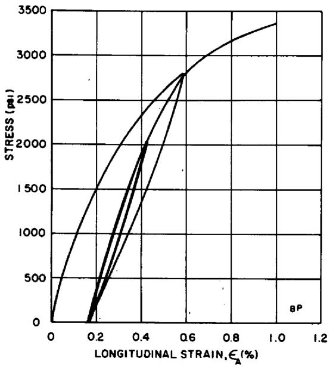

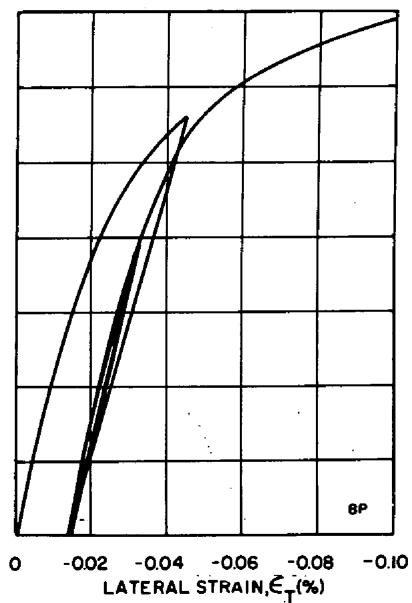

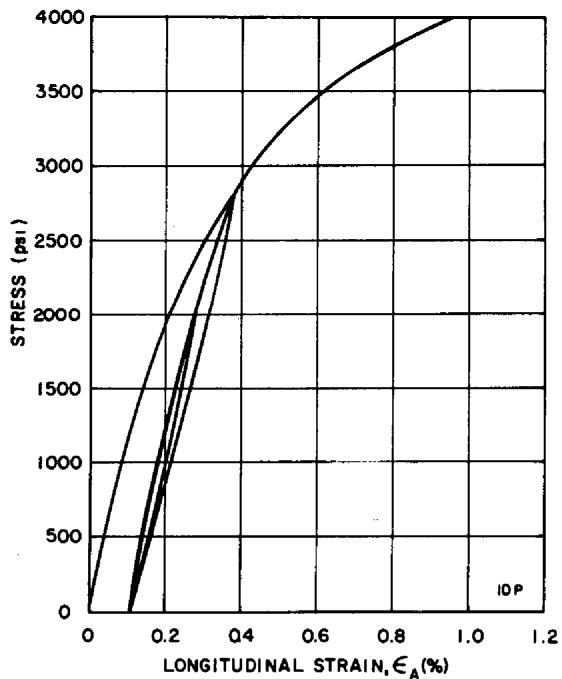

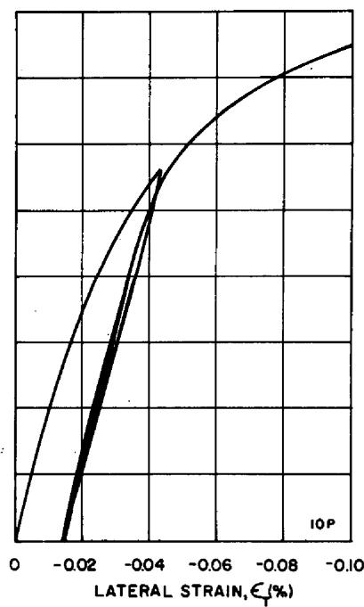  
Fig. 12. Cyclic Curves for Two Preloaded With-Grain EGCR-Type AGOT Specimens.

ORNL DWG. 69-8209

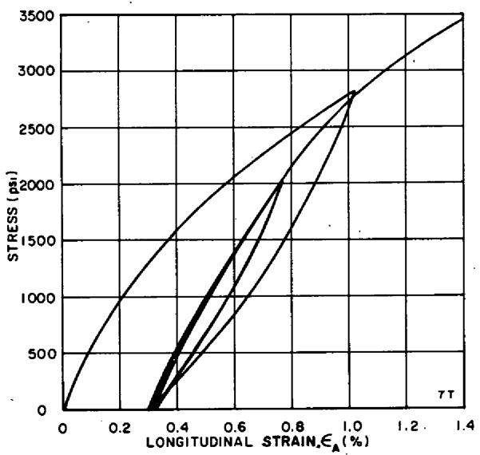

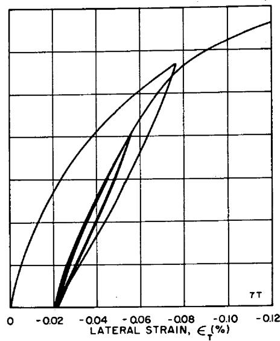

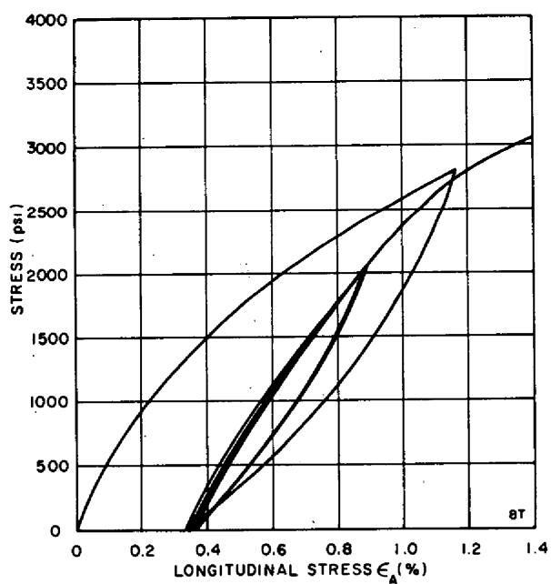

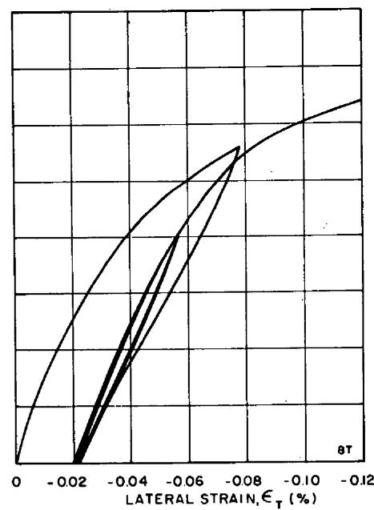  
Fig. 13. Cyclic Curves for Two Preloaded Across-Grain EGCR-Type AGOT Specimens.

specimen was then loaded in compression to $\sigma_{\mathrm{m}}$ , partially unloaded, reloaded to the higher compressive stress level, $\sigma_{\mathrm{n}}$ , partially unloaded, reloaded to $\sigma_{\mathrm{n}}$ , and unloaded.

The stress-strain diagrams for two companion with-grain specimens are shown in Fig. 14. The diagrams for a second set of with-grain specimens are shown in Fig. 15, and Figs. 16 and 17 show the results for sets of across-grain specimens.

The cyclic behaviors of the fully unloaded specimens follow the patterns described earlier. An examination of the stress versus longitudinal strain curves reveals several features. The hysteresis loops increase in size and the paraelastic moduli decrease with increase in unloading stress level, the total deformations increase upon loading a second time to the higher compressive stress level, $\sigma_{\mathrm{n}}$ , and the reloading curves became asymptotic to extensions of the initial loading curves when the specimens are loaded beyond $\sigma_{\mathrm{m}}$ . The stress versus lateral strain curves are very similar in character to the stress versus longitudinal strain curves.

In the case of partial unloading, hysteresis loops are again formed, and the same general features that were observed for full unloading may be seen. The hysteresis loops are smaller, but the segments of each curve are entirely nonlinear. The asymptotic approach to the extension of the initial loading curve in each case corresponds to that for full unloading.

Since the details of the asymptotic approach feature are important to the development of mathematical analogs to the material behavior, the curves in Figs. 14 through 17 were carefully studied to provide quantitative data. When a specimen is loaded to a stress level such as $\sigma_{\mathrm{m}}$ , unloaded either fully or partially, and reloaded, the reloading curve undergoes an accelerated change in slope as the stress approaches the stress, $\sigma_{\mathrm{m}}$ , at the point of unloading. This accelerated change persists until the reloading curve essentially begins to trace what would have been the extension to the initial loading curve provided unloading had not occurred. The quantitative data obtained were the stress values at the extremities of the accelerated change region. The lower limit is denoted by $\sigma'$ and the upper limit is referred to as $\sigma''$ .

The values for $\sigma'$ and $\sigma''$ were obtained by plotting the ratio of longitudinal strain to stress as a function of stress. The data on either

ORNL DWG. 69-2981R

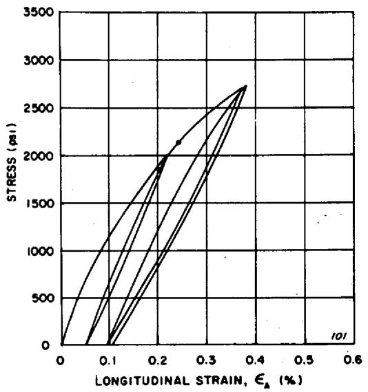

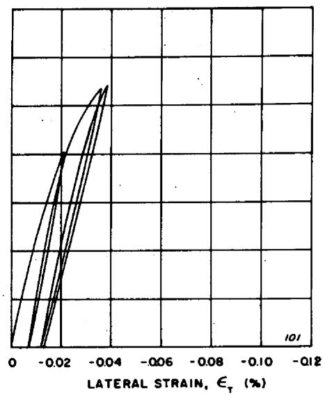  
(a) Full Unloading

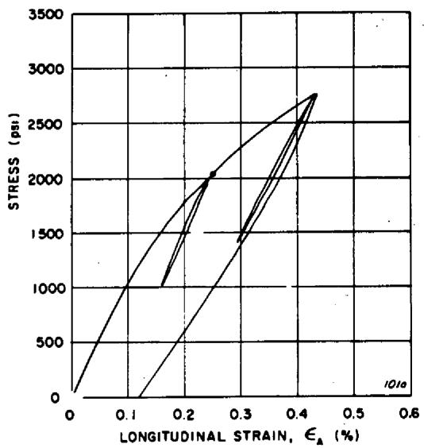

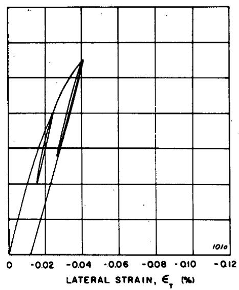  
(b) Partial Unloading   
Fig. 14. Cyclic Curves for Fully and Partially Unloaded With-Grain EGCR-Type AGOT Specimens.

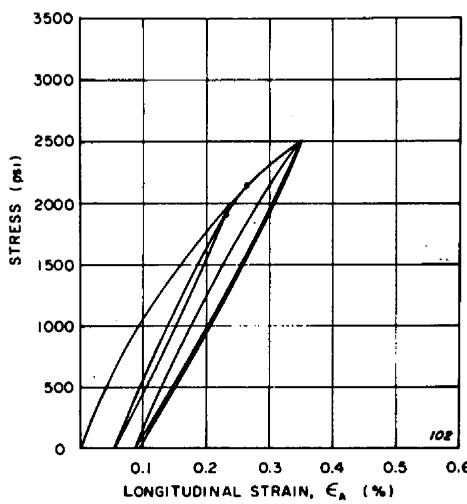

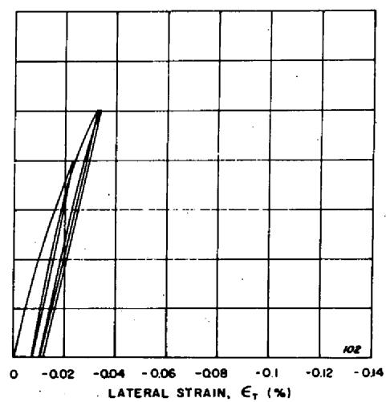  
(a) Full Unloading

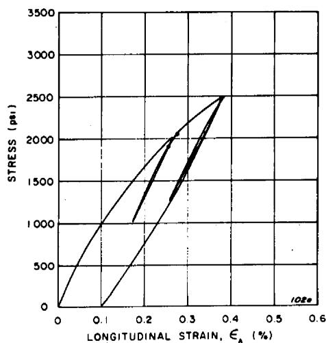

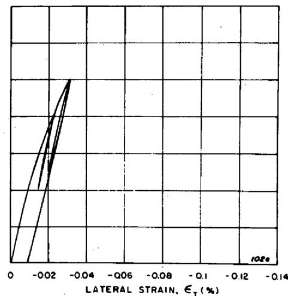  
(b) Partial Unloading   
Fig. 15. Cyclic Curves for Fully and Partially Unloaded With-Grain EGCR-Type AGOT Specimens.

ORNL DWG. 69-2983R

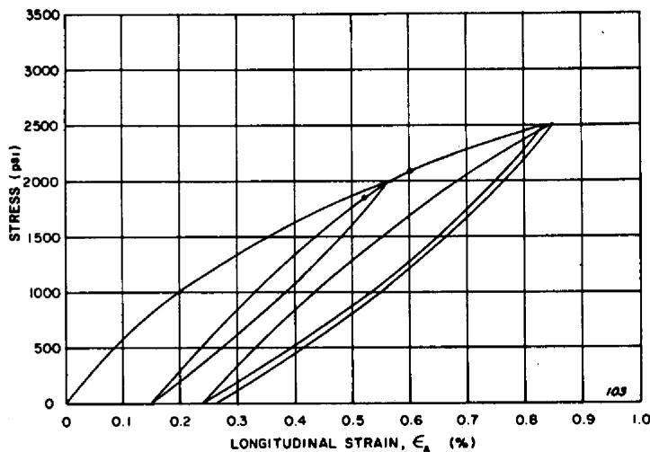

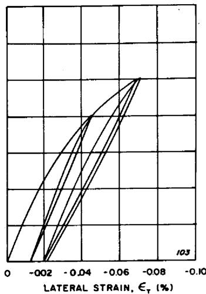

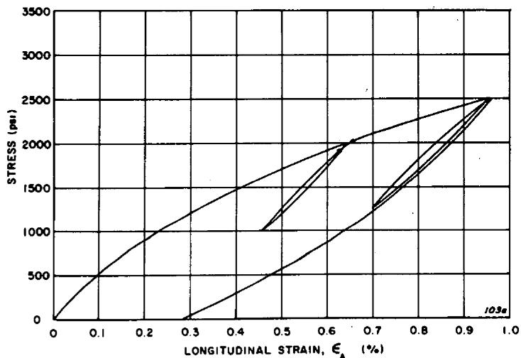  
(a) Full Unloading

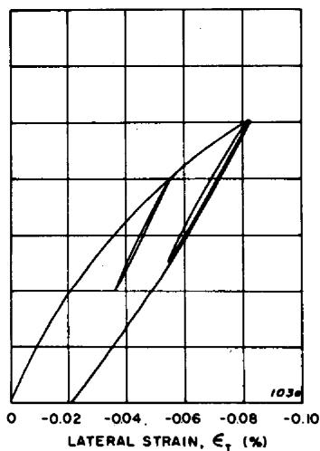  
(b) Partial Unloading   
Fig. 16. Cyclic Curves for Fully and Partially Unloaded Across-Grain EGCR-Type AGOT Specimens.

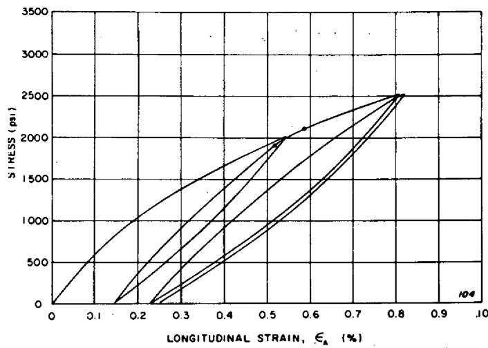

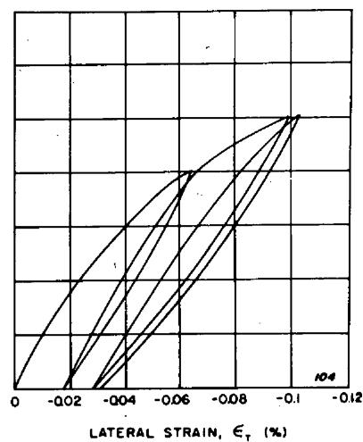

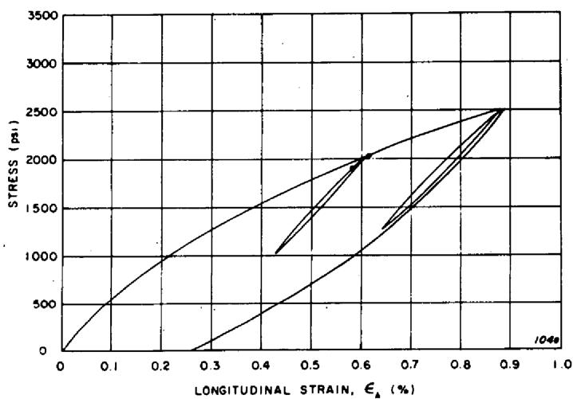  
(a) Full Unloading

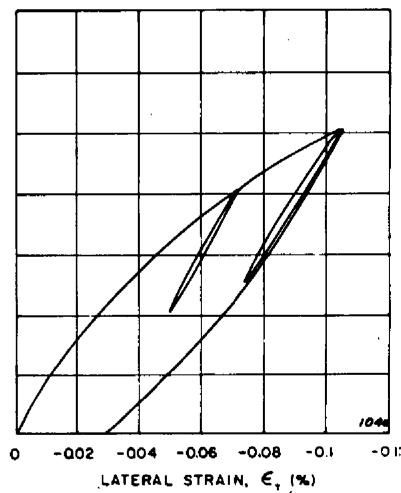  
(b) Partial Unloading   
Fig. 17. Cyclic Curves for Fully and Partially Unloaded Across-Grain EGCR-Type AGOT Specimens.

side of $\sigma_{\mathfrak{m}}$ are described by straight lines with greatly different slopes. The transition region then corresponds to the region where accelerated change in slope of the stress-strain diagram occurs, and the limits may be determined. A typical example of the plots used for determining $\sigma^{\prime}$ and $\sigma^{\prime \prime}$ is shown in Fig. 18.

The two stress levels, denoted by $\sigma'$ and $\sigma''$ , and the value of $\sigma_{\mathrm{m}}$ for each stress versus longitudinal strain curve are listed in Table 1. Also included are the values for the ratios $\sigma' / \sigma_{\mathrm{m}}$ and $\sigma'' / \sigma_{\mathrm{m}}$ .

The dots on the stress-strain diagrams of Figs. 14 through 17 mark the limits of the transition regions. It may be seen from the table and the figures that there is consistency between the values. The value of $\sigma_{\mathrm{m}}$ is the same for all cases. In five of the eight cases, the $\sigma' / \sigma_{\mathrm{m}}$ ratios are the same, and all ratios fall within the range from 0.93 to 0.97. The upper extremities of the segments for full unloading are at higher stress levels than those for partial unloading, which shows that asymptotic approach is achieved sooner in the latter case. For full unloading, the $\sigma'' / \sigma_{\mathrm{m}}$ ratio ranged from 1.04 to 1.07, while this ratio ranged from 1.01 to 1.03 for partial unloading.

The final test series reported herein was used in an attempt to experimentally verify the asymptotic approach premise and to provide data

Table 1. Data Obtained From Curves for Partial Unloading Studies   

<table><tr><td>Specimen Number</td><td>Orientation</td><td>σm(psi)</td><td>σ&#x27;(psi)</td><td>σ&#x27;&#x27;(psi)</td><td>σ&#x27;/σm</td><td>σ&#x27;&#x27;/σm</td></tr><tr><td>101</td><td>WG</td><td>2000</td><td>1850</td><td>2130</td><td>0.93</td><td>1.07</td></tr><tr><td>101a</td><td>WG</td><td>2000</td><td>1950</td><td>2040</td><td>0.97</td><td>1.02</td></tr><tr><td>102</td><td>WG</td><td>2000</td><td>1900</td><td>2130</td><td>0.95</td><td>1.07</td></tr><tr><td>102a</td><td>WG</td><td>2000</td><td>1900</td><td>2050</td><td>0.95</td><td>1.03</td></tr><tr><td>103</td><td>AG</td><td>2000</td><td>1850</td><td>2080</td><td>0.93</td><td>1.04</td></tr><tr><td>103a</td><td>AG</td><td>2000</td><td>1900</td><td>2020</td><td>0.95</td><td>1.01</td></tr><tr><td>104</td><td>AG</td><td>2000</td><td>1900</td><td>2100</td><td>0.95</td><td>1.05</td></tr><tr><td>104a</td><td>AG</td><td>2000</td><td>1900</td><td>2025</td><td>0.95</td><td>1.01</td></tr></table>

ORNL DWG. 69-10965

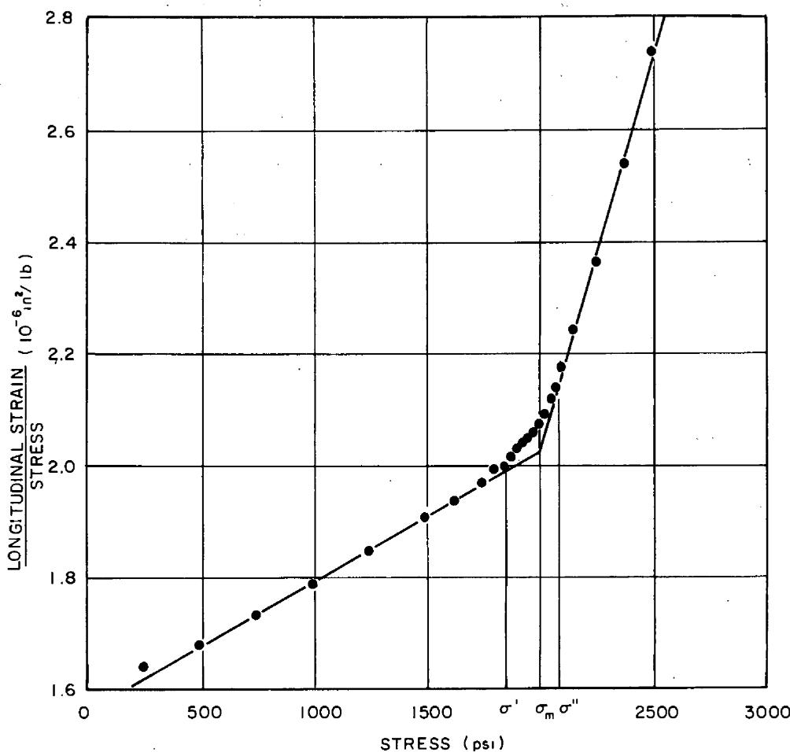  
Fig. 18. Plot for Determination of the Extremities of the Accelerated Change in Slope Region for a Fully Unloaded Across-Grain EGCR-Type AGOT Specimen.

on cyclic behavior under alternate compressive and tensile loadings. Studies on the validity of the asymptotic approach premise were motivated by Seldin's4 demonstrations that test specimens can be made to reproduce their original stress-strain responses in the longitudinal and lateral directions by heat treating them at their graphitization temperatures. Provided it is generally true, this is a revolutionary discovery in graphite testing, especially in the potential it provides for removing uncertainties in data analyses and interpretations that arise because of the almost inevitable variations in graphite properties.

Pursuant to making the final studies regarding the cyclic behavior of graphite, Seldin's method for removing deformation history was examined using specimens made from ATJ, RVD, and EGCR-type AGOT graphites. The maximum particle sizes are 0.006, 0.015, and 0.032 in., respectively. The first two are molded graphites. Each specimen was subjected to the following sequence of steps.

1. Heat treat at $3000^{\circ}C$ for 60 minutes.   
2. Load in tension to a predetermined stress level and unload.   
3. Heat treat at $3000^{\circ}C$ for 60 minutes.   
4. Load in compression to a stress level greater than in Step 2 and unload.   
5. Heat treat at $3000^{\circ}C$ for 60 minutes.   
6. Load in tension to the stress level of Step 2 and unload. The first heat treatment was used to establish the graphitization temperature in each case.

Stress-strain curves for two with-grain specimens of ATJ graphite are plotted in Fig. 19, where both the longitudinal and lateral strains are shown. The curves for two across-grain ATJ specimens are plotted in Fig. 20. All stresses, tensile and compressive, and the corresponding longitudinal strains are plotted as positive in all figures depicting results from the heat treatment studies, and the transverse data are plotted in an analogous manner. Note that the two strain scales for a given specimen are not the same; hence, the differences between lateral strain curves are accentuated. Curve No. 1 is for the first loading in tension, No. 2 is for the compressive loading, and No. 3 is for the second loading in tension.

ORNL DWG. 69-4103

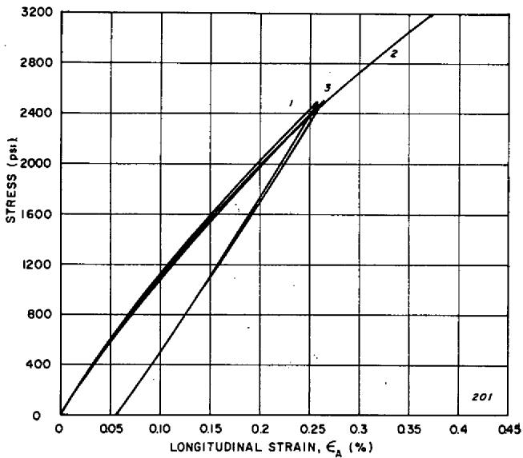

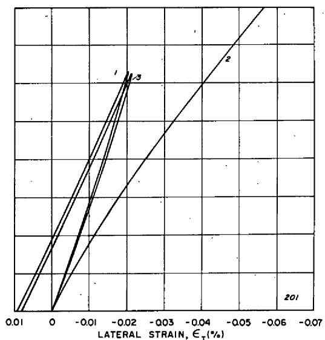

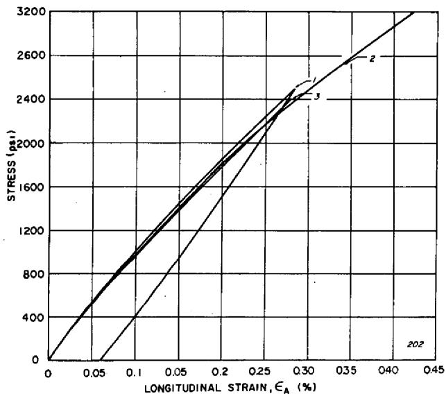

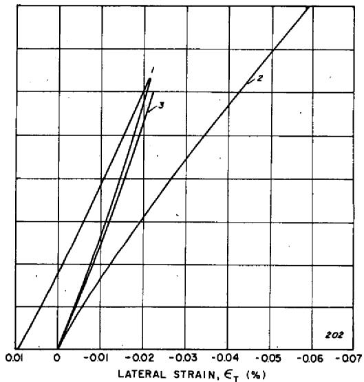  
Fig. 19. Stress-Strain Curves for Two With-Grain ATJ Specimens.

ORNL DWG. 69-2975

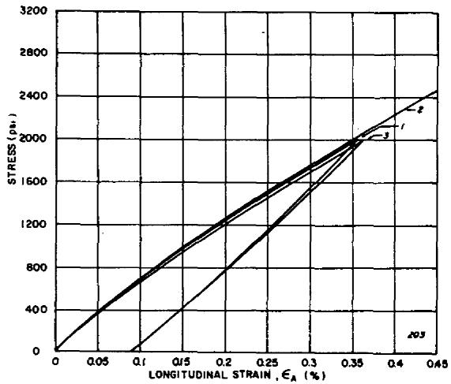

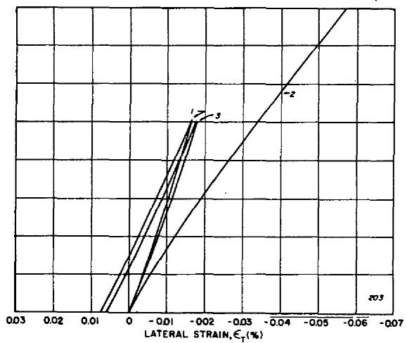

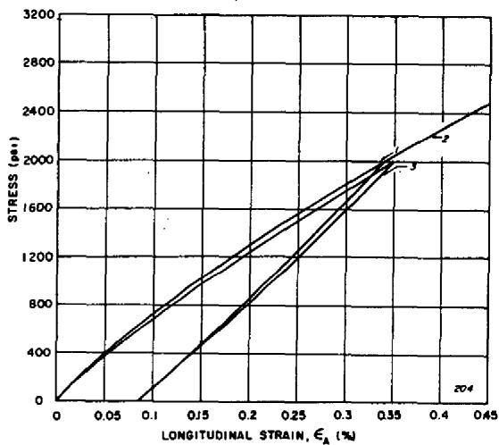

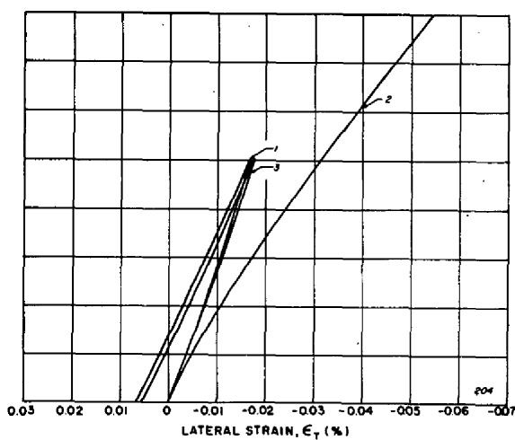  
Fig. 20. Stress-Strain Curves for Two Across-Grain ATJ Specimens.

The success of the heat treatment method for removing deformation history is determined by comparing curves 1 and 3 for each specimen. Since the second with-grain specimen failed during the second tensile loading, comparisons are more difficult to make for the curves shown in the lower part of Fig. 19. Figures 19 and 20 show that the history was almost entirely removed by heat treatment. Although there is a small decrease in deformation resistance between the first and second tensile loading, the agreement between the curves is very good. This is true for both the with-grain and across-grain directions.

Some of the behavioral aspects which were discussed in the previous section may be seen from these curves. The deformation resistances are essentially the same in tension and in compression, with a very slight tendency toward greater deformation resistance in compression than in tension for the across-grain direction. The curvatures of the stress versus lateral strain curves in tension are different from those in compression, but the initial slopes are nearly equal. Finally, positive residual lateral strains are incurred as a result of loading in tension.

The stress-strain curves shown in Figs. 21 and 22 are for two with-grain RVD specimens and one across-grain specimen. Curves 1 and 3 for the with-grain specimen are in good agreement. Again, slightly less deformation resistance is found for the second loading in tension.

Although the differences between curves 1 and 3 are greater for the across-grain specimen than in the above cases, the agreement is good. Greater deformation resistance in compression than in tension may also be seen in Fig. 22.

Results obtained from EGCR-type AGOT specimens are given in Figs. 23 and 24. The curves for the with-grain specimen again show that the heat treatment was reasonably effective. It was less effective for the across-grain specimens, however, as may be seen by examining Fig. 24. The second across-grain specimen was not loaded to the same stress level in tension during the first and third loadings, but this does not detract significantly from the comparisons. Again, the across-grain specimens exhibit greater deformation resistance in compression than in tension.

The above results for the three graphites show that, in general, heat treating does almost entirely remove the prior deformation history

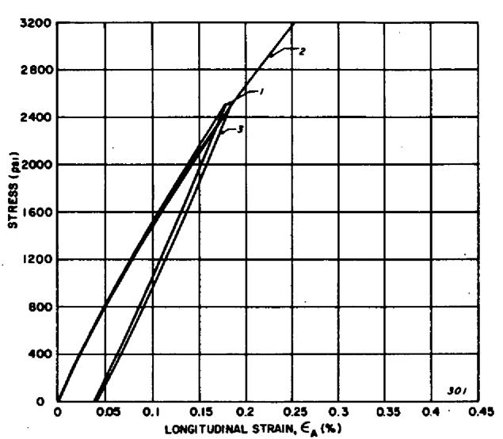

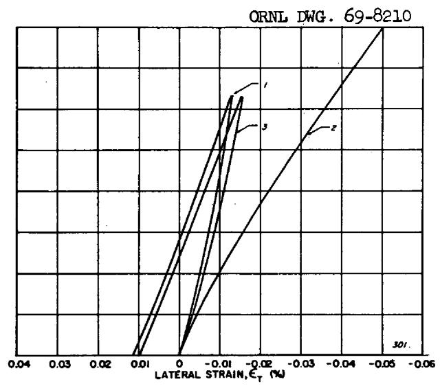

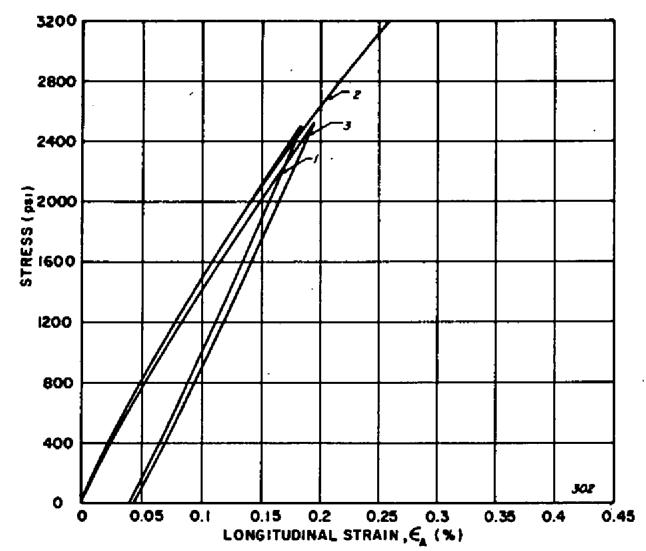

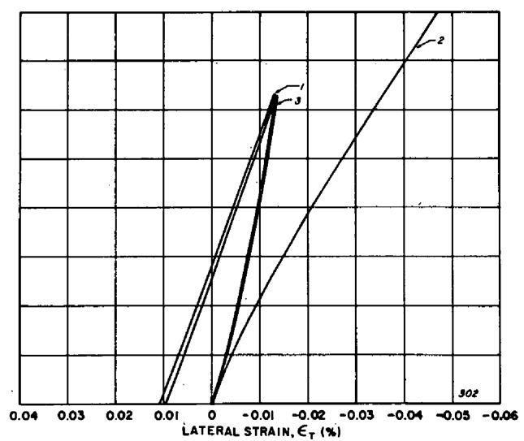  
Fig. 21. Stress-Strain Curves for Two With-Grain RVD Specimens.

ORNL DWG. 69-2972

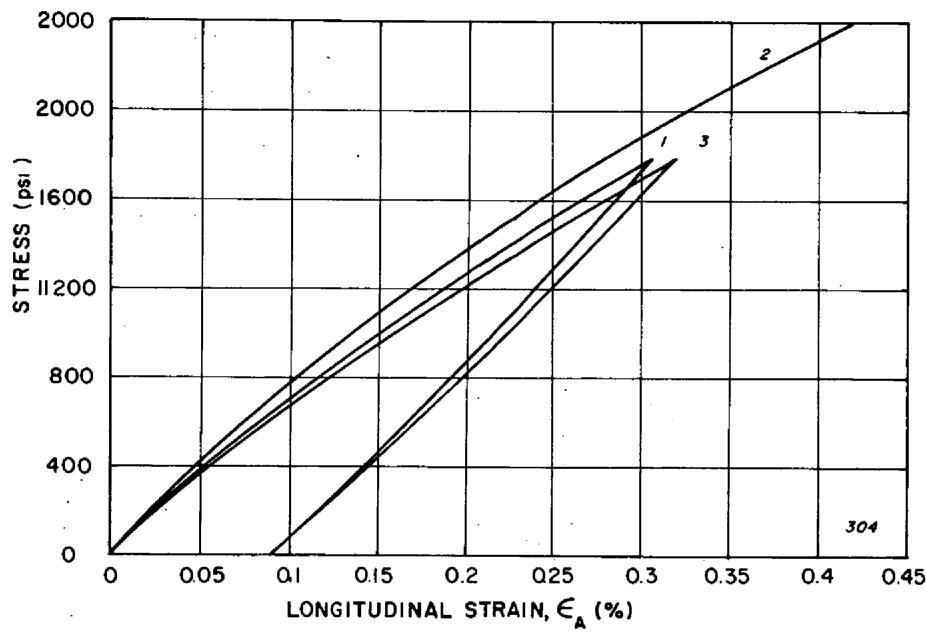

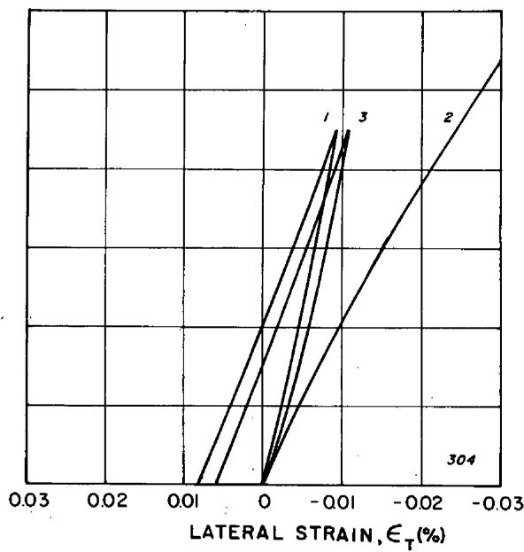  
Fig. 22. Stress-Strain Curves for an Across-Grain RVD Specimen.

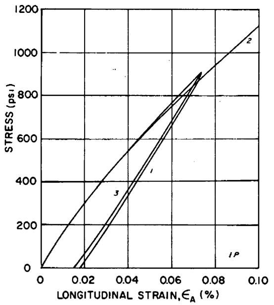

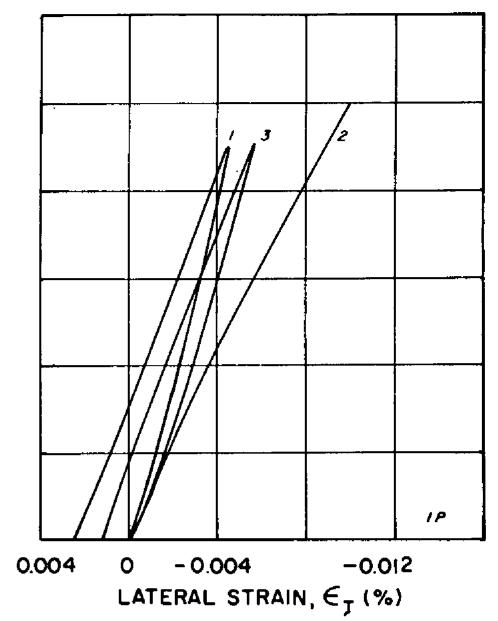

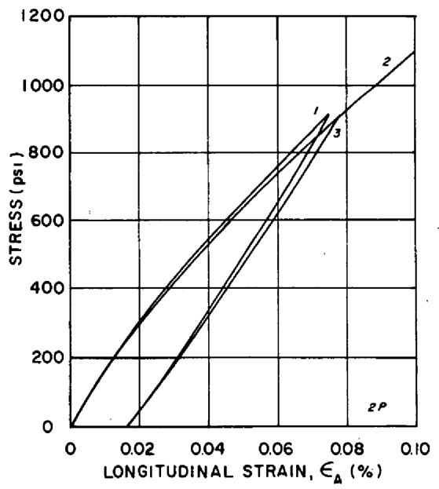

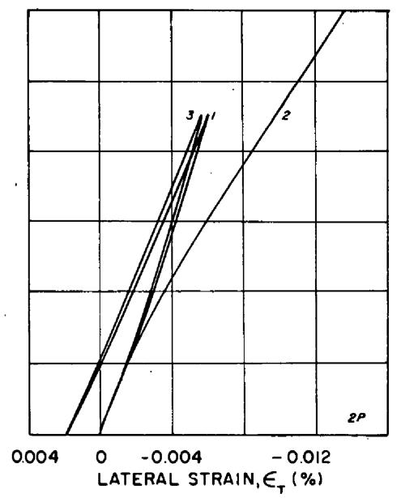  
Fig. 23. Stress-Strain Curves for Two With-Grain EGCR-Type AGOT Specimens.

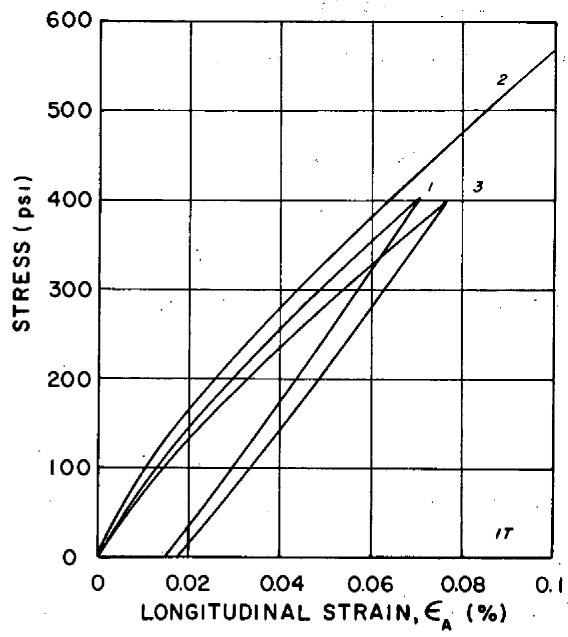

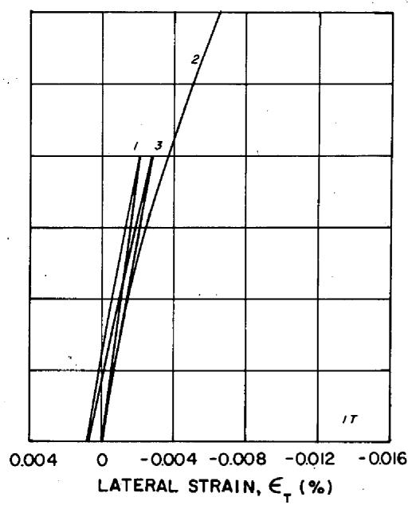

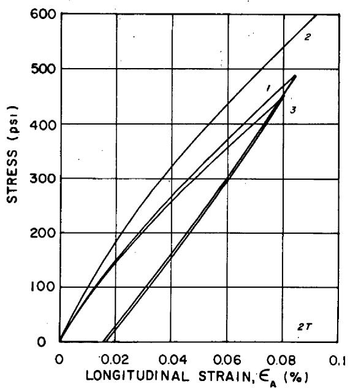

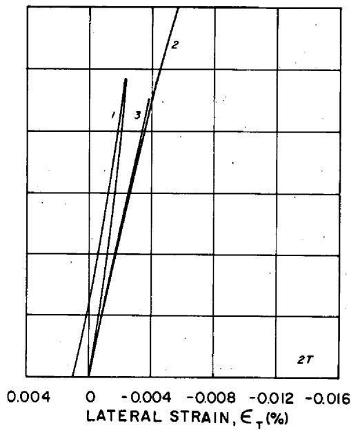  
Fig. 24. Stress-Strain Curves for Two Across-Grain EGCR-Type AGOT Specimens.

so far as stress-strain response is concerned. The greater differences between the first and second tensile loadings for across-grain RVD and AGOT specimens may be associated with opening of microcracks too large to be healed by heat treatment. This conjecture is the most plausible for the coarse-grained AGOT material.

In addition to the investigations just described, studies were made to examine the influence of hold time at $3000^{\circ}\mathrm{C}$ . EGCR-type AGOT graphite specimens were used, and the hold times were 20, 30, and 40 minutes (in addition to the 60 minutes hold time used in obtaining the results already discussed). The results were inconclusive because no definite trend with hold time was established. However, it was decided that the longer hold time is preferred to assure greater possibility for reproducible results.

Returning to the dual purpose series for examining the asymptotic approach feature and for obtaining data on cyclic behavior under alternate compressive and tensile loadings, three (two with-grain and one across-grain) EGCR-type AGOT specimens were tested. After an initial heat treatment at $3000^{\circ}\mathrm{C}$ for 60 minutes, the first loading for each specimen was used to establish a one-cycle envelope curve. Each was loaded in compression near that required for failure, unloaded, loaded in tension to a given stress level, again near that required for failure, and unloaded. During preliminary tests it was found that a specimen will fail in tension when the tensile strain, as measured from the zero stress point, corresponds to that at failure for a virgin specimen loaded in tension only, regardless of the position of the zero stress point.

The envelope curves are shown as short-dashed lines in Figs. 25, 26, and 27. The apparent discontinuities in the slopes of the curves between the tensile and compressive portions were caused by changing fixtures to apply loads of different signs.

Each specimen was heat treated a second time under the same conditions as above and retested. It was loaded in compression to a given stress level, unloaded, loaded in tension, unloaded, loaded in compression to a higher stress level than the first, and unloaded. The corresponding curves are shown by the long-dashed lines in the figures. Finally, the heat treatment and loading sequence was repeated using lower compressive stress levels. The solid curves in the figures were obtained in this way.

ORNL DWG. 69-2970

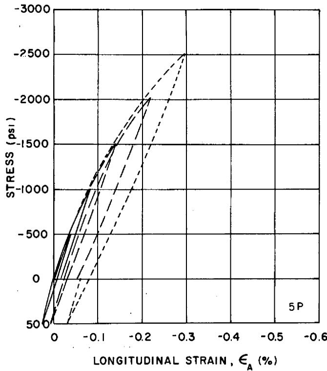

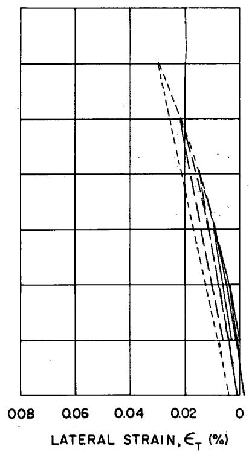  
Fig. 25. Multi-Cycle Curves for a Heat-Treated EGCR-Type AGOT Specimen (With-Grain).

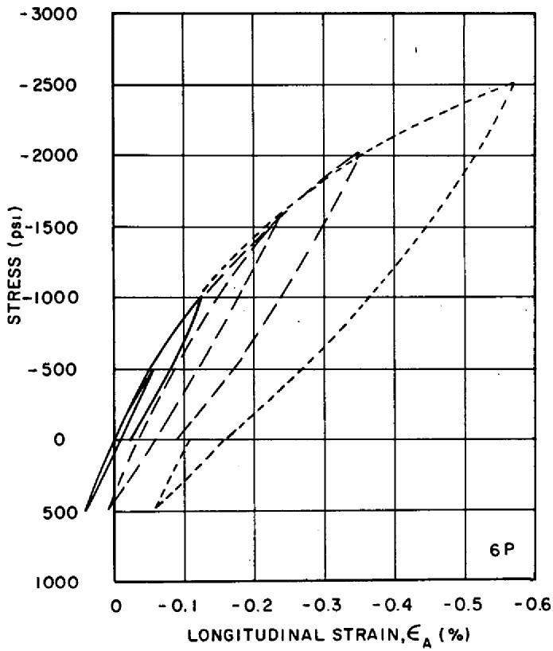  
ORNL DWG. 69-2974

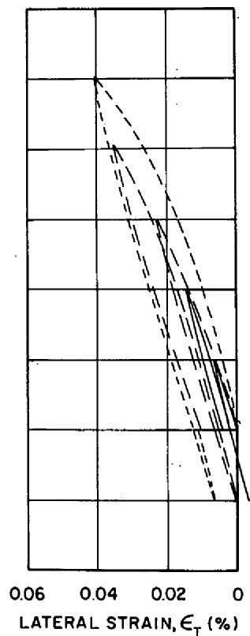  
Fig. 26. Multi-Cycle Curves for a Heat-Treated EGCR-Type AGOT Specimen (With-Grain).

ORNL.1WQ.69-2976

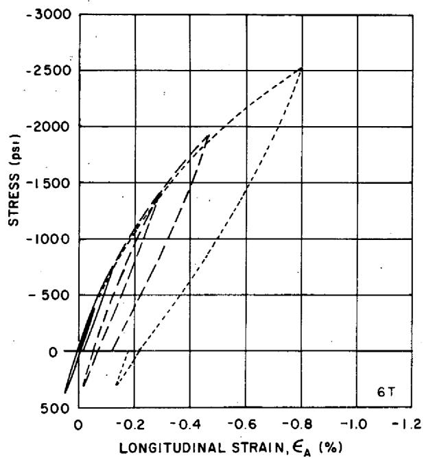

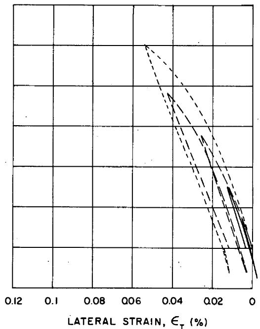  
Fig. 27. Multi-Cycle Curves for a Heat-Treated EGCR-Type AGOT Specimen (Across-Grain).

The maximum tensile stress level was essentially constant for all loadings on a given specimen.

In all cases, the stress level for reloading approaches that at the unloading point before a transition in slope occurs. The curvature of a stress versus longitudinal strain curve generally changes rapidly in the immediate vicinity of the unloading point, while the change for a stress versus lateral strain curve occurs over a much wider stress interval. Behavioral details for the stress versus longitudinal strain curves shown as solid lines are difficult to detect because of the small scale. In fact, the initial loading and reloading curves were separated in the figures for clarity. The discontinuities in slope attributable to changing of loading fixtures are apparent in almost all cases. The hysteresis loops and other aspects of the behavior are in accord with the results from other cyclic tests.

Consider the stress versus longitudinal strain curves. The asymptotic approach feature at the lower stress levels is shown, but there is some deviation as the unloading stress level is increased. However, Figs. 25, 26, and 27 show that the upper portions of the dashed curves lie above the envelope curve in two cases and below this curve in one case. On the whole, asymptotic approach to an initial loading curve is demonstrated by these data.

Additional support is given by the stress versus lateral strain curves of Fig. 25, where the agreement with the envelope curve is excellent. However, the stress versus lateral strain curves in Figs. 26 and 27 indicate that asymptotic approach is at most closely approximated. Conversely, because the restoration of the original stress-strain response by heat treating was shown to be less than perfect by the studies made to examine this technique, fully satisfactory agreement would be difficult to achieve.

As in the cases of the longitudinal strain curves for the two specimens which show greater differences, the deviations from the envelope curves for the lateral strains are in one direction. The two subsequent loading curves in each case appear to define an envelope curve although it is different from the one established during the first loading.

A better selection for studies of this kind would have been ATJ graphite specimens since heat treatment was shown to be more effective for this than the other two materials examined. As demonstrated here, discovery of the heat treatment method allows for detailed comparisons where none could be made formerly.

# Conclusions

This report describes the stress-strain responses of nuclear-grade, or equivalent, graphites under monotonic and cyclic loading conditions. Both stress versus longitudinal and stress versus lateral strain data are considered, and it is shown that consistent patterns of behavior are identifiable from the results. These include differences in deformation resistance in tension and compression and differences in strain-ratio data for the two types of loading.

When a specimen that has been preloaded in compression is cycled in compression between zero and given maximum stress levels, three behavioral patterns are observed. For the case in which the maximum stress levels are continually increased and all are greater than the preload value on each subsequent cycle, the hysteresis loops become larger and the paraelastic moduli decrease with increasing maximum stress. Cycling between zero and the preload stress level produces hysteresis loops that do not change with cycle number and the paraelastic moduli remain the same. However, the loops translate along the strain axis for the first few cycles, after which the loops coincide. Finally, cycling between zero and a fixed maximum value which is less than the preload stress produces hysteresis loops that are essentially invariant both in size and location with cycle number. In the case of a specimen which is loaded, partially unloaded, and reloaded, hysteresis loops are formed by the stress versus longitudinal strain and stress versus lateral strain curves. Also, the reloading curves approach what would have been extensions to the initial loading curves more rapidly than for the case of full unloading. The approach to the extension of a continued loading curve on reloading is often assumed. Here, this postulate is shown to be supported by data obtained from tests designed to examine its validity.

The use of heat treatment at the graphitization temperature essentially removes the effects of prior deformation, so far as stress-strain response is concerned. However, these heat treatments were more successful in removing the prior deformation histories of ATJ and RVD graphites than of EGCR-type AGOT graphite. Careful use of this technique is shown to be of unique benefit for making comparisons of the stress-strain behaviors of a single graphite specimen under different loading histories.

# Acknowledgements

The authors gratefully acknowledge the assistance of J. M. Napier of the Oak Ridge Y-12 Plant in heat treating the specimens; J. M. Chapman and J. P. Rudd for their help in instrumenting and testing the specimens; and H. A. MacColl for preparation of the figures.

# References

1. W. L. Greenstreet, "Mechanical Properties of Artificial Graphites - A Survey Report," USAEC Report ORNL-4327, Oak Ridge National Laboratory, December 1968.   
2. W. L. Greenstreet, J. E. Smith, and G. T. Yahr, "Mechanical Properties of EGCR-Type AGOT Graphite," Carbon, 7(1): 15-45 (1969).   
3. P. P. Arragon and R. M. Berthier, "Caracterisation mecanique du graphite artificiel," pp. 565-578 in Industrial Carbon and Graphite, Society of Chemical Industry, London, 1958.   
4. E. J. Seldin, "Stress-Strain Properties of Polycrystalline Graphites in Tension and Compression at Room Temperature," Carbon, 4(2): 177-191 (1966).   
5. H. H. W. Losty and J. S. Orchard, "The Strength of Graphite," pp. 519-532 in Proceedings of the Fifth Conference on Carbon, held at Pennsylvania State University, Vol. 1, MacMillan, New York, 1962.

# Internal Distribution

<table><tr><td>1.</td><td>S. E. Beall</td><td>34.</td><td>G. B. Marrow, Y-12</td></tr><tr><td>2.</td><td>H. W. Behrman, RDT</td><td>35.</td><td>J. G. Merkle</td></tr><tr><td>3.</td><td>S. E. Bolt</td><td>36.</td><td>A. J. Miller</td></tr><tr><td>4.</td><td>J. W. Bryson</td><td>37.</td><td>S. E. Moore</td></tr><tr><td>5.</td><td>J. P. Callahan</td><td>38.</td><td>J. M. Napier, Y-12</td></tr><tr><td>6.</td><td>S. J. Chang</td><td>39.</td><td>A. M. Perry</td></tr><tr><td>7.</td><td>W. H. Cook</td><td>40.</td><td>C. E. Pugh</td></tr><tr><td>8.</td><td>J. M. Corum</td><td>41.</td><td>J. N. Robinson</td></tr><tr><td>9.</td><td>W. B. Cottrell</td><td>42.</td><td>M. W. Rosenthal</td></tr><tr><td>10.</td><td>F. L. Culler</td><td>43.</td><td>A. W. Savolainen</td></tr><tr><td>11.</td><td>W. G. Dodge</td><td>44.</td><td>M. J. Skinner</td></tr><tr><td>12.</td><td>W. P. Eatherly</td><td>45-54.</td><td>J. E. Smith</td></tr><tr><td>13.</td><td>A. P. Fraas</td><td>55.</td><td>I. Spiewak</td></tr><tr><td>14-23.</td><td>B. L. Greenstreet</td><td>56.</td><td>J. L. Spoormaker</td></tr><tr><td>24.</td><td>R. C. Gwaltney</td><td>57.</td><td>D. A. Sundberg</td></tr><tr><td>25.</td><td>P. N. Haubenreich</td><td>58.</td><td>D. B. Trauger</td></tr><tr><td>26.</td><td>P. R. Kasten</td><td>59-63.</td><td>R. S. Valachovic</td></tr><tr><td>27.</td><td>C. R. Kennedy</td><td>64.</td><td>M. S. Wechsler</td></tr><tr><td>28.</td><td>K. C. Liu</td><td>65.</td><td>G. D. Whitman</td></tr><tr><td>29.</td><td>M. I. Lundin</td><td>66-75.</td><td>G. T. Yahr</td></tr><tr><td>30.</td><td>R. N. Lyon</td><td>76-77.</td><td>Central Research Library</td></tr><tr><td>31.</td><td>H. G. MacPherson</td><td>78-79.</td><td>Y-12 Document Reference Section</td></tr><tr><td>32.</td><td>R. E. MacPherson</td><td>80-84.</td><td>Laboratory Records Department</td></tr><tr><td>33.</td><td>H. C. McCurdy</td><td>85.</td><td>Laboratory Records, ORNL R.C.</td></tr></table>

# External Distribution

86. S. A. Bortz, IIT Research Institute, Chicago   
87. H. L. Brammer, SNPO-C, NASA Lewis Research Center, Cleveland   
88. L. C. Corrington, SNPO-C, NASA Lewis Research Center, Cleveland   
89. J. F. Cully, SNPO-A, c/o USAEC, P. O. Box 5400, Albuquerque   
90. R. J. Dietz, Los Alamos Scientific Laboratory   
91. D. M. Forney, Air Force Materials Laboratory (MAC), Wright-Patterson Air Force Base, Ohio   
92. C. W. Funk, Aerojet-General Corp., Sacramento   
93. J. J. Gangler, Materials Engineering Branch, RRM, NASA, Washington,D.C.   
94. Harold Hessing, SNPO-A, CMB Division, Los Alamos Scientific Lab.   
95. A. N. Holden, Westinghouse Astronuclear Laboratory, Pittsburgh   
96. Gary Kaveny, Aerojet-General Corp., Sacramento   
97. J. J. Lombardo, SNPO-C, NASA Lewis Research Center, Cleveland   
98. L. L. Lyon, Los Alamos Scientific Laboratory   
99. D. P. MacMillan, Los Alamos Scientific Laboratory   
100. M. M. Manjoine, Westinghouse Astronuclear Laboratory, Pittsburgh   
101. J. E. Morrissey, USAEC, Washington   
102. R. E. Nightingale, Pacific-Northwest Laboratory, Richland   
103. W. G. Ramke, Air Force Materials Laboratory, Wright-Patterson Air Force Base, Ohio

104-105. J. C. Rowley, Los Alamos Scientific Laboratory   
106. W. S. Scheib, SNPO, USAEC, Washington   
107. R. W. Schroeder, SNPO-C, NASA Lewis Research Center, Cleveland   
108. F. C. Schwenk, SNPO, USAEC, Washington   
109. E. J. Seldin, Parma Research Center, Cleveland   
110. R. H. Singleton, Westinghouse Astronuclear Laboratory, Pittsburgh   
111. M. C. Smith, Los Alamos Scientific Laboratory   
112. G. B. Spence, Parma Research Center, Cleveland   
113. J. L. Swanson, Westinghouse Astronuclear Laboratory, Pittsburgh   
114. N. R. Thielke, SNPO, NASA Lewis Research Center, Cleveland   
115. Tu-Lung Weng, Parma Research Center, Cleveland   
116-130. Division of Technical Information Extension (DTIE)   
131. Laboratory and University Division, ORO