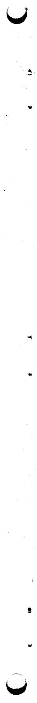
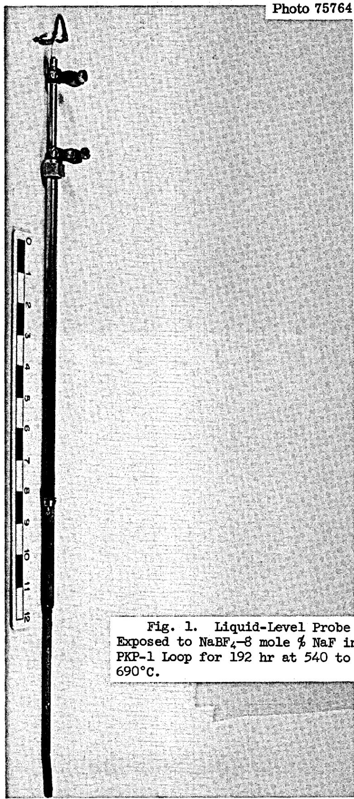
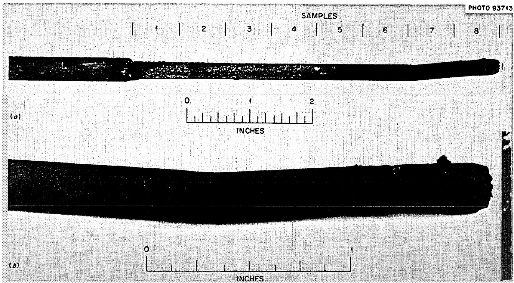
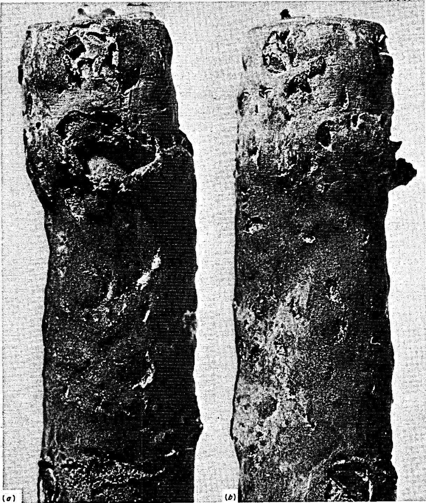
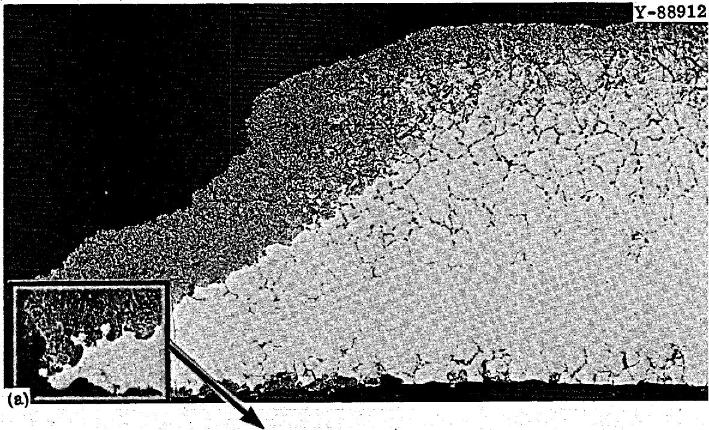
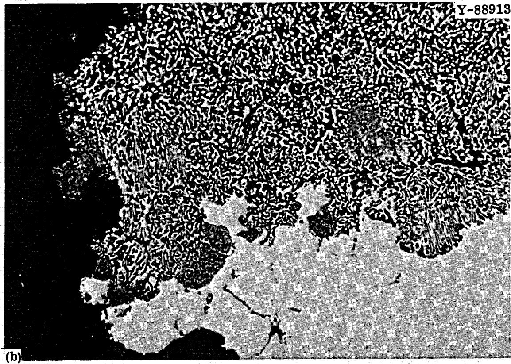
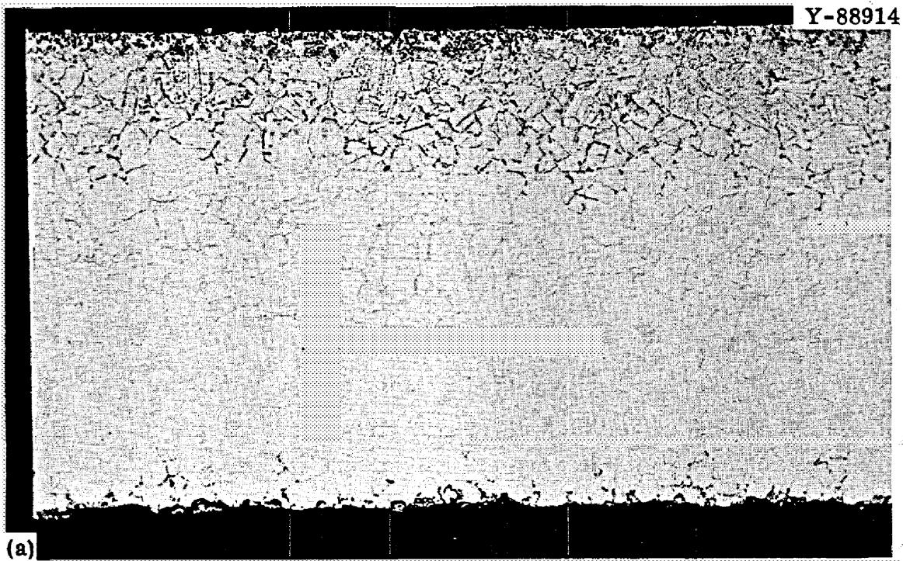
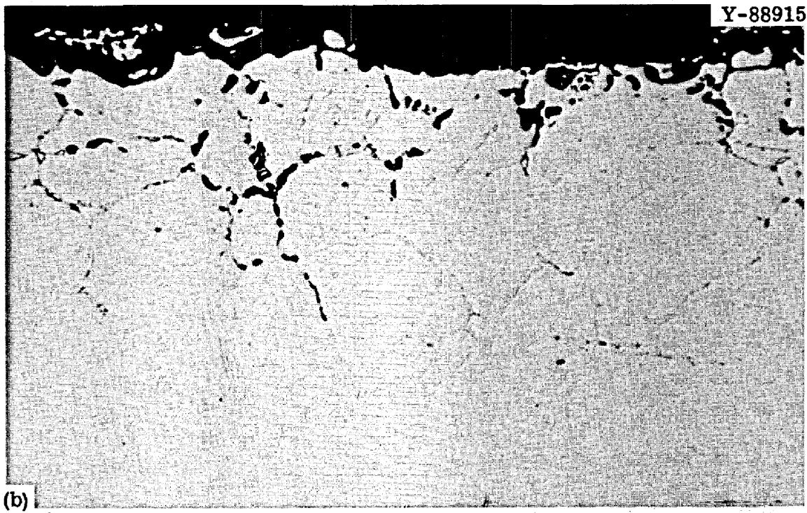
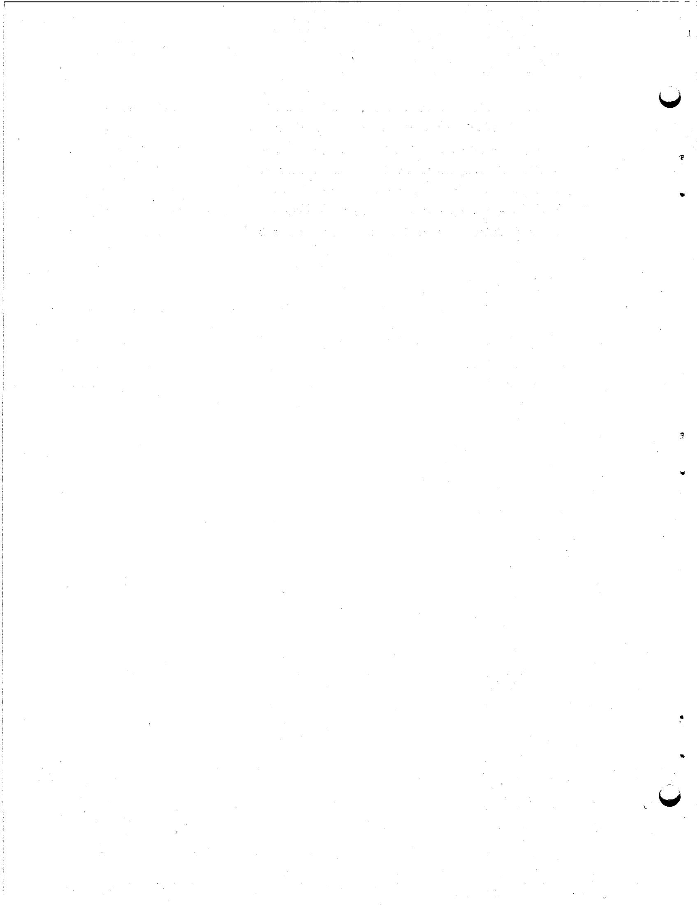

ORNL-TM-2741

Contract No. W-7405-eng-26

METALS AND CERAMICS DIVISION

CATASTROPHIC CORROSION OF TYPE 304 STAINLESS STEEL IN A SYSTEM CIRCULATING FUSED SODIUM FLUOROBORATE

J. W. Koger and A. P. Litman

# LEGAL NOTICE

This report was prepared as an account of Government sponsored work. Neither the United States, nor the Commission, nor any person acting on behalf of the Commission:

A. Makes any warranty or representation, expressed or implied, with respect to the accuracy, completeness, or usefulness of the information contained in this report, or that the use of any information, apparatus, method, or process disclosed in this report may not infringe privately owned rights; or

B. Assumes any liabilities with respect to the use of, or for damages resulting from the use of any information, apparatus, method, or process disclosed in this report.

As used in the above, "person acting on behalf of the Commission" includes any employee or contractor of the Commission, or employees of such contractor, to the extent that such employee or contractor of the Commission, or employee of such contractor prepares, disseminates, or provides access to, any information pursuant to his employment or contract with the Commission, or his employment with such contractor.

JANUARY 1970

OAK RIDGE NATIONAL LABORATORY

Oak Ridge, Tennessee

operated by

UNION CARBIDE CORPORATION

for the

U.S. ATOMIC ENERGY COMMISSION

# CONTENTS

Page   
Abstract 1   
Introduction 1   
Results 3   
Visual and Metallographic 3   
Chemical 6   
Physical Property Changes 10   
Discussion 11   
Impurity Effects 12   
Effect of Imposed Electromotive Force 12   
Stainless Steel Corrosion 12   
Dissimilar-Metal Corrosion 14   
Corrosion Mechanism and Mode 14   
Summary 16   
Conclusions 16   
Recommendations 16

J. W. Koger and A. P. Litman

# ABSTRACT

A type 304 stainless steel liquid level probe contacted fluoroborate salt (NaBF₄-8 mole % NaF) in an Inconel 600 pump loop at constant temperatures in the range 540 to $690^{\circ}\mathrm{C}$ for 192 hr. The probe exhibited heavy attack, evidenced by severe leaching of Cr, Fe, Mn, and Si from the alloy. Equivalent uniform attack was about 4 mils/day. Corrosion of the stainless steel, which is inferior to nickel-base alloys in fused fluorides, became catastrophic in this system due to dissimilar-metal effects.

# INTRODUCTION

The PKP-1 loop, constructed of Inconel 600, is a forced-circulation loop and part of the Fuel Pump High Temperature Endurance Test Facility. The loop is used for performance testing centrifugal pumps of the type developed for the Molten-Salt Reactor Experiment (MSRE). The loop was altered to accept $\mathrm{NaBF}_4 - 8$ mole % NaF as the circulating medium as part of the program to qualify the salt for use as a coolant in molten-salt reactors. The experimental program currently involves the measurement of the cavitation pressure of the pump as a function of temperature of the molten salt. For these experiments the loop is operated under nearly isothermal conditions in the range 540 to $690^{\circ}\mathrm{C}$ .

A liquid-level probe (Fig. 1) was installed in the pump bowl of PKP-1 on June 20, 1968, to indicate changes in the liquid level that occurred independently of changes in salt density. The probe was initially thought to be constructed with an Inconel 600 outer sheath, but later examination showed it was type 304 stainless steel. The instrument used a $1000\mathrm{-Hz}$ electrical signal across a conductance probe immersed in the salt and had an output signal that was a linear function

of immersion depth. $^{1}$ The salt temperatures seen by the probe are given in Table 1. Signals from the probe stopped shortly after installation. The probe was removed on June 28, 1968, after 192 hr in the salt, and extensive corrosion had obviously occurred. This paper describes our metallurgical analysis of the probe, discusses the corrosion phenomena that occurred, and details the significance of the incident for the Molten-Salt Reactor Program.

Table 1. Salt Temperatures in MSRP-PKP-1 Pump Loop   

<table><tr><td>Duration (hr)</td><td>Temperature (°C)</td></tr><tr><td>21</td><td>540</td></tr><tr><td>92</td><td>552</td></tr><tr><td>26</td><td>649</td></tr><tr><td>53</td><td>690</td></tr></table>

# RESULTS

# Visual and Metallographic

The portion of the probe that was immersed in salt was 0.25 in. in diameter $\times$ 0.030 in. wall thickness. As shown in Fig. 2, heavy attack occurred over the lower 2 in. of this section. The level of the salt on the probe during operation is not known and appears to have varied. For analysis, the tubing was cut into eight $3/4$ -in.-long samples, numbered such that sample 1 was furthest from the exposed end.

Figure 3 shows two magnified views of the end of the probe (sample 8). Severe distortion and very large pits are seen. In some places the wall was completely penetrated. We calculated that the corrosion in this region was equivalent to a uniform attack of 3.75 mils/day (1.4 in./year). Damage decreased with increasing distance from the probe

  
Fig. 2. Lower End of Liquid-Level Probe that Contacted $\mathrm{NaBF}_4$ -8 mole % NaF in PKP-1 Loop for 192 hr at 540 to $690^{\circ}\mathrm{C}$ . (a) Entire active length. (b) Bottom 2 in.

  
Fig. 3. Tip of the Liquid-Level Probe.

tip. Pitting was less severe on sample 7 (about 1 in. from the tip), but the photomicrographs (Fig. 4) show that this area was also heavily attacked. The attack in this region extended for about 20 mils through the tubing (about 3 mils/day). Figure 5, a photomicrograph of the upper end of sample 7, shows a preferential attack in the grain boundaries, with the voids linking to form holes. Here the attack only extends for about 10 mils through the tubing, thus, demonstrating the varying level of the salt, as indicated by corrosion, on the probe.

# Chemical

The salt was chemically analyzed just before the probe was placed in the system and just after it was removed. The results are given in Table 2. The Li, Be, U, and Th are from an earlier fuel salt used in this loop. As expected, no significant changes in the amounts of the corrosion products in the salt resulted from corrosion of the probe because (1) the surface area of the probe was small compared to that of the loop, and (2) the volume of salt was large compared to the quantity of corrosion products removed. The reported changes in the iron and oxygen concentrations are attributed to sampling and analytical procedures.

Each probe sample was analyzed, and the results are given in Table 3. We removed the attacked area from the base metal on sample 8 and determined the composition of each region. We found that the base material of the probe was type 304 stainless steel and not Inconel 600 as originally thought by project personnel. The analysis of the attacked area disclosed that mainly Cr, Fe, Mn, and Si had been leached from the base metal by the salt. This removal resulted in an apparent enrichment in Ni, Mo, and Cu, although in the areas of complete dissolution, of course, all the alloying elements were removed. Also, about $20\%$ unidentified material was associated with the attacked area.

  
Fig. 4. Microstructure of Lower End of Sample 7. (a) $100 \times$ (b) $500 \times$ .

  
Fig. 5. Microstructure of Upper End of Sample 7. (a) $100 \times$ (b) $500 \times$ .

Table 2. Analysis of Fluoroborate Salt in PKP-1   

<table><tr><td rowspan="2">Element</td><td colspan="2">Content, ppm</td><td rowspan="2">Element</td><td colspan="2">Content, wt %</td></tr><tr><td>Before Insertion</td><td>After Removal</td><td>Before Insertion</td><td>After Removal</td></tr><tr><td>Cr</td><td>97</td><td>93</td><td>Na</td><td>21.0</td><td>21.5</td></tr><tr><td>Fe</td><td>272</td><td>229</td><td>B</td><td>9.18</td><td>9.31</td></tr><tr><td>Ni</td><td>27</td><td>25</td><td>F</td><td>66.7</td><td>65.9</td></tr><tr><td>O</td><td>1149</td><td>380</td><td>Li</td><td>0.182</td><td>0.193</td></tr><tr><td></td><td></td><td></td><td>Be</td><td>0.18</td><td>0.19</td></tr><tr><td></td><td></td><td></td><td>U</td><td>0.229</td><td>0.241</td></tr><tr><td></td><td></td><td></td><td>Th</td><td>0.170</td><td>0.172</td></tr></table>

Water content not analyzed.

Table 3. Chemical Composition of Sections of Type 304 Stainless Steel Liquid-Level Probe in PKP-1 Loop   

<table><tr><td rowspan="2">Sample</td><td rowspan="2">Portion Analyzed</td><td colspan="7">Content, %</td></tr><tr><td>Cr</td><td>Fe</td><td>Ni</td><td>Mn</td><td>Mo</td><td>Si</td><td>Cu</td></tr><tr><td></td><td></td><td colspan="7">Before Test</td></tr><tr><td>Nominal composition type 304 stainless steel</td><td></td><td>18-20</td><td>Major</td><td>8-10</td><td>1.5</td><td></td><td>0.6</td><td></td></tr><tr><td></td><td></td><td></td><td></td><td></td><td></td><td></td><td></td><td></td></tr><tr><td></td><td></td><td colspan="7">After Test</td></tr><tr><td>1</td><td>Base metal</td><td>18</td><td>69</td><td>9.4</td><td>1.4</td><td>0.14</td><td>0.52</td><td>0.1</td></tr><tr><td>2</td><td>and layer,</td><td>17</td><td>68</td><td>8.1</td><td>1.3</td><td>0.14</td><td>0.44</td><td>0.1</td></tr><tr><td>3</td><td>if any</td><td>17</td><td>68</td><td>11.0</td><td>1.4</td><td>0.14</td><td>0.58</td><td>0.1</td></tr><tr><td>4</td><td></td><td>17</td><td>68</td><td>11.7</td><td>1.4</td><td>0.13</td><td>0.64</td><td>0.1</td></tr><tr><td>5</td><td></td><td>16</td><td>67</td><td>11.2</td><td>1.3</td><td>0.11</td><td>0.70</td><td>0.1</td></tr><tr><td>6</td><td></td><td>16</td><td>67</td><td>9.0</td><td>1.2</td><td>0.12</td><td>0.46</td><td>0.1</td></tr><tr><td>7</td><td></td><td>16</td><td>67</td><td>10.2</td><td>1.3</td><td>0.12</td><td>0.52</td><td>0.1</td></tr><tr><td>8</td><td>Base metal</td><td>18</td><td>69</td><td>10.0</td><td>1.7</td><td>0.15</td><td>0.60</td><td>0.1</td></tr><tr><td>8</td><td>Attacked layer</td><td>1</td><td>15</td><td>60.0</td><td>0.1</td><td>1.00</td><td>0.27</td><td>0.5</td></tr></table>

# Physical Property Changes

Initial examination disclosed that some parts of the probe were highly ferromagnetic. Each of the eight samples was tested with a Radio Frequency Laboratory gaussmeter No. 1890 to determine its magnetic field strength (Table 4). This is a rapid nondestructive test suitable for many engineering systems. This device is quite useful on iron- or nickel-base alloys that are selectively attacked enough to change their magnetic properties. The magnetic field strength of the samples increased as the end of the probe was approached.

Table 4. Magnetic Field Strength and Seebeck Effect   

<table><tr><td>Sample</td><td>B (gauss)</td><td>Seebeck Effect (instrument units)</td></tr><tr><td>1</td><td>0.20</td><td>5.0</td></tr><tr><td>2</td><td>0.20</td><td>7.5</td></tr><tr><td>3</td><td>0.20</td><td>10.0</td></tr><tr><td>4</td><td>0.30</td><td>9.5</td></tr><tr><td>5</td><td>0.50</td><td>11.5</td></tr><tr><td>6</td><td>0.75</td><td>13.5</td></tr><tr><td>7</td><td>2.00</td><td>14.0</td></tr><tr><td>8</td><td>Too fragile to be measured but highly ferromagnetic</td><td>Too fragile</td></tr><tr><td>Standards</td><td></td><td></td></tr><tr><td>Monel</td><td>0.20</td><td>&gt;30</td></tr><tr><td>Nickel</td><td>0.50</td><td>27</td></tr><tr><td>Type 304 stain-less steel</td><td>0.06</td><td>8.5</td></tr><tr><td>Inconel</td><td>0.04</td><td>-13.0</td></tr><tr><td>Hastelloy N</td><td>0.06</td><td>-11.5</td></tr></table>

Another testing device utilized in this study was a metal comparison meter. This instrument nondestructively identifies metals by measuring the Seebeck effect of the unknown metal and comparing the value to that obtained from a piece of known metal. The standards built into the device are nickel, type 304 stainless steel, Monel, Inconel 600, and Hastelloy N. Table 4 gives the relative Seebeck effect readings for the various samples and the standards. No attempt was made to determine absolute values. The examination results were that the Seebeck effect increased as the end of the probe was approached, in agreement with the gaussmeter tests.

The metallurgical evaluation showed that the attack by the fluoroborate salt drastically changed the composition and properties of the type 304 stainless steel probe during service. The highly attacked region had a final composition near that of 78 Permalloy (Ni-22% Fe), a highly ferromagnetic material. The changes of the magnetic field strength and the Seebeck effect as a function of attack were also indicative of composition changes and are often more sensitive to small composition changes than chemical analysis. The gradation in these properties along the probe, as opposed to an abrupt change, indicates that the salt level varied during exposure.

# DISCUSSION

To account for the heavy attack observed, we considered several potential corrosion mechanisms.

# Impurity Effects

Salt analyses were obtained to decide if the salt itself was excessively corrosive. Past work4 has shown that fluoroborates that contain at least 2000 ppm water and oxygen are highly corrosive to iron- and nickel-base alloys. These impurities react with the salt to form HF, which attacks almost all the constituents of the container materials. The most common evidence of this is detection of an increase in the concentration of the more noble elements, such as nickel, in the salt. This was not found for the system here, so we conclude, even considering the surface area and volume mismatch of probe to salt and container system, that the impurity effects on the probe corrosion were small.

# Effect of Imposed Electromotive Force

We also believe that the passage of current through the probe and the associated emf had no effect on the corrosion rate, since other probes containing essentially the same elements in different combinations have shown no deleterious effects under an imposed emf in prior exposures to fused fluorides.[5]

# Stainless Steel Corrosion

In the last two decades a continuing corrosion program at ORNL has been seeking to determine the compatibility of various fused fluoride mixtures with nickel- and iron-base alloys.4-10 Most of these tests

have used natural-circulation loops as the testing device. No tests have been conducted to determine the compatibility of stainless steel with fluoroborate salts, although both stainless steels and fluoroborate salt have been separately tested with other materials.

Table 5 summarizes recent data $^{9,10}$ obtained from natural-circulation loop tests and compares the compatibilities of some fluoride salts with type 304 stainless steel and with Hastelloy N. In 5000-hr tests Hastelloy N loses about seven times as much weight in $\mathrm{NaBF}_4 - 8$ mole % NaF, $4\mathrm{mg/cm}^2$ , as it does in lithium-beryllium type fuel salt, $0.6\mathrm{mg/cm}^2$ . By analogy and with knowledge of the modes and mechanisms of fluoroborate salt corrosion, we assume that type 304 stainless steel exposed to the same fluoroborate salt for 5000 hr at $605^{\circ}\mathrm{C}$ in an all-stainless-steel system would lose about seven times as much weight as in a

Table 5. Weight Loss of Alloys Exposed to Various Salts at Different Temperatures for 5000 hr   

<table><tr><td>Metal</td><td>Salt</td><td>Maximum Temperature (℃)</td><td>\( \Delta T \)(℃)</td><td>Weight Loss (mg/cm2)</td><td>Uniform Loss (mils/year)</td></tr><tr><td>Hastelloy N</td><td>LiF-BeF2-ThF4(73-2-25 mole %)</td><td>675</td><td>55</td><td>0.4</td><td>0.03</td></tr><tr><td>Hastelloy N</td><td>LiF-BeF2-UF4(65.5-34.0-0.5 mole %)</td><td>705</td><td>170</td><td>0.6</td><td>0.05</td></tr><tr><td>Hastelloy N</td><td>NaBF4-NaF(92-8 mole %)</td><td>605</td><td>145</td><td>4.0</td><td>0.3</td></tr><tr><td>Type 304 stain-less steel</td><td>LiF-BeF2-ZrF4-UF4-ThF4(70-23-5-1-1 mole %)</td><td>675</td><td>100</td><td>25.0</td><td>1.8</td></tr><tr><td>Type 304 stain-less steel</td><td>NaBF4-NaF(92-8 mole %)</td><td>538-690</td><td></td><td>175.0</td><td>12.6</td></tr></table>

Estimated from comparison with the behavior of Hastelloy N in NaBF₄-8 mole % NaF of the same impurity level and assuming an all-stainless-steel system.

lithium-beryllium type fuel salt; that is, 175 vs $25\mathrm{mg/cm^2}$ . Corrosion of this magnitude would be severe, equivalent to about 13 mils/year (0.035 mil/day) attack, more than can be tolerated in a molten-salt reactor. However, this rate is only $1\%$ of the maximum corrosion rate, 1.4 in./year (1370 mils/year) experienced by the probe.

# Dissimilar-Metal Corrosion

It should be noted that the above comparison of corrosion rates of stainless steel and Hastelloy N is really valid only in systems where all the container material exposed to the salt is of the same composition. In the PKP-1 system described in this work, the iron-base type 304 stainless steel was surrounded by the more noble and more corrosion resistant nickel-base Inconel 600, which can be assumed to set the oxidizing potential of the system. Thus, it is not surprising that the less noble and more active stainless steel underwent much more corrosion (1370 vs 13 mils/year) than it would had the entire system been stainless steel. This well-known effect is termed dissimilar-metal corrosion and has been noted in both salt and liquid metal systems.[10,11]

# Corrosion Mechanism and Mode

Our interpretation of the catastrophic corrosion that occurred selectively on austenitic stainless steel in this dissimilar-metal test system is consistent with related thermodynamic and electrochemical phenomena. Examination of Table 6 shows that the elements removed from the stainless steel are those whose fluorides are more stable than $\mathrm{NiF}_2$ . This is in agreement with Bakish and Kern12 who found almost all the chromium and most of the iron removed from Inconel 600 exposed to $20\%$ $\mathrm{K}_2\mathrm{TaF}_7$ in equimolar KCl-NaCl at $800^{\circ}\mathrm{C}$ . Measuring galvanic cells with a molten KCl-NaCl-KF electrolyte, they found the nickel electrode

Table 6. Relative Stability of Fluorides ${}^{a}$   

<table><tr><td>Compound</td><td>Free Energy of Formation at 1000°K (kcal/gram-atom F)</td></tr><tr><td>SiF4b</td><td>-84</td></tr><tr><td>MnF2b</td><td>-79</td></tr><tr><td>CrF2b</td><td>-75</td></tr><tr><td>FeF2b</td><td>-68</td></tr><tr><td>NiF2</td><td>-61</td></tr><tr><td>MoF6</td><td>-58</td></tr><tr><td>CuF2</td><td>-49</td></tr></table>

${}^{a}$ Based on A. Glassner,The Thermochemical Properties of the Oxides,Fluorides and Chlorides to ${2500}^{ \circ  }\mathrm{K}$ ,ANI-5750 (1957).   
b Compounds of the metals known to be removed from the stainless steel (Table 3).

more noble than iron by 0.3 v and chromium by 0.7 v. Recent ORNL measurements13 of electrode potentials in molten fluorides agree qualitatively with Bakish and Kern's data and our corrosion results.

Thus, it is clear that the corrosive action of a fluoride salt on an alloy with or without dissimilar-metal mass transfer is fundamentally an electrochemical process wherein some or all of the alloy constituents are oxidized to their ionic state with the formation of fluoride compounds. The rate may be controlled by either solid-state diffusion or boundary-layer diffusion, with the attack concentrated at regions of highest energy, such as grain boundaries, subgrain boundaries, certain crystallographic planes, and dislocations.

# Summary

The severe corrosion of type 304 stainless steel exposed to a fluoroborate salt in an Inconel 600 system was interpreted. Drawing analogies from similar systems we conclude that the main cause of the catastrophic corrosion was dissimilar-metal corrosion. The stainless steel was the least noble part of the test system and thus suffered the brunt of the attack. However, we believe that the corrosion of stainless steel in an all-stainless-steel system by fused fluoroborate salt of the impurity level that existed in this case would still be excessive. We showed that from comparison of free energies and electrode potentials one can predict the relative stability of the constituents of an alloy in fused fluorides.

# CONCLUSIONS

1. Type 304 stainless steel in an Inconel 600 system in the temperature range 540 to $690^{\circ}\mathrm{C}$ was severely corroded by $\mathrm{NaBF}_4 - 8$ mole $\%$ NaF.   
2. The fact that the type 304 stainless steel was the least noble part of an Inconel 600 system increased the amount of corrosion.   
3. The mode of attack involves leaching large quantities of Cr, Fe, Mg, and Si from the stainless steel, leaving a highly ferromagnetic nickel alloy.   
4. The order of element removal in type 304 stainless steel by the fused sodium fluoroborate salt is in agreement with electrode potential measurements and free energy data in other halide salt systems and also is in agreement with other corrosion studies.   
5. Type 304 stainless steel in an all-stainless-steel system exposed to fluoroborate salt of the impurity level used in these experiments would corrode too much to be useful in engineering systems.

# RECOMMENDATIONS

1. This experience emphasizes the necessity for more careful control over materials being placed in a system containing a relatively uncharacterized fused fluoride salt.

2. In our judgment, low corrosion in nickel- and iron-containing alloys is favored by decreasing chromium and iron concentrations; that is, in order of decreasing corrosion resistance, we find modified Hastelloy N (containing no iron), Hastelloy N, Inconel 600, and stainless steel. While the general use of Hastelloy N alloys in the Inconel PKP-1 loop service is recommended, dissimilar-metal corrosion effects prohibit the use of any alloy less noble than Inconel 600.

# INTERNAL DISTRIBUTION

1-3. Central Research Library

68. W. L. Carter

4-5. ORNL Y-12 Technical Library Document Reference Section

69. G. I. Cathers

6-25. Laboratory Records

70. J. E. Caton

26. Laboratory Records, ORNL RC

72. J. M. Chandler

27. ORNL Patent Office

73. C. J. Claffey

28. R. K. Adams

74. F. H. Clark

29. G. M. Adamson, Jr.

75. H. D. Cochran

30. R. G. Affel

76. Nancy Cole

31. J. L. Anderson

77. C. W. Collins

32. R.F.Apple

78. E. L. Compere

33. W. E. Atkinson

79. K. V. Cook

34. C. F. Baes

80. W. H. Cook

35. J. M. Baker

81. J. W. Cooke

36. S.J.Ball

82. L. T. Corbin

37. C. E. Bamberger

83. B. Cox

38. C. J. Barton

84. J. L. Crowley

39. H. F. Bauman

85. F. L. Culler

40. M. S. Bautista

86. D. R. Cuneo

41. S. E. Beall

87. J. E. Cunningham

42. R. L. Beatty

88. J. M. Dale

43. M. J. Bell

89. D. G. Davis

44. M. Bender

90. R. J. DeBakker

45. C. E. Bettis

91. J. H. Devan

46. E. S. Bettis

92. J. R. DiStefano

47. D. S. Billington

93. S. J. Ditto

48. R. E. Blanco

94. F. A. Doss

49. F. F. Blankenship

95. A. S. Dworkin

50. J. O. Blomeke

96. W. P. Eatherly

51. E. E. Bloom

97. J.R. Engel

52. R. Blumberg

98. E. P. Epler

53. E.G. Bohlmann

99. J. I. Federer

54. B. S. Borie

100. D. E. Ferguson

55. C. J. Borkowski

01. L. M. Ferris

56. H. I. Bowers

.02.A.P.Fraas

57. C. M. Boyd

03. J. K. Franzreb

58. G. E. Boyd

04. H. A. Friedman

59. J. Braunstein

05. D. N. Fry

60. M. A. Bredig

06. J.H Frye, Jr.

61. R. B. Briggs

07. L. C. Fuller

62. H. R. Bronstein

08. W. K. Furlong

63. G. D. Brunton

09. C. H. Gabbard

64. O.W.Burke

10. R. B. Gallaher

65. S. Cantor

11. R. E. Gehlbach

66. D. W. Cardwell

12. J.H.Gibbons

67. J. H. Carswell, Jr.

13. L. O. Gilpatrick

114. G. Goldberg

115. W. R. Grimes

116. A. G. Grindell

117. R. W. Gunkel

118. R. H. Guymon

119. J. P. Hammond

120. R. L. Hammer

121. T. H. Handley

122. B. A. Hannaford

123. P. H. Harley

124. D. G. Harman

125. W. O. Harms

126. C. S. Harrill

127. P. N. Haubenreich

128. F. K. Hecker

129. R.E.Helms

130. P. G. Herndon

131. D. N. Hess

132. J. R. Hightower

133-135. M.R.Hill

136. E. C. Hise

137. B. F. Hitch

138. H. W. Hoffman

139. D. K. Holmes

140. P. P. Holz

141. R. W. Horton

142. A. Houtzeel

143. T. L. Hudson

144. W. R. Huntley

145. H. Inouye

146. W. H. Jordan

147. P. R. Kasten

148. R. J. Kedl

149. C. W. Kee

150. M. T. Kelley

151. M. J. Kelly

152. C. R. Kennedy

153. T. W. Kerlin

154. H. T. Kerr

155. J. J. Keyes

156. R. T. King

157. S. S. Kirlis

158. L. R. Koffman

159-163. J. W. Koger

164. H. W. Kohn

165. R. B. Korsmeyer

166. A. I. Krakoviak

167. T. S. Kress

168. J. W. Krewson

169. C. E. Lamb

170. J.A.Lane

171. M. S. Lin

172. R.B.Lindauer

173-177. A. P. Litman

178. E. L. Long, Jr.

179. A. L. Lotts

180. M. I. Lundin

181. R. N. Lyon

182. R. L. Macklin

183. H. G. MacPherson

184. R. E. MacPherson

185. J.C.Mailen

186. D. L. Manning

187. C. D. Martin

183. W. R. Martin

189. R.W. McClung

190-194. H. E. McCoy

195. D. L. McElroy

196. C. K. McGlothlan

197. C. J. McHargue

198. H. A. McLain

199. B. McNabb

200. L.E.McNeese

201. J. R. McWherter

202. H. J. Metz

203. A. S. Meyer

204. R. L. Moore

205. C. A. Mossman

206. D. M. Moulton

207. T. R. Mueller

208. M. L. Myers

209. H. H. Nichol

210. J. P. Nichols

211. E. L. Nicholson

212. T. S. Noggle

213. I. C. Oakes

214. S. M. Ohr

215. P. Patriarca

216. A. M. Perry

217. T. W. Pickel

218. H. B. Piper

219. C. B. Pollock

220. B. E. Prince

221. G. L. Ragan

222. J. L. Redford

223. J. D. Redman

224. D. M. Richardson

225. M. Richardson

226. G. D. Robbins

227. R.C.Robertson

228. K. A. Romberger

229. M. W. Rosenthal

230. R. G. Ross

231. J. Roth

232. J. P. Sanders

233. H. C. Savage

234. W. F. Schaffer

235. C. E. Schilling

236. Dunlap Scott

237. J. L. Scott

238. H. E. Seagren

239. C. E. Sessions

240. J.H.Shaffer

241. W. H. Sides

242. G. M. Slaughter

243. A. N. Smith

244. F. J. Smith

245. G.P. Smith

246. O. L. Smith

247. P. G. Smith

248. I. Spiewak

249. R.C.Steffy

250. H. H. Stone

251. R. A. Strehlow

252. R. D. Stulting

253. D. A. Sundberg

254. R.W. Swindeman

255. J. R. Tallackson

256. E.H.Taylor

257. W. Terry

258. R.E.Thoma

259. P.F. Thomason

260. L. M. Toth

261. A. L. Travaglini

262. D. B. Trauger

263. Chia-Pao Tung

264. W. E. Unger

265. G. M. Watson

266. J. S. Watson

267. H. L. Watts

268. C. F. Weaver

269. B. H. Webster

270. A. M. Weinberg

271. J.R.Weir

272. K.W. West

273. H. L. Whaley

274. M. E. Whatley

275. J. C. White

276. R.P.Wichner

277. L. V. Wilson

278. Gale Young

279. H. C. Young

280. J.P. Young

281. E. L. Youngblood

282. F. C. Zapp

# EXTERNAL DISTRIBUTION

283. G. G. Allaria, Atomics International

284. J. G. Asquith, Atomics International

285. D. F. Cope, RDT, SSR, AEC, Oak Ridge National Laboratory

286. C. B. Deering, AEC, OSR, Oak Ridge National Laboratory

287. A. R. DeGrazia, AEC, Washington

288. H. M. Dieckamp, Atomics International

289. David Elias, AEC, Washington

290. A. Giambusso, AEC, Washington

291. J. E. Fox, AEC, Washington

292. F. D. Haines, AEC, Washington

293. C. E. Johnson, AEC, Washington

294. W. L. Kitterman, AEC, Washington

295. W. J. Larkin, AEC, Oak Ridge Operations

296. Kermit Laughon, AEC, OSR, Oak Ridge National Laboratory

297. C. L. Matthews, AEC, OSR, Oak Ridge National Laboratory

298-299. T. W. McIntosh, AEC, Washington

300. A. B. Martin, Atomics International

301. D. G. Mason, Atomics International

302. G. W. Meyers, Atomics International

303. D. E. Reardon, AEC, Canoga Park Area Office

304. D. R. Riley, AEC, Washington   
305. H. M. Roth, AEC, Oak Ridge Operations   
306. M. Shaw, AEC, Washington   
307. J. M. Simmons, AEC, Washington   
308. T. G. Schleiter, AEC, Washington   
309. W. L. Smalley, AEC, Washington   
310. S. R. Stamp, AEC, Canoga Park Area Office   
311. E. E. Stansbury, the University of Tennessee   
312. D. K. Stevens, AEC, Washington   
313. R. F. Sweek, AEC, Washington   
314. A. Taboada, AEC, Washington   
315. M. J. Whitman, AEC, Washington   
316. R. F. Wilson, Atomics International   
317. Laboratory and University Division, AEC, Oak Ridge Operations 318-332. Division of Technical Information Extension