# U.S. ATOMIC ENERGY COMMISSION

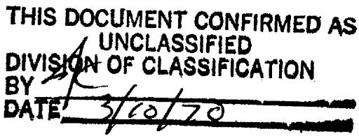

ORNL-TM-2743

COPY NO. -

DATE - December 22, 1969

DESIGN AND CONSTRUCTION

of

CORE IRRADIATION-SPECIMEN ARRAY FOR MSRE RUNS 19 and 20

C. H. Gabbard

MASTER

Abstract

A new MSRE core specimen array was designed and fabricated to replace the type of metallurgical surveillance specimen array that was used in the MSRE through Run 18. The main purpose of the new array is to measure the capture-to-absorption ratio of $^{233}\mathrm{U}$ and to determine the effects of salt velocity, turbulence, and surface finish on the deposition of fission products on graphite and on Hastelloy-N. Two additional test specimens were included, one of pyrolytic graphite to determine if there is permeation of fuel salt or its constituents into the graphite and one of Hastelloy-N to expose a series of electron microscope screens in a trapped gas pocket.

The new specimen array was installed on July 31, 1969 and was exposed in the reactor core for 12,943 Mwhrs of reactor operation during Runs 19 and 20.

Keywords: MSRE, core-irradiation-specimens, design, fabrication, uranium-233, capture-to-absorption ratio, cross sections, fission products, adsorption, nickel-molybdenum-chromium alloy, graphite.

# LEGAL NOTICE

This report was prepared as an account of Government sponsored work. Neither the United States, nor the Commission, nor any person acting on behalf of the Commission:

A. Makes any warranty or representation, expressed or implied, with respect to the accuracy, completeness, or usefulness of the information contained in this report, or that the use of any information, apparatus, method, or process disclosed in this report may not infringe privately owned rights; or   
B. Assumes any liabilities with respect to the use of, or for damages resulting from the use of any information, apparatus, method, or process disclosed in this report.

As used in the above, "person acting on behalf of the Commission" includes any employee or contractor of the Commission, or employee of such contractor, to the extent that such employee or contractor of the Commission, or employee of such contractor prepares, disseminates, or provides access to, any information pursuant to his employment or contract with the Commission, or his employment with such contractor.

# CONTENTS

# Page

Introduction 5

Mechanical Design of the Cage and Basket Assembly. 6

Description and Design of Test Specimens 8

Flow Tube 8

Uranium Capsules. 10

Pyrolytic Graphite. 14

Graphite Tube with Turbulence Wire... 14

Hastelloy-N Tube with Turbulence Wire 18

Gas Trap and Electron Microscope Screen Holder. 18

Disposition of the Specimen Array 21

Acknowledgements 22

# LEGAL NOTICE

This report was prepared as an account of Government sponsored work. Neither the United States, nor the Commission, nor any person acting on behalf of the Commission:

A. Makes any warranty or representation, expressed or implied, with respect to the accuracy, completeness, or usefulness of the information contained in this report, or that the use of any information, apparatus, method, or process disclosed in this report may not infringe privately owned rights; or

B. Assumes any liabilities with respect to the use of, or for damages resulting from the use of any information, apparatus, method, or process disclosed in this report.

As used in the above, "person acting on behalf of the Commission" includes any employee or contractor of the Commission, or employees of such contractor, to the extent that such employee or contractor of the Commission, or employee of such contractor prepares, disseminates, or provides access to, any information pursuant to his employment or contract with the Commission, or his employment with such contractor.

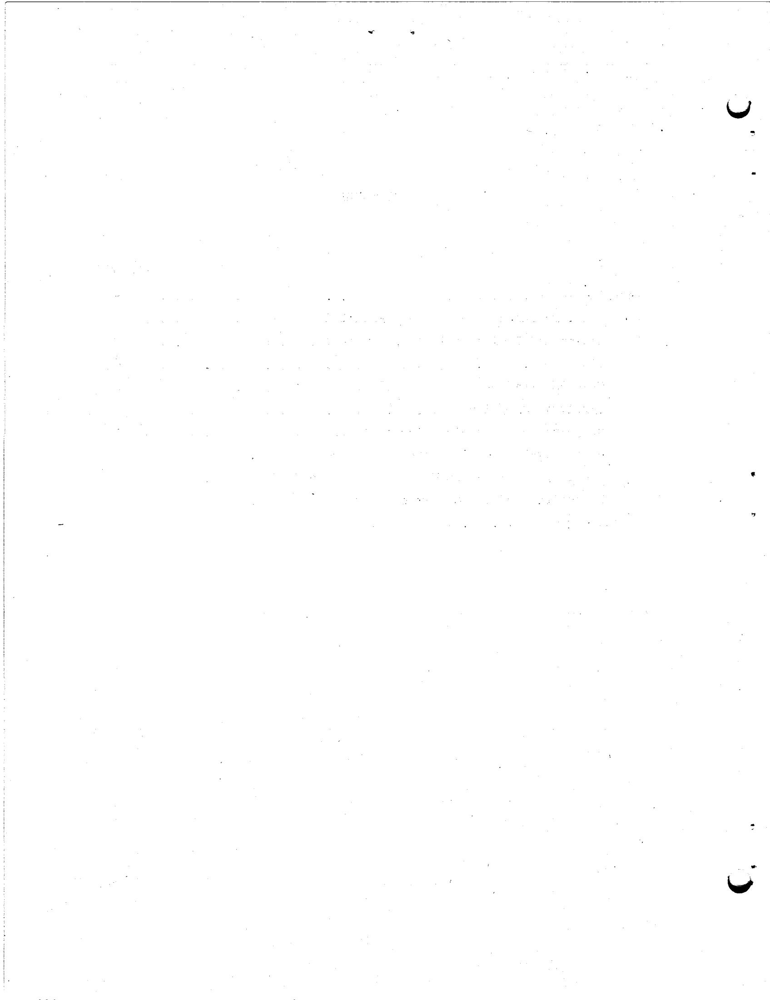

# Introduction

During nuclear operation of the MSRE through May 1969, the graphite sampler assembly contained samples of graphite and Hastelloy-N which were used to determine the effects of the reactor environment on these materials, including corrosion and the effects of irradiation on the physical properties and to determine the deposition of fission products on the materials. Assemblies of this type were removed in July 1966, May 1967, April 1968, and June 1969. After the latter removal, the same type of array was not reinstalled because the relatively short exposure that would occur before the planned final shutdown of the MSRE would add little to the information obtained during the previous long exposures. Instead, a different sample assembly was designed to utilize the existing space in the core. This new assembly is described in this report.

The new assembly contained several experiments for fission product deposition studies and four graphite capsules containing uranium isotopes for measuring nuclear properties of $^{233}\mathrm{U}$ . Two of the uranium capsules contained about 1-gr total of $^{233}\mathrm{U}$ and $^{238}\mathrm{U}$ and the other two contained about 1-gr total of $^{234}\mathrm{U}$ and $^{238}\mathrm{U}$ . The other specimens of graphite and Hastelloy-N were designed to study the effects of flow, surface finish, and turbulence on the fission product deposition. A specimen of pyrolytic graphite was included for salt permeation studies and the final specimen formed a gas trap where electron microscope screens were exposed to detect the presence of colloidal materials. The design details of the individual specimens and of the assembly are shown on ORNL Drawings M-10551-RB-001, M-10551-RB-002, and M-10551-RB-003 (Footnote-2).

The new specimen array was installed into the MSRE core on July 31, 1969 and was exposed during Runs 19 and 20. Table I summarizes the exposure history of the array. The specimen array was scheduled for removal about December 15, 1969.

# Table I

Exposure History of the MSRE Core

Irradiation-Specimen Array for Runs 19 and 20

<table><tr><td>Time above 900°F</td><td>2,815 hrs</td></tr><tr><td>Time exposed to flush salt</td><td>120 hrs</td></tr><tr><td>Time exposed to fuel salt</td><td>2,262 hrs</td></tr><tr><td>Integrated Power</td><td>12,943 Mwhrs</td></tr></table>

# Mechanical Design of the Cage and Basket Assembly

In order to keep the assembly as simple as possible, each capsule or specimen was made cylindrical with an outside diameter of $1 - 1/4$ inches. This was the largest diameter that could be held in a removable cage inside the existing basket design. The individual experiments within the assembly are more completely described later in the report.

Figure 1 shows the completed cage and basket assemblies. The new basket assembly is generally the same size and shape as the previous ones, but is made from 2-in. OD by 0.062-in. wall Hastelloy-N tubing (control rod thimble material) because the perforated sheet used previously was not available. The large slots in the lower part of the basket assembly were to reduce the metal volume and the neutron flux depression to a minimum in the vicinity of the uranium-containing capsules. The smaller slots at the top of the basket are to ensure an adequate salt flow through the upper portion of the basket.

The cage assembly consists of three vertical 3/16-in.-diameter rods held by end fittings and with spacer rings welded at intervals along the length. The lower end fitting was welded to the vertical rods and forms a flow passage which directs about half of the salt flow from the inlet tube of the basket into the center of the first test specimen. The top

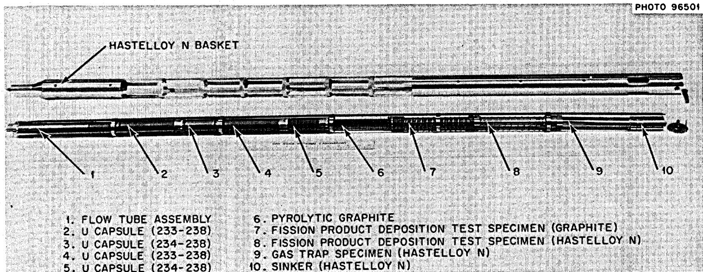  
Fig. 1. Irradiation Specimen Array Installed in MSRE Core July 31, 1969

end fitting, which was removable to facilitate loading and unloading the test specimens, slips over the three rods and was held in place by 1/16-in.-dia. wire clips.

The bottom test specimen was pinned to the lower end fitting to resist any pressure drop effects. The other specimens were loose in the cage and were free to expand and contract as necessary. The total length of test specimens was adjusted during assembly by machining the length of the top metal filler plug to provide end clearance with the cage assembly. At operating temperature the end clearance increased to about 0.42 in. due to differential thermal expansion. The graphite specimens, which would normally float in salt, were held down by the weight of the top metal specimens and the filler plug.

The assembly procedure of the cage into the basket and the installation of the basket into the reactor vessel were the same as for the previous graphite sampler assemblies. The assembly of the cage and basket was simplified by the use of all new parts. However, a previously used "Ball-Lock assembly" was used to complete the basket assembly, and the radiation level of this part required the final pinning operation to be completed in a hot cell.

The radiation from the ball-lock assembly was sufficiently low that the completed assembly could be carried from the Hot Cell to the MSRE in a pipe carrier with relatively light shielding on one end. An argon atmosphere was maintained on the uranium capsules and on the completed assembly as much of the time as possible. The total exposure of the uranium capsules to atmosphere was about one hour or less.

# Description and Design of Test Specimens

# Flow Tube

The first test specimen at the bottom of the assembly is the flow tube. Figure 2 is a photograph of the parts and the completed assembly of this specimen. The metal core inside the graphite body formed a $1/16$ -in. thick flow annulus so a direct comparison between the deposition on Hastelloy-N and on graphite will be possible. The salt flow through the

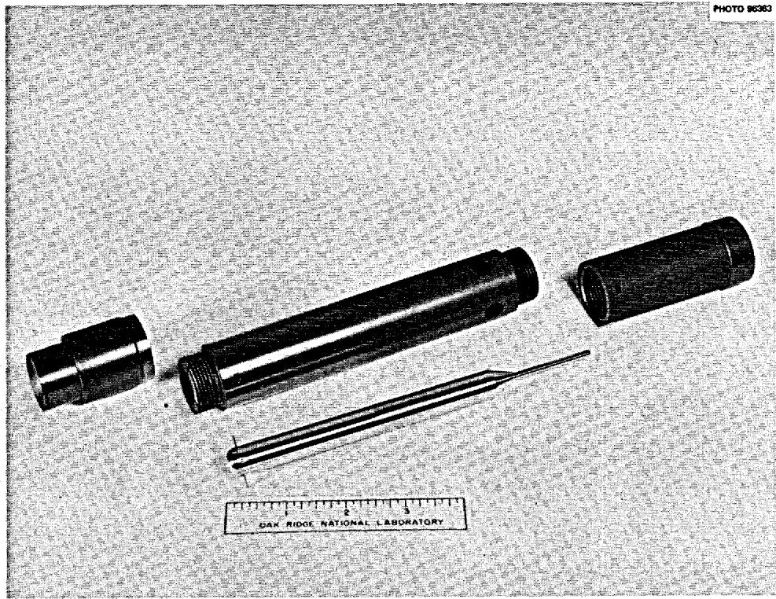

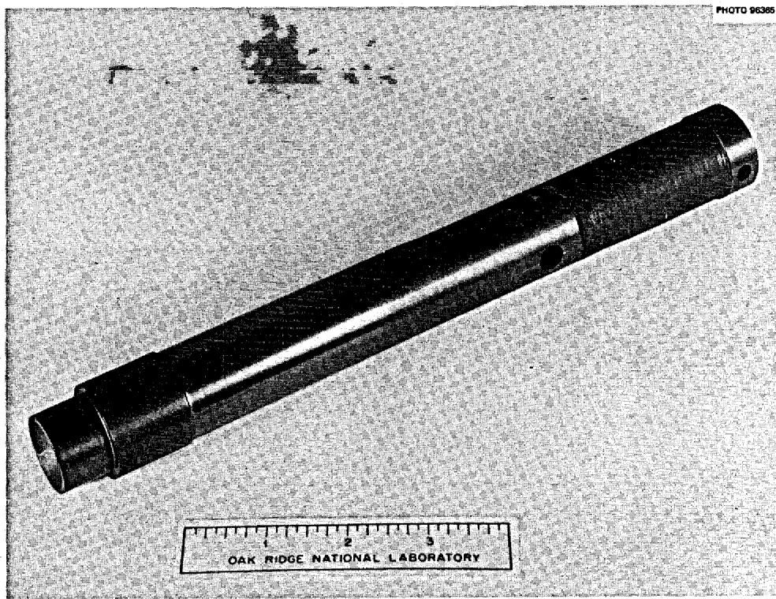  
Fig. 2. Flow Tube Assembly

annulus was introduced through the lower end fitting of the cage assembly and was driven by the pressure drop across the graphite lattice-bar grid at the bottom of the reactor vessel. The salt velocity through the 1/16-in. annulus was estimated to be 2.5 ft/sec as compared to 0.8 ft/sec on the outside of the specimen. The effect of salt velocity on deposition can be obtained by comparing inside and outside surfaces of the graphite. Different surface finishes were used on both the internal and the external surfaces so that the effect of surface finish can be determined. The external surfaces will also be used as a reference for the graphite specimen with the turbulence wire. The graphite parts were made of POCO grade AXF-5Q. This grade of graphite was selected because of its uniform pore size. Grade CGB graphite, such as constitutes the MSRE core, was not used for this specimen because the pieces of this graphite still in stock all had numerous cracks that would cause misleadingly high indications of apparent surface deposition.

# Uranium Capsules

The next section of the specimen assembly contains four graphite capsules that contain mixtures of uranium isotopes in a $\mathrm{NaF - ZrF_4}$ carriers salt. The purpose of these capsules is to determine, for the energy spectrum at the capsules, the capture-to-absorption ratio of $^{233}\mathrm{U}$ and to determine the absorption cross sections of the other uranium isotopes relative to $^{233}\mathrm{U}$ . Two sizes of capsules were provided, the long capsules containing primarily $^{233}\mathrm{U}$ and $^{238}\mathrm{U}$ and the short capsules containing $^{234}\mathrm{U}$ and $^{238}\mathrm{U}$ . After exposure the salt mixtures will be analyzed for uranium 233, 234, 235, 236, and 238 and for $^{239}\mathrm{Pu}$ . The production or depletion of these isotopes will be obtained by comparison with similar analyses of unirradiated samples of the salt mixtures. The isotopic concentrations of uranium in the original salt mixtures as calculated from the analyses of the source materials are shown in Table II.

The total weights of salt for the long and short capsules were 49.4 and 25.0 grams respectively giving a total uranium content of 1 gram per capsule. Since the analyses will be done on the basis of isotopic ratios the exact quantity of salt or uranium is not important. The NaF-ZrF4

# Table III

# Calculated Isotopic Concentrations

of

# Original Salt Mixtures (grams)

<table><tr><td></td><td>Long Capsule</td><td>Short Capsule</td></tr><tr><td>U-232</td><td>0.4 ppm of U</td><td>0.03 ppm of U</td></tr><tr><td>233</td><td>0.1000</td><td>0.0081</td></tr><tr><td>234</td><td>0.0042</td><td>0.0263</td></tr><tr><td>235</td><td>0.0084</td><td>0.0566</td></tr><tr><td>236</td><td>0.0004</td><td>0.0033</td></tr><tr><td>238</td><td>0.8870</td><td>0.9056</td></tr></table>

carrier salt was selected so that any leakage of MSRE fuel or flush salt into the capsules could be detected by an analysis for lithium.

The heat generation rates within the salt mixtures were estimated to be 170 and 100 watts respectively for the long and short capsules. The total temperature rise in the capsule was estimated at about $300^{\circ}\mathrm{F}$ , but most of this is in the salt mixture and in the outside convective film. The high thermal conductivity limits the temperature gradients within the graphite so that thermal stresses are not a problem.

Each capsule contains a series of flux and temperature monitors located on the vertical center line. The flux monitors consisted of 302 stainless-steel wire and a silver-copper alloy. These monitors will give an indication of both the thermal and fast fluxes. The temperature monitors are small rods of SiC 1/2-in. long which sustain a dimensional change under irradiation. The irradiation temperature is the temperature at which this dimensional change can be annealed out.

The design details of the capsules are shown on Drawing M-10551-RB-002 (Reference 1) and in Figure 3. The annular salt cavity $3/4$ -in.-OD by $1/2$ -in. ID reduced the centerline temperature of the capsule and also

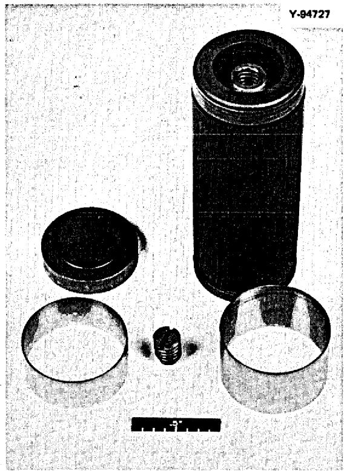

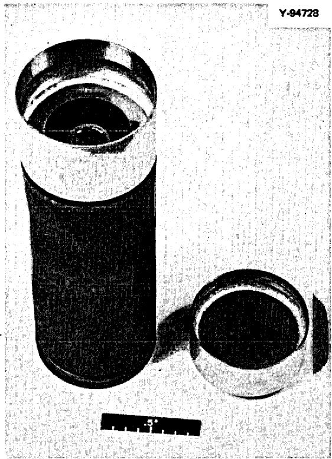

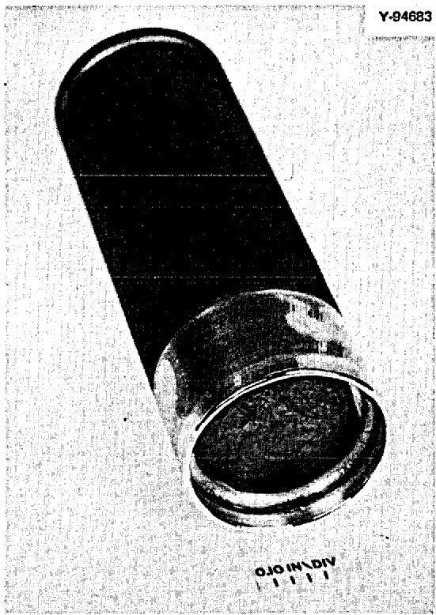  
Fig. 3. Uranium Capsule

provided a convenient location for the flux and temperature monitors in the central graphite core. POCO graphite grade AXF-5QBG was selected to avoid the neutron depression that would occur with Hastelloy-N and to provide a satisfactorily low salt permeability. The capsules were sealed by welding the ends of two molybdenum rings that were each vacuum brazed to the graphite body or cap with a 85Cu-10Ni-5Cr brazing alloy at $1250^{\circ}\mathrm{C}$ and $10^{-5}$ torr. A direct braze between the graphite body and cap was not used because of the high temperatures that would have been required on the completed and salt-filled assembly.

The integrity of the brazed joint between the molybdenum rings and graphite was the most important mechanical problem. The metallographic examination of the test braze indicated that the braze was satisfactory, but the initial production brazes leaked helium when subjected to 10-psig pressure. The brazing procedure was revised to include coating the graphite surfaces with $\mathrm{Cr}_{3}\mathrm{C}_{2}$ to facilitate wetting of the graphite by the brazing alloy. Subsequent brazes were satisfactory, but one cap was rejected because of a large pore in the graphite.

Following the brazing operation, the capsules were leak-tested in an alcohol bath with 10-psig helium. Since the graphite is porous to helium, the leak test was used only to screen out any parts with abnormally large pores or any parts with a poor braze. The capsules were then cleaned in an untrasonic alcohol bath and vacuum-dried at $300^{\circ}\mathrm{C}$ . The flux and temperature monitors, which had been previously cleaned, dried and assembled into glass tubes, were installed and the capsules were delivered for salt filling.

The salt mixtures were prepared and loaded into the capsules by the Chemical Technology Division. The salt was prepared in one melt for each of the two compositions. The salt in each melt was crushed and weighed into batches for the individual capsules. The crushed salt was loaded into the capsules as dry powder and then melted down under an argon atmosphere.

After the loading and meltdown of the salt was completed, the capsules were sealed by TIG welding the exposed ends of the molybdenum rings. The welding was done in an argon atmosphere without the use of filler wire.

The welds were inspected visually and by liquid penetrant. The completed capsules and the excess salt mixtures contained in small glass jars were sealed in plastic with an argon atmosphere until ready for use.

The original plans were to load the salt mixtures into four capsules of each type, but one capsule of each type was rejected during fabrication. Two of each type were assembled into the core specimen array and the third, along with the excess salt, is being held to develop the salt recovery and analytical procedures and to provide the isotopic concentrations of the unirradiated salt.

Table III shows the monitor data and core location for each capsule.

# Pyrolytic Graphite

A rectangular specimen of pyrolytic graphite as shown in Figure 4 is immediately above the uranium capsules. The test specimen is 0.5-in. x 0.687-in. x 6.0-in. long and is held in the cage assembly by circular pieces of POCO AXF-5Q graphite pinned to each end. The layer planes of the graphite are parallel to the 0.687-in. x 6-in. surfaces. The depth of any penetration of salt or its constituents into the graphite both parallel and perpendicular to the layer planes, will be determined by proton activation technique. The specimen will also be analyzed for the penetration of fission products both parallel and perpendicular to the graphite layer planes. The weight of the test specimens above the pyrolytic graphite is transferred from the outer diameter of the top end ring to the central region by a 1/8-in. thick Hastelloy-N disk.

# Graphite Tube with Turbulence Wire

The next specimen is a graphite tube machined from POCO AXF-5Q. The test section is a 1-in.-diameter cylinder with three 2-in.-long sections with different surface finishes (5, 25, and 125 RMS). The bore diameter is 1/2-in. with surface finish bands of 5 and 125 RMS. The OD of the test section has a coil of 1/16-in. Hastelloy-N wire wound on a 1/2-in. pitch and with a 20-mil radial clearance between the graphite surface and the wire. The original design called for spacers between the wire and the graphite, but these were eliminated because of welding problems with the thin spacers. The wire coil is to promote turbulence on the outside surface of the graphite. Figure 5 is a photograph os this test specimen.

Table III   
Uranium Capsule Location and Monitor Data   

<table><tr><td rowspan="2">Capsule</td><td rowspan="2">U-Mixture</td><td rowspan="2">Weight of Salt</td><td rowspan="2">Location (Top to Bottom)</td><td colspan="6">Monitor Array (Top to Bottom)</td><td></td></tr><tr><td>Ag-Cu</td><td>Spacer</td><td>SiC</td><td>SS-302-1/4&quot; (11/16&quot; Holder)</td><td>SiC</td><td></td><td></td></tr><tr><td>S-1</td><td>234-238</td><td>25.0 gm</td><td>MSRE-3</td><td>.4436 gm</td><td>5/32&quot;</td><td>.49990&quot;</td><td>9.700 mg</td><td>.50046&quot;</td><td></td><td></td></tr><tr><td>S-2</td><td>234-238</td><td>25.0gm</td><td>MSRE-1 (Top)</td><td>.4448 gm</td><td>5/32&quot;</td><td>.49988&quot;</td><td>9.382 mg</td><td>.50024&quot;</td><td></td><td></td></tr><tr><td>S-3</td><td>234-238</td><td>24.5 gm</td><td>Storage</td><td>.4446 gm</td><td>5/32&quot;</td><td>.49992&quot;</td><td>9.387 mg</td><td>.50050&quot;</td><td></td><td></td></tr><tr><td></td><td></td><td></td><td></td><td>SS-302-1/4&quot; (11/16&quot; Holder)</td><td>Spacer</td><td>SiC</td><td>Spacer</td><td>Ag-Cu</td><td>SS-302-3/8&quot; (11/16&quot; Holder)</td><td>SiC</td></tr><tr><td>L-2</td><td>233-238</td><td>49.4</td><td>MSRE-4 (Bottom)</td><td>9.505 mg</td><td>1-1/16&quot;</td><td>.49998&quot;</td><td>1-1/16&quot;</td><td>.4438 gm</td><td>16.046 mg</td><td>.50025&quot;</td></tr><tr><td>L-3</td><td>233-238</td><td>49.4</td><td>Storage</td><td>9.581 mg</td><td>1-1/16&quot;</td><td>.49992&quot;</td><td>1-1/16&quot;</td><td>.4435gm</td><td>15.604 mg</td><td>.50046&quot;</td></tr><tr><td>L-4</td><td>233-238</td><td>49.4</td><td>MSRE-2</td><td>9.461 mg</td><td>1-1/16&quot;</td><td>.49999&quot;</td><td>1-1/16&quot;</td><td>.4422 gm</td><td>15.321 mg</td><td>.50019&quot;</td></tr></table>

Analysis of 302 Stainless Steel   
FE 71.30   
Ni 8.51   
Cr 0.0804

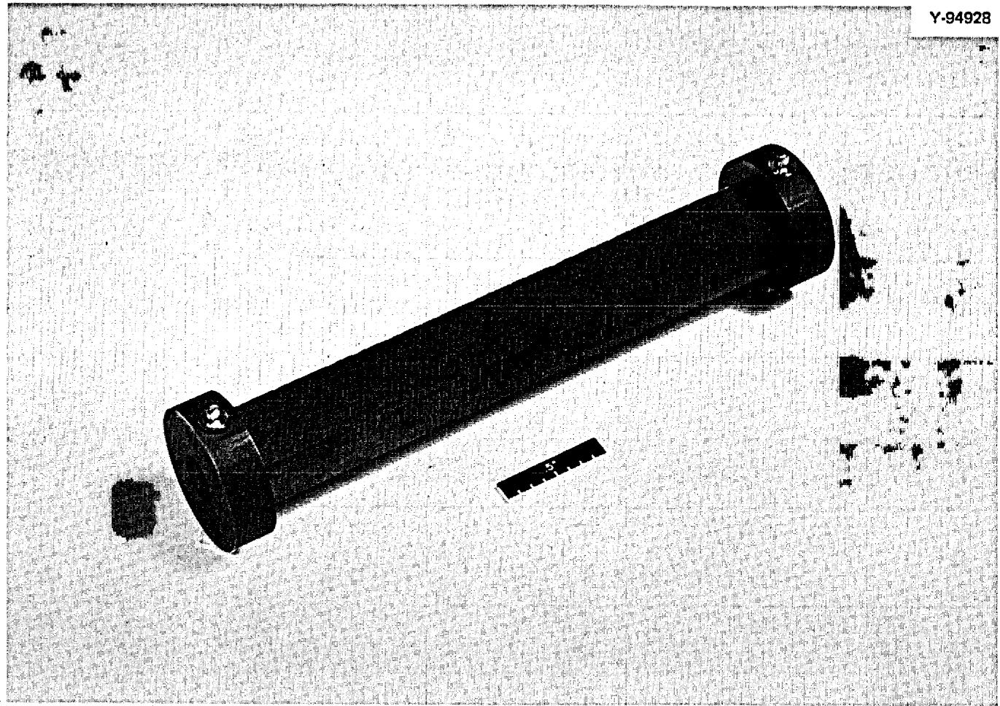  
Fig. 4. Pyrolytic Graphite Specimen

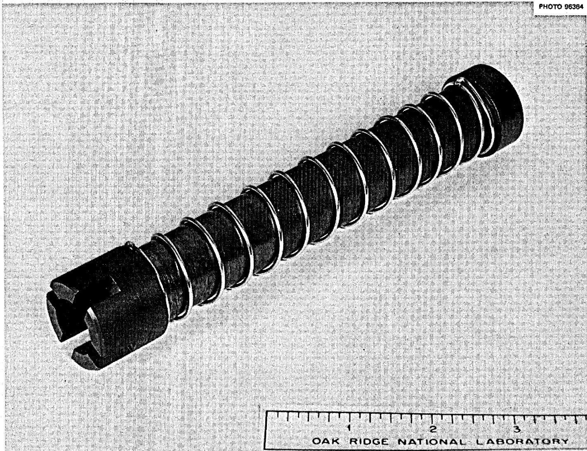  
Fig. 5. Graphite Fission Product Deposition Specimen

The salt flow rates on both the internal and external surfaces are somewhat more uncertain than on the bottom flow-tube specimen because the pressure drop is not well defined. However, both the internal and external velocities should be about the same as outside the sample basket or about 1 to 2 ft/sec.

The quantity of fission-product deposition as a function of surface finish will be determined for both the inside and outside surfaces. The effect of the turbulence wire will be determined by comparison with the graphite flow tube at the bottom of the assembly.

# Hastelloy-N Tube with Turbulence Wire

This test specimen, shown in Figure 6, is a duplicate of the graphite specimen just described except that it is constructed of Hastelloy-N. Both of these specimens will be subjected to about the same conditions and will provide the same type of information. The effect of the turbulence wire will be determined by comparison with the surface of the electron microscope screen holder.

The double wall design of this specimen, and the next one above, prevents contamination of the surface under study from the exposure of the opposite surface. The test specimen will be sawed into individual rings for each surface finish and then each ring will be dissolved for analysis. This procedure eliminates the necessity for machining off the surface for analysis.

# Gas Trap and Electron Microscope Screen Holder

The last test specimen will trap a sample of gas that may be circulating in the core and expose several electron microscope screens to this gas so that any colloidal or particulate material can be collected and examined. Figure 7 is a photograph of this specimen with the central rod, which holds the microscope screens, removed. The drilled holes in the rod slope downward and will trap salt so that the maximum salt level during operation can be determined.

The sealed cavity formed by the double wall was filled with helium to improve the heat transfer and to reduce the temperature of the central rod to about $100^{\circ}\mathrm{F}$ above the salt temperature.

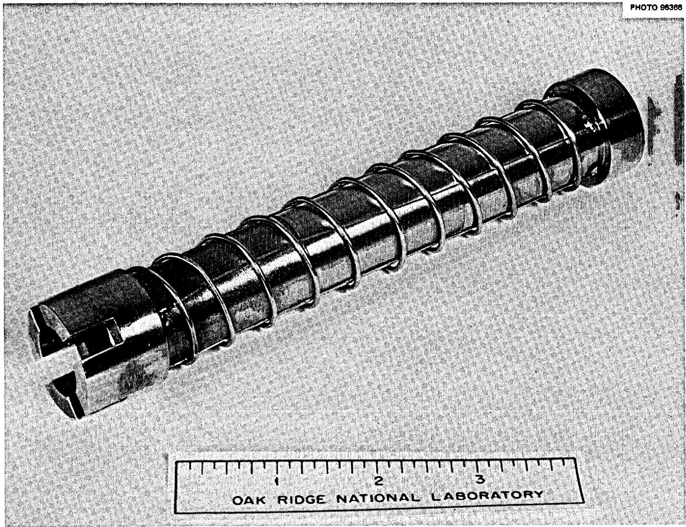  
Fig. 6. Hastelloy-N Fission Product Deposition Specimen

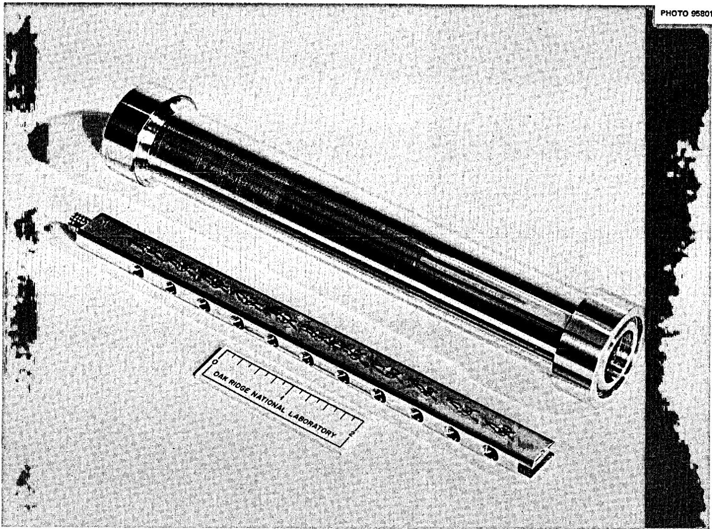  
Fig. 7. Gas Trap and Electron Microscope Screen Holder

# Disposition of the Specimen Array

The specimen array was removed from the MSRE core on December 18, 1969 and delivered to the hot cell on the 19th. The assembly was free of salt and was in good mechanical condition. The individual specimens were removed from the assembly on December 22, 1969.

The detailed examination and analysis of the fission-product deposition specimens will be directed and reported by S. S. Kirslis and the analysis and results of the uranium capsule experiments will be directed and reported by G. L. Ragan.

# ACKNOWLEDGMENTS

The author is indebted to a large number of individuals whose cooperation and assistance was required to complete the design, fabrication, and installation of the specimen array on the time schedule that was available. The following individuals in particular contributed directly to the design and fabrication of the assembly.

S. S. Kirslis: Conceptual design of fission-product deposition experiment and specimens.   
G. L. Ragan: Formulation of the $^{233}\mathrm{U}$ capture-to-absorption ratio experiment.   
W. J. Werner and coworkers: Graphite to molybdenum brazing and final seal welding of the uranium capsules.   
J. C. Mailen and F. J. Smith: Preparation of the salt mixtures and filling the uranium capsules.   
W. H. Cook: Design and fabrication of the pyrolytic graphite specimen and general assistance on the design and fabrication of the overall assembly.   
H. G. Kern: Scheduled and supervised the fabrication of the parts and assemblies through the various shops.

# Internal Distribution

1. G.M. Adamson   
2. J. L. Anderson   
3. C. F. Baes   
4. S.E. Beall   
5. E.S.Bettis   
6. F.F.Blankenship   
7. E. G. Bohlmann   
8. G.E. Boyd   
9. R. B. Briggs   
10. E. L. Compere   
11. W.H.Cook

12-13. D.F.Cope (AEC)

14. W. B. Cottrell   
15. J. L. Crowley   
16. F. L. Culler   
17. S.J.Ditto   
18. W.P.Eatherly   
19. J. R. Engel   
20. D. E. Ferguson   
21. L. M. Ferris   
22. A. P. Fraas

23-27. C. H. Gabbard

28. G. Goldberg   
29. W. R. Grimes   
30. A. G. Grindell   
31. R. H. Guymon   
32. R.W.Harvey   
33. P. N. Haubenreich   
34. P.R. Kennedy   
35. R.J.Kedl   
36. C. R. Kennedy   
37. S.S. Kirslis   
38. M. I. Lundin

39. R. N. Lyon   
40. R. E. MacPherson   
41. J. C. Mailen   
42. H. E. McCoy   
43. H.C. McCurdy

44-45. T. W. McIntosh (AEC)

46. L. E. McNeese   
47. J.R. McWherter   
48. A.J.Miller   
49. R. L. Moore   
50. E. L. Nicholson   
51. A.M. Perry   
52. B. E. Prince   
53. G. L. Ragan   
54. M. Richardson

55-56. M.W.Rosenthal

57. A. W. Savolainen   
58. Dunlap Scott   
59. M. Shaw (AEC)   
60. M. J. Skinner   
61. L. A. Smith, ORGDP   
62. F.J.Smith   
63. I. Spiewak   
64. D. A. Sundberg   
65. R.C.Steffy   
66. R.E.Thoma   
67. D. B. Trauger   
68. J.R.Weir   
69. W. J. Werner   
70. M.E.Whatley   
71. J.C. White   
72. G. D. Whitman   
73. Gale Young

74-75. Central Research Library (CRL)   
76-77. Y-12 Document Reference Section (DRS)   
78-80. Laboratory Records Department (LRD)   
81. Laboratory Records Department - Record Copy (LRD-RC)   
82. ORNL Patent Office

# External Distribution

83-97. Division of Technical Information Extension (DTIE)

98. Laboratory and University Division, ORO