ORNL-TM-2780

Contract No. W-7405-eng-26

REACTOR DIVISION

PRELIMINARY SYSTEMS DESIGN DESCRIPTION

(TITLE I DESIGN)

of the

SALT PUMP TEST STAND

for the

MOLTEN SALT BREEDER EXPERIMENT

L. V. Wilson

A. G. Grindell

# LEGAL NOTICE

This report was prepared as an account of Government sponsored work. Neither the United States, nor the Commission, nor any person acting on behalf of the Commission:

A. Makes any warranty or representation, expressed or implied, with respect to the accuracy, completeness, or usefulness of the information contained in this report, or that the use of any information, apparatus, method, or process disclosed in this report may not infringe privately owned rights; or

B. Assumes any liabilities with respect to the use of, or for damages resulting from the use of any information, apparatus, method, or process disclosed in this report.

As used in the above, "person acting on behalf of the Commission" includes any employee or contractor of the Commission, or employee of such contractor, to the extent that such employee or contractor of the Commission, or employee of such contractor prepares, disseminates, or provides access to, any information pursuant to his employment or contract with the Commission, or his employment with such contractor.

DECEMBER 1969

OAK RIDGE NATIONAL LABORATORY

Oak Ridge, Tennessee

Operated by

UNION CARBIDE CORPORATION

for the

U. S. ATOMIC ENERGY COMMISSION

# Contents

Page List of Figures vii List of Tables viii List of Contributors ix Abstract. x

# 1.0 Introduction 1

1.1 System Function 1   
1.2 Summary Description of the System 2

1.2.1 Salt Circulating System. 2   
1.2.2 Structure. 3   
1.2.3 Heat Removal System. 3   
1.2.4 Utility Systems. 3   
1.2.5 Instrumentation and Controls 3   
1.2.6 Hazards. 4

# 1.3 System Design Requirements.. 4

1.3.1 Function 4   
1.3.2 Pump Size. 4   
1.3.3 Allowable Stress for Ni-Mo-Cr Alloy. 4   
1.3.4 Instrumentation and Controls 6   
1.3.5 Engineered Safety Features 6   
1.3.6 Control of Effluents 6   
1.3.7 Quality Standards and Assurance. 7   
1.3.8 Test Stand Parameters.. 7   
1.3.9 Thermal Transients 8   
1.3.10 Codes and Standards. 8

# 2.0 Detailed Description of System 9

2.1 Salt Pump 9   
2.2 Salt System 12

2.2.1 Function 12   
2.2.2 Description. 12

2.2.2.1 Salt Piping 12   
2.2.2.2 Salt Storage Tank and Transfer Line . 15   
2.2.2.3 Salt Selection.. 17

# Page

2.2.2.4 Material for Construction. 22   
2.2.2.5 Electric Heaters 22   
2.2.2.6 Support Structure and Stand Enclosure 22

2.3 Heat Removal System 25

2.3.1 Function 25   
2.3.2 Description 25

2.3.2.1 Heat Exchangers. 25   
2.3.2.2 Blowers. 26

2.4 Utility Systems. 29

2.4.1 Inert Gas 29   
2.4.2 Instrument Air. 31   
2.4.3 Cooling Water 31   
2.4.4 Electrical. 31

2.4.4.1 2400 Volt System 31   
2.4.4.2 480/240/120 Volt System. 32

2.5 Site Location. 32   
2.6 Instrumentation and Controls 34

2.6.1 Temperature Measurement and Control 34   
2.6.2 Pressure Measurement and Control. 34   
2.6.3 Flow Measurement. 35   
2.6.4 Level Measurement 35   
2.6.5 Alarms and Interlocks 35   
2.6.6 Data Acquisition Computer System. 37

3.0 Principles of Operation 39

3.1 Startup 39   
3.2 Test Operation 40

3.2.1 Prototype Pump. 40   
3.2.2 ETU and MSBE Pumps. 41

3.3 Shutdown 41   
3.4 Thermal Transients 42   
3.5 Special or Infrequent Operation. 42   
3.6 Equipment Safety 44

4.0 Safety Precautions 46

4.1 Loss of Normal Electrical Power 46   
4.2 Operating Procedures. 46   
4.3 Leak or Rupture in Salt Containing Piping and Equipment 47   
4.3.1 Consequences 47   
4.3.2 Hazards. 47   
4.3.3 Preventive Measures. 47

5.0 Maintenance 49

5.1 Maintenance Philosophy. 49   
5.2 Preventive Maintenance. 49   
5.3 Maintenance Procedures. 49

6.0 Standards and Quality Assurance. 50

6.1 Codes and Standards 50

6.1.1 Design 50   
6.1.2 Materials. 50   
6.1.3 Fabrication and Installation 50   
6.1.4 Operations 50

6.2 Quality Assurance 51

# APPENDICES

A Applicable Specifications, Standards, and Other Publications A-1   
B Pipe Line Schedule . . . . . . . . . . . . . . B-1   
C Instrument Tabulation. C-1   
D Equipment Tabulation D-1   
E Instrument Application Diagrams. E-1   
F Electrical Schematic Diagram . . . . . . . . . . . . F-1   
G Preliminary Design Calculations. . . . . . . . . . G-1

G-I Salt Storage Tank. . . . . . . . . . . . . . G-2   
G-II Heat Exchanger . G-3   
G-III Temperature Transients. G-6   
G-IV Pump Characteristics G-7   
G-V Heat Removal from 1500 hp Motor . . . . . . . G-8   
G-VI Flow Measurement Instrumentation . . . . . . . G-10

Page

G-VII MSBE Secondary Salt Pump Operating in Primary Salt with a Reduced Diameter Impeller . . G-16

G-VIII Summary of Pressure Profile Calculations . . . . G-17

G-IX Stress Analysis G-21

List of Figures   

<table><tr><td>Figure</td><td></td><td>Page</td></tr><tr><td>1</td><td>Operating Regime of Primary Salt Pump</td><td>5</td></tr><tr><td>2</td><td>Schematic of MSBE Primary Salt Pump</td><td>10</td></tr><tr><td>3</td><td>Typical Characteristic Curves of MSBE Primary and Secondary Salt Pumps</td><td>11</td></tr><tr><td>4</td><td>General Arrangement of Salt Circulating System</td><td>12</td></tr><tr><td>5</td><td>Salt Pump Test Stand Piping, Pressure Profile</td><td>13</td></tr><tr><td>6</td><td>Preliminary Layout (Title I) of SPTS Throttling Valve</td><td>16</td></tr><tr><td>7</td><td>Preliminary Drawing (Title I) of SPTS Salt Storage Tank</td><td>18</td></tr><tr><td>8</td><td>Operating Characteristics of Secondary Pump with Reduced Impeller Diameter in Primary Salt</td><td>21</td></tr><tr><td>9</td><td>Preliminary Layout (Title I) of SPTS Support Frame</td><td>24</td></tr><tr><td>10</td><td>Preliminary Layout (Title I) of SPTS Salt-to-Air Heat Exchanger</td><td>27</td></tr><tr><td>11</td><td>Preliminary Layout (Title I) of SPTS Air Handling System</td><td>28</td></tr><tr><td>12</td><td>Air Handling System Characteristics</td><td>30</td></tr><tr><td>13</td><td>Location of Project (Y-12 Plant)</td><td>33</td></tr><tr><td>14</td><td>Preliminary Layout (Title I) of SPTS Venturi Tube</td><td>36</td></tr><tr><td>15</td><td>Thermal Transient in SPTS as a Function of Salt Volume in the Loop and Pump</td><td>43</td></tr></table>

List of Tables   

<table><tr><td>Table</td><td></td><td>Page</td></tr><tr><td>1</td><td>MSBE (200 Mw(t)) Pump Design Requirements</td><td>6</td></tr><tr><td>2</td><td>MSBE Reactor Design Parameters Pertinent to Salt Pumps</td><td>7</td></tr><tr><td>3</td><td>Salt Pump Test Stand Design Requirements</td><td>8</td></tr><tr><td>4</td><td>Composition and Properties of Tentative MSBE Primary Salt</td><td>19</td></tr><tr><td>5</td><td>Composition and Properties of Tentative MSBE Secondary Salt</td><td>19</td></tr><tr><td>6</td><td>Composition and Properties of Ni-Cr-Mo Alloy</td><td>23</td></tr><tr><td>7</td><td>Data for Main Blowers, Heat Removal System</td><td>29</td></tr><tr><td>8</td><td>Alarms, Emergencies, and Safety Actions for Salt Pump Test Stand</td><td>45</td></tr></table>

# List of Contributors

The Oak Ridge National Laboratory contributors to this report include:

A. H. Anderson   
C. M. Burton   
A. G. Grindell   
R. F. Hyland   
L.R.Koffman   
T. S. Kress   
R. E. MacPherson   
C. K. McGlothlan   
H.J.Metz   
P. G. Smith   
R. D. Stulting   
L. V. Wilson

# Abstract

A stand is required to test the salt pumps for the Molten Salt Breeder Experiment (MSBE). It will be designed to accommodate pumps having capacities up to 8000 gpm and operating with salts of specific gravities to 3.5 at discharge pressures to 400 psig and temperatures to $1300^{\circ}\mathrm{F}$ normally and to $1400^{\circ}\mathrm{F}$ for short periods of time. Both the drive motor electrical supply and the heat removal system external to the loop will be designed for 1500 hp heat removal capability. Preventive measures to protect personnel and equipment from the deleterious effects of a salt leak will be taken.

The primary and secondary salt pumps for the MSBE will be operated in the stand using a depleted uranium, natural lithium fluoride salt to simulate the MSBE primary salt. A prototype primary salt pump, procured from the U.S. pump industry, will be subjected, at representative operating conditions, to performance and endurance testing of its hydraulic, mechanical, and electrical design features. The MSBE and Engineering Test Unit (ETU) salt pump rotary elements, mounted in the prototype pump tank, will be subjected to hot shakedown testing in the stand to provide final confirmation of high temperature performance and construction and assembly quality prior to installation in the reactor system. As they become available the xenon-removal device and molten salt instrumentation to measure pressure, flow, liquid level, etc., may be tested at design conditions in molten salt and the stand will be modified, as required, to accommodate these tests if they do not interfere with the pump program.

The preliminary system design description and the Title I design calculations of the test stand are presented. Descriptions, functions, and design requirements for components and subsystems are provided. The principles of operation of the test stand, the safety precautions, and the maintenance philosophy are discussed. The quality assurance program plan is being prepared.

Keywords: pump, molten salt pump, high temperature pump, pump test stand, component development, molten salt reactor, nuclear reactor, prototype pump, primary salt pump, secondary salt pump.

# 1.0 Introduction

# 1.1 System Function

Reliable salt pumps are necessary to the satisfactory operation of the Molten Salt Breeder Experiment (MSBE), and efforts to obtain them will include operating the salt pump with molten salt in a test stand to prove performance and endurance characteristics.

The salt pump test stand will be utilized to provide design evaluation and endurance testing in molten salt of a prototype primary fuel salt pump for the MSBE and to prooftest the rotary elements of the primary and secondary salt pumps for the Engineering Test Unit (ETU) and the MSBE. The salt flow and head can be varied over the desired ranges by adjusting the throttling valve in the salt circulating system and by adjusting the pump speed.

We presently envision that the hydraulic designs of the primary and secondary salt pumps will be very similar with the secondary pump operating at a higher speed. Hydraulic requirements of the primary and secondary salt systems support this approach. In addition, the use of similar hydraulic designs permits the developmental testing of both salt pumps in this single test stand with one test salt. The salt pumps will be obtained from the United States pump industry and the prototype pump and the rotary elements for ETU and MSBE pumps will be installed into the test stand in sequence. The design and procurement of these pumps and their drive motors and auxiliary equipment are not parts of this salt pump test stand activity, but all these activities will be coordinated.

The primary salt pump is expected to be located at the reactor core outlet in the MSBE and thus will operate in the highest temperature salt in the primary salt system, which is approximately $1300^{\circ}\mathrm{F}$ . The secondary salt pump will be located at the outlet of the intermediate heat exchanger and thus will operate in the highest temperature in the secondary salt system, which is approximately $1150^{\circ}\mathrm{F}$ . The primary salt pump tank will be located in a high temperature containment cell, which will also enclose the primary system, and will be subjected to a high ambient temperature, estimated to be $1100^{\circ}\mathrm{F}$ . In addition, it will be subjected to intense nuclear radiation from components in the primary system, the circulating

primary salt in the pump tank, and from gas-borne fission products in the pump tank gas space.

The prototype MSBE primary salt pump will be operated in the test stand with molten salt over the full range of MSBE conditions of temperature, pressure, flow, and speed to prove the hydraulic, mechanical, structural, and thermal designs of the pump and to provide cavitation inception characteristics at design and off-design operating conditions. However, no attempt will be made to simulate all features of the high-temperature containment cell or to impose nuclear radiation on components in the test stand.

Rotary elements of the primary and secondary salt pumps for the ETU and the MSBE will be subjected to high temperature, non-nuclear prooftests in the test stand with molten salt prior to installation into their respective systems. At other times the stand will be used to subject the prototype pump to endurance operation with molten salt. It is important to the MSBE program to demonstrate that the pump has the capability for uninterrupted operation with molten salt for periods of one year or longer. Subsequently, the stand will be used to study unanticipated problems that may arise during the operation of the ETU and the MSBE. The proposed test program is discussed in Section 3.2.

It is expected that the loop will be modified after initial pump tests to test gas injection and gas stripping devices as they are developed.

# 1.2 Summary Description of the System

# 1.2.1 Salt Circulating System

The salt circulating system consists of the salt pump being tested, a throttling valve, two salt-to-air heat exchangers, a flow restrictor, a Venturi tube, and the interconnecting piping. It provides a closed piping loop for the molten salt from the pump discharge to the pump suction. A salt storage tank is provided to contain the quantity of salt necessary to fill the circulating system. It is connected to the circulating system by a pipe containing a freeze valve. All salt containing components will be constructed of nickel-molybdenum-chromium (Ni-Mo-Cr) alloy. Electric heaters capable of heating the salt system to $1300^{\circ}\mathrm{F}$ will be provided. Thermal insulation will be installed on the system as appropriate.

# 1.2.2 Structure

The salt piping, salt storage tank, and the test pump are supported in a structure designed to provide containment in case of a rupture.

# 1.2.3 Heat Removal System

The heat removal system consists of two salt-to-air concentric pipe heat exchangers, two positive displacement air blowers, an exhaust stack, interconnecting ducting, controls, and noise abatement equipment.

# 1.2.4 Utility Systems

Necessary utility systems will be installed. An inert cover gas system is needed to protect the salt from contact with moisture and oxidizing atmospheres and, if needed, to suppress pump cavitation. Instrument air will be used to cool the freeze valve and to operate instruments.

A 2400 volt electrical distribution system will be installed to connect the existing electrical supply in the building to the salt pump drive motor. The existing 480 volt system will be used to supply power to the heaters, blower motors, and auxiliary equipment. The emergency power system in Building 9201-3 will be used to supply certain functions when normal electrical power is lost.

Cooling water will be used for heat removal from the drive motor, the lubrication system, and the shield plug coolant system.

# 1.2.5 Instrumentation and Controls

The instrumentation and controls required to monitor and regulate such test parameters as salt flow, temperatures, pressures, and liquid level will be supplied. Salt flow will be regulated with a throttling valve and measured with a Venturi tube. Temperatures will be measured with stainless steel sheathed chromel-alumel thermocouples. NaK-sealed high-temperature transmitters will be used to measure circulating salt pressures. Salt level in the storage tank will be determined by four on-off probes inserted at different levels in the tank.

The Beckman DEXTIR data acquisition system, presently in use for collecting data in Building 9201-3, will be used to log the more important salt temperatures, pressures, and flows and pump power and speed.

Other test stand temperatures, pressures, flows, and powers will be monitored and controlled with conventional equipment.

# 1.2.6 Hazards

The hazards associated with the operation of the stand are chemical toxicity, radioactivity, and high temperature. To protect personnel from these hazards, the loop will be completely surrounded by a sheet metal containment subject to controlled ventilation. Access to the containment will be rigidly controlled through the use of written procedures.

# 1.3 System Design Requirements

Criteria have been established to obtain a test stand that will provide maximum performance and endurance information for the MSBE salt pumps in a safe and economical manner. The criteria include:

# 1.3.1 Function

The pump test stand will be designed to (1) accommodate full-size salt pumps for the MSBE primary or secondary systems, (2) provide a non-nuclear test environment, (3) yield performance and endurance data to assure satisfactory performance and reliability of the pumps and their auxiliary systems in the MSBE, and (4) provide adequate personnel protection from all hazards. All components external to the salt loop will be designed to accommodate pumps, up to 1500 hp, for the first prototypes of molten salt reactor power plants.

# 1.3.2 Pump Size

The salt loop of the test stand will be designed specifically for testing the pumps required for an MSBE with powers as high as 200 Mw(t) and with a single loop. The pump design requirements for this power level are shown in Table 1. The primary salt pump will be operated over the head, flow, and speed range shown in Fig. 1. The head and flow requirements for the secondary salt pump permit the use of the same hydraulic configuration as that of the primary salt pump but with a higher impeller speed and possible minor changes in the impeller diameter.

# 1.3.3 Allowable Stress for Ni-Mo-Cr Alloy

The allowable design stresses for high temperature operation of the Ni-Mo-Cr alloy will be those permitted in Case 1315-3 of the Interpretations of ASME Boiler and Pressure Vessel Code.

ORNL DWG. 69-13455

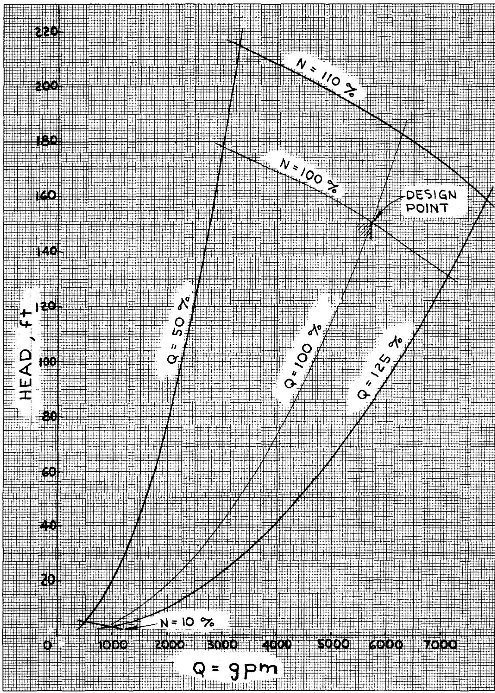  
Fig. 1. Operating Regime of Primary Salt Pump.

Table 1. MSBE (200 Mw(t)) Pump Design Requirements   

<table><tr><td></td><td>Operating Temp. (°F)</td><td>Flow (gpm)</td><td>Head (ft)</td><td>Pumping Efficiency (%)</td><td>Brake Horse-power</td><td>Cover Gas Pressure (psig)</td></tr><tr><td>Primary Salt Pump</td><td>1300</td><td>5700*</td><td>150</td><td>80</td><td>890</td><td>~50</td></tr><tr><td>Secondary Salt Pump</td><td>1150</td><td>7000</td><td>275</td><td>80</td><td>1100</td><td>~150</td></tr></table>

\*Includes 500 gpm bypass flow through gas separator.

# 1.3.4 Instrumentation and Controls

Instrumentation and controls will be provided to monitor test stand operation, to maintain test parameters within prescribed ranges, and to obtain required pump test data. A control area will be provided from which safe operation of the test stand can be maintained.

# 1.3.5 Engineered Safety Features

Engineered safety features will be provided. As a minimum, they will be designed to cope with any unobstructed discharge from a large break in the pressure boundary, resulting in all the salt in the loop being discharged into the enclosure. The containment design basis is to contain the pressure and temperature resulting from an accident without exceeding the design salt vapor leakage rate for the test stand enclosure. Appropriate features will be provided to protect personnel in case of an accidental rupture.

An independent emergency power system is available, designed with adequate capacity and testability to insure the functioning of all engineered safety features.

Procedures will be prepared for controlled access to the enclosure.

# 1.3.6 Control of Effluents

The design of the test stand will provide the means necessary to protect personnel from toxic and radioactive effluents, whether gaseous, liquid, or solid. A low level radioactivity is associated with $^{238}\mathrm{U}$ , $^{232}\mathrm{Th}$ , and their progeny in the test salt. Control will be maintained during normal operation and accident conditions to preclude the release of unsafe amounts of these effluents and to protect personnel performing maintenance.

# 1.3.7 Quality Standards and Assurance

A quality assurance program is being written and will be implemented to enhance the certainty of achieving the pump-test objectives. Systems and components that are essential to prevent accidents that could affect personnel safety or to mitigate their consequences will be identified and designed, fabricated, and erected to quality standards that reflect their safety importance. Where generally recognized codes or standards on design, materials, fabrication, and inspection are used, they will be identified. Where adherence to such codes or standards does not assure a quality level necessary to the safety function, they will be supplemented or modified, as necessary.

# 1.3.8 Test Stand Parameters

Table 2 presents the MSBE design parameters which affect salt pump design. The principal hydraulic and thermal design requirements for the salt pumps, based on these MSBE design parameters, have been shown in Table 1. The principal design requirements for the salt pump test stand, as deduced from the MSBE requirements, are shown in Table 3. However, to provide for the testing of larger pumps in the future, all components external to the salt loop will be designed for testing pumps up to $1500\mathrm{hp}$ . This will include all air handling systems, the electrical supply system, and auxiliary and motor cooling systems.

Assuming that future reactor systems have thermal and hydraulic characteristics similar to the MSBE, these components will be sufficient for testing pumps of larger molten salt reactor systems up to about $250\mathrm{Mw(t)}$ per loop, or about $1000\mathrm{Mw(t)}$ for a 4 loop reactor system.

Table 2. MSBE Reactor Design Parameters Pertinent to Salt Pumps   

<table><tr><td>Reactor size, Mw(t)</td><td>200 (max)</td></tr><tr><td>Quantity of primary salt pumps, ea</td><td>1</td></tr><tr><td>Quantity of secondary salt pumps, ea</td><td>1</td></tr><tr><td>Primary salt circuit ΔT, °F</td><td>250</td></tr><tr><td>Secondary salt circuit ΔT, °F</td><td>300</td></tr><tr><td>Primary system pressure drop (estimated), psi</td><td>215</td></tr><tr><td>Secondary system pressure drop (estimated), psi</td><td>215</td></tr></table>

Table 3. Salt Pump Test Stand Design Requirements   

<table><tr><td colspan="2">Salt piping</td></tr><tr><td>Operating temperature</td><td>1300°F for 5 years</td></tr><tr><td>Operating temperature (maximum)</td><td>1400°F for 1000 hr</td></tr><tr><td>Pressure</td><td>See Fig. 5</td></tr><tr><td>Primary salt flow, gpm</td><td>0 - 8000</td></tr><tr><td>Heat removal capability</td><td>0.9 Mw @ 1050°F</td></tr><tr><td>Pump motor capacity</td><td>1200 hp</td></tr></table>

# 1.3.9 Thermal Transients

Preliminary analysis of the MSBE systems indicates that the plant can be designed to operate without large fast temperature transients. If analysis of the detailed design indicates that transients outside the capability of the test stand are likely to be experienced, the test stand could be modified or thermal transient tests could be performed in other facilities, such as those being constructed at the Liquid Metals Engineering Center.

# 1.3.10 Codes and Standards

Section 6.0 outlines the codes, standards, specifications, procedures, reviews and inspections, and the quality assurance program that will be used to design, construct, and operate the test stand. The design of the salt containing system will be based on Section III, Nuclear Vessels, (Class C Vessels), of the ASME Boiler and Pressure Vessel Code and on the Code for Pressure Piping ANSI B31.1. Approved RDT Standards will be used for all systems and subsystems as applicable and available.

# 2.0 Detailed Description of System

The test stand consists principally of salt piping, a heat removal system, utility systems, and instrumentation and controls which are described below. The salt pump is described also.

# 2.1 Salt Pump

The salt pump includes its drive motor and controls and its auxiliary lubricating and cooling systems. In the conceptual configuration, Fig. 2, the salt pump is a vertical, single stage, centrifugal sump pump with an in-line electric drive motor. This vertical pump configuration has been used satisfactorily to pump molten salt in many component test stands, and also in the Aircraft Reactor Experiment (ARE) and the Molten Salt Reactor Experiment (MSRE). It is expected that the MSBE pumps will have a similar configuration but will be larger in size. The primary salt pump will be designed for service with highly radioactive, high temperature, fissionable and fertile, molten salt. The secondary salt pump will be designed for service at high temperature with a molten salt. The tentative design conditions for the MSBE primary and secondary salt pumps are given in Table 1.

The specified design conditions for the MSBE primary and secondary pumps are such that the same impeller and casing design can be used for both pumps with the secondary pump operating at a higher speed. Fig. 3 shows the design points for the two pumps and the actual head-flow curves for a pump operating at 880 rpm and the same pump with a $1\%$ reduction in the impeller diameter at 1180 rpm. From the brake horsepower curves of the two pumps, see Fig. 3, it appears that the same rotary element design could also be used for both pumps.

The design and procurement of the salt pumps and associated variable speed drive motors are not part of this pump test stand activity. Their procurement from the U.S. pump industry is directed and funded in another portion of the MSBE program. This procurement activity will be closely coordinated with the design, fabrication, and operation of the test stand.

ORNL DWG. 69-8558

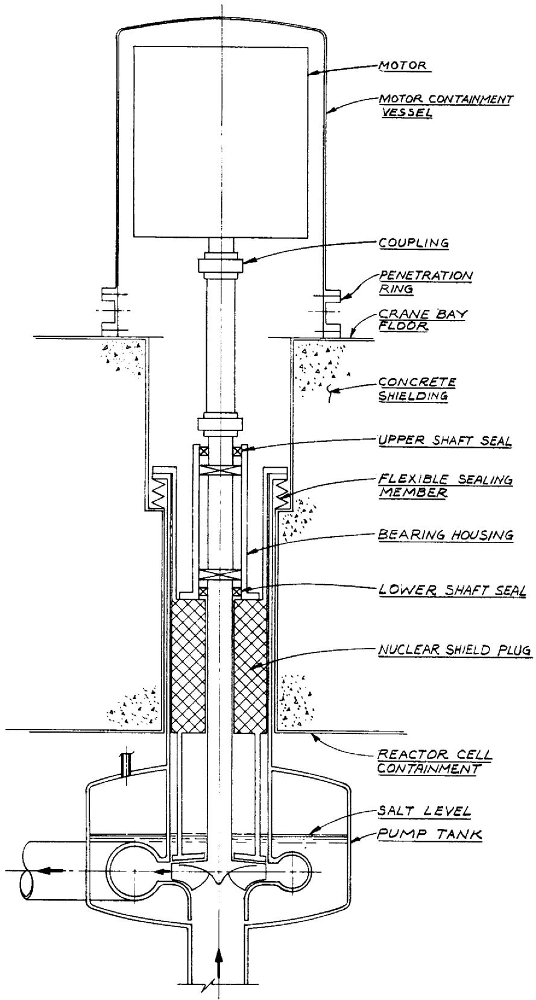  
Fig. 2. Schematic of MSBE Primary Salt Pump.

ORNL DWG. 69-13456

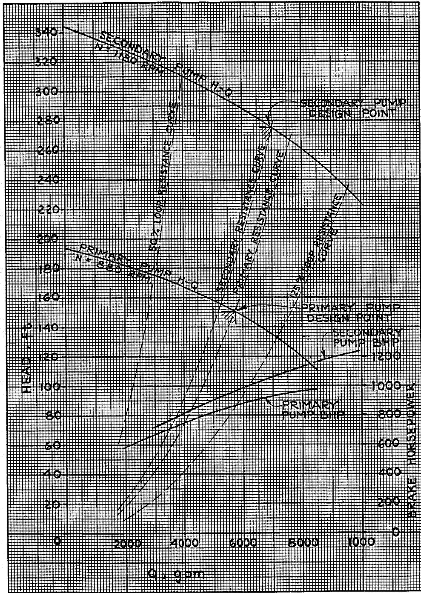  
Fig. 3. Typical Characteristic Curves of MSBE Primary and Secondary Salt Pumps.

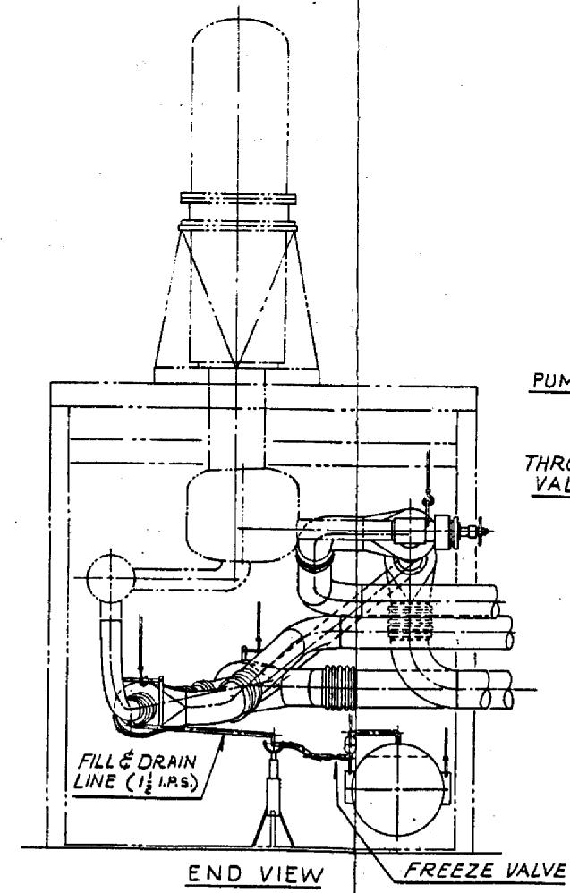

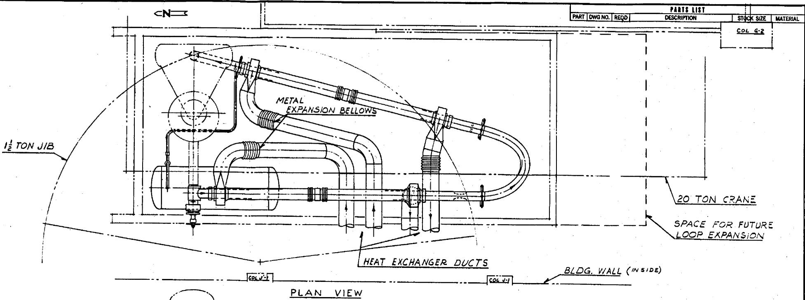

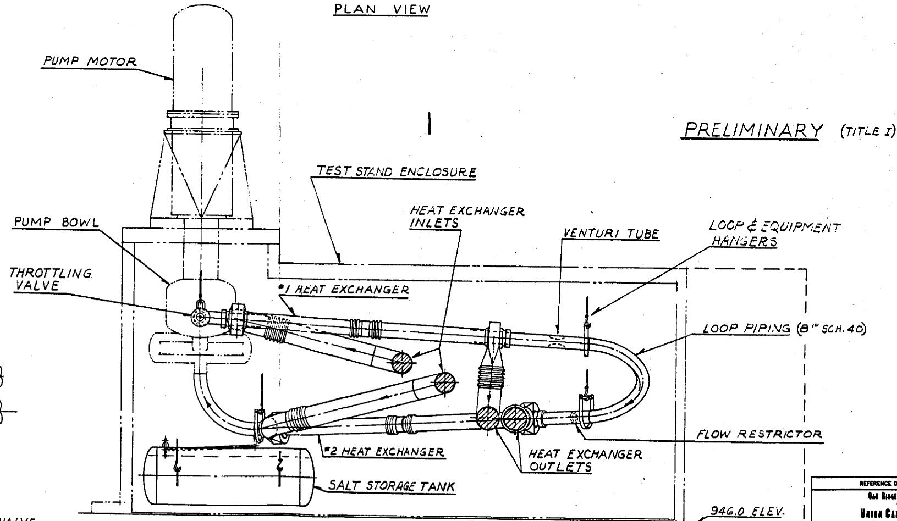

ELEVATION VIEW   

<table><tr><td colspan="2">GENERAL SPECIFICATIONS</td><td>TOLERANCES ±/±
OTHERS SPECIFIED:</td><td colspan="4"></td><td>DATE</td><td>APPD</td><td>APPD</td></tr><tr><td rowspan="6">UNLESS OTHERWISE SPECIFIED:
1. BREAK ALL SHAP EDGES
2. TYPE, GRADE, OR FRESH OF
MATERIAL, MAY BE CHONDED
3. ANGLES ±/±
ANGLE ±/±</td><td rowspan="6">FRACTION ±/±
DECIMALS ±/±</td><td>NO.</td><td colspan="3">REVISIONS</td><td>DATE</td><td>APPD</td><td>DATE</td><td rowspan="5">FIG. 4 GENERAL ARRANGEMENT (TITLE 1)
OF SALT CIRCULATING SYSTEM</td></tr><tr><td>N/°°°°°</td><td>A. DATE
B. A. G.</td><td>C. AMOUNTED</td><td>D. APPROVED</td><td>E. APPROVED</td><td>F. APPROVED</td><td>G. APPROVED</td></tr><tr><td>PERFORMED</td><td>DATE</td><td>APPROVED</td><td>DATE</td><td>APPROVED</td><td>DATE</td><td>APPROVED</td></tr><tr><td>APPROVED</td><td>DATE</td><td>APPROVED</td><td>DATE</td><td>APPROVED</td><td>DATE</td><td>APPROVED</td></tr><tr><td>APPROVED</td><td>DATE</td><td>APPROVED</td><td>DATE</td><td>APPROVED</td><td>DATE</td><td>APPROVED</td></tr><tr><td>SCALE</td><td>#°°°°</td><td>#°</td><td>#°</td><td>#°</td><td>#°</td><td>#°</td><td>M 10559 RM 001 E REV O</td></tr></table>

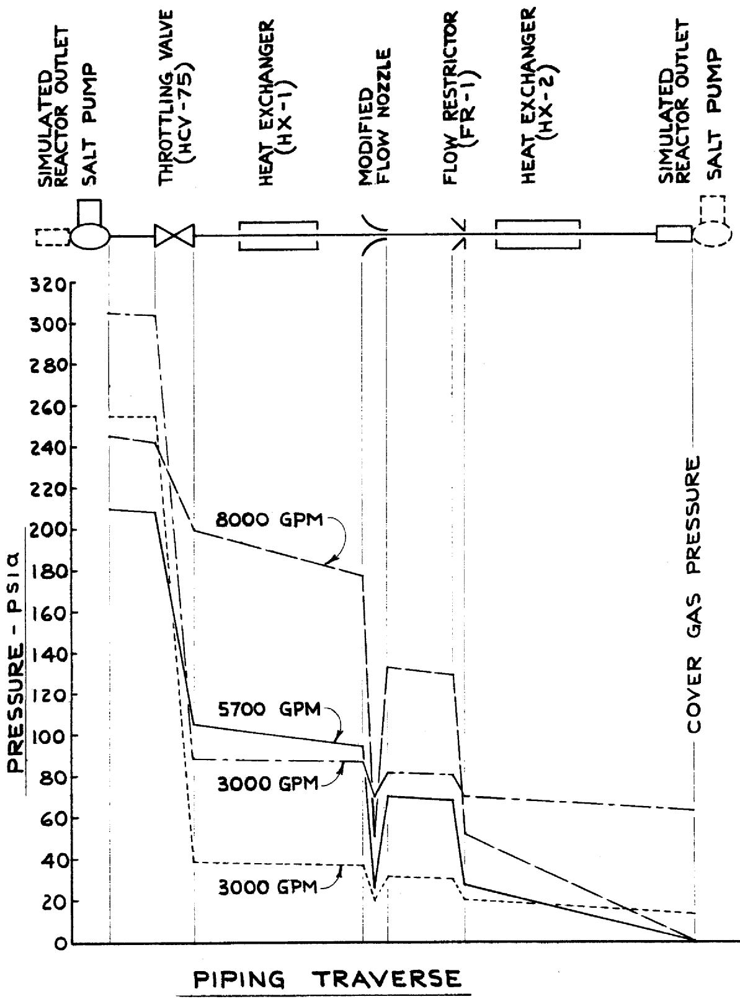  
Fig. 5. Salt Pump Test Stand Piping, Pressure Profile.

# 2.2 Salt System

# 2.2.1 Function

The salt circulating system provides a closed piping loop for the molten salt from the pump discharge to the pump suction and is shown in a preliminary layout in Fig. 4. It also provides the thermal and hydraulic characteristics for subjecting the pump to a range of specified test conditions. A tank to store salt while the pump is inoperative and equipment to transfer salt between the storage tank and the circulating system are provided.

# 2.2.2 Descriptions

2.2.2.1 Salt Piping. The pumped salt leaves the discharge nozzle of the pump and enters the piping which contains a fixed restrictor and a variable restrictor (throttling valve, HCV-100).* The salt passes through these restrictors, two concentric pipe salt-to-air heat exchangers (HX-1 and 2), a Venturi tube (FE-100) for measuring flow, and simulated reactor outlet piping before returning to the pump at the suction nozzle.

The pressure levels in the salt circulating system are established by the head developed by the salt pump and the cover gas pressure in the pump tank. Relatively small friction pressure drops will occur in the piping loop, and relatively large pressure drops will occur in the salt throttling valve, the flow nozzle, and the fixed restrictors. The piping pressure profile for three primary salt flow rates is given in Fig. 5. For a given speed the throttling valve can be used to change the flow from approximately $50\%$ to $125\%$ of the flow obtained when the system resistance curve passes thru the design point for the primary salt pump. The pump will be operated from $10\%$ to $110\%$ of the design speed. Thus the primary salt pump will be operated over a head-flow-speed regime approximately as shown in Fig. 1. The salt pump will be operated from the high to the low limits of flow and speed to obtain pump data at design and off-design conditions.

A pipe diameter of 8 in. was selected for the circulating salt loop as the result of studies requiring (1) a salt velocity in the pipe greater than that anticipated in the MSBE, (2) minimization of salt inventory, and (3) satisfactory heat transfer in the salt-to-air heat removal system. The Venturi tube is located where the seals of its attached pressure transmitters will not be exposed to subatmospheric pressures when the pump is cavitating in the high flow ranges. Also the Venturi pressures should not be so high as to degrade the accuracy of the pressure measuring devices. The chosen location meets these requirements and also provides the recommended straight sections of pipe preceding and following the Venturi tube. Location of the throttling valve close to the pump discharge provides a lower pressure downstream from the valve to permit the use of thinner wall pipe for the major portion of the salt piping.

The throttling valve will be a manually operated valve very similar to one that was developed several years ago for molten salt use at Oak Ridge National Laboratory (ORNL). One of these valves (3 1/2 in. size) is presently in use in a molten salt test stand at ORNL, and it has been operated more than 40,000 hr. Four other valves have operated from 10,000 to 25,000 hr. The valve design will be "scaled-up" to an 8 in. size as shown in the preliminary layout in Fig. 6. Except for the inlet nozzle the valve body will be subjected only to the valve outlet pressure of about 250 psig (max.). The design conditions will be 300 psig at $1300^{\circ}\mathrm{F}$ . The valve consists of slotted concentric cylinders that will have the minimum $\Delta P$ when the slots are aligned and the maximum $\Delta P$ when the slots are fully misaligned due to the axial displacement of the inner cylinder. The valve stem is sealed with a bellows that is pressure balanced with inert gas.

2.2.2.2 Salt Storage Tank and Transfer Line. The salt storage tank will be designed to contain the quantity of salt required to fill the pump tank, all the piping in the circulating system, the transfer line and provide a substantial gas volume. The salt in the tank can be in liquid or solid form. The tank will be equipped with electric heaters capable of heating the tank and contents to $1200^{\circ}\mathrm{F}$ . The tank, which is tentatively sized 40 in. in diameter by 10 ft long, (vol = 78 cu ft) will contain the

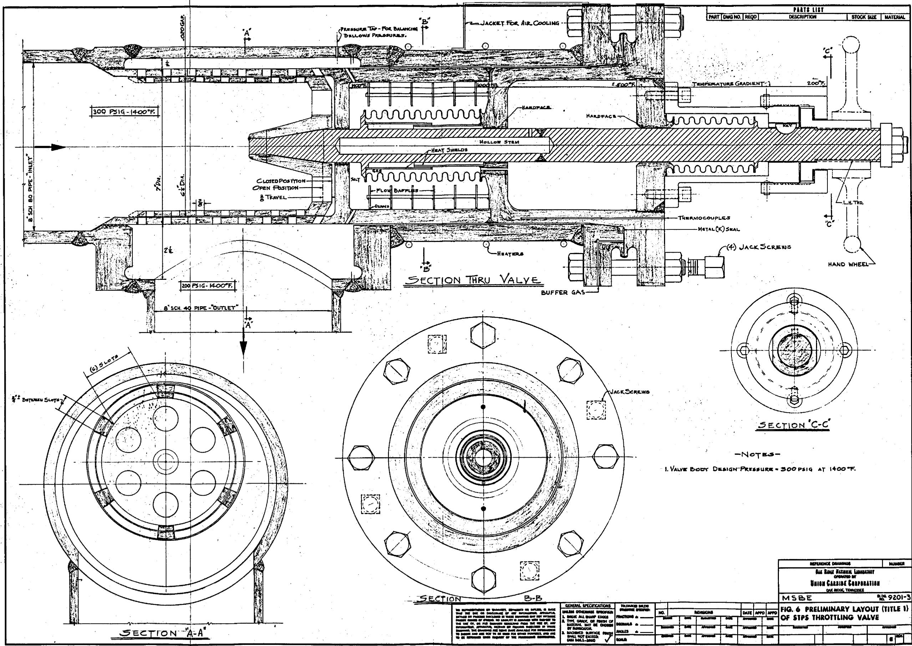

estimated system salt volume of 65 cu ft and provide for a gas space of about 10 cu ft, a salt thermal expansion volume of 2 cu ft, and a heel in the tank of 1 cu ft. A preliminary analysis indicates that for a design temperature of $1200^{\circ}\mathrm{F}$ and design pressure of 100 psig, a tank wall thickness of 1/2 in. will suffice for the cylindrical portion of the tank and 5/8 in. will suffice for the torispherical heads. A preliminary drawing of the salt storage tank is shown in Fig. 7.

The salt transfer line connecting the salt storage tank to the circulating salt piping loop will be 1 l/2 in. sched 40 piping. A 1 l/2 in. air-cooled freeze valve, identical to freeze valves used in the MSRE, will be used to establish a plug of solid salt in the drain line and thus maintain the appropriate salt inventory in the salt system. Auxiliary heating will be applied, when required, to melt the frozen salt plug and permit molten salt to flow through the transfer line from the salt piping into the storage tank.

Based on experience at the MSRE, it is estimated that the freeze valve can be frozen or thawed in less than 15 minutes, and the piping loop can be drained by gravity in 45 to 70 minutes.

2.2.2.3 Salt Selection. It is planned to operate the rotary elements of both the primary and secondary salt pumps in the test stand using a single salt identical to the reactor primary salt, except that depleted $^{238}\mathrm{U}$ instead of enriched $^{235}\mathrm{U}$ and natural lithium instead of $^7\mathrm{Li}$ will be used. The cost of the test salt is significantly less than that of the reactor primary salt, and the chemical and physical properties of both salts are identical. Chemical composition and physical properties of the primary and secondary salts are given in Tables 4 and 5.

The head and flow requirements for the primary and secondary salt pumps are such that the same hydraulic design (impeller and casing) can be used for both pumps with the secondary pump running at a higher speed and with minor changes in the impeller diameter. If the secondary pump were to be run at its design speed in the primary salt, the power and the pressure rise (not head) would be excessive. By installing an impeller with a diameter about $84\%$ of the design diameter and operating at secondary pump design speed with a flow of 7000 - 7500 gpm the design power

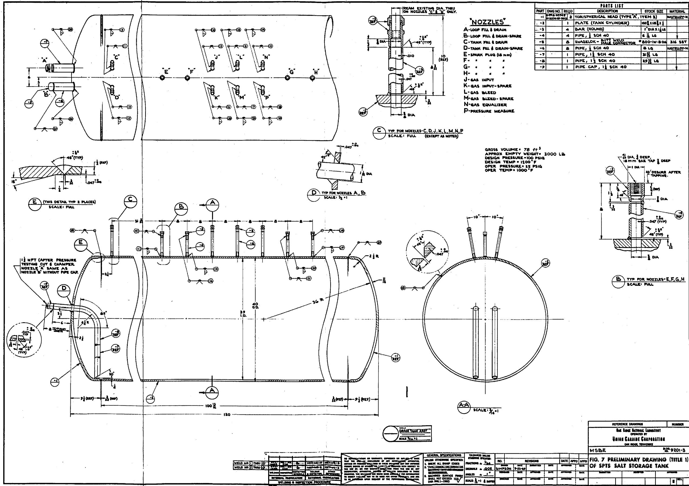  
LAST WELD NE

Table 4. Composition and Properties of Tentative MSBE Primary Salt   

<table><tr><td rowspan="5">Composition</td><td>Salt</td><td>Mole %</td></tr><tr><td>LiF</td><td>71.7</td></tr><tr><td>BeF2</td><td>16</td></tr><tr><td>ThF4</td><td>12</td></tr><tr><td>UF4</td><td>0.3</td></tr><tr><td rowspan="2">Density:</td><td colspan="2">ρ(lb/ft3) = 235.11 - 0.02328 t (°F) ± 5%</td></tr><tr><td colspan="2">204.9 lb/ft3 at 1300°F; 210.7 lb/ft3 at 1050°F</td></tr><tr><td rowspan="3">Viscosity:</td><td colspan="2">μ (centipoise) = 0.080 exp 4340/T (°K) ± 25%</td></tr><tr><td colspan="2">μ (lb/ft-hr) = 0.1935 exp 7812/T (°R)</td></tr><tr><td colspan="2">16.4 lb/ft-hr at 1300°F, 34.18 lb/ft-hr at 1050°F</td></tr><tr><td>Heat Capacity:</td><td colspan="2">0.324 Btu/lb °F, 2%</td></tr><tr><td>Thermal Conductivity:</td><td colspan="2">0.75 Btu/hr-°F-ft ± 15%</td></tr><tr><td>Melting Point:</td><td colspan="2">930 °F ± 10°F</td></tr></table>

Table 5. Composition and Properties of Tentative MSBE Secondary Salt   

<table><tr><td rowspan="3">Composition:</td><td>Salt</td><td>Mole %</td></tr><tr><td>NaBF4</td><td>92</td></tr><tr><td>NaF</td><td>8</td></tr><tr><td rowspan="2">Density:</td><td colspan="2">ρ(lb/ft3) = 142.6 - 0.0257 t (°F) (± 5%)</td></tr><tr><td colspan="2">113 lb/ft3 at 1150°F; 120.8 lb/ft3 at 850°F</td></tr><tr><td rowspan="3">Viscosity:</td><td colspan="2">μ (centipoise) = 0.0877 exp 2240/T (°K), (± 10%)</td></tr><tr><td colspan="2">μ (lb/ft-hr) = 0.2121 exp 4032/T (°R)</td></tr><tr><td colspan="2">2.595 lb/ft-hr at 1150°F; 4.605 lb/ft-hr at 850°F</td></tr><tr><td>Heat Capacity:</td><td colspan="2">0.360 Btu/lb-°F, ± 2%</td></tr><tr><td>Thermal Conductivity:</td><td colspan="2">0.266 Btu/hr-ft-°F, ± 50%</td></tr><tr><td>Melting Point:</td><td colspan="2">725°F (± 2°)</td></tr></table>

and pressure rise would be obtained as shown in Fig. 8 (see Appendix G-VII). By operating a secondary pump with a full size impeller at primary salt pump speed and a flow of 5500-6000 gpm, the impeller itself would be subjected to design torques.

The cavitation inception of the secondary pump with the secondary salt can be predicted with assurance from the water tests to be performed by the pump manufacturer and from the salt tests with the primary pump.

The effects of differences in viscosity between water, primary salt, and secondary salt are very small for pumps with Reynolds numbers greater than $2 \times 10^{6}$ . The Reynolds numbers for the MSBE pumps are greater than $10^{7}$ whether pumping water or salt.

There are certain minor hazards associated with the use of the simulated primary salt. Of primary concern is the toxicity of the beryllium during routine maintenance of the pump and in the event of a leak in the loop. Other components of the salt are less toxic than the beryllium. There is also a radiation hazard primarily due to a relatively soft gamma emitted by the thorium and its decay products. We estimate the dosage rate to be about 10-15 mrem/hr at the surface of the storage tank when all the salt is in the tank. In case of a leak there will also be some alpha and beta emission. The company industrial hygienists and health physicists propose that the containment be operated at a slight negative pressure and provided with filtration of the effluent. This proposal will be incorporated into the design. Operation and maintenance procedures will be prepared in consultation with them.

If it were desired to test the secondary pump with secondary (sodium fluoroborate) salt in the loop, the primary salt would be replaced with a flush charge of secondary salt. The flush charge would be pressurized into the loop and the pump operated for a short time. After draining the flush charge into the storage tank, it would be replaced with the operating charge of sodium fluoroborate.

ORNL DWG. 69-13458

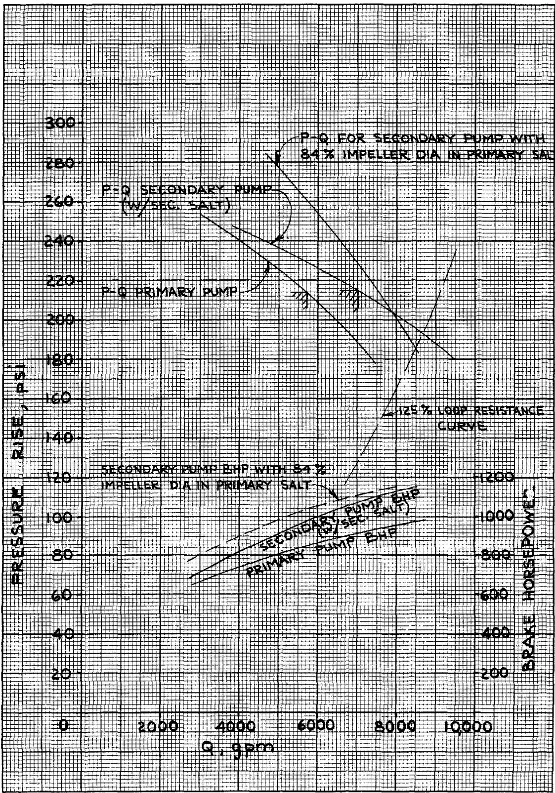  
Fig. 8. Operating Characteristics of Secondary Pump with Reduced Impeller Diameter in Primary Salt.

2.2.2.4 Material for Construction. Design of the salt-containing piping and all salt wetted parts is based on the use of the Ni-Cr-Mo alloy that was used to construct the salt system in the MSRE and that is the base material for the MSBE. The composition and properties of this alloy are given in Table 6.   
2.2.2.5 Electric Heaters. Electric heaters, capable of heating the salt storage tank to $1200^{\circ}\mathrm{F}$ and all other salt-containing piping and equipment to $1300^{\circ}\mathrm{F}$ , will be provided. Additional electric heaters will be provided on the main loop piping and heat exchangers to be used during thermal transient tests. The heaters will be 115 v and 230 v tubular type and ceramic heaters. In general, the heaters will be operated at approximately $50\%$ of their rated wattage.

Manually operated variable voltage circuits will be provided to control the power to the preheat heaters. "Off-on" type manual control is proposed for the thermal transient test heaters, Sec. 3.4; however, a study will be made to determine conformance with heat transfer and stress conditions.

Ammeters will be provided for measuring the current in each heater circuit. Operation of the heaters will be monitored by temperatures obtained from thermocouples mounted on the surface of all heated components.

2.2.2.6 Support Structure and Stand Enclosure. The salt piping and test pump are supported in a steel structure, also designed to provide containment in case of a salt spill. A preliminary layout of the support frame is shown in Fig. 9. The top, sides, and bottom of the structural steel framework are lined with sheet metal panels for containment. Most of the panels are welded in place but some of them are screwed and gasketed to provide maintenance access. There are steel access doors at both ends of the structure. Three protected windows are installed for inspection purposes and the interior of the enclosure will have floodlights. An exhaust blower is attached to the enclosure to provide a negative pressure of sufficient magnitude to give air velocities of 150-200 bpm through all openings in the enclosure. All openings, such as the valve access, exhaust blower duct, etc., have either baffles or bellows seals to prevent the egress of salt in case of a spraying leak.

Table 6. Composition and Properties of Ni-Cr-Mo Alloy   

<table><tr><td colspan="4">Chemical Properties:</td></tr><tr><td>Ni</td><td>66-71%</td><td>Mn, max</td><td>1.0%</td></tr><tr><td>Mo</td><td>15-18</td><td>Si, max</td><td>1.0</td></tr><tr><td>Cr</td><td>6-8</td><td>Cu, max</td><td>0.35</td></tr><tr><td>Fe, max</td><td>5</td><td>B, max</td><td>0.010</td></tr><tr><td>C</td><td>0.04-0.08</td><td>W, max</td><td>0.50</td></tr><tr><td>Ti + Al, max</td><td>0.50</td><td>P, max</td><td>0.015</td></tr><tr><td>S, max</td><td>0.02</td><td>CO, max</td><td>0.20</td></tr><tr><td colspan="4">Physical Properties:</td></tr><tr><td>Density, lb/in.3</td><td></td><td></td><td>0.317</td></tr><tr><td>Melting Point, °F</td><td></td><td></td><td>2470-2555</td></tr><tr><td>Thermal conductivity, Btu/hr-ft2-°F/ft at 1300°F</td><td></td><td></td><td>12.7</td></tr><tr><td>Modulus of elasticity at 1300°F, psi</td><td></td><td></td><td>24.8 x 106</td></tr><tr><td>Specific heat, Btu/lb-°F at 1300°F</td><td></td><td></td><td>0.138</td></tr><tr><td>Mean coefficient of thermal expansion, 70-1300°F range, in./in.-°F</td><td></td><td></td><td>8.0 x 10-6</td></tr><tr><td colspan="4">Mechanical Properties:</td></tr><tr><td>Maximum allowable stress, b psi: at</td><td>1000°F</td><td>17,000</td><td></td></tr><tr><td></td><td>1100°F</td><td>13,000</td><td></td></tr><tr><td></td><td>1200°F</td><td>6,000</td><td></td></tr><tr><td></td><td>1300°F</td><td>3,500</td><td></td></tr></table>

aCommercially available as "Hastelloy N" from Haynes Stellite Company, and from International Nickel Company, and All Vac Metals Company.   
bASME Boiler and Pressure Vessel Code, Case 1315-3.

<table><tr><td colspan="6">PARTS LIST</td></tr><tr><td>PART</td><td>DWG NO.</td><td>REQD</td><td>DESCRIPTION</td><td>STOCK SIZE</td><td>MATERIAL</td></tr></table>

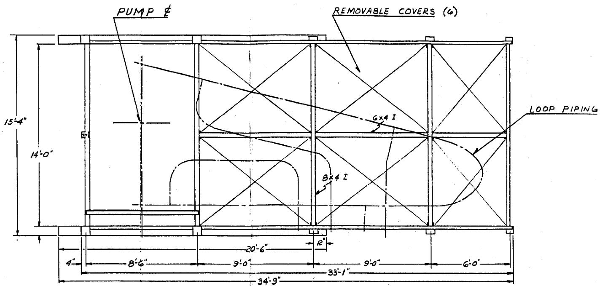  
FRAME TOTALLY ENCLOSED BY-  
/G GAGE SHEET STEEL WELDED TO FRAME.   
PENETRATIONS ACCESS PANELS BOLTED GASKETED.   
ACCESS DOORS DOG LATCHED $\xi$ GASKETED.

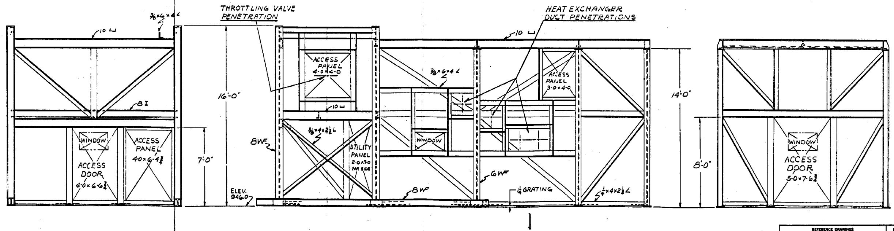

<table><tr><td>REFERENCE DRAWINGS</td><td>NUMBER</td></tr><tr><td>CAL RIMS NATIONAL LABORATORY
OPERATED BY
UNIT CARBIDE CORPORATION
OAK RIDGE, TENNESSEE</td><td></td></tr><tr><td>M S B E</td><td>IN NO.
NO. 9201-3</td></tr></table>

<table><tr><td colspan="12">THE REPRESENTATION OF INFORMATION, EXPRESSED OR REFUSED, IS NOT TO BE THE USE OR DISCLOSURE OF ANY INFORMATION, SUPPLIED OR SUPPLIED BY AN INFORMATION COLLECTOR. THIS INFORMATION MAY NOT BE RECORDED OR USED AS THE SOURCE OF OTHERS. Your liability is assumed with respect to the accuracy or completeness of the information contained in this report. The use of this information may be subject to interpretation, verification, methods or procedures outlined in these guidelines. The accuracy and completeness are not assumed for information contained in this report. All rights reserved. No part of this report may be reproduced, stored or transmitted without written permission. Any use to be determined upon request of the Person(s) whose contract/contractual obligation shall not EXCEED (i.e., shall not exceed 10000 units) shall not be considered to be an infringement of the Person(s) whose contract/contractual obligation shall not EXCEED (i.e., shall not exceed 10000 units).</td></tr><tr><td colspan="2">THE GENERAL SPECIFICATIONS: TOLERANCE BOUNDS OTHERWISE SPECIFIED:</td><td colspan="4"></td><td colspan="2"></td><td colspan="2"></td><td colspan="2"></td></tr><tr><td colspan="2">UNLESS OTHERWISE SPECIFIED:</td><td>NO.</td><td colspan="3">REVISIONS</td><td>DATE</td><td>APPD</td><td colspan="4">APPD</td></tr><tr><td colspan="2">1. BREAK ALL SHARP EDGES</td><td>TITLE WCM-PROOF</td><td>DATE 11/2/2018</td><td>SUBMITTED</td><td>DATE</td><td>APPROVED</td><td>DATE</td><td colspan="4"></td></tr><tr><td colspan="2">2. TYPE GRACE, OR FINISH OF MATERIAL, MAY BE CHOICES BY FORMER.</td><td>DESCRIPTION</td><td>DATE</td><td>APPROVED</td><td>DATE</td><td>APPROVED</td><td>DATE</td><td colspan="4"></td></tr><tr><td colspan="2">3. MAHREDED SURFACE FINISH SHALL NOT EXCEED (i.e., shall not exceed 10000 units)</td><td>SCALE 1/2&quot; F&#x27; O&quot;</td><td>DATE</td><td>APPROVED</td><td>DATE</td><td>APPROVED</td><td>DATE</td><td colspan="4"></td></tr></table>

# 2.3 Heat Removal System

# 2.3.1 Function

The power supplied by the pump to the circulating salt is dissipated in heating the salt. The function of the heat removal system is to remove from the circulating salt that portion of this heat necessary to maintain the desired operating temperatures of the salt system.

# 2.3.2 Descriptions

Without heat removal the maximum pumping power of 1200 hp for the primary salt pump would raise the temperature of the circulating salt $12^{\circ}\mathrm{F} / \mathrm{min}$ and $26^{\circ}\mathrm{F} / \mathrm{min}$ for system salt volumes of 65 cu ft and 30 cu ft, respectively. During the conceptual design phase, several different heat removal systems, were investigated to provide a tolerable noise level, reasonable physical size, safety, economical and simple construction and operation, and minimum maintenance. Systems investigated included (1) thermal convection salt-to-air radiator, (2) forced circulation salt-to-air radiator, (3) salt-to-steam heat exchanger, and (4) forced convection salt-to-air heat exchanger with and without water mist. The last method without water mist was the most suitable and was chosen for the design.

2.3.2.1 Heat Exchangers. A preliminary design was prepared for the heat exchangers subject to the following design conditions or limitations:

<table><tr><td>Salt flow rate</td><td>8000 gpm</td></tr><tr><td>Pump power</td><td>1200 hp</td></tr><tr><td>Salt temperature</td><td>1050°F and 1300°F</td></tr><tr><td>Salt pipe size</td><td>8 in. (Sch. 40)</td></tr><tr><td>Maximum air velocity</td><td>900 fps</td></tr><tr><td>Air inlet temperature</td><td>150°F</td></tr><tr><td>Air flow rate, total</td><td>10,000 cfm</td></tr><tr><td>Maximum air side ΔP</td><td>3 psi</td></tr><tr><td>Number of heat exchangers</td><td>2</td></tr></table>

Two separate, identical heat exchangers (HX-1 and HX-2) will be used to reduce the size of the air blowers and the resulting noise level, to

simplify heat exchanger design, and to provide flexibility in the operation of the test stand. The use of two heat exchangers is also consistent with the test stand layout.

A computer program was modified for performing the heat transfer analysis of the preliminary design (see Appendix G-2), a concept of which is shown in Fig. 10. Salt flows through the 8 in. pipe and cooling air is blown through the concentric annular flow passage. The length of each heat exchanger is calculated to be 16 ft and the annulus O.D. is 10.500 in. (.938 in. annular gap).

The preliminary heat exchanger design was based on the maximum pumping power of 1200 hp when operating at $110\%$ speed and $125\%$ flow. Subsequent calculations for the final design will be made for this power level.

2.3.2.2 Blowers. Air is used as the cooling medium and is forced through appropriate ducting and the annulus of each of the two salt-to-air concentric pipe exchangers by separate positive displacement blowers. After the air leaves the heat-exchangers it is discharged through a stack into the atmosphere at approximately $400^{\circ}\mathrm{F}$ . A preliminary layout of the air handling system is shown in Fig. 11.

Positive displacement blowers were selected because of their reliability, economy, and capability to move large quantities of atmospheric air against a relatively high pressure drop. Blower data are shown in Table 7.

The blowers (B-1 and B-2) and drive motors will be installed outside the main test building (Bldg. 9201-3) to reduce the noise level in the area around the test stand. They will be housed in an acoustically treated building to reduce noise in the area adjacent to the test building. In addition, blower intake and discharge silencers will be installed to reduce the noise level, and the intake air will be filtered.

The pressure rise-flow and the brake horsepower curves for the blowers and the estimated air system resistance curve are shown in Fig. 12. When the by-pass valves (HV-145 and HV-146) are closed, the system will be operating at point "A." As a bypass valve is opened, the flow through the bypass valve will be the difference in the system resistance curve and the blower P-Q curve and the remainder of the flow will pass through the heat exchanger.

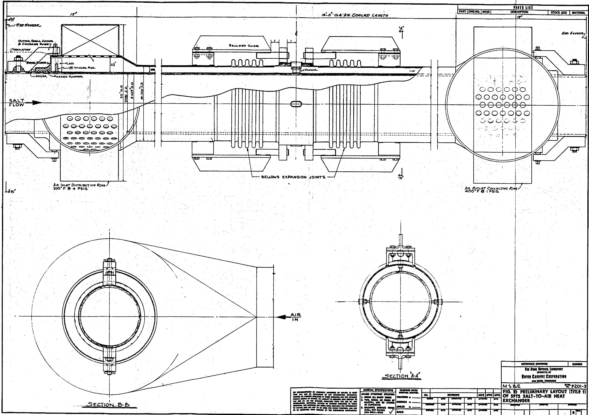

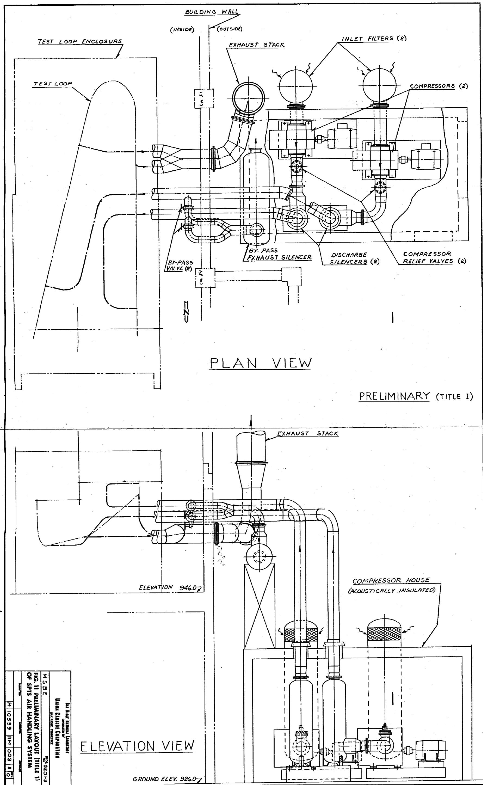

Table 7. Preliminary Data for Each Main Blower, Heat Removal System   

<table><tr><td>Type</td><td>Positive displacement</td></tr><tr><td>Gas handled</td><td>Atmospheric air</td></tr><tr><td>Inlet volume, acfm</td><td>5300</td></tr><tr><td>Inlet temperature, °F</td><td>85</td></tr><tr><td>Discharge temperature (est.), °F</td><td>145</td></tr><tr><td>Inlet pressure, psia</td><td>14.7</td></tr><tr><td>Pressure rise, psi</td><td>5</td></tr><tr><td>BHP required</td><td>138</td></tr><tr><td>Approximate weight, lb</td><td>11,000</td></tr><tr><td>Motor, hp</td><td>150</td></tr><tr><td>Motor speed, rpm</td><td>900</td></tr><tr><td>Sound level, db</td><td>80-90</td></tr></table>

Consideration was given to the use of two surplus blowers located at the Experimental Gas Cooled Reactor (EGCR) and the manufacturer was asked for an estimate for refurbishing the blowers to meet our requirements. The estimate was a great deal more than the cost of procuring the new positive displacement blowers which we have decided to use.

# 2.4 Utility Systems

The test stand will be provided with the necessary inert gas, instrument air, cooling water, and electricity for the operation of the stand and the salt pump. Argon, helium, and instrument air of appropriate quality and sufficient quantity are available in the test building. The electrical capacity available in the building is sufficient to supply all the test stand and salt pump requirements.

# 2.4.1 Inert Gas

An inert cover gas is used to protect the primary salt from contact with moisture and oxidizing atmospheres. It is used to pressurize the pump to prevent cavitation, to pressurize the salt storage tank and thereby transfer the salt into the salt circulating system, and to reduce the pressure differential across the bellows of the salt throttling valve.

ORNL DWG. 69-13459

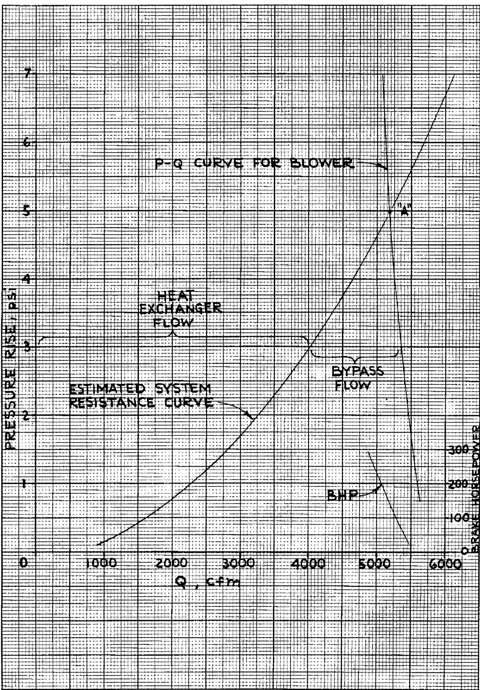  
Fig. 12. Air Handling System Characteristics.

Inert gas from two sources will be used. An 80 psig supply will provide inert gas for most applications. A 250 psig supply station utilizing high-pressure cylinders of either argon or helium will be made available. Necessary piping, valves, and instrumentation will be provided to conduct inert gas to the appropriate locations. The Instrument Application Diagram, Inert Gas Supply System is shown in Appendix E.

# 2.4.2 Instrument Air

Dry instrument air will be used as a coolant for the freeze valve (HV-129) in the salt transfer line (line 200) and for operating instruments. This air will be obtained from the Y-12 instrument air supply.

# 2.4.3 Cooling Water

Cooling water will be required for the removal of heat from the pump drive motor, the pump lubricant system, and the pump shield plug cooling system. A brief study was made of the economics of using a cooling tower versus using Y-12 Plant process water. A cooling tower for dumping 75 hp (a $95\%$ efficient 1500 hp motor) would cost about $15,000 to install. Operating and maintenance costs would add to this figure. Y-12 process water to dump the same amount of heat for 5 years would cost about $6000. Thus, Y-12 process water will be used for cooling. (See Appendix G-V).

# 2.4.4 Electrical

The principal electrical systems for the experiment are shown in the Electrical Schematic Diagram, Appendix F. Present building facilities include a 13.8 kv bus of sufficient capacity to supply a 1500 hp drivemotor, a 480 v bus duct available to supply the preheaters and all the auxiliary equipment, and a 480 v diesel-driven generator system available to provide emergency power during normal power outages.

2.4.4.1 2400 Volt System. A new 2400 volt electrical distribution system will be installed outside the building to connect the power supply to the pump drive motor and will provide for a motor as large as 1500 hp. The new system will be connected to the existing 13.8 kv bus and will consist of (a) one 1200a, 13.8 kv oil circuit breaker, (b) 350 MCM, 15 kv cable, (c) 1500 kva, 13.8/2.4 kv 30 transformer, (d) 1200a, 2.4 kv reduced voltage starter equipment, and (e) 300 MCM, 5 kv cable connected to the pump motor.

The existing 13.8 kv bus is located in the southeast corner of the building. The transformer and starter equipment will be outdoor type and will be located at the west side of the building. Connecting cables will be run in conduit.

2.4.4.2 480/240/120 Volt System. All heaters and auxiliary equipment will be fed from the existing 480 v system. Transformers will be provided to supply 240 v and 120 v where necessary.

The heat exchanger blower motors (B-1 and B-2) and pump lube oil equipment will be supplied directly from the 480 v bus through combination motor starters. Seven circuits feeding 480 - 120/240 v transformers will supply power to the salt piping and equipment heaters. Additional circuits will supply 120 v power to miscellaneous equipment.

Power to the pump lube oil equipment, instrumentation, salt freeze valve (HV 129), pump shield plug cooling system, stand enclosure blowers, and air sampling heads will be automatically supplied by the building emergency diesel generator in the event normal electrical power is lost. Return to normal power will be by manual operation.

# 2.5 Site Location

The test stand containing the salt circuit will be located at the west end of the second floor of Building 9201-3 in the Y-12 Plant, Oak Ridge, Tennessee. The cooling air blowers and auxiliaries will be located on the ground level outside the west end of the building. See Figs. 4, 11, and 13 for salt circulating system, air handling system, and plant location, respectively. This location in the building was chosen because it (1) meets the stand requirements with very few building modifications, (2) provides convenient access to existing pump maintenance facilities, (3) permits installation of the large blowers (B-1 and 2) and the heat removal system stack outside the test building, and (4) is available with minimum renovation and disturbance to other test stands and shops.

A traveling bridge crane, with 20-ton and 5-ton hoists, serves the area. A l-ton jib hoist is also available to provide additional hoisting capability when needed.

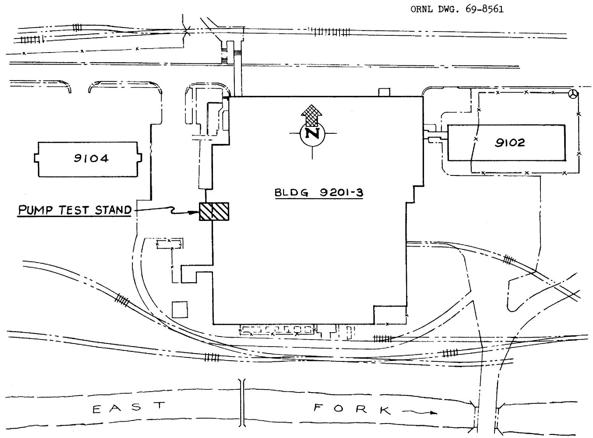  
Fig. 13. Location of Project (Y-12 Plant)

Additional second floor support columns under the area of the test stand will be required to support the estimated test stand weight of approximately 80,000 lb.

# 2.6 Instrumentation and Controls

See Appendix E, Instrument Application Diagrams for a detailed presentation of instrumentation and controls.

# 2.6.1 Temperature Measurement and Control

Approximately 144 stainless steel sheathed, insulated junction, chromel-alumel thermocouples will be used to monitor temperatures on the pump test section, on heat exchangers, in air systems, and for loop heater control. The thermocouples will be connected to the reference junctions at the control cabinets by double shielded chromel-alumel extension lead wire, with the sheath being grounded at the thermocouple end only. Temperatures will be read out on available multipoint strip chart recorders and indicating controllers. The more important temperatures will also be read out on the DEXTIR data logging system (described in Sect. 2.6.6), and on a 100 cycle per second oscillographic recording system.

# 2.6.2 Pressure Measurement and Control

The pump tank cover gas pressure will be used as a measure of the pump inlet pressure. Pairs of NaK sealed high-temperature pressure transmitters will be used to measure loop pressures at the pump outlet (PT-131 and PT-140) and at the outlet of throttle valve HCV-75 (PT-73 and PT-74). The seals (PX-131, PX-140, PX-73, and PX-74), which will be rated at 400 psig, will have to be obtained and will be long delivery items, possibly up to two years. The seals and pressure transmitters are being installed in pairs to avoid costly delays should one of them fail. The outputs from all the pressure transmitters will be read out on the DEXTIR but the outputs from PT-140 and PT-73 will be read out on single point strip chart recorders.

To protect the throttle valve bellows seal, which requires a balanced pressure between the salt and inert gas, the outputs from PT-73 and PT-72 will be used to regulate the gas pressure to the bellows. The outputs from PT-74 and PT-72 will be used for an alarm in case the differential pressure across the bellows becomes excessive.

Cover gas pressure, lube oil pressures, and air pressures will be read on conventional gauges and controlled by pressure switches, solenoid valves, and hand valves. Differential pressures across filters IFS-1, IFS-2 and the CWS filter will be measured by locally mounted gauges PdI-134, PdI-135, and PdI-136.

# 2.6.3 Flow Measurement

Main loop salt flow in the range of 3000 to 8000 gpm will be determined by measuring the differential pressure of the truncated Venturi tube (FE-100) shown in Fig. 14. The individual pressures will be measured with redundant NaK sealed pressure transmitters PT-1, PT-2, PT-3, and PT-4. The differential pressure will then be deduced from the outputs of PT-2 and PT-3 with PT-1 and PT-4 being used as spares. The resultant output will be presented on a single-point strip chart recorder and on DEXTIR. To avoid calibration problems, the seals PX-1, PX-2, PX-3, and PX-4 will also be rated at 400 psig.

Instrument air flow to the freeze valve (HV 129) will be read on panel mounted rotameter FI-111. The measurement of lube oil flow to the salt pump will be included in the lube oil package. Flow measurements are not planned for the enclosure exhaust air or the cooling air to the heat exchangers HX-1 and HX-2.

# 2.6.4 Level Measurements

Salt level in the storage tank will be determined by four on-off probes LE-92, LE-93, LE-94, and LE-95 at different levels in the tank. Salt level will be indicated by the on-off position of four indicating lights.

# 2.6.5 Alarms and Interlocks

The strip chart recorders, indicating controllers, and pressure switches will have low and high signal switch contacts for control and alarm (see Section 3.6) purposes. Alarms will be indicated by a bell and existing annunciator panels with lighted windows that show abnormal conditions before and after acknowledgment and normal conditions before and after reset. Scram action will be provided as appropriate, either simultaneously with the alarm or at a desired increment above or below the alarm setting.

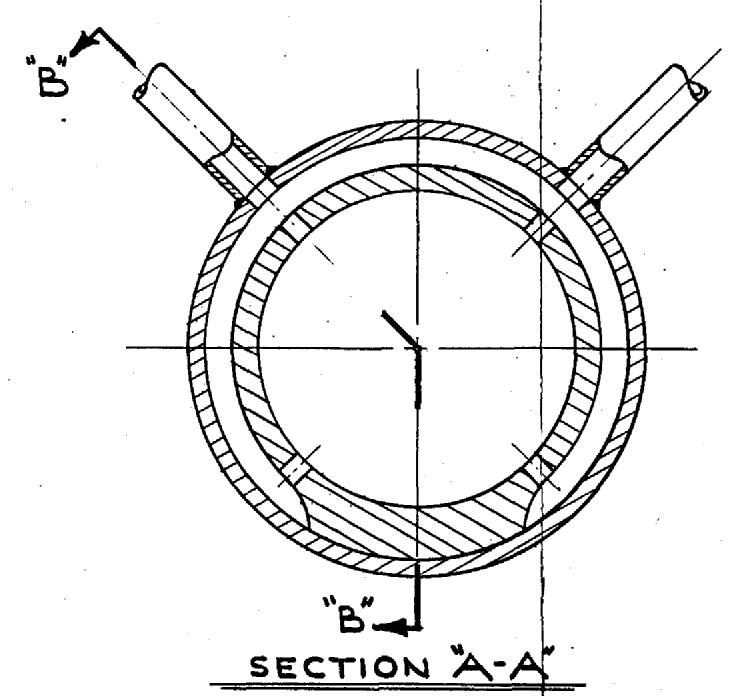

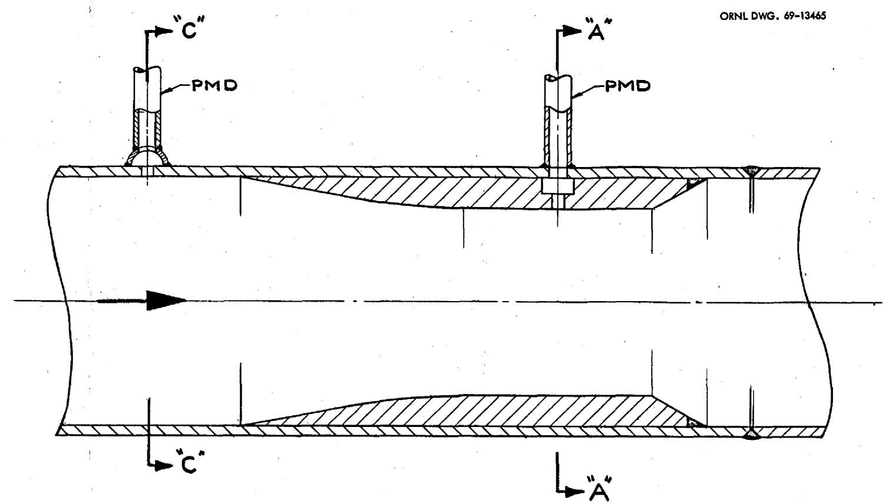  
SECTION'B-B"

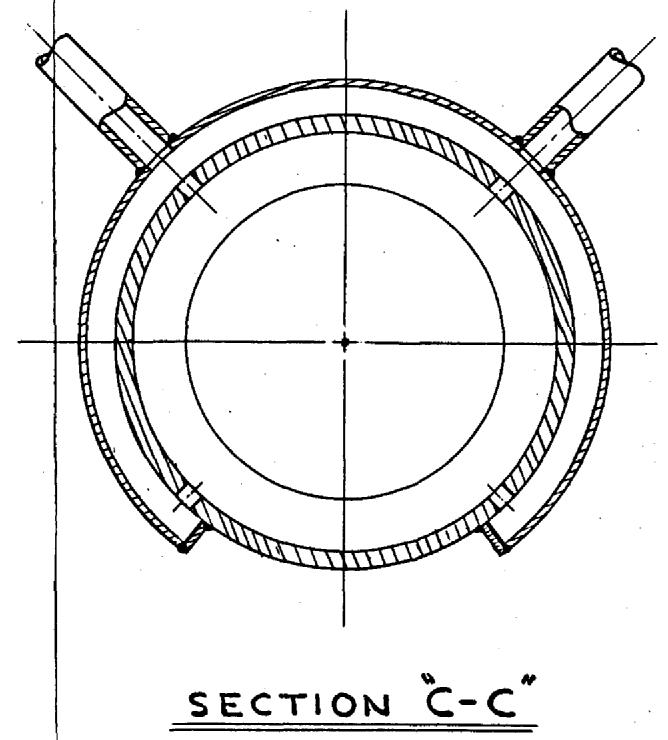  
FIG. 14 PRELIMINARY LAYOUT (TITLE 1)   
OF SPTS VENTURI TUBE

# 2.6.6 Data Acquisition Computer System

This system is presently installed in Building 9201-3 and is used for monitoring and recording data for experiments now being performed. The system consists of a Beckman DEXTTR data acquisition system interfaced to a Digital Equipment Corporation PDP-8 computer which has a core memory of 4096 twelve-bit words. Conversion of the data to engineering units is done on-line, and all data are digitized and recorded on magnetic tape for further processing by the ORNL IBM 360/75 computer. A large library of programs is available to process these tapes.

The data acquisition computer system can provide a listing of data in engineering units at the test stand. It has a capacity of 2500 analog and 2500 digital inputs and has a speed of 8 channels per second. Overall accuracy is $\pm 0.07\%$ of full scale, resolution is one part in 10,000, and the input signal range is 0-10 millivolts full scale to 0-1 volt full scale in three programmable steps.

Data gathering boxes, each with 25 analog and 25 digital channel capacity, can be plugged into the "party line" cable at any point in the network. Digital input capability is provided by both thumbwheel switch and contact input modules. The modules can accept decimal or binary coded decimal contact closures from counters, clocks, frequency meters, digital voltmeters, and other devices that have digital outputs. Thermocouple reference junction compensation is provided for all thermocouple inputs.

The PDP-8 computer software consists of a real time multiple task executive system, with four levels of priority interrupt. The highest priority level is assigned to protection of the operating system in case of power failure. The second priority is assigned to the processing of data, the third to keyboard input, and the fourth to printer output.

Another package of computer programs performs the engineering units conversion tasks and such utility functions as punching tape, reading tape, entering data into memory, listing the contents of specified memory locations, clearing specified memory locations, etc.

A disk file is being added that will provide an additional 32,000 words of bulk storage and will permit the individual experimenter to have his own program for on-line calculations and teletype plots.

The salt pump test stand will require the installation of two additional data gathering boxes and the preparation of a program for on-line calculations and graph plotting. The input to the DEXTIR from the test stand is indicated with the nomenclature EDP on the Instrument Application Diagrams, Appendix E.

# 3.0 Principles of Operation

The prototype pump tank and all the salt pump rotary elements will be operated in a depleted uranium, natural lithium version of the MSBE primary salt. Operation of the rotary element of the secondary salt pump at its design head and flow conditions with the denser primary salt would overload the pump drive motor and overpressurize the salt system piping. Therefore, we plan to operate the secondary pump rotary element at its design speed and temperature, but with a slightly reduced diameter impeller (about $84\%$ design diameter) which will load its motor to rated power and will stress the coupling, bearings, and shaft to their respective design levels without overstressing the salt piping system. This general philosophy was used to proof test the fuel and coolant salt pumps for the Molten Salt Reactor Experiment (MSRE). The hydraulic performance characteristics for the salt pumps will be obtained during water tests conducted by the pump manufacturer.

# 3.1 Startup

All the facility and test components, assemblies, and systems will be inspected individually and collectively prior to startup. These inspections will be made to check conformance to approved drawings, specifications, and standards.

While at room temperature the salt system will be purged with inert gas, evacuated to remove oxygen and moisture, and refilled with inert gas. The lubrication system and shield plug cooling systems will be started. The mechanical performance of the salt pump and drive motor will be observed during operation with inert gas while preheating to $1200^{\circ}\mathrm{F}$ . The salt system including the drain tank will be preheated to the desired temperature (normally $1200^{\circ}\mathrm{F}$ ). During preheating, the salt system will be evacuated and then refilled with inert gas several times to reduce moisture and oxygen levels even further. The salt pump will be rotating during preheating to assist in giving a more nearly isothermal condition throughout the loop.

With the pump off, the salt storage tank, previously filled with molten salt, will be slowly pressurized with inert gas to transfer salt into the pump loop until the proper salt level has been reached in the

pump tank. The freeze valve will be established to hold the salt in the system. The required flow rates of inert purge gas will be established and the appropriate pressure on the surface of the system salt will be obtained. Finally the salt pump will be started and functional checks will be made on all systems for proper performance.

# 3.2 Test Operation

When the salt pump and all test stand systems are performing satisfactorily, the following salt pump test program will be initiated:

# 3.2.1 Prototype Pump

1. The mechanical performance of the salt pump and drive motor will be observed for any abnormal behavior such as excessive noise or vibration.

2. The design of the drive motor and cooling system and the drivemotor support system will be proven.

3. The lubrication system for the salt pump and the provisions for handling shaft seal oil leakage will be checked.

4. The transient characteristics of pump speed and salt flow during startup and cooldown will be determined.

5. The hydraulic performance and cavitation inception characteristics of the salt pump will be obtained over a range of pump speeds and salt flow rates and temperatures.

6. The relationship of the purge gas flow in the shaft annulus to the back diffusion of fission products from the pump tank to the seal region will be determined.

7. The maximum salt void fraction that the pump will tolerate will be determined. Measurements will be made of the void fraction in the circulating salt due to gas entrained from the gas space by the salt bypass flows within the pump.

8. The effect of operating the pump with insufficient salt, to the point of the start of ingassing, will be studied.

9. The production of aerosols of salt in the prototype pump tank during pump operation will be checked as will any aerosol removal device needed to protect the off-gas lines and components from plugging by aerosol deposition.

10. The pump bowl cooling system will be evaluated.   
ll. Demonstration tests of Incipient Failure Detection (IFD) devices and systems will be made. Pump manufacturers will be requested to recommend IFD devices and systems to indicate a substantial change in a pump operating characteristic that might point to an impending failure of some pump component. Parameters that may yield significant reliability information include pump power and speed, shaft vibration and displacement, and noise signatures of the pump at various operating conditions.   
12. Any other meaningful tests recommended by the MSBE pump manufacturer will be performed.   
13. After all specific short term tests have been completed, long term endurance test runs will be performed.   
14. The characteristics of the pump with the gas injection and removal devices, which will be used to remove xenon 135 from the MSBE circulating salt, will be verified in salt. Nozzles will be installed on the salt piping to accommodate these devices.

# 3.2.2 ETU and MSBE Pumps

Rotary elements of the primary and secondary salt pumps for the ETU and the MSBE will be subjected to high temperature, non-nuclear prooftests in the salt pump test stand prior to installation into their respective systems. These tests will prove the high-temperature performance and the construction and assembly quality of the rotary elements.

# 3.3 Shutdown

Shutdown of the system will be initiated by turning off the salt pump and the air blowers. The salt will be drained into its storage tank by thawing the freeze valve and equalizing the gas pressures in the pump and storage tanks. After the salt is drained from the system, the pump will be rotated for a short time to sling off any salt clinging to the impeller. The electric heaters will be turned off and the system will be permitted to cool to room temperature. The lubrication system and shield plug cooling system will be turned off when the pump temperature is reduced to near room temperature. An inert gas atmosphere will be maintained in the loop. When the system is cool it will be ready for

maintenance of components or for removal of the salt pump in accordance with the necessary procedures.

# 3.4 Thermal Transients

The test stand has a limited capability for performing thermal transient tests. For both heating and cooling, Fig. 15 shows that the attainable rates of temperature change depend greatly upon the amount of salt in the loop and pump. At present it is estimated that the minimum salt volume in the system will be about 35 cu ft. The cooling transient is obtained by using maximum salt system cooling and reducing the salt pump speed to obtain about $10\%$ of the design flow. The heating transient is obtained by turning off the salt system cooling and turning on all the electric heaters on the loop and pump while the pump is operating at $110\%$ of design speed and the loop throttling valve is wide open.

A larger cooling thermal shock also can be applied to the pump in the test loop as follows: With the pump motor stopped, the temperature of the pump impeller and casing and salt in the pump tank can be maintained at approximately $1300^{\circ}\mathrm{F}$ , while the salt in the loop piping is lowered to about $1000^{\circ}\mathrm{F}$ . To reduce natural convection the throttling valve would be "closed." After opening the throttling valve, the salt pump would be brought up to design speed within 2 to 3 seconds, and the cool salt from the piping would displace the hot salt in the fully loaded pump impeller and casing. Thermal stresses in the salt piping appear to be acceptable; see Appendix G-9.

# 3.5 Special or Infrequent Operation

In addition to the previously outlined pump test operation, the test stand will be operated to:

1. Obtain the characteristics of instrumentation for measuring salt flow and pressure as required.   
2. Study problems which may arise during the operating life of the ETU or MSBE.

ORNL DWG. 69-13460

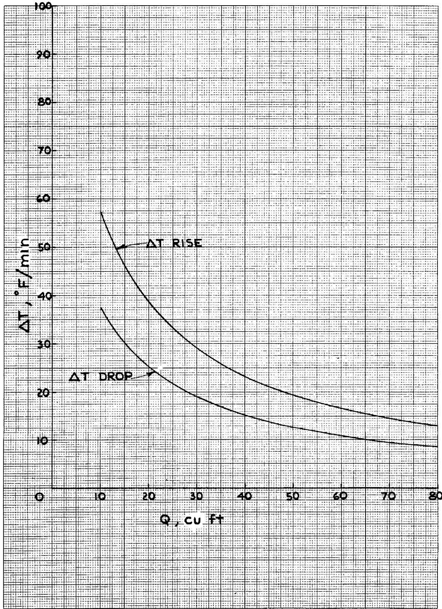  
Fig. 15. Thermal Transient in SPTS as a Function of Salt Volume in the Loop and Pump.

# 3.6 Equipment Safety

Several pump and test stand operating parameters will be monitored continuously to provide for the safety of the salt pump, test stand, and test personnel. These parameters will include pump power, speed, and lubricant flow; salt temperature, flow, and liquid level; pump tank cover gas pressure; pump and test stand vibration; air blower power and oil pressure, and shield plug and drive motor coolant flow. Table 8 presents a list of the emergency conditions and the actions to be taken.

Table 9. Alarms, Emergencies, Safety Actions for Salt Pump Test Stand   

<table><tr><td>Loss of normal electric power</td><td>Start emergency power</td><td>Close cooling air valve. Drain salt to storage tank.</td></tr><tr><td>High pump power</td><td>Stop pump and blower</td><td>Schedule A.a</td></tr><tr><td>High liquid level in pump</td><td>Stop pump and blower</td><td>Drain salt to storage. Adjust preheaters.</td></tr><tr><td>Low liquid level in pump</td><td>Stop pump and blower</td><td>Schedule A.</td></tr><tr><td>Salt leak (low liquid level)</td><td></td><td>Stop pump and blower. Drain salt to storage.</td></tr><tr><td>Low salt piping temperature</td><td></td><td>Decrease cooling air flow.</td></tr><tr><td>High salt piping temperature</td><td></td><td>Increase cooling air flow or reduce pre-heater power.</td></tr><tr><td>High or low pump tank pressure</td><td>Stop pump and blower</td><td>Schedule A.</td></tr><tr><td>High temperature at freeze valve</td><td></td><td>Increase cooling air flow. Reduce heater power.</td></tr><tr><td>Low salt flow</td><td>Stop pump and blower</td><td>Schedule A.</td></tr><tr><td>High amplitude vibration</td><td>Stop pump and blower</td><td>Schedule A.</td></tr><tr><td>Pump motor stops</td><td>Stop blower</td><td>Schedule A.</td></tr><tr><td>Heat transfer system blower motor stops</td><td>Stop pump</td><td>Schedule A.</td></tr><tr><td>Enclosure exhaust blower stops</td><td></td><td>Stop pump</td></tr><tr><td>Heat transfer system blower low oil pressure</td><td></td><td>Stop blower</td></tr><tr><td>Loss of pump lubricant flow</td><td>Standby pump switched on</td><td></td></tr><tr><td>Loss of shield plug coolant flow</td><td>Standby pump switched on</td><td>Stop pump and blower. Drain salt to storage. Schedule A.</td></tr><tr><td>High valve bellows ΔP</td><td></td><td>Adjust gas pressure.</td></tr></table>

aSchedule A: 1. Close the bypass valves in the cooling air duct.   
2. Adjust system preheaters.

# 4.0 Safety Precautions

A preliminary safety analysis of the pump test stand was made to identify potential accidents and the consequences and to deduce methods to prevent accidents and minimize the consequences.

# 4.1 Loss of Normal Electrical Power

Loss of electrical power will cause the salt pump motor, cooling air blower motors, and preheaters on the salt piping and equipment to cease operation. Salt in the salt circulating system will become stagnant and will cool from the normal operating temperature of $1300^{\circ}\mathrm{F}$ . To prevent salt from freezing ( $\sim 930^{\circ}\mathrm{F}$ melting point) in the piping and the pump, it must be drained into the salt storage tank. Since solid salt in the freeze valve can be thawed most quickly with electric heaters, a reliable, emergency source of electric power is required. The emergency power source consists of a diesel-driven $300\mathrm{kw}$ electric generator located in Building 9201-3, which has been in backup duty for l2 years. It is operated once each week to maintain readiness.

During power failure the emergency power supply will also be used to operate the blowers for enclosure exhaust and air sampling, salt pump lubrication and shield plug cooling systems, and appropriate instrumentation.

# 4.2 Operating Procedures

Instrumentation, including alarms, interlocks, and other safety devices, will be installed to minimize operating errors that could affect personnel safety or result in damage to equipment. In order to minimize further such errors the operation of the test stand will be under the supervision of technical personnel experienced in the operation of molten salt systems. They will use instructions contained in carefully written procedures to startup, operate, and shutdown the test stand. Assistance in preparation of test procedures, in test stand operation, and in the execution of the salt pump test program is expected from engineers assigned by pump manufacturers who participate in the MSBE salt pump program.

4.3 Leak or Rupture in Salt Containing Piping and Equipment

4.3.1 Consequences

a. Leak. High pressure could jet a small stream of molten salt a distance in excess of 10 ft.   
b. Rupture. Large quantities of molten salt could flow onto the floor in the immediate vicinity of the test stand.   
c. Salt vapors and particles could be picked up by cooling air and released from the exhaust stack, if the salt pipe ruptures inside the heat exchanger air cooling jacket.   
d. Cooling air could blow vapors and particles over a large area inside the building, if the salt pipe and the heat exchanger air cooling jacket are ruptured.

4.3.2 Hazards

a. Toxic effects of beryllium to personnel. Beryllium presents the main chemical toxicity problem of all the components in the test salt.   
b. The effects of high temperature burns to personnel.   
c. The ignition of fires in combustible material and equipment in the surrounding area.   
d. The effects of low level nuclear radiation to personnel due to the presence of uranium and thorium in the salt.

4.3.3 Preventive Measures

a. Salt-containing equipment will be designed, procured, and fabricated according to applicable high-quality standards.   
b. The salt containing equipment will be enclosed within a sheet-metal structure having a top, sides, and bottom to contain molten salt leakage. The enclosure protects personnel from burns, prevents the salt leak vapors from contaminating areas adjacent to the test stand, and provides a controlled radiation hazard area.   
c. An exhaust system, operating continuously, will be provided to ventilate the test stand enclosure. The air will be filtered to reduce the concentration of the salt vapors to a safe level before it is discharged into the outside atmosphere.

d. At least 7 air sampling stations will be provided inside the enclosure, in the exhaust stacks, and in the immediate area around the test stand. The air sampling stations will be monitored daily for the presence of beryllium by the Industrial Hygiene Department. Air in the Y-12 general area is monitored continuously for beryllium and other materials.

e. In the event of a molten salt leak, interlocks and alarms will be provided in the control system to shut off the circulating salt pump and the cooling air blowers. Salt will be drained from the system piping into the salt storage tank by manual control. The drain line is not a safety feature and the drain time is not critical. The design of the stand enclosure will provide adequate containment for the leakage of all the salt inventory. The liquid level indicator in the pump tank will be used to detect large salt leaks, and smaller leaks will be detected by air sampling, as indicated in Item d above.

f. In the event of a simultaneous leakage of salt and the failure of the filter in the enclosure ventilation system the enclosure blower would be shutoff immediately to prevent the spread of unfiltered effluent. The industrial hygienists would be alerted immediately to take proper administrative action including evacuation of the building. The salt would be permitted to freeze in the enclosure and the procedures for its removal after freezing would be implemented.

g. The salt spill cleanup procedure, developed previously for use in Building 9201-3, will be followed in case of a salt leak.

# 5.0 Maintenance

# 5.1 Maintenance Philosophy

Design, fabrication, equipment selection, and installation work will be directed toward the goal of obtaining highly reliable equipment. The equipment will be installed in the salt pump test stand with critical equipment monitored continuously and shut down for maintenance when failure is impending. Symptoms of impending failure may be detected by visual and audio observations and by pressure, temperature, flow, vibration, and other diagnostic instrumentation. Experience has indicated that symptoms of impending equipment failure usually develop sufficiently far in advance to permit the scheduling of maintenance activities without excessive outages or equipment damage.

# 5.2 Preventive Maintenance

Certain instruments and equipment, and in particular the ones with moving parts, will be checked and serviced on a routine basis. Appropriate instrumentation will be checked and recalibrated between test runs.

# 5.3 Maintenance Procedures

Procedures and controls that have been used satisfactory in the past will be adapted to protect personnel performing maintenance within the loop enclosure. Of concern are the toxicity effects of some of the salt components and the radiation hazards of others.

# 6.0 Standards and Quality Assurance

# 6.1 Codes and Standards

# 6.1.1 Design

Specific requirements have been determined for the salt pump test stand, as stated in Section 1.3. These requirements have been approved by the Molten Salt Reactor Project and Laboratory Management. Experienced and qualified designers will be assigned to the task, and when detail drawings are completed, they will be reviewed for function, safety, and construction. Engineering standards and procedures in the area of design have been established and are given in Appendix A. In general, the requirements specified in Section III for Class C vessels of the ASME Boiler and Pressure Vessel Code and in the Code for Pressure Piping USAS B31.1 will be used in the design of the salt containing system. A complete piping stress and flexibility analysis will be made.

# 6.1.2 Materials

The Ni-Mo-Cr alloy selected for the salt containment will be purchased with existing ORNL MET materials specifications developed for the MSRE and with RDT standards as applicable. Other material will be purchased with ORNL MET, RDT, and ASTM standards and specifications, as applicable. The proposed material specifications are given in Appendix A.

# 6.1.3 Fabrication and Installation

High quality welding, quality control, inspection procedures, and a record system, as defined by the SPTS Quality Assurance Program Plan will be used to fabricate and install all the salt-containing equipment. Other fabrication and installation procedures developed by Oak Ridge National Laboratory will be used as required. The applicable procedures are given in Appendix A.

# 6.1.4 Operations

Step-by-step instructions contained in carefully planned procedures, developed by engineers experienced in molten salt pump operation at ORNL, will be used during startup, operation, and shutdown of the pump test stand.

# 6.2 Quality Assurance

The Quality Assurance Program Plan, M-10559-RM-100-A-0, is being prepared to provide a system that will operate satisfactorily. Its preparation is based on RDT Standard F 2-2T, Quality Assurance Program Requirements.

# Appendix A

# MSBE Salt Pump Test Stand

Applicable Specifications, Standards, and Other Publications

# Program Standards

RDT F 2-2T (6/69) Quality Assurance Program Requirements

Design Standards (including all referenced standards)

ASME Boiler and Pressure Vessel Code: Section III, Nuclear Vessels, plus Addenda and ASME Case Interpretations 1315-3.

ORNL Standard Practice Procedures: SPP 16 (Safety Standards) and SPP-12 (Design and Inspection of Pressure Vessels)

ASME USAS B31.10 - 1967 Power Piping, USA Standard Code for Pressure Piping

ASME PTC 19.5; 4-1959, Part 5, Chapter 4, Flow Measurement

USAS National Electrical Code, CI-1968

National Electrical Code Handbook

IEEE Standards

National Electrical Manufacturers Association Standards

Material Standards (including all referenced standards)

RDT M 1-15 (Draft) (4/69) Ni-Mo-Cr Alloy Bare Welding Filler Metal (Modified ASTM B304)

RDT M 2-ll (Draft) (4/69) Ni-Mo-Cr Alloy Forgings

RDT M 2-12 (Draft) (4/69) Ni-Mo-Cr Alloy Factory-Made Wrought Welding Fittings (Modified ASTM B366)

RDT M 3-17 (Draft) (4/69) Ni-Mo-Cr Alloy Welded Pipe (Modified ASTM A358)

RDT M 3-18 (Draft) (4/69) Ni-Mo-Cr Alloy Seamless Tubes (Modified ASTM B163)

RDT M 3-10 (Draft) (4/69) Ni-Mo-Cr Alloy Seamless Pipe and Tubes (Modified ASTM B167)

RDT M 5-8 (Draft) (4/69) Ni-Mo-Cr Alloy Sheet and Plate (Modified ASTM B434)

RDT M 7-ll (Draft) (4/69) Ni-Mo-Cr Alloy Rod and Bar (Modified ASTM B366)

ASTM A-36 Structural Steel, Rev. 61T

Fabrication and Installation Standards (including all referenced standards)

MSR-62-3, Rev. A - Fabrication Specifications, Procedures, and Records for MSRE Components

Note: This standard will be modified for use in constructing the pump test stand.

PQS-1402) Welding of Nickel Molybdenum, Chromium Alloy  
WPS-1402)

MET-WR-200 Procedures for Inspection of Welding of High Nickel Alloys

RDT F 2-2 T (6/69) Quality-Assurance Program Requirements

RDT F 3-6 T (3/69) Nondestructive Examination

RDT F 5-1 T (3/69) Cleaning and Cleanliness Requirements for Nuclear Reactor Components

RDT F 6-1 T (2/69) Welding - with Addendum for Welding Ni-Mo-Cr

# M.S.B.E. SALT PUMP TEST STAND

PIPE LINE SCHEDULE  

<table><tr><td colspan="2">Line Designationa</td><td rowspan="2">Description</td><td colspan="3">Operating Conditions</td><td colspan="2">Extent of Line</td></tr><tr><td>No.</td><td>Size (in.)</td><td>Pressure (psig) Max.</td><td>Temperature (°F) Max.</td><td>Fluid</td><td>Origin</td><td>Termination</td></tr><tr><td>1</td><td></td><td>Gas Cylinder Station (Supply System)</td><td></td><td></td><td>Argon</td><td>Line No. 2</td><td>Vacuum Pump</td></tr><tr><td>2</td><td></td><td>Gas Cylinder Station (Supply System)</td><td></td><td></td><td>Argon</td><td>Line No. 1</td><td>Line No. 4</td></tr><tr><td>3</td><td></td><td>Gas Cylinder Station (Supply System)</td><td></td><td></td><td>Argon</td><td>Line No. 1</td><td>Line No. 5</td></tr><tr><td>4</td><td></td><td>Gas Cylinder Station (Supply System)</td><td></td><td></td><td>Argon</td><td>Emergency Argon Cylinders</td><td>HV-49</td></tr><tr><td>5</td><td></td><td>Gas Cylinder Station (Supply System)</td><td></td><td></td><td>Argon</td><td>Normal Argon Cylinders</td><td>HV-49</td></tr><tr><td>6</td><td></td><td>Gas Cylinder Station (Supply System)</td><td></td><td></td><td>Argon</td><td>Line No. 4</td><td>Line No. 10</td></tr><tr><td>7</td><td></td><td>Gas Cylinder Station (Supply System)</td><td></td><td></td><td>Argon</td><td>Line No. 5</td><td>Line No. 10</td></tr><tr><td>8</td><td></td><td>Gas Cylinder Station (Supply System)</td><td></td><td></td><td>Argon</td><td>Line No. 6</td><td>HV-56</td></tr><tr><td>9</td><td></td><td>Gas Cylinder Station (Supply System)</td><td></td><td></td><td>Argon</td><td>Line No. 7</td><td>HV-57</td></tr><tr><td>10</td><td></td><td>Gas Cylinder Station (Supply System)</td><td></td><td></td><td>Argon</td><td>Line No. 8</td><td>Line No. 15</td></tr><tr><td>11</td><td></td><td>HCV-75 Valve Bellows Gas Control</td><td>200</td><td>70</td><td>Argon</td><td>Line No. 10</td><td>HCV-75 Valve Bellows Gas Control</td></tr><tr><td>12</td><td></td><td>Gas Cylinder Station (Supply System)</td><td></td><td></td><td>Argon</td><td>HV-70</td><td>HV-78</td></tr><tr><td>13</td><td></td><td>Gas Cylinder Station (Supply System)</td><td></td><td></td><td>Argon</td><td>Line No. 11</td><td>Vent</td></tr><tr><td>14</td><td></td><td>Gas Cylinder Station (Supply System)</td><td></td><td></td><td>Argon</td><td>Line No. 12</td><td>Vent</td></tr><tr><td>15</td><td></td><td>Gas Cylinder and/or Building Argon Supply</td><td></td><td></td><td>Argon</td><td>Building Argon Header</td><td>Line No. 27</td></tr><tr><td>16</td><td></td><td>Pump Cover Gas Supply</td><td>60</td><td>70</td><td>Argon</td><td>Line No. 15</td><td>Salt Pump (P)</td></tr><tr><td>17</td><td></td><td>Pump Bowl Argon Supply</td><td></td><td></td><td>Argon</td><td>Upstream HV-81</td><td>Downstream HV-90</td></tr><tr><td>18</td><td></td><td>Pump Bowl Argon Supply</td><td></td><td></td><td>Argon</td><td>Line No. 16</td><td>Line No. 17</td></tr><tr><td>19</td><td></td><td>Lube Oil System Cover Gas Supply</td><td>60</td><td>70</td><td>Argon</td><td>Line No. 15</td><td>Pump Lube Oil Package</td></tr><tr><td>20</td><td></td><td>Lube Oil Package Argon Supply</td><td></td><td></td><td>Argon</td><td>Upstream HV-6</td><td>Downstream HV-10</td></tr><tr><td>21</td><td></td><td>Lube Oil Package Argon Supply</td><td></td><td></td><td>Argon</td><td>Line No. 19</td><td>Line No. 29</td></tr><tr><td>22</td><td></td><td>Lube Oil Package Argon Supply</td><td></td><td></td><td>Argon</td><td>Line No. 20</td><td>Line No. 21</td></tr><tr><td>23</td><td></td><td>Lube Oil Package Argon Supply</td><td></td><td></td><td>Argon</td><td>Line No. 19</td><td>PdT-9</td></tr><tr><td>24</td><td></td><td>Lube Oil Package Argon Supply</td><td></td><td></td><td>Argon</td><td>Line No. 19</td><td>PdS-15</td></tr><tr><td>25</td><td></td><td>Pump Bowl Argon Supply</td><td></td><td></td><td>Argon</td><td>PdT-9</td><td>Line No. 26</td></tr><tr><td>26</td><td></td><td>Pump Bowl Argon Supply</td><td></td><td></td><td>Argon</td><td>Line No. 16</td><td>PdS-15</td></tr><tr><td colspan="2">Linc Designationa</td><td rowspan="2">Description</td><td colspan="3">Operating Conditions</td><td colspan="2">Extent of Line</td></tr><tr><td>No.</td><td>Size (in.)</td><td>Pressure (psig) Max.</td><td>Temperature (°F) Max.</td><td>Fluid</td><td>Origin</td><td>Termination</td></tr><tr><td>27</td><td></td><td>Salt Storage Tank Gas Supply</td><td>60</td><td>70</td><td>Argon</td><td>Line No. 15</td><td>Salt Storage Tank (S ST)</td></tr><tr><td>28</td><td></td><td>Salt Storage Tank Argon Supply</td><td></td><td></td><td>Argon</td><td>Upstream HV-101</td><td>Downstream HV-107</td></tr><tr><td>29</td><td></td><td>Off Gas Header</td><td></td><td></td><td>Argon</td><td>Line No. 310</td><td>Line No. 308</td></tr><tr><td>30</td><td></td><td>Gas Equalizing Line</td><td>60</td><td>1300</td><td>Argon</td><td>Salt Storage Tank (S ST)</td><td>Line No. 16</td></tr><tr><td>31</td><td></td><td>Vacuum Line</td><td></td><td></td><td></td><td>Salt Storage Tank (S ST)</td><td>Vacuum Pump</td></tr><tr><td>32</td><td></td><td>Storage Tank Fill</td><td>0</td><td>1300b</td><td>Saltc</td><td>Portable Salt Tank</td><td>Storage Tank (S ST)</td></tr><tr><td>33</td><td></td><td>Freeze Valve Cooling Inlet</td><td>8</td><td>70</td><td>Inst. Air</td><td>Instrument Air Bldg. Header</td><td>Freeze Valve HfV-129</td></tr><tr><td>34</td><td></td><td>Freeze Valve Cooling Outlet</td><td>0</td><td>~200</td><td>Inst. Air</td><td>Freeze Valve HfV-129</td><td>Atmosphere</td></tr><tr><td>35</td><td></td><td>Air Sampler Heat Exchanger Inlet</td><td>~50</td><td>100</td><td>Water</td><td>Bldg. Cooling Water Header</td><td>Heat Exchanger HX-3</td></tr><tr><td>36</td><td></td><td>Air Sampler Heat Exchanger Outlet</td><td></td><td>200</td><td>Water</td><td>Heat Exchanger (HX-3)</td><td>Drain</td></tr><tr><td>37</td><td>16</td><td>Heat Exchanger No. 1 Outlet</td><td>~2</td><td>600</td><td>Air</td><td>Heat Exchanger Outlet (HX-1)</td><td>Exhaust Stack (S-1)</td></tr><tr><td>38</td><td>16</td><td>Heat Exchanger No. 2 Outlet</td><td>~2</td><td>600</td><td>Air</td><td>Heat Exchanger Outlet (HX-2)</td><td>Exhaust Stack (S-1)</td></tr><tr><td>39</td><td>14</td><td>Heat Exchanger No. 2 Inlet</td><td>5</td><td>200</td><td>Air</td><td>Blower Discharge Silencer (DS-2)</td><td>Heat Exchanger (HX-2) Inlet</td></tr><tr><td>40</td><td>8</td><td>Blower No. 2 Pressure Unloading &amp; Relief</td><td>5</td><td>200</td><td>Air</td><td>Line No. 39</td><td>Valve HV-146 &amp; Silencer</td></tr><tr><td>41</td><td>12</td><td>Blower Discharge Silencer No. 2 Inlet</td><td>5</td><td>200</td><td>Air</td><td>Blower (B-2)</td><td>Blower Discharge Silencer (DS-2)</td></tr><tr><td>42</td><td>16</td><td>Cooling Air Blower No. 2 Inlet</td><td>0</td><td>85</td><td>Air</td><td>Blower Intake Filter &amp; Silencer (IFS-2)</td><td>Blower (B-2)</td></tr><tr><td>43</td><td>12</td><td>Heat Exchanger No. 1 Inlet</td><td>5</td><td>200</td><td>Air</td><td>Blower Discharge Silencer (DS-1)</td><td>Heat Exchanger (HX-1) Inlet</td></tr><tr><td>44</td><td>8</td><td>Blower No. 1 Pressure Unloading &amp; Relief</td><td>5</td><td>200</td><td>Air</td><td>Line No. 43</td><td>Valve HV-145 &amp; Silencer</td></tr><tr><td>45</td><td>12</td><td>Blower Discharge Silencer No. 1 Inlet</td><td>5</td><td>200</td><td>Air</td><td>Blower (B-1)</td><td>Blower Discharge Silencer (DS-1)</td></tr><tr><td>46</td><td>16</td><td>Cooling Air Blower No. 1 Inlet</td><td>0</td><td>85</td><td>Air</td><td>Blower Intake Filter &amp; Silencer (IFS-1)</td><td>Blower (B-1)</td></tr><tr><td colspan="2" rowspan="2">Line Designationa</td><td rowspan="3">Description</td><td colspan="3">Operating Conditions</td><td colspan="2">Extent of Line</td></tr><tr><td rowspan="2">Pressure (psig) Max.</td><td rowspan="2">Temperature (°F) Max.</td><td rowspan="2">Fluid</td><td rowspan="2">Origin</td><td rowspan="2">Termination</td></tr><tr><td>No.</td><td>Size (in.)</td></tr><tr><td>47</td><td></td><td>Pump Bowl Argon Supply</td><td></td><td></td><td>Argon</td><td>Line No. 16</td><td>Line No. 29</td></tr><tr><td>48</td><td></td><td>Lube Oil Package Argon Supply</td><td></td><td></td><td>Argon</td><td>Line No. 19</td><td>Line No. 29</td></tr><tr><td>49</td><td></td><td>Salt Storage Tank Argon Supply</td><td></td><td></td><td>Argon</td><td>Line No. 27</td><td>Line No. 29</td></tr><tr><td>50</td><td></td><td>Salt Storage Tank Argon Supply</td><td></td><td></td><td>Argon</td><td>Line No. 27</td><td>Line No. 29</td></tr><tr><td>100</td><td>8</td><td>Pump Outlet</td><td>400</td><td>1300b</td><td>Saltc</td><td>Pump Outlet (P)</td><td>Throttling Valve HCV-75</td></tr><tr><td>101</td><td>8</td><td>Heat Exchanger 1 Inlet</td><td>150</td><td>1300b</td><td>Saltc</td><td>Throttling Valve HCV-75</td><td>Heat Exchanger (HX-1)</td></tr><tr><td>102</td><td>12</td><td>Heat Exchanger 2 Inlet</td><td>150</td><td>1300b</td><td>Saltc</td><td>Heat Exchanger (HX-1)</td><td>Heat Exchanger (HX-2)</td></tr><tr><td>103</td><td>12</td><td>Pump Inlet</td><td>150</td><td>1300b</td><td>Saltc</td><td>Heat Exchanger (HX-2)</td><td>Pump Inlet (P)</td></tr><tr><td>200</td><td>1-1/2</td><td>Fill and Drain</td><td>150</td><td>1300b</td><td>Saltc</td><td>Salt Storage Tank (S ST)</td><td>Line No. 103</td></tr><tr><td>300</td><td></td><td>Area Air Sampler Header</td><td>Vacuum</td><td>~150</td><td>Air</td><td>Air Sampler Head (ASH-3)</td><td>Line No. 304</td></tr><tr><td>301</td><td></td><td>Enclosure Air Sampler</td><td>Vacuum</td><td>~150</td><td>Air</td><td>Air Sampler Head (ASH-4)</td><td>Line No. 304</td></tr><tr><td>302</td><td></td><td>Area Air Sampler</td><td>Vacuum</td><td>85</td><td>Air</td><td>Air Sampler Head (ASH-6)</td><td>Line No. 304</td></tr><tr><td>303</td><td></td><td>Area Air Sampler</td><td>Vacuum</td><td>85</td><td>Air</td><td>Air Sampler Head (ASH-7)</td><td>Line No. 304</td></tr><tr><td>304</td><td></td><td>Enclosure Air Sampler</td><td>Vacuum</td><td>~150</td><td>Air</td><td>Air Sampler Head (ASH-5)</td><td>Exhaust Blower (B-4)</td></tr><tr><td>305</td><td></td><td>Stack No. 1 Air Sampler (ASH-1)</td><td>Vacuum</td><td>~600</td><td>Air</td><td>Exhaust Stack No. 1</td><td>Heat Exchanger (HX-3)</td></tr><tr><td>306</td><td></td><td>Stack No. 1 Air Sampler (ASH-1)</td><td>Vacuum</td><td>~150</td><td>Air</td><td>Heat Exchanger (HX-3)</td><td>Exhaust Blower (B-5)</td></tr><tr><td>307</td><td></td><td>Stack No. 2 Air Sampler (ASH-2)</td><td>Vacuum</td><td>~150</td><td>Air</td><td>Exhaust Stack No. 2</td><td>Exhaust Blower (B-5)</td></tr><tr><td>308</td><td></td><td>Enclosure Exhaust</td><td>Vacuum</td><td>~150</td><td>Air</td><td>Test Stand Enclosure</td><td>Exhaust Blower (B-3)</td></tr><tr><td>309</td><td></td><td>Enclosure Exhaust</td><td>~1</td><td>~150</td><td>Air</td><td>Exhaust Blower (B-3)</td><td>Exhaust Stack (S-2)</td></tr><tr><td>310</td><td></td><td>Pump Vent System</td><td></td><td></td><td>Argon</td><td>Line No. 313</td><td>Line No. 29</td></tr><tr><td>311</td><td></td><td>Pump Vent System</td><td></td><td></td><td>Argon</td><td>Upstream HV-16</td><td>Downstream HV-23</td></tr><tr><td>312</td><td></td><td>Pump Vent System</td><td></td><td></td><td>Argon</td><td>Line No. 310</td><td>Line No. 311</td></tr><tr><td>313</td><td></td><td>Pump Vent System</td><td></td><td></td><td>Argon</td><td>Salt Pump</td><td>Line No. 310</td></tr><tr><td>314</td><td></td><td>Pump Vent System</td><td></td><td></td><td>Argon</td><td>LI-24</td><td>Line No. 29</td></tr><tr><td>315</td><td></td><td>Pump Vent System</td><td></td><td></td><td>Argon</td><td>Upstream HV-25</td><td>Downstream HV-34</td></tr><tr><td>316</td><td></td><td>Pump Vent System</td><td></td><td></td><td>Argon</td><td>Line No. 314</td><td>Line No. 315</td></tr><tr><td>317</td><td></td><td>Pump Vent System</td><td></td><td></td><td>Argon</td><td>Salt Pump</td><td>LI-24</td></tr></table>

$^{\text{a}}$ Refer to Instrument and Piping Schematic Diagram in Appendix.   
bPlus 1000 hr at $1400^{\circ}\mathrm{F}$   
cPrimary Salt.

# Appendix C

Instrument Tabulation MSBE Salt Pump Test Stand   

<table><tr><td>Item Number</td><td>Name</td><td>Manufacturer</td><td>Model Number</td></tr><tr><td>DE-161</td><td>Pump Inlet Density Element</td><td>ORNL</td><td></td></tr><tr><td>DM-161A</td><td>Pump Inlet Density - DE-161 Picoammeter</td><td>Keithley</td><td>415</td></tr><tr><td>DM-161B</td><td>DE-161 Power Supply</td><td>Elec. Res. Assoc.</td><td>2.5/10VC</td></tr><tr><td>DM-161-C</td><td>Pump Inlet Density - Detector to Preamp Amplifier</td><td>ORNL</td><td></td></tr><tr><td>DM-161D</td><td>Pump Inlet Density Amplifier</td><td>Dymec</td><td>2360A</td></tr><tr><td>DM-161E</td><td>Pump Inlet Density - Galvanometer Amplifier</td><td>Honeywell</td><td>T6FA500AZ</td></tr><tr><td>DR-161</td><td>Pump Inlet Density Recorder</td><td>Visicorder</td><td>11.08</td></tr><tr><td>DX-161</td><td>Pump Inlet Density Source</td><td>ORNL</td><td>40 curie cesium</td></tr><tr><td>EWM-96</td><td>Power, Lube Oil Motor, Converter</td><td>Foxboro</td><td>693AR</td></tr><tr><td>EWM-97</td><td>Power Pump Motor, Converter</td><td>Foxboro</td><td>693AR</td></tr><tr><td>EWM-98</td><td>Power, Bl Motor, Converter</td><td>Foxboro</td><td>693AR</td></tr><tr><td>EWM-99</td><td>Power, B2 Motor, Converter</td><td>Foxboro</td><td>693AR</td></tr><tr><td>EWR-96</td><td>Power, Lube Oil Motor</td><td>Foxboro</td><td>642OHF</td></tr><tr><td>EWR-97</td><td>Power, Pump Motor</td><td>Foxboro</td><td>642OHF</td></tr><tr><td>EWR-98</td><td>Power to Bl Motor</td><td>Foxboro</td><td>642OHF</td></tr><tr><td>EWR-99</td><td>Power, B2 Motor</td><td>Foxboro</td><td>642OHF</td></tr><tr><td>EWT-96</td><td>Lube Oil Pump Thermal Watt Converter</td><td>L&amp;N</td><td>10730</td></tr><tr><td>EWT-97</td><td>Pump Motor Thermal Watt Converter</td><td>L&amp;N</td><td>10730</td></tr><tr><td>EwT-98</td><td>B2 Motor Thermal Watt Converter</td><td>L&amp;N</td><td>10730</td></tr><tr><td>EwT-99</td><td>Bl Motor Thermal Watt Converter</td><td>L&amp;N</td><td>10730</td></tr><tr><td>FA-5A</td><td>Salt Flow Hi Annunciator</td><td></td><td>Spec. I.S. 18-5</td></tr><tr><td>FA-5B</td><td>Salt Flow Lo Annunciator</td><td></td><td>Spec. I.S. 18-5</td></tr><tr><td>FE-100</td><td>Salt Flow Truncated Venturi</td><td></td><td>To be designed and calibrated</td></tr><tr><td>FI-104</td><td>Flow Argon to SST Variable Area Meter</td><td></td><td>Spec. I.S. 25-ll</td></tr><tr><td>FI-111</td><td>Air to Freeze Valve Variable Area Meter</td><td></td><td>Spec. I.S. 25-ll</td></tr><tr><td>FR-5</td><td>Salt Flow Recorder</td><td>Honeywell</td><td>Class 15 - Single</td></tr><tr><td>FR-22</td><td>Pump Off-Gas Flow Recorder</td><td>Honeywell</td><td>Class 15 - Multi</td></tr><tr><td>FR-32</td><td>Seal Bleed Flow Recorder</td><td>Honeywell</td><td>Class 15</td></tr><tr><td>FR-89</td><td>Gas Flow to Pump Bowl Recorder</td><td>Honeywell</td><td>Class 15</td></tr><tr><td>FS-5A</td><td>Salt Flow Hi Switch</td><td>Foxboro</td><td>63V-CC</td></tr><tr><td>FS-5B</td><td>Salt Flow Lo Switch</td><td>Foxboro</td><td>63V-CC</td></tr><tr><td>FT-22</td><td>Pump Off-Gas Flow Transmitter</td><td>Hastings</td><td>LL-500, H500</td></tr><tr><td>FT-32</td><td>Seal Bleed Flow Transmitter</td><td>Hastings</td><td>LL-500, H500</td></tr><tr><td>FT-89</td><td>Gas Flow to Pump Bowl Transmitter</td><td>Hastings</td><td>LL-500, H500</td></tr><tr><td>HCV-31</td><td>Seal Bleed Flow Metering Valve</td><td>Hoke</td><td>D3381F4B</td></tr><tr><td>HCV-85</td><td>Argon to Pump Bowl Flow Metering Valve</td><td>Hoke</td><td>D3381F4B</td></tr><tr><td>HCV-106</td><td>Argon to SST Metering Valve</td><td>Hoke</td><td>D3381F4B</td></tr><tr><td>HV-6</td><td>Gas to Lube Oil Upstream Block</td><td>Hoke</td><td>D3361F4B</td></tr><tr><td>HV-10</td><td>Gas to Lube Oil Downstream Block Valve</td><td>Hoke</td><td>D3361F4B</td></tr><tr><td>HV-13</td><td>Gas to Lube Oil Bypass Valve</td><td>Hoke</td><td>D3381F4B</td></tr><tr><td>HV-14</td><td>Lube Oil Gas Manual Vent Valve</td><td>Hoke</td><td>D3381F4B</td></tr><tr><td>HV-16</td><td>Pump Off-Gas to Cleanup System Valve</td><td>Hoke</td><td>D3361F4B</td></tr><tr><td>HV-17</td><td>Pump Off-Gas Cleanup System Bypass to Stack Valve</td><td>Hoke</td><td>D3381F4B</td></tr><tr><td>HV-18</td><td>Pump Off-Gas Back Pressure Control Bypass Valve</td><td>Hoke</td><td>D3381F4B</td></tr><tr><td>HV-19</td><td>Pump Off-Gas Back Pressure Control Inlet Block Valve</td><td>Hoke</td><td>D3361F4B</td></tr><tr><td>HV-23</td><td>Pump Off-Gas Back Pressure Control Outlet Block Valve</td><td>Hoke</td><td>D3361F4B</td></tr><tr><td>HV-25</td><td>Off-Gas X26 Filter Upstream Block Valve</td><td>Hoke</td><td>D3361F4B</td></tr><tr><td>HV-27</td><td>Off-Gas X26 Filter Downstream Block Valve</td><td>Hoke</td><td>D3361F4B</td></tr><tr><td>HV-28</td><td>Off-Gas X26 Filter Bypass Valve</td><td>Hoke</td><td>D3381F4B</td></tr><tr><td>HV-29</td><td>Seal Bleed Back Pressure Control System Block Valve</td><td>Hoke</td><td>D3361F4B</td></tr><tr><td>HV-33</td><td>Seal Bleed Accumulator Flow Control Bypass Valve</td><td>Hoke</td><td>D3361F4B</td></tr><tr><td>HV-34</td><td>Seal Bleed Flow Control System Outlet Block Valve</td><td>Hoke</td><td>D3361F4B</td></tr><tr><td>HV-39</td><td>Argon to 250/80 Regulator from 250 Header Valve</td><td>Hoke</td><td>D3361F4B</td></tr><tr><td>HV-43</td><td>Hi to Lo Argon System d.s. Block Valve</td><td>Hoke</td><td>D3361F4B</td></tr><tr><td>HV-48</td><td>Standby Argon Manifold to Vac. Pump Valve</td><td>Hoke</td><td></td></tr><tr><td>HV-49</td><td>Standby Argon Header Block Valve</td><td>Victor</td><td></td></tr><tr><td>HV-50</td><td>Regular Argon Header Block Valve</td><td>Victor</td><td></td></tr><tr><td>HV-51</td><td>Regular Argon Manifold to Vac. Pump Valve</td><td>Hoke</td><td></td></tr><tr><td>HV-52</td><td>V.S. Block Valve for PIV-45</td><td>Victor</td><td></td></tr><tr><td>HV-53</td><td>V.S. Block Valve for PIV-46</td><td>Victor</td><td></td></tr><tr><td>HV-54</td><td>Block ds PIV-46</td><td>Victor</td><td></td></tr><tr><td>HV-55</td><td>Block ds PIV-46</td><td>Victor</td><td></td></tr><tr><td>HV-56</td><td>Vent ds PIV-45</td><td>Hoke</td><td>D3361F4B</td></tr><tr><td>HV-57</td><td>Vent ds PIV-46</td><td>Hoke</td><td>D3361F4B</td></tr><tr><td>HV-70</td><td>250 Argon to Exp. Block Valve</td><td>Hoke</td><td></td></tr><tr><td>HV-76</td><td>Argon to Throttle Valve Pressure Balance Control System</td><td>Hoke</td><td>D3361F4B</td></tr><tr><td>HV-77</td><td>Manual Bypass Valve, Gas to Valve Bellows</td><td>Hoke</td><td>D3381F4B</td></tr><tr><td>HV-78</td><td>Gas to and from PCV-57B and C Bellows Pressure Balance System Valve</td><td>Hoke</td><td>D3361F4B</td></tr><tr><td>HV-79</td><td>Manual Gas Vent from Bellows Valve</td><td>Hoke</td><td>D3381F4B</td></tr><tr><td>HV-81</td><td>Argon to Pump Pressure Control System Valve</td><td>Hoke</td><td>D3361F4B</td></tr><tr><td>HV-86</td><td>Pump Gas System Downstream Block Valve</td><td>Hoke</td><td>D3361F4B</td></tr><tr><td>HV-87</td><td>Argon to Pump Bypass Valve</td><td>Hoke</td><td>D3381F4B</td></tr><tr><td>HV-88</td><td>Argon to Pump F.T. Inlet Bypass Valve</td><td>Hoke</td><td>D3361F4B</td></tr><tr><td>HV-90</td><td>Argon to Pump F.T. d.s. Block</td><td>Hoke</td><td>D3361F4B</td></tr><tr><td>HV-91</td><td>Argon to Pump Bowl Bypass d.s. Block Valve</td><td>Hoke</td><td>D3361F4B</td></tr><tr><td>HV-101</td><td>Argon to PV-102 Block Valve</td><td>Hoke</td><td>D3361F4B</td></tr><tr><td>HV-105</td><td>SST Gas Control Bypass Valve</td><td>Hoke</td><td>D3381F4B</td></tr><tr><td>HV-106</td><td>Argon to SST V.P. Block Valve</td><td>Hoke</td><td>D3361F4B</td></tr><tr><td>HV-107</td><td>SST Gas Control System Outlet Block Valve</td><td>Hoke</td><td>D3361F4B</td></tr><tr><td>HV-109</td><td>SST Vent Valve</td><td>Hoke</td><td>D3361F4B</td></tr><tr><td>HV-120</td><td>Equalizing Line Pump to SST Valve</td><td>Hoke</td><td>D3361F4B</td></tr><tr><td>HV-121</td><td>Seal Bleed Accumulator Drain Valve</td><td>Hoke</td><td>D3381F4B</td></tr><tr><td>LA-130A</td><td>Pump Salt Hi Level Alarm</td><td></td><td>I.S. 18-5</td></tr><tr><td>LA-130B</td><td>Pump Salt Lo Level Annunciator</td><td></td><td>I.S. 18-5</td></tr><tr><td>LE-92</td><td>SST Level Probe</td><td></td><td>To be designed</td></tr><tr><td>LE-93</td><td>SST Level Probe</td><td></td><td>To be designed</td></tr><tr><td>LE-94</td><td>SST Level Probe</td><td></td><td>To be designed</td></tr><tr><td>LE-95</td><td>SST Level Probe</td><td></td><td>To be designed</td></tr><tr><td>LI-24</td><td>Pump Seal Bleed Catch Pot Level</td><td>Pemberthy</td><td>X508(2)</td></tr><tr><td>LI-92</td><td>SST Level Indicator</td><td>ORNL</td><td>To be designed</td></tr><tr><td>LI-93</td><td>SST Level Indicator</td><td>ORNL</td><td>To be designed</td></tr><tr><td>LI-94</td><td>SST Level Indicator</td><td>ORNL</td><td>To be designed</td></tr><tr><td>LI-95</td><td>SST Level Indicator</td><td>ORNL</td><td>To be designed</td></tr><tr><td>LR-130</td><td>Pump Salt Level Recorder</td><td>Foxboro</td><td>6420HF</td></tr><tr><td>LS-130A</td><td>Pump Salt Hi Level Switch</td><td>Foxboro</td><td>63VCC</td></tr><tr><td>LS-130B</td><td>Pump Salt Lo Level Switch</td><td>Foxboro</td><td>63VCC</td></tr><tr><td>PA-15A</td><td>Lube Oil Pump Bowl Delta-P Hi Annunciator</td><td></td><td>Spec. I.S. 18-5</td></tr><tr><td>Pa-15B</td><td>Lube Oil Pump Bowl Delta-P Lo Annunciator</td><td></td><td>Spec. I.S. 18-5</td></tr><tr><td>PA-36</td><td>Facility 80 Argon Low Pressure Annunciator</td><td></td><td>Spec. I.S. 18-5</td></tr><tr><td>PA-44</td><td>Standby Argon Manifold Low Pres-sure Annunciator</td><td></td><td>Spec. I.S. 18-5</td></tr><tr><td>PA-58</td><td>Normal Argon Manifold Lo Pressure Annunciator</td><td></td><td>Spec. I.S. 18-5</td></tr><tr><td>PA-59</td><td>250 Argon Lo Pressure Annunciator</td><td></td><td>Spec. I.S. 18-5</td></tr><tr><td>PA-60</td><td>250 Argon Hi Pressure Annunciator</td><td></td><td>Spec. I.S. 18-5</td></tr><tr><td>PA-71A</td><td>Valve Bellows Hi Delta-P Annunciator</td><td></td><td>Spec. I.S. 18-5</td></tr><tr><td>PA-71B</td><td>Valve Bellows Lo Delta-P Annunciator</td><td></td><td>Spec. I.S. 18-5</td></tr><tr><td>PA-92A</td><td>Pump Bowl Hi Pressure Annunciator</td><td></td><td>Spec. I.S. 18-5</td></tr><tr><td>PA-92B</td><td>Pump Bowl Lo Pressure Annunciator</td><td></td><td>Spec. I.S. 18-5</td></tr><tr><td>PdC-9</td><td>Delta-P Lube Oil/Pump Bowl Controller</td><td>Foxboro</td><td>62H-5E-0</td></tr><tr><td>PdC-71</td><td>Valve Bellows Delta-P Controller</td><td>Foxboro</td><td>62H-5E-0</td></tr><tr><td>PdCV-9A</td><td>Argon to Lube Oil Control Valve</td><td>Research Controls</td><td>Bl510</td></tr><tr><td>PdCV-9B</td><td>Argon Vent from Lube Oil Control Valve</td><td>Research Controls</td><td>Bl510</td></tr><tr><td>PdCV-71A</td><td>Gas to Valve Bellows Control Valve</td><td>Research Controls</td><td>Bl510</td></tr><tr><td>PdCV-71B</td><td>Gas from Valve Bellows Control Valve</td><td>Research Controls</td><td>Bl510</td></tr><tr><td>PdI-134</td><td>Press. Across C.W.S. Filter</td><td>Meriam</td><td></td></tr><tr><td>PdI-135</td><td>Differential Pressure Indicator for IFS-1</td><td>Barton</td><td></td></tr><tr><td>PdI-136</td><td>Differential Pressure Indicator for IFS-1</td><td>Barton</td><td></td></tr><tr><td>PdM-9</td><td>Lube Oil Gas Control Current to Air Converter</td><td>Foxboro</td><td>63PAL</td></tr><tr><td>PdM-139</td><td>Bellows Salt Side Pressure Converter</td><td>Foxboro</td><td>693AR</td></tr><tr><td>PdR-9</td><td>Lube Oil Pump Differential Pressure Recorder</td><td>Foxboro</td><td>642OHF</td></tr><tr><td>PdR-71</td><td>Valve Bellows Differential Pressure Recorder</td><td>Foxboro</td><td>642OHF</td></tr><tr><td>PdS-15</td><td>Lube Oil Pump Bowl Differential Pres-sure Switch</td><td>Barton</td><td>289</td></tr><tr><td>PdT-5</td><td>Flow Venturi Differential Pressure Transmitter</td><td>Foxboro</td><td>66CT-0</td></tr><tr><td>PdT-9</td><td>Lube Oil Pump Bowl Differential Pressure Transmitter</td><td>Foxboro</td><td>613DL</td></tr><tr><td>PdT-71</td><td>Valve Bellows Gas/Salt Differential Pressure Transmitter</td><td>Foxboro</td><td>66CT-0</td></tr><tr><td>PdT-139</td><td>Alternate Bellows Differential Pres-sure Transmitter</td><td>Foxboro</td><td>66CT-0</td></tr><tr><td>PdV-30</td><td>Seal Bleed Flow Control Regulator</td><td>Moore</td><td>63BU</td></tr><tr><td>PdV-84</td><td>Delta-P Across HCV-52G Argon to Pump Bowl Flow Control Regulator</td><td>Moore</td><td>63BU</td></tr><tr><td>PI-8</td><td>Gas to Lube Oil Press. Control Gage</td><td>Ashcroft</td><td>1220ASE + 1278</td></tr><tr><td>PI-11</td><td>Argon out of PCV-51 to Lube Oil Gage</td><td>Ashcroft</td><td>1220ASE + 1278</td></tr><tr><td>PI-20</td><td>Pump Off-Gas Back Pressure Control Inlet Gage</td><td>Ashcroft</td><td>1220ASE + 1278</td></tr><tr><td>PI-41</td><td>Emergency 80 psi Argon Regulator Outlet Gage</td><td>Ashcroft</td><td>1220ASE + 1278</td></tr><tr><td>PI-80</td><td>Gas Side of Valve Bellows Gage</td><td>Ashcroft</td><td>1220ASE + 1278</td></tr><tr><td>PI-83</td><td>Argon out of PV-50A to Pump Bowl Gage</td><td>Ashcroft</td><td>1220ASE + 1278</td></tr><tr><td>PI-103</td><td>Outlet of PV-102 Gage</td><td>Ashcroft</td><td>1220ASE + 1278</td></tr><tr><td>PI-110</td><td>Gas Vent Back Pressure Gage</td><td>Ashcroft</td><td>1220ASE + 1278</td></tr><tr><td>PI-117</td><td>Argon to SST Gage</td><td>Ashcroft</td><td>1220ASE + 1278</td></tr><tr><td>PI-132</td><td>Outlet B-1 Gage</td><td>Ashcroft</td><td>1220ASE + 1278</td></tr><tr><td>PI-133</td><td>Outlet B-2</td><td>Ashcroft</td><td>1220ASE + 1278</td></tr><tr><td>PI-144</td><td>80 psi Argon at Experiment Gage</td><td>Ashcroft</td><td>1220ASE + 1278</td></tr><tr><td>PI-145</td><td>Standby Argon Manifold Gage</td><td>Ashcroft</td><td>1220BSE</td></tr><tr><td>PI-146</td><td>Normal Argon Manifold Gage</td><td>Ashcroft</td><td>1220BSE</td></tr><tr><td>PI-162</td><td>Cell Pressure Gage</td><td>Ashcroft</td><td></td></tr><tr><td>PIV-45</td><td>Standby 250 Argon Regulator</td><td>Victor</td><td>GD20AA6D6DLA+SV</td></tr><tr><td>PIV-46</td><td>Normal 250 Argon Regulator</td><td>Victor</td><td>GD20AA6D6DLA+SV</td></tr><tr><td>PM-71</td><td>Valve Bellows Control Current to Air Converter</td><td>Foxboro</td><td>63PA1</td></tr><tr><td>PM-73</td><td>Salt Side Valve Bellows Transmitter Converter</td><td>Foxboro</td><td>693AR</td></tr><tr><td>PR-2</td><td>Flow Upstream Pressure Recorder</td><td>Foxboro</td><td>6420HF</td></tr><tr><td>PR-3</td><td>Flow Throat Pressure Recorder</td><td>Foxboro</td><td>6420HF</td></tr><tr><td>PR-72</td><td>Valve Bellows Gas Side Pressure Recorder</td><td>Foxboro</td><td>6420HF</td></tr><tr><td>PR-73</td><td>Valve Bellows Salt Side Pressure Recorder</td><td>Foxboro</td><td>6420HF</td></tr><tr><td>PR-92</td><td>Pump Bowl Pressure Recorder</td><td>Foxboro</td><td>6420HF</td></tr><tr><td>PR-140</td><td>Pump Outlet Pressure Recorder</td><td>Foxboro</td><td>6420HF</td></tr><tr><td>PS-36</td><td>Low 80 psi Argon Header Pressure Switch</td><td>Barksdale</td><td>DLH-A150</td></tr><tr><td>PS-44</td><td>Standby Argon Manifold Lo Pressure</td><td>Barksdale</td><td>9048-4</td></tr><tr><td>PS-58</td><td>Normal Argon Manifold Lo Pressure Switch</td><td>Barksdale</td><td>9048-4</td></tr><tr><td>PS-59</td><td>250 Argon Hi Pressure Switch</td><td>Barksdale</td><td>BIT-H12</td></tr><tr><td>PS-60</td><td>250 psi Argon Lo Pressure Switch</td><td>Barksdale</td><td>BIT-H12</td></tr><tr><td>PS-71A</td><td>Valve Bellows Delta-P Hi Switch</td><td>Foxboro</td><td>63U-CC</td></tr><tr><td>PS-71B</td><td>Valve Bellows Delta-P Low Switch</td><td>Foxboro</td><td>63U-CC</td></tr><tr><td>PS-92A</td><td>Pump Argon Hi Pressure Switch</td><td>Foxboro</td><td>63U-CC</td></tr><tr><td>PS-92B</td><td>Pump Argon Lo Pressure Switch</td><td>Foxboro</td><td>63U-CC</td></tr><tr><td>PSV-12</td><td>Lube Oil Overpressure Relief Valve</td><td>Grove</td><td>155BP2</td></tr><tr><td>PSV-42</td><td>200 to 80 psi Argon System Over-pressure Relief Valve</td><td>Circle Seal</td><td></td></tr><tr><td>PSV-47</td><td>Argon Header Vacuum Pump Over-pressure Relief Valve</td><td>Grove</td><td>61</td></tr><tr><td>PSV-108</td><td>Argon to SST Overpressure Relief Valve</td><td>Grove</td><td>155BP2</td></tr><tr><td>PSV-137</td><td>Argon to Pump Bowl Overpressure Relief Valve</td><td>Grove</td><td>155BP2</td></tr><tr><td>PT-1</td><td>Salt Flow Upstream Alternate Pressure Transmitter</td><td>Taylor</td><td>Special</td></tr><tr><td>PT-2</td><td>Salt Flow Upstream Pressure Trans-mitter</td><td>Taylor</td><td>Special</td></tr><tr><td>PT-Spare (1 &amp; 2)</td><td>Spare for PT-1, PT-2</td><td>Taylor</td><td>Special</td></tr><tr><td>PT-3</td><td>Salt Flow Throat Pressure Trans-mitter</td><td>Taylor</td><td>Special</td></tr><tr><td>PT-4</td><td>Salt Flow Throat Alternate Pressure Transmitter</td><td>Taylor</td><td>Special</td></tr><tr><td>PT-Spare (3 &amp; 4)</td><td>Spare for PT-3, PT-4</td><td>Taylor</td><td>Special</td></tr><tr><td>PT-42</td><td>Valve Bellows, Gas Side</td><td>Foxboro</td><td>611GM</td></tr><tr><td>PT-73</td><td>Valve Bellows, Salt Pressure Transmitter</td><td>Taylor</td><td>Special</td></tr><tr><td>PT-74</td><td>Valve Bellows Salt Alternate Pres-sure Transmitter</td><td>Taylor</td><td>Special</td></tr><tr><td>PT-Spare (73, 74)</td><td>Spare PT-73, PT-74</td><td>Taylor</td><td>Special</td></tr><tr><td>PT-92</td><td>Pump Bowl Pressure Transmitter</td><td>Foxboro</td><td>611GM</td></tr><tr><td>PT-131</td><td>Pump Outlet Pressure Transmitter</td><td>Taylor</td><td>Special</td></tr><tr><td>PT-140</td><td>Pump Outlet Alternate Pressure Transmitter</td><td>Taylor</td><td>Special</td></tr><tr><td>PT-Spare (131, 140)</td><td>Spare for PT-131, PT-140</td><td>Taylor</td><td>Special</td></tr><tr><td>PV-7</td><td>Argon to Lube Oil Pressure Regulator</td><td>Fisher</td><td>67-15</td></tr><tr><td>PV-21</td><td>Pump Off-Gas Back Pressure Regulator</td><td>Grove</td><td>155</td></tr><tr><td>PV-40</td><td>250 psi Argon to 80 psig Header Pressure Regulator</td><td>Fisher</td><td>67-15</td></tr><tr><td>PV-82</td><td>Argon to Pump Bowl Pressure Regulator</td><td>Fisher</td><td>67-15</td></tr><tr><td>PV-102</td><td>Argon to SST Pressure Regulator</td><td>Fisher</td><td>67-15</td></tr><tr><td>FX-1</td><td>Seal for PT-1</td><td>Taylor</td><td>103</td></tr><tr><td>PX-2</td><td>Seal for PT-2</td><td>Taylor</td><td>103</td></tr><tr><td>FX-Spare (1, 2)</td><td>Seal for Spare (1, 2)</td><td>Taylor</td><td>103</td></tr><tr><td>FX-3</td><td>Seal for PT-3</td><td>Taylor</td><td>103</td></tr><tr><td>PX-4</td><td>Seal for PT-4</td><td>Taylor</td><td>103</td></tr><tr><td>PX-Spare (3, 4)</td><td>Seal for PT-Spare (3, 4)</td><td>Taylor</td><td>103</td></tr><tr><td>PX-73</td><td>Seal for PT-73</td><td>Taylor</td><td>103</td></tr><tr><td>PX-74</td><td>Seal for PT-74</td><td>Taylor</td><td>103</td></tr><tr><td>PX-Spare (73, 74)</td><td>Seal for PT-Spare (73, 74)</td><td>Taylor</td><td>103</td></tr><tr><td>PX-131</td><td>Seal for PT-131</td><td>Taylor</td><td>103</td></tr><tr><td>PX-140</td><td>Seal for PT-140</td><td>Taylor</td><td>103</td></tr><tr><td>PX-Spare (131, 140)</td><td>Seal for PT-Spare (131, 140)</td><td>Taylor</td><td>103</td></tr><tr><td colspan="2">PX-(Ovens) Ovens for Pressure Transmitter 10 required</td><td>ORNL</td><td>To be designed</td></tr><tr><td>PM-2</td><td>PT-2 Converter</td><td>Foxboro</td><td>693AR</td></tr><tr><td>PM-3</td><td>PT-3 Converter</td><td>Foxboro</td><td>693AR</td></tr><tr><td>SA-138A</td><td>Pump Lo Speed</td><td></td><td>Spec. I.S. 18-5</td></tr><tr><td>SM-138</td><td>Pump Speed Counter</td><td>T.S.I.</td><td>361R</td></tr><tr><td>SR-138</td><td>Pump Speed Recorder</td><td>Honeywell</td><td>Class 15</td></tr><tr><td>SS-138</td><td>Pump Speed Switch Lo</td><td>Honeywell</td><td></td></tr><tr><td>TA-141</td><td>Freeze Valve Hi Temperature Annunciator</td><td></td><td>Spec. I.S. 18-5</td></tr><tr><td></td><td>TC Connectors, Leadwire, etc.</td><td>Various</td><td></td></tr><tr><td>TE-</td><td>144 Thermocouples</td><td></td><td>Spec. I.S. 124-3</td></tr><tr><td>TI-149</td><td>Miscellaneous Temp.</td><td>Honeywell</td><td>Prec. Inc. 48</td></tr><tr><td>TIC-141</td><td>Freeze Valve TC-547 Temperature Control</td><td></td><td></td></tr><tr><td>TR-151</td><td>Temperature Recorder</td><td>Honeywell</td><td>Class 15</td></tr><tr><td>TR-152</td><td>Temperature Recorder</td><td>Honeywell</td><td>Class 15</td></tr><tr><td>TR-153</td><td>Temperature Recorder</td><td>Honeywell</td><td>Class 15</td></tr><tr><td>TR-154</td><td>Temperature Recorder</td><td>Honeywell</td><td>Class 15</td></tr><tr><td>TR-155</td><td>Temperature Recorder</td><td>Honeywell</td><td>Class 15</td></tr><tr><td>TR-156</td><td>Temperature Recorder</td><td>Honeywell</td><td>Class 15</td></tr><tr><td>TR-157</td><td>Temperature Recorder</td><td>Honeywell</td><td>Class 15</td></tr><tr><td>TR-158</td><td>Temperature Recorder</td><td>Honeywell</td><td>Class 15</td></tr><tr><td>TS-141</td><td>Freeze Valve Hi Temp. Switch</td><td>Honeywell</td><td>Pyrometer</td></tr><tr><td>TX-147</td><td>Reference Junction Boxes</td><td>Joseph Kaye Co.</td><td>UTR-AS + RTD20</td></tr><tr><td>X-26</td><td>Oil Accumulator Outlet Strainer</td><td></td><td></td></tr><tr><td>HV-37</td><td>Check Valve 250/80 psi Argon</td><td>Circle Seal</td><td></td></tr><tr><td>XV-38</td><td>80 psi Argon Check Valve</td><td>Circle Seal</td><td></td></tr><tr><td>HV-148</td><td>Air into Enclosure Check Valve</td><td></td><td></td></tr><tr><td>EDP-</td><td>Electronic Data Processing</td><td>DEXTIR</td><td></td></tr><tr><td></td><td>Gas Systems Parts and Supplies</td><td>ORNL</td><td>Stores</td></tr><tr><td></td><td>Instrument Field Wiring</td><td></td><td></td></tr><tr><td></td><td>Instrument Panels</td><td>ORNL</td><td>Stores</td></tr></table>

# Appendix D

# Equipment Tabulation

# MSBE Salt Pump Test Stand

# Electrical Equipment

# 13.8 kv System

1 Each Oil Circuit Breaker, 1200A, 13.8 kv, 500 mva

350 ft PILC Cable, 350 MCM, 3/C, 15 kv

300 ft Galv. Conduit, 4-in.

l Lot Misc. Conduit and Cable Fittings, pull boxes, etc.

# 2400 v System

1 Each Primary Substation Transformer, Pyranol Filled, 1500 kva, 3 phase, 13,800 v/2400 v.

l Each Metal-Clad Switchgear, 3-phase, 2400 v, outdoor type consisting of (1) incoming line unit, (2) 1200A motor feeder circuit breaker, (3) metering and relaying.

300 ft Cable, 300 MCM, $1 / C$ , 5 kv.

4000 ft THW Wire, No. 12, 1/c, 600 v.

100 ft Galv. Conduit, 3-in.

500 ft Galv. Conduit, 1-in.

1 Lot Mis. Conduit and Cable Fittings, pull boxes, etc.

# 480 v System

2 Each Combination Magnetic Motor Starters with fuse disconnect Sw., 480 v, Size 5.   
2 Each Combination Magnetic Contactors with fuse disconnect Sw., 480 v, size 3.   
1 Each Fusible Disconnect Sw., 600 v, 200 A, 3 p.   
3 Each Fusible Disconnect Sw, 600 v, 100 A, 3 p.   
3 Each Fusible Disconnect Sw., 600 v, 60 A, 3 p.   
4 Each Fusible Disconnect Sw., 600 v, 30 A, 3 p.   
3 Each Transformers, 480-120/240 v, 50 kva, 1 phase.   
3 Each Transformers, 480-120/240 v, 37 1/2 kva, 1 phase.

# 480 v System (continued)

3 Each Transformers, 480-120/240 v, 25 kva, 1 phase.

2 Each Transformers, 480-120/240 v, 10 kva, 1 phase.

3 Each Variable transformer cabinets, w/6 - 7 l/2 kva, 0-280 v, Transf; and indicating ammeters.

3 Each Same, except 2 -71/2 kva, 0-280 v and 8 - 2 kva, 0-280 v transformers.

3 Each Distribution cabinets with fuses and indicating ammeters.

2 Each Panelboards, 100 A mains, 120/240 v, 3 wire SN.

l Each Reversing Magnetic Contactor, 480 v, Size 3.

1200 ft Heaters, tubular type, 500 watts/ft, 230 v (misc. lengths).

150 ft Expanded metal cable tray, 18-in.-wide, w/fittings.

1000 ft Cable, power supply (misc. sizes)

24,000 ft Wire and Cable, heater supply (misc. sizes)

2000 ft Cable, control (misc.sizes)

700 ft Galv. Conduit (misc. sizes)

# Valves

HCV-75 Salt throttle valve

HV-112 HX-1 air control valve

HV-113 HX-2 air control valve

HCV-114 Air to freeze valve (panel)

HV-35 Argon to exp. from header

HV-115 ASH-2 valve

HV-116 Air to freeze valve (local)

HV-118 Pump bowl-SST line (local)

HV-119 SS to vac. pump

HV-122 Monitor flow from S1 to ASH

HV-123 Water to HX-3

HV-124 Air from ASH 4

HV-125 Air from ASH 3

HV-126 Air from ASH 5

HV-127 Air from ASH 6

# Valves (continued)

HV-128 Air from ASH 7

HV-129 Salt freeze valve

HV-145 Bl vent valve

HV-146 B2 vent valve

# Other Equipment

Salt Pump Test piece consisting of salt pump, lubrication system, shield plug cooling system, and drive motor.

HX-1 and HX-2 Salt to air heat exchangers

HX-3 Air to water heat exchanger

FR Flow restrictor

SRO Simulated Reactor Outlet

Salt Storage Tank

DS-1, DS-2 Blower discharge silencers

B-1, B-2, B-3 Blowers

B-4, B-5

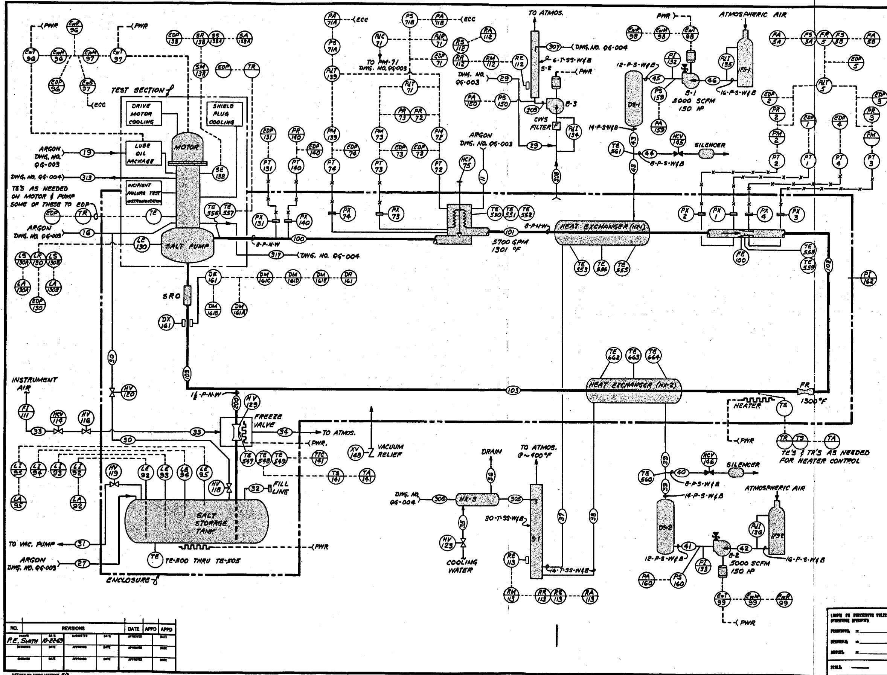

<table><tr><td colspan="5">EQUIPMENT LEGEND</td></tr><tr><td>LETTER(S)</td><td colspan="4">DESCRIPTION</td></tr><tr><td>.B</td><td colspan="4">BLower</td></tr><tr><td>.HX</td><td colspan="4">HEAT EXCHANGER</td></tr><tr><td>.ASH</td><td colspan="4">AIR SAMPLING HEAD</td></tr><tr><td>.DS</td><td colspan="4">BLOwer DISCHARGE SILENCER</td></tr><tr><td></td><td colspan="4"></td></tr><tr><td>.JFS</td><td colspan="4">BLower INTAKE FILTER AND SILENCER</td></tr><tr><td>.S</td><td colspan="4">STACK</td></tr><tr><td>.FR</td><td colspan="4">FLOW RESTRICTOR</td></tr><tr><td>.SRO</td><td colspan="4">SIMULATED REACTOR OUTLET</td></tr><tr><td></td><td colspan="4"></td></tr><tr><td></td><td colspan="4"></td></tr><tr><td></td><td colspan="4"></td></tr><tr><td></td><td colspan="4"></td></tr><tr><td></td><td colspan="4"></td></tr><tr><td></td><td colspan="4"></td></tr><tr><td></td><td colspan="4"></td></tr><tr><td colspan="5"></td></tr><tr><td colspan="5">PIPE LEGEND</td></tr><tr><td>SIZE (INCHES)</td><td>PIPE OR TUBE</td><td colspan="2">MATERIAL</td><td>JOINTS</td></tr><tr><td>1/2</td><td>P OR T</td><td colspan="2">N(MASTELLOHN)</td><td>W(WELDED)</td></tr><tr><td>-</td><td>-</td><td colspan="2">I(MONUEL)</td><td>SC(SCRENE)</td></tr><tr><td>-</td><td>-</td><td colspan="2">S(STEEL)</td><td>B(BOLTED)</td></tr><tr><td>-</td><td>-</td><td colspan="2">SS(STAINLESS STEEL)</td><td>-</td></tr><tr><td colspan="5">LINE NUMBERNOTES-I-ALL INSTRUMENT SYMBOLS AREPER O.R.N.L.C.F.NO.57-2-1 REV.I</td></tr><tr><td colspan="4"></td><td></td></tr><tr><td colspan="4"></td><td></td></tr><tr><td colspan="4"></td><td></td></tr><tr><td colspan="4"></td><td></td></tr><tr><td colspan="4">REFERENCE DRAWINGS</td><td>DWG.NO.</td></tr><tr><td colspan="5">NAME RESPONSIBLE H.J.METZ</td></tr><tr><td colspan="5">M.3.B.E. SALT PUMP TEST STAND</td></tr><tr><td colspan="5">TEST SECTION AND MAIN LOOPINSTRUMENT APPLICATION DIAGRAM</td></tr><tr><td colspan="5">INSTRUMENTATION AND CONTROLS DIVISIONOAK RIDGE NATIONAL LABORATORYOPRORAED BYUNION CARBIDE CORP.</td></tr><tr><td>AMOUNTS</td><td>ACCEPTED GART</td><td colspan="2">APPROVED DATE</td><td>DATE</td></tr><tr><td></td><td></td><td colspan="2">I-10519-QG-002-D-O</td><td></td></tr></table>

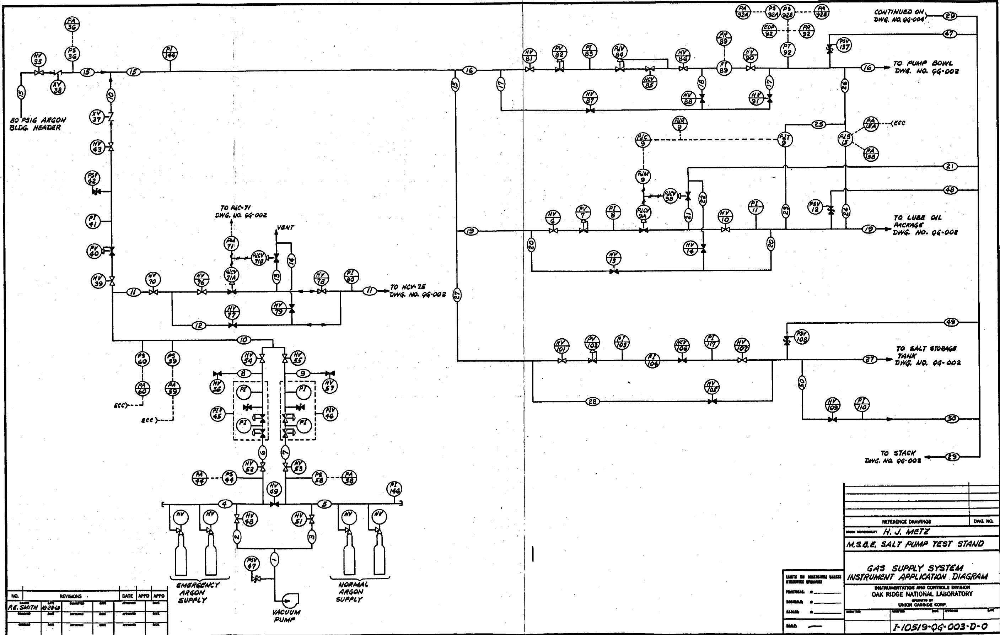  
APPENDIX E

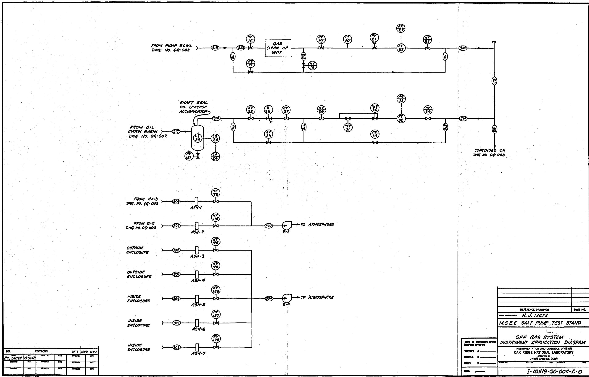

#

#

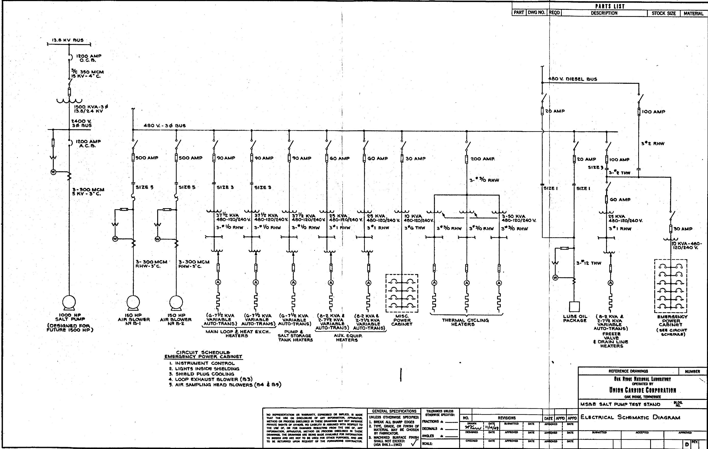

0

#

。

.

，

A

#

Appendix G

MSBE Salt Pump Test Stand

Preliminary Design Calculations

# G-I Salt Storage Tank

The preliminary tank design, shown in Fig. 7, is predicated on the use of Hastelloy N material on hand and the use of forming dies on hand at Paducah for the torispherical heads. At the design temperature of $1200^{\circ}\mathrm{F}$ the allowable stress is 6000 psi. The required tank volume of 75 cu ft is based on the volume of approximately 70 ft of 8 in. (sched 40) pipe $(24\mathrm{ft}^{3})$ , plus 40 ft estimated maximum pump volume, and 11 ft for a gas space and a heel in the tank.

Allowable pressure due to circumferential stresses in cylindrical shell $\frac{1}{2}$ in. thick

$$
P = \frac {S E T}{R + 0 . 6 t} = \frac {(6 0 0 0) (1) (. 5)}{(1 9 . 5) + (. 6) (. 5)} = 1 5 1 p s i
$$

Allowable pressure in torispherical head 5/8 in. thick

$$
P = \frac {S E T}{0 . 8 8 5 L + 0 . 1 t} = \frac {(6 0 0 0) (1) (. 6 2 5)}{(. 8 8 5) (3 6) + (. 1) (. 5)} = 1 1 7 p s i
$$

Volume of tank $= (2 \times 2.78) + (\frac{\pi}{4} \times 39^{2} \times 105.875 / 1728) = 78.75$ cu ft

Tank Support

Total weight of tank and 65 cu ft of primary salt

$$
= 3 0 0 0 + 6 5 \times 2 0 5 = 1 6, 3 2 5 \mathrm {l b}
$$

Assume tank is supported by 4 support rods attached to 2 straps

passing under the tank and an allowable stress of 3500 psi:

Area of one strap $= 16,325 / (4 \times 3500) = 1.17$ in. Use $1/2 \times 2 \times 1/2$

Support Rod

Assume allowable stress $= 10,000$ psi

A = 16,325/(4 × 10,000) = .408 in.a Use rod diam = 3/4 in.

# G-II Heat Exchanger

An existing computer program (SALTEX) for salt-to-air heat ex-changers was used to study the preliminary heat exchanger design for SPTS. The design is subject to the following conditions or limitations:

<table><tr><td>Salt flow rate</td><td>8000 gpm</td></tr><tr><td>Pump power to fluid</td><td>1200 hp</td></tr><tr><td>Mean salt temperature</td><td>1050°F and 1300°F</td></tr><tr><td>Salt pipe size</td><td>8 in. (sched 40)</td></tr><tr><td>Maximum air velocity</td><td>900 fps</td></tr><tr><td>Air inlet temperature</td><td>150°F</td></tr><tr><td>Air inlet pressure</td><td>4 psig</td></tr><tr><td>Air flow rate</td><td>10,000 scfm (total)</td></tr><tr><td>Maximum air side ΔP</td><td>3.1 psi</td></tr></table>

The change in salt temperature around the loop with this flow rate and input power is about $0.7^{\circ}\mathrm{F}$ , which is essentially isothermal during normal operation. The computer output is shown on the two following pages. The more important output is as follows:

<table><tr><td>Heat exchanger length</td><td>16 ft</td></tr><tr><td>Annular gap</td><td>.938 in.</td></tr><tr><td>Air side ΔP</td><td>3.0 psi</td></tr><tr><td>Air side ΔT</td><td>280°F</td></tr></table>

SALTEX 16:17 WED· 11-19-69

FOR MEAN SALT TEMPERATURE OF 1050 F

TRY 0.D. PUMP HEAD[FT] LENGTH[FT] AIF VEL[FT/SEC]DELTA PC[PSI]

REQUIRED WALL THICKNESS LESS THAN STANDARD·RESET

1 10.2 +50 15.606 827.368 4.22129

REQUIRED WALL THICKNESS LESS THAN STANDAFD·FESET·

2 10.2 +40-583 14·4526 810·446 3·87343

3 10.3 140-583 15.2467 758.034 3·36532

4 10.4 +46-583 16·0511 711·568 2·94859

SALT FLOK=8000 GPM, OF 1·35209E+07 LE/HR

CALF PUMP HEAD 140.583-FT

POHEFFLUID-960，PUMP=1200.HF,OR3.05400E+06BTU/HR

SALT PIPE ID=7.981 IN., CD=8.625 IN.

SALT FLOW AREA=·347411 SC·FT

WALL THICKNESS, MIN=149956 ,NOMINAL= .322 INCH

ANNULUS $\mathbb{O}\mathbb{D} = 10.4$ IN

SALT LGOP PFEESLFE ARE

OPERATING-10285 DISCHAGE=2057 DESIGN-12342 PSIG

AIR FLOW AREA = .184184 SG-FT

SALT PHYSICAL PROPERTIES AT T = 1050 F

$CP = .324$ BTU/LE-F, $K = .75$ ETU/LE-FT-F

MU=34.18 LB/FT-HE, DENSITY=210.7 LE/CU-FT

VEL. $=$ 51.3091 FT/SEC,TEMP.CHANGE $\equiv$ .69714 F

MASS VEL= 3.89190E+07 LB/HR-SE-FT, PF NO= 14.7658, FE NO.= 757295.

AIF PHYSICAL PROPERTIES AT 290.121 F

CP=·242211 BTU/LE-F, K= 2·01456E-02 BTU/LE-FT-F

MU=·057224 LB/FT-HF, TEMP CHANGE= 280.241 F

MASS FLOw= 44992.9 LE/HE TOTAL, OR 22496.4 PER ANNULUS

VOL.FLOv= 10000 SCFM TOTAL, BR 5000 SCFM PER ANNULUS AT 70 F

G=122141·LE/HR-SC-FT

INLET--DENSITY=8.28826E-02 LB/CU-FT, VEL=409·352 FT/SEC AT 150 F

OUTLET-DENSITY= 4.76808E-02 LE/CU·FT·VEL= 711·568 FT/SEC AT 430·241 F

MEAN--DENSITY= 6·52817E-02 LE/CU·FT, VEL= 519·719 FT/SEC

PR NC=·688003, FE NC=315719, FRICTION FACTCF=3·57337E-03

HEAT TRANSFER DATA

INSIDE

CCEFFICIENT 2938.34

RESISTANCE 3·67790E-04 2·68333E-03

OUTSIDE OVERALL

67·6658 56·0864

1·47785E-02

OVERALL

56·0864

1·78296E-02

TEMP-AT INLET 1031·43 963·71

TEMP·AT CUT 1037·22

WITH WALL K= 10 ETU/HR-FT-F

LCG MEAN DELTA T=751·187 F

895.986

943.943

PRESSURE LOSS CALCULATIONS FOR AIR

DELTA $F = 81\cdot 6532$ IN.H2G= 2.94859 FSI

LENGTH, TOTAL = 32.1022 FEET, OF PER ANNULUS = 16.0511 FEET

STOP

RAN 12 SEC.

<table><tr><td colspan="2">FOR MEAN SALT</td><td colspan="4">TEMPERATURE OF 1300 F</td></tr><tr><td>TRY</td><td>0.D.</td><td>PUMP HEAD[FT]</td><td>LENGTH[FT]</td><td>AIR VEL[FT/SEC]</td><td>DELTA PCPSI</td></tr><tr><td colspan="2">REQUIRED WALL</td><td colspan="4">THICKNESS LESS THAN STANDARD· RESET·</td></tr><tr><td>1</td><td>9.5</td><td>+50--</td><td>6.99208</td><td>1532.91</td><td>11.7641</td></tr><tr><td colspan="2">REQUIRED WALL</td><td colspan="4">THICKNESS LESS THAN STANDARD· RESET·</td></tr><tr><td>2</td><td>9.5</td><td>+44-566</td><td>6.70751</td><td>1515.14</td><td>11.2267</td></tr><tr><td>3</td><td>9.75</td><td>+44-566</td><td>8.12398</td><td>1162.41</td><td>6.24134</td></tr><tr><td>4</td><td>10</td><td>+44-562</td><td>9.56996</td><td>938.297</td><td>3.92979</td></tr><tr><td>5</td><td>10.25</td><td>+44-566</td><td>11.0453</td><td>783.428</td><td>2.68244</td></tr></table>

<table><tr><td>SALT FLOW=8000 GPM, OR 1.31487E+07 LB/HR</td></tr><tr><td>SALT PUMP HEAD=144.562 FT</td></tr><tr><td>POWER FLUID=960, PUMP=1200. HP, OR 3.05400E+06 BTU/HR</td></tr><tr><td>SALT PIPE ID=7.981 IN, GD=8.625 IN.</td></tr><tr><td>SALT FLOW AREA=·347411 SC.FT</td></tr><tr><td>WALL THICKNESS, MIN=-149956, NOMINAL=·322 INCH</td></tr><tr><td>ANNULUS OD=10.25 IN.</td></tr><tr><td>SALT LOOF PRESSURES ARE</td></tr><tr><td>OPERATING=102.85, DISCHARGE=205.7, DESIGN=123.42 PSIG</td></tr><tr><td>AIR FLOW AREA=·16729 SC.FT</td></tr></table>

<table><tr><td>SALT PHYSICAL PROPERTIES AT T=1300 F</td></tr><tr><td>CP=·324 ETU/LE-F, K=·75 ETU/LE-FT-F</td></tr><tr><td>MU=16.4 LB/FT-HR, DENSITY=204.9 LE/CU-FT</td></tr><tr><td>VEL.=51.3091 FT/SEC, TEM•CHANGE=·716873 F</td></tr><tr><td>MASS VEL=3.78476E+07 LB/HR-SO-FT, PR NO=7.0848, RE NO.=1.53487E+06</td></tr></table>

<table><tr><td>AIR PHYSICAL PROPERTIES AT 290.121 F</td></tr><tr><td>CP= .242211 BTU/LE-F, K= 2.01456E-02 ETU/LE-FT-F</td></tr><tr><td>MU= .057224 LE/FT-HR, TEMP CHANGE= 280.241 F</td></tr><tr><td>MASS FLOW= 44992.9 LE/HP TOTAL, OR 22496.4 PER ANNULUS</td></tr><tr><td>VOL.FLOW= 10000 SCFM TOTAL, OR 5000 SCFM PER ANNULUS AT 70 F</td></tr><tr><td>G= 134476. LB/HR-SC.FT</td></tr><tr><td>INLET-DENSITY= 8.28826E-02 LB/CU.FT, VEL= 450.691 FT/SEC AT 150 F</td></tr><tr><td>OUTLET-DENSITY= 4.76808E-02 LB/CU.FT, VEL= 783.428 FT/SEC AT 430.241 F</td></tr></table>

<table><tr><td>MEAN--DENSITY= 6.52817E-02 LB/CL-FT, VEL= 572.204 FT/SEC
FR NO= .688003 , RE NO= 318228 , FRICTION FACTOR= 3.56787E-03</td></tr></table>

<table><tr><td></td><td colspan="4">HEAT TRANSFER DATA</td></tr><tr><td></td><td>INSIDE</td><td>WALL</td><td>OUTSIDE</td><td>OVERALL</td></tr><tr><td>COEFFICIENT</td><td>4148·28</td><td></td><td>74·3814</td><td>61·02</td></tr><tr><td>RESISTANCE</td><td>2·60516E-04</td><td>2·68333E-03</td><td>1·34442E-02</td><td>1·63881E-02</td></tr><tr><td>TEMP·AT INLET</td><td>1281·72</td><td>1187·57</td><td>1093·42</td><td></td></tr><tr><td>TEMP·AT GUT</td><td>1286·17</td><td>1214·97</td><td>1143·76</td><td></td></tr><tr><td colspan="5">WITH WALL K=10 ETU/HR-FT-F</td></tr><tr><td colspan="5">LOG MEAN DELTA T=1003·37 F</td></tr></table>

<table><tr><td>PRESSURE LOSS CALCULATIONS FOR AIR
DELTA F= 74.2829 IN·H20 = 2.68244 PSI
LENGTH, TOTAL= 22.0907 FEET, OF PER ANNULUS= 11.0453 FEET</td></tr></table>

# G-III Temperature Transients

To obtain an approximation of the maximum heating thermal transient it was assumed that the pump was operating at $110\%$ of design speed, the throttling valve was wide open, the air blowers to the heat exchangers were shut down, all electric heaters on the loop were turned on, and there are no heat losses. The BHP of the pump would be about 1200 and based on 3 kw/sq ft of pipe surface area the total electric heat would be about 475 kw. The weight of INOR-8 in the loop (not including the drain tank) is estimated to be 5000 lb.

$$
\begin{array}{l} q = (1 2 0 0 h p \times 4 2. 4 B t u / h p - m i n) + (4 7 5 k w \times 5 7 B t u / k w - m i n) = 7 7, 9 0 0 B t u / m i n. \\ \Delta T = \left(\frac {q}{Q _ {0} C _ {p}}\right) _ {\text {s a l t}} + \left(\frac {w c _ {p}}{I N O R - 8}\right) = \frac {7 7 , 9 0 0}{Q (2 0 5) (\cdot 3 2 4) + (5 0 0 0) (\cdot 1 3 8)} = \frac {7 7 , 9 0 0}{6 6 . 4 2 Q + 6 9 0} ^ {\circ F / m} \\ \end{array}
$$

where $Q$ = volume of salt in loop and pump in cubic feet.

The resulting curve of temperature rise per minute versus the amount of salt in the loop is shown in Fig. 15.

For the cooling thermal transient it was assumed that the pump is operating at $10\%$ of design speed, the air cooling system is set for a heat removal of 1200 hp, all electric heaters on the loop are turned off, and there are no heat losses. At $10\%$ speed the BHP of the pump will be about 1/1000 of design horsepower, or about one hp which is negligible.

$$
\begin{array}{l} q = 1 2 0 0 h p \times 4 2. 4 B t u / h p - m i n = 5 0, 8 8 0 B t u / m i n \\ \Delta \mathrm {T} = \frac {\mathrm {q}}{\left(\mathrm {Q P C} _ {\mathrm {p}}\right) _ {\text {s a l t}} + \left(\mathrm {W C} _ {\mathrm {p}}\right) _ {\text {I N O R - 8}}} = \frac {5 0 , 8 8 0}{\mathrm {Q} (2 0 5) (\cdot 3 2 4) + (5 0 0 0) (\cdot 1 3 8)} = \frac {5 0 , 8 8 0}{6 6 . 4 2 \mathrm {Q} + 6 9 0} ^ {\circ} \mathrm {F} / \pi \\ \end{array}
$$

The resultant curve of temperature drop per minute versus the amount of salt in the loop is shown in Fig. 15.

# G-IV Pump Characteristics

Since the MSBE salt pumps are yet to be designed by the United States pump industry, it was necessary to estimate the characteristics of the pumps in order to establish the design criteria for the components of the SPTS. The index of a pump's characteristics is given by its specific speed which is defined as:

$$
N _ {S} = \frac {N \sqrt {Q}}{H ^ {3 / 4}}.
$$

If a speed of 900 rpm is selected for the primary pump and 1200 rpm is selected for the secondary pump their respective specific speeds are 1584 and 1488. The shape of the head-flow curve is a function of the specific speed.* The resultant head-flow curves for the primary and secondary salt pumps are shown in Fig. 3.

Two proposed methods were considered in this investigation.

# 1. Use of Plant Water

This system would consist of a water supply line with shut-off and throttling valves connected to a cooling coil and a drain line with open-end combination vacuum breaker, sight-flow fitting that empties into the building water drain. For the 1500 hp motor at $95\%$ efficiency, waste heat = 75 hp, or 3200 Btu/min. Assuming $\Delta T$ of $10^{\circ}\mathrm{F}$ and plant water maximum temperature of about $60^{\circ}\mathrm{F}$ , a flow of about 40 gpm is required. The present cost of process water is 5 cents per thousand gallons.

$$
4 0 \mathrm {g p m} = \sim 6 0, 0 0 0 \mathrm {g p d} = \$ 3. 0 0 \text {p e r d a y}
$$

2. Use of Air-Cooled HX with Pumped Circulation

$$
A = \frac {Q}{U \Delta T} = \frac {2 . 0 \times 1 0 ^ {5}}{7 . 5 \times 2 7 . 4} = 9 7 3 f t ^ {2} (s a y 1 0 0 0 f t ^ {2})
$$

Then the cost is

$$
\begin{aligned} & \text{HX} = 1000\times 7.20 / \text{S.F}\\ & (\text{From UCC Cost Man. I - 200 - 217.0.l})\\ & \text{Cir.Pump and Motor 50 gpm at 50 ft hd}\\ & \text{Installation (33 l / 3\% equip.)}\\ & \text{Indirect (50\%)}\\ & \text{$15,080*} \end{aligned}
$$

*Does not include electrical.

Operating costs for an air-cooled HX and circulating pump would require driving power for two motors of approximately 2 hp each plus maintenance associated with keeping this equipment serviced.

The air-cooled heat exchanger would have to be located outside the building and this would increase the cost of the installation.

Operating costs for use of plant water would be essentially nothing except for the cost of water. With the cost of water at .05/1000 g and a 5 year test duration, it appears that the simplicity and low cost makes use of the plant water system the most desirable.

# Appendix G-VI

# Flow Measurement Instrumentation

# Location of the Flow Sensors

The flow sensors are located in the pump discharge line downstream of the throttle valve and preceded by a straight run of pipe of about 30 pipe diameters. It is anticipated that turbulence from the throttle valve will be about equivalent to a gate valve. To a limited extent it may act as a perforated-plate-type flow turbulence remover. Thus it is expected that satisfactory accuracy will be achieved.

# Description of Flow Sensor

The flow sensor itself will be a truncated nozzle venturi tube. Consideration must be given to the configuration of the flow sensor so that it can be installed in an all-welded piping system and so that pressure taps can be located properly. At present, it seems likely that a truncated venturi might solve the problems of machining, welding, and pressure taps. A preliminary sketch of the truncated nozzle venturi tube is shown in Fig. 14. It is important that the upstream pressure be larger than the differential pressure. This avoids a vacuum in the throat pressure tap.

# Flow Calculation

An engineering study was made of flow calculations. For purposes of comparison, three pipe sizes (8-, 10-, and 12-in.), six $\beta = d / D$ ratios (0.50, 0.56, 0.60, 0.65, 0.70, and 0.75), and three flow rates (3000, 5700, and 8000 gpm) were studied. The salt used in the calculations weighs 204.9 lb per cu ft at $1300^{\circ}F$ .

For these preliminary calculations, the following formula was used. (See Principles and Practice of Flow Meter Engineering, 9th ed, by L. K. Spark.) Several correction factors were omitted for the sake of simplicity.

$$
\begin{array}{l} h _ {w} = \left(Q _ {m} G _ {t} / v D ^ {2} \sqrt {G _ {f}} S\right) ^ {3} \\ h _ {w} = \text {d i f f e r e n t i a l p r e s s u r e i n i n c h e s o f w a t e r} \\ \end{array}
$$

Qm = flow rate in gpm

$v = a$ constant, 5.667, to be used when $Q_{m}$ is in gpm

D = inside diameter of pipe in inches

$G_{t} =$ specific gravity of flowing salt

$\mathbf{G}_{\mathrm{f}} =$ specific gravity of

water at $60^{\circ}\mathrm{F} = 1.0$

S = an operating figure from which $\frac{d}{D}$ may be obtained by reference to a table or curve for the particular kind of flow sensor under study.

The above equation was modified as follows in order to convert "inches of water" to "pounds per square inch" and to group certain terms together for easier calculations:

$$
h _ {w} = \left[ \frac {G _ {t}}{v G _ {f}} \right] ^ {2} \left[ \frac {1}{2 7 . 1} \right] \left[ \frac {Q _ {m}}{D ^ {2} S} \right] ^ {2} (p s i)
$$

From the resulting data, graphs of differential pressure vs. pipe size for the various d/D ratios were plotted. The permanent pressure loss curves were obtained from Fig. 24, p. 48, "Fluid Meters - Their Theory and Application," ASME 5th ed., 1959. From the graphs, one can draw this conclusion:

For 8-in. pipe, the d/D ratio must be high to keep differential pressures low enough at maximum flow to be within the ranges of high-temperature pressure transmitters. The highest d/D ratio for which engineering data is available is about 0.75. For the higher d/D ratios, longer lengths of straight pipe upstream of the flow sensor are recommended. The d/D ratios between 0.2 and 0.6 are preferable.

# Measuring the Differential Pressure

We plan to measure the flow sensor's differential pressure with two pressure transmitters rather than with one differential pressure transmitter. The reason for this is that no high temperature (1300°F) differential pressure transmitter with sufficiently high static pressure rating is known to be on the market. Perhaps one can be developed later

by one of the instrument manufacturers. The procurement of the simpler high temperature pressure transmitters may be somewhat of a problem too, because prototype transmitters for the SPTS facility and the MSBE will be used. These transmitters will have seals that have multi-ply diaphragms. Such seals are not standard items of commerce.

ORNL DWG. 69-13461

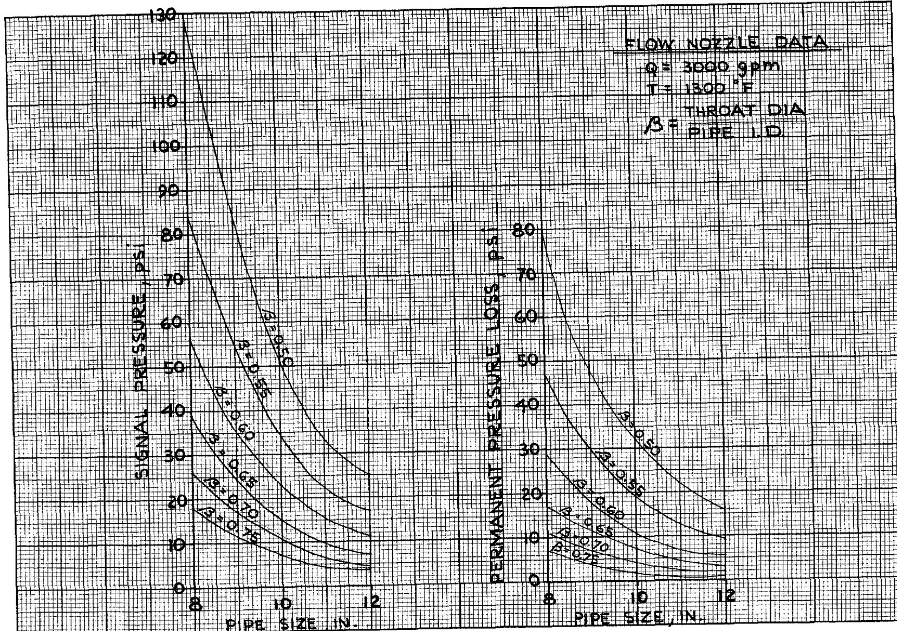

ORNL DWG. 69-13462

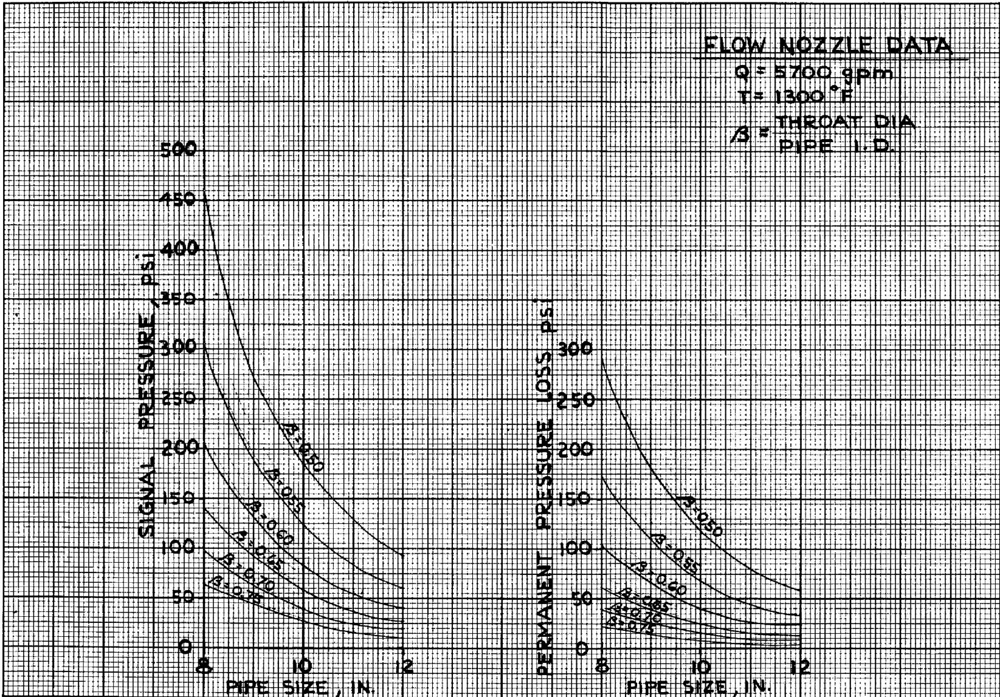

ORNL DWG. 69-13463

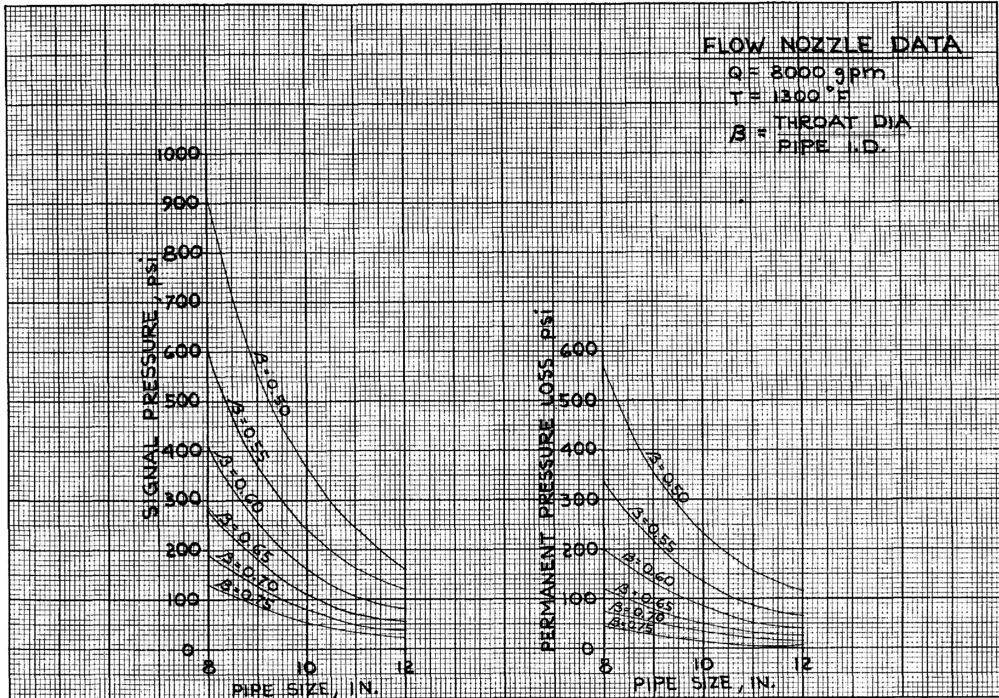

# G-VII MSBE Secondary Pump Operating in Primary Salt with a Reduced Diameter Impeller

For a given pump the following relationships hold:

H varies as $\mathbb{N}^2$ and $\mathbb{D}^2$

Q varies as N and D²

BHP varies as $\mathbb{N}^3$ and $\mathbb{D}^4$

If we assume the primary pump speed is 900 rpm and the secondary pump speed is 1200 rpm, then $\frac{\mathrm{N_c}}{\mathrm{N_f}} = 1.333$ . By a trial and error process, $\frac{\mathrm{D_c}}{\mathrm{D_f}} = .84$ comes close to meeting our requirements of subjecting the secondary pump rotary element to its design power and pressure rise at its design speed.

From the above relationships we can arrive at the following:

$$
\mathrm {H} _ {\mathrm {c}} = \left(\mathrm {N} _ {\mathrm {c}} / \mathrm {N} _ {\mathrm {f}}\right) ^ {2} \left(\mathrm {D} _ {\mathrm {c}} / \mathrm {D} _ {\mathrm {f}}\right) ^ {2} \mathrm {H} _ {\mathrm {f}} = (1. 3 3 3) ^ {2} (. 8 4) ^ {2} \mathrm {H} _ {\mathrm {f}} = 1. 2 5 4 \mathrm {H} _ {\mathrm {f}}
$$

$$
Q _ {c} = \left(N _ {c} / N _ {f}\right) \quad \left(D _ {c} / D _ {f}\right) ^ {2} Q _ {f} = (1. 3 3 3) (. 8 4) ^ {2} Q _ {f} = . 9 4 1 Q _ {f}
$$

$$
\mathrm {B H P} _ {\mathrm {c}} = \left(\mathrm {N} _ {\mathrm {c}} / \mathrm {N} _ {\mathrm {f}}\right) ^ {3} \left(\mathrm {D} _ {\mathrm {c}} / \mathrm {D} _ {\mathrm {f}}\right) ^ {4} \quad \mathrm {B H P} _ {\mathrm {f}} = (1. 3 3 3) ^ {3} (. 8 4) ^ {4} \quad \mathrm {B H P} _ {\mathrm {f}} = 1. 1 8 0 \quad \mathrm {B H P} _ {\mathrm {f}}
$$

These relationships were used for extrapolating the primary pump head, flow, and brake horsepower to the curves for the reduced diameter impeller shown in Fig. 8.

# G-VIII Summary of Pressure Profile Calculations

Pressure distributions around the loop were determined for three conditions:

1. flow, $Q_{\mathrm{r}} = 7850$ gpm and pump head, $H_{\mathrm{r}} = 168$ ft.,   
2. flow, $Q_{j} = 5700$ gpm and pump head, $H_{j} = 150$ ft., and   
3. flow, $Q_{\mathrm{r}} = 2850$ gpm and pump head, $H_{\mathrm{r}} = 165.4$ ft.

The fluid properties used were $1050^{\circ}\mathbf{F}$

$$
\text {d e n s i t y ,} 0, = 2 1 0. 7 \mathrm {l b / f t ^ {3}} \text {a n d}
$$

$$
\text {v i s c o s i t y ,} \mu , = 3 4. 2 \quad \mathrm {l b / f t h r .}
$$

The loop was separated into the following in-line components:

1. 4 ft of conduit (8 in. nominal) at the pump discharge,   
2. the flow control valve,   
3. 221/2 ft of conduit,   
4. the flow nozzle,   
5. 31/2 ft of conduit,   
6. a flow restrictor made up of a thin plate perforated with holes so that the ratio of plate area to conduit area, $\frac{A_2}{A_1}$ , $\cong 0.578$ , and   
7. 50 ft of conduit to the pump suction (including 20 ft of return conduit, 20 ft equivalent estimated for the return bend, and 10 ft equivalent estimated for the bend into the pump).

The above components were located relative to each other so that with very low ( $\sim 0$ abs) pressure at the pump suction, the lowest pressure within the flow nozzle is limited to about 20 psia and there is sufficient "entrance" length of conduit for good nozzle performance.

The friction loss in any component, i, was calculated from

$$
\Delta P _ {i} = C _ {i} Q ^ {2},
$$

where the "loss coefficient," $C_i$ , is different for each component. The various values for $C$ were determined as shown below:

# 1. Conduit

The Blasius equation provides a convenient means for calculating friction losses in conduits,

$$
\Delta P = \frac {f L}{D} \frac {\rho V ^ {2}}{2 g} = \left[ \frac {f \rho L}{D ^ {2} g A ^ {2}} \right] Q ^ {2},
$$

where $C$ is clearly given by $\frac{fPL}{2gDA^2}$ . Since $f$ is a function of Reynolds modulus, $R_e$ , then $C$ will not be strictly a constant. However, over the range of flows considered $f$ changes by only $13\%$ (at $Q = 7840$ gpm, $R_e = 7.4 \times 10^5$ , and $f \cong .012$ ; at $Q = 2850$ , $R_e = 2.7 \times 10^5$ , and $f \cong 0.0136$ ).

Therefore, for the conduit,

$$
\frac {C}{L} = \frac {f p}{2 g D A ^ {2}} = \frac {(. 0 1 2) (2 1 0 . 7)}{(6 4 . 4) (\frac {7 . 9 8 1}{1 2}) [ \frac {\pi}{4} (\frac {7 . 9 8 1}{1 2}) ^ {2} ] ^ {2} (6 0) ^ {2} (7 . 4 8 1) ^ {2} (1 4 4)}
$$

# 2. Flow Control Valve

The friction characteristics of the valve were not determined. It must withstand the difference between the pump head produced and the head losses due to the rest of the loop.

# 3. Flow Nozzle

The maximum pressure difference in the flow nozzle at 7900 gpm is 128.5 psi of which approximately 45 psi is permanently lost (see Appendix G-6, Selection of Flow Nozzle).

The loss-coefficient is therefore given by

$$
C = \Delta P / Q ^ {2} = 4 5 / (7 9 0 0) ^ {2} = . 7 2 1 \times 1 0 ^ {- 6} \mathrm {p s i} / (\mathrm {g p m}) ^ {3}.
$$

A coefficient was also determined for the maximum pressure change, $C_{\max} = 128.5 / (7900)^{2} = 2.065 \times 10^{-6}$ psi/(gpm) $^{2}$ .

# 4. Flow Restrictor

The flow restrictor was considered as a combination of a sudden contraction followed by a sudden expansion with an area ratio of 0.578 $(A_{2} \simeq 0.2 ft^{2})$ .

# Sudden Contraction

$$
\Delta P \cong K _ {c} \rho V _ {2} ^ {2} / 2 g = K _ {c} \rho Q ^ {2} / 2 g \rho_ {2} ^ {2},
$$

where $\mathrm{K_c} = 0.4[1.25 - \mathrm{A_2 / A_1}]$

Therefore $C_{c} \cong \Delta P / Q^{2} = K_{c} \rho / 2 g A_{2}^{2}$ .

# Sudden Expansion

$$
\Delta P \cong K _ {e} ^ {\rho} V _ {3} ^ {2} / 2 g = K _ {e} ^ {\rho} Q ^ {2} / 2 g A _ {2} ^ {2},
$$

where $\mathrm{K_e} = [1 - \mathrm{A_2 / A_1}]^2$

Therefore $C_{\mathrm{e}} \cong \Delta P / Q^{2} = K_{\mathrm{e}} \rho / 2 g A_{2}^{2}$ , and

the combined coefficient, $C_{\text{tot}}$ , becomes

$$
\begin{array}{l} C _ {t o t} \cong C _ {c} + C _ {e} = \frac {\rho}{2 g} \left[ \frac {K _ {c}}{A _ {2} ^ {2}} + \frac {K _ {e}}{K _ {2} ^ {2}} \right] \\ = \frac {2 1 0 . 7}{(6 4 . 4) (3 6 0 0) (7 . 4 8 1) ^ {2} (1 4 4)} \left[ \frac {. 4 [ 1 . 2 5 - . 5 7 8 ]}{(. 2) ^ {2}} \right. \\ \left. + \frac {(1 - . 5 7 8) ^ {3}}{(. 2) ^ {2}} \right] = 1. 2 5 5 \times 1 0 ^ {- 6} \mathrm {p s i} / (\mathrm {g p m}) ^ {2}. \\ \end{array}
$$

With the loss coefficients as determined above, the pressure drop across each component is shown in the following table.

Component Pressure Losses   

<table><tr><td rowspan="2">Loop Component</td><td rowspan="2">Loss-Coefficient (psi/gpm2)</td><td colspan="3">ΔP (psi) for Q = (gpm)</td></tr><tr><td>7840</td><td>5700</td><td>2850</td></tr><tr><td>4 ft of conduit</td><td>0.06645 × 10-6</td><td>4.1</td><td>2.2</td><td>0.5</td></tr><tr><td>Valve*</td><td>---</td><td>--</td><td>--</td><td>--</td></tr><tr><td>22 l/2 ft of conduit</td><td>0.3740 × 10-6</td><td>23.0</td><td>12.2</td><td>3.0</td></tr><tr><td>Nozzle** (total)</td><td>2.065 × 10-6</td><td>126.9</td><td>67.1</td><td>16.8</td></tr><tr><td>Nozzle (lost)</td><td>0.721 × 10-6</td><td>44.4</td><td>23.5</td><td>5.9</td></tr><tr><td>3 l/2 ft of conduit</td><td>0.0582 × 10-6</td><td>3.6</td><td>1.9</td><td>0.5</td></tr><tr><td>Flow restrictor</td><td>1.255 × 10-6</td><td>77.1</td><td>40.8</td><td>10.2</td></tr><tr><td>50 ft of conduit</td><td>0.8475 × 10-6</td><td>52.1</td><td>27.5</td><td>6.9</td></tr><tr><td></td><td>Total</td><td>204.3</td><td>108.1</td><td>27.0</td></tr><tr><td></td><td>Pump ΔP</td><td>245.9</td><td>211.0</td><td>241.9</td></tr><tr><td></td><td>Valve ΔP</td><td>41.6</td><td>102.9</td><td>214.9</td></tr></table>

*The valve $\Delta P$ is the difference between the pump $\Delta P$ and the total $\Delta P$ .   
\*\*Not included in the total losses.

Pressure distributions were determined for the same conditions except the salt temperature was increased to $1300^{\circ}\mathrm{F}$ . There was no significant difference in the resulting pressure profile.

The resulting pressure profiles for the three flow rates are shown in Fig. 5. Any profile may be moved upward by increasing the cover gas pressure up to 50 psig, as shown for the 3000 gpm profile. The cover gas pressure may be increased to prevent pump cavitation, to avoid subatmospheric pressures at the low pressure PMD of the venturi tube, or for other test purposes.

# G-IX Stress Analyses

The Salt Pump Test Stand has been analyzed using the MEL-ZIP, "Piping Flexibility Analysis Program," to determine whether stresses produced by the thermal expansion of the system are within the limits set by "USAS B31.1 - The USA Standard Code for Pressure Piping," using the allowable stress values for the Ni-Mo-Cr alloy given in Code Case 1315-3 for Section VIII of the ASME Boiler and Pressure Vessel Code - Division 1.

Cases were analyzed in which the entire loop was at $1200^{\circ}\mathrm{F}$ and where the top leg was at $1300^{\circ}\mathrm{F}$ and the bottom leg was at $1200^{\circ}\mathrm{F}$ . The stresses produced by the restraint of the thermal expansion through the supports were found to be below the allowable stresses for both cases.

An analysis is currently underway to determine whether the stresses due to pressure and weight are within the limits specified by the Piping Code.

ORNL-TM-2780

1. A. H. Anderson

2. J. L. Anderson

3. C.F.Baes

4. S.E.Beall

5. M. Bender

6. E. S. Bettis

7. R. Blumberg

8. A. L. Boch

9. E. G. Bohlfann

10. R. B. Briggs

ll. C.M.Burton

12. J.M. Case (Y-12)

13. C.J. Claffey

14. D. L. Clark

15. C. W. Collins

16. W. B. Cottrell

17. S.J.Cromer (Y-12)

18. F. L. Culler

19. S.J.Ditto

20. W.P.Eatherly

21. J. W. Ebert (Y-12)

22. D. E. Ferguson

23. L. M. Ferris

24. A. P. Fraas

25. R.M.Fuller

26. W. R. Grimes - G. M. Watson

31. A. G. Grindell

32. P. N. Haubenreich

33. R.E.Helms

34. R.F.Hibbs

35. R.F.Hyland

36. G.R.Jasny (Y-12)

37. P. R. Kasten

38. C.A.Keller

39. L. R. Koffman

40. R. B. Korsmeyer

41. T. S. Kress

42. M. I. Lundin

43. R. N. Lyon

44-45. H.G. MacPherson

46. R.E. MacPherson

47. J. D. McLendon (Y-12)

48. H.E.McCoy

49. H.C.McCurdy

50. C. K. McGlothlan

51-52. R.A.McNees

53. J. R. McWherter

54. H.J.Metz

55. A.J.Miller

56. E. C. Miller

57. R. L. Moore

58. J. F. Morehead

59. E. L. Nicholson

60. F. S. Patton (Y-12)

61. A. M. Perry

62-63. M. W. Rosenthal

64. J. P. Sanders

65. Dunlap Scott

66. M. J. Skinner

67. P.G. Smith

68. I. Spiewak

69. R.D.Stulting

70. R.E.Thoma

71. D. B. Trauger

72. P. R. Vanstrum (Y-12)

73. R.S.Ware (Y-12)

74. A. M. Weinberg

75. J. R. Weir

76. M.E.Whatley

77. J. C. White - A. S. Meyer

78. G. D. Whitman

79-88. L.V.Wilson

89. H.C.Young

90-91. Central Research Library (CRL)

92-93. Y-12 Document Reference Section (DRS)

94-96. Laboratory Records Department (LRD)

97. Laboratory Records Department - Record Copy (LRD-RC)

# External Distribution

98-112. Division of Technical Information Extension (DTIE)

113. Laboratory and University Division, ORO   
114. K. Laughon, RDT-OSR, ORNL   
115. D. F. Cope, RDT-OSR, ORNL   
116. T. W. McIntosh, USAEC, Washington, D.C.

117-125. H.M.Roth,AEC,ORO

126. M. Shaw, USAEC, Washington, D.C.   
127. M. A. Rosen, USAEC, Washington, D.C.

128-129. D. Elias, USAEC, Washington, D.C.

130. G. M. Kavanagh, USAEC, Washington, D.C.