# OAK RIDGE NATIONAL LABORATORY

operated by

UNION CARBIDE CORPORATION • NUCLEAR DIVISION

for the

U.S. ATOMIC ENERGY COMMISSION

ORNL-TM-2815


# COMPUTER PROGRAMS FOR MSBR HEAT EXCHANGERS

C. E. Bettis

T. W. Pickel

W. K. Crowley

M. Simon-Tov

H. A. Nelms

W.C.Stoddart

This report was prepared as an account of work sponsored by the United States Government. Neither the United States nor the United States Atomic Energy Commission, nor any of their employees, nor any of their contractors, subcontractors, or their employees, makes any warranty, express or implied, or assumes any legal liability or responsibility for the accuracy, completeness or usefulness of any information, apparatus, product or process disclosed, or represents that its use would not infringe privately owned rights.

# OAK RIDGE NATIONAL LABORATORY

OPERATED BY

UNION CARBIDE CORPORATION

NUCLEAR DIVISION


POST OFFICE BOX X

OAK RIDGE, TENNESSEE 37830

June 24, 1971

To: Recipients of Subject Report

Report No.: ORNL-TM-2815 Classification: Unclassified

Author(s): C. E. Bettis, W. K. Crowley, H. A. Nelms, T. W. Pickel

Subject: Computer Programs For MSBR Heat Exchangers

Request compliance with indicated action:

Please affix the attached corrected pages 6, 7, 58, 62, 63, 86, 87, 88, 89, 117, 124, 125 to pages with same numbers in your copy(ies) of the subject report. They are prepared on gummed stock for your convenience. Also prepared on gummed stock is a correction for the bottom two lines on page 9 of the report.

Please correct your copies promptly to avoid further errors. The corrected design data for the primary heat exchanger agree with the data shown in Report No. ORNL-4541.

Nl 103x Laboratory Records Department Technical Information Division

Table 2.1. Design Data for MSBR Primary Heat Exchanger   

<table><tr><td>Type</td><td>Shell-and-tube one-pass vertical exchanger with disk and doughnut baffles</td></tr><tr><td>Number required</td><td>Four</td></tr><tr><td>Rate of heat transfer per unit, MW</td><td>556.5</td></tr><tr><td>Btu/hr</td><td>1.9 x 109</td></tr><tr><td>Tube-side conditions</td><td></td></tr><tr><td>Hot fluid</td><td>Fuel salt</td></tr><tr><td>Entrance temperature, °F</td><td>1300</td></tr><tr><td>Exit temperature, °F</td><td>1050</td></tr><tr><td>Entrance pressure, psi</td><td>180</td></tr><tr><td>Pressure drop across exchanger, psi</td><td>130</td></tr><tr><td>Mass flow rate, lb/hr</td><td>23.4 x 106</td></tr><tr><td>Shell-side conditions</td><td></td></tr><tr><td>Cold fluid</td><td>Coolant salt</td></tr><tr><td>Entrance temperature, °F</td><td>850</td></tr><tr><td>Exit temperature, °F</td><td>1150</td></tr><tr><td>Exit pressure, psi</td><td>34</td></tr><tr><td>Pressure drop across exchanger, psi</td><td>115.7</td></tr><tr><td>Mass flow rate, lb/hr</td><td>17.8 x 106</td></tr><tr><td>Tube</td><td></td></tr><tr><td>Material</td><td>Hastelloy N</td></tr><tr><td>Number required</td><td>5803</td></tr><tr><td>Pitch, in.</td><td>0.75</td></tr><tr><td>Outside diameter, in.</td><td>0.375</td></tr><tr><td>Wall thickness, in.</td><td>0.035</td></tr><tr><td>Length, ft</td><td>24.4</td></tr><tr><td>Tube sheet</td><td></td></tr><tr><td>Material</td><td>Hastelloy N</td></tr><tr><td>Thickness, in.</td><td>4.75</td></tr><tr><td>Sheet-to-sheet distance, ft</td><td>23.2</td></tr><tr><td>Total heat transfer area, ft2</td><td>13,916</td></tr><tr><td>Basis for area calculation</td><td>Outside of tubes</td></tr><tr><td>Volume of fuel salt in tubes, ft3</td><td>71.9</td></tr><tr><td>Shell</td><td></td></tr><tr><td>Material</td><td>Hastelloy N</td></tr><tr><td>Thickness, in.</td><td>0.5</td></tr><tr><td>Inside diameter, in.</td><td>67.6</td></tr><tr><td>Central tube diameter, in.</td><td>20.0</td></tr><tr><td>Baffle</td><td></td></tr><tr><td>Type</td><td>Disk and doughnut</td></tr><tr><td>Number</td><td>21</td></tr><tr><td>Spacing, in.</td><td>11.23</td></tr><tr><td>Disk outside diameter, in.</td><td>54.20</td></tr><tr><td>Doughnut inside diameter, in.</td><td>45.3</td></tr><tr><td>Overall heat transfer coefficient, U, Btu/hr·ft2·°F</td><td>784.8</td></tr><tr><td>Tube</td><td></td></tr><tr><td>Maximum primary (P) stresses</td><td></td></tr><tr><td>Calculated, psi</td><td>683</td></tr><tr><td>Allowable, psi</td><td>4232</td></tr><tr><td>Maximum primary and secondary (P + Q) stresses</td><td></td></tr><tr><td>Calculated, psi</td><td>12,484</td></tr><tr><td>Allowable, psi</td><td>12,696</td></tr><tr><td>Maximum peak (P + Q + F) stresses</td><td></td></tr><tr><td>Calculated, psi</td><td>13,563</td></tr><tr><td>Allowable, psi</td><td>25,000</td></tr></table>

wave configuration. The tubes are held in place by wire lacing in this upper portion of the tube bundle. Since baffling is not employed in this region, the bent-tube portion of the bundle experiences essentially parallel flow and a relatively lower heat transfer performance.

Below the bent-tube region of the bundle, evenly spaced doughnut-shaped baffles are used to hold the tubes in place and to produce cross-flow. The baffles spacings and cross-flow velocities are designed to minimize the possibility of flow-induced vibration. The tubes in this baffled region of the heat exchanger have a helical indentation knurled into their surface to enhance the film heat transfer coefficients and thereby reduce the fuel salt inventory in the exchanger. No enhancement of this nature was used in the upper bent-tube region because of present uncertainty about the reliability of tubes that are both bent and indented.

Bottom of page 9:

For completely turbulent flow with Reynolds numbers greater than 12,000,

$$
\frac {h _ {i} d _ {i}}{k _ {i}} = 0. 0 2 1 7 \left(N _ {R e}\right) ^ {O \cdot 8} \left(N _ {P r}\right) ^ {1 / 3} \left(\frac {\mu_ {b}}{\mu_ {i}}\right) ^ {O \cdot 1 4} \left(E F _ {i}\right) \tag {2.3}
$$

```csv
1047 FORMAT(31HOBERGLIN MODIFICATION FACTOR = ,F5.2) MSBR 500  
1048 FORMAT(1HO,2X,1HI,7X,3HTCI,9X,3HTCO,9X,3HCWT,9X,3HTFI,9X,3HTFO, 19X,3HFWT,8X,4HTWDT//11X,1HF,11X,1HF,11X,1HF,11X, 2 1HF,11X,1HF,11X,1HF,11X,1HF// (1X,I3,7E12.4)) MSBR 512  
1049 FORMAT(1HC,2X,1HI,9X,2HV1,9X,2HV2,9X,2HV3,9X,3HVW1,9X,3HVW3, 18X,4HPDSC,8X,4HPCTC//32X,6HFT/SEC,33X,7HLB/SQFT// (1X,I3,7F12.4)) MSBR 521  
1050 FORMAT(1HO,2X,1HI,5X,5HRENTO,7X,5HPRNTO,7X,6HRENSO1,6X,6HRENSO2, 16X,6HRENSO3,7X,3HHTO,8X,4HAHSO,9X,3HUOA,8X,4HHEAT//77X, 2 13HBTU/HR/SQFT/F,13X,6HBTU/HR// (1X,I3,9E12.4)) MSBR 532  
1051 FORMAT(27HOTUBE WALL AVERAGE TEMP. = ,F10.2) MSBR 540  
1052 FORMAT(28HOSHELL SIDE AVERAGE TEMP. = ,F10.2) MSBR 550  
1053 FORMAT(1HO,34FP STRESS AT TUBE OD AND TUBE ID = , 2F10.2,1X, 19H(LB/SQIN)//18H(SHOULD NOT EXCEED,F10.2,3H)) MSBR 561  
1054 FORMAT(1HC,36FP+Q STRESS AT TUBE OD AND TUBE ID = , 2F10.2,1X,9H(LB/SQIN)//18H(SHOULD NOT EXCEED,F10.2, 2 3H )) MSBR 572  
1055 FORMAT(1HC,38FP+Q+F STRESS AT TUBE OD AND TUBE ID = , 2F10.2,1X,9H(LB/SQIN)//18H(SHOULD NOT EXCEED,F10.2, 2 3H )) MSBR 581  
READ IN AND PRINT OUT INPUT DATA MSBR 650  
KEY7= 1 MSBR 660  
VM1(1)=0. MSBR 670  
VM2(1)=0. MSBR 680  
VM3(1)=0. MSBR 690  
VWO1(1)=0. MSBR 660  
VWO3(1)=0. MSBR 670  
RENSO1(1)=0. MSBR 680  
RENSO2(1)=0. MSBR 690  
RENSO3(1)=0. MSBR 700  
HSO1(1)=0. MSBR 710  
HSO2(1)=0. MSBR 720 
```

<table><tr><td></td><td>IF (KEY1.EQ.C)BSOI=0.5*(BSL+BSH)</td><td>MSB 1850</td></tr><tr><td></td><td>CURVES=C.C69813*ARC* EXPRAD+0.4*(RA8-RA5)+.25*BSOI</td><td>MSB 1860</td></tr><tr><td></td><td>IT = 0</td><td>MSB 1870</td></tr><tr><td></td><td>KFINAL=0</td><td>MSB 1880</td></tr><tr><td>9</td><td>I=1</td><td>MSB 1890</td></tr><tr><td></td><td>HEFI = 1.</td><td>MSBR 730</td></tr><tr><td></td><td>HEFO = 1.</td><td>MSBR 740</td></tr><tr><td></td><td>TSUM=C.</td><td>MSB 1900</td></tr><tr><td></td><td>SSUM=C.</td><td>MSB 1910</td></tr><tr><td></td><td>THEATO = 0.0</td><td>MSB 1920</td></tr><tr><td></td><td>TPDTO = 0.0</td><td>MSB 1930</td></tr><tr><td></td><td>TPDSO = 0.0</td><td>MSB 1940</td></tr><tr><td></td><td>TFO(I)=FTC</td><td>MSB 1950</td></tr><tr><td></td><td>TCI(I)=CTC</td><td>MSB 1960</td></tr><tr><td></td><td>TIF=-5.0</td><td>MSB 1970</td></tr><tr><td></td><td>TIC=-5.0</td><td>MSB 1980</td></tr><tr><td></td><td>CDTF=0.</td><td>MSB 1990</td></tr><tr><td></td><td>FDTF=0.</td><td>MSB 2000</td></tr><tr><td></td><td>BSO = BSOI</td><td>MSB 2010</td></tr><tr><td></td><td>BRL1 = BSC/((RA8-(RA8-RA7)/2)-(RA5+(RA6-RA5)/2))</td><td>MSB 2020</td></tr><tr><td></td><td>GBRL = C.77*BRL1**(-.138)</td><td>MSB 2030</td></tr><tr><td></td><td>AW01 = BSC*LAWO1</td><td>MSB 2040</td></tr><tr><td></td><td>AW03 = BSC*LAWO3</td><td>MSB 2050</td></tr><tr><td></td><td>AW1 = SQRT(AW01*APO1)</td><td>MSB 2060</td></tr><tr><td></td><td>AW2 = (AW01+AW03)/2.</td><td>MSB 2070</td></tr><tr><td></td><td>AW3 = SQRT(AWC3*APO3)</td><td>MSB 2080</td></tr><tr><td></td><td>GSO1 = QC/AW1</td><td>MSB 2090</td></tr><tr><td></td><td>GSO2 = QC/AW2</td><td>MSB 2100</td></tr><tr><td></td><td>GSO3 = QC/AW3</td><td>MSB 2110</td></tr><tr><td></td><td>BSO=CURVES</td><td>MSB 2120</td></tr><tr><td></td><td>EQVBSO = CURVES+13.*(DIA+DIAI)</td><td>MSB 2130</td></tr><tr><td></td><td>KEY4=C</td><td>MSB 2140</td></tr><tr><td>10</td><td>KEY5=C</td><td>MSB 2150</td></tr><tr><td>11</td><td>ATC = TCI(I) + (TIC/2.0)</td><td>MSB 2160</td></tr><tr><td></td><td>CFT = ATC +CDTF*HSFCT</td><td></td></tr><tr><td></td><td>ATF = TFO(I) + TIF/2.</td><td>MSB 2180</td></tr><tr><td></td><td>FFT=ATF-FCTF*HSFCT</td><td></td></tr><tr><td></td><td>FI=1</td><td>MSB 2200</td></tr><tr><td></td><td>TUBLN(I) = (FI-1.)*BSOI+CURVES</td><td>MSB 2210</td></tr></table>

$\begin{array}{l}\mathrm{CVIS} = 0.2121*\mathrm{EXP}(4032. / (460. + \mathrm{ATC}))\\ \mathrm{CVISW} = 0.2121*\mathrm{EXP}(4032. / (460. + \mathrm{CFT}))\\ \mathrm{CDEN} = 141.37 - 0.02466*\mathrm{ATC}\\ \mathrm{CCON} = 0.240\\ \mathrm{CSPH} = 0.36\\ \mathrm{FVIS} = 0.2637*\mathrm{EXP}(7362. / (460. + \mathrm{ATF}))\\ \mathrm{FVISW} = 0.2637*\mathrm{EXP}(7362. / (460. + \mathrm{FFT}))\\ \mathrm{FDEN} = 234.97 - 0.02317*\mathrm{ATF}\\ \mathrm{FCON} = 0.70\\ \mathrm{FSPH} = 0.324\\ \mathrm{VISK} = (\mathrm{CVIS} / \mathrm{CVISW})**0.14\\ \mathrm{FVISK} = (\mathrm{FVIS} / \mathrm{FVISW})**0.14\\ \mathrm{DCVIS} = \mathrm{DIA} / \mathrm{CVIS}\\ \mathrm{CCDEN} = 1. / \mathrm{CDEN}\\ \mathrm{QCCDEN} = \mathrm{QC*CCDEN} \end{array}$ MSB 2220  
MSB 2230  
MSB 2240  
MSB 2250  
MSB 2260  
MSB 2270  
MSB 2280  
MSB 2290  
MSB 2300  
MSB 2310  
MSB 2320  
MSB 2330  
MSB 2340  
MSB 2350  
MSB 2360

```txt
C CALCULATE REYNOLS AND PRANDTL NUMBER TUBE SIDE MSB 2550  
RENTO(I) = CIAI*GTO/FVIS MSB 2380  
PRNTO(I) = FVIS*FSPH/FCCN MSB 2390  
IF(KENTB.EQ.1.AND.RENTC(I).GT.1001. AND.I.NE.1) MSB 2400  
HEFI=1.+(RENTO(I)-1000.)/9000.)**0.5 MSB 2401  
PDTO(I)=(.0C28+.25*RENTO**(-.32))*EQVBSO*GTO**2*HEFI/ MSB 2410  
1 (DIAI*FDEN*4171824CO.) MSB 2411 
```

```txt
C CALCULATE HEAT TRANSFER COEFF TUBE SIDE MSB 2640 IF(RENTO(I).LT.12CCC.)GO TO 12 HTO(I)=FCCN/DIA*C217*(RENTO(I)**8)*(PRNTC(I)**3333)*FVISK*HEFI MSB 2430 GO TO 15 MSB 2440 
```

```txt
12 IF(RENTO(I).LT.21CC.) GO TO 14 MSB 2450
```

```txt
13 HTO(I) = FCON/DIA*.C89*(RENTO(I)**.67895-141.1372)*(PRNTO(I)
1**.3333)*FVISK*HEF I*(1.+.3333*(DIAI/TUBLN(I))**.6666)
GO TO 15 MSB 2470 
```

```txt
14 HTO(I) = FCCN/DIA*(4.36+(0.025*RENTO(I)*PRNTO(I)*DIAI/TUBLN(I)) MSB 2480
1)/(1. + C.0012*RENTO(I)*PRNTO(I)*DIAI/TUBLN(I))) MSB 2481 
```

```txt
15 IF(I.EQ.1)GO TO 16 MSB 2490 
```

```txt
C CALCULATE FLOW AREAS SHELL SIDE MSB 2480  
VW01(I) = QCCDEN/AW01 MSB 2510  
VW03(I) = QCCDEN/AW03 MSB 2520  
VM1(I) = GSO1*CCDEN MSB 2530  
VM2(I) = GSO2*CCDEN MSB 2540  
VM3(I) = GSG3*CCDEN MSB 2550 
```

TOTAL HEAT TRANSFERED = 1898217984. (BTU/HR) (99.9 PERCENT)

MASS FLOW RATE OF COOLANT = 17590736. (LB/HR)

MASS FLOW RATE OF FUEL = 2345432C. (LB/HR)

SHELL-SIDE TOTAL PRESSURE CRCP = 115.75 (LB/SQIN) (99.7 PERCENT)

TUBE-SIDE TOTAL PRESSURE DROP = 129.32 (LB/SQIN) (99.5 PERCENT)

NOMINAL SHELL RADIUS = 2.81€2 (FT)

UNIFORM BAFFLE SPACING = C.9386 (FT)

TUBE FLUID VOLUME CONTAINED IN TUBES = 71.92 (CUBIC FEET)

TOTAL HEAT TRANSFER AREA BASED ON TUBE O.D. = 13916.32 (SQFT)

TOTAL NUMBER OF TUBES = 5803.

TOTAL TUBE LENGTH = 24.43 (FT)

HEAT EXCH. APPROX. LENGTH = 23.22 (FEET)

STRAIGHT SECTION OF TUBE LENGTH = 20.26 (FT)

RADIUS OF THERMAL EXPANSION CURVES = 0.86 (FEET)

BERGLIN MODIFICATION FACTOR = 0.79

TUBE WALL AVERAGE TEMP. = 1116.54

SHELL SIDE AVERAGE TEMP. = 1013.66

P STRESS AT TUBE OD AND TUBE ID = 683.42 646.47 (LB/SQIN)

SHOULD NOT EXCEED 4232.23

P+Q STRESS AT TUBE OD AND TUBE ID = 12484.39 8890.97 (LB/SQIN)

SHOULD NOT EXCEED 12696.7C

P+Q+F STRESS AT TUBE OD AND TUBE ID = 13562.77 10981.55 (LB/SQIN)

SHOULD NOT EXCEED 25000.CO

<table><tr><td>I</td><td colspan="2">TCI</td><td colspan="2">TCC</td><td colspan="2">CWT</td><td colspan="2">TFI</td><td colspan="2">TFO</td><td colspan="2">FWT</td><td colspan="2">TWDT</td></tr><tr><td></td><td colspan="2">F</td><td colspan="2">F</td><td colspan="2">F</td><td colspan="2">F</td><td colspan="2">F</td><td colspan="2">F</td><td colspan="2">F</td></tr><tr><td>1</td><td>0.1150E</td><td>04</td><td>0.1122E</td><td>04</td><td>C.124CE</td><td>C4</td><td>0.1276E</td><td>04</td><td>0.1300E</td><td>04</td><td>0.1256E</td><td>04</td><td>0.1549E</td><td>02</td></tr><tr><td>2</td><td>0.1122E</td><td>04</td><td>0.1108E</td><td>04</td><td>0.1178E</td><td>C4</td><td>0.1265E</td><td>04</td><td>0.1276E</td><td>04</td><td>0.1223E</td><td>04</td><td>C.4528E</td><td>02</td></tr><tr><td>3</td><td>0.1108E</td><td>04</td><td>0.1094E</td><td>04</td><td>0.1165E</td><td>04</td><td>0.1254E</td><td>04</td><td>0.1265E</td><td>04</td><td>0.1210E</td><td>04</td><td>0.4516E</td><td>02</td></tr><tr><td>4</td><td>0.1094E</td><td>C4</td><td>0.1081E</td><td>04</td><td>0.1152E</td><td>04</td><td>0.1242E</td><td>04</td><td>0.1254E</td><td>04</td><td>0.1198E</td><td>04</td><td>0.4525E</td><td>02</td></tr><tr><td>5</td><td>0.1081E</td><td>04</td><td>0.1067E</td><td>04</td><td>0.1139E</td><td>04</td><td>0.1231E</td><td>04</td><td>0.1242E</td><td>04</td><td>0.1185E</td><td>04</td><td>0.4533E</td><td>02</td></tr><tr><td>6</td><td>0.1067E</td><td>04</td><td>0.1053E</td><td>04</td><td>0.1126E</td><td>04</td><td>0.1219E</td><td>04</td><td>0.1231E</td><td>04</td><td>0.1172E</td><td>04</td><td>C.4538E</td><td>02</td></tr><tr><td>7</td><td>0.1053E</td><td>04</td><td>0.1039E</td><td>04</td><td>0.1113E</td><td>04</td><td>0.1208E</td><td>04</td><td>0.1219E</td><td>04</td><td>0.1159E</td><td>04</td><td>0.4540E</td><td>02</td></tr><tr><td>8</td><td>0.1039E</td><td>04</td><td>0.1025E</td><td>04</td><td>C.110CE</td><td>04</td><td>0.1196E</td><td>04</td><td>0.1208E</td><td>04</td><td>0.1146E</td><td>04</td><td>0.4540E</td><td>02</td></tr><tr><td>9</td><td>0.1025E</td><td>04</td><td>0.1012E</td><td>04</td><td>0.1087E</td><td>04</td><td>0.1185E</td><td>04</td><td>0.1196E</td><td>04</td><td>0.1133E</td><td>04</td><td>0.4538E</td><td>02</td></tr><tr><td>10</td><td>0.1012E</td><td>04</td><td>0.9979E</td><td>03</td><td>0.1074E</td><td>04</td><td>0.1173E</td><td>04</td><td>0.1185E</td><td>04</td><td>0.1119E</td><td>04</td><td>0.4532E</td><td>02</td></tr><tr><td>11</td><td>0.9979E</td><td>03</td><td>0.9842E</td><td>03</td><td>0.1061E</td><td>04</td><td>0.1162E</td><td>04</td><td>0.1173E</td><td>04</td><td>0.1106E</td><td>04</td><td>0.4524E</td><td>02</td></tr><tr><td>12</td><td>0.9842E</td><td>C3</td><td>0.9705E</td><td>03</td><td>0.1048E</td><td>04</td><td>0.1150E</td><td>04</td><td>0.1162E</td><td>04</td><td>0.1093E</td><td>04</td><td>0.4513E</td><td>02</td></tr><tr><td>13</td><td>0.9705E</td><td>03</td><td>0.9569E</td><td>03</td><td>C.1035E</td><td>04</td><td>0.1139E</td><td>04</td><td>0.1150E</td><td>04</td><td>0.1080E</td><td>04</td><td>0.4499E</td><td>02</td></tr><tr><td>14</td><td>0.9569E</td><td>03</td><td>0.9433E</td><td>03</td><td>0.1022E</td><td>04</td><td>0.1128E</td><td>04</td><td>0.1139E</td><td>04</td><td>0.1067E</td><td>04</td><td>0.4482E</td><td>02</td></tr><tr><td>15</td><td>0.9433E</td><td>03</td><td>0.9297E</td><td>03</td><td>0.1009E</td><td>04</td><td>0.1116E</td><td>04</td><td>0.1128E</td><td>04</td><td>0.1053E</td><td>04</td><td>C.4462E</td><td>02</td></tr><tr><td>16</td><td>0.9297E</td><td>03</td><td>0.9162E</td><td>03</td><td>0.9957E</td><td>03</td><td>0.1105E</td><td>04</td><td>0.1116E</td><td>04</td><td>0.1040E</td><td>04</td><td>0.4440E</td><td>02</td></tr><tr><td>17</td><td>0.9162E</td><td>03</td><td>0.9029E</td><td>03</td><td>0.9827E</td><td>03</td><td>0.1094E</td><td>04</td><td>0.1105E</td><td>04</td><td>0.1027E</td><td>04</td><td>0.4414E</td><td>02</td></tr><tr><td>18</td><td>0.9029E</td><td>03</td><td>0.8895E</td><td>03</td><td>C.9697E</td><td>03</td><td>0.1083E</td><td>04</td><td>0.1094E</td><td>04</td><td>0.1014E</td><td>04</td><td>0.4385E</td><td>02</td></tr><tr><td>19</td><td>0.8895E</td><td>03</td><td>0.8763E</td><td>03</td><td>C.9568E</td><td>C3</td><td>0.1072E</td><td>04</td><td>0.1083E</td><td>04</td><td>0.1000E</td><td>04</td><td>0.4353E</td><td>02</td></tr><tr><td>20</td><td>0.8763E</td><td>03</td><td>0.8632E</td><td>03</td><td>0.9439E</td><td>03</td><td>0.1061E</td><td>04</td><td>0.1072E</td><td>04</td><td>0.9871E</td><td>03</td><td>0.4318E</td><td>02</td></tr><tr><td>21</td><td>0.8632E</td><td>03</td><td>0.8503E</td><td>03</td><td>0.9311E</td><td>C3</td><td>0.1050E</td><td>04</td><td>0.1061E</td><td>04</td><td>0.9739E</td><td>03</td><td>0.428CE</td><td>02</td></tr></table>

<table><tr><td>I</td><td>V1</td><td>V2</td><td>V3</td><td>VW1</td><td>VW3</td><td>PDSO</td><td>PDTO</td></tr><tr><td></td><td></td><td></td><td>FT/SEC</td><td></td><td></td><td>LB/SQFT</td><td></td></tr><tr><td>1</td><td>0.0</td><td>0.0</td><td>0.0</td><td>0.0</td><td>0.0</td><td>847.4312</td><td>2869.1321</td></tr><tr><td>2</td><td>6.1833</td><td>6.9424</td><td>6.7222</td><td>6.3719</td><td>7.6251</td><td>847.4312</td><td>861.8818</td></tr><tr><td>3</td><td>6.1649</td><td>6.9218</td><td>6.7022</td><td>6.3530</td><td>7.6025</td><td>841.4097</td><td>853.9431</td></tr><tr><td>4</td><td>6.1467</td><td>6.9C14</td><td>6.6825</td><td>6.3342</td><td>7.5801</td><td>835.4158</td><td>846.0403</td></tr><tr><td>5</td><td>6.1286</td><td>6.8810</td><td>6.6628</td><td>6.3155</td><td>7.5577</td><td>829.4214</td><td>838.1379</td></tr><tr><td>6</td><td>6.1106</td><td>6.8608</td><td>6.6432</td><td>6.2970</td><td>7.5355</td><td>823.4299</td><td>830.2402</td></tr><tr><td>7</td><td>6.0926</td><td>6.8406</td><td>6.6236</td><td>6.2785</td><td>7.5133</td><td>817.4436</td><td>822.3506</td></tr><tr><td>8</td><td>6.0748</td><td>6.8206</td><td>6.6042</td><td>6.2601</td><td>7.4913</td><td>811.4666</td><td>814.4746</td></tr><tr><td>9</td><td>6.0570</td><td>6.8006</td><td>6.5849</td><td>6.2418</td><td>7.4694</td><td>805.5010</td><td>806.6165</td></tr><tr><td>10</td><td>6.0394</td><td>6.78C8</td><td>6.5658</td><td>6.2236</td><td>7.4477</td><td>799.5500</td><td>798.7803</td></tr><tr><td>11</td><td>6.0219</td><td>6.7612</td><td>6.5467</td><td>6.2055</td><td>7.4261</td><td>793.6187</td><td>790.9712</td></tr><tr><td>12</td><td>6.0045</td><td>6.7416</td><td>6.5278</td><td>6.1876</td><td>7.4046</td><td>787.7100</td><td>783.1938</td></tr><tr><td>13</td><td>5.9872</td><td>6.7223</td><td>6.5091</td><td>6.1699</td><td>7.3834</td><td>781.8259</td><td>775.4529</td></tr><tr><td>14</td><td>5.9702</td><td>6.7031</td><td>6.4905</td><td>6.1522</td><td>7.3623</td><td>775.9714</td><td>767.7529</td></tr><tr><td>15</td><td>5.9532</td><td>6.6841</td><td>6.4721</td><td>6.1348</td><td>7.3414</td><td>770.1499</td><td>760.0996</td></tr><tr><td>16</td><td>5.9365</td><td>6.6653</td><td>6.4539</td><td>6.1175</td><td>7.3208</td><td>764.3652</td><td>752.4968</td></tr><tr><td>17</td><td>5.9199</td><td>6.6467</td><td>6.4358</td><td>6.1004</td><td>7.3003</td><td>758.6204</td><td>744.9495</td></tr><tr><td>18</td><td>5.9035</td><td>6.6283</td><td>6.4180</td><td>6.0836</td><td>7.2801</td><td>752.9199</td><td>737.4634</td></tr><tr><td>19</td><td>5.8873</td><td>6.6101</td><td>6.4004</td><td>6.0669</td><td>7.2601</td><td>747.2676</td><td>730.0410</td></tr><tr><td>20</td><td>5.8713</td><td>6.5921</td><td>6.3830</td><td>6.0504</td><td>7.2404</td><td>741.6660</td><td>722.6892</td></tr><tr><td>21</td><td>5.8555</td><td>6.5744</td><td>6.3659</td><td>6.0341</td><td>7.2210</td><td>736.1208</td><td>715.4114</td></tr></table>

<table><tr><td>I</td><td colspan="2">RENTO</td><td colspan="2">PRNTC</td><td colspan="2">RENSO1</td><td colspan="2">RENSO2</td><td colspan="2">RENSO3</td><td colspan="2">HTO</td><td colspan="2">AHSO</td><td colspan="2">UOA</td><td colspan="2">HEAT</td><td></td><td></td></tr><tr><td></td><td></td><td></td><td></td><td></td><td></td><td></td><td></td><td></td><td></td><td></td><td></td><td></td><td></td><td></td><td colspan="2">BTU/HR/SQFT/F</td><td colspan="2">BTU/HR</td><td></td><td></td></tr><tr><td>1</td><td>0.1138E</td><td>05</td><td>0.8232E</td><td>01</td><td>0.0</td><td></td><td>0.0</td><td></td><td>0.0</td><td></td><td>0.0</td><td></td><td>0.1732E</td><td>04</td><td>0.5314E</td><td>03</td><td>0.3653E</td><td>03</td><td>0.1793E</td><td>09</td></tr><tr><td>2</td><td>0.1091E</td><td>05</td><td>0.8589E</td><td>01</td><td>0.2887E</td><td>05</td><td>0.3241E</td><td>05</td><td>0.3138E</td><td>05</td><td>0.3422E</td><td>04</td><td>0.2580E</td><td>04</td><td>0.2532E</td><td>04</td><td>0.1044E</td><td>04</td><td>0.8700E</td><td>08</td></tr><tr><td>3</td><td>0.1061E</td><td>05</td><td>0.8835E</td><td>01</td><td>C.2822E</td><td>05</td><td>0.3169E</td><td>05</td><td>0.3068E</td><td>05</td><td>0.3318E</td><td>04</td><td>0.2532E</td><td>04</td><td>0.2507E</td><td>04</td><td>0.1014E</td><td>04</td><td>0.8678E</td><td>08</td></tr><tr><td>4</td><td>0.1031E</td><td>05</td><td>0.9092E</td><td>01</td><td>0.2758E</td><td>05</td><td>0.3097E</td><td>05</td><td>0.2999E</td><td>05</td><td>0.3232E</td><td>04</td><td>0.2507E</td><td>04</td><td>0.2481E</td><td>04</td><td>0.1001E</td><td>04</td><td>0.8695E</td><td>08</td></tr><tr><td>5</td><td>0.1001E</td><td>05</td><td>0.9360E</td><td>01</td><td>0.2695E</td><td>05</td><td>0.3026E</td><td>05</td><td>0.2930E</td><td>05</td><td>0.3147E</td><td>04</td><td>0.2481E</td><td>04</td><td>0.2481E</td><td>04</td><td>0.1001E</td><td>04</td><td>0.8710E</td><td>08</td></tr><tr><td>6</td><td>0.9721E</td><td>04</td><td>0.9641E</td><td>01</td><td>0.2631E</td><td>05</td><td>0.2955E</td><td>05</td><td>0.2861E</td><td>05</td><td>0.3063E</td><td>04</td><td>0.2456E</td><td>04</td><td>0.2456E</td><td>04</td><td>0.9881E</td><td>03</td><td>0.8719E</td><td>08</td></tr><tr><td>7</td><td>0.9434E</td><td>04</td><td>0.9934E</td><td>01</td><td>0.2568E</td><td>05</td><td>0.2884E</td><td>05</td><td>0.2792E</td><td>05</td><td>0.2979E</td><td>04</td><td>0.2430E</td><td>04</td><td>0.2430E</td><td>04</td><td>0.9751E</td><td>03</td><td>0.8724E</td><td>08</td></tr><tr><td>8</td><td>0.9151E</td><td>04</td><td>0.1024E</td><td>02</td><td>0.2506E</td><td>05</td><td>0.2813E</td><td>05</td><td>0.2724E</td><td>05</td><td>0.2896E</td><td>04</td><td>0.2403E</td><td>04</td><td>0.2403E</td><td>04</td><td>0.9619E</td><td>03</td><td>0.8724E</td><td>08</td></tr><tr><td>9</td><td>0.8874E</td><td>04</td><td>0.1056E</td><td>02</td><td>0.2443E</td><td>05</td><td>0.2743E</td><td>05</td><td>0.2656E</td><td>05</td><td>0.2814E</td><td>04</td><td>0.2377E</td><td>04</td><td>0.2377E</td><td>04</td><td>0.9485E</td><td>03</td><td>0.8719E</td><td>08</td></tr><tr><td>10</td><td>0.8601E</td><td>04</td><td>0.1090E</td><td>02</td><td>0.2382E</td><td>05</td><td>0.2674E</td><td>05</td><td>0.2589E</td><td>05</td><td>0.2732E</td><td>04</td><td>0.2351E</td><td>04</td><td>0.2351E</td><td>04</td><td>0.9349E</td><td>03</td><td>0.8708E</td><td>08</td></tr><tr><td>11</td><td>0.8333E</td><td>04</td><td>0.1125E</td><td>02</td><td>0.232CE</td><td>05</td><td>0.2605E</td><td>05</td><td>0.2523E</td><td>05</td><td>0.2651E</td><td>04</td><td>0.2324E</td><td>04</td><td>0.2298E</td><td>04</td><td>0.9071E</td><td>03</td><td>0.8692E</td><td>08</td></tr><tr><td>12</td><td>0.8071E</td><td>04</td><td>0.1161E</td><td>02</td><td>C.226CE</td><td>05</td><td>0.2537E</td><td>05</td><td>0.2456E</td><td>05</td><td>0.2571E</td><td>04</td><td>0.2298E</td><td>04</td><td>0.2271E</td><td>04</td><td>0.8929E</td><td>03</td><td>0.8672E</td><td>08</td></tr><tr><td>13</td><td>0.7814E</td><td>04</td><td>0.1199E</td><td>02</td><td>0.2199E</td><td>05</td><td>0.2469E</td><td>05</td><td>0.2391E</td><td>05</td><td>0.2492E</td><td>04</td><td>0.2271E</td><td>04</td><td>0.2271E</td><td>04</td><td>0.8929E</td><td>03</td><td>0.8645E</td><td>08</td></tr><tr><td>14</td><td>0.7562E</td><td>04</td><td>0.1239E</td><td>02</td><td>0.2140E</td><td>05</td><td>0.2403E</td><td>05</td><td>0.2326E</td><td>05</td><td>0.2413E</td><td>04</td><td>0.2245E</td><td>04</td><td>0.2245E</td><td>04</td><td>0.8786E</td><td>03</td><td>0.8612E</td><td>08</td></tr><tr><td>15</td><td>0.7316E</td><td>04</td><td>0.1281E</td><td>02</td><td>0.2081E</td><td>05</td><td>0.2337E</td><td>05</td><td>0.2263E</td><td>05</td><td>0.2335E</td><td>04</td><td>0.2218E</td><td>04</td><td>0.2218E</td><td>04</td><td>0.8640E</td><td>02</td><td>0.8574E</td><td>08</td></tr><tr><td>16</td><td>0.7075E</td><td>04</td><td>0.1325E</td><td>02</td><td>0.2023E</td><td>05</td><td>0.2272E</td><td>05</td><td>0.2199E</td><td>05</td><td>0.2258E</td><td>04</td><td>0.2192E</td><td>04</td><td>0.2192E</td><td>04</td><td>0.8493E</td><td>03</td><td>0.8531E</td><td>08</td></tr><tr><td>17</td><td>0.6840E</td><td>04</td><td>0.1370E</td><td>02</td><td>0.1966E</td><td>05</td><td>0.2207E</td><td>05</td><td>0.2137E</td><td>05</td><td>0.2183E</td><td>04</td><td>0.2165E</td><td>04</td><td>0.2165E</td><td>04</td><td>0.8345E</td><td>03</td><td>0.8481E</td><td>08</td></tr><tr><td>18</td><td>0.6611E</td><td>04</td><td>0.1417E</td><td>02</td><td>0.191CE</td><td>05</td><td>0.2144E</td><td>05</td><td>0.2076E</td><td>05</td><td>0.2108E</td><td>04</td><td>0.2139E</td><td>04</td><td>0.2139E</td><td>04</td><td>0.8194E</td><td>03</td><td>0.8426E</td><td>08</td></tr><tr><td>19</td><td>0.6389E</td><td>04</td><td>0.1467E</td><td>02</td><td>0.1854E</td><td>05</td><td>0.2082E</td><td>05</td><td>0.2016E</td><td>05</td><td>0.2034E</td><td>04</td><td>0.2112E</td><td>04</td><td>0.2112E</td><td>04</td><td>0.8042E</td><td>02</td><td>0.8364E</td><td>08</td></tr><tr><td>20</td><td>0.6172E</td><td>04</td><td>0.1518E</td><td>02</td><td>C.18CCE</td><td>05</td><td>0.2021E</td><td>05</td><td>0.1956E</td><td>05</td><td>0.1961E</td><td>04</td><td>0.2086E</td><td>04</td><td>0.2086E</td><td>04</td><td>0.7888E</td><td>03</td><td>0.8297E</td><td>08</td></tr><tr><td>21</td><td>0.5961E</td><td>04</td><td>0.1572E</td><td>02</td><td>0.1746E</td><td>05</td><td>0.1961E</td><td>05</td><td>0.1898E</td><td>05</td><td>0.1889E</td><td>04</td><td>0.2059E</td><td>04</td><td>0.7733E</td><td>03</td><td>0.8224E</td><td>08</td><td></td><td></td></tr></table>

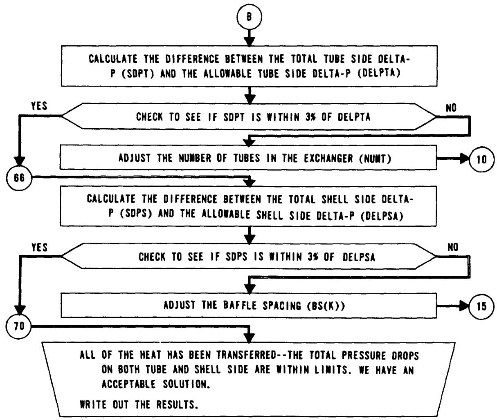  
Fig. D.l. (continued)

<table><tr><td colspan="2">MS=1</td><td>SUP 1020</td></tr><tr><td colspan="2">SX=0</td><td>SUP 1030</td></tr><tr><td colspan="2">SBS=0</td><td>SUP 1040</td></tr><tr><td colspan="2">TC(1)=TC2</td><td>SUP 1050</td></tr><tr><td colspan="2">TH(1)=TH1</td><td>SUP 1060</td></tr><tr><td colspan="2">RWK=DTO*LCGF(CTO/DTI)/2.0</td><td>SUP 1070</td></tr><tr><td colspan="2">PC(1)=PC2</td><td>SUP 1080</td></tr><tr><td colspan="2">CALL SVH(2,PC2,TC2,DUM,HC(1))</td><td>SUP 1090</td></tr><tr><td colspan="2">BN=FLDAT(FN)</td><td>SUP 1100</td></tr><tr><td colspan="2">QX=QT/BN</td><td>SUP 1110</td></tr><tr><td colspan="2">DECT=QX/(WH*CPH)</td><td>SUP 1120</td></tr><tr><td colspan="2">DECH=QX/WC</td><td>SUP 1130</td></tr><tr><td colspan="2">I=1</td><td>SUP 1140</td></tr><tr><td colspan="2">K=1</td><td>SUP 1150</td></tr><tr><td>16</td><td>SB = SBK*BSL</td><td>SUP 1160</td></tr><tr><td></td><td>LOP7=0</td><td>SUP 1170</td></tr><tr><td></td><td>TCON=TH(I)-DTPB/2.C</td><td>SUP 1180</td></tr><tr><td></td><td>IF(I.EQ.1) GO TO 161</td><td>SUP*1181</td></tr><tr><td></td><td>VMUO=0.2122*EXPF(4032.,/(TN+460.)))</td><td>SUP*1182</td></tr><tr><td></td><td>VMUB=0.2122*EXPF(4032.,/(TCON+460.)))</td><td>SUP*1183</td></tr><tr><td></td><td>FACT=(VMUC/VMUB)**0.14</td><td>SUP*1184</td></tr><tr><td></td><td>GO TO 162</td><td>SUP*1185</td></tr><tr><td>161</td><td>FACT=1.0</td><td>SUP*1186</td></tr><tr><td>162</td><td>CONTINUE</td><td>SUP*1187</td></tr><tr><td></td><td>DENH=141.38E+CC-2.466E-02*TCON</td><td>SUP 1190</td></tr><tr><td></td><td>VISH=0.2122E+00*EXPF(4032.0E+CO/(TCON+460.0E+CO))</td><td>SUP 1200</td></tr><tr><td></td><td>DHOT(K)=DENH</td><td>SUP 1210</td></tr><tr><td></td><td>VHOT(K)=VISH</td><td>SUP 1220</td></tr><tr><td></td><td>CON1=(CPH*VISH/TCH)**G.667E+00</td><td>SUP 1230</td></tr><tr><td></td><td>GM=WH/SB</td><td>SUP 1240</td></tr><tr><td></td><td>RECB=DTO*GM/VISH</td><td>SUP 1250</td></tr><tr><td></td><td>IF(RECB-800.0)17,18,18</td><td>SUP 1260</td></tr><tr><td>17</td><td>HJB=0.571/(RECB**0.456)</td><td>SUP 1270</td></tr><tr><td></td><td>GOTO19</td><td>SUP 1280</td></tr><tr><td>18</td><td>HJB=0.346/(RECB**0.382)</td><td>SUP 1290</td></tr><tr><td>19</td><td>HB=(HJB*CPH*GM/CON1)*FACT</td><td>SUP*1300</td></tr><tr><td></td><td>GW=WH/SW</td><td>SUP 1310</td></tr><tr><td></td><td>GS=SqrtF(GM*GW)</td><td>SUP 1320</td></tr><tr><td></td><td>RECW=DTO*CS/VISH</td><td>SUP 1330</td></tr><tr><td></td><td>IF(RECW-800.0)20,21,21</td><td>SUP 1340</td></tr></table>

20 HJW=0.571/(RECW**0.456) SUP 1350 GOTO22 SUP 1369   
21 HJW=0.346/(RECw**0.382) SUP 1370

22 HW=(HJW*CPH*GS/CON1)*FACT SUP*1380  
HO=(HB*(1.0-2.0*PW)+HW*(2.0*PW))*BLFH SUP 1390  
HO = HO*GBRL SUP 1400  
RO(K) = 1.0/HO SUP 1410   
23 TH（I+1）=TH(I)-DECT SUP 1420 LOP5=0 SUP 1430 HC（I+1）=HC(I)-DECH SUP 1440 DELPP=0.0 SUP 1450   
24 PC(I+1)=PC(I)+DELPP SUP 1460  
LOP3=0 SUP 1470  
LOP4=0 SUP 1480  
TC(I+1)=TC(I)-DECH SUP 149C   
25 CALL SVH(2,PC(I+1),TC(I+1),DUM,HCG) SUP 1500EH=ABSF(HC(I+1)-HCG) SUP 1510IF(EH-0.001*FC(I+1))31,31,26 SUP 1520   
TRIAL=TC(I+1) SUP 1530 HRAL=HCG SUP 1540 TC(I+1)=TC(I+1)+(HC(I+1)-HCG)*(TC(I)-TC(I+1)/(HC(I)-HCG) SUP 1550   
N CALLSVH(2,PC(I+1),TC(I+1),DUM,HCG) SUP 1560EH=ABSF(HC(I+1)-HCG) SUP 1570IF(EH-0.OC1*HC(I+1))31,31,28 SUP 1580   
28 TNEXT=TC(I+1)+(HC(I+1)-HCG)*(TC(I+1)-TRIAL)/(HCG-HRIAL) SUP 1590  
TRIAL=TC(I+1) SUP 1600  
HRIAL=HCG SUP 1610  
TC(I+1)=TNEXT SUP 1620  
LOP3=LOP3+1 SUP 1630  
IF(LOP3-1C)30,30,29 SUP 1640   
29 WRITEOUTPUTTAPE51,1015,LCP3 SUP 1650 GOTO80 SUP 1660   
30 GOTO27 SUP 1670  
31 DENOM=(TH(I+1)-TC(I+1))/TH(I)-TC(I)) SUP 1680  
TOEN=ABSF(DENCM-1.0) SUP 1690  
IF(TDEN-0.05) 32,33,33 SUP 1700   
32 DELTLM=0.5E+OC*(TH(I+1)-TC(I+1)+TH(I)-TC(I)) SUP 1710 GO TO 34 SUP 1720  
33 DELTM=(TH(I+1)-TC(I+1)-TH(I)+TC(I))/LOGF((TH(I+1)-TC(I+1))/(TH(I)SUP 1730 1-TC(I))) SUP 1731

Contract No. W-7405-eng-26

General Engineering Division

# COMPUTER PROGRAMS FOR MSBR HEAT EXCHANGERS

C. E. Bettis

T. W. Pickel

W. K. Crowley

M. Siman-Tov

H. A. NeIms

W. C. Stoddart

APRIL 1971

# LEGAL NOTICE

This report was prepared as an account of work sponsored by the United States Government. Neither the United States nor the United States Atomic Energy Commission, nor any of their employees, nor any of their contractors, subcontractors, or their employees, makes any warranty, express or implied, or assumes any legal liability or responsibility for the accuracy, completeness or usefulness of any information, apparatus, product or process disclosed, or represents that its use would not infringe privately owned rights.

OAK RIDGE NATIONAL LABORATORY

Oak Ridge, Tennessee

operated by

UNION CARBIDE CORPORATION

for the

U.S. ATOMIC ENERGY COMMISSION

# CONTENTS

# Abstract 1

1. INTRODUCTION 1   
2. PRIMEX, THE PRIMARY HEAT EXCHANGER PROGRAM 3

2.1 Description of Primary Heat Exchanger 4   
2.2 Design Calculations 8   
2.3 Description of PRIMEX 16   
2.4 Evaluation of PRIMEX 17

3. RETEX, THE STEAM REHEATER EXCHANGER PROGRAM 19

3.1 Description of Steam Reheater 20   
3.2 Design Calculations 23   
3.3 Description of RETEX 23   
3.4 Evaluation of RETEX 24

4. SUPEX, THE STEAM GENERATOR SUPERHEATER PROGRAM 26

4.1 Description of Steam Generator 27   
4.2 Design Calculations 29   
4.3 Description of SUPEX 37   
4.4 Evaluation of SUPEX 39

REFERENCES 41

Appendix A: PHYSICAL PROPERTY DATA 45

Appendix B: THE PRIMEX PROGRAM 49

Appendix C: THE RETEX PROGRAM 90

Appendix D: THE SUPEX PROGRAM 114

# LIST OF FIGURES

<table><tr><td>Figure Number</td><td>Title</td><td>Page Number</td></tr><tr><td>2.1</td><td>Cross-Sectional Elevation of a Typical MSBR Primary Heat Exchanger</td><td>5</td></tr><tr><td>2.2</td><td>Zones of Flow Between Two Baffles in the Shell Side of the MSBR Primary Heat Exchanger</td><td>12</td></tr><tr><td>3.1</td><td>Typical MSBR Steam Reheater Exchanger</td><td>21</td></tr><tr><td>4.1</td><td>Typical MSBR Steam Generator Superheater Exchanger</td><td>27</td></tr><tr><td>B.1</td><td>Simplified Flow Diagram of the PRIMEX Computer Program</td><td>50</td></tr><tr><td>C.1</td><td>Simplified Flow Diagram of the RETEX Computer Program</td><td>91</td></tr><tr><td>D.1</td><td>Simplified Flow Diagram of the SUPEX Computer Program</td><td>115</td></tr></table>

#

# LIST OF TABLES

<table><tr><td>Table Number</td><td>Title</td><td>Page Number</td></tr><tr><td>2.1</td><td>Design Data for MSBR Primary Heat Exchanger</td><td>6</td></tr><tr><td>3.1</td><td>Design Data for MSBR Steam Reheater Exchanger</td><td>20</td></tr><tr><td>4.1</td><td>Design Data for MSBR Steam Generator Superheater Exchanger</td><td>28</td></tr><tr><td>4.2</td><td>Preliminary Stress Calculations for MSBR Steam Generator</td><td>37</td></tr><tr><td>4.3</td><td>Percentage Deviations Resulting From calculational Uncertainties Related to MSBR Steam Generator Exchanger</td><td>40</td></tr><tr><td>A.1</td><td>Design Properties of MSBR Fuel Salt</td><td>46</td></tr><tr><td>A.2</td><td>Design Properties of MSBR Coolant Salt</td><td>47</td></tr><tr><td>A.3</td><td>Design Properties of Hastelloy N</td><td>48</td></tr><tr><td>B.1</td><td>Computer Input Data for PRIMEX Program</td><td>53</td></tr><tr><td>B.2</td><td>Output Data From PRIMEX Program</td><td>54</td></tr><tr><td>C.1</td><td>Computer Input Data for RETEX Program</td><td>94</td></tr><tr><td>C.2</td><td>Output Data From RETEX Program</td><td>95</td></tr><tr><td>D.1</td><td>Computer Input Data for SUPEX Program</td><td>118</td></tr><tr><td>D.2</td><td>Output Data From SUPEX Program</td><td>119</td></tr></table>

# Abstract

Three computer programs were developed to make design calculations for the heat exchangers for Molten-Salt Breeder Reactor concepts. They are the program for the primary heat exchangers, PRIMEX; the program for the reheaters, RETEX; and the program for the steam generator superheaters, SUPEX. Each type of exchanger analyzed is described, the basic equations used in each analysis are given, and the logic used in each program is discussed briefly in this report. Flow diagrams, lists of input required and output received, complete program listings, and the nomenclature for the programs as well as example computer input and output for the exchangers described are appended.

# 1. INTRODUCTION

The concept of a single-fluid Molten-Salt Breeder Reactor (MSBR) with a thermal capacity of 2250 MW and a net electrical output of 1000 MW has some very special heat exchange requirements. In the present conceptual design for the MSBR plant, there are four heat exchangers in the primary system that transfer heat from the molten fluoride fuel-salt mixture to the molten sodium fluoroborate coolant salt. In the secondary system, there are eight reheaters and 16 steam generators that transfer heat from the coolant salt. The manner in which these exchangers were designed to meet the special heat exchange requirements and the computer programs that were developed to calculate the design numbers are described in this report.

The development of MSBR concepts passed through a number of stages during which the plant layout was improved, core configurations were optimized, and physical property data were refined. The first formal study of a MSBR heat exchange system made by the authors was reported in 1967 (GE&C Division Design Analysis Section, "Design Study of a Heat-Exchange System For One MSBR Concept," USAEC Report ORNL TM-1545, Oak

Ridge National Laboratory, September 1967). To analyze one exchanger at each stage of its subsequent development without programming a large portion of the necessary calculations would have meant almost continual repetition of these calculations over a period of many months. With computer programs available, the design for an exchanger could easily be updated for changed capacity, physical properties, temperatures, pressures, etc.

Three such computer programs were developed. One computer program was written to make the design calculations for the primary heat exchanger, and it is the PRIMEX program. This program was modified at one stage of its development to perform the calculations for the steam reheater exchangers. This modified version is the RETEX program. A third computer program was written to perform the design calculations for the steam generator superheater exchangers, and it is the SUPEX program. The design data for each of these three types of exchanger, the basic equations used in each design analysis, and each of the computer programs developed to perform the analysis are described in the following sections of this report. Flow charts for each program, lists of the input required and the output provided by each program, complete program listings, nomenclature lists for each program, and the computer input and output for each type of heat exchanger discussed are appended.

# 2. PRIMEX, THE PRIMARY HEAT EXCHANGER PROGRAM

There are four primary heat exchangers, which transfer heat from the fuel salt to the coolant salt, in the conceptual design for a single-fluid MSBR. Each of these exchangers has a thermal capacity of 556 MW and each is of the same design. The fuel salt circuits for the primary heat exchangers are in parallel, each having its own fuel pump. The coolant salt from each exchanger is circulated through its own system of two reheater exchangers and four steam generators.

At full design load, the fuel salt enters the top of the primary heat exchanger at a temperature of $1300^{\circ}\mathrm{F}$ and exits from the bottom at a temperature of $1050^{\circ}\mathrm{F}$ for return to the reactor. The coolant salt at a temperature of $850^{\circ}\mathrm{F}$ enters the top of the primary heat exchanger and is directed to the bottom of the exchanger through a central downcomer where it enters the shell side of the exchanger, flows upward in counterflow to the fuel salt, and leaves the top of the exchanger at a temperature of $1150^{\circ}\mathrm{F}$ . This coolant salt is circulated through the steam reheaters and steam generators where its heat is transferred to the exhaust steam and feedwater, respectively.

The design conditions for the primary heat exchanger were partially dictated by the overall requirements of the MSBR system. The heat load, entrance and exit temperatures of the fuel and coolant salts, and the maximum or desired pressure drops across the shell and tube sides of the exchanger were specified by the operating conditions of the system. Design considerations for the overall system dictated the type of exchanger, arrangement of nozzles to facilitate piping, minimum tube diameter considered to be consistent with fabrication practices, and the limit on the overall length of the exchanger. Certain criteria such as the maximum allowable temperature drop across the tube walls and the need to build in enough tube flexibility to compensate for differential thermal expansion were established by the strength of the materials. Vibration considerations placed limits on flow velocities and the spacing between baffles. In addition, it is highly desirable that the volume of fuel salt be kept at a minimum to lower the doubling time of the reactor.

Within the framework of these requirements and guidelines, a computer program was developed to perform a parameter study and select the design for the primary heat exchanger that employs a minimum volume of fuel salt. The design data and equations discussed in the following subsections were used to develop the computer program for the primary heat exchanger (PRIMEX).

# 2.1 Description of Primary Heat Exchanger

Each of the four primary heat exchangers is a vertical shell-and-tube type with a single counterflow pass on both the tube and shell sides. Each unit is about 6 ft in diameter and about 22 ft tall, not including the coolant salt U-bend piping at the top. A cross-sectional elevation of a typical primary heat exchanger is illustrated in Fig. 2.1, and the pertinent design data are given in Table 2.1.

The fuel (primary) salt enters the tube side of the primary heat exchanger at the top and flows out the bottom of the exchanger after a single pass through the 3/8-in.-OD tubes. The coolant (secondary) salt enters at the top of the exchanger, flows to the bottom of the exchanger through a central 20-in.-diameter downcomer where it enters the annular shell containing the tubes, flows upward around modified disk and doughnut baffles, and exits through a 28-in.-diameter pipe concentric with the inlet pipe at the top.

The tubes are arranged in concentric rings in the bundle with a constant radial pitch and a circumferential pitch that is as constant as can be obtained. The L-shaped tubes are welded into a horizontal tube sheet at the bottom and into a vertical tube sheet at the top. The toroidal-shaped top head and tube sheet assembly has a significant strength advantage, simplifies the arrangement for coolant-salt flow, and allows the seal weld for the top closure to be located outside the heat exchanger.

To accommodate differential thermal expansion between the shell and tubes, about 4 ft of the upper portion of the tubing is bent into a sine

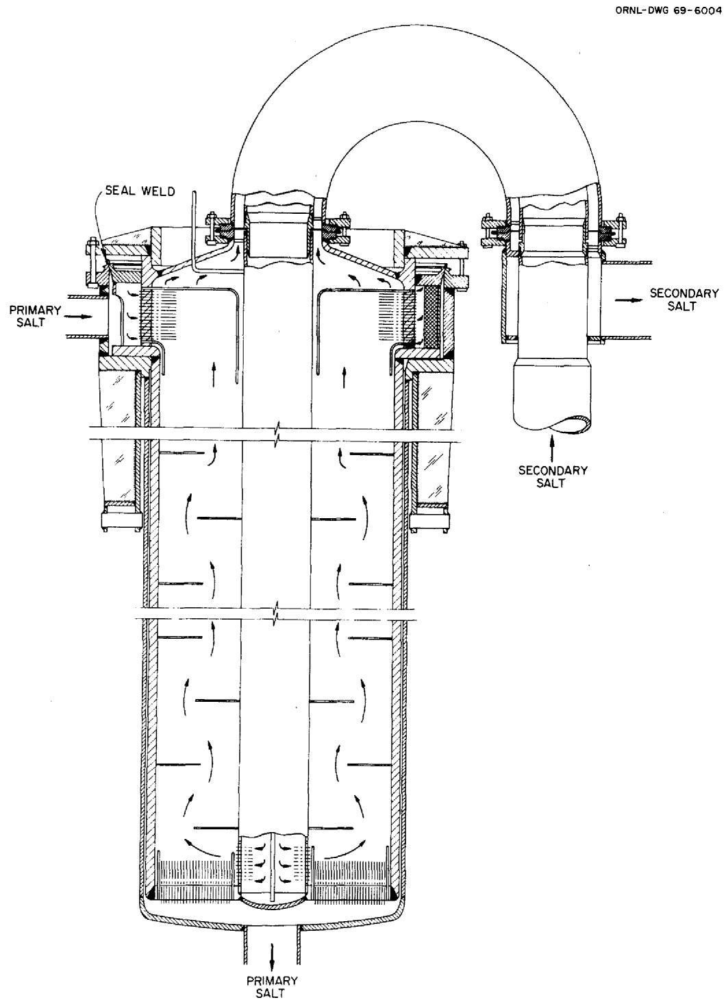  
Fig. 2.1. Cross-Sectional Elevation of a Typical MSBR Primary Heat Exchanger.

Table 2.1. Design Data for MSBR Primary Heat Exchanger   

<table><tr><td>Type</td><td>Shell-and-tube one-pass vertical exchanger with disk and doughnut baffles</td></tr><tr><td>Number required</td><td>Four</td></tr><tr><td>Rate of heat transfer per unit, MW</td><td>556.5</td></tr><tr><td>Btu/hr</td><td>1.9 × 10^5</td></tr><tr><td>Tube-side conditions</td><td></td></tr><tr><td>Hot fluid</td><td>Fuel salt</td></tr><tr><td>Entrance temperature, °F</td><td>1300</td></tr><tr><td>Exit temperature, °F</td><td>1050</td></tr><tr><td>Entrance pressure, psi</td><td>180</td></tr><tr><td>Pressure drop across exchanger, psi</td><td>130</td></tr><tr><td>Mass flow rate, lb/hr</td><td>23.45 × 10^6</td></tr><tr><td>Shell-side conditions</td><td></td></tr><tr><td>Cold fluid</td><td>Coolant salt</td></tr><tr><td>Entrance temperature, °F</td><td>850</td></tr><tr><td>Exit temperature, °F</td><td>1150</td></tr><tr><td>Exit pressure, psi</td><td>34</td></tr><tr><td>Pressure drop across exchanger, psi</td><td>116.2</td></tr><tr><td>Mass flow rate, lb/hr</td><td>17.8 × 10^6</td></tr><tr><td>Tube</td><td></td></tr><tr><td>Material</td><td>Hastelloy N</td></tr><tr><td>Number required</td><td>5896</td></tr><tr><td>Pitch, in.</td><td>0.75</td></tr><tr><td>Outside diameter, in.</td><td>0.375</td></tr><tr><td>Wall thickness, in.</td><td>0.035</td></tr><tr><td>Length, ft</td><td>22.57</td></tr><tr><td>Tube sheet</td><td></td></tr><tr><td>Material</td><td>Hastelloy N</td></tr><tr><td>Thickness, in.</td><td>4.75</td></tr><tr><td>Sheet-to-sheet distance, ft</td><td>21.31</td></tr><tr><td>Total heat transfer area, ft²</td><td>13,037</td></tr><tr><td>Basis for area calculation</td><td>Outside of tubes</td></tr><tr><td>Volume of fuel salt in tubes, ft³</td><td>67.38</td></tr><tr><td>Shell</td><td></td></tr><tr><td>Material</td><td>Hastelloy N</td></tr><tr><td>Thickness, in.</td><td>0.5</td></tr><tr><td>Inside diameter, in.</td><td>68.07</td></tr><tr><td>Central tube diameter, in.</td><td>20.0</td></tr><tr><td>Baffle</td><td></td></tr><tr><td>Type</td><td>Disk and doughnut</td></tr><tr><td>Number</td><td>21</td></tr><tr><td>Spacing, in.</td><td>11.23</td></tr><tr><td>Disk outside diameter, in.</td><td>54.56</td></tr><tr><td>Doughnut inside diameter, in.</td><td>45.54</td></tr><tr><td>Overall heat transfer coefficient, U, Btu/hr.ft2·°F</td><td>838.3</td></tr><tr><td>Tube</td><td></td></tr><tr><td>Maximum primary (P) stresses</td><td></td></tr><tr><td>Calculated, psi</td><td>674</td></tr><tr><td>Allowable, psi</td><td>3912</td></tr><tr><td>Maximum primary and secondary (P + Q) stresses</td><td></td></tr><tr><td>Calculated, psi</td><td>11,639</td></tr><tr><td>Allowable, psi</td><td>11,737</td></tr><tr><td>Maximum peak (P + Q + F) stresses</td><td></td></tr><tr><td>Calculated, psi</td><td>13,006</td></tr><tr><td>Allowable, psi</td><td>25,000</td></tr></table>

wave configuration. The tubes are held in place by wire lacing in this upper portion of the tube bundle. Since baffling is not employed in this region, the bent-tube portion of the bundle experiences essentially parallel flow and a relatively lower heat transfer performance.

Below the bent-tube region of the bundle, evenly spaced doughnut-shaped baffles are used to hold the tubes in place and to produce cross-flow. The baffle spacings and cross-flow velocities are designed to minimize the possibility of flow-induced vibration. The tubes in this baffled region of the heat exchanger have a helical indentation knurled into their surface to enhance the film heat transfer coefficients and thereby reduce the fuel salt inventory in the exchanger. No enhancement of this nature was used in the upper bent-tube region because of present uncertainty about the reliability of tubes that are both bent and indented.

Since experience with both the fuel and coolant salts is limited, there was and still is a certain degree of uncertainty associated with the transport properties of salt and its behavior as a heat transfer medium. The design properties of the fuel salt, coolant salt, and of Hastelloy N used in the concept of a single-fluid MSBR and incorporated in the primary heat exchanger computer program are given in Appendix A.

As previously described, the tubes in the baffled portion of the primary heat exchanger are helically indented to improve heat transfer performance. Experiments performed by C. G. Lawson, R. J. Kedl, and R. E. McDonald<sup>1</sup> indicated that this indentation is expected to result in an improvement by a factor of 2 in the tube-side heat transfer coefficient. An enhancement factor of 1.3 for the heat transfer coefficient outside the tubes is suggested by Lawson<sup>2</sup> although no experiments have been done to support this recommendation. The experimental work<sup>1</sup> that was performed was limited to Reynolds numbers greater than 10,000, and there is some uncertainty about the degree of improvement that can be expected for Reynolds numbers of less than 10,000. It was assumed that no improvement can be expected in a truly laminar flow (Reynolds numbers less than 1000), and the improvement expected for the intermediate range was extrapolated by using a method suggested by H. A. McLain.<sup>3</sup> The resulting enhancement factors (EF) are

$$
E F _ {i} = 2. 0 \text {a n d} E F _ {o} = 1. 3 \text {f o r R e y n o l d s n u m b e r s} \geq 1 0, 0 0 0
$$

and

$$
E F _ {i} = 1. 0 \text {a n d} E F _ {o} = 1. 0 \text {f o r R e y n o l d s n u m b e r s} \leq 1 0 0 0,
$$

where

$$
E F _ {i} = \text {e n h a n c e m e n t f a c t o r i n s i d e t u b e a n d}
$$

$$
E F _ {0} = \text {e n h a n c e m e n t f a c t o r o u t s i d e t u b e (c r o s s f l o w)}.
$$

For $1000 < \text{Reynolds number} < 10,000$ ,

$$
E F _ {i} = 1. 0 + \left(\frac {N _ {\text {R e}} - 1 0 0 0}{9 0 0 0}\right) ^ {1 / 2} \tag {2.1}
$$

and

$$
E F _ {o} = 1. 0 + 0. 3 \left(\frac {N _ {\text {R e}} - 1 0 0 0}{9 0 0 0}\right) ^ {1 / 2} \tag {2.2}
$$

where $\mathbf{N}_{\mathrm{Re}} =$ the corresponding Reynolds number.

The enhancement factors for heat transfer resulting from the helical indentation of the tubes in the baffled region were assumed to have a proportionate effect on pressure drop. The shell-side pressure drop was calculated by using the procedure reported by O. P. Bergelin et al.,<sup>4</sup> and the tube-side pressure drop was calculated by using the conventional friction-factor method. An overall leakage factor of 0.5 was used for the pressure drop in the shell side of the heat exchanger, and a factor of 0.8 was used in the heat transfer calculations. These leakage factors were selected on the basis of recommendations reported by Bergelin et al.<sup>5</sup> The correct leakage factor, which is dependent upon various clearances between tubes and baffles and between baffles and the shell, will have to be calculated when the actual design for the primary heat exchanger has been completed.

Since molten fluoride salts do not wet Hastelloy N, the containing material of the heat exchanger, it was suspected that the usual heat transfer correlations, which are normally based on experiments with water or petroleum products, might not be valid. However, recent experiments performed by B. Cox<sup>6</sup> indicated that basically the behavior of the fuel salt is similar to that of conventional fluids. The correlations developed by Cox result in heat transfer coefficients somewhat lower than those obtained from the Sieder and Tate correlations for turbulent regions,<sup>7</sup> Hansen's equation for transition regions,<sup>8</sup> and the Sieder and Tate correlations for laminar regions.<sup>7</sup> The correlations used in this study are those based on the data developed by Cox that were recommended by H. A. McLain.<sup>9</sup> These are given in Eqs. 2.3, 2.4, and 2.5.

For completely turbulent flow with Reynolds numbers greater than 12,000,

$$
\frac {h _ {i} d _ {i}}{k _ {i}} = 0. 2 1 7 \left(N _ {R e}\right) ^ {0. 8} \left(N _ {P r}\right) ^ {1 / 3} \left(\frac {\mu_ {b}}{\mu_ {i}}\right) ^ {0. 1 4} \left(E F _ {i}\right) \tag {2.3}
$$

where

$h_{i} =$ heat transfer coefficient inside tube, Btu/hr.ft².°F,

$\mathbf{d}_{\mathrm{j}} =$ inside diameter of tube, ft,

$k_{i} =$ thermal conductivity of fluid inside tube, Btu/hr·ft·°F,

$\aleph_{\mathrm{Re}} =$ Reynolds number,

$\mathbf{N}_{\mathbf{Pr}} = \mathbf{Prandtl}$ number,

$\mu_{b} =$ viscosity at temperature of bulk fluid, lb/hr·ft,

$\mu_{i} =$ viscosity of fluid at temperature of inside surface of tube, $1b / hr \cdot ft$ , and

$EF_{i} =$ enhancement factor for helically indented tubes given in Eq. 2.1.

Based on the inside diameter of the tube, the Reynolds number

$$
N _ {R e} = \frac {d _ {i} G _ {i}}{\mu_ {b}}
$$

where $G_{i} =$ mean mass velocity of fluid inside the tube, $lb/hr \cdot ft^2$ . For completely laminar flow with Reynolds numbers less than 2100,

$$
\frac {\mathrm {h} _ {\mathrm {i}} \mathrm {d} _ {\mathrm {i}}}{\mathrm {k} _ {\mathrm {i}}} = \left[ 4. 3 6 + \frac {0 . 0 2 3 \left(\mathrm {N} _ {\mathrm {R e}} \mathrm {N} _ {\mathrm {P r}} \frac {\mathrm {d} _ {\mathrm {i}}}{\ell}\right)}{1 + 0 . 0 0 1 2 \left(\mathrm {N} _ {\mathrm {R e}} \mathrm {N} _ {\mathrm {P r}} \frac {\mathrm {d} _ {\mathrm {i}}}{\ell}\right)} \right] \mathrm {E F} _ {\mathrm {i}} \tag {2.4}
$$

where $\ell =$ length of tube from the entrance to the local point, ft. For the intermediate region where $2100\leq$ Reynolds number $\leq 12000$

$$
\frac {h _ {i} d _ {i}}{k _ {i}} = 0. 0 8 9 \left[ (N _ {R e}) ^ {2 / 3} - 1 2 5 \right] (N _ {P r}) ^ {1 / 3} \left[ 1 + \frac {1}{3} \left(\frac {d _ {i}}{\ell}\right) ^ {2 / 3} \right] \left(\frac {\mu_ {b}}{\mu_ {i}}\right) ^ {0. 1 4} \left(E F _ {i}\right). \tag {2.5}
$$

The pressure drop inside the tubes was calculated by using the expression

$$
\Delta P _ {i} = \frac {4 f L}{d _ {i}} \left(\frac {G _ {i} ^ {2}}{2 \rho_ {i} g _ {c}}\right) \left(E F _ {i}\right) \tag {2.6}
$$

where

$f =$ friction factor,

L = length of tube, ft,

$\mathbf{d}_{\mathrm{i}} =$ inside diameter of tube, ft,

$G_{\mathbf{i}} =$ mean mass velocity of fluid inside tube, $\mathrm{lb / hr\cdot ft^2}$   
$\rho_{i} =$ density of fluid inside tube, $\mathrm{lb / ft^3}$   
$g_{c} =$ dimensional conversion factor $= 4.18 \times 10^{8} \mathrm{lb}_{\mathrm{m}} \cdot \mathrm{ft} / \mathrm{lb}_{\mathrm{f}} \cdot \mathrm{hr}^{2}$ , and $EF_{i} =$ enhancement factor for helically indented tubes given in Eq. 2.1.

The friction factor for turbulent flow $(\mathbf{N}_{\mathrm{Re}} > 2100)$ is given by the expression

$$
f = 0. 0 0 1 4 + 0. 1 2 5 \left(\mathrm {N} _ {\text {R e}}\right) ^ {- 0. 3 2}, \tag {2.7}
$$

and the friction factor for laminar flow $(\mathbf{N}_{\mathrm{Re}} < 2100)$ is given by the expression

$$
f = \frac {1 6}{N _ {\mathrm {R e}}} \quad . \tag {2.8}
$$

The heat transfer coefficient across the tube wall is given by the expression

$$
h _ {w} = \left(\frac {k}{d _ {o} t}\right) \frac {d _ {o} - d _ {i}}{\ln \frac {d _ {o}}{d _ {i}}} \tag {2.9}
$$

where

$$
\begin{array}{l} k = \text {t h e r m a l} \quad B t u / h r \cdot f t \cdot {} ^ {\circ} F, \\ d _ {o} = \text {o u t s i d e} \\ t = \text {w a l l} \\ d _ {i} = \text {i n s i d e} \\ \end{array}
$$

No experiments have been performed to date to develop correlations for the heat transfer behavior of a sodium fluoroborate coolant salt in the shell side of the heat exchanger. The correlation developed by O. P. Bergelin et al.4 was used for the baffled region of the MSBR primary heat exchanger, and the correlation developed by D. A. Donohue10 was used for the unbaffled region.

Although selected as being the most representative available for the baffled region, Bergelin's correlation<sup>4</sup> is strictly for cross flow and his data were based on work with half-moon shaped baffles with straight edges. Since disk and doughnut baffles are used in the MSBR primary heat exchanger, the adaptation of Bergelin's data involved certain interpretations in determining the cross-sectional areas involved. The correlation

for cross flow was also modified by the introduction of a correction factor. This correction factor is dependent upon the degree of actual cross flow that exists as determined by the ratio between the bafflespacing and the annular thickness of the vessel. Data from Bergelin's original experiment<sup>4</sup> were used to estimate the value of the correction factor, which is expressed as

$$
\mathrm {B C F} = 0. 7 7 \left(\frac {\mathrm {X}}{\mathrm {Y}}\right) ^ {- 0. 1 3 8} \tag {2.10}
$$

where

BCF = correction factor for shell-side heat transfer coefficient as proposed by Bergelin,4

$\mathbf{X} =$ baffle spacing (as illustrated in Fig. 2.2), ft, and

Y = radial distance from center of window to center of opposing window (as illustrated in Fig. 2.2), ft.

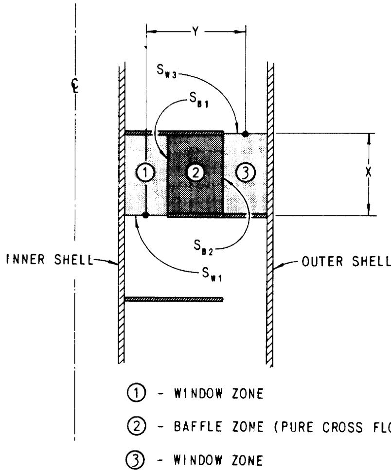  
Fig. 2.2. Zones of Flow Between Two Baffles in the Shell Side of the MSBR Primary Heat Exchanger.

In the method advanced by Bergelin, $^{4}$ the region between two baffles is considered as three parts: one pure cross-flow zone between two window zones, as illustrated in Fig. 2.2. The mass velocity in each zone is based on the effective area of each zone. In a window zone, the effective area is given by the expression

$$
S _ {z} = \left(S _ {w} S _ {B}\right) ^ {1 / 2} \tag {2.11}
$$

where

$$
\begin{array}{l} S _ {w} = \text {f r e e c r o s s - s e c t i o n a l a r e a i n b a f f l e w i n o w , f t} ^ {2}, \text {a n d} \\ S _ {B} = \text {f r e e c r o s s - s e c t o n a l a r e a f o r c r o s s f l o w b e t w e e n t u b e s a p p l i e d} \\ \end{array}
$$

The effective area of the pure cross-flow zone is given by the expression

$$
S _ {m} = 0. 5 \left(S _ {B _ {1}} + S _ {B _ {2}}\right) \tag {2.12}
$$

where the indices 1 and 2 indicate the sides of the pure cross-flow zone. Based on this definition of the areas or zones used to calculate the mass velocity, the Reynolds number for each zone is determined from the expression

$$
\mathrm {N} _ {\text {R e}} = \frac {\mathrm {d} _ {\mathrm {o}} \mathrm {G}}{\mu_ {\mathrm {b}}} \tag {2.13}
$$

where

$$
\begin{array}{l} d _ {0} = \text {o u t s i d e} \\ G = \text {m a s s v e l o c i t y} \\ \end{array}
$$

$$
\mu_ {b} = \text {v i s c o s i t y a t t e m p e r a t u r e o f b u l k f l u i d , l b / h r} \cdot \text {f t}.
$$

The relationship between the Reynolds number for each flow zone and an appropriate heat transfer factor (J) is developed in Bergelin's method. The heat transfer factor for the window zone is determined from the expression

$$
J _ {w} = \frac {h _ {w}}{C _ {p m}} \left(\frac {C _ {p} \mu_ {b}}{k}\right) ^ {2 / 3} \left(\frac {\mu_ {s}}{\mu_ {b}}\right) ^ {0. 1 4} \left(E F _ {o}\right) (B C F) (L F) \tag {2.14}
$$

where

$$
\begin{array}{l} h _ {w} = \text {h e a t t r a n s f e r c o e f f i c i e n t f o r w i n d o w z o n e , B t u / h r} ^ {2} \cdot {} ^ {\circ} F, \\ C _ {p} = \text {s p e c i f i c h e a t}, B t u / 1 b \cdot {} ^ {\circ} F, \\ G _ {m} = \text {m e a n m a s s v e l o c i t y o f f l u i d}, \mathrm {l b / h r} \cdot \mathrm {f t} ^ {2}, \\ \end{array}
$$

$$
k = \text {t h e r m a l}
$$

$$
\mu_ {b} = \text {v i s c o s i t y a t t e m p e r a t u r e o f b u l k f l u i d , l b / h r \cdot f t},
$$

$$
\mu_ {s} = \text {v i s c o s i t y o f f l u i d a t t e m p e r a t u r e o f w a l l s u r f a c e , l b / h r} \cdot \text {f t},
$$

$$
E F _ {o} = \text {e n h a n c e m e n t f a c t o r o u t s i d e h e l i c a l l y i n d e n t e d t u b e g i v e n b y} \tag {Eq.2.2,}
$$

$$
\text {B C F} = \text {c o r r e c t i o n f a c t o r f o r s h e l l - s i d e h e a t t r a n s f e r c o e f f i c i e n t}
$$

$$
\mathrm {L F} = \text {l e a k a g e f a c t o r f o r h e a t t e n s f i r} 0. 8.
$$

The heat transfer factor for the cross-flow zone $(\mathbf{J}_{\mathbf{B}})$ is determined from the expression

$$
J _ {B} = \frac {h _ {B}}{c _ {p} G _ {B}} \left(\frac {c _ {p} \mu_ {b}}{k}\right) ^ {2 / 3} \left(\frac {\mu_ {s}}{\mu_ {b}}\right) ^ {0. 1 4} \left(E F _ {o}\right) (B C F) (L F). \tag {2.15}
$$

Equations 2.16 and 2.17 were derived from the graph of $J$ versus $N_{\text{Re}}$ given in Ref. 4 to determine the values of $J$ . The values of $J$ determined from Eqs. 2.16 and 2.17 were then used in Eqs. 2.14 and 2.15 to determine the heat transfer coefficients for the window zones and the cross-flow zone $(h_w$ and $h_B)$ .

$$
\text {F o r} 8 0 0 \leq N _ {\mathrm {R e}} \leq 1 0 ^ {5}, J = 0. 3 4 6 \left(N _ {\mathrm {R e}}\right) ^ {0. 3 8 2} \tag {2.16}
$$

$$
\text {F o r} 1 0 0 \leq N _ {R e} \leq 8 0 0, J = 0. 5 7 1 \left(N _ {R e}\right) ^ {0. 4 5 6} \tag {2.17}
$$

The values of the heat transfer coefficients for the window zones $\left(\mathtt{h}_{\mathtt{w}_1}\right.$ and $\left.\mathtt{h}_{\mathtt{w}_2}\right)$ and the value for the cross-flow zone $\left(\mathtt{h}_{\mathtt{B}}\right)$ were then combined in Eq. 2.18 to determine the total heat transfer coefficient for the region between two baffles.

$$
h _ {t} = h _ {B} a _ {B} + h _ {w _ {1}} a _ {w _ {1}} + h _ {w _ {2}} a _ {w _ {2}}, \tag {2.18}
$$

where $\mathbf{a} =$ the area of heat transfer surface in each zone, $ft^2 / ft$ .

The data reported by D. A. Donohue<sup>10</sup> were used for heat transfer calculations involving parallel flow on the shell side of the MSBR primary heat exchanger. The heat transfer coefficient outside the tubes is given by the expression

$$
h _ {o} = 0. 1 2 8 \left(\frac {k _ {o}}{d _ {o}}\right) (1 2 d _ {e q}) ^ {0. 6} \left(\frac {d _ {o} G}{\mu_ {b}}\right) ^ {0. 6} \left(\frac {C _ {p} \mu_ {b}}{k _ {o}}\right) ^ {0. 3 3} \left(\frac {\mu_ {b}}{\mu_ {s}}\right) ^ {0. 1 4} \tag {2.19}
$$

where

$k_{0} =$ thermal conductivity of fluid outside tubes, Btu/hr·ft·°F,

$\mathbf{d}_{\mathrm{o}} =$ outside diameter of tube, ft,

$\mathbf{d}_{\mathrm{eq}} =$ equivalent diameter, ft,

$\dot{G} =$ mass velocity of fluid outside tubes, $\mathrm{lb / hr}\cdot \mathrm{ft}^2$

$\mu_{b} =$ viscosity at temperature of bulk fluid, lb/hr·ft,

$C_p =$ specific heat, Btu/1b. ${}^\circ F,$ and

$\mu_{s} =$ viscosity of fluid at temperature of wall surface, lb/hr·ft.

The overall heat transfer coefficient was then calculated by using the expression

$$
U _ {o} = \frac {1}{\frac {1}{h _ {o}} + \frac {1}{h _ {W}} + \frac {1}{h _ {i}} \left(\frac {d _ {o}}{d _ {i}}\right)}, \tag {2.20}
$$

where $h_{0}, h_{W}$ , and $h_{i}$ are the shell-side, wall, and tube-side heat transfer coefficients, respectively.

The shell-side pressure drops in the baffled region of the MSBR primary heat exchanger were calculated by using the equations reported by O. P. Bergelin et al. $^{4}$ The pressure drop across the cross-flow zone is given by the expression

$$
\Delta P _ {\text {c r o s s f l o w}} = 0. 6 r _ {B} \rho \left(\frac {V ^ {2}}{2 g _ {c}}\right) (\text {P L F}) (\text {E F}) \tag {2.21}
$$

where

$\mathbf{r}_{\mathrm{B}} =$ number of cross-flow restrictions,

$\rho =$ density of fluid, $1b / ft^3$

$V_{m} =$ cross-flow velocity of fluid (based on effective area $S_{m}$ given by Eq. 2.12), ft/sec,

$g_{c} =$ dimensional conversion factor $= 32.2\mathrm{lb_m}\cdot \mathrm{ft / lb_f}\cdot \mathrm{sec}^2,$

PLF = pressure drop leakage factor taken as 0.5, and

EF = enhancement factor outside helically indented tubes taken as 1.3. The pressure drop across the window zone is given by the expression

$$
\Delta P _ {\text {w i n d o w}} = (1 + 0. 6 r _ {w}) \left(\frac {\rho V _ {z} ^ {2}}{2 g _ {c}}\right) (\text {P L F}) (\text {E F}) \tag {2.22}
$$

where

$\mathbf{r}_{\mathbf{w}} =$ number of restrictions in the window zone and

$V_{z} =$ mean flow velocity (based on the effective area $S_{z}$ given by Eq. 2.11), ft/sec.

The number of restrictions was interpreted as being the number of rows of tubes in the direction of cross flow. The full number was used for the cross-flow zone, while only half of the number of rows was used for each of the window zones. The shell-side pressure drop in the upper bent-tube region of the exchanger was taken as being approximately equal to the pressure drop across one baffled zone.

# 2.3 Description of PRIMEX

The computer program for the MSBR primary heat exchanger, PRIMEX, is presented in Appendix B. In this program, each zone between two baffles was considered as one increment length. The calculations are begun on the hot side of the heat exchanger, and increments are added until a complete heat balance is achieved. The dependence of each of the physical properties on temperature is given as an empirical equation, and these equations are incorporated in the main program. If any of these equations are changed, the appropriate data card must be replaced. The physical property data as well as the other input data required for the PRIMEX program are listed in Appendix B. A list of the output data received from the computer is also presented.

A stress analysis subroutine, TUBSTR, is incorporated in the main program. This subroutine performs a preliminary stress analysis of the tubes with the assumption that the maximum tube stress will occur in the upper bent-tube region of the heat exchanger. Pressure stresses, stresses resulting from thermal expansion, and stresses resulting from the thermal gradient across the tube wall are considered. The primary and secondary stresses are computed, and these computed values are compared with the allowable values given in Section III, Nuclear Vessels, of the ASME Boiler and Pressure Vessel Code. A second subroutine, LAGR, is used for

interpolation of values from a given table. The complete listing for the main program together with its two subroutines is given in Appendix B.

To illustrate the use of the PRIMEX program, the computer input data for the MSBR primary heat exchanger discussed in Subsection 2.1 and the output data printed by the computer are included in Appendix B. The time required for a typical IBM 360/91 computer run of this program is about 2 minutes.

# 2.4 Evaluation of PRIMEX

It is believed that the use of the PRIMEX computer program will result in a primary heat exchanger whose volume of fuel salt will be kept to a minimum and whose design will be more reliable than can be achieved with normal hand calculations. Variations in physical properties and complicated geometries are handled easily, and an extensive parameter study can be made in a very short time.

However, the output of a computer program cannot be better than the input. The input data which have a significant effect on the design of the heat exchanger are the physical properties of the fuel and coolant salts, the heat transfer correlations used, the enhancement factors assumed for the helically indented tubes, and the leakage factors associated with fabrication clearances. The average deviations in the physical properties of the fuel and coolant salts presently used in the program are those reported by J. R. McWherter.[11] The most notable uncertainties in the physical property values presently are associated with the viscosity and thermal conductivity of the fuel salt. The average deviation for the fuel-salt heat transfer correlation is reported[6] as being about $5.7\%$ . The deviation or error resulting from the use of Bergelin's correlation[4] is not certain, but shell-side heat transfer coefficients normally have a deviation of about $25\%$ . The leakage factor deviation for the pressure drop might be about $20\%$ , and the leakage factor deviation for the shell-side heat transfer coefficient might be about $10\%$ . The enhancement factor deviation might be about $15\%$ .

The two extreme cases were checked. All of the pessimistic values were used in one case, and all of the optimistic values were used in the other case. The result was a maximum estimated deviation in the overall heat transfer area (or volume of fuel salt) of $+38\%$ (additional area required) for the pessimistic case and $-28\%$ (less area required) for the optimistic case.

# 3. RETEX, THE STEAM REHEATER EXCHANGER PROGRAM

The coolant salt circulating system in the conceptual design of a single-fluid MSBR consists of four independent loops, each containing salt circulating pumps, steam generators, steam reheaters, and the shell side of one of the four primary heat exchangers. There are two steam reheater exchangers, which transfer heat from the coolant salt to pre-heated exhaust steam from the high-pressure turbine, in each coolant salt loop; with a total of eight reheaters to meet the total steam reheating requirement of approximately $5.1 \times 10^{6}$ lb/hr. Each reheater is of the same design, and each has a thermal capacity of about 36.6 MW.

At full design load, the coolant salt from the primary heat exchanger enters the shell side of the reheater at a temperature of $1150^{\circ}\mathrm{F}$ and exits at a temperature of $850^{\circ}\mathrm{F}$ for return to the primary heat exchanger. The preheated exhaust steam from the high-pressure turbine enters the tube side of the reheater at a temperature of $650^{\circ}\mathrm{F}$ , flows through the tubes in counterflow to the coolant salt, and leaves the reheater at a temperature of $1000^{\circ}\mathrm{F}$ for delivery to the intermediate-pressure turbine.

Basically, the steam reheater exchangers must meet the same system requirements prescribed for the primary heat exchangers that were discussed in Section 2 of this report. However, since no fuel salt is involved, the desirability of keeping the fluid volume at a minimum is not a critical factor in the design of the reheater. In addition, the lower heat load and average temperatures permit more freedom in designing the geometry of the reheater to avoid problems associated with vibration or overstress.

Since the design for the steam reheater exchanger is similar to that for the primary heat exchanger, an early version of the basic PRIMEX computer program was modified to fit the requirements of the steam reheater, thereby becoming the RETEX program. The design data and equations used to develop the RETEX computer program are discussed in the following subsections.

# 3.1 Description of Steam Reheater

Each of the eight steam reheater exchangers is a horizontal shell-and-tube unit with a single counterflow pass on both the shell and tubes. Each unit is about 30 ft long and has an outside diameter of 22 in. A typical reheater is illustrated in Fig. 3.1.

The preheated exhaust steam enters the tube side of the reheater at a pressure of about 580 psi, flows through the 0.75-in.-OD tubes, and exits at a pressure of 550 psi. There are 400 straight tubes arranged in a triangular-pitch array in each reheater. The surfaces of these tubes are not helically indented to enhance heat transfer, as are those in the primary heat exchanger.

The coolant salt enters the shell side of the reheater at a pressure of about 228 psi, flows around disk and doughnut baffles in counterflow to the exhaust steam, and exits at a pressure of 168 psi. Other pertinent design data for the steam reheater exchanger are given in Table 3.1.

Table 3.1. Design Data for MSBR Steam Reheater Exchanger   

<table><tr><td>Type</td><td>Straight shell-and-tube one-pass horizontal unit with disk and doughnut baffles</td></tr><tr><td>Number required</td><td>Eight</td></tr><tr><td>Rate of heat transfer per unit, MW</td><td>36.6</td></tr><tr><td>Btu/hr</td><td>1.25 × 108</td></tr><tr><td>Shell-side conditions</td><td></td></tr><tr><td>Hot fluid</td><td>Coolant salt</td></tr><tr><td>Entrance temperature, °F</td><td>1150</td></tr><tr><td>Exit temperature, °F</td><td>850</td></tr><tr><td>Entrance pressure, psi</td><td>228</td></tr><tr><td>Exit pressure, psi</td><td>168</td></tr><tr><td>Pressure drop across exchanger, psi</td><td>59.52</td></tr><tr><td>Mass flow rate, lb/hr</td><td>1.16 × 106</td></tr><tr><td>Tube-side conditions</td><td></td></tr><tr><td>Cold fluid</td><td>Exhaust steam</td></tr><tr><td>Entrance temperature, °F</td><td>650</td></tr><tr><td>Exit temperature, °F</td><td>1000</td></tr><tr><td>Entrance pressure, psi</td><td>580</td></tr><tr><td>Exit pressure, psi</td><td>550</td></tr><tr><td>Pressure drop across exchanger, psi</td><td>29.85</td></tr><tr><td>Mass flow rate, lb/hr</td><td>6.41 × 105</td></tr></table>

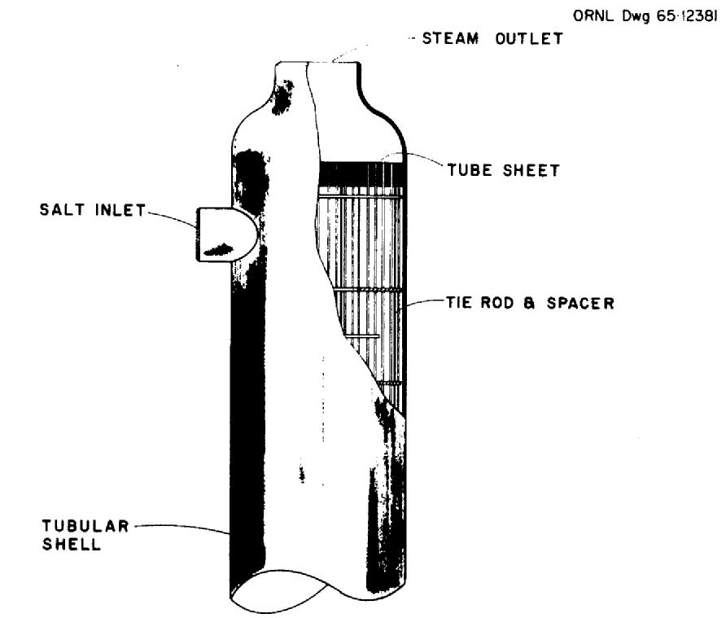

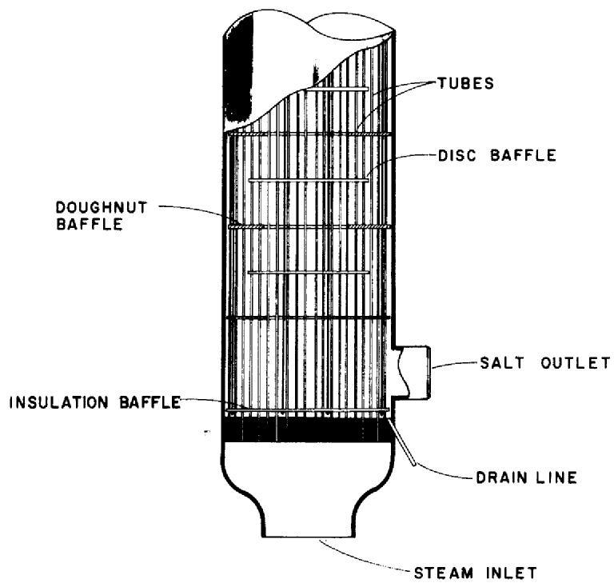  
Fig. 3.1. Typical MSBR Steam Reheater Exchanger.

Table 3.1 (continued)   

<table><tr><td colspan="2">Tube</td></tr><tr><td>Material</td><td>Hastelloy N</td></tr><tr><td>Number required</td><td>400</td></tr><tr><td>Pitch, in.</td><td>1.0 (triangular)</td></tr><tr><td>Outside diameter, in.</td><td>0.75</td></tr><tr><td>Wall thickness, in.</td><td>0.035</td></tr><tr><td>Length (tube sheet to tube sheet), ft</td><td>30.26</td></tr><tr><td>Tube sheet material</td><td>Hastelloy N</td></tr><tr><td>Total heat transfer area, ft2</td><td>2376</td></tr><tr><td>Basis for area calculation</td><td>Outside of tubes</td></tr><tr><td colspan="2">Shell</td></tr><tr><td>Material</td><td>Hastelloy N</td></tr><tr><td>Thickness, in.</td><td>0.5</td></tr><tr><td>Inside diameter, in.</td><td>21.2</td></tr><tr><td colspan="2">Baffle</td></tr><tr><td>Type</td><td>Disk and doughnut</td></tr><tr><td>Number</td><td>21 each</td></tr><tr><td>Spacing, in.</td><td>8.65</td></tr><tr><td>Disk outside diameter, in.</td><td>17.75</td></tr><tr><td>Doughnut inside diameter, in.</td><td>11.61</td></tr><tr><td>Overall heat transfer coefficient, U, Btu/hr·ft2</td><td>306</td></tr><tr><td colspan="2">Tube</td></tr><tr><td>Maximum primary (Pm) stress</td><td></td></tr><tr><td>Calculated, psi</td><td>4582</td></tr><tr><td>Allowable, psi</td><td>13,000</td></tr><tr><td>Maximum primary and secondary (Pm+Q) stress</td><td></td></tr><tr><td>Calculated, psi</td><td>14,090</td></tr><tr><td>Allowable, psi</td><td>39,000</td></tr><tr><td colspan="2">Shell</td></tr><tr><td>Maximum primary (Pm) stress</td><td></td></tr><tr><td>Calculated, psi</td><td>5016</td></tr><tr><td>Allowable, psi</td><td>9500</td></tr><tr><td>Maximum primary and secondary (Pm+Q) stress</td><td></td></tr><tr><td>Calculated, psi</td><td>14,550</td></tr><tr><td>Allowable, psi</td><td>28,500</td></tr></table>

# 3.2 Design Calculations

When developing the computer program RETEX to analyze the steam reheater exchanger, the properties of the steam were assumed to be essentially constant along the length of the exchanger even though it was recognized that some gain in the reliability of the estimates could have been realized by incorporating the steam properties as a function of pressure and temperature. The usual Dittus-Boelter equations were used for the film heat transfer coefficient on the tube side of the exchanger. The other procedures and correlations used in the analysis of the reheater are basically the same as those used for the primary heat exchanger discussed in Subsection 2.2 of this report.

Manual computational methods were used to determine the stresses in the steam reheater exchanger. This preliminary stress analysis was based on the requirements of Section III, Nuclear Vessels, of the ASME Boiler and Pressure Vessel Code; and the calculated values are compared with the allowable values in Table 3.1. However, a complete stress analysis as required by Section III of the ASME Boiler and Pressure Vessel Code has not been made.

# 3.3 Description of RETEX

The RETEX program, a modified version of the PRIMEX program, was used to analyze the steam reheater exchanger. In the RETEX program, each zone between two baffles is considered as one increment length. The calculations are begun on the hot side of the exchanger, and increments are added until a complete heat balance is achieved. The physical property equations for the fuel salt in the PRIMEX program are replaced with the physical property data for the exhaust steam in the RETEX program, and these properties are considered as being essentially constant along the length of the exchanger. The physical properties of the coolant salt are evaluated at the average temperature of each increment. The dependence of the physical properties on temperature is presently expressed in the

form of empirical equations incorporated in the main program. If any of these equations are changed, the appropriate data card must be replaced.

The RETEX computer program differs from the PRIMEX computer program in that

1. the reheater tubes are not helically indented to enhance heat transfer, and no enhancement factors are used in the RETEX program;   
2. the reheater tubes are arranged in a triangular-pitch array rather than in concentric circles, and certain geometric calculations are therefore made differently in the RETEX program;   
3. none of the reheater tubes are bent in a sine-wave configuration to accommodate differential thermal expansion; and   
4. no stress analysis subroutines are included in the RETEX program (stresses were calculated by hand).

The computer program for the MSBR steam reheater exchanger, RETEX, is given in Appendix C. A simplified outline of the program in block-diagram form, a list of the input data required, a list of the output received from the computer, and a complete listing of the main program are presented. The RETEX program terms which differ from those of the PRIMEX program are defined. To illustrate the use of the RETEX program, the computer input data for the steam reheater exchanger discussed in Subsection 3.1 and the output printed by the computer are also included in Appendix C. The time required for a typical IBM 360/91 computer run of this program is about 1 minute.

# 3.4 Evaluation of RETEX

Confidence in the design calculations for the steam reheater exchanger is greater than that in the calculations for the primary heat exchanger because the characteristics of steam are more familiar than those of the fuel salt and because no enhancement factors are involved. Vibration problems are not likely to be encountered in the steam reheater because velocities are less than 6.5 fps and the tubes are supported by baffles with a relatively close spacing.

The uncertainties associated with the coolant salt are involved in the RETEX program, and the deviations applied for the primary heat exchanger (discussed in Subsection 2.4) are also applicable to the steam reheater. Again, two extreme cases were considered. All the pessimistic values were used in one case, and all the optimistic values were used in the other. The result was a maximum estimated deviation in the overall heat transfer area of $+23\%$ (additional area required) for the pessimistic case and $-13\%$ (less area required) for the optimistic case.

# 4. SUPEX, THE STEAM GENERATOR SUPERHEATER PROGRAM

There are four steam generator superheater exchangers, which transfer heat from the coolant salt to feedwater, in each of the four coolant salt circulating loops of the MSBR concept. The total steam generation requirement, which includes that needed for the feedwater and preheating the exhaust steam, of about $10 \times 10^{6}$ lb/hr is provided by the 16 steam generators, each having a thermal capacity of about 121 MW.

These exchangers serve as both steam generators and superheaters. They are operated in parallel with respect to the coolant salt and steam flows, and they are identical in design and operation. At full design load, preheated feedwater enters the exchanger at a temperature of $700^{\circ}\mathrm{F}$ , and the supercritical steam exits at a temperature of $1000^{\circ}\mathrm{F}$ . The coolant salt enters the exchanger at a temperature of $1150^{\circ}\mathrm{F}$ and exits at a temperature of $850^{\circ}\mathrm{F}$ for return to the primary heat exchanger.

The factors influencing the design of the steam generator exchanger are partially dependent upon the requirements for the overall MSBR system. The exit temperature and pressure of the steam were dictated by the steam power system selected. The inlet temperature of the steam was determined by considerations relative to the liquidus temperature of the salt and the rapid increase in heat capacity of the supercritical water at temperatures above $700^{\circ}\mathrm{F}$ . The inlet and exit temperatures of the coolant salt, the pressure drop, and the total heat to be transferred were dictated by the requirements for the reactor and primary heat exchange systems. In addition to these system requirements, the design for the steam generator exchanger must satisfy stress, stability, and space requirements.

Because of the marked changes in the physical properties of the feed-water as the temperature is raised above the critical temperature at supercritical pressures, the heat transfer and flow characteristics vary considerably throughout the exchanger. The SUPEX computer program was developed to account for these changes by making the heat transfer and pressure drop calculations for incremental tube lengths. The design data and equations used to develop this computer program for analysis of the steam generator exchanger are discussed in the following subsections.

Each of the 16 steam generator superheater exchangers is a U-tube, U-shell unit mounted horizontally with one leg above the other. Each has a single pass on the shell and tube sides with the flow in one side counter to that in the other. The overall length of each exchanger is about 40 ft, and the overall height from the feedwater inlet plenum to the steam outlet plenum is about 12 ft. A typical steam generator is shown in Fig. 4.1.

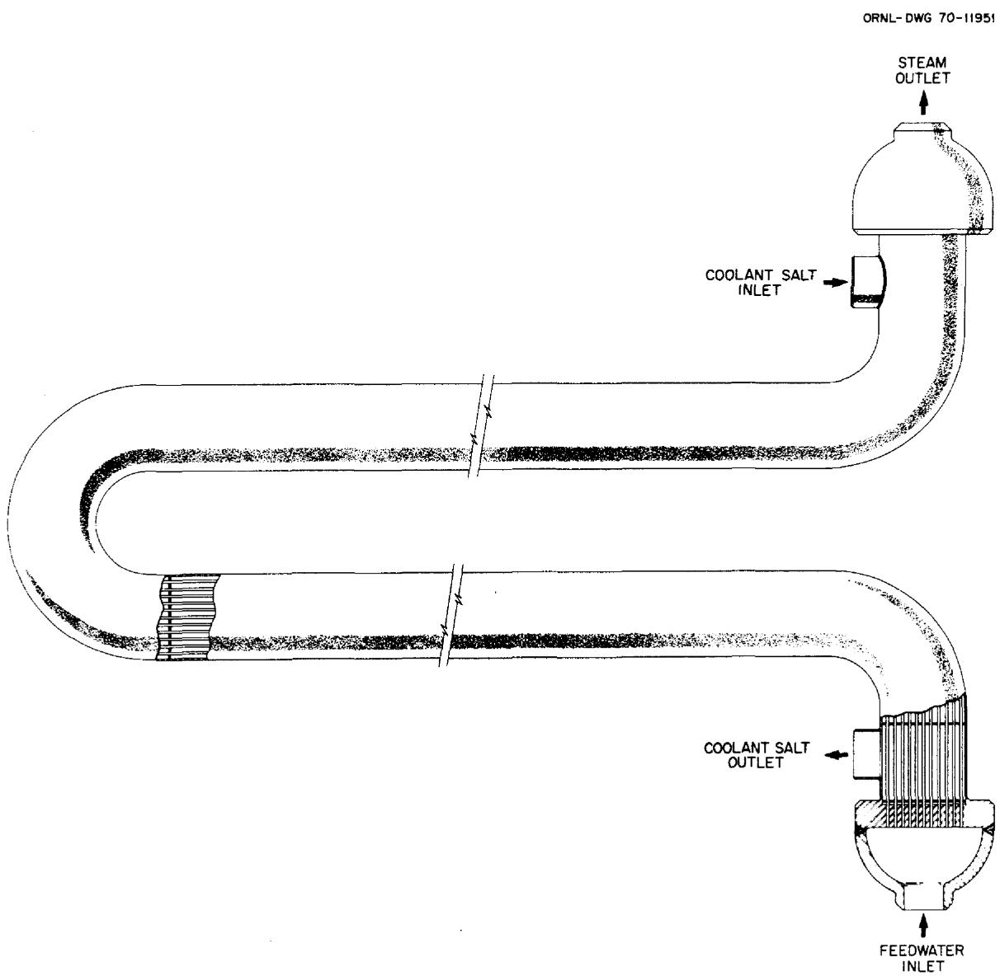  
Fig. 4.1. Typical MSBR Steam Generator Superheater Exchanger.

The feedwater enters the tube side of the exchanger at a pressure of 3754 psi, flows through the 0.50-in.-OD tubes, and the supercritical steam exits at a pressure of 3600 psi. The coolant salt enters the shell side of the exchanger at a pressure of 233 psi, circulates in counterflow to the supercritical fluid around segmental baffles, and exits at a pressure of 172 psi. Segmental baffles are used to improve the heat transfer coefficient for the salt film and to minimize salt stratification. A baffle on the shell side of each tube sheet provides a stagnant layer of salt to help reduce stresses resulting from temperature gradients across the tube sheets.

Location of the steam generator exchanger in a horizontal position reduces the possibility of unstable flow conditions for the supercritical fluid in the tubes. The U-tubes are arranged in a triangular-pitch array and the ends of the tubes are turned $90^{\circ}$ to equalize the lengths of the tubes in the exchanger. This equalization of tube lengths further reduces the possibility of unstable flow conditions. The pertinent design data for the steam generator exchanger are given in Table 4.1.

Table 4.1. Design Data for MSBR Steam Generator Superheater Exchanger   

<table><tr><td>Type</td><td>U-shell, U-tube one-pass horizontal unit with cross-flow baffles</td></tr><tr><td>Number required</td><td>16</td></tr><tr><td>Rate of heat transfer per unit, MW</td><td>121</td></tr><tr><td>Btu/hr</td><td>4.13 × 108</td></tr><tr><td>Shell-side conditions</td><td></td></tr><tr><td>Hot fluid</td><td>Coolant salt</td></tr><tr><td>Entrance temperature, °F</td><td>1150</td></tr><tr><td>Exit temperature, °F</td><td>850</td></tr><tr><td>Entrance pressure, psi</td><td>233.0</td></tr><tr><td>Exit pressure, psi</td><td>172.0</td></tr><tr><td>Pressure drop across exchanger, psi</td><td>61.0</td></tr><tr><td>Mass flow rate, lb/hr</td><td>3.82 × 106</td></tr><tr><td colspan="2">Tube-side conditions</td></tr><tr><td>Cold fluid</td><td>Supercritical fluid</td></tr><tr><td>Entrance temperature, °F</td><td>700</td></tr><tr><td>Exit temperature, °F</td><td>1000</td></tr><tr><td>Entrance pressure, psi</td><td>3754</td></tr><tr><td>Exit pressure, psi</td><td>3600</td></tr><tr><td>Pressure drop across exchanger, psi</td><td>154</td></tr><tr><td>Mass flow rate, lb/hr</td><td>6.33 × 10^5</td></tr><tr><td>Mass velocity, lb/hr·ft²</td><td>2.47 × 10^6</td></tr><tr><td colspan="2">Tube</td></tr><tr><td>Material</td><td>Hastelloy N</td></tr><tr><td>Number required</td><td>393</td></tr><tr><td>Pitch, in.</td><td>0.875 (triangular)</td></tr><tr><td>Outside diameter, in.</td><td>0.50</td></tr><tr><td>Wall thickness, in.</td><td>0.077</td></tr><tr><td>Length (tube sheet to tube sheet), ft</td><td>76.4</td></tr><tr><td colspan="2">Tube sheet</td></tr><tr><td>Material</td><td>Hastelloy N</td></tr><tr><td>Thickness, in.</td><td>4.5</td></tr><tr><td>Total heat transfer area, ft²</td><td>3929</td></tr><tr><td>Basis for area calculation</td><td>Outside of tubes</td></tr><tr><td colspan="2">Shell</td></tr><tr><td>Material</td><td>Hastelloy N</td></tr><tr><td>Wall thickness, in.</td><td>0.375</td></tr><tr><td>Inside diameter, in.</td><td>18.25</td></tr><tr><td colspan="2">Baffle</td></tr><tr><td>Type</td><td>Cross flow</td></tr><tr><td>Spacing, ft</td><td>4.02</td></tr><tr><td>Number of spaces</td><td>19</td></tr></table>

# 4.2 Design Calculations

The heat transfer coefficient for the supercritical fluid film on the inside of the tube walls is determined by using the correlation reported by H. S. Swenson et al. $^{12}$ This correlation is given in Eq. 4.1.

$$
\frac {\mathrm {h} _ {i} \mathrm {d} _ {i}}{\mathrm {k} _ {i}} = 0. 0 0 4 5 9 \left(\frac {\mathrm {d} _ {i} G}{\mu_ {i}}\right) ^ {0. 9 2 3} \left[ \frac {\mathrm {H} _ {i} - \mathrm {H} _ {b}}{\mathrm {T} _ {i} - \mathrm {T} _ {b}} \left(\frac {\mu_ {i}}{\mathrm {k} _ {i}}\right) \right] ^ {0. 6 1 3} \left(\frac {\mathrm {v} _ {b}}{\mathrm {v} _ {i}}\right) ^ {0. 2 3 1}, \tag {4.1}
$$

where

$h_i =$ heat transfer coefficient inside tube, Btu/hr·ft²·°F,

$\mathbf{d}_{\dot{\mathbf{i}}} =$ inside diameter of tube, ft,

$k_{\dot{1}} =$ thermal conductivity of fluid inside tube, Btu/hr·ft²·°F per ft,

$G =$ mass velocity of fluid, $1\mathrm{b / hr}\cdot \mathrm{ft}^2$

$\mu_{i} =$ viscosity of fluid at temperature of inside surface of tube, lb/hr·ft,

$\mathbf{H}_{\mathbf{i}} =$ enthalpy at temperature of inside surface of tube, Btu/lb,

$H_{b} =$ enthalpy at temperature of bulk fluid, Btu/lb,

$\mathbf{T}_{\mathbf{i}} =$ temperature of fluid at inside surface of tube, ${}^{\circ}\mathbf{F}$

$\mathbf{T}_{\mathfrak{b}} =$ temperature of bulk fluid, ${}^{\circ}\mathbb{F}$

$v_{b} =$ specific volume of bulk fluid, ft³/1b, and

$\mathbf{v_i} =$ specific volume of fluid inside tube, ft³/lb.

The values of specific volume and enthalpy for the supercritical fluid under various conditions of pressure and temperature are taken from data reported by J. H. Kennan and F. G. Keyes. $^{13}$ A table look-up subroutine is included in the SUPEX computer program for determination of these values. The values of thermal conductivity and viscosity for the supercritical fluid are determined from data reported by E. S. Nowak and R. J. Grosh. $^{14}$ These data were represented by Eqs. 4.2 and 4.3 in the SUPEX computer program.

$$
\mu = 0. 0 2 1 9 1 \left(\frac {v}{v - 0 . 0 1 2}\right) ^ {2} \left(\frac {T + 4 6 0}{4 9 2}\right) ^ {1 \cdot 5} \left(\frac {1 4 7 8}{T + 1 4 4 6}\right) \tag {4.2}
$$

and

$$
k = (1. 0 9 3 \times 1 0 ^ {- 6}) (T + 4 6 0) ^ {1 \cdot 4 5} + (2 8. 5 4 \times 1 0 ^ {- 4}) v ^ {- 1 \cdot 2 5}, \tag {4.3}
$$

where

$\mathbf{v} =$ specific volume, ft³/lb, and

T = temperature of fluid, °F.

The heat transfer coefficient for the salt film on the outside surface of the tubes is determined by using the method proposed by O. P. Bergelin et al. $^{4,5}$ The experimental data $^{4}$ are presented as correlations between a heat transfer factor (J) and the Reynolds number, with the Reynolds number defined by the expression

$$
N _ {R e} = \frac {d G}{\mu_ {b}} \tag {4.4}
$$

where

$\mathbf{d}_{\mathrm{o}} =$ outside diameter of tube, ft,

$G =$ mass velocity of the fluid, $1b / hr\cdot ft^2$ , and

$\mu_{b} =$ viscosity at temperature of bulk fluid, $1b / hr \cdot ft$ .

The shell side of the steam generator exchanger is divided into two types of flow regions by the segmental baffles. These are the cross-flow and window regions, and the heat transfer factor is determined for each. The heat transfer factor for the cross-flow region $(\mathrm{J}_{\mathrm{B}})$ is given by the expression

$$
J _ {B} = \frac {h _ {B}}{C _ {p} G _ {B}} \left(\frac {C _ {p} \mu_ {b}}{k}\right) ^ {2 / 3} \left(\frac {\mu_ {o}}{\mu_ {b}}\right) ^ {0. 1 4} \tag {4.5}
$$

where

$h_{B} =$ heat transfer coefficient for cross-flow region, Btu/hr·ft²·°F,

$C_p =$ specific heat, Btu/lb. ${}^{\circ}F,$

$G_{B} =$ mass velocity of fluid in cross-flow region, $\mathrm{lb / hr\cdot ft^2}$

$\mu_{b} =$ viscosity at temperature of bulk fluid, lb/hr·ft,

k = thermal conductivity, Btu/hr·ft·°F, and

$\mu_{0} =$ viscosity of fluid at temperature of outside surface of tube, lb/hr·ft.

The heat transfer factor for the window region is given by the expression

$$
J _ {w} = \frac {h _ {w}}{C G m} \left(\frac {c p u _ {b}}{k}\right) ^ {2 / 3} \left(\frac {\mu_ {o}}{\mu_ {b}}\right) ^ {0. 1 4} \tag {4.6}
$$

where

$h_w =$ heat transfer coefficient for window region, Btu/hr·ft²·°F, and $G_m =$ mean mass velocity, lb/hr·ft².

The mean mass velocity is given by the expression

$$
G _ {m} = \left\langle G _ {B} G _ {w} \right\rangle^ {1 / 2}, \tag {4.7}
$$

where $G_{\mathrm{w}} =$ mass velocity of fluid in window region, $lb/hr \cdot ft^2$ . Equations for determining values of $J$ were fitted to the graph of $J$ versus $N_{\mathrm{Re}}$ given in Fig. 11 of Ref. 4 for use in the SUPEX computer program. The

values of J given by Eqs. 4.8 and 4.9 are used in Eqs. 4.5 and 4.6 to determine the heat transfer coefficients for the cross-flow and window regions $(\mathsf{h}_{\mathsf{B}}$ and $\mathsf{h}_{\mathsf{w}})$ .

$$
\text {F o r} 1 0 0 \leq N _ {\mathrm {R e}} \leq 8 0 0, \quad J = 0. 5 7 1 (N _ {\mathrm {R e}}) ^ {- 0. 4 5 6} \tag {4.8}
$$

and

$$
\text {F o r} 8 0 0 \leq \mathrm {N} _ {\mathrm {R e}} \leq 1 0 ^ {5}, \quad \mathrm {J} = 0. 3 4 6 \left(\mathrm {N} _ {\mathrm {R e}}\right) ^ {- 0. 3 8 2} \tag {4.9}
$$

In Bergelin's method, the heat transfer coefficient for the shell side of the exchanger is a linear combination of the heat transfer coefficients for the cross-flow and window regions weighted by the amount of heat transfer surface in each region and corrected for bypass leakage.

Because of the large baffle-spacing-to-shell-diameter ratio (approximately 2.7) required for the steam generator exchanger, an additional correction factor is applied to the shell-side heat transfer coefficient. The total shell-side heat transfer coefficient $\left(\mathrm{h}_{\mathrm{o}}\right)$ is given by the expression

$$
h _ {o} = 0. 7 7 B \left(\frac {2 y}{X}\right) ^ {0. 1 3 8} \left(\frac {h _ {B} a _ {B} + h _ {w} a _ {w}}{a _ {B} + a _ {w}}\right), \tag {4.10}
$$

where

B = bypass leakage factor recommended by Bergelin,4

$y =$ distance from the center line of the shell to the centroid of the segmental window area, ft,

$\mathbf{X} =$ baffle spacing, ft,

$h_{B} =$ heat transfer coefficient for cross-flow region, Btu/hr·ft²·°F,

$a_{B} =$ area of heat transfer surface in cross-flow region per unit length, ft²/ft,

$h_w =$ heat transfer coefficient for window region, Btu/hr·ft²·°F, and

$a_w = \frac{area\ of\ heat\ transfer\ surface\ in\ window\ region\ per\ unit\ length}{ft^2 / ft}$

The values of specific heat and thermal conductivity for the coolant salt are treated as constants, independent of temperature, and are included in the input information for the SUPEX computer program. The density and viscosity of the salt are treated as functions of temperature as determined by Eqs. 4.11 and 4.12.

$$
\rho = 1 4 1. 3 8 - 0. 0 2 4 6 6 (T) \tag {4.11}
$$

and

$$
\mu = 0. 2 1 2 2 \exp \left[ \frac {4 0 3 2}{(\mathrm {T} + 4 6 0)} \right], \tag {4.12}
$$

where

$$
\begin{array}{l} \rho = \text {d e n s i t y} \quad \text {c o o l a n t} \quad \text {s a l t}, \quad \mathrm {l b / f t} ^ {3}, \\ \mathrm {T} = \text {t e m p e r a t u r e o f s a l t}, ^ {\circ} \mathrm {F}, \text {a n d} \\ \mu = \text {v i s c o s i t y} \quad \text {s a l t}, \quad \mathrm {l b / h r - f t}. \\ \end{array}
$$

The thermal resistance of the tube wall is calculated for each increment of tube length by using the thermal conductivity of Hastelloy N evaluated at the average temperature of the tube wall for each particular increment. The thermal resistance of the tube wall is given by the expression

$$
R _ {W} = \frac {d _ {o}}{2 k _ {W}} \left(\ln \frac {d _ {o}}{d _ {i}}\right), \tag {4.13}
$$

where

$$
\begin{array}{l} R _ {W} = \text {t h e r m a l} \quad \text {r e s i s t a t i o n} \quad \text {t u}, \\ d _ {0} = \text {o u t s i d e} \\ k _ {W} = \text {t h e r m a l c o n d u c t i v i t y o f t u b e w a l l , B t u / h r} \cdot \text {f t} \cdot {} ^ {\circ} F, \text {a n d} \\ d _ {i} = \text {i n s i d e} \\ \end{array}
$$

The thermal conductivity of the tube wall is given by the expression

$$
k _ {W} = 0. 0 0 6 3 7 5 T _ {W} + 4. 0 6 \tag {4.14}
$$

where $T_{W} =$ mean temperature of the tube wall, $^{\circ}F$ . The total thermal resistance, based on the outer surface area of the tube, is given by the expression

$$
R _ {t} = \frac {d _ {o}}{h _ {i} d _ {i}} + \frac {1}{h _ {o}} + R _ {W}. \tag {4.15}
$$

The heat transferred per increment of exchanger length $(\Delta Q)$ is given by the expression

$$
\Delta Q = \frac {\pi d _ {o} n (\triangle L) (\triangle T _ {m})}{R _ {t}}, \tag {4.16}
$$

where

$\mathsf{d}_{\mathsf{o}} =$ outside diameter of tube, ft,

$\mathbf{n} =$ number of tubes,

$\triangle L =$ increment of tube length, ft,

$\Delta \mathrm{T}_{\mathrm{m}} =$ mean temperature difference between coolant salt and supercritical fluid for the particular increment, $^\circ \mathbf{F}$ , and

$R_{t} =$ total thermal resistance given by Eq. 4.15.

The pressure drop per increment of tube length for the supercritical fluid inside the tubes is given by the expression

$$
\Delta P = \frac {4 f (\Delta L)}{1 4 4 d _ {i}} \left(\frac {G ^ {2}}{2 g _ {c} \rho}\right), \tag {4.17}
$$

where

$f =$ friction factor,

$\triangle L =$ increment of tube length, ft,

$\mathbf{d}_{\mathbf{i}} =$ inside diameter of tube, ft,

$G =$ mass velocity of fluid inside tube, $1b / hr\cdot ft^2$

$g_{c} =$ gravitational conversion constant, $\mathrm{lb}_{\mathrm{m}}\cdot \mathrm{ft} / \mathrm{lb}_{\mathrm{f}}\cdot \mathrm{hr}^{2}$ , and

$\rho =$ density of fluid inside tube, $\mathrm{lb / ft^3}$

The friction factor is given by the expression

$$
f = 0. 0 0 1 4 0 + 0. 1 2 5 \left(\frac {\mu_ {i}}{d _ {i} G}\right) ^ {0. 3 2}. \tag {4.18}
$$

The pressure drops on the shell side of the steam generator exchanger are calculated by using the equations recommended by Bergelin. The pressure drop across the i-th cross-flow region is given by the expression

$$
\triangle P _ {B i} = \frac {0 . 6 r _ {B}}{1 4 4} \left(\frac {G _ {B} ^ {2}}{2 g _ {c} \rho}\right), \tag {4.19}
$$

where

$\mathbf{r}_{\mathbf{B}} =$ number of restrictions in cross-flow region,

$G_{B} =$ mass velocity of fluid in cross-flow region, $1\mathrm{b / hr}\cdot \mathrm{ft}^2$ , and

$\rho =$ density of fluid, $1b / ft^3$

The pressure drop across the i-th baffle window is given by the expression

$$
\Delta P _ {w _ {i}} = \frac {\left(2 + 0 . 6 r _ {w}\right)}{1 4 4} \left(\frac {G _ {m} ^ {2}}{2 g _ {c} \rho}\right), \tag {4.20}
$$

where

$$
\begin{array}{l} r _ {w} = \text {n u m b e r o f r e s t r i c t i o n s i n w i n d o w r e g i o n a n d} \\ G _ {m} = \text {m e a n m a s s v e l o c i t y (g i v e n b y E q . 4 . 7) , l b / h r \cdot f t ^ {2}}. \\ \end{array}
$$

The total pressure drop on the shell side of the exchanger is given by the expression

$$
\Delta P _ {s} = B _ {p} \left(\sum_ {i = 1} ^ {N + 1} \Delta P _ {B _ {i}} + \sum_ {i = 1} ^ {N} \Delta P _ {w _ {i}}\right), \tag {4.21}
$$

where

$$
\begin{array}{l} B _ {p} = \text {b y p a s s l e a k a g e c o r r e c t i o n f a c t o r f o r p r e s s u r e r e c o m m e n d e d b y} \quad B _ {p} = \text {b y p a s s l e a k a g e c o r r e c t i o n f a c t o r f o r p r e s s u r e r e c o m m e n d e d b y} \\ N = \text {n u m b e r o f b a f f l e s}. \\ \end{array}
$$

Detailed stress calculations are not included in the SUPEX computer program, but an approximate value of the allowable temperature drop across the tube wall based on thermal stress considerations is determined for each increment of tube length. This value of allowable temperature drop can be compared with the value of the temperature drop across the tube wall determined in the heat transfer calculations to provide some guidance in selecting design parameters. The thermal stresses are treated as secondary stresses. Based on the requirements set forth in Section III, Nuclear Vessels, of the ASME Boiler and Pressure Vessel Code; the permissible value for the thermal stresses is given by the expression

$$
\Delta \mathrm {T h} = \Delta \mathrm {T} \sigma_ {\mathrm {L}} = 3 \mathrm {S} _ {\mathrm {m}} - \mathrm {S}, \tag {4.22}
$$

where

$$
\begin{array}{l} \Delta \mathrm {T} ^ {\sigma} \mathrm {h}, \Delta \mathrm {T} ^ {\sigma} \mathrm {L} = \text {h o o p a n d l o n g i t u d i n a l s t r e s s c o m p o n e n t s c a u s e d b y t e m p e r -} \\ S _ {m} = \text {a l l o w a b l e s t r e s s i n t i e n s y m b o l y b a s e d o n r u l e s p r e s c r i b e d i n} \\ \end{array}
$$

S = total stress intensity resulting from primary membrane stresses plus secondary stresses from all sources other than thermal stresses, psi.

The value of S was conservatively estimated to be about 26,000 psi. The tube wall material is Hastelloy N, and

$$
f o r \quad T _ {W} <   1 0 1 5 ^ {\circ} F, \quad S _ {m} = 2 4, 0 0 0 - 7. 5 \left(T _ {W}\right) \tag {4.23}
$$

and

$$
f o r 1 0 1 5 ^ {\circ} \mathrm {F} \leq \mathrm {T} _ {\mathrm {W}} \leq 1 1 0 0 ^ {\circ} \mathrm {F}, \quad \mathrm {S} _ {\mathrm {m}} = 5 7, 0 0 0 - 4 0 (\mathrm {T} _ {\mathrm {W}}). \tag {4.24}
$$

Based on data reported by J. F. Harvey, $^{15}$ the hoop and longitudinal stresses resulting from temperature differences across the tube wall are given by the expression

$$
\Delta \mathrm {T} ^ {\sigma_ {\mathrm {h}}} = \Delta \mathrm {T} ^ {\sigma_ {\mathrm {L}}} = \frac {- \alpha \mathrm {E} (\Delta \mathrm {T} _ {\mathrm {W}})}{2 (1 - v) \left(\ln \frac {\mathrm {d} _ {\mathrm {o}}}{\mathrm {d} _ {\mathrm {i}}}\right)} \left[ 1 - \frac {2 \mathrm {d} _ {\mathrm {o}} ^ {2}}{\mathrm {d} _ {\mathrm {o}} ^ {2} - \mathrm {d} _ {\mathrm {i}} ^ {2}} \left(\ln \frac {\mathrm {d} _ {\mathrm {o}}}{\mathrm {d} _ {\mathrm {i}}}\right) \right] \quad , \tag {4.25}
$$

where

$$
\alpha = \text {c o e f f i c i e n t}
$$

$$
E = \text {m o d u l u s}
$$

$$
\Delta \mathrm {T} _ {\mathrm {W}} = \text {t e m p e r a t u r e} \text {d r o p} \text {a c r o s s} \text {t u b e w a l l}, ^ {\circ} \mathrm {F},
$$

$$
v = \text {P o i s s o n} ^ {\prime} \text {s r a t i o},
$$

$$
d _ {o} = \text {o u t s i d e d i a m e t e r o f t u b e , i n . , a n d}
$$

$$
d _ {i} = \text {i n s i d e}
$$

The estimated value of S and Eqs. 4.22, 4.23, 4.24, and 4.25 are used in the SUPEX computer program to calculate the allowable value of $\triangle T_{\mathrm{W}}$ . The values of E and $\alpha$ are determined in the computer program from Eqs. 4.26 and 4.27.

$$
E = [ 3 1. 6 5 - 0. 0 0 5 (T _ {W}) ] \times 1 0 ^ {6} \tag {4.26}
$$

and

$$
\alpha = \left[ 0. 0 0 3 1 \left(\mathrm {T} _ {\mathrm {W}}\right) + 5. 9 1 \right] \times 1 0 ^ {- 6}. \tag {4.27}
$$

Although detailed stress calculations are not included in the SUPEX computer program, a preliminary stress analysis of the steam generator exchanger was made by hand. This preliminary analysis was based on the

requirements of Section III, Nuclear Vessels, of the ASME Boiler and Pressure Vessel Code; and the hand calculated values are compared with allowable values in Table 4.2. The allowable stress values were taken from data in code case interpretations 1315-3 (Ref. 16) and 1331-4 (Ref. 17).

Table 4.2. Preliminary Stress Calculations for MSBR Steam Generator   

<table><tr><td colspan="2">Maximum stress intensity, a psi</td></tr><tr><td>Tube</td><td></td></tr><tr><td>Calculated</td><td>Pm= 13,900; (Pm+Q) = 30,900</td></tr><tr><td>Allowableb</td><td>Pm= 15,500; (Pm+Q) = 46,500</td></tr><tr><td>Shell</td><td></td></tr><tr><td>Calculated</td><td>Pm= 5800; (Pm+Q) = 13,200</td></tr><tr><td>Allowablec</td><td>Pm= 8800; (Pm+Q) = 26,400</td></tr><tr><td>Maximum tube sheet stress, psi</td><td></td></tr><tr><td>Calculated</td><td>&lt;17,000</td></tr><tr><td>Allowabled</td><td>17,000</td></tr></table>

aThe symbols are those of Section III of the ASME Boiler and Pressure Vessel Code where

$\mathbf{P}_{\mathfrak{m}} =$ primary membrane stress intensity, psi,

$\mathbf{Q} =$ secondary stress intensity, psi,

$\mathbf{S}_{\mathfrak{m}} =$ allowable stress intensity, psi.

${}^{\mathrm{b}}$ Based on a temperature of ${1038}^{ \circ  }\mathrm{F}$ for the inside surface of the tubes; this represents the worst stress condition.   
${}^{\mathrm{c}}$ Based on the maximum or highest temperature of the coolant salt of ${1150}^{ \circ  }\mathrm{F}$ .   
${}^{\mathrm{d}}$ Based on a temperature of ${1000}^{ \circ  }\mathrm{F}$ for the steam and use of a baffle on the shell side.

# 4.3 Description of SUPEX

The equations described in Subsection 4.2 are used in the SUPEX program to size the steam generator exchanger for the specified input data. A flow diagram of the SUPEX program, a list of the input required, and a list of the output received from the computer are given in Appendix D.

In the SUPEX program, the total heat to be transferred in the exchanger is divided into a specified number of equal increments. For each increment, heat balance relations for the coolant salt and the supercritical fluid and the heat transfer equations are used to determine the change of temperature for each stream and the tube length required. The pressure drop in the supercritical fluid for each increment and the pressure drop in the coolant salt for each baffle space are calculated and summed.

Two major iteration loops are contained in the SUPEX program. First, the baffle spacing is assumed and iterations are made until the total calculated shell-side pressure drop agrees with that specified. Internal to this loop, the number of tubes in the exchanger is estimated, and iterations are made to give the total tube-side pressure drop specified. A simplified flow diagram of the SUPEX program, a complete listing of the program, and a list of terms used in the program are given in Appendix D.

Output from the program includes the number of tubes, inside diameter of the shell, length of the exchanger, baffle spacing, number of baffles, total heat transfer area, and the apparent overall heat transfer coefficient. The method of calculation used in the program permits the total length of the tubes to differ from the total length of the baffles space by a fraction of the baffle spacing. Both lengths are given in the output, as are the heat transfer area and apparent heat transfer coefficient for each length. The output also includes pertinent information for each baffle spacing and tube increment.

To illustrate the use of the SUPEX program, the computer input data for the MSBR steam generator superheater exchanger described in Subsection 4.1 and the output data printed by the computer are included in Appendix D. The time required for a typical IBM 360/91 computer run of this program is about 30 seconds.

The problem of stability in the steam generator superheater was considered. As indicated by K. Goldman et al. $^{18}$ and by L. S. Tong, $^{19}$ instabilities in steam generators can arise from two sources. First, a true thermodynamic instability can exist where, for a given pressure drop across the tube, the flow rate through the tube may be changed from one steady-state value to another by a finite disturbance. Second, a system instability that is caused by resonant conditions in the fluid can exist. Data related to the first type of instability have been reported by L. Y. Krasyakova and B. N. Glusker, $^{20}$ and data related to the second type of instability have been reported by E. R. Quandt $^{21}$ and by L. M. Shotkin. $^{22}$ A qualitative evaluation of these data indicates that the mass flow rate, pressure drop, and heat flux used in the horizontal U-tube and U-shell design will result in stable operation. Operation of a test module will provide further information about the stability of this design concept.

An analysis was made to evaluate the various uncertainties involved in the SUPEX computer program. Tolerances were placed on the physical properties of the coolant salt, the heat transfer coefficients, and on the pressure-drop correlation. The program was run for various cases to determine the quantitative values of the favorable and the adverse effects of the uncertainties. The favorable effects were defined as decreased heat transfer area, decreased shell diameter, and decreased total tube length. The adverse effects were defined as increased values for these same three parameters. The selection of these parameters was based on the belief that the heat transfer area is indicative of the total cost of the exchanger, the diameter of the shell is indicative of the stress problem, and the total length of the tubes is indicative of the physical size of the exchanger.

The range of uncertainties studied included the physical properties of the coolant salt with a deviation of $\pm 2\%$ for the specific heat and density and a deviation of $\pm 10\%$ for the viscosity and thermal conductivity, the tube-side and shell-side heat transfer coefficients with a deviation of $\pm 20\%$ , and the pressure-drop correlation with a deviation of $\pm 10\%$ .

Scrutiny of the shell-side heat transfer coefficient revealed that positive deviations (increases) in the specific heat and thermal conductivity of the coolant salt and negative deviations (decreases) in the density and viscosity of the salt will produce favorable effects, while opposite deviations will produce adverse effects. A negative deviation (decrease) in the calculated pressure drop will produce favorable effects, while a positive deviation (increase) will produce adverse effects.

The results of this analysis in terms of percentage changes relative to the design case are given in Table 4.3. Case 1 is for an increased specific heat and density of the coolant salt and a decreased viscosity and thermal conductivity. Case 2 is for deviations opposite to those of Case 1. Cases 3 and 4 are for increased and decreased, respectively, shell-side heat transfer coefficients; Cases 5 and 6 are for increased and decreased, respectively, tube-side heat transfer coefficients; and Cases 7 and 8 are for decreased and increased, respectively, calculated pressure drops. Case 9 for overall favorable conditions is for the combined effect of all favorable changes, and Case 10 for overall adverse conditions is for all adverse changes. Cases 1, 3, 5, and 7 represent favorable changes; while Cases 2, 4, 6, and 8 represent adverse changes.

Table 4.3. Percentage Deviations Resulting From Calculational Uncertainties Related to MSBR Steam Generator Exchanger   

<table><tr><td>Case</td><td>Conditions</td><td>Heat Transfer Area</td><td>Shell Diameter</td><td>Total Tube Length</td></tr><tr><td>1</td><td>Favorable physical properties</td><td>-8.2</td><td>-1.4</td><td>-5.6</td></tr><tr><td>2</td><td>Adverse physical properties</td><td>+7.6</td><td>+1.2</td><td>+5.2</td></tr><tr><td>3</td><td>Increased shell-side heat transfer</td><td>-10.1</td><td>-1.6</td><td>-7.0</td></tr><tr><td>4</td><td>Decreased shell-side heat transfer</td><td>+13.5</td><td>+2.1</td><td>+8.8</td></tr><tr><td>5</td><td>Increased tube-side heat transfer</td><td>-2.3</td><td>-0.5</td><td>-1.3</td></tr><tr><td>6</td><td>Decreased tube-side heat transfer</td><td>+4.2</td><td>+0.9</td><td>+2.3</td></tr><tr><td>7</td><td>Decreased calculated pressure drop</td><td>-2.6</td><td>-0.5</td><td>-1.6</td></tr><tr><td>8</td><td>Increased calculated pressure drop</td><td>+1.8</td><td>+0.7</td><td>+0.5</td></tr><tr><td>9</td><td>Overall favorable</td><td>-21</td><td>-4</td><td>-15</td></tr><tr><td>10</td><td>Overall adverse</td><td>+30</td><td>+5</td><td>+18</td></tr></table>

# REFERENCES

1. C. G. Lawson, R. J. Kedl, and R. E. McDonald, "Enhanced Heat Transfer Tube for Horizontal Condenser With Possible Application in Nuclear Power Plant Design," Transactions of the American Nuclear Society, Vol. 9, No. 2 (1966).   
2. C. G. Lawson, Oak Ridge National Laboratory, personal communication to C. E. Bettis, Oak Ridge National Laboratory.   
3. H. A. McLain, "Revised Primary Salt Heat Transfer Coefficient for MSBR Primary Heat Exchanger Design," ORNL internal correspondence MSR-67-70, July 31, 1969.   
4. O. P. Bergelin, G. A. Brown, and A. P. Colburn, "Heat Transfer and Fluid Friction During Flow Across Bank of Tubes -V: A Study of a Cylindrical Baffled Exchanger Without Internal Leakage," Trans. ASME, 76: 841-850 (1954).   
5. O. P. Bergelin, K. J. Bell, and M. D. Leighton, "Heat Transfer and Fluid Friction Druing Flow Across Banks of Tubes -VI: The Effect of Internal Leakages Within Segmentally Baffled Exchangers," Trans. ASME, 80: 53-60 (1958).   
6. B. Cox, "Preliminary Heat Transfer Results With a Molten Salt Mixture Containing LiF-BeF $_2$ -ThF $_4$ -UF $_4$ Flowing Inside a Smooth, Horizontal Tube," ORNL internal document CF-69-9-44, September 25, 1969.   
7. E. N. Sieder and G. E. Tate, "Heat Transfer and Pressure Drop of Liquids in Tubes," Industrial and Engineering Chemistry, 28(12): 1429-1435 (1936).   
8. H. W. Hoffman and S. I. Cohen, "Fused Salt Heat Transfer, Part III: Forced Convection Heat Transfer in Circular Tubes Containing the Salt Mixture $\mathrm{NaNO}_2$ - $\mathrm{NaNO}_3$ - $\mathrm{KNO}_3$ ," USAEC Report ORNL-2433, Oak Ridge National Laboratory, March 1960.   
9. H. A. McLain, "Revised Correlations for the MSBR Primary Salt Heat Transfer Coefficient," ORNL internal correspondence MSR-69-89, September 24, 1969.   
10. D. A. Donohue, "Heat Transfer and Pressure Drop in Heat Exchangers," Industrial and Engineering Chemistry, 41(11): 2499-2511 (November 1949).   
11. J. R. McWherter, "MSBR Mark I Primary and Secondary Salts and Their Physical Properties," ORNL internal correspondence MSR-68-135, Rev. 1, February 12, 1969.   
12. H. S. Swenson, C. R. Kakarala, and J. A. Carver, "Heat Transfer to Supercritical Water in Smooth-Bore Tubes," Transactions of the ASME, Series C: Journal of Heat Transfer, 87(4): 477-484 (November 1965).   
13. J. H. Keenan and F. G. Keyes, Thermodynamic Properties of Steam, John Wiley and Sons, New York, 1936.

14. E. S. Nowak and R. J. Grosh, "An Investigation of Certain Thermodynamic and Transport Properties of Water and Water Vapor in the Critical Region," USAEC Report ANL-6064, Argonne National Laboratory, October 1959.   
15. J. F. Harvey, Pressure Vessel Design, D. Van Nostrand Company, New Jersey, 1963.   
16. Case 1315-3, "Nickel-Molybdenum-Chromium-Iron Alloy," Interpretations of ASME Boiler and Pressure Vessel Code, The American Society of Mechanical Engineers, New York, April 25, 1968.   
17. Case 1331-4, "Nuclear Vessels in High-Temperature Service," Interpretations of ASME Boiler and Pressure Vessel Code, The American Society of Mechanical Engineers, New York, August 15, 1967.   
18. K. Goldman, S. L. Israel, and D. J. Nolan, "Final Status Report: Performance Evaluation of Heat Exchangers for Sodium-Cooled Reactors," Report UNC-5236, United Nuclear Corporation, Elmsford, New York, June 1969.   
19. L. S. Tong, Chapter 7 in Boiling Heat Transfer and Two-Phase Flow, John Wiley and Sons, New York, 1965.   
20. L. Y. Krasyakova and B. N. Glusker, "Hydraulic Study of Three-Pass Panels With Bottom Inlet Headers for Once-Through Boilers," Teploenergetika, 12(8): 17-23 (1965), (UDC 532: 621.181.91.001.5).   
21. E. R. Quandt, "Analysis and Measurement of Flow Oscillations," Chemical Engineering Progress Symposium Series, Vol. 57, No. 32, 1961.   
22. L. M. Shotkin, "Stability Considerations in Two-Phase Flow," Nuclear Science and Engineering, 28: 317-324 (1967).

APPENDICES

#

$\therefore m = \frac{3}{11}$

2

# Appendix A

# PHYSICAL PROPERTY DATA

The design properties of the fuel salt used in the concept of a single-fluid MSBR and incorporated in the PRIMEX computer program are given in Table A.1. The design properties of the coolant salt used in the MSBR concept and incorporated in the PRIMEX, RETEX, and SUPEX computer programs are given in Table A.2; and the design properties of Hastelloy N used in the MSBR concept and incorporated in these computer programs are given in Table A.3.

Values for the density, viscosity, and thermal conductivity of the fuel and coolant salts were taken from data reported in Ref. A.1. The value given for the heat capacity of the fuel salt is taken from Ref. A.2, and the value given for the heat capacity of the coolant salt is taken from Ref. A.3. These references are listed below.

A.1. Oak Ridge National Laboratory, "Molten-Salt Reactor Program Semi-annual Progress Report August 31, 1969," USAEC Report ORNL-4449, February 1970.   
A.2. Oak Ridge National Laboratory, "Molten-Salt Reactor Program Semi-annual Progress Report August 31, 1968," USAEC Report ORNL-4344, February 1969.   
A.3. Oak Ridge National Laboratory, "Molten-Salt Reactor Program Semi-annual Progress Report February 29, 1969," USAEC Report ORNL-4254, August 1969.

Table A.1. Design Properties of MSBR Fuel Salt   

<table><tr><td>Fuel salt components</td><td>7LiF-BeF2-ThF4-UF4</td></tr><tr><td>Composition, mole %</td><td>71.7-16-12-0.3</td></tr><tr><td>Approximate molecular weight</td><td>64</td></tr><tr><td>Approximate melting point, °F</td><td>930</td></tr><tr><td>Vapor pressure at 1150°F, mm Hg</td><td>&lt;0.1</td></tr><tr><td>Density, a</td><td></td></tr><tr><td>g/cm3</td><td>ρ = 3.752 - (6.68 × 10-4)T°C</td></tr><tr><td>lb/ft3</td><td>ρ = 235.0 - 0.02317T°F</td></tr><tr><td>At 1300°F</td><td>ρ = 204.9 lb/ft3</td></tr><tr><td>At 1175°F</td><td>ρ = 207.8 lb/ft3</td></tr><tr><td>At 1050°F</td><td>ρ = 210.7 lb/ft3</td></tr><tr><td>Viscosity, b</td><td></td></tr><tr><td>Centipoise</td><td>μ = 0.109{exp 4090/T°K}</td></tr><tr><td>lb/ft·hr</td><td>μ = 0.2637{exp 7362/T°R}</td></tr><tr><td>At 1300°F</td><td>μ = 17.29 lb/ft·hr</td></tr><tr><td>At 1175°F</td><td>μ = 23.78 lb/ft·hr</td></tr><tr><td>At 1050°F</td><td>μ = 34.54 lb/hr·ft</td></tr><tr><td>Heat capacity, c</td><td>C = 0.324 Btu/lb·°F ± 4%</td></tr><tr><td>Thermal conductivity d</td><td>p</td></tr><tr><td>At 1300°F</td><td>k = 0.69 Btu/hr·°F·ft</td></tr><tr><td>At 1175°F</td><td>k = 0.71 Btu/hr·°F·ft</td></tr><tr><td>At 1050°F</td><td>k = 0.69 Btu/hr·°F·ft</td></tr></table>

<sup>a</sup>Figure 13.6 on page 147 of Ref A.1.   
bTable 13.2 on page 145 of Ref A.1.   
cPage 163 of Ref. A.2.   
Figure 9.13 on page 92 of Ref. A.1. The value of k shown for salt with about $5\%$ less LiF than in the reference salt. The fraction of LiF would increase the average value to about 0.72 in 1974. The established and conservative value of 0.71 was used in the calculations for the MSBR concept.

Table A.2. Design Properties of MSBR Coolant Salt   

<table><tr><td>Coolant salt components</td><td>NaBF4-NaF</td></tr><tr><td>Composition, mole %</td><td>92-8</td></tr><tr><td>Approximate molecular weight</td><td>104</td></tr><tr><td>Approximate melting point, °F</td><td>725</td></tr><tr><td>Vapor pressure at 1150°F, mm Hg</td><td>252</td></tr><tr><td>Density, a</td><td></td></tr><tr><td>g/cm3</td><td>ρ = 2.252 - (7.11 × 10-4)T°C</td></tr><tr><td>lb/ft3</td><td>ρ = 141.4 - 0.0247T°F</td></tr><tr><td>At 1150°F</td><td>ρ = 113.0 lb/ft3</td></tr><tr><td>At 1000°F</td><td>ρ = 116.7 lb/ft3</td></tr><tr><td>At 850°F</td><td>ρ = 120.4 lb/ft3</td></tr><tr><td>b</td><td></td></tr><tr><td>Viscosity, Centipoise</td><td>μ = 0.0877{exp 2240/T°K}</td></tr><tr><td>lb/ft·hr</td><td>μ = 0.2121{exp 4032/T°R}</td></tr><tr><td>At 1150°F</td><td>μ = 2.60 lb/ft·hr</td></tr><tr><td>At 1000°F</td><td>μ = 3.36 lb/ft·hr</td></tr><tr><td>At 850°F</td><td>μ = 4.61 lb/ft·hr</td></tr><tr><td>Heat capacityc</td><td>Cp = 0.360 Btu/lb·°F ± 2%</td></tr><tr><td>Thermal conductivity, d</td><td></td></tr><tr><td>At 1150°F</td><td>k = 0.23 Btu/hr·°F·ft</td></tr><tr><td>At 1000°F</td><td>k = 0.23 Btu/hr·°F·ft</td></tr><tr><td>At 850°F</td><td>k = 0.26 Btu/hr·°F·ft</td></tr></table>

<sup>a</sup>Figure 13.6 on page 147 of Ref. A.1.   
bTable 13.2 on page 145 of Ref.A.l.   
cPage 168 of Ref. A.3.   
Figure 9.13 on page 92 of Ref. A.1.

Table A.3. Design Properties of Hastelloy N   

<table><tr><td colspan="2">Composition, wt %</td></tr><tr><td>Nickel</td><td>Balance</td></tr><tr><td>Molybdenum</td><td>12</td></tr><tr><td>Chromium</td><td>7</td></tr><tr><td>Iron</td><td>0 to 4</td></tr><tr><td>Manganese</td><td>0.2 to 0.5</td></tr><tr><td>Silicon, maximum</td><td>0.1</td></tr><tr><td>Boron, maximum</td><td>0.001</td></tr><tr><td>Titanium</td><td>0.5 to 1.0</td></tr><tr><td>Hafnium or niobium</td><td>0 to 2</td></tr><tr><td>Cu, Co, P, S, C, W, Al</td><td>0.35</td></tr><tr><td colspan="2">Density, lb/ft3</td></tr><tr><td>At 80°F</td><td>557</td></tr><tr><td>At 1300°F</td><td>541</td></tr><tr><td colspan="2">Thermal conductivity, Btu/hr·ft·°F</td></tr><tr><td>At 80°F</td><td>6.0</td></tr><tr><td>At 1300°F</td><td>12.6</td></tr><tr><td colspan="2">Specific heat, Btu/lb·°F</td></tr><tr><td>At 80°F</td><td>0.098</td></tr><tr><td>At 1300°F</td><td>0.136</td></tr><tr><td colspan="2">Thermal expansion per °F</td></tr><tr><td>At 80°F</td><td>5.7 × 10-6</td></tr><tr><td>At 1300°F</td><td>9.5 × 10-6</td></tr><tr><td colspan="2">Modulus of elasticity, psi</td></tr><tr><td>At 80°F</td><td>31 × 106</td></tr><tr><td>At 1300°F</td><td>25 × 106</td></tr><tr><td colspan="2">Tensile strength, psi</td></tr><tr><td>At 80°F</td><td>~115,000</td></tr><tr><td>At 1300°F</td><td>~75,000</td></tr><tr><td colspan="2">Maximum allowable design stress at 1300°F, psi</td></tr><tr><td>At 80°F</td><td>25,000</td></tr><tr><td>At 1300°F</td><td>3500</td></tr><tr><td>Melting temperature, °F</td><td>2500</td></tr></table>

# Appendix B

# THE PRIMEX PROGRAM

The PRIMEX computer program is outlined in block-diagram form in Fig. B.1. The input data required for the program are given in Table B.1, and the output received from the program are given in Table B.2. A complete listing of the main program and its two subroutines is followed by definitions of the intermediate variables used in the program. To illustrate the use of the PRIMEX program, the input and output for the MSBR primary heat exchanger discussed in Subsection 2.1 of this report are presented as printed by the computer.

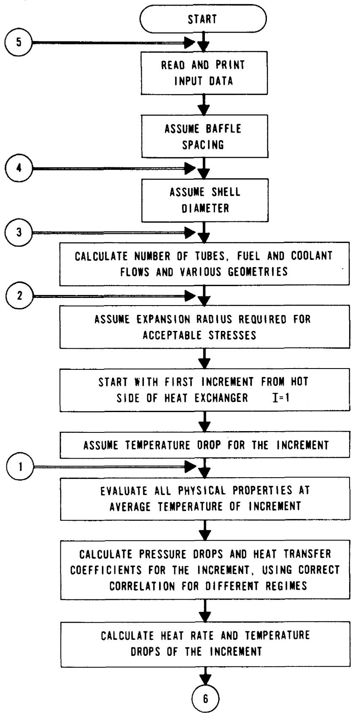  
Fig. B.1. Simplified Flow Diagram of the PRIMEX Computer Program.

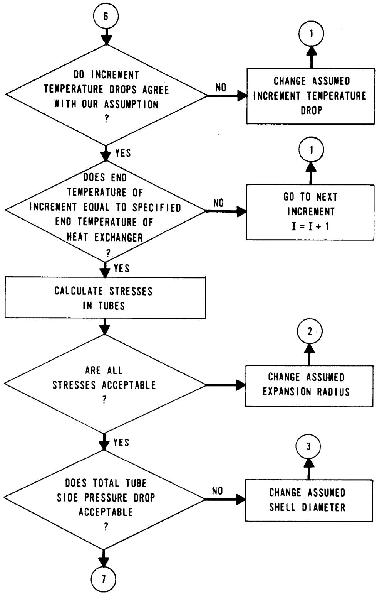  
Fig. B.1. (continued)

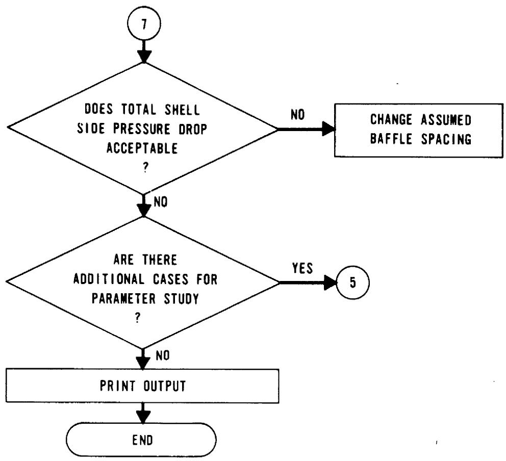  
Fig. B.1. (continued)

Table B.1. Computer Input Data for PRIMEX Program   

<table><tr><td>Card</td><td>Columns</td><td>Format</td><td>Variable</td><td>Term</td><td>Units</td></tr><tr><td rowspan="5">A</td><td>1-10</td><td>E10.4</td><td>Heat load required</td><td>HEATL</td><td>Btu/hr</td></tr><tr><td>11-20</td><td>F10.0</td><td>Allowable tube-side pres-sure drop</td><td>PRDT</td><td>\( 1\mathrm{\;b}/{\mathrm{{ft}}}^{2} \)</td></tr><tr><td>21-30</td><td>F10.0</td><td>Allowable shell-side pressure drop</td><td>PRDS</td><td>\( 1\mathrm{\;b}/{\mathrm{{ft}}}^{2} \)</td></tr><tr><td>31-40</td><td>F10.0</td><td>Tube-side inlet pressure</td><td>TPIN</td><td>\( 1\mathrm{\;b}/{\mathrm{{ft}}}^{2} \)</td></tr><tr><td>41-50</td><td>F10.0</td><td>Shell-side outlet pressure</td><td>SPOUT</td><td>\( 1\mathrm{\;b}/{\mathrm{{ft}}}^{2} \)</td></tr><tr><td rowspan="4">B</td><td>1-10</td><td>F10.0</td><td>Coolant outlet temperature</td><td>CTO</td><td>°F</td></tr><tr><td>11-20</td><td>F10.0</td><td>Fuel inlet temperature</td><td>FTO</td><td>°F</td></tr><tr><td>21-30</td><td>F10.0</td><td>Fuel outlet temperature</td><td>ETF</td><td>°F</td></tr><tr><td>31-40</td><td>F10.0</td><td>Coolant inlet temperature</td><td>ETC</td><td>°F</td></tr><tr><td rowspan="5">C</td><td>1-10</td><td>F10.0</td><td>Leakage factor for heat transfer correlations</td><td>LK</td><td></td></tr><tr><td>11-20</td><td>F10.0</td><td>Leakage factor for pres-sure drop calculations</td><td>PLK</td><td></td></tr><tr><td>21-30</td><td>F10.0</td><td>Tube material conductivity</td><td>WCOND</td><td>Btu/hr⋅ft·°F</td></tr><tr><td>31-40</td><td>F10.0</td><td>Arc of bent tube for thermal expansion</td><td>ARC</td><td>Degrees</td></tr><tr><td>41-45</td><td>I5</td><td>Number of pair points in Stress intensity table for tube material</td><td>ICNPT</td><td></td></tr><tr><td>\( {\mathrm{D}}_{1},{\mathrm{D}}_{2} \) .</td><td>1-10</td><td>F10.0</td><td>Stress intensity at CTM temperature</td><td>CASM</td><td>psi</td></tr><tr><td>\( {\mathrm{D}}_{\text{ICNPT }} \)</td><td>11-20</td><td>F10.0</td><td>Temperature</td><td>CTM</td><td>°F</td></tr><tr><td rowspan="6">E</td><td>1-10</td><td>F10.0</td><td>Radius of coolant central downcomer</td><td>RA5</td><td>ft</td></tr><tr><td>11-20</td><td>F10.0</td><td>Distance between shell wall and tube bundle</td><td>DTR</td><td>ft</td></tr><tr><td>21-30</td><td>F10.0</td><td>Maximum anticipated heat exchanger radius</td><td>RASMAX</td><td>ft</td></tr><tr><td>31-35</td><td>I5</td><td>Number of cases to be run</td><td>KASES</td><td></td></tr><tr><td>36-40</td><td>I5</td><td>Index one if enhanced tubes are used</td><td>KENTB</td><td></td></tr><tr><td>41-45</td><td>I5</td><td>Index one if stress anal-ysis is included</td><td>KTBST</td><td></td></tr><tr><td rowspan="2">\( {\mathrm{F}}_{1},{\mathrm{\;F}}_{2} \) . ...</td><td>1-10</td><td>F10.0</td><td>Outside diameter of tubes</td><td>DIA</td><td>ft</td></tr><tr><td>11-20</td><td>F10.0</td><td>Tube wall thickness</td><td>WTHK</td><td>ft</td></tr><tr><td rowspan="4">\( {\mathrm{F}}_{\text{KASES }} \)</td><td>21-30</td><td>F10.0</td><td>Radial pitch</td><td>RPI</td><td>ft</td></tr><tr><td>31-40</td><td>F10.0</td><td>Circumferential pitch</td><td>BCPI</td><td>ft</td></tr><tr><td>41-50</td><td>F10.0</td><td>Inner baffle cut</td><td>CUT3</td><td>% of area</td></tr><tr><td>51-60</td><td>F10.0</td><td>Outer baffle cut</td><td>CUT4</td><td>% of area</td></tr></table>

Table B.2. Output Data From PRIMEX Computer Program   

<table><tr><td>Term</td><td>Variable</td><td>Units</td></tr><tr><td>THEATO</td><td>Total heat actually transferred</td><td>Btu/hr</td></tr><tr><td>HTPERC</td><td>Percentage of required heat load actually transferred</td><td></td></tr><tr><td>QC</td><td>Coolant (shell-side) mass flow rate</td><td>1b/hr</td></tr><tr><td>QF</td><td>Fuel (tube-side) mass flow rate</td><td>1b/hr</td></tr><tr><td>TTDSO</td><td>Total tube-side pressure drop</td><td>psi</td></tr><tr><td>SPPERC</td><td>Percentage of allowed tube pressure drop actually used</td><td></td></tr><tr><td>TTDTU</td><td>Total shell-side pressure drop</td><td>psi</td></tr><tr><td>TPPERC</td><td>Percentage of allowed shell pressure drop actually used</td><td></td></tr><tr><td>RA8</td><td>Radius of heat exchanger shell</td><td>ft</td></tr><tr><td>BSOI</td><td>Distance between baffles</td><td>ft</td></tr><tr><td>VOL</td><td>Fluid volume contained in tubes</td><td>ft3</td></tr><tr><td>AREA</td><td>Total heat transfer area in heat exchanger</td><td>ft2</td></tr><tr><td>SNT</td><td>Total number of tubes</td><td></td></tr><tr><td>TUBLEN</td><td>Actual tube length</td><td>ft</td></tr><tr><td>HEXLEN</td><td>Heat exchanger length from lower tube sheet to upper nozzle of tubes</td><td>ft</td></tr><tr><td>STRLEN</td><td>Straight section length of tubes</td><td>ft</td></tr><tr><td>EXPRAD</td><td>Radius of tube bends for thermal expansion</td><td>ft</td></tr><tr><td>BRL1</td><td>Modification factor for Bergelin's heat transfer correlation</td><td></td></tr><tr><td>PSTO</td><td>Primary stresses on outer surface of tubes</td><td>psi</td></tr><tr><td>PQSTO</td><td>Combined primary and secondary stresses on outer surface of tubes</td><td>psi</td></tr><tr><td>PQFSTO</td><td>Combined primary, secondary, and peak stresses on outer surface of tubes</td><td>psi</td></tr><tr><td>PSTI</td><td>Primary stresses on inner surface of tubes</td><td>psi</td></tr><tr><td>PQSTI</td><td>Combined primary and secondary stresses on inner surface of tubes</td><td>psi</td></tr><tr><td>PQFSTI</td><td>Combined primary, secondary, and peak stresses on inner surface of tubes</td><td>psi</td></tr><tr><td>SAVT</td><td>Shell average temperature</td><td>°F</td></tr><tr><td>TAVT</td><td>Tube average temperature</td><td>°F</td></tr><tr><td>TCI(I)</td><td>Coolant outlet temperature from increment I</td><td>°F</td></tr><tr><td>TCO(I)</td><td>Coolant inlet temperature from increment I</td><td>°F</td></tr><tr><td>CWT(I)</td><td>Average tube wall temperature at coolant side</td><td>°F</td></tr><tr><td>TFI(I)</td><td>Fuel outlet temperature from increment I</td><td>°F</td></tr><tr><td>TFO(I)</td><td>Fuel inlet temperature from increment I</td><td>°F</td></tr><tr><td>FWT(I)</td><td>Average tube wall temperature at fuel side</td><td>°F</td></tr><tr><td>TWDT(I)</td><td>Average temperature drop across tube wall in increment I</td><td>°F</td></tr><tr><td>VM1(I)</td><td>Fluid average velocity in outer window in increment I</td><td>ft/sec</td></tr><tr><td>VM2(I)</td><td>Fluid average velocity in overlapping baffle zone in increment I</td><td>ft/sec</td></tr><tr><td>VM3(I)</td><td>Fluid average velocity in inner window in increment I</td><td>ft/sec</td></tr><tr><td>VW01(I)</td><td>Fluid velocity across tubes in outer edge of baffle in increment I</td><td>ft/sec</td></tr><tr><td>VW03(I)</td><td>Fluid velocity across tubes in inner edge of baffle in increment I</td><td>ft/sec</td></tr><tr><td>PDSO(I)</td><td>Shell-side pressure drop for increment I</td><td>lb/ft2</td></tr><tr><td>PDTO(I)</td><td>Tube-side pressure drop for increment I</td><td>lb/ft2</td></tr><tr><td>RENTO(I)</td><td>Tube-side Reynolds number for increment I</td><td></td></tr><tr><td>PRNTO(I)</td><td>Tube-side Prandtl number for increment I</td><td></td></tr><tr><td>RENSO1(I)</td><td>Reynolds number in outer window increment I</td><td></td></tr><tr><td>RENSO2(I)</td><td>Reynolds number in overlapping baffle zone in increment I</td><td></td></tr><tr><td>RENSO3(I)</td><td>Reynolds number in inner window in increment I</td><td></td></tr><tr><td>HTO(I)</td><td>Tube-side heat transfer coefficient in increment I</td><td>Btu/hr·ft2·°F</td></tr><tr><td>AHSO(I)</td><td>Shell-side heat transfer coefficient in increment I</td><td>Btu/hr·ft2·°F</td></tr><tr><td>UOA(I)</td><td>Overall heat transfer coefficient in increment I</td><td>Btu/hr·ft2·°F</td></tr><tr><td>HEAT(I)</td><td>Heat transferred in increment I</td><td>Btu/hr</td></tr></table>

```csv
\*\*FTN,L,E,G,M.   
PROGRAM MSBRPE-2 TYPE REAL LK,LAWO1,LAWO3 DIMENSION TFO(75),TCI(75),VM1(75),VM2(75),VWC1(75),VWC3(75), 1RENTO(75),PRNTO(75),RENSO1(75),RENSO2(75),RENSO3(75), 2VM3(75),PDSO(75),NT(100),BJ(3),HSO1(75),HSC2(75),HSO3(75), 3AHSO(75),HTO(75),UOA(75),TCO(75),TFI(75),HEAT(75),TWDT(75), 4PDTO(75),TUBLN(75),V1(75),V2(75),V3(75),VW1(75),VW3(75), 5R(100),FACT(100),TCPI(100),TOTAL(100),CASM(6) ,CTM(6) 6 CWT(75),FWT(75),AVWT(75) MSBRP 36   
1001 FORMAT(E10.4,4F10.0) MSBRP 40   
1002 FORMAT(4F10.0) MSBRP 50   
1003 FORMAT(4F10.0,15) MSBRP 60   
1004 FORMAT(2F10.4) MSBRP 70   
1005 FORMAT(3F10.0,315) MSBRP 80   
1006 FORMAT(6F10.0) MSBRP 90   
1007 FORMAT (1H1,7X,1HI,8X,3HCTM,7X,4HCASM/(4X,I5,2F12.2)) MSBRP 100   
1008 FORMAT(22HOHEAT LOAD REQUIRED = ,F12.0,2X,8H(BTU/HR)) MSBRP 110   
1009 FORMAT(43HOALLOWABLE TOTAL TUBE-SIDE PRESSURE DRCP = ,F10.0,2X, 1 1OH(LB/SQ-FT)) MSBRP 121   
1010 FORMAT(44HCALLOWABLE TCTAL SHELL-SIDE PRESSURE DROP = ,F10.0,2X, 1 1OH(LB/SQ-FT)) MSBRP 131   
1011 FORMAT(23HOTUBE INLET PRESSURE = ,F10.0,2X,1CH(LB/SQ-FT)) MSBRP 140   
1012 FORMAT(24HOSHELL OUTLET PRESSURE = ,F10.0,2X,1OH(LB/SQ-FT)) MSBRP 150   
1013 FORMAT(33HOHIGH TEMP.OF SHELL SIDE FLUID = ,F10.2,2X,3H(F)) MSBRP 160   
1014 FORMAT(33HOHIGH TEMP.OF TUBE SIDE FLUID = ,F10.2,2X,3H(F)) MSBRP 170   
1015 FORMAT(32HOLLOW TEMP.OF TUBE SIDE FLUID = ,F10.2,2X,3H(F)) MSBRP 180   
1016 FORMAT(32HOLLOW TEMP.OF SHELL SIDE FLUID = ,F10.2,2X,3H(F)) MSBRP 190   
1017 FORMAT(32HOHEAT TRANSFER LEAKAGE FACTOR = ,F10.5) MSBRP 200   
1018 FORMAT(27HOPRESSURE LEAKAGE FACTOR = ,F10.5) MSBRP 210   
1019 FORMAT(35HOCONDUCTIVITY OF TUBE WALL METAL = ,F10.5,2X, 1 13H(BTU/HR-FT-F) MSBRP 221 
```

1C20 FORMAT(37HOARC OF FOUR BENDS FOR FLEXIBILITY = ,F10.2,2X, MSBR 230 1 9H(DEGREES)) MSBR 231  
1021 FORMAT(34HOINSIDE RADIUS OF OUTER ANNULUS = ,F10.5,2X,6H(FEET)) MSBR 240   
1022 FORMAT(41HODISTANCE BETWEEN SHELL WALL AND TUBES = MSBR 250
		1 ,F10.5,2X,6H(FEET)) MSBR 251   
1023 FORMAT(4SHOMAXIMUM ANTI-CIPATED OUTER RADIUS CF EXCHANGER = , MSBR 260 F10.5,2X,6H(FEET) ) MSBR 261   
1024 FORMAT(23HONLMBER OF CASES RUN = ,I4) MSBR 270   
1025 FORMAT(25HOUSE OF ENHANCED TUBES = ,I4,2X,32H(ONE IF ENHANCED TUBEMSBR 280 1S ARE USED)) MSBR 281   
1026 FORMAT(1HO,36HUSE OF STRESS ANALYSIS SUBRCUTINE = , MSBR 290 I4,2X,19H(ONE IF TO BE USED)) MSBR 291   
1027 FORMAT(29HOOUTSIDE DIAMETER OF TUBES = ,F10.5,2X, 6H(FEET) MSBR 300   
1028 FORMAT(27HOWALL THICKNESS OF TUBES = ,F10.5,2X, 6H(FEET) MSBR 310   
1029 FORMAT(16HORADIAL PITCH = ,F10.5,2X, 6H(FEET)) MSBR 320   
1030 FORMAT(25HOCIRCUMFERENTIAL PITCH = ,F10.5,2X, 6H(FEET)) MSBR 330   
1031 FORMAT(22HOINNER BAFFLE CUT3 = ,F10.5,2X, 10H(PER CENT) MSBR 340   
1032 FORMAT(22HOUTER BAFFLE CUT4 = ,F10.5,2X, 10H(PERCENT) MSBR 350   
1033 FORMAT(25H1TOTAL HEAT TRANSFERED = ,F12.0,2X,8H(BTU/HR), MSBR 360
	1 2X,1H( ,F5.1,9H PERCENT)) MSBR 361   
1034 FORMAT(29HOMASS FLOW RATE OF COOLANT = ,F10.0,2X,7H(LB/HR) MSBR 370   
1035 FORMAT(26HOMASS FLOW RATE OF FUEL = ,F10.0,2X, 7H(LB/HR) MSBR 380   
1036 FORMAT(34HOSHELL-SIDE TOTAL PRESSURE DROP = ,F10.2,2X,9H(LB/SQIN)MSBR 390
1 ,2X,1H(,F5.1,9H PERCENT)) MSBR 391   
1037 FORMAT(33HOTUBE-SIDE TCTAL PRESSURE DROP = ,F10.2,2X, 9H(LB/SQIN),MSBR 400 1 2X,1H(.F5.1,9H PERCENT)) MSBR 401   
1038 FORMAT(24HONOMINAL SHELL RADIUS = ,F7.4,2X,4H(FT)) MSBR 410   
1039 FORMAT(26HOUNIFORM BAFFLE SPACING = ,F7.4,2X,4H(FT)) MSBR 420   
1040 FORMAT(40HOTUBE FLUID VOLUME CONTAINED IN TUBES = .F7.2.1X, MSBR 430
112H(CUBIC FEET)) MSBR 431   
1041 FORMAT(1HO,46HTOTAL HEAT TRANSFER AREA BASED ON TUBE C.D. = , MSBR 440 F12.2,2X,6H(SQFT)) MSBR 441   
1042 FORMAT(25HOTOTAL NUMBER OF TUBES = ,F6.0) MSBR 450   
1043 FORMAT(21HOTOTAL TUBE LENGTH = ,F6.2,2X,4H(FT)) MSBR 46C   
1044 FORMAT(29HOHEAT EXCH. APPROX. LENGTH = ,F6.2,2X,6H(FEET)) MSBR 470   
1045 FORMAT(35HOSTRAIGHT SECTION OF TUBE LENGTH = ,F6.2,2X,4H(FT)) MSBR 480   
1046 FORMAT(38HORADIUS OF THERMAL EXPANSION CURVES = ,F6.2,2X,6H(FEET))MSBR 490

1047 FORMAT(31HOBERGLIN MODIFICATION FACTOR = ,F5.2) MSBR 500   
1048 FORMAT(1HO,2X,1HI,7X,3HTC1,9X,3HTCO,9X,3HCTW,9X,3HTFI,9X,3HTFO, MSBR 510 19X,3FFWT,8X,4HTWDT//11X,1HF,11X,1HF,11X,1HF,11X, MSBR 511 2 1HF,11X,1HF,11X,1HF,11X,1HF//（1X,I3，7E12.4） MSBR 512  
1049 FORMAT(1HO,2X,1HI,9X,2HV1,9X,2HV2,9X,2HV3,9X,3HVW1,9X,3HVW3,MSBR 520 18X,4HPDSO,8X,4HPDT//32X,6HFT/SEC,33X,7HLB/SQFT//(1X,I3,7F12.4))MSBR 521   
1050 FORMAT(1HO,2X,1HI,5X,5HRENTO,7X,5HPRNTO,7X,6HRENsO1,6X,6HRENsO2, MSBR 530 16X,6HRENsO3,7X,3HHTO,8X,4HAHSO,9X,3HUOA,8X,4HHEAT//77X, MSBR 531 2 13HBTU/HR/SQFT/F,13X,6HBTU/HR//(1X,[3,9E12.4)) MSBR 532   
1051 FORMAT(27HOTUBE WALL AVERAGE TEMP. = ,F10.2) MSBR 540   
1052 FORMAT(28HOSHELL SIDE AVERAGE TEMP. = , F10.2) MSBR 550  
1053 FORMAT(1HO,34HP STRESS AT TUBE OD AND TUBE ID = , 2F10.2,1X, MSBR 560  
19H(LB/SQIN)//18H(SHOULD NOT EXCEED,F10.2,3H)) MSBR 561   
1054 FORMAT(1HO,36HP+Q STRESS AT TUBE OD AND TUBE ID = , MSBR 570
1 2F10.2,1X,9H(LB/SQIN) //18H(SHOULD NCT EXCEED,F10.2, MSBR 571
2 3H )) MSBR 572   
1055 FORMAT(1HO,38HP+Q+F STRESS AT TUBE OD AND TUBE ID = , MSBR 580  
1 2F10.2,1X,9H(LB/SQIN)//18H(SHOULD NOT EXCEED,F10.2, MSBR 581  
2 3H)) MSBR 582

C READ IN AND PRINT OUT INPUT DATA MSBR 650 C

<table><tr><td>KEY7=1</td><td>MSBR</td><td>610</td></tr><tr><td>VM1(1)=0.</td><td>MSBR</td><td>620</td></tr><tr><td>VM2(1)=0.</td><td>MSBR</td><td>630</td></tr><tr><td>VM3(1)=0.</td><td>MSBR</td><td>640</td></tr><tr><td>VW01(1)=0.</td><td>MSBR</td><td>650</td></tr><tr><td>VW03(1)=0.</td><td>MSBR</td><td>660</td></tr><tr><td>RENS01(1)=0.</td><td>MSBR</td><td>670</td></tr><tr><td>RENS02(1)=0.</td><td>MSBR</td><td>680</td></tr><tr><td>RENS03(1)=0.</td><td>MSBR</td><td>690</td></tr><tr><td>HS01(1)=0.</td><td>MSBR</td><td>700</td></tr><tr><td>HS02(1)=0.</td><td>MSBR</td><td>710</td></tr><tr><td>HS03(1)=0.</td><td>MSBR</td><td>720</td></tr><tr><td>HEFI=1.</td><td>MSBR</td><td>730</td></tr><tr><td>HEFO=1.</td><td>MSBR</td><td>740</td></tr></table>

C MSBR 810

<table><tr><td>READ 1001, HEATL, PRDT, PRDS ,TPIN,SPOUT</td><td>MSBR 760</td></tr><tr><td>READ 1002, CTO, FTO, ETF, ETC</td><td>MSBR 770</td></tr><tr><td>READ 1003, LK, PLK, WCOND, ARC, ICNPT</td><td>MSBR 780</td></tr><tr><td>READ 1004, (CASM(K), CTM(K), K=1, ICNPT)</td><td>MSBR 790</td></tr><tr><td>READ 1005, RA5, DTR, RA8MAX, KASES, KENTB, KTBST</td><td>MSBR 800</td></tr><tr><td>CONTINUE</td><td>MSBR 810</td></tr><tr><td>READ 1006, DIA, WTHK, RPI, BCPI, CUT3, CUT4</td><td>MSBR 820</td></tr><tr><td>HSFCT=1.</td><td></td></tr><tr><td>IF(FTO.LT.CTO) HSFCT=-1.</td><td></td></tr><tr><td>PRINT 1007, (K, CTM(K), CASM(K), K=1, ICNPT)</td><td>MSBR 830</td></tr><tr><td>PRINT 1008, HEATL</td><td>MSBR 840</td></tr><tr><td>PRINT 1009, PRDT</td><td>MSBR 850</td></tr><tr><td>PRINT 1010, PRDS</td><td>MSBR 860</td></tr><tr><td>PRINT 1011, TP IN</td><td>MSBR 870</td></tr><tr><td>PRINT 1012, SPOUT</td><td>MSBR 880</td></tr><tr><td>PRINT 1013, CTO</td><td>MSBR 890</td></tr><tr><td>PRINT 1014, FTO</td><td>MSBR 900</td></tr><tr><td>PRINT 1015, ETF</td><td>MSBR 910</td></tr><tr><td>PRINT 1016, ETC</td><td>MSBR 920</td></tr><tr><td>PRINT 1017, LK</td><td>MSBR 930</td></tr><tr><td>PRINT 1018, PLK</td><td>MSBR 940</td></tr><tr><td>PRINT 1019, WCOND</td><td>MSBR 950</td></tr><tr><td>PRINT 1020, ARC</td><td>MSBR 960</td></tr><tr><td>PRINT 1021, RA5</td><td>MSBR 970</td></tr><tr><td>PRINT 1022, DTR</td><td>MSBR 980</td></tr><tr><td>PRINT 1023, RA8MAX</td><td>MSBR 990</td></tr><tr><td>PRINT 1024, KASES</td><td>MSB 1000</td></tr><tr><td>PRINT 1025, KENTB</td><td>MSB 1010</td></tr><tr><td>PRINT 1026, KTBST</td><td>MSB 1020</td></tr><tr><td>PRINT 1027, DIA</td><td>MSB 1030</td></tr><tr><td>PRINT 1028, WTHK</td><td>MSB 1040</td></tr><tr><td>PRINT 1029, RPI</td><td>MSB 1050</td></tr><tr><td>PRINT 1030, BCPI</td><td>MSB 1060</td></tr><tr><td>PRINT 1031, CUT3</td><td>MSB 1070</td></tr><tr><td>PRINT 1032, CUT4</td><td>MSB 1080</td></tr><tr><td></td><td>MSB 1650</td></tr></table>

C BEGIN GEOMETRY CALCULATIONS FOR SINGLE ANNULLS CCUNTER FLOW MSB 1660  
DISC AND DOUGHNUT BAFFLED HEAT EXCHANGER MSB 1670

$\mathsf{ARCR} = \mathsf{C.017452*ARC}$ MSB 1120   
ATUBE = (3.14159* (DIA**2.0))/4.0 MSB 1130   
GFTT = 1./3600. MSB 1140   
GFT $= 1. / 144$ MSB 1150   
DIAI $\equiv$ DIA-2.0\*WTHK MSB 1160   
FATUB = (3.14159*(DIAI**2.0)) / 4.C MSB 1170   
KEY1 = 0 MSB 1180   
PERC1 = 0.99 MSB 1190

2 IF(KEY1.GT.C)BSOI=0.5*(BSL+BSH) MSB 1200

KEY2 = 0 MSB 1210   
PERC2 = 0.99 MSB 1220   
RA8L=RA5 MSB 1230   
RA8H=RA8MAX MSB 1240

3 RA8=0.5*（RA8L +RA8H） MSB 1250

RJ8=(RA8-RA5-2.*DTR)/RP1+1. MSB 1260  
$\mathbf{I}\mathbf{J}\mathbf{8} = \mathbf{R}\mathbf{J}\mathbf{8}$ MSB 1270   
R1J8=IJ8 MSB 1280   
IF(RJ8-RIJ8-0.5)4,4,5 MSB 1290

4 J8=IJ8 MSB 1300   
TRPI=(RA8-RA5-2.*DTR)/(RIJ8-1.) MSB 1310   
CP $\mathbf{I} = \mathbf{BC}\mathbf{P}\mathbf{I}*\mathbf{R}\mathbf{P}\mathbf{I} / \mathbf{T}\mathbf{R}\mathbf{P}\mathbf{I}$ MSB 1320   
GO TO 6 MSB 1330   
5 J8=IJ8+1 MSB 1340   
TRPI=(RA8-RA5-2.\*DTR)/RIJ8 MSB 1350  
CPI=BCPI*RPI/TRPI MSB 1360   
6 DO7 $\mathbf{I} = 1,\mathbf{J}\mathbf{8}$ MSB 1370   
R（I）=RA5+DTR+TRPI*（I-1） MSB 1380  
FACT(1)=6.28318*R(I) MSB 1390   
NT（I）=FACT（I）/CPI MSB 1400   
TCPI（I）=FACT(I)/NT（I) MSB 1410  
IF(I.EQ.1)TOTAL(I)=NT(I) MSB 1420   
7 IF(I.NE.1)TOTAL(I)=TOTAL(I-1)+NT(I) MSB 1430   
NTO=TOTAL(J8) MSB 1440   
SNT=NTO MSB 1450   
RA52=RA5**2 MSB 1460   
RA82=RA8**2 MSB 1470

<table><tr><td>RA6=(RA52+CUT4*(RA82-RA52))**.5</td><td>MSB</td><td>1480</td></tr><tr><td>J6=(RA6-R(1))/TRPI+1.</td><td>MSB</td><td>1490</td></tr><tr><td>RA6=R(J6).5*TRPI</td><td>MSB</td><td>1500</td></tr><tr><td>RA7=(RA82-CUT3*(RA82-RA52))**.5</td><td>MSB</td><td>1510</td></tr><tr><td>J7=(RA7-R(1))/TRPI+1.</td><td>MSB</td><td>1520</td></tr><tr><td>RA7=R(J7).5*TRPI</td><td>MSB</td><td>1530</td></tr><tr><td>RA62=RA6**2</td><td>MSB</td><td>1540</td></tr><tr><td>RA72=RA7**2</td><td>MSB</td><td>1550</td></tr><tr><td>RB1=0.5*(J8-J7)</td><td>MSB</td><td>1560</td></tr><tr><td>RB2=J7-J6</td><td>MSB</td><td>1570</td></tr><tr><td>RB3=0.5*J6</td><td>MSB</td><td>1580</td></tr><tr><td>SUM1=TOTAL(J8)-TOTAL(J7)</td><td>MSB</td><td>1590</td></tr><tr><td>SUM2=TOTAL(J7)-TOTAL(J6)</td><td>MSB</td><td>1600</td></tr><tr><td>SUM3=TOTAL(J6)</td><td>MSB</td><td>1610</td></tr><tr><td>ISUM1=SUM1</td><td>MSB</td><td>1620</td></tr><tr><td>ISUM2=SUM2</td><td>MSB</td><td>1630</td></tr><tr><td>ISUM3=SUM3</td><td>MSB</td><td>1640</td></tr><tr><td>BSMAX=1.5*((RA8-(RA8-RA7)/2.)-(RA5+(RA6-RA5)/2.))</td><td>MSB</td><td>1650</td></tr><tr><td>BSMIN=0.2*(RA8-RA5)</td><td>MSB</td><td>1660</td></tr><tr><td>IF(BSMIN.LT.0.1667)BSMIN=0.1667</td><td>MSB</td><td>1670</td></tr><tr><td>APO1=3.14159*(RA82-RA72)-ATUBE*SUM1</td><td>MSB</td><td>1680</td></tr><tr><td>APO3=3.14159*(RA62-RA52)-ATUBE*SUM3</td><td>MSB</td><td>1690</td></tr><tr><td>LAW01=6.28318*RA7-.5*DIA*(NT(J7)+NT(J7+1))</td><td>MSB</td><td>1700</td></tr><tr><td>LAW03=6.28318*RA6-.5*DIA*(NT(J6)+NT(J6+1))</td><td>MSB</td><td>1710</td></tr><tr><td>HW=2.*WCOND/(DIA*(ALOG(DIA/DIAI)))</td><td>MSB</td><td>1720</td></tr><tr><td>CSPHAV=0.36</td><td>MSB</td><td>1730</td></tr><tr><td>FSPHAV=0.324</td><td>MSB</td><td>1740</td></tr><tr><td>QC=HEATL/(CSPHAV*(CTO-ETC))</td><td>MSB</td><td>1750</td></tr><tr><td>QF=HEATL/(FSPHAV*(FTO-ETF))</td><td>MSB</td><td>1760</td></tr><tr><td>GTO = QF/(NTO*FATUB)</td><td>MSB</td><td>1770</td></tr><tr><td>KEY3=0</td><td>MSB</td><td>1780</td></tr><tr><td>XPRMAX=6.0</td><td>MSB</td><td>1790</td></tr><tr><td>XPRMIN=0.</td><td>MSB</td><td>1800</td></tr><tr><td>EXPRAD=0.5*(XPRMIN*XPRMAX)</td><td>MSB</td><td>1810</td></tr><tr><td>IF(KTBST.EQ.O)EXPRAD=1.77</td><td>MSB</td><td>1820</td></tr><tr><td>IF(KEY1.EQ.O)BSH=BSMAX</td><td>MSB</td><td>1830</td></tr><tr><td>IF(KEY1.EQ.O)BSL=BSMIN</td><td>MSB</td><td>1840</td></tr></table>

```txt
IF(KEY1.EQ.0)BSOI=0.5*(BSL+BSH) MSB 1850  
CURVES=0.069813*ARC* EXPRAD+0.4*(RA8-RA5)+.25*BSOI MSB 1860  
IT = 0 MSB 1870  
KFINAL=0 MSB 1880  
9 I=1 MSB 1890  
TSUM=0. MSB 1900  
SSUM=0. MSB 1910  
THEATO = 0.0 MSB 1920  
TPDTO = 0.0 MSB 1930  
TPDSO = 0.0 MSB 1940  
TFO(I)=FTO MSB 1950  
TCI(I)=CTO MSB 1960  
TIF=-5.0 MSB 1970  
TIC=-5.0 MSB 1980  
CDTF=0. MSB 1990  
FDTF=0. MSB 2000  
BSO = BSOI MSB 2010  
BRL1 = BSO/( (RA8-(RA8-RA7)/2.)-(RA5+(RA6-RA5)/2.)) MSB 2020  
GBRL = 0.77*BRL1**(-.138) MSB 2030  
AWO1 = BSO*LAW01 MSB 2040  
AWO3 = BSO*LAW03 MSB 2050  
AW1 = SQRT(AWOL*APO1) MSB 2060  
AW2 = (AWOL*AWO3)/2. MSB 2070  
AW3 = SQRT(AWO3*APO3) MSB 2C80  
GSO1 = QC/AW1 MSB 2090  
GSO2 = QC/AW2 MSB 2100  
GSO3 = QC/AW3 MSB 2110  
BSO=CURVES MSB 2120  
EQVBSO= CURVES+13.*(DIA+DIAI) MSB 2130  
KEY4=0 MSB 2140  
KEY5=0 MSB 2150  
ATC = TCI(I) + (TIC/2.0) MSB 2160  
CFT = ATC+CDTF*HSFCT MSB 2180  
ATF = TFO(I)+TIF/2. FET=ATF-FDTF*HSFCT MSB 22CO  
FI=I MSB 2210  
TUBLN(I)=(FI-1.)*BSOI+CURVES MSB 2210  
CVIS=0.2121*EXP(4032/(460.+ATC)) MSB 2220 
```

$\mathrm{CVISW} = 0.2121*\mathrm{EXP}(4032 / (460 + \mathrm{CFT}))$ MSB 2230  
CDEN=141.37-0.02466*ATC MSB 2240  
CCON=0.240 MSB 2250  
CSPH=0.36 MSB 2260  
FVIS=0.2637*EXP(7362/(460+ATF)) MSB 2270  
FVISW=0.2637*EXP(7362/(460+FFT)) MSB 2280  
FDEN=234.97-0.02317*ATF MSB 2290  
FCON=0.70 MSB 2300  
FSPH=0.324 MSB 2310  
VISK=(CVIS/CVISW)**0.14 MSB 2320  
FVISK=(FVIS/FVISW)**0.14 MSB 2330  
DCVIS = DIA/CVIS MSB 2340  
CCDEN = 1./CDEN MSB 2350  
QCCDEN = QC*CCDEN MSB 2360

```txt
C CALCULATE REYNOLS AND PRANDTL NUMBER TUBE SIDE MSB 2550  
RENTO(I) = DIAI*GTO/FVIS MSB 2380  
PRNTO(I) = FVIS*FSPH/FCON MSB 2390  
IF(KENTB.EQ.1.AND.RENTO(I).GT.1001..AND.I.NE.1) MSB 2400  
1HEFI=1.+(（RENTO(I)-1000.）/9000.）**0.5 MSB 2401  
PDTO(I)= (.0028+.25*RENTO**(-.32))*EQVBSC*GTO**2*HEFI/ MSB 2410  
1 (DIAI*FDEN*417182400.) MSB 2411 
```

```txt
C CALCULATE HEAT TRANSFER COEFF TUBE SIDE MSB 2640  
HTO(I) = FCON/DIA*.0217*(RENTO(I)**.8)*(PRNTO(I)**.3333)*FVISK*HEFI MSB 2430  
GO TO 15 MSB 2440  
12 IF(RENTO(I).LT.2100.) GO TO 14 MSB 2450  
13 HTO(I) = FCON/DIA*.089*(RENTO(I)**.6666-125)*(PRNTO(I)**.3333)* MSB 2460  
1 FVISK*HEFI*(1..3333*(DIAI/TUBLN(I))**.6666) MSB 2461  
GO TO 15 MSB 2470 
```

```javascript
14 HTO(I) = FCON/DIA*(4.36+(0.025*RENTO(I)*PRNTO(I)*DIAI/TUBLN(I)) MSB 2480  
1/(1.0012*RENTO(I)*PRNTO(I)*DIAI/TUBLN(I)) MSB 2481 
```

```txt
15 IF(I.EQ.1)GO TO 16 MSB 2490 
```

```txt
C CALCULATE FLOW AREAS SHELL SIDE MSB 2480  
VW01(I) = QCCDEN/AW01 MSB 2510  
VW03(I) = QCCDEN/AW03 MSB 2520  
VM1(I) = GSO1*CCDEN MSB 2530  
VM2(I) = GSO2*CCDEN MSB 2540  
VM3(I) = GSO3*CCDEN MSB 2550 
```

C CALCULATE PRESSUREDROPS SHELLSIDE MSB2590

DP1 = (1. + .6*RB1) * CDEN*VM1(I) ** 2 MSB 2570

DP2 $= .6^{*}RB2^{*}CDEN^{*}VM2(I)^{**}2$ MSB 2580

DP3 $\equiv$ (1.6*RB3)*CDEN*VM3(I)**2 MSB 2590

RENSO1(I) = GSO1*DCVIS MSB 2600

RENSO2(I) = GSO2*DCVIS MSB 2610

RENSO3(I) = GSO3*DCVIS MSB 2620

IF(KENTB.EQ.1.AND.RENSO2(I).GT.1001.) MSB 2630

HEFO $= 1. + 0.3\ast (($ RENSO2(I)-1000.)/9000.)\*\*0.5 MSB 2631

PDSO(I) = (DP1+DP2+DP3)*PLK*HEFO/834624000. MSB 2640

IF(I.EQ.2)PDSO(1)=PDSO(2) MSB 2650

CALCULATE BJ FACTOR AND SHEL SIDE COEFFICIENT MSB 2730

BJ(1) = (0.346*RENSO1(I)**(-0.382))*GBRL MSB 2670

BJ（2）=（0.346*RENSO2(I)***(-0.382))*GBRL MSB 2680

BJ（3）=（0.346*RENSO3(I)***(-0.382))*GBRL MSB 2690

HSO1(I) = (LK*CSPH*GSOL*BJ(1)*(CCON/(CSPH*CVIS))**.66))*VISK MSB 2700

HSO2(I) = (LK*CSPH*GS02*BJ(2)*(CCON/(CSPH*CVIS))**.66))*VISK MSB 2710

HSO3(I) = (LK*CSPH*GS03*BJ(3)*(CCON/(CSPH\CVIS))**.66))*VISK MSB 2720

AHSO(I) = (((HSO1(I)*SUM1) + (HSO2(I)*SUM2) + (HSO3(I)*SUM3)) / SNT) *HEFO MSB 2730

GO TO 17 MSB 2740

16 PDSO(I)=0. MSB 2750

APO=3.14159*(RA82-RA52)-SNT*ATUBE MSB 2760

EQVDIA=4.*APO/(3.14159*SNT*DIA+6.24318*(RA8+RA5)) MSB 2770

GSO=QC/APO MSB 2780

RENSD =GSO*DCVIS MSB 2790

PRESO =CVIS*CSPH/CCON MSB 2800

AHSO(I)=0.128*CCON*VISK*(12.*EQVDIA*RENSO) 1**0.6 MSB 2810

1 \*PRESO \*\*0.33/DIA MSB 2811

17 UOA(I) = 1.0 / ((1.0/AHSO(I)) + (1.0/HTC(I)) + (1.0/Hw)) MSB 2820

A = QF*FSPH MSB 2830

B = QC*CSPH MSB 2840

D = UOA(I)*SNT*BSO *3.14159*DIA MSB 2850

P = -HSFCT*(D*(A-B))/(A*B)

PBAR $\equiv$ EXP(P) MSB 2870

C = (B-A) * PBAR MSB 2680

TCO（I）=（（TCI（I\*（B\*PBAR-A））-（TFC(I\*A\*(PBAR-1.)))）/C MSB 2890

```vba
TFI(I) = ((TCO(I)-TCI(I))*B/A) + TFO(I) MSB 2900  
HEAT(I) = -A*(TFI(I) - TFO(I)) MSB 2910  
TWDT(I) = (HEAT(I)/NTO)*ALOG(DIA/DIAI)/(2.0*3.14159*BSO*WCOND) MSB 2920  
CTIF = TFI(I)-TFO(I) MSB 2930  
CTIC = TCO(I)-TCI(I) MSB 2940  
IF((ABS(CTIF-TIF).LE.(3.0)).AND.(ABS(CTIC-TIC).LE.(3.0)))GO TO 18 MSB 2950  
TIF = CTIF MSB 2960  
TIC = CTIC MSB 2970  
KEY5=KEY5+1 MSB 2980  
IF(KEY5.GT.50) GO TO 37 MSB 2990  
GO TO 11 MSB 3000  
THEATO = THEATO + HEAT(I) MSB 3010  
TPDTO = TPDTO + PTO(I) MSB 3020  
TPDSO = TPDSO + PDSO(I) MSB 3030  
IF(I.EQ.2)TPDSO = TPDSO + PDSO(1) MSB 3040  
CDTF=((HEAT(I)) /NTO)/BSO)/(3.14159*DIA*AHSC(I)) MSB 3090  
FDTF=CDTF*AHSO(I) /HTO(I) MSB 3100  
FWT(I) =ATF-FDTF*HSFCT  
CWT(I) =ATC+CDTF*HSFCT  
AVWT(I) =0.5*(FWT(I) +CWT(I)) MSB 3130  
TSUM=TSUM+AVWT(I) MSB 3140  
SSUM=SSUM+ATC MSB 3150  
IF(KFINAL.EQ.1.AND.I.EQ.IT) GO TO 20 MSB 3050  
IF((ABS(ETF-TFI(I))).LE.((ABS(TFI(I)-TFO(I))/2.0)).OR. MSB 3060  
(TFI(I).LE.ETF)) GO TO 19 MSB 3061  
I=I+1 MSB 3070  
IF(I.GT.75) GO TO 30 MSB 3080  
IF(I.EQ.2) ATC1=ATC MSB 3160  
TFO(I) = TFI(I-1) MSB 3170  
TCI(I) = TCO(I-1) MSB 3180  
BSO=BSOI MSB 3190  
EQVBSO=BSO MSB 3200  
KEY4=KEY4+1 MSB 3210  
IF(KEY4.GT.50) GO TO 36 MSB 3220  
GO TO 10 MSB 3230  
KFINAL=1 MSB 3240  
IT=I MSB 3250  
FIT = IT MSB 3260 
```

DCURVE=CURVES*((HEATL-THEATO)/HEAT(1)) MSB 3270  
CURVES=CURVES+DCURVE MSB 3280  
GO TO 9 MSB 3290

20 TUBLEN=(FIT-1.)*BSOI+CURVES MSB 3300  
HEXLEN=(FIT-1.)*BSOI+4.*EXPRAD*SIN(ARCR) +DCURVE+0.25*BSMAX MSB 3310  
STRLEN=(FIT-1.)*BSOI+DCURVE+.25*BSMAX MSB 3320   
21 IF( KTBST.EQ.0) GO TC 24 MSB 3330 T1 = FWT(1) MSB 3340 T2 = CWT(1) MSB 3350 PDT01 = PDT0(1) MSB 3360

PDS01=PDS0(1) MSB 3370 TSUM=TSUM-AVWT(1) MSB 3380

SSUM=SSUM-ATC1 MSB 3390 TAVT=(CURVES*AVWT(1)+BSOI*TSUM)/TUBLEN MSB 3400

SAVT=((HEXLEN-BSOI*FIT-1.))*ATC1+BSOI*SSUM)/HEXLEN MSB 3410CALL TUBSTR(TPIN,SPOUT,PDT01,PDS01,TPDS0,T1,T2,MSB 3420

1 HEXLEN,EXPRAD,DIAI,DIA,ARC,ETF,FTO,ETC,CTO,SAVT,TAVT, MSB 3421  
2T11,T12,T13,T24,T25,T36,T37,T38,T49,T410,DT， BM,ASM,  
3ST,STP,SQP,SLPR,SLPG,SLLC,SLLI,STTO,STTI,TM,CASM,CTM, MSB 3423   
4 P1,P2,SA,R1,R2,TL,RB, AA1,AA2,AA3,AA4,AA5,BE1,BB2, MSB 3424  
5BB3,BB4,BB5) MSB 3425  
KEY3=KEY3+1 MSB 3430  
IF(KEY3.GT.50)GO TO 35 MSB 3440  
IF(T24.LT.0.0.OR.T12.LT.0.0) GO TO 22 MSB 3450  
IF(T24.GT.(.08*ASM).AND.T12.GT(.08*ASM)) GO TO 23 MSB 3460  
GO TO 24 MSB 3470

22 XPRMIN $\equiv$ EXPRAD MSB 3480 GO TO 8 MSB 3490   
23 XPRMAX $\equiv$ EXPRAD MSB 3500 GO TO 8 MSB 3510   
24 VOL = 0.7854*(DIAI**2.0)*NTO*TUBLEN MSB 3520

C CHECK OF TUBE AND SHELL PRESSURE DROPS MSB 3250 KEY2 = KEY2 + 1 MSB 3540 IF(PERC2.LE.0.1) GO TO 33 MSB 3550 IF(TPDTO.LT.(PERC2*PROT)) GO TO 25 MSB 3560 IF(TPDTO.GT.PRODT) GO TO 26 MSB 3570 GO TO 27 MSB 3580

<table><tr><td>25</td><td>IF(RA8.LE.(RA5 +0.005)) GO TO 34</td><td>MSB</td><td>3590</td></tr><tr><td></td><td>RA8H =RA8</td><td>MSB</td><td>3600</td></tr><tr><td></td><td>IF(KEY2.NE.30)GO TO 3</td><td>MSB</td><td>3610</td></tr><tr><td></td><td>RA8L=RA8L-0.2</td><td>MSB</td><td>3620</td></tr><tr><td></td><td>PERC2 = PERC2 - 0.01</td><td>MSB</td><td>3630</td></tr><tr><td></td><td>KEY2=10</td><td>MSB</td><td>3640</td></tr><tr><td></td><td>GO TO 3</td><td>MSB</td><td>3650</td></tr><tr><td>26</td><td>IF(RA8.GE.(RA8MAX-0.005)) GO TO 34</td><td>MSB</td><td>3660</td></tr><tr><td></td><td>RA8L =RA8</td><td>MSB</td><td>3670</td></tr><tr><td></td><td>IF(KEY2.NE.30) GO TO 3</td><td>MSB</td><td>3680</td></tr><tr><td></td><td>RA8H=RA8H+0.2</td><td>MSB</td><td>3690</td></tr><tr><td></td><td>PERC2 = PERC2 - 0.01</td><td>MSB</td><td>3700</td></tr><tr><td></td><td>KEY2=10</td><td>MSB</td><td>3710</td></tr><tr><td></td><td>GO TO 3</td><td>MSB</td><td>3720</td></tr><tr><td>27</td><td>KEY1 = KEY1 + 1</td><td>MSB</td><td>3730</td></tr><tr><td></td><td>IF(PERC1.LE.0.1) GO TO 32</td><td>MSB</td><td>3760</td></tr><tr><td></td><td>IF(TPDSO.LT.(PERC1*PRDS)) GO TO 28</td><td>MSB</td><td>3770</td></tr><tr><td></td><td>IF(TPDSO.GT.PRDS)GO TO 29</td><td>MSB</td><td>3780</td></tr><tr><td></td><td>GO TO 38</td><td>MSB</td><td>3790</td></tr><tr><td>28</td><td>IF(BSOI.LE.(BSMIN+0.005)) GO TO 31</td><td>MSB</td><td>3800</td></tr><tr><td></td><td>BSH =BSOI</td><td>MSB</td><td>3810</td></tr><tr><td></td><td>IF(KEY1.NE.30)GO TO 2</td><td>MSB</td><td>3820</td></tr><tr><td></td><td>BSL=BSL-0.1</td><td>MSB</td><td>3830</td></tr><tr><td></td><td>PERC1 = PERC1 - 0.01</td><td>MSB</td><td>3840</td></tr><tr><td></td><td>KEY1=10</td><td>MSB</td><td>3850</td></tr><tr><td></td><td>GO TO 2</td><td>MSB</td><td>3860</td></tr><tr><td>29</td><td>IF(BSOI.GE.(BSMAX-0.005)) GO TO 31</td><td>MSB</td><td>3870</td></tr><tr><td></td><td>BSL =BSOI</td><td>MSB</td><td>3880</td></tr><tr><td></td><td>IF(KEY1.NE.30) GO TO 2</td><td>MSB</td><td>3890</td></tr><tr><td></td><td>BSH=BSH+0.1</td><td>MSB</td><td>3900</td></tr><tr><td></td><td>PERC1 = PERC1 - 0.01</td><td>MSB</td><td>3910</td></tr><tr><td></td><td>KEY1=10</td><td>MSB</td><td>3920</td></tr><tr><td></td><td>GO TO 2</td><td>MSB</td><td>3930</td></tr><tr><td>C</td><td></td><td>MSB</td><td>3640</td></tr><tr><td>C</td><td>PRINT EXIT SIGNALS</td><td>MSB</td><td>3650</td></tr><tr><td>30</td><td>PRINT 1051,BSO</td><td>MSB</td><td>3960</td></tr><tr><td>1057</td><td>FORMAT(39H1BAFFLE SPACINGSEXEDE 75 WITH BSO = ,F5.2,2X,4H(FT))</td><td>MSB</td><td>3970</td></tr><tr><td></td><td>GO TO 38</td><td>MSB</td><td>3980</td></tr></table>

31 PRINT 1052 MSB 3990

1058 FORMAT(2CHIBSOI = MAX. OR MIN.)

GO TO 38 MSB 4010

32 PRINT 1059 MSB 4020

1059 FORMAT(48H1 PERC1 FOR SHELL PRESSURE DROP IS LESS THEN 0.1) MSB 4030

GO TO 38 MSB 4040

33 PRINT 1060 MSB 4050

1060 FORMAT(48H1 PERC2 FOR TUBE PRESSURE DRGP IS LESS THEN 0.1) MSB 4C60

GO TO 38 MSB 4070

34 PRINT 1061 MSB 4080

1061 FORMAT(29H1 SHELL RADIUS = MAX. CR MIN.) MSB 4090

GO TO 38 MSB 4100

35 PRINT 1062, KEY3 MSB 4110

1062 FORMAT(6H1KEY3= ,I5) MSB 4120

GO TO 38 MSB 4130

36 PRINT 1063, KEY4 MSB 4140

1063 FORMAT(6H1KEY4= ,I5) MSB 4150

GO TO 38 MSB 4160

37 PRINT 1064, KEY5 MSB 4170

1064 FORMAT(6H1KEY5= ,I5) MSB 4180

GO TO 38 MSB 4190

MSB 3810

END OF CASE, PRINT OUTPUT MSB 3820

38 DO 39 $\mathbf{I} = \mathbf{1},\mathbf{I}$

V1（I）=VM1(I)*GFTT MSB 4230

V2(I) = VM2(I)*GFTT MSB 4240

V3(I) = VM3(I)*GFTT MSB 4250

VW1(I) = VW01(I)*GFTT MSB 4260

VW3(I) = VWO3(I)*GFTT MSB 4270

39 CONTINUE MSB 4280

TTDSO = TPDSO*GFT MSB 4290

TTDTO = TPDTO*GFT MSB 4300

TPPERC=TPDTO*100./PRDT MSB 4310

SPPERC=TPDSO*100./PRDS MSB 4320

HTPERC=100.*THEATO/HEATL MSB 4330

AREA=3.14159*DIA*SNT*TUBLEN MSB 4340

<table><tr><td></td><td>ASM3=3.*ASM</td><td>MSB</td><td>4350</td></tr><tr><td></td><td>PSTO=AA1</td><td>MSB</td><td>4360</td></tr><tr><td></td><td>PQSTO=AA2</td><td>MSB</td><td>4370</td></tr><tr><td></td><td>PQFSTO=AA3</td><td>MSB</td><td>4380</td></tr><tr><td></td><td>PSTI=BBI</td><td>MSB</td><td>4390</td></tr><tr><td></td><td>PQSTI=BBI4</td><td>MSB</td><td>4400</td></tr><tr><td></td><td>PQFSTI=BBI5</td><td>MSB</td><td>4410</td></tr><tr><td>C</td><td></td><td>MSB</td><td>1640</td></tr><tr><td></td><td>PRINT 1033, THEATO, HTPERC</td><td>MSB</td><td>4430</td></tr><tr><td></td><td>PRINT 1034, QC</td><td>MSB</td><td>4440</td></tr><tr><td></td><td>PRINT 1035, QF</td><td>MSB</td><td>4450</td></tr><tr><td></td><td>PRINT 1036, TTDSO, SPPERC</td><td>MSB</td><td>4460</td></tr><tr><td></td><td>PRINT 1037, TTDTO, TPPERC</td><td>MSB</td><td>4470</td></tr><tr><td></td><td>PRINT 1038, RA8</td><td>MSB</td><td>4480</td></tr><tr><td></td><td>PRINT 1039, BSOI</td><td>MSB</td><td>4490</td></tr><tr><td></td><td>PRINT 1040, VCL</td><td>MSB</td><td>4500</td></tr><tr><td></td><td>PRINT 1041, AREA</td><td>MSB</td><td>4510</td></tr><tr><td></td><td>PRINT 1042, SNT</td><td>MSB</td><td>4520</td></tr><tr><td></td><td>PRINT 1043, TUBLEN</td><td>MSB</td><td>4530</td></tr><tr><td></td><td>PRINT 1044, HEXLEN</td><td>MSB</td><td>4540</td></tr><tr><td></td><td>PRINT 1045, STRLEN</td><td>MSB</td><td>4550</td></tr><tr><td></td><td>PRINT 1046, EXPRAD</td><td>MSB</td><td>4560</td></tr><tr><td></td><td>PRINT 1047, GBRL</td><td>MSB</td><td>4570</td></tr><tr><td></td><td>PRINT 1051, TAVT</td><td>MSB</td><td>4580</td></tr><tr><td></td><td>PRINT 1052, SAVT</td><td>MSB</td><td>4590</td></tr><tr><td></td><td>PRINT 1053, PSTO, PSTI, ASM</td><td>MSB</td><td>4600</td></tr><tr><td></td><td>PRINT 1054, PQSTO, PQSTI, ASM3</td><td>MSB</td><td>4610</td></tr><tr><td></td><td>PRINT 1055, PQFSTO, PQFSTI, SA</td><td>MSB</td><td>4620</td></tr><tr><td></td><td>PRINT 1048, (I, (TCI(I), TCO(I), CWT(I), TFI(I), TFC(I), FWT(I),</td><td>MSB</td><td>4630</td></tr><tr><td></td><td>1 TWDT(I) , I=1, IT)</td><td>MSB</td><td>4631</td></tr><tr><td></td><td>PRINT 1049, (I, (V1(I), V2(I), V3(I), VW1(I), VW3(I), PDSO(I), PDTO(I)),</td><td>MSB</td><td>4640</td></tr><tr><td></td><td>1 I=1, IT)</td><td>MSB</td><td>4641</td></tr><tr><td></td><td>PRINT 1050, (I, (RENTO(I), PRNTO(I), RENSO1(I), RENSC2(I), RENSO3(I),</td><td>MSB</td><td>4650</td></tr><tr><td></td><td>1HTO(I), AHSO(I), UOA(I), HEAT(I) , I=1, IT)</td><td>MSB</td><td>4651</td></tr><tr><td>C</td><td></td><td>MSB</td><td>4240</td></tr><tr><td>C</td><td>LOOP FOR ADDITIONAL CASES IF REQUIRED</td><td>MSB</td><td>4250</td></tr><tr><td>40</td><td>CONTINUE</td><td>MSB</td><td>4680</td></tr></table>

KEY7=KEY7+1 MSB 4690

IF(KEY7.GT.KASESIGO TO 41 MSB 4700

GO TO 1 MSB 4710

41 CONTINUE MSB 4720

END MSB 4730

SUBROUTINE TUBSTRTPIN,SPOUT,PDTCL,PDSO1,TPDS0,T1,T2, TUBST 10

1 HEXLEN,EXPRAD,DIAI,DIA,ARC,ETF,FTO,ETC,CTO,SAVT,TAVT, TUBST 11

2T11,T12,T13,T24,T25,T36,T37,T38,T49,T410,DT，BM,ASM， TUBST 12

3ST,STP,SQP,SLPR,SLPG,SLLO,SLLI,STTO,STTI,TM,CASM,CTM, TUBST 13

4 P1,P2,SA,R1,R2,TL,RB, AA1,AA2,AA3,AA4,AA5,BB1,BB2, TUBST 14

5BB3，BB4，BB5) TUBST 15

DIMENSION CASM(6),CTM(6) TUBST 20

GFT=1./144. TUBST 30

P1=(TPIN-.5*PDT01）*GFT TUBST 40

P2=(SPOUT +.5*PDS01) *GFT TUBST 50

R1=6.\*DIAI TUBST 60

R2=6\*DIA TUBST 70

TL =12.*HEXLEN TUBST 80

RB=12.*EXPRAD TUBST 90

A=0.017452*ARC TUBS 100

CC DETERMINE AVERAGE CHANGE IN TEMPERATURE OF SHELL(DTS) AND TUBE(DTT) 110

DTS $=$ SAVT-70. TUBS 120

DTT = TAVT-7C. TUBS 130

CC CALCULATE PRESSURE AND TEMPERATURE DIFFERENTIAL ACROSS TUBE WALL, TUBS 140

DP = P1-P2 TUBS 150

DT = T1-T2 TUBS 160

CC AND AVERAGE TEMPERATURE OF TUBE WALL TUBS 170

TM = (T1+T2)/2. TUBS 180

CC CALCULATE MOMENT OF INERTIA OF TUBE CROSSECTICN(AMI) TUBS 190

AMI = 0.785398*(R2**4-R1**4) TUBS 200

CC CALL SUBROUTINE TO DETERMINE ALLOWABLE STRESS(ASM) TUBS 210

CALL LAGR (CASM,CTM,ASM,TM,2,6 ,IERR) TUBS 220

CC ESTABLISH MATERIAL PROPERTIES CONSTANTS TUBS 230

SA= 25000.0 TUBS 240

EM = 2500000.0 TUBS 250

PR = 0.3 TUBS 260

TE = 0.000078 TUBS 270

SE = 0.0000076 TUBS 280

CC CALCULATE AXIAL LOAD AND MOMENT DUE TO LONGITUCNAL EXPANSION TUBS 290

DY = TL*(TE*DTT-SE*DTS) TUBS 300

RM $\equiv$ (R2+R1)/2. TUBS 310

TW = R2-R1 TUBS 320

AL = TW*RB/RM**2 TUBS 330

AL2 $=$ AL\*\*2 TUBS 340

AK = (1. + 12. * AL2) / (10. + 12. * AL2) TUBS 350

AA = 2.*A TUBS 360

P = 25000000.*AK*AMI*DY/(RB**3*(AA*COS(AA)-3.*SIN(AA)+4.*A)) TUBS 370

BM = P*RB*(1.-COS(A)) TUBS 380

CC CALCULATE Q STRESS DUE TO P TUBS 390

SQP $= -P / (6.28318*RM*TW)$ TUBS 400

CC CALCULATE Q STRESS DUE TO M TUBS 410

B1 $= 6. / (5. + 6. * A L2)$ TUBS 420

B2 = BM/(AK*AMI) TUBS 430

B3 $= (R2 / R M) * * 2$ TUBS 440

B4 $= (R1 / R M) * * 2$ TUBS 450

B5 = 1.5*RM*B2*AL*B1 TUBS 460

SLLO = R2*B2*(1.-B1*B3) TUBS 470

SLLI $= R1*B2*(1. - B1*B4)$ TUBS 480

STTO $= 85*(1. - 2. * 83)$ TUBS 490

$\mathsf{STTI} = \mathsf{B5}*(1. - 2. * \mathsf{B4})$ TUBS 500

CC CALCULATE F STRESS DUE TO TUBE WALL TEMPERATURE DROP TUBS 510

ST $= 139$ .\*DT TUBS520

SLI $=$ -ST TUBS 530

STI=-ST TUBS 540

SLO = ST TUBS 550

STO = ST TUBS 560

CC CALCULATE STRESSES DUE TO PRESSURE TUBS 570   
CC HOO P TUBS 580

TUBS 590

CC LONGITUDNAL TUBS 600

SLPR $=$ STP/2. TUBS 610

SLPG=0 TUBS 620

CC RADIAL TUBS 630

SRPI $\equiv$ -P1 TUBS 640   
SRPO $=$ -P2 TUBS 650

CC P STRESS TUBE OD BEND OD TUBS 660

A11 =AMAX1(STP,SLPR,SRPC) TUBS 670   
A12 =AMIN1(STP,SLPR,SRPC) TUBS 680   
A11-A12 TUBS 690   
T11 = ASM- ABS(AA1) TUBS 700

CC P+Q STRESS TUBE OD BEND OD TUBS 710

A13 =AMAX1(STP+STTO,SLPR+SQP+SLLC,SRPO) TUBS 720   
A14 =AMIN1(STP+STTO,SLPR+SQP+SLLO,SRPO) TUBS 730

AA2 = A13-A14 TUBS 740   
T12 = 3*ASM- ABS(AA2) TUBS 750

CC P+Q+F STRESS TUBE OD BEND OD TUBS 760

A15 =AMAX1(STP+STTO+STO,SLPR+SQP+SLLO+SLO,SRPC) TUBS 770   
A16 =AMIN1(STP+STTO+STO,SLPR+SQP+SLLO+SLO,SRPC) TUBS 780   
AA3 = A15-A16 TUBS 790

T13 = SA - ABS(AA3) TUBS 800

CC P STRESS TUBE OD BEND ID TUBS 810   
CC SAME AS P STRESS AT TUBE CD BEND OD -- T11) TUBS 820

CC TU8S 830   
CC P+Q STRESS TUBE OD BEND ID TUBS 840

A22 =AMAX1(STP+STTO,SLPR+SQP-SSLC,SRPO) TUBS 850   
A23 =AMIN1(STP+STTO,SLPR+SQP-SSLC,SRPO) TUBS 860   
AA4 = A22-A23 TUBS 870   
T24 = 3*ASM- ABS(AA4) TUBS 880

CC P+Q+F STRESS TUBE OD BEND ID TUBS 890

A24 =AMAX1(STP+STTO+STO,SLPR+SQP-SLLO+SLO,SRPO) TUBS 900   
A25 =AMIN1(STP+STTO+STO,SLPR+SQP-SLLO+SLO,SRPC) TUBS 910   
AA5 = A24-A25 TUBS 920

T25 = SA - ABS(AA5) TUBS 930

<table><tr><td>CC</td><td>P STRESS TUBE ID BEND OD</td><td>TUBS 940</td></tr><tr><td></td><td>B11 =AMAX1(STP,SLPR,SRPI)</td><td>TUBS 950</td></tr><tr><td></td><td>B12 =AMIN1(STP,SLPR,SRPI)</td><td>TUBS 960</td></tr><tr><td></td><td>BB1 = B11-B1</td><td>TUBS 970</td></tr><tr><td></td><td>T36 = ASM- ABS(BB1)</td><td>TUBS 980</td></tr><tr><td>CC</td><td>P+Q STRESS TUBEID BEND OD</td><td>TUBS 990</td></tr><tr><td></td><td>B13 =AMAX1(STP+STTI,SLPR+SQP+SLLI,SRPI)</td><td>TUB 1000</td></tr><tr><td></td><td>B14 =AMIN1(STP+STTI,SLPR+SQP+SLLI,SRPI)</td><td>TUB 1010</td></tr><tr><td></td><td>BB2 = B13-B14</td><td>TUB 1020</td></tr><tr><td></td><td>T37 = 3*ASM- ABS(BB2)</td><td>TUB 1030</td></tr><tr><td>CC</td><td>P+Q+F STRESS TUBE ID BEND OD</td><td>TUB 1040</td></tr><tr><td></td><td>B15 =AMAX1(STP+STTI+STI,SLPR+SQP+SLLI+SLI,SRPI)</td><td>TUB 1050</td></tr><tr><td></td><td>B16 =AMIN1(STP+STTI+STI,SLPR+SQP+SLLI+SLI,SRPI)</td><td>TUB 1060</td></tr><tr><td></td><td>BB3 = B15-B16</td><td>TUB 1070</td></tr><tr><td></td><td>T38 = SA - ABS(BB3)</td><td>TUB 1080</td></tr><tr><td>CC</td><td>P STRESS TUBE ID BEND ID</td><td>TUB 1090</td></tr><tr><td>CC</td><td>SAME AS P STRESS AT TUBE ID BEND OD -- T36</td><td>TUB 1100</td></tr><tr><td>CC</td><td></td><td>TUB 1110</td></tr><tr><td>CC</td><td>P+Q STRESS TUBE ID BEND ID</td><td>TUB 1120</td></tr><tr><td></td><td>B23 =AMAX1(STP+STTI,SLPR+SQP+SLLI,SRPI)</td><td>TUB 1130</td></tr><tr><td></td><td></td><td>TUB 1140</td></tr><tr><td></td><td>B24 =AMIN1(STP+STTI,SLPR+SQP+SLLI,SRPI)</td><td>TUB 1150</td></tr><tr><td></td><td>BB4 = B23-B24</td><td>TUB 1160</td></tr><tr><td>CC</td><td>P+Q+F STRESS TUBE ID BEND ID</td><td>TUB 1170</td></tr><tr><td></td><td>B25 =AMAX1(STP+STTI+STI,SLPR+SQP+SLLI+SLI,SRPI)</td><td>TUB 1180</td></tr><tr><td></td><td>B26 =AMIN1(STP+STTI+STI,SLPR+SQP+SLLI+SLI,SRPI)</td><td>TUB 1190</td></tr><tr><td></td><td>BB5 = B25-B26</td><td>TUB 1200</td></tr><tr><td></td><td>T410 = SA - ABS(BB5)</td><td>TUB 1210</td></tr><tr><td>CC</td><td></td><td>TUB 1220</td></tr><tr><td>CC</td><td></td><td>TUB 1230</td></tr><tr><td></td><td></td><td>TUB 1240</td></tr><tr><td></td><td>RETURN</td><td>TUB 1250</td></tr><tr><td></td><td>END</td><td>TUB 1260</td></tr></table>

SUBROUTINE LAGR (FX,X,FXP,XP,N,NPT,IER) LAGR 10

DIMENSION FX(NPT),X(NPT) LAGR 20

C SUBROUTINE USES LAGRANGIAN INTERPOLATICN TC A DESIRED DEGREE LAGR 30

C POLINOMIAL LAGR 40

C FX = FUNCTION OF INDEPENDENT VARIABLE LAGR 50

C X = INDEPENTENT VARIABLE LAGR 60

C FXP = ESTIMATE OF FX AT XP LAGR 70

C XP = VALUE OF X FOR WHICH INTERPOLATION IS DESIRED LAGR 80

C N = DEGREE OF POLINOMIAL USED IN INTERPOLATICN LAGR 90

C NPT = NUMBER OF POINT-PAIRS IN TABLE LAGR 100

C IER $=$ COUNTER TO REPORT TYPE OF EXECUTICN LAGR 110

C LAGR 120

C CHECK TO SEE IF XP IS A TABLE ENTRY LAGR 130

DO 2K = 1,NPT LAGR 140

IF(XP.EQ.X(K))1,2 LAGR 150

1 FXP = FX(K) LAGR 160

IER=3 LAGR170

RETURN LAGR 180

2 CONTINUE LAGR 190

C DETERMINE IF EXTRAPOLATICN IS REQUIRED LAGR 200

IF(XP.LT.X(1))4,3 LAGR 210

3 IF(XP.GT.X(NPT)15,6 LAGR 220

4 L1 = 1 LAGR 230

L2 = NPT LAGR 240

GO TO 15 LAGR 250

5 L1 = NPT - N LAGR 260

L2 = NPT LAGR 270

GO TO 15 LAGR 280

6 IER = 2 LAGR 290

C DETERMINE IF SUFFICIENT DATA IS PRESENT FOR DEGREE OF POLINOMIAL LAGR 300

M = N + 1 LAGR 310

IF(M.GT.NPT)7,8 LAGR 320

7 IER = 1 LAGR 330

RETURN LAGR 340

C DETERMINE NEXT HIGHEST POINT LAGR 350

8 DO 9 K = 2, NPT LAGR 360

K1 = K LAGR 370

IF(XP.LT.X(K))10,9 LAGR 380

9 CONTINUE LAGR 390

C DETERMINE THE LOWER POINTS REQUIRED LAGR 400

10 L = M/2 LAGR 410

11 L2 = K1 + L - 1 LAGR 420

IF(L2.LE.NPT)13,12 LAGR 430

12 K1 = K1 - 1 LAGR 440

GO TO 11 LAGR 450

13 L1 = K1 + L - M LAGR 460

IF(L1)14,14,15 LAGR 470

14 K1 = K1 + 1 LAGR 480

L2 = L2 + 1 LAGR 490

GO TO 13 LAGR 500

C INTERPOLATION BY LAGRANGIAN METHCD (SEE MATHEMATICS OF PHYSICS LAGR 510

C AND MODERN ENGINEERING , SOKOLNIKOFF AND REDHEFFER ,PAGES 699,700JLAGR 520

15 FXP = 0.0 LAGR 530

DO 18 K = L1, L2 LAGR 540

PKX = 1.0 LAGR 550

PKXK = 1.0 LAGR 560

DO 17 I = L1, L2 LAGR 570

IF(I.EQ.K)17,16 LAGR 580

16 PKX = PKX*(XP - X(I)) LAGR 590

PKXK = PKXK*(X(K) - X(I)) LAGR 600

17 CONTINUE LAGR 610

18 FXP = FXP + FX(K) * PKX / PKXK LAGR 620

RETURN LAGR 630

END LAGR 640

# Intermediate Variables

LAWO1 Net cross-flow circumference at inner edge of baffle, ft.

LAWO3 Net cross-flow circumference at outer edge of baffle, ft.

NT(I) Number of tubes in ring I.

BJ(I) J factor for the heat transfer coefficient at the inner window zone $(\mathbf{I} = 1)$ , cross-flow zone $(\mathbf{I} = 2)$ , and outer window zone $(\mathbf{I} = 3)$ .

HS01(I) Shell-side heat transfer coefficient for inner window zone in increment I, Btu/hr.ft².°F.

HS02(I) Shell-side heat transfer coefficient for cross-flow zone in increment I.

HS03(I) Shell-side heat transfer coefficient for outer window zone in increment I.

TUBLN(I) Accumulated tube length up to increment I, ft.

V1(I) Average velocity of fluid in outer window zone in increment I, ft/sec.

V2(I) Average velocity of fluid in overlapping baffle zone in increment I.

V3(I) Average velocity of fluid in inner window zone in increment I.

VWl(I) Fluid velocity across tubes in outer edge of baffle in increment I, ft/sec.

W3(I) Fluid velocity across tubes in inner edge of baffle in increment I.

FTUB Inside cross-sectional area of tube, ft².

KEY1 Flag for number of iterations on baffle spacing.

PERCL Fraction of input shell-side pressure drop considered acceptable.

KEY2 Flag for number of iterations on outer radius.

PERC2 Fraction of input tube-side pressure drop considered acceptable.

RA8L Current lower limit for outer radius.

RA8H Current higher limit for outer radius.

RJ8 Temporary number of tube rings.

IJ8 Integer form of RJ8.

RIJ8 Real form of IJ8.

R(I) Radius of tube ring I, ft.

FACT(I) Circumference of tube ring I, ft.

TCPI(I) Temporary circumferential pitch in tube ring I, ft.

TOTAL(I) Accumulated number of tubes up to tube ring I.

AVWT(I) Average temperature of tube wall in increment I, $^\circ \mathbf{F}$

KEY7 Flag for number of cases performed.

HEFI Tube-side enhancement factor.

HEFO Shell-side enhancement factor.

HSFCT Flag: 1 = tube side hotter than shell side, -1 = tube side colder than shell side.

ARCR Arc of bent tube for thermal expansion, radians.

ATUBE Outside cross-sectional area of tube, ft².

GFTT 1/3600.

GFT 1/144.

DIAI Inside diameter of tube, ft.

J8 Actual number of tube rings.

TRPI Actual radial pitch, ft.

CPI Actual circumferential pitch, ft.

NTO Integer form of TOTAL(I).

RA52 Square of RA5, ft².

RA82 Square of RA8, ft².

RA6 Radius of inner baffle edge, ft.

J6 Number of tube rings up to RA6.

RA7 Radius of outer baffle edge, ft.

J7 Number of tube rings up to RA7.

RA62 Square of RA6, ft².

RA72 Square of RA7, ft².

Rbl Number of tube rings in inner window zone.

RB2 Number of tube rings in cross-flow zone.

RB3 Number of tube rings in outer window zone.

SUM1 Number of tubes in inner window zone.

SUM2 Number of tubes in cross-flow zone.

SUM3 Number of tubes in outer window zone.

ISUM1 Integer form of SUM1.

ISUM2 Integer form of SUM2.

ISUM3 Integer form of SUM3.

BSMAX Higher limit for baffle spacing, ft.

BSMIN Lower limit for baffle spacing, ft.

APO1 Net parallel flow in inner window zone, ft².

APO3 Net parallel flow in outer window zone, ft².

HW Heat transfer coefficient across tube wall, Btu/hr- $\mathbf{f}t^{2}\cdot \mathbf{\Omega}^{\circ}\mathbf{F}$

CSPHAV Average specific heat in shell side, Btu/1b·°F.

FSPHAV Average specific heat in tube side.

GTO Mass flow rate in tubes, $1b / hr\cdot ft^2$

KEY3 Flag for number of iterations on tube expansion radius.

XPRMAX Higher limit on tube expansion radius, ft.

XPRMIN Lower limit on tube expansion radius, ft.

BSH Current higher limit for baffle spacing, ft.

BSL Current lower limit for baffle spacing, ft.

CURVES An approximate length of the curved section of the tubes, ft.

IT Number of baffle spacings.

KFINAL A flag to indicate that the heat load requirement has been met.

TSUM Accumulated average temperature of tube wall.

SSUM Accumulated average temperature of shell fluid.

TPDTO Accumulated tube-side pressure drop.

TPDSO Accumulated shell-side pressure drop.

TIF Assumed temperature difference in tube-side fluid between two increments, $^\circ \mathrm{F}$

TIC Assumed temperature difference in shell-side fluid between two increments, $^\circ \mathrm{F}$

CDTF Tube-side bulk to wall temperature difference, ${}^{\circ}\mathbf{F}$

FDTF Shell-side bulk to wall temperature difference, ${}^{\circ}\mathbf{F}$

BSO Current baffle spacing, ft.

GBRL Correction factor for Bergelin's heat transfer coefficient.

AWO1 Net cross-flow area at inner edge of baffle, ft².

AWO3 Net cross-flow area at outer edge of baffle, ft².

AWl Effective flow area in inner window zone, ft².

AW2 Effective flow area in cross-flow zone, ft².

AW3 Effective flow area in outer window zone, ft².

GSOL Mass flow rate in inner window zone, lb/hr.ft².

GS02 Mass flow rate in cross-flow zone, lb/hr.ft².

GS03 Mass flow rate in outer window zone, $1\mathrm{b / hr}\cdot \mathrm{ft}^2$

EQVBSO Length of heat exchanger in the curved tube region considered as first baffle spacing.

KEY4 Inactive.

KEY5 Flag for number of iterations on average temperature in each baffle spacing.

ATC Shell-side average temperature in each baffle spacing, $^\circ \mathbf{F}$

CFT Average tube wall temperature on shell side in each baffle spacing, $^\circ \mathrm{F}$

ATF Tube-side average temperature in each baffle spacing, ${}^{\circ}\mathbf{F}$

FFT Average tube wall temperature on tube side in each baffle spacing, $^\circ \mathrm{F}$

FI Number of baffle spaces.

CVIS Shell-side fluid viscosity, lb/ft·sec.

CVISW CVIS evaluated at wall temperature.

CDEN Shell-side fluid density, lb/ft³.

CCON Shell-side fluid conductivity, Btu/hr.ft.°F.

CSPH Shell-side fluid specific heat, Btu/lb·°F.

FVIS Viscosity of tube-side fluid, lb/ft·sec.

FVISW FVIS evaluated at wall temperature.

FDEN Density of tube-side fluid, $1\mathrm{b} / \mathrm{ft}^3$

FCON Conductivity of tube-side fluid, Btu/hr.ft.°F.

FSPH Specific heat of tube-side fluid, Btu/lb·°F.

VISK (CVIS/CVISW)\*\*0.14.

FVISK (FVIS/FVISW)\*\*0.14.

DCVIS DIA/CVIS.

CCDEN 1/CDEN.

QCCDEN QC*CCDEN

DPl Velocity head in inner window zone.

DP2 Velocity head in cross-flow zone.

DP3 Velocity head in outer window zone.

APO Net flow area parallel to tubes in curved-tube region, ft².

EQVDTA Equivalent diameter to be used in Donohue's correlation, ft.

GSO Mass flow rate parallel to tubes in curved-tube region, $1b/hr\cdot ft^2$

RENSO Reynolds number for shell-side of curved-tube region.

PRNDTL number for shell-side of curved-tube region.

CTIF Calculated temperature difference in tube-side fluid between two increments, $^\circ \mathrm{F}$ .

CTIC Calculated temperature difference in shell-side fluid between two increments, $^\circ \mathrm{F}$

ATC1 Average temperature in shell side of curved-tube region, $^\circ \mathbf{F}$

FIT Final number of baffle spaces.

DCURVE Additional straight length added to the curved-tube section, ft.

PDT01 Tube-side pressure drop in curved-tube region, $1\mathrm{b} / \mathrm{ft}^2$

PDS01 Shell-side pressure drop in curved-tube region, $1b / ft^2$

Tubeside surface temperature of tube wall, ${}^{\circ}\mathbf{F}$

T2 Shell-side surface temperature of tube wall, ${}^{\circ}\mathrm{F}$

T11 Maximum primary (P) stress test on outside surface of tube at bend OD, psi.

T12 Maximum primary and secondary $(\mathbb{P} + \mathbb{Q})$ stress test on outside surface of tube at bend OD, psi.

T13 Maximum peak $(\mathbb{P} + \mathbb{Q} + \mathbb{F})$ stress test on outside surface of tube at bend OD, psi.

T24 Maximum primary and secondary $(\mathbb{P} + \mathbb{Q})$ stress test on outside surface of tube at bend ID, psi.

T25 Maximum peak $(\mathbb{P} + \mathbb{Q} + \mathbb{F})$ stress test on outside surface of tube at bend ID, psi.

T36 Maximum primary (P) stress test on inside surface of tube at bend OD, psi.

T37 Maximum primary and secondary $(\mathbb{P} + \mathbb{Q})$ stress test on inside surface of tube at bend OD, psi.

T38 Maximum peak $(\mathbb{P} + \mathbb{Q} + \mathbb{F})$ stress test on inside surface of tube at bend OD, psi.

T49 Maximum primary and secondary $(\mathbb{P} + \mathbb{Q})$ stress test on inside surface of tube at bend ID, psi.

T410 Maximum peak $(\mathbb{P} + \mathbb{Q} + \mathbb{F})$ stress test on inside surface of tube at bend ID, psi.

TM Average temperature of tube wall at point where stresses are determined, $^\circ \mathbf{F}$

BM Bending moment resulting from restrained thermal expansion, in.-lb.

ASM Allowable stress intensity determined in LAGR, psi.

ASM3 Three times ASM, psi.

ST Magnitude of thermal stress resulting from DT, psi.

STP Hoop stress resulting from pressure differential across tube wall, psi.

SQP Longitudinal stress resulting from P, psi.

SLPR Longitudinal stress resulting from pressure differential across tube wall, psi.

SLPG Longitudinal stress resulting from pressure differential across lower tube sheet (currently set equal to zero), psi.

SLLO Magnitude of longitudinal stress resulting from BM on outside diameter of tube, psi.

SLLI Magnitude of longitudinal stress resulting from BM on inside diameter of tube, psi.

STTO Magnitude of hoop stress resulting from BM on outside diameter of tube, psi.

STTI Magnitude of hoop stress resulting from BM on inside diameter of tube, psi.

DT Temperature differential across tube wall, ${}^{\circ}\mathbf{F}$

P1 Tube-side pressure, psi.

P2 Shell-side pressure, psi.

SA Allowable stress intensity for cyclic analysis, psi.

Rl Inside radius of tube, in.

R2 Outside radius of tube, in.

TL Length of tube (difference in elevation of tube ends; HEXLEN in PRIMEX main program), in.

RB Radius of flexibility bend segments, in.

A1 Maximum primary (P) stress intensity on outside surface of tube at bend OD, psi.

AA2 Maximum primary and secondary $(\mathsf{P} + \mathsf{Q})$ stress intensity on outside surface of tube at bend OD, psi.

AA3 Maximum peak $(\mathbb{P} + \mathbb{Q} + \mathbb{F})$ stress intensity on outside surface of tube at bend OD, psi.

AA4 Maximum primary and secondary $(\mathsf{P} + \mathsf{Q})$ stress intensity on outside surface of tube at bend ID, psi.

AA5 Maximum peak $(\mathbb{P} + \mathbb{Q} + \mathbb{F})$ stress intensity on outside surface of tube at bend ID, psi.

BB1 Maximum primary (P) stress intensity on inside surface of tube at bend OD, psi.

BB2 Maximum primary and secondary $(\mathsf{P} + \mathsf{Q})$ stress intensity on inside surface of tube at bend OD, psi.

BB3 Maximum peak $(\mathbb{P} + \mathbb{Q} + \mathbb{F})$ stress intensity on inside surface of tube at bend OD, psi.

BB4 Maximum primary and secondary $(\mathbb{P} + \mathbb{Q})$ stress intensity on inside surface of tube at bend ID, psi.

BB5 Maximum peak $(\mathbf{P} + \mathbf{Q} + \mathbf{F})$ stress intensity on inside surface of tube at bend ID, psi.

GFT Conversion factor, feet to inches.

A Arc of four bend segments in flexibility bend, radians.

DTS Average change in temperature of the shell, ${}^{\circ}\mathrm{F}$

DTT Average change in temperature of the tubes, $^\circ \mathbf{F}$

DP Pressure differential across tube wall, psi.

AMI Moment of inertia of tube cross section, in.4

EM Modulus of elasticity for tube and shell material, psi.

PR Poisson's ratio for tube and shell material (0.3).

TE Coefficient of thermal expansion for tube material, in./in.°F.

SE Coefficient of thermal expansion for shell material.

DY Difference in thermal expansion of tubes and shell, in.

RM Mean radius of tube wall, in.

TW Thickness of tube wall, in.

AL Dimensionless parameter in Wahl's factor AK.

AL2 Square of AL.

AK Wahl's rigidity multiplication factor.

AA Two times A.

P Axial load resulting from restrained thermal expansion, lb.

B1, B2, B3, B4, B5 Repeated factors used in calculating stresses resulting from BM.

SLI Longitudinal stress on inside diameter of tube resulting from temperature differential across tube wall, psi.

STI Hoop stress on inside diameter of tube resulting from temperature differential across tube wall, psi.

SLO Longitudinal stress on outside diameter of tube resulting from temperature differential across tube wall, psi.

STO Hoop stress on outside diameter of tube resulting from temperature differential across tube wall, psi.

SRPI Radial stress on inside diameter of tube resulting from pressure, psi.

SRPO Radial stress on outside diameter of tube resulting from pressure, psi.

All Maximum value of primary (P) stress on outside surface of tube at bend OD, psi.

A12 Minimum value of primary (P) stress on outside surface of tube at bend OD, psi.

A13 Maximum value of primary and secondary $(\mathbb{P} + \mathbb{Q})$ stress on outside surface of tube at bend OD, psi.

A14 Minimum value of primary and secondary $(\mathbb{P} + \mathbb{Q})$ stress on outside surface of tube at bend OD, psi.

Maximum value of peak $(\mathbb{P} + \mathbb{Q} + \mathbb{F})$ stress on outside surface of tube at bend OD, psi.   
Minimum value of peak $(\mathbb{P} + \mathbb{Q} + \mathbb{F})$ stress on outside surface of tube at bend OD, psi.   
Maximum value of primary and secondary $(\mathbb{P} + \mathbb{Q})$ stress on outside surface of tube at bend ID, psi.   
Minimum value of primary and secondary $(\mathbb{P} + \mathbb{Q})$ stress on outside surface of tube at bend ID, psi.   
Maximum value of peak $(\mathbb{P} + \mathbb{Q} + \mathbb{F})$ stress on outside surface of tube at bend ID, psi.   
Minimum value of peak $(\mathbb{P} + \mathbb{Q} + \mathbb{F})$ stress on outside surface of tube at bend ID, psi.   
Maximum value of primary (P) stress on inside surface of tube at bend OD, psi.   
Minimum value of primary (P) stress on inside surface of tube at bend OD, psi.   
Maximum value of primary and secondary $(P + Q)$ stress on inside surface of tube at bend OD, psi.   
Minimum value of primary and secondary $(\mathbb{P} + \mathbb{Q})$ stress on inside surface of tube at bend OD, psi.   
Maximum value of peak $(\mathbf{P} + \mathbf{Q} + \mathbf{F})$ stress on inside surface of tube at bend OD, psi.   
Minimum value of peak $(\mathbf{P} + \mathbf{Q} + \mathbf{F})$ stress on inside surface of tube at bend OD, psi.   
Maximum value of primary and secondary $(\mathbb{P} + \mathbb{Q})$ stress on inside surface of tube at bend ID, psi.   
Minimum value of primary and secondary $(\mathbb{P} + \mathbb{Q})$ stress on inside surface of tube at bend ID, psi.   
Maximum value of peak $(\mathbf{P} + \mathbf{Q} + \mathbf{F})$ stress on inside surface of tube at bend ID, psi.   
Minimum value of peak $(\mathbb{P} + \mathbb{Q} + \mathbb{F})$ stress on inside surface of tube at bend ID, psi.

I CTM CASM   
1 800.00 18000.00   
2 900.00 18000.00   
3 1000.00 17000.00   
4 1100.00 13000.00   
5 1200.00 600.00   
6 1300.00 3500.00

HEAT LOADREQUIRED $= 1899799808$ （BTL/HR）

ALLOWABLE TOTAL TUBE-SIDE PRESSURE DROP = 18720. (LB/SQ-FT)

ALLOWABLE TOTAL SHELL-SIDE PRESSURE DROP = 16727. (LB/SQ-FT)

TUBE INLET PRESSURE = 25920. (LB/SQ-FT)

SHELL OUTLET PRESSURE = 4896. (LB/SG-FT)

HIGHTEMP.OFSHELLSIDEFLUID $= 1150.00$ （F）

HIGHTEMP.OFTUBE SIDEFLUID $= 1300.00$ （F）

LOWTEMP.OFTUBE SIDEFLUID $=$ 1050.CO (F)

LOWTEMP.OFSHELLSIDEFLUID $= 850.00$ (F)

HEAT TRANSFER LEAKAGE FACTOR = 0.8CCOO

PRESSURE LEAKAGE FACTOR = 0.52COO

CONDUCTIVITY OF TUBE WALL METAL = 11.60000 (BTU/HR-FT-F)

ARC OF FOUR BENDS FOR FLEXIBILITY = 60.00 (DEGREES)

INSIDE RADIUS OF OUTER ANNULUS = 0.83330 (FEET)

DISTANCE BETWEEN SHELL WALL AND TUBES = 0.03125 (FEET)

MAXIMUM ANTICIPATED OUTER RADIUS OF EXCHANGER = 6.00000 (FEET)

NUMBER OF CASES RUN = 1

USE OF ENHANCED TUBES = 1 (ONE IF ENHANCED TUBES ARE USED)

USE OF STRESS ANALYSIS SUBROUTINE = 1 (ONE IF TO BE USED)

OUTSIDE DIAMETER OF TUBES = 0.03125 (FEET)

WALL THICKNESS OF TUBES = 0.00292 (FEET)

RADIAL PITCH = 0.06250 (FEET)

CIRCUMFERENTIAL PITCH = 0.06250 (FEET)

INNER BAFFLE CUT3 0.40000 (PER CENT)

OUTER BAFFLE CUT4 0.400CO (PER CENT)

TOTAL HEAT TRANSFERED = 1899564800. (BTU/HR) (100.0 PERCENT)

MASS FLOW RATE OF COOLANT = 17590736. (LB/HR)

MASS FLOW RATE OF FUEL = 23454320. (LB/HR)

SHELL-SIDE TOTAL PRESSURE DROP = 116.16 (LB/SQIN) (10G.O PERCENT)

TUBE-SIDE TOTAL PRESSURE DROP = 129.61 (LB/SQIN) (99.7 PERCENT)

NOMINAL SHELL RADIUS = 2.8364 (FT)

UNIFORM BAFFLE SPACING = 0.9356 (FT)

TUBE FLUID VOLUME CONTAINED IN TUBES = 67.38 (CUBIC FEET)

TOTAL HEAT TRANSFER AREA BASED ON TUBE C.D. = 13037.C2 (SQFT)

TOTAL NUMBER OF TUBES = 5896.

TOTAL TUBE LENGTH = 22.52 (FT)

HEAT EXCH. APPROX. LENGTH = 21.31 (FEET)

STRAIGHT SECTION OF TUBE LENGTH = 18.35 (FT)

RADIUS OF THERMAL EXPANSION CURVES = 0.86 (FEET)

BERGLIN MODIFICATION FACTOR = 0.80

TUBE WALL AVERAGE TEMP. = 1113.04

SHELL SIDE AVERAGE TEMP. = 1007.83

P STRESS AT TUBE OD AND TUBE ID = 673.9C 636.93 (LB/SCIN)

SHOULD NOT EXCEED 3912.53

P+Q STRESS AT TUBE OD AND TUBE ID = 11639.02 8317.50 (LB/SGIN)

SHOULD NOT EXCEED 11737.58

P+Q+F STRESS AT TUBE OD AND TUBE ID = 13C06.32 10551.26 (LB/SGIN)

SHOULD NOT EXCEED 25000.00

I TCI TCO CWT TFI TFO FWT TWDT

F F F F F F F

1 0.1150E 04 0.1129E 04 0.1254E 04 0.1282E 04 0.1300E 04 0.1271E 04 0.1681E 02   
2 0.1129E 04 0.1115E 04 0.1184E 04 0.1271E 04 0.1282E 04 0.1229E 04 0.4509E 02   
3 0.1115E 04 0.1101E C4 0.1172E C4 0.1259E 04 0.1271E 04 0.1216E 04 0.4495E 02   
4 0.1101E 04 0.1087E 04 C.1159E 04 0.1248E 04 0.1259E 04 0.1204E 04 0.4512E 02   
5 0.1087E 04 0.1074E 04 0.1146E 04 0.1236E 04 0.1248E 04 0.1191E 04 0.4526E 02   
6 0.1074E 04 0.1060E C4 C.1133E 04 0.1225E 04 0.1236E 04 0.1178E 04 0.4538E 02   
7 0.1060E 04 0.1046E 04 0.1119E 04 0.1213E 04 0.1225E 04 0.1165E 04 0.4549E 02   
8 0.1046E 04 0.1032E 04 0.1106E 04 0.1201E 04 0.1213E 04 0.1152E 04 0.4557E 02   
9 0.1032E 04 0.1018E 04 0.1093E 04 0.1190E 04 0.1201E 04 0.1139E 04 0.4564E 02   
10 0.1018E 04 0.1004E 04 0.1080E 04 0.1178E 04 0.1190E 04 0.1126E 04 0.4568E 02   
11 0.1004E 04 0.9895E 03 0.1067E 04 0.1166E 04 0.1178E 04 0.1112E 04 0.4571E 02   
12 0.9895E 03 0.9754E 03 0.1054E 04 0.1155E 04 0.1166E 04 0.1099E 04 0.4571E 02   
13 0.9754E 03 0.9614E 03 0.1040E 04 0.1143E 04 0.1155E C4 0.1086E 04 0.4569E 02   
14 0.9614E 03 0.9474E 03 0.1027E 04 0.1131E 04 0.1143E 04 0.1073E 04 0.4566E 02   
15 0.9474E 03 0.9334E 03 0.1014E 04 0.1119E 04 0.1131E 04 0.1059E 04 0.4560E 02   
16 0.9334E 03 0.9194E 03 0.1001E 04 0.1108E 04 0.1119E 04 0.1046E 04 0.4551E 02   
17 0.9194E 03 0.9054E 03 0.9874E 03 0.1C96E 04 0.1108E 04 0.1033E 04 0.4541E 02   
18 0.9054E 03 0.8915E 03 0.9742E 03 0.1085E 04 0.1096E 04 0.1019E 04 0.4529E 02   
19 0.8915E 03 0.8776E 03 0.9610E 03 0.1073E 04 0.1085E 04 0.1006E 04 0.4514E 02   
20 0.8776E 03 0.8638E 03 0.9479E 03 0.1061E 04 0.1073E 04 0.9929E 03 0.4497E 02   
21 C.8638E 03 0.8500E 03 C.9348E 03 0.1050E 04 0.1061E 04 0.9796E 03 0.4479E 02

<table><tr><td>I</td><td>V1</td><td>V2</td><td>V3</td><td>VW1</td><td>VW3</td><td>PDSO</td><td>PDTO</td></tr><tr><td></td><td></td><td></td><td>FT/SEC</td><td></td><td></td><td>LB/SQFT</td><td></td></tr><tr><td>1</td><td>0.0</td><td>0.0</td><td>0.0</td><td>0.0</td><td>0.0</td><td>851.3384</td><td>3430.7144</td></tr><tr><td>2</td><td>6.1660</td><td>7.0071</td><td>6.7107</td><td>6.4319</td><td>7.6953</td><td>851.3384</td><td>834.3669</td></tr><tr><td>3</td><td>6.1475</td><td>6.9861</td><td>6.6905</td><td>6.4126</td><td>7.6722</td><td>845.2434</td><td>826.6611</td></tr><tr><td>4</td><td>6.1292</td><td>6.9653</td><td>6.6706</td><td>6.3935</td><td>7.6493</td><td>839.1812</td><td>818.9949</td></tr><tr><td>5</td><td>6.1109</td><td>6.9445</td><td>6.6507</td><td>6.3744</td><td>7.6265</td><td>833.1099</td><td>811.3169</td></tr><tr><td>6</td><td>6.0927</td><td>6.9238</td><td>6.6309</td><td>6.3554</td><td>7.6038</td><td>827.0310</td><td>803.6326</td></tr><tr><td>7</td><td>6.0745</td><td>6.9032</td><td>6.6112</td><td>6.3365</td><td>7.5812</td><td>820.9490</td><td>795.9424</td></tr><tr><td>8</td><td>6.0565</td><td>6.8826</td><td>6.5915</td><td>6.3176</td><td>7.5586</td><td>814.8638</td><td>788.2510</td></tr><tr><td>9</td><td>6.0384</td><td>6.8621</td><td>6.5719</td><td>6.2988</td><td>7.5361</td><td>808.7805</td><td>780.5627</td></tr><tr><td>10</td><td>6.0205</td><td>6.8418</td><td>6.5523</td><td>6.2801</td><td>7.5137</td><td>802.6997</td><td>772.8799</td></tr><tr><td>11</td><td>6.0027</td><td>6.8215</td><td>6.5329</td><td>6.2615</td><td>7.4914</td><td>796.6255</td><td>765.2080</td></tr><tr><td>12</td><td>5.9849</td><td>6.8013</td><td>6.5136</td><td>6.2430</td><td>7.4693</td><td>790.5603</td><td>757.5488</td></tr><tr><td>13</td><td>5.9673</td><td>6.7812</td><td>6.4944</td><td>6.2246</td><td>7.4473</td><td>784.5063</td><td>749.9067</td></tr><tr><td>14</td><td>5.9497</td><td>6.7613</td><td>6.4753</td><td>6.2063</td><td>7.4254</td><td>778.4670</td><td>742.2856</td></tr><tr><td>15</td><td>5.9323</td><td>6.7415</td><td>6.4564</td><td>6.1881</td><td>7.4036</td><td>772.4438</td><td>734.6880</td></tr><tr><td>16</td><td>5.9150</td><td>6.7219</td><td>6.4375</td><td>6.1701</td><td>7.3821</td><td>766.4417</td><td>727.1172</td></tr><tr><td>17</td><td>5.8979</td><td>6.7024</td><td>6.4189</td><td>6.1522</td><td>7.3606</td><td>760.4609</td><td>719.5779</td></tr><tr><td>18</td><td>5.8808</td><td>6.6830</td><td>6.4003</td><td>6.1344</td><td>7.3394</td><td>754.5051</td><td>712.0718</td></tr><tr><td>19</td><td>5.8639</td><td>6.6638</td><td>6.3819</td><td>6.1168</td><td>7.3183</td><td>748.5771</td><td>704.6025</td></tr><tr><td>20</td><td>5.8472</td><td>6.6448</td><td>6.3637</td><td>6.0994</td><td>7.2974</td><td>742.6804</td><td>697.1743</td></tr><tr><td>21</td><td>5.8306</td><td>6.6260</td><td>6.3457</td><td>6.0821</td><td>7.2768</td><td>736.8167</td><td>689.7888</td></tr></table>

<table><tr><td>I</td><td colspan="2">RENTO</td><td colspan="2">PRNTO</td><td colspan="2">RENSO1</td><td colspan="2">RENSO2</td><td colspan="2">RENSC3</td><td colspan="2">HTO</td><td colspan="2">AHSD</td><td colspan="2">UDA</td><td colspan="2">HEAT</td><td></td><td></td></tr><tr><td></td><td></td><td></td><td></td><td></td><td></td><td></td><td></td><td></td><td></td><td></td><td></td><td></td><td colspan="4">BTU/HR/SQFT/F</td><td colspan="2">BTU/HR</td><td></td><td></td></tr><tr><td>1</td><td>0.1129E</td><td>05</td><td>0.8172E</td><td>01</td><td colspan="2">0.0</td><td colspan="2">0.0</td><td colspan="2">0.0</td><td colspan="2">0.0</td><td>0.2958E</td><td>04</td><td>0.5273E</td><td>03</td><td>0.3980E</td><td>03</td><td>0.1332E</td><td>09</td></tr><tr><td>2</td><td>0.1090E</td><td>05</td><td>0.8463E</td><td>01</td><td>0.2908E</td><td>05</td><td>0.3304E</td><td>05</td><td>0.3164E</td><td>05</td><td>0.3421E</td><td>04</td><td>0.2605E</td><td>04</td><td>0.1048E</td><td>04</td><td>0.8775E</td><td>08</td><td></td><td></td></tr><tr><td>3</td><td>0.1059E</td><td>05</td><td>0.8707E</td><td>01</td><td>0.2843E</td><td>C5</td><td>0.3231E</td><td>05</td><td>0.3094E</td><td>05</td><td>0.3317E</td><td>04</td><td>0.2552E</td><td>04</td><td>0.1029E</td><td>C4</td><td>0.8748E</td><td>08</td><td></td><td></td></tr><tr><td>4</td><td>0.1029E</td><td>05</td><td>0.8960E</td><td>01</td><td>0.2779E</td><td>05</td><td>0.3158E</td><td>05</td><td>0.3024E</td><td>05</td><td>0.3244E</td><td>04</td><td>0.2526E</td><td>04</td><td>0.1018E</td><td>04</td><td>0.8780E</td><td>08</td><td></td><td></td></tr><tr><td>5</td><td>0.9998E</td><td>04</td><td>0.9225E</td><td>01</td><td>0.2715E</td><td>05</td><td>0.3085E</td><td>05</td><td>0.2954E</td><td>05</td><td>0.3172E</td><td>04</td><td>0.2500E</td><td>04</td><td>0.1006E</td><td>C4</td><td>0.88C7E</td><td>08</td><td></td><td></td></tr><tr><td>6</td><td>0.9706E</td><td>04</td><td>0.9503E</td><td>01</td><td>0.2651E</td><td>05</td><td>0.3012E</td><td>05</td><td>0.2885E</td><td>C5</td><td>0.3100E</td><td>04</td><td>0.2474E</td><td>04</td><td>0.9950E</td><td>03</td><td>0.8832E</td><td>08</td><td></td><td></td></tr><tr><td>7</td><td>0.9418E</td><td>04</td><td>0.9794E</td><td>01</td><td>0.2587E</td><td>05</td><td>0.2940E</td><td>05</td><td>0.2815E</td><td>05</td><td>0.3029E</td><td>04</td><td>0.2448E</td><td>04</td><td>0.9833E</td><td>C3</td><td>0.8853E</td><td>08</td><td></td><td></td></tr><tr><td>8</td><td>0.9134E</td><td>04</td><td>0.1010E</td><td>02</td><td>0.2523E</td><td>C5</td><td>0.2868E</td><td>05</td><td>0.2746E</td><td>05</td><td>0.2959E</td><td>04</td><td>0.2421E</td><td>04</td><td>0.9716E</td><td>C3</td><td>0.8869E</td><td>08</td><td></td><td></td></tr><tr><td>9</td><td>0.8854E</td><td>C4</td><td>0.1042E</td><td>02</td><td>0.2460E</td><td>C5</td><td>0.2796E</td><td>05</td><td>0.2677E</td><td>05</td><td>0.2889E</td><td>04</td><td>0.2395E</td><td>04</td><td>0.9597E</td><td>03</td><td>0.8882E</td><td>08</td><td></td><td></td></tr><tr><td>10</td><td>0.8578E</td><td>04</td><td>0.1075E</td><td>02</td><td>0.2397E</td><td>05</td><td>0.2724E</td><td>05</td><td>0.2609E</td><td>05</td><td>0.2820E</td><td>04</td><td>0.2368E</td><td>04</td><td>0.9476E</td><td>03</td><td>0.8890E</td><td>08</td><td></td><td></td></tr><tr><td>11</td><td>0.8307E</td><td>04</td><td>0.1110E</td><td>02</td><td>0.2335E</td><td>05</td><td>0.2653E</td><td>05</td><td>0.2541E</td><td>05</td><td>0.2751E</td><td>04</td><td>0.2341E</td><td>04</td><td>0.9355E</td><td>C3</td><td>0.8895E</td><td>08</td><td></td><td></td></tr><tr><td>12</td><td>0.8041E</td><td>04</td><td>0.1147E</td><td>02</td><td>0.2273E</td><td>05</td><td>0.2583E</td><td>05</td><td>0.2473E</td><td>05</td><td>0.2684E</td><td>04</td><td>0.2314E</td><td>04</td><td>0.9233E</td><td>03</td><td>0.8896E</td><td>08</td><td></td><td></td></tr><tr><td>13</td><td>0.7779E</td><td>04</td><td>0.1186E</td><td>02</td><td>0.2211E</td><td>05</td><td>0.2513E</td><td>05</td><td>0.2406E</td><td>05</td><td>0.2617E</td><td>04</td><td>0.2287E</td><td>04</td><td>0.9109E</td><td>C3</td><td>0.8892E</td><td>08</td><td></td><td></td></tr><tr><td>14</td><td>0.7523E</td><td>04</td><td>0.1226E</td><td>C2</td><td>0.2150E</td><td>05</td><td>0.2443E</td><td>05</td><td>0.2340E</td><td>05</td><td>0.2551E</td><td>04</td><td>0.2259E</td><td>04</td><td>0.8985E</td><td>03</td><td>0.8885E</td><td>08</td><td></td><td></td></tr><tr><td>15</td><td>0.7271E</td><td>04</td><td>0.1268E</td><td>02</td><td>0.2089E</td><td>C5</td><td>0.2374E</td><td>05</td><td>0.2274E</td><td>05</td><td>0.2485E</td><td>04</td><td>0.2232E</td><td>04</td><td>0.8860E</td><td>03</td><td>0.8873E</td><td>08</td><td></td><td></td></tr><tr><td>16</td><td>0.7025E</td><td>04</td><td>0.1313E</td><td>02</td><td>0.2029E</td><td>05</td><td>0.2306E</td><td>05</td><td>0.2209E</td><td>05</td><td>0.2421E</td><td>04</td><td>0.2204E</td><td>04</td><td>0.8733E</td><td>C3</td><td>0.8857E</td><td>08</td><td></td><td></td></tr><tr><td>17</td><td>0.6784E</td><td>04</td><td>0.1360E</td><td>02</td><td>C.1970E</td><td>C5</td><td>0.2239E</td><td>05</td><td>0.2144E</td><td>05</td><td>0.2357E</td><td>04</td><td>0.2177E</td><td>04</td><td>0.8607E</td><td>C3</td><td>0.8837E</td><td>08</td><td></td><td></td></tr><tr><td>18</td><td>0.6548E</td><td>04</td><td>0.1409E</td><td>02</td><td>0.1912E</td><td>05</td><td>0.2172E</td><td>05</td><td>0.2080E</td><td>05</td><td>0.2295E</td><td>04</td><td>0.2149E</td><td>04</td><td>0.8479E</td><td>03</td><td>0.8813E</td><td>08</td><td></td><td></td></tr><tr><td>19</td><td>0.6318E</td><td>04</td><td>0.1460E</td><td>02</td><td>0.1854E</td><td>05</td><td>0.2107E</td><td>C5</td><td>0.2018E</td><td>C5</td><td>0.2233E</td><td>04</td><td>0.2122E</td><td>04</td><td>0.8351E</td><td>03</td><td>0.8785E</td><td>08</td><td></td><td></td></tr><tr><td>20</td><td>0.6094E</td><td>04</td><td>0.1514E</td><td>02</td><td>0.1797E</td><td>05</td><td>0.2042E</td><td>05</td><td>0.1955E</td><td>05</td><td>0.2172E</td><td>04</td><td>0.2094E</td><td>04</td><td>0.8223E</td><td>03</td><td>0.8752E</td><td>08</td><td></td><td></td></tr><tr><td>21</td><td>0.5874E</td><td>04</td><td>0.1570E</td><td>02</td><td>0.1740E</td><td>05</td><td>0.1978E</td><td>05</td><td>0.1894E</td><td>05</td><td>0.2112E</td><td>04</td><td>0.2067E</td><td>04</td><td>0.8094E</td><td>03</td><td>0.8716E</td><td>08</td><td></td><td></td></tr></table>

# Appendix C

# THE RETEX PROGRAM

The RETEX computer program is outlined in block-diagram form in Fig. C.1. The input data required for the program are given in Table C.1, and the output received from the program are given in Table C.2. A complete listing of the main program is followed by definitions of the intermediate variables used in the program. To illustrate the use of the RETEX program, the input and output for the MSBR steam reheater exchanger discussed in Subsection 3.1 of this report are presented as printed by the computer.

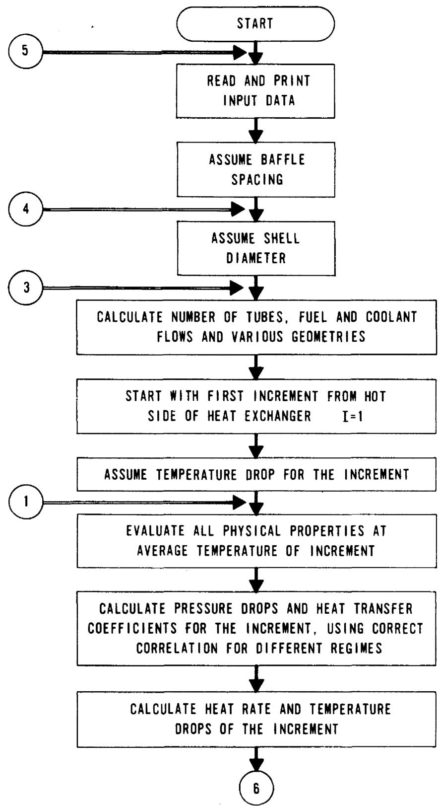  
Fig. C.l. Simplified Flow Diagram of the RETEX Computer Program.

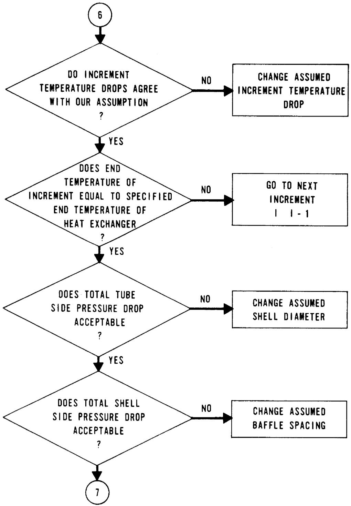  
Fig. C.l. (continued)

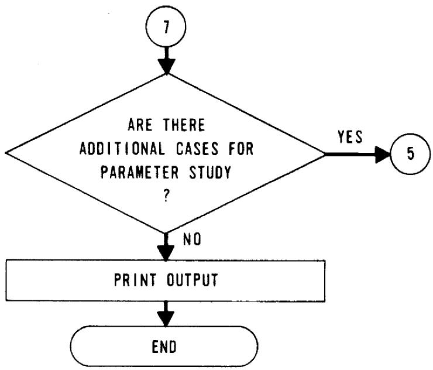  
Fig. C.1. (continued)

Table C.1. Computer Input Data for RETEX Program   

<table><tr><td>Card</td><td>Columns</td><td>Format</td><td>Variable</td><td>Term</td><td>Units</td></tr><tr><td rowspan="3">A</td><td>1-10</td><td>E10.4</td><td>Heat load required</td><td>HEATL</td><td>Btu/hr</td></tr><tr><td>11-20</td><td>F10.0</td><td>Allowable tube-side pres-sure drop</td><td>PRDT</td><td>\( 1\mathrm{\;b}/{\mathrm{{ft}}}^{2} \)</td></tr><tr><td>21-30</td><td>F10.0</td><td>Allowable shell-side pres-sure drop</td><td>PRDS</td><td>\( 1\mathrm{\;b}/{\mathrm{{ft}}}^{2} \)</td></tr><tr><td rowspan="4">B</td><td>1-10</td><td>F10.0</td><td>Coolant outlet temperature</td><td>CTO</td><td>°F</td></tr><tr><td>11-20</td><td>F10.0</td><td>Fuel inlet temperature</td><td>FTO</td><td>°F</td></tr><tr><td>21-30</td><td>F10.0</td><td>Fuel outlet temperature</td><td>ETF</td><td>°F</td></tr><tr><td>31-40</td><td>F10.0</td><td>Coolant inlet temperature</td><td>ETC</td><td>°F</td></tr><tr><td rowspan="3">C</td><td>1-10</td><td>F10.0</td><td>Leakage factor for heat transfer correlations</td><td>LK</td><td></td></tr><tr><td>11-20</td><td>F10.0</td><td>Leakage factor for pres-sure drop calculations</td><td>PLK</td><td></td></tr><tr><td>21-30</td><td>F10.0</td><td>Tube material conductivity</td><td>WCOND</td><td>Btu/hr·ft·°F</td></tr><tr><td rowspan="5">D</td><td>1-10</td><td>F10.0</td><td>Radius of coolant central downcomer</td><td>RA5</td><td>ft</td></tr><tr><td>11-20</td><td>F10.0</td><td>Distance between shell wall and tube bundle</td><td>DTR</td><td>ft</td></tr><tr><td>21-30</td><td>F10.0</td><td>Maximum anticipated heat exchanger radius</td><td>RA8MAX</td><td>ft</td></tr><tr><td>31-35</td><td>I5</td><td>Number of cases to be run</td><td>KASES</td><td></td></tr><tr><td>36-40</td><td>I5</td><td>Index one if enhanced tubes are used</td><td>KENTB</td><td></td></tr><tr><td rowspan="2">\( {\mathrm{E}}_{1},{\mathrm{E}}_{2} \),...</td><td>1-10</td><td>F10.0</td><td>Outside diameter of tube</td><td>DIA</td><td>ft</td></tr><tr><td>11-20</td><td>F10.0</td><td>Tube wall thickness</td><td>WTHK</td><td>ft</td></tr><tr><td rowspan="3">\( {\mathrm{E}}_{\text{KASES }} \)</td><td>21-30</td><td>F10.0</td><td>Triangular pitch</td><td>TPIP</td><td>ft</td></tr><tr><td>31-40</td><td>F10.0</td><td>Inner baffle cut</td><td>CUT3</td><td>% of area</td></tr><tr><td>41-50</td><td>F10.0</td><td>Outer baffle cut</td><td>CUT4</td><td>% of area</td></tr></table>

Table C.2. Output Data From RETEX Computer Program   

<table><tr><td>Term</td><td>Variable</td><td>Units</td></tr><tr><td>THEATO</td><td>Total heat actually transferred</td><td>Btu/hr</td></tr><tr><td>HTPERC</td><td>Percentage of required heat load transferred</td><td></td></tr><tr><td>QC</td><td>Coolant (shell-side) mass flow rate</td><td>1b/hr</td></tr><tr><td>QF</td><td>Fuel (tube-side) mass flow rate</td><td>1b/hr</td></tr><tr><td>TTDSO</td><td>Total tube-side pressure drop</td><td>psi</td></tr><tr><td>SPPERC</td><td>Percentage of allowed tube pressure drop actually used</td><td></td></tr><tr><td>TTDTU</td><td>Total shell-side pressure drop</td><td>psi</td></tr><tr><td>TPPERC</td><td>Percentage of allowed shell pressure drop actually used</td><td></td></tr><tr><td>RA8</td><td>Radius of heat exchanger shell</td><td>ft</td></tr><tr><td>BSOI</td><td>Distance between baffles</td><td>ft</td></tr><tr><td>VOL</td><td>Fluid volume contained in tubes</td><td>ft3</td></tr><tr><td>AREA</td><td>Total heat transfer area in heat exchanger</td><td>ft2</td></tr><tr><td>SNT</td><td>Total number of tubes</td><td></td></tr><tr><td>TUBLEN</td><td>Actual tube length</td><td>ft</td></tr><tr><td>GBRL</td><td>Modification factor for Bergelin's heat transfer correlation</td><td></td></tr><tr><td>SAVT</td><td>Shell average temperature</td><td>°F</td></tr><tr><td>TAVT</td><td>Tube average temperature</td><td>°F</td></tr><tr><td>TCI(I)</td><td>Coolant outlet temperature from increment I</td><td>°F</td></tr><tr><td>TCO(I)</td><td>Coolant inlet temperature from increment I</td><td>°F</td></tr><tr><td>CWT(I)</td><td>Average tube wall temperature at coolant side</td><td>°F</td></tr><tr><td>TFI(I)</td><td>Fuel outlet temperature from increment I</td><td>°F</td></tr><tr><td>TFO(I)</td><td>Fuel inlet temperature from increment I</td><td>°F</td></tr><tr><td>FWT(I)</td><td>Average tube wall temperature at fuel side</td><td>°F</td></tr><tr><td>TWDT(I)</td><td>Average temperature drop across tube wall in increment I</td><td>°F</td></tr><tr><td>V1(I)</td><td>Fluid average velocity in outer window in increment I</td><td>ft/sec</td></tr><tr><td>V2(I)</td><td>Fluid average velocity in overlapping baffle zone in increment I</td><td>ft/sec</td></tr><tr><td>V3(I)</td><td>Fluid average velocity in inner window in increment I</td><td>ft/sec</td></tr><tr><td>VW1(I)</td><td>Fluid velocity across tubes in outer edge of baffle in increment I</td><td>ft/sec</td></tr><tr><td>VW3(I)</td><td>Fluid velocity across tubes in inner edge of baffle in increment I</td><td>ft/sec</td></tr><tr><td>PDSO(I)</td><td>Shell-side pressure drop for increment I</td><td>\( 1b/ft^2 \)</td></tr><tr><td>PDTO(I)</td><td>Tube-side pressure drop for increment I</td><td>\( 1b/ft^2 \)</td></tr><tr><td>RENTO(I)</td><td>Tube-side Reynolds number for increment I</td><td></td></tr><tr><td>PRNTO(I)</td><td>Tube-side Prandtl number for increment I</td><td></td></tr><tr><td>RENSO1(I)</td><td>Reynolds number in outer window in increment I</td><td></td></tr><tr><td>RENSO2(I)</td><td>Reynolds number in overlapping baffle zone in increment I</td><td></td></tr><tr><td>RENSO3(I)</td><td>Reynolds number in inner window in increment I</td><td></td></tr><tr><td>HTO(I)</td><td>Tube-side heat transfer coefficient in increment I</td><td>Btu/hr·ft2·°F</td></tr><tr><td>AESO(I)</td><td>Shell-side heat transfer coefficient in increment I</td><td>Btu/hr·ft2·°F</td></tr><tr><td>UOA(I)</td><td>Overall heat transfer coefficient in increment I</td><td>Btu/hr·ft2·°F</td></tr><tr><td>HEAT(I)</td><td>Heat transferred in increment I</td><td>Btu/hr</td></tr></table>

# The RETEX Program Listing

```csv
\*\*FTN,L,E,G,M. PROGRAM MSBRPE-2 MSBRP 10 TYPE REAL LK,LAWC1,LAWC3 MSBRP 20 DIMENSION TFO(130),TCI(130),VM1(130),VM2(130),VWC1(130),VWO3(130),MSBRP 30 1 RENTO(130),PRNTO(130),RENSO1(130),RENSO3(130),RENSO2(130),MSBRP 31 2 VM3(130),PDSG(130),NT(100),BJ(3),HSO1(130),HSO2(130),HSO3(130),MSBRP 32 3AHSO(130),HTC(130),UOA(130),TCO(130),TFI(130),HEAT(130),TWDT(130),MSBRP 33 4 PDTO(130),TUBLN(130),V1(130),V2(130),V3(130),VW1(130),VW3(130), MSBRP 34 5 R(100),FACT(1CO),TCPI(100),TCTAL(100) MSBRP 35 6 CWT(130),FWT(130),AVWT(130) MSBRP 36 1001 FORMAT(E10.4,2F10.0) MSBRP 40 1002 FORMAT(4F10.0) MSBRP 50 1003 FORMAT(3F10.0) MSBRP 60 1004 FORMAT(3F10.0,215) MSBRP 70 1005 FORMAT(5F10.0) MSBRP 80 1006 FORMAT(22HOHEAT LOAD REQUIRED = ,F12.0,2X,8H(BTU/HR)) MSBRP 90 1007 FORMAT(43HOALLCWABLE TCTAL TUBE-SIDE PRESSURE DROP = ,F10.0,2X, MSBR 100 1 10H(LB/SQ-FT) MSBR 101 1008 FORMAT(44HOALLCWABLE TCTAL SHELL-SIDE PRESSURE DROP = ,F10.0,2X, MSBR 110 1 10H(LB/SQ-FT) MSBR 111 1009 FORMAT(33HOHIGHTEMP.CFSHELLSIDEFLUID = ,F10.2,2X,3H(F)) MSBR 120 1010 FORMAT(33HOHIGHTEMP.CFTUBE SIDEFLUID = ,F10.2,2X,3H(F)) MSBR 130 1011 FORMAT(32HOLCWTEMP.CFTUBE SIDEFLUID = ,F10.2,2X,3H(F)) MSBR 140 1012 FORMAT(32HOLCWTEMP.CFSHELLSIDEFLUID = ,F10.2,2X,3H(F)) MSBR 150 1013 FORMAT(32HOHEAT TRANSFER LEAKAGE FACTOR = ,F10.5) MSBRP 160 1014 FORMAT(27HOPRESSURE LEAKAGE FACTOR = ,F10.5) MSBRP 170 1015 FORMAT(35FOCCNUCTIVITY OF TUBE WALL METAL = ,F10.5,2X, MSBRP 180 1 13H(BTU/HR-FT-F) MSBRP 181 1016 FORMAT(34FOINSIDE RACILS OF CUTER ANNULUS = ,F10.5,2X,6H(FEET)) MSBRP 190 1017 FORMAT(4IPODISTANCE BETWEEN SHELL WALL AND TUBES = MSBRP 200 1,FIO.5,2X,6H(FEET)) MSBRP 201 1018 FORMAT(49HOMAXIMUM ANTIICIPATED OUTER RADIUS OF EXCHANGER = , MSBRP 210 1 FIO.5,2X,6H(FEET) MSBRP 21 
```

1019 FORMAT(23HONUMER OF CASES RUN = ,I4) MSBR 220   
1020 FORMAT(25HOUSE OF ENHANCED TUBES = ,I4,2X,32H(ONE IF ENHANCED TUBEMSBR 230 IS ARE USEC)) MSBR 231   
1021 FORMAT(29FOCLTSIDE DIAMETER OF TUBES = ,F10.5,2X, 6H(FEET) MSBR 240   
1022 FORMAT(27FOWALL THICKNESS OF TUBES = ,FiC.5,2X, 6H(FEET) MSBR 250   
1023 FORMAT(20FCTRIANGULAR PITCH = , ' F10.5,2X, 6H(FEET)) MSBR 260   
1024 FORMAT(22FOINNER BAFFLE CUT3 = ,F10.5,2x,10H(PERCENT) MSBR 270   
1025 FORMAT(22FOOUTER BAFFLE CUT4 = ,F10.5,2X, 10H(PERCENT) MSBF 280   
1026 FORMAT(25H1TCTAL HEAT TRANSFERED = ,F12.0,2X,8H(BTU/HR), MSBR 290
1 2X,1H(,F5.1,9H PERCENT)) MSBR 291   
1027 FORMAT(29FOMASS FLOW RATE OF CCOLANT = ,F1C.0,2X,7H(LB/HR) MSBR 300   
1028 FORMAT(26HOMASS FLOW RATE OF FUEL = ,F10.0,2X, 7H(LB/HR) MSBR.310   
1029 FORMAT(34FOSELL-SIDE TOTAL PRESSURE DRCP = ,F10.2,2X, 9H(LB/SQIN)MSBR 320
1 ,2X,1H(,F5.1,9H PERCENT)) MSBR 321   
1030 FORMAT(33HOTUBE-SIDE TCTAL PRESSURE DROP = ,F10.2,2X, 9H(LB/SGIN),MSBR 330 1 2X,1F(.F5.1,9H PERCENT)) MSBR 331   
1031 FORMAT(24FCNCMINAL SFELL RADIUS = ,F7.4,2X,4H(FT)) MSBR 340   
1032 FORMAT(26HOUNIFORM BAFFLE SPACING = ,F7.4,2X,4H(FT)) MSBR 350   
1033 FORMAT(40HOTUBE FLUID VOLUME CCNTAINED IN TUBES = ,F7.2,1X, MSBR 360
112H(CUBIC FEET)) MSBR 361   
1034 FORMAT(1HC,4EHTOTAL HEAT TRANSFER AREA EASED CN TUBE O.D. = , MSBR 370 F12.2,2X,6H(SQFT)) MSBR 371   
1035 FORMAT(25FOCTAL NUMBER CF TUBES = ,F6.CI MSBR 380   
1036 FORMAT(21HOTCTAL TUBE LENGTH = ,F6.2,2X,4H (FT)) MSBR 390   
1037 FORMAT(23FGBWINDOW 1 CROSSFLOW = ,F5.2,2x,6H(SQFT)) MSBR 400   
1038 FORMAT(31FOBERGLIN MCDIFICATICN FACTOR = ,F5.2) MSBR 410   
1039 FORMAT(1HO,2X,1HI,7X,3HTCI,SX,3HTCO,9X,3HCWT,9X,3HTFI,9X,3HTFO, MSBR 420 19X,3HFWT,8X,4HTWDT//11X,1HF,11X,1HF,11X,1HF,11X, MSBR 421 2 1HF,11X,1HF,11X,1HF,11X,1HF//（1X,I3,7E12.4） MSBR 422  
1040 FORMAT(1HC,2X,1HI,7X,3HVM1,9X,3HVM2,9X,3HVM3,8X,4HVW01,8X,4HVW03，MSBR 430 18X,4HPDSC,8X,4HPDTO//32X,6HFT/SEC,33X,7HLB/SQFT//（1X,I3,7F12.4）MSBR 431   
1041 FORMAT(1HC,2X,1HI,5X,5HRENTC,7X,5HPRNTO,7X,6HRENSO1,6X,6HRENSC2, MSBR 440  
16X,6HRENSC3,7X,3HHTO,8X,4HAHSO,9X,3HUOA,8X,4HHEAT//77X, MSBR 441  
2 13HBTU/HR/SQFT/F,13X,6HBTU/HR//(1X,I3,SE12.4) MSBR 442  
1042 FORMAT(27HOTUBE WALL AVERAGE TEMP. = ,F10.2) 49   
1043 FORMAT(28FOSHELL SIDE AVERAGE TEMP. = , F10.2) MSBR 460 MSBR 650

<table><tr><td>C</td><td>READ IN AND PRINT OUT INPUT DATA</td><td>MSBR</td><td>660</td></tr><tr><td></td><td>KEY7=1</td><td>MSBR</td><td>490</td></tr><tr><td></td><td>VM1(1)=0.</td><td>MSBR</td><td>500</td></tr><tr><td></td><td>VM2(1)=0.</td><td>MSBR</td><td>510</td></tr><tr><td></td><td>VM3(1)=0.</td><td>MSBR</td><td>520</td></tr><tr><td></td><td>VW01(1)=0.</td><td>MSBR</td><td>530</td></tr><tr><td></td><td>VW03(1)=0.</td><td>MSBR</td><td>540</td></tr><tr><td></td><td>RENS01(1)=0.</td><td>MSBR</td><td>550</td></tr><tr><td></td><td>RENS02(1)=0.</td><td>MSBR</td><td>560</td></tr><tr><td></td><td>RENS03(1)=0.</td><td>MSBR</td><td>570</td></tr><tr><td></td><td>HS01(1)=0.</td><td>MSBR</td><td>580</td></tr><tr><td></td><td>HS02(1)=0.</td><td>MSBR</td><td>590</td></tr><tr><td></td><td>HS03(1)=0.</td><td>MSBR</td><td>600</td></tr></table>

<table><tr><td>C</td><td>MSBR 810</td></tr><tr><td>READ 1001, HEATL, PRDT, PRDS</td><td>MSBR 620</td></tr><tr><td>READ 1002, CTO, FTO, ETF, ETC</td><td>MSBR 630</td></tr><tr><td>READ 1003, LK, PLK, WCCND</td><td>MSBR 640</td></tr><tr><td>READ 1004, RAS, DTR, RA8MAX,KASES,KENTB</td><td>MSBR 650</td></tr></table>

<table><tr><td>1</td><td>CONTINUE</td><td>MSBR 660</td></tr><tr><td></td><td>READ 1005, CIA, WTHK, TRIP, CUT3, CUT4</td><td>MSBR 670</td></tr><tr><td></td><td>HSFCT=1.</td><td></td></tr><tr><td></td><td>IF(FTO.LT.CTC) HSFCT=-1.</td><td></td></tr><tr><td></td><td>PRINT 1006, FEATL</td><td>MSBR 680</td></tr><tr><td></td><td>PRINT 1007, PRCT</td><td>MSBR 690</td></tr><tr><td></td><td>PRINT 1008, PRCS</td><td>MSBR 700</td></tr><tr><td></td><td>PRINT 1009, CTC</td><td>MSBR 710</td></tr><tr><td></td><td>PRINT 1010, FTC</td><td>MSBR 720</td></tr><tr><td></td><td>PRINT 1011, ETF</td><td>MSBR 730</td></tr><tr><td></td><td>PRINT 1012, ETC</td><td>MSBR 740</td></tr><tr><td></td><td>PRINT 1013, LK</td><td>MSBR 750</td></tr><tr><td></td><td>PRINT 1014, PLK</td><td>MSBR 760</td></tr><tr><td></td><td>PRINT 1015, WCCND</td><td>MSBR 770</td></tr><tr><td></td><td>PRINT 1016, RAE</td><td>MSBR 780</td></tr><tr><td></td><td>PRINT 1017, DTR</td><td>MSBR 790</td></tr><tr><td></td><td>PRINT 1018, RAEMAX</td><td>MSBR 800</td></tr><tr><td></td><td>PRINT 1019, KASES</td><td>MSBR 810</td></tr><tr><td></td><td>PRINT 102C, KENTB</td><td>MSBR 820</td></tr></table>

```csv
PRINT 1021, CIA MSBR 830  
PRINT 1022, WTK MSBR 840  
PRINT 1023, TRIP MSBR 850  
PRINT 1024, CUT3 MSBR 860  
PRINT 1025, CUT4 MSBR 870 
```

C MSB 1650 C BEGIN GEOMETRY CALCULATIONS FOR SINGLE ANNULUS COUNTER FLOW MSB 1660  
C DISC AND COUGHNUT BAFFLED HEAT EXCHANGER MSB 1670  
ATUBE = (3.14159* (DIA**2.0))/4.0 MSBR 910  
GFTT = 1./3600. MSBR 920  
GFT = 1./144. MSBR 930  
DIAI=DIA-2.0*WTHK MSBR 940  
FATUB = (3.14159*(DIAI**2.0))/4.0 MSBR 950  
KEY1 = 0 MSBR 960  
PERCI = 0.99 MSBR 970   
2 IF (KEY1. GT.0) BSOI = 0.5*(BSL+BSF)  
KEY2 = 0  
PERC2 = 0.99  
RA8L=RA5  
RA8H=RA8MAX   
3 RA8=0.5*(RA8L +RA8H)  
NTO = 4.0*((RA8**2.0)-(RA5**2.0))/(1.12*(TRIP**2.0))  
RA52=RA5**2  
RA82=RA8**2  
RA6=(RA52+CUT4*(RA82-RA52))**.5  
RA7=(RA82-CUT3*(RA82-RA52))**.5  
RA62=RA6**2  
RA72=RA7**2  
APO1=3.14159*(RA8)**2.0-(RA7)**2.0)*(1.0-(ATUBE/1(0.866*(TRIP)**2.0))))  
APO3=3.14159*(RA6)**2.0-(RA5)**2.0)*(1.C-(ATUBE/1(0.866*(TRIP**2.0))))  
PLAV = 0.955*TRIP  
RB1 = (RA8-RA7)/(1.866*TRIP)  
RB2 = (RA7-RA6)/(0.933*TRIP)  
RB3 = (RA6-RA5)/(1.866*TRIP)

<table><tr><td>LAW01=3.14159*2.0*FA7*(1.0-(DIA/PLAV))</td><td>MSB 1170</td></tr><tr><td>LAW03=3.14159*2.0*RA6*(1.0-(DIA/PLAV))</td><td>MSB 1180</td></tr><tr><td>ISUM1 = 4.0*((RA8**2.0)-(RA7**2.0)/(1.12*(TRIP**2.0))</td><td>MSB 1190</td></tr><tr><td>SUM1 = ISUM1</td><td>MSB 1200</td></tr><tr><td>ISUM2 = 4.0*((RA7**2.0)-(RA6**2.0)/(1.12*(TRIP**2.0))</td><td>MSB 1210</td></tr><tr><td>SUM2 = ISUM2</td><td>MSB 1220</td></tr><tr><td>ISUM3 = 4.0*((RA6**2.0)-(RA5**2.0)/(1.12*(TRIP**2.0))</td><td>MSB 1230</td></tr><tr><td>SUM3 = ISUM3</td><td>MSB 1240</td></tr><tr><td>SNT = ISUM1 + ISUM2 + ISUM3</td><td>MSB 1250</td></tr><tr><td>BSMAX=1.5*((RA8-(RA6-RA7)/2.)-(RA5+(RA6-RA5)/2.))</td><td>MSB 1260</td></tr><tr><td>BSMIN=0.2*(RA8-RA5)</td><td>MSB 1270</td></tr><tr><td>IF(BSMIN.LT.0.1667)BSMIN=0.1667</td><td>MSB 1280</td></tr><tr><td>HW=2.*WCOND/(DIA*(ALOG(DIA/DIAI)))</td><td>MSB 1290</td></tr><tr><td>CSPHAV=0.36</td><td>MSB 1300</td></tr><tr><td>FSPHAV=0.5571</td><td>MSB 1310</td></tr><tr><td>QC=HEATL/(CSPHAV*(CTO-ETC))</td><td>MSB 1320</td></tr><tr><td>QF=HEATL/(FSPHAV*(FTO-ETF))</td><td>MSB 1330</td></tr><tr><td>GTO = QF/(NTC*FATUB)</td><td>MSB 1340</td></tr><tr><td>CONTINUE</td><td>MSB 1350</td></tr><tr><td>IF(KEY1.EC.0)BSH=BSMAX</td><td>MSB 1360</td></tr><tr><td>IF(KEY1.EC.0)BSL=BSMIN</td><td>MSB 1370</td></tr><tr><td>IF(KEY1.EC.0)BSOI=0.5*(BSL+BSH)</td><td>MSB 1380</td></tr><tr><td>IT = 0</td><td>MSB 1390</td></tr><tr><td>KFINAL=0</td><td>MSB 1400</td></tr><tr><td>I=1</td><td>MSB 1410</td></tr><tr><td>TSUM=0.</td><td>MSB 1420</td></tr><tr><td>SSUM=0.</td><td>MSB 1430</td></tr><tr><td>THEATO = C.C</td><td>MSB 1440</td></tr><tr><td>TPDTO = 0.0</td><td>MSB 1450</td></tr><tr><td>TPDSO = 0.0</td><td>MSB 1460</td></tr><tr><td>TFO(I)=FTC</td><td>MSB 1470</td></tr><tr><td>TCI(I)=CTC</td><td>MSB 1480</td></tr><tr><td>KEY4 = 0</td><td>MSB 1490</td></tr><tr><td>TIF=-5.0</td><td>MSB 1500</td></tr><tr><td>TIC=-5.0</td><td>MSB 1510</td></tr><tr><td>CDTF=0.</td><td>MSB 1520</td></tr><tr><td>FDTF=0.</td><td>MSB 1530</td></tr><tr><td>BSO = BSOI</td><td>MSB 1540</td></tr></table>

BPL1 $=$ BSC/((RA8-(RA8-RA7)/2.)-(RA5+(RA6-RA5)/2.)) MSB 1550

GBRL $= 0.77^{*}$ ERL1\*\*(-.138) MSB 1560

AW01 $\equiv$ BSC\*LAWC1 MSB 1570

AWO3 = BSC*LAWC3 MSB 1580

AW1 $=$ SQRT(AWC1\*APO1) MSB 1590

AW2 $= (A\omega 01 + A\omega 03) / 2$ . MSB 1600

AW3 $=$ SQRT(AwC3*AP03) MSB 1610

GSD1 = QC/Aw1 MSB 1620

GS02 = QC/AW2 MSB 1630

GS03 = QC/Aw3 MSB 1640

6 ATC = TCI(I) + (TIC/2.0) MSB 1650

CFT = ATC + CDTF*HS FCT

ATF = TFO(I) + TIF/2. MSB 1670

FFT $\equiv$ ATF-FCTF\*HSFCT

$\mathsf{FI} = \mathsf{I}$ MSB 1690

TUBLN(I) = FI*ESOI MSB 1700

CVIS=0.2121*EXP(4032./(460.+ATC)) MSB 1710

CVISW=0.2121*EXP(4032./(460.+CFT)) MSB 1720

CDEN=141.37-C.C2466*ATC MSB 1730

CCON=0.24C MSB 1740

CSPH=0.36 MSB 1750

FVIS=0.062 MSB 1760

FVISW = 0.062 MSB 1770

FDEN $= 0.7632$ MSB1780

FCON = 0.036 MSB 1790

FSPH = 0.5571 MSB 1800

VISK = (CVIS/CVISW)***0.14 MSB 1810

FVISK=(FVIS/FVISW)\*0.14 MSB 1820

DCVIS $=$ DIA/CVIS MSB1830

CCDEN $= 1$ /CDEN MSB 1840

QCCDEN $=$ CC\*CCCEN MSB 1850

CALCULATE REYNCLS AND PRANDTL NUMBER TUBE SIDE MSB 2550

RENTO（I）=CIAI*GTO/FVIS MSB 1870

PRNTO（I）=FVIS*FSPH/FCCN MSB 1880

HEFI=1.+(（RENTC(I)-1000.）/900C.）\*\*0.5 MSB 1890

IF(KENTB.NE.1)FEFI=1. MSB 1900

PDTO(I) = (.0028+ .25*RENTO**(-.32))* BSC*GTC**2*HEFI/ MSB 1910

1 (CIAI*FCEN*417182400.) MSB 1911

C CALCULATE HEAT TRANSFER COEFF TUBE SIDE MSB 2640  
HTO(I) = FCCN/CIA*.0217*(RENTO(I)**.8)*(PRNTC(I)**.3333)*FVISK*HEFI MSB 1930  
GO TO 10 MSB 1940   
7 IF(RENTO(I).LT.2100.) GO TO 9 MSB 1950   
8 HTO(I) = FCCN/DIA*.089*(RENTO(I)**.6666-125.)*(PRNTO(I)**.3333)* MSB 1960  
1 FVISK*HEFI*(1.4.3333*(DIAI/TUBLN(I))**.6666) MSB 1961  
GO TO 10 MSB 1970   
9 HTO(I) = FCCN/CIA*(4.36+(0.025*RENTO(I)*PRNTO(I)*DIAI/TUBLN(I)) MSB 1980  
1 / (1. + 0.0012*RENTO(I)*PRNTO(I)*DIAI/TUBLN(I)) MSB 1981   
10 CONTINUE MSB 1990  
CALCULATE FLCW AREAS SHELL SIDE MSB 2480  
VWO1(I) = QCCEN/AW01 MSB 2010  
VWO3(I) = QCCEN/AWC3 MSB 2020  
VM1(I) = GSO1*CCDEN MSB 2030  
VM2(I) = GSO2*CCDEN MSB 2040  
VM3(I) = GSC3*CCDEN MSB 2050   
C CALCULATE PRESSURE DRCPS SHELL SIDE MSB 2590  
DP1 = (1. + .6*RE1) * CDEN*VM1(I) **2 MSB 2070  
DP2 = .6*RB2*CCEN*VM2(I) **2 MSB 2080  
DP3 = (1. + .6*RE3) * CDEN*VM3(I) **2 MSB 2090  
RENSO1(I) = GSC1*DCVIS MSB 2100  
RENSO2(I) = GSC2*DCVIS MSB 2110  
RENSO3(I) = GSC3*DCVIS MSB 2120  
HEFO=1. + 0.3 * ((RENSO2(I) - 1000.) / 9000.) **C.5 MSB 2130  
IF(KENTB.NE.1) != EFO=1. MSB 2140  
PDSO(I) = (DP1+DP2+DP3) * PLK != EFO/834624C00. MSB 2150   
C CALCULATE BJ FACTOR AND SHEL SIDE COEFFICIENT MSB 2730  
BJ(1) = (0.346*RENSO1(I)***(-0.382))*GBRL MSB 2170  
BJ(2) = (0.346*RENSO2(I)***(-0.382))*GBRL MSB 2180  
BJ(3) = (0.346*RENSO3(I)***(-0.382))*GBRL MSB 2190  
HSO1(I) = (LK*CSPH*GSC1*BJ(1)*(CCCN/(CSPH*CVIS))**.66))*VISK MSB 2200  
HSO2(I) = (LK*CSPH*CSC2*BJ(2)*(CCCN/(CSPH*CVIS))**.66))*VISK MSB 2210  
HSO3(I) = (LK*CSPH*GSC3*BJ(3)*(CCCN/(CSPH*CVIS))**.66))*VISK MSB 2220  
AHSO(I) = ((HSO1(I)*SUM1)+(HSC2(I)*SUM2)+(HSO3(I)*SUM3))/SNT) *HEFC MSB 2230  
GO TO 12 MSB 2240   
11 CONTINUE MSB 2250

12 UOA(I) = 1.0 / ((1.0/AHSO(I)) + (1.0/HTO(I)) + (1.0/HW)) MSB 2260

A = QF*FSFH MSR 2270

B = QC*CSFH MSB 2280

D = UOA(I) *SNT *BSO *3.14159*CIA MSB 2290

P=-HSFCT\*（C\*（A-B））/（A\*B)

PBAR $\equiv$ EXP(P) MSB 2310

C = (B-A) * PBAR MSB 2320

TCO（I）=（（TCI(I)*（B*PBAR-A）-（TFC(I)*A*(PBAR-1.)))/C MSB 2330

TFI（I）=（TCC（I)-TCI（I）\*B/A）+TFO（I） MSB 2340

HEAT(I)=-A*(TFI(I)-TFO(I)) MSB 2350

TWDT(I) = (HEAT(I)/NTC)*ALOG(DIA/DIAI)/(2.0*3.14159*BSO*WCOND) MSB 2360

CTIF $\equiv$ TFII（I)-TFO(I) MSB 2370

CTIC = TCC(I) - TCI(I) MSB 2380

IF((ABS(CTIF-TIF).LE.(1.5)).AND.(ABS(CTIC-TIC).LE.(1.5))GO TO 13 MSB 2390

TIF = CTIF MSB 2400

TIC = CTIC MSB 2410

GO TO 6 MSB 2420

13 THEATO $\equiv$ THEATC $^+$ HEAT(I) MSB 2430

TPDTO $\equiv$ TPDTC $^+$ PDTO(I) MSB 2440

TPDSO = TFDSC + PDSO(I)

CDTF=((HEAT(I)) /NTC)/BSO)/(3.14159*DIA*AHSO(I)) MSB 3090

FDTF=CDTF*AHSG(I) /HTC(I) MSB 3100

FWT(I) = ATF-FCTF*HSFCT

CWT（I） =ATC+CCTF*HSFCT

AVWT(I) =0.5*(FWT(I) +CWT(I)) MSB 3130

TSUM=TSUM+AVHT（I） MSB 3140

SSUM=SSUM+ATC MSB 2560

IF(KFINAL.EQ.1.AND.I.EQ.IT) GO TO 15 MSB 2460

IF((ABS(ETF-TFI(I)))·LE.((ABS(TFI(I)-TFC(I)))/2.0))·OR. MSB 2470

1 (TFI(I).LE.ETFI) GTO 14 MSB 2471

$\mathbf{I} = \mathbf{I} + \mathbf{1}$ MSB 2480

IF(I.GT.129)GO TO 23 MSB 2490

TFO(I) = TFI(I-1) MSB 2570

TCI（I）=TCO（I-1) MSB 2580

BSO=BSOI MSB 2590

GO TO 6 MSB 2600

14 KFINAL=1 MSB 2610   
IT=I MSB 2620   
FIT $=$ IT MSB 2630   
GO TO 5 MSB 2640   
15 TUBLEN= FIT\*BSCI MSB 2650   
TAVT=TSUM/FIT   
SAVT=SSUM/FIT   
16 CONTINUE MSB 2680   
17 VOL = 0.7854*(CIAI**2.0)*NTO*TUBLEN MSB 2690

C CHECK OF TUBE AND SHELL PRESSURE DROPS MSB 3250

KEY2 = KEY2 + 1 MSB 2710   
IF(PERC2.LE.0.1) GO TC 26 MSB 2720  
IF(TPDTO.LT.(PERC2*PRCT)) GO TO 18 MSB 2730  
IF(TPDTO.CT.PRCT) GO TC 19 MSB 2740   
GO TO 20 MSB 2750

18 IF(RA8.LE.(RA5 +0.0C5)) GO TO 27 MSB 2760

RA8H =RA8 MSB 2770   
IF(KEY2.NE.30)GO TO 3 MSB 2780   
RA8L=RA8L-0.2 MSB 2790   
PERC2 = PERC2 - 0.01 MSB 2800   
KEY2=10 MSB 2810   
GO TO 3 MSB 2820

19 IF(RA8. GE.(RA8MAX-0.005)) GO TO 27 MSB 2830

RA8L $=$ RA8 MSB 2840   
IF(KEY2.NE.30) GO TO 3 MSB 2850   
$\mathsf{RA8H} = \mathsf{RA8H} + 0.2$ MSB 2860   
PERC2 = PERC2 - 0.01 MSB 2870   
KEY2=10 MSB 2880   
GO TO 3 MSB 2890

20 KEY1 = KEY1 + 1 MSB 2900

IF(PERC1.LE.0.1) GO TC 25 MSB 2910  
IF(TPDso.LT.(PERC1*PRCS)) GO TC 21 MSB 2920  
IF(TPDSO.GT.PRCSIGO TC 22 MSB 2930   
GO TO 28 MSB 2940

21 IF(BSOI.LE.(BSMIN+0.0C5))GO TO 24 MSB 2950

BSH = BSOI MSB 2960   
IF(KEY1.NE.3C)GC TO 2 MSB 2970

<table><tr><td></td><td>BSL=BSL-0.1</td><td></td><td>MSB 2980</td></tr><tr><td></td><td>PERC1 = PERC1 - 0.01</td><td></td><td>MSB 2990</td></tr><tr><td></td><td>KEY1=10</td><td></td><td>MSB 3000</td></tr><tr><td></td><td>GO TO 2</td><td></td><td>MSB 3010</td></tr><tr><td>22</td><td>IF(BSOI.GE.(BSMAX-0.005)) GO TO 24</td><td></td><td>MSB 3020</td></tr><tr><td></td><td>BSL = BSOI</td><td></td><td>MSB 3030</td></tr><tr><td></td><td>IF(KEY1.NE.30) GO TO 2</td><td></td><td>MSB 3040</td></tr><tr><td></td><td>BSH=BSH+0.1</td><td></td><td>MSB 3050</td></tr><tr><td></td><td>PERC1 = PERC1 - 0.01</td><td></td><td>MSB 3060</td></tr><tr><td></td><td>KEY1=10</td><td></td><td>MSB 3070</td></tr><tr><td></td><td>GO TO 2</td><td></td><td>MSB 3080</td></tr><tr><td>C</td><td></td><td></td><td>MSB 3640</td></tr><tr><td>C</td><td>PRINT EXIT SIGNALS</td><td></td><td>MSB 3650</td></tr><tr><td>23</td><td>PRINT 1044,BSO</td><td></td><td>MSB 3110</td></tr><tr><td>1044</td><td>FORMAT(39F1BAFFLE SPACINGS EXCEEDE 129 WITH BSO =,F5.2,2X,4H(FT)) GO TO 28</td><td></td><td>MSB 3120</td></tr><tr><td></td><td></td><td></td><td>MSB 3130</td></tr><tr><td>24</td><td>PRINT 1045</td><td></td><td>MSB 3140</td></tr><tr><td>1045</td><td>FORMAT(20H1BSOI = MAX. OR MIN.)</td><td></td><td>MSB 3150</td></tr><tr><td></td><td>GO TO 28</td><td></td><td>MSB 3160</td></tr><tr><td>25</td><td>PRINT 1046</td><td></td><td>MSB 3170</td></tr><tr><td>1046</td><td>FORMAT(48H1 PERC1 FOR SHELL PRESSURE DRCP IS LESS THEN 0.1) GO TO 28</td><td></td><td>MSB 3180</td></tr><tr><td></td><td></td><td></td><td>MSB 3190</td></tr><tr><td>26</td><td>PRINT 1047</td><td></td><td>MSB 3200</td></tr><tr><td>1047</td><td>FORMAT(48H1 PERC2 FOR TUBE PRESSURE DRCP IS LESS THEN 0.1) GO TO 28</td><td></td><td>MSB 3210</td></tr><tr><td></td><td></td><td></td><td>MSB 3220</td></tr><tr><td>27</td><td>PRINT 1048</td><td></td><td>MSB 3230</td></tr><tr><td>1048</td><td>FORMAT(29H1 SHELL RADIUS = MAX. OR MIN.)</td><td></td><td>MSB 3240</td></tr><tr><td></td><td>GO TO 28</td><td></td><td>MSB 3250</td></tr><tr><td>C</td><td></td><td></td><td>MSB 3810</td></tr><tr><td>C</td><td>END OF CASE, PRINT OUTPUT</td><td></td><td>MSB 3820</td></tr><tr><td>28</td><td>DO 29 I = 1,IT</td><td></td><td>MSB 3280</td></tr><tr><td></td><td>V1(I) = VM1(I)*GFTT</td><td></td><td>MSB 3290</td></tr><tr><td></td><td>V2(I) = VM2(I)*GFTT</td><td></td><td>MSB 3300</td></tr><tr><td></td><td>V3(I) = VM3(I)*GFTT</td><td></td><td>MSB 3310</td></tr><tr><td></td><td>VW1(I) = VW01(I)*GFTT</td><td></td><td>MSB 3320</td></tr><tr><td></td><td>VW3(I) = VW03(I)*GFTT</td><td></td><td>MSB 3330</td></tr></table>

29 CONTINUE MSB 3340

TTDSO = TPDSC*GFT MSB 3350

TTDTO = TPDTC*GFT MSB 3360

TPPERC $\equiv$ TPCTO\*100./PRDT MSB 3370

SPPERC $\equiv$ TPCSO\*1CO. /PRDS MSB 3380

HTPERC=10C.*THEATO/HEATL MSB 3390

AREA=3.14159*CIA*SNT*TUBLEN MSB 3400

C MSB 1640

PRINT 1026, THEATO, HTPERC MSB 3420

PRINT 1027, QC MSB 3430

PRINT 1028, CF MSB 3440

PRINT 1029,TTDSO,SPPERC MSB 3450

PRINT 103C, TTCTO,TPPERC MSB 3460

PRINT 1031,RA8 MSB 3470

PRINT 1032,BSCI MSB 3480

PRINT 1033,VCL MSB 3490

PRINT 1034, AREA MSB 3500

PRINT 1035,SNT MSB 3510

PRINT 1036,TUBLEN MSB 3520

PRINT 1038, GBRL MSB 3530

PRINT 1042 ,TAVT MSB 3540

PRINT 1043 ,SAVT MSB 3550

PRINT 1039, (I, (TCI(I), TCO(I), CWT(I), TFI(I), TFO(I), FWT(I), MSB 3560

1 TWCT(I),I=1,IT) MSB 3561

PRINT 104C,(I,(V1(I),V2(I),V3(I),VW1(I),VW3(I),PCSO(I),PDTO(I)), MSB 3570

I=1,IT) MS8 3571

PRINT 1041,(I,(RENTO(I),PRNTC(I),RENSO1(I),RENSO2(I),RENSO3(I), MSB 3580

1HTO(I),AHSO(I),UOA(I),HEAT(I)),I=1,IT) MSB 3581

C MSB 4240

C LOOP FOR ADDITIONAL CASES IF REQUIRED MSB 4250

30 CONTINUE MSB 3610

KEY7=KEY7+1 MSB 3620

IF(KEY7.GT.KASES)GO TO 31 MSB 3630

GO TO 1 MSB 3640

31 CONTINUE MSB 3650

END MSB 3660

# Intermediate Variables

The intermediate variable terms used in the RETEX computer program are as defined for the PRIMEX program except for the two terms defined below.

TRIP Uniform triangular pitch, ft.

PLAV 0.955*TRIP used in calculating the effective cross-flow area between the tubes, ft².

```txt
HEAT LOAD REQUIRED = 125CCOCCO. (BTU/HR)  
ALLOWABLE TOTAL TUBE-SIDE PRESSURE DRCP = 4320. (LB/SQ-FT)  
ALLOWABLE TOTAL SHELL-SICE PRESSURE CROP = 8640. (LB/SQ-FT)  
HIGH TEMP. OF SHELL SIDE FLUID = 1150.00 (F)  
HIGH TEMP. OF TUBE SIDE FLUID = 1000.00 (F)  
LOW TEMP. OF TUBE SIDE FLUID = 650.00 (F)  
LOW TEMP. OF SHELL SIDE FLUID = 850.00 (F)  
HEAT TRANSFER LEAKAGE FACTOR = 0.80000  
PRESSURE LEAKAGE FACTOR = C.5200C  
CONDUCTIVITY OF TUBE WALL METAL = 11.6000C (BTL/HR-FT-F)  
INSIDE RADIUS CF OUTER ANNULUS = C.0 (FEET)  
DISTANCE BETWEEN SHELL WALL AND TUBES = 0.04167 (FEET)  
MAXIMUM ANTICIPATED OUTER RADIUS OF EXCHANGER = 5.0000C (FEET)  
NUMBER OF CASES RUN = 1  
USE OF ENHANCED TUBES = 0 (ONE IF ENHANCED TUBES ARE USED)  
OUTSIDE DIAMETER OF TUBES = 0.0625C (FEET)  
WALL THICKNESS OF TUBES = C.00292 (FEET)  
TRIANGULAR PITCH = 0.08333 (FEET)  
INNER BAFFLE CUT3 = C.300CO (PER CENT)  
OUTER BAFFLE CUT4 = C.300CO (PER CENT) 
```

TOTAL HEAT TRANSFERED = 126488992. (BTU/HP) (101.2 PERCENT)

MASS FLOW RATE OF COOLANT = 1157407. (LB/HRI)

MASS FLOW RATE OF FUEL = 641075. (LB/HR)

SHELL-SIDE TOTAL PRESSURE DROF = 59.52 (LB/SQIN) (99.2 PERCENTI)

TUBE-SIDE TOTAL PRESSURE DPCP = 29.85 (LB/SQIN) (99.5 PERCENT)

NOMINAL SHELL RADIUS = C.883E (FT)

UNIFORM BAFFLE SPACING = 0.7205 (FT)

TUBE FLUID VOLUME CONTAINED IN TUBES = 30.6C (CUBIC FEET)

TOTAL HEAT TRANSFER AREA BASE ON TUBE C.D. = 2376.56 (SQFT)

TOTAL NUMBER OF TUBES = 400.

TOTAL TUBE LENGTH = 30.26 (FT)

BERGLIN MODIFICATION FACTOR = 0.75

TUBE WALL AVERAGE TEMF. 942.95

SHELL SIDE AVERAGE TEMP. = 1004.44

<table><tr><td>I</td><td colspan="2">TCI</td><td colspan="2">TCC</td><td colspan="2">CWT</td><td colspan="2">TFI</td><td colspan="2">TFO</td><td colspan="2">FWT</td><td colspan="2">TWDT</td></tr><tr><td></td><td colspan="2">F</td><td colspan="2">F</td><td colspan="2">F</td><td colspan="2">F</td><td colspan="2">F</td><td colspan="2">F</td><td colspan="2">F</td></tr><tr><td>1</td><td>0.1150E</td><td>04</td><td>0.1144E</td><td>04</td><td>C.1103E</td><td>C4</td><td>0.9925E</td><td>03</td><td>C.1000E</td><td>04</td><td>0.1090E</td><td>04</td><td>0.1244E</td><td>02</td></tr><tr><td>2</td><td>0.1144E</td><td>04</td><td>0.1137E</td><td>04</td><td>0.1096E</td><td>04</td><td>0.9850E</td><td>03</td><td>0.9925E</td><td>03</td><td>0.1083E</td><td>04</td><td>0.1248E</td><td>02</td></tr><tr><td>3</td><td>0.1137E</td><td>04</td><td>0.1131E</td><td>04</td><td>C.1089E</td><td>04</td><td>0.9775E</td><td>03</td><td>0.9850E</td><td>03</td><td>0.1076E</td><td>04</td><td>0.1255E</td><td>02</td></tr><tr><td>4</td><td>0.1131E</td><td>04</td><td>0.1124E</td><td>04</td><td>C.1082E</td><td>04</td><td>0.9699E</td><td>03</td><td>0.9775E</td><td>03</td><td>0.1069E</td><td>04</td><td>0.1263E</td><td>02</td></tr><tr><td>5</td><td>0.1124E</td><td>04</td><td>0.1118E</td><td>04</td><td>C.1075E</td><td>C4</td><td>0.9622E</td><td>03</td><td>0.9699E</td><td>03</td><td>0.1062E</td><td>04</td><td>0.1271E</td><td>02</td></tr><tr><td>6</td><td>0.1118E</td><td>04</td><td>0.1111E</td><td>04</td><td>C.1068E</td><td>04</td><td>0.9545E</td><td>03</td><td>0.9622E</td><td>03</td><td>0.1055E</td><td>04</td><td>0.1279E</td><td>02</td></tr><tr><td>7</td><td>0.1111E</td><td>04</td><td>0.1104E</td><td>C4</td><td>C.1061E</td><td>C4</td><td>0.9468E</td><td>03</td><td>0.9545E</td><td>03</td><td>0.1048E</td><td>04</td><td>0.1287E</td><td>02</td></tr><tr><td>8</td><td>0.1104E</td><td>04</td><td>0.1098E</td><td>04</td><td>C.1054E</td><td>C4</td><td>0.9390E</td><td>03</td><td>0.9468E</td><td>03</td><td>0.1041E</td><td>04</td><td>0.1295E</td><td>02</td></tr><tr><td>9</td><td>0.1098E</td><td>04</td><td>0.1091E</td><td>04</td><td>C.1047E</td><td>C4</td><td>0.9311E</td><td>03</td><td>0.9390E</td><td>03</td><td>0.1033E</td><td>04</td><td>0.1302E</td><td>02</td></tr><tr><td>10</td><td>0.1091E</td><td>04</td><td>0.1084E</td><td>04</td><td>C.1040E</td><td>C4</td><td>0.9233E</td><td>03</td><td>0.9311E</td><td>03</td><td>0.1026E</td><td>04</td><td>0.1310E</td><td>02</td></tr><tr><td>11</td><td>0.1084E</td><td>04</td><td>0.1077E</td><td>04</td><td>C.1032E</td><td>04</td><td>0.9153E</td><td>C3</td><td>0.9233E</td><td>03</td><td>0.1019E</td><td>04</td><td>0.1318E</td><td>02</td></tr><tr><td>12</td><td>0.1077E</td><td>04</td><td>0.1071E</td><td>04</td><td>0.1025E</td><td>04</td><td>0.9073E</td><td>03</td><td>0.9153E</td><td>03</td><td>0.1012E</td><td>04</td><td>0.1326E</td><td>02</td></tr><tr><td>13</td><td>0.1071E</td><td>04</td><td>0.1064E</td><td>04</td><td>C.1018E</td><td>04</td><td>0.8993E</td><td>03</td><td>0.9073E</td><td>03</td><td>0.1004E</td><td>04</td><td>0.1334E</td><td>02</td></tr><tr><td>14</td><td>0.1064E</td><td>04</td><td>0.1057E</td><td>04</td><td>C.1010E</td><td>04</td><td>0.8912E</td><td>03</td><td>0.8993E</td><td>03</td><td>0.9967E</td><td>03</td><td>0.1342E</td><td>02</td></tr><tr><td>15</td><td>0.1057E</td><td>04</td><td>0.1050E</td><td>04</td><td>C.1003E</td><td>04</td><td>0.8831E</td><td>03</td><td>0.8912E</td><td>03</td><td>0.9892E</td><td>03</td><td>0.1350E</td><td>02</td></tr><tr><td>16</td><td>0.1050E</td><td>04</td><td>0.1043E</td><td>04</td><td>C.9956E</td><td>C3</td><td>0.8749E</td><td>03</td><td>0.8831E</td><td>03</td><td>0.9817E</td><td>03</td><td>0.1358E</td><td>02</td></tr><tr><td>17</td><td>0.1043E</td><td>04</td><td>0.1036E</td><td>04</td><td>C.9881E</td><td>C3</td><td>0.8667E</td><td>03</td><td>0.8749E</td><td>03</td><td>0.9741E</td><td>03</td><td>0.1366E</td><td>02</td></tr><tr><td>18</td><td>0.1036E</td><td>04</td><td>0.1029E</td><td>04</td><td>C.9806E</td><td>C3</td><td>0.8585E</td><td>03</td><td>0.8667E</td><td>03</td><td>0.9665E</td><td>03</td><td>0.1374E</td><td>02</td></tr><tr><td>19</td><td>0.1029E</td><td>04</td><td>0.1022E</td><td>04</td><td>C.9730E</td><td>C3</td><td>0.8501E</td><td>03</td><td>0.8585E</td><td>03</td><td>0.9589E</td><td>03</td><td>0.1382E</td><td>02</td></tr><tr><td>20</td><td>0.1022E</td><td>04</td><td>0.1014E</td><td>04</td><td>C.9654E</td><td>C3</td><td>0.8418E</td><td>03</td><td>0.8501E</td><td>03</td><td>0.9511E</td><td>03</td><td>0.1389E</td><td>02</td></tr><tr><td>21</td><td>0.1014E</td><td>04</td><td>0.1007E</td><td>04</td><td>C.9577E</td><td>03</td><td>0.8334E</td><td>03</td><td>C.8418E</td><td>03</td><td>0.9434E</td><td>03</td><td>0.1397E</td><td>02</td></tr><tr><td>22</td><td>0.1007E</td><td>04</td><td>0.9999E</td><td>03</td><td>C.9500E</td><td>03</td><td>0.8249E</td><td>03</td><td>0.8334E</td><td>03</td><td>0.9356E</td><td>03</td><td>0.1405E</td><td>02</td></tr><tr><td>23</td><td>0.9999E</td><td>03</td><td>0.9926E</td><td>03</td><td>C.9422E</td><td>03</td><td>0.8164E</td><td>03</td><td>0.8249E</td><td>03</td><td>0.9277E</td><td>03</td><td>0.1413E</td><td>02</td></tr><tr><td>24</td><td>0.9926E</td><td>03</td><td>0.9853E</td><td>03</td><td>0.9344E</td><td>C3</td><td>0.8079E</td><td>03</td><td>0.8164E</td><td>03</td><td>0.9198E</td><td>03</td><td>0.1421E</td><td>02</td></tr><tr><td>25</td><td>0.9853E</td><td>03</td><td>0.9779E</td><td>03</td><td>C.9265E</td><td>03</td><td>0.7993E</td><td>03</td><td>C.8079E</td><td>03</td><td>0.9119E</td><td>03</td><td>0.1429E</td><td>02</td></tr><tr><td>26</td><td>0.9779E</td><td>03</td><td>0.9705E</td><td>C3</td><td>C.9186E</td><td>C3</td><td>0.7906E</td><td>03</td><td>0.7993E</td><td>03</td><td>0.9039E</td><td>03</td><td>0.1437E</td><td>02</td></tr><tr><td>27</td><td>0.9705E</td><td>03</td><td>0.9631E</td><td>C3</td><td>C.9106E</td><td>C3</td><td>0.7819E</td><td>03</td><td>C.7906E</td><td>03</td><td>0.8958E</td><td>03</td><td>0.1445E</td><td>02</td></tr><tr><td>28</td><td>0.9631E</td><td>03</td><td>0.9556E</td><td>C3</td><td>C.9026E</td><td>C3</td><td>0.7732E</td><td>03</td><td>C.7819E</td><td>03</td><td>0.8877E</td><td>03</td><td>0.1453E</td><td>02</td></tr><tr><td>29</td><td>0.9556E</td><td>03</td><td>0.9480E</td><td>C3</td><td>C.8864E</td><td>C3</td><td>0.7644E</td><td>03</td><td>C.7732E</td><td>03</td><td>0.8795E</td><td>03</td><td>0.1461E</td><td>02</td></tr><tr><td>30</td><td>0.9480E</td><td>03</td><td>0.9405E</td><td>C3</td><td>C.8864E</td><td>C3</td><td>0.7555E</td><td>C3</td><td>C.7644E</td><td>03</td><td>0.8714E</td><td>03</td><td>0.1469E</td><td>02</td></tr><tr><td>31</td><td>0.9405E</td><td>03</td><td>0.9328E</td><td>C3</td><td>C.8782E</td><td>C3</td><td>0.7467E</td><td>03</td><td>C.7555E</td><td>03</td><td>0.8631E</td><td>03</td><td>0.1477E</td><td>02</td></tr><tr><td>32</td><td>0.9328E</td><td>03</td><td>0.9252E</td><td>C3</td><td>C.8700E</td><td>C3</td><td>0.7377E</td><td>C3</td><td>C.7467E</td><td>03</td><td>0.8548E</td><td>03</td><td>0.1485E</td><td>02</td></tr><tr><td>33</td><td>0.9252E</td><td>03</td><td>0.9175E</td><td>C3</td><td>C.8617E</td><td>C3</td><td>0.7287E</td><td>03</td><td>C.7377E</td><td>03</td><td>0.8465E</td><td>03</td><td>0.1493E</td><td>02</td></tr><tr><td>34</td><td>0.9175E</td><td>03</td><td>0.9098E</td><td>C3</td><td>C.8527E</td><td>C3</td><td>0.7197E</td><td>03</td><td>C.7287E</td><td>03</td><td>0.8373E</td><td>03</td><td>0.1500E</td><td>02</td></tr><tr><td>35</td><td>0.9098E</td><td>03</td><td>0.9020E</td><td>C3</td><td>C.8444E</td><td>C3</td><td>0.7106E</td><td>03</td><td>C.7157E</td><td>03</td><td>0.8289E</td><td>03</td><td>0.1508E</td><td>02</td></tr><tr><td>36</td><td>0.9020E</td><td>03</td><td>0.8942E</td><td>C3</td><td>C.8360E</td><td>C3</td><td>0.7015E</td><td>03</td><td>C.7106E</td><td>03</td><td>0.8204E</td><td>03</td><td>0.1515E</td><td>02</td></tr><tr><td>37</td><td>0.8942E</td><td>03</td><td>0.8863E</td><td>C3</td><td>C.8275E</td><td>C3</td><td>0.6924E</td><td>03</td><td>C.7015E</td><td>03</td><td>0.8118E</td><td>03</td><td>0.1523E</td><td>02</td></tr><tr><td>38</td><td>0.8863E</td><td>03</td><td>0.8784E</td><td>C3</td><td>C.8190E</td><td>C3</td><td>0.6831E</td><td>03</td><td>C.6924E</td><td>03</td><td>0.8032E</td><td>03</td><td>0.1531E</td><td>02</td></tr><tr><td>39</td><td>0.8784E</td><td>03</td><td>0.8705E</td><td>C3</td><td>C.8104E</td><td>C3</td><td>0.6739E</td><td>03</td><td>C.6821E</td><td>03</td><td>0.7946E</td><td>03</td><td>0.1539E</td><td>02</td></tr><tr><td>40</td><td>0.8705E</td><td>03</td><td>0.8625E</td><td>C3</td><td>C.8018E</td><td>C3</td><td>0.6646E</td><td>03</td><td>C.6739E</td><td>03</td><td>0.7859E</td><td>03</td><td>0.1546E</td><td>02</td></tr><tr><td>41</td><td>0.8625E</td><td>03</td><td>0.8545E</td><td>C3</td><td>C.7932E</td><td>C3</td><td>0.6552E</td><td>03</td><td>C.6646E</td><td>03</td><td>0.7772E</td><td>03</td><td>0.1554E</td><td>02</td></tr><tr><td>42</td><td>0.8545E</td><td>03</td><td>0.8464E</td><td>C3</td><td>C.7845E</td><td>C3</td><td>0.6458E</td><td>03</td><td>C.6552E</td><td>03</td><td>0.7684E</td><td>03</td><td>0.1561E</td><td>02</td></tr></table>

<table><tr><td>I</td><td>VM1</td><td>VM2</td><td>VM3</td><td>VW01</td><td>VW03</td><td>PDSO</td><td>PDTO</td></tr><tr><td></td><td></td><td></td><td>FT/SEC</td><td></td><td></td><td>LB/SQFT</td><td></td></tr><tr><td>1</td><td>5.5856</td><td>4.7831</td><td>6.9035</td><td>3.9572</td><td>6.0447</td><td>210.3354</td><td>102.3585</td></tr><tr><td>2</td><td>5.5778</td><td>4.7764</td><td>6.8938</td><td>3.9516</td><td>6.0362</td><td>210.0414</td><td>102.3585</td></tr><tr><td>3</td><td>5.5700</td><td>4.7697</td><td>6.8842</td><td>3.9461</td><td>6.0278</td><td>209.7476</td><td>102.3585</td></tr><tr><td>4</td><td>5.5622</td><td>4.7630</td><td>6.8745</td><td>3.9406</td><td>6.0193</td><td>209.4527</td><td>102.3585</td></tr><tr><td>5</td><td>5.5543</td><td>4.7563</td><td>6.8648</td><td>3.9350</td><td>6.0108</td><td>209.1567</td><td>102.3585</td></tr><tr><td>6</td><td>5.5465</td><td>4.7495</td><td>6.8550</td><td>3.9294</td><td>6.0023</td><td>208.8597</td><td>102.3585</td></tr><tr><td>7</td><td>5.5385</td><td>4.7428</td><td>6.8453</td><td>3.9238</td><td>5.9937</td><td>208.5619</td><td>102.3585</td></tr><tr><td>8</td><td>5.5306</td><td>4.7260</td><td>6.8354</td><td>3.9182</td><td>5.9851</td><td>208.2632</td><td>102.3585</td></tr><tr><td>9</td><td>5.5226</td><td>4.7291</td><td>6.8256</td><td>3.9125</td><td>5.9765</td><td>207.9633</td><td>102.3585</td></tr><tr><td>10</td><td>5.5147</td><td>4.7223</td><td>6.8157</td><td>3.9069</td><td>5.9679</td><td>207.6625</td><td>102.3585</td></tr><tr><td>11</td><td>5.5066</td><td>4.7155</td><td>6.8058</td><td>3.9012</td><td>5.9592</td><td>207.3607</td><td>102.3585</td></tr><tr><td>12</td><td>5.4986</td><td>4.7086</td><td>6.7959</td><td>3.8955</td><td>5.9505</td><td>207.0581</td><td>102.3585</td></tr><tr><td>13</td><td>5.4905</td><td>4.7C17</td><td>6.7859</td><td>3.8898</td><td>5.9418</td><td>206.7545</td><td>102.3585</td></tr><tr><td>14</td><td>5.4825</td><td>4.6947</td><td>6.7759</td><td>3.8841</td><td>5.9330</td><td>206.4502</td><td>102.3585</td></tr><tr><td>15</td><td>5.4744</td><td>4.6878</td><td>6.7659</td><td>3.8783</td><td>5.9243</td><td>206.1448</td><td>102.3585</td></tr><tr><td>16</td><td>5.4662</td><td>4.6808</td><td>6.7559</td><td>3.8726</td><td>5.9155</td><td>205.8386</td><td>102.3585</td></tr><tr><td>17</td><td>5.4581</td><td>4.6739</td><td>6.7458</td><td>3.8668</td><td>5.9066</td><td>205.5315</td><td>102.3585</td></tr><tr><td>18</td><td>5.4499</td><td>4.6668</td><td>6.7357</td><td>3.8610</td><td>5.8978</td><td>205.2235</td><td>102.3585</td></tr><tr><td>19</td><td>5.4417</td><td>4.6598</td><td>6.7255</td><td>3.8552</td><td>5.8889</td><td>204.9145</td><td>102.3585</td></tr><tr><td>20</td><td>5.4335</td><td>4.6528</td><td>6.7154</td><td>3.8494</td><td>5.8800</td><td>204.6047</td><td>102.3585</td></tr><tr><td>21</td><td>5.4252</td><td>4.6457</td><td>6.7052</td><td>3.8435</td><td>5.8711</td><td>204.2942</td><td>102.3585</td></tr><tr><td>22</td><td>5.4169</td><td>4.6386</td><td>6.6950</td><td>3.8377</td><td>5.8621</td><td>203.9826</td><td>102.3585</td></tr><tr><td>23</td><td>5.4086</td><td>4.6315</td><td>6.6847</td><td>3.8318</td><td>5.8532</td><td>203.6705</td><td>102.3585</td></tr><tr><td>24</td><td>5.4003</td><td>4.6244</td><td>6.6744</td><td>3.8259</td><td>5.8442</td><td>203.3576</td><td>102.3585</td></tr><tr><td>25</td><td>5.3920</td><td>4.6173</td><td>6.6641</td><td>3.8200</td><td>5.8351</td><td>203.0438</td><td>102.3585</td></tr><tr><td>26</td><td>5.3836</td><td>4.6101</td><td>6.6538</td><td>3.8141</td><td>5.8261</td><td>202.7291</td><td>102.3585</td></tr><tr><td>27</td><td>5.3753</td><td>4.6030</td><td>6.6435</td><td>3.8081</td><td>5.8170</td><td>202.4137</td><td>102.3585</td></tr><tr><td>28</td><td>5.3669</td><td>4.5958</td><td>6.6331</td><td>3.8022</td><td>5.8080</td><td>202.0977</td><td>102.3585</td></tr><tr><td>29</td><td>5.3585</td><td>4.5886</td><td>6.6227</td><td>3.7962</td><td>5.7988</td><td>201.7808</td><td>102.3585</td></tr><tr><td>30</td><td>5.3500</td><td>4.5813</td><td>6.6123</td><td>3.7903</td><td>5.7897</td><td>201.4633</td><td>102.3585</td></tr><tr><td>31</td><td>5.3416</td><td>4.5741</td><td>6.6018</td><td>3.7843</td><td>5.7806</td><td>201.1451</td><td>102.3585</td></tr><tr><td>32</td><td>5.3331</td><td>4.5668</td><td>6.5914</td><td>3.7783</td><td>5.7714</td><td>200.8261</td><td>102.3585</td></tr><tr><td>33</td><td>5.3246</td><td>4.5596</td><td>6.5809</td><td>3.7723</td><td>5.7622</td><td>200.5063</td><td>102.3585</td></tr><tr><td>34</td><td>5.3154</td><td>4.5517</td><td>6.5694</td><td>3.7657</td><td>5.7522</td><td>200.1584</td><td>102.3585</td></tr><tr><td>35</td><td>5.3069</td><td>4.5444</td><td>6.5589</td><td>3.7597</td><td>5.7430</td><td>199.8376</td><td>102.3585</td></tr><tr><td>36</td><td>5.2983</td><td>4.5371</td><td>6.5484</td><td>3.7536</td><td>5.7338</td><td>199.5162</td><td>102.3585</td></tr><tr><td>37</td><td>5.2898</td><td>4.5297</td><td>6.5378</td><td>3.7476</td><td>5.7245</td><td>199.1941</td><td>102.3585</td></tr><tr><td>38</td><td>5.2812</td><td>4.5224</td><td>6.5272</td><td>3.7415</td><td>5.7152</td><td>198.8715</td><td>102.3585</td></tr><tr><td>39</td><td>5.2726</td><td>4.5150</td><td>6.5166</td><td>3.7354</td><td>5.7059</td><td>198.5483</td><td>102.3585</td></tr><tr><td>40</td><td>5.2640</td><td>4.5C77</td><td>6.5060</td><td>3.7293</td><td>5.6966</td><td>198.2244</td><td>102.3585</td></tr><tr><td>41</td><td>5.2554</td><td>4.5C03</td><td>6.4953</td><td>3.7232</td><td>5.6873</td><td>197.9001</td><td>102.3585</td></tr><tr><td>42</td><td>5.2468</td><td>4.4929</td><td>6.4847</td><td>3.7171</td><td>5.6780</td><td>197.5751</td><td>102.3585</td></tr></table>

<table><tr><td>I</td><td colspan="2">RENTO</td><td colspan="2">PRNTC</td><td colspan="2">RENSO1</td><td colspan="2">RENSO2</td><td colspan="2">RENSO3</td><td colspan="2">HTO</td><td colspan="2">AHSO</td><td colspan="2">UDA</td><td colspan="2">HEAT</td></tr><tr><td></td><td></td><td></td><td></td><td></td><td></td><td></td><td></td><td></td><td></td><td></td><td></td><td></td><td colspan="4">BTU/HR/SQFT/F</td><td colspan="2">BTU/HR</td></tr><tr><td>1</td><td>0.5794E</td><td>06</td><td>0.9594E</td><td>00</td><td>0.5449E</td><td>05</td><td>0.4666E</td><td>05</td><td>0.6735E</td><td>05</td><td>0.5026E</td><td>03</td><td>0.1071E</td><td>04</td><td>0.3137E</td><td>03</td><td>C.2673E</td><td>07</td></tr><tr><td>2</td><td>0.5794E</td><td>06</td><td>0.9594E</td><td>00</td><td>C.5395E</td><td>05</td><td>0.4620E</td><td>05</td><td>0.6668E</td><td>05</td><td>0.5026E</td><td>03</td><td>0.1057E</td><td>04</td><td>0.3126E</td><td>03</td><td>0.2682E</td><td>07</td></tr><tr><td>3</td><td>0.5794E</td><td>06</td><td>0.9594E</td><td>00</td><td>C.5340E</td><td>C5</td><td>0.4573E</td><td>C5</td><td>0.66COE</td><td>05</td><td>0.5026E</td><td>03</td><td>0.1054E</td><td>04</td><td>0.3123E</td><td>03</td><td>0.2698E</td><td>07</td></tr><tr><td>4</td><td>0.5794E</td><td>06</td><td>0.9594E</td><td>00</td><td>C.5285E</td><td>C5</td><td>0.4526E</td><td>05</td><td>0.6532E</td><td>05</td><td>0.5026E</td><td>03</td><td>0.1051E</td><td>04</td><td>0.3120E</td><td>03</td><td>0.2715E</td><td>07</td></tr><tr><td>5</td><td>0.5794E</td><td>06</td><td>0.9594E</td><td>00</td><td>C.5230E</td><td>05</td><td>0.4479E</td><td>C5</td><td>0.6464E</td><td>05</td><td>0.5026E</td><td>03</td><td>0.1048E</td><td>04</td><td>0.3117E</td><td>03</td><td>0.2732E</td><td>07</td></tr><tr><td>6</td><td>0.5794E</td><td>06</td><td>0.9594E</td><td>00</td><td>C.5175E</td><td>C5</td><td>0.4432E</td><td>C5</td><td>0.6396E</td><td>05</td><td>0.5026E</td><td>03</td><td>0.1044E</td><td>04</td><td>0.3114E</td><td>03</td><td>0.2748E</td><td>07</td></tr><tr><td>7</td><td>0.5794E</td><td>06</td><td>0.9594E</td><td>0C</td><td>C.5120E</td><td>05</td><td>0.4384E</td><td>C5</td><td>0.6328E</td><td>05</td><td>0.5026E</td><td>03</td><td>0.1041E</td><td>04</td><td>0.3111E</td><td>03</td><td>0.2765E</td><td>07</td></tr><tr><td>8</td><td>0.5794E</td><td>06</td><td>0.9594E</td><td>00</td><td>C.5064E</td><td>05</td><td>0.4336E</td><td>C5</td><td>0.6259E</td><td>05</td><td>0.5026E</td><td>03</td><td>0.1038E</td><td>04</td><td>0.3108E</td><td>03</td><td>0.2782E</td><td>07</td></tr><tr><td>9</td><td>0.5794E</td><td>06</td><td>0.9594E</td><td>00</td><td>C.5008E</td><td>05</td><td>0.4289E</td><td>C5</td><td>C.6190E</td><td>05</td><td>0.5026E</td><td>03</td><td>0.1034E</td><td>04</td><td>0.3105E</td><td>03</td><td>0.2799E</td><td>07</td></tr><tr><td>10</td><td>0.5794E</td><td>06</td><td>0.9594E</td><td>00</td><td>C.4952E</td><td>C5</td><td>0.4241E</td><td>05</td><td>0.6120E</td><td>05</td><td>0.5026E</td><td>03</td><td>0.1031E</td><td>04</td><td>0.3102E</td><td>03</td><td>0.2816E</td><td>07</td></tr><tr><td>11</td><td>0.5794E</td><td>06</td><td>0.9594E</td><td>00</td><td>C.4896E</td><td>C5</td><td>0.4192E</td><td>C5</td><td>0.6051E</td><td>05</td><td>0.5026E</td><td>03</td><td>0.1027E</td><td>04</td><td>0.3099E</td><td>03</td><td>0.2833E</td><td>07</td></tr><tr><td>12</td><td>0.5794E</td><td>06</td><td>0.9594E</td><td>00</td><td>C.4839E</td><td>05</td><td>0.4144E</td><td>C5</td><td>0.5981E</td><td>05</td><td>0.5026E</td><td>03</td><td>0.1024E</td><td>04</td><td>0.3096E</td><td>03</td><td>0.2850E</td><td>07</td></tr><tr><td>13</td><td>0.5794E</td><td>06</td><td>0.9594E</td><td>00</td><td>C.4783E</td><td>C5</td><td>0.4096E</td><td>C5</td><td>0.5911E</td><td>05</td><td>0.5026E</td><td>03</td><td>0.1020E</td><td>04</td><td>C.3092E</td><td>03</td><td>0.2867E</td><td>07</td></tr><tr><td>14</td><td>0.5794E</td><td>06</td><td>0.9594E</td><td>00</td><td>C.4726E</td><td>C5</td><td>0.4047E</td><td>05</td><td>0.5841E</td><td>05</td><td>0.5026E</td><td>03</td><td>0.1016E</td><td>04</td><td>0.3089E</td><td>03</td><td>0.2884E</td><td>07</td></tr><tr><td>15</td><td>0.5794E</td><td>06</td><td>0.9594E</td><td>00</td><td>C.4669E</td><td>05</td><td>0.3998E</td><td>05</td><td>0.5771E</td><td>05</td><td>0.5026E</td><td>03</td><td>0.1013E</td><td>04</td><td>0.3086E</td><td>03</td><td>0.2901E</td><td>07</td></tr><tr><td>16</td><td>0.5794E</td><td>06</td><td>0.9594E</td><td>00</td><td>C.4612E</td><td>C5</td><td>0.3949E</td><td>C5</td><td>C.57COE</td><td>05</td><td>0.5026E</td><td>03</td><td>0.1009E</td><td>04</td><td>0.3082E</td><td>03</td><td>0.2518E</td><td>07</td></tr><tr><td>17</td><td>0.5794E</td><td>06</td><td>0.9594E</td><td>00</td><td>C.4555E</td><td>C5</td><td>0.3900E</td><td>C5</td><td>0.5629E</td><td>05</td><td>0.5026E</td><td>03</td><td>0.1005E</td><td>C4</td><td>0.3079E</td><td>03</td><td>0.2925E</td><td>07</td></tr><tr><td>18</td><td>0.5794E</td><td>06</td><td>0.9594E</td><td>00</td><td>C.4497E</td><td>05</td><td>0.3851E</td><td>05</td><td>0.5558E</td><td>05</td><td>0.5026E</td><td>03</td><td>0.1002E</td><td>04</td><td>0.3075E</td><td>03</td><td>0.2952E</td><td>07</td></tr><tr><td>19</td><td>0.5794E</td><td>06</td><td>0.9594E</td><td>00</td><td>C.4440E</td><td>C5</td><td>0.3802E</td><td>C5</td><td>0.5487E</td><td>05</td><td>0.5026E</td><td>03</td><td>0.9977E</td><td>03</td><td>0.3071E</td><td>03</td><td>0.2969E</td><td>07</td></tr><tr><td>20</td><td>0.5794E</td><td>06</td><td>0.9594E</td><td>00</td><td>C.4382E</td><td>C5</td><td>0.3752E</td><td>C5</td><td>0.5416E</td><td>05</td><td>0.5026E</td><td>03</td><td>0.9938E</td><td>03</td><td>0.3068E</td><td>03</td><td>0.2986E</td><td>07</td></tr><tr><td>21</td><td>0.5794E</td><td>06</td><td>0.9594E</td><td>00</td><td>C.4324E</td><td>C5</td><td>0.3703E</td><td>C5</td><td>C.5344E</td><td>05</td><td>0.5026E</td><td>03</td><td>0.9899E</td><td>03</td><td>0.3064E</td><td>03</td><td>0.30C3E</td><td>07</td></tr><tr><td>22</td><td>0.5794E</td><td>06</td><td>0.9594E</td><td>00</td><td>C.4266E</td><td>05</td><td>0.3653E</td><td>C5</td><td>0.5273E</td><td>05</td><td>0.5026E</td><td>03</td><td>0.9859E</td><td>03</td><td>0.3060E</td><td>03</td><td>0.3020E</td><td>07</td></tr><tr><td>23</td><td>0.5794E</td><td>06</td><td>0.9594E</td><td>00</td><td>C.4208E</td><td>05</td><td>0.3603E</td><td>C5</td><td>0.5201E</td><td>05</td><td>0.5026E</td><td>03</td><td>0.9818E</td><td>03</td><td>0.3056E</td><td>03</td><td>C.3038E</td><td>07</td></tr><tr><td>24</td><td>0.5794E</td><td>06</td><td>0.9594E</td><td>0C</td><td>C.4150E</td><td>05</td><td>0.3554E</td><td>05</td><td>0.5129E</td><td>05</td><td>0.5026E</td><td>03</td><td>0.9777E</td><td>03</td><td>0.3052E</td><td>03</td><td>C.3054E</td><td>07</td></tr><tr><td>25</td><td>0.5794E</td><td>06</td><td>0.9594E</td><td>00</td><td>C.4092E</td><td>05</td><td>0.3504E</td><td>C5</td><td>0.5057E</td><td>05</td><td>0.5026E</td><td>03</td><td>0.9736E</td><td>03</td><td>0.3048E</td><td>03</td><td>0.3072E</td><td>07</td></tr><tr><td>26</td><td>0.5794E</td><td>06</td><td>0.9594E</td><td>00</td><td>C.4033E</td><td>C5</td><td>0.3454E</td><td>C5</td><td>0.4985E</td><td>05</td><td>0.5026E</td><td>03</td><td>0.9694E</td><td>03</td><td>0.3044E</td><td>03</td><td>0.3089E</td><td>07</td></tr><tr><td>27</td><td>0.5794E</td><td>06</td><td>0.9594E</td><td>00</td><td>C.3975E</td><td>C5</td><td>0.3404E</td><td>C5</td><td>0.4913E</td><td>05</td><td>0.5026E</td><td>03</td><td>0.9652E</td><td>C3</td><td>0.3040E</td><td>03</td><td>0.31C6E</td><td>07</td></tr><tr><td>28</td><td>0.5794E</td><td>06</td><td>0.9594E</td><td>00</td><td>C.3916E</td><td>C5</td><td>0.3354E</td><td>C5</td><td>0.4840E</td><td>05</td><td>0.5026E</td><td>03</td><td>0.9609E</td><td>03</td><td>0.3036E</td><td>03</td><td>0.3123E</td><td>07</td></tr><tr><td>29</td><td>0.5794E</td><td>06</td><td>0.9594E</td><td>00</td><td>C.3858E</td><td>C5</td><td>0.3303E</td><td>C5</td><td>0.4768E</td><td>05</td><td>0.5026E</td><td>03</td><td>0.9565E</td><td>C3</td><td>0.3031E</td><td>03</td><td>0.3140E</td><td>07</td></tr><tr><td>30</td><td>0.5794E</td><td>06</td><td>0.9594E</td><td>00</td><td>C.3799E</td><td>C5</td><td>0.3253E</td><td>C5</td><td>0.4695E</td><td>05</td><td>0.5026E</td><td>03</td><td>0.9521E</td><td>03</td><td>0.3027E</td><td>03</td><td>0.3157E</td><td>07</td></tr><tr><td>31</td><td>0.5794E</td><td>06</td><td>0.9594E</td><td>00</td><td>C.3740E</td><td>C5</td><td>0.3203E</td><td>C5</td><td>0.4623E</td><td>05</td><td>0.5026E</td><td>03</td><td>0.9476E</td><td>03</td><td>0.3022E</td><td>03</td><td>0.3174E</td><td>C7</td></tr><tr><td>32</td><td>0.5794E</td><td>06</td><td>0.9594E</td><td>00</td><td>C.3682E</td><td>C5</td><td>0.3153E</td><td>C5</td><td>0.4550E</td><td>05</td><td>0.5026E</td><td>03</td><td>0.9431E</td><td>03</td><td>0.3018E</td><td>03</td><td>0.3191E</td><td>07</td></tr><tr><td>33</td><td>0.5794E</td><td>06</td><td>0.9594E</td><td>00</td><td>C.3623E</td><td>C5</td><td>0.3102E</td><td>C5</td><td>0.4478E</td><td>05</td><td>0.5026E</td><td>03</td><td>0.9385E</td><td>03</td><td>0.3013E</td><td>03</td><td>0.32C8E</td><td>07</td></tr><tr><td>34</td><td>0.5794E</td><td>06</td><td>0.9594E</td><td>00</td><td>C.3559E</td><td>C5</td><td>0.3048E</td><td>C5</td><td>0.4399E</td><td>05</td><td>0.5026E</td><td>03</td><td>0.9335E</td><td>03</td><td>0.3008E</td><td>03</td><td>0.3224E</td><td>07</td></tr><tr><td>35</td><td>0.5794E</td><td>06</td><td>0.9594E</td><td>00</td><td>C.3501E</td><td>C5</td><td>0.2998E</td><td>C5</td><td>0.4326E</td><td>05</td><td>0.5026E</td><td>03</td><td>0.9288E</td><td>C3</td><td>C.3003E</td><td>03</td><td>0.3241E</td><td>07</td></tr><tr><td>36</td><td>0.5794E</td><td>06</td><td>0.9594E</td><td>00</td><td>C.3442E</td><td>C5</td><td>0.2947E</td><td>C5</td><td>0.4254E</td><td>05</td><td>0.5026E</td><td>03</td><td>0.9240E</td><td>C3</td><td>0.2998E</td><td>C3</td><td>0.3257E</td><td>07</td></tr><tr><td>37</td><td>0.5794E</td><td>06</td><td>0.9594E</td><td>00</td><td>C.3383E</td><td>C5</td><td>0.2897E</td><td>C5</td><td>0.4181E</td><td>C5</td><td>0.5026E</td><td>03</td><td>0.9192E</td><td>C3</td><td>0.2993E</td><td>C3</td><td>0.3274E</td><td>07</td></tr><tr><td>38</td><td>0.5794E</td><td>06</td><td>0.9594E</td><td>00</td><td>C.3325E</td><td>C5</td><td>0.2847E</td><td>C5</td><td>0.41C9E</td><td>C5</td><td>0.5026E</td><td>C3</td><td>0.9143E</td><td>C3</td><td>0.2988E</td><td>C3</td><td>0.3290E</td><td>07</td></tr><tr><td>39</td><td>0.5794E</td><td>06</td><td>0.9594E</td><td>00</td><td>C.3266E</td><td>C5</td><td>0.2797E</td><td>C5</td><td>0.4037E</td><td>C5</td><td>0.5026E</td><td>C3</td><td>0.9094E</td><td>C3</td><td>0.2982E</td><td>C3</td><td>0.32C7E</td><td>C7</td></tr><tr><td>40</td><td>0.5794E</td><td>06</td><td>0.9594E</td><td>00</td><td>C.3208E</td><td>C5</td><td>0.2747E</td><td>C5</td><td>0.3964E</td><td>C5</td><td>0.5026E</td><td>C3</td><td>0.9044E</td><td>C3</td><td>0.2977E</td><td>C3</td><td>0.3323E</td><td>C7</td></tr><tr><td>41</td><td>0.5794E</td><td>06</td><td>0.9594E</td><td>00</td><td>C.3149E</td><td>C5</td><td>0.2697E</td><td>C5</td><td>0.3892E</td><td>C5</td><td>0.5026E</td><td>C3</td><td>0.8993E</td><td>C3</td><td>0.2971E</td><td>C3</td><td>0.3339E</td><td>C7</td></tr><tr><td>42</td><td>0.5794E</td><td>06</td><td>0.9594E</td><td>00</td><td>C.3091E</td><td>C5</td><td>0.2647E</td><td>C5</td><td>0.3820E</td><td>C5</td><td>0.5026E</td><td>C3</td><td>0.8942E</td><td>C3</td><td>0.2966E</td><td>C3</td><td>0.3356E</td><td>C7</td></tr></table>

# Appendix D

# THE SUPEX PROGRAM

The SUPEX computer program is outlined in block-diagram form in Fig. D.1. The input data required for the program are given in Table D.1, and the output received from the computer are given in Table D.2. A complete listing of the main program and its subroutines is followed by definitions of the intermediate variables used in the program and the subroutines and their purposes. To illustrate the use of the SUPEX program, computer print-outs of the input for the MSBR steam generator superheater exchanger discussed in Subsection 4.1 and the output of the SUPEX program are presented.

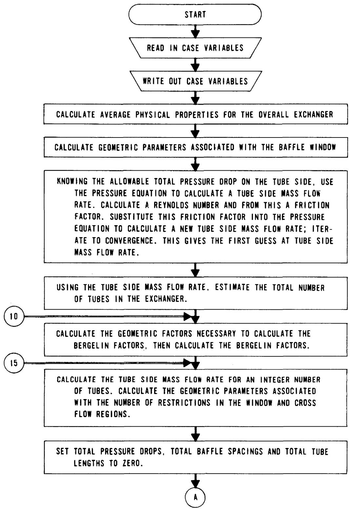  
Fig. D.1. Simplified Flow Diagram of the SUPEX Computer Program.

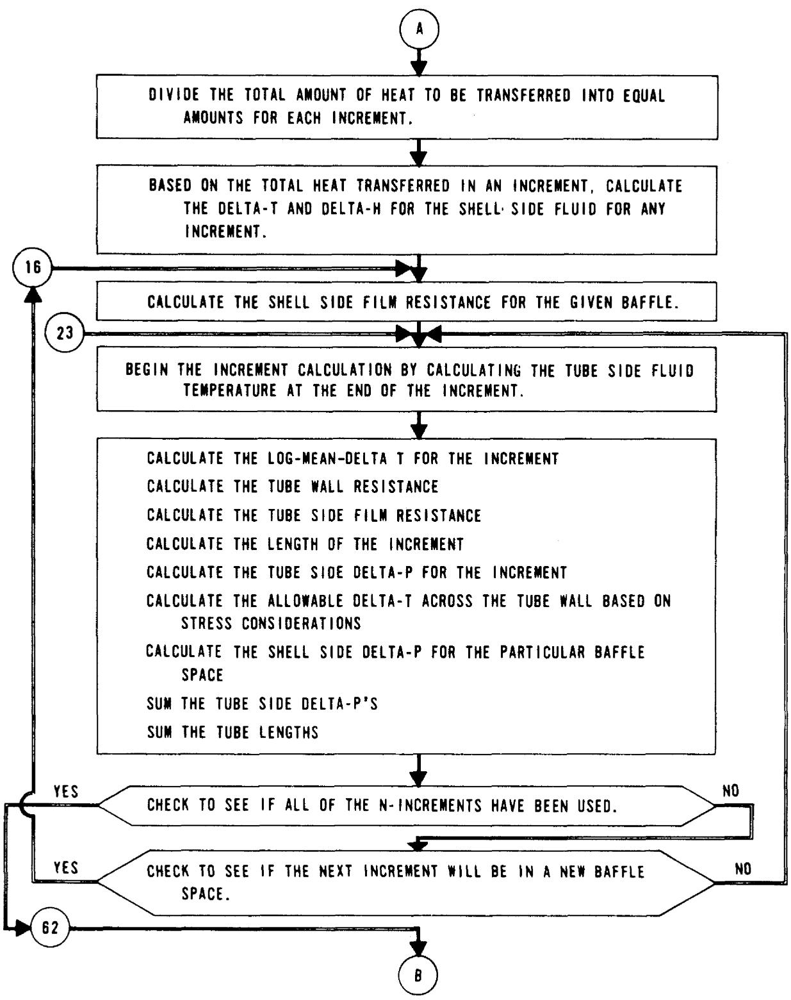  
Fig. D.l. (continued)

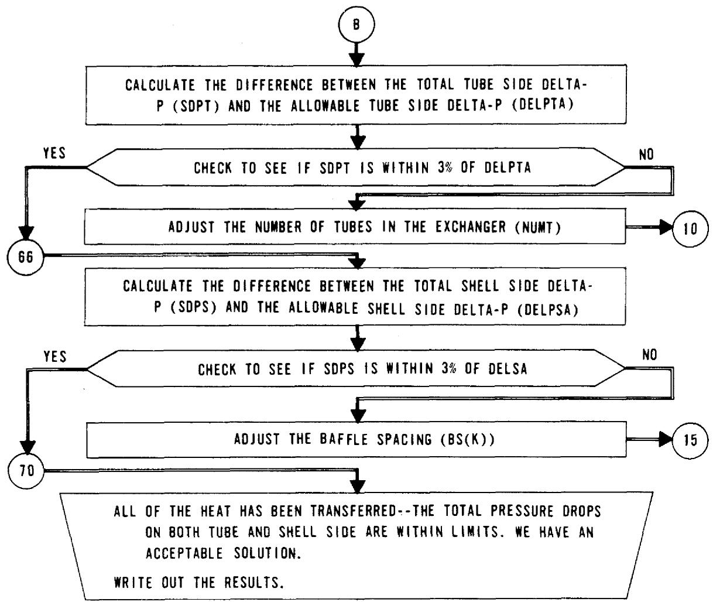  
Fig. D.1. (continued)

Table D.1. Computer Input Data for SUPEX Program   

<table><tr><td>Card</td><td>Columns</td><td>Format</td><td>Variable</td><td>Term</td><td>Units</td></tr><tr><td>1</td><td>1-10</td><td>F10.5</td><td>Tube outside diameter</td><td>DTO</td><td>in.</td></tr><tr><td></td><td>11-20</td><td>F10.5</td><td>Tube wall thickness</td><td>THK</td><td>in.</td></tr><tr><td></td><td>21-30</td><td>F10.5</td><td>Tube pitch</td><td>P</td><td>in.</td></tr><tr><td></td><td>31-40</td><td>I10</td><td>Number of increments</td><td>N</td><td></td></tr><tr><td>2</td><td>1-10</td><td>F10.1</td><td>Salt inlet temperature</td><td>TH1</td><td>°F</td></tr><tr><td></td><td>11-20</td><td>F10.1</td><td>Salt outlet temperature</td><td>TH2</td><td>°F</td></tr><tr><td></td><td>21-30</td><td>F10.1</td><td>Steam inlet temperature</td><td>TC1</td><td>°F</td></tr><tr><td></td><td>31-40</td><td>F10.1</td><td>Steam outlet temperature</td><td>TC2</td><td>°F</td></tr><tr><td>3</td><td>1-10</td><td>F10.1</td><td>Steam inlet pressure</td><td>PC1</td><td>psi</td></tr><tr><td></td><td>11-20</td><td>F10.1</td><td>Steam exit pressure</td><td>PC2</td><td>psi</td></tr><tr><td></td><td>21-30</td><td>F10.1</td><td>Allowable total shell-side pressure drop</td><td>DELPSA</td><td>psi</td></tr><tr><td></td><td>31-40</td><td>F10.5</td><td>Bypass leakage factor for pressure drop</td><td>BLFP</td><td></td></tr><tr><td>4</td><td>1-20</td><td>E20.6</td><td>Mass flow rate of steam</td><td>WC</td><td>1b/hr</td></tr><tr><td></td><td>21-40</td><td>E20.6</td><td>Mass flow rate of salt</td><td>WH</td><td>1b/hr</td></tr><tr><td></td><td>41-60</td><td>E20.6</td><td>Total heat transfer rate</td><td>QT</td><td>Btu/hr</td></tr><tr><td></td><td>61-70</td><td>F10.5</td><td>Bypass leakage factor for heat transfer</td><td>BLFH</td><td></td></tr><tr><td>5</td><td>1-10</td><td>F10.5</td><td>Specific heat of salt</td><td>CPH</td><td>Btu/1b•°F</td></tr><tr><td></td><td>11-20</td><td>F10.5</td><td>Thermal conductivity of salt (hot fluid)</td><td>TCH</td><td>Btu/ft•hr•°F</td></tr><tr><td></td><td>21-30</td><td>F10.5</td><td>Estimated number of baffle spaces</td><td>GNB</td><td></td></tr><tr><td>6</td><td>1-10</td><td>F10.5</td><td>Fractional window cut</td><td>PW</td><td></td></tr><tr><td></td><td>11-20</td><td>F10.5</td><td>Estimated total tube length</td><td>SXG</td><td>ft</td></tr><tr><td></td><td>21-30</td><td>F10.5</td><td>Estimated baffle spacing</td><td>BSG</td><td>ft</td></tr></table>

Table D.2. Output Data From SUPEX Computer Program   

<table><tr><td>Term</td><td>Variable</td><td>Units</td></tr><tr><td colspan="3">For Each Baffle Space</td></tr><tr><td>J</td><td>Baffle number</td><td></td></tr><tr><td>IBK(J)</td><td>Increment number of first increment which lies completely in baffle space J</td><td></td></tr><tr><td>DELTW(J)</td><td>Calculated temperature drop across tube wall</td><td>°F</td></tr><tr><td>DELTWA(J)</td><td>Allowable temperature drop across tube wall based on allowable stress</td><td>°F</td></tr><tr><td>TWALL(J)</td><td>Temperature of wall material</td><td>°F</td></tr><tr><td>DELPS(J)</td><td>Calculated shell-side pressure drop for the baffle space</td><td>psi</td></tr><tr><td>DHOT(J)</td><td>Mean density of hot fluid (salt) for the baffle space</td><td>1b/ft3</td></tr><tr><td>VHOT(J)</td><td>Mean viscosity of hot fluid (salt) for the baffle space</td><td>1b/ft·hr</td></tr><tr><td colspan="3">For Each Increment</td></tr><tr><td>I</td><td>Increment number</td><td></td></tr><tr><td>XI</td><td>Tube length for the increment</td><td>ft</td></tr><tr><td>TH(I)</td><td>Temperature of hot fluid (salt)</td><td>°F</td></tr><tr><td>TC(I)</td><td>Temperature of cold fluid (steam)</td><td>°F</td></tr><tr><td>PC(I)</td><td>Pressure of cold fluid (steam)</td><td>psi</td></tr><tr><td>DELP(I)</td><td>Tube pressure drop for the increment</td><td>psi</td></tr><tr><td>RI(I)</td><td>Thermal resistance of inside film for the increment</td><td>hr·°F/Btu</td></tr><tr><td>RW(I)</td><td>Thermal resistance of wall material for the increment</td><td>hr·°F/Btu</td></tr><tr><td>RO(I)</td><td>Thermal resistance of outside film for the baffle space in which the increment lies</td><td>hr·°F/Btu</td></tr><tr><td>RT(I)</td><td>Total thermal resistance between hot and cold fluids for the increment</td><td>hr·°F/Btu</td></tr><tr><td colspan="3">For the Entire Exchanger</td></tr><tr><td>NUMT</td><td>Total number of tubes</td><td></td></tr><tr><td>NBS</td><td>Total number of baffle spaces</td><td></td></tr><tr><td>BSL</td><td>Length of a baffle space</td><td>ft</td></tr><tr><td>DS</td><td>Inside diameter of exchanger shell</td><td>in.</td></tr><tr><td>SDPT</td><td>Total pressure drop in tubes</td><td>psi</td></tr><tr><td>SDPS</td><td>Total pressure drop in shell</td><td>psi</td></tr><tr><td>DTLME</td><td>Log-mean delta-T</td><td>°F</td></tr><tr><td>SX</td><td>Total tube length</td><td>ft</td></tr><tr><td>AREAX</td><td>Total heat transfer area based on total tube length</td><td>ft2</td></tr><tr><td>UEQX</td><td>Overall heat transfer coefficient based on total tube length</td><td>Btu/hr·ft3·°F</td></tr><tr><td>SBS</td><td>Total baffle space length</td><td>ft</td></tr><tr><td>AREAB</td><td>Total heat transfer area based on total baffle space length</td><td>ft2</td></tr><tr><td>UEQB</td><td>Overall heat transfer coefficient based on total baffle space length</td><td>Btu/hr·ft2·°F</td></tr></table>

# The SUPEX Program Listing

```csv
\*\*FTN,L,G,E,M.   
PROGRAM SUPEX SUPEX 10 TYPE REAL NEW SUPEX 20 DIMENSION TC(201),TH(201),PC(201),HC(201), 1DELPS(100),RW(201),RI(201),RO(100),RT(201),U(201), SUPEX 31 2X(201),DELP(201),DELTWA(100),DELTW(100),IBK(100), SUPEX 32 3DHOT(50),VHOT(50),TWALL(50) SUPEX 33 CALL SVH(1,P,T,V,H) SUPEX 40 READINPUTTAPE50,1007,DTO,THK,P,N SUPEX 50 READINPUTTAPE50,1008,TH1,TH2,TC1,TC2 SUPEX 60 READINPUTTAPE50,1009,PC1,PC2,DELPSA,BLFP SUPEX 70 READINPUTTAPE50,1010,WC,WH,QT,BLFH SUPEX 80 READINPUTTAPE50,1012,CPH,TCH,GNB SUPEX 90 READINPUTTAPE50,1011,PW,SXG,BSG SUPEX 100 DELPTA=PC1-PC2 SUPEX 110 LOP1=O SUPEX 120 LOP2=O SUPEX 130 LOP3=O SUPEX 140 LOP4=O SUPEX 150 LOP5=O SUPEX 160 LOP6=O SUPEX 170 LOP7=O SUPEX 180 LOP8=O SUPEX 190 LOP9=O SUPEX 200 LOP10=O SUPEX 210 LOP11=O SUPEX 220 DELTH=QT/(WH*CPH) SUPEX 230 DTPB=DELTH/GNB SUPEX 240 CALL RITE1(DTO,THK,P,N,TH1,TH2,TC1,TC2,PC1,PC2,DELPTA,DELPSA,WC, 1 WH,QT,CPH,TCH,PW,BLFP,BLFH,GNB,BSG,SXG) SUPEX 251 BSL = BSG SUPEX 260 DTI=(DTO-2.0*THK)/12.0 SUPEX 270 P=P/12.0 SUPEX 280 DTO=DTO/12.0 SUPEX 290 
```

```txt
TCAV=(TC1+TC2)/2.0 SUPE 300  
PCAV=(PC1+PC2)/2.0 SUPE 310  
CALL SVH(2,PC1,TC1,SPV1,DUM) SUPE 320  
CALL SVH(2,PC2,TC2,SPV2,DUM) SUPE 330  
CALL SVH(2,PCAV,TCAV,SPVAV,DUM) SUPE 340  
SPVG=(2.0*(SPV1+SPVAV)+SPV2)/5.0 SUPE 350  
CALL VISCOS(TC1,PC1,VIS1) SUPE 360  
CALL VISCOS(TC2,PC2,VIS2) SUPE 370  
CALL VISCOS(TCAV,PCAV,VISAV) SUPE 380  
VISG=(2.0*(VIS1+VISAV)+VIS2)/5.0 SUPE 390  
CFG=0.014 SUPE 400  
THETAL = 0.8 SUPE 410  
PERCL = (THETAL - 0.5*SINF(2.0*THETAL))/3.14159 SUPE 420  
THETAU = 1.5707 SUPE 430  
PERCU = (THETAU - 0.5*SINF(2.0*THETAU))/3.14159 SUPE 440 
```

```txt
1 NEW = THETAL + (PW -PERCL)*(THETAU -THETAL)/(PERCU -PERCL)  
PNEW = (NEW - 0.5*SINF(2.0*NEW)) / 3.14159  
EPNEW=ABSF(PW-PNEW)  
IF(EPNEW-0.001)4,4,2 
```

2 THEtAL $\equiv$ NEW PERCL $=$ PNEW LOP11=LOP11+1 IF(LOP11-10)1,1,3

```csv
3 WRITEOUTPUTTAPE51,1022,LOP11 GOTO80 
```

```txt
4 THETAC = THETAL 
```

```txt
5 G=3600.0*SQRTF((DELPTA*64.4*144.0*DTI)/(CFG*SXG*SPVG)) REG=CTI*G/VISG CFC=(0.00140+(0.125/(REG*0.32)))*4.C DIFA=ABSF(CFC-CFG) IF(DIFA-0.05*CFC)9,9,6
```

6 CFG $\equiv$ CFC LOP1=LOP1+1 IF（LOP1-10）8,8,7

```csv
7 WRITEOUTPUTTAPE51,1013,LOP1 GOTO80 
```

8 CONTINUE SUPE 660

GOT05 SUPE 670

9 NUMT $\equiv$ XINTF(WC\*4.0/(G\*3.1416\*DTI\*\*2)) SUPE 680

10 BNUMT $\equiv$ FLOAT(NUMT) SUPE 690

LOP10=0 SUPE 700

DS=P\*SQRTF(4.0\*BNUMT\*0.866/3.1416) SUPE 710

XBAR = (DS/2.0)*(THETAC - 0.5*SINF(2.0*THETAC) SUPE 720

1 -（2.0\*（SINF（THETAC））\*\*3.0）/3.0）/(THETAC-0.5\*SINF（2.0\*THETAC））SUPE 721

BRL1 = BSL / (DS-2.0*XBAR) SUPE 730

GBRL $= 0.77*BRL1**(-0.138)$ SUPE 740

AW=PW*3.1416*DS**2/4.0 SUPE 750

$\mathsf{AX} = (3.1416*\mathsf{DS}**2 / 4.0) - \mathsf{A}\mathsf{w}$ SUPE760

THETA=(1.50*(3.1416-(4.0*AX/DS**2)))**0.333 SUPE 770

11 $\mathsf{AXC} = (3.1416 - \mathsf{THETA} + (\mathsf{SINF}(2.0\ast \mathsf{THETA}) / 2.0))\ast \mathsf{DS}\ast \ast 2 / 4.0$ SUPE780

DIFB=ABS F(AXC-AX) SUPE 790

IF(DIFB-0.02*AX)15,15,12 SUPE 800

12 THEA2=(1.50*(3.1416-(4.0*AXC/DS**2))）**C.333 SUPE 810

$\mathsf{A}\mathsf{X}\mathsf{C}\mathsf{2} = (\mathsf{3.1416 - }\mathsf{T}\mathsf{H}\mathsf{T}\mathsf{A}\mathsf{2} + (\mathsf{S}\mathsf{INF}(\mathsf{2.0*THA}\mathsf{A}\mathsf{2}) / \mathsf{2.0}))^{*}\mathsf{DS}^{**}\mathsf{2} / \mathsf{4.0}$ SUPE 820

THETA=(AX-AXC)*(THETA2-THETA)/(AXC2-AXC)+THETA SUPE 830

LOP2=LOP2+1 SUPE 840

IF(LOP2-10)14,14,13 SUPE 850

13 WRITEOUTPUTTAPE51,1014,LOP2 SUPE 860

GOT080 SUPE 870

14 CONTINUE SUPE 880

GOT011 SUPE 890

15 GC=4.0*WC/(BNUMT*3.1416*DTI**2) SUPE 900

XB=DS\*COSF（THETA）/2.0 SUPE 910

CNB=2.0*XB/(0.866*P) SUPE 920

$\mathsf{XH} = (\mathsf{DS} / 2.0) - \mathsf{XB}$ SUPE930

CNW=（XH/(0.866*P）)-1.0 SUPE 940

XC=DS*SINF(THETA) SUPE 950

PCFB $=$ (P-DTO)/P SUPE 960

SBK=PCFB\*（DS+XC）/2.0 SUPE 970

SW=PW*BNUMT*(0.866*P**2-(3.1416*DT0**2/4.0)) SUPE 980

SDPT=0.0 SUPE 990

SDPS=0.0 SUP 1000

LOP8=0 SUP 1010

MS=1 SUP 1020

$S X = 0$ （20 SUP1030

SBS=0 SUP 1040

TC(1) = TC2 SUP 1050

TH(1)=TH1 SUP 1060

RWK $\equiv$ DT0\*LOGF(DTO/DTI)/2.0 SUP 1070

PC(1)=PC2 SUP 1080

CALL SVH(2,PC2,TC2,DUM,HC(1)) SUP 1090

BN=FLOAT(N) SUP 1100

$QX = QT / BN$ SUP 1110

$\mathrm{DECT} = \mathrm{QX} / (\mathrm{WH}*\mathrm{CPH})$ SUP 1120

DECH=QX/WC SUP 1130

$\mathbf{I} = \mathbf{1}$ （20 SUP 1140

K=1 SUP 1150

16 $\mathsf{SB} = \mathsf{SBK}*\mathsf{BSL}$ SUP 1160

LOP7=0 SUP 1170

TCON=TH(I)-DTPB/2.0 SUP 1180

DENH=141.38E+0C-2.466E-02*TCON SUP 1190

VISH=0.2122E+CO*EXPF(4032.0E+00/(TCON+460.0E+00)) SUP 1200

DHOT(K) = DENH SUP 1210

VHOT(K)=VISH SUP 1220

CON1=(CPH\*VISH/TCH) \*\*0.667E+00 SUP 1230

GM=WH/SB SUP 1240

RECB=DT0*GM/VISH SUP 1250

IF(RECB-800.0)17,18,18 SUP 1260

17 HJB=0.571/(RECB**0.456) SUP 1270

GOT019 SUP 1280

18 HJB=0.346/(RECB**0.382) SUP 1290

19 HB=HJB*CPH*GM/CON1 SUP 1300

GW=WH/SW SUP 1310

GS=SQRTF(GM*GW) SUP 1320

RECW $\equiv$ DTO\*GS/VISH SUP 1330

IF(RECW-800.0)20,21,21 SUP 1340

20 HJW=0.571/(RECW**0.456) SUP 1350

GOT022 SUP 1360

21 HJW=0.346/(RECW**0.382) SUP 1370

22 HW=HJW*CPH*GS/CON1
		HO=(HB*(1.0-2.0*PW)+HW*(2.0*PW))*BLFH
		HO = HO*GBRL
		RO(K)=1.0/HO   
23 TH(I+1)=TH(I)-DECT SUP 1420
LOP5=0 SUP 1430
HC(I+1)=HC(I)-DECH SUP 1440
DELPP=0.0 SUP 1450   
24 PC(I+1)=PC(I)+DELPP SUP 1460 $LOP3 = 0$ SUP 1470 $LOP4 = 0$ SUP 1480 $TC(I + 1) = TC(I) - DECH$ SUP 1490   
25 CALL SVH(2,PC(I+1),TC(I+1),DUM,HCG) SUP 1500EH=ABSF(HC(I+1)-HCG) SUP 1510IF(EH-0.001*HC(I+1))31,31,26 SUP 1520   
26 TRIAL $\equiv$ TC(I+1) SUP 1530 HRIAL $\equiv$ HCG SUP 1540 TC(I+1) $=$ TC(I+1)+(HC(I+1)-HCG)*(TC(I)-TC(I+1)/(HC(I)-HCG) SUP 1550   
27 CALLSVH(2,PC(I+1),TC(I+1),DUM,HCG)  
EH=ABSF(HC(I+1)-HCG)  
IF(EH-0.001*HC(I+1))31,31,28  
SUP 1560  
SUP 1570  
SUP 1580   
28 $\begin{array}{rl} & {\mathrm{TNEXT} = \mathrm{TC(I + 1)} + (\mathrm{HC(I + 1)} - \mathrm{HCG})*(\mathrm{TC(I + 1)} - \mathrm{TRIAL}) / (\mathrm{HCG - HRIAL})}\\ & {\mathrm{TRIAL} = \mathrm{TC(I + 1)}}\\ & {\mathrm{HRIAL} = \mathrm{HCG}}\\ & {\mathrm{TC(I + 1)} = \mathrm{TNEXT}}\\ & {\mathrm{LOP3 = LOP3 + 1}}\\ & {\mathrm{IF(LOP3 - 10)30,30,29}} \end{array}$ SUP 1590 SUP 1600 SUP 1610 SUP 1620 SUP 1630 SUP 1640   
29 WRITEOUTPUTTAPE51,1015,LOP3 SUP 1650 GOTO80 SUP 1660   
30 GOT027 SUP 1670   
31 $\begin{array}{rl} & {\mathrm{DENOM} = (\mathrm{TH}(\mathrm{I} + 1) - \mathrm{TC}(\mathrm{I} + 1)) / (\mathrm{TH}(\mathrm{I}) - \mathrm{TC}(\mathrm{I}))}\\ & {\mathrm{TDEN} = \mathrm{ABS F}(\mathrm{DENOM} - 1.0)}\\ & {\mathrm{IF(TDEN - C.05)32,33,33}} \end{array}$ SUP 1680 SUP 1690 SUP 1700   
32 DELTLM=0.5E+00*(TH(I+1)-TC(I+1)+TH(I)-TC(I)) SUP 1710 GO TO 34 SUP 1720  
33 DELTLM=(TH(I+1)-TC(I+1)-TH(I)+TC(I))/LOGF((TH(I+1)-TC(I+1))/(TH(I)SUP 1730 1-TC(I))) SUP 1731

<table><tr><td>34</td><td>CONTINUE</td><td>SUP</td><td>1740</td></tr><tr><td></td><td>TM=(TC(I+1)+TC(I))/2.0</td><td>SUP</td><td>1750</td></tr><tr><td></td><td>PM=(PC(I+1)+PC(I))/2.0</td><td>SUP</td><td>1760</td></tr><tr><td></td><td>CALL SVH(2,PM,TM,SPVB,HFB)</td><td>SUP</td><td>1770</td></tr><tr><td></td><td>PM=(PC(I+1)+PC(I))/2.0</td><td>SUP</td><td>1780</td></tr><tr><td></td><td>CALL VISCO(S(TM,PM,VISB)</td><td>SUP</td><td>1790</td></tr><tr><td></td><td>TW=TM+0.23*DELTLM</td><td>SUP</td><td>1800</td></tr><tr><td></td><td>TCW=0.006375*TW+4.06</td><td>SUP</td><td>1810</td></tr><tr><td></td><td>RW(I)=RWK/TCW</td><td>SUP</td><td>1820</td></tr><tr><td></td><td>DTFM=0.1*DELTLM</td><td>SUP</td><td>1830</td></tr></table>

<table><tr><td>35</td><td>TMS=TM+DTFM</td><td>SUP 1840</td></tr><tr><td></td><td>CALL SVH(2,PM,TMS,SPVI,HFI)</td><td>SUP 1850</td></tr><tr><td></td><td>CALLCOND(TMS,PM,TCFI)</td><td>SUP 1860</td></tr><tr><td></td><td>CALL VISCOS(TMS,PM,VISFI)</td><td>SUP 1870</td></tr><tr><td></td><td>CRE=(CTI*GC/VISFI)**0.923</td><td>SUP 1880</td></tr><tr><td></td><td>CPR=((HFI-HFB)/(TMS-TM)*(VISFI/TCFI))**0.613</td><td>SUP 1890</td></tr><tr><td></td><td>CSV=(SPVB/SPVI)**0.231</td><td>SUP 1900</td></tr><tr><td></td><td>HI=0.00459*(TCFI/DTI)*CRE*CPR*CSV</td><td>SUP 1910</td></tr><tr><td></td><td>RI(I)=DTO/(HI*DTI)</td><td>SUP 1920</td></tr><tr><td></td><td>RT(I)=RO(K)+RW(I)+RI(I)</td><td>SUP 1930</td></tr><tr><td></td><td>DTFMC=RI(I)*DELTLM/RT(I)</td><td>SUP 1940</td></tr><tr><td></td><td>IF(ABS(FDFTM-DTFMC)-0.03*DTFMC)39,39,36</td><td>SUP 1950</td></tr></table>

<table><tr><td>36</td><td>DTFM2=(DTFM+DTFMC)*.5</td><td>SUP 1960</td></tr><tr><td></td><td>TMS2=TM+DTFM2</td><td>SUP 1970</td></tr><tr><td></td><td>CALL SVH(2,PM,TMS2,SPVI2,HFI2)</td><td>SUP 1980</td></tr><tr><td></td><td>CALL CONDT(TMS2,PM,TCF12)</td><td>SUP 1990</td></tr><tr><td></td><td>CALL VISCOS(TMS2,PM,VISFI2)</td><td>SUP 2000</td></tr><tr><td></td><td>CRE2=(DTI*GC/VISFI2)**0.923</td><td>SUP 2010</td></tr><tr><td></td><td>CPR2=((HFI2-HFB)/(TMS2-TM))*(VISFI2/TCF12))**0.613</td><td>SUP 2020</td></tr><tr><td></td><td>CSV2=(SPVB/SPVI2)**0.231</td><td>SUP 2030</td></tr><tr><td></td><td>H2I=0.00459*TCF12*CRE2*CPR2*CSV2/DTI</td><td>SUP 2040</td></tr><tr><td></td><td>R2I=CTO/(H2I*DTI)</td><td>SUP 2050</td></tr><tr><td></td><td>R2T=RO(K)+RW(I)+R2I</td><td>SUP 2060</td></tr><tr><td></td><td>DTFMC2=R2I*DELTLM/R2T</td><td>SUP 2070</td></tr><tr><td></td><td>SLOPE=(DTFMC-DTFMC2)/(DTFM-DTFM2)</td><td>SUP 2080</td></tr><tr><td></td><td>DTFM=(DTFMC-(SLOPE*DTFM))/(1.0-SLOPE)</td><td>SUP 2090</td></tr></table>

LOP4=LOP4+1 SUP 2100

IF（LCP4-10）38,38,37 SUP 2110

37 WRITEOUTPUTTAPE51,1016,LOP4 SUP 2120

GOT080 SUP 2130

38 CONTINUE SUP 2140

GOT035 SUP 2150

39 U(I)=1.0/RT(I) SUP 2160

X(I)=QX/(BNUMT*3.1416*DTO*u(I)*DELTLM) SUP 2170

RE=DTI*GC/VISB SUP 2180

CFI=0.00140+0.125/(RE**0.32) SUP 2190

DELPH $\text{工} =$ (4.0*CFI\*X(I)/DTI)*GC\*\*2.0*SPVB/(64.4\*3600.\*\*2.\*144.0) SUP 2200

DIFC=ABS F(DELP(I)-DELPP) SUP 2210

IF(DIFC-0.05*DELP(I))43,43,40 SUP 2220

40 DELPP $\equiv$ DELP（I） SUP 2230

LOP5=LOP5+1 SUP 2240

IF(LOP5-10)42,42,41 SUP 2250

41 WRITEOUTPUTTAPE51,1017,LOP5 SUP 2260

GOT080 SUP 2270

42 CONT INUE SUP 2280

GOT024 SUP 2290

43 IF(MS)53,53,44 SUP 2300

44 I BK(K) = I SUP 2310

TW=(RI(I)+0.5*RW(I))*(TH(I)-TC(I))/RT(I)+TC(I) SUP 2320

ALPHA=（0.0031\*TW+5.91) SUP 2330

ETW=31.65-0.005*TW SUP 2340

CON2=ALPHA*ETW/(1.4*LOGF(DTO/DTI)) SUP 2350

CON3=1.0-(2.0*DTO**2*LOGF(DTO/DTI)/(DTO**2-DTI**2)) SUP 2360

CON3=CON3*(-1.) SUP 2370

IF(TW-1015.3)45,46,46 SUP 2380

45 B=24000.0 SUP 2390

$SL = 7.5$ （20 SUP 2400

GOT047 SUP 2410

46 $B = 57000.0$ （20 SUP 2420

$\mathsf{SL} = 40.0$ （20 SUP 2430

47 CON4=3.0*(B-SL*TW)-2600C.C SUP 2440

TWALL(K) = TW SUP 2450

DELTA(K) $\equiv$ CON4/(CON2*CON3) SUP 2460

DELTW(K)=RW(I)*(TH(I)-TC(I))/RT(I) SUP 2470

48 IF(1-1)51,51,49 SUP 2480   
49 IF(N-1)51,51,50 SUP 2490   
50 BWN=1.0 SUP 2500

GOT052 SUP 2510

51 BWN=0.5 SUP 2520   
52 DELPSB=0.6*CNB*(GM/3600.0)**2/(64.4*144.0*DENH) SUP 2530

DELPSW $\equiv$ BWN\*2.0+0.6\*CNW\*GS/3600.0\*\*2/(64.4\*144.0\*DENH) SUP 2540   
DELPS(K) = (DELPSB + DELPSW) * BLFP SUP 2550   
SDPS=SDPS+DELPS(K) SUP 2560   
SBS $=$ SBS+BSL SUP 2570

53 SDPT=SDPT+DELP（I） SUP 2580

$\mathsf{S}\mathsf{X} = \mathsf{S}\mathsf{X} + \mathsf{X}(\mathsf{I})$ SUP 2590   
IF(N-1)62,62,54 SUP 2600

54 $\mathbf{I} = \mathbf{I} + \mathbf{1}$ SUP 2610

IF(SBS-SX)58,58,55 SUP 2620

55 MS=0 SUP 2630

LOP7=LOP7+1 SUP 2640   
IF(LOP7-30)57,57,56 SUP 2650

56 WRITEOUTPUTTAPE51,1018,LOP7 SUP 2660   
GOT080 SUP 2670

57 CONTINUE SUP 2680

GOT023 SUP 2690

58 MS=1 SUP 2700

K=K+1 SUP 2710

59 CONTINUE SUP 2720

LOP8=LOP8+1 SUP 2730   
IF(LOP8-30)61,61,60 SUP 2740

60 WRITEOUTPUTTape51,1019,LOP8 SUP 2750   
GOT080 SUP 2760   
61 CONTINUE SUP 2770   
GOT016 SUP 2780   
62 EDPT=ABSF(SDPT-DELPTA) SUP 2790  
IF(EDPT-0.03*DELPTA)66,66,63 SUP 2800  
63 NUMT=XINTF(BNUMT*(SDPT/DELPTA)***0.35) SUP 2810  
LOP9=LOP9+1   
IF(LOP9-10)65,65,64 SUP 2830   
64 WRITEOUTPUTTAPE51,1020,LOP9 SUP 2840   
GOT080

65 CONTINUE SUP 2860 BSG=BSL SUP 2870 GOTO10 SUP 2880   
66 EDPS $=$ ABSF(SDPS-DELPSA) SUP 2890 IF(EDPS-0.03*DELPSA)70,70,67 SUP 2900  
67 BSL = BSL*SQRTF(SDPS/DELPSA) SUP 2910 $\mathrm{{LOP}}{10} = \mathrm{{LOP}}{10} + 1$ SUP 2920
	IF (LOP10-10) 69,69,68 SUP 2930   
68 WRITEOUTPUTTAPE51,1021,LOP10 SUP 2940 GOTO80 SUP 2950   
69 CONTINUE SUP 2960 GOTO15 SUP 2970   
70 CONTINUE SUP 2980 CALL RITE2 SUP 2990 $\mathbf{J} = \mathbf{0}$ SUP 3000   
71 $JN = J + 1$ （20 $\mathrm{JNC} = 49 + \mathrm{JN}$ （20 $\mathrm{IF(JN.GT.K)}$ GO TO 73 $\mathrm{WRITEOUTPUTTAPE51,1001}$ （20 $\mathrm{SUP}3040$   
1001 FORMAT(1H1, //, 3X, 1HJ, 5X, 5H1ST-I, 4X, 6HDELT-W, 3X, 8HDELT-W-A, 3X, SUP 3050  
1 6HT-WALL, 3X, 6HDELP-S, 3X, 6HDENS-H, 3X, 6HVISC-H) SUP 3051  
WRITEOUTPUTTAPE51, 1002 SUP 3060   
1002 FORMAT(1H,4(1H-),3X,6(1H-),3X,7(1H-),3X,8(1H-),4(3X,6(1H-)),/)
NBS = K
DO 72 J=JN,K,1
WRITEOUTPUTTAPE51,1003,J,IBK(J),DELTW(J),DELTWA(J),TWALL(J),
1 DELPS(J),DHOT(J),VHOT(J)   
1003 FORMAT(I5,3X,I6,3X,F7.2,3X,F8.2,2(3X,F6.1,3X,F6.3)) SUP 3110 IF(J.EQ.JNC) GO TO 71 SUP 3120  
72 CONTINUE SUP 3130   
73 CONTINUE SUP 3140 CALL RITE3 SUP 3150 $\mathbf{I} = \mathbf{0}$ SUP 3160   
74 IN=I+1 SUP 3170  
INC=49+IN SUP 3180  
IF(IN.GT.N) GO TO 76 SUP 3190  
WRITEOUTPUTTAPE51,1004 SUP 3200

1004 FORMAT(1H1, //, 3X, 1HI, 5X, 6HLENGTH, 4X, 5HT-HOT, 5X, 6HT-COLD, 4X, SUP 3210

1 6HP-COLD,4X,6HDELP-C,4X,6HRES-IN,4X,8HRES-WALL,4X,7HRES-OUT, SUP 3211   
2 4X,7HRES-TOT) SUP3212

WRITEOUTPUTTAPE51,1C05 SUP 3220

1005 FORMAT(1H,5(1H-),3X,6(1H-),3X,2(7(1H-),3X),8(1H-),3X,6(1H-)), SUP 3230

1 4(3X,8(1H-)),/SUP 3231

DO 75 $\mathbf{I} = \mathbf{IN},\mathbf{N},\mathbf{1}$ SUP3240   
RO(I)=RT(I)-RI(I)-RW(I) SUP 3250   
WRITEOUTPUTTAPE51,1006,I,X(I),TH(I),TC(I),PC(I),DELP(I),RI(I), SUP 3260   
1 RW(I),RO(I),RT(I) SUP 3261

1006 FORMAT(I6,3X,F6.3,3X,2(F7.1,3X),F8.1,3X,F6.3,4(3X,F8.6)) SUP 3270

IF(I.EQ.INC) GO TO 74 SUP 3280

75 CONTINUE SUP 3290   
76 CONTINUE SUP 3300

AREAX $\equiv$ BNUMT\*SX\*3.1416\*DTO SUP 3310   
DENOM=（TH1-TC2）/（TH2-TC1） SUP 3320  
TDEN=ABSF(DENOM-1.0) SUP 3330   
IF(TDEN-0.05) 77,78,78 SUP 3340

77DTLME=0.5E+OC\*（TH1-TC2+TH2-TC1) SUP 3350  
GO TO 79 SUP 3360

78 CONTINUE SUP 3370   
DTLME $=$ (TH1-TC2-TH2+TC1)/LOGF((TH1-TC2)/(TH2-TC1)) SUP 3380

79 CONTINUE SUP 3390

UEQX=QT/(AREAX*DTLME) SUP 3400  
AREAB=AREAX\*SBS/SX SUP 3410   
UEQB=QT/(AREAB*DTLME) SUP 3420   
DS=DS*12.0 SUP 3430

CALL RITE4(NUMT,DS,SDPT,SCPS,DTLME,SX,AREAX,UEQX,SBS,AREAB,UEQB, SUP 3440  
1 NBS,BSL) SUP 3441

80 CONTINUE SUP 3450

CALLEXIT SUP 3460

1007 FORMAT(F10.5,F10.5,F10.5,I10) SUP 3470   
1008 FORMAT(4F10.1) SUP 3480   
1009 FORMAT(F10.1,F10.1,F10.1,F10.5) SUP 3490   
1010 FORMAT(E20.6,E20.6,E20.6,F10.5) SUP 3500   
1011 FORMAT(3F10.5) SUP 3510   
1012 FORMAT(3F10.5) SUP 3520

<table><tr><td>1013</td><td>FORMAT(8H LOP 1 =I4)</td><td>SUP 3530</td></tr><tr><td>1014</td><td>FORMAT(8H LOP 2 =I4)</td><td>SUP 3540</td></tr><tr><td>1015</td><td>FORMAT(8H LOP 3 =I4)</td><td>SUP 3550</td></tr><tr><td>1016</td><td>FORMAT(8H LOP 4 =I4)</td><td>SUP 3560</td></tr><tr><td>1017</td><td>FORMAT(8H LOP 5 =I4)</td><td>SUP 3570</td></tr><tr><td>1018</td><td>FORMAT(8H LOP 7 =I4)</td><td>SUP 3580</td></tr><tr><td>1019</td><td>FORMAT(8H LOP 8 =I4)</td><td>SUP 3590</td></tr><tr><td>1020</td><td>FORMAT(8H LOP 9 =I4)</td><td>SUP 3600</td></tr><tr><td>1021</td><td>FORMAT(9H LOP 10 =I4)</td><td>SUP 3610</td></tr><tr><td>1022</td><td>FORMAT(9H LOP 11 =I4)</td><td>SUP 3620</td></tr><tr><td></td><td>END</td><td>SUP 3630</td></tr></table>

<table><tr><td colspan="2">SUBROUTINE RITE1(DTO,THK,P,N,TH1,TH2,TC1,TC2,PC1,PC2,DELPTA, DELPSA,WC,WH,QT,CPH,TCH,PW,BLFP,BLFH,GNB,BSG,SXG)</td><td>RITE1 10</td></tr><tr><td colspan="2">WRITEOUTPUTTAPE51,1001</td><td>RITE1 11</td></tr><tr><td colspan="2">WRITEOUTPUTTAPE51,1002,DTC</td><td>RITE1 20</td></tr><tr><td colspan="2">WRITEOUTPUTTAPE51,1003,THK</td><td>RITE1 30</td></tr><tr><td colspan="2">WRITEOUTPUTTAPE51,1004,P</td><td>RITE1 40</td></tr><tr><td colspan="2">WRITEOUTPUTTAPE51,1005,N</td><td>RITE1 50</td></tr><tr><td colspan="2">WRITEOUTPUTTAPE51,1006,TH1</td><td>RITE1 60</td></tr><tr><td colspan="2">WRITEOUTPUTTAPE51,1007,TH2</td><td>RITE1 70</td></tr><tr><td colspan="2">WRITEOUTPUTTAPE51,1008,TC1</td><td>RITE1 80</td></tr><tr><td colspan="2">WRITEOUTPUTTAPE51,1009,TC2</td><td>RITE1 90</td></tr><tr><td colspan="2">WRITEOUTPUTTAPE51,1010,PC2</td><td>RITE1 100</td></tr><tr><td colspan="2">WRITEOUTPUTTAPE51,1011,DELPTA</td><td>RITE1 120</td></tr><tr><td colspan="2">WRITEOUTPUTTAPE51,1012,DELPSA</td><td>RITE1 130</td></tr><tr><td colspan="2">WRITEOUTPUTTAPE51,1013,WC</td><td>RITE1 140</td></tr><tr><td colspan="2">WRITEOUTPUTTAPE51,1014,WH</td><td>RITE1 150</td></tr><tr><td colspan="2">WRITEOUTPUTTAPE51,1015,QT</td><td>RITE1 160</td></tr><tr><td colspan="2">WRITEOUTPUTTAPE51,1016,CPH</td><td>RITE1 170</td></tr><tr><td colspan="2">WRITEOUTPUTTAPE51,1017,TCH</td><td>RITE1 180</td></tr><tr><td colspan="2">WRITEOUTPUTTAPE51,1018,PW</td><td>RITE1 190</td></tr><tr><td colspan="2">WRITEOUTPUTTAPE51,1019,BLFP</td><td>RITE1 200</td></tr></table>

<table><tr><td></td><td>WRITEDOUTPUTTAPE51,1020,BLFH</td><td>RITE</td><td>210</td></tr><tr><td></td><td>NBSR = IFIX(GNB)</td><td>RITE</td><td>220</td></tr><tr><td></td><td>WRITEDOUTPUTTAPE51,1021,NBSR</td><td>RITE</td><td>230</td></tr><tr><td></td><td>WRITEDOUTPUTTAPE51,1022,BSG</td><td>RITE</td><td>240</td></tr><tr><td></td><td>WRITEDOUTPUTTAPE51,1023,SXG</td><td>RITE</td><td>250</td></tr><tr><td></td><td>RETURN</td><td>RITE</td><td>260</td></tr><tr><td>1001</td><td>FORMAT(1H1, //,24x,69h* * * THE FOLLOWING IS THE INPUT INFORMATIONRITE</td><td>270</td><td></td></tr><tr><td></td><td>1 FOR THIS PROBLEM * * *,///)</td><td>RITE</td><td>271</td></tr><tr><td>1002</td><td>FORMAT(1H,36HOUTSIDE DIAMETER OF TUBES (INCHES)= ,F6.3)</td><td>RITE</td><td>280</td></tr><tr><td>1003</td><td>FORMAT(1HO,30HTUBE WALL THICKNESS (INCHES)= ,F7.4)</td><td>RITE</td><td>290</td></tr><tr><td>1004</td><td>FORMAT(1HO,21HTUBE PITCH (INCHES)= ,F7.4)</td><td>RITE</td><td>300</td></tr><tr><td>1005</td><td>FORMAT(1HO,58HNUMBER OF INCREMENTS INTO WHICH THE EXCHANGER IS DIVRITE</td><td>310</td><td></td></tr><tr><td></td><td>1DDED= ,I4,///)</td><td>RITE</td><td>311</td></tr><tr><td>1006</td><td>FORMAT(1HO,36HINLET TEMPERATURE OF HCT FLUID (F)= ,F7.1)</td><td>RITE</td><td>320</td></tr><tr><td>1007</td><td>FORMAT(1HO,37HOUTLET TEMPERATURE OF HOT FLUID (F)= ,F7.1)</td><td>RITE</td><td>330</td></tr><tr><td>1008</td><td>FORMAT(1HO,37HINLET TEMPERATURE OF COLD FLUID (F)= ,F7.1)</td><td>RITE</td><td>340</td></tr><tr><td>1009</td><td>FORMAT(1HO,38HOUTLET TEMPERATURE OF COLD FLUID (F)= ,F7.1,///)</td><td>RITE</td><td>350</td></tr><tr><td>1010</td><td>FORMAT(1HO,37HOUTLET PRESSURE OF COLD FLUID (PSI)= ,F7.1)</td><td>RITE</td><td>360</td></tr><tr><td>1011</td><td>FORMAT(1HO,50HALLOWABLE TOTAL PRESSURE DROP CN TUBE SIDE (PSI)= ,</td><td>RITE</td><td>370</td></tr><tr><td></td><td>1 F7.1)</td><td>RITE</td><td>371</td></tr><tr><td>1012</td><td>FORMAT(1HO,51HALLOWABLE TCTAL PRESSURE DRCP CN SHELL SIDE (PSI)= ,</td><td>RITE</td><td>380</td></tr><tr><td></td><td>1 F7.1,///)</td><td>RITE</td><td>381</td></tr><tr><td>1013</td><td>FORMAT(1HO,38HMASS FLOW RATE OF COLD FLUID (LB/HR)= ,1PE10.3)</td><td>RITE</td><td>390</td></tr><tr><td>1014</td><td>FORMAT(1HO,37HMASS FLOW RATE OF HOT FLUID (LB/HR)= ,1PE10.3)</td><td>RITE</td><td>400</td></tr><tr><td>1015</td><td>FORMAT(1HO,35HTOTAL HEAT TRANSFER RATE (BTU/HR)= ,1PE10.3)</td><td>RITE</td><td>410</td></tr><tr><td>1016</td><td>FORMAT(1HO,39HSPECIFIC HEAT OF HCT FLUID (BTU/LB-F)= ,F6.3)</td><td>RITE</td><td>420</td></tr><tr><td>1017</td><td>FORMAT(1HO,49HTHERMAL CONDUCTIVITY OF HOT FLUID (BTU/HR-FT-F)= ,</td><td>RITE</td><td>430</td></tr><tr><td></td><td>1 F6.3)</td><td>RITE</td><td>431</td></tr><tr><td>1018</td><td>FORMAT(1HO,23HFACTIONAL WINDOW CUT= ,F5.2,///)</td><td>RITE</td><td>440</td></tr><tr><td>1019</td><td>FORMAT(1HO,37HBY-PASS LEAKAGE FACTOR FOR PRESSURE= ,F6.3)</td><td>RITE</td><td>450</td></tr><tr><td>1020</td><td>FORMAT(1HO,42HBY-PASS LEAKAGE FACTOR FOR HEAT TRANSFER= ,F6.3,///)</td><td>RITE</td><td>460</td></tr><tr><td>1021</td><td>FORMAT(1HO,50HESTIMATE OF THE NUMBER OF BAFFLE SPACES REQUIRED= ,</td><td>RITE</td><td>470</td></tr><tr><td></td><td>1 [3)</td><td>RITE</td><td>471</td></tr><tr><td>1022</td><td>FORMAT(1HO,46HESTIMATE OF THE LENGTH OF A BAFFLE SPACE(FT)= ,F5.2)</td><td>RITE</td><td>480</td></tr><tr><td>1023</td><td>FORMAT(1HO,39HESTIMATE OF THE TOTAL TUBE LENGTH(FT)= ,F6.2)</td><td>RITE</td><td>490</td></tr><tr><td></td><td>END</td><td>RITE</td><td>500</td></tr></table>

<table><tr><td colspan="2">SUBROUTINE RITE2</td><td>RITE2 10</td></tr><tr><td colspan="2">WRITEOUTPUTTAPE51,1001</td><td>RITE2 20</td></tr><tr><td colspan="2">WRITEOUTPUTTAPE51,1002</td><td>RITE2 30</td></tr><tr><td colspan="2">WRITEOUTPUTTAPE51,1003</td><td>RITE2 40</td></tr><tr><td colspan="2">WRITEOUTPUTTAPE51,1004</td><td>RITE2 50</td></tr><tr><td colspan="2">WRITEOUTPUTTAPE51,1005</td><td>RITE2 60</td></tr><tr><td colspan="2">WRITEOUTPUTTAPE51,1006</td><td>RITE2 70</td></tr><tr><td colspan="2">WRITEOUTPUTTAPE51,1007</td><td>RITE2 80</td></tr><tr><td colspan="2">WRITEOUTPUTTAPE51,1008</td><td>RITE2 90</td></tr><tr><td colspan="2">WRITEOUTPUTTAPE51,1009</td><td>RITE 100</td></tr><tr><td colspan="2">RETURN</td><td>RITE 110</td></tr><tr><td>1001</td><td colspan="2">FORMAT(1H1, //,12X,95H* * * THE FOLLOWING TABLE GIVES INFORMATION</td></tr><tr><td></td><td colspan="2">1FOR EACH BAFFLE SPACE THROUGH THE EXCHANGER * * *, //,35X,50HTHE CRITE</td></tr><tr><td></td><td colspan="2">2COLUMN LABELS FOR THIS TABLE ARE DEFINED BELOW, ////)</td></tr><tr><td>1002</td><td colspan="2">FORMAT(1HO,30HJ BAFFLE SPACE NUMBER)</td></tr><tr><td>1003</td><td colspan="2">FORMAT(1HO,86HIST-I INIncrement NUMBER OF FIRST INIncrement WHICHRITE</td></tr><tr><td></td><td colspan="2">1LIES COMPLETELY IN BAFFLE SPACE J)</td></tr><tr><td>1004</td><td colspan="2">FORMAT(1HO,59HDELT-W CALCULATED TEMPERATURE DROP ACROSS TUBE WRITE</td></tr><tr><td></td><td colspan="2">1ALL (F))</td></tr><tr><td>1005</td><td colspan="2">FORMAT(1HO,84HDELT-W-A ALLOWABLE TEMPERATURE DROP ACROSS TUBE WARITE</td></tr><tr><td></td><td colspan="2">1LL BASED ON ALLOWABLE STRESS (F))</td></tr><tr><td>1006</td><td colspan="2">FORMAT(1HO,40HT-WALL WALL MATERIAL TEMPERATURE (F))</td></tr><tr><td>1007</td><td colspan="2">FORMAT(1HO,68HDELP-S CALCULATED SHELL PRESSURE DROP FOR THE BARITE</td></tr><tr><td></td><td colspan="2">1FFLE SPACE (PSI))</td></tr><tr><td>1008</td><td colspan="2">FORMAT(1HO,7CHDENS-H MEAN DENSITY OF THE HCT FLUID FOR THE BAFRITE</td></tr><tr><td></td><td colspan="2">1FLE SPACE (LB/FT3))</td></tr><tr><td>1009</td><td colspan="2">FORMAT(1HO,74HVisC-H MEAN VISCOSITY OF THE HCT FLUID FOR THE BRITE</td></tr><tr><td></td><td colspan="2">1AFFLE SPACE (LB/FT-HR))</td></tr><tr><td></td><td colspan="2">END</td></tr><tr><td colspan="2">SUBROUTINE RITE3</td><td>RITE3 10</td></tr><tr><td colspan="2">WRITEDOUTPUTTAPE51,1001</td><td>RITE3 20</td></tr><tr><td colspan="2">WRITEDOUTPUTTAPE51,1002</td><td>RITE3 30</td></tr><tr><td colspan="2">WRITEDOUTPUTTAPE51,1003</td><td>RITE3 40</td></tr><tr><td colspan="2">WRITEDOUTPUTTAPE51,1004</td><td>RITE3 50</td></tr><tr><td colspan="2">WRITEDOUTPUTTAPE51,1005</td><td>RITE3 60</td></tr><tr><td colspan="2">WRITEDOUTPUTTAPE51,1006</td><td>RITE3 70</td></tr><tr><td colspan="2">WRITEDOUTPUTTAPE51,1007</td><td>RITE3 80</td></tr><tr><td colspan="2">WRITEDOUTPUTTAPE51,1008</td><td>RITE3 90</td></tr><tr><td colspan="2">WRITEDOUTPUTTAPE51,1009</td><td>RITE 100</td></tr><tr><td colspan="2">WRITEDOUTPUTTAPE51,1010</td><td>RITE 110</td></tr><tr><td colspan="2">WRITEDOUTPUTTAPE51,1011</td><td>RITE 120</td></tr><tr><td colspan="2">RETURN</td><td>RITE 130</td></tr><tr><td>1001</td><td colspan="2">FORMAT(1H1, //,14x,91H* * * THE FOLLOWING TABLE GIVES INFORMATION</td></tr><tr><td></td><td colspan="2">1AT EACH INCREMENT THROUGH THE EXCHANGER * * *,//,35x,50HTHE COLUMN</td></tr><tr><td></td><td colspan="2">2N LABELS FOR THIS TABLE ARE DEFINED BELCW,///)</td></tr><tr><td></td><td></td><td>RITE 142</td></tr><tr><td>1002</td><td>FORMAT(1HO,27HI</td><td>INIncrement NUMBER)</td></tr><tr><td></td><td></td><td>RITE 150</td></tr><tr><td>1003</td><td>FORMAT(1HO,47HLENGTH</td><td>TUBE LENGTH FOR THE INIncrement (FEET))</td></tr><tr><td></td><td></td><td>RITE 160</td></tr><tr><td>1004</td><td>FORMAT(1HO,43HT-HOT</td><td>TEMPERATURE OF THE HOT FLUID (F))</td></tr><tr><td></td><td></td><td>RITE 170</td></tr><tr><td>1005</td><td>FORMAT(1HO,44HT-COLD</td><td>TEMPERATURE OF THE CCLD FLUID (F))</td></tr><tr><td></td><td></td><td>RITE 180</td></tr><tr><td>1006</td><td>FORMAT(1HO,43HP-COLD</td><td>PRESSURE OF THE CCLD FLUID (PSI))</td></tr><tr><td></td><td></td><td>RITE 190</td></tr><tr><td>1007</td><td>FORMAT(1HO,53HDELP-C</td><td>TUBE PRESSURE DROP FOR THE INIncrement (PSIRITE</td></tr><tr><td></td><td></td><td>200</td></tr><tr><td></td><td>1))</td><td></td></tr><tr><td></td><td></td><td>RITE 201</td></tr><tr><td>1008</td><td>FORMAT(1HO,77HRES-IN</td><td>THERMAL RESISTANCE OF THE INSIDE FILM FORRITE</td></tr><tr><td></td><td>1 THE INIncrement (HR-F/BTU))</td><td></td></tr><tr><td></td><td></td><td>RITE 211</td></tr><tr><td>1009</td><td>FORMAT(1HO,79HRES-WALL</td><td>THERMAL RESISTANCE OF THE WALL MATERIAL FRITE</td></tr><tr><td></td><td>1OR THE INIncrement (HR-F/BTU))</td><td></td></tr><tr><td></td><td></td><td>RITE 221</td></tr><tr><td>1010</td><td>FORMAT(1HO,109HRES-OUT</td><td>THERMAL RESISTANCE OF THE OUTSIDE FILM FRITE</td></tr><tr><td></td><td>1OR THE BAFFLE SPACE IN WHICH THE INIncrement LIES (HR-F/BTU))</td><td></td></tr><tr><td></td><td></td><td>RITE 230</td></tr><tr><td>1011</td><td>FORMAT(1HO,90HRES-TOT</td><td>TOTAL THERMAL RESISTANCE BETWEEN HOT &amp; CORITE</td></tr><tr><td></td><td>1LD FLUIDS FOR THE INIncrement (HR-F/BTU))</td><td></td></tr><tr><td></td><td>END</td><td>RITE 241</td></tr><tr><td></td><td></td><td>RITE 250</td></tr></table>

```fortran
SUBROUTINE RITE4 (NUMT,DS,SDPT,SDPS,DTLME,SX,AREAX,UEQX,SBS, RITE4 10
1 AREAB,UEQB,NBS,BSL) RITE4 11
WRITEOUTPUTTAPE51,1001 RITE4 20
WRITEOUTPUTTAPE51,1002,NUMT RITE4 30
WRITEOUTPUTTAPE51,1003,NBS RITE4 40
WRITEOUTPUTTAPE51,1004,BSL RITE4 50
WRITEOUTPUTTAPE51,1005,DS RITE4 60
WRITEOUTPUTTAPE51,1006,SDPT RITE4 70
WRITEOUTPUTTAPE51,1007,SDPS RITE4 80
WRITEOUTPUTTAPE51,1008,DTLME RITE4 90
WRITEOUTPUTTAPE51,1009,SX RITE 100
WRITEOUTPUTTAPE51,1010,AREAX RITE 110
WRITEOUTPUTTAPE51,1011,UEQX RITE 120
WRITEOUTPUTTAPE51,1012,SBS RITE 130
WRITEOUTPUTTAPE51,1013,AREAB RITE 140
WRITEOUTPUTTAPE51,1014,UEQB RITE 150
RETURN RITE 160
1001 FORMAT(1H1, //,18X,84H* * THE FOLLOWING ARE AVERAGE OR TOTAL PRORITE 170
1PERTIES FOR THE ENTIRE EXCHANGER * * *,//)
RITE 171
FORMAT(1HO,23HTOTAL NUMBER OF TUBES= ,I5) RITE 180
FORMAT(1HO,31HTOTAL NUMBER OF BAFFLE SPACES= ,I4) RITE 190
FORMAT(1HO,32HLENGTH OF A BAFFLE SPACING(FT)= ,F6.3) RITE 200
FORMAT(1HO,45HINSIDE DIAMETER OF EXCHANGER SHELL (INCHES)= ,F7.2) RITE 210
FORMAT(1HO,36HTOTAL PRESSURE DROP IN TUBES (PSI)= ,F8.2) RITE 220
FORMAT(1HO,36HTOTAL PRESSURE DROP IN SHELL (PSI)= ,F8.2) RITE 230
FORMAT(1HO,23HLOG-MEAN DELTA-T (F)= ,F7.2, //)
RITE 240
FORMAT(1HO,26HTOTAL TUBE LENGTH (FEET)= ,F7.2) RITE 250
FORMAT(1HO,59HTOTAL HEAT TRANSFER AREA BASED CN TOTAL TUBE LENGTH RITE 260
1(FT2)= ,F8.1) RITE 261
FORMAT(1HO,77HOVERALL HEAT TRANSFER COEFFICIENT BASED ON TOTAL TUBRITE 270
IE LENGTH (BTU/HR-FT2-F)= ,F7.2, //)
RITE 271
FORMAT(1HO,34HTOTAL BAFFLE SPACE LENGTH (FEET)= ,F7.2) RITE 280
FORMAT(1HO,67HTOTAL HEAT TRANSFER AREA BASED CN TOTAL BAFFLE SPACERITE 290
1 LENGTH (FT2)= ,F8.1) RITE 291
FORMAT(1HO,85HOVERALL HEAT TRANSFER COEFFICIENT BASED ON TOTAL BAFRITE 300
1FILE SPACE LENGTH (BTU/HR-FT2-F)= ,F7.2) RITE 301
END RITE 310 
```

```fortran
SUBROUTINE VISCOS(T,P,ETAP) VISCO 10  
TR = T+460. VISCO 20  
ETAT = .189E-06*(TR/492.)**.5*(1.+986./492.)/(1.+986./TR) VISCO 30  
CALL SVH(2,P,T,V,HPT) VISCO 40  
ETAP = 115920.*ETAT*(V/(V-.012))**2 VISCO 50  
RETURN VISCO 60  
END VISCO 70 
```

```prolog
SUBROUTINE CONDT(T,P,COND)  
TR = T+460.  
CALL SVH(2,P,T,V,HPT)  
COND = 1.093E-06*TR**1.45+28.5375E-04/V**1.25  
RETURN  
END 
```

```csv
SUBROUTINE SVH(N,P,T,SVOL,HPT)  
CCMON/TP/PRES,TEMP,M1,M2,NC1,NC2,XT,YT  
GOTO(1,2),N  
SVH 10  
SVH 20  
SVH 30
```

1 CALL TIPUT SVH 40 RETURN SVH 50   
2 PRES=P SVH 60  
TEMP=T SVH 70  
CALL SPECV(SVOL) SVH 80  
CALL H(HPT) SVH 90  
END SVH 100

```txt
SUBROUTINE SPECV(ANS) SPECV 10
COMMON/VOL/C(5,60)
COMMON/TP/PRES,TEMP,M1,M2,NC1,NC2,XT,YT
T=(TEMP-550,-1.0E-5)/10.+1.
NC1=T
XT=T-NC1
NC2=NC1+1
P=(PRES-3500,-1.0E-5)/100.+1.
M1=P
YT=P-M1
M2=M1+1
IF(M1.LT.1.OR.M1.GT.4)1,2
IF(NC1.LT.1.OR.NC1.GT.55)1,3
CALL ERROR
Z11=C(M1,NC1)
Z12=C(M1,NC2)
Z21=C(M2,NC1)
Z22=C(M2,NC2)
XA=Z11+(Z12-Z11)*XT
XB=Z21+(Z22-Z21)*XT
YSET=XA+(XB-XA)*YT
YA=Z11+(Z21-Z11)*YT
YB=Z12+(Z22-Z12)*YT
XSET=YA+(YB-YA)*XT
ANS=0.5*(YSET+XSET)
RETURN
END
SPECV 50
SPECV 60
SPECV 70
SPECV 80
SPECV 90
SPEC 100
SPEC 110
SPEC 120
SPEC 130
SPEC 140
SPEC 150
SPEC 160
SPEC 170
SPEC 180
SPEC 190
SPEC 200
SPEC 210
SPEC 220
SPEC 230
SPEC 240
SPEC 250
SPEC 260
SPEC 270
SPEC 280 
```

<table><tr><td>SUBROUTINE H(ANS)</td><td>H</td><td>10</td></tr><tr><td>COMMON/H/C(5,60)</td><td>H</td><td>20</td></tr><tr><td>COMMON/TP/PRES,TEMP,M1,M2,NC1,NC2,XT,YT</td><td>H</td><td>30</td></tr><tr><td>Z11=C(M1,NC1)</td><td>H</td><td>40</td></tr><tr><td>Z12=C(M1,NC2)</td><td>H</td><td>50</td></tr><tr><td>Z21=C(M2,NC1)</td><td>H</td><td>60</td></tr><tr><td>Z22=C(M2,NC2)</td><td>H</td><td>70</td></tr><tr><td>XA=Z11+(Z12-Z11)*XT</td><td>H</td><td>80</td></tr><tr><td>XB=Z21+(Z22-Z21)*XT</td><td>H</td><td>90</td></tr><tr><td>YSET=XA+(XB-XA)*YT</td><td>H</td><td>100</td></tr><tr><td>YA=Z11+(Z21-Z11)*YT</td><td>H</td><td>110</td></tr><tr><td>YB=Z12+(Z22-Z12)*YT</td><td>H</td><td>120</td></tr><tr><td>XSET=YA+(YB-YA)*XT</td><td>H</td><td>130</td></tr><tr><td>ANS=0.5*(YSET+XSET)</td><td>H</td><td>140</td></tr><tr><td>RETURN</td><td>H</td><td>150</td></tr><tr><td>END</td><td>H</td><td>160</td></tr></table>

<table><tr><td></td><td>SUBROUTINE TIPUT</td><td>TIPUT 10</td></tr><tr><td></td><td>COMMON/VOL/V(5,60)</td><td>TIPUT 20</td></tr><tr><td></td><td>COMMON/H/H(5,60)</td><td>TIPUT 30</td></tr><tr><td></td><td>DO 1 J=1,56</td><td>TIPUT 40</td></tr><tr><td>1</td><td>READ(50,1001)(V(I,J),I=1,5)</td><td>TIPUT 50</td></tr><tr><td>1001</td><td>FORMAT(5E10.0)</td><td>TIPUT 60</td></tr><tr><td></td><td>DO 2 J=1,56</td><td>TIPUT 70</td></tr><tr><td>2</td><td>READ(50,1002)(H(I,J),I=1,5)</td><td>TIPUT 80</td></tr><tr><td>1002</td><td>FORMAT(5E10.0)</td><td>TIPUT 90</td></tr><tr><td></td><td>RETURN</td><td>TIPU 100</td></tr><tr><td></td><td>END</td><td>TIPU 110</td></tr></table>

# Intermediate Variables

The intermediate variables used in the SUPEX computer program are listed below in the order in which the terms appear in the program. The units in which the variables are expressed in the program are as follows.

Temperature, ${}^{\circ}\mathrm{F}$ Mass, $1\mathrm{b}_{\mathrm{m}}$ Length, ft  
Pressure, $1\mathrm{b}_{\mathrm{f}}/\mathrm{in.}^{2}$ Density, $1\mathrm{b}_{\mathrm{m}}/\mathrm{ft}^{3}$ Viscosity, $1\mathrm{b}_{\mathrm{f}}/\mathrm{ft} \cdot \mathrm{hr}$

DELPTA Total allowable pressure drop in the cold fluid (steam).

LOP1, LOP2, ... LOP11 Counters used in the various iteration loops to determine whether the loop has converged within a certain preset number of iterations.

DELTH Total temperature drop in the hot fluid (salt).

DTPB Temperature drop in the hot fluid (salt) per baffle space based on the estimated number of baffle spaces (GNB).

BSL Baffle spacing length.

DTI Inside diameter of tubes.

TCAV Average temperature of the cold fluid (steam).

PCAV Average pressure of the cold fluid (steam).

SPV1 Inlet specific volume of the cold fluid (steam).

DUM A dummy variable.

SPV2 Outlet specific volume of the cold fluid (steam).

SPVAV Average specific volume of the cold fluid (steam).

SPVG A guess at the mean value of the specific volume of the cold fluid (steam) used in making an initial estimate of the mass flow rate of the cold fluid.

VIS1 Inlet viscosity of the cold fluid (steam).

VIS2 Outlet viscosity of the cold fluid (steam).

VISAV Average viscosity of the cold fluid (steam).

VISG A guess at the mean value of the viscosity of the cold fluid (steam) used in making an initial estimate of the Reynolds number for the cold fluid.

CFG A guess at the value of the friction factor for the cold fluid (steam).

THETAL The minimum value of the angle THETA (radians), where THETA is half of the angle subtended by the chord that is formed by the window region of the baffle. The value 0.8 corresponds to $\theta = 45^{\circ}$ ; this value is just a guess used to start the iteration process.

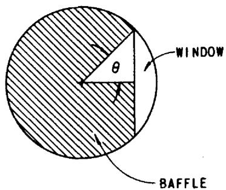

PERCL The ratio of the window area to the total cross-sectional area at the baffle, based on THEtAL.

THETAU The maximum value of the angle THETA. The value of 1.5707 corresponds to $\theta = 90^{\circ}$ .

PERCU The ratio of the window area to the total cross-sectional area at the baffle, based on THETAU.

NEW The value of THEA based on the iteration scheme.

PNEW The ratio of the window area to the total cross-sectional area at the baffle, based on NEW.

EPNEW The absolute difference between the desired fractional window cut (PW) and the calculated fractional window cut (PNEW).

THETAC The calculated value of THETA that gives the desired value of the fractional window cut.

G Mass velocity (density times flow speed) for the cold fluid (steam).

REG Reynolds number for the cold fluid (steam) based on an estimate of the viscosity of the cold fluid.

CFC Calculated friction factor for the cold fluid (steam).

DIFA Absolute difference between the calculated and guessed values of the friction factor for the cold fluid (steam).

NUMT Number of tubes required.

BNUMT Floating point conversion value of the integer NUMT.

DS Inside diameter of the shell of the heat exchanger.

XBAR

Distance from the inside surface of the shell to the centroid of the window area at a baffle.

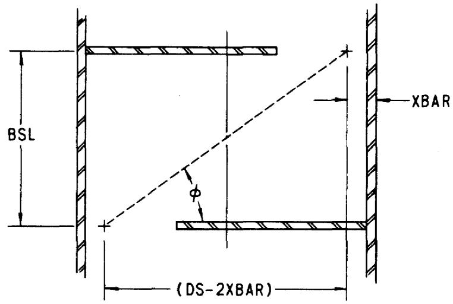

BRL1

Tangent of the angle $\phi$ , as illustrated in sketch above.

GBRL

(0.77/BRL10 $^{138}$ ) This factor is a multiplicative correction factor developed to modify Bergelin's correlation in cases where the baffle spacing becomes large relative to the diameter of the shell. In such cases, the flow in the middle of the baffle region is essentially parallel.

AW

Window area at a baffle.

AX

Baffle area (total cross-sectional area minus window area).

AXC

A value of AX calculated from a value of THETA.

DIFB

Absolute difference between AXC and AX.

THETA2

A value of the angle THETA based on the value of AXC.

AXC2

A value of AXC based on the value of THETA2.

GC

Mass velocity (density times flow speed) for the cold fluid (steam) based on the current number of tubes in the exchanger (NUMT).

XB

Distance from the axial center line to the window edge of the baffle.

CNB

Number of rows of tubes from the window edge of one baffle to the window edge of the following baffle.

XH

Inside radius of the shell minus XB.

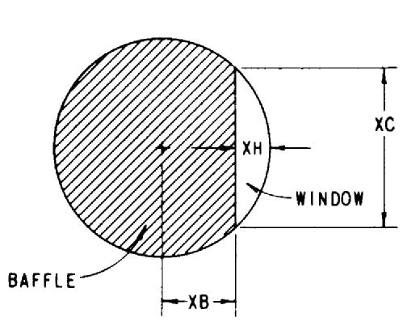

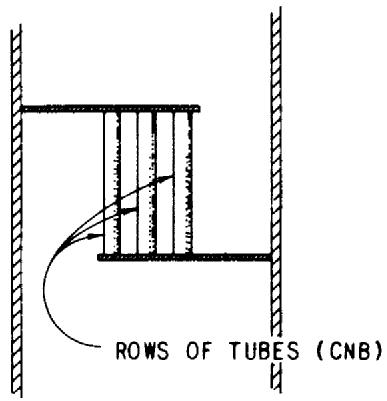

CNW

Number of rows of tubes in one window.

XC

Chord length of the window edge of the baffle.

PCFB

Fraction of the distance between tube centers that is free for cross flow.

SBK

Average free area in cross flow per unit baffle spacing.

SW

Free hot-fluid (salt) area in the window region.

SDPT

Summed pressure drop on the tube side.

SDPS

Summed pressure drop on the shell side.

MS

A counter which has a value of 1 for the first calculation in each baffle space and a value of zero for the rest of the incremental calculations in the baffle space.

SX

Summed tube length.

SBS

Summed baffle space length.

TC(I)

Temperature of the cold fluid (steam) at the beginning of the I-th increment.

TH(I)

Temperature of the hot fluid (salt) at the beginning of the I-th increment.

RWK

A factor used to calculate the heat transfer resistance of the tube wall material. It can be thought of as an effective thickness of the tube wall. If

$$
R _ {W} = \frac {d _ {o}}{2 k} \left(\ln \frac {d _ {o}}{d _ {i}}\right),
$$

where

$$
R _ {W} = \text {t h e r m a l}
$$

$$
d _ {o} = \text {o u t s i d e d i a m e t e r o f t u b e},
$$

$$
k = \text {t h e r m a l}
$$

$$
d _ {i} = \text {i n s i d e d i a m e t e r o f t u b e}; \text {t h e n}
$$

$$
R W K = R _ {W} k.
$$

PC(I) Pressure of the cold fluid (steam) at the beginning of the I-th increment.

HC(I) Enthalpy of the cold fluid (steam) at the beginning of the I-th increment.

BN Floating point conversion of the integer N (c.f. input variables).

QX The amount of heat to be transferred in each increment.

DECT The change in temperature per increment of the hot fluid (salt).

DECH The change in enthalpy per increment of the cold fluid (steam).

I Subscript index which refers to the increments.

K Subscript index which refers to the baffle spaces.

SB Total cross-flow area for the hot fluid (salt) in a given baffle space.

TCON An estimate of the bulk temperature of the hot fluid (salt) in a baffle space.

DENH Density of the hot fluid (salt) based on the temperature (TCON).

VISH Viscosity of the hot fluid (salt) based on the temperature (TCON).

DHOT(K) Density of the hot fluid (salt) for the K-th baffle space.

VHOT(K) Viscosity of the hot fluid (salt) for the K-th baffle space.

CON1 The Prandtl number for the hot fluid (salt) raised to the 2/3 power.

GM Mass velocity (density times flow speed) of the hot fluid (salt) in cross flow.

RECB The cross-flow Reynolds number for the hot fluid (salt).

HJB The effect of the cross-flow Reynolds number on the shell-side convective heat transfer coefficient.

HB The shell-side convective heat transfer coefficient for cross flow.

GW Mass velocity (density times flow speed) of the hot fluid (salt) in parallel flow.

GS A kind of root-mean-square mass velocity for the hot fluid (salt). It is used in the Bergelin correlations.

RECW The parallel-flow Reynolds number for the hot fluid (salt).

HJW The effect of the parallel-flow Reynolds number on the shell-side convective heat transfer coefficient.

HW The shell-side convective heat transfer coefficient for parallel flow.

HO The total shell-side convective heat transfer coefficient.

RO(K) The film resistance to heat transfer on the outside of the tubes for the K-th baffle space.

TH(I+1) Temperature of the hot fluid (salt) at the end of the I-th increment (i.e. the beginning of the I+1-th increment).

DELPP Tube-side change in pressure for a given increment.

HCG An estimate of the enthalpy of the cold fluid (steam) at the end of the I-th increment based on the estimated pressure and temperature at the end of the I-th increment.

EH The absolute difference between HCG and the HC(I+1) which has been calculated based on the heat transferred per increment (QX/WC).

TRIAL A trial value of $\mathrm{TC(I + l)}$ to be used for iteration.

HRIAL A trial value of $\mathrm{HC(I + l)}$ to be used for iteration.

TNEXT A value of $\mathrm{TC(I + 1)}$ which is determined by the iteration scheme (i.e. a new estimate of $\mathrm{TC(I + 1)}$ to start the next iteration).

Denom The antilog of the denominator of the defining equation for a logarithmic mean temperature difference.

TDEN The absolute difference between DENOM and unity.

DELTLM Logarithmic mean temperature difference.

TM Average temperature of the cold fluid (steam) in the I-th increment.

PM Average pressure of the cold fluid (steam) in the I-th increment.

SPVB Specific volume of the cold fluid based on the average temperature and pressure, TM and PM, in the increment.

HFB Enthalpy of the cold fluid (steam) based on the average temperature and pressure, TM and PM, in the increment.

VISB Viscosity of the cold fluid (steam) based on the average temperature and pressure, TM and PM, in the increment.

TW Temperature of the wall material in the increment.

TCW Thermal conductivity of the wall material in the increment.

RW(I) Thermal resistance of the wall material in the I-th increment.

DTFM Difference between temperature of inside wall and temperature of bulk cold fluid (steam) for the increment.

TMS Mean temperature of the tube wall surface in the increment.

SPVI Specific volume of the cold fluid (steam) based on the average pressure and mean tube-wall surface temperature, PM and TMS, in the increment.

HFI Enthalpy of the cold fluid (steam) based on the average pressure and mean tube-wall surface temperature, PM and TMS, in the increment.

TCFI Thermal conductivity of the cold fluid (steam) based on the average pressure and mean tube-wall surface temperature, PM and TMS, in the increment.

VISFI Viscosity of the cold fluid (steam) based on the average pressure and mean tube-wall surface temperature, PM and TMS, in the increment.

CRE Reynolds number of the cold fluid (steam), based on the inside tube wall conditions, raised to the 0.923 power.

CPR Prandtl number of the cold fluid, based on inside tube wall conditions and a fictitious specific heat, raised to the 0.613 power. The fictitious specific heat is defined as

$$
\frac {\mathrm {H} _ {i} - \mathrm {H} _ {b}}{\mathrm {T} _ {i} - \mathrm {T} _ {b}}
$$

where H is enthalpy, T is temperature and the subscripts "i" and "b" refer to inside tube surface and bulk cold fluid (steam), respectively. This definition of specific heat is necessary since specific heat as normally defined is indeterminant at the critical point, while enthalpy, although discontinuous at the critical point, is not indeterminant.

CSV The ratio of the bulk specific heat of the cold fluid (steam) to the specific heat of the cold fluid evaluated at inside tube-wall conditions raised to the 0.231 power.

HI Convective heat transfer coefficient over the increment for the inside surface of the tube wall.

RI(I) The thermal resistance of the convective film on the inside surface of the tubes, for the I-th increment, adjusted to the outside diameter of the tube.

RT(I) The total thermal resistance between the hot (salt) and cold (steam) fluids for the I-th increment.

DTFMC The temperature drop across the inside tube wall convective film for the increment.

DTFM2 Arithmetic average of DTFM and DTFMC.

TMS2 New estimate of the mean tube-wall surface temperature based on DTFM2.

# SPVI2

New estimate of the specific volume of the cold fluid (steam) based on average pressure (PM) and the new estimate of the mean tube-wall surface temperature (TMS2) for the increment.

# HFT2

New estimate of the enthalpy of the cold fluid (steam) based on the average pressure (PM) and the new estimate of the mean tube-wall surface temperature (TMS2) for the increment.

# TCF12

New estimate of the thermal conductivity of the cold fluid (steam) based on the average pressure (PM) and the new estimate of the mean tube-wall surface temperature (TMS2) for the increment.

# VISFI2

New estimate of the viscosity of the cold fluid (steam) based on the average pressure (PM) and the new estimate of the mean tube-wall surface temperature (TMS2) for the increment.

# CRE2

New estimate of CRE based on VISFI2.

# CPR2

New estimate of CPR based on HFI2, TMS2, VISFI2, and TCFI2.

# CSV2

New estimate of CSV based on SPVI2.

# H2I

New estimate of HI based on TCFI2, CRE2, CPR2, and CSV2.

# R2I

New estimate of RI(I) based on H2I.

# R2T

New estimate of RT(I) based on R2I.

# DTFMC2

New estimate of DTFMC based on R2I and R2T.

# SLOPE

A ratio of two differences between various estimates of the temperature drop across the inside tube wall convective film for the increment. This is used to make a new estimate of DTFM in order to continue the iteration process.

# U(I)

Overall heat transfer coefficient for the I-th increment based on the outside diameter of the tube.

# X(I)

Tube length in the I-th increment.

# RE

Reynolds number for the cold fluid (steam) based on the bulk viscosity (VISB) of the increment.

# CFI

Fanning friction factor for the cold fluid (steam) for the increment.

# DELP(1)

The pressure drop for the cold fluid (steam) in the I-th increment.

# DIFC

The difference between two consecutive values of the pressure drop for the cold fluid in the I-th increment as determined by consecutive passes through the iteration loop.

# IBK(K)

The value of the index I at the beginning of the first increment that is totally contained within the K-th baffle space.

ALPHA Coefficient of thermal expansion for the tube wall material $(\mathbf{x}10^{6})$

ETW Modulus of elasticity for the tube wall material (x $10^{-6}$ ).

CON2, CON3 Factors in the expression which calculate the stress components in the tube wall.

B, SL Constants in the expression given in Section III of the ASME Boiler and Pressure Vessel Code for calculating the allowable thermal stress components.

CON4 Term for the allowable thermal stress components given in Section III of the ASME Boiler and Pressure Vessel Code.

TWALL(K) Temperature of tube wall material for the K-th baffle space.

DELTWA(K) Allowable temperature difference across the tube wall for the K-th baffle space based on allowable thermal stresses.

DELTW(K) Temperature difference across the tube wall for the K-th baffle space.

BWN Factor used in shell-side pressure drop calculations. The factor takes the value 0.5 if the increment is at either end of the exchanger, and it takes the value of unity for all other increment positions.

DELPSB Shell-side pressure drop in the baffle space area.

DELPSW Shell-side pressure drop in the window area.

DELPS(K) Total shell-side pressure drop for the K-th baffle space.

EDPT Absolute difference between the total calculated tube-side pressure drop and the allowable total tube-side pressure drop.

EDPS Absolute difference between the total calculated shell-side pressure drop and the allowable total shell-side pressure drop.

J, JN, JNC Counters to put the baffle space information out in groups of 50 per page.

NBS Total number of baffle spaces.

IN, INC Counters to put the increment information out in groups of 50 per page.

RO(I) The film resistance to heat transfer on the outside of the tubes for the I-th increment.

AREAX Total heat transfer area based on total tube length.

UEQX Overall heat transfer coefficient based on total tube length.

AREAB Total heat transfer area based on total baffle space length.

UEQB Overall heat transfer coefficient based on total baffle space length.

# Subroutines

There are ten subroutines in the SUPEX computer program. The terms used for each of these subroutines are listed below with a brief description of the purpose of each subroutine.

RITE1 Writes out the input information.

RITE2 Writes out definitions of the various columns in the table of output for each baffle space.

RITE3 Writes out definitions of the various columns in the table of output for each increment.

RITE4 Writes out information concerning the average or total properties for the entire exchanger.

VISCOS(T, P, ETAP) Calculates the viscosity of the cold fluid (steam) for a given temperature and pressure.

CONDT(T, P, COND)Calculates the thermal conductivity of the cold fluid (steam) for a given temperature and pressure.

SVH(N,P,T, SVOL, HPT) Calls the subroutine TIPUT when $N = 1$ or calls subroutines SPECV and H when $N = 2$ .

SPECV(ANS)Calculates, using an interpolation of input data, the specific volume of the cold fluid (steam).

H(ANS) Calculates, using an interpolation of input data, the specific enthalpy of the cold fluid (steam).

TIPUT Reads in an array of values of specific volume and specific enthalpy as functions of temperature and pressure.

\*\*\* THE FOLLOWING IS THE INPUT INFORMATION FOR THIS PROBLEM $\bullet \bullet \bullet$

OUTSIDE DIAMETER OF TUBES (INCHES) = 0.500

TUBE WALL THICKNESS (INCHES) = 0.0770

TUBE PITCH (INCHES) = 0.8750

NUMBER OF INCREMENTS INTO WHICH THE EXCHANGER IS DIVIDED= 100

INLET TEMPERATURE OF HOT FLUID $(\mathsf{F}) = 1150.0$

OUTLET TEMPERATURE OF HOT FLUID $(F) =$ 850.0

INLET TEMPERATURE OF COLD FLUID $(F) =$ 700.0

OUTLET TEMPERATURE OF COLD FLUID (F) = 1CO0.0

OUTLETPRESSOFCOLDFLUID $(PSI) = 3600.0$

ALLOWABLE TOTAL PRESSURE DROP ON TUBE SIDE (PSI) = 150.0

ALLOWABLE TOTAL PRESSURE DROP ON SHELL SIDE (PSI) = 60.0

MASS FLOW RATE OF COLD FLUID (LB/HR) = 6.330E 05

MASS FLOW RATE OF HOT FLUID (LB/HR) = 3.820E 06

TOTAL HEAT TRANSFER RATE (BTU/HR) = 4.12CE 08

SPECIFIC HEAT CF HOT FLUID (BTU/LB-F) = C.360

THERMAL CONDUCTIVITY OF HOT FLUID (BTU/HR-FT-F) = 0.240

FRACTIONAL WINDOW CUT= 0.40

BY-PASS LEAKAGE FACTOR FOR PRESSURE= 0.520

BY-PASS LEAKAGE FACTOR FOR HEAT TRANSFER= 0.800

ESTIMATE OF THE NUMBER OF BAFFLE SPACES REQUIRED= 18

ESTIMATE OF THE LENGTH OF A BAFFLE SPACE(FT) = 3.00

ESTIMATE OF THE TOTAL TUBE LENGTH(FT) = €5.00

J BAFFLE SPACE NUMBER

1ST-1 INCREMENT NUMBER OF FIRST INCREMENT WHICH LIES COMPLETELY IN BAFFLE SPACE J

DEL-T CALCULATED TEMPERATURE DROP ACROSS TUBE WALL (F)

DEL-T-W-A ALLOWABLE TEMPERATURE DROP ACROSS TUBE WALL BASED ON ALLOWABLE STRESS (F)

T-BALL WALL MATERIAL TEMPERATURE (F)

DELP-S CALCULATED SHELL PRESSURE DROP FOR THE BAFFLE SPACE (PSI)

DENS-H MEAN DENSITY OF THE HOT FLUID FOR THE BAFFLE SPACE (LB/FT3)

VISC-H MEAN VISCOSITY OF THE HOT FLUID FOR THE BAFFLE SPACE (LB/FT-HR)

<table><tr><td>J</td><td>IST-I</td><td>DEL-T-W</td><td>DEL-T-W-A</td><td>T-WALL</td><td>DELP-S</td><td>DENS-H</td><td>VISC-H</td></tr><tr><td>1</td><td>1</td><td>53.05</td><td>90.73</td><td>1061.5</td><td>1.785</td><td>113.2</td><td>2.630</td></tr><tr><td>2</td><td>5</td><td>61.14</td><td>106.37</td><td>1036.8</td><td>3.391</td><td>113.5</td><td>2.681</td></tr><tr><td>3</td><td>10</td><td>70.73</td><td>121.20</td><td>1007.0</td><td>3.380</td><td>113.9</td><td>2.746</td></tr><tr><td>4</td><td>15</td><td>78.72</td><td>124.90</td><td>979.9</td><td>3.369</td><td>114.3</td><td>2.815</td></tr><tr><td>5</td><td>20</td><td>86.70</td><td>128.62</td><td>953.0</td><td>3.358</td><td>114.6</td><td>2.886</td></tr><tr><td>6</td><td>26</td><td>94.22</td><td>132.70</td><td>923.9</td><td>3.345</td><td>115.1</td><td>2.976</td></tr><tr><td>7</td><td>32</td><td>100.01</td><td>136.45</td><td>897.4</td><td>3.332</td><td>115.5</td><td>3.071</td></tr><tr><td>8</td><td>38</td><td>104.06</td><td>139.87</td><td>873.5</td><td>3.320</td><td>116.0</td><td>3.172</td></tr><tr><td>9</td><td>44</td><td>106.05</td><td>142.89</td><td>852.6</td><td>3.307</td><td>116.4</td><td>3.278</td></tr><tr><td>10</td><td>51</td><td>105.97</td><td>145.94</td><td>831.8</td><td>3.292</td><td>116.9</td><td>3.411</td></tr><tr><td>11</td><td>57</td><td>103.91</td><td>148.16</td><td>816.8</td><td>3.280</td><td>117.4</td><td>3.531</td></tr><tr><td>12</td><td>63</td><td>100.40</td><td>150.07</td><td>803.9</td><td>3.268</td><td>117.8</td><td>3.660</td></tr><tr><td>13</td><td>69</td><td>95.38</td><td>151.64</td><td>793.4</td><td>3.255</td><td>118.3</td><td>3.796</td></tr><tr><td>14</td><td>74</td><td>90.69</td><td>152.83</td><td>785.5</td><td>3.245</td><td>118.6</td><td>3.917</td></tr><tr><td>15</td><td>79</td><td>85.40</td><td>153.88</td><td>778.5</td><td>3.235</td><td>119.0</td><td>4.044</td></tr><tr><td>16</td><td>84</td><td>80.07</td><td>154.92</td><td>771.7</td><td>3.225</td><td>119.4</td><td>4.178</td></tr><tr><td>17</td><td>89</td><td>74.71</td><td>155.94</td><td>765.0</td><td>3.215</td><td>119.7</td><td>4.320</td></tr><tr><td>18</td><td>93</td><td>70.78</td><td>156.83</td><td>759.1</td><td>3.207</td><td>120.0</td><td>4.439</td></tr><tr><td>19</td><td>97</td><td>67.27</td><td>157.81</td><td>752.7</td><td>3.199</td><td>120.3</td><td>4.564</td></tr></table>

I INCREMENT NUMBER

LENGTH TUBE LENGTH FOR THE INCREMENT (FEET)

T-HOT TEMPERATURE OF THE HOT FLUID (F)

T-COLD TEMPERATURE OF THE COLD FLUID (F)

P-COLD PRESSURE OF THE COLD FLUID (PSI)

DELP-C TUBE PRESSURE DRCP FOR THE INIncrement (PSI)

RES-IN THERMAL RESISTANCE OF THE INSIDE FILM FOR THE INIncrement (HR-F/BTU)

RES-WALL THERMAL RESISTANCE OF THE WALL MATERIAL FOR THE INIncrement (HR-F/BTU)

RES-OUT THERMAL RESISTANCE OF THE OUTSIDE FILM FOR THE BAFFLE SPACE IN WHICH THE INIncrement LIES (HR-F/BTU)

RES-TOT TOTAL THERMAL RESISTANCE BETWEEN HOT & COLD FLUIDS FOR THE INGREMENT (HR-F/BTU)

<table><tr><td>I</td><td>LENGTH</td><td>T-HOT</td><td>T-COLD</td><td>P-COLD</td><td>DELP-C</td><td>RES-IN</td><td>RES-WALL</td><td>RES-OUT</td><td>RES-TOT</td></tr><tr><td>1</td><td>1.076</td><td>1150.0</td><td>1000.0</td><td>3600.0</td><td>4.390</td><td>0.000476</td><td>0.000721</td><td>0.000842</td><td>0.002039</td></tr><tr><td>2</td><td>1.038</td><td>1147.0</td><td>993.5</td><td>3604.4</td><td>4.173</td><td>0.000473</td><td>0.000724</td><td>0.000842</td><td>0.002039</td></tr><tr><td>3</td><td>1.002</td><td>1144.0</td><td>982.9</td><td>3608.5</td><td>3.979</td><td>0.000469</td><td>0.000727</td><td>0.000842</td><td>0.002039</td></tr><tr><td>4</td><td>0.975</td><td>1141.0</td><td>976.4</td><td>3612.5</td><td>3.821</td><td>0.000464</td><td>0.000730</td><td>0.000842</td><td>0.002037</td></tr><tr><td>5</td><td>0.951</td><td>1138.0</td><td>967.9</td><td>3616.3</td><td>3.679</td><td>0.000460</td><td>0.000733</td><td>0.000847</td><td>0.002039</td></tr><tr><td>6</td><td>0.924</td><td>1135.0</td><td>961.4</td><td>3620.0</td><td>3.528</td><td>0.000455</td><td>0.000736</td><td>0.000847</td><td>0.002038</td></tr><tr><td>7</td><td>0.899</td><td>1132.0</td><td>952.4</td><td>3623.5</td><td>3.385</td><td>0.000451</td><td>0.000739</td><td>0.000847</td><td>0.002036</td></tr><tr><td>8</td><td>0.882</td><td>1129.0</td><td>945.9</td><td>3626.9</td><td>3.279</td><td>0.000447</td><td>0.000742</td><td>0.000847</td><td>0.002036</td></tr><tr><td>9</td><td>0.859</td><td>1126.0</td><td>939.4</td><td>3630.2</td><td>3.147</td><td>0.000442</td><td>0.000745</td><td>0.000847</td><td>0.002034</td></tr><tr><td>10</td><td>0.839</td><td>1123.0</td><td>930.3</td><td>3633.3</td><td>3.030</td><td>0.000438</td><td>0.000748</td><td>0.000853</td><td>0.002038</td></tr><tr><td>11</td><td>0.824</td><td>1120.0</td><td>923.8</td><td>3636.4</td><td>2.937</td><td>0.000434</td><td>0.000751</td><td>0.000853</td><td>0.002037</td></tr><tr><td>12</td><td>0.809</td><td>1117.0</td><td>917.3</td><td>3639.3</td><td>2.845</td><td>0.000429</td><td>0.000753</td><td>0.000853</td><td>0.002035</td></tr><tr><td>13</td><td>0.794</td><td>1114.0</td><td>910.8</td><td>3642.1</td><td>2.756</td><td>0.000424</td><td>0.000756</td><td>0.000853</td><td>0.002033</td></tr><tr><td>14</td><td>0.780</td><td>1111.1</td><td>904.3</td><td>3644.9</td><td>2.670</td><td>0.000420</td><td>0.000759</td><td>0.000853</td><td>0.002031</td></tr><tr><td>15</td><td>0.768</td><td>1108.1</td><td>897.8</td><td>3647.6</td><td>2.592</td><td>0.000414</td><td>0.000761</td><td>0.000859</td><td>0.002034</td></tr><tr><td>16</td><td>0.755</td><td>1105.1</td><td>891.3</td><td>3650.2</td><td>2.510</td><td>0.000409</td><td>0.000764</td><td>0.000859</td><td>0.002032</td></tr><tr><td>17</td><td>0.742</td><td>1102.1</td><td>884.7</td><td>3652.7</td><td>2.430</td><td>0.000404</td><td>0.000767</td><td>0.000859</td><td>0.002030</td></tr><tr><td>18</td><td>0.729</td><td>1099.1</td><td>878.2</td><td>3655.1</td><td>2.350</td><td>0.000398</td><td>0.000770</td><td>0.000859</td><td>0.002026</td></tr><tr><td>19</td><td>0.718</td><td>1096.1</td><td>871.7</td><td>3657.5</td><td>2.282</td><td>0.000392</td><td>0.000772</td><td>0.000859</td><td>0.002023</td></tr><tr><td>20</td><td>0.710</td><td>1093.1</td><td>866.3</td><td>3659.7</td><td>2.223</td><td>0.000387</td><td>0.000775</td><td>0.000865</td><td>0.002027</td></tr><tr><td>21</td><td>0.701</td><td>1090.1</td><td>859.8</td><td>3662.0</td><td>2.161</td><td>0.000381</td><td>0.000778</td><td>0.000865</td><td>0.002024</td></tr><tr><td>22</td><td>0.694</td><td>1087.1</td><td>855.0</td><td>3664.1</td><td>2.109</td><td>0.000376</td><td>0.000780</td><td>0.000865</td><td>0.002021</td></tr><tr><td>23</td><td>0.686</td><td>1084.1</td><td>849.8</td><td>3666.2</td><td>2.054</td><td>0.000371</td><td>0.000782</td><td>0.000865</td><td>0.002018</td></tr><tr><td>24</td><td>0.679</td><td>1081.1</td><td>844.5</td><td>3668.3</td><td>2.002</td><td>0.000366</td><td>0.000785</td><td>0.000865</td><td>0.002015</td></tr><tr><td>25</td><td>0.672</td><td>1078.1</td><td>839.3</td><td>3670.3</td><td>1.950</td><td>0.000360</td><td>0.000787</td><td>0.000865</td><td>0.002011</td></tr><tr><td>26</td><td>0.668</td><td>1075.1</td><td>834.5</td><td>3672.2</td><td>1.909</td><td>0.000354</td><td>0.000789</td><td>0.000872</td><td>0.002016</td></tr><tr><td>27</td><td>0.662</td><td>1072.1</td><td>829.7</td><td>3674.1</td><td>1.862</td><td>0.000349</td><td>0.000792</td><td>0.000872</td><td>0.002012</td></tr><tr><td>28</td><td>0.657</td><td>1069.1</td><td>824.9</td><td>3676.0</td><td>1.818</td><td>0.000344</td><td>0.000794</td><td>0.000872</td><td>0.002010</td></tr><tr><td>29</td><td>0.652</td><td>1066.1</td><td>820.2</td><td>3677.8</td><td>1.775</td><td>0.000338</td><td>0.000796</td><td>0.000872</td><td>0.002006</td></tr><tr><td>30</td><td>0.647</td><td>1063.1</td><td>815.9</td><td>3679.6</td><td>1.734</td><td>0.000332</td><td>0.000798</td><td>0.000872</td><td>0.002002</td></tr><tr><td>31</td><td>0.643</td><td>1060.1</td><td>811.7</td><td>3681.3</td><td>1.694</td><td>0.000325</td><td>0.000800</td><td>0.000872</td><td>0.001998</td></tr><tr><td>32</td><td>0.641</td><td>1057.1</td><td>807.6</td><td>3683.0</td><td>1.662</td><td>0.000319</td><td>0.000802</td><td>0.000880</td><td>0.002002</td></tr><tr><td>33</td><td>0.637</td><td>1054.1</td><td>803.4</td><td>3684.7</td><td>1.626</td><td>0.00C314</td><td>0.000804</td><td>0.000880</td><td>0.001998</td></tr><tr><td>34</td><td>0.634</td><td>1051.1</td><td>799.5</td><td>3686.3</td><td>1.590</td><td>0.000309</td><td>0.000806</td><td>0.000880</td><td>0.001995</td></tr><tr><td>35</td><td>0.631</td><td>1048.1</td><td>795.7</td><td>3687.9</td><td>1.556</td><td>0.00C303</td><td>C.000808</td><td>0.000880</td><td>0.001991</td></tr><tr><td>36</td><td>0.628</td><td>1045.1</td><td>792.1</td><td>3689.5</td><td>1.523</td><td>0.000297</td><td>0.000810</td><td>0.000880</td><td>0.001987</td></tr><tr><td>37</td><td>0.626</td><td>1042.1</td><td>788.6</td><td>3691.0</td><td>1.490</td><td>0.000290</td><td>0.000812</td><td>0.000880</td><td>0.001982</td></tr><tr><td>38</td><td>0.626</td><td>1039.1</td><td>785.2</td><td>3692.5</td><td>1.464</td><td>0.00C284</td><td>0.000814</td><td>0.000888</td><td>0.001986</td></tr><tr><td>39</td><td>0.625</td><td>1036.1</td><td>781.9</td><td>3693.9</td><td>1.436</td><td>0.00C280</td><td>0.000815</td><td>0.000888</td><td>0.001983</td></tr><tr><td>40</td><td>0.623</td><td>1033.2</td><td>778.9</td><td>3695.4</td><td>1.407</td><td>C.CC273</td><td>0.000817</td><td>0.000888</td><td>0.001979</td></tr><tr><td>41</td><td>0.622</td><td>1030.2</td><td>775.9</td><td>3696.8</td><td>1.379</td><td>C.CC267</td><td>0.000819</td><td>0.000888</td><td>0.001974</td></tr><tr><td>42</td><td>C.621</td><td>1027.2</td><td>773.0</td><td>3698.2</td><td>1.353</td><td>C.CC261</td><td>0.00C820</td><td>0.00C888</td><td>0.001969</td></tr><tr><td>43</td><td>0.620</td><td>1024.2</td><td>770.3</td><td>3699.5</td><td>1.328</td><td>0.00C254</td><td>0.00C822</td><td>0.00C888</td><td>0.001964</td></tr><tr><td>44</td><td>0.622</td><td>1021.2</td><td>767.8</td><td>3700.9</td><td>1.307</td><td>0.00C247</td><td>0.00C823</td><td>0.00C897</td><td>0.001967</td></tr><tr><td>45</td><td>0.622</td><td>1018.2</td><td>765.2</td><td>3702.2</td><td>1.282</td><td>0.00C241</td><td>0.00C825</td><td>0.00C897</td><td>0.001963</td></tr><tr><td>46</td><td>0.623</td><td>1015.2</td><td>762.8</td><td>3703.4</td><td>1.260</td><td>0.00C236</td><td>0.00C826</td><td>0.00C897</td><td>0.001958</td></tr><tr><td>47</td><td>0.623</td><td>1012.2</td><td>760.6</td><td>3704.7</td><td>1.239</td><td>0.00C230</td><td>0.00C827</td><td>0.00C897</td><td>0.001954</td></tr><tr><td>48</td><td>0.624</td><td>1009.2</td><td>758.5</td><td>3705.9</td><td>1.215</td><td>0.00C223</td><td>C.CC829</td><td>0.00C897</td><td>0.001949</td></tr><tr><td>49</td><td>0.624</td><td>1006.2</td><td>756.4</td><td>3707.2</td><td>1.193</td><td>0.00C216</td><td>0.00C830</td><td>C.CC897</td><td>0.001943</td></tr><tr><td>50</td><td>0.625</td><td>1003.2</td><td>754.4</td><td>3708.3</td><td>1.173</td><td>0.00C210</td><td>0.00C831</td><td>C.CC897</td><td>0.001938</td></tr><tr><td>51</td><td>0.630</td><td>1000.2</td><td>752.7</td><td>3709.5</td><td>1.159</td><td>0.00C205</td><td>0.00C832</td><td>0.00C907</td><td>0.001944</td></tr><tr><td>52</td><td>0.632</td><td>997.2</td><td>750.7</td><td>3710.7</td><td>1.142</td><td>0.00C199</td><td>0.00C834</td><td>0.00C907</td><td>0.001940</td></tr><tr><td>53</td><td>C.635</td><td>994.2</td><td>749.3</td><td>3711.8</td><td>1.123</td><td>0.00C193</td><td>0.00C835</td><td>0.00C907</td><td>0.001935</td></tr><tr><td>54</td><td>C.637</td><td>991.2</td><td>747.9</td><td>3712.9</td><td>1.104</td><td>0.00C186</td><td>0.00C836</td><td>0.00C907</td><td>0.001928</td></tr><tr><td>55</td><td>C.639</td><td>988.2</td><td>746.5</td><td>3714.0</td><td>1.086</td><td>0.00C179</td><td>0.00C837</td><td>0.00C907</td><td>0.001923</td></tr><tr><td>56</td><td>C.642</td><td>985.2</td><td>745.1</td><td>3715.1</td><td>1.071</td><td>0.00C174</td><td>0.00C838</td><td>0.00C907</td><td>0.001918</td></tr><tr><td>57</td><td>C.649</td><td>982.2</td><td>744.0</td><td>3716.2</td><td>1.061</td><td>0.00C168</td><td>0.00C839</td><td>0.00C916</td><td>0.001923</td></tr><tr><td>58</td><td>C.652</td><td>979.2</td><td>742.7</td><td>3717.3</td><td>1.044</td><td>0.00C163</td><td>0.00C840</td><td>0.00C916</td><td>0.001918</td></tr><tr><td>59</td><td>C.655</td><td>976.2</td><td>741.4</td><td>3718.3</td><td>1.027</td><td>0.00C157</td><td>0.00C841</td><td>0.00C916</td><td>0.001914</td></tr><tr><td>60</td><td>C.659</td><td>973.2</td><td>740.0</td><td>3719.3</td><td>1.010</td><td>0.00C152</td><td>0.00C841</td><td>0.00C916</td><td>0.001909</td></tr><tr><td>61</td><td>C.663</td><td>970.2</td><td>739.3</td><td>3720.3</td><td>0.995</td><td>0.00C145</td><td>C.CC842</td><td>C.CC916</td><td>0.001903</td></tr><tr><td>62</td><td>C.668</td><td>967.2</td><td>738.5</td><td>3721.3</td><td>0.982</td><td>0.00C139</td><td>C.CC843</td><td>C.CC916</td><td>0.001898</td></tr><tr><td>I</td><td>LENGTH</td><td>T-HOT</td><td>T-COLD</td><td>P-COLD</td><td>DELP-C</td><td>RES-IN</td><td>RES-WALL</td><td>RES-OUT</td><td>RES-TOT</td></tr><tr><td>63</td><td>C.677</td><td>964.2</td><td>737.8</td><td>3722.3</td><td>0.975</td><td>0.000134</td><td>0.000844</td><td>0.000925</td><td>0.001903</td></tr><tr><td>64</td><td>0.682</td><td>961.2</td><td>737.2</td><td>3723.3</td><td>0.963</td><td>0.000129</td><td>0.000844</td><td>0.000925</td><td>0.001898</td></tr><tr><td>65</td><td>0.687</td><td>958.3</td><td>736.5</td><td>3724.3</td><td>0.948</td><td>0.000123</td><td>0.000845</td><td>0.000925</td><td>0.001893</td></tr><tr><td>66</td><td>0.693</td><td>955.3</td><td>735.7</td><td>3725.2</td><td>0.935</td><td>0.000119</td><td>0.000846</td><td>0.000925</td><td>0.001890</td></tr><tr><td>67</td><td>0.699</td><td>952.3</td><td>735.0</td><td>3726.1</td><td>0.922</td><td>0.000115</td><td>0.000847</td><td>0.000925</td><td>0.001887</td></tr><tr><td>68</td><td>0.706</td><td>949.3</td><td>734.3</td><td>3727.1</td><td>0.909</td><td>0.000111</td><td>0.000847</td><td>0.000925</td><td>0.001884</td></tr><tr><td>69</td><td>0.716</td><td>946.3</td><td>733.7</td><td>3728.0</td><td>0.902</td><td>0.000107</td><td>0.000848</td><td>0.000935</td><td>0.001890</td></tr><tr><td>70</td><td>0.723</td><td>943.3</td><td>733.0</td><td>3728.9</td><td>0.889</td><td>0.000104</td><td>0.000849</td><td>0.000935</td><td>0.001888</td></tr><tr><td>71</td><td>0.730</td><td>940.3</td><td>732.3</td><td>3729.8</td><td>0.877</td><td>0.000101</td><td>0.000849</td><td>0.000935</td><td>0.C1886</td></tr><tr><td>72</td><td>0.738</td><td>937.3</td><td>731.6</td><td>3730.6</td><td>0.865</td><td>0.000099</td><td>0.000850</td><td>0.000935</td><td>0.001884</td></tr><tr><td>73</td><td>0.746</td><td>934.3</td><td>731.0</td><td>3731.5</td><td>0.853</td><td>0.000C96</td><td>0.000851</td><td>0.000935</td><td>0.001882</td></tr><tr><td>74</td><td>0.756</td><td>931.3</td><td>730.3</td><td>3732.4</td><td>0.845</td><td>0.00092</td><td>0.000852</td><td>0.000943</td><td>0.001887</td></tr><tr><td>75</td><td>0.765</td><td>928.3</td><td>729.7</td><td>3733.2</td><td>0.838</td><td>0.00CC91</td><td>0.000852</td><td>0.000943</td><td>0.001887</td></tr><tr><td>76</td><td>C.774</td><td>925.3</td><td>729.0</td><td>3734.1</td><td>0.831</td><td>0.000C90</td><td>C.000853</td><td>0.000943</td><td>0.001886</td></tr><tr><td>77</td><td>0.784</td><td>922.3</td><td>728.4</td><td>3734.9</td><td>0.826</td><td>0.000C89</td><td>0.000854</td><td>0.000943</td><td>0.001886</td></tr><tr><td>78</td><td>0.793</td><td>919.3</td><td>727.8</td><td>3735.7</td><td>0.821</td><td>0.000088</td><td>0.000854</td><td>0.000943</td><td>0.001885</td></tr><tr><td>79</td><td>C.807</td><td>916.3</td><td>727.2</td><td>3736.5</td><td>0.818</td><td>0.000C86</td><td>0.000855</td><td>0.000952</td><td>0.001894</td></tr><tr><td>80</td><td>0.817</td><td>913.3</td><td>726.5</td><td>3737.3</td><td>0.812</td><td>0.000C86</td><td>0.000856</td><td>0.000952</td><td>0.001894</td></tr><tr><td>81</td><td>C.828</td><td>910.3</td><td>725.9</td><td>3738.2</td><td>0.807</td><td>0.00085</td><td>0.000857</td><td>0.000952</td><td>0.001893</td></tr><tr><td>82</td><td>0.838</td><td>907.3</td><td>725.3</td><td>3739.0</td><td>0.802</td><td>0.00084</td><td>0.000857</td><td>0.000952</td><td>0.001893</td></tr><tr><td>83</td><td>0.849</td><td>904.3</td><td>724.7</td><td>3739.8</td><td>0.796</td><td>0.00083</td><td>0.000858</td><td>0.000952</td><td>0.001892</td></tr><tr><td>84</td><td>0.865</td><td>901.3</td><td>724.0</td><td>3740.6</td><td>0.794</td><td>0.00082</td><td>0.000859</td><td>0.000961</td><td>0.001901</td></tr><tr><td>85</td><td>0.876</td><td>898.3</td><td>723.4</td><td>3741.4</td><td>0.787</td><td>0.000C81</td><td>0.000859</td><td>0.000961</td><td>0.001901</td></tr><tr><td>86</td><td>0.888</td><td>895.3</td><td>722.7</td><td>3742.1</td><td>0.780</td><td>0.00080</td><td>0.000860</td><td>0.000961</td><td>0.001901</td></tr><tr><td>87</td><td>0.901</td><td>892.3</td><td>722.0</td><td>3742.9</td><td>0.774</td><td>0.00080</td><td>0.000861</td><td>0.000961</td><td>0.001902</td></tr><tr><td>88</td><td>0.913</td><td>889.3</td><td>721.4</td><td>3743.7</td><td>0.768</td><td>0.00C080</td><td>0.000862</td><td>0.000961</td><td>0.001902</td></tr><tr><td>89</td><td>0.931</td><td>886.3</td><td>720.7</td><td>3744.5</td><td>0.765</td><td>0.0C0C80</td><td>C.000862</td><td>0.000970</td><td>0.001912</td></tr><tr><td>90</td><td>0.944</td><td>883.3</td><td>720.1</td><td>3745.2</td><td>0.760</td><td>0.00C082</td><td>0.000863</td><td>0.000970</td><td>0.001915</td></tr><tr><td>91</td><td>0.956</td><td>880.4</td><td>718.6</td><td>3746.0</td><td>0.758</td><td>0.0C0C88</td><td>0.000865</td><td>0.000970</td><td>0.001922</td></tr><tr><td>92</td><td>0.968</td><td>877.4</td><td>717.1</td><td>3746.8</td><td>0.755</td><td>0.0C0C94</td><td>0.000866</td><td>0.000970</td><td>0.001929</td></tr><tr><td>93</td><td>0.985</td><td>874.4</td><td>715.6</td><td>3747.5</td><td>0.756</td><td>0.000100</td><td>0.000867</td><td>0.000978</td><td>0.001945</td></tr><tr><td>94</td><td>0.999</td><td>871.4</td><td>714.0</td><td>3748.3</td><td>0.755</td><td>0.000107</td><td>0.000868</td><td>0.000978</td><td>0.C1953</td></tr><tr><td>95</td><td>1.014</td><td>868.4</td><td>712.7</td><td>3749.0</td><td>0.754</td><td>0.000114</td><td>0.000869</td><td>0.000978</td><td>0.001961</td></tr><tr><td>96</td><td>1.027</td><td>865.4</td><td>711.2</td><td>3749.8</td><td>0.750</td><td>0.000122</td><td>0.000870</td><td>0.000978</td><td>0.001970</td></tr><tr><td>97</td><td>1.040</td><td>862.4</td><td>709.3</td><td>3750.5</td><td>0.750</td><td>0.000127</td><td>0.000872</td><td>0.000985</td><td>0.001984</td></tr><tr><td>98</td><td>1.049</td><td>859.4</td><td>706.9</td><td>3751.3</td><td>0.746</td><td>0.000134</td><td>0.000873</td><td>0.000985</td><td>0.001992</td></tr><tr><td>99</td><td>1.057</td><td>856.4</td><td>704.5</td><td>3752.0</td><td>0.742</td><td>0.000141</td><td>0.000875</td><td>0.000985</td><td>C:2001</td></tr><tr><td>100</td><td>1.066</td><td>853.4</td><td>702.0</td><td>3752.8</td><td>0.739</td><td>0.000149</td><td>0.000877</td><td>0.000985</td><td>0.00211</td></tr></table>

* * * THE FOLLOWING ARE AVERAGE OR TOTAL PROPERTIES FOR THE ENTIRE EXCHANGER * * *

TOTAL NUMBER OF TUBES= 393

TOTAL NUMBER OF BAFFLE SPACES= 19

LENGTH OF A BAFFLE SPACING(FT) = 3.980

INSIDE DIAMETER OF EXCHANGER SHELL (INCHES) = 18.21

TOTAL PRESSURE DROP IN TUBES (PSI) = 153.53

TGTAL PRESSURE DROP IN SHELL (PSI) = 61.01

LOG-MEAN DELTA-T (F) = 150.OC

TOTAL TUBE LENGTH (FEET) = 76.38

TOTAL HEAT TRANSFER AREA BASED ON TOTAL TUBE LENGTH (FT2) = 3929.3

OVERALL HEAT TRANSFER COEFFICIENT BASED ON TOTAL TUBE LENGTH (BTU/HR-FT2-F) = 699.02

TOTAL BAFFLE SPACE LENGTH (FEET) = 75.61

TOTAL HEAT TRANSFER AREA BASED ON TOTAL BAFFLE SPACE LENGTH (FT2) = 3889.9

OVERALL HEAT TRANSFER COEFFICIENT BASED ON TOTAL BAFFLE SPACE LENGTH (BTU/HR-FT2-F) = 706.10

A

$\therefore m = \frac{3}{11}$ ;

# Internal Distribution

1. J. L. Anderson   
2. C. F. Baes   
3. S.E.Beall   
4. M. Bender

38. M. I. Lundin   
39. H. G. MacPherson   
40. R.E. MacPherson   
41. H. E. McCoy   
42. H. A. McLain   
43. L. E. McNees   
44. J. R. McWherter   
45. A. S. Meyer   
46. R. J. Moore   
47. H. A. Nelms   
48. E. L. Nicholson   
49. A. M. Perry   
50. T. W. Pickel

5-9. C. E. Bettis

10. E. S. Bettis   
11. E. G. Bohlmann   
12. G. E. Boyd   
13. R. B. Briggs   
14. D. F. Cope (RDT Site Rep.)   
15. W. K. Crowley   
16. J. R. Distefano   
17. S. J. Ditto   
18. H. G. Duggan   
19. D. A. Dyslin   
20. W. P. Eatherly   
21. J. R. Engel   
22. D. E. Ferguson   
23. W. F. Ferguson   
24. L. M. Ferris   
25. F. C. Fitzpatrick   
26. W. K. Furlong   
27. C. H. Gabbard   
28. W.R.Gall   
29. W. R. Grimes   
30. A. G. Grindell   
31. P. N. Haubenreich   
32. R.E.Helms   
33. P. R. Kasten   
34. R. J. Kedl   
35. J. J. Keyes   
36. K. O. Laughon (RDT Site Rep.)   
37. G. H. Llewellyn

51-60. M. W. Rosenthal   
61. Dunlap Scott   
62. M. Siman-Tov   
63. W.C. Stoddart   
64. R.E.Thoma   
65. D. B. Trauger   
66. H. K. Walker   
67. G.M.Watson   
68. H. L. Watts   
69. J. R. Weir   
70. M. E. Whatley   
71. J. C. White   
72. W. R. Winsbro   
73. Gale Young   
74-75. Central Research Library   
76. Document Reference Section   
77. GE Division Library   
78-90. Laboratory Records Department   
91. Laboratory Records, ORNL R.C.   
92. ORNL Patent Office

# External Distribution

93. David Elias, USAEC, Division of Reactor Development and Technology, Washington, D. C. 20545.   
94. Ralph H. Jones, USAEC, Division of Reactor Development and Technology, Washington, D. C. 20545.   
95-96. T. W. McIntosh, USAEC, Division of Reactor Development and Technology, Washington, D. C. 20545.

97. M. Shaw, USAEC, Division of Reactor Development and Technology, Washington, D. C. 20545.   
98-99. Division of Technical Information Extension.   
100. Laboratory and University Division, USAEC, ORO.