# OAK RIDGE NATIONAL LABORATORY

operated by

UNION CARBIDE CORPORATION

NUCLEAR DIVISION

for the

U.S. ATOMIC ENERGY COMMISSION

LOCKHEED MARTIN ENERGY RESEARCH LIBRARIES

3445605140335

ORNL-TM-2823

143

FREQUENCY-RESPONSE TESTING OF THE MOLTEN-SALT REACTOR EXPERIMENT

(Thesis)

R.C.Steffy, Jr.

ROAK RIDGE NATIONAL LABORATORY

CENTRAL RESEARCH LIBRARY

DOCUMENT COLLECTION

LIBRARY LOAN COPY

DO NOT TRANSFER TO ANOTHER PERSON

If you wish someone else to see this

document, send in name with document

and the library will arrange a loan.

JCN-7964

13-3-67

Submitted to the Graduate Council of the University of Tennessee in partial fulfillment for the degree of Master of Science.

# LEGAL NOTICE

This report was prepared as an account of Government sponsored work. Neither the United States, nor the Commission, nor any person acting on behalf of the Commission:

A. Makes any warranty or representation, expressed or implied, with respect to the accuracy, completeness, or usefulness of the information contained in this report, or that the use of any information, apparatus, method, or process disclosed in this report may not infringe privately owned rights; or   
B. Assumes any liabilities with respect to the use of, or for damages resulting from the use of any information, apparatus, method, or process disclosed in this report.

As used in the above, "person acting on behalf of the Commission" includes any employee or contractor of the Commission, or employee of such contractor, to the extent that such employee or contractor of the Commission, or employee of such contractor prepares, disseminates, or provides access to, any information pursuant to his employment or contract with the Commission, or his employment with such contractor.

Contract No. W-7405-eng-26

REACTOR DIVISION

FREQUENCY-RESPONSE TESTING OF THE

MOLTEN-SALT REACTOR EXPERIMENT

R.C.Steffy，Jr.

Submitted to the Graduate Council of the University of Tennessee in partial fulfillment for the degree of Master of Science.

MARCH 1970

OAK RIDGE NATIONAL LABORATORY

Oak Ridge, Tennessee

operated by

UNION CARBIDE CORPORATION

for the

U.S. ATOMIC ENERGY COMMISSION

TABLE OF CONTENTS   

<table><tr><td></td><td>Page</td></tr><tr><td>LIST OF TABLES</td><td>iv</td></tr><tr><td>LIST OF FIGURES</td><td>v</td></tr><tr><td>ACKNOWLEDGEMENTS</td><td>viii</td></tr><tr><td>ABSTRACT</td><td>ix</td></tr><tr><td>I. INTRODUCTION</td><td>1</td></tr><tr><td>II. SYSTEM DESCRIPTION</td><td>3</td></tr><tr><td>Physical Description</td><td>3</td></tr><tr><td>Theoretical Predictions of Frequency Response</td><td>10</td></tr><tr><td>III. EXPERIMENTAL PROCEDURE</td><td>13</td></tr><tr><td>Test Patterns</td><td>13</td></tr><tr><td>Pseudorandom binary sequences</td><td>13</td></tr><tr><td>Pseudorandom ternary sequences</td><td>18</td></tr><tr><td>Choice of Pseudorandom sequence</td><td>20</td></tr><tr><td>Signal Generation</td><td>24</td></tr><tr><td>Rod-jog tests</td><td>25</td></tr><tr><td>Flux-demand tests</td><td>26</td></tr><tr><td>Rod-demand tests</td><td>30</td></tr><tr><td>Data Acquisition</td><td>32</td></tr><tr><td>Data Analysis Methods</td><td>34</td></tr><tr><td>Computing schemes</td><td>34</td></tr><tr><td>Comparison of data analysis methods</td><td>35</td></tr><tr><td>IV. EXPERIMENTAL RESULTS</td><td>51</td></tr><tr><td>235U Fuel Loading</td><td>51</td></tr><tr><td>Rod-jog tests</td><td>52</td></tr><tr><td>Flux-demand tests</td><td>57</td></tr><tr><td>233U Fuel Loading</td><td>76</td></tr><tr><td>Flux-demand tests</td><td>77</td></tr><tr><td>Rod-demand tests</td><td>94</td></tr><tr><td>V. CONCLUSIONS AND RECOMMENDATIONS</td><td>103</td></tr><tr><td>LIST OF REFERENCES</td><td>106</td></tr><tr><td>APPENDIX</td><td>110</td></tr></table>

# LIST OF TABLES

# TABLE

I. Composition of MSRE Fuel Salt 4   
II. Neutronic Characteristics of MSRE with $^{233}\mathrm{U}$ and $^{235}\mathrm{U}$ Fuel Salt at $1200^{\circ}\mathrm{F}$ . 6

III. Results of Different Analysis Techniques at 0.01649 rad/sec When Applied to Eight Periods of Data 40   
IV. Results of Different Analysis Techniques at 0.49474 rad/sec When Applied to Eight Periods of Data 41   
V. Results of Different Analysis Techniques at 0.98947 rad/sec When Applied to Eight Periods of Data 42   
VI. Results of Analysis at a Harmonic Frequency (0.3298 rad/sec) 44   
VII. Results of Analysis at a Non-Harmonic Frequency (0.3463 rad/sec). 45   
VIII. Pertinent Information Related to Each Test Performed for This Study 111

# LIST OF FIGURES

# FIGURE PAGE

1. Basic MSRE Flow Diagram 5   
2. Electromechanical Diagram of MSRE Control Rod Drive Train. 8   
3. MSRE Control-Rod Drive Unit Power Transmission Diagram.. 9   
4. Theoretical Frequency Response of $^{235}\mathrm{U}$ -Fueled MSRE for Several Power Levels 11   
5. Theoretical Frequency Response of $^{233}\mathrm{U}$ -Fueled MSRE for Several Power Levels 12   
6. Example of a Pseudorandom binary sequence, (a) Time Behavior, (b) Autocorrelation Function, and (c) Power Spectrum. 15   
7. Example of a Pseudorandom Ternary Sequence, (a) Time Behavior, (b) Autocorrelation Function, and (c) Power Spectrum 19   
8. Range Over Which the Power Content of a PRBS or PRTS is Essentially Flat for Sequences of Various Length and Bit Times 23   
9. Control-Rod Position and Flux for a Typical PRBS Rod-Jog Test, A Typical PRBS Flux-Demand Test and a Typical PRTS Flux-Demand Test 27   
10. Circuitry Used for Generating the Pseudorandom Signals for the Flux-Demand Tests 29   
11. Natural Filters for One-Period Analysis and for Eight-Period Analysis 37

# FIGURE

PAGE

12. Shape of the Analysis Filter Employed by the CPSD Technique for Various Values of the Damping Factor, 48   
13. Frequency-Response Results Obtained by Analyzing a Test Case Using the CPSD Analysis Scheme with Various Values of the Damping Factor, 49   
14. Correlation Function and Power Spectrum Results from a Rod-Jog Test. 53   
15. Frequency-Response Results from Rod-Jog Tests 57   
16. Correlation Function and Power Spectrum Results from a FluxDemand Test Using a PRBS Test Pattern 59   
17. Frequency-Response Results from a Flux-Demand Test with the Reactor at 5 Mw with U-235 Fuel 62   
18. Frequency-Response Results from a Flux-Demand Test with the Reactor at 2 Mw with U-235 Fuel 66   
19. Correlation Function and Power Spectrum Results from a Flux-Demand Test Using a PRTS Test Pattern 67   
20. Frequency-Response Results from a Flux-Demand Test Performed on the $^{235}\mathrm{U}$ -Fueled Reactor Using a PRTS Test Pattern. 70   
21. Correlation Function and Power Spectrum Results from a Flux-Demand Test Using a "Non-Symmetric" PRTS Test Pattern 72   
22. Frequency-Response Results from Flux-Demand Tests Performed on the $^{235}\mathrm{U}$ -Fueled Reactor Using "Non-Symmetric" PRTS Test Patterns 75

# FIGURE

PAGE

23. Examples of the Uncontrolled Neutron Flux During Periods of 8 Mw Power Operation for the $^{235}\mathrm{U}$ Fuel Loading and the $^{233}\mathrm{U}$ Fuel Loading 78   
24. Frequency-Response Results from Flux-Demand Tests Using PRBS Test Patterns Performed on the $^{233}\mathrm{U}$ -Fueled Reactor. 79   
25. Frequency-Response Results from Flux-Demand Tests Using PRTS Test Patterns Performed on the $^{233}\mathrm{U}$ -Fueled Reactor. 86   
26. Frequency-Response Results from Rod-Demand Tests Using PRBS Test Patterns Performed on the $^{233}\mathrm{U}$ -Fueled Reactor. 95   
27. Frequency-Response Results from Two Periods of a Rod-Demand Test Using a 242 x 4 PRTS Test Pattern. 100

# ACKNOWLEDGEMENT

The author wishes to thank Dr. T. W. Kerlin for his guidance in the direction, for his expert instruction in the theoretical phases of this study, and for his assistance in the data-interpretation. Mr. S. J. Ball was responsible for the design of much of the electronic circuitry used in the testing, was a helpful consultant for all phases of the testing, and was very helpful when computer-related problems occurred. His assistance is gratefully acknowledged. The author wishes to acknowledge Mr. J. L. Lucius for his help with computer problems. The cooperation of the entire staff at the MSRE is appreciated.

# ABSTRACT

Tests to determine the neutron flux-to-reactivity frequency response were performed on the Molten Salt Reactor Experiment with the reactor at various power levels between zero and full power and with the reactor fueled with a $^{235}\mathrm{U}$ fuel mixture and a $^{233}\mathrm{U}$ fuel mixture. Test patterns employed were pseudorandom binary sequences (PRBS) and pseudorandom ternary sequences (PRTS) of various sequence lengths and minimum-pulse-duration times. In some tests reactivity (control-rod position) was forced to follow the test pattern, and in other tests the neutron flux was forced to follow the test pattern. The experimental results were analyzed by several different methods and the results were compared.

The frequency response of the uncontrolled reactor system was found to be in good agreement with theoretical predictions for both the $^{235}\mathrm{U}$ and $^{233}\mathrm{U}$ fuel loadings. There were no indications of response characteristics that might cause control or safety problems.

The power spectra for the various sequences were flat over the expected ranges and variations in the sequence specification changed the power spectra in the expected manner with no anomalous changes. A diagram is presented which makes specification of the spectral characteristics for a particular sequence immediate.

For the $^{235}\mathrm{U}$ fuel loading, results of the flux-controlled testing using PRBS's and PRTS's were adequate, but for the $^{233}\mathrm{U}$ fuel loading, additional system noise coupled with equipment limitations caused excessive scatter in the frequency-response results for both type sequences.

For the $^{233}\mathrm{U}$ fueled system, a closed-loop method of positioning the control rod and use of a PRBS was necessary to obtain acceptable results. Use of a PRTS with this method of control-rod positioning caused introduction of errors in the indicated control-rod position rendering the test results unacceptable.

Experimental data were purposely analyzed at non-harmonic frequencies showing that careful specification of the analysis frequency is necessary for meaningful results. In data containing a large amount of noise, the results of analysis of the same data by the different techniques were found to contain anomalous differences, particularly at the first few harmonic frequencies. Analysis of the data by the different methods for low-noise tests gave results which were in excellent agreement.

Keywords: frequency-response testing, MSRE, pseudorandom binary sequences, pseudorandom ternary sequences, signal generation, Fourier analysis, $^{235}\mathrm{U},$ $^{233}\mathrm{U}$

# CHAPTER I

# INTRODUCTION

The dynamic response of a nuclear reactor may be characterized by several methods. $^{1}$ One of the more useful methods is the determination of the power-to-reactivity frequency response of the uncontrolled reactor. Mathematical models are usually formulated which predict the frequency response before the reactor is in operation. These same models are frequently used in application of stability criteria, such as the familiar Nyquist stability criterion $^{2}$ or determination of the eigenvalues of the system matrix. $^{2,3}$ Stability criteria can seldom be "measured" so the adequacy of the mathematical models must be determined by some other means. Determination of the adequacy of a model is important since it is entirely possible that analysis of a mathematical model will show a reactor to be stable yet the mathematical model may be incapable of accurately describing the actual response of the system.

One method by which the adequacy of a model may be determined is to compare the theoretical frequency response with the experimentally determined frequency response. Perhaps more important is that, regardless of the agreement between the predicted and observed response, once the

experimental frequency response is determined the dynamic response characteristics of the actual system are known and this is the information of primary interest.

The frequency response of the $^{235}\mathrm{U}$ -fueled Molten-Salt Reactor Experiment (MSRE) was predicted by Ball and Kerlin² and the results of the initial, experimental, frequency-response tests were reported by the same authors. The purpose of the work reported herein was to continue the experimental tests throughout reactor operation with $^{235}\mathrm{U}$ as the fissile material and then to continue the testing program throughout reactor operation with $^{233}\mathrm{U}$ as the fissile material. Variations were made in testing signals and testing techniques and the effects of these variations on the experimentally determined frequency response were noted.

# CHAPTER II

# SYSTEM DESCRIPTION

# I. PHYSICAL DESCRIPTION

The MSRE is a liquid-fueled, graphite-moderated, thermal reactor. The liquid fuel is composed of the fluorides of uranium, zirconium, lithium, and beryllium in the proportions shown in Table I. The liquid in the secondary loop is composed entirely of LiF (70 mole percent) and $\mathrm{BeF}_2$ . At full power, the reactor produces about 8 Mw of power which is dissipated to the atmosphere by an air-cooled radiator through which about $2 \times 10^{5}$ cfm of air is forced. Figure 1 shows the basic flow diagram for the MSRE.

The basic differences between the dynamic behavior of the MSRE and most other $^{235}\mathrm{U}$ -fueled reactors arise due to the circulating fuel. The most apparent effect of the fuel circulation is the birth of delayed neutrons in the external loop; indeed, the fuel circulation lowered the effective fraction of delayed neutrons born in the core from .0067 to .0044 for the U-235 fuel loading and from .0026 to .0017 for the U-233 fuel loading. $^{4}$ It requires about 17 sec for fuel leaving the core region to reenter the core, and at higher powers the effects of fuel salt reentering the core with a temperature which is representative of the power level 17 sec earlier also has a pronounced effect on the dynamic behavior of the neutron flux. Table II lists certain important facts about the neutronics of the MSRE, particularly those which affect the dynamic response of the reactor.

# TABLE I

COMPOSITION OF MSRE FUEL SALT   

<table><tr><td></td><td>235U Fuel Loadinga</td><td>233U Fuel Loadingb</td></tr><tr><td></td><td>(Mole %)</td><td>(Mole %)</td></tr><tr><td>LiF</td><td>65</td><td>64.5</td></tr><tr><td>BeF2</td><td>29.1</td><td>30.2</td></tr><tr><td>ZrF</td><td>5</td><td>5.2</td></tr><tr><td>UF4</td><td>0.9</td><td>0.14</td></tr><tr><td></td><td colspan="2">ISOTOPIC URANIUM CONCENTRATIONS</td></tr><tr><td></td><td>(Atom %)</td><td>(Atom %)</td></tr><tr><td>233U</td><td>0</td><td>84.7</td></tr><tr><td>234U</td><td>0.3</td><td>6.9</td></tr><tr><td>235U</td><td>35</td><td>2.5</td></tr><tr><td>236U</td><td>0.3</td><td>0.1</td></tr><tr><td>238U</td><td>64.4</td><td>5.8</td></tr></table>

a. Molten-Salt Reactor Program Semiannual Progress Report, July 31, 1964, USAEC Report ORNL-3708, Oak Ridge National Laboratory, p. 231, (November 1964).   
b. Molten-Salt Reactor Program Semiannual Progress Report, February 28, 1969, USAEC Report ORNL-4396, Oak Ridge National Laboratory, p. 130,

ORNL-LR-DWG.5687OR1

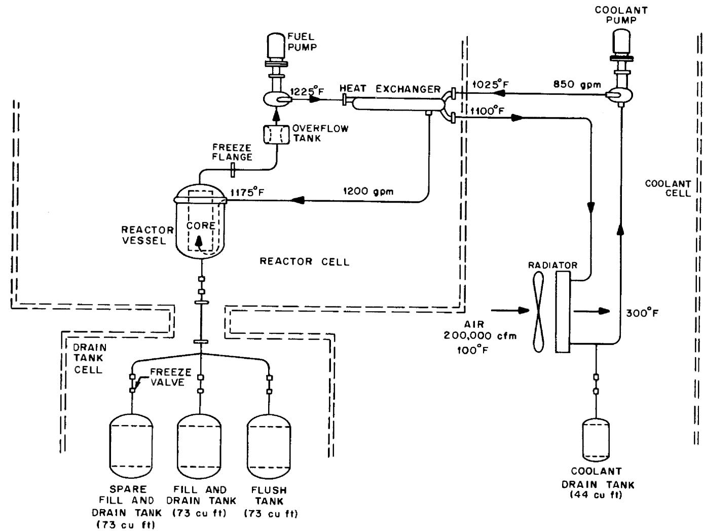  
FIGURE 1. Basic MSRE flow diagram.

TABLE II   
NEUTRONIC CHARACTERISTICS OF MSRE WITH $233\mathrm{U}$ and $235\mathrm{U}$ FUEL SALT at 1200°F   

<table><tr><td></td><td>233U Fuel</td><td>235U Fuel</td></tr><tr><td colspan="3">Minimum Critical Uranium Loadinga</td></tr><tr><td>Concentration (g U/liter salt)</td><td>15.82</td><td>33.06b</td></tr><tr><td>Total Uranium Inventory (kg)c</td><td>32.8</td><td>207.5d</td></tr><tr><td>Prompt Neutron Generation Time (sec)</td><td>4.0 x 10-4</td><td>2.4 x 10-4</td></tr><tr><td colspan="3">Reactivity Coefficientse</td></tr><tr><td>Fuel Salt Temperature (°F)-1</td><td>-6.13 x 10-5</td><td>-4.1 x 10-5</td></tr><tr><td>Graphite Temperature [(°F)-1]</td><td>-3.23 x 10-5</td><td>-4.0 x 10-5</td></tr><tr><td>Total Temperature [ (°F)-1]</td><td>-9.36 x 10-5</td><td>-8.1 x 10-5</td></tr><tr><td>Fuel Salt Density</td><td>+.447</td><td>0.182</td></tr><tr><td>Graphite Densityf</td><td>+.444</td><td>0.767</td></tr><tr><td>Uranium Concentrationf</td><td>+.389</td><td>0.234</td></tr><tr><td colspan="3">Effective Delayed Neutron Fractions</td></tr><tr><td>Fuel Stationary</td><td>2.64 x 10-3</td><td>6.66 x 10-3</td></tr><tr><td>Fuel Circulating</td><td>1.71 x 10-3</td><td>4.44 x 10-3</td></tr><tr><td>Reactivity Change Due to Fuel Circulation (% sk/k)</td><td>-.093</td><td>-0.222</td></tr></table>

$^{\mathrm{a}}$ Fuel not circulating, control rods withdrawn to upper limits.

b

235Uonly.

Based on 73.2 ft³ of fuel salt at 1200°F, in circulating system and drain tanks.

$^{\mathrm{d}}$ Based on a final enrichment of $33\%$ 235U.

eAt initial critical concentration. Where units are shown, coefficients for variable x are of the form $\delta k / k\delta x$ ; otherwise, coefficients are of the form $x\delta k / k\delta x$ .

Highly enriched in the fissionable isotope (91.5% $^{233}\mathrm{U}$ or 93% $^{235}\mathrm{U}$ ).

Source: Haubenreich, P. N. et al., "MSRE Design and Operations Report, Part V-A, Safety Analysis of Operation with $^{233}\mathrm{U}$ ," USAEC Report ORNL-TM-2111, Oak Ridge National Laboratory, p. 41, (February 1968).

Since the reactivity perturbations for the experimental tests reported herein were introduced by control rod movement, a brief description of the control mechanism will be given. The reactor is controlled by three control rods which are positioned in thimbles near the vertical centerline of the core and are inserted into or withdrawn from the core as demanded. Normal rod movement (as opposed to a rod scram) is achieved by activating a single-phase reversible-drive motor. This, in turn, drives a chain which is attached to a flexible cable that is threaded with beads of the poison, gadolinium oxide. The cable maneuvers around two $30^{\circ}$ bends in the thimble before reaching the core centerline position. The three control rods are essentially identical in every respect; however, during operation, one of the rods is positioned farther into the core and is used as a regulating rod. It was through movement of this rod that reactivity perturbations for the dynamics tests were introduced.

A schematic diagram of the control-rod drive train is shown in Figure 2, and a detailed schematic of the drive unit assembly is shown in Figure 3. These are shown in detail in order to give the reader a feel for the complexity of the control rod assembly so that the problems encountered in trying to determine the exact position of the lower end of the control rod might be better appreciated.

A complete description of the MSRE physical plant is given in Reference 7, and a description of the instrumentation is given in Reference 8.

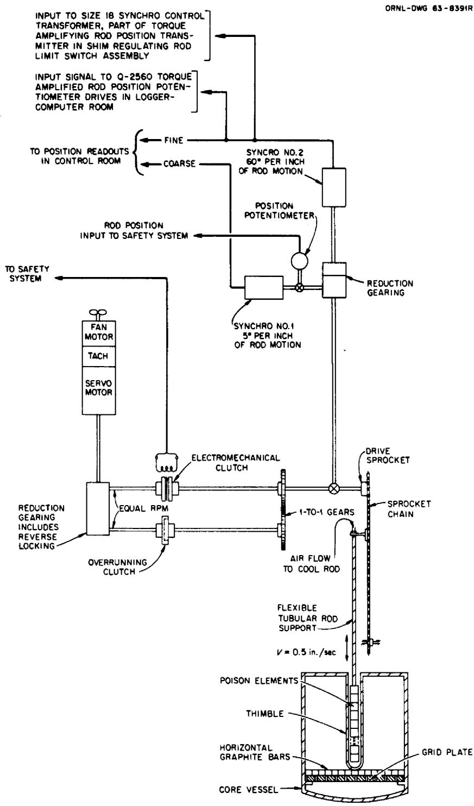  
FIGURE 2. Electromechanical diagram of MSRE control rod drive train.

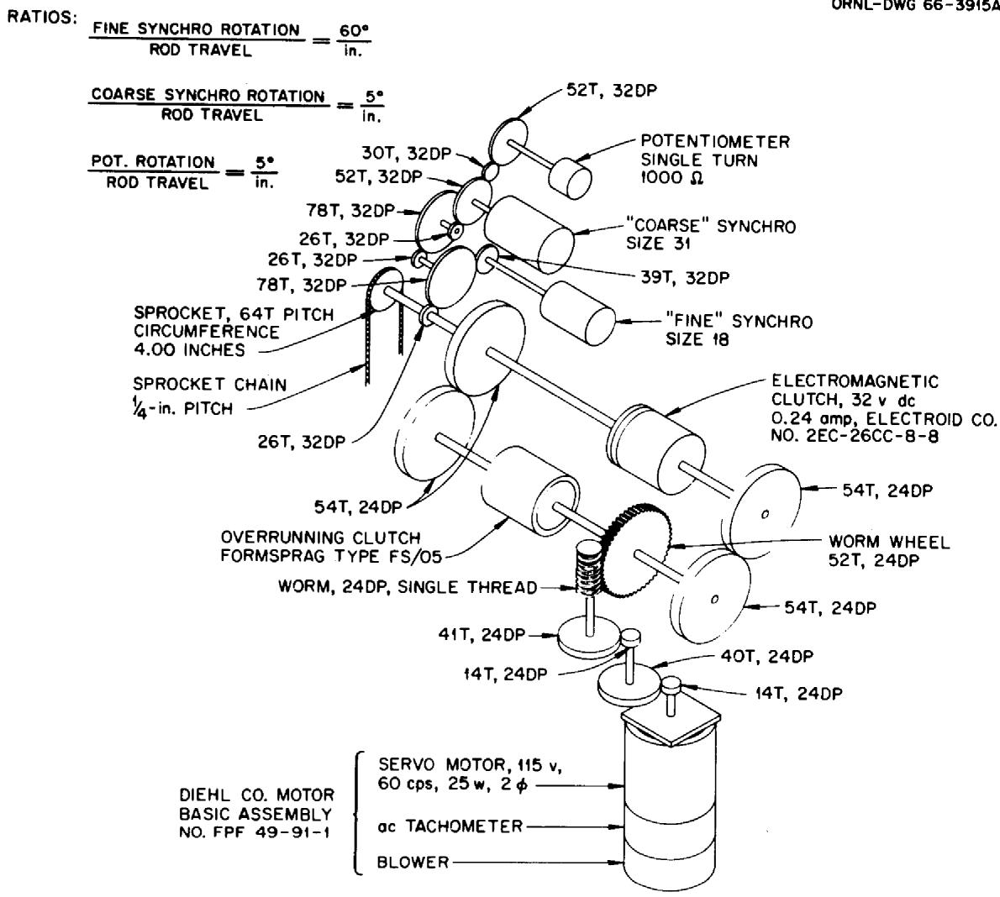  
24T, 24DP means 24 teeth on diametral pitch of 24.   
FIGURE 3. MSRE control-rod drive unit power transmission diagram.

# II. THEORETICAL PREDICTIONS OF FREQUENCY RESPONSE

The mathematical model2 which was used to predict the frequency response of the $^{235}\mathrm{U}$ -fueled MSRE divided the reactor core into 18 fuel lumps and 9 graphite lumps. The external loop (coolant system and heat exchanger included) was also modeled using a lumped parameter model. Results of the initial dynamics tests9 were in excellent agreement with the predictions, so the same basic model was used to predict the response of the $^{233}\mathrm{U}$ -fueled system.3

Figures 4 and 5 show the theoretical neutron level-to-reactivity frequency responses for the two fuels. In general, the theoretical curves will also be shown with the experimental data and are shown here for comparison purposes.

For the higher power levels, an outstanding feature of these plots is the dip in the magnitude-ratio, $\frac{\delta n}{N_0 \cdot 8k}$ , curves at about 0.24 rad/sec and the associated "bumps" in the phase angle. The frequency at which these occur corresponds to the time required for the fuel to circulate completely around the primary loop (25 sec) and is caused by the return to the core region of fuel which has temperature representative of the power level 25 sec earlier. With the $^{235}\mathrm{U}$ fuel, the dips in the magnitude-ratio curves were relatively small and were not verified in the initial testing program,[9] but for the $^{233}\mathrm{U}$ fuel, the predicted dips were larger and it was hoped that these could be verified. For a given fuel loading, the magnitude of the dip is a function of the salt mixing[3] that occurs during the circulation around the primary system. More mixing causes a less pronounced dip.

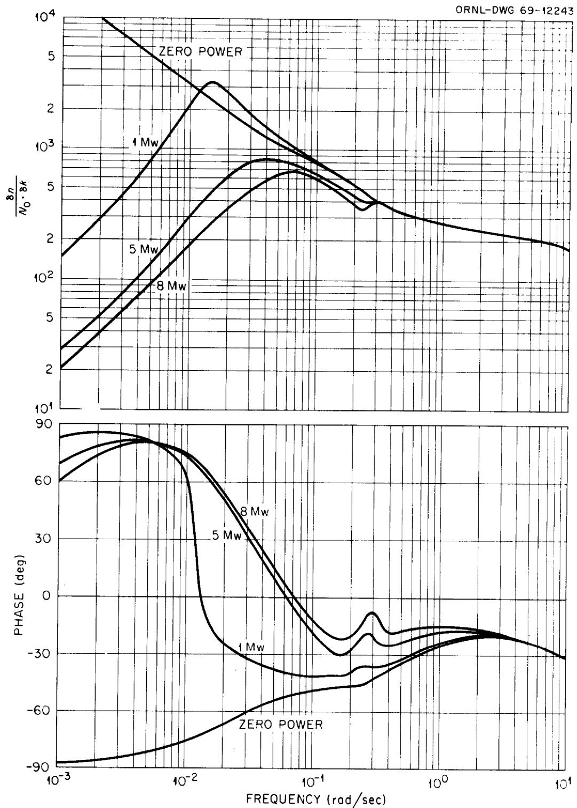  
FIGURE 4. Theoretical frequency response of $^{235}\mathrm{U}$ -fueled MSRE for several power levels.

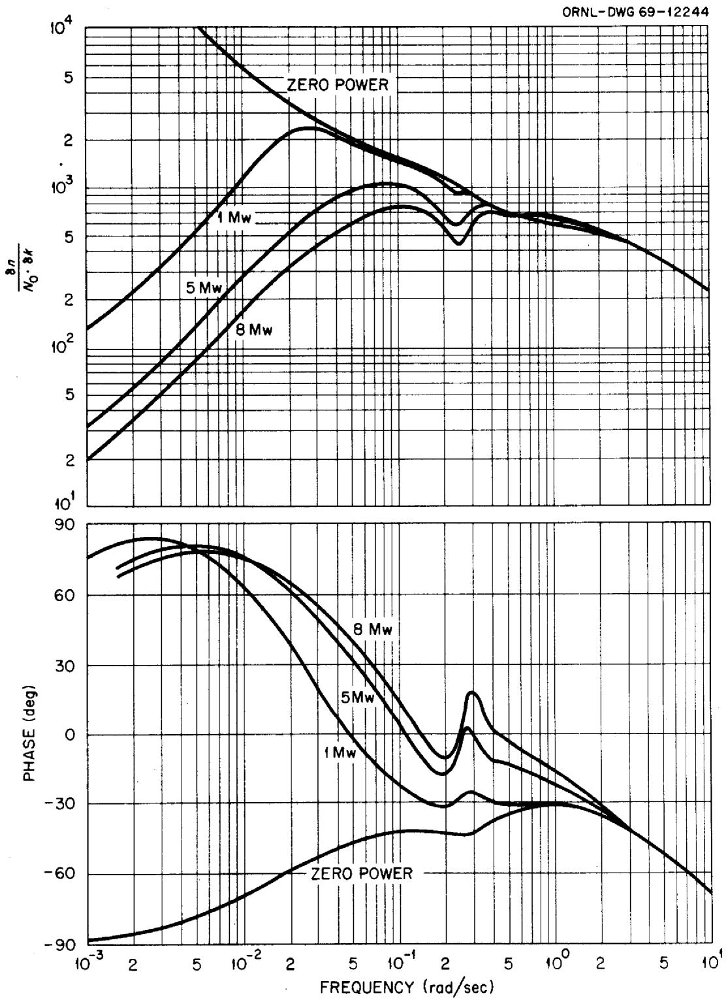  
FIGURE 5. Theoretical frequency response of $^{233}\mathrm{U}$ -fueled MSRE for several power levels.

# CHAPTER III

# EXPERIMENTAL PROCEDURE

In all experimental frequency-response tests which utilize a deterministic input signal, the same general procedure must be followed:

(1) the pattern of the input signal which is to be used must be determined,   
(2) the input signal must be imposed upon the system, (3) the values of the input signal and the resulting output must be determined and recorded, and (4) the record signals must be analyzed. While there is great variety as to how each of these steps may be performed, they must each be performed before an experimental frequency-response determination can be made. In this section, the method by which we satisfied each of these requirements will be discussed.

# I. TEST PATTERNS

The basic test patterns which were used in the experimental determination of the frequency response of the MSRE were the pseudorandom binary sequence (PRBS) and the pseudorandom ternary sequence (PRTS).

Pseudorandom Binary Sequences10

Certain periodic, binary (two-level)* sequences of square-wave pulses (bits) are known to have the following important mathematical properties:

(1) The autocorrelation function of the sequence has a spike at lag time equal zero and an identical spike at lag times of nT (n is an integer and T is the period length). The value of the auto correlation function is slightly less than zero between the spikes.   
(2) The power spectrum of the sequence is flat over a wide frequency range. The particular frequency range over which the spectrum is flat depends on the particular sequence and the pulse width.

An example of a PRBS, its autocorrelation function, and power spectrum are shown in Figure 6. The analytical expression for the autocorrelation function of a PRBS is:

$$
\begin{array}{l} C _ {1 1} (\tau) = 1 - \left(\frac {Z + 1}{T}\right) \tau , \quad 0 \leq \tau \leq T / Z; \\ C _ {1 1} (\tau) = - 1 / Z, \quad T / Z \leq \tau \leq T - T / Z; \\ C _ {1 1} (\tau) = - Z + \left(\frac {Z + 1}{T}\right) \tau , \quad T - T / Z \leq \tau \leq T. \\ \end{array}
$$

where

$$
\begin{array}{l} C _ {1 1} (\tau) = \text {t h e a u t o c o r r e l a t i o n f u n c t i o n ,} \\ \tau = \text {l a g} \\ Z = \text {n u m b e r o f b i t s i n s e q u e n c e}, \\ \mathrm {T} = \text {p e r i o d l e n g t h}, \\ \mathrm {T} / \mathrm {Z} = \text {p u l s e w i d t h o f a s i n g l e p u l s e (b i t)}. \\ \end{array}
$$

The Fourier series coefficients of the autocorrelation function define the power spectrum of the PRBS. Since the autocorrelation function is periodic, the power spectrum will be non-zero only at harmonic frequencies. The amplitude of the power spectrum at these frequencies is given by:10

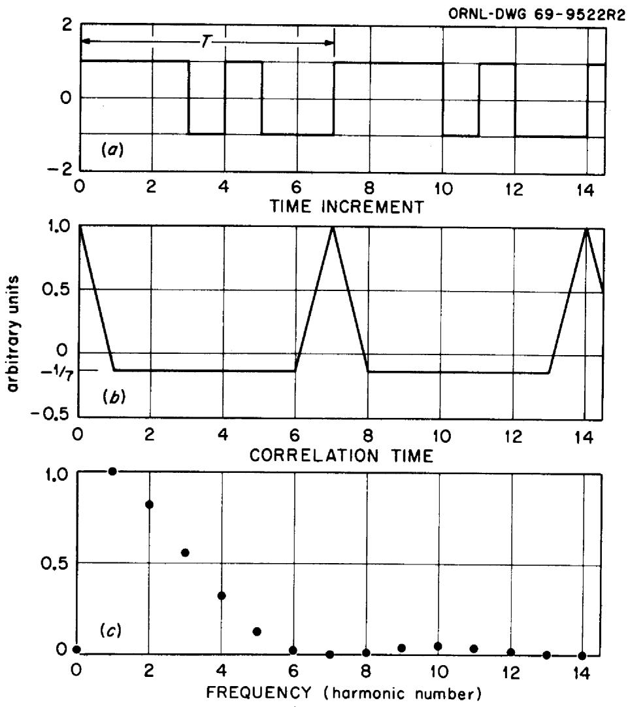  
FIGURE 6. Example of a pseudorandom binary sequence, (a) time behavior, (b) autocorrelation function, and (c) power spectrum.

$$
\begin{array}{l} A (k) = l / Z ^ {2} \text {f o r} k = 0, \\ A (k) = \frac {2 (z + 1)}{z ^ {2}} \left[ \frac {\sin \frac {k \pi}{z}}{\frac {k \pi}{z}} \right] ^ {2} \text {f o r} 0 <   k = 1, 2, 3, \dots , \\ \end{array}
$$

where

$$
\begin{array}{l} A (k) = \text {p o w e r i n k} ^ {\text {t h}} \text {h a r m o n i c}, \text {a n d} \\ Z = \text {n u m b e r o f b i t s i n t h e s e q u e n c e}. \\ \end{array}
$$

True random noise has a power spectrum which is flat over all frequencies and the autocorrelation function of random noise has a spike at the origin and is zero elsewhere. The similarity between the properties of random noise and a pseudorandom binary sequence is apparent.

Only sequences which contain certain numbers of bits (e.g., the number of bits in one period of a PRBS must be odd) possess the possibility of exhibiting the aforementioned properties. Usable sequences are generally classed according to the number of bits in a period with the most popular classifications being:

(1) Maximal length $^{10,11,12}$ or m-sequences which have possible periods of $\mathbb{N} = 2^{n} - 1$ (n is an integer).   
(2) Sequences derived from quadratic residue codes $^{12,13}$ which have periods $\mathbb{N} = 4k - 1$ , $\mathbb{N}$ being a prime number and $k$ an integer. Other classifications include biquadratic residue, octic residue, twin prime, and Hall sequences. A description of each of these sequences may be found in Reference 12.

Knowing the number of bits in the sequence is not sufficient to ensure that it will possess the mathematical properties previously

mentioned. These rules merely state that it is possible to construct a sequence of this length which will possess these properties. The actual ordering of the bits in a sequence to get the desired mathematical features is tedious and on-line signal generation does not appear practical except for the m-sequences, which have periods $2^{n} - 1$ . These may be generated using the shift-register technique which is well suited for digital computers. The shift register technique is based on linear recursive relationships in which the first stage is replaced, after each shift, by adding the contents of certain other stages using Modulo-2 arithmetic. The details of shift register techniques and the stages which must be added to obtain a particular sequence are well documented in the literature.[10,11] It is worthwhile to note here that if the proper stages in the register are not used in the feedback to the first stage a periodic sequence will be generated, but it will not have period $2^{n} - 1$ and will not possess the desired mathematical features. A large amount of work has been presented in the open literature on the generation and properties of pseudorandom binary sequences.[10-19]

From an experimental testing standpoint, the flat power spectrum of the PRBS is an important property. For by changing the reactivity in the form of a PRBS, the power-to-reactivity frequency response may be determined for a wide frequency band with one experiment; whereas, the more conventional method of using a special control-rod oscillator requires a test for each frequency of analysis.

Pseudorandom Ternary Sequences19

A pseudorandom ternary sequence is a periodic ternary (three-level) sequence of square-wave pulses which possess the following important mathematical properties:

(1) The autocorrelation function of the sequence has a positive spike at lag time equal zero and an identical spike at lag times of nT. There is also a negative spike of equal magnitude at lag times of n T/2.   
(2) Like the PRBS, the power spectrum of a PRTS is flat over a wide frequency range; however, only the odd harmonics contain signal power. Therefore, for similar tests, the PRTS would have fewer useful harmonics than a PRBS but more signal power in the good harmonics.

An example of a PRTS, its autocorrelation function, and power spectrum are shown in Figure 7. The analytical expression for the autocorrelation function of a PRTS is

$$
\begin{array}{l} C _ {1 1} (\tau) = 1 - \frac {Z}{T} \tau , \quad O \leq \tau \leq \frac {T}{Z}; \\ C _ {1 1} (\tau) = 0, \quad \frac {\mathrm {T}}{\mathrm {Z}} \leq \tau \leq \frac {\mathrm {T}}{\mathrm {Z}} - \frac {\mathrm {T}}{\mathrm {Z}}; \\ C _ {1 1} (\tau) = \frac {Z - 2}{2} - \frac {Z}{T} \tau , \quad \frac {T}{2} - \frac {T}{Z} \leq \tau \leq \frac {T}{2}; \\ C _ {1 1} (\tau) = \frac {Z + 2}{2} - \frac {Z}{T} \tau , \quad \frac {T}{2} \leq \tau \leq \frac {T}{2} + \frac {T}{Z}; \\ C _ {2 1} (\tau) = 0, \quad \frac {\mathrm {T}}{2} + \frac {\mathrm {T}}{\mathrm {Z}} \leq \tau \leq \mathrm {T} - \frac {\mathrm {T}}{\mathrm {Z}}; \\ C _ {1 1} (\tau) = \frac {Z}{T} \tau + 1 - Z, T - \frac {T}{Z} \leq \tau \leq T. \\ \end{array}
$$

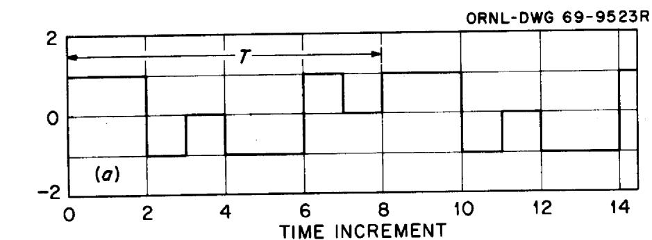

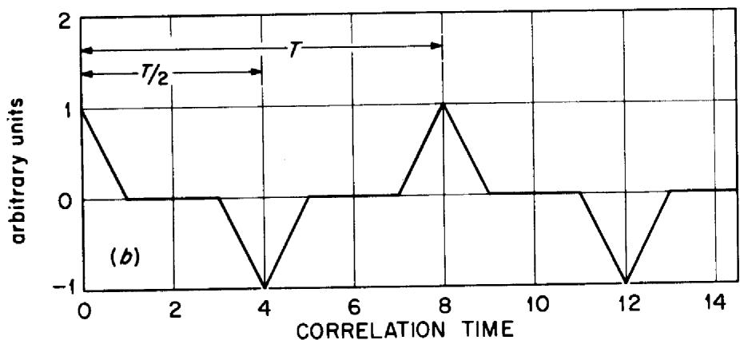

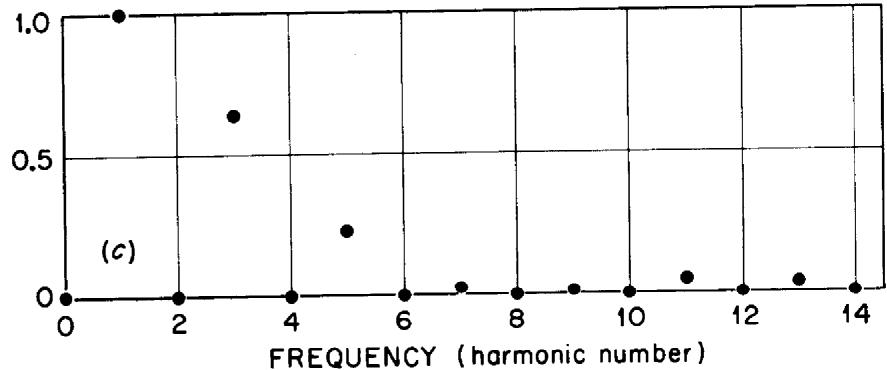  
FIGURE 7. Example of a pseudorandom ternary sequence, (a) time behavior, (b) autocorrelation function, and (c) power spectrum.

where the symbols have the same meaning as before. Note that the autocorrelation function is normalized to equal 1 at $\tau = 0$ .

The amplitudes of the power spectrum at the harmonic frequencies are given by

$$
A (k) = 0 \quad \text {f o r} k = 0 \text {o r e v e n}
$$

and

$$
A (k) = \frac {8 (Z + 1)}{3 Z ^ {2}} \left[ \frac {\sin \frac {k \pi}{Z}}{\frac {k \pi}{Z}} \right] ^ {2} \quad f o r k = o d d.
$$

A PRTS has an average value of zero while the average value of a PRBS is non-zero (but is small). For zero-power reactors or for systems in which variable drift is a problem, the zero average value of a PRTS may be a distinct advantage, particularly for short sequence tests in which the deviation of the average value of the PRBS is farther from zero.

Another advantage of the PRTS is that it discriminates $^{20}$ against system nonlinearities and therefore gives a better estimate of the "linearized" system response. This should be particularly useful for testing systems which are strongly nonlinear. The primary disadvantage of the PRTS is the three levels. In practice it is often considerably more difficult to achieve three levels with available system hardware than it is two.

More information about the properties of pseudorandom ternary sequences may be found in References 11, 14, 19, 20, 21, and 22.

# Choice of Pseudorandom Sequence

The anticipated response of the system under investigation usually dictates the desired frequency spectrum of the input signal. One usually

desires to have a spectrum with sufficient signal power over the range where the system has a resonance peak or other interesting characteristic.

For a periodic signal, the lowest frequency containing information is, of course, the fundamental frequency,

$$
f o = 2 \pi / T, \tag {1}
$$

where

$$
\begin{array}{l} f o = f u n d a m e n t a l f r e q u e n c y (r a d / s e c), a n d \\ T = \text {p e r i o d} \\ \end{array}
$$

For a pseudorandom binary or ternary sequence, a "rule of thumb" for the highest frequency at which one should plan to obtain useful information is the harmonic frequency at which the signal power is equal to one-half the power in the fundamental harmonic. This is not a physical limitation, but serves as a guide in planning tests. The actual physical high-frequency limit for obtaining realistic results is based on the noise level in the system and data-sampling rate.

It can be shown10 that the harmonic with about one-half the amplitude of the fundamental harmonic is given approximately by the relation,

$$
k _ {n} = 0. 4 4 Z,
$$

where

$$
\begin{array}{l} k _ {h} = \text {h a r m o n i c n u m b e r o f t h e h a r m o n i c w i t h o n e - h a l f t h e a m p l i t u d e} \\ Z = \text {n u m b e r o f b i t s i n t h e s e q u e n c e}. \\ \end{array}
$$

It follows that

$$
f _ {h} = k _ {n} f _ {o}, \tag {2}
$$

and

$$
f _ {h} = 0. 4 4 Z 2 \pi / T \tag {3}
$$

Rearranging this expression yields

$$
\mathrm {T} / \mathrm {Z} = \frac {. 8 8 \pi}{\mathrm {r} _ {\mathrm {h}}} \tag {4}
$$

but $T / Z$ is just the duration of one bit so

$$
\text {b a s i c b i t d u r a t i o n} = \mathrm {T} / \mathrm {Z} = \frac {. 8 8 \pi}{\mathrm {f} _ {\mathrm {h}}} \tag {5}
$$

This implies that specification of a high-frequency limit also specifies the basic bit duration. Note that the upper frequency limit is independent of all other properties of the sequence.

With these basic relations, the graph shown in Figure 8 can be constructed. This graph presents all of the information one needs to determine the properties of the sequence he must use to obtain information from a single test which will cover the frequency range of interest. The fundamental frequency line is a plot of the relation given in (1). The half-power frequency lines which are parallel to the fundamental frequency line were calculated from equation (3). The basic bit duration lines were determined from equation (5).

Use of this graph is perhaps best illustrated using an example. Suppose one had a system for which he desired to know the frequency response in the frequency range between 0.01 and 0.5 rad/sec. From the graph we see that the period required to give a fundamental frequency of 0.01 rad/sec is about 630 sec. So that the signal power at the higher frequencies is not less than half the signal power at the lower frequencies, a bit time of about 5 seconds or less is necessary. The only remaining parameter to specify is the sequence length. A 127-bit PRBS would fit nicely with the hypothesized conditions to give results over the required frequency range. With the specified bit time, shorter sequences would

ORNL-DWG 69-9524R2

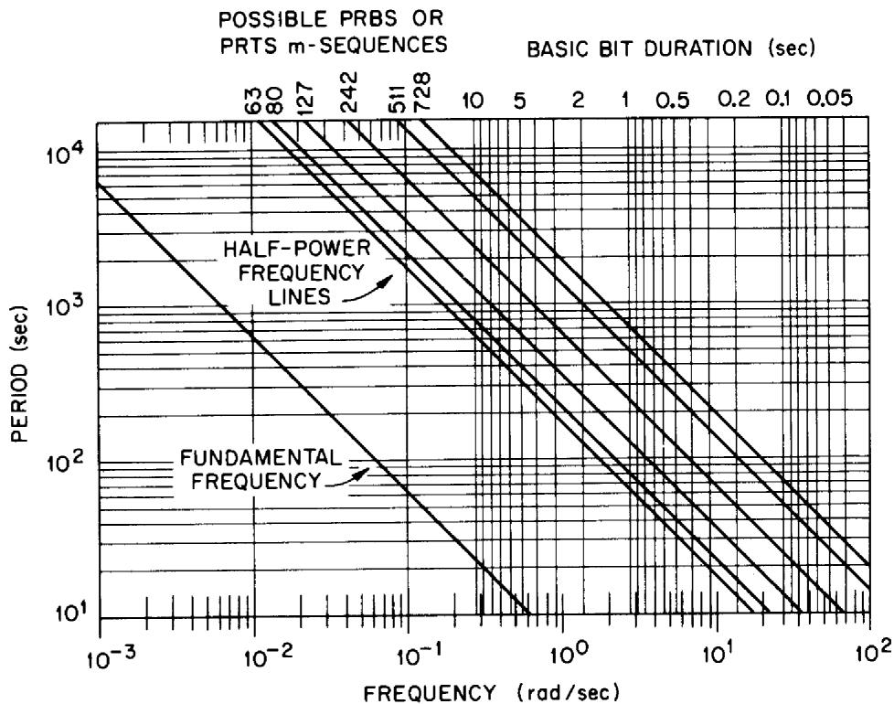  
FIGURE 8. Range over which the power content of a PRBS or PRTS is essentially flat for sequences of various length and bit times.

increase the fundamental frequency, but shifting to longer sequences would lower the fundamental frequency and probably be acceptable to the experimenter.

It is apparent from this example that there is a spectrum of acceptable sequences, bit times, and/or period lengths available for each particular application. It is this variety which emphasizes the utility of a diagram such as that in Figure 8. The effect on the other parameters caused by changing one item in a test specification may be directly observed. This diagram was found to be very useful in planning the dynamic tests reported herein.

# II. SIGNAL GENERATION

There are two stages in imposing the desired signal on a system. First, the signal itself must be generated in some manner and then the system hardware must be forced to follow the signal. Since a Bunker-Ramo-340 digital computer was a part of the equipment at the MSRE site, it presented the opportunity for generating either a PRBS or PRTS using the shift register technique. A machine language program was written by S. J. Ball of the Instrumentation and Controls Division at Oak Ridge National Laboratory that allowed the use of a variety of different sequence lengths for both the PRBS and PRTS. The consequence of this program was the opening and closing of relays in the BR-340. By applying the appropriate voltages across these relays and summing them, a pseudorandom signal could be generated easily.

There were three distinctly different methods used for getting the generated sequence into the reactor system. The methods for implementing these signals will be presented in this section with brief discussion of the advantages and/or disadvantages of each, but most of the discussion will be deferred to the results section (Chapter IV).

# Rod-Jog Tests

The rod-jog method was used extensively during the early testing program by Kerlin and Ball. The BR-340 was used to generate the desired sequences and integrator and comparator circuits on an Electronic Associates, Inc., Model TR-10, analogue computer were used to determine "on" times for the control rod drive motor. When switching from a positive to a negative position in the sequence, the rod was required to insert for x sec., where the time, x, was adjustable. The inverse jump in a sequence instigated a withdraw of y sec., where y was adjustable and separate from x. Since there was no automatic feedback from the rod position, the rod-jog technique was an open-loop procedure. Details of the rod-jog method are given in the report by Kerlin and Ball.

The rod-jog technique worked when the control-rod system was new and tight. However, as the system aged, frequent adjustments became necessary on the timing circuits to keep the rods jogging at the same average position without drifting. This method was attempted several times near the end of operation with the 235U-fuel and, with one exception, produced unacceptable rod positions.

# Flux-Demand Tests

Since the rod-jog method was not able to provide accurate and reproducible rod positions, it was necessary to either change the testing method or discontinue the testing program. This led to development of the flux-demand technique.

At low powers (<1 Mw) the servo system in the MSRE compares the neutron flux as indicated by the compensated ion chambers with a manually-d demanded flux and moves the control rod as necessary to meet the demand. At powers greater than 1 Mw, the neutron flux is compared with a "computed" flux-demand and the servo again moves the rod to meet the demand. (The computed flux-demand is based on temperature drop across the core, neutron flux, and core-outlet temperature.) Since the servo moved the control rod to match the actual flux with the demand, the flux could be forced to simulate any reasonable test pattern by putting in a false flux-demand at low-power levels or a false computed flux-demand at high powers.

This was the reverse of the normal procedure in that the predetermined signal shape was imposed on the output and the input (rod position) became the dependent variable. Figure 9 shows control rod position and flux plotted as a function of time for representative rod-jog and flux-demand tests. In the rod-jog example, the rod position resembles the shape of an ideal PRBS and the flux is determined by the system characteristics; whereas, the plots of the flux-demand test show that flux follows the test pattern and the rod is the free agent. The two levels of the PRBS flux-demand are apparent and may be compared with the three levels of the PRTS flux-demand signal.

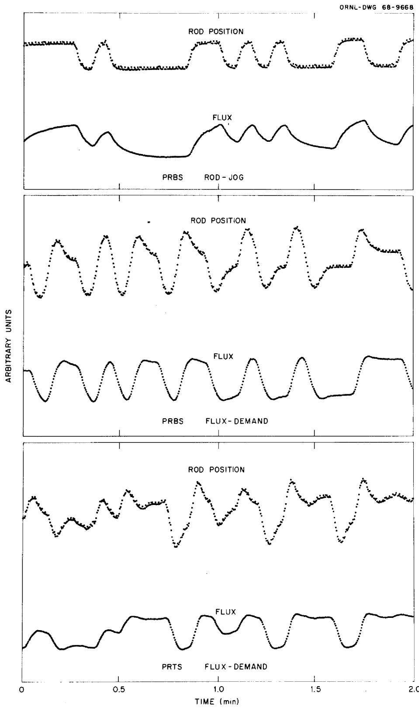  
FIGURE 9. Control-rod position and flux for a typical PRBS rod-jog test, a typical PRBS flux-demand test and a typical PRTS flux-demand test.

For the flux-demand technique, the pseudorandom signals were generated with the circuits shown in Figure 10. Reference voltages from the TR-10 were fed to the BR-340-operated relays. The relays were off-on type so they either fed the reference voltage or zero voltage back to the TR-10. For the PRBS, if the relay were closed the up part of the sequence was created. Opening the relay formed the down part of the sequence. For the PRTS, two relays were operated with the following results: relay No. 1 and No.2 open created the down pulse, No. 1 open and No. 2 closed formed the middle position, and No. 1 closed and No. 2 open caused the up part of the sequence. Both relays closed was not allowed. Attenuator No. 9 reduced the signal to the voltage which was needed for the particular test. At the start of a test, attenuator No. 9 was normally set at zero and then increased slowly until the desired signal magnitude was achieved. Normally the flux was allowed to deviate from steady state by 5 to $10\%$ .

Attenuator No. ll was adjusted so that the output of the second amplifier corresponded to the steady-state flux with the pseudorandom sequence imposed on it. This voltage was inserted into the servo circuits at the indicated point in Figure 10c.

The flux-demand method offered distinct advantages over the rod-jog technique. During testing, adjustments of the times which the rod withdrew and inserted were not necessary and there were no problems with system drift since the servo automatically maintained the actual flux approximately equal to the demanded flux. The basic disadvantage of this technique was that it worked the control rods rather vigorously, especially after the more responsive $^{233}\mathrm{U}$ fuel was added to the system. While exercising the control rods is not in itself particularly undesirable, design

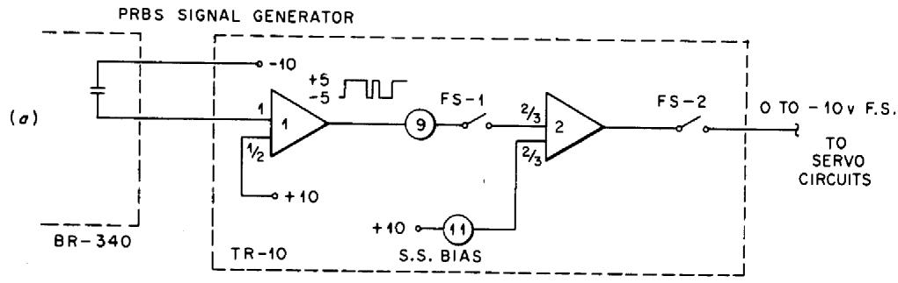

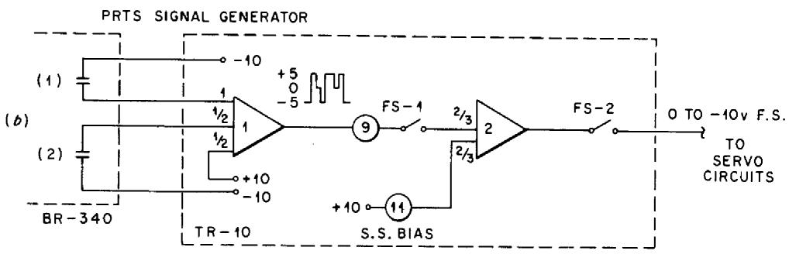

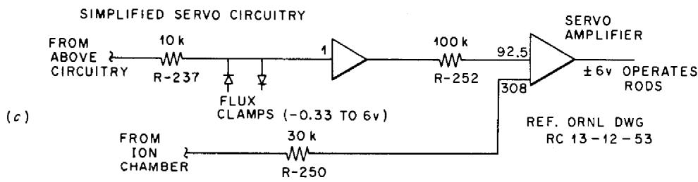

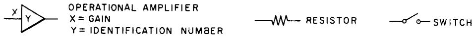

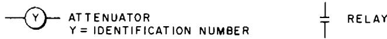  
FIGURE 10. Circuitry used for generating the pseudorandom signals for the flux-demand tests.

of the rods in the MSRE provided loose coupling between the actual and indicated rod positions and every rod movement carried with it the inherent probability of an erroneous indication.

The problems encountered while using the flux-demand technique were primarily a result of hardware limitations in the MSRE and do not represent an inherent flaw in the technique; however, excessive noise contamination in the frequency range near a resonance peak can cause erratic results when the flux is being controlled to give a flat power spectrum. This will be discussed in Chapter IV in relation to some of the experimental results. When using this technique, the experimental testing was less laborious for the experimentors and equipment set-up time was less than when testing with the other methods. For zero-power reactors or for reactors in which power drift tends to be a problem, this technique would appear to be particularly advantageous. Since the flux is the controlled parameter, it cannot drift and if the system is at steady state initially, pseudorandom perturbations of the flux about the steady-state value will not cause an imbalance between power and flux.

# Rod-Demand Tests

The disadvantages of the flux-demand tests caused a final change in technique back to rod-controlled testing. However, instead of controlling the rod position indirectly by adjusting the time the drive motor remained activated, the technique was changed to directly control the rod position. This was achieved by comparing the actual rod position with a demanded position and keeping the drive motor activated until the desired position was realized. Since there was feedback from the rod position, this was a

closed loop system. The result of this technique was to yield rod positions which were like those obtained from an ideal rod-jog test and to circumvent the problem of excessive rod motion that was present with the flux-demand technique.

Since the control-rod servo is really a comparator circuit, it was well suited for comparing actual rod position with demanded position, and it was already wired to move the control rods if the input voltages (normally flux and flux-demand) were unbalanced. It was necessary to disconnect the normal inputs to the servo system and to replace them with actual and demanded rod positions.

The circuits for generating the pseudorandom perturbations were basically the same as those used with the flux-demand technique (Fig. 10). The ion-chamber connection in Figure 10c was replaced with a signal determined by the actual rod position and attenuator ll in Figure 10a or Figure 10b was adjusted so that the output of the servo amplifier was approximately zero before starting a test.

One operational problem related to the rod-demand technique should be pointed out. The rod was moved when the actual rod position was outside the deadband around the demanded position. When the demand shifted at the start of a new pulse, the rod moved until the voltages were again matched, at which time the rod would start coasting to a stop. The servo circuits could be adjusted to start the stopping process so that the rod did not coast through the deadband and instigate an adjustment in the opposite direction. When a PRES test signal was being employed, the position at which the rod stopped within the deadband was not important,

hence the adjustments were simple. (The important point was that the rod did stop within the deadband and at the same position each time.) However, the three levels of a PRTS signal caused this adjustment to become more involved. The middle position of the PRTS might occur after a pulse with plus or minus polarity. If the rod tended to coast nearly through the deadband before actually stopping, then the middle position of the PRTS was satisfied by two different actual rod positions. The only adjustment which resulted in a unique value for the middle position was a setting which caused the rod to stop midway of the deadband. There were also slight differences in the upper and lower positions depending on whether the rod had started from the middle position or the extremity position.

For the MSRE, the rod-demand technique meshed with equipment limitations in such a way that it was the most effective method for frequency-response testing.

# III. DATA ACQUISITION

For all of the tests the reactivity perturbations were initiated by control rod movement. As described earlier, control rod movement is controlled by a drive motor, and a series of gears connects the rod drive to the position synchros. These indicators feed a voltage to the position indicators in the control room and to the on-line BR-340 digital computer. For the dynamics tests, the signal going to the BR-340 was intercepted and fed into an analog computer (TR-10) where the signal was amplified by a factor of $\sim 10$ and low-pass filtered using a filter with a l-sec time constant. This amplified and filtered signal was then

fed back into the BR-340 where it was digitized every 0.25 sec and recorded on magnetic tape. This frequency of digitization made possible the storing of useful information which had frequency components as high as $\sim$ 12 rad/sec; however, most of the test patterns we employed had little signal power above 1 rad/sec. A filter with a 1-sec time constant was used to attenuate high-frequency information and prevent aliasing effects.

The nuclear power was determined by recording the signal supplied by a compensated ion chamber. The primary purpose of this chamber was to feed the linear-power recorders which are located in the main control room. This signal was also fed into the TR-10 and amplified (by $\sim 10$ ) and filtered using a l-sec time constant. The signal was then fed to the BR-340 where it was digitized and recorded every 0.25 sec, along with the rod position. The rod position and flux signals were not digitized simultaneously. There was actually about 0.08-sec difference between the digitizations. This causes the calculated phase angle to be in error by $0.5^{\circ}$ at 0.1 rad/sec and $5.0^{\circ}$ at 1.0 rad/sec. This error was not recognized until after most of the results had already been obtained and since this was not a significant error in the frequency range of interest, the calculations were not repeated.

In order to be compatible with the analysis programs, the data were retrieved from the magnetic tapes and stored on punched cards.

# IV. DATA ANALYSIS METHODS

The purpose of the dynamics tests was the determination of the power-to-reactivity frequency response. After the data from a particular test was reduced to a stack of IBM cards, there were three methods for gleaning the desired information.

# Computing Schemes

FOURCO. The most direct and fastest method for determining the frequency response was to immediately Fourier transform the digitized data and then divide the transformed output (flux) by the transformed input (rod position) for the desired result. This was accomplished using a computer code called FOURCO²³ which uses a digital simulation of an analog method reported by Broome and Cooper.[24] Analysis of 8 cycles of a 127-bit PRBS with a 3-sec bit time (l2,192 input and output data points) required only 1.1 min on the IBM 360/75 for calculation of the frequency response at 60 different frequencies.

CPSD. This analysis method utilized a digital simulation of an analog filtering technique for obtaining cross-power spectral density, CPSD, functions.[9,25] This code calculated the power spectrum of the input signal and the cross-power spectrum of the input and output signals and divided the cross-power spectrum by the input power spectrum to obtain the frequency response at each frequency of analysis. The key feature of this code is an adjustable filter width about the analysis frequency.

Analysis time for 8 cycles of a l27-bit PRBS with a 3-sec bit time on the IBM 360/75 was 2.0 min for analysis at 60 frequencies.

CABS.26 The third calculational procedure was more involved. The autocorrelation functions of the input and output signals were calculated and the cross-correlation function of the signals was calculated. These were then Fourier transformed to obtain the input, output, and cross-power spectra. The input power spectrum was then divided into the cross-power spectrum to obtain the frequency response. The correlation functions, power spectra and frequency response were then machine plotted.

Calculation time using CABS for the previously mentioned case was 10 minutes.

Comparison of Data Analysis Methods

CABS and FOURCO. If an experimental test is composed of several consecutive periods of the same sequence, there are several choices available for analyzing the data. One method is to evaluate a single Fourier integral of all the data. Alternatively, the data may be split into segments (each consisting of one or more periods of data) and a Fourier integral for each segment can be determined, and the resulting estimates can be averaged.

The basic difference between analyzing one period of data at a time or several periods of data as one period is to change the effective filter, or spectral-window, width. If a Fourier analysis is performed at frequency $\omega_{1}$ , where $\omega_{1}$ is a harmonic frequency, the magnitude of the harmonic will actually be composed of all the signal strength under the filter area. The "natural filter," $H(\omega_{1})$ , is27

$$
\mathrm {H} \left(\omega_ {1}\right) = \frac {\sin \left(\omega_ {1} - \omega\right) \mathrm {T m}}{\left(\omega_ {1} - \omega\right) \mathrm {T m}},
$$

where $\mathbf{Tm} =$ the time duration of the data being analyzed,

$\omega =$ frequency (rad/sec), and

$\omega_{1} =$ frequency of analysis.

This function has a maximum value when $\omega$ equals $\omega_{1}$ and has null points where $(\omega_{1} - \omega)$ Tm equals an even multiple of $\pi$ . Suppose Tm is equal to one period, T, of a periodic signal then every second null point occurs on an adjacent harmonic; however, if eight cycles of data were analyzed, there would be 16 null points between the harmonic frequencies (see

Figure ll). For an ideal periodic signal either filter would be suitable since there would be spectral power at only the harmonic frequencies.

However, actual signals are not ideal and there is always random noise contamination at every frequency; furthermore, if the harmonic frequencies are not specified very precisely, contamination resulting from the sidelobes and the adjacent harmonics not intersecting at a null point may be significant. Using the "eight-period" filter tends to discriminate against noise contamination except very close to the actual harmonic frequency but causes large errors if the frequency at which the analysis is being performed is not the actual harmonic frequency. Note that performing an analysis at a frequency which is midway between adjacent harmonics would not allow any of the signal strength of the periodic signal to enter into the result since the filter would null at every harmonic frequency; hence, analysis at these frequencies apparently provides a means of calculating the system noise level which was present during the testing. However, for this type analysis to be valid, it is necessary that the frequencies which are midway between the true harmonics of the minimum period length actually be harmonic frequencies also. For example, if only one period

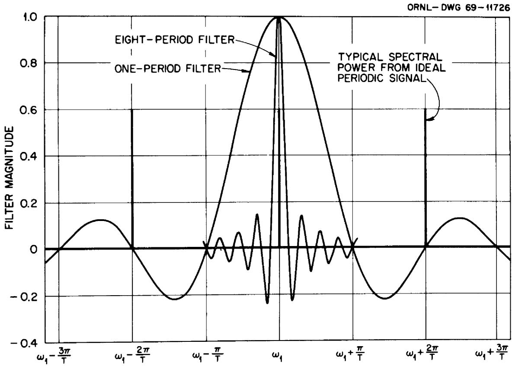  
FIGURE 11. Natural filters for one-period analysis and for eight-period analysis.

of data is available, analysis at mid-harmonic frequencies is not meaningful; however, if two periods of data are analyzed, the frequencies midway between the adjacent power-containing harmonics are harmonics of the total period and analysis at these frequencies is allowed.

For the direct Fourier analysis method (FOURCO), application of the preceding argument is straight-forward, but for the CABS program it is more complex. With the CABS program, it is normal to work with at least two cycles of data, since correlation functions are usually calculated for lag times as long as one period. Calculation of the correlation functions immediately reduces the data to one period length (fixing the filter shape) which is then Fourier analyzed. Using more periods of data in the correlation function determination improves the statistics of the correlation function. The alternate method of using fewer periods in the correlation function analysis yields worse statistics for the correlation function but more power spectrum results at the same frequency, which may then be ensemble averaged. The choice is whether to ensemble average before or after Fourier transforming. Mathematically, at least for ideal signals, the end result is the same. Since the correlation functions are informative in themselves, the usual method is to reduce the data to correlation functions of one-period length before Fourier analyzing.

To determine the effect of varying the periods of data which were analyzed, eight periods of a 127-bit PRBS with a 3-sec bit time (this will be written as $127 \times 3$ in the remainder of this text) were analyzed several different ways. All eight periods were analyzed as one period — giving a very narrow filter — then four periods were analyzed as one

period and the two answers averaged. This was repeated using two periods and one period of data at a time. The results are shown in Tables III, IV, and V for different analysis frequencies.

For the calculations in which the data were separated into smaller segments, there is significant scatter in the data; however, the averages agree fairly well with CABS appearing to exhibit a slight trend upward in magnitude ratio as the data are more finely divided. With FOURCO, the final averaged result does not appear to be significantly affected by performing the analyses on one period at a time even though the individual results for the analysis which used one period at a time are very erratic, particularly at the lower frequencies.

The coherence-function values listed in Tables III, IV, and V for the CABS analysis are a measure of the degree to which an output of a system is related to a certain input. Mathematically the coherence function $\mathbf{\Psi}^{*}$ is defined by the relation,

$$
\gamma^ {2} = \frac {\left| G _ {x y} (f) \right| ^ {2}}{G _ {x} (f) G _ {y} (f)},
$$

where

$$
\gamma = \text {t h e c o h e r e n c e f u n c t i o n},
$$

$$
\begin{array}{l l} G _ {x y} (f) & = \text {t h e F o u r i e r t r a n s f o r m o f t h e c r o s s - c o r r e l a t i o n f u n c t i o n} \\ & \text {a t f r e q u e n c y f ,} \end{array}
$$

$$
\begin{array}{l} G _ {X} (f) \quad = \text {t h e s p e c t r a l p o w e r o f t h e i n p u t s i g n a l (r o d p o s i t i o n i n} \\ \text {t h i s t e x t)} \text {a t f r e q u e n c y f , a n d} \end{array}
$$

$$
\begin{array}{l} \mathrm {G} _ {\mathrm {y}} (\mathrm {f}) \quad = \text {t h e s p e c t r a l p o w e r o f t h e o u t p u t s i g n a l (f l u x) a t} \\ \text {f r e q u e n c y f .} \end{array}
$$

RESULTS OF DIFFERENT ANALYSIS TECHNIQUES AT 0.016491 RAD/SEC

WHEN APPLIED TO EIGHT PERIODS OF DATA

TABLE III   

<table><tr><td colspan="2">No. of Periods 
Analyzed 
As One</td><td colspan="3">CABS</td><td colspan="2">FOURCO</td></tr><tr><td></td><td></td><td>M.R.a</td><td>Phase 
(Deg.)</td><td>COHb</td><td>M.R.a</td><td>Phase 
(Deg.)</td></tr><tr><td>8</td><td></td><td>356</td><td>69</td><td>.95</td><td>360</td><td>70</td></tr><tr><td rowspan="4">4</td><td></td><td>373</td><td>63</td><td>.96</td><td>374</td><td>64</td></tr><tr><td></td><td>357</td><td>71</td><td>.98</td><td>352</td><td>78</td></tr><tr><td>Avg.c</td><td>365</td><td>67</td><td>.97</td><td>363</td><td>71</td></tr><tr><td>Std. Dev.d</td><td>11</td><td>6</td><td>.14</td><td>16</td><td>10</td></tr><tr><td rowspan="6">2</td><td></td><td>430</td><td>49</td><td>.91</td><td>361</td><td>69</td></tr><tr><td></td><td>435</td><td>52</td><td>1.00</td><td>393</td><td>49</td></tr><tr><td></td><td>361</td><td>61</td><td>.99</td><td>395</td><td>72</td></tr><tr><td></td><td>284</td><td>67</td><td>.88</td><td>310</td><td>77</td></tr><tr><td>Avg.</td><td>378</td><td>60</td><td>.94</td><td>365</td><td>69</td></tr><tr><td>Std. Dev.</td><td>71</td><td>6</td><td>.06</td><td>40</td><td>8</td></tr><tr><td rowspan="10">1</td><td></td><td></td><td></td><td></td><td>530</td><td>59</td></tr><tr><td></td><td></td><td></td><td></td><td>235</td><td>99</td></tr><tr><td></td><td></td><td></td><td></td><td>461</td><td>52</td></tr><tr><td></td><td></td><td></td><td></td><td>333</td><td>69</td></tr><tr><td></td><td></td><td></td><td></td><td>336</td><td>80</td></tr><tr><td></td><td></td><td></td><td></td><td>451</td><td>77</td></tr><tr><td></td><td></td><td></td><td></td><td>312</td><td>66</td></tr><tr><td></td><td></td><td></td><td></td><td>319</td><td>86</td></tr><tr><td>Avg.</td><td></td><td></td><td></td><td>372</td><td>74</td></tr><tr><td>Std. Dev.</td><td></td><td></td><td></td><td>98</td><td>15</td></tr></table>

aMagnitude Ratio   
bCoherence Function   
cAverage   
Standard Deviation

TABLE IV   
RESULTS OF DIFFERENT ANALYSIS TECHNIQUES AT 0.49474 RAD/SEC WHEN APPLIED TO EIGHT PERIODS OF DATA   

<table><tr><td colspan="2">No. of Periods 
Analyzed 
As One</td><td colspan="3">CABS</td><td colspan="2">FOURCO</td></tr><tr><td></td><td></td><td>M.R.a</td><td>Phase 
(Deg.)</td><td>Coh.b</td><td>M.R.a</td><td>Phase 
(Deg.)</td></tr><tr><td>8</td><td></td><td>671</td><td>-26</td><td>1.00</td><td>670</td><td>-26</td></tr><tr><td>4</td><td></td><td>694</td><td>-28</td><td>1.02</td><td>667</td><td>-27</td></tr><tr><td></td><td></td><td>663</td><td>-21</td><td>1.01</td><td>672</td><td>-24</td></tr><tr><td></td><td>Avg.c</td><td>679</td><td>-25</td><td>1.02</td><td>670</td><td>-26</td></tr><tr><td></td><td>Std. Dev.d</td><td>22</td><td>5</td><td>.01</td><td>4</td><td>2</td></tr><tr><td>2</td><td></td><td>650</td><td>-27</td><td>1.01</td><td>492</td><td>-22</td></tr><tr><td></td><td></td><td>775</td><td>-29</td><td>1.01</td><td>747</td><td>-31</td></tr><tr><td></td><td></td><td>585</td><td>-21</td><td>1.02</td><td>600</td><td>-23</td></tr><tr><td></td><td></td><td>750</td><td>-30</td><td>1.00</td><td>745</td><td>-24</td></tr><tr><td></td><td>Avg.</td><td>690</td><td>-27</td><td>1.01</td><td>671</td><td>-25</td></tr><tr><td></td><td>Std. Dev.</td><td>88</td><td>4</td><td>.01</td><td>87</td><td>4</td></tr><tr><td>1</td><td></td><td></td><td></td><td></td><td>645</td><td>-9</td></tr><tr><td></td><td></td><td></td><td></td><td></td><td>574</td><td>-37</td></tr><tr><td></td><td></td><td></td><td></td><td></td><td>768</td><td>-28</td></tr><tr><td></td><td></td><td></td><td></td><td></td><td>729</td><td>-35</td></tr><tr><td></td><td></td><td></td><td></td><td></td><td>575</td><td>-20</td></tr><tr><td></td><td></td><td></td><td></td><td></td><td>624</td><td>-25</td></tr><tr><td></td><td></td><td></td><td></td><td></td><td>748</td><td>-22</td></tr><tr><td></td><td></td><td></td><td></td><td></td><td>743</td><td>-27</td></tr><tr><td></td><td>Avg.</td><td></td><td></td><td></td><td>676</td><td>-25</td></tr><tr><td></td><td>Std. Dev.</td><td></td><td></td><td></td><td>80</td><td>9</td></tr></table>

Magnitude Ratio   
bCoherence Function   
cAverage   
Standard Deviation

TABLE V   
RESULTS OF DIFFERENT ANALYSIS TECHNIQUES AT 0.98947 RAD/SEC WHEN APPLIED TO EIGHT PERIODS OF DATA   

<table><tr><td colspan="2">No. of Periods 
Analyzed 
As One</td><td colspan="3">CABS</td><td colspan="2">FOURCO</td></tr><tr><td></td><td></td><td>M.R.a</td><td>Phase 
(Deg.)</td><td>Coh.b</td><td>M.R.a</td><td>Phase 
(Deg.)</td></tr><tr><td>8</td><td></td><td>509</td><td>-46</td><td>1.02</td><td>536</td><td>-46</td></tr><tr><td rowspan="4">4</td><td></td><td>511</td><td>-43</td><td>.99</td><td>512</td><td>-45</td></tr><tr><td></td><td>514</td><td>-50</td><td>.97</td><td>549</td><td>-48</td></tr><tr><td>Avg.c</td><td>513</td><td>-47</td><td>.98</td><td>531</td><td>-47</td></tr><tr><td>Std. Dev.d</td><td>2</td><td>5</td><td>.01</td><td>26</td><td>2</td></tr><tr><td rowspan="6">2</td><td></td><td>510</td><td>-46</td><td>.93</td><td>539</td><td>-43</td></tr><tr><td></td><td>533</td><td>-43</td><td>1.04</td><td>485</td><td>-47</td></tr><tr><td></td><td>472</td><td>-63</td><td>.97</td><td>513</td><td>-48</td></tr><tr><td></td><td>524</td><td>-60</td><td>.95</td><td>582</td><td>-48</td></tr><tr><td>Avg.</td><td>510</td><td>-53</td><td>.97</td><td>530</td><td>-47</td></tr><tr><td>Std. Dev.</td><td>27</td><td>10</td><td>.04</td><td>41</td><td>2</td></tr><tr><td rowspan="10">1</td><td></td><td></td><td></td><td></td><td>580</td><td>-42</td></tr><tr><td></td><td></td><td></td><td></td><td>500</td><td>-43</td></tr><tr><td></td><td></td><td></td><td></td><td>500</td><td>-48</td></tr><tr><td></td><td></td><td></td><td></td><td>470</td><td>-47</td></tr><tr><td></td><td></td><td></td><td></td><td>487</td><td>-45</td></tr><tr><td></td><td></td><td></td><td></td><td>548</td><td>-51</td></tr><tr><td></td><td></td><td></td><td></td><td>566</td><td>-44</td></tr><tr><td></td><td></td><td></td><td></td><td>603</td><td>-52</td></tr><tr><td>Avg.</td><td></td><td></td><td></td><td>532</td><td>-47</td></tr><tr><td>Std. Dev.</td><td></td><td></td><td></td><td>49</td><td>4</td></tr></table>

Magnitude Ratio   
bCoherence Function   
c Average   
Standard Deviation

For a causal system in which there is only one input and one output and no noise contamination, the measured coherence function should be unity. For real systems in which ideal conditions do not exist, the coherence function should be between 0 and 1. If two totally unrelated signals were analyzed, the coherence function would be zero. Some of the experimentally-determined values for the coherence function shown in Tables III, IV, and V are slightly greater than 1.0. This is theoretically impossible and the reason for these values being greater than 1.0 is not understood. The CPSD code, which also calculated coherence functions, also occasionally gave results which were slightly greater than unity. These anomalously high values did not destroy the general usefulness of the coherence function calculations which were, in general, lower for tests in which the results contained excessive scatter (indicating noise contamination) than for the smoother results. Analyses at non-harmonic frequencies yielded coherence functions which were erratic and often had values as large as 500.

In an effort to demonstrate the effect of the analysis filter, the same data were also analyzed by FOURCO at frequencies which were offset from the harmonic frequencies by $10\%$ of the difference between harmonics. Table VI lists both the real and imaginary parts of the input and output signals for a harmonic frequency and Table VII lists the same information for the nearest adjacent non-harmonic frequency. The analyses were performed with 1, 2, 4, and 8 periods of data as one with the appropriate results averaged, as before. For the analysis at a harmonic frequency, the average value of both the real and imaginary parts of the signals

TABLE VI   
RESULTS OF ANALYSIS AT A HARMONIC FREQUENCY (0.3298 RAD/SEC)   

<table><tr><td colspan="2">Periods of Data Analyzed As One</td><td colspan="2">Input Signal</td><td colspan="2">Output Signal</td></tr><tr><td></td><td></td><td>Real</td><td>Imaginary</td><td>Real</td><td>Imaginary</td></tr><tr><td>8</td><td></td><td>-177</td><td>388</td><td>-193</td><td>45</td></tr><tr><td rowspan="4">4</td><td></td><td>-87</td><td>192</td><td>-107</td><td>25</td></tr><tr><td></td><td>-86</td><td>198</td><td>-84</td><td>20</td></tr><tr><td>Avg.a</td><td>-87</td><td>195</td><td>-95</td><td>23</td></tr><tr><td>Std. Dev.b</td><td>1</td><td>4</td><td>16</td><td>3</td></tr><tr><td rowspan="6">2</td><td></td><td>-44</td><td>96</td><td>-56</td><td>11</td></tr><tr><td></td><td>-43</td><td>96</td><td>-52</td><td>15</td></tr><tr><td></td><td>-45</td><td>100</td><td>-44</td><td>6</td></tr><tr><td></td><td>-41</td><td>100</td><td>-40</td><td>14</td></tr><tr><td>Avg.</td><td>-43</td><td>98</td><td>-48</td><td>11</td></tr><tr><td>Std. Dev.</td><td>2</td><td>2</td><td>7</td><td>4</td></tr><tr><td rowspan="10">1</td><td></td><td>-20</td><td>49</td><td>-28</td><td>5</td></tr><tr><td></td><td>-22</td><td>48</td><td>-27</td><td>6</td></tr><tr><td></td><td>-20</td><td>49</td><td>-29</td><td>3</td></tr><tr><td></td><td>-21</td><td>47</td><td>-23</td><td>13</td></tr><tr><td></td><td>-27</td><td>51</td><td>-17</td><td>1</td></tr><tr><td></td><td>-21</td><td>48</td><td>-28</td><td>4</td></tr><tr><td></td><td>-20</td><td>50</td><td>-19</td><td>1</td></tr><tr><td></td><td>-19</td><td>50</td><td>-21</td><td>5</td></tr><tr><td>Avg.</td><td>-21</td><td>49</td><td>-24</td><td>5</td></tr><tr><td>Std. Dev.</td><td>3</td><td>1</td><td>5</td><td>4</td></tr></table>

aAverage   
bStandard Deviation

RESULTS OF ANALYSIS AT A NON-HARMONIC FREQUENCY (0.3463 RAD/SEC)

TABLE VII   

<table><tr><td colspan="2">Periods of Data Analyzed As One</td><td colspan="2">Input Signal</td><td colspan="2">Output Signal</td></tr><tr><td></td><td></td><td>Real</td><td>Imaginary</td><td>Real</td><td>Imaginary</td></tr><tr><td>8</td><td></td><td>87</td><td>-31</td><td>244</td><td>35</td></tr><tr><td rowspan="4">4</td><td></td><td>91</td><td>120</td><td>-26</td><td>74</td></tr><tr><td></td><td>94</td><td>117</td><td>-16</td><td>60</td></tr><tr><td>Avg.a</td><td>93</td><td>119</td><td>-21</td><td>67</td></tr><tr><td>Std. Dev.b</td><td>3</td><td>2</td><td>7</td><td>10</td></tr><tr><td rowspan="6">2</td><td></td><td>3</td><td>93</td><td>-42</td><td>30</td></tr><tr><td></td><td>4</td><td>92</td><td>-37</td><td>30</td></tr><tr><td></td><td>5</td><td>95</td><td>-31</td><td>24</td></tr><tr><td></td><td>7</td><td>92</td><td>-29</td><td>25</td></tr><tr><td>Avg.</td><td>5</td><td>93</td><td>-35</td><td>27</td></tr><tr><td>Std. Dev.</td><td>2</td><td>2</td><td>6</td><td>3</td></tr><tr><td rowspan="10">1</td><td></td><td>-12</td><td>47</td><td>-26</td><td>9</td></tr><tr><td></td><td>-14</td><td>46</td><td>-24</td><td>9</td></tr><tr><td></td><td>-12</td><td>47</td><td>-27</td><td>7</td></tr><tr><td></td><td>-13</td><td>46</td><td>-20</td><td>13</td></tr><tr><td></td><td>-13</td><td>49</td><td>-14</td><td>-5</td></tr><tr><td></td><td>-13</td><td>48</td><td>-29</td><td>10</td></tr><tr><td></td><td>-12</td><td>48</td><td>-17</td><td>10</td></tr><tr><td></td><td>-11</td><td>47</td><td>-11</td><td>5</td></tr><tr><td>Avg.</td><td>-13</td><td>47</td><td>-21</td><td>7</td></tr><tr><td>Std. Dev.</td><td>1</td><td>1</td><td>7</td><td>6</td></tr></table>

aAverage   
bStandard Deviation

approximately doubles* each time the number of periods being analyzed as one doubles. This indicates that most of the calculated signal energy was resulting from a source which was unaffected by the changing filter shape. Of course, this source was the spectral energy of the signal at the analysis (harmonic) frequency. For the analysis at a non-harmonic frequency, there is no apparent relation between the average values of the signals as the number of periods being analyzed is changed. This should be expected since the changing filter shape is weighting the signal energy in the nearby harmonic, as well as those farther away, in an entirely different manner with each filter change.

CPSD. The advantage of the CPSD technique is that the filter shape may be specified at the time the analysis is performed. The filterspecified by the code has the transfer function16

$$
\mathrm {H} (\mathrm {s}) = \frac {\mathrm {s}}{\omega_ {\mathrm {O}} ^ {2} + 2 \zeta \omega_ {\mathrm {O}} \mathrm {s} + \mathrm {s} ^ {2}}
$$

*The doubling occurs because the integral being used to calculate the signal energy is:

$$
F (j \omega) = \int_ {0} ^ {T} f (t) e ^ {- j \omega t} d t
$$

where

$f(t) =$ the time signal,

$\omega = \text{frequency} (\text{rad/sec})$

$\mathrm{j} = \sqrt{-1},$

$\mathbf{t} =$ time, and

T = the total time of the recorded data.

The integral is not normalized by $l / T$ ; therefore, for data sets containing the same power at frequency $\omega$ , the calculated $F(j\omega)$ will be twice as large if the number of sets analyzed is doubled.

where

$\omega_{0} =$ the center frequency of the filter,

s = the Laplace transform variable, and

$\zeta =$ the damping factor.

Figure 12 shows H(s) for various values of $\zeta$ . As $\zeta$ takes on smaller values, the peak in the transfer function becomes very narrow. If $\zeta$ is set too wide, the contribution from other frequencies becomes significant, but if $\zeta$ is set too narrow, a slight discrepancy between the harmonic frequency and the calculational frequency will cause a large error in the calculation of the signal magnitude at the harmonic. The complete frequency response plot for the test case (8 periods, 127 x 3 PRBS) is shown in Figure 13 for various values of $\zeta$ . When $\zeta$ is equal to 0.5, the data is smoothed to the extent that it does not portray the actual frequency-response shape in the regions of sharp curvature. Damping factors of 0.05 and 0.001 give essentially the same shape; however, there is more scatter in the data with the 0.001 damping factor.

Comparison of the CPSD method with a damping factor of 0.05 with the CABS and FOURCO results revealed that the results were usually within $5\%$ of each other with occasional deviations of $10\%$ . There were a few tests in which there was large discrepancy between the analysis techniques at a few frequencies. Since these appear to be a function of the testing technique, they will be discussed in the appropriate section (Chapter IV, Section II).

Unless otherwise specified the data reported herein used the following analysis criteria:

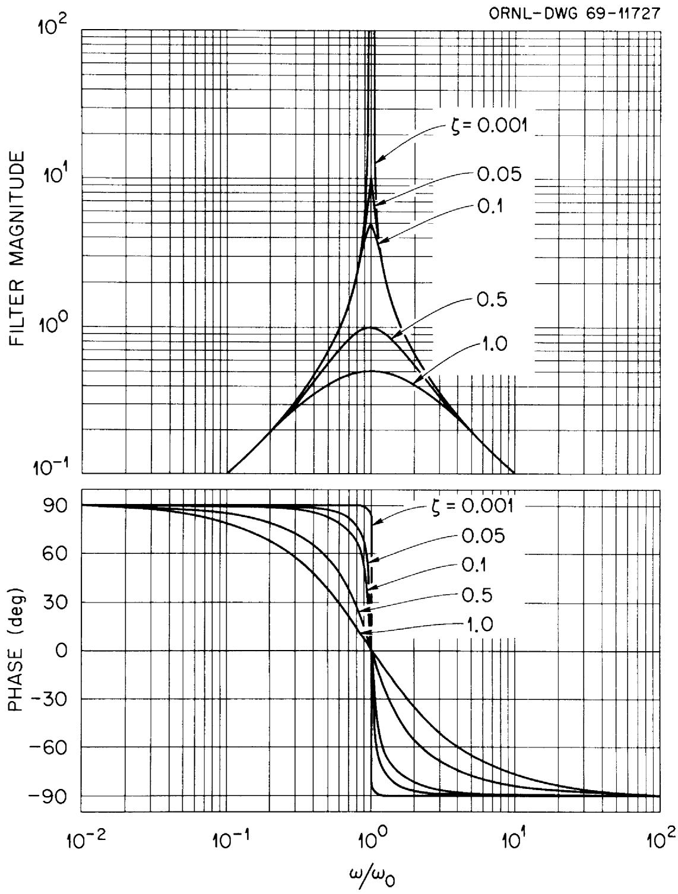  
FIGURE 12. Shape of the analysis filter employed by the CPSD technique for various values of the damping factor, $\zeta$ .

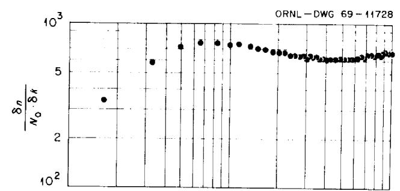

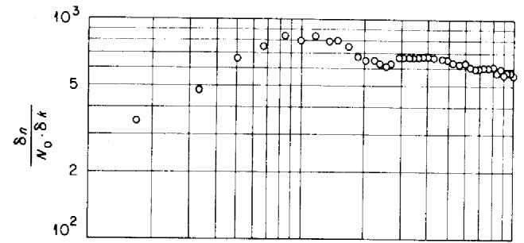

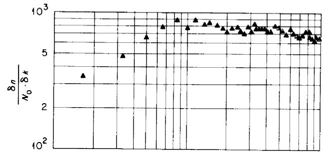

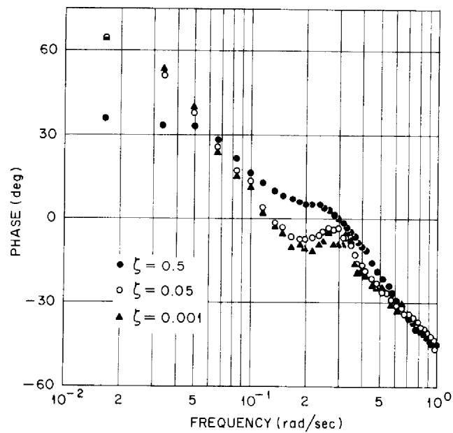  
FIGURE 13. Frequency-response results obtained by analyzing a test case using the CPSD analysis scheme with various values of the damping factor, $\zeta$ .

(1) When more than one period of data was analyzed using FOURCO, it was analyzed as one period. If the periods of data were analyzed separately and the results averaged, the results are labeled "FOURCO ENSEMBLE."   
(2) When using CABS, the data was reduced to correlation functions of one period length and then Fourier analyzed.   
(3) A damping factor of 0.05 was used with the CPSD code.

In some cases the data were analyzed using all three methods; however, the results were, in general, so nearly the same that this was not actually necessarily so in other cases only two methods were used. In cases where the analysis schemes gave the same results only one set of results was usually plotted.

# CHAPTER IV

# EXPERIMENTAL RESULTS

In this chapter typical results obtained during the testing program will be presented and discussed. In some cases preliminary results such as correlation functions will be shown together with the frequency-response results and in other cases only the frequency-response results will be presented. Tests were performed which will not be discussed at all. A listing of all the tests performed and pertinent information about each test is given in the Appendix.

# I. 235U FUEL LOADING

The initial dynamics-testing program9 made extensive use of the rod-jog technique. But by the end of that testing program, the experiments were becoming difficult to perform. There was apparently some stiffening of the flexible-hose part of the control-rod assembly, or at least some extra friction, which was causing reproducible rod positioning to be difficult.

Near the end of operation with the $^{235}\mathrm{U}$ fuel loading, more dynamic tests were performed. These were two-fold in purpose. First, the tests would indicate whether the dynamic characteristics of the MSRE had changed after more than 72,000 Mwhrs of power operation. Second, the groundwork was to be laid for using the flux-demand technique during the $^{233}\mathrm{U}$ fuel loading. The plan was to do more rod-jog tests followed by

flux-demand tests so that comparisons between the techniques would be straight forward. Tests with both the PRES and PRTS test signals were also planned. The "coarse" position indicator was used to supply the control-rod position indication.

# 1. Rod-Jog Tests

The first rod-jog test attempted was performed without flaw. This led to hope that the suspicions about inadequacy of the technique were permeate and that a change in technique was not warranted. However, all subsequent attempts at rod-jogging were failures. During these tests, almost continuous adjustment of the motor-timers was necessary, and there were several times when a one-bit segment of the test pattern was skipped resulting in two consecutive rod movements in the same directions, an impossible occurrence for a true PRBS. The first problem was most likely an extension of the previously-encountered problems related to friction in the control rod assembly. The bit-skipping Suggests failure of the sequence-generating equipment. The equipment was "bench-tested", but no equipment defects were found. So at least part of the reasons for the failure of the rod-jog technique are not understood.

The autocorrelation function and power spectrum of the rod position for the good rod-jog test are shown in Figure 14a. These closely follow the theoretical curves for an ideal PRES and indicate that the test pattern was well represented by the control rod. Four periods of the sequence were analyzed. The autocorrelation function and the power spectrum of the flux are shown in Figure 14b and the cross-correlation function of rod position and flux with the associated power spectrum are shown in

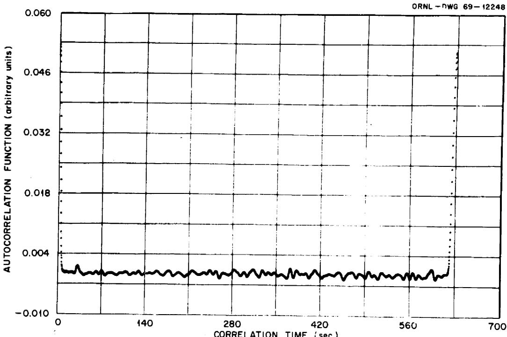

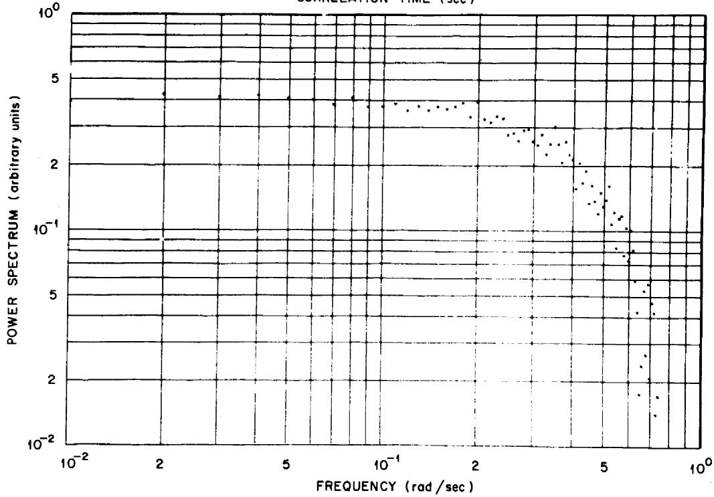  
FIGURE 14 Correlation function and power spectrum results from a rod-jog test.

(a) Autocorrelation function and power spectrum of the control-rod position.

Periods of data analyzed - 4

Type sequence - 127 x 5 PRBS

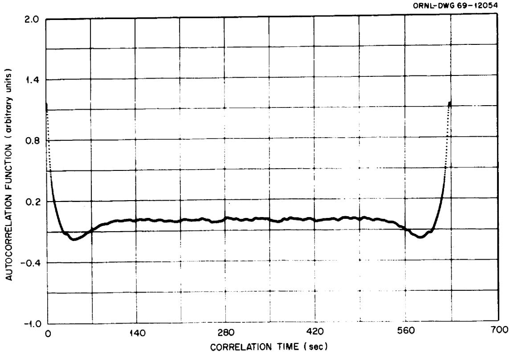

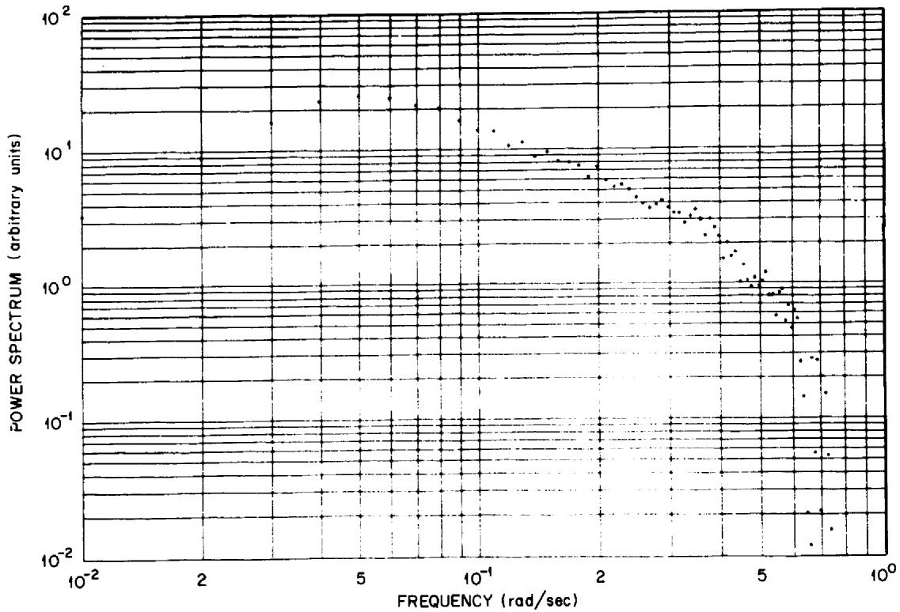  
(b) Autocorrelation function and power spectrum of the neutron flux. Periods of data analyzed - 4 Type sequence - 127 x 5 PRBS   
FIGURE 14. (continued)

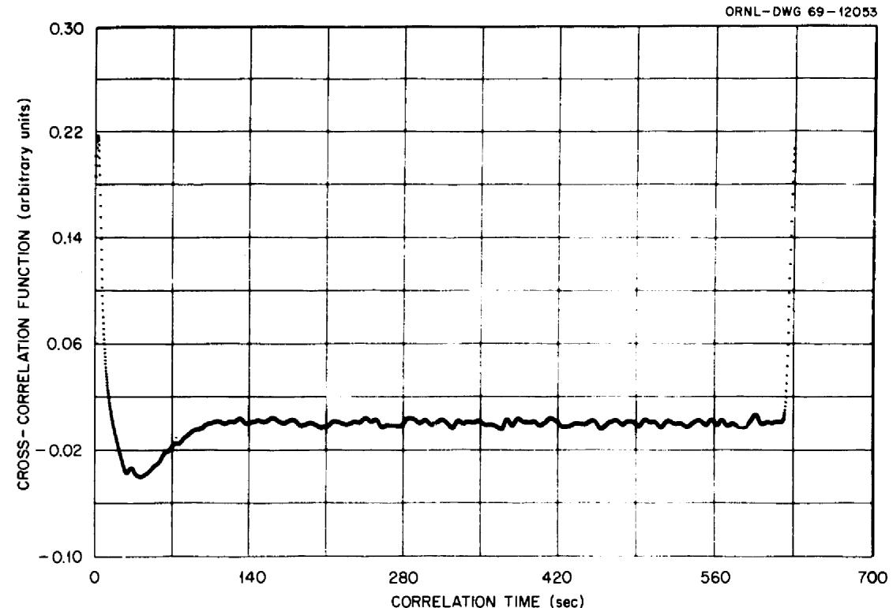

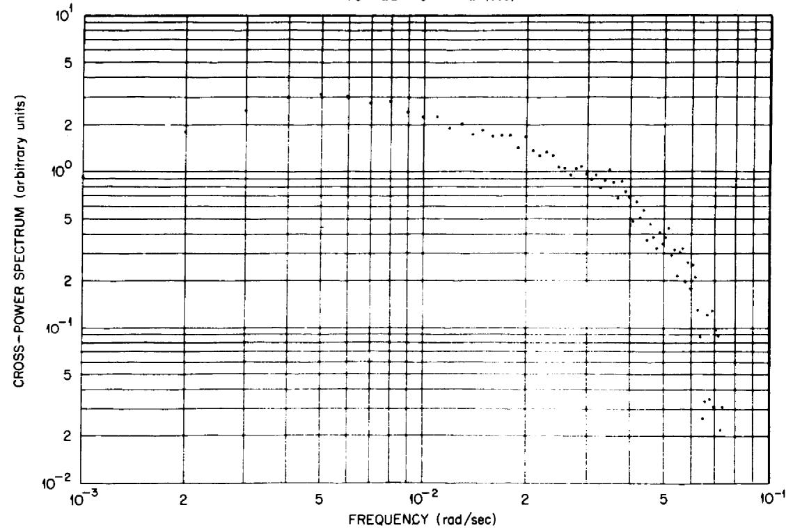  
(c) Cross-correlation function and cross-power spectrum of the control-rod position and neutron flux.   
Periods of data analyzed - 4   
Type Sequence - 127 x 5 PRBS

FIGURE 14. (continued)

Figure 14c. Since the reactivity input was a PRBS (flat power spectrum), the envelope of the points in the first part of the cross-correlation function approximately defines the impulse response of the system.[29] The results of primary interest, magnitude ratio and phase, are shown in Figure 15. Over most of the frequency range there is little scatter in the data and the experimentally determined points follow the theoretical curves very well. The scatter in the magnitude ratio at frequencies greater than 0.6 rad/sec is due to the low power content of the input signal in this frequency range (Figure 14a). The low magnitude of the power in the input signal causes a low signal to noise ratio and a large amount of scatter in the results. In addition, the timing method used with the rod-jog technique did not produce the exact period lengths which were desired. This made specification of the fundamental frequency tedious, and for a four-cycle test an average period length was used. This inaccuracy may decrease the signal to noise ratio even more because the frequencies at which the analyses are performed may not be the exact harmonic frequencies.

Also shown in Figure 15 are results of a similar test which was performed during the initial testing program of the MSRE. There is very little difference between the results which leads to the conclusion that the dynamic characteristics of the MSRE were not changed by about 9000 equivalent-full-power hours of nuclear operation.

# 2. Flux-Demand Tests

Ten dynamics tests utilizing the flux-demand technique were performed with the $^{235}\mathrm{U}$ fuel loading. Two of these ten yielded completely

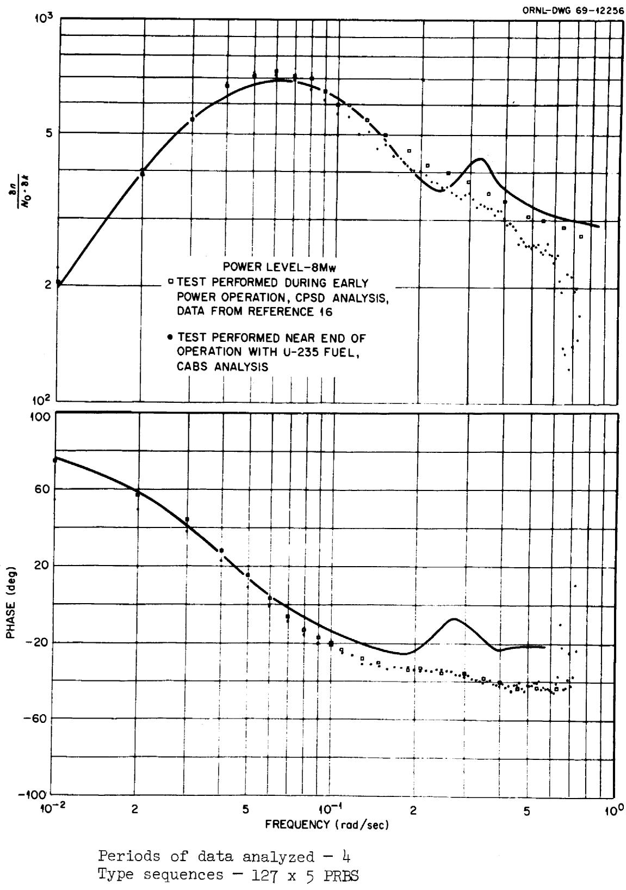  
FIGURE 15. Frequency-response results from rod-jog tests.

unusable results due to a faulty magnetic-tape unit which was supposedly recording the data. In fact, the computer was malfunctioning throughout this entire phase of the testing program and there were numerous bad data points dispersed randomly throughout the data. In general, these bad points were easy to distinguish in that they read either very large or very small in comparison with the bulk of the data. A computer program was written which scanned the data and discarded these points which were obviously in error and replaced the bad points with points derived from a linear interpolation between the two nearest good points.

Three test patterns were employed during this phase of the testing program. These were the PRBS, PRTS, and the "non-symmetric" PRTS. The difference between the PRTS signals will be discussed in the appropriate section.

In this section, we will find that the flux-demand tests were unsuitable for the required measurements. Nevertheless, the experience with these tests is described to illustrate the problems and to show the considerations which led to the third (and successful) technique described in Section 3 of this chapter.

# PRBS Test Patterns

Figures 16 and 17 are plots of a set of results from a $127 \times 5$ PRBS test performed with the reactor at $5\mathrm{Mw}$ . Note that the flat power spectrum is associated with the autocorrelation of the flux signal rather than the rod-position signal. The cross-correlation (Figure 16c) is not indicative of the impulse response of the system since the autocorrelation of the input (Figure 16a) does not have a flat power spectrum. The

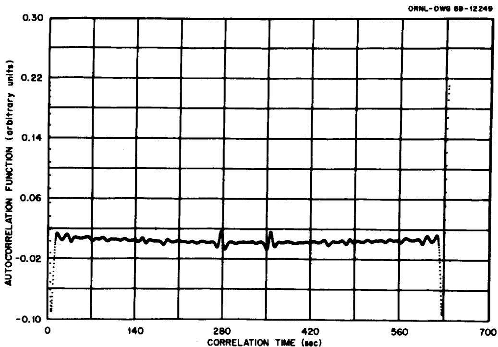

FIGURE 16. Correlation function and power spectrum results from a flux-demand test using a PRBS test pattern.   
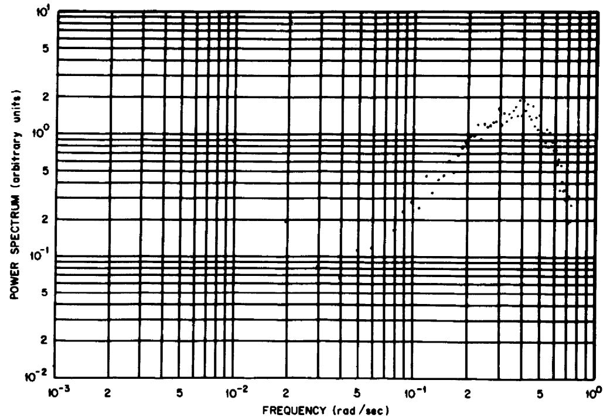  
(a) Autocorrelation function and power spectrum of the control-rod position.   
Periods of data analyzed - 5   
Type sequence - 127 x 5 PRBS

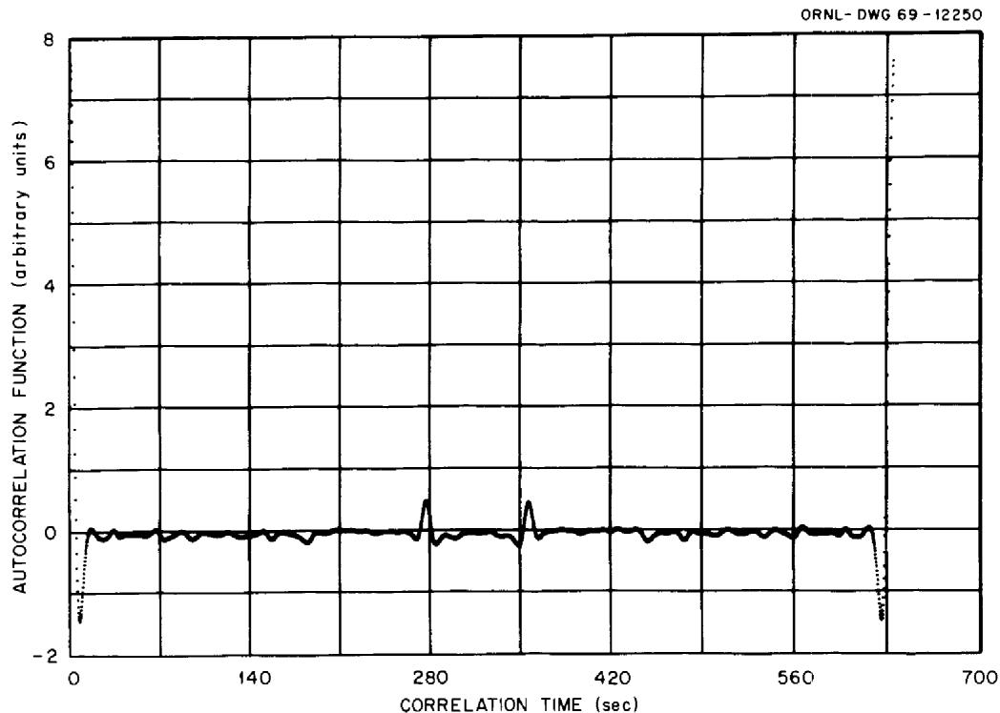

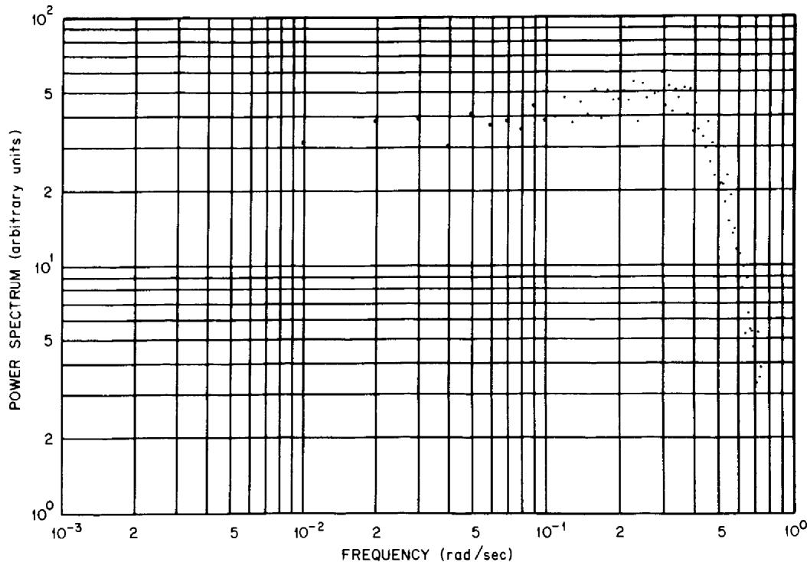  
FIGURE 16. (continued)

(b) Autocorrelation function and power spectrum of the neutron flux.

Periods of data analyzed - 5

Type sequence - 127 x 5 PRBS

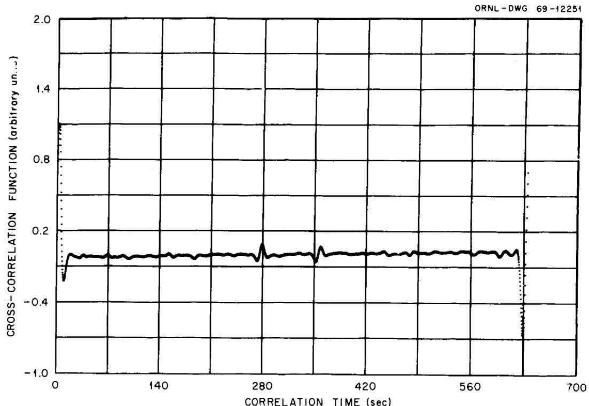

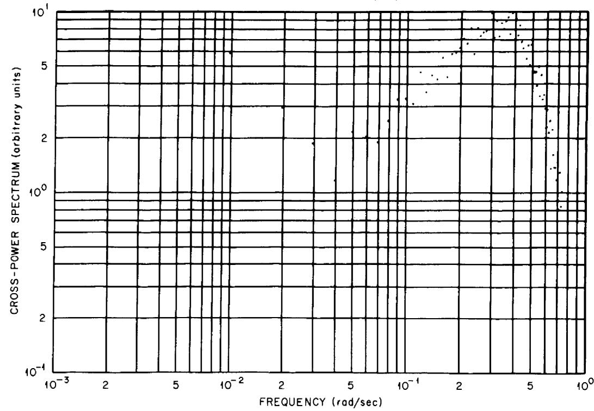  
FIGURE 16. (continued)

(c) Cross-correlation function and cross-power spectrum of the control-rod position and neutron flux.

Periods of data analyzed - 5

Type sequence - 127 x 5 PRBS

FIGURE 17. Frequency-response results from a flux-demand test with the reactor at 5 Mw.   
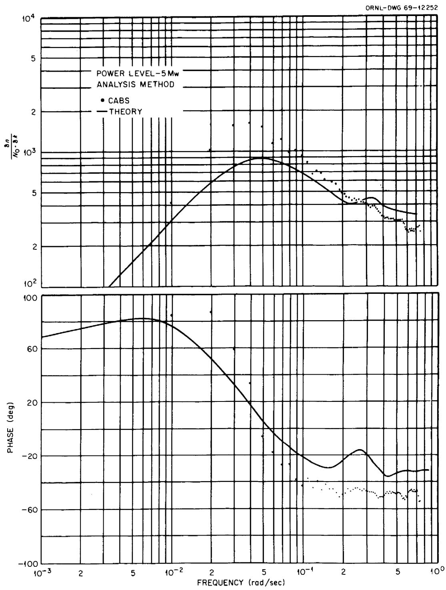  
Periods of data analyzed - 5   
Type sequence - 127 x 5 PRBS

magnitude-ratio and phase plots are shown in Figure 17. There is more scatter in the data near the peak in the magnitude ratio than was evident in the rod-jog test. This is probably a result of the testing technique. Since the output power spectrum is flat (Figure 16b), there must be a minimum in the input power spectrum (Figure 16a) in order to achieve a peak in the magnitude-ratio plot. For a system with a relatively-white noise input, this implies that the signal-to-noise ratio of the input signal is worse at the minimum than at any other point; hence, the statistical confidence one should place in the values at the peak in the magnitude ratio plots is the lowest of any region on the plot.

The autocorrelation functions of the test patterns as implemented by the different techniques are shown in Figures 14a and 16b. While they are in general agreement, there are two noticeable differences. The small negative spike which occurs at both ends adjacent to the large positive spike in the autocorrelation function in Figure 16b is caused by a deadband in the servo system. With the rod-jog technique, the rod was moved and then held stationary until time for a pulse of different polarity. With the flux-demand technique, the rod would move the flux until the flux-demand was satisfied and then stop. The flux would continue to change and would move on through the "satisfied" state and would have to be brought back by rod movement in the other direction. A dead-band in the flux signal may be observed by careful inspection of Figure 9, page 27. The width of this deadband was found to determine the magnitude of the negative spike. Some tests were performed in which the deadband was very narrow and the spikes were all but eliminated.

The small positive spikes which occur at lag time equal to $278^{\text{※}}$ sec in the autocorrelation function in Figure 16b are thought to be a result of the shape of the flux signal when going from a low to high value not being the inverse of the flux signal when going from a high to low value. Similar spikes were noted at both 35 sec and 278 sec on most other $127 \times 5$ PRBS flux-demand tests. Only spikes at lag times of 35 sec were reported in similar tests with the rod-jog testing technique. One $127 \times 5$ rod-demand test had a small spike at $\sim 33$ sec with no other anomalous spikes. The occurrence of a spike at 35 sec is predictable (References 13, 30, 31) and is a function of the time between the longest run of consecutive positive bits and negative bits for the particular sequence being used. The additional spikes at 278 sec which appeared with the flux-demand technique are thought to be caused by the same type of phenomenon that caused spikes at 35 sec, but this has not been proven. The spike at 33 sec with the rod-demand technique was small and should not be considered as strong disagreement with the predicted time of 35 sec. Spikes were also observed in PRBS tests of other length and in PRTS tests. No theoretical work could be found which related the position of the spikes to the properties of the PRTS, but it is likely that they are caused by the same type phenomenon.

The magnitude-ratio and phase-angle plots for a $127 \times 5$ PRBS with the reactor at $2\mathrm{Mw}$ is shown in Figure 18. The theoretical and experimental data are in adequate agreement at this lower power.

# PRTS Test Patterns

The faulty magnetic tape unit malfunctioned on two out of three tests which employed PRTS test patterns. The results of the successful PRTS test (242 x 7.25 at 8 Mw) are shown in Figures 19 and 20. The autocorrelation function of a PRTS waveform is obvious in Figure 19b and the associated power spectrum is relatively flat over nearly two decades in frequency.

The curvature in the autocorrelation of the rod position (Figure 19a) is unusual compared to those previously shown. The plot indicates that the rod position was not a true periodic signal since it was not symmetric about the half-period time. These tests were performed in February and March when changes in atmospheric conditions were rapid. Ambient air temperature and/or wind velocity changes affect the heat-removal rate at the radiator which ultimately forces a reactivity change in the core. Since the flux was being controlled during these tests, the outside disturbances were shown by changes in control rod position which were, in turn, reflected in the correlation function calculations.

While temperature effects account for the non-symmetrical shape of the autocorrelation function in Figure 19a, the general "bowed" shape must be explained by other means. The period of this test (242 x 7.25) was long compared to most other tests performed, hence the fundamental

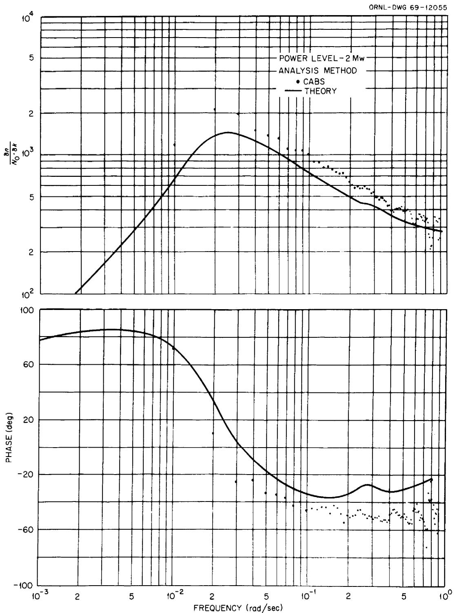  
Periods of data analyzed - 5   
Type sequence - 127 x 5 PRBS   
FIGURE 18. Frequency-response results from a flux-demand test with the reactor at $2\mathrm{Mw}$ .

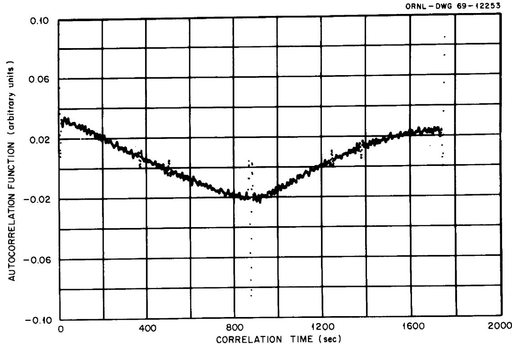

FIGURE 19. Correlation function and power spectrum results from a flux-demand test using a PRTS test pattern.   
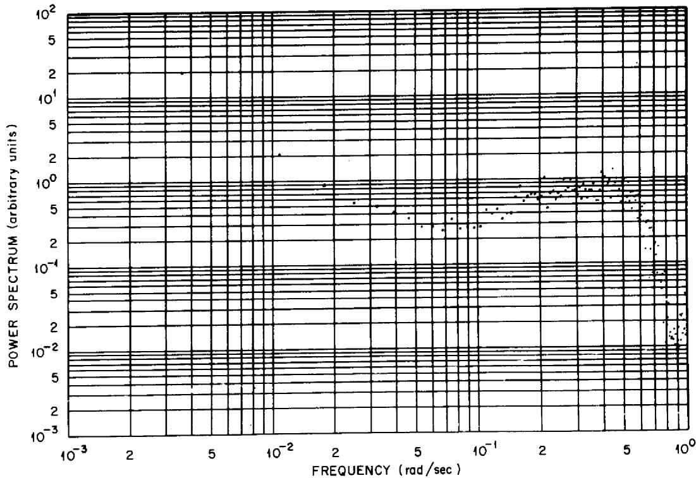  
(a) Autocorrelation function and power spectrum of the control-rod position.   
Periods of data analyzed - 2
Type sequence - 242 x 7.25 PRTS

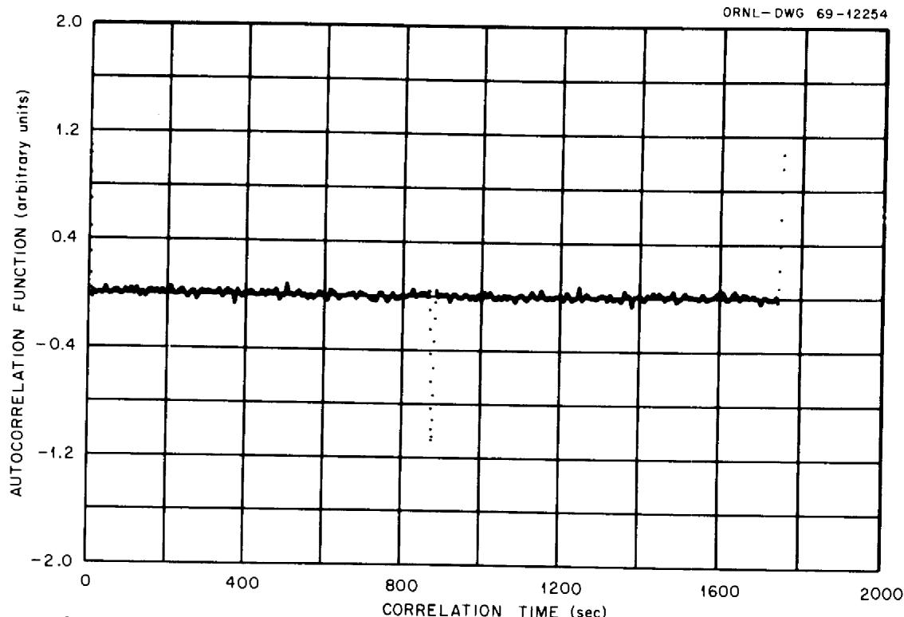

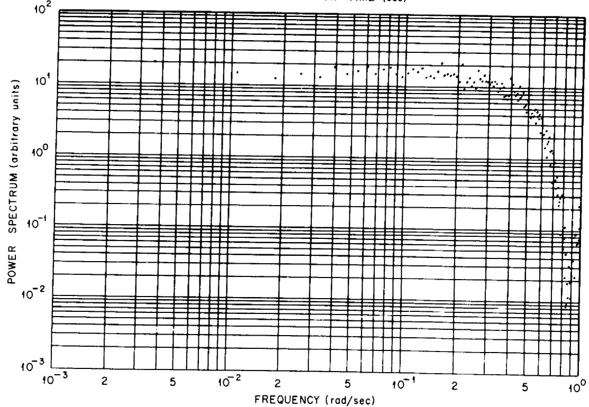  
(b) Autocorrelation function and power spectrum of the neutron flux. Periods of data analyzed - 2 Type sequence - 242 x 7.25 PRTS   
FIGURE 19. (continued)

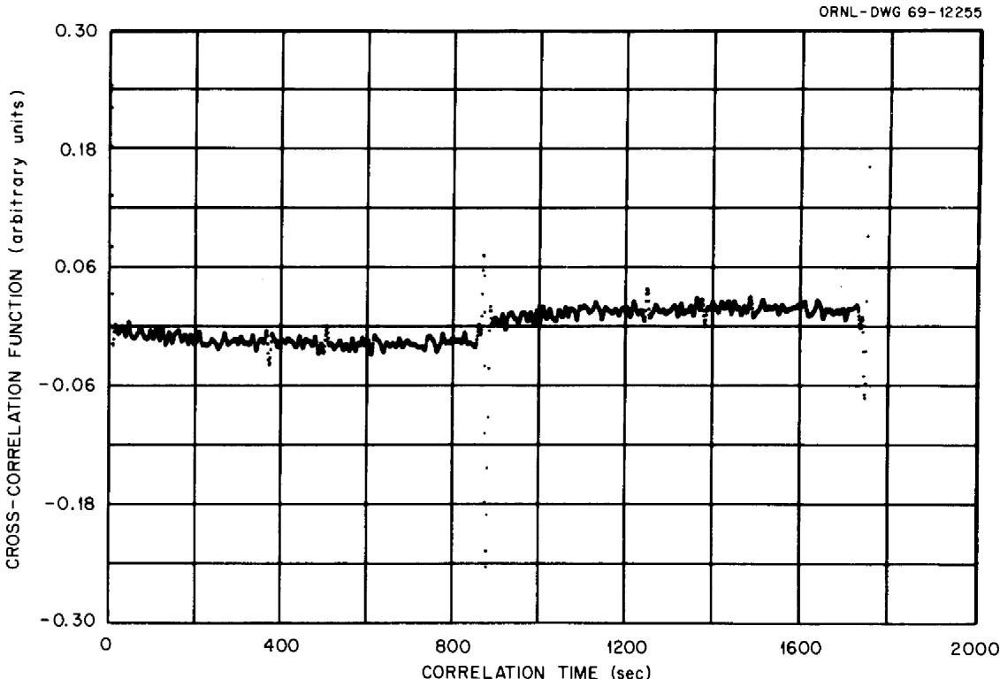

(c) Cross-correlation function and cross-power spectrum of the control-rod position and neutron flux.   
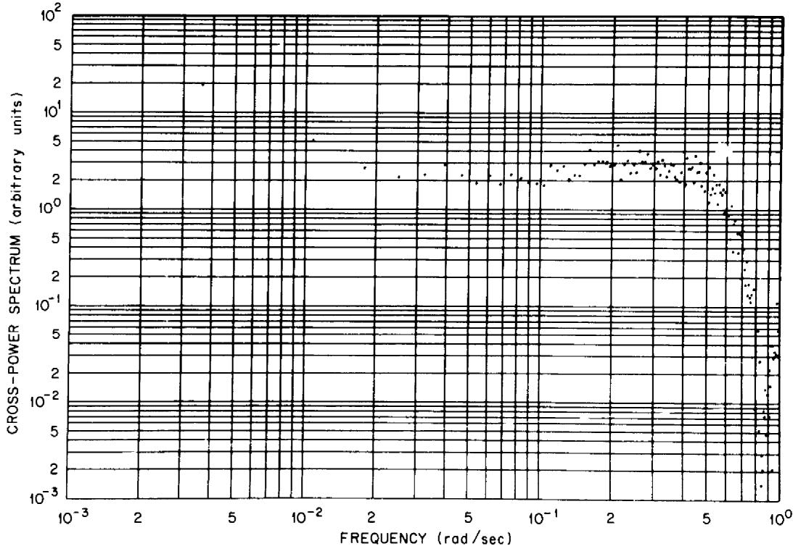  
Periods of data analyzed - 2   
Type sequence - 242 x 7.25 FRTS

FIGURE 19. (continued)

FIGURE 20. Frequency-response results from a flux-demand test performed on the $^{235}\mathrm{U}$ -fueled reactor using a PRTS test pattern.   
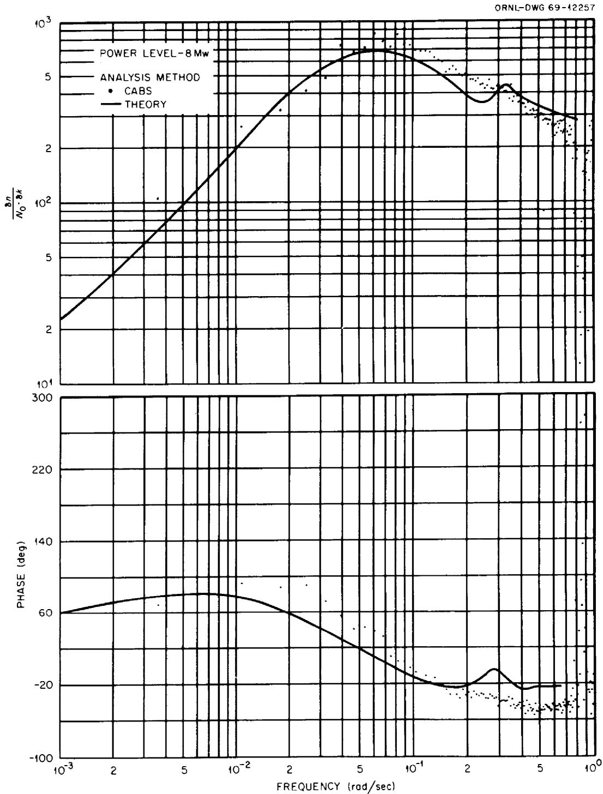  
Periods of data analyzed - 2   
Type sequence - 242 x 7.25 PRTS

frequency was exceptionally low. The reactor was at full power so the amplitude of the frequency response was expected to be low at the low frequency. Since the spectral power of the flux was flat, the power in the rod-position signal at the fundamental frequency must be relatively high to give the low value in the amplitude of the frequency response. Note that the power content of the lowest harmonic in Figure 19a is a factor of about 20 higher than most of the other harmonics. The relative high power content in the fundamental frequency necessarily yields a function similar to one period of a sine wave.

# "Non-Symmetric" PRTS Test Patterns

One property of a PRTS is that its autocorrelation function has a negative spike at lag time equal to $T/2$ which is equal in magnitude to the positive spikes at lag times equal to zero and $T$ (see Section I of Chapter II). This is possible only if the second half of the sequence is the negative of the first half. For example, if the first two bits in a PRTS are positive, the first two bits of the second half of the sequence will be negative.

The results of the first attempts at using a PRTS are shown in Figures 21 and 22. These were surprising in that the autocorrelation function of the flux signal (Figure 21b) did not assume the expected shape of a PRTS. The reason for the unexpected correlation function was found to be the manner in which we assigned voltage to the PRTS signal which was generated by the on-line computer (BR-340). Instead of using a signal which had the same number (n) of plus and minus pulses with (n-1) intervals at zero level, as is the case for a true PRTS, we were actually

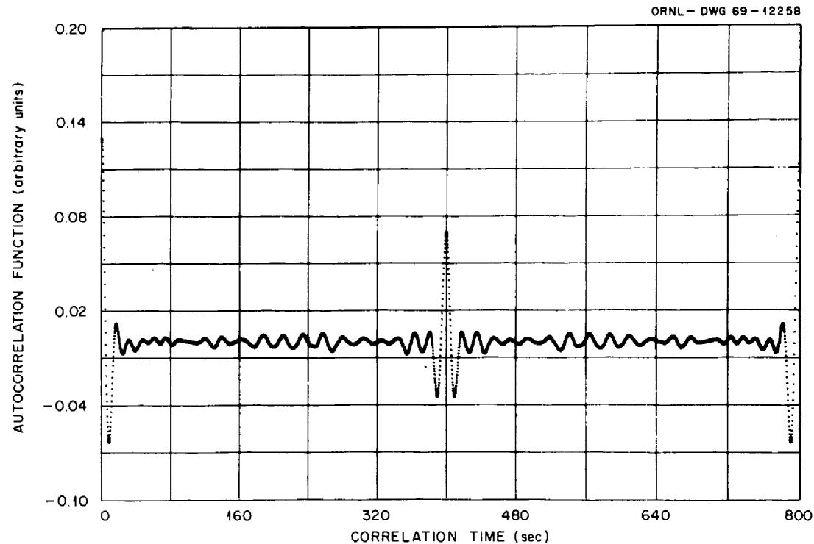

FIGURE 21. Correlation function and power spectrum results from a flux-demand test using a "non-symmetric" PRTS test pattern.   
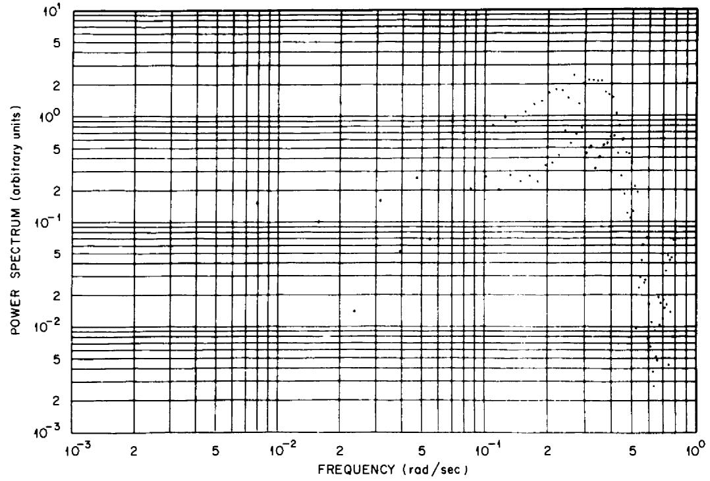  
(a) Autocorrelation function and power spectrum of the control-rod position.   
Periods of data analyzed - 4
Type sequence - 80 x 10 "non-symmetric" PRTS

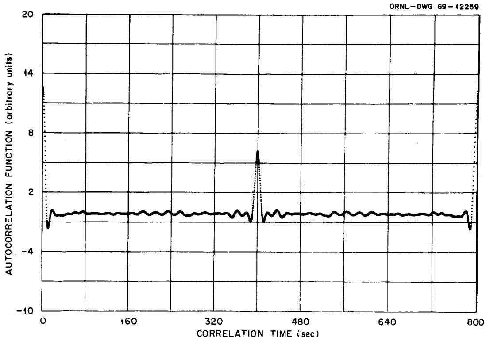

FIGURE 21. (continued)   
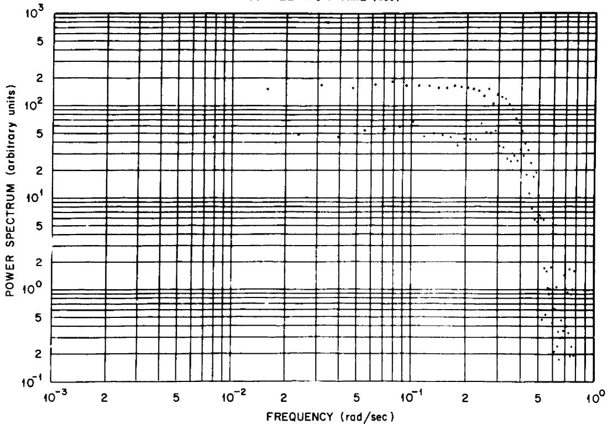  
Periods of data analyzed - 4   
Type sequence - 80 x 10 "non-symmetric" PRTS.

(b) Autocorrelation function and power spectrum of the neutron flux.

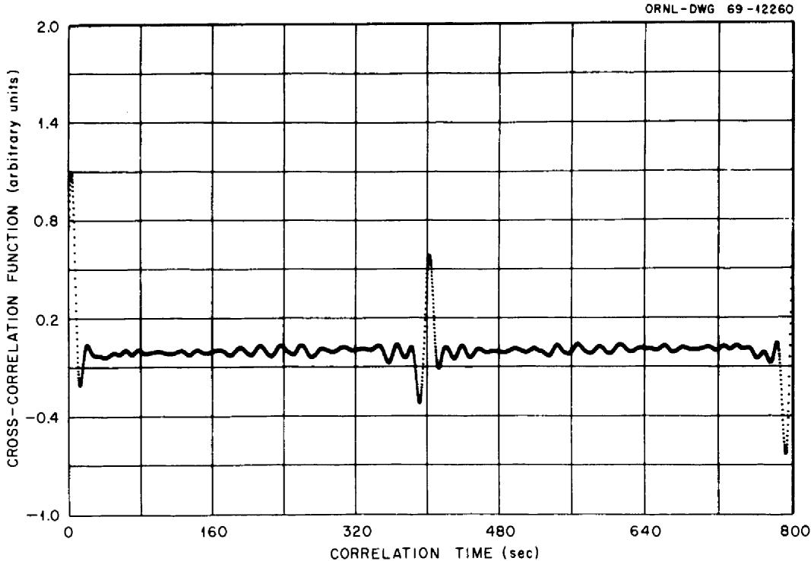

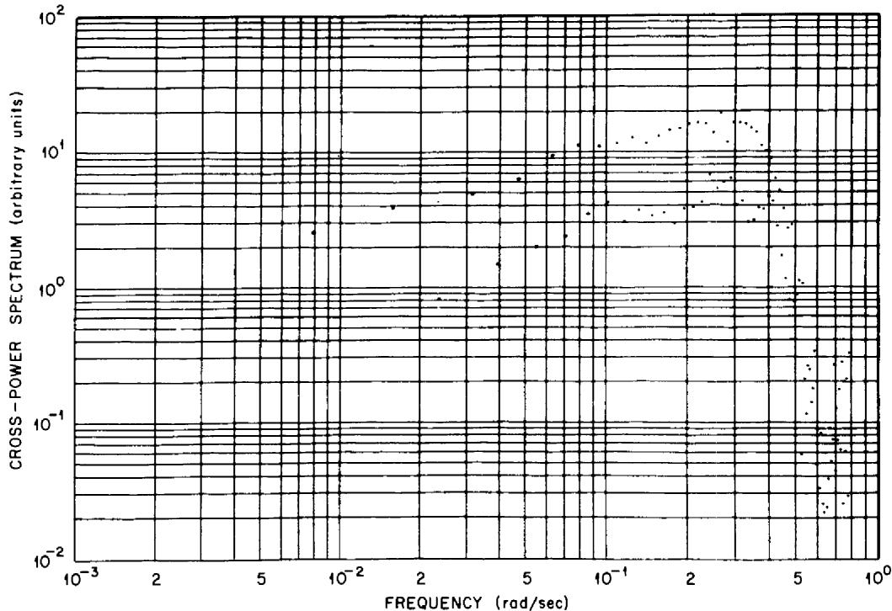  
(c) Cross-correlation function and cross-power spectrum of the control-rod position and neutron flux.

Periods of data analyzed - 4

Type sequence - 80 x 10 "non-symmetric" PRTS

FIGURE 21. (continued)

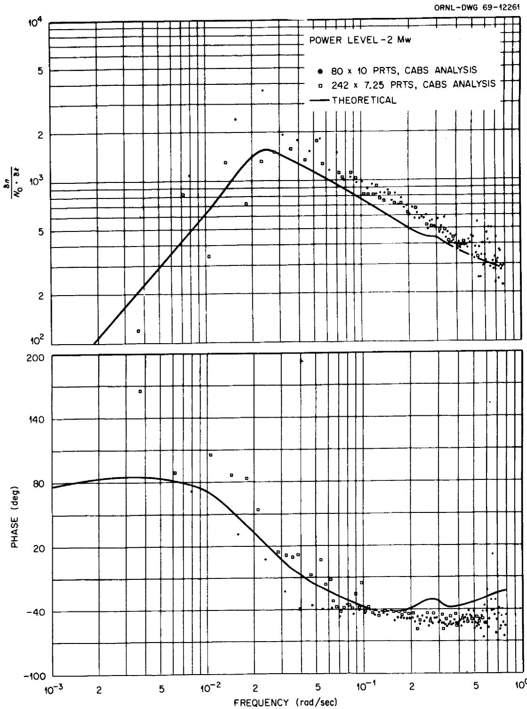  
FIGURE 22. Frequency-response results from flux-demand tests performed on the $^{235}\mathrm{U}$ -fueled reactor using "non-symmetric" PRTS test patterns.

using a signal with the same number (n) of plus and zero pulses with (n-1) minus pulses, which resulted in the autocorrelation function not being symmetric about the half-period time. Calculation of the power spectra for this type of signal showed that $3/4$ of the signal power was concentrated in the even harmonics with the remainder in the odd harmonics. This is still a valid signal for frequency-response determination, but it defeats one of the purposes of using the PRTS — the concentration of all the signal power in the odd harmonics. The magnitude-ratio and phase-angle plots for two tests which utilized this type signal are shown in Figure 22. Most of the scatter in the data is due to including the values obtained by analyzing the data at all harmonic frequencies instead of just on the even harmonics which contain most of the signal power.

# II. 233U FUEL LOADING

While the results of tests which utilized the flux-demand technique during the $^{235}\mathrm{U}$ testing were less than ideal, they were adequate and certainly better than no results. Hence, the plans for the $^{233}\mathrm{U}$ testing program were to perform the dynamics tests using the flux-demand technique. Both the PRBS and PRTS test signals were to be utilized with a general shift to shorter bit times so that the signals would have more signal power at higher frequencies. This was desired due to the shift in the frequency response of the reactor with the fuel change (see Figures 4 and 5 for a comparison of frequency responses).

While compensation for the changes in the frequency response of the reactor was not difficult, there were other changes in the "personality" of the reactor which did present problems. First, the control rods were

worth more $^4$ (about $30\%$ ) which meant that it would require less movement to obtain the same change in reactivity. Since the control rod was suspected of having caused problems in the $^{235}\mathrm{U}$ testing program, it was anticipated that the effect of moving the rod less (0.3 in. instead of 0.5 in.) would tend to magnify any inherent discrepancies which existed between indicated and actual control-rod position. Second, with the $^{235}\mathrm{U}$ fuel the reactor had been an exceptionally noise-free system, but shortly after operation began with the $^{233}\mathrm{U}$ fuel, the void fraction increased from about $0.05\%$ to about $0.6\%$ . This caused a large change in the background neutron noise. An example of the uncontrolled neutron level for both the $^{235}\mathrm{U}$ fuel loading and the $^{233}\mathrm{U}$ fuel loading is shown in Figure 23.

Typical correlation functions for the various types of signals employed in the testing were shown in Section I of Chapter IV and these will not be repeated for each test.

# 1. Flux-Demand Tests

# PRBS Test Patterns

The first tests on the $^{233}\mathrm{U}$ fuel loading were performed while the reactor was at zero power. The results of this test are shown in Figure 24a. While these results do not disprove the theoretical prediction, the scatter is such that they do not verify it either. Not only is there considerable scatter in these results, but at low frequencies

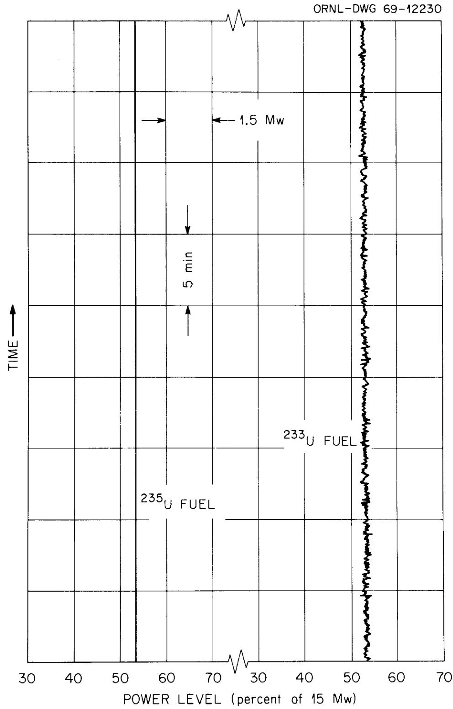  
FIGURE 23. Examples of the uncontrolled neutron flux during periods of 8 Mw power operation for the $^{235}\mathrm{U}$ fuel loading and the $^{233}\mathrm{U}$ fuel loading.

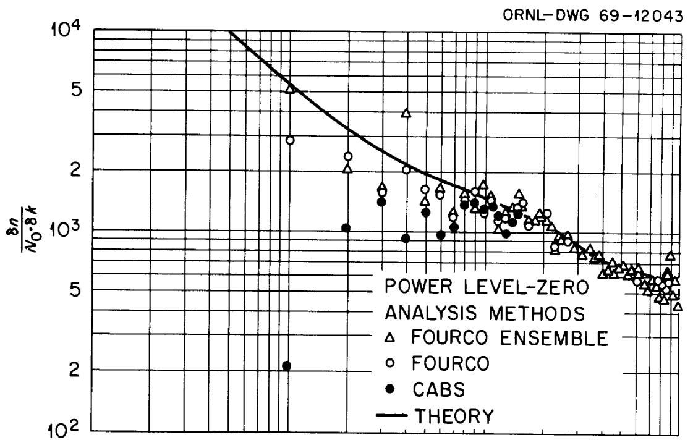

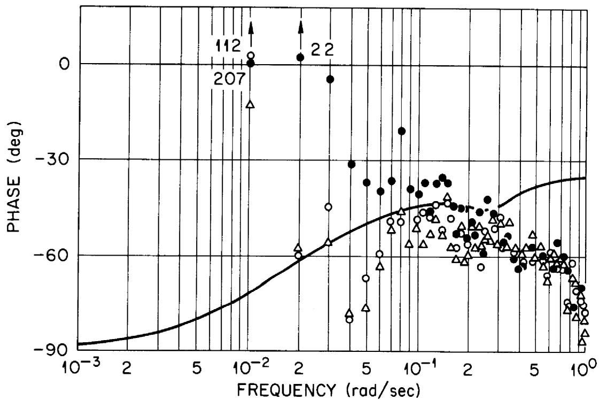  
(a) Results from four periods of a 127 x 5 PRBS with the reactor at zero power.   
FIGURE 24. Frequency-response results from flux-demand tests using PRBS test patterns performed on the $^{233}\mathrm{U}$ -fueled reactor.

FIGURE 24. (continued)   
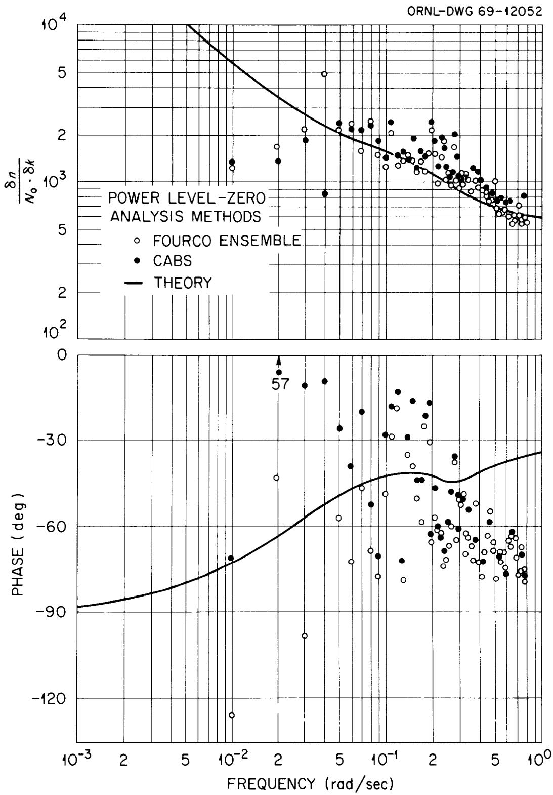  
(b) Results from three periods of a $127 \times 5$ PRBS with the reactor at zero power.

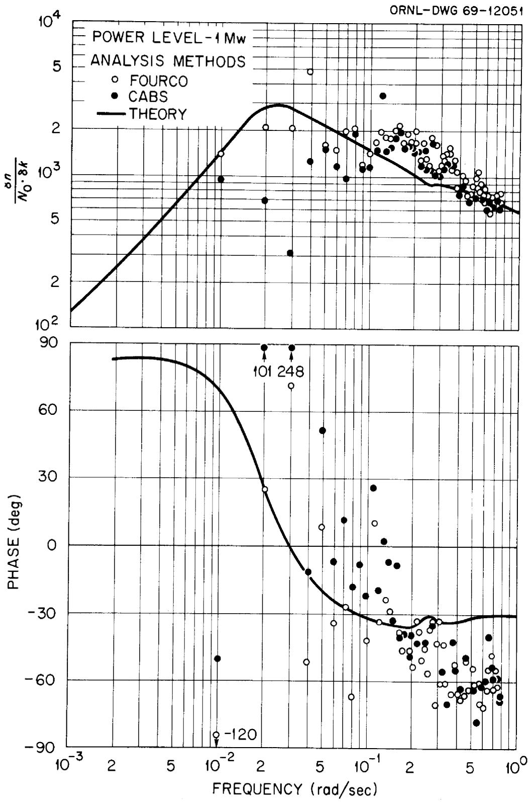  
(c) Results from four periods of a 127 x 5 PRBS with the reactor at 1 Mw.   
FIGURE 24. (continued)

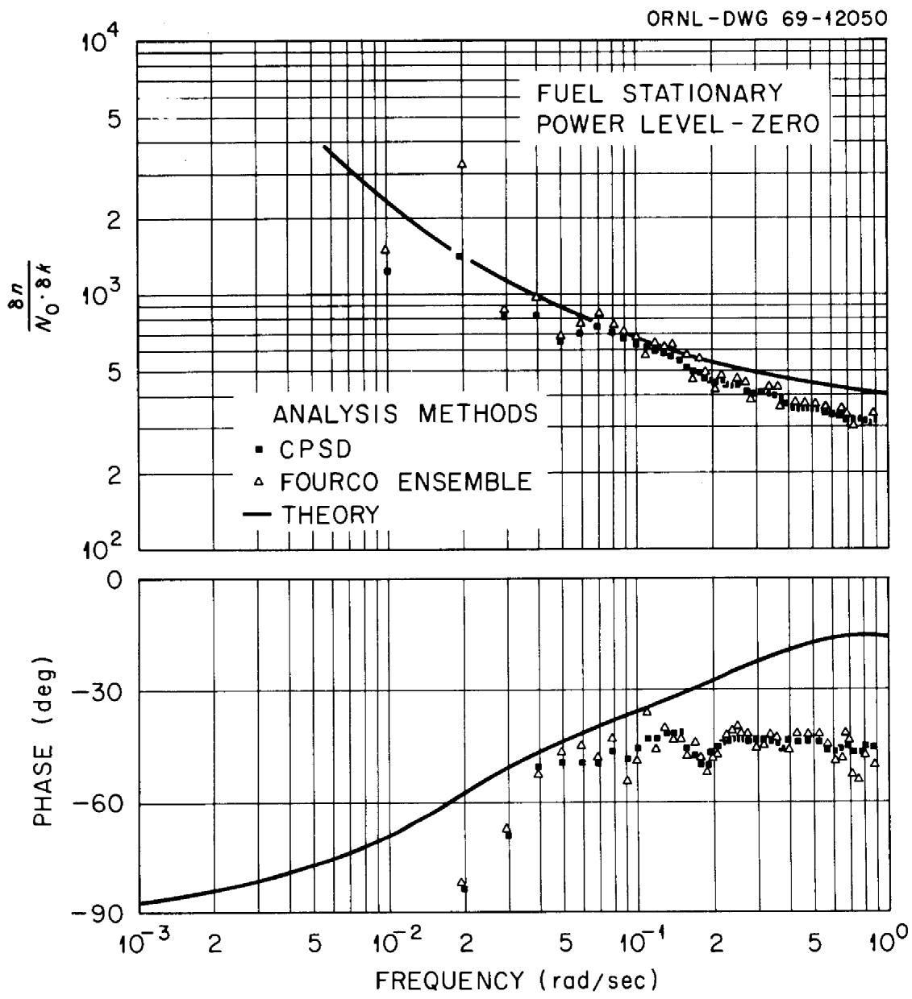  
(d) Results from four periods of a 127 x 5 PRBS with the reactor at zero power and the fuel not circulating.   
FIGURE 24. (continued)

the different analysis schemes often yielded results which were radically different. Analysis at higher frequencies tended to decrease the scatter in the data as well as in the differences between analysis method.

Typically, after about eight harmonics for a 127 x 5 test the differences between the analysis methods were negligible.

An example of the strong disagreement between analysis schemes is evident in the magnitude ratio results shown in Figure 24a. At the first harmonic (.00989 rad/sec) the CABS analysis resulted in a value of 230, FOURCO using a fine filter gave 2850, and the ensemble average of results from the four periods of data analyzed separately (broad filter) by FOURCO was 5200. The CPSD analysis (not shown) was $894$ . The coherence function was 0.17 as calculated by CABS and was 0.65 according to the CPSD analysis. The CABS result is obviously a low-confidence number and the CPSD coherence of .65 does not indicate strong relationship between the measured input and output signals.

Why the analysis techniques yielded different results when analyzing the same data is not completely resolved; however, there are clues which indicate that it is related to system noise. First, this problem was not pronounced except when testing with the flux-demand technique, and, as will be discussed later, the flux-demand technique caused an amplification of errors in the control-rod position indication. Second, in each case where there was a large discrepancy between analysis techniques, the CAES calculation of the power spectrum of the input signal was found to have a large phase angle $(-89^{\circ}$ for the point being discussed). Since only the cross-power spectra can contain phase information, the input power spectra calculations are obviously in error. The input power spectrum is

actually calculated by Fourier transforming the autocorrelation function of the input signal, and noise will make the autocorrelation function slightly non-symmetric about the half-period time since it prevents the signal from being exactly periodic. It is thought that this non-periodicity of the autocorrelation function was the cause of the erroneous CABS results. At least, when the result was in error, the coherence function signaled a warning to beware of placing confidence in the calculation.

Results of another zero-power test (3 cycles of a 127 x 5) are shown in Figure 24b. The differences between the results of different analysis schemes are not as pronounced; however, the general scatter in the results is greater. This is probably due to using only 3 periods of data in the analysis.

One curious feature of these results is the consistent roll-off of the experimentally determined phase angle at frequencies above about 0.4 rad/sec, even though the theoretical calculations predict an increase. This feature was apparent in all of the results and was not dependent on the type signal nor the testing technique. The implication is that either the theoretical predictions were inadequate in this aspect, or that there was an inherent phase lag between the actual and indicated rod position at the higher frequencies. Since the indicator was nearer the drive motor than the lower end of the rod and was separated from the lower end of the rod by several feet of flexible hose, it seems reasonable to expect a phase lag in the actual position at the higher frequencies.

The results from 4 cycles of a $127 \times 5$ PRBS which was performed with the reactor at 1 Mw are shown in Figure 24c. The typical scatter at all

frequencies and the discrepancies between analysis techniques at the low frequencies is apparent. The low phase-angle values at the higher frequencies are also present.

With the fuel not circulating, the dynamic characteristics of the MSRE approach those of solid-fuel reactors. The results of a frequency-response test which was performed with the fuel not circulating are shown in Figure 24d, page 82. The scatter in these results is much less than the scatter in the results for the circulating-fuel tests. The magnitude-ratio results are in general agreement with the theoretical prediction, but the phase angle is below the theoretical at the higher frequencies.

# PRTS Test Patterns

If some type of system noise were the cause of the excessive scatter in the results of tests which utilized a PRBS test signal, it does not seem logical that going to a three-level signal would improve the results. This logical deduction was verified by the results of tests at zero power and at 5 Mw.

The results of three different tests at zero power are shown in Figures 25a, 25b, and 25c. Two of the tests are $80 \times 3$ sequences and the third is a $242 \times 5$ sequence. There are not any significant differences between the results of these tests, and each is characterized by the same type scatter which was apparent in the PRBS flux-demand tests. While there is some variation between results obtained from the different analysis methods, the differences are not as pronounced as they were in the results obtained in some of the PRBS tests. However, since all of the PRBS tests did not exhibit large differences in results for the

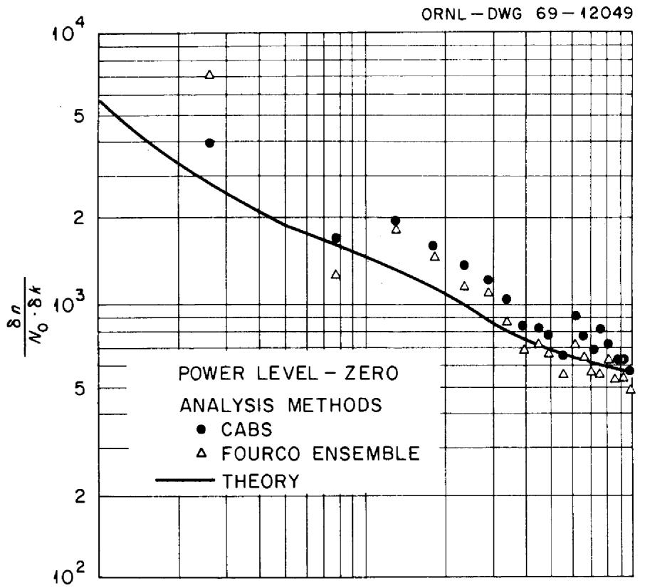

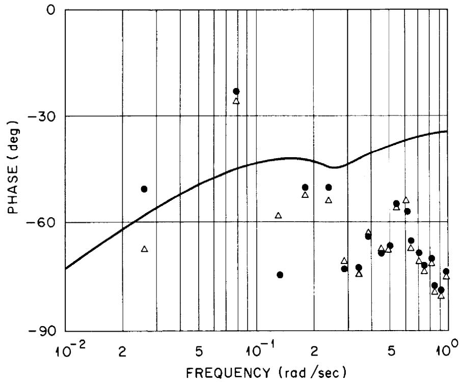  
(a) Results from four periods of an $80 \times 3$ PRTS with the reactor at zero power.   
FIGURE 25. Frequency-response results from flux-demand tests using PRTS test patterns performed on the $^{233}\mathrm{U}$ -fueled reactor.

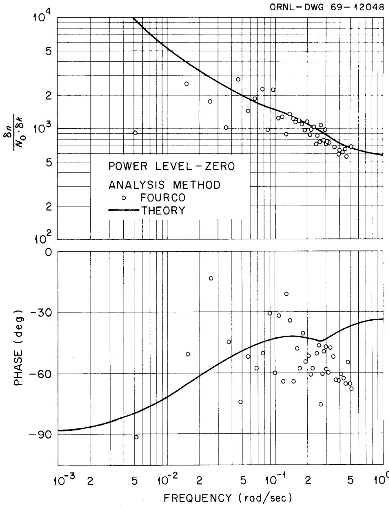  
(b) Results from two periods of a 242 x 5 PRTS with the reactor at zero power.   
FIGURE 25. (continued)

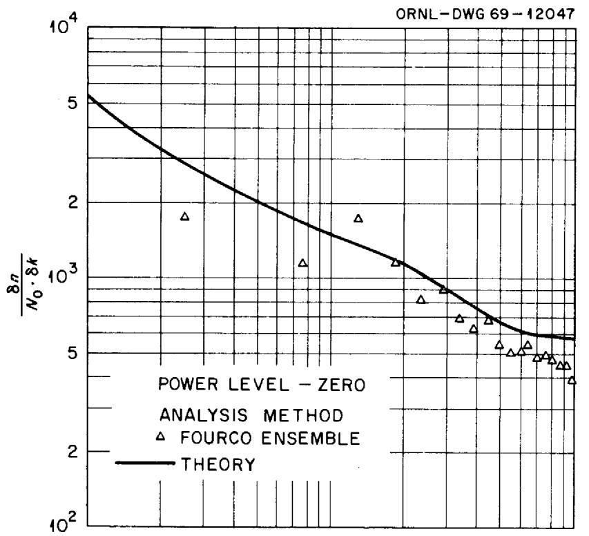

FIGURE 25. (continued)   
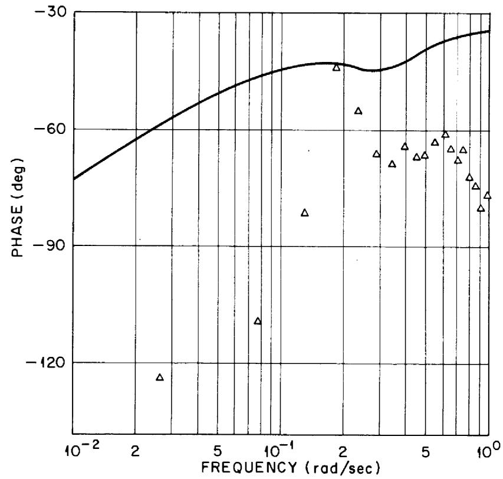  
(c) Results from three periods of an $80 \times 3$ PRTS with the reactor at zero power.

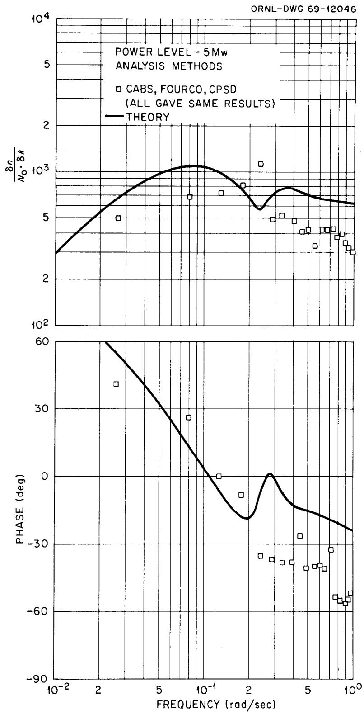  
(d) Results from twelve periods of an 80 x 3 PRTS with the reactor at 5 Mw.   
FIGURE 25. (continued)

FIGURE 25. (continued)   
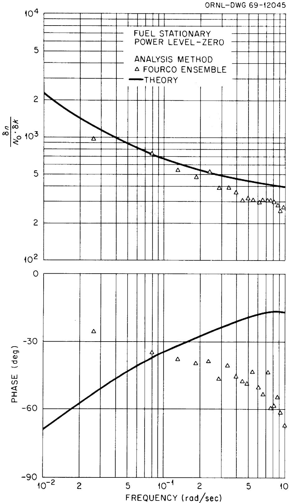  
(e) Results from four periods of an $80 \times 3$ PRTS with the reactor at zero power and the fuel not circulating.

different analysis methods, it is not certain that the PRTS signal discriminates against this anomalous behavior, but there does appear to be a tendency in that direction.

The significant features of the overall results of the zero-power tests shown in Figures 25a, 25b, and 25c are almost identical to those of the PRBS tests. The results are in general agreement with the theoretical predictions, but the magnitude-ratio results tend to drop below the theoretical results at the higher frequencies. The phase angle also drops below the theoretical predictions above 0.4 rad/sec.

In an effort to improve on the statistical precision of the results, an 80 x 3 sequence was used in a test at 5 Mw and was continually repeated until 12 periods of usable data were collected. The results of this test (Figure 25d) were almost identical for each of the analysis schemes, and the scatter in the results is lowered but is not eliminated. The experimental magnitude-ratio results obtained for frequencies higher than about 0.4 rad/sec are lower than the theory and the phase angle continues to be low at the higher frequencies (about $35^{\circ}$ at 1 rad/sec). The possible $5^{\circ}$ error introduced by the digitization lag in the data recording would obviously be insufficient to correct for this deviation.

An 80 x 3 PRTS was performed with the fuel stationary and yielded the frequency-response determination shown in Figure 25e. The magnitude-ratio results are not consistent with the theory in magnitude but the general shape is the same. The phase angle results are exceptionally poor in that they do not conform to the shape of the theoretical curve at any frequency. The poor results of this test were surprising since the results of the PRBS test on the non-circulating fuel were so good.

# Discussion

In summary, the results of flux-demand tests applied to the $^{233}\mathrm{U}$ -fueled MSRE were disappointing. The results contained such excessive scatter that they were of little value in describing the frequency response of the MSRE. Neither type test signal appeared to give better results than the other and there were anomalous discrepancies between analysis techniques when applied to the same data.

The failure of the flux-demand technique to provide adequate results with the $^{233}\mathrm{U}$ fuel is attributed to a combination of poor coupling between the indicated and actual rod position and system noise. As described in Chapter II, the rod-drive assembly actually drives a chain onto which the upper end of a flexible hose is attached. This hose maneuvers around two $30^{\circ}$ bends in the tube in which it is enclosed and then drops vertically into a region near the center of the core. As the control rod moves, it encounters considerable friction as is evidenced by the normal average control-rod acceleration of only 8 to $15\mathrm{ft} / \mathrm{sec}^2$ during a scream (Reference 6, pages 26, 27). This may be enough friction to allow the rod to actually move in short jerks rather than a continuous smooth fashion. Other possible sources of difference between the actual rod movement and the indicated movement include stiff linkage in the drive chain which would not allow the chain to conform to the curvature of the sprocket, and the possibility that the rod was stiff, bowed, or twisted in a region which was traversing the bends. This would cause the lower region of the rod not to move in an exactly vertical direction. In addition, there are several gears between the actual rod drive linkage and the position indicators (the "fine" and "coarse" synchros). There is

likely some amount of freedom between these gears which results in errors in the indicated rod position. Since the rod is typically moved a maximum of about 0.5 in. during a flux-demand test, a discrepancy between the indicated position and the actual end of the control rod of only 0.05 in. on both ends of the travel could produce an error of $20\%$ in the indicated reactivity change. Hence, any of the above mentioned possible error sources are capable of significantly contributing to the total error.

The "coarse" synchro was used to indicate rod position in all of the tests performed on the $^{235}\mathrm{U}$ fuel loading. After the results of the first flux-demand tests with $^{233}\mathrm{U}$ fuel were received, the testing procedure was changed so that a completely different rod assembly (including synchro) was used. This did not help to reduce the scatter in the results so a system was devised whereby the "fine" synchro could be used. This did not appear to improve the results, but in the remainder of the testing program the fine synchro was used.

The additional neutron noise which accompanied the $^{233}\mathrm{U}$ fuel loading contributed to the scatter in the results in two ways. First, additional noise on a signal tends to lower the statistical precision of computations performed with that signal. Second, the flux was required to remain within the deadband as prescribed by the servo circuits. With the additional noise, the control rod needed to move almost continuously in order to keep the flux within the deadband limits. Since it is known that there are errors in the indicated rod position, these additional rod movements certainly introduced errors in the measured frequency response.

# 2. Rod-Demand Tests

# PRBS Test Patterns

The failure of the flux-demand testing required that a change be made in the testing technique. The results from the good rod-jog test as described in Section I of this chapter, were very encouraging so a change back to rod-controlled testing was desired. Instead of attempting to force the rod-jog method to work, it was decided to try a new approach, the rod-demand technique. As previously described for the rod-demand technique, the control-rod servo was changed so that it forced the indicated control-rod position to match an input demand.

With the reactor at zero power, a 127 x 5 PRBS was implemented in the reactor using this method. The results of this test are shown in Figure 26a and, except for the phase angle results at higher frequencies, are in excellent agreement with the theoretical predictions. The magnitude ratio results were normalized by multiplying by 1.75. Normalization was usually necessary when a PRBS was used with the rod-demand technique. The reason for this normalization will be discussed more fully later in this section.

With the reactor at 5 Mw, a 127 x 5 PRBS was repeated until two hours of data were collected. Eleven consecutive periods of the sequence were obtained from this test and analysis of this data gave the excellent results shown in Figure 26b which have not been normalized. There is little scatter in the results and they are in good agreement with the theoretical predictions. The experimental results dip at about .24 rad/sec as theoretically predicted although the dip in the experimental results is not as

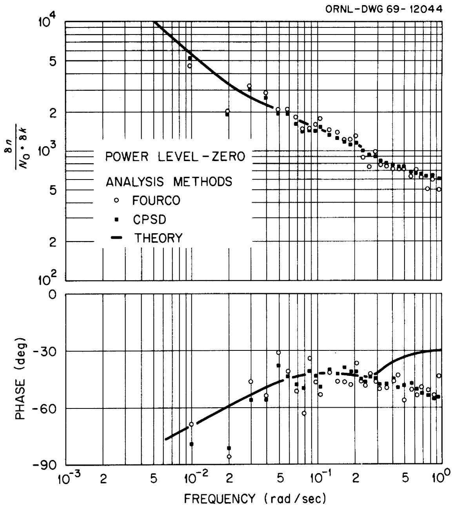  
(a) Results from three periods of a 127 x 5 PRBS with the reactor at zero power. Magnitude ratio normalized by multiplying by 1.75.   
FIGURE 26. Frequency-response results from rod-demand tests using PRBS test patterns performed on the $^{233}\mathrm{U}$ -fueled reactor.

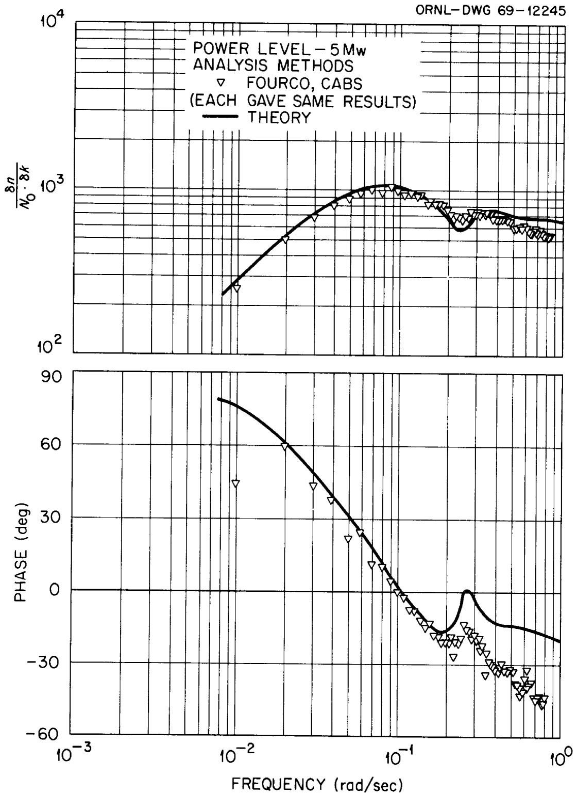  
(b) Results from eleven periods of a 127 x 5 PRBS with the reactor at 5 Mw.   
FIGURE 26. (continued)

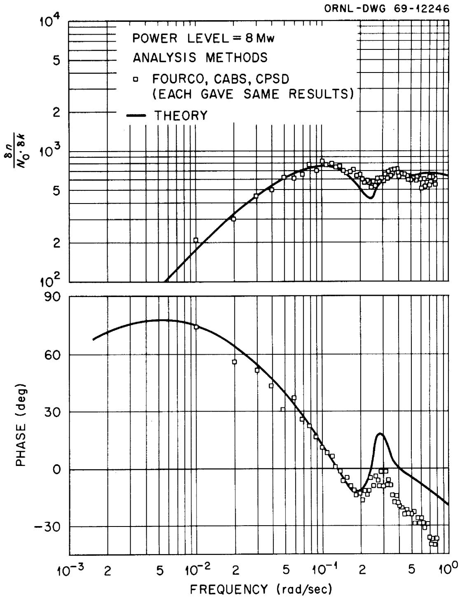  
(c) Results from eight periods of a $127 \times 3$ PRBS with the reactor at 8 Mw. Magnitude ratio normalized by multiplying by 1.30.   
FIGURE 26. (continued)

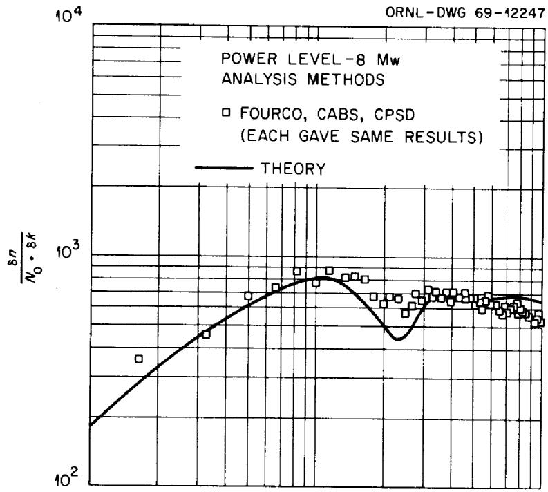

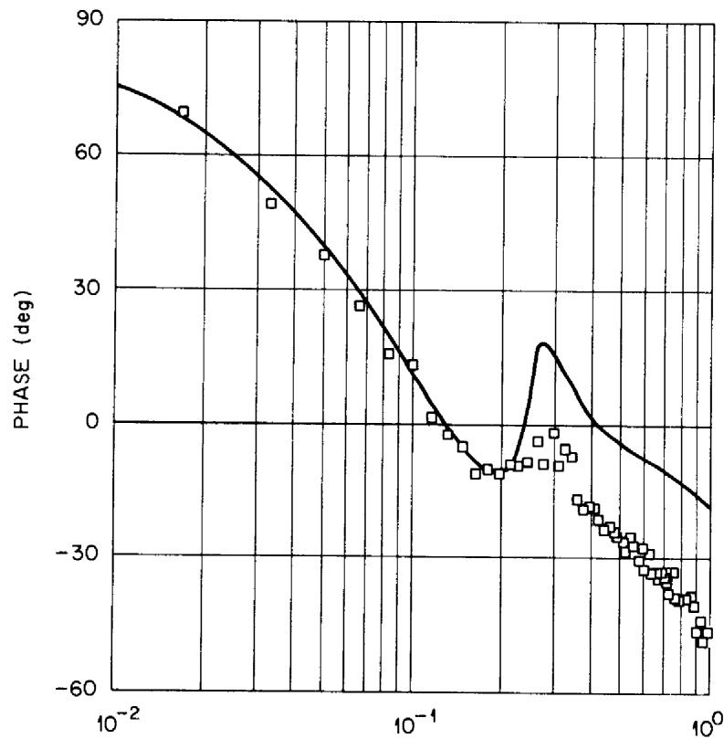  
FREQUENCY (rad/sec)   
(d) Normalized results from five periods of a $127 \times 5$ PRBS with the reactor at $8 \mathrm{Mw}$ . Magnitude ratio normalized by multiplying by 1.36.

FIGURE 26. (continued)

pronounced as in the predictions. The magnitude ratio and phase angle fall below the theory at higher frequencies.

The results of two tests performed with the reactor at full power are shown in Figures 26c and 26d. The results in Figure 26c are from analysis of five periods of a $127 \times 5$ PRBS, and those in Figure 26d are from analysis of eight cycles of a $127 \times 3$ PRBS. The magnitude ratio results were normalized to agree with the theoretical curve at 0.4 rad/sec. Normalization factors were 1.30 and 1.36 respectively. There is little scatter in the results and they tend to be in good agreement with the shape of the theoretical curve except for the regular depression at the higher frequencies. The dip in the experimental results at 0.24 rad/sec is evident but, as before, is not as pronounced as the theory predicted.

In general the coherence functions calculated for the rod-demand tests were above 0.98 and below 1.0 with occasional values slightly higher than 1.0. The value of the coherence function was usually relatively low (about .95) for the lowest harmonic frequency but came within the quoted range after a few harmonics and remained in the band until the power in the input signal began the characteristic rapid decrease at the higher frequencies.

# PRTS Test Patterns

Results of a test in which a PRTS test pattern was implemented using the rod-demand technique is shown in Fig. 27. The scatter in the results resembles the scatter which was evident in the results of the flux-demand tests, and these results do little to aid in the specification of the

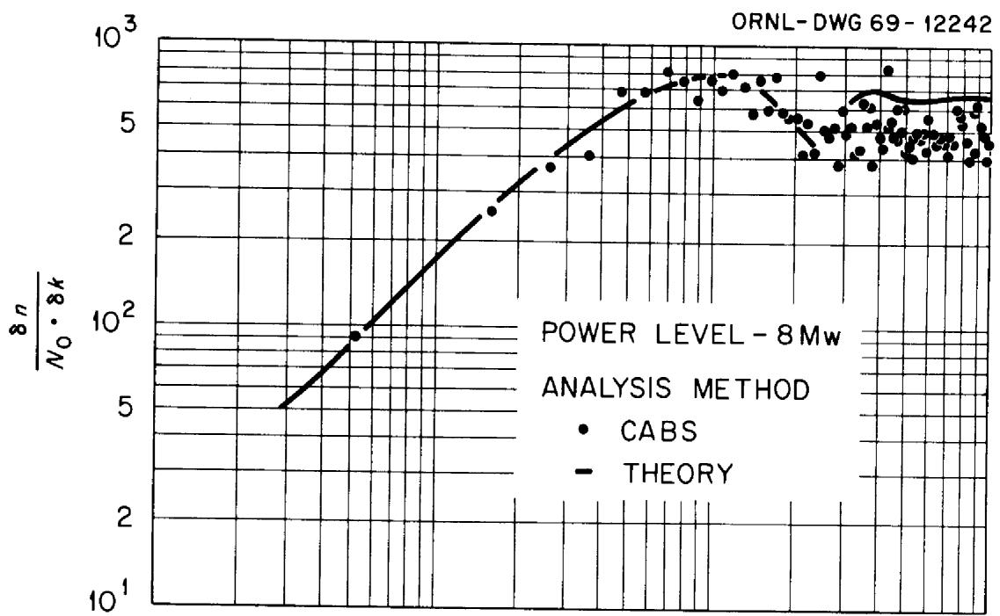

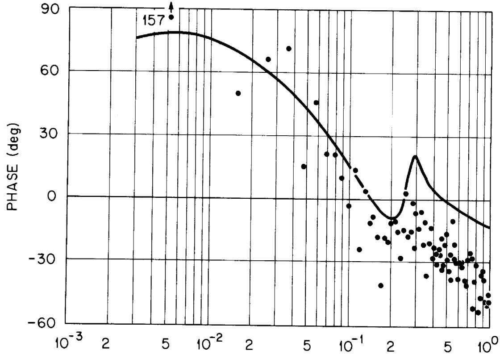  
FREQUENCY (rad/sec)   
FIGURE 27. Frequency-response results from two periods of a rod-demand test using a $242 \times 5$ PRTS test pattern.

frequency response of the MSRE. The results do tend to be scattered around the theoretical curve and normalization of the results was not necessary.

The coherence functions calculated from these data generally scattered in a band between about .94 and 1.08 over the frequency range at which the signal power was relatively constant. The coherence functions at the fundamental frequency were considerably below this scatter band (0.65 for the results shown in Figure 27), but after a few harmonics, the values were within the normal scatter.

# Discussion

When a PRBS test pattern was used, the results from the rod-demand technique were very encouraging. Normalization factors were often necessary to get the experimental results to agree with the theoretical predictions, but the shapes of the two were in accord. When a PRTS test pattern was employed with the rod-demand technique, there was excessive scatter in the results. Since there is considerable interest in the PRTS test pattern, it is unfortunate that these results were of poor quality; however, the failure of these tests did provide another clue toward better understanding of the MSRE.

The postulated reasons for failure of the flux-demand technique to provide adequate results was the behavior of the control-rod assembly, and the results of the rod-demand tests tend to verify the postulate. When the rod was moved in a manner which simulated a PRBS waveform, it would be inserted, held stationary for a few seconds, withdrawn, held stationary, and then inserted again. This pattern was repeated with the only variation being in the length of time it remained stationary. An

insertion was always followed by a withdrawal and vice versa. If the bottom end of the rod did not actually move the distance the gear train indicated, as might be the case if any of the several possible high-friction conditions mentioned on pages 92 and 93 actually existed, then the waveform would still be well represented, but the indicated magnitude of the perturbations would be in error. This certainly fits with the results of the PRBS tests when used with the rod-demand technique and explains the necessity of use of a normalization factor. With the PRTS wave form, each movement of the control rod is not necessarily the opposite of the previous movement. An insertion may follow an insertion, and a withdrawal may follow a withdrawal. If, after a single insertion, the rod had moved to a high-friction position which was slightly hindering its motion, another insertion would force it on through this spot and it might or might not end near a similar spot after the second insertion. The effect of subsequent withdrawals and insertions is unclear since the insertions may originate from two different positions and those from the middle position may be following an insertion or withdrawal. If the rod-position indicator was not able to provide accurate information during at least part of these movements, then the test results would be expected to contain scatter. This fits the results of the PRTS tests when the rod-demand technique was used. It is important to note that these explanations for the results of the different type tests have not been proven but are offered as reasonable explanations which fit the experimental observations.

# CHAPTER V

# CONCLUSIONS AND RECOMMENDATIONS

The purpose of this work was to experimentally measure the frequency response of the MSRE and to determine the effects of varying the testing technique and test signal specification. The experimental results verified the predictions and were adequate to provide a recommendation for improving the theoretical model. The dip in the magnitude ratio which was predicted at about 0.24 rad/sec is present in the experimental results, but it is not as pronounced as expected. Since the magnitude of the dip has been shown3 to be a strong function of the salt mixing as it circulates around the primary system, I conclude that the theoretical models need to allow for more mixing of the fuel salt.

In the course of the testing program, three different testing techniques were used. The rod-jog technique, an open-loop method of rod control, worked well when the rods were free-moving. Since there was no feedback, any imbalance between the withdrawal and insertion times resulted in drift of the average position. The flux-demand technique imposed the test pattern on the flux rather than rod position. The results from this type test contained more scatter than rod-controlled testing but for the $^{235}\mathrm{U}$ fuel loading gave adequate results. The faster response of the $^{233}\mathrm{U}$ -fueled reactor, coupled with the increased noise level and more aging of the control rod assemblies, gave results which contained such scatter that they were of little value in determining the frequency

response of the MSRE. For a system in which the rod position is well defined, this technique should work well and has advantages which might make it preferred over rod-controlled testing for certain applications.

The rod-demand technique, a closed-loop method of rod control, when used with a PRBS, meshed with the physical limitations of the MSRE to give the best results of the testing program. Normalization of the results was sometimes necessary but the shapes were in good agreement with the theory.

Various PRBS and PRTS sequences were used. The PRBS was found to give better results with the rod-controlled testing and neither type signal was adequate when the flux-demand technique was used with the $^{233}\mathrm{U}$ fuel loading. The failure of the PRTS signal when used with the rod-demand technique is thought to be an extension of the problems associated with the control-rod position indication. Sequence lengths varied between 80 and 242 bits and the basic bit duration varied between 3 and 10 seconds. The expected distributions of signal power as a function of frequency were found and there were no anomalous effects noted for the different sequence specifications. As one would expect, it was found that better statistical precision was obtained for sequences which were repeated several times.

Analysis techniques gave consistent results when applied to data which contained a relatively low noise level but differed radically at the low frequencies, typically the first five to ten harmonics, when the data contained high noise content, such as during the flux-demand tests. No systematic study was made to determine the reasons for these differences which leaves this as an area in need of additional work.

The experience gained in this work emphasizes the need to plan the testing of a system to match the test procedure to the characteristics of that system. In particular, the difficulty in obtaining accurate indications of rod position changes dictated that all unnecessary rod movement be eliminated. In the $^{233}\mathrm{U}$ -fueled system with a high noise level in the flux signal, the rod-demand method proved to be the best testing procedure.

Some areas in which more work is needed are:

1. Determination of the cause of the difference between analysis schemes at the low frequencies when a large amount of noise is present.   
2. Investigation into the meaning of the coherence function when applied to periodic sequences and explanation for the experimentally determined coherence functions which were greater than 1.0.   
3. Complete verification of the hypothesis that proper analysis at frequencies midway between adjacent harmonic frequencies of the minimum period length will provide a measure of the system noise level that was present during the testing.

LIST OF REFERENCES

# LIST OF REFERENCES

1. Buckner, Melvin R., "A Study of the Application of System Identification Techniques in the Analysis of Nuclear Reactor Dynamics," Unpublished Masters Thesis, Nuclear Engineering Department, University of Tennessee, Knoxville, Tennessee (December 1968).   
2. Ball, S. J. and Kerlin, T. W., "Stability Analysis of the Molten-Salt Reactor Experiment," USAEC Report ORNL-TM-1070, Oak Ridge National Laboratory, (December 1965).   
3. Steffy, Jr., R. C. and Wood, P. J., "Theoretical Dynamic Analysis of the MSRE with U-233 Fuel," USAEC Report ORNL-TM-2571, Oak Ridge National Laboratory (July 1969).   
4. Haubenreich, P. N. et al., "MSRE Design and Operations Report, Part V-A, Safety Analysis of Operation with $^{233}\mathrm{U}$ ," USAEC Report ORNL-TM-2111, Oak Ridge National Laboratory, p. 41, (February 1968).   
5. Molten-Salt Reactor Program Semiannual Progress Report, July 31, 1964, USAEC Report ORNL-3708, Oak Ridge National Laboratory, p. 231, (November 1964).   
6. Molten-Salt Reactor Program Semiannual Progress Report, February 28, 1969, USAEC Report ORNL-4396, Oak Ridge National Laboratory, p. 130, (August 1969).   
7. Robertson, R. C., "MSRE Design and Operations Report, Part 1, Description of Reactor Design," USAEC Report ORNL-TM-728, Oak Ridge National Laboratory, (January 1965).   
8. Tallackson, J. R., "MSRE Design and Operations Report, Part II-A, Nuclear and Process Instrumentation," USAEC Report ORNL-TM-729, Part II-A, Oak Ridge National Laboratory, (February 1968).   
9. Kerlin, T. W. and Ball, S. J., "Experimental Dynamic Analysis of the Molten-Salt Reactor Experiment," USAEC Report ORNL-TM-1647, Oak Ridge National Laboratory, (October 1966).   
10. Kerlin, T. W. "The Pseudo-Random Binary Signal for Frequency Response Testing," USAEC Report ORNL-TM-1662, Oak Ridge National Laboratory, (1966).   
11. Elspas, Bernard, "The Theory of Autonomous Linear Sequential Networks," Transactions of the I.R.E. on Circuit Theory, CT-6: 45-60 (1959).

12. Everett, D., "Periodic Digital Sequences with Pseudonoise Properties," General Electric Company (Limited of England) Journal of Science and Technology, 33(3): 115-126 (1966).   
13. Godfrey, K. R. and Murgatroyd, W., "Input-Transducer Errors in Binary Cross-correlation Experiments," Proceedings of the Institute of Electrical Engineers, 112(3): (March 1965).   
14. Briggs, P. A. N., Godfrey, K. R., Hammond, P. H., "Estimation of Process Dynamic Characteristics by Correlation Methods using Pseudo Random Signals," IFAC Symposium on Identification in Automatic Control Systems, 12-17 June, 1967, Prague, Czechoslovakia, Part II, pp. 1 - 12, Academia-Prague (June 1967).   
15. Zierler, Neal, "Linear Recurring Sequences," Journal of the Society of Industrial Applied Mathematics, 7(1): (March 1960).   
16. Simpson, H. C., "Statistical Properties of a Class of Pseudorandom Sequences," Proceedings of the Institute of Electrical Engineers, 113(12): 2075, (December 1966).   
17. Turin, G. L., "An Introduction to Matched Filters," Institute of Radio Engineers Transactions on Information Theory, IT-6: p. 311 (1960).   
18. Roberts, P. D. and Davis, R. H., "Statistical Properties of Smoothed Maximal-Length Linear Binary Sequences," Proceedings of the Institute of Electrical Engineers, 113(1): 190 (January 1966).   
19. Kerlin, T. W., "Frequency-Response Testing," Nuclear Safety, 8(4): 339-345, (Summer, 1967).   
20. Hooper, R. J. and Gyftopoulos, E. P., "On the Measurement of Characteristic Kernels of a Class of Nonlinear Systems," Neutron Noise, Waves, and Pulse Propagation, Proceedings of Symposium at University of Florida, February 14 - 16, 1966, R. E. Uhrig, Editor, AEC-Symposium Series No. 9, USAEC-DTIE, Oak Ridge National Laboratory, (1967).   
21. Godfrey, K. R., "Three-Level m-Sequences," Electronic Letter, 2: 241 (1966).   
22. Briggs, P. A. N. and Godfrey, K. R., "Pseudorandom Signals for the Dynamic Analysis of Multivariable Systems," Proceedings of the Institute of Electrical Engineers, 113(7): (July 1966).   
23. Ball, S. J., "A Digital Filtering Technique for Efficient Fourier Transform Calculations," USAEC Report ORNL-TM-1662, Oak Ridge National Laboratory (July 1967).

24. Broome, P. G. and Cooper, G. C., "Fourier Spectrum Analysis by Analog Methods," Instrumentation and Control Systems, 35(5): 155-60 (May 1962).   
25. Ball, S. J., Instrumentation and Control Systems Division Annual Progress Report, September 1, 1965, USAEC Report ORNL-3875, pp. 126 - 127, Oak Ridge National Laboratory (September 1965).   
26. Kerlin, T. W. and Lusius, J. L., "CABS - A Fortran Computer Program for Calculating Correlation Functions, Power Spectra, and the Frequency Response from Experimental Data," USAEC Report ORNL-TM-1663 (September 1966).   
27. Thie, J. A., Reactor Noise, Rowan and Littlefield, Inc., New York (1963).   
28. Bendat, J. S. and Piersol, A. G., Measurement and Analysis of Random Data, John Wiley and Sons, Inc., New York (1966).   
29. Balcomb, J. Douglas, Demuth, H. B., and Gyflopoulis, E.P., "A Cross-correlation Method for Measuring the Impulse Response of Reactor Systems," Nuclear Science and Engineering, 11: 159-166 (1961).   
30. Godfrey, K. R., Everett, D., and Bryant, P. R., "Input-Transducer Errors in Binary Crosscorrelation Experiments - 2," Proceedings of the Institute of Electrical Engineers, 113(1): 185-189 (January 1966).   
31. Godfrey, K. R., "Input-Transducer Errors in Binary Crosscorrelation Experiments - 3," Proceedings of the Institute of Electrical Engineers, 113(6): 1095 - 1102 (June 1966).

APPENDIX

# TABLE VIII

# PERTINENT INFORMATION RELATED TO EACH TEST PERFORMED FOR THIS STUDY

<table><tr><td>TapeaNumbera</td><td>Fuel</td><td>Power Level (Mw)</td><td>Test Method</td><td>Test Signal</td><td>Number of Periods</td><td>Results in Text</td><td>Analysis Methods</td></tr><tr><td>27333</td><td>U-235</td><td>8 Mw</td><td>rod-jog</td><td>127 x 5 PRBS</td><td>4</td><td>Fig. 14,15</td><td>CAES(a) Regular analysis at harmonic frequencies(b) Analysis at harmonic and mid-harmonic frequencies</td></tr><tr><td></td><td></td><td></td><td></td><td></td><td></td><td></td><td>FOURCO</td></tr><tr><td>27328</td><td>U-235</td><td>8 Mw</td><td>flux-demand</td><td>242 x 7.25 PRTS</td><td>2</td><td>Fig. 19,20</td><td>CAESFOURCO</td></tr><tr><td>27324</td><td>U-235</td><td>8 Mw</td><td>flux-demand</td><td>127 x 5 PRBS</td><td>3</td><td>No</td><td>CAESFOURCO</td></tr><tr><td>27327b</td><td>U-235</td><td>8 Mw</td><td>flux-demand</td><td>80 x 10 PRTS</td><td></td><td>No</td><td>None</td></tr><tr><td>27337c</td><td>U-235</td><td>5 Mw</td><td>flux-demand</td><td>80 x 10 non-sym.d PRTS</td><td>4</td><td>No</td><td>CAES</td></tr><tr><td>27336e</td><td>U-235</td><td>5 Mw</td><td>flux-demand</td><td>242 x 5 PRTS</td><td>3</td><td>No</td><td>CAES(a) All data(b) Two periods of data(c) Two periods after attempting to correct bad dataFOURCO(a) All data(b) Two periods of data</td></tr><tr><td>Tape Numbera</td><td>Fuel</td><td>Power Level (Mw)</td><td>Test Method</td><td>Test Signal</td><td>Number of Periods</td><td>Results in Text</td><td>Analysis Methods</td></tr><tr><td>27338</td><td>U-235</td><td>5 Mw</td><td>flux-demand</td><td>127 x 5 PRBS</td><td>5</td><td>Fig. 16,17</td><td>CABS FOURCO</td></tr><tr><td>27325b</td><td>U-235</td><td>2 Mw</td><td>flux-demand</td><td>242 x 7.25 PRTS</td><td>2</td><td>No</td><td>CABS FOURCO</td></tr><tr><td>27332</td><td>U-235</td><td>2 Mw</td><td>flux-demand</td><td>242 x 7.25 non-sym. PRTS</td><td>2</td><td>Fig. 22</td><td>CABS FOURCO</td></tr><tr><td>27340</td><td>U-235</td><td>2 Mw</td><td>flux-demand</td><td>80 x 10 non-sym PRTS</td><td>4</td><td>Fig. 21,22</td><td>CABS FOURCO</td></tr><tr><td>27343</td><td>U-235</td><td>2 Mw</td><td>flux-demand</td><td>127 x 5 PRBS</td><td>5</td><td>Fig. 18</td><td>CABS FOURCO</td></tr><tr><td>27324+27330</td><td>U-233</td><td>8 Mw</td><td>flux-demand</td><td>127 x 5 PRBS</td><td>7</td><td>No</td><td>CABS CPSD FOURCO(a) Using 5 periods of data(b) Using 7 periods of data</td></tr><tr><td>27325</td><td>U-233</td><td>5 Mw</td><td>flux-demand</td><td>80 x 3 PRTS</td><td>12</td><td>Fig. 25(d)</td><td>CABS(a) At harmonic and mid-harmonic frequencies FOURCO(a) Regular(b) Ensemble CPSD</td></tr><tr><td>TapeaNumbera</td><td>Fuel</td><td>Power Level (Mw)</td><td>Test Method</td><td>Test Signal</td><td>Number of Periods</td><td>Results in Text</td><td>Analysis Methods</td></tr><tr><td>27339</td><td>U-233</td><td>1 Mw</td><td>flux-demand</td><td>127 x 5 PRBS</td><td>4</td><td>Fig. 24(c)</td><td>CABS FOURCO</td></tr><tr><td>27340</td><td>U-233</td><td>1 Mw</td><td>flux-demand</td><td>242 x 4 PRTS</td><td>3</td><td>No</td><td>CABS</td></tr><tr><td>27343f</td><td>U-233</td><td>1 Mw</td><td>flux-demand</td><td>80 x 3 PRTS</td><td>---</td><td>No</td><td>----</td></tr><tr><td rowspan="3">27326</td><td rowspan="3">U-233</td><td rowspan="3">Zero (100w)</td><td rowspan="3">flux-demand</td><td rowspan="3">127 x 5 PRBS</td><td rowspan="3">4</td><td rowspan="3">Fig. 24(a)</td><td>CABS (a) Regular (b) Analyzed first two and last two periods of data and averaged results</td></tr><tr><td>FOURCO (a) Regular (b) Ensemble</td></tr><tr><td>CPSD</td></tr><tr><td>27334</td><td>U-233</td><td>Zero (50w)</td><td>flux-demand</td><td>80 x 3 PRTS</td><td>4</td><td>Fig. 25(a)</td><td>CABS FOURCO (a) Ensemble</td></tr><tr><td>27334</td><td>U-233</td><td>Zero (50w)</td><td>flux-demand</td><td>127 x 5 PRBS</td><td>3</td><td>Fig. 24(b)</td><td>CABS FOURCO (a) Ensemble</td></tr><tr><td>27335g</td><td>U-233</td><td>Zero (50w)</td><td>flux-demand</td><td>127 x 5 PRBS</td><td>4</td><td>Fig. 24(d)</td><td>CABS CPSD FOURCO (a) Ensemble</td></tr><tr><td>27342g</td><td>U-233</td><td>Zero (50w)</td><td>flux-demand</td><td>80 x 3 PRTS</td><td>4</td><td>Fig. 25(e)</td><td>CABS FOURCO (a) Ensemble</td></tr><tr><td>27336</td><td>U-233</td><td>Zero (50w)</td><td>flux-demand</td><td>242 x 5 PRTS</td><td>2</td><td>Fig. 25(c)</td><td>CABS FOURCO (a) Ensemble</td></tr><tr><td>27336</td><td>U-233</td><td>Zero (50w)</td><td>flux-demand</td><td>80 x 3 PRTS</td><td>3</td><td>Fig. 25(b)</td><td>CABS FOURCO (a) Regular (b) Ensemble</td></tr><tr><td>27329</td><td>U-233</td><td>8 Mw</td><td>rod-demand</td><td>127 x 5 PRES</td><td>5</td><td>Fig. 26(d)</td><td>CABS FOURCO CPSD</td></tr><tr><td>27330</td><td>U-233</td><td>8 Mw</td><td>rod-demand</td><td>242 x 5 PRTS</td><td>2</td><td>Fig. 27</td><td>CABS FOURCO</td></tr><tr><td>27343</td><td>U-233</td><td>8 Mw</td><td>rod-demand</td><td>242 x 4 PRTS</td><td>3</td><td>No</td><td>FOURCO</td></tr><tr><td>27337</td><td>U-233</td><td>8 Mw</td><td>rod-demand</td><td>127 x 3 PRES</td><td>3</td><td>No</td><td>CABS</td></tr><tr><td>27341</td><td>U-233</td><td>8 Mw</td><td>rod-demand</td><td>127 x 3 PRES</td><td>8</td><td>Fig. 13 and 26(c)</td><td>CABS (a) Two periods analyzed then averaged results</td></tr><tr><td>27341 (continued)</td><td></td><td></td><td></td><td></td><td></td><td>Tables III, IV,V,VI, VII</td><td>(b) Four periods analyzed, then averaged results (c) Regular CPSD (a) ξ = 0.001 (b) ξ = 0.05 (c) ξ = 0.5 FOURCO (a) Regular (b) Two periods analyzed then averaged results (c) Four periods analyzed then averaged results (d) Same as a,b,c except analysis at non-harmonic frequencies</td></tr><tr><td>27327 +27331</td><td>U-233</td><td>5 Mw</td><td>rod-demand</td><td>127 x 5 PRBS</td><td>11</td><td>Fig. 26(b) FOURCO (a) Using only 5 periods of data (b) All data CABS (a) Analysis at harmonic frequencies (b) At harmonic and mid-harmonic frequencies</td><td></td></tr></table>

TABLE VIII (continued)   

<table><tr><td>Tape Numbera</td><td>Fuel</td><td>Power Level (Mw)</td><td>Test Method</td><td>Test Signal</td><td>Number of Periods</td><td>Results in Text</td><td></td><td>Analysis Methods</td></tr><tr><td>X-8205</td><td>U-233</td><td>Zero (10kw)</td><td>rod-demand</td><td>127 x 5 PRBS</td><td>3</td><td>Fig 26(a)</td><td>CABS FOURCO CPSD</td><td></td></tr></table>

a. Recorded here to aid in future reference to the data.   
b. Computer malfunctioned during data-recording making results meaningless.   
c. The raw data for this test was destroyed and was not available for further analysis.   
d. Non-symmetric.   
e. The results from this test were very peculiar and did not resemble the expected frequency response at all. The reason for this bad test has not been explained, but it was noted that there was excessive drift in the fuel-salt temperature during the test. Attempts to correct for this drift were unsuccessful.   
f. Amplifiers saturated during test.   
g. Fuel not circulating for this test.

# INTERNAL DISTRIBUTION

<table><tr><td>1.</td><td>N. J. Ackermann</td><td>45.</td><td>S. S. Kirslis</td></tr><tr><td>2.</td><td>R. G. Affel</td><td>46.</td><td>A. I. Krakoviak</td></tr><tr><td>3.</td><td>J. L. Anderson</td><td>47.</td><td>T. S. Kress</td></tr><tr><td>4.</td><td>C. F. Baes</td><td>48.</td><td>Kermit Laughon, AEC-OSR</td></tr><tr><td>5.</td><td>S. J. Ball</td><td>49.</td><td>J. L. Lucius</td></tr><tr><td>6.</td><td>H. F. Bauman</td><td>50.</td><td>M. I. Lundin</td></tr><tr><td>7.</td><td>S. E. Beall</td><td>51.</td><td>R. N. Lyon</td></tr><tr><td>8.</td><td>E. S. Bettis</td><td>52.</td><td>H. G. MacPherson</td></tr><tr><td>9.</td><td>R. Blumberg</td><td>53.</td><td>R. E. MacPherson</td></tr><tr><td>10.</td><td>E. G. Bohlmann</td><td>54.</td><td>C. D. Martin</td></tr><tr><td>11.</td><td>C. J. Borkowski</td><td>55.</td><td>H. E. McCoy</td></tr><tr><td>12.</td><td>G. E. Boyd</td><td>56.</td><td>H. C. McCurdy</td></tr><tr><td>13.</td><td>R. B. Briggs</td><td>57-58.</td><td>T. W. McIntosh, AEC-Washington</td></tr><tr><td>14.</td><td>R. A. Buhl</td><td>59.</td><td>L. E. McNeese</td></tr><tr><td>15.</td><td>O. W. Burke</td><td>60.</td><td>A. J. Miller</td></tr><tr><td>16.</td><td>F. H. Clark</td><td>61.</td><td>R. L. Moore</td></tr><tr><td>17.</td><td>W. B. Cottrell</td><td>62.</td><td>E. L. Nicholson</td></tr><tr><td>18.</td><td>C. W. Craven</td><td>63.</td><td>L. C. Oakes</td></tr><tr><td>19.</td><td>J. L. Crowley</td><td>64.</td><td>A. M. Perry</td></tr><tr><td>20.</td><td>F. L. Culler</td><td>65.</td><td>H. B. Piper</td></tr><tr><td>21.</td><td>S. J. Ditto</td><td>66.</td><td>B. E. Prince</td></tr><tr><td>22.</td><td>W. P. Eatherly</td><td>67.</td><td>G. L. Ragan</td></tr><tr><td>23.</td><td>J. R. Engel</td><td>68.</td><td>J. L. Redford</td></tr><tr><td>24.</td><td>D. E. Ferguson</td><td>69.</td><td>J. C. Robinson</td></tr><tr><td>25.</td><td>L. M. Ferris</td><td>70-72.</td><td>M. W. Rosenthal</td></tr><tr><td>26.</td><td>A. P. Fraas</td><td>73.</td><td>H. M. Roth, AEC-ORO</td></tr><tr><td>27.</td><td>D. N. Fry</td><td>74.</td><td>A. W. Savolainen</td></tr><tr><td>28.</td><td>W. K. Furlong</td><td>75.</td><td>Dunlap Scott</td></tr><tr><td>29.</td><td>C. H. Gabbard</td><td>76.</td><td>W. H. Sides</td></tr><tr><td>30.</td><td>R. B. Gallaher</td><td>77.</td><td>M. J. Skinner</td></tr><tr><td>31.</td><td>W. R. Grimes</td><td>78.</td><td>I. Spiewak</td></tr><tr><td>32.</td><td>A. G. Grindell</td><td>79-93.</td><td>R. C. Steffy</td></tr><tr><td>33.</td><td>R. H. Guymon</td><td>94.</td><td>D. A. Sundberg</td></tr><tr><td>34.</td><td>P. N. Haubenreich</td><td>95.</td><td>J. R. Tallackson</td></tr><tr><td>35.</td><td>A. Houtzeel</td><td>96.</td><td>R. E. Thoma</td></tr><tr><td>36.</td><td>T. L. Hudson</td><td>97.</td><td>D. B. Trauger</td></tr><tr><td>37.</td><td>P. R. Kasten</td><td>98.</td><td>J. R. Weir</td></tr><tr><td>38-42.</td><td>T. W. Kerlin</td><td>99.</td><td>M. E. Whatley</td></tr><tr><td>43.</td><td>R. J. Kedl</td><td>100.</td><td>J. C. White</td></tr><tr><td>44.</td><td>H. T. Kerr</td><td>101.</td><td>G. D. Whitman</td></tr><tr><td></td><td></td><td>102.</td><td>Gale Young</td></tr></table>

103-104. Central Research Library (CRL)

105-106. Y-12 Document Reference Section (DRS)

107-109. Laboratory Records Department (LRD)

110. Laboratory Records Department - Record Copy (LRD-RC)

111. ORNL Patent Office

# EXTERNAL DISTRIBUTION

112. E. P. Gyftopoulos, Massachusetts Institute of Technology, 138 Albany St., Cambridge, Massachusetts, 02139   
113. S. J. Hanauer, University of Tennessee, Knoxville, Tennessee, 37916   
114. P. F. Pasqua, University of Tennessee, Knoxville, Tennessee, 37916   
115. V. Rajagopal, Westinghouse NES, P.O. Box 355, Pittsburgh, Pennsylvania, 15230   
116. D. Rawle, Westinghouse NES, P.O. Box 355, Pittsburgh, Pennsylvania, 15230   
117. R. A. Rydin, DAPL, P.O. Box 1072, Schenectady, N.Y., 12309   
118. R. E. Uhrig, University of Florida, Gainesville, Fla., 32601   
119. J. B. Willis, Idaho Nuclear Corp., P.O. Box 1845, Idaho Falls, Idaho, 83401   
120. P. J. Wood, Westinghouse Electric Co., Waltz Mill Site, Box 158, Madison, Pennsylvania, 15663   
121-135. Division of Technical Information Extension (DTIE)   
136. Laboratory and University Division, ORO