TENSILE PROPERTIES OF HASTELLOY N WELDED AFTER IRRADIATION

H. E. McCoy, R. W. Gunkel, and G. M. Slaughter

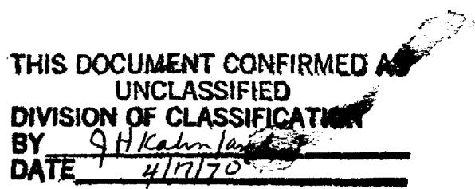

# LEGAL NOTICE

This report was prepared as an account of Government sponsored work. Neither the United States, nor the Commission, nor any person acting on behalf of the Commission:

A. Makes any warranty or representation, expressed or implied, with respect to the accuracy, completeness, or usefulness of the information contained in this report, or that the use of any information, apparatus, method, or process disclosed in this report may not infringe privately owned rights; or   
B. Assumes any liabilities with respect to the use of, or for damages resulting from the use of any information, apparatus, method, or process disclosed in this report.

As used in the above, "person acting on behalf of the Commission" includes any employee or contractor of the Commission, or employee of such contractor, to the extent that such employee or contractor of the Commission, or employee of such contractor prepares, disseminates, or provides access to, any information pursuant to his employment or contract with the Commission, or his employment with such contractor.

Contract No. W-7405-eng-26

METALS AND CERAMICS DIVISION

MASTER

TENSILE PROPERTIES OF HASTELLOY N WELDED AFTER IRRADIATION

H. E. McCoy, R. W. Gunkel, and G. M. Slaughter

# LEGAL NOTICE

This report was prepared as an account of Government sponsored work. Neither the United States, nor the Commission, nor any person acting on behalf of the Commission:

A. Makes any warranty or representation, expressed or implied, with respect to the accuracy, completeness, or usefulness of the information contained in this report, or that the use of any information, apparatus, method, or process disclosed in this report may not infringe privately owned rights; or

B. Assumes any liabilities with respect to the use of, or for damages resulting from the use of any information, apparatus, method, or process disclosed in this report.

As used in the above, "person acting on behalf of the Commission" includes any employee or contractor of the Commission, or employee of such contractor, to the extent that such employee or contractor of the Commission, or employee of such contractor prepares, disseminates, or provides access to, any information pursuant to his employment or contract with the Commission, or his employment with such contractor.

APRIL 1970

OAK RIDGE NATIONAL LABORATORY

Oak Ridge, Tennessee

operated by

UNION CARBIDE CORPORATION

for the

U.S. ATOMIC ENERGY COMMISSION

# CONTENTS

Page

Abstract 1

Introduction 1

Experimental Details 2

Experimental Results 5

Discussion of Results 12

Summary 19

Acknowledgments 20

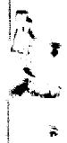

H. E. McCoy, R. W. Gunkel, and G. M. Slaughter

# ABSTRACT

Fusion welds affecting $75\%$ of the cross section were made in small tensile samples (0.125 in. in diameter) of Hastelloy N irradiated to thermal fluences up to $9.4 \times 10^{20}$ neutrons/cm². All of the unirradiated samples and $67\%$ of the irradiated samples were satisfactorily welded using a specialized technique developed for this program. Surface contamination is suspected to be the cause of the unsuccessful welds in the irradiated samples. The welded irradiated samples generally had as good tensile properties at 25 and $650^{\circ}\mathrm{C}$ as the irradiated base metal. The weld metal deformed appreciably at $650^{\circ}\mathrm{C}$ and made a significant contribution to the overall fracture strain. The fracture location in the irradiated samples tested at $650^{\circ}\mathrm{C}$ shifted from the weld metal to the base metal following the post-weld anneal of 8 hr at $870^{\circ}\mathrm{C}$ . The porosity which was observed near the fusion line of the irradiated samples probably results from transmuted helium bubbles, but this did not seem to affect the location of the fracture.

# INTRODUCTION

The maintenance and repair of nuclear systems will frequently involve cutting and rewelding pipes and components that have been irradiated. The prospect of these repairs raises the obvious questions of how such welds can be made and what are their mechanical properties. It is this latter question that will be discussed in the present report. This report will also deal specifically with molten-salt reactors where the additional problem exists of removing residual fluoride salt or corrosion products. However, cleanliness will likely be a paramount problem in making remote welds in any reactor system.

The alloy studied is Hastelloy N, a nickel-based material developed specifically for use in molten-salt reactors. The irradiated material studied had been exposed to the core of the Molten-Salt Reactor Experiment for long periods of time as a surveillance material for the reactor vessel. The welds made in this study were simple gas tungsten-arc fusion welds that melted about $75\%$ of the cross-sectional area of a miniature (0.125 in. in diameter) tensile sample. Thus, the welds were made with very low heat input and minimal restraint, and the results can be used only qualitatively.

# EXPERIMENTAL DETAILS

The heats of material involved in this study were air-melted and the chemical compositions are given in Table 1. These heats were used in fabricating the MSRE vessel; heat 5065 for the top and bottom heads and heat 5085 for the cylindrical shell.

Samples of these heats were placed in the various surveillance facilities of the MSRE. $^{2-4}$ These samples have the general configuration of a long rod $1/4$ in. in diameter with periodic reduced sections $1 \, 1/8$ in. long and $1/8$ in. in diameter. After the desired exposure, these rods can be segmented to obtain small tensile samples. The core surveillance assembly is located axially about 3.6 in. from the core center line where the thermal flux ( $< 0.876 \, \text{Mev}$ ) is $4.1 \times 10^{12}$ neutrons $\text{cm}^{-2} \, \text{sec}^{-1}$ and the fast flux ( $>1.22 \, \text{Mev}$ ) is $1.0 \times 10^{12}$ neutrons $\text{cm}^{-2} \, \text{sec}^{-1}$ . The environment is a

Table 1. Chemical Analysis of Surveillance Heats   

<table><tr><td rowspan="2">Element</td><td colspan="2">Content, wt %</td></tr><tr><td>Heat 5065</td><td>Heat 5085</td></tr><tr><td>Cr</td><td>7.2</td><td>7.3</td></tr><tr><td>Fe</td><td>3.9</td><td>3.5</td></tr><tr><td>Mo</td><td>16.5</td><td>16.7</td></tr><tr><td>C</td><td>0.065</td><td>0.052</td></tr><tr><td>Si</td><td>0.60</td><td>0.58</td></tr><tr><td>Co</td><td>0.08</td><td>0.15</td></tr><tr><td>W</td><td>0.04</td><td>0.07</td></tr><tr><td>Mn</td><td>0.55</td><td>0.67</td></tr><tr><td>V</td><td>0.22</td><td>0.20</td></tr><tr><td>P</td><td>0.004</td><td>0.0043</td></tr><tr><td>S</td><td>0.007</td><td>0.004</td></tr><tr><td>Al</td><td>0.01</td><td>0.02</td></tr><tr><td>Ti</td><td>0.01</td><td>&lt; 0.01</td></tr><tr><td>Cu</td><td>0.01</td><td>0.01</td></tr><tr><td>B (ppm)</td><td>24, 37,</td><td>38</td></tr><tr><td></td><td>20, 10</td><td></td></tr><tr><td>O</td><td>0.0016</td><td>0.0093</td></tr><tr><td>N</td><td>0.011</td><td>0.013</td></tr></table>

molten fluoride salt, 65 LiF, 29.1 BeF $_2$ , 5 ZrF $_4$ , 0.9 UF $_4$ (mole %), at $650^{\circ}\mathrm{C}$ . There is a control facility in which the samples are exposed to static "fuel salt" containing depleted uranium. The temperature follows that of the MSRE. A second surveillance facility is located outside the core in a vertical position about 4.5 in. from the vessel. The temperature is also $650^{\circ}\mathrm{C}$ at this location and the thermal flux (< 0.876 Mev) is $1.0 \times 10^{11}$ neutrons $\mathrm{cm}^{-2} \sec^{-1}$ and the fast flux (> 1.22 Mev) is $1.6 \times 10^{11}$ neutrons $\mathrm{cm}^{-2} \sec^{-1}$ . The environment is nitrogen with 2 to $5 \%$ O $_2$ , and the Hastelloy N samples have a thin oxide film after exposure.

In order to make fusion welds (no filler metal added) on the irradiated tensile specimens, it was necessary to design a special welding fixture that could be operated remotely in a hot cell. We aimed for a reasonable assurance of good penetration (high percentage of cross section of specimen to be weld metal) without specimen distortion.

Figure 1 is a photograph of the welding fixture assembled for use in the hot cell. As can be seen, the fixture consists of a rigid stand, motor-driven chuck, specimen support, and a gas tungsten-arc welding

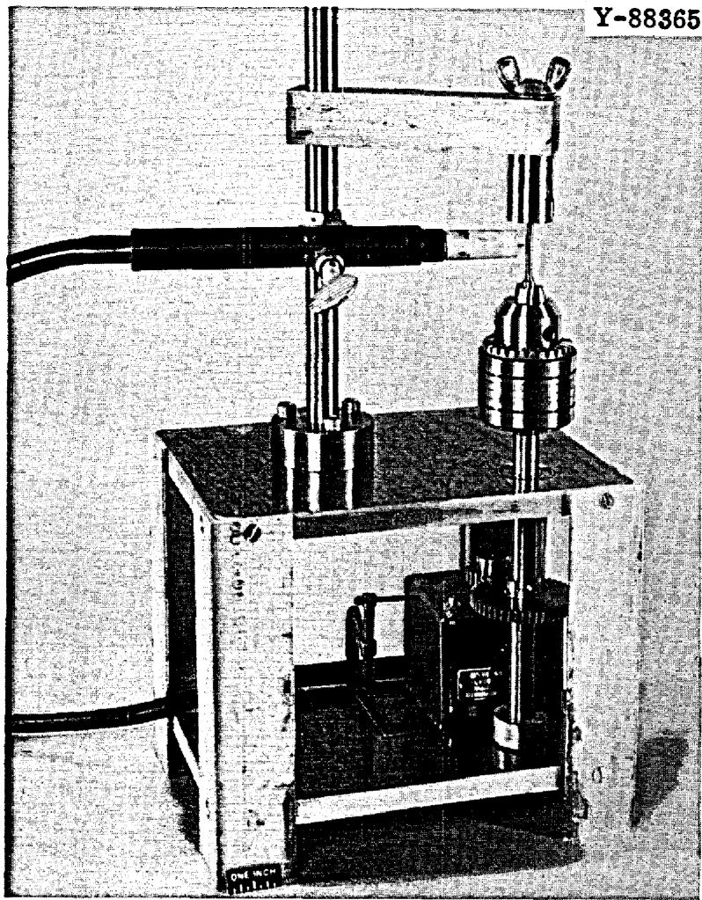  
Fig. 1. Welding Equipment Developed for Making Remote Welds.

torch. The upper support has an internal curved surface that contacts the fillet radius of the tensile sample and keeps the sample aligned during welding. The torch was connected to a programmed welding power supply located outside the hot cell. The welding conditions were adjusted to obtain penetration of about $75\%$ of the sample cross section.

All samples were abraded with 240-grit emery paper and cleaned with acetone before welding. We did the final abrasion on each sample with a clean piece of emery paper in an effort to minimize contamination.

The tensile tests were run on Instron Universal testing machines. The strain measurements were taken from the crosshead travel. The test environment was air in each case.

# EXPERIMENTAL RESULTS

We welded 25 unirradiated samples both in the hot cell and in the laboratory and all welds visually appeared sound. We welded 15 irradiated samples; three welds were completely unsatisfactory and two others were very questionable due to surface cracks. Thus, $67\%$ of the welded irradiated specimens were found to be sound by visual examination. The bad welds occurred randomly, and we suspected that cleanliness was our main problem in obtaining sound welds.

The results of tensile tests on base-metal samples are given in Table 2, and those for the welded samples are given in Table 3. Numerous variables are included, and care must be used in making comparisons. The changes in strength are not thought to be significant, and we shall discuss in some detail only the changes in the fracture characteristics.

A comparison of Groups 3, 4, and 5 in Table 2 shows that the fracture strain of the unirradiated base metal decreases with aging at $650^{\circ}\mathrm{C}$ . (Corrosion is very slight in the samples and the property changes are attributed entirely to thermal aging. $^{3,4}$ ) The property changes are greater for heat 5085 than for heat 5065. Groups 1 and 2, Table 2, show that irradiation reduces the fracture strain with the magnitude of the change increasing with increasing fluence. The reduction in fracture strain in tests at $25^{\circ}\mathrm{C}$ is thought to be due to carbide precipitation, and samples 7982 and 7976, Group 2, Table 2, lend support to this hypothesis. The fracture strain at $25^{\circ}\mathrm{C}$ was only $32.8\%$ in the as-irradiated condition, but improved to $48.3\%$ after an anneal of 8 hr at $870^{\circ}\mathrm{C}$ . The reduction in the fracture strain at $650^{\circ}\mathrm{C}$ due to irradiation is even more dramatic. We attribute this reduction in fracture strain to the production of helium in the metal by the ${}^{10}\mathrm{B}(\mathfrak{n},\alpha)^{7}\mathrm{Li}$ transmutation and have found that postirradiation annealing does not improve the properties at elevated temperatures. $^{5}$

Comparison of the data for Group 3 in Tables 2 and 3 shows that welding decreases the fracture strain in the unirradiated condition and that

Table 2. Tensile Properties of Base-Metal Samples   

<table><tr><td rowspan="2">Heat Number</td><td rowspan="2">History</td><td rowspan="2">Sample Number</td><td rowspan="2">Test Temperature (°C)</td><td rowspan="2">Strain Rate (min-1)</td><td colspan="2">Stress, psi</td><td colspan="2">Elongation, %</td><td rowspan="2">Reduction in Area (%)</td></tr><tr><td>Yield</td><td>Ultimate</td><td>Uniform</td><td>Total</td></tr><tr><td colspan="10">Group 1</td></tr><tr><td>5065</td><td>a</td><td>7915</td><td>25</td><td>0.05</td><td>51,700</td><td>109,300</td><td>41.4</td><td>41.5</td><td>34.1</td></tr><tr><td>5065</td><td>a</td><td>7913</td><td>650</td><td>0.002</td><td>40,400</td><td>46,300</td><td>3.2</td><td>3.4</td><td>6.0</td></tr><tr><td>5085</td><td>a</td><td>7888</td><td>25</td><td>0.05</td><td>52,300</td><td>95,000</td><td>28.7</td><td>28.9</td><td>20.0</td></tr><tr><td>5085</td><td>a</td><td>7886</td><td>650</td><td>0.002</td><td>35,000</td><td>42,400</td><td>4.5</td><td>5.0</td><td>13.1</td></tr><tr><td colspan="10">Group 2</td></tr><tr><td>5065</td><td>b</td><td>7940</td><td>25</td><td>0.05</td><td>49,000</td><td>118,800</td><td>57.8</td><td>59.7</td><td>38.4</td></tr><tr><td>5065</td><td>b</td><td>7947</td><td>650</td><td>0.002</td><td>34,100</td><td>55,500</td><td>12.2</td><td>12.5</td><td>16.1</td></tr><tr><td>5085</td><td>b</td><td>7976</td><td>25</td><td>0.05</td><td>46,500</td><td>99,100</td><td>32.8</td><td>32.8</td><td>24.5</td></tr><tr><td>5085</td><td>b</td><td>7982c</td><td>25</td><td>0.05</td><td>46,700</td><td>119,000</td><td>48.2</td><td>48.3</td><td>34.2</td></tr><tr><td>5085</td><td>b</td><td>7965</td><td>650</td><td>0.002</td><td>31,300</td><td>49,900</td><td>11.1</td><td>11.6</td><td>18.6</td></tr><tr><td colspan="10">Group 3</td></tr><tr><td>5065</td><td>d</td><td>1843</td><td>25</td><td>0.05</td><td>64,000</td><td>124,600</td><td>52.0</td><td>55.5</td><td>52.1</td></tr><tr><td>5065</td><td>d</td><td>280</td><td>650</td><td>0.002</td><td>46,300</td><td>75,400</td><td>22.8</td><td>24.0</td><td>28.1</td></tr><tr><td>5085</td><td>d</td><td>4295</td><td>25</td><td>0.05</td><td>51,500</td><td>120,800</td><td>52.3</td><td>53.1</td><td>42.2</td></tr><tr><td>5085</td><td>d</td><td>10,083</td><td>650</td><td>0.002</td><td>32,200</td><td>70,600</td><td>32.8</td><td>34.5</td><td>27.5</td></tr><tr><td colspan="10">Group 4</td></tr><tr><td>5085</td><td>e</td><td>FC-3</td><td>25</td><td>0.05</td><td>45,500</td><td>111,200</td><td>46.8</td><td>46.8</td><td>31.5</td></tr><tr><td>5085</td><td>e</td><td>DC-25</td><td>650</td><td>0.002</td><td>31,500</td><td>62,500</td><td>22.8</td><td>24.3</td><td>27.2</td></tr><tr><td colspan="10">Group 5</td></tr><tr><td>5065</td><td>f</td><td>10,215</td><td>25</td><td>0.05</td><td>60,900</td><td>126,700</td><td>46.5</td><td>47.4</td><td>39.3</td></tr><tr><td>5065</td><td>f</td><td>10,216</td><td>650</td><td>0.002</td><td>44,200</td><td>73,300</td><td>16.0</td><td>16.5</td><td>16.8</td></tr><tr><td rowspan="2">Heat Number</td><td rowspan="2">History</td><td rowspan="2">Sample Number</td><td rowspan="2">Test Temperature (℃)</td><td rowspan="2">Strain Rate (min-1)</td><td colspan="2">Stress, psi</td><td colspan="2">Elongation, %</td><td rowspan="2">Reduction in Area (%)</td></tr><tr><td>Yield</td><td>Ultimate</td><td>Uniform</td><td>Total</td></tr><tr><td></td><td></td><td></td><td></td><td>Group 5 (continued)</td><td></td><td></td><td></td><td></td><td></td></tr><tr><td>5085</td><td>f</td><td>10,166</td><td>25</td><td>0.05</td><td>53,900</td><td>115,900</td><td>38.4</td><td>38.6</td><td>29.7</td></tr><tr><td>5085</td><td>f</td><td>10,190</td><td>650</td><td>0.002</td><td>37,700</td><td>64,700</td><td>17.4</td><td>18.0</td><td>19.7</td></tr></table>

${}^{a}$ Exposed to fuel salt in the core of the MSRE for 15,289 hr at ${650}^{ \circ  }\mathrm{C}$ to a thermal fluence of ${9.4} \times  {10}^{20}$ neutrons/cm2.   
b Exposed to MSRE cell environment of $\mathbb{N}_2 - 2$ to $5\%$ $\mathrm{O_2}$ for 20,789 hr at $650^{\circ}C$ to a thermal fluence of $2.6\times 10^{19}$ neutrons/cm².   
cGiven a postirradiation anneal of 8 hr at $870^{\circ}C$   
Unirradiated, annealed 2 hr at $900^{\circ}\mathrm{C}$ .   
eUnirradiated, annealed 2 hr at $900^{\circ}\mathrm{C}$ , exposed to static barren "fuel" salt for 4800 hr at $650^{\circ}\mathrm{C}$ .   
fUnirradiated, annealed 2 hr at $900^{\circ}\mathrm{C},$ exposed to static barren "fuel" salt for 15,289 hr at $650^{\circ}\mathrm{C}.$

Table 3. Tensile Properties of Welded Samples   

<table><tr><td rowspan="2">Heat Number</td><td rowspan="2">History</td><td rowspan="2">Sample Number</td><td rowspan="2">Post-weld Anneal</td><td rowspan="2">Test Temperature (°C)</td><td rowspan="2">Strain Rate (min-1)</td><td colspan="2">Stress, psi</td><td colspan="2">Elongation, %</td><td rowspan="2">Reduction in Area (%)</td><td rowspan="2">Location of Failure</td></tr><tr><td>Yield</td><td>Ultimate</td><td>Uniform</td><td>Total</td></tr><tr><td colspan="12">Group 1</td></tr><tr><td>5065</td><td>a</td><td>7899</td><td>b</td><td>25</td><td>0.05</td><td>56,600</td><td>92,200</td><td>15.2</td><td>15.4</td><td>16.0</td><td>c</td></tr><tr><td>5065</td><td>a</td><td>7898</td><td>b</td><td>650</td><td>0.002</td><td>40,700</td><td>55,200</td><td>7.5</td><td>7.6</td><td>8.6</td><td>d</td></tr><tr><td>5085</td><td>a</td><td>7872</td><td>b</td><td>25</td><td>0.05</td><td>52,900</td><td>105,700</td><td>33.3</td><td>33.6</td><td>25.2</td><td>d,e</td></tr><tr><td>5085</td><td>a</td><td>7870</td><td>none</td><td>650</td><td>0.002</td><td>36,900</td><td>45,400</td><td>4.4</td><td>5.4</td><td>9.5</td><td>d,e</td></tr><tr><td>5085</td><td>a</td><td>7871</td><td>b</td><td>650</td><td>0.002</td><td>38,000</td><td>52,300</td><td>7.5</td><td>9.3</td><td>2.4</td><td>d</td></tr><tr><td colspan="12">Group 2</td></tr><tr><td>5065</td><td>f</td><td>7959</td><td>b</td><td>25</td><td>0.05</td><td>52,700</td><td>55,300</td><td>2.5</td><td>4.3</td><td>19.6</td><td>c</td></tr><tr><td>5065</td><td>f</td><td>7957</td><td>none</td><td>650</td><td>0.002</td><td>35,400</td><td>48,800</td><td>6.1</td><td>6.8</td><td>19.2</td><td>c</td></tr><tr><td>5065</td><td>f</td><td>7958</td><td>b</td><td>650</td><td>0.002</td><td>32,700</td><td>55,100</td><td>10.9</td><td>11.3</td><td>10.8</td><td>d</td></tr><tr><td>5085</td><td>f</td><td>7992</td><td>none</td><td>25</td><td>0.05</td><td>48,600</td><td>104,200</td><td>40.2</td><td>40.4</td><td>33.2</td><td>d</td></tr><tr><td>5085</td><td>f</td><td>7990</td><td>b</td><td>25</td><td>0.05</td><td>47,300</td><td>112,800</td><td>40.5</td><td>40.8</td><td>26.8</td><td>d,e</td></tr><tr><td>5085</td><td>f</td><td>7994</td><td>none</td><td>650</td><td>0.002</td><td>33,100</td><td>55,700</td><td>12.2</td><td>12.9</td><td>13.1</td><td>c</td></tr><tr><td>5085</td><td>f</td><td>7991</td><td>b</td><td>650</td><td>0.002</td><td>32,700</td><td>62,300</td><td>18.2</td><td>18.6</td><td>13.9</td><td>d</td></tr><tr><td colspan="12">Group 3</td></tr><tr><td>5065</td><td>g</td><td>4158</td><td>b</td><td>25</td><td>0.05</td><td>63,700</td><td>138,700</td><td>43.2</td><td>43.4</td><td>30.3</td><td>c</td></tr><tr><td>5065</td><td>g</td><td>4155</td><td>none</td><td>650</td><td>0.002</td><td>37,500</td><td>59,300</td><td>9.7</td><td>10.4</td><td>15.6</td><td>c</td></tr><tr><td>5065</td><td>g</td><td>4162</td><td>b</td><td>650</td><td>0.002</td><td>43,200</td><td>80,300</td><td>19.5</td><td>20.1</td><td>16.0</td><td>c</td></tr><tr><td>5085</td><td>g</td><td>10,086</td><td>b</td><td>25</td><td>0.05</td><td>49,800</td><td>105,900</td><td>29.9</td><td>30.0</td><td>15.7</td><td>c</td></tr><tr><td>5085</td><td>g</td><td>10,085</td><td>none</td><td>650</td><td>0.002</td><td>35,400</td><td>61,500</td><td>12.7</td><td>13.7</td><td>10.7</td><td>c</td></tr><tr><td>5085</td><td>g</td><td>10,087</td><td>b</td><td>650</td><td>0.002</td><td>30,400</td><td>70,600</td><td>33.3</td><td>34.5</td><td>18.0</td><td>c</td></tr><tr><td></td><td></td><td></td><td></td><td></td><td colspan="7">Group 4</td></tr><tr><td>5085</td><td>h</td><td>10,082</td><td>none</td><td>25</td><td>0.05</td><td>53,200</td><td>121,600</td><td>57.0</td><td>60.8</td><td>18.1</td><td>d</td></tr><tr><td>5085</td><td>h</td><td>10,081</td><td>none</td><td>650</td><td>0.002</td><td>29,400</td><td>56,100</td><td>14.5</td><td>15.5</td><td>14.0</td><td>c</td></tr><tr><td></td><td></td><td></td><td></td><td></td><td colspan="7">Group 5</td></tr><tr><td>5085</td><td>i</td><td>9010</td><td>none</td><td>650</td><td>0.002</td><td>33,700</td><td>55,700</td><td>10.1</td><td>10.7</td><td>12.8</td><td>c</td></tr></table>

a Exposed to fuel salt in core of MSRE for 15,289 hr at $650^{\circ}\mathrm{C}$ to a thermal fluence of $9.4 \times 10^{20}$ neutrons/cm²; welded in cell.   
bEight hours at $870^{\circ}C$   
cWeld metal.   
$\mathbf{d}_{\mathrm{Base metal}}$   
e Exceptions to the general fracture trend.   
f Exposed to MSRE cell environment of $\mathbf{N}_2 - 2$ to $5\%$ $\mathbf{O}_2$ for 20,789 hr at $650^{\circ}\mathrm{C}$ to a thermal fluence of $2.6\times 10^{19}$ neutrons/cm²; welded in cell.   
gUnirradiated, welded outside cell.   
hUnirradiated, welded in cell.   
$^{\mathrm{i}}$ Exposed to static barren "fuel" salt for 4800 hr at $650^{\circ}\mathrm{C}$ ; welded in cell.

the fractures were located in the weld metal for the conditions investigated. Group 4, Table 3, involves unirradiated samples welded in the hot cell. Sample 10,081 is a duplicate of 10,085 prepared outside the hot cell and attests to the reproducibility of the welding technique. Sample 10,082 was not given a postweld anneal before testing at $25^{\circ}\mathrm{C}$ as was sample 10,086 and the location of fracture changed from the weld metal to the base metal. Sample 9010, Group 5, Table 3, had been exposed to fluoride salt for 4800 hr at $650^{\circ}\mathrm{C}$ , and its good properties show that no basic problem prevents welding components that have been exposed to salts.

The samples in Groups 1 and 2, Table 3, were welded after irradiation. These samples generally have lower fracture strains than their unirradiated counterparts shown in Groups 3, 4, and 5, Table 3. The fracture strains for heat 5085 tested at $25^{\circ}\mathrm{C}$ are an exception, since they are about equal for unirradiated and irradiated welds. The fracture strains for samples from heat 5065 which were irradiated, welded, and tested at $25^{\circ}\mathrm{C}$ are quite low (samples 7899 and 7959, Groups 1 and 2, Table 3).

A comparison of the properties of the irradiated base metal, Groups 1 and 2, Table 2, with those of the samples irradiated and welded, Groups 1 and 2, Table 3, shows that the welds generally have as high a fracture strain as did irradiated base metal. The poor properties of heat 5065 at $25^{\circ}\mathrm{C}$ after welding are again an exception to this generalization. The fracture strain of samples irradiated, welded, annealed 8 hr at $870^{\circ}\mathrm{C}$ , and tested at $650^{\circ}\mathrm{C}$ is higher than for the comparable irradiated base metal sample. Note that the fracture location in the irradiated sample shifts from the weld metal to the base metal following the postweld anneal of 8 hr at $870^{\circ}\mathrm{C}$ . This is in contrast to the unirradiated welds where fracture occurred in the weld metal of both as-welded and postweld annealed samples.

Several of the samples were examined metallographically. The fracture of an unirradiated welded sample is shown in Fig. 2. This sample was tested at $25^{\circ}\mathrm{C}$ without postweld annealing, and fracture occurred in the base metal. The weld area has a larger diameter, indicating that

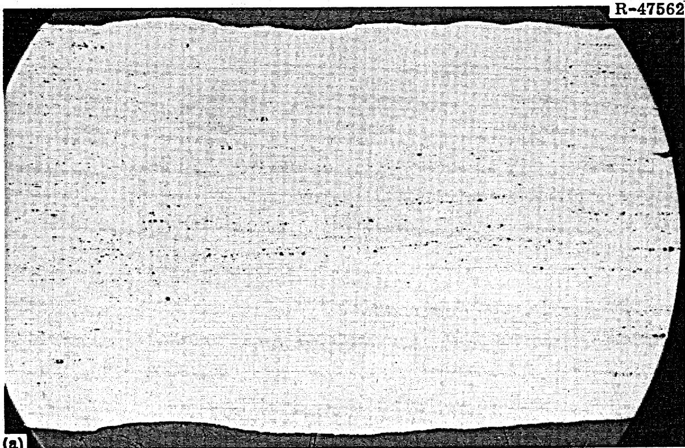

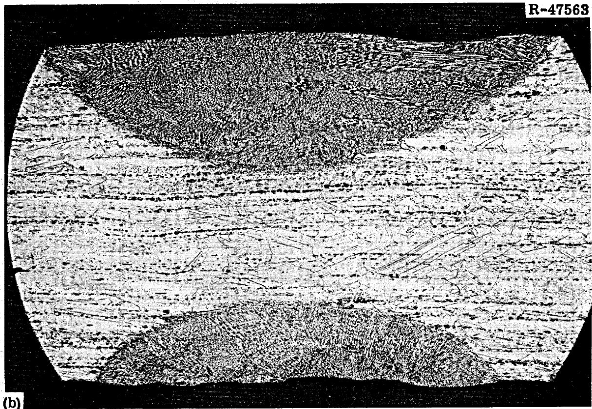  
Fig. 2. Photomicrographs of Sample 10,082. Heat 5085, Unirradiated, welded in the hot cell and tested at $25^{\circ}\mathrm{C}$ . Fracture occurred in the base metal. (a) As polished. (b) Etchant: glyceria regia. $35\times$ .

it is stronger than the base metal under these test conditions. The fracture of an unirradiated weld sample is shown in Fig. 3. The fracture is across the weld zone and the base metal fracture has both trans- and intergranular sections. There is also some porosity in the weld metal. The fracture of an unirradiated welded sample tested at $650^{\circ}\mathrm{C}$ is shown in Fig. 4. This sample had been exposed to molten salt for 4800 hr at $650^{\circ}\mathrm{C}$ , and the weld looks very sound with only a little porosity. The intercellular cracks in the weld metal indicate that the weld metal did deform.

The fracture of an irradiated sample that fractured as it was removed from the welding fixture is shown in Fig. 5. There is some porosity near the fusion line and some within the weld metal. The microstructure of another sample that was welded after irradiation is shown in Fig. 6. This sample was tested at $650^{\circ}\mathrm{C}$ , and the fracture was intergranular and located in the base metal. Again, there is a large amount of porosity near the fusion line and in the weld metal. Much of the porosity near the fusion line is associated with the carbide stringers that are present. Because of the similar chemical behavior of carbon and boron, it is quite reasonable to suspect that these stringers of carbides would also be enriched in boron. Transmission electron microscopy of this material shows that helium bubbles are present in this material (Fig. 7), and the heating may allow enough diffusion to occur near the fusion line for the bubbles to agglomerate.

# DISCUSSION OF RESULTS

These tests have shown that the fracture strain of Hastelloy N in tensile tests at 25 and $650^{\circ}\mathrm{C}$ decreases with long exposure at $650^{\circ}\mathrm{C}$ . Neutron irradiation causes an even more dramatic decrease in the fracture strain. We fused about $75\%$ of the cross section of both unirradiated and irradiated samples. Welding alone caused rather large decreases in the fracture strain of unirradiated samples. These samples responded much as we had noted earlier in another study involving

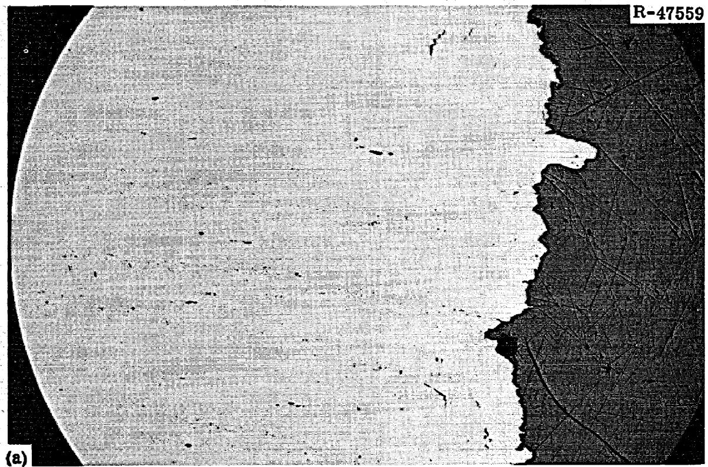

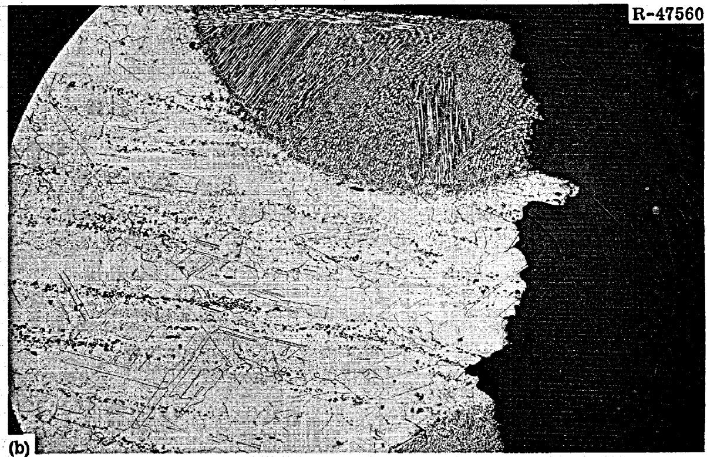  
Fig. 3. Photomicrograph of Sample 10,081. Heat 5085, Unirradiated, Welded in Hot Cell, Tested at $650^{\circ}\mathrm{C}$ . Fracture occurred in the weld metal. (a) As polished. (b) Etchant: glyceria regia. $35\times$ .

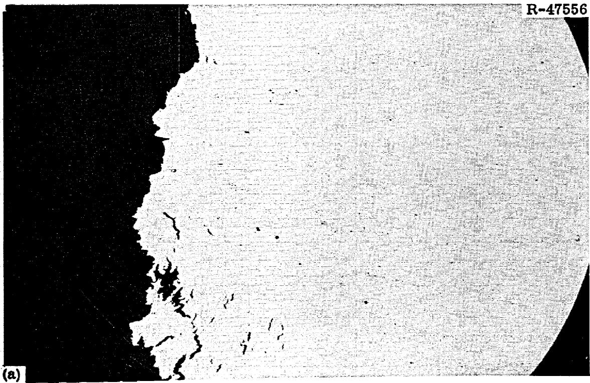

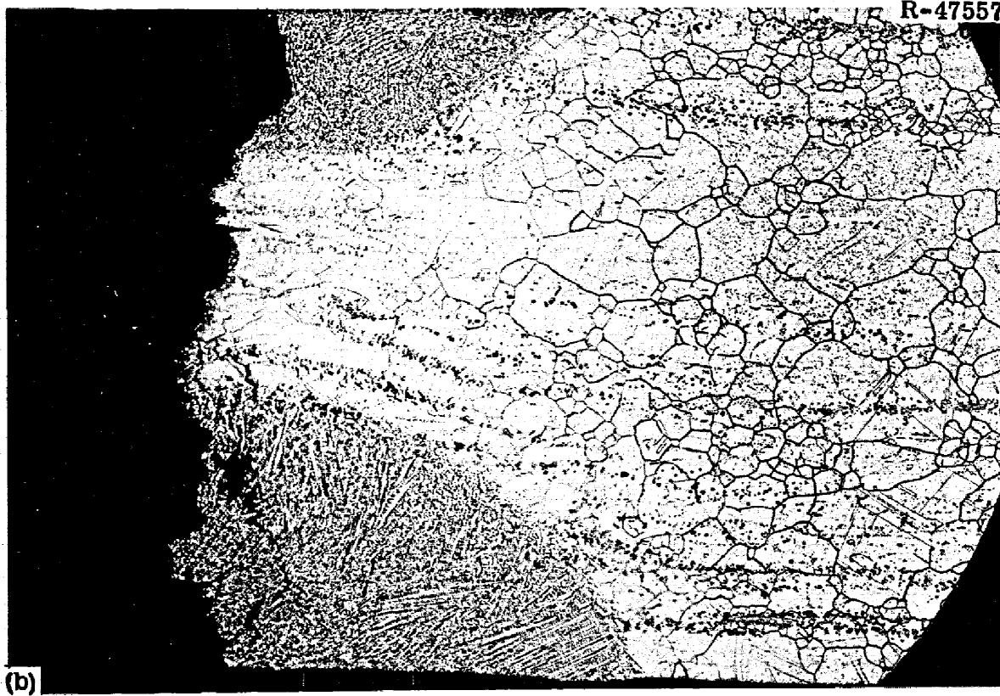  
Fig. 4. Photomicrograph of Sample 9010. Heat 5085, exposed to static barren "fuel" salt for 4800 hr at $650^{\circ}\mathrm{C}$ , welded in hot cell, tested at $650^{\circ}\mathrm{C}$ . Fracture occurred in the weld metal. (a) As polished. (b) Etchant: glyceria regia. $35\times$ .

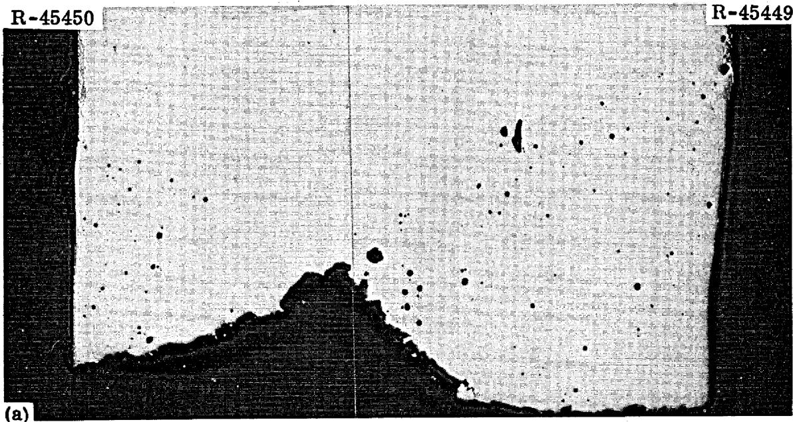

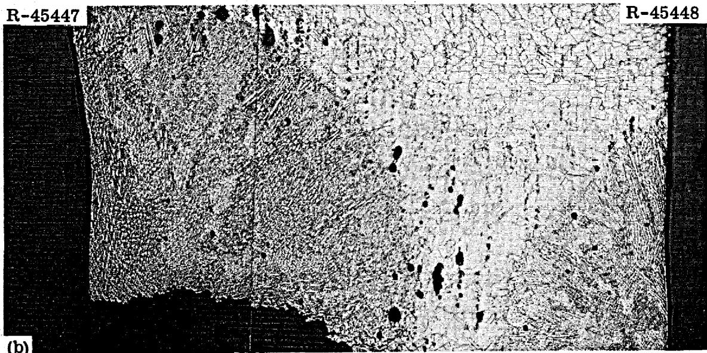  
Fig. 5. Photomicrographs of Sample 7897. Heat 5065, irradiated for 15,289 hr in fuel salt in the MSRE at $650^{\circ}\mathrm{C}$ . Thermal fluence was $9.4 \times 10^{20}$ neutrons/cm $^2$ , welded in hot cell, and broke while removing from weld fixture. (a) As polished, (b) etchant: aqua regia. 35X.

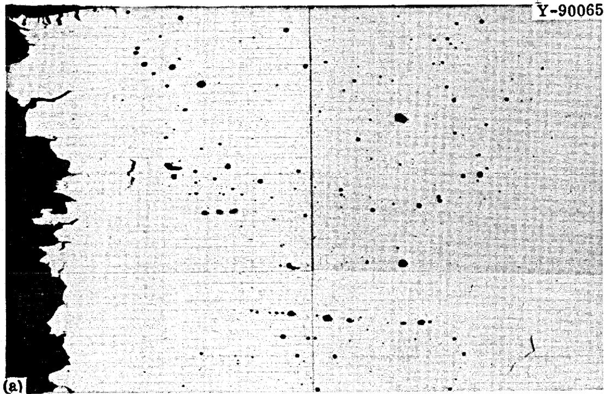

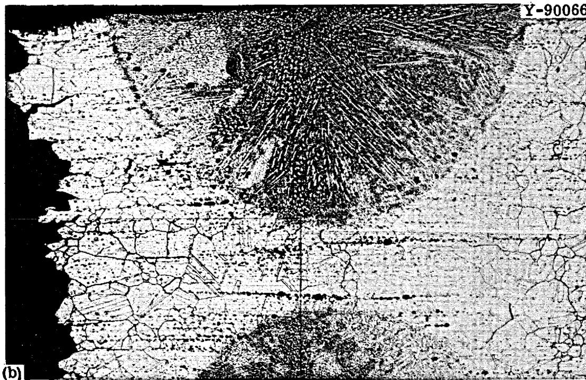  
Fig. 6. Photomicrographs of Sample 7870. Heat 5085, irradiated for 15,289 hr in fuel salt in the MSRE at $650^{\circ}\mathrm{C}$ to a thermal fluence of $9.4 \times 10^{20}$ neutrons/cm², welded in a hot cell, and tested at $650^{\circ}\mathrm{C}$ . Fracture occurred in the base metal. (a) As polished, (b) etchant: aqua regia. 35×.

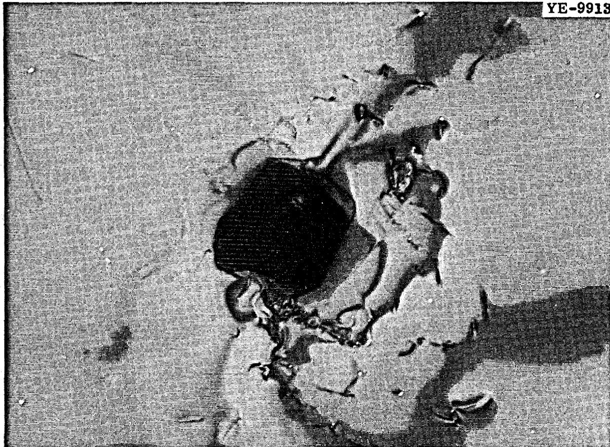  
Fig. 7. Transmission Electron Micrograph of Hastelloy N (Heat 5085) Irradiated in the MSRE to a Thermal Fluence of $9.4 \times 10^{20}$ neutrons/cm² at $650^{\circ}\mathrm{C}$ . 25,000×.

welds in large plates of Hastelloy N. Some of the irradiated samples were welded and these were found to have fracture strains at least as high as those observed for the irradiated base metal. (Heat 5065 tested at $25^{\circ}\mathrm{C}$ is an exception and its ductility was very low after welding.) Our previous work had involved some samples that were welded and then irradiated. Most of our samples that were welded after irradiation had higher fracture strains at $650^{\circ}\mathrm{C}$ than the samples in our previous study that were welded before irradiation. This is probably due to the drastic redistribution of helium that occurs when the metal is fused. Most of the helium should be lost from the weld metal, and this exhibits

more ductility at high temperatures than the irradiated base metal where the helium is thought to be associated with grain boundaries. Thus, the weld metal will strain and make a significant contribution to the total strain.

A rather consistent pattern evolves for the location of the fracture in welded samples. In both irradiated and unirradiated samples tested at $25^{\circ}\mathrm{C}$ , the fracture occurs in the base metal in as-welded samples and shifts to the weld metal after a postweld heat treatment of 8 hr at $870^{\circ}\mathrm{C}$ . The weld metal in the as-deposited form is stronger at $25^{\circ}\mathrm{C}$ (Fig. 2) and does not deform as much as the base metal. After annealing, the weld metal softens and fracture occurs in the weld metal. This observation does not indicate anything about the relative ductilities of the weld and base metals, since the sample geometry allows the weaker material to deform without any deformation occurring in the stronger material. Thus, the as-deposited weld metal is strong at $25^{\circ}\mathrm{C}$ , but may be extremely brittle. At $650^{\circ}\mathrm{C}$ unirradiated welded samples failed in the weld metal in the as-welded and heat-treated conditions. The irradiated samples failed in the weld metal when tested in the as-welded condition and the fracture shifted to the base metal after annealing for 8 hr at $870^{\circ}\mathrm{C}$ . Metallographic studies indicate that the weld metal and the base metal both deform when tested at $650^{\circ}\mathrm{C}$ . Thus, the location of the fracture is likely governed by crack propagation. Cracks can propagate in unirradiated welds more easily in the weld metal than in the base metal and fracture occurs in the weld metal. Cracks seem to propagate very easily through irradiated base metal and the postweld annealed weld metal has better resistance to crack propagation. Thus, irradiated welded samples fail in the weld metal in the as-welded condition and in the base metal after annealing.

Two metallographic features in the irradiated welds deserve some comment; the porosity in the weld metal and the porosity near the fusion line (Figs. 5 and 6). The voids in the weld metal are thought to be related to superficial surface films on the samples before welding or are characteristics of the particular heats of material involved.

The porosity near the fusion lines is associated preferentially with the carbide stringers. We have noted that these stringers are high in silicon, $^{8}$ and that melting starts in these areas when the alloy is heated to about $1400^{\circ}\mathrm{C}$ (ref. 9). Thus, the supposition that these void areas result from localized melting would seem reasonable were it not for the observation that unirradiated welded samples do not contain this porosity (Figs. 2, 3, and 4). The possibility that they are large agglomerates of helium that form during welding must at least be considered. A shell of material $0.037\mathrm{cm}(\sim 0.015\mathrm{in.})$ thick around the fusion zone would contain about $0.2\mathrm{cm}^{3}$ of transmuted helium at atmospheric pressure and $1400^{\circ}\mathrm{C}$ . If this helium were distributed as small bubbles $0.005\mathrm{cm}(\sim 0.002\mathrm{in.})$ in diameter, there would be about $2\times 10^{6}$ bubbles present in this small volume. Thus, it seems likely that the porosity near the fusion line is actually helium bubbles. There is no evidence that either type of porosity influenced the location of the fracture.

# SUMMARY

Our studies have shown that fusion welds can be made in irradiated Hastelloy N after exposure to fluoride salts. The rather meager statistics indicate that acceptable welds are not obtained as frequently in the irradiated material as in the unirradiated samples.

Samples that had been irradiated and welded were found generally to have as good tensile fracture strain at 25 and $650^{\circ}\mathrm{C}$ as the base metal. Welded samples that were given a postweld anneal of 8 hr at $870^{\circ}\mathrm{C}$ were even more ductile than the irradiated base metal. At $25^{\circ}\mathrm{C}$ both unirradiated and irradiated welds failed in the base metal in the as-welded condition and in the weld metal after annealing 8 hr at $870^{\circ}\mathrm{C}$ .

At a test temperature of $650^{\circ}\mathrm{C}$ , the unirradiated welds failed in the weld metal in the as-welded and heat-treated condition. The samples irradiated and welded failed in the weld metal in the as-welded condition and in the base metal after annealing.

The weld metal in all samples contained minor porosity that likely reflects the welding characteristics of this alloy under the welding parameters that we used. The irradiated samples had a large amount of porosity associated with the carbide stringers near the fusion line. We feel that this porosity resulted from the agglomeration of small transmutation-produced helium bubbles during the welding.

The data are not sufficient to draw a meaningful conclusion about the weldability of irradiated reactor components of Hastelloy N; the samples were too small, the heat input too low, and the degree of restraint too low. The observation that the fused weld metal will deform readily at $650^{\circ}\mathrm{C}$ is encouraging since this indicates that the weld metal might deform small amounts to relieve stresses between relatively large and brittle components or pipe segments. The observed porosity near the fusion line means that this area will be weakened. Welds in large sections will be required to determine whether the composite joint of weld metal and fusion zone has acceptable properties.

# ACKNOWLEDGMENTS

The authors are grateful to technicians T. E. Scott for making the welds and to B. C. Williams for running the tensile tests. The metallographic work was done by E. Lee and S. E. Spencer. The transmission electron microscopy was done by R. E. Gehlbach. We are also grateful to J. R. Weir for his interest in this work and for reviewing the manuscript. The manuscript was prepared by the Metals and Ceramics Division Reports Office.

# INTERNAL DISTRIBUTION

1-3. Central Research Library

4-5. ORNL Y-12 Technical Library Document Reference Section

6-25. Laboratory Records

26. Laboratory Records, ORNL RC

27. ORNL Patent Office

28. R. K. Adams

29. G. M. Adamson, Jr.

30. R.G. Affel

31. J. L. Anderson

32. R.F.Apple

33. W. E. Atkinson

34. C. F. Baes

35. J. M. Baker

36. S.J.Ball

37. C. E. Bamberger

38. C. J. Barton

39. H. F. Bauman

40. M. S. Bautista

41. S. E. Beall

42. M. J. Bell

43. M. Bender

44. C. E. Bettis

45. E. S. Bettis

46. D. S. Billington

47. R. E. Blanco

43. F. F. Blankenship

49. J. O. Blomeke

50. E.E.Bloom

51. R. Blumberg

52. E. G. Bohlmann

53. B. S. Borie

54. C. J. Borkowski

55. H. I. Bowers

56. C. M. Boyd

57. G. E. Boyd

58. J. Braunstein

59. M. A. Bredig

60. R. B. Briggs

61. H. R. Bronstein

62. G. D. Brunton

63. O. W. Burke

64. S. Cantor

65. D. W. Cardwell

66. J. H. Carswell, Jr.

67. W. L. Carter

68. G. I. Cathers

69. J. E. Caton

70. O.B.Cavin

71. J. M. Chandler

72. C. J. Claffey

73. F. H. Clark

74. H. D. Cochran

75. Nancy Cole

76. C. W. Collins

77. E. L. Compere

78. K.V.Cook

79. W.H.Cook

80. J.W.Cooke

81. L. T. Corbin

82. B. Cox

83. J. L. Crowley

84. F. L. Culler

85. D. R. Cuneo

86. J. E. Cunningham

87. J. M. Dale

88. D. G. Davis

89. R. J. DeBakker

90. J.H.DeVan

91. J. R. DiStefano

92. S. J. Ditto

93. F. A. Doss

94. A. S. Dworkin

95. W. P. Eatherly

96. J. R. Engel

97. E.P.Epler

98. J. I. Federer

99. D. E. Ferguson

100. L. M. Ferris

101. A. P. Fraas

102. J. K. Franzreb

103. H. A. Friedman

104. D. N. Fry

105. J. H Frye, Jr.

106. L.C.Fuller

107. W. K. Furlong

108. C. H. Gabbard

109. R.B.Gallaher

110. R.E.Gehlbach

111. J. H. Gibbons

112. L. O. Gilpatrick   
113. G. Goldberg   
114. W. R. Grimes   
115. A. G. Grindell   
116. R. H. Guymon   
117. J. P. Hammond   
118. R. L. Hammer   
119. T. H. Handley   
120. B. A. Hannaford   
121. P. H. Harley   
122. D. G. Harman   
123. W. O. Harms   
124. C. S. Harrill   
125. P. N. Haubenreich   
126. F. K. Heacker   
127. R.E.Helms   
128. P. G. Herndon   
129. D. N. Hess   
130. J. R. Hightower   
131-133. M.R.Hill   
134. E. C. Hise   
135. B. F. Hitch   
136. H.W.Hoffman   
137. D. K. Holmes   
138. P.P.Holz   
139. R.W.Horton   
140. A. Houtzeel   
141. T. L. Hudson   
142. W. R. Huntley   
143. H. Inouye   
144. W. H. Jordan   
145. P. R. Kasten   
146. R. J. Kedl   
147. C. W. Kee   
143. M. T. Kelley   
149. M. J. Kelly   
150. C. R. Kennedy   
151. T. W. Kerlin   
152. H. T. Kerr   
153. J. J. Keyes   
154. R. T. King   
155. S. S. Kirslis   
156. L. R. Koffman   
157. J. W. Koger   
158. H. W. Kohn   
159. R. B. Korsmeyer   
160. A. I. Krakoviak   
161. T. S. Kress   
162. J. W. Krewson   
163. C. E. Lamb   
164. J. A. Lane

165. M. S. Lin   
166. R.B.Lindauer   
167. E. L. Long, Jr.   
168. A. L. Lotts   
169. M. I. Lundin   
170. R.N.Lyon   
171. R. K. Macklin   
172. H. G. MacPherson   
173. R.E. MacPherson   
174. J.C.Mailen   
175. D. L. Manning   
176. C. D. Martin   
177. W.R.Martin   
178. R.W. McClung   
179-183. H. E. McCoy   
184. D. L. McElroy   
185. C. K. McGlothlan   
186. C. J. McHargue   
187. H. A. McLain   
188. B. McNabb   
189. L. E. McNeese   
190. J. R. McWherter   
191. H. J. Metz   
192. A. S. Meyer   
193. R. L. Moore   
194. C. A. Mossman   
195. D. M. Moulton   
196. T. R. Mueller   
197. M. L. Myers   
198. H. H. Nichol   
199. J. P. Nichols   
200. E. L. Nicholson   
201. T. S. Noggle   
202. L.C.Oakes   
203. S.M.Ohr   
204. P. Patriarca   
205. A. M. Perry   
206. T. W. Pickel   
207. H. B. Piper   
208. C. B. Pollock   
209. B. E. Prince   
210. G. L. Ragan   
211. J. L. Redford   
212. J. D. Redman   
213. D. M. Richardson   
214. M. Richardson   
215. G. D. Robbins   
216. R.C.Robertson   
217. K. A. Romberger   
218. M. W. Rosenthal   
219. R.G.Ross

220. J. Roth   
221. J. P. Sanders   
222. H. C. Savage   
223. W.F.Schaffer   
224. C. E. Schilling   
225. Dunlap Scott   
226. J. L. Scott   
227. H. E. Seagren   
228. C. E. Sessions   
229. J.H.Shaffer   
230. W.H.Sides

231-235. G.M.Slaughter

236. A. N. Smith   
237. F.J. Smith   
238. G.P. Smith   
239. O. L. Smith   
240. P.G. Smith   
241. I. Spiewak   
242. R.C.Steffy   
243. H. H. Stone   
244. R. A. Strehlow   
245. R.D.Stulting   
246. D. A. Sundberg   
247. R.W. Swindeman   
248. J. R. Tallackson   
249. E. H. Taylor

250. W. Terry   
251. R.E.Thoma   
252. P. F. Thomason   
253. L. M. Toth   
254. A. L. Travaglini   
255. D. B. Trauger   
256. Chia-Pao Tung   
257. W. E. Unger   
258. G. M. Watson   
259. J. S. Watson   
260. H. L. Watts   
261. C. F. Weaver   
262. B.H.Webster   
263. A. M. Weinberg   
264. J. R. Weir   
265. K. W. West   
266. H. I. Whaley   
267. M. E. Whatley   
268. J. C. White   
269. R.P.Wichner   
270. L.V.Wilson   
271. Gale Young   
272. H. C. Young   
273. J. P. Young   
274. E. L. Youngblood   
275. F. C. Zapp

# EXTERNAL DISTRIBUTION

276. G. G. Allaria, Atomics International   
277. J. G. Asquith, Atomics International   
278. D. F. Cope, RDT, SSR, AEC, Oak Ridge National Laboratory   
279. C. B. Deering, AEC, OSR, Oak Ridge National Laboratory   
280. A. R. DeGrazia, AEC, Washington   
281. H. M. Dieckamp, Atomics International   
282. David Elias, AEC, Washington   
283. J. E. Fox, AEC, Washington   
284. A. Giambusso, AEC, Washington   
285. F. D. Haines, AEC, Washington   
286. C. E. Johnson, AEC, Washington   
287. W. L. Kitterman, AEC, Washington   
288. W. J. Larkin, AEC, Oak Ridge Operations   
289. Kermit Laughon, AEC, OSR, Oak Ridge National Laboratory   
290. A. B. Martin, Atomics International   
291. D. G. Mason, Atomics International   
292. C. L. Matthews, AEC, OSR, Oak Ridge National Laboratory   
-294. T. W. McIntosh, AEC, Washington   
295. G. W. Meyers, Atomics International   
296. D. E. Reardon, AEC, Canoga Park Area Office   
297. D. R. Riley, AEC, Washington

298. H. M. Roth, AEC, Oak Ridge Operations   
299. T. G. Schleiter, AEC, Washington   
300. M. Shaw, AEC, Washington   
301. J. M. Simmons, AEC, Washington   
302. W. L. Smalley, AEC, Washington   
303. S. R. Stamp, AEC, Canoga Park Area Office   
304. E. E. Stansbury, the University of Tennessee   
305. D. K. Stevens, AEC, Washington   
306. R. F. Sweek, AEC, Washington   
307. A. Taboada, AEC, Washington   
308. M. J. Whitman, AEC, Washington   
309. R. F. Wilson, Atomics International   
310. Laboratory and University Division, AEC, Oak Ridge Operations   
311-325. Division of Technical Information Extension