# U.S. ATOMIC ENERGY COMMISSION

ORNL-TM-2927 RECEIVED BY DTIE JUL 28 1970 COPY NO.- 87 DATE-May 18,1970

CONTROL STUDIES OF A 1000 - Mw(e) MSBR

W. H. Sides, Jr.

MASTER

ABSTRACT

Preliminary studies of the dynamics and control of a 1000-Mw(e), single-fluid MSBR were continued. An analog simulation of an expanded lumped-parameter model was used. Steam temperature control was accomplished by varying the secondary-salt flow rate. Improved reactor temperature control was accomplished by applying the load demand signal directly to the reactor outlet temperature controller as well as to the steam generators.

# LEGAL NOTICE

This report was prepared as an account of Government sponsored work. Neither the United States, nor the Commission, nor any person acting on behalf of the Commission:

A. Makes any warranty or representation, expressed or implied, with respect to the accuracy, completeness, or usefulness of the information contained in this report, or that the use of any information, apparatus, method, or process disclosed in this report may not infringe privately owned rights; or   
B. Assumes any liabilities with respect to the use of, or for damages resulting from the use of any information, apparatus, method, or process disclosed in this report.

As used in the above, "person acting on behalf of the Commission" includes any employee or contractor of the Commission, or employee of such contractor, to the extent that such employee or contractor of the Commission, or employee of such contractor prepares, disseminates, or provides access to, any information pursuant to his employment or contract with the Commission, or his employment with such contractor.

# CONTENTS

1. Introduction. 4   
2. Description of the Plant and Model 4

2.1 Plant Description 4   
2.2 Model of the Plant. 6

3. Steady State, Part Load Operation 10   
4. Control System 14

5. Results. 16

5.1 Load Demand Changes. 16   
5.2 Primary Flow Transients 19   
5.3 Secondary Flow Transients. 27   
5.4 Summary of Primary and Secondary Flow Transients 28   
5.5 Reactivity Transients. 31

6. Transfer Function 36   
7. Appendix: Analog Simulation Model. 38

7.1 Heat Transfer Model 38   
7.2 Nuclear Kinetics Model. 41   
7.3 Control System 42

# LEGAL NOTICE

This report was prepared as an account of work sponsored by the United States Government. Neither the United States nor the United States Atomic Energy Commission, nor any of their employees, nor any of their contractors, subcontractors, or their employees, makes any warranty, express or implied, or assumes any legal liability or responsibility for the accuracy, completeness or usefulness of any information, apparatus, product or process disclosed, or represents that its use would not infringe privately owned rights.

# 1. INTRODUCTION

By means of an analog computer simulation, preliminary investigation of the proposed 1000-Mw(e), single-fluid Molten-Salt Breeder Reactor (MSBR) was continued. For the purposes of this analysis the MSBR plant consisted of a graphite-moderated, circulating-fuel (primary salt) reactor, a shell-and-tube heat exchanger for transferring the generated heat to a coolant (secondary salt), a shell-and-tube supercritical steam generator, and a possible control system. The analog simulation of the plant consisted of a lumped-parameter heat transfer model for the core, primary heat exchanger, and steam generator; a two-delayed-neutron-group model of the circulating-fuel nuclear kinetics with temperature reactivity feedbacks; and the external control system. This investigation was concerned with the integrated plant response; it was not concerned with a safety analysis of the system, although several of the transients introduced would be of an abnormal nature (e.g., loss of flow). It was an initial probe into the response of the system initiated by such perturbations as changes in load demand, loss of primary or secondary flow, and reactivity changes.

The simulation was carried out on the ORNL Reactor Controls Department analog computer. So that the model would have the maximum dynamic range, the system differential equations were not linearized, and, as a result, the requisite quantity of equipment required that the model be severely limited spatially to minimize the number of equations. In addition, the pressure in the water side of the steam generator, as well as in the rest of the plant, and the physical properties of the salts and water were taken to be time invariant. The temperature of the feed-water to the steam generators was also held constant.

# 2. DESCRIPTION OF THE PLANT AND MODEL

# 2.1 Plant Description

The proposed 1000-Mw(e) MSBR steam-electric generating plant consisted of a 2250-Mw(th), graphite-moderated, molten-salt reactor, 4 shell-and-tube primary heat exchangers, and 16 shell-and-tube supercritical steam generators (Fig. 1). The reactor core contained two zones: a central zone, a cylinder $\sim 14.4$ ft diameter and $\sim 13$ ft high with a primary-salt volume fraction of 0.132; and an outer zone, an annular region $\sim 1.25$ ft thick and the same height as the central zone. The salt volume fraction in this region was 0.37. The primary-salt, bearing

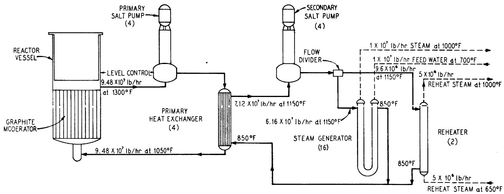  
Fig. 1. Flow Diagram of MSBR Plant. The quantities shown are totals for the entire plant.

233 U and 232 Th, flowed upward through the graphite core in a single pass and then to the tube side of one of four vertical, single-pass, primary heat exchangers, each $\sim 19$ ft long, 5 ft diameter, and constructed of Hastelloy-N. The salt flow rate at design point was $9.48 \times 10^{7} \mathrm{lb/hr}$ . The design-point temperature of the salt entering the core was $1050^{\circ}\mathrm{F}$ and that at the core outlet was $1300^{\circ}\mathrm{F}$ . The liquidus temperature of this salt was approximately $930^{\circ}\mathrm{F}$ .

The heat generated in the primary salt in the core was transferred from the tube side of the primary heat exchangers to a countercurrent secondary salt passing through the shell side. This salt flowed in a closed secondary loop to one of four horizontal supercritical steam generators. The four secondary loops, one for each primary heat exchanger, were independent of each other, with each loop supplying heat to four steam generators. Thus, there was a total of 16 steam generators in the plant. The design-point flow rate of secondary salt in each loop was $1.78 \times 10^{7} \mathrm{lb/hr}$ . At the design point the secondary-salt, cold-leg temperature was $850^{\circ} \mathrm{F}$ , and the hot-leg temperature was $1150^{\circ} \mathrm{F}$ . The liquidus temperature of this salt was $\sim 725^{\circ} \mathrm{F}$ .

The shell-and-tube supercritical steam generators were countercurrent, single-pass, U-tube exchangers $\sim 73$ ft long and $\sim 18$ in. diameter and constructed of Hastelloy-N. Feedwater entered the steam generators at the design point at $700^{\circ}\mathrm{F}$ and a pressure of about 3750 psi. The outlet steam conditions at the design point were $1000^{\circ}\mathrm{F}$ and 3600 psi. Each steam generator produced steam at the design point at a rate of $6.30 \times 10^{5} \mathrm{lb/hr}$ . Reference 2 gives a complete description of an earlier, but quite similar, version of the steam generator and primary heat exchanger.

# 2.2 Model of the Plant

A spatially lumped parameter model used for the heat transfer system (Fig. 2) consisted of the reactor core, one primary heat exchanger, one steam generator, the nuclear kinetics, and a control system as shown in Fig. 5.

In the core, the primary salt in the central zone was divided axially into four equal lumps, and the graphite was divided into two. The outer zone was divided equally into two primary-salt lumps and one graphite lump. Since the primary salt density varied only slightly with temperature, the four central-zone lumps were of equal mass, as were the two outer-zone lumps. The two central-zone graphite lumps were of equal mass as well.

The mass flow rate of the primary salt in the two zones of the core was determined by the heat generation rate in each zone so that the temperature rise of

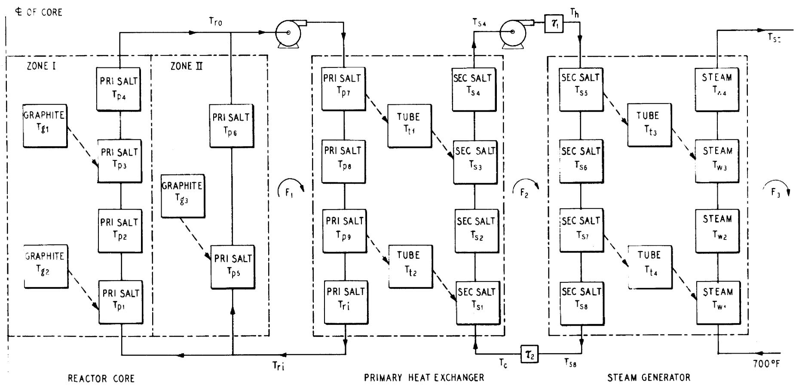  
Fig. 2. Lumped-Parameter Model of MSBR Plant.

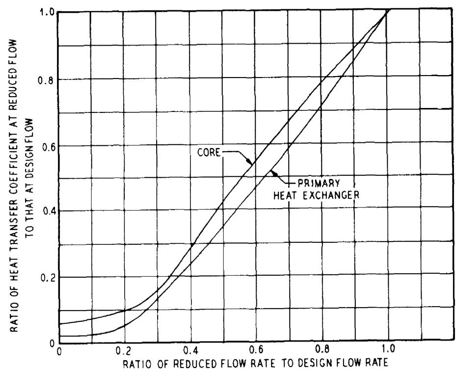  
Fig. 3. Variation of Film Heat Transfer Coefficient with Primary-Salt Flow Rate in the Reactor Core and Primary Heat Exchanger.

the primary salt in the two zones was equal. Thus, $81.4\%$ of the flow passed through the central zone and $18.6\%$ through the outer zone.

A two-delayed-neutron-group approximation of the circulating fuel nuclear kinetics equations3 was used in the model. This allowed the delayed-neutron precursor concentration term $C_{i}(t - \tau_{L})$ (see Appendix, Sect. 7) to be simulated directly with two of four available transport lag devices. The delayed-neutron fraction for $233\mathrm{U}$ was 0.00264, and the prompt-neutron generation time was 0.36 msec. The coefficient of reactivity for the primary salt was $-1.33 \times 10^{-5}$ per $^{\circ}\mathrm{F}$ , which was divided equally among the six primary-salt lumps of the core model. The temperature coefficient for the graphite was $+1.06 \times 10^{-5}$ per $^{\circ}\mathrm{F}$ , which was divided equally among the three graphite lumps.

The model was designed to accommodate a variable flow rate of the primary salt as well as the secondary salt and steam. The required variations of film heat transfer coefficients with the various salt and steam flow rates were included.4 The film coefficient for secondary salt on the shell side of the primary heat exchanger and steam generator was proportional to the 0.6 power of the flow rate. The film coefficient for steam on the tube side of the steam generators was assumed to be proportional to the 0.8 power of the flow rate. The variation of the film coefficient in the reactor core and on the tube (primary salt) side of the primary heat exchangers decreased with flow, as shown in Fig. 3. The heat conductance across the tube wall in both exchangers was assumed to be constant.

The primary and secondary salts in the primary heat exchanger were divided axially into four equal lumps, with the tube wall represented by two lumps. As did the primary-salt density, the secondary-salt density varied only slightly with temperature, and, thus, the masses of the salt lumps were assumed to be equal and constant. A variable transport delay was included in the hot and cold legs of the secondary-salt loop to simulate the transport of secondary salt between the primary heat exchanger and the steam generator.

The secondary salt in the steam generator was axially divided into four lumps of equal mass, as in the primary heat exchanger. The steam on the tube side was likewise divided into four equal lumps spatially, but of unequal mass. Under design conditions the supercritical steam density varied from $34\mathrm{lb / ft}^3$ at the feed-water inlet to $5\mathrm{lb / ft}^3$ at the steam outlet. The density of the steam in the lump nearest the feedwater entrance was taken as the average density in the quarter of

the steam generator represented by that lump, or $22.7 \mathrm{lb} / \mathrm{ft}^3$ . The densities of the remaining three steam lumps were determined in a similar manner. The axial temperature distribution in the steam was nonlinear also and was calculated from the enthalpy by assuming that equal amounts of heat were transferred into each of the steam lumps from the secondary salt. The specific heat of each lump was then calculated from the enthalpy and temperature distributions. In the model, these resulting design-point values of density and specific heat were assumed to remain constant during part-load, steady-state conditions and during all transients.

The physical constants used in this simulation are summarized in Table 1. The various system volumes, masses, flow rates, etc., calculated from the constants are listed in Table 2. The system equations used are given in the Appendix, Sect. 7.

# 3. STEADY STATE, PART LOAD OPERATION

The first step in the formulation of a control system to enable the plant to undergo changes in load was to determine the steady-state, part-load, temperature and flow profiles for the plant for loads between 20 and $100\%$ . For the series of transients included in this report, the steady-state values of the following variables were fixed at part load: (1) the steam temperature was $1000^{\circ}\mathrm{F}$ , and (2) the reactor outlet temperature was a function of load (Fig. 4), i.e., the reactor outlet temperature was a linear function of load varying between $1125^{\circ}\mathrm{F}$ and $1300^{\circ}\mathrm{F}$ for loads above $50\%$ and between $1000^{\circ}\mathrm{F}$ and $1125^{\circ}\mathrm{F}$ for loads below $50\%$ . The primary-salt flow rate and feedwater temperature remained constant at their design-point values of $100\%$ flow and $700^{\circ}\mathrm{F}$ , respectively. With the values of these parameters fixed, the remaining temperatures and flows, viz., the secondary-salt hot- and cold-leg temperatures, the reactor inlet temperature, and the secondary-salt and steam flow rates, were determined from steady-state, heat balance considerations. Figure 4 shows the resulting variations as a function of load. The reactor inlet temperature varied linearly between 1000 and $1050^{\circ}\mathrm{F}$ for loads above $50\%$ and remained constant at $1000^{\circ}\mathrm{F}$ for loads below $50\%$ . The secondary-salt, cold-leg temperature varied approximately linearly between $850^{\circ}\mathrm{F}$ at design point and about $710^{\circ}\mathrm{F}$ at $20\%$ load. Arbitrary minimum limits for the steady-state, primary- and secondary-salt temperatures were set at 1000 and $800^{\circ}\mathrm{F}$ , respectively, to ensure a margin against freezing. Figure 4 shows that while the primary salt does not violate this minimum, the secondary-salt, cold-leg temperature decreases below its minimum of $800^{\circ}\mathrm{F}$ at approximately $75\%$ load. Steady-state calculations for this model indicated that, by decreasing the reactor outlet temperature more rapidly with decreasing load in the range near $100\%$ load, the secondary-salt, cold-leg temperature decreased less rapidly with load and lowered the power level at which it crossed the $800^{\circ}\mathrm{F}$ minimum. However, since it may be undesirable to decrease the reactor outlet temperature more rapidly with decreasing load than is shown in Fig. 4, other methods may be required to maintain the steady-state, cold-leg temperature above its $800^{\circ}\mathrm{F}$

Table 1. Physical Constants   
A. Properties of Materials   

<table><tr><td></td><td>CpBtu lb-1°F-1</td><td>ρlb/ft3</td><td>kBtu hr-1°F-1 ft-1</td></tr><tr><td>Primary Salt</td><td>0.324</td><td>207.8 at 1175°F</td><td>-----</td></tr><tr><td>Secondary Salt</td><td>0.360</td><td>117 at 1000°F</td><td>-----</td></tr><tr><td>Steam</td><td></td><td></td><td></td></tr><tr><td>726°F</td><td>6.08</td><td>22.7</td><td>-----</td></tr><tr><td>750°F</td><td>6.59</td><td>11.4</td><td>-----</td></tr><tr><td>850°F</td><td>1.67</td><td>6.78</td><td>-----</td></tr><tr><td>1000°F</td><td>1.11</td><td>5.03</td><td>-----</td></tr><tr><td>Hastelloy-N</td><td></td><td></td><td></td></tr><tr><td>1000°F</td><td>0.115</td><td>548</td><td>9.39</td></tr><tr><td>1175°F</td><td>0.129</td><td>-----</td><td>11.6</td></tr><tr><td>Graphite</td><td>0.42</td><td>115</td><td>-----</td></tr></table>

B. Reactor Core   

<table><tr><td></td><td colspan="2">Central Zone</td><td>Outer Zone</td></tr><tr><td>Diameter, ft</td><td colspan="2">14.4</td><td>16.9</td></tr><tr><td>Height, ft</td><td colspan="2">13</td><td>13</td></tr><tr><td>Salt volume fraction</td><td colspan="2">0.132</td><td>0.37</td></tr><tr><td>Fuel</td><td colspan="2">233U</td><td></td></tr><tr><td>Graphite-to-salt heat transfer coefficient, Btu hr-1 ft-2 °F-1</td><td colspan="2">1065</td><td></td></tr><tr><td>Temperature coefficients of reactivity, °F-1primary salt</td><td rowspan="2" colspan="2">-1.333 × 10-5+1.056 × 10-5</td><td></td></tr><tr><td>graphite</td><td></td></tr><tr><td>Thermal neutron lifetime, sec</td><td colspan="2">3.6 × 10-4</td><td></td></tr><tr><td colspan="4">Delayed neutron constants, β = 0.00264</td></tr><tr><td>i</td><td>Bi</td><td>λi(sec-1)</td><td></td></tr><tr><td>1</td><td>0.00102</td><td>0.02446</td><td></td></tr><tr><td>2</td><td>0.00162</td><td>0.2245</td><td></td></tr></table>

C. Heat Exchangers   

<table><tr><td></td><td>Primary Heat Exchanger</td><td colspan="2">Steam Generator</td></tr><tr><td>Length, ft</td><td>18.7</td><td colspan="2">72</td></tr><tr><td>Triangular tube pitch, in.</td><td>0.75</td><td colspan="2">0.875</td></tr><tr><td>Tube OD, in.</td><td>0.375</td><td colspan="2">0.50</td></tr><tr><td>Wall thickness, in.</td><td>0.035</td><td colspan="2">0.077</td></tr><tr><td>Heat transfer coefficients, Btu hr-1 ft-2 °F-1</td><td></td><td>Steam Outlet</td><td>Feedwater Inlet</td></tr><tr><td>tube-side-fluid to tube wall</td><td>3500</td><td>3080</td><td>9210</td></tr><tr><td>tube-wall conductance</td><td>3963</td><td>1224</td><td>1224</td></tr><tr><td>shell-side-fluid to tube wall</td><td>2130</td><td>1316</td><td>1316</td></tr></table>

Table 2. Plant Parameters (Design Point)   
Reactor Core   

<table><tr><td>Heat flux</td><td colspan="2">7.68 x 109Btu/hr [2250 Mw(th)]</td></tr><tr><td>Primary salt flowrate</td><td colspan="2">9.48 x 107lb/hr</td></tr><tr><td>Steady state reactivity, ρo</td><td colspan="2">0.00140</td></tr><tr><td>External loop transit time of primary salt</td><td colspan="2">6.048 sec</td></tr><tr><td></td><td>Zone I</td><td>Zone II</td></tr><tr><td>Heat generation</td><td>1830 Mw(th)</td><td>420 Mw(th)</td></tr><tr><td>Salt volume fraction</td><td>0.132</td><td>0.37</td></tr><tr><td>Active core volume</td><td>2117 ft3</td><td>800 ft3</td></tr><tr><td>Primary salt volume</td><td>279 ft3</td><td>296 ft3</td></tr><tr><td>Graphite volume</td><td>1838 ft3</td><td>504 ft3</td></tr><tr><td>Primary salt mass</td><td>58,074 lb</td><td>61,428 lb</td></tr><tr><td>Graphite mass</td><td>212,213 lb α</td><td>58,124 lb</td></tr><tr><td>Number of graphite elements</td><td>1466</td><td>553</td></tr><tr><td>Heat transfer area</td><td>30,077 ft2</td><td>14,206 ft2</td></tr><tr><td>Average primary salt velocity</td><td>~4.80 ft/sec</td><td>~1.04 ft/sec</td></tr><tr><td>Core transit time of primary salt</td><td>2.71 sec</td><td>12.5 sec</td></tr></table>

Primary Heat Exchanger (total for each of four exchanges, tube region only)   

<table><tr><td>Secondary salt flow rate</td><td>1.78 × 10^7 lb/hr</td><td></td></tr><tr><td>Number of tubes</td><td>6020</td><td></td></tr><tr><td>Heat transfer area</td><td>11,050 ft^2</td><td></td></tr><tr><td>Overall heat transfer coefficient</td><td>993 Btu hr^-1 ft^-2 °F^-1</td><td></td></tr><tr><td>Tube metal volume</td><td>30 ft^3</td><td></td></tr><tr><td>Tube metal mass</td><td>16,020 lb</td><td></td></tr><tr><td></td><td>Primary salt (tube side)</td><td>Secondary salt (shell side)</td></tr><tr><td>Volume</td><td>57 ft^3</td><td>295 ft^3</td></tr><tr><td>Mass</td><td>11,870 lb</td><td>34,428 lb</td></tr><tr><td>Velocity</td><td>10.4 ft/sec</td><td>2.68 ft/sec</td></tr><tr><td>Transit time</td><td>1.80 sec</td><td>6.97 sec</td></tr></table>

Steam Generator (total for each of 16 steam generators, tube region only)   

<table><tr><td>Steam flowrate</td><td>7.38 x 10^5 lb/hr</td><td></td></tr><tr><td>Number of tubes</td><td>434</td><td></td></tr><tr><td>Heat transfer area</td><td>4,102 ft^2</td><td></td></tr><tr><td>Tube metal volume</td><td>22 ft^3</td><td></td></tr><tr><td>Tube metal mass</td><td>12,203 lb</td><td></td></tr><tr><td></td><td>Steam (tube side)</td><td>Secondary salt (shell side)</td></tr><tr><td>Volume</td><td>20 ft^3</td><td>102 ft^3</td></tr><tr><td>Mass</td><td>235 lb</td><td>11,873 lb</td></tr><tr><td>Transit time</td><td>1.15 sec</td><td>9.62 sec</td></tr><tr><td>Average velocity</td><td>~62.8 ft/sec</td><td>7.50 ft/sec</td></tr></table>

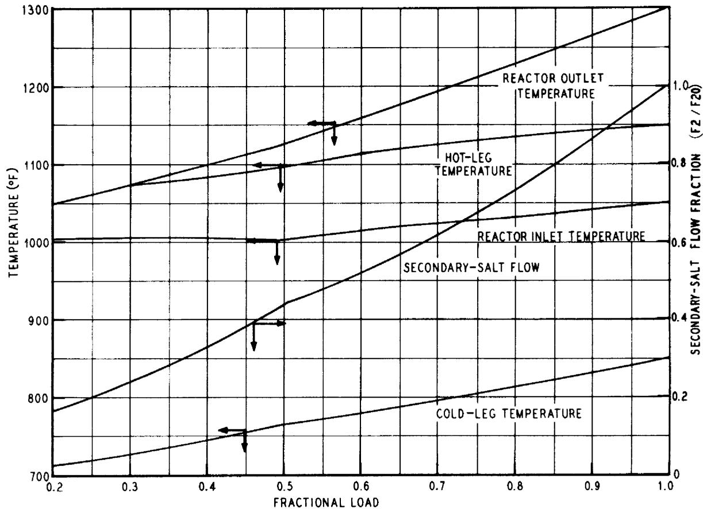  
Fig. 4. Steady-State Temperatures and Flows as Functions of Load.

minimum at the lower power levels. Such methods are: (1) increasing the steam temperature above its $1000^{\circ}\mathrm{F}$ design point as the load decreases, with subsequent attenuation of the steam with injected feedwater; (2) increasing the feedwater temperature above its $700^{\circ}\mathrm{F}$ design point as the load decreases; and (3) reducing the number of steam generators in use as the load decreases. If valves or bypasses are considered for use in the salt systems, other methods may prove feasible as well.

Further investigations of steady-state, system temperatures and flows are being carried out, including studies of off-design conditions in the steam generator. In the present analog model, insufficient machine time was available to adjust the model to include a variable steam or feedwater temperature with load, and insufficient equipment was available to include more than one steam generator.

# 4. CONTROL SYSTEM

The objective of the load control system used in this study was to maintain the temperature of the steam delivered to the turbines at a design value of $1000^{\circ}\mathrm{F}$ during all steady-state conditions and within a narrow band around this value during plant transients. The rudimentary control system used in this simulation is shown in Fig. 5. It consisted of a reactor outlet temperature controller similar to that used successfully in the MSRE $^6$ and a steam temperature controller.

Steam temperature control was accomplished by varying the secondary-salt flow rate. This method was chosen because of the relatively tight coupling which existed between steam temperature and secondary-salt flow rate. The measured steam temperature was compared with its set point of $1000^{\circ}\mathrm{F}$ , and any error caused the secondary-salt flow rate to change at a rate proportional to the error if the error was $2^{\circ}\mathrm{F}$ or less. If the error was greater than $2^{\circ}\mathrm{F}$ , the rate of change of the secondary-salt flow rate was limited to its rate of change for a $2^{\circ}\mathrm{F}$ error, which was approximately $11\%/\min$ . The reason for imposing this limit is discussed in Sect. 5.1.

To control the reactor outlet temperature, an external, plant-load demand signal was used to obtain a reactor outlet temperature set point. The outlet temperature set point versus load demand was the same as that for the steady-state, reactor outlet temperature versus load in Fig. 4. The measured value of the reactor inlet temperature was subtracted from the outlet temperature set point, and, since the primary-salt flow rate was constant, a reactor (heat)-power set point was generated by multiplying this $\Delta T$ by a proportionality constant. The reactor-power set point was a function of inlet temperature during a transient and, thus, a function of

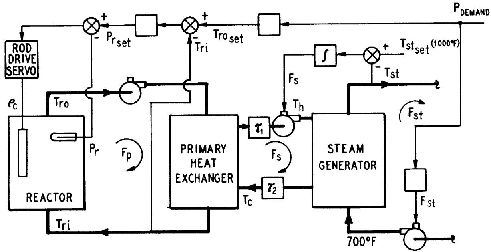  
Fig. 5. Simulation Model of Plant and Control System.

dynamic load. The measured value of reactor power (from neutron flux) was compared with the reactor-power set point, and any error was fed to the control rod servo for appropriate reactivity adjustment. Under normal conditions, the control rod servo added or removed reactivity at a rate proportional to the reactor-power error if the error was $1\%$ or less. If the error was greater than $1\%$ , the addition or removal rate was limited to the rate for a $1\%$ error, which was about $0.01\%/\mathrm{sec}$ . This maximum rate was encountered only during the studies of reactivity transients. The maximum magnitude of reactivity that the simulation allowed was $\pm 1\%$ .

An example of the action of the control system during a load change is given in Sect. 5.1. The equations for the simulation are given in the Appendix, Sect. 7.

To obtain more realistic transient results from the simulation, the following limits were imposed on several of the system variables:

1. The secondary-salt flow rate was limited to a range from $10\%$ to $110\%$ of the design-point flow rate.   
2. The maximum steam flow rate was limited to $110\%$ of the design-point flow rate.   
3. A 5-sec first-order lag was used between the plant-load demand signal and the steam flow rate in the steam generator.

# 5. RESULTS

# 5.1 Load Demand Changes

# 5.1.1 Load Change of $10\%/\min$

Various load change transients were investigated, including a change from 100 to $50\%$ load demand at a rate of $10\%/\min$ . After equilibrium had been established at $50\%$ , the load demand was increased to $100\%$ at the same rate. The results are shown in Fig. 6.

The load demand signal reduced the steam flow rate to $50\%$ of full flow at very nearly the same rate as the load reduction rate.

The reduction of the steam flow rate increased the transit time of the steam through the steam generator, and the steam temperature rose. This rise was compared with the steam temperature set point of $1000^{\circ}\mathrm{F}$ , and the resulting error signal reduced the secondary-salt flow rate. Less heat was thus transferred into the steam generator, and the rate of the steam temperature rise was reduced. The increased transit time of the secondary salt in the steam generator tended to cause a reduction in the secondary-salt, cold-leg temperature. Since the steady-state, secondary-salt flow rate and temperatures decreased with decreasing load for this control

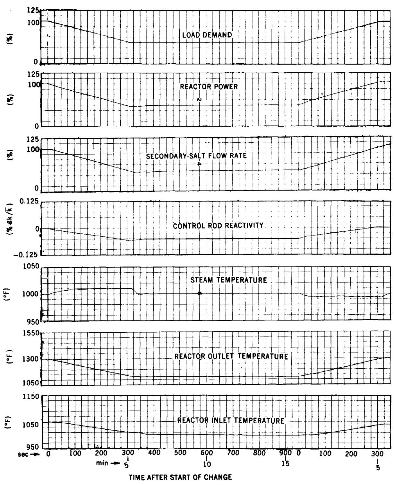  
Fig. 6. Load Demand Change from $100\%$ to $50\%$ at $10\%/\min$ .

scheme, the new steady-state, $50\%$ load conditions were assumed quickly for this transient when the demand reached steady state. The maximum steam temperature error of $\sim 10^{\circ}\mathrm{F}$ could be reduced by increasing the rate at which the secondary-salt flow rate would be allowed to change for a given steam temperature error. This rate was limited to about $11\%/\min$ for a steam temperature of $2^{\circ}\mathrm{F}$ or more. When this limit was relaxed or eliminated and faster changes of salt flow rate were allowed to occur, the flow rate tended to undershoot its new steady-state value, and considerable time was required for the salt flow rate to allow the system to come to equilibrium.

The load demand signal also reduced the reactor outlet temperature set point $175^{\circ}\mathrm{F}$ , i.e., from $1300^{\circ}\mathrm{F}$ at full load to $1125^{\circ}\mathrm{F}$ at $50\%$ load at a rate of $35^{\circ}\mathrm{F} / \mathrm{min}$ . As shown in Fig. 6, at the time that the load demand signal reached the $50\%$ level the reactor inlet temperature had dropped to about $1010^{\circ}\mathrm{F}$ . Subtraction of this measured reactor inlet temperature from the outlet temperature set point of $1125^{\circ}\mathrm{F}$ yields a $\Delta T$ of $115^{\circ}\mathrm{F}$ . Since the reactor $\Delta T$ at full load was $250^{\circ}\mathrm{F}$ , this reduced $\Delta T$ corresponded to a reactor power set point of $46\%$ . Therefore, a slight amount of positive reactivity was added to start the reactor power upward towards $46\%$ . The reactor inlet temperature momentarily increased during this transition, but then it continued to decrease, since the system was being cooled down by the load (the load was at $50\%$ and the reactor power was at $45.5\%$ ). As the reactor inlet temperature approached $1000^{\circ}\mathrm{F}$ , the $\Delta T$ between the outlet temperature set point (now constant at $1125^{\circ}\mathrm{F}$ ) and the measured inlet temperature approached $125^{\circ}\mathrm{F}$ , and thus the reactor power set point approached $50\%$ . If the reactor inlet temperature had dropped below $1000^{\circ}\mathrm{F}$ , the reactor power set point would have been greater than $50\%$ , and the reactor power would have been raised momentarily to supply additional heat to the overcooled primary salt. Fig. 6 indicates that for this transient no undershoot in reactor inlet temperature was experienced, and the system stabilized quickly at $50\%$ load. A reactor inlet temperature of $1000^{\circ}\mathrm{F}$ at $50\%$ load with $100\%$ flow of the primary salt implies a reactor outlet temperature of $1125^{\circ}\mathrm{F}$ , which, of course, is the same as its set point. In fact, the measured reactor outlet temperature in Fig. 6 closely followed the change in its set point.

The transient encountered during the increase in load to $100\%$ at $10\%/\min$ was equally well behaved. The steam temperature was controlled to within $7^{\circ}\mathrm{F}$ of its $1000^{\circ}\mathrm{F}$ design point by the increasing secondary-salt flow rate. Previous studies indicate that when increases in load were begun with the secondary-salt flow rate initially near $100\%$ , the load could be increased only very slowly if the steam temperature was to be closely controlled. This was due to the small increases allowed in the secondary-salt flow rate. (The flow rate was limited to $110\%$ of full flow.) In the present case, however, since the secondary-salt flow rate was reduced at reduced loads, larger increases were allowed in this flow rate, which permitted control of the steam temperature during faster load increases. For this reason, when the off-design, steady-state system profiles are investigated further, reduced secondary-salt flow rate at reduced loads should be considered.

# 5.1.2 Load Change at $5\%/\min$

A load change at a rate of $10\%/\min$ is considered a relatively severe one for a large steam plant. Under normal operating conditions, load change rates of less than $5\%/\min$ are more usual. Figure 7 shows the transient results for a load demand change from 100 to $50\%$ of full load at a rate of $5\%/\min$ , with a subsequent increase in load demand, after equilibrium had been established, to full load at the same rate. The maximum steam temperature error during the load reduction was decreased to $2^{\circ}\mathrm{F}$ . During the load increase, the error was held to within $2^{\circ}\mathrm{F}$ until the increasing secondary-salt flow rate reached its $110\%$ limit. At this point the steam temperature began to decrease and the error reached a maximum of about $5^{\circ}\mathrm{F}$ . After the load demand reached $100\%$ and the secondary-salt temperatures continued to rise, the steam temperature increased to $1000^{\circ}\mathrm{F}$ . As the steam temperature tended to exceed $1000^{\circ}\mathrm{F}$ , the secondary-salt flow rate decreased from its $110\%$ limit and maintained the temperature at $1000^{\circ}\mathrm{F}$ .

For the transients described above, the magnitudes and rates of change of temperatures and flow rates during the transient were determined essentially by the rate of change of the load and the steady-state, temperature and flow profiles chosen for this simulation. This indicates that the final choice of steady-state, temperature and flow profiles may greatly affect the rate at which the load can be changed on the salt systems for normal operation. This should be considered in further steady-state investigations.

The results of these and the following transients are summarized in Table 3. Listed in the table are the values of the maximum magnitude of the deviation from the initial steady-state of a system variable and the maximum rate of change of that variable. The values listed are the maxima encountered at any time during the transient; they are not necessarily initial rates of change or differences in steady-state magnitudes. The values in most cases are taken directly from the figures and are intended only as an aid in interpreting the analog curves and as an order-of-magnitude estimate of the kinds of variations encountered in the transient cases included in this report. Obviously, any change of the conditions under which these curves were obtained would likely alter these values.

# 5.2 Primary Flow Transients

# 5.2.1 Step Loss of One Pump

Three cases were studied involving transient perturbations in the primary-salt flow rate. The first was an attempt to simulate the sudden (step) loss of one of the four primary-salt pumps. This case could not be simulated directly because the model of the plant included only one primary heat exchanger. Therefore, the loss of one of four pumps was approximated in the following way. The primary-salt

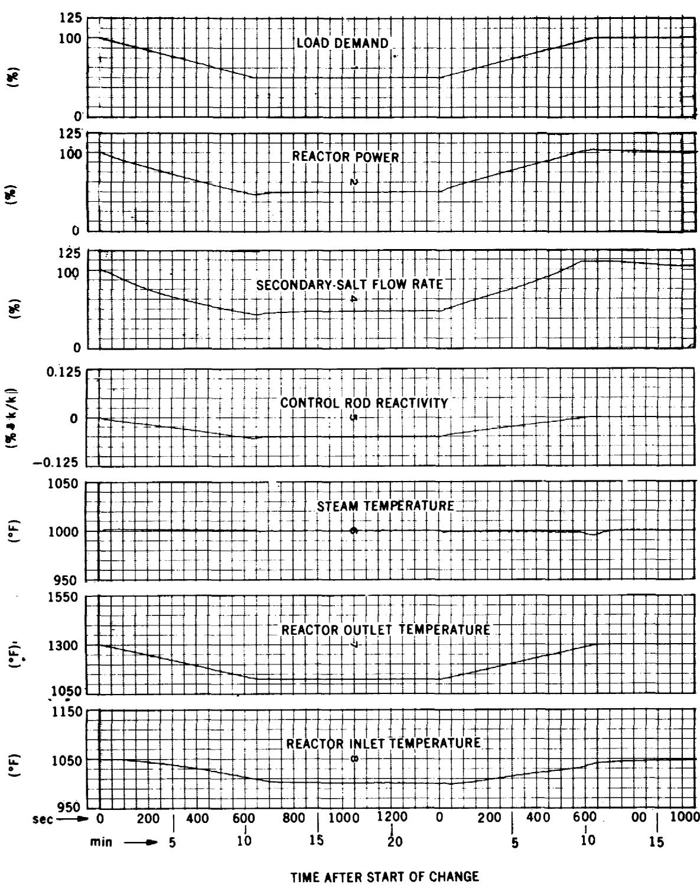  
Fig. 7. Load Demand Change from $100\%$ to $50\%$ at $5\%/\min$ .

Table 3. Maximum Magnitude and Rate of Change of System Temperature, Flow Rate, and Reactivity During Transients   

<table><tr><td rowspan="2">Variable</td><td colspan="4">LOAD DEMAND CHANGES</td><td colspan="5">FLOW RATE TRANSIENTS</td><td colspan="3">REACTIVITY STEPS</td></tr><tr><td>100 to 50% at 10%/min</td><td>50 to 100% at 10%/min</td><td>100 to 50% at 5%/min</td><td>50 to 100% at 5%/min</td><td>Primary Flow Reduction to 75% as Step</td><td>Loss of Primary Flowa</td><td>Loss of Primary Flow and Load Reductiona,b</td><td>Loss of Secondary Flow</td><td>Loss of Secondary Flow and Load Reductiona,b</td><td>-0.2%</td><td>+0.15% from 25% Power Level</td><td>+0.15% from 25% Power Level with No Control Reactivity</td></tr><tr><td colspan="13">Reactor Outlet</td></tr><tr><td>Temperature, °F</td><td>-175</td><td>175</td><td>-175</td><td>175</td><td>12</td><td>100</td><td>-250</td><td>-30</td><td>-320</td><td>-100</td><td>100</td><td>592</td></tr><tr><td>Rate of Change, °F/sec</td><td>-0.56</td><td>0.56</td><td>-0.27</td><td>0.27</td><td>10</td><td>13</td><td>13</td><td>-4.4</td><td>17</td><td>-36</td><td>50</td><td>63</td></tr><tr><td colspan="13">Reactor Inlet</td></tr><tr><td>Temperature, °F</td><td>-50</td><td>50</td><td>-50</td><td>50</td><td>3</td><td>-200</td><td>-220</td><td>210</td><td>135</td><td>-40</td><td>56</td><td>580</td></tr><tr><td>Rate of Change, °F/sec</td><td>-0.15</td><td>0.17</td><td>-0.09</td><td>0.16</td><td>1.3</td><td>-8.3</td><td>-8.8</td><td>20</td><td>20</td><td>-6.9</td><td>14</td><td>19</td></tr><tr><td colspan="13">Sec-Salt Hot-Leg</td></tr><tr><td>Temperature, °F</td><td>-60</td><td>60</td><td>-60</td><td>60</td><td>--</td><td>--</td><td>--</td><td>--</td><td>--</td><td>-24</td><td>65</td><td>&gt;350</td></tr><tr><td>Rate of Change, °F/sec</td><td>-0.22</td><td>0.17</td><td>-0.17</td><td>0.20</td><td>--</td><td>--</td><td>--</td><td>--</td><td>--</td><td>-1.1</td><td>9.7</td><td>13</td></tr><tr><td colspan="13">Sec-Salt Cold-Leg</td></tr><tr><td>Temperature, °F</td><td>-80</td><td>80</td><td>-80</td><td>80</td><td>--</td><td>--</td><td>--</td><td>--</td><td>--</td><td>-4</td><td>-15</td><td>-40</td></tr><tr><td>Rate of Change, °F/sec</td><td>-0.36</td><td>0.28</td><td>-0.18</td><td>0.18</td><td>--</td><td>--</td><td>--</td><td>--</td><td>--</td><td>-7.1</td><td>0.48</td><td>0.67</td></tr><tr><td colspan="13">Steam</td></tr><tr><td>Temperature, °F</td><td>10</td><td>-7</td><td>2</td><td>-5</td><td>--</td><td>--</td><td>--</td><td>--</td><td>--</td><td>-32</td><td>28</td><td>195</td></tr><tr><td>Rate of Change, °F/sec</td><td>-1.0</td><td>0.30</td><td>&lt;0.1</td><td>-0.09</td><td>--</td><td>--</td><td>--</td><td>--</td><td>--</td><td>-3.4</td><td>2.2</td><td>5.0</td></tr><tr><td colspan="13">Sec-Salt Flow Rate</td></tr><tr><td>Magnitude, %</td><td>-58</td><td>60</td><td>-56</td><td>63</td><td>--</td><td>10</td><td>10</td><td>-90</td><td>-90</td><td>10</td><td>-6.5</td><td>-12</td></tr><tr><td>Rate of Change, %/min</td><td>-11</td><td>11</td><td>-9</td><td>11</td><td>--</td><td>11</td><td>11</td><td>-600</td><td>-600</td><td>11</td><td>11</td><td>11</td></tr><tr><td colspan="13">Control Reactivity</td></tr><tr><td>Magnitude, %&amp;k/k</td><td>-0.06</td><td>0.06</td><td>-0.06</td><td>0.05</td><td>-0.025</td><td>-0.21</td><td>-0.46</td><td>-0.063</td><td>-1.0</td><td>0.22</td><td>-0.28</td><td>0</td></tr><tr><td>Rate of Change, %/sec</td><td>-0.0002</td><td>0.0004</td><td>-0.0001</td><td>0.0001</td><td>-0.01</td><td>-0.01</td><td>-0.01</td><td>-0.01</td><td>-0.01</td><td>0.01</td><td>0.01</td><td>0</td></tr></table>

${}^{a}$ Flow rate decreased to 10% at a rate of 10%/sec.   
bLoad demand reduced to $20\%$ at $20\%$ /sec initiated 5 sec after initiation of flow reduction.

flow rate in the reactor core was reduced by $25\%$ as a step while a constant, full flow rate was maintained in the primary heat exchanger. The transit time of the primary salt through the core in the neutron kinetics equations was increased as a step, but the transit time of the salt through the loop external to the core was maintained constant.

The results of such a transient are shown in Fig. 8. The load demand on the plant was maintained at $100\%$ and, thus, the reactor outlet temperature set point at $1300^{\circ}\mathrm{F}$ . The proportionality constant between the desired reactor $\Delta T$ (i.e., the measured reactor inlet temperature subtracted from the reactor outlet temperature set point) and the reactor power set point was directly proportional to the primary-salt flow rate and, thus, was also decreased as a step by $25\%$ . Therefore, for the same reactor inlet temperature and outlet temperature set point, the reactor power set point decreased $75\%$ upon the step reduction of the primary-salt flow rate. The measured value of reactor power $(100\%)$ was compared with the set point, and the error of $25\%$ caused the control rod servo to insert negative reactivity at the maximum rate of $0.01\%/\mathrm{sec}$ . The reactor power was reduced to $75\%$ in a few seconds, incurring only a small transient increase in reactor outlet temperature $(12^{\circ}\mathrm{F} \max)$ . The total magnitude of control reactivity needed was $0.025\% \delta k/k$ . A very small, delayed perturbation of less than $2^{\circ}\mathrm{F}$ in maximum magnitude was observed in the steam temperature. In the final steady state, the reactor temperatures and the steam temperature were restored to their design-point values. The load demand was $100\%$ and the reactor power was $75\%$ . However, because of the way in which the loss of one primary pump was approximated for this case, the $100\%$ in load demand now refers only to the three remaining, fully operating primary pumps and associated secondary loops and steam generators. Therefore, the power delivered to the load under these conditions was $75\%$ .

# 5.2.2 Loss of All Primary Pumps

As a second case of interest, the simultaneous cooldown of all four primary pumps to an arbitrary minimum flow of $10\%$ was investigated. It was assumed that some device such as a battery powered pony motor on the primary pumps would maintain some minimum pumping capacity in the primary loop upon loss of power to the main primary pump motors. The primary-salt flow rate was thus reduced in all parts of the primary loop to $10\%$ of full flow at a rate of $10\%/\mathrm{sec}$ . The results of this transient are shown in Fig. 9. The proportionality constant between the desired reactor $\Delta T$ and reactor power set point, described in the previous case, was decreased with the reduced primary-salt flow rate which produced the reactor power error signal. Negative reactivity was thus introduced at the maximum rate, and the reactor power decreased in about 25 sec to about $12\%$ . The maximum amount of control reactivity required was about $-0.21\% \delta k/k$ . The reactor outlet temperature rose at first to about $1400^{\circ}F$ in 15 sec, then decreased to about $1340^{\circ}F$ . The inlet temperature fell below $1000^{\circ}F$ in 15 sec. The loss of primary flow while full

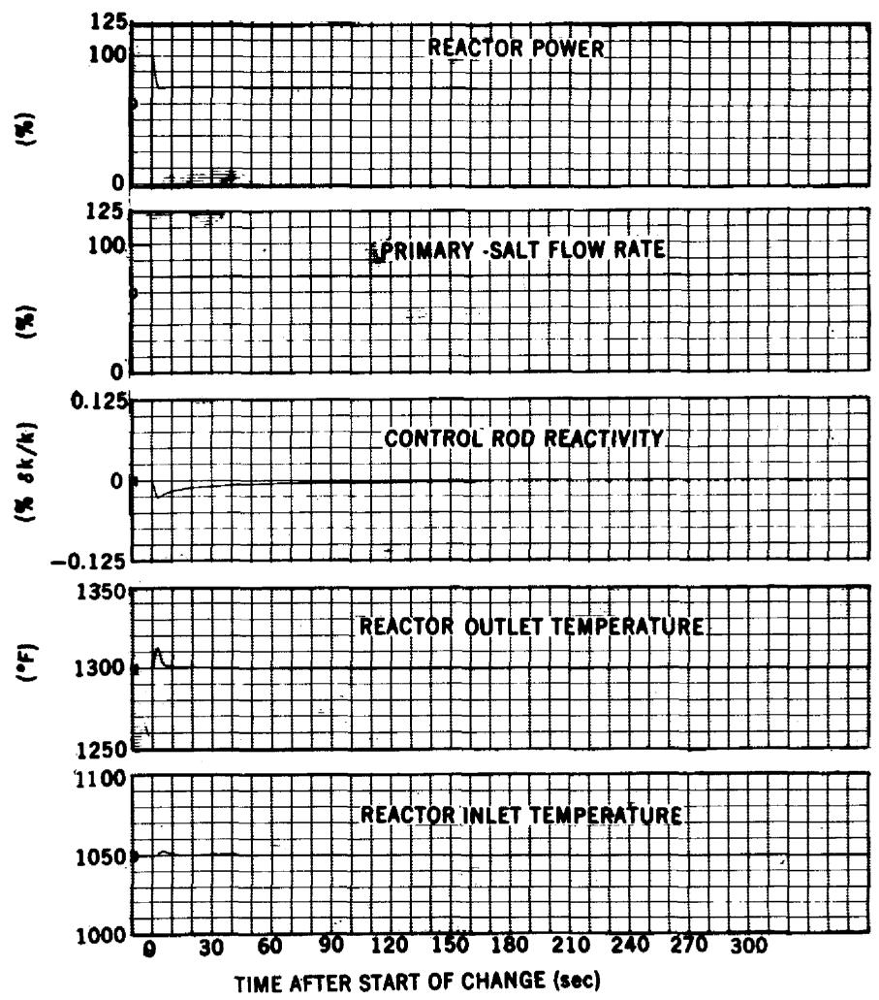  
Fig. 8. Primary Flow Decrease to $75\%$ as a Step.

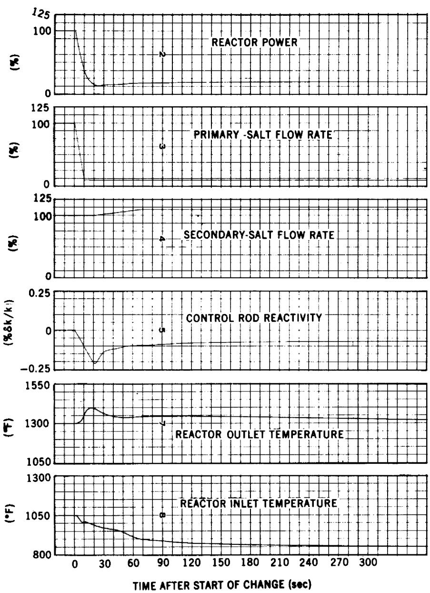  
Fig. 9. Loss of Primary Flow to $10\%$ at $10\%/\sec$ .

heat extraction from the steam generators was maintained caused the secondary-salt, hot-leg temperature to fall sharply. The cold-leg temperature also decreased. The decreasing secondary-salt temperatures caused a severe reduction in steam temperature. The secondary-salt flow rate increased to its limit of $110\%$ in an attempt to maintain the steam temperature at $1000^{\circ}\mathrm{F}$ , but with little result.

Due to the assumptions concerning the variations in steam properties made in formulating the model of the steam generator used in this simulation, the useful range of the steam generator model was greatly limited (see Appendix, Sect. 7). The model, therefore, simulated only small variations in steam temperature near $1000^{\circ}\mathrm{F}$ . Loss of primary or secondary flow to $10\%$ , however, effectively decoupled the reactor from the steam system, and large magnitude changes in the steam generator had a greatly reduced effect on the reactor system. Only the direction of these changes was important. The reactor system transient results are therefore included for the flow transient cases.

# 5.2.3 Loss of All Primary Pumps with Load Reduction

The third case involved the same loss of primary flow as described in the second case (Sect. 5.2.2) but with a reduction in load demand from 100 to $20\%$ at a rate of $20\%/\mathrm{sec}$ . This rate was limited by the assumed maximum rate at which the turbine steam interceptor valves could close. It was assumed that an auxiliary heat rejection system would be capable of disposing of $20\%$ of the full plant power. The reduction of load was initiated 5 sec after the primary pump coastdown was begun so that some delay time would be simulated for the system to sense and evaluate the incident. The results are shown in Fig. 10. The proportionality constant between the desired reactor $\Delta T$ and reactor power set point was reduced with the reduction in flow rate. The reactor power reached $12\%$ in about 20 sec. The reactor outlet temperature rose to about $1400^{\circ}F$ , then decreased to about $1200^{\circ}F$ at 60 sec, and continued to decrease at a rate of about $0.3^{\circ}F/\mathrm{sec}$ . The reactor inlet temperature transient was much like that in the previous case, as were the transients in the secondary-salt, hot- and cold-leg temperatures.

The steam temperature initially rose in this transient, since the fast load reduction dominated the response in the steam generator when it occurred 5 sec after the primary flow coastdown. However, this did not prevent large sudden decreases in the secondary-salt temperatures. Some additional corrective action may be required to prevent such decreases in temperature, such as a reduction of the secondary-salt flow rate when primary flow is lost.

The results of these primary flow transients indicate a need for further investigation of the conditions existing in the secondary-salt loops and steam generators following a loss of primary flow transient. Attention must be paid to the resulting

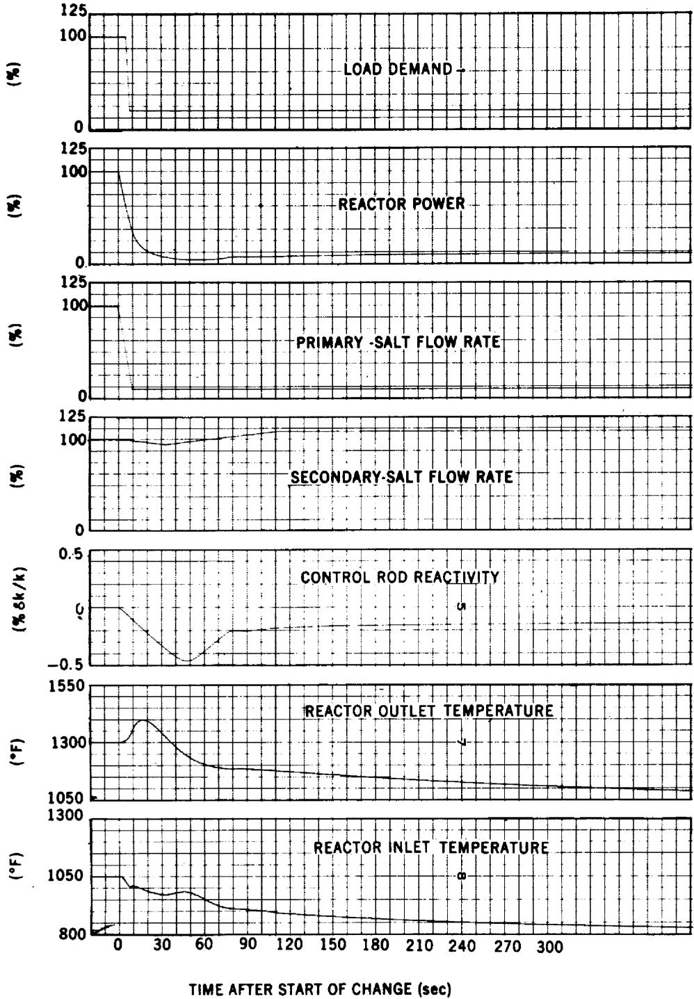  
Fig. 10. Loss of Primary Flow to $10\%$ at $10\%/\sec$ Followed in 5 sec by Load Reduction to $20\%$ at $20\%/\sec$ .

magnitude and rates of change of temperature in this part of the system. The model of the steam generator used in this simulation was not adequate for such studies because of the approximations made.

# 5.3 Secondary Flow Transients

The results of the simultaneous reduction of the secondary-salt flow rate in all four secondary loops to a level of $10\%$ of full flow (the assumed level of auxiliary pumping power) at a rate of $10\%/\mathrm{sec}$ are shown in Figs. 11 and 12. In Fig. 11, the load demand was maintained constant at $100\%$ , and in Fig. 12 it was decreased to $20\%$ at a rate of $20\%/\mathrm{sec}$ beginning 5 sec after the flow reduction. As in the case of loss of all primary flow to $10\%$ , the loss of secondary flow decoupled the reactor from the steam system. For the case of constant load demand, the reactor inlet temperature initially rose about $200^{\circ}\mathrm{F}$ in about 60 sec. Since the load demand remained at $100\%$ , the reactor outlet temperature setpoint remained at $1300^{\circ}\mathrm{F}$ . The rising inlet temperature thus decreased the reactor power set point, and negative reactivity was added to reduce the reactor power. The outlet temperature control system maintained the outlet temperature at $1300^{\circ}\mathrm{F}$ with a maximum variation of $30^{\circ}\mathrm{F}$ .

The reduction in the secondary-salt flow rate with a constant load demand on the steam generators caused an increase in the difference between the secondary-salt, hot- and cold-leg temperatures. The hot-leg temperature increased and the cold-leg temperature decreased. The cold-leg temperature approached the freezing point. Following the loss of secondary-salt flow, there was no steam temperature control.

When the load demand was decreased rapidly (20%/sec) to 20% starting 5 sec after the start of the loss of secondary-salt flow (Fig. 12), the initial transients in system temperatures were, of course, the same as those for constant load demand. However, when the load demand was decreased, the reactor outlet temperature set point was decreased to $1050^{\circ}\mathrm{F}$ for 20% load. Therefore, the reactor outlet temperature controller began to decrease the outlet temperature to $1050^{\circ}\mathrm{F}$ . The initial rise in the reactor inlet temperature caused a decrease in the reactor power set point as before, and negative control reactivity was inserted to decrease power. The power decreased to about 10% in 30 sec. The secondary-salt, hot-leg temperature initially tended to rise and the cold-leg temperatures to fall as before, but now the decreasing reactor outlet temperature decreased the hot-leg temperature after its initial increase. The cold-leg temperature again approached its freezing point.

A greater amount of negative reactivity was inserted in the reactor during this transient. The rapidly increasing reactor inlet temperature due to loss of secondary-salt flow and rapidly decreasing reactor outlet temperature set point due to the large load demand reduction combined to produce a large sustained reactor

power error. As a result, a reactor power of only a few per cent was reached and sustained for many seconds. The positive reactivity inserted between 160 and 250 sec during recovery caused a sudden increase in reactor power when criticality was again achieved. The system quickly recovered, however, and the appropriate steady-state conditions were reached.

# 5.4 Summary of Primary and Secondary Flow Transients

The loss of salt flow in the primary- or secondary-salt loops decoupled the reactor system from the steam generating system. The reactor outlet temperature control system controlled the reactor outlet temperature following the loss of primary or secondary flow with or without a subsequent reduction in load demand. If the load demand was not reduced, the control system maintained the reactor outlet temperature to within $100^{\circ}\mathrm{F}$ of its design point of $1300^{\circ}\mathrm{F}$ . When a reduction in load demand followed the loss of flow, the controller decreased the reactor outlet temperature in accordance with the accompanying reduction in its set point ( $1050^{\circ}\mathrm{F}$ at $20\%$ load). The reactor inlet temperature, however, decreased well below the freezing point of the primary salt upon loss of the primary flow because of the increased transit time of the salt in the primary heat exchanger whether or not the load demand was reduced 5 sec after loss of flow. Therefore, upon the loss of primary flow, steps must be taken to prevent a reduction in the reactor inlet temperature. Decreasing the secondary-salt flow through the primary heat exchangers to transfer out less heat would probably be the most effective way to accomplish this.

The secondary-salt temperatures also decreased upon loss of primary flow. To prevent an undesirably low temperature of the cold-leg, the load must be reduced sufficiently fast. Decreasing the secondary-salt flow rate to control reactor inlet temperature as discussed above aggravates this situation, because the transit time of the secondary salt through the steam generator is increased, which further lowers the secondary-salt temperatures. Upon loss of primary flow, then, the secondary-salt flow rate must be decreased to prevent a low reactor inlet temperature, and the load must be reduced sufficiently fast to prevent low secondary-salt cold-leg temperatures.

Upon loss of secondary-salt flow to $10\%$ the reactor inlet temperature tended to increase and remain above $1050^{\circ}\mathrm{F}$ when the load demand was not reduced (i.e., a constant outlet temperature set point). When the load was reduced, the inlet temperature remained above $960^{\circ}\mathrm{F}$ .

Loss of secondary-salt flow rate produced undesirable decreases in the secondary-salt cold-leg temperatures. Therefore, as in the case of loss of primary flow, the load must be reduced at a rate sufficiently fast to prevent freezing of the secondary salt when loss of secondary salt flow rate occurs. Some additional control action may also be required to maintain the reactor inlet temperature above $1000^{\circ}\mathrm{F}$ .

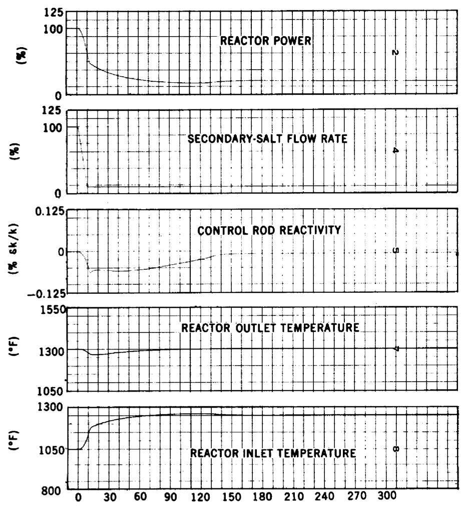  
Fig. 11. Loss of Secondary Flow to $10\%$ at $10\%/\mathrm{sec}$ .

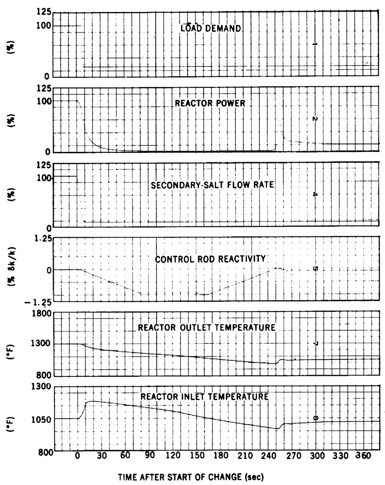  
Fig. 12. Loss of Secondary Flow to $10\%$ at $10\%/\mathrm{sec}$ Followed in 5 sec by Load Reduction to $20\%$ at $20\%/\mathrm{sec}$ .

# 5.5 Reactivity Transients

Transients initiated by both positive and negative reactivity excursions were investigated. The excursions included a negative step in reactivity of $-0.2\% \delta k / k$ and positive steps of $0.15\%$ with and without the control rod servo operative. The positive reactivity steps were investigated from an initial steady-state power level of $25\%$ to obtain the maximum positive power-excursion range for this simulation. The maximum reactor power allowable was about $160\%$ due to the scaling chosen for the simulation. Therefore, the maximum positive power-excursion range for the simulation was from about 25 to $160\%$ , or a factor of 6.4 in power. Under normal conditions, the control rod servo added or removed reactivity at a rate proportional to the reactor power error for errors of $1\%$ or less. Above this value, the addition or removal rate was limited to its rate at $1\%$ power error, which was about $0.01\%/\mathrm{sec}$ . The maximum magnitude of reactivity which simulation allowed was $\pm 1\%$ .

# 5.5.1 Negative Step of $0.2\% \delta k / k$

Figure 13 shows the results of a negative step in reactivity of $0.2\% \delta k / k$ . First, the reactor power decreased rapidly to about $38\%$ . Since the load demand signal remained at $100\%$ , the reactor outlet temperature set point remained at $1300^{\circ}F$ . The reactor inlet temperature did not immediately change upon insertion of the negative reactivity, and thus the reactor power set point remained momentarily at $100\%$ . The resulting initial power error signal of $62\%$ caused the control rod to add reactivity to the system at its maximum rate of about $0.01\%/\mathrm{sec}$ .

The sudden reduction in reactor power also caused a rapid decrease in the reactor outlet temperature from 1300 to about $1200^{\circ}\mathrm{F}$ . After a few seconds delay, this reduction in the primary-salt temperature appeared as a decrease in the reactor inlet temperature. When the inlet temperature returned to about $1015^{\circ}\mathrm{F}$ , the positive reactivity added by the control rods and the negative primary-salt temperature coefficient had returned the reactor power to about $115\%$ . The reactor power set point for this inlet temperature was $114\%$ , since the outlet temperature set point remained $1300^{\circ}\mathrm{F}$ during the entire transient. Therefore, the reactor power error had changed sign, and the control rod now began to add negative reactivity to the system. As the reactor inlet temperature approached $1050^{\circ}\mathrm{F}$ , the reactor power set point approached $100\%$ , and the system slowly returned to design-point conditions with a control rod reactivity of $+0.2\%$ to cancel the $-0.2\%$ inserted.

The effect of the reduction in the primary-salt temperatures appeared as a reduction in the steam temperature of about $32^{\circ}\mathrm{F}$ , which was delayed about 15 sec owing to the transit time of the secondary salt between the primary heat exchanger and the steam generator. The steam temperature controller increased the secondary-salt flow rate at its maximum rate of about $11\%/\mathrm{min}$ in an attempt to return the steam temperature to $1000^{\circ}\mathrm{F}$ . This flow rate, however, had an upper limit of $110\%$ of

full flow. When this limit was reached, further increases in steam temperature were accomplished only by increases in the secondary-salt temperatures. When the steam temperature reached $1000^{\circ}\mathrm{F}$ and tended to exceed this level, the secondary-salt flow rate began to decrease from its $110\%$ limit, maintaining the steam temperature at $1000^{\circ}\mathrm{F}$ . The maximum system temperature deviations and maximum rates of change of temperatures encountered during this transient are summarized in Table 3.

# 5.5.2 Positive Step of $0.15\% \delta k / k$

Figure 14 shows the results of a positive step in reactivity of $0.15\%$ from an initial power of $25\%$ . The reactor power increased rapidly to about $144\%$ while the control rod added negative reactivity at its maximum rate. The sudden increase in the reactor power caused a rapid increase in the reactor outlet temperature of $100^{\circ}\mathrm{F}$ from its initial value of $1063^{\circ}\mathrm{F}$ . An increase in the reactor inlet temperature of $56^{\circ}\mathrm{F}$ from its initial value of $1000^{\circ}\mathrm{F}$ followed. When the inlet temperature returned to $1040^{\circ}\mathrm{F}$ , the reactor power had decreased to $8.5\%$ . Since the reactor outlet temperature set point was constant during this transient at $1063^{\circ}\mathrm{F}$ , the reactor power set point at this time was $9\%$ , and, thus, the control system began to add positive reactivity to the system to increase the reactor power. As the inlet temperature approached $1000^{\circ}\mathrm{F}$ , the power set point approached the initial level of $25\%$ . The temporary increase in the reactor inlet temperature beginning at approximately 70 sec was due to the decrease in the secondary-salt flow rate which was attempting to control the delayed response in the steam temperature. The increasing reactor temperatures produced an increase in the steam temperature, which was delayed by about 65 sec because of the transit time of the secondary salt between the heat ex-changers at the initial $22\%$ flow rate. The steam temperature rose to about $1028^{\circ}\mathrm{F}$ before the decreasing secondary-salt flow rate returned it to $1000^{\circ}\mathrm{F}$ . The relatively long, secondary-salt loop transit time reduced the capability of the secondary-salt flow rate to control the steam temperature, and several oscillations were allowed to occur before the system returned to normal steady-state conditions at $25\%$ power level. The total excess energy added to the system by the reactor power "pulse" from the initial power rise to the point at which the power first returned to the $25\%$ level was approximately 13,000 Mw-sec. The maximum system temperature deviations and maximum rates of change of temperatures encountered during this transient are summarized in Table 3.

# 5.5.3 Positive Step of $0.15\% \delta k / k$ with Control Rod Servo Inactive

A positive step in reactivity of $0.15\%$ was also inserted with the power level at $25\%$ and with the control rod servo inactive; that is, no control reactivity was added or subtracted from the system at any time. Only the temperature coefficients of reactivity were allowed to control the transient. The coefficients used in the simulation were $-2.4 \times 10^{-5}$ per $^\circ C$ for the primary salt and $+1.9 \times 10^{-5}$ per $^\circ C$ for the graphite. The results of this transient are shown in Fig. 15. The reactor power

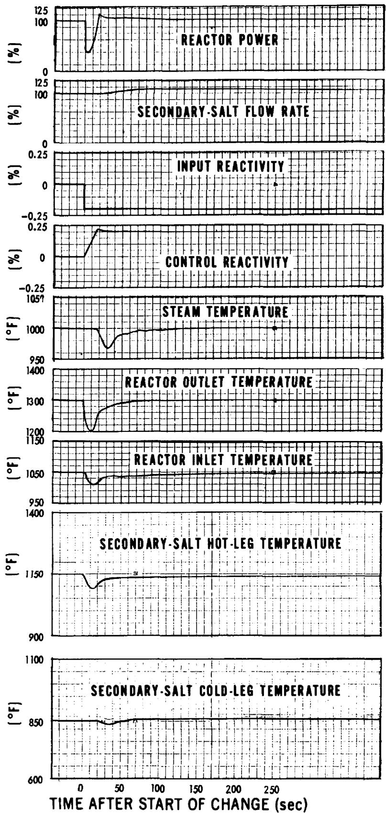  
Fig. 13. Input Reactivity Step of $-0.2\%$ .

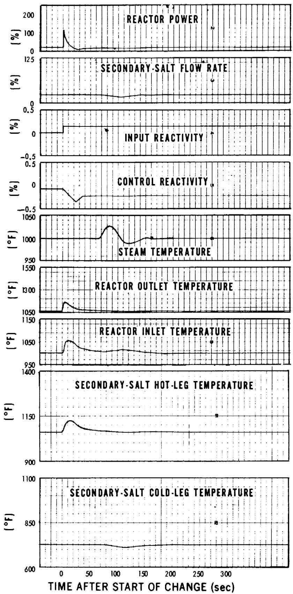  
Fig. 14. Input Reactivity Step of $0.15\%$ from $25\%$ Power Level.

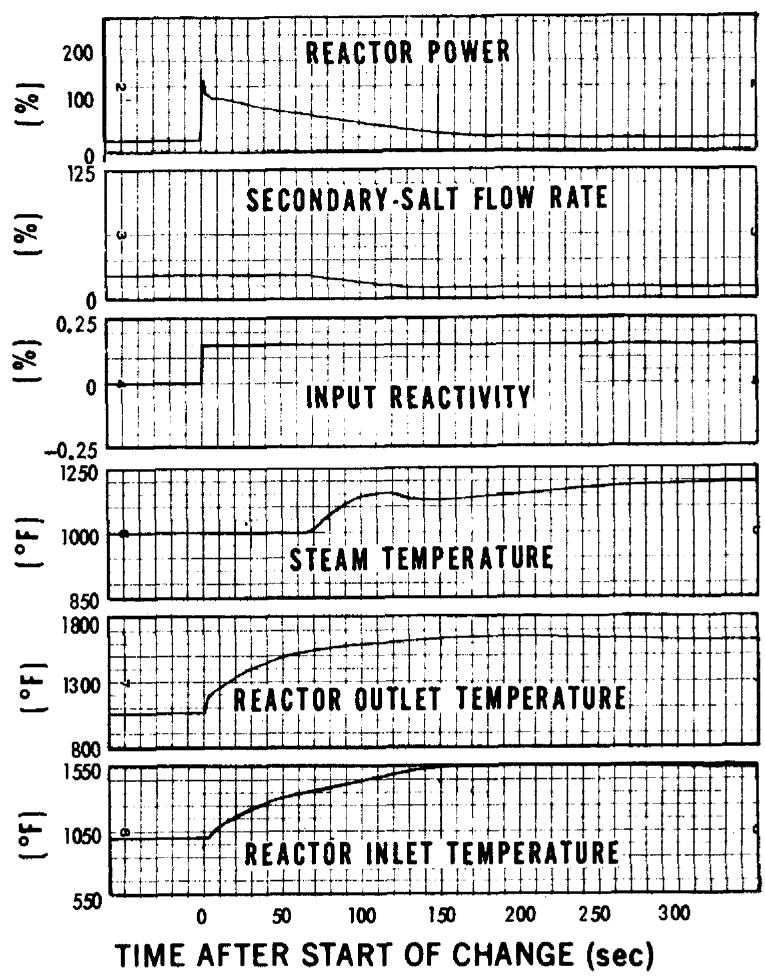  
Fig. 15. Input Reactivity Step of $0.15\%$ from $25\%$ Power Level with No Control Rod.

reached a peak of about $169\%$ before the negative reactivity added by the increase in the primary-salt temperatures was sufficient to terminate the excursion. The reactor outlet and inlet temperatures increased to a maximum of about 1655 and $1580^{\circ}\mathrm{F}$ , respectively, at about 200 sec, which represented increases of 592 and $580^{\circ}\mathrm{F}$ from their initial steady-state values. The steam temperature increased to about $1150^{\circ}\mathrm{F}$ at about 115 sec in its delayed response because of the secondary-salt transit time. When the steam temperature error occurred at about 65 sec, the secondary-salt flow rate decreased in an attempt to reduce the steam temperature, since this part of the control system was still operative. However, a lower limit was placed on the secondary-salt flow rate at $10\%$ of full flow. The steam temperature was decreased by the decreasing flow rate until this limit was reached, after which the steam temperature began to rise again to a maximum of $1195^{\circ}\mathrm{F}$ at 340 sec.

# 6. TRANSFER FUNCTION

The full-power transfer function relating small input reactivity perturbations to reactor power with constant power removal from the system was measured on the plant simulation and calculated by the use of a digital computer code. A sine wave oscillator was used to introduce small reactivity perturbations in the analog computer simulation, and the resulting reactor power perturbations were recorded. The magnitude of the input reactivity was about $2 \times 10^{-5} \delta k / k$ peak-to-peak. The magnitude of the power oscillations varied between 0.4 to $1.5\%$ peak-to-peak in the frequency range of 0.01 to $2.0 \mathrm{~Hz}$ . The measured values of transfer function are plotted in Fig. 16.

The digital code used to calculate the transfer function from the same set of simulation equations was SFR-3.7 The calculated results are also plotted in Fig. 16 for frequencies in the range of 0.0016 to 2.0 Hz. The phase shift versus frequency is also plotted.

SFR-3 was also used to calculate the same transfer function but with later values for the temperature coefficients of reactivity. The values used in the simulation and in the calculations described above were $-2.4 \times 10^{-5} \delta k / k / ^{\circ} C$ for the primary salt and $+1.9 \times 10^{-5} \delta k / k / ^{\circ} C$ for the graphite. The later values were $-3.52 \times 10^{-5} \delta k / k / ^{\circ} C$ for the primary salt and $+2.47 \times 10^{-5} \delta k / k / ^{\circ} C$ for the graphite, or a net isothermal coefficient of $-1.05 \times 10^{-5} \delta k / k / ^{\circ} C$ which is somewhat greater in magnitude than before. The resulting transfer function for this case is also shown in Fig. 16. Due to the considerably larger isothermal coefficient, the low-frequency portion of the gain is somewhat lower. This effect tends to increase the linear stability of the system.

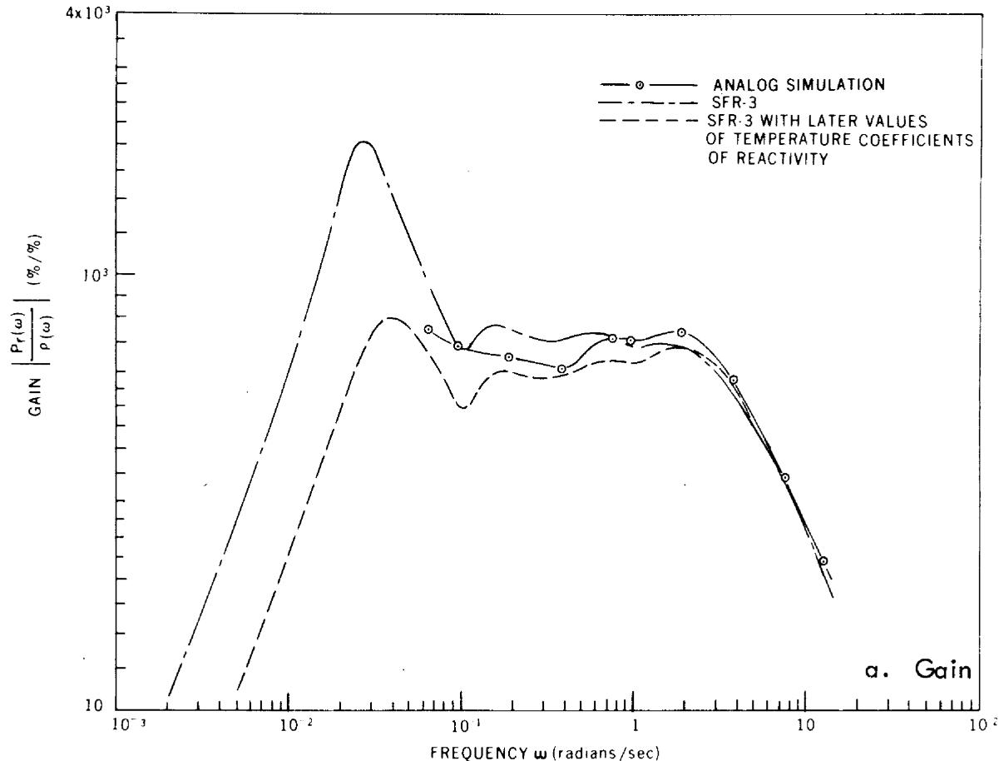

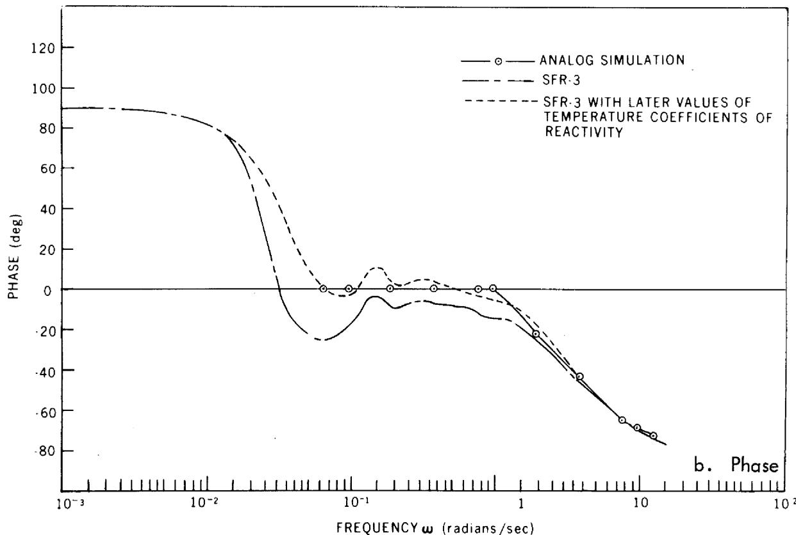  
Fig. 16. Full-Power Transfer Function.

# 7. APPENDIX: ANALOG SIMULATION MODEL

# 7.1 Heat Transfer Model

A spatially lumped parameter model was used to describe the plant heat transfer system. The model is shown in Fig. 2.

# 7.1.1 Reactor Core

For the graphite lumps

$$
M _ {g} C _ {p g} \frac {d T}{d t} = h _ {f g} A _ {c} \left(T _ {p} - T _ {g}\right) + k _ {g} P _ {r}. \tag {1}
$$

For the primary salt lumps

$$
M _ {r} C _ {p f} \frac {d T _ {p}}{d t} = F _ {1} C _ {p f} \left(T _ {i} - T _ {p}\right) + h _ {f g} A _ {c} \left(T _ {g} - T _ {p}\right) + k _ {r r}, \tag {2}
$$

where

$\mathsf{T}_{\mathfrak{q}} =$ graphite temperature,

Tp = primary-salt temperature,

$\dot{T}_{i} =$ inlet temperature to lump,

$C_{pf} =$ specific heat of primary salt,

$C_{\mathsf{pg}} =$ specific heat of graphite,

$\tilde{M}_{r} =$ mass of primary-salt lump,

$M_{q} =$ mass of graphite lump,

$h_{fg} =$ graphite-to-primary-salt heat transfer coefficient,

$A_{c} =$ heat transfer area,

$\overline{P_{r}} =$ reactor heat generation rate,

$k_{a} =$ fraction of fission heat generated in graphite lump,

$k_{r}^{s} =$ fraction of fission heat generated in primary-salt lump,

$F_{1} =$ primary-salt mass flow rate in lump.

The reactor outlet temperature $T_{ro}$ was given by

$$
T _ {r o} = 0. 8 1 4 T _ {p 4} + 0. 1 8 6 T _ {p 6}, \tag {3}
$$

since $81.4\%$ of the primary salt flowed through zone I and $18.6\%$ through zone II.

# 7.1.2 Primary Heat Exchanger

For the primary salt

$$
M _ {r} C _ {p f} \frac {d T _ {p}}{d t} = F _ {1} C _ {p f} \left(T _ {i} - T _ {p}\right) + h _ {f} A _ {p} \left(T _ {t} - T _ {p}\right). \tag {4}
$$

For the tube walls

$$
M _ {t} C _ {p t} \frac {d T _ {t}}{d t} = h _ {f} A _ {p} \left(T _ {p} - T _ {t}\right) + h _ {s} A _ {p} \left(T _ {s} - T _ {t}\right), \tag {5}
$$

and for the secondary salt

$$
M _ {s} C _ {p s} \frac {d T _ {s}}{d t} = F _ {2} C _ {p s} \left(T _ {i} - T _ {s}\right) + h _ {s p} A _ {p} \left(T _ {t} - T _ {s}\right), \tag {6}
$$

where

$T_{t} =$ tube wall temperature,

$T_{s} =$ secondary-salt temperature,

$C_{\mathsf{p}\dagger} =$ specific heat of tube wall metal,

$C_{ps} =$ specific heat of secondary salt,

$M_{\mathrm{f}} =$ mass of tube wall lump,

$M_{s} =$ mass of secondary-salt lump,

$h_f =$ primary-salt-to-tube-wall heat transfer coefficient,

$h_{sp} =$ tube-wall-to-secondary-salt heat transfer coefficient,

A $\equiv$ heat transfer area,

$F_{2} =$ secondary-salt mass flow rate.

# 7.1.3 Steam Generator

For the secondary salt

$$
M _ {s} C _ {p s} \frac {d T _ {s}}{d t} = F _ {2} C _ {p s} \left(T _ {i} - T _ {s}\right) + h _ {s s} A _ {s} \left(T _ {t} - T _ {s}\right). \tag {7}
$$

For the tube wall

$$
M _ {t} C _ {p t} \frac {d T _ {t}}{d t} = h _ {s s} A _ {s} \left(T _ {s} - T _ {t}\right) + h _ {w} A _ {s} \left(T _ {w} - T _ {t}\right). \tag {8}
$$

For the steam

$$
M _ {w} C _ {p w} \frac {d T _ {w}}{d t} = F _ {3} C _ {p w} \left(T _ {i} - T _ {w}\right) + h _ {w} A _ {s} \left(T _ {t} - T _ {w}\right), \tag {9}
$$

where

$T_{w} =$ steam temperature,

$C_{pw} =$ specific heat of steam,

$M_{\mathbf{W}} =$ mass of steam lump,

$h_{ss} =$ secondary-salt-to-tube-wall heat transfer coefficient,

$h_w =$ tube-wall-to-steam heat transfer coefficient,

$A_{s} =$ heat transfer area,

$F_{3} =$ steam mass flow rate.

Transport delays were used in the secondary-salt hot- and cold-legs to account for the transit time of the secondary salt between the primary heat exchanger and the steam generator. Thus, from Fig. 2,

$$
T _ {s 4} = T _ {h} \left(t + r _ {1}\right), \tag {10}
$$

$$
T _ {s 8} = T _ {c} (t + \tau_ {2}). \tag {11}
$$

The values used for $\tau_{1}$ and $\tau_{2}$ were 14.5 and 11.9 sec, respectively, at design-point flow rate of the secondary salt and were inversely proportional to that flow rate at off-design conditions. No transport delay was included for the flow of primary salt between the reactor core and the primary heat exchanger.

Heat transfer coefficients in the above equations were calculated as follows. In the primary heat exchanger, the term $h_f$ in Eqs. (4) and (5) included the film coefficient inside the tube and one-half of the tube-wall conductance. The other half of the tube-wall conductance and the outside-film coefficient were included in the term $h_{sp}$ in Eqs. (5) and (6). When the flow rate of the primary salt was changed, the film coefficient varied with flow, as shown in Fig. 3, while the tube-wall conductance was maintained constant. Similarly, the film-coefficient part of the term $h_{sp}$ varied as the 0.6 power of the secondary-salt flow rate, and the tube-wall-conductance part was constant. The heat transfer coefficients $h_w$ and $h_{w}$ in the steam generator were similarly calculated.

The heat transfer driving force $\Delta T$ used in the above equations is indicated by the dashed lines in Fig. 2. In each case, the $\Delta T$ for a salt (or steam) lump without a dashed line was that indicated by the dashed line on the immediately preceding (upstream) lump.

In the Eqs. (1)-(9) the masses associated with each graphite, salt, and steam lump were constant during all steady-state and transient conditions. So also were the values of the specific heats of each lump. The temperatures, flow rates, and heat transfer coefficients were allowed to vary.

The masses of the graphite and salts were equally divided among the appropriate lumps. For example, the total mass of the primary salt in zone I was equally divided among lumps p1, p2, p3, and p4 (Fig. 2). In the case of the steam, the mass of each lump was calculated from the design-point conditions under the assumption that equal amounts of heat were transferred into each of the four lumps. The specific heat of each lump was similarly calculated. The values of mass and specific heat were then assumed to be constant under all steady-state and transient conditions. This assumption greatly limited the range of the steam generator model, and any transients involving large steam-temperature variations are subject to error.

# 7.2 Nuclear Kinetics Model

A two-delayed neutron group approximation of the circulating-fuel, point-kinetics equations was used for the nuclear behavior of the core. The equations were:

$$
\frac {d P _ {r}}{d t} = \frac {\rho - \beta}{\lambda} P _ {r} + \lambda_ {1} C _ {1} + \lambda_ {2} C _ {2}, \tag {12}
$$

$$
\frac {d C _ {1}}{d t} = \frac {\beta_ {1}}{\ell} P _ {r} - \lambda_ {1} C _ {1} - \frac {1}{\tau_ {c}} C _ {1} + \frac {e ^ {- \lambda_ {1} \tau_ {L}}}{\tau_ {c}} C _ {1} (t - \tau_ {L}), \tag {13}
$$

$$
\frac {d C _ {2}}{d t} = \frac {\beta_ {2}}{\ell} P _ {r} - \lambda_ {2} C _ {2} - \frac {1}{\tau_ {c}} C _ {2} + \frac {e ^ {- \lambda_ {2} \tau_ {L}}}{\tau_ {c}} C _ {2} (t - \tau_ {L}), \tag {14}
$$

$$
p = p _ {o} + \sum_ {i} \alpha_ {i} \Delta T _ {p i} + p _ {c}, \tag {15}
$$

where

$$
\begin{array}{l} P _ {r} = \text {r e a c t o r p o w e r l e v e l}, \\ C _ {i} = \text {m o d i f i e d d e l a y e d - n e u t r o n p r e c u s o r c o n c e n t r a t i o n}, \\ \beta_ {i} = \text {d e l a y e d - n e u t r o n f r a c t i o n}, \\ \lambda_ {i} = \text {d e l a y e d - n e u t r o n p r e c u s o r d e c a y c o n s t a n t}, \\ \ell = \text {n e u t r o n g e n e r a t i o n t i m e}, \\ \end{array}
$$

$\tau_{C} =$ transit time of primary salt through core,

$\tau_{1} =$ transit time of primary salt through external loop,

$\hat{\mathfrak{o}} =$ reactivity,

$\mathfrak{o}_{\mathcal{O}} =$ steady-state design point reactivity (associated with flowing fuel),

$a_{i} =$ temperature coefficient of reactivity of core lump pi,

$\Delta T_{pi} =$ variation from design-point temperature of lump pi,

$\dot{\mathbf{o}}_{\mathbf{C}} =$ control rod (or other externally introduced) reactivity.

Variation of the primary-salt flow rate through the core varies the value of the transit times $\tau_{\mathrm{c}}$ and $\tau_{\mathrm{L}}$ inversely proportional to flow rate. Provision was made in the simulation for these variations to enable study of transients in the primary-salt flow rate. The lag term $C_{i}(t - \tau_{\mathrm{L}})$ was also included in the simulation.

The negative temperature coefficient of reactivity for the primary salt was divided equally among the six primary-salt lumps in the core model. Similarly, the positive coefficient of the graphite was divided equally among the three graphite lumps.

233.

Due to the low value of the delayed-neutron fraction for $^{235}\mathrm{U}$ , the gains associated with the nuclear kinetics equations were among the highest in the simulation. However, a small net temperature coefficient of reactivity required only modest amounts of reactivity for normal control.

# 7.3 Control System

# 7.3.1 Steam Temperature Controller

The steam temperature was controlled by varying the secondary-salt flow rate and, thus, the heat input to the steam generator. An error in steam temperature caused the flow rate to change at a rate proportional to the error, i.e.,

$$
\frac {d F _ {2}}{d t} = - \alpha \left(T _ {s t} - 1 0 0 0 ^ {\circ} F\right), \tag {16}
$$

where $F_{2}$ is the secondary salt flow rate, $T_{st}$ is the outlet steam temperature, and $\alpha$ is the controller gain.

The controller gain $\alpha$ used in the simulation was approximately 5.5%/min change in flow rate for each 1°F error in steam temperature for errors of 2°F or less. For errors greater than 2°F, the rate of change of flow rate was limited to 11%/min. No optimization was carried out to obtain these values, but they produced reasonably good system response.

# 7.3.2 Reactor Outlet Temperature Controller

The reactor outlet temperature set point was determined by the plant load demand (Fig. 5). The set point as a function of load demand is given in Fig. 4. The equations are

$$
T _ {\text {r o} _ {\text {s e t}}} = 3 5 0 \mathrm {P} _ {\text {d e m a n d}} + 9 5 0 \quad (0. 5 <   \mathrm {P} \leq 1. 0), \tag {17}
$$

and

$$
T _ {r o _ {\text {s e t}}} = 2 5 0 P _ {\text {d e m a n d}} + 1 0 0 0 \quad (0 <   P \leq 0. 5), \tag {18}
$$

where $T_{\text{roset}}$ is the reactor outlet temperature set point, and $P_{\text{demand}}$ is the fractional plant load demand.

The reactor power-level set point was proportional to the difference between the outlet temperature set point and the measured reactor inlet temperature, i.e.,

$$
P _ {r _ {\text {s e t}}} = A \left(T _ {r o} - T _ {r i}\right), \tag {19}
$$

where $P_{\text{set}}$ is the reactor power level set point, $T_{\text{ri}}$ is the measured reactor inlet temperature, and $A$ is the proportionality constant.

The proportionality constant $A$ was itself proportional to the primary-salt flow rate, which was maintained constant for all cases except for the studies of loss of primary flow. In these studies the proportionality constant varied directly with flow rate in the simulation. The assumption of constant specific heat of the primary salt is also implied here. It is not necessary to assume constant flow and constant specific heat in an actual operating control system of this type. Additional circuitry may be provided to compensate for these effects, as was demonstrated in the MSRE control system (Ref. 6).

A reactor-power-level error was obtained by subtracting the set point value from the measured value (from neutron flux), i.e.,

$$
= P _ {r} - P _ {r} \cdot \tag {20}
$$

This power error $\varepsilon$ was the input signal to a control rod servo described by the second-order transfer function:

$$
T (s) = \frac {G \omega^ {2}}{s ^ {2} + 2 \zeta \omega s + \omega^ {2}}, \tag {21}
$$

where $G$ is the controller gain, $\omega$ is the bandwidth, and $\zeta$ is the damping factor.

In this simulation the bandwidth was $5\mathrm{Hz}$ and the damping factor was 0.5. These values are typical of the kind and size of servo which may be used in this control-rod-drive service. The gain of the controller G was such that, for $|c| \leq 1\%$ of full power, the control reactivity addition or withdrawal rate was about $0.01\% / \sec$ , i.e.,

$$
\frac {d _ {D C}}{d t} = 0.01 \% / \sec , \tag{22}
$$

where $\rho_{\mathbb{C}}$ is the control reactivity (see Sect. 7.2).

For power level errors greater than $1\%$ of full power, the reactivity addition or withdrawal rate was limited to $0.01\%$ /sec. Integration of Eq.(22) yields the value for the control reactivity in the kinetics equations of Sect. 7.2.

# ACKNOWLEDGMENTS

The author acknowledges the suggestions and contributions of S. J. Ditto and J. L. Anderson for the control system design and for improvement of the system and the model.

# INTERNAL DISTRIBUTION

I. J. L. Anderson   
2. C. F. Baes   
3. H. F. Bauman   
4. S. E. Beall   
5. C. E. Bettis   
6. E. S. Bettis   
7. E. G. Bohlmann   
8. C. J. Borkowski   
9. G. E. Boyd   
10. R. B. Briggs   
11. O. W. Burke   
12. F. H. Clark   
13. C. W. Collins

14-15. D.F.Cope

16. F. L. Culler   
17. S. J. Ditto   
18. W. P. Eatherly   
19. J.R. Engel   
20. D. E. Ferguson   
21. L. M. Ferris   
22. W. K. Furlong   
23. W. R. Grimes - G. M. Watson   
24. A. G. Grindell   
25. P. N. Haubenreich   
26. R.E. Helms   
27. P. G. Herndon   
28. E.C.Hise   
29. P. R. Kasten

30. T. W. Kerlin   
31. R.B. Korsmeyer   
32. M. I. Lundin   
33. R.E. MacPherson   
34. H. E. McCoy   
35. H. A. McLain   
36. L. E. McNeese   
37. J.R. McWherter   
38. H. J. Metz   
39. R. L. Moore   
40. E. L. Nicholson

41-60. L.C.Oakes

61. A.M.Perry   
62. T. W. Pickel   
63. R. C. Robertson

64-65. M. W. Rosenthal

66. G. S. Sadowski   
67. Dunlap Scott

68-69. W. H. Sides, Jr.

70. O. L. Smith   
71. J.R. Tallackson   
72. R.E.Thoma   
73. D. B. Trauger   
74. J.R.Weir   
75. M. E. Whatley   
76. J. C. White - A. S. Meyer   
77. L. V. Wilson   
78. Gale Young

79-80. Central Research Library

81. Document Reference Section   
82-84. Laboratory Records Department   
85. Laboratory Records, ORNL R. C.   
86. ORNL Patent Office   
37-101. Division of Technical Information Extensions   
102. Laboratory and University Division, ORO

# EXTERNAL DISTRIBUTION

103. C. B. Deering, Black and Veatch Engineers, 1500 Meadowlake Parkway, Kansas City, Missouri 64114   
104. Ronald Feit, Instrumentation and Control Branch, Division of Reactor Development and Technology, U. S. Atomic Energy Commission, Washington, D. C. 20545   
105. George McCright, Black and Veatch Engineers, 1500 Meadowlake Parkway, Kansas City, Missouri 64114   
106-107. T. W. McIntosh, Division of Reactor Development and Technology, U. S. Atomic Energy Commission, Washington, D. C. 20545   
108. M. Shaw, Division of Reactor Development and Technology, U. S. Atomic Energy Commission, Washington, D. C. 20545