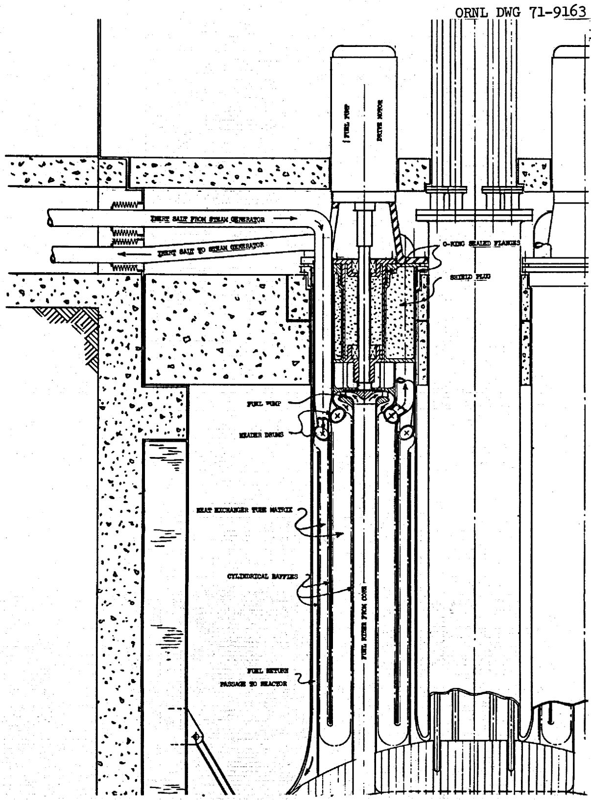
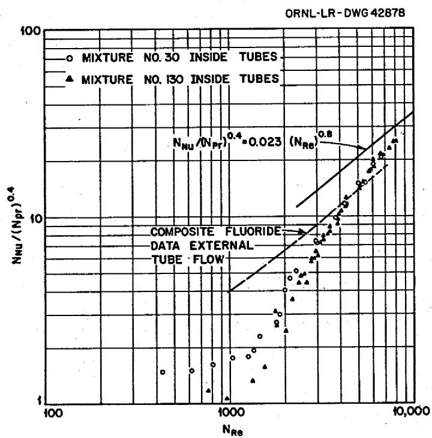
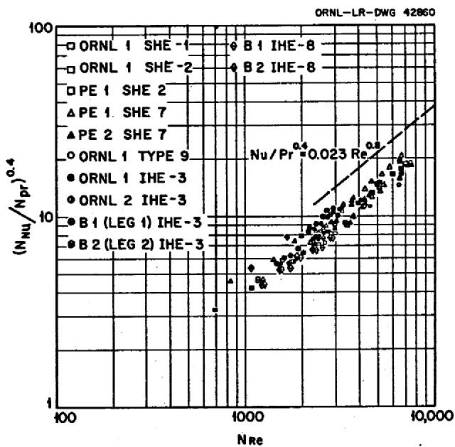
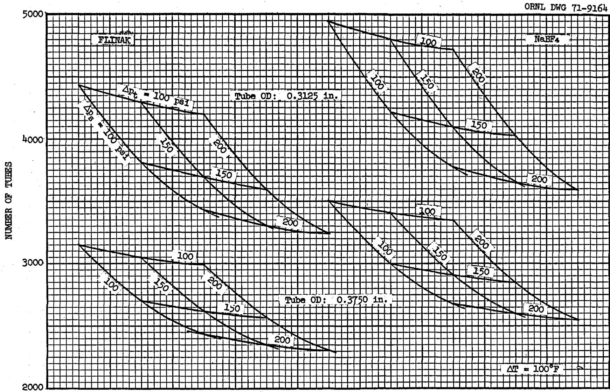
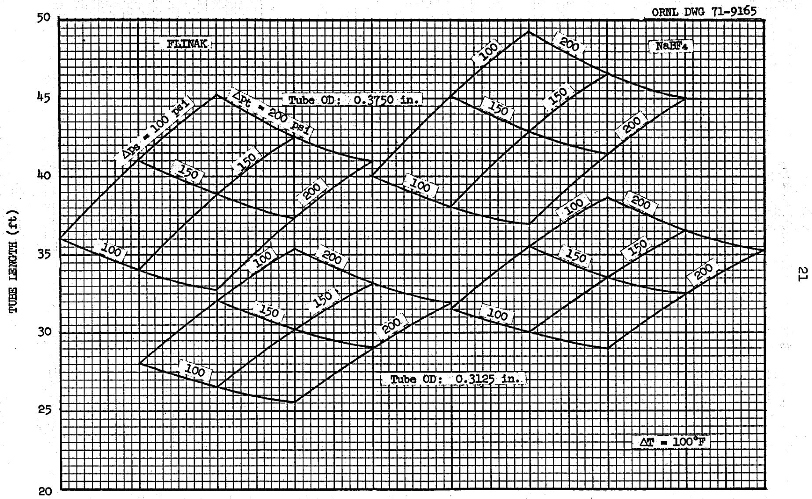
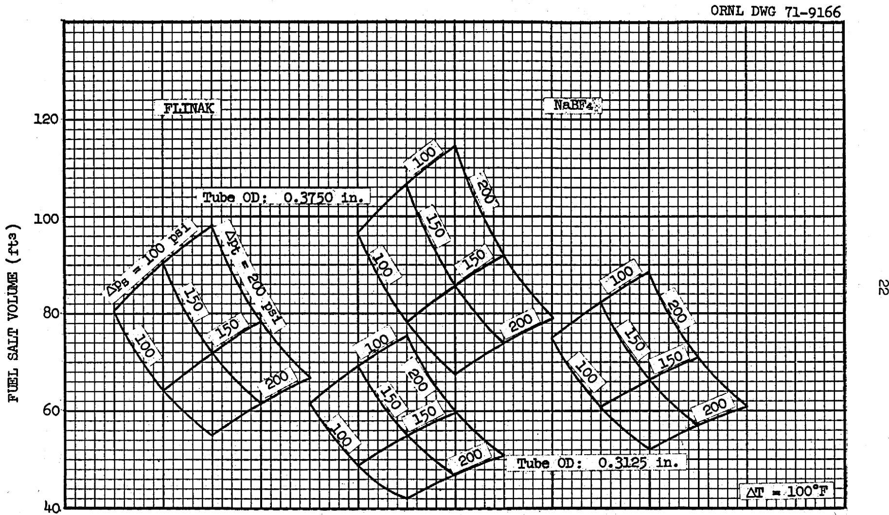
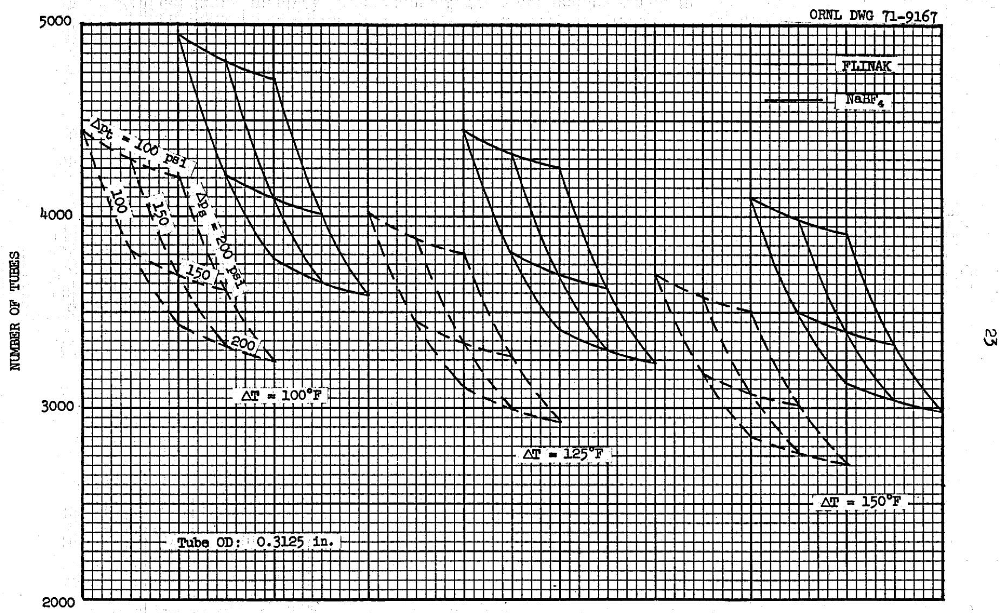
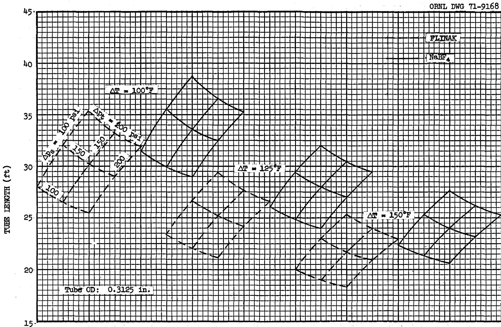
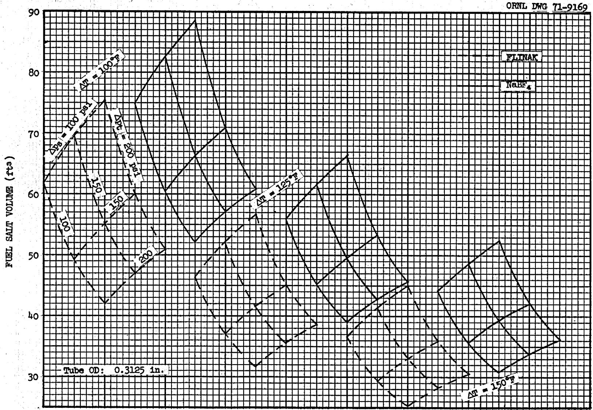
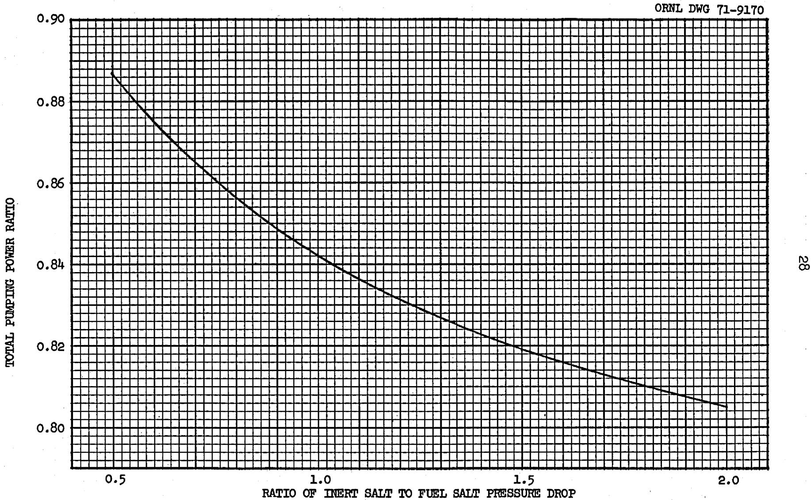

ORNL-TM-2952

Contract No. W-7403-eng-26

REACTOR DIVISION

PARAMETRIC SURVEY OF THE EFFECTS OF MAJOR PARAMETERS

ON THE DESIGN OF FUEL-TO-INERT-SALT HEAT

EXCHANGERS FOR THE MSBR

A. P. Fraas and M. E. LaVerne

NOVEMBER 1971

# NOTICE

This report was prepared as an account of work sponsored by the United States Government. Neither the United States nor the United States Atomic Energy Commission, nor any of their employees, nor any of their contractors, subcontractors, or their employees, makes any warranty, express or implied, or assumes any legal liability or responsibility for the accuracy, completeness or usefulness of any information, apparatus, product or process disclosed, or represents that its use would not infringe privately owned rights.

OAK RIDGE NATIONAL LABORATORY

Oak Ridge, Tennessee 37830

operated by

UNION CARBIDE CORPORATION

for the

U.S. ATOMIC ENERGY COMMISSION


# CONTENTS

ABSTRACT 1

INTRODUCTION 1

SUMMARY 2

ANALYSIS 4

Design Bases and Criteria 4

Derivation of Heat Exchanger Equations 7

Heat Balances 7

Convective Heat Transfer 9

Temperature Difference Between Fluids 9

Pressure Drops 10

Shell Side Equivalent Diameter 11

Solution of the Equations 11

Reduction to a Single Equation 11

Computer Solution 13

Extensions of the Analysis 13

Other Fluids 14

Tube Patterns 14

Other Conditions 14

PARAMETRIC STUDY 15

CHOICE OF INERT SALT 29

Materials Compatibility Considerations 29

Melting Point 30

Leakage Problems 32

Off-Gas Problems 33

Heat Transfer Performance 33

REFERENCES 35

APPENDIX A. Solution of the Heat Exchanger Equations 39

APPENDIX B. FORTRAN Program for Computer Solution of the Heat

Exchanger Equations 43

APPENDIX C. Sample Program Input and Output 49


# PARAMETRIC SURVEY OF THE EFFECTS OF MAJOR PARAMETERS ON THE DESIGN OF FUEL-TO-INERT-SALT HEAT EXCHANGERS FOR MOLTEN SALT REACTORS

A. P. Fraas and M. E. LaVerne

# ABSTRACT

The design of heat exchangers for molten salt reactors involves so many parameters and their interrelationships are so complex that it is difficult to envision the effects of the various trade-offs that can be made in attempts to optimize the system. This report presents a procedure for carrying out such analyses together with the results of a parametric study showing the effects of tube diameter, fuel pressure drop, inert salt pressure drop, and the temperature difference between the fuel and the inert salt with either $\mathrm{NaBF_4}$ or Flinak as the fluid in the intermediate heat transport system. An unusual design for a 2200 Mw(t), 100 Mw(e) power plant was used as the reference design for the detailed calculations of the parametric study presented in this report.

# INTRODUCTION

In response to a request from R. B. Briggs of this Laboratory, A. P. Fraas worked out a conceptual design for a molten-salt breeder reactor in which the heat exchangers and the pumps were enclosed with the reactor in a single pressure vessel.<sup>1</sup> This design approach was taken in part to minimize the fuel inventory in the system and in part to avoid difficulties with thermal stresses and possible thermal stress cracking that might be caused by differential expansion in connecting piping. Extremely difficult problems arise in piping systems in which the pipe length-diameter ratio is too low to give good flexibility for accommodation of the differential thermal expansion between the hot and cold portions of the system. This is particularly so because the system must also be designed to withstand a severe earthquake.

When the report describing the integrated reactor-heat exchanger design was circulated in rough draft form, quite a number of people raised questions with regard to the effects on fuel inventory of changes in the major design parameters. The analysis presented in the following section was therefore carried out to answer these questions. Inasmuch as the

calculational technique and computer program have general application, it seemed desirable to present the study in this report.

# SUMMARY

An analysis has been made of the performance of fuel-to-inert-salt heat exchangers for the MSER. Employing this analysis, a parametric study has been made of the effects on the heat exchanger design of changes in the input parameters of major interest. The result is to clarify the effects of the various trade-offs that can be made in attempts to optimize the system design. Table 1 is a concise summary of the principal results of the parametric study.

Table 1. Summary of Effects of Changes in Major Parameters on Number of Tubes, Tube Length, and Heat Exchanger Fuel Inventory   

<table><tr><td rowspan="2">Parameter and Change</td><td colspan="3">Approximate Percentage Effect</td></tr><tr><td>Number of Tubes</td><td>Tube Length</td><td>Fuel Inventory</td></tr><tr><td>Tube OD3/8 to 5/16 in.</td><td>+40</td><td>-20</td><td>-25</td></tr><tr><td>Fuel Δp(Δps)100 to 200 psi</td><td>-5</td><td>-10</td><td>-30</td></tr><tr><td>Salt Δp(Δps)100 to 200 psi</td><td>-25</td><td>+25</td><td>+20</td></tr><tr><td>Salt NaBF4to Flinak</td><td>-10</td><td>-10</td><td>-20</td></tr><tr><td>Temperature difference (ΔT)100 to 125°F</td><td>-10</td><td>-15</td><td>-25</td></tr><tr><td>100 to 150°F</td><td>-15</td><td>-30</td><td>-40</td></tr></table>

Minimization of the heat exchanger fuel inventory is highly desirable. As can be seen from Table 1, the fuel inventory can be reduced by decreasing the tube size, increasing the-fuel pressure drop, changing the inert salt from $\mathrm{NaEF_4}$ to Flinak, and by increasing the temperature difference between the fuel and inert salt. Note that, in contrast with the effect of the fuel pressure drop, the fuel inventory is increased by an increase

in the inert salt pressure drop. From the table, one can deduce that, if all the parameter changes producing reductions were employed, a reduction in heat exchanger fuel inventory of as much as $62\%$ could be obtained over the reference design conditions. For the full-scale 1000 Mw(e) reactor system described in Ref. l, this would mean a reduction in total system fuel inventory from approximately 1185 ft³ to approximately 871 ft³ for $\mathrm{NaBF}_4$ and from about 1095 ft³ to about 825 ft³ for Flinak.

Fabrication costs for a tube bundle will depend primarily on the number of tubes in the bundle, because this determines the number of header welds required. Material costs will vary with tube length and the total tube cross-sectional area. For the same set of parameter changes employed above with respect to fuel inventory, one finds virtually no change in the number of tubes and, thus, essentially an unchanged fabrication cost. Tube length, from Table 1, is reduced by a factor of approximately 0.45. The smaller tube cross-sectional area contributes a further factor of 0.68, for an overall reduction factor of about 0.3, that is, a reduction in material weight of nearly $70\%$ .

A substantial fraction of the above savings is predicated on the ability to increase the temperature difference between the fuel and inert salt from 100 to $150^{\circ}\mathrm{F}$ . Experience gained in the ANP Program with thermal stresses indicated that it is not difficult to assure a high degree of reliability and freedom from difficulties with thermal stresses if the temperature difference between the two fluid circuits does not exceed $100^{\circ}\mathrm{F}$ . However, with careful design it seems likely that the temperature difference might be increased to as much as $150^{\circ}\mathrm{F}$ without deleterious effects provided that both a thorough analysis and near full-scale tests could be carried out.

As can be shown from the equations in the analysis of this report for a given system and fluid temperature rise, the pumping power in either fluid circuit depends only on the salt properties and the pressure drop in that circuit, being linear in the pressure drop. Thus, for a given fuel and inert salt combination, the pumping power can be reduced only by reducing the pressure drop. For a given fuel and set of specified operating conditions, the pumping power can be reduced 10 to $20\%$ by using Flinak in

place of $\mathrm{NaBF}_4$ in the secondary circuit. The savings in total heat exchanger pumping power range from 10 to $20\%$ , depending only on the ratio of the inert salt pressure drop to the fuel pressure drop.

# ANALYSIS

The analysis presented in this section is predicated on the use of smooth, round tubes on an equilateral triangular pitch with axial fluid flow outside the tubes. Conventional, well-established relationships were used for the various heat balance, convective heat transfer, and pressure drop equations employed. (Recent experiments with molten salt favor reducing the heat transfer coefficients about $15\%$ from the values used here.)

# Design Bases and Criteria

The analysis and parametric study presented in this report were carried out on the basis of a U-tube heat exchanger tube bundle having the tubes in an equilateral triangular pattern with the fuel salt flowing axially on the shell side and the inert salt (in the secondary circuit) in counterflow on the tube side as described in Ref. 1. A cross section of the exchanger configuration envisaged is shown in Fig. 1. However, as will be seen subsequently, the analysis is by no means limited to the particular configuration and conditions treated here but is applicable to a much wider range of problems.

The tubes were placed on an equilateral triangular pitch, rather than a square pitch, in order to increase the thickness of the fluid stream in the region between adjacent tubes because data from ANP heat exchanger tests had indicated that thin fluid ligaments between tubes lead to flow stratification and a loss in heat transfer performance. This effect was deduced from the curves in Figs. 2 and 3, which were obtained with ANP heat exchangers.

The tube spacers, consisting of "combs" of flattened wire, employed in the ANP heat exchangers could be used with the equilateral triangular spacing considered here. That approach would yield an increase in pressure drop by a factor of about 1.5 over that for the ideal case with no spacers. It seems likely that spiral wire spacers would lead to an

  
Fig. 1. Tube Bundle for One of the Six Fuel-to-Inert Salt Heat Exchangers Employed in Parallel in the Conceptual Design of Ref. 1 for a 2200 Mw(t) Reactor.

  
Fig. 2. The Heat-Transfer Characteristics of a Molten Salt When Flowing Inside Round Tubes (Yarosh, Ref. 2).

  
Fig. 3. The Heat-Transfer Characteristics of a Molten Salt Flowing on the Shell Side of Twelve Different Z-Tube Heat Exchangers Tested in Six Different Systems (Yarosh, Ref. 2).

increase in pressure drop somewhat less than this and they might also have a somewhat more favorable effect on the heat transfer coefficient, but no clear-cut data are available. A definitive answer to these questions would require testing of the exact geometry of the heat exchanger matrix contemplated.

Similarly, the effects of various types of surface roughness designed to increase the heat transfer coefficient, in fact, are very difficult to predict and will also require tests of the exact geometry contemplated in order to determine the extent to which the heat transfer coefficient is improved at the expense of an increase in pressure drop. Because it appears that surface roughness frequently has not paid important dividends for cases of the type of interest here, and because of the uncertainties involved, it was decided to conduct the analysis assuming bare, smooth tubes with no allowances for spacers. Inclusion of the latter would increase the fuel pressure drop by around 30 to $50\%$ , but should also increase the heat transfer coefficient somewhat so that, with an equilateral triangular tube pattern, the shell-side heat transfer coefficient might well be higher than for the corresponding circular passages inside the round tubes.

# Derivation of Heat Exchanger Equations

We assume that the heat exchanger tube bundle is composed of round, smooth tubes with axial fluid flow outside the tubes. We neglect entrance effects and the shell-side pressure drop associated with the tube spacers. Nomenclature for the analysis is given in Table 2.

# Heat Balances

The axial heat transport is given in terms of the mass flows, fluid temperature changes, and exchanger geometry by

$$
Q = G _ {s s} A C _ {p s} 8 T _ {s} \tag {1}
$$

and

Table 2. Nomenclature   

<table><tr><td>Symbol</td><td>Meaning</td><td>Units</td></tr><tr><td>A</td><td>Axial flow area</td><td>ft2</td></tr><tr><td>Cp</td><td>Specific heat</td><td>Btu/lbm·F</td></tr><tr><td>D</td><td>Diameter</td><td>ft</td></tr><tr><td>f</td><td>Elasius friction factor</td><td></td></tr><tr><td>G</td><td>Mass velocity</td><td>1bm/hr·ft2</td></tr><tr><td>gc</td><td>Dimensional conversion constant</td><td>1bmf/tlbf·hr2(4.170 × 108)</td></tr><tr><td>h</td><td>Heat transfer coefficient</td><td>Btu/hr·ft2·F</td></tr><tr><td>k</td><td>Thermal conductivity</td><td>Btu/hr·ft·F</td></tr><tr><td>L</td><td>Tube length</td><td>ft</td></tr><tr><td>N</td><td>Number of tubes</td><td></td></tr><tr><td>ΔP</td><td>Pressure difference</td><td>1bf/ft2</td></tr><tr><td>Q</td><td>Heat transfer rate</td><td>Btu/hr</td></tr><tr><td>S1-S5</td><td>Shell-side coefficients and exponents</td><td></td></tr><tr><td>T1-T5</td><td>Tube-side coefficients and exponents</td><td></td></tr><tr><td>ΔT</td><td>Film temperature difference</td><td>F degrees</td></tr><tr><td>δT</td><td>Fluid axial temperature difference</td><td>F degrees</td></tr><tr><td>t</td><td>Thickness</td><td>ft</td></tr><tr><td>μ</td><td>Viscosity</td><td>1bm/hr·ft</td></tr><tr><td>ρ</td><td>Density</td><td>1bm/ft3</td></tr><tr><td>Subscripts</td><td></td><td></td></tr><tr><td>m</td><td>Mean</td><td></td></tr><tr><td>o</td><td>Outside</td><td></td></tr><tr><td>s</td><td>Shell side</td><td></td></tr><tr><td>t</td><td>Tube side</td><td></td></tr><tr><td>w</td><td>Tube wall</td><td></td></tr></table>

$$
Q = G _ {t 4} \frac {\pi}{D} D ^ {2} N C _ {p t} \delta T _ {t}. \tag {2}
$$

The radial heat transport by convection and conduction through the two fluid films and the tube wall, respectively, is given by

$$
Q = h _ {s} \pi D _ {o} L N \Delta T _ {s}, \tag {3}
$$

$$
Q = h _ {t} \pi D _ {t} \ln \Delta T _ {t}, \tag {4}
$$

and

$$
Q = k _ {w} \pi D _ {m} L N \Delta T _ {w} / t _ {w}. \tag {5}
$$

# Convective Heat Transfer

The convective heat transfer relations employed here are those of Sieder and Tate<sup>3</sup> for laminar flow, and Colburn<sup>4</sup> for turbulent flow. Both relations may be expressed in the form given by Eqs. 6 and 7, where the several coefficients and exponents are determined from Table 3 according to the flow regime.

$$
\frac {h _ {s} D _ {s}}{k _ {s}} = S _ {1} \left(\frac {L}{D _ {s}}\right) ^ {- S _ {2}} \left(\frac {G _ {s} D _ {s}}{\mu_ {s}}\right) ^ {S _ {3}} \left(\frac {C _ {p s} \mu_ {s}}{k _ {s}}\right) ^ {1 / 3} \tag {6}
$$

$$
\frac {h _ {t} D _ {t}}{k _ {t}} = T _ {1} \left(\frac {L}{D _ {t}}\right) ^ {- T _ {2}} \left(\frac {G _ {t} D _ {t}}{\mu_ {t}}\right) ^ {T _ {3}} \left(\frac {C _ {p t} \mu_ {t}}{k _ {t}}\right) ^ {1 / 3} \tag {7}
$$

# Temperature Difference Between Fluids

The overall temperature difference, $\Delta T$ , between the two fluids is given by the summation of the temperature differences through the two fluid films and the tube wall,

$$
\Delta \mathrm {T} = \Delta \mathrm {T} _ {\mathrm {s}} + \Delta \mathrm {T} _ {\mathrm {w}} + \Delta \mathrm {T} _ {\mathrm {t}}. \tag {8}
$$

Table 3. Coefficients and Exponents Used in Convective Heat Transfer and Friction Factor Equations   

<table><tr><td></td><td>S1</td><td>S2</td><td>S3</td><td>S4</td><td>S5</td></tr><tr><td>Outside tubes (shell side)</td><td></td><td></td><td></td><td></td><td></td></tr><tr><td>Laminar flow</td><td>4/3√10</td><td>1/3</td><td>1/3</td><td>64</td><td>1</td></tr><tr><td>Turbulent flow</td><td>0.032</td><td>0</td><td>4/5</td><td>0.256</td><td>1/5</td></tr><tr><td></td><td>T1</td><td>T2</td><td>T3</td><td>T4</td><td>T5</td></tr><tr><td>Inside tubes (tube side)</td><td></td><td></td><td></td><td></td><td></td></tr><tr><td>Laminar flow</td><td>4/3√10</td><td>1/3</td><td>1/3</td><td>64</td><td>1</td></tr><tr><td>Turbulent flow</td><td>0.023</td><td>0</td><td>4/5</td><td>0.184</td><td>1/5</td></tr></table>

Note: The coefficient $S_{1}$ for turbulent flow is obtained from Ref. 5.

# Pressure Drops

The pressure drop on the shell side is given by the Elasius relation,

$$
\Delta P _ {s} = f _ {s} \frac {L}{D _ {s}} \frac {G ^ {2}}{2 g _ {c} \rho_ {s}}, \tag {9a}
$$

where the friction factor is defined, in terms of the shell-side Reynolds number, by

$$
f _ {s} = S _ {4} \left(\frac {G D}{\mu_ {s}}\right) ^ {- S _ {5}}. \tag {9b}
$$

Similarly, the tube-side pressure drop is determined from

$$
\Delta P _ {t} = f _ {t} \frac {L}{D _ {t}} \frac {G _ {t} ^ {2}}{2 g _ {c} \rho_ {t}} \tag {10a}
$$

and

$$
f _ {t} = T _ {4} \left(\frac {G _ {t} D _ {t}}{\mu_ {t}}\right) ^ {- T _ {5}} \tag {10b}
$$

The coefficients and exponents appearing in the expressions for the friction factors also are determined from Table 2 according to the flow regime.

Shell-Side Equivalent Diameter

The equivalent diameter of the shell-side flow passage is determined from the definition,

$$
D _ {S} = \frac {4 A _ {S}}{\pi D _ {O} N} \tag {11}
$$

# Solution of the Equations

Let us take as input parameters (independent variables) the total heat transport, the pressure drops on the shell and tube-sides, the tube size, the temperature changes in the two fluid streams, and the overall temperature difference between the fluids. Then, the foregoing set of ll equations is just sufficient to determine the two mass flows, the equivalent diameter and flow area on the shell side, the overall length and number of tubes in the bundle, the three transverse temperature differences, and the two heat transfer coefficients, ll dependent variables in all.

# Reduction to a Single Equation

Let us now eliminate the friction factors between Eqs. 9a and 9b and between Eqs. 10a and 10b. Rewriting the remaining equations with only known quantities on their right hand sides then yields

$$
G _ {S} A _ {S} = C _ {1} = \frac {Q}{C _ {p s} \delta T _ {s}}, \tag {12}
$$

$$
G _ {t} N = C _ {2} = \frac {Q}{\frac {\pi D ^ {2} C _ {p t} 8 T _ {t}}{4}} \tag {13}
$$

$$
\mathrm {h} _ {\mathrm {S}} \mathrm {L N A T} _ {\mathrm {S}} = \mathrm {C} _ {3} = \frac {\mathrm {Q}}{\pi \mathrm {D} _ {\mathrm {O}}} \tag {14}
$$

$$
\mathrm {h} _ {\mathrm {t}} \ln \Delta \mathrm {T} _ {\mathrm {t}} = \mathrm {C} _ {4} = \frac {\mathrm {Q}}{\pi \mathrm {D} _ {\mathrm {t}}} \text {,} \tag {15}
$$

$$
\ln \Delta T _ {w} = C _ {5} = \frac {Q t _ {w}}{\pi D k _ {w}}, \tag {16}
$$

$$
h _ {s} D _ {s} ^ {1 - S _ {2} - S _ {3}} L ^ {S _ {2}} G _ {s} ^ {- S _ {3}} = C _ {6} = S _ {1} \left(C _ {p s} k _ {s} ^ {2}\right) ^ {1 / 3} \mu_ {s} ^ {1 / 3 - S _ {3}}, \tag {17}
$$

$$
\mathrm {h} _ {\mathrm {t}} \mathrm {L} ^ {\mathrm {T} 2} \mathrm {G} _ {\mathrm {t}} ^ {- \mathrm {T} 3} = \mathrm {C} _ {7} = \mathrm {T} _ {1} ^ {\prime} \left(\mathrm {C} _ {\mathrm {p t}} \mathrm {k} _ {\mathrm {t}} ^ {2}\right) ^ {1 / 3} \mu_ {\mathrm {t}} ^ {1 / 3 - \mathrm {T} _ {3}} \mathrm {D} _ {\mathrm {t}} ^ {- 1 + \mathrm {T} _ {2} + \mathrm {T} _ {3}}, \tag {18}
$$

$$
\Delta \mathrm {T} _ {\mathrm {S}} + \Delta \mathrm {T} _ {\mathrm {W}} + \Delta \mathrm {T} _ {\mathrm {t}} = \mathrm {C} _ {\mathrm {g}} = \Delta \mathrm {T}, \tag {19}
$$

$$
G _ {s} ^ {2 - S _ {5}} D _ {s} ^ {- 1 - S _ {5}} L = C _ {9} = \frac {2 g _ {c} \rho_ {s} \Delta P _ {s}}{S _ {4} \mu_ {s} ^ {S _ {5}}} \tag {20}
$$

$$
G _ {t} ^ {2 - T _ {5} L} = C _ {1 0} = \frac {2 g _ {c} \rho_ {t} \Delta P _ {t} D _ {t} ^ {1 + T _ {5}}}{T _ {4} \mu_ {t} ^ {T _ {5}}} \tag {21}
$$

and

$$
\mathrm {A} _ {\mathrm {S}} \mathrm {N} ^ {- 1} \mathrm {D} _ {\mathrm {S}} ^ {- 1} = \mathrm {C} _ {1 1} = \frac {\pi}{4} \mathrm {D} _ {\mathrm {O}}. \tag {22}
$$

The coefficients $C_1$ through $C_{11}$ are defined by the groupings of input parameters appearing on the extreme right of each multiple equation.

We now reduce the above set of 11 equations to the following single equation in tube-side mass flow,

$$
\mathrm {G} _ {\mathrm {t}} ^ {\mathrm {E} _ {1}} + \mathrm {C} _ {2 0} \mathrm {G} _ {\mathrm {t}} ^ {\mathrm {E} _ {2}} + \mathrm {C} _ {2 1} \mathrm {G} _ {\mathrm {t}} ^ {\mathrm {E} _ {3}} - \mathrm {C} _ {1 9} = 0. \tag {23}
$$


The coefficients and exponents appearing in Eq. 23 are, in general, rather complex combinations of the coefficients $C_1$ through $C_{11}$ and the various coefficients and exponents obtained from Table 3. Details of the elimination process will not be presented here but are available in Appendix A.

Equation 23 may be solved for the tube-side mass flow rate by an iterative process, following which the remaining dependent variables may be determined by a series of back-substitutions.

In any iterative process, the speed of convergence, in fact, perhaps convergence at all, depends on having a good first estimate of the value of the variable being sought. Empirically, the following equation was found to give a good initial estimate for the value of the tube-side mass flow rate.

$$
G _ {t} = 0. 9 \left[ \frac {C _ {1 9}}{C _ {2 0} + C _ {2 1}} \right] ^ {1 / E _ {2}} \tag {24}
$$

Equation 24 was tested on a wide variety of input parameters and, in most cases, gave an initial value for the tube side flow within $2\%$ of the final iterated value.

# Computer Solution

Because of the obvious tedium, and the attendant error-proneness, involved in any sort of desk calculator solution of the above equations, a FORTRAN program was prepared for use on the Call-A-Computer (CAC) time-sharing system. Details of the program operation may be found in the appendices. In particular, a computer-prepared printout of the complete program is presented in Appendix B. Appendix C contains samples of program input and output, together with instructions for use of the program.

# Extensions of the Analysis

Although the parametric study presented later in this report assumes an equilateral triangular tube pattern and fused salts in counterflow with equal temperature changes in the two streams, the basic analysis is not, in fact, so limited, as will be shown below.

# Other Fluids

Equations 6 and 7 for the convective heat transfer coefficients, although applied in the parametric study only to fused salts, are actually applicable to any fluid having a relatively high Prandtl number. For liquids of very low Prandtl number, such as liquid metals, Eqs. 6 and 7 must be modified. For example, one could employ the Lubarsky-Kaufman relation<sup>6</sup> for the Nusselt number in turbulent flow and the theoretical value of 4.36 in laminar flow. These changes involve only redefining the exponent on the Prandtl number in Eqs. 6 and 7 to be a variable rather than the present constant and extending Table 3.

# Tube Patterns

The basic equations, 1 though ll, contain no reference to tube pattern, per se. The implication is that, for a given set of input parameters, the same solution set of dependent variables would be obtained for an equilateral triangular pattern as for, say, a square pattern. This, of course, involves the implicit assumption that the latter spacing is not such as to result in the performance deterioration observed in Figs. 1 and 2.

In order to determine tube spacing, one must employ an auxiliary relation such as Eq. 25,

$$
A _ {S} = N \left(\sqrt {3} S ^ {2} / 2 - \pi D _ {0} ^ {2} / 4\right) \tag {25}
$$

which defines the tube spacing in terms of the shell-side flow area, the number of tubes, and the tube OD for an equilateral triangular pattern.

# Other Conditions

Although applied in the parametric study only to a counterflow heat exchanger with equal temperature changes in the two streams, the present analysis may be extended readily, both to parallel flow and to counterflow with unequal temperature changes, by the simple device of properly defining the overall temperature difference. The appropriate quantity is the log mean temperature difference (IMTD), defined by<sup>7</sup>

$$
\text {I M T D} = \frac {\text {G T D} - \text {L T D}}{\log_ {\mathrm {e}} \frac {\text {G T D}}{\text {L T D}}} \tag {26}
$$

where GTD is the greater and LTD is the lesser of the two terminal temperature differences between the two streams. When the two temperature differences are equal, the IMTD becomes indeterminate and must be taken as equal to either of the two temperature differences. The existing computer program uses these definitions.

# PARAMETRIC STUDY

In this study, the U-tube configuration of Fig. 1 was employed, with the fuel salt flowing axially around the tubes on the shell side and with the inert salt in counterflow inside the tubes. The heat load was kept fixed and equal to that for one of the six heat exchangers for a 2200 Mw(t) reference design reactor.[1] The tube wall material was taken to be INCO 800 and the fuel employed was the lithium-beryllium-thorium-uranium fuel salt in current use for reference design purposes at the time of writing. Two different inert salts, $\mathrm{NaBF}_4$ and Flinak, were used in the secondary circuit. The physical properties of the materials used were taken from Refs. 7 and 8 as tabulated in Table 4. The temperature rise in the inert salt and the temperature drop in the fuel in traversing the heat exchanger were kept constant at $250^{\circ}\mathrm{F}$ .

With a temperature difference between the two fluid streams of $100^{\circ}\mathrm{F}$ , the heat exchanger characteristics were calculated for each of the two inert salts, using all combinations of three different shell side pressure drops, three different tube side pressure drops, and two different tube diameters. The results are given in Table 5. For one of the tube sizes, the effects of changing the temperature difference between the fluid streams to 125 and $150^{\circ}\mathrm{F}$ were then investigated for the same set of pressure drops and inert salts used previously. Table 6 summarizes the results from this set of calculations. The input parameter variations used in this study are summarized in Table 7.

Table 4. Reference Design Conditions and the Physical Properties at Design Temperatures for the Materials Used   

<table><tr><td colspan="4">Reference Design Condition</td></tr><tr><td colspan="3">Fuel temperature in, °F</td><td>1300</td></tr><tr><td colspan="3">Fuel temperature out, °F</td><td>1050</td></tr><tr><td colspan="3">Inert salt in, °F</td><td>950</td></tr><tr><td colspan="3">Inert salt out, °F</td><td>1200</td></tr><tr><td colspan="3">Tube material</td><td>INCO 800</td></tr><tr><td colspan="3">Tube thermal conductivity, Btu/hr·ft·F</td><td>11.5</td></tr><tr><td colspan="3">Tube OD, in.</td><td>0.375</td></tr><tr><td colspan="3">Tube ID, in.</td><td>0.3190</td></tr><tr><td colspan="3">Fuel pressure drop, psi</td><td>100</td></tr><tr><td colspan="3">Inert salt pressure drop, psi</td><td>100</td></tr><tr><td>Physical Property</td><td>Fluoroboratea</td><td>Flinakb</td><td>Fuelc</td></tr><tr><td>Cp, Btu/lb·F</td><td>0.36</td><td>0.437</td><td>0.325</td></tr><tr><td>μ, lb/hr·ft</td><td>1.95</td><td>12.6</td><td>23.5</td></tr><tr><td>k, Btu/hr·ft·F</td><td>0.266</td><td>2.66</td><td>0.58</td></tr><tr><td>ρ, lb/ft3</td><td>119.0</td><td>132.0</td><td>208.0</td></tr><tr><td>Pr</td><td>2.64</td><td>2.07</td><td>13.1</td></tr></table>

a $92\%$ NaBF $^4 +8\%$ NaF   
b $11.5\%$ NaF + 46.5% LiF + 42% KF   
c $87 \%$ Li2BeF3 + 12% ThF4 + 1% UF4

Table 5. Effects of Choice of Inert Salt and Tube Diameter on the for a Full-Scale Molten Salt Breeder Reactor for a Tempe   

<table><tr><td rowspan="2">Inert Salt</td><td rowspan="2">Tube OD (in.)</td><td rowspan="2">Tube ID (in.)</td><td colspan="2">Pressure Drops</td><td rowspan="2">Fuel Side Equivalent Diameter (in.)</td><td colspan="3">Tubes</td><td colspan="3">Volumes</td><td rowspan="2">Bundle Weight (lb)</td><td rowspan="2">(10-6)</td></tr><tr><td>Fuel (psi)</td><td>Salt (psi)</td><td>Centerline Spacing (in.)</td><td>Number</td><td>Length (ft)</td><td>Fuel (ft3)</td><td>Salt (ft3)</td><td>Tubes (ft3)</td></tr><tr><td rowspan="18">NaBF4</td><td rowspan="9">0.3125</td><td rowspan="9">0.2665</td><td rowspan="3">100</td><td>100</td><td>0.2823</td><td>0.4106</td><td>4944</td><td>31.5</td><td>74.9</td><td>60.3</td><td>22.6</td><td>34757</td><td></td></tr><tr><td>150</td><td>0.3231</td><td>0.4244</td><td>4219</td><td>35.5</td><td>82.5</td><td>58.0</td><td>21.7</td><td>35598</td><td></td></tr><tr><td>200</td><td>0.3557</td><td>0.4352</td><td>3774</td><td>38.7</td><td>88.6</td><td>56.6</td><td>21.2</td><td>36420</td><td></td></tr><tr><td rowspan="3">150</td><td>100</td><td>0.2466</td><td>0.3981</td><td>4806</td><td>29.9</td><td>60.4</td><td>55.7</td><td>20.9</td><td>30275</td><td></td></tr><tr><td>150</td><td>0.2823</td><td>0.4106</td><td>4095</td><td>33.6</td><td>66.3</td><td>53.3</td><td>20.0</td><td>30754</td><td></td></tr><tr><td>200</td><td>0.3107</td><td>0.4203</td><td>3659</td><td>36.6</td><td>71.0</td><td>51.9</td><td>19.5</td><td>31281</td><td></td></tr><tr><td rowspan="3">200</td><td>100</td><td>0.2241</td><td>0.3900</td><td>4716</td><td>28.9</td><td>52.1</td><td>52.8</td><td>19.8</td><td>27634</td><td></td></tr><tr><td>150</td><td>0.2565</td><td>0.4016</td><td>4015</td><td>32.5</td><td>57.0</td><td>50.5</td><td>18.9</td><td>27911</td><td></td></tr><tr><td>200</td><td>0.2823</td><td>0.4106</td><td>3586</td><td>35.3</td><td>60.9</td><td>49.0</td><td>18.4</td><td>28276</td><td></td></tr><tr><td rowspan="9">0.3750</td><td rowspan="9">0.3190</td><td rowspan="3">100</td><td>100</td><td>0.3374</td><td>0.4922</td><td>3498</td><td>40.0</td><td>96.6</td><td>77.7</td><td>29.7</td><td>45099</td><td></td></tr><tr><td>150</td><td>0.3862</td><td>0.5088</td><td>2986</td><td>45.2</td><td>106.5</td><td>74.8</td><td>28.6</td><td>46238</td><td></td></tr><tr><td>200</td><td>0.4251</td><td>0.5216</td><td>2672</td><td>49.3</td><td>114.5</td><td>73.1</td><td>27.9</td><td>47335</td><td></td></tr><tr><td rowspan="3">150</td><td>100</td><td>0.2947</td><td>0.4773</td><td>3403</td><td>38.1</td><td>78.2</td><td>72.0</td><td>27.5</td><td>39417</td><td></td></tr><tr><td>150</td><td>0.3374</td><td>0.4922</td><td>2902</td><td>42.9</td><td>85.9</td><td>69.1</td><td>26.4</td><td>40091</td><td></td></tr><tr><td>200</td><td>0.3714</td><td>0.5038</td><td>2594</td><td>46.7</td><td>92.1</td><td>67.3</td><td>25.7</td><td>40811</td><td></td></tr><tr><td rowspan="3">200</td><td>100</td><td>0.2678</td><td>0.4676</td><td>3343</td><td>36.9</td><td>67.5</td><td>68.4</td><td>26.1</td><td>36064</td><td></td></tr><tr><td>150</td><td>0.3065</td><td>0.4814</td><td>2848</td><td>41.5</td><td>74.0</td><td>65.5</td><td>25.0</td><td>36478</td><td></td></tr><tr><td>200</td><td>0.3374</td><td>0.4922</td><td>2544</td><td>45.1</td><td>79.2</td><td>63.7</td><td>24.3</td><td>36989</td><td></td></tr><tr><td rowspan="18">Flinak</td><td rowspan="9">0.3125</td><td rowspan="9">0.2665</td><td rowspan="3">100</td><td>100</td><td>0.2899</td><td>0.4132</td><td>4444</td><td>28.1</td><td>61.7</td><td>48.4</td><td>18.2</td><td>28871</td><td></td></tr><tr><td>150</td><td>0.3318</td><td>0.4273</td><td>3820</td><td>32.1</td><td>69.4</td><td>47.5</td><td>17.8</td><td>30175</td><td></td></tr><tr><td>200</td><td>0.3652</td><td>0.4383</td><td>3434</td><td>35.4</td><td>75.6</td><td>47.0</td><td>17.6</td><td>31291</td><td></td></tr><tr><td rowspan="3">150</td><td>100</td><td>0.2532</td><td>0.4004</td><td>4299</td><td>26.5</td><td>49.2</td><td>44.1</td><td>16.6</td><td>24842</td><td></td></tr><tr><td>150</td><td>0.2899</td><td>0.4132</td><td>3692</td><td>30.2</td><td>55.1</td><td>43.2</td><td>16.2</td><td>25770</td><td></td></tr><tr><td>200</td><td>0.3190</td><td>0.4231</td><td>3316</td><td>33.2</td><td>59.9</td><td>42.7</td><td>16.0</td><td>26584</td><td></td></tr><tr><td rowspan="3">200</td><td>100</td><td>0.2301</td><td>0.3921</td><td>4206</td><td>25.5</td><td>42.0</td><td>41.5</td><td>15.6</td><td>22485</td><td></td></tr><tr><td>150</td><td>0.2634</td><td>0.4040</td><td>3609</td><td>29.0</td><td>47.0</td><td>40.6</td><td>15.2</td><td>23204</td><td></td></tr><tr><td>200</td><td>0.2899</td><td>0.4132</td><td>3240</td><td>31.9</td><td>51.0</td><td>40.0</td><td>15.0</td><td>23849</td><td></td></tr><tr><td rowspan="9">0.3750</td><td rowspan="9">0.3190</td><td rowspan="3">100</td><td>100</td><td>0.3464</td><td>0.4953</td><td>3153</td><td>35.9</td><td>80.3</td><td>62.9</td><td>24.0</td><td>37771</td><td></td></tr><tr><td>150</td><td>0.3966</td><td>0.5123</td><td>2711</td><td>41.1</td><td>90.4</td><td>61.8</td><td>23.6</td><td>39493</td><td></td></tr><tr><td>200</td><td>0.4365</td><td>0.5253</td><td>2437</td><td>45.2</td><td>98.4</td><td>61.2</td><td>23.4</td><td>40962</td><td></td></tr><tr><td rowspan="3">150</td><td>100</td><td>0.3026</td><td>0.4801</td><td>3055</td><td>34.0</td><td>64.2</td><td>57.6</td><td>22.0</td><td>32647</td><td></td></tr><tr><td>150</td><td>0.3464</td><td>0.4953</td><td>2624</td><td>38.8</td><td>72.1</td><td>56.4</td><td>21.6</td><td>33888</td><td></td></tr><tr><td>200</td><td>0.3813</td><td>0.5072</td><td>2358</td><td>42.6</td><td>78.4</td><td>55.8</td><td>21.3</td><td>34969</td><td></td></tr><tr><td rowspan="3">200</td><td>100</td><td>0.2750</td><td>0.4702</td><td>2992</td><td>32.7</td><td>55.1</td><td>54.3</td><td>20.8</td><td>29644</td><td></td></tr><tr><td>150</td><td>0.3148</td><td>0.4843</td><td>2569</td><td>37.3</td><td>61.6</td><td>53.1</td><td>20.3</td><td>30616</td><td></td></tr><tr><td>200</td><td>0.3464</td><td>0.4953</td><td>2307</td><td>41.0</td><td>66.9</td><td>52.4</td><td>20.0</td><td>31479</td><td></td></tr></table>

Proportions of a Series of Fuel-to-Inert-Salt Heat Exchangers rature Change of $100^{\circ}\mathrm{F}$ in the Fuel and Salt Circuits

<table><tr><td colspan="3">Mass Flows</td><td colspan="2">Flow Velocities</td><td colspan="2">Reynolds Numbers</td><td colspan="2">Pumping Power</td><td colspan="3">Temperature Drops</td></tr><tr><td>Fuel × 1b/hr·ft2)</td><td>Salt (10-6)</td><td>Ratio Salt/Fuel</td><td>Fuel (ft/sec)</td><td>Salt (ft/sec)</td><td>Fuel</td><td>Salt</td><td>Fuel (hp)</td><td>Salt (hp)</td><td>Film Fuel Side (F°)</td><td>Wall (F°)</td><td>Film Salt Side (F°)</td></tr><tr><td>6.497</td><td>7.263</td><td>1.1179</td><td>8.7</td><td>17.0</td><td>6504</td><td>82720</td><td>540</td><td>850</td><td>47.0</td><td>17.7</td><td>35.2</td></tr><tr><td>6.652</td><td>8.512</td><td>1.2797</td><td>8.9</td><td>19.9</td><td>7623</td><td>96947</td><td>540</td><td>1275</td><td>49.3</td><td>18.4</td><td>32.3</td></tr><tr><td>6.757</td><td>9.517</td><td>1.4084</td><td>9.0</td><td>22.2</td><td>8522</td><td>108383</td><td>540</td><td>1700</td><td>50.9</td><td>18.9</td><td>30.3</td></tr><tr><td>7.652</td><td>7.473</td><td>0.9766</td><td>10.2</td><td>17.4</td><td>6692</td><td>85109</td><td>811</td><td>850</td><td>43.5</td><td>19.2</td><td>37.3</td></tr><tr><td>7.845</td><td>8.770</td><td>1.1179</td><td>10.5</td><td>20.5</td><td>7853</td><td>99880</td><td>811</td><td>1275</td><td>45.7</td><td>20.0</td><td>34.3</td></tr><tr><td>9.976</td><td>9.813</td><td>1.2304</td><td>10.7</td><td>22.9</td><td>8788</td><td>111764</td><td>811</td><td>1700</td><td>47.2</td><td>20.6</td><td>32.2</td></tr><tr><td>8.582</td><td>7.615</td><td>0.8873</td><td>11.5</td><td>17.8</td><td>6819</td><td>86722</td><td>1081</td><td>850</td><td>41.0</td><td>20.2</td><td>38.7</td></tr><tr><td>8.806</td><td>8.944</td><td>1.0157</td><td>11.8</td><td>20.9</td><td>8009</td><td>101866</td><td>1081</td><td>1275</td><td>43.2</td><td>21.2</td><td>35.6</td></tr><tr><td>8.959</td><td>10.015</td><td>1.1179</td><td>12.0</td><td>23.4</td><td>8968</td><td>114058</td><td>1081</td><td>1700</td><td>44.7</td><td>21.8</td><td>33.5</td></tr><tr><td>6.403</td><td>7.166</td><td>1.1190</td><td>8.6</td><td>16.7</td><td>7661</td><td>97683</td><td>540</td><td>850</td><td>45.7</td><td>20.0</td><td>34.3</td></tr><tr><td>6.553</td><td>8.394</td><td>1.2809</td><td>8.8</td><td>19.6</td><td>8975</td><td>114428</td><td>540</td><td>1275</td><td>47.8</td><td>20.8</td><td>31.4</td></tr><tr><td>6.654</td><td>9.381</td><td>1.4099</td><td>8.9</td><td>21.9</td><td>10030</td><td>127886</td><td>540</td><td>1700</td><td>49.3</td><td>21.3</td><td>29.4</td></tr><tr><td>7.534</td><td>7.364</td><td>0.9775</td><td>10.1</td><td>17.2</td><td>7874</td><td>100396</td><td>811</td><td>850</td><td>42.1</td><td>21.6</td><td>36.2</td></tr><tr><td>7.719</td><td>8.638</td><td>1.1190</td><td>10.3</td><td>20.2</td><td>9235</td><td>117752</td><td>811</td><td>1275</td><td>44.2</td><td>22.5</td><td>33.2</td></tr><tr><td>7.845</td><td>9.662</td><td>1.2316</td><td>10.5</td><td>22.6</td><td>10330</td><td>131713</td><td>811</td><td>1700</td><td>45.7</td><td>23.1</td><td>31.2</td></tr><tr><td>8.443</td><td>7.498</td><td>0.8882</td><td>11.3</td><td>17.5</td><td>8017</td><td>102221</td><td>1081</td><td>850</td><td>39.7</td><td>22.7</td><td>37.6</td></tr><tr><td>8.658</td><td>8.802</td><td>1.0167</td><td>11.6</td><td>20.5</td><td>9411</td><td>119995</td><td>1081</td><td>1275</td><td>41.7</td><td>23.7</td><td>34.5</td></tr><tr><td>8.804</td><td>9.852</td><td>1.1190</td><td>11.8</td><td>23.0</td><td>10533</td><td>134301</td><td>1081</td><td>1700</td><td>43.2</td><td>24.4</td><td>32.4</td></tr><tr><td>7.040</td><td>6.658</td><td>0.9456</td><td>9.4</td><td>14.0</td><td>7237</td><td>11734</td><td>540</td><td>631</td><td>55.2</td><td>22.1</td><td>22.7</td></tr><tr><td>7.155</td><td>7.745</td><td>1.0824</td><td>9.6</td><td>16.3</td><td>8419</td><td>13651</td><td>540</td><td>947</td><td>57.0</td><td>22.5</td><td>20.5</td></tr><tr><td>7.232</td><td>8.616</td><td>1.1914</td><td>9.7</td><td>18.1</td><td>9366</td><td>15186</td><td>540</td><td>1263</td><td>58.3</td><td>22.7</td><td>19.0</td></tr><tr><td>8.330</td><td>6.881</td><td>0.8261</td><td>11.1</td><td>14.5</td><td>7480</td><td>12128</td><td>811</td><td>631</td><td>51.5</td><td>24.2</td><td>24.3</td></tr><tr><td>8.474</td><td>8.014</td><td>0.9456</td><td>11.3</td><td>16.9</td><td>8711</td><td>14124</td><td>811</td><td>947</td><td>53.3</td><td>24.7</td><td>21.9</td></tr><tr><td>8.572</td><td>8.921</td><td>1.0408</td><td>11.4</td><td>18.8</td><td>9697</td><td>15724</td><td>811</td><td>1263</td><td>54.6</td><td>25.1</td><td>20.4</td></tr><tr><td>9.371</td><td>7.033</td><td>0.7505</td><td>12.5</td><td>14.8</td><td>7645</td><td>12397</td><td>1081</td><td>631</td><td>48.9</td><td>25.7</td><td>25.3</td></tr><tr><td>9.541</td><td>8.197</td><td>0.8591</td><td>12.7</td><td>17.2</td><td>8910</td><td>14448</td><td>1081</td><td>947</td><td>50.7</td><td>26.4</td><td>22.9</td></tr><tr><td>9.655</td><td>9.130</td><td>0.9456</td><td>12.9</td><td>19.2</td><td>9924</td><td>16092</td><td>1081</td><td>1263</td><td>51.9</td><td>26.7</td><td>21.4</td></tr><tr><td>6.918</td><td>6.548</td><td>0.9466</td><td>9.2</td><td>13.8</td><td>8499</td><td>13815</td><td>540</td><td>631</td><td>53.3</td><td>24.7</td><td>22.0</td></tr><tr><td>7.029</td><td>7.616</td><td>1.0835</td><td>9.4</td><td>16.0</td><td>9885</td><td>16068</td><td>540</td><td>947</td><td>55.0</td><td>25.2</td><td>19.8</td></tr><tr><td>7.103</td><td>8.471</td><td>1.1926</td><td>9.5</td><td>17.8</td><td>10994</td><td>17872</td><td>540</td><td>1263</td><td>56.2</td><td>25.4</td><td>18.4</td></tr><tr><td>8.173</td><td>6.758</td><td>0.8269</td><td>10.9</td><td>14.2</td><td>8771</td><td>14258</td><td>811</td><td>631</td><td>49.6</td><td>27.0</td><td>23.4</td></tr><tr><td>8.312</td><td>7.868</td><td>0.9466</td><td>11.1</td><td>16.6</td><td>10211</td><td>16599</td><td>811</td><td>947</td><td>51.3</td><td>27.6</td><td>21.1</td></tr><tr><td>8.405</td><td>8.757</td><td>1.0418</td><td>11.2</td><td>18.4</td><td>11365</td><td>18475</td><td>811</td><td>1263</td><td>52.5</td><td>27.9</td><td>19.6</td></tr><tr><td>9.184</td><td>6.900</td><td>0.7513</td><td>12.3</td><td>14.5</td><td>8956</td><td>14558</td><td>1081</td><td>631</td><td>47.0</td><td>28.6</td><td>24.4</td></tr><tr><td>9.347</td><td>8.039</td><td>0.8600</td><td>12.5</td><td>16.9</td><td>10433</td><td>16960</td><td>1081</td><td>947</td><td>48.7</td><td>29.3</td><td>22.1</td></tr><tr><td>9.457</td><td>8.952</td><td>0.9466</td><td>12.6</td><td>18.8</td><td>11618</td><td>18886</td><td>1081</td><td>1263</td><td>49.8</td><td>29.7</td><td>20.5</td></tr></table>

Table 6. Effects of Choice of Temperature Change in the F Intermediate Heat Exchangers for a Full-  

<table><tr><td rowspan="2">\( \Delta T \)(°F)</td><td rowspan="2">Inert Salt</td><td colspan="2">Pressure Drops</td><td rowspan="2">Fuel Side Equivalent Diameter (in.)</td><td colspan="3">Tubes</td><td colspan="3">Volumes</td><td rowspan="2">Bundle Weight (lb)</td><td></td></tr><tr><td>Fuel (psi)</td><td>Salt (psi)</td><td>Centerline Spacing (in.)</td><td>Number</td><td>Length (ft)</td><td>Fuel (ft3)</td><td>Salt (ft3)</td><td>Tubes (ft3)</td><td>Fuel (10-6× lb/hr·ft2)</td></tr><tr><td rowspan="18">125</td><td rowspan="9">\( NaBF_4 \)</td><td rowspan="3">100</td><td>100</td><td>0.2823</td><td>0.4106</td><td>4456</td><td>26.1</td><td>56.0</td><td>45.1</td><td>16.9</td><td>25980</td><td>7.209</td></tr><tr><td>150</td><td>0.3231</td><td>0.4244</td><td>3803</td><td>29.4</td><td>61.7</td><td>43.4</td><td>16.3</td><td>26630</td><td>7.379</td></tr><tr><td>200</td><td>0.3557</td><td>0.4352</td><td>3403</td><td>32.1</td><td>66.3</td><td>42.3</td><td>15.9</td><td>27258</td><td>7.494</td></tr><tr><td rowspan="3">150</td><td>100</td><td>0.2466</td><td>0.3981</td><td>4334</td><td>24.8</td><td>45.2</td><td>41.7</td><td>15.6</td><td>22666</td><td>8.486</td></tr><tr><td>150</td><td>0.2823</td><td>0.4106</td><td>3694</td><td>27.9</td><td>49.7</td><td>40.0</td><td>15.0</td><td>23046</td><td>8.697</td></tr><tr><td>200</td><td>0.3107</td><td>0.4203</td><td>3302</td><td>30.4</td><td>53.2</td><td>38.9</td><td>14.6</td><td>23456</td><td>8.840</td></tr><tr><td rowspan="3">200</td><td>100</td><td>0.2241</td><td>0.3900</td><td>4255</td><td>24.0</td><td>39.0</td><td>39.6</td><td>14.8</td><td>20713</td><td>9.513</td></tr><tr><td>150</td><td>0.2565</td><td>0.4016</td><td>3624</td><td>27.0</td><td>42.7</td><td>37.9</td><td>14.2</td><td>20942</td><td>9.758</td></tr><tr><td>200</td><td>0.2823</td><td>0.4106</td><td>3237</td><td>29.4</td><td>45.7</td><td>36.8</td><td>13.8</td><td>21230</td><td>9.924</td></tr><tr><td rowspan="9">Flinak</td><td rowspan="3">100</td><td>100</td><td>0.2899</td><td>0.4132</td><td>4012</td><td>23.4</td><td>46.4</td><td>36.4</td><td>13.6</td><td>21683</td><td>7.798</td></tr><tr><td>150</td><td>0.3318</td><td>0.4273</td><td>3449</td><td>26.7</td><td>52.1</td><td>35.7</td><td>13.4</td><td>22673</td><td>7.924</td></tr><tr><td>200</td><td>0.3652</td><td>0.4383</td><td>3101</td><td>29.4</td><td>56.8</td><td>35.3</td><td>13.3</td><td>23517</td><td>8.009</td></tr><tr><td rowspan="3">150</td><td>100</td><td>0.2352</td><td>0.4004</td><td>3885</td><td>22.1</td><td>37.0</td><td>33.2</td><td>12.5</td><td>18700</td><td>9.219</td></tr><tr><td>150</td><td>0.2899</td><td>0.4132</td><td>3336</td><td>25.2</td><td>41.5</td><td>32.5</td><td>12.2</td><td>19409</td><td>9.377</td></tr><tr><td>200</td><td>0.3190</td><td>0.4231</td><td>2997</td><td>27.7</td><td>45.1</td><td>32.1</td><td>12.1</td><td>20028</td><td>9.484</td></tr><tr><td rowspan="3">200</td><td>100</td><td>0.2301</td><td>0.3921</td><td>3803</td><td>21.2</td><td>31.7</td><td>31.3</td><td>11.7</td><td>16953</td><td>10.366</td></tr><tr><td>150</td><td>0.2634</td><td>0.4040</td><td>3264</td><td>24.2</td><td>35.5</td><td>30.6</td><td>11.5</td><td>17506</td><td>10.551</td></tr><tr><td>200</td><td>0.2899</td><td>0.4132</td><td>2931</td><td>26.6</td><td>38.5</td><td>30.2</td><td>11.3</td><td>17999</td><td>10.676</td></tr><tr><td rowspan="18">150</td><td rowspan="9">\( NaBF_4 \)</td><td rowspan="3">100</td><td>100</td><td>0.2823</td><td>0.4106</td><td>4095</td><td>22.4</td><td>44.2</td><td>35.6</td><td>13.3</td><td>20502</td><td>7.845</td></tr><tr><td>150</td><td>0.3231</td><td>0.4244</td><td>3496</td><td>25.3</td><td>48.7</td><td>34.3</td><td>12.8</td><td>21029</td><td>8.028</td></tr><tr><td>200</td><td>0.3557</td><td>0.4352</td><td>3128</td><td>27.6</td><td>52.4</td><td>33.5</td><td>12.5</td><td>21534</td><td>8.152</td></tr><tr><td rowspan="3">150</td><td>100</td><td>0.2466</td><td>0.3981</td><td>3984</td><td>21.3</td><td>35.7</td><td>32.9</td><td>12.4</td><td>17912</td><td>9.230</td></tr><tr><td>150</td><td>0.2823</td><td>0.4106</td><td>3397</td><td>24.0</td><td>39.3</td><td>31.6</td><td>11.9</td><td>18226</td><td>9.457</td></tr><tr><td>200</td><td>0.3107</td><td>0.4203</td><td>3037</td><td>26.2</td><td>42.1</td><td>30.8</td><td>11.6</td><td>18559</td><td>9.611</td></tr><tr><td rowspan="3">200</td><td>100</td><td>0.2241</td><td>0.3900</td><td>3913</td><td>20.7</td><td>30.9</td><td>31.3</td><td>11.7</td><td>16384</td><td>10.344</td></tr><tr><td>150</td><td>0.2565</td><td>0.4016</td><td>3334</td><td>23.2</td><td>33.8</td><td>30.0</td><td>11.2</td><td>16579</td><td>10.607</td></tr><tr><td>200</td><td>0.2823</td><td>0.4106</td><td>2978</td><td>25.3</td><td>36.2</td><td>29.2</td><td>10.9</td><td>16816</td><td>10.786</td></tr><tr><td rowspan="9">Flinak</td><td rowspan="3">100</td><td>100</td><td>0.2899</td><td>0.4132</td><td>3692</td><td>20.1</td><td>36.7</td><td>28.8</td><td>10.8</td><td>17180</td><td>8.474</td></tr><tr><td>150</td><td>0.3318</td><td>0.4273</td><td>3174</td><td>23.0</td><td>41.3</td><td>28.3</td><td>10.6</td><td>17970</td><td>8.610</td></tr><tr><td>200</td><td>0.3652</td><td>0.4383</td><td>2854</td><td>25.3</td><td>45.0</td><td>28.0</td><td>10.5</td><td>18644</td><td>8.701</td></tr><tr><td rowspan="3">150</td><td>100</td><td>0.2532</td><td>0.4004</td><td>3577</td><td>19.0</td><td>29.4</td><td>26.4</td><td>9.9</td><td>14844</td><td>10.012</td></tr><tr><td>150</td><td>0.2899</td><td>0.4132</td><td>3073</td><td>21.7</td><td>33.0</td><td>25.8</td><td>9.7</td><td>15414</td><td>10.182</td></tr><tr><td>200</td><td>0.3190</td><td>0.4231</td><td>2761</td><td>23.9</td><td>35.8</td><td>25.5</td><td>9.6</td><td>15910</td><td>10.296</td></tr><tr><td rowspan="3">200</td><td>100</td><td>0.2301</td><td>0.3921</td><td>3503</td><td>18.3</td><td>25.2</td><td>24.9</td><td>9.3</td><td>13476</td><td>11.251</td></tr><tr><td>150</td><td>0.2634</td><td>0.4040</td><td>3007</td><td>20.9</td><td>28.2</td><td>24.3</td><td>9.1</td><td>13922</td><td>11.450</td></tr><tr><td>200</td><td>0.2899</td><td>0.4132</td><td>2701</td><td>22.9</td><td>30.6</td><td>24.0</td><td>9.0</td><td>14319</td><td>11.585</td></tr></table>

iel and Inert Salt on the Proportions of a Series of scale Molten Salt Breeder Reactor

<table><tr><td colspan="2">Mass Flows</td><td colspan="2">Flow Velocities</td><td colspan="2">Reynolds Numbers</td><td colspan="2">Pumping Power</td><td colspan="3">Temperature Drops</td></tr><tr><td>Salt (10-6x 1b/hr·ft2)</td><td>Ratio Salt/Fuel</td><td>Fuel (ft/sec)</td><td>Salt (ft/sec)</td><td>Fuel</td><td>Salt</td><td>Fuel (hp)</td><td>Salt (hp)</td><td>Film Fuel Side (°F)</td><td>Wall (°F)</td><td>Film Salt Side (°F)</td></tr><tr><td>8.059</td><td>1.1179</td><td>9.6</td><td>18.8</td><td>7216</td><td>91781</td><td>540</td><td>850</td><td>57.9</td><td>23.7</td><td>43.4</td></tr><tr><td>9.442</td><td>1.2797</td><td>9.9</td><td>22.0</td><td>8455</td><td>107536</td><td>540</td><td>1275</td><td>60.6</td><td>24.6</td><td>39.7</td></tr><tr><td>10.554</td><td>1.4084</td><td>10.0</td><td>24.6</td><td>9451</td><td>120200</td><td>540</td><td>1700</td><td>62.6</td><td>25.2</td><td>37.2</td></tr><tr><td>8.287</td><td>0.9766</td><td>11.3</td><td>19.3</td><td>7421</td><td>94377</td><td>811</td><td>850</td><td>53.5</td><td>25.6</td><td>45.9</td></tr><tr><td>9.722</td><td>1.1179</td><td>11.6</td><td>22.7</td><td>8706</td><td>110720</td><td>811</td><td>1275</td><td>56.2</td><td>26.7</td><td>22.7</td></tr><tr><td>10.876</td><td>1.2304</td><td>11.8</td><td>25.4</td><td>9739</td><td>123868</td><td>811</td><td>1700</td><td>58.0</td><td>27.5</td><td>39.5</td></tr><tr><td>8.440</td><td>0.8873</td><td>12.7</td><td>19.7</td><td>7558</td><td>96127</td><td>1081</td><td>850</td><td>50.4</td><td>27.0</td><td>47.6</td></tr><tr><td>9.911</td><td>1.0157</td><td>13.0</td><td>23.1</td><td>8875</td><td>112872</td><td>1081</td><td>1275</td><td>53.0</td><td>28.2</td><td>43.8</td></tr><tr><td>11.094</td><td>1.1179</td><td>13.3</td><td>25.9</td><td>9935</td><td>126352</td><td>1081</td><td>1700</td><td>54.9</td><td>29.0</td><td>41.1</td></tr><tr><td>7.374</td><td>0.9456</td><td>10.4</td><td>15.5</td><td>8016</td><td>12998</td><td>540</td><td>631</td><td>67.7</td><td>29.4</td><td>27.9</td></tr><tr><td>8.578</td><td>1.0824</td><td>10.6</td><td>18.1</td><td>9324</td><td>15118</td><td>540</td><td>947</td><td>69.9</td><td>29.9</td><td>25.1</td></tr><tr><td>9.541</td><td>1.1914</td><td>10.7</td><td>20.1</td><td>10371</td><td>16817</td><td>540</td><td>1263</td><td>71.4</td><td>30.2</td><td>23.3</td></tr><tr><td>7.616</td><td>0.8261</td><td>12.3</td><td>16.0</td><td>8278</td><td>13423</td><td>811</td><td>631</td><td>63.1</td><td>32.2</td><td>29.7</td></tr><tr><td>8.867</td><td>0.9456</td><td>12.5</td><td>18.7</td><td>9639</td><td>15629</td><td>811</td><td>947</td><td>65.3</td><td>32.8</td><td>26.9</td></tr><tr><td>9.870</td><td>1.0408</td><td>12.7</td><td>20.8</td><td>10729</td><td>17397</td><td>811</td><td>1263</td><td>66.8</td><td>33.3</td><td>25.0</td></tr><tr><td>7.780</td><td>0.7505</td><td>13.8</td><td>16.4</td><td>8457</td><td>13712</td><td>1081</td><td>631</td><td>59.8</td><td>34.1</td><td>31.0</td></tr><tr><td>9.065</td><td>0.8591</td><td>14.1</td><td>19.1</td><td>9854</td><td>15977</td><td>1081</td><td>947</td><td>62.0</td><td>34.9</td><td>28.1</td></tr><tr><td>10.095</td><td>0.9456</td><td>14.3</td><td>21.2</td><td>10974</td><td>17793</td><td>1081</td><td>1263</td><td>63.5</td><td>35.4</td><td>26.1</td></tr><tr><td>8.770</td><td>1.1179</td><td>10.5</td><td>20.5</td><td>7853</td><td>99880</td><td>540</td><td>850</td><td>68.6</td><td>30.1</td><td>51.4</td></tr><tr><td>10.273</td><td>1.2797</td><td>10.7</td><td>24.0</td><td>9199</td><td>116998</td><td>540</td><td>1275</td><td>71.8</td><td>31.2</td><td>47.0</td></tr><tr><td>11.481</td><td>1.4084</td><td>10.9</td><td>26.8</td><td>10281</td><td>130756</td><td>540</td><td>1700</td><td>74.0</td><td>31.9</td><td>44.0</td></tr><tr><td>9.014</td><td>0.9766</td><td>12.3</td><td>21.0</td><td>8071</td><td>102655</td><td>811</td><td>850</td><td>63.3</td><td>32.4</td><td>54.3</td></tr><tr><td>10.572</td><td>1.1179</td><td>12.6</td><td>24.7</td><td>9467</td><td>120398</td><td>811</td><td>1275</td><td>66.4</td><td>33.8</td><td>49.8</td></tr><tr><td>11.825</td><td>1.2305</td><td>12.8</td><td>27.6</td><td>10589</td><td>134671</td><td>811</td><td>1700</td><td>68.6</td><td>34.7</td><td>46.7</td></tr><tr><td>9.178</td><td>0.8873</td><td>13.8</td><td>21.4</td><td>8218</td><td>104523</td><td>1081</td><td>850</td><td>59.6</td><td>34.1</td><td>56.3</td></tr><tr><td>10.773</td><td>1.0157</td><td>14.2</td><td>25.1</td><td>9647</td><td>122693</td><td>1081</td><td>1275</td><td>62.7</td><td>35.6</td><td>51.7</td></tr><tr><td>12.057</td><td>1.1179</td><td>14.4</td><td>28.1</td><td>10797</td><td>137318</td><td>1081</td><td>1700</td><td>64.8</td><td>36.6</td><td>48.6</td></tr><tr><td>8.014</td><td>0.9456</td><td>11.3</td><td>16.9</td><td>8711</td><td>14124</td><td>540</td><td>631</td><td>80.0</td><td>37.1</td><td>32.9</td></tr><tr><td>9.320</td><td>1.0824</td><td>11.5</td><td>19.6</td><td>10131</td><td>16427</td><td>540</td><td>947</td><td>82.6</td><td>37.8</td><td>29.7</td></tr><tr><td>10.366</td><td>1.1914</td><td>11.6</td><td>21.8</td><td>11268</td><td>18271</td><td>540</td><td>1263</td><td>84.3</td><td>38.1</td><td>27.5</td></tr><tr><td>8.270</td><td>0.8261</td><td>13.4</td><td>17.4</td><td>8990</td><td>14577</td><td>811</td><td>631</td><td>74.4</td><td>40.5</td><td>35.0</td></tr><tr><td>9.628</td><td>0.9456</td><td>13.6</td><td>20.3</td><td>10466</td><td>16970</td><td>811</td><td>947</td><td>77.0</td><td>41.4</td><td>31.7</td></tr><tr><td>10.716</td><td>1.0408</td><td>13.8</td><td>22.6</td><td>11648</td><td>18888</td><td>811</td><td>1263</td><td>78.7</td><td>41.9</td><td>29.4</td></tr><tr><td>8.444</td><td>0.7505</td><td>15.0</td><td>17.8</td><td>9179</td><td>14884</td><td>1081</td><td>631</td><td>70.5</td><td>43.0</td><td>36.5</td></tr><tr><td>9.838</td><td>0.8591</td><td>15.3</td><td>20.7</td><td>10693</td><td>17339</td><td>1081</td><td>947</td><td>73.0</td><td>43.9</td><td>33.1</td></tr><tr><td>10.954</td><td>0.9456</td><td>15.5</td><td>23.1</td><td>11908</td><td>19308</td><td>1081</td><td>1263</td><td>74.7</td><td>44.5</td><td>30.7</td></tr></table>

Table 7. Summary of Input Parameter Variations Used in Parametric Study   

<table><tr><td colspan="2">Pressure Drops (psi)</td><td rowspan="2">Tube OD (in.)</td><td rowspan="2">Inert Salts</td><td rowspan="2">Temperature Difference (°F)</td></tr><tr><td>Shell Side</td><td>Tube Side</td></tr><tr><td>100, 150, 200</td><td>100, 150, 200</td><td>5/16, 3/8</td><td>NaBF4, Flinak</td><td>100</td></tr><tr><td>100, 150, 200</td><td>100, 150, 200</td><td>5/16</td><td>NaBF4, Flinak</td><td>125, 150</td></tr></table>

The principal results of the parametric calculations are summarized in the series of curves presented in Figs. 4 through 9. Figures 4 through 6 show the effects of pressure drop, tube size, and inert salt on the number of tubes, the tube length, and the heat exchanger fuel inventory for a temperature difference of $100^{\circ}\mathrm{F}$ between the fuel and inert salt. Figures 7 through 9 show the effects on the same dependent variables of changes in pressure drop and temperature difference between the two fluids for each of the two inert salts, with a tube OD of 5/16 in.

Examination of Fig. 4 reveals that, if one decreases tube OD from $3/8$ to $5/16$ in., the number of tubes in the bundle increases by approximately $40\%$ for either inert salt, all other things being equal. It can be seen that changes in the tube side, or inert salt, pressure drop are much more effective in reducing the number of tubes in the bundle than the corresponding change in the shell side, or fuel, pressure drop. A change in the salt pressure drop from 100 to 200 psi reduces the number of tubes by approximately $25\%$ , whereas the same change in the fuel pressure drop produces a reduction of only about $5\%$ . For a typical set of conditions, changing the inert salt from $\mathrm{NaBF}_4$ to Flinak produces a reduction in the number of tubes by approximately $10\%$ .

For the same set of changes, Fig. 5 shows the resulting effects on tube length. Reducing the tube OD to $5/16$ in. yields, for either inert salt and for a given set of pressure drops, a reduction in the tube length of approximately $20\%$ . As before, an increase in fuel pressure drop produces a reduction in the dependent variable, in this case, about $10\%$ in

  
Fig. 4. Number of Tubes in a Bundle as a Function of Shell and Tube Side Pressure Drops for Two Tube Sizes and Two Inert Salts.

  
Fig. 5. Tube Bundle Length as a Function of Shell and Tube Side Pressure Drops for Two Tube Sizes and Two Inert Salts.

  
Fig. 6. Fuel Salt Volume in Tube Bundle as a Function of Shell and Tube Side Pressure Drops for Two Tube Sizes and Two Inert Salts.

  
Fig. 7. Number of Tubes in a Bundle as a Function of Shell and Tube Side Pressure Drops for Three Temperature Differences and Two Inert Salts.

  
Fig. 8. Tube Bundle Length as a Function of Shell and Tube Size Pressure Drops for Three Temperature Differences and Two Inert Salts.

  
Fig. 9. Fuel Salt Volume in Tube Bundle as a Function of Shell and Tube Side Pressure Drops for Three Temperature Differences and Two Inert Salts.

the length. We note, however, that an increase in salt pressure drop has the opposite effect, a doubling of the pressure drop yielding nearly $25\%$ increase in the tube length. With all other conditions fixed, a change of inert salt from $\mathrm{NaBF}_4$ to Flinak gives a reduction in tube length of about $10\%$ .

The heat exchanger fuel inventory, a dependent variable of major interest, is shown in Fig. 6. For a given set of conditions, the prescribed reduction in tube OD yields a corresponding reduction in fuel volume of about $25\%$ . Increasing the fuel pressure drop, as before, yields a substantial savings in fuel inventory of nearly $30\%$ . In contrast, however, increasing the salt pressure drop from 100 to 200 psi produces an increase in fuel volume of about $20\%$ . Replacing the inert salt in the secondary circuit with Flinak reduces the heat exchanger fuel inventory by about $20\%$ .

Figures 7 through 9 are intended, primarily, to show the effects of increasing the temperature difference between the two fluid streams. The tube diameter used is the smaller one, $5/16$ in. Figure 7 shows that increasing the temperature difference from 100 to $125^{\circ}\mathrm{F}$ yields a decrease in the number of tubes of approximately $10\%$ . A further increase in the temperature difference to $150^{\circ}\mathrm{F}$ yields only an additional $5\%$ reduction, giving an overall reduction in the number of tubes of approximately $15\%$ from the $100^{\circ}\mathrm{F}$ temperature difference reference condition. For the same changes in temperature difference between the two fluids, one observes from Fig. 8 that the corresponding reductions in tube length are 15 and $30\%$ , respectively. Finally, as can be seen from Fig. 9, major savings in fuel inventory can be effected if the temperature difference between the salt streams can be increased. Increasing the difference from 100 to $125^{\circ}\mathrm{F}$ results in a $25\%$ reduction in fuel inventory and a $150^{\circ}\mathrm{F}$ difference yields an overall reduction of $40\%$ in the fuel salt volume.

As discussed earlier, a temperature difference of $125^{\circ}\mathrm{F}$ would probably pose no problems with thermal stresses, but a temperature difference of $150^{\circ}\mathrm{F}$ might give trouble and would require extensive proof testing because it is difficult to evaluate precisely some of the modes of failure that might prove important.

Table 1 is a concise summary of the information contained in Figs. 4 through 9 as discussed in the preceding paragraphs. This table can be

used to make rough estimates of the effects on the number of tubes, the tube length, and the fuel volume of arbitrary combinations of changes in the listed parameters. For example, if we were, simultaneously, to reduce tube OD from 3/8 in. to 5/16 in. and raise the temperature difference from $100^{\circ}\mathrm{F}$ to $150^{\circ}\mathrm{F}$ , the relative number of tubes would be approximated by

$$
(1. 4 0) (0. 8 5) = 1. 1 9
$$

the relative tube length would be

$$
(0. 8 0) (0. 7 0) = 0. 5 6
$$

and the relative fuel volume would be

$$
(0. 7 5) (0. 6 0) = 0. 4 5
$$

Actually, some of the effects are interrelated in such a way that taking advantage of one effect may reduce the effect of another, hence it is best to use the charts of Figs. 4 to 9 when estimating the combined effects of several simultaneous changes. If these are not applicable, new calculations can be made using the program appended at the end of this report.

From the equations in the analysis section of this report, it can be shown that the pumping power in either fluid circuit, for a given heat load and fluid temperature change, depends only on the salt properties, the temperature change, and the pressure drop in that circuit. Then, for a given fuel salt and temperature change, the ratio of the total heat exchanger pumping powers for two different inert salts depends only on the ratio of the inert salt pressure drop to the fuel pressure drop. This relation is shown in Fig. 10 for a change in inert salt from $\mathrm{NaBF_4}$ to Flinak, the total pumping power ratio being plotted as a function of the pressure drop ratio. Over the pressure drop ratio range of about 0.5 to 2.0, the corresponding saving in total heat exchanger pumping power is from approximately 10 to about $20\%$ .

  
Fig. 10. Effect of Pressure Drop Ratio on the Reduction of Total Pumping Power with a Change in Inert Salt from $\mathsf{NaBF}_4$ to Flinak.

# CHOICE OF INERT SALT

In recent years sodium fluoroborate has been the favored candidate for use as the inert salt in the intermediate heat transfer fluid system of the MSBR. However, the writers felt that heat transfer considerations make it worthwhile to review the possible advantages and disadvantages of another candidate, Flinak, an inert salt that was employed in many tests carried out under the ANP program.

# Materials Compatibility Considerations

The mass transfer and corrosion problems associated with the use of both Flinak and fluoroborate salt were discussed at some length with J. H. Devan who kindly provided most of the material presented here. The materials compatibility tests cited in this section are best understood if considered in historical perspective. It should be remembered that under the ANP program some difficulties with corrosion and mass transfer were observed in the Inconel loops operated with fluoride salts, particularly those containing $\mathrm{UF_4}$ . As a consequence, a series of alloys was tested to develop something having better corrosion resistance than Inconel. Around 40 individual thermal convection loops were built of different nickel-molybdenum alloys containing various additions of titanium, aluminum, chromium, niobium, vanadium, and iron. These loops were tested at $815^{\circ}\mathrm{C}$ for periods of time ranging from 500 to 1000 hr. All of the loops except those containing large amounts of titanium and aluminum were essentially unaffected by the fuel salt. The development of INOR-8 and Hastelloy-N was an outgrowth of this work, which is reported in Refs. 9 through 16. Unfortunately, no recent tests have been run with Flinak in the latest and most promising alloy, Hastelloy-N, but it is believed that the results of such tests would be more favorable than any of the earlier work because of improved techniques for purifying the salt and loading it in the loop. Note also that Hastelloy-N should be more corrosion resistant than the Hastelloy-B, and elimination of the $\mathrm{UF_4}$ (added to the Flinak in the thermal convection loop tests) should reduce the tendency of the salt to attack the structural material.

The results of tests with thermal convection and forced convection loops both with Flinak and with fluoroborate salt are summarized in Table 8. Note that three of the Flinak forced convection loops were operated at over $1700^{\circ}\mathrm{F}$ with a temperature drop in the salt circuit ranging from 365 to $450^{\circ}\mathrm{F}$ , a very severe combination of conditions. While the first of these showed some tendency to form subsurface voids as a result of solid state diffusion and selective leaching of iron from the alloy, this effect was not noticeable in the other two loops.

The test experience with fluoroborate salt was discussed with J. W. Koger who supplied the information summarized in the lower portion of Table 8. The data fall into two major sets. The first set was carried out with the first fluoroborate salt to become available.[17] This material contained about 2000 ppm of oxygen because this was the highest purity obtainable with the usual fluoride purification process; evolution of $\mathbf{BF}_3$ prevented a further reduction in impurities. (The vapor pressure of $\mathbf{BF}_3$ at $1125^{\circ}\mathbf{F}$ is $160\mathrm{mm}$ whereas the vapor pressure of the Flinak is less than $1\mathrm{mm}$ at the same temperature.) As a consequence of the high concentration of impurities in the first batch of fluoroborate salt, the Croloy 9 Cr-1 Mo loop was attacked very rapidly so that operation had to be terminated after about $1400\mathrm{hr}$ (Ref. 17). The Hastelloy-N loop, however, was only lightly attacked - at a rate equivalent to about 2 mils/yr - but the cold leg began to plug with $\mathbf{Na}_3\mathbf{CeF}_6$ so that operation was terminated at the end of $10,000\mathrm{hr}$ (Ref. 17).

The second series of tests was run with a more highly purified fluoroborate salt having a nominal contamination level of 500 ppm of oxygen. $^{18}$ Three of these loops have been operated for over 20,000 hr with no apparent signs of plug formation or other serious ill effects. $^{19}$

# Melting Point

In the design and operation of any high-temperature liquid system it is always advantageous to reduce the melting point of the fluid employed in order to ease the problems of preheating, filling, and draining the system. Further, if the system is to include a steam generator, it would be highly desirable to be able to make use of a molten salt whose melting

Table 8. Summary of Thermal and Forced Convection Loop Tests Carried Out with Flinak and with ${\mathrm{{NaBF}}}_{4}$   

<table><tr><td>Molten Salt</td><td>Mode of Circulation</td><td>Structural Material</td><td>Peak Metal Temperature (°F)</td><td>ΔT (°F)</td><td>Test Duration (hr)</td><td>Results</td></tr><tr><td rowspan="6">Flinak (46.5 LIF + 11.5 NaF + 42 KF)</td><td rowspan="6">Thermal convection</td><td>Inconel</td><td>1125</td><td>100</td><td>10006</td><td>Attack &lt;1 mil</td></tr><tr><td>Inconel</td><td>1050</td><td>100</td><td>43607</td><td>Attack ≤2 mils</td></tr><tr><td>Inconel</td><td>1250</td><td>100</td><td>43738</td><td>Attack to 13 mils in the form of subsurface voids along grain boundaries; after-test chemistry indicated that initial salt loading was contaminated with moisture</td></tr><tr><td>INOR-8</td><td>1125</td><td>100</td><td>10009</td><td>No attack</td></tr><tr><td>INOR-8</td><td>1250</td><td>100</td><td>13409</td><td>No attack</td></tr><tr><td>INOR-8</td><td>1250</td><td>100</td><td>876010</td><td>Attack &lt;1 mil</td></tr><tr><td rowspan="4">Flinak + 2.5% UF4</td><td rowspan="4">Forced convection</td><td>Inconel</td><td>1200</td><td>100</td><td>8760</td><td>System troubles led to three changes of fluid charge in course of tests; maximum attack was 8 mils in hot zone</td></tr><tr><td>17 Mo, 6 Fe Ba 1 Ni</td><td>1760</td><td>450</td><td>1000</td><td>Void formation to depth of ~4 mils</td></tr><tr><td>Hastelloy B</td><td>1767</td><td>410</td><td>1000</td><td>Pits present in as-received tubing were slightly accentuated; no noticeable void formation</td></tr><tr><td>Hastelloy B</td><td>1710</td><td>365</td><td>1000</td><td>Do above; a few metal crystals noted at pump bowl exit</td></tr><tr><td rowspan="2">92 NaBF4 + 8 NaF</td><td rowspan="2">Thermal convection</td><td rowspan="2">Croloy 9 Cr-1 Mo Hastelloy N</td><td>1125</td><td>270</td><td>~1400</td><td>Initial O2 2000 ppm; severe attack</td></tr><tr><td>1125</td><td>270</td><td>10,000</td><td>Initial O2 2000 ppm; attack ~2 mil; loop partially plugged by deposit of Na3CrF6</td></tr><tr><td>NaEF4-NaF (92-8)</td><td>Thermal convection</td><td>Hastelloy N</td><td>607</td><td>260</td><td>20,380</td><td>Test continuing</td></tr><tr><td>NaEF4-NaF (92-8)</td><td>Thermal convection</td><td>Hastelloy N</td><td>607</td><td>300</td><td>28,955</td><td>Test continuing</td></tr><tr><td>LiF-BeF2-ThF4 (73-2-25)</td><td>Thermal convection</td><td>Hastelloy N</td><td>677</td><td>130</td><td>17,880</td><td>Test continuing</td></tr><tr><td>LiF-BeF2-UF4 (65.5-34.0-0.5)</td><td>Thermal convection</td><td>Hastelloy N</td><td>704</td><td>340</td><td>22,240</td><td>Test continuing</td></tr><tr><td>NaEF4-NaF (92-8) plus steam additions</td><td>Thermal convection</td><td>Hastelloy N</td><td>607</td><td>212</td><td>14,615</td><td>Test continuing</td></tr><tr><td>LiF-BeF2-ThF4-UF4 (68-20-11.7-0.3)</td><td>Thermal convection</td><td>Hastelloy N</td><td>704</td><td>340</td><td>15,930</td><td>Test continuing</td></tr><tr><td>LiF-BeF2-ThF4-UF4 (68-20-11.7-0.3) plus bismuth in molybdenum hot finger</td><td>Thermal convection</td><td>Hastelloy N</td><td>704</td><td>340</td><td>4660</td><td>Test continuing</td></tr><tr><td>NaBF4-NaF (92-8)</td><td>Thermal convection</td><td>Hastelloy N</td><td>687</td><td>480</td><td>10,515</td><td>Test continuing</td></tr></table>

point is below the critical temperature for steam, that is, $706^{\circ}\mathrm{F}$ . One of the outstanding advantages of the fluoroborate salt is that its melting point is $725^{\circ}\mathrm{F}$ , only about $20^{\circ}\mathrm{F}$ above the critical temperature for water. Flinak, on the other hand, has a melting point of $876^{\circ}\mathrm{F}$ , $170^{\circ}\mathrm{F}$ above the critical temperature. The temperature difference is so large for the latter that thermal stress problems under steam-generator startup conditions would be severe in heat exchangers of conventional design. Fortunately, the reentry tube steam generator proposed in a companion report[20] makes use of a steam blanket between the boiling water and the molten salt so that a large temperature difference between the two probably can be accommodated without difficulties with salt freezing, heat transfer instabilities associated with film boiling, or severe thermal stresses. This favorable set of conditions in the steam generator should hold over the whole range of conditions from zero to full power including transients and off-design operating conditions. As a consequence, the difference in melting point is not a controlling consideration in the use of fluoroborate salt rather than Flinak from the steam generator standpoint.

# Leakage Problems

ORNL experience with high-temperature liquid systems has shown that, while the probability of small leaks between systems can be kept very low, it is not possible to assure that a small leak will never occur in a heat exchanger. Thus it becomes important to choose the fluids in systems coupled by a heat exchanger so that a small leak from either system into the other will not lead to a rapidly progressing failure or to a mess that cannot be cleaned up readily. For example, in the ANP systems it was found that leakage of NaK into systems containing a fuel-bearing salt or vice versa led to the formation of deposits that are highly insoluble in either water or the molten salts, and hence could not be flushed from the system in which they formed. Fortunately, it appears that either the fluoroborate salt or the Flinak would be compatible with either the fuel salt or the steam in this respect. Contamination of the fuel salt by substantial quantities of either boron or natural lithium would pose problems, the $^6$ Li being much more serious.

# Off-Gas Problems

In any practical system it is always necessary to have one or more gas lines coupled to the gas space over the liquid in the expansion tank. A variety of troubles has been experienced with material distilling off into these gas lines, particularly in systems in which the vapor pressure of the salt has been appreciable. The limited experience available to date with $92\mathrm{NaBF}_4 - 8$ NaF (which has a vapor pressure of $160~\mathrm{mm}$ at $1125^{\circ}\mathrm{F}$ ) indicates that the problems posed by this material as a consequence of the evolution of $\mathbf{E}\mathbf{F}_{\mathfrak{g}}$ are manageable, but do require care in the design and operation of the system. The vapor pressure of Flinak is so low that it has never given trouble of this sort.

# Heat Transfer Performance

The physical properties of the molten salt used in the intermediate fluid circuit affect not only the size and cost of the intermediate heat exchanger and the boiler, but they also affect the pumping power, the size of the piping, and, as noted above, the fuel inventory. The physical properties of Flinak make it clearly superior to the fluoroborate salt as a heat transfer and heat transport fluid, the difference running from 20 to $25\%$ in favor of Flinak in all of these items.

# Tritium Leakage

Tritium generated in Flinak by delayed neutrons released from the fuel in the intermediate heat exchanger would diffuse into the steam system and thus would introduce hazards problems. The problems are essentially similar to those posed by tritium generation in the fuel salt, but it appears that they can be handled more readily if fluoroborate is employed rather than Flinak.

# REFERENCES

1. A. P. Fraas, Conceptual Design of a Molten Salt Reactor with Its Intermediate Heat Exchangers and Fuel Pumps Integrated in a Common Pressure Vessel, internal ORNL memorandum, April 13, 1971.   
2. M. M. Yarosh, Evaluation of the Performance of Liquid Metal and Molten Salt Heat Exchangers, Nucl. Sci. and Eng., 8: 32 (1960).   
3. E. N. Sieder and G. E. Tate, Heat Transfer and Pressure Drop of Liquids in Tubes, Ind. Eng. Chem., 28: 1429-1435 (1936).   
4. A. P. Colburn, A Method of Correlating Forced Convection Heat Transfer Data and a Comparison with Fluid Friction, Trans. AIChE, 29: 174-209 (1933).   
5. P. Miller, J. J. Byrnes, and D. M. Benforado, Heat Transfer to Water Flowing Parallel to a Rod Bundle, AIChE Jour., 2: 226-235 (1956).   
6. B. Lubarsky and S. J. Kaufman, Review of Experimental Investigations of Liquid-Metal Heat Transfer, NACA TR 1270, 1956.   
7. A. P. Fraas and M. N. Ozisik, pp. 60-61, Heat Exchanger Design, John Wiley & Sons, New York, 1965.   
8. J. R. McWherter, MSBR Mark I Primary and Secondary Salts and Their Physical Properties, internal memorandum MSR 68-135, Sept. 27, 1968.   
9. J. H. Devan and R. B. Evans, III, Corrosion Behavior of Reactor Materials in Fluoride Salt Mixtures, USAEC Report ORNL-TM-328, Oak Ridge National Laboratory, Sept. 19, 1962.   
10. J. H. Devan and R. S. Crouse, Examination of Nickel-Molybdenum Forced Circulation Loop 7641-9, Oak Ridge National Laboratory, unpublished internal document, Aug. 13, 1957.   
11. J. H. Devan and R. S. Crouse, Examination of Hastelloy B Pump Loops 7641-1B and 7641-2B, Oak Ridge National Laboratory, unpublished internal document, Jan. 17, 1957.   
12. MSRP Quarterly Progr. Rept. July 31, 1959, USAEC Report ORNL-2799, Oak Ridge National Laboratory.   
13. MSRP Quarterly Progr. Rept. Jan. 31, 1959, USAEC Report ORNL-2684, Oak Ridge National Laboratory.   
14. MSRP Quarterly Progr. Rept. Oct. 31, 1958, USAEC Report ORNL-2626, Oak Ridge National Laboratory.

15. MSRP Quarterly Progr. Rept. June 30, 1958, USAEC Report ORNL-2551, Oak Ridge National Laboratory.   
16. MSRP Quarterly Progr. Rept. Jan. 31, 1958, USAEC Report ORNL-2474, Oak Ridge National Laboratory.   
17. J. W. Koger and A. P. Litman, Compatibility of Hastelloy N and Croloy 9M with $\mathrm{NaBF}_4$ -NaF- $\mathrm{KBF}_4$ (90-4-6 mole %) Fluoroborate Salt, USAEC Report ORNL-TM-2490, April 1969.   
18. MSRP Semiann. Progr. Rept. Feb. 29, 1968, pp. 218-225, USAEC Report ORNL-4254, Oak Ridge National Laboratory.   
19. MSRP Semiann. Progr. Rept. Aug. 31, 1970, pp. 166-176, USAEC Report ORNL-4622, Oak Ridge National Laboratory.   
20. A. P. Fraas, A New Approach to the Design of Steam Generators for Molten Salt Reactor Power Plants, USAEC Report ORNL-TM-2953, Oak Ridge National Laboratory (to be published).

APPENDICES


# APPENDIX A

# Solution of the Heat Exchanger Equations

This appendix gives details of the elimination process involved in going from the equation set, Eqs. 12 through 22, to the single equation in tube-side mass flow, Eq. 23. We begin by using Eqs. 12 and 22 of the text to eliminate the shell-side flow area from the set, giving

$$
G _ {S} N D _ {S} = \frac {C _ {1}}{C _ {1 1}}. \tag {A-1}
$$

We next eliminate the shell-side heat transfer coefficient between Eqs. 14 and 17 and the tube-side heat transfer coefficient between Eqs. 15 and 18 to give

$$
L ^ {1 - S _ {2}} N D _ {S} ^ {S _ {2} + S _ {3} - 1} G _ {S} ^ {S _ {3}} \Delta T _ {S} = \frac {C _ {3}}{C _ {6}}, \tag {A-2}
$$

$$
L ^ {1 - T} 2 N D _ {t} ^ {T} 3 \Delta T _ {t} = \frac {C _ {4}}{C _ {7}}. \tag {A-3}
$$

By combining Eqs. 16 and 19 with Eqs. A-2 and A-3 the three temperature differences through the two fluid films and the tube wall may be eliminated at one fell swoop to give

$$
L ^ {- 1} N ^ {- 1} \left[ \frac {C _ {3}}{C _ {6}} G _ {S} ^ {- S _ {3}} D _ {E} ^ {1 - S _ {2} - S _ {3}} L ^ {S _ {2}} + C _ {5} + \frac {C _ {4}}{C _ {7}} G _ {t} ^ {- T _ {3}} L ^ {T _ {2}} \right] = C _ {8}. \tag {A-4}
$$

We now obtain an expression for the product LN from Eqs. 13 and 21,

$$
L ^ {- 1} N ^ {- 1} = \frac {G _ {t} ^ {3 - T _ {5}}}{C _ {2} C _ {1 0}}, \tag {A-5}
$$

using it in Eq. A-4 to obtain

$$
\begin{array}{l} \frac {C _ {3}}{C _ {2} C _ {6} C _ {1 0}} G _ {t} ^ {3 - T _ {5}} G _ {s} ^ {- S _ {3}} D _ {s} ^ {1 - S _ {2} - S _ {3}} L ^ {S _ {2}} + \frac {C _ {5}}{C _ {2} C _ {1 0}} G _ {t} ^ {3 - T _ {5}} \\ + \frac {C _ {4}}{C _ {2} C _ {7} C _ {1 0}} G _ {t} ^ {3 - T _ {3} - T _ {5} L ^ {T} 2} = C _ {8}. \tag {A-6} \\ \end{array}
$$

The number of tubes, N, may be eliminated between Eqs. 13 and A-1 to give

$$
G _ {s} G _ {t} ^ {- 1} D _ {s} = \frac {C _ {1}}{C _ {2} C _ {1 1}}. \tag {A-7}
$$

A rewriting of Eq. 21 yields an expression for the tube length, L,

$$
L = C _ {1 0} G _ {t} ^ {T 5 - 2}, \tag {A-8}
$$

which may then be used to eliminate tube length from Eqs. 20 and A-6, giving

$$
\mathrm {G} _ {\mathrm {s}} ^ {2 - \mathrm {S} _ {5}} \mathrm {G} _ {\mathrm {t}} ^ {\mathrm {T} _ {5} - 2} \mathrm {D} _ {\mathrm {s}} ^ {- 1 - \mathrm {S} _ {5}} = \frac {\mathrm {C} _ {9}}{\mathrm {C} _ {1 0}} \tag {A-9}
$$

and

$$
\begin{array}{l} \frac {\mathrm {C} _ {3} \mathrm {C} _ {1 0} ^ {\mathrm {S} _ {2}}}{\mathrm {C} _ {2} \mathrm {C} _ {6} \mathrm {C} _ {1 0} \mathrm {G} _ {\mathrm {t}}} ^ {3 - \mathrm {T} _ {5} + \mathrm {S} _ {2} (\mathrm {T} _ {5} - 2) _ {\mathrm {G} _ {\mathrm {s}}} - \mathrm {S} _ {3} \mathrm {D} _ {\mathrm {s}} ^ {1 - \mathrm {S} _ {2} - \mathrm {S} _ {3}}} + \frac {\mathrm {C} _ {5}}{\mathrm {C} _ {2} \mathrm {C} _ {1 0} \mathrm {G} _ {\mathrm {t}}} ^ {3 - \mathrm {T} _ {5}} \\ + \frac {\mathrm {C} _ {4} \mathrm {C} _ {1 0} ^ {\mathrm {T}} {} _ {2}}{\mathrm {C} _ {2} \mathrm {C} _ {7} \mathrm {C} _ {1 0}} \mathrm {G} _ {\mathrm {t}} ^ {3 - \mathrm {T} _ {3} - \mathrm {T} _ {5} + \mathrm {T} _ {2} (\mathrm {T} _ {5} - 2)} = \mathrm {C} _ {8}. \tag {A-10} \\ \end{array}
$$

From Eq. A-7, we obtain an expression for the shell side equivalent diameter, $D_{s}$ ,

$$
D _ {s} = \frac {C _ {1}}{C _ {2} C _ {1 1}} G _ {t} G _ {s} ^ {- 1}. \tag {A-11}
$$

Then, using this expression in Eqs. A-9 and A-10, we obtain Eqs. A-12 and A-13,

$$
\begin{array}{l} G _ {s} ^ {3} G _ {t} ^ {- 3 - S _ {5} + T _ {5}} = \frac {C _ {9}}{C _ {1 0}} \left[ \frac {C _ {1}}{C _ {2} C _ {1 1}} \right] ^ {1 + S _ {5}} (A-12) \\ \frac {\mathrm {C} _ {3} \mathrm {C} _ {1 0} ^ {\mathrm {S} _ {2}}}{\mathrm {C} _ {2} \mathrm {C} _ {6} \mathrm {C} _ {1 0}} \left[ \frac {\mathrm {C} _ {1}}{\mathrm {C} _ {2} \mathrm {C} _ {1 1}} \right] ^ {1 - \mathrm {S} _ {2} - \mathrm {S} _ {3}} \mathrm {G} _ {\mathrm {t}} ^ {4 - \mathrm {S} _ {3} - \mathrm {T} _ {5} + \mathrm {S} _ {2} (\mathrm {T} _ {5} - 3) _ {\mathrm {G}}} \mathrm {S} _ {\mathrm {s}} ^ {2 - 1} + \frac {\mathrm {C} _ {5}}{\mathrm {C} _ {2} \mathrm {C} _ {1 0}} \mathrm {G} _ {\mathrm {t}} ^ {3 - \mathrm {T} _ {5}} \\ + \frac {\mathrm {C} _ {4} \mathrm {C} _ {1 0} ^ {\mathrm {T} _ {2}}}{\mathrm {C} _ {2} \mathrm {C} _ {7} \mathrm {C} _ {1 0}} \mathrm {G} _ {\mathrm {t}} ^ {3 - \mathrm {T} _ {3} - \mathrm {T} _ {5} + \mathrm {T} _ {2} (\mathrm {T} _ {5} - 2)} = \mathrm {C} _ {8}, (A-13) \\ \end{array}
$$

in which the only remaining unknowns are the two mass flows, $G_s$ and $G_t$ . Finally, we eliminate the shell-side flow from Eq. A-13 by using

$$
G _ {s} = \left[ \frac {C _ {9}}{C _ {1 0}} \left(\frac {C _ {1}}{C _ {2} C _ {1 1}}\right) ^ {1 + S _ {5}} \right] ^ {1 / 3} G _ {t} ^ {1 + (S _ {5} - T _ {5}) / 3}, \tag {A-14}
$$

which is simply a rearrangement of Eq. A-12, to give a single equation in which the only unknown is the tube-side mass flow, $G_{t}$ .

$$
G _ {t} ^ {3 - T 5} +
$$

$$
\begin{array}{l} \frac {\mathrm {C} _ {3} \mathrm {C} _ {1 0} ^ {\mathrm {S}} \left[ \frac {\mathrm {C} _ {9}}{\mathrm {C} _ {1 0}} \right] ^ {\left(\mathrm {S} _ {2} - 1\right) / 3} \left[ \frac {\mathrm {C} _ {1}}{\mathrm {C} _ {2} \mathrm {C} _ {1 1}} \right] ^ {1 - \mathrm {S} _ {2} - \mathrm {S} _ {3} + \left(\mathrm {S} _ {2} - 1\right) \left(1 + \mathrm {S} _ {5}\right) / 3}} G _ {\mathrm {t}} ^ {3 - 2 \mathrm {S} _ {2} - \mathrm {S} _ {3} + \left(\mathrm {S} _ {2} - 1\right) \left(2 \mathrm {T} _ {5} + \mathrm {S} _ {5}\right) / 3} \\ + \frac {C _ {4} C _ {1 0} ^ {T _ {2}}}{C _ {5} C _ {7}} G _ {t} ^ {3 - T _ {3} - T _ {5} + T _ {2} (T _ {5} - 2)} - \frac {C _ {2} C _ {8} C _ {1 0}}{C _ {5}} = 0. \tag {A-15} \\ \end{array}
$$

Now, defining coefficients $C_{19}, C_{20}$ , and $C_{21}$ by

$$
C _ {1 9} = \frac {C _ {2} C _ {8} C _ {1 0}}{C _ {5}}, \tag {A-16}
$$

$$
C _ {2 0} = \frac {C _ {3} C _ {1 0} ^ {S _ {2}}}{C _ {5} C _ {6}} \left[ \frac {C _ {9}}{C _ {1 0}} \right] ^ {(S _ {2} - 1) / 3} \left[ \frac {C _ {1}}{C _ {2} C _ {1 1}} \right] ^ {1 - S _ {2} - S _ {3} + (S _ {2} - 1) (1 + S _ {5}) / 3}, \tag {A-17}
$$

$$
C _ {2 1} = \frac {C _ {4} C _ {1 0} ^ {T _ {2}}}{C _ {5} C _ {7}}, \tag {A-18}
$$

and exponents $\mathbf{E}_1, \mathbf{E}_2,$ and $\mathbf{E}_3$ by

$$
\mathbf {E} _ {1} = 3 - \mathbf {T} _ {5}, \tag {A-19}
$$

$$
E _ {2} = 3 - 2 S _ {2} - S _ {3} + (S _ {2} - 1) \left(2 T _ {5} + S _ {5}\right) / 3, \tag {A-20}
$$

$$
E _ {3} = 3 - T _ {3} - T _ {5} + T _ {2} (T _ {5} - 2), \tag {A-21}
$$

we reduce Eq. A-15 to

$$
\mathrm {G} _ {\mathrm {t}} ^ {\mathrm {E} _ {1}} + \mathrm {C} _ {2 0} \mathrm {G} _ {\mathrm {t}} ^ {\mathrm {E} _ {2}} + \mathrm {C} _ {2 1} \mathrm {G} _ {\mathrm {t}} ^ {\mathrm {E} _ {3}} - \mathrm {C} _ {1 9} ^ {\prime} = 0, \tag {23}
$$

which is Eq. 23 of the text.

# APPENDIX B. FORTRAN PROGRAM FOR COMPUTER SOLUTION OF THE HEAT EXCHANGER EQUATIONS

A brief description of the operation of a FORTRAN program written for solving the heat exchanger equations presented in this report is given in this Appendix. A computer-prepared printout of the program follows the description. Instructions for program use will be found in Appendix C.

# Program Line No.

# Operation

<table><tr><td>1 - 3</td><td>Program identification.</td></tr><tr><td>100 - 110</td><td>Declaration statements.</td></tr><tr><td>115 - 125</td><td>Compute various constants needed later in the program.</td></tr><tr><td>130 - 135</td><td>Advance case number; note that this yields an initial case number equal to one, if not specified. Read and test &quot;NIN&quot;; stop if zero or negative.</td></tr><tr><td>140</td><td>Read NIN values into locations J in array DAT.</td></tr><tr><td>145 - 185</td><td>Set program variables from array; print case number.</td></tr><tr><td>190 - 215</td><td>Convert units; compute quantities needed later.</td></tr><tr><td>220 - 335</td><td>Compute coefficients C1 through C21 and exponents E1 through E5. Assume turbulent flow, both fluids. Compute estimate for Gt from Eq. 24.</td></tr><tr><td>340 - 370</td><td>Newton&#x27;s Method iteration for Gt; if converged, to line 380.</td></tr><tr><td>375</td><td>If iteration fails to converge in 10 trials, print warning message and continue.</td></tr><tr><td>380 - 430</td><td>Compute GS corresponding to Gt; compute actual flow regime and compare with assumed. If in agreement, to line 460; otherwise, to appropriate line, 435-450.</td></tr><tr><td>435</td><td>Assume laminar flow on tube side. Repeat 280-430.</td></tr><tr><td>440</td><td>Assume laminar flow on shell side. Repeat 280-430.</td></tr><tr><td>445</td><td>Assume turbulent flow, tube side. Repeat 280-430.</td></tr><tr><td>450 - 455</td><td>Arrival here means that no combination of assumed flows yields a self-consistent result. Program gives up, prints warning message, and reads in the data for the next case. (This has never happened in any of the many calculations made to date.)</td></tr><tr><td>460 - 650</td><td>Compute remaining dependent variables, edit, and print.</td></tr><tr><td>655</td><td>Return to read in data for next case.</td></tr></table>

660

Program stop.

665-700

Subroutines for setting coefficients and exponents according to flow regime. See Table 3.

705

Input data bank stored after this line.

# HEATX2

1\* HEATX2. HEAT EXCHANGER DESIGN. M. LAYERNE. 9102 3-5702   
2\* 19 MAR 1970   
3\*   
100 REAL MUS, MUT, KS, KT, KWALL, LTUBE, NTUBE   
105 DIMENSION DAT(20)   
110 C00M0N CLAM, CURT, S1, S2, S3, S4, S5, T1, T2, T3, T4, T5   
115 PI = 3.141592654; PI04 = PI/4.   
120 CURT = 1./3.; CLAM = 4./10. $\cdot$ CURT   
125 TW0GC = 64.348*3600;2; COO = .5*PI/SQRT(3.)   
130 1 DAT(20) = DAT(20)+1.0   
135 READ, NIN; IF(NIN) 21,21   
140 READ, (J,DAT(J), I=1, NIN)   
145 O = DAT(1)   
150 DPS = DAT(2); TSI = DAT(3); TS0 = DAT(4)   
155 CPS = DAT(5); MUS = DAT(6); KS = DAT(7); RH0S = DAT(8)   
160 DPT = DAT(9); TTI = DAT(10); TT0 = DAT(11)   
165 CPT = DAT(12); MUT = DAT(13); KT = DAT(14); RHOT = DAT(15)   
170 DO = DAT(16); TW = DAT(17); KWALL = DAT(18)   
175 RHOW = DAT(19); ICASE = DAT(20)   
180 PRINT 30, ICASE   
185 3OFORMAT(/"CASE", I3)   
190 DPS = 144.*DPS; DPT = 144.*DPT   
195 DO = DO/12.; TW = TW/12.; DT = DO-2.*TW   
200 AO = PI04*DO*DO; AT = PI04*DT*DT; AW = AO-AT   
205 DTS = TSI-TSO; DTT = TT0-TTI   
210 DT1 = TSI-TTO; DT2 = TS0-TTI   
215 DM = (DO-DT)/LOG(DO/DT)   
220 CO8 = DT1; IF(DT1-DT2) 2,3,2   
225 2 CO8 = (DT1-DT2)/LOG(DT1/DT2)   
230 3 CO5 = Q/PI   
235 COI = Q/(CPS*DTS); CO2 = Q/(AT*CPT*DTT)   
240 CO3 = C05/D0; CO4 = C05/DT; COS = C05*TW/(DM*KWALL)   
245 CO6A = (CPS*KS+2*MUS)+CURT   
250 CO7A = (CPT*KT+2*MUT)+CURT/DT   
255 CO9A = TW0GC*RHOS*DPS   
260 C10A = TW0GC*RHOT*DPT*DT   
265 C11 = PI04*DO; C12 = COI/(CO2+C11); C13 = CO3/C05   
270 C14 = CO4/COS; C15 = CO2*C08/COS; N = 0   
275 CALL STURBJ CALL TURBJ IAS = IAT = 1   
280 4 CO6 = CO6A*S1/MUS+S3   
285 CO7 = CO7A*T1*DT+(T2+T3)/MUT*T3   
290 CO9 = CO9A/(S4*MUS+S5)   
295 C10 = C10A*(DT/MUT)+T5/T4   
300 C16 = C13/C06; C17 = CO9/C10; C18 = C14/C07   
305 C19 = C15*C10   
310 E1 = 3.-T5; E4 = (S2-1.)/3.   
315 E2 = 3.-2.*S2-S3+E4*(2.-T5+S5)   
320 E3 = E1-T3+T2*(T5-2.)   
325 E5 = 1.-S2-S3+E4*(1. +S5)   
330 C20 = C16*C10*S2*C17:E4*C12:E5

# HEATX2 CONTINUED

```csv
335 C21 = C18*C10*T2; GT = 0.9*(C19/(C20+C21))+(1./E2)  
340 D0 S I = 1, 10  
345 GT1 = GT*E1; GT2 = GT*E2; GT3 = GT*E3  
350 GT20 = C20*GT2; GT21 = C21*GT3  
355 FUN = GT1+GT20+GT21-C19  
360 DER = (E1*GT1+E2*GT20+E3*GT21)/GT; DGT = FUN/DER  
365 GT = GT-DGT; IF(ABS(DGT/GT)-1.E-5) 6  
370 5 CONTINUE  
375 PRINT, +="NOT CONVERGED. DGT/GT=", DGT/GT  
380 6 GS0GT = (C17*C12+(1.+S5)*GT+(S5-T5))+CURT  
385 GS = GT*GS0GT; DS = C12/GS0GT  
390 RET = GT*DT/MUT; RES = GS*DS/MUS  
395 ICT = 0; IF(RET-1502.) 7; ICT = 1  
400 7 NT = 0; IF(IAT-ICT) 9,8,9  
405 8 NT = 1  
410 9 ICS = 0; IF(RES-994.) 10; ICS = 1  
415 1ONS = 0; IF(IAS-ICS) 12,11,12  
420 1INS = 1  
425 12IF(NT*NS) 13,13,18  
430 13N = N+1; G0 T0 (14,15,16,17) N  
435 14CALL TLAM; IAT = 0; G0 T0 4  
440 15CALL SLAM; IAS = 0; G0 T0 4  
445 16CALL TTURB; IAT = 1; G0 T0 4  
450 17PRINT, "ASSUMED AND CALCULATED REGIMES DO NOT AGREE."  
455 G0 T0 1  
460 18LTUBE = C10*GT+(T5-2.); NTUBE = C02/GT  
465 AS = C01/GS; HS = C06*(DS*GS);S3*(DS/LTUBE)+S2/DS  
470 VS = GS/RHOS; VT = GT/RHOT  
475 HPS = DPS*AS*VS/1.98E6; HPT = DPT*AT*NTUBE*VT/1.98E6  
480 HT = C07*GT+T3/LTUBE+T2; DTW = C05/(LTUBE*NTUBE)  
485 FDTT = C14*DTW/HT; FDTS = C13*DTW/HS  
490 S = SQRT(COO*DO*(DS+DO))  
495 BUNWT = LTUBE*(NTUBE*(AT*RHOT+AW*RHOW)+AS*RHOS)  
500 PRINT 20,0,12.*DO,12.*TW,12.*DT,KWALL,RHOW  
505 PRINT 22,DPS/144.,TSI,TSO,CPS,MUS,KS,RHOS,  
510 +DPT/144.,TTI,TTO,CPT,MUT,KT,RHOT  
515 PRINT 24, NTUBE,LTUBE,12.*S,12.*DS,  
520 +AS*LTUBE,AT*LTUBE*NTUBE,AW*LTUBE*NTUBE,BUNWT  
525 PRINT 26,C08,DTW,FDTS,HS,FDTT,HT  
530 PRINT 28,GT/GS,GS,VS/3600.,HPS,RES,GT,VT/3600.,HPT,RET  
535  
540 2OFORMAT(/3X"HEAT"3X4(4X"TUBE")7X"TUBE"/  
545 +3X"Load"7X"0.D."4X"WALL"4X"I.D."6X"K"7X"DENSITY"/  
550 +2X"BTU/HR "3(6X"IN")2X"BTU/HR FT F LB/FT+3"/  
555 +1PE10.3,OP3F8.4,F9.2,F11.1)  
560  
565 22FORMAT(/7X"P DROP T IN T OUT SP. HEAT VISCOS'Y  
570 +CONDUCTIVY DENSITY"/9X"PSI"5X"F"6X"F"4X"BTU/LB F  
575 +LB/HR FT BTU/HR FT F LB/FT+3"/  
580 ++FUEL:"F6.0,F8.0,F7.0,F8.3,F10.2,F11.2,F12.1/ 
```

HEATx2 CONTINUED

```csv
585 +" SALT:"F6.0,F8.0,F7.0,F8.3,F10.2,F11.2,F12.1)
590
595 24F0RMAT(/"/ NUMBER"4X2("TUBE"4X)"EQUIV."6X"VOLUMES"7X"BUNDLLE"/
600 +"OF TUBES LENGTH SPACING DIAM'R FUEL SALT TUBE"2X"WEIGHT"/
605 +12X"FT "2(5X"IN"2X)3(2X"FT+3")4X"LB"/F7.0,F8.1,2F9.4,3F6.1,F8.0)
610
615 26F0RMAT(/4X"LMTD WALL DT"10X"FILM DT COEFFICIENT"/
620 +5X"F"7X"F"16X"F"4X"BTU/HR FT+2 F"/2F8.1,3X"FUEL:",
625 +F8.1,F11.0/20X"SALT:","F8.1,F11.0)
630
635 28F0RMAT(/""FLOW RATIO"11X"FLOWS"4X"VELOCITIES PUMPING
640 + REYNOLDS"/3X"GT/GS"11X"LB/HR FT+2 FT/SEC"6X"HP"
645 +5X"NUMBERS"/F8.4,4X"FUEL:"1PE11.4,OPF8.1,F11.0,F10.0/
650 +13X"SALT:"1PE11.4,OPF8.1,F11.0,F10.0//)
655 G0 T0 1
660 21STOP
665 SUBROUTINE SLAM; CCommon CLAM,CURT,S1,S2,S3,S4,S5,T1,T2,T3,T4,T5
670 S1=CLAM; S2=S3=CURT; S4=64.; S5=1.; RETURN
675 SUBROUTINE TLAM; CCommon CLAM,CURT,S1,S2,S3,S4,S5,T1,T2,T3,T4,T5
680 T1=CLAM; T2=T3=CURT; T4=64.; T5=1.; RETURN
685 SUBROUTINE STURB; CCommon CLAM,CURT,S1,S2,S3,S4,S5,T1,T2,T3,T4,T5
690 S1=.032; S2=0.; S3=.8; S4=.256; S5=.2; RETURN
695 SUBROUTINE TTURB; CCommon CLAM,CURT,S1,S2,S3,S4,S5,T1,T2,T3,T4,T5
700 T1=.023; T2=0.; T3=.8; T4=.184; T5=.2; RETURN
705 $DATA
```

LENGTH

ABOUT 5800 CHARS

# APPENDIX C

# SAMPLE COMPUTER PROGRAM INPUT AND OUTPUT

This Appendix contains information on the preparation of input for the computer program described in Appendix B. A suggested input form, completed, and the corresponding paper tape information are shown, followed by a sample printout from a computer run.

Table C-1 shows a suggested input form for HEATX2, with data entered for two sample cases. Note that the given units are not completely consistent but are specified for convenience. Conversion to a consistent set is performed internally by the program.

For each item specified in the column headed "DAT(I)", the corresponding "I" must be given. Also, the pairs of input numbers specified must agree with the corresponding number at the top of the form. Note that for the first case a complete set of input (the first 19 items) must be given. The initial case number need not be specified, in which case the program will start with "one", incrementing by unity for each succeeding case.

For all cases after the first, only those items differing from the immediately preceding case need be changed. Note that if item 20, "Case Number", is specified, the normal sequence of consecutive case numbers is interrupted, continuing with the new value.

A normal termination of the computer run is obtained by specifying "NIN", the pairs of input numbers, to be zero or negative. If "NIN" is omitted, inadvertently or otherwise, an abnormal termination will occur, with an error message that may be disregarded.

Table C-2 is a printout of a paper tape prepared from the specifications of Table C-1. The line numbers shown are not essential; the existing program ends at line 705, so that any greater line number will suffice for starting the tape. It is suggested that an initial line number of roughly 800 or greater be used for input to allow for possible program expansion.

The input is free-form, i.e., the numbers may be typed in any convenient form (note the mixture of exponential, fixed-point, and integer forms) with as many or as few numbers per line as convenient. It may be

Table C-1. Input Form for HEATX2, Showing Sample Input for Two Cases.   

<table><tr><td colspan="2">Pairs of Input Numbers</td><td colspan="2">19</td><td colspan="2">5</td><td colspan="2">0</td></tr><tr><td>Quantity</td><td>Units</td><td>I</td><td>DAT(I)</td><td>I</td><td>DAT(I)</td><td>I</td><td>DAT(I)</td></tr><tr><td>Heat Load</td><td>Btu/hr</td><td>1</td><td>1.25E9</td><td></td><td></td><td></td><td></td></tr><tr><td>Shell Side:Pressure Drop</td><td>Psf</td><td>2</td><td>100</td><td></td><td></td><td></td><td></td></tr><tr><td>Inlet Temperature</td><td>\( ^{\circ}_{\text{F}} \)</td><td>3</td><td>1300</td><td></td><td></td><td></td><td></td></tr><tr><td>Outlet Temperature</td><td>\( ^{\circ}_{\text{F}} \)</td><td>4</td><td>1050</td><td></td><td></td><td></td><td></td></tr><tr><td>Fluid Specific Heat</td><td>Btu/lb \( ^{\circ}_{\text{F}} \)</td><td>5</td><td>.324</td><td></td><td></td><td></td><td></td></tr><tr><td>&quot; Viscosity</td><td>lb/hr ft</td><td>6</td><td>23.5</td><td></td><td></td><td></td><td></td></tr><tr><td>&quot; Conductivity</td><td>Btu/hr ft \( ^{\circ}_{\text{F}} \)</td><td>7</td><td>.58</td><td></td><td></td><td></td><td></td></tr><tr><td>&quot; Density</td><td>\( lb/ft^3 \)</td><td>8</td><td>208</td><td></td><td></td><td></td><td></td></tr><tr><td>Tube Side:Pressure Drop</td><td>Psi</td><td>9</td><td>100</td><td></td><td></td><td></td><td></td></tr><tr><td>Inlet Temperature</td><td>\( ^{\circ}_{\text{F}} \)</td><td>10</td><td>950</td><td></td><td></td><td></td><td></td></tr><tr><td>Outlet Temperature</td><td>\( ^{\circ}_{\text{F}} \)</td><td>11</td><td>1200</td><td></td><td></td><td></td><td></td></tr><tr><td>Fluid Specific Heat</td><td>Btu/lb \( ^{\circ}_{\text{F}} \)</td><td>12</td><td>.36</td><td>12</td><td>.437</td><td></td><td></td></tr><tr><td>&quot; Viscosity</td><td>lb/hr ft</td><td>13</td><td>1.95</td><td>13</td><td>12.6</td><td></td><td></td></tr><tr><td>&quot; Conductivity</td><td>Btu/hr ft \( ^{\circ}_{\text{F}} \)</td><td>14</td><td>.266</td><td>14</td><td>2.66</td><td></td><td></td></tr><tr><td>&quot; Density</td><td>\( lb/ft^3 \)</td><td>15</td><td>119</td><td>15</td><td>132</td><td></td><td></td></tr><tr><td>Tubes:0. D.</td><td>In</td><td>16</td><td>.3125</td><td></td><td></td><td></td><td></td></tr><tr><td>Wall Thickness</td><td>In</td><td>17</td><td>.023</td><td></td><td></td><td></td><td></td></tr><tr><td>&quot; Conductivity</td><td>Btu/hr ft \( ^{\circ}_{\text{F}} \)</td><td>18</td><td>11.5</td><td></td><td></td><td></td><td></td></tr><tr><td>&quot; Density</td><td>\( lb/ft^3 \)</td><td>19</td><td>531</td><td></td><td></td><td></td><td></td></tr><tr><td>Case Number</td><td>- - -</td><td></td><td></td><td>20</td><td>19</td><td></td><td></td></tr></table>

800 19   
801 1.25E9   
802 210031300410505·324623·57·588208   
803 91001095011120012·36131·9514·26615119   
804 16·3125 17·023 18 11·5 19 531   
805 5   
806 12·437 13 12·6 14 2·66 15 132   
807 2019   
808 0

Table C-2. Printout of Paper Tape Prepared from Data of Table C-1.

seen by comparing Tables C-1 and C-2 that the particular grouping used puts similar items on one line.

The results of a computer run, using the input tape of Table C-2, are shown in Table C-3. The program spaces the printouts to give two cases per page.

CASE 1

<table><tr><td>HEAT</td><td>TUBE</td><td>TUBE</td><td>TUBE</td><td>TUBE</td><td>TUBE</td></tr><tr><td>LOAD</td><td>0.D•</td><td>WALL</td><td>I.D•</td><td>K</td><td>DENSITY</td></tr><tr><td>BTU/HR</td><td>IN</td><td>IN</td><td>IN</td><td>BTU/HR FT F</td><td>LB/FT+3</td></tr><tr><td>1·252E+09</td><td>·3125</td><td>·0230</td><td>·2665</td><td>11·50</td><td>531·0</td></tr></table>

<table><tr><td></td><td>P DROP PSI</td><td>T IN F</td><td>T OUT F</td><td>SP·HEAT BTU/LB F</td><td>VISCOS&#x27;Y LB/HR FT</td><td>CONDUCTIV&#x27;Y BTU/HR FT F</td><td>DENSITY LB/FT*3</td></tr><tr><td>FUEL:</td><td>100.</td><td>1300.</td><td>1050.</td><td>324</td><td>23.50</td><td>58</td><td>208.0</td></tr><tr><td>SALT:</td><td>100.</td><td>950.</td><td>1200.</td><td>360</td><td>1.95</td><td>27</td><td>119.0</td></tr></table>

<table><tr><td rowspan="2">NUMBER OF TUBES</td><td rowspan="2">TUBE LENGTH FT</td><td rowspan="2">TUBE SPACING IN</td><td rowspan="2">EQUIV. DIAM*R IN</td><td colspan="3">VOLUMES</td><td rowspan="2">BUNDLE WEIGHT LB</td></tr><tr><td>FUEL FT+3</td><td>SALT FT+3</td><td>TUBE FT+3</td></tr><tr><td>4944•</td><td>31•5•</td><td>•4106</td><td>•2823</td><td>74•9</td><td>60•3</td><td>22•6</td><td>34757•</td></tr></table>

<table><tr><td>LMTD F</td><td>WALL DT F</td><td>FILM DT F</td><td>COEFFICIENT BTU/HR FT+2 F</td></tr><tr><td>100.0</td><td>17.7</td><td>FUEL: 47.0</td><td>2091.</td></tr><tr><td></td><td></td><td>SALT: 35.2</td><td>3271.</td></tr></table>

<table><tr><td>FLOW RATIO
GT/GS</td><td>FLOWS
LB/HR FT+2</td><td>VELOCITIES
FT/SEC</td><td>PUMPING
HP</td><td>REYNOLDS
NUMBERS</td></tr><tr><td rowspan="2">1·1179</td><td>FUEL: 6·4973E+06</td><td>8·7</td><td>540·</td><td>6504·</td></tr><tr><td>SALT: 7·2632E+06</td><td>17·0</td><td>850·</td><td>82720·</td></tr></table>

CASE 19

<table><tr><td>HEAT</td><td>TUBE</td><td>TUBE</td><td>TUBE</td><td>TUBE</td><td>TUBE</td></tr><tr><td>L0AD</td><td>0.D·</td><td>WALL</td><td>I.D·</td><td>K</td><td>DENSITY</td></tr><tr><td>BTU/HR</td><td>IN</td><td>IN</td><td>IN</td><td>BTU/HR FT F</td><td>LB/FT+3</td></tr><tr><td>1·252E+09</td><td>·3125</td><td>·0230</td><td>·2665</td><td>11·50</td><td>531·0</td></tr></table>

<table><tr><td></td><td>P DROP</td><td>T IN</td><td>T OUT</td><td>SP·HEAT</td><td>VISCOS&#x27;Y</td><td>CONDUCTIV&#x27;Y</td><td>DENSITY</td></tr><tr><td></td><td>PSI</td><td>F</td><td>F</td><td>BTU/LB F</td><td>LB/HR FT</td><td>BTU/HR FT F</td><td>LB/FT+3</td></tr><tr><td>FUEL:</td><td>100·</td><td>1300·</td><td>1050·</td><td>·324</td><td>23·50</td><td>·58</td><td>208·0</td></tr><tr><td>SALT:</td><td>100·</td><td>950·</td><td>1200·</td><td>·437</td><td>12·60</td><td>2·66</td><td>132·0</td></tr></table>

<table><tr><td rowspan="2">NUMBER OF TUBES</td><td rowspan="2">TUBE LENGTH FT</td><td rowspan="2">TUBE SPACING IN</td><td rowspan="2">EQUIV·DIAM*R IN</td><td colspan="3">VOLUMES</td><td rowspan="2">BUNDLE WEIGHT LB</td></tr><tr><td>FUEL FT+3</td><td>SALT FT+3</td><td>TUBE FT+3</td></tr><tr><td>4444•</td><td>28•1</td><td>•4132</td><td>•2899</td><td>61•7</td><td>48•4</td><td>18•2</td><td>28871•</td></tr></table>

<table><tr><td>LMTD F 100.0</td><td>WALL DT F 22.1</td><td>FILM DT F 55.2</td><td>COEFFICIENT BTU/HR FT+2 F 2218.</td></tr><tr><td></td><td></td><td>SALT: 22.7</td><td>6324.</td></tr></table>

Table C-3. Computer Printout of Results for Input Data of Table C-1.   

<table><tr><td>FLOW RATIO
GT/GS</td><td>FLOWS
LB/HR FT+2</td><td>VELOCITIES
FT/SEC</td><td>PUMPING
HP</td><td>REYNOLDS
NUMBERS</td></tr><tr><td rowspan="2">·9456</td><td>FUEL: 7·0404E+06</td><td>9·4</td><td>540·</td><td>7237·</td></tr><tr><td>SALT: 6·6575E+06</td><td>14·0</td><td>631·</td><td>11734·</td></tr></table>

# INTERNAL DISTRIBUTION

1. J. L. Anderson   
2. H.F.Bauman   
3. S.E.Beall   
4. M. Bender   
5. C. E. Bettis   
6. E. S. Bettis   
7. E. G. Bohlmann   
8. C. J. Borkowski   
9. H.I. Bowers   
10. R. B. Briggs   
ll. C.W.Collins   
12. J. W. Cooke   
13. W. B. Cottrell

14-16. J. L. Crowley

17. F. L. Culler   
18. J. R. DiStefano   
19. S.J.Ditto   
20. W. P. Eatherly   
21. J. R. Engel   
22. D. E. Ferguson

23-32. A. P. Fraas

33. L. D. Fuller   
34. W.R.Grimes   
35. A. G. Grindell   
36. W. O. Harms   
37. P. N. Haubenreich   
38. R.E.Helms   
39. H. W. Hoffman   
40. P. R. Kasten   
41. J. J. Keyes, Jr.   
42. M. E. LaVerne   
43. M. I. Lundin

44. R.N.Lyon   
45. H. G. MacPherson   
46. R.E. MacPherson   
47. H.E.McCoy   
48. H. C. McCurdy   
49. H. A. McLain   
50. L. E. McNeese   
51. J.R.McWherter   
52. A. J. Miller   
53. R. L. Moore   
54. E. L. Nicholson   
55. A. M. Perry   
56. R. C. Robertson

57-66. M.W.Rosenthal

67. J.P. Sanders   
68. A.W. Savolainen

69-70. Dunlap Scott

71. M. J. Skinner   
72. I. Spiewak   
73. D. A. Sundberg   
74. R. E. Thoma   
75. D. B. Trauger   
76. A. M. Weinberg   
77. J.R.Weir   
78. M. E. Whatley   
79. G. D. Whitman   
80. L. V. Wilson

81-82. Central Research Library   
83. Document Reference Section   
84-86. Laboratory Records   
87. Laboratory Records (LRD-RC)

# EXTERNAL DISTRIBUTION

88. David Elias, AEC, Washington   
89. R. Jones, AEC, Washington   
90. Kermit Laughon, AEC-OSR

91-92. T. W. McIntosh, AEC, Washington

93. M. Shaw, AEC, Washington   
94. W. L. Smalley, AEC-ORO

95-96. Division of Technical Information Extension (DTIE)   
97. Laboratory and University Division, ORO   
98-99. Director, Division of Reactor Licensing, AEC, Washington   
100-101. Director, Division of Reactor Standards, AEC, Washington   
202-106. Executive Secretary, Advisory Committee on Reactor Safeguards