# OAK RIDGE NATIONAL LABORATORY

operated by

UNION CARBIDE CORPORATION • NUCLEAR DIVISION

for the

U.S. ATOMIC ENERGY COMMISSION

ORNL-TM-2953

# A NEW APPROACH TO THE DESIGN OF STEAM GENERATORS FOR MOLTEN SALT REACTOR POWER PLANTS

A.P.Fraas

This report was prepared as an account of work sponsored by the United States Government. Neither the United States nor the United States Atomic Energy Commission, nor any of their employees, nor any of their contractors, subcontractors, or their employees, makes any warranty, express or implied, or assumes any legal liability or responsibility for the accuracy, completeness or usefulness of any information, apparatus, product or process disclosed, or represents that its use would not infringe privately owned rights.

Contract No. W-7405-eng-26

# A NEW APPROACH TO THE DESIGN OF STEAM GENERATORS FOR MOLTEN SALT REACTOR POWER PLANTS

A. P. Fraas

This report was prepared as an account of work sponsored by the United States Government. Neither the United States nor the United States Atomic Energy Commission, nor any of their employees, nor any of their contractors, subcontractors, or their employees, makes any warranty, express or implied, or assumes any legal liability or responsibility for the accuracy, completeness or usefulness of any information, apparatus, product or process disclosed, or represents that its use would not infringe privately owned rights.

JUNE 1971

OAK RIDGE NATIONAL LABORATORY

Oak Ridge, Tennessee

Operated by

UNION CARBIDE COOPERATION

for the

U.S. ATOMIC ENERGY COMMISSION

# CONTENTS

# Page

# ABSTRACT 1

# INTRODUCTION 1

# REVIEW OF BOILER DESIGNS PROPOSED FOR MOLTEN SALT REACTOR 3 SYSTEMS

Conventional Shell-and-Tube Heat Exchangers 3   
Supercritical Pressure Units 3   
Double-Walled Tubes with a Heat Dam 6   
Flash Boiler 7   
Loeffler Boiler 8   
Triple Tube Boiler 9   
Reentry Tube Boiler 10

# DESIGN FOR GOOD STABILITY AND CONTROL CHARACTERISTICS 13

Molten Salt Temperatures at Part Load 13   
Effects of Mode of Control on Steam Temperatures at 15 Part Load   
Heat Transfer Instabilities and Thermal Stresses 19   
Flow Stability Considerations 24   
Heat Transfer Analysis 25

Typical Calculations 26   
Heat Transfer Coefficients 32   
Temperature Differences and Heat Fluxes 36   
Pressure Drop 36

# Estimated Performance Characteristics 38

Effects of Design Heat Load on Tube Length 38   
Effects of Design Heat Load on Temperature 38 Distribution   
Effects of Part Load Operation 41   
Pressure Drop and Pressure Distribution 44   
Effects of the Fraction of Heat Added in the 47 Inner Tube   
Effects of Size of Heat Increment Used 47

# Turbine Control Considerations 47

Limitations on Rates of Change in Load 50

# Page

Startup and Rates of Change of Load with Proposed 51 System

Possibility of Eliminating the Throttle Valve 53

Proposed Design for a Molten Salt Reactor Plant 54

Reheaters 55

General Description 55

Heading Problems 56

Differential Thermal Expansion 59

Geometric and Performance Data 61

Cost Estimate 61

Conclusions 65

Recommendations 65

REFERENCES 67

# A NEW APPROACH TO THE DESIGN OF STEAM GENERATORS FOR MOLTEN SALT REACTOR POWER PLANTS

A. P. Fraas

# ABSTRACT

A new type of steam generator has been devised to meet the special requirements of high-temperature liquid metal and molten salt reactor systems. The basic design concept is such that boiling heat transfer instabilities and their attendant severe thermal stresses are avoided even for a temperature difference of as much as $1000^{\circ}\mathrm{F}$ between the feedwater and the high-temperature liquid, thus giving good control characteristics even under startup conditions. This is accomplished by employing a vertical reentry tube geometry with the feedwater entering the bottom of the inner small diameter tube ( $\sim 1/4$ in. diam) through which it flows upward until evaporated to dryness. The slightly superheated steam emerging from the top of the small central tube then flows back downward through the annulus between the central tube and the outer tube. A portion of the heat transferred from the high-temperature liquid to the superheated steam in the annulus is in turn transferred to the water boiling in the central tube. Design studies indicate that this type of boiler not only avoids thermal stress and salt freezing problems but it also gives a relatively compact and inexpensive construction. Further, it appears to make possible a simple plant control system with exceptionally good plant response to changes in load demand.

# INTRODUCTION

It has been apparent since early in the molten salt reactor development work that the high melting point of the fluoride salt suitable as fuel for molten salt reactors coupled with the thermal stress problems inherent in high-temperature liquid systems pose some exceedingly difficult problems in the design of steam generators. These are compounded by the complexities of two-phase flow and heat transfer problems under boiling conditions, possible difficulties with boiling flow instabilities, and the problems of obtaining good boiler operating characteristics for

a wide range of both full power design steam temperatures and pressures and under the much reduced pressure and temperature conditions inherent in startup and part load operation. Many different attempts to design boilers for molten salt reactor systems have been made, $^{1-6}$ but each of the approaches proposed has had some serious disadvantages. The startup and part load control problems in particular have been so formidable, in fact, that no attempt has been made to solve them for many of the designs that have been proposed - only full load design conditions have been considered. It is believed that the new reentry tube concept proposed in this report will yield compact, economical boilers that can be designed for any full power design steam conditions and yet will give good stability and control characteristics over the full range from zero power to full power conditions, and further will not present difficult thermal stress or salt freezing problems.

A draft of this report substantially as it now stands was prepared and distributed July 15, 1968 to key people in the molten salt reactor project at ORNL. They kindly reviewed the draft and suggested a number of additions to help clarify this new approach. By far the most serious reservations they had were concerned with boiling flow stability at low loads. This required some sort of a test, and the report was held pending the availability of funds for a projected test rig. Because of lack of funds this rig has not yet been built.

It happened that basically similar requirements for a steam generator arose last year in a program to develop a small isotope power unit. These requirements made it important to test a low steam pressure, short tube version of the reentry boiler. The results of the tests are now in, and good performance was obtained.7 Even though these results cover a limited range and the steam generator proportions are substantially different from those proposed here for a large central station, the basic concept appears to be validated for the low load portion of the operating regime that was most open to question. As a consequence, it was decided that the report should be issued.

# REVIEW OF BOILER DESIGNS PROPOSED FOR MOLTEN SALT REACTOR SYSTEMS

The various boilers that have been considered for use with molten salt reactors might be grouped in the categories outlined in Table 1. The principal features and major advantages and disadvantages of each are summarized very briefly to help point up the problems and provide a framework for the subsequent analysis of the heat transfer, thermal stress, and control problems.

# Conventional Shell-and-Tube Heat Exchangers

A logical first candidate is a shell-and-tube heat exchanger with the salt inside the tubes and the water boiling outside of the tubes. Two configurations are included in Table 1. The horizontal U-shaped tube and casing geometry employed for the early pressurized water reactors (see Ref. 8, p. 197) has the advantage that not only is differential thermal expansion between the tubes and the casing readily accommodated without producing serious thermal stresses, but the difference between the hot fluid inlet and outlet temperatures will not induce severe stresses in the header sheet as would be the case for a simple shell-and-tube heat exchanger with a U-tube configuration. The major difficulty with this conventional U-shaped casing design is that the temperature difference between the water and the walls of the tubes carrying the molten salt is far greater than the temperature difference in the nucleate boiling regime so that an unstable vapor blanket would form between the liquid and the hot metal surface (see Fig. 1). This leads to unstable, noisy operation and severe thermal stresses in the tubes as a consequence of violent irregularities in the heat transfer coefficient.

# Supercritical Pressure Units

It has been suggested that these difficulties might be reduced through the use of a supercritical water system inasmuch as this would reduce the temperature difference between the feedwater and the molten

Table 1. Types of Steam Generator that Have Been Proposed for Use with Molten Salt Reactors   

<table><tr><td>Item</td><td>Type of Heat Exchanger</td><td>Geometry</td><td>Shell-Side Fluid</td><td>Tube-Side Fluid</td><td>Major Problems</td></tr><tr><td>1</td><td>Conventional Shell-and-tube, U-tube</td><td>Water</td><td>Salt</td><td>Excessive temperature difference between salt and steam gives unstable boiling and/or possible freezing of salt. Temperature difference between salt inlet and outlet streams causes large thermal stresses in heater sheet and casing.</td><td></td></tr><tr><td>2</td><td>Shell-and-tube with U-tubes in a U-shaped casing for subcritical pressure steam</td><td>Water</td><td>Salt</td><td>Excessive temperature difference between salt and steam gives unstable boiling and/or possible freezing of salt.</td><td></td></tr><tr><td>3</td><td>Shell-and-tube with U-tubes in a U-shaped casing for supercritical pressure steam</td><td>Water</td><td>H2O</td><td>Similar to above but problems less severe at full load, but still serious at part load and in startup; large preheater required to add 20% of heat as preheat.</td><td></td></tr><tr><td>4</td><td>Double-valled tubes with a heat dam</td><td>Similar to Item 2 but with tubes fabricated as in the detail shown below: Outer tube Inner tube</td><td colspan="2">Severe thermal stresses in porous metal region would cause cracking and indeterminately large thermal barrier.</td><td></td></tr><tr><td>5</td><td>Flash Boiler</td><td>Spray plume Steam nozzle</td><td>H2O</td><td colspan="2">Large number of tube-to-header joints required. Not well suited to steam pressures above about 600 psi. Tends to give large heat flux and local salt freezing near spray nozzle end.</td></tr><tr><td>6</td><td>Loeffler Boiler</td><td>to turbine Steam pump Boiler Drum</td><td>Salt</td><td colspan="2">Large steam drum required coupled with heat exchanger and steam pump makes the equipment expensive. Operation is inherently extremely noisy and excites vibration.</td></tr><tr><td>7</td><td>Triple Tube Boiler</td><td>Pressure Tube Centrifugal Separator Steam Annulus Recirculating Water Insulation Tube Sheet Feedwater</td><td>Salt</td><td>Steam</td><td>No suitable vapor separator is avail-able, and experience indicates that it is unlikely one can be developed. Outer tube diameter is inherently large and thus requires a thick wall; this leads to low heat flux and large weight and investment in tube material.</td></tr><tr><td>8</td><td>Reentry Tube Boiler</td><td>Water Steam Salt</td><td>Steam</td><td colspan="2">Concept has not been tested at pressures above 200 psi.</td></tr></table>

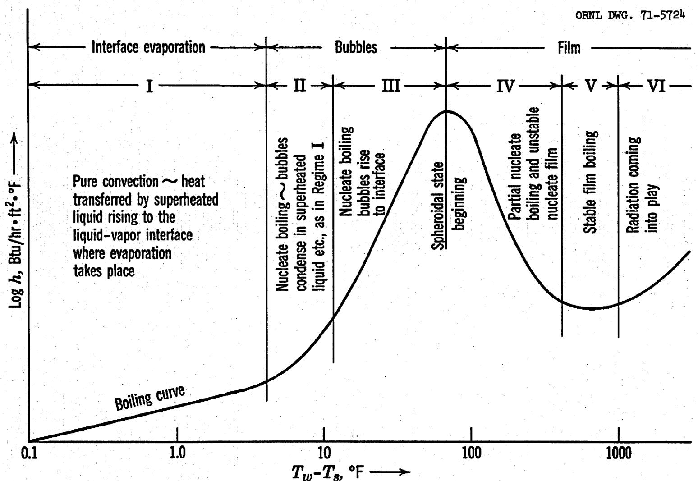  
Fig. 1. Diagram Showing the Principal Pool-Boiling Regimes and Their Relative Position on a Curve for the Heat-Transfer Coefficient Plotted as a Function of the Film Temperature Drop (Farber and Scorah, Heat Transfer to Water Boiling Under Pressure, Trans. ASME, p. 369, Vol. 70, 1948)

salt, reduce the fraction of heat added at low water temperatures, and reduce the sharp changes in physical properties associated with the phase change from liquid to vapor. $^{2}$ In units of this type it is usually considered best to have the molten salt outside the tubes and the supercritical water and steam flowing inside the tubes. However, while there is no sharp phase change, the very rapid changes in density and other physical properties near the critical temperature under supercritical pressure conditions lead to marked changes in the heat transfer performance and abrupt reductions in the heat transfer coefficient something like those associated with the burnout heat flux encountered at subcritical pressures. $^{9}$ In addition to these flow and heat transfer phenomena and the boiling flow instabilities that would be associated with them, there would be large, irregularly fluctuating thermal stresses in the tube wall in the region near the feedwater inlet of the boiler unit, and these would be likely to cause tube cracking and failure. These problems are discussed later in some detail.

Although the use of a supercritical pressure system reduces the severity of the boiling flow stability problem for operation near the design point, a great deal of difficulty has been encountered in all of the coal-fired once-through and supercritical pressure boilers in going from zero power to part load conditions of at least $10\%$ , and often to as high as $30\%$ power. These difficulties stem in part from the large density change as the water-steam mixture flows through the boilers and in part from the reduced pressure drop at the lower flows which reduces the damping of the oscillations by turbulence losses.

# Double-Walled Tubes with a Heat Dam

M. E. Lackey suggested in 1958 that one means for reducing the temperature difference between the tube wall and the water to avoid film boiling conditions would be to incorporate a heat dam in the form of a sintered powder matrix between an inner tube carrying the molten salt and the outer tube in contact with the boiling water. This approach would be quite effective at full power where the average heat flux would be

high, but would present problems under startup and low power conditions because a high heat flux is inherently associated with a large temperature drop through such a heat dam. A further disadvantage is that differential thermal expansion between the inner and outer tube walls would induce severe thermal stresses in the sintered buffer material, and these would lead to cracking of the sintered matrix and unpredictable increases in the thermal resistance.\$

The cracking problem in the sintered material could be avoided by using instead an air space as a heat dam. The OD of the inner tube could be knurled, for example, and the outer tube swaged down onto it. This would have the disadvantage that differential thermal expansion between the inner and outer tubes would probably loosen the swaged joint and give an indeterminately large - probably excessively large - thermal barrier at full load. If this did not happen, thermal stresses would probably cause cracking of the tubes.

# Flash Boiler

In an effort to avoid the difficulties outlined above, a flash boiler was proposed in 1955. In a unit of this type the molten salt would flow outside of the tubes and feedwater would be injected in the form of a long thin plume of fine spray directed along the axis of the boiler tube. Experience in the development of nozzles for diesel engines indicates that a high penetration spray could be obtained with sharp-edged, single-crifice nozzles having a hole diameter of about 0.020 in.,[10] and that nozzles of this type would break the liquid up into droplets having a diameter of the order of 0.005 in.[11] These droplets would form a long slender spray plume that would extend for perhaps 2 ft down the bore of a 1/2 in. tube. Droplets would impinge on the tube wall at a very low angle of incidence, and would tend to skitter along the wall riding on a thin film of vapor. Analyses indicated that the local thermal stresses associated with the cold tracks left by droplets of this sort would be well within the elastic limit and should not give difficulties with thermal stresses.[1]

A brief series of tests to investigate this concept was run by an MIT practice school group.[12] These tests showed that there was a strong tendency for a large fraction of the droplets to impinge on the tube wall in the region close to the injection nozzle, and that this led to such a pronounced cooling effect that a frozen film of molten salt tended to form on the outside of the tube in that region.[13] The tests had been initiated on the premise that they offered an attractive way to provide for emergency cooling of the ART fuel dump tanks, hence the test work was terminated with the demise of the ANP program. No further work on the concept was carried out because it inherently requires a very large number of tubes of rather short length so that the tube-to-header joint costs tend to become excessive. Further, the concept does not appear to lend itself well to high pressure and supercritical pressure steam systems.

# Loeffler Boiler

The Loeffler boiler concept used in a few coal-fired steam plants has been considered. Systems of this sort have been built and operated for coal-fired furnaces. Operation apparently has been satisfactory except for the extremely high noise level associated with the boiler and difficulties with the steam pumps required. The Loeffler concept entails admission of saturated steam to a heat transfer matrix heated by molten salt. The superheated steam leaving this matrix would be divided into two portions, one of which would flow to the turbine and the other would be returned to a boiler drum where it would bubble through the water in the drum. This approach has the disadvantages that it requires large and expensive boiler drums, implosion of the vapor bubbles in the boiler drum makes operation extremely noisy and induces violent vibration exciting forces, the relatively poor steam-side heat transfer coefficient and low enthalpy rise lead to a large number of tube-to-header joints, and steam pumps posing tough design and reliability problems are required to recirculate steam through the boiler. On the other hand, the system has the advantage that it lends itself readily to startup and part load operations, it virtually eliminates the possibility of salt freezing as

a consequence of excessive cooling in the steam generator, and it greatly eases the thermal stress problems by substituting a salt-to-steam heat exchanger for the salt-to-water boiler.

# Triple Tube Boiler

When the writer solicited criticisms and suggestions on the proposed new boiler concept, M. E. Lackey pointed out that B. Kinyon and G. D. Whitman had proposed a somewhat similar boiler in 1960, (Ref. 6), and S. E. Beall pointed out that a variation of this approach had been tested as a means for cooling fuel dump tanks.[13] The arrangement proposed by Kinyon employed three concentric tubes with boiling water flowing upward through the inner annulus to a vapor separator and superheated steam flowing down through the outer annulus. The central passage would serve to return the water from the vapor separator to a boiler water recirculating pump. This arrangement has the advantage that the superheated vapor in the annulus between the outer tube heated by the molten salt and the tube containing the boiling water would act as a buffer both to eliminate serious thermal stresses and to avoid excessive metal temperatures adjacent to the boiling water. The arrangement has the disadvantage that it requires a fairly large tube diameter and hence a fairly large tube wall thickness for supercritical water systems. Thus, the amount of heat transfer surface area required tends to be large because the principal barrier to heat transfer lies in heat conduction through thick tube walls. Further, the arrangement requires the development of a vapor separator that would fit within a small diameter, preferably that of the tube. Experience in vapor separator development indicates that the velocities required for good vapor-liquid separation are much lower than those one would like to use in the tube for heat transfer purposes, and hence a rather bulky protuberance would have to be employed at the end of each tube; this appears to lead to a set of extremely awkward mechanical design problems.

# Reentry Tube Boiler

The boiler proposed in this report is somewhat similar to the one described above but differs in that it makes use of only two vertical, concentric tubes in the form shown in Fig. 2. The water enters at the bottom through a central tube having a diameter of about $1/4$ in. Preheating and boiling occur as the water rises in this tube until evaporation is complete, after which there is some superheating. The steam emerges from the top end of the small diameter tube, reverses direction, and flows back downward through an annulus between the inner small tube and an outer tube having an ID of around $1/2$ in. The molten salt enters at the bottom, flows upward around the outer tube, and out the top. With this arrangement there is only one header sheet separating the molten salt from the atmosphere, and this header sheet is not subject to a large pressure differential. Thermal sleeves would be used at the header sheet to minimize thermal stresses (see Fig. 3). There would be no high pressure header sheets in this system; the tubes for the high pressure feedwater and the exit steam would be manifolded as in high pressure coal-fired boilers rather than run into header sheets. The steam annulus between the inner and outer tubes would act as a buffer to isolate the relatively low-temperature boiling water region from the high-temperature molten salt. This isolation would be so effective that it would be quite possible to heat the unit to the molten salt operating temperature with no water in the system and then slowly add water to initiate boiling. As will be shown later, it should be possible to design the unit so that it would operate stably over a wide range of conditions from zero load to overload with no difficulties from thermal stresses or freezing of the salt.

It might at first appear that the extra heat transfer films through which heat must be transmitted from the molten salt to the boiling water might lead to a large increase in surface area requirements and hence in the size, weight, and cost of the unit. However, it appears quite possible to design so that these disadvantages are more than offset by such features as the absence of a high-pressure header sheet and the ability to operate with high-temperature differences between the molten salt and the boiling water so that the overall size, weight, and cost of the unit

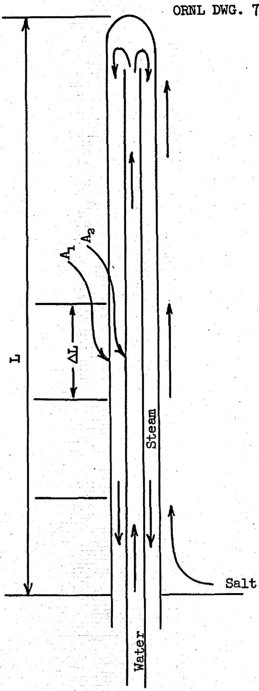  
Fig. 2. Diagram Showing Section Through Tube.

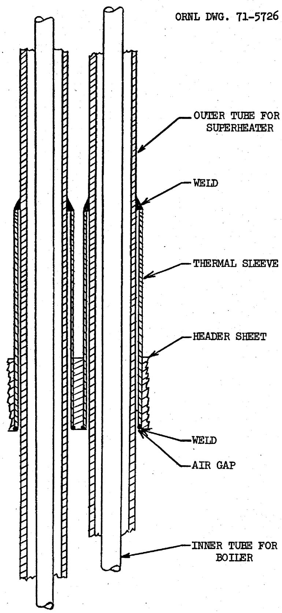  
MOLTEN SALT   
AIR   
Fig. 3. Section Through the Header Sheet Region Showing Two Typical Tubes with Their Thermal Sleeves and the Associated Welds.

are at least competitive with the corresponding values for any other design that has been proposed.

# DESIGN FOR GOOD STABILITY AND CONTROL CHARACTERISTICS

The usual procedure in developing a design for a steam generator has been to choose a geometry, establish the proportions for full power conditions, and then - sometimes - examine the full range of control problems. The inverse order seems at least equally logical and is followed here. The writer has felt from the beginning that some of the most difficult conditions to be met are those associated with initial startup and part load operation. Thus, the first step in the evaluation work was to establish a typical set of molten salt and steam temperatures, and from these, using basic heat balance considerations, deduce the effects of different modes of control for the various load conditions of interest. This approach gives a valuable insight into the full range of the over-all design problems.

# Molten Salt Temperatures at Part Load

Several different approaches can be taken to the control of a molten salt reactor steam power plant. Perhaps the simplest and most reliable approach is to make use of constant speed ac motors to drive pumps in both the fuel circuit and the intermediate salt circuit. If this is done, the temperature rise in each salt circuit will be directly proportional to the load so that the circuits will be isothermal at zero power. The basic heat transfer relations are such that the temperature difference between the two salt circuits will also be directly proportional to the load and will drop to zero at zero load. If there is no control rod movement in the reactor, the zero load reactor temperature will be the mean of the inlet and outlet fuel temperatures at full load. These effects are shown in Fig. 4a for operation with constant speed fuel and inert salt pumps. Note that both the minimum and the mean temperatures of the inert salt rise as the load is reduced - an undesirable characteristic from the standpoint of the design of most steam generators. This situation can be changed by holding the

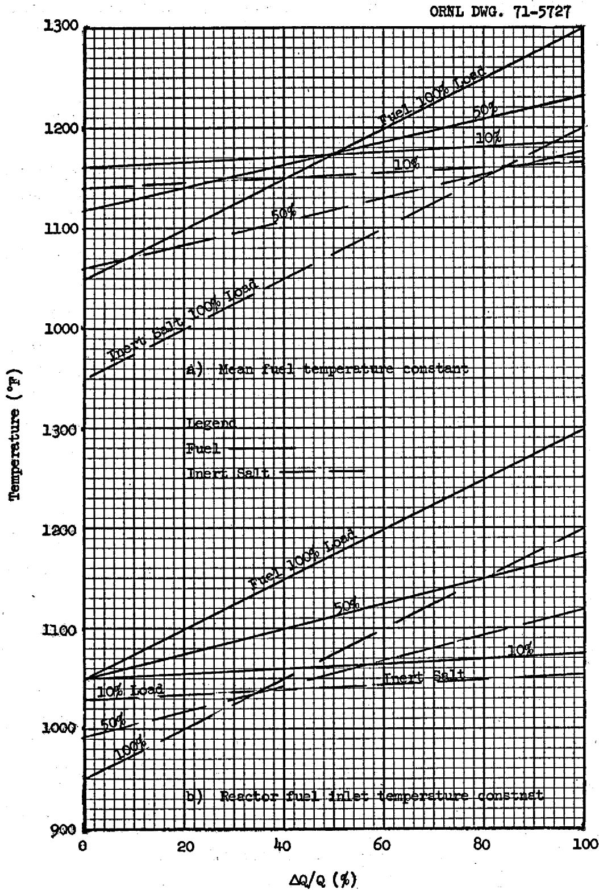  
Fig. 4. Temperature Distribution in the Fuel-to-Inert Salt Heat Exchanger for a Series of Loads for Two Control Modes, i.e., a) constant speed pumps and a constant mean fuel temperature, and b) constant speed pumps and a constant reactor fuel inlet temperature.

reactor inlet temperature constant in which case the temperatures in the fuel and inert salt circuits would be defined by the curves in Fig. 4b. The fuel inlet temperature ought not be reduced below the value shown because it is desirable to maintain the fuel at least $100^{\circ}\mathrm{F}$ above its freezing point. Other effects could be obtained by varying the speeds of the fuel and/or inert salt pumps, but the resulting complications - particularly at or near zero load - are quite objectionable.

After analyzing a variety of power plant control modes it was decided that the simplest system would be the most reliable and should be used for the bulk of this study. The approach chosen is believed to be the simplest possible, i.e., it assumes a constant mean fuel temperature and constant speed pumps for both the fuel and the inert salt irrespective of load.

# Effects of Mode of Control on Steam Temperatures at Part Load

The inherent effects of typical control modes on the temperature distributions that will result as a consequence of fundamental heat balance considerations are shown in Figs. 5, 6, and 7 for the full range of load conditions. It can be seen from examination of these curves that the steam outlet temperature will rise as the load is reduced because the temperature difference between the two fluid streams in a heat exchanger drops off with a reduction in the heat flux. This problem arises in the control of any steam plant that is coupled to a high-temperature reactor whose mean temperature is held constant.[14] To avoid damage to the turbine, the steam temperature could be reduced at part load by introduction of a desuper-heater between the steam generator and the turbine. The available desuper-heater units may not be well suited to this particular application, but the design of a suitable unit would be straightforward. However, it is apparent that high steam temperatures under part load conditions would seriously increase the creep stress problem in the steam system if it were to operate with a constant boiler discharge pressure. The problem could be eased by scheduling the reactor mean temperature so that it would increase with power output. One way of doing this would be to maintain the reactor inlet temperature constant and allow the temperature rise in the

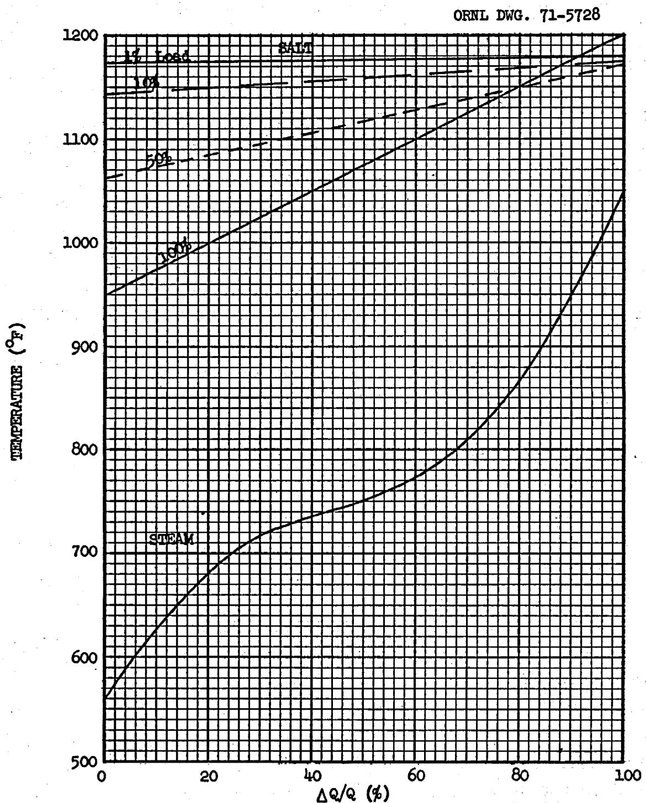  
Fig. 5. Effects of Operation with a Constant Mean Fuel Temperature on the Temperature Distribution Through the Boiler for Typical Loading Conditions. Local temperatures are plotted as functions of the fraction of the heat transferred to the water from the molten salt (i.e., $\Delta Q / Q$ ). For this set of curves it was assumed that the effective boiler tube length would be varied with the load to maintain a constant temperature and pressure at the superheater outlet.

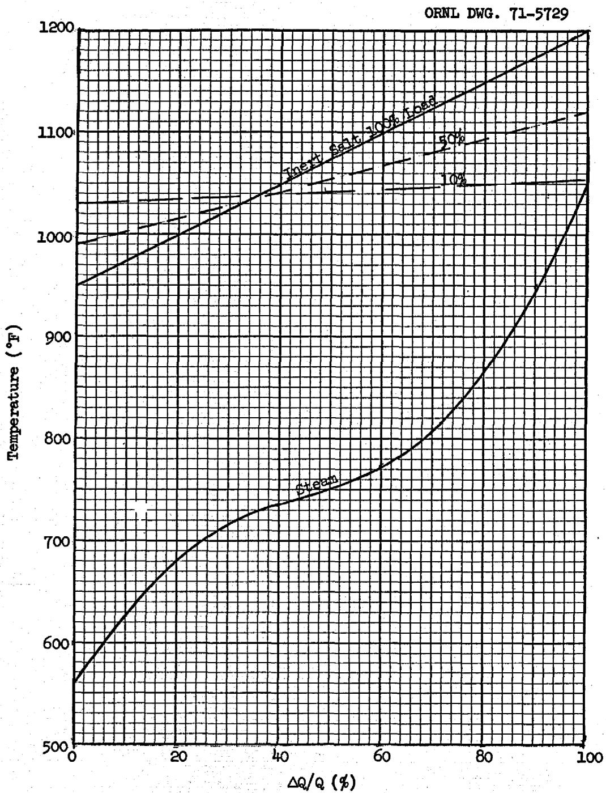  
Fig. 6. Effects of Operation with a Constant Reactor Fuel Inlet Temperature on the Temperature Distribution Through the Boiler for Typical Load Conditions. Local fluid temperatures are plotted as functions of the fraction of the heat transferred from the molten salt (i.e., $\Delta Q / Q$ ). For this set of curves it was assumed that the effective boiler tube length would be varied with the load at any given condition to maintain a constant temperature and pressure at the superheater outlet.

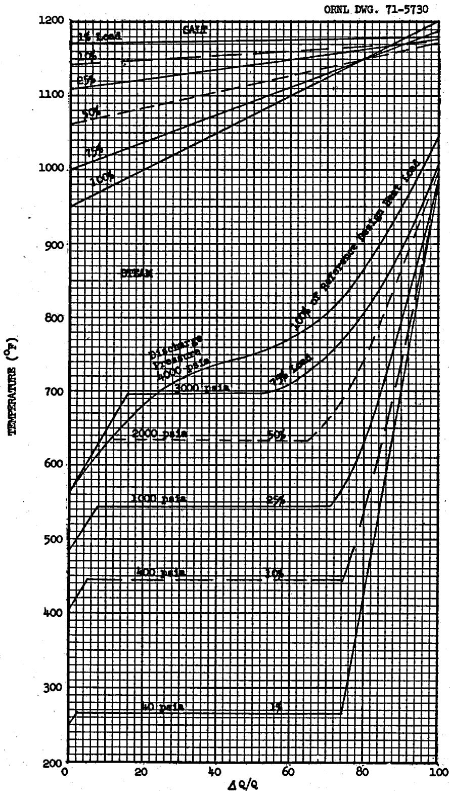  
Fig. 7. Inert Salt and Steam Temperatures as a Function of the Fraction of the Heat Transferred from the Salt to the Steam for a Series of Design Heat Loads with the Steam Pressure Directly Proportional to the Heat Load.

fuel salt to increase in direct proportion to the load. If this were done, the temperatures in the inert salt and steam circuits would vary with load as indicated in Fig. 4b. This control schedule for the salt circuits was assumed in preparing a few of the boiler performance estimates presented later in this report to show that this arrangement might reduce or eliminate the need for desuperheating the steam under part load conditions at the expense of complicating the reactor control problems.

The curves of Figs. 5 and 6 were calculated on the basis that the boiler would be operated in the conventional fashion with a constant steam discharge pressure of 4000 psi, and the pressure of the steam supplied to the turbine would be reduced by a throttling valve. However, there are a number of advantages associated with operating a steam boiler-turbine-condenser-feed pump system with no throttle valve between the boiler and the turbine so that the steam pressure is determined by the flow rate through the critical pressure drop orifice represented by the inlet nozzle box of the first stage of the turbine. One of the more important of these advantages in this instance is that, if the steam system were designed so that the boiler discharge pressure would be directly proportional to the load, the higher boiler temperatures would be associated with lower pressures, and the creep stresses in the boiler tube wall would not be excessive. If this were done, to a first approximation the boiler pressure will be directly proportional to the load, and curves for the steam temperature as a function of the amount of heat added on the water side will be as indicated in Fig. 7 for a typical case. Not surprisingly, calculations presented later in the report show that the tube length to evaporate to dryness is much the same irrespective of the boiler pressure at a given load. However, the pressure drop through the boiler under part load conditions is much higher if the pressure is directly proportional to the load than if the boiler were operated at a constant pressure. Increasing the pressure drop at part load is advantageous in that it will much improve the boiling flow stability.

# Heat Transfer Instabilities and Thermal Stresses

One can sense intuitively that severe thermal stresses might be induced by the wide variations in the heat flux - and hence the transfer coefficient

that can occur with changes in the difference in temperature between the metal wall and the saturation temperature of a boiling liquid (see Fig. 1). However, it is not obvious just how these thermal stresses may be related to fluctuations in the boiling heat transfer coefficient, how large they may be, or why they may be more severe at low loads than at the design point, and M. Rosenthal asked that this short section be added to clarify the problem, particularly for a unit designed for supercritical operation. It should be noted that for some time it was thought that this problem could be avoided by going to supercritical water pressures, but severe cracking of tubes in coal-fired supercritical boilers showed that, unfortunately, this is not the case.9 Detailed investigations of boiling heat transfer relations in the supercritical pressure regime have shown that large variations in heat transfer coefficient still occur, particularly at high heat fluxes, i.e., if there is a large temperature difference between the metal wall and the bulk-free stream9 (see Fig. 8).

To illustrate the problem, consider a short section of INOR-8 tubing with supercritical pressure water at $690^{\circ}\mathrm{F}$ inside and molten salt at $1150^{\circ}\mathrm{F}$ flowing outside the tube with a salt heat transfer coefficient of 1000 Btu/hr·ft²·°F. The thermal conductivity of the wall is about 12 Btu/hr·ft·°F. The thickness is 0.10 in., and hence the conductance of the wall would be about 1440 Btu/hr·ft²·°F, and thus the temperature drop through the tube wall would be about 70% that through the salt film on the outer wall. Two very different operating regimes are possible. Assuming that the curves of Fig. 8 define the heat transfer situation on the water side, the heat flux where the water-steam enthalpy ran 780 Btu/lb could be $\sim$ 100,000 Btu/hr or at a nearby point downstream where the enthalpy reached 900 Btu/lb it could be 150,000 Btu/hr. The resulting film and wall temperatures and temperature drops can be summarized in Table 2.

Changing the radial $\Delta T$ through the tube wall from $70^{\circ}F$ to $105^{\circ}F$ at power, and to $0^{\circ}F$ at no load would lead to differential thermal expansion between the inner and outer surfaces and hence to both circumferential and axial stresses that would be superimposed on the basic pressure stresses. Power cycling and changes from one heat transfer regime to the other would cause thermal strain cycling, and this could eventually lead to cracking and failure. The problem would be much worse at subcritical pressures

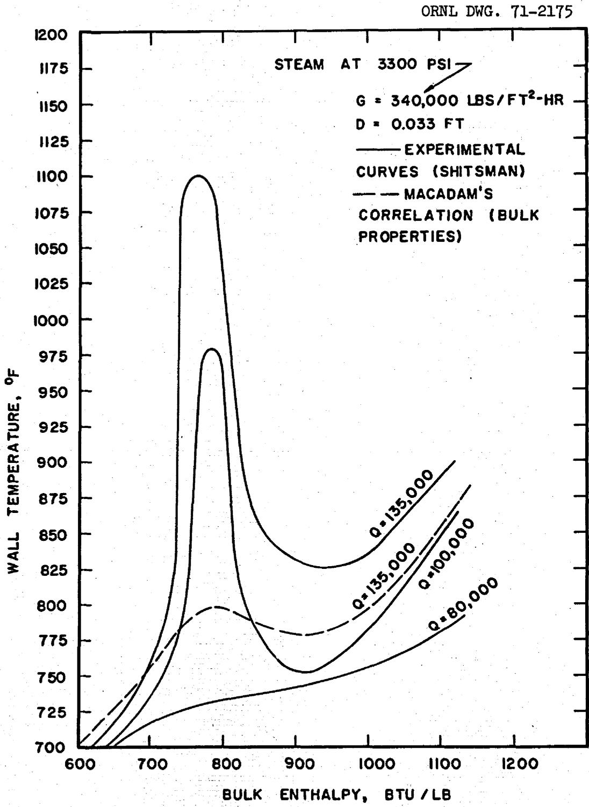  
Fig. 8. Deterioration in Heat Transfer Near the Critical Temperature in Supercritical Pressure Once-Through Steam Generator Tubes Operating at High Heat Fluxes. (M. E. Shitsman, Impairment of Heat Transmission at Supercritical Pressures, Teplofizika Vysokikh Temperatur, Vol. 1, No. 3, p. 267, 1963)

Table 2. Effects of Heat Flux on the Radial Temperature Distribution Through an Element of Tube Wall in the Inlet Region of a Simple Shell-and-Tube Molten Salt Steam Generator at Supercritical Pressure Conditions   

<table><tr><td>Water-steam enthalpy, Btu/lb</td><td>785</td><td>900</td></tr><tr><td>Heat flux, Btu/hr·ft2</td><td>100,000</td><td>150,000</td></tr><tr><td>Salt free steam temperature, °F</td><td>1,150</td><td>1,150</td></tr><tr><td>Tube outer wall temperature, °F</td><td>1,050</td><td>1,000</td></tr><tr><td>Tube inner wall temperature, °F</td><td>980</td><td>895</td></tr><tr><td>Water temperature, °F</td><td>690</td><td>705</td></tr><tr><td>Salt film ΔT, °F</td><td>100</td><td>150</td></tr><tr><td>Wall ΔT, °F</td><td>70</td><td>105</td></tr><tr><td>Water film ΔT, °F</td><td>290</td><td>190</td></tr></table>

where the change in heat transfer coefficient with enthalpy is both larger and more abrupt (see Fig. 9). The problem could be eased somewhat by reducing the molten salt temperature to $1000^{\circ}\mathrm{F}$ for startup and low power conditions, but it would not be eliminated.

Observations of tubes transferring heat to water at supercritical pressures have shown that both of the regimes of Table 2 will be present, i.e., some sections of the tube will operate at a lower wall temperature and a high heat flux while others will operate at a higher temperature and a lower heat flux. Further, these regimes tend to shift back and forth axially along the tube with changes in water flow rate. This leads to another type of thermal stress. Dilation of the hot region relative to the cooler region leads to bending stresses in the tube wall, and these stresses are likely to be severe because the shift from one heat transfer regime to the other tends to be abrupt and the transition zone is short. These stresses are analogous to those in thermal sleeves, and can be calculated in the same way (see Ref. 8, p. 125). Unfortunately, data for typical axial temperature distributions are not at hand to provide a good basis for estimating the magnitude of these stresses.

At first thought it would appear that at light loads the above problems would be eased because the average heat flux would be greatly reduced.

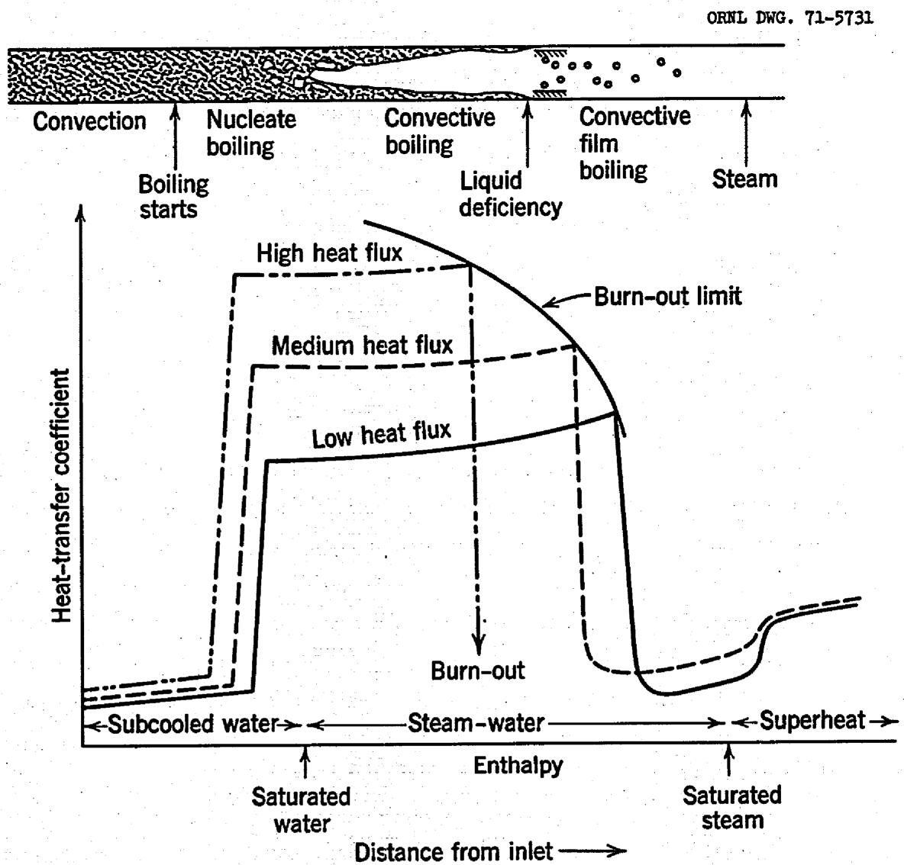  
Fig. 9. Effects of Heat Flux on the Heat-Transfer Coefficient for a Once-Through Boiler Tube (Polomik et al., Heat Transfer Coefficients with Annular Flow During "Once-Through" Boiling of Water to $100\%$ Quality at 800, 1100, and 1400 psi, Jour. of Heat Transfer, Trans. ASME, p. 81, Vol. 86-2, 1964)

However, this is not the case. The bulk of the heat transfer occurs at the water inlet end because the temperature difference there is inherently high irrespective of load, and it is the high-temperature difference that gives the possibility of two drastically different temperature regimes. Thus reducing the heat load simply reduces the length of the region in which severe thermal stresses may be induced - it does not eliminate the problem. In fact, if the pressure is reduced, the boiling point of the water will drop and the temperature difference that can be induced in the tube wall will be increased.

The above effects are complex and, in many respects, rather subtle, but they are the reason for turning from the conventional shell-and-tube heat exchanger geometry to the reentry tube construction proposed in this report.

# Flow Stability Considerations

In a conventional coal-fired boiler the pressure drop in the boiling region is rather low in recirculating boilers, but the overall pressure drop is fairly high because the pressure drop through the superheater is substantial. In once-through boilers, particularly in supercritical pressure steam plants, the boiler pressure drop is large, commonly $20\%$ of the boiler inlet pressure. This stems in part from efforts to get a high heat transfer coefficient on the steam side, in part from the long tubes made necessary by the relatively low average heat transfer coefficient on the combustion gas side, and in part by stringent orificing at the tube inlets to assure a flow distribution across the tube bank such that it will be possible to avoid burnout in regions where the local heat flux may be high as a consequence of irregularities in the hot gas flow on the combustion gas side of the boiler. These irregularities in the local hot gas temperature and heat flux vary substantially with the heat load on the boiler, the fuel used, and the peculiarities and irregularities in the gas turbulence pattern in the combustion zone. Fortunately, in a molten salt-heated boiler not only can the tube wall never exceed the temperature of the molten salt so that severe overheating of the tube wall is not a problem, but the molten salt temperature and flow distribution can be predicted

within quite close limits instead of being subject to the vagaries in the large-scale turbulence that are characteristic of combustion zones in furnaces. As a consequence, a steam generator for a molten salt reactor can be designed to give a much higher average heat flux and yet a lower peak heat flux than can be obtained in a conventional coal-fired boiler. This directly reduces the tube length and hence the pressure drop. In addition, it reduces the need for orificing to control the water flow distribution through the boiler. As a consequence, it is believed that it will be possible to design for lower water pressure drops through steam generators for molten salt reactors than are ordinarily required for coal-fired boilers. This will reduce both the power requirements for the boiler feed pump and the tube wall thickness required for the feedwater piping.

# Heat Transfer Analysis

Estimating the heat transfer performance of the reentry tube steam generator involves a set of implicit relations that make an explicit solution out of the question and even an iterative solution surprisingly tricky. This stems from the wide variety of combinations of conditions that may occur in the boiler depending on the steam pressure, temperature, and flow rate. The problems have much in common with, but are more difficult than, those of steam generators for high-temperature gas-cooled reactors.[14] The steam conditions were chosen to be essentially the same as those of Eddy-stone Unit No. 2, which was used as the basis for an earlier study.[15] The feedwater temperature and flow rate, the exit steam pressure, and the molten salt inlet and outlet temperatures are ordinarily given. From these data it is possible to estimate a steam outlet temperature and from heat balance considerations draw a set of curves such as those of Fig. 5 which show the temperatures of the molten salt and the steam as functions of the fraction of heat added to the steam in the course of its transit through the boiler. Figure 7 shows a similar set of curves for a series of lower pressures and lower loads; in this instance the pressure was taken as directly proportional to the load, a good approximation to the natural characteristics of a steam boiler-turbine-condenser-feed pump system in which no throttle valve is employed. Figures 5 and 7 illustrate one of the

difficulties in setting up an iterative calculation. Whereas the steam temperature for the supercritical condition of Fig. 5 is uniquely defined as a function of the fraction of heat added to the steam, this is not the case for subcritical steam pressure conditions where the steam temperature is essentially independent of the amount of heat added over a wide range of heat addition. In attempting an iterative solution one can calculate stepwise upward from the bottom of the tube using as his points of departure the given feedwater inlet conditions and the assumed steam outlet conditions. The stepwise calculations can be continued to a point at the top of the inner tube where evaporation would be completed or the steam superheated somewhat. It is also possible to assume a set of steam conditions at the outlet of the inner tube and make stepwise calculations from the top downward to the feedwater inlet end accepting the superheater outlet temperature that results. The difference in the character of the relations between the various load conditions of Figs. 5 and 7 lead to some convergence problems in either case. These, in turn, make it necessary to modify the calculational procedure somewhat depending on the steam conditions. Both methods have been used in this study, and both have been found to be not only awkward but demanding in that they require good engineering judgment to choose values that will yield convergence. However, no better approach has been found in spite of some months of effort by both MIT graduate students who became interested in the problem and by the authors of Ref. 7.

# Typical Calculations

The steps followed in estimating the boiler tube length, temperature distribution, and pressure drop on the water side are summarized in Table 3, and a set of typical calculations is shown in Table 4. The first set of calculations was made for the $100\%$ load condition. The first step in the calculations was to start at the bottom, or salt inlet end, and assume a decrement in the enthalpy of the salt. This was chosen to be $10\%$ or the expected value for the boiler. For a given tube geometry the surface areas of the inner and outer tube walls per unit of length are defined and hence the area per increment of length is readily calculated. For good

Table 3. Calculational Procedure for Establishing the Tube Length for a Given Set of Design Conditions (see nomenclature in latter portion of table)

1. Plot curves for the salt and steam temperatures as functions of $\Delta Q / Q$ from the inlet to the outlet (e.g., Fig. 7).   
2. Specify the tube diameters and wall thicknesses.   
3. Compute the overall heat transfer coefficients for the inner and outer tube walls (e.g., use Fig. 11).   
4. For convergence in the iteration, the heat transferred from the salt to the annulus steam near the superheater outlet must be greater than the heat transferred from the annulus steam to the water in the center tube per unit of length, i.e., $\mathrm{V}_{1}\mathrm{A}_{1}\Delta t_{1} / \mathrm{I} > \mathrm{U}_{2}\mathrm{A}_{2}\Delta t_{2} / \mathrm{L}$ . This will probably require an inner tube liner to provide a heat dam near the bottom. To minimize the overall tube length, this liner should be terminated as soon as this can be done and still maintain $\mathrm{U}_{1}\mathrm{A}_{1}\Delta t_{1} / \mathrm{I} > \mathrm{U}_{2}\mathrm{A}_{2}\Delta t_{2} / \mathrm{L}$ .   
5. Estimate the mean temperature of the salt, annulus steam, and boiler water for the first increment of tube length using the ratio of the heat added to the steam in the outer annulus to the total heat removed from the salt and the curves of item 1 above (e.g., Fig. 7).   
6. Using the above as the starting point, follow the calculational procedure of Table 4 using constant increments in $\Delta Q_{1}$ , the enthalpy change in the molten salt.   
7. Compute $\Delta L$ , that is

$$
\Delta L = \frac {\Delta Q _ {1}}{U _ {1} A _ {1} \Delta t _ {1} / L}.
$$

8. Compute $\Delta Q_{3}$ for the value of $\Delta L$ found in item 7 ( $\Delta Q_{3} = U_{2}A_{2}\Delta L\Delta t_{2} / L$ ).

9. Repeat steps 6, 7, and 8 for a better approximation if the changes in mean temperatures yielded by these steps differ by more than $20\%$ from the values estimated in step 5.

10. Repeat the above for new increments of length using the same increment in $\Delta Q_{1}$ until $\Sigma \Delta Q_{1} = Q_{1}$ .

11. If there is trouble with convergence, change the value of $U_{2}$ by changing the length or effectiveness of the heat dam near the feedwater inlet. It may also be advisable to change the proportions of the tubes.

12. For part load calculations, be careful to assume a small temperature difference between the salt and the superheated steam for the first increment in tube length if the temperature distribution along the full length is desired. If the superheater exit temperature exceeds by more than $100^{\circ}\mathrm{F}$ the value assumed for the part load condition, new curves similar to those of Fig. 7 should be prepared. If instead one wants a rough indication of the active tube length at part load, compute a case as if it were a design point and compare the resulting length with that for the $100\%$ load condition.

Table 3. Nomenclature   

<table><tr><td>A1</td><td>Outer tube effective heat transfer surface area, ft2</td></tr><tr><td>A2</td><td>Inner tube effective heat transfer surface area, ft2</td></tr><tr><td>d1</td><td>ID of outer tube, in.</td></tr><tr><td>d2</td><td>ID of inner tube, in.</td></tr><tr><td>f1</td><td>Friction factor for salt</td></tr><tr><td>f2</td><td>Friction factor for steam in superheater annulus</td></tr><tr><td>f3</td><td>Friction factor for steam in inner tube</td></tr><tr><td>G1</td><td>Mass flow rate of salt, lb/ft2·sec</td></tr><tr><td>G2</td><td>Mass flow rate of steam in superheater annulus, lb/ft2·sec</td></tr><tr><td>G3</td><td>Mass flow rate of steam in inner tube, lb/ft2·sec</td></tr><tr><td>L</td><td>Tube length (or distance from bottom of tube), ft</td></tr><tr><td>ΔL</td><td>Increment in tube length, ft</td></tr><tr><td>n</td><td>Number of increment</td></tr><tr><td>P</td><td>Steam pressure, psia</td></tr><tr><td>ΔP1</td><td>Steam pressure drop in superheater annulus in increment, psi</td></tr><tr><td>ΔP2</td><td>Steam pressure drop in inner tube in increment, psi</td></tr><tr><td>Q1</td><td>Heat removed from molten salt, Btu/hr·tube</td></tr><tr><td>Q2</td><td>Net heat added to steam in superheater annulus, Btu/hr·tube</td></tr><tr><td>Q3</td><td>Net heat added to steam in inner tube, Btu/hr·tube</td></tr><tr><td>ΔQ1</td><td>Heat removed from salt in increment, Btu/hr</td></tr><tr><td>ΔQ2</td><td>Heat added to steam in superheater annulus in increment, Btu/hr</td></tr><tr><td>ΔQ3</td><td>Heat added to steam in inner tube in increment, Btu/hr</td></tr><tr><td>q1</td><td>Dynamic head in superheater annulus, psi</td></tr><tr><td>q2</td><td>Dynamic head in central boiler tube, psi</td></tr><tr><td>Re1</td><td>Reynolds number for salt</td></tr><tr><td>Re2</td><td>Reynolds number for superheated steam in annulus</td></tr><tr><td>Re3</td><td>Reynolds number for steam in inner tube</td></tr><tr><td>t1</td><td>Local temperature of molten salt, °F</td></tr><tr><td>t2</td><td>Local temperature of superheated steam in annulus, °F</td></tr><tr><td>t3</td><td>Local temperature of steam in inner tube, °F</td></tr><tr><td>ΔT1</td><td>Local temperature difference between salt and steam in super-heater annulus, °F</td></tr><tr><td>ΔT2</td><td>Local temperature difference between steam in annulus and steam in inner tube, °F</td></tr><tr><td>v2</td><td>Specific volume of steam in superheater annulus, ft3/1b</td></tr><tr><td>v3</td><td>Specific volume of water-steam mixture in inner tube, ft3/1b</td></tr></table>

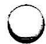

Table 4. Typical Calculational Worksheet for a Single Boiler-Superheater Tube   

<table><tr><td>Steam pressure, psia = 4000
Steam temperature leaving inner tube, ℃ = 745
Salt temperature in, ℉ = 1200
Salt temperature out, ℉ = 950
Heat load per tube, Btu/hr = Q1 = 650,000</td><td>Fraction of reference design load, % = 100
Superheater temperature out, ℃ = 1045
Feedwater temperature in, ℉ = 560
Water enthalpy rise, Btu/1b = 886
Water flow per tube, lb/sec = 0.204</td><td>Outer tube OD, in. = .65
Outer tube ID, in. = .50
Inner tube OD, in. = .25
Inner tube ID, in. = .23</td><td colspan="8">Total tube length, ft = 32.97
Pressure drop through inner tube psi = 38.3
Pressure drop through annulus, psi = 14.4
Total pressure drop through boiler-superheater, psi = 52.7</td></tr><tr><td>① Fractional change in salt enthalpy in increment</td><td>ΔQ1/Q1</td><td>.10</td><td>.10</td><td>.10</td><td>.10</td><td>.10</td><td>.10</td><td>.10</td><td>.10</td><td>.10</td></tr><tr><td>② Effective surface area of outer tube, ft2/ft</td><td>A1/L</td><td>.152</td><td>.152</td><td>.152</td><td>.152</td><td>.152</td><td>.152</td><td>.152</td><td>.152</td><td>.152</td></tr><tr><td>③ Effective surface area of inner tube, ft2/ft</td><td>A2/L</td><td>.052</td><td>.052</td><td>.052</td><td>.052</td><td>.052</td><td>.052</td><td>.052</td><td>.052</td><td>.052</td></tr><tr><td>④ Overall heat transfer coefficient for outer tube, Btu/hr.ft2℉</td><td>U1</td><td>667.6</td><td>667.6</td><td>667.6</td><td>667.6</td><td>667.6</td><td>667.6</td><td>667.6</td><td>667.6</td><td>667.6</td></tr><tr><td>⑤ Overall heat transfer coefficient for inner tube, Btu/hr.ft2℉</td><td>U2</td><td>300</td><td>300</td><td>300</td><td>1145.5</td><td>1145.5</td><td>1145.5</td><td>1145.5</td><td>1145.5</td><td>1145.5</td></tr><tr><td>⑥ Heat transfer through outer tube per unit of length per ℉, Btu/hr.ft</td><td>U1A1/L</td><td>101.4</td><td>101.4</td><td>101.4</td><td>101.4</td><td>101.4</td><td>101.4</td><td>101.4</td><td>101.4</td><td>101.4</td></tr><tr><td>⑦ Heat transfer through inner tube per unit of length per ℉, Btu/hr.ft</td><td>U2A2/L</td><td>15.7</td><td>15.7</td><td>15.7</td><td>59.6</td><td>59.6</td><td>59.6</td><td>59.6</td><td>59.6</td><td>59.6</td></tr><tr><td>⑧ Molten salt temperature, ℉ (mean for increment)</td><td>t1 Fig. 7</td><td>1190</td><td>1164</td><td>1139</td><td>1112</td><td>1087</td><td>1062</td><td>1038</td><td>1012</td><td>987</td></tr><tr><td>⑨ Steam temperature in outer tube, ℉ (mean for increment)</td><td>t2 see ②</td><td>1030</td><td>1016</td><td>958</td><td>907</td><td>872</td><td>850</td><td>827</td><td>792</td><td>770</td></tr><tr><td>⑩ Steam temperature in inner tube, ℉ (mean for increment)</td><td>t3 see ②</td><td>585</td><td>575</td><td>605</td><td>630</td><td>660</td><td>692</td><td>708</td><td>720</td><td>728</td></tr><tr><td>⑪ Temperature drop from salt to steam in annulus, ℉</td><td>ΔT1</td><td>8 - ⑨</td><td>160</td><td>148</td><td>181</td><td>205</td><td>215</td><td>212</td><td>211</td><td>220</td></tr><tr><td>⑫ Temperature drop from steam in annulus to steam in inner tube, ℉</td><td>ΔT2</td><td>9 - ⑩</td><td>445</td><td>441</td><td>353</td><td>277</td><td>212</td><td>158</td><td>119</td><td>42</td></tr><tr><td>⑬ Increment in length, ft</td><td>ΔL ΔL/ ⑥ ⑪</td><td>4.006</td><td>4.331</td><td>3.542</td><td>3.127</td><td>2.982</td><td>3.024</td><td>3.038</td><td>2.914</td><td>3.052</td></tr><tr><td>⑭ Distance from bottom, ft</td><td>L ∑n=1n-13</td><td>4.006</td><td>8.337</td><td>11.879</td><td>15.006</td><td>17.988</td><td>21.012</td><td>24.050</td><td>26.964</td><td>32.970</td></tr><tr><td>⑮ Heat added to steam in inner tube, Btu/hr</td><td>ΔQ3</td><td>7 ⑰ ⑱</td><td>27,991</td><td>29,988</td><td>19,628</td><td>51,623</td><td>37,672</td><td>28,474</td><td>21,547</td><td>7,395</td></tr><tr><td>⑯ Heat added to steam in outer tube, Btu/hr</td><td>ΔQ2</td><td>ΔQ1 - ⑲</td><td>37,009</td><td>35,012</td><td>45,372</td><td>13,377</td><td>27,328</td><td>36,526</td><td>43,453</td><td>52,497</td></tr><tr><td>⑰ Ratio of incremental enthalpy change in superheater to total for steam</td><td>ΔQ2/Q1 ⑳ / Q1</td><td>.0569</td><td>.0539</td><td>.0698</td><td>.0206</td><td>.0420</td><td>.0562</td><td>.0668</td><td>.0808</td><td>.0886</td></tr><tr><td>⑱ Ratio of enthalpy change in superheater to total for steam</td><td>∑n=1n-1ΔQ2/Q1</td><td>.0569</td><td>.1108</td><td>.1806</td><td>.2012</td><td>.2432</td><td>.2994</td><td>.3662</td><td>.4470</td><td>.5356</td></tr><tr><td>⑲ Ratio of incremental enthalpy change in boiler to total for steam</td><td>ΔQ3 Q1 ⑳ / Q1</td><td>.0431</td><td>.0461</td><td>.0302</td><td>.0794</td><td>.0580</td><td>.0438</td><td>.0331</td><td>.0192</td><td>.0114</td></tr><tr><td>⑳ Ratio of enthalpy change in boiler to total for steam</td><td>∑n=1n-1ΔQ3/Q1</td><td>.0431</td><td>.0892</td><td>.1194</td><td>.1988</td><td>.2568</td><td>.3006</td><td>.3337</td><td>.3529</td><td>.3643</td></tr></table>

Table 4. (Continued)   

<table><tr><td colspan="2">21 Mean value of ΔQ/Q in annulus for interval (read t2 in Fig. 7)</td><td>1 - 18n-1 - 17n/2</td><td>.972</td><td>.916</td><td>.854</td><td>.809</td><td>.778</td><td>.729</td><td>.667</td><td>.593</td><td>.509</td><td>.418</td></tr><tr><td colspan="2">22 Mean value of ΔQ/Q in boiler for interval (read t3 in Fig. 7)</td><td>20n-1 + 19n/2</td><td>.022</td><td>.066</td><td>.104</td><td>.159</td><td>.228</td><td>.279</td><td>.317</td><td>.343</td><td>.359</td><td>.368</td></tr><tr><td colspan="2">23 Ratio of enthalpy change in salt to total</td><td>∑n=n/n=1 ΔΔt/n</td><td>.10</td><td>.20</td><td>.30</td><td>.40</td><td>.50</td><td>.60</td><td>.70</td><td>.80</td><td>.90</td><td>1.00</td></tr><tr><td colspan="2">24 Fluid specific volume in superheater, ft3/lb</td><td>v2@t2in Fig. 13</td><td>.185</td><td>.180</td><td>.170</td><td>.147</td><td>.135</td><td>.127</td><td>.116</td><td>.100</td><td>.084</td><td>.064</td></tr><tr><td colspan="2">25 Fluid specific volume in boiler, ft3/lb</td><td>v3@t3in Fig. 13</td><td>.0202</td><td>.0200</td><td>.0208</td><td>.0215</td><td>.0230</td><td>.0260</td><td>.0290</td><td>.0318</td><td>.0350</td><td>.0350</td></tr><tr><td colspan="2">26 Mass flow rate in superheater, lb/sec·ft2</td><td>0f .204/.00102</td><td>200</td><td>200</td><td>200</td><td>200</td><td>200</td><td>200</td><td>200</td><td>200</td><td>200</td><td>200</td></tr><tr><td colspan="2">27 Mass flow rate in boiler, lb/sec·ft2</td><td>0f .204/.000236 or .204/.00029</td><td>864</td><td>864</td><td>864</td><td>703</td><td>703</td><td>703</td><td>703</td><td>703</td><td>703</td><td>703</td></tr><tr><td colspan="2">28 Dynamic head in superheater, psi</td><td>q2 24 262/9273.6</td><td>.798</td><td>.772</td><td>.690</td><td>.587</td><td>.522</td><td>.474</td><td>.418</td><td>.328</td><td>.207</td><td>.160</td></tr><tr><td colspan="2">29 Dynamic head in boiler, psi</td><td>q3 25 272/9273.6</td><td>1.611</td><td>1.660</td><td>1.684</td><td>1.162</td><td>1.226</td><td>1.439</td><td>1.450</td><td>1.503</td><td>1.577</td><td>1.599</td></tr><tr><td colspan="2">30 Reynolds number in superheater (d = .25)</td><td>Re2 Ref. 8, p. 291</td><td>179,867</td><td>180,871</td><td>185,802</td><td>191,010</td><td>192,715</td><td>192,715</td><td>191,858</td><td>170,400</td><td>148,855</td><td>115,628</td></tr><tr><td colspan="2">31 Reynolds number in boiler (d = .20 and .23)</td><td>Re3 Ref. 8, p. 291</td><td>238,503</td><td>243,578</td><td>250,232</td><td>243,482</td><td>253,812</td><td>294,922</td><td>299,136</td><td>314,880</td><td>317,265</td><td>317,265</td></tr><tr><td colspan="2">32 Friction factor in superheater</td><td>f2 Ref. 8, p. 294</td><td>.0168</td><td>.0168</td><td>.0167</td><td>.0166</td><td>.0166</td><td>.0166</td><td>.0166</td><td>.0172</td><td>.0178</td><td>.0189</td></tr><tr><td colspan="2">33 Friction factor in boiler</td><td>f3 Ref. 8, p. 294</td><td>.0159</td><td>.0158</td><td>.0157</td><td>.0157</td><td>.0157</td><td>.0152</td><td>.0151</td><td>.0150</td><td>.0150</td><td>.0150</td></tr><tr><td colspan="2">34 Incremental pressure drop in superheater, psi</td><td>ΔP2 50 28 32 13</td><td>2.685</td><td>2.809</td><td>2.041</td><td>1.524</td><td>1.292</td><td>1.190</td><td>1.054</td><td>.822</td><td>.544</td><td>.461</td></tr><tr><td colspan="2">35 Incremental pressure drop in boiler, psi</td><td>ΔP3 50 29 33 13</td><td>5.131</td><td>5.680</td><td>4.682</td><td>2.852</td><td>2.870</td><td>3.307</td><td>3.326</td><td>3.285</td><td>3.494</td><td>3.660</td></tr><tr><td colspan="2">36 Pressure drop from tube inlet, psi (outer annulus)</td><td>P2 P3n + ∑n=1 ΔP2</td><td>52.709</td><td>50.024</td><td>47.215</td><td>45.174</td><td>43.650</td><td>42.358</td><td>41.168</td><td>40.114</td><td>39.292</td><td>38.748</td></tr><tr><td colspan="2">37 Pressure drop from tube inlet, psi (inner tube)</td><td>P3 ∑n=1 ΔP3</td><td>5.131</td><td>10.811</td><td>15.493</td><td>18.345</td><td>21.215</td><td>24.522</td><td>27.848</td><td>31.133</td><td>34.627</td><td>38.287</td></tr></table>

compatibility with both the molten salt and the water, the tubes were considered to be of Hastelloy N. This is a high nickel alloy that has a relatively poor thermal conductivity, an important factor in a supercritical boiler because of the fairly thick wall required in the outer tube - in this instance 0.075 in. It was found advantageous to increase the thermal resistance of the inner tube wall at the lower end by making use of a double-walled tube. In this region the $1/4$ -in. OD central tube with a wall thickness of 0.010 in. was assumed to be lined with a smaller diameter tube of the same wall thickness with a radial clearance of 0.002 in. between them. The gap would be vented and, in view of the local metal temperatures, would be filled with steam rather than water.

The reason for using the tube liner can be seen by envisioning the heat transfer situation at the bottom end of the reentry tube. Unless the heat transfer rate from the salt to the superheated steam per unit of length exceeds that from the superheated steam to the feedwater, the temperature of the superheated steam will actually drop as it flows toward the outlet. Inasmuch as the local temperatures of the salt, the super-heated steam, and the feedwater are fixed, and so, too, are the surface areas and the surface heat transfer coefficients, a simple solution is to interject some extra thermal resistance between the feedwater and the superheated steam. This region need not be very long because the steam exit temperature is relatively insensitive to the steam temperature well above the exit. Further, to keep the overall tube length down it is desirable to maintain a large temperature difference between the salt and the superheated steam. Thus one of the places where judgment is required when making the stepwise calculations is in choosing the point at which to terminate the heat dam formed by the liner of the inner tube.

It should be noted that introducing the above liner in the inner tube will act to improve the boiling flow stability characteristics of the reentry tube boiler. Not only will it increase the pressure drop in the inlet region but it will also increase the fluid velocity there, both helpful factors.

Heat transfer coefficients for the molten salt were computed using the Dittus-Boelter relation and physical properties supplied by J. W. Cooke. From these the chart shown in Fig. 10 was prepared. In computing the overall heat transfer coefficients for the inner and outer tube walls, the molten salt velocity was taken as constant for all of the conditions considered, and hence the heat transfer coefficient for the fluid film on the salt side was constant. The temperature drop through the tube walls would, of course, be directly proportional to the heat load, and hence these two represent constant conductances. The heat transfer coefficient for the superheated steam flow in the annulus varied directly with the 0.8 power of the steam flow rate and hence this was the dominant factor at low flow rates. The heat transfer coefficient for water under nuclease or annular film boiling conditions is almost independent of heat load and is very high, hence it had a relatively small effect on variations in the overall heat transfer coefficient with load.

The calculated values for the overall heat transfer coefficients through the inner and outer walls are presented in Fig. 11 as a function of the steam flow rate. The principal resistance to heat transfer at the lower steam flow rates is that in the surface films in the superheated steam annulus, whereas at high loads the principal resistance is represented by the temperature drops through the tube walls.

An inherent error in the calculation procedure stems from the use of a constant heat transfer coefficient on the water side throughout the length of the boiler. For the flow rates employed here, annular film boiling would prevail through the greater part of the boiler until the vapor quality reached about $90\%$ after which the heat transfer coefficient would drop rapidly. However, this effect is small at or near supercritical pressures, and the heat transfer coefficient in the first portion of the superheater is about as high as in the "boiling" zone16 (see Fig. 12). This in effect compensates for the reduced heat transfer coefficient in the last portion of the boiler. These variations have relatively small effects in the region of interest here and were neglected for the purposes of these calculations.

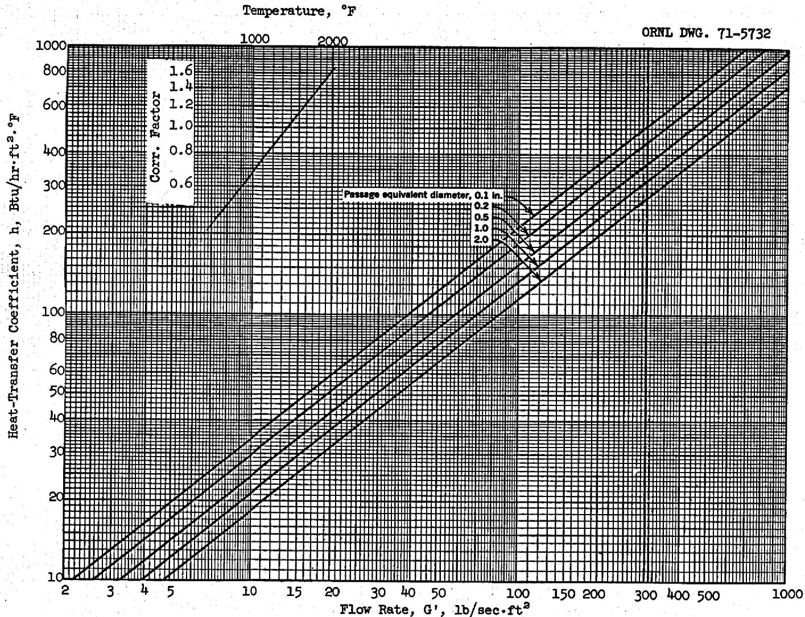  
Fig. 10. Heat-Transfer Coefficients for $\mathrm{NaBF}_4$ at $1350^{\circ}\mathrm{F}$ Under Turbulent Flow Conditions. (Values for physical properties used in June 1968: $c_p = 0.37$ , Btu/1b·°F, $\mu = 15$ , lb/hr·ft, k = 0.232 Btu/hr·ft·°F, density = 131 lb/ft³.)

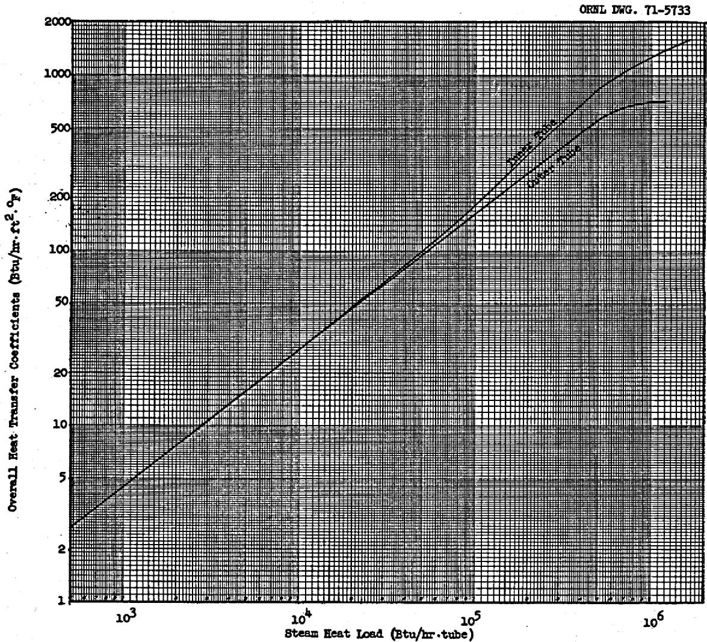  
Fig. 11. Effects of Heat Load on the Overall Heat Transfer Coefficients for the Inner and Outer Tube Walls for an Outer Tube of 0.66 in. OD and 0.50 in. ID, an Inner Tube of 0.25 in. OD and 0.20 in. ID, a Molten Salt Mass Flow Rate of 2500 lb/sec.ft², and a Tube Wall Thermal Conductivity of 147 Btu/hr.ft. "F. The molten salt heat transfer coefficients were obtained from Fig. 10 and those for steam from Fig. 12 or Fig. E5.7, p. 320 of Ref. 8.

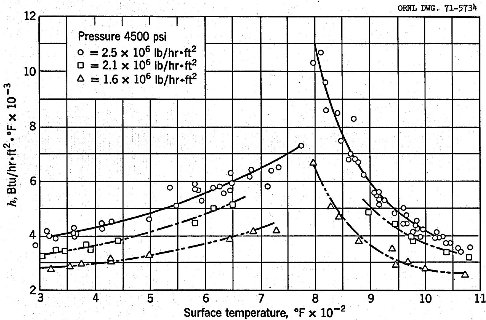  
Fig. 12. Heat-Transfer Coefficients for Several Mass-Flow Rates of Water in a Uniformly Heated Once-Through Boiler Tube Operating at 4500 psia (Dickinson and Welch, Ref. 16)

# Temperature Differences and Heat Fluxes

The appropriate curves of Figs. 5, 6, and 7 were used as the basis for estimating the effective local temperature differences in any given increment of tube length. From these temperature differences, together with the heat transfer coefficients and the amount of heat added in the increment, it is possible to calculate the length of the first increment of outer tube length and the amount of heat transmitted across the inner tube wall. These exchanges of heat in turn make it possible to calculate the temperature in each fluid stream at the beginning of the next increment of the length. Note that the average local temperature differences for each increment as used in the calculations were estimated, and generally differed a little from the values indicated by the completed calculations for the increment. The difference was usually sufficiently small so that iteration was not necessary. To facilitate the use of Figs. 5, 6, or 7, the summations of the amounts of heat added or subtracted to each fluid stream up to and including each increment were also tabulated together with the fractions of the total heat added to the water-side stream.

# Pressure Drop

The pressure drop across each increment of tube length was also calculated in Table 4. To facilitate these calculations, Fig. 13 was prepared to show the density of the fluid on the steam side as a function of its temperature. For the subcritical pressure boiling conditions the density in any given increment of boiler tube length was estimated by considering the fractional change in density in the boiling zone as equal to the fraction of heat added to the steam up to that point in the boiling region. No attempt was made to allow for the effects of the two-phase flow friction factors, but it is believed that the overall effects of these would amount to only about a factor of two in the boiler region, and, of course, there would be no effect on the pressure drop in the superheater region.

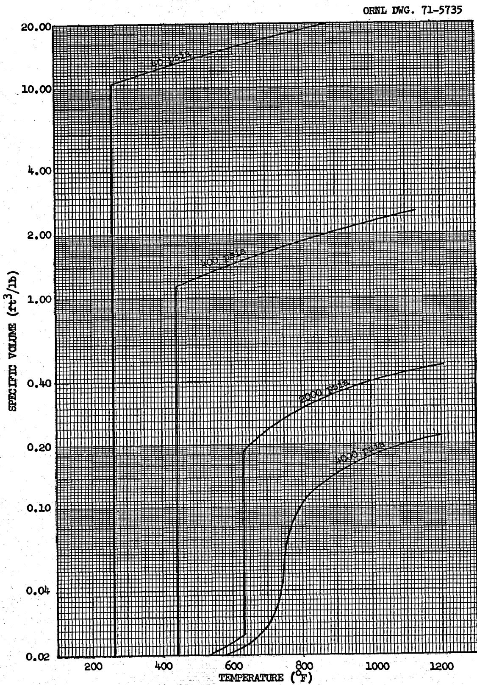  
Fig.13. Specific Volume as a Function of Temperature for a Typical t of Boiler Discharge Pressures and Temperatures.

# Estimated Performance Characteristics

The prime objective of this study was to investigate the effects of both the design heat load and the design steam temperature and pressure conditions on the boiler tube length. Once these effects are established for a single tube it is easy to estimate the effects of the choice of the full-power steam pressure and temperature on the size and cost of a full-scale steam generator. Further, once these effects are established for a single tube, the effects of the mode of control on the part load temperature and pressure distribution can be inferred readily, and inferences can be drawn with respect to the startup and part load control characteristics and possible boiling flow stability problems.

# Effects of Design Heat Load on Tube Length

A study of the fine structure of the heat transfer relations indicates that, if a prime criterion is considered to be completion of boiling prior to exit from the inner tube, the boiler tube length is determined by the maximum load conditions anticipated. That is, the tube length required for boiling to dryness will be reduced as the design heat load is reduced. This effect is shown in Fig. 14 for the two control modes shown in Figs. 5 and 7, that is, a constant steam generator discharge pressure irrespective of heat load and a steam generator discharge pressure directly proportional to the load. In all cases the calculations were carried out to determine the tube length required to meet that particular design condition.

# Effects of Design Heat Load on Temperature Distribution

A more detailed insight into the effects of design heat load on a reentry tube boiler is given by Fig. 15 which shows the calculated temperature distribution in the boiler as a function of distance from the bottom, and indicates the length of tube required to evaporate the water to dryness in the inner tube for a wide range of steam conditions. In this instance the boiler exit pressure was proportional to the load. Note how little tube length will be required for the $1\%$ load condition. Note, too,

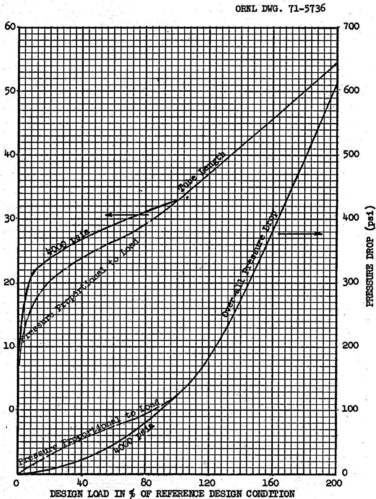  
TUBE LENGTH (ft)   
Fig. 14. Effects of Load on the Tube Length Required to Handle Loads Less the Design Heat Load of 650,000 Btu/hr per Tube. The associated steam-side pressure drop is also plotted. The steam generator discharge pressure for the lower design loads was taken as a constant 4000 psia for one set of curves, and as directly proportional to the load for the other set.

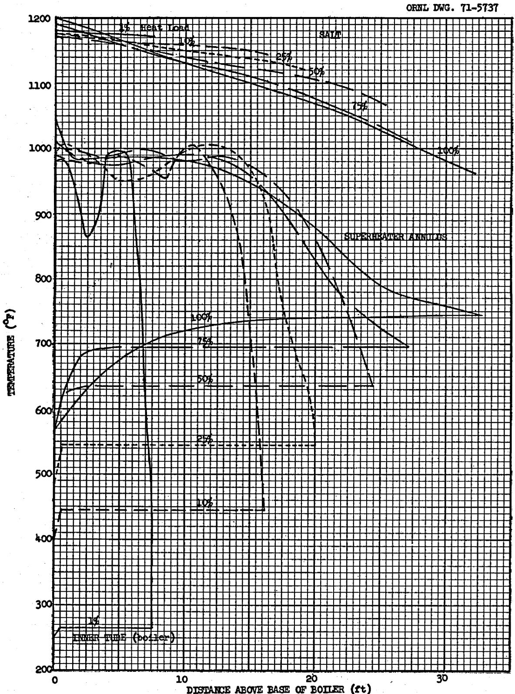  
Fig. 15. Effects of $100\%$ , $75\%$ , $50\%$ , $25\%$ , $10\%$ and $1\%$ Heat Load on the Axial Temperature Distribution for Operation With the Steam Pressure Directly Proportional to the Heat Load.

that the curves for the tube length and pressure drop in Fig. 14 rise steeply between the 100 and $200\%$ load conditions, thus implicitly justifying the choice of flow rate for the nominal $100\%$ load condition. Actually, the choice of steam flow rate for the $100\%$ load condition in this case was arrived at by a series of preliminary calculations with just this point in mind.

The effects on the temperature distribution of the design heat load per tube for operation with the system pressure held constant irrespective of the load are shown in Fig.16. Comparison of Figs. 15 and 16 indicates that the design steam pressure has only a mild effect on the required tube length at a given heat load, in spite of the fact that the reduced pressure greatly depresses the temperature in the boiling region.

# Effects of Part Load Operation

If a boiler tube length for, say, the $100\%$ reference design load condition of Fig. 15 were chosen as the basis for a design, it is evident that at part load the steam would be superheated to a temperature higher than that indicated for the particular cases shown in Fig. 15 because these were calculated on the basis that the inner tube would be terminated at the point at which boiling was completed. The superheating effects would be particularly large at low steam flow rates where the steam temperature in the annulus would run close to the local molten salt temperature through the upper portion of the tube until it dropped when chilled by heat extraction for boiling the water rising in the inner tube. This effect is shown in Fig. 17. The calculations were carried out by recognizing that virtually all of the heat transferred from the salt to the superheated steam in any given increment would flow directly into the boiling water in the inner tube. Thus, as a first approximation, it was assumed that $\mathrm{U}_{1}\mathrm{A}_{1}\Delta t_{1} = \mathrm{U}_{2}\mathrm{A}_{2}\Delta t_{2}$ , which then defined $t_2$ and $t_3$ . A check showed that this does in fact give a good approximation and no iteration was needed in most cases. The reason for this is that the enthalpy change in the outer annulus at the $10\%$ load condition is only about $5\%$ of the enthalpy rise in the inner tube.

It should be noted that to get good convergence the detailed calculational technique of Table A was used for the cases of Fig. 17. This

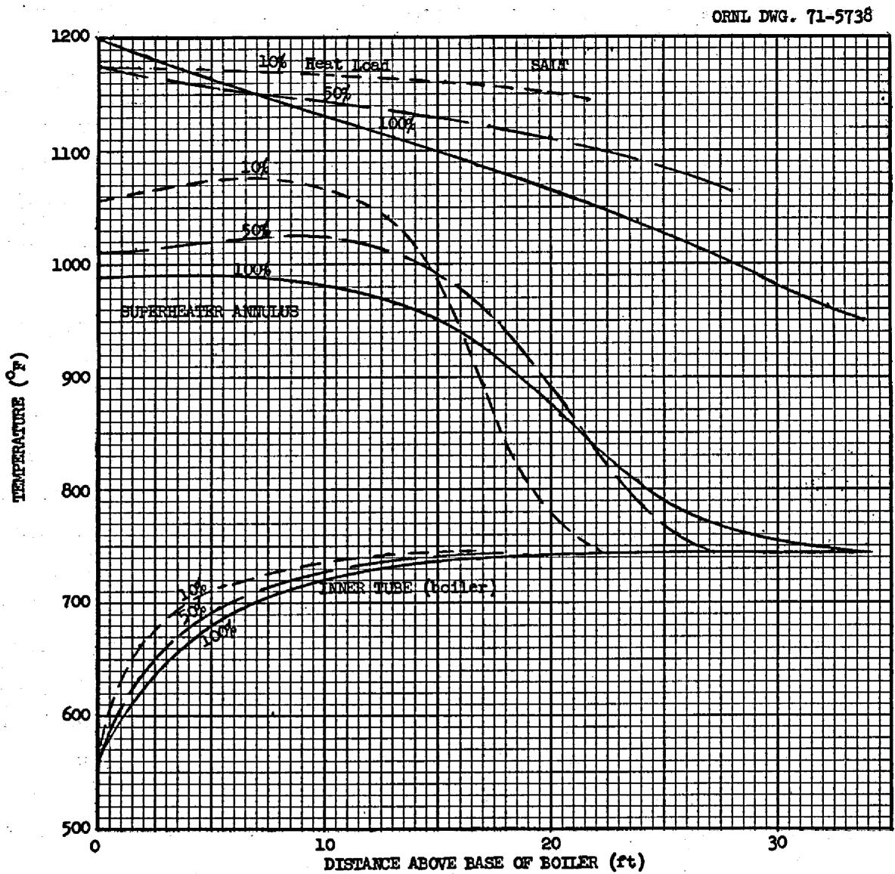  
Fig. 16. Effects of Design Heat Load on the Axial Temperature Distribution for Operation With a Constant Steam Discharge Pressure of 4000 psia.

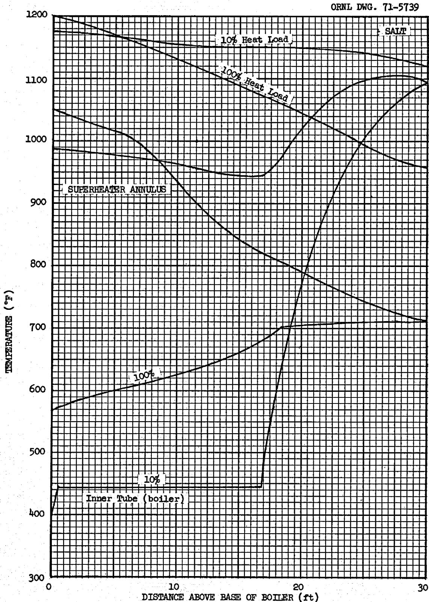  
Fig. 17. Comparison of the Axial Temperature Distributions for Operation at $100\%$ and $10\%$ of full power with the Steam Pressure Directly Proportional to the Heat Load and the Same Tube Length in Both Cases.

represented an improvement over that used for Figs. 14 through 16 and is the reason for a small difference in tube length that may be noted between Figs. 15 and 17. The heat transfer calculations for Figs. 14 through 16 could be repeated to give better approximations. This was not done for this preliminary study because it was felt that the effect would be small, and, in any event, unimportant so long as the tube length required for evaporation to dryness in the inner tube is less at part load than at full load.

# Pressure Drop and Pressure Distribution

Figure 18 gives a set of curves similar to those for Fig. 16 to show the pressure rather than the temperature distribution through the boiler for the load conditions of Fig. 5, i.e., a varying heat load with a constant boiler pressure. Note that the much smaller flow passage area in the inner tube gives a much higher mass flow rate than in the annulus for the superheated steam, and this offsets the effect of the higher fluid density in the inner tube to such an extent that the overall pressure drop through the inner tube is substantially greater than that through the outer annulus.

This effect is desirable from the standpoint of boiling flow stability. Note also that the pressure drop at low loads becomes very small - too small to contribute to boiling flow stability. Under these conditions the principal factors contributing to boiling flow stability would be the static head of the liquid column in the inner tube and capillary effects, which would be substantial inside the small diameter inner tube. The latter are believed to represent a little recognized advantage of small diameter boiler tubes.

Figure 19 presents a set of curves to show the effects on the pressure distribution of varying the design heat load with the system pressure directly proportional to the heat load instead of constant as for Fig. 18. It is interesting to note that the pressure drop through the boiler falls off much more rapidly with a decrease in load if the system steam pressure is held constant than if the steam pressure is made directly proportional to the load. Thus there should be less tendency toward difficulties with

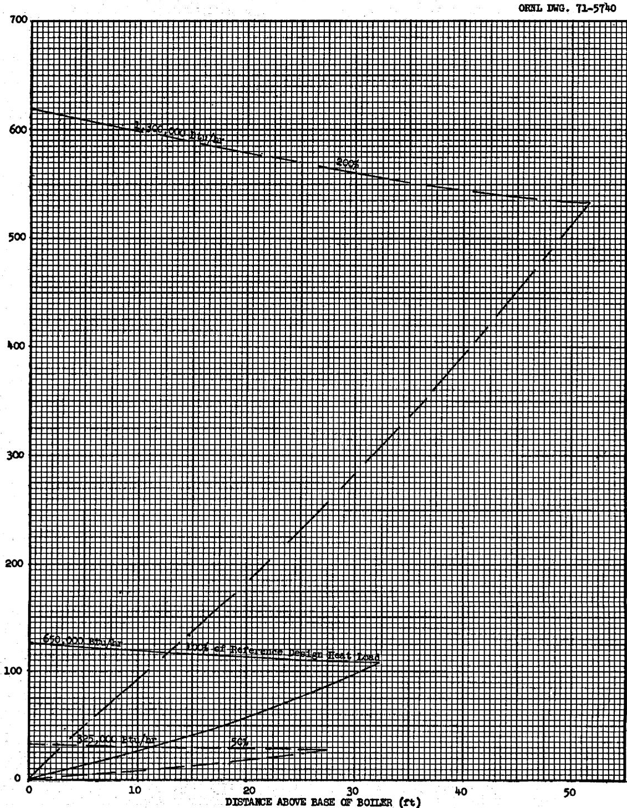  
PRESSURE DROP FROM BOILER TUBE INLET (psi)   
Fig. 18. Effects of Design Heat Load on the Axial Pressure Distribution for Operation with a Constant Steam Discharge Pressure of 4000 psia.

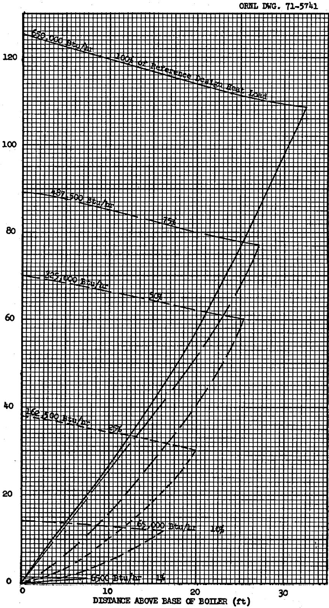  
PRESSURE DROP FROM BOILER TUBE INLET (psi)   
Fig. 19. Effects of Design Heat Load on the Axial Pressure Distribution for Operation with the Steam Pressure Directly Proportional to the Heat Load.

boiling flow instabilities under light load conditions if the system is designed so that the boiler discharge pressure varies linearly with the power output.

# Effects of the Fraction of Heat Added in the Inner Tube

Perhaps the most important arbitrary assumption made in order to provide a starting point for the iterative calculations was the fraction of the heat added in the inner tube. A series of calculations was carried out to investigate this effect for the load condition found to be most sensitive on this score, i.e., $10\%$ of the reference design load. The results of these calculations are plotted in Fig. 20. These curves indicate that the results are relatively insensitive to the initial assumption for reasonable values of $Q_{3} / Q_{1}$ , i.e., $Q_{3} / Q_{1}$ less than $80\%$ . Thus terminating the center tube when boiling is completed gives a well-proportioned design.

# Effects of Size of Heat Increment Used

Initially the calculations were carried out using increments in the amount of heat transferred equal to $20\%$ of the total for the tube. These coarse increments led to quite serious convergence problems, hence the size of the increment was reduced to $10\%$ of the total heat load. This gave good convergence except at loads of $10\%$ or less where the temperature of the superheated steam vascillated with a period double the increment used for the calculation in the manner shown in Fig. 21. This effect was largely eliminated by reducing the increment of heat transferred to $5\%$ instead of $10\%$ . Figure 21 shows that doubling the number of calculational increments not only reduced the amplitude of the oscillation but it also reduced the period of oscillations. This further confirms the belief that the oscillation is an artifact of the calculational procedure.

# Turbine Control Considerations

As will be shown later, the steam generator design proposed here inherently gives a nearly constant superheater steam outlet temperature

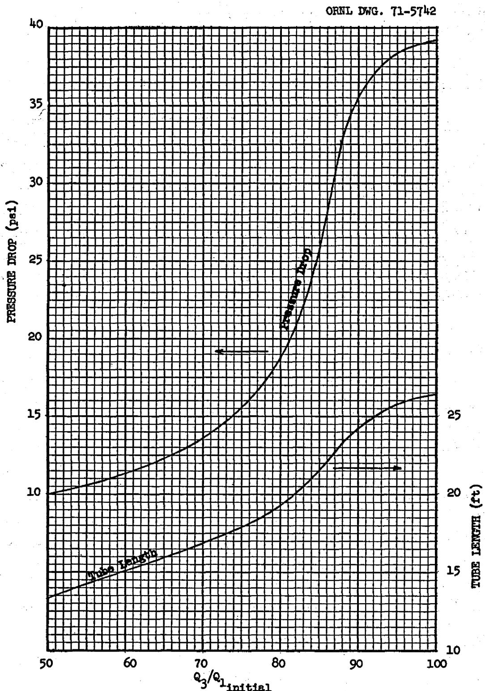  
Fig. 20. Effects of Initial Choice of Fraction of Heat Added to Steam in Inner Tube on the Tube Length Required and the Associated Pressure Drop.

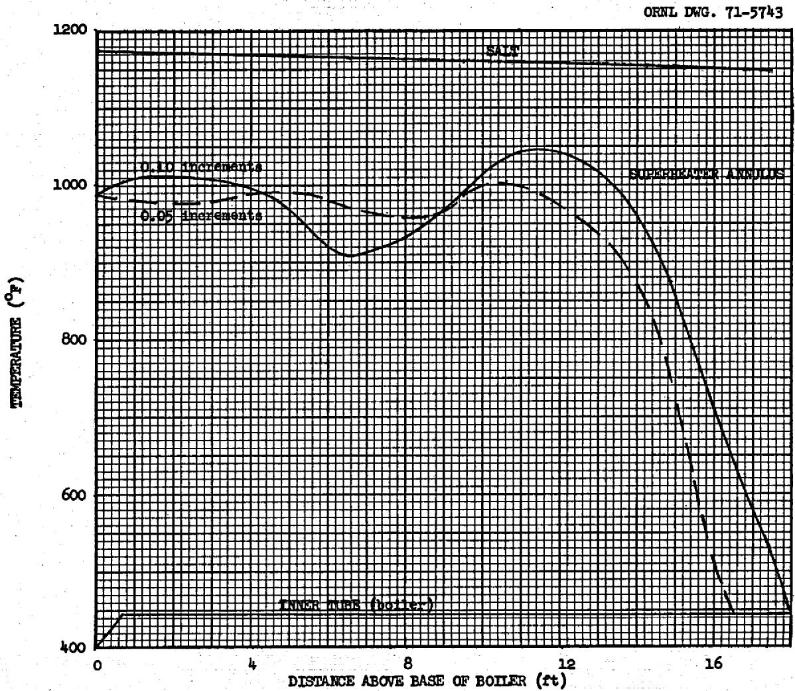  
Fig. 21. Effects of Size of Increment in the Stepwise Calculation on the Amplitude and Frequency of the Apparent Oscillation Encountered at a Heat Load $10\%$ of the Reference Design Condition With a Steam Pressure of 4000 psia.

irrespective of load. This, coupled with the very small water inventory, makes a method of power plant control implicit in Fig. 7 look attractive. The inherent characteristics make possible simple and reliable control equipment and instrumentation, and the plant response characteristics appear to be much better than for conventional fossil fuel plants. In view of its promising characteristics but highly unorthodox nature, R. B. Briggs urged the writer to discuss this control approach with turbine design engineers. Talks with several different engineers at both Westinghouse and General Electric in each case seemed to lead them to conclude tentatively that there is no apparent reason why it shouldn't work, and they suggested that an evaluation of permissible rates of change of load be made using a typical chart supplied to operators of power plants. A chart of this type from a turbine operators manual prepared by Westinghouse17 is shown in Fig. 22.

# Limitations on Rates of Change in Load

It should be mentioned that a major limitation on the operation of a large steam power plant is the rate at which the load can be changed. One set of limitations in coal-fired plants is associated with the furnace and boiler; these not only have an enormous thermal inertia but the boiler performance is sensitive to changes in temperature distribution in the furnace as a consequence of changes in the flame geometry with changes in load. A second and usually more stringent set of limitations is associated with the turbine. The close running clearances between the rotor blade tips and the casing make it imperative that these two components change temperature together. However, the temperature of the thin rotor blades operating in the high velocity steam follows the steam temperature with virtually no phase lag, but the thick-walled casing does not. Further, there are major circumferential asymmetries in the casing, partly because it is split horizontally through the centerline and the upper and lower halves are joined by a heavy bolting flange, and partly because the steam inlet and outlet passages enter the casing from the bottom side. Thus, to avoid catastrophic interference between the rotor and the casing as a consequence of differential expansion between the rotor and the casing or

because of distortion in the casing, it is generally necessary to limit the rate of change of the steam temperature to a low value. Obviously, it would be highly advantageous to the electric power plant system operator if he could change the load on a unit rapidly. Thus it is interesting to use Fig. 22 to evaluate the time required to change load in a plant having the characteristics of Fig. 7.

Startup and Rates of Change of Load with Proposed System

Considering first the startup conditions, it is helpful to quote from Ref. 17, p. 8, the steam pressure and temperature conditions to be established prior to starting the turbine-generator unit:

For drum type boilers, establish about $25\%$ of rated pressure and at least $100^{\circ}\mathrm{F}$ superheat, but not more than $800^{\circ}\mathrm{F}$ total temperature, at the turbine throttle valves.

For once-through (drumless) boilers, a reduced pressure start is recommended. This applies to both "cold" and "hot" starting of turbine units. For "cold" starts, the boiler should be stabilized before opening the throttle valves and the inlet temperature held to $800^{\circ}\mathrm{F}$ maximum.

Thus the turbine-generator should be started with a low steam pressure at the turbine throttle valve if one is used. If a throttle valve is not employed, then the steam pressure delivered by the steam generator must emphatically be at a low value. From the standpoint of the steam pressure, it appears from Fig. 7 that the control scheme proposed should be satisfactory. However, the steam temperature will be too high, and hence a desuperheater would be required to hold the steam temperature to $800^{\circ}\mathrm{F}$ at the turbine. Such units are commonly used in conventional coal-fired plants.

Once the turbine has been brought to equilibrium at a load of perhaps $10\%$ at a pressure of 400 psi (see Fig. 7), the time required to increase the steam temperature up to $1000^{\circ}\mathrm{F}$ (i.e., close to the normal operating temperature of about $1050^{\circ}\mathrm{F}$ ) can be estimated from Fig. 22 to be $40\mathrm{min}$ , a substantial period, but one consistent with conventional practice. Once the system is up to operating temperature, however, changes in load can be made relatively quickly. If one wishes to go from the $10\%$ load condition of Fig. 7 to the $50\%$ load condition, this will entail increasing the

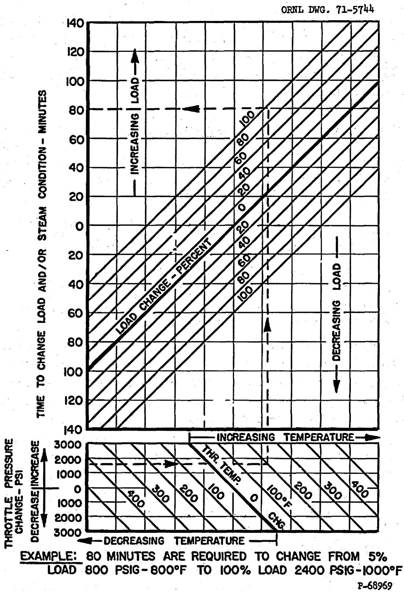  
Fig 22. Recommended Time for Changing Load and/or Steam Conditions. (Courtesy Westinghouse Electric Corp.)

pressure by 1600 psi but the temperature by only about $30^{\circ}\mathrm{F}$ . According to Fig. 22 the turbine could tolerate making this change in only 11 min. Similarly, if the turbine were operating at full load, the load could be cut in half in as little as 20 min., i.e., substantially faster than the common rule of $2\%/\min$ . Further, if the steam generator can be designed so that the superheater outlet temperature increases somewhat with a reduction in load, even faster rates of change can be tolerated. For example, if the full load steam pressure and temperature were 4000 psi and $1000^{\circ}\mathrm{F}$ and the $50\%$ load conditions were 2000 psi and $1050^{\circ}\mathrm{F}$ , Fig. 22 indicates that the load change could be made in about 1 min. As will be shown later, it happens that the reentry tube steam generator can be proportioned to give this characteristic and hence would make possible unusually rapid changes in load.

# Possibility of Eliminating the Throttle Valve

Steam throttle valves are a major source of operating trouble in steam power plants. The valves are relatively large, must operate at about $1000^{\circ}\mathrm{F}$ , they are subject to heavy loads by the high steam pressure drop across them, and lubrication conditions are highly unfavorable. Thus it is not surprising to find that throttle valve sticking is one of the principal causes of forced outages in steam power plants.

Throttle valves are used to make it possible to change the steam flow rate much more rapidly than can be accomplished by controlling the boiler and furnace in conventional coal-fired plants. The most critical consideration is to avoid a serious overspeed of the turbine in the event of an abrupt and complete loss of the electrical load. The inventory of superheated water in the reentry tube boiler is vastly less than in a conventional boiler; it is estimated to be only about 3 in.³/tube at full load, and about 1 in.³ at 10% load on the steam generator. Note that as a consequence of mechanical, electrical, and fluid friction losses, etc. in the turbine-generator unit, in the event of a complete loss of electrical load the steam flow required to keep the turbine up to speed would be about 10% of the full power output of the steam generator. Thus an abrupt loss in electrical load would entail a reduction in the superheated water inventory

in a reentry tube boiler by about 2 in.³/tube, or 4 in.³/Mw(t). This full load steam flow rate is about 3 lb/sec for 4 Mw(t), whereas 4 in.³ of superheated water is only about 0.1 lb. Thus the full load steam flow rate would consume the surplus water inventory in only about 1/30 sec if the feedwater supply were abruptly cut to the 10% load level. The inertia of the massive rotor in the turbine-generator unit should be sufficient to keep the overshoot in rotor speed to a low value. Inasmuch as the most difficult condition to meet is that for an abrupt loss in electrical load, it appears that control of the power plant could be accomplished by controlling the feedwater flow rate with one or more relatively small valves operating at about $650^{\circ}\mathrm{F}$ rather than the large, hot steam throttle valves normally employed. This should give a greatly increased reliability.

It is of interest to note that this approach to the control of a Rankine cycle plant has been analyzed and investigated experimentally and is a very similar but much smaller system designed for a nuclear electric space power plant.[18] The analyses and tests gave highly encouraging results for a system in which the thermal inertia of the boiler was small as in the system proposed here. Further, the variable pressure approach is coming into use in conventional plants.[19]

# Proposed Design for a Molten Salt Reactor Plant

A conceptual design for a molten salt reactor with its intermediate heat exchangers and fuel pumps integrated into a common pressure vessel is presented in a companion report.[20] The net electrical output in that study is $1000\mathrm{Mw(e)}$ and the fuel and inert salt temperatures are those given in Fig. 4a. Plant layout studies favored the use of six steam generators each of which would be directly coupled to one of six fuel-to- $\mathrm{NaBF}_4$ heat exchangers. The steam generators required for this plant provide a good illustrative example for use here to show how the single tube analytical work presented earlier in the report can be applied to the design of a full-scale steam generator as well as the proportions to be expected in a finished unit.

# Reheaters

Most modern steam plants employ reheaters, in part because there is a direct increase in overall cycle efficiency of about $5\%$ , and in part because they give a further indirect increase in cycle efficiency of a few percent by eliminating the moisture churning losses in the lower stages of the turbine. In addition, reheaters can be designed to eliminate the possibility of turbine bucket erosion in the lower turbine stages by reducing the moisture content in that region to almost nothing. In conventional coal-fired steam plants the length of piping required to connect the boiler to the reheater and the relatively large amount of tube surface area required because the reheater must be located in a relatively low-temperature zone to avoid burnout difficulties have combined to make the cost of including provisions for reheat rather high for conventional coal-fired plants. However, it is believed that in a molten salt reactor plant the turbine can be located much closer to the steam generator and, because there is no danger of tube burnout from excessive local temperatures, a much higher average heat flux through the reheater tube walls can be maintained so that the tube surface area requirements are quite modest. Further, the design of the tube matrix for the reheater is quite straightforward because there are no flow stability or two-phase flow problems involved. Thus a reheat cycle appeared highly desirable for this design study, and the two reheat stages specified for Eddystone Unit No. 2 have been included in the proposed steam generator for a molten salt reactor.

# General Description

The dominant consideration in choosing the steam generator overall geometry was to make use of the static head in the liquid column in the boiling region to help provide for flow stability in the boiler. This meant that the boiler tube should be vertical with the feedwater entering at the bottom. While it would have been desirable from the standpoint of thermal convection in the molten salt system to admit the molten salt at the top and have it leave at the bottom, a brief glance at the temperature distribution diagrams shown in Figs. 4, 5, 6, and 7 is sufficient to show

that the salt should move counterflow relative to the superheated steam in the outer annulus. Figure 23 presents a somewhat similar diagram including the two reheater stages and shows that they, too, should be in counterflow.

It was thought at first that it would be desirable to make use of separate casings for the boiler and the two reheaters, but the additional piping, manifolding, and associated temperature distribution problems led to the conclusion that it would be best to mount the reheater tubes in an annulus surrounding the boiler tubes in the configuration shown schematically in Fig. 24.

# Heading Problems

As mentioned earlier the headers envisioned for the boiler region would entail the thermal sleeve arrangement shown in Fig. 3. This avoids the use of a high pressure header sheet in contact with the molten salt; rather, the tubes would be manifolded below the pressure vessel containing the molten salt. The same arrangement could be employed for the reheater tubes. In either case any tube could be blocked off readily outside the steam generator casing in the event of a leak or other malfunction. Inss-much as the reheater tubes are free of the complexities associated with the inner tube used for the boiler, it would also be possible to assemble them in bundles of perhaps 12 tubes with the tube bundle headers inside the casing of the steam generator to minimize the number of penetrations through the shell. This looks preferable if a unit has more than 100 tubes.

Provision of adequate space for header sheets is always difficult when designing heat exchangers with closely spaced tubes. Preliminary layout studies indicate that this is difficult but might be done with the configuration of Fig. 25 without severely distorting the outer casing or having a large volume of inert salt that serves no useful function but increases both the capital investment and the time required for the system to respond to control actions. The outlet spigots from bundles of 16 tubes could be passed through a header sheet in the bottom head of the vessel with a thermal sleeve to avoid large local stresses. This would give an adequate ligament thickness (about 0.5 in.) in the header sheet after allowing space for the thermal sleeves. This will take up most of

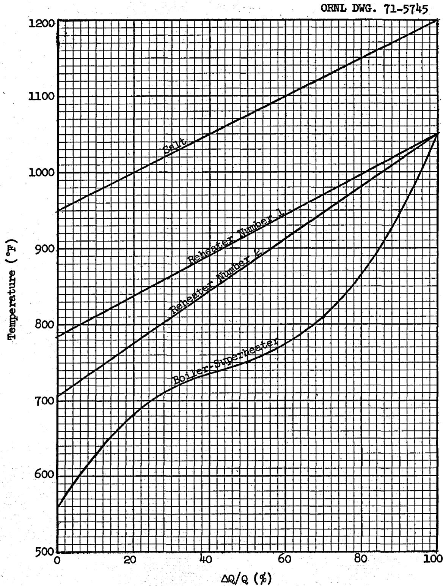  
Fig. 23. Temperature Distribution in the Boiler and Reheater as a Function of the Fraction of the Heat Removed from the Molten Salt Under Full Load Conditions.

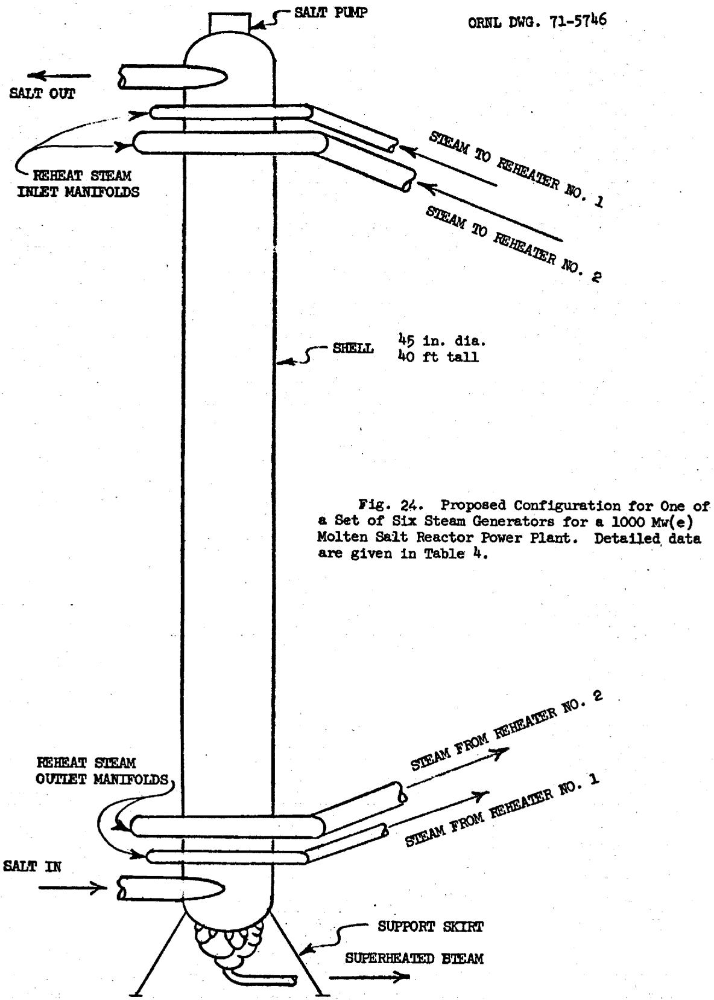

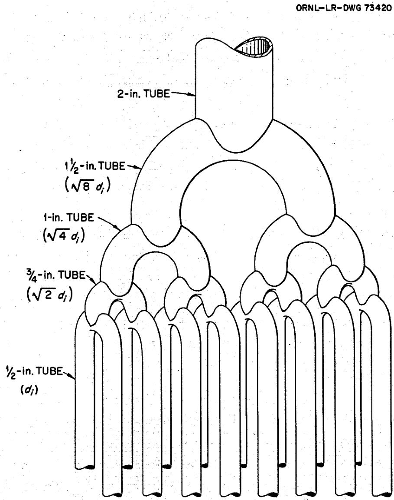  
Fig. 25. Schematic Diagram Showing the Bifurcated Tube Header Arrangement Used as a Basis for the Proposed Tube Bundle and Header Sheet Configuration. The nominal tube id $(\mathbf{d}_{\mathbf{i}})$ is indicated for each step in the manifold to show that the flow velocity is kept constant.

the area of the elliposidal head in the region where its radius of curvature is large. The space just outside this region but inside the shell will serve as the inlet plenum for the molten salt which would enter tangentially through two pipes. The 96 spigots from the tube bundles could be manifolded outside the header sheet using a bifurcated tube arrangement similar to that of Fig. 25. Three steam pipes could be coupled to each set of 32 tube bundles. The feedwater could be supplied through two penetrations in the largest bifurcated coupling in each of these three sets.

The layout envisions installation of small header drums for the reheater tube bundles in the annulus just above the salt inlet plenum. The annular baffle between the reheater region and the boiler-superheater region would extend downward no farther than the header drums for the reheater tube bundles.

The layout problems would be eased by reducing the number of boiler tubes in each steam generator unit and employing a large number of units. The ratio of tube matrix cross-sectional area to header sheet area could be increased in this way and manifolding problems of the tubes for the feedwater and superheated steam could be eased.

# Differential Thermal Expansion

There would be no problem associated with differential thermal expansion between the boiler tubes and the steam generator casing because the top ends of the tubes would be free to float axially. However, the reheater tubes will tend to run at a somewhat different temperature than the casing and hence some means for providing flexibility should be employed. Probably the easiest way to accomplish this will be to install the tubes on a spiral having a steep pitch, i.e., perhaps a total twist of 60 deg in the length of the regenerator region. This could be chosen to provide sufficient flexibility in the tubes so that the differential thermal expansion between the tubes and the shell would be accommodated elastically. The pitch would be steep enough so that the lateral loads on the tubes would probably not be large enough to make it necessary to employ additional structure to resist the forces associated with the small amount of crossflow that will occur.

# Geometric and Performance Data

The calculations and principal geometric and performance data for the complete steam generator are summarized in Table 5. Recent revisions in the physical properties of $\mathrm{NaBF}_4$ , particularly in the viscosity, made it desirable to change the salt mass flow rate through the steam generator from the value of $2500~\mathrm{lb / sec}\cdot \mathrm{ft}^2$ used in the calculations of Table 4 and those for Figs. 11 and 14 through 20. This, coupled with the changes in physical properties, led to a change in the tube length required.

The heat load for the boiler-superheater and each of the reheaters was used to calculate the number of tubes for each matrix, with the molten salt streams for each section treated as flowing independently of each other with no lateral heat transfer. Note in the first portion of Table 5 that steam bleed-off in the turbine through seals and for feed heating reduces the steam flow rate to the reheaters so that it is substantially less than the steam flow rate to the boiler.

# Cost Estimate

A rough estimate of the cost of the steam generator of Table 5 can be obtained by summing the estimated costs for the three major items, i.e., the shell, the tubing, and fabrication of the tube-to-header joints. This has been done and the results are summarized in Table 6. Note that the overall cost amounts to about $7.05/kw(e), which compares with around $20/kw(e) for the comparable portion of a conventional coal-fired boiler. (These cost estimates were made on the basis of unit costs as of 1968.) Thus it appears that the combined effects of a uniformly high heat flux, small diameter tubes with relatively thin walls, and elimination of the need for pressure vessels subject to high pressures much more than offsets the high cost per pound of Hastelloy N.

The proportions given in Table 5 were not iterated to make both the tube length and the molten salt pressure drop for the boiler-superheater and the two reheaters the same. This could and should be done, but the combined effects of uncertainties in the calculated heat transfer coefficients and friction factors are large enough to make this an unwarranted refinement at this stage.

Table 5. Summary of Design Calculations for Steam Generator Units for a 1000 Mw(e) Molten Salt Reactor Plant   

<table><tr><td colspan="2">Steam System</td></tr><tr><td>Superheater outlet temperature, °F</td><td>1050</td></tr><tr><td>Superheater outlet pressure, psia</td><td>4000</td></tr><tr><td>Reheater No. 1 outlet temperature, °F</td><td>1050</td></tr><tr><td>Reheater No. 1 inlet temperature, °F</td><td>786</td></tr><tr><td>Reheater No. 1 outlet pressure, psia</td><td>1043</td></tr><tr><td>Reheater No. 2 outlet temperature, °F</td><td>1050</td></tr><tr><td>Reheater No. 2 inlet temperature, °F</td><td>705</td></tr><tr><td>Reheater No. 2 outlet pressure, psia</td><td>251</td></tr><tr><td>Generator output, Mw</td><td>1043</td></tr><tr><td>Auxiliary power requirements, Mw</td><td>66</td></tr><tr><td>Boiler feed pumps and boiler auxiliaries, Mw</td><td>50</td></tr><tr><td>Fuel pumps, Mw</td><td>5.4</td></tr><tr><td>NaBF4pumps, Mw</td><td>10</td></tr><tr><td>Miscellaneous, Mw</td><td>1</td></tr><tr><td>Net electrical output, Mw</td><td>977</td></tr><tr><td>Overall thermal efficiency, %</td><td>44.4</td></tr><tr><td>Fraction of heat load to boiler-superheater</td><td>0.775</td></tr><tr><td>Fraction of heat load to reheater No. 1</td><td>0.118</td></tr><tr><td>Fraction to heat load to reheater No. 2</td><td>0.107</td></tr><tr><td>Fraction of weight flow to boiler-superheater</td><td>1.000</td></tr><tr><td>Fraction of weight flow to reheater No. 1</td><td>0.84</td></tr><tr><td>Fraction of weight flow to reheater No. 2</td><td>0.68</td></tr><tr><td>Heat added to steam flow in boiler superheater, Btu/lb</td><td>886.0</td></tr><tr><td>Heat added to steam flow in reheater No. 1, Btu/lb</td><td>161.0</td></tr><tr><td>Heat added to steam flow in reheater No. 2, Btu/lb</td><td>180.2</td></tr><tr><td colspan="2">Inert Salt (NaBF4)</td></tr><tr><td>Entrance temperature, °F</td><td>950</td></tr><tr><td>Exit temperature, °F</td><td>1200</td></tr><tr><td>Entrance pressure, psi</td><td>180</td></tr><tr><td>Exit pressure, psi</td><td>51</td></tr><tr><td>Flow rate, lb/hr</td><td>13.92 × 10^6</td></tr><tr><td>Flow rate, lb/sec</td><td>3860</td></tr><tr><td>Flow rate, ft^3/sec</td><td>33.6</td></tr><tr><td colspan="2">NaBF4physical properties at 1075°F</td></tr><tr><td>Specific heat, Btu/lb</td><td>0.36</td></tr><tr><td>Thermal conductivity, Btu/hr.ft. °F</td><td>0.27</td></tr><tr><td>Viscosity, lb/hr.ft</td><td>3.4</td></tr><tr><td>Density, lb/ft^3</td><td>115</td></tr><tr><td>Melting point, °F</td><td>725</td></tr><tr><td colspan="2">Shell</td></tr><tr><td>Number of units</td><td>6</td></tr><tr><td>Shell diameter, in.</td><td>45</td></tr><tr><td>Shell overall height, ft</td><td>40</td></tr><tr><td>Shell wall thickness, in.</td><td>0.50</td></tr><tr><td colspan="2">Boiler</td></tr><tr><td>Boiler heat load, Btu/hr</td><td>9.73 × 108</td></tr><tr><td>Tube OD, in.</td><td>0.65</td></tr><tr><td>Tube ID, in.</td><td>0.50</td></tr><tr><td>Tube length, ft</td><td>35.0</td></tr><tr><td>Tube pitch (equilateral triangular), in.</td><td>0.775</td></tr><tr><td>Salt mass flow rate, lb/sec·ft2</td><td>1350</td></tr><tr><td>Dynamic head, psi</td><td>1.5</td></tr><tr><td>Reynolds number</td><td>60,000</td></tr><tr><td>Friction factor</td><td>0.025</td></tr><tr><td>Pressure drop, psi</td><td>45</td></tr><tr><td>Shell-side flow passage area/total cross-sectional area</td><td>0.366</td></tr><tr><td>Shell-side flow passage equivalent diameter, in.</td><td>0.465</td></tr><tr><td>Number of tubes per square inch, in.2</td><td>1.91</td></tr><tr><td>Number of tubes per unit</td><td>1493</td></tr><tr><td>Shell-side surface area, ft2</td><td>8900</td></tr><tr><td colspan="2">Reheater No. 1</td></tr><tr><td>Tube OD, in.</td><td>1.00</td></tr><tr><td>Tube ID, in.</td><td>0.80</td></tr><tr><td>Tube pitch (equilateral triangular), in.</td><td>1.035</td></tr><tr><td>Log mean temperature difference, °F</td><td>150</td></tr><tr><td>Heat load per steam generator, Btu/hr</td><td>1.478 × 108</td></tr><tr><td>Steam mass flow rate, lb/sec·ft2</td><td>200</td></tr><tr><td>Overall heat transfer coefficient, Btu/hr·ft2. °F</td><td>380</td></tr><tr><td>Surface area per steam generator, ft2</td><td>2390</td></tr><tr><td>Surface area, ft2/ft of tube</td><td>0.236</td></tr><tr><td>Number of tubes</td><td>365</td></tr><tr><td>Tube length, ft</td><td>33.6</td></tr><tr><td>Salt flow rate, ft3/sec</td><td>33.6</td></tr><tr><td>Salt mass flow rate, lb/sec·ft2</td><td>1350</td></tr><tr><td>Salt flow passage area, ft2</td><td>.338</td></tr><tr><td>Total cross-sectional area in tubes, ft2</td><td>1.275</td></tr><tr><td>Total cross-sectional area in tube matrix, ft2</td><td>2.328</td></tr><tr><td>Shell-side flow passage/total matrix cross-sectional area</td><td>.145</td></tr><tr><td>Shell-side flow passage equivalent diameter, in.</td><td>.18</td></tr><tr><td>Steam pressure drop, psi</td><td>20</td></tr><tr><td>Salt pressure drop, psi</td><td>84</td></tr><tr><td colspan="2">Reheater No. 2</td></tr><tr><td>Tube OD, in.</td><td>1.00</td></tr><tr><td>Tube ID, in.</td><td>0.90</td></tr><tr><td>Tube pitch (equilateral triangular), in.</td><td>1.01</td></tr><tr><td>Log mean temperature difference, °F</td><td>200</td></tr><tr><td>Heat load per steam generator, Btu/hr</td><td>1.34 × 108</td></tr><tr><td colspan="2">Reheater No. 2 (continued)</td></tr><tr><td>Steam mass flow rate, lb/hr·ft2</td><td>70</td></tr><tr><td>Overall heat transfer coefficient, Btu/hr·ft2.°F</td><td>215</td></tr><tr><td>Surface area per steam generator, ft2</td><td>3300</td></tr><tr><td>Number of tubes</td><td>632</td></tr><tr><td>Tube length, ft</td><td>22</td></tr><tr><td>Salt flow rate, ft3/sec</td><td>3.6</td></tr><tr><td>Salt mass flow rate, lb/sec·ft2</td><td>1000</td></tr><tr><td>Salt flow passage area, ft2</td><td>0.414</td></tr><tr><td>Total cross-sectional area in tubes, ft2</td><td>3.63</td></tr><tr><td>Total cross-sectional area in tube matrix, ft2</td><td>4.04</td></tr><tr><td>Shell-side flow passage/total matrix cross-sectional area</td><td>0.10</td></tr><tr><td>Shell-side flow passage equivalent diameter, in.</td><td>0.11</td></tr><tr><td>Steam pressure drop, psi</td><td>8</td></tr></table>

Table 6. Rough Cost Estimate for the Steam Generator of Table 5   

<table><tr><td>Item</td><td>Amount</td><td>Unit Cost</td><td>Cost</td></tr><tr><td>Shell (fabricated)</td><td>10,000 lb</td><td>$8/lb</td><td>$ 80,000</td></tr><tr><td>Baffle</td><td>2,000 lb</td><td>$8/lb</td><td>16,000</td></tr><tr><td rowspan="2">Boiler tubes</td><td>60,000 ft, 0.25 in. diam</td><td>$3/ft</td><td>180,000</td></tr><tr><td>60,000 ft, 0.65 in. diam</td><td>$7/ft</td><td>420,000</td></tr><tr><td>Reheater tubes</td><td>25,000 ft, 1.0 in. diam</td><td>$8/ft</td><td>200,000</td></tr><tr><td>Material Cost</td><td></td><td></td><td>$ 896,000</td></tr><tr><td>Tube installation (including welding of tube-to-header joints and inspection</td><td>2490 tubes</td><td>$110/tube</td><td>273,900</td></tr><tr><td>Total Shop Cost</td><td></td><td></td><td>$1,169,900</td></tr></table>

# Conclusions

The proposed reentry tube boiler appears to offer a long-sought solution that satisfies all of the major requirements for the steam generators of liquid metal and molten salt reactor power plants. It appears to be well suited to the generation of steam at any desired pressure and temperature condition with good stability and control characteristics throughout the range from zero to full power. It lends itself to designs in which the thermal stresses throughout the unit can be kept within the elastic range under all operating conditions. The heat flux is uniformly high so that the inventory of structural metal or liquid metal and molten salt is near minimal, the number of tube-to-header joints is relatively small, there is no high pressure header sheet in contact with the high-temperature liquid, there appears to be no unusual fabrication problems, and the capital cost appears to be competitive. The only apparent disadvantage is that the concept is novel and has not been tested.

The performance characteristics of reentry tube boilers presented in this report represent rough preliminary approximations based on a set of simplifying assumptions. Test experience with a unit employing at least three full-scale tubes would provide a firm foundation for the design of a large unit.

# Recommendations

A test unit consisting of one or a few tubes should be built and tested. In the test program particular attention should be given to the investigation of possible boiling flow instabilities under startup, near-zero power, and part load operating conditions to see to what extent orificing may be required at the feedwater inlet. The test program should also include an investigation of the overall stability and control characteristics under steam conditions ranging from 100 psia to 4000 psia.

Most of the problems and uncertainties associated with the reentry tube boiler could be investigated with a relatively simple single tube unit fitted with clamshell heaters. Such a unit could be built and tested expeditiously and inexpensively, and would lend itself nicely to a detailed

investigation of the temperature distribution along the tube under a wide range of conditions as well as facilitate modifications such as the insertion of inlet orifices.

An electrically heated single tube test will probably be very much less convincing to most people than a long endurance test of a unit having 3 to 19 tubes heated by a molten salt. Such a test unit should give a good demonstration of the freedom of the system from corrosion, mass transfer, thermal stress, and boiling flow stability problems.

# References

1. A. P. Fraas, Flash Boilers for Fluoride Fuel Reactors, USAEC Report ORNI-CF-55-6-79, Oak Ridge National Laboratory, June 16, 1955.   
2. P. R. Kasten et al., Design Studies of 1000-Mw(e) Molten-Salt Breeder Reactors, USAEC Report ORNL-3996, Oak Ridge National Laboratory, August 1966, pp. 77-87.   
3. D. Scott and A. G. Grindell, Components and Systems Development for Molten-Salt Breeder Reactors, USAEC Report ORNL-TM-1855, Oak Ridge National Laboratory, June 30, 1967, pp. 21-22.   
4. Oak Ridge National Laboratory, MSRP Quarterly Progress Report Jan. 31, 1959, ORNL-2684, p. 54.   
5. L. G. Alexander et al., Molten Salt Converter Reactor Design Study and Power Cost Estimates for a 1000 Mw(e) Station, USAEC Report ORNL-TM-1060, September 1965.   
6. B. W. Kinyon and G. D. Whitman, Steam Generator-Superheater for Molten Salt Power Reactor, ASME Publication 61-WA-228, Nov. 26-Dec. 1, 1961.   
7. R. S. Holcomb and M. E. Lackey, Performance Characteristics of a Short Reentry Tube Steam Generator at Low Steam Output, USAEC Report ORNL-TM-3236, Oak Ridge National Laboratory (in press).   
8. A. P. Fraas and M. N. Ozisik, Heat Exchanger Design, Wiley & Sons, Inc., New York, 1965.   
9. B. S. Shiralkar and P. Griffith, The Deterioration in Heat Transfer to Fluids at Supercritical Pressure and High Heat Fluxes, Rept. No. 70332-51, Dept. of Mechanical Engineering, Engineering Project Lab, Massachusetts Institute of Technology (Mar. 1, 1968).   
10. D. W. Lee and R. C. Spencer, Photomicrographic Studies of Fuel Sprays, NACA Technical Report 454, 1933.   
11. D. W. Lee, The Effect of Nozzle Design and Operating Conditions on the Atomization and Distribution of Fuel Sprays, NACA Technical Report 425, 1932.   
12. P. J. Birbara, J. E. Cowles and V. C. A. Vaughen, Flash Boiler Test II, Memo No. EPS-X-296, Massachusetts Institute of Technology, Engineering Practice School, Union Carbide Corp., Jan. 18, 1957.   
13. Oak Ridge National Laboratory, MSRP Semiann. Progr. Rept. Jan. 31, 1964, USAEC Report ORNL-3626, p. 24.

14. A. P. Fraas and M. N. Ozisik, Steam Generators for High-Temperature Gas-Cooled Reactors, USAEC Report ORNL-3208, Oak Ridge National Laboratory, April 8, 1963.   
15. W. R. Chambers, A. P. Fraas and W. N. Ozisik, A Potassium-Steam Binary Vapor Cycle for Nuclear Power Plants, USAEC Report ORNL-3584, Oak Ridge National Laboratory, May 1964.   
16. N. L. Dickinson and C. P. Welch, Heat Transfer to Supercritical Water, Trans. ASME, Vol 80, p. 746, 1958.   
17. Westinghouse Turbine Operating Manual I. L. 1250-3218A, 300-350 Mw(e), 300 psi Hydraulic Governing System, 1967.   
18. M. M. Yarosh and P. Gnadt, Use of a Cavitating Pump for Control of a Potassium Rankine Cycle System, paper presented at the Intersociety Energy Conversion Engineering Conference, Las Vegas, September 1970.   
19. R. J. Bender, U.S. Welcomes Variable-Pressure Concept, p. 56, Power, August 1970.   
20. A. P. Fraas, Conceptual Design of a Molten Salt Reactor with Its Intermediate Heat Exchangers and Fuel Pumps Integrated in a Common Pressure Vessel, USAEC Report ORNL-TM-2954, Oak Ridge National Laboratory (to be published).

# INTERNAL DISTRIBUTION

1. J. L. Anderson   
2. H.F.Bauman   
3. S. E. Beall, Jr.   
4. M. Bender   
5. C.E.Bettis   
6. E. S. Bettis   
7. E. G. Bohlmann   
8. C. J. Borkowski   
9. H. I. Bowers   
10. R. B. Briggs   
11. C. W. Collins   
12. J. W. Cooke   
13. W.B.Cottrell   
16. J. L. Crowley   
17. F. L. Culler   
18. J.R. DiStefano   
19. S.J.Ditto   
20. W.P.Eatherly   
21. J. R. Engel   
22. D. E. Ferguson   
32. A. P. Fraas   
33. L. D. Fuller   
34. W.R.Grimes   
35. A. G. Grindell   
36. W. O. Harms   
37. P. N. Haubenrecih   
38. R.E.Helms   
39. H.W.Hoffman   
40. P. R. Kasten   
41. J.J. Keyes, Jr.   
42. M. I. Lundin

43. R. N. Lyon   
44. H. G. MacPherson   
45. R. E. MacPherson   
46. H. E. McCoy   
47. H.C. McCurdy   
48. H. A. McLain   
49. L. E. McNeese   
50. J.R. McWherter   
51. A. J. Miller   
52. R. L. Moore   
53. E. L. Nicholson   
54. A. M. Perry   
55. R.C. Robertson

56-65. M. W. Rosenthal

66. J. P. Sanders   
67. A. W. Savolainen

68-69. Dunlap Scott

70. M. J. Skinner   
71. I. Spiewak   
72. D. A. Sundberg   
73. R.E.Thoma   
74. D. B. Trauger   
75. A. M. Weinberg   
76. J.R.Weir   
77. M. E. Whatley   
78. G. D. Whitman   
79. L.V. Wilson

80-81. Central Research Library   
82. Document Reference Section   
83-84. Laboratory Records   
85. Laboratory Records (LRD-RC)

# EXTERNAL DISTRIBUTION

86. David Elias, AEC-Washington   
87. R. Jones, AEC-Washington   
88. Kermit Laughon, AEC-OSR

89-90. T. W. McIntosh, AEC-Washington

91. M. Shaw, AEC-Washington   
92. W. L. Smalley, AEC-ORO

93-94. Division of Technical Information Extension (DTIE)   
95. Laboratory and University Division, ORO

96-98. Director, Division of Reactor Licensing, AEC, Wash.

99-100. Director, Division of Reactor Standards, AEC, Wash.