ORNL-TM-2978

Contract No. W-7405-eng-26

METALS AND CERAMICS DIVISION

COMPATIBILITY OF FUSED SODIUM FLUOROBORATES AND $\mathbf{BF}_3$ GAS WITH HASTELLOY N ALLOYS

J. W. Koger and A. P. Litman

# LEGAL NOTICE

This report was prepared as an account of Government sponsored work. Neither the United States nor the Commission, nor any person acting on behalf of the Commission:

A. Makes any warranty or representation, expressed or implied, with respect to the accuracy, completeness, or usefulness of the information contained in this report, or that the use of any information, apparatus, method, or process disclosed in this report may not infringe privately owned rights; or

B. Assumes any liabilities with respect to the use of, or for damages resulting from the use of any information, apparatus, method, or process disclosed in this report.

As used in the above, "person acting on behalf of the Commission" includes any employee or contractor of the Commission, or employee of such contractor, to the extent that such employee or contractor of the Commission, or employee of such contractor prepares, disseminates, or provides access to, any information pursuant to his employment or contract with the Commission, or his employment with such contractor.

JUNE 1970

OAK RIDGE NATIONAL LABORATORY

Oak Ridge, Tennessee

operated by

UNION CARBIDE CORPORATION

for the

U.S. ATOMIC ENERGY COMMISSION

# CONTENTS

Page

Abstract 1

Introduction 1

Experimental Methods and Materials 3

Results 7

Effect of Salt Composition and $\mathbf{BF}_3$ Pressure (Series I) 7

Weight Changes 7

Salt Chemistry 8

Specimen Chemistry 10

Metallography 11

Effect of Temperature (Series II) 13

Interpretation of Corrosion Rates 14

Conclusions 16

Acknowledgment 17

# ABSTRACT

Corrosion by $\mathrm{NaBF}_4$ -NaF mixtures (4-8 mole % NaF) low in oxygen and water was studied with 6800-hr static tests at $605^{\circ}\mathrm{C}$ in standard Hastelloy N capsules with titanium-modified Hastelloy N specimens. Boron trifluoride gas was added to overpressures up to 400 psig. Specimens in the molten salts and at the interface showed both weight gains and losses. The gains decreased with increasing $\mathrm{NaBF}_4$ content, and losses up to 0.03 mg/cm² (< 0.01 mil/year) were observed for specimens in 4 mole % NaF. Weight changes of specimens in vapor were very small and independent of overpressure. The main reaction was the oxidation of chromium in the alloy by iron fluoride in the salt to form $\mathrm{Na}_3\mathrm{CrF}_6$ and deposit iron on both specimens and capsule. Metallographic examination showed only minor attack and no difference in the two Hastelloy N alloys.

The rate of chromium depletion at $605^{\circ}\mathrm{C}$ was consistent with the rate of solid-state diffusion of chromium to the alloy surface. Additional tests from 538 to $760^{\circ}\mathrm{C}$ showed Arrhenius behavior that confirmed this mechanism.

Fluoroborate salt mixtures were found compatible with Hastelloy N alloys under the conditions of these experiments, and comparison with other experiments showed that increases in water and oxygen content increased the chromium uptake and corrosion.

# INTRODUCTION

The successful use of molten fluoride salts in a reactor system, as demonstrated by the Molten Salt Reactor Experiment (MSRE) at the Oak Ridge National Laboratory, has led to development studies for a Molten Salt Breeder Reactor (MSBR). One of the most promising features of molten salts has been the low corrosion rates experienced with materials of construction, principally nickel-base alloys.

Theory and experiment2 have shown that the corrosion resistance of metals to molten fluoride salts varies directly with the "nobility" of the metal; that is, the resistance to attack varies inversely with the magnitude of the free energy of formation of the fluorides of metals in the container material. Therefore, the container alloy for the fluoride salt must have only a small percentage of constituents that are easily oxidized by the components of the salt. Considering these facts and utilizing information gained in corrosion testing of commercial alloys, ORNL developed3 a high-strength nickel-base alloy, Hastelloy N, containing $17\%$ Mo, $7\%$ Cr, and $5\%$ Fe, for use in the MSRE. These early experiments, as well as many recent corrosion tests4-6 in LiF-BeF2-ThF4, LiF-BeF2-UF4, and LiF-BeF2-UF4-ThF4, have shown that Hastelloy N is very resistant to attack and corrosion rates are below 0.1 mil/year.

Recently the selection of a fluoride salt that can be used as a coolant to transfer heat from the fuel salt to a steam power conversion system has been seriously considered. Cost and melting point considerations favor the sodium fluoroborate mixture, $\mathrm{NaBF}_4 - 8$ mole $\%$ NaF. However, little information exists on corrosion by fluoroborates. Initial corrosion results were obtained from an impure fluoroborate salt (high in oxygen and water) in thermal convection loop tests,[7] but these results were not considered indicative of behavior with purer salt. Since that time, new methods of preparation have greatly increased the purity of available salt with respect to oxygen and water.

The overall objective of this study was to determine the corrosion characteristics of pure (low oxygen and water) $\mathrm{NaBF}_4$ -NaF mixtures under isothermal conditions. Of particular concern was the temperature-dependent dissociation of the salt into liquid NaF and $\mathrm{BF}_3$ gas. Thus, we first determined the effects of varying the concentration of our salt mixture and the $\mathrm{BF}_3$ pressure over it in 6800-hr tests at $605^{\circ}\mathrm{C}$ . In a later series of experiments we determined the rate of chromium uptake by $\mathrm{NaBF}_4$ -8 mole % NaF between 538 and $760^{\circ}\mathrm{C}$ in 1200-hr tests.

# EXPERIMENTAL METHOD AND MATERIALS

The capsule design used in studying the effect of salt composition and $\mathrm{BF}_3$ overpressure (Series I) is pictured in Fig. 1. Each capsule contained three specimens of titanium-modified Hastelloy N, one located in the vapor space, one in the salt, and one at the liquid-vapor interface. The capsule was constructed of commercial Hastelloy N and was 2 in. in diameter $\times 6$ in. high. The titanium-modified alloy is considered because of its superior radiation-resistant properties.

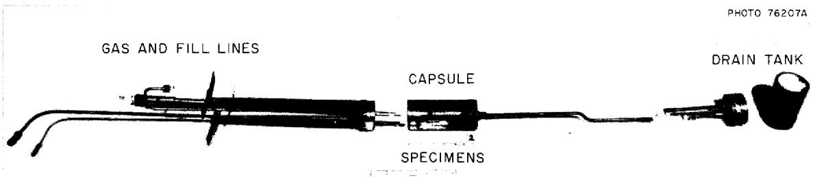  
Fig. 1. Hastelloy N Capsule Assembly for Studying Effects of Salt Composition and $\mathbf{BF}_3$ Overpressure.

The capsule used in studying the effect of temperature (Series II) was basically the same. However, the test specimens were commercial Hastelloy N in the form of 0.030-in.-thick strips to provide more surface area. Each capsule was 2 in. in diameter $\times$ 8.5 in. high and contained 16 specimens. The capsule is pictured in Fig. 2, and the test specimens are shown in Fig. 3. Table 1 lists the compositions of the alloys used for the capsules and specimens.

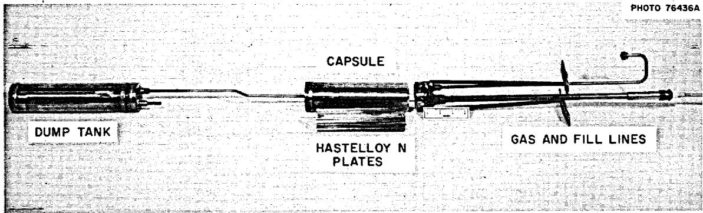  
Fig. 2. Hastelloy N Capsule Assembly for Temperature Effect Study.

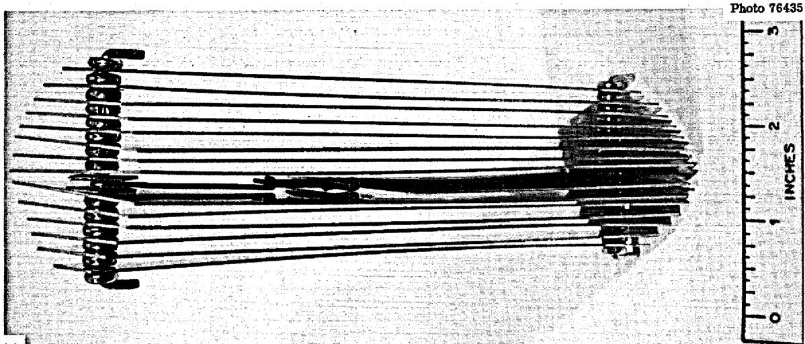

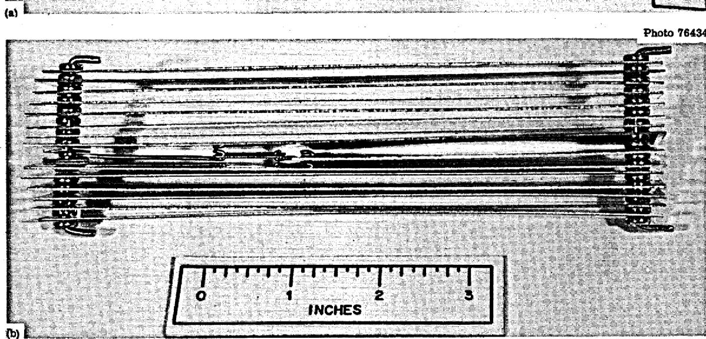  
Fig. 3. Standard Hastelloy N Specimens Made to Provide Maximum Surface Area for Study of Temperature Effects. (a) End view. (b) Side view.

Table 1. Composition of Hastelloy N   

<table><tr><td rowspan="2">Test Series</td><td rowspan="2">Component</td><td colspan="6">Composition (wt %)a</td></tr><tr><td>Mo</td><td>Cr</td><td>Fe</td><td>Si</td><td>Mn</td><td>Ti</td></tr><tr><td rowspan="2">I</td><td>Capsules</td><td>15.8</td><td>7.4</td><td>2.4</td><td>0.2</td><td>0.3</td><td>0.02</td></tr><tr><td>Specimens</td><td>12.0</td><td>7.3</td><td>&lt; 0.1</td><td>&lt; 0.01</td><td>0.14</td><td>0.5</td></tr><tr><td>II</td><td>Capsules and Specimens</td><td>17.0</td><td>7.2</td><td>4.3</td><td>0.45</td><td>0.5</td><td>0.02</td></tr></table>

aBalance nickel.

The salt for these tests was processed by the Fluoride Processing Group of the Reactor Chemistry Division. The very pure $(>99.9\%)$ starting materials were evacuated to about 380 torr, heated to $150^{\circ}\mathrm{C}$ in a vessel lined with nickel, and then held for about 15 hr under these conditions. After the rise in vapor pressure was observed to be not excessive (indicating no volatile impurities), the salt was heated to $500^{\circ}\mathrm{C}$ while still under vacuum and agitated by bubbling helium through the capsule for a few hours. The salt was then transferred to the fill vessel and forced into the capsules with helium pressure. Salt chemistry is discussed under "Results" in this report.

All capsules were heated in vertical muffle furnaces (Fig. 4) and monitored with Chromel-P vs Alumel thermocouples, which had been spot welded to the capsule and covered with shim stock. In our first series of tests all capsules were operated at $605^{\circ}\mathrm{C}$ , close to the maximum temperature proposed for the coolant salt in the MSBR. Capsule 1 of this series contained a helium overpressure of 4 psig and no added $\mathrm{BF}_3$ . Capsules 2, 3, and 4 contained $\mathrm{BF}_3$ corresponding to overpressures of 50, 100, and 400 psig, respectively. Initially the added $\mathrm{BF}_3$ dissolved in the molten salt or combined with the NaF, but after a few minutes the pressure in the capsule gradually increased. However, when the capsules had been pressurized to the operating pressures, no changes in $\mathrm{BF}_3$ content were necessary during the test. The compositions of the salts calculated from amounts of $\mathrm{BF}_3$ added are shown in Table 2.

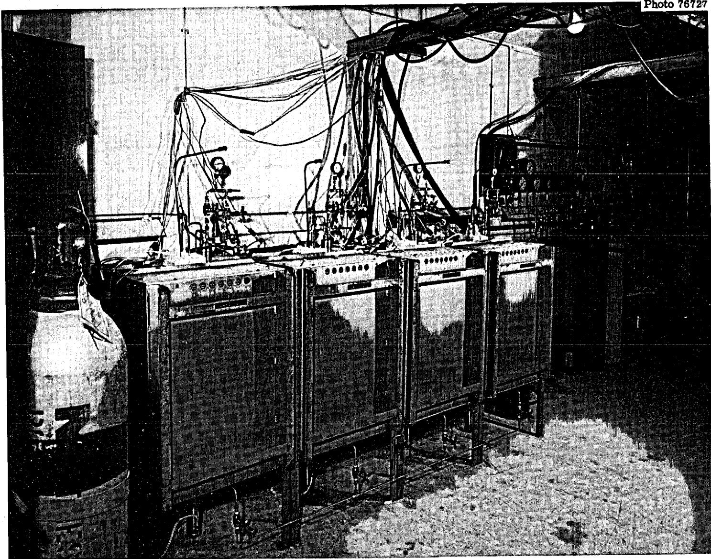  
Fig. 4. Furnace Assembly.

Table 2. Effect of Salt Composition and $\mathbf{BF}_3$ Overpressure on Weight Changes of Hastelloy N   

<table><tr><td rowspan="2">Capsule</td><td rowspan="2">BF3Overpressure (psig)</td><td colspan="2">Salt Composition (mole %)</td><td colspan="3">Weight Change (mg/cm2)</td></tr><tr><td>NaBF4</td><td>NaF</td><td>Vapor</td><td>Interface</td><td>Liquid</td></tr><tr><td>1</td><td>0</td><td>92</td><td>8</td><td>-0.03</td><td>+0.5</td><td>+1.3</td></tr><tr><td>2</td><td>50</td><td>94</td><td>6</td><td>-0.3</td><td>+0.4</td><td>+1.2</td></tr><tr><td>3</td><td>100</td><td>95</td><td>5</td><td>-0.4</td><td>+0.2</td><td>+0.06</td></tr><tr><td>4</td><td>400</td><td>96</td><td>4</td><td>0.0</td><td>-0.03</td><td>-0.03</td></tr></table>

After 6800 hr the salt in each capsule was removed and sampled. The capsules were opened and the specimens were removed, washed in warm distilled water, dried with ethyl alcohol, and weighed. The specimens and capsules were examined metallographically and by x-ray fluorescence and microprobe analysis. The salts were analyzed before and after the tests.

In our second series of experiments, the capsules were operated at $427^{\circ}\mathrm{C}$ ( $800^{\circ}\mathrm{F}$ ), $538^{\circ}\mathrm{C}$ ( $1000^{\circ}\mathrm{F}$ ), $649^{\circ}\mathrm{C}$ ( $1200^{\circ}\mathrm{F}$ ), and $760^{\circ}\mathrm{C}$ ( $1400^{\circ}\mathrm{F}$ ) with 5 psig He overpressure and calculated equilibrium $\mathrm{BF}_3$ pressures of 0.005, 0.07, 0.5, and 2.5 psia, respectively. After 1200 hr the salt in each capsule was removed and sampled for analysis. The salt had also been analyzed before test.

# RESULTS

Effect of Salt Composition and $\mathbf{BF}_3$ Pressure (Series I)

# Weight Changes

The compositional changes in the salt effected by $\mathrm{BF}_3$ gas additions in our first series of tests caused a measurable difference in the weight changes of our test specimens. As shown in Table 2, the weight changes were relatively small, and some specimens showed weight gains instead of the expected losses. There was no correlation between the pressure of $\mathrm{BF}_3$ and the weight change of the specimens exposed to the vapor.

The specimens immersed in salt in capsules 1, 2, and 3 showed progressively decreasing weight gains. The salt specimen in capsule 4 showed a weight loss equivalent to a corrosion rate less than 0.01 mil/year. The same weight change pattern was observed for the specimens at the interface. Thus, the weight gain of specimens in the liquid and at the interface increased as the amount of $\mathrm{NaBF}_4$ in the salt decreased.

Figure 5 shows the specimens after test. Very little corrosion was noted at any position on the specimens or capsules.

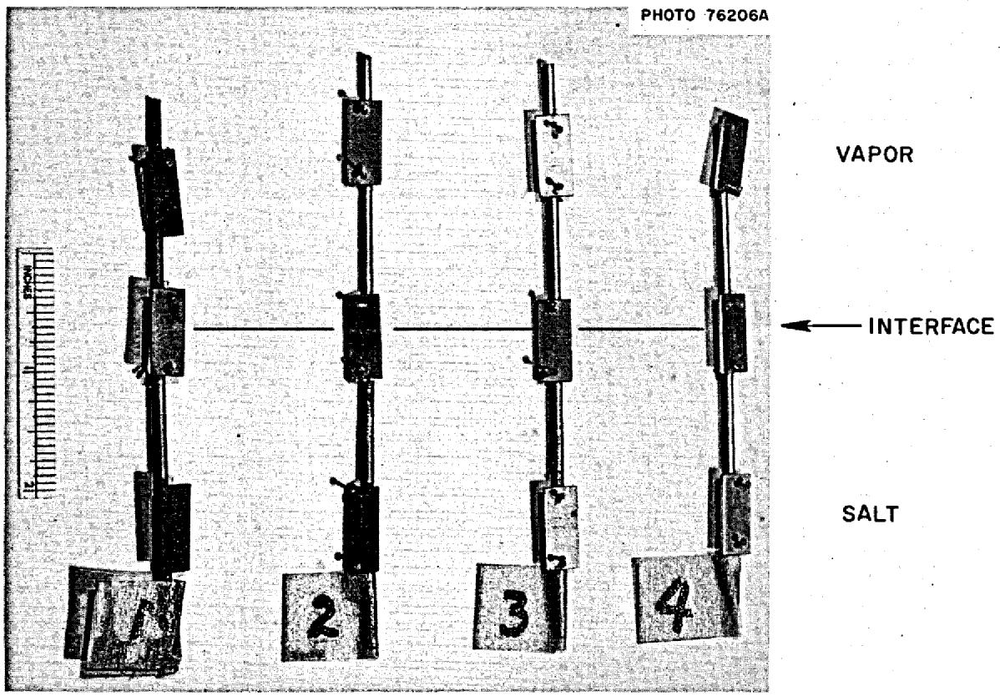  
Fig. 5. Titanium-Modified Hastelloy N Specimens After Exposure to $\mathrm{NaBF}_4 - 8$ mole % NaF at $605^{\circ}\mathrm{C}$ for 6800 hr. Numbers identify capsules.

# Salt Chemistry

Chemical analyses of the salt before and after test for each capsule are given in Table 3. The most significant changes are an increase in chromium concentration and a decrease in iron concentration. No titanium concentrations are included in Table 3 because, as expected,

Table 3. Salt Analyses Before and After Test (Series I)   

<table><tr><td rowspan="2">Element</td><td colspan="5">Concentration</td></tr><tr><td>As Received</td><td>Capsule 1</td><td>Capsule 2</td><td>Capsule 3</td><td>Capsule 4</td></tr><tr><td></td><td colspan="5">Weight Percent</td></tr><tr><td>Na</td><td>21.9</td><td>21.4</td><td>21.0</td><td>21.8</td><td>21.0</td></tr><tr><td>B</td><td>9.57</td><td>9.54</td><td>9.48</td><td>9.48</td><td>9.49</td></tr><tr><td>F</td><td>68.2</td><td>69.2</td><td>68.5</td><td>68.7</td><td>68.8</td></tr><tr><td></td><td colspan="5">Parts Per Million</td></tr><tr><td>Cr</td><td>19</td><td>75</td><td>75</td><td>73</td><td>72</td></tr><tr><td>Ni</td><td>28</td><td>&lt; 10</td><td>&lt; 10</td><td>&lt; 10</td><td>&lt; 10</td></tr><tr><td>Fe</td><td>223</td><td>24</td><td>28</td><td>29</td><td>22</td></tr><tr><td>Mo</td><td>&lt; 10</td><td>&lt; 5</td><td>&lt; 5</td><td>&lt; 5</td><td>&lt; 5</td></tr><tr><td>O</td><td>459</td><td>194</td><td>576</td><td>372</td><td>\(1420^a\)</td></tr><tr><td>H2O</td><td>400</td><td>400</td><td>460</td><td>350</td><td>460</td></tr></table>

aQuestionable result.

no change was noted; only the test specimens contained titanium, and they constituted only a small part of the total system. The only change in the water and oxygen concentrations occurred in capsule 4. The high oxygen concentration reported for this capsule would normally have produced highly oxidizing conditions8 and high corrosion rates. The reported value is believed to be in error because close examination of the system disclosed no leaks or signs of oxidation. Apparently some $\mathrm{BF}_3$ escaped from the capsules after cooling and during opening, since the concentrations of sodium, boron, and fluorine in the salt were about the same in the final analysis of each capsule.

The increase in chromium and the decrease in iron in the salt suggest a reaction of the type

$$
\operatorname {C r} (s) + \operatorname {F e F} _ {2} (d) \rightleftharpoons \operatorname {C r F} _ {2} (d) + \operatorname {F e} (\text {d e p o s i t e d}) \tag {1}
$$

where (s) indicates solid solution in Hastelloy N and (d) indicates dissolved in salt. Any water or oxygen-type impurity in the salt would also have caused some oxidation of the container materials, but these impurities appear to have been negligible in this series of tests. Because the salt in these experiments contained NaF, the chromium fluoride in the corrosion product was found as $\mathrm{Na}_3\mathrm{CrF}_6$ . This material has also been identified in other corrosion experiments and its crystal structure has been determined by x-ray diffraction analysis. Also, the iron fluoride in these experiments may have existed as $\mathrm{Na}_3\mathrm{FeF}_6$ , but this compound was not identified.

# Specimen Chemistry

The proposed corrosion reaction was verified further by x-ray fluorescence analysis of the specimens. Table 4 gives the composition of the near-surface region of a specimen from capsule 4. The composition was determined by comparing x-ray intensities with those of a specimen not exposed to salt or vapor. For any given region in the capsule, the qualitative results from all the specimens were quite similar. These results show a depletion of chromium and enrichment of iron in the near-surface region. All specimens also showed a loss of titanium. Microprobe analysis showed essentially the same surface changes. A chromium gradient was seen but was so small that we could not distinguish between edge effects and an actual gradient.

According to Cantor, $^{11}$ NaBF $_4$ -8 mole % NaF may also oxidize chromium by the reactions

Table 4. Composition of Near-Surface Regions of Test Specimens as Determined by X-Ray Fluorescent Analysis   

<table><tr><td rowspan="2">Exposure Conditions</td><td colspan="5">Concentration (wt %)</td></tr><tr><td>Mo</td><td>Ni</td><td>Fe</td><td>Cr</td><td>Ti</td></tr><tr><td>Unexposed</td><td>12.0</td><td>79.9</td><td>0.1</td><td>7.5</td><td>0.5</td></tr><tr><td>Vapor</td><td>12.3</td><td>79.2</td><td>0.13</td><td>7.1</td><td>0.19</td></tr><tr><td>Interface</td><td>13.7</td><td>69.6</td><td>13.4</td><td>3.0</td><td>0.2</td></tr><tr><td>Liquid</td><td>18.0</td><td>22.7</td><td>56.4</td><td>2.7</td><td>0.16</td></tr></table>

$$
(1 + x) \operatorname {C r} (s) + \operatorname {N a B F} _ {4} (d) \rightleftharpoons \operatorname {N a F} (d) + \operatorname {C r F} _ {3} (d) + \operatorname {C r} _ {x} B (s), \tag {2}
$$

$$
3 \mathrm {N a F} (\mathrm {d}) + \mathrm {C r F} _ {3} (\mathrm {d}) \rightleftarrows \mathrm {N a} _ {3} \mathrm {C r F} _ {6} (\mathrm {s}). \tag {3}
$$

However, no borides were identified either on our specimens or in the salt, and the experimental evidence that iron replaced the chromium indicates that reaction (1) rather than (2) was the predominant mode of chromium oxidation. If essentially no iron fluoride compound were present in the melt, reaction (2) could well control the corrosion process.

# Metallography

Figure 6 shows the microstructure of the specimen from the vapor region of capsule l. There was some indication of a very thin, discontinuous deposit at the surface in the as-polished condition. After etching, this deposit was no longer visible. Figure 7 shows the specimen that was exposed to salt in capsule l. A deposit is visible on the as-polished specimen. Etching again removed the deposit but in this case produced considerable attack at the exposed surface. Metallographic observation of the capsule wall showed similar behavior. This deposit is apparently iron rich, and the area revealed by the etchant is chromium-depleted Hastelloy N. Thus, no difference in the behavior of titanium-modified and standard Hastelloy N was noted in this test. The interface between the salt and gas could be seen on the capsule, but no attack was noted there.

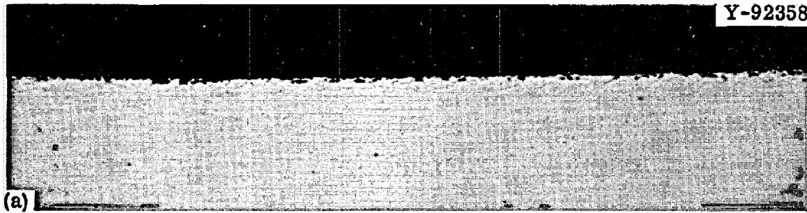

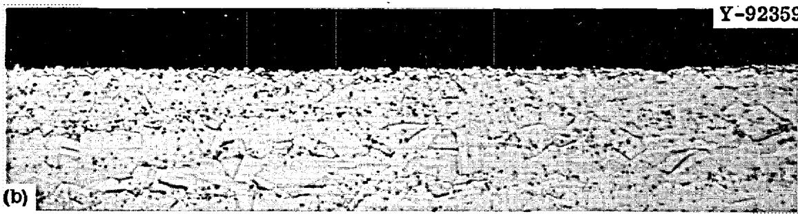  
Fig. 6. Titanium-Modified Hastelloy N from Capsule 1 Exposed to $\mathsf{BF}_3$ Vapor for 6800 hr at $605^{\circ}\mathbb{C}$ . Weight change, $+0.03\mathrm{mg / cm}^2$ . 500×. (a) As polished. (b) Etched with glyceria regia.

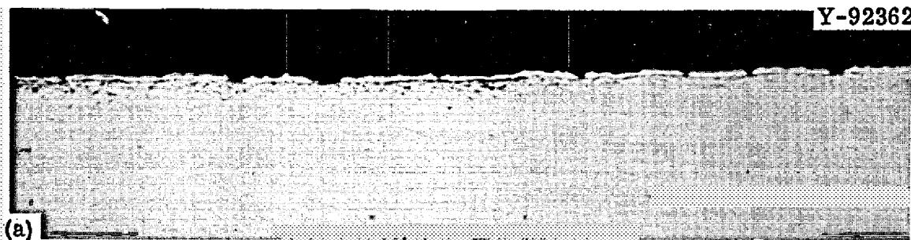

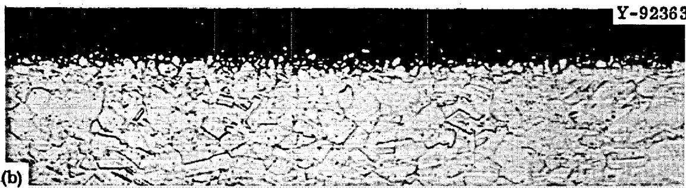  
Fig. 7. Titanium-Modified Hastelloy N from Capsule 1 Exposed to $\mathrm{NaBF}_4 - 8$ mole % NaF for 6800 hr at $605^{\circ}\mathrm{C}$ . Weight change, +1.3 mg/cm². 500x. (a) As polished. (b) Etched with glyceria regia.

# Effect of Temperature (Series II)

Our second series of tests was designed to determine the effects of temperature on chromium mass transfer from the Hastelloy N to the salt. The salt was analyzed before and after test to determine impurity pickup. The $\mathrm{NaBF}_4 - 8$ mole $\%$ NaF contained approximately $400~\mathrm{ppm}$ each of oxygen and water before and after test. The chromium concentration in the salt increased while the iron decreased, as seen in Table 5. No changes in the concentration of nickel and molybdenum were noted. Again, the results suggest chromium oxidation by reduction of an iron fluoride compound. Metallography of Hastelloy N from this test showed, after etching, no attack of the specimen (Fig. 8).

Table 5. Analysis of Salt for Impurities Before and After Test (Series II)   

<table><tr><td rowspan="2">Impurity</td><td colspan="5">Average Concentrationa (ppm)</td></tr><tr><td>As Received</td><td>Capsule 1</td><td>Capsule 2</td><td>Capsule 3</td><td>Capsule 4</td></tr><tr><td>Cr</td><td>15</td><td>45</td><td>87</td><td>225</td><td>575</td></tr><tr><td>Fe</td><td>200</td><td>190</td><td>180</td><td>150</td><td>40</td></tr><tr><td>O</td><td>460</td><td>430</td><td>450</td><td>412</td><td>550</td></tr><tr><td>H2O</td><td>320</td><td>400</td><td>530</td><td>480</td><td>490</td></tr></table>

aNickel and molybdenum were not detected (< 10 ppm) in any samples.

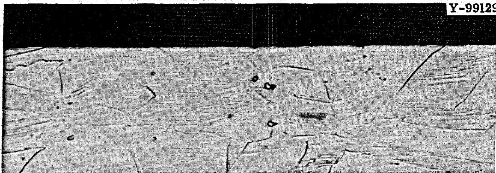  
Fig. 8. Hastelloy N Exposed to $\mathrm{NaBF}_4 - 8$ mole % NaF for 1200 hr at $760^{\circ}\mathrm{C}$ . Etched with glyceria regia, $500\times$ .

# INTERPRETATION OF CORROSION RATES

If the chromium surface concentration remains constant (only true if the salt contains an excess of iron) at any given point in the capsule, the amount of chromium leaving a capsule in Series I is given by the equation12

$$
\Delta W = 2 \rho \left(C _ {0} - C _ {S}\right) \sqrt {\mathrm {D t} / \pi}, \tag {4}
$$

where

$$
\begin{array}{l} \Delta W = \text {i n t e g r a l f l u x o f C r l e a v i n g m e t a l}, \mathrm {g} / \mathrm {c m} ^ {2} \\ \rho = \text {d e n s i t y} g / c m ^ {3} \\ C _ {0} = \text {i n i t i a l w e i g h t f r a c t i o n o f C r} \\ C _ {s} = \text {s u r f a c e w e i g h t f r a c t i o n o f C r} \\ D = \text {d i f f u s i o n} C r \text {i n a l l o y ,} \mathrm {c m} ^ {2} / \sec \\ t = \text {e x p o s u r e} \\ \end{array}
$$

Using the following information

$$
\begin{array}{l} S a l t \quad i n \quad c a p s u l e = 2 8 2 g \\ \text {C r i n c e a s e i n s a l t} = 5 5 \text {p p m (b y w e i g h t)} \\ \text {C a p s u l e} = 1 4 2 \mathrm {c m} ^ {2} \\ \end{array}
$$

to obtain $\triangle W$ and then using

$$
\begin{array}{l} C _ {0} = 7.5 \% \\ C _ {S} = 0 \text {(c o n s i s t e n t w i t h e x c e s s o f F e)} \\ \rho = 8. 8 \mathrm {g} / \mathrm {c m} ^ {3} \\ t = 6 8 0 0 h r, \\ \end{array}
$$

we obtain

$$
D _ {c a l c d} = 3. 3 \times 1 0 ^ {- 1 5} \mathrm {c m} ^ {2} / \sec \text {a t} 6 0 5 ^ {\circ} \mathrm {C}.
$$

This compares favorably with $3 \times 10^{-15} \, \text{cm}^2/\text{sec}$ at $605^\circ \text{C}$ extrapolated from the range 700 to $850^\circ \text{C}$ from data13 of DeVan and Evans for chromium

diffusion in Hastelloy N. From this comparison, we conclude that the controlling rate mechanism in this experiment was the solid-state diffusion of chromium in the alloy and that the oxidation potential of the salt was established by the presence of iron fluoride.

Figure 9 shows the variation of chromium content with test temperature for the experiments of Series II. Included for comparison are chromium concentrations measured in loop tests after $1200\mathrm{hr}$ at various $\mathsf{H}_2\mathsf{O}$ impurity levels.[14-17] An Arrhenius-type relationship appears to

14J. W. Koger and A. P. Litman, MSR Program Semiann. Progr. Rept. Feb. 29, 1968, ORNL-4254, pp. 218-221.   
15J. W. Koger and A. P. Litman, MSR Program Semiann. Progr. Rept. Aug. 31, 1968, ORNL-4344, pp. 257-264.   
16J. W. Koger and A. P. Litman, MSR Program Semiann. Progr. Rept. Feb. 28, 1969, ORNL-4396, pp. 243-246.   
17J. W. Koger and A. P. Litman, Compatibility of Hastelloy N and Croloy 9M with $\mathrm{NaBF}_4$ -NaF- $\mathrm{KBF}_4$ (90-4-6 mole %) Fluoroborate Salt, ORNL-TM-2490 (April 1969).

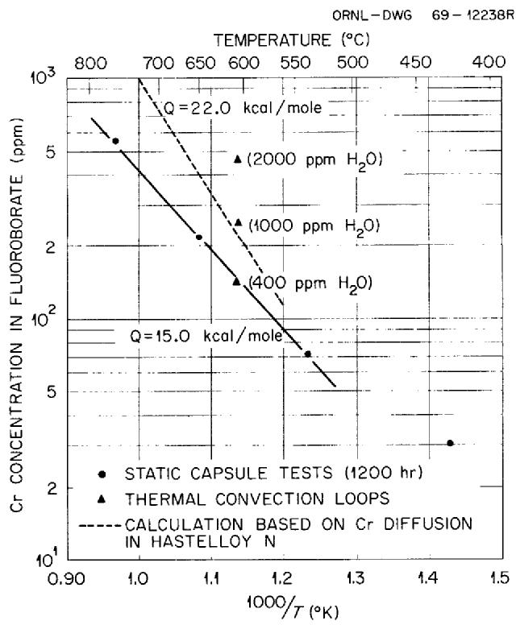  
Fig. 9. Temperature Dependence of Chromium Concentration in Sodium Fluoroborate Salt.

hold between 538 and $760^{\circ}\mathrm{C}$ . This would be expected if the rate of chromium buildup in the salt were controlled by solid-state diffusion of chromium to the capsule wall. Using diffusion data for chromium in Hastelloy N obtained by DeVan and Evans13 and assuming the chromium surface concentration to have been reduced to zero by the salt, we predict a chromium buildup shown by the dashed line in Fig. 9. The agreement between the slopes (activation energy) of the predicted and experimental curves, although not exact, gives credence to the assumption that chromium mass transfer to the salt is limited by solid-state diffusion of chromium to the Hastelloy N surface.

# CONCLUSIONS

1. Titanium-modified Hastelloy N specimens were exposed for 6800 hr to isothermal $\mathrm{NaBF}_4$ -NaF salt mixtures containing only a few hundred parts per million oxygen and water and varying in composition from 4 to 8 mole % NaF. Specimens in the vapor region lost weight in all but the 96 mole % $\mathrm{NaBF}_4$ mixture. Specimens fully immersed in the salt gained weight in all but the 96 mole % $\mathrm{NaBF}_4$ mixture. The weight gains decreased as the $\mathrm{NaBF}_4$ content of the salt increased.   
2. No differences in the corrosion of specimens in the vapor region were noted as a function of $\mathrm{BF}_3$ overpressure to 400 psig.   
3. In the main corrosion reaction, chromium from the alloy was oxidized by iron fluoride impurities initially in the salt. The iron that was reduced deposited on the specimens and capsule.   
4. Metallographic observation of both standard Hastelloy N capsules and titanium-modified Hastelloy N specimens showed very little attack, although a thin discontinuous deposit rich in iron was observed at the surface of specimens exposed to vapor.   
5. A diffusion coefficient for chromium in Hastelloy N calculated from the rate of chromium removal from standard Hastelloy N by $\mathrm{NaBF}_4 - 8$ mole $\%$ NaF held between 538 and $760^{\circ}\mathrm{C}$ agreed well with an extrapolation of published results. Thus, solid-state diffusion of chromium appeared to be the rate-controlling mechanism for corrosion in these tests.

6. Under the condition of these experiments, the fluoroboratesalt mixtures were compatible with the Hastelloy N alloys. By virtue of other experiments we conclude that increases in water as impurity increase the chromium uptake and the corrosion.

# ACKNOWLEDGMENT

We wish to acknowledge E. J. Lawrence for his expert supervision of the fabrication, operation, and disassembly of the test capsules and F. D. Harvey for his handling of the test specimens. We are also indebted to H. E. McCoy, Jr., J. H. Devan, and C. E. Sessions for constructive review of the manuscript.

Special thanks are extended to H. R. Gaddis and Helen Mateer of the General Metallography Group, Harris Dunn and others in the Analytical Chemistry Division, Graphic Arts, and the Metals and Ceramics Division Reports Office for invaluable assistance.

# INTERNAL DISTRIBUTION

1-3. Central Research Library   
4-5. ORNL - Y-12 Technical Library Document Reference Section   
6-15. Laboratory Records Department   
16. Laboratory Records, ORNL RC   
17. ORNL Patent Office   
18. MSRP Director's Office (Y-12)   
19. G. M. Adamson, Jr.   
20. J. L. Anderson   
21. R.F.Apple   
22. C. F. Baes   
23. S. E. Beall   
24. E. S. Bettis   
25. F. F. Blankenship   
26. E. G. Bohlmann   
27. R. B. Briggs   
28. S. Cantor   
29. O. B. Cavin   
30. Nancy C. Cole   
31. W. H. Cook   
32. J. L. Crowley   
33. F. L. Culler   
34. J. H. Devan   
35. J. R. DiStefano   
36. S. J. Ditto   
37. W. P. Eatherly   
38. J. I. Federer   
39. D. E. Ferguson   
40. L. M. Ferris   
41. J. H Frye, Jr.   
42. R. E. Gehlbach   
43. L. O. Gilpatrick   
44. W. R. Grimes   
45. A. G. Grindell   
46. F. D. Harvey

47. W. O. Harms   
48. P. N. Haubenreich   
49. R.E.Helms   
-52. M.R.Hill   
53. W. R. Huntley   
54. H. Inouye   
55. P. R. Kasten   
65. J.W.Koger   
66. E. J. Lawrence   
67. R. B. Lindauer   
68. M. I. Lundin   
69. R. E. MacPherson   
70. W. R. Martin   
71. H. E. McCoy, Jr.   
72. C. J. McHargue   
73. A. S. Meyer   
74. D. M. Moulton   
75. P. Patriarca   
76. A. M. Perry   
77. H. C. Savage   
78. Dunlap Scott   
79. J. L. Scott   
80. C. E. Sessions   
81. J. H. Shaffer   
82. G. M. Slaughter   
83. A. N. Smith   
84. D. A. Sundberg   
85. J. R. Tallackson   
86. R.E.Thoma   
87. D. B. Trauger   
88. G. M. Watson   
89. J. R. Weir, Jr.   
90. J. C. White   
91. Gale Young   
92. E. L. Youngblood

# EXTERNAL DISTRIBUTION

93-94. D. F. Cope, RDT, SSR, AEC, Oak Ridge National Laboratory   
95. A. R. DeGrazia, Division of Reactor Development and Technology, AEC, Washington   
96. David Elias, Division of Reactor Development and Technology, AEC, Washington   
97. J. E. Fox, Division of Reactor Development and Technology, AEC, Washington

98. Norton Haberman, Division of Reactor Development and Technology, AEC, Washington   
99. Kermit Laughon, RDT, OSR, AEC, Oak Ridge Operations

100-109. A. P. Litman, Division of Space Nuclear Systems, AEC, Washington

110-111. T. W. McIntosh, Division of Reactor Development and Technology, AEC, Washington

112. D. R. Riley, Division of Reactor Development and Technology, AEC, Washington   
113. M. Shaw, Division of Reactor Development and Technology, AEC, Washington   
114. J. M. Simmons, Division of Reactor Development and Technology, AEC, Washington   
115. Laboratory and University Division, AEC, Oak Ridge Operations

116-130. Division of Technical Information Extension