ORNL-TM-2987

Contract No. W-7405-eng-26

Reactor Division

DEVELOPMENT OF FUEL- AND COOLANT-SALT CENTRIFUGAL PUMPS FOR THE MOLTEN-SALT REACTOR EXPERIMENT

P. G. Smith

# LEGAL NOTICE

This report was prepared as an account of work sponsored by the United States Government. Neither the United States nor the United States Atomic Energy Commission, nor any of their employees, nor any of their contractors, subcontractors, or their employees, makes any warranty, express or implied, or assumes any legal liability or responsibility for the accuracy, completeness or usefulness of any information, apparatus, product or process disclosed, or represents that its use would not infringe privately owned rights.

OCTOBER 1970

OAK RIDGE NATIONAL LABORATORY

Oak Ridge, Tennessee

operated by

UNION CARBIDE CORPORATION

for the

U.S. ATOMIC ENERGY COMMISSION

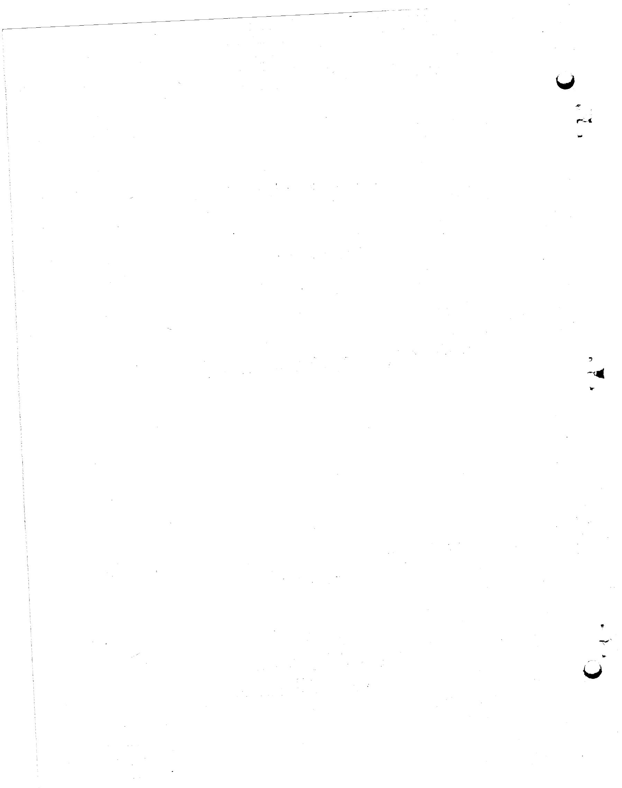

# CONTENTS

Abstract 1   
General Description of the Molten-Salt Pump 2   
Test Apparatus Molten-Salt Pump Test Stand 5 Molten-Salt Properties 9   
Bench Tests and Cold Shakedown Tests Force-Deflection Characteristics of Shaft 9 Critical Speed of Shaft Assembly 9 Room-Temperature Dry Runs 11   
Molten-Salt Tests 11 Hydraulic Performance 11 Cavitation Performance 14 Effectiveness of Shaft Annulus Purge Against Back Diffusion of Radioactive Gas 14   
Measurement of Undissolved Gas Content in Circulating Salt 17  
Problems Encountered During Pump Fabrication and Molten-Salt Tests 21   
Fabrication Problems 22  
Shaft Annulus Plugging 22  
Insufficient Running Clearances 24   
Oil Leakage from the Catch Basin into the Pump Tank 26   
Pump Tank Off-Gas Line Plugging 28   
Failure of Weld Attachment of Parts of Flow-Straightening Device 28   
Mark-2 Fuel-Salt Pump 33  
Description of Pump 33  
Hydraulic Performance 36   
Measurement of Undissolved Gas Content in Circulating Salt 36  
Restrictions to Purge-Gas Flow 36   
Performance of Molten-Salt Pumps in MSRE 38  
Conclusions 40  
Acknowledgments 40

# iv

References 41   
Appendix. MSRE Drawings 43

# DEVELOPMENT OF FUEL- AND COOLANT-SALT CENTRIFUGAL PUMPS FOR THE MOLTEN-SALT REACTOR EXPERIMENT

P. G. Smith

# Abstract

The Molten-Salt Reactor Experiment (MSRE), a small nuclear power reactor that produced about 7 Mw of heat while operating at approximately $1225^{\circ}\mathrm{F}$ and atmospheric pressure, requires a pump in each of two circulating molten-salt systems. A vertical centrifugal sump-type pump was developed for each system through water and molten-salt tests of prototype pumps at temperatures to $1400^{\circ}\mathrm{F}$ and hot shakedown operation of the actual reactor pumps before they were qualified for reactor service. The development experience with the pumps in the molten-salt pump test stand and the performance of the reactor pumps in the MSRE are discussed here. The hydraulic performance of the pumps circulating molten salt corresponded closely with the performance obtained with water. The reactor pumps served well throughout the approximately 30,000-hr operating life of the MSRE, which spanned the period August 1964 to December 1969, during which the reactor produced 105,737 Mwhr(t) of nuclear energy. A backup pump (Mark-2), which contains additional volume in the pump tank to accommodate thermally expanded salt, was also fabricated and tested for the MSRE.

Keywords: pump, molten salt, Molten-Salt Reactor Experiment, centrifugal pump, sump-type pump, high temperature, nuclear reactors, pump hydraulic performance, water test pump.

A centrifugal pump was developed for circulating molten salt at elevated temperatures in the Molten-Salt Reactor Experiment (MSRE).1 Briefly, the MSRE is a salt-fueled graphite-moderated single-region nuclear reactor test facility with a heat-generation rate of approximately 7 Mw(t). Two salt pumps are required, one in the fuel-salt loop and the other in the coolant-salt loop. Since the designs of the two pumps are essentially identical, primary attention is given here to the fuel-salt pump.

The pump is a vertical-shaft sump pump with an overhung impeller and an oil-lubricated face seal. It was developed through a series of bench tests, water tests, $^{2}$ cold shakedown operations, and high-temperature

molten-salt tests. The problems encountered during development and testing and the results of pump operation at ambient and elevated temperatures (up to $1400^{\circ}\mathrm{F}$ ) are discussed in this report. Hydraulic performance data, priming conditions, and cooldown characteristics were obtained, and the effectiveness of spray devices for xenon removal was demonstrated.

Thermal-stress and strain-fatigue analyses3 were made for the pump tanks of both the fuel- and coolant-salt pumps. They were made for an estimated operating history that included 100 heating cycles from room temperature to $1200^{\circ}\mathrm{F}$ and 500 reactor power change cycles from zero to full power. The calculations indicated that a cooling air flow rate of 200 cfm was required for the fuel pump tank, while the coolant pump tank was capable of the required service without air cooling.

The pattern followed in the development of these pumps and the design of a similar pump were discussed elsewhere in some detail. The problems and tests required for developing other specific elevated-temperature pumps have been reported.

Fuel- and coolant-salt pumps were installed in the appropriate salt circuits of the MSRE, where they each circulated salt or helium at elevated temperatures for a total of approximately 30,000 hr. The reactor was operated up to full power and was recently shut down permanently. During operation of the reactor, which produced 105,737 Mwhr(t) of nuclear energy, the lubricants for the bearings and seals and the insulation for the drive motor were exposed to a nuclear radiation environment.

The numbers of the drawings for the fuel- and coolant-salt pumps, the drive motors, the lubrication stand, and the Mark-2 fuel-salt pump are listed in the Appendix.

# General Description of the Molten-Salt Pump

The pump is of the centrifugal sump type with a vertical shaft. It consists of three main components: the pump tank, the rotary assembly, and the drive motor (see Fig. 1). The three main components are bolted

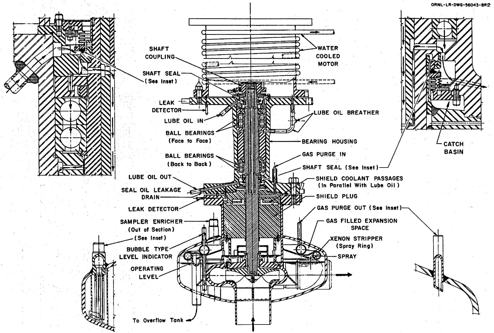  
Fig. 1. Cross Section of Fuel-Salt Pump.

together and sealed with oval ring-joint gasketed flanges. The ring-joint grooves are connected to a leak-detection system. The motor and rotary assembly may be removed from the pump tank either as a unit or separately. All parts in contact with molten salt are constructed of Hastelloy N,\* a nickel-molybdenum-chromium-iron alloy.

The pump tank, which provides volume to accommodate the thermally expanded salt of the system, contains the pump volute or casing, the xenon-removal spray device, the salt level indicators, and various access nozzles.

The rotary assembly consists principally of the bearing housing; the pump shaft, which is mounted on commercially available conventional ball bearings; the shaft seals, which constrain the circulating lubricating oil from leaking out of the bearing housing; the shield plug, which is cooled with circulating oil; and the pump impeller. The shield plug and other parts of the rotary assembly that come in contact with the salt are suspended in the pump tank through a large flanged nozzle at the top of the tank.

The drive, which is housed in a hermetically sealed vessel, is a squirrel-cage induction-type motor rated for 75-hp duty at 1200 rpm. The electrical insulation system is resistant to a radiation dose of up to $10^9$ rads and the grease lubricant is reported11 to be capable of withstanding a dose of more than $3 \times 10^9$ rads.

The pump has some unusual features required by its application that are not found in the conventional sump pump. The pump tank contains a salt-spraying device to remove $^{13}\mathrm{Xe}$ (neutron absorber) from the circulating fuel salt and also has two gas-bubble sensors to indicate salt level. The spray device is connected to the volute discharge, from which it receives a proportioned flow of about 50 gpm of salt at pump design head and flow. This flow and other leakage flows (bypass flow) pass through the pump tank and return to the system at the pump inlet. A split purge-gas flow in the shaft annulus keeps oil vapors from entering the salt system and fission gases from entering the region of the shaft

lower seal. The down-the-shaft portion of the purge-gas flow removes $135\mathrm{Xe}$ by contact with the salt spray and dilutes and transports it from the pump tank to the off-gas system. The pump is mounted on a flexible support designed to accommodate thermal expansions. A flow of nitrogen across the exterior of the upper nonwetted portion of the pump tank removes nuclear heat deposited in the tank wall. The bolt extensions, which can be seen in Fig. 2, provide for remote installation and removal of the drive motor and rotary assembly in the MSRE.

# Test Apparatus

# Molten-Salt Pump Test Stand

A schematic view of the test stand components is shown in Fig. 3. The components include the drive motor, the test pump, and the salt piping, which is 6-in. IPS sched 40, except for a section of pipe at the pump inlet, which is 8-in. IPS sched 40. Other components include a venturi flowmeter, the heat removal system, a drain tank for salt storage, the preheating system, a flow straightener, high-temperature pressure and temperature sensors, the lubrication system, $^{12}$ and two salt freeze flanges, one of which provides a place to mount an orifice plate to set the system resistance to salt flow. The system resistance was varied with four orifice plates having different hole diameters. The heat removal system, which is a salt-to-air heat exchanger, was used to control the salt temperature. The drain tank stored the fluoride salt in the molten state when the system was not in operation. Commercial diaphragm-sealed NaK-filled pressure transmitters were used to indicate pressure at the pump discharge and at the inlet and throat of the venturi. Transformer controlled heaters were used to preheat the salt piping and components, and Chromel-Alumel thermocouples monitored the system temperatures. Conventional instrumentation was used to display and record temperatures, salt flow, pump drive motor power, and salt level in the pump tank. A photograph of the test facility, Fig. 4, shows the pump in the left upper foreground, a portion of the salt piping beneath and to the rear of the pump, and a portion of the control cabinets.

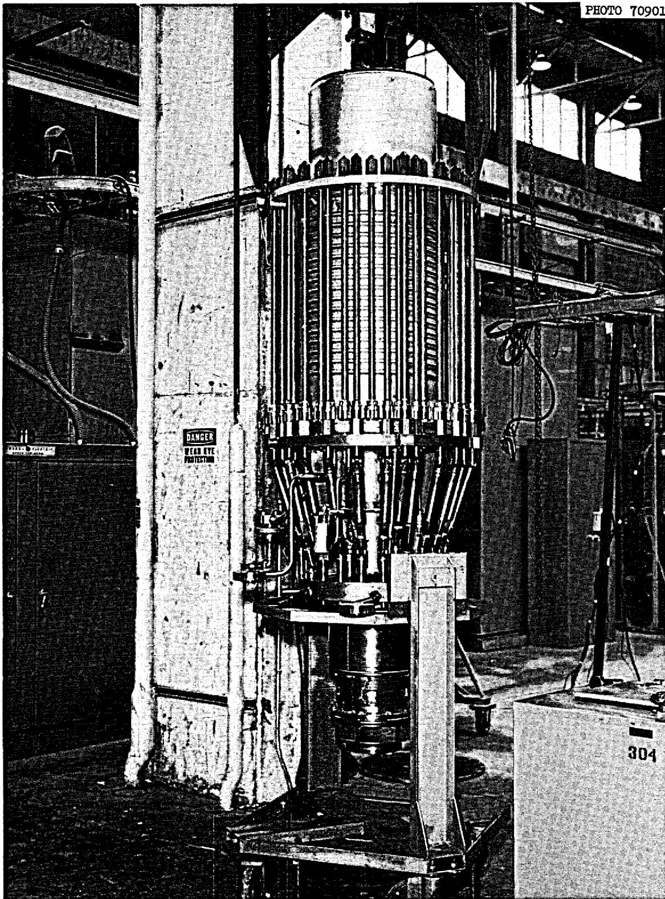  
Fig. 2. Fuel-Salt Pump Drive Motor, Rotary Assembly, and Bolting for Remote Maintenance.

ORNL-LR-DWG72414

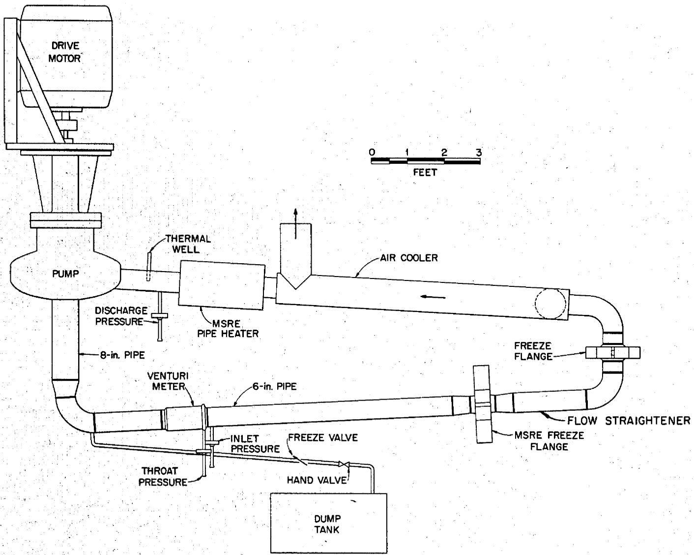  
Fig. 3. Schematic Diagram of Molten-Salt Pump Test Stand.

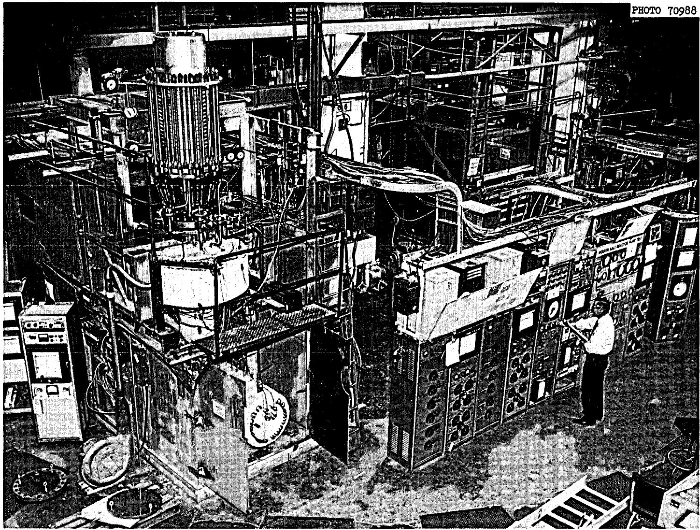  
Fig. 4. Photograph of Molten-Salt Pump Test Stand.

# Molten-Salt Properties

The molten salt used for pump tests was a mixture of lithium fluoride (LiF), beryllium fluoride $(\mathrm{BeF}_3)$ , zirconium fluoride $(\mathrm{ZrF}_4)$ , thorium fluoride $(\mathrm{ThF}_4)$ , and uranium fluoride $(\mathrm{UF}_4)$ in proportions of 66.4, 27.4, 4.7, 0.9, and 0.7 mole %, respectively. The mixture is solid at room temperature and melts at approximately $850^{\circ}\mathrm{F}$ . The density13 and viscosity14 at three temperatures of interest are given below:

<table><tr><td>Temperature (°F)</td><td>Density (lb/m/ft3)</td><td>Viscosity (cps)</td></tr><tr><td>1100</td><td>132</td><td>11</td></tr><tr><td>1200</td><td>130</td><td>8</td></tr><tr><td>1300</td><td>129</td><td>6</td></tr></table>

# Bench Tests and Cold Shakedown Tests

# Force-Deflection Characteristics of Shaft

The force-deflection characteristics of the shaft were measured with the shaft assembly supported in the bearing housing and with the force applied at the impeller. A typical curve of shaft deflection at the impeller versus force is shown in Fig. 5. This information and deflection data obtained during water tests were used to determine the unbalanced force-vector acting on the impeller at various head, flow, and speed operating conditions.[15] The force values were used to analyze shaft bending stresses and bearing reactions and to specify the shaft support bearings.

# Critical Speed of Shaft Assembly

The critical speed of each shaft assembly was determined by vibrating the shaft assembly in the transverse direction. The shaft assembly was supported in the bearing housing and mounted vertically on a rugged-steel structure anchored to the building floor. The vibrating force was applied at the impeller and held constant over a range of applied frequencies.

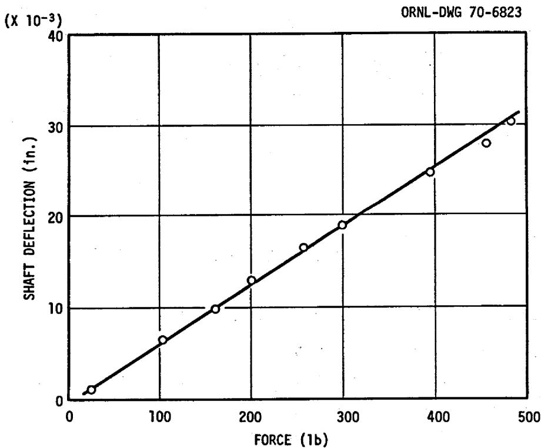  
Fig. 5. Shaft Deflection Versus Radial Force Applied to Impeller of Pump.

Data were obtained for frequency versus vibration amplitude. The critical speed determined by the frequency at which the amplitude increased sharply checked quite closely with the calculated value. For the fuel-salt pump the value was calculated to be 2850 rpm and was measured to be within 100 rpm of this value.

# Room-Temperature Dry Runs

After assembly a pump rotary element is normally operated for about one week or longer in a cold shakedown stand before installation in the hot test stand. This operation is conducted to verify that the element is free of mechanical problems and to test the performance of the shaft bearings and seals. The oil leakage from a properly performing shaft seal is usually 10 cc/day or less.

# Molten-Salt Tests

Tests with molten salt were conducted with the prototype and reactor pumps to (1) verify the hydraulic performance observed in the water tests, (2) determine the effectiveness of the gas purge down the shaft annulus against the intrusion of radioactive gas, (3) measure the concentration of undissolved gas in the circulating salt, (4) perform acceptance tests of the reactor pumps prior to their installation into the reactor system, and (5) test the overall long-term reliability of the pump and drive motor at design and off-design conditions. Table 1 presents a summary of the molten-salt test operation of the prototype pump, the rotary elements for the reactor pumps, and the Mark-2 fuel-salt pump.

# Hydraulic Performance

Hydraulic performance tests were conducted with 13-in.- and 11 1/2-in.-OD fuel pump impellers in the molten-salt pump test stand with the fuel-salt pump tank and volute installed. The head-capacity performance of the 13-in.-OD impeller with both water and molten salt is shown in Fig. 6, in which the head is plotted against flow for three test speeds. At 1030 rpm,

Table 1. Summary of Tests of MSRE Pumps in the Molten-Salt Pump Test Stand   

<table><tr><td>Test No.</td><td>Molten-Salt Temperature (°F)</td><td>Pump Shaft Speed (rpm)</td><td>Molten-Salt Flow (gpm)</td><td>Impeller Diameter (in.)</td><td>Test Duration (hr)</td><td>Primary Purposes of Test</td><td>Reason for Termination</td></tr><tr><td>1</td><td>80-1200</td><td>1150</td><td></td><td>13</td><td>118</td><td>Shakedown test of prototype fuel-salt pump</td><td></td></tr><tr><td>1</td><td>1200</td><td>700-1030</td><td>750-1600</td><td>13</td><td>217</td><td>Hydraulic performance test of prototype fuel-salt pump</td><td>Shaft seizure</td></tr><tr><td>2</td><td>1200</td><td>700-1030</td><td>750-1200</td><td>13</td><td>96</td><td>Same as above</td><td>Scheduled</td></tr><tr><td>3</td><td>1200</td><td>600-1150</td><td>400-1500</td><td>11 1/2</td><td>1,968</td><td>Same as above</td><td>Variable frequency motor-generator set failure</td></tr><tr><td>4</td><td>1200</td><td>1185</td><td>1100</td><td>11 1/2</td><td>1,848</td><td>Back-diffusion tests of prototype fuel-salt pump</td><td>Variable frequency motor-generator set failure</td></tr><tr><td>5</td><td>1200-1320</td><td>1185</td><td>1100</td><td>11 1/2</td><td>792</td><td>Gas-concentration tests in circulating salt and back-diffusion tests of prototype fuel-salt pump</td><td>Scheduled</td></tr><tr><td>6</td><td>1200</td><td>1150</td><td>1070</td><td>11 1/2</td><td>335</td><td>Gas-concentration tests of prototype fuel-salt pump in circulating salt</td><td></td></tr><tr><td>6</td><td>1000-1400</td><td>600-1150</td><td>500-1070</td><td>11 1/2</td><td>368</td><td>Hydraulic performance of prototype fuel-salt pump</td><td>Shaft annulus plugged</td></tr><tr><td>7</td><td>1200</td><td>1150</td><td>1070</td><td>11 1/2</td><td>120</td><td>Proof test of lubrication stand and fuel pump supports</td><td></td></tr><tr><td>7</td><td>1100-1300</td><td>700-1150</td><td>600-1070</td><td>11 1/2</td><td>409</td><td></td><td>Scheduled</td></tr><tr><td>8</td><td>1100-1300</td><td>1150</td><td>1070</td><td>11 1/2</td><td>168</td><td>Proof test of coolant pump lubrication stand and fuel pump supports</td><td>Scheduled</td></tr><tr><td>9</td><td>1120</td><td>0-800</td><td></td><td>11 1/2</td><td></td><td>Reactor fuel pump hot shakedown test</td><td>Shaft rubbed at startup</td></tr><tr><td>10</td><td>1200</td><td>1750</td><td>790</td><td>10 1/3</td><td>90</td><td>Reactor coolant pump hot shakedown test</td><td>Scheduled</td></tr><tr><td>11</td><td>1200</td><td>1175</td><td>1200</td><td>11 1/2</td><td>100</td><td>Reactor fuel pump hot shakedown test</td><td>Scheduled</td></tr><tr><td>12</td><td>1200-1515</td><td>1175</td><td>1200</td><td>13</td><td>452</td><td>Reactor spare fuel pump hot shakedown test</td><td>Impeller rubbed volute</td></tr><tr><td>13</td><td>1200</td><td>1175</td><td>540</td><td>10 19/32</td><td>1,000</td><td>Reactor spare coolant pump hot shakedown test</td><td>Scheduled</td></tr><tr><td>14</td><td>1200</td><td>1175</td><td>1200</td><td>13</td><td>2,694</td><td>Reactor spare fuel pump hot shakedown, back-diffusion, gas concentration tests</td><td>Loop flow straightening vanes became detached</td></tr><tr><td>15</td><td>1200</td><td>1175</td><td>1200</td><td>13</td><td>165</td><td>Reactor spare fuel-pump impeller shakedown tests</td><td>Scheduled</td></tr><tr><td>16</td><td>1200</td><td>1175</td><td>1200</td><td>13</td><td>166</td><td>Reactor spare coolant drive motor shakedown tests</td><td>Scheduled</td></tr><tr><td>17</td><td>1200</td><td>1175</td><td>1200</td><td>11 1/2</td><td>2,631</td><td>Prototype fuel pump test</td><td>Scheduled</td></tr><tr><td>18</td><td>1200</td><td>1175</td><td>1200</td><td>11 1/2</td><td>100</td><td>Reactor spare fuel pump hot shakedown tests</td><td>Scheduled</td></tr><tr><td>19</td><td>1200</td><td>1750</td><td>790</td><td>10 19/32</td><td>100</td><td>Reactor spare coolant pump hot shakedown tests</td><td>Scheduled</td></tr><tr><td>20</td><td>1000-1325</td><td>1175</td><td>1350</td><td>11 1/2</td><td>14,000</td><td>Performance and endurance tests of Mark-2 pump</td><td>Continuing</td></tr></table>

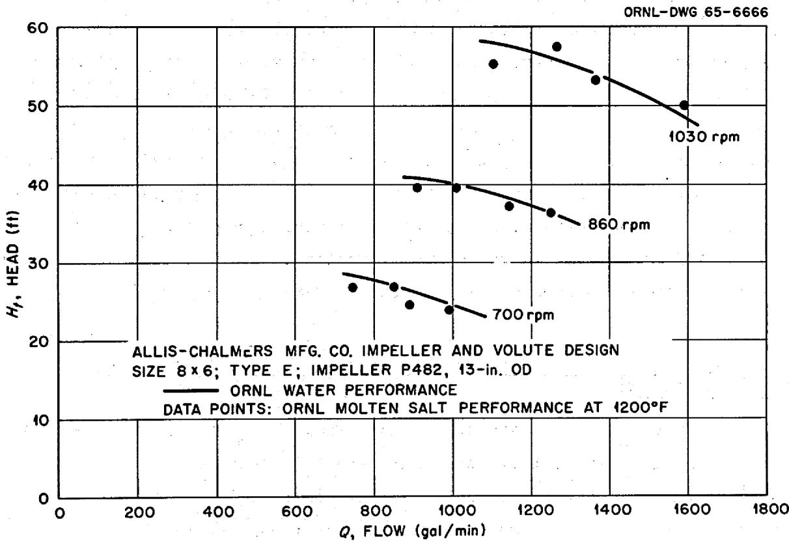  
Fig. 6. Hydraulic Performance of Prototype Fuel-Salt Pump with Water and with Molten Salt.

the molten-salt head varies as much as $1 \frac{1}{2}$ ft from that of water, and at 860 and 700 rpm the head for the molten salt is low by approximately 1 ft.

# Cavitation Performance

The NPSH requirements for the pumps, as reported by the manufacturer of the hydraulic components (volutes and impellers), are 5.5 and 11 ft, respectively, for the fuel- and coolant-salt pumps at their operating conditions. Converted to pressure of the circulating salt the NPSH values are 5 and 10 psia, respectively. These pressures are below atmospheric, and evacuation of the pump tank gas space would be required to investigate the suction pressure at which cavitation sets in. Since evacuation is required to cause cavitation and the operating pressure of the pump tanks in the MSRE is 5 psig, experimental investigations of cavitation inception were considered unnecessary and therefore were not performed.

# Effectiveness of Shaft Annulus Purge Against Back Diffusion of Radioactive Gas

The migration of radioactive gases from the pump tank to the region of the shaft lower seal via the shaft annulus could result in polymerization of the oil that leaks past the seal and lead to plugging of the drain line from the oil catch basin. To minimize this migration, a flow of helium purge gas was introduced down the shaft annulus. Figure 7 is a schematic diagram of the shaft annulus configuration and the purge-gas flow paths. The upper end of the flow path for the down-the-shaft purge contains a labyrinth seal (not shown), which has a 0.005-in. diametral clearance.

In back-diffusion tests, $^{65}\mathrm{Kr}$ and nitrogen were injected into the pump tank as shown. The concentrations of $^{65}\mathrm{Kr}$ in the pump tank off-gas line and in the line from the leakage-oil catch basin were determined with count-rate meters for various flow rates of purge gas. The data shown in Table 2 were obtained during the tests. The $^{65}\mathrm{Kr}$ was not detected in the purge gas from the catch basin even with a count rate meter capable of detecting a concentration as small as $0.95 \times 10^{-10} \, \text{Ci/cm}^3$ .

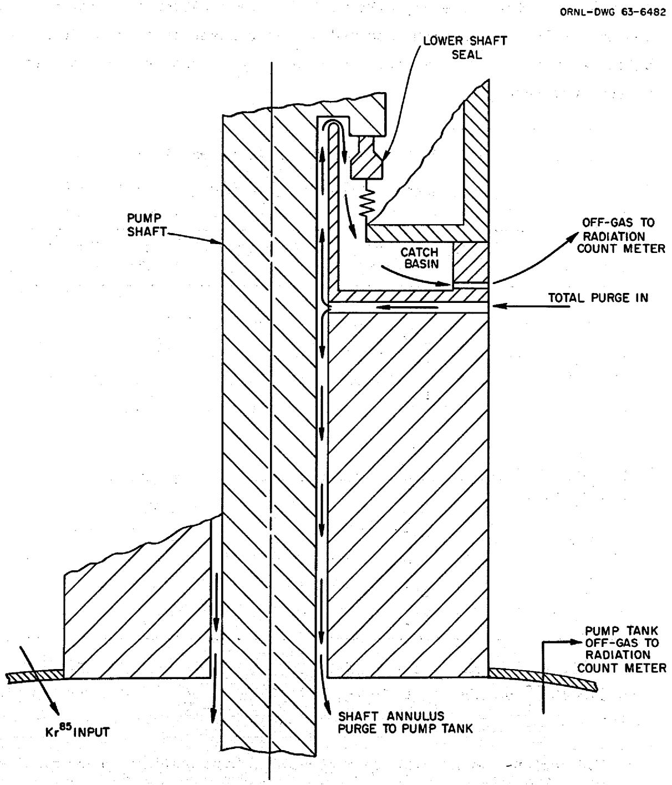  
Fig. 7. Schematic Diagram of Purge-Gas Flow Passages in Fuel-Salt Pump.

These data indicate the capability of the purge gas at flow rates of approximately 0.25 liter/min to reduce the concentration of $\mathrm{^{85}Kr}$ in the catch basin by a factor as much as 35,000 times below the concentration in the pump tank.

Table 2. Back-Diffusion Test Results   
Diametral clearance: 0.005 in.   

<table><tr><td>Shaft Purge (liters/day)</td><td>Catch Basin Purgea (liters/day)</td><td>65Kr</td><td>Concentration (Ci/cm3)</td><td>in Pump Tank</td></tr><tr><td></td><td></td><td></td><td>×10-6</td><td></td></tr><tr><td>406</td><td>487</td><td></td><td>0.89</td><td></td></tr><tr><td>406</td><td>487</td><td></td><td>0.89</td><td></td></tr><tr><td>430</td><td>497</td><td></td><td>2.06</td><td></td></tr><tr><td>382</td><td>481</td><td></td><td>2.77</td><td></td></tr><tr><td>366</td><td>354</td><td></td><td>3.28</td><td></td></tr><tr><td>215</td><td>360</td><td></td><td>1.85</td><td></td></tr><tr><td>108</td><td>360</td><td></td><td>1.21</td><td></td></tr><tr><td>173</td><td>673</td><td></td><td>1.65</td><td></td></tr><tr><td>109</td><td>360</td><td></td><td>0.75</td><td></td></tr><tr><td>109</td><td>681</td><td></td><td>0.90</td><td></td></tr><tr><td>104</td><td>681</td><td></td><td>3.54</td><td></td></tr></table>

a 85Kr concentration in catch basin was less than $0.95\times 10^{-10}$ at all purge flows.

The maximum permissible concentration of radioactive gases in the catch basin to avoid polymerization of the leakage oil was calculated to be $3.1 \times 10^{-4} \, \text{Ci/cm}^3$ . Calculations based on this limitation and the data of Table 2 indicate a maximum permissible concentration or radioactive gases of 2.4 to 11.0 $\text{Ci/cm}^3$ in the pump tank. The results of additional calculations relating the flow rate of purge gas in the down-the-shaft annulus to the concentration of radioactive gases in the pump

tank for a conservative assumption of the MSRE nuclear operating conditions are presented in Fig. 8. This figure indicates that a flow rate of purge gas of less than 1 liter/min suffices to protect the seal oil leakage in the catch basin from polymerization by radioactive gases. A satisfactory supply of purge gas was available at the MSRE.

Additional back-diffusion tests were made with $\mathbf{85}\mathrm{Kr}$ injection in which the shaft annulus labyrinth seal clearance was 0.010 in., and the data obtained are given in Table 3. With a detector sensitivity of $1.5\times 10^{-10}\mathrm{Ci / cm^3}$ , $\mathbf{85}\mathrm{Kr}$ could only be detected in the catch basin at low down-the-shaft purge flow rates.

Table 3. Back-Diffusion Test Results   
Diametral clearance: 0.010 in.   

<table><tr><td rowspan="2">Shaft Purge (liters/day)</td><td rowspan="2">Catch Basin Purge (liters/day)</td><td colspan="2">65Kr Concentration (Ci/cm3)</td></tr><tr><td>In Pump Tank</td><td>In Catch Basin</td></tr><tr><td>212</td><td>173</td><td>2.66 × 10-6</td><td>&lt;1.5 × 10-10</td></tr><tr><td>232</td><td>164</td><td>5.50 × 10-6</td><td>&lt;1.5 × 10-10</td></tr><tr><td>72</td><td>105</td><td>4.24 × 10-6</td><td>&lt;8.17 × 10-9</td></tr></table>

# Measurement of Undissolved Gas Content in Circulating Salt

Undesirable quantities of gas bubbles in the pump tank liquid can be entrained in the circulating salt by the return of salt that has leaked into the pump tank from the high-pressure side of the pump. The high velocity of these salt leaks from the internal spray and other sources within the pump tank can carry gas under the salt surface. The downward velocity of the returning salt may then carry the bubbles to the impeller inlet and on into the circulating salt.

To obtain insight into this the concentration of undissolved gas in the circulating salt was measured by using gamma radiation densitometry.

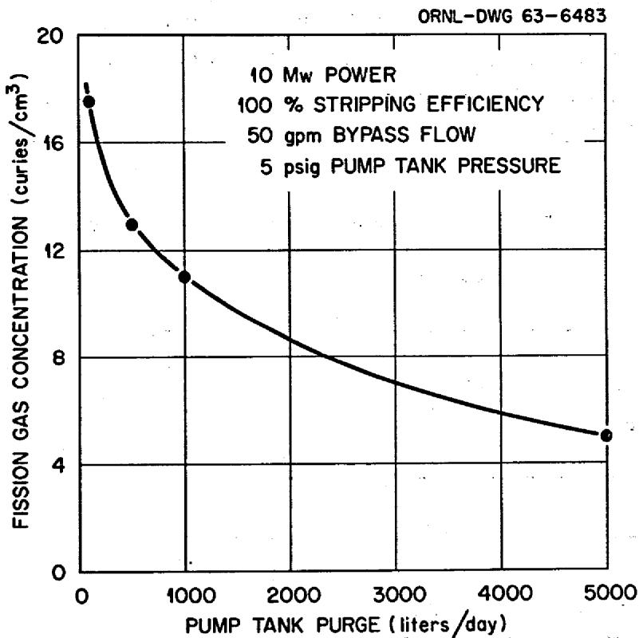  
Fig. 8. Concentration of Radioactive Gas Versus Purge-Gas Flow Rate in Prototype Fuel-Salt Pump.

A 40-Ci $^{137}$ Cs source of 0.622-Mev gamma rays was placed on one side of the salt piping at the pump inlet, a region of low static salt pressure, and a radiation detector was placed on the other side. The detector consisted of a cylinder of plastic phosphor (3 in. in diameter and 6 in. long) and an electron multiplier phototube. The plastic phosphor absorbs photons, which are transmitted from the source through the salt. Light is emitted by the plastic phosphor to a phototube that produces a current. The current is a function of the photon transmission through the salt, which in turn is an inverse function of the density of the salt. The signal current from the detector is fed to a suppression circuit that indicates only variations in the current. The current indication is recorded on Visicorder tape. Thus an increase in the concentration of undissolved gas, which causes a decrease in salt density, is indicated by an increase in the current output of the densitometer.

The densitometer was calibrated over a small range of thermal change in salt density corresponding to the salt temperature range 1100 to $1400^{\circ}\mathrm{F}$ . During calibration the salt contained no entrained gas. The pump was not operating, so gas bubbles could leave the densitometer and enter the higher elevations in the salt system. Thermal-convection velocities in the salt were too small to entrain fresh gas from the pump tank.

The two Visicorder traces shown in Fig. 9 give a measure of helium concentration in the salt loop at two different salt levels in the pump tank. The pump was operated with a 13-in.-OD impeller at a flow of $1650\mathrm{~gpm}$ through the 6-in.-diam pipe and a salt temperature of $1185^{\circ}\mathrm{F}$ ; approximately 85 gpm of salt was bypassed through the spray ring. The curves are plotted with the flow density at zero deflection for comparison and to illustrate the transient behavior of the gas concentration when the pump is first stopped (flow reduction to zero) and then started (flow increase from 0 to $1650\mathrm{~gpm}$ ). Trace I presents the density data for the normal level of salt in the pump tank (3 3/8 in. above center line of the volute). Trace II relates to a higher salt level in the pump tank (4 7/16 in. above the center line of the volute). The gas concentration in the circulating salt when operating at the normal level was $4.6\mathrm{vol}\%$ , and at the other higher level it was $1.7\mathrm{vol}\%$ . The

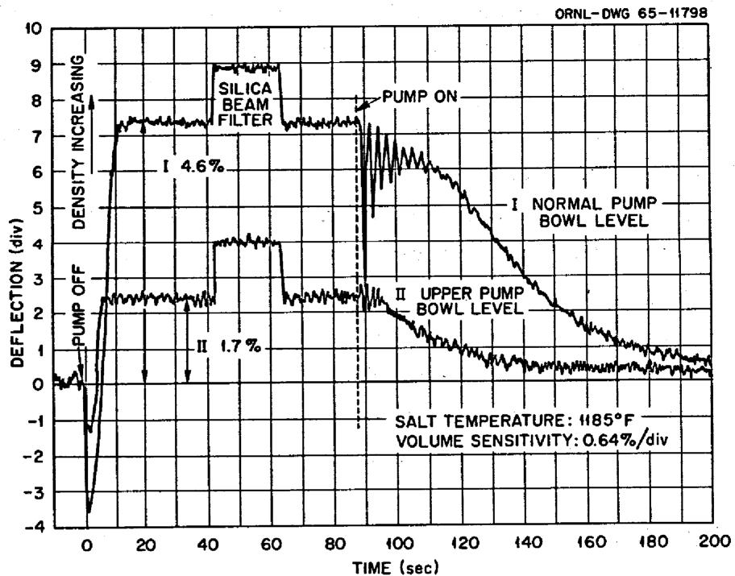  
Fig. 9. Concentration of Undissolved Gas Versus Time as Determined by Gamma Radiation Densitometry of Prototype Fuel-Salt Pump with 13-in. Impeller and 1650-gpm Salt Flow.

sensitivity of the Visicorder was $0.64 \, \text{vol\%}$ per division. At the higher operating level, the discharge ports of the xenon removal spray ring were covered with salt. Since the high-velocity spray from the xenon-removal spray ring is a major contributor to the agitation that causes gas bubbles, it is understandable that the gas concentration was lower when operating at the higher level in the pump tank.

In a separate test, the same densitometer arrangement was used to measure gas concentrations in the fuel salt circuit at the MSRE. The principal conditions included the impeller diameter of 11 l/2 in., a salt flow of 1150 gpm at $1200^{\circ}\mathrm{F}$ , normal operating level, and a spray-ring flow of 50 gpm. The void fraction in the salt was not detectable at these conditions. At a lower level of salt in the pump tank, a void fraction of 2 to 3 vol % was indicated. Subsequent measurements with the same densitometer on the molten-salt test loop and with a 11 l/2-in.-diam impeller, a flow of 1200 gpm at $1200^{\circ}\mathrm{F}$ , the salt at the normal operating level, and a spray-ring flow of 50 gpm gave a void fraction of 0.1 vol %.

Comparing the gas concentrations for operation with the 13-in.- and the 11 1/2-in.-diam impellers at the normal operating level shows that the content is less with the smaller impeller by a factor of 46. This is attributable to the xenon-removal spray flow, which is approximately 50 gpm for the smaller impeller, compared with 85 gpm with the 13-in.-diam impeller. The jet velocity from the spray ring is considerably less with the 50-gpm flow; thus there is less agitation of the liquid level surface upon impingement of the jet streams.

# Problems Encountered During Pump Fabrication and Molten-Salt Tests

Fabrication problems were encountered with the dished heads for the pump tanks, the impeller and volute castings, and the hermetic vessels for enclosing the drive motors. Pump operating problems were encountered with the shaft purge flow, shaft and impeller running clearances, shaft seals, and the flow straightener in the test stand salt piping during testing and operation of the pumps at elevated temperatures.

# Fabrication Problems

The Hastelloy N dished heads for the pump tanks were originally fabricated by hot spinning of plate stock. The resulting heads contained many crack-like defects on the knuckle radius that were readily detectable by dye-penetrant inspection. However, the heads were repaired by removal of the cracks by grinding, and this rendered them usable for test purposes. Later, during fabrication of the reactor pumps, the problem was solved by hot pressing the plate stock.

Considerable effort and time were expended to obtain satisfactory Hastelloy N castings for the impellers and volutes. The initial castings were unsatisfactory due to defects such as cracks resulting from shrinkage, inclusions, and porosity. Castings of improved quality, which were acceptable after repairs, were obtained from a second foundry. The castings were improved by modifying the chemistry of the casting melts and by the founder giving close supervision and attention to the details of the casting procedures.

Two problems were encountered during the fabrication of the hermetically sealed vessels for the drive motors. The design originally specified brazing a cooling coil of stainless steel pipe to the outside of the cylindrical carbon steel vessel. However, because of the difference in thermal expansion between the two materials, continuous attachment of the coil to the vessel was not achieved by brazing. The problem was solved by welding the coil in place. A more serious problem was encountered during the buildup of weld metal, "buttering," on the inner surface of the vessel to accommodate the attachment of a flat head. Large laminar defects appeared in the vessel wall in the region of the buildup. Removal of the defects by grinding and weld repair resolved the problem. Satisfactory vessels were obtained but at the expense of delays in delivery of the vessels and additional expense to the fabricator.

# Shaft Annulus Plugging

During test 6 (see Table 1) the recorded trace of drive motor power began fluctuating after 700 hr of operation with molten salt at $1200^{\circ}\mathrm{F}$ . An anomalous value of gas pressure, which exceeded the supply pressure

by approximately 5 psi, was observed in the pump tank. The test was therefore terminated, and inspection of the rotary assembly revealed the presence of solidified salt in the annulus between pump shaft and shield plug.

Subsequent analysis showed that the gas flow in the lower portion of the shaft annulus had been reversed and was upward instead of downward, the proper direction. The flow reversed because the gas flow from the liquid level indicators, although thought to be small, was actually significant. The excess gas exceeded the throttled capacity of the off-gas flow line from the pump tank; consequently the excess gas flowed upward, joined the annulus purge gas, and left the pump through the shaft seal oil leakage drain line. Small droplets of molten salt were carried by the reversed purge flow into the lower end of the shaft annulus where they solidified, accumulated, and finally acted as a brake on the shaft. The chemical composition of a sample of the material taken from the shaft annulus was very close to that of the salt being circulated. The results of x-ray and petrographic examinations of the sample indicated that the material was carried into the annulus as an aerosol.

To prevent the recurrence of this incident and to provide protection against back diffusion, the flow rates of the gas to and from the pump tank were monitored more closely to assure that purge gas did flow down the shaft annulus. The flow rate of gas from the pump tank must equal the flow rate of the purge down the shaft annulus plus the flow rate of gas associated with the operation of the bubble-type level indicators.

Another case of shaft annulus plugging was encountered during test 17 (see Table 1). The plugging was indicated by a buildup of pressure in the seal oil leakage catch basin compared with the pump tank pressure. The pressure differential (0 to 5 psi) thus created caused oil to leak out of the catch basin and down the outer surface of the shield plug and into the pump tank. This leakage was detected by a hydrocarbon analyzer sampling the pump tank off-gas. The plug was located at the lower end of the shaft annulus, and it was of such a nature it could be temporarily removed by heating the system circulating salt from 1200 to $1250^{\circ}\mathrm{F}$ or by

stopping the pump briefly and then restarting it. The pressure differential between the catch basin and pump tank would disappear, and leakage of oil would stop as indicated by the hydrocarbon analyzer. After termination of the test, material from the plug was analyzed and found to be of a composition similar to the test salt.

The original salt deposit is believed to have resulted from a filling operation of the system wherein the supply of salt in the dump tank was depleted before reaching the normal level in the pump tank. Gas then bubbled up through the dip-line connecting the dump tank to the salt piping and rose into the pump tank, where it erupted from the surface and splashed salt against the lower end of the shield plug. The temperature of the surface was low enough to freeze the salt and retain it.

# Insufficient Running Clearances

It is normal practice to try to operate centrifugal pumps at or near their highest efficiency. During operation along the constant system flow-resistance curve that passes through this best-efficiency point, also called the balance line (see Fig. 10), the various losses in the impeller and volute are minimum, and the pressure distribution in the volute is nearly uniform. This uniform distribution gives rise to the minimum net radial force on the impeller. During operation on higher or lower lines of system flow resistance (see Fig. 10), the volute pressure distribution becomes nonuniform, and a net radial force is exerted on the impeller that increases as the operating condition departs farther from the balance line. Thus operation at off-design conditions produces radial forces on the impeller that deflect the overhung shaft. Three incidents of insufficient running clearance to accommodate this deflection were encountered during operation of the MSRE pumps with molten salt in the test facility. During the initial molten-salt test (test 1, Table 1), the prototype pump shaft seized in the shield plug. Operation at off-design conditions deflected the shaft sufficiently to cause rubbing of the hot, dry shaft against the bore of the shield plug at its lower end. The shaft was friction-welded to the plug over a length of about $\frac{1}{4}$ in. The radial running clearance between the shaft and the shield plug was

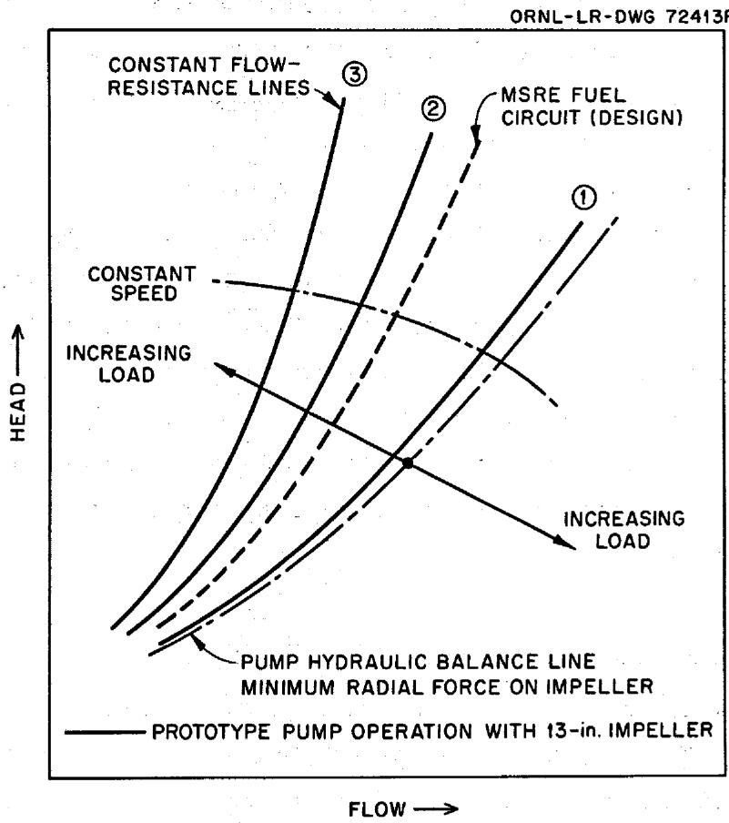  
Fig. 10. Relationship Between Lines of Constant Flow Resistance, Pump Characteristic Curves, and Impeller Radial Load for Centrifugal Pumps.

therefore increased from 0.010 to 0.045 in. to avoid shaft seizure at anticipated off-design operating conditions.

During test 9, the shaft of the MSRE fuel-salt pump rubbed against the helium purge labyrinth seal. The rubbing was detected and the pump was stopped before seizure could occur. The diametral clearance was 0.005 in. The rubbing evidently occurred as a result of the buildup during assembly of eccentricities in the mechanical structure of the pump, shaft deflection due to dynamic loading, and shaft run-out. The diametral clearance was increased to 0.010 in.

During test 12, the impeller of the spare reactor fuel-salt pump rubbed against the volute. Rubbing occurred when a flow of cooling air was supplied to the exterior of the nonwetted portion of the pump tank while the pump was being operated at $1200^{\circ}\mathrm{F}$ . It was found that the mounting of the volute was slightly skewed in the pump tank, and the axial running clearance between the volute and the inlet shroud of the impeller was less than required. Additional properly delineated axial running clearance between the impeller inlet shroud and volute was therefore provided.

# Oil Leakage from the Catch Basin into the Pump Tank

Oil leakage from the catch basin down the outside of the shield plug and into the pump tank was observed in some of the molten-salt pump tests and during initial operation of the fuel-salt pump with barren salt in the MSRE. The leakage path traversed a joint that was sealed with a soft-annealed solid-copper O-ring compressed between adjacent flat horizontal surfaces on the bearing housing and shield plug (see Fig. 11). Modifications were made on the spare rotary elements for the fuel and coolant pumps for the MSRE.

A weld arrangement was devised to seal the joint between the bearing housing and the shield plug in a positive manner. The relationships between the pump shaft, the shaft lower seal, bearing housing, catch basin, shield plug, and the pump tank are shown in the larger section in Fig. 11. The insets show the portions affected before and after modification. The modification was made on both the fuel- and coolant-salt pump spare rotary elements for the MSRE.

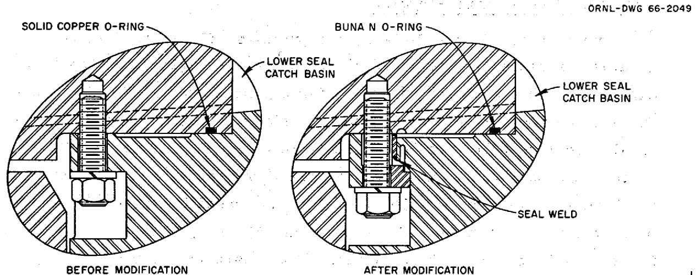

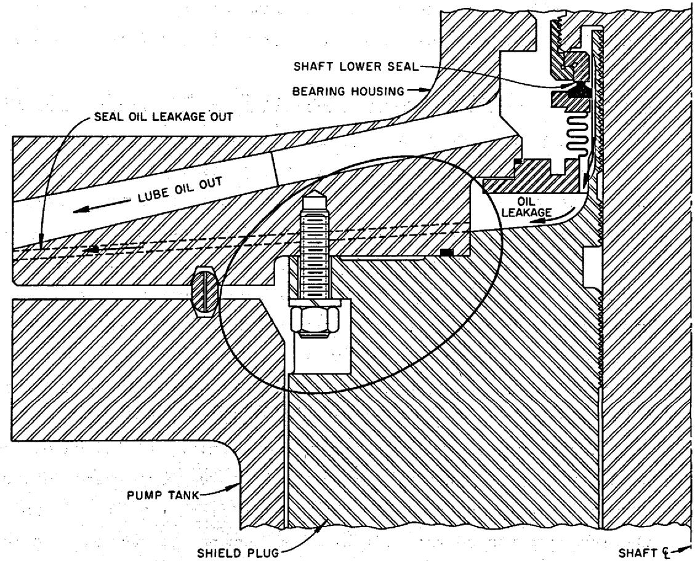  
Fig. 11. Cross Sections of Catch Basin Region of Rotary Element Before and After Modification to Seal the Oil Leak Passage Between Shield Plug and Bearing Housing.

# Pump Tank Off-Gas Line Plugging

During test 17 (see Table 1) the purge-gas flow rate down the shaft annulus was set at 4 liters/min to investigate plugging that had been experienced in the fuel-salt pump off-gas line at the MSRE and to test filters for possible use to prevent the plugging. The purge flow rate on all previous tests was considerably lower (factor of 10 or more). At the high test purge rate some partial plugging in the pump tank off-gas line was experienced. The plugging was caused by the solidification of salt aerosol swept out of the pump tank by the purge gas. The aerosol is presumably generated by agitation of the salt in the pump tank by the high-velocity salt jets that issue from the xenon-removal spray ring. The problem was a nuisance but did not interfere with pump operation.

# Failure of Weld Attachment of Parts of Flow-Straightening Device

Test 12 (see Table 1) was terminated after the operator reported a strange noise that he had heard only one time. A slight roughening of the trace on the pump power recorder was also observed. Inspection indicated that one of the three parts of a flow-straightening device had become detached and lodged in the impeller inlet. This caused some damage to the inlet edges of the impeller vanes and deformed a swirl preventer of cruciform configuration that was located adjacent to the impeller inlet. Figure 12 shows the posttest configuration of one of the three parts from the straightener. Figure 13 shows the rubbing damage to the leading edges of the impeller vanes, and Fig. 14 shows the damage done to the swirl preventer. Figure 15 indicates the locations in the flow straightener from which the three parts were detached. Other than the barely perceptible roughening of the power trace, no effects of the lodged parts on the hydraulic performance of the pump could be detected.

The salt flow had carried the detached parts downstream through the venturi meter and the interconnecting salt piping and upward into the impeller inlet. The straightener parts had been welded in intermittent fashion to the carrier pieces, as shown in Fig. 15. The straightener itself was located just upstream of the venturi meter to straighten the salt flow before entry into the meter.

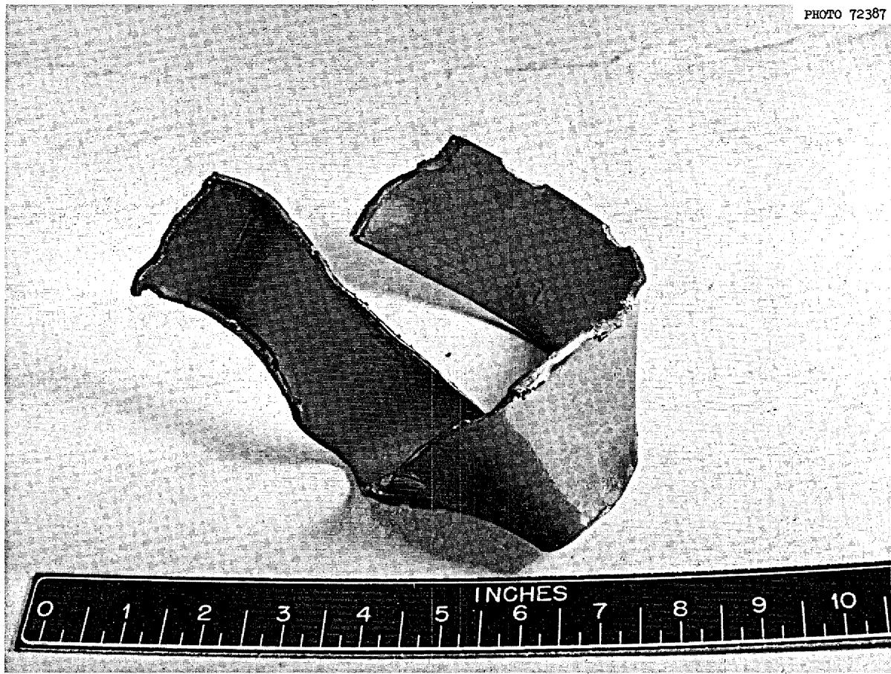  
Fig. 12. Part of Flow Straightener After Detachment and Lodging in Impeller Inlet.

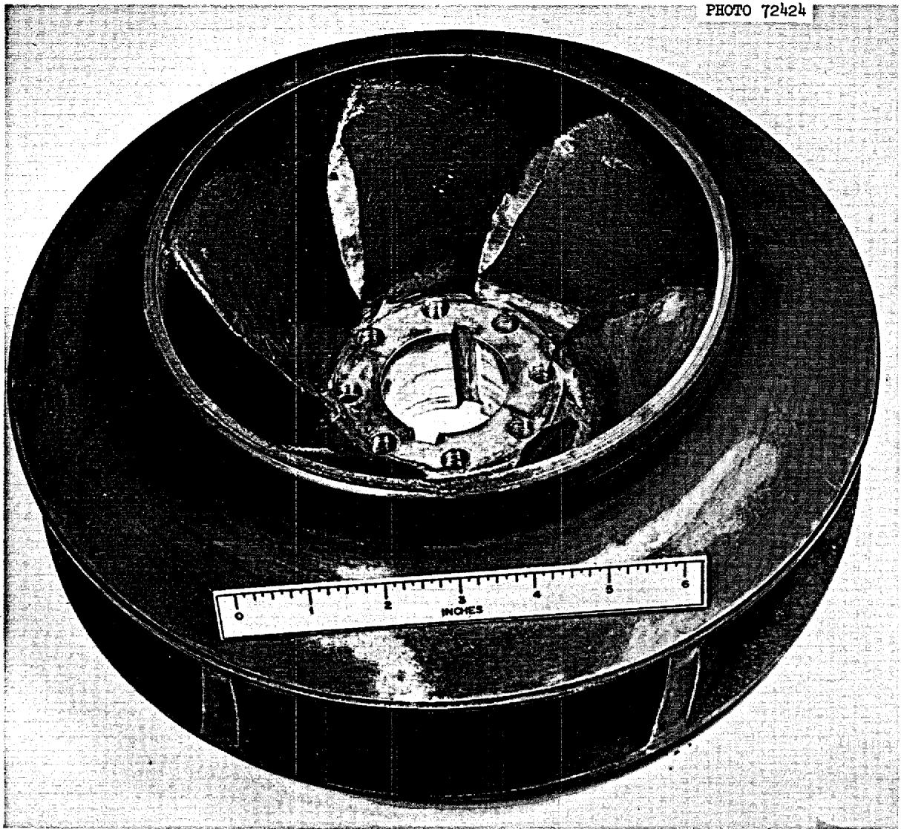  
Fig. 13. Rubbing Damage to Inlet Edges of Impeller Blades. Damage was caused by rubbing of impeller against detached part of flow straightener that lodged in impeller inlet.

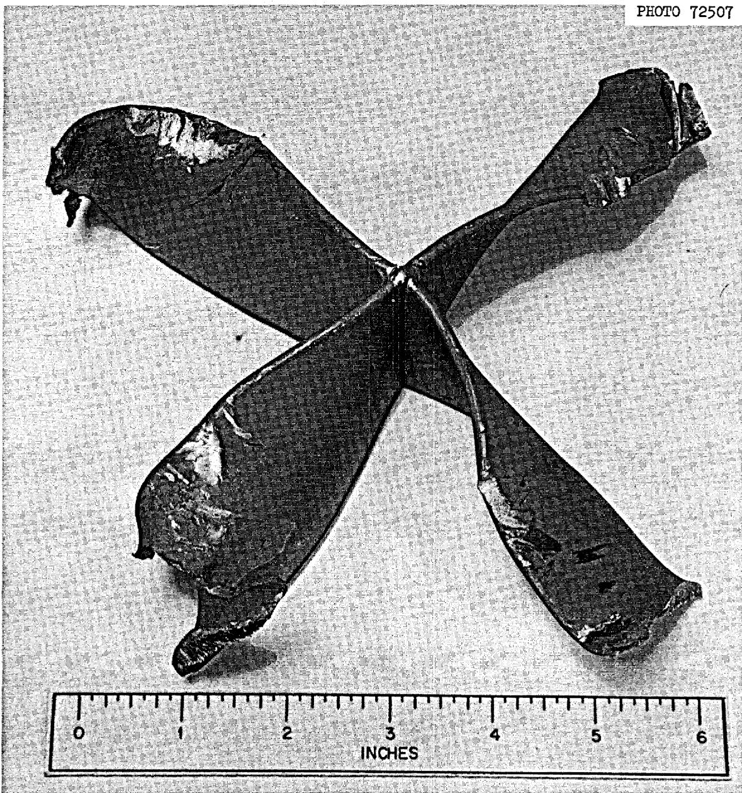  
Fig. 14. Damaged Swirl Preventer. Damage was caused by lodging of detached part of flow straightener in impeller inlet.

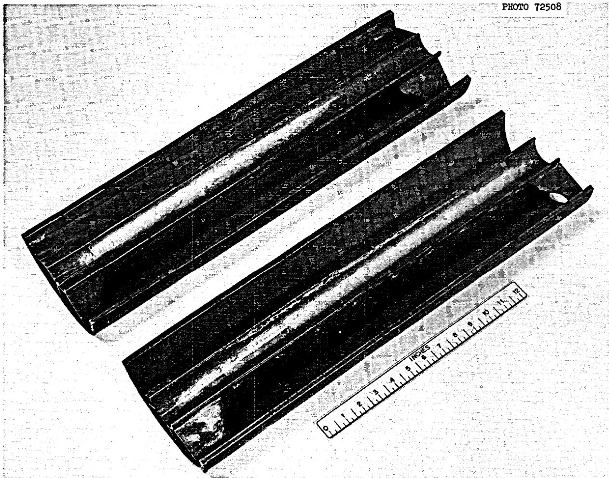  
Fig. 15. Failure of Weld Attachment of Parts in Flow Straightener. Locations are shown from which parts were detached.

At this time it was decided to modify the salt piping as shown in Fig. 16 to locate the venturi meter in the upper leg of the salt piping and the straightener upstream of it near the outlet end of the air cooler. The designs of the straightener and the welds joining its parts were also modified to reduce the vibration-induced fatigue thought to be the reason for the detachment of the three parts. The impeller and the swirl preventer were replaced also.

# Mark-2 Fuel-Salt Pump

The Mark-2 fuel-salt pump represents a modification to the original design of the fuel-salt pump to provide additional volume needed to accommodate the thermal expansion of the system fuel salt. For the original fuel-salt pump, an overflow tank had to be installed at the MSRE to provide the additional volume.

Although the Mark-2 pump was fabricated and operated with salt in the molten-salt pump test stand, it was never installed into the MSRE. It is still being operated in the test stand, and in April 1970 had circulated the salt LiF-BeF $_2$ -ZrF $_4$ -ThF $_4$ -UF $_4$ (68.4-24.6-5.0-1.1-0.9 mole %) for more than 14,000 hr, mainly at 1200°F. Its performance has been satisfactory in every respect, except for partial restrictions to the purge-gas flow that occur occasionally in the off-gas line and in the pump shaft annulus.

# Description of Pump

The Mark-2 pump has the same hydraulic components (impeller and volute), bearing housing, and drive motor designs as those used in the original fuel-salt pump. However, the height of the pump tank was increased by 9 3/4 in. to provide 5 3/4 ft³ of additional volume for the thermally expanded fuel salt. The pump shaft is the same, except that the length of the salt-wetted portion was increased a corresponding amount. The configuration of the pump is shown in cross section in Fig. 17.

The detailed designs of internal equipment in the pump tank (i.e., salt splash baffles and salt spray ring) differ from those provided for

ORNL-DWG 66-2048

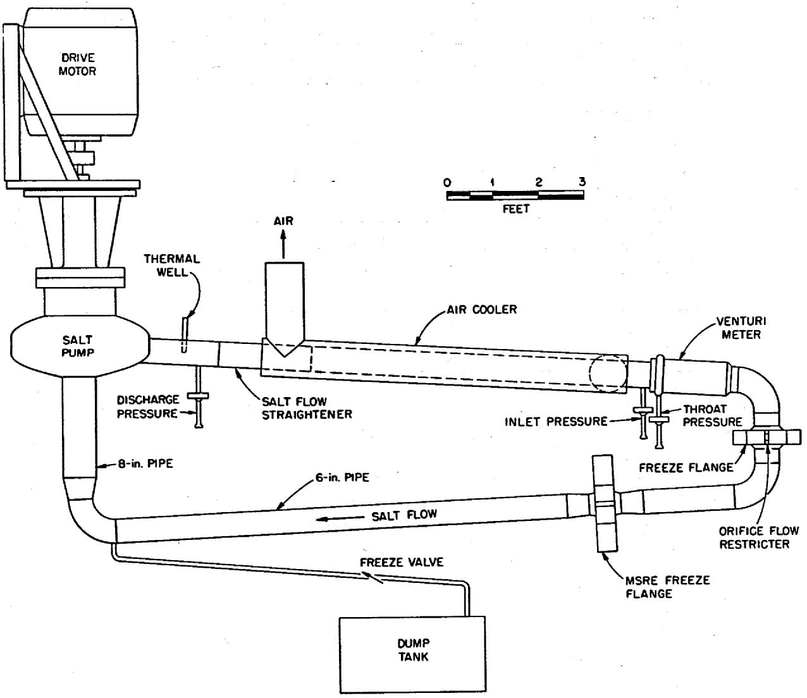  
Fig. 16. Configuration of Salt Piping in the Molten-Salt Pump Test Stand as Modified After Failure of Weld Attachment of Parts in Flow Straightener.

ORNL-DWG 69-10459

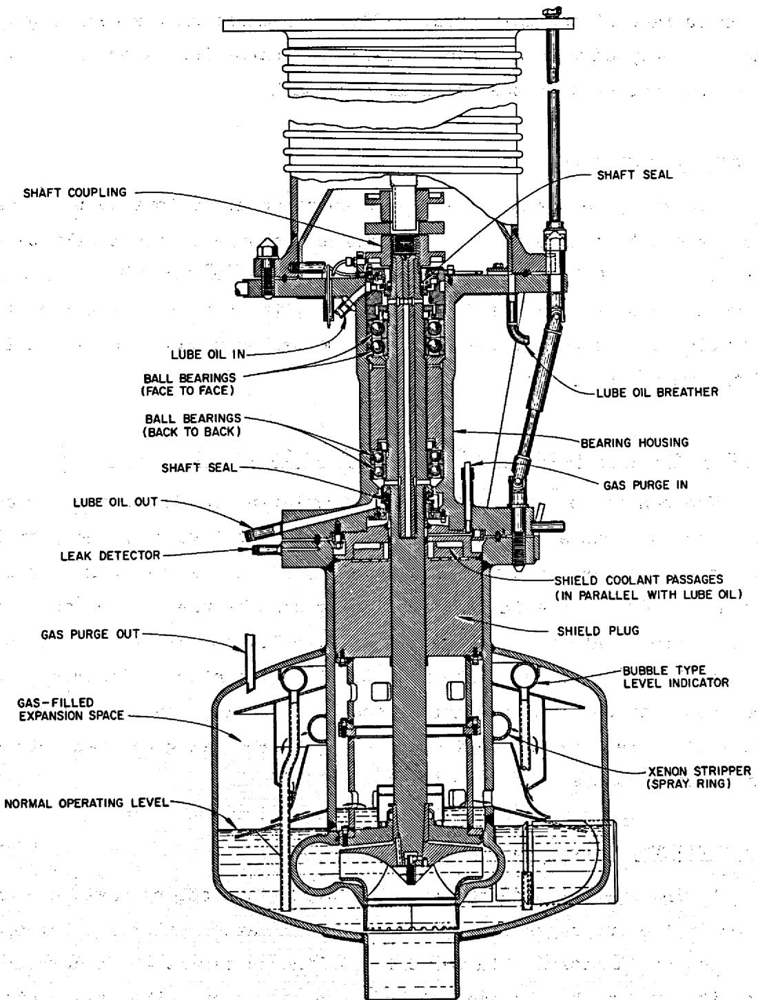  
Fig. 17. Cross Section of Mark-2 Fuel-Salt Pump.

the original tank (Fig. 1). The jets from the spray ring do not impinge directly into the pool of salt in the pump tank but are aimed at the inner surface of the salt spray baffle. In addition the Mark-2 pump tank is equipped with a buoyancy level indicator (not shown in Fig. 17), which was not used in the original pump tank.

# Hydraulic Performance

Hydraulic performance data were obtained at various pump speeds along a constant line of flow resistance and at a constant salt temperature of $1200^{\circ}\mathrm{F}$ . The data are superimposed in Fig. 18 on a graph of water test performance data provided by the vendor of the impeller and volute. The head values from the molten-salt data are within 2 ft of the vendor's values.

# Measurement of Undissolved Gas Content in Circulating Salt

The content of undissolved gas circulating in the salt was measured with the pump operating at three different salt levels in the pump tank. At the normal level and the high level, 5 3/8 in. above normal, there was no gas detectable in the circulating salt by use of the radiation densitometer. At the low level, 2.4 in. below normal, a gas content of 0.1 vol % was measured. (The radiation densitometer is described in a previous section.) At the normal and high levels, the baffles are evidently effective in keeping gas bubbles from being carried into the circulating salt at the pump inlet.

# Restrictions to Purge-Gas Flow

During operation of the pump, partial restrictions have been experienced in the purge-gas flow passages. Examination after initial operation revealed solid material in the off-gas line as far as 40 ft downstream from the pump tank. It had collected in valves and other restricted flow areas, and therefore it was difficult to maintain the purge-gas flow of 4 liters/min, the MSRE design rate. A commercial filter was therefore installed approximately 15 ft downstream from the pump tank,

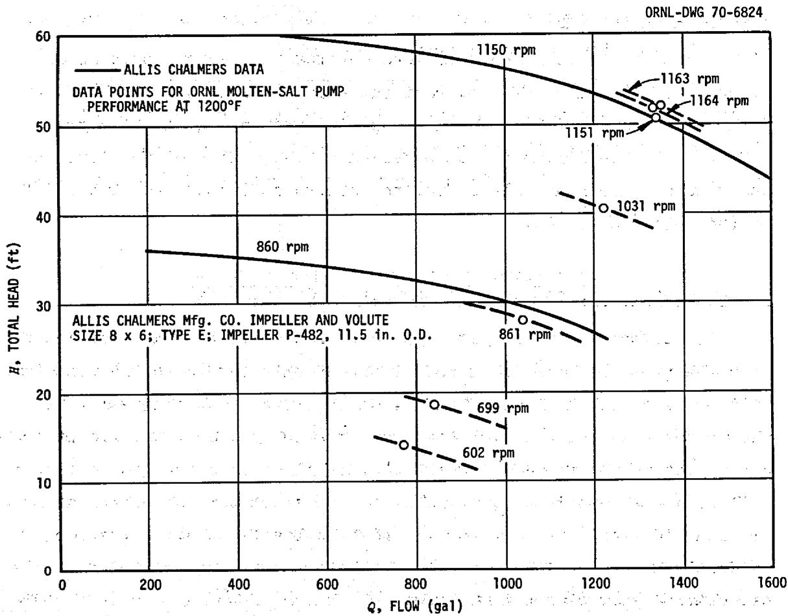  
Fig. 18. Hydraulic Performance of Mark-2 Fuel-Salt Pump.

and there was no further plugging. A restriction now occurs on the average of about once per month in the pump tank off-gas nozzle or at a valve just upstream of the filter. It is removed by rapping on the line or by application of heat with a torch.

Examination of a sample of the plug material revealed that it was salt in nearly spherical droplet form $15\mu$ in diameter or less. The salt material is carried as an aerosol in the purge gas from the pump tank gas space into the pump tank off-gas line.

There have been eight occasions of partial plugging in the shaft annulus (inlet purge-gas passage). This plugging can be cleared by either stopping the pump momentarily and restarting it or by heating the system salt to $1325^{\circ}\mathrm{F}$ for a short period (about 1 hr) and then returning it to $1200^{\circ}\mathrm{F}$ .

# Performance of Molten-Salt Pumps in MSRE

Two molten-salt pumps, one for fuel salt and one for coolant salt, were installed in the MSRE. They were developed with the aid of water tests3 and the salt tests conducted in the molten-salt pump test stand, as described above. The two pumps are identical except for the hydraulic design (impeller and volute); the fuel pump tank has a spray ring to provide for xenon removal, whereas the coolant pump does not; and the fuel pump is driven at 1175 rpm, while the coolant pump is driven at 1775 rpm. Their accumulated operating statistics, up to the shutdown of the MSRE on December 12, 1969, are presented in Table 4, which gives the accumulated pump operating hours for circulation of molten salt, helium, and the combined hours for helium and salt when the system was at $900^{\circ}\mathrm{F}$ or above. The service of the MSRE salt pumps, which began in August 1964, was satisfactory, and the total operating times for the pumps exceeded 58,000 hr.

During operation of the pumps only one problem was encountered - partial restriction of the off-gas flow. This problem did not interfere with the operation of the MSRE but was a nuisance in that it required considerable attention from time to time. We believe that the restrictions resulted from two sources: the freezing of salt aerosol

and the radiolytic polymerization of oil in the off-gas lines. Measurements of the hydrocarbon content in the pump off-gas showed 1 to 2 g/day of hydrocarbons. The source of salt aerosol is discussed in a previous section, as is the source of the oil. Partial restrictions occurred at the off-gas outlet nozzles of the pump tanks and at other locations, such as valve seats or other points of reduced flow area. In all other respects, the operation of the salt pumps was deemed satisfactory by the MSRE Operations Group.

Table 4. Molten-Salt Pump Operation in MSRE   

<table><tr><td>Pump</td><td>Process Fluid</td><td>Head (ft)</td><td>Flow (gpm)</td><td>Speed (rpm)</td><td>Temperature (°F)</td><td>Total Hours</td></tr><tr><td rowspan="3">Fuel</td><td>Helium and molten salt</td><td></td><td></td><td></td><td>≥900</td><td>30,848</td></tr><tr><td>Molten salt</td><td>50</td><td>1200</td><td>1175</td><td>1000–1225</td><td>21,788</td></tr><tr><td>Helium</td><td></td><td></td><td></td><td>100–1225</td><td>7,385</td></tr><tr><td rowspan="3">Coolant</td><td>Helium and molten salt</td><td></td><td></td><td></td><td>≥900</td><td>27,438</td></tr><tr><td>Molten salt</td><td>78</td><td>800</td><td>1175</td><td>1000–1275</td><td>26,076</td></tr><tr><td>Helium</td><td></td><td></td><td></td><td>100–1275</td><td>4,707</td></tr></table>

An incident occurred with the fuel-salt pump during one salt-filling operation in preparation for startup of the reactor. The salt was forced to an excessively high level in the pump tank, which resulted in salt entering the shaft annulus and freezing. Under these circumstances the motor output torque was not sufficient to turn the shaft. After application of extra heat to the pump tank and sufficient time for heat to transfer into the frozen region, the shaft became free to rotate and the pump was again operative. The filling procedures were modified, and this incident did not recur.

# Conclusions

The development and test program produced fuel- and coolant-salt pumps that, on the whole, operated satisfactorily and dependably during the operating life of the MSRE from August 1964 to December 1969. The molten-salt hydraulic performance of the pumps compared favorably with the room-temperature water test performance. The pump head with molten salt was observed to be within 2 ft, or $5\%$ , of the water test head, and this difference is within the accuracy of the instrumentation.

The pump shaft purge was effective in protecting the lower shaft seal region of the fuel-salt pump from radioactive fission products, and the path for removal of seal oil leakage remained opened during all MSRE operation. The oil leakage rate for the lower shaft seals was acceptable (maximum of 30 cc/day) throughout MSRE operation.

A seal weld scheme, which joins the shield plug and the bearing housing, was developed to prevent oil leakage in the lower seal catch basin from entering the pump tank. It was applied to the spare rotary elements, which were not needed in the MSRE and therefore were never installed.

Consideration should be given to the handling of salt aerosol in the design of salt pumps for advanced molten-salt reactor systems and to minimizing the production of aerosol. A device should be provided to remove the aerosol content in the purge gas and return it to the salt system.

# Acknowledgments

The satisfactory design, development, fabrication, and operation of reactor-grade molten-salt pumps for the MSRE required the efforts, enthusiasm, loyalty, and cooperation of more people than can be named in this report. From this large group, recognition must be given to L. V. Wilson for his efforts in the design of the pumps and to R. B. Briggs, A. G. Grindell, and R. E. MacPherson for the substantial guidance and encouragement they provided throughout the MSRE salt pump development program.

# References

1. R. B. Briggs, MSRP Semiann. Progr. Rept. July 31, 1964, USAEC Report ORNL-3708, p. 375, Oak Ridge National Laboratory.   
2. P. G. Smith, Water Test Development of the Fuel Pump for the MSRE, USAEC Report ORNL-TM-79, p. 47, Oak Ridge National Laboratory, Mar. 27, 1962.   
3. C. H. Gabbard, Thermal-Stress and Strain-Fatigue Analyses of the MSRE Fuel and Coolant Pump Tanks, USAEC Report ORNL-TM-78, p. 71, Oak Ridge National Laboratory, Oct. 3, 1962.   
4. A. G. Grindell, W. F. Boudreau, and H. W. Savage, Development of Centrifugal Pumps for Operation with Liquid Metal and Molten Salts at 1100-1500°F, Nucl. Sci. Eng., 7(1): 83-91 (1960).   
5. R. W. Kelly, G. M. Wood, and H. V. Marman, Development of a High-Temperature Liquid Metal Turbopump, Trans. ASME, Series A, J. of Eng. for Power, 85(2): 99-107 (1963).   
6. C. Ferguson et al., Design Summary Report of LCRE Reflector Coolant Pumps and Sump, USAEC Report PWAC-384, p. 41, Pratt & Whitney Aircraft, Middletown, Connecticut, December 1963.   
7. O. S. Seim and R. A. Jaross, 5000 gpm Electromagnetic and Mechanical Pumps for EBR-II Sodium System, Second Nuclear Engineering and Science Conference sponsored by ASME, Philadelphia, Pa., March 11-14, 1957.   
8. H. W. Savage, G. D. Whitman, W. G. Cobb, and W. B. McDonald, Components of the Fused-Salt and Sodium Circuits of the Aircraft Reactor Experiment, USAEC Report ORNL-2348, pp. 21-33, Oak Ridge National Laboratory, Feb. 15, 1958.   
9. O. P. Steele III, High-Temperature Mechanical "Canned Motor" Liquid Metal Pumps, Nuclear Engineering Science Conference sponsored by Engineers Joint Council, Chicago, March 17-21, 1958.   
10. R. W. Atz, Performance of HNPF Prototype Free-Surface Sodium Pumps, USAEC Report NAA-SR-4336, Atomics International, June 30, 1960.   
11. J. G. Carroll et al., Field Tests on a Radiation-Resistance Grease, Lubricating Eng., 18(2): 64-70 (1962).   
12. P. G. Smith, Development and Operational Experience with the Lubrication Systems for the Molten-Salt Reactor Experiment Salt Pumps, Oak Ridge National Laboratory, unpublished internal memorandum, June 1970.   
13. R. B. Briggs, MSRP Semiann. Progr. Rept. November 1964, USAEC Report ORNL-3708, pp. 233-235, Oak Ridge National Laboratory.

14. R. B. Briggs, MSRP Semiann. Progr. Rept. December 31, 1962, USAEC Report ORNL-3369, pp. 123-124, Oak Ridge National Laboratory.   
15. R. B. Briggs, MSRP Semiann. Progr. Rept. January 31, 1963, USAEC Report ORNL-3419, pp. 37-40, Oak Ridge National Laboratory.

# Appendix

# MSRE DRAWINGS

# Fuel-Salt Pump Drawings

<table><tr><td>BM-8930</td><td>MSRE Fuel Pump</td></tr><tr><td>F-9830</td><td>Assembly</td></tr><tr><td>E-10965</td><td>Pump Tank Test Assembly</td></tr><tr><td>D-10964</td><td>Flange Weldment</td></tr><tr><td>F-9846</td><td>Upper Shell Weldment</td></tr><tr><td>D-10344</td><td>Details</td></tr><tr><td>B-9727</td><td>Dished Head</td></tr><tr><td>D-9711</td><td>Volute</td></tr><tr><td>D-10068</td><td>Bubbler Header Weldment</td></tr><tr><td>F-9841</td><td>Lower Shell Weldment</td></tr><tr><td>D-10561</td><td>Sprinkler Head Weldment</td></tr><tr><td>D-9849</td><td>Thimble Weldment</td></tr><tr><td>E-9710</td><td>Impeller</td></tr><tr><td>D-9839</td><td>Details</td></tr><tr><td>D-9837</td><td>Details</td></tr><tr><td>D-9847</td><td>Labyrinth Flange Weldment</td></tr><tr><td>F-9844</td><td>Shield Plug Assembly</td></tr><tr><td>E-9843</td><td>Details</td></tr><tr><td>D-10967</td><td>Motor Guide Weldment</td></tr><tr><td>D-9834</td><td>Details</td></tr><tr><td>D-9832</td><td>Filler Bar</td></tr><tr><td>F-9845</td><td>Shaft</td></tr><tr><td>D-9838</td><td>Shaft Coolant Plug Weldment</td></tr><tr><td>F-9836</td><td>Bearing Housing Assembly</td></tr><tr><td>E-9835</td><td>Bearing Housing Weldment</td></tr><tr><td>D-9833</td><td>Upper Seal</td></tr><tr><td>D-9831</td><td>Bearing Clamp Ring</td></tr><tr><td>D-9848</td><td>Modified Flexible Coupling</td></tr><tr><td>D-9850</td><td>Modified Oval Ring, ASA B16-20</td></tr><tr><td>D-9720</td><td>Details</td></tr><tr><td>D-10067</td><td>Shield Plate</td></tr><tr><td>D-9840</td><td>Details</td></tr><tr><td>D-10889</td><td>Assembly: Shaft Leak Tester</td></tr><tr><td>D-10888</td><td>Assembly: Leakage Test Fixture</td></tr><tr><td>D-10887</td><td>Weldment: Leakage Test Fixture</td></tr><tr><td>D-10886</td><td>Details</td></tr><tr><td>BM-9718</td><td>Seal, MSRE Pump</td></tr><tr><td>D-9718</td><td>Seal Assembly</td></tr><tr><td>D-9721</td><td>Seal Body Subassembly</td></tr><tr><td>C-9722</td><td>Seal Body</td></tr><tr><td>D-9720</td><td>Seal Spring Plate</td></tr><tr><td>B-9719</td><td>Seal Nose</td></tr><tr><td>BM-9730</td><td>Universal Joint, MSRE Fuel Pump</td></tr><tr><td>D-9730</td><td>Universal Joint Assembly</td></tr><tr><td>D-9905</td><td>Details</td></tr><tr><td>BM-10066</td><td>Bolt Extension, MSRE Fuel Pump</td></tr><tr><td>D-10066</td><td>Bolt Extension Assembly</td></tr></table>

# Coolant-Salt Pump Drawings

<table><tr><td>BM-10062</td><td>MSRE Coolant Pump</td></tr><tr><td>F-10062</td><td>Assembly</td></tr><tr><td>D-9837</td><td>Details</td></tr><tr><td>E-10966</td><td>Pump Tank Test Assembly</td></tr><tr><td>D-10964</td><td>Flange Weldment</td></tr><tr><td>F-10063</td><td>Upper Shell Weldment</td></tr><tr><td>B-9727</td><td>Dished Head</td></tr><tr><td>D-10068</td><td>Bubbler Header Weldment</td></tr><tr><td>D-9771</td><td>Volute</td></tr><tr><td>D-10344</td><td>Details</td></tr><tr><td>D-10344</td><td>Details</td></tr><tr><td>F-10064</td><td>Lower Shell</td></tr><tr><td>D-10065</td><td>Thimble Weldment</td></tr><tr><td>D-9770</td><td>Impeller</td></tr><tr><td>D-9834</td><td>Details</td></tr></table>

D-9847 Labyrinth Flange Weldment

D-9849 Details

F-9844 Shield Plug Assembly

E-9843 Details

D-10967 Motor Guide Weldment

D-9833 Details

D-9837 Details

D-9832 Filler Bar

F-9845 Shaft

D-9838 Shaft Coolant Plug Weldment

F-9836 Bearing Housing Assembly

E-9835 Bearing Housing Weldment

D-9831 Bearing Clamp Ring

D-9848 Modified Flexible Coupling

D-9850 Modified Oval Ring

D-9839 Tachometer Block

D-9720 Details

D-10092 Impeller Wrench Assembly

BM-9718 Seal, MSRE Pump

D-9718 Seal Assembly

D-9721 Seal Body Subassembly

C-9722 Seal Body

D-9720 Details

D-9719 Seal Nose

Fuel and Coolant Pump Drive-Motor Drawings   

<table><tr><td>653 J 015</td><td>General Assembly</td></tr><tr><td>653 J 009</td><td>General Assembly</td></tr><tr><td>828 D 144</td><td>General Assembly</td></tr><tr><td>472 B 183</td><td>Stator Lamination Details</td></tr><tr><td>319157</td><td>Wiring Diagram for 6 Pole</td></tr><tr><td>ED 18399</td><td>Wiring Diagram for 4 Pole</td></tr><tr><td>440 A 811</td><td>Terminal</td></tr><tr><td>440 A 800</td><td>Ball Bearing Detail</td></tr></table>

472 B 233 Seal

Lubrication Stand Drawings   

<table><tr><td>BM-41801</td><td>Lube Oil Package, MSRE</td></tr><tr><td>E-41801</td><td>Piping Assembly</td></tr><tr><td>E-41807</td><td>Support Frame</td></tr><tr><td>E-41803</td><td>Tank Piping Subassembly</td></tr><tr><td>E-41802</td><td>Tank Assembly</td></tr><tr><td>E-41806</td><td>Flange, Double O-Ring Seal</td></tr><tr><td>D-41810</td><td>Breather Line</td></tr><tr><td>D-41808</td><td>Pump Discharge Manifold</td></tr><tr><td>D-41812</td><td>Details</td></tr><tr><td>D-41813</td><td>Filter Modification and Assembly</td></tr><tr><td>D-41809</td><td>Supply Manifold</td></tr><tr><td>D-41811</td><td>Return Manifold</td></tr><tr><td>D-41804</td><td>Style &quot;SSD&quot; Valve Modification</td></tr><tr><td>D-41805</td><td>General Notes</td></tr><tr><td>D-41814</td><td>Process Piping Connections</td></tr><tr><td>E-41815</td><td>Instrumentation Assembly and Power Connections</td></tr><tr><td>E-41816</td><td>Instrument Support Tray</td></tr><tr><td>D-55573</td><td>Flow Element (Coolant)</td></tr><tr><td>D-55572</td><td>Flow Element (Lube)</td></tr></table>

Mark-2 Fuel-Pump Drawings   

<table><tr><td>F-56300</td><td>Assembly</td></tr><tr><td>F-56301</td><td>Test Assembly of Pump Tank</td></tr><tr><td>E-9710</td><td>Impeller</td></tr><tr><td>D-9839</td><td>Impeller Nut</td></tr><tr><td>D-9837</td><td>Slinger</td></tr><tr><td>D-9847</td><td>Labyrinth Flange</td></tr><tr><td>D-9849</td><td>Details</td></tr><tr><td>F-9844</td><td>Shield Plug Assembly</td></tr><tr><td>D-10967</td><td>Motor Guide</td></tr></table>

<table><tr><td>D-48225</td><td>Clamp</td></tr><tr><td>D-9834</td><td>Seal</td></tr><tr><td>D-9832</td><td>Filler Bar</td></tr><tr><td>F-56304</td><td>Shaft</td></tr><tr><td>D-9838</td><td>Shaft Coolant Plug</td></tr><tr><td>F-9836</td><td>Bearing Housing Assembly</td></tr><tr><td>D-9833</td><td>Seal</td></tr><tr><td>D-9831</td><td>Bearing Clamp Ring</td></tr><tr><td>D-9848</td><td>Modified Flexible Coupling</td></tr><tr><td>D-9850</td><td>Modified Oval Ring</td></tr><tr><td>D-9720</td><td>Details</td></tr><tr><td>D-10067</td><td>Shield Plate</td></tr><tr><td>D-56307</td><td>Spool Piece</td></tr><tr><td>D-55508</td><td>XFMR Mtg. Plate</td></tr><tr><td>E-48424</td><td>Details</td></tr><tr><td>E-48423</td><td>Splash Baffle Weldment</td></tr><tr><td>F-56302</td><td>Upper Shell Weldment</td></tr><tr><td>F-56303</td><td>Lower Shell Weldment</td></tr><tr><td>D-48422</td><td>Volute</td></tr><tr><td>D-48936</td><td>Level Indicator - Float Assembly and Details</td></tr><tr><td>C-48935</td><td>Lube Oil Jet Pump Assembly and Details</td></tr><tr><td>B-9727</td><td>36-in. Flanged and Dished Head</td></tr><tr><td>D-10964</td><td>Weldment Flange</td></tr><tr><td>D-56305</td><td>Capsule Guide and Latch Stop</td></tr><tr><td>D-56306</td><td>Bubbler Header Weldment</td></tr><tr><td>D-10344</td><td>Details</td></tr><tr><td>BM-9718</td><td>Seal, MSRE MK-2 Fuel Pump</td></tr><tr><td>D-9718</td><td>Seal Assembly</td></tr><tr><td>D-9721</td><td>Seal Body Subassembly</td></tr><tr><td>C-9722</td><td>Seal Body</td></tr><tr><td>D-9720</td><td>Seal Spring Plate</td></tr><tr><td>B-9719</td><td>Seal Nose</td></tr><tr><td>BM-9730</td><td>Universal Joint, MSRE Fuel Pump</td></tr><tr><td>D-9730</td><td>Universal Joint Assembly</td></tr></table>

D-9905 Details

BM-10066 Bolt Extension, MSRE Fuel Pump

D-10066 Bolt Extension

# Internal Distribution

1. R.F.Apple   
2. S.J.Ball   
3. H.F.Bauman   
4. S. E. Beall   
5. M. Bender   
6. C. E. Bettis   
7. E. S. Bettis   
8. F. F. Blankenship   
9. R. Blumberg   
10. E. G. Bohlmann   
11. C. J. Borkowski   
12. R. B. Briggs   
13. D. W. Cardwell   
14. C. J. Claffey   
15. C. W. Collins   
16. E. L. Compere   
17. W.H. Cook   
18. J. W. Cooke   
19. W.B.Cottrell   
20. J. L. Crowley   
21. F. L. Culler   
22. J.H.DeVan   
23. J. R. Distefano   
24. S.J.Ditto   
25. F. A. Doss   
26. W. P. Eatherly   
27. J. R. Engel   
28. E.P.Epler   
29. A. P. Fraas   
30. J.H.Frye   
31. L. C. Fuller   
32. C. H. Gabbard   
33. R. B. Gallaher   
34. W. R. Grimes   
35. A. G. Grindell   
36. R. H. Guymon   
37. P. H. Harley   
38. W. O. Harms   
39. P. N. Haubenreich   
40. R.E.Helms   
41. P. G. Herndon   
42. E. C. Hise   
43. H. W. Hoffman   
44. P. P. Holz   
45. A. Houtzeel   
46. T. L. Hudson   
47. W.R.Huntley

48. H. Inouye   
49. W.H.Jordan   
50. P. R. Kasten   
51. T. W. Kerlin   
52. J. J. Keyes   
53. J. W. Koger   
54. R. B. Korsmeyer   
55. A. I. Krakoviak   
56. T. S. Kress   
57. J. W. Krewson   
58. R. B. Lindauer   
59. M. I. Lundin   
60. R. N. Lyon   
61. R. E. MacPherson   
62. H. E. McCoy   
63. H. C. McCurdy   
64. C. K. McGlothlan   
65. L. E. McNeese   
66. J.R.McWherter   
67. H. J. Metz   
68. A. S. Meyer   
69. A. J. Miller   
70. R. L. Moore   
71. A. M. Perry   
72. M. Richardson   
73. R. C. Robertson   
74. M. W. Rosenthal   
75. H. C. Savage   
76. A. W. Savolainen   
77. J.H.Shaffer   
78. M.J. Skinner   
79. G.M.Slaughter   
80. A. N. Smith   
81. P. G. Smith   
82. I. Spiewak   
83. R.D.Stulting   
84. D. A. Sundberg   
85. E. H. Taylor   
86. R. E. Thoma   
87. D. B. Trauger   
88. A. M. Weinberg   
89. J.R.Weir   
90. J. C. White   
91. G. D. Whitman   
92. L. V. Wilson   
93. Gale Young   
94. H. C. Young

# Internal Distribution (continued)

95-96. Central Research Library   
97-98. Y-12 Document Reference Section   
99-102. Laboratory Records Department   
103. Laboratory Records Department (RC)

# External Distribution

104. C. E. Anthony, Westinghouse Electro Mechanical Division, Cheswick, Pa. 15024   
105. R. N. Bowman, Bingham-Willamette Company, Portland, Oregon 97200   
106. Arthur Bunke, Byron Jackson Pumps, Inc., Los Angeles, Calif. 90000   
107. E. J. Cattabiani, Westinghouse Electro Mechanical Division, Cheswick, Pa. 15024   
108. D. F. Cope, RDT, SSR, AEC, ORNL   
109. Charles R. Domeck, USAEC, Washington, D.C. 20000   
110. David Elias, USAEC, Washington, D.C. 20000   
111. A. Giambusso, USAEC, Washington, D.C. 20000   
112. Kermit Laughon, USAEC, OSR, ORNL   
113. Liquid Metal Engineering Center, c/o Atomics International, P.O. Box 309, Canoga Park, Calif. 91303 (Attention: R. W. Dickinson)   
114. C. L. Matthews, USAEC, OSR, ORNL   
115. T. W. McIntosh, USAEC, Washington, D.C. 20000   
116. C. E. Miller, Jr., DRDT, USAEC, Washington, D.C. 20000   
117. M. A. Rosen, DRDT, USAEC, Washington, D.C. 20000   
118. H. M. Roth, USAEC, Oak Ridge Operations   
119. J. J. Schreiber, DRDT, USAEC, Washington, D.C. 20000   
120. M. Shaw, USAEC, Washington, D.C. 20000   
121. W. L. Smalley, USAEC, Oak Ridge Operations   
122. Laboratory and University Division, ORO   
123-137. Division of Technical Information Extension (DTIE)