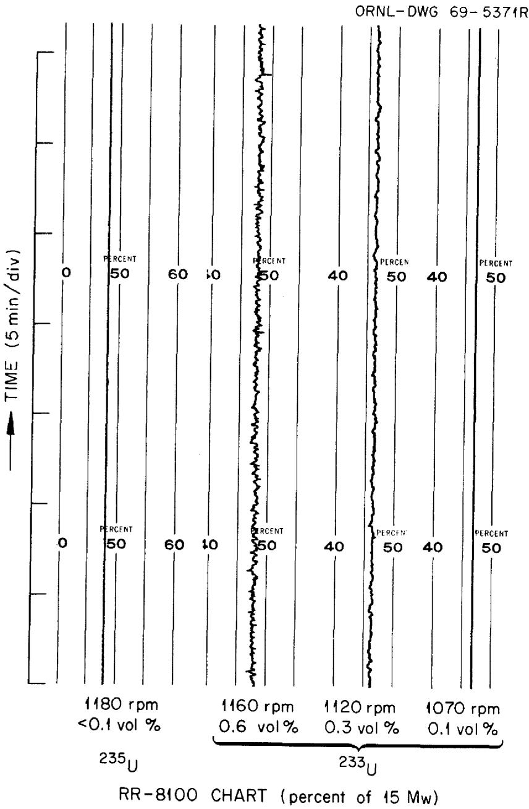
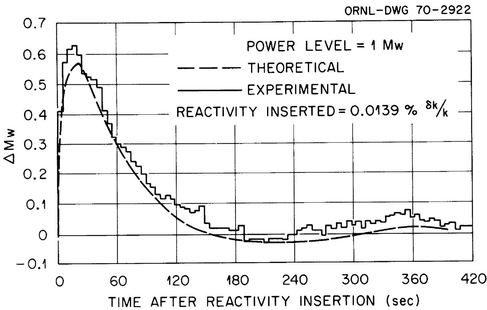
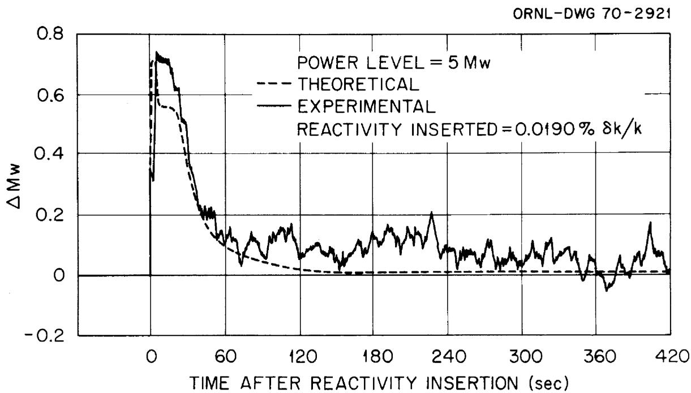
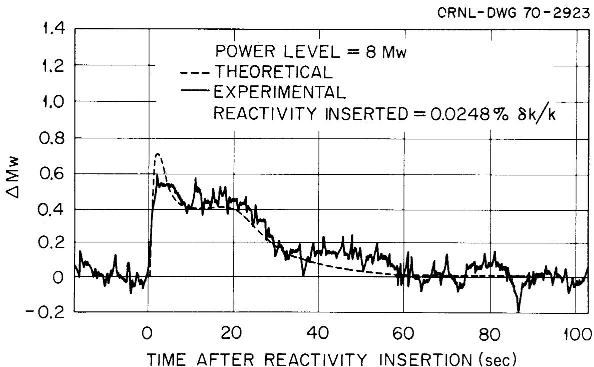
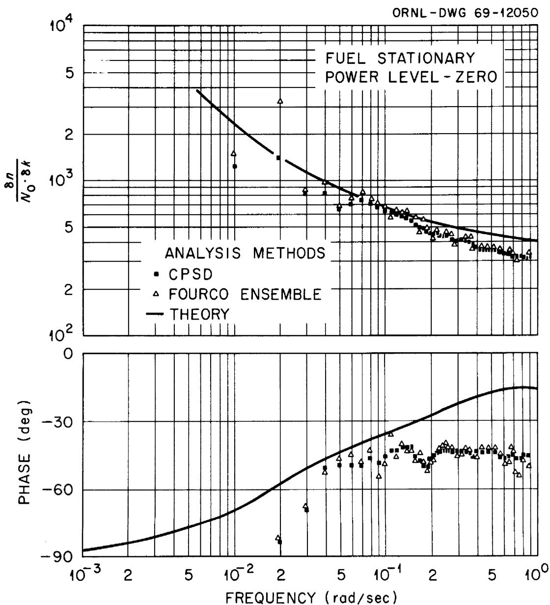
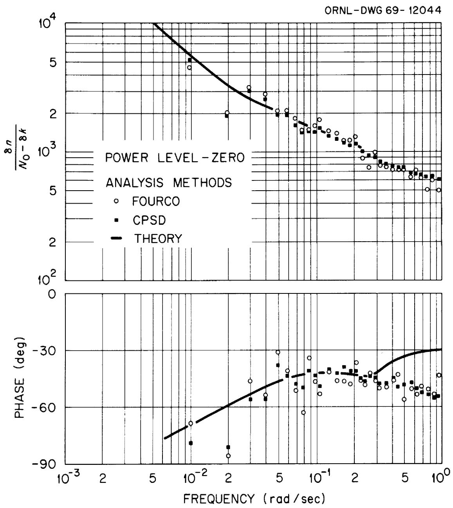
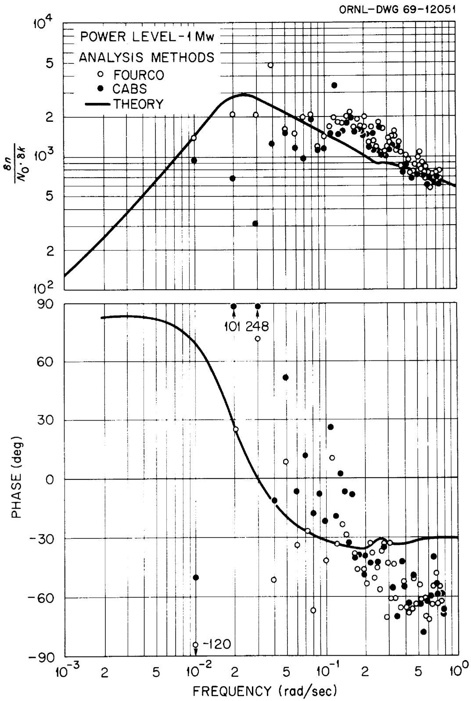
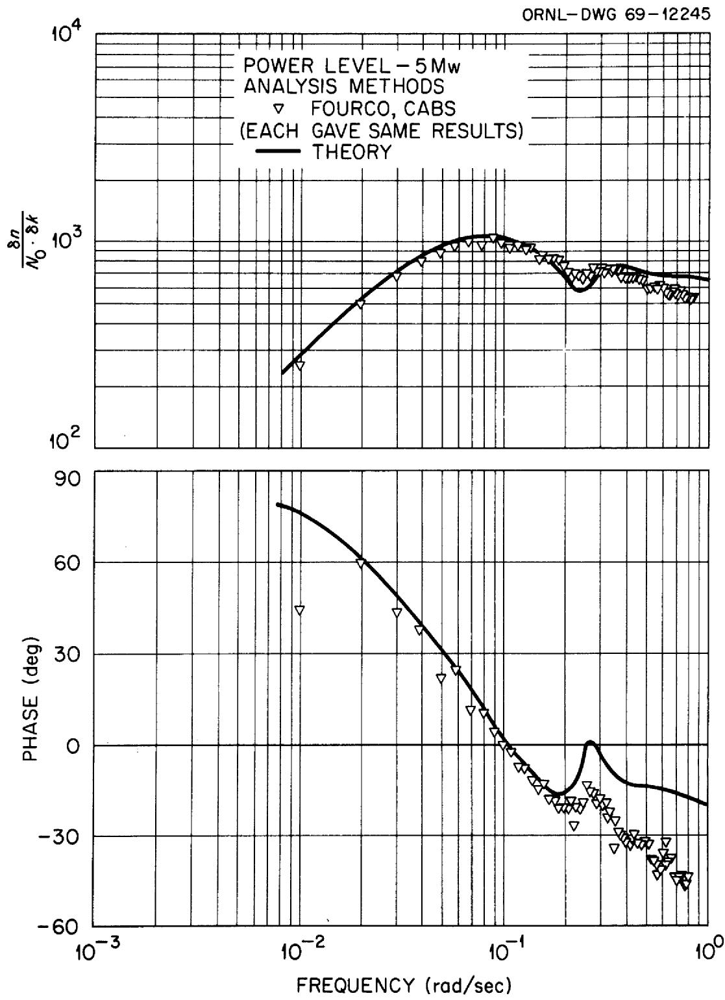
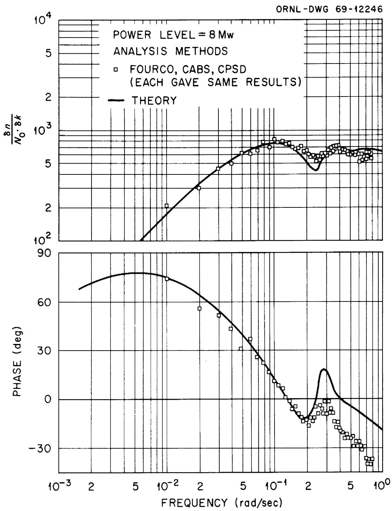
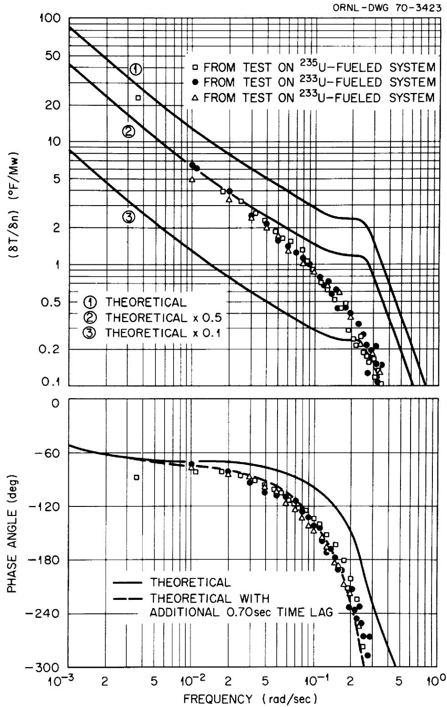

ORNL-TM-2997

COPY NO. -

DATE - April, 1970

EXPERIMENTAL DYNAMIC ANALYSIS OF THE MSRE WITH $^{233}\mathrm{U}$ FUEL

R.C.Steffy, Jr.

ABSTRACT

MASTER

Tests were performed on the Molten-Salt Reactor Experiment to determine the system time response to step changes in reactivity, the neutron-flux-to-reactivity frequency response, and the outlet-temperature-to-power frequency response. The results of each of these were found to agree favorably with theoretical predictions.

The time response tests were performed with the reactor operating at 1, 5, and 8 MW and substantiated the theoretical predictions that following a reactivity perturbation the system would return to its original power level more rapidly at higher power levels than at lower power levels and was load-following at all significant power levels. A noisy flux signal (caused by circulating voids) hampered detailed comparison of the experimental results and theoretical predictions.

Neutron flux-to-reactivity frequency-response measurements were performed using periodic, pseudorandom binary and ternary sequences. This type of test effectively prevented much of the random noise contamination of the neutron flux from entering the final analyses and gave results which contained little scatter. The results were in good agreement with the theoretical predictions and verified that for the MSRE, the degree of stability increases with power level.

Outlet-temperature-to-power frequency-response measurements were compared with similar measurements made during operation with the $^{235}\mathrm{U}$ fuel and verified that the basic thermal properties of the reactor system were essentially the same as expected.

Keywords: MSRE, fused salts, reactors, operation, reactivity, testing, time response, frequency response, stability, pseudorandom binary sequences, pseudorandom ternary sequences.

NOTICE This document contains information of a preliminary nature and was prepared primarily for internal use at the Oak Ridge National Laboratory. It is subject to revision or correction and therefore does not represent a final report.

# LEGAL NOTICE

This report was prepared as an account of Government sponsored work. Neither the United States, nor the Commission, nor any person acting on behalf of the Commission:

A. Makes any warranty or representation, expressed or implied, with respect to the accuracy, completeness, or usefulness of the information contained in this report, or that the use of any information, apparatus, method, or process disclosed in this report may not infringe privately owned rights; or   
B. Assumes any liabilities with respect to the use of, or for damages resulting from the use of any information, apparatus, method, or process disclosed in this report.

As used in the above, "person acting on behalf of the Commission" includes any employee or contractor of the Commission, or employee of such contractor, to the extent that such employee or contractor of the Commission, or employee of such contractor prepares, disseminates, or provides access to, any information pursuant to his employment or contract with the Commission, or his employment with such contractor.

# CONTENTS

# Page

ABSTRACT 1

INTRODUCTION 5

TRANSIENTRESPONSE. 5

FREQUENCY RESPONSE. 12

Neutron Flux to Reactivity 12

Testing Procedure 12

Analysis Programs 13

Discussion. 14

Outlet Temperature to Power. 22

CONCLUSION. 25

LIST OF REFERENCES. 26

# LEGAL NOTICE

This report was prepared an an account of Government sponsored work. Neither the United States, nor the Commission, nor any person acting on behalf of the Commission:

A. Makes any warranty or representation, expressed or implied, with respect to the accuracy, completeness, or usefulness of the information contained in this report, or that the use of any information, apparatus, method, or process disclosed in this report may not infringe privately owned rights; or

B. Assumes any liabilities with respect to the use of, or for damages resulting from the use of any information, apparatus, method, or process disclosed in this report.

As used in the above, "person acting on behalf of the Commission" includes any employee or contractor of the Commission, or employee of such contractor, to the extent that such employee or contractor of the Commission, or employee of such contractor prepares, disseminates, or provides access to, any information pursuant to his employment or contract with the Commission, or his employment with such contractor.

# EXPERIMENTAL DYNAMIC ANALYSIS OF THE MSRE WITH $^{233}$ U FUEL

R.C.Steffy, Jr.

# INTRODUCTION

Several reports and articles (References 1 - 6) relating either to the theoretical or actual (or both) dynamic response of the Molten Salt Reactor Experiment have been published. However, none of these has reported in a concise form the dynamic response of the U-233 fueled MSRE. Reference 4 contains much of the frequency-response information reported herein, but it is presented in a lengthy context which is primarily concerned with comparing testing signals and techniques. The purpose of this report is to give a brief description of the observed dynamic response of the U-233 fueled MSRE, compare it with the theoretical and suggest possible reasons for differences when applicable, but to eschew any lengthy description of the testing techniques.

# TRANSIENTRESPONSE

A common method of describing the dynamic response of a stable system is to display the system response to a step change in an input variable. For a nuclear reactor, reactivity is usually the perturbed parameter. This type description (i.e. description in the time domain) has the advantage of an intuitive appeal to people since we deal directly with time in day-to-day living. However, analysis of a system response in the time domain does have some disadvantages. Notably, if the system output of interest is contaminated with a large noise component, the part of the output resulting from a step input may be undiscernible from the part caused by the noise. The reason for making this point is the large difference in the neutron noise level between the $^{235}\mathrm{U}$ fuel loading and $^{233}\mathrm{U}$ fuel loading of the MSRE. (The increase in noise level was due to a concomitant increase in circulating void fraction and was not an intrinsic function of the fissile isotope.) An example of the uncontrolled

neutron flux during high-power operation for each fuel is shown in Fig. 1, and the relationship between the flux noise and void fraction is readily observable. The void fraction estimates which are labeled on Fig. 1 were achieved by varying the fuel pump speed; however, the fuel pump was operated at full speed ( $\sim$ 1180 rpm) for all of the dynamics tests reported here.

During the initial approach to power with the $^{233}\mathrm{U}$ fuel, time responses of the neutron flux to a step change in reactivity were recorded and are shown in Figures 2,\* 3, and 4 for the reactor at 1, 5, and 8 MW,\*\* respectively. Also shown in these figures are the theoretical predictions for step reactivity changes of the same magnitudes. The theoretical calculations were performed using the mathematical model and method described in Reference 2. The noisy flux signal hinders a comparison of the finer detail of the theoretical and experimental curves, but the noise was low enough that some features may be compared. In general, the theoretical and the experimental curves are in good agreement.

For the 1-MW case (Figure 2), the initial flux peak was slightly higher than the theory predicted, then it oscillated below the initial level and later increased again with a second peak occurring after about 360 sec. The theoretical curves agree that the change in power should have returned to a positive indication at this time but indicate that it should not have been as large in magnitude as the observed behavior. The extent to which noise contamination forced the positive indication is not known.

The noise contamination in the 5-MW case (Fig. 3) makes it difficult to compare directly the experimental and theoretical results. They

  
Fig. 1. Sections of Nuclear Power Recorder Chart Contrasting $^{235}\mathrm{U}$ Fuel, Full Flow and Few Bubbles with $^{233}\mathrm{U}$ Fuel, Varying Flow and Bubble Fraction. Conditions in each case: 7 MW, $1210^{\circ}\mathrm{F}$ , 5 psig, 52 - 56% Fuel Pump Level.

  
Fig. 2. Response of the Neutron Flux to a Step Change in Reactivity of $0.0139\%$ $\delta \mathrm{k} / \mathrm{k}$ with the Reactor Initially at 1 MW.

  
Fig. 3. Response of the Neutron Flux to a Step Change in Reactivity of $0.0190\%$ 8k/k with the Reactor Initially at 5 MW.

are in general agreement, but detailed comparison would be guess-work. The swells and rolls that occur after about 150 sec are almost surely not directly related to the original reactivity input since the system settling time at 5 MW is about 150 sec.

For the reactor operating at $8\mathrm{MW}$ , the flux response to a reactivity step of $0.0248\%$ $\mathrm{sk / k}$ is shown in Figure 4. The maximum power level was reached during the first second after the reactivity input. This rapid increase was accompanied by a rapid increase in fuel temperature in the core, which, coupled with the negative temperature coefficient of reactivity, more than counter-balanced the step reactivity input, so the power level began to decrease. The temperature of the salt entering the core was constant during this interval, and when the power had decreased enough for the reactivity associated with the increased nuclear average temperature to just cancel the step reactivity input, the power leveled for a brief time (from $\sim 6$ to $\sim 17$ sec after the reactivity input). About 17 sec after the reactivity increase, the hot fluid generated in the initial power increase completed its circuit of the loop external to the core, and the negative temperature coefficient of the salt again reduced the reactivity so that the power level started down again. At large times the reactor power returned to its initial level, and the step reactivity input was counter-balanced by an increase in the nuclear average temperature in the core. For the 5-MW case, a short plateau was probably present also, but the noisy signal obscured its presence. At lower powers, however, the slower system response prevented the reactor from reaching the peak of its first oscillation before the fuel completed one circuit of the external fuel loop. The plateau therefore did not appear in the 1-MW case.

An important characteristic of the MSRE dynamic response was that as the power decreased the reactor became both more sluggish (slower responding) and more oscillatory; that is, at low powers the time required for oscillations to die out was much larger than at higher powers, and the fractional amplitude of the oscillations ( $\triangle$ power/power) was larger.

  
Fig. 4. Response of the Neutron Flux to a Step Change in Reactivity of $0.248\%$ 8k/k with the Reactor Initially at 8 MW.

# FREQUENCY RESPONSE

# Neutron Flux to Reactivity

Most of the effort in experimentally determining the dynamic response of the MSRE was expended in determining the neutron-flux-to-reactivity frequency response. One advantage of working in the frequency domain is that a periodic waveform may be continuously imposed on a system input (e.g. reactivity, through control rod movement) until several periods of data have been collected. All of the signal power of a periodic signal is concentrated at harmonic frequencies, and subsequent analysis at a harmonic frequency very efficiently eliminates most of the noise contamination which is usually dispersed over a wide frequency band. There are other advantages to working in the frequency domain, but the more noisy flux signal with the $^{233}\mathrm{U}$ fuel loading makes this a salient advantage. Several step and pulse tests (aperiodic tests) were also attempted but these do not have the signal energy concentrated at particular frequencies and the system noise was large enough that the results contained too much scatter to be useful.

# Testing Procedure

The periodic signals used in the frequency-response tests were either pseudorandom binary or pseudorandom ternary sequences. These are particular series of square wave pulses that were chosen because they evenly distributed the signal power at the harmonic frequencies over a wide frequency range, which permitted determination of the frequency response over a wide spectrum with only one test. The frequency range over which we obtained frequency-response results was from about 0.005 to 0.8 rad/sec. The lower limit was set by the length of one period of the test pattern and the high-frequency limit was determined by the time width of the square wave pulse of shortest duration which the standard equipment would adequately reproduce. The shortest basic pulse width used in these tests was 3.0 sec. The frequency range covered by these tests was essentially the range over which thermal feedback effects are important.

The on-line computer, a Bunker-Ramo 340, was programmed to generate the sequences by opening and closing a set of relays. Voltage was fed through the relays from an analog computer (Electronic Associates, Inc., Model TR-10). This voltage was used to determine the movement of the control rods, which were forced either to follow the pseudorandom test pattern themselves or to cause the flux to follow the test pattern. The control-rod position and the neutron flux were digitized and recorded every 0.25 sec on magnetic tape. The data were retrieved from the tape and stored on punched cards which could then be processed with the analysis programs to yield the frequency-response information.

# Analysis Programs

Before discussing each of the programs used to analyze the data, it is pertinent to note that in some instances the different analysis programs yielded markedly different results when applied to the same data. It is beyond the intent of this report to delve into the possible theoretical explanations, but the interested reader may consult Reference 4 for a more complete treatise on the subject.

FOURCO. This code directly Fourier transformed the time records. The transformed output (flux) was then divided by the transformed input (rod position) to give the frequency response. This analysis was usually performed on the full data record, which would contain several periods of the same waveform, but occasionally was performed on individual periods of data with the several resulting answers then ensemble averaged. This latter method is denoted FOURCO ENSEMBLE on the figures.

CPSD. $^{3,6}$ This analysis method utilized a digital simulation of an analog filtering technique for obtaining cross-power spectral density, CPSD, functions. This code calculated the power spectrum of the input signal and the cross-power spectrum of the input and output signals and divided the cross-power spectrum by the input power spectrum to obtain the frequency response at each frequency of analysis. The key feature of this code is an adjustable filter width about the analysis frequency.

CABS.7 The third calculational procedure was more involved. The auto-correlation functions of the input and output signals were calculated and the cross-correlation function of the signals was calculated.

These were then Fourier transformed to obtain the input, output, and cross-power spectra. The input power-spectrum was then divided into the cross-power spectrum to obtain the frequency response.

# Discussion

With the fuel stationary, the frequency response of the zero-power MSRE was essentially the same as that of any stationary-fuel, zero-power, $^{233}\mathrm{U}$ -fueled reactor. The measured frequency response with the fuel not circulating is shown in Figure 5. The magnitude ratio, $\delta n / N_{0} \cdot \delta k$ , is seen to be in general agreement with the theory, but the phase angle is not in particularly good agreement. At the higher frequencies for tests at all power levels, the magnitude ratio and the phase angle were lower than the theoretical. This is thought to have been caused by the control rod not adequately following the test pattern yet giving the indication that it was. The indicators, which are physically located with the drive assembly, accurately display the action of the rod-drive motors; however, the flexibility of the control rod makes it doubtful that the tip of the rod, which is about 17 ft from the drive assembly, reproduces the high frequency component of the rod-drive movement.

The results of a typical zero-power test with the fuel circulating are shown in Figure 6. The shape of the magnitude ratio curve is in excellent agreement with the theoretical curve, but the results have been normalized by multiplying each experimental value by 1.75. The phase angle data was in better agreement with the theoretical predictions than was the case for the non-circulating data, but there is scatter in the results.

The need to normalize some results and not to normalize others is also considered to be caused by poor control rod indication.4 The normalization was not power dependent since some data did and some did not need normalization at each power level, and the normalization factors, when they were required, were different for different tests.

As we mentioned in the introduction, several different testing techniques were used in obtaining the experimental results. An example of

  
Fig. 5. Neutron Flux-to-Reactivity Frequency Response of the $^{233}\mathrm{U}$ -Fueled MSRE at Zero-Power with Stationary Fuel.

  
Fig. 6. Neutron Flux-to-Reactivity Frequency Response of the $^{233}\mathrm{U}$ -Fueled MSRE at Zero-Power with Circulating Fuel.

results4 obtained using a technique that was unsatisfactory on the MSRE is shown in Figure 7. The results do not disprove the theoretical predictions, but they do little toward verifying them either. Certainly, the results would have done little toward describing the reactor's response if the theoretical response were unknown. These data are shown primarily to display the system response at low, but significant, power. A satisfactory testing technique for this reactor was not found until after the preliminary tests were completed, and it was not convenient to return to 1 MW to perform further tests. However, the good agreement between the experimental results and the theoretical predictions at both higher and lower powers almost insures that the theoretical curve is very close to the actual response, hence the 1-MW theoretical curve may be taken as the actual response. In addition, this figure illustrates the importance of the testing technique which accounts for the difference in appearance of the results in Figure 7 and those in Figures 8 and 9. The scatter in the results shown in Figure 7 is due to inaccuracies in the indicated control-rod position which were accentuated by the testing technique.

Typical results from tests which employed the most satisfactory testing technique are shown in Figures 8 and 9 for the reactor at 5 and 8 MW, respectively. The results are in excellent agreement with the theoretical curves except for the slight discrepancy at the higher frequencies. The dip in the magnitude-ratio curves at $\sim 0.25$ rad/sec (corresponding to a loop transient time of $\sim 25$ sec) results from temperature feedback from the external loop. During a periodic reactivity perturbation at a frequency of about .25 rad/sec, the fuel in the core during one cycle returned

  
Fig. 7. Neutron Flux-to-Reactivity Frequency Response of the $^{233}\mathrm{U}$ -Fueled MSRE at 1 MW.

  
Fig. 8. Neutron Flux-to-Reactivity Frequency Response of the $^{233}\mathrm{U}$ -Fueled MSRE at 5 MW.

  
Fig. 9. Neutron Flux-to-Reactivity Frequency Response of the $^{233}\mathrm{U}$ -Fueled MSRE at 8 MW.

to the core one period later and, because of the negative temperature coefficient of reactivity, produced a reactivity feedback effect that partially canceled the external perturbation. The dip is obviously present in the experimental results as well as in the theoretical curves; however, the dip in the experimental data is not as pronounced as the theory predicts. Since the magnitude of the dip has been shown² to be a function of the amount of salt mixing which occurs as the fuel circulates around the loop, this difference between the experimental and theoretical implies that not enough mixing was assumed in the theoretical model. Additional work with the theoretical model has shown that if the salt transport in the piping is represented by a series of 2-sec first-order lags (well-stirred tanks with mean holdup times of 2 sec) rather than the pure delays that were assumed in the earlier work, the dip in the experimental and theoretical responses are in good agreement.

Below about 0.5 rad/sec, the magnitude ratio decreases as the power is increased. This substantiates the observation drawn from the time response plots; the degree of stability for the MSRE increases with power level. The lower magnitude ratio at the higher power levels over the frequency range in which thermal effects are important says, in effect, that for the same change in reactivity the fractional power ( $\Delta$ power/power) change will be less at higher power.

The frequency-response curves shown in this document display the MSRE's frequency response at several power levels. Of course, several tests were performed at several different power levels, but in order to keep the presentation as straightforward as possible, we chose to show the results from representative tests. Table 1 summarizes the frequency-response tests performed with the $^{233}\mathrm{U}$ fuel loading and indicates the scope of the testing program which included 28 different tests of approximately one-hour duration each. Other experimental results for the $^{233}\mathrm{U}$ fuel loading are given in References 4 and 5. Complete results of theoretical dynamic analyses are given in References 2, 5, and 6. Note that some tests were performed shortly after the start of operation with $^{233}\mathrm{U}$ fuel, and others were performed near the end of operation with $^{233}\mathrm{U}$ fuel. There were no indications that the response of the reactor had changed with operating time.

# Table 1

# Information Related to Frequency-Response

# Testing of $^{233}\mathrm{U}$ -Fueled MSRE

<table><tr><td>Testing Dates</td><td>Integrated Power (MW·hrs)</td><td>Power Level</td><td>No. of Tests Performed</td></tr><tr><td>10/15/68</td><td>0</td><td>100 W</td><td>1</td></tr><tr><td>11/7-8/68</td><td>0</td><td>50 W</td><td>6</td></tr><tr><td>1/16/69</td><td>86</td><td>1 MW</td><td>3</td></tr><tr><td>1/20/69</td><td>435</td><td>5 MW</td><td>1</td></tr><tr><td>2/3/69</td><td>2,390</td><td>8 MW</td><td>1</td></tr><tr><td>2/17/69</td><td>4,080</td><td>5 MW</td><td>1</td></tr><tr><td>2/20/69</td><td>4,490</td><td>8 MW</td><td>3</td></tr><tr><td>3/11/69</td><td>7,220</td><td>10 kW</td><td>1</td></tr><tr><td>4/24/69</td><td>14,000</td><td>8 MW</td><td>2</td></tr><tr><td>5/26/69*</td><td>19,500</td><td>8 MW</td><td>9</td></tr></table>

*These tests were performed for M. R. Buckner and T. W. Kerlin of the University of Tennessee as part of a graduate studies program.

# Outlet Temperature to Power

During the neutron-flux-to-reactivity frequency-response tests which were conducted at significant power levels, the response of a thermocouple (TE-100-1A) on the outlet pipe was also recorded. The data records then included power (or more specifically, neutron flux) and outlet temperature during a time in which the power was varied in a periodic waveform. Hence, the outlet-temperature-to-power frequency response could be determined at the same harmonic frequencies as the neutron-flux-to-reactivity frequency

response. The results of this determination could then be compared with the results of theoretical predictions.2

The outlet-temperature-to-power frequency-response results from a test conducted during operation with $^{235}\mathrm{U}$ fuel as well as two tests performed during operation with $^{233}\mathrm{U}$ fuel are shown in Figure 10. The experimental results of all three tests are essentially the same. This should be expected since the temperature response to a given change in power is a function of the thermal properties of the system, and these were changed very little with the change in fissionable material.

Three theoretical magnitude ratio plots are also shown in Figure 10. Curve 1 is the as-calculated curve and curves 2 and 3 are this same curve multiplied by 0.5 and 0.1, respectively. Normalization of the theoretical by multiplying by 0.5 forces agreement with the experimental results at low frequencies and multiplying by 0.1 forces agreement at high frequencies. The reason for the discrepancies between the experimental and theoretical have not been explained leaving this as an area open for more analysis. It is of interest to note that in some experimental work10 performed by S. J. Ball and T. W. Kerlin in which they attempted to determine the response of outlet-temperature-to-inlet-temperature perturbations, they too found a larger degree of attenuation than had been theoretically predicted.

The phase angle plots shown in Figure 10 are in good agreement if the theoretical thermocouple response to a power perturbation is delayed by 0.7 sec more than was assumed in the original calculation. (A pure delay gives a phase shift that changes linearly with frequency.) The theoretical response of the thermocouple was represented by a 1-sec pure delay plus a 5-sec first-order lag. This was based on calculations performed by S. J. Ball.[11] This represents a good estimate, but could be in error by 0.7 sec for this particular thermocouple depending on its particular response characteristics and physical contact with the pipe. Another possible source of error is the estimate of the location of the thermocouple on the pipe.

The experimentally-measured outlet-temperature-to-power frequency response verified that the basic thermal properties of the MSRE were essentially unchanged by the change in fuel loading. The disagreement

  
Fig. 10. Outlet Temperature-to-Power Frequency Response of the MSRE with the Reactor at 8 MW.

between the theoretical and experimental magnitude ratio determinations makes it meaningless to draw any conclusions about the mixing effects in the circulating system.

# CONCLUSION

The dynamic response of the $^{233}\mathrm{U}$ -fueled MSRE was analyzed by three different methods, each of which had deficiencies but each of which added information. The transient response of the neutron flux to a step change in reactivity at various power levels verified that the general response of the system was as anticipated, but the noisy flux signal made detailed comparison of the theoretical and experimental results difficult. The shape of the experimentally-determined neutron flux-to-reactivity frequency-response curves was in excellent agreement with the theoretical curves over most of the frequency range which was realizable with the installed hardware. There were problems associated with finding a test method which would give good results, and erroneous control rod position indications necessitated normalization of some experimental results. The outlet temperature-to-power frequency-response determination did not agree well with theory but did show that the basic thermal properties of the MSRE were essentially unchanged by the change from $^{235}\mathrm{U}$ to $^{233}\mathrm{U}$ fuel.

At high powers, the MSRE is a highly damped system. It returns to its original power level rapidly with no undershoot or wallowing. At low power levels, the uncontrolled reactor tends to be sluggish and slow in returning to its original power level. With the reactor at 1 MW, it was observed that over 400 sec was required for the flux level to stabilize after a step change in reactivity. In summary, the MSRE was stable at all power levels and the stability increased with power as predicted.

# LIST OF REFERENCES

1. S. J. Ball and T. W. Kerlin, Stability Analysis of the Molten-Salt Reactor Experiment, USAEC Report ORNL-TM-1070, Oak Ridge National Laboratory, (December 1965).   
2. R. C. Steffy, Jr., and P. J. Wood, Theoretical Dynamic Analysis of the MSRE with U-233 Fuel, USAEC Report ORNL-TM-2571, Oak Ridge National Laboratory (July 1969).   
3. T. W. Kerlin and S. J. Ball, Experimental Dynamic Analysis of the Molten-Salt Reactor Experiment, USAEC Report ORNL-TM-1647, Oak Ridge National Laboratory, (October 1966).   
4. R. C. Steffy, Jr., Frequency-Response Testing of the Molten-Salt Reactor Experiment, USAEC Report ORNL-TM-2823, Oak Ridge National Laboratory (March 1970).   
5. MSR Program Semiann. Progr. Rept., Feb. 28, 1969, USAEC Report ORNL-4396, Oak Ridge National Laboratory.   
6. MSR Program Semiann. Progr. Rept., Aug. 31, 1968, USAEC Report ORNL-4344, Oak Ridge National Laboratory, pp. 46 - 52.   
7. S. J. Ball, A Digital Filtering Technique for Efficient Fourier Transform Calculations, USAEC Report ORNL-TM-1662, Oak Ridge National Laboratory, (July 1967).   
8. S. J. Ball, Instrumentation and Control Systems Division Annual Progress Report, September 1, 1965, USAEC Report ORNL-3875, pp. 126-127, Oak Ridge National Laboratory (September 1965).   
9. T. W. Kerlin and J. L. Lucius, CABS - A Fortran Computer Program for Calculating Correlation Functions, Power Spectra, and the Frequency Response from Experimental Data, USAEC Report ORNL-TM-1663, Oak Ridge National Laboratory, (September 1966).   
10. MSR Program Semiann. Progr. Rept., Feb. 28, 1966, USAEC Report ORNL-3936, Oak Ridge National Laboratory.   
11. S. J. Ball, Personal Communication to R. C. Steffy, Jr., July 24, 1968.

# INTERNAL DISTRIBUTION

1. N. J. Ackermann

2. R. K. Adams

3. R.G.Affel

4. J. L. Anderson

5. C.F.Baes

6. S.J.Ball

7. H. F. Bauman

8. S.E.Beall

9. M. Bender

10. E. S. Bettis

ll, R. Blumberg

12. E. G. Bohlmann

13. C. J. Borkowski

14. G.E. Boyd

15. R. B. Briggs

16. A. R. Buhl

17. O.W.Burke

18. D. W. Cardwell

19. F. H. Clark

20. D. F. Cope, AEC-ORO

21. W. B. Cottrell

22. J. L. Crowley

23. F. L. Culler

24. S.J.Ditto

25. W. P. Eatherly

26. J.R. Engel

27. E. P. Epler

28. D. E. Ferguson

29. L.M.Ferris

30. J. K. Franzreib

31. A. P. Fraas

32. D. N. Fry

33. W. K. Furlong

34. C. H. Gabbard

35. A. Giambusso, AEC-Washington

36. W. R. Grimes - G. M. Watson

37. A. G. Grindell

38. R. H. Guymon

39. P.H.Harley

40. W.O.Harms

41. P. N. Haubenreich

42. A. Houtzeel

43. T. L. Hudson

44. W.H.Jordan

45. P.R.Kasten

46. R.J.Kedl

47. T. W. Kerlin

48. H. T. Kerr

49. A. I. Krakoviak

50. T. S. Kress

51. R.C. Kryter

52. Kermit Laughon, AEC-OSR

53. M. I. Lundin

54. R.H.Lyon

55. R.E. MacPherson

56. C. D. Martin

57. C. L. Matthews, AEC-OSR

58. H.E.McCoy

59. H.C.McCurdy

60. C. K. McGlothlan

61-62. T. W. McIntosh, AEC-Washington

63. H. A. McLain

64. L. E. McNeese

65. J.R.McWherter

66. A.J.Miller

67. R. L. Moore

68. E. L. Nicholson

69. L.C.Oakes

70. A.M.Perry

71. H. B. Piper

72. B. E. Prince

73. G. L. Ragan

74. J. L. Redford

75. M. Richardson

76. D. R. Riley, AEC

77-79. M. W. Rosenthal

80. H. M. Roth, AEC-ORO

81. A. W. Savolainen

82. Dunlap Scott

83. R.M. Scroggins, AEC

84. M. Shaw, AEC-Washington

85. W.H. Sides

86. M. J. Skinner

87. W. L. Smalley, AEC-ORO

88. A. N. Smith

89. I. Spiewak

90-94. R.C.Steffy

95. D. A. Sundberg

# INTERNAL DISTRIBUTION

# (continued)

96. J.R.Tallackson   
97. R.E. Thoma   
98. D. B. Trauger   
99. F. N. Watson, AEC-Washington   
100. A.M. Weinberg   
101. J. R. Weir   
102. M.E. Whatley   
103. J.C. White - A.S. Meyer   
104. G. D. Whitman   
105. Gale Young   
107. Central Research Library (CRL)   
109. Y-12 Document Reference Section (DRS)   
112. Laboratory Records Department (LRD)   
113. Laboratory Records Department, Record Copy (LRD-RC)   
114. Nuclear Safety Information Center   
115. ORNL Patent Office

# EXTERNAL DISTRIBUTION

116-130. Division of Technical Information Extension (DTIE)   
131. Laboratory and University Division (ORO)