ORNL-TM-2999

COPY NO. -

DATE - April, 1970

QUALITY-ASSURANCE PRACTICES IN CONSTRUCTION AND MAINTENANCE

OF THE MOLTEN-SALT REACTOR EXPERIMENT

B. H. Webster

# Abstract

The MSRE was built at Oak Ridge National Laboratory to demonstrate the practicality of the molten-salt reactor concept. Site construction and installation of auxiliary systems were by outside contractors, while the primary reactor systems were installed by ORNL forces. Design, procurement, construction, and maintenance followed ASME codes, ORNL practices, and special procedures developed for the MSRE by the ORNL Reactor Division group primarily responsible for quality assurance. This report describes the program, the problems that were encountered, and the lessons that were learned. Four years of reliable operation of the MSRE proved the success of the quality-assurance program.

Keywords: reactors, fused salts, MSRE, inspection, construction, maintenance, quality assurance, construction contractors, inspection procedures, material control, cleanliness control, welder qualifications, inspection of welds, leak testing.

# LEGAL NOTICE

This report was prepared as an account of Government sponsored work. Neither the United States, nor the Commission, nor any person acting on behalf of the Commission:

A. Makes any warranty or representation, expressed or implied, with respect to the accuracy, completeness, or usefulness of the information contained in this report, or that the use of any information, apparatus, method, or process disclosed in this report may not infringe privately owned rights; or   
B. Assumes any liabilities with respect to the use of, or for damages resulting from the use of any information, apparatus, method, or process disclosed in this report.

As used in the above, "person acting on behalf of the Commission" includes any employee or contractor of the Commission, or employee of such contractor, to the extent that such employee or contractor of the Commission, or employee of such contractor prepares, disseminates, or provides access to, any information pursuant to his employment or contract with the Commission, or his employment with such contractor.

# CONTENTS

# Abstract

INTRODUCTION 1

SITE CONSTRUCTION. 1

Choosing the Location 1

Site Preparation. 2

Major Building Modifications. 2

Outside Modifications 4

Summary of Site Modification and Construction 5

INSTALLATION OF EQUIPMENT AND SYSTEMS. 5

Material Control. 5

Welder Qualification 7

Duties of X-10 Inspection Engineering at the Construction Site Covering Cost-Plus-Fixed-Fee (CPFF) Contract Work . . . 7

Reactor Division Quality Control Activities 7

Summary of Quality Control Procedures Used in Connection With CFF Work 8

ASSEMBLY AND INSTALLATION OF MSRE FUEL AND COOLANT SYSTEM. 8

Materials Control 9

Welding 9

Inspection for Cleanliness. 10

Leaktesting of Components, Subassemblies, and Systems 11

Assembly and Installation of Components and Piping. 12

Installation and Checkout of Electrical Wiring, Heaters, and Equipment. 13

Remote Maintenance Practice During the Construction Period. 14

Preoperational Testing of Auxiliary Equipment and Systems. 14

MAINTENANCE. 15

Routine and Programmed (Preventive) Maintenance 15

Shutdown Maintenance. 16

SUMMARY OF QUALITY CONTROL FRACTICES 18

OVERALL CONCLUSIONS AND RECOMMENDATIONS. 18

# APENDICES

Appendix A -- Weld Inspection Report. 21

Appendix B - - Welding Procedure Specification 25

Appendix C -- Non-Ferrous Material Specifications. 37

Appendix D -- Cleaning and Storing of Pipe and Fittings to be Used in MSRE Construction. 41

# LEGAL NOTICE

This report was prepared as an account of work sponsored by the United States Government, Neither the United States nor the United States Atomic Energy Commission, nor any of their employees, nor any of their contractors, subcontractors, or their employees, makes any warranty, express or implied, or assumes any legal liability or responsibility for the accuracy, completeness or usefulness of any information, apparatus, product or process disclosed, or represents that its use would not infringe privately owned rights.

# CONTENTS

# (continued)

Page

# APPENDICES (continued)

Appendix E -- Control of Material After Delivery to Building 7503 49

Appendix F -- ORNL Operator's Qualification Test Specification QTS-33 for Inert-Gas-Shielded Tungsten-Arc Welding of INOR-8 Alloy Pipe, Plate and Fittings to Inconel Material. 57

Appendix G -- Welding, Brazing, and Weld Inspection of INOR-8 Components 69

Appendix H -- Materials Which Have Been Analyzed for Use on INOR-8 and Stainless Steel for the Molten-Salt Reactor Experiment. 73

Appendix I -- Helium Leak Test Procedure. 79

Appendix J -- Fixtures and Components During Assembly 83

Appendix K -- Check List - Reactor Cell Salt System 87

Appendix L -- Fuel Drain Tank No. 2 in Jig 97

Appendix M -- Check Off List for Main Blower Startup 101

# QUALITY-ASSURANCE PRACTICES IN CONSTRUCTION AND MAINTENANCE OF THE MOLTEN-SALT REACTOR EXPERIMENT

B. H. Webster

# INTRODUCTION

The Molten-Salt Reactor Experiment has been proved by four years of operation to be a well-built, reliable reactor. This report describes the quality-assurance program followed in the construction and maintenance of the system. The intent is to describe the details involved in putting together a sound, workable, relatively trouble-free system.

The report is divided into sections covering site preparation, installation of auxiliary systems and equipment, construction of the salt systems, and maintenance along with conclusions and recommendations.

# SITE CONSTRUCTION

# Choosing the Location

The site chosen for the MSRE was an existing facility in which one reactor had operated and in which preparations had been made for installation of another reactor. The facility was built for the Aircraft Reactor Experiment (ARE), which was operated in 1954. It was later modified for the Aircraft Reactor Test (ART), and at the time the Aircraft Nuclear Propulsion Program was terminated, a considerable amount of electrical equipment had been installed, the reactor cell had been built, and most of the auxiliary equipment had been purchased.

The basis for the decision to use this facility for the MSRE was economic. Unfortunately several years had passed since the ARE and ART programs had been terminated, and consequently the records, drawings, specifications, inspection reports, etc., on the building, equipment, and services were scattered and some were lost. In order to make use of these facilities for the MSRE, it was necessary for the project designers and draftsmen to determine the condition of the equipment and the services, as

well as the various cells and buildings, in order to either design the new system to fit in with the old or modify the old in order to make it fit in with the new system.

Needless to say, the assurance of quality in the adaptation of old facilities to new systems is often a difficult task. Such was the case for the MSRE.

# Site Preparation

In May 1961, a small (~ $20,000) site preparation contract was awarded to the H. K. Ferguson Company, who was at that time ORNL's prime CPFF contractor. This contract included excavation for the fuel drain tank cell, modification of the structure around the radiator cell, installation of a new entrance into the east side of the reactor building, and removal of unneeded piping conduit and equipment. The drawings and specifications for this job were prepared by the ORNL Plant and Equipment Division (P&E) design group and approved by ORNL Reactor Division management. The P&E Division supplied a construction inspector to ascertain that all specifications were met. The inspector kept a daily log, which is on record in ORNL Laboratory Records Department. Since no high-quality welding, pressure-vessel inspection, or other code work was involved, no other records were kept on this phase of construction.

# Major Building Modifications

The prime contract for the major building modifications was awarded to Kaminer Construction Company of Chamblee, Georgia. This phase of the modification was started in September 1961. The design and specifications were prepared by the P&E design group in cooperation with the Reactor Division (RD) design section and with special assistance on welding specification and procedures from Metals and Ceramics Division (M&C) personnel.

# Interpretation of Specifications

A short time after work had begun on the major building modifications, a question arose concerning the intent of the specifications covering the structural integrity of the reactor and fuel drain tank cells (classified

as secondary containment). The specifications had been written to cover cases under the ASME Unfired Pressure Vessel Code, Section 8. At this time certain changes were being made in this section to cover Nuclear Vessel Code cases. After considerable discussion and negotiation between representatives from RD, M&C, and Kaminer Construction Company, the following amendments were made in the specifications: Interpretation of ASME Boiler and Pressure Vessel Code, Section 8, Special Cases 1177, 1270N, 1272N, and 1274N.

# Assuring the Use of Specified Materials

Stating the type material to be used in any given situation is obviously only a beginning. In order to assure that materials meet the specifications, testing and inspection must begin at the vendor's or in some cases at the steel mills and fabrication plants. Once an acceptable melt was established, heat numbers were assigned to all materials made from this particular melt. This identification, showing the heat number and inspection request number, was stamped on the material so that it was identifiable even after installation. Records were kept on all materials to cover identification, location in system, cleanliness, and weld-inspection report that included welder's name, filler metal used, etc. (see UCN Form 1149 in App. A). All records on materials, etc., noted above are stored in the ORNL Laboratory Records Department.

# Establishing Welding Procedures and Training and Qualification of Welders

Having established the procedure by which welding should be done, the next task was to "qualify" the procedure. This was done by the P&E and M&C weld-qualification groups (if a procedure to cover the specification was not available). Welders were then trained and qualified to use the procedure (see WPS-1402 and UCN-3312 for typical Weld Qualification Procedure, App. B)

# Inspection of Welds, Material, and Equipment

Qualifying Inspectors. All inspection required to cover the work performed by outside contractors (Kaminer Construction Company, Chicago Bridge and Iron, etc.), as well as by manufacturers and vendors, was

performed by personnel from the ORNL Inspection Engineering (IE) group. These people were usually chosen for a particular phase of work because of their background in that field. All inspectors were required to go through a training period in order to qualify for the tasks they were to perform. In general the curriculum for this training was taken from the SNT (Society for Non-Destructive Testing) manual and was designed to cover Section 8 of the ASME Code and the special cases noted previously. This has since been revised to cover Section 3, Nuclear Vessel Code. With increasing emphasis being placed on quality control, it is suggested that ORNL should study the methods used for training inspectors, who should be qualified and certified.

Inspection and Records of Work Performed by Kaminer Construction and Subcontractors. Drawings and specifications were issued to the IE inspectors. Each inspector worked closely with the P&E construction inspector and with supervisors and craftsmen of the contractor so that he was constantly aware of all work planned or in progress on which his services were required. The inspector had the responsibility to see that all work within his jurisdiction was performed according to the specifications, and he had authority through the construction inspector to reject any work that did not meet these specifications. He also was responsible for maintaining records on welds, stress relieving, heat treatment, leak-testing, etc. All such records are now in ORNL Laboratory Records Department.

# Outside Modifications

The contract for outside modifications and construction was awarded to Hixon Construction Company of Knoxville, Tennessee. The outside work consisted of construction of an offgas filter house and offgas stack, installation of stack fans, and installation of the cooling tower, pumps, and piping. The criteria for this phase of construction were established by design groups from the Reactor and General Engineering Divisions. The design was done by P&E. Inspection was performed by the GE construction inspector, by representatives from Inspection Engineering, and by Reactor Division coordinators. A daily progress report and a log were kept by the construction inspector. All records are now in the ORNL Laboratory Records Department.

# Summary of Site Modification and Construction

In general the site preparation work went smoothly. One major problem was a misinterpretation of the specifications. It appears that in the future more thought should be given to specification writing, and a meeting of the minds as to the interpretations of the specifications should be reached insofar as possible before the work is started. In particular, the inspection procedures for components purchased from outside vendors should be clarified; since many of these components are only spot-checked, the risk of inferior materials and workmanship is much greater. Also the overall quality control standards should be more detailed and should be understood and accepted by all groups involved.

As stated in the preceding descriptions, all inspection and quality control work was done in accordance with the specifications and procedures prepared by Reactor Division and P&E Division design groups. These drawings, specifications, procedures, and records are located in the ORNL Laboratory Records Department.

# INSTALLATION OF EQUIPMENT AND SYSTEMS

The H. K. Ferguson Company was awarded a CPFF contract to install the service and auxiliary systems and equipment. These included instrument air compressors and piping; control room piping and equipment; leak detectors; water, steam, and offgas piping and equipment; and all electrical systems and equipment, including heater wiring up to the junction boxes at the cell walls. The above work was started shortly after building modifications were completed.

# Material Control

All materials and equipment for the CPFF contract work were procured by ORNL purchasing departments. All materials and equipment were more or less standard items and were relatively easy to obtain, except for the high-quality stainless steel piping used in some of the systems.

Procurement, Inspection, and Identification of Critical Materials

The critical material, whether fabricated into tanks, heat exchangers, etc., by outside vendors or delivered to the laboratory as raw material, was required to meet Metals and Ceramics Division Specifications (index in App. C). The specifications were written through a joint effort of the General Engineering, Metals and Ceramics, and Reactor Divisions. Inspection procedures were established by M&C, Reactor, and IE personnel. All critical materials (Met Spec Material) were spot-checked at the vendor's plant. Heat numbers of materials were etched or stamped at l2-in. intervals on all materials, along with the inspection request number (IR No.). The identification was maintained up to and through the installation period and was noted on all weld inspection reports. Inspection, certifications, and identification of all critical weld rod were accomplished by the same procedure as that noted for pipe, fittings, etc.

Inspection of Critical Materials After Delivery to ORNL

Critical materials were delivered in care of the Inspection Engineering Department. Upon receipt of this material, each item was inspected by one or more of the following methods: dye-penetrant testing, ultrasonic examination, and radioagraph examination.

# Material Cleaning Procedures

After certification, all pipe, tubing, and fittings were delivered to the 7000-area cleaning station, and cleaning was accomplished by the procedure of Appendix D (Cleaning and Storing of Pipe and Fittings to be Used in MSRE Construction). Records of cleaning results were maintained on the form included in this appendix. The records are now on file in the MSRE Maintenance Engineer's office.

# Control of Material at 7503 Stores

With all the inspection, certification, and identifying of materials that had gone before, there remained one very critical control point: how to handle the receiving and issuing records at the construction site stores. These problems were handled by the procedure in Appendix E (Control of Materials After Delivery to Building 7503).

# Welder Qualification

All weld procedures to be used by H. K. Ferguson were already qualified and are a matter of record. It remained only to qualify the welders for the several procedures. This qualification was performed at the Y-12 test shop under the surveillance and instruction of Y-12 Inspection Engineering personnel.

Duties of X-10 Inspection Engineering at the Construction Site Covering Cost-Plus-Fixed-Fee (CPFF) Contract Work

One or more inspectors from Inspection Engineering was assigned to the construction site to handle inspection that came under their jurisdiction. These duties included:

1. inspection of all code welding (dye-penetrant, radio-graph, etc.),   
2. witnessing all pressure and leak-testing of all code pipe and vessels,   
3. inspection of all materials before and during installation, and   
4. record keeping on all the above activities.

# Reactor Division Quality Control Activities

In addition to coordinating the efforts of the CPFF contractor with design, procurement, inspection, etc., the Reactor Division quality control group assumed the responsibility for and carried out the following:

1. Wrote cleaning and test procedures for systems not covered by the Code, such as compressed air systems, water systems, etc. Formulated check-off lists for equipment and systems to cover preoperational testing.   
2. Worked with CPFF crafts and supervisors in carrying out the cleaning, testing, and checkout of piping, wiring, and equipment.   
3. Formulated, with help of P&E engineers, leak-test procedures for testing vapor-suppression system. Worked with CPFF contractor performing and documenting test.   
4. Routinely checked piping and components during and after installation for cleanliness; notified craft supervision when additional cleaning was required. Made daily checks on installed piping to assure ends were closed; notified supervision of violations.

The problem of keeping the installed piping and components clean and preventing foreign material getting into open-end piping and equipment proved to be a major one. This area of quality control should be stressed in future (and present) quality control procedures!

# Summary of Quality Control Procedures Used in Connection with CPFF Work

All critical piping, heat exchangers, tanks, etc., were fabricated from materials certified to meet ASME codes and specifications formulated from these codes. Critical piping and components were inspected and tested according to ASME Codes provisions or approved procedures derived from them. All work (critical and other) was inspected by Inspection Engineering personnel and Reactor Division quality control personnel. Check-off lists were used to assure that wiring, piping, and equipment were installed in accordance with drawings and procedures. All systems were tested by acceptable procedures, and the test results were documented. Records of weld inspection, material certification, leak and pressure tests, preoperational tests, cleanliness, etc., are on file either in the ORNL Laboratory Records Department or in the MSRE Maintenance Engineer's office.

# ASSEMBLY AND INSTALLATION OF MSRE FUEL AND COOLANT SYSTEMS

All designs and specifications for the primary systems were either formulated by the Reactor Division design group or were prepared under their direct surveillance. Many of the designs, specifications, and procedures were derived from information furnished by the Reactor Division development group.

Most of the major components were fabricated and tested in Y-12 shops. All work on the primary and auxiliary systems inside the reactor cell, coolant cell, and fuel drain cells was performed by ORNL craftsmen from the P&E and I&C Divisions.

# Materials Control

Procedures the same as those described in the foregoing section were used to control the receipt, identification, storage, and issue of materials used in the primary and auxiliary systems inside the coolant, reactor, and fuel drain cells. This system apparently worked well, since there was no known instance in which the wrong material was used in either the primary or auxiliary systems.

# Welding

The material used in the primary systems was INOR-8 (now known as Hastelloy-N or Incoloy 806). Because there had not been much experience with this material, it was necessary that welding procedures be specified and tested. Welding Procedure Specification WPS-1402 (App. B) was tested and approved for welding INOR-8 materials. (See also form UCN-3312 in App. B, which was used for recording the development information.) In addition, several other "new" procedures were necessary, such as those for welding INOR-8 to Inconel, INOR-8 to stainless steel, etc. These procedures were developed by the P&E weld inspection group and by M&C personnel and were carried out under their strict surveillance.

# Welder Qualification

Welders were qualified to meet the above specifications per ORNL Operators Qualification Test Specification QTS-33 for inert-gas-shielded tungsten-arc welding of INOR-8 alloy pipe, plate, and fittings to Inconel material. (See QTS-33, App. F, which is typical of all procedures.)

# Weld Inspection

P&E inspectors were used exclusively on welding performed by ORNL craftsmen. All inspectors were required to be qualified; that is, they were required to actually perform the type of welding they were to inspect. This had distinct advantages, because when an inspector who is not a qualified welder looks at a completed weld, he can usually only say "The weld is good" or "The weld is bad." Rarely will he be qualified to instruct the welder in what he should do to make corrections if the weld

does not meet the specifications. On the other hand, an inspector who is a qualified welder can usually spot the improper technique while the welding is in progress. Corrections can then be made with a minimum of delay. It seems clear that much time and effort could be (and was) saved by these highly competent inspectors.

Inspection techniques were formulated with the several ASME and ASTM codes as guide lines. ORNL Inspection Engineering and Metals and Ceramics personnel then categorized these several procedures into six classes (A through F) with respect to the quality requirements of the welds. For example, Schedule B inspections required inspection of fit-up, inspection of the root pass before final closure, dye-penetrant inspection on each pass, and a radiograph of the completed weld; whereas Schedule F required only visual inspection. The designer specified on each drawing the inspection schedule, and a copy of each drawing was issued to the welding inspectors (see table of inspection schedules in App. G).

# Stress Relieving of Welds

All INOR-8 welds and adjacent piping were stress relieved by a procedure based on ASME Boiler and Pressure Vessel Code, Section III N-532. The welding inspector was responsible for inspecting the preparation for the stress-relieving operation and recording the information. The records of all stress-relieving operations are on file in the MSRE Maintenance Engineer's office.

# Inspection for Cleanliness

In addition to the cleanliness control described in Appendix D, INOR-8 required other more stringent controls. INOR-8 (Hastelloy-N) is a high-nickel alloy which will alloy at the MSRE operating temperature of approximately $1200^{\circ}\mathrm{F}$ with any metal or alloy having a low melting point; for example, aluminum, zinc, lead, etc. In addition, sulphur-bearing compounds are incompatible with INOR-8 at elevated temperatures. Many of the lubricants normally used in machining metals were known to have high sulphur content. Therefore because of the contamination potential associated with machining, fabricating, and assembling the piping and components,

rigid safeguards were established. Several different types and brands of lubricants, marking materials, permanent and temporary insulation, etc., were analyzed for the metals and compounds listed above. (See App. H for results of these analyses.) The reactor site storekeeper was instructed to refrain from storing materials that were not compatible with INOR-8 or stainless steel. Lists of materials compatible with INOR-8 and with stainless steel were prepared from the analyses and issued to the craft supervisors. A constant vigil was maintained by the weld inspectors and by Reactor Division quality control personnel. All INOR-8 vessels and piping were carefully surveyed for evidence of contamination. All surfaces were carefully cleaned immediately prior to installation of heaters and insulation, regardless of lack of evidence of contamination. This strict and seemingly expensive operation apparently was worthwhile, since there is no evidence of damage to the materials in the system after years at elevated temperatures.

# Leaktesting of Components, Subassemblies, and Systems

Components such as the reactor vessel, heat exchangers, pumps, and fuel drain tanks were leaktested at the Y-12 fabrication site. Much of the piping for the primary and auxiliary systems was prefabricated and in many cases leaktested before installation. Leaktest specifications (i.e., type of test to be performed) were noted on the drawings. Detailed procedures and record forms were written by the Reactor Division quality control group located at the MSRE construction site. Flow diagrams were "color-coded" to indicate the leaktest status and type of test performed. These flowsheets are a part of the permanent record, along with the test results noted on the leaktest forms. All leaktests were witnessed by Reactor Division quality control personnel.

All primary-system piping was leak-tested by using the mass-spectrometer method (helium leaktest). Wherever possible the piping was evacuated, encased in plastic, and flooded with helium. The leaktest was then performed and recorded per procedure MSRE-SK-216 and form UCN-5113 (see App. I) with a consolidated leak-detector machine. In some cases it was necessary to pressurize the piping and move the leak-detector probe over the welds and

surface of the pipe, after which the assembly was enclosed in plastic and the probe inserted into the bag at the highest point. If no leak was indicated, after waiting for some predetermined length of time, an amount of helium equal to the allowable leak was injected into the bag at the lowest point to check the sensitivity of the leak-detector machine. The results of these tests are recorded and are a part of the permanent record.

Hydrostatic and other pressure and leak tests were performed as indicated on the design drawings. The form (App. I) was used to record the results of all such tests.

Valid leak tests were performed on all piping systems. Leak testing was performed by craftsmen and witnessed by Reactor Division quality control personnel. Helium leaktesting was quite time-consuming because of the shortage of trained craftsmen. It would appear to be desirable to consider instituting a training program in this field as soon as practical.

Assembly and Installation of Components and Piping

One of the major objectives of the MSRE was to prove that it could be maintained. To make this possible it was necessary to assemble the equipment so that exact duplicates could be fabricated if the need arose.

# Reactor Cell Component Assembly

A fixture was designed to support the components in the same position relative to each other as they would be after they were installed in the reactor cell. The elevations and center lines of the components and the slopes and angles of the piping and flanges were established by a group of civil engineers with precision optical tooling. Some of the people involved in formulating the assembly procedures attended a school conducted by the Brunson Optical Instrument Co. for training in the use of precision optical instruments.

When installed in the cell, the components fitted together with remarkable accuracy. A photograph of components while on the fixture and after installation in the cell is shown in Appendix J.

All dimensions were recorded on as-built drawings and are on file in the MSRE Maintenance Engineer's office. One major side benefit from this method of assembly was the easy access for welding and other associated work.

In addition, with the major components being assembled outside the cell, the in-cell installation of auxiliary piping, electrical, and thermocouple leads, etc., was simplified. A check list indicating the care that was taken to assure that all was in order before the assembly was installed is reproduced in Appendix K. This type of final check is an important part of any quality-assurance program.

Fuel Drain Cell Components Assembly and Installation

The general procedures noted above were also used to assemble the two fuel drain tanks, steam domes, and the fuel flush tank. The center lines, elevations, etc., were established on the tanks, steam domes, etc., and the fixture was then made to fit the critical points noted on the installation drawings. The photograph in Appendix L shows the drain tank assembly located on the fixture.

All dimensions were recorded on as-built drawings. The assembly was lowered into the cell and a cutting platform was fitted to the salt inlet and outlet lines (no flanges in these lines). The location of the cutting platform relative to the tank was noted on the as-built drawings. In case it should become necessary, the steam dome or the drain tank, or the two items together, may be removed and an exact duplicate fabricated and installed by remote and semiremote methods.

Installation and Checkout of Electrical Wiring, Heaters, and Equipment

As in the case of the auxiliary piping, the installation of the electrical systems was a joint effort between the CPFF contractor and the P&E crafts. Installation of motors, switchgear, wiring, and thermocouple leads outside the fuel cells and up to the final junction at the cell walls was performed by the contractor. The heaters, electrical leads, and thermocouple leads inside the cells were installed by P&E craftsmen. The equipment outside the cell was checked out, and the motors were "bumped" for proper rotation by the contractor. Heater leads and thermocouple leads were "run out," tested for grounding, and identified at the cell walls by the contractor. The heaters, heater leads, and thermocouple leads inside

the cells were installed and checked out by P&E craftsmen, after which tie-ins were made at the cell walls and the total system was checked out from the control panels.

Records were kept on the above tests and are now located in the equipment files in the MSRE Maintenance Engineer's office. This part of the work was well coordinated and very little trouble or confusion was encountered.

# Remote Maintenance Practice During the Construction Period

The remote maintenance development group was in constant communication with the system design and construction groups. During the design and construction period, procedures were written, and tools and equipment were designed, fabricated, and tested. In order to check out some of the tools and procedures, maintenance equipment was set up, and several pieces of equipment were removed and reinstalled. These practice runs were helpful in establishing the procedures and techniques to be used later in performing the remote maintenance. The fuel pump rotary element and motor, the primary heat exchanger, one of the cell space coolers, and several heater assemblies were removed and replaced remotely.

# Preoperational Testing of Auxiliary Equipment and Systems

Cleaning and test procedures were written for each system or subsystem before and during the construction period by the Reactor Division quality control group.

# Water System

As sections of the cooling-water systems were completed, the piping, valves, pumps, flowmeters, etc., were flushed out, leaked tested, and given a preliminary check for pump output, etc. by CPFF craftsmen and witnessed by Reactor Division quality control personnel. When the entire water system was completed, the total system was given a preliminary checkout. After preliminary testing, the system was turned over to the MSRE operations group.

# Instrument Air System

After completion of the instrument system, each line was taken loose from the instrument and the entire piping system was blown down. The filters were changed and the piping was reconnected. A leak test was then performed on the total system. Flowmeters, pressure switches, etc., were tested for performance and accuracy. The preoperational testing was performed by CPFF craftsmen and witnessed by the Reactor Division quality control people who wrote the test procedures. Test results were documented and records are on file in the MSRE Maintenance Engineer's office.

Preoperational testing of other auxiliary systems was performed in essentially the same manner.

# MAINTENANCE

Maintenance is a vital part of any facility and was especially so in the Molten-Salt Reactor Experiment. As mentioned earlier in this report, one of the major objectives of the MSRE was to demonstrate its maintainability so that reactor downtime could be kept to a minimum. Because of this, planning, scheduling, procurement, and necessary design changes played a vital role in the overall operation.

# Routine and Programmed (Preventive) Maintenance

Just prior to the completion of the MSRE, ORNL had set up a maintenance system called "Programmed Maintenance." This required that maintenance to be performed on a piece of equipment be specified and fed into the K-25 IBM computer. At a predetermined frequency, IBM cards were delivered to the foreman who was to perform the work. After considering the alternate maintenance programs, it seemed advisable to make use of this program.

Accordingly a master list of all equipment in the MSRE system was compiled, and in cooperation with the operations group, an estimate was made on the percentage of time the equipment would be in use. Then, with the manufacturer's maintenance manual as a guide, a maintenance program

for each piece of equipment was listed and fed into the IBM computer. This listing included a description of the equipment, frequency of service, maintenance to be performed, type of lubricant, etc.

The maintenance cards were delivered (approximately one week in advance of the scheduled maintenance date) to the MSRE Maintenance Engineer, who initiated a work request. The work request, with the IBM card attached, was directed to the P&E Craft Supervisor. A copy of the work request and the maintenance card were issued to the operations Shift Supervisor. The Shift Supervisor shut down and tagged out the equipment at the request of the P&E supervisor. The maintenance was performed by the craftsmen, and in most cases, depending on the nature of the job, was witnessed by a representative of the Reactor Division quality control group or by the craft foreman. (Examples of this were the witnessing of the preventive maintenance performed on the component cooling blowers; the lubrication and tensioning of the drive belt; and the leaktesting of the dome flange. All this work was performed according to predetermined procedures.) Adjustments were made from time to time of frequency, type of lubricant, etc.

According to the feedback received from those who used the maintenance cards, the program appears to be relatively economical. Many problems were noted in time to prevent major breakdown and repairs; however, it appears more refinement of the program is needed, especially with respect to frequency.

# Shutdown Maintenance

For the most part, MSRE shutdowns were preplanned and scheduled. The following describes the planning and scheduling methods used. In general, the same methods were followed for nonscheduled shutdowns.

# Planning

Immediately after a reactor startup, planning was started for the next shutdown. In most cases, a target date was set for completion of a run based on the need for inspection of the core specimens. As operating experience dictated, proposed changes and modifications were added to the list. Equipment repairs were added as the occasion warranted.

Procurement and design were started as soon as practical after the need arose. Procedures or job descriptions were written well in advance of the shutdown to allow time for everyone involved to become familiar with the tasks to be performed.

Information and planning meetings were held with the craftsmen and supervisors. For some remote maintenance tasks, mockups were built, and training and practice sessions were held with craftsmen, supervisors, and Reactor Division quality control representatives.

# Scheduling

The list of work to be performed was detailed and firmed up as far in advance of the shutdown as possible. The critical path method was used for showing the sequence and estimated duration of each task, such as design, procurement, writing of procedures, practice sessions, installation, and testing. The sequences of work were established as a joint effort of the operations and maintenance group. Estimates of job duration were made by the P&E supervisors.

As work progressed, more tasks were usually added to the list, and because of this the schedule was updated periodically. This method of scheduling proved to be very satisfactory, and the estimates became more accurate as time progressed. On the last few shutdowns, estimates were correct to within approximately $5\%$ .

# Witnessing the Critical Shutdown Work

Critical tasks, such as remote maintenance, repairs or modifications to component cooling pumps, main blowers, radiator door lifting mechanism, etc., were observed and coordinated by Reactor Division quality control personnel. Procedures and job descriptions were modified as required so that they reflected the actual work performed and therefore were more nearly accurate for similar future tasks. A checkoff list was used to assure that all was in order before equipment or systems were reactivated after each maintenance period (see example in App. M).

# SUMMARY OF QUALITY CONTROL PRACTICES

Quality control procedures were formulated for all critical work not covered by existing codes and procedures, and record forms were designed, if they did not exist, for documenting critical inspection and testing. Inspectors were trained (to some degree) for following and documenting the work. Coordination of quality control and craft effort was difficult in the early stages but improved as the job progressed.

# OVERALL CONCLUSIONS AND RECOMMENDATIONS

Basic quality control procedures should be standardized for the whole laboratory as soon as practical. Specific procedures for a project should be formulated and agreed upon as soon as possible after criteria and specifications are written. The project quality control director should be intimately involved in formulating specific procedures not covered by the various codes. Assembly of the quality control procedures incorporating existing codes and specific detailed procedures should be accomplished through the joint efforts of the several quality control groups and the designer and specification writers. All quality control procedures and specifications should be incorporated into one manual. Adequate forms for documenting quality control should be designed prior to the beginning of work.

The quality control personnel (inspectors) should be responsible to the project quality control director, and they should have authority to direct craft supervisors to stop work not being performed according to the specifications. If the standards specified in quality control procedures are to be met, those who perform the work and those who witness that performance must be adequately trained. To accomplish this, quality control inspectors should be formally trained, tested, and certified, and craftsmen and craft supervisors should receive basic training in quality control procedures and practices.

If this phase of the effort is viewed with the respect it is due, there is every reason to believe that the construction and testing of a reactor system can be performed smoothly and efficiently and that the startup of the reactor should be relatively trouble-free.

APPENDICES

Appendix A

Weld Inspection Report

<table><tr><td colspan="4">WELD INSPECTION REPORT</td><td colspan="2">Report No.</td></tr><tr><td colspan="4">DISTRIBUTION:</td><td colspan="2">DRAWING NUMBER</td></tr><tr><td colspan="4"></td><td colspan="2">WORK ORDER NUMBER</td></tr><tr><td colspan="4"></td><td colspan="2">DATE</td></tr><tr><td colspan="4">COMPONENT TITLE</td><td colspan="2">WELD NUMBER</td></tr><tr><td colspan="2">WELDING SPECIFICATION</td><td colspan="2">WELDING PROCESS</td><td colspan="2">TYPE JOINT</td></tr><tr><td colspan="3">INSPECTION SPECIFICATION</td><td colspan="3">INSPECTION SCHEDULE</td></tr><tr><td colspan="3">BASE MATERIALS</td><td colspan="3">FILLER METAL</td></tr><tr><td>TYPE</td><td></td><td></td><td>TYPE</td><td></td><td></td></tr><tr><td>IR</td><td></td><td></td><td>IR</td><td></td><td></td></tr><tr><td>HEAT</td><td></td><td></td><td>HEAT</td><td></td><td></td></tr><tr><td>MFG.</td><td></td><td></td><td>MFG.</td><td></td><td></td></tr><tr><td>LOT NO.</td><td></td><td></td><td>ITEM</td><td></td><td></td></tr><tr><td>FORM</td><td></td><td></td><td>SIZE</td><td></td><td></td></tr><tr><td>ITEM</td><td></td><td></td><td></td><td></td><td></td></tr><tr><td>PIECE</td><td></td><td></td><td></td><td></td><td></td></tr><tr><td>SIZE</td><td></td><td></td><td></td><td></td><td></td></tr><tr><td colspan="6">WELDER</td></tr><tr><td colspan="4">WELDER&#x27;S NAME</td><td colspan="2">BACK-UP GAS
A     He</td></tr><tr><td colspan="4">FITTER&#x27;S NAME</td><td colspan="2">COVER GAS
A     He</td></tr><tr><td colspan="6">INSPECTION</td></tr><tr><td colspan="2"></td><td colspan="2">DISPOSITION</td><td colspan="2">APPROVED</td></tr><tr><td colspan="2">CLEANLINESS</td><td colspan="2"></td><td colspan="2"></td></tr><tr><td colspan="2">FIT-UP</td><td colspan="2"></td><td colspan="2"></td></tr><tr><td colspan="2">ROOT PASS</td><td colspan="2"></td><td colspan="2"></td></tr><tr><td colspan="2">PENETRANT: DEFECTS</td><td colspan="2"></td><td colspan="2"></td></tr><tr><td colspan="2">INTERMEDIATE PASSES</td><td colspan="2"></td><td colspan="2"></td></tr><tr><td colspan="2">PENETRANT: DEFECTS</td><td colspan="2"></td><td colspan="2"></td></tr><tr><td colspan="2">FINAL PASSES</td><td colspan="2"></td><td colspan="2"></td></tr><tr><td colspan="2">PENETRANT: DEFECTS</td><td colspan="2"></td><td colspan="2"></td></tr><tr><td colspan="2">RADIOGRAPHY</td><td colspan="2"></td><td colspan="2"></td></tr><tr><td colspan="2">ULTRASONIC</td><td colspan="2"></td><td colspan="2"></td></tr><tr><td colspan="2">WELDING VARIABLES</td><td>VOLTS</td><td>AMPS</td><td colspan="2">INTER PASS TEMP.</td></tr></table>

REMARKS:

<table><tr><td>INSPECTOR&#x27;S SIGNATURE</td><td>DATE</td><td>FINAL ACCEPTANCE</td><td>DATE</td></tr></table>

UCN-1149A   
(235 9-64)

.

$\therefore m = \frac{3}{11}$

Appendix B

Welding Procedure Specification

# OAK RIDGE NATIONAL LABORATORY

OPERATED BY

UNION CARBIDE CORPORATION

NUCLEAR DIVISION

POST OFFICE BOX X

OAK RIDGE, TENNESSEE 37830

WELDING PROCEDURE SPECIFICATION

WPS-1402

GAS TUNGSTEN-ARC WELDING OF NICKEL-MOLYBDENUM-CHROMIUM-IRON

(HASTELLOY-N OR INOR-8)

# SCOPE

This Procedure Specification covers welding of Nickel-Molybdenum-Chromium-Iron within limits summarized below.

Base Metal: Ni-Mo-Cr-Fe (Hastelloy-N, INOR-8), 0.020- to 1.0-in. thick, in any form.

Filler Metal: Ni-Mo-Cr-Fe bare welding rod.

Welding Process: Gas tungsten-arc, Ar shielded.

Equipment and Control: Manual.

Positions: All.

# PROCEDURE QUALIFICATION

This Procedure Specification was qualified by Fabrication Department, P&E Division, in accordance with ASME Code Section IX, Welding Qualifications. This Procedure Specification supplements, but does not repeat, the Code rules that apply to fabrication by welding.

# PERFORMANCE QUALIFICATION

Determine that the welder is currently qualified in accordance with ORNL Performance Qualification Specification PQS-1402. Refer to the latest Welder Qualification Status Report issued by Fabrication Department.

# BASE METAL

Ni-Mo-Cr-Fe (Ni-16.5Mo-7Cr-5Fe) that conforms to Code Cases 1315 and 1345, or to applicable ORNL Specifications.

Trade Name: Hastelloy-N. ORNL Designation: INOR-8.

Base Metal may be in any form and should be solution heat treated and descaled.

# FILLERMETAL

Bare welding rod that conforms to Code Case 1345, Code Specification SB-304, and applicable ORNL Specifications.

Trade Name: Hastelloy-N. Approved equal may be used.

Use only welding rods from original unit container that has complete original identification marks. Keep container sealed when welding rods are not being used.

Discard rods that do not have a bright smooth surface, free of pits, grooves, oxide and foreign material.

# SHIELDING GAS

Ar $99.995\%$ (min) pure for arc shielding and for backing gas on root side of joint.

# BACKING STRIP

Do not use backing strip or ring.

# PRECAUTIONS

For preparing and cleaning base metal and weld beads, use cutting tools, hand tools, grinding wheels, and stainless steel wire brushes that are free of foreign material and that have not been used on low-melting metals (Zn, Sn, Pb, etc.), and alloys (brass, brazing alloys, solder, etc.) that contain these metals.

Use suitable clean solvents that conform to job specifications. Do not use marking paint or crayon, temperature-indicating crayon, and cutting fluid containing sulfur.

# PREPARATION OF BASE METAL

Produce the weld joint geometry shown in the applicable detail on Joint Welding Schedule and drawing.

Before preparing a weld joint surface on arc-cut or oxygen-cut base metal, machine or grind to remove irregularities and 0.100 in. additional metal from the cut face.

Remove burrs, laps, gouges, and other defects from shearing, sawing, etc. to produce smooth weld joint surfaces.

Remove scale and oxide within 1 in. of each edge of the weld joint. Remove oil, moisture, chips, and other foreign material from weld joint and from base metal within 10 in. of each side of the joint.

Heat treat to stress relieve severely cold worked base metal. Contact engineer if heat treatment procedure is not covered in job specification.

Immediately before welding, inspect joint for foreign material by wiping with clean white cloth, damp with solvent. Reclean as required.

# ASSEMBLY AND FIXTURES

Provide suitable fixtures to support and align parts during welding without excess restraint on the weld. Use welded-on temporary attachments only where necessary.

Clean fixture within 10 in. of each side of weld joint.

Set up parts as shown on Joint welding Schedule and drawing.

Provide suitable baffles on root side of joint to confine and prevent contamination of the backing gas.

Tack weld by depositing short small beads equally spaced along joint. Remove oxide and defects. Grind tacks if necessary to produce tapered ends and flat or concave surface.

Shield weld area to exclude moisture, foreign material, and drafts that contaminate inert gas shielding.

WELDING POSITION

All positions.

WELDING PROCESS, CURRENT AND SCHEDULE

Process: Gas tungsten-arc.

Process Control: Manual.

Current: Direct current, electrode negative (straight polarity).

Schedule: Follow Joint Welding Schedules in this Procedure.

WELDING EQUIPMENT

Current Source: Rectifier or generator having drooping volt-amp characteristic, and foot control to permit continuous control of welding current, and upslope and downslope of current over a 10-to-1 range.

Arc Starter: High-frequency oscillator if available, ON during start only.

Welding Torch: Hand-held gas tungsten-arc torch adaptable to the joint and suitable for amperage, electrode, and gas nozzle specified in Joint Welding Schedules.

Electrode: Thoriated tungsten welding electrodes that conform to ASTM-B297, Classification EwTH-2.

Flow Meters: Ar and He flow meters, as required, calibrated at specified flow rate.

Gas Lines: Use metal or plastic. If necessary, backing gas lines may be latex rubber tubing in new condition.

PREHEAT AND INTERPASS TEMPERATURE

Preheat Temperature: $60^{\circ}\mathrm{F}$ (min), to 10 in. from weld joint.

Interpass Temperature: $200^{\circ}F$ (max).

# WELDING TECHNIQUE

Before welding, use at least 5 volume changes of Ar backing gas to remove air. Continue flow until weld thickness is sufficient that the underside is not heated to oxidizing temperature during welding.

Place torch in welding position, start Ar preflow and purge air from gas lines, torch, and arc-strike area.

Strike arc by means of high-frequency spark or by light touch of electrode in weld groove or on a copper block. Start arc at low current; when arc is stable, upslope current to welding level.

Hold torch perpendicular to joint or slightly slanted $(0 - 15^{\circ})$ , with electrode pointed normally in direction of travel. Move torch at a constant rate in direction of travel with minimum oscillation if necessary. Maintain short arc length. Regrind or replace electrode when necessary to maintain required tip shape and to remove metal pickup and oxide.

Wipe welding rod with clean cloth and solvent. Hold rod $10 - 30^{\circ}$ from base metal. Begin adding welding rod as soon as a small weld pool is present. Add rod at a constant rapid rate into the leading edge of the pool. Do not fuse base metal or weld metal without adding rod. Deposit string beads. Keep end of rod in the shielding gas. Remove oxidized ends of used rods.

Travel upward when axis of weld is not level.

Before breaking arc, fill crater and reduce weld pool to smallest possible size by downsloping current.

Maintain postflow until weld bead is below oxidizing temperature.

# CLEANING OF WELD BEADS

Remove all oxide (particles and film) from crater, weld beads, and base metal in the line of arc travel, before depositing each section of bead and from each completed weld bead.

# PEENING

Do not teen weld beads or base metal.

# DEFECTS

Examine each weld bead and each crater for cracks, pin-holes, incomplete fusion, incomplete penetration, overlap, undercut, narrow grooves, tungsten inclusions, heavy oxide or scale, and other defects.

Check that fillet size and butt weld reinforcement conform to job specification. Check that all beads have normal smooth surface and contour, and merge smoothly with each other and with base metal.

Remove weld defects by grinding, filing, or machining.

Before depositing each bead, examine weld groove and adjacent base metal for cracks, laminations, holes, and other defects.

Report to Foreman defects in base metal and any other condition that might reduce weld quality.

# BACK-GROOVING

Before welding the second side of double-welded joints, machine or grind the back of the root to remove defects.

# POSTWELD HEAT TREATMENT

Postweld heat treatment was not incorporated in procedure qualification.

# WELDER IDENTIFICATION

Record welder identification for each weld. Do not die stamp base metal or weld.

# INSPECTION

When the Welding Inspector believes inspection necessary, he will examine base metal or welds at any stage of fabrication; and when he has reason to question that this Procedure is being followed, the ability of the welder, or weld quality, he may require supplemental inspection, corrective action, or requalification of the welder.

D. R. Frizzell

Chief Welding Technologist

P&E Division

C. H. Wödtke

Welding Engineer

M&C Division

WPS-1402

Revision 0

Date 8-13-68

Page 6

# JOINT WELDING SCHEDULE

# ELECTRODE DATA For $2 \%$ THORIATED TUNGSTEN

<table><tr><td>TIP DIMENSIONS</td><td>ELECTRODE EXTENSION</td></tr><tr><td>PREFERRED
MIN. RADIUS
*FOR FILLER BEADS ONLY AT IIO AMPS MIN.</td><td>1/4-3/8
GAS CUP</td></tr></table>

# CURRENT RANGES

ELECTRODE DIA. (INCHES) AMPS, DC ELECTRODE NEG.

.020 5-20   
.040 15-80   
1/16 70-150   
3/32 150-250   
1/8 250-400   
5/32 400-500   
3/16 500-800

WPS & PQS 1402

REVISION 0

DATE 8-13-68

PAGE 7

<table><tr><td>JOINT DETAIL1</td><td colspan="11">WELDING SCHEDULE</td></tr><tr><td rowspan="6">45°+2.5-O-TUBE-0&quot;-0.015&quot; SHEET-1/32&quot;-0.010&quot;-0.065</td><td rowspan="2">JOINT T, IN.</td><td rowspan="2">WELD POSITION</td><td rowspan="2">LAYER</td><td rowspan="2">BEAD</td><td rowspan="2">RODDIAM.IN.</td><td rowspan="2">CURRENTAMP2</td><td rowspan="2">TUNGSTEN ELECTRODE DIAM.IN.</td><td rowspan="2">CUPDIAM.IN.</td><td colspan="2">SHIELD GAS</td><td>BACKING GAS</td></tr><tr><td>TYPE</td><td>FLOWCFH</td><td>TYPE</td></tr><tr><td>0.020</td><td>ALL</td><td>1</td><td>1</td><td>0.035</td><td>12</td><td>1/16</td><td>0.5</td><td>Ar</td><td>15</td><td>Ar</td></tr><tr><td>0.045</td><td>ALL</td><td>1</td><td>1</td><td>0.045</td><td>24</td><td>1/16</td><td>0.5</td><td>Ar</td><td>15</td><td>Ar</td></tr><tr><td>0.065</td><td>ALL</td><td>1</td><td>1</td><td>0.062</td><td>42</td><td>1/16</td><td>0.5</td><td>Ar</td><td>15</td><td>Ar</td></tr><tr><td></td><td></td><td></td><td></td><td></td><td></td><td></td><td></td><td></td><td></td><td></td></tr><tr><td rowspan="12">45°+2.5-O-T3/32&quot;-0.047&quot;-0.015&quot;</td><td>0.100</td><td>ALL</td><td>1</td><td>1</td><td>1/16</td><td>35</td><td>1/16</td><td>0.5</td><td>Ar</td><td>15</td><td>Ar</td></tr><tr><td></td><td></td><td>2</td><td>2</td><td>1/16</td><td>40</td><td>1/16</td><td>0.5</td><td>Ar</td><td>15</td><td>Ar</td></tr><tr><td>0.187</td><td>ALL</td><td>1</td><td>1</td><td>3/32</td><td>50</td><td>3/32</td><td>0.5</td><td>Ar</td><td>20</td><td>Ar</td></tr><tr><td></td><td></td><td>2+</td><td>2+</td><td>3/32</td><td>75</td><td>3/32</td><td>0.5</td><td>Ar</td><td>20</td><td>Ar</td></tr><tr><td>0.250</td><td>ALL</td><td>1</td><td>1</td><td>3/32</td><td>55</td><td>3/32</td><td>0.5</td><td>Ar</td><td>25</td><td>Ar</td></tr><tr><td></td><td></td><td>2</td><td>2-3</td><td>3/32</td><td>80</td><td>3/32</td><td>0.5</td><td>Ar</td><td>25</td><td>Ar</td></tr><tr><td></td><td></td><td>3+</td><td>4+</td><td>3/32</td><td>110</td><td>3/32</td><td>0.5</td><td>Ar</td><td>25</td><td>Ar</td></tr><tr><td>0.375</td><td>ALL</td><td>1</td><td>1</td><td>3/32</td><td>65</td><td>3/32</td><td>0.5</td><td>Ar</td><td>25</td><td>Ar</td></tr><tr><td>to</td><td></td><td>2</td><td>2-3</td><td>3/32</td><td>95</td><td>1/8</td><td>0.5</td><td>Ar</td><td>25</td><td>Ar</td></tr><tr><td>0.500</td><td></td><td>3+</td><td>4+</td><td>1/8</td><td>125</td><td>1/8</td><td>0.5</td><td>Ar</td><td>25</td><td>Ar</td></tr><tr><td></td><td></td><td></td><td></td><td></td><td></td><td></td><td></td><td></td><td></td><td></td></tr><tr><td></td><td></td><td></td><td></td><td></td><td></td><td></td><td></td><td></td><td></td><td></td></tr><tr><td rowspan="14">25°+2.5-O-T3/32&quot;-0.094&quot;-0.015&quot;-0.047&quot;-0.015&quot;</td><td>0.375</td><td>ALL</td><td>1</td><td>1</td><td>3/32</td><td>65</td><td>1/8</td><td>0.5</td><td>Ar</td><td>25</td><td>Ar</td></tr><tr><td></td><td></td><td>2</td><td>2-3</td><td>3/32</td><td>95</td><td>1/8</td><td>0.5</td><td>Ar</td><td>25</td><td>Ar</td></tr><tr><td></td><td></td><td>3+</td><td>4+</td><td>1/8</td><td>130</td><td>1/8</td><td>0.5</td><td>Ar</td><td>25</td><td>Ar</td></tr><tr><td></td><td></td><td></td><td></td><td></td><td></td><td></td><td></td><td></td><td></td><td></td></tr><tr><td>0.500</td><td>ALL</td><td>1</td><td>1</td><td>3/32</td><td>65</td><td>1/8</td><td>0.5</td><td>Ar</td><td>25</td><td>Ar</td></tr><tr><td></td><td></td><td>2</td><td>2-3</td><td>3/32</td><td>100</td><td>1/8</td><td>0.5</td><td>Ar</td><td>25</td><td>Ar</td></tr><tr><td></td><td></td><td>3+</td><td>4+</td><td>1/8</td><td>170</td><td>1/8</td><td>0.5</td><td>Ar</td><td>25</td><td>Ar</td></tr><tr><td></td><td></td><td></td><td></td><td></td><td></td><td></td><td></td><td></td><td></td><td></td></tr><tr><td>0.750</td><td>ALL</td><td>1</td><td>1</td><td>3/32</td><td>70</td><td>1/8</td><td>0.5</td><td>Ar</td><td>25</td><td>Ar</td></tr><tr><td>to</td><td></td><td>2</td><td>2-3</td><td>3/32</td><td>105</td><td>1/8</td><td>0.5</td><td>Ar</td><td>25</td><td>Ar</td></tr><tr><td>1.000</td><td></td><td>3+</td><td>4+</td><td>1/8</td><td>190</td><td>1/8</td><td>0.5</td><td>Ar</td><td>25</td><td>Ar</td></tr><tr><td></td><td></td><td></td><td></td><td></td><td></td><td></td><td></td><td></td><td></td><td></td></tr><tr><td></td><td></td><td></td><td></td><td></td><td></td><td></td><td></td><td></td><td></td><td></td></tr><tr><td></td><td></td><td></td><td></td><td></td><td></td><td></td><td></td><td></td><td></td><td></td></tr></table>

WPS-1402

Revision 0

Date 8-13-68

Page 8

1. Misalignment tolerance: 0.10T but not over 0.032 in. offset or mismatch. Other joint details are covered in Joint Detail Standard MET-WS-1.   
2. Range: Stated current $\pm 10\%$ depending on joint conditions

DEVELOPMENT RECORD OF WELDING PROCEDURE   

<table><tr><td colspan="8">PROCEDURE</td><td colspan="2">POSITION OF WELD</td><td colspan="3">WELDING OPERATOR</td><td>BUILDING NO.</td><td>WORK ORDER NO.</td></tr><tr><td colspan="2">MATERIAL</td><td colspan="2">PIPE • PLATE • OTHER -</td><td colspan="3">SPEC. NUMBER</td><td>ALLOY OR GRADE</td><td colspan="3">MANUFACTURER</td><td colspan="2">HEAT NUMBER</td><td rowspan="30">MAT&#x27;L:      MAT&#x27;L:      &quot;      &quot;      &quot;      &quot;      &quot;      &quot;      &quot;      &quot;      &quot;      &quot;      &quot;      &quot;      &quot;      &quot;      &quot;      &quot;      &quot;      &quot;      &quot;      &quot;      &quot;      &quot;      &quot;      &quot;      &quot;      &quot;      &quot;      &quot;      &quot;      &quot;      &quot;      &quot;      &quot;      &quot;      &quot;      &quot;      &quot;      &quot;      &quot;      &quot;      &quot;      &quot;      &quot;      &quot;      &quot;      &quot;      &quot;      &quot;      &quot;      &quot;      0      &quot;      &quot;      &quot;      &quot;      &quot;      &quot;      &quot;      &quot;      &quot;      &quot;      &quot;      &quot;      &quot;      &quot;      &quot;      &quot;      &quot;      &quot;      &quot;      &quot;      &quot;      &quot;      &quot;      &quot;      &quot;      &quot;      &quot;      &quot;      &quot;      &quot;      &quot;      &quot;      &quot;      &quot;      &quot;      &quot;      &quot;      &quot;      &quot;      &quot;      &quot;      &quot;      &quot;      &quot;      &quot;      &quot;      &quot;      &quot;      &quot;      &#x27;</td><td rowspan="30"></td></tr><tr><td colspan="2">MATERIAL</td><td colspan="2">PIPE • PLATE • OTHER -</td><td colspan="3">SPEC. NUMBER</td><td>ALLOY OR GRADE</td><td colspan="3">MANUFACTURER</td><td colspan="2">HEAT NUMBER</td></tr><tr><td colspan="2">FILLER METAL</td><td colspan="2">ROD</td><td colspan="3">SPEC. NUMBER</td><td>AWS CLASS.</td><td colspan="3">MANUFACTURER</td><td colspan="2">LOT OR HEAT NO.</td></tr><tr><td colspan="2">FILLER METAL</td><td colspan="2">ROD</td><td colspan="3">SPEC. NUMBER</td><td>AWS CLASS.</td><td colspan="3">MANUFACTURER</td><td colspan="2">LOT OR HEAT NO.</td></tr><tr><td colspan="4">WELDING PROCESS</td><td colspan="4">MATERIAL PREPARATION</td><td colspan="5">CLEANING</td></tr><tr><td colspan="4">METALLIC</td><td colspan="4">MACHINING SURFACE FINISH</td><td colspan="3">VAPOR</td><td colspan="2">HAND</td></tr><tr><td colspan="4">TIG</td><td colspan="4">GRINDING</td><td colspan="3">SOLVENT</td><td colspan="2">DETERGENT</td></tr><tr><td colspan="4">MIG</td><td colspan="4">FILING</td><td colspan="3"></td><td colspan="2"></td></tr><tr><td colspan="4">INERT GAS COVER</td><td colspan="4">GRINDING BETWEEN PASSES</td><td colspan="5">MACHINING COOLANT</td></tr><tr><td colspan="4">TORCH % PURE PURGE %PURE</td><td colspan="4">NO METHOD ABRASIVE</td><td colspan="3">NO</td><td colspan="2">COOLANT USED</td></tr><tr><td colspan="4">ARGON</td><td colspan="4"></td><td colspan="3"></td><td colspan="2"></td></tr><tr><td colspan="4">HELIUM</td><td colspan="4">YES</td><td colspan="3">YES</td><td colspan="2"></td></tr><tr><td rowspan="2">PASS
NO.</td><td rowspan="2">PRE-HEAT</td><td rowspan="2">INTER PASS TEMPERATURE</td><td rowspan="2">CURRENT
AMPS.</td><td rowspan="2">VOLTAGE</td><td colspan="2">FILLER</td><td rowspan="2">WELDING TIME MINUTES</td><td rowspan="2">POST-HEAT</td><td rowspan="2">VISUAL</td><td rowspan="2">LIQUID PENETRANT</td><td rowspan="2" colspan="2">RADIO-GRAPHY</td></tr><tr><td>DIA.</td><td>LENGTH</td></tr><tr><td>1</td><td></td><td></td><td></td><td></td><td></td><td></td><td></td><td></td><td></td><td></td><td colspan="2"></td></tr><tr><td>2</td><td></td><td></td><td></td><td></td><td></td><td></td><td></td><td></td><td></td><td></td><td colspan="2"></td></tr><tr><td>3</td><td></td><td></td><td></td><td></td><td></td><td></td><td></td><td></td><td></td><td></td><td colspan="2"></td></tr><tr><td>4</td><td></td><td></td><td></td><td></td><td></td><td></td><td></td><td></td><td></td><td></td><td colspan="2"></td></tr><tr><td>5</td><td></td><td></td><td></td><td></td><td></td><td></td><td></td><td></td><td></td><td></td><td colspan="2"></td></tr><tr><td>6</td><td></td><td></td><td></td><td></td><td></td><td></td><td></td><td></td><td></td><td></td><td colspan="2"></td></tr><tr><td>7</td><td></td><td></td><td></td><td></td><td></td><td></td><td></td><td></td><td></td><td></td><td colspan="2"></td></tr><tr><td>8</td><td></td><td></td><td></td><td></td><td></td><td></td><td></td><td></td><td></td><td></td><td colspan="2"></td></tr><tr><td>9</td><td></td><td></td><td></td><td></td><td></td><td></td><td></td><td></td><td></td><td></td><td colspan="2"></td></tr><tr><td>10</td><td></td><td></td><td></td><td></td><td></td><td></td><td></td><td></td><td></td><td></td><td colspan="2"></td></tr><tr><td>11</td><td></td><td></td><td></td><td></td><td></td><td></td><td></td><td></td><td></td><td></td><td colspan="2"></td></tr><tr><td>12</td><td></td><td></td><td></td><td></td><td></td><td></td><td></td><td></td><td></td><td></td><td colspan="2"></td></tr><tr><td>13</td><td></td><td></td><td></td><td></td><td></td><td></td><td></td><td></td><td></td><td></td><td colspan="2"></td></tr><tr><td>14</td><td></td><td></td><td></td><td></td><td></td><td></td><td></td><td></td><td></td><td></td><td colspan="2"></td></tr><tr><td colspan="13">REMARKS:</td></tr><tr><td colspan="13">INSPECTOR</td></tr></table>

Appendix C

Non Ferrous Material Specifications

# Appendix C

# NONFERROUS MATERIAL SPECIFICATIONS

Rev.   

<table><tr><td>MET-RM-1</td><td>0</td><td>5-10-61</td><td>Graphite Bar</td></tr><tr><td>MET-RM-2</td><td>1</td><td>8- 1-61</td><td>Nickel-Molybdenum-Chromium Wrought Alloy Forged or Rolled Pipe Flanges, Forgings, and Forged Fittings and Valve Parts</td></tr><tr><td>MET-RM-3</td><td>1</td><td>8- 1-61</td><td>Nickel-Molybdenum-Chromium Wrought Alloy Welded Pipe</td></tr><tr><td>MET-RM-4</td><td>1</td><td>8- 1-61</td><td>Nickel-Molybdenum-Chromium Wrought Alloy Welded Fitting</td></tr><tr><td>MET-RM-5</td><td>0</td><td>12-23-60</td><td>Gold-Nickel Brazing Filler Metal</td></tr><tr><td>MET-RM-6</td><td>1</td><td>11-22-61</td><td>Nickel-Molybdenum-Chromium Alloy Formed Heads</td></tr><tr><td>MET-RM-B 10</td><td>0</td><td>9- 9-63</td><td>Nickel-Molybdenum-Chromium Alloy Plate and Sheet</td></tr><tr><td>MET-RM-B 163</td><td>0</td><td>4-19-61</td><td>Nickel-Molybdenum-Chromium Alloy Seamless Heat-Exchanger Tubing</td></tr><tr><td>MET-RM-B 167</td><td>0</td><td>4-19-61</td><td>Nickel-Molybdenum-Chromium Alloy Seamless Pipe and Tubing</td></tr><tr><td>MET-RM-B 304</td><td>0</td><td>4-19-61</td><td>Nickel and Nickel-Base Bare Welding Filler Metal</td></tr><tr><td>MET-RM-B 332 - 58 T</td><td>0</td><td>7-14-60</td><td>Nickel-Molybdenum-Chromium-Iron Alloy Castings</td></tr><tr><td>MET-RM-B 334</td><td>0</td><td>4-27-61</td><td>Nickel-Molybdenum-Chromium Alloy Plate and Sheet</td></tr><tr><td>MET-RM-B 336</td><td>0</td><td>4-27-61</td><td>Nickel-Molybdenum-Chromium Alloy Rod</td></tr><tr><td>MET-RM-C300</td><td>0</td><td>7-22-61</td><td>Boron Carbide Control Rods</td></tr><tr><td>MET-RM-C301</td><td>1</td><td>9-21-62</td><td>Gadolinium Aluminum Oxide Cylinder</td></tr></table>

Appendix D

Cleaning and Storing of Pipe and Fittings To be Used in MSRE Construction

# INTRA-LABORATORY CORRESPONDENCE

Oak Ridge National Laboratory

October 19, 1962

MSR-62-80

To: Distribution

From: B. H. Webster

Subject: Cleaning and Storing of Pipe and Fittings to be Used in MSRE Construction

The pipe and fittings will be stored in B.M. Stores at X-10, Attention: E. A. Wallace. At a later date part of the material will be stored at 7503 Building. Upon receipt of the material, the B.M. storekeeper will notify the 7000 Area pipe shop foremen who will furnish craftsmen to clean, cap, and return the material to Stores. The shop foreman will notify Inspection Engineering in order that they may witness the cleaning. Inspection Engineering will furnish and fill out a cleaning inspection form* and will forward copies to J. T. Beall, E. A. Wallace, and B. H. Webster. The material will be cleaned at the 7000 Area Cleaning Facility by the following method:

Cleaning Procedures for Pipe and Fittings to be Used in MSRE Construction

Upon receipt of material at the Cleaning Facility, it is visually inspected for cleanliness. If grease, oil, or dirt is present, the material is washed with acetone, hot water, or blown with air to remove the excess.

The material is then lowered into a vat of five per cent tri-sodium phosphate (100 pounds of technical grade TSP to 280 gallons potable water) at $80^{\circ}\mathrm{C}$ . This solution is circulated through the vat at 60 gallons per minute. The inlet line is arranged so as to allow maximum flow through pipe being cleaned. The material is to remain in this solution for one-half hour minimum.

The material is then lowered into a vat of cold potable water. The potable water flows through the vat at 50 gallons per minute and is continuously discharged to waste. The material is rinsed in this vat for one-half hour.

The material is then lowered into a vat of hot circulated potable water $(80^{\circ}\mathrm{C})$ at 20 gpm for one-half hour. It is then removed to a rack where it is air dried with $90^{\circ}\mathrm{C}$ filtered air.

The material is then finally inspected for cleanliness and remarked if the identification was removed during cleaning. Material is to be remarked by etching, pipe is to be marked on twelve inch (12") centers, and fittings marked in two places.

If possible, the material will be delivered to E. A. Wallace or to 7503 Stores the same day it is cleaned.

All materials that pass through the Cleaning Facility are logged in and out. The following information is recorded in the operations log:

(a) Inspection request of store stock item number of the material   
(b) Description of material   
(c) Quantity of material   
(d) Date cleaned   
(e) Type cleaning   
(f) Cleaning solution and rinse sample numbers   
(g) Records are maintained on the date that the cleaning solution is mixed and the mixture.

All cleaning solutions and rinse waters are sampled once daily and a sample log is maintained. The solutions are analyzed for sulphur, lead, mercury, chloride.

The TSP solution is dumped twice weekly unless the analysis indicates it should be discarded sooner. Solution is to be discarded if chloride is 10 ppm or more or if 250 ppm of lead, mercury, or sulphur is detected.

# Packaging for Return to Stores

For pipe - use plastic end caps or cover ends with aluminum foil and masking tape.

For valves and fittings - use plastic bags, closing bags with aluminum wire or use aluminum foil for larger items.

# Issuing Material

After cleaning, the material is to be returned to B.M. Stores for use in 7000 Area Shops and 7503 Field Shop. The material will be issued only under the following conditions:

1. The B.M. Storekeeper has in his possession a signed copy of the Cleaning Inspection report showing the material has been cleaned according to this procedure.

2. The Storekeeper has in his possession the material certification report from the vendor (to be turned over to Storekeeper by J. W. Teague or C. K. McGlothlan.   
3. A Bill of Material form* properly filled out and signed by one of the following: J. T. Beall, J. P. Jarvis, W. B. McDonald, L. P. Pugh, J. W. Teague, B. H. Webster, C. K. McGlothlan, F. T. Anderson, H. J. Klemski, R. S. Jackson, W. D. Todd.

* See Attached Form

B. $N$ . Wibethio

B. H. Webster

BHW:jc

Attachment

# Distribution

MSRP Director's Office

J.T.Beall (3)

S.E.Beall

E. S. Bettis

F. F. Blankenship

C.E.Childress (3)

A.J.Cook

D. E. Ferguson

C. D. Greenway (3)

W. R. Grimes

T.R.Housley (5)

J.P.Jarvis (5)

R. B. Lindauer

H. G. MacPherson

W. B. McDonald

H. F. McDuffie

C. K. McGlothlan

R. L. Moore

L.P.Pugh

D. Scott

I. Spiewak

A. Taboada

J. R. Tallackson

J.W.Teague

B.H.Webster (2)

<table><tr><td colspan="3">MSRE BILL OF MATERIAL</td><td>DATE</td></tr><tr><td>WORK ORDER NUMBER</td><td>SKETCH NUMBER</td><td>WORK BY</td><td>E &amp; M WORK ORDER NUMBER</td></tr><tr><td colspan="4">JOB DESCRIPTION</td></tr></table>

<table><tr><td>ITEM NO.</td><td>QUANTITY</td><td>STOCK NO.</td><td>INSP. REQUEST NO.</td><td>DESCRIPTION</td></tr><tr><td></td><td></td><td></td><td></td><td></td></tr><tr><td></td><td></td><td></td><td></td><td></td></tr><tr><td></td><td></td><td></td><td></td><td></td></tr><tr><td></td><td></td><td></td><td></td><td></td></tr><tr><td></td><td></td><td></td><td></td><td></td></tr><tr><td></td><td></td><td></td><td></td><td></td></tr><tr><td></td><td></td><td></td><td></td><td></td></tr><tr><td></td><td></td><td></td><td></td><td></td></tr><tr><td></td><td></td><td></td><td></td><td></td></tr><tr><td></td><td></td><td></td><td></td><td></td></tr><tr><td></td><td></td><td></td><td></td><td></td></tr><tr><td></td><td></td><td></td><td></td><td></td></tr><tr><td></td><td></td><td></td><td></td><td></td></tr><tr><td></td><td></td><td></td><td></td><td></td></tr><tr><td></td><td></td><td></td><td></td><td></td></tr></table>

DATE   

<table><tr><td rowspan="2">IR</td><td rowspan="2">ITEM</td><td rowspan="2">QUANTITY</td><td rowspan="2">DESCRIPTION</td><td rowspan="2">TRI-SODIUMPHOSPHARERINSE AT80°C &amp; 60 GPM</td><td rowspan="2">COLD WATERRINSE AT50 GPM</td><td rowspan="2">HOT H20RINSE ANDAIR DRIEDAT 90°C</td><td rowspan="2">FINAL VISUAL INSPECTIONAND REMARKS</td><td colspan="2">PIPE FITTINGS</td></tr><tr><td>CAPPED</td><td>BAGGED</td></tr><tr><td></td><td></td><td></td><td></td><td></td><td></td><td></td><td></td><td></td><td></td></tr><tr><td></td><td></td><td></td><td></td><td></td><td></td><td></td><td></td><td></td><td></td></tr><tr><td></td><td></td><td></td><td></td><td></td><td></td><td></td><td></td><td></td><td></td></tr><tr><td></td><td></td><td></td><td></td><td></td><td></td><td></td><td></td><td></td><td></td></tr><tr><td></td><td></td><td></td><td></td><td></td><td></td><td></td><td></td><td></td><td></td></tr><tr><td></td><td></td><td></td><td></td><td></td><td></td><td></td><td></td><td></td><td></td></tr><tr><td></td><td></td><td></td><td></td><td></td><td></td><td></td><td></td><td></td><td></td></tr><tr><td></td><td></td><td></td><td></td><td></td><td></td><td></td><td></td><td></td><td></td></tr><tr><td></td><td></td><td></td><td></td><td></td><td></td><td></td><td></td><td></td><td></td></tr><tr><td colspan="10"></td></tr><tr><td></td><td></td><td></td><td></td><td></td><td></td><td></td><td></td><td></td><td></td></tr><tr><td></td><td></td><td></td><td></td><td></td><td></td><td></td><td></td><td></td><td></td></tr><tr><td></td><td></td><td></td><td></td><td></td><td></td><td></td><td></td><td></td><td></td></tr><tr><td></td><td></td><td></td><td></td><td></td><td></td><td></td><td></td><td></td><td></td></tr><tr><td></td><td></td><td></td><td></td><td></td><td></td><td></td><td></td><td></td><td></td></tr></table>

Appendix E

Control of Material After Delivery to Building 7503

# INTRA-LABORATORY CORRESPONDENCE

# Oak Ridge National Laboratory

October 17, 1962

MSR-62-89

To: W. B. McDonald

From: B. H. Webster

Subject: Control of Material After Delivery to Building 7503

# Purpose:

This procedure covers the methods for receiving, storing, issuing, and record keeping for all materials to be used at Building 7503 in the construction and maintenance of the MSRE. (See attached chart).

B. A

B. H. Webster

BHW:Jc

Attachment

# Distribution

MSRP Director's Office

S. E. Beall

E. S. Bettis

F. F. Blankenship

C. E. Childress

A.J.Cook

D. E. Ferguson

C. D. Greenway (3)

W. R. Grimes

T.R.Housley (3)

J.P.Jarvis (5)

R. B. Lindauer

H. G. MacPherson

W. B. McDonald

H. F. McDuffie

C. K. McGlothlan

R. L. Moore

L. P. Pugh

D. Scott

I. Spiewak

A. Taboada

J. W. Teague

J. R. Tallackson

B.H.Webster (3)

General: Preliminary arrangements have been made with the Stores department to set up a store in the compressor building just west of 7503. X-10 Stores will furnish a storekeeper to issue materials, keep records, and maintain inventory during the construction period and possibly during the operation and maintenance of the MSRE.

Shelves and bins for materials will be furnished by the stores department.

Final arrangements should be made with stores approximately 60 days prior to the completion date of the contract work in order that the store will be ready when the ORNL forces are ready to start work in the building.

# A. Materials to be Stored

1. Miscellaneous Non-critical Supplies

(a) protective clothing   
(b) decontamination equipment and materials   
(c) small tools   
(d) insulation, etc.

2. Critical Materials

Critical materials include all pipe, valves, gages, tubing, and fittings of any type or material and all INOR and SS material of any shape or description.

3. Semi-critical Materials

(a) heaters   
(b) electrical disconnects   
(c) M.I. cable, etc.

# B. Receipt of Material

1. All critical material must be approved by Inspection Engineering.   
2. A copy of the materials history must accompany the material to be stored; this record will show:

Type of Material

Heat No.

IR No.

Cleaning Record

Test Records, etc. (Whatever records may be applicable to the material in question).

3. Critical materials will not be accepted unless the above mentioned conditions are met.   
4. Non-critical materials may be placed in the store at the discretion of the storekeeper and project materials control representative.

5. Semi-critical materials will have been inspected and accepted at the vendor's and may be stored as they are received providing records are presented with the material or equipment.

# C. Rules for Issuing Materials

1. Critical and semi-critical materials will be issued only on the signature of one of the following: J. T. Beall, L. P. Pugh, F. T. Anderson, H. J. Klemski, J. P. Jarvis, W. D. Todd, J. W. Teague, C. K. McGlothlan, B. H. Webster, R. S. Jackson, P. Leinart.   
2. Materials listed as critical will not be available to project personnel (including E and M people) from any source other than the 7503 Store. Preliminary discussions with the X-10 Stores Supervisor indicate that limitations can be placed on the type of material that can be bought on any given work order number from the regular X-10 Stores.   
3. Responsibility will be assigned to one person to see that unused critical material is sent to Inspection Engineering for rechecking or returned to Stores.   
4. Non-critical materials may be bought at X-10 Stores; however, an attempt will be made to store as many items as possible in the 7503 Stores. These items will be issued in the normal manner.

# D. Records

1. Receiving reports, inspection reports, cleaning records, etc., will be turned over to a project materials control representative after material is accepted by Stores.   
2. Special forms* will be provided for issuing critical and semi-critical material. These forms will be made out in duplicate, one copy to be retained by the storekeeper as an assist in maintaining the proper inventory, and one copy turned over to the project materials control representative to be kept on file along with receiving reports, inspection reports, etc.   
3. The storekeeper will maintain a pre-determined inventory of non-critical materials by whatever method is normally used by the stores department.

<table><tr><td colspan="3">MSRE BILL OF MATERIAL</td><td>DATE</td></tr><tr><td>WORK ORDER NUMBER</td><td>SKETCH NUMBER</td><td>WORK BY</td><td>E &amp; M WORK ORDER NUMBER</td></tr></table>

<table><tr><td>ITEM NO.</td><td>QUANTITY</td><td>STOCK NO.</td><td>INSP. REQUEST NO.</td><td>DESCRIPTION</td></tr><tr><td></td><td></td><td></td><td></td><td></td></tr><tr><td></td><td></td><td></td><td></td><td></td></tr><tr><td></td><td></td><td></td><td></td><td></td></tr><tr><td></td><td></td><td></td><td></td><td></td></tr><tr><td></td><td></td><td></td><td></td><td></td></tr><tr><td></td><td></td><td></td><td></td><td></td></tr><tr><td></td><td></td><td></td><td></td><td></td></tr><tr><td></td><td></td><td></td><td></td><td></td></tr><tr><td></td><td></td><td></td><td></td><td></td></tr><tr><td></td><td></td><td></td><td></td><td></td></tr><tr><td></td><td></td><td></td><td></td><td></td></tr><tr><td></td><td></td><td></td><td></td><td></td></tr><tr><td></td><td></td><td></td><td></td><td></td></tr><tr><td></td><td></td><td></td><td></td><td></td></tr><tr><td></td><td></td><td></td><td></td><td></td></tr></table>

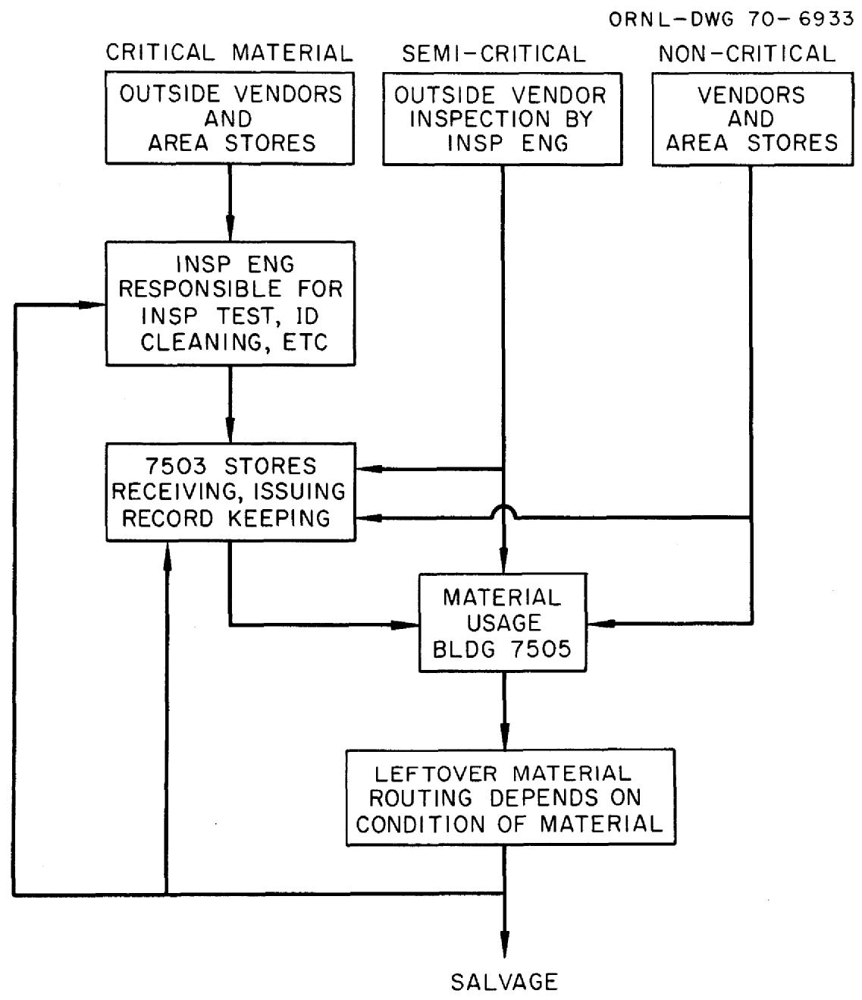  
Flow Chart: 7503-Material Control

Appendix F

ORNL Operator's Qualification Test Specification QTS-33 For Inert-Gas-Shielded Tungsten-Arc Welding Of INOR-8 Alloy Pipe, Plate and Fittings to Inconel Material

# ORNL OPERATOR'S QUALIFICATION TEST SPECIFICATION QTS-33

# FOR INERT-GAS-SHIELDED TUNGSTEN-ARC WELDING

OF INOR-8 ALLOY PIPE, PLATE AND FITTINGS TO INCONEL MATERIAL

Revised Sept. 1, 1962

# SCOPE:

This specification covers the qualification of operators for approval to inert-gas shielded tungsten-arc weld Inor-8 alloy pipe, plate and fittings to Inconel material in accordance with Procedure Specification P.S.-33.

# REFERENCES:

Procedure Specification P.S.-33.

Procedure Specification Figure P.S.-33-A.

Operator's Qualification Test Specification Figure QTS-33-A.

Operator's Qualification Test Specification QTS-1.

Operator's Qualification Test Specification QTS-25.

ASTM B167 latest revision (Inconel Seamless Pipe and Tubing).

MET-RM-B167-T Specification for Ni-Cr-Mo-Alloy Seamless Pipe and Tube.

ASME Boiler and Pressure Vessel Code Section IX.

# PRIOR QUALIFICATION REQUIREMENTS:

The operator shall meet the requirements of Qualification Test Specification QTS-1 and QTS-25 prior to taking this test.

# MATERIAL REQUIRED:

Unless prior approval for the use of alternates is obtained, test weldments shall be made using MET-RM-B167-T Inor-8 alloy pipe or tubing and ASTM B167 Inconel pipe or tubing of the following description:

1. Three tests (Test A, B, and C) are required to cover the entire material thickness range of P.S.-33. Test A qualifies a welder to weld materials in the thickness range of 0.020" through 0.100". Test B qualifies a welder to weld materials in the thickness range of 0.109" through 0.375". Test C qualifies a welder to weld materials in the thickness range of 0.375" through 1.000".   
2. Welders shall meet the requirements of Test B before taking Test A or Test C.

# TEST A:

# 1. For Butt welds

Inor-8 alloy tubing

1 piece 1" O.D. x 0.065" wall, 3" long   
1 piece 0.500" 0.D. x 0.045" wall, 3" long   
1 piece 0.500" 0.D. x 0.020" wall, 3" long are required.

Inconel tubing

1 piece 1" O.D. x 0.065" wall, 3" long   
1 piece 0.500" O.D. x 0.045" wall, 3" long and   
1 piece 0.500" O.D. x 0.020" wall, 3" long are required.

Each piece shall be square cut and fitted as shown on Figure P.S.-33-A, (Design for Welds in Tubing).

# 2. For Saddle welds

Inor-8 alloy tubing

1 piece 1" O.D. x 0.065" wall, 3" long and

1 piece 0.500" O.D. x 0.045" wall, 3" long are required.

Inconel tubing

1 piece 1" O.D. x 0.065" wall, 7" long and

1 piece 0.500" O.D. x 0.045" wall, 7" long are required.

Each piece shall be cut and fitted as shown on Figure P.S.-33-A, (Design for Welds in Tubing).

# TEST B:

# 1. For Groove welds

Two pieces of 3" diameter schedule 40 Inor-8 alloy pipe and two pieces of 3" diameter schedule 40 Inconel pipe are required. Each piece shall be approximately 4" long and beveled and fitted as shown on Figure QTS-33-A, Test B.

# 2. For Fillet welds

Two pieces of 3" diameter schedule 40 Inor-8 alloy pipe 4" long and one Inconel backing ring 1½" wide by 1/4" thick are required. All pieces of pipe shall have both ends square cut and fitted as shown on Figure QTS-33-A, Test B.

# TEST C:

# 1. For Groove welds

Two pieces of 8" diameter schedule 80 Inor-8 alloy pipe and two pieces of 8" diameter schedule 80 Inconel pipe are required. Each piece shall be approximately 4" long and beveled and fitted as shown on Figure QTS-33-A, Test C.

# 2. For Fillet welds

Two pieces of 8" diameter schedule 80 Inor-8 alloy pipe 4" long and one Inconel backing ring $1\frac{1}{2}$ " wide by $3/8$ " thick are required. All pieces of pipe shall have both ends square cut and fitted in accordance with Figure QTS-33-A, Test C.

# FILLER METAL:

The filler metal shall be Inconel 82-T International Nickel Company alloy or equal.

QTS-33

Page 2

# TEST POSITIONS:

# 1. Butt welds

Position 2G - A butt weld shall be made between one piece of Inor-8 tubing and one piece of Inconel tubing of the following sizes:

1" O.D. 0.065" wall   
1"0.D. 0.045" wall   
$\frac{1}{2}''$ 0.D. 0.020" wall

The tubing will be placed with the axis in the vertical fixed position and the weld in the horizontal plane as shown on Figure P.S. 33-A.

Position 5G - A butt weld shall be made with the same conditions and sizes as in above except with the tube axis in the horizontal fixed position and the weld in the vertical plane as shown on Figure P.S. 33-A.

# 2. Saddle welds

Two saddle welds shall be made, one joining one piece of Inor-8 tubing and one piece of Inconel tubing 1" O.D. x 0.065 wall and one joining one piece Inor-8 tubing and one piece Inconel tubing 0.500" O.D. x 0.045" wall as shown on Figure P.S. 33-A. These welds may be made in any convenient position.

# 3. Groove welds

Position 2G - A groove weld shall be made between one piece of Inor-8 alloy pipe and one piece of Inconel pipe placed with the axis in the vertical position and the welding groove in a horizontal plane as shown on Figure QTS-33-A. After welding, the pipe shall be stamped with numbers 1, 2, 3, and 4, clockwise and approximately $90^{\circ}$ apart and the proper identification of the operator and position.

Position 5G - A groove weld shall be made between one piece of Inor-8 alloy pipe and one piece of Inconel pipe placed with the axis in the horizontal position and the welding groove in the vertical plane as shown on QTS-33-A. Before welding, the pipe shall be stamped with numbers 1, 2, 3, and 4, clockwise starting with number 1, $45^{\circ}$ clockwise from the top when arranged for welding and the proper identification of the operator and position.

# 4. Fillet welds

A full fillet shall be made joining the Inor-8 alloy pipe and the Inconel backing ring as shown on Figure QTS-33-A, Part A. This joint shall be welded with the axis of the pipe in the horizontal fixed position and the weld in a vertical plane.

A full fillet shall be made on the other side of the joint, joining the Inor-8 alloy pipe and the Inconel backing ring as shown on Figure QTS-33-A, Part B. This joint shall be welded with the axis of the pipe in a vertical fixed position and the welding plane horizontal (overhead).

Make the close-in passes as shown on Figure QTS-33-A, using any convenient welding position. The pipe shall then be stamped with the numbers 1, 2, 3, and 4 at $90^{\circ}$ intervals around the weldment and the proper identification of the operator and test.

# WELDING REQUIREMENTS:

1. The welding operator shall be required to follow procedure specification P.S.-33 in making the welds and shall not be allowed to rotate or turn the pipe or tube during welding, except saddle welds and close-in passes.   
2. An inspector shall be present at all times while the qualification test is in progress. The inspector may refuse acceptance of a test weldment if the operator does not comply with the standard procedure in all respects.

# NON-DESTRUCTIVE INSPECTION OF WELDMENTS:

1. Visual Inspection:

The finished weldments shall be inspected for deviation from the procedure specification and for the points listed below:

The appearance of the completed welds shall indicate that the welds were made in a workmanlike manner.

The outer surface of the weld bead reinforcement shall not be less than flush or greater than $25\%$ of the joint thickness and in no case shall it exceed $3/32$ . There shall be no undercut, overlap, or lack of fusion.

The Groove and Butt welds - There shall be complete, uniform penetration. Penetration shall be at least flush with the inside surface, neither shall it protrude beyond the inside surface more than $20\%$ of the joint thickness and in no case shall it exceed $3/32"$ . Weldments having pin holes in the root will not be accepted.

2. Liquid Penetrant Inspection:

The weld shall be liquid penetrant inspected after completion of the root pass and after completion of the weld.

3. Radiographic Inspection:

The completed weldment shall be radiographed and meet the requirements as stated below:

Techniques as specified in UW 51 of the ASME Code for Unfired Pressure Vessels shall be used.

For Test A, there shall be no evidence of porosity, oxide or tungsten inclusions, cracks, pin holes or lack of fusion. Any of the aforementioned defects shall be cause for rejection.

QTS-33

Page 4

For Test B, the welds shall show no cracks or lack of fusion. Porosity or slag inclusions shall not be greater in size than "fine" as defined in the ASME Porosity Standards for plate $\frac{1}{4}$ " to $\frac{1}{2}$ " thickness nor shall there be more than one in any one linear inch of weld.

For Test C, the welds shall show no cracks or lack of fusion. Porosity or slag inclusions shall not be greater in size than "medium" as defined in the ASME Porosity Standards for plate $\frac{1}{2}$ " to $1\frac{1}{4}$ " thickness nor shall there be more than one in any one linear inch of weld.

# DESTRUCTIVE INSPECTION OF WELDMENTS:

1. For Test A the 2G and 5G weldments shall be cut longitudinally to provide a minimum of four sections each for metallographic examination.   
2. The saddle welds shall be cut to provide a minimum of four sections each for metallographic examination. Two sections shall be of the throat and two shall be of the toe of the joint.   
3. For Tests B and C the weldments shall be machine cut and specimens removed in accordance with paragraph Q-24, Figure Q-13.2 (a), Section IX, ASME Boiler and Pressure Vessel Code. The specimens shall be stamped with the proper identification number of the operator, position and specimen number. Additional specimen cutting is required in paragraph 4.   
4. Two weld specimens approximately $\frac{1}{2}$ " wide shall be removed as welded from the weldment from positions approximately $180^{\circ}$ apart and these shall be stamped with the proper identification number of the weldment, position and operator. The welds shall be prepared for metallographic evaluation of the transverse section and examined in the polished and etched condition for evidence of flaws.   
5. Weld reinforcement on the specimens, root penetration or backing ring shall be removed flush with the surface of the specimens by machining, filing or grinding and it will not be permissible to remove undercutting or other defects below the surface of the base metal.   
6. Neither will it be permissible to remove any base metal from the under side of the specimen in order to conceal any evidence of lack of penetration or fusion at the root of the weld. The edges of all weld specimens shall be rounded by removal of the burr with a file.   
7. Each specimen shall be given a guided bend test in accordance with paragraph Q-8 (b), Section IX, ASME Boiler and Pressure Vessel Code.

# RESULTS REQUIRED:

For Test A, the metallographic examination shall show no evidence of cracking, incomplete fusion, porosity or inclusions.

# Groove weld specimens:

1. For Test B the convex surface of the bend specimens shall be free of all cracks or other open defects.

QTS-33

Page 5

2. The convex surface of the weld shall show complete penetration with no evidence of lack of fusion at the root of the weld.   
3. The metallographic examinations shall show no evidence of cracking or incomplete fusion. Gas pockets or inclusions shall not exceed one per specimen and none shall exceed $1/32$ in its greatest dimension.   
4. For Test C the convex surface of the bend specimens shall be free of cracks or other open defects exceeding $\frac{1}{32}$ in any direction. The number of open defects shall not exceed 1 in any one specimen. Cracks occurring at corners of specimens during testing shall not be considered unless it is indicated that the origination was from a welding defect.   
5. The metallographic examination shall show no evidence of cracking or incomplete fusion. Gas pockets or inclusions shall not exceed 1 per transverse section and shall not exceed $\frac{1}{32}$ in its greatest dimension.

# Fillet weld specimens:

1. For Test B the convex surface of the bend specimens may show a maximum of one crack or other open defect per specimen and it shall not be greater than $\frac{1}{32}$ in its greatest dimension.   
2. The metallographic examination shall show no evidence of cracking or incomplete fusion. Gas pockets or inclusions shall not exceed one per transverse section and shall not exceed $1/32$ in its greatest dimension.   
3. For Test C the convex surface of the bend specimens shall be free of cracks or other open defects greater than $\frac{1}{32}$ in its greatest dimension. The total number of defects shall not exceed 2 in any one specimen.   
4. The metallographic examination shall show no evidence of cracking or incomplete fusion. Gas pockets or inclusions shall not exceed 1 per transverse section and shall not exceed $\frac{1}{32}$ in its greatest dimension.

# RETESTS:

In case a welding operator fails to meet the requirements as stated, a retest may allowed under the following conditions:

i. An immediate retest may be made which shall consist of two welds of each type and test position that has been failed, all of which shall meet the requirements specified for such welds, or;   
2. A complete retest may be made at the end of a minimum period of one week providing there is evidence that the operator has had further training and/or practice.

# ASSIGNMENT OF CODE UPON PASSING QUALIFICATION TEST:

Welding operators passing the above test will be qualified and his operator's card so marked for welding by the inert-gas-shielded tungsten-arc process as specified under Procedure Specification P.S.-33.

# RECORD OF TEST:

A record shall be kept of all pertinent test data with results thereof for each operator meeting these requirements. This record shall be originated by the inspector.

Tested specimens shall be identified and made available for examination by interested parties until all fabrication requiring the use of this specification has been completed and the system has been accepted.

P. dourel

T.R. Housley, Chief Welding Inspector Engineering & Mechanical Division

$y.M.{S}_{\text{ouarata }}$

G.M. Slaughtet, Metallurgist

Metals & Ceramics Division

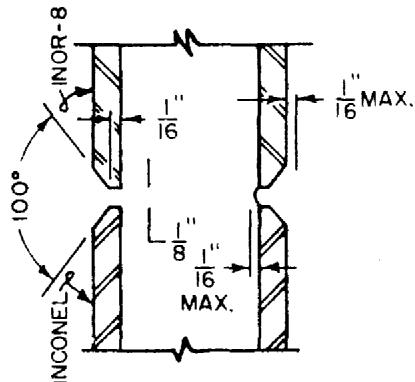  
FIG.QTS-33-A   
TEST B   
DETAILS FOR GROOVE AND FILLET TEST WELDMENT   
POSITION 2G   
(PIPE AXIS VERTICAL FIXED)

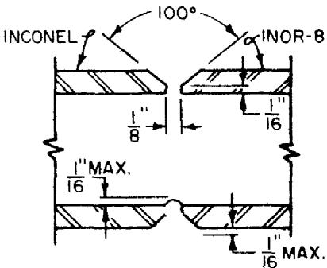  
POSITION 5G   
(PIEAXIS HORIZONTALFIXED)

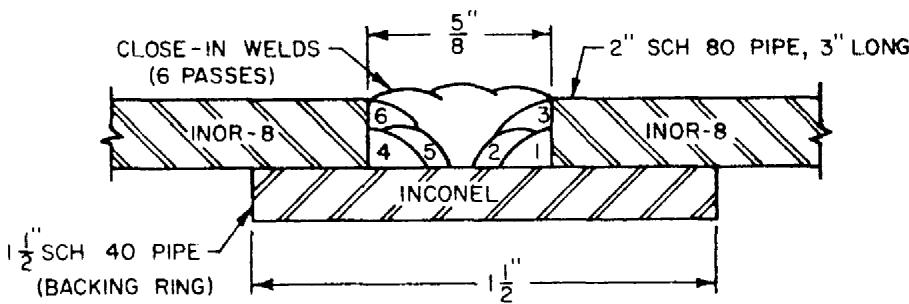

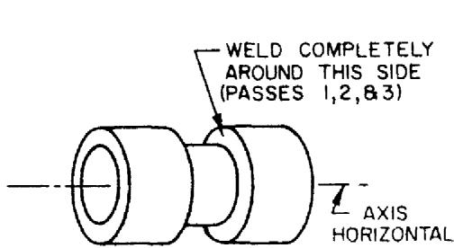  
PART "A"   
(PIPE AXIS HORIZONTAL FIXED)

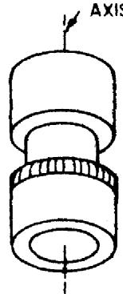  
VERTICAL   
WELD AROUND   
THIS SIDE   
(PASSES 4,5,86)   
PART "B"   
(PIPE AXIS VERTICAL FIXED)

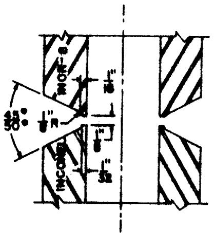  
FIG.QTS-33-A   
TEST C   
DETAILS FOR GROOVE AND FILLET TEST WELDMENTS   
POSITION 2G   
(Pipe axis vertical fixed)

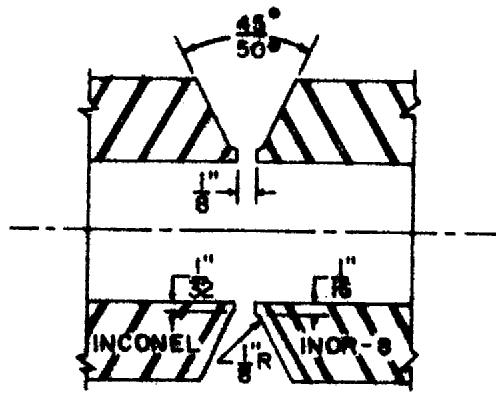  
POSITION 56   
(Pipe axis horizontal fixed)

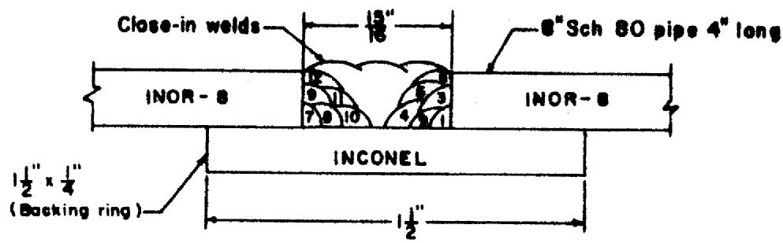

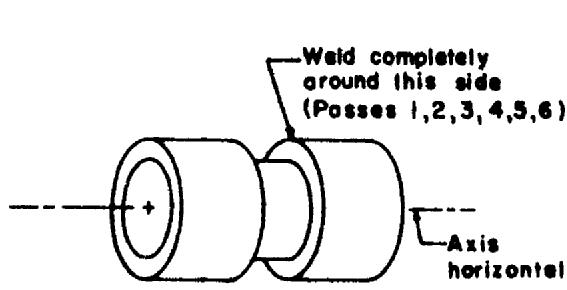  
PART "A"   
(Pipe axis horizontal fixed)

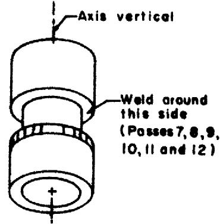  
PART "B"   
(Pipe axis vertical fixed)

Appendix G

Welding, Brazing, and Weld Inspection of INOR-8 Components

# Appendix G

WELDING, BRAZING, AND WELD INSPECTION OF INOR-8 COMPONENTS

Component drawings will have details for machining weld preparations on parts, weld symbols for each weld, and other general welding information. This symbol will indicate the type of weld, serial number of weld, and inspection schedule.

Welding shall be performed only by welders qualified by Mechanical Inspection to applicable specifications on drawings (PS-23, PS-25, PS-26, WS-1, WS-2) and inspected by the Mechanical Inspection group to Specification MET-WR-200, MET-NDT-4, MET-NDT-5, and MET-NDT-6.

Each drawing with welding will be stamped with the following inspection schedule prior to issuing the request for fabrication:

<table><tr><td rowspan="2">Inspection Method</td><td colspan="6">Inspection Schedule (as per Met-WR-200)</td></tr><tr><td>A</td><td>B</td><td>C</td><td>D</td><td>E</td><td>F</td></tr><tr><td>Visual</td><td>x</td><td>x</td><td>x</td><td>x</td><td>x</td><td>x</td></tr><tr><td>Partial penetrant</td><td>x</td><td>x</td><td></td><td></td><td>x</td><td></td></tr><tr><td>Complete penetrant</td><td></td><td></td><td>x</td><td>x</td><td></td><td></td></tr><tr><td>Radiograph</td><td>x</td><td>x</td><td></td><td></td><td></td><td></td></tr><tr><td>Ultrasonic</td><td>x</td><td></td><td>x</td><td></td><td></td><td></td></tr></table>

Appendix H

Materials Which Have Been Analyzed for Use on INOR-8 and Stainless Steel for the Molten-Salt Reactor Experiment

DATE: October 25, 1963

COPY NO. 20

SUBJECT: Materials Which Have Been Analyzed for Use on INOR-8 and Stainless Steel for the Molten-Salt Reactor Experiment

TO: Distribution

FROM: B.H.Webster

# ABSTRACT

During the fabrication and installation of the MSRE a number of commercial products were analyzed to determine what would be acceptable as cleaning agents, lubricants, insulation, threading and tapping compounds, etc., on INOR-8 and stainless steel materials. All of these commercial items were analyzed for sulphur, since we have found sulphur to be extremely harmful to INOR-8. It may be noted that most items were analyzed for low-melting metals and alloys which are also harmful to INOR-8 under certain conditions. This listing is submitted with the hope that it will be beneficial to other groups in the Laboratory.

# NOTICE

This document contains information of a preliminary nature and was prepared primarily for internal use at the Oak Ridge National Laboratory. It is subject to revision or correction and therefore does not represent a final report. The information is not to be abstracted, reprinted or otherwise given public dissemination without the approval of the ORNL patent branch, Legal and Information Control Department.

<table><tr><td>Item</td><td>S ppm</td><td>Al ppm</td><td>Ag ppm</td><td>Cl ppm</td><td>Hg ppm</td><td>Pb ppm</td></tr><tr><td>"Whiz" Gasket Maker Type #4</td><td>500</td><td>55</td><td>15</td><td>71</td><td>1.5</td><td>45</td></tr><tr><td>"Permatex" - Form-A-Gasket #3</td><td>50</td><td>240</td><td>17</td><td>39</td><td>0.6</td><td>87</td></tr><tr><td>Tape, Cloth, "Hampton" Type #3</td><td>4100</td><td>13,430</td><td>660</td><td>2980</td><td>10</td><td></td></tr><tr><td>Tape, Plastic, Elec. "JM" No. 166</td><td>1400</td><td>630</td><td>900</td><td>270,000</td><td>10</td><td>1500</td></tr><tr><td>Tape, Glass, Elec. "Scotch" #27</td><td>50</td><td>40,490</td><td>580</td><td>340</td><td></td><td></td></tr><tr><td>Tape, Masking, "Scotch" #202</td><td>2800</td><td>180</td><td>30</td><td>710</td><td>10</td><td></td></tr><tr><td>Tape, Teflon</td><td>50</td><td>300</td><td>10</td><td>10</td><td>10</td><td></td></tr><tr><td>Thread Compound, "Fel-Pro C5A"</td><td>6500</td><td>640</td><td>70</td><td>20</td><td>10</td><td>10 to 100</td></tr><tr><td>Pipe Joint Comp., "Key Tite"</td><td>550</td><td>3070</td><td>830</td><td>1050</td><td>10</td><td>&lt;400</td></tr><tr><td>Sealing Glaze, "Duroc"</td><td>140</td><td>33,200</td><td>1640</td><td>15,400</td><td>1</td><td>\( 1 x 10^4 \)to 1 x \( 10^5 \)</td></tr><tr><td>Leak Check, "Sherlock"</td><td>870</td><td>5</td><td>9</td><td>48</td><td>1.1</td><td></td></tr><tr><td>"Reliance" Tallowaid</td><td>410</td><td>410</td><td>300</td><td>10</td><td>10</td><td>100</td></tr><tr><td>"Tap-Magic" Tapping Comp.</td><td>20,500</td><td>2</td><td>8</td><td>262</td><td>.4</td><td>210</td></tr><tr><td>"Kel-F" Grease, 3-M Co.</td><td>7000</td><td>2640</td><td>340</td><td>226,000</td><td>10</td><td>18</td></tr><tr><td>Pipe Fitting Comp. "Grinnell"</td><td>36,900</td><td>94</td><td>12</td><td>306</td><td>0.8</td><td>72</td></tr><tr><td>Polyethene Plastic Film</td><td>50</td><td>100</td><td>60</td><td>20</td><td>10</td><td></td></tr><tr><td>"Carey-Temp", Insulation Cement</td><td>4500</td><td>27,900</td><td>900</td><td>13,200</td><td>110</td><td>1000 to 10,000</td></tr><tr><td>"Gulfite" Cutting Oil</td><td>200</td><td>14</td><td>6</td><td>2</td><td>.1</td><td>18</td></tr><tr><td>"Tech Pen" Ink</td><td>6900</td><td></td><td></td><td></td><td></td><td></td></tr><tr><td>Blotting Paper</td><td>220</td><td>1870</td><td>450</td><td>290</td><td>10</td><td></td></tr><tr><td>Asbestos Paper</td><td>400</td><td>2870</td><td>1300</td><td>780</td><td>10</td><td></td></tr><tr><td>Asbestos Cloth</td><td>390</td><td>800</td><td>900</td><td>2470</td><td>10</td><td>&lt;400</td></tr><tr><td>Vacuum Grease, "Dow Corning"</td><td>3200</td><td>34,900</td><td>900</td><td>1010</td><td>110</td><td>&lt;4</td></tr><tr><td>Apiezon</td><td>170</td><td>370</td><td>10</td><td>100</td><td>10</td><td>&lt;4</td></tr><tr><td>Hydraulic Oil (Code HB)</td><td>&lt;50</td><td></td><td></td><td></td><td></td><td></td></tr><tr><td>Neo-Lube, Thread Lubricant</td><td>&lt;50</td><td></td><td></td><td></td><td></td><td></td></tr><tr><td>Zip-Strip Label Tape</td><td>11,000</td><td></td><td></td><td></td><td></td><td></td></tr><tr><td>Gulfspin 35 Drum No. 1</td><td>2600</td><td>20</td><td>10</td><td>40</td><td>.3</td><td>&lt;0.2</td></tr><tr><td>Shell Tellus #72 (BL)</td><td>600</td><td>20</td><td>20</td><td>50</td><td>&lt;.01</td><td>17</td></tr><tr><td>Nebula #1 Grease (UK)</td><td>600</td><td>400</td><td>2</td><td>&lt;10</td><td>&lt;.1</td><td>17</td></tr><tr><td>Shell Tellus #69 (KB)</td><td>700</td><td>20</td><td>7</td><td>.7</td><td>&lt;.01</td><td>~0.3</td></tr><tr><td>Shell Hydrax #33 (BG)</td><td>200</td><td>10</td><td>4</td><td>.9</td><td>&lt;.01</td><td>&lt;0.2</td></tr><tr><td>Shell Macoma #73 (CC)</td><td>5400</td><td>20</td><td>3</td><td>3</td><td>&lt;.01</td><td>10,000</td></tr><tr><td>Corborundum "Fiberfrax" Type XSW</td><td>&lt;160</td><td></td><td></td><td></td><td></td><td></td></tr><tr><td>Cloth, Insulating, Reinforcing, Permaglas Mesh Co.</td><td>130</td><td></td><td></td><td></td><td></td><td></td></tr><tr><td>Compound, Waterproofing Mastic, No. 30-36 Sealfas Mastic</td><td>200</td><td></td><td></td><td></td><td></td><td></td></tr><tr><td>Insulation, Carey "Hi-Temp"</td><td>210</td><td></td><td></td><td></td><td></td><td></td></tr><tr><td>Carey Insulation Cement (1900°F)</td><td>360</td><td colspan="5">10-100% (Reported A102)</td></tr><tr><td>FiberFrax Paper</td><td>&lt;200</td><td></td><td></td><td></td><td></td><td></td></tr></table>

Appendix I

Helium Leak Test Procedure

# HELIUM LEAK TEST PROCEDURE

ITEM UNDER TEST

WORK REQUEST NUMBER

1. SET UP EQUIPMENT AS SHOWN PER MSRE-SK-216, ESTABLISH HELIUM ATMOSPHERE IN PLASTIC ENCLOSURE, HAVE LEAK DETECTOR IN OPERATION AND ROUGHING PUMP IN OPERATION, VALVES C, D, E, F, AND J CLOSED, VALVES A, B, AND H OPEN.

WHEN LEAK DETECTOR IS READY FOR TEST ACCORDING TO INSTRUCTIONS ON MACHINE, NOTE TIME, READ GAUGES. (IN READING LEAK RATE METER INDICATE BY AT OR AB AFTER THE READING WHEATHER THE TOP OR BOTTOM SCALE WAS READ.)

<table><tr><td>MICRONS</td><td colspan="2">LEAK RATE</td><td colspan="2">RANGE</td></tr><tr><td>PROCEDURE</td><td>TIME</td><td>MICRONS</td><td>LEAK RATE</td><td>RANGE</td></tr><tr><td>2. OPEN VALVE C</td><td></td><td></td><td></td><td></td></tr><tr><td>3. WHEN LEAK DETECTOR STABILIZES, NOTE:</td><td></td><td></td><td></td><td></td></tr><tr><td>4. CLOSE VALVE C</td><td></td><td></td><td></td><td></td></tr><tr><td>5. WHEN LEAK DETECTOR STABILIZES, NOTE:</td><td></td><td></td><td></td><td></td></tr><tr><td>6. OPEN VALVE D, CLOSE VALVE H, OPEN VALVE J</td><td></td><td></td><td></td><td></td></tr><tr><td>7. WHEN LEAK DETECTOR STABILIZES, NOTE:</td><td></td><td></td><td></td><td></td></tr><tr><td>8. BEGIN 30 MINUTE TEST PERIOD</td><td></td><td></td><td></td><td></td></tr><tr><td>9. AT END OF EACH TEST PERIOD, NOTE:</td><td></td><td></td><td></td><td></td></tr><tr><td>10. OPEN VALVE F, CLOSE VALVE J</td><td></td><td></td><td></td><td></td></tr><tr><td>11. WHEN LEAK DETECTOR STABILIZES, NOTE:</td><td></td><td></td><td></td><td></td></tr><tr><td>12. CLOSE VALVE F, OPEN VALVE J</td><td></td><td></td><td></td><td></td></tr><tr><td>13. WHEN LEAK DETECTOR STABILIZES, NOTE:</td><td></td><td></td><td></td><td></td></tr><tr><td>14. CLOSE VALVE D</td><td></td><td></td><td></td><td></td></tr><tr><td>15. WHEN LEAK DETECTOR STABILIZES, NOTE:</td><td></td><td></td><td></td><td></td></tr><tr><td>16. OPEN VALVE C</td><td></td><td></td><td></td><td></td></tr><tr><td>17. WHEN LEAK DETECTOR STABILIZES, NOTE:</td><td></td><td></td><td></td><td></td></tr></table>

UCN-5113

(3 10-63)

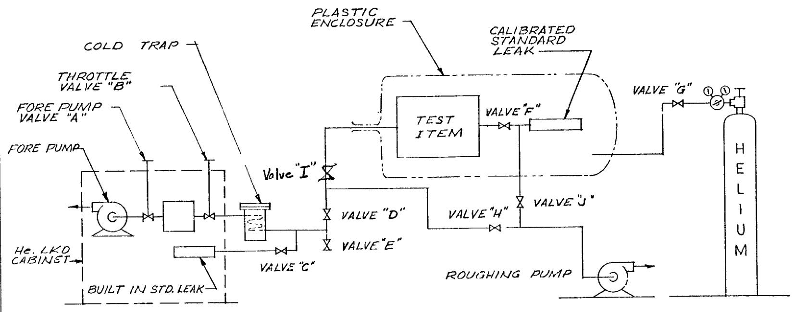

4. P 8-9-63

${OK} - {BH}\omega$ .

Appendix J

Fixtures and Components During Assembly

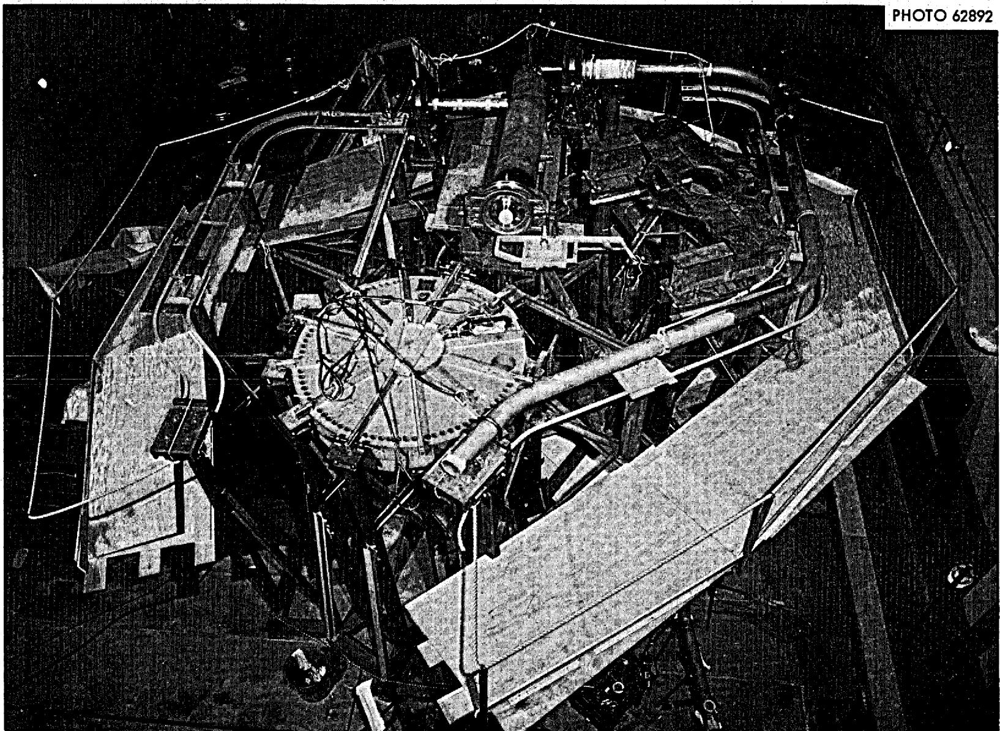

Appendix K

Check List - Reactor Cell Salt System

# CHECK LIST

# REACTOR CELL SALT SYSTEM

Includes: Reactor Vessel, Heat Exchanger, Fuel Pump Bowl,

Bearing Housing & Rotary Element, Pump Motor,

Space Coolers, Thermal Shield, Pump Support,

Heat Exchanger Supports, Pipe Supports.

Pipe & Component Heaters to Disconnect, T. C. Components to Disconnect,

Fuel Salt Piping, lines 200 & 201 from HX to wall, Flow & level Instruments,

And Salt Piping

<table><tr><td></td><td>I &amp; C</td><td>P &amp; E</td><td>RD</td></tr><tr><td>A - Components</td><td></td><td></td><td></td></tr><tr><td>1. Reactor Vessel</td><td></td><td></td><td></td></tr><tr><td>(a) Fabricate per Drawing - Material meets Specs.</td><td></td><td></td><td></td></tr><tr><td>(b) Cleaned Inside</td><td></td><td></td><td></td></tr><tr><td>(c) Check for Al outside - cleaned</td><td></td><td></td><td></td></tr><tr><td>(d) Leak Tested - Recorded</td><td></td><td></td><td></td></tr><tr><td>(e) Welds Inspected - Accepted</td><td></td><td></td><td></td></tr><tr><td>(f) Fitted to Jig - Recorded - Photographed</td><td></td><td></td><td></td></tr><tr><td>(g) Installed per Drawing - Using Remote Tooling</td><td></td><td></td><td></td></tr><tr><td>(h) Deviations noted on Drawings and Drawings returned to Design</td><td></td><td></td><td></td></tr><tr><td>(i) Photographed</td><td></td><td></td><td></td></tr><tr><td>2. Heat Exchanger</td><td></td><td></td><td></td></tr><tr><td>(a) Fabricated per Drawing - Material Meets Specs.</td><td></td><td></td><td></td></tr><tr><td>(b) Cleaned Inside</td><td></td><td></td><td></td></tr><tr><td>(c) Check for Al outside - cleaned</td><td></td><td></td><td></td></tr><tr><td>(d) Leak Tested - Recorded</td><td></td><td></td><td></td></tr><tr><td>(e) Welds Inspected - Accepted</td><td></td><td></td><td></td></tr><tr><td>(f) Fitted to Jig - Recorded - Photographed</td><td></td><td></td><td></td></tr><tr><td>(g) Installed per Drawing - Using Remote Tooling</td><td></td><td></td><td></td></tr><tr><td>(h) Deviations noted onDrawings and Drawings returned to Design</td><td></td><td></td><td></td></tr><tr><td>(i) Photographed</td><td></td><td></td><td></td></tr><tr><td>3. Pump Bowl</td><td></td><td></td><td></td></tr><tr><td>(a) Fabricated per Drawing - Material Meets Specs.</td><td></td><td></td><td></td></tr><tr><td>(b) Cleaned Inside</td><td></td><td></td><td></td></tr><tr><td>(c) Check for Al outside - cleaned</td><td></td><td></td><td></td></tr><tr><td>(d) Leak Tested - Recorded</td><td></td><td></td><td></td></tr><tr><td>(e) Welds Inspected - Accepted</td><td></td><td></td><td></td></tr><tr><td>(f) Fitted to Jig - Recorded - Photographed</td><td></td><td></td><td></td></tr><tr><td>(g) Installed per Drawing - Using Remote Tooling</td><td></td><td></td><td></td></tr><tr><td>(h) Deviations noted on Drawings and Drawings returned to Design</td><td></td><td></td><td></td></tr><tr><td>(i) Photographed</td><td></td><td></td><td></td></tr><tr><td>4. Bearing Housing - Rotary Element</td><td></td><td></td><td></td></tr><tr><td>(a) Fabricated per Drawing - Material Meets Specs.</td><td></td><td></td><td></td></tr><tr><td>(b) Cleaned Inside</td><td></td><td></td><td></td></tr><tr><td>(c) Check for Al outside - cleaned</td><td></td><td></td><td></td></tr><tr><td>(d) Leak Tested - Recorded</td><td></td><td></td><td></td></tr><tr><td>(e) Welds Inspected - Accepted</td><td></td><td></td><td></td></tr><tr><td>(f) Fitted to Jig - Recorded - Photographed</td><td></td><td></td><td></td></tr><tr><td>(g) Installed per Drawing - Usimg Remote Tooling</td><td></td><td></td><td></td></tr><tr><td>(h) Deviations noted on Drawings and Drawings returned to Design</td><td></td><td></td><td></td></tr><tr><td>(i) Photographed</td><td></td><td></td><td></td></tr><tr><td>5. Pump Motor</td><td></td><td></td><td></td></tr><tr><td>(a) Run in along with Rotary Element</td><td></td><td></td><td></td></tr><tr><td>(b) Checked Electrically</td><td></td><td></td><td></td></tr><tr><td>(c) Leak Tested</td><td></td><td></td><td></td></tr><tr><td>(d) Installed per Drawing - With Remote Tools</td><td></td><td></td><td></td></tr><tr><td>(e) Flanges Jigged</td><td></td><td></td><td></td></tr><tr><td>(f) Deviations noted on Drawings and Drawings returned to Design</td><td></td><td></td><td></td></tr></table>

CHECK LIST

REACTOR CELL SALT SYSTEM

<table><tr><td></td><td>I &amp; C</td><td>P &amp; E</td><td>RD</td></tr><tr><td>6. Thermal Shield(a) Fabricated &amp; Tested per Drawing(b) Welds inspected - Accepted(c) Installed per Drawing(d) Pressure Tested(e) Leak Tested(f) Filled with Balls - Weight recorded(g) Removable Sections checked for fit(h) Removed &amp; re-installed remotely7. Space Coolers(a) Meets Specifications(b) Welds Inspected - Accepted(c) Installed per Drawing(d) Leak Tested(e) Fitted to Jig - Jig labeled(f) Installed per Drawing - Using Remote ToolsB - Component and Pipe Supports1. Space cooler Supports(a) Fabricated &amp; Installed per Drawing(b) Material meets Specifications(c) Installed &amp; Removed Remotely(d) Bolts checked for proper torque(e) Deviations noted on Drawings and Drawings returned to Design2. Heat Exchanger Supports(a) Fabricated &amp; Installed per Drawing(b) Checked for Proper Loading before heat up(c) Checked for Proper Loading after heat up(d) Material meets Specifications(e) Deviation noted on Drawings and returned to Design</td><td></td><td></td><td></td></tr></table>

<table><tr><td></td><td>I &amp; C | P &amp; E</td><td>RD</td></tr><tr><td>3. Pump Supports(a) Fabricated per Drawing(b) Installed per Drawing(c) Modified per Drawing(d) Checked for proper loading (cold)(e) Checked for proper loading after heat up(f) Deviations noted on Drawings and Drawings returned to Design</td><td></td><td></td></tr><tr><td>4. Reactor Supports(a) Support Rods etc. fabricated per Drawing(b) Material meets specifications(c) Checked for proper loading on each rod(d) Deviations noted on Drawings and Drawings returned to Design</td><td></td><td></td></tr><tr><td>5. Pipe Supports(a) Fabricated per Drawing(b) Installed &amp; aligned per Drawing(c) Proper loading (cold)(d) Proper loading after heat up(e) Deviations noted on Drawings and Drawings returned to Design</td><td></td><td></td></tr><tr><td>C - Salt Piping</td><td></td><td></td></tr><tr><td>1. Lines 100, 101, 102, 103, F. V. 103, &amp; F F(a) Materials meet specifications(b) Fabricated per Drawing(c) Installed per Drawing(d) Welding Inspected, Approved(e) Pipe Cleaned(f) Pipe checked for Al outside - cleaned</td><td></td><td></td></tr></table>

<table><tr><td></td><td>I &amp; C</td><td>P &amp; E</td><td>RD</td></tr><tr><td>(g) Leak Tested</td><td></td><td></td><td></td></tr><tr><td>(h) Deviations noted on Drawings and Drawings returned to Design</td><td></td><td></td><td></td></tr><tr><td>2. Lines 200, 201.</td><td></td><td></td><td></td></tr><tr><td>(a) Materials meet specifications</td><td></td><td></td><td></td></tr><tr><td>(b) Fabricated per Drawing</td><td></td><td></td><td></td></tr><tr><td>(c) Installed per Drawing</td><td></td><td></td><td></td></tr><tr><td>(d) Welding Inspected, Approved</td><td></td><td></td><td></td></tr><tr><td>(e) Pipe Cleaned</td><td></td><td></td><td></td></tr><tr><td>(f) Pipe checked for Al outside - cleaned</td><td></td><td></td><td></td></tr><tr><td>(g) Leak Tested</td><td></td><td></td><td></td></tr><tr><td>(h) Deviations noted on Drawings and Drawings returned to Design</td><td></td><td></td><td></td></tr><tr><td>D - Heaters</td><td></td><td></td><td></td></tr><tr><td>1. Pipe Heaters and Heater Bases</td><td></td><td></td><td></td></tr><tr><td>(a) Fabricated per Drawing, checked dimensionally</td><td></td><td></td><td></td></tr><tr><td>(b) Heaters Checked</td><td></td><td></td><td></td></tr><tr><td>(c) Bases installed per Drawing</td><td></td><td></td><td></td></tr><tr><td>(d) Heater Assemblies checked per Drawing Identified</td><td></td><td></td><td></td></tr><tr><td>(e) Heaters Installed, Checked for Alignment</td><td></td><td></td><td></td></tr><tr><td>(f) Disconnects attached per Drawing - Checked</td><td></td><td></td><td></td></tr><tr><td>(g) Photographed</td><td></td><td></td><td></td></tr><tr><td>2. Fuel Pump Furnace</td><td></td><td></td><td></td></tr><tr><td>(a) Fabricated and Installed per Drawing. Welded per Specifications</td><td></td><td></td><td></td></tr><tr><td>(b) Insulation meets Specifications. Installed per Drawing</td><td></td><td></td><td></td></tr><tr><td>(c) Heaters fabricated. Installed per Drawing</td><td></td><td></td><td></td></tr><tr><td>(d) Heaters megged - Checked for interference with pipe, etc.</td><td></td><td></td><td></td></tr><tr><td>(e) Total Assembly checked for alignment, hangers checked for proper loading.</td><td></td><td></td><td></td></tr><tr><td>(f) Disconnects attached per Drawing - Checked</td><td></td><td></td><td></td></tr><tr><td>(g) Photos of Assembly</td><td></td><td></td><td></td></tr><tr><td>(h) Deviations noted on Drawing and Drawings returned to Design</td><td></td><td></td><td></td></tr><tr><td>3. Reactor Heaters</td><td></td><td></td><td></td></tr><tr><td>(a) Fabricated and Installed per Drawing Welded per Specifications</td><td></td><td></td><td></td></tr><tr><td>(b) Insulation meets Specifications Installed per Drawing</td><td></td><td></td><td></td></tr><tr><td>(c) Heaters fabricated. Installed per Drawing</td><td></td><td></td><td></td></tr><tr><td>(d) Heaters megged - Checked for interference with pipe, etc.</td><td></td><td></td><td></td></tr><tr><td>(e) Total Assembly checked for alignment, hangers checked for proper loading.</td><td></td><td></td><td></td></tr><tr><td>(f) Disconnects attached per Drawing - Checked</td><td></td><td></td><td></td></tr><tr><td>(g) Photos of Assembly</td><td></td><td></td><td></td></tr><tr><td>(h) Deviations noted on Drawing and Drawings returned to Design</td><td></td><td></td><td></td></tr><tr><td>4. Power Cable to Space Coolers</td><td></td><td></td><td></td></tr><tr><td>(a) M I Cable megged, Approved</td><td></td><td></td><td></td></tr><tr><td>(b) Ends sealed, approved.</td><td></td><td></td><td></td></tr><tr><td>(c) M I Cable attached to J B or disconnect inside cell - Attached to J B outside Cell</td><td></td><td></td><td></td></tr><tr><td>(d) Cable identified inside &amp; outside Cell</td><td></td><td></td><td></td></tr><tr><td>(e) Brazing inspected, approved</td><td></td><td></td><td></td></tr><tr><td>(f) Bulkhead seal installed, checked</td><td></td><td></td><td></td></tr><tr><td>(g) J B or Disconnects located per Drawing</td><td></td><td></td><td></td></tr><tr><td>(h) Photographed - Inside Cell</td><td></td><td></td><td></td></tr><tr><td>(i) Deviations noted on Drawings and Drawings returned to Design</td><td></td><td></td><td></td></tr><tr><td>5. Power Cable to Pump Motor</td><td></td><td></td><td></td></tr><tr><td>(a) M I Cable megged, Approved</td><td></td><td></td><td></td></tr><tr><td>(b) Ends sealed, Approved</td><td></td><td></td><td></td></tr><tr><td>(c) MI Cable attached to J B or disconnect inside cell - Attached to J B outside Cell</td><td></td><td></td><td></td></tr><tr><td>(d) Cable identified inside &amp; outside Cell</td><td></td><td></td><td></td></tr><tr><td>(e) Brazing inspected, approved</td><td></td><td></td><td></td></tr><tr><td>(f) Bulkhead seals installed, checked</td><td></td><td></td><td></td></tr><tr><td>(g) J B or Disconnects located per Drawing</td><td></td><td></td><td></td></tr><tr><td>(h) Photographed - Inside Cell</td><td></td><td></td><td></td></tr><tr><td>(i) Deviations noted on Drawings and Drawings returned to Design</td><td></td><td></td><td></td></tr><tr><td>6. Heater Leads - Outside J B to disconnects</td><td></td><td></td><td></td></tr><tr><td>(a) M I Cable megged, Approved</td><td></td><td></td><td></td></tr><tr><td>(b) Ends sealed, Approved</td><td></td><td></td><td></td></tr><tr><td>(c) MI Cable attached to J B or disconnect inside cell - Attached to J B outside Cell</td><td></td><td></td><td></td></tr><tr><td>(d) Cable identified inside &amp; outside Cell</td><td></td><td></td><td></td></tr><tr><td>(e) Brazing inspected, Approved</td><td></td><td></td><td></td></tr><tr><td>(f) Bulkhead seals installed, checked</td><td></td><td></td><td></td></tr><tr><td>(g) J B or Disconnects located per drawing</td><td></td><td></td><td></td></tr><tr><td>(h) Photographed - Inside Cell</td><td></td><td></td><td></td></tr><tr><td>(i) Deviations noted on Drawings and Drawings returned to Design</td><td></td><td></td><td></td></tr><tr><td>E. Instrumentation</td><td></td><td></td><td></td></tr><tr><td>1. Thermocouples J B outside Cell to J B inside Cell</td><td></td><td></td><td></td></tr><tr><td>(a) M I Cable megged, Approved</td><td></td><td></td><td></td></tr><tr><td>(b) Ends sealed, Approved</td><td></td><td></td><td></td></tr><tr><td>(c) M I Cable attached to J B or disconnect inside cell - Attached to J B outside Cell</td><td></td><td></td><td></td></tr><tr><td>(d) Cable identified inside &amp; outside Cell</td><td></td><td></td><td></td></tr><tr><td>(e) Brazing inspected, Approved</td><td></td><td></td><td></td></tr><tr><td>(f) Bulkhead seals installed, checked</td><td></td><td></td><td></td></tr><tr><td>(g) J B or Disconnects located per Drawing</td><td></td><td></td><td></td></tr><tr><td>(h) Photographed - Inside Cell</td><td></td><td></td><td></td></tr><tr><td>(i) Deviations noted on Drawings and Drawings returned to Design</td><td></td><td></td><td></td></tr><tr><td>2. Thermocouples - J B inside cell to Contact Point</td><td></td><td></td><td></td></tr><tr><td>(a) T. C. fabricated per drawing - ends sealed - checked</td><td></td><td></td><td></td></tr><tr><td>(b) Pads welded on pipe, etc., per Drawing Inspected, Accepted</td><td></td><td></td><td></td></tr><tr><td>(c) T. C. attached to pipe etc., &amp; to disconnect per specifications - Inspected, Accepted</td><td></td><td></td><td></td></tr><tr><td>(d) T. C. Identified &amp; J B Identified</td><td></td><td></td><td></td></tr><tr><td>(e) Photographed</td><td></td><td></td><td></td></tr><tr><td>(f) Deviations noted &amp; Drawings returned to Design</td><td></td><td></td><td></td></tr></table>

Appendix L

Fuel Drain Tank No. 2 in Jig

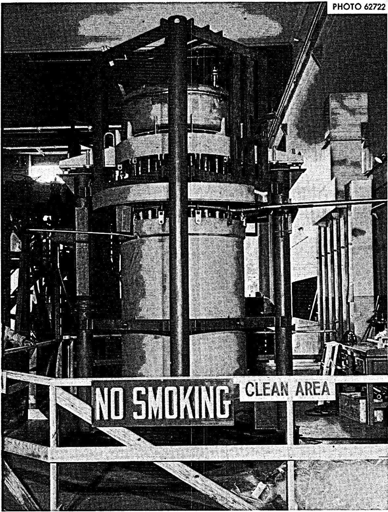

Appendix M

Check Off List for Main Blower Startup

# CHECK OFF LIST

for

MAIN BLOWER STARTUP

<table><tr><td></td><td>I &amp; C</td><td>P &amp; E</td><td>RD</td></tr><tr><td>1. Lubricate Motors</td><td></td><td></td><td></td></tr><tr><td>2. Lubricate Blowers</td><td></td><td></td><td></td></tr><tr><td>3. Check Rotation of Motor</td><td></td><td></td><td></td></tr><tr><td>4. Check Operation of Backflow Dampers</td><td></td><td></td><td></td></tr><tr><td>5. Check Operation of Directional Vanes</td><td></td><td></td><td></td></tr><tr><td>6. Check Operation of Bypass Dampers</td><td></td><td></td><td></td></tr><tr><td>7. Open Bypass Damper</td><td></td><td></td><td></td></tr><tr><td>8. Check inside Radiator to see that all loose materials are removed or tightened</td><td></td><td></td><td></td></tr><tr><td>9. Close Radiator Doors</td><td></td><td></td><td></td></tr><tr><td>10. Remove Stack Cover</td><td></td><td></td><td></td></tr><tr><td>11. Remove all loose materials from:(a) Fan House(b) Fan Housing(c) Radiator duct upstream &amp; downstream of Radiator(d) Stack</td><td></td><td></td><td></td></tr><tr><td>12. Close Backflow dampers on Blower No. 1</td><td></td><td></td><td></td></tr><tr><td>13. Close Entrance Doors</td><td></td><td></td><td></td></tr><tr><td>14. Start Blower No. 3, run ~ 60 seconds</td><td></td><td></td><td></td></tr><tr><td>15. Shut down Blower No. 3</td><td></td><td></td><td></td></tr><tr><td>16. Close backflow damper on Blower No. 3</td><td></td><td></td><td></td></tr><tr><td>17. Start Blower No 1, run ~ 60 seconds</td><td></td><td></td><td></td></tr><tr><td>18. Shut down Blower No. 1</td><td></td><td></td><td></td></tr><tr><td colspan="4">NOTE: STEPS 1 THROUGH 13 MUST BE COMPLETED BEFORE STARTING STEP 14</td></tr></table>

# Internal Distribution

1. J. L. Anderson   
2. C.F.Baes   
3. S.E.Beall   
4. M. Bender   
5. E. S. Bettis   
6. D. S. Billington   
7. R. Blumberg   
8. A. L. Boch   
9. E. G. Bohlmann

10. M. Booth, AFC, Washington

ll. C. J. Borkowski   
12. G.E. Boyd   
13. R. B. Briggs   
14. D. W. Cardwell   
15. W.H.Cook

16-17. D.F.Cope, AEC-ORO

18. W. B. Cottrell   
19. J. L. Crowley   
20. F. L. Culler   
21. D. Elias, AEC-Washington   
22. J.R. Engel   
23. D. E. Ferguson   
24. L. M. Ferris   
25. A. P. Fraas   
26. J. K. Franzreib   
27. J.H.Frye   
28. C. H. Gabbard   
29. W.R.Grimes-G.M.Watson   
30. A. G. Grindell   
31. R. H. Guymon   
32. P. A. Halpine, AEC-Washington   
33. P. H. Harley   
34. P. N. Haubenreich   
35. J.W.Hill, Jr.   
36. E.C.Hise   
37. H. W. Hoffman   
38. A. Houtzeel   
39. J.R. Hunter, AEC-Washington   
40. T. L. Hudson   
41. W. H. Jordan   
42. P.R. Kasten

43. M. T. Kelley   
44. H. G. Kern   
45. A. I. Krakoviak   
46. Kermit Laughon, AEC-OSR   
47. M. I. Lundin   
48. R. N. Lyon   
49. R.E. MacPherson   
50. C. L. Matthews, AEC-OSR   
51. H.E.McCoy   
52. H.C.McCurdy   
53. C. K. McGlothlan

54-55. T. W. McIntosh, AEC-Washington

56. L.E. McNeese   
57. J.R. McWherter   
58. A.J.Miller   
59. R. L. Moore   
60. H. H. Nichol   
61. E. L. Nicholson   
62. A.M. Perry   
63. J. L. Redford   
64. M. Richardson   
65. D.R.Riley, AEC-Washington   
68. M. W. Rosenthal   
69. H. M. Roth, AEC-ORO   
70. A. W. Savolainen   
71. Dunlap Scott   
72. H. E. Seagren   
73. M. Shaw, AEC-Washington   
74. M. J. Skinner   
75. W. L. Smalley, AEC-ORO   
76. I. Spiewak   
77. D. A. Sundberg   
78. R.E.Thoma   
79. D. B. Trauger

80-84. B.H.Webster

85. A.M. Weinberg   
86. J.R. Weir   
87. M.E.Whatley   
88. J. C. White - A. S. Meyer   
89. G. D. Whitman   
90. Gale Young

# Internal Distribution

(continued)

91-92. Central Research Library (CRL)   
93-94. Y-12 Document Reference Section (DRS)   
95-97. Laboratory Records Department (IRD)   
98. Laboratory Records Department, Record Copy (IRD-RC)   
99. Nuclear Safety Information Center   
100. ORNL Patent Office

# External Distribution

101. J. Killion, Brown's Ferry Nuclear Plant Decatur, Alabama   
102. M. M. Price, Brown's Ferry Nuclear Plant Decatur, Alabama

103-117. Division of Technical Information Extension (DTIE)

118. Laboratory and University Division (ORO)