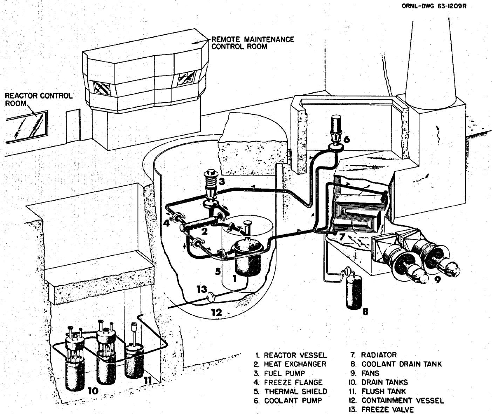
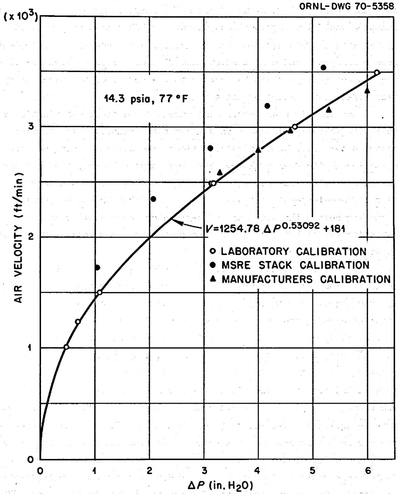
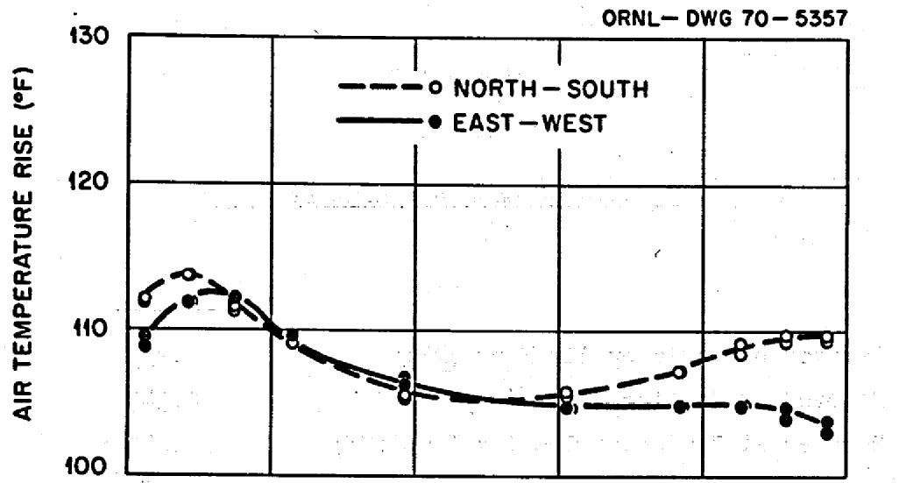
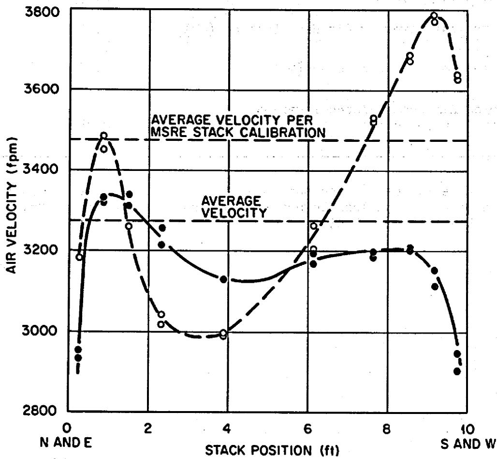
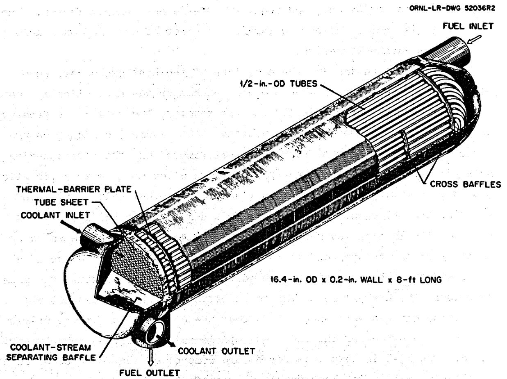
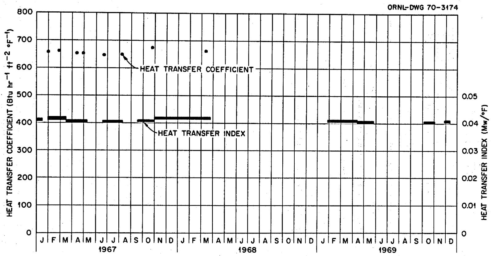
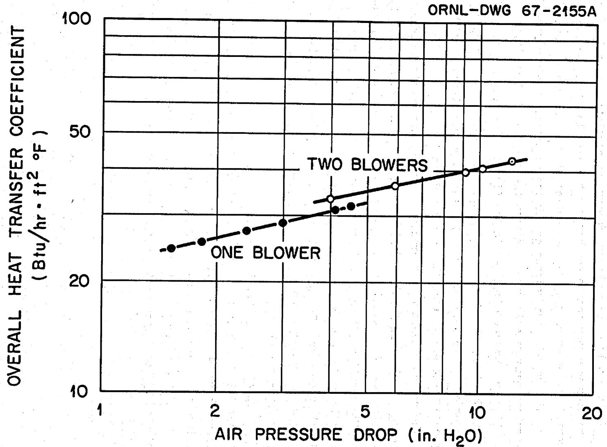

ORNL-TM- 3002

COPY NO. -109

DATE-May,1970

MASTER

REACTOR POWER MEASUREMENT AND HEAT TRANSFER PERFORMANCE

IN THE MOLTEN SALT REACTOR EXPERIMENT

C. H. Gabbard

# LEGAL NOTICE

This report was prepared as an account of Government sponsored work. Neither the United States, nor the Commission, nor any person acting on behalf of the Commission:

A. Makes any warranty or representation, expressed or implied, with respect to the accuracy, completeness, or usefulness of the information contained in this report, or that the use of any information, apparatus, method, or process disclosed in this report may not infringe privately owned rights; or   
B. Assumes any liabilities with respect to the use of, or for damages resulting from the use of any information, apparatus, method, or process disclosed in this report.

As used in the above, "person acting on behalf of the Commission" includes any employee or contractor of the Commission, or employee of such contractor, to the extent that such employee or contractor of the Commission, or employee of such contractor prepares, disseminates, or provides access to, any information pursuant to his employment or contract with the Commission, or his employment with such contractor.

# CONTENTS

Page

ABSTRACT 1   
INTRODUCTION 2

MEASUREMENT OF REACTOR POWER 2

Normal Heat Balance Calculation 4

Coolant Salt Flow Measurement by Decay of Circulating Activation Products. 6

Coolant System Pressure Drop 9

Air Heat Balance Calculation. 10

PERFORMANCE OF THE MAIN HEAT EXCHANGER AND RADIATOR. 15

Design Review 16

Primary Heat Exchanger 16

Coolant Radiator 19

Analysis of Performance 20

Primary Heat Exchanger 20

Coolant Radiator 24

CONCLUSIONS AND RECOMMENDATIONS. 27

REFERENCES 29

# LEGAL NOTICE

This Report was prepared as an account of Government sponsored work. Neither the United States, nor the Commission, nor any person acting on behalf of the Commission: "49, completeness, usefulness of the information contained in this report, or that the use of any information, apparatus, method, or process disclosed in this report may not be justified."

1. Assume any liabilities with respect to the use of, or for damages resulting from the As used in the above, "person acting on behalf of the Commission" includes any such employee or contractor of the Commission, or employee of such contractor, to the extent that disseminates, or provides access to, any information pursuant to his employment or contract

#

.

#

# REACTOR POWER MEASUREMENT AND HEAT TRANSFER PERFORMANCE IN THE MOLTEN SALT REACTOR EXPERIMENT

C. H. Gabbard

# ABSTRACT

The operating power of the MSRE was routinely determined by a heat balance on the fuel and coolant salt systems performed by the on-line computer. This gave a calculated full-power level of 8.0 MW. However, changes in the isotopic composition of uranium and plutonium in the fuel salt indicated a power lower than the 8 MW by about $7 - 10\%$ . Attempts to resolve this discrepancy included a measurement of the coolant salt flow rate by the radioactive decay of activation products in the coolant salt, a recalculation of the coolant system pressure drop, and a heat balance on the air side of the coolant radiator. These efforts to date have been inconclusive, but the coolant salt flow rate was found to be the only potential source of significant error in the heat balance. A calibration check of the differential pressure cells reading the coolant flow venturi will be made during the scheduled post-operation examinations.

The heat-removal capabilities of the fuel salt to coolant salt heat exchanger and coolant salt to air radiator were below the predictions of the original design calculations and limited the full-power output of the MSRE. In the case of the primary heat exchanger, the overestimate was due to the use of erroneous, estimated physical property data, the thermal conductivities in particular, for the fuel and coolant salts. When accurate, measured values of physical properties were used with the heat transfer relationships for conventional fluids, the calculated performance of the primary heat exchanger agreed with the observed value. In the case of the radiator, the overestimate in the design was only partially explained by the improper selection of an air "film" temperature.

There was no decrease in heat transfer capability of the two heat exchangers over more than 3 years of operation.

Keywords: MSRE, heat balance, heat transfer, heat exchanger, fused salts, performance, operation, reactor.

# INTRODUCTION

Operation of the Molten Salt Reactor Experiment (MSRE) from 1966 through 1969 provided a unique opportunity to measure heat transfer in equipment using molten fluoride salts in the temperature range of 1000 - $1200^{\circ}\mathrm{F}$ over an extended period of time. Analysis of these data has led to conclusions regarding the adequacy of conventional design procedures and the change (or lack thereof) in heat transfer resistances in this molten-salt system over more than 3 years of operation. This report describes the problems associated with measuring the power of the MSRE, then deals with predicted and observed heat transfer coefficients.

The MSRE design and operation are described in detail in References 1 and 2. Figure 1 shows the layout of the important components. Fuel salt was circulated at about $1200\mathrm{~gpm}$ through the core, where it was heated by the fission chain reaction, then through a $279\text{-ft}^2$ , cross-baffled shell-and-tube heat exchanger where it transferred heat to a second salt flowing through $1/2$ -inch tubes. Heat was removed from the coolant salt and dissipated to the atmosphere in an air-cooled heat exchanger ("coolant radiator") with $3/4$ -inch tubes.

# MEASUREMENT OF REACTOR POWER

The official operating power of the MSRE was determined by making a heat balance around the fuel and coolant systems. This heat balance, which was routinely calculated by the on-line computer, is more fully described in References 3 and 4. The various nuclear power instrumentation systems (linear chambers, fission chambers, and safety chambers) were calibrated to agree with the nuclear power as indicated by the heat balance.

The heat balances calculated through March 1968 indicated a nominal full-power level of about $7.2\mathrm{MW}$ . There was some reason to suspect this value, however, because data from reactor operation at different power levels strongly suggested that the coolant salt specific heat was a constant rather than the temperature-dependent relation that was being used

  
Fig. 1. Layout of the MSRE

in the heat balance. $^{5}$ Two laboratories (ORNL and the National Bureau of Standards) independently measured the coolant salt specific heat, arriving at values in good agreement with each other but substantially higher (in the MSRE temperature range) than the previously used value. $^{6}$ The new measurements also showed virtually no variation with temperature. The new, constant value of the specific heat was incorporated into the computer prior to the beginning of operation on U-233 fuel in January 1969. The calculated full-power level was changed from 7.2 to 8.0 MW as a result of the specific heat revision.

As results of precision isotopic analyses of the heavy elements in the fuel salt became available, independent determinations of reactor power were obtained from the changes in uranium and plutonium isotopic compositions. The most recent evaluations of these isotopic data yielded a full-power level of $7.34 \pm 0.09$ MW (References 7 and 8). The heat balance calculation has been reviewed as described below in attempts to resolve the discrepancy between the measured heat balance power and the power indicated by the changes in isotopic composition of the fuel salt.

# Normal Heat Balance Calculation

At significant power levels, the dominant term in the heat balance was the heat removed from the coolant salt at the radiator. From Table I, which shows the relative importance of the various terms in the heat balance for operation at full power, it is clear that there was little opportunity for significant overall error due to the other terms.

The heat removed at the radiator was calculated from the mass flow rate, the specific heat of the coolant salt, and the temperature drop across the radiator. Possible sources of error in each of these were examined.

The salt temperature drop across the radiator was measured at thermocouple wells at the inlet and outlet. Three calibrated thermocouples were installed in each well with two from each well being used in the heat balance. Although the laboratory calibrations of the thermocouples indicated a $\Delta T$ error of about $-0.3^{\circ}F$ , there was concern that larger systematic

Table I   
Typical Values in MSRE Heat Balance at Full Power   

<table><tr><td></td><td>MW</td></tr><tr><td>Heat removed from coolant salt at radiator</td><td>7.853</td></tr><tr><td>Heat removed by cooling water</td><td>0.341</td></tr><tr><td>Heat removed by component cooling air</td><td>0.016</td></tr><tr><td>Heat removed by fuel pump oil</td><td>0.003</td></tr><tr><td>Unaccountable heat losses</td><td>0.011</td></tr><tr><td>Power input to electric heaters</td><td>-0.175</td></tr><tr><td>Power input to fuel pump</td><td>-0.035</td></tr><tr><td>Power input to space coolers</td><td>-0.007</td></tr><tr><td>Power input to coolant pump impeller</td><td>-0.036</td></tr><tr><td>Nuclear power generated</td><td>7.971</td></tr></table>

errors might exist in the installed condition. To test this possibility, in November, 1969 the reactor system was operated isothermally at $1210^{\circ}\mathrm{F}$ , $1070^{\circ}\mathrm{F}$ , and $1010^{\circ}\mathrm{F}$ to determine the error that would actually occur in operation over the temperature range of the coolant system. The indicated $\Delta T$ error for the coolant system at full power was $+0.23^{\circ}\mathrm{F}$ which would cause a $0.4\%$ overestimate in the calculated power. A second test to determine the influence of the radiator air flow on the thermocouple readings showed no detectable effect.

The coolant salt density is believed to contribute a ± 1% uncertainty to the heat removal term, and the revised specific heat measurement had a stated uncertainty of ± 1.4%.

The only remaining potential source of a significant error is in the measurement of the coolant salt volumetric flow rate. The volume flow rate of the coolant salt was measured at the radiator inlet by a venturi

flow meter with two channels of readout. Each readout channel consists of a differential pressure cell and the associated electronics to supply a linear flow signal to the computer. The differential pressure cells are connected to the venturi pressure taps and are isolated from the high-temperature salt by metal diaphragm seals and NaK-filled lines. A review of the venturi manufacturer's calibration data disclosed an error in converting the differential head from water to mercury which had caused a $2.9\%$ reduction in the measured flow rate and in the radiator heat-removal term. Another possibility for error, which still exists, is in the calibration of the differential pressure cells. The flowmeter readings were checked for evidence of trapped gas or compressibility in the NaK-filled lines by observing the flow readings as the coolant system overpressure was increased from 5 to 65 psi during a coolant system pressure test. There were essentially no indicated flow changes on either channel during this test. The actual range calibration of the differential pressure cells cannot be checked until later this year when the coolant piping will be cut so that known pressure signals can be applied to the cells.

Two independent attempts to determine the coolant salt flow rate are described below. However, the results of these two efforts were inconclusive and the final assessment of the flow rate will be made from the calibration check of the differential pressure cells.

Taking the nominal full power of 8.0 MW and applying the $2.9\%$ flow error and the $0.4\% \Delta T$ error, the heat balance would indicate a power level of $8.2 \pm 0.16$ MW as compared to $7.34 \pm .09$ MW indicated by the isotopic analysis of the fuel. If all of this discrepancy were assigned to the coolant salt flow rate in the heat balance, the flow rate would have to be lowered from the nominal value of $850$ gpm to $770$ gpm.

Coolant Salt Flow Measurement by Decay of Circulating Activation Products

Because the accuracy of the differential pressure cells reading the coolant salt flow venturi could not be checked until some months after the end of reactor operation, an attempt was made during the last power run in December 1969 to measure the coolant salt flow rate by the decay of activation products in the salt. Nitrogen-16 and fluorine-20 were produced

in the coolant salt by neutron reactions with fluorine in the heat exchanger. These activities then decayed with half-lives of 7.4 sec and 11.2 sec respectively as the salt was pumped around the coolant loop. We were also hopeful of finding long-lived activities from impurities in the salt that would have been useful in making a geometry calibration of the equipment. A high resolution gamma spectrometer with a 4096-channel analyzer was available for detecting and counting the various energy peaks that might be present.

Two holes were drilled in the high-bay floor to the coolant cell so that the coolant salt piping could be scanned at two locations while the reactor was operating at full power. These two locations were separated by a total circulating salt volume of 20.9 ft³ which included the radiator, the coolant pump, and the 205 line. This volume would give decay times of 1 and 1.5 half-lives respectively for the $^{20}\mathrm{F}$ and $^{16}\mathrm{N}$ at the design flow rate. Correction factors were estimated to account for the effects of mixing by the side stream through the relatively stagnant coolant pump tank and for the effects of the line-205 flow that bypassed the radiator volume. The effects of possible flow variations through different sections of the radiator tube bundle were found to be negligible.

Preliminary data showed that the background count was obscuring the count from the coolant piping. Lead bricks were stacked around the detector to reduce the background count and the diameter of the collimator used to aim the detector was increased from 1/8-in. to 1/2-in. to increase the count rate from the coolant line. The background remained high compared to the count rate from the coolant cell, but the ability to resolve the count rate into discrete energy peaks and the limited time available for the experiment led us to begin the actual data collection. Although the background count was higher than desired for the experiment, the radiation was below 2 mR/hr and was not a biological hazard.

Data were collected on magnetic tape for a total active counting time of about 11 hours at each of the locations on the coolant piping. Two sets of data were taken at the second location with about six inches of lead shielding between the detector and the hole to the coolant cell.

The first count measured the background count in the high bay, and the second count was taken with a small $^{56}\mathrm{Co}$ source to calibrate the gamma energy to the channel number of the analyzer.

The data were analyzed by a computer program which gave the integral count rate for each energy peak in the spectrum. The background count appropriate for each particular peak was automatically subtracted by the computer program. A comparison of the two gamma spectra with and without the lead shielding between the detector and coolant piping indicated that only the 1.63-Mev energy peak from $^{20}\mathrm{F}$ would be useful in calculating the coolant flow rate. None of the other peaks, including two that corresponded to the 6.13 and 7.12-Mev gammas from $^{16}\mathrm{N}$ , were attenuated by the six inches of lead shielding. These energy peaks that were not attenuated were believed to be capture gammas from the reactor cell shielding. The detector was located near the ends of the top shield blocks at the southwest corner of the high bay and there was a field of gamma photons and fast neutrons from beneath the top shield blocks.

The coolant salt flow rate as calculated from the decay of the 1.63-Mev photons from $^{20}\mathrm{F}$ was 610 gpm as compared to 850 gpm indicated by the flow venturi. Although the 610 gpm is probably 20 to $30\%$ below the actual flow and the measurement was not useful for its intended purpose of resolving the power discrepancy, this method of measuring the flow rate appears to be feasible if the proper precautions are taken in setting up the experiment. The largest source of error in the experiment was probably in the geometry differences between the two scanning points. This type error could possibly be eliminated by a more careful design of the counting stations to ensure low background and similar counting geometries, or by spiking the coolant salt with a longer-lived activity that would be essentially uniform throughout the coolant loop. This activity could then be used to provide a geometry calibration factor between the two counting stations. Other important sources of error could be in the effective salt volume between the two stations or in the effects of the high background. The reactor was shut down a short time after the data were taken and there was no opportunity to refine the experiment.

# Coolant System Pressure Drop

The coolant salt flow rate of 850 gpm measured by the flow venturi was within the range originally predicted from the calculated coolant system pressure drop and the performance characteristics of the coolant pump. A range of 850 to 940 gpm had been originally predicted by allowing a ± 10% variation on the calculated pressure drop and a ± 5% flow variation on the coolant pump. A flow rate 10% below the design range would require a large error in the head loss calculation or an unreasonably poor pump efficiency.

There is no convenient way to check the performance curve of the installed coolant pump, but the system head loss was recently recalculated by the writer at the design flow rate of 850 gpm. Table II gives the revised head losses of the various components of the coolant system. Allowing for a ± 15% uncertainty in salt viscosity, the calculated coolant system head loss ranged from 94 to 99 feet of salt as compared to the original design value of 78 ft. Actually, a somewhat greater uncertainty band is probably required to account for the selection of friction factors and coefficients for entry and exit losses. The head loss of 99 ft would give a predicted minimum flow of about 800 gpm based on the coolant pump water test data and allowing for a 5% lower flow in the MSRE than in the water test pump. However, this cannot be taken as a precise flow calculation because there are a large number of assumptions in the pressure drop calculation and because the actual coolant pump characteristic curve might not be within the 5% margin. The minimum predicted flow rate of 800 gpm is still above the 770 gpm required to resolve the discrepancy in reactor power.

# Table II

Calculated Head Loss of

MSRE Coolant Systems Components

At 850 gpm

<table><tr><td>Item</td><td>Head Loss (ft of salt)</td></tr><tr><td>Line 200</td><td>13.8</td></tr><tr><td>Line 201</td><td>13.8</td></tr><tr><td>Line 202</td><td>11.8</td></tr><tr><td>Heat Exchanger</td><td>28.0</td></tr><tr><td>Radiator</td><td>29.0</td></tr><tr><td>Total</td><td>96.4</td></tr></table>

# Air Heat Balance Calculation

The radiator air system provided an opportunity to make an independent measurement of the operating power of the reactor. Heat balances on the air system were completed in May 1966 and these were in general agreement with the salt heat balances using the revised value of the coolant salt specific heat. The stack air outlet temperature for these heat balances was measured at a single point near the stack wall and the air flow measurement was based on the reading of a pitot-venturi flowmeter at the center of the stack. The relation between the flowmeter reading and the total stack flow had been previously determined at several flow rates from velocity profiles taken with a hot wire anemometer. These velocity profiles were taken at ambient air temperature. This measurement related the total stack air flow directly to the computer readout of the flowmeter output and did not involve the manufacturer's output vs velocity calibration data.

The only point at which air velocities could be measured was at a location about 50 feet up the 75-ft high, 10-ft-diameter air stack. This location would give upstream and downstream L/D ratios of 5 and 2.5 respectively. Both upstream and downstream distances are insufficient to ensure a normal flow distribution, and flow disturbances could be introduced by either the sharp $90^{\circ}$ corner at the bottom of the stack or by wind effects at the top of the stack.

Since the air stack could also have a temperature distribution as well as a velocity distribution and since the velocity distribution might change under actual operating conditions, two air heat balances were completed in the fall of 1969. For these heat balances, the mounting of the pitot-venturi was modified and a thermocouple was added so that velocity and temperature traverses could be taken on two perpendicular diameters across the stack while the reactor was operating at power. A new velocity calibration was also completed on the pitot-venturi prior to using it in running the traverses.

The new pitot-venturi calibration gave air flow rates below those obtained previously. Figure 2 shows a comparison of the new calibration and flow equation with the previously used stack flow relationship and with the manufacturer's calibration data. The new calibration, which was in general agreement with the manufacturer's data, was adopted.

Air heat balance data were taken at two operating conditions of the reactor, one at the nominal full-power condition and the other at highest power attainable with one blower. The results of the two air heat balances are shown in Table III. Previous heat balances had given higher results more in agreement with the salt heat balances. The main difference in the air heat balances was in the lower air flow rates indicated by the new calibration of the pitot-venturi. Figure 3 shows the velocity and temperature distributions across the radiator stack for the full-power condition. The average velocity for the two traverses shown was 3270 fpm as compared to 3475 fpm which would have been obtained with the previously used flow measurement. The temperature distribution is shown as a temperature rise above ambient air temperature because the ambient temperature changed during the time data were being taken. Similar distributions were

  
Fig. 2. Calibration of Pitot-Venturi Air Flow Meter

# Table III

Results of MSRE Air Heat Balances   

<table><tr><td></td><td>I</td><td>II</td></tr><tr><td>Heat Removed by Radiator Air Flow (MW)</td><td>7.335</td><td>4.93</td></tr><tr><td>Heat Removed by Cooling Water (MW)</td><td>0.343</td><td>0.295</td></tr><tr><td>Heat Removed at Component Cooling Pump (MW)</td><td>0.0166</td><td>0.017</td></tr><tr><td>Electric Power Input</td><td>-0.679*</td><td>-0.421*</td></tr><tr><td>Nuclear Power by Air Heat Balance (MW)</td><td>7.01</td><td>4.82</td></tr><tr><td>Computer Heat Balance Power (MW)</td><td>7.96</td><td>6.31</td></tr><tr><td>Ratio of Air Heat Balance Power/Salt Heat Balance Power</td><td>0.881</td><td>0.764</td></tr></table>

*These values include the power input to the radiator heaters and to the main and annulus blowers in addition to the electric power input applicable to a salt heat balance.

  
Fig. 3. Air Velocity and Temperature Distribution in MSRE Radiator Stack at Nominal Full Power

obtained for the partial power operation. The large variations in these velocity distributions are an indication of the difficulty in obtaining an accurate flow measurement.

At the present time, the accuracy of the salt heat balance must be given precedence over the air heat balance for the following reasons.

1. The two air heat balances taken at different power levels were inconsistent with each other as indicated by the ratios of air heat balance power to salt heat balance power shown in Table III. The salt heat balance power at various power levels was in agreement with the neutron flux power indication from the compensated ion-chamber and was therefore proportional to the actual power.   
2. The difficulty in obtaining the true air flow and temperature rise with the large variations as shown in Figure 3.   
3. Unaccounted heat losses and air leakages from the radiator enclosure.

The construction and instrumentation of the radiator air system were not intended for precision measurements as required for a heat balance and therefore the difficulties encountered were not surprising.

# PERFORMANCE OF THE MAIN HEAT EXCHANGER AND RADIATOR

The initial escalation of the MSRE power level in April and May of 1966 showed that the heat transfer capability was below the design prediction for both the primary heat exchanger and the radiator. With the reactor system operating within its design temperature range, the maximum power level of the reactor as calculated by the computer heat balance was limited by these components to about 7.2 MW as compared to the nominal full-power rating of 10 MW. Slightly higher power could have been achieved by raising the fuel temperature, but the large temperature increase required to obtain only a small power increase made this impractical.

The original designs of both the heat exchanger and the radiator were reviewed to determine the cause of the lower than expected performance. The actual operating performance was also carefully monitored

to determine if the reduced performance was caused by some factor associated with the operation. A more complete discussion of the initial evaluation of this problem is given in Reference 10.

# Design Review

# Primary Heat Exchanger

The primary heat exchanger is a conventional cross-baffled, U-Tube exchanger as shown in Fig. 4. Fuel salt circulates on the shell side at $1200\mathrm{gpm}$ and coolant salt circulates at about $850\mathrm{gpm}$ through the tubes. The exchanger now contains 159 half-inch tubes on a triangular pitch. For a more detailed description, see Reference 1.

The methods used in the design of the MSRE heat exchanger are those commonly followed in designing heat exchangers of this type. The tube-side coefficient was computed from the Sieder-Tate equation, and the shell-side coefficient was computed from a correlation by Kern.[11] Implicit in the use of these procedures is the assumption that the fused salts behave as normal fluids. Previous heat transfer work on fused salts had shown this to be a valid assumption for both flow inside tubes and on the outside of tube bundles.[12,13]

The design calculations tend to give a conservatively low prediction of the heat-transfer capability (effective UA) for four reasons. First, the correlation for shell-side coefficient by Kern is conservative, i.e., his design curve falls below the data points rather than through the mean. This would tend to make the predicted shell-side coefficient low by $0 - 20\%$ . Since the shell-side resistance is about a third of the total, the effect of this conservatism on the predicted overall coefficient, U, is about $0 - 6\%$ . Second, the predicted coefficient would also be low because an additional resistance of about $11\%$ was added arbitrarily to allow for scale. This was done even though it has been shown, both in and out of pile, that the salts do not corrode or deposit scale on Hastelloy-N under MSRE operating conditions. The third conservative approximation was in : the definition of the effective heat-transfer surface area. Here no credit was taken for the bent part of the tubes, i.e., the active length

  
Fig. 4. MSRE Primary Heat Exchanger

of the tube was taken to be the straight portion between the thermal barrier near the tube sheet and the last baffle. This approximation was made in recognition that the thermal efficiency of the return bends might be less than that of the straight portions. Nevertheless, this region contains 7 to 8 percent of the total tube area and will transfer a significant amount of heat. Finally an additional $8\%$ of active heat-transfer area was added to the computed requirement as a contingency factor. The net result is that a deliberate margin for error of over $20\%$ was included in the heat exchanger design.

Between the design and the operation of the heat exchanger, some modifications were made. When the heat exchanger was hydraulically tested with water before being installed in the reactor, the shell-side pressure drop was excessive and the tubes vibrated. To reduce the high pressure drop, the outermost row of four tubes was removed and the corresponding holes in the baffle plates were plugged. To alleviate the tube vibration problem, an impingement baffle was placed at the fuel salt inlet. In addition the tubes were "laced" with rods next to each baffle plate to restrain the lateral movement of the tubes. A laced structure was also built up in the return bend to make these tube projections behave as a unit, and the tubes essentially support each other. No attempt was made to measure the overall heat-transfer coefficient, but it does not appear that these changes were enough to affect the conservatism in the original design. The effect of the rods and impingement baffle was probably negligible. The loss in heat transfer by the removal of the four tubes was also relatively small. The heat-transfer area of the removed tubes was only about $2.5\%$ of the total; the effect on capacity was probably less because these particular tubes, by virtue of their proximity to the shell, would be expected to have heat-transfer coefficients below the average.

At the time the design review was completed in the summer of 1966, we concluded that the design methods were appropriate, the assumptions conservative, and that subsequent modifications should not have used up the margin of safety believed to be provided in the design.

The three remaining possible causes of the low heat transfer were:

l. That a buildup of scale was occurring on the tubes even though this was believed impossible.   
2. That the tube surfaces were being blanketed with a gas film.   
3. The physical properties of the fuel and coolant salts used in the design were not the correct values.

Subsequent operation of the reactor, as discussed later in the report, showed that the heat transfer was constant with time, indicating no buildup of scale and that there was no evidence of gas filming. However, a re-evaluation of the physical properties showed that the thermal conductivity of both the fuel and coolant salt was sufficiently below the value used in the design to account for the overestimate of the overall coefficient. Table IV on page 23 of this report shows a comparison of the original physical property data to the latest values and shows the effect on the calculated heat transfer coefficients.

# Coolant Radiator

The heat-transfer surfaces of the radiator consist of 120 unfinned $3/4$ -inch tubes, each about 30 ft long. The S-shaped tube bundle, consisting of 10 staggered banks of 12 tubes each, is located in a horizontal air duct so that air blows across the tubes at right angles. Doors can be lowered just upstream and downstream of the tubes to vary the air flow over them. A bypass duct with a controlled damper and the option of using either one or two blowers provide other means of varying the air pressure drop across the radiator. A detailed description of the radiator and its enclosure is given in Reference 1.

As in the design of the primary heat exchanger, the Sieder-Tate equation was used to calculate the heat-transfer coefficient on the inside of the tubes. The same comments as to validity of method and accuracy of salt properties apply in both designs. In the radiator, however, only $2\%$ of the calculated heat-transfer resistance was inside the tubes, so no conclusions with regard to accuracy of the inside film calculations can be drawn from the observed performance.

Over $95\%$ of the resistance is on the air side. This coefficient was calculated using an equation by Colburn recommended by McAdams. $^{14}$ This equation is well-proven for cross-flow geometries identical in all essentials to the MSRE radiator. The difficulty with applying the equation to the MSRE design is the very large difference between the tube temperature and the bulk temperature of the air. The physical properties of the air vary so much over this range that relatively large variations in the heat-transfer coefficient can be calculated depending on which temperature is selected for the evaluation of the physical properties. The MSRE design calculation used air properties at the temperature of the outside surface of the tubes. The procedure recommended by McAdams is to evaluate the properties at a "film temperature" defined as the average of the surface and the bulk air temperatures. Had this been done, the outside film coefficient (and the overall coefficient) calculated for the MSRE radiator would have been lowered from 60 to 51.5 Btu/(hr-ft $^2$ -°F). Even lower values would have resulted if the physical properties had been evaluated nearer the temperature of the bulk of the air.

The heat-transfer coefficient calculated using the recommended air film temperature was still greater than the observed value by about $20\%$ . A contingency factor of this magnitude would not be unreasonable when the large air-to-tube surface temperature difference is considered and when the unconventional geometry of the tube bundle within its enclosure is considered. However, the original radiator design had included only a $4\%$ overdesign.

# Analysis of Performance

# Primary Heat Exchanger

The heat transfer performance of the main heat exchanger has been monitored throughout the power operation of the MSRE by two methods. The overall heat transfer coefficient was evaluated by a procedure described in References 10 and 15 which was developed to eliminate the effects of certain types of thermocouple errors. The overall coefficient was calculated from the equations:

$$
\frac {d (\alpha + \beta)}{d (\alpha - \beta)} = e ^ {\lambda}
$$

$$
\lambda = \frac {U A}{F _ {c} C _ {c}} \sqrt {1 + \left(\frac {F _ {c} C _ {c}}{F _ {f} C _ {f}}\right) ^ {2}},
$$

where

$\alpha$ and $\beta$ Temperature parameters evaluated by on-line computer,

U Overall heat transfer coefficient,

A Heat exchanger surface area,

$\mathbf{F}_{\mathbf{f}}, \mathbf{F}_{\mathbf{c}}$ Mass flow rates of fuel and coolant, and

$C_{f}, C_{c}$ Specific heats of fuel and coolant.

The value of the derivative $\frac{d(\alpha + \beta)}{d(\alpha - \beta)}$ was determined from the slope of the line obtained by plotting $(\alpha + \beta)$ vs $(\alpha - \beta)$ at several different power levels. Thus a short period at steady-state operation at several power levels was required for each measurement at the heat transfer coefficient

A more convenient method of monitoring the heat exchanger for changes in performance was the heat transfer index (HTI). The HTI was evaluated at full power and was defined as the ratio of the heat balance power to the temperature difference between the fuel and coolant salts entering the heat exchanger. Figure 5 shows the HTI and overall "U" of the heat exchanger taken over the life of the reactor. These plots indicate that there has been no deterioration of performance over the life of the reactor and that there has been no detectable tube fouling or scale buildup in a period of about 3-1/2 years of reactor operation. This would imply that the total operating life of the reactor, including about 26,000 hours of salt circulation, has been without scale buildup.

The circulating gas volume in the fuel salt has varied from 0 to $0.6\%$ during different periods of reactor operation. A test was conducted during the early power operation to determine if gas filming of the tube surfaces could be causing the lower than predicted heat transfer. The test was conducted by rapidly venting gas overpressure from the fuel

  
Fig. 5. Observed Performance of MSRE Heat Exchanger

system and observing the fuel and coolant temperatures for changes that would be indicative of an expanding gas film. There were no detectable changes in the temperatures. The heat transfer index also did not show any changes that could be related to the longer term changes in the gas void.

When the MSRE was first operated at significant power levels, the heat exchanger performance was observed to be below the design value. Reference 10 presents a complete discussion of this problem and the possible causes. The conclusions reached were that the heat exchanger had been properly designed using the salt physical property data available at that time but that some of the physical properties, the thermal conductivities in particular, were substantially below the values used in the design. Table IV shows a comparison of the physical property data used in the original design to the current data. The heat transfer coefficients calculated by the conventional design procedures using these two sets of data are also shown.

Table IV   
Physical Properties of Fuel and Coolant Salts Used in MSRE Heat Exchanger Design and Evaluation   

<table><tr><td></td><td colspan="2">Original</td><td colspan="2">Current</td></tr><tr><td></td><td>Fuel</td><td>Coolant</td><td>Fuel</td><td>Coolant</td></tr><tr><td>Thermal Conductivity, Btu/(hr-ft-°F)</td><td>2.75</td><td>3.5</td><td>0.832</td><td>0.659</td></tr><tr><td>Viscosity, lb/(ft-hr)</td><td>17.9</td><td>20.0</td><td>18.7</td><td>23.6</td></tr><tr><td>Density, lb/ft3</td><td>154.3</td><td>120.0</td><td>141.2</td><td>123.1</td></tr><tr><td>Specific Heat, Btu/(lb-°F)</td><td>0.46</td><td>0.57</td><td>0.4735</td><td>0.577</td></tr><tr><td>Film Coefficient, Btu/(hr-ft2-°F)</td><td>3523</td><td>5643</td><td>1497</td><td>1989</td></tr><tr><td>Overall Coefficient, Btu/(hr-ft2-°F)</td><td colspan="2">1186</td><td colspan="2">618</td></tr></table>

The measured overall heat transfer coefficients have ranged from 646 to 675 with an average of 656 Btu/(hr-ft²-°F) for 8 measurements. These measurements were made on the basis of nominal full power at 8.0 MW and a coolant salt flow of 850 gpm. If the actual flow rate were 770 gpm, which would be the flow consistent with a power level of 7.34 MW, the measured overall coefficient would be 594 as compared to a calculated value of 599 Btu/(hr-ft²-°F). These measured coefficients were based on a total effective surface area of 279 ft². This area includes the U-bends but excludes the area between the tubesheet and its thermal barrier. The original design calculations excluded the area in the bends to provide an additional margin of safety. The above data show that the conventional heat transfer correlations are applicable to molten-salt heat exchangers and that the erroneous physical property data used in the original design was the only cause for the overestimate of the heat transfer capability.

In all other respects, the heat exchanger performance has been faultless. There has been no indication of leakage either to the outside or between the fuel and coolant salts, no indication of tube vibrations after the modifications mentioned earlier, and no indications of flow restrictions.

# Coolant Radiator

Although the radiator was monitored continuously during power operation of the reactor for changes in performance, the only measurements of the heat transfer coefficients were made in 1966. The design and instrumentation of the radiator and its enclosure were not intended to provide data for an accurate determination of the radiator heat transfer coefficient. However, these coefficients could be estimated from the available data at any time the radiator doors were fully open. The overall coefficients were calculated using the standard heat transfer equation.

$$
Q = U A \Delta T _ {m}
$$

where

$Q =$ transferred heat from coolant salt heat balance,

U = overall heat transfer coefficient,

A = heat transfer areas 706 ft², and

$\Delta \mathbf{T}_{\mathrm{m}} =$ mean temperature difference.

The difficulty in applying this equation was in the measurement of the outlet air temperature. A direct measurement at the top of the air stack could be made only when the bypass damper was completely closed and then a correction was required to account for the air flow from the annulus blowers. For other conditions, the outlet air temperature was calculated from a salt and air heat balance across the radiator. The air flow and temperature measurements were made with the original instrumentation and stack flow calibration discussed in the Air Heat Balance section of this report. No attempt has been made to reevaluate the radiator heat transfer based on the recent flow or temperature traverses because of the discrepancies that still exist in these measurements.

The radiator overall heat transfer coefficients vs air pressure drop assuming a nominal full power of 8.0 MW are shown in Fig. 6. The discontinuity when the second blower was energized was originally believed to be the result of direct air impingement from the second blower. However, this could be a result of flow or temperature errors and the calculational procedures. The observed overall coefficient evaluated at full power was 42.7 Btu/(hr-ft²-°F) as compared to the corrected design value 51.5 Btu/(hr-ft²-°F).

In all other respects, the performance of the radiator was completely satisfactory. The heat transfer remained constant through the life of the reactor and there were no salt leaks or other difficulties with the radiator itself. There were some early difficulties with the radiator enclosure which are discussed in another report.[16] These difficulties were eliminated by modifications to the enclosure and doors.

  
Fig. 6. Observed Performance of MSRE Radiator

# CONCLUSIONS AND RECOMMENDATIONS

The MSRE heat exchanger and radiator performed completely satisfactorily except that the heat removal capability was less than intended. In regard to the overall operation of the MSRE, the power limitation imposed by the heat removal system was not a serious problem. All of the goals of the MSRE were successfully achieved at the attainable power level.

The analysis of the primary heat exchanger performance showed that the conventional heat transfer correlations are applicable to molten salts: the initial overestimate of the heat exchanger performance was completely resolved by the revised physical property data for the fuel and coolant salts. Operation for more than 3 years showed no loss in heat transfer capacity with time as a result of corrosion, scale, flow bypassing, or flow restrictions.

In the case of the radiator, a discrepancy still exists between the calculated and observed performance. The cause for this discrepancy has not been definitely established. It would appear that: (1) the air-side heat transfer correlation was not completely suitable for the large surface-to-air temperature difference that existed in the radiator, or (2) there were air flow leakages, bypassing, or air flow variations in this particular installation that caused the low heat transfer. Regardless of the reason for the overestimation of the radiator performance, it is clear that the $4\%$ contingency factor in the original design was insufficient. The unusually low contingency factor for heat transfer equipment occurred because the basic radiator design was completed early in the MSRE design when the nominal design power was still 5 MW. The radiator and main heat exchanger were designed for 10 MW to ensure adequate performance. When the nominal power rating of the MSRE was later raised to 10 MW, the radiator had only a $4\%$ overdesign. An obvious, but often ignored design principle, would be to evaluate the performance over the maximum possible range of the physical property data and operational variables and then use the resulting performance range as part of the basis in selecting a contingency factor. A larger degree of overdesign would have been indicated for the radiator if this procedure had been followed.

Thus far we have been unable to explain the discrepancy between the power indicated by the salt heat balance and that indicated by long-term changes in the isotopic composition of the fuel salt. The air heat balances indicated a lower power than the salt heat balance but the accuracy of these measurements is not sufficient to override the salt heat balance. The coolant salt flowmeter is the only element that has not yet been checked as thoroughly as possible. A lower coolant salt flow rate was indicated by the decay of circulating activation products and also by the recalculation of the coolant system head loss. However, neither of these methods is very accurate. The most reliable value of the flow rate should be determined from the planned calibration of the flow element differential-pressure cells.

# REFERENCES

1. R. C. Robertson, MSRE Design and Operations Report, Part I, Description of Reactor Design, ORNL-TM-728, (January 1965).   
2. P. N. Haubenreich and J. R. Engel, "Experience with the Molten-Salt Reactor Experiment," Nucl. Appl. and Tech., 8, 118 (1970).   
3. R. H. Guymon, MSRE Design and Operations Report, Part VIII, Operating Procedures, ORNL-TM-908, Vol. II (January 1966).   
4. G. H. Burger, J. R. Engel, and C. D. Martin, Computer Manual for MSRE Operators, internal memorandum MSR-67-19 (March 1967).   
5. C. H. Gabbard, Specific Heats of MSRE Fuel and Coolant Salts, internal memorandum, MSR-67-19 (March 1967).   
6. MSR Program Semiann. Progr. Rept., August 31, 1968, ORNL-4344, p. 103.   
7. MSR Program Semiann. Progr. Rept., Feb. 28, 1970, ORNL-4548, Sect. 6.2.1.   
8. MSR Program Semiann. Progr. Rept., Feb. 28, 1970, ORNL-4548, Sects. 10.3 and 10.4.   
9. MSR Program Semiann. Progr. Rept., Aug. 31, 1969, ORNL-4449, p. 12.   
10. C. H. Gabbard, R. J. Kedl, and H. B. Piper, Heat Transfer Performance of the MSRE Main Heat Exchanger and Radiator, internal memorandum ORNL-CF-67-3-38 (March 1967).   
11. D. W. Kern, Process Heat Transfer, McGraw-Hill Co., Inc., New York, 1st Ed., p. 136, (1950).   
12. H. W. Hoffman and S. E. Cohen, Fused Salt Heat Transfer — Part III, Forced Convection Heat Transfer in Circular Tubes Containing the Salt Mixture $\mathsf{NaNO}_2$ - $\mathsf{NaNO}_3$ - $\mathsf{KNO}_3$ , ORNL-2433, (March 1960).   
13. R. E. MacPherson and M. M. Yarosh, Development Testing and Performance Evaluation of Liquid Metal and Molten Salt Heat Exchangers, internal memorandum ORNL-CF-60-3-164 (March 1960).   
14. W. H. McAdams, Heat Transmission, McGraw-Hill Co., Inc., New York, 3rd Ed., p. 272, (1954).   
15. H. B. Piper, "Heat Transfer in the MSRE Heat Exchanger," Trans. Am. Nucl. Soc., Vol. 10 (supplement covering Conf. on Reactor Operating Experience), p. 29, July, 1967.   
16. R. H. Guymon, MSRE Systems and Components Performance, ORNL-TM, to be published.

# INTERNAL DISTRIBUTION

1. J. L. Anderson

2. C. F. Baes

3. H.F.Bauman

4. S.E.Beall

5. M. Bender

6. C.E. Bettis

7. E.S. Bettis

8. D. S. Billington

9. F. F. Blankenship

10. E. G. Bohlmann

11. C. J. Borkowski

12. G.E. Boyd

13. R. B. Briggs

14. W. L. Carter

15. C.J.Claffey

16. C.W.Collins

17. J.W.Cooke

18. W.B.Cottrell

19-20. D.F.Cope, AEC-ORO

21. B.Cox

22. J. L. Crowley

23. F. L. Culler

24. S.J.Ditto

25. W. P. Eatherly

26. D. Elias, AEC-Washington

27. J.R. Engel

28. D. E. Ferguson

29. L. M. Ferris

30. A. P. Fraas

31. J. K. Franzreib

32. J.H.Frye

33. W. K. Furlong

34-38. C. H. Gabbard

39. R. B. Gallaher

40. W.R.Grimes

41. A.G.Grindell

42. R. H. Guymon

43. P. H. Harley

44. P. N. Haubenreich

45. H. W. Hoffman

46. A. Houtzeel

47. T. L. Hudson

48. P. R. Kasten

49. R.J.Kedl

50. M. T. Kelley

51. A. I. Krakoviak

52. T. S. Kress

53. J. A. Lane

54. Kermit Laughon, AEC-OSR

55. M. I. Lundin

56. R.N. Lyon

57. R.E. MacPherson

58. H.E. McCoy

59. H.C. McCurdy

60. C. K. McGlothlan

61-62. T. W. McIntosh, AEC-Washington

63. L.E.McNeese

64. J. R. McWherter

65. A.J.Miller

66. R. L. Moore

67. M. L. Myers

68. H.H.Nichol

69. E. L. Nicholson

70. A.M.Perry

71. B.E. Prince

72. G. L. Ragan

73. M. Richardson

74. D. R. Riley, AEC-Washington

75. R.C.Robertson

76-78. M. W. Rosenthal

79. H. M. Roth, AEC-ORO

80. J. P. Sanders

81. A. W. Savolainen

32. T. G. Schleiter, AEC-Washington

33. J. J. Schreiber, AEC-Washington

34. Dunlap Scott

35. R. M. Scroggins, AEC-Washington

36. M. Shaw, AEC-Washington

37. M. J. Skinner

38. A. N. Smith

39. I. Spiewak

90. D. A. Sundberg

ORNL-TM-3002

# INTERNAL DISTRIBUTION

# (continued)

91. R.E. Thoma   
92. D. B. Trauger   
93. A. M. Weinberg   
94. J.R. Weir   
95. M. E. Whatley   
96. J.C. White   
97. G.D.Whitman   
98. L. V. Wilson   
99. Gale Young

100-101. Central Research Library (CRL)   
102-103. Y-12 Document Reference Section (DRS)   
104-106. Laboratory Records Department (IRD)   
107. Laboratory Records Department Record Copy (IRD-RC)   
108. ORNL Patent Office

# EXTERNAL DISTRIBUTION

109-123. Division of Technical Information Extension (DTIE)   
124. Laboratory and University Division, ORO