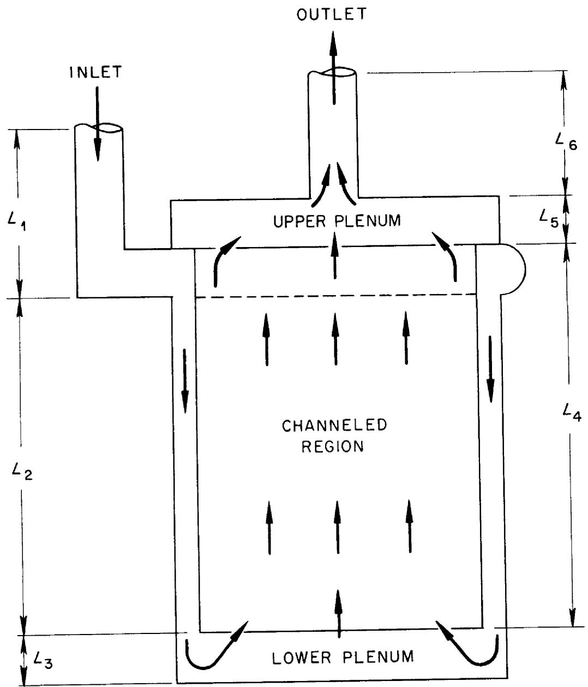
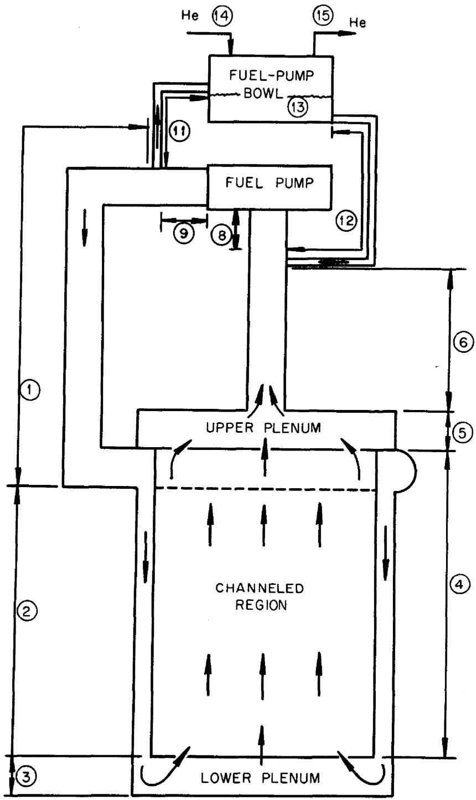
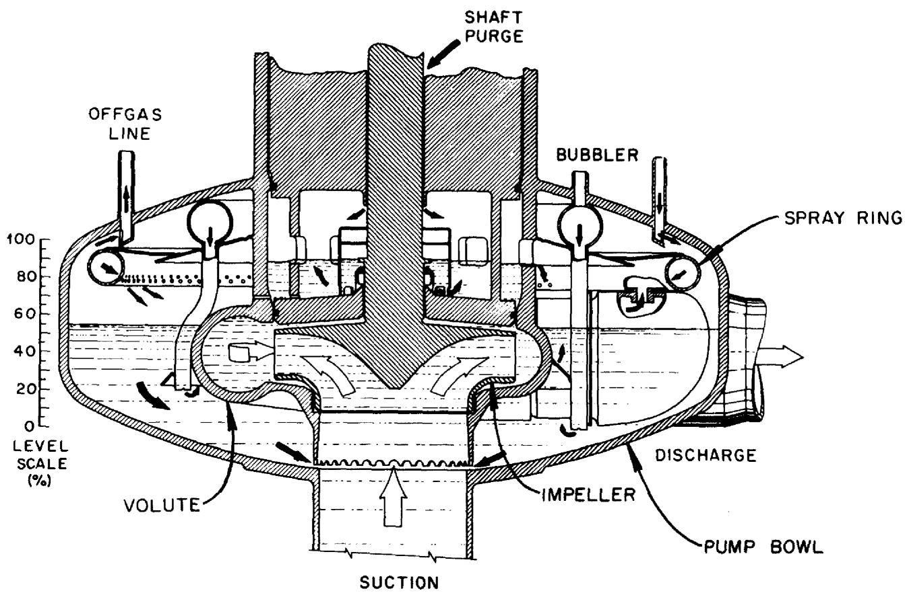
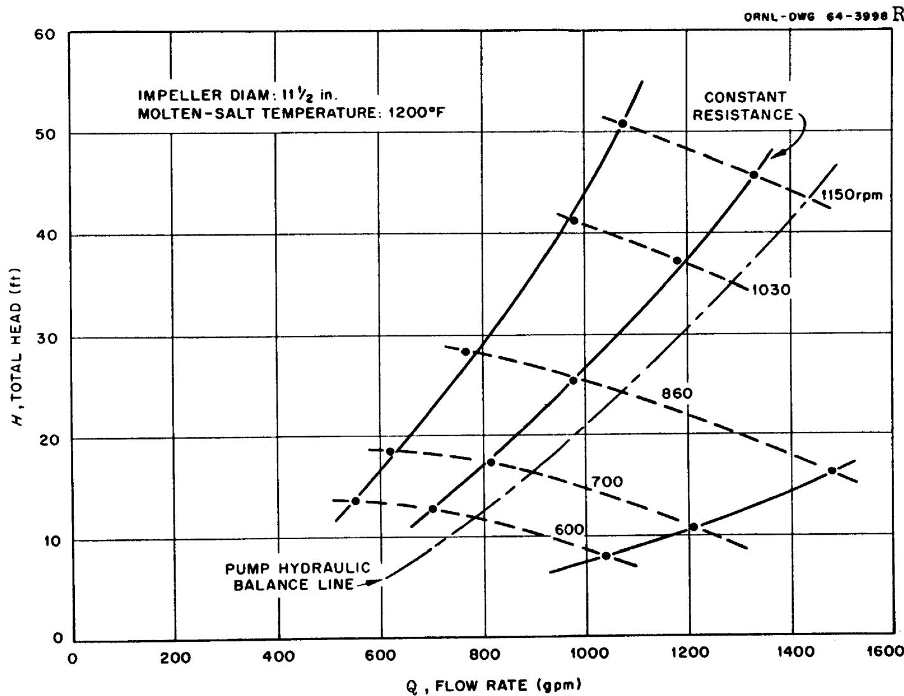
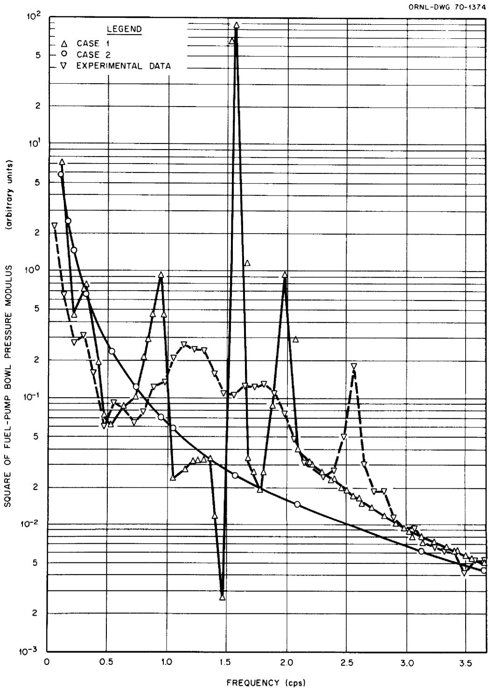
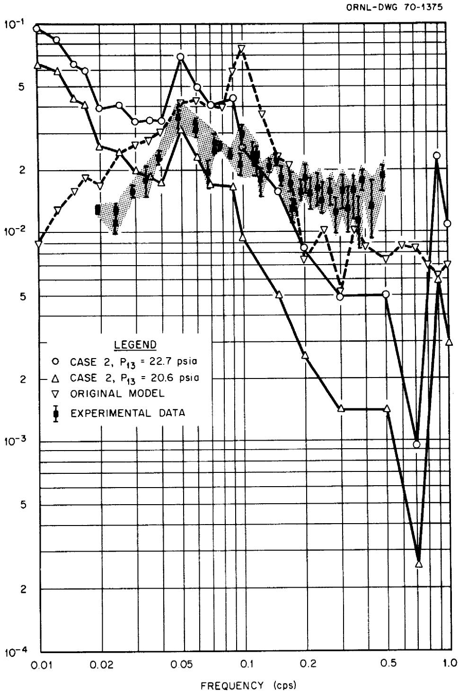

# OAK RIDGE NATIONAL LABORATORY

operated by

UNION CARBIDE CORPORATION

NUCLEAR DIVISION

for the

U.S. ATOMIC ENERGY COMMISSION

ORNL-TM-3007

AN EXTENDED HYDRAULIC MODEL OF THE MSRE CIRCULATING FUEL SYSTEM (Thesis)

W.C.Ulrich

Submitted to the Graduate Council of the University of Tennessee in partial fulfillment for the degree of Master of Science.

# LEGAL NOTICE

This report was prepared as an account of Government sponsored work. Neither the United States, nor the Commission, nor any person acting on behalf of the Commission:

A. Makes any warranty or representation, expressed or implied, with respect to the accuracy, completeness, or usefulness of the information contained in this report, or that the use of any information, apparatus, method, or process disclosed in this report may not infringe privately owned rights; or   
B. Assumes any liabilities with respect to the use of, or for damages resulting from the use of any information, apparatus, method, or process disclosed in this report.

As used in the above, "person acting on behalf of the Commission" includes any employee or contractor of the Commission, or employee of such contractor, to the extent that such employee or contractor of the Commission, or employee of such contractor prepares, disseminates, or provides access to, any information pursuant to his employment or contract with the Commission, or his employment with such contractor.

This report was prepared as an account of Government sponsored work. Neither the United States, nor the Commission, nor any person acting on behalf of the Commission:

A. Makes any warranty or representation, expressed or implied, with respect to the accuracy, completeness, or usefulness of the information contained in this report, or that the use of any information, apparatus, method, or process disclosed in this report may not infringe privately owned rights; or

B. Assumes any liabilities with respect to the use of, or for damages resulting from the use of any information, apparatus, method, or process disclosed in this report,

As used in the above, "person acting on behalf of the Commission" includes any employee or contractor of the Commission, or employee of such contractor, to the extent that such employee or contractor of the Commission, or employee of such contractor prepares, disseminates, or provides access to, any information pursuant to his employment or contract with the Commission, or his employment with such contractor.

ORNL-TM-3007

Contract No. W-7405-eng-26

REACTOR DIVISION

AN EXTENDED HYDRAULIC MODEL OF THE MSRE CIRCULATING FUEL SYSTEM

W.C.Ulrich

Submitted to the Graduate Council of the University of Tennessee in partial fulfillment for the degree of Master of Science.

JUNE 1970

OAK RIDGE NATIONAL LABORATORY

Oak Ridge, Tennessee

operated by

UNION CARBIDE CORPORATION

for the

U. S. ATOMIC ENERGY COMMISSION

# ACKNOWLEDGEMENTS

The author is indebted to Dr. J. C. Robinson of the University of Tennessee for the overall guidance he provided on this work. The teaching skill, patience, and help he offered at critical periods is greatly appreciated.

Thanks are due also to Dr. J. E. Mott of the University of Tennessee for several valuable suggestions which he made during the development of the hydraulic model.

The assistance of the management of Oak Ridge National Laboratory in granting the author the necessary leave of absence to pursue his studies, and in furnishing the use of computer facilities, graphic arts, and reproduction services in connection with the publication of this thesis is gratefully acknowledged.

The author also wishes to thank the United States Atomic Energy Commission for the Traineeship he was awarded that enabled him to undertake the academic work of which this thesis is a part.

It is a pleasure to thank Mrs. Annabel Legg for the efficient, careful way in which she typed the manuscript.

Lastly, the author wishes to thank his wife for her support, understanding, and encouragement during what must have been a difficult time for her. Without it, none of this would have been possible.

# ABSTRACT

The hydraulic portion of a combined hydraulic-neutronic mathematical model for determining the effects of helium gas entrained in the circulating fuel salt of the Molten Salt Reactor Experiment on the neutron flux-to-pressure frequency response was extended to include effects due to the fuel pump and helium cover-gas system.

The extended hydraulic model was combined with the original neutronic model and programmed for computations to be made by a high-speed digital computer.

By comparing the computed results with experimental data, it was concluded that pressure perturbations introduced by the fuel pump were the main source of the naturally occurring neutron flux fluctuations in the frequency range of one to a few cycles per second.

It was also noted that the amplitude of the neutron flux-to-pressure frequency-response function was directly proportional to the pressure in the fuel-pump bowl; however, further work will be required before completely satisfactory results are obtained from the extended model. Recommendations are proposed which should prove useful in future modeling of similar hydraulic systems.

# TABLE OF CONTENTS

# CHAPTER PAGE

# INTRODUCTION 1

1. DESCRIPTION OF THE OPEN-LOOP MODEL 4   
2. DESCRIPTION OF THE EXTENDED MODEL 9

Physical Characteristics of the Fuel Pump and

Fuel-Pump Bowl 9

Assumptions Made in the Development of the Model 11   
Procedures Used in Deriving the Equations for the Model 14

3. RESULTS OF CALCULATIONS MADE WITH THE EXTENDED MODEL   
COMPARED TO EXPERIMENTAL DATA 30   
4. CONCLUSIONS AND RECOMMENDATIONS 37   
LIST OF REFERENCES 41   
APPENDIX 43

# LIST OF FIGURES

# FIGURE

PAGE

1. Model Used to Approximate the Molten Salt Reactor Experiment Fuel Salt Loop 2   
2. Extended Hydraulic Model of the Molten Salt Reactor Experiment Fuel Salt Loop 3   
3. Molten Salt Reactor Experiment Fuel Pump and Fuel-Pump Bowl. 10   
4. Hydraulic Performance of the Molten Salt Reactor Experiment Fuel Pump 12   
5. Square of the Modulus of the Pressure in the Molten Salt Reactor Experiment Fuel-Pump Bowl; Case 1: F = 1.0, $\Delta P_{14} = 0.0$ , $\Delta P_{15} = 0.0$ ; Case 2: $\Delta P_{14} = 1.0$ , $\Delta P_{15} = 0.0$ , F = 0.0.   
6. Modulus of the Neutron Flux-to-Pressure Frequency-Response Function for the Molten Salt Reactor Experiment 36

# Symbol

# Description

A area $C_{\mathrm{f}}$ orifice coefficient for fuel salt $C_{g}$ orifice coefficient for gas $C_{i}$ concentration of ith group of delayed neutron precursors $C_{k}$ conversion constant from fission rate to the desired units for power density $C_{pM}$ heat capacity of the moderator at constant pressure   
D neutron diffusion coefficient   
F fuel pump forcing function (head delivered)   
g acceleration due to gravity $g_{c}$ gravitational constant   
h heat transfer coefficient $h_f$ enthalpy of the fuel salt $h_g$ enthalpy of the gas   
H fuel pump head at normal operating conditions $k_{M}$ thermal conductivity of the moderator   
K distribution, or flow, parameter for two phase flow   
m mass flow rate $m_{f}$ fuel salt mass flow rate   
mg gas mass flow rate   
M mass $M_{f}$ mass of fuel salt

# Symbol

# Description

Mg = mass of gas  
o = original or steady-state condition (subscript) $\mathfrak{p}_{\mathrm{h}}$ = heated perimeter $\mathsf{p}_{\mathsf{w}}$ = wetted perimeter  
P = pressure  
q = heat flux  
Q = fuel pump volumetric flow rate  
Q = power density  
R = universal gas constant  
s = Laplace-transformed time variable  
S = slip velocity ratio (ratio of gas velocity to fuel salt velocity)  
t = time variable  
T = absolute temperature $\mathbf{T}_{\mathbf{f}}$ = fuel salt temperature $\mathbf{T}_{\mathbf{g}}$ = gas temperature $\mathbf{T}_{\mathbf{M}}$ = moderator temperature $\mathbf{T}_{\mathbf{w}}$ = temperature of wetted perimeter (wall temperature) $\mathbf{u}_{\mathbf{f}}$ = internal energy for the fuel salt $\mathbf{u}_{\mathbf{g}}$ = internal energy for the gas $\mathbf{v}_{\mathbf{f}}$ = volume of fuel salt $\mathbf{v}_{\mathbf{g}}$ = volume of gas $\mathbf{V}_{\mathbf{f}}$ = velocity of the fuel salt $\mathbf{V}_{\mathbf{g}}$ = velocity of the gas $\mathbf{V}_{\mathbf{n}}$ = velocity of the neutrons (one group)

# Symbol

# Description

$\mathbf{y}$ space variable

z = space variable

$\alpha$ gasvoidfraction

$\beta =$ delayed neutron fraction

$\beta_{j}$ = delayed neutron fraction for the ith group

$\gamma = \frac{\text{fraction of the "unit cell" power density generated in the fuel salt}}{\text{the fuel salt}}$

$\Delta =$ deviation about the mean, incremental quantity, or perturbed quantity

$\lambda_{i}$ = decay constant for the ith group of delayed neutron precursors

$\nu =$ number of neutrons produced per fission

$\rho_{\mathrm{f}} =$ density of the fuel salt

$\rho_{\mathrm{g}} =$ density of the gas

$\rho_{M}$ density of the moderator

$\sigma =$ absolute value of the slope of the fuel pump head - capacity curve at the normal volumetric flow rate of the pump

$\Sigma_{a} =$ macroscopic neutron absorption cross section

$\Sigma_{\mathbf{f}} =$ macroscopic neutron fission cross section

$\tau_{\mathrm{w}} =$ total wall shear stress due to friction

neutron flux

$\psi$ fuel pump bowl volume

$\nabla$ = the Laplacian, or differential, operator

# Superscript

average

# INTRODUCTION

An analytical model for determining the void fraction of helium circulating in the Molten Salt Reactor Experiment (MSRE) fuel salt loop by relating neutron flux to pressure using frequency response techniques was formulated by Robinson and Fry. The hydraulic portion of this combined neutronic-hydraulic analytical model was not complete, however, in that it did not contain a specific representation of the fuel pump and fuel-pump bowl. (See Fig. 1.) Omission of these two items resulted in an open-loop hydraulic system which was closed by applying boundary conditions2 which approximated their effects on the system.

The scope or purpose of the work described below includes (1) extending the hydraulic portion of the original model by explicitly including the fuel pump and fuel-pump bowl to close the loop (see Fig. 2), (2) combining the extended hydraulic model with Robinson and Fry's original neutronic model to calculate the frequency response of neutron flux to pressure, and (3) attempting to validate the mathematical models by comparing results obtained from experimental measurements with predictions made by the two models.

ORNL-DWG 68-8417

  
FIGURE 1. Model Used to Approximate the Molten Salt Reactor Experiment Fuel Salt Loop

  
FIGURE 2. Extended Hydraulic Model of the Molten Salt Reactor Experiment Fuel Salt Loop

# DESCRIPTION OF THE OPEN-LOOP MODEL

The technique for determining the void fraction in the MSRE circulating fuel salt consists of analyzing fluctuations in the neutron flux signal caused by induced pressure fluctuations in the fuel-pump bowl. In the development of the analytical model, the compressibility of the entrained gas was postulated as the mechanism having the greatest effect on that reactivity induced by pressure perturbations. The primary governing equations are, therefore, the equations of state, conservation of the mass of the gas, of mass of the fuel salt, of momentum, of energy, of neutrons, and of delayed neutron precursors. In particular, with the assumption of one-dimensional flow, the governing equations are:4

Equation of state for the gas,

$$
\rho_ {\mathrm {g}} = \mathrm {P} / \mathrm {R T}. \tag {1}
$$

Conservation of mass for the gas,

$$
\frac {\partial}{\partial t} \left(\rho_ {g} \alpha\right) + \frac {\partial}{\partial z} \left(\rho_ {g} V _ {g} \alpha\right) = 0. \tag {2}
$$

Conservation of mass for the fuel salt,

$$
\frac {\partial}{\partial t} \left[ \rho_ {f} (1 - \alpha) \right] + \frac {\partial}{\partial z} \left[ \rho_ {f} V _ {f} (1 - \alpha) \right] = 0. \tag {3}
$$

Conservation of momentum for the gas-salt mixture,

$$
\begin{array}{l} \frac {\partial}{\partial t} \left[ \rho_ {f} V _ {f} (1 - \alpha) + \rho_ {g} V _ {g} \alpha \right] + \frac {\partial}{\partial z} \left[ \rho_ {f} V _ {f} ^ {2} (1 - \alpha) + \rho_ {g} V _ {g} ^ {2} \alpha \right] = \\ - g _ {c} \frac {\partial P}{\partial z} - \tau_ {w} \frac {P _ {w}}{A} - [ \rho_ {f} (1 - \alpha) + \rho_ {g} \alpha ] g. \tag {4} \\ \end{array}
$$

The assumed relationship between $V_{f}$ and $V_{g}$ is

$$
V _ {g} = S V _ {f}, \tag {5}
$$

where S, the slip relationship, is given by

$$
S = \frac {1 - \alpha}{K - \alpha}. \tag {6}
$$

Conservation of energy in the salt-gas mixture,

$$
\begin{array}{l} \frac {\partial}{\partial t} \left[ \rho_ {f} u _ {f} (1 - \alpha) + \rho_ {g} u _ {g} \alpha \right] + \frac {\partial}{\partial z} \left[ \rho_ {f} V _ {f} h _ {f} (1 - \alpha) + \rho_ {g} V _ {g} h _ {g} \alpha \right] = \\ \frac {q P _ {h}}{A} + \gamma \ddot {Q}. \tag {7} \\ \end{array}
$$

Conservation of energy in the graphite moderator,

$$
\rho_ {M} C _ {p M} \frac {\partial T _ {M}}{\partial t} = (1 - \gamma) \ddot {Q} + k _ {M} \frac {\partial a _ {T M}}{\partial y ^ {2}}. \tag {8}
$$

Coulomb's law of cooling:

$$
q = h \left(T _ {w} - T _ {f}\right). \tag {9}
$$

Power density,

$$
\ddot {Q} = C _ {k} \Sigma_ {f} \phi . \tag {10}
$$

Conservation of neutrons (one-group diffusion model),

$$
V _ {n} ^ {- 1} \frac {\partial \Phi}{\partial t} = \nabla \cdot D \nabla \Phi + [ v (1 - \beta) \Sigma_ {f} - \Sigma_ {a} ] \phi + \sum_ {i = 1} ^ {6} \lambda_ {i} C _ {i}. \tag {11}
$$

Precursor balance equations,

$$
\frac {\partial c _ {i}}{\partial t} = \beta_ {i} v \Sigma_ {f} \phi - \lambda_ {i} C _ {i} - \frac {\partial}{\partial z} (v c _ {i}), \tag {12}
$$

for $i = 1,2,\ldots ,6$

Since the interest is in small deviations about steady state, it was assumed that linearized representation of the governing equations (1) through (12) would adequately describe the system. It was further assumed that velocity fluctuations would not significantly affect the precursor balance, and that the fluctuations in the density of the gas are proportional to fluctuations in the pressure. This latter assumption is based on the linearized version of Eq. (1), i.e.,

$$
\Delta \rho_ {g} = \rho_ {g 0} \left(\frac {\Delta P}{P _ {o}} - \frac {\Delta T}{T _ {o}}\right). \tag {13}
$$

The last term of Eq. (13) was dropped because of the larger energy input necessary to change the temperature compared to that required to change the pressure.

With the assumptions set forth above, the linearized equations generated from Eqs. (l) through (6) can be solved independently of those obtained from Eqs. (7) through (l2). The former set of equations is referred to as the hydraulic model and the latter set as the neutronic model.

The dependent variables in Eqs. (1) through (6) are $V_{f}, V_{g}, \alpha, \rho_{g}, P,$ and $S$ . This set can be reduced to a set of three coupled differential equations with three dependent variables in their linearized version.

The dependent variables retained in these studies were $\Delta V_{\mathrm{f}}$ , $\Delta \alpha$ , and $\Delta P$ . Therefore, the equations defining the hydraulic model were transformed to the frequency domain and written as

$$
A (z, s) \frac {d X (z , s)}{d z} - B (z, s) X (z, s) = 0, \tag {14}
$$

where $X(z, s)$ is the column matrix

$$
\mathrm {X} (\mathrm {z}, \mathrm {s}) = \left[ \begin{array}{l} \Delta \mathrm {V} _ {\mathrm {f}} (\mathrm {z}, \mathrm {s}) \\ \Delta \alpha (\mathrm {z}, \mathrm {s}) \\ \Delta \mathrm {P} (\mathrm {z}, \mathrm {s}) \end{array} \right] \tag {15}
$$

and $A(z, s)$ and $B(z, s)$ are 3 x 3 square matrices.

The solution to Eq. (14) is

$$
\mathrm {X} (\mathrm {z} + \Delta \mathrm {z}, \mathrm {s}) = \exp [ \overline {{\mathrm {Q}}} (\mathrm {s}) \Delta \mathrm {z} ]. \mathrm {X} (\mathrm {z}, \mathrm {s}), \tag {16}
$$

where

$$
\overline {{Q}} (s) \equiv \frac {1}{\Delta z} \int_ {z} ^ {z + \Delta z} Q \left(z ^ {\prime}, s\right) d z ^ {\prime}, \tag {17}
$$

and $Q(z', s) = A^{-1}(z, s) B(z, s)$ .

The matrix $\exp[\overline{\mathbb{Q}}(s) \Delta z]$ can be evaluated using matrix exponential techniques similar to those described in Reference 6. Before the solution can be completed, the boundary conditions appropriate to the system must be specified.

To assign boundary conditions, a physical description (model) of the actual system must be considered. The model chosen to represent the more complex actual system is presented in Fig. 1, page 2. In particular, six regions were chosen:

1. the region from the primary pump to the inlet of the downcomer, $L_{1}$ :   
2. the downcomer, L2;   
3. the lower plenum, L3;   
4. a large number of identical parallel fuel channels*, L₄:   
5. the upper plenum, L5: and   
6. the region from the reactor vessel to the primary pump, $\mathbf{L}_6$ .

The, perhaps, significant features left out of the physical model are the heat exchanger and details of the pump bowl. The omission of the heat exchanger will certainly restrict the lower frequency of applicability of the neutronic model, but it is believed that this would not affect the hydraulic model. The effects of the pump bowl on the system were approximated by the boundary conditions between regions 1 and 6.

The matrix represented by the exponential term of Eq. (16) was generated for each region. Then, continuity equations were applied between each region, along with the pressure fluctuations inserted at the pump bowl, to permit the solution of the closed-loop system; i.e., the output of region 6 was the input to region 1. This permitted the evaluation of the void fraction distribution up through the MSRE core, which will be required for the solution of the equations describing the neutronic model.

# CHAPTER 2

# DEVELOPMENT OF THE EXTENDED MODEL

Physical Characteristics of the Fuel Pump and Fuel-Pump Bowl

In discussing the extended hydraulic model of the MSRE circulating fuel system, it may be helpful to begin with a brief description of the physical characteristics of the fuel pump and fuel-pump bowl which are shown in Fig. 3.

The fuel-salt circulation pump is a centrifugal sump-type pump with an overhung impeller. It is driven by an electric motor at $\sim$ 1160 rpm and has a capacity of about 1200 gpm when operating at a head of 48.5 ft. The 36-in.-diameter pump bowl, or tank, in which the pump volute and impeller are located, serves as the surge volume and expansion tank in the primary circulation system.

The pump bowl, or tank, is about 36 in. in diameter and 17 in. high at the centerline. The normal fuel salt level in the bowl is about 11 in. from the bottom, measured at the centerline.

A bypass flow of about 60 gpm is taken from the pump-bowl discharge nozzle into a ring of 2-in.-diameter pipe encircling the vapor space inside the pump bowl. This distributor has regularly spaced holes pointing downward toward the center of the pump bowl. The bypass flow is sprayed from these holes into the bowl to promote the release of fission product gases to the vapor space.

The bypass flow circulates downward through the pump bowl and re-enters the impeller. The spray contains a considerable volume of cover

  
FIGURE 3. Molten Salt Reactor Experiment Fuel Pump and Fuel-Pump Bowl

gas in the liquid, and the tendency for this entrainment to enter the pump is controlled by a baffle on the volute. Tests indicated that the liquid returning to the impeller will contain 1 to 2 volume percent of gas.

A purge flow of about 4.2 std liters/min of helium is maintained through the pump bowl to act as a carrier for removing fission-product gases and to control the pressure in the system.

# Assumptions Made in the Development of the Model

To extend the hydraulic model to include the fuel pump and fuel-pump bowl, it was necessary to make some assumptions concerning the various regions involved as shown in Fig. 2, page 3.

Including the fuel pump and fuel-pump bowl in the model actually introduced four components into the system: (1) the fuel pump itself, (2) the bypass flow connections, (3) the fuel-pump bowl, and (4) the helium supply and removal system. The assumptions made for each of these components are listed below.

# 1. Fuel Pump

Assume that the relative concentration of gas to fuel salt does not change as the fluid passes through the fuel pump. This assumption was made because the residence time of material in the pump is very short, i.e., there is practically no holdup of circulating fluid in the pump.

Further assume that the 1150-rpm fuel pump head-capacity curve (Fig. 4) can be represented by an equation such as

$$
\frac {\Delta P}{\rho} = H - \sigma Q. \tag {18}
$$

  
FIGURE 4. Hydraulic Performance of the Molten Salt Reactor Experiment Fuel Pump

# 2. Bypass Flow Connections

For the 60-gpm bypass flow that is diverted from the pump discharge and sprayed into the fuel-pump bowl, assume that this connection (region ll) can be considered as an orifice and the flow rate represented by an equation of the form

$$
m _ {1 1} = A _ {1 1} C _ {1 1} \sqrt {2 \rho \left(P _ {9} - P _ {1 3}\right)}. \tag {19}
$$

At steady-state conditions (no change of level in the fuel-pump bowl) the amount of fluid returning to the main loop flow across the baffle on the volute at the pump suction is equal to the amount of bypass fluid leaving the main loop at the pump discharge through region 11. Therefore, assume that the bypass flow connection identified as region 12 can also be considered as an orifice and the flow rate represented by an equation of the form

$$
m _ {1 2} = A _ {1 2} C _ {1 2} \sqrt {2 \rho \left(P _ {1 3} - P _ {8}\right)}. \tag {20}
$$

It is further assumed that Eqs. (19) and (20) can each be written as two separate equations: one for the fuel salt mass flow rate, and one for the gas mass flow rate. The orifice coefficients will be different depending on which material is being considered. Thus we have

$$
m _ {f 1 1} = A _ {1 1} C _ {f 1 1} \sqrt {2 \rho_ {f 1 1} \left(P _ {9} - P _ {1 3}\right)}, \tag {21}
$$

$$
m _ {g 1 1} = A _ {1 1} C _ {g 1 1} \sqrt {2 \rho_ {g 1 1} \left(P _ {9} - P _ {1 3}\right)}, \tag {22}
$$

$$
m _ {f 1 2} = A _ {1 2} C _ {f 1 2} \sqrt {2 \rho_ {f 1 2} \left(P _ {1 3} - P _ {8}\right)}, \tag {23}
$$

and

$$
m _ {g 1 2} = A _ {1 2} C _ {g 1 2} \sqrt {2 \rho_ {g 1 2} \left(P _ {1 3} - P _ {8}\right)}. \tag {24}
$$

# 3. Fuel-Pump Bowl

The fuel-pump bowl (region 13) is a two-component (gas and fluid) region, and it is assumed that each region is a separate, well-mixed volume because the residence time of helium in the gas space is on the order of five minutes, and the fluid is agitated by the spray.

# 4. Helium System

The helium inlet and outlet pressures are either known or assumed to be known, and the assumption is made that the flow of helium into and out of the fuel-pump bowl gas space can be represented by orifice-type equations such as

$$
\mathrm {m} _ {\mathrm {g} 1 4} = \mathrm {A} _ {1 4} \mathrm {C} _ {\mathrm {g} 1 4} \sqrt {2 \rho_ {\mathrm {g} 1 4} (\mathrm {P} _ {1 4} - \mathrm {P} _ {1 3})} \tag {25}
$$

for the inlet (region 14),

and

$$
m _ {g 1 5} = A _ {1 5} C _ {g 1 5} \sqrt {2 \rho_ {g 1 5} \left(P _ {1 3} - P _ {1 5}\right)}. \tag {26}
$$

for the outlet (region 15).

# Procedures Used in Deriving the Equations for the Model

Using the assumptions discussed above, and writing mass balance equations for the gas and fuel salt across the various regions, a set of 13 simultaneous equations was obtained.

1. Fuel salt mass balance for the fuel-pump bowl:

$$
\frac {\mathrm {d} \mathrm {M} _ {f 1 3}}{\mathrm {d} t} = \mathrm {m} _ {f 1 1} - \mathrm {m} _ {f 1 2}, \tag {27}
$$

or expressing the mass flow rates in terms of fuel salt density, void fraction, fuel salt velocity and flow areas, this becomes

$$
\frac {\mathrm {d} \mathrm {M} _ {\mathrm {f} 1 3}}{\mathrm {d t}} = \left[ \rho_ {\mathrm {f}} (1 - \alpha) \mathrm {V} _ {\mathrm {f}} \mathrm {A} \right] _ {1 1} - \left[ \rho_ {\mathrm {f}} (1 - \alpha) \mathrm {V} _ {\mathrm {f}} \mathrm {A} \right] _ {1 2}. \tag {28}
$$

2. Gas mass balance for the fuel-pump bowl:

$$
\frac {d M _ {g 1 3}}{d t} = m _ {g 1 1} - m _ {g 1 2} + m _ {g 1 4} - m _ {g 1 5}, \tag {29}
$$

or

$$
\frac {d M _ {g 1 3}}{d t} = \left(\rho_ {g} \alpha V _ {g} A\right) _ {1 1} - \left(\rho_ {g} \alpha V _ {g} A\right) _ {1 2} + \left(\rho_ {g} V _ {g} A\right) _ {1 4} - \left(\rho_ {g} V _ {g} A\right) _ {1 5}. \tag {30}
$$

3. Pressure-head relationship for the fuel pump:

From Equation (7)

$$
\frac {P _ {9} - P _ {8}}{\bar {\rho}} = H - \sigma Q. \tag {31}
$$

But

$$
Q = \frac {m _ {f 8}}{\bar {\rho}}, \tag {32}
$$

so

$$
P _ {9} - P _ {8} = H _ {\rho} - \sigma m _ {f 8}, \tag {33}
$$

or

$$
P _ {9} - P _ {8} = H \frac {\left[ \rho_ {f} (1 - \alpha) + \rho_ {g} \alpha \right] _ {8} + \left[ \rho_ {f} (1 - \alpha) + \rho_ {g} \alpha \right] _ {9}}{2} - \sigma \left(\rho_ {f} V _ {f} A\right) _ {8}. \tag {34}
$$

4. Fuel salt mass balance for the fuel pump:

$$
\mathrm {m} _ {\mathrm {f} 8} = \mathrm {m} _ {\mathrm {f} 9}, \tag {35}
$$

or

$$
\left[ \rho_ {f} (1 - \alpha) V _ {f} A \right] _ {\theta} = \left[ \rho_ {f} (1 - \alpha) V _ {f} A \right] _ {\theta}. \tag {36}
$$

Assuming that $\rho_{f8} = \rho_{f9}$ , and since $A_8 = A_9$ , this reduces to

$$
[ (1 - \alpha) \mathrm {V} _ {\mathrm {f}} ] _ {8} = [ (1 - \alpha) \mathrm {V} _ {\mathrm {f}} ] _ {9}, \tag {37}
$$

5. Gas mass balance for the fuel pump:

$$
m _ {g 8} = m _ {g 9}, \tag {38}
$$

or

$$
\left(\rho_ {g} \propto V _ {g} A\right) _ {8} = \left(\rho_ {g} \propto V _ {g} A\right) _ {9}, \tag {39}
$$

which reduces to

$$
\left(\rho_ {\mathrm {g}} \propto \mathrm {V} _ {\mathrm {g}}\right) _ {\mathrm {g}} = \left(\rho_ {\mathrm {g}} \propto \mathrm {V} _ {\mathrm {g}}\right) _ {\mathrm {g}}. \tag {40}
$$

6. Fuel salt mass balance at the junction of regions 1, 9, and 11:

$$
m _ {f 9} = m _ {f 1} + m _ {f 1 1}, \tag {41}
$$

or

$$
\left[ \rho_ {f} (1 - \alpha) V _ {f} A \right] _ {9} = \left[ \rho_ {f} (1 - \alpha) V _ {f} A \right] _ {1} + \left[ \rho_ {f} (1 - \alpha) V _ {f} A \right] _ {1 1}. \tag {42}
$$

Assuming that $\rho_{f_1} = \rho_{f_9} = \rho_{f_{11}}$ , this becomes

$$
[ (1 - \alpha) V _ {f} A ] _ {9} = [ (1 - \alpha) V _ {f} A ] _ {1} + [ (1 - \alpha) V _ {f} A ] _ {1 1}. \tag {43}
$$

7. Gas mass balance at the junction of regions 1, 9, and 11:

$$
\mathrm {m} _ {\mathrm {g} 9} = \mathrm {m} _ {\mathrm {g} 1} + \mathrm {m} _ {\mathrm {g} 1 1} \tag {44}
$$

or

$$
\left(\rho_ {g} \propto V _ {g} A\right) _ {9} = \left(\rho g \propto V _ {g} A\right) _ {1} + \left(\rho_ {g} \propto V _ {g} A\right) _ {1 1}. \tag {45}
$$

8. Fuel salt mass balance at the junction of regions 6, 8, and 12:

$$
\mathrm {m} _ {\mathrm {f} 8} = \mathrm {m} _ {\mathrm {f} 6} + \mathrm {m} _ {\mathrm {f} 1 2}, \tag {46}
$$

or

$$
\left[ \rho_ {f} (1 - \alpha) V _ {f} A \right] _ {8} = \left[ \rho_ {f} (1 - \alpha) V _ {f} A \right] _ {6} + \left[ \rho_ {f} (1 - \alpha) V _ {f} A \right] _ {1 2}. \tag {47}
$$

Assuming that $\rho_{\mathbf{f8}} = \rho_{\mathbf{f6}} = \rho_{\mathbf{f12}}$ , this becomes

$$
[ (1 - \alpha) V _ {f} A ] _ {8} = [ (1 - \alpha) V _ {f} A ] _ {6} + [ (1 - \alpha) V _ {f} A ] _ {1 2}. \tag {48}
$$

9. Gas mass balance at the junction of regions 6, 8, and 12:

$$
\mathrm {m} _ {\mathrm {g} 8} = \mathrm {m} _ {\mathrm {g} 6} + \mathrm {m} _ {\mathrm {g} 1 2}, \tag {49}
$$

or

$$
\left(\rho_ {g} \alpha V _ {g} A\right) _ {8} = \left(\rho_ {g} \alpha V _ {g} A\right) _ {6} + \left(\rho_ {g} \alpha V _ {g} A\right) _ {1 2}. \tag {50}
$$

10. Volume balance for the fuel-pump bowl:

$$
\left(\frac {\mathrm {M} _ {\mathrm {f}}}{\rho_ {\mathrm {f}}}\right) _ {1 3} + \left(\frac {\mathrm {M} _ {\mathrm {g}}}{\rho_ {\mathrm {g}}}\right) _ {1 3} = v _ {\mathrm {f} 1 3} + v _ {\mathrm {g} 1 3} = \text {c o n s t .} = \psi , \tag {51}
$$

or

$$
\left(\rho_ {f} M _ {g} + \rho_ {g} M _ {f}\right) _ {1 3} = \psi \left(\rho_ {f} \rho_ {g}\right) _ {1 3}. \tag {52}
$$

ll. Void fraction relation between regions 1 and 9:

At the junction of regions 1 and 9 it is assumed that

$$
\alpha_ {9} = \alpha_ {1}. \tag {53}
$$

12. Void fraction relation between regions 9 and 11:

At the junction of regions 9 and ll it is assumed that

$$
\alpha_ {9} = \alpha_ {1 1}. \tag {54}
$$

13. Void fraction relation between regions 6, 8, and 12:

The void fraction in region 8 may be written as

$$
\alpha_ {8} = \frac {\mathrm {v} _ {\mathrm {g} 8}}{\mathrm {v} _ {\mathrm {g} 8} + \mathrm {v} _ {\mathrm {f} 8}} = \frac {\left(\frac {\mathrm {m} _ {\mathrm {g}}}{\rho_ {\mathrm {g}}}\right) _ {\mathrm {a}}}{\left(\frac {\mathrm {m} _ {\mathrm {g}}}{\rho_ {\mathrm {g}}} + \frac {\mathrm {m} _ {\mathrm {f}}}{\rho_ {\mathrm {f}}}\right) _ {\mathrm {a}}} \tag {55}
$$

But

$$
m _ {g 8} = m _ {g 6} + m _ {g 1 2} \tag {56}
$$

and

$$
m _ {f 8} = m _ {f 6} + m _ {f 1 2}, \tag {57}
$$

so

$$
\alpha_ {8} = \frac {\frac {m _ {g 1 2}}{\rho_ {g 8}} + \frac {m _ {g 6}}{\rho_ {g 8}}}{\frac {m _ {g 1 2}}{\rho_ {g 8}} + \frac {m _ {g 6}}{\rho_ {g 8}} + \frac {m _ {f 6}}{\rho_ {f 8}} + \frac {m _ {f 1 2}}{\rho_ {f 8}}} \tag {58}
$$

or

$$
\alpha_ {8} = \frac {\frac {\left(\rho_ {g g} v _ {g} a A\right) _ {1 2}}{\rho_ {g 8}} + \frac {\left(\rho_ {g g} v _ {g} a A\right) _ {6}}{\rho_ {g 8}}}{\frac {\left(\rho_ {g g} v _ {g} a A\right) _ {1 2}}{\rho_ {g 8}} + \frac {\left(\rho_ {g g} v _ {g} a A\right) _ {6}}{\rho_ {g 8}} + \frac {\left[ \rho_ {f} (1 - \alpha) V _ {f} A \right] _ {6}}{\rho_ {f 8}} + \frac {\left[ \rho_ {f} (1 - \alpha) V _ {f} A \right] _ {1 2}}{\rho_ {f 8}}} \cdot \tag {59}
$$

The next step was to write these 13 equations in linearized, perturbed form, as shown by the following examples.

Referring to Eq.(40), page 16, the equation representing the gas mass balance for the fuel pump written in perturbed form is

$$
\begin{array}{l} \left[ \left(\rho_ {g 0} + \Delta \rho_ {g}\right) \left(\alpha_ {0} + \Delta \alpha\right) \left(V _ {g 0} + \Delta V _ {g}\right) \right] _ {8} = \\ [ (\rho_ {g 0} + \Delta \rho_ {g}) (\alpha_ {o} + \Delta \alpha) (\mathrm {V} _ {g 0} + \Delta \mathrm {V} _ {g}) ] _ {\vartheta}. (6 0) \\ \end{array}
$$

Carrying out the indicated multiplication, the following result is obtained. (Since both sides are identical except for the regions involved, only the general procedure will be described.) The left-hand side thus becomes

$$
\begin{array}{l} \left(\mathrm {V} _ {\mathrm {g o}} \rho_ {\mathrm {g o}} \alpha_ {\mathrm {o}} + \mathrm {V} _ {\mathrm {g o}} \rho_ {\mathrm {g o}} \Delta \alpha + \alpha_ {\mathrm {o}} \mathrm {V} _ {\mathrm {g o}} \Delta \rho_ {\mathrm {g}} + \alpha_ {\mathrm {o}} \rho_ {\mathrm {g o}} \Delta \mathrm {V} _ {\mathrm {g}} + \right. \\ \rho_ {g o} \Delta \alpha \Delta V _ {g} + \alpha_ {o} \Delta \rho_ {g} \Delta V _ {g}) _ {s}. \\ \end{array}
$$

Because interest is restricted to deviations about the mean, the first term, which contains only steady-state quantities, cancels out.

Furthermore, the last two terms which contain the product of two perturbed quantities, and are assumed small compared to the remaining terms, were dropped. This gives the linearized form of Eq. (40) as

$$
\left(\mathrm {V} _ {\mathrm {g o}} \rho_ {\mathrm {g o}} \Delta \alpha + \alpha_ {\mathrm {o}} \mathrm {V} _ {\mathrm {g o}} \Delta \rho_ {\mathrm {g}} + \alpha_ {\mathrm {o}} \rho_ {\mathrm {g o}} \Delta \mathrm {V} _ {\mathrm {g}}\right) _ {\mathrm {s}} =
$$

$$
\left(\mathrm {V} _ {\mathrm {g} 0} \rho_ {\mathrm {g} 0} \Delta \alpha + \alpha_ {0} \mathrm {V} _ {\mathrm {g} 0} \Delta \rho_ {\mathrm {g}} + \alpha_ {0} \rho_ {\mathrm {g} 0} \Delta \mathrm {V} _ {\mathrm {g}}\right) _ {\vartheta}. \tag {61}
$$

The linearized version of Eq. (1), page 4, is

$$
\Delta \rho_ {\mathrm {g}} = \frac {\Delta P}{\mathrm {R T} _ {\mathrm {O}}} \tag {62}
$$

and the linearized form of the relationship between $V_g$ and $V_f$ , Eq. (5), page 5, is

$$
\Delta \mathrm {V} _ {\mathrm {g}} = \frac {1 - \alpha_ {\mathrm {o}}}{\mathrm {K} - \alpha_ {\mathrm {o}}} \Delta \mathrm {V} _ {\mathrm {f}} + \frac {\mathrm {V} _ {\mathrm {f o}} (1 - \mathrm {K})}{(\mathrm {K} - \alpha_ {\mathrm {o}}) ^ {2}} \Delta \alpha . \tag {63}
$$

Now referring to Fig. 2, page 3, it is noted that at the junction of regions 1, 9, and 11 the pressures $P_1 = P_9 = P_{11}$ , and at the junction of regions 6, 8, and 12, the pressures $P_6 = P_8 = P_{12}$ . Linearized, these equalities become $\Delta P_1 = \Delta P_9 = \Delta P_{11}$ and $\Delta P_6 = \Delta P_8 = \Delta P_{12}$ , respectively.

Substituting Eqs. (62) and (63) and the pressure equalities into Eq. (61) gives the final linearized perturbed form of the gas mass balance for the fuel pump:

$$
\begin{array}{l} \left[ \rho_ {g o} V _ {f o} \left(\frac {1 - \alpha_ {o}}{K - \alpha_ {o}}\right) \Delta \alpha + \alpha_ {o} \rho_ {g o} \left(\frac {1 - \alpha_ {o}}{K - \alpha_ {o}}\right) \Delta V _ {f} + \alpha_ {o} \rho_ {g o} V _ {f o} \frac {(1 - K)}{(k - \alpha_ {o}) ^ {2}} \Delta \alpha \right] _ {8} \\ + \left[ \frac {\alpha_ {o} V _ {f o}}{R T _ {o}} \left(\frac {1 - \alpha_ {o}}{K - \alpha_ {o}}\right) \right] _ {8} \Delta P _ {6} = \left[ \rho_ {g o} V _ {f o} \left(\frac {1 - \alpha_ {o}}{K - \alpha_ {o}}\right) \Delta \alpha \right. \\ + \alpha_ {o} \rho_ {g o} \left(\frac {1 - \alpha_ {o}}{K - \alpha_ {o}}\right) \Delta V _ {f} + \alpha_ {o} \rho_ {g o} V _ {f o} \frac {(1 - K)}{(K - \alpha_ {o}) ^ {2}} \Delta \alpha \Bigg ] _ {9} \\ + \left[ \frac {\alpha_ {0} V _ {f 0}}{R T _ {0}} \left(\frac {1 - \alpha_ {0}}{K - \alpha_ {0}}\right) \right] _ {9} \quad \Delta P _ {1}. \tag {64} \\ \end{array}
$$

For another example, consider Eq. (27), the fuel salt mass balance for the fuel-pump bowl, page 14. Linearized, this becomes

$$
\frac {\mathrm {d}}{\mathrm {d} t} \Delta \mathrm {M} _ {\mathrm {f} 1 3} = \Delta \mathrm {m} _ {\mathrm {f} 1 1} - \Delta \mathrm {m} _ {\mathrm {f} 1 2} \tag {65}
$$

Linearizing the orifice relationships for the fuel salt mass flow rates for regions 11 and 12 as given by Eqs. (21) and (23), respectively, page 13, gives

$$
\Delta m _ {f 1 1} = \frac {A _ {1 1} ^ {2} C _ {f 1 1} ^ {2} \rho_ {f}}{m _ {f 0 1 1}} \left(\Delta P _ {9} - \Delta P _ {1 3}\right), \tag {66}
$$

and

$$
\Delta \mathrm {m} _ {\mathrm {f} 1 2} = \frac {\mathrm {A} _ {1 2} ^ {2} \mathrm {C} _ {\mathrm {f} 1 2} ^ {2} \rho_ {\mathrm {f}}}{\mathrm {m} _ {\mathrm {f} 0 1 2}} (\Delta \mathrm {P} _ {1 3} - \Delta \mathrm {P} _ {8}) \tag {67}
$$

Substituting Eqs. (66) and (67) into Eq. (65) and using the linearized pressure equalities mentioned above, the linearized fuel salt mass balance equation for the fuel-pump bowl becomes

$$
\begin{array}{l} \frac {\mathrm {d}}{\mathrm {d} t} \left[ \Delta M _ {f 1 3} \right] = \frac {A _ {1 1} ^ {2} C _ {f 1 1} ^ {2} \rho_ {f}}{m _ {f 0 1 1}} \Delta P _ {1} + \frac {A _ {1 2} ^ {2} C _ {f 1 2} ^ {2} \rho_ {f}}{m _ {f 0 1 2}} \Delta P _ {6} \\ - \frac {\rho_ {f}}{m _ {f 0 1 1}} \left(A _ {1 1} ^ {2} C _ {f 1 1} ^ {2} + A _ {1 2} ^ {2} C _ {f 1 2} ^ {2}\right) \Delta P _ {1 3}. \tag {68} \\ \end{array}
$$

The next step was to Laplace transform the time variable to the frequency domain. Thus, the linearized, perturbed, Laplace-transformed version of Eq. (68) is

$$
\begin{array}{l} s \Delta M _ {f 1 3} = \frac {A _ {1 1} ^ {2} C _ {f 1 1} ^ {2} \rho_ {f}}{m _ {f o 1 1}} \Delta P _ {1} + \frac {A _ {1 2} ^ {2} C _ {f 1 2} ^ {2} \rho_ {f}}{m _ {f o 1 2}} \Delta P _ {6} \\ - \frac {\rho_ {f}}{m _ {f 0 1 1}} \left(A _ {1 1} ^ {2} C _ {f 1 1} ^ {2} + A _ {1 2} ^ {2} C _ {f 1 2} ^ {2}\right) \Delta P _ {1 3}. \tag {69} \\ \end{array}
$$

As a result of performing the manipulations described in the above examples on the remaining 11 equations, a set of 13 linearized, perturbed, Laplace-transformed equations containing 16 unknowns was obtained.

Method Used to Solve the Equations Derived for the Model

In order to solve the set of 13 equations containing 16 unknowns just derived, three more equations were needed. These three additional equations were obtained from the original hydraulic model.

In the original model, the variables in region 6 are related to those in region 1 by means of a transfer function. In matrix form, this relationship can be expressed as

$$
[ X (z, s) ] _ {6} = B (s) [ X (z, s) ] _ {1}. \tag {70}
$$

where $\mathbf{X}(\mathbf{z},\mathbf{s})$ is the column matrix

$$
\begin{array}{r l} \mathrm {X} (\mathrm {z}, \mathrm {s}) & = \left[ \begin{array}{l l} \Delta \mathrm {V} _ {\mathrm {f}} & (\mathrm {z}, \mathrm {s}) \\ \Delta \alpha & (\mathrm {z}, \mathrm {s}) \\ \Delta \mathrm {P} & (\mathrm {z}, \mathrm {s}) \end{array} \right] \end{array} , \tag {71}
$$

and $B(s)$ is the 3 x 3 square transfer function matrix which relates the state vector $X(z,s)$ at the outlet of region 6 to the state vector $X(z,s)$ at the inlet to region 1.

Expanding the matrix form of Eq. (70) gave the necessary three additional equations to complete the set of 16 equations containing 16 unknowns.

The 16 equations constituting the extended hydraulic model are as follows:

1. Fuel salt mass balance for the fuel-pump bowl:

$$
\begin{array}{l} s \Delta M _ {f 1 3} + \left[ \frac {\left(C _ {f} A\right) _ {1 1} ^ {2}}{\rho_ {f 1 1}} + \frac {\left(C _ {f} A\right) _ {1 2} ^ {2}}{\rho_ {f 1 2}} \right] \Delta P _ {1 3} - \left(C _ {f} A\right) _ {1 1} ^ {2} \left(\frac {\rho_ {f}}{m _ {f 0}}\right) _ {1 1} \Delta P _ {1} \\ - \left(\mathrm {C} _ {\mathrm {f}} \mathrm {A}\right) _ {1 2} ^ {2} \left(\frac {\rho_ {\mathrm {f}}}{\mathrm {m} _ {\mathrm {f 0}}}\right) _ {1 2} \Delta \mathrm {P} _ {6} = 0 \tag {72} \\ \end{array}
$$

2. Gas mass balance for the fuel-pump bowl:

$$
\begin{array}{l} \left\{s + R \left(\frac {T _ {0}}{v g}\right) _ {1 3} \left[ \left(C _ {g} A\right) _ {1 1} ^ {2} \left(\frac {\rho_ {g 0}}{m _ {g 0}}\right) _ {1 1} + \left(C _ {g} A\right) _ {1 2} ^ {2} \left(\frac {\rho_ {g 0}}{m _ {g 0}}\right) _ {1 2} \right. \right. \\ \left. + \left(\underset {g} {C} A\right) _ {1 4} ^ {2} \left(\frac {\rho_ {g 0}}{m g 0}\right) _ {1 4} + \left(\underset {g} {C} A\right) _ {1 5} ^ {2} \left(\frac {\rho_ {g 0}}{m g 0}\right) _ {1 5} \right] \Delta P _ {1 3} \\ - \left(\mathrm {C} _ {\mathrm {g}} \mathrm {A}\right) _ {1 1} ^ {2} \mathrm {R} \left(\frac {\mathrm {T} _ {\mathrm {O}}}{\mathrm {v} _ {\mathrm {g}}}\right) _ {1 3} \left[ \frac {\left(\mathrm {P} _ {\mathrm {O}}\right) _ {9} - \left(\mathrm {P} _ {\mathrm {O}}\right) _ {1 3}}{\mathrm {R} \left(\mathrm {m} _ {\mathrm {g o}} \mathrm {T} _ {\mathrm {O}}\right) _ {1 1}} + \left(\frac {\rho_ {\mathrm {g o}}}{\mathrm {m} _ {\mathrm {g o}}}\right) _ {1 1} \right] \Delta \mathrm {P} _ {1} \\ + \left(\mathrm {C} _ {\mathrm {g}} \mathrm {A}\right) _ {1 2} ^ {2} \mathrm {R} \left(\frac {\mathrm {T} _ {0}}{\mathrm {v} _ {\mathrm {g}}}\right) _ {1 3} \left[ \frac {\left(\mathrm {P} _ {0}\right) _ {1 3} - \left(\mathrm {P} _ {0}\right) _ {8}}{\mathrm {R} \left(\mathrm {m} _ {\mathrm {g} 0} \mathrm {T} _ {0}\right) _ {1 2}} - \left(\frac {\rho_ {\mathrm {g} 0}}{\mathrm {m} _ {\mathrm {g} 0}}\right) _ {1 2} \right] \Delta \mathrm {P} _ {6} = \\ \end{array}
$$

$$
\begin{array}{l} \left(C _ {g} A\right) _ {1 4} ^ {2} R \left(\frac {T _ {0}}{v _ {g}}\right) _ {1 3} \left[ \left(\frac {\rho_ {g 0}}{m _ {g 0}}\right) _ {1 4} + \frac {\left(P _ {0}\right) _ {1 4} - \left(P _ {0}\right) _ {1 3}}{R \left(m _ {g 0} T _ {0}\right) _ {1 4}} \right] \Delta P _ {1 4} \\ + \left(C _ {g} A\right) _ {1 5} ^ {2} R \left(\frac {T _ {0}}{v _ {g}}\right) _ {1 3} \left[ \left(\frac {\rho_ {g 0}}{m _ {g 0}}\right) _ {1 5} - \frac {\left(P _ {o}\right) _ {1 3} - \left(P _ {o}\right) _ {1 5}}{R \left(m _ {g 0} T _ {o}\right) _ {1 5}} \right] \Delta P _ {1 5}. \tag {73} \\ \end{array}
$$

3. Pressure-head relationship for the fuel pump:

$$
\begin{array}{l} \left[ 1 - \frac {\mathrm {H}}{2 \mathrm {R}} \left(\frac {\alpha_ {0}}{\mathrm {T} _ {0}}\right) _ {9} \right] \Delta P _ {1} - \left[ 1 + \frac {\mathrm {H}}{2 \mathrm {R}} \left(\frac {\alpha_ {0}}{\mathrm {T} _ {0}}\right) _ {8} \right] \Delta P _ {6} + \frac {\mathrm {H}}{2} \left(\rho_ {\mathrm {f}} - \rho_ {\mathrm {g O}}\right) _ {8} \Delta \alpha_ {8} \\ + \frac {H}{2} \left(\rho_ {f} - \rho_ {g o}\right) _ {9} + . 0 6 2 4 \left(\rho_ {f} A\right) _ {8} \Delta V _ {f 8} = F. \tag {74} \\ \end{array}
$$

4. Fuel salt mass balance for the fuel pump:

$$
(1 - \alpha_ {0}) _ {8} \Delta V _ {f 8} - (V _ {f 0}) _ {8} \Delta \alpha_ {8} - (1 - \alpha_ {0}) _ {9} \Delta V _ {f 9} + (V _ {f 0}) _ {9} \Delta \alpha_ {9} = 0. \tag {75}
$$

5. Gass mass balance for the fuel pump:

$$
\begin{array}{l} \left[ \circ_ {\mathrm {g o}} V _ {\mathrm {f o}} \left\{\frac {1 - \alpha_ {\mathrm {o}}}{\mathrm {K} - \alpha_ {\mathrm {o}}} + \frac {\alpha_ {\mathrm {o}} (1 - \mathrm {K})}{(\mathrm {K} - \alpha_ {\mathrm {o}}) ^ {2}} \right\} \right] _ {\mathrm {s}} \Delta \alpha_ {\mathrm {s}} + \left(\frac {\alpha_ {\mathrm {o}} V _ {\mathrm {f o}}}{\mathrm {R T} _ {\mathrm {o}}} \frac {1 - \alpha_ {\mathrm {o}}}{\mathrm {K} - \alpha_ {\mathrm {o}}}\right) _ {\mathrm {s}} \Delta P _ {\mathrm {6}} \\ + \left(\alpha_ {o} \rho_ {g o} \frac {1 - \alpha_ {o}}{K - \alpha_ {o}}\right) _ {8} \Delta V _ {f 8} - \left[ \rho_ {g o} V _ {f 0} \left\{\frac {1 - \alpha_ {o}}{K - \alpha_ {o}} + \frac {\alpha_ {o} (1 - K)}{(K - \alpha_ {o}) ^ {2}} \right\} \right] _ {9} \Delta \alpha_ {1} \\ - \left(\frac {\alpha_ {o} V _ {f 0}}{R T _ {o}} \frac {1 - \alpha_ {o}}{K - \alpha_ {o}}\right) _ {9} \Delta P _ {1} - \left(\alpha_ {o} p _ {g 0} \frac {1 - \alpha_ {o}}{K - \alpha_ {o}}\right) _ {9} \Delta V _ {f 1} = 0. \tag {76} \\ \end{array}
$$

6. Fuel salt mass balance at the junction of regions 1, 9, and 11:

$$
\Delta V _ {f 9} - \Delta V _ {f 1 1} - . 0 0 6 1 4 \Delta V _ {f 1} = 0 \tag {77}
$$

7. Gas mass balance at the junction of regions 1, 9, and 11:

$$
\begin{array}{l} \left(\rho_ {g o} \frac {1 - \alpha_ {0}}{K - \alpha_ {0}}\right) _ {9} \Delta V _ {f 9} + \left[ \rho_ {g o} V _ {f 0} \frac {1 - K}{(K - \alpha_ {0}) ^ {2}} \right] _ {9} \Delta \alpha_ {9} + \left[ \left(\frac {V _ {f 0}}{R T _ {0}} \frac {1 - \alpha_ {0}}{K - \alpha_ {0}}\right) _ {9} \right. \\ - \left(\frac {V _ {f o}}{R T _ {o}} \frac {1 - \alpha_ {o}}{K - \alpha_ {o}}\right) _ {1} - 0. 0 0 6 1 4 \left(\frac {V _ {f o}}{R T _ {o}} \frac {1 - \alpha_ {o}}{K - \alpha_ {o}}\right) _ {1 1} \Delta P _ {1} \\ - . 0 0 6 1 4 \left(\rho_ {g o} \frac {1 - \alpha_ {o}}{K - \alpha_ {o}}\right) _ {1 1} \Delta V _ {f 1 1} - . 0 0 6 1 4 \left[ \rho_ {g o} V _ {f o} \frac {1 - K}{(K - \alpha_ {o}) ^ {2}} \right] _ {1 1} \Delta \alpha_ {1 1} \\ - \left(\rho_ {\mathrm {g o}} \frac {1 - \alpha_ {0}}{\mathrm {K} - \alpha_ {0}}\right) _ {1} \Delta V _ {\mathrm {f l}} - \left[ \rho_ {\mathrm {g o}} V _ {\mathrm {f o}} \frac {1 - \mathrm {K}}{(\mathrm {K} - \alpha_ {0}) ^ {2}} \right] _ {1} \Delta \alpha_ {1} = 0 \tag {78} \\ \end{array}
$$

8. Fuel salt mass balance at the junction of regions 6, 8, and 12:

$$
\Delta V _ {f 8} - \Delta V _ {f 6} - . 1 2 7 \Delta V _ {f 1 2} = 0 \tag {79}
$$

9. Gas mass balance at the junction of regions 6, 8, and 12:

$$
\begin{array}{l} \left(\rho_ {g o} \frac {1 - \alpha_ {0}}{K - \alpha_ {0}}\right) _ {8} \Delta V _ {f 8} + \left[ \rho_ {g o} V _ {f 0} \frac {1 - K}{(K - \alpha_ {0}) ^ {2}} \right] _ {8} \Delta \alpha_ {8} + \left[ \left(\frac {V _ {f 0}}{R T _ {o}} \frac {1 - \alpha_ {0}}{K - \alpha_ {0}}\right) _ {8} \right. \\ \left. - \left(\frac {V _ {f 0}}{R T _ {0}} \quad \frac {1 - \alpha_ {0}}{K - \alpha_ {0}}\right) _ {6} - . 1 2 7 \left(\frac {V _ {f 0}}{R T _ {0}} \quad \frac {1 - \alpha_ {0}}{K - \alpha_ {0}}\right) _ {1 2} \right] \Delta P _ {6} - \left(\rho_ {g o} \frac {1 - \alpha_ {0}}{K - \alpha_ {0}}\right) _ {6} \Delta V _ {f 6} \\ \end{array}
$$

$$
\begin{array}{l} \left[ \rho_ {\mathrm {g o}} ^ {\mathrm {V}} f _ {\mathrm {o}} \frac {1 - \mathrm {K}}{(\mathrm {K} - \alpha_ {\mathrm {o}}) ^ {2}} \right] _ {6} \Delta \alpha_ {6} - . 1 2 7 \left(\rho_ {\mathrm {g o}} \frac {1 - \alpha_ {\mathrm {o}}}{\mathrm {K} - \alpha_ {\mathrm {o}}}\right) _ {1 2} \Delta V _ {\mathrm {f} 1 2} \\ - . 1 2 7 \left[ \rho_ {\mathrm {g o}} \mathrm {V} _ {\mathrm {f o}} \frac {1 - \mathrm {K}}{\left(\mathrm {K} - \alpha_ {\mathrm {o}}\right) ^ {2}} \right] _ {1 2} \Delta \alpha_ {1 2} = 0 \tag {80} \\ \end{array}
$$

10. Volume balance for the fuel-pump bowl:

$$
\begin{array}{l} - \left(\frac {P _ {0}}{R T _ {0}}\right) _ {1 3} \Delta M _ {f 1 3} + \rho_ {f 1 3} \left[ \frac {1 0 , 5 4 1}{\left(R T _ {0}\right) _ {1 3}} + (C g A) _ {1 1} ^ {2} \left(\frac {\rho_ {g O}}{m g O}\right) _ {1 1} + (C g A) _ {1 2} ^ {2} \left(\frac {\rho_ {g O}}{m g O}\right) _ {1 2} \right. \\ \left. \left(\mathrm {C} _ {\mathrm {g}} \mathrm {A}\right) _ {1 4} ^ {2} \left(\frac {\mathrm {c} _ {\mathrm {g O}}}{\mathrm {m} _ {\mathrm {g O}}}\right) _ {1 4} + \left(\mathrm {C} _ {\mathrm {g}} \mathrm {A}\right) _ {1 5} \left(\frac {\mathrm {p} _ {\mathrm {g O}}}{\mathrm {m} _ {\mathrm {g O}}}\right) _ {1 5} - \frac {7 0 8 5}{\left(\mathrm {R T} _ {\mathrm {O}}\right) _ {1 3}} \right] \Delta \mathrm {P} _ {1 3} \\ - \rho_ {f 1 3} \left(C _ {f} A\right) _ {1 1} ^ {2} \left[ \left(\frac {\rho_ {g O}}{m _ {g O}}\right) _ {1 1} + \frac {\left(P _ {O}\right) _ {a} - \left(P _ {O}\right) _ {1 3}}{\left(R m _ {g O} T _ {O}\right) _ {1 1}} \right] \Delta P _ {1} \\ + \rho_ {f 1 3} \left(\mathrm {C} _ {\mathrm {f}} \mathrm {A}\right) _ {1 2} ^ {2} \left[ \frac {\left(\mathrm {P} _ {\mathrm {o}}\right) _ {1 3} - \left(\mathrm {P} _ {\mathrm {o}}\right) _ {8}}{\left(\mathrm {R m} _ {\mathrm {g o}} \mathrm {T} _ {\mathrm {o}}\right) _ {1 2}} - \left(\frac {\rho_ {\mathrm {g o}}}{\mathrm {m} _ {\mathrm {g o}}}\right) _ {1 2} \right] \Delta P _ {6} = \\ \rho_ {f 1 3} \left(C _ {g} A\right) _ {1 4} ^ {2} \left[ \left(\frac {\rho_ {g O}}{m _ {g O}}\right) _ {1 4} + \frac {\left(P _ {O}\right) _ {1 4} - \left(P _ {O}\right) _ {1 3}}{\left(R m _ {g O} T _ {O}\right) _ {1 4}} \right] \Delta P _ {1 4} \\ + \rho_ {f 1 3} \left(\mathrm {C} _ {\mathrm {g}} \mathrm {A}\right) _ {1 5} ^ {2} \left[ \left(\frac {\rho_ {\mathrm {g O}}}{\mathrm {m} _ {\mathrm {g O}}}\right) _ {1 5} - \frac {\left(\mathrm {P} _ {\mathrm {O}}\right) _ {1 3} - \left(\mathrm {P} _ {\mathrm {O}}\right) _ {1 5}}{\left(\mathrm {R m} _ {\mathrm {g O}} \mathrm {T} _ {\mathrm {O}}\right) _ {1 5}} \right] \Delta \mathrm {P} _ {1 5} \tag {81} \\ \end{array}
$$

il. Void fraction relation between regions 1 and 9:

$$
\Delta \alpha_ {9} - \Delta \alpha_ {1} = 0 \tag {82}
$$

12. Void fraction relation between regions 9 and 11:

$$
\Delta \alpha_ {9} - \Delta \alpha_ {1 1} = 0 \tag {83}
$$

13. Void fraction relation between regions 6, 8, and 12:

$$
\begin{array}{l} \left[ A \left(1 - \alpha_ {0}\right) \right] _ {1 2} \left[ \left(\alpha_ {0}\right) _ {8} - \left(\frac {\alpha_ {0}}{K - \alpha_ {0}}\right) _ {1 2} \left(1 - \alpha_ {0}\right) _ {8} \right] \Delta V _ {f 1 2} \\ + \left[ A \left(1 - \alpha_ {0}\right) \right] _ {6} \left[ \left(\alpha_ {0}\right) _ {8} - \left(\frac {\alpha_ {0}}{K - \alpha_ {0}}\right) _ {6} \quad \left(1 - \alpha_ {0}\right) _ {8} \right] \Delta V _ {f 6} \\ + \left(\mathrm {A V} _ {\mathrm {f} _ {0}}\right) _ {1 2} \left\{\left(1 - \alpha_ {0}\right) _ {8} \left[ \frac {\alpha_ {0} (\mathrm {K} - 1)}{(\mathrm {K} - \alpha_ {0}) ^ {2}} - \frac {1 - \alpha_ {0}}{\mathrm {K} - \alpha_ {0}} \right] _ {1 2} - \left(\alpha_ {0}\right) _ {8} \right\} \Delta \alpha_ {1 2} \\ + \left(\mathrm {A V} _ {\mathrm {f} 0}\right) _ {6} \left\{\left(1 - \alpha_ {0}\right) _ {8} \left[ \frac {\alpha_ {0} (\mathrm {K} - 1)}{(\mathrm {K} - \alpha_ {0}) ^ {2}} - \frac {1 - \alpha_ {0}}{\mathrm {K} - \alpha_ {0}} \right] _ {6} - \left(\alpha_ {0}\right) _ {8} \right\} \Delta \alpha_ {6} = 0 \tag {84} \\ \end{array}
$$

14. Fuel salt velocity relationship between regions 1 and 6 (from original hydraulic model transfer function):

$$
\Delta \mathrm {V} _ {\mathrm {f} 6} - \mathrm {b} _ {1 1} \Delta \mathrm {V} _ {\mathrm {f} 1} - \mathrm {b} _ {1 2} \Delta \alpha_ {1} - \mathrm {b} _ {1 3} \Delta \mathrm {P} _ {1} = 0 \tag {85}
$$

15. Void fraction relationship between regions 1 and 6 (from original hydraulic model transfer function):

$$
\Delta \alpha_ {6} - b _ {2 1} \Delta V _ {f 1} - b _ {2 2} \Delta \alpha_ {1} - b _ {2 3} \Delta P _ {1} = 0 \tag {86}
$$

16. Pressure relationship between regions 1 and 6 (from original hydraulic model transfer function):

$$
\Delta P _ {6} - b _ {3 1} \Delta V _ {f ^ {\prime} 1} - b _ {3 2} \Delta \alpha_ {1} - b _ {3 3} \Delta P _ {1} = 0 \tag {87}
$$

The solution of the resulting 16 equations was carried out by first writing them in matrix form as follows:

$$
A Y = C, \tag {88}
$$

where

Y = the column vector consisting of the 16 perturbed variables, ordered as follows

$$
\begin{array}{r c l} \Upsilon & = & [ \Delta \alpha_ {8} \Delta \alpha_ {9} \Delta P _ {1} \Delta P _ {6} \Delta V _ {f 8} \Delta P _ {1 3} \Delta M _ {f 1 3} \Delta V _ {f 9} \Delta V _ {f 1} \Delta \alpha_ {1} \Delta V _ {f 6} \Delta \alpha_ {6} \\ & & \Delta V _ {f 1 1} \Delta \alpha_ {1 1} \Delta \alpha_ {1 2} \Delta V _ {f 1 2} ] ^ {\mathrm {T}}, \end{array}
$$

where $T$ is the transpose;

A = the coefficient matrix consisting of the constants in the 16 equations, and ordered identically to Y,

and

C = the forcing function column vector consisting of the elements making up the right-hand sides of the 16 equations.

Before the solution of these equations could be formally carried out however, it was necessary to consider the forcing function vector $C$ in Eq. (88).

Referring to Eqs. (73), (74), and (81), pages 23, 24, and 26, respectively, it is noted that the variables involved in vector C are the perturbations in the helium inlet pressure, $\Delta P_{14}$ ; perturbations in the helium outlet pressure, $\Delta P_{15}$ ; and the fuel-pump input (head delivered) fluctuation, F.

From this it is seen that the extended hydraulic model postulates that the helium system is but one natural source or cause of pressure changes in the circulating fuel system; fluctuations in input (head delivered) from the fuel pump also contribute to the naturally occurring pressure perturbations around the loop.

The solution obtained in this work was arrived at by specifying these variables individually. That is, one variable was given a value and the other two were made identically equal to zero. In this way the effect of one variable on pressure perturbations in the circulating fuel system was separated from the effects of the others.

Furthermore, this method permitted the use of the concept of a purposely perturbed system. For example, experimental data were obtained by introducing a train of sawtooth pressure pulses into the fuel-pump bowl and analyzing the resulting changes in the neutron flux. $^{10}$ The capability of introducing a similar kind of pressure perturbation into the extended hydraulic model and then using the neutronic model to calculate the effects on the neutron flux exists. Thus, a comparison of theoretical and experimental results is possible.

Once the elements of the A and C matrices were determined, standard computer techniques for solving complex matrix equations were applied to Eq. (88) to obtain the desired values of the 16 variables in vector Y.

# CHAPTER 3

# RESULTS OF CALCULATIONS MADE WITH THE EXTENDED MODEL COMPARED TO EXPERIMENTAL DATA

As stated previously in Chapter 2, page 29, the solution to the matrix equation representing the extended hydraulic model, Eq. (88), page 28, was accomplished by assigning values to the forcing function variables one at a time.

Two cases were considered:

# Case 1

The fuel pump forcing function variable, $F$ , in Eq. (74), page 24, was set equal to unity; the fuel-pump bowl helium inlet and outlet pressure fluctuations, $\Delta P_{14}$ and $\Delta P_{15}$ , respectively, in Eq. (73), page 23, and Eq. (81), page 26, were set equal to zero, i.e.,

$$
F = 1. 0, \tag {89}
$$

$$
\Delta P _ {1 4} = 0. 0, \text {a n d} \tag {90}
$$

$$
\Delta P _ {1 5} = 0. 0 \tag {91}
$$

# Case 2

The fuel-pump bowl helium inlet pressure fluctuation, $\Delta P_{14}$ , was made equal to unity; the fuel-pump bowl helium outlet pressure fluctuation, $\Delta P_{15}$ , and the fuel-pump forcing function variable, $F$ , were set equal to zero, i.e.,

$$
\Delta P _ {1 4} = 1. 0, \tag {92}
$$

$$
\Delta P _ {1 5} = 0. 0, \text {a n d} \tag {93}
$$

$$
\mathrm {F} = \mathrm {O}. \mathrm {O}. \tag {94}
$$

The fuel-pump bowl helium outlet pressure fluctuation, $\Delta P_{15}$ , is zero in both cases because of the assumption that the helium system discharge pressure, $P_{15}$ , is constant (atmospheric).

The reason $\mathbf{F}$ and $\Delta \mathbf{P}_{14}$ are unity in Case 1 and Case 2, respectively, is the result of the way in which the frequency response of a system is computed. The frequency response of a stable system can be directly expressed by an equation relating the Fourier transform, $\mathbf{F}$ , of the system output to the input:

$$
\frac {\mathrm {F} \{\text {O u t p u t} \}}{\mathrm {F} \{\text {I n p u t} \}} = \text {F r e q u e n c y r e s p o n s e .} \tag {95}
$$

To obtain the neutron flux-to-pressure frequency response of the system described by the combined hydraulic-neutronic model, it was necessary to divide the outputs (left-hand sides of the equations) by the inputs (forcing function variables) for each case where the variables were non-zero.

In Case 1, for example, dividing Eq. (74), page 24, by the fuel-pump forcing function variable, F, makes the right-hand side unity. Thus the element of the forcing function vector C in Eq. (88), page 28, corresponding to F becomes unity, and all other elements of C are zero. In Case 2, the element of vector C corresponding to $\Delta P_{14}$ becomes a constant, and all other elements of vector C are zero.

In this way it was possible to obtain information about the frequency response even though the absolute values of the forcing function variables were not known. In addition to information about the frequency response, results concerning the modulus of the pressure in the fuel-pump bowl, $\Delta P_{13}$ , were also determined for Cases 1 and 2.

Even though this calculational procedure did not produce absolute values for the frequency response and fuel-pump bowl pressure modulus, the results can still be compared to the experimental data.

The pertinent experimental data and the bases for comparison with calculated results are as follows:

1. Pressure Power Spectral Density Data12 for the MSRE

These data represent measurements of the naturally occurring pressure noise in the fuel-pump bowl during normal reactor operation.

The pressure power spectral density is proportional to the fuel-pump bowl pressure frequency response function modulus squared if the driving function is "white," e.g., random and Gaussian.

Therefore, by postulating certain white driving functions, it is possible to see if the resultant calculated fuel-pump bowl pressure power spectral density curve is similar in shape compared with that which has been observed.

2. The Modulus of the Neutron Flux-to-Pressure Frequency Response Function for the MSRE

These data represent measurements taken during the saw-tooth pressure pulse tests mentioned in Chapter 2.

In Fig. 5, the square of the modulus of the pressure in the fuelpump bowl calculated for Cases 1 and 2 is compared with the experimental pressure power spectral density data. The units of the square of the pressure modulus are indicated as being arbitrary because the results computed by the extended model were scaled for comparison purposes.

The calculated square of the fuel-pump bowl pressure modulus for Case 2 ( $\Delta P_{14} = 1.0$ , $F = 0.0$ , $\Delta P_{15} = 0.0$ ) over the range of frequencies

  
FIGURE 5. Square of the Modulus of the Pressure in the Molten Salt Reactor Experiment Fuel-Pump Bowl

Case 1: $F = 1.0, \Delta P_{14} = 0.0, \Delta P_{15} = 0.0$ ;

Case 2: $\Delta P_{14} = 1.0, \Delta P_{15} = 0.0,$ $F = 0.0$ .

shown in Fig. 5 agrees reasonably well with the general trend of the experimental data, also given in Fig. 5, for the same range of frequencies.

The computation of the square of the fuel-pump bowl pressure modulus for Case 1 (F = 1.0, $\Delta P_{14} = 0.0$ , $\Delta P_{15} = 0.0$ ) gave results that are also shown in Fig. 5. This curve showed fluctuations more similar to those actually observed, except in the frequency range of about 0.5 to 2.0 cps. Here it appears that the extended hydraulic model exhibits extreme under-damping or resonance effects.

From the comparison of results shown in Fig. 5, it seems reasonable to postulate that the fuel-pump bowl pressure modulus is basically related to the fuel-pump bowl helium inlet pressure perturbations. Superimposed on this relationship, however, are the random effects of the fuel pump input fluctuations.

Consideration of the information presented in Fig. 5 thus leads to the expectation that pressure fluctuations in the circulating fuel system of the MSRE are also a result of the combination of these two perturbations. It appears that the resonant structure due to the fuel-pump input perturbation dominates the effect of the fuel-pump bowl helium inlet pressure perturbation, however.

Other experimental evidence to support this conclusion is available: It was noted that when the fuel-pump bowl offgas line became plugged and the fuel-pump bowl pressure remained essentially constant over a long period of time, the pressure noise in the fuel-pump bowl increased appreciably, but the neutron noise remained essentially constant.[13]

The modulus of the neutron flux-to-pressure frequency response function for Case 2 ( $\Delta P_{14} = 1.0$ , $F = 0.0$ , $\Delta P_{15} = 0.0$ ) is shown in

Fig. 6 for two different fuel-pump bowl pressures. Also shown is the modulus computed by the original open-loop mathematical model. The modulus of the neutron flux-to-pressure frequency response function determined from experimental results14 obtained from a series of saw-tooth pressure pulse tests is included for comparison.

Units of the modulus of the neutron flux-to-pressure frequency response function are shown as being arbitrary because the results calculated by the mathematical models were scaled for the purpose of comparison.

The open-loop model results more nearly approximate the experimental data, but both mathematical models appear to be attenuated too rapidly at frequencies above about 0.1 cps. Unfortunately there are no experimental data below about 0.02 cps or above about 0.5 cps with which to compare the two models.

The effect of different fuel-pump bowl pressures on the modulus of the neutron flux-to-pressure frequency response function calculated by the extended model is apparent in Fig. 6. It is noted that the higher fuel-pump bowl pressure gave a greater amplification of the pressure perturbation.

  
MODULUS OF THE NEUTRON FLUX-TO-PRESSURE FREQUENCY RESPONSE FUNCTION, $\left|\frac{\Delta N / N_0}{\Delta P}\right|$   
(arbitrary units)   
FIGURE 6. Modulus of the Neutron Flux-to-Pressure Frequency-Response Function for the Molten Salt Reactor Experiment

# CHAPTER 4

# CONCLUSIONS AND RECOMMENDATIONS

The hydraulic portion of the mathematical model originally formulated by Robinson and Fry was extended by explicitly including the fuel pump and fuel-pump bowl to close the loop.

The extended model was then combined with their original neutronic model and used to perform calculations yielding results such as the square of the modulus of the pressure in the fuel-pump bowl, and the modulus of the neutron-flux-to-pressure frequency response function for the MSRE.

Results calculated by the extended and open-loop models were compared to those obtained from experimental measurements to determine the validity of the models.

It was found that the extended model in its present form cannot calculate the modulus of the pressure in the fuel-pump bowl in an absolute sense. On the other hand, examination of this parameter as calculated by the extended model lead to some interesting qualitative conclusions which are discussed below.

Fluctuations in pressure, and thus in neutron flux, in the circulating fuel system of the MSRE result from perturbations inserted by the fuel pump and the helium cover-gas system.

The effects of those perturbations introduced by the fuel pump are dominant, however, and are responsible for the resonant structure seen in the square of the modulus of the pressure in the fuel-pump bowl shown in Fig. 5, page 33.

The modulus of the neutron-flux-to-pressure frequency response function calculated by the original open-loop model agrees much better with the experimental results than does that calculated by the extended model.

The large resonances in the modulus of the neutron flux-to-pressure frequency response function noted in Fig. 6, page 36, indicate that the extended model is not sufficiently damped.

It was further found that the extended model also cannot calculate the frequency response of the MSRE absolutely.

It was stated earlier (page 35) that a scale factor was applied to the modulus of the neutron flux-to-pressure frequency response function calculated by the extended model in order to compare it to the experimental data in Fig. 6, page 36. The use of this scale factor was necessary because the calculated modulus was much smaller than the experimentally determined modulus. This suggests that there is too much attenuation (pressure drop) in the extended model between the pressure in the fuel-pump bowl and the core.

Similarly, the square of the modulus of the pressure in the fuel-pump bowl was much smaller than the experimental results shown in Fig. 5, page 33. This indicates that there was also too much attenuation in the portion of the loop (fuel pump and fuel-pump bowl) added by the extended model.

The following recommendations, based on the above conclusions, are made with the hope that they might prove helpful in improving the extended model, or in future modeling of similar hydraulic systems.

Although the extended model is not able to generate absolute values for the modulus of the pressure in the fuel-pump bowl and the modulus of the neutron flux-to-pressure frequency response function, it could be put to use in the following way. By normalizing the results to give correct values based on experimental data, the normalized model could then be applied in performing parameter studies on the MSRE circulating fuel system.

The attenuation in the portion of the loop between the fuel pump and fuel-pump bowl must be reduced. In this case, it appears that the choice of orifice-type equations to represent the bypass flow restrictions at the pump discharge and pump suction was not a sound assumption. Furthermore, the use of separate orifice-type equations for the gas and fuel salt was also unfortunate. The 1 to 2 volume percent of gas in the liquid observed returning to the impeller during pump tests could be an important effect.

These observations are pointed up by the good agreement of the results obtained from the original model with the experimental data. In place of orifice-type equations to close the loop, the original model used as boundary conditions (1) pressure fluctuations at the exit of region 6, Fig. 1, page 2, are the same as inlet pressure fluctuations to region 1, and (2) the fluctuations in the total mass flow rate to region 1 was zero.

A better selection for the extended model would have been to use a momentum balance in the fuel-pump bowl combined with orifice-type equations which accounted for momentum transfer between the gas and fuel salt in the bypass loop. These equations would replace the separate gas and fuel salt orifice relationships that were applied.

Another recommendation that may be beneficial is to remove the assumption that there is no holdup volume in the fuel pump, i.e., consider the pump to represent a well-mixed volume. This would help account for the fact that mass can be stored in the fuel pump as it is in the fuel-pump bowl.

Finally, the neutronic portion of the model, although not directly addressed by this thesis, could be improved by simulating the effects of the heat exchanger on the circulating fuel system.

LIST OF REFERENCES

# LIST OF REFERENCES

1. J. C. Robinson and D. N. Fry, "Determination of the Void Fraction in the MSRE Using Small Induced Pressure Perturbations," USAEC Report ORNL-TM-2318, Oak Ridge National Laboratory (February 6, 1969).   
2. Robinson and Fry, ORNL-TM-2318, pp. 18 - 21.   
3. Robinson and Fry, ORNL-TM-2318, pp. 6 - 10.   
4. L. G. Neal and S. M. Zivi, "Hydrodynamic Stability of Natural Circulation Boiling Systems," Volume 1, "A Comparative Study of Analytical Models and Experimental Data," USAEC Research and Development Report, STL 372-14 (1), Thomson Ramo Woolridge, Inc., (June 30, 1965).   
5. Neal and Zivi, STL 372-14 (1), p. 85.   
6. S. J. Ball and R. K. Adams, "MATEXP, A General Purpose Digital Computer Program for Solving Ordinary Differential Equations by the Matrix Exponential Method," USAEC Report ORNL-TM-1933, Oak Ridge National Laboratory, (August 1967).   
7. R. C. Robertson, "MSRE Design and Operations Report, Part I, Description of Reactor Design," USAEC Report ORNL-TM-728, pp. 133 - 142, 325, (January 1965).   
8. R. B. Bird, W. E. Stewart, and E. N. Lightfoot, Transport Phenomena, p. 226, John Wiley and Sons, Inc., New York, 1960.   
9. R. E. Funderlich, Editor, *Programmer's Handbook*, USAEC Report K-1729, "CMATEQ, Program ORD-9067, Gaussian Elimination for Real and Complex Systems," (February 9, 1968).   
10. Robinson and Fry, ORNL-TM-2318, p. 22.   
11. M. A. Schultz, Control of Nuclear Reactors and Power Plants, Second Edition, p. 70, McGraw-Hill Book Company, New York, 1961.   
12. D. N. Fry, personal communication to W. C. Ulrich, November 26, 1969.   
13. D. N. Fry, personal communication to W. C. Ulrich, November 26, 1969.   
14. J. C. Robinson, personal communication to W. C. Ulrich, November 26, 1969. (To be published in Nuclear Science and Engineering.)

APPENDIX

# APPENDIX

The various constants in the A and C matrices in Eq. (88), page 28, were generated using information obtained from three sources:

1. observable quantities such as system temperatures, pressures, areas, and volumes;   
2. physical properties, such as fuel salt density, based on conditions described by the observable quantities; and   
3. calculations of other constants using flow rates, pressures, velocities, and void fractions obtained from the solution of the original hydraulic model in conjunction with items 1 and 2.

The following examples show how the information described above was applied to two specific equations of the extended hydraulic model.

Example 1 — Consider Eq. (72), page 23, the fuel salt mass balance for the fuel-pump bowl:

a. An observable quantity is the temperature of the fuel salt in regions 11 and 12, $(\mathbf{T}_{\mathbf{f0}})_{11}$ and $(\mathbf{T}_{\mathbf{f0}})_{12}$ , respectively:

$$
\left(\mathrm {T} _ {\mathrm {f o}}\right) _ {1 1} = 1 6 7 0 ^ {\circ} \mathrm {R}, \tag {A1}
$$

$$
\left(\mathrm {T} _ {\mathrm {f o}}\right) _ {1 2} = 1 6 7 0 ^ {\circ} \mathrm {R}. \tag {A2}
$$

The areas $A_{11}$ and $A_{12}$ were obtained from detail pump design drawings. The area for region ll was taken as the size of the connection between the pump discharge line and the 2-in.-dia. pipe spray ring; the area of the opening at the pump suction was calculated. Specifically, these are

$$
A _ {1 1} = 0. 4 8 \text {i n} ^ {2}, \tag {A3}
$$

$$
A _ {1 2} = 9. 9 8 \text {i n}. ^ {2}, \tag {A4}
$$

As stated on page 9, the volumetric rate of flow through the bypass region is $60~\mathrm{gpm}$ . Since the void fraction of gas is less than 1 percent at normal operating conditions, it was assumed that the bypass flow consisted entirely of fuel salt. Thus

$$
\begin{array}{l} \left(m _ {f o}\right) _ {1 1} = 6 0 g p m x \frac {1 \min}{6 0 \sec} x \frac {2 3 1 \text {i n} ^ {3}}{\text {g a l}} x 0. 0 8 7 \mathrm {l b} / \mathrm {i n} ^ {3} \\ = 2 0. 1 \mathrm {l b} / \sec . \tag {A5} \\ \end{array}
$$

Furthermore, with no change of mass of fuel salt in the pump bowl, the mass rate of flow through region 12 equals that through region 11, or

$$
\left(\mathrm {m} _ {\text {f o}}\right) _ {1 1} = \left(\mathrm {m} _ {\text {f o}}\right) _ {1 2} = 2 0. 1 \mathrm {l b / s e c}. \tag {A6}
$$

b. The temperature in regions 11 and 12 determines the fuel salt density; thus

$$
\rho_ {f 1 1} = 0. 0 8 7 \mathrm {l b} / \mathrm {i n} _ {\bullet} ^ {3}, \tag {A7}
$$

$$
\rho_ {f 1 2} = 0. 0 8 7 \mathrm {l b} / \mathrm {i n} _ {\bullet} ^ {3}. \tag {A8}
$$

c. The orifice coefficients $C_{f11}$ and $C_{f12}$ were calculated by applying some of the above information to Eqs. (21) and (23), page 13, as follows:

From Eq. (21),

$$
C _ {f 1 1} = \frac {\left(m _ {f 0}\right) _ {1 1}}{A _ {1 1} \sqrt {2 \rho_ {f 1 1} \left[ \left(P _ {o}\right) _ {9} - \left(P _ {o}\right) _ {1 3} \right]}} \quad , \tag {A9}
$$

where $(\mathsf{P}_0)_9$ and $(\mathsf{P}_0)_{13}$ are given in the solution obtained by the original hydraulic model, namely

$$
\left(\mathrm {P} _ {\mathrm {O}}\right) _ {\mathrm {g}} = 7 0. 0 \text {p s i a ,} \tag {A10}
$$

$$
\left(\mathrm {P} _ {\mathrm {O}}\right) _ {1 3} = 2 0. 6 \text {p s i a .} \tag {A11}
$$

Therefore, Eq. (A9) becomes

$$
C _ {f 1 1} = \frac {2 0 . 1}{0 . 4 8 \sqrt {2 \times 0 . 0 8 7 \times 4 9 . 4}} \quad , \tag {A12}
$$

$$
C _ {f 1 1} = 1 4. 6 \text {i n .} ^ {- 4} - \sec^ {- 1}. \tag {A13}
$$

Similarly, Eq. (23) gives

$$
C _ {f 1 2} = \frac {\left(m _ {f 0}\right) _ {1 2}}{A _ {1 2} \sqrt {2 \rho_ {f 1 2} \left[ \left(P _ {o}\right) _ {1 3} - \left(P _ {o}\right) _ {8} \right]}} \tag {Al4}
$$

where $\left(\mathrm{P}_{\mathrm{c}}\right)_{8}$ is also obtained from the original hydraulic model solution:

$$
\left(\mathrm {P} _ {\circ}\right) _ {\text {总}} = 1 9. 6 \text {p s i a .} \tag {A15}
$$

Thus Eq. (Al4) is now

$$
C _ {f 1 2} = \frac {2 0 . 1}{9 . 9 8 \sqrt {2 x 0 . 0 8 7 x 1 . 0}} \quad , \tag {A16}
$$

$$
C _ {f 1 2} = 2. 7 6 \text {i n .} ^ {- 4} \sec^ {- 1}. \tag {A17}
$$

Now all the numbers required to determine the constants in Eq. (72) are available; substituting them into the equation and carrying out the indicated operations will give the desired values.

Example 2 - Now consider Eq. (73), pages 23 and 24, the gas mass balance for the fuel-pump bowl.

a. The observable quantities for this example include:

$$
\left(\mathrm {T} _ {\circ}\right) _ {1 1} = \left(\mathrm {T} _ {\circ}\right) _ {1 2} = \left(\mathrm {T} _ {\circ}\right) _ {1 3} = 1 6 7 0 ^ {\circ} \mathrm {R}, \tag {A18}
$$

$$
\left(\mathrm {T} _ {\mathrm {O}}\right) _ {1 4} = \left(\mathrm {T} _ {\mathrm {O}}\right) _ {1 5} = 5 3 0 ^ {\circ} \mathrm {R}, \tag {A19}
$$

$$
\left(P _ {0}\right) _ {1 5} = 1 4. 7 \text {p s i a}, \tag {A20}
$$

$$
v _ {g 1 3} = 3 4 5 6 \text {i n} ^ {3}, \tag {A21}
$$

$$
R = 4 6 3 5. 4 \text {i n . / ° R}, \tag {A22}
$$

$$
A _ {1 1} = 0. 4 8 \text {i n} ^ {2}, \tag {A23}
$$

$$
A _ {1 2} = 9. 9 8 \text {i n} ^ {2}. \tag {A24}
$$

b. There are no physical properties such as the fuel salt density which depend only on the observable quantities. That is, the gas density is dependent also on the system pressure which must be obtained from the original model solution. Therefore it is necessary to use the original model to calculate the remainder of the constants.

c. The gas densities may be calculated by using Eq. (1), page 4. For example,

$$
\left(\rho_ {g o}\right) _ {1 1} = \frac {1}{R} \left(\frac {P _ {o}}{T _ {o}}\right) _ {1 1}, \tag {A25}
$$

where $\left(\mathbb{P}_0\right)_{11}$ is obtained from the original hydraulic model solution, i.e.,

$$
\left(\mathrm {P} _ {\mathrm {O}}\right) _ {1 1} = 7 0. 0 \text {p s i a}. \tag {A26}
$$

Thus Eq. (A25) becomes

$$
\left(\rho_ {\mathrm {g o}}\right) _ {1 1} = \frac {1}{4 6 3 5 . 4} \times \frac {7 0 . 0}{1 6 7 0}, \tag {A27}
$$

$$
\left(\rho_ {\mathrm {g o}}\right) _ {1 1} = 9. 2 4 \times 1 0 ^ {- 6} \mathrm {l b} / \mathrm {i n} ^ {3}. \tag {A28}
$$

Using the values of

$$
\left(P _ {0}\right) _ {1 4} = 2 7. 7 \text {p s i a (s p e c i f i e d)}, \tag {A29}
$$

$$
\left(\mathrm {P} _ {\mathrm {O}}\right) _ {1} = \left(\mathrm {P} _ {\mathrm {O}}\right) _ {\vartheta} = \left(\mathrm {P} _ {\mathrm {O}}\right) _ {1 1} = 7 0. 0 \text {p s i a}, \tag {A30}
$$

$$
\left(\mathrm {P} _ {\circ}\right) _ {1 3} = 2 0. 6 \text {p s i a}, \tag {A31}
$$

$$
\left(\mathrm {P} _ {\mathrm {O}}\right) _ {6} = \left(\mathrm {P} _ {\mathrm {O}}\right) _ {8} = \left(\mathrm {P} _ {\mathrm {O}}\right) _ {1 2} = 1 9. 6 \text {p s i a}. \tag {A32}
$$

from the solution by the original hydraulic model, the remaining gas density terms can be calculated.

The gas mass flow rate for region ll was calculated as follows: The void fraction in region 9 may be expressed as

$$
\alpha_ {g} = \frac {\frac {m _ {g 9}}{\rho_ {g 9}}}{\frac {m _ {g 9}}{\rho_ {g 9}} + \frac {m _ {f 9}}{\rho_ {f 9}}} \tag {A33}
$$

But from Eqs. (53) and (54), page 18, $\alpha_{1} = \alpha_{9}$ . Therefore,

solving for $\mathfrak{m}_{\mathfrak{g}9}$ , we get

$$
m _ {g 9} = \frac {\alpha_ {1}}{1 - \alpha_ {1}} \frac {m _ {f 9}}{\rho_ {f 9}} \rho_ {g 9}. \tag {A34}
$$

Now the fuel pump volumetric flow rate is 1200 gpm, all of which passes through region 9; the bypass flow rate is 60 gpm, or 5 percent of this. Because the pressures and temperatures of the gas in regions 9 and 11 are assumed to be equal, the density of the gas in these two regions is also the same. Therefore, it was assumed that 5 percent of the total gas mass flow rate also flowed through the bypass, i.e.,

$$
\left(\mathrm {m} _ {\text {g o}}\right) _ {1 1} = 0. 0 5 \left(\mathrm {m} _ {\text {g o}}\right) _ {9}. \tag {A35}
$$

Substituting Eq. (A34) into Eq. (A35) gives

$$
\left(\underset {g o} {m}\right) _ {1 1} = 0. 0 5 \left(\frac {\alpha_ {o}}{1 - \alpha_ {o}}\right) _ {1} \left(\frac {m _ {f o}}{\rho_ {f}}\right) _ {9} (\rho_ {g o}) _ {9}, \tag {A36}
$$

where $(\alpha_{0})_{1}$ is obtained from the solution presented by the original hy-draulic model. Numerically, Eq. (A36) is

$$
\left(\mathrm {m} _ {\mathrm {g o}}\right) _ {1 1} = 0. 0 5 \times \frac {0 . 0 0 4}{1 - 0 . 0 0 4} \times \frac {3 8 1 . 4}{0 . 0 8 7} \times 9. 2 4 \times 1 0 ^ {- 6}, \tag {A37}
$$

$$
\left(\mathrm {m} _ {\mathrm {g} 0}\right) _ {1 1} = 8. 1 2 \times 1 0 ^ {- 6} \mathrm {l b / s e c}. \tag {A38}
$$

Furthermore, when there is no mass accumulation in the fuel-pump bowl,

$$
\left(\mathrm {m} _ {\mathrm {g} \circ}\right) _ {1 1} = \left(\mathrm {m} _ {\mathrm {g} \circ}\right) _ {1 2}. \tag {A39}
$$

The orifice coefficients for the gas are determined by using Eqs. (22) and (24), pages 13 and 14. Thus

$$
C _ {g 1 1} = \frac {\left(m _ {g o}\right) _ {1 1}}{0 . 4 8 \sqrt {2 \left(\rho_ {g o}\right) _ {1 1} \left[ \left(P _ {o}\right) _ {9} - \left(P _ {o}\right) _ {1 3} \right]}} \quad , \tag {A40}
$$

$$
C _ {g 1 1} = \frac {8 . 1 2 x 1 0 ^ {- 6}}{0 . 4 8 \sqrt {2 x 9 . 2 4 x 1 0 ^ {- 6} x 4 9 . 4}} \quad , \tag {A41}
$$

$$
C _ {g 1 1} = 5. 6 1 \times 1 0 ^ {- 4} \text {i n .} ^ {- 4} \sec^ {- 1}. \tag {A42}
$$

Similarly,

$$
C _ {g 1 2} = \frac {\left(m _ {g o}\right) _ {1 2}}{9 . 9 8 \sqrt {2 \left(o _ {g o}\right) _ {1 2} \left[ \left(P _ {o}\right) _ {1 3} - \left(P _ {o}\right) _ {6} \right]}} \quad , \tag {A43}
$$

$$
C _ {g 1 2} = \frac {8 . 1 2 x 1 0 ^ {- 6}}{9 . 9 8 \sqrt {2 x 2 . 6 x 1 0 ^ {- 6} x 1 . 0}}, \tag {A44}
$$

$$
C _ {g 1 2} = 3. 5 7 \times 1 0 ^ {- 3} \text {i n .} ^ {- 4} \sec^ {- 1}. \tag {A45}
$$

Similar calculations were made to obtain the remaining coefficients for the 16 equations (Eqs. (72) through (87)) which make up the extended hydraulic model; the results are presented in Table A1 and the following list.

# TABLE A1

Constants Used to Calculate the Coefficients Used in the A and C Matrices for Eq. (88)

<table><tr><td>Region Constant</td><td>1</td><td>6</td><td>8</td><td>9</td><td>11</td><td>12</td><td>13</td><td>14</td><td>15</td></tr><tr><td>A, in2</td><td>--</td><td>78.4</td><td>78.4</td><td>78.4</td><td>0.48</td><td>9.98</td><td>--</td><td>0.304</td><td>0.304</td></tr><tr><td>Cf, in-4 sec-1</td><td>--</td><td>--</td><td>--</td><td>--</td><td>14.6</td><td>2.8</td><td>--</td><td>--</td><td>--</td></tr><tr><td>Cg, in-4 sec-1</td><td>--</td><td>--</td><td>--</td><td>--</td><td>5.6x10-4</td><td>3.6x10-3</td><td>--</td><td>1.5x10-2</td><td>1.9x10-2</td></tr><tr><td>mfo, lb/sec</td><td>--</td><td>--</td><td>--</td><td>--</td><td>20.1</td><td>20.1</td><td>--</td><td>--</td><td>--</td></tr><tr><td>mgo, lb/sec</td><td>--</td><td>--</td><td>--</td><td>--</td><td>8.1x10-6</td><td>8.1x10-6</td><td>--</td><td>4.8x10-5</td><td>4.8x10-5</td></tr><tr><td>Po, psia</td><td>70.0</td><td>19.6</td><td>19.6</td><td>70.0</td><td>70.0</td><td>19.6</td><td>20.6</td><td>27.7</td><td>14.7</td></tr><tr><td>To, °R</td><td>1670</td><td>1670</td><td>1670</td><td>1670</td><td>1670</td><td>1670</td><td>1670</td><td>530</td><td>530</td></tr><tr><td>Vfo, in./sec</td><td>55.5</td><td>55.9</td><td>55.9</td><td>55.5</td><td>481</td><td>23.2</td><td>--</td><td>--</td><td>--</td></tr><tr><td>αo</td><td>4.0x10-3</td><td>1.2x10-2</td><td>1.2x10-2</td><td>4.0x10-3</td><td>4.0x10-3</td><td>1.2x10-2</td><td>--</td><td>--</td><td>--</td></tr><tr><td>ρf, lb/in3</td><td>--</td><td>--</td><td>0.087</td><td>0.087</td><td>0.087</td><td>0.087</td><td>0.087</td><td>--</td><td>--</td></tr><tr><td>ρgo, lb/in3</td><td>9.2x10-6</td><td>2.5x10-6</td><td>2.5x10-6</td><td>9.2x10-6</td><td>9.2x10-6</td><td>2.5x10-6</td><td>--</td><td>1.1x10-5</td><td>7.2x10-6</td></tr></table>

The remaining constants are:

s = jω, where ω is specified;

H = 582 in.,

K = specified value between 0.8 and 1.0,

v13 3456 in³,

and $\mathbf{v}_{f13} = 5184$ in³.

# INTERNAL DISTRIBUTION

1. N. J. Ackerman   
2. S.J.Ball   
3. H.F.Bauman   
4. S.E.Beall   
5. E. S. Bettis   
6. R. Blumberg   
7. E. G. Bohlmann   
8. R.B. Briggs   
9. R.A.Buhl   
10. W. B. Cottrell   
ll. J. L. Crowley   
12. F. L. Culler   
13. J. R. Engel   
14. D. N. Fry   
15. C. H. Gabbard   
16. W. R. Grimes   
17. A. G. Grindell   
18. R. H. Guymon   
19. P. N. Haubenreich   
20. A. Houtzeel   
21. T. L. Hudson   
22. P. R. Kasten   
23. T. W. Kerlin   
24.R.J.Kedl

25. A. I. Krakoviak   
26. T. S. Kress   
27. M. I. Lundin   
28. R. N. Lyon   
29. H. G. MacPherson   
30. H. E. MacPherson   
31. L. C. Oakes   
32. A. M. Perry   
33. H. B. Piper   
34. B. E. Prince   
35. J. L. Redford   
36. J. C. Robinson   
37. M. W. Rosenthal   
38. H. M. Roth, AEC-ORO   
39. A. W. Savolainen   
40. Dunlap Scott   
41. M.J. Skinner   
42. I. Spiewak   
43. D. A. Sundberg   
44. J. R. Tallackson   
45. R.E.Thoma   
46. D. B. Trauger   
47-51. W.C.Ulrich   
52. Gale Young

53-54. Central Research Library (CRL)   
55-56. Y-12 Document Reference Section (DRS)   
57-59. Laboratory Records Department (LRD)   
60. Laboratory Records Department - Record Copy (LRD-RC)   
61. ORNL Patent Office

# EXTERNAL DISTRIBUTION

62. S. J. Hanauer, University of Tennessee, Knoxville, Tennessee 37916   
63. J. E. Mott, University of Tennessee, Knoxville, Tennessee 37916   
64. P. F. Pasqua, University of Tennessee, Knoxville, Tennessee 37916   
65. R. C. Steffy, Jr., Tennessee Valley Authority, 303 Power Building, Chattanooga, Tennessee 37401   
66. Laboratory and University Division, ORO

67-81. Division of Technical Information Extension, OR