ORNL-TM-3027

Copy No -

DATE-June,1970

SPRAY, MIST, BUBBIES, AND FOAM IN THE

MOLTEN SALT REACTOR EXPERIMENT

J.R. Engel, P.N. Haubenreich, and A. Houtzeel

MASTER

# ABSTRACT

The fuel pump bowl in the MSRE incorporated a ring from which 50 gpm of salt was sprayed through the cover gas and into the salt pool. The device effectively removed xenon from the fuel as intended, but also produced several incidental effects. Although none seriously interfered with operation, considerable effort was spent on elucidation of these effects.

The spray produced a mist of salt droplets, some of which drifted into the offgas line at a rate of a few grams per month. The resultant salt deposits required cleanout at intervals of six months to a year. The stripper jets also drove bubbles several inches into the salt pool, reducing the average density and raising the actual level above that indicated by the bubbler level elements. Some salt transferred into the overflow line, apparently as froth although there was no evidence of persistent foam. Most of the bubbles driven into the salt returned to the surface, but a small fraction was drawn into the circulating loop. The situation was such that small changes in pump speed or physical properties of the salt changed the depth of the bubble zone enough to change the volume fraction of gas in the loop over the range from $0.02\%$ to $0.7\%$ .

Keywords: MSRE, fused salts, reactors, operation, pumps, bubbles, separation processes, reactivity, performance.

# LEGAL NOTICE

This report was prepared as an account of Government sponsored work. Neither the United States, nor the Commission, nor any person acting on behalf of the Commission:

A. Makes any warranty or representation, expressed or implied, with respect to the accuracy, completeness, or usefulness of the information contained in this report, or that the use of any information, apparatus, method, or process disclosed in this report may not infringe privately owned rights; or   
B. Assumes any liabilities with respect to the use of, or for damages resulting from the use of any information, apparatus, method, or process disclosed in this report.

As used in the above, "person acting on behalf of the Commission" includes any employee or contractor of the Commission, or employee of such contractor, to the extent that such employee or contractor of the Commission, or employee of such contractor prepares, disseminates, or provides access to, any information pursuant to his employment or contract with the Commission, or his employment with such contractor.

# LEGAL NOTICE

This report was prepared as an account of Government sponsored work. Neither the United States, nor the Commission, nor any person acting on behalf of the Commission:

A. Makes any warranty or representation, expressed or implied, with respect to the accuracy, completeness, or usefulness of the information contained in this report, or that the use of any information, apparatus, method, or process disclosed in this report may not infringe privately owned rights; or   
B. Assumes any liabilities with respect to the use of, or for damages resulting from the use of any information, apparatus, method, or process disclosed in this report.

As used in the above, "person acting on behalf of the Commission" includes any employee or contractor of the Commission, or employee of such contractor, to the extent that such employee or contractor of the Commission, or employee of such contractor prepares, disseminates, or provides access to, any information pursuant to his employment or contract with the Commission, or his employment with such contractor.

This report was prepared as an account of Government sponsored work. Neither the United States, nor the Commission, nor any person acting on behalf of the Commission: A. Makes any warranty or representation, expressed or implied, with respect to the accuracy, completeness, or usefulness of the information contained in this report, or that the use "any information, apparatus, method, or process disclosed in this report may not infringe privately owned rights; or

B. Assumes any liabilities with respect to the use of, or for damages resulting from the use of any information, apparatus, method, or process disclosed in this report. As used in the above, "person acting on behalf of the Commission" includes any employee or contractor of the Commission, or employee of such contractor, to the extent that such employee or contractor of the Commission, or employee of such contractor prepares, disseminates, or provides access to, any information pursuant to his employment or contract with the Commission, or his employment with such contractor.

# CONTENTS

Page

# ABSTRACT

1. INTRODUCTION. 1   
2. DESCRIPTION OF FUEL FUMP AND CIRCULATION LOOP 2

Pump 2   
Loop 8

3. SERAY AND MIST. 10

Observations in Development Facilities 10   
Salt in MSRE Offgas System 15   
Possible Effects on Transfer to Overflow Tank. 18   
Conclusions. 19

4. BUBBIES AND FOAM IN THE RUMP BOWL 20

Description of Bubbler Level Elements. 20   
Measurement of Absolute Densities. 24   
Measurement of Relative Densities. 24   
Variation of Void Fraction with Depth. 27   
Effects on Reactor Operation 29

5. TRANSFER TO THE OVERFLOW TANK 32

Initial Observations 32   
Experience with Fuel Salt 33   
Experience with Flush Salt 39   
Relation to Other Operating Variables. 39   
Effects on Operation 41

6. GAS IN THE CIRCULATING LOOP 42

Indicators 42   
Experience 49

7. REMARKABLE BEHAVIOR OF GAS AFTER THE 1968 SHUTDOWN. 56

Salt Condition at the Start of Run 15. 56   
Behavior During Flush Salt Circulation 61   
Behavior During First Period of Circulation of Fuel Salt . 62   
Behavior During Subsequent Beryllium Exposures in Run 15 . 67   
Power Blips in Run 17. 73   
Other Redox Experiments. 74

3. HYPOTHESES AND CONCLUSIONS. 79   
APHENDIX A - MATERIALS REMOVED FROM FUEL RUMP BOWL 81   
APEINDIX B - MSRE SALT DENSITIES 97

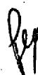

# 1. INTRODUCTION

One of the purposes of the MSRE was to show that handling molten fluoride salts in a reactor is a practical matter. Of course, before the MSRE ever operated there was a considerable body of experience which said that handling problems would not be bad. But the question still had to be answered whether after long exposure of the salt to the reactor environment with the concomitant changes in composition, there might not be some unforeseen problems with its physical behavior.

The general conclusion from the years of MSRE operation is that the salt is well-behaved, and the original premise that molten salts can be handled in a reactor without much difficulty deepened into conviction that this is true.

That the conclusion was favorable is not to say, however, that nothing unexpected turned up or that there were no problems. Salt mist in the fuel-pump bowl led to plugging in the offgas line; there was salt transfer into an overflow pipe above the salt surface by a mechanism that was never definitely established; and there were changes that affected the behavior of gas that was churned into the salt. These matters were the subject of much discussion and study and have been described from time to time in information meetings and progress reports. It has been difficult for an interested person to form a clear overall picture, however, because there are so many facets and the experience has been spread out over such a long period of time. The purpose of this report, then, is to bring together the available evidence in one place and to tell what we have been able to deduce.

# 2. DESCRIPTION OF FUEL RUMP AND CIRCULATING LOOP

Many of the phenomena to be discussed in succeeding chapters of this report are closely related to the particular components and their configuration in the MSRE. Although much detailed information is available from other sources, notably the MSRE Design Report, $^{1}$ a description of some parts of the system is presented below to provide a common base for further discussion.

# Rump

The spray, mist, bubbles, and foam in the fuel system all have their origin in the fuel circulating pump. This is really a multipurpose component whose tank not only houses a centrifugal impeller and volute to circulate the salt through the loop but which also serves as the surge tank, the salt sample point, the uranium addition point, and the contactor for continuously stripping gaseous fission products from the fuel salt. Figure 1 is a cross section of the fuel pump with details of construction omitted to emphasize the flow patterns.

The motive force for the salt flow is provided by an 11.5-in.-diam impeller driven at 1189 rpm by an induction motor. The impeller and its volute are installed in a 36-in.-diam tank or pump bowl. In the MSRE fuel system the impeller delivers 1250 gpm against a head of 55 ft of salt (~ 53 psi). Some 50 gpm is diverted as described below, so the flow out through the tangential discharge line that penetrates the side of the pump tank is 1200 gpm.

Since fluid pressures inside the volute are high relative to those in the pump tank, some salt "leakage" occurs when there are unsealed fittings. The major component of this "leakage" is the so-called fountain flow through the clearance between the impeller shaft and the top of the volute. Baffles are provided around the shaft to keep the fountain flow

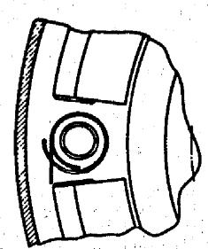

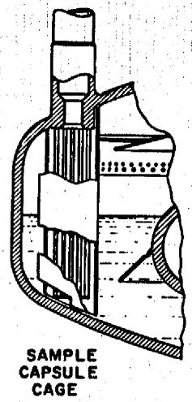

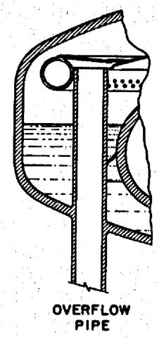

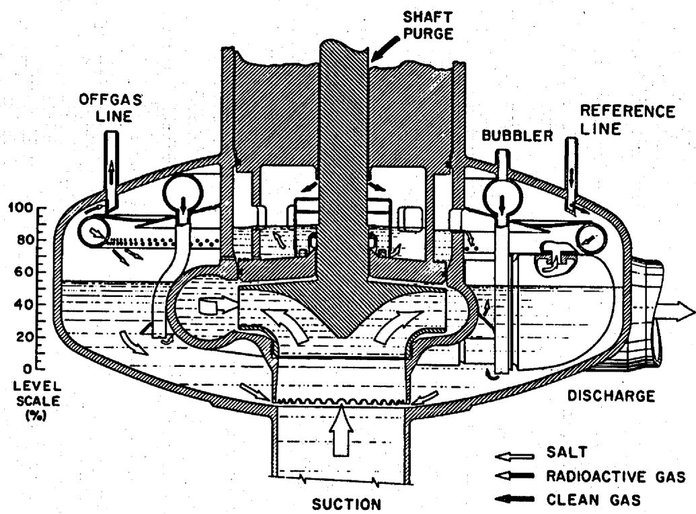  
Fig.1. Flow Patterns in MSRE Fuel Pump

ORNL-DWG 69-10172A

from spraying into the gas space. This flow partly fills the annular spaces between the shaft and the two concentric cylinders that support the volute top and the volute itself. Although there is a row of 1/8-in. drain holes near the bottom of each cylinder, the salt flow (15 gpm at design conditions) exceeds their capability and most of the fountain flow enters the main part of the pump bowl by overflowing at the "windows." Other possible sources of "leakage" from the volute are the joint between the volute outlet and the discharge line (not shown), and a recirculating flow past the labyrinth seal at the eye of the impeller.

The primary source of salt flow into the pump tank is a deliberate bypass that is taken from the volute discharge line into a toroidal spray ring in the upper part of the pump bowl. From there, the salt sprays out through 2 rows of holes and impinges on the salt surface in the tank to provide gas-liquid contacting for xenon stripping. It should be noted that the spray ring is not quite a complete torus; a 15-degree segment is omitted to provide space for the sampler cage (see partial plan view and section at far left of Fig. 1). Also there are no holes in a 60-degree segment above the salt discharge line from the volute. The opening from the pump discharge into the spray ring was sized to limit the spray system flow to $50\mathrm{~gpm}$ . At this rate the average velocity of the streams emerging from the drilled holes in the ring is 7.5 ft/sec. About $40\mathrm{~gpm}$ is directed downward at $40^{\circ}$ from the horizontal through the lower row of 1/8-in. diameter holes. The other $10\mathrm{~gpm}$ emerges from the row of 1/16-in. holes drilled at $30^{\circ}$ below the horizontal.

The salt that flows into the pump bowl returns to the main circulating stream through the clearance between the pump tank and the suction end of the volute. Normally the fuel pump contains about $2.9\mathrm{ft}^3$ of salt that is outside the main circulating stream. Of this, about $1.8\mathrm{ft}^3$ is in the region above and outside the skirt that extends out from the volute. This region is agitated by the jets and should be rather well-mixed. Salt enters the region under the skirt with an average radial (inward) velocity of only 0.11 ft/sec, accelerating to 1.7 ft/sec through the scalloped opening into the pump suction. Those gas bubbles which rise out of the salt after it passes under the skirt, together with the gas from the

bubbler level tubes, can move along the bottom surface of the volute and up through vent holes at the juncture of the skirt and the volute.

With the fuel pump off, both the spray ring and the volute support cylinder are practically empty. These regions fill with salt, at the expense of the level in the pump bowl, when the pump is turned on. Thus, even if there are no gas "pockets" in the loop, some drop in fuel-pump level occurs each time the pump is started. The salt volume associated with these two regions is 0.27 ft³.

The volume calibration of the fuel pump is of interest in translating level changes to volume changes in the rest of the loop. Figure 2 shows the volume of salt in the sump region of the fuel pump (outside of the volute) as a function of salt level. This calibration does not include salt inside the volute support cylinder or spray ring since the amount of salt in these regions does not vary with pump-bowl level when the pump is on.

Another important function of the fuel pump is to provide the gas-liquid interface and a compressible surge volume for the fuel loop. Since the gas space in the pump bowl (nominally 1.9 ft³) was judged inadequate for a major salt-level excursion, an annular 5.5-ft³ overflow tank was provided below the pump bowl, around the pump suction line. Communication between the pump bowl and the overflow tank is through a 1-1/2-inch IFS line that extends upward into the pump bowl above the normal salt level. (See partial section immediately to the left of the main drawing in Fig. 1.) To minimize the intrusion of salt spray into the top of this open line, the baffle on the spray ring has an extension that forms a "roof" over the line.

Four cover-gas streams normally flow into the pump bowl. Two of these flow through separate internal surge chambers to the dip tubes of the bubbler level elements. The surge chambers prevent expulsion of salt into unheated gas supply lines during rapid pressure excursions. Normal gas flow through each bubbler tube is 0.37 $\frac{\ell}{\min}$ STP. Another minor gas flow (0.15 $\frac{\ell}{\min}$ STP) enters through the bubbler reference line. The entrance of this line into the pump bowl is baffled, as shown, to minimize the intrusion of salt spray.

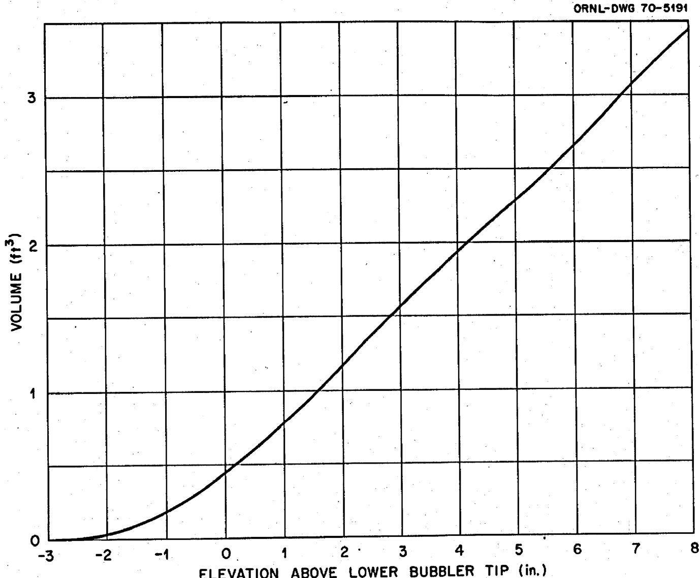  
Fig. 2. Salt Volume as a Function of Level in Fuel Pump Sump

The principal flow of cover gas enters the pump bowl through the annulus between the rotating impeller shaft and the shield plug. The purpose of this entry point is to prevent diffusion of radioactive gases (and possibly salt mist) up the shaft annulus to the vicinity of the oil-lubricated bearings. The flow enters the annulus between the bearings and the impeller and a small amount ( $\sim 0.1 \, \text{L/min}$ ) flows upward to keep oil vapors from diffusing downward; the remainder flows down into the pump bowl. The normal gas flow rate to the shaft annulus is $2.4 \, \text{L/min}$ STP, but values between 1.5 and $5 \, \text{L/min}$ have been used.

Additional cover gas can be provided by flow down the sampler line but this line is normally closed at the sampler. During routine sampling (or enriching) operations, a gas flow of $1\ell/\min$ STP down this line is maintained.

The cover gas normally leaves the pump bowl through two 1/2-in. IPS lines with baffled bottoms. The two lines penetrate the pump bowl 4-1/2 in. apart and merge into a single 1/2-in. pipe within 8 in. The offgas flow carries out gaseous fission products (and some salt mist) and provides a means of regulating the system overpressure. Two circular baffles are provided in the pump-bowl gas space to minimize the transport of salt mist into the offgas lines. When the main offgas lines are restricted, part or all of the pump-bowl cover gas flows down the salt overflow line and bubbles through the salt in the overflow tank. It then enters the main fuel offgas line through the vent line on that tank.

The last device in the pump bowl is the cage for the sampler-enricher. This cage consists of 5 vertical rods to confine the capsules that are lowered into the pump bowl. However, the cage has no bottom so capsules can reach to the bottom head of the pump tank. This cage is surrounded by a spiral baffle whose purpose is to prevent salt spray from entering and obstructing the opening into the pump bowl. There is a narrow slot between the bottom of the baffle and the bottom head of the pump bowl to permit circulating of liquid salt through the sampling chamber.

# Loop

The general configuration of the fuel circulating loop is shown schematically in Fig. 3. Although many details have been omitted, some relatively minor items are deliberately included because of their importance to the discussion in subsequent sections of this report.

In general, the components and connecting piping are arranged and pitched so that, under stagnant conditions, gas bubbles within the loop will tend to migrate toward the gas-liquid interface in the pump. The most notable exceptions to this are the top of the heat exchanger where the fuel salt enters the shell and a small region at the bottom of the larger core access plug in the reactor neck. The extent to which such bubble migration actually proceeds depends on a number of relatively indeterminate factors including the tendency for bubbles to slide along surfaces.

An important factor in evaluating the behavior of circulating bubbles is the fluid pressure as a function of position in the loop. The table on Fig. 3 shows the calculated absolute pressure at several points when the pressure in the pump bowl is 5 psig and the salt flow rate is $1200 \, \text{gpm}$ (Ref. 2). Other tabulated quantities of interest are the salt volumes between points and the transit times at $1200 \, \text{gpm}$ .

Thermocouple TE-R52 will be referred to later. This thermocouple is in a well that protrudes into the salt stream at the lower end of the core specimen access plug (just to the right of point 8 in Fig. 3). There is good reason to believe, however, that the thermocouple junction was not actually inserted to the very bottom of the well but remained up inside the plug. At any rate its reading was several hundred degrees below the temperature of the salt leaving the core and seemed to be responsive to changes in the salt level in the annulus around the plug.

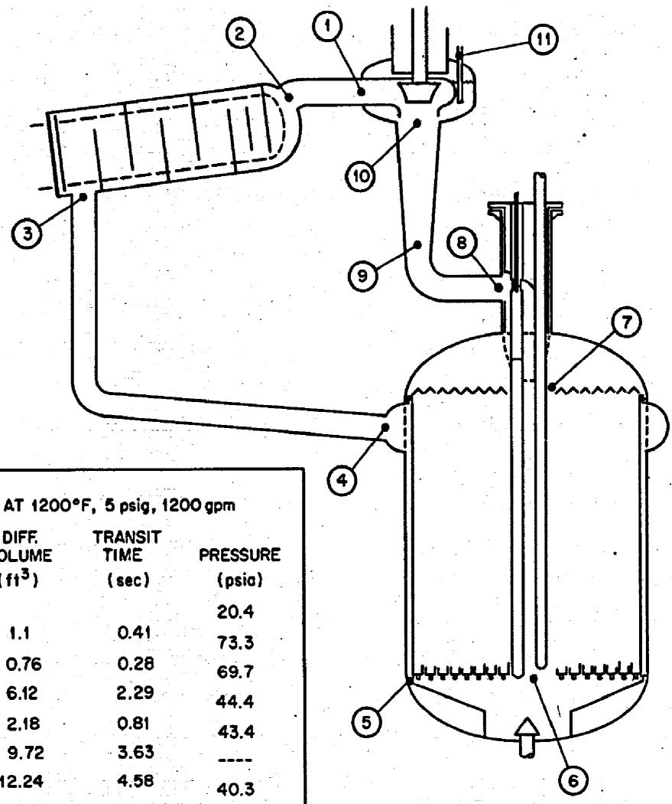  
Fig. 3. Pressures, Volumes, and Transit Times in Fuel Circulating Loop

LOOP DATA AT 1200°F, 5 psig, 1200 gpm   

<table><tr><td>POSITION</td><td>DIFF. VOLUME (ft3)</td><td>TRANSIT TIME (sec)</td><td>PRESSURE (psio)</td></tr><tr><td>10</td><td></td><td></td><td>20.4</td></tr><tr><td>1</td><td>1.1</td><td>0.41</td><td>73.3</td></tr><tr><td>2</td><td>0.76</td><td>0.28</td><td>69.7</td></tr><tr><td>3</td><td>6.12</td><td>2.29</td><td>44.4</td></tr><tr><td>4</td><td>2.18</td><td>0.81</td><td>43.4</td></tr><tr><td>5</td><td>9.72</td><td>3.63</td><td>----</td></tr><tr><td>6</td><td>12.24</td><td>4.58</td><td>40.3</td></tr><tr><td>7</td><td>23.52</td><td>8.79</td><td>35.5</td></tr><tr><td>8</td><td>11.39</td><td>4.26</td><td>25.8</td></tr><tr><td>9</td><td>1.37</td><td>0.51</td><td>----</td></tr><tr><td>10</td><td>0.73</td><td>0.27</td><td>20.4</td></tr></table>

# 3. SERAY AND MIST

During operation of the fuel pump there is a mist, or suspension of molten-salt droplets, in the gas space of the pump bowl. There is much evidence for this, but none clearer than Fig. 4. This is a photograph of a 1/2-inch-wide strip of stainless steel that was exposed in the sampler cage for 12 hours. The 4-inch-long strip was positioned so that the lower end was at the salt pool surface (as indicated by the bubbler level elements). The upper end was near the penetration of the sampler tube into the top of the pump bowl. (See Fig. 1.) Although the size of the droplets and the amount of salt on the specimen in Fig. 4 are unusual (possibly because of the long exposure or the condition of the stainless steel surface), qualitatively similar deposition was observed on numerous other sample capsules and a set of graphite specimens3 exposed in the gas space.

The origin of most of the mist in the MSRE pump bowl is undoubtedly the spattering and splashing of the streams from the spray ring. In some of the pumps that were operated during the development program, the leakage up around the shaft also emerged into the gas space as a spray. The mist may drift with the purge gas flow into the gas lines attached to the top of the pump bowl and freeze there. Frozen mist has been a problem in some pumps, not in others. Spray or falling mist has also been suggested as a possible contributor to the transfer to the overflow tank on the MSRE fuel pump, but, as will be explained below, this can hardly be the main cause.

# Observations in Development Facilities

One of the first moves after the MSRE was approved in 1960 was the design and construction of a water loop for pump development.4 The pump tank and inlet pipe in this water loop were made of Plexiglas to permit direct observation of flows. "The hydraulic design of the test pump and

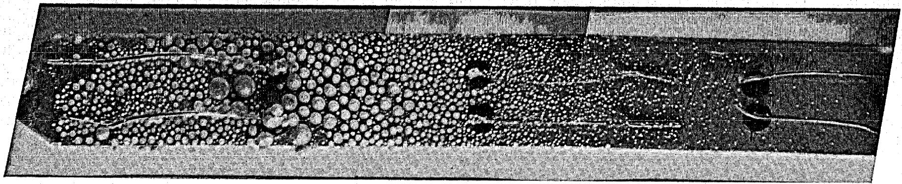  
Fig. 4. Photograph of Salt Droplets on a Metal Strip Exposed in MSRE Pump Bowl Gas Space for 10 Hours

that of the reactor fuel pump were identical."5 "Various baffles were devised to control splash, spray, and gas bubbles caused by the operation of the bypass flows in the pump tank."6 "Observations of the fountain flow from the impeller upper labyrinth revealed the need to control it; the slinger impeller was causing an undesirable spray. This spray was contained and controlled by use of a cover enclosing the labyrinth and slinger impeller, and having drain ports located at its lower end."7 Five different configurations of xenon strippers were tried; the last was the toroidal spray ring with two rows of holes and a flow of about 50 gpm. "Considerable splatter of liquid resulted from the impingement of this flow onto the volute and volute support. Control of this splatter was obtained through use of baffles installed on the stripper and on the volute support."8

The prototype fuel pump, which was tested by circulation of salt for thousands of hours, was equipped with the same kind of stripper and baffles that had been in the final tests with water. That the spray situation was adequately handled was indicated by circulation of salt for nearly 14,000 hours. During the first 11,000 hr, there was no trouble at all with the offgas, but the purge flow was quite low (<0.4 l/min). After the purge was increased to the MSRE design rate of 4 l/min, some minor difficulty was encountered with plugging in a needle valve about 15 ft downstream of the pump tank. After 2500 hr at the high purge rate a "hot trap" consisting of an enlarged section of pipe which could be heated was installed in the offgas line near the pump tank. After this modification the pump was operated only 300 hr longer before it was shut down to make way for testing the Mark II pump, but in that time there was no indication of plugging.[9]

5MSR Program Semiann. Progr. Rept., Feb. 28, 1969, ORNL-3122, p. 47.   
$^{6}$ P. G. Smith, Water Test Development of the Fuel Pump for the MSRE, USAEC ORNL-TM-79, Oak Ridge National Laboratory, March 1962, p. 1.   
$\pmb{\tau}$ Ibid., p. 22.   
$\mathfrak{e}$ Ibid., p. 27.   
9A. G. Grindell, private communication, December, 1968.

A similar salt pump, the PK-P pump, was operated for a long period of time without trouble. During a shutdown after 5436 h of operation "there was no evidence of salt collecting in the offgas line or spark-plug risers in the pump tank."10 This pump eventually operated a total of 23,500 hr with fluoride salts with no plugging of the offgas system. The gas purge rate was only about a tenth of the MSRE design rate, however.

The pump in the Engineering Test Loop was a DANA pump left over from the ANP. The hydraulic performance of the DANA pump is not the same as the MSRE pumps, but the two pump configurations and the fountain flow which emerges into the gas space are very similar. "Some difficulty was experienced during the operation of the loop with plugging of the pump offgas line. Examination after the first 788 hr of operation revealed a collection of salt at the junction of the unbaffled 1/2-inch-pipe offgas connection with the DANA pump-bowl lid."11 The bubbler reference line through which gas entered the pump bowl was covered with an "internal splash shield" or baffle and although there was some salt around the pipe opening it was not obstructed. There was however a potentially troublesome deposit 6 in. above the liquid level at the capsule stop area of the sampler-enricher guide tube. An air-cooled copper tube inserted in the pump bowl during 89 h of salt circulation at $1100^{\circ}\mathrm{F}$ accumulated a deposit of what appeared to be frozen droplets. No such deposit appeared on a cold finger in the drain tank and it was concluded that "the pump bowl difficulties were caused by an aerosol-type dispersion of salt particles."12 A cylindrical baffle of sheet Inconel inserted in the sampler guide stopped the salt deposit in the capsule stop area. After the offgas line and the bubbler reference line were switched (so the offgas line was baffled and the reference line was not) the pump was operated for several thousand hours without evidence of further plugging.13

10MSR Program Semiann. Progr. Rept., Aug. 31, 1961, ORNL-3215, p. 46.   
11MSR Program Semiann. Progr. Rept., Aug. 31, 1962, ORNL-3369, p. 56.   
12 Ibid., p. 58.   
13J. L. Crowley, private communication, December, 1968.

The Mark-II fuel pump was designed to provide a greater surge volume for fuel salt expansion.[14] In the new design the spray ring and baffles were also changed with the intention of improving the xenon stripping. In the water tests of the pump tank models "large numbers of very small bubbles were present in the pump tank liquid."[15] In the effort to reduce the bubble production in the liquid, a baffle was added which intercepted the spray jets. This created another problem: impingement of the jets on this baffle produced much spray and mist. Another baffle or cover over the spray area prevented direct splashing against the top of the pump tank but mist could still drift out underneath the impingement baffle into the region from which the offgas is drawn.

The Mark-II pump was never installed at the MSRE, but it was operated for an extended period in the pump development facility. During the first 4000 hr of salt testing of the Mark II, there was far more accumulation of frozen salt droplets in the offgas line than there had been in the tests of the earlier model pump. A filter about 15 ft downstream from the pump bowl trapped salt particles (all $10\mu$ or smaller) at a rate of about a cubic inch per 100 hours of salt circulation.[16] A noticeable restriction which built up in the offgas line was repeatedly (about once a week) relieved by applying a torch to the vertical section of offgas line just above the pump bowl or by rapping at this location. Examination revealed a brittle deposit which crumbled easily and was made up of salt beads up to $15\mu$ in diameter.[17] After 4000 hr of operation, the salt level in the pump bowl was raised about 5 in., submerging the lower edge of the impingement baffle so that mist-laden gas could not flow so freely into the region of the offgas line. This drastically reduced the rate of accumulation of salt in the offgas line, although it did not altogether eliminate it.

# Salt in MSRE Offgas System

From time to time throughout the operation of the MSRE, solids have been removed from filters, valves, and lines in the fuel and coolant off-gas systems. Material from the coolant offgas system has shown only traces of salt constituents, but many of the fuel offgas solids have included tiny beads of frozen salt, evidence of the salt mist in the fuel pump bowl.

During the precritical operation, special side-outlet inserts were installed in the offgas flange nearest the fuel pump bowl: the first for a krypton-stripping experiment, the second for drawing off gas to a fluoride analyzer. When the flange was opened to install and remove these inserts, the line appeared generally clean but small amounts of solids were found between the flange faces. These contained tiny glassy beads which were presumed to be frozen salt mist. The behavior of the fluoride analyzer during startup and operation of the fuel pump also suggested the presence of particulate fluorides in the sample stream.[18]

Frozen salt beads were also found during the prenuclear operation far downstream at the fuel pressure control valve in the vent house. Near the end of the first run with flush salt, fuel pressure control became erratic and after the end of the run (March, 1965) the small control valve was found to be partially plugged. An acetone rinse contained small $(1 - 5\mu)$ beads of a glassy material. After a week of carrier salt circulation in May 1965, the small control valve again began to plug. This time it was removed and cut open for examination. A deposit on the stem was found to be about $20\%$ amorphous carbon and the remainder 1- to $5\text{-}\mu$ beads having the composition of the flush salt.[19] The beads were glassy rather than crystalline, implying rapid cooling of molten salt mist. The carbon was presumably soot from oil thermally decomposed in the pump bowl.

Salt was not an important constituent of the material that caused the severe plugging of the fuel offgas filters and valves when the reactor

was first operated at power (January - February 1966). Samples of the offending material were nearly all radiation-polymerized organic, either as a viscous liquid or a sticky solid, with traces of salt showing in only a few of the samples. In September 1966, when the first particle trap was removed, the material plugging the entrance stainless steel mesh was found to be organic with a very high fraction of barium and strontium (20 wt% Ba, 15 wt% Sr). There was only a minute amount of salt (0.01 wt% Be, 0.05 wt% Zr),[20] indicating that if frozen salt mist was still leaving the pump bowl it was being stopped somewhere short of the vent house where the particle trap was located.

Material chiseled and rodded from the offgas line near the pump bowl in November 1966 appeared to be mostly residual frozen salt from the overfill with flush salt that had occurred in July. The increase in pressure drop during operation must have been caused by some material gradually filling the small blow-hole through the frozen salt, but the nature of this plugging material was not determined.

The offgas line at the pump bowl was opened next 16 months later, in April 1968, to investigate the unusual pressure drop that had showed up in intervals of low-power operation during the preceding 6-month run. A flexible cleaning tool pushed to the pump bowl came out with material adhering to it that appeared to be a tar-like base with a fair amount of salt in it. The flexible jumper line and the flange joints were found to contain light deposits of soot-like material with a small amount of frozen salt droplets.[21]

In December 1968, the offgas line was again cleaned from the nearest flange to the pump bowl to relieve a restriction that had appeared during the 2800-h of high-temperature operation in the $^{233}\mathrm{U}$ startup. An obstruction was encountered about where the one had been at the end of the $^{235}\mathrm{U}$ operation: just above the pump bowl, where the temperature of the gas stream would be decreasing rapidly. The material that came out on the cleanout tool looked different, however. Instead of adhering, tarry material generally distributed, there were a few bits of material having the

appearance of salt. The cleanout tool was hollow and connected to an exhaust pump through a filter. The filter paper collected a blackish powder which appeared to contain 4 to 7 mg of fuel salt which had gotten there since the $^{233}\mathrm{U}$ startup.[22]

During the first 5 months of 1969 a significant restriction again developed near the pump bowl. As was the case with other restrictions, this diverted the offgas flow through the overflow tank. However, one week before a scheduled shutdown on June 1, 1969, a restriction also developed in the vent line from the overflow tank. Since the latter restriction was essentially complete, the offgas again flowed through the restriction in the normal offgas line which by that time had increased to about 10 psi at normal flow. Some adjustments were made in operating parameters and this condition persisted until the scheduled shutdown with no serious effect on the operation. This time, however, the line was not opened to determine the nature of the plug. Instead, a heater was installed on the line section nearest the fuel pump and the restriction was cleared by heating and then applying a differential pressure toward the pump bowl. The heater was left in place and connected to a power supply for possible future use. Tests showed that the overflow tank vent line was plugged in a flanged section containing two valves. This was replaced and the plug was found to be organic material, with very little, if any, salt, located in a 1/4-inch port in one of the valves.[23]

A restriction again became detectable in the offgas line near the fuel pump after another 2200 hours of salt circulation. This occurred on December 8, 1969, only four days before the scheduled final shutdown of the MSRE. Since the restriction was not great enough to interfere with operation and shutdown, no effort was made to clear it.

# Possible Effects on Transfer to Overflow Tank

The possibility of salt spraying or splashing into the top of the overflow line was considered in the pump design, and the baffles and shed roof over the overflow line were laid out to prevent this. Observations in the transparent tank of the water test indicated that the baffles were effective, and there is no reason to believe that they were not effective in the MSRE pump. When the salt was first circulated in the MSRE fuel system, there was only a very slow accumulation in the overflow tank when the indicated salt level was within 2.8 in. of the overflow point and none at lower levels. Thus the baffles were evidently preventing heavy splashing into the overflow line. If the accumulation had been due to spray there would have been no reason for it to stop when the level reached a certain point. Therefore, there is no reason to attribute any of the transfer in this period of operation to spray. Neither can later response of transfer rates to changing fuel-pump level, beryllium additions, and other variables (including the striking difference between flush salt and fuel salt transfer rates) be explained by any hypothesis in which spray or mist is the dominant mechanism.

Although spray or mist can practically be ruled out as the primary mechanism for transfer, it is interesting to look at possible rates. Since the first beryllium addition in the $^{233}\mathrm{U}$ startup, the rate of salt transfer to the overflow tank has normally averaged between 4 and 15 lb/hr. This is 50 to 180 in³/hr. The cross section of the overflow line is 2.04 in². So the observed transfer rates would be equivalent to a "rain" of 25 to 90 in. of liquid per hour, far more than the hardest torrential downpours.

How dense is the mist in the pump bowl? The appearance of the salt droplets on specimens exposed in the sampler gives the impression of a fairly light mist or heavy fog. Fog and mist concentrations are typically around $10^{-8} \, \text{g/cm}^3$ . This is consistent with the transport of roughly a gram a month of salt mist out of the pump bowl with the offgas, which is not inconsistent with the amounts of frozen salt beads found in the offgas line. On the other hand, attempts to measure concentrations of uranium and $^{95}\text{Zr}$ in the pump bowl gas indicated much higher mist concentrations

(where the samples were taken). Apparent concentrations in early sample attempts ranged up to $10^{-4}\mathrm{g/cm}^3$ (Ref. 24). If this were typical of the offgas leaving the pump bowl, about 500 g of salt would be lost each day. No such loss actually occurred. In an effort to explain this discrepancy, Nichols suggested that high concentrations might be sustained in the pump bowl by electrokinetic phenomena and that in the offgas nozzle a large fraction of the salt particles would lose their charge and fall back into the pump.[25] If a similar situation existed in the mouth of the overflow line, what transfer rate could result? One pound per hour is all the salt from 80 liter/min of gas at a concentration of $10^{-4}\mathrm{g/cm}^3$ . This gas volume is already unreasonably high, but it would have to be even higher since later, more representative samples of pump bowl gas taken in double-walled, evacuated, freeze-valve capsules gave much lower salt mist concentrations, on the order of $10^{-6}\mathrm{g/cm}^3$ . Thus it is evident that the rate of gas transport into and out of the overflow line that would be required to produce a salt transfer of a few pounds per hour from mist fallout is entirely too high to be plausible.

# Conclusions

We are reasonably confident of the following conclusions.

1. There is a mist in the pump bowl, produced largely by the jets from the xenon stripper ring.   
2. The concentration of salt droplets in the gas leaving the pump bowl is in the range of ordinary mists.   
3. Frozen mist particles in the MSRE fuel-pump offgas contribute to gradual restriction of the offgas line near the pump bowl, which requires cleanout at intervals of a few months to a year or so.   
4. Spray and mist are not significant contributors to the transfer into the overflow tank.

# 4. BUBBIES AND FOAM IN THE RUMP BOWL

The xenon stripper jets described in the preceding chapters drive about 50 gpm of salt into the surface of the salt pool in the pump bowl. These streams carry under copious amounts of blanket gas. The gas bubbles tend to coalesce and float back up to the surface, but there is a region in which the density of the fluid is significantly reduced by the presence of the gas. This region always exists, but it appears from the few observations that can be made directly that the depth of the low-density region and the density profile in it depend on several variables.

The condition in the MSRE pump bowl has sometimes been referred to loosely as "foam". It appears that under some conditions, the density near the surface is low enough to justify this appellation. It should be noted, however, that "foam" has a connotation of persistence that is neither supported by the MSRE observations nor appears likely from laboratory experiments with similar salts.

The primary evidence for the presence of bubbles or "foam" in the pump bowl comes from analysis of the salt level indications. The purpose of this chapter is to present this evidence and to draw some inferences.

# Description of Bubbler Level Elements

The pump-bowl level indicators, shown schematically in Fig. 5, are based on the principle of a pressure differential between a reference line connected to the gas space above the salt and a bubbler tube submerged in the salt. There are two bubbler tubes (596 and 593) extending to different depths. During construction of the pump, the distances from the bubbler tips up to the plane of the volute centerline were measured to be 3.510 in. for bubbler 596 and 1.636 in. for bubbler 593. Thus if the bubblers were both submerged in a pool of fluid of uniform density, the pressures in the bubbler tubes (and the differentials between the bubblers and the reference line) would differ by 1.874 in. times the density of the fluid. The differential pressures are measured by electric d/p cells having two ranges that can be selected electrically. The span that is used when fuel salt is in the system is 22.4 in. $\mathsf{H}_{2}\mathsf{O}$ ; the other span, 19.4 in. $\mathsf{H}_{2}\mathsf{O}$ , is used

ORNL-DWG 70-5193

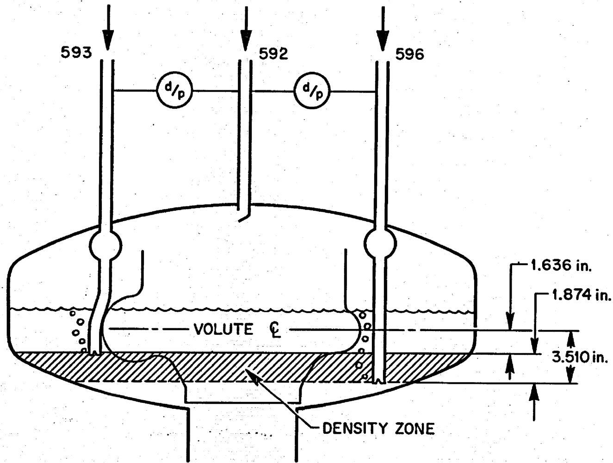  
Fig. 5. Schematic Representation of Fuel Pump Bowl Level and Density Indicators

when flush salt is in the system. These spans are equivalent to 10 inches of fluid having densities of $\frac{140}{\text{lb/ft}^3}$ and $\frac{121}{\text{lb/ft}^3}$ respectively. Read-out instruments are in percent of span. To make the level indicated by the two instruments agree, a zero shift of $19\%$ (nominally 1.9 in. of fluid) was added to the instrument on the shallower bubbler. Thus if the fluid in the pump bowl is of uniform density equal to that assumed in setting the span, the two instruments would read the same, namely the distance from the tip of the lower bubbler up to the surface, on a scale of $\frac{10\%}{\text{per inch}}$ .

The idealized situation described above does not exist and the level instruments consequently do not generally indicate exactly the same level. One set of reasons is associated with the instrumentation. Gas flowing through the three lines produces appreciable pressure drops between the d/p cell connections and the pump bowl. The normal pressure drops are compensated in the zero settings of the instruments. If the zero settings should drift (as they do over long periods of time) by different amounts or if the pressure drops should change by different amounts (as they sometimes do because changes in pump-bowl pressure affect the three flows differently), then a difference will appear in the indicated levels. Another reason for difference in the two level indications can be the fluid in the zone between the bubblers having a density other than that used in setting the instrument span. The flush salt density was close to the 121 lb/ft $^3$ used in setting that span but the fuel salt density was above 140 lb/ft $^3$ when the $^{235}\mathrm{U} - ^{238}\mathrm{U}$ mixture was in the salt, less than 140 lb/ft $^3$ after the $^{233}\mathrm{U}$ was substituted. Furthermore, the density that affects the difference between the level indications is the average density of the fluid, which is less than that of salt if there are any gas bubbles in the salt.

How the various factors mentioned above affect the indicated levels can best be understood by looking at some simple relations.

$$
L _ {3} = L _ {3} ^ {0} + h _ {3} \frac {\bar {\rho} _ {3}}{\rho^ {*}}
$$

$$
L _ {6} = L _ {6} ^ {0} + h _ {6} \frac {\overline {{\rho}} _ {6}}{\rho^ {*}}
$$

$$
L _ {3} - L _ {6} = \Delta - \frac {h _ {6} \bar {\rho} _ {6} - h _ {3} \bar {\rho} _ {3}}{\rho^ {*}}
$$

where

is the indicated level,

$L^0$ is the instrument zero, or the level that would be indicated if the salt were below the bubbler tip,

$\triangle$ is the offset between the zeroes of the two instruments,

is the depth of submergence of the bubbler tip in the fluid,

$\overline{\mathfrak{p}}$ is the average density of the fluid between the bubbler tip and the surface,

$\rho^*$ is the density used in setting the instrument span, and subscripts 6 and 3 refer to level elements 596 and 593 respectively.

Since there may be a non-uniform distribution of gas in the salt in the bowl, $\overline{\rho}_{3}$ is not necessarily the same as $\overline{\rho}_{6}$ . If, however, one assumes that density profiles as a function of depth are the same beside 593 and 596 (at least down to the depth of the 593 tip) then

$$
\mathrm {h} _ {6} \overline {{\rho}} _ {6} = \mathrm {h} _ {3} \overline {{\rho}} _ {3} + \left(\mathrm {h} _ {6} - \mathrm {h} _ {3}\right) \overline {{\rho}} _ {2}
$$

where

$\overline{\rho}_{z}$ is the average density of the fluid in the zone between the tips of 593 and 596.

The difference in level indications is then

$$
L _ {3} - L _ {6} = \Delta - \left(\frac {h _ {6} - h _ {3}}{\rho^ {*}}\right) \bar {\rho} _ {z}.
$$

# Measurement of Absolute Densities

It is evident from the last equation that the difference in level indications could be used to measure the density of the fluid between the two bubblers. If the instrument factors $\Delta$ and $\rho^*$ are known exactly, and the level readouts are precise, the accuracy in the calculated density is limited only by the accuracy with which $h_6 - h_3$ is known. (Distortion or tilt of the pump could make it different from the measured 1.874 in.) In fact, level measurements made at times shortly after the instrument zeroes were checked, with the pump off so that the salt in the pump bowl contained virtually no gas, gave densities for the flush salt and fuel salts in reasonably good agreement with those predicted or observed by other methods (see Appendix B). Up to $10\%$ discrepancy in the densities measured for quiescent salt were encountered at other times however, apparently due to drifts in the differential pressure instrument factors. (A $10\%$ change in calculated density would result from a drift in $\Delta$ of $1.9\%$ of scale.)

# Measurement of Relative Densities

Although the measurement of absolute density is compromised by the long-term zero drifts, the bubblers are a most useful indication of changes in density with operating conditions over reasonable periods of time.

The most striking short-term changes in density are produced by starting and stopping the fuel pump. When the pump is off the salt in the bowl is virtually free of gas bubbles and the density in the bubbler zone is that of pure salt. When the pump is turned on, the difference between the levels indicated by the bubblers changes within a few minutes to a new value, with the deeper bubbler indicating a lower level than the other. The indication is that the zone between the two bubblers produces a smaller increment of pressure at the lower bubbler than it did when the pump was off and the zone was filled with gas-free salt; that is, the average density of the fluid in the zone is reduced by starting the pump.

Further changes occur as the pump continues to operate and the amount of salt in the bowl varies due to the slow transfer of salt to the overflow tank and periodic recovery from the overflow tank. As the amount of

salt and the actual level change, the difference between the two bubbler level indications varies somewhat, with greater differences observed at lower levels.

The behavior described above is easily understood, qualitatively at least. The jets from the spray ring, impinging on the salt pool, carry substantial amounts of gas below the surface. The fraction of the gas in the salt decreases with depth until only the very small bubbles that can be dragged down with the salt flow are present. If the low-density region were entirely above the tips of both bubblers, the difference between the level indications would be the same as with the pump off (although both would indicate a level lower than the actual top of the gas-liquid mixture.) If the low-density region extends into the bubbler zone, the difference between the level indications reflects the density reduction due to the gas. As the amount of salt in the pump bowl decreases, the gassy region moves down and more gas appears in the bubbler zone.

An implication of this picture is that the density profile should change with pump speed. That is, at reduced speed and head the velocity of the jets and the net downward velocity in the salt pool are less, so there should be less gas at a given depth. This was proved to be the case in experimental operation of the fuel pump at various rotational speeds in Runs 17 - 19 (February - September, 1969).

Figure 6 shows the effect of pump speed on the apparent void fraction in the zone between the two bubbler tips. (The errors due to zero shifts are cancelled in the calculation of void fraction or density relative to that of clear salt.) The data for this plot were all obtained with approximately the same indicated salt level. The results clearly show the greater depth of the low-density region or "gassy zone" at higher pump speeds and higher salt jet velocities.

The points in Fig. 6 also show that in this particular parameter, any difference due to changing from helium to argon cover gas is not discernible and the differences between fuel salt and flush salt have only a minor effect. It will be shown later (Chapter 6), however, that when the gassy region extends sufficiently deep in the pump bowl, very small changes can produce pronounced effects in the circulating loop.

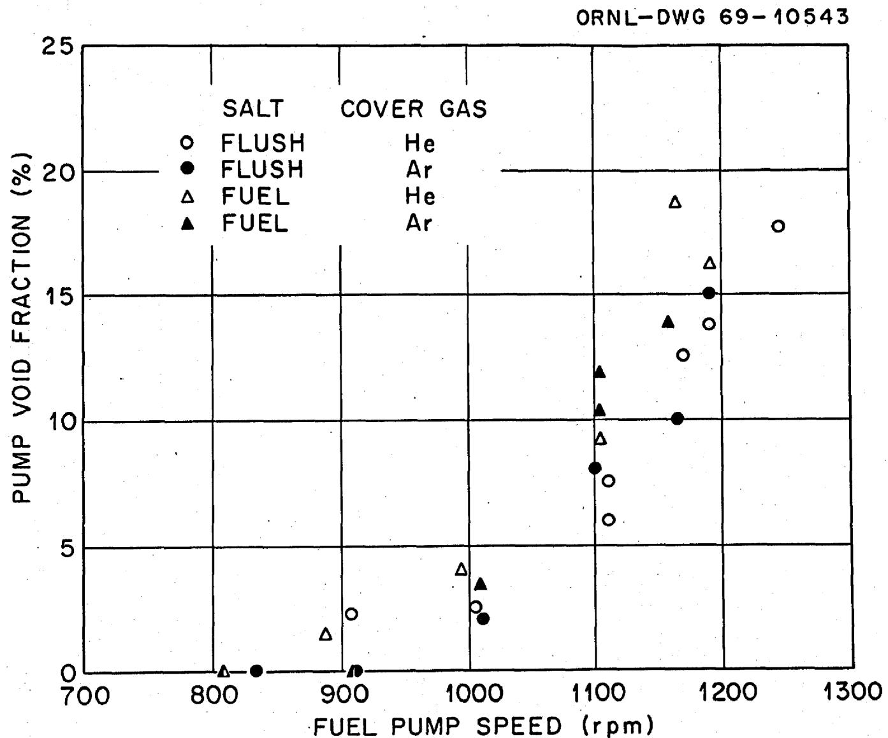  
Fig. 6. Effect of Fuel Pump Speed on Void Fraction in Zone Between Two Bubblers in the Fuel Pump

# Variation of Void Fraction with Depth

It is quite clear that there is a substantial void fraction in the pump bowl. Its variation with salt depth (i.e. the density profile) is of interest, but is not so clearly determinable. With some approximations and other observations, however, we can use the same data to develop at least a qualitative description. Because of the approximate nature of this treatment, we will apply it only to the normal flow condition.

Figure 7 shows results obtained in Runs 15 and 16 (October - December, 1968) which indicated the correlation between bubbler difference (void fraction) and pump-bowl level already alluded to. This correlation was approximated by a straight line obtained by least-squares treatment of the data. If we extrapolate this line to the bubbler difference for bubble-free, stationary salt (1.58% at the time of these measurements) we obtain the indicated salt level above which substantial bubbles would not appear in the zone between the bubblers. This level is 77% on the shallow bubbler (IE-593), which corresponds to 5.3 in. of clear salt above the tip of this bubbler.

If we then assume that the total thickness of the bubble zone is independent of pump level, this zone will reach down to the deeper bubbler tip when that bubbler indicates 5.3 in. of salt (56.1%). At this salt depth, the correlation from Fig. 7 gives a reading of 61.5% on the shallow bubbler. At this level, the average void fraction between the bubblers would be 20%.

Data on the rate of salt transfer to the overflow tank during the time of the above level observations showed a substantial drop when the indicated level on IE-593 fell below $\sim 60\%$ . This change may be associated with a drop in the level of the top of the foam to a point just below the overflow pipe. Using the level indication and the distance from the bubbler to the overflow point (6.5 in.) we obtain an average void fraction of $46\%$ in that zone. At the same condition, the average void fraction between the bubblers is $25\%$ . Transfer rates were relatively uniform at indicated levels between 60 and $69\%$ on IE-593. However, above this range much higher rates prevailed. This seems to suggest a region of very low density

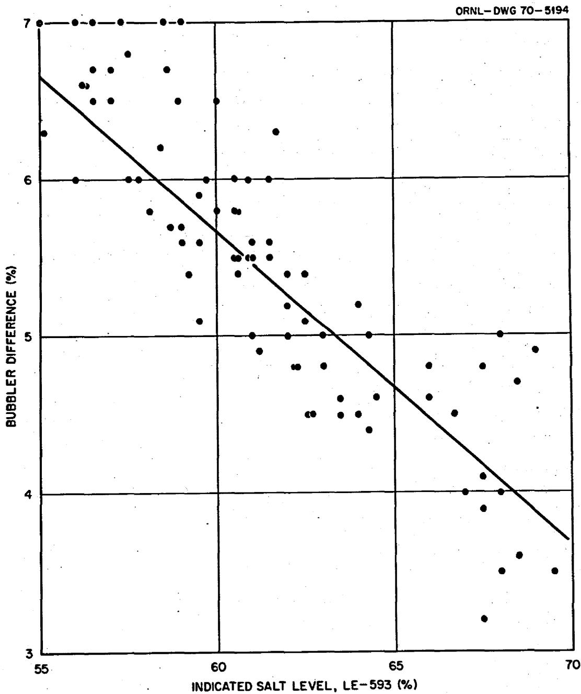  
Fig. 7. Effect of Indicated Salt.Level in Fuel Pump on Bubbler Difference

material (foam) at the top of the salt with a region of higher density below it. The very high transfer rates would then be associated with overflow of salt from the intermediate region.

The several pieces of information presented above were used to generate a void-fraction profile in the pump (Fig. 8). The characteristics of this profile satisfy the behavior described above but it must still be regarded as only an educated guess, i.e., a profile of this general shape must exist but the values assigned to it are relatively crude.

This analysis was carried one step further to indicate the relation between the actual top of the salt and the internal structure of the pump. Figure 9 shows the "true" level as a function of the indication on the deeper bubbler (IE-596). This suggests that the thickness of the gassy zone is not as great as indicated in Fig. 8, or at least not uniformly this great. If it were, the offgas line would normally be submerged in the foam and substantial salt transport to the offgas would occur. It is, of course, possible that the hardware in the gas space could depress the foam in some areas but a more likely explanation is that the thickness is overestimated. Nevertheless, it seems clear that a substantial bubble head does exist under normal pumping conditions and that this layer could easily reach as high as the overflow pipe.

# Effects on Reactor Operation

The existence of the gassy region in the pump bowl affects the operation of the MSRE in several ways. The sometimes fairly rapid transfer of salt into the overflow tank has as its most likely explanation the mounting of the foam level to the top of the pipe. The taking of samples and the exposure of materials in the sampler cage were affected by the increase in level due to the gas. Most importantly the gas in the pump bowl introduced gas into the circulating loop. These effects will be discussed in later chapters.

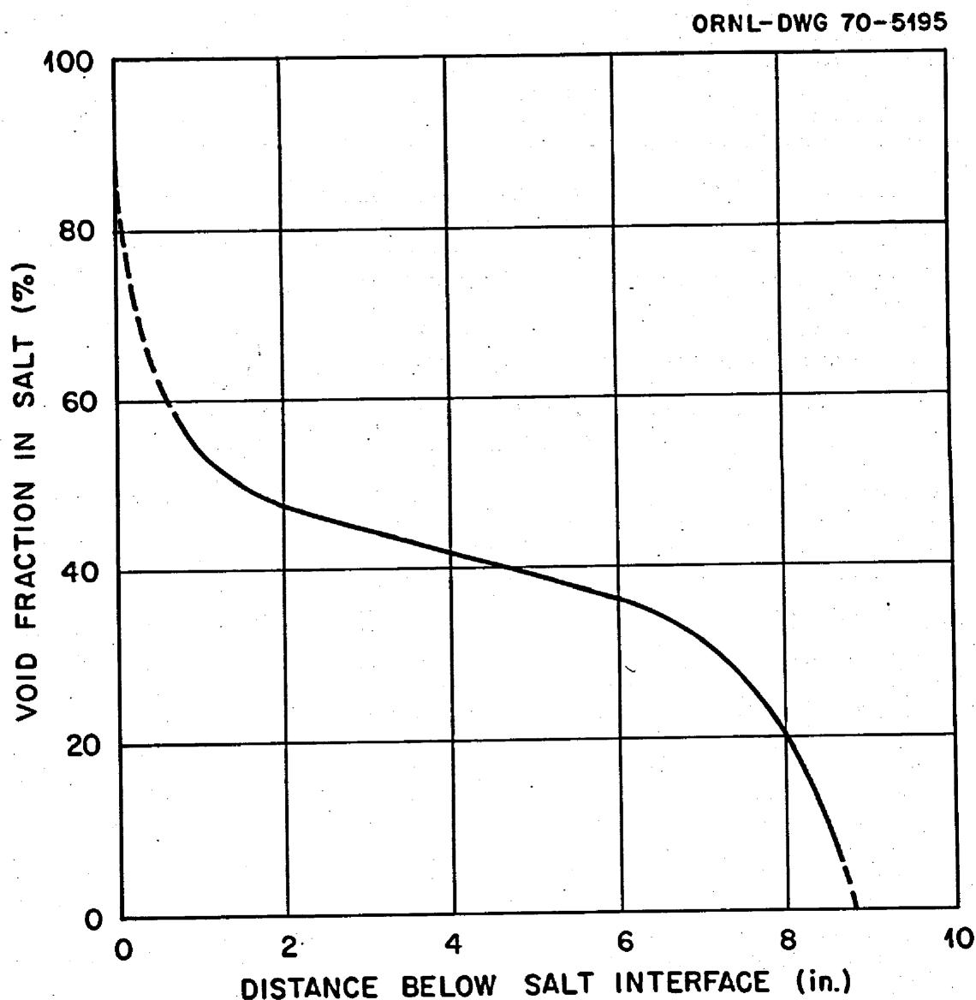  
Fig. 8. Estimated Void-Fraction Profile in Fuel-Pump Bowl

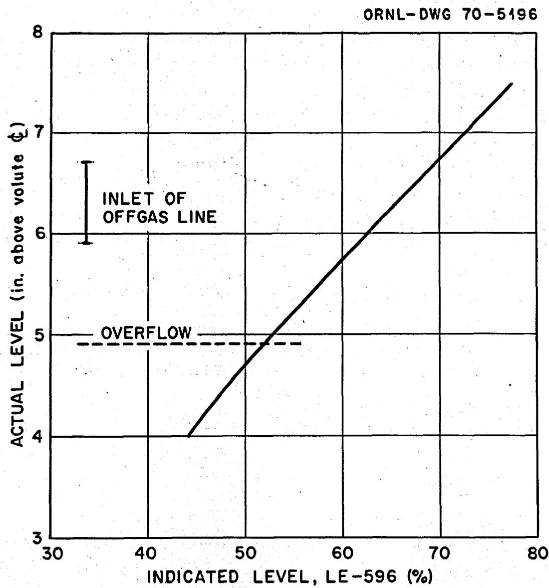  
Fig. 9. Actual Salt Level as a Function of Indicated Level from Estimated Density Profile

# 5. TRANSFER TO THE OVERFLOW TANK

The more or less continuous transfer of salt from the pump bowl into the overflow tank has been alluded to in the discussions of mist and foam in Chapters 3 and 4. This chapter presents the data on transfer rates. The most significant point about the transfer is that it occurs at all when the pump is operated, as it usually is, with the indicated salt level from 2 to 4 inches below the open top of the overflow line. This is what first drew attention to the conditions which are the subject of this report. Other intriguing features of the transfer rate behavior that will be brought out are as follows:

1. the dependence (or sometimes the lack thereof) of the transfer rate on indicated salt level,   
2. the shift in transfer rate from one interval of accumulation to the next,   
3. the changes that have occurred very gradually or between runs,   
4. the comparison of rates with flush salt and with fuel salt,   
5. the effect of beryllium additions, and   
6. the effect of salt pump head (speed).

# Initial Observations

Transfer to the overflow tank was first observed during prenucleartesting with flush salt in February 1965 (Ref. 26). After overflow during a deliberate overfill had been observed to occur at an indicated level of $92\%$ with the pump off (as predicted), the operating level was set at $70\%$ . At this indicated level, however, salt transferred to the overflow tank at a rate of about $0.7 \mathrm{lb/hr}$ during pump operation. The transfer stopped at an indicated pump level of $64\%$ and in continued operation at that level or below for another two weeks there was no measurable transfer. Fuel salt was circulated in May and June, 1965 for a total of $1000 \mathrm{hr}$ , always

with the pump-bowl level at or below the "threshold" of $64\%$ , which was then prescribed as the maximum normal operating level. Over the 1000 hours only 86 lb of salt accumulated in the overflow tank.[27]

# Experience with Fuel Salt

When operation resumed in December 1965, the rate of fuel salt transfer was still very low. As shown in Fig. 10, the rates observed through February, 1966 are practically zero. This figure shows that as operation continued, however, a measurable transfer rate developed, increased gradually, and appeared to level out near $1\mathrm{lb/hr}$ . After about a year in this range, the transfer rates shifted downward by about a factor of two and remained there for the final six months of $^{235}\mathrm{U}$ operation. Then, just after the resumption of fuel circulation following salt processing and initial loading of $^{233}\mathrm{U}$ , there was a drastic change in behavior involving much higher transfer rates than ever seen before.

The transfer rates that are plotted in Figs. 10 - 12 were computed from rates of rise of overflow tank level. Rates based on the decrease in pump-bowl level are in general agreement, but are less accurate because of effects of changes in loop temperature and gas volume.

The rates shown are averages measured from one overflow tank emptying to the next, so each covers a range of fuel-pump levels. A remarkable fact is that through Run 14 the rate in any interval of overflow accumulation (usually 1 to 4 days) was practically independent of pump-bowl level between the normal operating limits of $64\%$ and $50\%$ . It is also remarkable that although the rate was practically constant between any two emptyings of the overflow tank, it rarely was the same in any two successive intervals.

There is no cause known for the very noticeable shift in rates between Runs 12 and 13 shown clearly in Fig. 11. The rates in Run 12 were slightly over 1 lb/hr and had been relatively steady for some time. Throughout the 3 days of fuel circulation in Run 13 and the 6 months in

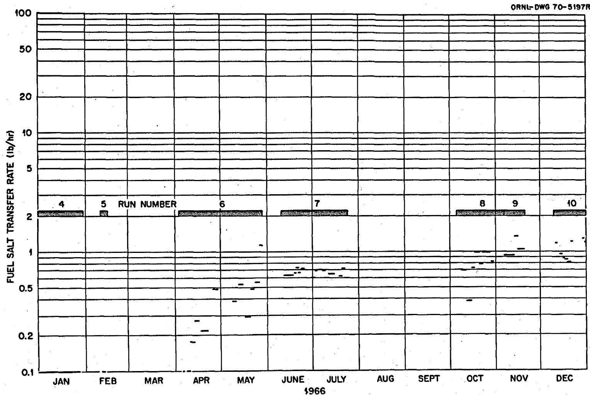  
Fig. 10. Measured Rates of Salt Overflow from Fuel Pump - 1966

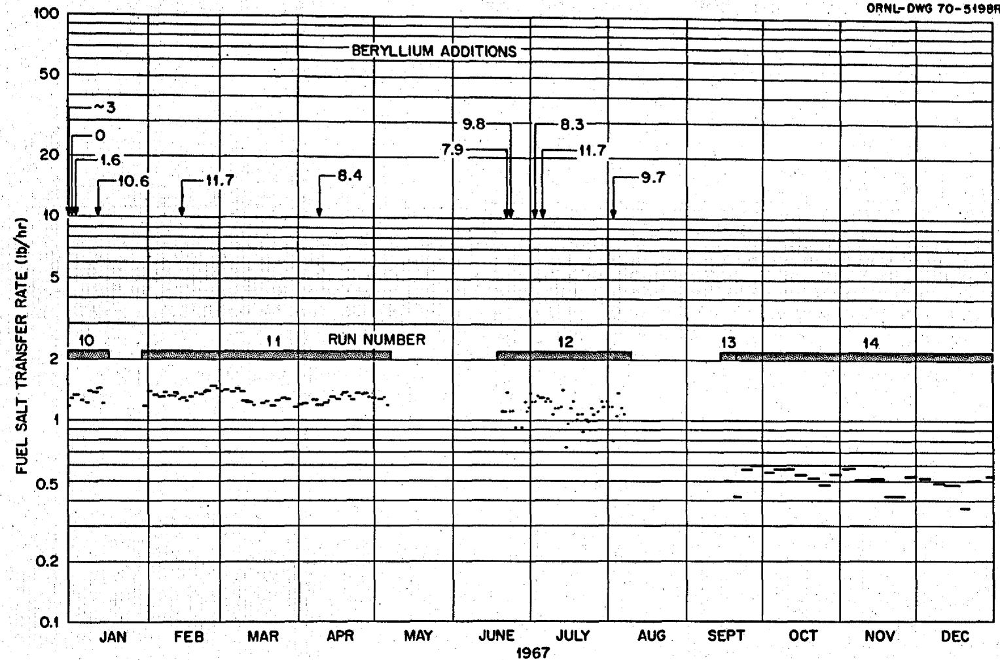  
Fig. 11. Measured Rates of Salt Overflow from Fuel Pump - 1967

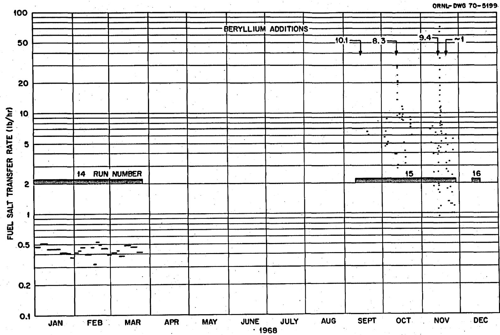  
Fig. 12. Measured Rates of Salt Overflow from Fuel Pump - 1968

Run 14, however, the observed fuel salt transfer rates were consistently lower by about a factor of two. Otherwise the characteristics of the transfer were unchanged, that is, there was virtually no dependence on pump-bowl level in the operating range.

The whole behavior of the fuel transfer changed drastically on September 15, 1968, during a beryllium exposure a few hours after the beginning of fuel circulation following the long shutdown for salt processing. As shown in Fig. 12, some very high rates were measured in October and November. As will be described in Chapter 7, the highest rates occurred only just after some additions of beryllium. Because of the apparent correlation with beryllium additions subsequent to the salt processing and $^{233}\mathrm{U}$ loading, the times and amounts (in grams) of all beryllium additions through 1968 are indicated on Figs. 10 - 12. Some of the effects of the beryllium were only temporary, but the transfer rate remained significantly higher after the first beryllium addition in Run 15 than it had been before.

Another difference was that the rate became strongly dependent on pump-bowl level. The continuous variation of overflow rate with level makes a continuous chronological plot of the rate in Run 15 and thereafter impractical. The transfer rates plotted in Fig. 12 for this period simply indicate the range of rates that were encountered. Usually the rate decreased from 10 - 14 lb/hr to 1 - 2 lb/hr on each cycle of salt transfer to the overflow tank and return to the pump bowl. This level dependence persisted through the remainder of the MSRE operation, but it was found to vary with time. Figure 13 shows the effect of indicated fuel-pump level on transfer rate for two time periods separated by about 1 year. Small zero shifts in the fuel-pump level element (1 - 2%) cause some uncertainty in the relative positions of the two sets of data, but these do not affect dependence of the overflow rate on level. The slopes of the two sets of data differ by about a factor of 2. No reason has been determined for this change.

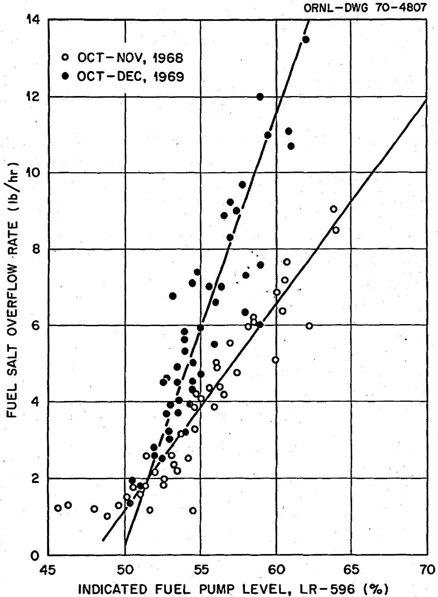  
Fig. 13. Effect of Indicated Fuel-Pump Level on Salt Transfer to the Overflow Tank During $^{233}\mathrm{U}$ Operation

# Experience with Flush Salt

During the 4-year period from 1966 through 1969, there were 9 occasions on which flush salt was circulated for sufficient time to provide meaningful data on the rate of transfer of this salt to the overflow tank. These data are summarized in Table 1, along with the reason for flushing and the major events that preceded the flush. The transfer rates through June, 1967 are practically the same as those observed with fuel salt. However, the 4 measurements over the 6 days of flush-salt circulation in September-1967 gave values that were significantly higher than the previous values with fuel salt. Even more astonishing is the comparison of these high flush-salt rates with subsequent fuel transfer rates which were a factor of 2 lower than those before the flush. The later flush-salt transfer rates (with the possible exception of the final measurement) were again reasonable consistent with the early fuel-salt data. The flush-salt rates never reached the very high values experienced with the $^{233}\mathrm{U}$ fuel salt. The precision for the final flush-salt transfer measurement is poor, but there is some suggestion of an unusually high transfer rate.

# Relation to Other Operating Variables

High transfer rates went with high bubble fractions in the pump bowl. In experiments in Runs 17 - 19 when the fuel pump was operated at lower speeds to reduce the amount of gas churned into the salt, the overflow rate showed a striking drop. For example in September, 1969, the fuel salt transfer rate went from $3.4 - 8.4 \mathrm{lb/hr}$ with the pump at $1189 \mathrm{rpm}$ to $0.4 - 1.0 \mathrm{lb/hr}$ with the pump at $600 \mathrm{rpm}$ . This is, of course, consistent with the hypothesis, advanced in Chapter 4, that the transfer is caused by "foam" rising to the top of the overflow pipe.

There was never any detectable transfer with the pump off (except during deliberate overflows). This implies that there was no leak into the overflow line below the surface of the salt pool.

The shifts in transfer rate between successive intervals of overflow accumulation cannot be correlated with any other observable change.

# Table 1

# Flush Salt Transfer to Overflow Tank

<table><tr><td>Time Interval</td><td>Occasion</td><td>Prior Activity</td><td>Measured Transfer Rate (1b/hr)</td></tr><tr><td>9/25/66 - 10/3/66</td><td>Start Run 8</td><td>Replace core sample assembly</td><td>0.47,0.81</td></tr><tr><td>11/2/66 - 11/5/66</td><td>End Run 8</td><td>Reactor operation</td><td>0.78</td></tr><tr><td>12/11/66-12/12/66</td><td>Start Run 10</td><td>Rod out fuel pump offgas line</td><td>1.16</td></tr><tr><td>5/11/67 - 5/12/67</td><td>End Run 11</td><td>Reactor operation</td><td>1.20</td></tr><tr><td>6/16/67 - 6/17/67</td><td>Start Run 12</td><td>Replace core sample assembly</td><td>1.50</td></tr><tr><td>9/8/67 - 9/14/67</td><td>Start Run 13</td><td>Retrieve sampler latch</td><td>1.24,2.58,1.98, 3.20</td></tr><tr><td>8/14/68 - 8/16/68</td><td>Sample flush salt for U</td><td>U-recovery from flush salt, replace core sample assembly</td><td>0.46</td></tr><tr><td>8/11/69 - 8/15/69</td><td>Start Run 19, cover gas experiments</td><td>Replace core sample assembly</td><td>1.17,2.24,1.35</td></tr><tr><td>12/13/69-12/14/69</td><td>End Run 20, Final flush</td><td>Reactor operation, leak</td><td>3.6*</td></tr></table>

*Low confidence in this value because of variations in system overpressure.

# Effects on Operation

In order to place the matter of salt transfer in proper perspective, it should be noted that although the transfer was an unexpected phenomenon, it caused few problems in the operation of the reactor. Normally, it was a simple matter to pressurize the overflow tank and return salt to the fuel pump to maintain the pump-bowl level in the desired range. The only period when this recovery operation was much trouble was in Run 9 (November 1966) while the main reactor offgas line (L-522) was completely plugged near the fuel pump. Since all the offgas then flowed out through the overflow tank, the act of pressurizing the overflow tank blocked the reactor offgas. This required that the reactor be made subcritical and the fuel pump stopped so that the helium flow into the pump could be stopped while salt was being returned from the overflow tank. This rather awkward mode of operation was adopted only as a temporary expedient and the system was soon shut down to clear the main offgas line.

# 6. GAS IN THE CIRCULATING LOOP

From the evidence described in Chapter 4, it is clear that large quantities of gas are driven into the salt in the pump bowl. Some of this gas is drawn into the circulating loop with the $65\mathrm{gpm}$ of salt that flows from the pump bowl into the pump suction. This was observed in the pump development tests and was therefore expected in the MSRE. This chapter describes the ways in which gas has been detected and measured in the development loops and in the MSRE, then goes on to present the results of the observations over the years of MSRE operation.

# Indicators

There are several independent indicators of gas in the MSRE fuel loop. One used only before the beginning of power operation was a densitometer based on gamma-ray penetration. Changes in pump-bowl level attending circulation, behavior during pressure-release experiments, accumulation in the access nozzle annulus, direct effects on reactivity, effects on xenon stripping, and effects on neutron noise are indicators useful during later operation.

# Densitometer

Early in the pump development program it was recognized that some of the gas churned into the salt by the xenon stripper spray would enter the circulating loop and a program was started to measure the density of circulating fluid by gamma-ray attenuation.[28] Eventually, a sensitive, stable densitometer was developed, using a 40-curie $^{137}\mathrm{Cs}$ source and an electron multiplier phototube positioned on opposite sides of the 5-inch salt pipe.[29] This device of course could not be used in the reactor after the beginning of power operation because of the very high gamma radiation from

the salt itself. Results obtained with the densitometer under various conditions in the pump test facility and in the pre-power testing of the MSRE are described later in this chapter under "Experience".

# Pump Bowl Level Changes

The indicated salt level in the pump tank decreases when the pump is started and rises when the pump is stopped. As explained in Chapter 2, part of this difference is because salt fills some parts of the pump above the level of the main body of salt only when the pump is running. However, the level change on starting or stopping the fuel pump has always been greater than could be accounted for by salt holdup in these regions. At least part of this excess volume change occurs immediately upon a pump start or stop, (even on the first start after filling the loop with salt that should be free of bubbles), evidently as salt moves into and out of a trapped gas volume when the pump head and the pressures around the loop change. Possible candidates for such volumes are the spaces between graphite stringers and the annuli at the reactor access nozzle.

When circulating bubbles are introduced by starting the pump, they displace salt from the loop into the pump tank, causing a level rise. If there are bubbles when the pump is stopped and the loop pressures decrease, their expansion causes more of an immediate level rise followed by a slow level decrease as the gas finds its way from the loop into the pump. If while the pump is running there is a sudden change in the rate at which gas is being drawn into the loop, there should follow a change in average loop bubble fraction (and pump-bowl level) with a time constant about equal to 520 gal/65 gpm = 8 min. Changes with time constants almost this short have, in fact, been observed.

# Pressure-Release Experiments

The level change produced by a sudden change in pump-bowl pressure would seem to be a simple, direct indication of the amount of bubbles in the loop. Of course, as indicated above, compressible trapped pockets of gas would have the same effect as circulating bubbles and would be included in the calculated volume of gas. But what really complicates interpretation

of pressure-step experiments is the presence of gas in the pores of the core graphite. Salt is not moved into or out of these pores to any appreciable extent by pressure changes of the attainable magnitude; gas is, but the rate varies widely depending on the nature of the pressure change. On a sudden pressure increase the pores would have very little immediate effect: although gas would begin to flow into the pores, the rate would be limited by the transport from the salt stream to the graphite surfaces. In addition, the total amount of gas in the graphite is limited by the partial pressure in the flowing liquid. (This can be an important factor if the salt in the core is not saturated with gas.) However, after the gas pressure in the pores has equilibrated with that in the salt, a sudden decrease in system pressure that leaves the total pressure in the core liquid below this gas pressure will allow gas to fizz from the graphite pores into the salt. This would have the same effect on pump-bowl level as the expansion of a large volume of circulating bubbles. The effect can, in some cases, be further magnified by gas coming out of solution in the salt. Thus a pressure-release test tends to be misleading if the graphite pores have been charged with extra gas before the release.

Pressure-release tests, although not an accurate measure of circulating void fraction, are believed to provide an indication of whether there are some bubbles circulating through the core or none. In a typical test the pressure is brought up by about 10 psi over a period of an hour or so, then is dropped back in a few seconds to near the original pressure. Since gas transport between bubbles, liquid, and graphite in the MSRE is quite rapid, it is likely that near-equilibrium conditions prevail except during and just after the release. Thus the important factor in a pressure release is the gas partial pressure in relation to the liquid static pressure in the core.

When there are circulating voids throughout the core, the gas partial pressure and the liquid static pressure are approximately equal. (The gas pressure may even be greater if the bubbles are small enough to be affected by the surface tension of the liquid.) In this case, any pressure release will cause gas to escape from the graphite and the amount that escapes is proportional to the pressure change.

At the opposite extreme is the case where the amount of available gas is so low that it is completely dissolved in the liquid with a partial pressure much lower than the liquid static pressure. Again, the gas pressure in the graphite will be near the gas partial pressure in the liquid. In this case no gas will escape from the graphite (and there will be no associated pump-level or reactivity effect) until the static pressure is reduced below this gas partial pressure. Since the usual pressure release was only about 10 psi, no excess gas would be expected to appear in the circulating stream under the conditions described in this paragraph. Conversely, the absence of such gas would indicate rather conclusively that these conditions did prevail.

Let us now consider the intermediate case where sufficient gas is available so that the liquid would be very nearly saturated at equilibrium. The gas pressure in the graphite would then exceed the liquid pressure after the release and gas bubbles could appear in circulation even though none had been present before. However, the MSRE is a dynamic system and, to reach this condition, gas introduced at the pump suction would have to dissolve before the liquid arrived at the core. The rate of gas dissolution tends to decrease as saturation is approached, and it is strongly influenced by bubble diameter.[30] (For bubbles larger than $\sim 2$ mils in diameter, the available time is insufficient for complete dissolution.) Thus, it is not possible to attain the no-void condition in the core with the liquid nearly saturated. However, the void fraction would be quite low. The response of the system to a pressure release would, thus, accurately reflect the presence of voids.

The principal value of the pressure release is in distinguishing between the complete absence of voids and the presence of only a few. Higher void fractions ( $>0.2\%$ or so) are readily measured by their level and reactivity effects.

# Access Nozzle Annulus

Variations in temperatures in the reactor access nozzle annulus also afford some information on the presence or absence of circulating gas bubbles in the fuel loop. In the Engineering Test Loop (where there were no entrained bubbles) helium trapped in the annulus was gradually removed by dissolution in the salt circulating past the lower end.[31] Less-soluble argon was removed much more slowly. Therefore provisions were made for freezing salt in the annulus to prevent molten salt from rising to the flange seal at the top of the annulus. When the MSRE was started up, however, it proved difficult, if not impossible, to freeze a dependable plug of salt low in the annulus.[32] Nevertheless, the thermocouple readings did indicate that molten salt did not rise very high in the annulus, suggesting that some mechanism was maintaining the amount of trapped helium. Subsequently it was observed that the salt level inferred from the temperatures varied and that the level variations were correlated with variations in circulating bubbles indicated by other, independent evidence.[33] It clearly appeared that collection of circulating bubbles was delivering gas to the annulus, driving the level down closer to the circulating stream until the removal by dissolution increased to balance the input by the bubbles. The equilibrium level then afforded a semi-quantitative indication of the rate of separation of bubbles from the circulating stream.

# Direct effect on Reactivity

Gas in the core reduces the amount of fuel and thus decreases the reactivity. Hence during nuclear operation a change in the bubble fraction in the core must be accompanied by a change in some other variable to keep the reactor just critical. The density coefficient of reactivity of the $235\mathrm{U}$ fuel salt was 0.18; for the $233\mathrm{U}$ fuel it is 0.45. That is, a $1\%$ decrease in fluid density (an increase of $1\%$ in bubble fraction in the salt

in the core) produces a $0.45\%$ decrease in reactivity. This is a very useful and precise indicator, but it has its limitations: it can be used only when the reactor is critical and it may be confused by concurrent changes in reactivity from other causes. A distinction is that it measures an average void fraction in the core rather than the density at a point, as measured by the densitometer, or the average in the whole loop indicated by the pump-bowl level changes.

# Xenon Stripping

The presence of blanket gas bubbles circulating with the fuel salt strongly affects the fate of the $^{135}\mathrm{Xe}$ produced during power operation. A few bubbles dispersed in the circulating salt can contain far more of the low-solubility xenon than all the salt, and provide an avenue by which the xenon can escape from the salt into the offgas stream. On the other hand, bubbles of xenon-laden gas churned into the salt. In the pump bowl reintroduce xenon. The partial pressure of the xenon can increase drastically in a bubble if most of the diluent gas goes into solution after compression in going through the pump. Helium and argon behave differently in this respect. In summary, the xenon poisoning is sensitive to the bubble fraction in the fuel, but the complexity of its dependence severely limits its usefulness as a clear indicator.

# Noise Analysis

When the reactor is critical the presence of compressible gas in the core affects the observable fluctuations in neutron flux. Thus there is potential information on the bubble fraction in the neutron flux noise, and sophisticated noise analysis techniques have been developed to take advantage of this.

"Noise Analysis," as used here, refers to the examination of the frequency spectrum of small statistical variations in the neutron flux (or power level) of the reactor. The flux variations result from small reactivity perturbations which are, in turn, caused by small variations in other system parameters. For example, if there are circulating voids in the MSRE, the effective fuel-salt density and, hence, the reactivity will

be affected by variations in core pressure. Analytical studies $^{34}$ showed that the absolute amplitude of the noise spectrum should be proportional to the square of the circulating void fraction. Although this relationship nominally applies to the entire noise spectrum, the spectrum itself may be more sensitive to voids at one or more frequencies either because of the spectrum of the input (pressure) disturbance or because of the response (gain) of the reactor system as a function of frequency. Measurements of the inherent noise spectrum in the MSRE show a peak near 1 Hz that appears to be closely related to the circulating void fraction. Changes in the void fraction have produced pronounced changes in the noise spectrum, particularly at 1 Hz and, in fact, the power spectral density around this frequency was shown to vary approximately as the square of the void fraction, as predicted by the analytical model. $^{35}$ Based on these results an instrument was built to give a direct readout proportional to the root-mean-square of the neutron noise around 1 Hz. This instrument, located in the reactor control room, is a convenient and immediate indicator of changes in the fuel void fraction. It is affected to some extent by changes in other variables, however, and must be calibrated by some other independent measurement of void fraction.

An experimental measurement of an absolute value for the void fraction can be obtained by a method very closely related to noise analysis. This is the "sawtooth pressure" experiment.[36] The pump-bowl pressure is cycled on a 40-sec period by opening and closing a valve to vent gas to a drain tank. Taped records of the pressure and neutron flux signals are then analyzed to obtain the actual neutron-flux-to-pressure frequency-response function. The equivalent frequency-response function of the analytical model is adjusted to the best fit by varying the void fraction assumed in the model.

# Experience

The first dependable measurements of circulating void fraction in the pump test facility were obtained in 1965. (Earlier measurements were questionable because of inadequacies in the densitometer.) With a nominal $69\%$ level in the pump bowl, the densitometer showed $4.6 \text{ vol}\%$ voids in the loop; when the level was raised to $79\%$ (submerging the jets) the void fraction in the loop was reduced to $1.7\%$ (Ref. 37). In these tests, however, the pump had a 13-inch impeller which sent 1615 gpm through the loop and 85 gpm through the stripper. Measurements in 1966, with an 11.5-inch impeller (as in the MSRE pump) showed only $0.1 \text{ vol}\%$ voids in the loop.[38]

Flush salt was first circulated in the MSRE fuel loop in January 1965. On several occasions in February and March the pump-bowl level rise when the pump was stopped indicated some compressible gas in the loop. There was more on some occasions than on others, indicating some bubbles. On March 5 the temperature was reduced to $1030^{\circ}\mathrm{F}$ to bring the level down from 70 to $50\%$ and there was clear evidence of bubble ingestion in the lower range of levels and temperatures.

The fuel carrier salt, with 0.6 mole % depleted uranium in it, was circulated in May 1965. The densitometer, which had been moved from the pump test facility and installed on the line between the heat exchanger and the reactor vessel, showed no detectable bubbles (<0.076 vol%) when the pump was started and stopped under normal conditions.[39] When the pump was turned off and on at $1150^{\circ}\mathrm{F}$ and reduced level, there was some indication of bubbles.

Attempts to measure a circulating void fraction continued during the zero-power experiments in June and July. After the densitometer showed no detectable voids in the loop during pump-stop experiments, we tried to detect the presence of voids by varying the fuel-system overpressure with

the salt circulating. Three tests were performed in which the overpressure was first increased to 10 - 15 psig and then rapidly decreased to $\sim$ 5 psig (Ref. 40). We reasoned that the rapid pressure decrease would allow any circulating voids to expand and produce an observable change in the densitometer reading. The first two tests were carried out at normal fuel-system temperature ( $\sim$ $1200^{\circ}\mathrm{F}$ ) with the normal operating level ( $\sim$ $60\%$ ) of salt in the fuel-pump bowl. In neither case was any change observed, either in the densitometer reading or in other system parameters that should have responded to a change in salt density. The third test was performed at an abnormally low pump-bowl level ( $\sim$ $50\%$ ) that was obtained by lowering the salt temperature to $1050^{\circ}\mathrm{F}$ . This time the densitometer responded dramatically to the rapid pressure decrease, indicating a decrease in salt density or an increase in the circulating void fraction. In addition the pump-bowl level increased and the system reactivity decreased, lending further support to the densitometer evidence.

At first we (erroneously) assigned all of the observed effects to simple expansion of gas already in circulation. Evaluation on this basis indicated that the circulating void fraction was $2 - 3 \, \text{vol}\%$ . As other evidence was accumulated, we concluded that much of the gas that appeared in circulation immediately after a pressure release came from a non-circulating reservoir – probably the pores of the graphite – and that the steady-state circulating void fraction was actually much smaller. (See discussion on pp. 43 - 45.)

The densitometer was removed after the initial zero-power experiments as part of the preparation for reactor operation at power. (Since its operation was based on a collimated $\gamma$ -ray beam and a high-sensitivity detector, it could not be used in the high radiation fields produced by power operation of the reactor.) The most important conclusion to be drawn from the densitometer studies is that, at normal loop conditions, the circulating void fraction in the MSRE initially was near zero.

On the basis of this information, the early power operation was compared with the expected behavior with no circulating voids. The most obvious disagreement between the predicted and observed behavior was in the $135\mathrm{Xe}$ poisoning. A model used to describe xenon behavior with no bubbles predicted a xenon poisoning of $1.08\%$ $\delta \mathrm{k} / \mathrm{k}$ at full power while the observed poisoning was only 0.3 to $0.4\%$ . Reevaluation of the mathematical model indicated that the low poisoning values could be explained only if circulating voids were present to greatly enhance xenon removal to the offgas system. In addition, each time the overflow tank was emptied, small reactivity perturbations appeared that raised some suspicions about circulating voids. Detailed analyses41 showed that an average loop void fraction of 0.1 to 0.15 vol % with a high probability of exchange in the pump bowl (50 to $100\%$ per pass) was required to explain both the steady-state and transient behavior of xenon in the reactor.

As a result of the above observations, a series of pressure-release experiments was performed with fuel salt in July 1966 to see if any direct evidence could be found for the postulated voids.[42] Six tests were performed and substantial voids were observed in each. Although the quantitative evaluations that were made then are now believed to be incorrect, there was no doubt that the behavior was markedly different from that observed in earlier tests. (It may be of incidental interest to note that the change in circulating void fraction occurred during the same general time period in which significant salt transfer to the overflow tank was developing; see Fig. 9.)

Two additional sets of pressure-release experiments were performed in October 1966. The first set was performed with flush salt and none of 6 tests showed any evidence of circulating voids. The second set, with fuel salt, showed circulating voids in each of 6 tests.

Another experiment was also performed in an effort to obtain a quantitative indication of the circulating void fraction.[43] When the reactor was

filled with fuel salt for the start of Run 8 (October 1966), the salt had been in the drain tanks for 11 weeks and should have been free of all voids. This was verified by observing the lack of compressibility of the loop contents immediately after filling. We then measured critical control-rod configurations with the fuel pump off and after it had been on for some time. The reactivity loss associated with pump operation was somewhat greater than that expected (and previously observed) from circulation of the delayed-neutron precursors. The discrepancy, when attributed to circulating voids indicated a core void fraction of 0.1 to 0.2 vol%. Although the confidence in this value was not very high (because the amount of reactivity involved was only ~ 0.02% δk/k), it was in at least general agreement with the void fraction required to describe the xenon behavior.

The circulating void fraction remained essentially unchanged for the remainder of the reactor operation with $^{235}\mathrm{U}$ fuel. A few isolated pressure-release experiments provided no new information. However, between December 1967 and March 1968, an extensive series of tests was performed to determine the effects of small changes in reactor operating parameters on the circulating void fraction and xenon poisoning.[44] The parameters varied were system temperature, overpressure, and fuel-pump level and significant changes in the core void fraction were detected. The minimum void fraction, for the range of parameters studied, occurred at the highest core outlet temperature (1225°F) and the lowest helium overpressure (3 psig); there was no discernible level effect between 5.3 and 6.2 in. The absolute change in void fraction as conditions were changed to the lowest temperature (1180°F) and highest overpressure (9 psig) was 0.15 to 0.2 vol%.

The results reported in the previous paragraph are based on reactivity measurements at zero power but considerable supporting evidence was obtained from neutron-noise measurements $^{45,46}$ and related pressure-fluctuation

tests. $^{47}$ These measurements showed a change by about a factor of 7 between the extreme conditions and that the minimum core void fraction was around 0.02 to 0.04 vol %. Thus, there is good agreement on the change in void fraction with operating parameters and some apparent disagreement on the minimum value. However, the void fraction required to satisfy the xenon behavior (0.1 to 0.15 vol %) is an average over the entire loop while the above measured minimum value applies only to the core. Because of its solubility in fuel salt, helium cover gas can lead to a void fraction that varies widely with position in the fuel loop. So these two values are not necessarily incompatible. The single reactivity-based core void measurement (0.1 to 0.2 vol % in Run 8) was made at ~ 1180°F which, again, reflects agreement with the noise measurements.

A dramatic change occurred in the system behavior shortly after the start of reactor operation with $^{233}\mathrm{U}$ fuel when the normal circulating void fraction increased rather abruptly by more than a factor of ten, into the range of 0.5 to 0.7 vol%. (Details of this transition and other related observations are described in subsequent chapters of this report; we will deal only with measured void fractions here.)

Following the increase in void fraction, other phenomena were observed, notably power blips $^{48}$ and variations in xenon poisoning, $^{49}$ which prompted additional investigations into the behavior of voids in the fuel loop. Of primary interest in these experimental studies were the effects of fuel-pump speed and cover-gas solubility on the circulating void fraction.

Since all circulating gas must originally enter the loop from the fuel-pump bowl, it is clear that conditions in the pump bowl must have a significant effect on the circulating void fraction. We have already detailed the effects of fuel-pump speed and cover gas on conditions in the pump bowl (Fig. 6). Figure 14 shows the corresponding effects on the circulating void fraction. The data for flush salt are based on fuel-pump

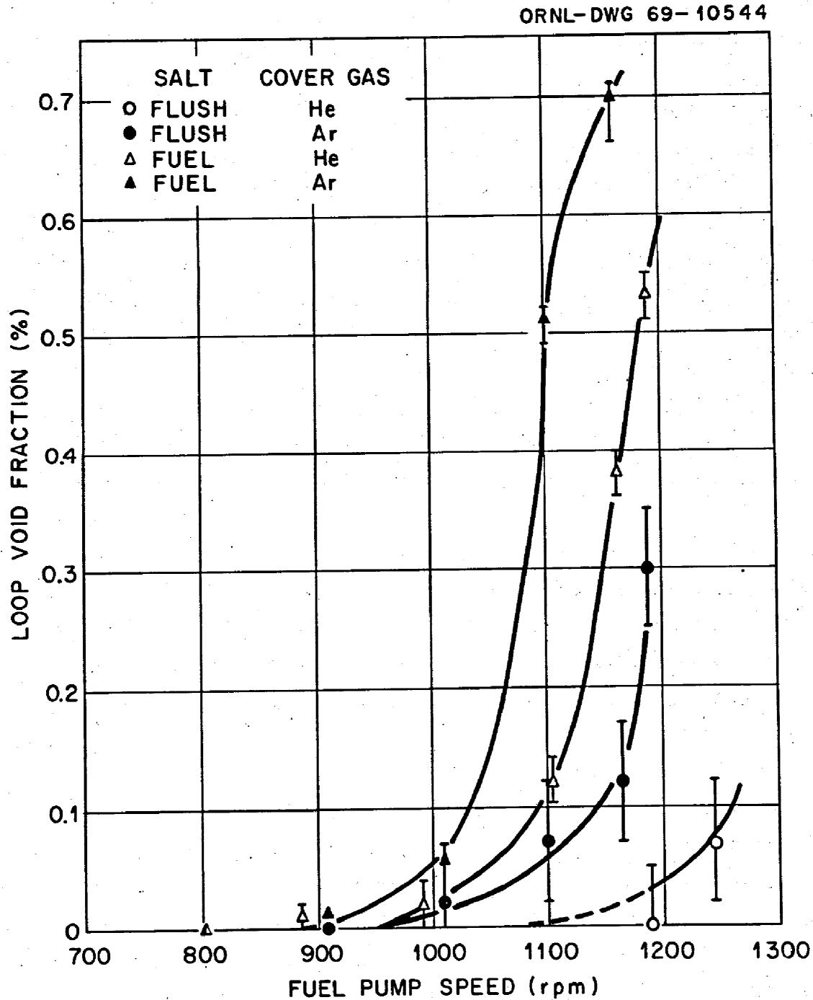  
Fig. 14. Effect of Fuel-Pump Speed on Void Fraction in Fuel Loop

level changes and, hence, represent average void fractions for the entire fuel loop. As shown by the error flags, the uncertainties in these values are relatively large. However, it is important to note that these data represent the only times that circulating voids were observed in the flush salt. The fact that circulating voids could be produced in flush salt with helium cover gas by running the pump at speeds only slightly higher than normal (1245 vs 1190 rpm) indicates that the normal condition was very close to the bubble threshold. Although only two data points were obtained with this combination, the respective absence and presence of circulating voids were confirmed by pressure-release tests. The higher void fractions with argon cover gas in flush salt result from the fact that argon is less soluble than helium by a factor of $\sim 10$ . Thus, for low rates of gas ingestion at the pump, all the helium dissolves while the argon remains as bubbles.

The data for fuel salt are based on reactivity effects which give a more precise measure of the void fraction. Consequently, these data represent average core (rather than loop) void fractions. The fuel-salt points show the lower speed threshold that would be expected from the slightly higher void fractions observed in the pump bowl (cf. Fig. 6). They also show the same gas-solubility effect as the flush salt.

Experiments were also performed to study the sensitivity of the high void fraction obtained with helium at normal pump speed to changes in system temperature, overpressure and pump level. As before, the most significant parameter was temperature but the effects were much less dramatic than at low void fractions; the maximum change observed was less than a factor of two.

Although there appear to have been minor variations, under normal conditions the circulating void fraction remained relatively stable at about 0.5 vol % throughout the remainder of the operation with $233\mathrm{U}$ fuel. Significant, short-term changes were observed during special experiments that changed the oxidation-reduction condition of the salt. These temporary effects are described later in this report.

# 7. REMARKABLE BEHAVIOR OF GAS AFTER THE 1968 SHUTDOWN

Significant changes in the behavior of the salt and gas in the MSRE fuel system occurred shortly after operation was resumed in the fall of 1968, following the processing of the salt and the loading of the first batches of $^{233}\mathrm{U}$ enriching salt. The first, most conspicuous change was a rather sudden, large increase in the amount of gas bubbles circulating with the fuel salt which occurred several hours after the beginning of fuel circulation. Thereafter the void fraction remained generally high but displayed at times some remarkable behavior. This behavior contributed to the understanding of the MSRE operation (although it may seem to have raised more questions than it answered). Perhaps more importantly it focussed the attention of reactor chemists and designers upon the interrelation of the chemical state of the salt, its physical properties, and behavior at gas-salt-solid interfaces. Our observations and correlations during operation with $^{233}\mathrm{U}$ fuel are described in this chapter.

# Salt Condition at the Start of Run 15

As will be described later in detail, during Run 15 the amount of gas circulating in the fuel loop was observed to change during and after exposure of beryllium or zirconium metal to the salt. No such response had been detectable when reducing agents had been added during earlier operation. Thus consideration of the changes in the chemistry of the fuel salt between previous operation and this run may afford a clue to the causes of the phenomena.

During August and September 1968, between Runs 14 and 15, both the flush salt and fuel salt were processed.[50] This on-site processing consisted of fluorination to remove uranium, followed by reduction of corrosion product fluorides to the metals, and, finally, filtration of the processed salts as they were being returned to the reactor tanks. The changes in salt composition were small, by far the largest being the

removal of 0.9 mole $\%$ UF $_4$ from the fuel. Some fission products (such as tellurium and iodine) were removed by the fluorination, but these were present only to a few ppm to begin with. Immediately after the filtration, salt samples showed container metal concentrations not very different from what they had been during earlier operation of the reactor. Although there was no gross change in cation composition, it appears that the state of reduction of the salt at the beginning of Run 15 was different from what it had been earlier.

In discussing the processing and later additions of beryllium, it will be necessary to refer to the relative reducing power of the various elements. Table 2 lists the standard free energies of formations of fluorides at $1340^{\circ}\mathrm{F}$ in molten $\mathrm{Li}_{2}\mathrm{BeF}_{4}$ (Ref. 5l). The point to be made from this table is that exposure of an active metal to a mixture containing these species will result in the formation of its fluoride and the reduction of some species below it on the list. The lowest species present in the mix tends to be reduced first, but in the vicinity of a strong reducing agent fractions of several species can be reduced. Another point is that reactions may be slow in reaching equilibrium.

Prior to the MSRE salt processing, experiments had shown that in molten fluoride mixtures, a hydrogen sparge will reduce $\mathrm{NiF_2}$ easily, $\mathrm{FeF_2}$ with difficulty, and $\mathrm{CrF_2}$ to a negligible extent in a practical time period.[52] Extension of these experiments showed that a practical process for reduction of $\mathrm{FeF_2}$ and $\mathrm{CrF_2}$ in simulated MSRE carrier salt was addition of pressed slugs of zirconium metal turnings, followed by hydrogen sparging. After the addition of an amount of zirconium equal to 2.8 times the number of equivalents of $\mathrm{FeF_2}$ and $\mathrm{CrF_2}$ originally present, filtered samples showed $7\%$ of the original iron and $6\%$ of the original chromium concentrations. Although one interpretation is that this was dissolved iron and chromium fluorides that had not been reduced, it was recognized that at least part was probably reduced metals that had gotten through the sample filter.

# Table 2

Standard Free Energies of Formation

for

Species in Molten LiBeF4 at 1000°K

<table><tr><td>Materiala</td><td>-ΔGf(kcal/mole)</td></tr><tr><td>LiF</td><td>125</td></tr><tr><td>BeF2</td><td>107</td></tr><tr><td>UF3</td><td>99</td></tr><tr><td>UF4</td><td>97</td></tr><tr><td>ZrF4</td><td>97</td></tr><tr><td>CrF2</td><td>75</td></tr><tr><td>FeF2</td><td>66</td></tr><tr><td>NiF2</td><td>55</td></tr></table>

The standard state for LiF and $\mathsf{BeF}_2$ is the $\mathsf{Li}_2\mathsf{BeF}_4$ liquid. That for the other species is that hypothetical solution with the solute at unit mole fraction and with the activity coefficient it would have at infinite dilution.

In the MSRE processing campaign, the flush salt was processed before the fuel salt. Corrosion product concentrations reported for samples of the flush salt taken during and after the processing are listed in Table 3. The fuel salt processing followed a similar pattern, but the fluorination took longer and more corrosion products appeared in the salt. Sample results for the fuel are also shown in Table 3.

The objective of the hydrogen sparging before the zirconium additions was to reduce all the $\mathbf{Ni}^{2+}$ , and the amounts of zirconium turnings dropped into the processing tank were in excess of the total number of equivalent

Structural Metal Concentrations in

MSRE Flush and Fuel Salt

Table 3   

<table><tr><td></td><td colspan="3">Concentration (ppm)</td></tr><tr><td></td><td>Cr ± 10</td><td>Fe ± 40</td><td>Ni ± 15</td></tr><tr><td>Flush Salta</td><td></td><td></td><td></td></tr><tr><td>In reactor system during Run 14 (averages)</td><td>76</td><td>150</td><td>52</td></tr><tr><td>Before fluorination</td><td>104</td><td>---</td><td>---</td></tr><tr><td>After fluorination (6.6 hr)</td><td>133</td><td>210</td><td>516</td></tr><tr><td>After 10.8 hr of H2sparging</td><td></td><td colspan="2">No sample taken</td></tr><tr><td>After 604 g of Zr and 9 hr of H2sparging</td><td>100b</td><td>174b</td><td>50b</td></tr><tr><td>After 1074 g of Zr and 25 hr of H2sparging</td><td></td><td colspan="2">No sample taken</td></tr><tr><td>In drain tank after filtration</td><td>76b</td><td>141b</td><td>26</td></tr><tr><td>Fuel Salta</td><td></td><td></td><td></td></tr><tr><td>In reactor system during Run 14 (averages)</td><td>85</td><td>130</td><td>60</td></tr><tr><td>Before fluorination</td><td>170</td><td>131</td><td>36</td></tr><tr><td>After fluorination (46.8 hr)</td><td>420</td><td>400</td><td>840</td></tr><tr><td>After 17.1 hr of H2sparging</td><td>420b</td><td>430b</td><td>c</td></tr><tr><td>After 33.5 hr of H2sparging</td><td>420b</td><td>400b</td><td>520b</td></tr><tr><td>After 51.1 hr of H2sparging</td><td>460b</td><td>380b</td><td>180b</td></tr><tr><td>After 5000 g of Zr and 24 hr of H2sparging</td><td>100b</td><td>110b</td><td>&lt;10b</td></tr><tr><td>After 5100 g of Zr and 32 hr of H2sparging</td><td></td><td colspan="2">No sample taken</td></tr><tr><td>In drain tank after filtration</td><td>34</td><td>110</td><td>60</td></tr></table>

$^{\mathrm{a}}$ Zr additions and $\mathbf{H}_{2}$ sparging times are cumulative.   
bFiltered sample.   
Contaminated sample.

of $\mathrm{Cr}^{2+}$ and $\mathrm{Fe}^{2+}$ in the salts. So it might be expected that the chromium, iron and nickel in the fuel salt when it returned to the fuel circuit were present mostly or entirely as reduced metals. In this case the Cr, Fe, and Ni in the drain tank samples were presumably very finely divided particles that had passed through the process filter and the filter on the sample capsule. If so, this condition did not persist, for very soon after the beginning of fuel circulation it became clear that there was a substantial amount of $\mathrm{Fe}^{2+}$ in the salt.

The first evidence of $\mathbf{Fe}^{2+}$ in the salt came on the second day of fuel circulation when a rod of beryllium exposed to the fuel salt came out with an iron-rich coating, evidently the result of reduction of $\mathbf{Fe}^{2+}$ by the $\mathbf{Be}^0$ . This was in contrast with earlier operation (with $^{235}\mathrm{U}$ ), when exposure of beryllium metal had resulted mainly in reduction of $\mathbf{U}^{4+}$ to $\mathbf{U}^{3+}$ (both soluble), with only a small amount of $\mathbf{Cr}^{2+}$ reduction also occurring.[54] But on this first beryllium addition in Run 15 (described later in this chapter and in Appendix A) there was a heavy coating in which the Fe:Cr ratio was 11:1.

A further indication of the salt condition came from the corrosion rate. During the first three months of fuel salt circulation its chromium concentration rose from $34~\mathrm{ppm}$ to about $70~\mathrm{ppm}$ , indicating corrosion of the Hastelloy-N fuel loop surfaces by some oxidizing agent. One hypothesis that might be advanced to explain this corrosion would be that the fuel salt came back from the processing containing some $3\mathrm{g}$ -atoms $(168\mathrm{g})$ of iron as $\mathrm{Fe}^{2+}$ . A difficulty with this is that the effectiveness with which the chromium was reduced in the final stages of the salt processing seems to preclude the likelihood that significant quantities of $\mathrm{Fe}^{2+}$ were delivered to the fuel circuit. It has been suggested that the iron came back as $\mathrm{Fe}^0$ all right, but was oxidized to $\mathrm{Fe}^{2+}$ by some contaminant (probably oxygen) in the fuel circuit.[55] The $\mathrm{Fe}^{2+}$ then reacted with the Hastelloy to leach the chromium.

In any case it is clear that very early in Run 15 an unprecedented condition existed in which exposure of beryllium served mostly to produce reduced metal. As detailed in Appendix A, examination of the addition capsules showed significant amounts of finely divided metal that seemed to collect on the surface of the salt. Magnets lowered into the pump bowl revealed that some of these materials persisted in the pump bowl after the reduction. The amount of iron powder that could have been involved is substantial, possibly on the order of 100g. (This figure is based on the amount of corrosion and also on the amount of beryllium that was added before the Fe:Cr ratio in the deposits on the cages reached a low level.)

Another significant observation in Run 15 was that each of the beryllium addition assemblies removed from the pump bowl showed evidence that fuel salt had wetted the nickel cage and had adhered to it.[56] (None of the beryllium additions during earlier operation had showed such wetting.) Sample capsules taken between beryllium additions showed the normal nonwetting behavior, so the conclusion was that although major changes in the salt-metal interfacial tensions were induced by the exposure of the beryllium, they were transient in nature.

In addition to the foregoing differences, the fuel salt density was reduced roughly 5 percent by the substitution of $38\mathrm{kg}$ of uranium (85% ${}^{233}\mathrm{U}$ ) for the $221\mathrm{kg}$ of uranium formerly in the fuel.

In summary: when operation was resumed at the beginning of Run 15, the fuel salt was somewhat less dense and, for the first time, was in a state such that exposure of strong reducing agents could produce substantial quantities of insoluble solids and also affect (at least temporarily) the gas-liquid-solid interfacial behavior.

# Behavior During Flush Salt Circulation

On August 14, 1968, after samples of flush salt from the drain tank showed that the chromium was acceptably low, the salt was transferred into the fuel loop and circulated for a 40-hour trial. There was no perceptible difference in behavior of the salt between this and earlier periods

of operation. The two pump-bowl bubblers indicated practically no gas between the bubblers or in the loop. The rate of transfer to the overflow tank was steady at 0.4 lb/hr, very close to that which had existed in the fuel salt operation in the preceding run. (The rate was substantially less than in the last lengthy period of flush salt circulation, which was before Run 13.)

# Behavior During First Period of Circulation of Fuel Salt

After the fuel salt was processed, LiF-UF $_4$ (73-27 mole %) enriching salt containing 21 kg of uranium was loaded in through FD-2. Then, on September 14, the fuel loop was filled and circulation started. The purpose of the circulation was twofold: to obtain a sample of the thoroughly mixed salt and to permit the exposure of a beryllium rod to reduce part of the U $^{4+}$ to U $^{3+}$ . (The production process for the enriching salt had left practically all the uranium as U $^{4+}$ and it was desirable to reduce some so as to attain a reducing environment that would prevent corrosion.)

When fuel circulation was started, chart records showed no abnormality. As shown in Fig. 15, when the pump first started, the bowl level dropped 0.8 inch, then very slowly increased. As explained in Chapter 2, this drop was due to filling the spray ring and volute support cylinder and compressing the normal gas pockets in the loop. The slow increase could be explained entirely by a slight rise in loop temperature that was observed during this 2-hour period. Proof that the rise was not due to gas building up in the loop came when the fuel pump was stopped at 0846: the amount that the bowl level rose was the same by which it had dropped on the initial start. The same behavior was seen eleven hours later when the pump was again stopped and started. By the time the beryllium rod in its nickel cage was lowered into the pump bowl at 2037 on September 14, the fuel had been circulating for 14 hours, with no anomalous behavior and with a very low rate of transfer to the overflow tank.

For some two hours after the beryllium entered the pump bowl, everything apparently continued normally. Then the indicated salt level began to rise. At the same time the trace on the recorder chart became much

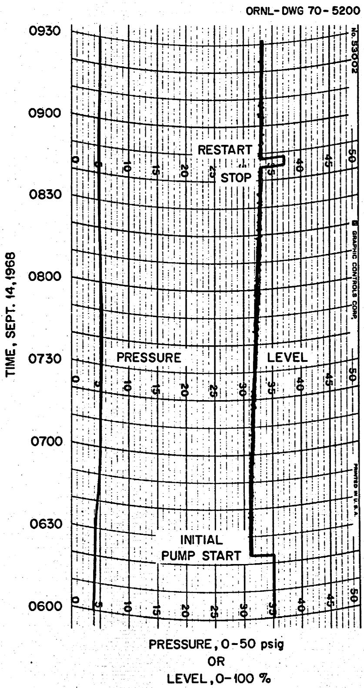  
Fig. 15. Recorder Chart of Fuel-Pump Level Indicator (IR-596) During First Two Pump Starts with Fuel Salt in Run 15

more noisy, as shown in Fig. 16. After gradually rising about 0.4 inch, the indicated level curved over and began to decrease at the relatively high rate of 0.08 in./hr, implying an abnormally high rate of salt transfer to the overflow tank. (The computer was unfortunately not fully operative during this period of circulation, so a detailed record of the overflow tank level does not exist.)

When the remains of the beryllium rod were removed after a 12-hour exposure,\* there was no immediate effect on the apparent amount of gas in the loop or in the overflow rate. Both continued high for the remaining 10 hr that the fuel was circulated. Quite clear evidence of the high gas fraction shortly before the fuel was drained is shown in Fig. 17. When the fuel pump was stopped, the indicated level rose 1.3 in., compared to the 0.8-in. change the first time it was stopped. The difference was the effect of expansion of more gas in the loop as the pressure fell with the stopping of the pump. Immediately afterwards, the level began to subside as some of the gas found its way out of the loop. When the pump was restarted after about 13 min., the level dropped about 1.6 in., indicating a remarkably large amount of gas still in the loop where it could be compressed. After the start, more gas apparently was ingested, causing the level to rise gradually. (Contrast Figs. 17 and 15.) Additional evidence of a high gas fraction was the response to a pressure decrease shown in Fig. 17. Before the salt was drained the drain tank vents were opened, dropping the fuel loop pressure (the lower trace on Fig. 17) quickly by 1 psi. Expansion of the gas in the loop caused the sharp level rise of about 0.15 in. When the drain valve was thawed, the pump was allowed to run until the dropping level cut it off through a control interlock, which explains the abrupt drop at the end.

Although it was not noticed at the time, the behavior of thermocouple TE-R52 changed sharply 7 hr after the beryllium went in. (See p. 8 for a description of this thermocouple location.) Up until then the recorder chart shows it was quite steady. Then it began to fluctuate in the manner

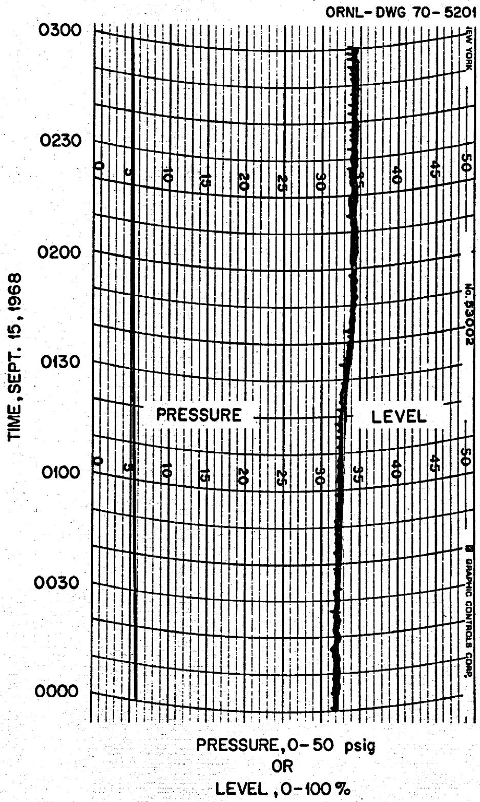  
Fig. 16. Fuel-Rump Level Trace During Initial Buildup of Circulating Voids in Run 15

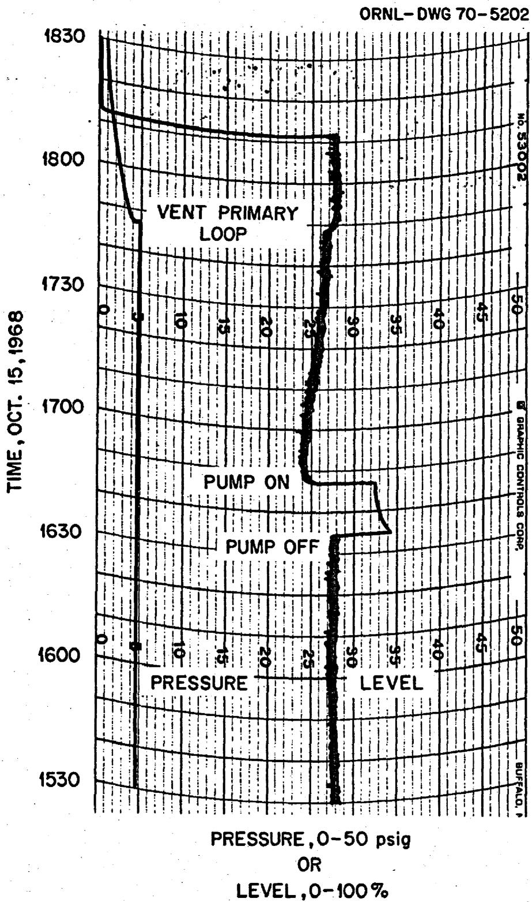  
Fig. 17. Fuel-Pump Level Response to a Pump Stop and Restart with Circulating Voids Present

typically observed later during power blips.[57] This fluctuation persisted through the remainder of the circulation period.

In summary, noteworthy points about the first period of circulation of the fuel after processing are as follows.

1. There was practically no gas in the loop for the first 16 hours.   
2. Then, after a beryllium rod had been in the pump bowl for two hours, gas began to build up in the loop.   
3. In less than an hour the loop gas had levelled at about 0.5 vol $\%$ , where it stayed for the remaining 18 hours of circulation.   
4. The pump-bowl level trace became rough at the same time the loop gas increased.   
5. TE-R52 began to show fluctuations in the salt level at the bottom of the core sample access plug about 5 hours after the loop gas started to increase.   
6. The transfer rate, which had been low before, rose to roughly 4 lb/hr while the beryllium was in and remained at about that rate after the beryllium was removed.

Behavior During Subsequent Beryllium Exposures in Run 15

Beryllium was exposed to the fuel salt in the pump bowl on three subsequent occasions in Run 15. Some effect on the gas in the fuel loop was evident in each case, but there were some significant differences in the behavior.

# Second Beryllium Exposure

The second beryllium exposure in Run 15 was on October 13, 1968. By this time enough $^{233}\mathrm{U}$ had been added to make the reactor critical and while the beryllium was in the pump bowl, the reactor was on servo control at low power. Thus the regulating rod position was available as an indicator of reactivity effects.

Figure 18 is a reproduction of the fuel-pump level record spanning the 10.5-hr exposure of the beryllium (during which time the rod lost 8.3-g Be). At the outset the void fraction was high, as it had been since the first beryllium addition. In less than a half hour after the beryllium went in, the level began to decrease and the reactivity to increase, indicating a decrease in the amount of gas in the loop and in the core. This trend was soon reversed and from then until the beryllium was removed, the void fraction went through the gyrations indicated by the level chart. The control-rod movements associated with each level change were consistent with changes in the core fuel density expected from the suggested void-fraction variations. Except for the return of salt from the overflow tank, no operator actions were performed that should have influenced the behavior in the loop. Thus, the observed level changes were spontaneous and suggestive of major changes in the circulating void fraction. The transfer rates observed just before the Be exposure and in the intervals during the exposure when the pump level and circulating void fraction were low were between 2.5 and $4\mathrm{lb / hr}$ . However as shown in Fig. 19, at higher levels and just after the exposure, rates as high as $30\mathrm{lb / hr}$ were observed. The very high rates were nearly independent of indicated salt level between 6.1 and 6.9 inches (on IE-593). Unusually high transfer rates persisted for some 100 to 120 hr of salt circulation time and then returned to the 3 - 5 lb/hr range.

Comparison of the transfer rates with the densities indicated by the differences between the two bubblers revealed what seemed to be paradoxical behavior but which may actually be a clue as to what was happening in the pump bowl during this beryllium exposure. The comparison of the two bubbler readings while the beryllium was in the bowl showed less voids in the bubbler zone than usual at that indicated level. This is consistent, of course, with the clear evidence that less gas was being drawn into the loop. It clashes, however, with the inference from the unusually high transfer rate that more than the usual amount of gas was causing froth to spill into the overflow line at a high rate. These indications could be reconciled by postulating that, while the beryllium was in, there was the unusual condition of a thick blanket of persistent foam that produced the

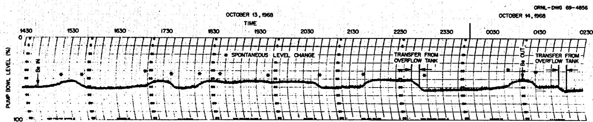  
Fig. 18. Fuel-Rump Level Behavior During Second Beryllium Exposure in $^{233}\mathrm{U}$ Fuel Salt

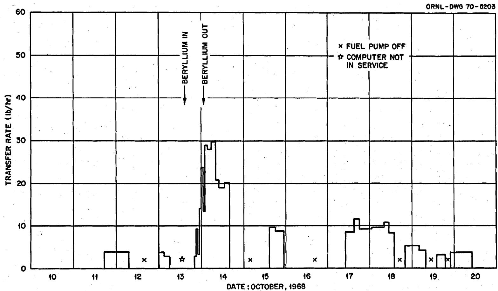  
Fig. 19. Transfer Rates During and After Second Beryllium Exposure

high transfer rate and at the same time prevented the jets from driving gas deep enough into the underlying pool to reach the bubbler zone and the circulating stream.

# Third Beryllium Exposure

The third beryllium exposure was made on November 15, 1968. The total immersion time was 11 hr with $9.4\mathrm{g}$ of Be dissolving. However, as described below, the exposure was not continuous.

This exposure was started with a lower indicated salt level in the pump bowl to reduce the risk of salt transport into the offgas line. (Some evidence of a restriction in line 522 had already been observed.) In contrast to the previous exposure, this capsule spent some $2 - 1 / 2$ hr in the pump before any effects were detectable; then the level began to decrease and the regulating rod began to insert as bubbles disappeared from circulation. The beryllium was withdrawn with the level down by 0.64 in. and still dropping because the level had gone below the specified operating range for the pump. As soon as the beryllium was withdrawn, the salt level and control rod began to recover and the initial conditions were restored in only $15\mathrm{min}$ . The beryllium was immersed again and decreases in pump level and rod position began immediately. The exposure was interrupted again because of the low salt level and, again, the effects were quickly reversed. At this point some salt was transferred from the overflow tank to alleviate the concern about the low level.

When the beryllium was immersed again, a 40-min wait ensued in which only minor effects were observed. The pump level then dropped rapidly to produce a total change of 0.85 in. The remaining 8 hr of the exposure were uninterrupted with the salt level remaining relatively low. However, there were variations (± 0.1 in.) around this low level. By the end of the 8-hr period, the pump level had risen 0.3 in. and the difference between the two bubblers had returned to practically the same value that was observed with the beryllium out.

While the pump level was low with beryllium metal in the salt the transfer to the overflow tank proceeded at only 1 - 2 lb/hr. In the interim periods with the beryllium out, the rate was $\sim 4$ lb/hr. However, shortly

after the end of the exposure, the transfer rate jumped to 72 lb/hr. At least part of this high rate was due to an unusually high (70%) fuel-pump level. However, even at more moderate levels, transfer rates were in the range of 5 - 10 lb/hr. After about 48 hr more, the transfer rates were back to 5 lb/hr or less at normal levels.

# Fourth Beryllium Exposure

A fourth assembly containing beryllium was exposed to salt in the pump bowl on November 21, 1968. The previous three exposures had resulted in the deposition of considerable "crud" on the perforated nickel container for the beryllium rod. Since it appeared that this was reduced corrosion products, the fourth assembly contained several high-temperature permanent magnets to collect any magnetic material that might form as the beryllium dissolved. The presence of the magnets substantially decreased the beryllium surface area in this assembly so that only about $1\mathrm{g}$ of beryllium dissolved in the 7-hr exposure. The circulating void fraction decreased somewhat during the exposure but the effect was much less pronounced than in earlier exposures. There was no detectable effect on the salt transfer rate, either during or after the exposure. Only a small amount of material was attracted to the magnets.

# Comparisons

In all four beryllium exposures described above, there was some effect on the circulating void fraction as indicated by level changes and/or reactivity effects. However, the effects were not entirely reproducible, even qualitatively. The first beryllium exposure apparently contributed to the establishment of a high void fraction. Once these voids began to appear, some 2 hours after the start of the exposure, there was no evidence of a decrease in the void fraction, either during or after the exposure. In all other cases, there was at least a tendency for the void fraction to decrease while beryllium was in contact with the salt and to return to the higher value after the beryllium had been removed. During the second exposure, the void fraction was quite unstable, exhibiting both decreases and increases while the beryllium was present. The

instability appeared almost immediately upon insertion of the beryllium and stopped as soon as it was removed. On the third exposure, there was a 2-1/2-hr delay before the void fraction started to decrease. However, no additional instabilities were observed while the beryllium was present. In addition, the response of the void fraction to removal and the reinsertion of the beryllium rod was immediate. The fourth exposure was apparently similar to the third but the effects were much smaller.

We also observed that the rate of salt transfer to the overflow tank was abnormally high for as long as 100 hr after some beryllium exposures, implying that the beryllium produced some kind of abnormal condition from which the system recovered only very slowly.

# Power Blips in Run 17

The observations described so far in this chapter were all made in Run 15 with the reactor subcritical or at very low power. Power operation with $^{233}\mathrm{U}$ fuel was started with Run 17 in January, 1969. One of the more unusual aspects of the early power operation was the appearance of small, positive disturbances in the nuclear power (blips). The blips will be treated at length in another report58 but some discussion is presented here because of the interrelation between blips, circulating voids and beryllium exposures.

When first observed, the blips were occurring with an irregular frequency of 10 to 20 per hour. A typical blip involved a reactivity increase of 0.01 to $0.02\%$ $\mathrm{8k / k}$ for 1 to 40 seconds, resulting in a temporary power increase of 10 to $15\%$ . The size and frequency of the blips decreased with time and, by the end of March 1969, they could no longer be distinguished from the continuous noise in the neutron flux. Although the blips were not recognized until January, when the reactor power ascension had reached 5 MW, a detailed search of data records revealed that disturbances in other system parameters associated with the blips began occurring in September

when the high circulating void fraction first developed. Figure 20 shows the typical, small disturbances in fuel-pump pressure and level and in the temperature indicated by TE-R52 that accompanied the blips.

Since the blips were associated with circulating voids (this was proved later by running the fuel pump at reduced speed to eliminate voids and blips) and the voids were affected by the presence of beryllium, the blip behavior was carefully observed during a beryllium exposure made on January 24, 1969. The beryllium had the expected effect in reducing the circulating void fraction and, for 2-hr 20-min while the void fraction was low, there were no blips. As soon as the beryllium was removed, the void fraction increased and the blips returned. Figure 2l shows two segments from the record of linear nuclear power (as indicated by a compensated ion chamber) before and during the beryllium exposure. These observations were used to support later conclusions about bubbles and blips.

# Other Redox Experiments

Although the power blips gradually disappeared during Run 17 and the void fraction became stable, a number of other reduction-oxidation experiments were performed. Table 3 summarizes all the tests with $^{233}\mathrm{U}$ fuel, including the five beryllium exposures already discussed. These experiments had a variety of objectives which included the effects of milder reducing agents (Cr and Zr), observation of changes in interfacial tension of the salt with beryllium present, and the effect of the salt redox state on fission-product behavior. Since this report is concerned primarily with spray, mist, bubbles, and foam, only those aspects of the experiments will be discussed. To provide a uniform basis for comparison, Table 3 also lists the amount of reduction or oxidation, in gram-equivalents, accomplished by each exposure. The chemical effects of these actions have been evaluated elsewhere.[59]

ORNL-DWG 69-5373

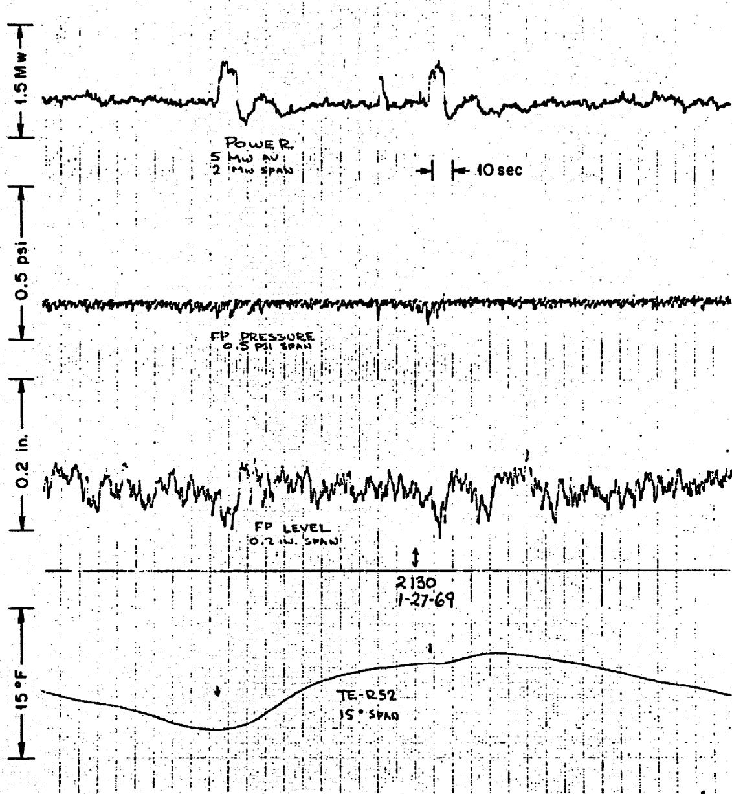  
Fig. 20. Recorder Chart Showing Nuclear Power, Fuel-Pump Pressure, Indicated Fuel-Pump Level and Thermocouple at Bottom of Access Plug During Blips

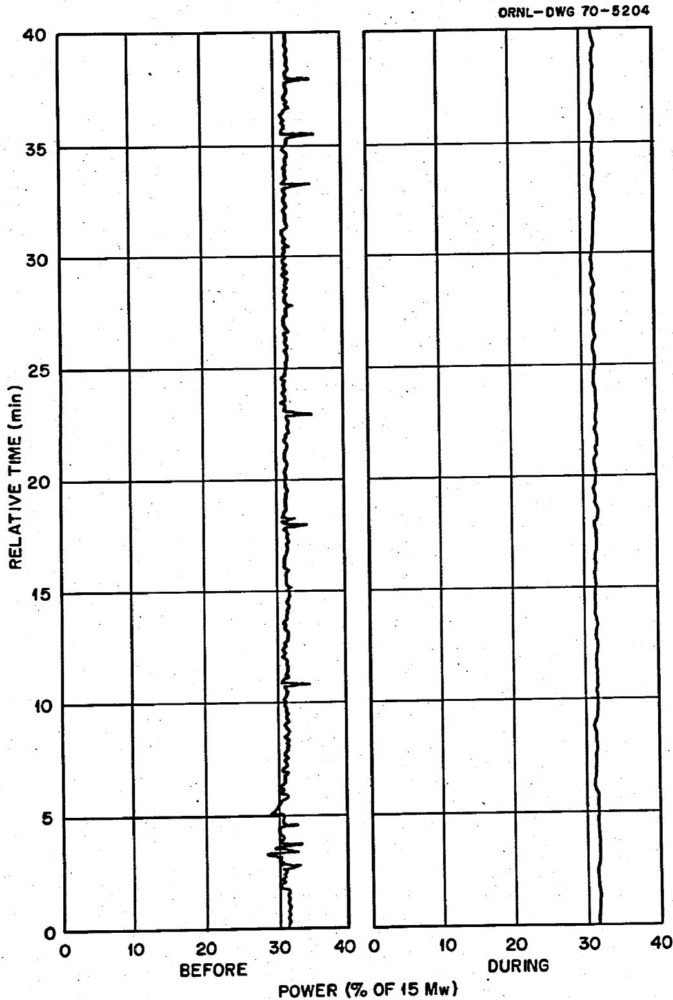  
Fig. 21. Linear Power Record Before and During a Beryllium Exposure

Table 3   
MSRE Redox Experiments with $^{233}\mathrm{U}$ Fuel   

<table><tr><td>Date</td><td>Active Agent</td><td>Incremental Reduction Attained</td><td>Nominal Purpose</td></tr><tr><td></td><td></td><td>(gram equivalents)</td><td></td></tr><tr><td>9/14/68</td><td>Be</td><td>2.24</td><td>Reduce some U4+ to U3+</td></tr><tr><td>10/13-14/68</td><td>Be</td><td>1.85</td><td>Reduce some U4+ to U3+</td></tr><tr><td>11/15/68</td><td>Be</td><td>2.08</td><td>Reduce some U4+ to U3+</td></tr><tr><td>11/21/68</td><td>Be(a)</td><td>0.22</td><td>Recover magnetic reduction products</td></tr><tr><td>1/24/69</td><td>Be</td><td>1.90</td><td>Reduce some U4+ to U3+</td></tr><tr><td>1/29/69</td><td>Cr</td><td>0.18</td><td>Observe effects of mild reductant</td></tr><tr><td>4/15,17/69</td><td>Zr</td><td>0.89</td><td>Observe effects of mild reductant</td></tr><tr><td>4/24-25/69</td><td>Zr</td><td>1.05</td><td>Observe effects of mild reductant</td></tr><tr><td>5/8/69</td><td>FeF2</td><td>-0.64</td><td>Oxidize some U3+ to U4+</td></tr><tr><td>5/15/69</td><td>Be</td><td>1.26</td><td>Reduce some U4+ to U3+</td></tr><tr><td>5/20/69</td><td>Be(b)</td><td>0.70</td><td>Measure interfacial tension of fuel</td></tr><tr><td>9/12-26/69</td><td>Zr(c)</td><td>0.08</td><td>Six Ru additions to fuel salt</td></tr><tr><td>10/2/69</td><td>Be(b)</td><td>0.56</td><td>Measure interfacial tension of fuel salt with Be0 present</td></tr><tr><td>10/7-8/69</td><td>Be</td><td>1.09</td><td>Reduce some U4+ to U3+</td></tr><tr><td>10/21/69</td><td>Nb</td><td>&lt;0.01</td><td>Observe salt wetting characteristics</td></tr><tr><td>11/29/69</td><td>Be</td><td>1.55</td><td>Reduce some U4+ to U3+</td></tr><tr><td>12/9/69</td><td>Be</td><td>2.20</td><td>Reduce some U4+ to U3+</td></tr><tr><td>12/9/69</td><td>Be(b)</td><td>0.67</td><td>Measure interfacial tension of fuel salt with Be0 present</td></tr></table>

(a) Assembly contained several magnets for purpose indicated.   
$(b)_{\text{Assembly}}$ contained a graphite body for purpose indicated.   
(c) Present as window covers on Ni capsules.

With the exception of the two major zirconium exposures, there was no discernible effect on the void behavior in any of the last experiments. There may have been some decrease in the void fraction in the pump bowl but the effect did not carry over into the circulating loop.

Within two hours after the start of the first zirconium exposure (4/15/69) the circulating void fraction began to decrease significantly and then recovered to its original value. The entire transient required less than 1 hr for a decrease and recovery of $0.4\mathrm{vol}\%$ in void fraction. Within 30 min after this transient, the exposure was interrupted by an unscheduled drain of the fuel salt (due to a local electric power outage). The exposure was continued after the loop had been refilled but this time there was no discernible effect. The second zirconium exposure (4/24/69) began to affect the circulating void fraction within 35 min; a decrease of $0.4\mathrm{vol}\%$ occurred and remained as long as the zirconium was in the salt. This zirconium assembly was withdrawn once and reinserted during the exposure. The circulating void fraction responded promptly to both actions, increasing when the zirconium was removed and decreasing when it was reinserted. This behavior was similar to that observed in the third beryllium exposure described earlier.

# 8. HYPOTHESES AND CONCLUSIONS

Although the primary purpose of this report is to record, under one cover, the observations and experience related to a particular aspect of the MSRE operation, some conclusions can be drawn about the mechanisms that contributed to this experience. Some of these conclusions are relatively firm while others must be regarded as hypotheses.

It is clear from the appearance of objects exposed in the gas space in the fuel pump that there was a fairly high concentration of mist inside the shield around the sampler cage. It must have been higher out in the pump bowl, although it could hardly have been high enough to contribute significantly to the observed transfer to the overflow tank. A small (perhaps surprisingly small) amount of the mist was drawn into the offgas line where it contributed to the plugging near the pump bowl. The problems engendered by the mist in the MSRE pump were not intolerable, but they did illustrate the need for effective mist protection in molten-salt systems.

The pump-bowl bubblers indicated rather conclusively that, whenever the pump was running, for several inches below the surface there was a region that contained a high (up to 50 vol %) void fraction. This high void fraction apparently raised the actual salt level in the pump bowl high enough to cause some spill-over into the overflow line, which probably accounted for most of the salt transfer to the overflow tank. That only a small fraction of the pump-bowl gas appeared in the circulating loop as bubbles is due to the fact that the normal pump speed was just below a sharp threshold for bubble ingestion. The gas ingestion and the general behavior of the circulating voids are all readily explained by ordinary hydrodynamic principles provided that gas solubility effects are included.

The explanation for the shift in the circulating void fraction from a very small value with $^{235}\mathrm{U}$ fuel to a higher value with $^{233}\mathrm{U}$ fuel is most likely small differences in the physical properties of the two salts. We know that the salt densities were different, and small differences in viscosity and surface tension would not be surprising. Since the threshold for bubble ingestion was very steep, only small differences would be required to produce a pronounced effect on the void fraction. However,

in the absence of precise physical-property data, we can only speculate about the significance of such effects.

It appears from the various correlations that the redox condition of the salt may have been a significant factor in the bubble behavior, presumably through changes in surface tension and/or viscosity. Although recognition of the possibility of such a correlation has led to some studies, a thorough understanding of this area has yet to be gained.

# APENDIX A

# MATERIALS RECOVERED FROM FUEL RUMP BOWL

Many of the capsules used for special exposures in the pump bowl were examined in detail in hot cells after their recovery. The principal findings of these examinations have been reported elsewhere. $^{1,2}$ Inasmuch as the wetting of the capsules by the liquid, the presence of floating solids, and indications on the capsules of salt level and foam are clues to the conditions in the pump bowl which are the subject of this report, some pertinent information which is not fully described elsewhere is presented in this section.

During the years of operation with $^{235}\mathrm{U}$ fuel, practically all of the objects exposed in the fuel pump came out relatively clean except for very light deposits of what appeared to be droplets of salt. The perforated capsules used to expose beryllium were unusually radioactive due to fission product deposition and some contained deposits high in chromium but the outsides were relatively clean in appearance. After the fuel processing and $^{233}\mathrm{U}$ loading, the experience with ordinary sample capsules was similar, in that no unusual deposits were observed, but the appearances of the capsules used to expose reducing agents were markedly different.

Figures A-1 through A-5 are representative of the appearance of cages used for beryllium exposures after the fuel processing and the $^{233}\mathrm{U}$ loading. The first two show overall views of the cages used for the second and fourth exposures (Oct. 13 and Nov. 21, 1968). Both show very heavy deposits on the outside and Fig. A-2 shows the presence of a considerable amount of white salt. In general, the deposits were predominantly salt with a covering of dark scum. The tops of both of these capsules were relatively clean, suggesting that they were not totally immersed in the salt. However, the absence of a distinct "water mark" indicates that the salt-gas interface was not sharp and constant, even inside the sampler shroud.

The next three figures are closeup views of three beryllium cages. Figure A-3 shows the inside of the cage used in the second beryllium exposure. The deposit is at least as heavy as on the outside. The cage in Fig. A-4 was used for the third beryllium exposure. This view clearly shows the white salt deposit and the overlying scum. The relatively smooth dispersion of the salt phase suggests wetting of the nickel surface - a condition that did not normally prevail. The top of the cage used for the fourth beryllium exposure is shown in Fig. A-5. The deposits on the cap suggest residues from crunchy bubbles that burst on the surface.

The deposits on the cages were leached off and analyzed chemically. Such analyses confirmed that the bulk of the deposits was fuel salt, but large amounts of structural metals were also found. For example, the deposit on the cage used for the first beryllium exposure contained $8\%$ Ni, $0.1\%$ Cr, and $12\%$ Fe. The relative abundances tended to eliminate foreign materials (e.g. stainless steel) as sources of the metals. In addition, the high concentrations of Fe and Ni suggested either that the salt was in an off-equilibrium redox state or that significant amounts of the free metals were present in the salt.

Some characteristic results of attempts to recover free metallic particles from the fuel salt are shown in Figs. A-6 through A-10. Figure A-6 is the result of the first attempt using a 1/2-in.-diam x 4-in. long Alnico-V magnet in a copper capsule. Although some magnetic material was trapped in the 5-min exposure, the amount was not impressive, probably less than 1 gram. Figures A-7 and A-8 are two views of another attempt shortly after a beryllium exposure. This time, somewhat more material was collected but the difference was not enough to be significant. A capsule containing both magnets and some beryllium was also exposed. The result (Fig. A-9) was much like any other beryllium exposure but little magnetic material was collected. Another stack of short magnets was exposed at the start of Run 16, just after the loop had been filled but prior to any salt circulation. The presence of some magnetic particles (Fig. A-10) suggested that at least some of this material was floating on the salt surface.

As indicated in the body of this report, some relatively mild reducing agents were exposed to fuel salt in the pump bowl. Figures A-11

and A-12 show a chromium rod after about 6 hours' exposure to the salt. There was little attack on the Cr but both kinds of deposit, salt and crud, appeared. In this case, however, the salt appeared to be non-wetting. The fractured surface in Fig. A-12 (broken as part of the post-exposure examination) shows a black deposit on the lateral surfaces.

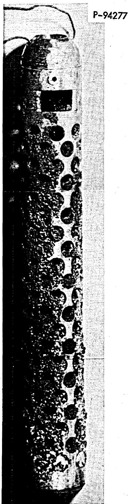  
Fig. A-1. Nickel Cage from Second Beryllium Exposure in $^{233}\mathrm{U}$ Fuel Salt

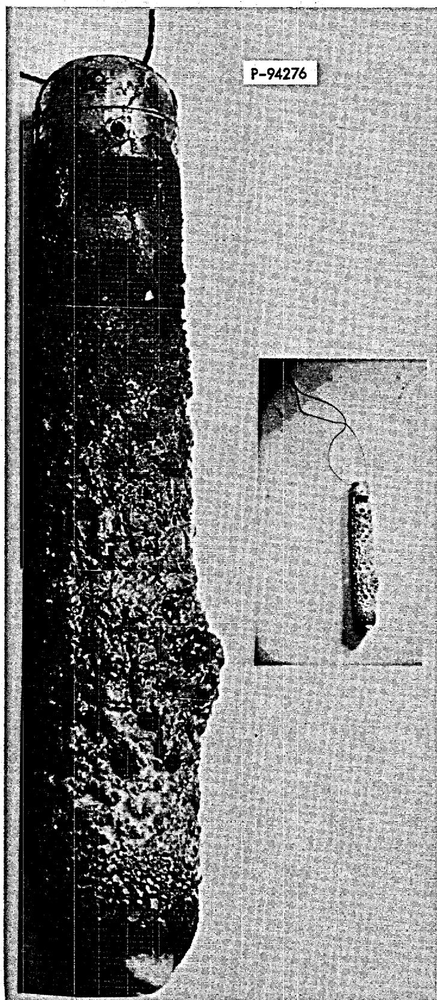  
Fig. A-2. Nickel Cage from Fourth Beryllium Exposure in $^{233}\mathrm{U}$ Fuel Salt

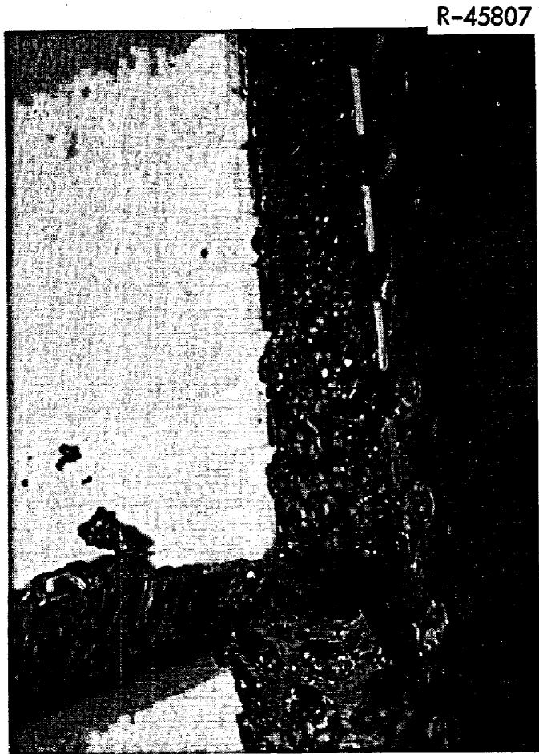  
Fig. A-3. Inside of Nickel Cage from Second Beryllium Exposure in $^{233}\mathrm{U}$ Fuel Salt

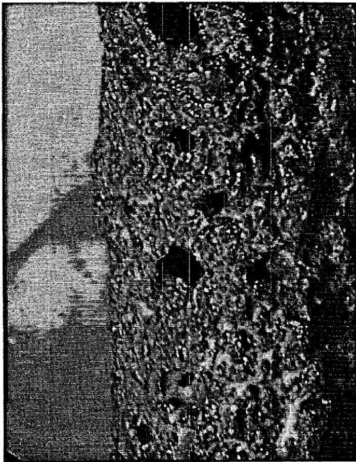  
Fig. A-4. Side of Nickel Cage from Third Beryllium Exposure in $^{23}\mathrm{U}$ Fuel Salt

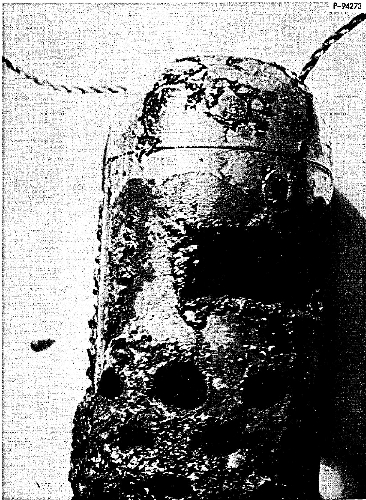  
Fig. A-5. Top of Nickel Cage from Fourth Beryllium Exposure in $^{233}\mathrm{U}$ Fuel Salt

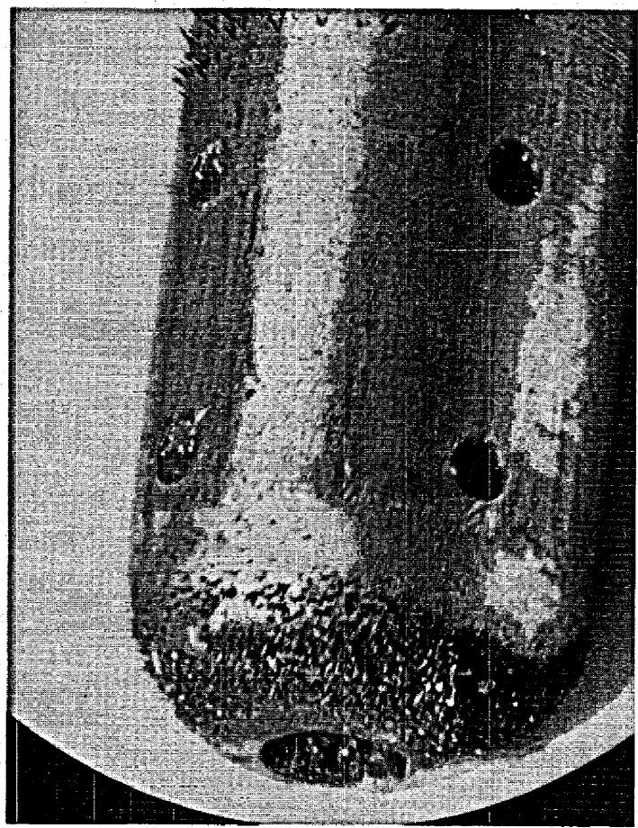  
Fig. A-6. Metallic Particles on Copper Capsule Used to Expose a Magnet in 233U Fuel Salt

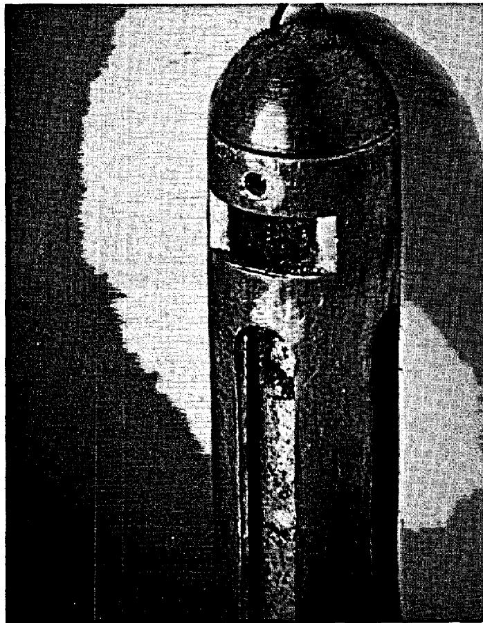  
Fig. A-7. Upper End of Magnet Capsule

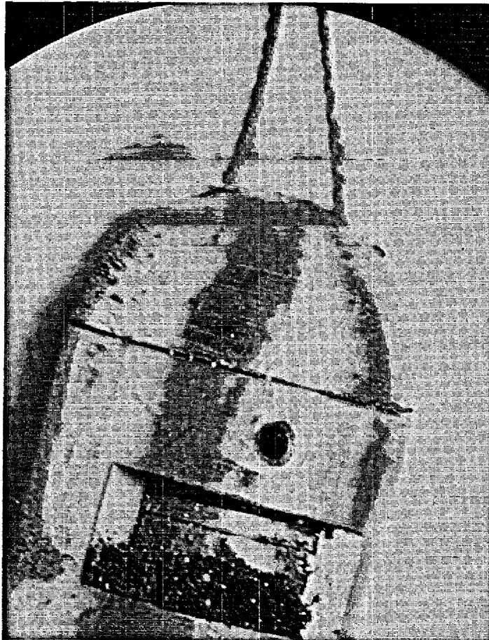  
Fig. A-8. Upper End of Magnet Capsule Showing Collected Material

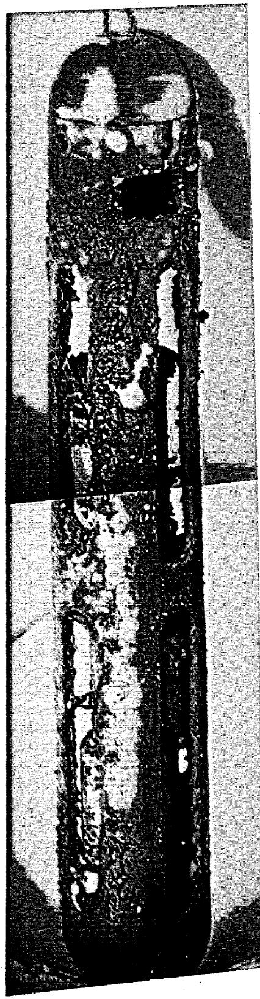  
Fig. A-9. Capsule Used to Expose Beryllium and Magnets Simultaneously

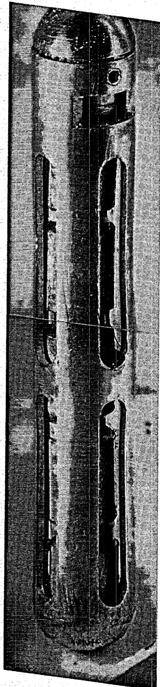  
Fig. A-10. Capsule Containing Several Short Magnets

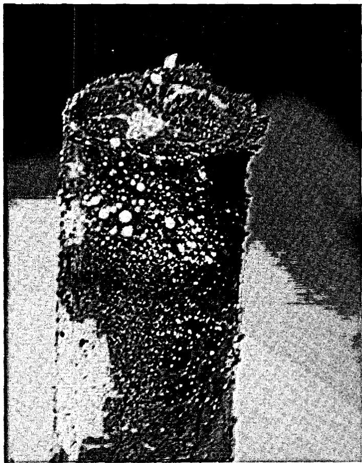  
Fig. A-ll. Chromium Rod Exposed to $^{233}\mathrm{U}$ Fuel Salt

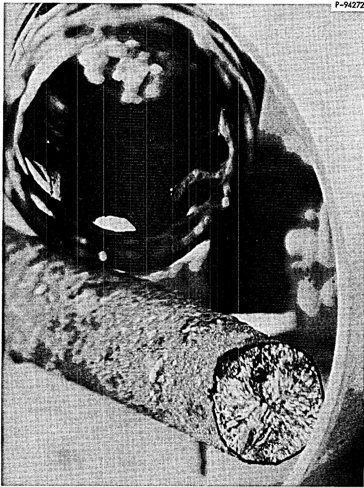  
Fig. A-12. Cross Section of Chromium Rod Showing Surface Deposit

# APENDIX B

# MSRE SALT DENSITIES

As was explained in Chapter 4, the fuel-pump bubblers could be used when the pump was not running to measure absolute salt densities and results were obtained that compared favorably with those produced by other methods. Table B-1 summarizes the densities for the various salts used in the MSRE as determined by several different methods. Since only the bubbler-difference technique is described in detail in this report, a brief discussion is given below for each of the other methods.

# Salt Charging

The amounts of flush salt and fuel carrier salt initially loaded into the MSRE were carefully weighed during the charging operation. Since both salts were loaded into FD-2, it was possible to use the two level probes in that tank as a volume measurement. The weight of salt required to fill the space between the probes (62.38 ft³ at 1200°F) was used to calculate the salt densities.

# Fill of Primary Loop

After the primary loop was filled, the pressures in the fuel pump and drain tank were balanced to hold a constant salt level while the loop drain valve (FV-103) was frozen. The pressure difference required to support a column of salt $\sim 25$ ft high then gave a measure of salt density.

# Addition of Molar Volumes

Effective molar volumes have been developed for the various pure components of molten fluoride mixtures. These volumes are weighted with the component mol fraction and added to obtain mixture densities at temperature.

# Table B-1

# Densities of MSRE Salts

<table><tr><td>Salt Mixture</td><td>Fuel Carrier</td><td>Flush</td><td>235U Fuel</td><td>233U Fuel</td></tr><tr><td>Method</td><td></td><td colspan="3">Density at 1200°F (lb/ft3)</td></tr><tr><td>Salt Charging</td><td>140.5</td><td>124a</td><td></td><td></td></tr><tr><td>Fill of Primary Loop</td><td></td><td>121 - 123</td><td>140</td><td>135 - 136</td></tr><tr><td>Fuel Pump Bubblers</td><td></td><td>126 - 128</td><td>145 - 147</td><td>141 - 143</td></tr><tr><td>Molar Volumesb</td><td></td><td>121 - 122</td><td>142 - 146c</td><td></td></tr><tr><td>Method of Mixtures</td><td></td><td>121</td><td>145</td><td>135</td></tr><tr><td>Laboratory Measurement</td><td></td><td>124</td><td>146.5</td><td></td></tr></table>

aThis method was also applied to the coolant salt which has the same composition; a density of 121.8 lb/ft³ was obtained at 1239°F.   
b. Densities obtained by this method are generally regarded as the most accurate, at least in the absence of direct measurements.   
${}^{\mathrm{c}}\mathrm{A}$ more recent (2/25/69) calculation using better data gave ${140}\mathrm{{lb}}/{\mathrm{{ft}}}^{3}$ .

# Method of Mixtures

This method is based on an empirical correlation between measured densities of liquid fluoride mixtures and calculated room-temperature densities. The room-temperature densities are obtained by addition of actual densities of the pure solid components, weighted by their mol fractions.

# Laboratory Measurements

These are results of direct measurements made in the laboratory3 under carefully controlled conditions.

# Discussion

Each of the above approaches to density evaluation has limitations which become apparent when the details of the method are examined. However, it is not our purpose to evaluate or criticize the various methods. Nevertheless, the table illustrates that the highly precise values needed for accurate inventory control were not readily available during the operation of the MSRE.

# Internal Distribution

1. J. L. Anderson   
2. R.F.Apple   
3. C.F.Baes   
4. C.E.Bamberger   
5. C.J. Barton   
6. H.F. Bauman   
7. S.E.Beall   
8. M. Bender   
9. E. S. Bettis   
10. F. F. Blankenship   
11. R. Blumberg   
12. E. G. Bohlmann   
13. G.E. Boyd   
14. J. Braunstein   
15. M.A.Brec   
16. R. B. Briggs   
17. G. D. Brunton   
18. S. Cantor   
19. J. M. Chandler   
20. R.H. Chapman

21-22. D. F. Cope, AEC-OSR

23. E. L. Compere   
24. W.B.Cottrell   
25. L. T. Corbin   
26. J. L. Crowley   
27. F. L. Culler   
28. D.R.Cuneo   
29. J.M. Dale   
30. A.R. Degrazia, AEC-Washington   
31. S.J.Ditto   
32. F. A. Doss   
33. A. S. Dworkin   
34. W. P. Eatherly   
35. Davis Elias, AEC-Washington

36-40. J.R. Engel

41. Ronald Feit, AEC-Washington   
42. D. E. Ferguson   
43. L. M. Ferris   
44. J. E. Fox, AEC-Washington   
45. A. P. Fraas   
46. J. K. FranzreB   
47. D. N. Fry   
48. C. H. Gabbard   
49. R.B. Gallaher   
50. L. O. Gilpatrick

51. G. Goldberg   
52. W.R. Grimes - G. M. Watson   
53. A. G. Grindell   
54. E. D. Gupton   
55. R.H.Guymon   
56. Norton Haberman, AEC-Washington   
57. P.H.Harley   
58. P. N. Haubenreich   
59. H.W. Hoffman   
60. A. Houtzeel   
61. T. L. Hudson   
62. E. B. Johnson   
63. S. I. Kaplan   
64. P.R. Kasten   
65. R.J. Kedl   
66. M. T. Kelley   
67. M.J. Kelly   
68. T. W. Kerlin   
69. H. T. Kerr   
70. S. S. Kirslis   
71. H. W. Kohn   
72. A. I. Krakoviak   
73. T. S. Kress   
74. R.C. Kryter   
75. C.E. Lamb   
76. Kermit Laughon, AEC-OSR   
77. J. Lowin   
78. R.B. Lindauer   
79. M. I. Lundin   
80. R. N. Lyon   
81. R.E. MacPherson   
82. D. L. Manning   
83. H.E. McCoy   
84. H.C.McCurdy   
85. C. K. McGlothlan   
87. T. W. McIntosh, AEC-Washington   
88. H.A.McIain   
89. L.E. McNeese   
90. J.R. McWherter   
91. A. S. Meyer   
92. A.J.Miller   
93. R. L. Moore   
94. D.M. Moulton   
95. E. L. Nicholson   
96. A.M. Perry

# Internal Distribution

# (continued)

97. G. L. Ragan   
98. J. L. Redford   
99. D. M. Richardson

100. M. Richardson

101. D.R.Riley, AEC-Washington   
102. J. C. Robinson

103-105. M. W. Rosenthal

106. A.W. Savolainen   
107. T. G. Schleiter, AEC-Washington   
108. J. J. Schreiber, AEC-Washington   
109. Dunlap Scott   
110. J.H.Shaffer   
111. M. Shaw, AEC-Washington   
112. M. J. Skinner   
113. A. N. Smith

114. P.G. Smith   
115. I. Spiewak   
116. D. A. Sundberg   
117. J.R. Tallackson   
118. R.E.Thoma   
119. D. B. Trauger   
120. W.C.Ulrich   
121. C. S. Walker   
122. A. M. Weinberg   
123. J. R. Weir   
124. M.E.Whatley   
125. J.C. White   
126. M.J.Whitman,AEC-Washington   
127. L.V. Wilson   
128. Gale Young

129-130. Central Research Library (CRL)   
131-132. Y-12 Document Reference Section (DRS)   
133-135. Laboratory Records Department (IRD)   
136. Laboratory Records Department, Record Copy (IRD-RC)

# External Distribution

137. R.C. Steffy, Jr., TVA-303 Power Building

Chattanooga, Tennessee, 37401

138-152. Division of Technical Information Extension (DTIE)

153. Laboratory and University Division, ORO