ORNL-TM-3039

Contract No. W-7405-eng-26

Reactor Division

MSRE SYSTEMS AND COMPONENTS PERFORMANCE

by

Molten-Salt Reactor Experiment Staff

#

Edited and Compiled by

R. H. Guymon

JUNE 1973

NOTICE: This document contains information of a preliminary nature and was prepared primarily for internal use at the Oak Ridge National Laboratory. It is subject to revision or correction and therefore does not represent a final report.

OAK RIDGE NATIONAL LABORATORY

Oak Ridge, Tennessee 37830

operated by

UNION CARBIDE CORPORATION

for the

U. S. ATOMIC ENERGY COMMISSION

# -NOTICE

This report was prepared as an account of work sponsored by the United States Government. Neither the United States nor the United States Atomic Energy Commission, nor any of their employees, nor any of their contractors, subcontractors, or their employees, makes any warranty, express or implied, or assumes any legal liability or responsibility for the accuracy, completeness or usefulness of any information, apparatus, product or process disclosed, or represents that its use would not infringe privately owned rights.

中

# CONTENTS

# ABSTRACT 1

1. INTRODUCTION 3   
2. DESCRIPTION OF THE PLANT 4   
3. CHRONOLOGY OF OPERATION AND MAINTENANCE 9  
4. PLANT PERFORMANCE AND STATISTICS. 15

4.1 Cumulative Statistics. 15   
4.2 Availability during Various Periods. 18   
4.3 Interruptions of Operations. 22   
4.4 Time Required for Operational Tasks. 48   
4.5 Changes Made in the Plant. 59   
4.6 Tabulation of Recorded Variables at Full Power 63

5. FUEL SYSTEM 89

5.1 Description. 89   
5.2 Purging of Moisture and Oxygen from the System 89   
5.3 Fuel-Circulating-System Volume Calibration 91   
5.4 Drain Times. 91   
5.5 Mixing of Fuel and Flush Salts 93   
5.6 Primary System Leak. 93   
5.7 Operation 94   
5.8 Fuel Pump and Overflow Tank. 94   
5.9 Primary Heat Exchanger 110   
5.10 Reactor Vessel and Reactor Access Nozzle 112   
5.11 Fuel and Flush Salt Drain Tanks. 129

6. COOLANT SYSTEM 137

6.1 Description 137   
6.2 Purging Moisture and Oxygen from the System. 137   
6.3 Coolant Circulating System Calibration and Drain Time. 137   
6.4 Operation. 139   
6.5 Coolant Salt Circulating Pump. 139   
6.6 Radiator 140   
6.7 Performance of Main Blowers, MB-1 and MB-3 147   
6.8 Coolant Drain Tank 159

7. COVER-GAS SYSTEM 161

7.1 Initial Testing 161   
7.2 Normal Operation 162   
7.3 Conclusions and Recommendations. 164

Page

# 8. OFF-GAS SYSTEM 165

8.1 Description. 165   
8.2 Experience with Coolant Salt Off-gas System. 167   
8.3 Experience with the Fuel Off-Gas System. 173   
8.4 Difficulties with the Fuel Off-gas System. 177   
8.5 Subsequent Operating Experience with Fuel Off-gas System 201   
8.6 Discussion and Conclusions 212

# 9. FUEL AND COOLANT PUMP LUBE OIL SYSTEMS. 215

9.1 Description. 215   
9.2 Installation and Early Problems. 215   
9.3 Addition of Syphon Tanks to the Oil Catch Tanks. 216   
9.4 Oil Leakage. 217   
9.5 Change-out of Oil Pumps. 218   
9.6 Test Check of One Oil System Supplying Both the Fuel and Coolant Salt Pumps 218   
9.7 Oil Temperature Problems 218   
9.8 Increase in Radiation Levels at the Lube Oil Packages. 219   
9.9 Analysis of Oil. 220   
9.10 Replacement of Oil 220   
9.11 Discussion and Recommendations 222

# 10. COMPONENT COOLING SYSTEMS 223

10.1 Primary System 223   
10.2 Secondary System 231

# 11. VENTILATION SYSTEM 232

11.1 Description. 232   
11.2 Operating Experience 232   
11.3 Conclusions and Recommendations. 235

# 12. WATER SYSTEMS 237

12.1 Potable Water System 237   
12.2 Process Water System 238   
12.3 Cooling Tower Water System 239   
12.4 Treated Water System 240   
12.5 Condensate System 245   
12.6 Nuclear Instrument Penetration 245   
12.7 General Water Systems Conclusions. 246

# 13. LIQUID WASTE SYSTEM 247

13.1 Description. 247   
13.2 Preliminary Testing. 247   
13.3 Operating Experience 248

# 14. HELIUM LEAK DETECTOR SYSTEM 251

14.1 Description and Method of Operation. 251   
14.2 Calibration 251   
14.3 Operating Experience 255   
14.4 Discussion and Recommendations 256

# Page

# 15. INSTRUMENT AIR SYSTEM 259

15.1 Description 259   
15.2 Operating Experience 259   
15.3 Conclusions. 260

# 16. ELECTRICAL SYSTEM 261

16.1 Description. 261   
16.2 Alternating Current System 262   
16.3 250-V dc System. 265   
16.4 Reliable Power System. 265   
16.5 48-V dc System 266   
16.6 Diesel Generators. 267   
16.7 100-kVa Variable Frequency Motor-Generator Set 267   
16.8 Conclusions. 268

# 17. HEATHERS 269

17.1 Description. 269   
17.2 Preoperational Checkout. 273   
17.3 System Heatup. 273   
17.4 Heater Performance 278   
17.5 Systems Cooldown Rate. 287   
17.6 Discussion 291

# 18. SAMPLERS. 292

18.1 Fuel Sampler-Enricher. 292   
18.2 Coolant Sampler. 320

# 19. CONTROL RODS. 323

19.1 Description. 323   
19.2 Initial Testing. 324   
19.3 Periodic Testing 325   
19.4 Operating Experience 326   
19.5 Improved Rod Scram Testing 336   
19.6 Maintenance Experience 338   
19.7 Discussion and Recommendations 339

# 20. FREEZE VALVES 341

20.1 Introduction 341   
20.2 Description of the Design of the Freeze Valves 341   
20.3 Description of the Operation of the Freeze Valves.. 344   
20.4 Operating Experience 346   
20.5 Recommendations. 353

# 21. FREEZE FLANGES. 356

21.1 Description. 356   
21.2 Operation. 356   
21.3 Conclusions. 358

22. CONTAINMENT 360

22.1 Description and Criteria 360   
22.2 Methods Used to Assure Adequate Containment and Results. 360   
22.3 Discussion of Cell Leak Rate Determination 370   
22.4 Vapor Condensing System 376   
22.5 Recommendations. 377

23. BIOLOGICAL SHIELDING AND RADIATION LEVELS 380

23.1 Radiation Surveys - Approach to Power. 380   
23.2 Radiation Levels During Operation. 383   
23.3 Conclusions. 386

24. INSTRUMENTATION 389

24.1 Introduction 389   
24.2 Description. 389   
24.3 Initial Checkout and Startup Tests 393   
24.4 Periodic Testing 394   
24.5 Performance of the Nuclear Safety Instrumentation.. 397   
24.6 Performance of the Wide-Range Counting Channels.. 400   
24.7 Performance of the Linear Power Channels 402   
24.8 BF, Nuclear Instrumentation. 403   
24.9 Nuclear Instrument Penetration 403   
24.10 Performance of the Process Radiation Monitors. 403   
24.11 Performance of the Personnel Radiation Monitoring and Building Evacuation System 404   
24.12 Performance of the Stack Monitoring System 404   
24.13 Performance of Thermocouples and the Temperature Readout and Control Instrumentation. 404   
24.14 Performance of Pressure Detectors. 408   
24.15 Performance of Level Indicators 408   
24.16 Performance of the Drain Tank Weighing Systems 409   
24.17 Performance of the Coolant Salt Flowmeters 410   
24.18 Performance of Relays. 411   
24.19 Training Simulation 411   
24.20 Miscellaneous 412   
24.21 Conclusions and Recommendations. 412

REFERENCES 413

# ABSTRACT

When the MSRE was shut down in December 1969, it had accumulated 13,172 full-power hours of operation. Salt had been circulated in the fuel system for 21,788 hours and in the coolant system for 26,076 hours.

Essentially no difficulty was encountered with the primary system during operation. After the reactor was shut down there was an indication of a leak in the drain-tank piping at/or near a freeze valve. Further investigation will be made later as to the nature and cause of this leak.

There was a small continuous leakage of lubricating oil into the fuel pump throughout the operation. This, together with salt mist, caused periodic plugging in the off-gas system which was designed for clean helium. Filters installed in the main lines proved very effective.

In early operation, difficulty was encountered with the coolant radiator. The doors would not seal, there were too many air leaks, and thermal insulation was inadequate. After these were repaired, the system operated fine except for a failure of one of the main blowers and some trouble with the blower bearings.

Only relatively minor difficulties were encountered with the containment and other systems.

# 1. INTRODUCTION

# P. N. Haubenreich

Operation of the MSRE constituted a major step toward the objectives of the Molten-Salt Reactor Program. The goal of this program is the development of large, fluid-fuel reactors having good neutron economy and producing low-cost electricity.1 The MSRE was built to demonstrate the practicality of the molten-salt reactor concept, with emphasis on the compatibility of the materials (fluoride salts, graphite, and container alloy), the performance of key components, and the reliability and maintainability of the plant.

In the course of 5 years of testing and operation of the MSRE (1964 - 1969) the operators accumulated considerable experience with the various components and systems in the reactor plant. This experience, properly disseminated, should be valuable in the continuing development of molten-salt reactors. Much has already been published in the Molten Salt Reactor Program semiannual progress reports (Refs. 2 to 14) but such reporting is piecemeal and sometimes rather condensed. On the other hand, there is much very detailed information in test reports and operations and maintenance files, but these are relatively inaccessible and specific information is tedious to extract. It was considered worthwhile, therefore, to extract, organize, evaluate and report the experience with MSRE systems and components.

The purpose of this report is to present a convenient, comprehensive description of the MSRE experience. The first chapters briefly describe the plant and outline the chronology of its operation. Next there is a chapter on the overall plant performance, including statistics relative to reliability and maintainability. The chapters which follow are each devoted to one system or component. Finally, there is a chapter of discussion and conclusions.

# 2. DESCRIPTION OF THE PLANT

R. H. Guymon

The MSRE was a single-region, circulating molten-salt fueled, thermal reactor which produced heat at the rate of about 8 Mw. The fuel was $\mathrm{UF}_4$ in a carrier salt of LiF-BeF $_2$ -ZrF $_4$ . At the operating temperature of $1200^{\circ}\mathrm{F}$ , this salt is a liquid which has very good physical properties: viscosity about 8 centipoise, density about 135 lb/ft $^3$ , and vapor pressure less than 0.1 mm Hg.

The design conditions are shown in the flow diagram (Fig. 2-1). The general arrangement of the plant is shown in Fig. 2-2. The salt-containing piping and equipment was made of Hastelloy-N, a nickel-molybdenum-iron-chromium alloy with exceptional resistance to corrosion by molten fluorides and with high strength at high temperature.

In the reactor primary system, the fuel salt was recirculated by the sump-type centrifugal pump through the shell-and-tube heat exchanger and the reactor vessel. The 5-ft diam. by 8-ft high reactor vessel is shown in Figure 2-3. It was filled with 2-in. by 2-in. graphite moderator stringers which had grooves machined in the sides to form flow channels for the fuel salt. Since the graphite is compatible with the molten salt, it was possible to use unclad graphite which is desirable to obtain good neutron economy. The heat generated in the fuel salt as it passed through the reactor was transferred in the heat exchanger to a molten LiF-BeF $_2$ coolant salt. The coolant salt was circulated by means of a second sump-type pump through the heat exchanger and through the radiator. Air was blown by two axial flow blowers past the radiator tubes to remove the heat which was sent up the coolant stack where it was dissipated to the atmosphere.

Drain tanks were provided for storing the fuel and coolant salts at high temperature when the reactor was not operating. LiF-BeF $_2$ flush salt used for flushing the fuel system before and after maintenance was stored in the fuel flush tank. The salts were drained by gravity. They were transferred back to the circulating systems by pressurizing the tanks with helium.

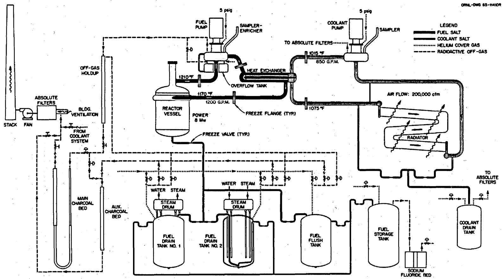  
Fig. 2.1 Design Flowsheet of the MSRE

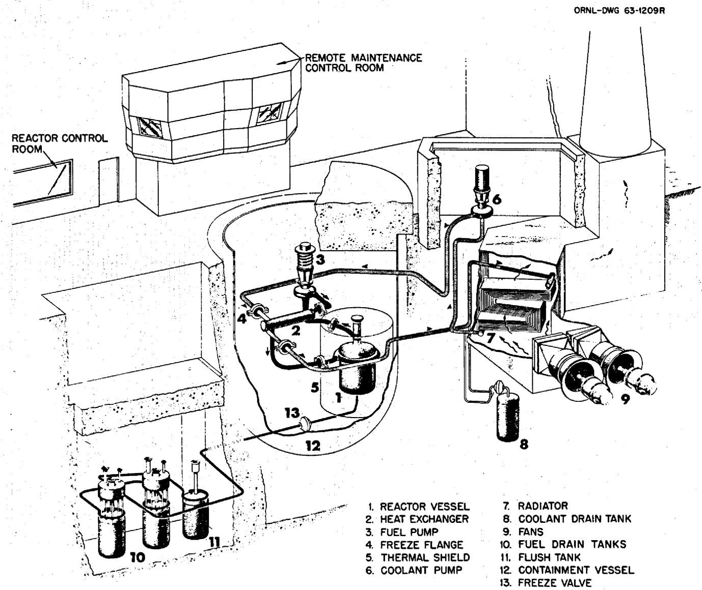  
Fig. 2.2 Layout of the MSRE

ORNL-LR-DWG 61097R1A

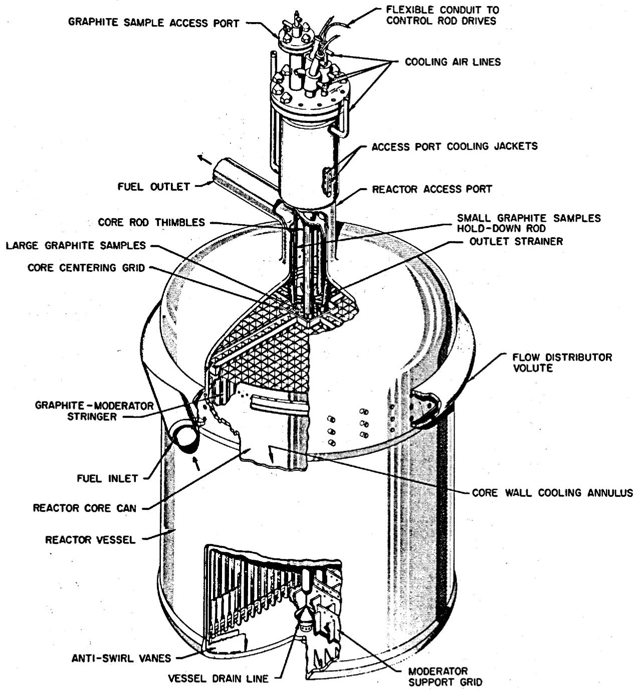  
Fig. 2.3 Details of the MSRE Core and Reactor Vessel

The fission product gases, krypton and xenon, were removed continuously from the circulating fuel salt by spraying salt at a rate of 50 gpm into the cover gas above the liquid in the fuel pump tank. There they transferred from the liquid to the gas phase and were swept out of the tank by a small purge of helium. After a delay of about 1-1/2 hr in the piping, this gas passed through water-cooled beds of activated charcoal. The krypton and xenon were delayed until all but the $^{85}\mathrm{Kr}$ decayed and then were diluted with air and discharged to the atmosphere.

The fuel and coolant systems were provided with equipment for taking samples of the molten salt while the reactor was operating at power. The fuel sampler was also used for adding small amounts of fuel to the reactor while at power to compensate for burnup.

The negative temperature coefficient of reactivity of the fuel and graphite moderator made nuclear control of the system very simple. However, three control rods were provided for adjusting temperature, compensating for buildup of fission products, and for shutdown.

The plant was provided with a simple processing facility for treating full $75\text{-ft}^3$ batches of fuel salt with hydrogen fluoride or fluorine gases. The hydrogen fluoride treatment was for removing oxide contamination from the salt as $\mathrm{H}_2\mathrm{O}$ . The fluorine treatment utilized the fluoride volatility process for removing the uranium as $\mathrm{UF}_6$ .

Auxiliary systems included: (1) a cover-gas system with treating stations for removing oxygen and moisture from the helium cover gas; (2) two closed-loop oil systems for cooling the fuel and coolant pumps and providing lubrication to the bearings; (3) a closed loop component coolant system for cooling the control rods and other in-cell components; (4) several cooling water systems including a closed-loop treated water system for cooling certain in-cell equipment; (5) a ventilation system for contamination control; and (6) an instrument air system.

All of the primary salt system was located in the reactor and drain tank cells. These sealed pressure vessels provided secondary containment.

For a fuller description of the plant, see Reference 15.

# 3. CHRONOLOGY OF OPERATION AND MAINTENANCE

R. H. Guymon

Design of the MSRE began in the summer of 1960 and by August 1964, installation was far enough along to permit the planned non-nuclear testing16 to begin. Milestones that were passed in the years which followed are listed in Table 3-1.

Table 3-1. Milestones in MSRE Operation   

<table><tr><td>Salt first loaded into tanks</td><td>October 24, 1964</td></tr><tr><td>Salt first circulated through core</td><td>January 12, 1965</td></tr><tr><td>First criticality (235U)</td><td>June 1, 1965</td></tr><tr><td>First operation in megawatt range</td><td>January 24, 1966</td></tr><tr><td>Full power reached</td><td>May 23, 1966</td></tr><tr><td>Nuclear operation with 235U concluded</td><td>March 26, 1968</td></tr><tr><td>Strip uranium from fuel salt</td><td>August 23-29, 1968</td></tr><tr><td>First critical with 233U</td><td>October 2, 1968</td></tr><tr><td>Reach full power with 233U</td><td>January 28, 1969</td></tr><tr><td>Nuclear operation concluded</td><td>December 12, 1969</td></tr></table>

The activities during the period of non-nuclear testing, zero-power experiments, and preparation for power operation are outlined in Fig. 3-1.

During the prenuclear testing, except for the usual startup troubles due to early failures and instrument malfunctions, all systems operated well and there were no unanticipated problems in handling the molten salt. Some plugging of the offgas system valves and filters was encountered, but this did not seem serious.

Criticality was attained by adding $\mathrm{UF_4}$ -LiF enriching salt to the carrier salt. More uranium was added to bring the fuel gradually to the desired operating concentration while the control rods were calibrated and reactivity coefficients were measured. At the conclusion of the zero-power nuclear experiments the reactor was shut down to finish construction of the vapor-condensing system, to carry out some inspection, and to

# MSRE ACTIVITIES

# JULY 1964 — DECEMBER 1965

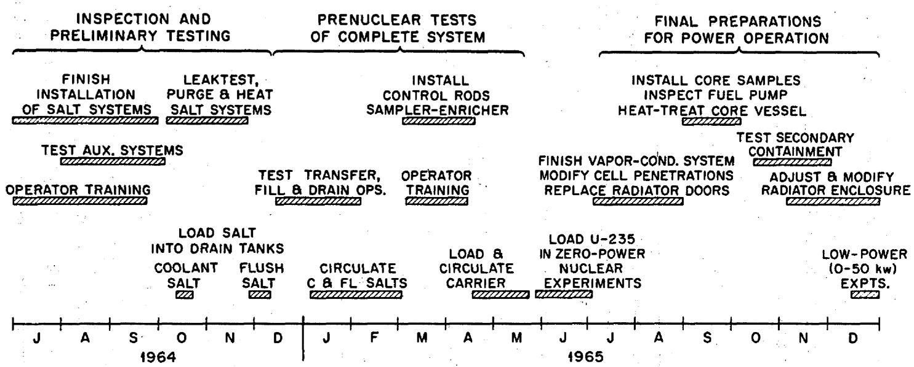  
Fig. 3.1 MSRE Activities July 1964 - December 1965

make some repairs and modifications, including replacement of the heatwarped radiator doors. The first test of the secondary containment was made during this shutdown period.

After tests in the kilowatt range showed that the dynamics of the system were as expected, the approach to full power was started in January 1966. Plugging in the fuel offgas system occurred immediately after increasing the power to one megawatt. Almost three months were spent investigating and remedying the offgas problem by installation of a large, efficient filter. As shown in Fig. 3-2, the power ascension was resumed in April and full power, which was limited by the capability of the heat-removal system, was attained in May.

High-power operation was abruptly halted in July when the hub and blades of one of the main blowers in the heat-removal system broke up. While the reactor was down, the array of graphite and metal specimens was removed from the core and a new array installed. During the flushing operations before the specimen removal, the fuel-pump bowl was accidentally over-filled and some flush salt froze in the attached gas lines. Temporary heaters were installed remotely to clear the lines and in November the offgas line at the pump bowl was cleared by running a tool through it.

Most of the remaining operation with $^{235}\mathrm{U}$ was at power. Restrictions continued to develop in the offgas system but caused little delay in the program. Shutdowns were necessary to make repairs on the fuel sampler-enricher, the component coolant pumps, and in-cell air line disconnects whose leakage caused an indication of high cell leak rate. The core specimens were replaced periodically, annual containment tests were made, and various experiments conducted. Operation with $^{235}\mathrm{U}$ fuel was terminated on March 26, 1968 so that the uranium could be stripped from the fuel salt and replaced with $^{233}\mathrm{U}$ .

During the shutdown which followed, the core specimens were replaced, and the fuel piping and vessels were surveyed using remote gamma ray spectroscopy to determine the distribution of fission products. Necessary and preventive maintenance was also done in preparation for operation with $^{233}\mathrm{U}$ fuel.

After testing and extensive modification of the excess fluorine disposal system, the flush salt and fuel salt were processed to strip the

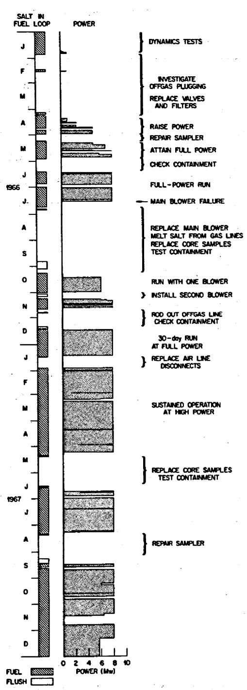

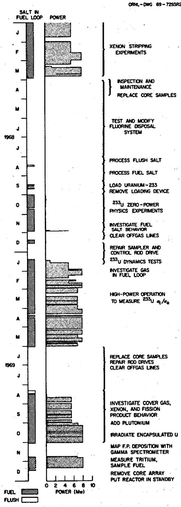  
Fig. 3.2 Outline of the Four Years of MSRE Power Operation

uranium and remove the corrosion products produced during the fluorination. $^{17}$ Loading of $^{233}\mathrm{U}$ into the carrier salt through special equipment attached to a drain tank began immediately thereafter. The cells were closed and leak-tested before the reactor was made critical by small additions of $^{233}\mathrm{U}$ through the sampler-enricher. On October 8, 1968, Glenn Seaborg manipulated the controls to raise the power to $100\mathrm{kw}$ , making the MSRE the world's first reactor to operate on $^{233}\mathrm{U}$ .

Early in the zero-power physics experiments, the amount of gas entrained in the circulating fuel had increased from $< 0.1$ to $\sim 0.5$ vol%. Investigation of this, as well as difficulties with the sampler-enricher and plugging in the offgas system, delayed the approach to full power until January 1969.

As the power was increased into the megawatt range, there were observed for the first time sporadic small increases (~ 5 to 10%) in nuclear power for a few seconds, occurring with a varying frequency somewhere around 10/hr. The characteristics of the transients pointed to changes in gas volume in the fuel loop and it appeared that they were most likely caused by occasional release of some gas that collected in the core. This hypothesis was supported when, late in February, a variable frequency generator was used to operate the fuel pump at reduced speed. The gas entrainment in the fuel circulating loop decreased sharply (from 0.7 to <0.1 vol %) and the perturbations ceased entirely.[18]

Operations continued at various nuclear powers and fuel-pump speeds until June 1 when the reactor was shut down to replace the core specimens, investigate the distribution of fission products in the primary loop by gamma scanning, remove the offgas restrictions, and test the secondary containment. For the first time one of the control rods did not scream and it was replaced during the shutdown.

The remaining months of operation were spent in various studies of the behavior of tritium, xenon, and certain other fission products in the reactor. In November it became evident that sufficient funds would not be available to continue operation, and on December 12, 1969 nuclear operation was concluded. Another first occurred shortly after the fuel was drained when a small amount of fission-product activity appeared in

the cell atmosphere, indicating a leak in the primary system apparently near a freeze valve.

After the final shutdown, the facility was placed in a standby condition to await post-operation examinations planned for early in the next fiscal year.[19] The operating crews were disbanded and over the next six months most of the engineers were reassigned as they completed analyses and reporting of the reactor experience. As of this writing, the post-operation examination has not been accomplished.

In this report and elsewhere MSRE run numbers are often used to identify the period of operation. Generally a new run number was assigned at the end of a major shutdown or when there were substantial changes in the purpose or type of operation. The starting dates for each of the 20 runs are listed in Table 3-2.

Table 3-2. Dates of MSRE Runs   

<table><tr><td>Run No.</td><td>Starting Datea</td><td>Run No.</td><td>Starting Datea</td></tr><tr><td>1</td><td>January 9, 1965</td><td>11</td><td>January 24, 1967</td></tr><tr><td>2</td><td>May 11, 1965</td><td>12</td><td>June 8, 1967</td></tr><tr><td>3</td><td>May 31, 1965</td><td>13</td><td>September 3, 1967</td></tr><tr><td>4</td><td>December 5, 1965</td><td>14</td><td>September 19, 1967</td></tr><tr><td>5</td><td>February 7, 1966</td><td>15</td><td>August 14, 1968</td></tr><tr><td>6</td><td>March 26, 1966</td><td>16</td><td>December 10, 1968</td></tr><tr><td>7</td><td>June 11, 1966</td><td>17</td><td>January 10, 1969</td></tr><tr><td>8</td><td>September 14, 1966</td><td>18</td><td>April 11, 1969</td></tr><tr><td>9</td><td>November 6, 1966</td><td>19</td><td>July 31, 1969</td></tr><tr><td>10</td><td>December 6, 1966</td><td>20</td><td>November 20, 1969</td></tr></table>

These are the dates on which samples, logs, etc., began to receive new numbers, and are not generally the dates of reactor startup.

4. PLANT PERFORMANCE AND STATISTICS

R. H. Guymon P. N. Haubenreich

"They've kept the darned thing running and when they shut down they can get back on the line; you can't knock that!" An unidentified "AEC spokesman", as quoted in October 12, 1967 Nucleonics Week.

"So far the Molten Salt Reactor Experiment has operated successfully and has earned a reputation for reliability." USAEC Chairman Glenn T. Seaborg at the ceremony marking the first operation of a reactor fueled with $^{233}U$ , October 8, 1968.

The MSRE ran long and it ran well. It ran long enough with $^{235}\mathrm{U}$ fuel to attain the original goals of the experiment, then continued through more than a year of added experiments with $^{233}\mathrm{U}$ fuel. These statements are supported by the statistics on the overall plant performance presented in this chapter. Later chapters describe the performance of individual components and systems which made up the plant.

# 4.1 Cumulative Statistics

Several different indications of how long the MSRE ran are presented in Table 4-1. The time critical is a commonly used index for reactor experiments. Another basis of comparison with other reactors is the number of equivalent full-power hours. Integrated power (Mw-hrs) is closely related. (The figures quoted here are based on a full power of $8.0\mathrm{Mw}$ , which is the value indicated by heat balances.[20] Analyses of isotopic changes[14] indicate that full power was $7.34\mathrm{Mw}$ , in which case the tabulated Mw-hrs should be multiplied by 0.92.) The amounts of time that salt circulated in the loops are of interest from the standpoint of the demonstration of materials compatibility. Each pump operated a length of time equal to the salt circulation plus helium circulation in that loop.

The number of thermal cycles of various kinds on different parts of the salt system are listed in Table 4-2. The numbers are small in comparison with the permissible numbers of cycles except in the case of the

Table 4-1. Accumulated Operating Data   

<table><tr><td></td><td>235U Operation</td><td>233U Operation</td><td>Total</td></tr><tr><td>Time Critical (hrs)</td><td>11,515</td><td>6,140</td><td>17,655</td></tr><tr><td>Integrated Power (Mw-hrs)a</td><td>72,441</td><td>33,296</td><td>105,737</td></tr><tr><td>Equivalent Full-Power Hours</td><td>9,005</td><td>4,167</td><td>13,172</td></tr><tr><td>Salt Circulating Time (hrs)</td><td></td><td></td><td></td></tr><tr><td>Fuel Loop</td><td>15,042</td><td>6,746</td><td>21,788</td></tr><tr><td>Coolant Loop</td><td>16,906</td><td>9,170</td><td>26,026</td></tr><tr><td>Helium Circulating Time (hrs)</td><td></td><td></td><td></td></tr><tr><td>Fuel Loop</td><td>4,046</td><td>3,384</td><td>7,430</td></tr><tr><td>Coolant Loop</td><td>3,172</td><td>1,535</td><td>4,707</td></tr><tr><td>Time Above 900°F (hrs)</td><td></td><td></td><td></td></tr><tr><td>Fuel Loop</td><td>20,789</td><td>10,059</td><td>30,848</td></tr><tr><td>Coolant Loop</td><td>17,444</td><td>9,994</td><td>27,438</td></tr><tr><td>Fill and Drain Cycles</td><td></td><td></td><td></td></tr><tr><td>Fuel Loop</td><td>37</td><td>14</td><td>51</td></tr><tr><td>Coolant Loop</td><td>13</td><td>6</td><td>19</td></tr></table>

${}^{a}$ Based on heat balances which indicated full power was ${8.0}\mathrm{{Mw}}$ .

Table 4.2 MSRE Cumulative Cycle History   

<table><tr><td>Component</td><td>Heat/Cool</td><td>Fill/Drain</td><td>Power</td><td>Quench</td><td>Quench Time</td><td>On/Off</td><td>Thaw</td><td>Thaw &amp; Trans.</td><td>Usage Factor &amp;</td></tr><tr><td>Fuel System</td><td>13</td><td>55</td><td>101</td><td></td><td></td><td></td><td></td><td></td><td></td></tr><tr><td>Coolant System</td><td>11</td><td>18</td><td>97</td><td></td><td></td><td></td><td></td><td></td><td></td></tr><tr><td>Fuel Pump</td><td>16</td><td>51</td><td>101</td><td></td><td></td><td>711</td><td></td><td></td><td></td></tr><tr><td>Coolant Pump</td><td>12</td><td>19</td><td>97</td><td></td><td></td><td>156</td><td></td><td></td><td></td></tr><tr><td>Freeze Flanges 100, 101, 102</td><td>13</td><td>51</td><td>101</td><td></td><td></td><td></td><td></td><td></td><td>99.09*</td></tr><tr><td>Freeze Flanges 200, 201</td><td>12</td><td>18</td><td>97</td><td></td><td></td><td></td><td></td><td></td><td>57.50*</td></tr><tr><td>Penetrations 200, 201</td><td>12</td><td>18</td><td>97</td><td></td><td></td><td></td><td></td><td></td><td></td></tr><tr><td>Freeze Valve 103</td><td>13</td><td></td><td></td><td></td><td></td><td></td><td>29</td><td>62</td><td></td></tr><tr><td>Freeze Valve 104</td><td>21</td><td></td><td></td><td></td><td></td><td></td><td>12</td><td>34</td><td></td></tr><tr><td>Freeze Valve 105</td><td>21</td><td></td><td></td><td></td><td></td><td></td><td>20</td><td>57</td><td></td></tr><tr><td>Freeze Valve 106</td><td>23</td><td></td><td></td><td></td><td></td><td></td><td>34</td><td>44</td><td></td></tr><tr><td>Freeze Valve 107</td><td>15</td><td></td><td></td><td></td><td></td><td></td><td>14</td><td>22</td><td></td></tr><tr><td>Freeze Valve 108</td><td>16</td><td></td><td></td><td></td><td></td><td></td><td>17</td><td>28</td><td></td></tr><tr><td>Freeze Valve 109</td><td>15</td><td></td><td></td><td></td><td></td><td></td><td>23</td><td>30</td><td></td></tr><tr><td>Freeze Valve 110</td><td>8</td><td></td><td></td><td></td><td></td><td></td><td>4</td><td>10</td><td></td></tr><tr><td>Freeze Valve 111</td><td>6</td><td></td><td></td><td></td><td></td><td></td><td>4</td><td>6</td><td></td></tr><tr><td>Freeze Valve 112</td><td>2</td><td></td><td></td><td></td><td></td><td></td><td>1</td><td>2</td><td></td></tr><tr><td>Freeze Valve 204</td><td>12</td><td></td><td></td><td></td><td></td><td></td><td>15</td><td>42</td><td></td></tr><tr><td>Freeze Valve 206</td><td>12</td><td></td><td></td><td></td><td></td><td></td><td>13</td><td>41</td><td></td></tr><tr><td>FD-1 cooler</td><td>1</td><td></td><td>7</td><td></td><td>4 hrs</td><td></td><td></td><td></td><td></td></tr><tr><td>FD-2 cooler</td><td>3</td><td></td><td>5</td><td></td><td>13-1/4 hr</td><td></td><td></td><td></td><td></td></tr></table>

*These figures are based on the original calculations. If they were based on freeze flange thermal cycle tests, the usage factors would be 23.04% and 13.37%.

freeze flanges. Here the fuel flanges experienced $99\%$ of the permissible number of cycles based on early calculations or $23\%$ of the number permissible on the basis of extended tests of a prototype flange.

In order to put the MSRE record in proper perspective, it is necessary to measure it against those of other reactors in a similar stage of development. A comparison on the basis of equivalent full-power hours is made in Table 4-3. It is not invidious to say that the MSRE compares well with other reactors having the same purpose; that is, to demonstrate the practicality of a reactor concept.

# 4.2 Availability during Various Periods

The best index of the reliability of a plant should be the fraction of time (over some extended period) that it is available for its intended service. Perhaps inevitably, however, in experimental plants where the objectives include more than simply generating power, the definition of availability is not always so clearcut. Therefore we have presented in Table 4-4 an index which, in principle, is less significant but whose definition is quite clear; namely, the time that the reactor was actually critical in each 3-month period during the 4 years of power operation. Percentages of elapsed time are shown for selected intervals, but these must not be regarded as a measure of reliability since the reactor was subcritical much of the time because the planned program required it. (During shutdowns for core specimen removal or the substitution of $^{233}\mathrm{U}$ , for example.)

In the MSRE test program16 it was planned that there be a period of operation for the primary purpose of demonstrating plant reliability. This phase of the program covered the last 15 months of operation with $^{235}\mathrm{U}$ . Table 4-5 gives a breakdown of the time during this period. The reactor was critical $80\%$ of the time and the availability of the plant, as defined in this table, was $86\%$ . This amply justified Dr. Seaborg's statement quoted at the head of this chapter.

Another indication of reliability is how long a plant can be kept continuously on line. In the final run with $^{235}\mathrm{U}$ , the fuel salt was in the loop continuously for just over 6 months, before it was drained for

Table 4.3 Equivalent Full-Power Hoursa Produced by Early U. S. Reactors of Several Types   

<table><tr><td>Type</td><td>Reactor</td><td>First Critical</td><td>Operation Terminated</td><td>Interval (years)</td><td>EFPH</td></tr><tr><td>Aqueous</td><td></td><td></td><td></td><td></td><td></td></tr><tr><td>Homogeneous</td><td>HRE-2</td><td>12/57</td><td>5/61</td><td>3.4</td><td>3,100</td></tr><tr><td rowspan="2">Organic-Cooled</td><td>OMRE</td><td>9/57</td><td>4/63</td><td>5.6</td><td>5,934</td></tr><tr><td>Piqua</td><td>6/63</td><td>1/66</td><td>2.6</td><td>5,642</td></tr><tr><td rowspan="2">Sodium-Graphite</td><td>SRE</td><td>4/57</td><td>2/64</td><td>6.8</td><td>8,140</td></tr><tr><td>Hallam</td><td>8/62</td><td>9/64</td><td>2.1</td><td>2,661</td></tr><tr><td>HTGR</td><td>Peach Bottom</td><td>3/66</td><td>b</td><td>3.8</td><td>10,836b</td></tr><tr><td rowspan="3">IMFBR</td><td>EBR-1</td><td>8/51</td><td>12/62</td><td>11.3</td><td>5,504</td></tr><tr><td>EBR-2</td><td>11/63</td><td>b</td><td>6.1</td><td>11,713b</td></tr><tr><td>Fermi</td><td>8/63</td><td>b</td><td>6.3</td><td>102b</td></tr><tr><td>PWR</td><td>Shippingport (Core #1)</td><td>12/57</td><td>2/64</td><td>6.2</td><td>27,781c</td></tr><tr><td rowspan="2">BWR</td><td>EBWR</td><td>12/56</td><td>6/67</td><td>10.5</td><td>11,164</td></tr><tr><td>VBWR</td><td>8/57</td><td>12/63</td><td>6.3</td><td>11,814</td></tr><tr><td>MSR</td><td>MSRE</td><td>6/65</td><td>12/69</td><td>4.5</td><td>13,172</td></tr></table>

${}^{a}$ Calculated from thermal Mw-hrs and installed capacities reported in USAEC-DRDT booklet "Operating History of U. S. Nuclear Power Reactors - 1969" except Shippingport Core-l data from April 1964 Nucleonics.   
bOperation is not yet terminated. EFPH quoted is through 1969.   
Total for Shippingport (with two cores) through 1969 is 43,400 EFPH.

Four Years of Power Operation (1966 - 1969)

Table 4-4 Time Critical Each Quarter during the   

<table><tr><td>Year</td><td>Quarter</td><td>Hours Critical</td><td>Critical Time Elapsed Time</td></tr><tr><td rowspan="4">1966</td><td>1</td><td>62</td><td></td></tr><tr><td>2</td><td>1070</td><td></td></tr><tr><td>3</td><td>413</td><td></td></tr><tr><td>4</td><td>1221</td><td></td></tr><tr><td rowspan="4">1967</td><td>1</td><td>1852</td><td rowspan="4">73.9% (1967)</td></tr><tr><td>2</td><td>1186</td></tr><tr><td>3</td><td>1292</td></tr><tr><td>4</td><td>2144</td></tr><tr><td rowspan="4">1968</td><td>1</td><td>2045</td><td></td></tr><tr><td>2</td><td>0</td><td></td></tr><tr><td>3</td><td>0</td><td></td></tr><tr><td>4</td><td>735</td><td></td></tr><tr><td rowspan="4">1969</td><td>1</td><td>1800</td><td rowspan="4">61.5% (1969)</td></tr><tr><td>2</td><td>1375</td></tr><tr><td>3</td><td>1054</td></tr><tr><td>4</td><td>1176</td></tr></table>

Table 4-5 Breakdown of Time during Sustained Operation Phase Of MSRE Program (December 14, 1966 - March 26, 1968)   

<table><tr><td></td><td>Activity or Condition</td><td>Time</td><td>Percentage</td></tr><tr><td rowspan="3">Available</td><td>Critical</td><td>8934 hr</td><td>79.6</td></tr><tr><td>Changing specimens</td><td>26 d</td><td>5.6</td></tr><tr><td>Annual tests</td><td>5 d</td><td>1.1</td></tr><tr><td rowspan="4">Maintenance</td><td>Air-line disconnects (1/67)</td><td>13 d</td><td>2.8</td></tr><tr><td>Sampler latch (8/67)</td><td>35 d</td><td>7.5</td></tr><tr><td>Component cooling pump (9/67)</td><td>3 d</td><td>0.6</td></tr><tr><td>Sampler wiring (12/67)</td><td>3 d</td><td>0.6</td></tr><tr><td rowspan="2">Other</td><td>View in reactor cell (6/67)</td><td>6 d</td><td>1.3</td></tr><tr><td>Miscellaneous</td><td></td><td>0.9</td></tr><tr><td colspan="2">Total elapsed</td><td>468 d</td><td>100.0</td></tr></table>

the planned processing. During these 188 days the reactor was counted as unavailable only $63\mathrm{h}$ (1.4% of the time) while repairs were being made to the fuel-sampler drive. It was actually critical for $97.8\%$ of the time.

The final phase of the MSRE operation, with $^{233}\mathrm{U}$ fuel, was not aimed primarily at demonstrating reliability,[21] but it turned out that the availability of the plant was still remarkably high. This is shown in Table 4-6. Here available time includes (in addition to the critical time) subcritical intervals during the zero-power experiments, time spent in changing the pump power supply during variable-speed tests, changing the core specimens, gamma-scanning the drained salt systems, and experiments on behavior of gas in flush salt.

# 4.3 Interruptions of Operations

Figure 4-1 provides a broad view of the MSRE operation and major interruptions. This figure was prepared for inclusion (together with similar graphs from many other reactors) in the USAEC's annual presentation to the JCAE and, according to the rules, assigns a brief, descriptive reason for each shutdown of 5 days or more. A great deal more detail as to the nature and cause of these and shorter interruptions in operation is given in the 4 figures and 11 tables which follow.

Figure 4-2 covers 1966, the first year of power operation. It shows when salt was in the fuel loop, when the reactor was at power, and assigns a number to each interruption in either. A number in a circle means the interruption was due to some experiment. A number in a square means that the interruption was necessary because of trouble with some system or component. Figures 4-3, 4-4, and 4-5 display the same kind of information for 1967, 1968, and 1969 respectively.

In Tables 4-7 through 4-10, the interruptions in operation during each year are categorized as to the type of interruption, the cause, and other work that was accomplished during the interruption. Each interruption listed in these four tables is described more fully in Tables 4-11 through 4-14.

Table 4-6 Time Critical and Time Available During $^{233}\mathrm{U}$ Phase Of MSRE Program (September 10, 1968 - December 12, 1969)   

<table><tr><td rowspan="2">Period</td><td colspan="3">Hours</td><td colspan="2">Percentage</td></tr><tr><td>Elapsed</td><td>Crit.</td><td>Avail.</td><td>Crit.</td><td>Avail.</td></tr><tr><td>Zero-power expts. (9/10/68 - 11/28/68)</td><td>1895</td><td>649</td><td>1852</td><td>34.2</td><td>97.7</td></tr><tr><td>Interim (11/28/68 - 1/12/69)</td><td>1092</td><td>86</td><td>110</td><td>7.9</td><td>10.1</td></tr><tr><td>First Power Runs (1/12/69 - 6/1/69)</td><td>3355</td><td>3175</td><td>3268</td><td>94.6</td><td>97.4</td></tr><tr><td>Shutdown (6/1/69) - 8/9/69)</td><td>1642</td><td>0</td><td>408</td><td>0</td><td>24.8</td></tr><tr><td>Later Power Runs (8/10/69 - 12/12/69)</td><td>2974</td><td>2230</td><td>2971</td><td>75.0</td><td>99.9</td></tr><tr><td>Overall (9/10/68 - 12/12/69)</td><td>10959</td><td>6140</td><td>8609</td><td>56.0</td><td>78.6</td></tr></table>

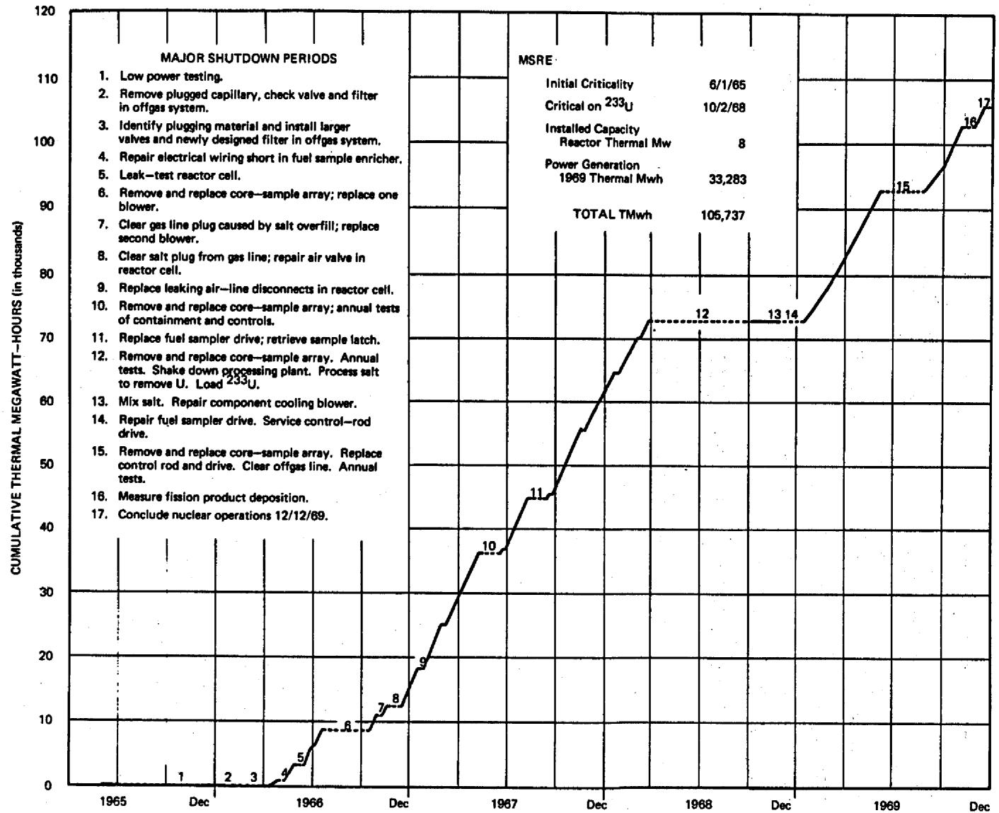  
Fig. 4.1 Integrated Power and Major Shutdowns of the MSRE

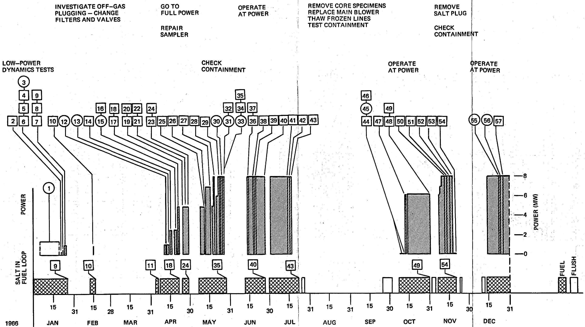  
Fig. 4.2 Interruptions of Operations - Year 1966

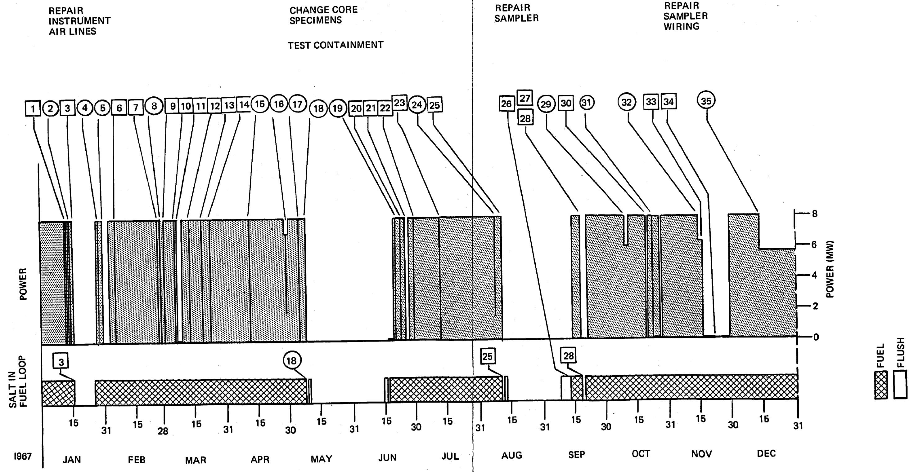  
Fig. 4.3 Interruptions of Operations - Year 1967

3

XENON STRIPPING EXPERIMENTS

INSPECTION AND MAINTENANCE REPLACE CORE SPECIMENS

TEST AND MODIFY FLUORINE DISPOSAL SYSTEM

PROCESS FLUSH SALT - PROCESS FUEL SALT

LOAD URANIUM-233

U-233 ZERO POWER PHYSICS EXPERIMENT INVESTIGATE BEHAVIOR FUEL SALT

CLEAR OFF GAS LINES

REPAIR SAMPLER AND CONTROL ROD DRIVE

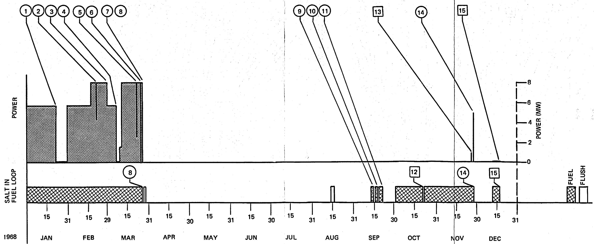  
Fig. 4.4 Interruptions of Operations - Year 1968

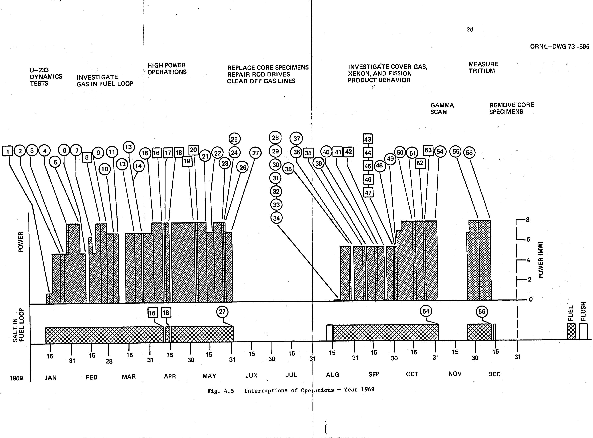

<table><tr><td>V</td><td>V</td><td>V</td><td>V</td><td>V</td><td>V</td><td>V</td><td>V</td><td>V</td><td>V</td><td>V</td><td>V</td><td>V</td><td>V</td><td>V</td><td>V</td><td>V</td><td>V</td><td>V</td><td>V</td><td>V</td><td>V</td><td>V</td><td>V</td><td>V</td><td>V</td><td>V</td><td>V</td><td>V</td><td>V</td><td>V</td><td>V</td><td>V</td><td>V</td><td>V</td><td>V</td><td>V</td><td>V</td><td>V</td><td>V</td><td>V</td><td>V</td><td>V</td><td>V</td><td>V</td><td>V</td><td>V</td><td>V</td><td>V</td><td>V</td><td>W</td><td>%</td><td>Ratios</td><td></td><td></td><td></td><td></td><td></td><td></td><td></td><td></td><td></td><td></td><td></td><td></td><td></td><td></td><td></td><td></td><td></td><td></td><td></td><td></td><td></td><td></td><td></td><td></td><td></td><td></td><td></td><td></td><td></td><td></td><td></td><td></td><td></td><td></td><td></td><td></td><td></td><td></td><td></td><td></td><td></td><td></td><td></td><td></td><td></td><td></td><td></td><td></td><td></td><td></td><td></td><td></td><td></td><td></td><td></td><td></td><td></td><td></td><td></td><td></td><td></td><td></td><td></td><td></td><td></td><td></td><td></td><td></td><td></td><td></td><td></td><td></td><td></td><td></td><td></td><td></td><td></td><td></td><td></td><td></td><td></td><td></td><td></td><td></td><td></td><td></td><td></td><td></td><td></td><td></td><td></td><td></td><td></td><td></td><td></td><td></td><td></td><td></td><td></td><td></td><td></td><td></td><td></td><td></td><td></td><td></td><td></td><td></td><td></td><td></td><td></td><td></td><td></td><td></td><td></td><td></td><td></td><td></td><td></td><td></td><td></td><td></td><td></td><td></td><td></td><td></td><td></td><td></td><td></td><td></td><td></td><td></td><td></td><td></td><td></td><td></td><td></td><td></td><td></td><td></td><td></td><td></td><td></td><td></td><td></td><td></td><td></td><td></td><td></td><td></td><td></td><td></td><td></td><td></td><td></td><td></td><td></td><td></td><td></td><td></td><td></td><td></td><td></td><td></td><td></td><td></td><td></td><td></td><td></td><td></td><td></td><td></td><td></td><td></td><td></td><td></td><td></td><td></td><td></td><td></td><td></td><td></td><td></td><td></td><td></td><td></td><td></td><td></td><td></td><td></td><td></td><td></td><td></td><td></td><td></td><td></td><td></td></tr><tr><td></td><td></td><td></td><td></td><td></td><td></td><td></td><td></td><td></td><td></td><td></td><td></td><td></td><td></td><td></td><td></td><td></td><td></td><td></td><td></td><td></td><td></td><td></td><td></td><td></td><td></td><td></td><td></td><td></td><td></td><td></td><td></td><td></td><td></td><td></td><td></td><td></td><td></td><td></td><td></td><td></td><td></td><td></td><td></td><td></td><td></td><td></td><td></td><td></td><td></td><td></td><td></td><td></td><td></td><td></td><td></td><td></td><td></td><td></td><td></td><td></td><td></td><td></td><td></td><td></td><td></td><td></td><td></td><td></td><td></td><td></td><td></td><td></td><td></td><td></td><td></td><td></td><td></td><td></td><td></td><td></td><td></td><td></td><td></td><td></td><td></td><td></td><td></td><td></td><td></td><td></td><td></td><td></td><td></td><td></td><td></td><td></td><td></td><td></td><td></td><td></td><td></td><td></td><td></td><td></td><td></td><td></td><td></td><td></td><td></td><td></td><td></td><td></td><td></td><td></td><td></td><td></td><td></td><td></td><td></td><td></td><td></td><td></td><td></td><td></td><td></td><td></td><td></td><td></td><td></td><td></td><td></td><td></td><td></td><td></td><td></td><td></td><td></td><td></td><td></td><td></td><td></td><td></td><td></td><td></td><td></td><td></td><td></td><td></td><td></td><td></td><td></td><td></td><td></td><td></td><td></td><td></td><td></td><td></td><td></td><td></td><td></td><td></td><td></td><td></td><td></td><td></td><td></td><td></td><td></td><td></td><td></td><td></td><td></td><td></td><td></td><td></td><td></td><td></td><td></td><td></td><td></td><td></td><td></td><td></td><td></td><td></td><td></td><td></td><td></td><td></td><td></td><td></td><td></td><td></td><td></td><td></td><td></td><td></td><td></td><td></td><td></td><td></td><td></td><td></td><td></td><td></td><td></td><td></td><td></td><td></td><td></td><td></td><td></td><td></td><td></td><td></td><td></td><td></td><td></td><td></td><td></td><td></td><td></td><td></td><td></td><td></td><td></td><td></td><td></td><td></td><td></td><td></td><td></td><td></td><td></td><td></td><td></td><td></td><td></td><td></td><td></td><td></td><td></td><td></td><td></td><td></td><td></td><td></td><td></td></tr><tr><td></td><td></td><td></td><td></td><td></td><td></td><td></td><td></td><td></td><td></td><td></td><td></td><td></td><td></td><td></td><td></td><td></td><td></td><td></td><td></td><td></td><td></td><td></td><td></td><td></td><td></td><td></td><td></td><td></td><td></td><td></td><td></td><td></td><td></td><td></td><td></td><td></td><td></td><td></td><td></td><td></td><td></td><td></td><td></td><td></td><td></td><td></td><td></td><td></td><td></td><td></td><td></td><td></td><td></td><td></td><td></td><td></td><td></td><td></td><td></td><td></td><td></td><td></td><td></td><td></td><td></td><td></td><td></td><td></td><td></td><td></td><td></td><td></td><td></td><td></td><td></td><td></td><td></td><td></td><td></td><td></td><td></td><td></td><td></td><td></td><td></td><td></td><td></td><td></td><td></td><td></td><td></td><td></td><td></td><td></td><td></td><td></td><td></td><td></td><td></td><td></td><td></td><td></td><td></td><td></td><td></td><td></td><td></td><td></td><td></td><td></td><td></td><td></td><td></td><td></td><td></td><td></td><td></td><td></td><td></td><td></td><td></td><td></td><td></td><td></td><td></td><td></td><td></td><td></td><td></td><td></td><td></td><td></td><td></td><td></td><td></td><td></td><td></td><td></td><td></td><td></td><td></td><td></td><td></td><td></td><td></td><td></td><td></td><td></td><td></td><td></td><td></td><td></td><td></td><td></td><td></td><td></td><td></td><td></td><td></td><td></td><td></td><td></td><td></td><td></td><td></td><td></td><td></td><td></td><td></td><td></td><td></td><td></td><td></td><td></td><td></td><td></td><td></td><td></td><td></td><td></td><td></td><td></td><td></td><td></td><td></td><td></td><td></td><td></td><td></td><td></td><td></td><td></td><td></td><td></td><td></td><td></td><td></td><td></td><td></td><td></td><td></td><td></td><td></td><td></td><td></td><td></td><td></td><td></td><td></td><td></td><td></td><td></td><td></td><td></td><td></td><td></td><td></td><td></td><td></td><td></td><td></td><td></td><td></td><td></td><td></td><td></td><td></td><td></td><td></td><td></td><td></td><td></td><td></td><td></td><td></td><td></td><td></td><td></td><td></td><td></td><td></td><td></td><td></td><td></td><td></td><td></td><td></td><td></td><td></td></tr><tr><td>V</td><td>V</td><td>V</td><td>V</td><td>V</td><td>V</td><td>V</td><td>V</td><td>V</td><td>V</td><td>V</td><td>V</td><td>V</td><td>V</td><td>V</td><td>V</td><td>V</td><td>V</td><td>V</td><td>V</td><td>V</td><td>V</td><td>V</td><td>V</td><td>V</td><td>V</td><td>V</td><td>V</td><td>V</td><td>V</td><td>V</td><td>V</td><td>V</td><td>V</td><td>V</td><td>V</td><td>V</td><td>V</td><td>V</td><td>V</td><td>V</td><td>V</td><td>V</td><td>V</td><td>V</td><td>V</td><td>V</td><td>V</td><td>V</td><td>N</td><td>N</td><td>N</td><td>N</td><td>N</td><td>N</td><td>N</td><td>N</td><td>N</td><td>N</td><td>N</td><td>N</td><td>N</td><td>N</td><td>N</td><td>N</td><td>N</td><td>N</td><td>N</td><td>N</td><td>N</td><td>N</td><td>N</td><td>N</td><td>N</td><td>N</td><td>N</td><td>N</td><td>N</td><td>N</td><td>N</td><td>N</td><td>N</td><td>N</td><td>N</td><td>N</td><td>N</td><td>N</td><td>N</td><td>N</td><td>N</td><td>N</td><td>N</td><td>N</td><td>N</td><td>N</td><td>N</td><td>N</td><td>N</td><td>N</td><td>V</td><td>V</td><td>V</td><td>V</td><td>V</td><td>V</td><td>V</td><td>V</td><td>V</td><td>V</td><td>V</td><td>V</td><td>V</td><td>V</td><td>V</td><td>V</td><td>V</td><td>V</td><td>V</td><td>V</td><td>V</td><td>V</td><td>V</td><td>V</td><td>V</td><td>V</td><td>V</td><td>V</td><td>V</td><td>V</td><td>V</td><td>V</td><td>V</td><td>V</td><td>V</td><td>V</td><td>V</td><td>V</td><td>V</td><td>V</td><td>V</td><td>V</td><td>V</td><td>V</td><td>V</td><td>V</td><td>V</td><td>V</td><td>V</td><td>F</td><td colspan="101">Power Reduction</td></tr><tr><td></td><td></td><td></td><td></td><td></td><td></td><td></td><td></td><td></td><td></td><td></td><td></td><td></td><td></td><td></td><td></td><td></td><td></td><td></td><td></td><td></td><td></td><td></td><td></td><td></td><td></td><td></td><td></td><td></td><td></td><td></td><td></td><td></td><td></td><td></td><td></td><td></td><td></td><td></td><td></td><td></td><td></td><td></td><td></td><td></td><td></td><td></td><td></td><td></td><td></td><td></td><td></td><td></td><td></td><td></td><td></td><td></td><td></td><td></td><td></td><td></td><td></td><td></td><td></td><td></td><td></td><td></td><td></td><td></td><td></td><td></td><td></td><td></td><td></td><td></td><td></td><td></td><td></td><td></td><td></td><td></td><td></td><td></td><td></td><td></td><td></td><td></td><td></td><td></td><td></td><td></td><td></td><td></td><td></td><td></td><td></td><td></td><td></td><td></td><td></td><td></td><td></td><td></td><td></td><td></td><td></td><td></td><td></td><td></td><td></td><td></td><td></td><td></td><td></td><td></td><td></td><td></td><td></td><td></td><td></td><td></td><td></td><td></td><td></td><td></td><td></td><td></td><td></td><td></td><td></td><td></td><td></td><td></td><td></td><td></td><td></td><td></td><td></td><td></td><td></td><td></td><td></td><td></td><td></td><td></td><td></td><td></td><td></td><td></td><td></td><td></td><td></td><td></td><td></td><td></td><td></td><td></td><td></td><td></td><td></td><td></td><td></td><td></td><td></td><td></td><td></td><td></td><td></td><td></td><td></td><td></td><td></td><td></td><td></td><td></td><td></td><td></td><td></td><td></td><td></td><td></td><td></td><td></td><td></td><td></td><td></td><td></td><td></td><td></td><td></td><td></td><td></td><td></td><td></td><td></td><td></td><td></td><td></td><td></td><td></td><td></td><td></td><td></td><td></td><td></td><td></td><td></td><td></td><td></td><td></td><td></td><td></td><td></td><td></td><td></td><td></td><td></td><td></td><td></td><td></td><td></td><td></td><td></td><td></td><td></td><td></td><td></td><td></td><td></td><td></td><td></td><td></td><td></td><td></td><td></td><td></td><td></td><td></td><td></td><td></td><td></td><td></td><td></td><td></td><td></td><td></td><td></td><td></td><td></td><td></td></tr></table>

Reportable Unscheduled Rod Scram   
A Automatic   
M = Manual   
P Primary   
8 = Secondary   
W = Worked on During Period Following the Interruption; Includes Preventive Maintenance

Table 4-8. INTERFROU TIONS OF OPERATION DURING 1967  

<table><tr><td colspan="2"></td><td colspan="5">What Happened</td><td colspan="21">Cause and Related Activities</td></tr><tr><td>No.</td><td>Date</td><td>Power Reduction</td><td>Rod Sorea</td><td>Load Sorea</td><td>Paul Drain</td><td>Coolant Drain</td><td>Planned</td><td>Unplanned, but due to Ept.</td><td>Chuck Lids</td><td>Human Error</td><td>Fuel &amp; Coolant Salt Systems</td><td>Reactor or Flowers</td><td>Offgat System</td><td>Water System</td><td>Component Coolant System</td><td>Containment &amp; Ventilation</td><td>TWA Power Onage</td><td>Electrical and Bactars</td><td>Instrument Air System</td><td>Instrumentation</td><td>Control Rods</td><td>Pressure Valves</td><td>Bumpers</td><td>Parted Corr- tatement Tests</td><td>Core Speciees</td><td></td><td></td></tr><tr><td>1</td><td>1/12</td><td>A*</td><td>A</td><td>A</td><td>M</td><td rowspan="3">P</td><td rowspan="3">P</td><td rowspan="3">P</td><td rowspan="3">P</td><td rowspan="3">P</td><td rowspan="3">P</td><td rowspan="3">P</td><td rowspan="3">P-W</td><td rowspan="3">W</td><td rowspan="3">P-W</td><td rowspan="3">P-W</td><td rowspan="3">P-W</td><td rowspan="3">P-W</td><td rowspan="3">P</td><td rowspan="3">W</td><td rowspan="3">P-W</td><td rowspan="3">P-W</td><td rowspan="3">P-W</td><td rowspan="3">P-W</td><td rowspan="3">P-W</td><td rowspan="3">P-W</td><td></td></tr><tr><td>2</td><td>1/14</td><td rowspan="2">M</td><td rowspan="2">M</td><td rowspan="2">M</td><td rowspan="2">M</td><td></td></tr><tr><td>3</td><td>1/16</td><td></td></tr><tr><td>4</td><td>1/28</td><td>M</td><td>M</td><td>M</td><td>M</td><td>P</td><td>P</td><td>P</td><td>P</td><td>P</td><td>P</td><td>P-W</td><td>P-W</td><td>P-W</td><td>P-W</td><td>P-W</td><td>P-W</td><td>P-W</td><td>P-W</td><td>P-W</td><td>P-W</td><td>P-W</td><td>P-W</td><td>P-W</td><td>P-W</td><td>P-W</td><td></td></tr><tr><td>5</td><td>1/30-2/2</td><td>M</td><td>M</td><td>A</td><td>A</td><td>P</td><td>P</td><td>P</td><td>P</td><td>S</td><td>P</td><td>P-W</td><td>P-W</td><td>P-W</td><td>P-W</td><td>P-W</td><td>P-W</td><td>P-W</td><td>P-W</td><td>P-W</td><td>P-W</td><td>P-W</td><td>P-W</td><td>P-W</td><td>P-W</td><td>P-W</td><td></td></tr><tr><td>6</td><td>2/5</td><td>M</td><td>M</td><td>A</td><td>A</td><td>P</td><td>P</td><td>P</td><td>P</td><td>P</td><td>P</td><td>P-W</td><td>P-W</td><td>P-W</td><td>P-W</td><td>P-W</td><td>P-W</td><td>P-W</td><td>P-W</td><td>P-W</td><td>P-W</td><td>P-W</td><td>P-W</td><td>P-W</td><td>P-W</td><td>P-W</td><td></td></tr><tr><td>7</td><td>2/26</td><td>M</td><td>M</td><td>A</td><td>A</td><td>P</td><td>P</td><td>P</td><td>P</td><td>P</td><td>P</td><td>P-W</td><td>P-W</td><td>P-W</td><td>P-W</td><td>P-W</td><td>P-W</td><td>P-W</td><td>P-W</td><td>P-W</td><td>P-W</td><td>P-W</td><td>P-W</td><td>P-W</td><td>P-W</td><td>P-W</td><td></td></tr><tr><td>8</td><td>2/26-2/27</td><td>M</td><td>M</td><td>M</td><td>M</td><td>P</td><td>P</td><td>P</td><td>P</td><td>P</td><td>P-W</td><td>P-W</td><td>P-W</td><td>P-W</td><td>P-W</td><td>P-W</td><td>P-W</td><td>P-W</td><td>P-W</td><td>P-W</td><td>P-W</td><td>P-W</td><td>P-W</td><td>P-W</td><td>P-W</td><td>P-W</td><td></td></tr><tr><td>9</td><td>3/1</td><td>M</td><td>M</td><td>M</td><td>M</td><td>P</td><td>P</td><td>P</td><td>P</td><td>P-W</td><td>P-W</td><td>P-W</td><td>P-W</td><td>P-W</td><td>P-W</td><td>P-W</td><td>P-W</td><td>P-W</td><td>P-W</td><td>P-W</td><td>P-W</td><td>P-W</td><td>P-W</td><td>P-W</td><td>P-W</td><td>P-W</td><td></td></tr><tr><td>10</td><td>3/6</td><td>M</td><td>M</td><td>M</td><td>M</td><td>P</td><td>P</td><td>P</td><td>P</td><td>P-W</td><td>P-W</td><td>P-W</td><td>P-W</td><td>P-W</td><td>P-W</td><td>P-W</td><td>P-W</td><td>P-W</td><td>P-W</td><td>P-W</td><td>P-W</td><td>P-W</td><td>P-W</td><td>P-W</td><td>P-W</td><td>P-W</td><td></td></tr><tr><td>11</td><td>3/7</td><td rowspan="3">M</td><td>M</td><td>M</td><td>M</td><td>P</td><td rowspan="3">P</td><td rowspan="3">P</td><td rowspan="3">P-W</td><td rowspan="3">P-W</td><td rowspan="3">P-W</td><td rowspan="3">P-W</td><td rowspan="3">P-W</td><td rowspan="3">P-W</td><td rowspan="3">P-W</td><td rowspan="3">P-W</td><td rowspan="3">P-W</td><td rowspan="3">P-W</td><td rowspan="3">P-W</td><td rowspan="3">P-W</td><td rowspan="3">P-W</td><td rowspan="3">P-W</td><td rowspan="3">P-W</td><td rowspan="3">P-W</td><td rowspan="3">P-W</td><td rowspan="3">P-W</td><td></td></tr><tr><td>12</td><td>3/13</td><td>A*</td><td>A</td><td>A</td><td>M</td><td></td></tr><tr><td>13</td><td>3/19</td><td>A</td><td>A</td><td>A</td><td>M</td><td></td></tr><tr><td>14</td><td>3/23</td><td>M</td><td>M</td><td>M</td><td>M</td><td>P</td><td>P</td><td>P</td><td>P</td><td>P</td><td>P</td><td>P-W</td><td>P-W</td><td>P-W</td><td>P-W</td><td>P-W</td><td>P-W</td><td>P-W</td><td>P-W</td><td>P-W</td><td>P-W</td><td>P-W</td><td>P-W</td><td>P-W</td><td>P-W</td><td>P-W</td><td></td></tr><tr><td>15</td><td>4/11</td><td>M</td><td>M</td><td>M</td><td>M</td><td>P</td><td>P</td><td>P</td><td>P-W</td><td>P-W</td><td>P-W</td><td>P-W</td><td>P-W</td><td>P-W</td><td>P-W</td><td>P-W</td><td>P-W</td><td>P-W</td><td>P-W</td><td>P-W</td><td>P-W</td><td>P-W</td><td>P-W</td><td>P-W</td><td>P-W</td><td>P-W</td><td></td></tr><tr><td>16</td><td>4/28-4/30</td><td>M</td><td>M</td><td>M</td><td>M</td><td>P</td><td>P</td><td>P</td><td>P-W</td><td>P-W</td><td>P-W</td><td>P-W</td><td>P-W</td><td>P-W</td><td>P-W</td><td>P-W</td><td>P-W</td><td>P-W</td><td>P-W</td><td>P-W</td><td>P-W</td><td>P-W</td><td>P-W</td><td>P-W</td><td>P-W</td><td>P-W</td><td></td></tr><tr><td>17</td><td>5/5</td><td>M</td><td>M</td><td>M</td><td>M</td><td>M</td><td>M</td><td>M</td><td>M-P</td><td>M-P</td><td>M-P</td><td>M-P</td><td>M-P</td><td>M-P</td><td>M-P</td><td>M-P</td><td>M-P</td><td>M-P</td><td>M-P</td><td>M-P</td><td>M-P</td><td>M-P</td><td>M-P</td><td>M-P</td><td>M-P</td><td>M-P</td><td></td></tr><tr><td>18</td><td>5/8</td><td>M</td><td>M</td><td>M</td><td>M</td><td>M</td><td>M</td><td>M</td><td>M-P</td><td>M-P</td><td>M-P</td><td>M-P</td><td>M-P</td><td>M-P</td><td>M-P</td><td>M-P</td><td>M-P</td><td>M-P</td><td>M-P</td><td>M-P</td><td>M-P</td><td>M-P</td><td>M-P</td><td>M-P</td><td>M-P</td><td>M-P</td><td></td></tr><tr><td>19</td><td>6/21</td><td>M</td><td>M</td><td>M</td><td>M</td><td>M</td><td>M</td><td>M</td><td>M-P</td><td>M-P</td><td>M-P</td><td>M-P</td><td>M-P</td><td>M-P</td><td>M-P</td><td>M-P</td><td>M-P</td><td>M-P</td><td>M-P</td><td>M-P</td><td>M-P</td><td>M-P</td><td>M-P</td><td>M-P</td><td>M-P</td><td>M-P</td><td></td></tr><tr><td>20</td><td>6/23</td><td rowspan="4">M</td><td>M</td><td>M</td><td>M</td><td>M</td><td rowspan="4">M</td><td rowspan="4">M</td><td rowspan="4">M-P</td><td rowspan="4">M-P</td><td rowspan="4">M-P</td><td rowspan="4">M-P</td><td rowspan="4">M-P</td><td rowspan="4">M-P</td><td rowspan="4">M-P</td><td rowspan="4">M-P</td><td rowspan="4">M-P</td><td rowspan="4">M-P</td><td rowspan="4">M-P</td><td rowspan="4">M-P</td><td rowspan="4">M-P</td><td rowspan="4">M-P</td><td rowspan="4">M-P</td><td rowspan="4">M-P</td><td rowspan="4">M-P</td><td rowspan="4">M-P</td><td></td></tr><tr><td>21</td><td>6/25</td><td>A*</td><td>A</td><td>A</td><td>M</td><td></td></tr><tr><td>22</td><td>6/30</td><td>A*</td><td>A</td><td>A</td><td>M</td><td></td></tr><tr><td>23</td><td>7/12</td><td>A*</td><td>A</td><td>A</td><td>M</td><td></td></tr><tr><td>24</td><td>8/7</td><td>M</td><td>M</td><td>M</td><td>M</td><td>M</td><td rowspan="12">P</td><td rowspan="12">P</td><td rowspan="12">P-W</td><td rowspan="12">P-W</td><td rowspan="12">P-W</td><td rowspan="12">P-W</td><td rowspan="12">P-W</td><td rowspan="12">P-W</td><td rowspan="12">P-W</td><td rowspan="12">P-W</td><td rowspan="12">P-W</td><td rowspan="12">P-W</td><td rowspan="12">P-W</td><td rowspan="12">P-W</td><td rowspan="12">P-W</td><td rowspan="12">P-W</td><td rowspan="12">P-W</td><td rowspan="12">P-W</td><td rowspan="12">P-W</td><td rowspan="12"></td><td></td></tr><tr><td>25</td><td>8/8-8/11</td><td rowspan="4">M</td><td>M</td><td>M</td><td>M</td><td>M</td><td></td></tr><tr><td>26</td><td>9/11</td><td>M</td><td>M</td><td>M</td><td>M</td><td></td></tr><tr><td>27</td><td>9/18</td><td>M</td><td>M</td><td>M</td><td>M</td><td></td></tr><tr><td>28</td><td>9/18</td><td>M</td><td>M</td><td>M</td><td>M</td><td></td></tr><tr><td>29</td><td>10/9</td><td rowspan="2">M</td><td rowspan="2">A*</td><td rowspan="2">A</td><td rowspan="2">A</td><td rowspan="2">M</td><td></td></tr><tr><td>30</td><td>10/20</td><td></td></tr><tr><td>31</td><td>10/23</td><td>M</td><td>M</td><td>M</td><td>M</td><td>M</td><td></td></tr><tr><td>32</td><td>11/14</td><td>M</td><td>M</td><td>M</td><td>M</td><td>M</td><td></td></tr><tr><td>33</td><td>11/16</td><td rowspan="2">M</td><td>M</td><td>M</td><td>M</td><td>M</td><td></td></tr><tr><td>34</td><td>11/22</td><td>A*</td><td>A</td><td>A</td><td>M</td><td></td></tr><tr><td>35</td><td>12/13</td><td>M</td><td>M</td><td>M</td><td>M</td><td>M</td><td></td></tr></table>

Reportable Unscheduled Rod Scram   
A Automatic   
X = Manual   
P = Primary   
8 = Secondary   
W = Worked on During Period Following the Interruption; Includes Preventive Maintenance

Table 4-9. INTERRUPTIONS OF OPERATION DURING 1968   

<table><tr><td colspan="2"></td><td colspan="26">What Happened Cause and Related Activities</td></tr><tr><td>No.</td><td>Date</td><td>Power Reduction</td><td>Rod Scream</td><td>Load Scream</td><td>Fuel Drain</td><td>Coolant Drain</td><td>Planned</td><td>Unplanned, but due to Expt.</td><td>Check Idets</td><td>Human Error</td><td>Fuel &amp; Coolant Salt Systems</td><td>Radiator or Blowers</td><td>Offgas System</td><td>Water System</td><td>Component Coolant System</td><td>Containment &amp; Ventilation</td><td>TWA Power Outage</td><td>Electrical and Heaters</td><td>Instrument Air System</td><td>Instrumentation</td><td>Control Rods</td><td>Freeze Valves</td><td>Samplers</td><td>Period Correlation Tests</td><td>Core Specimens</td><td></td><td></td></tr><tr><td>1</td><td>1/22</td><td>M</td><td></td><td></td><td></td><td></td><td>P</td><td></td><td></td><td></td><td></td><td></td><td></td><td></td><td></td><td></td><td></td><td></td><td></td><td></td><td></td><td></td><td></td><td></td><td></td><td></td><td></td></tr><tr><td>2</td><td>2/21</td><td>M</td><td></td><td></td><td></td><td></td><td>P</td><td></td><td></td><td></td><td></td><td></td><td></td><td></td><td></td><td></td><td></td><td></td><td></td><td></td><td></td><td></td><td></td><td></td><td></td><td></td><td></td></tr><tr><td>3</td><td>2/29</td><td>M</td><td></td><td></td><td></td><td></td><td>P</td><td></td><td></td><td></td><td></td><td></td><td></td><td></td><td></td><td></td><td></td><td></td><td></td><td></td><td></td><td></td><td></td><td></td><td></td><td></td><td></td></tr><tr><td>4</td><td>3/7</td><td>M</td><td></td><td></td><td></td><td></td><td>P</td><td></td><td></td><td></td><td></td><td></td><td></td><td></td><td></td><td></td><td></td><td></td><td></td><td></td><td></td><td></td><td></td><td></td><td></td><td></td><td></td></tr><tr><td>5</td><td>3/22</td><td>M</td><td></td><td></td><td></td><td></td><td>P</td><td></td><td></td><td></td><td></td><td></td><td></td><td></td><td></td><td></td><td></td><td></td><td></td><td></td><td></td><td></td><td></td><td></td><td></td><td></td><td></td></tr><tr><td>6</td><td>3/25</td><td></td><td>M</td><td>M</td><td></td><td></td><td>P</td><td></td><td></td><td></td><td></td><td></td><td></td><td></td><td></td><td></td><td></td><td></td><td></td><td></td><td></td><td></td><td></td><td></td><td></td><td></td><td></td></tr><tr><td>7</td><td>3/25</td><td></td><td>M</td><td></td><td></td><td></td><td>P</td><td></td><td></td><td></td><td></td><td></td><td></td><td></td><td></td><td></td><td></td><td></td><td></td><td></td><td></td><td></td><td></td><td></td><td></td><td></td><td></td></tr><tr><td>8</td><td>3/26</td><td></td><td></td><td></td><td></td><td></td><td>P</td><td></td><td></td><td></td><td></td><td>W</td><td>W</td><td></td><td>W</td><td></td><td></td><td></td><td></td><td></td><td></td><td></td><td></td><td></td><td></td><td></td><td></td></tr><tr><td>9</td><td>9/14</td><td></td><td></td><td></td><td></td><td></td><td>P</td><td></td><td></td><td></td><td></td><td></td><td></td><td></td><td></td><td></td><td></td><td></td><td></td><td></td><td></td><td></td><td></td><td></td><td></td><td></td><td></td></tr><tr><td>10</td><td>9/17</td><td></td><td></td><td></td><td></td><td></td><td>P</td><td></td><td></td><td></td><td></td><td></td><td></td><td></td><td></td><td></td><td></td><td></td><td></td><td></td><td></td><td></td><td></td><td></td><td></td><td></td><td></td></tr><tr><td>11</td><td>9/21</td><td></td><td></td><td></td><td></td><td></td><td>P</td><td></td><td></td><td></td><td></td><td></td><td></td><td></td><td></td><td></td><td></td><td></td><td></td><td></td><td></td><td></td><td></td><td></td><td></td><td></td><td></td></tr><tr><td>12</td><td>10/21</td><td></td><td></td><td>A*</td><td></td><td></td><td></td><td></td><td></td><td>S P</td><td></td><td></td><td>W</td><td></td><td>W</td><td></td><td></td><td></td><td></td><td>P</td><td></td><td></td><td>S-W</td><td>W</td><td>W</td><td></td><td></td></tr><tr><td>13</td><td>11/27</td><td></td><td></td><td>A</td><td>A</td><td></td><td></td><td></td><td></td><td></td><td></td><td></td><td></td><td></td><td></td><td></td><td></td><td></td><td></td><td></td><td></td><td></td><td></td><td></td><td></td><td></td><td></td></tr><tr><td>14</td><td>11/28</td><td></td><td></td><td></td><td></td><td>M</td><td>M</td><td>P</td><td></td><td></td><td></td><td></td><td></td><td></td><td></td><td></td><td></td><td></td><td></td><td></td><td></td><td></td><td></td><td></td><td></td><td></td><td></td></tr><tr><td>15</td><td>12/17</td><td></td><td></td><td></td><td></td><td>M</td><td>M</td><td></td><td></td><td></td><td></td><td></td><td></td><td></td><td></td><td></td><td></td><td></td><td></td><td></td><td></td><td>W</td><td></td><td>P-W</td><td></td><td></td><td></td></tr></table>

*Reportable Unscheduled Rod Scram   
A Automatic   
M Manual   
P = Primary   
8 = Secondary   
W = Worked on During Period Following the Interruption; Includes Preventive Maintenance

<table><tr><td>No.</td><td>Rate</td><td>P</td><td>Q</td><td>R</td><td>S</td><td>T</td><td>U</td><td>V</td><td>W</td><td>A</td><td>B</td><td>C</td><td>D</td><td>E</td><td>F</td><td>G</td><td>H</td><td>I</td><td>J</td><td>K</td><td>L</td><td>M</td><td>N</td><td>O</td><td>P</td><td>Q</td><td>R</td><td>S</td><td>T</td><td>U</td><td>V</td><td>W</td><td>A</td><td>B</td><td>C</td><td>D</td><td>E</td><td>F</td><td>G</td><td>H</td><td>I</td><td>J</td><td>K</td><td>L</td><td>M</td><td>N</td><td>O</td><td>P</td><td>Q</td><td>R</td><td>S</td><td>T</td><td>U</td><td>V</td><td>W</td><td>A</td><td>B</td><td>C</td><td>D</td><td>E</td><td>F</td><td>G</td><td>H</td><td>I</td><td>J</td><td>K</td><td>L</td><td>M</td><td>N</td><td>O</td><td>P</td><td>Q</td><td>R</td><td>5</td><td>6</td><td>7</td><td>8</td><td>9</td><td>10</td><td>11</td><td>12</td><td>13</td><td>14</td><td>15</td><td>16</td><td>17</td><td>18</td><td>19</td><td>20</td><td>21</td><td>22</td><td>23</td><td>24</td><td>25</td><td>26</td><td>27</td><td>28</td><td>29</td><td>30</td><td>31</td><td>32</td><td>33</td><td>34</td><td>35</td><td>36</td><td>37</td><td>38</td><td>39</td><td>40</td><td>41</td><td>42</td><td>43</td><td>44</td><td>45</td><td>46</td><td>47</td><td>48</td><td>49</td><td>50</td><td>51</td><td>52</td><td>53</td><td>54</td><td>55</td><td>56</td><td>57</td><td>58</td><td>59</td><td>60</td><td>61</td><td>62</td><td>63</td><td>64</td><td>65</td><td>66</td><td>67</td><td>68</td><td>69</td><td>70</td><td>71</td><td>72</td><td>73</td><td>74</td><td>75</td><td>76</td><td>77</td><td>78</td><td>79</td><td>80</td><td>81</td><td>82</td><td>83</td><td>84</td><td>85</td><td>86</td><td>87</td><td>88</td><td>89</td><td>90</td><td>91</td><td>92</td><td>93</td><td>94</td><td>95</td><td>96</td><td>97</td><td>98</td><td>99</td><td>100</td><td>101</td><td>102</td><td>103</td><td>104</td><td>105</td><td>106</td><td>107</td><td>108</td><td>109</td><td>110</td><td>111</td><td>112</td><td>113</td><td>114</td><td>115</td><td>116</td><td>117</td><td>118</td><td>119</td><td>120</td><td>121</td><td>122</td><td>123</td><td>124</td><td>125</td><td>126</td><td>127</td><td>128</td><td>129</td><td>130</td><td>131</td><td>132</td><td>133</td><td>134</td><td>135</td><td>136</td><td>137</td><td>138</td><td>139</td><td>140</td><td>141</td><td>142</td><td>143</td><td>144</td><td>145</td><td>146</td><td>147</td><td>148</td><td>149</td><td>150</td><td>151</td><td>152</td><td>153</td><td>154</td><td>155</td><td>156</td><td>157</td><td>158</td><td>159</td><td>160</td><td>161</td><td>162</td><td>163</td><td>164</td><td>165</td><td>166</td><td>167</td><td>168</td><td>169</td><td>170</td><td>171</td><td>172</td><td>173</td><td>174</td><td>175</td><td>176</td><td>177</td><td>178</td><td>179</td><td>180</td><td>181</td><td>182</td><td>183</td><td>184</td><td>185</td><td>186</td><td>187</td><td>188</td><td>189</td><td>190</td><td>191</td><td>192</td><td>193</td><td>194</td><td>195</td><td>196</td><td>197</td><td>198</td><td>199</td><td>200</td><td>201</td><td>202</td><td>203</td><td>204</td><td>205</td><td>206</td><td>207</td><td>208</td><td>209</td><td>210</td><td>211</td><td>212</td><td>213</td><td>214</td><td>215</td><td>216</td><td>217</td><td>218</td><td>219</td><td>220</td><td>221</td><td>222</td><td>223</td><td>224</td><td>225</td><td>226</td><td>227</td><td>228</td><td>229</td><td>230</td><td>231</td><td>232</td><td>233</td><td>234</td><td>235</td><td>236</td><td>237</td><td>238</td><td>239</td><td>240</td><td>241</td><td>242</td><td>243</td><td>244</td><td>245</td><td>246</td><td>247</td><td>248</td><td>249</td><td>250</td><td>251</td><td>252</td><td>253</td><td>254</td><td>255</td><td>256</td><td>257</td><td>258</td><td>259</td><td>260</td><td>261</td><td>262</td><td>263</td><td>264</td><td>265</td><td>266</td><td>267</td><td>268</td><td>269</td><td>270</td><td>271</td><td>272</td><td>273</td><td>274</td><td>275</td><td>276</td><td>277</td><td>278</td><td>279</td><td>280</td><td>281</td><td>282</td><td>283</td><td>284</td><td>285</td><td>286</td><td>287</td><td>288</td><td>289</td><td>290</td><td>291</td><td>292</td><td>293</td><td>294</td><td>295</td><td>296</td><td>297</td><td>298</td><td>299</td><td>300</td><td>301</td><td>302</td><td>303</td><td>304</td><td>305</td><td>306</td><td>307</td><td>308</td><td>309</td><td>310</td><td>311</td><td>312</td><td>313</td><td>314</td><td>315</td><td>316</td><td>317</td><td>318</td><td>319</td><td>320</td><td>321</td><td>322</td><td>323</td><td>324</td><td>325</td><td>326</td><td>327</td><td>328</td><td>329</td><td>330</td><td>331</td><td>332</td><td>333</td><td>334</td><td>335</td><td>336</td><td>337</td><td>338</td><td>339</td><td>340</td><td>341</td><td>342</td><td>343</td><td>344</td><td>345</td><td>346</td><td>347</td><td>348</td><td>349</td><td>350</td><td>351</td><td>352</td><td>353</td><td>354</td><td>355</td><td>356</td><td>357</td><td>358</td><td>359</td><td>360</td><td>361</td><td>362</td><td>363</td><td>364</td><td>365</td><td>366</td><td>367</td><td>368</td><td>369</td><td>370</td><td>371</td><td>372</td><td>373</td><td>374</td><td>375</td><td>376</td><td>377</td><td>378</td><td>379</td><td>380</td><td>381</td><td>382</td><td>383</td><td>384</td><td>385</td><td>386</td><td>387</td><td>388</td><td>389</td><td>390</td><td>391</td><td>392</td><td>393</td><td>394</td><td>395</td><td>396</td><td>397</td><td>398</td><td>399</td><td>400</td><td>401</td><td>402</td><td>403</td><td>404</td><td>405</td><td>406</td><td>407</td><td>408</td><td>409</td><td>410</td><td>411</td><td>412</td><td>413</td><td>414</td><td>415</td><td>416</td><td>417</td><td>418</td><td>419</td><td>420</td><td>421</td><td>422</td><td>423</td><td>424</td><td>425</td><td>426</td><td>427</td><td>428</td><td>429</td><td>430</td><td>431</td><td>432</td><td>433</td><td>434</td><td>435</td><td>436</td><td>437</td><td>438</td><td>439</td><td>440</td><td>441</td><td>442</td><td>443</td><td>444</td><td>445</td><td>446</td><td>447</td><td>448</td><td>449</td><td>450</td><td>451</td><td>452</td><td>453</td><td>454</td><td>455</td><td>456</td><td>457</td><td>458</td><td>459</td><td>460</td><td>461</td><td>462</td><td>463</td><td>464</td><td>465</td><td>466</td><td>467</td><td>468</td><td>469</td><td>470</td><td>471</td><td>472</td><td>473</td><td>474</td><td>475</td><td>476</td><td>477</td><td>478</td><td>479</td><td>480</td><td>481</td><td>482</td><td>483</td><td>484</td><td>485</td><td>486</td><td>487</td><td>488</td><td>489</td><td>490</td><td>491</td><td>492</td><td>493</td><td>494</td><td>495</td><td>496</td><td>497</td><td>498</td><td>499</td><td>500</td><td>501</td><td>502</td><td>503</td><td>504</td><td>505</td><td>506</td><td>507</td><td>508</td><td>509</td><td>510</td><td>511</td><td>512</td><td>513</td><td>514</td><td>515</td><td>516</td><td>517</td><td>518</td><td>519</td><td>520</td><td>521</td><td>522</td><td>523</td><td>524</td><td>525</td><td>526</td><td>527</td><td>528</td><td>529</td><td>530</td><td>531</td><td>532</td><td>533</td><td>534</td><td>535</td><td>536</td><td>537</td><td>538</td><td>539</td><td>540</td><td>541</td><td>542</td><td>543</td><td>544</td><td>545</td><td>546</td><td>547</td><td>548</td><td>549</td><td>550</td><td>551</td><td>552</td><td>553</td><td>554</td><td>555</td><td>556</td><td>557</td><td>558</td><td>559</td><td>560</td><td>561</td><td>562</td><td>563</td><td>564</td><td>565</td><td>566</td><td>567</td><td>568</td><td>569</td><td>570</td><td>571</td><td>572</td><td>573</td><td>574</td><td>575</td><td>576</td><td>577</td><td>578</td><td>579</td><td>580</td><td>581</td><td>582</td><td>583</td><td>584</td><td>585</td><td>586</td><td>587</td><td>588</td><td>589</td><td>590</td><td>591</td><td>592</td><td>593</td><td>594</td><td>595</td><td>596</td><td>597</td><td>598</td><td>599</td><td>600</td><td>601</td><td>602</td><td>603</td><td>604</td><td>605</td><td>606</td><td>607</td><td>608</td><td>609</td><td>610</td><td>611</td><td>612</td><td>613</td><td>614</td><td>615</td><td>616</td><td>617</td><td>618</td><td>619</td><td>620</td><td>621</td><td>622</td><td>623</td><td>624</td><td>625</td><td>626</td><td>627</td><td>628</td><td>629</td><td>630</td><td>631</td><td>632</td><td>633</td><td>634</td><td>635</td><td>636</td><td>637</td><td>638</td><td>639</td><td>640</td><td>641</td><td>642</td><td>643</td><td>644</td><td>645</td><td>646</td><td>647</td><td>648</td><td>649</td><td>650</td><td>651</td><td>652</td><td>653</td><td>654</td><td>655</td><td>656</td><td>657</td><td>658</td><td>659</td><td>660</td><td>661</td><td>662</td><td>663</td><td>664</td><td>665</td><td>666</td><td>667</td><td>668</td><td>669</td><td>670</td><td>671</td><td>672</td><td>673</td><td>674</td><td>675</td><td>676</td><td>677</td><td>678</td><td>679</td><td>680</td><td>681</td><td>682</td><td>683</td><td>684</td><td>685</td><td>686</td><td>687</td><td>688</td><td>689</td><td>690</td><td>691</td><td>692</td><td>693</td><td>694</td><td>695</td><td>696</td><td>697</td><td>698</td><td>699</td><td>700</td><td>701</td><td>702</td><td>703</td><td>704</td><td>705</td><td>706</td><td>707</td><td>708</td><td>709</td><td>710</td><td></td><td></td><td></td><td></td><td></td><td></td><td></td><td></td><td></td><td></td><td></td><td></td><td></td><td></td><td></td><td></td><td></td><td></td><td></td><td></td><td></td><td></td><td></td><td></td><td></td><td></td><td></td><td></td><td></td><td></td><td></td><td></td><td></td><td></td><td></td><td></td><td></td><td></td><td></td><td></td><td></td><td></td><td></td><td></td><td></td><td></td><td></td><td></td><td></td><td></td><td></td><td></td><td></td><td></td><td></td><td></td><td></td><td></td><td></td><td></td><td></td><td></td><td></td><td></td><td></td><td></td><td></td><td></td><td></td><td></td><td></td><td></td><td></td><td></td><td></td><td></td><td></td><td></td><td></td><td></td><td></td><td></td><td></td><td></td><td></td><td></td><td></td><td></td><td></td><td></td><td></td><td></td><td></td><td></td><td></td><td></td><td></td><td></td><td></td><td></td></tr></table>

Reportable Unscheduled Rod Scram   
A = Automatic   
M = Manual   
P = Primary   
8 = Secondary   
W = Worked on During Period Following the Intervention; Includes Preventive Maintenance

Table 4.11 Description of Interruptions of Operation During 1966   

<table><tr><td>No.</td><td>Date</td><td>Description and Related Activities</td></tr><tr><td>1</td><td>1/5-1/20</td><td>Low-power tests to calibrate nuclear instruments, check radiation levels, collect data for dynamics and noise analysis, obtain reactivity balances, and check out the control circuits.</td></tr><tr><td>2*</td><td>1/21</td><td>Rod scram due to accidental shorting of the 32-v dc power supply while investigating a No. 3 safety channel trip.</td></tr><tr><td>3</td><td>1/22</td><td>Rod and load scram to test circuitry.</td></tr><tr><td>4*</td><td>1/23</td><td>Rod scram due to a voltage sag.</td></tr><tr><td>5</td><td>1/23</td><td>Power reduction to attempt to blow out plugs in off-gas line, equalizer lines, and main charcoal beds.</td></tr><tr><td>6*</td><td>1/23</td><td>Rod scram due to instrument malfunction when switching linear channel ranges.</td></tr><tr><td>7</td><td>1/24</td><td>Load scram due to false low coolant flow indication.</td></tr><tr><td>8*</td><td>1/25</td><td>Rod scram due to inadvertent actuation of the manual scram switch.</td></tr><tr><td>9</td><td>1/25-1/26</td><td>Fuel and coolant drain due to plugging in the offgas system and to insulate the coolant flow transmitter lines. While shut down, the restrictor in the equalizer line (52l) and the check valve in the vent line (533) to the auxiliary charcoal bed were removed. The filter in the main offgas line was replaced and the pressure control valve (PCV-522) was replaced with a hand valve with larger ports. Work was done on No. 3 control rod drive, component coolant pump No. 1, radiator door seals, and motor generator No. 4. The thermal shield air lock problem was investigated.</td></tr><tr><td>10</td><td>2/16</td><td>Fuel drain due to a failure of the drain tank cell space cooler motor. While shut down, the inlet valves to the charcoal beds were replaced and the offgas line at the fuel pump was reamed out. Repairs were made on a damaged electrical penetration on the sampler-enricher and a leak on reactor cell</td></tr><tr><td>10 (con't)</td><td></td><td>space cooler No. 2 was fixed. A static inverter was installed to replace motor generator No. 4. The treated water corrosion inhibitor was changed from potassium to lithium nitrite-tetraborate.</td></tr><tr><td>11</td><td>4/6</td><td>Fuel drain due to a plug at the auxiliary charcoal bed which turned out to be a poppet from a drain tank vent check valve.</td></tr><tr><td>12</td><td>4/12</td><td>Rod scram and load scram to test performance of the rods and radiator doors.</td></tr><tr><td>13</td><td>4/14</td><td>Power reduction to collect data for noise analysis.</td></tr><tr><td>14*</td><td>4/16</td><td>Rod scram due to the fuel pump stopping which was caused by a false low salt level indication.</td></tr><tr><td>15</td><td>4/20</td><td>Manual rod scram and load scram to end the 2.5-Mw operation.</td></tr><tr><td>16*</td><td>4/20</td><td>Rod scram due to a false signal on safety channel No. 1 while safety channel No. 2 was being tested.</td></tr><tr><td>17</td><td>4/21</td><td>Power reduction due to charcoal beds plugging.</td></tr><tr><td>18*</td><td>4/22</td><td>Rod scram, load scram, fuel drain and coolant drain initiated by a faulty pump pressure relay which tripped instrument power breakers. Some salt froze in radiator because the coolant pump could not be started due to a lubricating oil flow switch failure (FS-754).</td></tr><tr><td>19*</td><td>4/25</td><td>Rod scram due to inverter failure.</td></tr><tr><td>20*</td><td>4/25</td><td>Rod scram and load scram due to false low fuel-pump level indication while doing periodic instrument check lists.</td></tr><tr><td>21*</td><td>4/28</td><td>Rod scram and load scram due to TVA power outage caused by a storm.</td></tr><tr><td>22*</td><td>4/28</td><td>Rod scram and load scram due to spurious safety channel trips possibly caused by an electrical storm.</td></tr><tr><td>23</td><td>4/29</td><td>Manual rod scram and load scram to check effect of cold doors on radiator temperatures. Shutdown was necessary to repair the latch on the sampler-enricher.</td></tr><tr><td>24</td><td>4/29</td><td>Fuel drain necessitated by a failure of the sampler-enricher cable drive motor. While shut down, the belts were tightened on component cooling pump No. 1 and attempts were made to blow out the plugs in the offgas lines.</td></tr><tr><td>25</td><td>5/11</td><td>Power reduction due to offgas line filter plugging.</td></tr><tr><td>26*</td><td>5/12</td><td>Rod scream and load scream due to operator failing to insert a control circuit jumper while doing periodical instrument check lists.</td></tr><tr><td>27</td><td>5/16</td><td>Power reduction to increase pitch on main blower blades to increase possible maximum power.</td></tr><tr><td>28*</td><td>5/19</td><td>Rod scream and load scream due to a TVA power outage. While shut down, measured offgas pressure drop and attempted to blow out plugs.</td></tr><tr><td>29*</td><td>5/23</td><td>Rod scream caused by instrument malfunction and operator error. Operator had switched to servo with a 40°F difference between actual temperature and temperature demand setpoint.</td></tr><tr><td>30</td><td>5/25</td><td>Power reduction to check the power coefficient of re-activity.</td></tr><tr><td>31</td><td>5/26</td><td>Power reduction to obtain reactivity balance data.</td></tr><tr><td>32</td><td>5/26</td><td>Power reduction due to main blower No. 1 stopping and failing to start.</td></tr><tr><td>33</td><td>5/26</td><td>Power reduction to collect data for anoise analysis.</td></tr><tr><td>34*</td><td>5/26</td><td>Manual rod scream and load scream to investigate a false fire alarm.</td></tr><tr><td>35</td><td>5/28</td><td>Fuel drain due to a failure of component coolant pump No. 1 while component coolant pump No. 2 was valved off. A planned drain had been scheduled due to the high indicated cell leak rate. This was found to be due to a leak from the thermocouple headers into the cell. While shut down, a 20-psig leak test was made</td></tr><tr><td>35 (con't)</td><td></td><td>on the cells, repairs were made on both component coolant pumps, the electrical load was redistributed and attempts were made to locate the water leak into the cells.</td></tr><tr><td>36</td><td>6/14</td><td>Power reduction due to a failure in the electrical supply to the nuclear instruments.</td></tr><tr><td>37</td><td>6/14</td><td>Power reduction due to failure of a flexible coupling on main blower No. 1.</td></tr><tr><td>38</td><td>6/19</td><td>Power reduction to empty the overflow tank.</td></tr><tr><td>39*</td><td>6/20</td><td>Rod scram and load scram due to the operator inadvertently inserting a test source at the wrong process radiation detector (RE-528 instead of RE-565) while doing periodic instrument check lists.</td></tr><tr><td>40*</td><td>6/27</td><td>Rod scram, load scram, fuel drain, and coolant drain due to the electrical supply to component coolant pump No. 1 shorting out at the penetration.</td></tr><tr><td>41*</td><td>7/14</td><td>Rod scram and load scram due to a TVA power outage.</td></tr><tr><td>42*</td><td>7/15</td><td>Rod scram and load scram due to a TVA power outage caused by a storm.</td></tr><tr><td>43</td><td>7/17</td><td>Power reduction and coolant drain due to a catastrophic failure of main blower No. 1 hub. The fuel salt was drained on 7/24/66. While filling the fuel system with flush salt, the fuel-pump bowl was accidentally overfilled and some salt froze in the sampler and offgas lines. Heat had to be applied remotely to remove the plugs. While shut down, the core specimens were replaced, and a new particle trap was installed in the offgas line. Leaks in reactor cell space cooler No. 1 and in the treated water heat exchanger were repaired and the thermal shield degassing tank was installed. Both component coolant pumps were repaired and piping was installed to drain the condensed water from them. Repairs were made on the radiator door seals, radiator heaters, and the main blower motors. All the electrical switch gear breakers were calibrated. Prior to startup, the fuel and coolant pumps lube oil was changed, the periodic check lists were completed and the cells were leak-tested at 10 psig.</td></tr><tr><td>44</td><td>10/10</td><td>Power reduction due to a false signal from a process radiation detector (RE-528).</td></tr><tr><td>45</td><td>10/10</td><td>Power reduction due to an experiment when the fuel-pump pressure was rapidly vented from 15 to 3 psig.</td></tr><tr><td>46*</td><td>10/12</td><td>Rod scram due to inverter trouble.</td></tr><tr><td>47*</td><td>10/16</td><td>Rod scram and load scram due to false signal from a process radiation detector (RE-528).</td></tr><tr><td>48</td><td>10/31</td><td>Power reduction to install a new rotor on main blower No. 1.</td></tr><tr><td>49</td><td>10/31</td><td>Fuel drain due to upper offgas line (524) being plugged. While shut down, the flow restrictor in this line was replaced and heat was applied to main offgas line at the fuel pump to unplug it.</td></tr><tr><td>50</td><td>11/11</td><td>Power reduction to check main blower vibration.</td></tr><tr><td>51</td><td>11/12</td><td>Power reduction to empty the overflow tank.</td></tr><tr><td>52</td><td>11/15</td><td>Power reduction to empty the overflow tank.</td></tr><tr><td>53</td><td>11/17</td><td>Power reduction to attempt to blow the plug out of the main offgas line at the fuel pump.</td></tr><tr><td>54</td><td>11/20</td><td>Fuel drain due to a high indicated cell leak rate which proved to be due to leaking air line disconnects on in-cell valve operators. Rotameters were installed on these air lines. While shut down, the plug in the offgas line at the fuel pump was reamed out and repairs were made on the component coolant pumps and the component coolant system pressure control valve (PdCV-960). Heaters were installed on the inlets of main charcoal beds lA and B. The cells were leak-tested at 10 psig.</td></tr><tr><td>55*</td><td>12/23</td><td>Rod scram and load scram by accidentally opening a circuit while installing jumpers for an experiment.</td></tr><tr><td>56</td><td>12/24</td><td>Power reduction caused by a pressure release experi-ment. The reactivity decreased, the regulating rod withdrew to its upper limit and the operator failed to change the limit.</td></tr><tr><td>57</td><td>12/26</td><td>Power reduction when venting the fuel pump after an attempt to blow out the plug in the main offgas line. The regulating rod reached its upper limit and the operator failed to change the limit.</td></tr></table>

*Reportable unscheduled rod scram.

During 1967

Table 4.12 Description of Interruptions of Operation   

<table><tr><td>No.</td><td>Date</td><td>Description and Related Activities</td></tr><tr><td>1*</td><td>1/12</td><td>Rod scram and load scram due to a freeze valve (FV-108) relay tripping the reactor out of RUN during an investigation of the plastic keepers on the relays.</td></tr><tr><td>2</td><td>1/14</td><td>Power reduction to observe xenon decay rate and obtain zero-power reactivity balance data.</td></tr><tr><td>3</td><td>1/16</td><td>Fuel drain due to leakage from the in-cell air line disconnects. The measured leakage was so high that reasonable cell leak rate calculations were not possible. The disconnects were replaced. While shut down, the main offgas filter and control valve (PCV-522) were removed and a new filter was installed. The treated water heat exchanger was replaced and maintenance was done on the component coolant pumps. The cells were leak-tested at 10 psig.</td></tr><tr><td>4</td><td>1/28</td><td>Power reduction to test automatic load control.</td></tr><tr><td>5</td><td>1/30-2/2</td><td>Power reduction to take pictures of the radiator and investigate heat transfer of the radiator and heat exchanger. Also made dynamic tests and checked the temperature servo system.</td></tr><tr><td>6</td><td>2/5</td><td>Power reduction due to the failure of a freeze valve module (FV-107) which tripped the reactor out of RUN mode.</td></tr><tr><td>7</td><td>2/26</td><td>Power reduction due to main blower No. 1 vibration.</td></tr><tr><td>8</td><td>2/26-2/27</td><td>Power reduction to obtain heat-transfer data.</td></tr><tr><td>9</td><td>3/1</td><td>Power reduction due to coolant system offgas filter plugging.</td></tr><tr><td>10</td><td>3/6</td><td>Power reduction due to electrical power supply trouble to nuclear safety and rod servo.</td></tr><tr><td>11</td><td>3/7</td><td>Power reduction due to a bad bearing on main blower No. 3. Remained at low power to observe effect of xenon decay on reactivity balance.</td></tr></table>

Table 4.12 (con't)   

<table><tr><td>No.</td><td>Date</td><td>Description and Related Activities</td></tr><tr><td>12*</td><td>3/13</td><td>Rod scram and load scram due to false signal on safety channel 3 while doing periodic instrument check lists.</td></tr><tr><td>13</td><td>3/19</td><td>Rod reverse and load scram due to false low fuel-pump speed indication while doing periodic instrument check lists.</td></tr><tr><td>14</td><td>3/23</td><td>Power reduction due to vibration on main blower No. 3.</td></tr><tr><td>15</td><td>4/11</td><td>Power reduction to obtain a special fuel-pump gas sample. Also obtained heat-transfer data.</td></tr><tr><td>16</td><td>4/28-4/30</td><td>Power reduction to collect data for noise analysis.</td></tr><tr><td>17</td><td>5/5</td><td>Power reduction to test reactor response to load changes without rod changes.</td></tr><tr><td>18</td><td>5/8</td><td>Rod scram, load scram, fuel drain and coolant drain to remove reactor core specimens. While shut down, gamma-scan data were taken, a new source was installed, and heaters were installed on the inlets to main charcoal beds 2A and 2B. Reactor cell space cooler No. 2 was replaced and repairs were made on control rod No. 2, radiator door brakes, component coolant pumps and the main blowers. A boot was replaced on the sampler-enricher. Prior to startup, the periodic check lists were completed, the cells were leak-tested at 20 psig.</td></tr><tr><td>19</td><td>6/21</td><td>Power reduction to obtain heat-transfer data.</td></tr><tr><td>20</td><td>6/23</td><td>Power reduction to repair an oil pressure switch on component coolant pump No. 1.</td></tr><tr><td>21*</td><td>6/25</td><td>Rod scram and load scram due to a TVA power outage caused by a storm. While shut down, repairs were made on component coolant pump No. 1 oil pressure switch, a treated water rupture disc (844) was replaced, and a heavier base was installed on main blower No. 3.</td></tr><tr><td>22*</td><td>6/30</td><td>Rod scram and load scram due to an operator resetting the wrong channel while doing periodic instrument check lists.</td></tr></table>

Table 4.12 (con't)   

<table><tr><td>No.</td><td>Date</td><td>Description and Related Activities</td></tr><tr><td>23*</td><td>7/12</td><td>Rod scram and load scram due to a TVA power outage caused by a storm.</td></tr><tr><td>24</td><td>8/7</td><td>Power reduction to obtain heat-transfer data.</td></tr><tr><td>25</td><td>8/8-9/11</td><td>Power reduction, fuel drain and coolant drain due to the sampler-enricher drive cable being severed. During shutdown, the latch was retrieved but the capsule remained in the fuel pump. Prior to startup, maintenance was done on component coolant pump No. 1.</td></tr><tr><td>26</td><td>9/11</td><td>Coolant drain due to the radiator door binding in the guides.</td></tr><tr><td>27</td><td>9/18</td><td>Power reduction due to an oil leak in component coolant pump No. 2.</td></tr><tr><td>28</td><td>9/18</td><td>Fuel drain due to a leak through the discharge valve of component coolant pump No. 2 which prevented repair of the oil leak.</td></tr><tr><td>29</td><td>10/1</td><td>Power reduction to collect data for noise analysis.</td></tr><tr><td>30*</td><td>10/20</td><td>Rod scram and load scram due to a power failure due to an arc between a switch actuator rod and the main power line to the building.</td></tr><tr><td>31</td><td>10/23</td><td>Power reduction to observe the effect of xenon decay on the reactivity balance.</td></tr><tr><td>32</td><td>11/14</td><td>Power reduction to collect data for noise analysis.</td></tr><tr><td>33</td><td>11/16</td><td>Power reduction to repair sampler-enricher wiring.</td></tr><tr><td>34*</td><td>11/22</td><td>Rod scram while maintenance was being performed on the rod servo instrumentation.</td></tr><tr><td>35</td><td>12/13</td><td>Power reduction to observe the effect of xenon poisoning on the reactivity balance and to collect data for noise analysis.</td></tr></table>

Table 4.13 Description of Interruptions of Operation During 1968   

<table><tr><td>No.</td><td>Date</td><td>Description and Related Activities</td></tr><tr><td>1</td><td>1/22</td><td>Power reduction to observe the effect of xenon poison- ing on the reactivity balance and to collect data for noise analysis.</td></tr><tr><td>2</td><td>2/21</td><td>Power reduction to test the rod servo instrumentation under simulated 233U conditions.</td></tr><tr><td>3</td><td>2/29</td><td>Power reduction to observe the effect of xenon poison- ing on the reactivity balance and to collect data for noise analysis.</td></tr><tr><td>4</td><td>3/7</td><td>Power reduction to observe the effect of xenon poison- ing on the reactivity balance, to make dynamics tests and take heat-transfer data.</td></tr><tr><td>5</td><td>3/22</td><td>Power reduction to make dynamics tests.</td></tr><tr><td>6</td><td>3/25</td><td>Manual rod scram and load scram to observe xenon poisoning effect on reactivity balance.</td></tr><tr><td>7</td><td>3/25</td><td>Manual rod scram to end 235U operation.</td></tr><tr><td>8</td><td>3/26</td><td>Fuel drain to end 235U operation. Shutdown was emmi- nent due to a tangled drive cable in the sampler- enricher. After the drain, the capsule was acci- dentally dropped into the fuel pump when trying to untangle the cable. Unsuccessful attempts were made to recover this. While shut down, gamma-scan data was taken, the core specimens were removed, and the main offgas line at the fuel pump was unplugged. The flush and fuel salts were transferred to the fuel processing plant where the 235U was removed. 233U was added to the fuel salt. Repairs were made on two heat exchanger heaters, control rod No. 2, both component coolant pumps, the inverter, and the radiator doors. Main blowers No. 1 and No. 3 bear- ings were replaced and the coolant offgas filter was replaced. Prior to startup, the periodic check lists were completed and the cells were leak-tested at 20 psig.</td></tr><tr><td>9</td><td>9/14</td><td>Fuel drain for adding more 233U as part of the criti- cality experiment.</td></tr></table>

Table 4.13 (con't)   

<table><tr><td>No.</td><td>Date</td><td>Description and Related Activities</td></tr><tr><td>10</td><td>9/17</td><td>Fuel drain for adding more 233U as part of the criticality experiment.</td></tr><tr><td>11</td><td>9/21</td><td>Fuel drain for adding more 233U as part of the criticality experiment.</td></tr><tr><td>12</td><td>10/21</td><td>Fuel drain due to inverter failure. Operator failed to reset reactor cell radiation monitor in time to prevent drain.</td></tr><tr><td>13*</td><td>11/27</td><td>Rod scream and load scream due to operator failing to insert a jumper around fuel pump level contacts. The fuel-pump pressure was being vented after attempting to blow out a plug in the main offgas line.</td></tr><tr><td>14</td><td>11/28</td><td>Fuel drain and coolant drain to mix the fuel salt in the loop and the drain tank. The offgas line at the fuel pump was reamed out, the coolant offgas piping was cleaned, and repairs were made on the component coolant pumps.</td></tr><tr><td>15</td><td>12/17</td><td>Fuel drain due to difficulty with the latch and cable drive of the sampler-enricher. While shut down, control rod drive No. 3 was inspected and a weight added to decrease its drop time.</td></tr></table>

*Reportable unscheduled rod scram.

During 1969

Table 4.14 Description of Interruptions of Operations   

<table><tr><td>No.</td><td>Date</td><td>Description and Related Activities</td></tr><tr><td>1</td><td>1/15</td><td>Power reduction to repair lower limit switches on radiator doors.</td></tr><tr><td>2</td><td>1/23</td><td>Power reduction to investigate effect of power on "blips".</td></tr><tr><td>3</td><td>1/26</td><td>Power reduction to investigate effect of stopping the fuel pump on "blips".</td></tr><tr><td>4</td><td>1/28</td><td>Power reduction to investigate "blips".</td></tr><tr><td>5</td><td>2/7</td><td>Power reduction to collect data for noise analysis.</td></tr><tr><td>6</td><td>2/11</td><td>Power reduction to run tests on natural convection.</td></tr><tr><td>7</td><td>2/16</td><td>Power reduction to run dynamics tests.</td></tr><tr><td>8</td><td>2/23</td><td>Power reduction due to failure of belts on stack fan No. l.</td></tr><tr><td>9</td><td>2/27</td><td>Power reduction to connect the fuel pump to a variable speed motor generator set.</td></tr><tr><td>10*</td><td>3/4</td><td>Manual rod scream and load scream due to failure of the variable speed motor generator set.</td></tr><tr><td>11</td><td>3/8</td><td>Power reduction to allow xenon to decay in preparation to making void fraction tests. While shut down, the coolant offgas filter was replaced.</td></tr><tr><td>12</td><td>3/20</td><td>Power reduction to connect the fuel pump to the normal electrical supply.</td></tr><tr><td>13</td><td>3/25</td><td>Power reduction to connect the fuel pump to the variable frequency motor generator set.</td></tr><tr><td>14*</td><td>3/25</td><td>Manual rod scream and load scream due to failure of the variable speed motor generator set.</td></tr><tr><td>15</td><td>4/3</td><td>Power reduction to connect the fuel pump to the normal electrical supply.</td></tr><tr><td>16*</td><td>4/10</td><td>Rod scram, load scram, fuel drain, and coolant drain due to a burned-out fuse on one phase of the main transformer. Drains could have been averted by operating alternate equipment.</td></tr><tr><td>17</td><td>4/12</td><td>Load scram due to a disturbance in the 48-v dc power supply.</td></tr><tr><td>18*</td><td>4/15</td><td>Rod scram, load scram, and fuel drain due to the drain freeze valve thawing. The setpoint on a temperature switch had drifted off the setpoint and an inadequate plug had been established.</td></tr><tr><td>19</td><td>5/4</td><td>Power reduction due to a failure of the coolant stack beryllium monitor.</td></tr><tr><td>20</td><td>5/5</td><td>Power reduction due to an error in calculating the reactivity balance.</td></tr><tr><td>21</td><td>5/13</td><td>Power reduction to connect the fuel pump to the variable speed motor generator set.</td></tr><tr><td>22</td><td>5/19</td><td>Power reduction to connect the fuel pump to the normal electrical supply.</td></tr><tr><td>23</td><td>5/25</td><td>Power reduction due to plug in overflow tank vent line which caused difficulty in emptying the overflow tank.</td></tr><tr><td>24</td><td>5/26</td><td>Power reduction to connect the fuel pump to the variable speed motor generator set.</td></tr><tr><td>25*</td><td>5/26</td><td>Manual rod scram and load scram due to failure of the variable speed motor generator set.</td></tr><tr><td>26</td><td>5/27</td><td>Manual rod scram and load scram due to failure of the variable speed motor generator set.</td></tr><tr><td>27</td><td>6/1</td><td>Manual rod scram, load scram, fuel drain, and coolant drain to remove core specimens and due to plugging in the offgas system. Control Rod No. 3 did not scram. It was replaced during the shutdown. Extensive gamma-scan data was taken. A heater was installed on the main offgas line near the fuel pump which aided in removing the plug. The overflow tank</td></tr></table>

*Reportable unscheduled rod scram.

Table 4.14 (con't)   

<table><tr><td>No.</td><td>Date</td><td>Description and Related Activities</td></tr><tr><td>27</td><td>(on&#x27;t)</td><td>offgas line was replaced and the coolant offgas system was unplugged. Repairs were made on the sampler-enricher, and on a leaky in-cell air line disconnect. Before startup, the periodic check lists (modified) were completed and the cells were leak-tested at 20 psig. Full power was delayed while tests were made at various fuel-pump speeds to investigate bubbles in the loop.</td></tr><tr><td>28</td><td>8/20</td><td>Power reduction due to failure of the variable speed motor generator set.</td></tr><tr><td>29</td><td>8/20</td><td>Power reduction due to failure of the variable speed motor generator set.</td></tr><tr><td>30</td><td>8/20</td><td>Power reduction due to failure of the variable speed motor generator set.</td></tr><tr><td>31</td><td>8/20</td><td>Power reduction due to failure of the variable speed motor generator set.</td></tr><tr><td>32</td><td>8/20</td><td>Power reduction due to failure of the variable speed motor generator set.</td></tr><tr><td>33</td><td>8/21</td><td>Power reduction due to failure of the variable speed motor generator set.</td></tr><tr><td>34</td><td>8/21</td><td>Power reduction due to failure of the variable speed motor generator set.</td></tr><tr><td>35*</td><td>8/28</td><td>Manual rod scram and load scram due to failure of the variable speed motor generator set.</td></tr><tr><td>36*</td><td>8/29</td><td>Manual rod scram and load scram due to failure of the variable speed motor generator set.</td></tr><tr><td>37</td><td>8/29</td><td>Power reduction for xenon decay in preparation for argon cover-gas experiments.</td></tr><tr><td>38</td><td>9/7</td><td>Power reduction due to an error in calculating the reactivity balance.</td></tr><tr><td>39</td><td>9/9</td><td>Power reduction to collect data for noise analysis, to make gamma scans and run rod drop tests.</td></tr><tr><td>40</td><td>9/16</td><td>Power reduction to connect the fuel pump to the normal electrical supply.</td></tr></table>

Reportable unscheduled rod scram.

Table 4.14 (con't)   

<table><tr><td>No.</td><td>Date</td><td>Description and Related Activities</td></tr><tr><td>41</td><td>9/18</td><td>Power reduction to replace a bearing on Main Blower No. 1.</td></tr><tr><td>42</td><td>9/23</td><td>Power reduction to replace a bearing on Main Blower No. 1. While shut down, connected the fuel pump to the variable speed motor generator set.</td></tr><tr><td>43</td><td>9/30</td><td>Load scram due to dirty contacts on relays.</td></tr><tr><td>44</td><td>9/30</td><td>Load scram due to dirty contacts on relays.</td></tr><tr><td>45</td><td>9/30</td><td>Load scram due to dirty contacts on relays.</td></tr><tr><td>46</td><td>9/30</td><td>Load scram due to dirty contacts on relays.</td></tr><tr><td>47</td><td>9/30</td><td>Load scram due to dirty contacts on relays.</td></tr><tr><td>48</td><td>10/1</td><td>Power reduction to connect the fuel pump to the normal electrical supply.</td></tr><tr><td>49</td><td>10/3</td><td>Power Reduction due to door being inadvertently left open in an exclusion area which caused inadequate containment ventilation.</td></tr><tr><td>50</td><td>10/15</td><td>Power reduction to take a special fuel-pump gas sample.</td></tr><tr><td>51</td><td>10/17</td><td>Power reduction to take special fuel-pump offgas samples and to run tests with the fuel pump off.</td></tr><tr><td>52</td><td>10/23</td><td>Load scram due to a false trip of a coolant salt flow relay while doing periodic instrument check lists.</td></tr><tr><td>53</td><td>10/24</td><td>Load scram while testing relays after they were repaired. Operator failed to reset the relays.</td></tr><tr><td>54</td><td>11/2</td><td>Manual rod scram, load scram, fuel drain and coolant drain to take gamma-scan data.</td></tr><tr><td>55</td><td>12/3</td><td>Power reduction to take gamma-scan data.</td></tr><tr><td>56</td><td>12/12</td><td>Manual rod scram, load scram, fuel drain, and coolant drain to end operation of the reactor.</td></tr></table>

The next three tables summarize the foregoing mass of information on interruptions. Table 4-15 is a summary by type; Table 4-16, by cause and work done during the interruption. Because unscheduled scams of the control rods are of special interest, a separate breakdown of these is given in Table 4-17. It should be noted that never were the rods scrambled because of the reactor power, the reactor period, or the fuel temperature going out of limits.

# 4.4 Time Required for Operational Tasks

One aspect of the operability of a plant (and one which affects plant availability) is how long it takes to do various tasks required in the operation. The purpose of this section is to summarize the MSRE experience in this regard.

Manpower and the approximate number of working hours required for various tasks are listed in Table 4-18. One must recognize that some of these figures are subject to considerable variation. The time required to do a particular task depended on chance difficulties that were encountered, the experience of the crew, other jobs being done concurrently and the urgency of speedily completing the task, i.e., whether or not it was given a high priority. Furthermore, sometimes extra requirements such as special data-taking caused the job to take longer than usual. The figures in Table 4-18 apply to fairly normal situations; not the best nor the worst. Very brief descriptions of the tasks are given below, with references to the section of the MSRE Operating Procedures $^{22}$ followed in each case, if applicable.

# 4.4.1 Auxiliary Systems Startup Check Lists

During a shutdown, much of the equipment remained in operation. However, after long shutdowns, the auxiliary systems startup check lists (Section 4) were completed to assure that nothing had been overlooked. All valves and switches were checked, equipment was put into operation and standby equipment was tested. These were done as late in the shutdown as practical.

4A - Electrical Startup Check List assured that all main breakers were closed so that equipment and heaters could be started from the control boards.

Table 4-15 Summary of Interruptions by Type   

<table><tr><td rowspan="2" colspan="2">Type of Interruption</td><td colspan="5">Number of Interruptions</td></tr><tr><td>1966</td><td>1967</td><td>1968</td><td>1969</td><td>Total</td></tr><tr><td rowspan="2">Power Reduction:</td><td>Automatic</td><td>3</td><td>0</td><td>0</td><td>0</td><td>3</td></tr><tr><td>Manual</td><td>23</td><td>23</td><td>5</td><td>39</td><td>90</td></tr><tr><td rowspan="2">Rod Scram:</td><td>Automatic</td><td>20</td><td>7</td><td>1</td><td>7</td><td>35</td></tr><tr><td>Manual</td><td>6</td><td>1</td><td>2</td><td>3</td><td>12</td></tr><tr><td rowspan="2">Load Scram:</td><td>Automatic</td><td>13</td><td>8</td><td>1</td><td>14</td><td>36</td></tr><tr><td>Manual</td><td>6</td><td>1</td><td>1</td><td>3</td><td>11</td></tr><tr><td rowspan="2">Fuel Drain</td><td>Automatic</td><td>3</td><td>0</td><td>1</td><td>2</td><td>6</td></tr><tr><td>Manual</td><td>7</td><td>4</td><td>6</td><td>3</td><td>20</td></tr><tr><td rowspan="2">Coolant Drain</td><td>Automatic</td><td>1</td><td>0</td><td>0</td><td>1</td><td>2</td></tr><tr><td>Manual</td><td>3</td><td>3</td><td>1</td><td>3</td><td>10</td></tr><tr><td></td><td></td><td>—</td><td>—</td><td>—</td><td>—</td><td>—</td></tr><tr><td>Total</td><td></td><td>85</td><td>47</td><td>18</td><td>75</td><td>225</td></tr></table>

Table 4-16. Summary of Interruptions* by Cause and Work Done During Interruption   

<table><tr><td rowspan="3">Category</td><td colspan="13">Number of Interruptions</td></tr><tr><td colspan="2">1966</td><td colspan="2">1967</td><td colspan="2">1968</td><td colspan="2">1969</td><td colspan="5">Total</td></tr><tr><td>P</td><td>S</td><td>W</td><td>P</td><td>S</td><td>W</td><td>P</td><td>S</td><td>W</td><td>P</td><td>S</td><td>W</td><td></td></tr><tr><td>Planned</td><td>8</td><td>0</td><td>0</td><td>14</td><td>0</td><td>0</td><td>12</td><td>0</td><td>0</td><td>24</td><td>0</td><td>0</td><td>58</td></tr><tr><td>Unplanned</td><td></td><td></td><td></td><td></td><td></td><td></td><td></td><td></td><td></td><td></td><td></td><td></td><td></td></tr><tr><td>But Due to an Experiment</td><td>3</td><td>0</td><td>0</td><td>0</td><td>0</td><td>0</td><td>0</td><td>0</td><td>0</td><td>13</td><td>0</td><td>0</td><td>16</td></tr><tr><td>Check Lists</td><td>0</td><td>5</td><td>0</td><td>1</td><td>2</td><td>0</td><td>0</td><td>0</td><td>0</td><td>0</td><td>1</td><td>0</td><td>1</td></tr><tr><td>Human Error</td><td>7</td><td>1</td><td>0</td><td>2</td><td>1</td><td>0</td><td>1</td><td>1</td><td>0</td><td>2</td><td>3</td><td>0</td><td>11</td></tr><tr><td>Fuel and Coolant Salt Systems</td><td>3</td><td>0</td><td>0</td><td>0</td><td>0</td><td>0</td><td>0</td><td>0</td><td>0</td><td>0</td><td>0</td><td>1</td><td>3</td></tr><tr><td>Radiator or Blowers</td><td>6</td><td>1</td><td>5</td><td>4</td><td>0</td><td>5</td><td>0</td><td>0</td><td>1</td><td>2</td><td>0</td><td>3</td><td>12</td></tr><tr><td>Offgas Ssytem</td><td>10</td><td>0.12</td><td></td><td>1</td><td>0</td><td>2</td><td>0</td><td>0</td><td>2</td><td>1</td><td>1</td><td>2</td><td>12</td></tr><tr><td>Water System</td><td>1</td><td>0</td><td>4</td><td>0</td><td>1</td><td>3</td><td>0</td><td>0</td><td>0</td><td>0</td><td>0</td><td>0</td><td>1</td></tr><tr><td>Component Coolant System</td><td>2</td><td>0</td><td>6</td><td>2</td><td>0</td><td>2</td><td>0</td><td>0</td><td>2</td><td>0</td><td>0</td><td>0</td><td>4</td></tr><tr><td>Containment and Ventilation</td><td>1</td><td>1</td><td>2</td><td>0</td><td>0</td><td>0</td><td>0</td><td>0</td><td>0</td><td>1</td><td>0</td><td>1</td><td>2</td></tr><tr><td>TVA Power Outage</td><td>3</td><td>1</td><td>0</td><td>2</td><td>0</td><td>0</td><td>0</td><td>0</td><td>0</td><td>0</td><td>0</td><td>0</td><td>5</td></tr><tr><td>Electrical and Heaters</td><td>4</td><td>0</td><td>4</td><td>1</td><td>0</td><td>1</td><td>0</td><td>0</td><td>1</td><td>2</td><td>13</td><td>1</td><td>7</td></tr><tr><td>Instrument Air System</td><td>1</td><td>0</td><td>1</td><td>1</td><td>0</td><td>1</td><td>0</td><td>0</td><td>0</td><td>0</td><td>0</td><td>1</td><td>2</td></tr><tr><td>Instrumentation</td><td>11</td><td>0</td><td>3</td><td>7</td><td>0</td><td>7</td><td>1</td><td>0</td><td>0</td><td>11</td><td>0</td><td>9</td><td>30</td></tr><tr><td>Control Rods</td><td>0</td><td>0</td><td>2</td><td>0</td><td>0</td><td>2</td><td>0</td><td>0</td><td>2</td><td>0</td><td>0</td><td>1</td><td>0</td></tr><tr><td>Freeze Valves</td><td>0</td><td>0</td><td>0</td><td>0</td><td>0</td><td>0</td><td>0</td><td>0</td><td>0</td><td>0</td><td>1</td><td>0</td><td>0</td></tr><tr><td>Samplers</td><td>2</td><td>0</td><td>3</td><td>2</td><td>0</td><td>3</td><td>1</td><td>1</td><td>2</td><td>0</td><td>0</td><td>1</td><td>5</td></tr><tr><td>Periodic Con-tainment Tests</td><td>0</td><td>0</td><td>3</td><td>0</td><td>0</td><td>2</td><td>0</td><td>0</td><td>1</td><td>0</td><td>0</td><td>1</td><td>0</td></tr><tr><td>Core Specimens</td><td>0</td><td>0</td><td>1</td><td>1</td><td>0</td><td>1</td><td>0</td><td>0</td><td>1</td><td>1</td><td>0</td><td>1</td><td>2</td></tr></table>

NOTE: P = Primary cause of interruption.   
S = Secondary cause of interruption.   
W = Worked on during period following the interruption (includes preventive maintenance).

*No interruption of operations during this entire period was caused by the cover-gas system, lube-oil system, or leak-detector system.

Table 4.17 MSRE Cumulative Cycle History   

<table><tr><td>Component</td><td>Heat/Cool</td><td>Fill/Drain</td><td>Power</td><td>Quench</td><td>Quench Time</td><td>On/Off</td><td>Thaw</td><td>Thaw &amp; Trans.</td><td>Usage Factor &amp;</td></tr><tr><td>Fuel System</td><td>13</td><td>55</td><td>101</td><td></td><td></td><td></td><td></td><td></td><td></td></tr><tr><td>Coolant System</td><td>11</td><td>18</td><td>97</td><td></td><td></td><td></td><td></td><td></td><td></td></tr><tr><td>Fuel Pump</td><td>16</td><td>51</td><td>101</td><td></td><td></td><td>711</td><td></td><td></td><td></td></tr><tr><td>Coolant Pump</td><td>12</td><td>19</td><td>97</td><td></td><td></td><td>156</td><td></td><td></td><td></td></tr><tr><td>Freeze Flanges 100, 101, 102</td><td>13</td><td>51</td><td>101</td><td></td><td></td><td></td><td></td><td></td><td>99.09*</td></tr><tr><td>Freeze Flanges 200, 201</td><td>12</td><td>18</td><td>97</td><td></td><td></td><td></td><td></td><td></td><td>57.50*</td></tr><tr><td>Penetrations 200, 201</td><td>12</td><td>18</td><td>97</td><td></td><td></td><td></td><td></td><td></td><td></td></tr><tr><td>Freeze Valve 103</td><td>13</td><td></td><td></td><td></td><td></td><td></td><td>29</td><td>62</td><td></td></tr><tr><td>Freeze Valve 104</td><td>21</td><td></td><td></td><td></td><td></td><td></td><td>12</td><td>34</td><td></td></tr><tr><td>Freeze Valve 105</td><td>21</td><td></td><td></td><td></td><td></td><td></td><td>20</td><td>57</td><td></td></tr><tr><td>Freeze Valve 106</td><td>23</td><td></td><td></td><td></td><td></td><td></td><td>34</td><td>44</td><td></td></tr><tr><td>Freeze Valve 107</td><td>15</td><td></td><td></td><td></td><td></td><td></td><td>14</td><td>22</td><td></td></tr><tr><td>Freeze Valve 108</td><td>16</td><td></td><td></td><td></td><td></td><td></td><td>17</td><td>28</td><td></td></tr><tr><td>Freeze Valve 109</td><td>15</td><td></td><td></td><td></td><td></td><td></td><td>23</td><td>30</td><td></td></tr><tr><td>Freeze Valve 110</td><td>8</td><td></td><td></td><td></td><td></td><td></td><td>4</td><td>10</td><td></td></tr><tr><td>Freeze Valve 111</td><td>6</td><td></td><td></td><td></td><td></td><td></td><td>4</td><td>6</td><td></td></tr><tr><td>Freeze Valve 112</td><td>2</td><td></td><td></td><td></td><td></td><td></td><td>1</td><td>2</td><td></td></tr><tr><td>Freeze Valve 204</td><td>12</td><td></td><td></td><td></td><td></td><td></td><td>15</td><td>42</td><td></td></tr><tr><td>Freeze Valve 206</td><td>12</td><td></td><td></td><td></td><td></td><td></td><td>13</td><td>41</td><td></td></tr><tr><td>FD-1 cooler</td><td>1</td><td></td><td></td><td>7</td><td>4 hrs</td><td></td><td></td><td></td><td></td></tr><tr><td>FD-2 cooler</td><td>3</td><td></td><td></td><td>5</td><td>13-1/4 hr</td><td></td><td></td><td></td><td></td></tr></table>

*These figures are based on the original calculations. If they were based on freeze flange thermal cycle tests, the usage factors would be 23.04% and 13.37%.

Table 4-18. APPROXIMATE TIMES REQUIRED TO PERFORM VARIOUS OPERATIONS  

<table><tr><td rowspan="5">Operating Procedures Section Number</td><td rowspan="5">Operation</td><td rowspan="5">Time to Complete (hrs)</td><td colspan="2">MANPOWER</td></tr><tr><td>E=</td><td>Engineer</td></tr><tr><td>T=</td><td>Technician</td></tr><tr><td>P=</td><td>Pipefitter</td></tr><tr><td>I=</td><td>Instrument Mechanic</td></tr><tr><td>4A</td><td>Electrical startup check list</td><td>10 - 15</td><td>l-T*</td><td></td></tr><tr><td>4B</td><td>Instrument air system startup check list</td><td>4 - 8</td><td>l-T*</td><td></td></tr><tr><td>4C</td><td>Water system startup check list</td><td>4 - 8</td><td>l-T*</td><td></td></tr><tr><td>4D</td><td>Component cooling system startup check list</td><td>1 - 2</td><td>l-T*</td><td></td></tr><tr><td>4E</td><td>Shield and Containment startup check lists</td><td></td><td></td><td></td></tr><tr><td>(1)</td><td>Leak test of containment valves</td><td>130 - 160</td><td>l-E, l-T, l-P**</td><td></td></tr><tr><td>(2)</td><td>Pressurize the cells (to 20 psig)</td><td>15 - 18</td><td>***</td><td></td></tr><tr><td>(3)</td><td>Cell leak rate at pressure</td><td>&gt;60</td><td>***</td><td></td></tr><tr><td>(4)</td><td>Evacuate cells and purge with nitrogen</td><td>18 - 24</td><td>***</td><td></td></tr><tr><td>(5)</td><td>First cell leak rate at -2 psig</td><td>&gt;170</td><td>***</td><td></td></tr><tr><td>4F</td><td>Ventilation system startup check list</td><td>4 - 8</td><td>l-T*</td><td></td></tr><tr><td>4G</td><td>Leak detector system startup check list</td><td>2 - 4</td><td>l-T*</td><td></td></tr><tr><td>4H</td><td>Instrumentation startup check list</td><td>160 - 200</td><td>l-E, l-T, l-I</td><td></td></tr><tr><td>5A</td><td>Purging oxygen and moisture from the fuel circulation system</td><td>30 - 40</td><td>***</td><td></td></tr><tr><td>5B</td><td>Startup of cover-gas and offgas systems</td><td>2 - 4</td><td>l-T*</td><td></td></tr><tr><td>5E</td><td>Startup of lube oil systems</td><td>2 - 4</td><td>l-T*</td><td></td></tr><tr><td>5F</td><td>Heatup of fuel and coolant systems</td><td>40 - 50</td><td>***</td><td></td></tr><tr><td>5H</td><td>Routine pressure test</td><td>20 - 30</td><td>***</td><td></td></tr></table>

*Done on shift.   
\*\* Most of this was done on day shift with some assistance from the shifts.   
\*\*\*This did not require much attention.   
\*\*\*\* This required the attention of most of the shift operating crew.

Table 4-18. APPROXIMATE TIMES REQUIRED TO PERFORM VARIOUS OPERATIONS (continued)   

<table><tr><td rowspan="5">Operating Procedures Section Number</td><td rowspan="5">Operation</td><td rowspan="5">Time to Complete (hrs)</td><td colspan="2">MANPOWER</td></tr><tr><td>E=</td><td>Engineer</td></tr><tr><td>T=</td><td>Technician</td></tr><tr><td>P=</td><td>Pipefitter</td></tr><tr><td>I=</td><td>Instrument Mechanic</td></tr><tr><td>5I</td><td>Filling the fuel and coolant systems</td><td></td><td></td><td></td></tr><tr><td>(1)</td><td>Filling the coolant system</td><td>9 - 12</td><td></td><td>****</td></tr><tr><td>(2)</td><td>Filling the fuel system with flush salt</td><td>9 - 12</td><td></td><td>****</td></tr><tr><td>(3)</td><td>Drain of flush salt and secure</td><td>3 - 5</td><td></td><td>****</td></tr><tr><td>(4)</td><td>Prepare for fuel fill</td><td>8 - 9</td><td></td><td>****</td></tr><tr><td>(5)</td><td>Filling the fuel system with fuel salt</td><td>10 - 12</td><td></td><td>****</td></tr><tr><td>5J</td><td>Criticality and power operation</td><td></td><td></td><td></td></tr><tr><td>(1)</td><td>Preparation for criticality and power operation</td><td>1 - 2</td><td></td><td>****</td></tr><tr><td>(2)</td><td>Subcritical to full power</td><td>1</td><td></td><td>1-T*</td></tr><tr><td>6A3 or 6A4</td><td>Fuel salt sampling or enriching</td><td>3 - 4</td><td></td><td>2-T*</td></tr><tr><td>6B</td><td>Coolant salt sampling</td><td>1</td><td></td><td>1-T*</td></tr><tr><td>8</td><td>Periodic instrument checks</td><td></td><td></td><td></td></tr><tr><td>8A</td><td>Neutron level instruments</td><td>5 - 7</td><td></td><td>2-I*</td></tr><tr><td>8B</td><td>Process radiation monitors</td><td>1</td><td></td><td>3-T*</td></tr><tr><td>8D</td><td>Safety circuit checks</td><td>2 - 4</td><td></td><td>2 to 3-T*</td></tr><tr><td>9I</td><td>Emptying the overflow tank</td><td>1/2 - 1</td><td></td><td>2-T*</td></tr><tr><td>12A</td><td>Logs</td><td></td><td></td><td></td></tr><tr><td>12A-2A</td><td>First control room log on each shift</td><td>3/4 - 1-1/4</td><td></td><td>1-T*</td></tr></table>

*Done on shift.   
\*\*Most of this was done on day shift with some assistance from the shifts.   
\*\*\*This did not require much attention.   
****This required the attention of most of the shift operating crew.

(continued)

Table 4-18. APPROXIMATE TIMES REQUIRED TO PERFORM VARIOUS OPERATIONS  

<table><tr><td rowspan="5">Operating Procedures Section Number</td><td rowspan="5">Operation</td><td rowspan="5">Time to Complete (hrs)</td><td colspan="2">MANPOWER</td></tr><tr><td>E=</td><td>Engineer</td></tr><tr><td>T=</td><td>Technician</td></tr><tr><td>P=</td><td>Pipefitter</td></tr><tr><td>I=</td><td>Instrument Mechanic</td></tr><tr><td>12A</td><td>Logs (continued)</td><td></td><td></td><td></td></tr><tr><td>12A-2A</td><td>Second control room log on each shift</td><td>1/6</td><td></td><td>1-T*</td></tr><tr><td>12A-2B</td><td>First building log each day</td><td>1-1/2 - 2</td><td></td><td>1-T*</td></tr><tr><td>12A-2B</td><td>First building log on other shifts</td><td>1/2 - 1</td><td></td><td>1-T*</td></tr><tr><td>12A-2B</td><td>Second building log on each shift</td><td>1/3 - 1/2</td><td></td><td>1-T*</td></tr><tr><td>10</td><td>Shutdown of the Reactor</td><td></td><td></td><td></td></tr><tr><td>(1)</td><td>Full power to subcritical</td><td>0 - 1</td><td></td><td>1-T*</td></tr><tr><td>(2)</td><td>Fuel salt drain and secure</td><td>3 - 5</td><td></td><td>1-T*</td></tr><tr><td>(3)</td><td>Coolant salt drain and secure</td><td>2 - 4</td><td></td><td>1-T*</td></tr><tr><td>(4)</td><td>Cool down to 400°F</td><td>48 - 60</td><td></td><td>***</td></tr><tr><td>9A-1</td><td>Restarting equipment after an electrical power outage</td><td>1/6</td><td></td><td>****</td></tr><tr><td>5J-1</td><td>Return to power after a load and rod scram</td><td>1</td><td></td><td>1-T*</td></tr><tr><td>11A, 5I, &amp; 5J</td><td>Return to power after a drain</td><td></td><td></td><td></td></tr><tr><td>(1)</td><td>Drain to both drain tanks (transfer through transfer lines)</td><td>50 - 60</td><td></td><td>****</td></tr><tr><td>(2)</td><td>Drain to both drain tanks (transfer through fill lines)</td><td>20 - 30</td><td></td><td>****</td></tr><tr><td>(3)</td><td>Drain to one drain tank</td><td>10 - 15</td><td></td><td>****</td></tr></table>

*Done on shift.   
**Most of this was done on day shift with some assistance from the shifts.   
\*\*\* This did not require much attention.   
\*\*\*\*This required the attention of the shift operating crew.

4B - Instrument Air System Startup Check List assured that the compressors and driers were operating properly, that the standby compressor would automatically start if needed, and that emergency nitrogen cylinders were installed.

4C - Water System Startup Check List assured that all pumps and tower fans were operable and that proper water flow was established on all equipment.

4D - Component Cooling Systems Startup Check List assured that all valving was set properly and that all blowers were operable.

4E - Shield and Containment Startup Check List is divided into 5 parts. Part (1) checked that the primary and secondary block and check valves, containment enclosures, and lines were leak-tight to assure adequate containment. Removable shielding was also checked to assure that it had been reinstalled. This check list was assigned to an operating engineer on day shift with technician and pipefitter help as needed.

Part (2) - this is the time required to pressurize the cells to 20 psig by adding instrument air. Part (3) involved taking pressure and temperature data periodically to establish the cell leak rate. Some containment valves and lines were checked while at pressure. The time required for checking these is included in Part (1). Part (4) is the time required to vent the cells, evacuate to -2 psig, and purge with nitrogen. Part (5) also involved taking periodic data. Since there was a small water leak in the cell, it took about 7 days for the atmosphere to reach equilibrium.

4F - Ventilation System Startup Check List assured that a stack fan was in operation, that the other one would automatically start, and that ventilation was adequate in all areas.

4G - Leak Detector Systems Startup Check List assured that all valves were open to leak-detected flanges and that the overall leak-rate was satisfactory.

4H - Instrumentation Startup Check List assured that each instrument and circuit functioned properly. Abnormal conditions were simulated and where possible the control action was allowed to occur. One operating engineer on day shift was assigned responsibility for completing this check list with technician and instrument mechanic assistance as required. Some of the tests were done on shift.

# 4.4.2 Reactor Startup

The manipulations involved in actual startup of the reactor (Section 5) are described below.

5A - Purging Oxygen and Moisture from the Fuel Circulating System involved setting the helium purge at maximum rate and operating the fuel pump to circulate it. The time of purge was a calculated number.

5B - Startup of Cover Gas and Offgas System involved setting the valves and checking the helium treating station.

5E - Start of Lube Oil Systems involved checking the supply tank, draining the oil catch tank, setting valves and checking that the standby pumps would start automatically.

5F - Heatup of Fuel and Coolant Systems involved raising the heater settings and maintaining a reasonable temperature distribution. The fuel and coolant systems could be heated simultaneously. The time given is for heating the coolant system from room temperature and the reactor system from $400^{\circ}\mathrm{F}$ (normal shutdown condition) to $1200^{\circ}\mathrm{F}$ and reaching equilibrium.

5H - Routine Pressure Test involved raising the fuel system pressure to 60 psig (usually with flush salt circulating), then lowering the fuel system pressure and increasing the coolant system pressure to 60 psig. All pressure switches and their control or alarm actions were checked.

5I - Filling the Fuel and Coolant Systems is divided into 4 parts. Part (1) involved thawing the freeze valves, filling the coolant loop, checking thaw times of the freeze valves, refilling and starting the coolant pump. Part (2) involved thawing the freeze valve, filling the fuel loop with flush salt and starting the fuel pump. Part (3) involved draining the flush salt, emptying the overflow tank and freezing the freeze valve. Part (4) involved thawing the freeze valve, adjusting temperatures, running rod drop times and various other safety checks and taking base line countrate data. Part (5) involved filling the fuel loop with fuel salt, stopping at six levels to take count rate data, freezing the drain freeze valve and starting the fuel pump.

5J - Criticality and Power Operation is divided into 2 parts. Part (1) involved running rod drop and other tests. The time does not

include check lists 8A, 8B, or 8D which sometimes had to be done before criticality (see 4.4.3). Part (2) involved manipulating the rods and heat-removal system components to reach full power.

# 4.4.3 Operation

Various jobs were done while the reactor was operating. These are described below.

6A3 or 6A4 - Fuel System Sampling or Addition of Enriching Capsules involved a series of manipulations to insert and withdraw a capsule while maintaining containment. Two samples could be delivered to the laboratory per shift if no difficulties were encountered. This rate could not be sustained due to decontamination of carriers, etc.

6B - Coolant Salt Sampling involved a less complicated series of manipulations to insert and withdraw a sample from the coolant pump.

8 - Periodic Instrument Checks involved testing as much of the critical equipment as possible without interrupting operation of the reactor.

9I - Emptying the Overflow Tank involved pressurizing it with helium and venting when it was nearly empty. This took about twice as long when the FP offgas line was plugged.

12A - Control Room and Building Logs were taken twice per shift. Some adjustments were usually required, water treatment was added and other odd jobs were done as part of the logs.

# 4.4.4 Shutdown of the Reactor

This (Section 10) is described below. It is divided into 4 parts. Part (1) involved reducing the power. This could be done by scrambling the rods and the load or by inserting the rods and lowering the radiator doors. Part (2) involved draining the fuel system and freezing the freeze valves. Part (3) involved draining the coolant system and freezing the freeze valves. Part (4) involved cooling the systems to $400^{\circ}\mathrm{F}$ .

# 4.4.5 Recovery from Unplanned Shutdowns

A number of times during operation, power outages and other unexpected events caused shutdowns. Often there was a desire to return to operation as soon as possible. Some of these are described below.

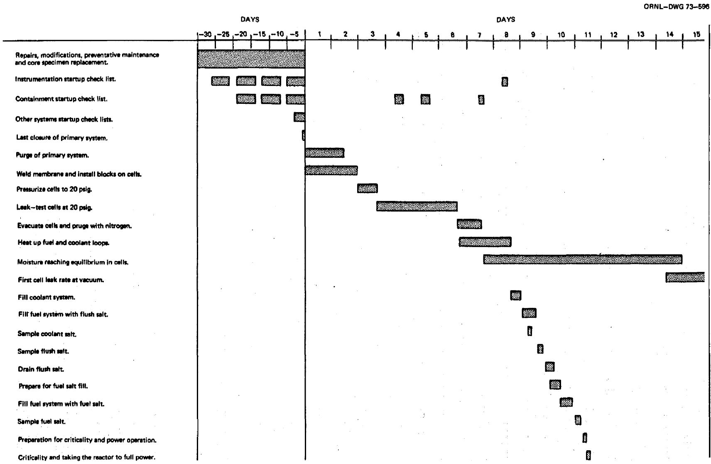  
Fig. 4.6 Return to Full-Power Operation (Typical Schedule)

9A-1 - Restart Equipment After a Power Outage involved starting the diesels, restarting equipment and resetting tripped instruments.

5J-1 - Return to Power After a Load and Rod Scram involved manipulating the rods and heat-removal system components to return to power. If no instrument or equipment tests were necessary, this could be done in less than an hour.

11A, 5I, and 5J - Return to Power After a Drain is divided into 3 parts. Part (1) assumes a drain to both drain tanks followed by a transfer through the transfer lines, refill and return to power (this is the design method of transfer). Part (2) assumes a drain to both drain tanks followed by a transfer through the fill lines, refill, and return to power. (This method of transfer was used to save time. Jumpering of interlocks was necessary.) Part (3) assumes a drain to only one drain tank followed by a fill and return to power.

# 4.4.6 Reactor Startup After a Major Shutdown

Each startup was different, requiring scheduling between the completion of maintenance and start of operation. The cell membrane was usually installed shortly after the final closure of the primary system. Assuming this, and that maintenance on out-of-cell components was completed by the time they were needed, a somewhat typical startup would be as shown in Fig. 4-6.

# 4.5 Changes Made in the Plant

The number and kinds of changes made in a plant after it begins operation are influenced by two different things: original design and changing activities. In some single-purpose systems the number of changes may simply reflect how well the original design met its goals. In an experimental plant such as the MSRE, most of the changes may be required for experimental purposes or changes in the mode of operation. In any event, time spent in making changes affects the availability of the plant.

During the course of the MSRE operation many changes were made, but only a few caused significant delay in the program.

After the end of construction and the non-nuclear checkout of the MSRE, it was required that a change request be formally initiated, reviewed and approved before any modification was made. (Section 13B of Reference 22, which prescribes the procedure, defines a modification as "a change in the physical plant which produces a significantly different characteristic or function in any component or system.") In the 55 months from June 1965 through December 1969, a total of 633 requests for changes in the reactor system were initiated, of which 512 were approved. For the chemical processing plant, 113 change requests were initiated of which 87 were approved.

Table 4-19 summarizes for each 6-month period the number of requests initiated and approved for the reactor. The table also categorizes the approved changes as to the reason for making the change and the type of change that it was. As indicated, most of the changes were aimed at filling the needs of normal operation and over half were changes in either instrumentation or setpoints.

Table 4-20 summarizes the change requests for the chemical processing plant.

Although we know how many changes were made, we cannot accurately sum up the times required for making the changes. We can say, however, that in the case of the reactor change requests, the vast majority either took very little time to execute or were made while other work was going on. Exceptions include the work on the fuel offgas system in the spring of 1966. In the processing plant, the summer of 1968 was spent in testing and modifications, particularly of the fluorine disposal system.

Table 4-19 Summary of Reactor System Requests   

<table><tr><td colspan="2">Period</td><td colspan="2">Number of Requests</td><td colspan="7">Reason for Change Requests</td><td colspan="7">Type Change</td></tr><tr><td>Year</td><td>Half</td><td>Requested</td><td>Approved</td><td>Safety</td><td>Protection Of Equipment And Personnel</td><td>Normal Operation</td><td>Convenience</td><td>Experiment</td><td>Special Samples</td><td>Other</td><td>Layout</td><td>Mechanical</td><td>Piping</td><td>Electrical</td><td>Instrumentation</td><td>Setpoints</td><td>Other</td></tr><tr><td rowspan="2">1965</td><td>\( 1st^a \)</td><td>34</td><td>27</td><td>1</td><td>6</td><td>13</td><td>5</td><td>0</td><td>0</td><td>4</td><td>0</td><td>6</td><td>3</td><td>2</td><td>10</td><td>2</td><td>4</td></tr><tr><td>2nd</td><td>126</td><td>115</td><td>5</td><td>9</td><td>86</td><td>9</td><td>1</td><td>1</td><td>4</td><td>2</td><td>11</td><td>17</td><td>8</td><td>61</td><td>12</td><td>5</td></tr><tr><td rowspan="2">1966</td><td>1st</td><td>173</td><td>137</td><td>2</td><td>12</td><td>104</td><td>7</td><td>2</td><td>0</td><td>9</td><td>2</td><td>11</td><td>29</td><td>17</td><td>60</td><td>14</td><td>10</td></tr><tr><td>2nd</td><td>103</td><td>76</td><td>1</td><td>7</td><td>59</td><td>5</td><td>2</td><td>1</td><td>1</td><td>1</td><td>11</td><td>14</td><td>3</td><td>34</td><td>12</td><td>4</td></tr><tr><td rowspan="2">1967</td><td>1st</td><td>69</td><td>55</td><td>3</td><td>1</td><td>47</td><td>1</td><td>1</td><td>1</td><td>1</td><td>0</td><td>3</td><td>18</td><td>1</td><td>25</td><td>10</td><td>2</td></tr><tr><td>2nd</td><td>34</td><td>30</td><td>0</td><td>1</td><td>25</td><td>1</td><td>0</td><td>2</td><td>0</td><td>0</td><td>3</td><td>4</td><td>1</td><td>13</td><td>7</td><td>3</td></tr><tr><td rowspan="2">1968</td><td>1st</td><td>32</td><td>23</td><td>1</td><td>1</td><td>11</td><td>1</td><td>3</td><td>6</td><td>0</td><td>0</td><td>3</td><td>5</td><td>2</td><td>11</td><td>1</td><td>1</td></tr><tr><td>2nd</td><td>18</td><td>17</td><td>0</td><td>0</td><td>12</td><td>0</td><td>5</td><td>0</td><td>0</td><td>0</td><td>0</td><td>2</td><td>1</td><td>6</td><td>8</td><td>0</td></tr><tr><td rowspan="2">1969</td><td>1st</td><td>24</td><td>21</td><td>0</td><td>0</td><td>12</td><td>0</td><td>8</td><td>1</td><td>0</td><td>1</td><td>3</td><td>5</td><td>3</td><td>8</td><td>6</td><td>0</td></tr><tr><td>2nd</td><td>20</td><td>11</td><td>1</td><td>0</td><td>4</td><td>0</td><td>4</td><td>2</td><td>0</td><td>0</td><td>0</td><td>3</td><td>2</td><td>6</td><td>3</td><td>0</td></tr><tr><td>Total</td><td></td><td>633</td><td>512</td><td>14</td><td>37</td><td>373</td><td>29</td><td>26</td><td>14</td><td>19</td><td>6</td><td>51</td><td>100</td><td>46</td><td>234</td><td>75</td><td>29</td></tr></table>

aAfter institution of change request procedure on June 21, 1965.

Table 4-20 Summary of Chem Plant Change Requests   

<table><tr><td colspan="2">Period</td><td colspan="2">Number of Requests</td><td colspan="8">Reason for Change Requests</td><td colspan="7">Type Change</td></tr><tr><td>Year</td><td>Half</td><td>Requested</td><td>Approved</td><td>Safety</td><td>Protection Of Equipment And Personnel</td><td>Normal Operation Operation</td><td>Convenience</td><td>Experiment</td><td>Special Samples</td><td>Other</td><td>Layout</td><td>Mechanical</td><td>Piping</td><td>Electrical</td><td>Instrumentation</td><td>Setpoints</td><td>Other</td><td></td></tr><tr><td rowspan="2">1965</td><td>1st</td><td>5</td><td>4</td><td>1</td><td>0</td><td>3</td><td>0</td><td>0</td><td>0</td><td>0</td><td>0</td><td>0</td><td>3</td><td>0</td><td>1</td><td>0</td><td>0</td><td></td></tr><tr><td>2nd</td><td>5</td><td>5</td><td>0</td><td>1</td><td>4</td><td>0</td><td>0</td><td>0</td><td>0</td><td>1</td><td>0</td><td>1</td><td>0</td><td>4</td><td>0</td><td>0</td><td></td></tr><tr><td rowspan="2">1966</td><td>1st</td><td>0</td><td>0</td><td>0</td><td>0</td><td>0</td><td>0</td><td>0</td><td>0</td><td>0</td><td>0</td><td>0</td><td>0</td><td>0</td><td>0</td><td>0</td><td>0</td><td></td></tr><tr><td>2nd</td><td>2</td><td>2</td><td>0</td><td>0</td><td>2</td><td>0</td><td>0</td><td>0</td><td>0</td><td>0</td><td>0</td><td>0</td><td>0</td><td>2</td><td>0</td><td>0</td><td></td></tr><tr><td rowspan="2">1967</td><td>1st</td><td>5</td><td>5</td><td>0</td><td>0</td><td>5</td><td>0</td><td>0</td><td>0</td><td></td><td></td><td>1</td><td>4</td><td>0</td><td>1</td><td>0</td><td>0</td><td></td></tr><tr><td>2nd</td><td>9</td><td>8</td><td>0</td><td>0</td><td>8</td><td>0</td><td>0</td><td>0</td><td>0</td><td>0</td><td>1</td><td>2</td><td>2</td><td>3</td><td>0</td><td>0</td><td></td></tr><tr><td rowspan="2">1968</td><td>1st</td><td>56</td><td>44</td><td>0</td><td>0</td><td>42</td><td>0</td><td>0</td><td>1</td><td>0</td><td>1</td><td>3</td><td>17</td><td>4</td><td>16</td><td>5</td><td>1</td><td></td></tr><tr><td>2nd</td><td>30</td><td>25</td><td>0</td><td>0</td><td>25</td><td>0</td><td>0</td><td>0</td><td>0</td><td>0</td><td>1</td><td>10</td><td>2</td><td>7</td><td>6</td><td>0</td><td></td></tr><tr><td rowspan="2">1969</td><td>1st</td><td>1</td><td>1</td><td>0</td><td>0</td><td>0</td><td>0</td><td>0</td><td>1</td><td>0</td><td>0</td><td>0</td><td>0</td><td>0</td><td>0</td><td>1</td><td>0</td><td></td></tr><tr><td>2nd</td><td>0</td><td>0</td><td>0</td><td>0</td><td>0</td><td>0</td><td>0</td><td>0</td><td>0</td><td>0</td><td>0</td><td>0</td><td>0</td><td>0</td><td>0</td><td>0</td><td></td></tr><tr><td>Total</td><td></td><td>113</td><td>94</td><td>1</td><td>1</td><td>89</td><td>0</td><td>0</td><td>2</td><td>0</td><td>2</td><td>6</td><td>37</td><td>8</td><td>33</td><td>12</td><td>1</td><td></td></tr></table>

# 4.6 Tabulation of Recorded Variables at Full power

It seemed desirable to record a set of readings of all of the various reactor variables at normal conditions. However, even though the MSRE ran at full power much of the time, conditions were constantly changing due mainly to the various experiments which were performed. Also some of the variables were not recorded regularly thus making it difficult to select the best time. After consideration of these factors, the 12 to 8 shift on 10/12/69 was selected as a period at full power when conditions were fairly normal and considerable information was available. Values were taken from the various recorder charts, routine control room and building logs and the weekly, monthly, and other check lists. These are tabulated in Tables 4.21 and 4.22. A snapshot listing all of the computer inputs was also retrieved from the computer tapes for 0400 on 10/12/69. These values are listed in Table 4.23. The location of the sensing element is described briefly in the description column. The number and letters in the identification column correspond to those used in the design drawings and other design documents. They can be used to further identify the variable.

Table 4.21. Tabulation of recorded variables On 10/12/69   

<table><tr><td>Identification</td><td colspan="3">Description</td><td>Reading 10/12/69</td></tr><tr><td>TE-100-A5</td><td colspan="3">Line 100 (Reactor outlet) temperature</td><td>1205°F</td></tr><tr><td>TE-100-A6</td><td colspan="3">Line 100 temperature</td><td>1169°F</td></tr><tr><td>TE-101-2A</td><td colspan="3">Line 101 temperature</td><td>1200°F</td></tr><tr><td>TE-101-3A</td><td colspan="3">Line 101 temperature</td><td>1215°F</td></tr><tr><td>TE-102-3A</td><td colspan="3">Line 102 temperature</td><td>1160°F</td></tr><tr><td>TE-102-B4A</td><td colspan="3">Line 102 temperature</td><td>1152°F</td></tr><tr><td>TE-102-5A</td><td colspan="3">Line 102 (Reactor inlet) temperature</td><td>1173°F</td></tr><tr><td>TE-103-A1B</td><td colspan="3">Line 103 temperature</td><td>908°F</td></tr><tr><td>TE-103-B1</td><td colspan="3">Line 103 temperature</td><td>798°F</td></tr><tr><td>TE-103-6</td><td colspan="3">Line 103 temperature</td><td>1150°F</td></tr><tr><td>TE-103-8</td><td colspan="3">Line 103 temperature</td><td>1223°F</td></tr><tr><td>TE-103-B11</td><td colspan="3">Line 103 temperature</td><td>983°F</td></tr><tr><td>TE-103-14B</td><td colspan="3">Line 103 temperature</td><td>1200°F</td></tr><tr><td>TE-104-5B</td><td colspan="3">Line 104 temperature</td><td>918°F</td></tr><tr><td>TE-106-5B</td><td colspan="3">Line 106 temperature</td><td>1080°F</td></tr><tr><td>TE-108-7</td><td colspan="3">Line 108 temperature</td><td>222°F</td></tr><tr><td>TE-109-7</td><td colspan="3">Line 109 temperature</td><td>227°F</td></tr><tr><td>TE-200-B7B</td><td colspan="3">Line 200 temperature</td><td>1018°F</td></tr><tr><td>TE-200-D7B</td><td colspan="3">Line 200 temperature</td><td>1025°F</td></tr><tr><td>TE-200-A8B</td><td colspan="3">Line 200 temperature</td><td>1035°F</td></tr><tr><td>TE-200-B8B</td><td colspan="3">Line 200 temperature</td><td>1010°F</td></tr><tr><td>TE-200-C8B</td><td colspan="3">Line 200 temperature</td><td>1015°F</td></tr><tr><td>TE-200-A9B</td><td colspan="3">Line 200 temperature</td><td>1010°F</td></tr><tr><td>TE-200-B9B</td><td colspan="3">Line 200 temperature</td><td>1025°F</td></tr><tr><td>TE-200-14A</td><td colspan="3">Line 200 temperature</td><td>1018°F</td></tr><tr><td>TE-200-16B</td><td colspan="3">Line 200 temperature</td><td>1015°F</td></tr><tr><td>TE-200-19A</td><td colspan="3">Line 200 temperature</td><td>1023°F</td></tr><tr><td>TE-200-AS-A1B</td><td colspan="3">Line 200 penetration temperature</td><td>965°F</td></tr><tr><td>TE-200-AS-B1A</td><td colspan="3">Line 200 penetration temperature</td><td>642°F</td></tr><tr><td>Identification</td><td colspan="3">Description</td><td>Reading
10/12/69</td></tr><tr><td>TE-200-AS-C1A</td><td>Line</td><td>200</td><td>penetration temperature</td><td>332°F</td></tr><tr><td>TE-200-AS-2A</td><td>Line</td><td>200</td><td>penetration temperature</td><td>363°F</td></tr><tr><td>TE-201-2B</td><td>Line</td><td>201</td><td>temperature</td><td>1072°F</td></tr><tr><td>TE-201-5A</td><td>Line</td><td>201</td><td>temperature</td><td>1062°F</td></tr><tr><td>TE-201-7B</td><td>Line</td><td>201</td><td>temperature</td><td>1068°F</td></tr><tr><td>TE-201-A9B</td><td>Line</td><td>201</td><td>temperature</td><td>1078°F</td></tr><tr><td>TE-201-B9B</td><td>Line</td><td>201</td><td>temperature</td><td>1045°F</td></tr><tr><td>TE-201-A10B</td><td>Line</td><td>201</td><td>temperature</td><td>1073°F</td></tr><tr><td>TE-201-B10B</td><td>Line</td><td>201</td><td>temperature</td><td>1059°F</td></tr><tr><td>TE-201-C10B</td><td>Line</td><td>201</td><td>temperature</td><td>1086°F</td></tr><tr><td>TE-201-A11B</td><td>Line</td><td>201</td><td>temperature</td><td>1078°F</td></tr><tr><td>TE-201-C11B</td><td>Line</td><td>201</td><td>temperature</td><td>1083°F</td></tr><tr><td>TE-201-D11B</td><td>Line</td><td>201</td><td>temperature</td><td>1075°F</td></tr><tr><td>TE-201-AS-A1B</td><td>Line</td><td>201</td><td>penetration temperature</td><td>706°F</td></tr><tr><td>TE-201-AS-B1A</td><td>Line</td><td>201</td><td>penetration temperature</td><td>772°F</td></tr><tr><td>TE-201-AS-C1B</td><td>Line</td><td>201</td><td>penetration temperature</td><td>350°F</td></tr><tr><td>TE-201-AS-2A</td><td>Line</td><td>201</td><td>penetration temperature</td><td>350°F</td></tr><tr><td>TdI-201A</td><td colspan="3">Radiator ΔT (salt)</td><td>59°F</td></tr><tr><td>Xpr 201</td><td colspan="3">Radiator power</td><td>7.1 MW</td></tr><tr><td>FR-201</td><td colspan="3">Golant salt flow</td><td>860 gpm</td></tr><tr><td>TE-203-1</td><td>Line</td><td>203</td><td>temperature</td><td>870°F</td></tr><tr><td>TE-203-2</td><td>Line</td><td>203</td><td>temperature</td><td>107°F</td></tr><tr><td>TE-204-1A</td><td>Line</td><td>204</td><td>temperature</td><td>1135°F</td></tr><tr><td>TE-204-2A</td><td>Line</td><td>204</td><td>temperature</td><td>1155°F</td></tr><tr><td>TE-204-3A</td><td>Line</td><td>204</td><td>temperature</td><td>1205°F</td></tr><tr><td>TE-204-4A</td><td>Line</td><td>204</td><td>temperature</td><td>1200°F</td></tr><tr><td>TE-204-5A</td><td>Line</td><td>204</td><td>temperature</td><td>1193°F</td></tr><tr><td>TE-204-6A</td><td>Line</td><td>204</td><td>temperature</td><td>1170°F</td></tr><tr><td>TE-204-A7B</td><td>Line</td><td>204</td><td>temperature</td><td>1178°F</td></tr><tr><td>TE-204-B7B</td><td>Line</td><td>204</td><td>temperature</td><td>1170°F</td></tr><tr><td>TE-204-8B</td><td>Line</td><td>204</td><td>temperature</td><td>1130°F</td></tr></table>

Table 4.21 (continued)   

<table><tr><td>Identification</td><td>Description</td><td>Reading
10/12/69</td></tr><tr><td>TE-206-1A</td><td>Line 206 temperature</td><td>1073°F</td></tr><tr><td>TE-206-2A</td><td>Line 206 temperature</td><td>1124°F</td></tr><tr><td>TE-206-3A</td><td>Line 206 temperature</td><td>1147°F</td></tr><tr><td>TE-206-4A</td><td>Line 206 temperature</td><td>1163°F</td></tr><tr><td>TE-206-5B</td><td>Line 206 temperature</td><td>1150°F</td></tr><tr><td>TE-206-6A</td><td>Line 206 temperature</td><td>1073°F</td></tr><tr><td>PI-407</td><td>Leak detector pressure</td><td>100 psig</td></tr><tr><td>RM-500</td><td>Cover-gas supply radiation</td><td>0.3 mr/hr</td></tr><tr><td>PI-500A</td><td>Helium header pressure</td><td>223 psig</td></tr><tr><td>FIC-500A</td><td>Helium flow rate</td><td>6 liters/min.</td></tr><tr><td>PI-500G2</td><td>Helium treating station pressure</td><td>250 psig</td></tr><tr><td>PI-500M</td><td>Reduced helium pressure</td><td>35 psig</td></tr><tr><td>PI-501A</td><td>Reduced helium header pressure</td><td>34.5 psig</td></tr><tr><td>PI-510A</td><td>Oil tank No. 2 pressure</td><td>7.5 psig</td></tr><tr><td>PR-511D</td><td>Coolant drain tank pressure</td><td>4.8 psig</td></tr><tr><td>TE-512-1</td><td>Line 512 temperature</td><td>96°F</td></tr><tr><td>FI-512A</td><td>Coolant pump purge gas flow</td><td>0.6 liters/min</td></tr><tr><td>PI-513A</td><td>Oil tank No. 1 pressure</td><td>8 psig</td></tr><tr><td>TE-516-1</td><td>Line 516 temperature</td><td>107°F</td></tr><tr><td>PR-516</td><td>Fuel pump pressure</td><td>5 psig</td></tr><tr><td>FI-516B</td><td>Fuel pump purge gas flow</td><td>2.4 liters/min.</td></tr><tr><td>PR-522A</td><td>Fuel pump pressure</td><td>5.2 psig</td></tr><tr><td>TE-524-2</td><td>Line 524 temperature</td><td>93°F</td></tr><tr><td>FI-524B</td><td>Fuel pump upper off-gas flow rate</td><td>47%</td></tr><tr><td>LI-524C</td><td>Oil catch tank No. 1 level</td><td>14%</td></tr><tr><td>FI-526C</td><td>Coolant pump upper off-gas flow rate</td><td>0.04 liters/min.</td></tr><tr><td>LI-526C</td><td>Oil catch tank No. 2 level</td><td>18%</td></tr><tr><td>RM-528</td><td>Coolant gas supply radiation</td><td>1.5 mr/hr</td></tr><tr><td>PR-528A</td><td>Coolant pump pressure</td><td>5.1 psig</td></tr><tr><td>A O2I 548</td><td>Helium oxygen content</td><td>0.4 ppm</td></tr><tr><td>A H2O I 548</td><td>Helium moisture content</td><td>2 ppm</td></tr><tr><td>FI-548A</td><td>Helium oxygen analyzer flow</td><td>100 cc/min</td></tr><tr><td>FI-548B</td><td>Helium moisture analyzer flow</td><td>100 cc/min</td></tr><tr><td>PdI-556A</td><td>Main charcoal bed ΔP</td><td>3.4 psi</td></tr><tr><td>RM-557</td><td>Charcoal beds off-gas radiation</td><td>0.1 mr/hr</td></tr><tr><td>RM-565</td><td>Cell air radiation</td><td>1.5 mr/hr</td></tr><tr><td>FI-566</td><td>Reactor cell air oxygen analyzer flow</td><td>100 cc/min</td></tr><tr><td>AO2 I 566</td><td>Reactor cell air oxygen content</td><td>2.7%</td></tr><tr><td>PR-572B</td><td>Fuel drain tank No. 1 pressure</td><td>5.9 psig</td></tr><tr><td>PR-574B</td><td>Fuel drain tank No. 2 pressure</td><td>5.5 psig</td></tr><tr><td>PR-576B</td><td>Fuel flush tank pressure</td><td>5.0 psig</td></tr><tr><td>PI-589</td><td>Overflow tank pressure</td><td>5.1 psig</td></tr><tr><td>FI-589</td><td>Overflow tank bubbler flow rate</td><td>27 psig</td></tr><tr><td>PI-592</td><td>Fuel pump pressure</td><td>5.4 psig</td></tr><tr><td>FI-592</td><td>Fuel pump bubbler flow rate</td><td>25 psig</td></tr><tr><td>FI-593</td><td>Fuel pump bubbler flow rate</td><td>23 psig</td></tr><tr><td>LR-593C</td><td>Fuel pump level</td><td>53%</td></tr><tr><td>FI-594</td><td>Coolant pump bubbler flow rate</td><td>24.8 psig</td></tr><tr><td>FI-595</td><td>Coolang pump bubbler flow rate</td><td>25.5 psig</td></tr><tr><td>LR-595C</td><td>Coolant pump level</td><td>57%</td></tr><tr><td>FI-596</td><td>Fuel pump bubbler flow rate</td><td>25.2 psig</td></tr><tr><td>RM-596</td><td>Fuel pump gas supply radiation</td><td>0.1 mr/hr</td></tr><tr><td>FI-598</td><td>Coolant pump bubbler flow rate</td><td>24.0 psig</td></tr><tr><td>FI-599</td><td>Overflow tank bubbler flow rate</td><td>27.0 psig</td></tr><tr><td>LI-599B</td><td>Overflow tank level</td><td>23%</td></tr><tr><td>FI-600</td><td>Overflow tank bubbler flow rate</td><td>26.5 psig</td></tr><tr><td>LI-600B</td><td>Overflow tank level</td><td>24%</td></tr><tr><td>PI-701A</td><td>Fuel oil pump No. 1 pressure</td><td>10 psig</td></tr><tr><td>PI-702A</td><td>Fuel oil pump No. 2 pressure</td><td>64 psig</td></tr><tr><td>TE-702-1A</td><td>Line 702 temperature</td><td>135°F</td></tr><tr><td>FI-703</td><td>Fuel pump lube oil flow rate</td><td>3.8 gpm</td></tr><tr><td>FI-704</td><td>Fuel pump coolant oil flow rate</td><td>8.2 gpm</td></tr><tr><td>PI-751A</td><td>Coolant oil pump No. 1 pressure</td><td>8 psig</td></tr><tr><td>PI-752A</td><td>Coolant oil pump No. 2 pressure</td><td>56 psig</td></tr><tr><td>TE-752-1A</td><td>Line 752 temperature</td><td>130°F</td></tr><tr><td>FI-753</td><td>Coolant pump lube oil flow rate</td><td>4.0 gpm</td></tr><tr><td>FI-754</td><td>Coolant pump coolant oil flow rate</td><td>6.7 gpm</td></tr><tr><td>LI-806A</td><td>Steam dome water level (FD-1)</td><td>0%</td></tr><tr><td>LI-807A</td><td>Steam dome water level (FD-2)</td><td>0%</td></tr><tr><td>FI-810</td><td>Condenser water flow rate (FD-1)</td><td>40 gpm</td></tr><tr><td>FI-812</td><td>Condenser water flow rate (FD-2)</td><td>40 gpm</td></tr><tr><td>FI-817</td><td>Offgas particle trap water flow rate</td><td>4 gpm</td></tr><tr><td>TI-820-1</td><td>OT-1 water outlet temperature</td><td>87°F</td></tr><tr><td>TI-821-1</td><td>OT-1 water inlet temperature</td><td>80°F</td></tr><tr><td>FI-821A</td><td>OT-1 water flow rate</td><td>8.4 gpm</td></tr><tr><td>TI-822-1</td><td>OT-2 water outlet temperature</td><td>81°F</td></tr><tr><td>TI-823-1</td><td>OT-2 water inlet temperature</td><td>77°F</td></tr><tr><td>FI-823A</td><td>OT-2 water flow rate</td><td>8.6 gpm</td></tr><tr><td>TI-826</td><td>Treated water cooler (TW out) temperature</td><td>98°F</td></tr><tr><td>RM-827</td><td>Process water radiation</td><td>3 mr/hr</td></tr><tr><td>TI-829</td><td>Treated water cooler (TW in) temperature</td><td>108°F</td></tr><tr><td>PI-829A</td><td>Treated water pump pressure</td><td>70 psig</td></tr><tr><td>FI-830</td><td>Fuel pump motor cooling water flow rate</td><td>4.6 gpm</td></tr><tr><td>FI-832</td><td>Coolant pump motor cooling water flow rate</td><td>4.8 gpm</td></tr><tr><td>FI-836A</td><td>Drain tank cell space cooler water flow rate</td><td>63 gpm</td></tr><tr><td>FI-838A</td><td>Reactor cell space cooler No. 1 water flow rate</td><td>53 gpm</td></tr><tr><td>FI-840A</td><td>Reactor cell space cooler No. 2 water flow rate</td><td>59 gpm</td></tr><tr><td>FI-844A</td><td>Thermal shield water flow rate</td><td>50 gpm</td></tr><tr><td>PI-851A</td><td>Cooling tower water pump pressure</td><td>34 psig</td></tr><tr><td>FI-851C</td><td>Cooling tower water to cooler flow rate</td><td>273 gpm</td></tr><tr><td>TI-854</td><td>Treated water cooler (CTW out) temperature</td><td>84°F</td></tr><tr><td>TI-858</td><td>Cooling tower water temperature</td><td>80°F</td></tr><tr><td>FI-859</td><td>Thermal shield slide water flow rate</td><td>7 gpm</td></tr><tr><td>FI-862A</td><td>Coolant cell space cooler (west) flow rate</td><td>20 gpm</td></tr><tr><td>FI-864A</td><td>Coolant cell space cooler (east) flow rate</td><td>20 gpm</td></tr><tr><td>FI-873</td><td>CCP gas cooler water flow rate</td><td>15 gpm</td></tr><tr><td>FI-875</td><td>CCP No. 1 and 2 oil cooler water flow rate</td><td>6.3 gpm</td></tr><tr><td>TI-881-2A</td><td>Air compressor cooler outlet water temperature</td><td>86°F</td></tr><tr><td>TI-881-2B</td><td>Air compressor head outlet water temperature</td><td>92°F</td></tr><tr><td>PdI-900A</td><td>CCP ΔP</td><td>8 psi</td></tr><tr><td>PI-927A</td><td>Ventilation filter suction</td><td>2.2 in. H2O</td></tr><tr><td>PdI-927B2</td><td>Ventilation stack filters ΔP</td><td>3.3 in. H2O</td></tr><tr><td>PI-927C</td><td>Ventilation stack fan suction</td><td>5.5 in. H2O</td></tr><tr><td>PdI-937A</td><td>TR to 840 level ΔP</td><td>0.05 in. H2O</td></tr><tr><td>PdI-938A</td><td>SESA to TR ΔP</td><td>0.04 in. H2O</td></tr><tr><td>RM-6000-1</td><td>Reactor cell radiation</td><td>50,000 R/hr</td></tr><tr><td>RM-6000-2</td><td>Reactor cell radiation</td><td>30,000 R/hr</td></tr><tr><td>RM-6000-3</td><td>Reactor cell radiation</td><td>50,000 R/hr</td></tr><tr><td>RM-6000-4</td><td>Drain tank cell radiation</td><td>10 R/hr</td></tr><tr><td>RM-6000-5</td><td>Drain tank cell radiation</td><td>60 R/hr</td></tr><tr><td>RM-6000-6</td><td>Drain tank cell radiation</td><td>500 R/hr</td></tr><tr><td>RM-6010</td><td>Coolant cell radiation</td><td>100 R/hr</td></tr><tr><td>RR-8100</td><td>Reactor power</td><td>8.5 MW</td></tr><tr><td>RR-8200</td><td>Log reactor power</td><td>7 MW</td></tr><tr><td>FI-9000</td><td>Instrument air flow</td><td>20%</td></tr><tr><td>PIC-9006-1</td><td>Emergency N2setpoint</td><td>65 psig</td></tr><tr><td>FI-9006</td><td>Instrument air flow (emergency header)</td><td>44%</td></tr><tr><td>PdI-AD2-A2</td><td>Radiator air pressure drop</td><td>67%</td></tr><tr><td>ZI-AD2</td><td>Bypass damper position</td><td>10%</td></tr><tr><td>FI-AD3A</td><td>Radiator stack flow rate</td><td>70%</td></tr><tr><td>TI-AD</td><td>Radiator air inlet temperature</td><td>71°F</td></tr><tr><td>TI-AD3-8A</td><td>Radiator air outlet temperature</td><td>190°F</td></tr><tr><td>PI-AR-1</td><td>Instrument air receiver tank pressure</td><td>88 psig</td></tr><tr><td>TE-CC-1</td><td>Coolant cell ambient temperature</td><td>88°F</td></tr><tr><td>TE-CC-2</td><td>Coolant cell ambient temperature</td><td>90°F</td></tr><tr><td>TE-CC-3</td><td>Coolant cell ambient temperature</td><td>78°F</td></tr><tr><td>TE-CC-4</td><td>Coolant cell ambient temperature</td><td>80°F</td></tr><tr><td>TE-CC-5</td><td>Coolant cell ambient temperature</td><td>76°F</td></tr><tr><td>TE-CC-6</td><td>Coolant cell ambient temperature</td><td>115°F</td></tr><tr><td>TE-CC-7</td><td>Coolant cell ambient temperature</td><td>105°F</td></tr><tr><td>TE-CC-8</td><td>Coolant cell ambient temperature</td><td>103°F</td></tr><tr><td>TE-CDT-1A</td><td>Coolant drain tank top temperature</td><td>1195°F</td></tr><tr><td>TE-CDT-3A</td><td>Coolant drain tank top temperature</td><td>1182°F</td></tr><tr><td>TE-CDT-5A</td><td>Coolant drain tank middle temperature</td><td>1200°F</td></tr><tr><td>WR-CDT-C1</td><td>Coolant drain tank weight</td><td>3%</td></tr><tr><td>EII COP-1</td><td>Coolant oil pump No. 1 current</td><td>0 amps</td></tr><tr><td>EII COP-2</td><td>Coolant oil pump No. 2 current</td><td>8.7 amps</td></tr><tr><td>TE-CP-1B</td><td>Coolant pump flange-neck temperature</td><td>245°F</td></tr><tr><td>TE-CP-B2A</td><td>Coolant pump bowl-neck temperature</td><td>786°F</td></tr><tr><td>TE-CP-C2A</td><td>Coolant pump bowl-neck temperature</td><td>795°F</td></tr><tr><td>TE-CP-3B</td><td>Coolant pump bowl top temperature</td><td>957°F</td></tr><tr><td>TE-CP-4A</td><td>Coolant pump bowl top temperature</td><td>965°F</td></tr><tr><td>TE-CP-5A</td><td>Coolant pump bowl top temperature</td><td>965°F</td></tr><tr><td>TE-CP-6A</td><td>Coolant pump bowl bottom temperature</td><td>1042°F</td></tr><tr><td>TE-CP-7A</td><td>Coolant pump bowl bottom temperature</td><td>1020°F</td></tr><tr><td>TE-CP-8A</td><td>Coolant pump bowl flange top temperature</td><td>107°F</td></tr><tr><td>TE-CPM-1B</td><td>Coolant pump motor temperature</td><td>100°F</td></tr><tr><td>SI-CP</td><td>Coolant pump speed</td><td>1780 rpm</td></tr><tr><td>EII-CP</td><td>Coolant pump current</td><td>51 amps</td></tr><tr><td>EwI-CP</td><td>Coolant pump power</td><td>56.5 kW</td></tr><tr><td>LR-CPA</td><td>Coolant pump level (float)</td><td>4.8 in.</td></tr><tr><td>TE-CPLE-A2</td><td>CP level element pot (lower) temperature</td><td>1140°F</td></tr><tr><td>TE-CPLE-A4</td><td>CP level element pot (upper) temperature</td><td>1097°F</td></tr><tr><td>TE-CPLE-A5</td><td>CP level element pipe (top) temperature</td><td>1102°F</td></tr><tr><td>TE-CPLE-A6</td><td>CP level element sensor (lower) temperature</td><td>515°F</td></tr><tr><td>TE-CPLE-A7</td><td>CP level element sensor (upper) temperature</td><td>372°F</td></tr><tr><td>TE-CR-121</td><td>Coolant radiator inlet pipe temperature</td><td>1060°F</td></tr><tr><td>TE-CR-123</td><td>Flow venturi pipe temperature</td><td>1020°F</td></tr><tr><td>LI-DC</td><td>Decontamination cell sump level</td><td>0 in.</td></tr><tr><td>LI-DTC</td><td>Drain tank cell sump level</td><td>0 in.</td></tr><tr><td>TE-FD-1-2A</td><td>Fuel drain tank No. 1 (upper) temperature</td><td>1115°F</td></tr><tr><td>TE-FD1-13A</td><td>Fuel drain tank No. 1 (middle) temperature</td><td>1170°F</td></tr><tr><td>TE-FD1-16A</td><td>Fuel drain tank No. 1 bayonet (top) temperature</td><td>1130°F</td></tr><tr><td>TE-FD1-17A</td><td>Fuel drain tank No. 1 bayonet (upper) temperature</td><td>1146°F</td></tr><tr><td>TE-FD1-18B</td><td>Fuel drain tank No. 1 bayonet (center) temperature</td><td>1158°F</td></tr><tr><td>TE-FD1-19A</td><td>Fuel drain tank No. 1 bayonet (lower) temperature</td><td>1161°F</td></tr><tr><td>TE-FD1-20A</td><td>Fuel drain tank No. 1 bayonet (bottom) temperature</td><td>1161°F</td></tr><tr><td>WR-FD1C</td><td>Fuel drain tank No. 1 weight</td><td>0%</td></tr><tr><td>TE-FD2-2A</td><td>Fuel drain tank No. 2 (upper) temperature</td><td>1140°F</td></tr><tr><td>TE-FD2-13A</td><td>Fuel drain tank No. 2 (middle) temperature</td><td>1150°F</td></tr><tr><td>TE-FD2-16A</td><td>Fuel drain tank No. 2 bayonet (top) temperature</td><td>1115°F</td></tr><tr><td>TE-FD2-17A</td><td>Fuel drain tank No. 2 bayonet (upper) temperature</td><td>1130°F</td></tr><tr><td>TE-FD2-18B</td><td>Fuel drain tank No. 2 bayonet (center) temperature</td><td>1140°F</td></tr><tr><td>TE-FD2-19A</td><td>Fuel drain tank No. 2 bayonet (lower) temperature</td><td>1140°F</td></tr><tr><td>TE-FD2-20A</td><td>Fuel drain tank No. 2 bayonet (bottom) temperature</td><td>1140°F</td></tr><tr><td>WR-FD2C</td><td>Fuel drain tank No. 2 weight</td><td>5%</td></tr><tr><td>TE-FF-100-2</td><td>Freeze flange 100 center temperature</td><td>885°F</td></tr><tr><td>TE-FF-102-2</td><td>Freeze flange 102 center temperature</td><td>974°F</td></tr><tr><td>TE-FF-200-2</td><td>Freeze flange 200 center temperature</td><td>754°F</td></tr><tr><td>TE-FF-201-2</td><td>Freeze flange 201 center temperature</td><td>806°F</td></tr><tr><td>TE-FFT-5A</td><td>Fuel flush tank (top) temperature</td><td>1132°F</td></tr><tr><td>TE-FFT-7B</td><td>Fuel flush tank (middle) temperature</td><td>1174°F</td></tr><tr><td>WR-FFT-C</td><td>Fuel flush tank weight</td><td>69.6%</td></tr><tr><td>PdI-FI-A1</td><td>Vent. system roughing filters ΔP</td><td>0.6 in. H2O</td></tr><tr><td>PdI-FI-A2</td><td>Vent. system absolute filters ΔP</td><td>1.6 in. H2O</td></tr><tr><td>E1I FOP-1</td><td>Fuel oil pump No. 1 current</td><td>0 amps</td></tr><tr><td>E1I FOP-2</td><td>Fuel oil pump No. 2 current</td><td>8.2 amps</td></tr><tr><td>TE-FP-1B</td><td>Fuel pump neck-flange temperature</td><td>305°F</td></tr><tr><td>TE-FP-2B</td><td>Fuel pump neck temperature</td><td>559°F</td></tr><tr><td>TE-FP-3B</td><td>Fuel pump neck-bowl temperature</td><td>962°F</td></tr><tr><td>TE-FP-4B</td><td>Fuel pump bowl top temperature</td><td>992°F</td></tr><tr><td>TE-FP-5B</td><td>Fuel pump neck-bowl temperature</td><td>990°F</td></tr><tr><td>TE-FP-6A</td><td>Fuel pump bowl top temperature</td><td>1030°F</td></tr><tr><td>TE-FP-9B</td><td>Fuel pump neck-bowl temperature</td><td>955°F</td></tr><tr><td>TE-FP-10B</td><td>Fuel pump bowl top temperature</td><td>1002°F</td></tr><tr><td>TE-FP-11B</td><td>Fuel pump flange top temperature</td><td>150°F</td></tr><tr><td>TE-FP-12B</td><td>Fuel pump bowl center temperature</td><td>998°F</td></tr><tr><td>TE-FPM-1B</td><td>Fuel pump motor temperature</td><td>120°F</td></tr><tr><td>SI-FP</td><td>Fuel pump speed</td><td>1176 rpm</td></tr><tr><td>Ei-FP</td><td>Fuel pump current</td><td>44.5 amps</td></tr><tr><td>Ew-FP</td><td>Fuel pump power</td><td>34 kW</td></tr><tr><td>LI-FSC</td><td>Fuel storage cell sump level</td><td>1.1 in.</td></tr><tr><td>FT-201A-1A</td><td>Flow element 201A pipe temperature</td><td>1130°F</td></tr><tr><td>FT-201A-2A</td><td>Flow element 201A top flange temperature</td><td>1210°F</td></tr><tr><td>FT-201A-3A</td><td>Flow element 201A bottom flange temperature</td><td>1160°F</td></tr><tr><td>FT-201A-4A</td><td>Flow element 201A pipe temperature</td><td>1130°F</td></tr><tr><td>FT-201A-5A</td><td>Flow element 201A top flange temperature</td><td>1210°F</td></tr><tr><td>FT-201A-6A</td><td>Flow element 201A bottom flange temperature</td><td>1250°F</td></tr><tr><td>FT-201B-1A</td><td>Flow element 201B pipe temperature</td><td>970°F</td></tr><tr><td>FT-201B-2A</td><td>Flow element 201B top flange temperature</td><td>1180°F</td></tr><tr><td>FT-201B-3A</td><td>Flow element 201B bottom flange temperature</td><td>1170°F</td></tr><tr><td>FT-201B-4A</td><td>Flow element 201B pipe temperature</td><td>1130°F</td></tr><tr><td>FT-201B-5A</td><td>Flow element 201B top flange temperature</td><td>1200°F</td></tr><tr><td>FT-201B-6A</td><td>Flow element 201B bottom flange temperature</td><td>1130°F</td></tr><tr><td>TE-FV-103-1B</td><td>Freeze valve 103 shoulder temperature</td><td>1000°F</td></tr><tr><td>TE-FV-103-2A</td><td>Freeze valve 103 center temperature</td><td>390°F</td></tr><tr><td>TE-FV-103-3B</td><td>Freeze valve 103 shoulder temperature</td><td>540°F</td></tr><tr><td>TE-FV-104-3B</td><td>Freeze valve 104 shoulder temperature</td><td>450°F</td></tr><tr><td>TE-FV-104-B4</td><td>Freeze valve 104 adjacent pipe temperature</td><td>450°F</td></tr><tr><td>TE-FV-104-5B</td><td>Freeze valve 104 pot temperature</td><td>590°F</td></tr><tr><td>TE-FV-104-6B</td><td>Freeze valve 104 pipe temperature</td><td>650°F</td></tr><tr><td>TE-FV-105-2A</td><td>Freeze valve 105 center temperature</td><td>1250°F</td></tr><tr><td>TE-FV-105-A4A</td><td>Freeze valve 105 adjacent pipe temperature</td><td>1160°F</td></tr><tr><td>TE-FV-105-B4A</td><td>Freeze valve 105 adjacent pipe temperature</td><td>1190°F</td></tr><tr><td>TE-FV-105-5B</td><td>Freeze valve 105 pot temperature</td><td>1080°F</td></tr><tr><td>TE-FV-105-6B</td><td>Freeze valve 105 pipe temperature</td><td>1120°F</td></tr><tr><td>TE-FV-106-2A</td><td>Freeze valve 106 center temperature</td><td>1215°F</td></tr><tr><td>TE-FV-106-A4A</td><td>Freeze valve 106 adjacent pipe temperature</td><td>1140°F</td></tr><tr><td>TE-FV-106-B4A</td><td>Freeze valve 106 adjacent pipe temperature</td><td>1190°F</td></tr><tr><td>TE-FV-106-5B</td><td>Freeze valve 106 pot temperature</td><td>1120°F</td></tr><tr><td>TE-FV-107-1A</td><td>Freeze valve 107 shoulder temperature</td><td>500°F</td></tr><tr><td>TE-FV-107-3B</td><td>Freeze valve 107 shoulder temperature</td><td>490°F</td></tr><tr><td>TE-FV-107-A4</td><td>Freeze valve 107 adjacent pipe temperature</td><td>530°F</td></tr><tr><td>TE-FV-107-5B</td><td>Freeze valve 107 pot temperature</td><td>610°F</td></tr><tr><td>TE-FV-107-6A</td><td>Freeze valve 107 pot temperature</td><td>540°F</td></tr><tr><td>TE-FV-108-3B</td><td>Freeze valve 108 shoulder temperature</td><td>440°F</td></tr><tr><td>TE-FV-108-B4</td><td>Freeze valve 108 adjacent pipe temperature</td><td>450°F</td></tr><tr><td>TE-FV-108-5B</td><td>Freeze valve 108 pot temperature</td><td>640°F</td></tr><tr><td>TE-FV-108-6A</td><td>Freeze valve 108 pot temperature</td><td>543°F</td></tr><tr><td>TE-FV-109-1B</td><td>Freeze valve 109 shoulder temperature</td><td>470°F</td></tr><tr><td>TE-FV-109-6A</td><td>Freeze valve 109 pot temperature</td><td>595°F</td></tr><tr><td>TE-FV-204-1B</td><td>Freeze valve 204 shoulder temperature</td><td>790°F</td></tr><tr><td>TE-FV-204-2A</td><td>Freeze valve 204 center temperature</td><td>235°F</td></tr><tr><td>TE-FV-204-3B</td><td>Freeze valve 204 shoulder temperature</td><td>830°F</td></tr><tr><td>TE-FV-206-1B</td><td>Freeze valve 206 shoulder temperature</td><td>710°F</td></tr><tr><td>TE-FV-206-2A</td><td>Freeze valve 206 center temperature</td><td>300°F</td></tr><tr><td>TE-FV-206-3B</td><td>Freeze valve 206 shoulder temperature</td><td>830°F</td></tr><tr><td>TE-H 103</td><td>Heater 103 temperature</td><td>908°F</td></tr><tr><td>PI-HB-A</td><td>High bay pressure</td><td>-0.19 in. H2O</td></tr><tr><td>TE-HX-1A</td><td>Heat exchanger coolant out temperature</td><td>1060°F</td></tr><tr><td>TE-HX-4A</td><td>Heat exchanger coolant in temperature</td><td>1180°F</td></tr><tr><td>TE-HX-7A</td><td>Heat exchanger shell (center) temperature</td><td>1165°F</td></tr><tr><td>ZI-ID-A</td><td>Inlet radiator door position</td><td>82.5%</td></tr><tr><td>TE-OFT-1</td><td>Overflow tank pipe temperature</td><td>934°F</td></tr><tr><td>TE-OFT-2B</td><td>Overflow tank top temperature</td><td>1202°F</td></tr><tr><td>TE-OFT-4</td><td>Overflow tank side temperature</td><td>1190°F</td></tr><tr><td>ZI-OD-A</td><td>Outlet radiator door position</td><td>79.5%</td></tr><tr><td>LI-OT1A3</td><td>Fuel oil supply tank level</td><td>64%</td></tr><tr><td>RM-OT1</td><td>Fuel oil supply tank radiation</td><td>1.7 mr/hr</td></tr><tr><td>LT-OT2A3</td><td>Coolant oil supply tank level</td><td>58%</td></tr><tr><td>RM-OT2</td><td>Coolant oil supply tank radiation</td><td>0.1 mr/hr</td></tr><tr><td>TIC-O2 R1-1</td><td>Helium oxygen removal No. 1 temperature</td><td>790°F</td></tr><tr><td>TIC O2 R2-1</td><td>Helium oxygen removal No. 2 temperature</td><td>1235°F</td></tr><tr><td>TIC O2 R1-2</td><td>Helium oxygen removal No. 1 wall temperature</td><td>513°F</td></tr><tr><td>TIC O2 R2-2</td><td>Helium oxygen removal No. 2 wall temperature</td><td>860°F</td></tr><tr><td>TIC PH 1</td><td>Helium preheater No. 1 temperature</td><td>790°F</td></tr><tr><td>TIC PH 2</td><td>Helium preheater No. 2 temperature</td><td>800°F</td></tr><tr><td>TE PT-1</td><td>Particle trap temperature</td><td>360°F</td></tr><tr><td>TE PT-2</td><td>Particle trap temperature</td><td>360°F</td></tr><tr><td>TE PT-3</td><td>Particle trap temperature</td><td>360°F</td></tr><tr><td>TE R-5A</td><td>Reactor top temperature</td><td>1206°F</td></tr><tr><td>TE R-6A</td><td>Reactor top temperature</td><td>1210°F</td></tr><tr><td>TE R-7A</td><td>Reactor neck temperature</td><td>799°F</td></tr><tr><td>TE R-8A</td><td>Reactor neck temperature</td><td>680°F</td></tr><tr><td>TE R-9</td><td>Reactor neck temperature</td><td>600°F</td></tr><tr><td>TE R-10</td><td>Reactor neck temperature</td><td>534°F</td></tr><tr><td>TE R-17</td><td>Reactor side temperature</td><td>1190°F</td></tr><tr><td>TE R-23A</td><td>Reactor side temperature</td><td>1185°F</td></tr><tr><td>TE R-32A</td><td>Reactor bottom temperature</td><td>1170°F</td></tr><tr><td>TE R-34</td><td>Reactor neck flange temperature</td><td>233°F</td></tr><tr><td>TE R-35</td><td>Reactor neck flange temperature</td><td>198°F</td></tr><tr><td>TE R-36A</td><td>Reactor control rod No. 1 (upper) temperature</td><td>449°F</td></tr><tr><td>TE R-37A</td><td>Reactor control rod No. 2 (upper) temperature</td><td>431°F</td></tr><tr><td>TE R-38A</td><td>Reactor control rod No. 3 (upper) temperature</td><td>460°F</td></tr><tr><td>TE R-39A</td><td>Reactor control rod No. 1 (lower) temperature</td><td>855°F</td></tr><tr><td>TE R-40A</td><td>Reactor control rod No. 2 (lower) temperature</td><td>786°F</td></tr><tr><td>TE R-41A</td><td>Reactor control rod No. 3 (lower) temperature</td><td>689°F</td></tr><tr><td>TE R-43B</td><td>Reactor graphite tube (lower) temperature</td><td>1025°F</td></tr><tr><td>TE R-44A</td><td>Reactor neck (bottom) temperature</td><td>1218°F</td></tr><tr><td>TE R-46A</td><td>Reactor neck (upper) temperature</td><td>250°F</td></tr><tr><td>TE R-47</td><td>Reactor neck (upper) temperature</td><td>215°F</td></tr><tr><td>TE R-48</td><td>Reactor neck (upper) temperature</td><td>212°F</td></tr><tr><td>TE R-52</td><td>Reactor thermal well temperature</td><td>810°F</td></tr><tr><td>LI RC-C</td><td>Reactor cell sump level</td><td>0 in.</td></tr><tr><td>PI RC-A</td><td>Reactor cell pressure</td><td>-2.5 psig</td></tr><tr><td>FI-S1</td><td>Containment stack flow</td><td>75%</td></tr><tr><td>RM-S1A</td><td>Containment stack alpha</td><td>100 cpm</td></tr><tr><td>RM-S1B</td><td>Containment stack beta gamma</td><td>11 cpm</td></tr><tr><td>RM-S1C</td><td>Containment stack iodine</td><td>530 cpm</td></tr><tr><td>LI SC-A</td><td>Storage cell sump level</td><td>1.0 in. H2O</td></tr><tr><td>LI TC-A</td><td>Spare cell sump level</td><td>0.4 in. H2O</td></tr><tr><td>PI VT-1</td><td>Vapor suppression tank pressure</td><td>0.4 psig</td></tr><tr><td>LI WT-A</td><td>Waste tank level</td><td>107 in. H2O</td></tr><tr><td>LI WTC-A</td><td>Waste tank cell level</td><td>2.6 in. H2O</td></tr><tr><td rowspan="2">OACOT</td><td>Main blower vibration</td><td>&lt;1 mil</td></tr><tr><td>Official average coolant outlet temperature</td><td>1011.5°F</td></tr><tr><td rowspan="25">OAFOT</td><td>Official average fuel outlet temperature</td><td>1208.3°F</td></tr><tr><td>Control rod No. 1 position</td><td>35.5 in.</td></tr><tr><td>Control rod No. 2 position</td><td>44 in.</td></tr><tr><td>Control rod No. 3 position</td><td>43.1 in.</td></tr><tr><td>Fission chamber No. 1 position</td><td>60 in.</td></tr><tr><td>Fission chamber No. 2 position</td><td>65.7 in.</td></tr><tr><td>Fission chamber No. 1 count rate</td><td>104cps</td></tr><tr><td>Fission chamber No. 2 count rate</td><td>104cps</td></tr><tr><td>Control rod No. 1 clutch current</td><td>143 ma</td></tr><tr><td>Control rod No. 2 clutch current</td><td>144 ma</td></tr><tr><td>Control rod No. 3 clutch current</td><td>147 ma</td></tr><tr><td>Motor generator 2 current</td><td>28 amps</td></tr><tr><td>Motor generator 3 current</td><td>32 amps</td></tr><tr><td>Motor generator 2 voltage</td><td>52 volts</td></tr><tr><td>Motor generator 3 voltage</td><td>52 volts</td></tr><tr><td>Battery voltage</td><td>50.5 volts</td></tr><tr><td>Motor generator No. 1 voltage</td><td>260 volts</td></tr><tr><td>Motor generator No. 1 current</td><td>130 amps</td></tr><tr><td>Inverter voltage</td><td>206 V</td></tr><tr><td>Inverter current</td><td>89 amps</td></tr><tr><td>Main blower No. 1 current</td><td>260 amps</td></tr><tr><td>Main blower No. 3 current</td><td>280 amps</td></tr><tr><td>Component coolant pump No. 1 current</td><td>0 amps</td></tr><tr><td>Component coolant pump No. 2 current</td><td>88 amps</td></tr><tr><td>Instrument air dryer purge rate</td><td>12 cfm</td></tr></table>

Table 4.22. Tabulation of recorded heater current on 10/12/69 (average of 3 phases)   

<table><tr><td>Description</td><td>Reading 10/12/69</td><td>Description</td><td>Reading 10/12/69</td><td>Description</td><td>Reading 10/12/69</td></tr><tr><td>H-CR-1</td><td>15</td><td>H203-2</td><td>0</td><td>RCH-5</td><td>12</td></tr><tr><td>H-CR-2</td><td>17</td><td>H204-1A</td><td>3</td><td>RCH-6</td><td>15</td></tr><tr><td>H-CR-3</td><td>23</td><td>LE-CP-1</td><td>4</td><td>RCH-7</td><td>8</td></tr><tr><td>H-CR-4</td><td>18</td><td>LE-CP-2</td><td>7</td><td>H102-2</td><td>13</td></tr><tr><td>H-CR-5</td><td>18</td><td>FV204-1</td><td>2.5</td><td>R-1</td><td>18</td></tr><tr><td>H-CR-6</td><td>19</td><td>FV204-2</td><td>1</td><td>R-2</td><td>19</td></tr><tr><td>H-CR-7</td><td>15</td><td>FV206-1</td><td>2</td><td>R-3</td><td>19</td></tr><tr><td>H-CR-8</td><td>25</td><td>FV206-1A</td><td>1.5</td><td>HX-1</td><td>0</td></tr><tr><td>200-13</td><td>17</td><td>H204-1</td><td>15</td><td>HX-2</td><td>16</td></tr><tr><td>201-12</td><td>13</td><td>H206-1</td><td>11</td><td>HX-3</td><td>16</td></tr><tr><td>202-2</td><td>14</td><td>CDT-1</td><td>15</td><td>FP-1</td><td>6</td></tr><tr><td>200-14</td><td>6</td><td>CDT-2</td><td>11</td><td>FP-2</td><td>6</td></tr><tr><td>200-15</td><td>10</td><td>CDT-3</td><td>12</td><td>RAN-1</td><td>0</td></tr><tr><td>201-10</td><td>11</td><td>CP-1</td><td>13</td><td>RAN-2</td><td>0</td></tr><tr><td>201-11</td><td>6</td><td>CP-2</td><td>12</td><td>200-16</td><td>2</td></tr><tr><td>201-13</td><td>7</td><td>H200-1</td><td>10</td><td>201-14</td><td>1</td></tr><tr><td>202-1</td><td>7</td><td>H200-11</td><td>12</td><td>102-1</td><td>3</td></tr><tr><td>204-2</td><td>10</td><td>H200-12</td><td>14</td><td>522</td><td>0</td></tr><tr><td>205-1</td><td>7</td><td>H201-1</td><td>13</td><td>102-4</td><td>9</td></tr><tr><td>204-3</td><td>6</td><td>H201-2</td><td>10</td><td>102-5</td><td>1</td></tr><tr><td>FT201A1</td><td>5</td><td>H201-9</td><td>16</td><td>103</td><td>26</td></tr><tr><td>FT201A3</td><td>5</td><td>H100-1</td><td>2</td><td>FV-103</td><td>0</td></tr><tr><td>FT201A2</td><td>6</td><td>RCH-1</td><td>16</td><td>H-104-1</td><td>8</td></tr><tr><td>FT201Ar</td><td>4</td><td>RCH-2</td><td>13</td><td>FV-104-1A</td><td>4</td></tr><tr><td>FT-201B1</td><td>6</td><td>RCH-3</td><td>19</td><td>FV-105-1A</td><td>11</td></tr><tr><td>FT201B3</td><td>5</td><td>RCH-4</td><td>21</td><td>FFT-1</td><td>16</td></tr><tr><td>FT201B2</td><td>6</td><td>H100-2</td><td>18</td><td>FFT-2</td><td>15</td></tr><tr><td>FT201B4</td><td>6</td><td>H101-2</td><td>11</td><td>FD-1-1</td><td>18</td></tr><tr><td>H203-1</td><td>0</td><td>H101-3</td><td>13</td><td>FD-1-2</td><td>17</td></tr><tr><td>FD-2-1</td><td>18</td><td>FV-104-3</td><td>11</td><td>FV-108-3</td><td>3</td></tr><tr><td>FD-2-2</td><td>13</td><td>FV-104-4</td><td>10</td><td>FV-108-1</td><td>1</td></tr><tr><td>FV-104-1</td><td>5</td><td>FV-105-2</td><td>6</td><td>FV-108-3</td><td>5</td></tr><tr><td>FV-104-3</td><td>7</td><td>FV-105-3</td><td>7</td><td>FV-109-1</td><td>3</td></tr><tr><td>H-104-5</td><td>10</td><td>FV-104-7</td><td>13</td><td>FV-109-2</td><td>4</td></tr><tr><td>H-104-6</td><td>8</td><td>FV-106-2</td><td>8</td><td>FV-109-3</td><td>2</td></tr><tr><td>FV-105-1</td><td>12</td><td>FV-106-3</td><td>10</td><td>FV-109-1</td><td>1</td></tr><tr><td>FV-105-3</td><td>11</td><td>FV-110-2</td><td>0</td><td>FV-109-3</td><td>5</td></tr><tr><td>FV-105-1</td><td>7</td><td>FV-110-3</td><td>0</td><td>FV-110-1</td><td>0</td></tr><tr><td>FV-105-4</td><td>11</td><td>FV-107-1</td><td>2</td><td></td><td></td></tr><tr><td>FV-106-1</td><td>11</td><td>FV-107-2</td><td>3</td><td></td><td></td></tr><tr><td>FV-106-3</td><td>9</td><td>FV-107-3</td><td>3</td><td></td><td></td></tr><tr><td>FV-106-1</td><td>6</td><td>FV-107-1</td><td>1</td><td></td><td></td></tr><tr><td>FV-106-4</td><td>3</td><td>FV-107-3</td><td>5</td><td></td><td></td></tr><tr><td>FV-106-1A</td><td>11</td><td>FV-108-1</td><td>3</td><td></td><td></td></tr><tr><td>FV-104-2</td><td>9</td><td>FV-108-2</td><td>5</td><td></td><td></td></tr></table>

Table 4.23. Computer snapshot taken at 0400 on 10/12/69   

<table><tr><td>Identification</td><td>Scan 
Seq. 
No.</td><td>Description</td><td>Reading 
10/12/69</td></tr><tr><td>EWM-CP-D</td><td>256</td><td>Coolant pump power</td><td>31.8 kW</td></tr><tr><td>EWM-FP-D</td><td>255</td><td>Fuel pump power</td><td>34.8 kW</td></tr><tr><td>FqI-569</td><td>349</td><td>Reactor cell evacuation flow</td><td>1.27 liter/min</td></tr><tr><td>FT-AD3-A</td><td>40</td><td>Radiator stack flow</td><td>195,000 cfm</td></tr><tr><td>FT-S1-A</td><td>242</td><td>Containment stack flow</td><td>20,200 cfm</td></tr><tr><td>FT-201-A</td><td>15</td><td>Coolant salt flow</td><td>849 gpm</td></tr><tr><td>FT-201-B</td><td>28</td><td>Coolant salt flow</td><td>840 gpm</td></tr><tr><td>FT-512-A</td><td>236</td><td>Coolant pump purge gas flow</td><td>0.65 liter/min</td></tr><tr><td>FT-516-B</td><td>234</td><td>Fuel pump purge gas flow</td><td>2.39 liter/min</td></tr><tr><td>FT-524-B</td><td>235</td><td>Fuel pump upper offgas flow</td><td>133 cc/min</td></tr><tr><td>FT-526-C</td><td>237</td><td>Coolant pump upper offgas flow</td><td>83 cc/min</td></tr><tr><td>FT-703-A</td><td>238</td><td>Fuel pump lube oil flow</td><td>3.75 gpm</td></tr><tr><td>FT-704-A</td><td>239</td><td>Fuel pump coolant oil flow</td><td>8.04 gpm</td></tr><tr><td>FT-753-A</td><td>240</td><td>Coolant pump lube oil flow</td><td>3.87 gpm</td></tr><tr><td>FT-754-A</td><td>241</td><td>Coolant pump coolant oil flow</td><td>6.54 gpm</td></tr><tr><td>LE-CP-A</td><td>65</td><td>Coolant pump level</td><td>4.6 in. salt</td></tr><tr><td>LT-OT-1-A</td><td>248</td><td>Fuel oil tank level</td><td>12.4 in. oil</td></tr><tr><td>LT-OT-2-A</td><td>250</td><td>Coolant oil tank level</td><td>11.1 in. oil</td></tr><tr><td>LT-524-C</td><td>251</td><td>Oil catch tank No. 1 level</td><td>11.3 in. oil</td></tr><tr><td>LT-526</td><td>252</td><td>Oil catch tank No. 2 level</td><td>16.0 in. oil</td></tr><tr><td>LT-593-C</td><td>50</td><td>Fuel pump level</td><td>6.1 in. salt</td></tr><tr><td>LT-595-C</td><td>61</td><td>Coolant pump level</td><td>5.6 in. salt</td></tr><tr><td>LT-596-B</td><td>54</td><td>Fuel pump level</td><td>5.1 in. salt</td></tr><tr><td>LT-598-C</td><td>62</td><td>Coolant pump level</td><td>5.5 in. salt</td></tr><tr><td>LT-599-B</td><td>57</td><td>Overflow tank level</td><td>5.6 in. salt</td></tr><tr><td>LT-600-B</td><td>58</td><td>Overflow tank level</td><td>6.3 in. salt</td></tr><tr><td>PDT-AD2-A</td><td>24</td><td>Radiator air pressure drop</td><td>9.1 in. H2O</td></tr><tr><td>PDT-556-A</td><td>228</td><td>Main charcoal bed pressure drop</td><td>3.4 psi</td></tr><tr><td>PDT-960-A</td><td>230</td><td>Component coolant pump ΔP</td><td>8.0 psi</td></tr><tr><td>PT-HB-A</td><td>233</td><td>High bay pressure</td><td>-.07 in. H2O</td></tr><tr><td>PT-RC-A</td><td>348</td><td>Reactor cell pressure</td><td>-1.98 psig</td></tr><tr><td>PT-500-A</td><td>223</td><td>Helium header pressure</td><td>220 psig</td></tr><tr><td>PT-510</td><td>227</td><td>Oil tank No. 2 pressure</td><td>6.8 psig</td></tr><tr><td>PT-511-C</td><td>225</td><td>Coolant drain tank pressure</td><td>-- psig</td></tr><tr><td>PT-511-D</td><td>218</td><td>Coolant drain tank pressure</td><td>5.7 psig</td></tr><tr><td>PT-513-A</td><td>226</td><td>Oil tank No. 1 pressure</td><td>7.7 psig</td></tr><tr><td>PT-516</td><td>347</td><td>Fuel pump pressure</td><td>5.0 psig</td></tr><tr><td>PT-517-A</td><td>224</td><td>Drain tank supply pressure</td><td>8.5 psig</td></tr><tr><td>PT-522-A</td><td>13</td><td>Fuel pump pressure</td><td>5.0 psig</td></tr><tr><td>PT-528</td><td>66</td><td>Coolant pump pressure</td><td>4.6 psig</td></tr><tr><td>PT-572-B</td><td>219</td><td>Fuel drain tank No. 1 pressure</td><td>5.2 psig</td></tr><tr><td>PT-574-B</td><td>220</td><td>Fuel drain tank No. 2 pressure</td><td>5.1 psig</td></tr><tr><td>PT-576-B</td><td>221</td><td>Fuel flush tank pressure</td><td>5.3 psig</td></tr><tr><td>PT-589-A</td><td>53</td><td>Overflow tank pressure</td><td>7.2 psig</td></tr><tr><td>PT-592-B</td><td>33</td><td>Fuel pump pressure</td><td>5.6 psig</td></tr><tr><td>PT-608-B</td><td>222</td><td>Fuel storage tank pressure</td><td>-1.2 psig</td></tr><tr><td>RE-NLC1-A</td><td>32</td><td>Reactor power</td><td>8.6 MW</td></tr><tr><td>RE-NLC2-A</td><td>36</td><td>Reactor power</td><td>8.6 MW</td></tr><tr><td>RE-OT-1-B</td><td>262</td><td>Oil tank No. 1 radiation</td><td>1.8 mr/hr</td></tr><tr><td>RE-OT-2-B</td><td>263</td><td>Oil tank No. 2 radiation</td><td>0.09 mr/hr</td></tr><tr><td>RE-SC1-A1</td><td>9</td><td>Reactor Power</td><td>8.5 MW</td></tr><tr><td>RE-S1A</td><td>277</td><td>Containment stack alpha</td><td>14% scale</td></tr><tr><td>RE-S1B</td><td>278</td><td>Containment stack beta-gamma</td><td>7% scale</td></tr><tr><td>RE-S1C</td><td>270</td><td>Containment stack iodine</td><td>21% scale</td></tr><tr><td>RE-500-D</td><td>261</td><td>Cover gas supply radiation</td><td>0.3 mr/hr</td></tr><tr><td>RE-528-B</td><td>275</td><td>Coolant gas supply radiation</td><td>1.5 mr/hr</td></tr><tr><td>RE-528-C</td><td>276</td><td>Coolant gas supply radiation</td><td>2.1 mr/hr</td></tr><tr><td>RE-557-A</td><td>273</td><td>Offgas from charcoal beds radiation</td><td>0.1 mr/hr</td></tr><tr><td>RE-557-B</td><td>274</td><td>Offgas from charcoal beds radiation</td><td>0.1 mr/hr</td></tr><tr><td>RE-565-B</td><td>271</td><td>Cell air radiation</td><td>1.0 mr/hr</td></tr><tr><td>RE-565-C</td><td>272</td><td>Cell air radiation</td><td>1.4 mr/hr</td></tr><tr><td>RE-596-A</td><td>280</td><td>Fuel pump gas supply radiation</td><td>0.1 mr/hr</td></tr><tr><td>RE-596-B</td><td>282</td><td>Fuel pump gas supply radiation</td><td>0.1 mr/hr</td></tr><tr><td>RE-596-C</td><td>283</td><td>Fuel pump gas supply radiation</td><td>0.1 mr/hr</td></tr><tr><td>RE-675-A</td><td>284</td><td>Sampler cold offgas</td><td>1.1 mr/hr</td></tr><tr><td>RE-675-B</td><td>285</td><td>Sampler cold offgas</td><td>4.2 mr/hr</td></tr><tr><td>RE-678-C</td><td>286</td><td>Sampler hot offgas</td><td>2600 mr/hr</td></tr><tr><td>RE-678-D</td><td>287</td><td>Sampler hot offgas</td><td>4000 mr/hr</td></tr><tr><td>RE-827-A</td><td>264</td><td>Process water radiation</td><td>25 mr/hr</td></tr><tr><td>RE-827-B</td><td>265</td><td>Process water radiation</td><td>26 mr/hr</td></tr><tr><td>RE-827-C</td><td>266</td><td>Process water radiation</td><td>34 mr/hr</td></tr><tr><td>RM-NCC1-A6</td><td>259</td><td>Reactor count rate</td><td>10,000 cps</td></tr><tr><td>RM-NCC2-A6</td><td>260</td><td>Reactor count rate</td><td>10,000 cps</td></tr><tr><td>RM-NCC1-A7</td><td>41</td><td>Reactor power</td><td>9.6 MW</td></tr><tr><td>RM-NCC2-A7</td><td>42</td><td>Reactor power</td><td>9.2 MW</td></tr><tr><td>RM-NCC1-A9</td><td>44</td><td>Reactor period</td><td>-300 sec</td></tr><tr><td>RM-NCC2-A9</td><td>45</td><td>Reactor period</td><td>-150 sec</td></tr><tr><td>SE-CP-G1-A</td><td>52</td><td>Coolant pump speed</td><td>1775 rpm</td></tr><tr><td>SE-FP-E1-A</td><td>11</td><td>Fuel pump speed</td><td>1190 rpm</td></tr><tr><td>TE-AD1-1A</td><td>184</td><td>Radiator inlet air temperature</td><td>67°F</td></tr><tr><td>TE-AD3-4</td><td>185</td><td>Radiator outlet duct wall temperature</td><td>107°F</td></tr><tr><td>TE-AD3-5A</td><td>186</td><td>Radiator outlet duct wall temperature</td><td>120°F</td></tr><tr><td>TE-AD3-6</td><td>187</td><td>Radiator outlet duct wall temperature</td><td>129°F</td></tr><tr><td>TE-AD3-7A</td><td>188</td><td>Radiator outlet duct wall temperature</td><td>173°F</td></tr><tr><td>TE-AD3-8A</td><td>190</td><td>Radiator outlet air temperature</td><td>178°F</td></tr><tr><td>TE-CDT-2A</td><td>181</td><td>Coolant drain tank bottom temperature</td><td>1210°F</td></tr><tr><td>TE-CDT-8</td><td>182</td><td>Coolant drain tank middle temperature</td><td>1203°F</td></tr><tr><td>TE-CP-A2B</td><td>127</td><td>Coolant pump bowl-neck temperature</td><td>804°F</td></tr><tr><td>TE-CP-1A</td><td>126</td><td>Coolant pump flange-neck temperature</td><td>247°F</td></tr><tr><td>TE-CP-3A</td><td>128</td><td>Coolant pump bowl top temperature</td><td>955°F</td></tr><tr><td>TE-CP-8B</td><td>125</td><td>Coolant pump flange top temperature</td><td>102°F</td></tr><tr><td>TE-CP-9A</td><td>129</td><td>Coolant pump bowl middle temperature</td><td>1018°F</td></tr><tr><td>TE-CPM-1A</td><td>124</td><td>Coolant pump motor temperature</td><td>96°F</td></tr><tr><td>TE-CTS-D</td><td>90</td><td>Surveillance rig top zone temperature</td><td>1200°F</td></tr><tr><td>TE-CTS-E</td><td>88</td><td>Surveillance rig mid zone temperature</td><td>1230°F</td></tr><tr><td>TE-CTS-F</td><td>87</td><td>Surveillance rig bottom zone temperature</td><td>1220°F</td></tr><tr><td>TE-DH-1</td><td>267</td><td>Diesel house ambient temperature</td><td>76°F</td></tr><tr><td>TE-DL-1</td><td>137</td><td>Computer room ambient temperature</td><td>71°F</td></tr><tr><td>TE-DL-2</td><td>138</td><td>Computer reference thermal plane temperature</td><td>69°F</td></tr><tr><td>TE-DTC-1</td><td>303</td><td>Drain tank cell ambient temperature</td><td>148°F</td></tr><tr><td>TE-DTC-2</td><td>304</td><td>Drain tank cell ambient temperature</td><td>144°F</td></tr><tr><td>TE-DTC-3</td><td>305</td><td>Drain tank cell ambient temperature</td><td>151°F</td></tr><tr><td>TE-DTC-4</td><td>306</td><td>Drain tank cell ambient temperature</td><td>145°F</td></tr><tr><td>TE-DTC-5</td><td>307</td><td>Drain tank cell ambient temperature</td><td>149°F</td></tr><tr><td>TE-DTC-6</td><td>309</td><td>Drain tank cell ambient temperature</td><td>150°F</td></tr><tr><td>TE-FD1-1A</td><td>166</td><td>Fuel drain tank No. 1 top temperature</td><td>1073°F</td></tr><tr><td>TE-FD1-3A</td><td>163</td><td>Fuel drain tank No. 1 bottom temperature</td><td>1149°F</td></tr><tr><td>TE-FD1-12A</td><td>164</td><td>Fuel drain tank No. 1 middle temperature</td><td>1178°F</td></tr><tr><td>TE-FD1-18A</td><td>167</td><td>Fuel drain tank No. 1 bayonet temperature</td><td>1158°F</td></tr><tr><td>TE-FD2-1A</td><td>171</td><td>Fuel drain tank No. 2 top temperature</td><td>1062°F</td></tr><tr><td>TE-FD2-3A</td><td>168</td><td>Fuel drain tank No. 2 bottom temperature</td><td>1130°F</td></tr><tr><td>TE-FD2-12A</td><td>169</td><td>Fuel drain tank No. 2 middle temperature</td><td>1159°F</td></tr><tr><td>TE-FD2-18A</td><td>172</td><td>Fuel drain tank No. 2 bayonet temperature</td><td>1138°F</td></tr><tr><td>TE-FF100-4</td><td>106</td><td>Freeze flange 100 inner temperature</td><td>904°F</td></tr><tr><td>TE-FF100-5</td><td>107</td><td>Freeze flange 100 middle temperature</td><td>648°F</td></tr><tr><td>TE-FF100-6</td><td>108</td><td>Freeze flange 100 outer temperature</td><td>559°F</td></tr><tr><td>TE-FF101-4</td><td>109</td><td>Freeze flange 101 inner temperature</td><td>824°F</td></tr><tr><td>TE-FF101-5</td><td>110</td><td>Freeze flange 101 middle temperature</td><td>585°F</td></tr><tr><td>TE-FF101-6</td><td>111</td><td>Freeze flange 101 outer temperature</td><td>454°F</td></tr><tr><td>TE-FF102-4</td><td>112</td><td>Freeze flange 102 inner temperature</td><td>868°F</td></tr><tr><td>TE-FF-102-5</td><td>113</td><td>Freeze flange 102 middle temperature</td><td>631°F</td></tr><tr><td>TE-FF-102-6</td><td>114</td><td>Freeze flange 102 outer temperature</td><td>541°F</td></tr><tr><td>TE-FF200-4</td><td>115</td><td>Freeze flange 200 inner temperature</td><td>769°F</td></tr><tr><td>TE-FF200-5</td><td>116</td><td>Freeze flange 200 middle temperature</td><td>546°F</td></tr><tr><td>TE-FF200-6</td><td>117</td><td>Freeze flange 200 outer temperature</td><td>477°F</td></tr><tr><td>TE-FF201-4</td><td>118</td><td>Freeze flange 201 inner temperature</td><td>796°F</td></tr><tr><td>TE-FF201-5</td><td>120</td><td>Freeze flange 201 middle temperature</td><td>605°F</td></tr><tr><td>TE-FF201-6</td><td>121</td><td>Freeze flange 201 outer temperature</td><td>495°F</td></tr><tr><td>TE-FFT-1A</td><td>175</td><td>Fuel flush tank top temperature</td><td>1134°F</td></tr><tr><td>TE-FFT-2A</td><td>173</td><td>Fuel flush tank bottom temperature</td><td>1157°F</td></tr><tr><td>TE-FFT-10</td><td>174</td><td>Fuel flush tank middle temperature</td><td>1174°F</td></tr><tr><td>TE-FP-1A</td><td>92</td><td>Fuel pump neck-flange temperature</td><td>303°F</td></tr><tr><td>TE-FP-2A</td><td>93</td><td>Fuel pump neck temperature</td><td>518°F</td></tr><tr><td>TE-FP-3A</td><td>94</td><td>Fuel pump neck-bowl temperature</td><td>962°F</td></tr><tr><td>TE-FP-4A</td><td>98</td><td>Fuel pump bowl top temperature</td><td>1004°F</td></tr><tr><td>TE-FP-5A</td><td>95</td><td>Fuel pump neck-bowl temperature</td><td>984°F</td></tr><tr><td>TE-FP-7B</td><td>102</td><td>Fuel pump bowl lower temperature</td><td>1212°F</td></tr><tr><td>TE-FP-8B</td><td>103</td><td>Fuel pump bowl bottom temperature</td><td>1208°F</td></tr><tr><td>TE-FP-9A</td><td>96</td><td>Fuel pump neck-bowl temperature</td><td>950°F</td></tr><tr><td>TE-FP-10A</td><td>97</td><td>Fuel pump bowl top temperature</td><td>992°F</td></tr><tr><td>TE-FP-11A</td><td>100</td><td>Fuel pump flange top temperature</td><td>146°F</td></tr><tr><td>TE-FPM-1A</td><td>104</td><td>Fuel pump motor temperature</td><td>117°F</td></tr><tr><td>TE-FST-10</td><td>217</td><td>Fuel storage tank temperature</td><td>81°F</td></tr><tr><td>TE-FV103-2B</td><td>39</td><td>Freeze valve 103 center temperature</td><td>407°F</td></tr><tr><td>TE-FV104-1B</td><td>30</td><td>Freeze valve 104 shoulder temperature</td><td>462°F</td></tr><tr><td>TE-FV105-2B</td><td>47</td><td>Freeze valve 105 center temperature</td><td>1236°F</td></tr><tr><td>TE-FV106-2B</td><td>51</td><td>Freeze valve 106 center temperature</td><td>1214°F</td></tr><tr><td>TE-FV107-1B</td><td>144</td><td>Freeze valve 107 shoulder temperature</td><td>102°F</td></tr><tr><td>TE-FV107-2B</td><td>145</td><td>Freeze valve 107 center temperature</td><td>490°F</td></tr><tr><td>TE-FV107-3B</td><td>146</td><td>Freeze valve 107 shoulder temperature</td><td>90°F</td></tr><tr><td>TE-FV108-1B</td><td>147</td><td>Freeze valve 108 shoulder temperature</td><td>77°F</td></tr><tr><td>TE-FV108-2B</td><td>148</td><td>Freeze valve 108 center temperature</td><td>446°F</td></tr><tr><td>TE-FV108-3B</td><td>149</td><td>Freeze valve 108 shoulder temperature</td><td>76°F</td></tr><tr><td>TE-FV109-1B</td><td>150</td><td>Freeze valve 109 shoulder temperature</td><td>103°F</td></tr><tr><td>TE-FV109-2B</td><td>151</td><td>Freeze valve 109 center temperature</td><td>478°F</td></tr><tr><td>TE-FV109-3B</td><td>152</td><td>Freeze valve 109 shoulder temperature</td><td>108°F</td></tr><tr><td>TE-FV110-1B</td><td>153</td><td>Freeze valve 110 shoulder temperature</td><td>106°F</td></tr><tr><td>TE-FV110-2B</td><td>154</td><td>Freeze valve 110 center temperature</td><td>77°F</td></tr><tr><td>TE-FV110-3B</td><td>155</td><td>Freeze valve 110 shoulder temperature</td><td>88°F</td></tr><tr><td>TE-FV111-1B</td><td>156</td><td>Freeze valve 111 shoulder temperature</td><td>88°F</td></tr><tr><td>TE-FV111-2B</td><td>157</td><td>Freeze valve 111 center temperature</td><td>80°F</td></tr><tr><td>TE-FV111-3B</td><td>158</td><td>Freeze valve 111 shoulder temperature</td><td>88°F</td></tr><tr><td>TE-FV112-1B</td><td>160</td><td>Freeze valve 112 shoulder temperature</td><td>89°F</td></tr><tr><td>TE-FV112-2B</td><td>161</td><td>Freeze valve 112 center temperature</td><td>83°F</td></tr><tr><td>TE-FV112-3B</td><td>162</td><td>Freeze valve 112 shoulder temperature</td><td>89°F</td></tr><tr><td>TE-FV204-2B</td><td>17</td><td>Freeze valve 204 center temperature</td><td>254°F</td></tr><tr><td>TE-FV206-2B</td><td>43</td><td>Freeze valve 206 center temperature</td><td>303°F</td></tr><tr><td>TE-HB-1</td><td>176</td><td>High bay ambient temperature</td><td>83°F</td></tr><tr><td>TE-HX-2A</td><td>34</td><td>HX fuel outlet nozzle temperature</td><td>1170°F</td></tr><tr><td>TE-HX-3A</td><td>67</td><td>HX fuel inlet nozzle temperature</td><td>1207°F</td></tr><tr><td>TE-HX-9A</td><td>91</td><td>HX shell center temperature</td><td>1185°F</td></tr><tr><td>TE-MB1-1</td><td>134</td><td>Main blower No. 1 bearing temperature</td><td>86°F</td></tr><tr><td>TE-MB1-2</td><td>133</td><td>Main blower No. 1 bearing temperature</td><td>68°F</td></tr><tr><td>TE-MB3-1</td><td>132</td><td>Main blower No. 3 bearing temperature</td><td>93°F</td></tr><tr><td>TE-MB3-2</td><td>131</td><td>Main blower No. 3 bearing temperature</td><td>68°F</td></tr><tr><td>TE-NIP-2</td><td>345</td><td>Nuclear instrument penetration temperature</td><td>139°F</td></tr><tr><td>TE-OFT-6B</td><td>105</td><td>Overflow tank bottom temperature</td><td>1172°F</td></tr><tr><td>TE-PT2YM</td><td>183</td><td>Particle trap temperature</td><td>203°F</td></tr><tr><td>TE-PT-2FM</td><td>165</td><td>Particle trap temperature</td><td>167°F</td></tr><tr><td>TE-PT-2FF</td><td>170</td><td>Particle trap temperature</td><td>94°F</td></tr><tr><td>TE-R-2</td><td>26</td><td>Reactor top temperature</td><td>1189°F</td></tr><tr><td>TE-R-4A</td><td>73</td><td>Reactor top temperature</td><td>1209°F</td></tr><tr><td>TE-R-15A</td><td>78</td><td>Reactor side temperature</td><td>1181°F</td></tr><tr><td>TE-R-18A</td><td>79</td><td>Reactor side temperature</td><td>1196°F</td></tr><tr><td>TE-R-20A</td><td>80</td><td>Reactor side temperature</td><td>1182°F</td></tr><tr><td>TE-R-25A</td><td>82</td><td>Reactor side temperature</td><td>1178°F</td></tr><tr><td>TE-R-26A</td><td>55</td><td>Reactor bottom temperature</td><td>1182°F</td></tr><tr><td>TE-R-27A</td><td>83</td><td>Reactor bottom temperature</td><td>1182°F</td></tr><tr><td>TE-R-28A</td><td>84</td><td>Reactor bottom temperature</td><td>1181°F</td></tr><tr><td>TE-R-29A</td><td>56</td><td>Reactor bottom temperature</td><td>1180°F</td></tr><tr><td>TE-R-30A</td><td>85</td><td>Reactor bottom temperature</td><td>1181°F</td></tr><tr><td>TE-R-31A</td><td>59</td><td>Reactor Bottom temperature</td><td>1180°F</td></tr><tr><td>TE-R-42A</td><td>77</td><td>Reactor graphite tube temperature</td><td>431°F</td></tr><tr><td>TE-R-45A</td><td>76</td><td>Reactor neck upper temperature</td><td>282°F</td></tr><tr><td>TE-R-49</td><td>8</td><td>Reactor top temperature</td><td>1185°F</td></tr><tr><td>TE-R-50</td><td>10</td><td>Reactor top temperature</td><td>1191°F</td></tr><tr><td>TE-R-51</td><td>12</td><td>Reactor top temperature</td><td>1185°F</td></tr><tr><td>TE-RC-1</td><td>290</td><td>Reactor cell ambient temperature</td><td>139°F</td></tr><tr><td>TE-RC-2</td><td>291</td><td>Reactor cell ambient temperature</td><td>143°F</td></tr><tr><td>TE-RC-3</td><td>292</td><td>Reactor cell ambient temperature</td><td>149°F</td></tr><tr><td>TE-RC-4</td><td>294</td><td>Reactor cell ambient temperature</td><td>135°F</td></tr><tr><td>TE-RC-5</td><td>295</td><td>Reactor cell ambient temperature</td><td>138°F</td></tr><tr><td>TE-RC-6</td><td>296</td><td>Reactor cell ambient temperature</td><td>127°F</td></tr><tr><td>TE-RC-7</td><td>297</td><td>Reactor cell ambient temperature</td><td>142°F</td></tr><tr><td>TE-RC-8</td><td>298</td><td>Reactor cell ambient temperature</td><td>149°F</td></tr><tr><td>TE-RC-9</td><td>299</td><td>Reactor cell ambient temperature</td><td>139°F</td></tr><tr><td>TE-RC-10</td><td>301</td><td>Reactor cell ambient temperature</td><td>153°F</td></tr><tr><td>TE-SER-1</td><td>178</td><td>Special equipment room ambient temperature</td><td>101°F</td></tr><tr><td>TE-TRM-1</td><td>177</td><td>Transmitter room ambient temperature</td><td>81°F</td></tr><tr><td>TE-VH-1</td><td>180</td><td>Vent house ambient temperature</td><td>76°F</td></tr><tr><td>TE-VT-1</td><td>143</td><td>Vapor tank water temperature</td><td>63°F</td></tr><tr><td>TE-VT-2</td><td>289</td><td>Vapor tank air temperature</td><td>66°F</td></tr><tr><td>TE-100-A1</td><td>5</td><td>Line 100 temperature</td><td>1207°F</td></tr><tr><td>TE-100-A2</td><td>25</td><td>Line 100 temperature</td><td>1207°F</td></tr><tr><td>TE-100-A3</td><td>46</td><td>Line 100 temperature</td><td>1208°F</td></tr><tr><td>TE-100-1A</td><td>68</td><td>Line 100 temperature</td><td>1209°F</td></tr><tr><td>TE-100-3A</td><td>70</td><td>Line 100 temperature</td><td>1208°F</td></tr><tr><td>TE-101-2A</td><td>60</td><td>Line 101 temperature</td><td>1210°F</td></tr><tr><td>TE-102-A4A</td><td>72</td><td>Line 102 temperature</td><td>1167°F</td></tr><tr><td>TE-102-1A</td><td>71</td><td>Line 102 temperature</td><td>1165°F</td></tr><tr><td>TE-102-5D</td><td>6</td><td>Line 102 temperature</td><td>1167°F</td></tr><tr><td>TE-200-C7A</td><td>122</td><td>Line 200 temperature</td><td>1014°F</td></tr><tr><td>TE-200-20A</td><td>64</td><td>Line 200 temperature</td><td>1022°F</td></tr><tr><td>TE-201-A1B</td><td>22</td><td>Line 201 temperature</td><td>1068°F</td></tr><tr><td>TE-201-A1C</td><td>20</td><td>Line 201 temperature</td><td>1068°F</td></tr><tr><td>TE-201-A2B</td><td>18</td><td>Line 202 temperature</td><td>1011°F</td></tr><tr><td>TE-201-A2C</td><td>16</td><td>Line 202 temperature</td><td>1010°F</td></tr><tr><td>TE-201-B11B</td><td>123</td><td>Line 201 temperature</td><td>1068°F</td></tr><tr><td>TE-201-1B</td><td>63</td><td>Line 201 temperature</td><td>1072°F</td></tr><tr><td>TE-202-A1</td><td>7</td><td>Line 202 (well) temperature</td><td>997°F</td></tr><tr><td>TE-202-B1</td><td>27</td><td>Line 202 (well) temperature</td><td>1007°F</td></tr><tr><td>TE-202-D1</td><td>48</td><td>Line 202 (well) temperature</td><td>1007°F</td></tr><tr><td>TE-522-1</td><td>135</td><td>Line 522 temperature</td><td>84°F</td></tr><tr><td>TE-524-1</td><td>136</td><td>Line 524 temperature</td><td>101°F</td></tr><tr><td>TE-556-1A</td><td>201</td><td>Line 556 temperature</td><td>94°F</td></tr><tr><td>TE-702-1B</td><td>192</td><td>Line 702 temperature</td><td>132°F</td></tr><tr><td>TE-705-1A</td><td>193</td><td>Line 705 temperature</td><td>142°F</td></tr><tr><td>TE-707-1A</td><td>194</td><td>Line 707 temperature</td><td>140°F</td></tr><tr><td>TE-752-1B</td><td>195</td><td>Line 752 temperature</td><td>123°F</td></tr><tr><td>TE-755-1A</td><td>196</td><td>Line 755 temperature</td><td>126°F</td></tr><tr><td>TE-575-1A</td><td>197</td><td>Line 575 temperature</td><td>127°F</td></tr><tr><td>TE-791-1</td><td>140</td><td>Line 791 temperature</td><td>102°F</td></tr><tr><td>TE-795-1</td><td>141</td><td>Line 795 temperature</td><td>146°F</td></tr><tr><td>TE-804-1</td><td>215</td><td>Line 804 temperature</td><td>100°F</td></tr><tr><td>TE-805-1</td><td>216</td><td>Line 805 temperature</td><td>104°F</td></tr><tr><td>TE-811-1</td><td>211</td><td>Line 811 temperature</td><td>81°F</td></tr><tr><td>TE-813-1</td><td>212</td><td>Line 813 temperature</td><td>79°F</td></tr><tr><td>TE-826-1</td><td>202</td><td>Line 826 temperature</td><td>99°F</td></tr><tr><td>TE-831-1</td><td>206</td><td>Line 831 temperature</td><td>102°F</td></tr><tr><td>TE-833-1</td><td>213</td><td>Line 833 temperature</td><td>99°F</td></tr><tr><td>TE-837-1</td><td>203</td><td>Line 837 temperature</td><td>102°F</td></tr><tr><td>TE-841-1</td><td>205</td><td>Line 841 temperature</td><td>106°F</td></tr><tr><td>TE-845-1</td><td>207</td><td>Line 845 temperature</td><td>124°F</td></tr><tr><td>TE-846-1</td><td>204</td><td>Line 846 temperature</td><td>107°F</td></tr><tr><td>TE-851-1</td><td>210</td><td>Line 851 temperature</td><td>79°F</td></tr><tr><td>TE-874-1</td><td>208</td><td>Line 874 temperature</td><td>118°F</td></tr><tr><td>TE-876-1</td><td>214</td><td>Line 876 temperature</td><td>106°F</td></tr><tr><td>TE-916</td><td>200</td><td>Line 916 temperature</td><td>335°F</td></tr><tr><td>TE-917</td><td>198</td><td>Line 917 temperature</td><td>124°F</td></tr><tr><td>TE-922</td><td>199</td><td>Line 922 temperature</td><td>118°F</td></tr><tr><td>WM-CDT</td><td>246</td><td>Coolant drain tank weight</td><td>152 lbs</td></tr><tr><td>WM-FD1</td><td>243</td><td>Fuel drain tank No. 1 weight</td><td>0 lbs</td></tr><tr><td>WM-FD2</td><td>244</td><td>Fuel drain tank No. 2 weight</td><td>468 lbs</td></tr><tr><td>WM-FFT</td><td>245</td><td>Fuel flush tank weight</td><td>8800 lbs</td></tr><tr><td>WM-FST</td><td>247</td><td>Fuel storage tank weight</td><td>0 lbs</td></tr><tr><td>XPM-201</td><td>268</td><td>Reactor power</td><td>7.6 MW</td></tr><tr><td>ZM-FC1</td><td>257</td><td>Fission chamber No. 1 position</td><td>61 in.</td></tr><tr><td>ZM-FC2</td><td>258</td><td>Fission chamber No. 2 position</td><td>66 in.</td></tr><tr><td>ZM-NCR1</td><td>19</td><td>Compensated ion chamber No. 1 position</td><td>36 in.</td></tr><tr><td>ZM-NCR2</td><td>21</td><td>Compensated ion chamber No. 2 position</td><td>44 in.</td></tr><tr><td>ZM-NCR3</td><td>23</td><td>Compensated ion chamber No. 3 position</td><td>44 in.</td></tr><tr><td>ZT-ID</td><td>37</td><td>Radiator inlet door position</td><td>89 in.</td></tr><tr><td>ZT-OD</td><td>38</td><td>Radiator outlet door position</td><td>85 in.</td></tr></table>

# 5. FUEL SYSTEM

J. L. Crowley C. H. Gabbard  
R. H. Guymon J. K. Franzreb

# 5.1 Description

The fuel-circulating loop consisted of a graphite-moderated reactor, a centrifugal type fuel pump with an overflow tank, and a shell-and-tube heat exchanger, all connected by 5-inch Hastelloy-N piping. The normal operating temperature was about $1200^{\circ}\mathrm{F}$ and fuel or flush salt was circulated at $1200\mathrm{gpm}$ . When the reactor was not in operation, the salt was drained to one or both of the fuel drain tanks or to the fuel flush tank. Interconnecting salt piping and freeze valves permit filling the reactor or transferring salt between tanks by manipulating valves in the helium supply and vent lines.

# 5.2 Purging Moisture and Oxygen from the System

In the fall of 1964, before salt was charged into the drain tanks, oxygen and moisture were purged from the fuel circulating system and the drain tanks. This was accomplished by pressurizing the system with helium to assure that it was leak-tight followed by a combination of evacuation and purging with dry helium before and during the heatup. Details of the heatup are given in Chapter 17. The helium was introduced at the fuel pump which was in operation to provide circulation in the loop. The system was vented or evacuated at the normal fuel pump offgas line (518) or at the salt transfer line (line 110) to the fuel processing system. The latter provided a longer flow path and thus a more effective purge.

Figure 5-1 gives the sequence of operations used. Peaks of moisture in the effluent gas were observed at about $250^{\circ}\mathrm{F}$ and again at about $650^{\circ}\mathrm{F}$ . The system was evacuated after each of these moisture peaks. Further heating to $1130^{\circ}\mathrm{F}$ did not cause any significant additional moisture releases. Later analyses of salt samples indicated that the purging had been very effective.

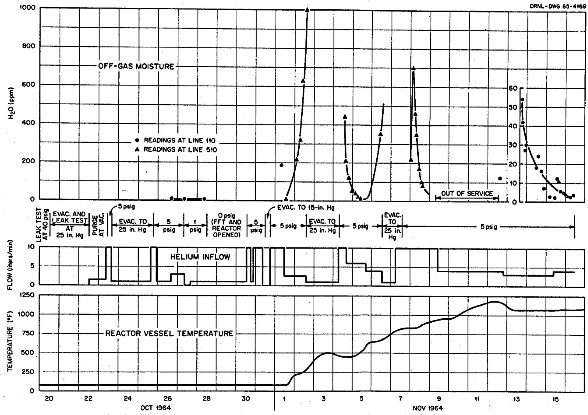  
Fig. 5.1 Initial Removal of Moisture from Fuel System

# 5.3 Fuel-Circulating-System Volume Calibration

After the flush salt had been added to the drain tanks and transfers made to fill the freeze valves (see Section 5.11), the fuel circulating system was filled and operated for 8 days. It was then drained and filled several times to check the drain times and calibrate the system. The calibration was done by increasing the drain tank pressure in increments and recording the drain tank weight and the differential pressure between the drain tank and the fuel pump. This is plotted in Fig. 5-2. The system was purposely overfilled to determine the position of the fuel-pump overflow line and to test the overflow-tank level indicators. Overflow occurred at readings on the two fuel-pump bubblers of 89.5 and $91\%$ . A total of 105 lb of salt transferred to the overflow tank produced a reading on the level instrument of $11.5\%$ or 4.2 inches of salt, in acceptable agreement with the calculated response.

# 5.4 Drain Times

The temperature distribution in the drain valve (FV-103) was controlled so that it would thaw in 9 to 11 minutes after an emergency drain signal. (See Chapter 20.) The time required thereafter for the salt to drain from the loop depended on which valves were open in the salt and gas lines. Normally the freeze valves to both drain tanks were kept thawed, but for a while after a salt fill one valve would still be frozen. An emergency drain signal acted to thaw the freeze valves and to open valves in drain tank vent lines and in the equalizer lines between the gas in the fuel pump and in the drain tanks, but it was considered possible that one or more of these valves might not open. Tests were conducted, therefore, to measure drain times for various conceivable combinations of valving.

On a normal emergency drain the loop drained completely in 9-11 min. after FV-103 thawed. With the equalizer valves open but one freeze valve kept frozen, the drain time was about 30 minutes, regardless of whether or not the vent valves were open. With the equalizers closed, one freeze valve frozen and the vents open, the drain time was 41 min. These drain times were deemed acceptable.

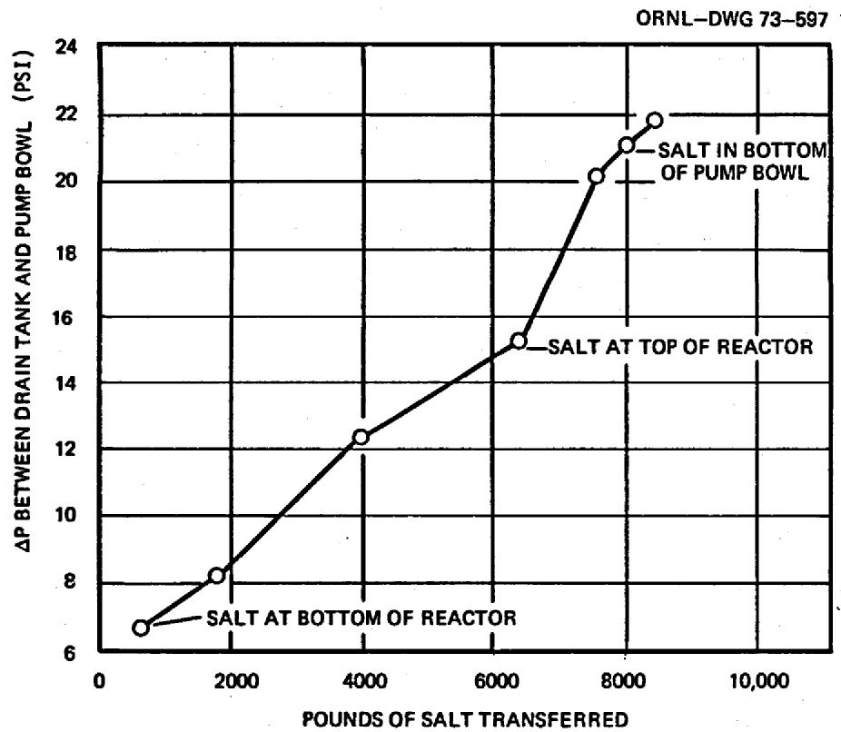  
Fig. 5.2 Fuel Circulating System Calibration

# 5.5 Mixing of Fuel and Flush Salts

During $^{235}\mathrm{U}$ fuel operation, the uranium concentration of the flush salt increased an average of about 215 ppm each time it was used after fuel salt operation. During $^{233}\mathrm{U}$ operation, with a lower uranium concentration in the fuel, the corresponding increase should have been only 39 ppm. The actual increases during the three flushes after $^{233}\mathrm{U}$ fuel circulation were 36, 42, and 39 ppm. Using these figures, approximately 40 lbs of fuel salt mixed with the flush salt during each flushing operation. (For more details on salt analysis and interpretation of results, see Reference 23.)

# 5.6 Primary System Leak

During operation the cell-air activity was continuously monitored to detect any leaks from the primary system. No leaks were detected until after the final fuel salt drain in December, 1969. At this time the cell-air activity did increase which indicated a leak. Subsequent tests showed that the leak was at or near one of the drain-tank freeze valves (FV-105). The activity was mostly xenon with some iodine, krypton, and noble metals. Four days after the first release, there was less than 25 curies of xenon and less than 50 millicuries of iodine in the cell. This was released to the atmosphere without exceeding the release rate permitted by the MSRE safety limits.[24]

The probability of the leak resulting from corrosion seems remote. A review of the operation of the freeze valve does not indicate any excessive thermal stresses. No abnormalities were found upon reviewing the construction x-rays and other inspection reports. It was noted, however, that the weld between the air shroud and the salt piping at the freeze valve was not specified as a full penetration weld. This led to the suspicion that the leak may be a crack that started at this point and was propagated by stress cycling. Determination of the exact location and nature of the leak will be attempted during the post-operation examinations. More information on the preliminary evaluation of the leak is given in Reference 25.

# 5.7 Operation

The operation of the fuel system was satisfactory. Difficulties encountered with the components are described in the following sections. The rate of transfer of salt to the overflow tank was higher than expected. Details on this and the loop void fraction and xenon poisoning are given in Reference 18.

# 5.8 Fuel Pump and Overflow Tank

# 5.8.1 Description

The fuel salt circulating pump was a centrifugal sump-type pump with an overhung impeller, developed at ORNL expressly for circulating molten fluoride salts of the type used at the MSRE.[26] (See Fig. 5-3 and 5-4.) At the normal operating speed of $1189~\mathrm{rpm}$ , it had an output of about 1250 gpm at a 48.5-ft salt head. About 50 gpm of the pump output was circulated internally to the pump bowl via a spray ring to promote the release of entrained or dissolved gaseous fission products. The gas space in the pump bowl was purged with helium to sweep these to the offgas disposal system. The helium was introduced just below the shaft seal in the bearing housing. Most of the gas flowed downward through the labyrinth between the shaft and the shield block to prevent radioactive gas and salt mist from reaching the seal. The remainder flowed upward to prevent any oil which leaked through the seal from getting into the pump bowl. Oil for lubricating the bearings and cooling the shield plug was recirculated by an external pumping system. Helium bubbler type instruments were used to measure the liquid level as a means of determining the inventory of salt in the fuel system. Small capsules were lowered into the bowl to take samples for analysis or to add fuel salt.

The maximum height of the liquid in the pump bowl was limited by the top of an overflow line (5-1/2 in. above the center line of the volute) which connected to a 5.5-ft3 overflow tank located beneath the pump. Helium bubbler type instruments were also used for measuring the liquid level in the overflow tank. Since the overflow line extended to the bottom of the overflow tank, closing a valve in the overflow tank vent line forced the salt back to the fuel pump.

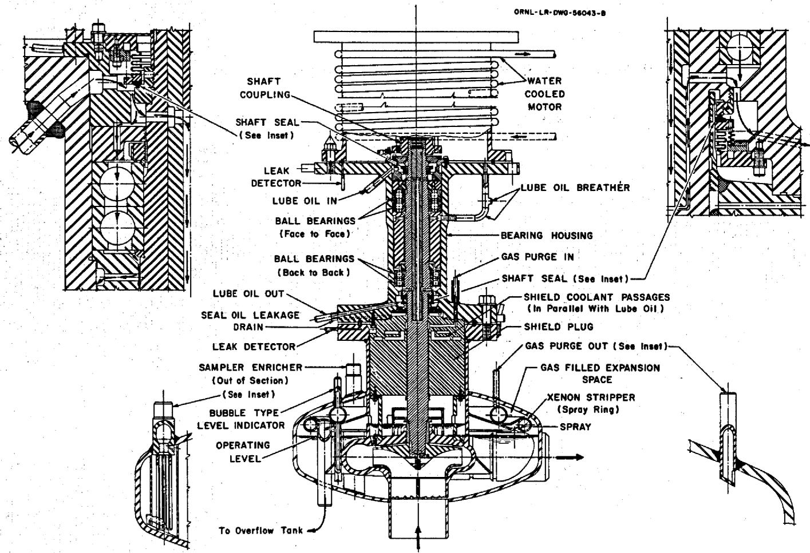  
Fig. 5.3 MSRE Fuel Pump

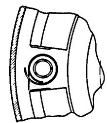

ORNL-DWG 69-10172

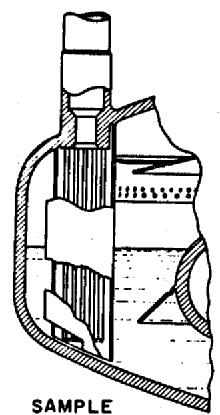  
SAMPLE CAPSULE CAGE

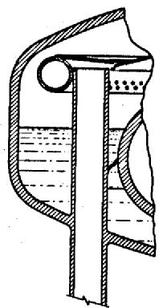  
OVERFLOW PIPE

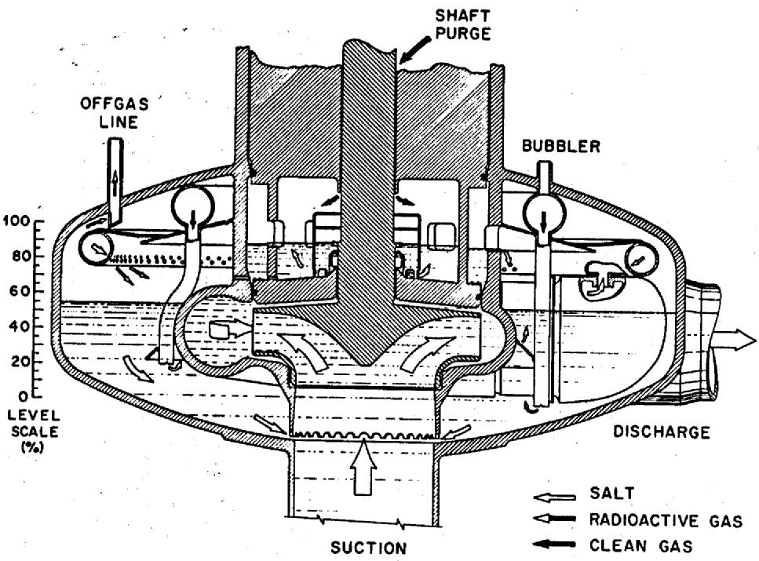  
Fig. 5.4 Cross Section of MSRE Fuel Pump Showing Flow Paths

# 5.8.2 Early Operation

The fuel pump had been loop-tested with molten salt for 100 hrs at $1200^{\circ}\mathrm{F}$ before it was installed at the MSRE in October, 1964. After installation no significant difficulties were encountered during helium circulation while the fuel system was being purged, during early flush salt operation which started on January 12, 1965, or during the criticality experiments. A continuous, but very slow, accumulation of salt in the overflow tank was observed throughout the early operation. (See 5.8.9.)

# 5.8.3 Examination of Fuel Pump after Criticality Experiment27

The fuel-pump rotary element was removed for inspection in September 1965 at the end of Run 3. The pump had been used for circulating helium for 1410 hours and it had been filled with salt at the MSRE for 2120 hours, 1895 hours of which the salt was being circulated.

The pump was generally in good condition and appeared ready to be used for full-power operation. The only dimensional change was a 0.006-in. growth of the pump tank bore diameter where the upper O-ring mated with the pump tank.

The most significant discovery was evidence of a small oil leak through the gasketed joint at the catch basin for the lower oil seal. This oil had run down the surface of the shield plug, where it had become coked by the higher temperatures near the bottom. Some of the oil had reached the upper O-ring groove at the bottom of the shield plug and had become coked in the groove, but none appeared to have leaked past the O-ring during high-temperature operation. Some fresh oil was observed below the ring after the rotary element had been moved to the decontamination cell, but it was believed that this oil dripped from the open lines during the transfer to the cell.

A layer of flush salt about 3/8-inch deep containing about 40 in.³ was trapped and frozen on top of the labyrinth flange. Apparently the salt had drained through the 1/8-inch diameter holes in the flange until surface tension effects balanced the hydrostatic head. This layer can be seen in Fig. 5-5, which is a photograph taken during the inspection. This photograph also shows the contrast between the surfaces exposed to the salt, which 'were bright but not corroded, and those above the salt, which were distinctly darker. There was a coating of fine salt mist particles on the lower face of the shield plug and in an "0"-ring groove around the shield plug there were small amounts of flush and fuel salt that must have been transported as mist.

The pump was reinstalled using remote maintenance techniques so that these techniques could be evaluated. Four universal joints on the flange bolts that had been found broken during the disassembly were repaired prior to the installation of the rotary element. These failures resulted from excessive bolt torque that had been used earlier to obtain an initial seal on the flange. (It turned out that the jack screws had not been fully backed off before the flange bolts were tightened.)

# 5.8.4 Pump and Pipe Support Problem

A problem related to the overall fuel-pump installation became evident during the post-criticality shutdown in the fall of 1965. The fuel pump could move in the horizontal plane, but was fixed against vertical movement. The heat exchanger could move horizontally; the heat exchanger support frame was fixed against vertical movement at the north end, but was mounted on spring supports at the south end. The south end of the heat exchanger was coupled to the fuel-pump bowl by a short length of 5-in. Sched.-40 pipe. The heat exchanger was supported from below, and the pump bowl was supported from above. The connecting piping was supposed to move upward at the heat exchanger and downward at the pump when the system was heated.

Because of the physical arrangement of the piping and equipment, stress ranges in the piping due to thermal cycling were calculated to reach a maximum of 20,000 psi, which is acceptable. Uncertainties existed in critical parts of the heat exchanger, however, particularly in the nozzle

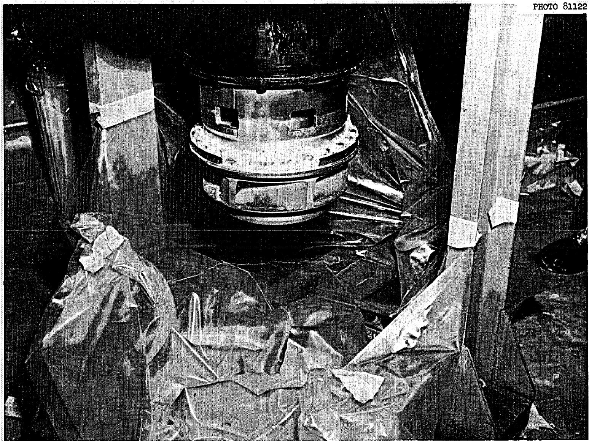  
Fig. 5.5 Fuel Pump Rotary Element

where estimates were as high as 125,000 psi during cycling from 150 and $1300^{\circ}\mathrm{F}$ . The end of the exchanger toward the pump bowl was therefore mounted on springs. This should have reduced stresses in the nozzle to the range of 20,000 to 70,000 psi.

Careful observations during a heating cycle to $1200^{\circ}\mathrm{F}$ , showed that the equipment did not move as expected, however. Because of the complex equipment configuration and the inevitable uncertainty of the calculations, it was decided to make strain gage measurements with the equipment cold and moving the piping by mechanical means for measured distances with measurable loads. The highest stresses were found to be in the fillet where the nozzle was welded to the heat exchanger head when a spring force of 2000 pounds was exerted to raise the end of the heat exchanger 3/16 in. The measured stress in the fillet was 13,000 psi and was a factor of about 5 greater than the stress in the nearby piping. Dye-check of the nozzle to the head of the heat exchanger showed no indication of cracks.

The conclusion from these tests was that the mounting arrangement was adequate to allow the system to go through more than the 50 thermal cycles required without a fatigue failure. The system was then put to use for power operation.[28]

# 5.8.5 Effect of Bubbler Flow Rates on Indicated Fuel-Pump Level

The fuel-pump level was determined by bubbling helium through the salt and measuring the differential pressure between this line and a reference line which connected to the gas space of the pump (see Fig. 5-6). The end of one of the bubbler dip tubes (596) was 1.874 in. lower than the other (593). A common reference line (592) was used for the two bubblers. The level readout instrument had a full scale (0-100%) range of 10 inches of salt. The centerline of the volute was at $35\%$ . Compensation was provided in the instrumentation for changes of density between flush and fuel salt and for differences in the lengths of the bubbler tubes.

Since the $\mathrm{d} / \mathrm{p}$ cells used to indicate level were located outside the reactor cell, there was some pressure drop in the lines between these and the pump. The amount of pressure drop was dependent upon flows through the lines. Tests were made early in 1965 to establish the relationship between these flow rates and the indicated levels.

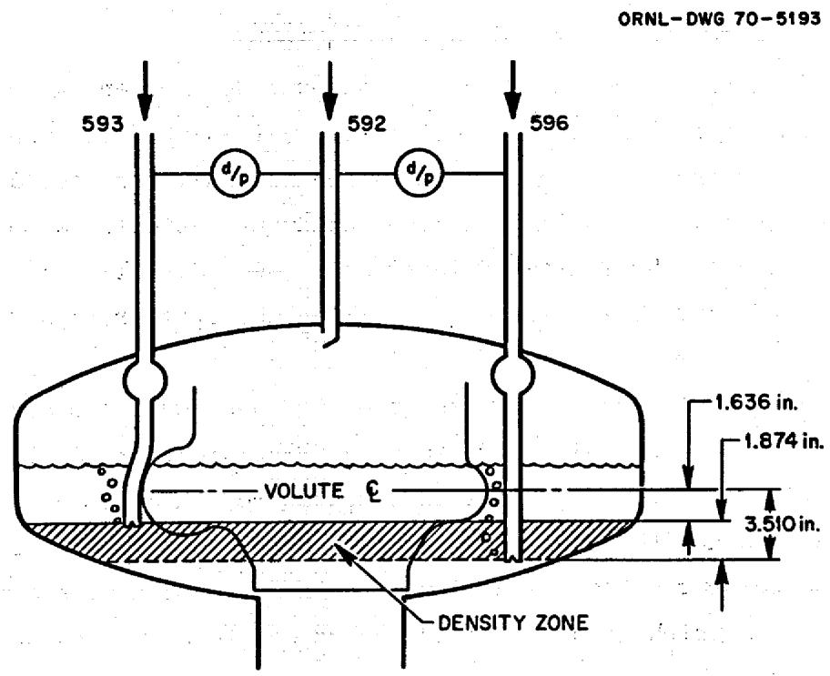  
Fig. 5.6 Schematic Representation of Fuel Pump Bowl Level and Density Indicators

Data for the upper probe are presented in Fig. 5-7. The curves for the lower probe were similar. It can be seen that the indicated level decreased with increasing pump-bowl reference leg flow and that the indicated level increased with increased flow into the dip tubes. The actual salt level was not changed during the tests. Normal operating conditions were set at 25-psig forepressure on all three of the bubbler flow elements, 5 psig in the fuel-pump cover gas.

# 5.8.6 Fuel-Pump Level Changes and Limitations

Based on the recommendations of the pump development group at ORNL, the level alarm and interlocks were originally set as shown in Table 5-1.

The differences in the level at which the fuel pump could be started (64%) and the level at which the pump would automatically stop (55%) was necessary because the indicated level decreased 10 to 12% immediately upon starting the pump. This was due to filling the spray ring and fountain flow chamber.

The narrow differences between the high and low alarm and control setpoints caused considerable operational difficulties. Prior to starting the pump after a fill, the average loop temperature could not be accurately determined. Since the fuel-pump level changed about $12.4\%$ per $100^{\circ}\mathrm{F}$ change in loop temperature, the selected fill point was not always satisfactory for operation. In which case the freeze valve had to be thawed and the system level adjusted. During operation the reactor outlet temperature was usually held constant when the power was changed. Therefore, the bulk average temperature changed with power changes and this caused changes in the fuel-pump level. In addition to this, experiments were run which required operation at different reactor outlet temperatures. During load and rod screams the system cooled rapidly. Sometimes it was necessary to reheat the system before restarting the pump. The operating levels were further restricted when it appeared that the offgas plugged more rapidly when the salt level was above 60 to $65\%$ and gas entrainment in the fuel loop seemed to increase below about $50\%$ . The problem was further compounded by the changing pump-bowl level due to salt transfer to the overflow tank.[18]

Fig. 5.7 Effect of Bubbler Flow on Fuel Pump Level Indicators   
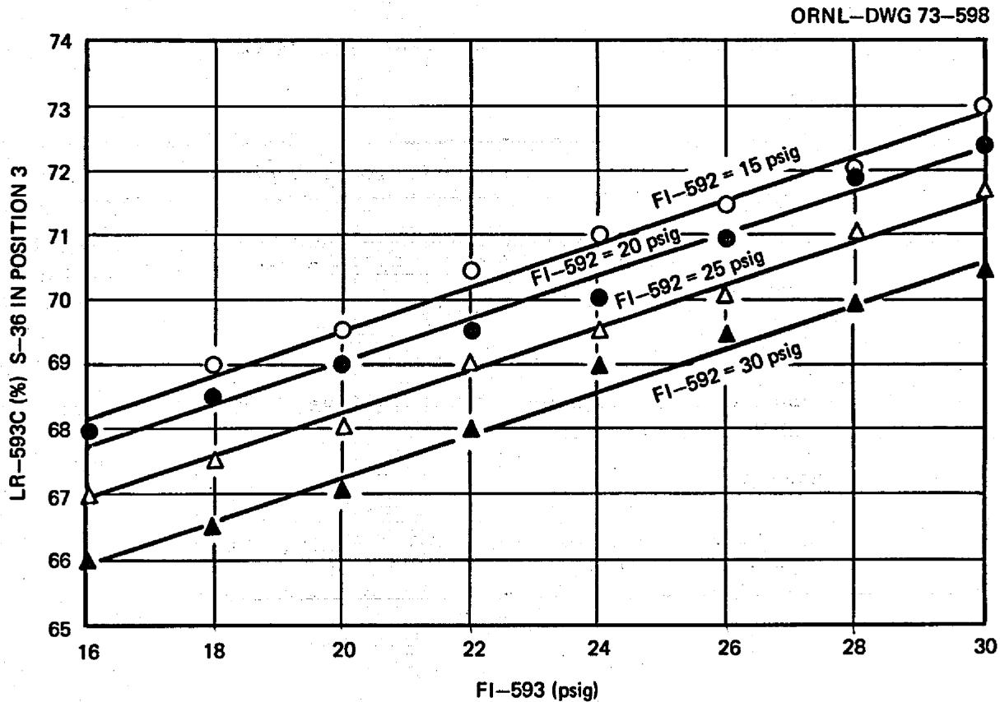  
NOTES:   
FI-592 and FI-593 flow rates were proportional to the difference between the pressure upstream of the flow restrictors and the pressure in the fuel pump. The fuel pump pressure was held constant at 5 psig during these tests.   
LR-593C was read from the bottom of the inked space which was about $1.5\%$ in width.

Table 5-1. Original FP Level Interlocks   

<table><tr><td>Level</td><td>Action and Reason for Interlock</td></tr><tr><td>+78%</td><td>Stops fill, gives a temperature setback and rod reverse to prevent overfilling of the fuel pump (overflow point is about 90%).</td></tr><tr><td>+75%</td><td>Annunciation</td></tr><tr><td>+64%</td><td>Pump cannot be started below this level. This is to prevent cavitation.</td></tr><tr><td>+55%</td><td>Annunciation</td></tr><tr><td>+53%</td><td>Pump will stop below this level. Again, this is to prevent cavitation.</td></tr></table>

Tests were therefore performed whereby the interlocks were bypassed and the pump was started and operated at lower levels. Since there appeared to be no cavitation or adverse effects on the pump, the interlocks given in Table 5-1 were changed to $78\%$ , $75\%$ , $55\%$ , $40\%$ , and $38\%$ late in 1965. Normal level during operation was still maintained between $50\%$ and $60\%$ due to above considerations. However, recovery after a load and rod scram was much easier.

# 5.8.7 Coolant Air to Fuel Pump

In the design of the MSRE, it was calculated that the upper portion of the fuel-pump tank would be subject to substantial heating from fission products in the gas space above the salt. Since the useful life of the pump tank would be limited by thermal-stress considerations at the junction of the volute support cylinder with the spherical top of the tank, close control was at first maintained over the temperatures in this region. Design studies had indicated that the maximum lifetime would result if the junction temperature were kept about $100^{\circ}\mathrm{F}$ below the temperature on the tank surface 6-in. out from the junction. Component cooling "air" $(95\% \mathsf{N}_2)$ was provided to maintain this temperature distribution. A secondary consideration in controlling the temperatures was a desire to keep as much of the pump tank as possible above the liquidus temperature of the salt.

In operating the reactor, it would be ideal if a fixed flow rate of air over the pump tank would provide a satisfactory temperature distribution for all conditions. Early design calculations indicated that this condition could be met with an air flow of 200 cfm.[29] However, temperature measurements on the pump-test loop and during the initial heatup of the MSRE indicated that only about 50 cfm would be required, and that the air would have to be turned off when the pump tank was empty.

To minimize the temperature effects when the cooling air was turned on, air flow during power operation was to have been set at the minimum that would give the desired temperatures. It was found that an air flow of 30 cfm gave a satisfactory temperature distribution at all power levels. In order to achieve and control this relatively low flow rate, a new valve, having

a lower $C_{\nu}$ had to be substituted for the original valve. Figure 5-8 shows the temperatures in the two regions of interest as a function of reactor power level with that air flow. The variations in the individual temperatures were caused by variations in the pump-bowl level salt temperature and air flow. Both the individual temperatures and the temperature differences increased linearly with power, as expected. It was felt during early MSRE operation that, although temperature differences would exceed $100^{\circ}\mathrm{F}$ at full power, the reactor could be so operated with the 30-cfm air flow without significantly reducing the life of the pump tank.

When the reactor was started up for Run 8 in September 1966, an unexplained shift downward in these temperatures was noted. Later the cooling air to the pump tank was turned off during the attempts to melt out the salt plug in the 522 line, and although the temperatures on the pump-tank surface were higher than with the cooling air, the temperature gradient was less. Since the temperature distribution was as good or better than with the air cooling, the use of air cooling was discontinued.

# 5.8.8 Salt Transfer to the Overflow Tank

Early operation of the reactor showed that by some unexplained mechanism, salt gradually accumulated in the fuel pump overflow tank even when the salt level in the pump bowl was well below the overflow point. The transfer rate depended on salt level, and the transfer ceased when the level was about 3 in. below the overflow point. This situation existed until about April 1966, when transfer began to be observed at lower salt levels. The rate appeared to increase gradually as time went on until it leveled off in June and July at 0.57 lb of salt per hour, independent of salt level as far down as 4.7 in. below the overflow point. The change occurred at the time of the stepwise increase in power, but no mechanism connecting the two has been identified. This rate of transfer continued through the $^{235}\mathrm{U}$ operation and required emptying the overflow tank about three times per week.

Prior to operation with $^{233}\mathrm{U}$ fuel salt, the flush salt which had been processed to remove the $^{235}\mathrm{U}$ was circulated for 42 hours. During this and the first 16 hours of fuel carrier salt circulation, the transfer rate and

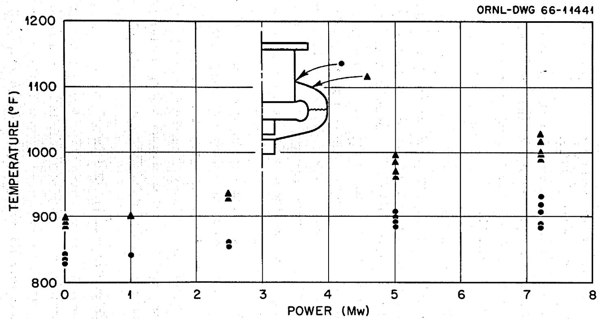  
Fig. 5.8 Variation of Fuel-Pump Tank Temperatures with Reactor Power. Cooling-air flow, 30 cfm.

loop void fraction appeared to be unchanged from the previous periods. Two hours after the start of a 12-hour exposure of a beryllium rod in the pump bowl, the bubble fraction in the system increased from the normal 0.1 vol % to about 0.6 vol % and the rate of transfer to the overflow tank increased from about 0.4 lb/hr to greater than 4 lb/hr.

During the remainder of the $^{233}\mathrm{U}$ operation the transfer rate was high (up to 72 lb/hr) and variable. The results of the investigation of the overflow rate, the changing bubble fraction, and subsequent power perturbations are given in Reference 18.

# 5.8.9 Burps of the Overflow Tank

During early operation of the MSRE, when the overflow rate was very low and the need to push salt from the overflow tank back to the fuel-pump bowl was infrequent, the practice was to empty the overflow tank completely. The sudden pressurization of the fuel pump at the end of the burp gave false level indications and stopped the pump. Also when power operation was started, it was noted that gaseous fission products were being pushed out the oil seal line (524) by the sudden pressurization. Therefore, the procedures were changed such that the overflow tank was not completely emptied of salt during operation.

In February 1969, the main offgas line plugged to the point where it presented a 4-psi pressure drop to the normal 3.2 liter/m offgas flow. During a burp of the overflow tank, this plug blew out with the reactor at full power resulting in a complete burp of the overflow tank. On at least three other occasions when the overflow tank was being emptied, the offgas plug blew out causing more salt to be transferred than planned.

# 5.8.10 Variable-Speed Drive for the Fuel Pump

Prior to February 1969 the fuel pump was always operated with the normal 60-HZ power supply at - 1189 rpm. Then, in order to investigate the effect of fuel circulation rate on system behavior (bubble ingestion, xenon stripping, transfer to overflow tank, blips),18 a variable-speed motor-generator set was brought to the,MSRE to supply power to the fuel pump during experiments. As described in Chap. 16, considerable effort was

expended in modifying and repairing the M-G set to obtain satisfactory reliability. The pump itself, however, operated with no difficulty for substantial periods at speeds between $50\%$ and $105\%$ of normal.

# 5.8.11 Flooding of the Pump Bowl with Flush Salt

At the end of Run 7 in July 1966, the fuel loop was filled with flush salt to rinse out residual pockets of fuel salt and thus reduce the radiation levels for the scheduled work in the reactor cell. As the salt was overflowing into the overflow tank to rinse it out, the level in the flush tank was lowered too far which exposed the bottom of the dip tube. A large bubble of helium gas at a pressure of about 30 psig entered the bottom of the loop. As the bubble rose, its volume increased due to the decreased pressure and the fuel-pump level increased faster than it could overflow to the overflow tank. Salt flooded the reference bubbler, the annulus around the shaft, the sampler tube, and the main offgas line.

Several factors contributed to the accident. Interlocks normally prevented filling to the overflow line. These had been bypassed to allow flushing of the overflow tank. The flush-salt inventory was marginal at normal operating temperatures (1200°F). The flush-tank temperatures were low (about 1140°F) which made the salt more dense and thus there was an insufficient volume.

# 5.8.12 Plugging of the Offgas Line at the Fuel Pump

Intermittent problems were encountered with plugging of the 1/2-in. Sched-40 main offgas line at a point just beyond where it left the top of the fuel-pump bowl. In the early years of operation, this either melted itself free when the reactor was brought to power, or it was periodically reamed out when the reactor was shut down, through the use of a mechanical, flexible rotating "snake". In July 1969, a specially built heater assembly consisting of two 1000-w formed calrods was installed remotely around the 522 offgas line between the top of the pump bowl and the gas cooling "shroud" of the fuel pump. This, together with back-blowing with helium, was successful in clearing the line. More details on the offgas plugging problems are given in Chapter 8.

# 5.8.13 Conclusions and Recommendations

The fuel pump was used to circulate salt for 21,788 hours at temperatures near $1200^{\circ}\mathrm{F}$ with no perceptible change in performance and no failure.

Some plugging of the offgas line was encountered. This should be considered in future designs. Perhaps dual lines could be used with heaters to melt out plugs if they develop. Leakage of oil (1 to 2 cc/day) into the pump bowl contributed to the offgas plugging problem. This possibility was eliminated in the replacement rotary element by seal-welding a gasketed joint, but because the plugging problem was manageable, the spare element was never installed.

The transfer of salt to the overflow tank was an operating nuisance in that it had to be periodically transferred back to the pump. The Mark-II pump (which has operated for over 13,000 hours in a test loop) has more height in the pump bowl, eliminating the need for an overflow tank.

# 5.9 Primary Heat Exchanger

The primary heat exchanger was a horizontal shell and U-tube type. During early power operation the heat transfer capability was found to be considerably lower than expected. A reevaluation of the physical properties showed that the thermal conductivity of both the fuel and coolant salts was sufficiently below the value used in design to account for the overestimate of the overall coefficient of heat transfer. Table 5-2 shows a comparison of the physical property data used in the original design to the current data. The heat transfer coefficients calculated by the conventional design procedures using these two sets of data are also shown.

The heat transfer did not change during subsequent operation of the reactor and no other difficulties occurred. The measured overall heat transfer coefficients ranged from 646 to 675 with an average of 656 Btu/(hr- $\mathsf{ft}^{2}$ - ${}^{\circ}\mathbb{F})$ for 8 measurements. These measurements were made on the basis of nominal full power at 8.0 Mw and a coolant salt flow of 850 gpm. If the actual coolant flow rate were 770 gpm, which would be the flow consistent with a power level of 7.34 Mw, the measured overall coefficient would be 594 as compared to a calculated value of 599 Btu/(hr- $\mathsf{ft}^{2}$ - ${}^{\circ}\mathbb{F})$ . The performance is covered in detail in References 30 and 31.

Table 5-2. Physical Properties of Fuel and Coolant Salts Used in MSRE Heat Exchanger Design and Evaluation   

<table><tr><td></td><td colspan="2">Original</td><td colspan="2">Current</td></tr><tr><td></td><td>Fuel</td><td>Coolant</td><td>Fuel</td><td>Coolant</td></tr><tr><td>Thermal Conductivity, Btu/(hr-ft-°F)</td><td>2.75</td><td>3.5</td><td>0.832</td><td>0.659</td></tr><tr><td>Viscosity, lb/(ft-hr)</td><td>17.9</td><td>20.0</td><td>18.7</td><td>23.6</td></tr><tr><td>Density, lb/ft3</td><td>154.3</td><td>120.0</td><td>141.2</td><td>123.1</td></tr><tr><td>Specific Heat, Btu/(lb-°F)</td><td>0.46</td><td>0.57</td><td>0.4735</td><td>0.577</td></tr><tr><td>Film Coefficient, Btu/(hr-ft2-°F)</td><td>3523</td><td>5643</td><td>1497</td><td>1989</td></tr><tr><td>Overall Coefficient, Btu/(hr-ft2-°F)</td><td colspan="2">1186</td><td colspan="2">618</td></tr></table>

# 5.10.1 General Description

Reactor Vessel and Core — The reactor vessel was a 5-ft-diameter by 8-ft-high cylinder which contained a 55-in.-diameter graphite core. A cutaway drawing of the reactor vessel and core is shown in Figure 5-9. The vessel design pressure and temperature were 50 psig and $1300^{\circ}\mathrm{F}$ with an allowable stress of 2750 psi.

The fuel salt entered the flow distributor where it was directed downward around the circumference of the vessel. It flowed in a spiral path through a l-in. annulus between the vessel wall and the core can for cooling purposes. Anti-swirl vanes in the lower head of the vessel straightened the flow path before it entered the graphite moderator core. Flow passages, formed by grooves in the sides of the graphite moderator bars, directed the laminar salt flow to the upper head plenum. The salt flow then left the reactor vessel through the side outlet of the reactor access nozzle which is described in the following section.

During operation the fuel salt was held in the circulating system by a freeze valve (FV-103) attached to the lower head of the reactor vessel. The drain line and freeze valve was a 1-1/2 in. Sch.-40 pipe which was flattened for about 2 in. to give a flow cross section about 1/2-in. wide. Cooling air in a shroud surrounding the flattened section maintained a frozen salt plug for a "closed" valve. The 1-1/2 in. pipe extended 2-3/4 in. into the lower head of the vessel and was covered with a hood for protection against sediments collecting on top of the frozen plug making it inoperative. The 1-1/2 in. hooded drain thus would remove all but a small puddle of salt from the lower head even if there had been heavy sedimentation. To provide for drainage of the remaining puddle, a 1/2-in. tube was mounted through the wall of the portion of the drain protruding inside the vessel and extended downward through the freeze valve below. This, in effect, formed parallel freeze valves operated by the same controls.

The reactor core consisted of 617 full and fractional size graphite elements $2 \times 2$ in. cross section and about 67 in. long. Salt flow channels were formed by machined half channels on each of four faces of each element.

ORNL-LR-DWG 61097R1A

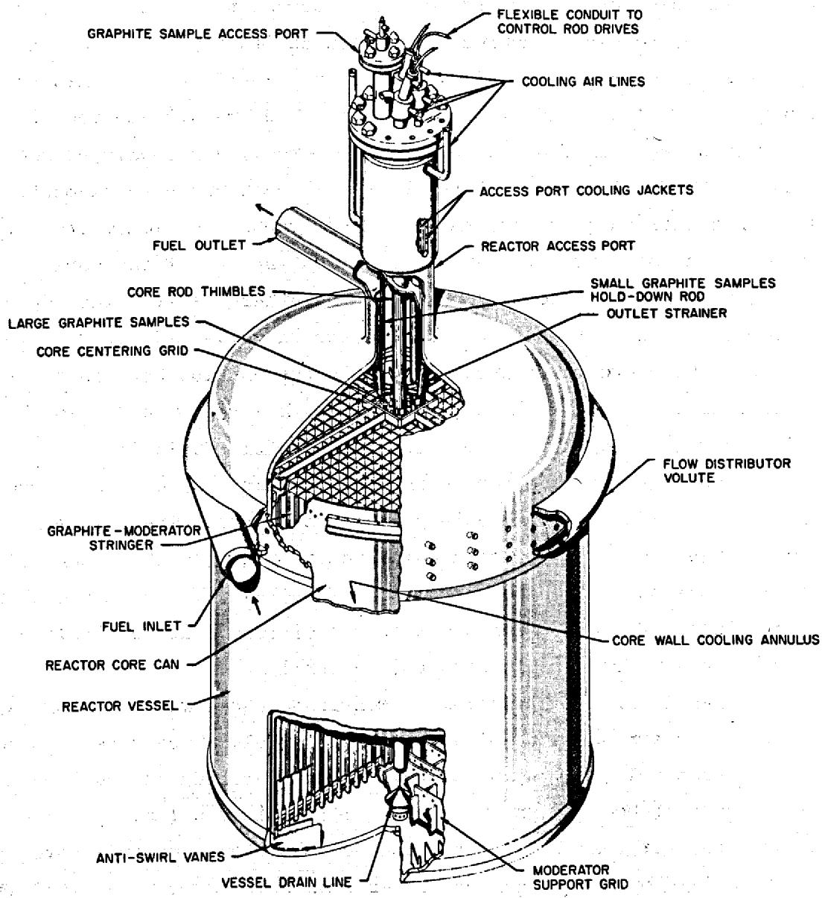  
Fig. 5.9 MSRE Reactor Vessel

When not buoyed by being immersed in salt, the vertical graphite elements were supported by a lattice of graphite blocks which in turn are supported by a Hastelloy-N grid fastened to the bottom of the core can. The core can was thus free to expand downward relative to its top attachment to the reactor vessel while the graphite was free to expand upward relative to its support at the lower end of the core can. The graphite moderator elements were restrained from floating out of the core by a Hastelloy-N rod through holes in the dowel section at the bottom of each graphite element. In addition a wire passing through the upper graphite elements prevented the upper portion of a broken element from floating out of the core.

To prevent possible overheating in an otherwise stagnant region, a small portion of salt entering the reactor was diverted into the region just above the core can support flange in the annulus between the vessel and the core can. Vessel wall temperatures in this region and also the lower head were monitored during operation for possible deviations.

At the center of the core were located sample specimens, three control rod thimbles, and five removable graphite elements. The sample specimens were located in one corner of a 4-in. square with the three control rods occupying the other three corners. The five removable elements then occupied the remaining spaces between these four positions. The controls rods are described elsewhere in this report (Chapter 19).

The sample specimen assemblies mentioned above were made of various combinations and arrangements of graphite and metal. They were exposed to much the same salt velocity, temperature, and nuclear flux as the core matrix. These are described in general elsewhere in this section.

The reactor vessel was supported from the top removable cover of the thermal shield by twelve hanger-rod assemblies. These hanger-rod assemblies were pinned to lugs welded to the reactor vessel just above the flow distributor. The support arrangement was such that the reactor vessel could be considered to be anchored at the support lugs. The portion of the vessel below the lugs was free to expand downward with no restraint.

Reactor Access Nozzle (RAN) — Attached to the upper head of the reactor vessel was a 40-in. long 10-in.-diam nozzle. The nozzle had a 5-in.-diam side outlet for the leaving salt located about 10 in. above the reactor

vessel upper head. The remaining extension of the 10-in.-diam nozzle provided a pocket of trapped gas during the filling of the reactor. However, most of the volume of this extension was occupied by the nozzle plug which is a removable support for the three control rod thimbles, the 2-1/2 in. graphite sample access pipe, and for the discharge screen. See Fig. 5-10. Conventional leak-detected metal oval-ring-joint flanges were used on both sample access openings to provide the necessary containment of the primary system. The radial clearance between the removable nozzle plug and the nozzle was 1/8-in. at the top and 1/4-in. at the bottom to provide a tapered annulus. It was intended that salt be frozen in this tapered annulus providing a salt seal to prevent molten salt from contacting the metal sealing surfaces. However, maintaining a frozen salt seal was found to be not possible. This is discussed in more detail later. Cooling air was provided on both inside of the plug and outside of the 10-in. nozzle but only to the inside of the plug of the 2-1/2 in. graphite sample access. Heaters were provided to thaw any frozen salt remaining in the 10-in. annulus after a salt drain. For thawing the 2-1/2 in. annulus the cooling tube was removed from the plug as part of the sampling procedure and temporarily replaced with a metal sheathed heater.

Some twenty thermocouples (not including spares) were installed at various locations on the RAN to monitor temperatures of the nozzle, both plugs and control rod thimbles. A thermocouple well attached to the graphite-sample access plug extended into the flowing salt stream to indicate reactor outlet temperature.

Strainers were provided at the reactor outlet to prevent passage of graphite chips larger than 1/16 in. A strainer basket was attached to the lower end of the 10-in. nozzle plug and extended downward into the upper head region of the reactor vessel. The three control rod thimbles and the graphite sample assembly passed through the strainer basket. Since the five graphite elements were not pinned as were the remaining moderator elements, a cross-shaped extension of the basket assembly projected beneath the basket to provide a hold-down. See Fig. 5-11.

The core sample specimens were removed and replaced only when the reactor was drained of salt and partially cooled. The specimens were removed

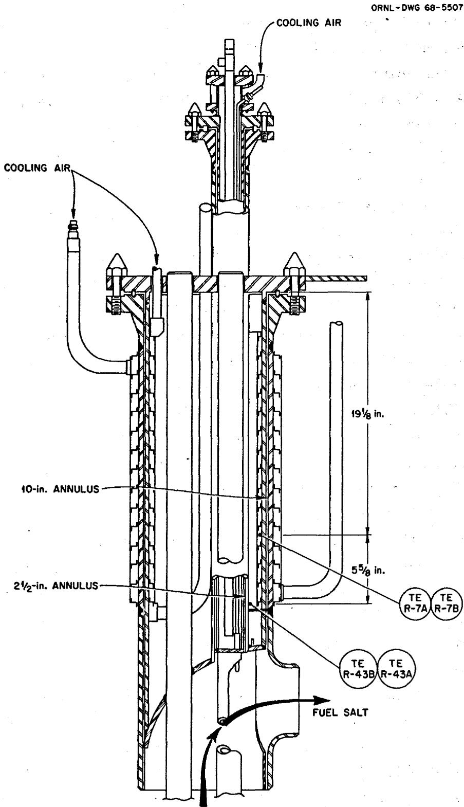  
Fig. 5.10 Reactor Access Nozzle Showing 10- and 2-1/2 in. Annuli

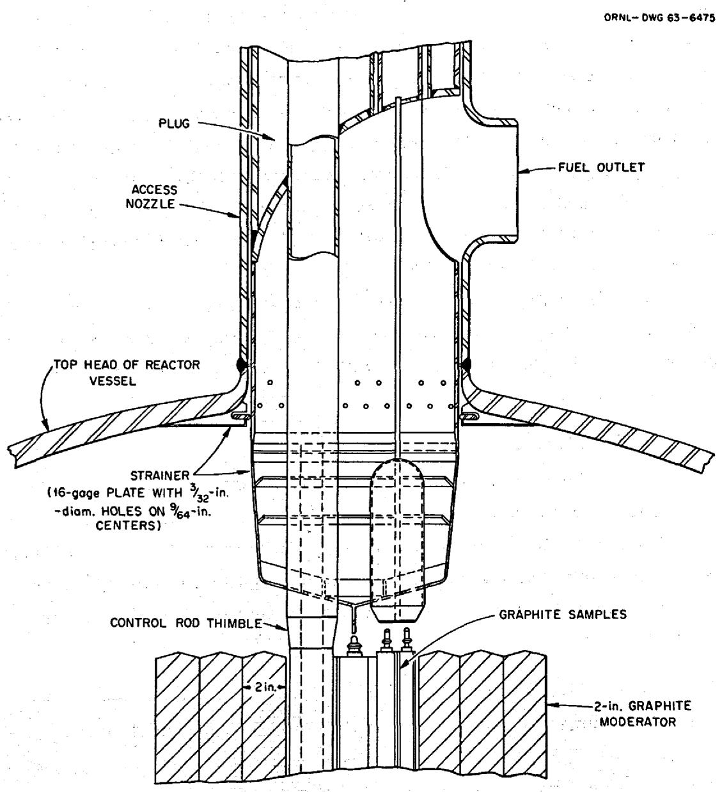  
Fig. 5.11 Reactor Fuel Outlet Strainer

through the smaller of the two access nozzles described earlier. A stainless steel standpipe was left attached to the small graphite-sample access nozzle via a bellows. The upper end of the standpipe was bolted to a liner set into the lower concrete roof plug. During normal operation the liner opening was closed with a concrete plug. When samples were to be removed, this plug was replaced with a work shield which contained openings for tools, lights, etc. All joints were moderately leak-tight and the standpipe was provided with a nitrogen purge and offgas connections. A Roots blower located in the service tunnel provided a lightly negative standpipe pressure to assure inward leakage.

Core samples were taken by removing the graphite sample access flange, withdrawing the sample into the standpipe, placing the sample in a special carrier, inserting a replacement sample specimen into the core, and replacing the access flange.

# 5.10.2 Heat Treatment of Reactor Vessel

After the reactor vessel was installed, tests of the particular heat of Hastelloy-N used in the vessel showed that the closure weld between the top head and the flow distributor ring could have poor mechanical properties in the as-welded condition. Therefore in the fall of 1965, the reactor vessel was heat-treated in place, using installed heaters, for 90 hours at $1400^{\circ}\mathrm{F}$ .

# 5.10.3 Reactor Access Nozzle Freeze Tests and Effect of Circulating Bubbles

The main purpose for a frozen salt seal in the annuli of the 10-in. and 2-1/2-in. diam. RAN plugs was to prevent contact of the sealing surfaces with salt. The freeze flanges used as piping disconnects have a similar function. The main difference being that the freeze flanges incorporated a radial freeze joint while the RAN employed a longitudinal freeze joint.

During development on the Engineering Test Loop freeze joint, it was noted that a frozen salt seal could not be maintained reliably if in contact with molten salt. It was intended to operate the MSRE RAN freeze joint with a ring of frozen salt above the normal molten-salt level. This would be accomplished by pressurizing the fuel system above normal operating pressure soon after filling the reactor with salt. Cooling air on the

RAN would freeze a ring of salt in the annuli before the pressure was lowered to its normal value, leaving a gas void between the frozen and liquid salt. The gas trapped in the RAN annuli was thus the principal barrier between the molten salt and the containment sealing flange. The ring of frozen salt would then serve only as a backup protection against sudden pressure increases forcing salt up into the annuli.

The first attempts to form this backup seal in this manner on the MSRE RAN were unsuccessful due to insufficient cooling air although the available flow met the requirements of the design calculations.[46] The flow was permanently increased from about 3 cfm to the range of 15 to 20 cfm by modifying the control valve trim. Even with the increased air flow, there was sufficient movement of salt in the annuli due to the turbulent flow below to prevent forming a good frozen-salt seal. However, gas trapped above the molten salt kept the liquid level well below the flange. The liquid gas interface changed in height due to any change in volume of the gas pockets. During early operation, the interface was at least a foot below the flange and the flange temperature was about $200^{\circ}\mathrm{F}$ . During later operations, there were periods when the salt level was higher and the temperature of the flange approached $300^{\circ}\mathrm{F}$ .

There were two mechanisms which caused gas to be transferred to and from this pocket. Gas was transferred from the pocket as a solute and added by entrapment of circulating bubbles from the salt stream below. The equilibrium difference between these two transfer rates determined the salt level in the annuli and thus the temperature readings of the wall.

Any change in reactor operating conditions which disturbed the balance between these two transfer mechanisms would thus change the height of salt in the annuli. It was noted that the salt level in the RAN annuli would be increased by any of the following changes in operating conditions: lowering the system pressure (cover gas in the fuel pump), increasing circulating salt temperature, or decreasing the amount of circulating bubbles (i.e. decreasing pump speed).

Examples of all three of these causes are shown in Figs. 5-12 and 5-13. Please refer to Fig. 5-10 for location of the thermocouples used in these two graphs.

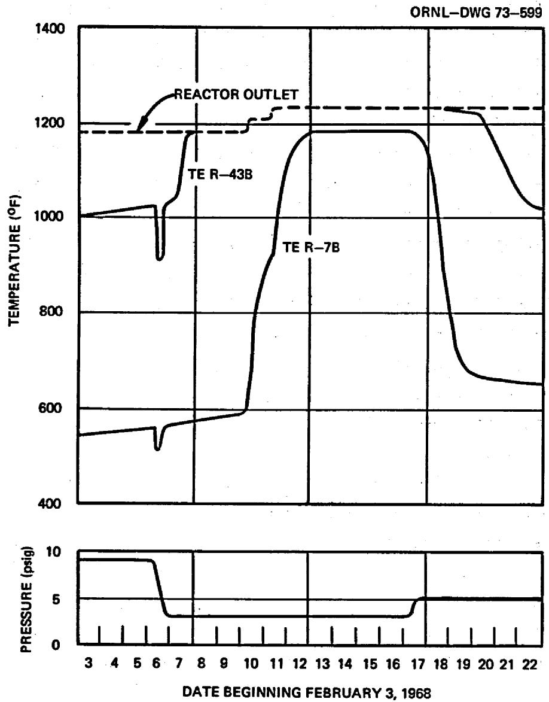  
Fig. 5.12 Effect of Reactor Outlet Temperature and Fuel Pump Cover-Gas Pressure on Reactor-Access Nozzle Salt Level (as indicated by wall temperatures)

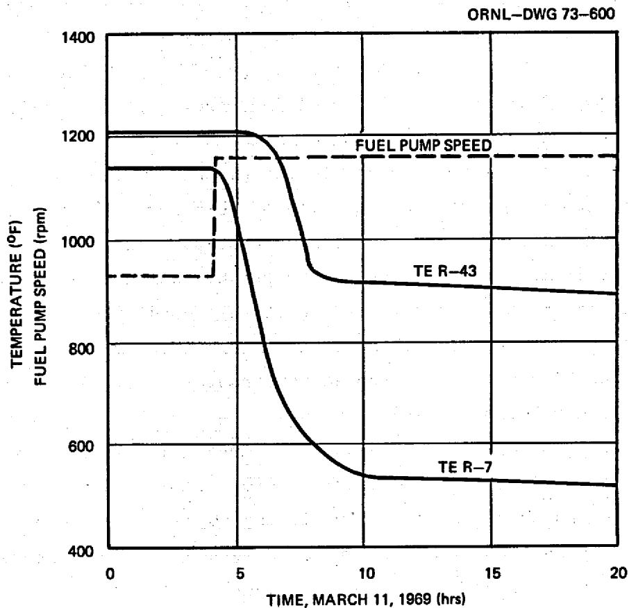  
Fig. 5.13 Effect of Fuel Pump Speed (i.e. circulating bubbles) on Reactor-Access Nozzle Salt Level (as indicated by wall temperatures)

The effect of temperature and pressure can be seen in Fig. 5-12. At the beginning of the observed time period, the salt level in the RAN was relatively low with the pump pressure higher than its normal 5 psig. After a pressure drop on February 6, the salt level overcame the immediate effects of pressure and began to rise as indicated by the R-43 thermocouple. Several days later the reactor outlet temperature was changed in two small steps of $30^{\circ}$ and $15^{\circ}$ yet note the very large effect of almost $600^{\circ}\mathrm{F}$ on the R-7 thermocouple due to the salt level increase. Later by raising the pump pressure from 3 to 5 psig the salt level is again lowered in the RAN annulus.

The effect of a direct change in the amount of circulating bubbles can be seen in Fig. 5-13. At the beginning of this period the fuel-pump speed was lower than normal and it can be seen that the RAN salt level was very high. Other indications such as the reactivity balance led to the conclusion there were no bubbles circulating at this condition. When the fuel-pump speed was increased, with no other change in operating temperature or pressure, the RAN salt level dropped very rapidly. (Note the abscissa in Fig. 5-13 is now hours instead of days.)

Circulating bubbles were involved in more dramatic effects than temperature changes in the RAN, of course. Some more important variables were involved such as the effects of circulating voids and xenon poisoning on the reactivity balance. The effects seen in the RAN temperatures only helped explain the cause of some other events.

One phenomenon noted in which it is thought the RAN trapped gas had a direct relationship is that of power perturbations in the MSRE in January, 1969. There was an unusually large amount of circulating bubbles at this time as verified by several indications including low RAN temperatures. It is thought some gas, clinging to the core, was suddenly swept from the core causing a momentary increase in reactivity. The triggering mechanism for release of gas clinging in the core was presumably a very small perturbation in flow or pressure. An occasional release of a burst of gas from the RAN which was suddenly compressed in the pump could have been the cause of such perturbations. There were other indications to connect the RAN trapped gas with the power perturbations.[47]

# 5.10.4 Core Specimen Installation and Removal

Throughout the operation of the MSRE with salt in the primary loop there was a sample array of one kind or another in the core. The arrays that were exposed between September, 1965 and June, 1969 were of the design shown in Fig. 5-14. The array that was in the core from the time of construction until August, 1965 contained similar amounts of graphite and INOR-8 (to have the same nuclear reactivity effect) but differed in internal configuration. In 1969, during the last five months of operation, a different array, designed to study the effects of salt velocity on fission product deposition, was exposed in the core.

A core specimen assembly of the type shown in Fig. 5-14 consisted of three separable stringers (designated R, L, and S). Whenever an assembly was removed from the core, it was taken to a hot cell, the stringers were taken out of the basket, and a new assembly was prepared, usually including one or two of the previously exposed stringers. Sometimes the old basket was reused, sometimes not. The history of exposure of INOR-8 specimens in this kind of array is outlined in Fig. 5-15. The numbers indicate the heats of INOR-8 from which the rods in each stringer were made.

The following section describes the experience with installation and removal of core specimen assemblies, with emphasis on the procedures, tools, and systems involved. Descriptions of the materials that were exposed and the results of their post-operation examinations are given in detail in references 32-36.

Pre-Power Array - The specimen array that was in the core during the prenuclear testing and nuclear startup experiments differed internally from the later surveillance assemblies, but externally it was similar and its installation and removal employed the equipment and procedures proposed for later use. The original installation was in 1964, before salt had been circulated, and, although done remotely, was closely observed to determine needs for modifications in the tools and procedures. The assembly was removed in August, 1965 by the remote procedure. (At that time the salt was slightly radioactive from the $^{23}$ U startup experiments.) Only minor difficulties were encountered with some of the tools and fixtures.

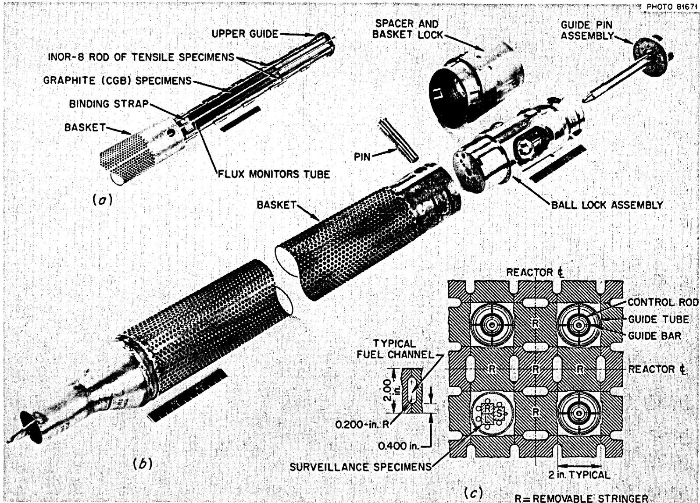  
Fig. 5.14 MSRE Surveillance Facility Inside Reactor Vessel

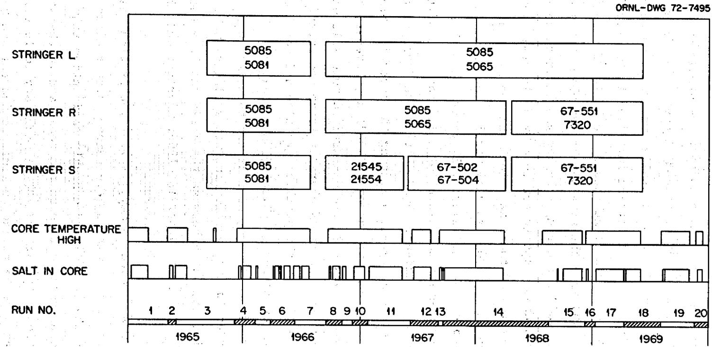  
Fig. 5.15 Outline of MSRE Core Surveillance Program

While the core access was open for the sample removal, a visual inspection was made of the core with a 7/8-in.-diam. scope. The inspection revealed that pieces were broken from the horizontal graphite bar at the bottom of the core that was supposed to support the sample assembly. The broken pieces were recovered, using a vacuum cleaner. To circumvent this damage, the new sample assembly to be installed was modified to be suspended from above, using a special fitting installed in the strainer basket above the core. This fitting (the "basket lock" in Fig. 5-14) had spring fingers that locked into the strainer screen when it was pushed into place. The lower end of the sample basket was extended to reach the hole in the lower horizontal graphite bar to provide lateral support.

Array 1. Installation of the basket lock and the first standard array in the core in September, 1965 was uneventful. The array was removed in July, 1966 after about 1087 equivalent full-power hours (EFPH) of operation. When the array was examined in the hot cell, portions of the stringers were found to have been damaged. Some obstruction' (thought to be salt in the annulus) had been encountered in lifting the assembly through the access nozzle. The damage was not caused by handling, however, but by contraction during cooldown. When the core was drained some salt was trapped between the ends of graphite specimens where it froze and interfered with the differential contraction of the parallel graphite and metal columns during cooldown. As a result the graphite columns buckled.

Array 2. Because of the damage, none of the three stringers from the first array were included in the second. The new stringers were modified to prevent trapping of salt, but otherwise the array was like the first. The second array was installed on Sept. 16, 1966, near the end of the 2-month shutdown to replace the main blowers.

The second array was removed in May, 1967. By this time the reactor had operated 4510 EFPH and the samples were removed sooner after the end of power operation, so the salt was more highly radioactive than before, resulting in troublesome contamination on the tools and in the standpipe. This slowed the operation somewhat and it was necessary to install a charcoal filter in the standpipe vent line to limit iodine release to the stack. Difficulty was encountered in obtaining a satisfactory seal on the reactor access flange, which required replacement of four bolts. Hot-cell examination of the array showed that the basket lock had pulled out of the strainer

screen and was stuck on the basket. A new basket lock was therefore fabricated and was installed in the screen.

Array 3. The third array consisted of one new stringer and two stringers previously exposed in Array 2, so it was highly radioactive at the time of installation. No particular difficulty was encountered in handling the array, however, since the equipment and procedure were designed for this condition. A satisfactory seal on the core access flange was not obtained on the first try, and inspection showed the O-ring gasket was dented and scratched. The bolt holes were cleaned and retapped and a new gold-plated gasket was installed. An acceptably tight joint was then obtained.

Array 3 was removed on April 2, 1968 after the conclusion of $^{235}\mathrm{U}$ operation (9005 EFPH). Some inconvenience resulted when the closure on the transport containment liner refused to operate properly, but the removal and transfer were safely accomplished without the liner. While the array was out of the core the flange was sealed with a rubber-gasketed blind flange to avoid possible damage to the permanent sealing surfaces.

Array 4. One of the old stringers and two new stringers made up Array 4, which was installed uneventfully on April 18, 1968. This array was removed in June 1969, at 11,555 EFPH. The removal was delayed for several days due to problems with the removable heater that was required to melt the salt from the tapered annulus between the removable plug and the 2-1/2-in. access nozzle. For the first time, flush salt was not circulated just prior to the sample removal. The usual measures were taken to control the radiation and contamination during the sample removal operation. There was some contamination of the immediate work area (mostly noble-metal fission products) during removal of tools, which required mopping.

Special Array. The final array was all new and quite different internally from previous arrays.[37] Externally, however, it was practically the same and standard tools and procedures were used in its installation (July, 1969) and removal (December, 1969). Both operations were uneventful.

# 5.10.5 Radiation Heating

Radiation-produced heat in the reactor vessel walls caused the outer surfaces of the vessel to be hotter than the adjacent salt by an amount that was proportional to the reactor power. Any deposition of solids would cause even higher surface temperatures. There were two locations in the reactor vessel where solids could tend to accumulate. These locations were the lower head and the lugs located just above the inlet volute and which supported the core matrix. The differences between the reactor vessel temperatures and the salt inlet temperature were carefully monitored during power operation so that this condition would be detected had it occurred.

There was no indication of sedimentation during the operating life of the reactor. The temperature difference did increase with use of $^{233}\mathrm{U}$ fuel; this was expected due to the higher neutron leakage associated with this fuel.

# 5.10.6 Discussion and Recommendations

The reactor vessel and core satisfactorily performed all functions for which it was designed. Originally the operating life of the fuel system was to be determined by the number of thermal cycles on the freeze flanges. However, the design life of the freeze flanges was extended on the basis of development tests. The stress-rupture life of the reactor vessel was then reviewed to determine if the operation of the MSRE would be limited by the possibility of stress-rupture cracking. The reevaluation indicated the reactor could be operated at least another year longer than its originally predicted 20,000 hours stress-rupture life.[38,39]

The reactor access nozzle also adequately performed all of its functions. It was obvious, however, that some amount of bubbles circulating with the salt was necessary to replenish the gas inventory of the RAN annuli and keep the salt level down to the desirable level. The RAN design was thus inadequate from the standpoint of providing a frozen salt seal such as was the case with the freeze flanges. The inability to freeze a

salt seal was the result of a larger than anticipated salt flow in the RAN annuli which increased the heat load beyond the capability of the cooling air provided. Additional thermocouples in the area of the RAN would have allowed better definition of the salt level.

If an access flange such as the RAN is to be used again in a molten salt system, there are three possible methods of obtaining its main function - that of preventing contact of salt with sealing surfaces:

(1) Provide an external source of gas to the annulus. A salt level determination would also be necessary.   
(2) Provide an internal source of gas in the form of circulating bubbles which would constantly replenish the gas inventory in the annulus. A trapped gas pocket at a higher pressure than the pump cover pressure will not remain indefinitely.   
(3) Reduce the access of flowing salt to the annulus by baffles, labyrinth or such, so that a frozen salt seal can be maintained.

If bubbles are to be purposely injected into the fuel salt for the removal of xenon and krypton, then item (2) appears to be the best solution. The joint could be designed to remain essentially full of gas at all times.

# 5.11 Fuel and Flush Salt Drain Tanks

# 5.11.1 Description

Two fuel salt drain tanks (FD-1 and FD-2) were installed in the drain tank cell for the safe storage of the fuel salt during shutdown periods. A third tank (FFT), also located in the drain-tank cell, was provided for storing the flush salt which was used for cleaning up the fuel circulating system before and after maintenance.

A fuel drain tank is shown in Figure 5-16. The INOR-8 tank was 50 in. in diameter by 86 in. high, and had a volume of $80\mathrm{ft}^3$ , sufficient to hold in non-critical geometry all the salt from the fuel circulating system. The tank was provided with a cooling system designed to remove $100\mathrm{kW}$ of fission product decay heat. The cooling was accomplished by boiling water in 32 double contained bayonet tubes and thimbles in each of the tanks.

The fuel flush tank was similar to the fuel drain tanks, except that it had no cooling system. Since the flush salt did not contain fissile material, the only decay heating was from the small quantity of fission products that it removed from the fuel system during the flushing operations.

The weight of salt in each of the three tanks was indicated by forced balance pneumatic weigh cells. The weights were recorded on strip charts but could be read more accurately from installed mercury manometers. Two conductivity type level probes (one near the bottom of the tank and the other near the top elevation of the salt) were provided for use as reference points.

# 5.11.2 Calibration of the Drain Tank Weigh Cells Using Lead Weights

During early testing in the fall of 1964 the weigh cells were calibrated by loading the tank supporting rings with lead billets. The drain tanks were at ambient temperature during this calibration. Drifts in indicated weight of up to 39 lbs were noted when no changes were being made. Repairs of air leaks in the instruments caused shifts of up to 65 lbs. The weigh cells were further calibrated during the addition of flush and $235\mathrm{U}$ fuel salt. (See below.)

# 5.11.3 Addition of Flush Salt and Further Calibration of Weigh Cells

Later in 1964, thirty-six batches of flush salt. (250 lbs per batch) were added from cans in a portable furnace directly into drain tank FD-2 through a heated line and flanged dip tube attached at the inspection flange on the tank. Each batch of salt added was weighed on accurately calibrated scales and the bare weight of the container was checked to obtain the net weight of salt added. All temperatures were maintained as near $1200^{\circ}\mathrm{F}$ as possible. During additions some difficulty was encountered with salt freezing in sections of the addition line. On one occasion the

ORNL-LR-DWG 61719

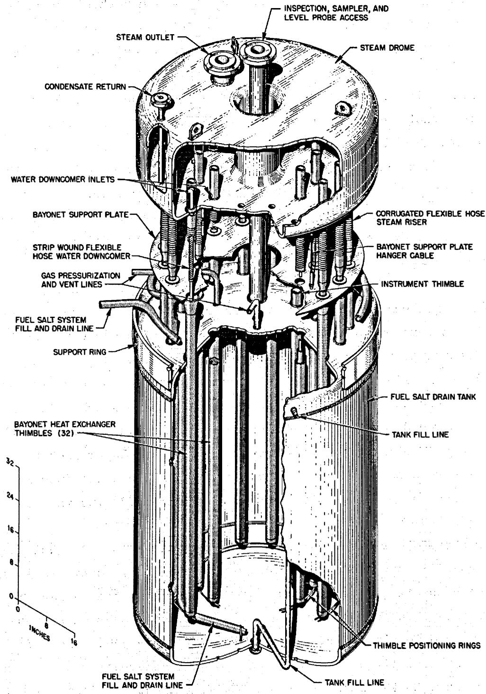  
Fig. 5.16 Fuel Salt Drain Tank

drain-tank vent line plugged. To locate and remove the plug, the vent line was heated with a torch, starting at the tank and working down the pipe until gas could be blown through the line into the drain tank. The plug blew loose while heating the line several feet from the tank. The plug location, the relative low temperature required to remove the plug and some oil found in the nozzle to the inspection flange on the tank led to the conclusion that the restriction was caused by an oil residue.

During the addition of the first two batches of salt, weigh cell readings were taken every five minutes to determine when the probe light came on. Then this salt was transferred through the transfer lines to FFT and FD-1 and back to FD-2 through the reactor fill lines. This operation left salt in all freeze valves which were then frozen to isolate the tanks for the first time.

While the salt was in the FFT, two more cans of flush salt were added to FD-2 to recheck the location of the lower probe. In the two checks the probe light came on when 469.6 and 492 lbs had been added to the tank. These figures corresponded to weigh cell readings of 419 and 316 lbs. After all of the flush salt (9230 lbs) had been added to FD-2, it was transferred between the three drain tanks. By using the weigh cells on both tanks involved during each transfer, the weigh cells on FD-1 and FFT were calibrated. The indicated weight at the upper and lower probes on FD-1 and FD-2 were also noted. The lower probe of FFT was not functioning (See 24.15). The weight between the probes was $7353 \pm 176$ lbs for FD-1 and $7545 \pm 191$ lbs for FD-2.

From the above data and subsequent operation, it was concluded that the weigh cells are inadequate for precise inventory work. In general, the longer the time required for a given operation, the larger the error introduced. Transfers of small quantities of salt over short time intervals appeared to give fairly good data. Using the tank weight at the lower probe light as a fixed reference was useful in preventing the transfer of too much salt to the fuel system and as an indication of the amount of salt remaining in the tank after a fill. The implication is not that the weigh cells were at fault. Pipe loading on the tanks caused by temperature changes of the tanks and adjoining pipes probably caused the variations. Errors as high as 200 to 300 lbs have been noted during transfers.

# 5.11.4 U-235 Fuel Salt Addition

The carrier salt and larger additions of $^{235}\mathrm{U}$ enriching salt were added by the same general method used for adding the flush salt. Details of these additions and the $^{235}\mathrm{U}$ criticality experiment are given in Ref. 40.

# 5.11.5 Salt Transfers.

Salt is transferred between drain tanks by pressurizing the supply tank and venting the receiver tank. Originally transfers were made only through the 1/2-in. transfer lines (107-110). In the event of a drain to both drain tanks followed immediately by a refill of the circulating loop, considerable time was spent freezing the fill freeze valves (105 and 106), thawing the transfer freeze valves (108 and 109), refreezing them after the transfer and then rethawing the fill freeze valves (105 and 106). After careful consideration, procedures were modified to permit jumpering interlocks and transferring through the fill lines. No difficulties were encountered, however, all of salt could not be transferred this way since the fill lines did not go completely to the bottom of the tanks.

# 5.11.6 After Heat Removal

On 2/17/64 and 2/24/64, tests were made of the heat-removal capacity of the steam domes. Flush salt was put into FD-2 and the salt was heated to $\sim 1200^{\circ}\mathrm{F}$ . With 40 gallons of water in the feedwater tank (FWT-2), a supply valve (LCV-807) was opened to admit this water to all 32 of the bayonet cooling tubes. The water was refluxed for approximately two hours with cooling tower water flow to the drain-tank condenser kept constant at 40 gal/min. The inlet and exit temperatures of the cooling tower water were monitored, as were the drain tank temperatures and feedwater tank levels. At equilibrium conditions, FD-2 temperatures dropped linearly at a rate of $86^{\circ}\mathrm{F/hr}$ . The heat-removal rate calculated from condenser cooling water flows and temperatures was $139\mathrm{kW/hr}$ . The heat-removal rate calculated from the temperature-decay rate of FD-2 and the heat capacity of FD-2 was $132\mathrm{kW/hr}$ .

A second similar test was made by opening the other supply valve (ESV-807) and keeping LCV-807 closed. The flow through this valve was

marginal, the level in the FWT decreased slowly and the heat-removal rate was only 110 kW/hr based on a water heat balance and 98 kW/hr from the salt temperature decay rate.

These data showed that the bayonet cooling tubes were more than adequate to remove the design decay heat rate of $100\mathrm{kW / hr}$ (for 10-MW operation). Since the reactor was run at only approximately 8 MW, the margin of safety was enhanced.

Because of leaks through the seats of the water supply valves, the reactor was operated some of the time with the feedwater tanks empty and procedures were written to manually valve water to these tanks if necessary to remove afterheat. When the salt was divided about equally between the two drain tanks, as would occur on an emergency drain, no heat removal was necessary. Turning off the drain tank heaters was sufficient to prevent excessive temperature increases. For instance, on November 2, 1970, the reactor was drained while operating at full power. 4380 lbs of salt drained to FD-1 and 5130 lbs drained to FD-2. With the drain tank heaters turned off, FD-1 temperature increased from 1060 to $1155^{\circ}\mathrm{F}$ in about 6-1/2 hours and then started decreasing. FD-2 temperatures increased from 1075 to $1195^{\circ}\mathrm{F}$ in about 9-1/2 hours and then started decreasing.

# 5.11.7 Plugging of Helium Lines at..the.Top.of_the_Fuel_Drain_Tanks

The helium supply, vent and equalizer lines enter the top of the fuel drain tanks via a common 1/2-in. Schedule-40 pipe. In June 1969, this line on FD-2 became almost totally plugged. The plug first appeared when the main 4.2 liter/min He offgas flow was routed past the drain tanks due to plugging in the regular offgas routes. The plug was at least partially cleared by first heating the tank to $\sim 1275^{\circ}\mathrm{F}$ overnight and then backblowing with helium at 42 psig. This technique was not successful when FD-1 line plugged in August 1969. Due to this plug, fuel drained preferentially to FD-2 during a planned drain on November 2, 1969. During the last drain on December 12, 1969, the fuel was made to drain more equally by deliberately closing the vent from FD-2 for part of the time during the draining period. The result was that the total salt weights in FD-1 and FD-2 were within $5\%$ of each other after the drain had been completed.

# 5.11.8 Loading $^{233}\mathrm{U}$ into FD-2

After the fuel salt had been processed to remove the $^{235}\mathrm{U}$ , the remaining carrier salt was transferred from the fuel storage tank to the fuel drain tanks. The method of adding $^{233}\mathrm{U}$ enrichment salt was different than that used for adding the flush salt and $^{235}\mathrm{U}$ fuel salt. The loading equipment as shown in Fig. 5-17 was attached to the access flange of FD-2. Cans containing $\sim 7\mathrm{kg}$ of uranium were lowered into FD-2 which contained half of the molten carrier salt. When the salt had melted out of the can, it was withdrawn into the shield. Mixing was accomplished by transferring the salt between the two drain tanks. The $^{233}\mathrm{U}$ addition and criticality experiment is described in detail in Ref. 41.

# 5.11.9 Heatup and Cooldown Rates

These are described under heaters in Section 17.

# 5.11.10 Discussion and Recommendations

The fuel and flush salt drain tanks have functioned very satisfactorily. They were very sluggish thermally and therefore easy to control during operation. The afterheat removal system functioned satisfactorily when needed.

The weigh cells were not completely satisfactory for inventory purposes. Piping stresses should be eliminated or other type instruments provided.

As with other offgas lines, the possibility of plugging should be considered. Perhaps two lines could be used with heaters attached to melt out any plug which might develop.

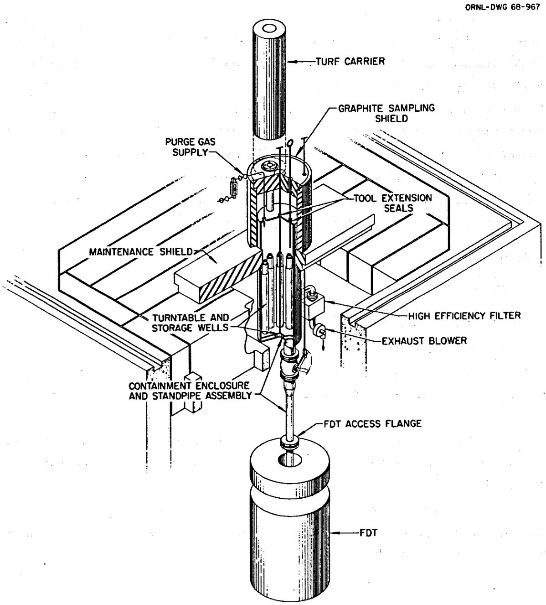  
Fig. 5.17 Arrangement for Adding $^{239}\mathrm{U}$ Enriching Salt to Fuel Drain Tank

# 6. COOLANT SYSTEM

C. H. Gabbard J. K. Franzreb

M. Richardson

# 6.1 Description

The coolant circulating system consisted of a centrifugal-type coolant pump and an air-cooled radiator which were connected to the fuel heat exchanger by 5-inch INOR-8 piping. The normal operating temperature was 1000 to $1100^{\circ}\mathrm{F}$ at full power. The coolant salt was circulated at 850 gpm. During shutdowns the salt was drained to the coolant drain tank. The piping had low points on each side of the radiator. Therefore, two drain lines and freeze valves were required. The circulating system was filled by pressurizing the coolant drain tank with helium and venting the coolant pump.

# 6.2 Purging Moisture and Oxygen from the System

Before salt was charged into the coolant drain tank, oxygen and moisture were purged from the coolant circulating system and the drain tank. This was accomplished by first pressurizing the system to assure that it was leak-tight, then evacuating, and purging with helium during the heatup. Details of the heatup are given in Section 17. The helium was introduced at the coolant pump and coolant drain tank and evacuated or vented through the offgas system. The coolant pump was operated to provide circulation in the loop. Purging continued until the system was at $1200^{\circ}\mathrm{F}$ and essentially no more moisture was being released. Later analysis of coolant salt samples indicated that the purging had been very effective.

# 6.3 Coolant Circulating System Calibration and Drain Time

After the coolant salt had been added to the coolant drain tank (see Section 6.1) the coolant circulating system was filled and operated for 11 days. A test of the drain time indicated that complete draining could be accomplished in approximately 12 minutes after the freeze valves thawed. During the following fill the circulating system was calibrated. The drain tank was pressurized in increments and the drain tank weight and the differential pressure between the drain tank and the coolant pump were recorded. The system calibration curve is shown in Fig. 6-1.

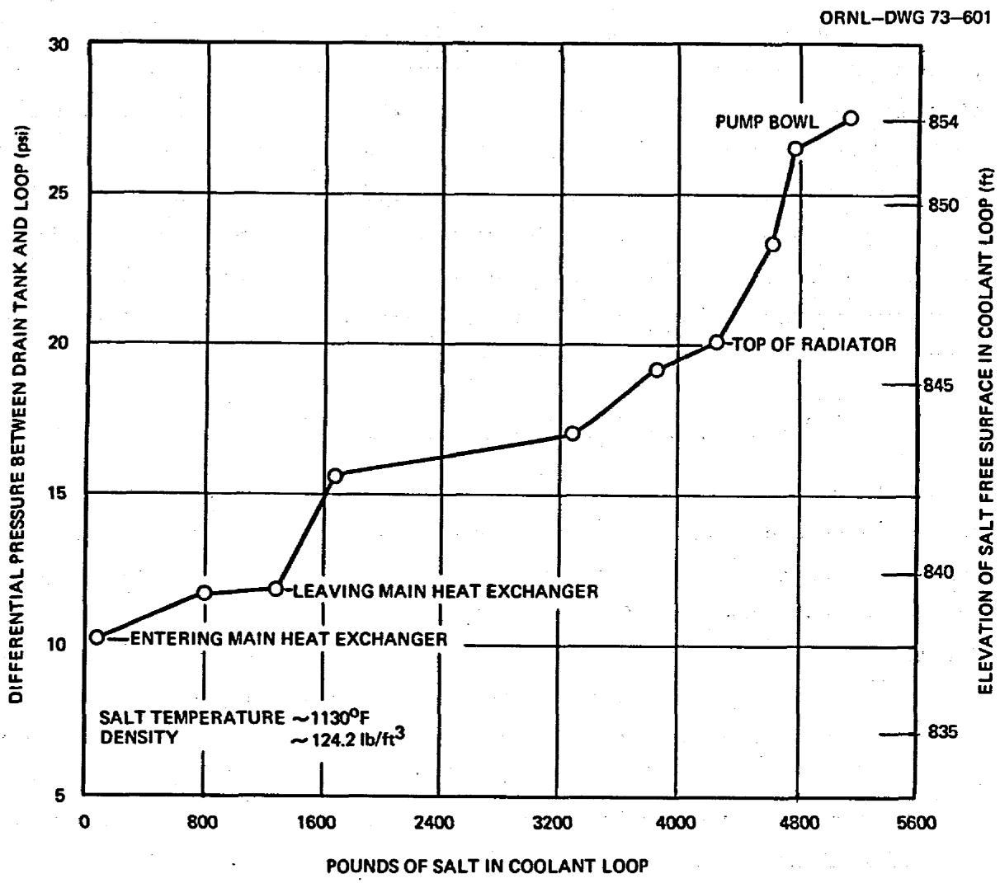  
Fig. 6.1 Coolant Circulating System Calibration

# 6.4 Operation

Other than the difficulties with the radiator described later, the coolant system operated satisfactorily. No salt leaks were detected at any time.

# 6.5 Coolant Salt Circulating Pump

# 6.5.1 Description

The coolant pump used to circulate the LiF-BeF $_2$ coolant salt was similar to the fuel pump. It did not have a spray ring since fission product gas removal was not required. No overflow tank or cooling shroud was installed. At the operating speed of 1750 rpm, it had an output of 850 gpm at a 78-ft salt head. A small helium purge was introduced just below the shaft seal in the bearing housing. Most of the gas flowed downward through the labyrinth between the shaft and the shield block to prevent salt mist from reaching the seal. The remainder flowed upward to prevent any oil which leaked through the seal from getting into the pump bowl. Oil for lubricating the bearings and cooling the shield plug was recirculated by an external pumping system. Helium bubblers and a float-type level instrument were used to measure the liquid level. (A float-type instrument was not installed on the fuel pump.) The coolant pump was located outside the reactor cell and could be directly maintained shortly after shutdown.

# 6.5.2 Operation

The coolant pump ran very well throughout the operation of the reactor. As with the fuel pump, the narrow range of operating levels caused operational difficulties. Prior to starting the pump after a fill, the average loop temperature could not be accurately determined. Since the coolant-pump level changed about $7\%$ per $100^{\circ}\mathrm{F}$ change in loop temperature, the selected fill point was not always satisfactory for operation. In which case the freeze valves had to be thawed and the system level adjusted. The normal operating level was about $55\%$ at full power (the level instrument had a span of 10 inches for $100\%$ and centerline of the volute was at $35\%$ ).

When the pump was first started after a fill, the level would drop about $9\%$ due to a gas pocket in the loop and about $4\%$ due to the pump fountain flow.

During load and rod screams, the system cooled rapidly which decreased the level below the interlocks required for starting the pump. Without circulation there was a possibility of freezing the radiator. An emergency start switch was installed which enabled the operator to bypass all interlocks and start the pump if freezing of the radiator appeared eminent.

Based on the oil found in the coolant pump offgas lines, there was a small oil leak into the pump bowl. The offgas line at the pump bowl became plugged occasionally and in November 1968, a clamshell heater was installed. This was used once and cleared the line sufficiently to permit operation until shutdown December 12, 1969.

The float level indicator was not used for operation.

# 6.5.3 Conclusions and Recommendations

The coolant pump was used to circulate salt for 26,026 hours at temperatures between $1000^{\circ}$ and $1200^{\circ}$ F.

Some plugging of the offgas line was encountered. This should be considered in future design. Leakage of oil into the pump bowl could be eliminated by seal-welding a gasketed joint as described for the fuel pump (Section 6.1).

# 6.6 Radiator

# 6.6.1 Description

The nuclear power generated by the reactor was finally dissipated by a coolant salt-to-air radiator. Salt flowed through the 120 radiator tubes at 850 gpm where it was cooled from about 1075 to $1015^{\circ}\mathrm{F}$ at full power. Approximately 200,000 cfm of air from the two stack fans flowed perpendicular to the tubes and out the coolant stack. In passing through the radiator, the air was heated about $100^{\circ}\mathrm{F}$ above the ambient inlet temperature. The heat removal was adjusted to match the nuclear power produced by raising or lowering the two radiator doors, adjusting the bypass damper, or starting and stopping the main blowers.

The radiator tubes were 0.75 in. OD x 0.072 in. wall x 30 ft long, zee-shaped to fit into the insulated radiator enclosure. The body of the enclosure supported the tubes and the electric heaters. Two hundred twenty-five kW of heat were provided to prevent freezing of salt in the tubes in case of a sudden loss of nuclear power (see Fig. 6.2).

The upstream and downstream faces of the radiator enclosure were equipped with doors that could move up and down in a "U" shaped track. As the doors moved downward into the fully closed position, camming devices operated by the weight of the door forced them against the seals located on the face of the radiator. The doors were raised and lowered by means of cables driven by a single motor. Magnetic clutches and brakes permitted independent operation of either door. In case of a load scram request or an electrical power outage, the brakes and clutches were deenergized and the doors fell closed at a rate which was limited by the inertia of flywheels attached to the ends of the drive shafts through overrunning clutches (v7 ft/sec).

# 6.6.2 Early Tests and Difficulties.

Preliminary heatup and checkout of the radiator began in October 1964. The main difficulties were due to insufficient insulation and warping of the doors. As a result, the doors jammed and would not operate properly and there was too much heat loss to reach operating temperatures. The temperature distribution was poor and overheating of thermocouple and electrical leads was encountered.

After unsuccessful attempts to correct these difficulties, the doors were temporarily sealed to allow completion of the criticality tests while new doors were being designed and built.

During the last half of 1965, extensive changes, tests, and remodifications were made on the radiator assembly. New doors were installed which provided more insulation facing the heat source and additional expansion joints to prevent warpage. The "soft" seal gaskets were removed from the doors and relocated on the radiator enclosure. They were increased from $3/4$ in. to $1-1/2$ in. wide for better sealing. A modified "hard" seal was installed on the doors. The door guide channels were repositioned to

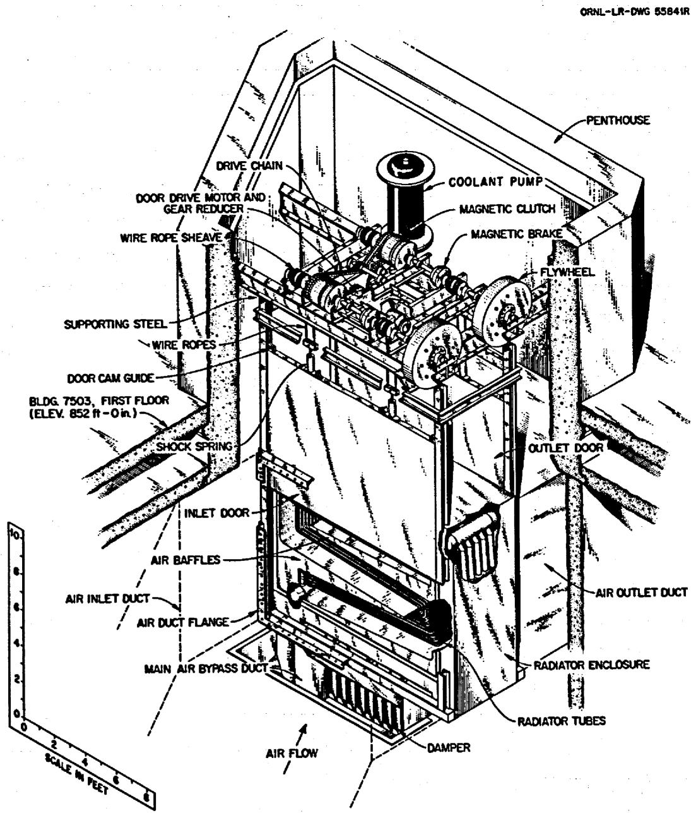  
Fig. 6.2 Radiator Coil and Enclosure

provide more clearance. Four cams were installed on each door to provide more positive seals when they were closed.

Sheet metal door hoods were installed above the radiator to reduce the air leakage into the penthouse. The synchro indicating device on the drive shaft had not proved reliable since it was possible for the door to jam and the shaft to continue to run in the downward direction. End rollers were positioned to prevent side motion from jamming the doors. Additional upper limit switches and mechanical stops were added to prevent lifting the doors in the event of a limit switch failure. Lifting motor overload switches were installed in conjunction with the stops.

The new doors weighed about 2700 pounds each which required the addition of two 20,000-pound capacity, 4-in. stroke shock absorbers on each door. Although it was recognized that with the additional weight, operation of the existing brakes and clutches was marginal, no changes were made in the lifting mechanism. Adjustment of the door-lifting cables so that the doors hung straight did much to ease their operation in the slides.

The above modifications improved the heat distribution of the radiator system. Two major difficulties were then encountered; one was the excessive temperature rise in the pent house just above the radiator, the other was maintaining a negative pressure in the pent house with respect to the high-bay pressure. This was needed for beryllium containment.

Efforts to correct these problems included relocating the heater lead junction boxes, pulling the thermoplastic wire $(194^{\circ}\mathrm{F})$ from the junction boxes to the heater leads coming from the radiator, spreading out the beaded heater leads to improve the cooling air circulation through the wiring, and, modifying the exhaust ducting to direct the sweep of cool air across the wire troughs ( $\sim 500$ cfm). These efforts were successful in reducing the temperature to about $100^{\circ}\mathrm{F}$ just above the insulation on top of the radiator. Heat leakage around the door hoods and radiator enclosure was reduced by welding up cracks, adding insulation, and installing boots around the door-lifting cable openings in the door hoods. A $1\text{-ft}^2$ cross-overduct was installed between the door hoods to relieve the pressure on the inlet hood. The pent house pressure with respect to the high bay was aided by the addition of a duct from the pent house to the inlet side of

the south annulus blower. This reduced the pent house pressure to -0.14 to -0.28 inches of water without the main blowers. With both blowers in operation, the pressure became slightly positive.

# 6.6.3 Subsequent Operation and Modifications

The systems were heated and the approach to full power was started early in 1966. The radiator functioned satisfactorily, however, due to heat losses through the door seals, it was difficult to heat the empty radiator to an acceptable temperature distribution prior to a fill.

The heat transfer capability was found to be about $20\%$ less than calculated. The cause for this discrepancy has not been definitely established but may be due to the large surface-to-air temperature difference which existed. This is described in detail in References 20 and 36.

Coolant salt was frozen in the radiator tubes on two occasions. The first occurred on May 19, 1966 when a building power failure caused a load scream and loss of all electrical equipment. Two tubes of the radiator were partially frozen as indicated by the temperatures reading about $75^{\circ}\mathrm{F}$ low. These temperatures recovered a few minutes after the coolant flow was re-established indicating that the plugs had thawed.

The second incident occurred on June 27, 1966 when again the electrical system failed, this time causing a coolant salt drain because of low radiator outlet temperature. The coolant salt weigh cells indicated that about 200 lbs of salt were held up in the coolant system. Since it was probable that the salt was frozen in the radiator which had cooled below the freezing point, the radiator was reheated and the system refilled. When the pump started, the temperature scanners indicated that 5 tubes were frozen and not circulating. These tubes thawed after several minutes of salt circulation without damage to the tubes.

To reduce the possibility of this happening again, the control system was revised so that a rod scram would also cause a load scram. The low-temperature setpoint for a load scram was increased from $900^{\circ}\mathrm{F}$ , which is only $60^{\circ}\mathrm{F}$ above the liquidus temperature, to $990^{\circ}\mathrm{F}$ . Other revisions were made so that the coolant pump would not be turned off unless absolutely necessary. A radiator door scram test was conducted from full power, and

these revisions were adequate to prevent freezing of the radiator as long as the coolant pump remained running. The average temperature of the fuel and coolant leveled out at about $1120^{\circ}\mathrm{F}$ .

On July 17, 1966, a sudden loss in power indicated that a main blower had been lost. Main blower No. 1 had failed catastrophically and pieces of the aluminum rotor hub and blading had gone into the radiator duct. After the radiator had cooled, examination revealed that pieces of aluminum had passed through the radiator tube bundle, several dented tubes were found, and several pieces of aluminum were stuck to tubes. Metallographic examination determined there were no punctures in the tubing and the radiator was safe to operate after each tube was thoroughly cleaned. The exact cause of the blower failure was never specifically determined but examination of numerous "old" cracks in the blades and hub would indicate that these were the probable point of origin. Flying debris caused some damage to the heater lead wires, wire trays, etc.

It was apparent from inspection of the "hard" sealing surface, which was mounted on the hot side of the radiator door, that a modification would be required. The continuous strip metal seal was badly buckled and fractured due to exposure to the radiator heat. The roughness of this surface damaged the "soft" seal (two widths of 3/4-in. Johns-Mansville Thermocore #C-197 square asbestos packing strips mounted on the face of the radiator) so as to render this seal ineffective.

A short evaluation program of six types of "hard" seals resulted in the selection of a seal made up of 2-1/4-in. long overlapping steel segments spaced 1/32-in. apart which was installed on the new doors. The test further indicated that the "T" bar, to which the segments were plug-welded, bowed as much as 3/16 in. on the 3-ft-long test section. The "T" bars in the new doors were provided with expansion slots plus a tension bar mounted on the cold side of the door which was used for straightening the doors after heating.

Performance of the radiator enclosure and door was without incident after the above modifications were completed for the balance of the MSRE operating period. Heat losses and mechanical operation were adequate. Programmed maintenance on the lifting mechanism was performed when the opportunity presented itself. Miscellaneous small items, such as replacement

of the "soft" insulation along the top of the outlet door, replacement of broken ceramic insulators on the heater leads within the enclosure, repair of grounded heaters, etc., was the extent of the maintenance required. The door on the inlet side of the radiator retained its shape and sealed reasonably well, the seal along the top and sides of the outlet door retained its seal except for replacement of burned-out tape along the top. The bottom of the outlet door continued to distort and, even after being straightened several times, made a poor seal as a result of the door bowing away from the soft seal on the radiator face. As long as the side and top seals were intact, there was no chimney effect and the heat losses were within usable limits.

# 6.6.4 Automatic Load Control

The heat removal rate at the MSRE was dependent upon the positions of the radiator doors and bypass damper and on the operation of the main blowers. These could be manually manipulated as desired. Instrumentation was also provided to automatically sequence the operation of these components so that the operator could use one switch for increasing or decreasing heat removal rate. An intermediate radiator door setting with one blower in operation and 1 MW of heat removed was to be used as the starting point. Since it was found that the heat removal with the doors at their minimum setting of 12-in. was about 1.9 MW, the automatic system did not function properly. The rest of the sequencing functioned properly during a test. However, in view of the above and since manually adjusting the heat load was not a disadvantage, the automatic load control was never used in the operation of the reactor.

# 6.6.5 Comments and Recommendations

Assessment of the radiator containment, doors, and door-lifting mechanism is complicated by the many changes, large and small, which were required before acceptable performance was achieved.

The radiator enclosure difficulties can be attributed principally to details of installation such as gross air leakage into and around the enclosure as a result of cracks, unsealed openings, insufficient insulation, lack of a sufficient number of expansion joints, etc. The principal radiator enclosure support "H" beam members were not vertical and therefore

the adjustable "U" shapped door guides located within these members had to be remachined to prevent the doors from binding.

The lifting mechanism was unduly complex. A substantial increase in both reliability and control would have been achieved by providing each door with its own motor-gear reducer unit with a built-in brake on the motor rotor shaft. A small, fast-acting brake in the high-speed end of the drive would have reduced the number of electromechanical devices and reduced or eliminated the problem of coordinating time constants between clutches, brakes, and motor. The ability to operate the doors independently was probably unnecessary.

The unrealistic close tolerances between the doors and the radiator enclosure and distortions produced by thermal gradients, primarily in the doors, required a massive effort to correct in order to provide the required seal. These factors should be given careful consideration in any future design.

# 6.7 Performance of Main Blowers, MB-1 and MB-3

# 6.7.1 Description

The two main blowers are a part of the heat rejection equipment where the heat generated by the reactor is dissipated to the atmosphere. The blowers were manufactured by the Joy Manufacturing Co. and are the "Axivane" type Model AR-600-360D-1225. The blowers are direct-connected to 250-hp, 1750-rpm motors by a short drive shaft with a flexible shim coupling on each end.

Although the blowers had been originally purchased for another program, they were essentially unused at the beginning of the MSRE program. The blowers were each originally rated at 82,500 cfm at 15 inches of water or 114,000 cfm of free air delivery. The MSRE radiator design requirement of 100,000 cfm from each blower at 9 inches of water was within the normal operating range of the blowers. Had new blowers been procured for the MSRE, this same type of equipment would have been considered a satisfactory choice.

# 6.7.2 Preoperational Testing

The preoperational testing of the blowers consisted of about 25 hours of total operation. When the blowers were first delivered and installed, they were operated a short time (less than 10 hours) to provide the electrical load for testing the diesel generators. The blowers were also operated for a short period of time prior to power operation of the MSRE to check the radiator tubes for self-excited vibrations, to permit a calibration of the stack air flow instrumentation, and to determine if control circuitry was necessary to avoid certain abnormal operating conditions.

During the abnormal operation testing, the blade pitch was found to be less than the specified 20 degrees. The pitch was set correctly and the test program was repeated. The tests indicated that the blowers would operate satisfactorily at all the normal conditions, but that a "surge" condition would occur if the bypass damper were partially closed when the radiator doors were also closed. The manufacturer had stated during discussions of the test program that the "surge" condition could be expected but that no damage would occur other than overloading the drive motors. The blowers were shut down immediately after the "surge" condition was encountered and administrative control was used to prevent further operation under surge conditions. A second pitch change was made to 22-1/2 degrees immediately after the first full-power operation. This 22-1/2 degree pitch gave the maximum blower performance within the power rating of the drive motors.

# 6.7.3 Operating History

The aerodynamic performance of the blowers was satisfactory throughout the operating life of the reactor. However, there were several mechanical failures which are listed in Table 6.1 and which are discussed below. This table also shows the effect of the failure on the operation of the reactor.

MB-1 Coupling Failure — After about 550 hours of operation, the flexible coupling on the motor end of the floating drive shaft failed during operation of MB-1. The motor end of the shaft was then supported only by the coupling guard, and the shaft whip that occurred as the blower rotor

Table 6.1 Summary of Main Blower Failures   

<table><tr><td>Date</td><td>Failure</td><td>Effect on Reactor Operation</td></tr><tr><td>6/14/66</td><td>Coupling Failure MB-1</td><td>Zero-Power Operation for 14 hours</td></tr><tr><td>7/17/66</td><td>Hub and Blade Failure MB-1</td><td>Premature Shutdown from Run No. 7
Partial Power Operation During Run No. 8</td></tr><tr><td>3/6/67</td><td>Bearing Failure MB-3</td><td>Zero-Power Operation for 3 days</td></tr><tr><td>1/16/68</td><td>Bearing Failures MB-1 MB-3</td><td>Partial Power Operation for 6 days
Maintenance Performed During Scheduled Zero-Power Operation</td></tr><tr><td>8/31/68</td><td>Bearing Replacement MB-3</td><td>Completed During Scheduled Maintenance Period</td></tr><tr><td>9/17/69</td><td>Bearing and Mount Replacement MB-1</td><td>Zero-Power Operation for 2 days</td></tr><tr><td>9/19/69</td><td>Faulty Bearing Replacement MB-1</td><td>Partial Power Operation 3 days
Zero-Power Operation for 3 days</td></tr></table>

coasted down destroyed the guard and also the coupling on the end of the shaft near the blower. The shaft came to rest embedded in the sheet-metal nose with the blower end of the coupling near, but completely severed from, its mating flange on the rotor. The motor end of the shaft extended radially across the blower inlet at about the 4 o'clock position.

Scratches and dents on the blades indicated that some of the debris from the failed couplings had gone through the blower into the radiator duct. However, the damage, except to the couplings, appeared to be superficial and of little consequence. No additional inspection of the blower was made.

The primary cause of the failure, we believe, was a fatigue failure of the flexible shims. The exact cause of the shim failure is unknown. Some home-made washers were found in the drbris that were not rounded as they should have been. High stresses at the corners of these washers could have started the failure, or the coupling could have been running with excessive misalignment. The blower rotor and drive shaft assembly had been rotated by hand when the final blade pitch change was made about 216 operating hours before the failure. There may have been some cracked shims in the coupling at that time, but the shims were still supporting the shaft.

The couplings were rebuilt with new bolts, washers, and shims. The shaft was realigned, and the blower was returned to service. The couplings on MB-3 were also disassembled and new shims were installed. The original shims in these couplings were not in bad condition.

MB-1 Hub and Blade Failure — After about 650 hours of additional operation, there was a second failure of MB-1. This was a catastrophic failure of the blading and the hub of MB-1. The outer periphery of the rotor hub disintegrated and all of the blading was destroyed. Most of the fragments were contained in the blower casing, but numerous pieces of the cast aluminum-alloy hub and blades entered the radiator duct and some of these actually passed through but did not seriously damage the radiator tube bundle. Figure 6.3 shows the failed hub and typical pieces of the blading.

An inspection of the broken pieces of MB-1 revealed numerous "old" cracks in the blades and in the hub as evidenced by darkened or dirty areas on the fractured surfaces. One blade in particular had failed along a

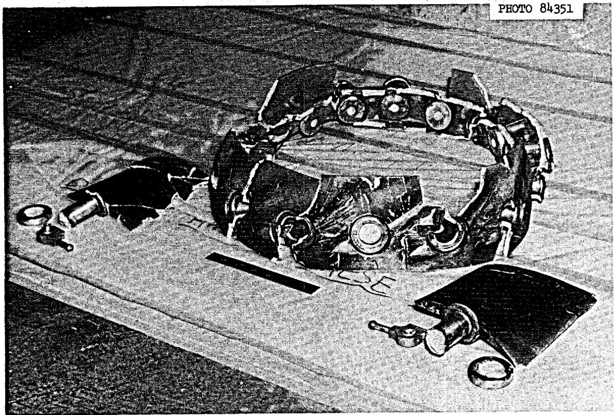  
Fig. 6.3 Outer Periphery of Failed MB-1 Hub and Typical Blade Fractures

large "old" crack. The hub had contained short, 1-1/2 to 2-inch, circumferential cracks at the base of 8 of the 16 blade sockets and the failure generally followed these cracks. Figure 6.4 is a piece of the hub showing the darkened areas that indicated previous cracking at the base of the blade sockets. Similar cracking was found in the hub of the spare blower that had been in storage and a continuous crack extending about $35\%$ of the circumference as well as some of the shorter cracks were found in the MB-3 hub. No cracking was found in the blading of MB-3 or the spare blower. The exact cause of the MB-1 failure is uncertain, but a blade failure at one of the existing cracks seems to be the most probable first event.

All three of the blowers were rebuilt by the manufacturer with new redesigned hubs and lighter magnesium-alloy blading. The hubs were reinforced with radial ribs to reduce the bending moments in the areas where the cracking had been observed. There have been no further cracking problems in either of the rebuilt units in about 11,000 - 12,000 hours of operation. A more complete discussion of the failures and of the corrective action that was taken is given in References 42 and 43.

Thrust Bearing Failures — There were a total of six failures associated with the main thrust bearing or its mounting. Main blower MB-3 was taken out of service on March 6, 1967 for a bearing replacement after the vibrations had increased from a normal value of about .8 to 2.5 mils. The bearing contained an excessive quantity of very old appearing grease, and the bearing surfaces were severely worn and pitted. This bearing was apparently from the replacement blower that had been in storage, and the bearing apparently had not been cleaned and relubricated when the rebuilt rotor was assembled. Improper lubrication was judged to be the cause of failure. The bearing had operated about 1800 hours.

Main blower MB-3 was shut down a second time for a bearing replacement on January 16, 1968, because of an increase in bearing vibration. Although the vibration and temperature had been normal, the MB-1 bearing was also found to be defective and was replaced at the same time. The MB-1 bearing had one pitted ball, but the MB-3 bearing was severely damaged and one ball had actually fractured. Figure 6.5 is a photograph of these two balls.

Since improper lubrication did not seem to be the cause of these two failures and since three bearings had failed in relatively short operating

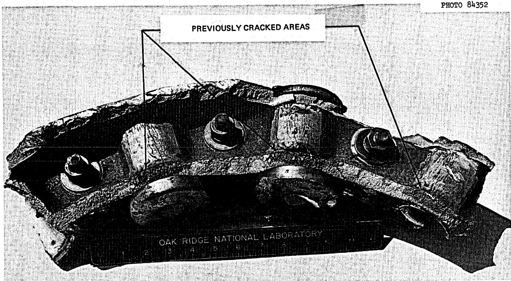  
Fig. 6.4 Fragment of MB-1 Hub Showing Areas of Previous Cracking

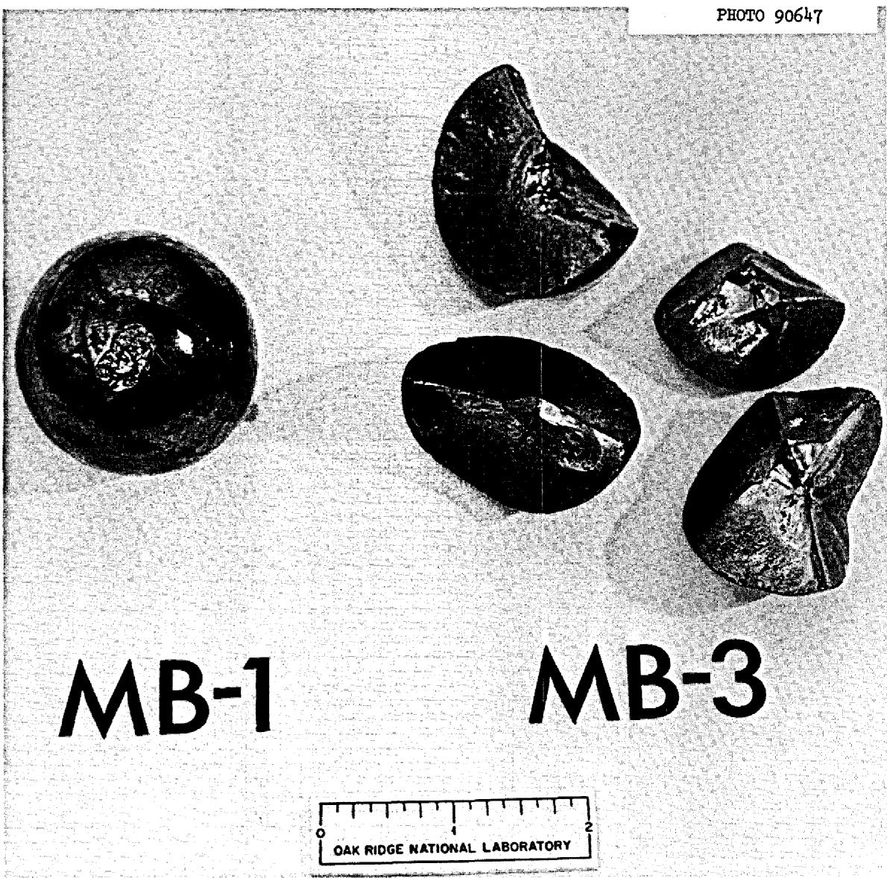  
Fig. 6.5 Ball Bearing Failures Taken from MSRE Main Blowers MB-1 and MB-3 in January 1968

times, the expected life of these bearings was calculated from an estimated set of load conditions. The predicted life was 5000 hours as compared to operating times of 6630 and 4800 hours respectively for MB-1 and MB-3. As a result of this evaluation, the original radial-type ball bearings were replaced with an angular-contact type having identical mounting dimensions. The angular contact bearing had a greater thrust load capacity.

The angular contact bearings were apparently capable of satisfactory life, but additional difficulty was experienced with the self-aligning mount. The MB-3 bearing was replaced during a scheduled maintenance period because of a thumping noise that was heard when the blower was turned by hand. The bearing was found to be in good condition, but the wear pattern indicated that the outer race had been misaligned with the shaft. The mis-alignment plus the high radial clearance in this type bearing caused the noise. No further difficulty was experienced with MB-3.

Blower MB-1 was shut down on September 17, 1969 because of an increase in vibration. The vibration increase had been caused by excessive wear in the spherical surfaces of the self-aligning mount. The replacement of the mount also required replacement of the bearing. The new bearing failed by overheating during its test run because of insufficient clearnaces in the phenolic ball retainer. This bearing was then replaced with a bearing of the original radial type that was on hand. This bearing was satisfactory for the remaining operation of the reactor. The defective bearing was returned to the vendor.

# 6.7.4 Surveillance of Blower Operation

Following the hub and blade failure of MB-1, a surveillance program for monitoring the operation of the blowers was initiated. Vibration pickups were mounted horizontally on each bearing of the blowers and drive motors and thermocouples were installed in each of the blower bearings. A vibration meter with four input channels was provided for each blower, and the vibration of each bearing was recorded in peak-to-peak displacement once per shift by the operating personnel. The thermocouples were monitored by the computer and initially an alarm would be given if the temperature exceeded a preselected limit. This was revised later to alarm if the

temperature rise above ambient exceeded a limit. This permitted much tighter operating limits because the ambient fluctuated with the outside air temperature.

In addition to the displacement readings taken from the vibration meters, an output was also available to display the vibration trace on an oscilloscope or other high-speed recorder. Oscilloscope photographs were taken for reference on new bearings and when the vibration meters indicated an increase. Figure 6.6 shows a comparison of vibration traces from a normal bearing and from the bearing containing the fractured ball.

A complete inspection of the blowers including a dye-penetrant examination of the hubs and blading was completed annually during shutdown periods.

# 6.7.5 Discussion and Conclusions

Following the major rebuilding of the main blowers in 1966, the operation has been generally satisfactory even though there have been several power reductions caused by bearing problems. The total lost operating time caused by the various bearing failures was 8 days of zero-power operation and 9 days of partial-power operation. A better thrust bearing arrangement could have been required.

The surveillance program to monitor the mechanical performance of the blowers has been very effective. All the bearing problems except the MB-1 pitted ball in January 1968 have been found by an increase in vibration. When the ball fractured in the MB-3 bearing, a temperature increase had preceded the vibration increase by several days. However, this temperature increase had gone unnoticed because the bearing temperature was well below the limit that had been set. The computer program was therefore revised to alarm on the temperature rise above ambient, and much tighter limits were selected based on the previous operating experience. This alarm system was effective in detecting the defective new bearing on September 19, 1969.

The operating experience with the vibration monitoring system has clearly shown that the displacement meter alone is not adequate to monitor the condition of the bearings. Some system of maintaining a history of the frequency spectrum is also required. We used photographs of the oscilloscope trace to document the normal operating vibrations, and additional

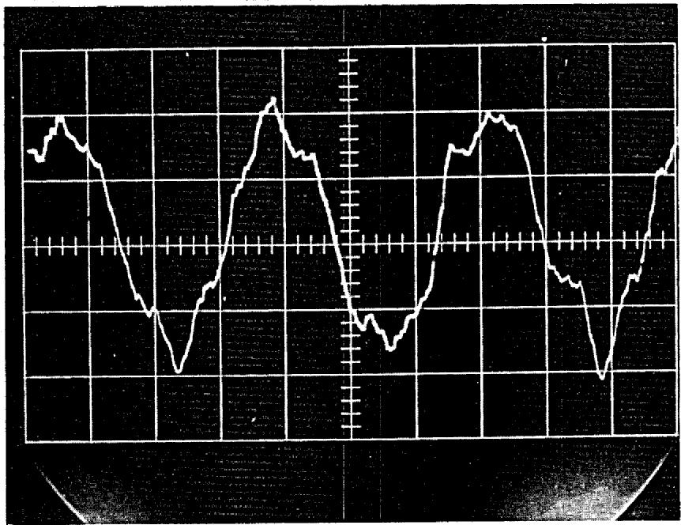  
Normal Trace - Taken 12/19/67

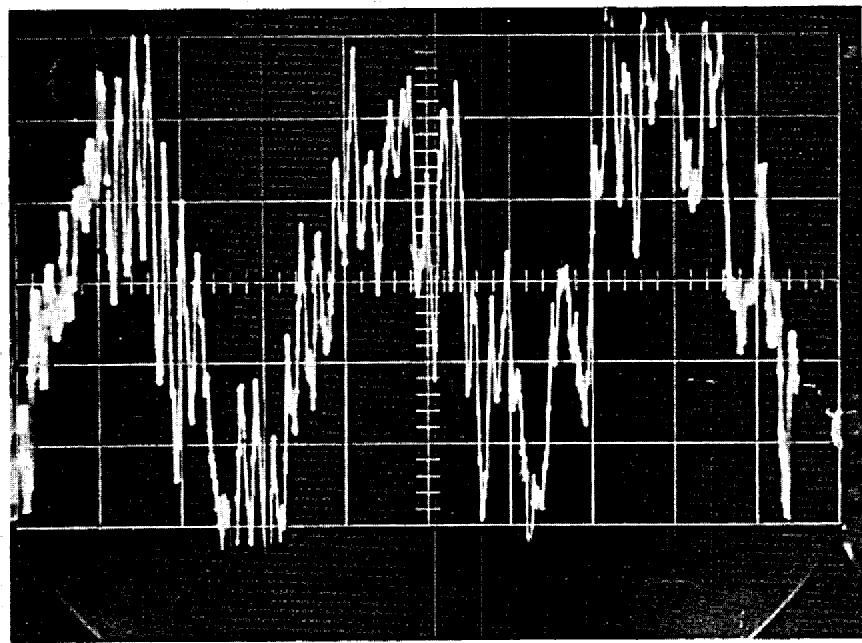  
Trace with Fractured Ball - Taken 1/16/68   
Fig. 6.6 Main Blower MB-3 Vibration Traces

photographs were taken for comparison when an increased vibration was indicated by the displacement meters. A modification to the computer to increase its sampling rate would have permitted the frequency spectra to be generated by the computer. This would have provided a more convenient and more precise spectrum, but some degree of background experience would still be required for proper interpretation of the spectra in either case because there can be several normal frequencies. There were several instances of abnormal vibrations when the bearings were not at fault. The final decision to replace a bearing was made in each case by the sound and feel of the blower during a coastdown from operating speed.

# 6.7.6 Recommendations

The main blowers were conventional commercial equipment which would normally be expected to operate with a minimum of attention or maintenance. The instrumentation of all rotating equipment is probably impractical in regard to both cost and manpower. However, certain classes of equipment should be instrumented and monitored on a routine basis. The equipment should be selected on the basis of:

1. Size and cost   
2. The accessibility during operation   
3. The effect of shutdown on overall plant operation   
4. The potential for self-destruction

Ideally the monitoring should be computerized but this is not actually required.

Each type and piece of equipment will have its own operating characteristics in regard to vibration or temperature, and these characteristics may vary with the installation or operating conditions. Preliminary limits may be obtained from the manufacturer or from Reference 44, but the final operating limits should be selected from a background of normal operating experience.

The experiences with the cracked hubs and with the original thrust bearing design are indications that the Quality Assurance Program should extend into the design phase as well as the fabrication phase of major or critical items of equipment.

# 6.8 Coolant Drain Tank

# 6.8.1 Description

The coolant drain tank was similar to but smaller than the fuel flush tank. It was 40 in. in diameter by 78-in. high and had a volume of 50 ft3. As there was essentially no afterheat in the coolant salt, cooling was not provided. Two salt lines (204 and 206) and their associated freeze valves were used for filling and draining the coolant circulating loop.

The weight of salt was indicated by forced balance weigh cells. The weights were recorded on strip charts but could be read more accurately from installed mercury manometers. Two conductivity type probes (one near the bottom and the other near the top elevation of the salt) were provided for use as reference points.

# 6.8.2 Calibration of the Weigh Cells Using LeadWeights

The weigh cells were calibrated by loading the drain tank with lead billets. The drain tank was at ambient temperature during the calibration. There was good agreement between the manometer readings and the actual weight added. Difficulty was encountered with air and mercury leaks in the readout system. The weigh cells were further calibrated during the addition of coolant salt.

# 6.8.3 Addition of Coolant Salt

Twenty-two batches of coolant salt (5,756 lbs) were added from cans in a portable furnace directly to the coolant drain tank through a heated line attached to the top of the tank. After the addition was complete, this line was cut off and welded shut. A good linear plot of the manometer readings vs actual weight was obtained except for a 150-lb step in the curve which occurred when a broken fitting in the weigh cell tubing was repaired. The relationship between the weigh cell readings and the locations of the probe lights was established.

The weighing system on the coolant drain tank proved to be considerably more stable than on the fuel drain tanks. With 5756 lb of salt in the tank at about $1200^{\circ}\mathrm{F}$ , the extreme spread of 40 indicated weights, taken over a period of a week, was $\pm$ 22 lb.

# 6.8.4 Heatup and Cooldown Rates

These are described under heaters in Section 17.

# 6.8.5 Discussion and Recommendations

No unusual difficulties were encountered with the coolant drain tank. The weigh cells functioned satisfactorily, however, the trouble with the fuel drain tank weigh system emphasizes the need for careful consideration of piping stresses or the use of other type instruments.

# 7. COVER-GAS SYSTEM

P. H. Harley

The MSRE cover-gas system consisted of a helium trailer for normal supply, two banks of three helium cylinders for emergency use, two parallel treating stations for removing moisture and oxygen to a nominal 1 ppm by volume, a treated helium surge tank, and two headers, 35 psig and 250 psig, which supplied cover gas to the various systems. Each of the treating stations consisted of a dryer (molecular sieve), preheater, and an oxygen-removal unit (heated titanium sponge). Moisture and oxygen analyzers could be valved in to monitor the treated or untreated helium as desired.

# 7.1 Initial Testing

The components of the treating station were developed and designed by the Reactor Division Development Section. The performance of the system was tested by measuring oxygen and moisture content of the cover gas upstream and downstream of the treating station to insure proper operation. Other testing at the MSRE consisted of leak-testing the system and checking flow control and temperature controls. Thermal expansion of the $O_2$ removal beds during the initial heatup caused the 3-in. ring joint flanged heads to leak. After retightening the flanges, the units were kept hot to prevent thermal cycling the flanges.

Late tests indicated that the Fisher Model 67-H pressure regulator which was installed to reduce helium from trailer pressure to 250 psig was susceptible to moisture diffusion through the diaphram. These tests indicated Victor Model VTS-201 and Grove Model RBX-204-15 were better from

this standpoint. The Victor model was less complicated and therefore was installed in the MSRE.

The low-pressure cover-gas header was initially a 40-psi header which was protected by a 48-psig rupture disc. During initial testing, this rupture disc failed on several occasions without apparent cause. The header pressure was subsequently lowered to 35 psig which was sufficient for all normal operating requirements and did alleviate the problem. The safety limits[20] (Lo He supply pressure) had to be lowered from 30 to 28 psig to provide a margin from the normal operating pressure.

Four helium control valves failed in the first month of operation. Some galling of the close fitting trim (17-4 PH plug and Stellite seat) was apparently caused by the extremely clean, non-lubricating dry helium. Other valves in the system, including the four replacements have operated satisfactorily.

# 7.2 Normal Operation

Since putting the cover-gas system in operation in the fall of 1964, sixteen trailers of helium have been used. About 21,800 ft³ of the 29,000 ft³ in each trailer was used before returning the trailer to be refilled. A trailer lasted about 4 months on the average or an average usage of approximately 180 cubic feet per day. Normal usage when the reactor was operating was 260 cubic feet per day. Larger amounts were used during purging and filling procedures and very little was used during maintenance periods.

Although helium was the normal cover gas, during maintenance periods the reactor system was purged with argon. Argon was also used during a special study of circulating gas in the fuel. Bottles of argon containing $< 4$ -ppm moisture were placed on one of the emergency cover-gas headers and then fed through the heating station into the regular cover-gas distribution system.

The cover gas was changed from one treating station to the other only once in the five years of operation. This was done in February 1967 when trouble was encountered in the power supply control circuit to the operating unit. Although the dryer which had been in operation prior to the

change was regenerated, there has been no indication that the capacity of any dryer or $\mathrm{O_2}$ -removal unit has been exceeded.

Spectrographic analysis of the helium received averaged 2 ppm oxygen and 4.6-ppm moisture. After passing through the treating station, the helium contained $\sim$ 0.2-ppm $O_2$ and from 0.5 to 10-ppm moisture. The variation in moisture analysis appeared to follow the ambient temperature of the helium trailer and treating station. During hot weather the analyses were high and during cold weather the results were low. Fluctuations could be seen from day to night temperature changes of several ppm moisture. This fluctuation of moisture analysis was decreased by better heating of the sample station location in the winter and better ventilation of the area during the summer months.

While investigating the moisture analysis problem, another dryer was installed in the main helium header between the normal treating station and the line to the analyzers. Whether this second drying step helped is doubtful but it did give assurance that the helium was as dry as possible.

The electrolytic cell in the moisture analyzer caused considerable difficulty during early operation. The cell was replaced four times between June and October 1965, once in June 1966, and in January 1967. No cell replacements have been necessary since then. Apparently the quality of the cells was improved. Only one electrolytic cell has failed in the oxygen analyzer and that was in June 1965.

To check the final performance of the treating station in October 1969, a cylinder of He containing moisture was connected to the analyzers. The analyzers read 20-ppm moisture and 0.6-ppm $\mathsf{O}_2$ . After the gas was run through the treating station it analyzed 0.9-ppm moisture and 0.2-ppm $\mathsf{O}_2$ .

There has only been one failure of the 48-psig rupture disc since the initial testing. This was caused by improper installation. Each time the 60-psig fuel system pressure test was run, pressure was put on the back side of this rupture disc to prevent it from breaking. In August 1969, when the backpressure was increased, the rupture disc started leaking. During replacement, the vacuum support was found to be on the wrong side of the disc. Repeated flexing, when backpressure had been applied, was the apparent cause of the failure. More importantly, the faulty installation had nullified the safety function of the disc.

# 7.3 Conclusions and Recommendations

The cover-gas system performed quite satisfactorily with a minimum amount of maintenance or operator time. Since the moisture and oxygen in the helium as received was very low, it is doubtful that the treating stations were really necessary. By obtaining analysis of the cover gas before usage and having an on-line analyzer, the treating station could probably be eliminated. In larger reactors, the treating station might be needed to dry the early recycle gas. The MSRE charcoal beds remained "wet" for a long period during early operation.

We have had considerable fluctuation in the indicated moisture. If the treating station and analyzers were located in an area which had a constant temperature, the analyzers would be more consistent. If no treating station is used, the helium supply should be kept at a constant temperature. Rising temperature drives moisture out of the container walls and decreasing temperature causes the walls to absorb moisture.

8. OFFGAS SYSTEM

A. I. Krakoviak

8.1 Description

The offgas systems were comprised of those lines, filters, charcoal beds, and valves through which cover-gas flowed from the salt systems to the environment. The off-gas systems for the coolant salt and for the fuel salt were similar in many respects, but the coolant off-gas system was simpler because it did not have to deal with the intensely radioactive fission products found in the fuel off-gas during power operation.

# 8.1.1 Coolant Off-gas System

Figure 8.1 is the flowsheet for the coolant off-gas system (simplified by the omission of elements which are not pertinent to the presentation of operating experience in this report). Gas entered the coolant pump bowl through bubbler level indicators and as a purge to the pump shaft annulus. The shaft purge flow was split, with some flowing downward into the pump bowl and the rest upwards and out through line 526. The upflow was to prevent oil fumes from coming down the annulus into the pump bowl. However, some oil (about $0.5 - 1.0$ cc/day) did get into the pump bowl by a leakage path around the shield plug. This oil was thermally decomposed into vapors and soot that left with the off-gas through line 528.

Gas flows into and out of the pump bowl were continuous. Gas was admitted at a fixed rate and the pump bowl pressure was controlled by throttling PCV-528 in the off-gas system. The driving force for the upper gas flow (line 526) was the pressure differential across PCV-528. Gas was normally vented from the coolant drain tank only after a fill of the circulating loop, which was done by pressurizing the tank.

All piping in the coolant off-gas system was 1/2-inch Sch-40 stainless steel pipe. The valves, filters, and traps are described in the section on experience. The system was located in the coolant drain cell, which could be safely entered whenever the reactor power was shut down.

ORNL DWG 73-4274

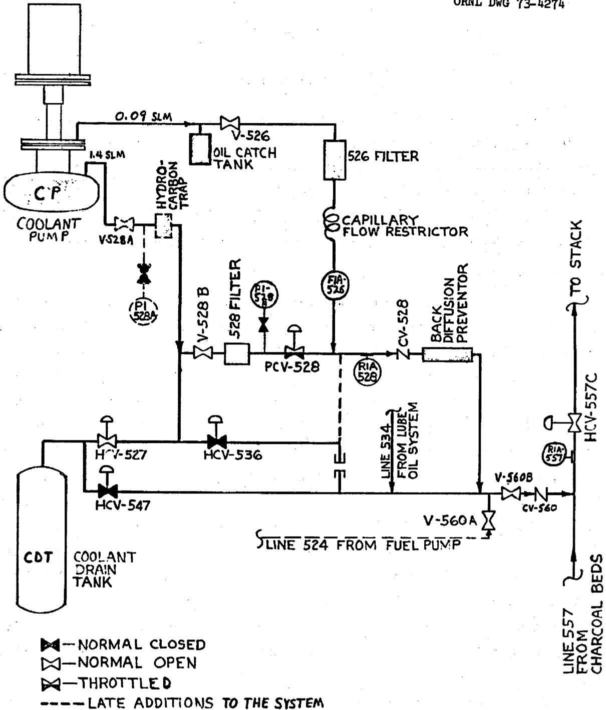  
Fig. 8.1 Simplified Flowsheet of MSRE Coolant Off-Gas System

# 8.1.2 Fuel Off-gas System

As seen in Fig. 8.2, the flowsheet for the fuel salt off-gas was basically similar to that for the coolant off-gas, but was more complex. Three drain tanks were required in the fuel system (two for fuel, one for flush salt) and an overflow tank was required for the fuel pump bowl. A major difference was that all fuel system off-gas was sent through charcoal beds for fission product absorption before release to the stack. The gas hold-up and cooler consisted of a 68-ft length of 4-inch Sch-40 stainless steel pipe. The remainder of the off-gas piping with the exception of the flexible jumper line near the pump bowl and the line in the vicinity of the particle trap and line 557 was 1/2-in. Sch-40 stainless steel pipe. Therefore, at the normal off-gas flow rate of 4.1 liters per minute, the fission gases were at least 45 minutes old on arrival at the particle trap and approximately 100 minutes old on arrival at the main charcoal bed.

An auxiliary charcoal bed was provided to accommodate large venting rates (for short intervals) such as were required during filling and draining the reactor or during salt transfers. A sampling system was also provided to study the concentrations of fission products and oil decomposition products in the fuel off-gas.

The fuel off-gas system was contained and shielded and therefore required remote maintenance techniques for work on any portion upstream of the charcoal beds.

# 8.2 Experience with Coolant Salt Off-gas System

A summary of the difficulties encountered with the coolant off-gassystem is given in Table 8.1. A description of these is given in the following sections.

# 8.2.1 Filter and Valve Difficulties

During early checkout of the coolant system, the original pressure control valve (PCV-528) which throttled the off-gas from the coolant pump was too small ( $C_{\mathrm{v}} = 0.003$ ) for adequate pressure relief and was replaced by a valve having larger flow coefficient ( $C_{\mathrm{v}} = 0.02$ ).

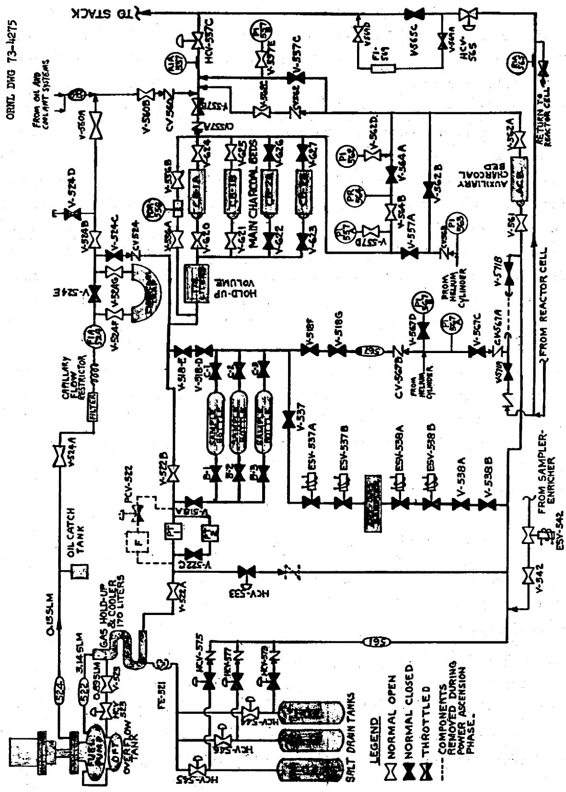  
Fig. 8.2 Simplified Flowsheet of MSRE Fuel Off-Gas System

Table 8.1. Summary of Difficulties with the Coolant Off-gas System   

<table><tr><td>Date</td><td>Description</td></tr><tr><td>Jan. 1965</td><td>Installed larger control valve (PCV-528) (Cv0.032 to 0.02)</td></tr><tr><td>Jan. 1965</td><td>Added a 25μ filter ahead of the control valve</td></tr><tr><td>Jan. 1965</td><td>Replaced the 25μ filter (1.4 sq in.)</td></tr><tr><td>Feb. 1965</td><td>Installed a larger 25μ filter (50 sq in.)</td></tr><tr><td>June 1965</td><td>Control valve plugged - cleaned this and installed a 1μ filter (50 sq in.)</td></tr><tr><td>Jan. 1966</td><td>Replaced 1μ filter</td></tr><tr><td>Feb. 1966</td><td>&quot; &quot; &quot;</td></tr><tr><td>Feb. 1967</td><td>&quot; &quot; &quot;</td></tr><tr><td>Feb. 1967</td><td>&quot; &quot; &quot;</td></tr><tr><td>June 1967</td><td>&quot; &quot; &quot;</td></tr><tr><td>Sept 1967</td><td>&quot; &quot; &quot;</td></tr><tr><td>Jan. 1968</td><td>&quot; &quot; &quot;</td></tr><tr><td>Sept 1968</td><td>&quot; &quot; &quot;</td></tr><tr><td>Sept 1968</td><td>Restriction at coolant pump - cleared by backblowing</td></tr><tr><td>Nov. 1968</td><td>Restriction at coolant pump - cleared by heating with a torch. Installed heaters on the line. Cleaned off gas lines and replaced 1μ filter.</td></tr><tr><td>Feb. 1969</td><td>Restriction at coolant pump - cleared by heating with electrical heaters.</td></tr><tr><td>June 1969</td><td>Control valve, 1μ filter and check valve cleaned and back-diffusion preventer removed.</td></tr><tr><td>Sept 1969</td><td>Replaced 1μ filter.</td></tr></table>

A sintered metal filter (tubular cartridge one-inch long by 1/2-inch diameter) capable of stopping particles greater than $25\mu$ was installed in the off-gas line to protect the pressure control valve. It was necessary to replace this filter (because of excessive pressure drop) after only 24 days of service with salt in the coolant loop. Inspection showed that the plugged filter was covered with amorphous carbon containing traces of the coolant salt and INOR-8. A second identical cartridge plugged after 20 days of service and at the completion of Run 1, (see Table 3-2 for dates of runs) it was replaced with one having 35 times the surface area. Coolant salt was not circulated again for 3-1/2 months and then for only 118 hr. During circulation, pressure control again became erratic which indicated an obstruction of either the filter or the valve. Both were removed for inspection, and although there was no deposit on the filter, the valve was partially obstructed by a black, granular material. Rinsing with acetone restored the original flow characteristics of the valve, and it was reinstalled for the next run. The filter was replaced with a similar one but capable of removing particles greater than $1\mu$ in diameter. The smaller pore size was chosen because the black granular material was determined to be a mixture of glassy spheroids of coolant salt approximately $1\mu$ in diameter and carbon or carbonaceous material. It is not known whether these materials were carried into the line continuously or were swept out of the pump bowl by sudden venting. The valve was relatively trouble-free after the installation of the $1\mu$ filter. The filter, however, experienced gradual plugging and was changed or cleaned twice in 1966, three times in 1967, three times in 1968, and twice in 1969. The filters, when removed from the system, showed no evidence of foreign matter other than a light film of oil in the filter housing and a light film of oil was transferred from the porous metal filter onto the plastic bag used in removing the filter.

Flow tests on the plugged filters showed pressure drops of less than 0.1 psi at flow rates two and three times greater than the normal MSRE rate (essentially the same results were obtained on a test of the fuel off-gas filter). Plugging in these filters was attributed to the liquefaction of oil in the pores of the filter. The fact that the pressure drop (at normal MSRE flow rates) changed from $\sim 10$ psi before removal to essentially

zero when tested after removal was attributed to the removal of some of the oil from the pores onto the plastic bag and rubber gloves during removal and insertion of the filter in the flow test rig. The filters were rinsed in acetone before reuse.

On several occasions when the filter became restricted and could not be replaced during power operations, the output from the pressure controller was switched from PCV-528 to HCV-536. The coolant pump pressure was then controlled with this large by-pass valve ( $C_{\mathrm{v}} = 3.5$ ). Although the valve was operated at essentially its fully open or fully closed position, adequate pressure control was achieved because the check valve and back-diffusion preventer offered an appreciable resistance to large flows. During the May 1967 shutdown, the off-gas piping downstream of HCV-536 was changed to join line 528 downstream of PCV-528 rather than line 560. This change routed the gas by the coolant system radiation monitor so that the coolant off-gas could be monitored when it became necessary to use HCV-536 to control the system pressure.

On one occasion late in reactor operations (September 1969) when the filter became restricted, the coolant system pressure was allowed to reach 10 psig before remedial action was taken. During this test the pressure in the system meandered back and forth between 10 and $<5$ psig for approximately one month before exceeding 10 psi and thus requiring pressure control with the vent valve (HCV-536). This pressure drop is in agreement with the gas pressure required to enlarge or burst a film of oil from a one-micron pore if one assumes that the bubble radius is the same as that of the pore. The equilibrium equation for a spherical bubble is

$$
\Delta P = \frac {2 \sigma}{r}
$$

where $\sigma =$ surface tension $= 16$ dynes/cm for oil in the coolant system, and $\mathbf{r} =$ bubble radius $\tilde{\equiv}$ pore radius $= 0.5\times 10^{-4}$ cm.

This calculation indicates that any pore in the sintered metal filter smaller than $1\mu$ , once plugged with condensed oil vapors, would remain plugged at pressure differentials of less than 9.3 psi. The slow pressure oscillation experienced could be attributed to a near equilibrium condition of condensation and evaporation of oil at the pores of the filter.

# 8.2.2 Restriction at the Pump Bowl

In September of 1968 approximately one month after the start of Run 15, in addition to a restriction at the filter, a restriction developed in the off-gas line at the exit of the coolant pump bowl. This restriction was blown clear once by closing the pump off-gas and equalizer valves and allowing the pump pressure to increase to 15 psig before suddenly venting the pump to the drain tank which was at atmospheric pressure. The reactor was shut down in November of 1968 when this restriction reappeared and a similar restriction developed in the fuel off-gas system.

During the shutdown, line 528 was cut approximately 3 feet downstream of the pump bowl and a clean-out tool which was inserted toward the pump bowl came out covered with black, heavy grease. A brown vapor (hydrocarbons) was collected when this section of line was heated with a torch. The restriction was not cleared, however, until the junction of the off-gas line and the pump bowl was heated to red heat. There was practically no evolution of vapor from the line at that time, suggesting that the restriction was primarily salt or a combination of salt and hydrocarbons.

A heater was installed on the line at the exit from the pump bowl; also a trap which was packed with stainless-steel mesh was installed in the line approximately six feet from the pump bowl in an effort to condense oil vapors at this location and thus prevent or minimize oil transport downstream to the filters and valves.

Also during this shutdown all coolant off-gas valves in the coolant drain cell were dismantled and cleaned. The valves and interconnecting lines and filter housing were found to have a light layer of oil on the inner surface, and approximately 10 to 20 cc of oil was cleaned from low pockets in the interconnecting lines.

Approximately six weeks after resumption of operations, the line at the pump bowl again showed evidence of a restriction. The heater was energized and the restriction cleared when the temperature of the pipe under the heater (normally at $485^{\circ}\mathrm{C}$ ) increased to $620^{\circ}\mathrm{C}$ . No further off-gas problems were encountered at this location. However, about six months later restrictions appeared in the pressure control valve, check valve, and the back-diffusion preventer. During the June 1969 shutdown, the filter, control valve, and nearby check valve were cleaned and reinstalled;

the back-diffusion preventer was removed completely. Although all four components were coated with oil which impeded off-gas flow, it is believed that the back-diffusion preventer was the major restriction.

With the exception of the restriction in the sintered metal filter in September 1969, no further coolant off-gas problems were encountered before final shutdown.

In summary, the restrictions in the coolant off-gas lines were primarily related to oil leakage into the pump bowl. In retrospect, a filter of an intermediate pore size (say $2 - 4\mu$ may have been a better choice. The restriction at the pump exit was probably more of a salt mist carryover phenomenon rather than hydrocarbon related. The plugging at the coolant pump bowl exit, although occurring less frequently, seems to be similar to that experienced at the fuel pump which will be discussed later.

# 8.3 Experience with the Fuel Off-gas System

A summary of the fuel off-gas experience is given in Fig. 8.3. The salt circulating times and power operations are shown and the type difficulties encountered are tabulated. These are discussed in the following sections.

# 8.3.1 Experience with Fuel System Off-gas System Prior to Power Operation

The problems encountered with the fuel off-gas system during the pre-critical and low-power operations (<25 kW) were somewhat similar to those in the coolant system.

8.3.1.1 Filter and valve difficulties. After about two months of flush salt circulation during the precritical testing, the fuel system pressure control became erratic. During the shutdown at the end of Run 1 the filter and valve were removed. The filter (pore diameter of $\nu 25\mu$ ) appeared clean but the valve was partially plugged. The obstruction was blown out with gas and the valve was washed with acetone, reassembled, and both filter and valve reinstalled. Approximately a week after the start of the next run, the valve again became partially plugged. This time it was replaced with one having a larger $C_{\nu}$ (0.077 instead of 0.022). The smaller valve was then cut open and a black deposit of amorphous carbon and glassy beads was found partially covering the tapered stem. The acetone

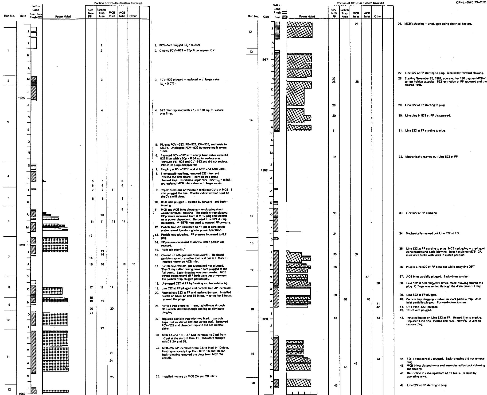  
Fig. 8.3 Summary of Off-Gas Experience

rinse from the first cleaning (Run 1) and the deposit removed from the valve during Run 2 contained 1- to $5 - \mu$ glassy beads which proved to have the composition of flush salt. The salt beads in the off-gas lines were probably frozen droplets of mist produced by the stripper spray in the fuel pump. Just as in the coolant system, it is not known whether the mist was transported continuously or was swept out by sudden venting.

The performance of the fuel off-gas system was satisfactory for the remainder of Run 2 and the zero-power experiments (Run 3). During the shutdown following Run 3, larger sintered metal filters (filter area = 0.34 ft²) capable of removing particles greater than $1\mu$ in diameter were installed ahead of the pressure control valves in both the fuel and coolant off-gas lines.

8.3.1.2 Check valve malfunctions. The check valves in the off-gas system are spring-loaded poppet-type valves and were designed for low pressure drops. During precritical checkout of the system when a bit of debris caused one such valve to remain open, all the other similar valves were removed for inspection, cleaning, and pressure drop checks before reinstallation. Those which did not open with a forward pressure of at least 5-in. $\mathsf{H}_2\mathsf{O}$ and reclose with a forward pressure differential of $\sim 2$ -in. $\mathsf{H}_2\mathsf{O}$ were replaced with new valves meeting these criteria.

The next indication of a check valve malfunction was in January 1966 when a restriction developed in the check valve downstream of HCV-533. The blockage occurred after the fuel system pressure was vented for a short period of time through this valve to the auxiliary charcoal bed. Although some foreign material, shown in Fig. 8.4, was found in the poppet of the check valve, it was judged not sufficient to stop the gas flow (the plug may have been dislodged during disassembly). The soft O-ring (which makes the seal) and the cone of the poppet were covered with an amber varnish-like material which was identified as a hydrocarbon.[6] The check valve was not replaced and administrative control of HCV-533 was used to prevent a backflow of gas into the fuel-pump gas space during venting of the drain tanks.

In April 1966, difficulty in venting through the auxiliary charcoal bed was found to be due to a check valve poppet which had become lodged in the inlet line to the bed. Apparently the poppet had vibrated loose from

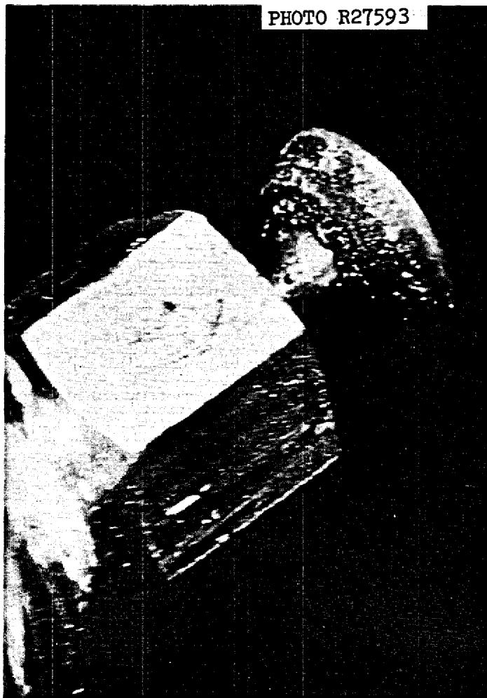  
Fig. 8.4 Check Valve CV-533

a check valve at one of the drain tank lines and had been carried downstream during venting operations. The inability of the check valves to prevent reverse flow in the exit lines of all three drain tanks implies that any and all of these valve poppets may have vibrated loose.

# 8.4. Difficulties with the Fuel Off-gas System During Power Ascension

The fuel system off-gas problems became somewhat more complex during power ascension than those encountered earlier because of fission fragment production in the reactor and subsequent transport of the fission gases and some solid decay daughters in the off-gas lines. Some of the lubricating oil which leaked into the pump bowl (0.5 to 1.5 g/day), was polymerized to a varnish-like substance by the high radiation field in the off-gas lines and components. This material, amorphous carbon from the cracking process, and solid decay daughters of the fission gases were trapped in the various components of the off-gas system such as filters, check valves, capillaries, valves, traps, and presumably in the charcoal beds. The difficulties experienced during this period are reported by run numbers or major shutdowns.

# 8.4.1 Run 4

The first indication of this type of restriction occurred when the power level was raised to 0.5 MW on January 23, 1966 after only 3 MWhrs of total integrated power. At that time, system pressure began to rise slowly because of a restriction in the vicinity of PCV-522. Shortly after the start of this pressure transient, the response of the drain-tank pressures indicated an abnormal restriction at a capillary flow restrictor in line 521, the fuel-loop-to-drain-tank equalizing line. The excess pressure in the fuel system was relieved by venting gas through HCV-533 to the auxiliary charcoal bed until the restriction at PCV-522 was cleared by operating the valve several times through its full stroke. These operations also revealed at least a partial restriction in the line to the auxiliary charcoal bed, apparently at HCV-533. The reactor was made subcritical after 4-1/2-hr operation at 500 kW.

Satisfactory pressure control was maintained for about 24 hr, but the plugging at PCV-522 recurred shortly after the reactor power was raised to

1 MW. Again, the operation of this valve through its full stroke was effective in relieving at least part of the restriction. Also on this occasion, evidence of restrictions at the charcoal-bed inlets began to appear. These restrictions were bypassed by putting the two spare charcoal-bed sections (2A and 2B) in service and closing the inlet valves to the two that were restricted (1A and 1B). Within about 6 hr the inlets of beds 2A and 2B also plugged. When the previously plugged beds were checked, at least one was found to be clear and off-gas flow was reestablished through bed 1B.

The combination of difficulties in the off-gas system resulted in a reactor shutdown to correct these conditions. The restrictions in the equalizing line (521) and the auxiliary vent line (533) were relieved by removing the capillary (FE-521) and a check valve (CV-533, reported earlier). The throttle valve and filter assembly, and a second valve that had been tried briefly, were removed from line 522. A large, relatively coarse $(50\mu)$ filter and a large, open hand valve were installed at the PCV-522 location. This arrangement eliminated the small, easily plugged passages associated with PCV-522, and it appeared that the filter would still remove any particles large enough to plug valve 522B, which was to be used for system pressure control. The original valve, filter (pore diam. $\nu l\mu$ ), and the flow element were subsequently examined at the High Radiation Level Examination Laboratory (HRLEL).

Although nothing was done to clear the charcoal beds other than realignment of the operating mechanisms to the valves, successive pressure drop measurements showed that the restrictions in the beds had decreased significantly and before the start of Run 5, flows through the beds were back to normal. Flow measurements through the auxiliary bed showed that the bed had also returned to normal.

Examination of FE-521 - The flow restrictor consisted of a short length of 0.08-in. ID tubing welded into line 521 at one end and coiled to fit inside a 3-in. ID container. The other end of the capillary was left free in the container. When the container was cut open, the entrance region was found to be clean, and only a small deposit was found on the container wall near the end of the discharge region as shown in Fig. 8.5. These isotropic particles were characterized as partly coalesced amber globules with a

PHOTO R27589

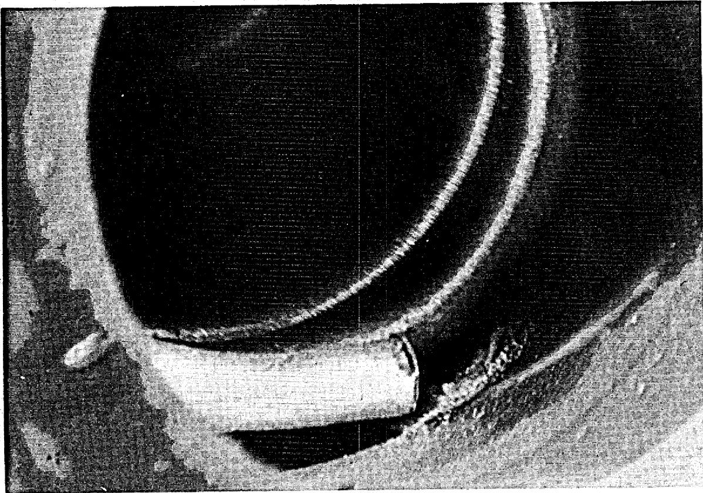  
Fig. 8.5 Deposit in Flow Restrictor FE-521.

refractive index of 1.520. Spectrochemical analyses indicated microgram quantities of lithium, beryllium, and zirconium. The restrictor was not completely plugged when examined in the hot cell.

Examination of PCV-522 - The stem of the control valve shown in Fig. 8.6A, was covered with an amber oil-like coating and there was an accumulation of oil in the recess formed by the bellows-to-stem adapter. The tapered flat (flow area) on the stem had small accumulations of solids; the body was coated with a similar material and had a semisolid mass of material on the surface near the seat port as shown in Fig. 8.6B. A gamma scan6 of this material indicated the presence of $^{89}\mathrm{Sr}$ , $^{140}\mathrm{Ba}$ , and $^{140}\mathrm{La}$ .

Examination of the Filter Preceding PCV-522 - Filter-522 was a 1-in. diameter by 15-in. long cylindrical type-316 stainless-steel sintered metal element enclosed by a 1-1/2-in. schedule-40 pipe. The pore diameter of this particular filter was $\sim$ lu and the element thickness was 1/16 in. The filter area was $0.34\text{ft}^2$ and the flow was from the outside in. The filter assembly was removed on February 8, 1966 and examined at HRLEL on the following day. The upper third of the element was steel gray in appearance; the lower two-thirds had a frosty white appearance. At no place was there any evidence of buildup or cake. A day later the frosty white areas had become darker and tended toward the steel gray appearance. The index of refraction of some of the material scraped from the sides of the element was 1.524 and a gamma scan of the sample indicated the presence of ${}^{140}\mathrm{Ba}$ , ${}^{140}\mathrm{La}$ , ${}^{103}\mathrm{Ru}$ , and ${}^{137}\mathrm{Cs}$ .

The filter was then reassembled for flow tests. The data indicate that for a given pressure drop the filter was passing only $5\%$ of the corresponding flow of a clean filter.6 However, extrapolation of the data to the normal MSRE off-gas flow indicates that even though $95\%$ plugged, the contribution of the filter (0.075 psi measured at the hot cell) to the total pressure drop ( $>5$ psi during Run 4) was negligible. Exposure to atmosphere could have opened some of the pores in the filter; however, a more likely explanation is that handling and sampling opened enough pores in the element to produce these results.

PHOTO R27812

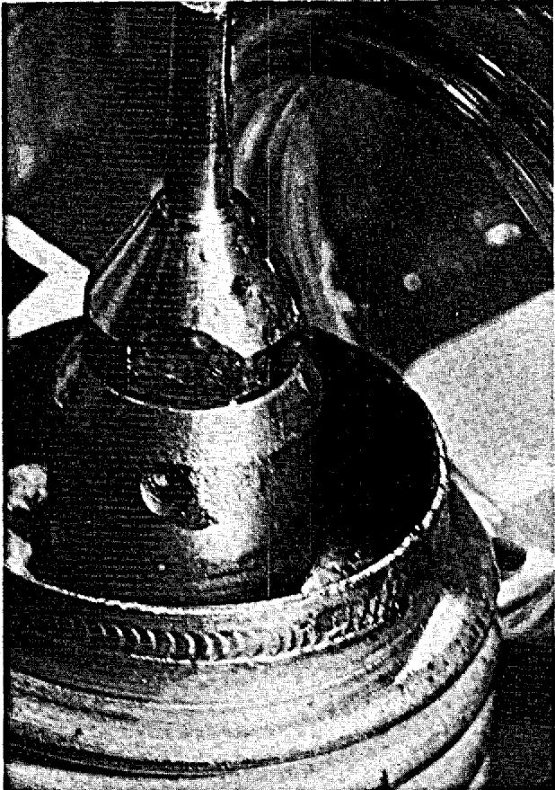  
Fig. 8.6A PCV-522 Valve Stem

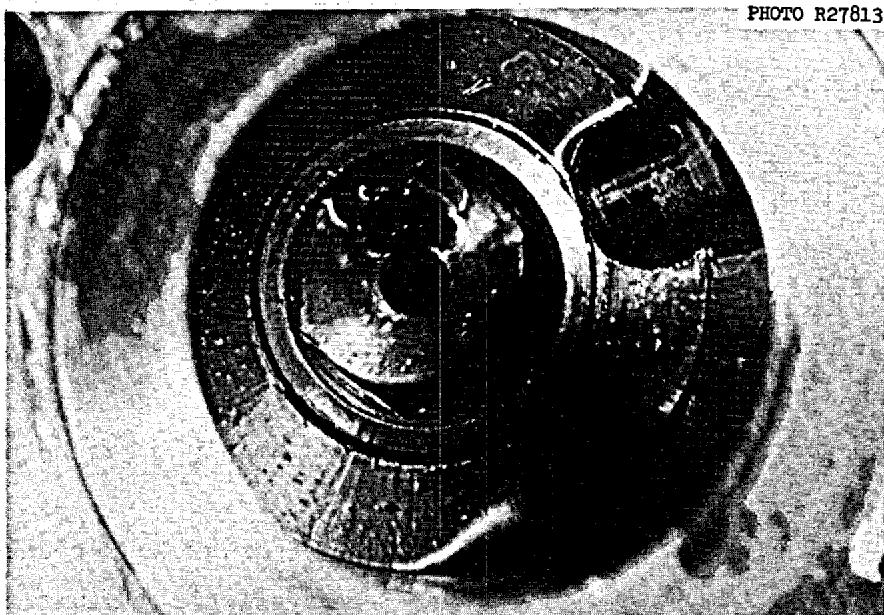  
Fig. 8.6B PCV-522 Valve Body

# 8.4.2 Run 5

Satisfactory manual pressure control by throttling V-522B was demonstrated during the preceding shutdown; however, at the beginning of Run 5 after only 2-1/2 hours of power operation (1 MW), this valve showed evidence of rapid plugging and required constant adjustment until it was in the fully-open position five hours later. During one such adjustment, rapid plugging of the charcoal beds occurred. At the conclusion of salt circulation (terminated by a space-cooler motor failure), the restriction at the inlet to charcoal bed 1B could not be cleared; therefore, the inlet valve (HV-621) was removed for examination at the HRLEL. With the valve out, the pressure drop across the bed was much lower but it was still higher than for a normal unrestricted bed. An excess of helium (forward blow) was forced through the bed and the pressure drop suddenly decreased to normal.

The cone of the inlet valve to this bed (shown in Fig. 8.7) was shiny as though wet with an oil-like material. The small metallic chips near the large end of the cone were a result of the sawing operation. There was some white amorphous powder on the tapered section of the valve trim and appeared to be adhered fairly strongly to the metal surface. A similar material was found in the valve body. The material removed from the stem was described as an isotropic, faintly colored material, varnishlike in appearance with a pebbly surface. The predominant isotope in the material was $^{132}\mathrm{Te}$ . The refractive index of the varnishlike material was 1.526 compared with 1.50 for a distilled fraction of the lubricating oil used in the fuel pump.[6]

# 8.4.3 Experiments and Alterations During the March-1966 Shutdown

Off-gas samples taken while the reactor was shut down showed an increasing hydrocarbon content in the gas as the reactor cell temperature was increased, lending support to the hypothesis that there was a reservoir of hydrocarbons in the holdup-volume portion of the off-gas line. It was not practicable to clean the 68-ft-long, 4-in.-diam pipe, so the off-gas line was disconnected at the fuel pump and in the vent house; large quantities of helium were blown through the line in the forward and reverse directions at velocities up to 20 times normal.[6,7] Very little visible material was

PHOTO R28500

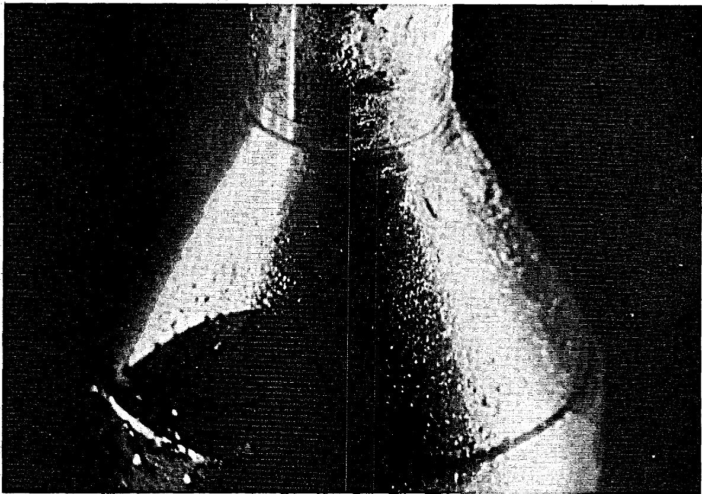  
Fig. 8.7 Charcoal Bed Inlet Valve Stem HV-621

collected on filters at the ends of the line, but there were fission products, and the amount doubled when the cell was heated from 50 to $80^{\circ}\mathrm{C}$ . Visual observation showed that the head end of the holdup volume was clean except for a barely perceptible dustlike film. A thermocouple was attached to the holdup pipe near the head end for monitoring temperatures during power operation. (When the power was subsequently raised, the temperature indeed rose from cell air temperature of about $55^{\circ}\mathrm{C}$ at zero power to about $113^{\circ}\mathrm{C}$ at 7.5 MW. The temperature increase occurred with a time constant of about 30 min which was not inconsistent with buildup of gaseous fission products in the line.)

As a result of extensive laboratory tests on organic vapor traps, $^7$ the filter-valve assembly was replaced with a particle trap and an organic vapor trap in series and upstream of the pressure control valve (PCV-522) whose flow coefficient was increased to 0.865. The Mark I particle trap, $^7$ shown in Fig. 8.8 was designed to remove particulates and mist. Gas from the fuel-pump bowl entered at the bottom of the unit through a central pipe, reversed flow in the Yorkmesh, and passed in succession through two concentric cylinders of porous metal (felt metal) and a bed of inorganic fibers. The first felt metal filter was capable of stopping $96.7\%$ of particles greater than $0.8\mu$ and the second $-99.4\%$ particles greater than $0.3\mu$ .

The organic vapor trap' consisted of 13 feet of l-in. sch.-40 stainless-steel pipe, arranged in three hairpin sections of approximately equal lengths. The vapor trap was loaded with $1092\mathrm{gm}$ of Pittsburgh PCB charcoal and instrumented with thermocouples at 5, 12, 51, 59, 105, and 113 inches, respectively, from the bed inlet.

As a result of the experience with and examination of HV-621 and other off-gas components, the inlet valves to the main and auxiliary charcoal beds and V-522A were replaced with ones having larger flow coefficients.

# 8.4.4 Runs 6 and 7

At the start of Run 6, the pressure drops (at normal flow rate) across the particle trap, organic vapor trap, and charcoal beds (sections 1A and 1B in parallel service) was $<0.05$ , 0.7, and 1.6 psi respectively. The off-gas system performance was satisfactory during the first ten days of Run 6 with the reactor operating at 1 MW or less. However, when the power was

ORNL-DWG 66-11444R

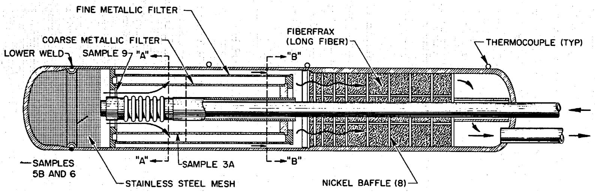  
Fig. 8.8 Line 522 Particle Trap (Mark I) and Location of Sampling Points During Subsequent Examination

increased to 2.5 MW, the pressure drop across the charcoal beds also increased. Pressurization and equalization experiments established that the restrictions were at the inlets to the beds, probably at the packing of steel wool above the charcoal. It was found that the pressure drop could be reduced, usually to near the normal 1.5 psi, by blowing helium at 35 psig either forward or backward through the bed; back-blowing seemed to be more effective. Back-blowing of the beds was done whenever the pressure drop of two sections in parallel approached 3 psi. Later, higher pressure drops were tolerated before back-blowing was initiated. Plugging occurred when the power was raised during the approach to full power with section 1B plugging more often than the others. Plugging became less frequent later, but at the end of Run 6, it was still necessary to back-blow the beds about once a week.

Particle Trap Performance. After approximately 10 days of operation at the 5-MW level, the pressure drop across the particle trap started to increase and reached 6 psi approximately a week later. When the power was increased to 7.5 MW, the pump pressure increased to 9 psi in less than 12 hours at full power. Since the pressure drop across the organic vapor trap was less than 0.5 psi and that across the charcoal bed was kept below 3 psi by periodic back-blowing, the variation in pump-bowl pressure was interpreted as a corresponding restriction in the particle trap. About three hours after an unscheduled power interruption, the fuel-pump pressure decreased to 6.5 psig and the following day it decreased to 4.3 psig. However, a few hours after the reactor power was again raised to 7.5 MW, the pump pressure increased to 8 psig indicating a restriction in the particle trap. At this time the helium purge to the pump shaft was decreased from 2.4 to 1.9 liters per minute in an effort to reduce the fuel-system pressure. The reactor was then taken subcritical for two days. When the power was again increased to 5 MW, the pump pressure increased from 3 psig at zero power to 8 psig and eventually to 12 psig at full power. The pump pressure gradually returned to the 6 to 8 psig range after approximately a week at full power. After Run 6 was terminated by a component cooling pump failure on May 28, 1966, the particle trap pressure drop decreased to less than 1 psi and it remained relatively unrestricted for a month after full-power operation was restored in Run 7. The pump pressure then gradually increased to 8.7 psig before another power reduction (MB-1 failure)

occurred ending Run 7. A few hours after the power reduction, the pump pressure returned to a normal value of 3 psig and remained at this pressure for approximately a month of zero-power operation before the restriction gradually returned.

In summary, pump pressure increases (restrictions in the particle traps) were usually associated with periods of power increases. Pressure decreases were sometimes unexplained but usually were associated with power decreases or with deliberate attempts to clear the trap such as reverse-blowing with helium.

Rerouting of Line 524. Helium, at a rate of $2.4\ \text{L/min}$ , was introduced through line 516 into the fuel-pump shaft annulus just below the lower shaft oil seal. The larger part of this flow goes down the shaft into the pump bowl thus preventing fission gases and salt mist from entering this radiation sensitive region of the pump. The smaller portion of this flow ( $<0.1\ \text{L/min}$ ) goes up the shaft to prevent oil vapors from migrating to the fuel salt; it also aids in transporting any oil seal leakage to the oil catch tank. The driving force for the smaller flow (line 524) is the pressure difference between the fuel pump and line 522 downstream of the fuel system pressure control valve (PCV-522). However, when PCV-522 was opened fully (because of restrictions in the charcoal beds), line 524 had no pressure differential and consequently no gas flow; therefore, it was rerouted to enter the off-gas line at V-560A downstream of the main charcoal bed and V-557B. V-557B was then throttled to control system pressure. On two occasions in Run 6, sudden increases in pump pressure (at the completion of salt recovery from the overflow tank) caused a gas flow reversal at the pump shaft and gaseous activity was carried into line 524. Since this line bypassed the charcoal bed, the gas flow had very little decay time. As a consequence, gaseous activity triggered the closure of the radiation block valve on the main off-gas line. Therefore in June of 1966, a small charcoal bed7 was added to line 524 to hold up krypton and xenon for 2-1/2 and 30 days, respectively. The bed consisted of 9 ft of 3-in. sched.-10 stainless-steel pipe loaded with 15.8 lb of Pittsburgh PCB charcoal. On at least four occasions in the subsequent run, fission product activity was blown or dif-fused up the pump shaft annulus. Although the activity level in the oil catch tank and line 524 increased, there was essentially no activity release, thus proving the effectiveness of the added charcoal bed. However,

the last two releases from the pump bowl caused the flow element in line 524 to plug partially and then completely. The plug was found to be in the sintered stainless-steel disc at the inlet to the matrix-type flow element. The element was replaced with a capillary tube.

# 8.4.5 Experiments and Alteration During the June-September Shutdown (1966)

At the conclusion of Run 7, it was decided to flush out the residual fuel in the overflow tank and to check the indicated level at which overflow occurred. Because of an insufficiency of salt in the drain tank, pressurizing gas from the drain tank entered the reactor and flooded the pump bowl with salt, thus binding the pump shaft with frozen salt and pushing salt in the gas lines at the top of the pump bowl.

The frozen salt was cleared from the reference bubbler line with the use of remotely-applied external heaters; salt in the sampler line was melted by the same technique but it ran down and refroze at the junction with the pump bowl. This obstruction and the frozen salt in the annulus around the pump shaft were cleared when the pump bowl was refilled and heated to $650^{\circ}\mathrm{C}$ . Although some salt entered the main off-gas line as indicated by a temporary rise in temperature at TE-522-2 (Fig. 8.9), pressure drop measurements showed no significant difference from the clean condition. This was attributed to the blast of compressed helium from the drain tank that was released backward through the off-gas line, before the salt had time to freeze completely, when the overfill triggered an automatic drain.[8] Therefore the only work done on the main off-gas line (522) during this shutdown was to replace the short, flexible "jumper" section of the line, where the convolutions would be expected to hold some salt.

The particle trap was also removed from line 522 and sent to HRLEL for detailed examination. An identical replacement (Mark I) was installed to permit operation while the original was examined and a new one designed and constructed.

Also during this shutdown, a remotely replaceable heater was designed and installed on the inlet section of the auxiliary charcoal bed (ACB).

# 8.4.6 Runs 8, 9, and 10

With the resumption of operations the off-gas flowed freely, with no unusual pressure drop for 26 days of circulating helium, flush salt, and

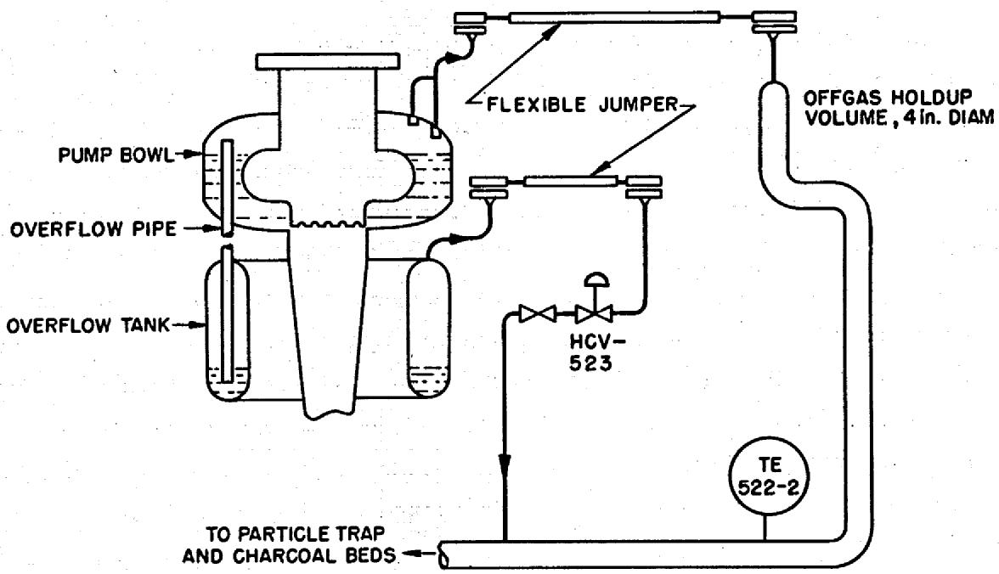  
Fig. 8.9 Off-Gas Piping Near Fuel Pump and Overflow Tank

ORNL-DWG 67-4764

fuel salt at low power. Then, two days after power operation was resumed at 5.8 MW, a plug developed in line 522 somewhere between the pump bowl and the junction of the overflow tank vent with the 4-in. holdup line. The first indication was a decrease over a few hours from $107^{\circ}\mathrm{C}$ to $71^{\circ}\mathrm{C}$ at TE-522-2, as the plug caused the off-gas to bypass through the overflow tank (OFT). The presence of the plug was confirmed when HCV-523 was closed to build up pressure in the OFT to return salt from the tank to the pump bowl; pressure in the pump bowl also built up. Efforts to remove the restriction by applying a 10-psi differential either forward or backward were unsuccessful.

The bypassing of off-gas through the OFT did not hinder operations except for one specific job: recovery of salt from the overflow tank. Salt slowly but continuously accumulated in the tank during the entire operating life of the MSRE, and it was therefore essential to return salt to the pump bowl two or three times a week in order to maintain proper levels. With a plug in the off-gas line of the pump bowl, it was necessary to greatly reduce helium flows into the pump so that the overflow tank pressure could be increased faster than that in the pump bowl to make the salt transfer. Through the remainder of Run 8, salt was returned (burped) from the OFT six times, and on at least four of these occasions some fission product activity was blown or diffused up the pump shaft annulus into the oil collection space. This was a consequence of the reduced helium purge down the shaft annulus and the unavoidable, sudden pressurization of the pump bowl that occurred at times in the procedure.

After Run 8 was terminated, steps were taken to clear the plug from the off-gas line so that the normal salt recovery procedure could be used. Frozen salt was suspected as the cause of the plug, so the fuel loop was flushed to reduce radiation levels, the reactor cell was opened, and specially built electrical heaters were applied to the line between the pump bowl and the first flange. Heating alone did not clear the plug, but when, with the line hot, 10 psi was applied backward across the plug, it blew through. The pressure drop came down as more helium was blown through until it became indistinguishable from the normal drop in a clean pipe.

In Run 9, the power operation was begun 8 hr after fuel circulation had commenced, but TE-522-2 came up to only $66^{\circ}\mathrm{C}$ , indicating that the line

was again plugged. While tools and procedures were being devised, the reactor was kept in operation, but great care was taken to avoid getting fission products or salt spray up the pump shaft annulus again. This entailed lowering the power to $10\mathrm{kW}$ , 24 hr before the overflow tank was to be emptied, then stopping the pump 4 hr beforehand to let the salt mist settle. During the salt transfer, the fuel pump was vented through the sampler and auxiliary charcoal bed. After three cycles of this, the reactor was drained and flushed again in preparation for working on the off-gas line.

This time heat was applied to the short section of line between the second flange and the top of the 4-in. decay pipe. When heating to about $600^{\circ}\mathrm{C}$ did not open the line, the flexible jumper was disconnected to permit clearing the obstruction mechanically. In the flange above the 4-in. line, the 1/2-in. bore was completely blocked, but the weight of a chisel tool broke through what appeared to be only a thin crust of salt. Borescope inspection showed that the rest of the vertical line was practically clean, and there was only a thin layer of salt in the bottom of the horizontal run of the 4-in. pipe. Helium was blown through the line at five times the normal flow, and the pressure drop indicated no restriction. The flange near the pump bowl contained a similar plug which was easily broken. A 1/4-in. flexible tool was then inserted all the way into the pump bowl to prove that a good-sized passage existed. A new jumper line was installed and operation was resumed.

Because obtaining samples remotely without spreading contamination would have been most difficult, no analyses were made of the material in the flanges. But it appeared that salt had frozen in the line, almost completely blocking it, during the overfill of July 1966. Material in the off-gas stream during subsequent operation then plugged the small passages. During the July cleanout, the heaters apparently melted the salt out of the pipe, but left behind a thin bridge of salt in the cooler flanges. After the flanges were mechanically cleaned and reassembled, this part of the off-gas system operated satisfactorily during Run 10.

# 8.4.7 MK-I Particle Trap

The second particle trap served through Runs 8, 9, and 10. This unit behaved in Runs 8 and 9 much as had the first trap; the pressure drop occasionally built up to 5 to 10 psi, beginning two days after power operations

started in Run 8. Back-blowing with helium was effective in reducing the pressure drop to 2 to 4 psi; however, in Run 10, after the first week of power operation, back-blowing became ineffective. Various tactics $^{a}$ were used to get fission gas to the particle trap with as little delay as possible, to see if increasing the fission product heating in the trap would drive off the material at the restriction. After this proved to be ineffective and recognizing that heating caused the central inlet tube to expand farther into the Yorkmesh filter in the trap, the opposite approach was used. Eight hours of delay was obtained by routing the gas through an equalizing line to the empty drain tank, through the tank and salt fill lines to the other tank where it bubbled through several inches of salt heel, then out through the drain-tank vent line to the particle trap. The pressure drop across the trap was 16 psi when the gas was first rerouted, but within a few hours it was below 2 psi. When the original route was again tried, the restriction began to build up almost immediately; therefore, the delayed route was used until the end of Run 10 which was terminated for in-cell repairs and also because a newly constructed particle trap (Mark II) based on the Hot Cell examination of the first trap was ready for installation.

Examination of MK-I Particle Trap. Flow tests on the first trap (in service from April through July of 1966) indicated that (1) the pressure drop after service was about 20 times the "clean" pressure drop. Assuming orifice type flow, this would represent a reduction in flow area of about $80\%$ . (2) The bulk of the pressure drop occurred in the Yorkmesh and Felt-metal sections of the filter. The Fiberfrax section was essentially clean.

The area of the Yorkmesh which had been immediately below the inlet pipe was covered with a blue-gray to black mat which had completely filled the space between the wires of the mesh (Fig. 8.10). The shape of the mat corresponded to the bottom of the inlet pipe, and it is likely that this material was the major restriction to gas flow while in service.

Since the inlet pipe temperature probably increased several hundred degrees during power operation of the reactor, it is believed that this restriction behaved similar to a thermal valve. This could account for the unexpected increase in pressure drop while at power and the decrease in pressure drop when the power was reduced or when the off-gas was delayed via the drain tank.

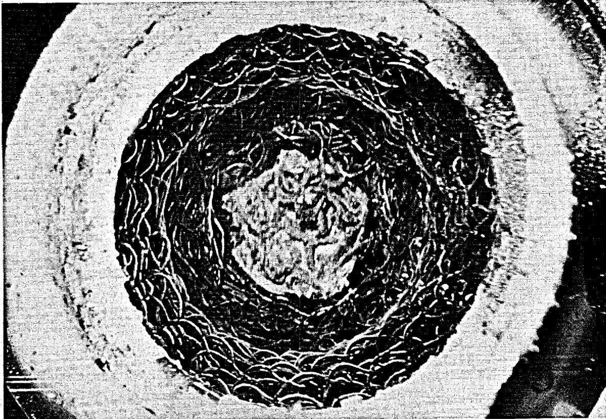  
PHOTO R32824  
Fig. 8.10 Inlet to Yorkmesh Section MSRE Particle Trap Mark I

A radiation survey made around the outside surface of the lower section of the trap gave readings ranging from 6900 to $8000\mathrm{R / hr}$ . The probe indicated 11,400 R/hr when inserted into the position formerly occupied by the inlet pipe. The radiation level dropped off to $4100\mathrm{R / hr}$ at the bottom of the trap. The bottom of the inlet pipe had a deposit of blackish material which corresponded to that in the Yorkmesh. The inside of the inlet pipe at the upper end of the bellows appeared clean and free of deposit. The exterior of the bellows had some of the light-yellow powdery material on a background of dark brown.

When the Yorkmesh was removed, it was found that the surface of the outer wires of the mesh bundle was covered with a thin layer of amber-colored organic material. Much of this material evaporated from the heat of the floodlamp used to make the photographs. As the bundle was unrolled, the color of the film on the wire changed from amber to brown to black near the center. The black material was thicker than the wire by a factor of 2 or 3. This material was brittle, as was the wire, and much of it came loose as the wire was flexed. Samples of this material, designated Nos. 5B and 6 (Fig. 8.8) were taken for examination and chemical analysis. Metallographic examination of a piece of the wire covered with the black material showed that the wire was heavily carburized with a continuous network of carbide in the grain boundaries. There was no evidence of melting of the wire; however, the grain growth and other changes indicated operating temperatures of at least $650^{\circ}\mathrm{C}$ . The nonmetallic deposit observed on the wire mesh was apparently of a carbonaceous nature and appeared to have been deposited in layers. These "growth rings" were probably the result of off-gas temperature, reactor power, and gas flow-rate changes.

The perforated plate of the coarse filter section and the lower flange of the filter assembly were covered with a stratified scale (view A-A, Fig. 8.8). The colors varied from a very light yellow to orange. One stratum in the lower flange area appeared gray, almost black. A sample (No. 9) was taken of the light-colored material, including some of the black material. The perforated plate of the fine filter section was covered with a thin, dark-brown coating, which seemed to be evenly distributed over the surface of the plate. The inner surface of the outer wall of the trap was covered with a light-amber coating, which was also evenly distributed.

It is believed that these coatings were deposited by condensation and sputtering of the oil from the adjacent filter and that the dark brown color indicates that the porous metal screen had operated at a much higher temperature than had the outer-wall (during operation the trap was immersed in a tank of water for cooling by natural convection). The lower surface of the upper flange (view B-B, Fig. 8.8) contained a deposit which had the appearance of organic residue. The deposit was amber colored, and the fractured edge (Fig. 8.11) gave the impression that the material was brittle. There is as yet no explanation for formation of this deposit or how it came to be formed in this particular location. The radiation level on the outside of this section of the filter was 200 to $360\mathrm{R / hr}$ .

The material at the entrance of the Fiberfrax section showed an oil-like discoloration, but there was no evidence of any significant accumulation of material. Comparison of the weights of the different layers with the weights of the material originally loaded indicated changes of less than $0.2\mathrm{g}$ . An interesting observation relates to the very low radioactivity level of the Fiberfrax at the entrance section which is separated only by the Feltmetal filter from an area containing material with activity levels of thousands of R/hr. The only detectable activity (above the examination cell background of 4.2 R/hr) was at the discharge end of the Fiberfrax section. It is probable that this activity resulted from back-blowing the trap or from pressure transients which could have carried gaseous decay products from the vapor trap back upstream and into the particle trap. Even so, the activity level was only 1.8 R/hr above background.

Analytical Results. A total of four samples from three different locations (Fig. 8.8) were subjected to a variety of analytical tests. The samples were identified as follows:

Sample No.

Taken from

3A

Coarse section of porous metal filter

9

Scale on lower flange of porous metal section

5B

Mat at inlet to Yorkmesh section

6

Mat at inlet to Yorkmesh section

For sections of sample 3A it was found that about the same weight loss (0.2% of sample weight) resulted from heating to $600^{\circ}\mathrm{C}$ in helium as from dipping in a trichlorethylene bath. The material removed by heating was

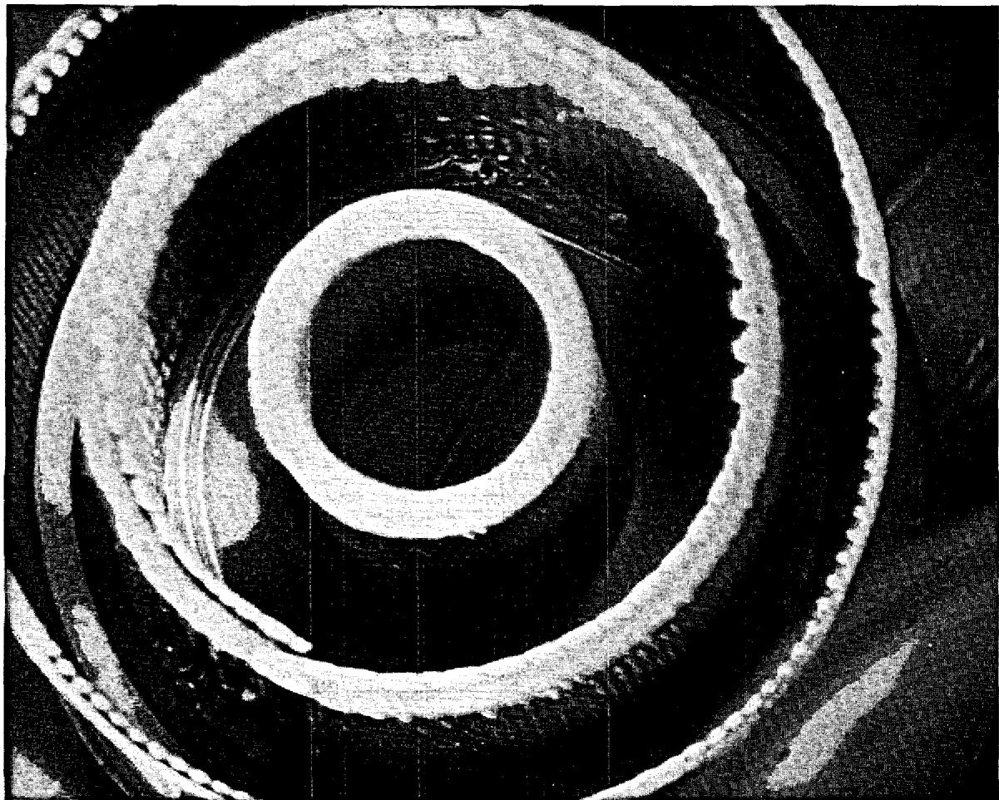  
Fig. 8.11 Upper End of Porous Metal Section - MSRE Particle Trap Mark I

cold trapped and found to be effectively decontaminated; however, the trichloroethylene wash was contaminated with fission products.

Samples 5B and 9 were compared for low-temperature volatiles; at $150^{\circ}\mathrm{C}$ , No. 9 lost $5\%$ and No. 5B lost none. When raised to $600^{\circ}\mathrm{C}$ , the weight losses were $35\%$ for sample 5B and $32\%$ for sample 9. Analysis of the carbon content gave none for sample 9 and $9\%$ for sample 5B. This indicates that sample 9 had not reached as high a temperature as had sample 5B.

The mass spectrographic analysis of sample 6 indicated that there was a very high fraction of fission products. These are estimated to be 20 wt % Ba, 15 wt % Sr, and 0.2 wt % Y. In the same analysis the salt constituents Be and Zr were estimated to be 0.01 and 0.05 wt % respectively.

In addition the material in samples 5B and 6 contained small quantities of Cr, Fe, and Ni, while sample 9 did not. The reliability of these values was compromised by difficulties caused by the presence of organics and small sections of wire in the sample.

The gamma-ray spectrographic work indicated the presence of the following isotopes: $^{137}\mathrm{Cs}$ , $^{89}\mathrm{Sr}$ , $^{103}\mathrm{Ru}$ or $^{106}\mathrm{Ru}$ , $^{110}\mathrm{Ag}$ , $^{95}\mathrm{Nb}$ , and $^{140}\mathrm{La}$ .

All three samples were chemically analyzed for Be, and the level was below the detectable limit of $0.1\%$ . Attempts to analyze for Zr were complicated by the presence of large quantities of Sr.

The fraction of soluble hydrocarbons was determined using $\mathrm{CS}_2$ , and the values were 5B, $60\%$ ; 6, $73\%$ ; and 9, $80\%$ . The extract solutions from samples 5B and 6 were allowed to evaporate, and a few milligrams of the residue was mounted between salt crystals for infrared analysis. The samples were identical and were characteristic of long-chain hydrocarbons. There was no evidence of any functional groups other than those involving carbon and hydrogen. Nor was there any evidence suggesting double or triple bonds. There was an indication of a possible mild cross-linkage. It is likely that there is more cross-linkage of the organic in the gas stream than appeared in these samples, and the low indication could be due to the insolubility of the cross-linked organic and the high operating temperatures of the wire mesh, which would cause breakdown of the organic into elemental carbon and volatiles.

# 8.4.8 MK-II Particle Trap

As a result of the operating experience with and detailed examination of the first particle trap, the MK-II trap, $^{8}$ (shown in Fig. 8.12) was designed with the following features:

1. The trap housing was increased from 4 to 6-in. ID, resulting in an increase in cross-sectional area of $225\%$ in both the Yorkmesh and Fiberfrax sections.   
2. The unit was in effect turned upside down so that the Yorkmesh section is at the top of the unit and the Fiberfrax section is at the bottom. This change permits heating of the Yorkmesh section (using beta decay heat and lowering the water level) while still maintaining cooling on the other two sections.   
3. The disposition of the Yorkmesh was modified to provide increased frontal area in the direction normal to the flow.   
4. Since the first trap had shown very little loading in the fine Felthmetal section, only the coarse Felthmetal was used.   
5. The total filter area was increased from 22 in² for the original to 288 in² for the new trap.   
6. The depth of the Fiberfrax was reduced by $50\%$ .   
7. The pressure drop at $15\ \text{L/m}$ was less than 1 in. $\mathbf{H}_{2}\mathbf{O}$ and the trap efficiency was $99.9\%$ for particles greater than $0.8\mu$ .

# 8.4.9 Organic Vapor Trap

It was expected that accumulation of organic material in the charcoal trap immediately downstream of the particle trap would result in progressive poisoning along the length of the trap. Such poisoning would shift the location of maximum fission product adsorption and produce a shift in the temperature profile of the trap. Except for the upward shift due to increased power level, the basic shape of the temperature profile did not change, indicating that no significant poisoning by organics occurred.

Since the pressure control valve (PCV-522) was operated in the fully-opened position and it appeared that nothing would be lost by eliminating the charcoal trap, both were removed to make room for two new MK-II particle traps which were installed in parallel in January 1967.

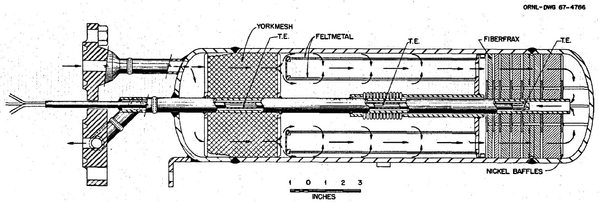  
66T   
Fig. 8.12 Line 522 Particle Trap Mark II, Particle Trap Subassembly

# 8.4.10 Charcoal Bed Performance

After the removal of the check valve poppet in April 1966, venting through the auxiliary charcoal bed was uneventful through the approach to power operation. However, an intermittent restriction was noted early in July. During the fill and drain after the July 17 shutdown, the restriction became continuous and more severe and was not amenable to back-blowing. A remotely placeable assembly of electric heaters was designed and placed around the junction of the inlet pipe and steel wool section of the auxiliary charcoal bed. In the brief shutdown between Runs 8 and 9 the level in the pit was lowered below the bed inlets and the heater was energized. Some improvement was observed when the heater temperature reached $385^{\circ}\mathrm{C}$ . After the temperature was raised to $670^{\circ}\mathrm{C}$ and then cooled, the pressure drop was down by a factor of 5, to a satisfactory level. The auxiliary bed operated relatively trouble-free until it became partially restricted in March 1969 and again about two months later. Back-blowing cleared the bed in March; a forward-blow in May was adequate but not as effective. No further operational problems with the auxiliary bed were reported.

Sections 1A and 1B of the main charcoal bed had been used almost exclusively during earlier runs, and they were on-line when Run 8 started. The pressure drop at the inlet of these sections began to increase a few hours after the power was raised and when the pressure drop reached 7 psi, sections 2A and 2B were also brought on line. Since back-blowing had become progressively less effective and in light of the success with heaters on the inlet of the auxiliary bed, an attempt was made to clear the restriction in section 1B by heating the inlet with a torch (electric heaters to fit this bed were not then available). Although the bed temperature reached $465^{\circ}\mathrm{C}$ , there was no improvement and all four sections of the main bed were operated in parallel for Run 9. After this run, electric heaters were installed on the inlets of sections 1A and 1B. Heating to $400^{\circ}\mathrm{C}$ for 8 hours brought the pressure drop back to the normal range for clean beds.

# 8.5 Subsequent Operating Experience with Fuel Off-gas System

With the major part of the MSRE operating time yet to come, the off-gas problems during this period while still present were somewhat ameliorated by more efficient particle traps and methods of clearing these restrictions. Some new restrictions appeared but basically they were similar to those already described. Remote maintenance methods were used to cope with some of these.

# 8.5.1 Particle Trap

The MK-II trap (Unit No. 1) was in service from January 1967 to May of 1969 with no noticeable restriction; however, during the first week in May, the pressure drop across the trap increased to 0.4 psi. A week later when this restriction increased to 0.75 psi, the reserve unit, which had been valved out up to this time, was put in parallel service. This lowered the pressure drop to 0.1 psi or less. Also temperatures in the trap reflecting fission-gas heating indicated that nearly all of the gas was flowing through the fresh bed. In October 1969, pressure drop measurements on the off-gas system indicated a restriction of 0.3 psi across trap No. 2; however, cycling the inlet valve, V-522C, between its closed and open positions cleared the restriction; this indicated a restriction in the valve rather than the trap. Three days later the restriction reappeared and was cleared by the same method. No further problems in this area were encountered.

# 8.5.2 Introduction of Oxygen into Fuel Drain Tank No. 1

In the event of a salt spill into the reactor cell, provisions had been made to vent the reactor cell to the auxiliary charcoal bed through a line equipped with two block valves. In January 1967, these valves, V-571 A and B, were inadvertently opened while the reactor cell was being pressure-tested prior to Run 11. Reactor cell air entered the auxiliary charcoal bed which at the time was being used to vent the empty but hot reactor via FD-1. The slow leakage of cell air into the ACB resulted in an increase in fuel system pressure and was incorrectly diagnosed as plugging in the auxiliary charcoal bed. To clear the bed, it was pressurized to 50 psig with helium and released into FD-1 (V-571A was discovered to be about 1/2 turn open during the back-blowing operation).

It was estimated that a maximum of 1.25 g-moles of $\mathsf{O_2}$ could have been back-blown into FD-1 which contained approximately 2 cu ft of molten fuel salt.[63] It is believed that the oxygen was later purged out of the drain tank without appreciable mixing with the fuel system piping.

Subsequently, line 571 which joined the two systems was cut and both ends were cap-welded.

# 8.5.3 Charcoal Beds

The restrictions at the inlet sections of the main charcoal bed continued to exhibit chronic plugging throughout the remainder of MSRE power operations. Sections 1A and 1B began to plug slowly after the two weeks of power operation in Run 11. After 4 weeks of operation the pressure drop increased from 2.5 to 5 psi and reached 7 psi two months after the start of the run. When sections 2A and 2B were put in service, the pressure drop increased from 2.6 to 9 psi in only ten days. Sections 2A and 2B were cleared by forward-blowing with helium and sections 1A and 1B were cleared with the previously installed heaters. These operations did not require a reduction in reactor power but only a temporary lowering of the water level in the charcoal bed pit to allow the heaters to function. Approximately one month later this operation had to be repeated.

Owing to the success of the heaters on the auxiliary bed and sections 1A and 1B of the main bed, similar heaters were installed at the inlets of sections 2A and 2B during the shutdown between Runs 11 and 12.

Approximately one month after the start of Run 12, it was again necessary to clear all four sections.

During MSRE startup, injections of $^{85}\mathrm{Kr}$ indicated that the charcoal bed hold-up time was 5-1/2 days for krypton with two sections in parallel service; the equivalent xenon hold-up time was calculated to be 88 days. Thermocouples are located at the entrance regions of the 1-1/2-, 3-, and 6-inch diameter sections of the charcoal beds. These sections contain 4.75, 27.4 and 67.85 percent, respectively, of the total charcoal in the beds. On the basis of a 5.5 day hold-up time for krypton, the lag in temperature response to fission gas adsorption between the 1-1/2- and 3-inch diameter sections should be 6.3 hours (4.75% of 5.5 days) when two beds are in service and 3.1 hours when one bed is in service. During full-power operation

on September 15, 1967, the temperature response interval for beds 1A and 1B was 11-1/2 hours. During a similar startup on September 21, 1967, the response interval was 9-1/2 hours for bed 1A and 11-1/2 hours for bed 1B indicating that bed 1B had developed more of a restriction than bed 1A. During the startup of November 25, 1967 with beds 2A and 2B in service, the response interval was 8-1/2 hours for bed 2A and no response in bed 2B indicating an appreciable restriction in bed 2B. Beds 2A and 2B were then valved off and bed 1A was put in service; the temperature response interval was 6-1/2 hours. Bed 1A remained in service for the remainder of Run 14 (130 days) with the exception of a 10-day period in the middle of February when two sections were put in service to achieve the low fuel-pump pressure required for a reactivity test. The maximum pressure drop across the single section during Run 14 was 4.9 psi. No discernible increase in effluent activity was detected by the radiation monitors downstream of the charcoal trap during the single bed test.

No plugging in the bed was experienced during the precritical and low power (<25 kW) operation using $^{233}\mathrm{U}$ fuel (Runs 15 and 16). However, during the next runs, gradual plugging recurred after the first 12 days of power operation (5 MW). The electric heaters, previously installed on the inlet section, were used to clear the beds, although two of the three heater elements installed on sections 1A and 1B and one element on 2B failed. This procedure along with a back-blow at the end of the 8-hour heating cycle was required to clear the beds approximately three months later. Unfortunately, during the valving operations involved, the stem or stem extension on the inlet valve to section 2A broke with the valve in the closed position. Repairs were not attempted because of the high radiation level at the valve and the sufficiency of the other three sections.

During portions of the next run (19) argon was substituted as a cover gas to study its effect on core void fraction and reactivity changes. No unusual off-gas problems associated with argon were manifest other than interpretation of flow and pressure drops through the system during the several switchovers from one gas to the other. A barely perceptible increase in the effluent stack iodine indicator (attributed to neutron activation of argon in the reactor) was noticed. During this run, it was necessary to clear the charcoal beds twice, using the inlet heater and a

forward-blow with helium at 25 psig. No further problems were encountered with the bed during the last run.

# 8.5.4 Restriction at the Pump Bowl

The restriction in the off-gas line at the pump bowl reappeared in November 1967, one year since the line was last cleared with a flexible reamer. The restriction became noticeable approximately 2-1/2 days after the reactor power was reduced to $10\mathrm{kW}$ to repair the sampler-enricher. During this period the operational and maintenance valves were open, and a 0.6-liter/min helium purge was maintained down the sampler tube to the pump bowl to prevent contamination of the sampler by fission gases. The restriction was evidenced by an increase (0.5 psig) in the fuel-pump bowl pressure when the overflow tank vent valve was closed during a routine return of salt from the overflow tank to the pump bowl. After the sampler was repaired, the restriction was relieved by pressurizing the pump bowl to 6.0 psig and suddenly venting the gas into a drain tank which was at 3 psig. The pressure drop then appeared normal (<0.1 psi), but after three more days of low-power operation, an abnormal pressure rise (0.2 psi) was again observed when salt was being returned from the overflow tank. Repetition of the mild blow-through to the drain tank had little or no effect this time. The line was not completely blocked, however, and full-power operation was resumed. At first, temperatures on the overflow tank and the off-gas line (responding to fission product heating) clearly indicated that there was enough pressure drop at the pump-bowl outlet to cause much of the off-gas to bubble through the overflow tank and out its vent line. Then, after 15 hr at full power, the bypass flow stopped, indicating that the restriction had decreased significantly; it remained below the limits of detection throughout the next nine weeks while the reactor was operating at 7.2 MW or 5 MW. After two days at $10\mathrm{kW}$ , the pressure drop again became detectable and continued to increase over the next six days at very low power. When power operation was resumed at 5 MW, temperatures indicated that there was again bypass flow through the overflow tank. The restriction increased during two weeks of operation at 5 MW, but the line never became completely plugged. Four days after the resumption of full-power operation in February 1968 while the overflow tank was being emptied, the

restriction partially blew out, bringing the pressure drop again below the limit of detection. The pressure drop remained just at or below the limit until the March-1968 shutdown for fuel processing.

The behavior was quite unlike the plugging that occurred earlier in the same section of line as a result of the overfill with flush salt, mainly in that it never completely plugged and there was a suggestion of some effect of power level.

After the fuel was drained, the flexible section of off-gas line was removed, and a felxible tool was run through the 28-in. of line back to the pump bowl. The tools, a 1/4-in. cable with a diamond drill tip, encountered some resistance at first and came out with a considerable amount of solids on it. Although the flexible jumper and the line downstream were not restricted, the jumper line along with the flexible reaming tools were sent to the High-Radiation-Level-Examination Laboratory for cut-up and examination.

The replacement jumper line was equipped with four thermocouples to provide more information during power operation. A slender basket containing devices of metal and graphite to collect material from the off-gas stream was suspended in the entrance of the 4-in. off-gas hold-up pipe.

The restriction at the pump bowl reappeared after approximately one month of operation with the new fuel in September 1968. The restriction was blown clear once during pressure-drop measurements, but reappeared a week later and could not be dislodged by back-blowing helium from the drain tank to the pump bowl. The pressure drop across the restriction had increased to 4 psi by the last week in November 1968, when the fuel and coolant systems were drained to clean out the off-gas lines of both systems and also to mix the fuel before the start of full-power operation.

The flange at the fuel-pump bowl was again disconnected, and a flexible cable assembly, connected to a filter and a vacuum pump, was used to ream out the off-gas line to the fuel pump and also to collect a sample of the restricting material. Only a very small amount of blackish dust was recovered on the filter paper and from the flexible tubing. The flange was reconnected and the reactor was refilled; however, after about three weeks of operation, the restriction reappeared in mid-January and gradually increased to a $\Delta P$ of 5.5 psi. Because the rapid recurrence of the restriction

at the pump-bowl exit threatened to become a serious nuisance, a compact 2-kW heater unit was designed for installation on this line at the first opportunity; however, in the last week in February during a routine transfer of fuel from the overflow tank to the fuel pump, the restriction was blown clear, resulting in a complete transfer of fuel from the overflow tank to the pump bowl. The pressure drop in this section of line was then below the limit of detection (about 0.1 psi).

On five other occasions in the next 9 weeks the pressure drop became noticeable, but each time it blew out when the overflow tank was burped. On May 1 it reappeared and remained detectable through the June-1969 shutdown. The restriction caused most of the pump-bowl purge gas flow to bubble through the overflow tank except when the overflow tank was being pressurized to push accumulated salt back to the pump bowl. As a consequence, on May 25, the off-gas line from the overflow tank became almost completely plugged and it became necessary to turn off the overflow tank bubbler flow most of the time. Thereafter all the pump purge gas was forced out through the off-gas line from the pump bowl. This situation caused some inconvenience during the burping operation, but by reducing purge flow to the pump bowl at these times, salt could be transferred back to the fuel pump without exceeding 15 psig in the pump bowl.

During the June shutdown, the 2-kW heater that had been built earlier was installed remotely on the pipe as near to the pump as possible and connected to spare power and thermocouple leads in the reactor cell. The pump-tank furnace heaters and the new heater were turned up to bring the section of off-gas line to near $650^{\circ}\mathrm{C}$ , then gas pressure was applied to blow the restricting material back toward the pump bowl. The heater was subsequently turned off but left connected so that it could be used again without reopening the reactor cell.

The set of specimens exposed in the off-gas hold-up volume since July 1968 was also removed during the June shutdown.

Although the restriction did not reappear during Run 19, the pressure modifier and recorder which was installed on the fuel-pump pressure transmitter to detect high frequency pressure noise in the reactor core indicated that a restriction at the pump exit was again in its formative stage.[14]

The restriction did not become evident (by previous standards) until approximately two weeks after the fuel fill of Run 20. In the three days before final reactor shutdown, the restriction increased from 1.3 to 2.2 psi as measured with the procedure for salt recovery from the overflow tank. Because of the proximity of the reactor shutdown date and the desirability of not interrupting the experiment in progress, the heater which had previously been installed and successfully used to clear a similar restriction, was not used.

Examination of the 522 Jumper Line Removed March 1968. $^{11}$ An 8-mg sample of what appeared to be soot was collected from the upstream flange of the flexible jumper line; a 15-mg sample of a similar material was collected from the downstream flange. The 8-mg sample indicated about 80 R/hr and the 15-mg sample indicated about 200 R/hr at "contact." Each of the flanges and the convolutions of the flexible hose appeared to have remaining on them a thin dull-black film. A one-inch section cut from the upstream end of the jumper line indicated 150 R/hr; a similar section from the downstream end indicated 350 R/hr.

The reaming tools used in clearing the restriction at the pump bowl were covered with blackish, pasty, granular material which was identified by x-ray as fuel salt particles. The relatively high values of lithium and beryllium found in this sample may indicate pickup of some residual $\mathrm{LiF_2 - BeF_2}$ flush salt which had entered the off-gas line as a result of the pump overfill in 1966.

Electron photomicrographs of the upstream dust showed relatively solid particles of $1\mu$ surrounded by a material of lighter and different structure which appeared to be amorphous carbon. Chemical analyses of the dust samples showed 12 to $16\%$ carbon, 28 to $54\%$ fuel salt, and $4\%$ structural metals. Based on activity data, fission products could have amounted to 2 to $3\%$ of the sample weight. The unaccountability of the remainder is attributable to the small amount of sample available.

From the dust collected from line 522 onto a filter during the December-1968 shutdown, the following conclusions $^{12}$ were reached: (1) the isotopes $^{233}\mathrm{U}$ , $^{140}\mathrm{Ba}$ , $^{144}\mathrm{Ce}$ , and $^{95}\mathrm{Zr}$ were transported only as salt constituents; (2) the isotopes $^{89}\mathrm{Sr}$ , $^{91}\mathrm{Y}$ , and $^{137}\mathrm{Cs}$ , which have noble gas precursors, were

present in significantly greater proportions consistent with a mode of transport other than salt particles; (3) the isotopes ${}^{95}\mathrm{Nb}, {}^{99}\mathrm{Mo}, {}^{106}\mathrm{Ru},$ and ${}^{122}\mathrm{mTe}$ were present in even greater proportions, indicating that they were transported more vigorously than fuel salt.

A more complete discussion of these findings and the results of examination of the sample specimens removed from the 4-in. hold-up volume will be covered in a report to be issued by Compere and Bohlmann entitled "Fission Product Behavior in the MSRE During $^{233}$ Uranium Operation" (ORNL-TM-2753).

# 8.5.5 Other Restrictions in Line 522

On five occasions during Runs 17 and 18, complete flow blockage occurred in the main off-gas line somewhere between the 4-in.-diam hold-up pipe and the junction of Line 522 and the auxiliary charcoal bed line, 533. Although the plug could have occurred at the inlet port of V-522A, it is unlikely that the plug formed in the valve itself because manipulating the valve stem to its full travel in both directions did not break the plug loose. In each case the fuel system pressure was vented for short periods of time through the equalizer and drain tank vent lines to the auxiliary charcoal bed until line 522 was unplugged by back-flowing helium from line 571, through lines 561, 533, and 522 to the hold-up volume. It seems that each plug became successively more difficult to dislodge. To dislodge the last plug, it was necessary to vent the fuel system to 2 psig, pressurize line 533 to 60 psig, and quickly open V-522A. The last effort apparently restored the line to near its original condition because plugging at this location had not recurred at the end of reactor operations. Because of the remoteness and inaccessibility of this line, no further effort was made to locate the exact position or characterize the nature of the plug.

# 8.5.6 Restriction in the Overflow Tank Exit Line

The fuel pump was provided with an overflow pipe (shown in Fig. 8.9) and a catch tank $(5.4\mathrm{ft}^3)$ to prevent salt from becoming high enough to allow it to enter the gas and lubricating passages of the pump as a result of unusually high gas entrainment in the circulating salt or possibly as a result of a high-temperature excursion while operating. The overflow pipe from the pump dips to within less than $1/2$ -in. of the bottom and into a

1/2-in.-deep dimple pressed in the lower tank head to permit more complete retrieval of its contents. During operations, salt spray and/or bubbles slowly spilled into the overflow tank (OFT); the salt was periodically returned to the pump bowl by closing the OFT gas discharge valve and allowing helium from the bubble-type level indicators to build up the required pressure ( $\sim$ 3.5 psi > pump bowl pressure) to force the salt back to the pump bowl. When the OFT discharge is opened, the salt remaining in the tank and that remaining in the pipe is sufficient to provide a seal at the bottom of the tank and thus prevent fission product gases from entering the overflow tank. However, when the main off-gas line, 522, became restricted near the pump bowl, practically all of the pump purge gas and gaseous fission products were bubbled through the salt heel in the OFT and out through line 523 to join the main off-gas line downstream of TE-522-2. From TE-522-2 data and pressure measurements during salt recovery operations, it was estimated that fission product gases were first diverted through the OFT on October 15, 1966. Since the fuel-pump overfill on July 24, 1966, it is estimated that most of the fuel-pump gases were forced through the overflow tank for approximately 28 days in 1966, 6 days in 1967, 76 days in 1968, and 68 days in 1969, before the overflow tank gas exit line (523) became plugged on May 25. Thereafter, all of the pump purge gas was forced out through the restriction in the off-gas line at the exit of the pump bowl. This situation caused some inconvenience during the salt recovery operation, but by reducing purge flow to the pump at these times, the operation could be done without exceeding 15 psig in the pump bowl.

During the shutdown in June 1969, when the overflow tank vent line was scanned with the remote gamma spectrometer, an unusually strong source was observed at the air-operated valve (HCV-523), about 33 ft downstream from the overflow tank. Flanges were opened and pressure observations showed that the restriction was in the flanged section containing both the air-operated valve and a hand valve. This section was removed to a hot cell where polymerized hydrocarbons and fission products were found to be blocking the hand valve inlet port. A replacement section containing an air-operated valve but no hand valve was installed. Although the restriction at the exit of the pump bowl reappeared during the last week of MSRE operation, the OFT discharge line functioned normally.

# 8.5.7 Restrictions at Exits of Drain Tanks

During the reactor drain in June of 1969, pressure measurements indicated that a restriction had developed in the gas line somewhere between Fuel Drain Tank No. 2 (FD-2) and the junction of the inlet line (574) and the exit line (575). The first half of the drain appeared normal at a drain rate of $\sim 2$ cu ft of salt per minute after which it tapered off to $\sim 0.25$ cu ft per minute when the trapped gas in the drain tank balanced the salt in the fuel system. Two and a half hours were required for the drain as opposed to a normal drain time of less than 40 minutes when drained into one tank. The restriction was later cleared by heating the tank to $680^{\circ}\mathrm{C}$ and applying a pressure differential of 60 psig across the plug via line 561. A similar but lesser restriction in the gas line at the other fuel drain tank was partially cleared during the fuel system pressure test in August 1969 by heating the tank to $680^{\circ}\mathrm{C}$ and flowing helium from FD-2 (at 50 psig) to FD-1 (at 2 psig).

Restrictions in these lines were most probably deposited (but not to the point of detection) during December of 1966 and January of 1967 when the reactor off-gas was routed to FD-1, through FV-106 and FV-105, through the salt heel in FD-2, and out through line 575 (Sect. 5.6.1). Fission gas decay heating, during this time, was appreciable in the drain tanks and required downward adjustments to the drain tank heaters. The off-gas flow through the drain tanks was reversed after the first week in an effort to minimize plugging.

The off-gas flow was again routed through drain tank No. 2 gas lines for a day when line 522 plugged in May of 1969.

In October of 1969 during a pressure release test when the fuel-pump gas was released into FD-1, it was discovered that the gas line was again restricted near the drain tank. Two attempts were made to clear this line by back-blowing helium, first at 30 psig and then at 50 psig, from line 561 through HCV-573 and into FD-1. Although only marginal improvement was obtained, the gas flow through this line was judged adequate for any emergency drain situation.

During the subsequent drain in November 1969, approximately 4300 lb of salt drained into FD-1 and 5100 lbs drained into FD-2 indicating that a slight restriction existed in the exit gas line of FD-1. During the

December drain, the exit gas valve from FD-2 was closed during part of the drain to compensate for the partial restriction in FD-1 gas line; however, overcompensation resulted and 5400 lbs drained into FD-1 and 4100 lbs drained into FD-2. The drain times for both drains were less than 20 minutes which is normal for a drain when both tanks are used.

# 8.5.8 Restrictions at the Off-gas Sampler

A system to permit the analysis of the reactor off-gas stream was installed downstream of the particle trap as shown in Fig. 8.2. The sampler contained two thermal-conductivity cells, a copper oxide converter, and two molecular sieves, one operating at liquid nitrogen temperature and the other at room temperature. Since the sampler was an integral part of primary containment during sampling operations, and since some components of the sampler did not meet the requirements of primary containment, solenoid block valves were installed in the inlet and outlet lines which connect the sampler to the reactor system. Two fail-closed valves in series were installed in each line and were instrumented to close on high sampler activity, high reactor cell pressure, and high fuel-pump pressure.

Although located downstream of the particle trap, the inlet line to the off-gas sampler periodically developed a restriction in the vicinity of the safety block valves. The block valves have 3/32-in.-diam ports and the inlet piping is 0.083 in ID autoclave tubing. The restriction was successfully cleared each time by back-blowing with helium. As encountered in other parts of the off-gas system, successively higher pressures were required to clear the restriction each time. During the latter part of Run 18, the inlet block valves would not shut off tightly and were replaced in July of 1969. Visual inspection of the faulty inlet valves did not reveal the reason for the leaking valves nor the nature of the restriction (the restriction had been blown clear before the valves were replaced). During the August startup, it was again necessary to blow out the restriction at the inlet to the sampler.

# 8.6 Discussion and Conclusions

The periodic plugging in the coolant system off-gas filter and also in the fuel system filter during the precritical and low-power (<25 kW) operation can be attributed primarily to the accumulation of oil in the 0.7 to 1µ diameter pores of the sintered metal filters (2 to 4µ pores might have been a better choice). However, subsequent filters in the fuel system were constructed of felt metal (Huyck Nos. FM-225 and FM-204) which was not only efficient at stopping solid fission products but also was apparently immune to plugging by hydrocarbons. Virtually all of the solid decay daughters were stopped by the Yorkmesh and filter before reaching the Fiberfrax section of the particle trap.

Oil vapor in the off-gas stream condensed on various parts of the off-gas system components and apparently enhanced the adsorption or trapping of particulate matter, particularly on the Yorkmesh portion of the particle trap.

The fact that such large amounts of solid decay daughters were trapped in the particle trap indicates that most of these solids tend to remain in the gas phase until trapped onto a surface wetted by hydrocarbons. It is not clear whether the solid decay daughters agglomerate in the hold-up volume and if so whether they agglomerate with others of their own species, with other species, with hydrocarbons, or possibly combine chemically to form both volatile and non-volatile compounds. A large fraction of the noble gas fission products decay in the 4-inch-diameter hold-up volume and their decay daughters apparently plate out or are adsorbed onto the first flow channel restriction where the gas flow changes direction and/or is close to a relatively cold surface such as valves and flow restrictors.

The high hydrocarbon content ( $>60\%$ ) of the material collected on the Yorkmesh is inconsistent with the high temperature ( $\sim 650^{\circ}\mathrm{C}$ ) in this region during power operation; hydrocarbons are vaporized and cracked at this temperature. One must assume, then, that the hydrocarbons were collected sometime after power operation had ceased and after the fission product decay heat became negligible. The growth rings on the Yorkmesh were probably caused by alternate periods of power and zero-power operation.

Since spectrographic analysis did not show any of the alkali metals, cesium or rubidium, on the Yorkmesh, they were apparently boiled off also by fission product decay heating in this region. If this be the case, appreciable quantities of these materials would be expected to be collected in the charcoal beds. On the other hand, large quantities of barium and strontium were reported on the Yorkmesh; this would argue for effective trapping of their precursors, cesium and rubidium. However, to be trapped on Yorkmesh at $650^{\circ}\mathrm{C}$ , the alkali metals would necessarily have to be chemically combined (as halides for instance) rather than in the elemental form, otherwise they would boil off and be carried downstream.

Although none of the solid decay daughters in the 4-in.-diam pipe got past the particle trap, another batch (though somewhat smaller number) of solid decay daughters are born (and presumably remain in the gas phase) in the larger hold-up volume ahead of the main charcoal beds. These fission products along with hydrocarbons are probably the source of the plugging experienced at the entrance region of the beds.

After examination of the MK-I particle trap, it is understandable why the entrance region of the charcoal beds plugged periodically; the entrance pipe (1/4-in. sched-40) enters the bed normal to the section where the stainless steel wool is packed, thus the cross-sectional flow area (trapping area) at the entrance to the stainless steel wool is only 0.1 sq. in.

Although a particle trap was not installed between the second hold-up volume and the charcoal bed, it was considered and was definitely needed. Also the entrance section of future beds should be redesigned such that gas enters the empty chamber above the steel wool and thus offer a larger cross section of stainless steel wool to gas flow as in the MK-II trap.

Another argument that fission products, as well as hydrocarbons, are involved in the plugging mechanism at the charcoal bed entrance, is the fact that the beds remained free of plugging until power operations were begun. For a better understanding of the plugging mechanism, the MK-II particle trap and the entrance section to one of the charcoal beds would need to be examined. Also at least one bed could be examined along its length to determine the fission product adsorption characteristics of the bed.

The probable reason that the overflow tank exit line remained clear for such a long time was the fact that pressure differentials (3.5 psi)

were periodically released through the line each time salt was returned to the pump bowl. The pressure pulses probably cleared any incipient plug which may have been in its formative stage.

The restriction at the fuel pump bowl does not seem to be related to fission products since the plug seems to form as readily if not more so while subcritical and at low power as it does at full power. The gas exit line from the pump bowl should be modified to eliminate mist or liquid carryover into the off-gas stream. A heated cyclone-type separator12 or a large well baffled and cooled region which could be later heated to melt down any salt formation are two possibilities.

If hydrocarbons had not been present in the pump bowl, fission gas behavior in the MSRE might have been somewhat different from that experienced. Some speculations on probable results are (1) less serious overall plugging because there would be no semisolid varnish-like buildup due to hydrocarbons, (2) the York mesh would probably be less efficient at trapping the solid decay daughters and more of this material would then be trapped on the felt metal filter, (3) the fission product "cake" would probably be loosely packed on the filter and more easily disrupted by backflow since it would not contain a "binder" or paste material (hydrocarbons).

# 9. FUEL AND COOLANT PUMP LUBE OIL SYSTEMS

J. K. Franzreib

# 9.1 Description

Two identical oil systems served to lubricate and cool the fuel and coolant pump bearings and to cool the shield plugs located between the bearings and the bowls of the pumps. Each was a closed loop designed to meet containment requirements. The oil used was Gulf-Spin 35.

Each system consisted of two 5-hp, 60-gpm at 160-ft head, 3500-rpm Allis Chalmers Electri-Cand pumps, (one normally in operation with the other in standby), an in-line Cuno EFS oil filter, and an oil tank of 22-gal operating capacity having "brazed on" water coils capable of removing 41,000 Btu/hr.

The oil flow to the bearings of each of the salt pumps was about $4\mathrm{~gpm}$ with about $8\mathrm{~gpm}$ to each shield plug. The remaining $48\mathrm{~gpm}$ was recycled through the oil tank to aid in cooling. A scavenging jet was installed in the oil lines near the salt pump so that the shield plug oil flow aided the return of the bearing oil to the storage tank.

Lubricating oil seeping past the lower shaft seal of the salt pump was piped to the oil catch tank for measuring the rate of leakage.

The pumps, storage tank, filter and much of the instrumentation and valving for each system were mounted in an angle iron frame to facilitate moving to the site. This was commonly referred to as a lube-oil package. The two packages were interconnected so that either could be used in an emergency to supply both salt pumps.

# 9.2 Installation and Early Problems

Before installation at the MSRE, both lube-oil packages were operated in a test stand. Heat load and pressure drop data were obtained and the performance of the systems was checked. A problem of gas entrainment was found which affected the priming of the standby pumps. Approximately 30 seconds were required to prime a spare pump if it had not been operated for several hours. Priming time was reduced to 5 sec by installing gas

vents from the pump volute casing and the pump discharge line to the gas space in the oil tank. This experience led to a modus operendi of starting the spare pump of each package once per shift and running it for about 15 min.

The packages were installed at the MSRE in 1964. Initial operation was hampered by failure of the stator insulation in one of the pump motors and by low resistance to ground in stators of others. Since moisture was suspected, a potting compound (Dow Corning Silastic RTV-73l) was used to seal the motor housing joints and a moisture resistant coating of paint (Sherwin Williams epoxy white B69W6) was applied to the exterior surfaces of all four operating motors, plus two spares.

The loss of prime of the standby pumps continued to be a problem until the scavenging jets used to return oil to the reservoirs from the salt pumps were replaced with jets of lower capacity to reduce the entrainment of gas in the return oil streams. These replacements were done in September 1965. After modifications, it was possible to reduce the frequency of priming of the standby pumps to once a week.

Because of the lowered capacity of the new return jets, it was found necessary to limit the flow of oil to the fuel-pump motor to $4\mathrm{gpm}$ , as a flow of 5 gpm would result in a buildup of oil in the salt pump motor cavity.

# 9.3 Addition of Syphon Tanks to the Oil Catch Tanks

The oil catch tanks were fabricated of a 46-1/2-in.-long section of 2-in. pipe topped by a 20-in.-long section of 8-in. pipe. The lower section allowed accurate measurement of the oil accumulation rate whereas the upper portion provided sufficient volume to handle possible gross leakage. The catch tanks were drained periodically to keep the level in the lower section. Radiation would not permit doing this during power operation and since the volume of the lower section was around 2500 cc and the allowable seal leak rate was 100 cc/day, it was possible that the reactor would have to be shut down to drain the oil catch tanks during extended runs. Therefore, in October 1965, equipment was installed to automatically siphon the oil from the catch tanks when they became full.

After installation, tests were run on these and they performed well. However, they failed to function properly at the low oil leakage rates that actually occurred during operation. The oil flowed over the high point of the syphon tubes, as over a weir, without bridging the tube to form a sy-phon. We therefore reverted to manual draining during shutdowns. Fortunately the leak rates did not get high enough to interfere with operation of the reactor.

# 9.4 Oil Leakage

Continuous records of oil tank and oil catch tank levels were maintained during all of the MSRE operating life to determine what losses were taking place. Samples removed from the systems were carefully measured, as were additions. The oil storage tanks were large and therefore small changes in level indication caused large errors in inventory. Successive log readings could vary by 500 to 600 cc. Fairly accurate indication of the leakage through the rotating oil seals of the salt pumps to the oil seals of the salt pumps to the oil catch tanks were possible over one month or longer periods. The leak rates during operation varied from a few cc per day for either salt pump to around 25 cc/day. The seals seemed to get worse or improve for no apparent reason.

For the 24-month period through August 1969, inventories showed unaccounted for losses from the fuel pump oil system of $5.4 \frac{+1.5}{-3.0}$ liters; from the coolant oil system of $5.6 \frac{+1.5}{-3.0}$ liters or average daily losses of $7.5$ cc (5.25 gms), and $7.8$ cc (5.4 gms) respectively. Analyses indicated that there were approximately 1 to 2 gms of oil products per day in the fuel pump off-gas stream. Some oil may have been held up in the lines, $6\text{-ft}^3$ holdup volume, and particle traps that were upstream of this sampling point.

In conclusion, the best estimates showed an oil loss of $5+$ gms/day, of which only 1 - 2 gms could be found as hydrocarbons in samples of off-gas from the primary system, leaving approximately 3 gms/day unaccounted for.

# 9.5 Change-Out of Oil Pumps

After the initial trouble with the electrical insulation due to moisture, the pumps gave very satisfactory service. Two pumps were removed from service, one because of excessive vibration and the other because of an electrical short in the motor winding. This was done during the six-month period ending August 31, 1967.

The pump with excessive vibration had one of the two balancing disks loose on the shaft. This loose disk was reattached, and the shaft assembly was dynamically balanced. The pump was reassembled, tested under operating conditions and made ready for service. The pump with the shorted winding was rewound and put back into service.

# 9.6 Test Check of One Oil System Supplying Both the Fuel and Coolant Salt Pumps

On March 20, 1966, the two oil systems were valved so that the fuel oil package (FOP-2 running) supplied oil to both salt pumps. This was done to check calculations, and to be sure that this could indeed be done in some future emergency. The coolant pump was circulating salt at $1200^{\circ}\mathrm{F}$ ; the fuel pump was idle and at a temperature of $125^{\circ}\mathrm{F}$ . Adequate flows to both salt pumps were maintained (3.35 gpm to the bearings and 6.5 and 7.3 gpm to the coolant and fuel pump shield plugs). Under these conditions the oil supply temperature equilibrated at $127^{\circ}\mathrm{F}$ . When the fuel pump oil flow was stopped, the oil supply temperature increased $\sim 7^{\circ}\mathrm{F}$ , indicating that the fuel pump was removing part of the heat load of the oil system.

Although this test did not prove conclusively that one oil cooling system was adequate for an emergency wherein one package would be used to supply both operating salt pumps, subsequent heat exchanger tests and calculations indicated that one oil cooling system would be adequate.

# 9.7 Oil Temperature Problems

The total oil flow from one lube oil pump was normally 60 gpm. Of this, 8 gpm was directed to the shield plug of the salt pump in the particular system, 4 gpm to the salt pump bearings, and the balance was bypassed back into the oil tanks and caused to flow down the outer tank walls.

This amount plus the warm oil from the shield and bearings was cooled by means of water flow through coils brazed to the outside of the carbon steel tanks.

As the system was subjected to extended service, scale built up on the inside surfaces of these coils, causing a drop in the cooling capacity. This in turn caused the temperature of the supply oil to climb from its normal $134^{\circ}\mathrm{F}$ to $140^{\circ}\mathrm{F}$ . This higher temperature was reached during March of 1966.

Both of the lube oil tanks coils were flushed with a 15-wgt % solution of acetic acid. Considerable material was removed, and the oil temperatures, upon restarting, were reduced $7^{\circ}\mathrm{F}$ in the case of the coolant pump oil system, and $3^{\circ}\mathrm{F}$ in the case of the fuel-pump oil system.

During subsequent operation the temperature of the fuel pump oil gradually rose, and in August 1966, this acetic acid treatment was again given both coolers.

This problem of gradual fouling of the water side of the cooling coils recurred throughout subsequent operations, and by December 1967, the temperature of the oil supplied to the pumps was up to $150^{\circ}\mathrm{F}$ . The water supply was changed from tower water to cooler untreated "process water" which in the case of the MSRE was taken directly from the potable water system via a backflow preventer. The system was left on process water for two months and the heat transfer improved enough, probably by physical flushing out of the scale, so that tower water could again be used and afford satisfactory cooling of the oil. This switching had to be done at least twice more before the reactor was finally shut down in December 1969. A semi-permanent hose and piping system was provided so this could be done expeditiously.

# 9.8 Increase in Radiation Level at the Lube Oil Packages

At the beginning of power operation in August 1969, a radiation monitor at the reservoir of the fuel pump oil system indicated radiation from the upper part of the tank was increasing and decreasing with reactor power. Using the on-site gamma spectrometer, it was determined that the activity was $^{41}$ Argon. This was apparently produced by activation of the blanket gas

in the upper part of the fuel pump motor cavity. Prior to this time only helium had been used during power operation, and no gas activation had occurred. Argon was being used at this time to investigate bubbles in the fuel loop. Since radiation levels did not exceed 2 mR/hr and decreased when the cover gas was changed back to helium, this was not a serious problem.

# 9.9 Analysis of Oil

Samples were taken of each new supply drum and from the two lube oil systems after circulating for a short time. Analyses of these were used as controls, to compare with periodic samples taken from the systems during operation. The main concern was that the oil, especially in the fuel pump system, might undergo some changes due to long-time circulation through the high flux field in the pump or that there might be some thermal decomposition.

Table 9.1 is a compilation of some typical oil analyses performed during the life of the MSRE. The only significant or even minor changes that were found were that the OH radical increased somewhat and some C=O was formed, probably indicating some small degree of oxidation. Tritium buildup was insignificant.

The oil which leaked through the seals to the oil catch tanks, although dark in color, showed no significant chemical or physical changes.

An addition fractional distillation test analysis was run on a sample of new Gulfspin-35 oil on September 2, 1964. This was distilled under reduced pressure (3-4 mm Hg) in an 18-in. reflux column. As indicated below, most of the distillation occurred between 148 and $178^{\circ}\mathrm{C}$ .

# 9.10 Replacement of Oil

The first charge of Gulfspin-35 oil was added in September 1964 as the oil tanks were calibrated. Each tank took about 35 gallons. Periodic additions were made to compensate for losses.

As indicated previously, no significant physical or chemical changes occurred which would indicate that the oil should be replaced. Various oil companies were contacted and they did not have any suggestions as to other

Table 9   

<table><tr><td>MSRE
Sample No.</td><td>MSRE
Run No.</td><td>Date
Sampled</td><td>Description</td><td>Viscosity
Centistokes
At 25°C</td><td>Viscosity
SSU
At 100°F</td><td>Viscosity
SSU
At 210°F</td><td>Carbon
%</td></tr><tr><td>LO-1 thru LO-5 and LO-9 thru LO-13</td><td></td><td>8/25/65</td><td>5 ea 55-6al drums new Gulfspin-35</td><td>15.44 to 15.99</td><td>--</td><td>--</td><td>85.52 to 86.43</td></tr><tr><td>LO-6</td><td>5</td><td>2/18/66</td><td>FOP-CONTROL</td><td></td><td>NOT ANALYZED</td><td></td><td></td></tr><tr><td>LO-7</td><td>5</td><td>2/18/66</td><td>COP-CONTROL</td><td></td><td>NOT ANALYZED</td><td></td><td></td></tr><tr><td>LO-47</td><td>-</td><td>8/8/66</td><td>New Oil for FOP</td><td></td><td>9.94</td><td>2.64</td><td>86.88</td></tr><tr><td>LO-49</td><td>-</td><td>8/13/66</td><td>New Oil for COP</td><td></td><td></td><td></td><td></td></tr><tr><td>LO-69</td><td>11</td><td>2/13/67</td><td>From COP</td><td></td><td>9.94</td><td>2.64</td><td>86.21</td></tr><tr><td>LO-70</td><td>11</td><td>2/13/67</td><td>From FOP</td><td></td><td>10.26</td><td>2.67</td><td>86.6</td></tr><tr><td>LO-140</td><td></td><td>5/16/68</td><td>**</td><td></td><td>NOT ANALYZED</td><td></td><td></td></tr><tr><td>LO-141</td><td></td><td>5/16/68</td><td>***</td><td></td><td>NOT ANALYZED</td><td></td><td></td></tr><tr><td>LO-154</td><td></td><td>5/19/69</td><td>From FOP</td><td>Solids - ppm 180</td><td>9.94</td><td>2.58</td><td>78.0</td></tr><tr><td>LO-155</td><td></td><td>5/19/69</td><td>From COP</td><td>180</td><td>10.52</td><td>2.67</td><td>76.7</td></tr></table>

\*References: MSRE Sample Log for Water, Helium, Miscellaneous; and MSRE Data File - Section 6E-1 (Lube Oil) \*\* Oil in service from 5/20/67 to 5/16/68 - Collected in the Waste Oil Receiver from the fuel pump oil cat. \*\*\* Oil in service from 5/20/67 to 5/16/68 - Collected in the Waste Oil Receiver from the coolant pump oil

# .1 MSRE GULFSPIN 35 LUBE OIL -- TYPICAL ANALYSIS

<table><tr><td rowspan="2">Sulphur Z</td><td rowspan="2">Bromine Number</td><td rowspan="2">Flash Point</td><td rowspan="2">H2O Sediment Z v/v</td><td colspan="17">SPECTROGRAPHIC ANALYSES -- Micrograms/ML</td><td>Comments and Miscellaneous</td><td></td></tr><tr><td>Al</td><td>Be</td><td>Ca</td><td>Ce</td><td>Cr</td><td>Cu</td><td>Fe</td><td>La</td><td>Mg</td><td>Mo</td><td>Ni</td><td>P</td><td>Pb</td><td>Sn</td><td>Sr</td><td>Ti</td><td>V</td><td>Zn</td><td>Zr</td></tr><tr><td></td><td>1.56 to 1.95</td><td>316°F to 325°F</td><td>&lt;0.04 (all)</td><td colspan="18">ANALYZED AS ESSENTIALLY THE SAME AS LO-6 and LO-7</td><td></td></tr><tr><td></td><td></td><td></td><td></td><td>&lt;1</td><td>&lt;0.02</td><td>124</td><td>&lt;10</td><td>0.3</td><td>&lt;0.4</td><td>0.2</td><td>&lt;2</td><td>0.1</td><td>&lt;0.4</td><td>&lt;2</td><td>74</td><td>&lt;20</td><td>&lt;20</td><td>0.5</td><td>&lt;0.6</td><td>&lt;2</td><td>96</td><td>&lt;0.6</td></tr><tr><td></td><td></td><td></td><td></td><td>&lt;1</td><td>&lt;0.02</td><td>352</td><td>&lt;10</td><td>0.5</td><td>&lt;0.4</td><td>1.9</td><td>&lt;2</td><td>0.2</td><td>&lt;0.4</td><td>&lt;2</td><td>250</td><td>&lt;20</td><td>&lt;20</td><td>2.5</td><td>&lt;0.6</td><td>&lt;2</td><td>136</td><td>&lt;0.6</td></tr><tr><td>0.012</td><td>1.26</td><td>311°F</td><td>H2O-ppm 160</td><td>&lt;1</td><td>&lt;0.01</td><td>&lt;200</td><td>&lt;20</td><td>&lt;0.5</td><td>&lt;0.2</td><td>~1</td><td>--</td><td>&lt;0.1</td><td>&lt;0.5</td><td>&lt;4</td><td>~50</td><td>---</td><td>&lt;20</td><td>~20</td><td>&lt;0.5</td><td>&lt;1</td><td>~100</td><td>&lt;0.5</td></tr><tr><td></td><td></td><td>313°F</td><td></td><td>&lt;1</td><td>&lt;0.01</td><td>&lt;200</td><td>&lt;20</td><td>&lt;0.5</td><td>&lt;0.2</td><td>~1</td><td>--</td><td>&lt;0.1</td><td>&lt;0.5</td><td>&lt;4</td><td>~50</td><td>---</td><td>&gt;20</td><td>~20</td><td>&lt;0.5</td><td>&lt;1</td><td>~100</td><td>&lt;0.5</td></tr><tr><td>0.10</td><td>1.9</td><td>322°F</td><td>H2O-Z 0.06</td><td>3.9</td><td>--</td><td>648</td><td>---</td><td>--</td><td>&lt;2</td><td>3</td><td>--</td><td>&lt;6</td><td>--</td><td>--</td><td>108</td><td>---</td><td>-</td><td>4.6</td><td>--</td><td>--</td><td>2.0</td><td>--</td></tr><tr><td>0.07</td><td>1.7</td><td>326°F</td><td>H2O-Z 0.09</td><td>&lt;1 Ag</td><td>--</td><td>520</td><td>---</td><td>--</td><td>&lt;2</td><td>&lt;2</td><td>--</td><td>&lt;6</td><td>--</td><td>--</td><td>76</td><td>---</td><td>-</td><td>3.4</td><td>--</td><td>--</td><td>130</td><td>--</td></tr><tr><td></td><td></td><td></td><td></td><td>1</td><td>&lt;1.0</td><td>~200</td><td></td><td>Li 1.0</td><td>10</td><td>5.0</td><td>K 10</td><td>Mn 0.5</td><td>Na 20</td><td>Tr</td><td>&lt;5</td><td>S1 1.0</td><td>---</td><td>--</td><td>--</td><td>200</td><td>--</td><td></td></tr><tr><td></td><td></td><td></td><td></td><td>Ag 0.2</td><td>&lt;1.0</td><td>~200</td><td></td><td>Li 1.0</td><td>10</td><td>5.0</td><td>K 10</td><td>Mn 0.5</td><td>Na 10</td><td>Tr</td><td>5.0</td><td>S1 1.0</td><td>---</td><td>--</td><td>--</td><td>200</td><td>--</td><td></td></tr><tr><td>0.012</td><td>1.29</td><td>326°F</td><td>H2O-ppm 150</td><td></td><td>50</td><td></td><td>&lt;0.5</td><td>~2</td><td>~5</td><td>&lt;0.5</td><td></td><td></td><td>Na 5</td><td></td><td></td><td>S1 1</td><td></td><td></td><td></td><td></td><td></td><td></td></tr><tr><td>0.05</td><td>1.55</td><td>333°F</td><td>H2O-ppm 200</td><td></td><td>50</td><td></td><td>~1</td><td>~2</td><td>~5</td><td>.5</td><td></td><td></td><td>Na 3</td><td></td><td></td><td>S1 10</td><td></td><td></td><td></td><td></td><td></td><td></td></tr></table>

1 Analyses). h tank. atch tank.

means of checking for damage. However, as protection against undetected changes, the oil was replaced in August 1966 and again in May 1967.

# 9.11 Discussion and Recommendations

Except for the priming difficulties with the pumps and the moisture troubles with the motors, the systems operated very satisfactorily.

No noticeable change occurred in the lubricating oil. However, more information is needed as to what chemical analysis or physical tests should be made to detect undesirable changes. A more realistic sampling schedule needs to be established.

Improvements in future heat exchangers for this service should be made. Excess capacity should be provided to compensate for fouling of the heat transfer surfaces or better cooling water inhibitors should be used.

# 10. COMPONENT COOLING SYSTEMS

P. H. Harley

The primary and secondary component coolant systems consisted of compressors and associated equipment required to gas-cool various components in the fuel and coolant systems. Although they performed similar functions, the two were completely independent and are therefore described separately.

# 10.1 Primary System

# 10.1.1 Description

Cell atmosphere gas (95% N₂, 5% O₂), commonly called "cell air" was recirculated by one of two 75-hp belt-driven positive displacement pumps (component coolant pumps). The other pump was a spare which could be manually started if needed. Each pump was located in a containment enclosure or dome which could be opened for maintenance. After compression by the component coolant pump, the cell air passed through a water-cooled shell-and-tube heat exchanger and then to the reactor and drain tank cells for distribution to the freeze valves, control rods, reactor neck, and fuel-pump cooling shroud. A side stream was circulated past a radiation monitor to indicate cell-air activity and could be exhausted to the containment stack for evacuating the cells.

# 10.1.2 Initial Testing

The initial testing was primarily a check of the system design. Flows to equipment were measured and interdependence of flows was checked. The system was leak-tested and the heat transfer coefficient of the gas cooler was measured.

Permanent flowmeters were not installed since most of the flows were set initially and then not changed. During installation of piping, various flows were measured with temporarily installed rotameters. Since air flow to the fuel-pump shroud needed to be varied, a permanent orifice was installed when tests indicated that air loading on the control valve was not an adequate indication of air flow.

Initial flows were adequate except for cooling the control rods. Sufficient flow was obtained by removing a discharge block valve. This block

valve was intended to close on high cell-air activity to prevent gross contamination of the cell in case a control rod thimble ruptured. In lieu of the block valve, the discharge air was routed through a 55-gallon stainless steel drum located in the reactor cell to retain any salt which leaked due to the rupture.

The measured flows are given in Table 10.1 Tests indicated that changing one flow had no effect on the other flows even when the cell was being evacuated at about 200 scfm. The pressure control valve (PCV-960) which discharges excess air back to the cell adequately compensated for the varying flows and maintained a constant discharge pressure.

# 10.1.3 Blower Capacity

Design of in-cell MSRE components initially required a gas-cooling capacity of 885 scfm. However, development tests indicated that cooling air would not be required on the freeze flanges. Therefore, the blower capacity was lowered to $\sim 617$ scfm by installing a smaller sheave on the drive motor.

After about two-years operation, more circulation was deemed necessary between drain tank cell and reactor cell. This was to give a more rapid response on the cell air activity monitors in case of a leak into the drain tank cell. A larger diameter drive sheave was installed to give a blower capacity of $7^{40}$ scfm and a 2-in. line was installed from the freeze valve supply header to the drain tank cell. This gas ( $\sim$ 200 scfm) flowed from the drain tank cell into the reactor cell and back to the component coolant pump suction. This $7^{40}$ scfm was used for all subsequent operation. During rapid evacuation of the cell, it was necessary to close a hand valve in this line in order to maintain an adequate flow to other components.

# 10.1.4 Gas cooler

The heat removal by the gas cooler was adequate throughout the operation. The initial heat transfer coefficient calculated to be 36.5 Btu/hr ft² °F with a flow rate of 885 scfm. After two years of operation and at a flow rate of 740 scfm, it was 28 Btu/hr ft² °F and has remained at approximately this same value. No inspection has been made to determine how much oil and/or belt dust is deposited on the gas side (shell side) of the tubes.

Table 10.1 Flow Distribution of Primary Component Cooling System   

<table><tr><td>Equipment Supplied</td><td>Measured Flow scfm</td><td>Design</td></tr><tr><td>No. 1 Control Rod Motor</td><td>1.33</td><td>5</td></tr><tr><td>No. 1 Control Rod</td><td>3.8</td><td></td></tr><tr><td>No. 2 Control Rod Motor</td><td>1.45</td><td>5</td></tr><tr><td>No. 2 Control Rod</td><td>3.9</td><td></td></tr><tr><td>No. 3 Control Rod Motor</td><td>1.4</td><td>5</td></tr><tr><td>No. 3 Control Rod</td><td>3.9</td><td></td></tr><tr><td>Reactor Neck Outside</td><td>18</td><td>15</td></tr><tr><td>Reactor Neck Inside</td><td>18</td><td>15</td></tr><tr><td>Graphite Sampler</td><td>16.2</td><td>15</td></tr><tr><td>FV-104</td><td></td><td>75</td></tr><tr><td>FV-104</td><td>26.6</td><td>15</td></tr><tr><td>FV-105</td><td>27.7</td><td>15</td></tr><tr><td>FV-106</td><td>24.8</td><td>15</td></tr><tr><td>FV-107</td><td></td><td>15</td></tr><tr><td>FV-108</td><td></td><td>15</td></tr><tr><td>FV-109</td><td></td><td>15</td></tr><tr><td>Cell Air Radiation Monitor (RE-565)</td><td></td><td>100</td></tr><tr><td>L-952</td><td>*</td><td>260</td></tr><tr><td>** Fuel Pump</td><td>30</td><td>100</td></tr><tr><td>PdcV-960</td><td>***</td><td></td></tr></table>

* L-952 was installed in September 1966 to increase circulation between reactor and drain tank cells.

** Initial design of 200 scfm was lowered to 100 scfm.  
Initial normal use was 30 scfm but later no flow was required.  
*** PCV-960 discharged excess capacity to maintain a constant discharge pressure.

# 10.1.5 CCP Drive Units

Originally the component coolant pumps were driven by five matched belts using a 15.9-in. drive sheave and a 21-in. drive sheave. When the blower capacity was reduced by changing to a 10.9-in. drive sheave, belt difficulties developed. The first set of belts failed after 1450 hours of operation and the second set only 11 hours later. The smaller diameter drive sheave increased the bending stresses to values in excess of the belt ratings. To correct this, in February 1966, the drive and drive sheave diameters were increased to 12.5 and $2^{\frac{1}{4}}$ in. respectively. To obtain a better belt loading, the initial matched belt sets were replaced by a poly-V-belt. Then in August 1966, the drive sheave was increased to 15-in. diameter to increase blower capacity. This further reduced bending stresses on the belt.

The original belts were rated at $200^{\circ}\mathrm{F}$ whereas the poly-V-belts were only rated at $130^{\circ}\mathrm{F}$ . This caused difficulty since the ambient temperature in the domes was about $170^{\circ}\mathrm{F}$ due to motor heat and leakage of $320^{\circ}\mathrm{F}$ gas from the discharge relief valves. Rupture discs were installed to prevent leakage but they would not withstand the shock received when the blowers were started. Baffles were then installed which deflected the cooler incoming gas across the belts and thus lowered the ambient temperature to around $150^{\circ}\mathrm{F}$ .

To magnify the drive belt difficulties, the motor support was not satisfactory. The motor could slip on its support plate and flexing of the motor support legs caused a pulsating load on the drive belts. Small blocks were welded to the support bracket to keep the motor from slipping and heavy bracing of the stand minimized the vibration. Since the largest strain occurred on the drive belts when the blower was started, one blower was operated continuously during a run instead of alternating the blowers twice a month as was done initially. This increased the belt life to more than 8000 hours and uninterrupted runs of over 3000 hours were made without belt adjustments.

# 10.1.6 Oil System

One of the component coolant pumps (CCP-1) had to be stopped during Run 10 in January 1967 because of low oil pressure, and CCP-2 was used for

the remainder of the run. After Run 10, a cracked copper fitting in the oil system was repaired, and 2 gallon of oil was added to bring the oil level back to normal. Drains were also installed to return any oil seal leakage back to the oil reservoir.

More trouble was encountered in the CCP-1 oil circulating system during Run 12. First, a loose tubing connection caused the loss of $\approx 2$ gal. of oil. This was repaired in August 1967. When the blower was restarted, intermittent low oil-pressure alarms again occurred. An investigation indicated no significant loss of oil, but a slow oil-pressure response was observed when the blower was started. The suspected oil pump and pressure-relief valve were replaced with spare units to correct the trouble. Later inspection indicated that the oil pump was not damaged but the pressure-relief valve was relieving before the normal oil pressure developed. In spite of this difficulty, adequate lubrication had been maintained and there was no damage to the blower. The oil pressure relief valve on CCP-2 was inspected and also found to relieve at too low a pressure and was readjusted.

In September 1967, after six days of flush-salt circulation and two days of nuclear operation, CCP-2 was shut down by low oil pressure. Since the discharge valve would not close leak-tight, the run was terminated. Repairs consisted of repairing the leaking discharge valve, capping a leaking drain line and tightening several packing nuts and fittings. The other blower, CCP-1, was used for 873 hours into November 1967. At this time a serious oil leak was indicated by low oil pressure and accumulation of about 2 gal. of oil in the condensate collection tank connected to the blower containment. The standby unit, CCP-2, was immediately started up and operated without further difficulties throughout the remainder of the run, 3,036 hours.

In July 1968, the brazed tubing oil system on both blowers was replaced by welded pipe and flexible hose. This eliminated most of the problems with the oil system. A leaky shaft oil seal had to be replaced in December 1969.

# 10.1.7 Strainer

In August 1966, a temporary strainer with a 1/16-in. screen was installed in the component-cooling-pump discharge line to collect rubber dust

from the drive belts, and prevent blowing this material onto the hot metal components being cooled. Although the temporary strainer worked satisfactorily a new strainer made of 100-mesh screen, which had been on order for a year, was installed in the line in May 1967. Over an eight-month period, the temporary strainer had accumulated 30 to $50\mathrm{g}$ of black, dry powdery material that appeared to be dust from abrasion of the drive belts. After being decontaminated, the strainer was examined and was found to be in very good condition. The surface was slightly etched, but no more than would be caused by the decontamination process.

The new strainer developed excessive pressure drop in September 1967 and the screen was replaced. In 1,800 hours of operation the 100-mesh screen had become partially plugged with rubber dust from the drive belts. It was damaged in removal and a replacement basket was made using 16-mesh, 0.023-in. wire screen. This showed no pressure buildup over the subsequent 2 years of operation.

# 10.1.8 Condensate Collection

After a reactor cell space cooler began to leak water into the cell in March 1966, condensate accumulated in the 10-in. suction line to the component coolant pumps at a rate of 1 to 2 gpd. The water was vaporizing in the reactor cell and condensing on cold surfaces at the component coolant pumps. Simple drains were installed, but these could be used only when the reactor was subcritical due to radiation in the coolant drain tank cell. Handling of the drained water was complicated by the tritium (up to 915 $\mu$ C/m produced from the $^6$ Li in the treated-water corrosion inhibitor or from diffusion through primary piping. During the shutdown in August 1966, piping was installed to permit draining the domes during power operation to a tank in the sump room. It was periodically pumped from this tank to the liquid waste tank.

# 10.1.9 Electrical

In June 1966, the wiring to CCP-1 drive motor shorted out in the penetration into the containment enclosure. The short tripped the main breaker to generator bus No. 3 as well as the component coolant pump breaker. The pump and other equipment on bus No. 3 stopped. Emergency diesel power was

started immediately, but because of a misinterpretation of the problem, the reactor drained before cooling was restored to the freeze valves by switching to CCP-2. The short occurred in an epoxy seal on the end of the copper-sheathed mineral insulated cable and was caused either by moisture from in-cell leakage or a breakdown of the epoxy potting compound.

Wiring changes were made to both component cooling drive motors to prevent a reoccurrence. Each phase of the three phase circuits was brought through a separate penetration and the epoxy was omitted from the end seals. No further difficulties were encountered.

# 10.1.10 - Valve Problems

Isolation valves were provided on each component coolant pump to permit repairing one while the other was in operation. These large valves (10 in. on the inlet and 6 in. on the outlet) had back-seating stems on teflon seats to prevent leakage when the valves were open. These proved to be very satisfactory. After about 3-years service, one of the 6-in. isolation valves leaked in excess of 100 cfd. An inspection revealed several large pits in the seating surface of the valve which had been filled with epoxy during manufacture. These were repaired by filling with weld metal and then refinishing the seating surface. When reassembled, the leakage through the valve was $\sim 0.5$ cfd which was considered to be satisfactory.

Check valves were installed on the discharge of the blowers to prevent backflow through the stand-by unit. These were 6-in. butterfly-type valves with silicone rubber hinges holding two flappers in place. In January 1966, after 1640 hours of service, the hinge on the CCP-2 valve broke allowing one flapper to fall off. No spares were available so flappers and hingers were made at ORNL. This had not failed after 1800 hours but was replaced by factory-built parts. In November 1966, the butterfly check valve from CCP-1 was found to be inoperative and was repaired. The failure also occurred at the silicone rubber hinge which supports the two wings of the check valve.

On one occasion during the period when belt problems were causing loss of blower capacity, the stem of the in-cell pressure control valve (PdCV-960) froze in a partially open position and failed to close when the valve operator air loading increased. This was the only failure of an in-cell

component in this system. The valve was removed remotely and repacked. The stem was polished and lightly lubricated before reinstallation. To prevent the valve from remaining in one throttled position for an extended time, the pressure controller was subsequently cycled periodically to be sure the valve was functioning. Moisture in the circulating air probably contributed to the valve failure, and the periodic draining of the collected moisture has helped prevent a reoccurrence.

# 10.1.11 Conclusions and Recommendations

Although many difficulties have been encountered with equipment, only two reactor drains have been caused directly by component cooling system failures. One was loss of one blower while the other was isolated for maintenance and the second was a failure of electrical cable to the motor of one compressor (CCP-1). One run was restarted after repairing an oil leak which developed early in the run.

Better design specifications would have assured more serviceable items. For instance, the pressure relief valves had a specified capacity at 15 psig, however, they discharged a small amount of gas continuously at normal operating pressure. This caused excess heating of the equipment in the containment domes. Combining overpressure protection with an unloading valve and controls would have permitted blower startup without load and caused less wear on the drive belts. A more durable hinge would have prevented the check valve failures.

More instrumentation on gas flows and on the oil system would have given earlier indication of pending difficulties. Oil sump level and discharge pressure with indicators outside the containment would have helped here.

Although sufficient capacity was available, only minimum capacities were available for cooling at some locations because of limiting pressure drops of piping and control valves. More design consideration should have been given to the possibility of needing additional cooling. After correcting blower drive problems during the first two years of operation, several reactor runs were made in excess of 3000 hours with only preventative maintenance between runs.

# 10.2 Secondary System

# 10.2.1 Description

Ambient air for cooling out-of-cell components was supplied by either a 60-scfm positive displacement pump (CCP-3) or a piston-type air compressor (AC-3). The air was distributed to the coolant system drain freeze valves and to the chemical processing plant freeze valves.

# 10.2.2 Operating Experience

Early testing revealed that the flow to FV-204 and FV-206 was insufficient to establish good plugs in the freeze valves. The air-operated control valve trim was enlarged to reduce the pressure drop and the blower discharge pressure was increased from 8 to 9.25 psig. With these changes, adequate air capacity, 25 scfm, was obtained to each freeze valve.

In April 1967, the drive shaft of the rotary blower, CCP-3, seized in the brass sleeve bearing of the blower housing and did extensive damage to the drive shaft. Operation was continued using the service air compressor, AC-3, which was the standby supply to keep FV-204 and FV-206 frozen. A second bearing failure occurred in CCP-3 after only 200 hours of operation following the first failure. Since that time, AC-3 has been used as the normal cooling air supply with CCP-3 as a standby unit. CCP-3 was used during programmed maintenance on AC-3 and while freezing FV-204 and FV-206 when more air was required than the air regulator from AC-3 would supply.

A brass swinging gate check valve which prevented backflow through CCP-3 when the service air compressor was used, failed because of wear caused by pulsating flow when CCP-3 was in service. This check valve was replaced by a hand valve. Then, when the air compressor was changed to the normally operated supply, a new check valve was installed so the blower could be restarted remotely if a low header pressure alarm occurred. The hand valve was left installed so the blower could be isolated if the check valve failed again.

# 10.2.3 Conclusions

The positive displacement pump (CCP-3) which was intended as the prime air mover functioned poorly. However, the service air compressor (AC-1) was very reliable and thus little or no operating time was lost due to this system.

# 11. VENTILATION SYSTEM P.H.Harley

# 11.1 Description

The purpose of the ventilation system was to exhaust air from areas where there was a potential danger of release of radioactivity. The air flowed through a network of ducts to the filter pit which contained 3 parallel banks of roughing filters and absolute filters. It was pulled through the filter pit by one of the two stack fans and was then discharged up a 100-ft stack to the atmosphere. The stack was continuously monitored to assure that the radioactivity released was within acceptable limits. Sensitive differential pressure gages were installed to indicate the direction of air flow between the various areas.

# 11.2 Operating Experience

After installation of the ventilation system was complete, a series of tests was run to insure that the criteria would be met. Several minor changes were made in the ducting, cell blocks were caulked, and leaks repaired. The biggest problem encountered was sealing the hi-bay. Gaskets were installed on the doors, all joints in the lining were taped, and a number of large holes were plugged. The leakage into the hi-bay was measured as follows. The dampers in the ventilation ducts from all other areas were closed. All inlet vents and doors to the hi-bay were closed. The dampers between the hi-bay and the stack fans were throttled until the hi-bay pressure was -0.3 inches of water. The in-leakage (stack flow) was found to be $\frac{4250}{1000} \frac{\text{ft}^3}{\text{min}}$ . Although this was above the design value of $\frac{4250}{1000} \frac{\text{ft}^3}{\text{min}}$ , it was accepted.

The pitot tube stack gas flow meter was calibrated using a hot wire anemometer. Several traverses were made under various flow conditions. The flow under normal operating conditions was found to be around 23,000 cfm. The stack calibration curve and details of the calibration are given in MSRE Test Memo and Test Report 2.3.15.

Tests indicated that adequate ventilation could be maintained with 2 of the 3 parallel filter banks in service. Therefore, it was possible to replace one bank of filters without interrupting operations.

After installation, the absolute filters did not pass the standard ORNL-DOP smoke test.[45] (99.95% efficiency is required.) Visual inspection indicated leakage around the frames which required considerable caulking and some minor revisions. On 11/14/64 all three banks passed the DOP test (East = 99.970%; Center = 99.972%; and West = 99.967% efficient). The next test in May of 1965 indicated that all three banks had dropped to less than 99.90% efficient. Therefore, they were removed and extensive recaulking and revisions were made to improve their efficiency and assure that they could be replaced remotely. The results of subsequent DOP tests are shown in Table 11.1.

It has not been necessary to replace the absolute filters since 1965. The pressure drop through them had changed very little during the 4 years of operation which indicates that the roughing filters performed well and removed most of the particulates.

The roughing filters were changed when the pressure drop across them reached 5 to 6 inches of water at which time the stack flow would be down to $\sim 18,000$ cfm. During earlier operation while considerable maintenance and construction was still being done, these plugged rather rapidly. Small easily changed fiberglass filters installed on several of the inlet ducts reduced the plugging rate. Subsequent filter changes are shown in Table 11.2. The last set of roughing filters read $\sim 500$ mR/hr at 3 inches after they were removed.

Some difficulty was encountered in early operation with stack fan No. 1 (SF-1) bearings. The bearings were initially grease-lubricated and there was difficulty in maintaining proper lubrication. The normal bearing life was about four months. In 1966, an oil-lubricating system was installed and the subsequent bearing life has been about 18 months. SF-1 was run continuously except when necessary to do maintenance on it. SF-2 served as a standby unit.

Sensitive differential pressure gages (full scale = 2 inches of water) were provided to indicate direction of air flow. These were recorded each shift on the building log and dampers were adjusted as necessary. Ventilation flow was from the less hazardous to the more hazardous area except in the coolant cell during power operation. When the main radiator blowers were operating, considerable air leaked from the radiator and pressurized

Table 11.1 Results of DOP Tests of Absolute Filters   

<table><tr><td rowspan="2">Bank</td><td colspan="5">Efficiency</td></tr><tr><td>10/65</td><td>3/66</td><td>6/67</td><td>9/68</td><td>8/69</td></tr><tr><td>East</td><td>99.999%</td><td>99.998%</td><td>99.979%</td><td>99.994%</td><td>99.993%</td></tr><tr><td>Center</td><td>99.994</td><td>99.995</td><td>99.998</td><td>99.996</td><td>99.995</td></tr><tr><td>West</td><td>99.994</td><td>99.997</td><td>99.994</td><td>99.994</td><td>99.985</td></tr></table>

Table 11.2 Roughing Filter Changes   

<table><tr><td></td><td>East</td><td>Center</td><td>West</td></tr><tr><td>October 1964</td><td>x</td><td>x</td><td>x</td></tr><tr><td>October 1966</td><td>x</td><td>x</td><td>x</td></tr><tr><td>August 1967</td><td>x</td><td>x</td><td></td></tr><tr><td>September 1968</td><td></td><td></td><td>x</td></tr><tr><td>August 1969</td><td>x</td><td>x</td><td>x</td></tr></table>

the coolant cell. In an effort to correct this, the inlet to one of the radiator auxiliary blowers (MB-2) was connected to the coolant cell. This reduced the pressure below atmospheric but it was still above the hi-bay pressure. Since the only hazard was from beryllium and since the coolant stack was continuously monitored for beryllium, this was considered acceptable.

During maintenance, containment is provided by the flow of air into the cells. The system has adequately supplied this need for all maintenance operations.

There has been very little activity released to the atmosphere except during maintenance periods. Even then, the releases have been below the ORNL permissible limits. The permissible release rate from the 5 ORNL stacks is $\sim 1$ curie per week. Table 11.3 is a tabulation of the amount of activity released from the MSRE stack. The maximum released in any week at the MSRE was $568\mathrm{mCi}$ during the week ending December 21, 1969. This was mainly from the core specimen removal plus about $50\mathrm{mCi}$ from the primary system leak which occurred during the final shutdown.[25]

Due to a galled bolt, the core specimen hold-down flange could not be reinstalled and was left hanging in the standpipe. Another flange was installed to close the system. Salt on the hold-down assembly probably contributed to the larger than usual release. The standpipe vacuum was also inadvertently left off on two occasions when it should have been on.

# 11.3 Conclusions and Recommendations

The ventilation system has functioned satisfactorily during operation and maintenance. The installation of easily removable filters at inlets to the ventilation ducts prolonged the life of the roughing filters and should be considered in future designs.

The stack monitoring system could be improved. The recorders used were very difficult to make notes on. This, together with the range changing feature of the system, made later interpretation of the charts very difficult. In addition to this, the monitors were never calibrated. This should have been done and limits on their readings should have been established before starting operation.

Table 11.3 Semiannual Stack Release   

<table><tr><td colspan="2">Dates</td><td>Particulate</td><td>Gaseous</td><td></td></tr><tr><td>From</td><td>To</td><td>mCi</td><td>mCi</td><td>Main Source of Activity</td></tr><tr><td>3/66</td><td>8/66</td><td>0</td><td>97</td><td>Miscellaneous maintenance</td></tr><tr><td>9/66</td><td>2/67</td><td>9</td><td>206</td><td>Off-gas line maintenance</td></tr><tr><td>3/67</td><td>8/67</td><td>&lt;0.3</td><td>4.0</td><td></td></tr><tr><td>9/67</td><td>2/68</td><td>&lt;0.3</td><td>2.3</td><td></td></tr><tr><td>3/68</td><td>8/68</td><td>&lt;0.3</td><td>343</td><td>Off-gas line maintenance</td></tr><tr><td>9/68</td><td>2/69</td><td>&lt;0.3</td><td>0.4</td><td></td></tr><tr><td>3/69</td><td>8/69</td><td>&lt;0.3</td><td>12.5</td><td>OFT vent maintenance</td></tr><tr><td>9/69</td><td>1/70</td><td>&lt;0.3</td><td>8.2</td><td>Removal of core specimens and primary system leak</td></tr></table>

# 12. WATER SYSTEMS

P. H. Harley

Water for various types of usage was supplied at the MSRE by the following systems: (1) the potable water system distributed ORNL water for fire protection, general building services, and was the supply for the process water system, (2) the process water system distributed water (potable water which had gone through a backflow preventer to provide isolation) for process usage, such as dilution of the liquid waste, for temporary or emergency cooling and for makeup to the cooling tower, (3) the cooling tower water system recirculated treated process water through various out-of-cell components and provided cooling for the treated water, (4) the treated water system recirculated treated steam condensate in a contained loop to provide cooling for all in-cell or contained components, (5) the steam condensate system condensed ORNL steam to produce pure condensate which was used in the drain tank afterheat removal system and for treated water system makeup, and (6) the nuclear instrument thimble water system recirculated treated steam condensate to provide cooling for the nuclear instruments and biological shielding from the reactor vessel.

The operating experience, difficulties encountered, and recommendations are given separately for each sub-system.

# 12.1 Potable Water System

Two six-inch cast iron lines supply water to the MSRE area from the supply main. One line supplies water to the fire sprinkler system and general building services and the other supplies makeup to the process water system.

The underground supply line to the fire sprinkler system and building services ruptured in the fall of 1967. Repairs required shutting off both potable water supplies to the area so process water makeup was supplied by a fire hose from a vent line on the valley water main. Fire protection was provided by $\sim 1 / 4$ mile of fire hose from the Nuclear Safety Pilot Plant and posting of a fire watch at the local fire alarm box in the building. Isolation valves where the lines teed off the water main would have simplified the repairs. In December 1969, the other 6-in. supply line ruptured underground. Process water was supplied from the other 6-in. main through a

temporary backflow preventer during repairs. In both cases, repairs were made using a stainless steel Adams clamp.

Although no serious malfunctions have occurred in the automatic fire sprinkler system, a better designed system could have been provided. The MSRE system was installed from national fire protection specifications without regard to area services. In some areas containing electrical equipment, more danger existed from possible water damage than from the possibility of fire. In these areas the sprinklers were disconnected or isolated with manual valves. Portable extinguishers suitable for electrical fires have been provided in areas containing electrical equipment.

# 12.2 Process Water System

This system has performed very well. On a few occasions, process water was used for cooling critical equipment when repairs necessitated shutting down the cooling tower water system. Process water which was $\sim 20^{\circ}\mathrm{F}$ cooler than the cooling tower water was effective in cooling the fuel pump and coolant pump oil tanks when the coils became fouled with scale. The use of process water tended to flush the coils so that adequate cooling could be obtained using cooling tower water.

The process water system was supplied by ORNL potable water through one backflow preventer. Another backflow preventer was installed in series with this in the process water supply to the liquid waste tank. These backflow preventers were scheduled to be tested semiannually. Actual test-int occurred at intervals of 3 to 14 months. The main backflow preventer never required any repairs. The one in the line to the waste tank required minor repairs on two occasions. Valving was provided to install a second unit in parallel if repairs of the main operating backflow preventer were required. However, the second unit was never installed. Instead the process water flow was shut off to make the periodic tests. For a more complex water system, two backflow preventers should be installed.

# 12.3 Cooling Tower Water System

Standard centrifugal pumps were used to circulate the cooling tower water. Flow was adequate and no pump performance tests were made. The cooling tower was a packaged commercial unit and provided adequate cooling. Very adequate temperature control was obtained using a temperature controlled valve which allowed part of the water to bypass the cooling tower. One major pipe leak occurred which required shutting the entire system down. This leak was in the underground six-inch return line to the cooling tower.

Nalco-360 balls, a mixture of sodium and potassium chromate containing some phosphates, were used as a corrosion inhibitor.

In the summertime, a one-pound ball of Nalco-21S, an algae inhibitor, was added daily and was satisfactory in preventing algae formation on the cooling tower. Hardness was controlled by bleeding off about 2 gal. per minute of cooling tower water. This water plus about 8 gallons per minute of process water was used to cool the charcoal beds.

Over 1500 samples of cooling tower water were taken and analyzed. Most of these were analyzed at the site to assure adequate treatment. Peri- odically the samples were sent to the laboratory for iron analysis. This remained less than $1\mathrm{ppm}$ throughout the operation. Due to the continual makeup and bleedoff from the system, good corrosion rate figures are not available, however, no leak has occurred which could be attributed to cor- rosion.

A considerable amount of calcium phosphate scale coated the rotameter tubes and cooling coils and left sludge in the cooling tower basin and low velocity areas of the treated water cooler. Equipment was installed to meter a solution of potassium dichromate and zinc-sulfate inhibitor into the cooling tower water by a proportioning pump powered by the cooling tower makeup water flow. When this pump failed to operate properly, the change in inhibitor was abandoned. Lights were installed behind the rotameters to facilitate reading and minimize frequency of cleaning.

# 12.4 Treated Water Systems

# 12.4.1 Initial Fill and Operation

The treated water system was filled by adding steam condensate and corrosion inhibitor batchwise. The total volume was about 4000 gallons with about 2300 gallons in the thermal shield.

# 12.4.2 Circulating Pumps

Standard centrifugal pumps were used to circulate the treated water in a closed loop. The capacity was adequate and no pump performance tests were made. The pumps have operated satisfactorily with little maintenance other than repairing the rotating seals. Leakage from these was collected in plastic bottles due to the induced activity in the water.

# 12.4.3 Thermal Shield

Initial testing indicated that excessive pressure would exist in the thermal shield and that the flow was not adequate to the thermal shield slides (sections of the sides which could be removed for replacing the reactor vessel). Piping changes were made to lower the back pressure and to provide a separate supply line and pump to assure adequate flow in the slides. During early operation, several rupture discs in the thermal shield discharge lines were ruptured due to the supply and discharge valve closing simultaneously. To prevent this, the supply valve was modified so that it would close before the discharge valve closed.

The water level was noted to increase in the surge tank when the reactor power was increased and the level decreased when the reactor was subcritical. Decomposition of the water was producing $\nu 2$ cubic feet per hour of $\mathsf{H}_2$ gas at full power and about 8 ft³ of this gas collected in one of the TS slides in which it is postulated the water piping was reversed, i.e., water entering the top and leaving from a dip leg near the bottom. A small deaerating tank installed in the water supply to the TS slide permitted $\nu 2$ ft³ of gas to redissolve when the system reached equilibrium. Later a large degassing tank was installed todeaerate the water leaving the TS to permit more $\mathsf{H}_2$ to be dissolved. This reduced the accumulate gas to $\nu 3$ ft³. Initially a purge of $\mathsf{N}_2$ and later air was introduced into the surge tank

and degassing tank to flush the gas space and dilute the $\mathrm{H}_{2}$ to below the explosive limit. No further difficulties were encountered, however, $\nu 3 / 4$ -gal. of water/day was lost by evaporation in the purge gas.

# 12.4.4 Reactor and Drain Tank Cell Space Coolers

Two space coolers were installed in the reactor cell and one in the drain tank cell to keep the cell air temperatures below $150^{\circ}\mathrm{F}$ . The measured capacity was only 40 to 60 kW compared to the design value of 75 kW. However, the cell temperatures normally ran at about $140^{\circ}\mathrm{F}$ for the reactor cell and $130^{\circ}\mathrm{F}$ for the drain tank cell.

The 3-hp fan motors originally installed on the space coolers, were adequate for the normal operating pressure of -2 psig but were too small for higher pressures such as could be encountered in the event of an accident. They were, therefore replaced with 10-hp motors. One of these on the drain tank cell cooler failed after 2900 hours of operation due to the rotor slipping on the shaft. Since the trouble appeared to be caused by faulty construction rather than poor design, it was replaced by an identical motor.

Before the cells were sealed, a reactor cell cooler (RCC-2) developed a leak at a header-to-tube brazed fitting. Repairs proved to be difficult because heat required for brazing one leak would cause an adjacent tube to start leaking. After the cell was sealed, a 1-1/2 gallon per day water leak was traced to another brazed fitting leak on RCC-1. This was repaired. In July 1967, RCC-2 again started leaking and was replaced by one of three newly obtained units in which the copper tubes were heliarc-welded (instead of brazed) to the main header.

# 12.4.5 In-Cell Water Leaks

In-cell water leaks have persisted throughout the reactor operation. Before the cells were sealed, components could be checked visually but after power operation, locating treated water leaks required hydrostatic testing of in-cell components. Although all known leaks such as at the space coolers were repaired, we continued to have a leak into the cell of 1/2 to 1 gallons per day. Water from this small leak did not collect in the cell sump but evaporated in the 130 to $140^{\circ}\mathrm{F}$ cell gas and then condensed in a colder portion of the containment, the suction lines and gas

cooler of the component cooling system. This condensate was found to contain considerable amounts of tritium. Drains were installed to permit draining the condensate to a measuring tank in the sump room from which it could be pumped to the liquid waste storage.

The nuclear instrument penetration was one of the suspected sources of the leak. Since it could not be hydrostatically tested, $12\mathrm{kg}$ of $\mathsf{D}_2\mathsf{O}$ was added as a tracer. This increased the deuterium concentration to about seven times the normal water concentration. Since the deuterium concentration did not increase in samples of the cell condensate, a leak from the nuclear instrument penetration was discounted.

# 12.4.6 Treated Water Heat Exchanger

The heat exchanger installed to transfer the heat from the treated water to the cooling tower water was a surplus tube-and-shell unit. During preoperational tests the tubes had to be rerolled and tube sheet gasket replaced to eliminate intermixing of treated water and cooling tower water. After a year of operation, 17 tubes which had developed cracks where the tubes were rolled into the tube sheet were plugged. This was probably caused by the earlier tube repairs. When leaks again developed in the TW cooler, more tubes were plugged but when attempts to seal the flanged tube sheet were unsuccessful, the heat exchanger was replaced with another surplus unit which was smaller but still had adequate cooling capacity. After replacing the heat exchanger, sodium from the cooling tower system had to be removed from the treated water by dilution with steam condensate and new inhibitor was added. The activation of the 1.6 ppm of sodium left in the treated water after the dilution raised the radiation level of the system to 80 mR/hr at surge tank and 260 mR/hr at the filter but did not seriously affect reactor operation.

# 12.4.7 Valves

Containment of the treated water system depended upon air-operated block valves and check valves. None of the block valves leaked during the annual containment checks. However, several of the piston-type check valves leaked excessively. Foreign material and scale caused some of the valves to bind in the open position due to the close clearance between the valve

body and the plug. The valves were mounted in horizontal pipes which probably magnified the problem.

Pressure relief valves were installed to prevent damage to in-cell components in case the block valves closed. These discharged to the liquid waste tank. Leakage from these occurred several times. The first indication was usually an increase in rate of condensate makeup. Pinpointing the leak involved disconnecting piping from each relief valve. Power reduction was necessary to accomplish this.

# 12.4.8 Corrosion Inhibitor

The treated water system was first filled with condensate containing 2000 ppm of a $75 - 25\%$ mixture of potassium nitrite-potassium tetra-borate.

Induced activity $^{42}\mathrm{K}$ at low reactor power was extrapolated to radiation levels of $400\mathrm{mR/hr}$ at the surge tank in the water room and filter in the diesel house when the reactor was at full power. To prevent this radiation, the potassium inhibitor was changed to lithium. Lithium-7 was used to minimize the production of tritium which would be formed in the thermal shield. The potassium was removed by dilution with demineralized water from ORNL but had to be repeated using steam condensate because the demineralized water which contained $1\mathrm{ppm}$ of sodium became radioactive during the next run. The new inhibitor was composed of lithium nitrite, boric acid, and lithium hydroxide.

During early power operation, the treated water lost active inhibitor. Samples indicated that 300-500 ppm $\mathrm{H}_2\mathrm{O}_2$ was being produced by radiation damage which oxidized $\mathrm{LiNO}_2$ to $\mathrm{LiNO}_3$ . Additional $\mathrm{LiNO}_2$ was added until equilibrium of $\mathrm{NO}_2 - \mathrm{NO}_3$ was reached with $\sim 700$ ppm of $\mathrm{NO}_3$ in the water.

Approximately 365 samples of the treated water were taken. Most of these were analyzed at the site to assure that adequate treatment was being maintained.

# 12.4.9 Corrosion

Corrosion in the treated water system has not been significant. During most of the operation, samples were analyzed monthly for loss of inhibitor, pH and iron. In 1969, chromium and nickel analyses were added to further check for corrosion on the in-cell stainless steel. The iron

analysis has remained near the lower detectable limit of the analysis indicating no corrosion and the Cr on Ni analysis also indicates no significant corrosion. Although the chromium and nickel analyses haven't been followed continuously, any corrosion would have caused an increase in the amount present. The present chromium analysis of .4 ppm is equivalent to 0.05 pounds of stainless steel.

One factor which clouds the interpretation of the corrosion results has been the continual leakage from the system which has required periodic makeup. The decrease in concentration of inhibitor of $25\%$ in two years agrees reasonably with the known leakage. An increase of the iron, chromium, and nickel by the same amount would still indicate a negligible amount of corrosion. If corrosion products precipitated as oxides, they would be caught on the treated water filter. This filter, located in the diesel house, built up excessive pressure and was cleaned twice during precritical testing but has not required further cleaning in the past four years.

# 12.4.10 Recommendations

The biggest problem in the treated water system was the result of the low design pressure of the thermal shield (20-30 psi). Care should be taken in future designs that all components withstand the dead-head pressure of the circulating pump. The piping changes required for protection of the thermal shield resulted in other parallel flow paths having marginal capacity.

Consideration should be given to the design of a system which is completely contained. This would eliminate the need for so many block valves. Check valves, of the type installed at the MSRE, should not be relied on as containment block valves. If similar valves are used, they should be in vertical piping and have sufficient clearances to insure that they will close when needed.

A corrosion inhibitor should be selected to minimize induced activity. Provisions for handling gaseous activity such as tritium and radiolytic hydrogen should be provided. Large components should be shielded or located so as to minimize personnel exposure to the induced activity.

# 12.5 Condensate System

Building steam condensate has been a very satisfactory supply of de-mineralized water. The steam is condensed in a stainless steel tube-and-shell heat exchanger and stored in two stainless steel tanks.

Initially condensate makeup was added by gravity feed through an automatic level control valve to maintain a constant level in the treated water surge tank. To obtain better treated water inventory data, this was changed to periodic manual additions when the surge tank level decreased below 50 gal.

Condensate is used to fill feedwater tanks which supply cooling water for recirculating evaporative cooling of the fuel drain tanks. A corrosion inhibitor in this service would plate out during boiling. The system has worked well except for 2 occasions when leaking valves between the feedwater tanks and steam dome caused accidental addition of water to a steam dome. At one time the high drain tank temperature (1300°F) interlocks actuated the supply valves to FD-2 steam dome following a normal drain. This could have been prevented by turning off electric heaters to the drain tank shortly after the drain. Due to refluxing, all of the water could not be removed from the steam dome when cooling was no longer required. To correct this, a pump and storage drum were installed in the north electric service area to permit complete drainage of the steam domes when required.

# 12.6 Nuclear Instrument Penetration

Instruments for monitoring nuclear characteristics of the system were located in a 36-in.-diameter shaft which extended from the high-bay floor to the inner edge of the thermal shield. This was originally filled with about 1700 gallons of demineralized water to which a $75 - 25\%$ mixture of potassium nitrite and potassium tetraborate was added to a concentration of 2000 ppm. As with the treated water system, the inhibitor was changed to lithium nitrite-lithium tetraborate to lower the induced activity. Cooling was initially by natural circulation but gamma heating when the reactor was taken to full power increased the water temperature $\sim 70^{\circ}\mathrm{F}$ . This decreased the neutron attenuation causing a divergence between the indicated nuclear

power and the heat balance power. A cooling system using a 5-gpm pump and a small available heat exchanger were installed which reduced the increase in water temperature to $\sim 18^{\circ}\mathrm{F}$ and kept the nuclear power measurements and heat balance calculations within $\sim 5\%$ .

Initially treated water was used for makeup to the nuclear instrument penetration. Since the main losses were by evaporation, this caused the inhibitor concentration to increase. Steam condensate was then used for water makeup.

Approximately 215 samples were taken of the nuclear instrument penetration water. Most of these were analyzed at the site to assure that adequate treatment was maintained. As in the treated water system, the iron analysis of samples sent to the laboratory remained near the lower detectable limit and the chromium content never exceeded $0.4\mathrm{ppm}$ indicating very little corrosion.

# 12.7 General Water Systems Conclusions

The water systems were quite adequate and as a whole presented very few problems. The biggest problems resulted from the marginal pressure rating of the thermal shield and piping error to one of the thermal shield slides which resulted in the formation of a large gas pocket. The piping changes required to prevent over-pressurizing the TS and additional equipment needed for gas stripping weakened the performance of the treated water system.

Corrosion inhibitors in both cooling tower water and treated water systems proved to be excellent inhibitors but they had undesirable side effects — the scale and sludge in the CTW system and induced activity and tritium formation in the TW system.

Equipment and instrumentation performance was very good. The only equipment troubles were the treated water heat exchanger and brazed tubing in the cell space coolers. The in-cell water leakage (presumably from the space cooler brazed fittings), was annoying, but after installation of the condensate drainage system, did not interfere with performance of the reactor.

# 13. LIQUID WASTE SYSTEM

P. H. Harley

# 13.1 Description

The liquid waste system consisted of equipment which handled the aqueous wastes from the area. Non-hazardous wastes were pumped to small catch basins and then to a drainage field west of the area. This water was from building foundation drains and various floor drains in the building, overflow from the charcoal bed cell, etc. Hazardous wastes, primarily the leakage into the reactor cells, and auxiliary cells were pumped or jetted to a waste storage tank for sampling and treatment and then transferred to the Melton Valley Waste Disposal System.

The waste system design included a component decontamination facility and a water-shielded cell in which maintenance of radioactive components could be performed. Some of the equipment was installed but as an economy measure, this section of the system was not completed.

# 13.2 Preliminary Testing

Piping and tanks were leak-tested while running performance tests on the pumps and jet ejectors used to transfer liquids. The liquid waste storage tank and cell sumps which have bubbler-type level indicators were calibrated and the ejectors were then tested to remove the water.

No difficulties were encountered with the steam-operated ejectors in the auxiliary cells but the capacity of the air-power jets in the reactor and drain-tank cell was exceedingly low. Attempts were made to improve the performance of the ejectors by changing the venturi diameter but no significant improvement was noted. Back pressure of the long discharge line limited the jet capacity. Modifying piping in the waste cell helped some but to obtain more capacity, a steam supply was piped to the jet supply lines at the penetration to the drain-tank cell. Provisions were made to use either air or steam (60 psi) for the jet supply. Water capacity of the jets using air was 250-350 cc/min and using steam 8.5 gpm. To keep moisture out of the cell, air remained the preferred supply.

Although the decontamination facility was not completed, the waste filter for clarifying shielding water was installed and tested. Filtering

required pumping 30 gpm through the filter using the waste pump but backflushing the filter required $\sim 140$ gpm. Process water was used for this operation and the flow was calibrated versus the process water pressure required (15 psi = 140 gpm).

Initial testing of the waste pump for circulating (mixing) waste tank contents and transferring was tested satisfactorily but the pump had a tendency to gas bind at low tank levels and process water was required for priming.

These initial tests were used to check and improve operating procedures as well as test the equipment.

# 13.3 Operating Experience

The primary aqueous activity found in the MSRE waste has been $^3\mathsf{H}$ . A continuing water leak into the cell since early power operation has been drained into a condensate collection tank and transferred to the waste tank at least once a week. The water from the in-cell leak did not collect in the cell sump. The water evaporated in the $135^{\circ}\mathrm{F}$ gas in the cell and then condensed out after being compressed to 6 psig from -2 psig and cooled to $\sim 110^{\circ}\mathrm{F}$ in the component cooling system gas cooler. This water contained up to 6 curies/gal. Most of the water in the waste tank was from rain water which drained from the ventilation stack and filtered into a collection tank and was pumped to the waste tank. Although this water could have been contaminated from material on the filters, very little activity was detected. Other sources of contaminated water in the liquid waste were from the caustic scrubber during fuel processing and wash water from cleaning the hi-bay floor and auxiliary cells following reactor maintenance periods.

Table 13.1 shows the calculated activity of material transferred to the Melton Valley Waste Disposal System. The $^{3}\mathrm{H}$ activity correlates to reactor power fairly well as being one curie of $^{3}\mathrm{H}$ for every 45 MWh of power operation.

The equipment in the liquid waste system worked quite well. Some difficulties were encountered in keeping the building sump level switches

Table 13.1 Liquid Waste Tank Transfers And Total Contaminants   

<table><tr><td rowspan="2">Date</td><td>Σ Tritium</td><td>Σ FP</td><td>Vol</td></tr><tr><td>Curies</td><td>Curies</td><td>Gal.</td></tr><tr><td>2/5/66</td><td>---</td><td>0.092</td><td>5030</td></tr><tr><td>7/18/66</td><td>141</td><td>---</td><td>1800</td></tr><tr><td>10/23/66</td><td>10</td><td>0</td><td>8850</td></tr><tr><td>9/3/67</td><td>457</td><td>---</td><td>5060</td></tr><tr><td>3/31/68</td><td>868</td><td>---</td><td>7000</td></tr><tr><td>6/24/68</td><td>---</td><td>0.031</td><td>5020</td></tr><tr><td>1/10/69</td><td>71</td><td>0.005</td><td>7440</td></tr><tr><td>7/30/69</td><td>488</td><td>0.0002</td><td>6500</td></tr><tr><td>10/8/69</td><td>126</td><td></td><td>6400</td></tr></table>

aligned. These were operated by floats with $\sim 5$ feet vertical tube which actuates an ON-OFF switch. Misalignment usually caused the float to "hang" and the pump would fail to shut off on low water level.

On several occasions, the water level in the charcoal bed cell was lowered so the inlets to the beds could be heated. This was accomplished by draining $\sim 1500$ gal. of water into the sump and allowing the two sump pumps to pump the water to the catch basin.

During the reactor construction, there was only one building sump pump and it failed causing the coolant drain cell to flood through a floor drain. (The CD cell and sump room floor are at the same elevation, 820 ft.) A small sump was cut into the coolant drain cell floor and a float-operated alarm and steam jet were installed. The system was maintained to warn of failure of both sump pumps and provide the steam jet to keep the sump level down during a possible electrical power failure.

A second sump pump was ordered to replace the unit which was left from earlier building operations. Before receiving the new pump, the original

one was overhauled and the new pump was installed to provide an operating spare. The tritium transferred through this system was $\sim 10\%$ of the discharge from ORNL and no effort was made to limit the rate of discharge. However, for a large breeder reactor where larger quantities of $^3\mathrm{H}$ would be involved, some control of the tritium release would be required.

If air-operated sump jets are required in other reactors, care should be used to insure that the ejectors have sufficient capacity.

# 14. HELIUM LEAK DETECTOR SYSTEM

# J. K. Franzreb

# 14.1 Description and Method of Operation

A leak detector system was used to monitor all flanges in the MSRE system which could permit the escape of radioactive materials. In addition, all flanges which had to be maintained by remotely-operated tooling were provided with leak-detected type joints to serve as an indication of satisfactory reassembly. The 119 leak-detected flanges were pressurized with helium by 65 lines from 8 headers. As shown on Fig. 14-1, some leak-detector lines were used for more than one flange. The principles of construction of a typical leak-detected flange closure is shown on Fig. 14-2.

In normal operation, the entire system was interconnected and the helium supply was valved off. Periodic repressurization was necessary to keep the pressure within the limits of 90 to 100 psig. In the event of a leak, helium flowed into the affected systems and the resultant loss in pressure in the leak detector headers actuated an alarm in the control room. If the records indicated that the rate of pressure decrease was greater than the 0.66-psi/hr arbitrary limit, the headers were isolated to narrow down the location of the leaking flange. The leak-detector lines were then valved off individually or in groups until the location of the leak was determined. A reference volume and a differential pressure transmitter was provided to aid in isolating leaks and for determining leak rates. The allowable leak rate from each flange or group of flanges was set at 1 x $10^{-3}$ cc/sec.

# 14.2 Calibration

The volumes in the leak detector system were determined by pressurizing various parts and then equalizing these unknown quantities of gas with an accurately calibrated known volume. The unknown system volumes were calculated by using the formula $\mathrm{P_1V_1 + P_2V_2 = P_3(V_1 + V_2)}$ . Leak rates were calculated using these volumes and the rate of pressure decay from these sections of the system. The volumes of various parts of the system are given in Table 14-1.

ORNL DWG 64-8834

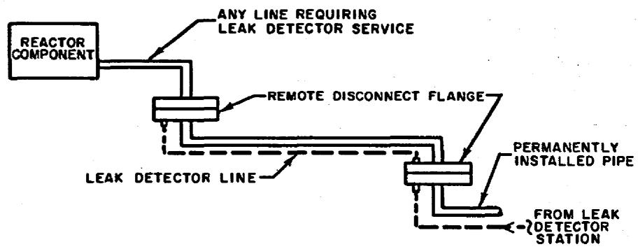  
Fig. 14.1 Method of Utilizing One Leak Detector Line to Serve Two Flanges in Series

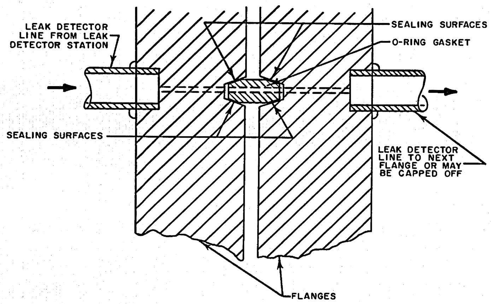  
Fig. 14.2 Schematic Diagram of Leak-Detected Flange Closure

Table 14.1 Volumes in Leak Detector System   

<table><tr><td colspan="3">Volume of Line 400 = 184 cc</td></tr><tr><td colspan="3">Volume of High Pressure side of DP cell = 730 cc</td></tr><tr><td colspan="3">Volume of Header 401 = 156 cc Volume of Header 405 = 144</td></tr><tr><td>Line 410 = 244</td><td colspan="2">Line 450 = OPEN</td></tr><tr><td>Line 411 = 216</td><td colspan="2">Line 451 = 113</td></tr><tr><td>Line 412 = 224</td><td colspan="2">Line 452 = 108</td></tr><tr><td>Line 413 = 144</td><td colspan="2">Line 453 = 106</td></tr><tr><td>Line 414 = 65</td><td colspan="2">Line 454 = 109</td></tr><tr><td>Line 415 = OPEN</td><td colspan="2">Line 455 = 104</td></tr><tr><td>Line 416 = OPEN</td><td colspan="2">Line 456 = 109</td></tr><tr><td>Line 417 = 88</td><td colspan="2">Line 457 = 102</td></tr><tr><td>Line 418 = OPEN</td><td colspan="2">Line 458 = 99</td></tr><tr><td>Line 419 = OPEN</td><td colspan="2">Line 459 = 98</td></tr><tr><td>Header 402 = 141 cc</td><td colspan="2">Header 406 = 148</td></tr><tr><td>Line 420 = 130</td><td colspan="2">Line 460 = 154</td></tr><tr><td>Line 421 = OPEN</td><td colspan="2">Line 461 = 99</td></tr><tr><td>Line 422 = 111</td><td colspan="2">Line 462 = 148</td></tr><tr><td>Line 423 = 125</td><td colspan="2">Line 463 = 99</td></tr><tr><td>Line 424 = 120</td><td colspan="2">Line 464 = 107</td></tr><tr><td>Line 425 = 115</td><td colspan="2">Line 465 = 108</td></tr><tr><td>Line 426 = 115</td><td colspan="2">Line 466 = OPEN</td></tr><tr><td>Line 427 = 115</td><td colspan="2">Line 467 = OPEN</td></tr><tr><td>Line 428 = 138</td><td colspan="2">Line 468 = OPEN</td></tr><tr><td>Line 429 = 135</td><td colspan="2">Line 469 = OPEN</td></tr><tr><td>Header 403 = 149 cc</td><td colspan="2">Header 407 = 150</td></tr><tr><td>Line 430 =</td><td colspan="2">Line 470 = OPEN</td></tr><tr><td>Line 431 =</td><td colspan="2">Line 471 = 291</td></tr><tr><td>Line 432 =</td><td colspan="2">Line 472 = 235</td></tr><tr><td>Line 433 =</td><td colspan="2">Line 473 = 518</td></tr><tr><td>Line 434 = 117</td><td colspan="2">Line 474 = 143</td></tr><tr><td>Line 435 = 117</td><td colspan="2">Line 475 = 135</td></tr><tr><td>Line 436 = 108</td><td colspan="2">Line 476 = 138</td></tr><tr><td>Line 437 = 106</td><td colspan="2">Line 477 = 109</td></tr><tr><td>Line 438 = 66</td><td colspan="2">Line 478 = 305</td></tr><tr><td>Line 439 = 63</td><td colspan="2">Line 479 = 466</td></tr><tr><td>Header 404 - 143</td><td colspan="2">Header 408 = 147</td></tr><tr><td>Line 440 = 123</td><td colspan="2">Line 480 = 144</td></tr><tr><td>Line 441 = 122</td><td colspan="2">Line 481 = 159</td></tr><tr><td>Line 442 = 122</td><td colspan="2">Line 482 = 123</td></tr><tr><td>Line 443 = 195</td><td colspan="2">Line 483 = 123</td></tr><tr><td>Line 444 = 193</td><td colspan="2">Line 484 = 310</td></tr><tr><td>Line 445 = 189</td><td colspan="2">Line 485 = 210</td></tr><tr><td>Line 446 = 178</td><td colspan="2">Line 486 = SPARE</td></tr><tr><td>Line 447 = 122</td><td colspan="2">Line 487 = SPARE</td></tr><tr><td>Line 448 = 108</td><td colspan="2">Line 488 = SPARE</td></tr><tr><td>Line 449 =</td><td colspan="2">Line 489 = SPARE</td></tr></table>

NOTE: The "B" valves in the leak detector lines remained open during all tests.

# 14.3 Operating Experience

During construction and pre-operating leak testing, some difficulty was encountered in attaining acceptable leak rates on some flanges, particularly the very large salt freeze flanges. During this and subsequent maintenance periods, the leak detector system proved very valuable in checking the progress and degree of tightness of all flanges.

Operating experience showed that once a flange was made tight, it stayed tight during service. During the entire life of the MSRE, no leak ever developed that was serious enough to cause a shutdown of the reactor.

Some problem was posed by a freeze flange (FF-201) located near the point where the coolant salt left the heat exchanger in the reactor cell. It leaked more than the maximum allowable rate of $1 \times 10^{-3} \, \text{cc/sec}$ when salt was not in the piping and the coolant system had been cooled down. This leak was measured at about $0.2 \, \text{cc/sec}$ on August 2, 1966 while the system was drained and cold. The flange always became acceptably sealed when the system was heated prior to putting molten salt into the piping and remained so when the reactor was at power. The sealing action was probably due to the thermal expansion of the internals of the flange being greater than that of the external clamp. This would cause an increase in bearing pressure on the seating surfaces of the metal "0" ring.

During normal operation with the entire system interconnected, the pressure decreased at about 1 psi per day, thus requiring repressurizing at intervals of one to two weeks. In a 52-day period of system operation at temperature in October and November 1968, the pressure decay rate was 1.24 psi/day. In a 60-day period of power operation in September and October 1969, the decay rate was 0.97 psi/day. During a system cooldown on November 30, 1968, the leak rate did increase to 2.15 psi/hr. Differential thermal expansion combined with thermal pressure decay probably caused the high indicated leak rate.

When an abnormal leak rate occurred, it would take about 4 to 8 hours to perform an entire survey which consisted of isolating each header and then each line of the header found to be leaking. Determining the leak rate of an individual line took about an hour or two, however, a rough check to guide maintenance personnel could be obtained in about 10 minutes.

The individual lines, which monitored more than one flange, gave an interpretation problem. It was not possible to tell at the outset if all the leak was through one flange or apportioned between multiple flanges on the same line. When this situation arose, the practice became that of alternately tightening one flange, then the other, incrementally, and running a combined leak rate on the line between these operations. By observing when improvement was made, the apportionment of the leak between flanges could be estimated.

It was necessary to exceed the maximum recommended torque in some instances. The technique was used to overtorque where necessary to seat the sealing faces, then to loosen the bolts and retorque them to the nominal or, if necessary, to the maximum value listed in Table 14.2. In a few exceptional cases, it was necessary to exceed this maximum. Some of the metal O-rings had to be replaced with gold-plated O-rings in order to obtain acceptable leak rates. Some of the 1/2-in. bolts in small flanges were torqued as high as 150 ft-lbs and operated at about 80 ft-lbs. The maximum recommended torque was 70 ft-lbs.

The record of measurements of system and flange leak rates was kept in a "Leak Detector Log Book" at the LKD control cabinet. Flange leak rates, plus a record of all work done involving any of these flanges, was logged in the "MSRE Flange Log" notebook. This latter log gave details on each flange on a separate page. Information given was Flange No., leak detector Valve No., size of bolts (or in the case of freeze flanges, the force exerted by the removable clip in tons), ring size, the maximum permissible and recommended torque in ft-lbs., the location of the leak detected joint, plus the date of action, the reason for the action, actual torque applied, and any general comments.

# 14.4 Discussion and Recommendations

The leak detector system functioned satisfactorily as designed. Due to the two sealing surfaces on the "0" rings, primary containment was maintained as long as the leak detector system overpressure was greater than any possible pressure that could develop in the primary system. Therefore, leak rate limitations were set based on convenience in maintaining an adequate overpressure.

Table 14.2 MSRE Flange Bolt Torque Chart   

<table><tr><td>Bolt Diameter</td><td>Threads Per inch</td><td>Nominal Torque (ft-lb.)</td><td>Maximum Torque (ft-lb.)</td><td>Wrench Size</td></tr><tr><td>1/2&quot;</td><td>13</td><td>47</td><td>70</td><td>3/4&quot;</td></tr><tr><td>5/8&quot;</td><td>11</td><td>90</td><td>135</td><td>7/8&quot;</td></tr><tr><td>3/4&quot;</td><td>10</td><td>150</td><td>225</td><td>1-1/8&quot;</td></tr><tr><td>7/8&quot;</td><td>9</td><td>240</td><td>360</td><td>1-5/16&quot;</td></tr><tr><td>1-1/8&quot;</td><td>7</td><td>533</td><td>800</td><td>1-1/2&quot;</td></tr><tr><td>1-1/2&quot;</td><td>6</td><td>900</td><td>1200</td><td>2-3/8&quot;</td></tr></table>

# Tightening Procedure:

1. Torque bolts to nominal torque value following a crisscross sequence. Approach final value in successive increments of 10 to 20 ft-lb.   
2. If leak exist, torque bolts to maximum torque value, back off and retorque to nominal value per step 1.   
3. Repeat step 2 as required, increasing nominal value by $10\%$ each successive step. NEVER EXCEED MAXIMUM VALUES without permission of the MSRE Operations or Maintenance Chief.

Remote welding or brazing techniques should be used where maintenance is infrequent. This should be more economical and would reduce the number of details to be handled by the operating personnel.

When opening primary system flanges, it is desirable to have the leak detector vented to atmospheric pressure to minimize the spread of activity. Each header should have a line which is connected to the cell to facilitate doing this since the gas in the line could be contaminated.

# 15. INSTRUMENT AIR SYSTEM

T. L. Hudson

# 15.1 Description

The instrument air system supplied clean, dry, compressed air for pneumatic instruments and other special uses. Two Joy compressors, AC-1 and AC-2, were used to compress the air, which then passed through an after-cooler and entrainment separator to a common line supplying two parallel receiving tanks. From the receiving tanks, the air passed through one of two parallel drying stations containing Trinity heatless dryers. The dry air was distributed through headers to locally mounted filter and reducing stations. The service air compressor, AC-3, could be valved into the instrument air system upstream of the receiver tanks if required.

# 15.2 Operating Experience

The capacity of the instrument air system with one air compressor in operation was adequate at all times. Normal air usage was about 70 scfm. Of this amount, 18 scfm was used for purging the instrument air dryers, 12 scfm for supplying noncritical instruments, and 40 scfm for supplying the critical instruments. The critical instruments were supplied by the emergency instrument air supply, which consisted of two banks of six nitrogen cylinders, when the normal instrument air supply was lost.

The capacity of the emergency instrument air supply was tested during normal operation with flush salt to assure an orderly shutdown of the reactor in case of loss of both instrument air compressors (see MSRE Test Report 2.3.11.3). With an emergency air usage of 40 scfm and one bank of cylinders at their lowest operating, 1500 psig (initial low-pressure alarm point) and the other bank full ( $\sim$ 2000 psig) at the time both air compressors stop would provide the following times:

(1) Air in the compressor surge tank would last $\sim 4$ min.   
(2) First bank of nitrogen cylinder (if used to 700 psig — at this pressure the control valve stopped controlling) would last $\sim 13$ min.   
(3) Subsequent full banks of nitrogen cylinder (if used to 700 psig) would last $\sim 20$ min.

From the test it was concluded that the emergency instrument air system was adequate. It would have been necessary to install a larger control valve to more fully utilize the nitrogen cylinders.

Leaks in the emergency nitrogen headers were repaired several times and the control valve was repaired once. On the average one bank of nitrogen was changed out every two weeks to keep the cylinders above the initial alarm pressure of 1500 psig.

# 15.3 Conclusions

The operation of the normal instrument air system was very satisfactory. At no time was it necessary to use the emergency nitrogen system during operation of the reactor. One instrument air compressor was operated with the other in standby except for during repairs or maintenance. Even with a complete power outage, it was possible to start one air compressor on diesel power before the receiver tank pressure dropped enough to cause a transfer to the emergency system. Although some extensive maintenance was done on the air compressors, only one was ever inoperative at a time.

# 16. ELECTRICAL SYSTEM

T. L. Hudson

# 16.1 Description

The MSRE electrical power was supplied from the ORNL substation by either of two 13.8-kV TVA lines, a preferred line or an alternate. These were separated by two interlocked pole-mounted motor-operated line switches. Automatic transfer was provided from the preferred line to the alternate line. Both transfer switches could be manually operated remotely from the auxiliary control room.

The ac power entered the MSRE building through two transformer substations. A 1500-kVa, 480-V, 3-phase substation served the process equipment, and a 750-kVa, 480-V, 3-phase auxiliary station was initially for building services, such as lighting, ventilation, etc. After the process substation became overloaded, bus 5 which supplies electrical heaters was connected to the auxiliary system. Three diesel-generators were installed for emergency ac use.

There were two separate area dc systems, a 48-V system and a 250-V system. These were normally operated by ac-dc motor-generator sets and had battery supplies for emergency use.

The 48-V dc system provided power for electrical controls and one channel of the reactor safety systems. The system consists of two 3-kW motor-generator sets (each rated at 53 ampere at 56 V) and a bank of 48-V batteries (600 amp-hr). The two generators normally supplied the dc power and charged the batteries. In an emergency, when no ac power was available to run the motor-generators, 48-V dc power was supplied directly from the batteries.

The 250-V dc system provided power to the reliable power system, process breakers trip power, 13.8-kV transfer control power, and emergency lighting. The system consisted of one 125-kW motor-generator set and a bank of 240-V batteries (364 amp-hr).

The reliable power system provided power to certain important process equipment and one channel of the safety systems. Initially, the power was supplied from a 25-kW dc-ac motor-generator set. The dc motor was supplied

from the 250-V dc system and the generator supplied the $120 / 240$ -V ac reliable power system. The operation of the MG set was unreliable because of failures in electrical control components and was replaced with a static inverter (see 16.4).

The MSRE electrical installation made extensive use of the electrical facilities that were installed for the ARE and ART operations in the 7503 area. Many modifications were made to the existing equipment, but only a limited amount of supplemental equipment was required.

# 16.2 Alternating Current System

The operation of the ac electrical system was very satisfactory. There were eleven important failures, ten of which caused unscheduled interruptions in the power operation of the reactor: five were caused by electrical storms, one by a cable failure at a component-cooling pump, one by an overload of the main process-power breaker, one by an arc between a 13.8-kV line and an activator rod to the line fuse, one by a failure of the main transformer primary fuse, one by a failure of the auxiliary transformer primary fuse, and one by a failure of the drain-tank space cooler motor. These interruptions varied in length from a few minutes to several days. In all cases the necessary repairs or modifications were made, and no damage to reactor equipment was incurred. These are discussed in more detail below.

On two occasions while the reactor was operating at power, momentary electrical outages during storms caused control-rod scams by range-switching the nuclear power safety channels because of dips in the fuel-pump-motor current. In both these cases the nuclear power was quickly restored to the value that existed just prior to the outage. Since the safety analysis indicated that low range of the safety channels was needed only while filling the reactor (when the fuel pump was off), rapid response of the range-switching was not required. Therefore, time-delay relays were subsequently incorporated in these circuits to prevent their activation on momentary power dips.

Another storm-induced failure occurred when lightning struck the main ORNL power substation and parted one wire of the normal MSRE feeder. In this case the electrical load was automatically transferred to an alternate

feeder, and all essential equipment was restarted in time to prevent draining either the fuel or coolant system. However, operation at high nuclear power could not be resumed until service was restored on the main feeder. The entire 13.8-kV supply system was subsequently reviewed and improved to make it less susceptible to damage by storms.

During a thunderstorm in June 1967, the reactor operation was interrupted by the loss of both feeders. The reactor period safety system functioned properly and scrambled the reactor but two amplifiers were damaged. Approximately 32 hours later, the reactor was returned to critical operation after the period safety amplifiers had been repaired.

In July 1967, an interruption was caused by the loss of the preferred feeder during another thunderstorm. Emergency power from the diesel generators was in service within 2 min, and low-power nuclear operation was resumed in about 13 min. After repairs had been completed on the preferred feeder, full-power operation was resumed in approximately 6 hr.

The short in the component-cooling pump cable seal is described in Sect. 10 entitled "Component Cooling System." When this short occurred, there was a massive flow of current and the breaker supplying the entire bus tripped before the individual breaker for the motor.

During the initial full-power operation of the reactor, the main process-power breaker (breaker R) was loaded to near its setpoint value. When the load on the coolant-radiator main-blower motors was increased by increasing the pitch on the blower fan blades, the increased load on breaker R caused it to trip on overcurrent. This condition was relieved by transferring bus 5 ( $\sim$ 200 kW) from the main process transformer to the auxiliary power transformer. The load transfer decreased the current through breaker R from about 1700 amp/phase to about 1550.

A building power failure occurred on a foggy morning in October 1967, when an arc developed between a 13.8-kV line to the main transformer for the building and parallel metal activator rod to the 13.8-kV line fuse. The cause of the arc is unexplained. Although the weather was foggy, it was not unusually wet. This fault caused the operation of the preferred feeder overcurrent ground relay located at the ORNL substation, which tripped the feeder breaker before the line overcurrent relay located at the MSRE could operate to prevent an automatic transfer to the alternate feeder.

When the MSRE was transferred, the alternate feeder overcurrent ground relay operated and the alternate feeder breaker also tripped. (To prevent an automatic transfer to the alternate feeder on a similar fault, an overcurrent ground relay was later installed at the MSRE.) After an interruption of 37 min, low-power nuclear operation was resumed on emergency electrical power from the diesel generators. The damage was repaired, the spacing between the line and the activator rod was increased, and normal service was restored after an interruption of 2 hr.

In April 1969, there was a failure of a fuse on the primary side of the MSRE main power transformer. This resulted in the loss of voltage on one of the transformer windings. The power supply was changed from a three-phase to a single-phase supply. This caused a drop in secondary voltage across two windings and increase in voltage across the other winding. The motor-operated equipment continued to operate until the individual breakers were tripped by the high current in two of the lines. All breakers did not trip at the same time which made it difficult to locate the trouble immediately. The reactor was scrambled from full power and the diesel generators were started, but both the fuel and coolant systems were drained before cooling air could be restored to the freeze valves. No apparent cause for the fuse failure was found other than possible overheating from poor electrical contacts.

About the middle of February 1966, a ground developed in the drain-tank cell space cooler 10-hp motor after about 2900 hr of operation. An isolation transformer was installed to isolate the ground from the electrical system. After a few hours of operation, the motor stopped and couldn't be restarted. The reactor was taken subcritical and the fuel system was drained. The drain-tank cell was opened to provide cell cooling. The cooler and motor were removed, and examination showed that the rotor had slipped along the shaft until the rotor fan blades rubbed, causing the stator windings to be destroyed. The failure appeared to be due to improper manufacture and not a design weakness. Therefore, the damaged motor was replaced with one practically identical.

On one occasion the auxiliary power system was out of service for about 2 hrs due to a failure of the auxiliary power transformer primary fuse. During the fuse replacement the operation of, the reactor continued

at power with bus 5 supplied from diesel-generator 5. The fuse failure apparently was caused by overheating from poor electrical contact. Due to low resistance readings, the three auxiliary power transfers were replaced in 1968.

# 16.3 250-V dc System

The operation of this system has been very satisfactory. There have been some tube failures in the automatic voltage control system for the generator, but each time the unit was operated on manual control until the tubes in the automatic controls could be replaced.

Once a month the charging voltage was increased to $275\mathrm{V}$ for 24 hrs to give the batteries an equalizing charge.

The batteries were given a 3-hr life test under full load. The voltage dropped to 215 volts over the three-hour period. Extrapolating the voltage curve indicated that the lower limit of 210-V would have been reached in $\sim 3.5$ hours which is well above the 2-hr life upon which the design was based.

# 16.4 Reliable Power System

The 120-V ac reliable power system was originally supplied by an MG set. In early operation, this MG set (originally installed for the ARE) proved very unreliable due to failures in the electrical control components. To improve the reliability and increase the capacity, the motor generator was replaced with a new 62-kVa three-phase static inverter. The total load on the reliable power supply, including the on-line computer, which has some three-phase load, was $40\mathrm{kV}$ . The static inverter offered a number of advantages over the old rotary inverter, including higher efficiency (increased $35\%$ ), smaller size, no moving parts, quiet operation, and excellent voltage and frequency regulation. Prior to the installation of this equipment, both the capacity and voltage regulation of the reliable power supply were inadequate for the operation of the on-line computer.

During the checkout and testing of the static inverter in April 1966 after the installation had been completed, trouble occasionally developed

that blew the load fuses. Two times the manufacturer's field engineer made exhaustive tests and could not find any trouble, but all symptoms indicated that the trouble was in the low-voltage logic power supply, which supplies 24-V dc control power. On April 25, the inverter failed again while the reactor was operating at low power. Apparently the transfer caused a transient on the ac system, thus also dropping out the rod scram relay supplied from the ac system, causing a control rod scram. The inverter load was automatically transferred to the normal ac power supply. After this failure a new power-supply module was installed.

The inverter output voltage regulation was $208 \pm 1/2\mathrm{~V}$ , and the output frequency better than 60 cps $\pm 0.01\%$ . The inverter was tested for 2-1/4 hr operating from the 250-V battery system without the dc generator operating. Although the input to the inverter varied 20 V, the output varied only 0.5 V.

There have been three other failures associated with the static inverter that have automatically transferred the normal inverter load to TVA supply. The first was caused by failure of load fuses which resulted in an unscheduled control-rod scram. The second was caused by a failure of a thyrister in the inverter logic circuit. The third was caused by a momentary ground during maintenance on the computer.

When a transfer occurred, many alarms were received in the control room. Some were caused by loss of operating equipment, and others were due to the momentary loss of control voltage to certain monitors. These had to be reset to stop the alarm and control action. After the second inverter failure, all operating equipment was restarted, but an emergency fuel drain occurred before the reactor-cell air activity monitors were reset. No drain or other serious condition resulted from the other inverter failures.

# 16.5 48-v dc System

The 48-V dc system was very reliable. The only maintenance on the system was caused by excessive arcing of the generator brushes. Initially one generator was operated near rated capacity to supply the load. Filters and viewing windows were installed on the generators and both generators

were operated in parallel to reduce the individual generator current after the load slightly exceeded the capacity of one generator. These changes greatly reduced the generator brush problems.

Once a month, the charging voltage was increased to 54 volts for $\approx 8$ hr to give the batteries an equalizing charge.

The batteries were given a 6-hr life test. The first 3.5 hr was at 47.5 amps and the last 2.5 hr at 19.5 amps. The batteries expended 215 amp-hour of the 600 amp-hour life with essentially no voltage drop.

# 16.6 Diesel Generators

The three diesel-power generators, each with a capacity of $300\mathrm{kW}$ , supplied emergency ac power to motors and heaters in the MSRE. They proved to be quite reliable. They were started and operated unloaded for about an hour each week. Once a month they were tested under load. They never failed to start when required during a power outage. Under emergency conditions, they were usually running within 2 min after a failure of the normal power supply.

In February 1966, a crack was found in the block of DG-3 at one of the bolt holes. Attempts at repairs were not successful, but the unit was operable. Later DG-3 was replaced with a surplus diesel generator from another facility. The replacement unit was similar to the original except that it was started by compressed air instead of by an electric starter.

# 16.7 100-kVa Variable Frequency Motor-Generator Set

A temporary installation of a used variable frequency MG set was made at the MSRE to supply the fuel-pump motor during special tests. The fuelpump motor was operated from 610 rpm to 1165 rpm (maximum speed with MG set) over a period of several weeks.

The automatic controls for the variable speed and generator voltage did not work properly during the initial checkout using a dummy resistance load. After replacement of some defective components in the control circuits, the fuel pump was operated from the MG set. The operation of the automatic controls were still not completely satisfactory and some manual

adjustments were required. Frequently the fuel-pump motor was stopped because of over adjustment of the manual controls. Also during the lower-speed operation, the speed of the fuel pump was not constant enough to make the desired tests. Therefore, the automatic controls were bypassed and manual controls of speed and voltage were installed. Satisfactory operation with manual controls was not obtained until the fuel pump was operated at about $35\mathrm{V}$ above rated voltage, assuming the fuel-pump motor voltage is directly proportional to speed.

# 16.8 Conclusion

Considering the age and the number of modifications made to the existing electrical system within the MSRE building, the performance has been very satisfactory. The main weakness of the entire electrical system was with the 13.8-kV feeders and transformers supplying the MSRE. Most of the equipment was over 15 years old. During 1966, there were three momentary interruptions of the power to the MSRE caused by thunderstorms. The entire 13.8-kV supply system was reviewed and improved to make it less susceptible to damage by storms. Since the improvements were made, there have been only two interruptions due to storms in the last three years of operation.

# 17. HEATHERS

T. L. Hudson

# 17.1 Description

Electrical heaters were provided for all parts of the salt system to permit preheating of the circulating loops and to maintain the temperature of the salt at $1200^{\circ}\mathrm{F}$ during zero-power operation. (In practice the heaters were kept energized during power operation as well.) The total installed capacity was $\sim 900\mathrm{kW}$ ; the actual power requirement was less than half this amount. It was possible to supply all heaters essential to an orderly shutdown, including enough to keep thy salt molten in the drain tanks, from a 300-kW diesel-driven generator. A summary of the heaters and insulation on the salt systems is given in Table 17.1.

The type of installation was determined by the location. In the reactor and drain-tank cells, radiation from long-lived fission products preceded direct maintenance after start of power operation. There, the heaters were designed for removal and replacement using long-handled tools inserted through the cell roof. In the coolant cell, the piping could be approached within a few minutes after a shutdown, and the heaters and insulation were the conventional type used in component test facilities.

Removable heater units in the reactor and drain-tank cells were of two types. On the piping and heat exchanger, the heaters were nichrome elements in ceramic plates, located on the inner surfaces of the removable units that also insulated the sides and top of the equipment. On the reactor vessel, fuel pump, and drain tanks, the removable heaters were inserted into penetrations in permanently mounted insulation. All electrical insulation was ceramic type, because of the high gamma-radiation fields (up to $10^{5}$ R/h in the reactor cell during operation).

Thermal insulation in the removable heater-insulation units was of the metallic, multiple-layer, reflective type, which could withstand handling without dusting. The permanently mounted insulation was low-conductivity, high temperature low sullfur content, ceramic fiber of expanded silica, with a thin metal sheet between the insulation and the pipe surfaces (see ORNL Drawing E-MM-B-51676).

Table 17.1 Heaters and Thermal Insulation   

<table><tr><td>Location</td><td>System</td><td>Type 
Heaters</td><td>Type 
Thermal 
Insulation</td><td>Number 
Heater 
Units</td><td>Number 
Heater 
Elements</td><td>Type Heater Elementsd</td><td>Number 
Controls</td><td>Powere Supplye</td></tr><tr><td rowspan="7">Reactor Cell</td><td>Reactor</td><td>Removable</td><td>Permanenta</td><td>9</td><td>9</td><td>1135 ft of 3/8-in. by 0.035-in. wall Inconel tubing. Each removable unit consists of 7 U-tubes.</td><td>3</td><td>N</td></tr><tr><td>Fuel Pump</td><td>Removable</td><td>Permanenta</td><td>5</td><td>14</td><td>3/4-in.-diam, stainless steel sheath 5-ft long with ceramic insulation and nichrome elements.</td><td>2</td><td>N</td></tr><tr><td rowspan="2">5-in.-diam Piping</td><td>Removable</td><td>Removableb</td><td>31</td><td>177</td><td>Ceramic plate with nichrome elements.</td><td>23</td><td>N</td></tr><tr><td>Permanent</td><td>Permanenta</td><td>3</td><td>8</td><td>Tubular 0.315-in. OD Inconel sheath with nichrome elements.</td><td>3</td><td>N</td></tr><tr><td>Heat Exchanger</td><td>Removable</td><td>Removableb</td><td>3</td><td>24</td><td>Ceramic plate with nichrome elements.</td><td>3</td><td>N</td></tr><tr><td>Freeze Valve</td><td>Removable</td><td>Removablea</td><td>1</td><td>1</td><td>Tubular 0.315-in. OD Inconel sheath with nichrome elements.</td><td>1</td><td>N</td></tr><tr><td>Reactor Neck</td><td>Permanent</td><td>Permanenta</td><td>2</td><td>2</td><td>Tubular 0.315-in. OD Inconel sheath with nichrome elements.</td><td>2</td><td>N</td></tr><tr><td rowspan="2">Drain Cell</td><td>Drain Tanks</td><td>Removable</td><td>Permanenta</td><td>23</td><td>156</td><td>Ceramic plates with nichrome elements</td><td>6</td><td>N&amp;E</td></tr><tr><td>1-1/2-in.-diam Piping (Fill Lines)</td><td>Removable</td><td>Removableb</td><td>13</td><td>75</td><td>Ceramic plates with nichrome elements</td><td>15</td><td>N&amp;E</td></tr></table>

$a_{\mathrm{Ceramic}}$ fiber of expanded silica.   
$b_{\text{Metallic, multiple-layer}}$ .   
$d_{\mathrm{Ceramic}}$ plates - maximum install wattage - 30 watts/in² of surface. Tubular 0.315-in. OD - normal rating 500 watts/ft of heater.   
$\theta_{\mathbf{N}}$ -normal power supply; E-emergency power supply.

Table 17.1 (Continued)   

<table><tr><td>Location</td><td>System</td><td>Type 
Heaters</td><td>Type 
Thermal 
Insulation</td><td>Number 
Heater 
Units</td><td>Number 
Heater 
Elements</td><td>Type Heater Elementsd</td><td>Number 
Controls</td><td>Power 
Supplye</td></tr><tr><td></td><td>Freeze Valves 
(Fill Lines)</td><td>Removable</td><td>Removableb</td><td>3</td><td>27</td><td>Ceramic plates with nichrome elements</td><td>9</td><td>N&amp;E</td></tr><tr><td></td><td>Fill Line</td><td>See Note c</td><td>Permanenta</td><td>1</td><td>1</td><td>Direct resistance heating of 1-1/2-in. by 0.195-in. wall INOR-8 pipe 65 ft long.</td><td>1</td><td>N&amp;E</td></tr><tr><td>Drain Cell</td><td>1/2-in.-diam 
Piping (Transfer 
lines)</td><td>Permanent</td><td>Permanenta</td><td>12</td><td>32</td><td>Tubular 0.315-in. OD Inconel sheath with nichrome elements</td><td>12</td><td>N&amp;E</td></tr><tr><td></td><td>Freeze Valves 
(Transfer lines)</td><td>Permanent</td><td>Permanenta</td><td>3</td><td>32</td><td>Ceramic plates with nichrome elements</td><td>6</td><td>N&amp;E</td></tr><tr><td>Coolant Cell</td><td>Coolant Pump</td><td>Permanent</td><td>Permanenta</td><td>2</td><td>14</td><td>Ceramic plates with nichrome elements</td><td>2</td><td>N</td></tr><tr><td></td><td>5-in.-diam Piping</td><td>Permanent</td><td>Permanenta</td><td>10</td><td>87</td><td>Ceramic plates and tubular 0.315-in. OD Inconel sheath with nichrome elements.</td><td>10</td><td>N</td></tr><tr><td></td><td>Radiator</td><td>Permanent</td><td>Permanenta</td><td>8</td><td>162</td><td>Ceramic plates and tubular 0.315-in. OD Inconel sheath with nichrome elements.</td><td>8</td><td>N&amp;E</td></tr><tr><td></td><td>Drain Tank</td><td>Permanent</td><td>Permanenta</td><td>3</td><td>24</td><td>Ceramic plates and tubular 0.315-in. OD Inconel sheath with nichrome elements.</td><td>3</td><td>N&amp;E</td></tr></table>

$a_{\mathrm{Ceramic}}$ fiber of expanded silica.   
bMetallic,multiple-layer.   
The fill line was heated by passing current through the wall of the pipe. The pipe was removable.   
$d_{\mathrm{Ceramic}}$ plates - maximum install wattage - 30 watts/in² of surface. Tubular 0.315-in. OD - normal rating 500 watts/ft of heater.   
$\mathbf{e}_{\mathbf{N}}$ - normal power supply; $\mathbf{E}$ - emergency power supply.

Table 17.1 (Continued)   

<table><tr><td>Location</td><td>System</td><td>Type 
Heaters</td><td>Type 
Thermal 
Insulation</td><td>Number 
Heater 
Units</td><td>Number 
Heater 
Elements</td><td>Type Heater Elementsd</td><td>Number 
Controls</td><td>Povere 
Supplye</td></tr><tr><td rowspan="4">Coolant Cell 
(continued)</td><td>Freeze Valves</td><td>Permanent</td><td>Permanenta</td><td>2</td><td>8</td><td>Ceramic plates with nichrome elements.</td><td>4</td><td>N&amp;E</td></tr><tr><td>Fill Lines</td><td>Permanent</td><td>Permanenta</td><td>6</td><td>30</td><td>Ceramic plates and tubular 0.315-in. 
OD Inconel sheath with nichrome 
elements.</td><td>6</td><td>N&amp;E</td></tr><tr><td>Flow Transmitters</td><td>Permanent</td><td>Permanenta</td><td>4</td><td>8</td><td>Tubular 0.315-in. OD Inconel sheath 
with nichrome elements.</td><td>8</td><td>N</td></tr><tr><td>Level Element</td><td>Permanent</td><td>Permanenta</td><td>1</td><td>4</td><td>Tubular 0.315-in. OD Inconel sheath 
with nichrome elements</td><td>2</td><td>N</td></tr></table>

$\alpha_{\mathrm{Ceramic}}$ fiber of expanded silica.   
$d_{\text{Ceramic plates}}$ — maximum install wattage — 30 watts/in² of surface. Tubular 0.315-in. OD — normal rating 500 watts/ft of heater.   
$\mathfrak{e}_{\mathbb{N}}$ - normal power supply; $\mathbb{E}$ - emergency power supply.

Maintenance requirements were minimized by designing the heaters with excess capacity and operating them at reduced voltage. If some of the heater elements failed, the other elements could be operated at a higher voltage or the power could be increased to the adjacent heaters. Heater units that were less accessible had spare heater elements installed and connected, ready for use with only minor, out-of-cell wiring changes.

Control of the electrical input to the heaters was entirely manual, in response to system temperatures displayed on either a multipoint temperature recorder or a cathode-ray tube by a multipoint scanner. At least one thermocouple was attached to the piping or equipment under each heater unit, with additional couples at potential cold spots.

# 17.2 Preoperational Checkout

To assure that the heaters would perform properly and to provide reference data for future trouble-shooting, a number of tests were done before and after installation. A visual examination of the heaters and the wiring in the junction boxes was made and all obvious errors were corrected. Continuity checks were completed and measurements of the heater circuit resistances and resistances to ground were recorded. Each heater circuit was then energized individually to assure that the proper thermocouple or thermocouples responded.

The effective resistance of each heater circuit was calculated and these were compared with measured resistance of the heaters before and after being installed in the cell. Several of the resistance measurements were made using a volt-ohm-meter but the accuracy of these readings was usually not good enough. The final resistance measurements were made with a wheatstone bridge and were recorded to the nearest one-hundredth ohm.

Table 17.2 is a summary of repairs made to the heaters during the pre-operational checkout.

# 17.3 System Heatup

The heatup of the coolant, fuel, and drain tank systems was started as soon as construction and checkout of the systems were completed. During the first heatup, all heaters operated satisfactorily and there were no

Table 17.2 Summary of Preoperational Heater Checkout   

<table><tr><td>Repair or Replacement
Of Heaters</td><td>Reactor Cell</td><td>Drain Cell</td><td>Coolant Cell</td></tr><tr><td>Corrected wiring</td><td>4</td><td>--</td><td>3</td></tr><tr><td>Replaced open heater element</td><td>--</td><td>1</td><td>3</td></tr><tr><td>Replaced broken ceramic beads
on removable unit</td><td>9</td><td>7</td><td>--</td></tr><tr><td>Modified removable heater
&#x27; box to eliminate possible
short circuit in ceramic
bead insulated leads</td><td>3</td><td>16</td><td>*</td></tr><tr><td>Modified heat box to permit
remote maintenance</td><td>1</td><td>4</td><td>*</td></tr><tr><td>Replaced broke MI cable end
seal</td><td>2</td><td>2</td><td>*</td></tr><tr><td>Replaced,MI cable</td><td>--</td><td>1</td><td>*</td></tr></table>

* Does not apply to coolant cell.

heater failures, but there were a few areas where the temperature was low because of air leakage and lack of thermal insulation. These areas were the inlet to the fuel-pump furnace, north end of heat exchanger, transfer line entrance to the drain-tank furnace, and the coolant radiator. After the air leakage was reduced and thermal insulation installed, satisfactory temperatures were obtained with the heaters as installed. The voltage setting required for each heater was determined during the startup testing and stops were set to limit the controls to hold the system temperatures to $1300^{\circ}\mathrm{F}$ or below. The general heatup of the systems and the difficulties are discussed in the following three sections.

# 17.3.1 Coolant and Coolant Drain.Tank Systems Heatup

The initial heatup of the coolant system in the coolant cell and coolant drain cell was started on October 13, 1964. The coolant pump was run during the heatup with normal helium purge and the heaters were adjusted to limit the heatup rate to about $100^{\circ}\mathrm{F/hr}$ . Heaters located in the cell penetration sleeves on lines 200 and 201 were operated at a reduced setting to provide a temperature gradient until the heatup of the reactor cell was started so as to reduce the thermal stresses at the anchor point.

Heater and thermocouple leads on top of the radiator enclosure were observed to be overheating as the system was being leveled at a reference temperature of $350^{\circ}\mathrm{F}$ . The radiator was cooled to ambient temperature and a section of the top of the radiator was found that had not been insulated. The insulation was installed and a second heating of the radiator was started. Some of the radiator heaters were disconnected in an unsuccessful effort to achieve a satisfactory temperature distribution. The radiator was 1073 to $1245^{\circ}\mathrm{F}$ and the outlet tubes were 620 to $1000^{\circ}\mathrm{F}$ . This condition was reached nine days after the heatup was started. During this time the remainder of the coolant system in the coolant cell was heated to $1047$ to $1259^{\circ}\mathrm{F}$ except on line 202 between the radiator and the coolant pump. There was $400^{\circ}\mathrm{F}$ difference among temperatures along this section of line under a single heater control. The spread was reduced to about $175^{\circ}\mathrm{F}$ by replacing part of the permanent insulation near the radiator outlet to reduce inleakage. The coolant drain tank was heated to about $1200^{\circ}\mathrm{F}$ without any difficulty with a temperature difference of $30^{\circ}\mathrm{F}$ between the highest and lowest thermocouple reading.

The radiator was cooled to room temperature for inspection and to repair the doors and seals. After repairs were made, the radiator was again heated. With the best temperature distribution obtained, there was about a $500^{\circ}\mathrm{F}$ spread on the radiator outlet tubes. This indicated that a relatively large heat leak existed. An inspection was made of the radiator enclosure near the outlet heater and six compartments in the enclosure wall were found to be without insulation. After the proper insulation was installed and gaps in the vicinity of the outlet piping were caulked, satisfactory temperatures were obtained with all heaters in service as originally designed. Localized overheating in the areas above the radiator enclosure was again observed. The heat leaks were primarily at openings through which the ceramic-beaded insulated electrical leads entered the enclosure. Some minor insulation damage was sustained on the wiring inside the junction boxes mounted about 12 inches above the top of the radiator enclosure.

During the following shutdown, late in 1965, radiator doors of improved design were installed. Heat losses due to air leakage around the doors continued to present a problem. To obtain an acceptable temperature distribution, it was necessary to shim the gaskets and disconnect some of the heaters, so as to give a non-uniform heat input over the face of the radiator. When the main blowers were operated to test the doors, other difficulties became apparent. One of these was leakage of hot air into the region just above the radiator enclosure which caused overheating of electrical insulation on the numerous thermocouples and heater leads in junction boxes located in this vicinity. It was necessary to relocate junction boxes in cooler locations along the cell wall and install higher temperature electrical insulation on the thermocouple and heater leads over the enclosure.

During the approach to full reactor power, heating the empty radiator to an acceptable temperature distribution prior to a fill had become increasingly difficult, and on the last fill, some of the tubes could not be heated above the melting point of salt until the radiator was filled and circulation was started. After the shutdown in July 1966, the radiator door seals were modified. The electrical heat required to heat the empty radiator was reduced from $108\mathrm{kW}$ to $62\mathrm{kW}$ by the door seal modification.

The four flow transmitters located in the enclosure above the radiator required a higher heater setting when either or both blowers were on because of air leakage past the transmitter.

# 17.3.2 Fuel System Heatup

The initial heatup of the fuel system and the coolant piping in the reactor cell was started November 1, 1964. At this time the coolant system in the coolant cell had already been heated.

About nine days were spent on the first heatup and leveling of the temperatures. The heatup rate was limited by the heatup rate of the reactor because there is about 8000 pounds of INOR and 8000 pounds of graphite to be heated. To aid in heating up the graphite and to help purge out any remaining oxygen, the fuel pump was run during the heatup with normal helium purge. Also the fuel system piping and heat exchanger were operated about $150^{\circ}\mathrm{F}$ higher to help heat up the reactor.

The system temperatures were brought up to an acceptable range (1000 to $1250^{\circ}\mathrm{F}$ ) with a few exceptions. Temperature at the freeze flanges and on the coolant lines at the cell penetrations were, as expected, below the liquidus temperature of the salt, but only over short sections. Thermo-couples under the heater located between freeze flange 100 and the fuel-pump furnace could be heated only to 700 to $900^{\circ}$ until heat losses were reduced by closing gaps in the heater base. There was about $300^{\circ}\mathrm{F}$ spread between the coolant inlet nozzle and the fuel outlet nozzle on the heat exchanger. The spread was reduced by closing gaps between the heat-exchanger base and adjacent heater. The time required to heat up the reactor and fuel system after the initial heatup was about three days.

# 17.3.3 Fuel Drain Tank System Heatup

The initial heatup of the drain-tank cell was started November 12, 1964. This heatup included drain tanks, FD-1, FD-2, FFT, and lines 103, 104, 105, 106, 107, 108, 109, and 110. This was the last of the systems heated.

The helium purge was set up from the fuel system through line 103 to the drain-tank system and then exhausted at line 110.

The heaters were adjusted to limit the heatup rate to less than $100^{\circ}\mathrm{F/hr}$ . All of the system was heated to an acceptable range (1000 to

$1250^{\circ}\mathrm{F}$ ) except where lines (lines 107, 108, and 109) penetrated the tank furnaces. On line 107, the temperature was brought up to $950^{\circ}\mathrm{F}$ , but only by operating the heaters in the penetration at $220\%$ of their rating. The other two line penetrations were somewhat better, but still unsatisfactory. The insulation on these lines near the penetrations was removed. Then the heaters were tied closer to the pipes and additional insulation was inserted between the heaters and the furnace walls. Temperatures at these penetrations then reached $1200^{\circ}\mathrm{F}$ with the heaters at less than their rated capacity.

# 17.4 Heater Performance

The system was operated at high temperature for about 10 months before the prepower shutdown. During the first 1500 hr of operation, only two heater elements failed. Both of these were in removable heater units on the main fuel circulating lines and had spare elements in the ceramic heater plates. The spare elements were put into service by out-of-cell wiring changes. A summary of the heater failures and repairs are included in Tables 17.3, 17.4, and 17.5. Six additional heater-element failures and an electrical ground at a disconnect were discovered during the checkout for Run 2. In four of the heaters, the failures occurred at the junction of the extension lead and the heater element inside the ceramic plate. These elements and the electrical ground were repaired before startup, and the other two elements were left out of service for Runs 2 and 3.

During subsequent operation, one in-cell heater failure was noted, and one failure occurred at a heater power supply. (The latter was repaired immediately.) It may be noted that a number of heater failures could occur without significantly affecting the operation of the reactor system.

Three more heater-element failures were found during the prepower shutdown. In addition, a number of minor defects (grounds, damaged connectors) were found. All the defects, including those left from earlier operations, were corrected.

An important cause of ceramic heater-element failure has been separation of the extension lead from the heater element. This is apparently due to a combination of a design weakness and excessive flexing during

Table 17.3 Summary of Heater Failures in the Reactor Cell   

<table><tr><td>Date</td><td>System</td><td>Heater</td><td>Type Failure</td><td>Repairs Made</td></tr><tr><td colspan="5">CRITICAL EXPERIMENT PERIOD</td></tr><tr><td>11/9/64</td><td>Reactor</td><td>R-1-2</td><td>One U-tube grounded</td><td>U-tube shortened 3 in.</td></tr><tr><td>12/31/64</td><td>5-in. piping</td><td>H-100-1</td><td>Failure of top element</td><td>Connected up spares to continue Run 1.</td></tr><tr><td>1/5/65</td><td>5-in. piping</td><td>H-102-5</td><td>Failure of top element</td><td>Connected up spares to continue Run 1.</td></tr><tr><td>3/22/65</td><td>5-in. piping</td><td>H-100-1</td><td>Replaced ceramic elements before start of Run 2.</td><td></td></tr><tr><td>3/22/65</td><td>5-in. piping</td><td>H-102-5</td><td>Replaced ceramic elements before start of Run 2.</td><td></td></tr><tr><td>4/30/65</td><td>5-in. piping</td><td>H-201-4B</td><td>Lead grounded</td><td>Realigned disconnect.</td></tr><tr><td>7/20/65</td><td>Heat exchanger</td><td>HX-2</td><td>Lead grounded</td><td>Removed sharp edge in lead.</td></tr><tr><td colspan="5">PREPOWER SHUTDOWN</td></tr><tr><td>7/30/65</td><td>Fuel pump</td><td>FP 1 &amp; 2</td><td colspan="2">Two fuel-pump heater units resistance increase from 12 to 17 ohms since the preoperational checkout. These were removed from the reactor cell and the mechanical joint between the solid and flexible nickel lead was highly oxidized. All five fuel-pump heater units were removed from the reactor cell and a welded connection was made at each lead extension.</td></tr><tr><td>7/30/65</td><td>5-in. piping</td><td>H-102-1</td><td></td><td>Broken disconnect replaced.</td></tr><tr><td>7/30/65</td><td>5-in. piping</td><td>H-200-10</td><td></td><td>Broken disconnect replaced.</td></tr><tr><td>7/30/65</td><td>5-in. piping</td><td>H-200-11</td><td></td><td>Broken disconnect replaced.</td></tr><tr><td>7/30/65</td><td>5-in. piping</td><td>H-201-6</td><td></td><td>Broken disconnect replaced.</td></tr><tr><td colspan="5">POWER OPERATION</td></tr><tr><td>12/29/65</td><td>Heat Exchanger</td><td>HX-1</td><td>Heater leads to 2 out of 8 elements failed</td><td>Operation continued. 4/9/68 (see below)</td></tr><tr><td>9/15/66</td><td>Heat Exchanger</td><td>HX-1</td><td>Heater leads of 2 more elements failed.</td><td>Operation continued. 4/9/68 (see below).</td></tr><tr><td colspan="5">POWER OPERATION 
(continued)</td></tr><tr><td>10/13/66</td><td>Heat Exchanger</td><td>HX-1</td><td>Heater leads of 2 more 
elements failed.</td><td>Operation continued. 
4/9/68 (see below). Repaired</td></tr><tr><td>10/28/66</td><td>Heat Exchanger</td><td>HX-1</td><td>All elements out of service 
due to heater leads.</td><td>Operation continued. 
4/9/68 (see below). Repaired</td></tr><tr><td>9/ /66</td><td>5-in. piping</td><td>H-102-1S</td><td>1 of 3 installed spares 
failed</td><td>No repairs required. 
capacity in others. Adequate</td></tr><tr><td>9/13/67</td><td>Freeze valve</td><td>FV-103</td><td>Complete failure</td><td>No repairs required. 
temperature without adequate 
heater.</td></tr><tr><td>12/12/67</td><td>Heat Exchanger</td><td>HX-2</td><td>Open lead - all elements 
good</td><td>Operation continued. 
4/9/68 (see below). Repaired</td></tr><tr><td>12/19/67</td><td>Heat Exchanger</td><td>HX-2</td><td>Heater leads of 6 out of 
8 elements failed</td><td>Operation continued. 
4/9/68 (see below). Repaired</td></tr><tr><td rowspan="2">4/9/68</td><td rowspan="2">Heat Exchanger</td><td>HX-1</td><td rowspan="2">Heaters were removed from reactor cell and were repaired by 
welding the heater leads to the terminal strips. All 
heater elements were good.</td><td rowspan="2"></td></tr><tr><td>HX-2</td></tr><tr><td>10/1/68</td><td>5-in. piping</td><td>H-100-1</td><td>Failure of l side element</td><td>Connected up spares.</td></tr><tr><td>10/21/68</td><td>Heat Exchanger</td><td>HX-1</td><td>Heater grounded</td><td>Taken out of service.</td></tr><tr><td>8/2/69</td><td>5-in. piping</td><td>H-102-5</td><td>Failure of l side element</td><td>Connected up spares.</td></tr></table>

Table 17.4 Summary of Heater Failures in the Fuel Drain Tank Cell   

<table><tr><td>Date</td><td>System</td><td>Heater</td><td>Type Failure</td><td>Repairs Made</td></tr><tr><td colspan="5">CRITICAL EXPERIMENT PERIOD</td></tr><tr><td>~4/65</td><td>Fill Line</td><td>H-106-1</td><td>Failure 1 side element</td><td>Replaced element before Run 2.</td></tr><tr><td>5/65</td><td>Fill Line</td><td>H-104-1</td><td>Failure 1 side element</td><td>Replaced all elements - new design during prepower shutdown.</td></tr><tr><td>5/18/65</td><td>Fill Line</td><td>H-104-6</td><td>Bad MI cable</td><td>Replaced MI cable during prepower shutdown.</td></tr><tr><td>5/65</td><td>Freeze Valves</td><td>FV-105-1</td><td>Top element - loose connection</td><td>Repaired 8/6/65 (see below).</td></tr><tr><td>5/65</td><td>Freeze Valves</td><td>FV-105-3</td><td>Top and 1 side element - loose connections</td><td>Repaired 8/6/65 (see below).</td></tr><tr><td>5/65</td><td>Freeze Valves</td><td>FV-106-1</td><td>Top elements - loose connection</td><td>Repaired 8/6/65 (see below).</td></tr><tr><td colspan="5">PREPOWER SHUTDOWN</td></tr><tr><td>8/5/65</td><td>Drain Tank</td><td>FD2-1</td><td>Female disconnect grounded</td><td>Added ~ 3 in. of ceramic beads to the 3 leads</td></tr><tr><td>8/6/65</td><td>Freeze Valves</td><td colspan="3">Replaced all heater elements (new design) in freeze valve heaters FV-104-1, FV-104-3, FV-105-1, FV-105-3, FV-106-1, FV-106-3, and H-104-5.</td></tr><tr><td>10/10/65</td><td>Fill Line</td><td>H-106-1</td><td>Failure 2 elements due to bad thermocouple</td><td>Replaced all elements - new design.</td></tr><tr><td colspan="5">POWER OPERATION</td></tr><tr><td>1/21/67</td><td>Fill Line</td><td>H-106-4</td><td>Failure 1 side element</td><td>Continued operation using two good elements and additional heat from adjacent heaters.</td></tr></table>

Table 17.5 Summary of Heater Failures in the Coolant Cell   

<table><tr><td>Date</td><td>System</td><td>Heater</td><td>Type Failure</td><td>Repairs Made</td></tr><tr><td colspan="5">PREPOWER SHUTDOWN CHECKOUT</td></tr><tr><td>8/12/65</td><td>5-in. penetration</td><td>H-200-14S</td><td>4 out of 8 elements failed - loose connection</td><td>Replaced all heater elements (new design) in heaters H-200-14, H-200-15, H-201-10, H-201-11, and spares.</td></tr><tr><td>8/12/65</td><td>5-in. penetration</td><td>H-201-11</td><td>1 out of 8 elements failed - loose connection</td><td></td></tr><tr><td>8/12/65</td><td>5-in. penetration</td><td>H-201-11S</td><td>3 out of 8 elements failed - loose connection</td><td></td></tr><tr><td>8/12/65</td><td>Radiator</td><td>CR-2</td><td>1 element failed - loose connection</td><td>Replaced element.</td></tr><tr><td>8/12/65</td><td>Radiator</td><td>CR-3</td><td>1 element failed - loose connection</td><td>Replaced element.</td></tr><tr><td>8/12/65</td><td>5-in. piping</td><td>H-201-12</td><td>Element grounded</td><td>Replaced element.</td></tr><tr><td>8/12/65</td><td>5-in. piping</td><td>H-202-2</td><td>Failure 1 element</td><td>Replaced element.</td></tr><tr><td colspan="5">POWER OPERATION</td></tr><tr><td>1/17/66</td><td>5-in. piping</td><td>H-202-2</td><td>Broken lead</td><td>Reconnected.</td></tr><tr><td colspan="5">Checkout after Run 7</td></tr><tr><td>8/17/66</td><td>Radiator</td><td>CR-3</td><td>Broken extension wire</td><td>Replaced element.</td></tr><tr><td>8/17/66</td><td>5-in. piping</td><td>H-202-2</td><td>Failure 1 element</td><td>Replaced element.</td></tr><tr><td>8/17/66</td><td>Radiator inlet header</td><td>CR-7</td><td>Failure 1 element</td><td>Disconnected element - adequate capacity in others.</td></tr><tr><td>8/17/66</td><td>Coolant Pump</td><td>CP-2</td><td>Failure 1 element</td><td>Disconnected element - adequate capacity in others.</td></tr><tr><td>8/17/66</td><td>Fill line</td><td>H-206-1S</td><td>Failure 1 spare element</td><td>No repairs necessary. Adequate capacity in others.</td></tr><tr><td colspan="5">Repairs after Run 11</td></tr><tr><td>3/30/67</td><td>Radiator</td><td>CR-6</td><td>Failure 1 element</td><td>Replaced element.</td></tr><tr><td colspan="5">Repairs after Run 13</td></tr><tr><td>5/23/69</td><td>Radiator</td><td>CR-3</td><td>Broken ceramic</td><td>Replaced element.</td></tr><tr><td>5/23/69</td><td>Radiator</td><td>CR-5</td><td>2 broken lead wires. Nickel lead wire had crystallized.</td><td>Removed defective sections and welded leads and dye-checked.</td></tr><tr><td>1/21/69</td><td>Radiator</td><td>CR-7</td><td>1 element grounded</td><td>Disconnected element. Adequate capacity in others.</td></tr></table>

installation of the elements. The joint was redesigned and new elements, which incorporate the change, were installed when such failures occurred.

Two fuel-pump heater units resistance increased from 12 to 17 ohms. These were removed from the reactor cell and the mechanical joint between the heater solid and flexible nickel extension lead was found to be highly oxidized. All five fuel-pump heater units were removed from the reactor cell and a welded connection was made at each lead extension. No other trouble was encountered with these heaters.

Before and during the prepower shutdown, direct maintenance was performed on the heaters in the reactor and drain-tank cell.

# 17.4.2 During Power Operation

All heaters performed properly during the heatup of the fuel and coolant loops in December 1965 for the start of power operation, with one minor exception. There was a broken lead on a heater between the radiator and the coolant pump. It was simply reconnected. After the startup, one of three groups of elements in one of the heat-exchanger heater units failed. No action was taken at this time because the other elements were enough to produce the desired temperature. A summary of the heater failures and repairs made during power operation is included in Tables 17.3, 17.4, and 17.5.

During the shutdown in September 1966, a resistance check was made on all in-cell heaters at junction boxes located outside the reactor and drain-tank cell and compared with initial resistances. Other than the heat-exchanger heater, only one heater was found that had failed. This was one of three installed spare heaters on the vertical section of pipe under the heat exchanger. No repairs were required, since there is adequate capacity in the other heaters on this section of pipe.

The resistance of the coolant-system heaters located outside of the reactor cell was also checked. Five heaters were found that had failed. One was on the radiator, one on the coolant system 5-in. piping, one on the coolant-pump furnace, one in the radiator outlet header, and the other one, a spare heater, was on the fill-line piping. The heaters on the 5-in. piping and on the radiator were replaced, there was adequate heater capacity at the other locations.

Aside from heater-element failures, a remote disconnect for one of the fuel-pump heaters was damaged during remote operation associated with the thawing of a salt plug in the fuel-pump offgas line. The heater was plugged into a space disconnect to restore it to service.

By the last of October 1966, all of the heater elements in one of the heat-exchanger heater units had failed. Satisfactory heat-exchanger temperatures were maintained without this heater, even with the fuel loop empty. However, continuous circulation of the coolant salt was maintained until after Run 11, so the full effect of the heater failure could not be determined. Tests were performed with both the fuel and coolant loops empty after Run 11 to determine the need for this heater in preheating the system from a cold condition. When helium circulation was stopped in the fuel system, the temperature distribution was satisfactory for a fill without the heater operating. With helium circulation in the fuel system, one temperature decreased to below $800^{\circ}\mathrm{F}$ . Since satisfactory temperatures could be achieved without it, the failed heater was not repaired at this time.

While the reactor system was being heated up for Run 13, Heater FV-103 was lost by an open circuit. This 1.5-kW bent-tubular-type heater normally supplies about 200 W of heat to a 4-in. section of the fuel drain line within the reactor vessel furnace, between the freeze valve and the resistance-heated section of the line. The purpose of the heater was to help control the temperature profile through the freeze valve. After the heater failed, tests with flush salt showed that by proper adjustment of the cooling air controls, the freeze valve could be maintained reliably with thaw times in an acceptable range. (Thaw time was around 12 min when the reactor vessel was at $1180^{\circ}\mathrm{F}$ and the center of the freeze valve was at $495^{\circ}\mathrm{F}$ .) Therefore, this heater was not replaced.

In December 1967, a lead to the adjacent failed heat-exchanger heater opened, thereby reducing the output of this heater by $50\%$ . A week later a second partial failure further reduced the output to only $33\%$ of normal. Although these failures did not affect operations as long as salt was kept circulating, the lack of heat in the two adjacent heaters made it necessary to repair them during the shutdown afte/ Run 14. These two units were

removed from the reactor cell early in the shutdown (on the fourth and fifth day after the end of full-power operation) to see if repairs were possible or if replacement units would be required. The trouble was found in the junction boxes mounted on top of the heaters, where the lead wires from several of the heater elements had burned in two at their screwed connections to the terminal strips. Repair was complicated by the induced activity in the assemblies, which produced a gamma radiation field of about 3 R/hr at 1 ft. A temporary work shield was set having concrete block walls and a top of steel plate and lead block. Direct maintenance on the junction was done through a small opening in the top. The terminal strips and connections were severely oxidized, apparently due to high temperatures during operation. This situation was corrected by installing nickel terminal strips and welding the heater leads directly to them. The copper wire from the terminal strip to the disconnect was also replaced with No. 12 nickel wire welded to the terminal strip. Aside from the damage in the junction boxes, both heat-exchanger heaters were in good condition, and after the repairs, both were reinstalled through the maintenance shield without unusual difficulty.

After the units were reinstalled in the cell, it was found that the current on one phase of south end unit was zero. This proved to be due to a fault in the permanently mounted lead wire in the cell. The fault was circumvented by installing a jumper cable between the heater disconnect and a spare disconnect. The heaters functioned satisfactorily during the subsequent heatup of the system.

One of the elements in the heater unit on line 106 adjacent to the junction of line 103 with lines 104, 105, and 106 failed during the middle of January 1967. This was not replaced since it was possible to maintain adequate temperature using the other elements and adjacent heaters.

There have been three failures of radiator headers due to broken nickel lead wires. The leads look like the nickel had crystallized. Several broken ceramic bushings have been replaced.

The heater located on the south end of the heat exchanger developed a partial ground in the latter part of October 1968. In order to clear the ground detector lights on Bus 5, the heater was taken out of service. This

was possible because tests had been performed after Run ll which determined that this heater was not essential for preheating the system from a cold condition. The cause of the ground was suspected to be a broken ceramic bead on the lead wire between a heater element and the junction box mounted on top of the unit.

About a $30\%$ drop in current on one heater on the fuel line between the reactor and the fuel pump (H-100-1) occurred late in September 1968. After a resistance check indicated a side heater element had failed, the spare heater elements were placed in service.

About a $30\%$ drop in current on the heater on the fuel line between the heat exchanger and the reactor (H-102-5) occurred in the early part of August 1969. After a resistance check indicated that one of the three heater elements had failed, the spare heater elements were placed in service.

The individual ammeters for each heater circuit were read and recorded daily. Since operation started, most heater failures caused a sufficient change in ammeter reading so as to be noticed. Variation in voltage supplied to the MSRE was usually less than $2\%$ over a 24-hour period. A total $2\%$ change caused less than a $2^{\circ}\mathrm{F/hr}$ change of the system temperature under isothermal conditions. This was easily adjusted by changes in heater settings. After the system had been brought to equilibrium at temperature it was not usually necessary to make further adjustments. Typical heater data including power requirements for $1200^{\circ}\mathrm{F}$ isothermal conditions are given in Table 17.6.

The four types of failures experienced with the heater leads are given in Table 17.7 along with methods used to make repairs.

# 17.5 Systems Cooldown Rate

Before nuclear power operation was started, system cooldown tests were run to determine the effects on the system if electrical power was lost. The cooldown of the fuel and coolant systems was done simultaneously since these are connected at the heat exchanger. These tests which were done with the radiator doors closed did not show any difficulties. A much more serious condition occurred on two occasions after nuclear power operation was started when the cold radiator doors were scrambled and the coolant pump

Table 17.6 Typical Heater Data   

<table><tr><td rowspan="3">Heater Numbers</td><td rowspan="3">Equipment</td><td rowspan="3">Insulationa
Thickness in.</td><td rowspan="3">Maximum Installed kW</td><td colspan="4">1200°F Operating Data</td></tr><tr><td colspan="2">Heat Loss</td><td rowspan="2">Average Heat Loss Per ft2 of Surface Watts</td><td rowspan="2">Calculated Heat Loss Per ft2 of Surface Watts</td></tr><tr><td>kW</td><td>% of Max Installed</td></tr><tr><td>R1, R2, &amp; R3</td><td>Reactor Vessel</td><td>5</td><td>69.6</td><td>29.9</td><td>43</td><td>81</td><td>46</td></tr><tr><td>FP-1 &amp; FP-2</td><td>Fuel Pump</td><td>5</td><td>18.2</td><td>12</td><td>66</td><td>112</td><td>82</td></tr><tr><td>FFT-1 &amp; FFT-2</td><td>FFT</td><td>4</td><td>45</td><td>12.8</td><td>28.5</td><td>59</td><td>47</td></tr><tr><td>FD1-1 &amp; FD1-2</td><td>FD-1</td><td>4</td><td>47</td><td>16.1</td><td>34.3</td><td>74.2</td><td>57</td></tr><tr><td>FD2-1 &amp; FD2-2</td><td>FD-2</td><td>4</td><td>45</td><td>14.9</td><td>33.1</td><td>68.7</td><td>57</td></tr><tr><td></td><td></td><td></td><td></td><td></td><td></td><td>Per ft of Pipe</td><td>Per ft of Pipe</td></tr><tr><td>H200-13</td><td>30&#x27; of 5&quot; piping</td><td>4</td><td>23.75</td><td>5.4</td><td>22.8</td><td>150</td><td>126</td></tr><tr><td>H201-12</td><td>23.5&#x27; of 5&quot; piping</td><td>4</td><td>21.6</td><td>3.3</td><td>15.3</td><td>140</td><td>126</td></tr><tr><td>H202-2</td><td>29&#x27; of 5&quot; piping</td><td>4</td><td>23.75</td><td>4.7</td><td>19.8</td><td>162</td><td>126</td></tr><tr><td>RCH-1</td><td>7&#x27; of 5&quot; piping</td><td>Metallic
Multiple-
Layer</td><td>13</td><td>2.5</td><td>19.2</td><td>357</td><td>b</td></tr><tr><td>RCH-2</td><td>5&#x27; of 5&quot; piping</td><td>Metallic
Multiple-
Layer</td><td>10</td><td>2.0</td><td>20</td><td>400</td><td>b</td></tr><tr><td>RCH-3</td><td>7.5&#x27; of 5&quot; piping</td><td>Metallic
Multiple-
Layer</td><td>15</td><td>3.4</td><td>22.7</td><td>453</td><td>b</td></tr></table>

$a_{\text{Ceramic fiber of expanded silica}}$ .   
$b_{\text{Design based on heat loss of 600 watt/ft of pipe on test unit.}}$

Table 17.7 Type of Heater Lead Failure and Repairs   

<table><tr><td>Heater</td><td>Failure</td><td>Correction Made</td></tr><tr><td>(1) Ceramic</td><td>Separation of extension lead from heater element</td><td>Designed leads with a cross bar</td></tr><tr><td>(2) Fuel pump tubular</td><td>Excess oxidation at mechanical joint between solid and flexible head</td><td>Made welded joints and dye-checked</td></tr><tr><td>(3) Heat exchanger</td><td>Excess oxidation at mechanical joints at terminal strip in junction box</td><td>Made welded joints and dye-checked</td></tr><tr><td>(4) Radiator</td><td>Nickel extension lead crystallized</td><td>Removed defective section, welded and dye-checked</td></tr></table>

stopped. Salt was frozen in some of the radiator tubes but was successfully melted out with no apparent damage to the radiator. These coolant tests and radiator difficulties are discussed in the following four sections. 17.5.1 Fuel and Coolant Systems Cooldown Rate, Radiator Door Closed

Three cooldown tests were run. In the first test, the cooldown rate was determined for the fuel and coolant systems with salt circulating in both systems and with all the reactor and coolant cell heaters off except the heaters on the fill lines. The fuel and coolant system reference temperature dropped from 1160 and $1169^{\circ}\mathrm{F}$ to 1105 and $1115^{\circ}\mathrm{F}$ respectively in one hour and 52 min. This is a cooldown rate of $0.5^{\circ}\mathrm{F} / \mathrm{min}$ .

In the second test, the same heaters were off as in the first test and the fuel and coolant pumps were turned off. After ten minutes, the radiator heaters and the fuel and coolant pumps were turned back on. This simulated a power failure followed by the startup of the diesel generators. The fuel and coolant system reference temperatures dropped from 1156 and $1185^{\circ}\mathrm{F}$ to 1089 and $1112^{\circ}\mathrm{F}$ respectively in 2 hours and 50 minutes. This is a cooldown rate of $0.4^{\circ}\mathrm{F} / \mathrm{min}$ .

In the third test, all the heaters and the fuel and coolant pumps were turned off and remained off for the duration of the test. The reference temperatures dropped from 1150 and $1170^{\circ}\mathrm{F}$ to 1120 and $1141^{\circ}\mathrm{F}$ respectively for the fuel and coolant system in 38 minutes. This is a cooldown rate of $0.8^{\circ}\mathrm{F} / \mathrm{min}$ . The reference temperature on the radiator dropped from 1170 to $1090^{\circ}\mathrm{F}$ in the same period. This is a cooldown rate of $2.1^{\circ}\mathrm{F} / \mathrm{min}$ .

In all three tests the temperatures of the coolant float level indicators dropped rapidly and their heaters were turned back on.

# 17.5.2 Fuel Drain Tank Cooldown Rate

With flush salt in FD-2, a test was made of the cooldown rate by turning off all FD-2 heaters. The average temperature at the start of the test was $1085^{\circ}\mathrm{F}$ . Ten and one-half hours later, the average temperature was $1020^{\circ}\mathrm{F}$ . From this data, it is estimated that it would take at least 56 hours for FD-2 to cool down from $1200^{\circ}\mathrm{F}$ to $850^{\circ}\mathrm{F}$ upon loss of electrical power to the tank heaters. Decay heating would extend this time.

# 17.5.3 Coolant Drain Tank Coutdown Rate

With coolant salt in CDT, a test was made of the cooldown rate by turning off all CDT heaters. The average temperature of five thermocouples dropped from $1160^{\circ}\mathrm{F}$ to $1085^{\circ}\mathrm{F}$ in sixteen hours. From this data it is estimated that it would take at least 70 hours for CDT to cool down from $1200^{\circ}\mathrm{F}$ to $850^{\circ}\mathrm{F}$ upon loss of electrical power to the tank heaters.

# 17.6 Discussion

The fuel loop operated above $900^{\circ}\mathrm{F}$ for 30,848 hours and the coolant loop above $900^{\circ}\mathrm{F}$ for 27,438 hours. There were 13 heating and cooling cycles of fuel loop and 12 for the coolant loop. The four drain tanks, including the drain and fill lines, were operated near $1200^{\circ}\mathrm{F}$ continuously since the salt was added to the tanks except for two times when FD-2 was cooled down for installing and removing equipment for the $^{233}\mathrm{U}$ addition. There was not an interruption of the power operation of the reactor due to a heater failure.

The main weakness of the ceramic heaters was the separation of the extension leads from the heater elements. To correct this, a total of 70 (30 in the reactor and fuel drain tank cell and 40 in the coolant cell) ceramic elements of an approved design were installed during the prepower shutdown. Performance since then has been excellent. There were only 5 failures which could be attributed to the ceramic elements out of 221 installed units.

# 18. SAMPLERS

# A. I. Krakoviak

In general, sampling of both the fuel and coolant system was accomplished by a power-driven cable which lowered a small capsule into the circulating liquid of the pump bowl. The capsule was then raised and the salt was permitted to solidify before final retrieval and shipment to the Analytical Laboratory for analysis. Lead shielding (≈10 inches) was installed around the major components of the fuel sampler and a stainless-steel-clad lead shipping cask was used to transport the sample. Double containment was accomplished by moving the sample (after isolation from the pump bowl) through a series of containment areas while maintaining at least two valves or membranes between the fuel system or sample and the environment.

Since the induced activity in the coolant salt is very short-lived, no shielding was required during sampling and only single containment was necessary during sample transport.

A total of 81 coolant salt samples were taken and a total of $7^{45}$ fuel sampling cycles were completed during the five years of MSRE operation. Included in the fuel sampling total were 152 fuel enrichments of either uranium or plutonium. In addition to sampling and enriching, the fuel sampler was also used to sample the gas space above the liquid in the pump bowl and to make chemical additions such as beryllium, niobium, and $\mathsf{FeF}_2$ to the fuel.

# 18.1 Fuel Sampler-Enricher

Since the fuel-sampler usage was more frequent and the complexity of its components were greater than those of the coolant sampler, the major part of this report describes the operating experience with the sampler-enricher. A brief description of the coolant sampler and a discussion of its operation are included at the end of this report.

# 18.1.1 Description of the Fuel Sampler-Enricher

The component arrangement of the fuel system sampler-enricher $^{50}$ is shown in Fig. 18.1. The vacuum pumps and helium purge gas system required for pressure and atmosphere control are not shown. The drive motor for

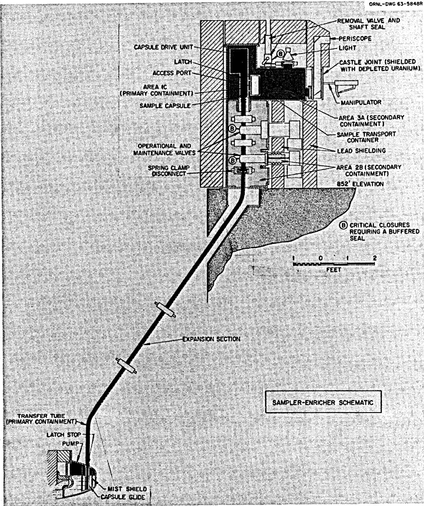  
Fig. 18.1 Component Arrangement for Sampler-Enricher

the cable, the latch onto which capsules were hung were located in primary containment area 1C which was approximately 17-1/2 feet from the pump bowl. Critical closures such as the operational and maintenance valves (motor-driven gate valves), access port to area 1C (doubly-sealed door), and the removal valve (ball valve) were buffered with helium to assure that if any sealing surfaces leaked, the leakage would be inert gas into the system. Metered quantities of helium were supplied to these seals and the leakage rates across the seals were measured by the final equilibrium buffer seal pressure. Excess seal leakage into the system or to the containment area could be detected by a decrease in buffer seal pressure and a pressure increase in the adjacent volume. To prevent the accidental opening or closure of compartment doors or valves in improper sequence during sample transfer, a system of electrical interlocks based on buffer seal pressures and mechanical signals along with a detailed check list (6A-3) (Ref. 51) was used. In general, a sample capsule, similar to that shown in Fig. 18.2, was loaded into a doubly sealed transport tube which was lowered through the removal valve into area 3A. The lower part of the transport tube containing the capsule was unscrewed and left in area 3A whereas the upper part was withdrawn above the removal valve and the valve closed. The access port to area 1C was then opened and the capsule was hung on the latch with the manipulators (the latch and latch pin were so designed that the pin could not be disengaged during sampling except in this area). The access port was closed and area 1C was first evacuated then pressurized to equal that in the pump bowl before the maintenance (MV) and operational (OV) valves were opened. The cable drive motor was actuated until the capsule was immersed in the salt in the guide cage of the pump bowl (lower part of Fig. 18.1). The sample was withdrawn 18 in. where the salt was allowed to freeze in the vertical section of unheated 1-1/2 in. Sched-40 pipe before final retrieval into area 1C. As the capsule or sample was moved from one compartment to another there were evacuation and pressurization steps which removed adsorbed oxygen during capsule insertion and removed gaseous fission products during sample removal. Capsule transfers inside the sampler were viewed with a periscope.

Enriching was accomplished by lowering an enriching capsule (Fig. 18.2) into the pump bowl and allowing the frozen salt in the capsule to melt and

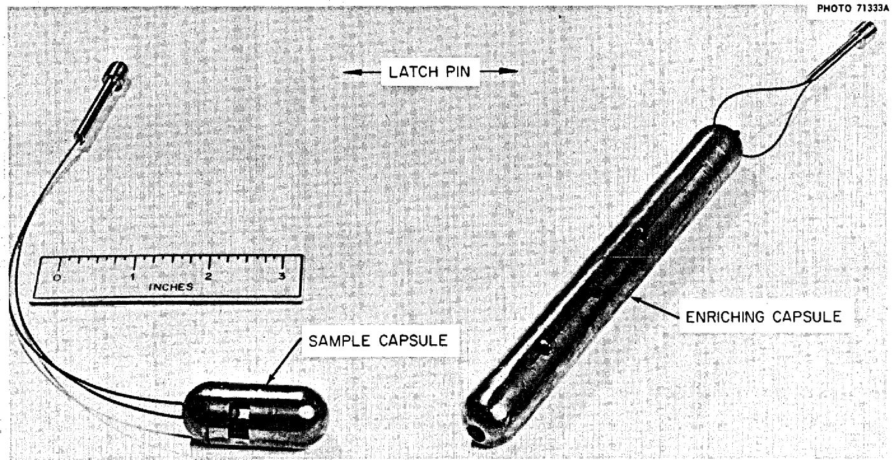  
Fig. 18.2 Sample Capsule and Enriching Capsule

be washed out before retrieval of the empty capsule (the walls of the enriching capsules were drilled through to the frozen salt in several places just prior to loading the capsule into the sampler).

The sampler-enricher was designed to make 1000 sampling or enriching cycles for a period of one year; however, the MSRE and sampler were operated for 20 runs over a period of 5 years.

18.1.2 Experience with the Fuel Sampler-Enricher During Pre-Critical and Low-Power Operation

The sampler-enricher was installed and put in operation in May 1965. Sampler testing, shakedown, and operator training sessions were conducted concurrently with the sampling and enriching operations of Run 2. During this period, 53 fuel samples were taken, 87 enrichments made, and 20 operators trained in the use of the sampler. Some of the problems encountered during this period were:

1. Buffer gas leaks at the operational (OV), maintenance (MV), and removal (RV) valves.   
2. Failure of a solenoid valve on the removal valve actuator.   
3. Failure of the removal valve to close completely requiring manual closure.   
4. Failure of the access port (AP) to close completely.   
5. Momentary failure of cable drive motor on capsule retrieval.   
6. Rupture of the flexible containment membrane (boot) at the manipulator.   
7. Deformation of the manipulator arm and fingers.   
8. Accidental drop of an empty capsule onto the operational valve. These and additional problems encountered with the subsequent 86 sampling cycles made during the approach to power runs are discussed in more detail in the following paragraphs.

Buffer Gas Leaks at the Operational and Maintenance Valves — During the sampling operations of Run 2, leaks developed through the upper metal-to-metal seats of both the operational and maintenance valves. The operational valve was subsequently removed; examination showed that a thin black ring, which was easily removed, had formed at the upper sealing surface of the valve gate and a small quantity of salt spheres (<1 gm) had

collected between the seats of the gate. Apparently salt particles were dislodged from the capsules during the operation where the capsules (after having been dipped in the pump bowl) were disengaged from the latch above the valve. When the stem and gate were lubricated, the valve sealed almost completely; however on removal of the lubricant, the buffer gas leak rate increased to 2 cc/min through the upper gate seal and remained at zero through the lower seal.

A few sampling cycles after the valve was reinstalled, the leak rate again increased to 20 cc/min through the upper seal. Apparently more salt particles had lodged between the buffer-gas sealing surfaces. Repeated efforts to blow the particles from the sealing surfaces failed. Since there were three other sealing surfaces between the pump bowl and the sample access area and since the leak did not increase with continued sampling, the valve was not replaced.

After approximately 86 additional sampling cycles, an opportunity to clean the operational valve arose when the reactor was drained to repair the cable drive motor in April 1966 (to be discussed later). Cleaning the seating surfaces decreased the leak rate for a while until an empty capsule was accidentally dropped on the gate. Subsequent valve operation again resulted in a high buffer-gas leak rate. The buffer gas seal at this surface continued to deteriorate slowly throughout the remainder of MSRE operations; the only consequence was a slow pressure buildup in the containment volume above the valve which required periodic venting. From February 1967 until final shutdown, the buffer supply pressure to this seal was used only when the sampler was in operation thereby obviating the periodic venting of area lC.

During the latter part of 1966 there had been a gradual increase in leakage of buffer gas through the upper seat of the maintenance valve also. Although the procedure specified that the maintenance valve be opened before the operational valve is opened, and that the operational valve be closed before the maintenance valve is closed, on at least one occasion the reverse sequence was followed during closure and thus foreign matter could have been dislodged from the upper valve onto the lower valve. While the leak rate remained relatively small ( $\approx$ 25 cc/min), it was sufficient to

cause difficulty with proper operation of the interlocks (an electrical signal which indicated that the valve was indeed closed was based on the ability of seating surfaces to maintain a specified buffer pressure). Since cleanup would have been difficult and replacement of the valve was not warranted by the leak rate alone, a mechanical method of assuring that the valve was closed was substituted for the pneumatic method. No additional problems with these valves were reported.

Area 1C Access Port — The access port door was operated by six clamps which relied on pneumatic operators and a spring for opening and a scheduled time-delay of these pneumatic operators for closure; however, once closed, the mechanical linkage was such that the clamps no longer require gas pressure to keep the door tightly closed. The ability of two concentric neoprene gaskets (between the access port door and housing) to contain helium at 55 psia satisfied an interlock and indicated that a gas-tight seal did indeed exist between areas 1C and 3A. On several occasions during the pre-critical run, the access port failed to close properly. Also, one or two of the six access port operators failed to open and the manipulator was used to release the sticking operators. During the shutdown following the low-power experiment, the clamps were readjusted and an extension was added to the pin of each clamp; this extension made it easier to open any clamp manually with the manipulator in the event of a pneumatic malfunction.

Flexible Containment Membranes — There are two 0.020-in. thick flexible urethane membranes (boots) which partially enclosed and provided mobility to the manipulator arm used in transferring capsules to and from the latch in area 1C and the bottom portion of the transport carrier in area 3A. A vacuum was maintained between these boots to monitor the integrity of the boots and assure that double containment did indeed exist between the sampler operator and the sample. A loss of vacuum and a pressure reduction in area 3A would indicate a leak in the outer boot whereas a loss of vacuum with no pressure change in area 3A would implicate the inner boot (atmosphere side) or possibly both boots.

There were three boot failures during the first 140 sampling cycles of Run 2. One was caused by an inadvertent evacuation of area 3A while the manipulator cover was off; the resultant pressure gradient ruptured the boot. On another occasion, the boot was snagged on the bottom piece

of the transport tube in area 3A when the manipulator was used to release a stuck access port clamp. The third failure resulted from pinching the boot between the manipulator arm and the housing.

At the end of the next run (Run 3), a pressure switch (with an alarm and interlock) was installed to detect and prevent a negative pressure gradient greater than $1/2$ psi between area 3A and the manipulator arm. Steel rings were installed in the convolutions of the inner boot to hold it free of the manipulator arm and possibly prevent the pinching-type failure.

Also to ensure that at least two barriers existed between primary containment and sampling personnel, a pressure switch was installed on the manipulator cover which required a negative pressure of 4-in. Hg in the cover before either the operational or maintenance valve could be opened.

In April 1966, the manipulator cover pressure was inadvertently evacuated to $\sim 25$ -in. Hg without lowering area 3A pressure simultaneously; the 12-psi differential caused a small puncture of the inner boot. This set of boots had been used for 48 sampling cycles since power operation was begun and the maximum power reached at that time was $2.5\mathrm{MW}$ . The radiation level of the manipulator assembly and boots was $10\mathrm{R/hr}$ at 3 inches from the fingers, but was reduced by a factor of 10 by scrubbing with soap and water. About 2 hours were required for replacement of both boots.

Deformation of the Manipulator Arm and Fingers — During Run 2, the manipulator arm and fingers were bent which caused difficulty in gripping the latch cable and moving the manipulator arm. At the end of Run 3, the arm was replaced and a $1/4 \times 1/4$ inch projection was welded to the bottom of each finger to aid in grasping the capsule cable from the floor of area 3A. The manipulator arm was replaced and the clearances between the arm and castle joint were increased to reduce the force required to operate the manipulator.

The manipulator and fingers operated satisfactorily for 421 additional sampling cycles until August 1968 at which time the manipulator assembly was replaced because the tips of the fingers no longer closed tightly. The old assembly was decontaminated and repaired. The replacement fingers operated satisfactorily until September 1969 when the double metal bellows

developed a leak. The sampler on the fuel processing system was cannibalized to make the repairs; this unit operated satisfactorily for the subsequent three months of reactor operation before shutdown.

Capsule Recovery from the Operational Valve — On one occasion during the precritical run, an empty sampling capsule was accidentally knocked into area 1C before the latch pin was completely engaged in the latch, and the capsule dropped onto the gate of the operational valve. The capsule was retrieved by removing the manipulator assembly from 3A, opening the access port, and snaring the capsule cable with a wire hook. Since this type of accident could reoccur, the brass latch pins used to attach the capsule to the latch were replaced with nickel-plated mild steel pins so that capsule recovery could then be effected with a magnet.

After approximately a month of full-power operation in July 1966, an empty capsule again was dropped onto the gate of the operational valve when the manipulator slipped during the latching operation. A magnet was lowered into the transfer line and the capsule assembly was recovered as the magnet was withdrawn. The radiation level of the magnet after the recovery operation was $10\mathrm{R / hr}$ at 2 ft.

All sampling capsules of the bucket-type assembled since the latter part of 1966 contained a nickel-plated mild steel top so that capsule recovery could be made with a magnet.

Removal Area, Valve, and Seals — During the pre-critical run, the removal seal and valve required realignment and increased tolerances before the transport container and removal tool assembly would slide through these units freely without binding. In addition, the removal valve failed to seal properly even though the ball and seals were replaced. Therefore, at the end of the next run, the valve assembly was replaced with a modified version to improve the sealing characteristics and improve future access to the valve. This unit served satisfactorily except that a buffer gas leak developed in the top teflon seal of the valve during the latter part of 1967. As a consequence of the leak, the equilibrium buffer seal pressure reached only 30-35 psia instead of the normal 50-55 psia; the associated pressure switch which permits the opening of the operational and maintenance valves and the access port was lowered from 50 to 30 and finally in December 1967 to 25 psia where it remained for the remainder of reactor operations.

Latch, Capsule, and Cable Malfunctions — Early in Run 2, the cable drive motor stalled during the withdrawal of an empty capsule. The capsule was reinserted about 12 in. and then withdrawn successfully. The reason for the malfunction was unknown. Approximately 100 sampling cycles later in December 1965, the motor stalled again while withdrawing a 10-gm sample. After repeated attempts, the capsule was withdrawn completely and the cable was examined. The capsule was empty and the cable was found to be backed up into the drive unit box and caught in the motor gears. It was assumed that the latch had hung on the gate of the operational or maintenance valve causing the cable to coil up inside area 1C. The cable was straightened, the limit switches on the operational and maintenance valves were reset to open the valves wider and the diameter of the latch was reduced.

In April 1966, after approximately a week at a power level of 5 MW, the capsule drive-unit motor stalled as the latch was being retrieved through the pipe bend near the pump bowl. After several inserts and withdrawals, the latch was retrieved. The latch and part of the cable were then pulled through the access port, the removal valve, and into the sample transport cask which provided shielding while the latch was replaced with one designed to provide an additional 1/8-inch diammetrical clearance.

Approximately 3 months later the capsule stuck again temporarily for some unexplained reason on withdrawal and no sample was obtained. Subsequent hangups with more serious consequences are discussed in Section 18.1.3.

Repair of an Open Electrical Circuit — While testing the new latch, the cable position indicator stopped when the latch was approximately two feet from the pump bowl; the upper limit switch also actuated at this time. Electrical continuity checks showed open circuits to the insert and withdraw windings of the cable drive motor and also to the upper limit switch. All these leads penetrate the containment wall through a common 8-pin receptacle. Since repair could not be made while fuel was in the reactor without violating containment, the reactor was drained. The cable and latch were then pulled into Area 3A using the manipulator to pull and the transport container and access port operators to hold the cable so that the cable could be regrasped with the manipulators for another pull. The

operational and maintenance valves were then closed. The assembly including the drive motor, cable, and latch were removed, partially decontaminated, and repaired with the use of shadow shielding techniques. (Three connector pins in one of the 8-pin receptacles were burned off.) All six similar receptacles at this location were filled with epoxy resin to provide additional insulation and strength. The cable which was bent in several places during retrieval was decontaminated with soap and water to reduce the radiation level to $5\mathrm{R / hr}$ at 3 in. before it was straightened. After reassembly and checkout, normal sampling was resumed.

Contamination of the Removal Seal — An area at the top of the sampler was provided so that the lower part of the transport carrier and capsule could be evacuated and pressurized several times to remove oxygen and moisture from the capsule and carrier before insertion into the dry box (Area 3A) of the sampler. The bottom seal for the removal area was provided by the removal valve and a seal at the top was made when the transport tube was inserted through a set of O-rings at the top of the removal volume. During sampling the shipping cask was aligned and placed over the removal area. A small amount of vacuum grease was smeared onto the lower part of the transport tube before it was lowered through the shipping cask and into the O-rings of the removal seal. When the transport tube was further lowered into Area 3A (a contaminated area) to insert an empty capsule and again to pick up the sample, the outer surfaces of the transport tube and removal tool became contaminated with solid fission products from the capsule, floor of Area 3A, and/or manipulator. Some of these particles were wiped off by the O-rings of the removal seal as the removal tool and transport tube were withdrawn from Area 3A; that remaining on the removal tool was wiped off with a damp cloth. The shipping cask was gradually contaminated as both the removal tool and transport tube were drawn into it. By this process the removal seal becomes progressively more contaminated with each sample. During pre-critical operations this transfer mechanism for particulate matter was not obvious; however, after power operations had begun and especially after the latch maintenance work, where the latch was manually retrieved from the vicinity of the pump and out through the removal area for repair, the removal area and the top of the sampler became contaminated.

The adoption of the following procedure proved effective in preventing the spread of contamination during sample removal and transport throughout the remainder of reactor operations:

(1) The top of the sampler was established as a Contamination Zone.   
(2) The removal tool was wiped with a damp cloth during withdrawal from the removal area.   
(3) The shipping cask was wiped with a damp cloth prior to enclosure in a plastic bag for shipment to the analytical laboratory.   
(4) The top of the sampler was wiped with a damp cloth after each sample.   
(5) An exhaust hood was erected near the removal area and partially enclosed the shipping cask to maintain a slightly reduced pressure in this area so that any airborne particles would be drawn into the filter and exhaust system of the building.   
(6) The removal seal area was cleaned periodically with damp wipes.

Control Circuitry Changes — During this period five changes were made to the sampler control circuits:

(1) A pressure switch was added to prevent evacuation of Area 3A to more than 10 in. of water greater than the manipulator cover area.   
(2) An interlock was added to require that both the operational and maintenance valves be closed before the access port can be opened.   
(3) A permissive switch and light were installed to indicate that the access port can be opened only when Area 1C pressure is equal to or less than Area 3A pressure.   
(4) A fuse was added to the capsule drive motor circuit to protect the motor and the electrical receptacles from excessive currents.   
(5) Voltage suppressors were placed across the two motor windings to limit any high voltage peaks during starting and stopping.

Miscellaneous Sampler-Enricher Problems — During the low-power experiment, a five-inch-long capsule with an opening near the top and capable of holding 50-g of salt was lowered into the pump bowl but failed to trap a sample because the assembly was not long enough to permit total immersion. Subsequent longer assemblies (9) obtained salt except one which was believed to have hung on the latch stop at the pump bowl and did not enter the pump. The capsules were subsequently modified to allow them to hang straight.

Most of the samples taken after the reactor exceeded 1 MW (nuclear power) were highly radioactive and exceeded 1000 R/hr at 3 in. Fission products adhering to the outside of the capsules contaminated the bottom cups of the transport containers. For a limited time disposable plastic liners inserted in the cups were effective in reducing the radiation level in the bottom portion of the transport tubes. However, as more fission products built in the fuel and the interior of the sampler became more contaminated, it was more economical to fabricate disposable bottom cups of mild steel rather than decontaminate and reuse the stainless steel cups. The new cups were shorter than the previous ones and the plastic liner was used to confine the capsule, wire, and latch pin so that the top part of the transport carrier could be more easily slipped over this combination to engage the threads and double O-ring seals at the bottom of the mild steel cups.

On one occasion while the top of the transport container was being mated with the bottom which contained a 50-g capsule, the wire on the capsule caught in the threads of the mating pieces and galled before the two pieces were sealed completely. Thereafter the liners were lengthened to accommodate the the 50-g capsules.

In July 1966, the fuel pump was accidentally overfilled with flush salt and salt was pushed up into the sampler tube approximately two feet above the fuel pump where it froze and thus prevented the capsule and latch from being lowered into the pump bowl. The salt was melted and allowed to drain back into the pump by energizing a set of remotely-placed heaters around the sampler tube and the normal heaters surrounding the pump bowl. Normal sampling was subsequently resumed.

Contamination of the area surrounding the sampler was minimized during maintenance by designating the area surrounding the sampler a Contamination Control Zone and at times by erecting a plastic tent around the sampler. Repair work was done inside the zone with appropriate protective clothing, gloves, and shoe scuffs. Contamination was found outside the zone twice and on both occasions it was attributed to contaminated shoes which indicates that this type of contamination is not readily airborne.

# 18.1.3 Subsequent Operating Experience with the Sampler-Enricher

The major sampler problems encountered during the remainder of operations were caused by the latch and/or capsule lodging at the entrance to the sampler tube or at one of the isolation valves immediately below Area 1C with subsequent unreeling and tangling of the cable in Area 1C and in the gears of the drive unit.

Ruptures or pin-hole leaks in the boots enclosing the manipulator arm were a chronic source of trouble requiring periodic replacement. Life of the boots varied widely but averaged 44 sample cycles before failure. The cause of most of these leaks was undetermined because the boots could not be examined easily due to the high radiation level of the manipulator assembly.

Gradual deterioration of the buffer gas seals at the operational, maintenance and removal valves and at the access port continued and on occasions the time required to take a sample was lengthened because a longer time interval was required for the buffer pressure to build up sufficiently to actuate the proper relay for the next step in the procedure.

Loss of Capsules in the Pump Bowl — In August 1967 during what appeared to be a normal sampling operation, the capsule and/or latch had apparently lodged at the maintenance valve while being lowered, causing the cable to coil up in Area 1C and into the motor drive area where it had become snarled and kinked. The first indication of a malfunction was during the capsule retrieval cycle when the motor stalled with 8 ft 3 in. of cable off the reel.[53] Repeated inserts and withdrawals recovered only 5 more in. of cable before the motor stalled with only an inch of travel in either direction (this had happened once before in 1965 but the cable and capsule were retrieved completely at that time).

If the capsule and cable were lodged at the sampler tube entrance below Area 1C, then the operational and maintenance valves could be closed and sampler repairs could proceed without a reactor drain; otherwise a drain would be necessary. After consideration of several possibilities, it was decided to disengage the motor drive from the operational valve and close the valve slowly with the hand wheel with the idea that if the capsule were below the valve, the cable would offer enough resistance to closure to be detected in which case the valve would be reopened and the

reactor drained before repair. No resistance was detected until the valve was practically closed. Therefore, both valves were closed and when Area1C was opened, as expected, the cable was coiled up within; however the latch, capsule, and about 6 in. of cable were missing. The reactor was then drained and grappling tools were fabricated of flexible tubing and cables which could be inserted through the sampler into the pump bowl. Four of the five tools which were most successful at grasping a dummy latch are shown in Fig. 18.3.

When the noose tool was lowered, it snared the latch but the 1/32-in. steel cable broke because the latch was apparently glued in place with salt at the latch stop. The dislodging tool was then used but apparently to no avail because a second noose grasped the latch but could not budge it with a pull of 25 lb. The pump was then heated until the latch was at a temperature of $700^{\circ}\mathrm{F}$ . It was then lifted several feet without difficulty before it lodged in the tube, apparently at the expansion joint between the fuel pump and the sampler. A corkscrew tool was next inserted but the latch again hung on retrieval, this time at the first bend near the fuel pump. The latch retrieval tool which was designed to fit over the severed cable and stem and thus prevent the cable from jamming against the wall during retrieval was successful in pulling up the cable, latch, and latch pin. The capsule apparently snapped its cable and dropped to the bottom of the sampler cage when the latch came to a sudden stop at the latch stop. The dotted outline of a capsule in Fig. 18.4 shows how a capsule, once detached from its cable, could slip out of the sampler cage and then be trapped by the mist shield in the pump bowl.

Since the capsule top is made of nickel plated mild steel, a magnet in combination with a go-gage (Fig. 18.3) was lowered into the pump bowl to verify that the sampling tube was unobstructed and to pick up the capsule. Capsule recovery was unsuccessful and since no adverse chemical or mechanical effects were envisioned should the capsule be allowed to remain in the mist shield, further retrieval attempts were abandoned.

While retrieval efforts were in progress, a replacement 1-C assembly which was on hand, was equipped with a latch made of 430 stainless steel and with a sleeve to prevent future tangling of the cable in the gears of the drive unit. However, subsequent examination of the old drive unit in

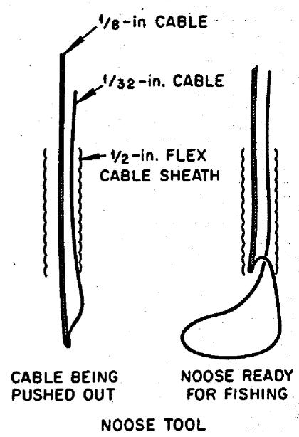

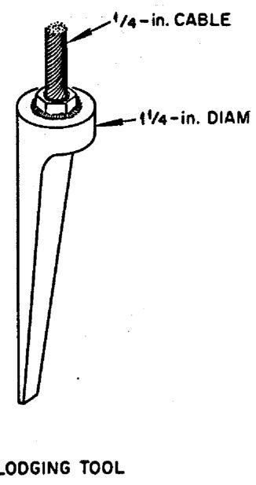  
ORNL-DWG 67-11788

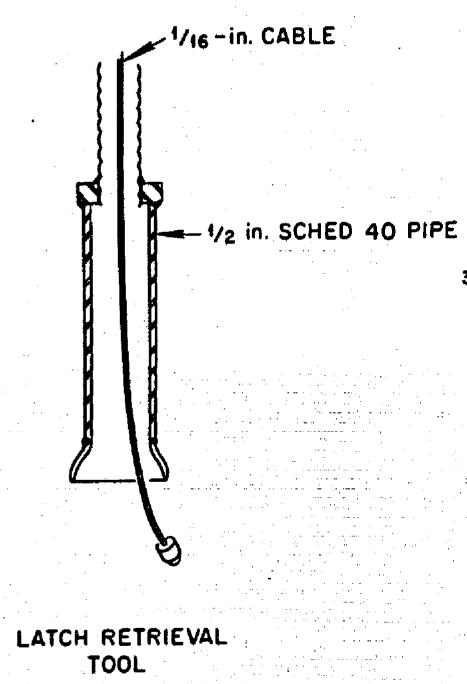

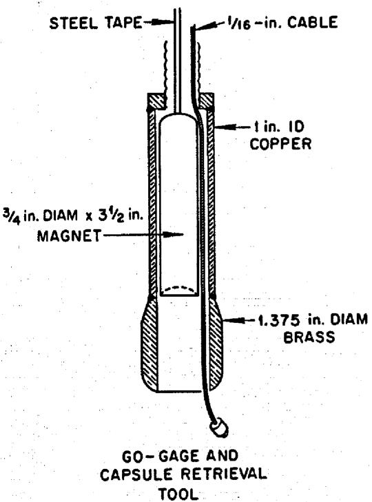  
Fig. 18.3 Tools Developed for Retrieval of Latch and Capsule from Sampler-Enricher

ORNL-DWG67-10766

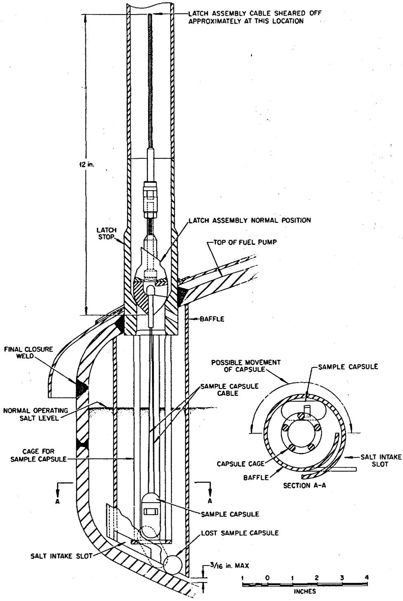  
Fig. 18.4 Location of Sampler Latch and Capsules in Fuel Pump Bowl

a hot cell revealed that the cable was not tangled in the gears as had been assumed; the failure to withdraw or insert was due to a sharp kink in the cable which became lodged in the 17/32-in. diameter channel of the latch positioner.

When normal operations and sampling were resumed, a commercially available device was tested which was capable of sensing the latch (now made of magnetic material) inside the sampler tube. A design was prepared to mount this proximity switch about 10 in. below the maintenance valve to detect the latch as it is lowered during normal sampling; however, before it could be installed, the latch again lodged in the sampler tube without detection in March 1968. The usual 17 ft 5 in. of cable was reeled off and was tangled in Area 1C. As it was rewound, the motor stalled with 13 ft 5 in. off the reel. When repeated withdrawal attempts failed, the reactor was drained and the capsule access port was opened. The capsule was visible through the lower corner of the opening and the latch could be seen in the back of the chamber with many loops and coils, some of which appeared to extend down into the sampler tube. Rather than risk cutting the cable, the isolation valves were left open; however, when an attempt was made to lift the capsule out of the chamber, the manipulator brushed some of the coils causing them to spring out through the port and pull the capsule wire from the manipulator fingers. The capsule dropped into the sampler tube and the latch tipped over, thus releasing the key; the capsule and key then disappeared down the sampler tube in what appeared to be a bottom-up position.

After several unsuccessful attempts were made to retrieve the capsule by lowering magnets of various sizes into the pump bowl, the reactor was filled with flush salt. A 50-g capsule (5 in. long with an opening 4-1/8 in. from the bottom of the capsule) was lowered into the pump but came up empty; salt droplets clinging to the outside indicated that the capsule had been only half submerged. Later a 10-g capsule did collect a sample.

In the meantime a full-scale plastic and metal mock-up of the sampler tube, mist shield, and sampler cage was constructed and used to select the best tools and magnets which could be lowered via the sampler in another attempt to retrieve the capsule.[54] The simplest and most effective tool proved to be 1/2 and $3/4$ -in. diameter Alnico-5 magnets. When the flush salt was drained and retrieval efforts resumed, sounds from a contact

microphone on the fuel pump indicated that the 1/2-in. dia. magnet lifted an object a few inches and then dropped it. After many attempts, the magnet came up with an object which later proved to be the corroded top of the old capsule. Further efforts with either magnet were unsuccessful and the second capsule was abandoned.

During this shutdown, the proximity switch was installed about 4 in. below the maintenance valve and the sampling procedure was modified to stipulate that if the switch is not actuated when the capsule position indicator shows that sufficient cable has been reeled off to reach the proximity switch, the drive will be stopped. Also a variac was added to the drive motor circuit so that the operating voltage could be changed to 80 volts to lessen the possibility of seriously kinking the cable.

During the next startup, with flush salt in the reactor, salt was trapped in a 10-g capsule but none trapped in a 50-g capsule which requires an immersion depth of 4-1/8 in. to trap a sample. However, a 30-g capsule requiring only 2-1/2 in. of immersion did trap a sample. These results agree with the measurements taken during capsule retrieval which indicated that the abandoned capsule was 1-3/4 in. above the bottom of the cage. However, with fuel in the reactor, the actual level in the pump bowl was somewhat higher than that indicated because of the high void fraction of the liquid in the pump bowl. Consequently no problems were encountered taking 50-g fuel samples throughout the remainder of operations except during the latter part of 1969 when the fuel pump speed was lowered to 980 rpm. At this speed the fuel salt void fraction is approximately equivalent to that for flush salt at normal pump speed. The failure to trap a 50-g sample under these conditions indicated that the position of the abandoned capsules had not changed after approximately one year of operation.

In October 1969, a serious cable tangling problem was averted by the use of the proximity switch. When the switch failed to actuate after 3 ft 10 in. of cable was paid out during an otherwise normal capsule insert, the cable was retrieved until the position indicator indicated that all of the cable was back on the makeup reel and the capsule was fully withdrawn into isolation chamber lC. The operational and maintenance valves were then closed and the access port was opened. The cable was indeed fully retrieved as indicated and the capsule was fully visible but was lodged

diagonally between the ledges of the doorway to the chamber. Apparently the capsule had lodged at the sampler tube entrance or at one of the isolation valves and as the cable was paid out, it somehow encircled the capsule because the capsule was lifted and relodged at a higher position (during cable retrieval) than it was at the start of the sampling procedure. The capsule was then lowered to its normal position and all subsequent cable operations proceeded without interruptions.

Wiring Fault — In November of 1967 as a sample was being withdrawn, the 0.3-amp fuse in the drive motor failed. Subsequent tests showed that the insert mode was normal at 0.2 amp but during withdrawal, the current increased to 1.0 or 1.5 amp, indicating leakage to ground. During further tests, three circuits opened, disabling the insert and withdraw circuits and the upper limit switch. After the erection of a tent and other measures to prevent the spread of contamination, a 3-in. diam hole was sawed in the cover plate of Area 3A directly above the cable penetration into the inner box (Area 1C). The failure was found where the wires were bent back against the side of the plug on the lower end of the cable between the inner (1C) and outer (3A) containment boxes. When a temporary connection indicated that everything within Area 1C was operable, the sample was retrieved and the isolation valves were closed. The damaged section was abandoned and a new cable was installed having a penetration through a 4-in. pipe cap welded over the sawed hole in the top cover.

While the pipe cap was being welded in place, a heavy current evidently went to ground through an adjacent penetration, destroying the plug and receptacle. Repairs were made by cutting out and replacing this penetration. As a result of this experience, an isolation transformer and fuse was added to each of the three drive unit cables which allows one ground without interference with operation. After the repairs, all circuits were operable except the upper limit switch which stops the drive motor when the latch reaches the latch stop. Since the motor and circuit can easily withstand blocked-rotor current, the upper limit switch was bypassed and thereafter the motor was turned off when the position indicator indicated that the latch was fully withdrawn.

Repair of Cable Drive Gear — In December 1968 during an attempt to remove a capsule from the latch, it was found that the cable could be

pulled off the reel while the drive motor was stationary. The tentative diagnosis was that one of the pair of drive gears was slipping on its shaft. In order to gain access to the drive unit, it was necessary to remove the shield blocks over the reactor cell which, in turn, required that the fuel be drained. After a temporary containment enclosure and contamination zone had been set up around the sampler, the containment box, 1C, containing the drive unit was disconnected, lifted, and a 3-in. hole sawed through the side adjacent to the gears. One gear was found to be loose because its two setscrews had come loose. The gear was repositioned and tack-welded on its shaft and the other gear was fastened with jam screws on top of its setscrews. A patch was then welded on the box and the unit reinstalled. The work was done without excessive exposure of personnel despite the high radiation levels (10 R/hr at 12 in. from the box) by use of shielding and extended tools designed especially for the job.

Since other parts of the sampler were easily accessible during this shutdown, the manipulator hand was repaired, the illuminator port and viewing window lens were replaced because of discoloration by radiation, and an imperfect seal in the removal valve was replaced.

Vacuum Pump Problems — The sampler was equipped with two vacuum pumps. Vacuum pump No. 1 was used to evacuate contaminated areas such as containment areas 1C and 3A and discharged into the auxiliary charcoal bed; vacuum pump No. 2 was used to evacuate non-contaminated areas such as the manipulator cover and the plenum between the manipulator boots and discharged into the containment air system filters and to the stack.

During the July 1966 shutdown, the oil levels in the pumps were checked and a small amount of oil was added.

In January 1969 there was an activity release to the stack (<0.08 mc) which was attributed to a gas leak around the shaft of vacuum pump No. 1. The pump was replaced because the oil seal at the shaft could not be repaired without extensive decontamination procedures. Four months later, repeated vacuum pump motor outages (due to overload) were apparently caused by low oil level. On one inspection, the pump was practically empty of oil with no evidence of external oil leaks and was consequently refilled to the proper level. On the next inspection, the pump contained approximately

2 qts more than the normal inventory. Apparently the previously lost oil drained back into the pump. High pressure (>13 psia) in Area 1C was normally vented into the auxiliary charcoal bed through a line bypassing the pump. Apparently high pressure was vented through the vacuum pump instead, thus carrying over a large portion of the oil into the holdup tank and off-gas line above the pump discharge. After the oil level was readjusted, pump operation returned to normal and the last oil check was normal.

Heated Shipping Cask — At temperatures less than $400^{\circ}\mathrm{F}$ , radiation from fission products can produce free fluorine in frozen fuel salt. To minimize fluorine production and thus avoid the effects of fluorine on the results of oxide and trivalent uranium analyses, a shipping cask was fabricated which maintained the fuel sample at approximately $500^{\circ}\mathrm{F}$ from the time it was removed from the sampler until it was unloaded at the analytical laboratory. The cask used molten babbitt both as shielding and as a heat reservoir. Built-in electric heaters melted the babbitt before the sample was loaded and the heat of fusion maintained the sample at a relatively constant temperature for about 9 hours during shipment and storage. For the elevated temperature, O-rings made of Viton A were substituted for the standard neoprene O-rings in the transport tube. In addition to the double O-ring seal provided by the transport tube, the transport tube was capped inside the cask during shipment.

All samples were unavoidably cooled to room temperature in the sampler where they were sealed in the transport tube at atmospheric pressure. When the transport tube was inserted into the heated cask, the pressure in the tube increased to approximately 10 psig because of the temperature increase. On one occasion when the cap was removed from the cask, airborne activity was released from the cask cavity into the ventilation system of the unloading station at the analytical laboratory. Subsequently the sealing surfaces of the top part of the transport tube were found to have been eroded by repeated decontamination procedures to such an extent that the double O-ring seals were ineffective. After examination of the sealing surfaces of the remaining five transport tube tops and reevaluation of the decontamination costs, it was decided to discard the reusable stainless steel transport tubes and use "throw-away" transport tubes made of mild

steel for all subsequent samples. A valve was later added to the cap of the heated cask so that any future pressure buildup in the cask cavity could be released to a charcoal filter before cap removal.

Other Capsules and Samples — The size of the capsules that could be accommodated by the sampler was limited to 0.75 inches in diameter and 6-1/4 inches in length. Approximately 1/4 inch greater diameter could be accommodated by the sampler but not by the transport tube. Four of the various types of capsules which were lowered into the pump bowl are shown in Figures 18.5a through 18.5d. The capsule in Fig. 18.5a was used to trap either salt or gas. The capsule was first evacuated and sealed with a measured amount of salt similar to the fuel. On entry into the fuel pump, the sealing salt melted and salt or gas (depending on the capsule elevation in the pump bowl just prior to salt liquefaction) was drawn into the capsule.

When the beryllium addition capsules were withdrawn, they were encrusted with solids as shown in Figure 18.5b. As a result, the capsules were difficult to load into the bottom part of the transport tubes even though the plastic liner was removed. Also the enriching capsules were sometimes difficult to load because of their length (6-1/4 in.). The cables of these long capsules were occasionally caught in the threads of the mating parts of the transport container and were difficult to unload at the hot cell.

The radiation levels of the beryllium capsules and the empty enriching capsules were more than four times higher than the standard 10-g sample when delivered to the analytical laboratory.

Miscellaneous Sampler Problems — During the latter part of 1966, a cotter key had come out of the top of the lower hinge pin on the access port door. The hinge pin had then worked out of the top of the hinge. Using only the manipulator, the pin was repositioned in the hinge, a new cotter key was inserted in the pin and the key was spread to lock it in place. During this repair, the lower key was dislodged and was also repaired.

Operation of the pneumatic clamps on the access port door occasionally resulted in gaseous fission products being vented through the operator discharge lines. Therefore a small charcoal filter was added to the operator discharge lines to prevent this activity from being discharged to

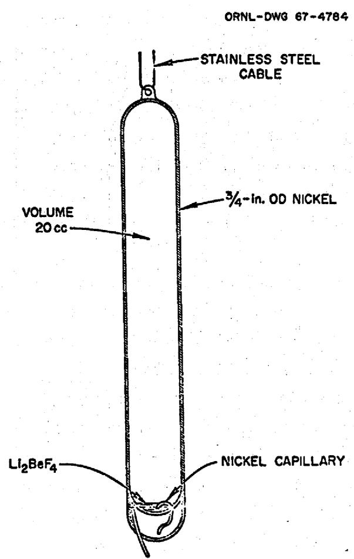  
Fig. 18.5a Freeze Valve Capsule

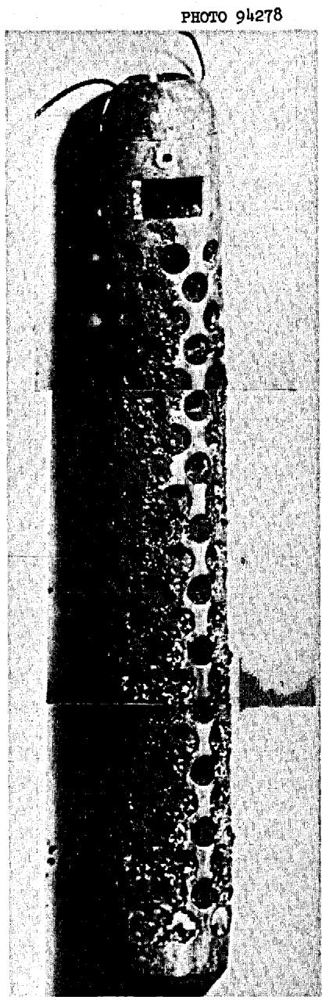  
Fig. 8.5b Nickel Cage Beryllium Rod Assembly after Exposure to MSRE Fuel Salt for 10.5 hr

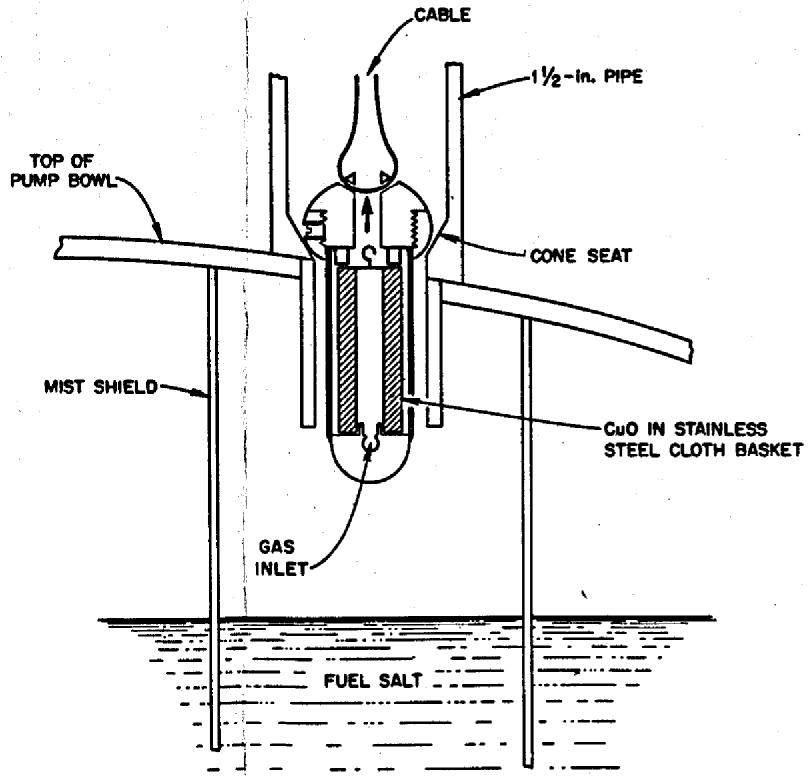  
Fig. 18.5c Hydrocarbon Analyzer

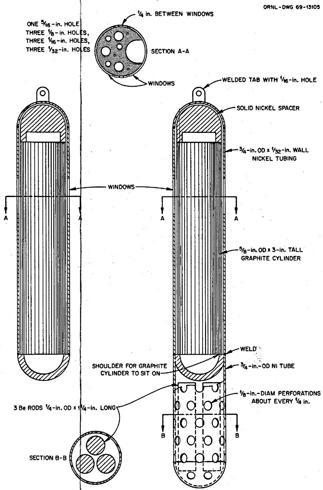  
Fig. 18.5d Surface Tension Capsule

the atmosphere via the stack. Also the vent valves from the gas operators were kept closed except during openings and closures of the access door.

The neoprene seal at the access door continued to deteriorate. In April of 1967, the increased buffer gas leakage across the inner seal was countered by lowering the buffer pressure requirement in the safety interlock system from 50 to 40 psia. In July 1967, the safety switch setting was lowered to 35 psia and the helium flow rate to the buffer seal was also increased so that a satisfactory buffer pressure could be maintained. During the intensive sampling of the last run, the access port door frequently required repositioning with the manipulators before the second set of clamps were actuated to lock the door and obtain an adequate seal.

The cause of the deterioration of this seal has not been determined. The radiation level of some of the samples taken was in excess of 1000 R/hr at 3 inches and during boot replacements when the sampler was empty, the radiation level inside Area 3A was approximately 100 R/hr. Although some long-term deterioration may be attributed to radiation damage, more likely the reduction in buffer pressure during the last two runs can be attributed to the fact that the left center Knu-vice clamp was loose and thus ineffective in its closed position.

The flexible containment membranes (boots) on the manipulator continued to be a chronic source of trouble. Generally, when a leak developed, the sampling cycle would be completed before repairs were made; however, during the remainder of the sampling cycle, containment was abetted by throttling the boot evacuation valve to assure that any leakage would be into the plenum between the boots and through the vacuum pump to the stack rather than to the work area. After full power was achieved, replacement of the boots became somewhat more involved because the manipulator assembly was quite contaminated. During a boot replacement in early 1967, the radiation level of the manipulator arm was $300\mathrm{R / hr}$ at 3 in. It was later decontaminated and saved for possible future use.

Also while sampling during early full-power operations, the radiation level at the operating area increased to approximately $30~\mathrm{mR/hr}$ . The radiation level was reduced by an order of magnitude by changing the sampling procedure so that a purge of helium from Area 1C to the pump bowl was

maintained when the operational and maintenance valves were open. Also on retrieval into Area 1C, the samples were purged for $1 - 1 / 2$ hr to the off-gass system before further removal operations were continued.

On two occasions during the routine transfer of capsules between Areas 1C and 3A, a capsule was inadvertently dropped and rolled out of sight and out of manipulator range in Area 3A. These were later found and recovered by the use of a mirror and a grappling fork which were lowered through the removal valve.

During the latter part of Run 19, routine sampling was suspended for approximately four days and the sampler was adapted to accommodate a collimator and a germanium crystal detector atop the sampler where the carrier cask is normally positioned. A plastic plug in the removal area permitted the unobstructed view into Area 3A where samples retrieved from the fuel pump were positioned. Gamma-ray spectrometry data were then collected on short-lived fuel fission products within 50 minutes of their removal from the circulating salt stream.

# 18.1.4 Discussion and Conclusions

The main operational problems encountered with the sampler-enricher resulted from 1) manipulator boot failure, 2) lodging of the capsule or latch at the sampler tube entrance, operational valve, or maintenance valve with subsequent cable tangling, and 3) buffer seal leaks at the operation and removal valves and at the capsule access door.

The cause of some of the boot failures were not determined because the leaks were small and the actions which produced the ruptures were not always coincident with the discovery of the leak. Also the boots were not examined in detail because of the high radiation level of the boots and manipulator assembly. It is believed that the boot failures which could not be attributed to any specific action occurred during the capsule loading operation where the manipulator is retracted and pushed downward and to the left in order to load the sample into the liner of the transport tube bottom. At times (almost invariably with the long capsules), the sampler operator had to resort to pulling the manipulator with both hands in order to retract it far enough to insert the capsule and latch pin into the liner. Had the capsule loading station been mounted to the left of

the manipulator centerline, it could have been located closer to Area 1C and thus require less manipulator travel. Another possible alternative would be to fabricate the boots with fewer convolutions; however, the convolution width would have to be increased to maintain the same extended length. The retracted thickness of the boots would then be decreased permitting the manipulator to be pulled back farther than previously.

Why and where the capsule or latch occasionally lodged in the sampler tube during capsule insertion has not been satisfactorily answered. However, the use of the proximity switch minimized the possibility of serious cable tangling problems. Perhaps two additional detection devices mounted above and below the operational valve would have determined the exact trouble spot.

The buffer seal leak at the access port door started to increase in January 1967 and continued to increase slowly for the remainder of MSRE operations. Perhaps some of this deterioration can be attributed to radiation damage to the neoprene gaskets. The radiation level in Area 3A was $100 - 200\mathrm{R / hr}$ during intensive sampling. Also, the access door was always in the closed position except during capsule transfer; therefore the neoprene was almost always compressed which over the years has probably caused it to yield to a thinner protrusion. In addition, the stellite plates on the access door appear to be gouged slightly by the stellite-tipped Knu-vice clamps. Also the left center clamp was discovered to be loose in its closed position during the last run. Therefore, it is believed that ordinary wear-and-tear of these components was the primary cause of seal leakage. The beating that the door took could possibly have been lessened by a flow restrictor to the clamp actuating cylinders.

The top seals of the buffered valves developed leaks whereas the bottom seals apparently suffered only slight deterioration which indicates that particulate matter which occasionally drop on the valves was the cause of seal deterioration. Consequently the volumes above these valves showed a gradual increase in pressure and required constant venting. The least desirable of these leaks was that at the removal valve. On removal of a sample, the transport tube and removal tool which are withdrawn from Area 3A are locked in position above the removal valve and the removal valve is then closed. If an appreciable delay is encountered between the

time that the valve is closed and the time that the transport tube is withdrawn from the removal seal into the shipping cask, appreciable pressure (due to seal leakage) can build up in the removal area and blow contamination out of the removal area to the top of the sampler and shipping cask when the transport tube clears the two O-rings of the removal seal. Swabbing the removal area with wet wipes on a monthly basis greatly reduced the contamination problem encountered in this area. During intensive sampling, this area should be cleaned more frequently.

The specifications for the electrical insulation on the lead wires near the penetrations at Areas 1C and 3A should be reviewed. A failure at the connector pins occurred in May 1966 resulting in open circuits in the insert and withdraw modes and in the upper limit light. During inspection of the 1C assembly which was removed in August 1967, the insulation on the lead wire was found to be very brittle and most of it was unavoidably stripped during removal of the drive unit. In November 1967 an electrical fault occurred in the same circuits as those in May 1966 except the failure occurred in the wires between the two containment boxes. It is not clear whether these failures can be attributed to radiation damage to the insulation or possibly to excess temperature caused by resistance heating in the lead wire due to blocked rotor current (0.3 amps) in combination with the heat supplied by the illuminator lamp.

To increase the precision of uranium isotopic analyses, provisions should be made to clean Area 3A periodically, especially after enrichments are made. During the enriching procedure, small quantities of enriching salt could easily adhere to the manipulator and/or be jarred loose from the capsule and fall to the floor of Area 3A where all capsules are laid temporarily while swapping capsules to and from the latch and the transport tube. A very small amount of enriched salt adhering to a sample submitted for isotopic analysis could distort the interpretation of the resulting analyses.

# 18.2 Coolant Sampler

In principle, sampling of the coolant system was the same as that for the fuel system. However, the induced activity in the coolant salt was very short-lived and there was no residual radioactivity in the sample; therefore, no shielding was required and only single containment was necessary during transport. Direct manipulation of the sample by one hand through a glove part simplified sampler construction and operation.

# 18.2.1 Description of the Coolant Sampler

The coolant salt sampler, shown in Fig. 18.6 consisted essentially of a dry box connected to the coolant pump by a transfer tube. Two ball valves isolated the sampler from the pump bowl which has a mist shield and capsule guide similar to that in the fuel pump. The $1-1/2$ in. Sched-40 transfer tube was similar to that used for the fuel system except that no expansion joint was required because the coolant pump position did not change with system temperature as did the fuel pump. The sampler was provided with lighting and viewing ports and the necessary capsule transfers inside the sampler were done with one hand through a glove port. Sliding gas seals at the top of the sample carrier along with a vacuum pump and a helium supply were used to reduce oxygen contamination to a minimum during sampling and during sample transport to the analytical laboratory.

A check-list type procedure along with a system of locks and keys for valve manipulation was used to assure proper sequence of operations. A key was used to unlock one valve, which could then be opened. When the valve was opened, it also locked the first key in position and released a second key. Removal of the second key (which must be removed to unlock the next valve in sequence) assured that the first valve was locked in the proper position.

# 18.2.2 Operating Experience with the Coolant System Sampler

The coolant salt sampler operated relatively trouble-free throughout MSRE operations. Only 81 coolant system samples were taken as opposed to 745 cycles for the fuel system.

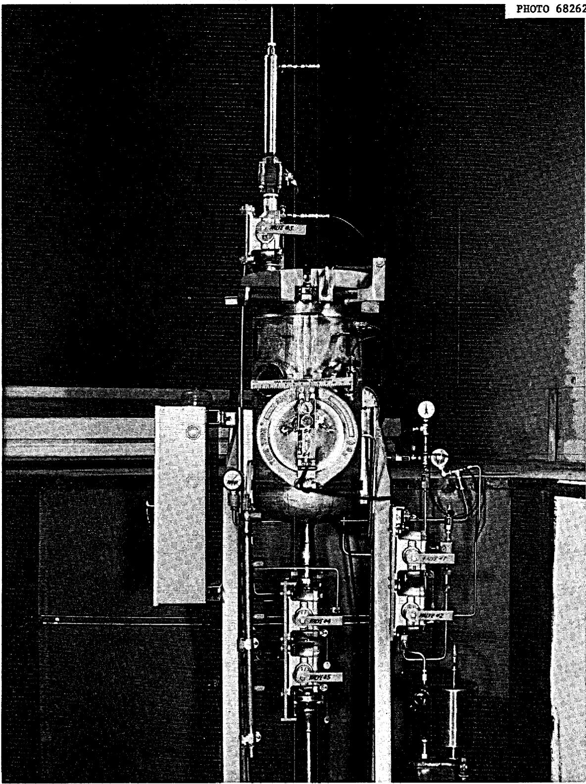  
Fig. 18.6 Coolant Salt System Sampler

Early in 1966 during one sampling operation, the latch failed to slide freely through the transfer tube. No reason for the difficulty could be found. However, the outside diameter of the latch was reduced and no similar trouble was reported.

Also in the first part of 1966, one pin in an indicator light circuit shorted out at the penetration during a sampling cycle. The receptacle was removed and a new one welded in place.

During the same period, the leak rate from the lower seal of the removal valve increased. After the valve was disassembled, cleaned, and re-assembled, the seal was satisfactory; however, after approximately eight additional samples, the seal leakage again increased and was corrected by replacing the valve seals. Also an extra washer was added to the valve to permit more mechanical pressure to be applied to the seals. Thereafter the coolant sampler operated trouble-free for the final three years of MSRE operation.

# 18.2.3 Conclusions and Recommendations

From an operational viewpoint, two improvements may be worth considering:

(1) The glove port cover should be hinged to swing out horizontally. On several occasions when the clamps were removed, the glove port covers slipped from the operator's hand and dropped freely to its stopped position. In doing so, it could have pinched a bundle of nearby insulated electrical wires.   
(2) The sample carrier should be lengthened approximately two inches to accommodate the longer capsules which were used during the last run.

# 19. CONTROL RODS

M. Richardson

# 19.1 Description

Three control rods were used in the MSRE core vessel. The rods were not exposed directly to the fuel salt but were contained in three "blind well" thimbles which were located in three of the four channels surrounding the vertical centerline of the graphite core. The thimbles were straight within the core vessel, but above the reactor access flange they were offset -- using two 16-in. radius bends to provide space for the core sample containment standpipe. A roller was located at each bend to reduce friction. The control rod drive mechanisms were vertically positioned around the standpipe. The control rods were fabricated of flexible metal hose with hollow center cylindrical poison elements (38 per rod) beaded over the lower 60 in. Rod motion was supplied by motor driven $1/4$ -in. roller chain and sprocket drive units. Included in the reverse locking power train is an overrunning clutch which permits power transmission in the insert direction only. A magnetic clutch was used to release each rod from the power train gearing and permitted free fall of the rod into the core at $\sim 0.4$ g.

Continuous indication of each rod position was provided by two synchro torque transmitter-receiver pairs, one "fine" and one "coarse." A potentiometer provided position indication for safety interlocks in the reactor fill circuits.

The upper and lower limits of rod travel were controlled by four (2 upper and 2 lower) mechanically actuated switches.

The poison elements were cooled by cell air (95% $\mathbf{N}_2$ ) from the component coolant system. This entered the upper end of the hollow control rod and exhausted radially into the thimble from a nozzle at the lower end of the rod.

Changes in pressure drop as this nozzle moved through a flow restrictor built into the bottom of the thimble provided a rod position reference point (fiducial zero). Comparison of this with the rod position as indicated by the synchro rod position instrumentation was used to monitor stretching of the rods and other malfunctions.

The rod drive units were identical as were the rods except for a slight variation in lengths of the individual rods due to the differences of the thimble offsets. This allowed interchange of components for repairs or trouble-shooting. For identification of a rod assembly, it was necessary to specify the thimble number (T-1, T-2, or T-3), the rod number (R-1, R-2, R-3, or R-4) and the drive number (V-1, V-2, V-3, or V-4). The rod assembly connected to the servo controller was considered to be the regulating rod and the other two rods were the shim rods. The rod assemblies could be used interchangeably as shims or regulating rods by shifting the out-of-cell rod drive disconnects. Any one rod was capable of taking the reactor subcritical.[24]

The rods and drive assemblies were not designed for in-cell maintenance. Repairs on the drive units were done after disassembling the rod from the drive and removing the drive unit from the reactor cell by remote maintenance methods.

The control rod shock absorbers used the general principles of a typical hydraulic shock absorber but differed in that the working "fluid" consisted of 3/32-in.-diameter steel balls. At the end of a scram, the bottom face of the shock absorber cylinder struck permanently-mounted steel blocks which were bolted to the housing. The shock absorber plunger, to which the control rod was attached, continued to move downward and was decelerated by the forces developed by the buffer springs and by the flow of the steel balls around a knob on the plunger. The stroke length of the shock absorbers were adjusted to $\sim 3.5$ inches for each rod.

# 19.2 Initial Testing

The rods were installed in the reactor vessel in January of 1965. The limit switches were adjusted to coincide with the rod position indicators on the main console and electrical continuity tests were performed on all drives prior to assembly to the control rods. Satisfactory ambient temperature performance was checked with the results given in Table 19.1.

Table 19.1 Initial Tests of Control Rod Assemblies   

<table><tr><td>Thimble No.</td><td>T-1</td><td>T-2</td><td>T-3</td><td>Spare Components</td></tr><tr><td>Rod No.</td><td>R-1</td><td>R-2</td><td>R-3</td><td>R-4</td></tr><tr><td>Drive No.</td><td>V-3</td><td>V-2</td><td>V-1</td><td>V-4</td></tr><tr><td>Motor current withdraw - amps</td><td>0.6</td><td>0.6</td><td>0.6</td><td>0.6</td></tr><tr><td>Motor current insert - amps</td><td>0.59</td><td>0.58</td><td>0.58</td><td>0.59</td></tr><tr><td>Shock stroke, inches</td><td>2.85</td><td>3.6</td><td>3.7</td><td>3.0</td></tr><tr><td>Scram time, secs</td><td>0.835</td><td>0.752</td><td>0.775</td><td>---</td></tr><tr><td>Air flow, rod - scfm</td><td>3.8</td><td>3.9</td><td>3.9</td><td>---</td></tr><tr><td>Rod travel speed, in./sec</td><td>0.53</td><td>0.53</td><td>0.53</td><td>0.52</td></tr><tr><td>Full rod travel, inches</td><td>50.91</td><td>50.95</td><td>50.95</td><td>50.9</td></tr><tr><td>Fiducial zero, inches</td><td>1.4</td><td>1.4</td><td>1.35</td><td>---</td></tr></table>

# 19.3 Periodic Testing

During reactor operation and especially after power operations commenced, it was not possible to run extensive tests on the rods. However, it was necessary to do sufficient testing to assure that the rods would scream if needed. It was also important to know that the rod position indicators were functioning properly as these were used in making reactivity balances. To accomplish this and to aid in anticipating necessary maintenance, the following periodic tests were made.

A. Rod Scrams — Scram tests were routinely conducted to determine rod scram times before a fuel fill and before critical operation. Each rod was withdrawn to a height of 50 in. The magnetic clutch current was broken by tripping the manual scram switch. The rod would free-fall to the fully-inserted position. The 50-in. drop was electronically timed from the moment of release to the lower limit switch. The maximum permissible scram time was 1.3 sec/50 in.   
B. Rod Exercise — Since rod scram tests could not be made during nuclear operation, each rod was exercised daily to demonstrate that they

would move on command and also to flex the metallic hose. The flexible hoses tended to stiffen with time if allowed to remain in one position for prolonged periods. Observation by the reactor operator of the rod-position indicators during the exercise ascertained that the synchros were working properly and that the rods operated freely in the thimbles.

C. Fiducial Zero — As described above, the fiducial zero was a fixed reference position in each of the control rod thimbles which related the actual rod position to the rod position indicated by the position-indicating potentiometers. Fiducial zero tests were routinely made before a fuel fill and before critical operation.

# 19.4 Operating Experience

Except for difficulties with the rod assemblies in thimble T-1, operation was satisfactory from both an operational and maintenance standpoint. There were no unscheduled shutdowns because of a control rod failure. The testing program was adequate to allow advance maintenance planning and work was done in conjunction with maintenance in other areas at the time of a scheduled shutdown.

During over 3,000 rod scams from 50 inches (see Table 19.2) and numerous others from different elevations, there was only one time when a rod failed to scam. Except for this and one other period, the scam times were all less than the 1.3 seconds specified in the safety limits and were usually less than 1 second. The number or amount of rod movement is not known. Once positioned, there was little movement of the shim rods. The regulating rod, normally the assembly in thimble T-1, moved little at steady power until bubbles appeared in the reactor. From that point on the regulating rod moved frequently under servo control to compensate for the action of bubbles on the reactivity. Several rod jog tests were made and it is estimated that the regulating rod moved about 720 jogs per hour at 0.4 in. per jog for a total of 32,400 jogs. The total movement was about 14,000 inches.

Table 19.2 Estimated Number of 50-inch Rod Scrams   

<table><tr><td>Thimble No.</td><td>Rod No.</td><td>Drive No.</td><td>No. of Scrams</td></tr><tr><td>T-1</td><td>R-1</td><td>V-3</td><td>750</td></tr><tr><td>T-1</td><td>R-1</td><td>V-4</td><td>150</td></tr><tr><td>T-2</td><td>R-2</td><td>V-2</td><td>930</td></tr><tr><td>T-3</td><td>R-3</td><td>V-1</td><td>800</td></tr><tr><td>T-3</td><td>R-4</td><td>V-1</td><td>430</td></tr><tr><td></td><td></td><td>Total</td><td>3060</td></tr></table>

The estimated life of the control rod motors was 10,000 hours at a reactor power of 10 MW (Ref. 49). The condition of all drive motors, lubrication, wiring, and gears remained satisfactory throughout the entire operation. These were last inspected in July 1969 at which time the reactor had accumulated 92,805 MWhrs.

The history of the MSRE control rods and drives are best summarized in Figs. 19.1, 19.2, and 19.3. Control rods R-1 and R-2 remained in service the entire operating period in thimbles 1 and 2. Control rods R-3 and R-4 were interchanged in thimble 3 as shown in Fig. 19.3. The component failures of the drives are tabulated in Table 19.3.

Heat-up and pre-critical salt circulation commenced in January 1965 and during the early period of this operation, difficulty was encountered with the limit switches. The indications were that the switch operators were sticking or galling randomly on all three rods. Temporary repairs were made during the March and April 1965 shutdown when investigation revealed that the sliding members of the switch operators had galled causing the faulty operation.

The drives were removed from the reactor cell in July 1965 for installation of modified limit switch operators on all the units including the

I-L 1qurul u srrquessy po r o Aiostrh eTae S I·6I 3H   

<table><tr><td colspan="101">Installation temperature switch
Replaced limit switch operator</td><td></td><td></td><td></td><td></td><td></td><td></td><td></td><td></td><td></td><td></td><td></td><td></td><td></td><td></td><td></td><td></td><td></td><td></td><td></td><td></td><td></td><td></td><td></td><td></td><td></td><td></td><td></td><td></td><td></td><td></td><td></td><td></td><td></td><td></td><td></td><td></td><td></td><td></td><td></td><td></td><td></td><td></td><td></td><td></td><td></td><td></td><td></td><td></td><td></td><td></td><td></td><td></td><td></td><td></td><td></td><td></td><td></td><td></td><td></td><td></td><td></td><td></td><td></td><td></td><td></td><td></td><td></td><td></td><td></td><td></td><td></td><td></td><td></td><td></td><td></td><td></td><td></td><td></td><td></td><td></td><td></td><td></td><td></td><td></td><td></td><td></td><td></td><td></td><td></td><td></td><td></td><td></td><td></td><td></td><td></td><td></td><td></td><td></td><td></td><td></td><td></td><td></td><td></td><td></td><td></td><td></td><td></td><td></td><td></td><td></td><td></td><td></td><td></td><td></td><td></td><td></td><td></td><td></td><td></td><td></td><td></td><td></td><td></td><td></td><td></td><td></td><td></td><td></td><td></td><td></td><td></td><td></td></tr><tr><td colspan="92">Installed temperature switch
Replaced limit switch operator</td><td></td><td></td><td></td><td></td><td></td><td></td><td></td><td></td><td></td><td></td><td></td><td></td><td></td><td></td><td></td><td></td><td></td><td></td><td></td><td></td><td></td><td></td><td></td><td></td><td></td><td></td><td></td><td></td><td></td><td></td><td></td><td></td><td></td><td></td><td></td><td></td><td></td><td></td><td></td><td></td><td></td><td></td><td></td><td></td><td></td><td></td><td></td><td></td><td></td><td></td><td></td><td></td><td></td><td></td><td></td><td></td><td></td><td></td><td></td><td></td><td></td><td></td><td></td><td></td><td></td><td></td><td></td><td></td><td></td><td></td><td></td><td></td><td></td><td></td><td></td><td></td><td></td><td></td><td></td><td></td><td></td><td></td><td></td><td></td><td></td><td></td><td></td><td></td><td></td><td></td><td></td><td></td><td></td><td></td><td></td><td></td><td></td><td></td><td></td><td></td><td></td><td></td><td></td><td></td><td></td><td></td><td></td><td></td><td></td><td></td><td></td><td></td><td></td><td></td><td></td><td></td><td></td><td></td><td></td><td></td><td></td><td></td><td></td><td></td><td></td><td></td><td></td><td></td><td></td><td></td><td></td><td></td><td></td><td></td><td></td><td></td><td></td><td></td><td></td><td></td><td></td></tr><tr><td colspan="100">FIDUCAL ZER0 (in.)</td><td></td><td></td><td></td><td></td><td></td><td></td><td></td><td></td><td></td><td></td><td></td><td></td><td></td><td></td><td></td><td></td><td></td><td></td><td></td><td></td><td></td><td></td><td></td><td></td><td></td><td></td><td></td><td></td><td></td><td></td><td></td><td></td><td></td><td></td><td></td><td></td><td></td><td></td><td></td><td></td><td></td><td></td><td></td><td></td><td></td><td></td><td></td><td></td><td></td><td></td><td></td><td></td><td></td><td></td><td></td><td></td><td></td><td></td><td></td><td></td><td></td><td></td><td></td><td></td><td></td><td></td><td></td><td></td><td></td><td></td><td></td><td></td><td></td><td></td><td></td><td></td><td></td><td></td><td></td><td></td><td></td><td></td><td></td><td></td><td></td><td></td><td></td><td></td><td></td><td></td><td></td><td></td><td></td><td></td><td></td><td></td><td></td><td></td><td></td><td></td><td></td><td></td><td></td><td></td><td></td><td></td><td></td><td></td><td></td><td></td><td></td><td></td><td></td><td></td><td></td><td></td><td></td><td></td><td></td><td></td><td></td><td></td><td></td><td></td><td></td><td></td><td></td><td></td><td></td><td></td><td></td><td></td><td></td></tr><tr><td>JUNE</td><td>JUNE</td><td>JUNE</td><td>JUNE</td><td>JUNE</td><td>JUNE</td><td>JUNE</td><td>JUNE</td><td>JUNE</td><td>JUNE</td><td>JUNE</td><td>JUNE</td><td>JUNE</td><td>JUNE</td><td>JUNE</td><td>JUNE</td><td>JUNE</td><td>JUNE</td><td>JUNE</td><td>JUNE</td><td>JUNE</td><td>JUNE</td><td>JUNE</td><td>JUNE</td><td>JUNE</td><td>JUNE</td><td>JUNE</td><td>JUNE</td><td>JUNE</td><td>JUNE</td><td>JUNE</td><td>JUNE</td><td>JUNE</td><td>JUNE</td><td></td><td></td><td></td><td></td><td></td><td></td><td></td><td></td><td></td><td></td><td></td><td></td><td></td><td></td><td></td><td></td><td></td><td></td><td></td><td></td><td></td><td></td><td></td><td></td><td></td><td></td><td></td><td></td><td></td><td></td><td></td><td></td><td></td><td></td><td></td><td></td><td></td><td></td><td></td><td></td><td></td><td></td><td></td><td></td><td></td><td></td><td></td><td></td><td></td><td></td><td></td><td></td><td></td><td></td><td></td><td></td><td></td><td></td><td></td><td></td><td></td><td></td><td></td><td></td><td></td><td></td><td></td><td></td><td></td><td></td><td></td><td></td><td></td><td></td><td></td><td></td><td></td><td></td><td></td><td></td><td></td><td></td><td></td><td></td><td></td><td></td><td></td><td></td><td></td><td></td><td></td><td></td><td></td><td></td><td></td><td></td><td></td><td></td><td></td><td>0000000000000000000000000000000000000000000000000000000000000000000000000000000000000000000000000000100000000000000000000000000000000000000000000000000000000000000000000000000000000000000000000000000020000000000000000000000000000000000000000000000000000000000000000000000000000000000000000000000000008981</td><td></td><td></td><td></td><td></td><td></td><td></td><td></td><td></td><td></td><td></td><td></td><td></td><td></td><td></td><td></td><td></td><td></td><td></td><td></td><td></td><td></td><td></td><td></td><td></td><td></td><td></td><td></td><td></td><td></td><td></td><td></td><td></td><td></td><td></td><td></td><td></td><td></td><td></td><td></td><td></td><td></td><td></td><td></td><td></td><td></td><td></td><td></td><td></td><td></td><td></td><td></td><td></td><td></td><td></td><td></td><td></td><td></td><td></td><td></td><td></td><td></td><td></td><td></td><td></td><td></td><td></td><td></td><td></td><td></td><td></td><td></td><td></td><td></td><td></td><td></td><td></td><td></td><td></td><td></td><td></td><td></td><td></td><td></td><td></td><td></td><td></td><td></td><td></td><td></td><td></td><td></td><td></td><td></td><td></td><td></td><td></td><td></td><td></td><td></td></tr></table>

208-CLDMD-7N40

Z-JI qurulurssy po Joo 1sH eae 261   

<table><tr><td colspan="101">FIDUCL ZERO (in.)</td><td></td><td></td><td></td><td></td><td></td><td></td><td></td><td></td><td></td><td></td><td></td><td></td><td></td><td></td><td></td><td></td><td></td><td></td><td></td><td></td><td></td><td></td><td></td><td></td><td></td><td></td><td></td><td></td><td></td><td></td><td></td><td></td><td></td><td></td><td></td><td></td><td></td><td></td><td></td><td></td><td></td><td></td><td></td><td></td><td></td><td></td><td></td><td></td><td></td><td></td><td></td><td></td><td></td><td></td><td></td><td></td><td></td><td></td><td></td><td></td><td></td><td></td><td></td><td></td><td></td><td></td><td></td><td></td><td></td><td></td><td></td><td></td><td></td><td></td><td></td><td></td><td></td><td></td><td></td><td></td><td></td><td></td><td></td><td></td><td></td><td></td><td></td><td></td><td></td><td></td><td></td><td></td><td></td><td></td><td></td><td></td><td></td><td></td><td></td><td></td><td></td><td></td><td></td><td></td><td></td><td></td><td></td><td></td><td></td><td></td><td></td><td></td><td></td><td></td><td></td><td></td><td></td><td></td><td></td><td></td><td></td><td></td><td></td><td></td><td></td><td></td><td></td><td></td><td></td><td></td><td></td><td></td><td></td><td></td><td></td><td></td><td></td><td></td><td></td><td></td><td></td><td></td><td></td><td></td><td></td><td></td><td></td><td></td><td></td><td></td><td></td><td></td><td></td><td></td><td></td><td></td><td></td><td></td><td></td><td></td><td></td><td></td><td></td><td></td><td></td><td></td><td></td><td></td><td></td><td></td><td></td><td></td><td></td><td></td><td></td><td></td><td></td><td></td><td></td><td></td><td></td><td></td><td></td><td></td><td></td><td></td><td></td><td></td><td></td><td></td><td></td><td></td><td></td><td></td><td></td><td></td><td></td><td></td><td></td><td></td><td></td><td></td><td></td><td></td><td></td><td></td><td></td><td></td><td></td><td></td><td></td><td></td><td></td><td></td><td></td><td></td><td></td><td></td><td></td><td></td><td></td><td></td><td></td><td></td><td></td><td></td><td></td><td></td><td></td><td></td><td></td><td></td><td></td><td></td><td></td><td></td><td></td><td></td><td></td><td></td><td></td></tr><tr><td colspan="100">Installated temperature switch</td><td></td><td></td><td></td><td></td><td></td><td></td><td></td><td></td><td></td><td></td><td></td><td></td><td></td><td></td><td></td><td></td><td></td><td></td><td></td><td></td><td></td><td></td><td></td><td></td><td></td><td></td><td></td><td></td><td></td><td></td><td></td><td></td><td></td><td></td><td></td><td></td><td></td><td></td><td></td><td></td><td></td><td></td><td></td><td></td><td></td><td></td><td></td><td></td><td></td><td></td><td></td><td></td><td></td><td></td><td></td><td></td><td></td><td></td><td></td><td></td><td></td><td></td><td></td><td></td><td></td><td></td><td></td><td></td><td></td><td></td><td></td><td></td><td></td><td></td><td></td><td></td><td></td><td></td><td></td><td></td><td></td><td></td><td></td><td></td><td></td><td></td><td></td><td></td><td></td><td></td><td></td><td></td><td></td><td></td><td></td><td></td><td></td><td></td><td></td><td></td><td></td><td></td><td></td><td></td><td></td><td></td><td></td><td></td><td></td><td></td><td></td><td></td><td></td><td></td><td></td><td></td><td></td><td></td><td></td><td></td><td></td><td></td><td></td><td></td><td></td><td></td><td></td><td></td><td></td><td></td><td></td><td></td><td></td><td></td><td></td><td></td><td></td><td></td><td></td><td></td><td></td><td></td><td></td><td></td><td></td><td></td><td></td><td></td><td></td><td></td><td></td><td></td><td></td><td></td><td></td><td></td><td></td><td></td><td></td><td></td><td></td><td></td><td></td><td></td><td></td><td></td><td></td><td></td><td></td><td></td><td></td><td></td><td></td><td></td><td></td><td></td><td></td><td></td><td></td><td></td><td></td><td></td><td></td><td></td><td></td><td></td><td></td><td></td><td></td><td></td><td></td><td></td><td></td><td></td><td></td><td></td><td></td><td></td><td></td><td></td><td></td><td></td><td></td><td></td><td></td><td></td><td></td><td></td><td></td><td></td><td></td><td></td><td></td><td></td><td></td><td></td><td></td><td></td><td></td><td></td><td></td><td></td><td></td><td></td><td></td><td></td><td></td><td></td><td></td><td></td><td></td><td></td><td></td><td></td><td></td><td></td><td></td><td></td><td></td><td></td><td></td><td></td></tr><tr><td colspan="100">Replaced line synchro</td><td rowspan="2">001002000100010001000100010001000100010001000100010001000100010001000100010001000100010001000100010001000100020000000000000000000000000000000000000000000000000000000000000000000000000000000000000000000000000000</td><td>001002000000000000000000000000000000000000000000000000000000000000000000000000000000000000000000000000</td><td>JULY6961</td><td>JULY6961</td><td>JULY6961</td><td>JULY6961</td><td>JULY6961</td><td>JULY6961</td><td>JULY6961</td><td>JULY6961</td><td>JULY6961</td><td>JULY6961</td><td>JULY6961</td><td>JULY6961</td><td>JULY6961</td><td>JUL5961</td><td>JUL5961</td><td>JUL5961</td><td>JUL5961</td><td>JUL5961</td><td>JUL5961</td><td>JUL5961</td><td>JUL5961</td><td>JUL5961</td><td>JUL5961</td><td>JUL5961</td><td>JUL5961</td><td>JUL5961</td><td>JUL5961</td><td>JUL5951</td><td>JUL5951</td><td>JUL5951</td><td>JUL5951</td><td>JUL5951</td><td>JUL5951</td><td>JUL5951</td><td>JUL5951</td><td>JUL5951</td><td>JUL5951</td><td>JUL5951</td><td>JUL5951</td><td>JUL5951</td><td>JUL5951</td><td>JUL5951</td><td></td><td></td><td></td><td></td><td></td><td></td><td></td><td></td><td></td><td></td><td></td><td></td><td></td><td></td><td></td><td></td><td></td><td></td><td></td><td></td><td></td><td></td><td></td><td></td><td></td><td></td><td></td><td></td><td></td><td></td><td></td><td></td><td></td><td></td><td></td><td></td><td></td><td></td><td></td><td></td><td></td><td></td><td></td><td></td><td></td><td></td><td></td><td></td><td></td><td></td><td></td><td></td><td></td><td></td><td></td><td></td><td></td><td></td><td></td><td></td><td></td><td></td><td></td><td></td><td></td><td></td><td></td><td></td><td></td><td></td><td></td><td></td><td></td><td></td><td></td><td></td><td></td><td></td><td></td><td></td><td></td><td></td><td></td><td></td><td></td><td></td><td></td><td></td><td></td><td></td><td></td><td></td><td></td><td></td><td></td><td></td><td></td><td></td><td></td><td></td><td></td><td></td><td></td><td></td><td></td><td></td><td></td><td></td><td></td><td></td><td></td><td></td><td></td><td></td><td></td><td></td><td></td><td></td><td></td><td></td><td></td><td></td><td></td><td></td><td></td><td></td><td></td><td></td><td></td><td></td><td></td><td></td><td></td><td></td><td></td><td></td><td></td><td></td><td></td><td></td><td></td><td></td><td></td><td></td><td></td><td></td><td></td><td></td><td></td><td></td><td></td><td></td><td></td><td></td><td></td><td></td><td></td><td></td><td></td><td></td><td></td><td></td><td></td><td></td><td></td><td></td><td></td><td></td><td></td><td></td><td></td><td></td><td></td><td></td><td></td><td></td><td></td><td></td><td></td><td></td><td></td><td></td><td></td><td></td><td></td><td></td><td></td><td></td><td></td><td></td><td></td><td></td><td></td><td></td><td></td><td></td><td></td><td rowspan="2"></td></tr><tr><td colspan="100">REPEATED LINE SYNCHRO</td><td></td><td></td><td></td><td></td><td></td><td></td><td></td><td></td><td></td><td></td><td></td><td></td><td></td><td></td><td></td><td></td><td></td><td></td><td></td><td></td><td></td><td></td><td></td><td></td><td></td><td></td><td></td><td></td><td></td><td></td><td></td><td></td><td></td><td></td><td></td><td></td><td></td><td></td><td></td><td></td><td></td><td></td><td></td><td></td><td></td><td></td><td></td><td></td><td></td><td></td><td></td><td></td><td></td><td></td><td></td><td></td><td></td><td></td><td></td><td></td><td></td><td></td><td></td><td></td><td></td><td></td><td></td><td></td><td></td><td></td><td></td><td></td><td></td><td></td><td></td><td></td><td></td><td></td><td></td><td></td><td></td><td></td><td></td><td></td><td></td><td></td><td></td><td></td><td></td><td></td><td></td><td></td><td></td><td></td><td></td><td></td><td></td><td></td><td></td><td>JULY6961</td><td>JULY6961</td><td>JULY6961</td><td>JULY6961</td><td>JULY6961</td><td>JULY6961</td><td>JULY6961</td><td>JULY6961</td><td>JULY6961</td><td>JULY6961</td><td>JULY6961</td><td>JULY6961</td><td>JUL7061</td><td>JUL7061</td><td>JUL7061</td><td>JUL7061</td><td>JUL7061</td><td>JUL7061</td><td>JUL7061</td><td>JUL7061</td><td>JUL7061</td><td>JUL7061</td><td>JUL7061</td><td>JUL7061</td><td>JUL7061</td><td>JUL7061</td><td>JUL706</td><td>JUL7061</td><td>JUL7061</td><td>JUL7061</td><td>JUL7061</td><td>JUL7061</td><td>JUL7061</td><td>JUL7061</td><td>JUL7061</td><td>JUL7061</td><td>JUL7061</td><td>JUL7061</td><td>JUL7061</td><td>JUL7061</td><td>JUL7061</td><td colspan="101">CERAM TIME (sec)</td></tr></table>

E09-25M0-TNHO

E-J 3quuulur sarrquessy po Jo AioiStH eonTAEs E.618   

<table><tr><td>No.3 failed to steam on demand
Repaired R-4 with R-3
Replaced potentiometer</td><td>0.95 inch time
0.89 inch time
0.79 inch time
0.69 inch time
0.68 inch time
0.67 inch time
0.66 inch time
0.65 inch time
0.64 inch time
0.63 inch time
0.62 inch time
0.61 inch time
0.60 inch time
0.59 inch time
0.58 inch time
0.57 inch time
0.56 inch time
0.55 inch time
0.54 inch time
0.53 inch time
0.52 inch time
0.51 inch time
0.50 inch time
0.49 inch time
0.48 inch time
0.47 inch time
0.46 inch time
0.45 inch time
0.44 inch time
0.43 inch time
0.42 inch time
0.41 inch time
0.40 inch time
0.39 inch time
0.38 inch time
0.37 inch time
0.36 inch time
0.35 inch time
0.34 inch time
0.33 inch time
0.32 inch time
0.31 inch time
0.30 inch time
0.29 inch time
0.28 inch time
0.27 inch time
0.26 inch time
0.25 inch time
0.24 inch time
0.23 inch time
0.22 inch time
0.21 inch time
0.20 inch time
0.19 inch time
0.18 inch time
0.17 inch time
0.16 inch time
0.15 inch time
0.14 inch time
0.13 inch time
0.12 inch time
0.11 inch time
0.10 inch time
0.10 inch time
0.10 inch time
0.10 inch time
0.10 inch time
0.10 inch time
0.10 inch time
0.10 inch time
0.10 inch time
0.10 inch time
0.10 inch time
0.10 inch time
0.10 inch time
0.10 inch time
0.10 inch时间
0.10 inch时间
0.10 inch时间
0.10 inch时间
0.10 inch时间
0.10 inch时间
0.10 inch时间
0.10 inch时间
0.10 inch时间
0.10 inch时间
0.10 inch时间
0.10 inch时间
0.10 inch时间
0.10 inch时间
0.10 inch时间
R-3 sticking in thimble-
Reduced R-3 with spare
Bent limit switch operator</td><td>50 inch steam time increase</td><td>Bent limit switch operator</td><td>FIDUGUAL ZERO (in)
000°
001°
002°
003°
004°
005°
006°
007°
008°
009°
010°
011°
012°
013°
014°
015°
016°
017°
018°
019°
020°
021°
022°
023°
024°
025°
026°
027°
028°
029°
030°
031°
032°
033°
034°
035°
036°
037°
038°
039°
040°
041°
042°
043°
044°
045°
046°
047°
048°
049°
050°
051°
052°
053°
054°
055°
056°
057°
058°
059°
060°
061°
062°
063°
064°
065°
066°
067°
068°
069°
070°
071°
072°
073°
074°
075°
076°
077°
078°
079°
080°
081°
082°
083°
084°
085°
086°
087°
088°
089°
090°
091°
092°
093°
094°
095°
096°
097°
098°
099°
100°
101°
102°
103°
104°
105°
106°
107°
108°
109°
110°
111°
112°
113°
114°
115°
116°
117°
118°
119°
120°
121°
122°
123°
124°
125°
126°
127°
128°
129°
130°
131°
132°
133°
134°
135°
136°
137°
138°
139°
140°
141°
142°
143°
144°
145°
146°
147°
148°
149°
150°
151°
152°
153°
154°
155°
156°
157°
158°
159°
160°
161°
162°
163°
164°
165°
166°
167°
168°
169°
170°
171°
172°
173°
174°
175°
176°
177°
178°
179°
180°
181°
182°
183°
184°
185°
186°
187°
188°
189°
190°
191°
192°
193°
194°
195°
196°
197°
198°
199°
200°
201°
202°
203°
204°
205°
206°
207°
208°
209°
210°
211°
212°
213°
214°
215°
216°
217°
218°
219°
220°
221°
222°
223°
224°
225°
226°
227°
228°
229°
230°
231°
232°
233°
234°
235°
236°
237°
238°
239°
240°
241°
242°
243°
244°
245°
246°
247°
248°
249°
250°
251°
252°
253°
254°
255°
256°
257°
258°
259°
260°
261°
262°
263°
264°
265°
266°
267°
268°
269°
270°
271°
272°
273°
274°
275°
276°
277°
278°
279°
280°
281°
282°
283°
284°
285°
286°
287°
288°
289°
290°
291°
292°
293°
294°
295°
296°
297°
298°
299°
300°
301°
302°
303°
304°
305°
306°
307°
308°
309°
310°
311°
312°
313°
314°
315°
316°
317°
318°
319°
320°
321°
322°
323°
324°
325°
326°
327°
328°
329°
330°
331°
332°
333°
334°
335°
336°
337°
338°
339°
340°
341°
342°
343°
344°
345°
346°
347°
348°
349°
350°
351°
352°
353°
354°
355°
356°
357°
358°
359°
360°
361°
362°
363°
364°
365°
366°
367°
368°
369°
370°
371°
372°
373°
374°
375°
376°
377°
378°
379°
380°
381°
382°
383°
384°
385°
386°
387°
388°
389°
390°
391°
392°
393°
394°
395°
396°
397°
398°
399°
400°
401°
402°
403°
404°
405°
406°
407°
408°
409°
410°
411°
412°
413°
414°
415°
416°
417°
418°
419°
420°
421°
422°
423°
424°
425°
426°
427°
428°
429°
430°
431°
432°
433°
434°
435°
436°
437°
438°
439°
440°
441°
442°
443°
444°
445°
446°
447°
448°
449°
450°
451°
452°
453°
454°
455°
456°
457°
458°
459°
460°
461°
462°
463°
464°
465°
466°
467°
468°
469°
470°
471°
472°
473°
474°
475°
476°
477°
478°
479°
480°
481°
482°
483°
484°
485°
486°
487°
488°
489°
490°
491°
492°
493°
494°
495°
496°
497°
498°
499°
500°</td></tr></table>

08-2LMO-7N0

Table 19.3 Drive Unit Component Failures   

<table><tr><td>Drive Unit No.</td><td>V-2</td><td>V-2</td><td>V-3</td><td>V-4(Spare Drive)</td><td>Total</td></tr><tr><td>Service Time as Reg. Rod</td><td>4 mo.</td><td>---</td><td>51 mo.</td><td>5 mo.</td><td></td></tr><tr><td>Service Time as Shim Rod</td><td>56 mo.</td><td>60 mo.</td><td>4 mo.</td><td>---</td><td></td></tr><tr><td>Temperature switches</td><td></td><td></td><td></td><td>-</td><td>1</td></tr><tr><td>Limit switch operator</td><td>1</td><td>1</td><td>1</td><td>1</td><td>4</td></tr><tr><td>Limit switch operator push rod</td><td>2</td><td>-</td><td>-</td><td>-</td><td>2</td></tr><tr><td>1000-R potentiometer</td><td>-</td><td>-</td><td>4</td><td>-</td><td>5</td></tr><tr><td>Fine position synchro transmitter</td><td>0</td><td>2</td><td>1</td><td>-</td><td>3</td></tr><tr><td>Coarse position synchro transmitter</td><td>1</td><td>-</td><td>-</td><td>-</td><td>1</td></tr></table>

spare (V-4). The new operators contained case-hardened bearing surfaces, there were no more difficulties of this type with the switch operators.

Examination of the control rods during this period revealed that the upper wire sheathed upper hose of the No. 3 rod was badly worn at a point 28 in. below the flange. Examination of the No. 3 thimble revealed that the upper roller, on which the control rod operates, did not rotate which caused the severe wear to the rod. The roller was replaced and a new hose installed on the No. 3 control rod.

During this period temperature switches were added to the lower drive mechanism. These small bi-metallic switches were to alarm should the temperature within the drive unit cases exceed $200^{\circ}\mathrm{F}$ . Without the downward sweep of gas through the housing, convection of the heat rising from the thimble could cause a rapid temperature increase and resultant damage to the drive assembly. After the rod drives had been reinstalled and the reactor heated and filled with salt, the switches were tested by turning off

the gas flow. Since no alarms occurred, another method of measuring the drive assembly was devised which, although not precise, was adequate for operation. This was done by shutting off the integral drive motor cooling fan and measuring the resistance of the windings of the fan motor. A slightly greater than $10\%$ increase in resistivity equaled $\sim 50^{\circ}\mathrm{F}$ change winding temperature. From the measured resistance and using the temperature coefficient of resistance of the wire, a curve was plotted relating the measured resistance to the approximate motor temperature. This value was roughly related to the drive housing temperature.

In early operation, the control-rod servo system had not functioned properly due to coasting of the regulating rod motor and shim locating motor. Brakes were installed in both of these (see 24.5).

# 19.4.1 Rod Assembly in Thimble T-1

Figure 19.1 gives the rod drop times and fiducial zero values as well as the maintenance history for the rod assemblies located in thimble T-1. This was first made up of Rod R-1 and drive unit V-3 and was used as the regulating rod, except for a four-month period, for the entire reactor operation and consequently performed the bulk of the control rod service. Other than replacement of faulty drive components, there was little difficulty with this assembly.

The 1000-R potentiometer position indicating potentiometer failed 3 times due to an open resistance coil and 1 time due to a worn resistance coil. This difficulty had been anticipated as it is a common failure for this type component in continuous service.

One temperature switch failed due to an electrical ground at the wire connections at the switch. The ground was created by bumping the switch during assembly of the drive into the case.

There was an apparent shift of 1/2-in. in the fiducial zero position in November of 1965. The change was attributed to slippage of the chain on the sprocket but examination and testing failed to reproduce the slip. The 1/2-in. deviation was recovered involuntarily in July of 1967 which would indicate that the exact cause of the shift is not known. The fiducial zero position plot in Fig. 19.1 shows the gradual increase, $\approx 1/2$ inch,

in the length of the control rod from the effects of usage. The change in length which occurred in September 1969, is the result of changing the drive unit.

The rod scram times remained at $0.8 \pm .05$ seconds from installation until the spring of 1969. In March of 1969, the scram time increased to 1.03 sec for a 50-in. drop and also during this period, there was a failure of the fine position synchro transmitter and the 1000-R pot. Analysis (see 19.5) of the rod acceleration and velocity during a scram revealed that there was an area of drag in the lower 20 in. of the scram. From the above evidence, the V-3 drive was replaced with the spare drive V-4. With drive V-4 and rod R-1 in thimble T-1 the scram time returned to $\approx 0.8$ sec until shutdown. A detailed inspection and maintenance program is planned for drive V-3 but is as yet incomplete.

# 19.4.2 Rod Assembly in Thimble T-2

As shown in Fig. 19.2, the assembly in thimble T-2 was made up of V-2 drive, R-2 rod. This assembly was used as a shim rod, except for short test periods, for the entire MSRE operation. Other than the mechanical failures shown in Fig. 19.2, there were no operating difficulties.

The mechanical failures included two fine position synchro failures and one potentiometer. Examination of one of the synchros (the radiation level of the synchro was $\sim 10\mathrm{mR/hr}$ ) revealed the failure to be the wiper arm contact between the rotating shaft and the windings.

The fiducial zero history shown in Fig. 19.2 clearly shows the progressive stretching of the rod to be $\nu l / 2$ in. from the time of installation to the end of operations.

# 19.4.3 Rod Assembly in Thimble T-3

This assembly was made up of V-1 drive and R-3 rod at the time of installation as shown in Fig. 19.3. As indicated by the scream history shown in the figure, this assembly was the most troublesome of the three MSRE control rods. The drive units were removed during the precritical maintenance period in the summer of 1965 to install the modified limit switches described elsewhere. The No. 3 control rod was inspected at this time and found to have a torn section in the upper hose, 28 in. below the flange. The damage to the rod was the result of the failure of the upper roller

in the No. 3 thimble which had jammed and would not rotate. The roller and rod were repaired and after reassembly, the rod scram time was $<0.8$ sec.

During the low power period of operation, it was found that after a full scram the lower limit switch would not clear when the rod was withdrawn. It was necessary to push the switch actuator by withdrawing the rod to the upper limit to clear the lower limit switch. It would function normally until the rod was again scrambled. The bottom end of the limit switch push rod was found to be bent below the lower retaining bushing. The rod had been bent by striking the lower housing flange as the result of a weak push rod spring. Repairs consisted of straightening the push rod and installing a stronger spring.

Later the control rod commenced to stick in the thimble at a point $\nu 1 - 1 / 2$ in. above the fiducial zero position. The rod could be freed by Jogging and would hang in no other position. Direct examination of the thimble was not possible, but the exterior of the rod was examined and appeared to be in good condition. The difficulty appeared to be that a sharp projection such as a broken weld at the throat section of the fiducial zero position existed on which the rod could snag. However, when the R-3 rod was replaced with the spare rod R-4, it did not snag.

This rod operated within limits but the scram time increased slowly from 0.85 sec in May 1967, up to 1.26 sec in December 1968. Examination of both the drive and rod revealed no apparent defects. Replacing the V-1 drive with the V-2 drive unit in the T-3 position for test purposes made little change in the scram time. Therefore a 1.5-lb weight was added to the shock absorber assembly of the original V-1 drive unit and it was reinstalled. This reduced the scram time to less than 0.9 sec.

The reactor was shut down in June 1969 by manually scrambling all the control rods. The assembly in thimble T-3 (R-4 and V-1) was at 35.0 in. and did not scram.[59] The rod was inserted 0.2 in. and scrambled again, this time the rod dropped freely. Repeated attempts to make the rod stick followed this incident but were unsuccessful. Fig. 19.4 shows the results of scram tests at 2-in. increments taken on June 2 before the rod was examined and clearly shows the area of high drag.

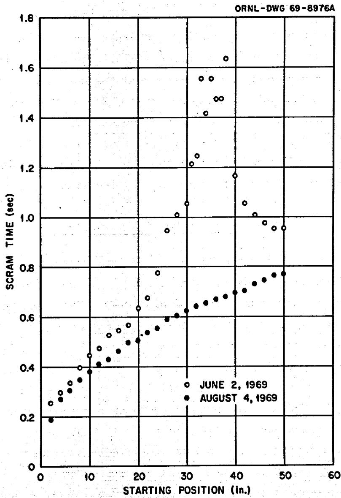  
Fig. 19.4 Incremental Rod Drop Times

To correct this difficulty, Rod R-4 was removed and replaced by Rod R-3. This was the rod which had earlier snagged in the thimble. Before reinstalling it, the air exhaust tube (a possible cause of the snagging) was filed smooth to eliminate all the sharp edges. The defective potentiometer was also replaced on the drive (V-1). The greatly improved performance of this assembly (R-4 and V-1 in T-3) suggests that the trouble was in the rod (R-4) rather than in the drive. The extreme radioactivity of rod 3 (R-3) made it impractical to examine.

Figure 19.4 also shows the results of drop tests conducted on August 4, after all repairs had been accomplished for all three control rods. This was the condition of the assemblies during the final period of operation.

# 19.5 Improved Rod Scram Testing

It was obvious from the No. 3 rod failure to scram that the method of testing each rod by a single 50-in. scram was inadequate. The method failed to expose any local areas of high drag. The incremental method of testing, scram time vs starting position, as shown in Fig. 19.4, showed no region of excessive drag for any of the rods. In an effort to provide a quick testing procedure that would not require numerous rod drops, yet would reveal regions of abnormal drag, a procedure developed for the EGCR was renovated. The output from the 1000-ohm position potentiometer was amplified and transmitted by wire to the main ORNL area, where it was passed through a filter with a 5-Hz time constant to remove transmission noise, digitized at 2000 samples/sec, and stored on magnetic tape. The data was then sent to the IBM-360 computer for smoothing and analysis by a program especially developed for this purpose. This procedure when activated during a rod drop from 50 in. gave about 1800 data points during the drop. From this velocity and acceleration curves were generated. Data taken before repair of the sticking rod assembly (R-4 and V-1 in T-3) showed a region of near zero acceleration between 26 and 40 in., in good agreement with the incremental results shown in Fig. 19.4. After reinstallation, all three assemblies were tested by both incremental drops and the single drop computer analyzed method. Both methods showed reasonably constant accelerations of 10 ft/sec² or more. A typical plot of acceleration vs position is shown in Fig. 19.5.59

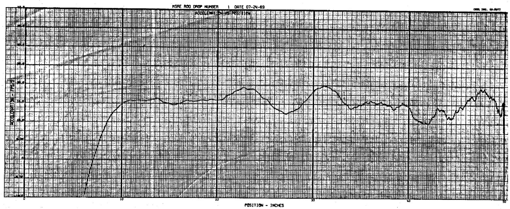  
Fig. 19.5 Rod Acceleration Curve

The signal filtering and data smoothing that are required because of the noise that is inherent in the position signal generator and transmission system made it impossible to detect with certainty a zero acceleration zone less than about six inches long if it is more than about six inches below the scram starting point.

Revised criteria were established for the monthly testing of the rods. This consisted of scrambling the rods from 40 and 50 inches. These two points were just above the normal operating positions of the regulating and shim rods. The criteria were that the 50-inch scram time must be less than 1.00 sec, the 40-in. scram time must be less than 0.90 sec, and the acceleration curves must show no area which indicates abnormal drag. If an area of high drag was noted, the rod would be dropped from a point within this area. This scram time must be no more than $20\%$ longer than normal for that point. Prior to a fuel salt fill, the rods would be scrambled from 24 inches, which is their normal position for a fill. The scram times from this point must be less than 0.7 seconds and the acceleration curve show no abnormality.[60]

# 19.6 Maintenance Experience

Repairs performed on the drive units usually consisted of a simple replacement of worn components which were readily accessible after the unit had been removed from the reactor cell. In the event of major difficulties, both a spare drive assembly and a spare control rod were available as replacement items.

It was possible to perform direct out-of-cell maintenance to the drives without excess exposure to personnel. The radiation level was about 600 mR/hr at the drive case (the drive unit was removed from its case during maintenance). The overall level of radiation at the drive mechanism was about 200 mR/hr and, as an example, the level at the fine synchro transmitter which was mounted on the gear case was about 30 mR/hr. Maintenance on the control rod itself after criticality was very limited. Activity on the upper hose was about 400 mR/hr at contact and the section containing the poison elements was 20 R/hr at 18 in. after a two-year storage period.

Since the four drive assemblies were identical and the spare parts were common to all the drives, the maintenance problems regarding replacement of faulty components was not complicated. However, investigation as to the reasons for slow scram times, even when the areas of high drag were located (see 19.5), was by trial and error method. Past experience had shown that certain areas such as the 7/16-in.-diam air tube, on which the control rod slides, could become slightly galled or bent. These areas were examined, adjusted, and the unit operated on a test stand from the main console. The final test was to reassemble the complete assembly in its normal operating position in the reactor cell and proceed with the scram tests as described elsewhere.

# 19.7 Discussion and Recommendations

The overall operation of the rods and drives was quite good. There was only one time when a rod failed to scream in the four years of use. At no time were reactor operations terminated specifically for control rod maintenance. Construction of the assemblies was relatively simple since very rapid response was not a requirement. The flexible controls rods were adequate but the possibility of binding, breakage, etc., always existed. It was possible to control the rod position closely, within 0.1 inch, from the "fine" position indicator on the console but the exact physical location of the poison elements was subject to weaknesses inherent to a semi-confined flexible metal hose of this type. The only known position was at the fiducial zero position in the thimble to which all other positions were related.

It required about 12 hours to open the reactor cell access to approach the control rod assemblies, the actual removal required about one hour. Location of the drives in a more readily accessible location is recommended.

The manner of attaching the control rods to the drives and the drive units to the thimbles was hindered by (a) poor lighting at the bolt location, (b) lack of space to insert more rigid tools to perform the bolting which was done from a distance of about 18 feet, and (c) poor visibility from the tool operator position at the maintenance shield. A modified

external, rather than internal, bolted flange attachment between the rod housing and thimble which is clearly visible is recommended.

The "fine" position cynchro transmitters and potentiometers, such as were used in these units should be of a more durable type for extended service.

20. FREEZE VALVES M. Richardson

# 20.1 Introduction

The flow of salt in the MSRE drain, fill, and process systems was controlled by freezing and thawing short plugs of salt in flattened sections of 1-1/2-inch pipe, called "freeze valves." This method of control was adopted because of a lack of a proven reliable mechanical valve. Although mechanical type valves would have had the advantage of faster action and the ability to modulate flow, the "freeze valve" concept had a good record of satisfactory performance, the freezing and thawing times were satisfactorily short, and the "off-on" type control did not impose any particular hardship.

Design and development of the MSRE freeze valves began in 1960.[50] The basic design was established and had been tested by the time the MSRE construction had begun. However, considerable effort was expended at the reactor site before the valves were ready for routine operation. Successful freeze valve operation is totally dependent on the manner in which the heat and/or coolant gas is applied and controlled. The effect of the heaters, type of service, local environment, etc., made it necessary to "tune" each of the valves for its specific location. This effort continued until criticality.

# 20.2 Description of the Design of the Freeze Valves

The valves were located in the system as shown in Fig. 20.1. All twelve valves were similar and were made of 1-1/2-in. Sched-40 INOR-8 pipe. The valve body, or flattened section, was cold-formed to make a 2-in.-long flat, $\sim$ 2-in. wide, with a 1/2-in. internal thickness or flow area. A cooling gas shroud was welded around the valve flat to direct the gas for freezing the salt. The annulus formed between the valve body and shroud was 1/2-in. The 3/4-in. gas inlet and exhaust lines were welded to the shroud. See Fig. 20.2.

A pair of thermocouples located at the center of the valve inside the air shroud, and a pair upstream and downstream just outside the air shroud

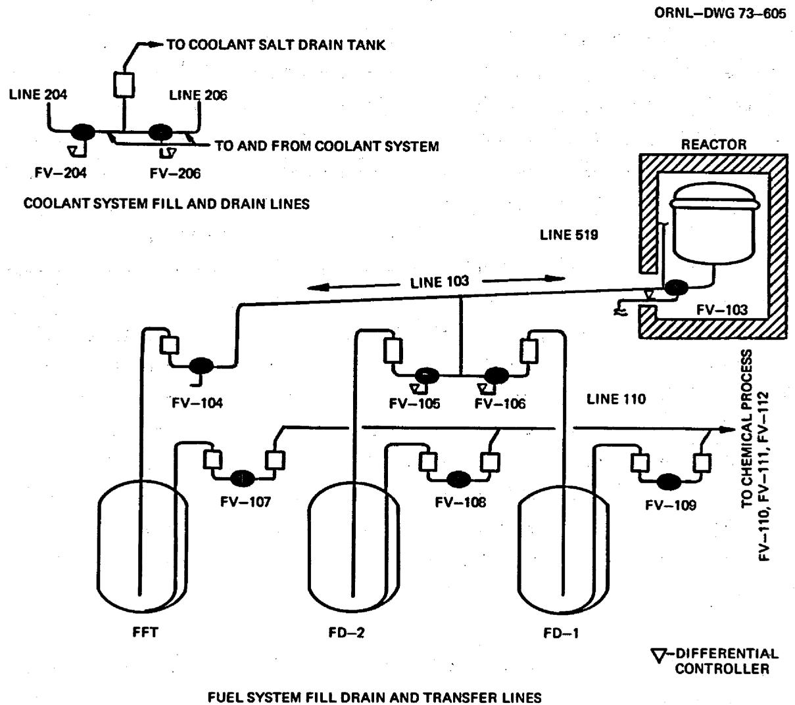  
Fig. 20.1 Location of Freeze Valves

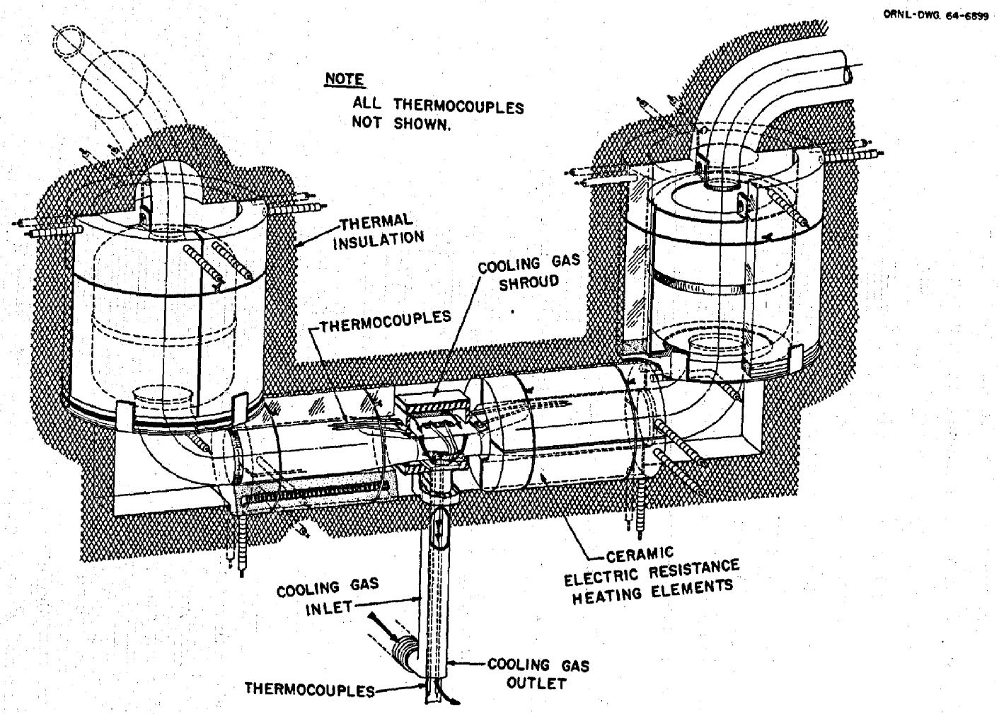  
Fig. 20.2 Typical Freeze Valve

were connected to the control modules and to the cooling air modulating controller. A single thermocouple spaced 5 in. from the valve centerline, upstream and downstream on the top side of the $1 - 1 / 2$ -in. pipe, supplied information for setting the manual heater controls. The heaters on either side of the valve were individually controlled.

The thermocouples at the valve body were connected to an Electra Systems modular control network (six modules per valve) which operated automatically at preset temperatures to maintain each valve within its specified condition. The control network of the critical valves, described below, included an automatic cooling air flow controller which maintained the valve center at a constant temperature. The ultimate control, however, remained with the modules.

# 20.3 Description of the Operation of the Freeze Valves

Valves were usually operated in one of three steady-state conditions or modes.

(1) Deep-frozen - the heaters were adjusted to maintain the valve at $400 - 500^{\circ}\mathrm{F}$ without cooling air.   
(2) Thawed - The heaters were adjusted to maintain the valve at $\sim 1200^{\circ}\mathrm{F}$ without cooling air.   
(3) Frozen - The heaters remained as in the thawed condition but the cooling gas flow was automatically adjusted to hold the frozen valve in condition for a rapid thaw.

Operation of the valve required only a hand switch (or control action) to freeze or thaw the salt. When the valve was switched to "thaw" from the "frozen" condition, the air was cut off and the heat supplied by the shoulder headers would melt the salt in the valve body. Similarly, when the valve was switched to the "frozen" from the "thawed" condition, the air was turned on and the salt in the valve body would freeze.

Each valve had three coolant gas flow conditions: off, full on (blast), or reduced flow (hold). The flow condition was determined by the temperature control modules. Although the exact module setpoints varied, for the purpose of explanation, the following conditions are used: (See 20.4.4 for FV-103 control.)

<table><tr><td>Module No.</td><td>Setting</td><td>Function</td></tr><tr><td>FV-1A1</td><td>850°F+, 800°F‡</td><td>Shoulder temperature range</td></tr><tr><td>FV-1A2</td><td>700°F‡</td><td>Low shoulder temperature</td></tr><tr><td>FV-2A1</td><td>500°F</td><td>Center temperature -- low alarm</td></tr><tr><td>FV-2A2</td><td>1300°F‡</td><td>Center temperature -- high alarm</td></tr><tr><td>FV-3A1</td><td>850°F+, 800°F‡</td><td>Shoulder temperature range</td></tr><tr><td>FV-3A2</td><td>700°F‡</td><td>Low shoulder temperature</td></tr></table>

Assume that the valve was thawed at $1200^{\circ}\mathrm{F}$ . When it was switched to freeze, the blast air ( $\sim$ 24 scfm) came on. When both valve shoulder temperatures decreased to $800^{\circ}\mathrm{F}$ , the "blast" air was cut off and the "hold" air automatically came on and held the valve shoulder temperatures between $800^{\circ}\mathrm{F}$ and $850^{\circ}\mathrm{F}$ . If the shoulder temperatures continued downward for any reason, all air was cut off at $700^{\circ}\mathrm{F}$ by modules 1A2 or 3A2. If hold air flow was insufficient and either of the shoulder temperatures exceeded $850^{\circ}\mathrm{F}$ , the blast air automatically switched on by the action of the 1Al or 3Al module and reduced the temperature to $800^{\circ}\mathrm{F}$ .

On those valves used most frequently, FV-103, 105, 106, 204, and 206, a temperature controlled differential air flow adjustment was provided for the hold air in addition to the overriding on-off module control. These controllers maintained the valve center at a constant temperature.

The normal valve condition during reactor operation with fuel salt was as follows: (See Fig. 20.1.)

(1) FV-103 was frozen but in the event of an emergency drain, it was required to thaw in less than 15 minutes.   
(2) FV-105 and FV-106 were thawed and were required to remain thawed even in the event of a power outage. In the event of an emergency fuel drain, the salt flowed to both fuel drain tanks through FV-105 and FV-106. A normal drain required freezing one of these valves prior to the drain to direct the salt to the selected receiver tank.   
(3) FV-104, and FV's 107 to 112 were deep-frozen.   
(4) FV-204 and FV-206 were frozen during coolant salt circulation. These valves were required to thaw rapidly to prevent the coolant salt from freezing in the radiator tubes.

During flush salt operation, FV-103 was frozen and FV-104 was thawed. All other valves were deep-frozen.

FV's 107 to 112 were used only during shutdown periods for salt transfers and additions. The thaw and freeze time for these valves was not important. When not in use, they were frozen or deep-frozen depending on the operation in progress.

# 20.4 Operating Experience

After the initial difficulties described below, operation of the freeze valves was quite satisfactory. Table 20.1 is a tabulation of the freeze and thaw cycles for each of the valves.

Table 20.1 Freeze Valve Freeze-Thaw Cycles   

<table><tr><td>Freeze Valve No.</td><td>No. of Cycles</td></tr><tr><td>103</td><td>91</td></tr><tr><td>104</td><td>46</td></tr><tr><td>105</td><td>97</td></tr><tr><td>106</td><td>78</td></tr><tr><td>107</td><td>36</td></tr><tr><td>108</td><td>45</td></tr><tr><td>109</td><td>53</td></tr><tr><td>110</td><td>14</td></tr><tr><td>111</td><td>10</td></tr><tr><td>112</td><td>3</td></tr><tr><td>204</td><td>57</td></tr><tr><td>206</td><td>57</td></tr></table>

The valves which were required to melt rapidly, less than 15 minutes, were timed whenever the system was drained. These valves were FV-103, FV-204, and FV-206. Periodically they were tested under complete power failure conditions to assure that the valves would melt within the maximum time allowed. The normal thaw time without power for FV-103 was 9-11 min, for FV-204 and FV-206 the normal thaw time was 12-14 minutes.

During early operation, FV-104, FV-105, and FV-106, which were required to remain thawed ( $>850^{\circ}\mathrm{F}$ ) for $\sim 30$ minutes, were also tested under the same power failure conditions. At an initial temperature of $1150^{\circ}\mathrm{F}$ , the shortest period of time required to reach the salt freezing point was 36 minutes, with no salt flowing through the pipe.

It required approximately 8 hours to bring a valve out of the deep-frozen condition $(400 - 500^{\circ}\mathrm{F})$ into the frozen condition. Heat was applied selectively during the heatup to insure that the salt was melted progressively from either end towards the center of the freeze valve. This was to avoid having molten salt trapped between two frozen plugs and possible danger of pipe rupture. The siphon pots were interlocked so that the pot-temperature was required to be greater than $950^{\circ}\mathrm{F}$ before the associated valve could be thawed.

# 20.4.1 Testing of a Frozen Valve

After a valve had been frozen, it was pressure tested to assure that a solid, leaktight frozen plug had been obtained. Early testing revealed that due to the fuel drain line geometry, it was possible to have insufficient salt remaining in the freeze valve after a drain to make up a solid plug.

Investigation, using a glass pipe model, demonstrated that after the drain line had been blown down through the head of salt in the drain tank, the salt remained in the siphon pot and would not flow back into the valve body to fill the void. After blowing down line 103, a 4 or 5 psi $\Delta P$ existed between the drain tank and reactor, when attempts were made to equalize this $\Delta P$ , the salt was forced out of the pot and past the freeze valve back into the 103 line.

The method which was used most successfully was to reduce the reactor system pressure by $\nu l / 2$ psig which usually allowed sufficient flow-back to fill the valve and make a good seal. A similar procedure worked satisfactorily for the transfer freeze valves.

# 20.4.2 Control Modules

During the initial checkout of freeze valve control circuits and subsequent operations and tests, problems were encountered in the operation of the modules which make up the Electra Systems Corporation alarm

monitor system. The setpoints drifted off the pre-set temperature trip value, double trip points occurred, and failures to respond to alarm signals were encountered.

Failures and malfunctions of the modules were traced to inferior quality components and corrosion or oxidation at the printed circuit board contacts. These faults were mostly eliminated by replacement of faulty components, gold-plating all module contacts, and minor circuit changes. The setpoints for the 72 modules were checked at least once per year thereafter. In general, the modules remained within $15\%$ of the preset values after the initial difficulties were resolved.

# 20.4.3 Heat Control to Freeze Valves

As installed, the heaters on either side of the freeze sections were on a common control. Also the heat supplied to the lower section of the siphon pots adjacent to the freeze valve heaters was marginal due to the manner of installation. Therefore, a balanced temperature gradient on either side of the freeze plug was not obtained. Since the setpoints for the shoulder temperature control modules were adjusted for a balanced heat distribution, it was difficult to maintain the valves within the module limits. Separate heater controls were added which permitted separate control of the heat to each side of the freeze plug. The heater wattage of the shoulder heaters was increased from 15 W/in² to 30 W/in². These added features relieved most of the above difficulties.

The proximity of FV-105 to FV-106 (35 inches apart) closely related the temperature effects of one valve to the other beyond the limits of good control. This could only be corrected by a change in the piping. Since this was not practical, the problem existed throughout the reactor operation. This was especially true during a salt fill from FD-1 or FD-2 since the hot salt in line 103 was $19 - 3 / 4$ in. from FV-106 or $15 - 1 / 4$ in. from FV-105.

# 20.4.4 Comments on Operation of Individual Freeze Valves

FV-103 — Since this was the main fuel salt drain freeze valve, it was required to thaw in less than 15 minutes. A coolant gas flow rate of 75 scfm was available for freezing. Heat was supplied to the valve from the ambient temperature within the reactor furnace and therefore no valve heaters were required. Operation of this valve was complicated by a dual

set of operating conditions: (1) Immediately following a reactor fill, the line-103 on the downstream side of the valve remained full of salt for a period of several hours; (2) Line-103 was then emptied of salt leaving no salt on the drain tank side. Figure 20.3 shows the temperature distribution for both conditions.

In order to meet the fast thaw requirement and still meet both above conditions, the module control points were set to function as listed below:

FV-103-1Al -- Blast air on at $1010^{\circ}\mathrm{F}$ , no hysteresis - (shoulder temperature.)

FV-103-1A2 -- Low temperature air cut off - $465^{\circ}\mathrm{F} +$ (shoulder temperature).

FV-103-2A2 -- High alarm $600^{\circ}\mathrm{F} \dagger$ "2 of 3" alarm matrix (center temperature).

FV-103-3A1 -- Blast air on at $765^{\circ}\mathrm{F} \ddagger - 719^{\circ}\mathrm{F} \ddagger$ , $50^{\circ}\mathrm{F}$ hysteresis, (shoulder temperature).

FV-103-3A2 -- Low temperature air cut off - $515^{\circ}\mathrm{F}\downarrow$ , (shoulder temperature).

The "hold air" differential air flow controller was normally set to hold the center temperature (TE-FV-103-2Al) at 375 to $400^{\circ}\mathrm{F}$ .

The temperature adjustments required for the proper valve operation resulted in only one shoulder control module being effective in each condition of the valve shown in the figure. During the initial freeze cycle, the TS-FV-103-3Al was the principal control and after the line-103 was drained of salt, the TS-FV-103-1Al was the key temperature control since there was no salt below TS-FV-103-3Al. During a thaw cycle, the 1Al temperature responded very slowly since the mass of heat (reactor vessel) was on that side of the valve. The 3Al temperature responded very rapidly since the source of heat was through the frozen plug and the ambient temperature. Selection of these temperature alarm points was carefully made after many tests.

Once the valve conditions were established, FV-103 operated well except for one unscheduled drain which occurred on April 15, 1969. This was caused by an upward $50^{\circ}\mathrm{F}$ drift of the setpoint of the FV-103-3Al module from $750^{\circ}\mathrm{F}$ to $810^{\circ}\mathrm{F}$ plus an administrative change of the FV-103-1Al set-point from $1010^{\circ}\mathrm{F}$ to $1050^{\circ}\mathrm{F}$ .

ORNL-DWG 73-806

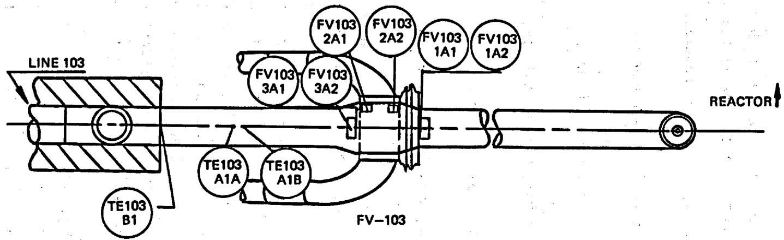

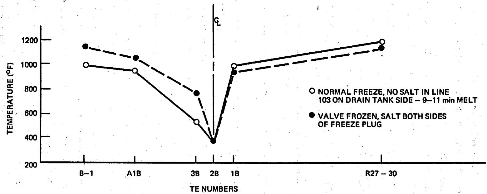  
Fig. 20.3 Temperature Distribution at FV-103

The upward drift had occurred prior to the previous freezing operation and a short plug (<2 in.) of salt was formed in the valve. The controls and freeze test indicated a good freeze. At the time of the incident, the salt temperature was not at $1210^{\circ}\mathrm{F}$ for which the controls were originally adjusted, but at $1110^{\circ}\mathrm{F}$ with the cooling gas flow controlling the valve center temperature at $420^{\circ}\mathrm{F}$ .

Figure 20.4 is a graphic history of the incident and it can be seen that, with the FV-103-1Al adjusted to $1050^{\circ}\mathrm{F}$ , there was little if any warning to the operator prior to the melt. The valve normally melted when TE-FV-103-1Al was about $1030^{\circ}\mathrm{F} - 1040^{\circ}\mathrm{F}$ when the fuel salt was at $1210^{\circ}\mathrm{F}$ at the reactor outlet. The 1Al module administrative change to $1050^{\circ}\mathrm{F}$ was based on an untested theory that the valve should be adjusted on the reactor inlet salt temperature rather than the outlet. As long as the freeze valve had a normal 2-in. freeze plug, the cooling air could be adjusted to maintain the valve within the normal operating range. In this instance, due to short plug, the valve melted as a result of changing the cooling air flow which initiated a heating cycle beyond the range of the cooling air to control. The air flow was routinely adjusted $50^{\circ}\mathrm{F}$ upward when the fuel salt was at a reduced temperature but the combination of raising the 1Al alarm point, the short plug resulting from the 3Al upward drift before the previous freeze, and raising the cooling setpoint resulted in the fuel drain.

FV-104 — This valve operated without difficulty since normally it was deep-frozen or thawed. It was sufficiently spaced away from the line-103 so as to be unaffected by a fuel drain. See Fig. 20.1.

FV's 105 and 106 — FV-105 and FV-106 were difficult to control during a fill or drain operation because of the proximity of the valves to each other and to the 103 line which was common to both freeze valves. See Fig. 20.1. Heat conduction from the hot salt passing through line-103 strongly affected that valve which was to remain frozen. In an emergency drain situation, both valves were thawed and the fuel would drain to both tanks. A scheduled drain required that one of these valves be frozen to direct the salt to the selected drain tank only. In several instances during a scheduled reactor drain the frozen valve thawed which resulted

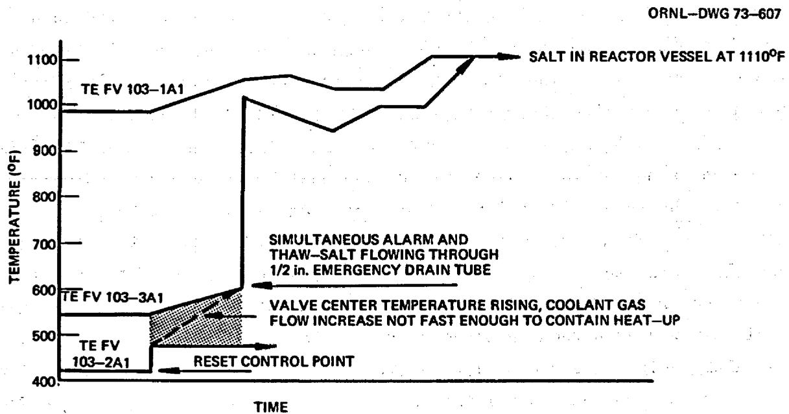  
Fig. 20.4 Temperatures During Unplanned Thaw of FV-103

in an added salt transfer operation to put all the salt into the propertank. The condition was most troublesome during a reactor fill operation, a time-consuming function at best, when the frozen valve would go into alarm and control interlocks would stop the fill or the freeze-valve thaw with the system partially filled and drain the salt to both storage tanks. By proceeding very carefully during the initial stages of the fill this condition could, and usually was, overcome by stopping the fill with the 103 line filled to above the tee and allowing the frozen valve to approach equilibrium. However, the last failure of this sort occurred as late as April 11, 1969.

A leak in the primary system became evident after the final system drain of December 12, 1969 which appears to be in the vicinity of FV-105. This is discussed in Section 5.

FV's 107 through 112 — There were no difficulties or unscheduled thaws with these transfer valves.

FV's 204 and 206 — The coolant valves have the same inherent fault as FV-105 and FV-106 of being too close to each other. Since the valves were always operated as a pair, either frozen or thawed, this did not cause any difficulty. There were no operating difficulties with these valves after criticality.

# 20.5 Recommendations

1. Freeze valves of this type should be so located by distance or separate lines so as to avoid any temperature interaction.   
2. They should be so positioned that the adjacent piping is positively full of salt. The valves can be installed in a variety of ways, vertically, inclined, etc., to insure there are no void spaces in the piping.   
3. Those valves which are not critical should be simplified by eliminating the automatic modular control feature. These valves would be less expensive, less time-consuming to adjust, and easier to control by simple manual air control.   
4. The automatic differential cooling gas controller should be considered for all critical valves. This feature greatly reduced the amount

of time required to maintain the valves within limits and reduced the post-freeze thermal cycling.

5. The shakedown period for adjustment of the valve temperature controls at the reactor was time-consuming for a variety of reasons. Initially the control modules were found to drift off setpoint and had double trip points. These difficulties were essentially, but not completely, eliminated by local redesign. There were six control modules per valve for a total of seventy-two individual modules to be maintained. Each module contains two indicating lamps, "Alarm" and "normal" which are wired in series with the control circuit. There were frequent failures of these bulbs which in turn affected the module function. Many of the operators had difficulty in understanding the functions of the modules and were at a loss as to what corrective action was to be taken when an alarm sounded. Although the Electra modular system succeeded in controlling the valves, a simpler system is recommended.   
6. Individual control should be provided for each of the heaters which affect the valve temperatures. An excess of heat is needed to overcome heat losses in the valve area. Placement of the heaters should be given careful consideration to eliminate cold spots in adjacent piping.   
7. An adequate supply of cooling gas should be available to each valve. A supply of 40-50 scfm for 1-1/2-in. pipe "blast air" cooling would be sufficient for good control.   
8. The modular control setpoints were established for normal $1210^{\circ}\mathrm{F}$ reactor operating temperature at steady state. The critical "fast thaw" valve control setpoints were adjusted for this temperature as was the control point for the automatic cooling gas control. Deviation from the normal temperature for which the control points were adjusted (within $75^{\circ}\mathrm{F}$ ) required adjustment of the cooling air flow only. This raised or lowered the valve center temperature to maintain the shoulder temperature control modules within limits. During transient conditions, such as heatup of the system, the valves were severely cycled because of a large temperature gradient between two valve shoulders on the same valve. One shoulder would be above the module alarm point and that control would turn on the blast air. The other shoulder would be below the low temperature alarm point and cut all the cooling air off. The module controls would allow the

valve to cycle back and forth across this range until the low temperature shoulder would heat enough ( $\sim 700^{\circ}\mathrm{F}$ ) to permit the differential controller to control the air flow. In practice all air was manually turned off during heatup until the valve shoulder temperatures were above $700^{\circ}\mathrm{F}$ . The valve then would remain in the frozen condition but heat much more rapidly and the thermal cycling would be greatly reduced.

# 21. FREEZE FLANGES

R. H. Guymon

# 21.1 Description

Mechanical-type joints were provided in the 5-in. salt piping inside the reactor cell to permit major components to be removed for maintenance. Figure 21.1 is a sectional view of the so-called "freeze flange" type of joint used. The design was such that the "0" ring was in a relatively cool location. A frozen salt seal protected the ring joint seating surfaces from contact with salt which could cause corrosion when the salt was exposed to moisture. Each freeze flange had six thermocouples; four were located on a 4-1/2-in. radius, $90^{\circ}$ apart, one on a 7-in. radius and one on a 10.2-in. radius.

# 21.2 Operation

It was never necessary to remove a major component and therefore one important function of the freeze flanges was never tested at the MSRE. Earlier tests on a prototype flange indicated that making and breaking these could be done remotely without appreciable difficulty.

The leak rates of the five freeze flanges during early operation are given in Table 21.1. Similar leak rates were observed throughout operation except that one of the freeze flanges (FF-201) located near the point where the coolant salt left the heat exchanger leaked more than the allowable leak rate of $1 \times 10^{-3} \, \text{cm}^3/\text{sec}$ when salt was not in the piping and the coolant system had been cooled down. This leak was measured at about 0.2 $\text{cm}^3/\text{sec}$ on August 2, 1966. The flange always became acceptably sealed when the system was heated.

Although there was some variation between individual flanges and some variation with time, the thermocouples located 4-1/2 in. from the centerline of the pipe were usually between 750 and $950^{\circ}\mathrm{F}$ . Those on 7-in. radii were about 550 to $650^{\circ}\mathrm{F}$ and those at 10.2-in. were about 450 to $550^{\circ}\mathrm{F}$ .

The thermocycle history is shown in Table 21.2. When it was decided to extend the operation of the MSRE longer than the original plans, the

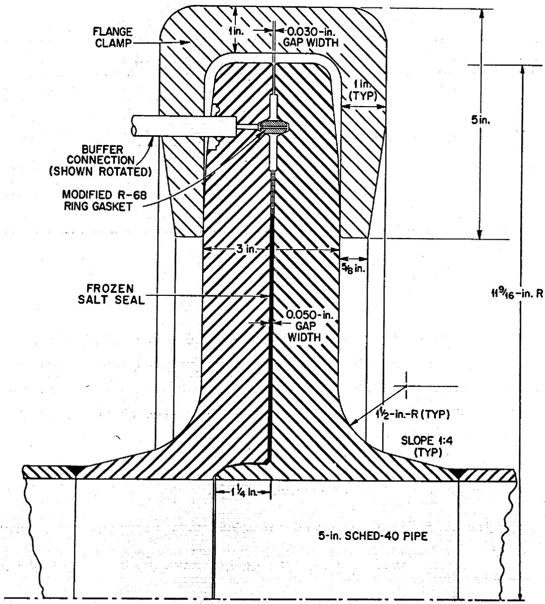  
Fig. 21.1 Freeze Flange and Clamp

Table 21.1 Observed Leak Rates of Buffer Gas from Freeze Flanges   

<table><tr><td rowspan="2">Freeze Flange</td><td colspan="5">Leakage Rate (std cm3/sec)</td></tr><tr><td>Initial Heatup</td><td>Circulating Salt</td><td>System Hot Drained After Run 1</td><td>System Cold After Run 1</td><td>System Cold After Run 3</td></tr><tr><td></td><td>x 10-3</td><td>x 10-3</td><td>x 10-3</td><td>x 10-3</td><td>x 10-3</td></tr><tr><td>100</td><td>2.0</td><td>0.57</td><td>0.7</td><td>1.5</td><td>2.0</td></tr><tr><td>101</td><td>1.3</td><td>0.4</td><td>0.25</td><td>2.26</td><td>1.2</td></tr><tr><td>102</td><td>0.5</td><td>0.3</td><td>0.30</td><td>2.33</td><td>1.0</td></tr><tr><td>200</td><td>1.0</td><td>0.21</td><td>0.41</td><td>1.48</td><td>0.3</td></tr><tr><td>201</td><td>0.6</td><td>0.22</td><td>0.21</td><td>1.23</td><td>1.8</td></tr></table>

freeze flange test loop which had cycled a prototype flange for 103 cycles was restarted. After cycle 268, examination using dye-penetrant revealed a crack in the bore in the vicinity of the weld attaching the alignment stub to the face of the flange. The crack appeared about the same after the final thermal cycle, number 540.

# 21.3 Conclusions

The freeze flanges performed satisfactorily throughout the reactor operation. The higher leak rate on FF-201 when cold caused some concern but did not require repairs.

Table 21.2. Summary of Unscheduled Scrams at MSRE with Reactor Critical   

<table><tr><td rowspan="2">Year</td><td rowspan="2">Quarter</td><td colspan="2">Operating Hours</td><td colspan="5">Number of Unscheduled Rod Screams</td></tr><tr><td>Fuel in Core</td><td>Critical</td><td>Total</td><td>Human Error</td><td>Power Failures</td><td>I &amp; C</td><td>Otherb</td></tr><tr><td rowspan="4">1966</td><td>1</td><td>672</td><td>62</td><td>4</td><td>2</td><td>0</td><td>1</td><td>1</td></tr><tr><td>2</td><td>1293</td><td>1070</td><td>13</td><td>2</td><td>3</td><td>6</td><td>2</td></tr><tr><td>3</td><td>554</td><td>413</td><td>2</td><td>0</td><td>2</td><td>0</td><td>0</td></tr><tr><td>4</td><td>1266</td><td>1221</td><td>3</td><td>1</td><td>1</td><td>1</td><td>0</td></tr><tr><td rowspan="4">1967</td><td>1</td><td>1861</td><td>1852</td><td>2</td><td>1</td><td>0</td><td>1</td><td>0</td></tr><tr><td>2</td><td>1254</td><td>1186</td><td>2</td><td>1</td><td>1</td><td>0</td><td>0</td></tr><tr><td>3</td><td>1318</td><td>1292</td><td>1</td><td>0</td><td>1</td><td>0</td><td>0</td></tr><tr><td>4</td><td>2159</td><td>2144</td><td>2</td><td>0</td><td>1</td><td>1</td><td>0</td></tr><tr><td rowspan="4">1968</td><td>1</td><td>2048</td><td>2045</td><td>0</td><td>0</td><td>0</td><td>0</td><td>0</td></tr><tr><td>2</td><td>0</td><td>0</td><td>0</td><td>0</td><td>0</td><td>0</td><td>0</td></tr><tr><td>3</td><td>88</td><td>0</td><td>0</td><td>0</td><td>0</td><td>0</td><td>0</td></tr><tr><td>4</td><td>1000</td><td>735</td><td>1</td><td>1</td><td>0</td><td>0</td><td>0</td></tr><tr><td rowspan="4">1969</td><td>1</td><td>1850</td><td>1800</td><td>2</td><td>0</td><td>0</td><td>0</td><td>0</td></tr><tr><td>2</td><td>1385</td><td>1375</td><td>3</td><td>0</td><td>1</td><td>0</td><td>2</td></tr><tr><td>3</td><td>1076</td><td>1054</td><td>2</td><td>0</td><td>0</td><td>0</td><td>2</td></tr><tr><td>4</td><td>1203</td><td>1176</td><td>0</td><td>0</td><td>0</td><td>0</td><td>0</td></tr><tr><td>Total</td><td></td><td>19027</td><td>17425</td><td>37</td><td>8</td><td>10</td><td>10</td><td>9</td></tr></table>

$a_{\text{There is no record of any unscheduled scams during 1965, when fuel was in the core for 1062 hr and the reactor was critical (at 1 kW or less) for 230 hr.}}$   
Mostly equipment faults. For example, five of the last six scams due to "other" causes occurred when the speed of the variable-frequency generator being used temporarily to drive the fuel pump sagged below a prescribed limit.

# 22. CONTAINMENT

P. H. Harley

# 22.1 Description and Criteria

Containment at the MSRE was required to be adequate to prevent the escape of multicurie amounts of radioactivity or dangerous amounts of other materials to the atmosphere. A minimum of two barriers was provided.

During operation, the primary barrier was the piping and equipment which contained or was connected to the fuel salt system and off-gas system. Block valves were installed in all the helium supply (cover gas) lines to prevent backup of activity. Primary containment extended out the off-gas lines and through the charcoal beds. The entire primary system was of all-welded construction with leak-detected flanged joints except at a few less vulnerable locations where autoclave fittings were used. Essentially zero leakage was permissible from the primary system.

The secondary containment curounded the primary containment. It consisted mainly of the reactor and drain-tank cells and appendages to them. There are $\sim 700$ penetrations for service lines into the cells. Figure 22.1 is a simplified diagram showing the various type penetrations and methods of sealing or blocking these.

Under conditions of the MCA, the secondary containment would be limited to a pressure of 39 psig by the vapor condensing (see 22.4). The cell temperature would rise to $260^{\circ}\mathrm{F}$ . Under these conditions the maximum allowable leakage rate as specified in the MSRE Safety Analysis Report55 was $1\%$ per day of the secondary containment volume.

During maintenance, the reactor was shut down and the amount of radioactivity available for the chances of its release were considerably reduced. When the primary system was opened, the cells became the primary containment with the high-bay area acting as secondary containment.

# 22.2 Methods Used to Assure Adequate Containment and Results

Most of the time the primary and secondary containment was operated well below its design capabilities. Various means were used to assure that containment would be adequate under the worst conditions.

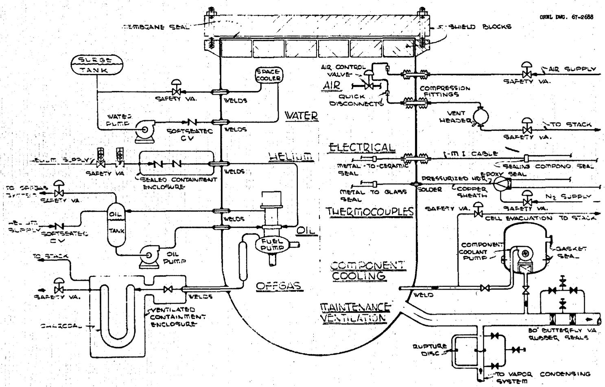  
Fig. 22.1 Schematic of MSRE Secondary Containment Showing Typical Penetration Seals and Closures

The primary system was pressure-tested annually and the cell air activity was continuously monitored as an indication that no leak had developed during operation. The secondary system leak rate was checked annually at a positive pressure and was continuously monitored at normal cell pressure $(-2\mathrm{psig})$ during operation. In addition to this, all primary and secondary system block valves were tested annually to assure acceptable leak rates.

# 22.2.1 Primary System

Radiographs, dye checks, and other inspections were carefully reviewed during construction of the primary system. All flanges had metal "0" rings which were remotely leak-detected by pressurizing the ring groove to 100 psig with helium. (See Section 14 of this report.) Although the system was opened 33 times for fuel additions, graphite sampling, and maintenance as indicated in Table 22.1, there was no leakage of any flange above the allowable $10^{-3}$ cc/min while the reactor was operating.

In 1965 before starting nuclear operation, all of the block or check valves were tested in place or removed and bench-tested. This was part of the containment (primary and secondary) check list, Section 4E of the MSRE Operating Procedures.[22] The specified maximum leak rate on the primary system valves was 1 to 2 cc/min at 20 psig. A number of valves in the helium cover-gas lines had excessive leakage. This was due to damaged "0" rings and/or they had foreign particles in them, usually metal chips from machining. After cleaning and installing new "0" rings they had no detectable leakage. After reinstallation, the lines were pressurized and the fittings or welds were checked with a helium leak detector.

These tests were repeated annually. The results are given in Table 22.2 along with results from tests of the secondary block valves which are described later.

In addition to the above, an annual strength test was run on the primary system. This was normally done by pressurizing the fuel system, including drain tanks, to 60 psig with flush salt circulating at normal operating temperature $(1200^{\circ}\mathrm{F})$ . No abnormalities were noted during any of these tests.

Table 22.1 Opening of MSRE Primary Containment Flanges   

<table><tr><td>Location</td><td>No. of Times</td><td>Primary Reasons</td></tr><tr><td>Reactor graphite sampler</td><td>6</td><td>Samples, core inspection</td></tr><tr><td>Off-gas line at fuel pump</td><td>7</td><td>Line restriction</td></tr><tr><td>Off-gas line in vent house</td><td>4</td><td>Valve, filter, particle trap</td></tr><tr><td>Fuel pump vent line</td><td>2</td><td>Plugged valve, modify leak detector</td></tr><tr><td>Overflow tank vent</td><td>2</td><td>Plugged valve, access to a lower line</td></tr><tr><td>Drain tank No. 2 vent</td><td>1</td><td>Fuel addition</td></tr><tr><td>Drain tank No. 2 access</td><td>6</td><td>Fuel addition, samples, inspection</td></tr><tr><td>Drain tank No. 1 access</td><td>1</td><td>Inspection</td></tr><tr><td>DT to FP equalizer</td><td>1</td><td>Plugged capillary</td></tr><tr><td>FP upper off-gas line</td><td>1</td><td>Test oil catch tank</td></tr><tr><td>FP rotary element</td><td>1</td><td>Remote practice, inspection</td></tr><tr><td>FP level reference</td><td>1</td><td>Restricted after overfill</td></tr><tr><td>Total</td><td>33</td><td></td></tr></table>

Table 22.2 Tests of Block Valves   

<table><tr><td rowspan="2">Type Service</td><td rowspan="2">Allowable Leak Rate At 20 psig</td><td rowspan="2">No. of Valves Tested</td><td colspan="4">Number Exceeding Allowable Leak Rate</td></tr><tr><td>1966</td><td>1967</td><td>1968</td><td>1969</td></tr><tr><td>Helium</td><td>1-2 scc/min</td><td>69</td><td>2</td><td>3</td><td>3</td><td>4</td></tr><tr><td>Water</td><td>5-10 scc/min</td><td>23</td><td>1</td><td>5</td><td>4</td><td>-</td></tr><tr><td>Air or Cell Air</td><td>3-5 cc/min</td><td>125</td><td>5</td><td>5</td><td>4</td><td>-</td></tr></table>

There were no leaks in the primary system until after the final drain. At this time a leak was indicated by an increase in cell-air activity. Subsequent investigation showed that this was in the vicinity of one of the drain freeze valves (FV-105). See Section 5 and Reference 25.

# 22.2.2 Secondary Containment

The criteria for the secondary containment was not as rigid as for the primary containment. Small leaks could be tolerated but it was still necessary to assure that containment was adequate for the worst conditions. The methods used are described below.

Only one strength test was made on the reactor and drain tank cells. This was in 1962, soon after construction of the cells was completed. The tops of the cells were closed temporarily by steel membranes and the penetration sleeves were temporarily blanked off. The cells were then hydrostatically tested separately at 48 psig (measured at the top of the cells). A leak rate acceptance test was also made in 1962. The leak rate was acceptable, however, none of the penetrations had been installed by this time.[56]

Prior to power operation, the containment block and check valves were tested in place or removed and bench-tested as described in the containment startup check list (4E of the Operating Procedures).22 The specified maximum leak rate at the test pressure of 20 psig varied according to the location of the valve but usually was set at 1 to 2 scc/min for helium cover gas (primary containment), 5 to 10 scc/min for other gases and 3 to 5 cc/min for liquids. A considerable number of leaks were found and repaired.

Leaks which occurred in the water system were mostly in the check valves. These were the result of foreign particles, apparently washed out of the system and trapped between the fixed and moving parts of the valves. Two hard-seated valves in the water system had to be replaced with soft-seated valves even though the seats were lapped in an effort to get them to seal. One was a swing check valve in a water line between the surge tank and the condensate tank. The other was a spring-loaded, hand-operated vent valve on top of the surge tank.

The instrument-air block valves with few exceptions were found to be satisfactory. There were numerous leaking tube fittings in the air lines.

Several quick disconnects on air lines inside the reactor cell and drain-tank cell were found to be leaking when checked with leak-detector solution. These did not constitute a leak in secondary containment since each line has a block valve outside the cell; but a leak here would affect the cell leak rate indication when air pressure was on the line to operate the valve.

The butterfly valves in the 30-inch line used for ventilating the cells during maintenance operations were checked by pressurizing between them. The leakage measured by a flowmeter was excessive, and the valves had to be removed from the system to determine the cause. There was considerable dirt on the rubber seats, and one was cut. These seats were cleaned and repaired. It was found that the motor drive units would slip on their mounting plates by a small amount, thus causing a slight error in the indicated position of the valve. Dowels were installed in the mounting plates to prevent this. Small leaks were also found around the pins which fasten the butterfly to the operating shaft. These leaks were repaired with epoxy resin.

The line from the thermal-shield rupture discs to the vapor-condensing systems had numerous threaded joints that leaked badly when pressurized with nitrogen. Each joint was broken, the threads were coated with epoxy resin, and the joint was remade. All joints were leaktight when rechecked with leak-detector solution.

The cell pressure was then increased in increments and extensive soap-checking and leak-hunting were done. Alternate top blocks were installed, and the cells were pressurized to 1 psig to leak-check all membrane welds with leak-detector solution. No leaks were found in the welds. With the cells at 1 psig, all penetrations, pipe joints, tube fittings, and mineral-insulated (MI) electrical cable seals subjected to this pressure were checked with leak-detector solution. Numerous leaks were found in tube fittings and MI cable seals. Many of the leaks were stopped by simply tightening the threaded parts of the seal. However, the leak rate was still about $4500\mathrm{ft}^3/\mathrm{day}$ , indicating some major leak that had not been found.

All shield blocks were installed, the cells were pressurized to 5 psig, and leak-hunting continued. Three large leaks were located. One was through the sleeve that surrounds the fuel off-gas line from the reactor cell to a ventilated pit in the vent house; the sleeve was supposed to have been welded to the line in the reactor cell but this had been overlooked. Therefore, the sleeve was closed at the vent house, where it was accessible. Another leak was in an instrument air line to an in-cell valve (HCV-523), and the third was from the vapor-condensing system to the drain-tank steam domes and out to the north electric service area through a line that was temporarily open. All penetrations, tube fittings, and MI cable seals were again checked with leak-detector solution. Many MI cable seals which had not leaked at 1 psig were found to be leaking, and some of those which had been tightened and sealed at 1 psig now leaked. Again, many of the seals were tightened. As a result, several of the gland nuts split and soldering was required. All large leaks were sealed or greatly reduced, and many of the small leaks were stopped.

Leak-hunting and repairs were continued at 10, 20, and 30 psig. The MI-cable seals as a group accounted for a large percentage of the remaining leaks. To stop small leaks which may not have been located, all MI-cable seals were coated with epoxy resin at the seals outside of the cells. This was done with the cell pressure at -1.5 psig so that the epoxy would be drawn into the seals. Teflon tape, used extensively on MI-cable seals, other threaded pipe, and tube fittings, did not perform satisfactorily in providing a gas seal.

During the 30-psig test, large leaks were located in both component-coolant-pump-dome flanges using leak-detector solution. (One of them was audible.) The inlet and outlet valves to these domes were then closed and the domes were opened for work on the gaskets. The broad, flat, Viton-rubber gaskets were found to be undamaged. The leakage was attributed to inadequate loading pressure on the broad gaskets, and after they were narrowed, no further leaks were observed.

Leak-rate data was then taken at 30, 20, 10, and -2 psig with the component-coolant-pump domes valved back into the system. These are plotted in Fig. 22.2 along with curves which relate the allowable leakage at various pressures to the allowable leakage at 39 psig (MCA pressure) for

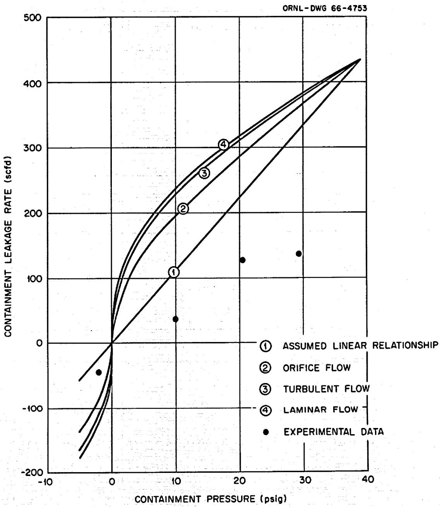  
Fig. 22.2 Secondary Containment Leak Rates

various flow regimes. Also shown is the highly conservative linear relationship which has no physical basis.

The allowable leak rates based on the orifice flow curve (the most conservative realistic curve) along with the measured leak rates during these first tests in 1965 are given in Table 22.3.

Table 22.3 Cell Leak Rates   

<table><tr><td rowspan="2">Test Pressure (psig)</td><td rowspan="2">Allowable Leak Rate (scfd)</td><td colspan="5">Observed Leak Rate (scfd)</td></tr><tr><td>1965</td><td>1966</td><td>1967</td><td>1968</td><td>1969</td></tr><tr><td>30*</td><td>360</td><td>130</td><td></td><td></td><td></td><td></td></tr><tr><td>20*</td><td>290</td><td>125</td><td></td><td>35</td><td>58</td><td>150</td></tr><tr><td>10*</td><td>195</td><td>40</td><td>65</td><td></td><td></td><td></td></tr><tr><td>-2**</td><td>-75</td><td>-20 to -50</td><td>-20 to -65</td><td>-10 to -43</td><td>-15 to -20</td><td>-23 to -30</td></tr></table>

*The instrument air block valves were closed during these tests.

The leak rates at -2 psig are those calculated for the periods following the pressure tests. The instrument air block valves were open during these periods.

Subsequent annual checks of the secondary containment consisted of: (1) testing and repairing all block valves, (2) checking the leak rate at some elevated pressure (usually 20 psig), and (3) checking the leak rate while operating with the cells at -2 psig. The number of valves found leaking during these tests are shown in Table 22.2. The measured leak rates are given in Table 22.3.

During operation of the reactor, the cells were maintained at -2 psig and the leak rate was monitored somewhat continuously. On three occasions, the reactor was shut down due to indicated high cell leak rates. Further

investigation showed that leakage would not have been excessive during an accident on any of these occasions. These are described below.

In the latter part of May 1966, a cell leak rate of 100 scf/day at -2 psig was calculated. The reactor was shut down and subsequent investigation, including a 20-psig pressure test, disclosed a high leakage rate through the thermocouple sheaths from the pressurized headers into the cells. Since no significant leakage was detected from the thermocouple headers outside the reactor cell, a flowmeter was installed in the nitrogen supply line. This flow was included in the leak-rate calculations. Prior to this time the headers had been maintained between 5 and 50 psig by periodic pressurization. To decrease the purge to a minimum, the procedures were changed to maintain the pressure at 5 psig. A containment block valve was installed in the supply line.

In November 1966, the indicated call leak rate increased to 300 scfd at -2 psig. Therefore, the reactor was drained on November 20. Leaks were found in two air supply lines and one vent line used for in-cell air-operated valves. One of the supply lines was capped since it supplied a valve which was only operated periodically. A rotameter was installed in the other supply line and the vent line was connected to the cell.

After measuring a cell leak rate of 45 scf/day during a 10-psig pressure test, Run 10 was started. Early in thy run the new rotameter in the air line indicated that the in-cell leak had increased. Rotameters were also installed on three more air lines which were found to be leaking in the cell. Later, the known leakage increased to 3500 scfd. Although the calculated cell leak rate appeared to remain at about 50 scfd, Run 10 was terminated in January 1967 because the possible error in the measured purge rates in the leaking instrument air lines exceeded the permissible leak rate.

During the shutdown, the air-line leaks were traced to quick disconnects in which neoprene seals had become embrittled. Out of 18 disconnects with elastomer seals; eight disconnects, all near the center of the reactor cell, were leaking. Seventeen of these were replaced with special adaptors sealed at one end by an aluminum gasket and at the other by a standard metal-tubing compression fitting. (One disconnect was not replaced because it was on a line that is always at cell pressure.) No similar

difficulties were encountered. After sealing the cell, the leak rate was 50 scfd.

# 22.3 Discussion of Cell Leak Rate Determinations

There were at least three ways of determining the cell leak rate. These were: (1) a material balance plus compensation for pressure and temperature using changes of the differential pressure between the cell atmosphere and an in-cell reference volume; (2) a material balance plus compensation for absolute temperature changes in the cells, and (3) an oxygen balance.

The first method was used for calculating all official leak rates at the MSRE. A discussion of each method follows.

Method 1 -- Material Balance Plus Compensation Based on the Differential Between the Cell Pressure and the Reference Volume Pressure

In order to determine the cell leak rate in a reasonable time, very accurate indication of cell pressure changes was necessary. The instrument used to determine the pressure changes was essentially a "U" tube manometer (Fig. 22.3) called a "hook gage." Pointed shafts attached to micrometers protruded through "O" ring seals in the bottom of the chamber. Readings taken by adjusting the point of the shaft until it was at the liquid surface and then reading the micrometer. Thus changes in water level corresponding to cell pressure changes could be accurately measured. The original gage had a range of 2 inches of water. A later model was obtained in which the reference chamber could be moved a measured amount which gave a range of 12 inches of water.

The changes in cell pressure were measured relative to that of an in-cell reference volume. The reference volume was distributed throughout the reactor cell and drain-tank cell in an attempt to compensate for cell temperature changes. It was found that very small leaks in the lines to the reference volume could give large errors in the leak-rate data. Welding these lines eliminated this difficulty.

Approximately $5\%$ of the contained volume was located outside of the reactor and drain-tank cells and had no temperature compensation. This

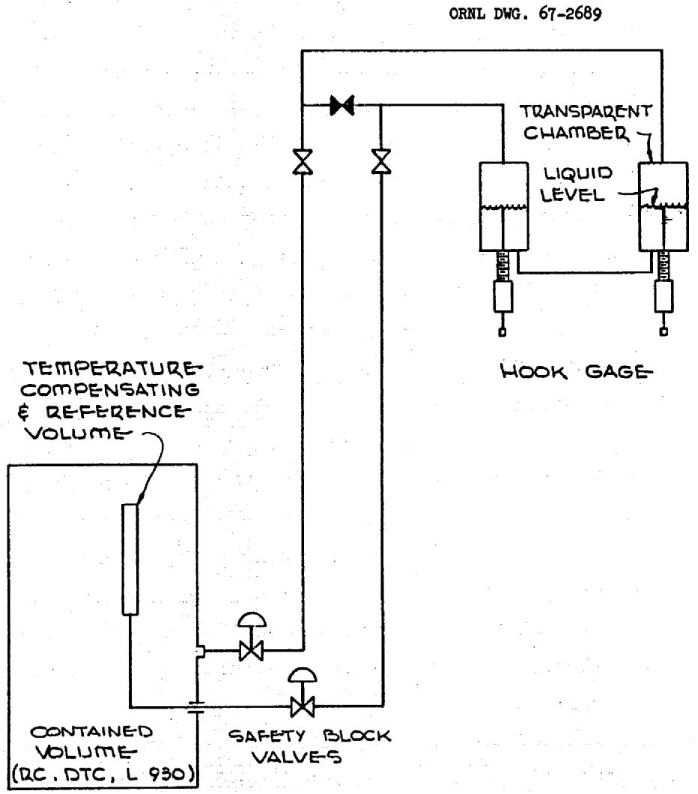  
Fig. 22.3 Schematic of Hook Gage and Piping for Determining Pressure Change of Contained Volume Relative to the Reference Volume

included the 30-inch-diameter reactor cell ventilation duct (line 930) in the coolant drain tank cell and the component-coolant-pump domes in the special equipment room. These areas were sealed off as well as possible to minimize temperature changes. At power there was still a considerable amount of air leakage past these from the main blowers which caused day-night temperature variations up to $20^{\circ}\mathrm{F}$ during winter months. The effect of these temperature fluctuations was magnified by the presence of water vapor in the cell air. (Since June 1967, there was a small continuous water leak (<1 gal/day) into the reactor cell.) This water evaporated in the cells and condensed in the cooler sections of the containment (line 930 and the component-coolant-pump gas cooler). This was periodically drained from the system. In colder weather more water would condense.

Reactor power also had an effect on the indicated cell leak rate due to cell temperature changes. When the reactor was taken from zero to full power, gamma heating in the thermal shield and other equipment in the cell caused the average cell temperature to increase 4 to $8^{\circ}\mathrm{F}$ and indicated a high cell leak rate for approximately 24 hours. These changes were not adequately compensated for by the pressure reference volume.

After the cells were closed following each in-cell maintenance period, the containment was purged with dry $\mathbb{N}_2$ to remove oxygen, so the cell gas started out dry. As the water evaporated, the initial cell leak rate was usually high (75-130 scf/day has been calculated) but gradually decreased to an equilibrium value in 5 to 7 days at which time condensate started to form and was drained from the system. During this initial period until condensate appeared, we relied on results of leak-testing at positive pressure before the cell was evacuated and purged. Due to the scatter in the data and the relatively small change in pressure or temperature that repre-sents a large leak rate, considerable time was required to obtain data from which reliable leak rate could be determined. To minimize the tem-. perature and other effects, initial and final data was usually taken at

the same time of the day and at the same operating conditions. Calculations of intervals of several days were more consistent than shorter periods. Figure 22.4 is a plot of the data used to determine the leakage rate at 30 psig in 1965.

Typical flow rates for the material balances were: 9 scfd to the sump bubblers, 13 scfd purge for the thermocouple header, and 0 to 1000 scfd evacuation flow. Since the evacuation flow was normally the largest and was changed more often, its signal was sent to the computer which integrated it and each shift typed out a value for the total volume evacuated.

Method 2 -- Using the Absolute Cell Pressures and Temperatures

This method was not used because the absolute cell pressure indication was not as accurate as the indication of differential pressure by the hook gage and compensating for temperature changes using absolute temperatures did not give as consistent results as those obtained using the reference volume.

Method 3 -- Using an Oxygen Balance

The MSRE containment was purged with $\mathbf{N}_2$ to keep the $\mathbf{O}_2$ concentration $< 5\%$ primarily to eliminate the danger of an explosion if an oil leak should develop in the fuel-pump lubricating system. This made keeping an oxygen balance on the cell appear as an attractive method of measuring the cell leak rate when the cell was at a negative pressure.

The precision to which we could read the $O_2$ analyzer was only $\pm 0.1\%$ which is equivalent to $\sim 60 ft^3$ of air in the cell. With a leak rate normally $\sim 20 ft^3$ /day, it became apparent that, the only accurate calculation would be over very long time periods. In comparison to Method 1 (cell leak rate using the cell pressure change and a flow balance), the oxygen balance leak rate was consistently low by $\sim 15$ scf/day. In fact, when the leak rate calculated by Method 1 was $< 15$ scf/day, the $O_2$ data indicated a negative leakage.

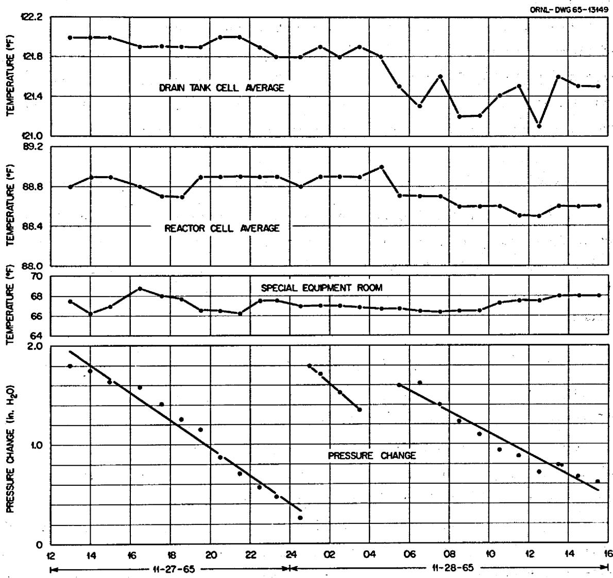  
Fig. 22.4 Containment Conditions During Leak Rate Test at 30 psig

Errors involved in the pressure method of calculating the leak rate would probably be associated with the rotameters; but this would imply a $25\%$ error in rotameter calibration. All of the rotameters involved were disconnected and bench-calibrated at least twice. They were found to be accurate to well within $5\%$ .

The containment cell was nominally at $-2$ psig, but just downstream of the component-cooling pumps, the pressure was $+6$ psig. It was thought that if gas were leaking out here and into the cell at a proportionately higher rate, we might account for the anomaly. Simultaneous solution of the leak-rate equations for this situation showed that although a solution was mathematically possible, the in-leak would have to be at $\sim 3\%$ $\mathsf{O}_2$ and the out-leak at $20\%$ $\mathsf{O}_2$ which is not practical.

These results caused us to think that something in the cell was chemically consuming some of the oxygen. Removal from the cell air of $\sim 2.5$ scf/day of pure $O_2$ would account for the leak-rate discrepancy.

One suggested mechanism for chemically removing the $\mathrm{O_2}$ was by oil decomposition. If some of the oil from the component-cooling pumps were contacting hot pipe (say at FV-103 or in control rod thimbles) it would probably at least partially decompose according to the approximate relation:

$$
\mathrm {C} _ {(\sim 1 4)} \mathrm {H} _ {(\sim 3 0)} + (\mathrm {v} 2 1) \mathrm {O} _ {2} = 1 5 \mathrm {H} _ {2} \mathrm {O} + 1 4 \mathrm {C O} _ {2}
$$

Cell air samples were taken to determine the $\mathrm{CO}_{2}$ content and they showed $\sim 0.1\%$ $\mathrm{CO}_{2}$ . This was at least three times higher than the $\mathrm{CO}_{2}$ content in air, but was less than one would expect to see if all the $\mathrm{O}_{2}$ were being consumed by oil decomposition.

The containment cell and support structure was composed primarily of carbon steel so another prime suspected oxygen depletion mechanism was rust. If all the missing $O_2$ were being consumed to form $\mathrm{Fe}_2\mathrm{O}_3$ , it would take about 120 g/day of Fe. Since there is about 5000 ft² of carbon steel surface area in the cell, this would correspond to a corrosion rate of only 0.5 mils/year (neglecting the support structure and piping of component coolant system).

This analysis led to the conclusion that enough oxygen was being removed chemically by oil decomposition and rusting to produce the discrepancy that existed between the different methods of cell leak-rate calculation.

# 22.4 Vapor Condensing System

An accident can be conceived in which molten salt and water could simultaneously leak into the reactor or drain-tank cells. The quantity of steam produced could be such that the pressure in the cells would increase above design pressure. A vapor-condensing system was provided to prevent the steam pressure from rising above the 39-psig design pressure and to retain the non-condensable gases. A 12-in. line connected the cells to the vapor-condensing system. This line contained two rupture discs in parallel (a 3-in. disc with a bursting pressure of 15 psig and a 10-in. disc with a bursting pressure of 20 psig). The line from the rupture discs went to the bottom of a $1800\text{-ft}^3$ vertical tank which contained $\sim 1200\text{ft}^3$ of water to condense the steam. The non-condensable gases went from the top of this tank to a $3900\text{-ft}^3$ retention tank.

The tanks were pressure-tested by the vendor to $45$ psig. After being connected to the reactor cell, the system was leak-tested at 30 psig during initial testing of the reactor and drain-tank cells in 1965.

During the annual cell leak tests at pressure, the vapor-condensing system was also pressurized. This protected the rupture discs and provided an integrity test of the vapor-condensing system.

The water used in the vertical tank contained potassium nitrite-potassium borate as a corrosion inhibitor. Based on annual samples, one inhibitor addition was made. There was no increase in the iron concentration which indicated little or no corrosion.

Initially $\frac{1}{4}$ level probes were provided to assure proper water level. However, after one of the low level probes failed, a bubbler-type level instrument was installed for measuring the level periodically.

Since there has been no unplanned increases in the pressure of the reactor and drain-tank cells, the vapor-condensing system has not been used.

# 22.5 Recommendations

Leak-checking the numerous valves required disconnecting many lines, particularly tube fittings and autoclave connections. Disconnecting numerous fittings greatly increases the probability that one or more will leak when connections are remade. For this reason, an effort should be made in the design of the piping to minimize the number of disconnects necessary for leak-checking. For example, nitrogen lines could be connected as shown in Fig. 22.5 to facilitate checking both the safety valve and the line inside the cell.

All block valves should be of high quality and soft-seated. Accessibility to the items to be checked and the points used in checking them should be considered. Flexibility should be provided in the lines which must be disconnected.

Leaks from in-cell air lines cause errors in leak-rate calculations. When disconnects are necessary, the effect of flux on materials on construction should be considered.

MI-cable seals of the type used at the MSRE (brass and stainless steel) should be modified or another type used. Substituting ferrules of teflon, graphite-impregnated asbestos, or other relatively soft material for the brass ferrules may be sufficient to prevent leakage through them. However, radiation damage and sheath temperature must be considered. Standard pipe-threaded connections for stainless steel to stainless steel joints should be avoided where possible.

Teflon tape should not be used on threaded connections for a gas seal nor on small lines where fragments can enter the line and clog it or prevent check valves from seating properly. All pipe, tubing, and valves should be cleaned internally prior to installation.

MI-sheathed thermocouples are preferable to the type used. However, if cost or other reasons (i.e. seals at the ends) preclude using them, the initial design should provide for pressurizing the terminal headers and measuring the leakage. Soldered joints in the header system are recommended where practical.

Gas analyzers used to continuously monitor the cell atmosphere should be located in a warm area to prevent moisture from condensing in them.

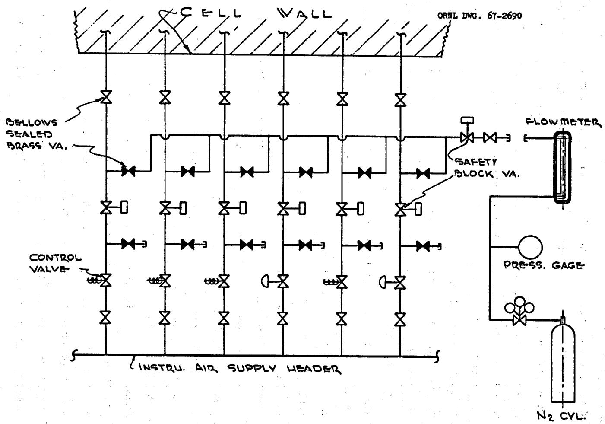  
Fig. 22.5 Schematic of Instrument Airlines with Leak Checking System

Fluids used in manometers or similar gages which are continuously connected to the contained volume such as the hook gage should have a low vapor pressure to avoid a significant loss during operation. The piping to the gage should be pitched to prevent accumulation of water and should not be connected to the bottom of temperature compensating or reference volumes.

Temperature compensating volumes should represent the entire containment. The 30-in. cell vent line and the component-cooling system enclosure (5% of cell volume) had no reference volume. The temperature reference volume should be distributed throughout the cells. The MSRE used 6-in. vertical pipes on a weighted volume basis in the reactor and drain-tank cells. Smaller diameter piping with the same total volume might have given a more representative temperature compensation.

The reference volume system external to the cells must have a minimum volume and should be located in an area held at as constant a temperature as possible. Sufficient cell temperature thermocouples should be located in all sections of the containment to enable calculation of average temperature and temperature changes as accurately as possible.

If a sensitive cell pressure measuring device similar to the hook gage is used in future reactor containment, it should be designed to meet secondary containment requirements so that block valves are not required. However, if block valves are needed to isolate the instrument, a separate circuit from the other block valves should be used. Pressure readings are required above the pressures at which the other block valves are closed. Safety jumpers could be used to keep this circuit open during cell-pressure testing.

# 23. BIOLOGICAL SHIELDING AND RADIATION LEVELS

# T. L. Hudson

The criterion for the MSRE biological shield design was that the dose rate would not exceed 2.5 mrem/hr during normal operation at any point on this shield exterior that is located in an unlimited access area. Since the MSRE had to fit within an existing reactor containment cell and building, the shield design allowed for addition of shielding as needed to reduce radiation level at localized hot spots. The shielding calculations are reported in Reference 57.

The reactor vessel was completely surrounded by a water-cooled, steel-and-water-filled thermal shield. The thermal shield and fuel circulating loop were located in the reactor cell. The top of the reactor cell had two layers of concrete blocks. An annular space filled with magnetite sand and water provided the shielding for the sides and bottom. See Fig. 23.1.

When the reactor was not in operation, the fuel was drained to one or both drain tanks which were located in the drain-tank cell. Magnetite concrete walls faced all accessible areas and the top consisted of two layers of concrete blocks.

# 23.1 Radiation Surveys - Approach to Power

Extensive health-physics surveys of the reactor area were performed during the initial approach to power. These surveys were made to bring to light shield inadequacies. With the exception of the areas discussed in the following paragraphs, the shielding was found to be adequate.

# 23.1.1 Coolant Drain Tank Cell

At 1 kW the scattering of fast neutron and gamma rays from the reactor cell into the coolant drain tank cell through the 30-in. reactor cell ventilation line 930 caused radiation readings of 8 mrem/hr gamma and 50 mrem/hr fast neutron near the exit of the line. At 25 kW very high readings were found again at line 930 (70 mrem/hr gamma, 600 mrem/hr fast neutrons and 30 mrem/hr thermal neutrons). A wall of 16 in. of concrete blocks and 6 in. of borated polyethylene was built adjacent to the 930 line in the coolant drain tank cell. In addition, the reactor off-gas line 522, in the

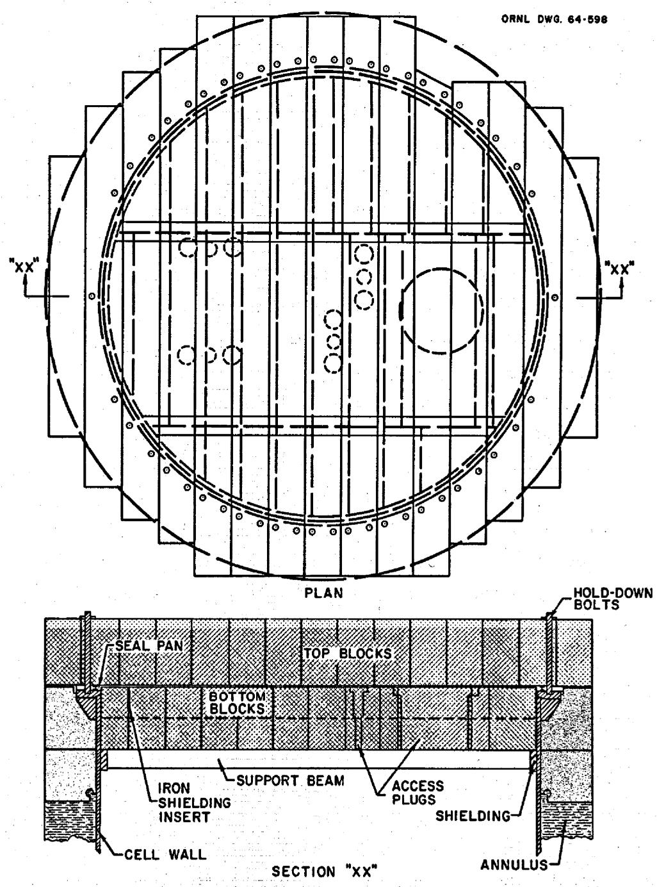  
Fig. 23.1 Shield Block Arrangement at Top of Reactor Cell

coolant drain tank cell was found to be giving a high background to the area. At the end of the 25-kW run, the reading was $100\mathrm{mR/hr}$ at 1 in. from the 3-in. thick lead shield around the 522 line. Later at higher power levels it was determined that part of the radiation was from the drain-tank vent line 561. Therefore this line was shielded with 3 in. of lead. Even though shielding was added inside the coolant drain tank cell, the radiation at the door (500 mR/hr gamma, 150 mrem/hr fast neutrons, 75 mrem/hr thermal neutron) and halfway up the access ramp (22 mR/hr gamma, 3 mrem/hr fast neutrons, 32 mrem/hr thermal neutron (was high during full-power operation. This area was clearly marked with radiation zone signs at the entrance to the ramp and the door at the bottom of the ramp was locked during nuclear operation to prevent entry into the cell.

# 23.1.2 North Electric Service Area

When the reactor power was raised to 1 MW in April 1966, the radiation level in the North Electric Service Area (NESA) was found to be high: 20 mR/hr on the balcony and 8000 mR/hr at the west wall. Investigation showed that there was radioactive gas in the lines through which helium is added to the drain tanks. Two check valves in each line prevented the gas from getting beyond the secondary containment enclosure, but the enclosure, of 1/2-in. steel, provided little gamma shielding. The pressure in the fuel system at that time was controlled by the newly installed pressure control valve with rather coarse trim, and the pressure fluctuated around the control point (normally 5 psig) by $\pm \sim 2\%$ . These pressure fluctuations caused fission product gases to diffuse more rapidly into the drain tanks and back through the 1/4-in. lines through the shield into the NESA. The radiation level was lessened by installing a temporary means of supplying an intermittent purge to the gas-addition lines to sweep the fission product gases back into the drain tanks. During the June shutdown, a permanent purge system was installed to supply a continuous helium purge of 70 cc/min to each of the three gas-addition lines. This was proved successful by subsequent full-power operation in which the general background in the NESA was $< 1$ mR/hr.

Transmitter Room — During the radiation survey at 5 MW a hot spot of 30 mR/hr gamma was found on the southwest corner about 4 ft above the floor.

A 2-ft by 4-ft by 1-in. thick lead sheet was attached to the wall over the hot spot and a radiation zone was established.

Vent House — During the initial approach to full power, stacked concrete blocks were added to the floor area of the vent house, over the charcoal beds and between the vent house and the reactor building to keep dose rates low. Very narrow beams coming from cracks were shielded with lead bricks. Even so, the background radiation level in the vent house was $\sim 7$ mR/hr at full power. The vent house was established as a radiation zone area.

Water Room — Induced activity in the treated water rose to an unexpectedly high level during Run 4. The activity proved to be $12.4 \, \text{hr}^{\text{42K}}$ produced in the corrosion inhibitor. A survey of possible replacements for potassium led to the choice of lithium, highly enriched in the $7\text{Li}$ isotope to minimize tritium production. See Water System (Section 12) of this report for additional details.

Top of Reactor Cell — It was expected that additional shielding would be required directly above the reactor, where there are cracks (v1/2 in.) between the shield blocks. During a full-power run in July 1966, two very narrow beams of $\gamma$ with neutron radiation were found between cell blocks for the first time. These read up to $10\mathrm{mR/hr}$ gamma and $60\mathrm{mrem/hr}$ fast neutron. They were properly marked.

# 23.2 Radiation Levels During Operation

During operation at full power, the radiation levels in all operational areas were acceptable. Some narrow beams were noted from time to time. These were mainly in the vent house. Due to induced activity in the treated water, areas near large equipment such as the surge tank and heat exchanger were treated as radiation zones. Periodic radiation surveys have not disclosed any appreciable changes in radiation levels.

Some typical radiation readings inside the shielding are given in Table 23.1. Changes in radiation levels following a shutdown from power are shown in Figs. 23.2, 23.3, and 23.4.

Table 23.1 Radiation Dose Rates in Various Areas During and Following Full-Power Operation   

<table><tr><td rowspan="2">LOCATION</td><td colspan="4">Gamma Dose Rate (R/hr)</td></tr><tr><td>At 7 MW</td><td>10 kWa</td><td>Reactorb Drained</td><td>Reactor Drained and c Flushed</td></tr><tr><td>Reactor Cell</td><td>7 x 104</td><td>5.4 x 103</td><td>2.4 x 103</td><td>2 x 103</td></tr><tr><td>Drain Tank Cell</td><td>4.2 x 103</td><td>4.2 x 103</td><td>2.6 x 104</td><td></td></tr><tr><td>Coolant Cell</td><td>100</td><td></td><td></td><td></td></tr><tr><td>Fuel Sampler-Enricherd</td><td>1000</td><td></td><td></td><td></td></tr><tr><td>Off-gas Samplerd</td><td>500</td><td></td><td></td><td></td></tr></table>

$a_{\text{After 5-hours operation at 10 kW which followed sustained operation}}$ at full power.   
$b_{\text{Immediately following the above 5-hr operation at 10 kW.}}$   
Two days after the above fuel drain.   
$d_{\text{Inside the sampler shielding during sampling}}$

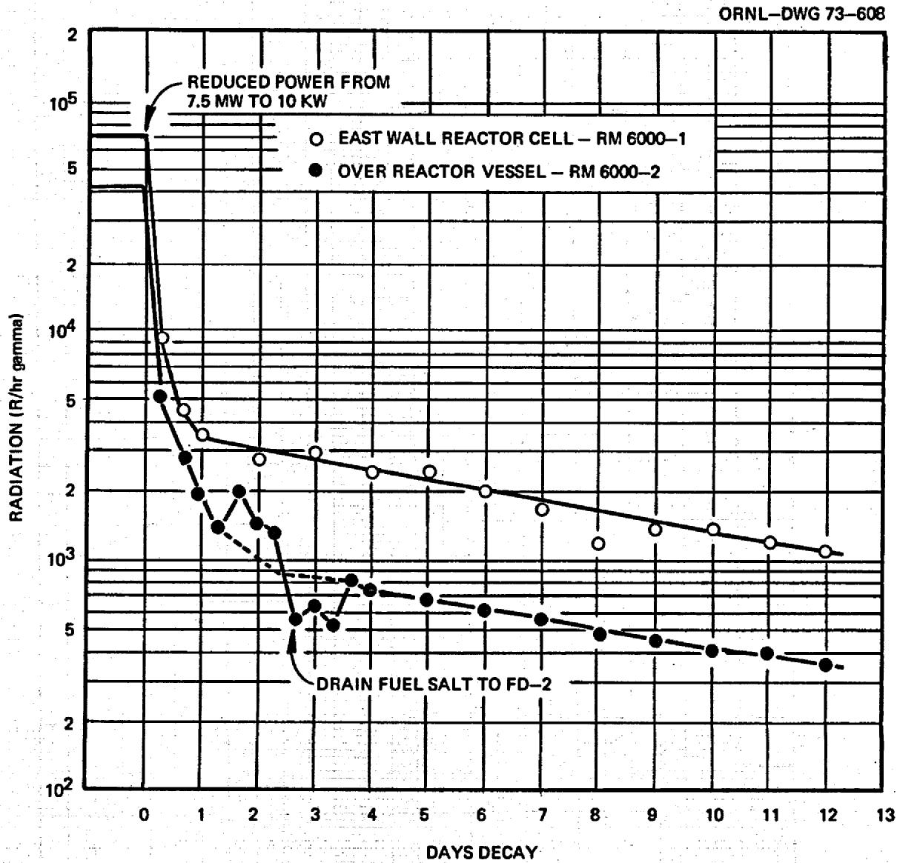  
Fig. 23.2 Gamma Radiation Level in Reactor Cell

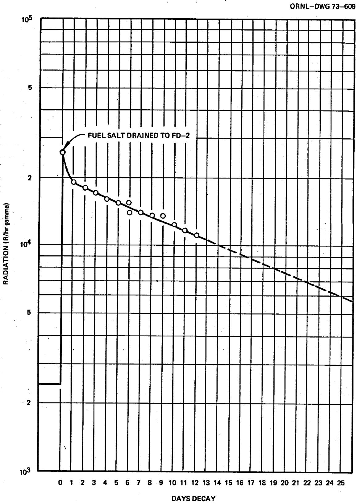  
Fig. 23.3 Gamma Radiation Level in Drain Tank Cell (Rm 6000-6 between FD-1 and FD-2)

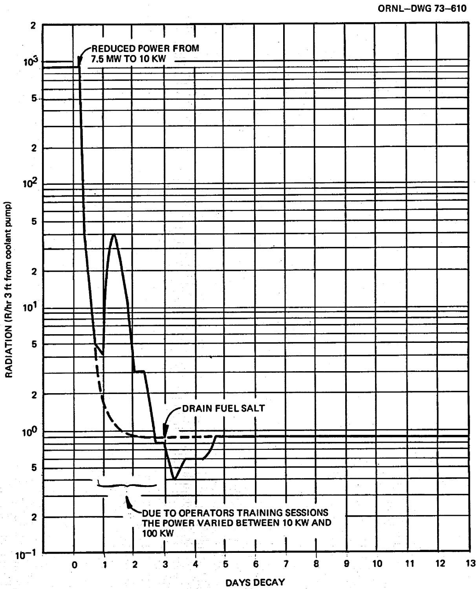  
Fig. 23.4 Gamma Radiation Level in Coolant Cell (Rm-6010)

# 23.3 Conclusions

The biological shielding was adequate as designed except for the few localized areas discussed previously. Periodic radiation surveys have not indicated any shift or deterioration in any of the shielding.

# 24. INSTRUMENTATION

R. H. Guymon

# 24.1 Introduction

It is not within the scope of this report to cover in detail the performances of all instrumentation. An attempt has been made to review it from an operational viewpoint and report significant items. Information on instrumentation which has been given in previous sections on the performance of the entire plant or individual systems and components will not be repeated here. The performance of the on-site computer is covered in Reference 58.

# 24.2 Description

Most of the MSRE instrumentation was of conventional type found in other reactors or chemical plants. Emphasis was placed on assuring adequate containment and reducing radiation damage. All circuitry was designed to fail safe. A very brief description follows.

# 24.2.1 Nuclear Instruments

The primary elements of all of the nuclear instruments were located in a 36-in.-dia. water-filled thimble which extended from the high bay through the reactor cell to the vicinity of the reactor vessel. (See Fig. 24.1.)

Three uncompensated ion chambers and their associated fast-trip comparators provided safety instrumentation for scrambling the control rods. (High reactor outlet temperature also caused a rod scram.) These were used in a two-out-of-three configuration.

Two fission chambers were provided. These chambers had automatic positioning devices. Their count rate and the effect of their position were factored into a signal which was recorded on a 10-decade logarithmic power recorder. They were used to provide rod inhibit, rod reverse, and other control interlocks.

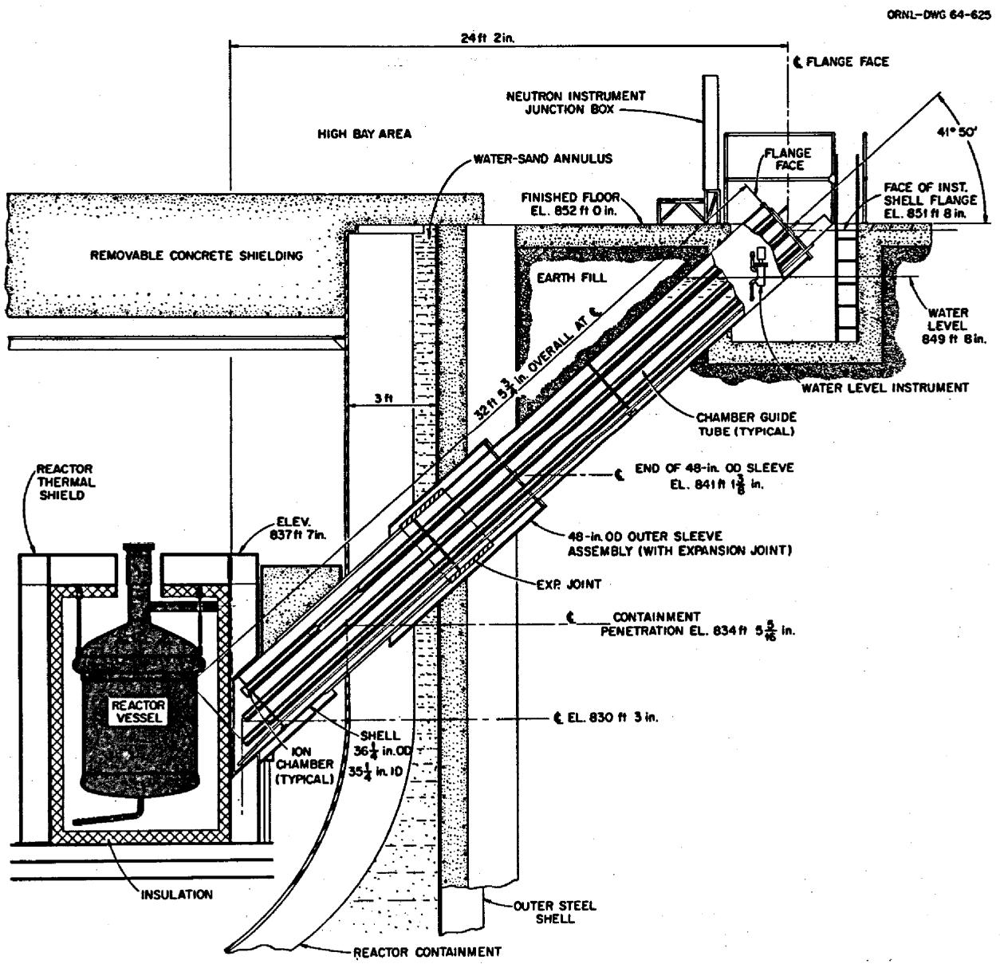  
Fig. 24.1 Elevation View of Nuclear Instrument Penetration

Two compensated ion chambers were used for servo control of the regulating rod and for some interlocks. The power was recorded on a linear recorder. Seven decades were covered by means of manual range selector switches.

One high sensitivity $\mathbf{BF}_3$ chamber was provided for power indication during filling of the reactor.

# 24.2.2 Process Radiation Instruments

Two kinds of detectors, ion chambers and Geiger Mueller tubes, were used to indicate the level of activity in various process streams and to provide necessary interlocks.

# 24.2.3 Health Physics Monitoring

Gamma radiation was monitored by seven monitrons located throughout the building. The air contamination was monitored for beta-gamma emitting particles by seven constant air monitors. The building evacuation system operated when two or more monitrons or two or more constant air monitors from a specific group of instruments detected a high level of radiation or air contamination.

# 24.2.4 Stack Activity Monitoring

The containment stack air was checked for beta gamma particulates by passing a side stream through a filter paper and monitoring the activity with a GM tube. After passing through the filter paper, the gaseous sample passed through a charcoal trap which was monitored by another GM tube to detect iodine. A second side stream passed through another filter paper. This was monitored for alpha particulates using a thallium-actuated zinc sulfide screen detector.

# 24.2.5 Temperature Detection

One thousand seventy-one chromel-alumel thermocouples (some of which were installed spares) were provided for temperature indication. All of the salt thermocouples except seven were located on the outside of the lines or equipment. The seven in-thermocouple wells were located as follows: one in the reactor neck; one and two spares in the radiator inlet line; and, one and two spares in the radiator outlet line. The more important temperatures were displayed on single or multipoint recorders or indicators. Readout of others was accomplished by means of a scanner system which allowed the signals from up to 100 thermocouples to be sent to a rotating

mercury switch and subsequently to an oscilloscope for display. A switch allowed selection of any one of five groups of 100 signals.

# 24.2.6 Pressure Indicators

Most of the remote indicating pressure and dp instruments were pneumatic or electric force elements. When containment was required, the vents were referenced to atmospheric pressure through rolling diaphragm seals. Strain gage and Bourdon pressure gages were used extensively. Small changes in reactor cell pressure were determined using a "hook gage". This was essentially a water manometer with a micrometer for accurately reading changes in water level.

# 24.2.7 Level and Weight Indicators

Bubbler type level instruments were used for measuring the salt levels in the fuel pump, coolant pump, and overflow tank. A float-type level instrument was also installed in the coolant pump. The drain tanks were suspended by pneumatic weigh cells to determine the amount of salt that they contained. In addition to this, two resistant-type single-point level probes were provided in each drain tank.

Sight glasses, floats, bubblers, dp cells, etc., were used in the auxiliary systems.

# 24.2.8 Flow Measurement

No flow instrument was provided in the fuel salt loop, however a venturi meter was installed in the coolant salt loop. This was a standard venturi with a NaK-filled dp cell. Flows in auxiliary systems were measured by orifices, capillaries pitot tubes, rotameters and matrix type flow elements.

# 24.2.9 Miscellaneous

A semi-continuous mass spectrometer was used to monitor the coolant air stack for beryllium. Other instrumentation included the following: pulse-type speed elements, ammeters, voltmeters, and watt meters for the salt pump motors; potentiometer and synchro position indicators for the control rods, fission chambers, and radiator doors; oxygen and moisture analyzers for the helium cover-gas system; and an oxygen analyzer for the cell atmosphere.

# 24.3 Initial Checkout and Startup Tests

A comprehensive functional checkout of the control, safety, and alarm instrument was made by Instrument and Controls personnel prior to operation of each system. Although some design and wiring errors were found, these were of minor nature and were easily corrected. In general, the quality of installation was excellent. The following were included in this checkout: the setpoints of all switches were adjusted to the proper values; continuity and resistance checks of all thermocouples were made; the location of each thermocouple was determined by heating the thermocouple and measuring the voltage at the patch panel; and the continuity of all circuits was checked and all recorders were put into operation. Most of this was done as construction was completed or as the instruments were put into service.

Prior to the first circulation of flush and coolant salts, a complete operational check was made of all instruments scheduled to be used. This was done following the instrument startup check list.[22] This involved: (1) a complete checkout of all circuits. This was done by changing the variable or inserting a false signal at the primary element and assuring that all circuitry functioned at the proper setpoints; (2) a complete check of the patch panel to assure that all thermocouples were connected to the proper readout instrument and that the operational records were up to date; (3) a complete test of all standby equipment to assure that it would start if needed and would function properly; (4) a complete inspection to assure that no switches were inactivated or jumpers installed; and (5) tests to assure that critical equipment functioned properly, such as rod drop times.

This instrument startup check list was repeated approximately every year. Early tests revealed errors in wiring, setpoints which had drifted, and other instruments which did not function properly. Later tests indicated setpoints which needed to be reset and occasionally a malfunctioning instrument.

Most of the troubles which were discovered by doing the instrumentation startup check lists were corrected immediately. Therefore records are inadequate for statistical analysis.

# 24.4 Periodic Testing

Due to the importance of some instruments or circuits, they were also tested periodically during operation. As indicated by the sections which follow, these tests did not reveal many serious troubles which needed correction. They did provide assurance that the circuits should function if needed. In determining the amount and frequency of testing, careful consideration should be given to the above weighed against the harm done to equipment due to repetitive testing and the possibility of interruption of operation. Rod scrams, load scrams, and reactor drains occurred at the MSRE due primarily to testing of equipment or instrumentation.

The periodic tests made at the MSRE and the results of these tests are given below.

# 24.4.1 Nuclear Instruments

A complete check of all nuclear instruments was made each month during nuclear operation. These were done by Instrument and Controls personnel using Section 8A of the Operating Procedures.[22] All tests were satisfactory except those listed in Table 24.1.

# 24.4.2 Process Radiation Monitors

The process radiation monitors were tested each week during operation by inserting a source near the primary detector and noting that each control interlock functioned properly and that all announcements occurred. All tests were satisfactory except those listed in Table 24.2. Some early difficulty was encountered in that the hole in lead shielding for inserting the source was not properly placed.

# 24.4.3 Personnel Radiation and Stack Activity Monitoring

Periodic tests of the health physics monitors and stack activity instruments were originally done by MSRE personnel per Operating Procedure 8C.[22] This was later taken over by other ORNL groups. The original schedule for the health physics monitors was to make a source check of each instrument weekly, a matrix check monthly, and a complete evacuation test semiannually. As confidence in the instruments was established, the frequency of these tests was reduced to monthly, quarterly, and semiannually.

Table 24.1 Results of Periodic Tests of Nuclear Instruments   

<table><tr><td>Date</td><td>Repairs Necessary</td></tr><tr><td>3/22/66</td><td>Replaced condenser in the power supply of linear power channel No. 1.</td></tr><tr><td>7/19/66</td><td>Replaced period balance module of nuclear safety channel No. 1.</td></tr><tr><td>6/16/67</td><td>Changed out high voltage supply of nuclear safety channel No. 3.</td></tr><tr><td>7/14/67</td><td>RepairedScaler of wide-range counting channel No. 1.</td></tr><tr><td>8/12/68</td><td>Replaced relay of nuclear safety channel No. 3.</td></tr><tr><td>1/7/69</td><td>Replaced fast trip comparator of wide-range counting channel No. 2.</td></tr><tr><td>2/3/69</td><td>Replaced chamber of wide-range counting channel No. 1.</td></tr><tr><td>9/11/69</td><td>ReplacedScaler of wide-range counting channel No. 2.</td></tr><tr><td>10/21/69</td><td>Replaced operational amplifier of wide-range counting channel No. 1.</td></tr><tr><td>10/20/69</td><td>ReplacedScaler of wide-range counting channel No. 1.</td></tr></table>

Table 24.2 Results of Periodic Tests Of Radiation Monitors   

<table><tr><td>Date</td><td>Troubles Detected</td></tr><tr><td>4/13/66</td><td>Alarm did not occur, RM-596.</td></tr><tr><td>5/10/66</td><td>Instrument would not calibrate, RM-557.</td></tr><tr><td>1/9/68</td><td>Two indicator lights burned out, RM-565.</td></tr><tr><td>1/26/68</td><td>Indicator light burned out, RM-675.</td></tr><tr><td>7/21/68</td><td>Indicator light burned out, RM-827.</td></tr><tr><td>3/3/69</td><td>Indicator light burned out, RM-565.</td></tr><tr><td>10/10/69</td><td>Indicator light burned out, RM-565.</td></tr></table>

The stack monitors were originally tested with a source each week. Due to their excellent performance record, this was later reduced to monthly tests.

Troubles encountered were repaired immediately.

# 24.4.4 Safety Circuits

Periodic checks were made of all circuits and instruments designated by the Instrument and Controls group as being safety. These included rod scram circuits, fuel pump and overflow tank pressures and levels, helium supply pressures, emergency fuel drain circuits, reactor cell pressures, coolant pump speeds and flows, radiator temperatures and sampler-enricher interlocks. These tests involved simulating a failure and checking as much of the circuitry as possible without interrupting operations. At first these were performed weekly, then all except the rod scram checks were changed to a monthly basis. All instruments functioned satisfactorily except those indicated in Table 24.3.

# 24.5 Performance of the Nuclear Safety Instrumentation

These instruments proved to be very reliable. There were periods when an abnormal number of spurious trips occurred. Many of these were believed to have originated in faulty, vibration-sensitive relays in commercial electronic switches which provided the high temperature trip signals. Another possible source was the chattering of the relays which change the sensitivity of the flux amplifiers in the safety circuits. Correction of the chattering and elimination of noise producing components elsewhere in the system reduced the frequency of these to a very tolerable level.

The fast trip comparators were found to be inoperative if a sufficiently large signal was applied to the input. A diode was added to the fast trip comparator modules to eliminate this difficulty.

Operation of the relay matrix in the nuclear system generated considerable noise, making it difficult to reset the safety-system channels. The resistor-diode combination for damping the voltage induced by relay operation was replaced by a Zener diode and a diode combination that was more satisfactory.

Table 24.3 Results of Periodic Tests of Safety Circuits   

<table><tr><td>Date</td><td>Troubles Detected</td></tr><tr><td>5/24/65</td><td>Noted that PR-522 and PI-522 did not agree.</td></tr><tr><td>6/9/65</td><td>Two safety channels tripped when testing one channel, scram setpoint was at 120% instead of 150% and low current test did not function properly.</td></tr><tr><td>1/15/66</td><td>Fuel pump pressure switch setpoint needed resetting.</td></tr><tr><td>4/10/66</td><td>Reactor cell pressure switch setpoint needed resetting.</td></tr><tr><td>5/20/66</td><td>Two sampler-enricher pressure switches setpoints needed resetting.</td></tr><tr><td>6/12/66</td><td>Sampler-enricher pressure switch needed resetting.</td></tr><tr><td>6/15/66</td><td>Rod motion was jerky.</td></tr><tr><td>9/19/66</td><td>Two sampler-enricher access door latches did not function properly.</td></tr><tr><td>11/2/66</td><td>A safety channel would not reset.</td></tr><tr><td>12/16/66</td><td>Reactor cell pressure switch setpoint needed resetting.</td></tr><tr><td>11/27/67</td><td>Burned-out indicator light in safety channel.</td></tr><tr><td>5/13/69</td><td>Defective solenoid coil on reactor cell block valve header.</td></tr><tr><td>9/8/69</td><td>Reactor outlet safety interlock would not clear.</td></tr><tr><td>11/24/69</td><td>Sampler-enricher pressure switch setpoint needed resetting.</td></tr></table>

In the summer of 1967, the 1-kW 48-V-dc to 120-V-ac inverter, which supplies ac power to one of the three safety channels, failed during switching of the 48-V dc supply. It was repaired by replacement of two power transistors. During this same period the output of the ion chamber in safety channel 2 decreased drastically during a nonoperating period, and the chamber was replaced prior to resumption of operations. The trouble proved to be a failure in a glass seal that allowed water to enter the magnesia insulation in the cable, which is an integral part of the chamber. A period safety amplifier failed when lightning struck the power line to the reactor site, and a replacement amplifier failed as it was being installed. The field-effect transistor in this type of amplifier was susceptible to damage by transient voltages, and it was found that under some conditions, damaging transients could be produced when the amplifier was removed from or inserted into the system. A protective circuit was designed, tested, and installed. The module replacement procedure was modified to reduce the possibility of damage incurred on installation of the module. Two relays in the safety relay matrices failed, both with open coil circuits. A chattering contact on the fuel-pump motor current relay caused safety channel 2 to trip several times before the problem was overcome by paralleling two contacts on the same relay. A defective switch on the core outlet temperature also caused several channel trips and one reactor scram before the trouble was identified and the switch was replaced. A wiring error in a safety circuit was discovered and corrected. Interlocks had recently been added in the "load scram" channels to drop the load when the control rods scram. A wiring design error resulted in these interlocks being bypassed by a safety jumper. Although the circuits were wired this way for a time before being discovered, the scram interlocks were always operative during power operation, since the reactor cannot go into the "Operate" mode when any safety jumper is inserted.

Late in 1965, the power supply to the model Q-2623 relay safety elements was changed from 115-V-ac to 32-V-dc. This was done to eliminate ac pickup on the other modules through which the relay coil current was routed. The 115-V-ac relays were not changed at this time. These functioned satisfactorily until the summer of 1967 when two of the 15 relays failed. By the end of 1967, seven had failed, all with open circuits or

safe conditions. In April 1968, all 15 were replaced with relays designed for 32-V-dc operation. Soon after installation, 3 of these failed due to contact welding (unsafe condition). This was apparently due to early failure of defective relays. There were no more failures during extensive tests made at this time or during subsequent operation. Starting September 30, 1968, daily tests were conducted on the entire rod scams relay matrix to detect single failures. (The matrix had been tested weekly before that.) Noise suppressors were installed across some of the non-safety contacts of these relays to alleviate the noise which had sometimes caused difficulty during in-service tests.

# 24.6 Performance of the Wide-Range Counting Channels

Initial criticality tests disclosed that the neutron flux attenuation in the instrument penetration did not follow an ideal exponential curve. The deviation was too large to be adequately compensated for by the virni-stats in the wide-range counting channels. This is illustrated by curve A of Fig. 24.2 which shows fission counter response (normalized count rate) vs withdrawal from the lower end of the penetration in guide tube 6. It was reasonable to conclude from this, and from similar curves, that the excess neutrons responsible for the distorted part of the curve were entering the penetration along its length. The count rates in other guide tubes nearer the upper half of the penetration were even more distorted than curve A. Since a flux field with attenuation per Curve A precluded successful operation of the wide-range counting instrumentation, shields of sheet cadmium were inserted in guide tubes 6 and 9 to shield the fission chambers from stray neutrons. Curve B of Fig. 24.2, normalized count rate vs distance, shows the improvement for guide tube 6.

Reactor period information from the wide-range counting channels inhibited rod withdrawal and caused rod reverses. Reactor period signals from counting channels operating at low input levels are characterized by slow response. This inherent delay produced a problem with servo-controlled rod withdrawal during start. In a servo-controlled start, the demand signal caused the regulating rod to withdraw until the period-controlled "withdraw inhibit" interlock operated. If the period continued to decrease, the

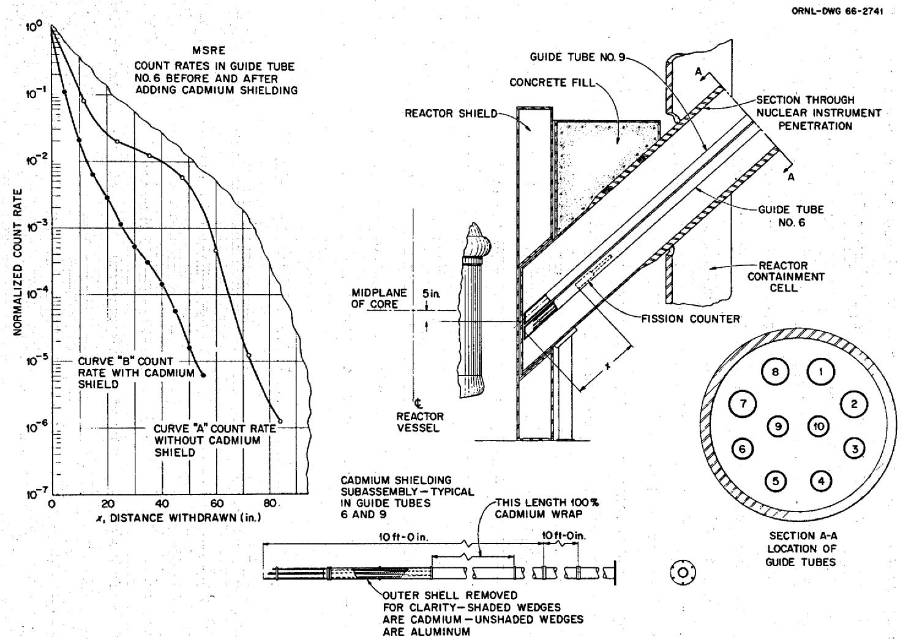  
Fig. 24.2 Guide Tube Shield in the MSRE Instrument Penetration

"reverse" interlock acted to insert the rods in direct opposition to the servo demand. These "withdraw inhibit" and "reverse" trip points were originally established at periods of +20 and +10 sec respectively. The delayed low-level response of the "inhibit" interlock allowed sufficient incremental rod withdrawal to produce a 10-sec period and thus cause a reverse. The situation was aggravated by coasting of the shim-locating motor in the regulating rod limit switch assembly. To correct this, the "withdraw inhibit" and "reverse" period trip points were changed to +25 and +5 sec, respectively, an electro-mechanical clutch-brake was inserted in the shim-locating motor-drive train and dynamic braking circuitry was installed for the regulating rod drive motor.

Throughout operation, difficulty was experienced with moisture penetration into the fission chambers. The cause was diagnosed as excessive strain and flexing of the tygon tubing sheath on the electrical cables. The average lifetime was about 6 months prior to July 1968. At this time the type of tygon tubing used to cover the cable and the method of sealing the chamber connections were changed. This seemed to improve the moisture resistance.

In early 1967, a failure occurred due to a short in the cable to the preamplifier. The drive tube unit was modified to provide for controlled cable bends and there were no reoccurrences of this type of difficulty.

# 24.7 Performance of the Linear Power Channels

The linear power channels and rod servo instrumentation performed very well throughout the operation. When the fuel was changed to $^{233}\mathrm{U}$ , the rod-control servo was modified to allow an increase in the servo dead band to compensate for the more rapid flux response of the reactor.

The compensated ion chambers use a small electric motor to change compensation. Early in 1966 one of these motors had to be replaced.

A water leak occurred in one of the compensated ion chambers in the summer of 1969. When it was examined, numerous leaks were found along the seam weld in the 321 stainless steel bellows sheathing the cable, and the aluminum can at the outer support ring was honeycombed by corrosion. (The water in the instrument shaft contained lithium nitrite buffered with boric acid for inhibition of corrosion.)

Because of very unfavorable geometry, the strongest practicable neutron source would not produce 2 counts/sec from the fission counters in the wide-range counting channels until the core vessel was approximately half full of fuel salt; neither would it produce 2 counts/sec with flush salt in the core at any level. This was the minimum count rate required to obtain the permissive "confidence" interlock which allows filling the core vessel and withdrawing the rods. Therefore a counting channel using a sensitive $\mathrm{BF}_3$ counter was added to establish "confidence" when the core vessel was less than half-filled with fuel salt. This was installed early in 1966. The chamber had to be replaced in the summer of 1967 due to moisture leakage into the cable. No other troubles were encountered.

# 24.9 Nuclear Instrument Penetration

The nuclear power produced at the MSRE was determined by an overall system heat balance. All nuclear power instruments were calibrated to agree with this primary standard. During extended runs at higher powers, the nuclear instruments indicated 15 to $20\%$ higher than the heat balance. This was found to be due to a rise in water temperature in the nuclear instrument penetration which apparently changed the attenuation characteristics of the water. In June 1966, a heat exchanger system was placed in operation to cool the water which reduced the temperature change from zero to full power to $\sim 18^{\circ}\mathrm{F}$ from $72^{\circ}\mathrm{F}$ and reduced the difference in the two power measurements to about $5\%$ .

# 24.10 Performance of the Process Radiation Monitors

The process radiation monitors proved very reliable. No radiation elements had to be replaced during the entire operation. Occasional repairs were necessary on the electronics. One rod and load scram resulted from a false signal from one of these monitors (RE-528).

# 24.11 Performance of the Personnel Radiation Monitoring and Building Evacuation System

During early testing it was found that there were some areas where the building evacuation horns could not be heard. Two additional horns and four additional beacon alarm lights were installed. Other than occasional minor repairs, the system has functioned satisfactorily.

# 24.12 Performance of the Stack Monitoring System

The stack monitoring system was very reliable. The manual range switching made it difficult to interpret data from the recorder charts and the Rustrak recorders were very inconvenient to use.

# 24.13 Performance of Thermocouples and the Temperature Readout and Control Instrumentation

A total of 1071 thermocouples were installed at the MSRE. Of these, 866 were on salt systems (351 on the circulating loops and 515 on the drain tanks, drain lines, and freeze valves). Of the 1071, only 12 have failed in five years of service. Five others were damaged during construction and maintenance. A breakdown of the failures is given in Table 24.4.

Table 24.4 Failures Among the 1071 MSRE Thermocouples   

<table><tr><td>Nature of Failure</td><td>Number</td></tr><tr><td>Damaged during construction</td><td>3</td></tr><tr><td>Damaged during maintenance</td><td>2</td></tr><tr><td>Lead open during operation</td><td>6</td></tr><tr><td>Abnormally low reading (detached?)</td><td>3</td></tr><tr><td>Unknown reason</td><td>3</td></tr><tr><td>Total</td><td>17</td></tr></table>

Only three thermocouple wells were provided in the circulating salt systems, one each in the coolant radiator inlet and outlet pipes and one in the reactor neck. The remaining thermocouples were attached to the pipe or vessel walls. The thermocouples on the radiator tubes were insulated to protect them from the effects of the high-velocity air that flows over them during power operation; the others were not insulated and thus were subject to error because of exposure to heater shine and to thermal convection flow of the cell atmosphere within the heater insulation. In March 1965, with the fuel and coolant systems circulating salt at isothermal conditions, a complete set of readings was taken from all the thermocouples that should read the temperature of the circulating salt. A similar set of data was taken in June 1967 at the start of Run 12. The results of the two sets of measurements are shown in Table 24.5. Comparison of the standard deviations for the radiator thermocouples with those for the other thermocouples shows the effect of insulation on reducing the scatter. Comparison of the sets of data taken over two years apart shows very little change, certainly no greater scatter. Figure 24.3 shows that the statistical distribution of the deviations on individual thermocouples from the mean also changed little in the two years.

Table 24.5 Comparison of Readings of Thermocouples of Salt Piping and Vessels Taken with the Salt Isothermal   

<table><tr><td rowspan="2">Thermocouple Location</td><td colspan="2">Indicated Temperature (°F)</td></tr><tr><td>March 1965</td><td>June 1967</td></tr><tr><td>Radiator tubes</td><td>1102.6 ± 6.7</td><td>1208.5 ± 3.3</td></tr><tr><td>Other</td><td>1102.1 ± 13.0</td><td>1206.7 ± 12.3</td></tr><tr><td>All</td><td>1102.3 ± 10.6</td><td>1207.4 ± 9.8</td></tr></table>

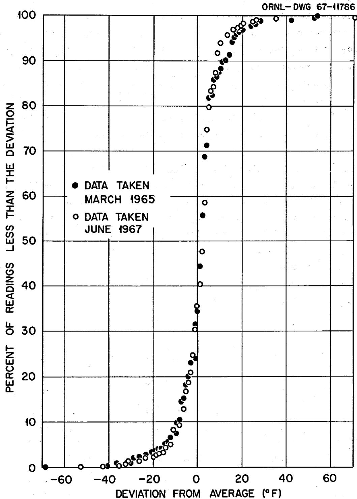  
Fig. 24.3 Comparison of MSRE Thermocouple Data from March 1965 and June 1967

The scatter in the various thermocouple readings was reduced to an acceptable level by using biases to correct each reading to the overall average measured while both fuel and coolant systems were circulating salt at isothermal conditions. These biases were entered into the computer and were automatically applied to the thermocouple readings. The biases were revised at the beginning of each run and were checked when isothermal conditions existed during the runs. Generally the biased thermocouple readings were reliable. However in a few cases, there were shifts which caused calculational errors.

During early operation the thermocouple scanner gave considerable difficulty due to 60-cycle noise pickup, poor stability, and drifting of the salvaged oscillosopes. Refinements were needed in design to allow better identification of scanner points and provide a means by which the operator could calibrate the instruments. After these were corrected, the system operated very satisfactorily. The rotating mercury switches lasted much longer than the expected 1000-hour mean life. One switch failure occurred when the nitrogen purge gas was inadvertently stopped.

Single point Electra Systems alarm switch modules were used for control of freeze valves and for other alarm and control actions. These gave considerable trouble during early operation due to drifting or dual setpoints and general maloperation. A number of modifications were made to correct these. Printed circuit-board contacts were gold-plated to reduce contact resistance, the trim pots used for hysteresis adjustment were replaced with fixed resistors, and resistor values in modules having ambiguous (dual setpoints were changed to restore the proper bias levels. These changes, together with stabilization, by aging, of critical resistors in the switch modules and more rigorous periodic testing procedures improved the performance. A check showed that out of 109 switch setpoints, $83\%$ had shifted less than $20^{\circ}\mathrm{F}$ over a six-month period. Multiple setpoints still occurred and various other failures were encountered. During 1968 and 1969, records were kept on the failures of indicator lights on these modules. There were about 50 failures per year. This was important because a burned-out light bulb could cause alarm or control action.

# 24.14 Performance of Pressure Detectors

Most of the pressure instruments at the MSRE performed very well. Difficulty was encountered with the differential pressure cell used to obtain the pressure drop in the helium flow through the charcoal beds (PdT-556). The span and zero settings shifted badly although the pressure capability had never been exceeded. Three dp cells failed in this service. Two of these were removed, tested, and inspected without determining the cause of the trouble. The last replacement functioned satisfactorily at first but then gave similar difficulties. It is still installed.

# 24.15 Performance of Level Indicators

The bubbler-type level instruments used in the fuel pump overflow tank and coolant pumps performed well. More details are given in Sections 5.8 and 6.5. Some difficulty was encountered in controlling the purge flow until the throttling valves were replaced.

A high and low level resistance type level probe was provided on each drain tank. During early operation the excitation and signal cable leads on both probes of the fuel flush tank failed. These failures were caused by excessive temperature which caused oxidation and embrittlement of the copper-clad, mineral-insulated copper-wire cables. These cables were designed on the assumption that they would be routed in air above the tank insulation and that their operating temperature would not exceed $200^{\circ}\mathrm{F}$ ; however, in the actual installation, the cables were covered with insulation and the temperature at the point of attachment to the probe was probably in excess of $800^{\circ}\mathrm{F}$ . Repairs were accomplished by replacing the copper-clad, mineral-insulated copper wire excitation and signal cables and portions of the probe head assembly with a stainless-sheathed, ceramic-beaded nickel-wire cable assembly. In the summer of 1968, one of the probes in fuel drain tank No.1 failed. The failure was found to be an open lead wire inside the cell. The probe was restored to service by a cross connection outside the cell to the equivalent lead of the other probe.

The initial instrumentation provided to assure proper water level in the vapor-condensing tank consisted of $4$ resistance type probes spaced

4 in. apart near the desired water level. In September 1966, while doing the instrumentation startup check list, one of the two high-level switches was found to be defective. Loss of this switch caused the loss of one channel of information needed to establish that the water level in the tank was correct. Since a second switch failure might require that the reactor be shut down until the switches could be repaired, and since the removal of the switches from the tank is a difficult operation, a bubbler-type level measuring system, which included a containment block valve and associated safety circuits in the purge supply, was designed and was installed in the reactor-cell vapor suppression tank. This installation utilized a dip tube which was included in the original design in anticipation of such need. This new level system also enabled the operator to check the water level in the tanks as a routine procedure.

# 24.16 Performance of the Drain Tank Weighing Systems

The same type pneumatic weighing devices were used on the fuel drain tanks and the coolant drain tank. The coolant drain tank weight indicators proved to be stable, showing no long-term drifts or effects of external variables. With 5756 lb of salt in the tank at about $1200^{\circ}\mathrm{F}$ , the extreme spread of 40 indicated weights over a period of a week was $\pm 22$ lb. This was only $\pm 0.4\%$ and was quite satisfactory.

The indicated weights of the three tanks in the fuel system exhibited rather large unexplained changes. In some cases these amounted to 200 to 300 pounds. The mechanism causing this was not definitely established, but probably was due to changes in forces on the syspended tanks as temperatures of attached piping and the tank furnaces changed. Reactor cell pressure seemed to also affect the readings. The weighing systems were useful in observing transfers of salt and for filling and draining the reactor.

In addition to this calibration drift, difficulty was experienced with the multiposition pneumatic selector switches. Manometer readout was accomplished by selecting a particular weigh cell channel with pneumatic selector valves. The valves were composed of a stacked array of individual valves operated by cams on the operating handle shaft. Leaks in these valves gave false weight indications. A redesign of the switching device solved this problem.

Prior to power operation, one of the weigh cells failed and was replaced. The failure was determined to be due to pitting of the baffle and nozzle in the cell. This pitting was apparently caused by amalgamation of mercury with the plating on the baffle and nozzle. How the mercury got into the weigh cells has not been determined; however, it was believed to have come from the manometers and to have been precipitated on the baffle by expansion cooling of the air leaving the nozzle. Appreciable quantities of mercury were also found in the tare pressure regulators on the control panel; however, no mercury was found in the interconnecting tubing or in other portions of the system.

# 24.17 Performance of the Coolant Salt Flowmeters

Several days after the start of coolant salt circulation, the output of one of the two salt flowmeter channels started drifting down scale. The output of the other channel remained steady. The trouble was isolated to a zero shift and possibly a span shift in the NaK-filled differential pressure transmitter in the drifting channel. Since the exact cause could not be determined, a spare dp cell was installed. Both channels functioned satisfactorily throughout the remainder of the reactor operations. Tests on the defective unit were inconclusive, however, it was determined that the shifts were temperature-induced zero shifts possibly caused by incomplete filling or a leak in the silicone oil portion of the instrument.

An operational inconvenience persisted throughout operations. Whenever the radiator air flow was increased, air leaking through the insulation around the salt legs to the dp cells caused the temperature to decrease rapidly. This necessitated adjustment of the heaters.

Due to the discrepancy between the reactor power level indicated by fuel burnup, heat balance, etc., it is planned to recalibrate the dp cells during the next fiscal year.

The difficulties encountered with the control rod relays are described in Section 24.5. Experience with other relays is given below.

After about 2 years of operation, the 48-V-dc-operated relays showed considerable heat damage to their bakelite frames. The manufacturer, General Electric, advised that overheating of this particular model was a common problem if the relays were continuously energized. Early in 1967, twenty of the 139 relays were replaced with a later improved model. Within a few months some of these also showed signs of deterioration. Therefore in June 1967, all 139 relays were field-modified by replacing the built-in resistors with externally mounted resistors. No trouble was experienced after this modification.

In September 1969, the load-scream circuit, which drops the radiator doors and stops the blower, tripped several times. Investigation showed that some of the relay contacts had developed unusually high resistance due to oxide films. Because of the way the contacts were paralleled in the matrix, the film was not burned off each time the contact closed, as in a normal application. These contacts were cleaned and no further difficulty was encountered.

# 24.19 Training Simulation

Two "on-site" reactor kinetics simulators were developed for the purpose of training the MSRE operators in nuclear startup and power operation. The startup simulator used the control rod position signals as inputs, and provided outputs of log count rate, period, log power, and linear power. The reactor's period interlocks, flux control system, and linear flux range selector were also operational. In addition to this, the power level simulator used the radiator door position and cooling air pressure drop signals as inputs and provided readout of key system temperatures. Both simulators were set up on general purpose, portable EAI TR-10 analog computers. Much of the actual MSRE hardware, such as control rods were used rather than simulated. Thus the operators manipulated the actual reactor controls and became used to the instrumentation and controls system. This proved to be a very reliable training tool.

# 24.20 Miscellaneous

The original mass spectrometer used to monitor for beryllium in the coolant stack was replaced with an improved instrument near the start of power operation. Only occasional repairs or preventative maintenance was required since then.

Folded charts were used on some recorders. These did not function properly due to the low chart speeds being used.

# 24.21 Conclusions and Recommendations

Considering the quantity and complexity of the instrumentation, a minimal amount of difficulty was encountered. Since the MSRE was an experimental reactor, it was in many areas over-instrumented. This was probably due to not knowing what information might be needed and not taking enough credit for the ability of the operators. This led to unnecessary difficulties in normal operations or in running special experiments. At the same time, there were areas where additional information would have been beneficial.

# REFERENCES

1. M. W. Rosenthal, P. R. Kasten, and R. B. Briggs, "Molten-Salt Reactors - History, Status, and Potential," Nucl. Appl. Tech., 8, 107 (1970).   
2. MSR Program Semiannu. Progr. Rep., Jan. 31, 1964, ORNL-3626.   
3. MSR Program Semiannu. Progr. Rep., July 31, 1967, ORNL-3708.   
4. MSR Program Semiannu. Progr. Rep., Feb. 28, 1965, ORNL-3812.   
5. MSR Program Semiannu. Progr. Rep., Aug. 31, 1965, ORNL-3872.   
6. MSR Program Semiannu. Progr. Rep., Feb. 28, 1966, ORNL-3936.   
7. MSR Program Semiannu. Progr. Rep., Aug. 31, 1966, ORNL-4037.   
8. MSR Program Semiannu. Progr. Rep., Feb. 28, 1967, ORNL-4119.   
9. MSR Program Semiannu. Progr. Rep., Aug. 31, 1967, ORNL-4191.   
10. MSR Program Semiannu. Progr. Rep., Feb. 29, 1968, ORNL-4254.   
11. MSR Program Semiannu. Progr. Rep., Aug. 31, 1968, ORNL-4344.   
12. MSR Program Semiannu. Progr. Rep., Feb. 28, 1969, ORNL-4396.   
13. MSR Program Semiannu. Progr. Rep., Aug. 31, 1969, ORNL-4449.   
14. MSR Program Semiannu. Progr. Rep., Feb. 28, 1970, ORNL-4548.   
15. R. C. Robertson, MSRE Design and Operations Report, Part I - Description of Reactor Design, ORNL-TM-728 (Jan. 1965).   
16. R. H. Guymon, P. N. Haubenreich, and J. R. Engel, MSRE Design and Operations Report, Part XI - Test Program, ORNL-TM-911 (Nov. 1966).   
17. R. B. Lindauer, Processing of the MSRE Flush and Fuel Salts, ORNL-TM-2578 (Aug. 1969).   
18. J. R. Engel, P. N. Haubenreich, and A. Houtzeel, Spray, Mist, Bubbles and Foam in the MSRE, ORNL-TM-3027 (June 1970).   
19. P. N. Haubenreich and M. Richardson, Plans for Post-Operation Examination of the MSRE, ORNL-TM-2974 (April 1970).   
20. C. H. Gabbard, Reactor Power Measurement and Heat-Transfer Performance in the MSRE, ORNL-TM-3002 (May 1970).   
21. J. R. Engel, MSRE Design and Operations Report, Part XI-A - Test Program for $^{233}\mathrm{U}$ Operation, ORNL-TM-2304 (Sept. 1968).

# References (continued)

22. R. H. Guymon, MSRE Design and Operations Report, Part VIII, Operating Procedures, Vols, I and II, ORNL-TM-908 (Dec. 1965).   
23. R. E. Thoma, Chemical Aspects of MSRE Operations, ORNL-4658 (Dec. 1971).   
24. R. H. Guymon and P. N. Haubenreich, MSRE Design and Operations Report, Part VI, Operating Safety Limits for the Molten-Salt Reactor Experiment, ORNL-TM-733 (3rd revision), (July 25, 1969).   
25. R. H. Guymon, R. C. Steffy, Jr., and C. H. Gabbard, Preliminary Evaluation of the Leak in the MSRE Primary System Which Occurred during the Final Shutdown, ORNL-CF-70-4-24, (April 22, 1970).   
26. P. G. Smith, Development of Fuel- and Coolant-Salt Centrifugal Pumps for the MSRE, ORNL-TM-2987 (Oct. 1970).   
27. C. H. Gabbard, Inspection of MSRE Fuel Circulating Pump after the Zero-Power Experiments (Run 3), ORNL-CF-66-8-5 (Aug. 1966).   
28. R. B. Briggs, Measurement of Strains in Heat Exchanger Nozzle and Piping of MSRE, ORNL-CF-66-2-66, (Feb. 1966).   
29. C. H. Gabbard, Thermal-Stress and Strain-Fatigue Analyses of the MSRE Fuel and Coolant Pump Tanks, ORNL-TM-78 (Oct. 1962).   
30. C. H. Gabbard, R. J. Kedl, and H. B. Piper, Heat Transfer Performance of the MSRE Heat Exchanger and Radiator, ORNL-CF-67-3-38 (Mar. 1967).   
31. C. H. Gabbard, Reactor Power Measurement and Heat Transfer Performance in the Molten Salt Reactor Experiment, ORNL-TM-3002 (May 1970).   
32. H. E. McCoy, An Evaluation of the Molten Salt Reactor Experiment Hastelloy N Surveillance Specimens - First Group ORNL-TM 1997 (Nov. 1967).   
33. H. E. McCoy, An Evaluation of the Molten Salt Reactor Experiment Hastelloy N Surveillance Specimens - Second Group ORNL-TM-2359 (Feb. 1969).   
34. H. E. McCoy, An Evaluation of the Molten Salt Reactor Experiment Hastelloy N Surveillance Specimens - Third Group, ORNL-TM-2647 (Jan. 1970).   
35. H. E. McCoy, An Evaluation of the Molten Salt Reactor Experiment Hastelloy N Surveillance Specimens - Fourth Group, ORNL-TM-3036 (Mar. 1971).   
36. H. E. McCoy and B. McNabb, Intergranular Cracking of INOR-8 in the MSRE, ORNL-4829, (Nov. 1972).   
37. C. H. Gabbard, Design and Construction of Core Irradiation-Specimen Array for MSRE Runs 19 and 20, ORNL-TM-2743 (Dec. 1969).

# References (continued)

38. R. B. Briggs, Effects of Irradiation of Service Life of MSRE, ORNL-CF-66-5-16 (May 1966).   
39. R. B. Briggs, Assessment of Service Life of MSRE, ORNL-CF-69-8-3, (Aug. 1969).   
40. B. E. Prince et al., Zero-Power Physics Experiments on the Molten-Salt Experiment, ORNL-4233 (Feb. 1968).   
41. J. R. Engel and B. E. Prince, Zero-Power Experiments with $^{233}\mathrm{U}$ in the MSRE, ORNL-TM-3963 (Dec. 1972).   
42. C. H. Gabbard and C. K. McGlothlan, A Review of Experience with the MSRE Main Blowers, ORNL-CF-67-4-1, (Aug. 1967).   
43. C. H. Gabbard, Bearing Failures of Main Blowers MB-1 and MB-2, ORNL-CF-67-4-1, Addendum-1 (Mar. 1968).   
44. R. L. Baxter and D. L. Bernhard, "Vibration Tolerances for Industry," paper presented at ASME Plant Engineering and Maintenance Conference, Detroit, Michigan, Paper No. 67-PEM-14 (Apr. 10-12, 1967).   
45. E. C. Parrish and R. W. Schneider, Tests of High Efficiency Filters and Filter Installation at ORNL, ORNL-3442, (May 1963).   
46. H. R. Payne, The Mechanical Design of the MSRE Control Rods and Reactor Access Nozzle, MSR-61-158 (June 1961).   
47. J. L. Crowley, Temperature and Salt Levels in the MSRE Reactor Access Nozzle - A Possible Relation to MSRE Power Blips, MSR-69-13 (Feb. 1969).   
48. P. N. Haubenreich, R. Blumberg, and M. Richardson, "Maintenance of the Molten-Salt Reactor Experiment" paper presented at Winter Meeting, ANS, Washington D. C. (Nov. 1970).   
49. C. H. Gabbard, Radiation Dose Rates to the MSRE Fuel-Pump Motor and Control Rod Drives, MSR-65-48.   
50. R. C. Robertson, MSRE Design and Operations Report, ORNL-TM-728, pp. 244-75 (Jan. 1965).   
51. R. H. Guymon, MSRE Design and Operations Report, Part VII, Operating Procedures, ORNL-TM-908, Vol. II (Dec. 1965).   
52. R. B. Gallaher, MSRE Sampler-Enricher System Proposal, ORNL-CF-61-5-120, (May 1961).   
53. MSRE Staff, MSRE Sampler-Enricher, An Account of Recent Difficulties and Remedial Action, MSR-67-73 (Sept. 1967).

# References (continued)

54. P. N. Haubenreich and MSRE Staff, An Account of Difficulties with the Sampler-Enricher that Led to a Second Capsule Being Left in the Pump Bowl, MSR-68-125 (Sept. 1968).   
55. S. E. Beall et al., MSRE Design and Operations Report, Part V, Reactor Safety Analysis Report, ORNL-TM-732 (Aug. 1964).   
56. R. H. Guymon, Tests of the MSRE Reactor and Drain Tank Cells, MSR-62-95 (Nov. 1962).   
57. P. N. Haubenreich et al., MSRE Design and Operations Report, Part III, Nuclear Analysis, ORNL-TM-730 (Feb. 1964).   
58. G. H. Burger, J. R. Engel, and C. D. Martin, Computer Manual for MSRE Operators, ORNL-CF-67-1-28 (Jan. 1967).   
59. P. N. Haubenreich, Safety Considerations in Resumption of MSRE Operation, ORNL-CF-69-8-10 (Aug. 1969).   
60. P. N. Haubenreich, Responses to RORC Recommendations for MSRE, MSR-69-104.   
61. B. F. Hitch et al., Tests of Various Particle Filters for REMoval of Oil Mists and Hydrocarbon Vapor, ORNL-TM-1623 (Sept. 1966).   
62. W. C. Ulrich, Purge of MSRE Off-gas Line 522, MSR-66-8, (Mar. 1966).   
63. R. H. Guymon and J. R. Engel, Introduction of Oxygen in Fuel-Drain Tank, MSR-67-1 (Feb. 1967).

# Internal Distribution

1. S. E. Beal1   
2. E. S. Bettis   
3. R. Blumberg   
4. R. B. Briggs   
5. W. B. Cottrell   
6. J. L. Crowley   
7. F. L. Culler   
8. S. J. Ditto   
9. J. E. Engel   
10. D. E. Ferguson   
11. A. P. Fraas   
12. C. H. Gabbard   
13. W. R. Grimes

14-18. R.H.Guymon

19. P. H. Harley   
20. P. N. Haubenreich   
21. H. W. Hoffman   
22. T. L. Hudson   
23. P. R. Kasten   
24. A. I. Krakoviak   
25. Kermit Laughon, AEC-OSR   
26. M. I. Lundin

27. R. N. Lyon   
28. R. E. MacPherson   
29. H. E. McCoy   
30. H. C. McCurdy   
31. A. J. Miller   
32. R. L. Moore   
33. L. C. Oakes   
34. A. M. Perry   
35. M. Richardson

36-37. M. W. Rosenthal

38. Dunlap Scott   
39. M. R. Sheldon   
40. M. J. Skinner   
41. I. Spiewak   
42. D. A. Sundberg   
43. J. R. Tallackson   
44. R. E. Thoma   
45. D. B. Trauger   
46. G. D. Whitman

47-48. Central Research Library   
49. Y-12 Document Reference Section   
50-52. Laboratory Records Department   
53. Laboratory Records (RC)

# External Distribution

54-56. Director, Division of Reactor Licensing, USAEC, Washington D.C. 20545   
57-58. Director, Division of Reactor Standards, USAEC, Washington, D.C. 20545   
59-60. N. Haberman, USAEC, Washington, D.C. 20545   
61. D. F. Cope, AEC-ORO   
62. M. Shaw, USAEC, Washington, D.C. 20545   
63. David Elias, USAEC, Washington, D.C. 20545   
64. A. Houtzeel, TNO, 176 Second Ave., Waltham, Mass. 02154   
65. R. C. Steffy, TVA, 303 Power Building Chattanooga, Tenn. 37401   
66-82. Manager, Technical Information Center, AEC (For ACRS Members)   
83. Research and Technical Support Division, AEC, ORO   
84-85. Technical Information Center, AEC