ORNL-TM-3041

Contract No. W-74-5-eng-26

Molten-Salt Reactor Program

MSRE OPERATOR TRAINING AND OPERATING TECHNIQUES

R. H. Guymon

AUGUST 1973

# NOTICE

This report was prepared as an account of work sponsored by the United States Government, Neither the United States nor the United States Atomic Energy Commission, nor any of their employees, nor any of their contractors, subcontractors, or their employees, makes any warranty, express or implied, or assumes any legal liability or responsibility for the accuracy, completeness or usefulness of any information, apparatus, product or process disclosed, or represents that its use would not infringe privately owned rights.

OAK RIDGE NATIONAL LABORATORY

Oak Ridge, Tennessee 37830

operated by

UNION CARBIDE CORPORATION

for the

U. S. ATOMIC ENERGY COMMISSION

# CONTENTS

# Chapter

# Page

ABSTRACT  V

ACKNOWLEDGEMENTS vi

1. INTRODUCTION 1   
2.DESCRIPTION OF THE MSRE 1   
3.CHRONOLOGY 5   
4. OPERATING PERSONNEL 8  
5. TRAINING 13

Initial Training 15   
Precritical Training and Certification. 19   
Prepower Training 24   
Training of Chief Operators 27   
Training Before $^{233}\mathrm{U}$ Startup 27   
Other Training 28   
Training of Replacements. 30   
Equivalence to AEC Examination 30

6. OPERATION OF THE REACTOR 31

Planning 31   
Instructions to and Communications with Operators 32   
Data Taking and Record Keeping. 33

7. APPROVAL OF MAINTENANCE AND DESIGN CHANGES 34   
8. INFORMATION AVAILABLE TO OPERATORS 35

Design and Operations Report. 35   
Other Reports 39   
Drawings 39   
Miscellaneous 39

9. RECOMMENDATIONS. 40

REFERENCES 51

# Appendices

A. Schedule for Initial Training. 53   
B. Instructions for Flowsheet Checkout. 57   
C. Schedule for Precritical Training. 59   
D. Precritical Examinations 63   
E. Schedule for Pre-Power Training. 75   
F. Pre-Power Examinations 77   
G. Chief Operator Training Schedule 79   
H. Chief Operator Review Test 81   
I. MSRE Operator's Examination - May, 1969. 83   
J. Examples of Instructions and Communications. 99   
K. Examples of the Control-Room and Building Log 121   
L. Forms Used in Making Changes 131   
M. Example of MSRE Daily Report 137

# MSRE OPERATOR TRAINING AND OPERATING TECHNIQUES

R. H. Guymon

# ABSTRACT

The MSRE was a unique, fluid-fuel reactor that operated successfully at ORNL from 1965 through 1969. MSRE operators and supervisors, mostly, veteran ORNL employees, were trained and examined within the Molten-Salt Reactor Program. Formal training sessions were held at the beginning of prenuclear testing, just before initial criticality and before the approach to power. Training of replacements and retraining of operators was a continuing effort. This report describes the training, the information provided for use by the operators, operations planning and administration, and the use of procedures. Recommendations by the author (former MSRE operations chief) conclude the report.

Keywords: *MSRE + *operation + *procedures + *training + administration + communications + examinations + operators + qualifications + reactors + startup + testing

# ACKNOWLEDGEMENTS

The author wishes to acknowledge the efforts of S. E. Beall and C. E. Wolfe in supplying very able operating personnel and express appreciation to the entire crew for their contributions and fine team spirit during training and throughout the operation of the MSRE. Special thanks is due to P. N. Haubenreich for his leadership of the project and his suggestions on this report.

J. R. Engel and B. H. Webster deserve much of the credit for the cooperation between operations, experimentation, and maintenance.

# 1. INTRODUCTION

The objective of the Molten-Salt Reactor Program was the development of a practical breeder reactor in which the fissile and fertile materials are incorporated in a molten mixture of fluoride salts. A major step in that development was the Molten-Salt Reactor Experiment (MSRE), a 7.4-MW reactor that operated at ORNL from 1965 through 1969. The main purpose of the MSRE was to demonstrate that the desirable features of the molten-salt concept could be embodied in a practical reactor that could be constructed and maintained without undue difficulty and one that could be operated safely and reliably. This purpose was accomplished, as the MSRE operated for long intervals and with a high overall availability.

Among the factors contributing to the success of the MSRE were the very thorough preparations for operation, including careful selection and training of operating personnel, and the disciplined manner in which the operation was planned and conducted. It is the purpose of this report to describe these aspects of the MSRE. Only brief descriptions of the physical plant and its history are included, since these have been widely reported.

# 2. DESCRIPTION OF THE MSRE

The MSRE was a single-region, graphite-moderated, thermal reactor which produced heat at a rate of 7.4 MW(th). The fuel was $\mathsf{U}\mathsf{F}_4$ (originally $^{235}\mathsf{U}$ and later $^{233}\mathsf{U}$ ) in a carrier salt of $\mathsf{LiF - BeF_2 - ZrF_4}$ . At the operating temperature of $1200^{\circ}\mathsf{F}$ , this salt was a liquid with good physical properties -- viscosity, 8 centipoise (about like kerosene); density, $\sim 135$ lb/ft $^3$ ; heat capacity, 0.57 Btu/lb ${}^{\circ}\mathsf{F}$ ; and a very low vapor pressure of $< 0.1\mathrm{mmHg}$ . The liquidus temperature of the fuel salt was $813^{\circ}\mathsf{F}$ , so the equipment and procedures had to be designed to prevent freezing. The salt also had to be protected from contact with air to minimize corrosion and accumulation of oxides.

The design conditions for full-power operation are shown in the flow diagram (Fig. 1). The general arrangement of the plant is shown in Fig. 2.

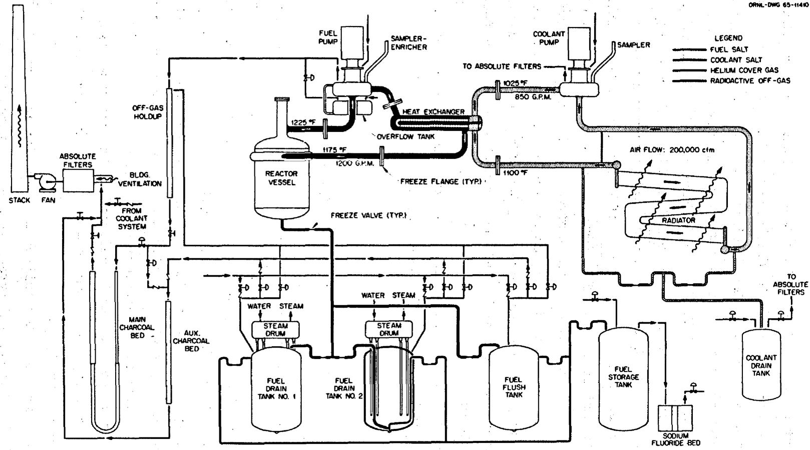  
Fig. 1. MSRE Flow Diagram.

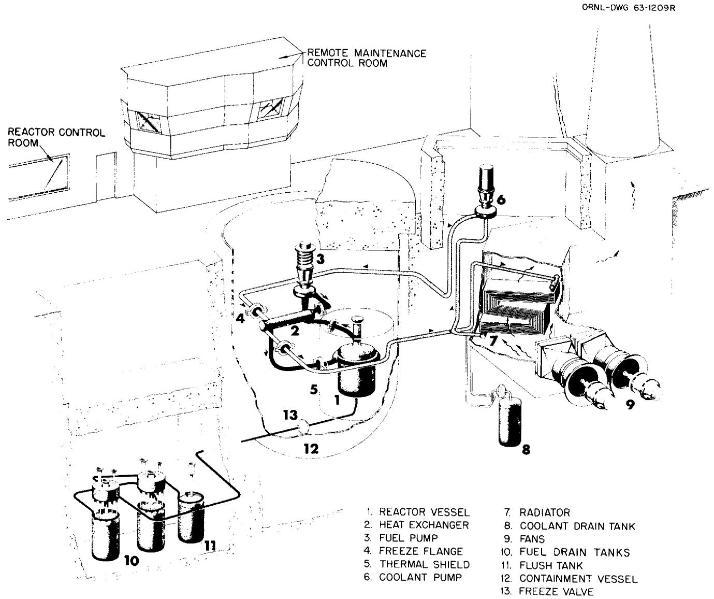  
Fig. 2. General Arrangement of MSRE.

In the reactor primary system, the fuel salt was recirculated by a sump-type centrifugal pump through a shell-and-tube heat exchanger and the reactor vessel. The heat generated in the fuel salt as it passed through the reactor was transferred in the heat exchanger to a molten $\mathrm{LiF - BeF_2}$ coolant salt. The coolant salt was circulated by means of a second sump-type pump through the heat exchanger and through the radiator where the heat was dissipated to the atmosphere. The rate of heat removal was controlled by using either one or two blowers and by adjusting doors in the radiator air stream and dampers in a bypass stream. Drain tanks were provided for storing the fuel and coolant salts at high temperature when the reactor was not operating. Drain and transfer lines included freeze valves, where salt could be frozen or thawed to block or permit flow. The salts were drained by gravity, and were transferred back to the circulating systems by pressurizing the drain tanks with helium. Electric heaters were used to keep the salt molten in the tanks and to preheat the piping system before filling. Diesel-powered generators provided emergency power for heaters and salt pumps. The salt systems normally operated with the cover gas at 5 psig.

Most of the fission products remained in solution in the fuel salt. One class, known as "noble metals," deposited on graphite and metal surfaces. The gaseous fission product s, krypton and xenon, were removed continuously from the circulating fuel salt in the fuel pump tank. There they transferred from the liquid to the helium cover gas and were swept out of the tank by a small purge stream. This stream passed through holdup piping, a filter, and long, water-cooled beds of activated carbon. The passage of krypton and xenon through these beds required days to weeks, by which time all the radioisotopes but the $^{85}\mathrm{Kr}$ had decayed so that the stream could be safely diluted with air and discharged to the atmosphere.

The fuel and coolant systems were provided with equipment for taking samples of the molten salt while the reactor was operating at power. The fuel sampler was also used during operation for adding small amounts of uranium or plutonium to compensate for burnup. An array of graphite and metal specimens at the center of the core was removed and replaced periodically during shutdowns.

The negative temperature coefficient of reactivity of the fuel and graphite moderator made nuclear control of the system very simple. However, three control rods were provided for adjusting temperature, compensating for buildup of fission products, and for shutdown.

Instrumentation was installed to adequately monitor all variables and to automatically handle any anticipated malfunctions. This, together with collection of much data by an on-line computer, made it possible to operate with a minimum operating crew.

Because of the fission-product activity, the fuel-salt equipment was contained in heavily shielded cells that were kept sealed except when maintenance was being done with long-handled tools through openings in the cell roof. The fuel off-gas system was also shielded and contained. Radiation zones were established around the coolant salt system and a few other locations, but normal operation of the reactor did not require entry into these zones.

Although not shown in Fig. 2, the plant included a simple processing facility for treating full $75\text{-ft}^3$ batches of fuel salt with hydrogen fluoride or fluorine gases. The hydrogen fluoride treatment was used for removing oxide contamination from the salt as $\mathrm{H}_2\mathrm{O}$ vapor; the fluorine treatment, for removing the uranium as gaseous $\mathrm{UF}_6$ .

# 3. CHRONOLOGY

Design of the MSRE was started in the summer of 1960. Construction of the primary system components and modifications of an existing building to house the MSRE began in 1962 and by mid-1964, installation of the salt systems was completed.[8]

Early in the design and development of the MSRE, some of the engineers involved were assigned to become members of the operating staff. As design and construction progressed, these engineers made periodic reviews and inspections to assure that proper consideration was being given to operability. They also began writing procedures for checkout and operation of the systems and components. The engineer who was to head the operations staff was given the responsibility for detailed planning of the training

program, and he and the other engineers prepared the instructional material. As indicated on Fig. 3, the initial operating staff was assembled by July, 1964 and basic operator training was started on July 6.

As construction was completed on more parts of the plant, the effort spent on checking, calibrating, and testing increased. In late September, operations were placed on a 24-hour, 7-day basis with four rotating-shift crews. Flush salt was added to the fuel flush tank, coolant salt was added to the coolant drain tank, and auxiliary equipment was put into operation. The fuel and coolant circulating systems were filled with salt and the plant was operated during most of January and February, 1965. The loops were then drained to hydrofluorinate the flush salt, to load fuel carriers salt, and to complete other preparations for zero-power nuclear operation. During this precritical shutdown, several weeks were spent in advanced training of the reactor operators, with emphasis on nuclear aspects, and the administration of comprehensive certifying examinations by Molten-Salt Reactor Program supervision.

Criticality was attained on June 1, 1965 and the zero-power nuclear experiments were completed during that month. The reactor was then drained for completion of shielding and containment provisions and minor modifications. During this shutdown, the operators underwent additional training and testing with emphasis on power operation. Nuclear operation was resumed in December, 1965. After some difficulties with the fuel off-gas system were overcome, full power was attained in May, 1966. By December of that year, the planned program of startup testing had been completed and solutions had been found to the various problems that had arisen. As indicated in Fig. 3, the reactor was at full power a large percentage of the time for the remainder of the operation with $^{235}\mathrm{U}$ , which ended in March, 1968. During the 5-month shutdown in 1968, core specimens were changed, various maintenance was done, the flush and fuel salts were processed to remove the uranium, and a charge of $^{233}\mathrm{U}$ fuel was added to the fuel carrier salt. During these months, time was available for guided self-study by the operators, and before nuclear operation was resumed, they were reexamined.

Criticality was attained on October 2, 1968 and on October 8, USAEC Chairman Seaborg took the reactor power to $100\mathrm{kW}$ , marking the first time

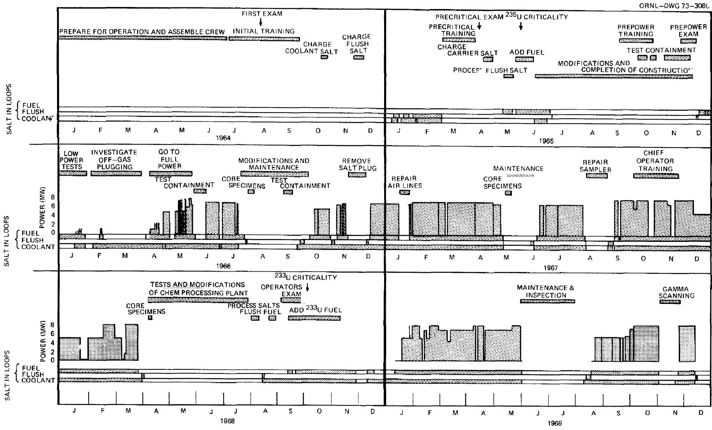  
Fig. 3. Chronology of Operator Training and Reactor Operation.

that any reactor had been operated with $^{233}\mathrm{U}$ fuel. After completion of rod-calibration and other tests, the reactor was taken to full power in January 1969. Investigations of the effects of gas circulating with the fuel involved revisions to permit operation of the fuel pump at reduced speed. Power operation continued until the first of June when the loops were drained to change the core specimen array and to make preparations for some special experiments.

The remainder of the operation involved extensive sampling, gamma scanning, and varying of operating conditions to study the distribution of fission products and tritium. Consideration of the limited funds available to the Molten-Salt Reactor Program, the fact that the primary goals of the MSRE had been achieved, and the funding needs of other molten-salt breeder development led to a decision by program management to terminate the MSRE operation. Accordingly the reactor was shut down on Dec. 12, 1969 and within 2 weeks the operating staff was disbanded.

# 4. OPERATING PERSONNEL

The initial operating staff was comprised of four crews, each consisting of two engineers and three technicians, all under the supervision of an operations chief and assistant operations chief, and augmented by two day-shift technicians. Long-range planning, analysis of data, maintenance coordination, and design changes were handled mostly by other groups within the MSRE Operations Department, whose original organization is outlined in Fig. 4. In addition to those shown, personnel of other ORNL divisions such as chemical analysis groups, health physics, industrial hygiene, metallurgy, chemistry, instrumentation, computer programming, and maintenance forces contributed significantly to the MSRE.

After the completion of the nuclear startup tests, the shift crews were each reduced to one engineer and three technicians. Later, after the operation became more routine, each crew was further reduced to 3 technicians. On day shifts or when special experiments were being run this 3-man crew was augmented by an engineer and 1 or 2 technicians.

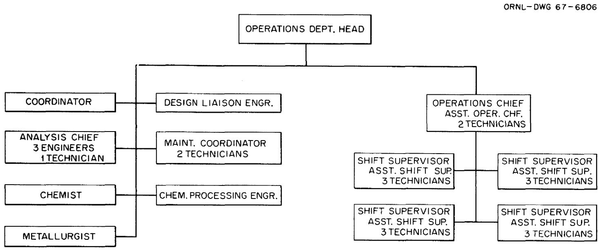  
Fig. 4. Original MSRE Operations Organization Chart.

Turnover in personnel was moderate; between July 1964 and December 1969 3 engineers and 5 technicians joined the operations group and 10 engineers and 4 technicians left the group.

The duties of the original operating staff were as follows.

The Operations Chief was responsible for organizing and training the operations staff. He participated in long-range planning, general policy decisions, and safety reviews of the reactor. He (or the Assistant Operations Chief) was responsible for the execution of the daily experimental program and decided on the course of action to be taken in case difficulties prevented carrying out the planned program.

The Assistant Operations Chief, in addition to substituting for or assisting the Operations Chief in the above, investigated special operational problems encountered, reported on operational activities at planning meetings, and directly supervised the activities of the day-shift technicians. The Operations Chief and Assistant Operations Chief were on call at all times. There were frequent communications between them and the evening and midnight shifts and all shifts over the weekends.

The day-shift technicians helped in special experiments, helped take routine samples, maintained records of chemical analyses, filed other data, maintained operating supplies including log forms, check lists, etc., and provided vacation relief for the regular operators.

Each Shift Supervisor was responsible for coordinating and overseeing all operations and maintenance on his shift. It was his duty to carry out all shift instructions, to maintain an overview of the plant with special alertness for anomalous conditions, and to keep all members of his crew informed of changes in equipment, plans, or operating procedures. He was required to be especially familiar with all equipment and operations so as to be able to react promptly and effectively to any emergency.

The Assistant Shift Supervisor assisted in the foregoing duties and handled special tasks such as the numerous tests required during the startup phase of the MSRE.

The three technicians on each shift rotated through three different assignments; building-log, control-room, and utility. The building-log

technician was responsible for taking all routine data except the control-room log. During each 8-hour shift, he made 2 complete rounds of the reactor site and was responsible for noting any abnormalities or departures from the recommended maximum and minimum limits shown on his log sheets. The control-room technician took the control-room log, calculated and plotted important data, and was responsible for the operation of the reactor from the control room. He kept a written record in the console log of all occurrences during his shift. The utility technician was responsible for sampling and miscellaneous tests and duties as requested. Because the three assignments were rotated, each operator had a good understanding of the overall operation and a familiarity with each job.

In the final organization, one of the three technicians on each crew was designated Chief Operator and assumed most of the duties of the previous shift supervisor. Candidates for Chief Operator were given additional training and examination before being given responsibility for the shift. Six technicians were certified as Chief Operators so that vacation relief could be handled. An engineer was assigned as shift supervisor on the day shift to handle the extra work associated with coordinating special tests and scheduled maintenance.

The educational background and previous experience of the original staff plus those who were later added are summarized in Fig. 5.

All of the supervisors had BS degrees or equivalent. Two were reactor school graduates. Five had majored in chemical engineering, 2 in nuclear engineering, 2 in mechanical engineering, and one each in electrical engineering, marine engineering, electronic engineering, and chemistry. Two of the shift supervisors came to MSRE as new hires, having just received BS degrees in nuclear engineering. The others had a minimum of 7 years of prior experience in design and/or development. The average period of prior employment by Union Carbide was 13 years (including the new hires).

Most of the technicians had at least 2 years of college (average 2.6) and a minimum of 4 years design or operating experience (average, 12) before coming to the MSRE. The average period of prior employment by Union Carbide was 12 years.

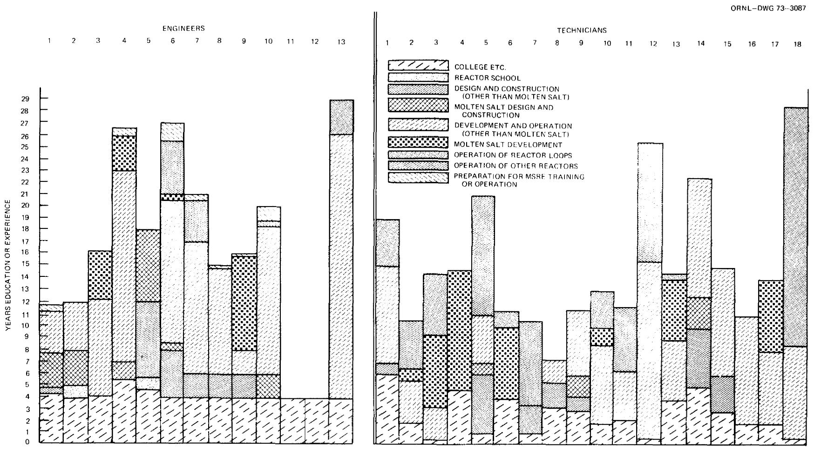  
Fig. 5. Educational Background and Previous Experience of MSRE Operators. (as of date of hire by MSRE Operations Department)

# 5. TRAINING

Although most of the MSRE operating staff had had considerable previous experience and several had an intimate familiarity with some parts of the plant, all were required to participate in a training program leading to examination and certification. Because of the unique nature of the MSRE, the content of the training program and examinations was determined by Molten-Salt Reactor Program personnel.*

The goals of the training program were to instill in each operator and supervisor the proper attitudes, a good basic knowledge of the entire plant, an adequate understanding of every phase of the operation, and a familiarity with the procedures that he would be following. The approach used at the MSRE, chosen on the basis of past experience, was a combination of formal training, self-study, and on-the-job training. Maximum advantage was taken of the special knowledge of members of the staff, by using them as instructors for the subjects in which they were experts. Other instruction was given by members of ORNL's Health, Health Physics, Instrumentation and Control, Reactor Chemistry, and Chemical Technology Divisions.

The initial period of formal training began when the staff was first assembled in July 1964. The second formal training period (called pre-critical training) followed the initial flush-salt operation. After the zero-power experiments, the reactor was again shut down and in the fall of 1965 we had the third formal training period (called prepower training). In 1967, before technicians were certified as Chief Operators, they were given special training. Prior to the beginning of operation with $^{233}\mathrm{U}$ fuel in 1968, extra time was allocated to all operators for self-study but there were no formal training sessions.

As indicated in Table 1, a total of approximately 350 hours was spent in formal training on various topics. In addition, considerable time was

Table 1. Hours Spent in Formal Training Sessions   

<table><tr><td rowspan="2">Subject</td><td colspan="3">Initial Training</td><td colspan="2">Pre-Critical Training</td><td>Pre-Power Training</td></tr><tr><td>Shift Supr.</td><td>Ass&#x27;t Shift Supr.</td><td>Tech.</td><td>Shift Supr. &amp; Ass&#x27;t Shift Supr.</td><td>Tech.</td><td>A11</td></tr><tr><td>Design and Operation</td><td>99</td><td>107</td><td>107</td><td>44</td><td>36</td><td>30</td></tr><tr><td>Instrumentation</td><td>33</td><td>33</td><td>33</td><td>18</td><td>12</td><td>5</td></tr><tr><td>Reactor Physics</td><td>10</td><td>10</td><td>10</td><td>9</td><td>0</td><td>0</td></tr><tr><td>Reactor Chemistry and Metallurgy</td><td>4</td><td>4</td><td>4</td><td>1</td><td>0</td><td>0</td></tr><tr><td>Health Physics and Ind. Hygiene</td><td>2</td><td>2</td><td>2</td><td>7</td><td>7</td><td>0</td></tr><tr><td>Other Reactors</td><td>24</td><td></td><td></td><td>8</td><td>8</td><td>0</td></tr><tr><td>On-Line Computer</td><td></td><td></td><td></td><td>8</td><td>2</td><td>3</td></tr><tr><td>Flow Sheet Checkout</td><td>61</td><td>71</td><td>71</td><td>0</td><td>0</td><td>0</td></tr><tr><td>Total</td><td>233</td><td>227</td><td>227</td><td>95</td><td>65</td><td>38</td></tr></table>

allocated for self-study. Details of each training period and the training of replacements are described in the remainder of this chapter.

# Initial Training

The initial training period lasted several months. Most of the time during the first few weeks was spent in classroom sessions with some self-study periods and tours. Later, less time was allocated to classroom instruction and more time was spent in checking out flowsheets, labeling equipment, lines, valves, and switches, shakedown of equipment, and self study.

Assignments had been made at least a month in advance and time had been allocated for the instructors to prepare for the training sessions. As this was the first step in the development of the operating crew, the teachers were instructed to cover all information which might be needed by all operating personnel, but to present it so that it could be understood by newly-hired operators who knew nothing about the reactor. All sessions were held in a conference room at the reactor site where a blackboard, slide projector, and opaque projector were available. Future operators and supervisors attended all sessions; other project personnel attended those sessions pertaining to their future responsibilities at the MSRE.

The schedule followed for the first 4 weeks and the instructors for the lecture periods are given in Appendix A. The first session was an information and orientation meeting covering such items as organization charts, schedules, and plans. This was followed by a general description of the reactor emphasizing the functional interrelationships, and omitting nonessential detail. Drawings of the building and general equipment layout were then discussed, followed by guided tours. Instruction then turned to the design of the various systems and equipment, interspersed with sessions on the basic subjects of molten-salt chemistry, reactor physics, health physics, and industrial hygiene. Beginning on July 15, emphasis was switched from details of design to methods of operation. The startup, normal operation, shutdown, and unusual operation of each auxiliary system

was covered. This was followed by instruction on the actual startup of the reactor, including heatup, addition of fuel salt, filling the reactor, and going to power.

During the period from July 21 to July 28, classroom training was held only in the mornings with self-study and equipment checkout in the afternoons. In the morning sessions, training on control circuits and instrumentation was started and subjects not completed in the first 2 weeks were covered. In the afternoons, the staff was divided into four groups and each group was assigned certain systems to check out flowsheets. Phase 1 of the flowsheet checkout involved a thorough check to assure that the flowsheets agreed exactly with what had been installed. When a group had finished checkout of a system, they were considered experts and in Phase 2 provided detailed guided tours of their systems to all other operators. (Instructions given to the operators are reproduced in Appendix B.)

During the following 3 days, the assistant operations chief and the 4 shift supervisors spent full time at the Oak Ridge Research Reactor observing a startup. The remaining crew had classroom discussion, equipment study in the field, and visited molten-salt test loops.

On August 3, 1964, all trainees were given their first test, containing 153 questions with 2-1/2 hours allocated to complete it. This first test, made up mainly from questions noted during the training sessions, was not intended as a qualifying examination but rather as a guide to each individual as to his relative progress. On this, as well as later tests, it was felt that there should be definite answers to all questions. Therefore, multiple choice, true/false, matching, and filling blanks were used where possible. A test of this type minimizes misunderstanding of the questions and allows coverage of a wide variety of subjects in a reasonable time. No intentional trick or catch questions were used. Where conflicting information was given in different sources or where the exact answer was not important, a range of answers was accepted. In the assignment of credit for each question, an attempt was made to weigh the difficulty and/or importance of the question. The time allocated was considered to be adequate for most people to finish. The distribution of grades on the test for the 23 engineers and technicians who took it are shown in Fig. 6.

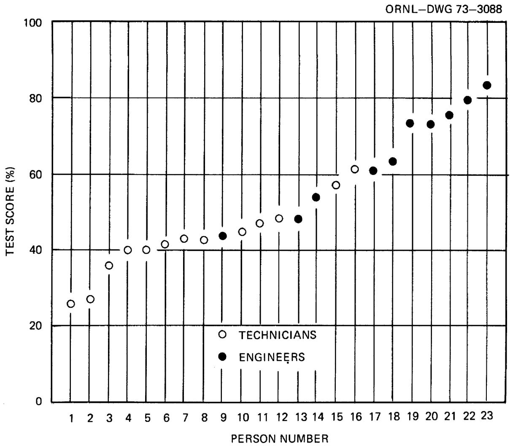  
Fig. 6. Initial Training Test Grades

The papers were graded promptly and were returned for self-evaluation by each individual and further study. Although this was the primary purpose, comparisons were made of average grades in various subject categories in an attempt to determine which areas needed the most additional training. The results, listed below, showed that the trainees had learned the physical layout rather well, and showed little difference in proficiency among the other subjects.

<table><tr><td>Subject</td><td>Average Grade, %</td></tr><tr><td>Design</td><td>56</td></tr><tr><td>Physical Layout</td><td>79</td></tr><tr><td>Line and Valve Numbers</td><td>35</td></tr><tr><td>Operation (General)</td><td>44</td></tr><tr><td>Chemistry</td><td>55</td></tr><tr><td>Nuclear</td><td>44</td></tr><tr><td>Instrumentation</td><td>47</td></tr><tr><td>Engineering Conversions</td><td>55</td></tr><tr><td>General</td><td>48</td></tr></table>

From August 4 to August 18, 1964, 2 to 4 hours each day were spent on training sessions emphasizing control circuits. The rest of the time was used for self-study and operational duties. Self-study consisted of studying available documentation as well as tracing out lines, studying equipment in the field, and becoming familiar with the area. Operating duties included such items as checkout, calibrating and operating equipment, making up log forms, procuring supplies, and labeling panel boards.

All operating personnel attended all sessions of a special MSRP Information Meeting on August 18 and 19, 1964. The meeting recognized the completion of MSRE construction as an important milepost and the papers presented there gave a comprehensive picture of the development of molten-salt reactor technology up that point. (The papers were issued as an ORNL report, reference 9.)

The period between August 20 and late September 1964, when rotating-shift work started, was spent largely on operating duties. Formal training consisted of some additional control circuit instruction and a thorough review of the fuel, coolant, and all auxiliary systems. Each system was assigned to an operations engineer and sufficient classroom time was allocated to cover all information pertinent to operation of the reactor. Topics covered included normal startup, normal operation, unusual or special operations, normal shutdown, operating limits, associated instrumentation and operation prior to criticality. A short quiz was given after each session to determine progress.

During the prenuclear operation and testing, nearly all of the reactor equipment was operated except for the heat-removal equipment, containment, and control rods. This valuable on-the-job training was supplemented by informal training by shift supervisors and day personnel. To stimulate self-study, each person was asked to submit a list of questions and answers which he felt were important. These were reviewed to eliminate duplication, other questions were added to fill in gaps and the final compilation of 569 questions and answers plus a separate group of 42 questions and answers on nuclear characteristics were issued for study.

# Precritical Training and Certification

In March 1965, when the reactor was shut down for completion of preparations for zero-power nuclear tests, the operating personnel were taken off shift for intensive training, examination, and certification. All received two weeks of formal training in which radiation safety and nuclear instrumentation and control were stressed. The engineers were given an additional week of formal training, with emphasis on nuclear aspects of the MSRE and discussions of the zero-power physics experiments. The schedule for this session is given in Appendix C.

Two steps were taken to develop some familiarity with and proficiency in nuclear testing and operation. First, each person participated in a criticality experiment at the ORNL Pool Critical Assembly (PCA). Second, a realistic simulation of the MSRE was set up and was used extensively.

The MSRE simulation made use of a TR-10 analog computer set up in the MSRE control room, with input signals from the control-rod position indicators. Outputs representing log count rates, log power, period, and linear power were sent through the actual instrument and control channels, including displays in the reactor control room.[10] Thus it was possible for each operator to practice taking the reactor critical, using the same procedures and controls and reading the same instruments that would be used later in the actual experiments. To further familiarize personnel with the controls and response of the MSRE each crew was given a set of "experiments" or problems relating to predicted criticality, rod worth, etc., that they were required to carry out on the simulator.

On April 13, 1965, all operators were given a qualifying examination containing 300 questions and lasting 7 hours. An additional test, containing 57 questions and lasting 1 hour, was given to the shift supervisors and assistant shift supervisors. An outline of the tests and sample questions are given in Appendix D. Before the tests were graded, passing grades for each subject were established by the MSRE Department Head and the MSRE Operations Chief. A breakdown of the various categories and the number of persons failing to meet the standard is given in Table 2. The overall tests grades are plotted in Figs. 7 and 8 along with a weighted average passing grade.

After the tests had been graded, each person was examined orally by the department head and the operations chief to verify that his test scores accurately reflected his understanding of each subject. In addition, various situations were posed and questions asked to determine how the operator would react under unusual circumstances. During the oral examinations, subjects apparently needing additional study were noted and were pointed out to the individual so that self-improvement could be made. If the examiners judged the person to be qualified, he was formally certified. If not, he was given further time for self-study and informal instruction. He was then reexamined and in most cases showed sufficient improvement to be certified.

Before startup at least one shift engineer and 2 technicians had been certified on each shift. Uncertified persons were not permitted to operate any of the controls relating to nuclear operation except in the presence and under the supervision of a certified operator.

Table 2. Evaluation of Precritical Test   

<table><tr><td rowspan="2">Subject</td><td rowspan="2">Time allowed for test (minutes)</td><td colspan="2">Passing grade (%)</td><td colspan="2">Number not passinga</td></tr><tr><td>Engr.</td><td>Tech.</td><td>Engr.</td><td>Tech.</td></tr><tr><td>Instrumentation</td><td>100</td><td>70</td><td>60</td><td>7</td><td>14</td></tr><tr><td>Flow Sheets and Operating Parameters</td><td>100</td><td>75</td><td>70</td><td>0</td><td>7</td></tr><tr><td>Design</td><td>50</td><td></td><td></td><td></td><td></td></tr><tr><td>Health Physics and Industrial Hygiene</td><td></td><td>75</td><td>75</td><td>4</td><td>14</td></tr><tr><td>Miscellaneous</td><td></td><td>70</td><td>60</td><td>0</td><td>1</td></tr><tr><td>Layout</td><td></td><td>75</td><td>75</td><td>3</td><td>2</td></tr><tr><td>Calculations</td><td>60</td><td>80</td><td>65</td><td>3</td><td>9</td></tr><tr><td>Electrical</td><td></td><td>75</td><td>65</td><td>4</td><td>0</td></tr><tr><td>Emergencies</td><td></td><td>80</td><td>70</td><td>2</td><td>1</td></tr><tr><td>Processing or Sampling</td><td></td><td>75</td><td>70</td><td>4</td><td>7</td></tr><tr><td>Physics and Nuclear</td><td>25</td><td>75</td><td>60</td><td>2</td><td>8</td></tr><tr><td colspan="6">ENGINEER&#x27;S EXAM</td></tr><tr><td>General</td><td></td><td>75</td><td>--</td><td>7</td><td>--</td></tr><tr><td>Computer</td><td></td><td>65</td><td>--</td><td>2</td><td>--</td></tr><tr><td>Abnormal Operating Procedures</td><td>60</td><td>75</td><td>--</td><td>6</td><td>--</td></tr><tr><td>Physics and Nuclear</td><td></td><td>75</td><td>--</td><td>8</td><td>--</td></tr></table>

$^{\alpha_{13}}$ engineers and 18 technicians took the test. Of these, 1 engineer and 5 technicians had not been in the initial training program.

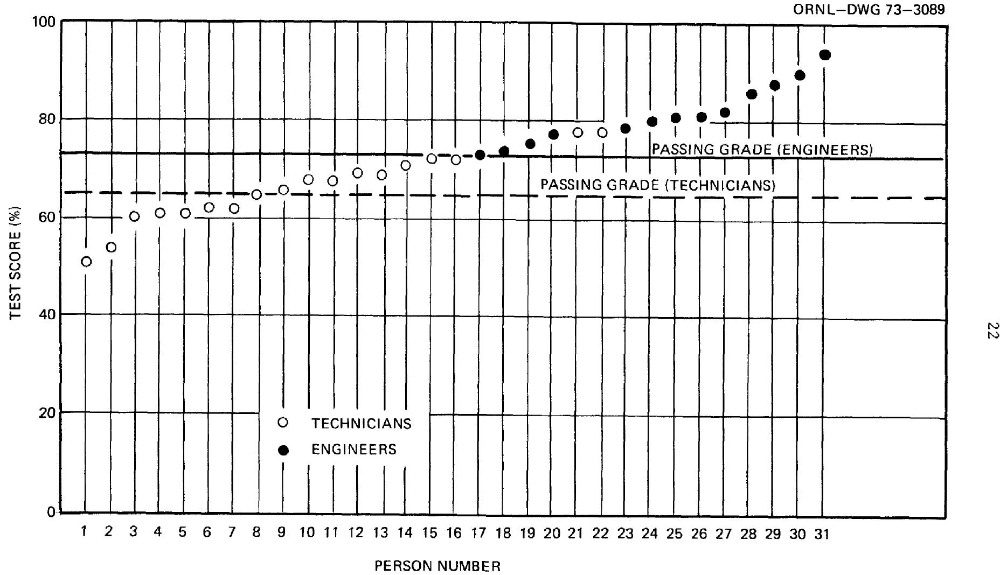  
Fig. 7. Precritical Training Test Grades

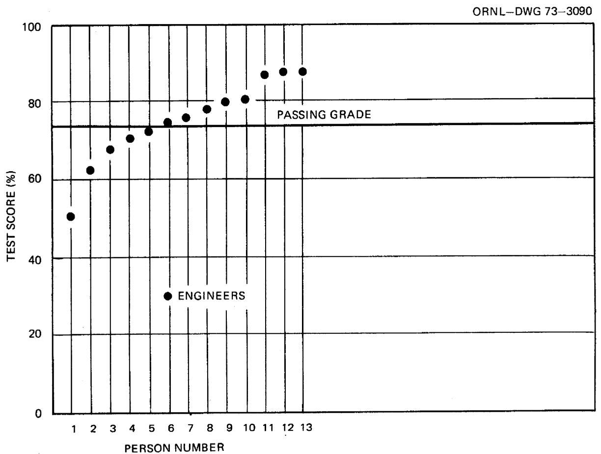  
Fig. 8. Precritical Training Test Grades (Engineer's Exam)

Criticality was attained on June 1, 1965. During the zero-power runs very little time was available for any training other than that gained from carrying out the detailed experimental procedures.[11,12]

# Prepower Training

In September and October 1965, during the shutdown prior to approach to power, each operator was given a week of formal instruction. (Since it was not possible to leave the reactor unattended, two training sessions were provided, with half of the operators in each.) The subjects covered and time spent on each are given in Appendix E. The session included some review coupled with detailed instruction on the operation of equipment and systems not in use during the previous operational period.

Provisions were also made to allow each operator to practice simulated power operation, using two TR-10 analog computers connected to the reactor controls and instrumentation.10 Inputs to the computers were signals indicating the actual positions of the rods and radiator doors and the actual pressure drop of the cooling air across the radiator. The outputs indicated on the reactor instrumentation were linear power, log power, log count rate, period, fission chamber position, reactor inlet temperature, reactor outlet temperature, radiator salt outlet temperature, radiator salt $\Delta T$ , and radiator heat power (flow times $\Delta T$ ). The operators practiced taking the reactor critical and raising and lowering the power using manual or automatic load control. Simulator problems were solved such as determining the power level with various load system configurations, determining the heat capacity of the loop, and determining the temperature and power coefficients of reactivity.

Prior to startup for power operation, a 2-hour written examination was given to all operators and an additional one-hour examination was given to the engineers. The distributions of grades for these examinations are given in Figs. 9 and 10. Sample portions of the examinations are given in Appendix F. As was done on the pre-critical certifying tests, each person was examined orally before he was certified for operating the reactor at power.

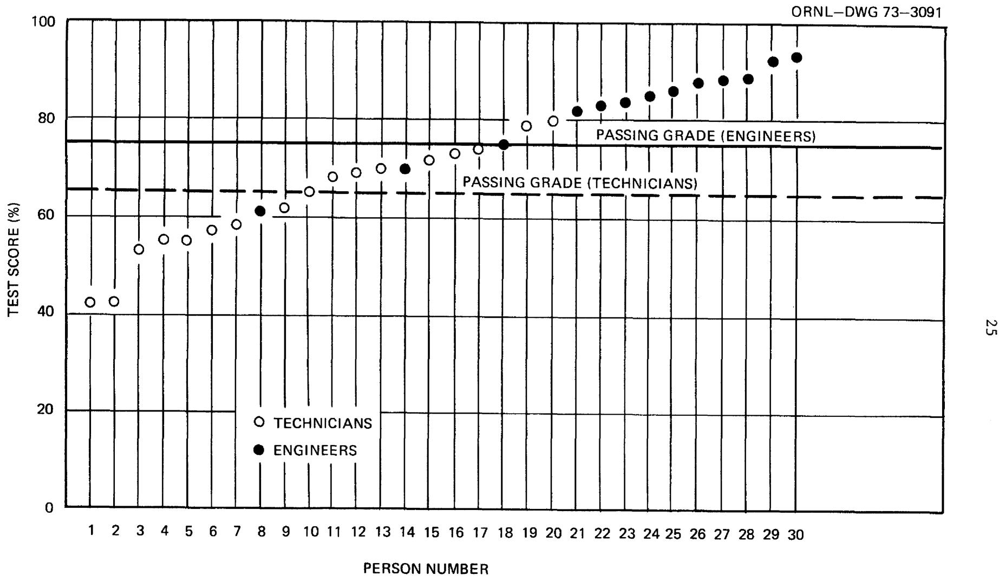  
Fig. 9. Prepower Training Test Grades

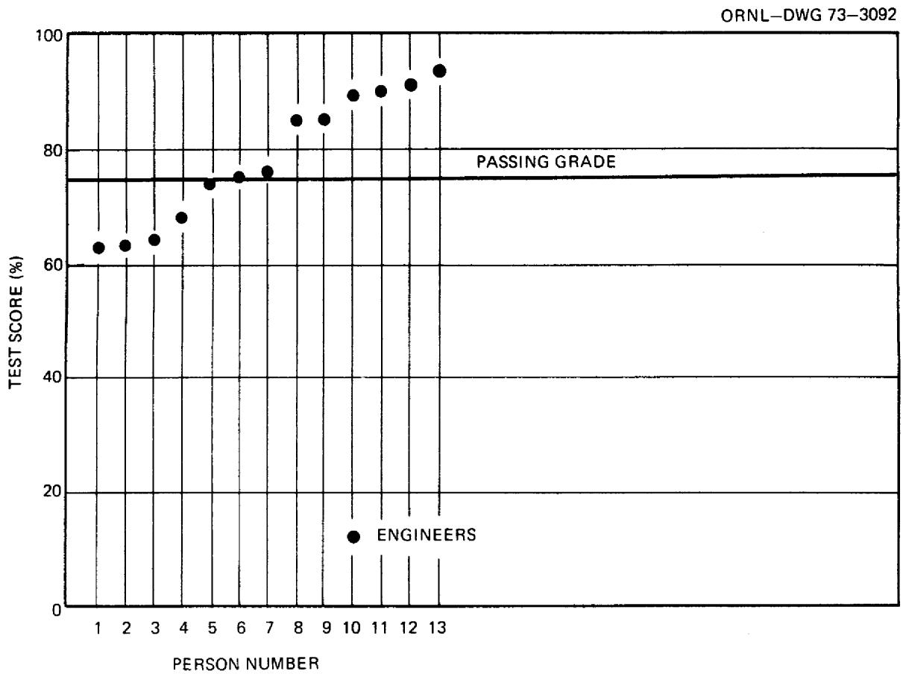  
Fig. 10. Prepower Training Test Grades (Engineer's Exam)

# Training of Chief Operators

The reduction of the operating crews to three men each had been carefully considered from the standpoints of safety and effectiveness and was judged to be feasible. (By mid-1967, equipment difficulties encountered during early operation had been overcome and the test program was well into its sustained high-power operation phase, so that unusual demands on the operating crews on other than the day shift had been minimized.) It was recognized, however, that the technicians who were to take over the supervision of the crews would need some special training for their new duties. Six candidates for Chief Operator were chosen on the basis of their past experience and test grades, and the opinions of the shift supervisors, assistant operations chief, operations chief, and operations department head. These technicians were given the additional instruction outlined in Appendix G. Training was on an individual basis and to some extent was tailored to the individual's need. Emphasis was placed on duties previously handled by the shift supervisors, such as trouble-shooting, tracing out control circuits, etc. After instruction, each candidate was given charge of a shift for one or two weeks with an original shift supervisor on duty but acting only as adviser. They were then given a 2-1/2-hour closed-book written examination and a 1-1/2-hour open-book written examination. Sample portions of these examinations are given in Appendix H. All 6 candidates passed and after oral examinations, all were certified as qualified Chief Operators.

It appeared that considerable benefit was gained from this training. Therefore, it was subsequently given to all the other operators. No examination was given to the others, however.

# Training Before $^{233}\mathrm{U}$ Startup

The 5-month shutdown that followed the end of extended operation with $^{235}\mathrm{U}$ fuel and preceded the $^{233}\mathrm{U}$ startup experiments was recognized as an appropriate time for refresher training of the operators. Instead of training sessions attended by the entire staff, however, a program of self-study and small-group study was initiated. The schedule was rather flexible to

permit other jobs to be carried on, but a date was announced on which all members of the operating staff were to be reexamined. The nuclear aspects section of the Operating Procedures11 was revised to show the calculated reactivity coefficients and other characteristics with $^{233}\mathrm{U}$ fuel and a memorandum summarizing the changes was issued. As an aid in review of all systems, a 74-page programmed instruction manual was prepared. Prior to startup with $^{233}\mathrm{U}$ , a comprehensive review test was given to all operators. The distribution of grades on this test is shown in Fig. 11. The results of the tests were discussed with each operator and each was required to do more studying of subjects in which they appeared weak.

# Other Training

From the standpoint of keeping in practice, it would have been beneficial if each operator could have filled and started up the reactor, shutdown and drained the reactor, and done all other operations periodically. However, with the MSRE, which was on line most of the time, this was not possible. The various job categories were rotated among the operators to help distribute the experience and, whenever there was opportunity, each operator was required to take the reactor critical and subcritical and to raise and lower the power as well as most of the other routine operations. Occasionally in slack periods, problems were assigned for each crew or each individual to solve. Typically these involved radiation and health physics, reactivity changes and other topics that were important but were seldom encountered in routine operation. Information regarding changes in plans or equipment were usually communicated to operating personnel by means of Shift Instructions and changes in the Operating Procedures. (See Chapter 8.) Each Shift Supervisor or Chief Operator was responsible for assuring that all persons on his shift were familiar with all changes and that they remained adequately trained to run the reactor.

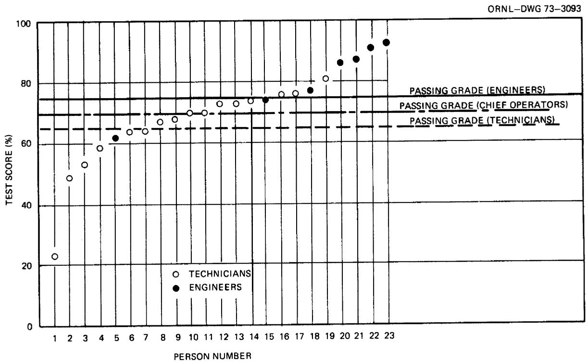  
Fig. 11. Pre-233 Training Test Grades

# Training of Replacements

During the five years of reactor operation, 3 engineers and 5 technicians were assigned to the MSRE for training and use as operators. Their training was on a person-to-person basis, with instruction by members of the MSRE staff. The program outlines which were followed for group training were used as guides. Considerable time was provided for self-study of the various sections of the MSRE Design and Operations Report, semiannual reports, flow sheets, control circuits, etc. When training was complete, each of these operators was given the same series of tests and oral reviews that had been used with the main group. The elapsed time between arrival at the MSRE and final testing varied from 3 to 8 months depending upon need for replacement, availability of instructors, background of the individual, and the extent of his other duties.

# Equivalence to AEC Examination

In their annual safety review of the MSRE in September 1968, the USAEC-ORO committee suggested that the MSRE operator examinations be reviewed to assure equivalence with the requirements for non-AEC reactor operators (ref. 13). At their suggestion, an ORNL employee who administers tests for the AEC's Division of Reactor Licensing reviewed one of the three major tests that had been used at the MSRE. It was his opinion, based on this one test, that the MSRE operator testing was adequate and equivalent. However, he suggested that if other operators were to be certified, new tests should be prepared conforming more directly to the AEC guidelines. A test was made up using 10-CFR-55, the AEC Licensing Guide, $^{14}$ and suggestions from the examiner. This test, designated "MSRE Operator's Examination - May 1969," is given in Appendix I. One engineer, who was in training at the time, was given the MSRE Precritical, Prepower, and Pre- $^{233}$ U examinations, and then took the May 1969 examination and an oral operational test before certification. Twelve hours were allocated for taking the operator's sections (A-G) of the May 1969 examination and 9-1/2 hours for taking the shift supervisor's section (H-L). He passed all tests, but certification was based, as with past operators, on the more inclusive MSRE tests, informal review, and oral questioning.

# 6. OPERATION OF THE REACTOR

Although the goal of the training program at the MSRE was to make all operators capable of operating the reactor without instructions or procedures if need be, the practice was to follow detailed written instructions to the maximum practicable extent. The intelligence, interest, and capability of the operators was recognized, however, and in all instructions an attempt was made to give the reason for as well as the details of the required actions. In return, it was each operator's duty to provide feedback. For example, he was expected to provide an explanation, if known, for all log notations which were not self-explanatory and for any deviations from normal or expected events. Suggestions, including unproved but credible theories to explain observed events, were encouraged.

# Planning

Operation of the MSRE followed a published test program, $^{15,16}$ and the objectives of each run were worked out in advance among the engineers, chemists, physicists and directors of the Molten-Salt Reactor Program. Most of the day-to-day, detailed planning was done in planning meetings held at the reactor site. Originally held each day, these meetings later came to be held at intervals of 1 to 3 times per week, depending upon the need. All technical personnel on duty at the reactor plus representatives of supporting groups attended these meetings. (The MSR Program Director was usually present also.) A member of the operations group (usually the Assistant Operations Chief) began the meeting by reporting on the previous period's activities. Others added to this any other pertinent events, analyses made, maintenance status, etc. Tentative plans were then presented and discussed. Often a smaller group remained to work out details or to discuss problem areas. In cases where there was uncertainty or conflicts (between experimenters, or between maintenance and operation, for example) the MSR Department Head usually made the final decision. The meetings started at 11:00 a.m., which allowed ample time before to digest most of the previous period's work and sufficient time afterward to prepare detailed shift

instructions, obtain materials needed and make the necessary plans to carry out the program for the following period before the end of the day shift.

# Instructions to and Communications with Operators

Shift Instructions were prepared each weekday by a member of the operating group (usually the Assistant Operations Chief or the Operations Chief). These were based mainly on decisions reached in the planning meetings. A general information section outlined the plans and provided other information of interest to the shift personnel. The instructions sometimes were very specific, such as a detailed check list; at other times they referred to a separate procedure such as a section of the Operating Procedures11 or a test memo. If the instructions were to be followed for longer periods, instead of being repeated each day in subsequent shift instructions, they were usually put in the Permanent Shift Instructions. The Permanent Shift Instructions were reviewed periodically and appropriate sections were incorporated into the Operating Procedures. The shift instructions could override the operating procedures or test memos. If difficulties prevented following the prescribed program, the Chief Operator, Shift Supervisor, Assistant Operations Chief, Operations Chief, and/or Operations Department Head decided what alternatives to follow. Typical examples of Shift Instructions, Operating Procedures, and Test Memos are given in Appendix J.

A master up-to-date copy of the Operating Procedures was maintained in the operations office. To avoid confusion, changes in this master copy were entered only by the Operations Chief or Assistant Operations Chief. All personnel were required to be familiar with these changes and records were maintained indicating this. The master copy or a copy corrected to agree with the master was used for all operations. Control-room log and building log forms were a part of the Operating Procedures. Current limits were indicated on these for each variable as well as the frequency for recording variables. The first few pages of the control-room and building log forms are shown in Appendix K. Before starting a log (or check list) the operator was required to correct his copy of the form to agree with the master. If variables were found out of limits, they were corrected or reported to the Shift Supervisor or Chief Operator. He decided on the

course of action to be taken either independently or after contacting appropriate day personnel. During transient conditions, such as at shutdown or startup, when the appropriate log limits were changing rapidly, shift personnel were expected to decide on what limits were proper and what equipment should be operating at the time.

Test Memos were detailed procedures which were written for more involved special tests. These required the approval of the MSRE Operations Department Head, the Operations Chief, and others as designated by the Operations Department Head.

There was, of course, an oral exchange of information and instructions at shift change between the crew leaving and the one taking over.* Everyone was required to read the shift instructions and console log as soon as possible after reporting for duty.

# Data Taking and Record Keeping

One of the primary records of the MSRE operation was the Console Log, which was essentially a chronological narrative of events. The time was recorded at the start of each entry and the initials of the person making the entry were put at the end. A status and summary entry was made at the end of each shift. Practically all operations events were noted, but only the most important maintenance items. (Other maintenance was reported on the completed work requests or by memos.) Copies were made of the console log sheets and distributed daily to interested personnel. The originals (in bound books) were kept in the operations files at the site.

As mentioned previously, almost all variables were recorded on the building log or control room log forms. These were arranged by areas to facilitate recording of data. Completed copies of these were filed in the

operations files along with completed check lists, operating procedures, and test memos. Recorder charts were marked at least once each shift and were removed and filed daily.

The bulk of the data were logged by an on-line digital computer (Bunker-Ramo Model 340),17 which monitored all of the important variables and recorded these on magnetic tape every 5 minutes. In addition, it typed out an hourly log, an 8-hour log, and a daily report. In case a variable went out of limits, an annunciation occurred and the value of the variable was typed out by a typewriter located in the main control room. When any of certain important variables went out of limits, it initiated a fast scan which increased the frequency of recording of a selected group of variables to 4 times per second. A fast scan could also be initiated by the operator. Variables could be trend-logged or plotted if desired. Data typed out by the computer was removed and filed each day. Magnetic tapes were removed daily and then transferred to record tapes which held several days' data. These were filed at the reactor site.

# 7. APPROVAL OF MAINTENANCE AND DESIGN CHANGES

The forms used in connection with maintenance and design changes are included in Appendix L. Anyone knowing the need of maintenance could initiate action by filling out a Punch List form. If the job was small, the work was completed without any additional paper work. No formal record was kept of work done in this manner. If the job was more involved, a Work Request was issued. This had to be approved by the Operations Chief or Assistant Operations Chief. In either case the Shift Supervisor's approval was necessary before work was started. He was responsible for making necessary changes in the system and tagging out necessary valves or switches to assure safety of the reactor and personnel. After maintenance was complete, he checked out the job before removing the tags and putting the equipment back in service. The completed work requests were retained as a record of what was done.

Proposed modifications which could produce significantly different characteristics or functions in any component or system (such as piping,

instrumentation, switch settings, etc.) were initiated using a "Change Request" form. The MSRE Operations Department head reviewed all change requests and determined what other reviews were necessary.

# 8. INFORMATION AVAILABLE TO OPERATORS

Documents are listed in this section which were useful in the training of operators or were used by them in the operation of the MSRE. A brief description of their content and how they were used is given where applicable. The approximate date of issuance is also given when this is thought to have been pertinent to the training program or operation of the reactor.

# Design and Operations Report

The need for documentation of reactor design and preparations for operations, was recognized very early by the MSR Program Director, who issued a memorandum in July, 1962 assigning responsibilities for writing parts of a Design and Operations Report. Table 3 lists the subjects and the dates when the various parts were eventually published.

Part I - Design4 described the mechanical and electrical portions of the reactor. Flowsheets, electrical one-line drawings and equipment details were given. Bases for design or design calculations were not included. A rough draft of Part I was available for the initial operator training and proved to be very helpful. The report was issued at the time of the zero-power experiments and although it was not kept up to date, it was nevertheless referred to frequently during subsequent operation.

Parts II-A and II-B - Nuclear and Process Instrumentation $^{18,19}$ describe the instrumentation layout, individual instruments or systems, control circuitry and other details. Unfortunately, these were not available for use in training and it was necessary for the instructors to search through drawings and unpublished information to prepare for the training sessions. The students had to take very good notes and had to search for information if needed later. Section II-A was used for reference after its publication near the end of $^{235}\mathrm{U}$ operation. Section II-B was not published until after the conclusion of MSRE operation.

Table 3. MSRE Design and Operations Reports   

<table><tr><td>Part</td><td>Title</td><td>ORNL-TM</td><td>Publication Date</td></tr><tr><td>I</td><td>Description of Reactor Design</td><td>728</td><td>6/65</td></tr><tr><td>IIA</td><td>Nuclear and Process Instrumentation</td><td>729</td><td>2/68</td></tr><tr><td>IIB</td><td>Nuclear and Process Instrumentation</td><td>729</td><td>9/72</td></tr><tr><td>III</td><td>Nuclear Analysis</td><td>730</td><td>2/64</td></tr><tr><td>IV</td><td>Chemistry and Materials</td><td>731</td><td>--</td></tr><tr><td>V</td><td>Reactor Safety Analysis</td><td>732</td><td>8/64</td></tr><tr><td>V-A</td><td>Safety Analysis of Operation with 233U</td><td>2111</td><td>2/68</td></tr><tr><td>VI</td><td>Operating Safety Limits</td><td>733</td><td>4/65a</td></tr><tr><td>VII</td><td>Fuel Handling and Processing Plant</td><td>907</td><td>5/65b</td></tr><tr><td>VIII</td><td>Operating Procedures</td><td>980</td><td>12/65c</td></tr><tr><td>IX</td><td>Safety Procedures and Emergency Plans</td><td>909</td><td>6/65</td></tr><tr><td>X</td><td>Maintenance Equipment and Procedures</td><td>910</td><td>6/68</td></tr><tr><td>XI</td><td>Test Program</td><td>911</td><td>12/66</td></tr><tr><td>XI-A</td><td>Test Program for 233U Operation</td><td>2304</td><td>9/68</td></tr><tr><td>XII</td><td>Lists</td><td>--</td><td>--</td></tr></table>

$\alpha_{\text{Three revisions of ORNL-TM-733}}$ were issued in 8/65, 9/66, and 7/69.   
$b_{\mathrm{A}}$ substantially revised version of ORNL-TM-907 was issued in 12/67.   
Loose-leaf copies were issued to members of the operating staff in 12/65; revised pages were issued as necessary at later dates.

Part III - Nuclear Analysis $^{20}$ described the predicted nuclear characteristics, rod worth, coefficients of reactivity, poisoning effects of fission products, kinetics of operation and adequacy of biological shielding. It was the first part published and was available for all of the training periods. Although it was not kept up to date, it was used occasionally for reference during operation.

Part IV - Chemistry and Materials was expected to include in a form convenient for the operators: (a) a summary of salt chemistry (phase diagrams, effects of moisture, oxygen, etc.), (b) a description of the chemistry of water systems (acceptable limits, suggested analysis, and effect of activation), (c) a listing of the properties of lubricating oil for the circulating pumps (analysis required, acceptable limits, etc.), (d) information on the metallurgy of INOR-8 and stainless steel, (e) a discussion of graphite, (f) explanation for keeping the oxygen and water content of helium cover gas low, and (g) a discussion of fission products. This part of the Design and Operations Report was never prepared.

Part V - Safety Analysis $^{21}$ described some of the more important systems, controls, and instrumentation. Plant layout, site features, construction, startup and operating plans were covered. Various possible accidents were discussed and the consequences delineated. This was available for most of the training and was extremely valuable. The operations copy was updated periodically and used regularly during operation. Prior to operation with $^{233}\mathrm{U}$ fuel, another safety analysis report $^{22}$ was published, which provided a basis for operator training and was a useful reference.

Part VI - Operating Safety Limits[23-26] tabulated the absolute limits within which the reactor had to be operated. This was available before criticality and was used for instruction. Three revisions were issued.

Part VII - Fuel Handling and Processing Plant covered all aspects of the fuel processing plant, (design, hazard analysis, operating procedures, etc.) and was useful in training operators and for running the chemical processing plant. The original version27 was issued at the time of the hydrofluorination of the flush salt in 1965 and a substantially revised version7 was issued in preparation for the processing in 1968.

Part VIII - Operating Procedures11 provided most of the information necessary for operation. A simplified description of basic nuclear facts

and nuclear characteristics of the MSRE was given. Methods of startup, operation, and shutdown of all systems were covered with detailed check lists. Special and unusual operations were described and attempts were made to anticipate any troubles which might have developed and suggest corrective action. For instance, each annunciator was listed. Things which could cause the annunciation, control actions which would occur and suggested operator actions were tabulated. Data sheets, logs, and check lists were included and the methods of taking data and its storage was covered in detail. The methods used for getting maintenance done safely and for making modifications to the system or approved documents was described. A rough draft of this was available for the initial training. This report was issued in a bound edition (two volumes) to the recipients who did not desire or need to be notified of changes. Others, including all operators, were issued loose-leaf editions and they were sent copies of revised sections as they appeared. The master copy was updated as changes occurred.

Part IX - Safety Procedures and Emergency Plans $^{28}$ provided procedures and background information to assist personnel in anticipating, preventing, and handling emergencies such as fires, release of beryllium, or increases in radioactivity. This procedure was available before criticality and was used for training operators. Operators' copies were updated periodically but a formal revision was not issued.

Part X - Maintenance Equipment and Procedures29 gave general procedures for doing remote maintenance. The reactor operators were not normally involved in maintenance except to prepare the system and assure that adequate safety precautions were followed.

Part XI - Test Program15 described the program for the shakedown of equipment, approach to criticality, and power operation. Various special tests and experiments were described. Details of experiments were not given in the report itself, but test memos, numbered to correspond to the sections in the test report, did give details. These were written and approved before the experiment or test was started. Operation with $^{233}\mathrm{U}$ fuel was conceived and planned after the original program was underway and a separate document16 was issued to outline this phase of the program.

Part XII - Lists was to give a ready reference or index to all reports, drawings, and other information. Such things as a cross reference index to drawings were to be included. It would have been very valuable during design, construction, and all stages of operation, but it was never prepared.

# Other Reports

Progress reports of the Molten Salt Reactor Program were issued semi-annually. Informal reports covering progress in most areas of the program were also issued monthly. Copies of these, as well as topical reports on molten-salt work done at the reactor or elsewhere, were maintained at the site. Copies of other pertinent reports such as ORNL and Reactor Division Safety Procedures, Health Physics Procedures and ORNL Standard Practice Procedures were also available. A Daily Report was issued covering all known events of importance at the MSRE and a tabulation of important items such as number of hours critical, total power produced, operating conditions, etc. (See Appendix M.)

# Drawings

A stick file was maintained with the latest revisions of flowsheets, instrument application drawings, block diagrams, control circuit schematics, annunciator schematics, heater schematics, heater and thermocouple location drawings, electrical on-line drawings, and a few layout drawings. These were updated whenever a change was made in the system. The transparencies were revised periodically and new revisions put on the stick file. Microfilm negatives of these drawings and all other MSRE drawings were maintained at the site. A reader-copier was available for quick viewing or obtaining copies of any drawing.

# Miscellaneous

(1) Calibration curves and other operational information on equipment or systems was maintained in a loose-leaf notebook in the operations office. These were updated as new information was accumulated.

(2) Copies of manufacturers' bulletins and instructions for all equipment were maintained in the maintenance office.   
(3) Switch tabulations giving the setpoints of all switches were kept up to date.   
(4) Two thermocouple tabulation books were maintained which gave the readout location of each thermocouple. One was indexed according to thermocouple number and the other according to readout instrument number. Accurate records on this were necessary because there were approximately 1000 thermocouples which were routed through a patch panel to the readout devices.   
(5) The latest copies of the instrument tabulations, instrument specifications, line schedules, and design data sheets were available.   
(6) Up-to-date information regarding the computer including the "Computer Manual for MSRE Operators"30 was kept in the computer room located next to the main control room.   
(7) The main control board was a graphic panel and was very helpful to the operators. Most of the control circuits were depicted graphically on a jumper board. Indicator lights provided the operator with information on each contact in the control circuits. Plug-type jumpers could be used to bypass some of the interlocks. The jumper board reduced the need for behind-the-board jumpers. All jumpers at the MSRE were used only under strict administrative control.

# 9. RECOMMENDATIONS

The following recommendations are based on the author's experience gained during operator training, startup and operation of the MSRE. The intent is not simply to criticize the way things were done at the MSRE but to try to share recommended techniques with other operators and to point out possible pitfalls. In general, only those items which directly affected training, preparation for operation, or actual operation are included.

A. The MSRE Design and Operations Report was intended to cover all phases of the reactor and to avoid duplication as much as possible. Therefore the Operating Procedures, Part VIII, did not cover descriptions of the systems, equipment, or instrumentation. To learn what was needed for operation, the operators had to read through much information which was not

pertinent to operation. All other parts of the Design and Operations Report should have been abstracted and the information needed for operation should have been repeated in the Operating Procedures or in a Training Manual.

B. A special set of drawings needs to be made for use by operators. Since these would be repeatedly referred to, more than normal effort should be spent in proper layout, cross-referencing, etc. Most of these need to be reduced to 11- x 17-in. size as were the flow sheets at the MSRE. Some specific examples are given below.

(1) Flow sheets should be similar to those issued for the MSRE. They should include line numbers and names, equipment numbers and names, simplified instrument numbers, locations of lines and equipment, direction of flow, normal flow rates, normal temperatures, normal pressures, relative elevations when important, and normal and fail position of valves.

To avoid unnecessary confusion, most data on components, cross-references, and approval signatures could be on a separate sheet rather than on the drawings. Such things as line sizes, the number of thermocouples or heaters on a line or equipment, flanges and leak detectors, etc., would not need to be included.

Considerable effort should be taken to include all items needed in routine operation but to make these as simple as possible.

The MSRE flowsheets were made so that lines extending beyond the edge of one drawing matched the next drawing. In other words it was possible to fasten the flowsheets together and end up with a large drawing of the entire plant. This is desirable as it facilitates tracing lines.

(2) Although flowsheets, as described above, supplied most of the day-to-day needs of the operators, there was often a need to know more detailed flowsheet type information. Drawings showing this should be made using the simplified

flowsheets as a starting point so that the orientation on the drawings is the same. Details of instrumentation loops, like given on the instrument application diagrams, should be added along with any instrument valving and valve numbers. Control and annunciator circuit numbers should be given from all sensing elements as well as to all valves and equipment such as pumps. Line sizes and flanges should be shown along with the flange leak detector lines. Approximate location of thermocouples should be indicated. These drawings would be the starting point for most trouble-shooting.

(3) Four types of control circuit drawings were provided for the MSRE. Examples of the three used most by operating personnel are shown in Fig. 12. No one type was entirely satisfactory. The block diagrams were probably the easiest to use when learning the circuits but they were not sufficient for operating the reactor since they did not readily show all the control actions that occur, the switches that initiate the action, relay numbers, jumper board lights, etc. The engineering elementaries supplied most of the information necessary but were difficult to use. The jumper board drawings lacked detail and cross-referencing. These three if combined as shown in Fig. 13 should be much more useful to the reactor operators. Switch setpoints should not be shown but should be tabulated similar to the MSRE Switch Tabulation31 with provisions for keeping a master copy up to date.

(4) Simplified electrical distribution drawings were needed showing all switches, breakers, indicators, recorders, etc. Control power for the breakers should be shown. Control circuits and switch tabulation similar to that described above would be helpful.

(5) Combination heater and thermocouple drawings as used at the MSRE were very helpful. These showed the approximate location of the heaters and the thermocouples. Isometric drawings could have been used to advantage in some places.

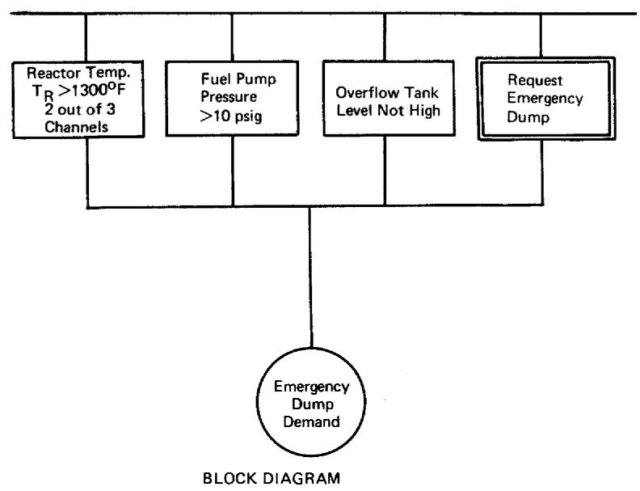

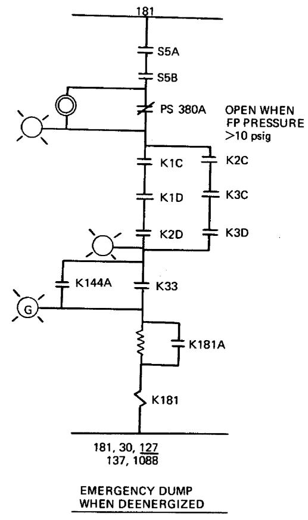

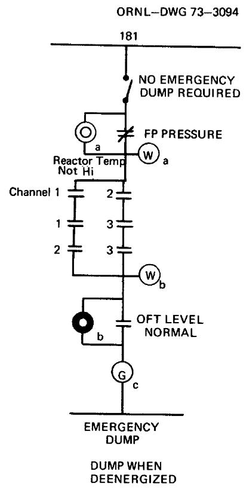  
JUMPER BOARD   
ENGINEERING ELEMENTARY   
Fig. 12. Control Circuit Drawings Used at MSRE.

ORNL-DWG 73-3095

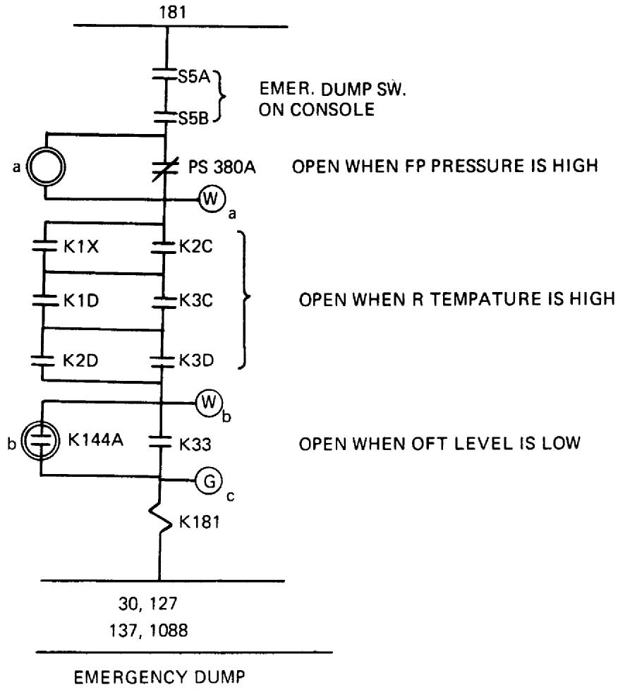

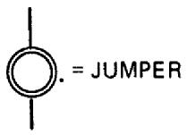

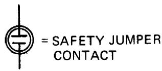  
Fig. 13. Suggested Type Drawings for Control Circuits.

<table><tr><td>ECC</td><td>ACTION WHEN K181 IS DEENERGIZED</td></tr><tr><td>30</td><td>FILL RESTRICTION</td></tr><tr><td>127</td><td>THAWS FV 298</td></tr><tr><td>137</td><td>Closes HCV 355</td></tr><tr><td>1088</td><td>ANNUNCIATES EMERGENCY DUMP</td></tr><tr><td></td><td>MB8-1</td></tr></table>

C. Early in construction certain drawings and documents such as flowsheets and most sections of the Design and Operations Report should be assigned to personnel who are responsible for keeping these up to date. Most of this should probably be assigned to future operating personnel.

D. During preparation for operations, a table was made listing all known variables in alpha-numerical order. Columns were provided for indicating the readout instrument number and location, the function of the variable, the normal value, the alarm and control setpoints and proposed logging frequency. Members of the design and development groups were contacted to determine recommended initial conditions. This provided a very good starting point for making up the various logs and aided in writing operating procedures. Design and development personnel should be responsible for advising operations of any recommended additions or changes in these.

E. Flowsheets and circuit elementary drawings should always precede piping and wiring drawings. These should be approved by operations personnel. Operations personnel should follow construction or construction personnel should be thoroughly familiar with operating criteria. All lines, valves, wires, and equipment should be labeled as they are installed.

F. During design of the MSRE, it was thought that extreme flexibility would be needed for thermocouples and their readout instruments. During operation it was obvious that the flexibility provided by the patch panel was not necessary for a good part of the thermocouples. To keep track of the over 1000 thermocouples at the MSRE presented a difficult problem but the system of two log books described earlier adequately solved the problem.

G. The operating crew should be at the site long before the cells are closed so that they can become familiar with the physical layout. A model of in-cell equipment is valuable for operation and maintenance.

H. The desire of non-operating personnel to know the status of the reactor often led to confusion in the control room especially at the start of the work day. This was alleviated by posting a short report on the control-room window giving the major happenings for the last 24 hours, the important problems encountered and the present plans. Copies were also made of the console log sheets each morning and placed in convenient locations.

I. The use of simulators for operator training was found to be very useful. The value of this was enhanced by having the operator sit at the reactor console, use the actual control switches, and refer to the regular reactor instrumentation. Perhaps additional training could be done by simulating failure of some of the control and/or safety instrumentation. By running tests where the system is maloperated, the simulator would very dramatically illustrate the consequences.

J. Often it is difficult for the shift supervisor to find time to thoroughly review the building log. To aid in this, a cover sheet was provided. The person taking the log listed items out of limits or items requiring attention. (See Appendix K.)

K. Limiting the number of people who are authorized to change operating procedures is recommended. Keeping everyone informed of the changes was cumbersome. These were entered in an operating procedures change book and at first it was the responsibility of the shift supervisor to keep all operators on his shift informed. Vacations and other leave made it difficult to be sure that all had been notified. Places were then provided in the Operating Procedures Change Book for each operator to sign when he had read and understood the change. This worked fine except that often there was too much lag time. In reviewing the difficulty, it was decided that many of the changes were on check lists or for some other reason did not need to be known by everyone. Therefore, only important changes were entered in the Operating Procedure Change Book. Reading of these was strictly enforced.

L. Graphic panels showing important flowsheets with valve position and equipment status and jumper boards showing important control circuits and their status were very helpful to the operators.

M. The tagging system used at the MSRE worked very well. All valves and switches, which if inadvertently operated could cause harm to personnel or to the reactor, were tagged. The tags used are shown in Fig. 14. The valves or switches were not operated without removing the tag which required the approval of the shift supervisor on duty. Most of these were attached as specified in the startup check lists. In general, we did not tag valves or switches which were operated regularly.

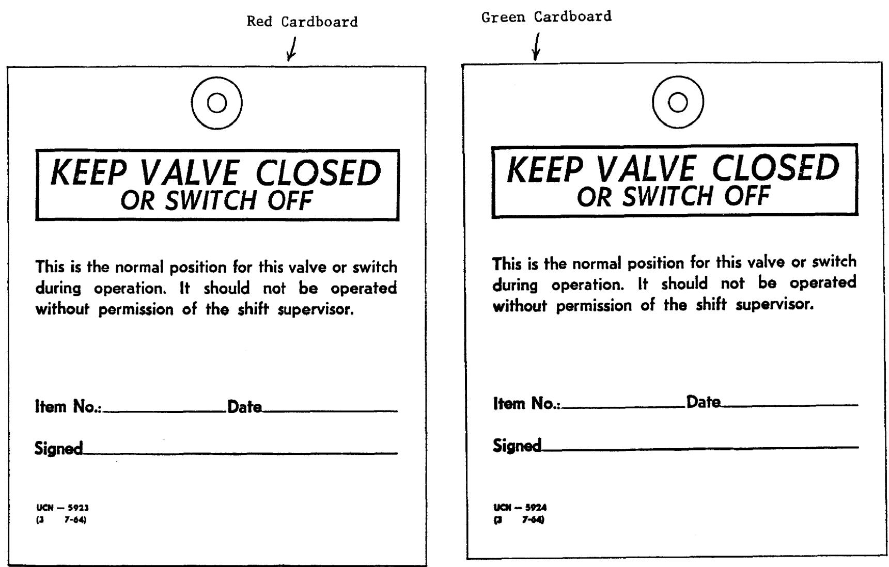  
Fig. 14. Operations Tags.

"Do Not Operate" tags were used for tagging out valves and switches for maintenance and special procedures. As indicated in Fig. 15, space was provided on these for additional information. The white paper was removed and attached to the maintenance work order or special procedure. This aided in assuring that all tags were removed when the work was complete. In general, the requirement to remove the tag was to have the shift supervisor's permission. It was his responsibility to see that the work was complete and that it was safe to operate the switch or valve.

N. The system used in selecting instrument, heater, and valve numbers at the MSRE was an aid to training and operation. Each system was assigned a series of numbers (i.e., fuel system is 100 to 200). Any valves in the line, instruments attached to the line or heaters installed on it were numbered accordingly. (i.e., HV-522A was a hand valve in Line 522, PS-575C was a pressure switch attached to line 575, H-101-2 was a heater on line 101, and TE-103-1 was a thermocouple on line 103.)

0. The training instructors were engineers and scientists who, in most cases, were very familiar with their subject. However, some did not understand the needs and the limitations of the operators and most had no experience as teachers. It would be better if a few skilled instructors were used, with the experts present to answer questions that the instructor could not handle. These instructors should be given some prior training on such things as theory of learning, lesson planning, and methods of presentation.

P. A training manual should be written. This would have been helpful in the early training and would have saved considerable time in training replacements. This manual should be updated as changes are made.

Since much of the nuclear, health physics, and general engineering training needed is common to most reactors, available information such as the programmed instruction manuals published by the ORNL Operations Division32,33,34,35,36 should be put to use. However, this should be carefully reviewed and the appropriate sections made a part of the training manual for the particular reactor. The reactor design, instruments installed, and methods of operation should be covered from the operator's viewpoint. To aid in learning and in handling emergencies and unusual occurrences, the reason for the various features should be stressed.

# DO NOT OPERATE

RED CARDBOARD

UCN-5925 3-7-64

Item No. ________ Work Order No. ________

Description

Location

Reason for Tagging

Conditions Required to Remove Tag

Signed

Date

WHITE PAPER WITH

RED CARDBOARD

BEHIND AND CARBON

PAPER BETWEEN

Fig. 15. Maintenance Tags.

Instructions should be included for manipulative training and for aiding the trainee in becoming familiar with the physical layout. Photographs of operating areas would be helpful.

Detailed outlines of tours and oral instruction should be provided. Operating techniques such as changing chart paper, log-taking, etc., should be included.

The manual should be designed for the least educated operator and should advance this person to the stage needed to operate the reactor. Additional sections should be provided for the supervisors including the art of supervision.

This manual would probably be more valuable if put into the form of programmed instruction. Review tests should be included at the end of each section.

# REFERENCES

1. M. W. Rosenthal et al, The Development Status of Molten-Salt Breeder Reactors, ORNL-4812 (August 1972).   
2. P. N. Haubenreich and J. R. Engel, "Experience with the MSRE," Nucl. Appl. Tech. 8, 118 (1970).   
3. M. W. Rosenthal, P. N. Haubenreich, H. E. McCoy, and L. E. McNeese, "Current Progress in Molten-Salt Reactor Development," Atomic Energy Review, IX, 601 (1971).   
4. R. C. Robertson, MSRE Design and Operations Report, Part I, Description of Reactor Design, ORNL-TM-728, (January 1965).   
5. J. R. Tallackson, MSRE Design and Operations Report, Part IIA, Nuclear and Process Instrumentation, ORNL-TM-729, Part IIA, (February 1968).   
6. R. L. Moore, MSRE Design and Operations Report, Part IIB, Nuclear and Process Instrumentation, ORNL-TM-729, Part IIB, (September 1972).   
7. R. B. Lindauer, MSRE Design and Operations Report, Part VII, Fuel Handling and Processing Plant, ORNL-TM-907 Revised, (December 1967).   
8. B. H. Webster, Quality-Assurance Practices in Construction and Maintenance of the MSRE, ORNL-TM-2999 (April 1970).   
9. MSR Progr. Semmiannu. Progr. Rep., July 31, 1964, ORNL-3708.   
10. S. J. Ball, Simulators for Training Molten-Salt Reactor Experiment Operators, ORNL-TM-1445, April 5, 1966.   
11. R. H. Guymon, MSRE Design and Operations Report, Part VIII, Operating Procedures, Vols. I and II, ORNL-TM-908, (Dec. 1965).   
12. B. E. Prince, S. J. Ball, J. R. Engel, P. N. Haubenreich, T. W. Kerlin, Zero-Power Physics Experiments on the MSRE, ORNL-4233 (Feb. 1968).   
13. Operators' License, Code of Federal Regulations, Title 10, Part 55.   
14. AEC Licensing Guide - Operators' Licenses - "A Guide for the Licensing of Facility Operators, Including Senior Operators" published by the Division of Reactor Licensing, USAEC.   
15. R. H. Guymon, P. N. Haubenreich and J. R. Engel, MSRE Design and Operations Report Part XI, Test Program, ORNL-TM-911, (Nov. 1966).   
16. J. R. Engel, MSRE Design and Operations Report, Part XI-A, Test Program for $233^{\text{U}}$ Operation, ORNL-TM-2304, (Sept. 1968).

17. J. R. Engel and P. N. Haubenreich, Use of On-Line Computer in Analysis of MSRE Operation, ORNL-CF-62-3-26, (March 1962).   
18. J. R. Tallackson, MSRE Design and Operations Report - Part II-A: Nuclear and Process Instrumentation, ORNL-TM-729, Part II-A, (Feb. 1968).   
19. R. L. Moore, MSRE Design and Operations Report - Part II-B: Nuclear and Process Instrumentation, ORNL-TM-729, Part II-B, (Sept. 1972).   
20. P. N. Haubenreich, et al., MSRE Design and Operations Report, Part III, Nuclear Analysis, ORNL-TM-730, (Feb. 1964).   
21. S. E. Beall, et al., MSRE Design and Operations Report, Part V, Reactor Safety Analysis Report, ORNL-TM-732, (Aug. 1964).   
22. P. N. Haubenreich et al., MSRE Design and Operations Report, Part V-A, Safety Analysis of Operation with $^{233}U$ , ORNL-TM-2111, (Feb. 1968).   
23. S. E. Beall and R. H. Guymon, MSRE Design and Operations Report: Part VI, Operating Safety Limits for the Molten-Salt Experiment, ORNL-TM-733, (April 1965).   
24. S. E. Beall and R. H. Guymon, MSRE Design and Operations Report, Part VI, Rev., Operating Safety Limits for the Molten-Salt Experiment, ORNL-TM-733, (Aug. 1965).   
25. S. E. Beall and R. H. Guymon, MSRE Design and Operations Report, Part VI, 2nd Rev., Operating Safety Limits for the Molten-Salt Experiment, ORNL-TM-733, (Sept. 1966).   
26. R. H. Guymon and P. N. Haubenreich, MSRE Design and Operations Report, Part VI, 3rd Rev., Operating Safety Limits for the Molten-Salt Experiment, ORNL-TM-733, (July 1969).   
27. R. B. Lindauer, MSRE Design and Operations Report, Part VII, Fuel Handling and Processing Plant, ORNL-TM-907, (May 1965).   
28. A. N. Smith, MSRE Design and Operations Report, Part IX, Safety Procedures and Emergency Plans, ORNL-TM-909, (June 1965).   
29. R. Blumberg and E. C. Hise, MSRE Design and Operations Report, Part X: Maintenance Equipment and Procedures, ORNL-TM-910, (June 1968).   
30. G. H. Burger, J. R. Engel, and C. D. Martin, Computer Manual for MSRE Operators, ORNL-CF-67-1-28, (Jan. 1967).   
31. R. L. Moore, Molten Salt Reactor Experiment Process Instrument Switch Tabulation, ORNL-CF-65-6-5.

# APPENDIX A

# SCHEDULE FOR INITIAL TRAINING

(July 1964)

<table><tr><td>Day</td><td>Time</td><td>Subject</td><td>Instructor</td></tr><tr><td rowspan="5">Monday July 6</td><td>0800-1000</td><td>Information Meeting, Organization chart, schedule, general comments, questions, and answers)</td><td>Operations Dept. Head and Operations Chief</td></tr><tr><td>1015-1200</td><td rowspan="2">General Description of all Systems</td><td rowspan="2">Operations Chief</td></tr><tr><td>1300-1400</td></tr><tr><td>1415-1500</td><td>Description of Area</td><td>Shift Supervisor</td></tr><tr><td>1500-1630</td><td>Guided Tour</td><td>Shift Supervisor</td></tr><tr><td rowspan="5">Tuesday July 7</td><td>0800-0930</td><td>Guided Tour</td><td>Shift Supervisor</td></tr><tr><td>0930-1015</td><td>Questions on Guided Tour</td><td>Shift Supervisor</td></tr><tr><td>1030-1200</td><td>Reactor Chemistry</td><td>Reactor Chemistry Division Director and Chemist</td></tr><tr><td>1300-1500</td><td>Design of Fuel System</td><td>Asst. Operations Chief</td></tr><tr><td>1500-1630</td><td>Self-Study</td><td></td></tr><tr><td rowspan="6">Wednesday July 8</td><td>0800-0930</td><td>Reactor Physics Problems and Group Solving</td><td>Operations Dept. Head</td></tr><tr><td>0930-1130</td><td>Design of Coolant System</td><td>Shift Supervisor</td></tr><tr><td>1130-1200</td><td>Self-Study</td><td></td></tr><tr><td>1300-1400</td><td>Reactor Chemistry</td><td>Chemist</td></tr><tr><td>1415-1600</td><td>Design of Fuel and Coolant Drain Tank Systems</td><td>Shift Supervisor</td></tr><tr><td>1600-1630</td><td>Self-Study</td><td></td></tr><tr><td rowspan="4">Thursday July 9</td><td>0800-1130</td><td>Reactor Physics</td><td>Operations Dept. Head</td></tr><tr><td>1130-1200</td><td>Self-Study</td><td></td></tr><tr><td>1300-1400</td><td>Design of Cover and Off-gas System</td><td>Cover and Off-gas System Design Engineer</td></tr><tr><td>1415-1630</td><td>Design of Fuel Pump and Oil System</td><td>Pump and Oil System Design Engineer</td></tr><tr><td rowspan="5">Friday July 10</td><td>0800-0930</td><td>Reactor Physics</td><td>Operations Dept. Head</td></tr><tr><td>0930-1030</td><td>Design of LKD System</td><td>Leak Detector Design Engr.</td></tr><tr><td>1030-1200</td><td>Design of Cooling Water System</td><td>Shift Supervisor</td></tr><tr><td>1300-1430</td><td>Design of Component Coolant System</td><td>Shift Supervisor</td></tr><tr><td>1445-1630</td><td>Review</td><td>Operations Chief</td></tr><tr><td rowspan="6">Monday July 13</td><td>0800-0900</td><td>Design and Operation of Instrument Air System</td><td>Asst. Shift Supervisor</td></tr><tr><td>0900-1000</td><td>Health Physics</td><td>Health Physicist</td></tr><tr><td>1015-1130</td><td>Beryllium Hazards</td><td>Head of ORNL Industrial Hygiene Dept. and Asst. Director of ORNL Medical Division</td></tr><tr><td>1130-1200</td><td>Self-Study</td><td></td></tr><tr><td>1300-1500</td><td>Instrumentation</td><td>Instrumentation Engr.</td></tr><tr><td>1515-1630</td><td>Instruments - Explanation of each in the field</td><td>Instrumentation Engr.</td></tr><tr><td rowspan="5">Tuesday July 14</td><td>0800-0930</td><td>Design and Operation of Shield and Containment Systems</td><td>Shift Supervisor</td></tr><tr><td>0945-1200</td><td>Explanation of Control Schematics</td><td>Operations Chief</td></tr><tr><td>1300-1400</td><td>Design and Operation of Electrical System</td><td>Shift Supervisor</td></tr><tr><td>1415-1530</td><td>Design and Operation of Ventilation System</td><td>Shift Supervisor</td></tr><tr><td>1530-1630</td><td>Self-Study</td><td></td></tr><tr><td rowspan="9">Wednesday July 15</td><td>0800-0900</td><td>Electrical Systems</td><td>Shift Supervisor</td></tr><tr><td>0900-0920</td><td>Instrument Air System</td><td>Asst. Shift Supervisor</td></tr><tr><td>0920-0940</td><td>Water Systems</td><td>Shift Supervisor</td></tr><tr><td>0940-1020</td><td>Component Cooling Systems</td><td>Shift Supervisor</td></tr><tr><td>1030-1100</td><td>Shield and Containment Systems</td><td>Shift Supervisor</td></tr><tr><td>1100-1130</td><td>Ventilation Systems</td><td>Shift Supervisor</td></tr><tr><td>1130-1200</td><td>Leak Detector Systems</td><td>Shift Supervisor</td></tr><tr><td>1300-1330</td><td>Cover and Off-gas Systems</td><td>Shift Supervisor</td></tr><tr><td>1330-1400</td><td>Oil Systems</td><td>Asst. Operations Chief</td></tr><tr><td>Wednesday</td><td></td><td></td><td></td></tr><tr><td rowspan="4">July 15(continued)</td><td>1400-1500</td><td>Self-Study</td><td></td></tr><tr><td>1500-1530</td><td>Auxiliary System StartupCheck Lists</td><td>Operations Chief</td></tr><tr><td>1530-1600</td><td>Purging Systems</td><td>Asst. Operations Chief</td></tr><tr><td>1600-1630</td><td>Startup and Operation of Coverand Off-gas Systems</td><td>Shift Supervisor</td></tr><tr><td>Thursday</td><td></td><td></td><td></td></tr><tr><td rowspan="11">July 16</td><td>0800-0820</td><td>Heatup of Drain Tanks</td><td>Shift Supervisor</td></tr><tr><td>0820-0850</td><td>Addition of Salt</td><td>Asst. Operations Chief</td></tr><tr><td>0850-0920</td><td>Startup and Operation ofLube Oil System</td><td>Asst. Operations Chief</td></tr><tr><td>0920-0940</td><td>Heatup of Fuel and Coolant Systems</td><td>Shift Supervisor</td></tr><tr><td>1000-1030</td><td>Prepare for Reactor Startup,including Pressure Test</td><td>Shift Supervisor</td></tr><tr><td>1030-1130</td><td>Filling Fuel and Coolant Systems</td><td>Asst. Operations Chief</td></tr><tr><td>1130-1200</td><td>Self-Study</td><td></td></tr><tr><td>1300-1330</td><td>Starting Power Operation</td><td>Operations Chief</td></tr><tr><td>1330-1430</td><td>Normal Operating Conditions</td><td>Operations Chief</td></tr><tr><td>1445-1615</td><td>Nuclear Instrumentation</td><td>Nuclear InstrumentationDesign Engineer</td></tr><tr><td>1615-1630</td><td>Self-Study</td><td></td></tr><tr><td>Friday</td><td></td><td></td><td></td></tr><tr><td rowspan="6">July 17</td><td>0800-0900</td><td>Unusual Operations</td><td>Operations Chief</td></tr><tr><td>0900-1030</td><td>Heat Balance</td><td>Analysis Chief</td></tr><tr><td>1045-1200</td><td>Control Rods</td><td>Control Rod Design Engr.</td></tr><tr><td>1300-1400</td><td>Remote Maintenance</td><td>Remote MaintenanceDesign Engineer</td></tr><tr><td>1400-1530</td><td>General Operating Practices,Plans, etc.</td><td>Operations Chief</td></tr><tr><td>1530-1630</td><td>Self-Study</td><td></td></tr><tr><td>Monday</td><td></td><td></td><td></td></tr><tr><td rowspan="2">July 20</td><td>0800-0900</td><td>Discuss Precritical Testing</td><td>Operations Chief</td></tr><tr><td>0900-1200</td><td>Self-Study, get clothing and lockers</td><td></td></tr><tr><td>Monday July 20 (continued)</td><td></td><td></td><td></td></tr><tr><td></td><td>1300-1430</td><td>Reactor Physics</td><td>Operations Dept. Head</td></tr><tr><td></td><td>1430-1630</td><td>Operational Checkout</td><td></td></tr><tr><td>Tuesday July 21</td><td>0800-1000</td><td>Unusual Operating Conditions and Control Circuits</td><td>Operations Chief</td></tr><tr><td></td><td>1000-1100</td><td>Self-Study</td><td></td></tr><tr><td></td><td>1100-1200</td><td>Melton Valley Facilities</td><td>Operations Chief</td></tr><tr><td></td><td>1300-1630</td><td>Operational Checkout</td><td></td></tr><tr><td>Wednesday July 22</td><td>0800-1000</td><td>Reactor Physics</td><td>Operations Dept. Head</td></tr><tr><td></td><td>1000-1100</td><td>Self-Study</td><td></td></tr><tr><td></td><td>1100-1200</td><td>Thermocouple Scanner</td><td>Asst. Shift Supervisor</td></tr><tr><td></td><td>1300-1630</td><td>Operational Checkout</td><td></td></tr><tr><td>Thursday July 23</td><td>0800-1000</td><td>Samplers</td><td>Sampler Design Engineer</td></tr><tr><td></td><td>1000-1100</td><td>Self-Study</td><td></td></tr><tr><td></td><td>1100-1200</td><td>Metallurgy</td><td>Metallurgist</td></tr><tr><td></td><td>1300-1630</td><td>Operational Checkout</td><td></td></tr><tr><td>Friday July 24</td><td>0800-1000</td><td>Control Schematics</td><td>Operations Chief</td></tr><tr><td></td><td>1000-1100</td><td>Self-Study</td><td></td></tr><tr><td></td><td>1100-1200</td><td>Discussion</td><td>Operations Chief</td></tr><tr><td></td><td>1300-1630</td><td>Operational Checkout</td><td></td></tr><tr><td>Monday July 27</td><td>0800-0930</td><td>Chemical Processing of the Fuel Salt</td><td>Chemical Processing Engr.</td></tr><tr><td></td><td>0930-1030</td><td>Control Shematics</td><td>Operations Chief</td></tr><tr><td></td><td>1030-1200</td><td>Fuel Salt Production</td><td>Salt Production Engr.</td></tr><tr><td></td><td>1300-1630</td><td>Operational Checkout</td><td></td></tr><tr><td>Tuesday July 28</td><td>0800-0930</td><td>Electrical System</td><td>Shift Supervisor</td></tr><tr><td></td><td>0930-1030</td><td>Self-Study</td><td></td></tr><tr><td></td><td>1030-1220</td><td>Waste System</td><td>Shift Supervisor</td></tr><tr><td></td><td>1300-1630</td><td>Operational Checkout</td><td></td></tr></table>

# APPENDIX B

# INSTRUCTIONS FOR FLOWSHEETS CHECKOUT

# First Phase

Using a copy of all flowsheets and all instrument application drawings needed for the system being checked, proceed as follows:

1. Trace all lines and equipment including instrumentation at least to the primary sensing element.   
2. Mark flowsheets and instrument application drawings with yellow pencil as lines are traced. Do not miss anything.   
3. Change flowsheets and instrument application drawings to agree with the actual installation. Use green pencil for deletions and red pencil for additions.   
4. Tag all lines, instruments and equipment at locations where permanent tags are needed. (Use round tags and green pencil. Tags should be exactly like desired permanent label. Line numbers should not be preceded by any symbol. Hand valves should be labeled V-501, V-944, etc. Control valves should be HCV-516, PCV-522, etc. Instruments should be PI-500, FI-933, etc.)

NOTE: Some special things to look for are given below:

(a) Location of tees, sample valves and capped lines.   
(b) Double lines and containment extensions.   
(c) Instrument valves not shown or numbered, hand valves and check valves.   
(d) Leak detector lines.   
(e) Areas where items are located.   
(f) Be on the lookout for any faulty construction, or errors in design or construction which might cause mal-operation.

# Second Phase

Using a copy of the small size flowsheets:

1. Trace out lines under the direction of the "system flowsheet experts."   
2. When completed, return to conference room for self-study until the other group has returned. Then continue to next flowsheet checkout.

NOTE: It will not be necessary to trace every line to check for tees, sample valves, etc., however, each person should be familiar with each system when the checkout is finished.

# APPENDIX C

# SCHEDULE FOR PRECRITICAL TRAINING

March 1965)

All operating personnel participated in the sessions from March 15 through March 26 unless otherwise noted. Only the engineers participated in the sessions from March 29 through April 2 unless otherwise noted.

<table><tr><td>Day</td><td>Time</td><td>Subject</td><td>Instructor</td></tr><tr><td rowspan="13">MondayMarch 15</td><td>0830-1000</td><td>Discussion of Status and Plans</td><td>Operations Dept. Head &amp; Operations Chief</td></tr><tr><td>1030-1630</td><td>System Discussions (Brief Reviews)</td><td></td></tr><tr><td></td><td>Fuel System</td><td>Asst. Operations Chief</td></tr><tr><td></td><td>Coolant System</td><td>Shift Supervisor</td></tr><tr><td></td><td>Fuel Drain Tank System</td><td>Shift Supervisor</td></tr><tr><td></td><td>Cover and Off-gas System</td><td>Asst. Shift Supervisor</td></tr><tr><td></td><td>Oil System</td><td>Asst. Shift Supervisor</td></tr><tr><td></td><td>Component Coolant System</td><td>Shift Supervisor</td></tr><tr><td></td><td>Water System</td><td>Shift Supervisor</td></tr><tr><td></td><td>Instrument Air System</td><td>Asst. Shift Supervisor</td></tr><tr><td></td><td>Shield and Containment System</td><td>Shift Supervisor</td></tr><tr><td></td><td>Ventilation System</td><td>Asst. Shift Supervisor</td></tr><tr><td></td><td>Waste System</td><td>Shift Supervisor</td></tr><tr><td rowspan="6">TuesdayMarch 16</td><td>0830-1000</td><td>Radiation Safety Policy</td><td>Head of ORNL Radiation Safety</td></tr><tr><td>1000-1130</td><td>Annunciators</td><td>Instrumentation Engineer</td></tr><tr><td>1230-1330</td><td>Process Monitors (and High Level Gamma)</td><td>Process Monitor Design Engineer</td></tr><tr><td>1330-1400</td><td>Ventilation System</td><td>Asst. Shift Supervisor</td></tr><tr><td>1500-1630</td><td>Instrument Tour (Group 1)</td><td>Instrumentation Engineer</td></tr><tr><td></td><td>Portable Radiation Instruments (Group 2)</td><td>Health Physicist</td></tr><tr><td rowspan="3">WednesdayMarch 17</td><td>0830-1000</td><td>Radiation Safety</td><td>Health Physicist</td></tr><tr><td>1030-1200</td><td>Personnel Monitors</td><td>Personnel Monitor Design Engineer</td></tr><tr><td>1300-1500</td><td>Electrical Systems</td><td>Shift Supervisor</td></tr><tr><td>Wednesday 
March 17 
(continued)</td><td></td><td></td><td></td></tr><tr><td></td><td>1500-1630</td><td>Instrument Tour (Group 2)</td><td>Instrumentation Engineer</td></tr><tr><td></td><td></td><td>Portable Radiation Instruments 
(Group 1)</td><td>Health Physicist</td></tr><tr><td>Thursday 
March 18</td><td>0815-1015</td><td>Control Circuits</td><td>Operations Chief</td></tr><tr><td></td><td>1030-1220</td><td>Computer</td><td>Analysis Chief</td></tr><tr><td></td><td>1300-1430</td><td>Freeze Valves</td><td>Freeze Valve Design Engr.</td></tr><tr><td></td><td>1500-1630</td><td>Tours: 
Chemical Processing (Group 1)</td><td>Chem. Processing Engr.</td></tr><tr><td></td><td></td><td>Instruments (Group 2)</td><td>Instrumentation Engr.</td></tr><tr><td>Friday 
March 19</td><td>0830-0930</td><td>Safety Circuit Testing (Process)</td><td>Safety Instrumentation Design Engineers</td></tr><tr><td></td><td>0930-1030</td><td>Discussion of Pool Criticality 
Assembly Experiment</td><td>Pool Criticality 
Assembly Engineer</td></tr><tr><td></td><td>1100-1200</td><td>Jumper Board</td><td>Asst. Operations Chief</td></tr><tr><td></td><td>1300-1400</td><td>Safety Circuit Testing (Nuclear)</td><td>Safety Instrumentation Design Engineers</td></tr><tr><td></td><td>1500-1630</td><td>Tours: 
Chemical Processing (Group 2)</td><td>Chem. Processing Engr.</td></tr><tr><td></td><td></td><td>Instruments (Group 1)</td><td>Instrumentation Engr.</td></tr><tr><td>Monday 
March 22</td><td>0800-1200</td><td>PCA Experiment (Group A)</td><td>Pool Criticality 
Assembly Engineer</td></tr><tr><td></td><td></td><td>Chemical Processing (Group B)</td><td>Chem. Processing Engr.</td></tr><tr><td></td><td>0830-1200</td><td>PCA Experiment (Group F)</td><td>Pool Criticality 
Assembly Engineer</td></tr><tr><td></td><td>1230-1630</td><td>PCA Experiment (Group C)</td><td>Pool Criticality 
Assembly Engineer</td></tr><tr><td></td><td></td><td>Sampler (Group D)</td><td>Sampler Design Engineer</td></tr><tr><td>Tuesday 
March 23</td><td>1230-1630</td><td>PCA Experiment (Group F)</td><td>Pool Criticality 
Assembly Engineer</td></tr><tr><td></td><td></td><td>Chemical Processing (Group B)</td><td>Chem. Processing Engr.</td></tr></table>

NOTE: Crews will spend spare time Monday and Tuesday on group or individual study.

<table><tr><td>Day</td><td>Time</td><td>Subject</td><td>Instructor</td></tr><tr><td rowspan="15">WednesdayMarch 24</td><td>0830-0930</td><td>PCA Discussion</td><td>Shift Supervisor</td></tr><tr><td>0930-1200</td><td>Start-up Check Lists (Brief Summaries)</td><td></td></tr><tr><td></td><td>4A Electrical</td><td>Shift Supervisor</td></tr><tr><td></td><td>4B Instrument Air</td><td>Asst. Shift Supervisor</td></tr><tr><td></td><td>4C Water</td><td>Shift Supervisor</td></tr><tr><td></td><td>4D Component Cooling</td><td>Shift Supervisor</td></tr><tr><td></td><td>4E Shield and Containment</td><td>Shift Supervisor</td></tr><tr><td></td><td>4F Ventilation</td><td>Shift Supervisor</td></tr><tr><td></td><td>4G Leak Detector</td><td>Asst. Shift Supervisor</td></tr><tr><td></td><td>4H Instrumentation</td><td>Asst. Shift Supervisor</td></tr><tr><td></td><td>4I Freeze Valves</td><td>Asst. Shift Supervisor</td></tr><tr><td>1300-1330</td><td>5A Purging Systems</td><td>Asst. Shift Supervisor</td></tr><tr><td>1330-1400</td><td>5B Start up of Cover Gas</td><td>Asst. Shift Supervisor</td></tr><tr><td>1400-1445</td><td>5C Heatup of Drain Tanks</td><td>Asst. Operations Chief</td></tr><tr><td>1500-1630</td><td>Tours:Instrument System (Group 1)Electrical System (Group 2)</td><td>Instrumentation Engr.Shift Supervisor</td></tr><tr><td rowspan="8">ThursdayMarch 25</td><td>0830-0845</td><td>5E Startup of Lube Oil System</td><td>Asst. Shift Supervisor</td></tr><tr><td>0845-0930</td><td>5F Heatup of Fuel and Coolant System</td><td>Asst. Operations Chief</td></tr><tr><td>0930-1000</td><td>5G Prepare DT's for Startup</td><td>Shift Supervisor</td></tr><tr><td>1030-1100</td><td>5H Routine Pressure Test</td><td>Asst. Shift Supervisor</td></tr><tr><td>1100-1200</td><td>5I Filling Fuel and Coolant System</td><td>Asst. Operations Chief</td></tr><tr><td>1300-1400</td><td>Criticality and Power</td><td>Operations Dept. Head</td></tr><tr><td>1400-1500</td><td>Criticality and Power</td><td>Shift Supervisor</td></tr><tr><td>1500-1630</td><td>Tours:Instrument System (Group 2)Electrical System (Group 1)</td><td>Instrumentation Engr.Shift Supervisor</td></tr><tr><td rowspan="5">FridayMarch 26</td><td>0830-1000</td><td>Normal Operation</td><td>Shift Supervisor</td></tr><tr><td>1030-1200</td><td>Shutdown and Transfers</td><td>Shift Supervisor</td></tr><tr><td>1300-1400</td><td>Sampling and Analysis</td><td>Asst. Shift Supervisor</td></tr><tr><td>1400-1500</td><td>Data Taking, Operating Techniques,etc.</td><td>Asst. Operations Chief</td></tr><tr><td>1530-1630</td><td>Plans</td><td>Operations Chief</td></tr><tr><td>Monday</td><td></td><td></td><td></td></tr><tr><td rowspan="4">March 29</td><td>0830-1030</td><td>Nuclear Aspects of MSRE</td><td>Operations Dept. Head</td></tr><tr><td>1100-1200</td><td>Control Rods</td><td>Control Rod Design Engineers</td></tr><tr><td>1300-1400</td><td>Computer</td><td>Analysis Chief</td></tr><tr><td>1530-1630</td><td>Reactor Chemistry Discussion</td><td>Chemist</td></tr><tr><td>Tuesday</td><td></td><td></td><td></td></tr><tr><td rowspan="4">March 30</td><td>0830-1030</td><td>Nuclear Aspects of MSRE</td><td>Operations Dept. Head</td></tr><tr><td>1100-1200</td><td>Core Specimen Arrays</td><td>Remote Maintenance Engrs.</td></tr><tr><td>1300-1500</td><td>Computer</td><td>Analysis Chief</td></tr><tr><td>1530-1630</td><td>Maintenance Discussion</td><td>Remote Maintenance Engr.</td></tr><tr><td>Wednesday</td><td></td><td></td><td></td></tr><tr><td rowspan="3">March 31</td><td>0830-1200</td><td>Nuclear Instrumentation</td><td>Nuclear Instrument Design Engineer</td></tr><tr><td>1300-1500</td><td>Nuclear Simulation</td><td>Instrument Engineer</td></tr><tr><td>1500-1630</td><td>Computer</td><td>Analysis Chief</td></tr><tr><td>Thursday</td><td></td><td></td><td></td></tr><tr><td rowspan="4">April 1</td><td>0830-1030</td><td>Computer</td><td>Analysis Chief</td></tr><tr><td>1100-1200</td><td>Critical Experiments</td><td>Analysis Chief</td></tr><tr><td>1300-1400</td><td>Critical Experiments</td><td>Analysis Chief</td></tr><tr><td>1430-1630</td><td>Nuclear Instrumentation</td><td>Nuclear Instrument Design Engineer</td></tr><tr><td>Friday</td><td></td><td></td><td></td></tr><tr><td rowspan="5">April 2</td><td>0830-1030</td><td>Nuclear Aspects</td><td>Operations Dept. Head</td></tr><tr><td>1100-1200</td><td>Operating Limits</td><td>Operations Chief</td></tr><tr><td>1300-1400</td><td>Nuclear Aspects</td><td>Operations Dept Head</td></tr><tr><td>1400-1500</td><td>Emergency Plans</td><td>Operations Chief</td></tr><tr><td>1530-1630</td><td>Plans</td><td>Operations Chief</td></tr></table>

# Appendix D

# PRECRITICAL EXAMINATIONS

In April, 1965, six weeks before the beginning of nuclear operation, written examinations were administered to all MSRE operators. This appendix reproduces the instructions and the schedule issued just prior to the examinations. Some representative questions and problems are also included. (The complete examination covered 43 pages.)

# Instructions

This examination is to be given in five periods plus one extra period for the engineers. Various type questions are asked throughout. True-false questions are worth one point (+1) if right, zero (0) points if not answered and minus one (-1) if answered wrong. All other types have different values as noted to the left of each question number. A summary of the exams and time allocated for each period is given in the attached table.

It should be noted that the value of the question or the number of blank lines left for answers does not necessarily indicate how many correct answers there are. For instance if there are 3 things which turn off the control-room air conditioner and 5 lines are left, the question may still be worth 1 or 2 points.

There are some questions which are marked extra credit. Skip these until all other questions are answered. Then if time permits go back and complete these. It is more desirable to answer the required questions right than to answer the optional ones.

Be sure to read all instructions throughout the test.

In general, it is felt that the meaning of each question is clear. Put down the best answer that you know, based on your understanding of it. Do not ask for assistance. If you feel it is necessary to explain your answer, do so. Credit will be given if a question is not clear, however, no credit will be given if it appears that the question was clear and the intent was changed by your explanation even though your answer to your explanation is correct, i.e., you cannot make up your own questions.

When finished be sure your name and date are on the first sheet and your initials are on the bottom of each sheet. Do all calculations, explanations etc. in the margin or on the back of the examination sheets. Turn in your papers promptly when requested. The next test period will start promptly at the time indicated in the tables. If you are late, you will not have as much time for that test period.

# Schedule

(All operators take tests in periods 1-5. Only engineers take tests in period 6.)

<table><tr><td rowspan="2">Period</td><td rowspan="2">Duration (min)</td><td rowspan="2">Time</td><td rowspan="2">Subjects Covered</td><td colspan="2">Required Questions</td></tr><tr><td>No.</td><td>Value</td></tr><tr><td>1</td><td>100</td><td>0815-0955 (1615-1755)</td><td>Instrumentation</td><td>94</td><td>165</td></tr><tr><td>2</td><td>100</td><td>1005-1145 (1805-1945)</td><td>Flow Sheets &amp; Operating Parameters</td><td>55</td><td>176</td></tr><tr><td rowspan="2">3</td><td rowspan="2">50</td><td rowspan="2">1215-1305 (2015-2105)</td><td>Design</td><td>40</td><td>50</td></tr><tr><td>Health Physics &amp; Industrial Hygiene</td><td>27</td><td>37</td></tr><tr><td></td><td></td><td></td><td>Nuclear</td><td>6</td><td>6</td></tr><tr><td></td><td></td><td></td><td>Chemistry</td><td>8</td><td>14</td></tr><tr><td></td><td></td><td></td><td>General</td><td>0</td><td>0</td></tr><tr><td></td><td></td><td></td><td>Chemical Processing</td><td>3</td><td>3</td></tr><tr><td>4</td><td>60</td><td>1315-1415 (2115-2215)</td><td>Lay Out</td><td>6</td><td>27</td></tr><tr><td></td><td></td><td></td><td>Engineering Calculations</td><td>7</td><td>12</td></tr><tr><td></td><td></td><td></td><td>Electrical</td><td>8</td><td>14</td></tr><tr><td></td><td></td><td></td><td>Emergency Procedures</td><td>9</td><td>9</td></tr><tr><td></td><td></td><td></td><td>Chemical Processing or Samplers</td><td>10</td><td>13</td></tr><tr><td>5</td><td>25</td><td>1425-1450 (2225-2250)</td><td>Nuclear Characteristics</td><td>8</td><td>13</td></tr><tr><td></td><td></td><td></td><td>Total of above</td><td>298</td><td>566*</td></tr><tr><td></td><td></td><td></td><td>General</td><td>20</td><td>49</td></tr><tr><td>6</td><td>60</td><td>1500-1600 (2300-2400)</td><td>Computer</td><td>10</td><td>10</td></tr><tr><td></td><td></td><td></td><td>Abnormal Operating Procedures</td><td>7</td><td>10</td></tr><tr><td></td><td></td><td></td><td>Nuclear Characteristics</td><td>20</td><td>28</td></tr><tr><td></td><td></td><td></td><td>Total of this part</td><td>57</td><td>97</td></tr></table>

* Either Chemical Processing or Sampling Section of the test is to be taken.

# Samples of Questions

# Instrumentation

1. High reactor outlet temperature $(>1300^{\circ}\mathrm{F})$ causes a rod scram. True False   
5. Reactor cell activity will cause a fuel drain. True False   
9. High reactor outlet temperature will cause a load scram. True False   
16. Reactor cell air activity closes all air line block valves. True False   
31. All three fill valves (104, 105, and 106) must be thawed to be in the operate mode. True False   
39. If the power level is changing circuits will not permit going into the run mode. (Period <30 sec) True False   
54. Automatic load control will not raise the radiator doors above the lower intermediate limit unless the reactor is in the run mode. True False   
62. When in servo the regulating rod limit switches can be raised but not inserted using the manual rod actuator switch (S-19) on the console. True False   
78. Stack fan #2 will start automatically only if the start button has been pushed after starging #1 stack fan. True False   
84. There are a number of annunciators at the MSRE. Check which of the following will cause an annunciation. (A list of 36 conditions followed. One point was scored for each correctly marked.)   
85. Assuming that FV-103 is frozen on automatic, fuel drain is caused by: (Five blanks. Question worth 10 points.)   
93. If the reactor is at full power the following may stop the fuel pump.

# Flow Sheets and Operating Parameters

4. The various systems have series of numbers assigned to various lines. Place the number 100, 200, 300, after each of the following.

(a) Fuel System   
(b) Coolant System   
(c) Cover Gas   
(d) Containment Ventilation   
(e) Oil System   
(f) Fuel Processing   
(g) Waste   
(h) Leak Detector   
(i) Water

10. The drain tank condensers are cooled by circulating water through the tubes. Place the proper letter in the following blanks.

Normal cooling water (a) Potable Emergency cooling water (b) Process

(c) Cooling Tower   
(d) Treated   
(e) Condensate

28. At fuel pump levels above approximately $\%$ there is entrainment or carryover to the overflow tank.   
41. Check which of the following are monitored by process radiation monitors.

(a) Cell air on line 565.   
(b) Cell air in the cell by high level gamma meter.   
(c) Coolant pump off-gas.   
(d) Helium supply to bubblers.   
(e) Off-gas from charcoal beds.   
(f) Off-gas upstream of the charcoal beds.   
(g) Fuel oil supply tank.   
(h) Coolant system oil supply tank.   
(i) Cooling tower water.   
(j) Reactor and drain tank sump jet discharge.

46. There are two levels of annunciation on the monitron. These are normally set at __mr/hr and __mr/hr.   
50. Assume that the reactor has been filled from FD-2 and is operating at a few watts after the criticality tests. Check the items below which are considered to be normal. (Watch out for units.)

(a) Fuel salt temperature $\sim 1200^{\circ}\mathrm{F}$ .   
(b) Coolant salt temperature $\sim 1200^{\circ}\mathrm{F}$ .   
(c) Fuel salt flow 1200 gpm.   
(d) Fuel salt indicated by FT-201.   
(e) F. P. power $-25\mathrm{kW}$ .   
(f) Both FP bubblers in operation.   
(g) Flow indicators in supply to bubblers is 25 psig.   
(h) Main flow to FP (FIC-516) = 4.2 k/min.   
(i) Gas flow to OCT-1 would be $\sim 50\%$ of MCB.   
(j) Water flow to FP = 5 gpm.   
(k) FOP-1 in operation, FOP-2 in standby.   
(1) Oil flow to lubricate FP bearings $= 3 - 5\mathrm{~l} / \mathrm{m}$ .   
(m) CCP 1 or 2 on.   
(n) One RC cooler on, other in standby.   
(o) Both drain tank cell coolers on.   
(p) Component coolant air on the CP shroud.   
(q) PdIC 960 set at 8 psi $\Delta P$   
(r) CP power reading approximately 38 W.   
(s) CP speed is approximately 1750 rpm.   
(t) Main purge to CP (FIC-512) reads 0.37 $\ell/\min$ .   
(u) FV-103 frozen.   
(v) FV-106 deep frozen.   
(w) FV-105 thawed.   
(x) FV-108 thawed.   
(y) FV-107 and 109 deep frozen.   
(z) FV-204 thawed.   
(aa) FV-206 frozen.   
(bb) FI-201 reads $40\%$ .   
(cc) Equalizer 545 open between FD-2 and FP.   
(dd) Other equalizer valves closed.

(ee) FFT vent (577) open.

(fff) A11 drain tank helium supply valves open (572, 574, 576).

(gg) CDT equalizer (527) open.

(hh) Approximately 5000# of salt in FFT.

(ii) FD-2 practically empty.

(ii) Feedwater tanks full.

(kk) Steam dome level indicators at greater than $70\%$ .

(11) FP vent open (533).

(mm) $\Delta P$ across main charcoal bed $\sim 4$ in. of water.

(nn) Valves in line 566 open.

(oo) High bay at a slight negative pressure.

(pp) Stack fan No. 2 on.

(qq) Stack fan No. 1 in standby.

(rr) Helium being fed from helium trailer whose pressure is above 500 psig.

(ss) Helium dryers at $800^{\circ}\mathrm{F}$ .

(tt) Oxygen removal units at $1200^{\circ}\mathrm{F}$ .

(uu) FCV-500J indicating less than 10 $\ell /m$

(vv) Water content of cover gas less than 1 ppm, oxygen content less than 6 ppm.

(ww) Lube oil system at 5 psig.

(xx) Lube oil supply tank level (OT-1) setpoint set at $\sim 1\%$ above level indicated in the tank.

(yy) Reactor and drain tank cell sumps empty.

(zz) Three coolant cell coolers on.

(aaa) No. 1 or No. 2 cooling tower pump on.

(bbb) No. 1 or No. 2 treated water pumps on and the other set for automatic startup.

(ccc) Process water flowing through the drain tank condensers.

(ddd) All "A" valves to the flanges from the leak detector system open.

(eee) All "B" valves to the flanges closed.

(fff) LKD pressure greater than 90 psig.

(ggg) FD-1 may be at $1200^{\circ}\mathrm{F}$ or may be cooled if desired.

(hhh) Fuel system overpressure will be maintained at approximately 5 psig.

(iii) Coolant system will be at a slightly higher overpressure to assure that any leakage at the heat exchanger will be from the coolant system to the fuel system.   
(jjj) All three containment air filters will be on stream.   
(kkk) Oil level in the oil catch tank should be just above the intersection between the smaller and larger sections.   
(111) Auxiliary air compressor will be in operation with CCP #3 in standby for cooling FV 204 and 206.   
(mmm) Either instrument air compressor can be in operation.   
(nnn) Vapor condensing system will be vented to the stack filters.   
(ooo) The bypass valve around the vapor condensing system rupture discs should be closed.   
(ppp) MG sets 1 and 4 will be in operation and either MG 2 or 3.   
(qqq) DG-5 should be in operation.   
(rrr) The computer will be in operation at all times. If trouble develops with it, the reactor will be shut down.   
(sss) All process and personnel radiation monitors will be in operation.   
(ttt) An engineer must be in the control room.   
(uuu) The waste tank blower will be on.   
(vvv) HFIR feeder line will be in parallel with the normal TVA feeder.   
(www) Radiator heaters will be on.   
(xxx) Reactor cell will be at $-2$ in. of water.   
(zzz) Helium surge tank will be on stream.

# Design

3. Fuel pump flow is approximately

(a) 850 gpm   
(b) 1200 gpm   
(c) 1800 gpm   
(d) 3000 gpm

6. Volume of reactor plus drain tank cells is

(a) 12000 cubic ft   
(b) 18000 cubic ft.   
(c) 24000 cubic ft.   
(d) 1200 cubic ft.

(e) 1800 cubic ft.   
(f) 2400 cubic ft.

17. Normal motor driven speed of the control rods is in./sec.   
33. What is provided to indicate a plugged radiator tube during power operation?

43. At 10 MW the largest item in the reactor heat balance is determined by

(a) Measuring the heater amperes and converting to power.   
(b) Determining the $\Delta T$ across the reactor and converting this to power using the fuel salt flow rate.   
(c) Calculating the heat loss at the radiator based on salt $\Delta T$ and and coolant salt flow.   
(d) Calculating the heat loss at the radiator based on the air $\Delta T$ and the air flow up the coolant stack.

Health Physics and Industrial Hygiene

7. The maximum recommended weekly radiation dose is mrems.   
9. How much concrete (TLV = 11 inches) would be required to reduce radiation from lr/hr to 10 mr/hr?   
16. Readings are taken of a radiation field and we find that it is 300 rads/hr for fast neutrons which have a RBE of 10 and 2 rads per hour for Gamma which have a RBE of 1. If we stay in this field for 6 minutes, how much dose would we receive? Be sure to include proper units in answer.   
20. Approximately 1/2 of the people who receive a one-time dose of __________ remain will die.   
26. The maximum permissible concentration for acute exposures of beryllium is $\mu \mathrm{g} / \mathrm{m}^3$ . (micrograms per cubic meter)

# Chemistry

1. The fuel salt to be used initially in the MSRE has the following composition. Fill in proper letter.

<table><tr><td>BeF2</td><td></td></tr><tr><td>LiF</td><td></td></tr><tr><td>ZrF4</td><td></td></tr><tr><td>UF4</td><td></td></tr></table>

<table><tr><td>(a)</td><td>5 mole %</td></tr><tr><td>(b)</td><td>0.9 mole %</td></tr><tr><td>(c)</td><td>65 mole %</td></tr><tr><td>(d)</td><td>29.1 mole %</td></tr></table>

6. $\mathbf{ZrO_2}$ starts to precipitate at

(a) 100 ppm   
(b) 200 ppm   
(c) 300 ppm   
(d) 400 ppm   
(e) 500 ppm

8. Fuel salt liquidus temperature is approximately

(a) $650^{\circ}\mathrm{F}$   
(b) $750^{\circ} \mathrm{F}$   
(c) $850^{\circ}\mathrm{F}$

# Layout

6. Fill in the blanks with the proper letters. Not all letters need be used and any letter can be used more than once.

OCT Level indicators CTPumps Start Button

Lube oil pumps Off-gas radiation monitor (RE-557)

Scanner Switches Fuel Processing Heater Controls   
Sampler Enricher

FP pressure test switch Bubbler Test Switch HS 519

HS 523 Test lo helium safety switches

CCP No. 3  
CCP No. 1  
Vapor Condensing Rupture Disc

CW rotameter for lube oil oil system Emergency Air usage Rotameter MG No.1

(a) Main Control Room   
(b) Auxiliary Control Room   
(c) Transmitter Room   
(d) North Electrical Service Area   
(e) South Electrical Service Area   
(f) High Bay   
(g) Stack Area   
(h) Vent house   
(i) Water Room   
(j) Service Room or Tunnel   
(k) Blower House   
(1) Heater Panels   
(m) Diesel House   
(n) Switch House   
(o) 840 level other than transmitter room and heater panels   
(p) Special Equipment Room   
(q) Coolant Drain Tank Cell

MG No. 2

250v battery bank

PCV-528

PCV-522

Reactor Physics and MSRE Nuclear Characteristics

7. If the flux is on a stable period, it varies as $e^{t / T}$ . The value of $e$ is ________. (3.14, $\sqrt{10}$ , 2.72, 1.414)   
8. In the foregoing situation, if the flux doubles every 21 seconds, what is the value of T?   
13. If $k_{\text{eff}}$ changes b6 0.01 and the subcritical multiplication doubles, what was $k_{\text{eff}}$ before the change?   
14. When the fuel pump is started, $k_{\text{eff}}$ decreases because of ______ and ______.   
29. The reason why the fuel salt is critical in the core, but safely subcritical in the drain tank is

# APPENDIX E

# SCHEDULE FOR PRE-POWER TRAINING SESSION

<table><tr><td>Day</td><td>Time</td><td>Subjectb</td></tr><tr><td rowspan="2">Mon.</td><td>0800-1200</td><td>OP2 (Nuclear Aspects of Operation)</td></tr><tr><td>1230-1630</td><td>OP3A-OP3J (Operation of Auxiliary Systems)</td></tr><tr><td rowspan="2">Tu.</td><td>0800-1200</td><td>OP3K-OP5H (Operation and Startup of Auxiliary Systems, Reactor Startup)</td></tr><tr><td>1230-1630</td><td>OP5I-OP6 (Reactor Startup, Sampling and Additions)</td></tr><tr><td rowspan="3">Wed.</td><td>0800-1000</td><td>OP7-OP9D (Heat Balance, Instrument Calibrations, Unusual Operating Conditions)</td></tr><tr><td>1015-1200</td><td>Instrumentation</td></tr><tr><td>1230-1630</td><td>Nuclear Power Operation</td></tr><tr><td rowspan="5">Th.</td><td>0800-1000</td><td>On-Line Computer and Data Logger</td></tr><tr><td>1000-1200</td><td>Self-Study</td></tr><tr><td>1230-1330</td><td>Reactor Simulator</td></tr><tr><td>1330-1430</td><td>OP9D-OP9H (Unusual Operating Conditions)</td></tr><tr><td>1430-1630</td><td>On-Line Computer</td></tr><tr><td>Fri.</td><td>0800-1630</td><td>Shutdown Procedures, Plans for Power Ascension, Miscellaneous Questions on Procedures and Plans</td></tr></table>

$^{\alpha}$ Attended by all MSRE operations personnel. Instruction by MSRE engineers.

bOP refers to sections of Operating Procedures (ORNL-TM-908).

#

# APPENDIX F

# PREPOWER EXAMINATION

In October 1965, prior to power operation, additional written examinations were given to all operators. Some representative questions are given below.

# All Operators

2. What variables affect reactivity in core? (Name 4.)   
3. If you increase concentration of $^{235}\mathrm{U}$ by $1\%$ , how much will reactivity increase?   
16. What stream does the Be monitor in the vent house sample?   
21. Since fission chamber confidence will not be established before filling the reactor, interlocks are provided which prevent withdrawing the rods unless you have safety chamber confidence.

49. Automatic rod scram is caused by:

(a)   
(b)   
(c)   
(d)

55. According to the operating safety limits, underline greater than or less than and fill in blanks.

(a) Cover-gas pressure must be greater than or less than   
(b) The maximum cell leakage should be greater than or less than calculated for condition of maximum credible accident.   
(c) The steady state power should be greater than or less than   
(d) The safety temperature level rod scram should be greater than or less than

# Engineers only

2. If the regulating rod is near its maximum sensitivity, how much difference would there be between critical position circulating and not circulating (assume shim rods do not move). ________ inches. The rod would be inserted further when salt is circulating or not circulating? ________.

5. The reactor is operating at 2 MW with the reactor inlet temperature of $1210^{\circ}\mathrm{F}$ . Calculate the reactivity change required to compensate for temperature effects in going to 8 MW and outlet temperature of $1200^{\circ}\mathrm{F}$ . (Use predicted values of temperature coefficients. $\delta k / k$ .

How far will the regulating rod have to be moved and in which direction? (Assume it has maximum value.)

11. Describe the system of getting repairs or minor changes done at the MSRE starting with the punch list and ending with a completed and checked-out job.

15. According to the "Operating Safety Limits" how many safety channels must be in servide during reactor operation?

# APPENDIX G

# CHIEF OPERATOR TRAINING SCHEDULE

# (October and November, 1967)

<table><tr><td>Approximate Time Allocated</td><td>Subject and Items Covered</td><td>Instructor</td></tr><tr><td>1 hour</td><td>Discussion: Justification for removing engineers from shifts, training schedule, suggested general subjects for review.</td><td>Operations Chief</td></tr><tr><td>4 hours</td><td>Unusual Operating Conditions and Alarms: Review of Section 9 and important annunciators. Cover power outage, action to be taken, and consequences.</td><td>Shift Supervisor</td></tr><tr><td>3 hours</td><td>Information Available and Use of It: Cover stick file, switch tabulation, line schedule, calibration curves, etc. Give problems to be worked.</td><td>Asst Operations Chief</td></tr><tr><td>3 hours</td><td>Instruments and Controls: Cover important circuits and reasons for these. Include fill restrict, drain, rod scram, load scram, modes, FP, and CP circuits.</td><td>Asst Operations Chief</td></tr><tr><td>2 hours</td><td>Nuclear Instruments: Cover types installed, what each is used for and how trips are tested. Explain flux servo and temperature servo.</td><td>Operations Chief</td></tr><tr><td>2 hours</td><td>Health Physics and Emergency Plans: Cover definition of terms, monitoring, use of instruments, permissible exposures, shielding, evacuation matrix, stack monitoring, and handling emergencies.</td><td>Operations Chief and Health Physicist</td></tr><tr><td>2 hours</td><td>Nuclear Aspects: Cover neutron balance, delayed neutrons, reactivity, criticality sources and limits of deviation from calculated reactivity. Explain reason for and values of various coefficients of reactivity.</td><td>Operations Dept Head or Analysis Chief</td></tr><tr><td>2 hours</td><td>Computer: Cover special operation and operator duties as well as failures and what to do.</td><td>Analysis Chief</td></tr><tr><td>2 hours</td><td>Normal Operating Conditions: Review 5K and the logs. Tie in all systems and emphasize the interrelationship.</td><td>Operations Chief</td></tr><tr><td>1 hour</td><td>Operating Safety Limits: Review these and answer questions.</td><td>Shift Supervisor</td></tr><tr><td>1 hour</td><td>Shutting Down the Reactor: Point out difficulties which might be encountered. Suggest places where each could use more self-study.</td><td>Asst Operations Chief</td></tr><tr><td>1 hour</td><td>Miscellaneous: Review previous tests and suggest areas for self-study. Answer questions.</td><td>Operations Chief</td></tr></table>

# APPENDIX H

# CHIEF OPERATOR REVIEW TEST

In the fall of 1967 prior to certifying selected technicians as chief operators, a 2-1/2 hour closed book and a 1-1/2 hour open book written examination was given to each. Sample questions from these are given below.

# Closed Book

1. Put the proper letter or letters in the blanks.

A Compensated ion chamber   
B $\mathbf{BF}_3$ chamber   
C Fission chamber   
D Uncompensated ion chamber   
(a) Safety channel   
(b) Linear channel   
(c) Log P   
(d) Used for flux servo   
(e) Provide sag bypass   
(f) Used for temperature servo   
(g) Used for inverse count rate plat   
(h) We have three of these   
(i) Has automatic position control   
(j) Connected with range seal   
(k) Called wide-range counting channel   
(1) Gives a 5-sec rod reverse   
(m) Gives a 9-MW rod reverse   
(n) Confidence required for early fill   
(o) 500-kW run permit

3. An unshielded gamma source is placed at the southeast corner of the drain tank cell at the 852' elevation and it does not give a high level alarm on the Chem Plant monitron. What is the approximate maximum radiation reading at the north end of the drain tank cell (852 ft elevation)?

Show assumptions and calculations.

10. The following vent to the (A) MCB (B) ACB or (C) direct to the stack. Put proper letter following each.

FP off-gas (522) F. Drain tanks

CP off-gas (528) FP oil leakage (524)

C. Drain Tanks CP oil leakage (526)

17. $9\mathrm{mg / ml} = \_ \_ \_ \_ \_ \mathrm{ppm}$   
33. What is the full-load operating life of the 250-V battery after the loss of TVA power?   
47. Name four variables that have important effects on reactivity or k. State briefly how each affects neutrons and hence k.

# Open Book

Use any information available in the Operations Office but do not consult with anyone. Include information as to how you arrived at the answer. (That is, remembering circuits is not sufficient.) Include drawing numbers, circuit numbers, etc.

1. A requirement of the run mode circuit is that the FP be running.

In this circuit this requirement is met by which of these:

(a) Both of two normal speed signals.   
(b) Either of two pump motor current normal.   
(c) Either of two normal speed signals.   
(d) Two of three normal speed signals.

5. According to the building log, the normal level in the feedwater tanks (FWT) is $46\%$ . What quantity of water is this in gallons?

9. XPR-201A records radiator power.

(a) Where is this located?   
(b) What is the chart speed?   
(c) What does it read full scale?   
(d) This recorder should be how accurate? $\pm$ MW

10. Determine the following on Line 991.

Size

Schedule

Material

# APPENDIX I

# MSRE OPERATOR EXAMINATION - May 1969

# Point Value

# A. Principles of Reactor Operation

(8) 1. Define the following:

a. Criticality   
b. Chain Reaction   
c. Subcritical   
d. Moderator   
e. Fission products   
f。 Keff  
g. Reactivity   
h. Period

(2) 2. Explain the reactivity balance calculated by the computer. What items are used in the calculation and what is the meaning of the final value (i.e., $\mathbf{K}_{\mathrm{NET}}$ ).   
(2) 3. Explain why the count rates on the counting channels increase as the reactor is filled. How can we predict that we will not go critical before the reactor is completely filled?   
(6) 4. What is the reactivity effect of each of the following (decrease or increase). Explain each.

a. Fuel burnup   
b. Decrease in temperature   
c. Removal of bubbles from the core   
d. Buildup of fission products   
e. Starting the fuel pump   
f. Insertion of control rod

(2) 5. Explain the importance of delayed neutrons to the control of the reactor.   
(2) 6. What is meant by "the reactor is on a stable period?" Explain how values for stable periods can be calculated.

(22)

# Point Value

# B. Operating Characteristics and Features of Design

(3) 1. Two modes of servo rod control were provided at the MSRE. Explain each, when used, and the need for the two types.   
(2) 2. Describe the reactor vessel and reason for various features.   
(2) 3. Describe the heat removal system of the MSRE and the functions of the components. (Start at the coolant salt lines outside the reactor cell.)   
(5) 4. Ventilation and off-gas from various systems must be properly handled to avoid undersirable releases of activity. Connect up the lines on Figure B-4 attached and put arrows to show direction of flow. Indicate important line numbers, valves, and interconnecting lines.

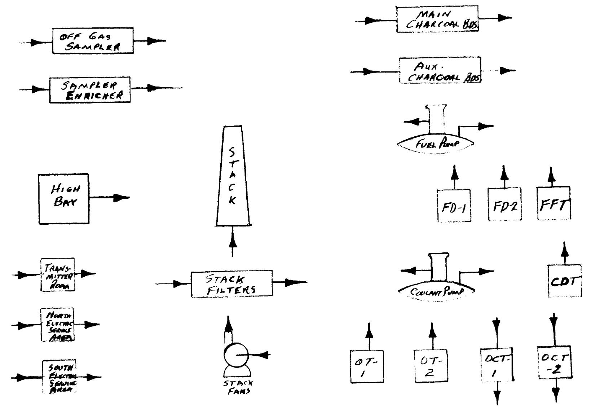  
Figure B-4

# Point Value

# C. General Operating Characteristics

(3) 1. Assuming that the system is heated and coolant salt is circulating, describe the steps taken to fill the reactor and start fuel salt circulating. At each step include normal response of pertinent variables and precautions.   
(3) 2. Describe and explain briefly the response of the following to a complete power outage (i.e., loss of TVA). Assume that the reactor is operating at full power and the diesels cannot be started.

a. Load and nuclear power   
b. Fuel system temperatures   
c. Temperatures at FV-103, 105, 204, and 206   
d. Oil flow to FP shield and bearings

(3) 3. Describe what happens to the reactor inlet and outlet temperature and to the nuclear power for each of the following changes. (Assume no operator action except as noted.)

a. In servo rod control with one blower on, both doors open and the bypass damper open, what happens when the other blower is started?   
b. In manual rod control with both blowers on, both doors open, and bypass damper nearly closed, what happens when one blower is stopped?   
c. In servo rod control at $\sim 10$ kW with both blowers off, both doors closed, and bypass damper opne, what happens when both doors are opened about $50\%$ ?

(2) 4. Assume that the fuel pump is off, system is filled with fuel salt and at temperature. The operator attempts to take the reactor critical and to $100\mathrm{kW}$ . He proceeds as follows:

a. Inserts all rods   
b. Starts FP   
c. Switches to manual rod control   
d. Raises Rods 2 and 3 to 40 in.   
e. Raises Rod no. 1 slowly to take the reactor critical and to a few watts   
f. Raises Rod No. 1 to get on a 100-sec period and levels the power at $100\mathrm{kW}$ .

What interlocks prevent him from doing this and what is the purpose of this interlock?

(11)

# Point Value

# D. Instrumentation and Control

(4) 1. Interlocks require that certain nuclear instruments are in service during a fill of the reactor with fuel salt.

a. Explain which are required and why.   
b. Does the fill section of the operating procedures (5-I) require any other chambers to be in service?

(2) 2. Interlocks require what nuclear instruments to be in service at 8 MW? Explain.   
(2) 3. Why was the coincidence type safety system chosen for use at MSRE?   
(3) 4. What signals will automatically cause a rod scream? Explain the reason for each.   
(2) 5. What provisions are made to remove afterheat. What instrumentation assures this will function.   
(3) 6. Describe the emergency fuel drain circuit and explain the reason for each interlock and the matrix used (i.e., 2 out of 3, 2 of 2, 1 of 2, 1 of 1, etc.).

(16)

Point Value

# E. Safety and Emergency System

(3) 1. Double containment is required at the MSRE. During normal power operation (no sampling being done) describe the primary and secondary containment for the FP and all connecting lines.   
(3) 2. Describe the emergency electrical systems.   
(2) 3. Describe the normal and emergency instrument air system.   
(3) 4. Briefly describe the building evacuation procedure for the MSRE.   
(2) 5. What provisions are made to assure that we always have a stack fan in service? Describe power supply, interlocks, dampers (at stack fan), etc.

(13)

# Point Value

# F. Standard and Emergency Operating Procedures

(2) 1. Describe the procedure for burping the OFT and precautions in case 522 is plugged.   
(3) 2. During full-power operation, you receive a low radiator outlet temperature alarm.

a. What action should you take to prevent it continuing to to decrease?   
b. If no operator action is taken and temperatures continue to decrease, what control action will occur?   
c. Describe waht will happen as a result of this and what things the operator should do.

(3) 3. What areas cannot be entered due to high radiation when we are at full power? What is the main source of the radiation in each of these areas?   
(5) 4. While operating at full power, a 5-min TVA power outage occurs. Describe what must be done in the approximate sequence that it should be done.   
(2) 5. Describe sampling of the fuel salt in general terms, manpower required, and precautions.

(15)

# Point Value

# G. Radiation Safety and Control

(1) 1. Explain what is meant by RBE (Relative Biological Effectiveness) and how this is used in determining an exposure dose.   
(6) 2. Give your reaction to and the basis for your reaction to each of the following:

a. Using a G-M survey meter to measure the dose rate near a $\gamma$ source of unknown, but possible large, strength.   
b. Using a G-M survey meter without using the earphones.   
c. Making a contamination survey of personnel leaving a contamination zone in a direct radiation field of $10\mathrm{mr/hr}$ .   
d. Using a cutie pie to make a contamination survey.   
e. Using a cutie pie to measure the dose rate in a $\gamma$ field for the purpose of calculating working time.   
f. Calculating the working time for a job at one of the beam holes on the basis of dose rates determined using a cutie pie.

(4) 3. An operator is standing 15 feet from a radioactive point source. He reads 1000 mrem/hr on a portable instrument. If he must operate a valve located 5 feet from the source, how long can he linger at the valve before obtaining the ORNL quarterly whole body radiation exposure limit? Whose approval is required for the job? Explain.

(11)

# Point Value

# H. Reactor Theory

(5) 1. A reactor has a count rate of 30 cps when it has a $\mathrm{K}_{\text{eff}}$ of 0.95.

a. Is 40 cps the proper count rate when $\mathrm{K}_{\text{eff}}$ is 0.975? Show how you arrived at your answer.   
b. If the regulating rod position was 16 and 18 inches when $\mathrm{K}_{\text{eff}} = 0.94$ and 0.975, what position would you estimate for criticality? Show your calculations.

(5) 2. Discuss the following reactivity coefficients as to + or - as applied to MSRE.

a. Reactor outlet temperature   
b. Power   
c. Uranium   
d. Bubblers   
e. Xenon

(5) 3. Diagram the processes and regions involved in the production of $^{135}\mathrm{Xe}$ in the MSRE, its transport and its eventual fate.   
(6) 4. What percentage of the $^{233}\mathrm{U}$ in the fuel loop is consumed in a full-power day? %. How much would the regulating rod have to be withdrawn to compensate for this effect? in. (Use the following data and show your calculations.

1 g - mole - 6.02 x $10^{23}$ atoms

1 fission yields 197 Mev

Full power $= 8\mathrm{MW}$

1 day = 86,400 sec.

1 j = 1 watt-sec = 6.25 x $10^{12}$ Mev

$\sigma_{e} / \sigma_{f} = 0.11$ for $^{233}\mathrm{U}$

94% of all fissions in MSRE are now in $^{233}\mathrm{U}$ .

There is 29 kg of $^{233}\mathrm{U}$ in the fuel loop.

233U concentration coefficient, $(\Delta k / k) / (\Delta c / c) = 0.37$

Regulating rod sensitivity $= 0.07\% \cdot \delta k / k$ per inch.

(21)

Point

Value

I. Radioactive materials Handling, Disposal, and Hazards

(4) 1. A reading is taken and found to be $2000 \, \text{mr/hr}$ ; 6 hours later $300 \, \text{mr/hr}$ . What is the half-life of the material?   
(3) 2. What are the requirements for entry, work in, and exit from a contamination zone? Radiation zone?   
(2) 3. What is the difference between radiation and contamination?   
(5) 4. A small fission-product source reads $80 \, \text{mr/hr}$ at 3 ft through 1.5 in. of Pb shielding. If the source is taken out of the shield at what distance will the dose rate be $200 \, \text{mr/hr}$ ? (Use a tenth layer value for Pb of 1.9 in. and show your work.)   
(5) 5. Assume that you are Shift Supervisor and the CAM and monitor in the southeast corner of the highbay alarm. If you cannot wait for a health physicist and you feel that you must remain in the control room, what instructions and precautions would you give your operators in determining the source of the difficulty. (Assume that they are not familiar with handling of activity.) How can they tell whether it is airborne activity?

(19)

# Point Value

# J. Specific Operating Characteristics

(5) 1. Describe the modes and sub-modes of operation at the MSRE. What operations are done in each and what are some of the requirements to be in each?   
(5) 2. Using the attached FP level curves (Fig. J-2) show calculations for filling reactor if we wish to operate at $55 - 60\%$ at $1210^{\circ}\mathrm{F}$ and 60 cycles. Assume that average temperature is $1180^{\circ}\mathrm{F}$ and the maximum operating level of salt is in the OFT.   
(3) 3. After filling the reactor there is a 3-hour delay before starting the fuel pump. Explain the reason for this.   
(5) 4. How can the nuclear power be changed without the control rods moving? In such a case which remains more nearly constant: the core outlet temperature or the average temperature of the fuel in the core?   
(5) 5. What process parameters are used in causing an instrumented control rod scream (safety)? Explain the purpose of each of these.

(23)

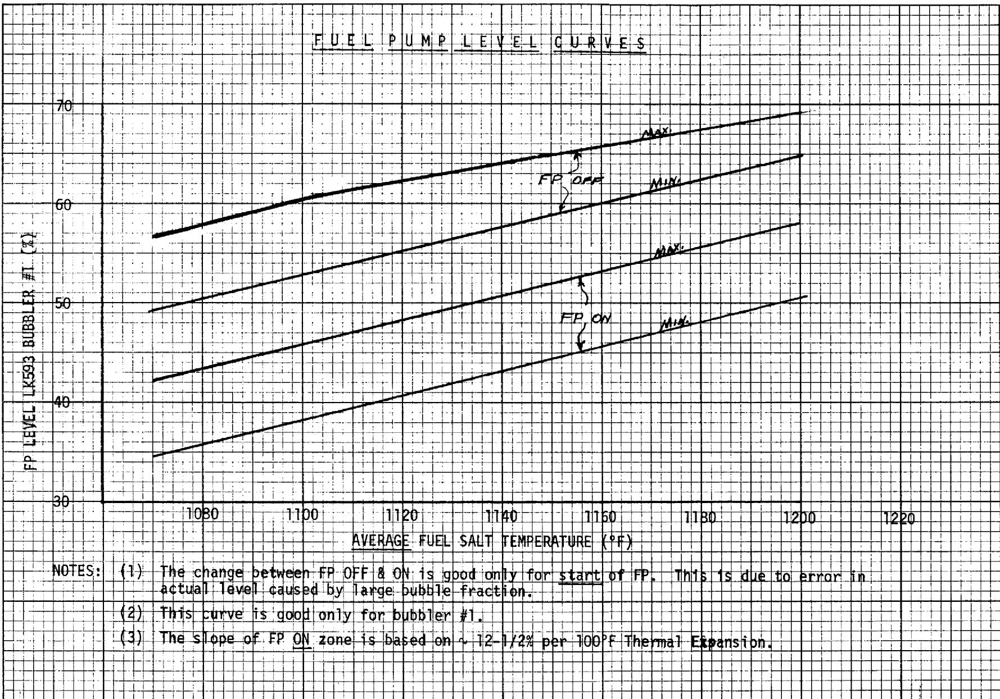  
Figure J-2.

# Point Value

# K. Fuel Handling and Core Parameters

(3) 1. Describe the tests made and conditions which should exist prior to filling the system with fuel salt.   
(3) 2. What is the value of the overall temperature coefficient of reactivity? If an engriving capsule of $^{233}\mathrm{U}$ is added and the control rods are not moved, how much will the reactor temperatures shift?   
(2) 3. Describe what happens to the reactivity immediately after the fuel pump is started and explain why.   
(3) 4. Describe the various neutron sources at the MSRE (external and inherent).

(11)

# Point Value

# L. Administration, Conditions, and Limitations

(4) 1. Why are up-to-date procedures necessary to the efficient operation of the MSRE? Who is responsible for the maintaining of up-to-date procedures? How is this accomplished?   
(3) 2. Describe the procedure necessary to make a major change in the reactor. (For instance, bypassing the flow restrictor in the supply line to the overflow tank.)   
(4) 3. Describe the minimum personnel and classification of personnel required during various stages of operation. a. In the control room b. At the reactor site   
(4) 4. Describe the consequences of complete loss of both treated-water pumps while the reactor is at full power. Assume that flow of treated water cannot be restarted for an extended period. What operation action should be taken and why?   
(4) 5. Rod scram is caused by safety circuits in a 2-out-of-3 matrix. Therefore, loss of one safety channel will not scram the rods. If we are making an extended full-power run and during 8D check list it is found that a high flux signal will not initiate a scram, explain what you would do and justify your actions.   
(4) 6. What are the Operating Safety Limits? In what ways are they treated differently from the Operating Procedures?   
(3) 7. Describe the reason for having jumpers available in the jumper board? What are the two types? What approval is necessary to use each type?

(26)

# APPENDIX J

Examples of Instructions and Communication

#

December 13, 1968

# GENERAL INFORMATION

It seems that whatever is causing bubbles in the fuel system remains with us. Note that WR-2947 has raised OFT level alarm and action setpoints to 30 and $35\%$ . We will operate the FP between 50 and $59\%$ level on the No.1 bubbler (switch position No. 2). These new limits are marked in the control room log. The lowering of FP level is for two reasons - the most important being to keep the foam away from the off-gas connection. The other being to lengthen the time interval between OFT burps.

The most important disadvantage of the above changes comes when we have a FP stoppage for some reason. The resulting FP level will be much lower than necessary to restart the pump. The OFT must then be partially emptied to get the FP level to $\sim 64\%$ . With the FP on and $\sim 8\%$ worth of bubbles circulating, the FP level is out of limits (i.e., $>59\%$ ). Care must be taken to avoid reheating the system too rapidly and causing level to increase even more. The recovery could take several shifts. See instructions in Permanent Shift Instructions.

# SHIFT INSTRUCTIONS

I Continue with operation at 1 kW and $1210 \pm 2^{\circ}$ F OAFOT until such time the computer is repaired and we can go to 1 MW. Take temperature bias data per Item III of 12/12 if not already done.

II When computer is repaired (today or Monday) we should be ready to go to 1 MW heat-balance power on temperature servo. This will be with no blower and a jumper is approved for 139f to get into run mode. See Item III for sample to take 1 hour after going to 1 MW. Dynamics tests will be done while at 1 MW.

III Isolate a FV salt sample one hour after going to 1-MW power. Isolate per 6A3 except as follows:

(1) In Step 3.3.2.1, leave in salt for 10 minutes. Do not hesitate on insertion.   
(2) Add between 3.2.3.1 - 3.2.3.2. Hold 5 minutes at $\sim 6$ ft - 5 in. to allow for drippage.

Deliver to lab "special FV salt sample for Kirslis." Hang a 10-gm capsule on the latch.

IV To prevent the possibility of the FV capsule now on the latch from losing its vacuum, keep Area 1C evacuated until ready to use.   
V Please review Daily Report Sheets from computer 8-hr log (printed at 0745) and tabulate thermal cycles (heat, fill, and power cycle) on FP, CP, FF-102, and FF-200. Daily from 0745 11/11/68 to 0800, 12/13/68. Computer sheets are either in Watt's office or are filed downstairs.

J. L. Crowley

# PERMANENT SHIFT INSTRUCTIONS

December 13, 1968

In the event an FP stoppage (and scram if at power) requires transfer of salt from the OFT to restart, follow the general plan below.

1. Transfer only enough salt from the OFT to restart the FP per 9I.   
2. While awaiting transfer, begin turning up system heaters (if load and rod scram has occurred). Bring up to normal temperature.   
3. Restart the FP and bring the reactor critical to 1 kW per 5J.   
4. Add nuclear heat up to $100\mathrm{kW}$ as necessary along with electrical heat to maintain FP level at $65\%$ until system temperature reaches $1210^{\circ}\mathrm{F}$ . This may take several shifts. At this time you can return to power or whatever condition called for in shift instructions.

The fuel and coolant salt will be circulated subcritically in the loops until power operation is desired, at which time the control rods will be withdrawn to obtain criticality.

During normal power operation, manual load control and servo rod control will be used. However, manual rod control may be used if necessary. Automatic load control will be used only for special tests for which detailed instructions will be supplied.

The first section is written for use as a "Quickie" check list for recovery of temperatures after a rod and load scream. After recovery is made, the reactor will be taken subcritical and the normal pre-power operation checks of Section 2 completed.

Any time the power is reduced below $\sim 200$ kw, the entire preparation (Section 2) check should be completed.

This procedure is organized as follows.

1. Quick recovery of temperature check list.   
2. Preparation for power operation.   
3. Starting power operation using rod servo.   
4. Starting power operation using manual rod control.

1. QUICK TEMPERATURE RECOVERY CHECK LIST

This check list is to aid in recovering system temperature using nuclear power following a rod and load scram.

Init. Date/Time

1.1 If necessary, complete Electrical Power Outage Quick Check List - 9Al.   
1.2 Set FT heater variacs to $8\%$ for low-power operation.   
1.3 Clear safety channels and ungallop safeties.   
1.4 Check or put fission chambers in automatic.   
1.5 Switchrodservooff.   
1.6 Set flux demand at 40 - 60% of scale and select $1.5 \times 10^{5}$ range (150 kw).

5J-2

9/14/65

2/2/68

7/2/69

Init. Date/Time

1.7 Group withdraw to $\sim 30$ in. Rod-3 lower-limit light may not clear.   
1.8 Switch rod servo on. Reset the flux scram setpoints to Low Sensitivity (Red) range.   
1.9 Insert No. 1 rod to 20 in.   
1.10 Group withdraw rods until a 30-sec period is obtained or until No. 2 and No. 3 are at $\sim$ in. (See Control Room Log.) If 30-sec period occurs, finish withdrawing No. 2 and No. 3 individually.

NOTE: Reactor will become critical below normal rod positions because of low-system temperature.

l.11 Withdraw No. 1 rod until critical and servo is controlling rod near middle of regulating rod limit switches.   
1.l2 Note whether Rod No. 3 lower limit cleared. No , Yes   
1.13 If Rod No. 3 lower-limit light did not clear, raise Rod No. 3 to clear low-limit light and then adjust Rod No. 3 to Rod No. 2 position. Keep regulating rod on scale during this step.

NOTE: If temperature is not increasing at a reasonable rate, increase flux demand to $40\%$ of .5 x $10^6$ scale.

1.14 When $1175^{\circ}$ F temperature (OAFOT) is reached, reduce power to 10 kw (66% of 1.5 x $10^{4}$ range).   
1.15 Reset load scram and use radiator doors to prevent overheating (above $1210^{\circ}\mathrm{F}$ ) because of fission product decay.   
1.16 Review 5J-2. As soon as convenient, take reactor subcritical, run rod drop test, fiducial zero of rods and any other tests or check lists which have not been done within specified time limits.   
1.17 Then return to power operation using 5J-3 or 5J-4 procedure.

# 2 PREPARATION FOR POWER OPERATION

Prior to taking the reactor critical, the system should be checked to assure that all pertinent equipment and instrumentation are functioning properly. The more important items to be done are listed below. Additional tests may be necessary depending upon conditions. At times, such as during experiments, after short periods of subcritical operation, etc., it may be desirable to omit all tests. This is at the discretion of the shift supervisor.

Init. Date/Time

2.1 Check rod drop time for each rod to be less than 1 second. This can be omitted if it has been done within approximately one month of this date.

2.1.1 Check that 2 rods are between 1 and 3 inches.   
2.1.2 Raise other rod to 50 inches above the rod position where the first lower limit indicator light lights up.   
2.1.3 Plug in the rod drop timer and set to zero.   
2.1.4 Actuate the rod scram switch and check that all three rods drop.   
2.1.5 Repeat with other two rods and record results in table below.

<table><tr><td>Rod #</td><td>Starting Position</td><td>Rod Drop Time Should Not Exceed 1.0 Sec.</td><td>Note That All Three Rods Dropped</td><td>Initial</td><td>Date</td></tr><tr><td>1</td><td></td><td></td><td></td><td></td><td></td></tr><tr><td>2</td><td></td><td></td><td></td><td></td><td></td></tr><tr><td>3</td><td></td><td></td><td></td><td></td><td></td></tr></table>

2.2 Check fiducial zero of each rod if rods have

been scrambled since last FIDO determination.

Otherwise this can be omitted if it has been

done within approximately one month of this

date.

2.2.1 Check that cell-air activity is not high:

Record RM-565B and RM-565C

Also check radiation level in TR: Record

CAM , and Monitron . Do not

proceed if cell-air activity is $>5 \, \text{mr/hr}$ .

2.2.2 Set valves as follows:

HV-985-A2 open

一

HV-987-A2 open

$\therefore m = \frac{3}{11}$ ;

HV-987-A3 closed

$\frac{1}{2} =$

HV-986A open

$\frac{1 + u}{7} = {70}\%$

2.2.3 Open HV-986A, 987A, or 988A. Throttle

HV-985-A1 and HV-989A until ZI-987A indicates

approximately $50\%$ .

2.2.4 Establish communications between TR

and Control Room.

2.2.5 Insert control rod and determine control-

rod reference position.

Record rod position when maximum dp is obtained. Determine position indications for each rod being inserted and for each being withdrawn.

<table><tr><td rowspan="3">Rod #</td><td rowspan="3">Valve Open</td><td rowspan="3" colspan="2">Valves Closed</td><td colspan="3">CONTROL ROD POSITION</td><td rowspan="3">Init.</td><td rowspan="3">Date</td></tr><tr><td rowspan="2">Should be</td><td colspan="2">Actual</td></tr><tr><td>Inserting</td><td>Withdrawing</td></tr><tr><td>1</td><td>986A</td><td>987-A1</td><td>988-A</td><td>1.2 to 1.6</td><td></td><td></td><td></td><td></td></tr><tr><td>2</td><td>987-A1</td><td>986-A</td><td>988-A</td><td>1.4 to 1.8</td><td></td><td></td><td></td><td></td></tr><tr><td>3</td><td>988-A</td><td>986-A</td><td>987-A1</td><td>2.3 to2.65</td><td></td><td></td><td></td><td></td></tr></table>

Init. Date/Time

2.2.6 Open HV-987-A3.   
2.2.7 Close HV-985-A1, 989A, 986A, 987-A1,988A.

2.3 See 5J-5A.   
2.4 Check that two out of three safety channels will scream all three rods. This can be omitted if it has been done within approximately one week of this date.

2.4.1 Inhibit fast scan.   
2.4.2 With all rods above 1 inch, trip safety channels 1 and 2 by pushing test buttons on RSSNSC1A4 and RSSNSC2A4 and note that rods scram.

2.4.3 Reset Safety Channels 1 and 2.   
2.4.4 Raise all rods to 1 to $3''$ .   
2.4.5 Trip Safety Channels 2 and 3 by pushing test buttons on RSSNSC2A4 and RSSNSC3A4 and note that all three rods scram.

2.4.6 Reset Safety Channels 2 and 3.   
2.4.7 Raise all three rods 1 to 3 inches.   
2.4.8 Trip Safety Channels 1 and 3 by pushing test buttons on RSSNSC1A4 and RSSNSC3A4 and note that all three rods scram.

2.4.9 Reset Safety Channels 1 and 3 and re-establish desired positions.   
2.4.10 Cancel "Inhibit fast scan".

2.5 Check that thermocouples on the radiator outlet tubes are plugged into Scanner D and E and that the gain on both scanners is set at 150 so that an alarm will occur at $900^{\circ}\mathrm{F}$ or $1300^{\circ}\mathrm{F}$ . This can be omitted if no heat is to be removed by the radiator.

2.6 Complete the Neutron Instruments Check List, (8A). This can be omitted if it has been done within approximately one month of this date.   
2.7 Complete the Calibration Check of Process Radiation Monitors (8B). This can be omitted if it has been done within approximately one week of this date.   
2.8 Complete the entire Safety Circuits Check List (8D). This can be omitted if it has been done within approximately one month of this date.   
2.9 Take TE bias data if requested by Gabbard.   
2.10 Take zero-power heat balance if not done within approximately 1 week.   
2.11 Check that annihilators are clear or approved by the shift supervisor. Shift Supervisor's approval   
2.12 Check that entrance to all exclusion areas are properly restricted and radiation signs posted.

2.12.1 Door No. 1 to radiator near north annulus blower is locked.   
2.12.2 Door No. 2 at foot of ramp to CDT cell is locked.   
2.12.3 Door No. 3 to blowers is locked.   
2.12.4 Blocks are on reactor cell, drain-tank cell, coolant cell, south electric service area, and special equipment room.

# 3 STARTING POWER OPERATION USING ROD SERVO

The shim rods will be withdrawn manually while the servo controller manipulates the regulating rod to attain criticality and controls the power at the setpoint.

To increase the nuclear power, the flux demand will be increased. This may cause the regulating rod to withdraw until the regulating-rod limit is reached. The limit can be changed by operating the regulating-rod

# 3 (continued)

drive switch or the shim rods can be manually withdrawn which will cause the regulating rod to insert.

As the flux demand is increased, the nuclear power may cause the system temperatures to rise necessitating removal of heat at the radiator. Number one blower will be started and the resultant $\Delta P$ across the radiator will cause the bypass damper to open if damper control is on automatic.

Before pushing the run button, the power should be between 0.5 and 1 Mw; both range selectors should be in the 1.5-Mw range, and the temperature demand setpoint should be slightly higher than the outlet temperature. The regulating rod should be in the center portion of its useful range and not at either the insert or withdraw limit. When the reactor is switched to the "run" mode, the range selector will be sealed in the 15-Mw range, and the rod-control circuitry will be changed from flux servo to temperature servo. Under these conditions, the regulating rod will be automatically inserted or withdrawn to maintain the reactor-outlet temperature constant. The temperature can be changed by adjusting the temperature-demand setpoint.

Operation at full power will be reached with both doors open, both blowers in operation and the bypass damper closed. If the regulating rod reaches the withdraw limit, No. 2 and No. 3 rod will have to be manually withdrawn or the limit will have to be raised. When critical, Rod 2 and 3 should always be withdrawn the same amount (within $\frac{1}{2}$ inch of each other). Rod 1 should be kept at least 4 inches below Rod 2 and 3 and within the range of 8 inches and 39 inches withdrawn.

3.1 To take the reactor critical on servo rod control, proceed as follows:

3.1.1 Put rod control on servo using servo-mode selector switch (S-16). Note that lights on console indicate that the flux servo control is on.   
3.1.2 Set servo flux channel selector switch (S-17) to No. 1 channel.   
3.1.3 Set flux demand on selected channel to 10 kw using range selector switch (RXNARC-A5), and flux-demand knob (RXNARC-A6).   
3.1.4 Set other channel range selector switch at lowest practical range.   
3.1.5 Check that regulating rod is at the upper regulating-rod limit. Regulating rod should be at 12 inches or less.   
3.1.6 Set fission-chamber selector switch (S-15) as desired. No. 1, No. 2, Both   
3.1.7 Set fission-chamber No. 1 mode selector switch (S-13) to automatic (pushed in).   
3.1.8 Set fission-chamber No. 2 mode selector switch (S-14) to automatic (pushed in).   
3.1.9 Withdraw the shim rod No. 2 to in. Then withdraw shim rod No. 3 to in.   
3.l.l0 Reset the flux scram setpoints to low sensitivity (RED) range.   
3.1.11 Switch regulating-rod actuator switch (S-19) to withdraw. This will raise the regulating-rod limit switch allowing the flux servo to withdraw the regulating rod. Continue regulating-rod withdrawal until criticality is attained and desired flux is reached. When critical the regulating rod should be within the range of 8 to 39 inches and should be at least 4" below the shim rods.

NOTE: As flux increases, change the range on the alternate picoammeter as required and observe the linear flux indicator. Also observe the period meters on the console.

The withdrawal of the regulating rod can be made as fast as the 25-sec period control rod withdraw inhibit will permit.

When withdrawing the rods, criticality for operating purposes is defined as being attained when the countrate is at least 500 times the countrate prior to withdrawing the rods (all rods full inserted) and RR-8100 indicates 1 kw or greater.

When taking the reactor critical after an unintentional shutdown, unless special instructions are given, attain criticality as described here except that RR-8100 shall indicate a power level not less than 1.1 kw for the critical rod positions of Step 3.1.12.

Init. Date/Time

3.1.12 When the flux reaches the flux demand setpoint, the servo will level the power at the setpoint. The regulating rod actuator switch S-19 should be released when the regulating rod is near the center of the regulating rod limit switches.

3.1.13 While maintaining the reactor at this power, record rod positions (Rod No. 1 , Rod No. 2 , Rod No. 3 ) and OAFOT . Check the reactivity balance % 8k/k. Net reactivity is normally less than ± 0.2%. Shift Supervisor's permission to increase power

3.2 To raise the power in rod servo and manual load control

NOTE: The transition from start mode to run mode (i.e. from 10 kw to 1 Mw) should be made quickly to avoid over-heating the system. Review the remainder of this portion of the check list so that the four most important steps can be done with minimum delay. These are Steps 3.2.7, 3.2.8, 3.2.9, and 3.2.10 and

3.2.1 Check that fission chambers No. 1 and 2 are in automatic.   
3.2.2 Start annulus blowers (MB-2 and MB-4)   
3.2.3 Check that the bypass damper is set on automatic and the bypass damper is fully open.   
3.2.4 Using S-18, adjust the temperature demand setpoint slightly more than the indicated outlet temperature.   
3.2.5 Adjust the regulating rod limit switch so that the regulating rod is about center of its range.   
3.2.6 Check that the blower damper switches, on blowers which you expect to operate, are set to "run" position (MB-5).   
3.2.7 Increase nuclear power to about 700 kw by increasing both picoammeter range selector switches to their maximum range position and setting flux demand knob to about $45\%$ .   
3.2.8 Start MB-1.   
3.2.9 Push run button (S-ll). This seals the reactor in run mode and you should be in temperature servo. Check the console to confirm this.   
3.2.10 Raise radiator doors. Begin by raising outlet door half way, inlet door to its minimum setting, outlet door to upper limit, and the inlet door to upper limit.   
3.2.11 Raise the heaters on coolant system flow transmitters to their power operation setting.   
3.2.12 Adjust the temperature demand to give the desired outlet temperature (normally $1210 \pm 2^{\circ} \mathrm{F}$ ).

3.2.13 Close the bypass damper by raising the radiator $\Delta P$ demand with the damper on automatic control.

NOTE: So that the bypass will reopen upon starting of 2nd blower, raise the $\Delta P$ demand only enough to close bypass damper — no more.

3.2.14 When the bypass damper is closed, start the second main blower (MB-3). The damper should open automatically.   
3.2.15 Continue raising the radiator $\Delta P$ demand until the bypass damper is completely closed or until desired power is reached.   
3.2.16 Take a reactivity balance. $\% \delta k / k$   
3.2.17 When steady power is attained, set the linear power switches to alarm if power varies by $\pm 5\%$ of scale.   
3.2.18 Check that the treated water surge tank and degassing tank are being purged with air.

4 STARTING POWER OPERATION USING MANUAL ROD CONTROL

The reactor heat load and flux can be adjusted manually in a number of different ways. The control rods can be manipulated manually to attain criticality and adjust power using the individual actuator switches. The regulating-rod limits have no function when in manual control. Group insertion is possible at all times and group withdrawal can be done when in the start mode. When critical, Rods 2 and 3 should always be withdrawn the same amount (within $\frac{1}{2}$ in. of each other). Rod 1 should be kept at least 4 inches below Rod 2 and Rod 3 and within the range of 8 inches to 39 inches withdrawn.

At very low powers, it may be necessary to adjust power removal by adjusting the electrical heaters or it may be advantageous to raise one or both radiator doors with the blowers off. At higher

Approved by

5J-12

9/14/65

2/2/68

7/2/69

power with one or both of the blowers on, fine adjustment may be made by setting the doors at a fixed position and changing the bypass-damper position. The damper control may be set on automatic which will hold a constant radiator $\Delta P$ or on manual which will maintain a fixed damper position.

Init. Date/Time

4.1 To take the reactor critical manually, proceed as follows:

4.1.1 Put rod control on manual using servomode selector switch (S-16). Note that lights on console indicate that the flux servo control is off.

4.1.2 Set servo flux channel selector switch (S-17) to No. 1 channel.

4.1.3 Set both linear channel range-selectors switches at lowest practical range.

4.1.4 Check that regulating rod is at 12 in. or less.

4.1.5 Set fission-chamber selector switch (S-15) as desired. No. 1, No. 2, Both

4.1.6 Set fission-chamber No. 1 mode selector switch (S-13) to automatic (pushed in).

4.1.7 Set fission-chamber No. 2 mode selector switch (S-14) to automatic (pushed in).

4.1.8 Withdraw the shim rod No. 2 to in. Then withdraw shim rod No. 3 to in.

4.1.9 Check that flux scram setpoints are to low sensitivity (RED) range.

4.1.10 Switch regulating-rod actuator switch (S-19) to withdraw. This will raise the regulating-rod. Continue regulating-rod withdrawal until criticality is attained and desired flux is reached. When critical, the

4.1.10 (continued) regulating rod should be within the range of 8 to 39 in. and should be at least 4 in. below the shim rods.

NOTE: As flux increases, change the range on both the selected and the alternate picoammeter as required and observe the linear-flux indicator. Also observe the period meters on the console.

4.1.11 Level the power at 10 kw using the regulating rod.

4.1.12 While maintaining the reactor at this power, record rod positions (Rod No. 1, Rod No. 2, and Rod No. 3) and OAFOT. Check the reactivity balance $\%$ sk/k. Net reactivity is normally less than $\pm 0.2\%$ . Shift supervisor's permission to increase power

4.2 To raise the power with manual rod control and manual load control

4.2.1 Check that Fission Chambers No. 1 and No. 2 are in automatic.   
4.2.2 Start annulus blowers (MB-2 and MB-4).   
4.2.3 Check that the bypass damper is set on automatic and the bypass damper is fully open.   
4.2.4 Check that the blower damper switches, on blowers which you expect to operate, are set to "run" position (MB-5).

NOTE: The transition from start to run mode (i.e. from 10 kw to 1 Mw) should be done carefully to avoid over-heating the system. Review the remainder of the check list so that the necessary action may be taken with a minimum of delay.

5J-14

9/14/65

2/2/68

7/2/69

Init. Date/Time

4.2.5 Start MB-1.  
4.2.6 Adjust regulating rod to increase the nuclear power. Increase the range on both picoammeters as necessary to keep linear power on scale. Continue to increase nuclear power to about 40 to $50\%$ of 1.5 Mw (maximum range position of picoammeter selector switches).   
4.2.7 Lift outlet door to minimum setting if necessary at this time to maintain reactor outlet temperature.   
4.2.8 Push run mode button. Check that run mode seals in (see jumper board).   
4.2.9 Continue to increase both load and nuclear power while maintaining reactor outlet temperature fairly steady. Raise outlet door half way, inlet to its minimum setting, outlet door to upper limit, and then the inlet door to upper limit.   
4.2.10 Raise the heaters on the coolant system flow transmitters to their power setting.   
4.2.11 Close the bypass damper by raising the radiator $\Delta P$ demand with the damper on automatic control.

NOTE: So that the bypass will re-open upon starting of the second blower, raise the $\Delta P$ demand only enough to close bypass damper — no more.

4.2.12 When the bypass damper is closed, start the second blower (MB-3). The damper should open automatically. Increase nuclear power as necessary to maintain reactor outlet temperature.

NOTE: Very little adjustment of the regulating rod should be necessary since you will get some increase in nuclear power due to lowering of the average temperature (negative temperature coefficient) when more load is being removed.

4.2.13 To reach maximum power, continue to add load to the system by increasing the radiator $\Delta P$ demand until the bypass damper is closed.   
4.2.14 Take a reactivity balance $\% \delta k / k$   
4.2.15 When steady power is attained, set the linear power switches to alarm if power varies by $\pm 5\%$ of scale.   
4.2.16 Check that the treated water surge tank and degassing tank are being purged with air

# MSRE DYNAMIC TESTS

# MSRE Test Memo 3.2.4.1

# Transient Flowrate Measurements

Submitted 11 Balls-11-65 Approved P.R. Engel 6/2/65  
Submitted 2 W. Kuhn L/2/65 Approved

Approved for use

# Introduction

Measurements will be made to determine the fuel and coolant salt flow rates during startup and cooldown of the circulating pumps. The transient behavior of the fuel void fractions as indicated by the gamma-ray densitometer will also be measured.

# Purpose

Information on the transient salt flow rates and void fractions during pump startup and coastdown will be used to interpret results of the tests of flow on reactivity (see MSRE Test Memo 3.2.4.5).

# Description

These tests will be run with the reactor subcritical and essentially at thermal equilibrium. For the coolant loop tests, salt flow rate and pump speed will be monitored, and for the primary loop tests, pump speed and fuel density (from the gamma-ray densitometer) will be monitored.

# Special Equipment and Preparations

Since the pump startup time is quite short, a multichannel oscillograph recorder will be used to monitor the outputs of the coolant salt venturi differential pressure cells directly, and both primary and coolant pump speed. The data logger will be used in the continuous fast scan mode to also record coolant flow rate, pump speeds, and fuel density, as well as certain loop temperatures for reference.

# Procedures

1. Set input power to loop heaters so that a constant temperature (nominally $1200^{\circ}\mathbf{F}$ ) is maintained with both circulating pumps running.   
2. Jumper the control interlock so that the fuel pump may operate with the coolant pump off.

3. Put the logger in the continuous fast scan mode, and monitor coolant flow and pump speed on the oscillograph.   
4. Shut off the coolant pump.   
5. After the flow transient has died out, restart the coolant pump.   
6. Monitor primary pump speed on the oscillograph (also densitometer signal if possible). Put logger in fast scan mode.   
7. Shut off the fuel pump.   
8. Restart fuel pump after flow transient (i.e. pump speed and densitometer signals) has settled out.   
9. Repeat 7 and 8 after waiting various intervals between starts to see if there is any burping effect detected on the densitometer.

MSRE Test Memo 3.2.4.1

Appendix I

Check List for Transient Flowrate Measurements

Submitted 80 Boll 6-1165 Approved P.R. Engel 6/22/65  
Submitted 7.W. Kulini 6/25/65 Approved

Approved for use

This check list is to be used in connection with the test procedures described in MSRE Test Memo 3.2.4.1.

Initial Date/time

1. Provide a control interlock jumper to permit operation of the fuel circulating pump with the coolant circulating pump off. (Connect jumper wire in circuit 147 from terminal R14E10 to terminal R18A7 in control relay cabinet.) Permission to insert jumper.   
2. Connect the densitometer output (1 sec. T/C filter) to the data logger fast scan sequence input 57 (replacing LT-599(OFT)).   
3. Connect outputs of the coolant salt venturis' $d/p$ cells and coolant circulated pump speed transmitters to a multi-channel oscillograph.   
4. Set input power to loop heaters so that a constant temperature (nominally $1200^{\circ}\mathrm{F}$ ) is maintained with both circulating pumps running. (reactor sub-critical)   
5. Put the data logger in the continuous fast scan mode and start oscillograph.   
6. Turn off the coolant pump.   
7. After the flow transient has died out, restart the coolant pump.   
8. After flow transient has died out, take logger out of fast scan.

9. Connect outputs of the fuel circulating pump speed transmitter and the fuel salt densitometer to the multi-channel oscillograph.   
10. Put the data logger in the continuous fast scan mode.   
11. Turn off the fuel pump.   
12. Re-start the fuel pump after the transient has died out.   
13. After flow transient has died out, take logger out of fast scan.   
14. Repeat steps 11 to 13 several times at the discretion of the experimenters.   
15. Remove jumper of step 1.

Initial Date/time

APPENDIX K

Examples of the

Control Room Log and the Building Log

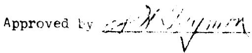

12A-2A

10/3/66

2/15/67

5/23/67

8/22/67

2/7/68

4/24/68

12/26/68

12-2A

CONTROL ROOM LOG

(Computer in Operation)

# COVER SHEET

In the spaces provided, list any variable not in limits or which you judge needs attention.

<table><tr><td rowspan="2">Page No.</td><td colspan="3">ITEMS</td></tr><tr><td>8 - 4</td><td>4 - 12</td><td>12 - 8</td></tr><tr><td>MCR</td><td></td><td></td><td></td></tr><tr><td></td><td></td><td></td><td></td></tr><tr><td></td><td></td><td></td><td></td></tr><tr><td></td><td></td><td></td><td></td></tr><tr><td></td><td></td><td></td><td></td></tr><tr><td></td><td></td><td></td><td></td></tr><tr><td></td><td></td><td></td><td></td></tr><tr><td></td><td></td><td></td><td></td></tr><tr><td></td><td></td><td></td><td></td></tr><tr><td></td><td></td><td></td><td></td></tr><tr><td></td><td></td><td></td><td></td></tr><tr><td></td><td></td><td></td><td></td></tr><tr><td>ACR</td><td></td><td></td><td></td></tr><tr><td></td><td></td><td></td><td></td></tr><tr><td></td><td></td><td></td><td></td></tr><tr><td></td><td></td><td></td><td></td></tr><tr><td></td><td></td><td></td><td></td></tr><tr><td></td><td></td><td></td><td></td></tr><tr><td></td><td></td><td></td><td></td></tr><tr><td></td><td></td><td></td><td></td></tr><tr><td></td><td></td><td></td><td></td></tr><tr><td></td><td></td><td></td><td></td></tr><tr><td></td><td></td><td></td><td></td></tr></table>

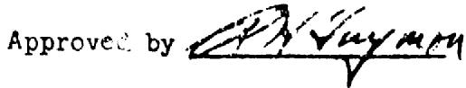

${12A} - {2A}$

8/6/65

1/27/66

3/7/66

6/20/66

10/3/66

2/15/67

5/23/67

8/22/67

2/7/68

4/24/68

12/26/68

12A-2A

CONTROL ROOM LOG

(Computer in Operation)

Log taken by:

8-4 4-12 12-8

# CONSOLE

Record every 4 hours starting at 0830 unless otherwise indicated.

<table><tr><td rowspan="2">Time</td><td colspan="2">RADIATOR DOOR POSITION</td><td colspan="2">RADIATOR</td><td rowspan="2">By-Pass Duct Damper Position ZI-AD-2</td><td rowspan="2">Computer Room Temp (East Door)</td></tr><tr><td>OUTLET ZI-OD-A</td><td>INLET ZI-ID-A</td><td>ΔP PdIAD2A2</td><td>ΔP Demand PdIAD2A1</td></tr><tr><td></td><td></td><td></td><td></td><td></td><td></td><td>75°*</td></tr><tr><td></td><td></td><td></td><td></td><td></td><td></td><td></td></tr><tr><td></td><td></td><td></td><td></td><td></td><td></td><td></td></tr><tr><td></td><td></td><td></td><td></td><td></td><td></td><td></td></tr><tr><td></td><td></td><td></td><td></td><td></td><td></td><td></td></tr><tr><td></td><td></td><td></td><td></td><td></td><td></td><td></td></tr><tr><td></td><td></td><td></td><td></td><td></td><td></td><td></td></tr></table>

*If temperature exceeds $75^{\circ}\mathrm{F}$ due to icing, turn normal unit up to $80^{\circ}\mathrm{F}$ and standby unit down to $70^{\circ}\mathrm{F}$ for several hours.

${12A} - {2A}$

8/6/65 4/24/68

1/17/66 12/26/68

3/7/66

6/20/66

10/3/66

2/15/67 5/23/67

8/22/67

2/7/68

<table><tr><td rowspan="3">Time</td><td rowspan="3">OACOT (Pt. 37) *</td><td rowspan="3">Reactivity Balance When Critical (Pt 12) * &amp; **</td><td colspan="3">REACTOR OUTLET</td><td rowspan="3">Particle Trap TE-PT1-3 (S-144)</td></tr><tr><td colspan="2">Temperature</td><td rowspan="2">Temperature Demand XTTINARC A2</td></tr><tr><td>TI 100-</td><td>OAFOT* (Pt 37)</td></tr><tr><td></td><td>1150-1210</td><td>+0.25 *** to -0.25%</td><td></td><td>1210°F ± 2°F</td><td></td><td></td></tr><tr><td></td><td></td><td></td><td></td><td></td><td></td><td></td></tr><tr><td></td><td></td><td></td><td></td><td></td><td></td><td>xx</td></tr><tr><td></td><td></td><td></td><td></td><td></td><td></td><td></td></tr><tr><td></td><td></td><td></td><td></td><td></td><td></td><td>xx</td></tr><tr><td></td><td></td><td></td><td></td><td></td><td></td><td></td></tr><tr><td></td><td></td><td></td><td></td><td></td><td></td><td>xx</td></tr></table>

* If computer is not functioning, calculate the official average fuel, coolant temperature, and reactivity per Computer-Out Log 12-2B. (Not necessary if ** Record KNET every 4 hours. system is drained)

\*\*\*

Or see Shift Instructions   

<table><tr><td rowspan="2">Time</td><td colspan="6">COMP. ION CHAMBER</td><td rowspan="2">Req. Dem Function Active 41</td><td rowspan="2">Req. Dem Log.FS.l Pt. Inhibit 32</td><td rowspan="2">Req. Dem Log Type II Inhibit 33</td><td rowspan="2">Req. Dem Log Alarms Stopped 34</td><td rowspan="2">Request I/O on Line 27</td></tr><tr><td>Ammeter #1</td><td>#2</td><td>Range #1</td><td>#2</td><td>Rng Seal Light #1</td><td>#2</td></tr><tr><td></td><td></td><td></td><td></td><td></td><td></td><td></td><td>*</td><td>*</td><td>*</td><td>**</td><td></td></tr><tr><td></td><td></td><td></td><td></td><td></td><td></td><td></td><td></td><td></td><td></td><td></td><td></td></tr><tr><td></td><td></td><td></td><td></td><td></td><td></td><td></td><td>XX</td><td>XX</td><td>XX</td><td>XX</td><td>XX</td></tr><tr><td></td><td></td><td></td><td></td><td></td><td></td><td></td><td></td><td></td><td></td><td></td><td></td></tr><tr><td></td><td></td><td></td><td></td><td></td><td></td><td></td><td>XX</td><td>XX</td><td>XX</td><td>XX</td><td>XX</td></tr><tr><td></td><td></td><td></td><td></td><td></td><td></td><td></td><td></td><td></td><td></td><td></td><td></td></tr><tr><td></td><td></td><td></td><td></td><td></td><td></td><td></td><td>XX</td><td>XX</td><td>XX</td><td>XX</td><td>XX</td></tr></table>

*This is for purpose of having record available in case computer needs restarting.   
**Review this and reactivate all possible. Advise SS of those remaining. If $>10$ , see Cookbook.

12A-2A   
8/6/65 4/24/68   
1/17/66 12/26/68   
3/7/66   
6/20/66   
10/3/66   
2/15/67   
5/23/67

Record every 4 hours starting at 0830 unless otherwise indicated. 8/22/67 2/7/68

<table><tr><td>Time</td><td>Flux Demand (Computed In Run Manual In Start)</td><td>Regulating Rod Position</td><td>Servo Mode Light</td><td>Servo Flux Channel Selector</td><td></td></tr><tr><td></td><td></td><td>25 - 75%</td><td></td><td>#1 or #2</td><td></td></tr><tr><td></td><td></td><td></td><td></td><td></td><td></td></tr><tr><td></td><td></td><td></td><td></td><td></td><td></td></tr><tr><td></td><td></td><td></td><td></td><td></td><td></td></tr><tr><td></td><td></td><td></td><td></td><td></td><td></td></tr><tr><td></td><td></td><td></td><td></td><td></td><td></td></tr><tr><td></td><td></td><td></td><td></td><td></td><td></td></tr></table>

<table><tr><td rowspan="2">Time</td><td colspan="3">CONTROL ROD POSITION* Total</td><td rowspan="2">Load Scram Lights On</td><td rowspan="2">Safety Channel Lights On</td><td rowspan="2">BF3** Chamber</td><td rowspan="2" colspan="2">*** Exercise Fission Chambers</td></tr><tr><td>#1</td><td>#2</td><td>#3</td></tr><tr><td></td><td>27&quot;±6&quot; ***</td><td>38 in.</td><td>36 in.</td><td>1 &amp; 2 On</td><td>None</td><td>CPS</td><td>#1</td><td>#2</td></tr><tr><td></td><td></td><td></td><td>4</td><td></td><td></td><td></td><td></td><td></td></tr><tr><td></td><td></td><td></td><td></td><td></td><td></td><td></td><td>xx</td><td>xx</td></tr><tr><td></td><td></td><td></td><td></td><td></td><td></td><td></td><td>xx</td><td>xx</td></tr><tr><td></td><td></td><td></td><td></td><td></td><td></td><td></td><td>xx</td><td>xx</td></tr><tr><td></td><td></td><td></td><td></td><td></td><td></td><td></td><td>xx</td><td>xx</td></tr><tr><td></td><td></td><td></td><td></td><td></td><td></td><td></td><td>xx</td><td>xx</td></tr></table>

Read coarse position indicator to nearest printed number below pointer. Add fine reading to this and record the sum. Keep all three at 24 inches when sub-critical.

$\star \star \mathbb{B}\mathbb{F}_3$ chamber will be withdrawn while circulating fuel salt.   
**Once per day exercise both fission chambers by selecting alternate, manually withdrawing (or inserting) several inches and returning to original position.   
\*\*\*\*At steady state and OAFOT $1210^{\circ}\mathrm{F}$ . If not at $1210^{\circ}\mathrm{F}$ or if FP is off calculate new limits. Allow 1-1/4 in. for every $10^{\circ}$ of OAFOT and 1-1/4 in. for FP Off-On.

# 12A-3 BUILDING LOG

In the spaces provided, list any variable not in limits or which you judge needs attention.

<table><tr><td colspan="4">Page (Area) Items</td></tr><tr><td></td><td>8 - 4</td><td>4 - 12</td><td>12 - 8</td></tr><tr><td rowspan="2">ST.</td><td></td><td></td><td></td></tr><tr><td></td><td></td><td></td></tr><tr><td rowspan="5">TR, NESA</td><td></td><td></td><td></td></tr><tr><td></td><td></td><td></td></tr><tr><td></td><td></td><td></td></tr><tr><td></td><td></td><td></td></tr><tr><td></td><td></td><td></td></tr><tr><td rowspan="3">Heater</td><td></td><td></td><td></td></tr><tr><td></td><td></td><td></td></tr><tr><td></td><td></td><td></td></tr><tr><td rowspan="6">Electrical and Diesel House</td><td></td><td></td><td></td></tr><tr><td></td><td></td><td></td></tr><tr><td></td><td></td><td></td></tr><tr><td></td><td></td><td></td></tr><tr><td></td><td></td><td></td></tr><tr><td></td><td></td><td></td></tr><tr><td rowspan="5">Water Room and Cooling Tower</td><td></td><td></td><td></td></tr><tr><td></td><td></td><td></td></tr><tr><td></td><td></td><td></td></tr><tr><td></td><td></td><td></td></tr><tr><td></td><td></td><td></td></tr><tr><td rowspan="7">Vent House</td><td></td><td></td><td></td></tr><tr><td></td><td></td><td></td></tr><tr><td></td><td></td><td></td></tr><tr><td></td><td></td><td></td></tr><tr><td></td><td></td><td></td></tr><tr><td></td><td></td><td></td></tr><tr><td></td><td></td><td></td></tr><tr><td rowspan="5">Stack Panel SER, Hi Bay 852&#x27;</td><td></td><td></td><td></td></tr><tr><td></td><td></td><td></td></tr><tr><td></td><td></td><td></td></tr><tr><td></td><td></td><td></td></tr><tr><td></td><td></td><td></td></tr></table>

Approved by 3/10

12A-3 BUILDING LOG

12A-3

10/5/65

1/18/66

8/12/68

4/7/69

Taken by:

8-14

4-12

12 - 8

SERVICE TUNNEL

Run No.

3/9/66

8/25/66

2/6/67

${l}_{1}/{2C} = {\ell }^{\prime }{C}^{\prime }$

8/18/67

2/6/68

Record every 4 hours starting at 0830 unless otherwise indicated.

<table><tr><td rowspan="2">Time</td><td colspan="2">Personnel Monitors</td><td rowspan="2">FI-753</td><td rowspan="2">**FI-754</td><td colspan="2">OT-2 Water Temperature</td><td rowspan="2">Flow FI-823-A</td></tr><tr><td>Monitron RE-7017</td><td>CAM RE-7005</td><td>Out TI 822-1</td><td>In TI 823-1</td></tr><tr><td></td><td>&lt;3 mr/hr</td><td>&lt;1000 cpm</td><td>3-5 gpm</td><td>6-9 gpm</td><td>~ 85°F*</td><td>~ 80°F*</td><td>&gt;7.5 gpm</td></tr><tr><td></td><td></td><td></td><td></td><td></td><td></td><td></td><td></td></tr><tr><td></td><td>XX</td><td>XX</td><td>XX</td><td>XX</td><td>XX</td><td>XX</td><td>XX</td></tr><tr><td></td><td></td><td></td><td></td><td></td><td></td><td></td><td></td></tr><tr><td></td><td>XX</td><td>XX</td><td>XX</td><td>XX</td><td>XX</td><td>XX</td><td>XX</td></tr><tr><td></td><td></td><td></td><td></td><td></td><td></td><td></td><td></td></tr><tr><td></td><td>XX</td><td>XX</td><td>XX</td><td>XX</td><td>XX</td><td>XX</td><td>XX</td></tr></table>

* Colder if process water is in use.

<table><tr><td rowspan="2">Time</td><td colspan="2">Coolant Oil Pump Pressure</td><td rowspan="2">Filter ΔP PI-752-C Minus PI-753-C</td><td colspan="2">OT-1 Water Temperature</td><td rowspan="2">Flow PI 821-A</td></tr><tr><td>#1 PI-751A</td><td>#2 PI-752A</td><td>Out TI 820-1</td><td>In TI 821-1</td></tr><tr><td></td><td>***</td><td>***</td><td>ΔP &lt;5 psi</td><td>~ 85°F</td><td>~ 80°F</td><td>&gt;7.5 gpm</td></tr><tr><td></td><td></td><td></td><td></td><td></td><td></td><td></td></tr><tr><td></td><td>XX</td><td>XX</td><td>XX</td><td>XX</td><td>XX</td><td>XX</td></tr><tr><td></td><td></td><td></td><td>XX</td><td></td><td></td><td></td></tr><tr><td></td><td>XX</td><td>XX</td><td>XX</td><td>XX</td><td>XX</td><td>XX</td></tr><tr><td></td><td></td><td></td><td>XX</td><td></td><td></td><td></td></tr><tr><td></td><td>XX</td><td>XX</td><td>XX</td><td>XX</td><td>XX</td><td>XX</td></tr></table>

\*Discharge pressure from the pumps which are on should be $>55$ psig.   
V-754 should be wide open. Throttle V-765 (by-pass) only as required to obtain desired shield plug.flow. This will permit maximum recirculation rate.

Date Started

<table><tr><td rowspan="2">Time</td><td rowspan="2"></td><td colspan="2">Fuel Oil Pump Pressure*</td><td rowspan="2">Filter ΔP PI-702-C Minus PI-703-C</td><td rowspan="2">FI-703</td><td rowspan="2">** FI-704</td><td rowspan="2"></td></tr><tr><td>#1 PI 701-A</td><td>#2 PI 702-A</td></tr><tr><td></td><td></td><td>**</td><td>**</td><td>&lt;5 psi</td><td>3.5-5 gpm</td><td>6-9 gpm</td><td></td></tr><tr><td></td><td></td><td></td><td></td><td></td><td></td><td></td><td></td></tr><tr><td></td><td></td><td>XX</td><td>XX</td><td>XX</td><td>XX</td><td>XX</td><td></td></tr><tr><td></td><td></td><td></td><td></td><td>XX</td><td></td><td></td><td></td></tr><tr><td></td><td></td><td>XX</td><td>XX</td><td>XX</td><td>XX</td><td>XX</td><td></td></tr><tr><td></td><td></td><td></td><td></td><td>XX</td><td></td><td></td><td></td></tr><tr><td></td><td></td><td>XX</td><td>XX</td><td>XX</td><td>XX</td><td>XX</td><td></td></tr></table>

*Discharge pressure from the pumps which are on should be >55 psig.   
**V-704 should be wide open. Throttle V-715 (by-pass) only as required to obtain desired shield plug flow. This will permit maximum recirculation rate.

# SERVICE AREA

Record every 4 hours starting at 0830 unless otherwise indicated.

<table><tr><td rowspan="2">Time</td><td rowspan="2"></td><td colspan="2">F. Oil Supply Tank</td><td colspan="2">C. Oil Supply Tank</td><td colspan="2">Process Monitor***</td></tr><tr><td>Reading LIOT1A3</td><td>Set Point</td><td>Reading LIOT2A3</td><td>Set Point</td><td>RM OT-1</td><td>RM OT-2</td></tr><tr><td></td><td></td><td>&gt;50%</td><td>Reading -2%</td><td>&gt;50 %</td><td>Reading -2%</td><td>&lt;5 mr/hr</td><td>&lt;5 mr/hr</td></tr><tr><td></td><td></td><td></td><td></td><td></td><td></td><td></td><td></td></tr><tr><td></td><td></td><td>XX</td><td>XX</td><td>XX</td><td>XX</td><td></td><td></td></tr><tr><td></td><td></td><td></td><td></td><td></td><td></td><td></td><td></td></tr><tr><td></td><td></td><td>XX</td><td>XX</td><td>XX</td><td>XX</td><td></td><td></td></tr><tr><td></td><td></td><td></td><td></td><td></td><td></td><td></td><td></td></tr><tr><td></td><td></td><td>XX</td><td>XX</td><td>XX</td><td>XX</td><td></td><td></td></tr></table>

Set calibration at 0.25 to 0.35 mr/hr before reading.

APPENDIX L

Forms Used in Making Changes

# Form H-1. MSRE PUNCH LIST

To

Priority

Date

Location

Requested by:

Equipment, Line No., etc.

Description of Work to be Done:

Precautions:

Estimated Cost:

Approval to proceed:

Describe work done if different from above:

Job Completed and Accepted by:

Date:

MSRE WORK REQUEST   

<table><tr><td>WORK ORDER NUMBER</td><td>WORK REQUEST NUMBER</td><td>PRIORITY</td><td>DATE</td></tr><tr><td colspan="2">ISSUED TO</td><td colspan="2">EQUIPMENT, SYSTEM, ETC.</td></tr><tr><td colspan="4">DESCRIPTION OF WORK</td></tr><tr><td colspan="4"></td></tr><tr><td colspan="4"></td></tr><tr><td colspan="4"></td></tr><tr><td colspan="4"></td></tr><tr><td colspan="4"></td></tr><tr><td colspan="4"></td></tr><tr><td colspan="2">APPROVED MAINTENANCE</td><td colspan="2">APPROVED OPERATIONS</td></tr><tr><td colspan="4">PRECAUTIONS</td></tr></table>

<table><tr><td colspan="5">SHIFT SUPERVISOR&#x27;S APPROVAL TO PROCEED</td></tr><tr><td colspan="2">STARTING DATE OR TIME</td><td colspan="2">ENDING DATE OR TIME</td><td>SIGNED</td></tr><tr><td colspan="2"></td><td colspan="2"></td><td></td></tr><tr><td colspan="2"></td><td colspan="2"></td><td></td></tr><tr><td colspan="2"></td><td colspan="2"></td><td></td></tr><tr><td colspan="2"></td><td colspan="2"></td><td></td></tr><tr><td colspan="2"></td><td colspan="2"></td><td></td></tr><tr><td colspan="2"></td><td colspan="2"></td><td></td></tr><tr><td colspan="2"></td><td colspan="2"></td><td></td></tr><tr><td></td><td colspan="2">GRAFTSMAN</td><td>I &amp; C-P&amp;E SUPERVISOR</td><td>REACTOR DIVISION MAINTENANCE REACTOR DIVISION OPERATIONS</td></tr><tr><td>WORK COMPLETED</td><td colspan="2"></td><td></td><td></td></tr><tr><td>WORK INSPECTED</td><td colspan="2"></td><td></td><td></td></tr><tr><td>WORK APPROVED</td><td colspan="2"></td><td></td><td></td></tr><tr><td colspan="5">REMARKS</td></tr><tr><td colspan="5"></td></tr><tr><td colspan="5"></td></tr><tr><td colspan="5"></td></tr></table>

UCN-3624  
1-05

DATE COMPLETED

UCN-6820 13 5-68)

MSRE CHANGE REQUEST   

<table><tr><td colspan="2">SUBJECT</td><td>REQUEST NO.</td></tr><tr><td colspan="2"></td><td>TARGET DATES</td></tr><tr><td colspan="2">TYPE CHANGE</td><td>APPROVAL TO PROCEED</td></tr><tr><td>☐ I &amp; C</td><td>☐ PERMANENT</td><td></td></tr><tr><td rowspan="2">☐ ELECTRICAL</td><td rowspan="2">☐ TEMPORARY</td><td>DESIGN COMPLETED</td></tr><tr><td>PROCUREMENT COMPLETED</td></tr><tr><td>☐ MECHANICAL</td><td>FROM _ _ _ _ _ _ _ _ _ _ _ _ _ _ _ _ _ _ _ _ _ _ _ _ _ _ _ _ _ _ _ _ _ _ _ _ _ _ _ _ _ _ _ _ _ _ _ _ _ _ _ _ _ _ _ _ _ _ _ _ _ _ _ _ _ _ _ _ _ _ _ _ _ _ _ _ _ _ _ _ _ _ _ _ _ _ _ _ _ _ _ _ _ _ _ _ _ _ _ _</td><td></td></tr><tr><td colspan="3">☐ OTHER _ _ _ _ _ _ _ _ _ _ _ _ _ _ _ _ _ _ _ _ _ _ _ _ _ _ _ _ _ _ _ _ _ _ _ _ _ _ _ _ _ _ _ _ _ _ _ _ _ _ _ _ _ _ _ _ _ _ _ _ _ _ _ _ _ _ _ _ _ _ _ _ _ _ _ _ _ _ _ _ _ _ _ _ _ _ _ _ _ _ _ _ _ _ _ _ _ _ _ 
REQUESTED BY</td></tr><tr><td>DATE REQUESTED</td><td>REQUESTED COMPLETION DATE</td><td></td></tr></table>

PURPOSE AND DESCRIPTION

APPROVAL TO PROCEED   

<table><tr><td></td><td>INIT.</td><td>DATE</td><td></td><td>INIT.</td><td>DATE</td></tr><tr><td>MSRE DEPT. HEAD</td><td></td><td></td><td>☐I &amp; C DESIGN</td><td></td><td></td></tr><tr><td>MSRE OPERATIONS</td><td></td><td></td><td>☐RD DEVELOPMENT</td><td></td><td></td></tr><tr><td>MSRE MAINTENANCE</td><td></td><td></td><td>☐MSR PROJECT DIRECTOR</td><td></td><td></td></tr><tr><td></td><td></td><td></td><td>☐REACTOR DIV. DIRECTOR</td><td></td><td></td></tr></table>

COMMENTS OF REVIEWERS

STATUS   

<table><tr><td></td><td>DATE</td><td></td><td>DATE</td></tr><tr><td>DESIGN COMPLETED</td><td></td><td>WORK COMPLETED AND TESTED</td><td></td></tr><tr><td>PROCUREMENT COMPLETED</td><td></td><td>ORIGINAL DOCUMENTS REVISIONED</td><td></td></tr><tr><td>WORK REQ. ISSUED: NO.</td><td></td><td colspan="2">CONTROL ROOM DOCUMENTS REVISIONED</td></tr></table>

REMARKS:

APPENDIX M

Example of

MSRE Daily Report

# MSRE DAILY REPORT

Period 0800 3/22/68

to

0800 3/25/68

The power operation of the reactor for Run No. 14 was discontinued at 0100, 3/25/68, by a rod and load scram as planned. After 8 minutes of subcritical operation, the reactor was returned to reduced power operation to recover the temperature lost during the scram transient. The power was then reduced to 10 kw and is continuing at that level and at $1210^{\circ}\mathrm{F}$ .

Dynamics tests were completed at full power and at 2.5 Mw. The tests at 2.5 Mw were run because the ternary sequence used in the previous tests had not been correct. The power was reduced to 2.5 Mw for about 3 hours for these tests; otherwise the reactor ran at full power until the scheduled power reduction this morning. There was difficulty in returning to temperature servo after the dynamics tests. The trouble, which was found to be faulty contacts on Relay KA-170B, was corrected.

Testing continued on the offgas sampler thermal conductivity cells to determine the effect of the flow rate through the absorber bed. The results were too erratic to form any conclusions.

MG-3 was found running but off-line three times with no apparent reason. Normal operation was restored each time without difficulty.

There were two computer outages during the weekend but the computer was restarted after about 1/2 hour in both cases.

The equipment to be used in gamma scanning the heat exchanger after the shutdown was calibrated on a mockup of the heat exchanger and a 50-curie $^{192}$ Ir source. The gamma scan is to be done with a Ge(Li) diode to determine the concentrations of the various fission products that are deposited on the heat exchanger tubes.

C. $\pi ,\beta ,\delta$ , $\theta$ , $\varphi$ , $\psi$ , $\tau$ , $\omega$

C. H. Gabbard

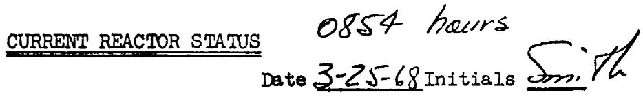

# LOOP CONDITIONS

<table><tr><td></td><td>Fuel Loop</td><td>Coolant Loop</td></tr><tr><td>Contents</td><td>Fuel</td><td>Coolant</td></tr><tr><td>Circulating</td><td>Yes</td><td>Yes</td></tr><tr><td>Pressure (Psig)</td><td>4.6</td><td>5.6</td></tr><tr><td>Maximum Temperature (°F)</td><td>1204.2</td><td>1205.6</td></tr><tr><td>Minimum Temperature (°F)</td><td>1205.4</td><td>1205.2</td></tr><tr><td>Samples Taken</td><td>—</td><td>—</td></tr><tr><td>Enrichments</td><td>—</td><td>—</td></tr><tr><td>Overflow Tank Level (%)</td><td>12%</td><td>12%</td></tr></table>

# REACTIVITY

Observed - Calculated % 6k/k
Nuclear Power 0.030 Mw Rod 137.67 in. 235U in loop 69.448kg
Rod Control Mode Flux Servo Rod 246 in. 235U in salt 74.825kg
Rod 346 in.

# HEAT REMOVAL

Load-Control Mode Niau/ Inlet Door 0 in. Blower 1 OFF Outlet Door 0 in. Blower $2^{3}$ OFF Damper >100 %

# ACCUMULATED OPERATING DATA

<table><tr><td></td><td>This Period</td><td>This Run</td><td>Total</td></tr><tr><td>Time Critical</td><td>71.87</td><td>440.67</td><td>11492.27</td></tr><tr><td>Integrated Power</td><td>478.173</td><td>24521</td><td>65262</td></tr><tr><td>Fuel Loop Time Above 900°F</td><td>72</td><td>4499.75</td><td>20685</td></tr><tr><td>Fuel Pump Time Circulating Helium</td><td>0</td><td>11.25</td><td>3985</td></tr><tr><td>Fuel Pump Time Circulating Salt</td><td>72</td><td>4426.75</td><td>14993.25</td></tr><tr><td>Coolant Loop Time above 900°F</td><td>72</td><td>4499.75</td><td>17398.25</td></tr><tr><td>Coolant Pump Time Circulating Helium</td><td>0</td><td>0</td><td>3082</td></tr><tr><td>Coolant Pump Time Circulating Salt</td><td>72</td><td>4499.75</td><td>16813</td></tr><tr><td>Heating Cycles (Fuel/Coolant)</td><td>0%</td><td>0%</td><td>9/8</td></tr><tr><td>Fill Cycles (Fuel/Coolant)</td><td>0%</td><td>1/0</td><td>30/13</td></tr><tr><td>Power Cycles (Fuel/Coolant)</td><td>1/1</td><td>10/10</td><td>68/64</td></tr><tr><td>Equivalent Full-Power Hours</td><td>65.5</td><td>3378.14</td><td>9005.54</td></tr></table>

# AUXILIARY SYSTEM STATUS

# DRAIN TANKS

Fuel Drain Tank - 1

Fuel Drain Tank - 2

Fuel Flush Tank

Coolant Drain Tank

Fuel Storage Tank

# Contents

<table><tr><td>los</td><td>Salt</td></tr><tr><td>26</td><td>Fuel</td></tr><tr><td>650</td><td>Fuel</td></tr><tr><td>9412</td><td>Flush</td></tr><tr><td>195</td><td>Cookout</td></tr><tr><td>-</td><td>-</td></tr></table>

<table><tr><td>Temperature</td></tr><tr><td>F</td></tr><tr><td>1153</td></tr><tr><td>1130</td></tr><tr><td>1165</td></tr><tr><td>1146</td></tr><tr><td>84</td></tr></table>

<table><tr><td>Pressure
psig</td></tr><tr><td>4.7</td></tr><tr><td>4.5</td></tr><tr><td>4.0</td></tr><tr><td>5.5</td></tr><tr><td>-</td></tr></table>

# CHEMICAL PLANT STATUS:

# HELIUM SUPPLY SYSTEM

Trailer Pressure 1360 psig Oxygen 0.15 ppm

Moisture 0.55 ppm Total Flow 2.2 l/min

# OFFCAS SYSTEM

Charcoal Beds in Service $\frac{1A}{74\%}$ Pressure Drop psi Containment Stack Flow cfm Filter Bed Pressure Drop (in.-H2O) Roughing 1.53 Absolute 1.21

# CONTINMENT CONDITIONS

High Ray Coolant Cell Chem Cell Reactor Cell Containment Vacuum 0.19 -2.226 psig (in.-H2O) Reactor Cell In-leakage 2/min Vapor Cond. Sys. Pressure 0 psig FREEZE VALVES Thawed 105, 106 Frozen 103,204,206 Deep Frozen 104,107,108,109,110,111,112

# AUXILIARY EQUIPMENT OPERATING

Computer ON Helium Purification Unit 2 Fuel Oil Pump #1 Stack Fan #/ Coolant Oil Pump #1 Cooling Tower Pump #/ Component Cooling Pumps #2 Cooling Tower Fan #/ Air Compressors #3 Treated Water Pump Beryllium Pump #2 Air Dryer #1 Beryllium Pump #2 X-C Sets #2 #3 Other: Anualus Blowers $^{\#}2\text{号}^{\#}4$

# Internal Distribution

1. S.E.Beall

2. R.B.Briggs

3. W.B.Cottrell

4. J. L. Crowley

5. J.R.Engel

6. A.P.Fraas

7-11. R.H.Guymon

12. P.N.Haubenreich

13. H.W.Hoffman

14. T. L. Hudson

15. P.R.Kasten

16. A.I. Krakoviak (K-25)

17. Kermit Laughon, AEC-OSR

18. R.N.Lyon

19. R.E.MacPherson

20. H.C.McCurdy

21. A. J. Miller

22. R. L. Moore

23. A. M. Perry

24. M. Richardson

25. M. W. Rosenthal

26. Dunlap Scott

27. M. R. Sheldon

28. M. J. Skinner

29. I. Spiewak

30. D. A. Sundberg

31. D. B. Trauger

32. G. D. Whitman

33-34. Central Research Library

35. Y-12 Document Reference Section

36-38. Laboratory Records Department

39. Laboratory Records (RC)

# External Distribution

40-42. Director, Division of Reactor Licensing, USAEC, Washington, D.C. 20545   
43-44. Director, Division of Reactor Standards, USAEC, Washington, D.C. 20545   
45-46. N. Haberman, USAEC, Washington, D.C. 20545   
47. D. F. Cope, AEC-ORO   
48. T.A. Nemzak, USAEC, Washington, D.C. 20545   
49-65. Manager, Technical Information Center, AEC (For ACRS Members)   
66. Research and Technical Support Division, AEC, ORO   
67-68. Technical Information Center, AEC